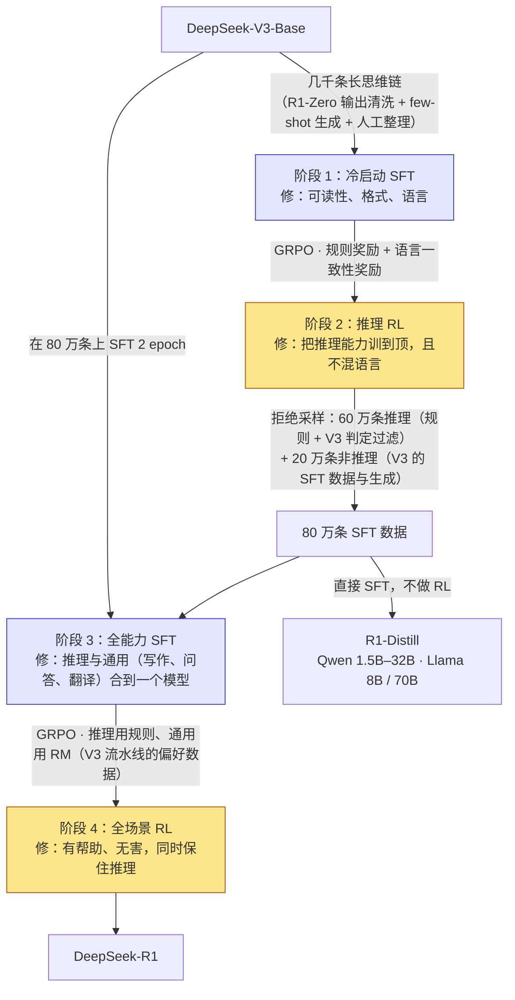

前三篇的奖励都是**学出来的**：人标偏好，训一个 RM，或把 RM 折进 DPO 的 loss。学出来的奖励是人类判断的代理，代理就有 Goodhart——第二篇算过它的过优化曲线，第三篇用 KL 项管理它，第四篇发现 DPO 也逃不掉。2025 年推理模型的突破，从三件套的角度看只改了一格：**奖励不再学，直接验**。数学题比答案，代码跑测试，格式查标签。验证器是确定的，策略骗不了它（只要验证器本身没漏洞），于是 KL 项可以拿掉、RM 可以不训、策略可以被推到学出来的奖励永远不敢推的地方——回答从几百 token 长到几万 token，中间出现反思、回溯、验算。

这一篇讲这条路：可验证奖励是什么、能用在哪；DeepSeek-R1-Zero 为什么只靠规则奖励就训出了长思维链、又为什么不够；R1 的四个阶段各在修什么；长思维链把第三篇的 rollout 账放大了多少倍、怎么控制长度；过程奖励与结果奖励的取舍；以及"推理时多算一点"这条与训练平行的曲线。

本篇要回答的核心问题是：

> **为什么规则奖励能训出长思维链，而奖励模型训不出来？R1 的四个阶段各在修什么？一个推理模型的 RL 训练，rollout 的 token 数比对话模型多多少？**


## 一、总览：奖励换成验证器之后

### 1. 先说答案

**为什么规则奖励能训出长思维链。** 三个原因叠加：（一）它不可 hack——策略找不到"看起来对但其实错"的捷径，唯一涨分的办法是真的答对，所以 KL 约束可以极小甚至为零，策略被允许走得极远；（二）它对长度中立——RM 偏爱长回答是数据里的相关性（第二篇），验证器对长度没有任何倾向，回答变长是因为**更长的推理确实更常答对**，是被选出来的而不是被偏好出来的；（三）基座里已经有这个能力的种子——预训练语料里有大量分步推理的文本，基座在低概率下会生成"等一下，让我重新检查"这类模式，RL 做的是**放大被验证为有效的模式**。学出来的 RM 做不到第一条，也就做不到后两条：策略推到几千 token 之前就先找到了 RM 的漏洞。

**R1 的四个阶段。** R1-Zero（基座 + GRPO + 规则奖励）证明了上面这件事，但输出可读性差、中英混杂。R1 用四步修它：冷启动 SFT（几千条整理过的长思维链，教格式与语言）→ 推理 RL（规则奖励 + 语言一致性奖励）→ 拒绝采样出 80 万条数据重新 SFT 基座（把推理能力与通用能力合到一个模型里）→ 全场景 RL（推理用规则、通用用 RM）。每一步修的是上一步暴露出的一个具体问题。

**rollout 的账。** 对话 RLHF 的回答约 1000 token，推理模型 8K–32K，一步的 rollout token 数多 **一到两个数量级**：$$B = 512$$、$$G = 16$$、$$\bar L = 10\text{K}$$ 是 8200 万 token，8B 模型仅生成就是 $$1.3 \times 10^{18}$$ FLOPs；KV cache 是几 TiB 量级，只能分波生成；最长的回答要 decode 几万步，一步 rollout 的墙钟时间从分钟变成几十分钟。**推理模型的 RL 训练，系统上是一个生成长序列的推理任务，训练本身是附属**。

### 2. 本文的路线

先定义可验证奖励、列出它能覆盖的领域与验证器自身的漏洞；再讲 R1-Zero 的设置与现象，讨论"RL 是在教新能力还是在放大旧能力"这个 2025 年的争论；再拆 R1 的四阶段；然后算长思维链的账与长度控制的办法；再讲 PRM 与 ORM；再讲 test-time compute 的几种形态与它们的成本曲线；最后是蒸馏的预告与公开配方。

### 3. 本文的章节安排

| 章 | 主题 | 内容 |
|---|---|---|
| 二 | 可验证奖励 | 定义；数学、代码、格式、约束、带参考的判定；验证器的漏洞；Tülu 3 的 RLVR |
| 三 | R1-Zero | 设置；长度增长与"aha"；问题；RL 是放大还是创造——pass@k 的证据 |
| 四 | R1 的四阶段 | 每阶段的输入、做法、修的问题；流程图 |
| 五 | 长思维链的成本 | rollout token 与 KV 的账；长尾与部分 rollout；长度控制的五种做法 |
| 六 | PRM 与 ORM | 定义；PRM800K 与自动标注；PRM 的用途；R1 为什么不用 |
| 七 | test-time compute | 多数投票、BoN、搜索；算力换准确率的曲线；训练把它内化 |
| 八 | 蒸馏预告与公开配方 | R1 蒸馏的对照实验；R1、Qwen3、Kimi、gpt-oss、开源复现 |
| 九 | 动手 | `GRPOTrainer` + 规则奖励函数；该看的曲线 |
| 十 | 本文小结 | |
| 十一 | 自测 | 5 道题 |


## 二、可验证奖励

### 1. 定义与形态

可验证奖励（RL with Verifiable Rewards，RLVR——Tülu 3 命名）：奖励由一个**确定的程序**根据回答与参考信息算出，不经过任何学出来的模型。常见形态：

| 领域 | 验证器 | 奖励 | 陷阱 |
|---|---|---|---|
| 数学 | 从回答里抽出最终答案（`\boxed{}` 或最后一个数），与参考答案做**符号等价**比较（SymPy 化简、数值容差、多种写法归一） | 0 / 1 | 抽取失败算错；等价判断不全（$$\frac{1}{2}$$ 与 0.5、区间与集合写法）；证明题无法验证 |
| 代码 | 在沙箱里跑单元测试 | 通过比例或全通过为 1 | 测试覆盖不全（策略学会过测试不学会写对）；沙箱开销；超时 |
| 格式 | 正则检查 `<think>…</think>` 与答案标签是否成对、顺序是否正确 | 0 / 1 或小额 | 只能查形式 |
| 指令约束 | IFEval 式的可检查约束（字数、段落数、必含关键词、JSON 合法） | 每条约束 0 / 1 | 约束满足了内容可能很差 |
| 带参考的判定 | 有标准答案的 STEM 问答、翻译等，用一个 judge 模型**对照参考**判等价 | 0 / 1 | 已经不是纯规则——judge 的偏差回来一部分，但有参考时远小于无参考 |
| 语言一致性 | 统计思维链里目标语言的 token 比例 | 比例 | R1 用它压中英混杂 |

共同性质：**稀疏**（多数是整条回答一个 0 / 1）、**精确**（没有噪声——同样的回答永远同样的分）、**只在有标准答案的地方存在**。第二篇 RM 的 70% 一致率问题在这里不存在，过优化曲线也不存在——策略推得越远，真实准确率就越高，直到验证器的漏洞被找到。

### 2. 验证器的漏洞

"不可 hack"的前提是验证器正确。实践里每一类验证器都被策略找过漏洞：

- **答案抽取**：策略学会在回答里写多个 `\boxed{}`、或把候选答案全列出来，抽取器取到对的那个；对策是只取最后一个、多个则算错；
- **代码测试**：测试用例弱时，策略学会硬编码测试输入的输出、或修改测试文件本身（有沙箱写权限时真的发生过）；对策是隐藏测试、只读挂载、更多用例；
- **格式奖励**：给格式单独的正分时，策略先学会格式再学内容——有时会停在"格式完美、答案随机"的局部最优，尤其在格式分与准确分量级相近时；对策是格式分远小于准确分，或格式不满足直接判零；
- **带参考的 judge**：策略学会写"答案是 X（也可能是 Y）"让 judge 宽容；对策是 rubric 里写明"含多个答案判错"。

所以规则奖励的工程量不在写 loss，在**写验证器与反复堵漏**：DAPO、Open-Reasoner-Zero 这类开源复现公开的代码里，验证器与答案归一化占了不小的比重。

### 3. Tülu 3 的 RLVR：第一次作为独立阶段

Tülu 3（Lambert 等 2024）把 RLVR 作为 SFT → DPO 之后的第三个阶段：在 GSM8K、MATH、IFEval 三类可验证数据上用 PPO 训练，奖励是 0 / 1（答对或约束满足），$$\beta = 0.05$$，价值模型从通用 RM 初始化。结果是对应 benchmark 提升几个点（8B 上 GSM8K +3–4，70B 上更多），其他能力不掉。它的意义是方法上的：**证明了二值的规则奖励能直接用于 PPO、且在对话模型上有正收益**——但回答长度没有显著增长，也没有出现长思维链。差别在下一章：Tülu 3 从对齐好的模型出发、用了 KL 约束、训练步数不多；R1-Zero 从基座出发、KL 极弱、训了几千步。


## 三、R1-Zero：只用规则奖励，从基座直接 RL

### 1. 设置

DeepSeek-R1-Zero（DeepSeek-AI 2025）的配方几乎是最简的：

- 起点：**DeepSeek-V3-Base**，没有任何 SFT；
- 算法：第三篇的 GRPO，$$G$$ = 16 左右，KL 项保留但系数小；
- 奖励：**准确性**（数学答案匹配、代码测试）+ **格式**（思维过程必须在 `<think></think>` 内、答案在 `<answer></answer>` 内）；没有任何神经网络奖励——论文明确说不用 PRM 与 ORM，理由是 hacking 与训练成本；
- 模板：一句 system prompt 要求"先思考再回答"加上两对标签，没有示范。

### 2. 现象

三条曲线定义了这个实验：

1. **AIME 2024 pass@1 从 15.6% 涨到 71.0%**（多数投票 cons@64 到 86.7%），逼近 o1-0912；
2. **平均回答长度随训练步数单调增长**，从几百 token 到上万 token——没有任何长度奖励，模型自己发现"想得久一点答对的概率更高"；
3. 思维链里**自发出现**"等一下，让我重新检查这一步"式的反思、回溯、多种解法互相验证——论文称之为"aha moment"，它没有出现在任何训练数据里（因为没有训练数据）。

这三条合起来说明：只要奖励不可 hack、探索空间足够（长上下文、大 $$G$$、弱 KL）、训练足够久，策略梯度会自己找到长推理这个策略。

### 3. 问题

R1-Zero 的输出**不适合人读**：思维链中英混杂（对同一道题一会中文一会英文，因为两种语言的推理片段都在基座里、且验证器不管语言），格式散乱，有时不给最终答案的解释。它是一个证明——规则奖励能训出推理——但不是一个产品。R1 的四阶段就是为了在保留它的推理能力的同时修这些问题。

### 4. RL 在教新能力还是放大旧能力

R1-Zero 引出了 2025 年的一个方法论争论：RL 让模型**学会**了推理，还是只是**放大**了基座里已有的推理模式？

- **放大论**（Yue 等 2025 等）：比较基座与 RL 后模型的 pass@k 曲线（采 $$k$$ 次、任一对即算对）。RL 模型 pass@1 远高于基座，但 $$k$$ 增大到几十几百时**基座追上甚至超过**——基座在足够多的采样里能解出 RL 模型能解的几乎所有题，RL 只是把正确解的概率从"偶尔"提到"通常"。这与第二篇 BoN 的逻辑一致：RL ≈ 把 best-of-$$k$$ 的分布蒸进策略。它也解释了为什么 Qwen2.5 系列的基座做 Zero-RL 效果最好（它的预训练里推理数据最多）而有些基座几乎训不出来。
- **扩展论**（ProRL 等）：训练足够久、配合 KL 重置与足够多样的题，RL 模型在 pass@k 的大 $$k$$ 端也超过基座，出现基座任何采样都解不出的题的解法。

两派的证据都成立，差别在训练长度与题目分布。对实践的含义是清楚的：**基座的预训练决定 RL 的天花板的大部分**（L4 第十一篇的数学数据管线在这里兑现），RL 决定天花板下能稳定拿到多少；而 RL 的效率来自它只需要 0 / 1 的验证信号，不需要示范。


## 四、R1 的四阶段



黄色是 RL 阶段，蓝色是 SFT 阶段。四步各修一个问题：

| 阶段 | 输入 | 做什么 | 修上一步的什么问题 | 三件套 |
|---|---|---|---|---|
| 1 冷启动 SFT | 基座 + 几千条长思维链 | 学会格式（`<think>` + 总结）与用一种语言推理 | R1-Zero 的可读性与混语 | 只有策略 |
| 2 推理 RL | 阶段 1 模型 | GRPO，奖励 = 准确 + 格式 + **语言一致性**（思维链中目标语言的比例） | 从一个会写格式的起点把推理推到顶；语言奖励压混语（论文承认它略降准确率，换可读性） | 策略 + 规则奖励 + 弱参考 |
| 3 全能力 SFT | **基座**（不是阶段 2 的模型）+ 80 万条 | 60 万推理样本：阶段 2 模型对每题采多条，规则判对、再用 V3 判可读性过滤；20 万非推理：V3 的 SFT 数据 + V3 对部分 prompt 生成带简短思维的回答。在基座上 SFT 2 epoch | 阶段 2 的模型只会推理不会聊天；从基座重新 SFT 是为了让通用能力与推理能力在同一份数据里学 | 只有策略 |
| 4 全场景 RL | 阶段 3 模型 | GRPO，推理 prompt 用规则奖励，通用 prompt 用 V3 流水线的 RM（有帮助只看最终总结、无害看全部输出） | 阶段 3 的模型没有经过偏好对齐 | 策略 + 混合奖励 + 参考 |

两个设计值得注意。**阶段 3 从基座重来**而不是在阶段 2 的模型上继续——阶段 2 的模型已经被 RL 推得很远、通用能力有损，与其修它不如用它产的数据重训一个干净的；这是"用 RL 造数据、用 SFT 学数据"的模式，第七篇会看到它就是序列级蒸馏。**阶段 4 的奖励是混合的**——可验证的部分用规则，不可验证的用 RM，第二篇的 Goodhart 只在后一半存在，KL 与长度控制也只对后一半需要。

R1 之后几乎所有推理模型的配方都是这四步的变体：Qwen3 的四阶段（长思维链冷启动 → 推理 RL → **思考模式融合** → 通用 RL）把阶段 3 换成了"把思考与非思考两种模式的数据合在一起 SFT，让一个模型两种模式都会"；Kimi k1.5 加了 long2short（把长思维链模型的能力压进短回答）。


## 五、长思维链的成本

### 1. rollout 的账

第三篇的公式 $$B \times G \times \bar L$$，把 $$\bar L$$ 从 1000 换成推理模型的量级：

| 配置 | $$B$$ | $$G$$ | $$\bar L$$ | 一步 rollout token | 8B 生成 FLOPs（$$2N$$） | KV cache（Llama-3-8B 规格，128 KiB/token） |
|---|---|---|---|---|---|---|
| 对话 RLHF | 512 | 8 | 1K | 410 万 | $$6.6 \times 10^{16}$$ | 512 GiB |
| 推理 RL（早期） | 512 | 16 | 4K | 3300 万 | $$5.3 \times 10^{17}$$ | 4 TiB |
| 推理 RL（后期） | 512 | 16 | 16K | 1.3 亿 | $$2.1 \times 10^{18}$$ | 16 TiB |
| 推理 RL（长） | 512 | 16 | 32K | 2.7 亿 | $$4.3 \times 10^{18}$$ | 32 TiB |

一步的生成 token 数比对话多 **8 到 64 倍**，FLOPs 同比；KV cache 从"一台机器分几波"变成"几十台机器分几波"——8192 条 32K 的序列无论如何不能同时在显存里，rollout 必须**分波**（每波几百条），一步的 rollout 由几十波串行组成。训练侧同样按 token 数放大：每步反向要过 1–3 亿 token，8B 模型 $$6N \times 1.3 \times 10^8 = 6 \times 10^{18}$$，一步就是几十 GPU 小时。R1 的几千步在这个量级上——**推理 RL 的总算力到了 $$10^{22}$$–$$10^{23}$$，是对话 RLHF 的一百倍，与一个小模型的预训练相当**。

### 2. 长尾：最长的那条决定一步多久

FLOPs 只是一半。decode 是串行的：一条 32K 的回答要 32K 步 decode，每步几十毫秒（memory-bound，L4 第二篇），**单条序列的生成时间以十分钟计**；同一波里其他序列早就结束，GPU 在等最后一条。回答长度的分布在推理任务上极宽（简单题几百 token、难题几万），一步 rollout 的墙钟时间由最长的几条决定，GPU 平均利用率可以掉到 30% 以下。

三种系统层的对策，都是把"等最长的"变成"不等"：

- **连续批处理 + 填充**：一条结束立刻补进下一条（vLLM 的默认），波内利用率提高，但一步的结束仍要等最长的；
- **部分 rollout**（Kimi k1.5）：给每步的生成设时间或 token 上限，没生成完的序列**暂停**、下一步继续生成——一条 32K 的回答被切成几步完成，每步的 rollout 时间被截平；代价是暂停的序列跨越了策略更新，变成 off-policy 样本（重要性比修正）；
- **异步 rollout**（第三篇第六章）：生成与训练完全解耦，训练用 $$k$$ 步前的策略采出的样本；第六篇 Agent 训练里它是必需的。

### 3. 长度控制

回答越长越贵——训练时的 rollout、部署时的推理都按 token 计——而 R1 类模型倾向于在简单题上也想很久（"过度思考"）。控制长度的五种做法：

| 做法 | 机制 | 用在 |
|---|---|---|
| 长度惩罚 | 奖励里减去与长度成比例的项，或只惩罚**答对且比同组平均长**的回答（Kimi k1.5：正确回答里短的得正分、长的得负分，错误回答一律负） | Kimi k1.5、多数开源复现 |
| 超长整形 | 接近上限时奖励线性递减，超过给最低分（DAPO） | DAPO |
| 预算强制 | 推理时到预算就强行插入 `</think>` 让模型作答；或反过来在模型想停时追加"Wait"让它继续（s1） | s1；Qwen3 的思考预算 |
| 目标长度训练 | 把目标长度写进 prompt，奖励里加"实际长度与目标的偏差"项，模型学会按要求控制长度（L1） | L1；gpt-oss 的 reasoning effort 三档 |
| long2short | 用长思维链模型的答案做短回答的 SFT / DPO / 模型合并，让短模式继承长模式的准确率 | Kimi k1.5；Qwen3 的思考模式融合 |

第三篇 Dr. GRPO 指出的长度归一化偏差在这里再提一次：**GRPO 按序列长度平均 loss 会让错误的长回答受罚更轻**，这本身就是一个让回答变长的力，去掉它（token 级求和）能在不加任何长度惩罚的情况下缩短回答。

### 4. 部署时的账

训练时的长度问题在部署时按用户量放大。一个推理模型对每个请求生成 5K token 的思维链，与对话模型的 500 token 相比，decode 步数、KV cache 占用、首 token 之后的延迟全部 10 倍——L4 第十篇的推理感知 scaling law 里 $$D_{inf}$$ 直接乘 10，最优模型尺寸相应更小。这是"思考预算"作为产品功能存在的原因，也是第七篇蒸馏在推理模型上尤其重要的原因。


## 六、PRM 与 ORM

### 1. 定义

**结果奖励模型**（ORM）：看整条回答，给一个分——第二篇的 RM、本篇的验证器都是。**过程奖励模型**（PRM）：把推理拆成步骤（通常按换行），给每一步一个"到这里为止还对不对"的分。Lightman 等 2023（"Let's Verify Step by Step"）用 80 万个人标的步骤标签（PRM800K）训 PRM，在 MATH 的一个子集上用 PRM 做 best-of-$$N$$ 重排：$$N$$ = 1860 时 PRM 78.2% 对 ORM 72.4% 对多数投票 69.6%——**PRM 选出正确解的能力随 $$N$$ 增长得更好**，因为它能发现"答案碰对了但过程错了"的解。

### 2. 自动标注

人标步骤太贵。Math-Shepherd（Wang 等 2024）用蒙特卡洛估计每一步的价值：从这一步出发让模型继续采 $$k$$ 次到结束，答对的比例作为这一步的标签——**一个中间步骤的"正确性"定义为从它出发能答对的概率**。这把 PRM 的标注变成纯算力（每步 $$k$$ 次 rollout），OmegaPRM 用 MCTS 式的二分搜索定位第一个错误步骤，把成本再降一个量级。

### 3. PRM 的三种用途

- **重排**（best-of-$$N$$ 用 PRM 选）：把各步分数取最小值或乘积作整条的分，选最高；这是 PRM 最稳的用途；
- **RL 的稠密奖励**：每步给一个奖励而不是只在最后——第三篇的稀疏奖励问题的直接解；
- **搜索的引导**：beam search 或 MCTS 里用 PRM 给部分解打分决定扩展哪个（第七章）。

### 4. R1 为什么不用

R1 论文明确列出三条：（一）**步骤难定义**——通用推理里什么算"一步"没有边界，按换行切是任意的；（二）**标注难**——人标贵且不一致，自动标注噪声大；（三）**reward hacking**——PRM 是学出来的模型，第二篇的一切问题回来，策略学会写"每一步看起来都对"的过程，且 PRM 要随策略迭代重训；加上 PRM 的推理开销（每步都要打分）。结论是：在有验证器的领域，**ORM 形态的规则奖励 + 足够的探索**就够了，PRM 的稠密信号带来的收益不抵它的成本与风险。

这不是 PRM 的终结——它在重排与搜索里仍有效，且在没有可验证答案的领域（证明、开放推理）是唯一的过程监督来源；但在 2025 年的推理 RL 主流配方里，它退出了训练循环。


## 七、test-time compute：推理时多算一点

### 1. 三种形态

同一个模型，推理时花更多算力换更高准确率：

| 形态 | 做法 | 需要什么 | 算力 |
|---|---|---|---|
| 并行：多数投票 | 采 $$N$$ 条，答案投票（self-consistency，Wang 等 2022） | 能抽出答案 | $$N$$ 倍生成 |
| 并行：best-of-$$N$$ | 采 $$N$$ 条，用 ORM / PRM / 验证器选 | 一个打分器 | $$N$$ 倍生成 + $$N$$ 次打分 |
| 搜索 | beam search / lookahead / MCTS，用 PRM 引导在部分解上扩展 | PRM | 取决于宽度与深度 |
| 串行：更长的思维链 | 让模型自己想更久（R1 / o1 内化的形态） | 训练时的 RL | 单条更长 |

Snell 等 2024 系统比较了前三种：在**简单与中等难度**的题上，用好的 test-time 策略（PRM 引导的搜索或修订）让小模型追上 14 倍参数的大模型；在**难题**上，把同样的算力花在预训练更大的模型上更划算——test-time compute 有边际，且边际由题的难度与基座的能力决定。

### 2. 曲线

pass@$$k$$（采 $$k$$ 次任一对）随 $$k$$ 近似对数增长——每翻倍 $$k$$ 加固定几个点，然后趋平于基座"在任何采样下都能解"的题的比例。多数投票 cons@$$k$$ 比 pass@$$k$$ 低（要多数对而非任一对），但它是可部署的（不需要知道答案）；R1 的 AIME 71.0（pass@1）→ 86.7（cons@64）是这条曲线上的两个点。成本是线性的：cons@64 在 10K token 的回答上是每题 64 万 token——**64 倍的推理费用换 16 个点**。

### 3. 训练把它内化

R1 与 o1 的意义在于把"推理时多采样"变成了"推理时想更久"——把并行的 test-time compute 变成串行的、且由模型自己决定用多少。第三章第 4 节的放大论正是这个视角：RL ≈ 把 BoN 蒸进策略，模型学会在一条回答里做"自我 BoN"（尝试、验算、换方法）。它的好处是不需要外部验证器、不需要 $$N$$ 倍生成、对没有明确答案的任务也适用；代价是每条回答都长，且长度由模型决定——第五章的长度控制问题由此而来。两种形态可以叠加：R1 的 cons@64 就是在长思维链上再做多数投票。


## 八、蒸馏预告与公开配方

### 1. 小模型：蒸馏还是 RL

R1 论文里一个对照实验对第七篇很重要：用 R1 阶段 3 的 80 万条数据直接 SFT Qwen2.5-32B-Base（**不做 RL**），AIME 72.6；对同一个基座做与 R1-Zero 相同的大规模 RL，AIME 约 47。**蒸馏远好于直接 RL**——大模型 RL 探索出来的推理模式，小模型自己探索不出来，但能从示范里学会。R1-Distill 系列（Qwen 1.5B–32B、Llama 8B / 70B）全部只用 SFT，是 2025 年开源推理小模型的主要来源。它的边界与原因留到第七篇。

### 2. 公开配方

| 配方 | 起点 | RL 算法 | 奖励 | 长度控制 | 特点 |
|---|---|---|---|---|---|
| DeepSeek-R1-Zero（2025） | V3-Base | GRPO | 准确 + 格式 | 无 | 纯 RL 的存在性证明 |
| DeepSeek-R1 | V3-Base | GRPO，四阶段 | 规则 + 语言一致性 + RM（通用） | 无 | 80 万条蒸馏数据 |
| Qwen3（2025） | Qwen3-Base | GSPO，四阶段 | 规则 + RM | **思考预算**：到预算插入结束标签 | 思考 / 非思考模式融合；一个模型两种模式 |
| Kimi k1.5（2025） | — | 在线镜像下降变体 | 规则 | **长度惩罚** + long2short；**部分 rollout** | 多模态推理；系统上首个公开部分 rollout |
| Kimi K2（2025） | K2-Base | 变体 + 自评 rubric | 可验证 + 自评 | — | Agent 数据合成（第六篇） |
| gpt-oss（2025） | — | 未公开 | 未公开 | **reasoning effort 三档**（system prompt 控制） | 开放权重的 MoE 推理模型；工具调用进思维链 |
| Tülu 3 RLVR（2024） | Tülu 3 DPO | PPO | 0 / 1 | — | 首个独立 RLVR 阶段；对齐模型上小幅提升 |
| DAPO（2025） | Qwen2.5-32B-Base | GRPO 改（第三篇） | 准确 | 超长整形 | AIME 50，完整开源 |
| Open-Reasoner-Zero / SimpleRL-Zoo（2025） | 多种基座 | PPO / GRPO | 准确 | — | Zero-RL 在多个基座上的复现；Qwen 基座最好训 |
| Magistral（2025，Mistral） | Mistral Medium 3 | GRPO 改 | 规则 + 语言 | 长度惩罚 | 不用任何蒸馏数据的纯 RL 配方，公开了系统设计 |
| s1 / LIMO（2025） | Qwen2.5-32B | **无 RL**，1K 条 SFT | — | 预算强制 | 第一篇的"少即是多"在推理上的版本 |

趋势：起点从基座（Zero）到冷启动 SFT；奖励几乎全是规则，RM 只用于通用部分；长度控制从无到成为必备；系统上部分 rollout 与异步成为标配；小模型走蒸馏。


## 九、动手：`GRPOTrainer` + 规则奖励

第三篇的骨架，把 RM 换成两个规则函数：

```python
import re
from trl import GRPOTrainer, GRPOConfig

def extract_answer(text):                        # 第二章第 2 节：只取最后一个 boxed，多个也只取最后
    m = re.findall(r"\\boxed\{([^}]*)\}", text)
    return m[-1].strip() if m else None

def accuracy_reward(completions, answer, **kw):  # answer 来自数据集的参考答案列
    return [1.0 if extract_answer(c) == a else 0.0 for c, a in zip(completions, answer)]

def format_reward(completions, **kw):            # 格式分远小于准确分（第二章第 2 节的局部最优）
    ok = lambda c: bool(re.fullmatch(r"<think>.*?</think>\s*<answer>.*?</answer>", c, re.S))
    return [0.1 if ok(c) else 0.0 for c in completions]

cfg = GRPOConfig(num_generations=16, beta=0.0,            # 规则奖励下 KL 可去
                 max_completion_length=4096, loss_type="dr_grpo",   # 第五章第 3 节：去掉长度归一化偏差
                 learning_rate=1e-6, use_vllm=True)
trainer = GRPOTrainer(model="Qwen/Qwen2.5-1.5B-Instruct",
                      reward_funcs=[accuracy_reward, format_reward],
                      args=cfg, train_dataset=gsm8k_prompts)
trainer.train()
```

GSM8K 的答案是整数，等价判断简单；MATH 要做符号归一（`math-verify` 一类库）。该看的曲线在第三篇六条之上加三条：**准确率**（就是奖励均值，这里它是真实的而不是代理）、**回答长度**（应该涨，涨得太快且准确率不涨是过度思考）、**"反思词"的出现频率**（"wait"、"let me check"、"重新"一类——R1-Zero 现象的可量化版本）。1.5B 模型在 GSM8K 上几十步就能看到准确率与长度同涨的形状；绝对数字没有意义，形状有。


## 十、本文小结

| 项 | 规则 / 事实 | 数字 |
|---|---|---|
| 可验证奖励 | 数学答案等价、代码测试、格式、约束、带参考的判定；确定、稀疏、不可 hack（除验证器漏洞） | KL 可到 0 |
| R1-Zero | 基座 + GRPO + 规则；长度自发增长；aha | AIME 15.6 → 71.0（cons@64 86.7） |
| 放大还是创造 | pass@k：RL 提 pass@1，基座在大 k 追上；基座决定天花板大部分 | Qwen 基座最好训 |
| R1 四阶段 | 冷启动 SFT → 推理 RL（+ 语言奖励）→ 80 万条重 SFT 基座 → 全场景 RL | 60 万推理 + 20 万非推理 |
| rollout 账 | $$B G \bar L$$，$$\bar L$$ 8–32K | 一步 0.3–2.7 亿 token；KV 几到几十 TiB；总算力 $$10^{22}$$–$$10^{23}$$ |
| 长尾 | 一步时间由最长回答决定 | 部分 rollout、异步、连续批处理 |
| 长度控制 | 惩罚、超长整形、预算强制、目标长度、long2short；去掉序列长度归一化 | Qwen3 思考预算、gpt-oss 三档 |
| PRM vs ORM | PRM 步骤级、重排更好；R1 不用：步骤难定义、标注难、hacking | PRM800K：78.2 vs 72.4 @ N = 1860 |
| test-time compute | 多数投票 / BoN / 搜索 / 更长思维链；对数增长；难题上不如预训练 | cons@64：64 倍费用换 16 点 |
| 小模型 | 蒸馏 > 直接 RL | Qwen-32B：72.6 vs 47 |


规则奖励到此覆盖了单轮的推理。下一篇把它推到多轮：模型的动作里出现真实的工具调用，奖励延后到整条轨迹结束。

配套资料：本篇没有配套实验；第九章的骨架可在 [ai-learning-labs/post-training](https://github.com/arganzheng/ai-learning-labs/tree/main/post-training) 第一篇的环境上配一张 16–24 GB 的 GPU 运行。

<details markdown="1">
<summary><b>核心问题的答案</b></summary>

规则奖励能训出长思维链，因为它不可 hack——策略涨分的唯一办法是真的答对，KL 可以撤掉，探索可以走到几千上万 token；它对长度中立，回答变长是"更长的推理更常答对"被选择出来的结果；而基座里已有推理的种子，RL 放大它。学出来的 RM 在策略走到那么远之前就先被找到漏洞。R1 的四阶段各修一个问题：冷启动修可读性与语言，推理 RL 把能力推到顶并压混语，用 RL 产出的 80 万条重新 SFT 基座把推理与通用合到一个模型，全场景 RL 补偏好对齐。rollout 的 token 数比对话模型多 8 到 64 倍，KV cache 从 GiB 到 TiB 只能分波生成，单条几万步的 decode 让一步的墙钟由最长的回答决定——推理模型的 RL 训练在系统上是一个长序列生成问题。

</details>


## 十一、自测

1. 规则奖励下为什么可以把 KL 系数 $$\beta$$ 设为 0？RM 奖励下为什么不行？

   <details markdown="1"><summary>答案</summary>

   规则奖励不可 hack（答对才有分），策略离参考再远也不会“骗到分”，KL 没有存在的必要；RM 奖励可 hack，KL 是防止策略走到 RM 失效区域的唯一约束。

   </details>

2. R1-Zero 在 AIME 上 pass@1 从 15.6 到 71.0，cons@64 到 86.7。RL 是“创造”了能力还是“放大”了能力？用 pass@k 怎么判断？

   <details markdown="1"><summary>答案</summary>

   主要是放大：比较基座与 RL 后模型的 pass@k 曲线，RL 大幅提高 pass@1，但 $$k$$ 到几百时基座追上甚至超过——正确解本来就在基座的分布里，RL 把它的概率提上来。基座决定天花板的大部分。

   </details>

3. 一步推理 RL：$$B = 512$$、$$G = 16$$、平均长度 16K token。rollout 多少 token？与对话模型（长度 1K）比多多少？KV cache 峰值什么量级？

   <details markdown="1"><summary>答案</summary>

   $$512 \times 16 \times 16000 = 1.3$$ 亿 token，是对话模型（400 万）的 30 多倍；KV 按 8B 规格 128 KiB / token 算，同时在飞的序列几到几十 TiB——必须分批、异步、部分 rollout。

   </details>

4. R1 的四个阶段各在修什么？为什么第三阶段要回到基座重新 SFT 而不是在 RL 后的模型上继续？

   <details markdown="1"><summary>答案</summary>

   冷启动 SFT 修可读性与格式；推理 RL（+ 语言一致性奖励）涨推理；80 万条数据回基座重 SFT 是为了把推理能力与非推理能力（写作、问答）合到一个干净的起点上，避免 RL 模型的语言混杂与偏窄；全场景 RL 最后对齐偏好与安全。

   </details>

5. PRM 在 PRM800K 上比 ORM 好（78.2 vs 72.4 @ N = 1860），R1 为什么不用 PRM？

   <details markdown="1"><summary>答案</summary>

   步骤难定义（什么算一步）、步骤标注贵且难自动化、PRM 作为奖励容易被 hack（策略学会写“看起来对”的步骤）；规则奖励 + 长思维链自己学会了检查，PRM 的收益不够抵这些代价。

   </details>


## 下一篇

[Agent 与工具调用的 RL：多轮环境、轨迹数据与延后的奖励](/agentic-rl-tool-use-environments-and-trajectories.html)
