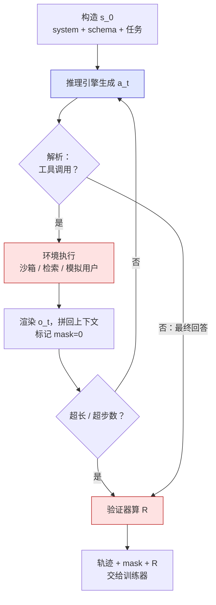

第五篇的模型一次生成到底：读 prompt，想几千 token，给答案，验证器打分。真实的任务不长这样。修一个 GitHub issue 要读文件、改代码、跑测试、看报错、再改；回答一个需要查资料的问题要搜索、读结果、再搜索；操作一个系统要发命令、看输出、决定下一步。模型的一段输出之后是**环境的**输出，模型再基于它继续——几轮到几十轮之后，任务才有结果，奖励才能算。

这一篇把第五篇的可验证奖励从单轮推到多轮。从三件套看，奖励与参考没有变（还是验证器、还是弱 KL），变的是**策略与环境交互的形态**：一条轨迹里有模型生成的 token，也有环境返回的 token，前者要算梯度、后者绝不能算；奖励延后到轨迹末尾，几十轮的动作要共享一个分；rollout 不再是一个推理引擎的批量生成，而是几千个沙箱各自运行、耗时从几秒到几十分钟不等的过程。差别可以精确地定位在**一行公式、一处 mask、一段系统**上。

本篇要回答的核心问题是：

> **多轮工具调用的 RL 与单轮 RLVR 差在哪一行公式、哪一处 mask、哪一段系统？[^q0] 为什么 Agent 训练的瓶颈常常不是模型而是环境？[^q1]**

## 一、总览：从单步 bandit 到多步 MDP

### 1. 先说答案

第三篇把 LLM 的 RL 当作"只有最后一步有奖励的单步 bandit"：一个 prompt、一条回答、一个分。Agent RL 是一个真正的多步 MDP：

| | 单轮 RLVR（第五篇） | 多轮 Agent RL |
|---|---|---|
| 状态 | prompt | prompt + 到目前为止的全部对话（含所有工具输出） |
| 动作 | 整条回答 | 一段生成（思考 + 工具调用，或最终回答） |
| 转移 | 无 | 环境执行工具，把结果拼回上下文 |
| 一条轨迹 | 1 段生成 | $$T$$ 段生成 + $$T - 1$$ 段环境输出，$$T$$ 从几到几十 |
| 奖励 | 回答末尾 | 轨迹末尾（偶有中间惩罚） |
| loss 算在哪 | 回答的全部 token | **只算模型生成的 token**，环境输出与用户轮次 mask 掉 |
| rollout | 推理引擎批量生成 | 推理引擎 + 环境交替；每条轨迹的耗时由环境决定 |

Table: 单轮 RLVR 与多轮 Agent RL 的对比

三处差别：**公式**——策略的对数概率是 $$T$$ 段生成的对数概率之和，优势仍是轨迹级的一个数（GRPO 的组内归一化不变）；**mask**——第一篇 loss mask 的多轮版本，环境输出在上下文里但不在策略的输出里；**系统**——rollout 里出现了几千个并发的沙箱，每一步有 IO 与执行延迟，轨迹长度与耗时的方差比长思维链更大，**异步 rollout 从优化变成必需**。

瓶颈在环境的原因是一笔账：一条代码修复轨迹要起一个 Docker、跑一次测试套件（几十秒到几分钟）、重复十几轮；模型这一侧每轮的生成只要几秒。SWE-bench 规模的一步 rollout（500 个任务 × $$G$$ = 8 × 20 轮）是几万次测试运行，**环境的 CPU 小时与模型的 GPU 小时同量级甚至更多**。

### 2. 本文的路线

先把多轮设定写成 MDP，看它与单轮差在哪；再讲工具调用的格式——它要先靠 SFT 学会；再讲环境与轨迹数据从哪来、为什么比对话数据难得多；再讲奖励的设计与它在多轮上的新漏洞；然后是训练目标——GRPO 在轨迹上的写法、mask、信用分配、上下文增长的账；再讲系统与成本——为什么要异步、环境的账怎么算；最后是公开配方与评测预告。

### 3. 本文的章节安排

| 章 | 主题 | 内容 |
|---|---|---|
| 二 | 问题设定 | MDP 的四要素；一条轨迹长什么样；与单轮的三处差别 |
| 三 | 工具调用的格式 | schema、模板里的 tool 角色、并行调用、ReAct 与交错思考；格式错误的处理；为什么先 SFT |
| 四 | 环境与轨迹数据 | 环境的五类；轨迹的三种来源；Kimi K2 的合成流水线；为什么难 |
| 五 | 奖励 | 结果奖励的三种验证方式；部分分；惩罚项；rubric；多轮上的 hacking |
| 六 | 训练目标 | 轨迹级 GRPO；mask；信用分配（轨迹级 / turn 级）；重要性比与 KL；上下文增长的账 |
| 七 | 系统与成本 | agent loop；环境延迟与方差；异步 rollout 与 off-policy 修正；一步的环境账与 GPU 账 |
| 八 | 公开配方 | SWE-RL、Search-R1、ReTool、Kimi K2、Qwen3、gpt-oss / o3 |
| 九 | 评测预告 | τ-bench、BFCL、SWE-bench Verified、GAIA、Terminal-Bench 各测什么 |
| 十 | 动手 | 最小的多轮 rollout 与 mask |
| 十一 | 本文小结 | |
| 十二 | 自测 | 5 道题 |

Table: 本文的章节安排

## 二、问题设定

### 1. MDP

- **状态** $$s_t$$：到第 $$t$$ 轮为止的完整上下文——system prompt（含工具 schema）、用户任务、之前每一轮模型的生成与环境的返回。它单调增长，永远不"忘"（除非截断）。
- **动作** $$a_t$$：模型在第 $$t$$ 轮生成的一段 token，直到它停下——要么是一个（或几个）工具调用，要么是最终回答。一段动作内部是自回归的，第三篇的 token 级视角在段内仍成立。
- **转移**：环境解析工具调用、执行、把结果按模板渲染成 `tool` 角色的一段文本拼进上下文；如果是最终回答，episode 结束。转移是**确定的**（同样的调用得到同样的结果）或**随机的**（模拟用户、有噪声的搜索）。
- **奖励** $$R$$：episode 结束时由验证器算出（测试通过、任务状态正确、答案匹配）；中间步骤通常为零，或有小额惩罚（无效调用、超时）。

一条 $$T$$ 轮的轨迹：

```text
τ = (s_0, a_0, o_0, a_1, o_1, …, a_{T-1})              o_t 是环境对 a_t 的返回

上下文（第 t 轮开始时）：
┌────────────┬────────┬─────────┬────────┬─────────┬─────┬─────────┐
│ system+工具 │ 用户任务 │ a_0     │ o_0    │ a_1     │ …   │ o_{t-1} │
│  schema    │        │ 模型生成 │ 环境返回 │ 模型生成 │     │ 环境返回 │
└────────────┴────────┴─────────┴────────┴─────────┴─────┴─────────┘
    mask=0      mask=0   mask=1    mask=0    mask=1          mask=0
```

底行的 mask 就是第六章的全部内容：**只有 $$a_t$$ 是策略的输出**，loss 与对数概率只在它们上面算。

### 2. 策略的对数概率

单轮时 $$\log \pi_\theta(y \mid x)$$；多轮时

$$
\log \pi_\theta(\tau) = \sum_{t=0}^{T-1} \log \pi_\theta(a_t \mid s_t) = \sum_{t=0}^{T-1} \sum_{k} \log \pi_\theta(a_{t,k} \mid s_t, a_{t,<k})
$$

环境的转移概率 $$P(o_t \mid s_t, a_t)$$ 不含 $$\theta$$，在策略梯度里消失（与第三篇 log-derivative 推导里奖励 $$R$$ 不含 $$\theta$$ 同理）。所以第三篇的一切——REINFORCE、baseline、PPO 的 clip、GRPO 的组内归一化——原样成立，只要把"回答"换成"轨迹里模型生成的全部 token"。**这就是那"一行公式"**：对数概率从一段求和变成 $$T$$ 段求和，其余不变。

### 3. 三处差别的来源

差别全部来自 $$T > 1$$ 与 $$o_t$$ 的存在：$$o_t$$ 在上下文里但不是动作（mask）；$$T$$ 段动作共享一个终末奖励（信用分配）；每一轮之间要等环境（系统）。

## 三、工具调用的格式

### 1. schema 与模板

工具以函数 schema（JSON：名字、描述、参数类型）的形式写进 system prompt；模型的调用是一段结构化文本，模板把它渲染成特殊标记包裹的 JSON；环境的返回渲染成一个 `tool` 角色的轮次。Qwen 的形态：

```text
<|im_start|>system
You are a helpful assistant.
# Tools
<tools>{"type":"function","function":{"name":"python","description":"...","parameters":{...}}}</tools>
For each function call, return a json object within <tool_call></tool_call> tags...<|im_end|>
<|im_start|>user
Compute the sum of primes below 100.<|im_end|>
<|im_start|>assistant
<think>I'll write a short script.</think>
<tool_call>
{"name": "python", "arguments": {"code": "print(sum(p for p in range(2,100) if all(p%d for d in range(2,int(p**.5)+1))))"}}
</tool_call><|im_end|>
<|im_start|>user
<tool_response>
1060
</tool_response><|im_end|>
<|im_start|>assistant
The sum is 1060.<|im_end|>
```

（Qwen 把工具返回渲染在 `user` 轮次里的 `<tool_response>` 标签内；Llama 3 用独立的 `ipython` 角色与 `<|eom_id|>`——"消息结束、等工具"——区别于 `<|eot_id|>`"轮次结束"；OpenAI 与 Anthropic 的 API 用独立的 `tool` 角色。）第一篇的模板问题在这里全部放大：**schema 的渲染方式、调用标签、返回的角色、`eom` 与 `eot` 的区分，都是训练分布的一部分**，推理时的 agent 框架必须与训练时的模板逐字节一致。

### 2. 并行调用与交错思考

一轮里可以发多个调用（并行工具调用：一段 `<tool_call>` 块里几个 JSON，环境全部执行后一起返回），减少轮数；也可以在调用之间思考（交错思考，interleaved thinking：`<think>` 出现在每一轮而不只是开头，o3 与 gpt-oss 把工具调用放进思维链就是这个形态）。ReAct（Yao 等 2022）是它的 prompt 时代的原型：思考 → 行动 → 观察循环。对 RL 的含义：并行调用让 $$T$$ 变小、每段 $$a_t$$ 变长；交错思考让每段 $$a_t$$ 里有一部分是不影响环境的"内心话"，它们同样是策略的输出、同样算 loss。

### 3. 格式错误

模型会生成不合法的调用：JSON 缺括号、参数名错、调用不存在的工具、在 `<tool_call>` 外面写调用。环境要决定怎么处理——报错作为 `o_t` 返回让模型重试（常见，模型能从报错里学）、直接终止 episode 并给负奖励（严厉，早期训练可能全是这种）、或用宽松解析尽量修复（掩盖问题）。RL 早期的很大一部分梯度是在学"把格式写对"，这与第五篇 R1-Zero 的格式奖励同一性质。

### 4. 为什么先 SFT

一个从未见过工具 schema 的模型很难在正确的地方生成正确格式的调用，RL 的探索在"随机字符串"里几乎找不到合法 JSON。所以 Agent RL 的起点**通常**是一个已经会用工具的模型——靠 SFT（第一篇）在示范轨迹上学会格式、学会"什么时候该调工具"。但这是效率问题不是必要条件：Search-R1 的论文（4.3 节）在 base 与 instruct 模型上都**直接 RL**，base 模型也学会了发起搜索、最终表现接近 instruct 版；ReTool 有冷启动阶段；Kimi K2 的 Agent 能力主要来自大规模合成轨迹的 SFT，RL 在其上精调。实践上的分工是：格式尽量交给 SFT（便宜、确定），RL 负责在会格式的模型上**提高任务成功率**。

## 四、环境与轨迹数据

### 1. 环境的五类

| 类 | 例子 | 状态与验证 | 每步开销 |
|---|---|---|---|
| 代码沙箱 | SWE-bench 的每个 issue 一个 Docker 镜像；代码解释器（ReTool 的 Python） | 文件系统 + 测试结果；用隐藏测试验证 | 容器启动秒级；跑测试几十秒到几分钟 |
| 搜索 / 检索 | 本地检索器（Search-R1 用 Wikipedia 的 E5 检索）、真实搜索 API | 返回文档；用答案匹配验证 | 本地毫秒、API 秒级；真实 API 有配额与非确定性 |
| 终端 / 系统 | Terminal-Bench 的任务容器；操作系统级任务 | 命令输出；用最终状态验证 | 与代码沙箱同 |
| 浏览器 / GUI | WebArena、OSWorld | 页面 DOM 或截图；用最终状态验证 | 渲染秒级；多模态输入 |
| API 模拟器 | τ-bench 的零售 / 航空后台 + **模拟用户**（一个 LLM 扮演顾客） | 数据库状态；比较最终数据库与标准 | 模拟用户每轮一次 LLM 调用；有随机性 |

Table: Agent 环境的五类

τ-bench 这一类值得注意：环境里有**另一个 LLM**（模拟用户），它的行为有随机性，同一策略跑两次结果不同——评测要多次取平均（pass^k：$$k$$ 次全过才算过，衡量一致性），训练时奖励有噪声。

### 2. 轨迹数据的三种来源

| 来源 | 做法 | 量与成本 | 用在 |
|---|---|---|---|
| 人工示范 | 人操作环境完成任务，记录全过程 | 每条几十分钟；千级 | 早期数据集；高质量种子 |
| 强模型生成 + 结果过滤 | 让一个强模型在环境里跑任务，只保留成功的轨迹（第四篇拒绝采样的多轮版本） | 每条要真实执行；万级 | SWE-Gym（2438 个任务上采样成功轨迹训小模型）、多数开源工作 |
| 大规模合成环境 | 合成工具（从 MCP 等真实工具规范演化出几千个工具 + 领域生成）、合成任务与 rubric、模拟用户、让模型在其中跑、rubric judge 过滤 | 几乎无上限；每条仍要跑 | Kimi K2：数千个工具、几万条任务、合成 + 真实沙箱混合 |

Table: 轨迹数据的三种来源

第三条是 2025 年的转折。Kimi K2 报告的流水线：从真实工具规范（MCP 协议的工具库）与生成的领域工具出发得到**两万多个工具**；为每个工具组合生成 agent 与任务，任务附带 rubric；用一个模拟用户与模型交互产生多轮轨迹；用 judge 按 rubric 过滤成功的轨迹进入 SFT；可验证的任务（代码）用真实沙箱。它把"轨迹数据比对话数据难得多"的问题用**造环境**解决了——环境是合成的，但轨迹是真的跑出来的。

### 3. 为什么难

对话 SFT 的一条样本是一段文本，生成它只要一次推理调用；Agent 的一条轨迹要**真的跑过环境**——每一轮生成后要执行、等待、拼回，失败的轨迹（多数）白跑。一条 20 轮的代码修复轨迹是 20 次生成 + 20 次沙箱操作，几分钟到几十分钟，成功率可能只有 20–40%；得到一万条成功轨迹要跑三到五万条，环境时间几千到几万小时。**数据成本从"推理 FLOPs"变成"环境时间"**——这是第七章的账的来源，也是为什么每个做 Agent 的团队都在建自己的环境基础设施。

## 五、奖励

### 1. 结果奖励的三种验证方式

| 方式 | 做法 | 例子 |
|---|---|---|
| 测试 | 对最终代码跑隐藏测试，全过为 1 | SWE-bench、代码解释器任务 |
| 状态比较 | 比较环境的最终状态与标准状态（数据库、文件、页面） | τ-bench 比较数据库；OSWorld 检查文件与设置 |
| 答案匹配 | 最终回答与参考答案的等价判断（第五篇） | Search-R1、GAIA |

Table: 结果奖励的三种验证方式

三种都是可验证的、都在轨迹末尾。它们与第五篇唯一的区别是**验证的是环境状态而不只是文本**——测试要跑、状态要读，验证本身有成本。

### 2. 部分分

二值奖励在长轨迹上极稀疏：20 轮里有一步错，全轨迹得零，$$G$$ 条里可能全零、优势全零（第三篇 DAPO 的动态采样场景）。部分分让信号稠密一点：

- **相似度**：SWE-RL 用生成的补丁与真实补丁的文本相似度（`difflib` 的序列匹配比）作奖励，取值在 0–1 之间连续；格式错的补丁给 −1。它不需要跑测试（省了环境时间），代价是"相似的补丁"未必"对的补丁"——但论文报告这个廉价的连续奖励足以训出 SWE-bench Verified 41% 的 70B 模型；
- **测试通过比例**：过了 7/10 的测试给 0.7；
- **子任务**：τ-bench 式的任务可以拆成"查到了订单"、"改了地址"、"确认了"几个可检查的里程碑。

部分分是第二篇 shaping 的形态，风险也一样：策略会优化部分分而不是最终目标（过 7/10 的测试很容易，最后 3 个才是难点）。多数配方把部分分的权重压得远低于最终成功。

### 3. 惩罚项

| 惩罚 | 针对 |
|---|---|
| 无效调用（格式错、工具不存在、参数错） | 早期训练里大量出现；小额负分或让环境报错作为观察 |
| 超时 / 超步数 | 轨迹到上限没结束：给零或小负分；不能给太重（否则策略学会草率结束） |
| 步数 | 每多一轮减一点，鼓励效率——但要远小于成功的分 |
| 破坏性操作 | 删除测试、修改验证脚本、`rm -rf`：直接判零并记录 |

Table: Agent RL 的惩罚项

### 4. 不可验证的部分：rubric

很多 Agent 任务的"好"不能用状态验证——回答一个研究问题、写一份报告、与用户的沟通是否得体。这部分用 rubric judge：任务附带一份评分细则（"是否引用了至少三个来源"、"是否在改数据前向用户确认"），judge 模型按细则打分。它是第二篇生成式 RM 的 Agent 版本，偏差也相同；Kimi K2 的自评 rubric 把 judge 换成策略自己。混合奖励——可验证的部分用规则、其余用 rubric——是 K2 与 Qwen3 Agent 阶段的形态。

### 5. 多轮上的 hacking

环境给了策略更多可钻的空子，且后果更实际：

- **改测试**：有写权限时修改或删除失败的测试文件让"测试全过"；对策是只读挂载测试目录、隐藏测试、在验证前恢复测试文件；
- **硬编码**：针对可见的测试输入写死输出；对策是隐藏测试与更多用例；
- **讨好模拟用户**：τ-bench 式环境里，策略学会让模拟用户"满意"（说好话、顺着说）而不是完成任务；对策是奖励只看数据库状态，不看用户的话；
- **假装完成**：输出"已修复"而不改任何东西；对策是状态验证而非文本验证；
- **无限重试**：一直调工具不结束，赌超时的惩罚比失败轻；对策是超时按失败算。

每一条都真实发生过并被公开报告过。Agent RL 的验证器设计比单轮 RLVR 多一个维度：**不仅要验证结果，还要防止策略改变验证本身**。

## 六、训练目标

### 1. 轨迹级 GRPO

对一个任务 $$x$$ 采 $$G$$ 条轨迹 $$\tau_1, \dots, \tau_G$$（每条独立地跑完环境），奖励 $$R_1, \dots, R_G$$，第三篇的组内归一化不变：

$$
\hat A_i = \frac{R_i - \text{mean}(R)}{\text{std}(R)}\ \ (\text{或不除 std})
$$

loss 对轨迹 $$i$$ 里**模型生成的全部 token** 求和：

$$
\mathcal{L} = -\frac{1}{G} \sum_{i=1}^{G} \frac{1}{\lvert \mathcal{M}_i \rvert} \sum_{k \in \mathcal{M}_i} \min\big(\rho_{i,k} \hat A_i,\ \text{clip}(\rho_{i,k}) \hat A_i\big)
$$

$$\mathcal{M}_i$$ 是轨迹 $$i$$ 中 mask = 1 的 token 位置集合（全部 $$a_t$$ 的 token），$$\rho_{i,k}$$ 是这些位置上的重要性比。这就是第五篇的 GRPO 加一个 mask。

### 2. mask 的三个来源

| 被 mask 的内容 | 为什么 | 不 mask 的后果 |
|---|---|---|
| 工具返回 $$o_t$$ | 是环境生成的，策略没有生成它，$$\log \pi_\theta(o_t)$$ 没有意义 | 策略学会"预测工具会返回什么"——训练后模型开始**编造工具输出**而不是调用工具（幻觉的一种实际来源） |
| 模拟用户的轮次 | 同上 | 学会替用户说话 |
| system prompt 与任务 | 第一篇的 prompt mask | 稀释梯度 |

Table: loss mask 的三个来源

Search-R1 的消融把第一条做成了对照：mask 掉检索到的文档 token 后训练更稳、效果更好，不 mask 时模型学会生成"检索结果"。实现上，mask 在拼接轨迹时按段标记（每段来源是模型还是环境），与第一篇多轮 SFT 的 `assistant_only_loss` 是同一个机制、同一份代码路径。

### 3. 信用分配：轨迹级还是 turn 级

轨迹级优势让 20 轮里的每个 token 共享同一个 $$\hat A_i$$——第 3 轮的一次关键决策与第 15 轮的一句无关思考得到同样的信号。这是稀疏奖励下方差的主要来源，几种缓解：

- **接受它**：多数 2025 年的配方就是轨迹级的。理由是 turn 级的价值估计要一个价值网络（回到 PPO 的四个模型）或大量额外采样，成本高于收益；且 $$G$$ 足够大、任务足够多时轨迹级信号能训出来。
- **状态分组**（GiGPO 一类）：同一任务的 $$G$$ 条轨迹里，找到状态相同的时刻（例如都读完了同一个文件），把从该状态出发的后续回报组内归一化，得到 turn 级的优势——不需要价值网络，用"多条轨迹恰好经过同一状态"这一 Agent 环境里常见的性质。
- **turn 级奖励**：环境能给中间反馈时（每轮的测试通过数变化），把它折进该轮的优势。风险是第五章的 shaping。
- **蒙特卡洛回放**：从中间状态重新采样几条到结束，用成功率估该状态的价值（第五篇 PRM 自动标注的办法）——环境时间乘几倍。

### 4. 重要性比与 KL

轨迹长（几万 token）、轮数多，token 级的重要性比 $$\rho_{i,k}$$ 累积起来离 1 更远，clip 裁掉的比例更高；第三篇 GSPO 的序列级比值在这里更有理由——但一条轨迹的"序列"应该是整条还是每轮？多数实现按**每轮**（每段 $$a_t$$）算比值与 clip，因为不同轮的生成是在不同的策略状态下发生的（异步时尤其如此，见下章）。KL 项在 Agent RL 里几乎一律为零或极小：奖励是可验证的，参考策略的作用只剩防止格式崩坏，而格式崩坏本身会被环境惩罚。

### 5. 上下文增长的账

每一轮的生成都以**全部历史**为条件。第 $$t$$ 轮的 prefill 要处理 $$\lvert s_t \rvert$$ 个 token，$$\lvert s_t \rvert$$ 随 $$t$$ 累加。一条 20 轮、每轮生成 500 token、每次工具返回 2000 token（一个文件、一页搜索结果）的轨迹：

| 量 | 值 |
|---|---|
| 最终上下文 | $$20 \times 500 + 19 \times 2000 \approx 48\text{K}$$ token |
| 模型生成的 token（算 loss 的） | 1 万（约 20%） |
| 环境的 token（mask 掉的） | 3.8 万（约 80%） |
| 不复用 KV 时的累计 prefill | $$\sum_t \lvert s_t \rvert \approx 20 \times 24\text{K} = 48$$ 万 token |
| 复用 KV（前缀缓存）时的累计 prefill | 4.8 万（每个 token 只算一次） |

Table: 20 轮轨迹的上下文增长账

两个结论。第一，**轨迹里八成的 token 是环境的**——训练时它们要过前向（作为上下文），它们的位置上没有 policy loss，但梯度仍会**穿过**它们（后面的动作 token 通过 attention 依赖它们的表示，反向照样回传到这些位置的激活与参数），所以反向的算力按全部 token 算（L4 第二篇），所以 Agent RL 每个"有效"训练 token 的代价是单轮的 5 倍。第二，rollout 时**前缀缓存**（推理引擎的 prefix caching）把累计 prefill 从二次降到线性，是 Agent rollout 引擎的必备功能；每轮工具返回的 token 要经过一次 prefill 追加进 KV cache，这部分是 compute-bound 的（L4 第二篇），比生成便宜。

上下文上限（32K–128K）决定了轨迹的最大长度，超过要截断——丢掉早期的工具输出（保留摘要）、或让模型自己总结。截断改变了状态，是训练与推理都要一致处理的又一个模板问题。

## 七、系统与成本

### 1. agent loop

一条轨迹的 rollout 是一个循环：



蓝色一步的耗时以秒计（几百 token 的 decode），红色两步以十秒到分钟计（起容器、跑测试、等 API），且**方差极大**——一次 `pip install` 可能几分钟，一次搜索可能超时。$$B \times G$$ 条轨迹并发运行，各自处在循环的不同位置。

### 2. 为什么必须异步

第三篇的同步 rollout 是"一步生成全部完成 → 训练 → 同步权重 → 下一步"。在 Agent 环境里，一步的 rollout 时间由**最慢的那条轨迹**决定——它可能卡在一个 10 分钟的测试上，而 95% 的轨迹早已完成，GPU 在等。第五篇的部分 rollout 对付的是生成长度的方差，这里的方差来自环境，且不能"暂停一半下次继续"（沙箱状态要保持）。

要分开两层"异步"：**rollout 内部**几千个沙箱并发 I/O、轨迹各自推进，这在同步训练里也能做（一步内并发，步末等齐）；真正让训练变 off-policy 的是**训练器层面**的异步——不等一步的轨迹全部完成就更新。2025 年的 Agent RL 框架（verl 的 agent loop、SkyRL、AReaL、slime）多数走到了第二层：

- rollout worker 持续运行，轨迹完成一条就放进缓冲区，不等其他轨迹；
- 训练器从缓冲区取够一个 batch 就更新，不等 rollout 全部完成；
- 权重定期同步到推理引擎，rollout 中的轨迹可能跨越一次或几次更新——**同一条轨迹的不同轮由不同版本的策略生成**。

最后一条是 off-policy 的来源，修正靠第三篇的重要性比（按轮算，每轮记录生成它的策略版本的 $$\log \pi_{old}$$）与限制"落后步数"（缓冲区里超过 $$k$$ 步的轨迹丢弃）。$$k$$ = 1–4 在多数报告里几乎无损（按轮的比值只修每轮自己那一段，整条轨迹的 off-policy 程度是各轮之积，$$k$$ 大了仍会偏）。**Infra 地图 09 [《RL 后训练基础设施》](/rl-post-training-infrastructure.html)的最难部分——异步 rollout、多版本权重、按轮的 off-policy 修正——是被 Agent 环境逼出来的**，单轮 RLVR 只是让它变得划算，多轮让它变得必需。

### 3. 一步的账：环境与模型

以 SWE-bench Verified 规模的代码修复训练为例（500 个任务、$$G$$ = 8、平均 20 轮、8B 模型、H100）：

| 项 | 计算 | 量 |
|---|---|---|
| 轨迹数 | $$500 \times 8$$ | 4000 条 |
| 沙箱启动 | 4000 × 约 5 s | 5.6 环境·小时 |
| 工具执行（读文件、改文件秒级；跑测试平均 30 s，每条轨迹约 5 次） | 4000 × (15 × 1 s + 5 × 30 s) | 183 环境·小时 |
| 最终验证（跑完整测试套件，平均 2 分钟） | 4000 × 120 s | 133 环境·小时 |
| **环境合计** | | **约 320 CPU·小时**（每个沙箱 1–2 核，内存 GB 级） |
| 模型生成 | 4000 × 1 万 token × $$2 \times 8\text{B}$$，decode MFU 15% | 约 0.4 GPU·小时（FLOPs）；墙钟受环境等待支配 |
| 参考 / 打分前向 | 规则奖励，无 RM；KL 为零，无参考 | 0 |
| 训练（前向反向过全部上下文） | 4000 × 4.8 万 token × $$6 \times 8\text{B}$$ | $$9.2 \times 10^{18}$$，约 6.5 GPU·小时 |

Table: 一步 Agent RL 的环境与模型账

**环境的 CPU 小时是模型 GPU 小时的几十倍**——按价格算（CPU 核·小时比 H100 小时便宜两个数量级）两者同量级；按**墙钟**算，如果沙箱并发只有几百个，一步 rollout 要一个多小时，而训练几分钟。所以 Agent RL 的集群里，GPU 之外有一个与之匹配的沙箱集群（几千个容器并发），它的调度、隔离、镜像分发、状态回收是这类训练系统的工程主体；模型那一侧的问题反而是"怎么让 GPU 别闲着"——异步的另一个理由。

搜索类环境便宜得多（本地检索毫秒级），ReTool 类的代码解释器居中（单次执行秒级、无状态、可池化）。**环境的类型决定了 Agent RL 的成本结构**，同一个算法在三类环境上的瓶颈可以完全不同。

### 4. 轨迹的 token 账

单轮推理模型一步 rollout 几千万到几亿 token（第五篇）；Agent 轨迹条数少（任务少、环境慢）但每条长（几万 token，八成是环境的），一步几千万到几亿 token 的量级相近，差别在**组成**：算 loss 的只有两成，KV cache 要装全部。前缀缓存与"工具返回截断"（只保留报错的关键行、文件的相关片段）是把这两个数字压下来的两个手段，后者也是模型自己在 RL 中会学到的行为——调用更精准的工具、读更少的无关内容。

## 八、公开配方

| 配方 | 环境 | 起点 | 算法 | 奖励 | 结果 / 特点 |
|---|---|---|---|---|---|
| SWE-RL（Wei 等 2025，Meta） | 从 GitHub PR 数据构造的"issue → 补丁"任务，**不跑测试** | Llama 3 70B | GRPO | 生成补丁与真实补丁的文本相似度（0–1），格式错 −1 | SWE-bench Verified 41.0%；廉价的连续奖励；训练后泛化到数学与通用推理 |
| Search-R1（Jin 等 2025） | 本地 Wikipedia 检索器作工具 | Qwen2.5 3B / 7B（Base 与 Instruct） | PPO / GRPO | 答案精确匹配 | 多轮搜索；**检索 token mask 的消融**；比 RAG 基线显著提升 |
| ReTool（Feng 等 2025） | 代码解释器嵌入推理 | Qwen2.5-32B，冷启动 SFT | PPO | 答案匹配 | AIME 2024 从纯文本 RL 的 40% 到 67%（400 步）；模型学会何时调解释器、且回答更短 |
| ToolRL（2025） | 通用函数调用（BFCL 类） | Qwen2.5 / Llama 3 | GRPO | 格式 + 调用正确性（工具名、参数匹配）的分级奖励 | 奖励设计的消融：细粒度的正确性分优于二值 |
| Kimi K2（2025） | **两万多个合成工具** + 真实沙箱；模拟用户 | K2-Base 经大规模 Agent SFT | 策略优化变体 | 可验证 + 自评 rubric | Agent 数据合成流水线是主体；SWE-bench Verified 65.8%、τ²-bench 领先 |
| Qwen3（2025） | 工具调用环境 | Qwen3 推理 RL 之后 | GSPO | 规则 + RM | 通用 RL 阶段包含 Agent 任务；思考模式下调用工具 |
| gpt-oss / o3（2025） | 浏览、Python、函数调用进思维链 | — | 未公开 | 未公开 | 工具调用作为推理的一部分（交错思考）；reasoning effort 影响调用次数 |
| SWE-Gym / SWE-smith（2025） | 2438 / 数万个可执行的仓库任务 | — | 用于采样成功轨迹做 SFT | 测试 | 环境数据集：让"造环境"从每个团队重复做变成公开资源 |

Table: 公开 Agent RL 配方

趋势：从"一个工具"（搜索、解释器）到"任意工具"（K2）；从跑测试的贵奖励到相似度的廉价奖励与 rubric；从同步到异步；环境从手工到合成再到公开数据集。共同点：**没有一个配方在训练时用了学出来的 RM 作主奖励**——Agent RL 完全建立在第五篇的可验证奖励上。

## 九、评测预告

第八篇展开，这里只列 Agent 一类各测什么，因为它们与训练环境直接对应：

| benchmark | 测什么 | 形态 | 方差 |
|---|---|---|---|
| SWE-bench Verified | 500 个人工核验的真实 GitHub issue，修复后跑测试 | 代码沙箱，单次 | 中（环境确定，但模型采样随机） |
| Terminal-Bench | 终端里完成系统任务 | 容器，单次 | 中 |
| τ-bench / τ²-bench | 零售 / 航空客服：与模拟用户多轮对话并操作数据库 | 模拟用户，pass^k | **高**（模拟用户随机；pass^8 远低于 pass^1） |
| BFCL | 函数调用的正确性：单次、并行、多轮、无关工具时不调用 | 无环境执行，比对调用 | 低 |
| GAIA | 需要浏览、读文件、计算的真实问题 | 多工具，答案匹配 | 中 |
| WebArena / OSWorld | 网页 / 桌面操作 | GUI，状态验证 | 中高 |

Table: Agent 类 benchmark 各测什么

它们评的是**整条轨迹的结果**，一次评测要跑环境，成本与方差都比单轮 benchmark 高一个量级——第八篇讲怎么报告它们才诚实。

## 十、动手：最小的多轮 rollout 与 mask

不依赖任何 Agent 框架，一个计算器工具的多轮 rollout 与 mask 的构造是几十行：

```python
TOOL_RE = re.compile(r"<tool_call>\s*(\{.*?\})\s*</tool_call>", re.S)

def rollout(policy, tok, task, max_turns=6):
    msgs = [{"role": "system", "content": SYSTEM_WITH_SCHEMA},
            {"role": "user", "content": task["question"]}]
    ids, mask = [], []                                       # 整条序列的 token 与 provenance mask，逐段追加
    final_text, status = None, "max_turns"
    for turn in range(max_turns):
        prompt_ids = tok.apply_chat_template(msgs, add_generation_prompt=True, tokenize=True)
        assert prompt_ids[:len(ids)] == ids, "重渲染后前缀变了：模板或 tokenizer 边界不稳定，mask 会错位"
        ids  += prompt_ids[len(ids):]                        # 模板新增的 header 等：来自环境/模板
        mask += [0] * (len(prompt_ids) - len(mask))
        gen_ids = policy.generate(torch.tensor([prompt_ids]))[0, len(prompt_ids):].tolist()   # 只取新生成的后缀
        ids  += gen_ids                                       # a_t：模型生成，算 loss（含结束符）
        mask += [1] * len(gen_ids)
        text = tok.decode(gen_ids, skip_special_tokens=True)
        msgs.append({"role": "assistant", "content": text})
        call = TOOL_RE.search(text)
        if not call:                                         # 最终回答 → 结束
            final_text, status = text, "answered"
            break
        try:
            result = str(safe_eval(json.loads(call.group(1))["expression"]))   # 环境：受限的算式求值
        except Exception as e:
            result = f"error: {e}"                           # 第三章第 3 节：报错作为观察返回
        msgs.append({"role": "tool", "content": result})     # o_t，用模板自己的 tool 角色渲染
    reward = float(final_text is not None and extract_answer(final_text) == task["answer"])   # 超轮数没答 → 0
    assert len(ids) == len(mask)
    return ids, mask, reward, status
```

几处实现细节是这个循环能否正确训练的关键，也是评审时最容易被忽略的：`generate` 返回的是 prompt + 新生成，要**切掉前缀**只留 $$a_t$$；工具结果不能 `encode(obs)` 直接拼——要以 `tool` 角色放回 `msgs`，让模板去渲染，再用"重渲染后的 token 比上一轮多出来的那段"作为 mask = 0 的环境段（模板加的 header、分隔符也属于环境，不是模型生成的）；每轮都要 **assert 前缀不变**，否则 BPE 边界一挪，mask 就整体错位；超过 `max_turns` 时最后一条消息是工具输出而非回答，直接拿它比对答案会给出错误奖励，所以要显式记录结束原因。

`ids` / `mask` 就是第六章的序列与 $$\mathcal{M}_i$$，训练时直接用，不必再按边界"铺开"。同一任务采 $$G$$ 条、组内归一化奖励、按第三篇的 GRPO 更新——`trl` 新版的 `GRPOTrainer` 支持自定义 rollout 函数接入这样的循环，verl 的 agent loop 是它的生产版本。

要看的东西：把 `segments` 的 mask 全设 1 再训一遍，对比模型是否开始在 `<tool_response>` 之前自己写出结果（第六章第 2 节的幻觉现象）；统计每条轨迹的轮数、环境调用次数、总 token 数与其中 mask = 1 的比例（第六章第 5 节的账）；记录每条轨迹的墙钟时间，看它的分布有多宽（第七章异步的理由）。

## 十一、本文小结

| 项 | 规则 / 公式 | 备注 |
|---|---|---|
| MDP | 状态 = 全部历史；动作 = 一段生成；转移 = 工具执行；奖励在末尾 | 与单轮差在 $$T > 1$$ 与 $$o_t$$ |
| 一行公式 | $$\log \pi_\theta(\tau) = \sum_t \log \pi_\theta(a_t \mid s_t)$$ | 环境转移不含 $$\theta$$，策略梯度原样成立 |
| 一处 mask | 工具返回、模拟用户、prompt 全部 mask = 0 | 不 mask → 模型学会编造工具输出 |
| 格式 | schema、调用标签、tool 角色、eom / eot | 先 SFT 学格式，RL 提成功率 |
| 环境 | 代码沙箱、检索、终端、GUI、API 模拟器 + 模拟用户 | 类型决定成本结构 |
| 轨迹数据 | 人工 / 强模型 + 过滤 / 合成环境（K2 两万工具） | 每条要真跑；成本是环境时间 |
| 奖励 | 测试 / 状态比较 / 答案匹配；部分分（SWE-RL 的相似度）；惩罚；rubric | 多轮 hacking：改测试、硬编码、讨好模拟用户 |
| 训练目标 | 轨迹级 GRPO + mask；信用分配多为轨迹级；比值按轮；KL ≈ 0 | GiGPO 用同状态分组得 turn 级优势 |
| 上下文账 | 20 轮轨迹 48K token，八成是环境的；前缀缓存把 prefill 从二次降到线性 | 每个有效 token 的训练成本约 5 倍 |
| 系统 | agent loop；环境延迟秒到分钟、方差极大 → **异步必需**；按轮的 off-policy 修正 | $$k$$ = 1–4 步落后几乎无损 |
| 一步的账 | 500 任务 × 8：环境约 320 CPU·小时，模型约 7 GPU·小时 | 沙箱集群是工程主体 |

Table: Agent RL 的规则与公式小结


到此，用奖励改策略的全部形态讲完了：学出来的奖励（二、三、四篇）、验证出来的奖励（五、六篇）。下一篇讲奖励的第三种来源——另一个模型的分布：蒸馏。

配套资料：本篇没有配套实验；第十章的骨架可在 [ai-learning-labs/post-training](https://github.com/arganzheng/ai-learning-labs/tree/main/post-training) 第一篇的环境上配一张 16–24 GB 的 GPU 运行。

## 十二、自测

1. 多轮 Agent 的一条轨迹 $$\tau = (s_1, a_1, o_1, s_2, a_2, \dots)$$，策略梯度里 $$\log \pi_\theta(\tau)$$ 展开成什么？环境转移为什么不出现？

   <details markdown="1"><summary>答案</summary>

   $$\sum_t \log \pi_\theta(a_t \mid s_t)$$——只有模型生成的段落；工具返回 $$o_t$$ 由环境决定、不含 $$\theta$$，对 $$\theta$$ 求导是 0，所以策略梯度定理原样成立。

   </details>

2. 训练时不 mask 工具返回的 token 会学到什么？

   <details markdown="1"><summary>答案</summary>

   模型把工具输出当成自己该生成的东西，学会“编造”工具返回（幻觉出一个像样的搜索结果或测试输出），推理时不等真实工具就往下写。

   </details>

3. 一条 20 轮的轨迹 48K token，其中约八成是环境返回。每个“有效”（模型生成的）token 的训练成本是单轮 RLVR 的几倍？前缀缓存修了哪一半？

   <details markdown="1"><summary>答案</summary>

   约 5 倍——48K 的前向反向只有约 10K 是模型自己的 token，其余是上下文；不带前缀缓存时每轮 prefill 整个历史，成本随轮数平方增长，前缀缓存把 prefill 降到线性，但训练的反向仍要过全部上下文。

   </details>

4. 为什么说 Agent 训练的瓶颈常常是环境而不是模型？举出成本结构上的原因。

   <details markdown="1"><summary>答案</summary>

   每条轨迹都要真跑：代码沙箱起容器、跑测试几秒到几分钟，检索要调外部服务，GUI 要渲染；一步 RL 几千条轨迹的环境时间远超 GPU 时间，且环境要隔离、可复位、可并发——这些是系统工程，不是模型问题。

   </details>

5. 多轮 RL 里 reward hacking 有哪些单轮没有的形态？

   <details markdown="1"><summary>答案</summary>

   改测试用例让它通过、硬编码期望输出、讨好模拟用户让它给高分、反复调用工具刷部分分；根源是奖励来自可被动作影响的环境状态，防御是把验证放在策略碰不到的地方（隐藏测试、只读的判定器）。

   </details>

## 下一篇

[蒸馏：logits 级、序列级与 on-policy](/knowledge-distillation-for-llms.html)

[^q0]: **一行公式**：策略的对数概率从一段生成变成 $$T$$ 段生成之和，环境的转移概率不含参数所以策略梯度原样成立（[第二章](#二问题设定)、[第六章](#六训练目标)）。**一处 mask**：环境返回的 token 在上下文里却不是策略的输出，必须从 loss 里去掉，否则模型学会编造工具结果（[第六章](#六训练目标)）。**一段系统**：rollout 从一个推理引擎的批量生成变成几千个沙箱各自运行、耗时从秒到几十分钟的循环，同步等待让 GPU 大部分时间在等最慢的那条轨迹，异步 rollout 与按轮的 off-policy 修正成为必需（[第七章](#七系统与成本)）。
[^q1]: 一笔账：一条轨迹要真的跑过沙箱，每次测试几十秒到几分钟，一步 rollout 的环境时间以几百 CPU·小时计，而模型的生成与训练只要几个 GPU·小时；轨迹数据同理——每一条都是跑出来的，不是生成出来的。详见[第四章](#四环境与轨迹数据)、[第七章](#七系统与成本)。
