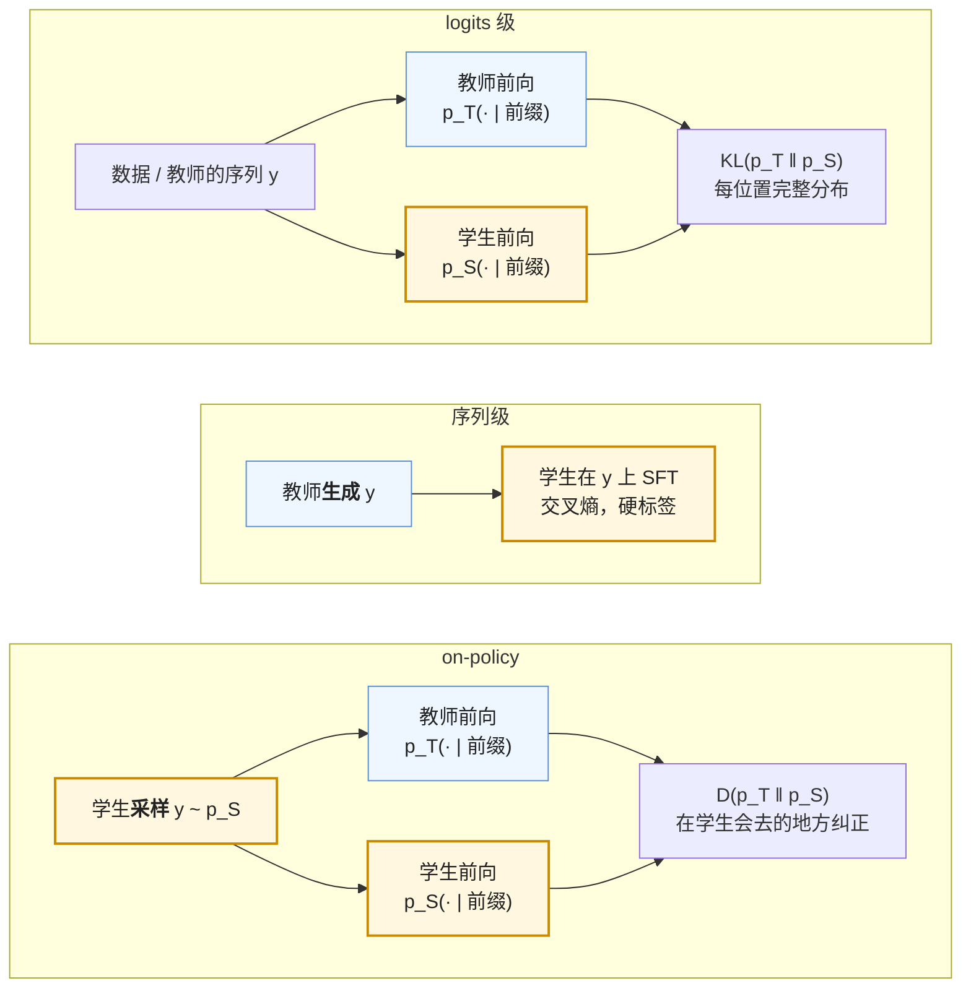

前六篇的奖励有两种来源：人（经过 RM 或 DPO 的转译）与验证器。第三种来源是**另一个模型**——一个更大、更强、或已经训好的教师，它对每个 token 的概率分布、或它生成的序列，成为学生的训练信号。这就是蒸馏（Hinton 等 2015）。它在 LLM 上有三种形态：学生匹配教师的 logits（token 级）、学生在教师生成的文本上做 SFT（序列级）、学生自己生成、教师在学生的序列上逐 token 打分（on-policy）。三者学到的东西不同、漏掉的东西不同、成本相差几个数量级。

蒸馏是 2025 年小模型能力的主要来源。DeepSeek-R1 用 80 万条样本 SFT 出的 1.5B–70B 推理模型，比在同样基座上直接做 RL 好得多；Qwen3 的小模型全部从大模型蒸馏而来；Gemma 2 在预训练阶段就用教师的分布训小模型。理解它，要回答三个问题：为什么匹配分布比匹配标签学得多、前向 KL 与反向 KL 各让学生变成什么样、为什么学生自己采样比用教师的序列更好。

本篇要回答的核心问题是：

> **同一个教师，logits 级、序列级、on-policy 三种蒸馏各让学生学到什么、漏掉什么？[^q0] R1 为什么给小模型选择蒸馏而不是 RL？[^q1]**

## 一、总览：三种蒸馏、两种 KL

### 1. 先说答案

| 形态 | 学生看到什么 | 目标 | 学到 | 漏掉 | 需要 |
|---|---|---|---|---|---|
| **logits 级** | 教师在**给定序列**每个位置的完整分布 $$p_T(\cdot \mid y_{<t})$$ | $$\sum_t \text{KL}(p_T \| p_S)$$ | 每个位置上"次优选项有多好"——暗知识；每 token 几 bit 到几十 bit 的信号 | 学生自己生成时的分布（序列来自教师或数据，不来自学生） | 同一 tokenizer；教师在线前向或存 top-k |
| **序列级** | 教师**生成**的文本 | 交叉熵（就是 SFT） | 教师的输出模式：推理链的写法、格式、风格 | 教师的不确定性；每 token 只有 1 个硬标签 | 教师推理一遍；tokenizer 可以不同 |
| **on-policy** | 教师在**学生自己采样的序列**上每个位置的分布 | $$\mathbb{E}_{y \sim p_S}\big[\sum_t D(p_T \| p_S)\big]$$ | 在学生会去的地方纠正学生——修暴露偏差 | 教师从未生成、学生也采不到的模式 | 同一 tokenizer；每步教师前向 |

Table: 蒸馏的三种形态：学生看到什么、学到什么

三种形态的差别只在两处：**序列是谁生成的**、**目标是硬标签还是教师的分布**：



**R1 选蒸馏而不是 RL**的原因是一个对照实验：在 Qwen2.5-32B-Base 上，用 R1 的 80 万条数据 SFT 得到 AIME 72.6，用与 R1-Zero 相同的大规模 RL 得到约 47。RL 靠探索——小模型在几千 token 的推理里碰到正确解的概率太低，探索找不到方向；蒸馏靠示范——大模型已经找到的推理模式，小模型能从文本里学会。成本上蒸馏也便宜一到两个数量级：教师生成 80 万条约几百 GPU 小时，学生 SFT 约一千 GPU 小时，而 32B 的推理 RL 是 $$10^{22}$$–$$10^{23}$$ FLOPs、几万 GPU 小时。

### 2. 本文的路线

先讲三种粒度与各自的目标函数；再讲前向 KL 与反向 KL 的区别——它决定学生"覆盖"教师还是"集中"于教师；再讲 on-policy 蒸馏为什么修了暴露偏差、以及它与 RL 的等价关系；再讲 tokenizer 不同时怎么办；再算三种蒸馏的成本；然后是蒸馏与剪枝、量化、预训练的组合；最后是蒸馏的极限与公开配方。

### 3. 本文的章节安排

| 章 | 主题 | 内容 |
|---|---|---|
| 二 | 三种粒度 | Hinton 的软标签与温度；序列级 = 在教师输出上 SFT；特征级为什么在 LLM 上少用 |
| 三 | 前向 KL 与反向 KL | 定义、梯度、mode-covering 与 mode-seeking；JSD 与 skew KL；生成任务上选哪个 |
| 四 | on-policy 蒸馏 | 暴露偏差；GKD 的目标；它就是 token 级稠密奖励的 RL；Qwen3 与 Thinking Machines 的实践 |
| 五 | 词表不同怎么办 | 为什么 logits 级需要同一 tokenizer；对齐与最优传输的办法；序列级的普适性 |
| 六 | 成本 | 序列级的教师推理；logits 级的 $$V$$ 个数与 top-k；on-policy 的每步教师前向；与 RL 的对比 |
| 七 | 与剪枝、量化、预训练的组合 | Minitron；Llama 3.2；QAT + 蒸馏；Gemma 2 的预训练蒸馏 |
| 八 | 极限 | 容量；泛化窄；蒸馏之后再 RL；分布坍缩 |
| 九 | 公开配方 | R1-Distill、Qwen3、Gemma、Llama 3.2、Minitron、OpenThoughts |
| 十 | 动手 | `GKDTrainer` 的三个旋钮 |
| 十一 | 本文小结 | |
| 十二 | 自测 | 5 道题 |

Table: 本文的章节安排

## 二、三种粒度

### 1. logits 级：软标签与温度

Hinton 等 2015 的原始形式：教师与学生的 logits 各除以温度 $$\tau$$ 再 softmax，学生最小化两个软化分布的 KL：

$$
\mathcal{L}_{KD} = \tau^2 \cdot \text{KL}\big(p_T^{(\tau)} \,\|\, p_S^{(\tau)}\big),\qquad p^{(\tau)}_j = \frac{\exp(z_j / \tau)}{\sum_k \exp(z_k / \tau)}
$$

$$\tau > 1$$ 把分布拉平，让教师分给次优选项的小概率变得可见——"这张图 90% 是猫、5% 是狗、0.1% 是汽车"里的 5% 与 0.1% 是**暗知识**（dark knowledge）：硬标签只说"猫"，软标签还说"它长得有点像狗、完全不像汽车"。$$\tau^2$$ 因子补偿软化后梯度按 $$1 / \tau^2$$ 缩小。在 LLM 上，每个位置的词表分布本来就很平（下一个 token 常有几十个合理选项），$$\tau = 1$$ 是常见默认；每个位置提供的信息是整个 $$V$$ 维分布而不是一个 token——**每 token 几 bit 到几十 bit**，对比硬标签的不到 1 bit（在已经会写的模型上，正确 token 的概率本来就高，交叉熵的信息量很小）。

LLM 上的 logits 级蒸馏对每个位置算 $$\text{KL}(p_T(\cdot \mid y_{<t}) \| p_S(\cdot \mid y_{<t}))$$，前缀 $$y_{<t}$$ 来自数据（预训练语料、SFT 数据或教师的生成），教师与学生在**同一个前缀**上各算一次前向。它常与硬标签的交叉熵加权混合：$$\alpha \mathcal{L}_{KD} + (1 - \alpha) \mathcal{L}_{CE}$$。

### 2. 序列级：在教师的输出上 SFT

Kim & Rush 2016 提出的序列级蒸馏：让教师对 prompt 生成回答，学生在（prompt，教师回答）上做标准的交叉熵训练。它就是第一篇的 SFT，数据由教师产生——R1-Distill 的 80 万条、s1 的 1000 条、OpenThoughts 的百万条推理轨迹，全是这个形态。

它学到的是教师的**输出模式**：怎么组织一段推理、什么时候回头检查、用什么格式收尾。它漏掉的是教师的不确定性：教师在某个位置认为"也可以换个方法"的 30% 概率，在采样出的那一条序列里不存在。序列级蒸馏与人写的 SFT 数据相比的优势是**量与一致性**——教师可以生成百万条、风格统一、可以按验证器过滤（R1 只保留答案正确的）；劣势是教师的错误与偏见照单全收（第一篇第二章的两个副作用）。

### 3. 特征级：为什么 LLM 上少用

匹配中间层的隐状态或注意力图（TinyBERT、MiniLM）在 BERT 类编码器上很有效，在 LLM 上少见。原因：教师与学生层数、宽度不同，要设计层的映射与投影；生成模型的中间表示与"下一 token"的关系不如编码器的表示与分类任务的关系直接；而 logits 级已经提供了足够密的信号。它在**剪枝后的恢复**里还有位置（第七章）：学生是从教师剪出来的，层与层天然对齐。

### 4. 三者的关系

序列级是"教师给序列、学生用硬标签"；logits 级是"数据给序列、教师给软标签"；on-policy 是"学生给序列、教师给软标签"。三个维度——**序列来自谁、标签是硬还是软**——把它们排开：

```text
                     硬标签（交叉熵）             软标签（分布匹配）
序列来自数据          普通 SFT                    logits 级蒸馏
序列来自教师          序列级蒸馏（R1-Distill）      序列级 + logits 级（两者常一起用）
序列来自学生          （拒绝采样 + SFT，第四篇）     on-policy 蒸馏（GKD）
```

## 三、前向 KL 与反向 KL

### 1. 定义与梯度

两个分布 $$p$$（教师）、$$q_\theta$$（学生）：

$$
\text{KL}(p \| q_\theta) = \sum_j p_j \log \frac{p_j}{q_{\theta, j}} \quad (\text{前向}),\qquad
\text{KL}(q_\theta \| p) = \sum_j q_{\theta, j} \log \frac{q_{\theta, j}}{p_j} \quad (\text{反向})
$$

前向 KL 的期望在 $$p$$ 下，梯度 $$-\sum_j p_j \nabla \log q_{\theta,j}$$——按教师的概率加权提高学生的对数概率，是"教师说什么学生学什么"的最大似然。反向 KL 的期望在 $$q_\theta$$ 下，梯度 $$\sum_j \nabla q_{\theta, j} (\log q_{\theta,j} - \log p_j + 1)$$——学生在**自己**有概率的地方比较自己与教师，自己高教师低的地方被压下去。

### 2. mode-covering 与 mode-seeking

两者在 $$q_\theta$$ 容量不够时给出完全不同的解。教师是双峰分布，学生只能表示单峰：

- **前向 KL**：$$p_j > 0$$ 而 $$q_j \to 0$$ 的地方 $$\log(p_j / q_j) \to \infty$$，惩罚极大，所以学生必须给教师的每个峰都留概率——它会把单峰摊在两个峰之间，**覆盖所有模式**（mode-covering），代价是在教师概率为零的中间地带放了大量概率。
- **反向 KL**：$$q_j \to 0$$ 的地方项为零，不惩罚"学生忽略教师的某个峰"；但 $$q_j > 0$$ 而 $$p_j \to 0$$ 的地方惩罚极大，学生不敢在教师没有概率的地方放概率。所以学生会**集中到教师的一个峰上**（mode-seeking），放弃另一个。

对分类，两者差别不大（分布尖、容量够）。对**生成**，差别决定学生的行为：前向 KL 训出的学生会生成教师**永远不会生成**的序列（那些摊在峰间的概率——语法上像、内容上错的文本），因为它要覆盖教师的全部多样性而自己容量不够；反向 KL 训出的学生只生成教师会认可的序列，多样性略低但**不会产生教师概率为零的输出**。MiniLLM（Gu 等 2023）用这个理由选反向 KL，在指令跟随上显著优于前向 KL 的学生，且长文本上更少幻觉。

### 3. 反向 KL 需要采样

前向 KL 在给定前缀上是一个 $$V$$ 维求和，直接算。反向 KL 的期望在 $$q_\theta$$ 下：**在序列层面**，它要在学生的输出分布上求期望，只能靠从学生采样——这把蒸馏变成了 RL（下一章）。在单个 token 位置上两者都能直接算（都是 $$V$$ 维求和），差别只在加权方向。

### 4. 中间选项

- **JSD**（Jensen-Shannon）：$$\frac{1}{2}\text{KL}(p \| m) + \frac{1}{2}\text{KL}(q \| m)$$，$$m = (p + q) / 2$$，对称、有界、两种行为的折中；GKD 用带参数 $$\beta$$ 的广义 JSD 在两端之间插值。
- **skew KL**（DistiLLM，Ko 等 2024）：把 $$q$$ 换成 $$\alpha p + (1 - \alpha) q$$ 再算 KL，避免 $$q \to 0$$ 处的数值爆炸，收敛更稳。
- **总变差**（TVD）：对离群位置更鲁棒。

实践里的规律：**数据丰富、学生容量接近教师**时前向 KL 够用；**学生小、任务是开放生成**时反向 KL 或 JSD 更好；两者的差别在 on-policy 设置下缩小（下一章：学生采样已经让训练分布是学生的了）。

## 四、on-policy 蒸馏

### 1. 暴露偏差

序列级与 logits 级蒸馏都在**教师（或数据）的序列**上训练学生。推理时学生自己生成，一旦生成了一个教师不会生成的 token，后面的前缀就是学生从未在训练中见过的——它在那里的行为没有被任何信号约束，错误累积。这是暴露偏差（exposure bias），所有 teacher-forcing 训练的生成模型都有，蒸馏尤甚：学生容量小，偏离教师序列的概率更高。

### 2. GKD

Generalized Knowledge Distillation（Agarwal 等 2023）让学生**自己采样**序列 $$y \sim p_S(\cdot \mid x)$$，教师在这条序列的每个位置给出分布 $$p_T(\cdot \mid x, y_{<t})$$，学生最小化每个位置上的散度：

$$
\mathcal{L}_{GKD} = \mathbb{E}_{x}\, \mathbb{E}_{y \sim p_S(\cdot \mid x)} \left[ \frac{1}{\lvert y \rvert} \sum_{t} D\big(p_T(\cdot \mid x, y_{<t})\ \|\ p_S(\cdot \mid x, y_{<t})\big) \right]
$$

$$D$$ 可以是前向 KL、反向 KL 或 JSD。关键在期望的下标：**序列来自学生**。学生走到哪，教师就在哪纠正它——学生偏离教师轨道之后的每一步，都有"教师在这里会怎么做"的信号。论文用一个参数 $$\lambda$$ 混合：以概率 $$\lambda$$ 用学生采样的序列，以概率 $$1 - \lambda$$ 用数据里的序列；$$\lambda = 1$$ 是纯 on-policy，$$\lambda = 0$$ 退回 logits 级蒸馏。

### 3. 它像 RL，但不是"最大化教师对数概率"

把 $$D$$ 取反向 KL，逐 token 展开，GKD 的目标是 $$\mathbb{E}_{y \sim p_S}[\sum_t \log p_S(y_t) - \log p_T(y_t)]$$。它有两项：$$-\mathbb{E}_{p_S}[\log p_T]$$ 是"教师不认可的地方罚"，$$\mathbb{E}_{p_S}[\log p_S] = -H(p_S)$$ 是**学生自己的熵**。两项都在，最优解才是 $$p_S = p_T$$。一个常见的简化是把第二项扔掉、说成"最小化反向 KL 等于最大化教师对数概率"——那是另一个目标，它的最优解是学生把全部概率押在教师的 argmax 上（离散例：教师 (0.8, 0.2)，学生 (0.8, 0.2) 时 KL ≈ 0、$$\mathbb{E}\log p_T = -0.50$$；学生 (0.999, 0.001) 时 KL 涨到 0.22，$$\mathbb{E}\log p_T$$ 却"更好"地升到 −0.22）。熵项就是防坍缩的那一项。

与第三篇的对照要放对位置：**采样像 RL**——序列来自学生自己，所以修的是暴露偏差；**梯度不像 RL**——GKD 论文（4.1 节）明确不对采样过程反传，只在采样出的序列上对每个位置的 token 级散度求梯度（sampling 视为 stop-gradient），而 RL 的 policy gradient 恰恰要对"采到这条序列的概率"求导。所以它不需要价值网络、不需要组内归一化、方差远小于 RL；代价是它不是序列级散度的无偏梯度，而是一个逐 token 的替代目标。MiniLLM 走的是另一条路——真正把 $$\log p_T$$ 当序列级奖励做 policy gradient，并加上方差修正。

这解释了 on-policy 蒸馏的两个性质：它像 RL 一样修暴露偏差（在学生自己的分布上训练），但比 RL 便宜、稳定得多——每 token 都有信号、来自一个固定的教师而不是一个会被 hack 的 RM，也不需要 $$G$$ 条采样去估 baseline。

### 4. 2025 年的实践

Qwen3 的小模型（0.6B–14B）用两阶段蒸馏：先**off-policy**（在大模型生成的思考 / 非思考数据上 SFT，教格式与模式），再**on-policy**（学生采样、向大模型的 logits 对齐，提性能）。报告称这比在小模型上直接 RL 好且只用十分之一的 GPU 小时。Thinking Machines 2025 年的技术博客在 8B 学生上系统比较了 SFT 蒸馏、RL 与 on-policy 蒸馏：达到同样的推理分数，on-policy 蒸馏的算力约为 RL 的十分之一，且能在 SFT 蒸馏到达的平台上继续提升；他们也用它做"能力恢复"——一个在新领域微调后遗忘了对话能力的模型，用微调前的自己当教师做 on-policy 蒸馏，几乎完全恢复（第一篇遗忘的第五种对策）。

on-policy 蒸馏成为小模型后训练的默认，是因为它把序列级蒸馏（便宜、学模式）与 RL（on-policy、修偏差）的优点合在一起，而成本接近前者。

## 五、词表不同怎么办

### 1. 为什么 logits 级需要同一 tokenizer

logits 级与 on-policy 蒸馏都要在**同一个位置**比较教师与学生的 $$V$$ 维分布——两个分布的坐标（token id）必须对应，且"位置"要对应（同一段文本切成同样的 token 序列）。tokenizer 不同时两者都不成立：Llama 的第 5 个 token 与 Qwen 的第 5 个 token 覆盖的字符不同，两个词表的 id 也没有对应关系。L4 第九篇说的"同系列大小模型共用 tokenizer 是为了蒸馏"就是这个理由；预分词规则的一点差别（数字切法、空格处理）就足以让对齐失败。

### 2. 跨词表的办法

- **只做序列级**：教师生成文本，学生用自己的 tokenizer 切——完全绕开问题，代价是丢掉软标签。R1-Distill 到 Llama 就是这样。
- **token 对齐**：把两个词表按字符串匹配，在两边 token 边界对齐的位置比较分布（只在对齐位置算 KD loss，其余用交叉熵）；对多数位置有效，对切分差异大的语言与数字失效。
- **最优传输**（ULD，Boizard 等 2024）：不对齐 id，把两个分布**按概率排序**后算 Wasserstein 距离——比较"最高概率有多集中、次优有多分散"这类与 id 无关的形状信息。它丢掉了"哪个 token"的信息，保留了不确定性的结构。
- **共享投影**（DSKD）：训一个跨词表的投影把教师隐状态映射到学生的词表空间。

都有损失。工程上的结论是：**要做 logits 级蒸馏，先统一 tokenizer**——要么学生用教师的（L4 第九篇的 tokenizer 移植），要么一开始就同系列。

## 六、成本

### 1. 序列级：教师推理一遍

R1-Distill 的量级：80 万条，推理样本平均几千 token，合计约 40 亿 token。教师是 R1（671B MoE，激活 37B），生成 FLOPs 约 $$2 \times 37\text{B} \times 4 \times 10^9 = 3 \times 10^{20}$$，decode 按 30% 有效算力约 **300 H100 小时**；拒绝采样要多采几倍（只留正确的），乘上 $$K$$。学生 SFT：Qwen2.5-32B、40 亿 token、2 epoch，$$6 \times 32\text{B} \times 8 \times 10^9 = 1.5 \times 10^{21}$$，约 **1000 GPU 小时**。合计一两千 GPU 小时。对照第五篇：同一个 32B 基座做推理 RL 是 $$10^{22}$$–$$10^{23}$$ FLOPs、几万 GPU 小时。**蒸馏便宜一到两个数量级，且效果更好**——这是 R1 那个对照实验的成本面。

### 2. logits 级：V 个数的传输

教师在每个位置给一个 $$V$$ 维分布。128K 词表、BF16，**每 token 256 KB**；40 亿 token 就是 1 PB——离线存下来不现实。两条路：**在线**，每步训练时教师同时前向（成本 $$2N_T$$ 每 token，与学生训练的 $$6N_S$$ 相比，$$N_T = 10 N_S$$ 时教师前向是学生训练的 3 倍多，且教师要常驻显存）；**top-k**，只存教师每个位置概率最高的 $$k$$ 个 token 与概率（$$k$$ = 64 时每项一个 id（至少 17 bit，通常 int32）加一个 BF16 概率，约 384 B/token，40 亿 token 是 1.5 TB，可以离线），其余概率合并成一项或忽略。top-64 覆盖多少概率质量取决于教师分布的尖锐度与采样温度——低温、确定性强的位置 99%+，高温或开放性位置可能只有几成（均匀 128K 的极端是 0.05%），尾部怎么处理会改变 KL 的值，要按实际教师测。Gemma 2 的预训练蒸馏走的是 logits 级路线，是否离线 top-k 报告没有细说。

### 3. on-policy：每步教师前向

每步：学生采样（$$2N_S$$ 每 token，decode）、教师在学生序列上前向（$$2N_T$$ 每 token，prefill，MFU 高）、学生训练（$$6N_S$$）。教师前向是主项：$$N_T = 32\text{B}$$、$$N_S = 1.5\text{B}$$ 时 $$2N_T = 64$$ GFLOPs 对 $$6N_S = 9$$ GFLOPs，教师占 85%。但与第三篇的 RL 比：不需要 $$G$$ 条采样（信号稠密，一条就够）、不需要 RM 与参考的前向、每个 token 都有信号所以步数少得多。Qwen3 与 Thinking Machines 报告的"十分之一"就是这些项合起来的结果。

### 4. 一张表

| 形态 | 教师成本 | 学生成本 | 存储 / 传输 | tokenizer |
|---|---|---|---|---|
| 序列级 | 生成一遍（$$2N_T$$/token，decode，× 拒绝采样倍数） | SFT（$$6N_S$$） | 文本，GB 级 | 可不同 |
| logits 级（离线 top-k） | 前向一遍（prefill） | $$6N_S$$ + KD loss | $$k$$ 个数/token，TB 级 | 相同 |
| logits 级（在线） | 每步前向 | $$6N_S$$ | 无 | 相同 |
| on-policy | 每步在学生序列上前向 | 采样 + $$6N_S$$ | 无 | 相同 |
| 对照：RL | RM / 验证器 | $$G$$ 条采样 + $$6N_S$$ + 参考 | 无 | — |

Table: 三种蒸馏形态的成本对照

## 七、与剪枝、量化、预训练的组合

### 1. 剪枝 + 蒸馏

从一个大模型**剪**出一个小模型（删层、删 attention head、缩 FFN 宽度、缩 embedding 维度），再用蒸馏恢复。Minitron（Muralidharan 等 2024，NVIDIA）：从 Nemotron-4 15B 剪到 8B 与 4B，用 logits 级蒸馏恢复，只需 940 亿 token——比从头训少 **40 倍**，效果超过同规模从头训的模型。Llama 3.2 的 1B 与 3B 同样从 8B 剪枝后蒸馏（logits 级，用 8B 与 70B 的输出作教师）。剪枝给了学生一个比随机初始化好得多的起点（保留了教师的大部分表示），蒸馏用少量 token 把它调回去；特征级蒸馏在这里有用——学生的层就是教师的层的子集。

### 2. 量化 + 蒸馏

量化感知训练（QAT，L4 第七篇）在低精度下微调恢复精度；把 loss 换成对**全精度模型**（自己量化前的版本）的 KD loss，恢复得更好——教师是自己。Llama 3.2 的 QAT + LoRA 配方、多数 4-bit 部署的小模型都用它。原理同第四章的"用微调前的自己当教师"：教师与学生的差别只在精度，分布几乎一致，KD 信号极准。

### 3. 预训练阶段的蒸馏

Gemma 2（2024）在**预训练**阶段就用蒸馏：2B 与 9B 模型不用硬标签的 next-token loss，而用一个更大教师在每个位置的分布（top-k 离线），训练 token 数远超 Chinchilla 最优（2B 训了 2T token，是最优的 50 倍）。理由是软标签每 token 的信息量大，同样的 token 数学到更多，等效于"用信息更密的数据过训练"（L4 第十篇）。Gemma 3 沿用。它把蒸馏从"后训练的一步"变成"小模型预训练的方式"——代价是要先有一个大教师，且每个 token 要教师前向一次（$$2N_T$$，Gemma 2 的教师未公开规模）。

## 八、蒸馏的极限

### 1. 容量

学生学不到超出自己容量的东西。序列级蒸馏在长推理上的表现随学生规模陡降——R1-Distill-Qwen-1.5B 在 AIME 上约 29%，7B 55%，32B 72.6%——不是数据的问题（同一份数据），是 1.5B 装不下几千 token 的多步推理所需的"工作记忆"。Beyer 等 2022 在视觉上的结论在 LLM 上同样成立：蒸馏要**耐心**（比预期多得多的步数）且**一致**（教师与学生看同样的输入），学生能到的上限由容量定，能不能到上限由训练量定。

### 2. 泛化窄

蒸馏出的模型在**教师数据覆盖的任务**上接近教师，在覆盖之外掉得比教师快。R1-Distill 系列在数学与代码上强、在通用对话与多语言上明显弱于同规模的通用模型——80 万条里 60 万是推理。它学到的是教师在这些任务上的**输出模式**，不是教师产生这些模式的**能力**；换一个分布外的任务，模式不适用。对策是数据的多样性（Qwen3 的蒸馏数据覆盖全部能力桶）与 on-policy（学生自己的分布更接近它会遇到的分布）。

### 3. 蒸馏之后再 RL

R1 论文说蒸馏出的模型如果再做 RL 会进一步提升，但没做。后续工作（多个开源复现）确认：**先蒸馏、再 RL** 优于任何单独一种——蒸馏给了 RL 一个已经会推理的起点（第五篇：RL 放大已有模式），RL 在其上把 pass@1 再提几个点、并修正蒸馏数据里教师的一些错误习惯。这是 Qwen3 小模型的路线，也是第五篇"冷启动 SFT → RL"的一般形式：蒸馏就是最好的冷启动。

### 4. 分布坍缩

L4 第十一篇的合成数据问题在这里再现：学生只见过教师的输出，多样性低于教师；如果学生再当下一代的教师，多样性逐代收缩。缓解同样是混入真实数据、多教师、以及 on-policy——让学生自己的采样进入训练分布，而不是只有教师的。

## 九、公开配方

| 配方 | 教师 → 学生 | 形态 | 数据 / token | 特点 |
|---|---|---|---|---|
| DeepSeek-R1-Distill（2025） | R1 → Qwen2.5 1.5B–32B、Llama 3 8B / 70B | 序列级（SFT） | 80 万条 | 不做 RL；对照实验证明蒸馏 > 小模型直接 RL |
| Qwen3 小模型（2025） | Qwen3-235B / 32B → 0.6B–14B | off-policy 序列级 → **on-policy logits 级** | — | 两阶段；报告 1/10 的 GPU 小时优于 RL |
| Gemma 2 / 3（2024–25） | 大教师 → 2B / 9B（Gemma 3 全系） | **预训练阶段** logits 级（top-k） | 2B：2T token | 蒸馏当预训练；远超 Chinchilla 的 token 量 |
| Llama 3.2 1B / 3B（2024） | Llama 3.1 8B / 70B → 剪枝后的 1B / 3B | 剪枝 + logits 级；QAT + LoRA | — | 边端部署 |
| Minitron（2024） | Nemotron-4 15B → 8B / 4B | 剪枝 + logits 级 | 940 亿 token | 比从头训少 40 倍 token |
| MiniLLM（2023） | GPT-2 / OPT / Llama 大 → 小 | 反向 KL，策略梯度 | 指令数据 | 反向 KL 优于前向的系统证据 |
| GKD（2023） | T5 大 → 小 | on-policy，JSD | 摘要、翻译、算术 | on-policy 蒸馏的提出 |
| OpenThoughts / Sky-T1 / s1（2025） | R1 / QwQ / Gemini → Qwen2.5 | 序列级 | 1K 到 120 万条公开推理轨迹 | 开源蒸馏数据集；OpenThoughts3 系统消融了数据来源与过滤 |
| Thinking Machines（2025） | Qwen3-32B → Qwen3-8B | on-policy 反向 KL | — | 达到同分 RL 算力的 1/10；用于能力恢复 |

Table: 公开蒸馏配方

趋势：序列级是起点（便宜、跨词表），on-policy 是终点（修偏差、性价比最高），logits 级在预训练与剪枝恢复里；小模型的能力路线从"直接 RL"变成"蒸馏 → 可选的 RL"。

## 十、动手：`GKDTrainer` 的三个旋钮

`trl` 的 `GKDTrainer` 把第二到四章的选项压成三个参数：

```python
from trl import GKDTrainer, GKDConfig

cfg = GKDConfig(
    lmbda=0.5,          # 第四章：以此概率用学生自己采样的序列（1.0 纯 on-policy，0.0 退回 logits 级）
    beta=0.5,           # 第三章：广义 JSD 的插值——0 是前向 KL，1 是反向 KL，0.5 是对称 JSD
    temperature=1.0,    # 第二章：软化温度；LLM 上 1.0 是常见默认
    max_new_tokens=512, learning_rate=1e-5, per_device_train_batch_size=4,
)
trainer = GKDTrainer(model="Qwen/Qwen2.5-0.5B-Instruct",         # 学生
                     teacher_model="Qwen/Qwen2.5-1.5B-Instruct",  # 教师：同一 tokenizer（第五章）
                     args=cfg, train_dataset=prompts, processing_class=tok)
trainer.train()
```

`(lmbda, beta) = (0, 0)` 是标准的前向 KL logits 级蒸馏；`(1, 1)` 是 MiniLLM 式的 on-policy 反向 KL；`(0.5, 0.5)` 是 GKD 论文的默认。教师与学生要同一 tokenizer——两个 Qwen2.5 满足。0.5B 学生、1.5B 教师在一张 16 GB 的卡上能跑。

同一份 prompt 跑三组：序列级（先让 1.5B 生成回答，再对 0.5B 做普通 SFT——第一篇的脚本）、`(0, 0)`、`(1, 1)`，比三样东西：GSM8K 子集的准确率（学到多少）、输出的 distinct-n 或自 BLEU（多样性——反向 KL 在学生容量不足时倾向更低，但不是定理：容量够时两种 KL 的最优解都是教师分布，多样性相同）、以及学生在教师**从未见过的一类 prompt** 上的表现（泛化窄的程度）。第三章 mode-covering / mode-seeking 的差别在第二项上最容易看到。

## 十一、本文小结

| 项 | 规则 / 公式 | 备注 |
|---|---|---|
| logits 级 | $$\tau^2 \text{KL}(p_T^{(\tau)} \| p_S^{(\tau)})$$，每位置 $$V$$ 维 | 暗知识；每 token 几到几十 bit；需同一 tokenizer |
| 序列级 | 教师生成 → 学生 SFT | 学输出模式；丢不确定性；跨词表；R1-Distill |
| 前向 KL | $$\sum_j p_j \log(p_j / q_j)$$，mode-covering | 学生容量不足时在峰间放概率 → 生成教师不会生成的东西 |
| 反向 KL | $$\sum_j q_j \log(q_j / p_j)$$，mode-seeking | 只在教师认可处放概率；序列级需采样（MiniLLM） |
| on-policy（GKD） | $$\mathbb{E}_{y \sim p_S}[\sum_t D(p_T \| p_S)]$$ | 修暴露偏差；采样像 RL、梯度是 token 级散度（不经采样反传）；Qwen3、Thinking Machines |
| 词表 | logits 级要求 id 与位置对齐 | 序列级绕开；ULD 用排序后的最优传输 |
| 成本 | 序列级：教师生成 + 学生 SFT；on-policy：每步教师前向 $$2N_T$$ | R1-Distill 32B 约 1–2K GPU 小时，RL 几万；on-policy ≈ RL 的 1/10 |
| 组合 | 剪枝 + 蒸馏（Minitron 40 倍省 token）；QAT + 蒸馏（教师是自己）；预训练蒸馏（Gemma 2） | |
| 极限 | 容量（1.5B 29% / 32B 72.6%）；泛化窄；先蒸馏后 RL 最好；分布坍缩 | |

Table: 知识蒸馏的公式与规则小结


七篇讲完了让模型变好的每一种方法。最后一篇讲怎么证明它真的变好了。

配套资料：本篇没有配套实验；第十章的骨架可在 [ai-learning-labs/post-training](https://github.com/arganzheng/ai-learning-labs/tree/main/post-training) 第一篇的环境上配一张 16 GB 的 GPU 运行。

## 十二、自测

1. logits 级蒸馏每个位置传递多少信息？序列级呢？由此说明“暗知识”是什么。

   <details markdown="1"><summary>答案</summary>

   logits 级传递教师的完整分布，每 token 几到几十 bit（分布的熵）；序列级只有一个硬标签，$$\log_2 V$$ bit 的上限里绝大部分是确定性的，实际信息量远低于分布。暗知识就是“次优选项各有多好”——分布里除了 argmax 之外的部分。

   </details>

2. 前向 KL $$\text{KL}(p_T \| p_S)$$ 与反向 KL $$\text{KL}(p_S \| p_T)$$ 各让学生学成什么样？学生容量不足时哪个更危险？

   <details markdown="1"><summary>答案</summary>

   前向 mode-covering：学生要在教师有概率的地方都放概率，容量不足时在峰之间抹平、生成教师不会生成的东西；反向 mode-seeking：只在教师认可的地方放概率，宁可漏掉一些模式。生成任务上前向 KL 更危险，MiniLLM 等用反向或混合。

   </details>

3. on-policy 蒸馏（GKD）修的“暴露偏差”是什么？它为什么等价于一种 RL？

   <details markdown="1"><summary>答案</summary>

   训练时学生只在教师 / 数据的前缀上学，推理时前缀是自己生成的、一旦偏离就没见过——暴露偏差。GKD 在学生自己采样的序列上算逐 token 的 $$D(p_T \| p_S)$$：采样来自学生（像 RL），但梯度只对散度项求、不对采样过程反传（不像 RL）；反向 KL 里学生的熵项不能丢，否则目标退化成"押教师 argmax"。

   </details>

4. R1 蒸馏到 Qwen2.5-32B 得到 AIME 72.6，同规模直接 RL 约 47。成本上两者差多少？

   <details markdown="1"><summary>答案</summary>

   蒸馏：教师生成 80 万条约几百 GPU 小时 + 学生 SFT 约一千 GPU 小时；32B 的推理 RL 是 $$10^{22}$$–$$10^{23}$$ FLOPs、几万 GPU 小时——便宜一到两个数量级，效果还更好。

   </details>

5. 教师与学生 tokenizer 不同，三种蒸馏各还能不能做？

   <details markdown="1"><summary>答案</summary>

   序列级可以（只用文本）；logits 级不能直接做——两边的 $$V$$ 维分布 id 与位置都对不上，要用 ULD 一类把分布排序后做最优传输对齐；on-policy 同 logits 级。

   </details>

## 下一篇

[评测：benchmark、LLM-as-judge、Arena 与污染](/evaluating-llms-benchmarks-judges-and-contamination.html)

[^q0]: **logits 级**让学生学到教师在每个位置上的完整分布——「次优选项有多好」这类硬标签没有的信息——但序列不来自学生，学生自己生成时偏离轨道后没有信号；**序列级**让学生学到教师的输出模式（推理怎么写、什么时候回头），丢掉了不确定性，但跨词表可用、成本最低；**on-policy** 在学生自己采样的序列上向教师对齐，修了暴露偏差，且等价于一个奖励为教师逐 token 对数概率的稠密 RL——它漏掉的是学生自己永远采不到的模式。详见[第二](#二三种粒度)至[四章](#四on-policy-蒸馏)。
[^q1]: 对照实验说 32B 上蒸馏 72.6 对 RL 47：RL 靠探索，小模型在几千 token 的推理里碰到正确解的概率太低；蒸馏靠示范，大模型探索出的模式小模型能从文本里学会；且成本低一到两个数量级。2025 年的路线是三者叠加——序列级冷启动、on-policy 对齐、再可选地 RL。详见[第八章](#八蒸馏的极限)、[第九章](#九公开配方)。
