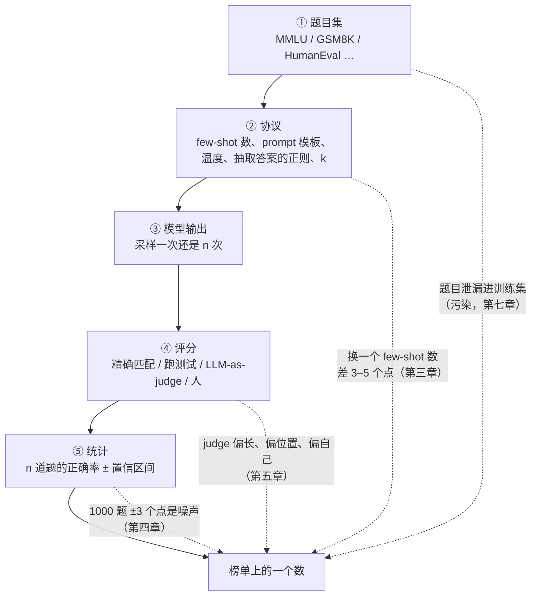

前七篇每一篇的结尾都有一句"变好了"：SFT 之后会按格式回答，RL 之后奖励涨了，蒸馏之后小模型接近教师。每一句背后都有一个度量，而度量比方法更容易出错——分数涨了 2 个点，可能是能力提升，可能是换了 few-shot 数，可能是测试题在训练集里，也可能只是 1000 道题上的随机波动（±3 个点）。评测是后训练流水线里唯一贯穿全程的部件，也是"回到数据或配方"那条回边的起点：不会评测，就不知道下一步改什么。

这一篇讲评测的四件事：**benchmark**——每个测什么、多大、饱和到什么程度，以及协议的每一个细节如何改变分数；**统计**——多少题才能区分两个模型；**judge 与 Arena**——用模型和人做偏好评测时各有什么偏差；**污染与自建**——怎么知道分数是不是假的，什么时候必须自己建评测集。最后是全系列的总结。

本篇要回答的核心问题是：

> **一个模型的 MMLU 涨了 2 个点，怎么判断这是能力提升、协议变化、还是污染？[^q0] 用 GPT-4 当 judge 得到的 80% 胜率，去掉长度偏差之后还剩多少？[^q1]**

## 一、总览：分数是一个有协议、有方差、可能被污染的估计

### 1. 先说答案

一个 benchmark 分数 = **能力 + 协议 + 噪声 + 污染**。四项里只有第一项是要测的东西，其余三项各有量级：

| 项 | 量级 | 怎么控制 |
|---|---|---|
| 协议（few-shot 数、CoT、温度、答案抽取、prompt 格式） | 同一模型在不同协议下相差 5–15 个点是常态 | 固定协议；所有模型用同一套 harness 与同一份配置；报告协议 |
| 噪声（题目的抽样、生成的采样） | 1000 题上 95% 置信区间约 ±3 个点；AIME 的 30 题约 ±18 个点 | 报告置信区间；配对比较；多 seed；题数够多 |
| 污染（测试题在训练集里） | 被污染的子集上分数可以高 10–30 个点 | 训练侧 n-gram 检测（L4 第十一篇）；评测侧用改写、新题、私有集 |

Table: benchmark 分数的四项构成与控制方法

所以"MMLU 涨 2 个点"的判断顺序是：**先确认协议相同**（同一 harness、同一配置、同一答案抽取），**再看置信区间**（单模型 ±0.8 只是量级感；两个模型要用同题配对差值检验——1000 题上 A 独对 20 题、B 独对 0 题就已经是强证据，第四章 §2），**再查污染**（用一份同分布的新题或改写题复测，涨幅是否保持）——三关都过才是能力。

judge 的 80% 胜率：Zheng 等 2023 测出 GPT-4 作 judge 时对更长回答的偏好显著，AlpacaEval 的长度控制版本（Dubois 等 2024）把长度的贡献回归掉后，很多模型的胜率变化 5–15 个点，排名重排。**80% 里有多少是长度，要用长度控制的 win rate 才知道**；未控制的胜率与人评的相关性明显低于控制后的。

### 2. 本文的路线

一个 benchmark 分数从出题到上榜要经过五步，每一步都有一个能改变分数的变量——本文的章节就沿着这五步走：




先列 benchmark：按能力分类，每个多大、测什么、饱和到哪，Agent 类为什么方差与成本高一个量级；再讲协议——每一个细节怎么改分数、pass@k 怎么算才无偏；再讲统计——置信区间、配对比较、多少题够；然后是 LLM-as-judge 的三种偏差与对策、Arena 的 Bradley-Terry 与它的问题；再讲污染的评测侧检测；再讲能力分解、错误分析与自建评测集；最后是报告的诚实性与全系列总结。

### 3. 本文的章节安排

| 章 | 主题 | 内容 |
|---|---|---|
| 二 | benchmark | 知识、数学、代码、指令、对话、Agent、长上下文、安全各类的代表；规模、协议、饱和 |
| 三 | 协议 | few-shot、CoT、温度、答案抽取、prompt 格式、max_tokens、pass@k 的无偏估计、harness |
| 四 | 统计 | 二项置信区间；配对比较；多 seed；小集合的方差；Agent 的 pass^k |
| 五 | LLM-as-judge | 形态；位置、长度、自我偏好三种偏差；对策；长度控制的 win rate；judge 与人的一致率 |
| 六 | Arena | 匿名成对投票 → Bradley-Terry 排名；置信区间；风格控制；私测与排行榜幻觉；Arena-Hard |
| 七 | 污染 | 训练侧与评测侧；检测方法；GSM1K 与 MMLU-Redux 的教训；动态 benchmark |
| 八 | 能力分解与错误分析 | 切分；错误分类；读输出；Agent 的轨迹检查 |
| 九 | 自建评测集 | 什么时候必须；怎么建；大小；judge 校准；维护 |
| 十 | 报告的诚实性 | 一张清单 |
| 十一 | 动手 | `lm-evaluation-harness` 的协议对照；judge 偏差的测量 |
| 十二 | 本文小结 | |
| 十三 | 自测 | 5 道题 |

Table: 本文的章节安排

## 二、benchmark：各测什么

### 1. 一张表

| 类 | benchmark | 规模 | 形式 | 测什么 | 状态（2025） |
|---|---|---|---|---|---|
| 知识 | MMLU（Hendrycks 等 2020） | 14 042 题，57 科 | 四选一 | 学科知识与常识 | 前沿模型 88–92%，接近饱和；约 6.5% 的题有错（MMLU-Redux） |
| | MMLU-Pro | 12K 题 | 十选一，要推理 | 同上，更难 | 前沿 80% 左右 |
| | GPQA Diamond | 198 题（主集 448） | 四选一 | 研究生级理化生；专家 65%、非专家 34% | 前沿 80%+ |
| | SimpleQA | 4326 题 | 短答案 | 事实性；拒答与错答分开计 | 前沿 40–50%，测幻觉 |
| | HLE（Humanity's Last Exam） | 2500 题 | 短答案 / 选择 | 专家级难题 | 前沿 20–30% |
| 数学 | GSM8K（Cobbe 等 2021） | 1319 测试题 | 小学应用题，整数答案 | 多步算术推理 | 前沿 95%+，饱和；污染严重 |
| | MATH | 5000 测试题（常用 MATH-500 子集） | 竞赛题，LaTeX 答案 | 中学竞赛数学 | 前沿 95%+ |
| | AIME | 每年 30 题（I + II） | 整数答案 0–999 | 高中奥赛 | 推理模型 70–95%；**只有 30 题** |
| 代码 | HumanEval | 164 题 | 函数补全 + 单元测试 | 基础编程 | 饱和 |
| | LiveCodeBench | 持续更新 | 竞赛题，按发布日期切片 | 编程 + 防污染 | 推理模型 60–80% |
| | SWE-bench Verified | 500 个 issue（全集 2294） | 修复仓库、跑测试 | 真实软件工程 | 前沿 Agent 60–75% |
| 指令 | IFEval（Zhou 等 2023） | 541 条 | 可程序验证的约束（字数、格式、关键词） | 指令遵循 | 前沿 85–90% |
| 对话 | MT-Bench | 80 题 × 2 轮 | GPT-4 打 1–10 分 | 多轮对话质量 | 饱和；judge 偏差研究的起点 |
| | AlpacaEval 2（LC） | 805 题 | 与参考回答成对比较，长度控制 | 指令跟随的偏好 | 常用 |
| | Arena-Hard | 500 题（从 Arena 采的难 prompt） | 与基线成对，judge | 与 Arena 排名相关 89% | 常用 |
| Agent | τ-bench / τ²-bench | 零售 115、航空 50 个任务 | 模拟用户 + 数据库，pass^k | 多轮工具调用与策略遵循 | pass^1 60–80%，pass^8 显著更低 |
| | BFCL | 数千条 | 函数调用正确性 | 单次 / 并行 / 多轮 / 无关时不调 | 常用 |
| | GAIA | 466 题 | 浏览、文件、计算，答案匹配 | 通用助手 | 前沿 Agent 70%+ |
| | Terminal-Bench | 约百个任务 | 终端容器 | 系统操作 | 30–60% |
| 长上下文 | RULER、LongBench v2、NIAH | — | 检索、聚合、推理 | 有效上下文长度 | 声称 128K 的模型有效长度常只有 32–64K |
| 安全 | HarmBench、XSTest | 几百条 | 有害请求的拒答率 + 无害请求的**误拒率** | 安全与过度拒绝 | 两面都要报 |

Table: 主要 benchmark 一览：规模、形式与饱和状态

三个观察。**饱和**：MMLU、GSM8K、HumanEval、MT-Bench 在前沿模型上已经区分不出差别，且题目错误与污染的比例足以淹没模型间的差距；它们仍有用，但只作为"没有退步"的回归测试，不作为进步的证据。**替代**：每个饱和的 benchmark 都有一个更难、更新、或防污染的后继（MMLU-Pro、AIME、LiveCodeBench、Arena-Hard）。**Agent 类的两个特点**：一次评测要跑环境（成本高一个量级），且结果有随机性（模拟用户、采样），要多次运行报 pass^k——第六篇的训练环境问题在评测上原样出现。

### 2. 选择哪些

没有一个 benchmark 覆盖全部能力，配方报告通常报 10–20 个。选择的原则：**每个能力桶至少一个未饱和的**（知识、数学、代码、指令、对话、Agent、长上下文、安全、多语言）；训练目标对应的 benchmark 之外，必须有**不在训练目标里**的（检查遗忘，第一篇）；至少一个**私有或最近发布**的（检查污染，第七章）。

## 三、协议：每一个细节都改变分数

### 1. 变量清单

| 变量 | 常见取值 | 影响 |
|---|---|---|
| few-shot 数 | 0 / 5（MMLU）/ 8（GSM8K）/ 4（MATH） | 0-shot 与 5-shot 在小模型上差 5–10 个点；对齐模型 0-shot 常更好（few-shot 格式与对话模板冲突） |
| CoT | 有 / 无 | GSM8K、MATH 上差 20–40 个点；MMLU 上 CoT 对前沿模型有帮助、对小模型可能有害 |
| 采样 | 贪心 / 温度 0.6–1.0 | 贪心确定但对推理模型常更差（重复、循环）；采样要多 seed |
| 答案抽取 | 正则、`\boxed{}`、最后一个数、字母匹配 | 抽取失败算错——抽取器的宽严直接改分；数学等价判断（第五篇）同理 |
| prompt 格式 | 选择题用字母还是原文；有无 system prompt；模板是否套用 | MMLU 用"输出字母"与"比较各选项的对数概率"两种协议差几个点 |
| max_tokens | 512 / 4K / 32K | 推理模型被截断即算错；同一模型 max_tokens 从 4K 到 32K 在 AIME 上差几十个点 |
| pass@k 的 $$k$$ 与 $$n$$ | pass@1 用 $$n$$ = 1 还是 $$n$$ = 16 估 | 见下节 |
| 评分 | 精确匹配 / 等价判断 / judge | 判分器本身有准确率 |

Table: 评测协议的变量清单

同一模型、同一 benchmark，换协议差 10 个点不稀奇；不同报告里的同一数字几乎不可比。**比较两个模型的唯一办法是同一套 harness、同一份配置、同一时间跑**。`lm-evaluation-harness`、OpenCompass、HELM、evalchemy 这类工具的价值就是固定协议——它们的每个任务定义了 prompt、few-shot、抽取、评分的全部细节，并给出一个可以引用的版本。

### 2. pass@k 的无偏估计

代码与数学常报 pass@$$k$$：$$k$$ 次采样任一正确的概率。直接采 $$k$$ 次看有没有对，方差极大。Chen 等 2021（Codex）的做法：每题采 $$n \ge k$$ 次，数出 $$c$$ 次正确，无偏估计

$$
\widehat{\text{pass@}k} = 1 - \frac{\binom{n - c}{k}}{\binom{n}{k}}
$$

$$n$$ = 16 或 64 时 pass@1 的估计比单次采样稳得多——它其实是"平均正确率"。**报 pass@1 时要说 $$n$$ 是几**：$$n$$ = 1 的 pass@1 在 30 题的 AIME 上方差大到没有意义，$$n$$ = 64 的才可比。多数投票（cons@$$k$$，第五篇）是另一个量，与 pass@$$k$$ 不能混。

### 3. 对齐模型与 few-shot

few-shot 示例是为基座模型设计的（给格式）；对齐模型有模板、会按指令输出格式，few-shot 反而引入分布外的 prompt（示例的格式与模板不一致），常常掉分。Llama 3 与多数 2024 年后的报告对对齐模型用 0-shot CoT 协议；比较基座与对齐模型时要各用各的最优协议、且说明。

## 四、统计：多少题才能区分两个模型

### 1. 二项置信区间

一个准确率 $$p$$ 在 $$n$$ 道独立题上的标准误 $$\sigma = \sqrt{p(1 - p) / n}$$，95% 区间约 $$\pm 1.96\sigma$$：

| $$n$$ | $$p = 0.5$$ | $$p = 0.7$$ | $$p = 0.9$$ |
|---|---|---|---|
| 30（AIME） | ±17.9 | ±16.4 | ±10.7 |
| 100 | ±9.8 | ±9.0 | ±5.9 |
| 200（GPQA Diamond） | ±6.9 | ±6.4 | ±4.2 |
| 500（SWE-bench Verified、Arena-Hard） | ±4.4 | ±4.0 | ±2.6 |
| 1319（GSM8K） | ±2.7 | ±2.5 | ±1.6 |
| 5000（MATH） | ±1.4 | ±1.3 | ±0.8 |
| 14 042（MMLU） | ±0.8 | ±0.8 | ±0.5 |

Table: 不同题数与准确率下的 95% 置信区间

这张表是**单个模型**分数的不确定度：AIME 上 ±18 说明一次 30 题的分数几乎没信息，MMLU 的 ±0.8 说明分数本身很稳。但它**不能**直接用来判断两个模型的差距——那要看下一节的配对差值：两个模型在同一批题上答，差距的方差只来自答得不一样的那些题，可以远小于两个区间之和。Miller 2024（"Adding Error Bars to Evals"）把这些算法整理成了标准做法，包括题目成簇（同一篇文章的多道题不独立）时的聚类标准误——它让有效 $$n$$ 更小。

### 2. 配对比较

比较两个模型时不要各自算区间再看是否重叠——两个模型在**同一批题**上答，题目的难度是共同的，配对能消掉它。统计量是"A 对 B 错"与"A 错 B 对"的题数（McNemar 检验），或对题目做配对 bootstrap：重采样题目、每次算 A − B，看差值的区间是否含零。配对后同样的 $$n$$ 能检出小得多的差距——两个模型在 80% 的题上同对同错时，有效的样本只是剩下 20% 里的不一致题，但方差也只来自它们。两个具体的数：1000 题上 A 独对 20、B 独对 0（差 2 个点），单模型区间 ±2.8 看似"重叠"，配对 McNemar 的 $$p \approx 2 \times 10^{-6}$$，差异明确；同样差 2 个点但 A 独对 60、B 独对 40，精确双侧 $$p \approx 0.057$$，不显著——检验方法（精确 / 连续修正 / 正态近似）要预先说定，正态近似会给 0.046 这种"刚好显著"的数。

### 3. 采样的方差

题目之外还有生成的随机性：温度采样下同一模型跑两遍分数不同。多 seed（3–5 次）取均值并报标准差；或用 $$n$$ 次采样的平均正确率（上节的 pass@1 估计）——这两个方差要与题目的方差合起来报。推理模型在小集合上的"单次运行分数"（一次 AIME 30 题）几乎没有信息。

### 4. Agent 的 pass^k

τ-bench 定义 pass^$$k$$：同一任务跑 $$k$$ 次**全部**成功才算过，衡量一致性。pass^1 70% 的模型 pass^8 可能只有 30%——对单个任务是 $$q^k$$，跨任务是 $$\mathbb{E}[q_i^k]$$，不能拿平均值代进去算（$$0.7^8 = 5.8\%$$，但一半任务 100%、一半 40% 时是 $$0.5 \times 1 + 0.5 \times 0.4^8 \approx 50\%$$）。它与 pass@$$k$$ 回答的是两个产品问题：用户愿意重试时看 pass@$$k$$，要求每次都对（自动流程、无人复核）看 pass^$$k$$；报告时两个都要给。

## 五、LLM-as-judge

### 1. 形态

用一个强模型评另一个模型的输出：**单样本打分**（1–10 分，MT-Bench）、**成对比较**（A / B / 平手，AlpacaEval、Arena-Hard）、**带参考**（给标准答案，判等价——第五篇的验证器边缘）、**rubric**（按细则逐项打分）。成对比较最稳（第二篇：相对判断比绝对判断可靠），但要处理位置；带参考的最准，但只对有答案的任务。

### 2. 三种系统性偏差

Zheng 等 2023 在 MT-Bench 上测出的三种，后来在每个 judge 上都被重复观察到：

| 偏差 | 现象 | 量级 | 对策 |
|---|---|---|---|
| **位置** | 成对比较时偏爱第一个（或第二个）出现的 | GPT-4 在约 20–30% 的对上交换顺序后改判 | 每对**两个顺序各判一次**，不一致算平手；或随机化并取平均 |
| **长度** | 偏爱更长、更详细的回答，即使多出的内容无用甚至错 | 未控制时长度能解释胜率的很大一部分 | 长度控制的 win rate（下节）；rubric 里明确"不以长度计分"；人工抽检长回答 |
| **自我偏好** | 偏爱自己（或同家族模型）的输出风格 | GPT-4 judge 给 GPT-4 类风格加分几个点 | 多个不同家族的 judge；judge 与被评模型不同家族 |

Table: LLM-as-judge 的三种系统性偏差

另外两条：**对数学与事实的判断弱**（judge 自己算错时会把错答案判对，带参考答案能大幅缓解）；**对格式的偏好**（列表、加粗、标题）。这些偏差与第二篇 RM 的 hacking 方向完全一致——RM 就是一个被训练成 judge 的模型，judge 就是一个没被训练的 RM。

### 3. 长度控制的 win rate

Dubois 等 2024 给 AlpacaEval 加长度控制：对每一对（模型回答、参考回答）拟合一个逻辑回归，胜负 ~ 模型身份 + 长度差 + 指令难度，然后报**长度差为零时**的预测胜率。效果：与 Chatbot Arena 人评排名的 Spearman 相关从 0.94 提到 0.98；一些靠长回答拿高分的模型排名下降十几位。**未控制长度的 judge 胜率，要先减掉长度能解释的部分再看**——这是核心问题第二问的操作性答案。Arena-Hard 的风格控制用同样的回归，把长度与 markdown 元素数量一起回归掉。

### 4. judge 与人的一致率

Zheng 等报告 GPT-4 与人类多数意见的一致率约 80%以上，与人和人之间的一致率（约 81%）相当——**judge 已经"和人一样准"**，问题不在准确率而在偏差的方向一致（第二篇第二章：AI 标注的偏差不互相抵消）。用 judge 评测的正确姿态：把它当一个**有已知偏差的、便宜的、可重复的**人评代理，用在快速迭代与回归上，用人评校准它（第九章），在最终报告里说明用了哪个 judge、什么协议、有没有控制长度与位置。

### 5. judge 的成本

一次成对判断：输入 prompt + 两个回答（一两千 token）+ judge 的评语与结论（几百 token）。AlpacaEval 805 题 × 2 个顺序，GPT-4 级 API 约几十美元；Arena-Hard 500 题类似。与人评（几百美元到几千美元、几天）相比便宜两个数量级、快三个数量级——这是它被广泛用的原因，也是它的偏差被广泛继承的原因。

## 六、Arena

### 1. 机制

Chatbot Arena（Chiang 等 2024，LMSYS）：用户输入一个 prompt，两个**匿名**模型各回答，用户投票哪个更好（或平手），投票后才揭示身份。几百万次投票后，用第二篇的 Bradley-Terry 模型拟合每个模型的实力分数（逻辑回归：胜负 ~ 两个模型的 one-hot 之差），用 bootstrap 给置信区间，排名按分数。它是**人类偏好**的直接测量，prompt 来自真实用户，模型匿名——三点合起来让它成为 2024–25 年最被信任的总榜。

### 2. 它测的是"人喜欢"

Arena 的投票者是"路过的用户"，不是专家；prompt 分布偏向闲聊、写作、简单编程，难题少；投票看的是**主观偏好**——风格、长度、语气、格式都算。所以 Arena 高的模型是"人喜欢和它聊"的模型，不一定是"最正确"的模型；风格控制（回归掉长度与 markdown）后排名有可见的变化。它与 GPQA、SWE-bench 这类客观 benchmark 测的是不同的量，两者都要看。

### 3. 排行榜幻觉

Singh 等 2025 指出 Arena 的几个结构性问题：**私下测试**——部分厂商在正式发布前提交多个变体匿名测试、只公开最好的，等价于在排行榜上做 best-of-N；**采样不均**——头部厂商的模型获得的对战次数远多于开源模型，置信区间更窄、排名更稳；**撤回**——低分模型可以静默下架。这些让 Arena 分数在头部厂商之间的比较**有系统性偏差**，尽管每一次投票本身是诚实的。教训是任何公开排行榜都会被针对性优化（Goodhart 又一次），读榜时要看置信区间、对战次数与提交历史。

### 4. Arena-Hard：离线代理

从 Arena 的真实 prompt 里挑出 500 道难的、有区分度的，用 GPT-4 类 judge 与一个固定基线成对比较，得到的排名与 Arena 人评排名的相关达 89%（风格控制后更高）。它把"等几周攒几万票"变成"跑几百次 judge 调用"，是开发迭代中 Arena 的替身；它继承 judge 的全部偏差，所以带风格控制。

## 七、污染

### 1. 两侧

**训练侧**（L4 第十一篇）：在构建训练集时用 n-gram 重叠（8–13-gram）去掉与 benchmark 重叠的文档；Llama 3 按 benchmark 分别调阈值。它只能抓字面重叠——改写、翻译、题目的解答讨论都漏。**评测侧**：拿到一个模型（可能是别人的、训练数据不可见），判断它在某个 benchmark 上有没有被污染。

### 2. 评测侧的检测

| 方法 | 做法 | 能抓什么 |
|---|---|---|
| 补全测试 | 给模型题目的前半，看它能否逐字补出后半（或选项） | 逐字记忆；Golchin & Surdeanu 2023 的 guided prompting 用"这是 X 数据集的题"作提示提高检出率 |
| 困惑度对比 | 模型在原题与**改写题**上的困惑度之差 | 原题困惑度异常低 = 见过 |
| 改写复测 | 用语义相同、表述不同的题重测，看分数落差 | 泛化能力与记忆的差距 |
| 新题复测 | 用 benchmark 发布**之后**出现的同类题（LiveCodeBench 按日期切片；AIME 每年新题） | 时间上不可能被训过 |
| canary 字符串 | benchmark 文件里嵌一个唯一的 GUID（BIG-bench 的做法），检查模型能否复现它 | 整个文件被爬入训练集 |
| 私有集 | 从未公开的题 | 唯一确定的办法 |

Table: 评测侧的污染检测方法

### 3. 两个教训

**GSM1K**（Zhang 等 2024）：按 GSM8K 的分布与难度新写了 1250 道题，让一批模型在两者上对比。结果：部分模型（尤其一些开源系列）在新题上掉 **13 个点**以上，另一些（前沿闭源模型）几乎不掉——前者的 GSM8K 分数里有一部分是记忆。**MMLU-Redux**（Gema 等 2024）：人工复核 MMLU 的 3000 道题，发现约 6.5% 有错（答案错、题目歧义、多个正确选项）——一个 90% 的模型在有错的题上"答对"是靠记住了错误答案。**饱和 benchmark 上的最后几个点，很大比例是污染与题目错误**，不是能力。

### 4. 动态 benchmark

对策的方向是让题目**随时间更新**：LiveCodeBench 持续收集新竞赛题并标注日期，评测时只用模型训练截止之后的题；LiveBench 每月换题；AIME、IMO 每年有新题。代价是不同时间的分数不可比（题目变了），要报"哪个切片"。

## 八、能力分解与错误分析

### 1. 总分不告诉你改什么

MMLU 涨 2 个点，是 57 科都涨了一点、还是某几科涨了很多其他掉了？GSM8K 掉了，是算错、理解错、格式错、还是被截断？**总分是决策的终点，不是起点**。按维度切分：

- **按子集**：MMLU 的学科、MATH 的难度等级 1–5、SWE-bench 的仓库、τ-bench 的任务类型；
- **按输入性质**：prompt 长度、语言、是否多轮、是否含代码 / 数学；
- **按输出性质**：回答长度、是否被截断、是否拒答、是否用了工具；
- **按训练数据的覆盖**：这类题在 SFT / RL 数据里有没有对应的桶（第一篇的能力投票）。

### 2. 错误分类

对错题人工读几十到一两百条，归类：

| 类 | 例子 | 指向 |
|---|---|---|
| 没理解题 | 答了另一个问题；漏了约束 | 指令数据 / 阅读能力 |
| 知识错 | 事实错、公式记错 | 预训练 / 知识蒸馏 |
| 推理错 | 步骤对但某一步算错、逻辑跳跃 | 推理 RL / 数据 |
| 格式错 | 答案对但抽取器没抓到；`\boxed` 缺失 | 格式 SFT / 抽取器本身 |
| 截断 | max_tokens 到了 | 协议 / 长度控制 |
| 拒答 | 对无害问题拒绝 | 安全数据的平衡（第一篇） |
| 幻觉工具输出 | Agent 编造了工具返回 | 第六篇的 mask |

Table: 错题的分类与指向

**格式错与截断是协议问题、不是能力问题**，先把它们剔出去再看剩下的分布。多数配方报告里"我们发现 X% 的错误是 Y"这类句子，就是这个过程的产出，它直接决定下一轮改数据（哪个桶加量）还是改配方（长度控制、格式奖励）。

### 3. 读输出

分数与切分之外，**读一百条输出**是最被低估的评测方法。judge 与抽取器看不出来的问题——语言混杂、过度思考、口癖、迎合、答完继续生成——人几分钟就看出来。R1-Zero 的"可读性差、语言混杂"（第五篇）就是读输出发现的，任何 benchmark 都没报出来。Agent 任务上读轨迹同理：成功的轨迹是不是靠改测试（第六篇）、失败的轨迹卡在哪一轮。

## 九、自建评测集

### 1. 什么时候必须

- **业务任务**：公开 benchmark 没有你的领域（法律文书、内部代码库、特定语言的客服）；
- **防污染**：公开集的分数不可信时，私有集是唯一干净的信号；
- **训练目标**：RL 用了某种奖励，要一个与奖励**不同**的度量来发现 hacking（第二篇：代理奖励涨、真实质量掉）；
- **回归**：每次训练要快速知道"有没有退步"，公开集太大太慢或太饱和。

### 2. 怎么建

| 步 | 做法 | 注意 |
|---|---|---|
| 采样 | 从真实流量（日志）按使用分布抽 prompt；或按能力桶定向写 | 脱敏；去重；覆盖长尾 |
| 大小 | 按第四章的表：想区分 3 个点的差距要 500–1000 题；回归用 200–300 题 | 分桶后每桶至少几十题 |
| 标注 | 参考答案（可验证的）；rubric（不可验证的）；或人标偏好对 | rubric 要具体到能程序化或让 judge 一致 |
| 评分 | 规则 > 带参考的 judge > 无参考的 judge | 用几十条人标校准 judge：judge 与人的一致率低于 80% 就换 judge 或改 rubric |
| 版本 | 题目集与协议一起版本化；改了任何一项就是新版本，分数不可比 | |
| 保密 | 不进训练集；不上传到公开平台；定期换一部分题 | 用过的题会通过日志、合成数据渗回训练集 |

Table: 自建评测集的步骤

### 3. 维护

评测集会**过期**：模型在它上面饱和（区分度消失）、业务分布变了、题目通过各种渠道渗进训练数据。定期（每季度或每几个版本）加新题、退旧题、复核错题，并保留一个从未动过的**核心子集**做跨版本的锚。

## 十、报告的诚实性

一张清单，每一项都对应本篇的一章：

1. **协议**：harness 与版本、few-shot 数、CoT、温度、max_tokens、答案抽取方式、judge 模型与 prompt——写全，让人能复现；
2. **同一套协议评所有对比模型**，自己跑，不从别人的报告里抄数字；
3. **置信区间或标准差**，以及 $$n$$（题数与采样次数）；小集合（AIME、GPQA Diamond）明确说明方差；
4. **配对比较**的显著性，而不是两个区间"看起来不重叠"；
5. **多 seed**：报均值与标准差，不报最好的一次；
6. **长度控制**：judge 类结果同时报控制前后；
7. **污染检查**：做了什么、结果如何；在饱和 benchmark 上的高分要有新题或改写题的佐证；
8. **拒答率与误拒率**同时报；
9. **回答长度**：与基线对比，长度涨了要说；
10. **失败模式**：错误分类的分布，而不只是总分。

做不到全部时，至少做到 1、2、3——协议、同一套、区间。

## 十一、动手

### 1. `lm-evaluation-harness` 的协议对照

同一模型、同一 benchmark、三种协议：

```bash
# GSM8K，三种协议：0-shot 直接答、8-shot、8-shot CoT
lm_eval --model vllm --model_args pretrained=Qwen/Qwen2.5-1.5B-Instruct \
        --tasks gsm8k --num_fewshot 0 --batch_size auto --output_path out/gsm8k_0shot
lm_eval --model vllm --model_args pretrained=Qwen/Qwen2.5-1.5B-Instruct \
        --tasks gsm8k --num_fewshot 8 --output_path out/gsm8k_8shot
lm_eval --model vllm --model_args pretrained=Qwen/Qwen2.5-1.5B-Instruct \
        --tasks gsm8k_cot --num_fewshot 8 --output_path out/gsm8k_8shot_cot
```

三个分数的差就是第三章的"协议项"；`--log_samples` 保留每题的输出，是第八章错误分类的原料。再加 `--apply_chat_template` 与不加各跑一遍，看对齐模型的模板问题（第三章第 3 节）。

### 2. 测 judge 的偏差

对一批成对输出（比如第四篇 DPO 与第三篇 GRPO 的输出），用一个 judge 模型判优劣，三个测量：

```python
def judge(prompt, a, b) -> str: ...            # 返回 "A" / "B" / "tie"

# 位置偏差：交换顺序，看改判率
flips = sum(judge(p, a, b) != swap(judge(p, b, a)) for p, a, b in pairs) / len(pairs)

# 长度偏差：按 len(a) - len(b) 分桶，看每桶里"长的那个"被判胜的比例
# 若与长度差单调相关、且在内容相同只加客套话的对上仍偏长 → 长度偏差

# 长度控制：拟合 logit P(A 胜) = w_model · [A 是模型 X] + w_len · (len_A - len_B) + b，报 len 差为 0 时的胜率
```

第一个数在 GPT-4 级 judge 上通常 10–30%，小模型 judge 更高；第二个数是第五章第 3 节长度控制的动机；第三个数就是长度控制的 win rate 的最简实现。

### 3. 置信区间

100 道 GSM8K 题、模型答对 72 道：$$\sigma = \sqrt{0.72 \times 0.28 / 100} = 4.5\%$$，95% 区间 $$[63, 81]$$——这个区间比多数"提升"都宽。把 $$n$$ 换成 1319 再算一次，体会第四章的表。配对：两个模型在同 100 题上，A 对 B 错 12 题、A 错 B 对 6 题，McNemar 的 $$\chi^2 = (12 - 6)^2 / 18 = 2.0$$，$$p \approx 0.16$$——6 个点的差距在 100 题上不显著。

## 十二、本文小结

| 项 | 规则 / 公式 | 数字 |
|---|---|---|
| 分数的构成 | 能力 + 协议 + 噪声 + 污染 | 协议 5–15 点；噪声 1000 题 ±3；污染子集 10–30 点 |
| benchmark | 每个能力桶一个未饱和的 + 不在训练目标里的 + 一个新 / 私有的 | MMLU / GSM8K / HumanEval 已饱和 |
| 协议 | few-shot、CoT、温度、抽取、格式、max_tokens；同一 harness | 对齐模型用 0-shot CoT |
| pass@k | $$1 - \binom{n-c}{k} / \binom{n}{k}$$ | 报 $$n$$ |
| 置信区间 | $$\pm 1.96\sqrt{p(1-p)/n}$$ | AIME 30 题 ±18；MMLU ±0.8 |
| 配对 | McNemar / 配对 bootstrap | 同题比较消掉题目难度 |
| judge 偏差 | 位置、长度、自我偏好；数学弱 | 交换顺序；长度控制回归；多家族 judge |
| 长度控制 | 逻辑回归去掉长度项后的胜率 | 与 Arena 相关 0.94 → 0.98 |
| Arena | 匿名成对投票 → Bradley-Terry；测"人喜欢" | 私测与采样不均的幻觉；风格控制 |
| 污染 | 训练侧 n-gram；评测侧补全、困惑度、改写、新题、canary、私有 | GSM1K 掉 13 点；MMLU 6.5% 错题 |
| 错误分析 | 切分 + 分类 + 读一百条 | 格式与截断先剔除 |
| 自建 | 真实流量采样；500–1000 题；rubric；judge 校准；版本化；保密 | |

Table: 评测的规则与数字小结

## 十三、自测

1. MMLU 约 14000 题、准确率 70%：95% 置信区间是多少？AIME 30 题、准确率 50% 呢？

   <details markdown="1"><summary>答案</summary>

   MMLU：$$1.96 \sqrt{0.7 \times 0.3 / 14000} \approx 0.8$$ 个点；AIME：$$1.96 \sqrt{0.25 / 30} \approx 18$$ 个点——AIME 上差 10 个点分不出两个模型。

   </details>

2. pass@k 为什么不能用“采 $$k$$ 次看有没有对的”直接估？无偏估计是什么？

   <details markdown="1"><summary>答案</summary>

   直接估**不是**有偏的——"采 $$k$$ 次至少一次对"这个 0/1 指示量的期望就是 pass@$$k$$，$$n = k$$ 时组合公式与它完全相同；问题是它每题只有一个 0/1、方差大。采 $$n > k$$ 次、其中 $$c$$ 次对，用 $$1 - \binom{n - c}{k} / \binom{n}{k}$$ 把 $$n$$ 次采样的信息都用上，方差小得多、仍然无偏；报告时要说明 $$n$$。

   </details>

3. GPT-4 judge 给出 80% 胜率，做了长度控制之后可能剩多少？长度控制怎么做？

   <details markdown="1"><summary>答案</summary>

   常见掉到 60–70%：judge 偏好长回答，被评模型如果更啰嗦就白拿分。长度控制用逻辑回归把胜率建模为“模型 + 长度差”两项，报去掉长度项后的胜率（AlpacaEval 2 LC，与 Arena 相关从 0.94 到 0.98）。

   </details>

4. 两个模型在同一套 1000 题上 A 对 B 错 60 题、A 错 B 对 40 题。用什么检验？显著吗？

   <details markdown="1"><summary>答案</summary>

   McNemar 配对检验，只看分歧的 100 题：期望 50 : 50，$$z = (60 - 40) / \sqrt{100} = 2.0$$，$$p \approx 0.046$$，勉强显著；配对比独立比较两个准确率灵敏得多。

   </details>

5. MMLU 涨 2 个点，按什么顺序排除“协议变化”与“污染”？

   <details markdown="1"><summary>答案</summary>

   先固定协议（同一 harness、few-shot 数、CoT、温度、抽取规则）重跑 baseline；再看涨幅是否超出置信区间（±0.8）；再做污染检测——n-gram 重叠、在污染子集与干净子集上分别算分（污染子集常高 10–30 点）、用一个改写版或私有集重测；三关都过才是能力提升。

   </details>

[^q0]: 三关：先确认协议完全相同（同一 harness、配置、抽取）；再用同题配对差值检验（单模型 ±0.8 只是量级感；1000 题上 A 独对 20、B 独对 0 就显著）；再用同分布的新题或改写题复测看涨幅是否保持。三关都过才是能力，否则是协议或污染。详见[第三章](#三协议每一个细节都改变分数)、[第四章](#四统计多少题才能区分两个模型)、[第七章](#七污染)。
[^q1]: 要用长度控制的 win rate 重算：对成对结果拟合「胜负 ~ 模型 + 长度差」的逻辑回归，报长度差为零时的胜率——很多模型的胜率会变 5–15 个点、排名重排；此外还要交换顺序消位置偏差、换一个不同家族的 judge 消自我偏好。剩下的那部分，才是评委真的觉得好。详见[第五章](#五llm-as-judge)、[第六章](#六arena)。
