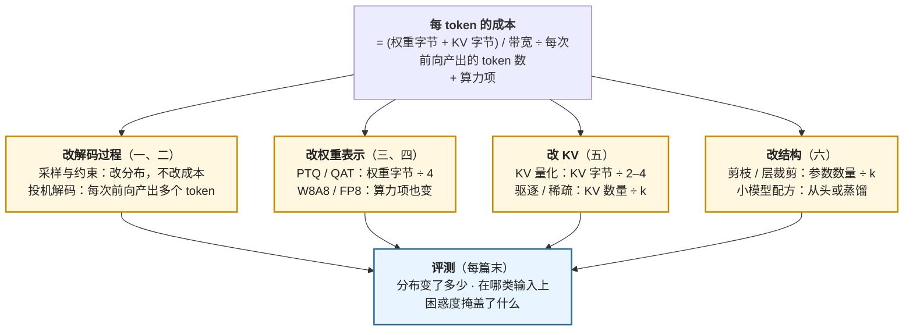

## 内容简介

《高效推理与压缩（算法侧）》是一组共六篇的系列文章，对应[《AI 算法工程师学习地图》](/ai-algorithm-engineer-learning-roadmap.html)的第 L6 层。它面向已经理解 Transformer 的成本结构（L4，[《Transformer 与 LLM》](/transformer-and-llm-for-infra-engineers.html)）、并且做过或准备做后训练（L5，[《后训练》](/post-training-from-sft-to-verifiable-rewards.html)）的读者，回答的是一个部署前必然遇到的问题：**不改硬件、不改推理引擎，怎么让同一个模型更快、更小、更便宜——以及每种办法让模型的输出改变了多少**。

"推理优化"这个词下面混着两类完全不同的东西。一类改变**模型或解码过程**：量化把权重从 16 bit 变成 4 bit，投机解码让一次前向产出多个 token，KV 驱逐丢掉一部分缓存，剪枝删掉一部分参数。另一类改变**调度与内存管理**：PagedAttention、continuous batching、chunked prefill、PD 分离。前一类是算法工程师的工作——每一种都要回答"输出分布变了没有、变了多少、在哪类输入上变得最多"；后一类是推理引擎的工作，模型不知道它们的存在，输出分布也不因它们改变。这个系列只讲前一类；后一类在 Infra 地图的[《大模型推理系统揭秘》](/deep-dive-into-vllm.html)系列里。

系列按"改什么"分四条线：**改解码过程**（解码策略与约束、投机解码）、**改权重表示**（训练后量化、量化感知训练与低比特）、**改 KV**（KV 量化、驱逐与稀疏 attention）、**改结构**（剪枝、层裁剪与小模型配方）。每条线用同一把尺子衡量：分布是否改变、收益的区间在哪里、代价是什么。

| 篇 | 主题 | 改什么 | 分布是否改变 |
|---|---|---|---|
| 一 | 解码策略、采样与约束生成 | 从分布里怎么取 | 有意地改变——采样参数就是在改分布 |
| 二 | 投机解码：草稿、接受率与树 | 一次前向产出几个 token | 不变（拒绝采样保证） |
| 三 | 训练后量化：误差模型、GPTQ、AWQ 与旋转 | 权重（与激活）的表示 | 变，量化误差；可控 |
| 四 | 量化感知训练、低比特与量化模型的评测 | 训练时就按低比特学 | 变，但训练把误差学回去一部分 |
| 五 | KV cache 压缩：量化、驱逐与稀疏 attention | 缓存的表示与数量 | 量化：小变；驱逐与稀疏：可能大变 |
| 六 | 剪枝、深度缩放与小模型配方 | 参数的数量与结构 | 变，需要再训练恢复 |

读完这个系列，面对一个训好的模型与一个部署预算，读者应该能够回答：用哪种量化、量化到几位、精度损失在哪类任务上出现；投机解码在这个负载上有没有收益、草稿从哪来；KV 要不要压、压哪一部分；以及一个 70B 模型怎么变成一个能用的 8B——各自的代价是什么、怎么评测它们。

## 为什么写这个系列？

### 部署是算法工作的最后一步，而且越来越贵

训练一个模型是一次性的成本，推理是持续的成本。[04 系列第十篇](/scaling-laws-and-compute-optimal-training.html)算过：当服务的 token 数达到训练 token 数的量级时，推理成本超过训练成本；一个被广泛使用的模型，一生中推理的 FLOPs 是训练的几倍到几十倍。这使得"让同一个模型的推理便宜一半"与"训一个便宜一半的模型"有同等的价值，而前者不需要重新训练。

同时，模型部署的地方在变多：数据中心的 H100，笔记本上的 GPU，手机上的 NPU。同一个模型要以不同的精度、不同的大小出现在不同的地方——Llama 3.2 的 1B / 3B 有官方的 QLoRA 与 QAT 版本；Gemma 3 发布了 QAT 的 INT4 检查点；Qwen 的每一代都有 GPTQ / AWQ / GGUF 的官方量化。压缩不再是部署工程师的事后处理，而是模型发布的一部分，需要算法工程师在训练阶段就设计。

### 每种方法都改变了模型，只是程度不同

这一层最容易被忽略的事实是：**除了投机解码，所有的推理优化都改变了模型的输出**。量化到 4 bit 的模型在困惑度上只差 0.1，但在长上下文检索、多步推理、低资源语言上的退化可能是几个点到十几个点；KV 驱逐在摘要任务上无损，在"大海捞针"上直接失败；层裁剪去掉 25% 的层困惑度只升一点，下游任务掉一半。这些退化是**分布不均匀**的——它们集中在某些能力上——而常用的评测（困惑度、MMLU）恰好对它们不敏感。

所以这个系列的每一篇都有一节讲"怎么评"。一个压缩方法在论文里报告的"精度损失 < 1%"，要问：在哪个指标上、哪类任务上、什么协议下。这是 L5 第八篇评测方法论在这一层的直接应用。

### 算法侧与系统侧的分界需要说清楚

一个常见的误分类是把 PagedAttention、continuous batching 归入"推理算法"。它们不是——它们是内存管理与调度，对模型透明。反过来，量化 kernel（Marlin、Machete）、投机解码在引擎里的实现（vLLM 的 `SpecDecodeWorker`）、KV 量化的存储格式，是系统工作，但它们**实现**的是本系列讲的算法。分界线是：**算法决定"算什么"，系统决定"怎么算得快"**。算法工程师需要知道系统侧的约束——比如 W4A16 的收益只在 memory-bound 区间兑现（[04 系列第七篇](/quantization-speculative-decoding-and-lora.html)）、投机解码在大 batch 下反而变慢——因为这些约束决定了算法的适用范围；但不需要写 kernel。

### 现有材料的断层

量化、投机解码、KV 压缩、剪枝各有几十篇论文和几个流行的工具，但很少被放在一起讲清楚彼此的关系：量化与投机解码可以叠加，但转折 batch 变小；KV 量化与 KV 驱逐解决的是同一个内存问题的不同侧面；剪枝之后必须蒸馏，而蒸馏是 L5 的方法。工具的文档（AutoGPTQ、llama.cpp、bitsandbytes）讲怎么用，不讲为什么这样做、什么时候不该用。这个系列试图补上"为什么"与"什么时候"。

## 适合哪些读者？

### 读完 L4、L5，准备把模型部署出去的算法学习者

这是主要读者。你知道模型的 FLOPs 与字节怎么算，做过 SFT 或 DPO，现在要把一个 7B 或 70B 的模型放到有限的 GPU 上服务，或者放到端侧。你需要知道每种压缩方法在数学上做了什么、在哪类输入上会出问题、怎么在自己的评测集上验证。系列按顺序读。

### 已经在用量化工具、但对原理与选型生疏的工程师

你用过 GPTQ 或 AWQ，知道 GGUF 的 Q4_K_M，但不清楚 GPTQ 的 Hessian 在补偿什么、AWQ 的 α 为什么是 0.5 附近、为什么有的模型量化后在某类任务上崩了。第三、四篇是为你写的：从量化误差的统计模型出发推导每种方法，最后一章讲怎么评一个量化模型。

### 做推理模型、被解码长度与成本困扰的工程师

推理模型的输出是几千到几万 token，解码成本主导一切。第二篇（投机解码在长输出上的收益）、第五篇（KV 在长序列上的压缩）、第一篇（采样参数对推理模型评测的影响）直接相关。

### Infra 工程师，想知道引擎里那些算法从哪来

你在 vLLM 系列里见过 `speculative_config`、`quantization="awq"`、`kv_cache_dtype="fp8"`，想知道背后的算法怎么选、为什么有效。这个系列是那些开关的算法侧说明；反过来，[04 系列第七篇](/quantization-speculative-decoding-and-lora.html)与 [vLLM 系列第七篇](/decoding-extensions-sampling-speculative-and-structured-output.html)是本系列的系统侧对应。

## 系列的整体主线

系列的主线是一个问题：**推理的成本由什么决定，每种方法改变了其中哪一项，代价是什么。** 一次 decode 步的时间由权重字节、KV 字节、算力三项决定（[04 系列第二、三篇](/transformer-flops-bytes-and-roofline.html)）；产出一个 token 的成本还要乘上"每次前向产出几个 token"的倒数。四条线各改其中一项：

四条线可以叠加，但叠加的收益不是相乘：量化后的模型做投机解码，验证前向更早进入 compute-bound；KV 量化与 KV 驱逐都在减少 KV 字节，第二个的边际收益取决于第一个做了多少；剪枝后的模型再量化，两种误差叠加。第六篇末尾用一张总表把六篇的方法放在"分布是否改变 × 收益区间 × 代价 × 适用负载"的坐标上。

贯穿六篇的三条线索：

- **推导线**：拒绝采样的分布等式（第二篇，从 04-07 的证明出发讲怎么提高接受率）、量化误差的统计模型与 OBS 的拉格朗日推导（第三篇）、STE 的梯度与 NF4 的分位推导（第四篇）、KV 离群值的通道结构（第五篇）、OBS 在剪枝上的形式（第六篇）——每种方法的目标函数都能写出来。
- **成本线**：每种方法改了成本公式的哪一项、收益区间在哪（回到 Roofline）、量化的元数据占多少字节、草稿模型训练要多少算力、剪枝 + 蒸馏比从头训省多少 token。
- **评测线**：每种方法的退化集中在哪类任务、用什么评测能看到、公开报告里的"无损"在什么协议下成立。

## 章节结构与分章导读

### 1. 解码策略、采样与约束生成

这一篇讲的是"从模型给出的分布里怎么取一个 token"——它不改变成本，但决定了模型表现出来的行为，也决定了评测的数字。

**为什么放在第一篇**：后面每一篇都要评测"输出分布变了多少"，而采样参数本身就是在改分布；不先把它说清楚，量化前后的比较就混进了采样的随机性。

**核心内容**：greedy 与 beam search 的搜索账，为什么 beam 在开放生成上失效（长度偏差、重复）；temperature 对分布熵的影响的推导；top-k、top-p、min-p 各自裁掉分布的哪一部分，为什么 min-p 在高温度下更稳；重复惩罚的三种形式（presence、frequency、repetition）的数学与副作用；约束解码（结构化输出）的原理——把语法编译成状态机，每步把不合法的 token 掩掉，outlines / xgrammar 的两种编译策略与它们的预处理成本；采样参数对评测的影响：pass@k 与 temperature 的关系、推理模型为什么在 greedy 下变差、RL 训练时的采样温度与推理时的一致性。

**要回答的问题**：同一个模型，temperature 从 0.6 调到 1.0，pass@1 与 pass@64 各怎么变？为什么？

### 2. 投机解码：草稿、接受率与树

[04 系列第七篇](/quantization-speculative-decoding-and-lora.html)已经证明了拒绝采样保证分布不变、推出了期望接受长度与 Roofline 决定的收益区间。这一篇从那里继续：**怎么把接受率提上去、怎么把草稿成本压下去、树状草稿怎么验证**。

**核心内容**：接受率就是 $$1 - \text{TV}(p, q)$$，因此提高接受率就是让草稿分布接近目标分布——草稿模型的训练目标应该是蒸馏（L5 第七篇），而且是 on-policy 的；Medusa 的多头结构、训练方式（自蒸馏）与各头接受率递减的原因；EAGLE 从 token 级到特征级起草的动机、它的训练目标（特征回归 + token 损失）、EAGLE-2 的动态草稿树与 EAGLE-3 的多层特征融合与训练时测试；树状草稿的验证——tree attention 的 mask、多条路径的接受规则、期望接受长度在树上的形式；MTP 头作为草稿（DeepSeek-V3）与作为训练目标（04-12）的两种身份；n-gram / prompt lookup 在有复制的任务上的免费收益；温度对接受率的影响；何时投机反而变慢——大 batch、短输出、草稿与目标不匹配；草稿模型的评测：接受长度、每 token 延迟、与目标的一致性检验。

**要回答的问题**：为什么 EAGLE 的接受率高于 Medusa 而草稿成本差不多？一个 70B 模型该用什么草稿？

### 3. 训练后量化：误差模型、GPTQ、AWQ 与旋转

[04 系列第七篇](/quantization-speculative-decoding-and-lora.html)给出了 GPTQ 的更新公式与 AWQ 的缩放形式，以及 W4A16 的收益区间。这一篇往下挖：**量化误差从哪来、为什么 RTN 到 4 bit 就不够、每种方法在最小化什么、离群值怎么处理**。

**核心内容**：量化误差的统计模型——均匀量化的噪声方差 $$\Delta^2/12$$、裁剪与舍入的权衡、最优裁剪阈值；误差怎么通过层传播、为什么某些层敏感；RTN 在 4 bit 失败的原因——权重的重尾分布与 group 内的动态范围；OBS 的拉格朗日推导（04-07 只给了结论）与 GPTQ 的列顺序、act-order、group size 的选择及元数据字节账；AWQ 的 α 搜索与它为什么等价于保护显著通道；SmoothQuant 的 α 与激活离群的模型规模依赖；旋转方法（QuaRot、SpinQuant）——用 Hadamard 旋转把离群值摊平、为什么旋转不改变输出、它让 W4A4 成为可能；浮点格式的低比特：FP8、MXFP4 / NVFP4 的微缩放块与它们和整数格式的精度对比；校准集的选择与过拟合；per-tensor / per-channel / per-group 的精度—开销权衡。

**要回答的问题**：一个 4-bit 量化模型比 16-bit 慢在哪、快在哪？为什么同样是 4 bit，有的模型几乎无损、有的崩掉？

### 4. 量化感知训练、低比特与量化模型的评测

PTQ 到 4 bit 是当前的舒适区；再往下（3 bit、2 bit、三值）或者要激活也量化到 4 bit，就需要训练参与。这一篇讲**训练怎么把量化误差学回去**，以及**怎么评一个量化模型**。

**核心内容**：STE（straight-through estimator）的梯度推导与它为什么"能用"；LSQ 让 scale 可学习的梯度；QAT 的成本——全量 QAT 一遍相当于一次继续预训练、只 QAT 最后阶段的折中；QLoRA 的 NF4——为什么按正态分位数放格点、双重量化的字节账、它与 LoRA 的组合；Llama 3.2 与 Gemma 3 的 QAT 配方；BitNet b1.58 的三值权重——它的训练怎么稳定、推理时的乘法变成加法、它是否兑现了承诺；量化 + 蒸馏（教师是全精度的自己，L5 第七篇）；评测——困惑度为什么掩盖任务退化、量化对长上下文与多步推理的不均匀影响、低资源语言与代码上的敏感性、KL 到全精度模型作为直接度量、Llama 3 / Qwen 2.5 系列公开的量化报告怎么读。

**要回答的问题**：困惑度只升 0.1 的 4-bit 模型，在什么任务上会掉 5 个点？怎么在部署前发现？

### 5. KV cache 压缩：量化、驱逐与稀疏 attention

长上下文与长输出让 KV cache 成为推理内存的主体（[04 系列第三篇](/attention-variants-and-kv-cache.html)的账）。结构级的办法——GQA、MLA——在训练时就定了；这一篇讲**训好之后**还能对 KV 做什么。

**核心内容**：KV 的数值结构——key 的离群值集中在固定通道、value 没有——所以 KIVI 对 key 按通道、对 value 按 token 量化；KV 量化到 2 bit 的误差怎么影响 attention 分数（softmax 前的误差被放大）；驱逐——StreamingLLM 的 attention sink 现象与解释（04-05 已介绍现象，这里讲为什么第一个 token 会成为 sink）、H2O 的累计注意力打分、SnapKV 用 prompt 尾部的注意力选 KV、PyramidKV 按层分配预算；驱逐在"大海捞针"上的失败与原因；token 合并；跨层共享 KV（CLA、YOCO）；训练时就稀疏的 attention——NSA 与 MoBA 的块选择、它们怎么让选择可微、与推理时的一致性；prompt 压缩（LLMLingua 一类）作为另一条路。

**要回答的问题**：128K 上下文的 KV 从 40 GB 压到 10 GB，哪种办法在哪类任务上安全？

### 6. 剪枝、深度缩放与小模型配方

最后一条线改的是参数的数量。这一篇讲**删掉一部分参数之后模型还剩多少、怎么恢复**，以及它与"直接训一个小模型"的对比。

**核心内容**：非结构化剪枝——幅度剪枝、Wanda（权重 × 激活）、SparseGPT（OBS 在剪枝上的形式，与 GPTQ 同一套数学）；2:4 结构化稀疏在硬件上兑现的条件；结构化剪枝——层裁剪（ShortGPT 的 Block Influence、为什么中后层最"多余"）、宽度剪枝（Sheared LLaMA 的可学习 mask）、MoE 的专家剪枝；剪枝后的恢复——为什么必须蒸馏、Minitron 的"剪枝 + 蒸馏"流水线与它的算力账（相比从头训省 40 倍 token）；小模型配方对照——Llama 3.2 1B / 3B、Qwen2.5-0.5B、Gemma 3 1B、SmolLM、MobileLLM 各自怎么得到、深而窄还是浅而宽；系列总结——把六篇的方法放到一张"分布是否改变 × 收益区间 × 代价 × 适用负载"的总表上，回答"一个 70B 怎么变成一个能用的 8B"。

**要回答的问题**：剪掉 25% 的层，困惑度只升 0.3，为什么下游任务掉一半？蒸馏能恢复多少？

## 贯穿全系列的实践线

这个系列**没有配套实验**（与后训练系列二到八篇同一约定）。每篇有一节"动手（建议）"，给出用现成工具（`transformers`、`auto-gptq` / `autoawq` / `llm-compressor`、`vllm`、`lm-eval`）复现该篇核心现象的骨架、该看的指标与该比较的对照组，但不引用任何未跑过的数字。文中的数字全部来自推导或公开的技术报告与论文。

建议的动手顺序（一张 24 GB 的 GPU 上、以 Qwen2.5-7B 或 Llama-3.1-8B 为对象）：

| 篇 | 动手 | 看什么 |
|---|---|---|
| 一 | 同一模型在 GSM8K 上扫 temperature × top-p，各采样 n 次 | pass@1 与 pass@n 随温度的曲线；greedy 与采样的差 |
| 二 | vLLM 开 n-gram 与 EAGLE 两种草稿，分别在改写任务与自由生成上测 | 接受长度、每 token 延迟随 batch 的变化 |
| 三 | 同一模型做 RTN / GPTQ / AWQ 的 INT4，group 128 与 32 | 困惑度、MMLU、一个长上下文任务；哪个先掉 |
| 四 | 计算量化模型对全精度模型的逐 token KL；比较困惑度差与 KL | KL 对任务退化的预测力 |
| 五 | vLLM 开 `kv_cache_dtype=fp8`；再试 H2O / SnapKV 的开源实现 | 大海捞针任务上的准确率随 KV 预算的曲线 |
| 六 | 用 Block Influence 裁掉 8 层，测困惑度与 5 个 benchmark；用 L5 第一篇的 SFT 脚本蒸馏恢复 | 困惑度与任务退化的不一致；恢复曲线 |

## 阅读路径建议

### 完整学习路径

按一到六的顺序。第一篇建立"采样也在改分布"的前提；第二篇是唯一不改分布的方法；三、四篇是量化的主体；第五篇处理长上下文；第六篇收尾并总结。

### 只做部署选型、不训练

一 → 三 → 四的评测章 → 五的前半（KV 量化）→ 六的总表。目标是知道每种方法的适用范围与评测方法，能读懂官方量化模型的报告。

### 做端侧或小模型

四 → 六 → 三。端侧模型的主线是 QAT + 剪枝 + 蒸馏，PTQ 是最后一步。

### 做推理模型、长输出

一 → 二 → 五。解码成本主导时，投机解码与 KV 压缩的收益最大，采样参数对评测的影响也最大。

### Infra 工程师

二、三、五各读推导与"收益区间"部分，对应 vLLM 系列的[第七篇](/decoding-extensions-sampling-speculative-and-structured-output.html)（投机与结构化输出）与[第五篇](/kv-cache-memory-core.html)（KV 内存）。

## 本系列的边界

- **系统侧的推理优化**——PagedAttention、continuous batching、chunked prefill、PD 分离、prefix caching、量化 kernel 的实现——不在本系列。它们在 [vLLM 系列](/deep-dive-into-vllm.html)与 [GPU Kernel 系列](/gpu-kernel-engineering.html)。
- **训练时就决定的结构选择**——GQA、MLA、MoE、sliding window——它们的成本账在 [04 系列](/transformer-and-llm-for-infra-engineers.html)，建模动机散在各篇；本系列只在第五篇讨论训好之后对 KV 的处理时回指它们。
- **蒸馏的方法本身**在 [L5 第七篇](/knowledge-distillation-for-llms.html)；本系列第四、六篇把它当作恢复精度的工具引用。
- **扩散模型的推理加速**（步数蒸馏、一致性模型）是另一套数学，放在 L7 多模态系列的第六篇。
- **硬件相关的格式细节**（FP8 的 E4M3 / E5M2、Tensor Core 对 2:4 的支持）在 [04 系列第六篇](/floating-point-formats-and-mixed-precision.html)与 GPU Kernel 系列；本系列只用它们的结论。

## 前置要求与说明

### 前置要求

- [04 系列](/transformer-and-llm-for-infra-engineers.html)第二、三、七篇：Roofline、KV cache 的账、量化与投机解码的基本形式。本系列在这三篇的结论上继续，不重复它们的推导。
- [L5 第七篇](/knowledge-distillation-for-llms.html)（蒸馏）与[第八篇](/evaluating-llms-benchmarks-judges-and-contamination.html)（评测）：本系列的恢复手段与评测方法论都来自那里。
- [L0 数学导读](/math-for-ai-algorithm-engineers.html)的信息论部分：KL、总变差距离在第二、四篇里是核心度量。

### 版本与基线

- 模型基线：Llama-3.1-8B / 70B、Qwen2.5-7B、DeepSeek-V3 的公开数字；小模型对照用 Llama 3.2、Qwen2.5-0.5B、Gemma 3、SmolLM 的技术报告。
- 硬件基线：H100 SXM（3.35 TB/s、989 TFLOPS BF16），与 04 系列一致。
- 方法的引用以论文与技术报告为准；工具（`llm-compressor`、`auto-gptq`、`autoawq`、`vllm`、`lm-eval`）的版本变化快，"动手"节只给接口形状，不锚定版本。

## 章节目录

1. [解码策略、采样与约束生成](/decoding-strategies-sampling-and-constrained-generation.html)
2. [投机解码：草稿、接受率与树](/speculative-decoding-drafters-acceptance-and-trees.html)
3. [训练后量化：误差模型、GPTQ、AWQ 与旋转](/post-training-quantization-gptq-awq-and-rotation.html)
4. [量化感知训练、低比特与量化模型的评测](/quantization-aware-training-low-bit-and-evaluating-quantized-models.html)
5. [KV cache 压缩：量化、驱逐与稀疏 attention](/kv-cache-compression-quantization-eviction-and-sparse-attention.html)
6. [剪枝、深度缩放与小模型配方](/pruning-depth-scaling-and-small-model-recipes.html)

## 最终目标

读完这个系列，面对一个训好的模型与一个部署约束，读者应该能够回答：

| 追问 | 答案来自 |
|---|---|
| 这个负载（batch、输出长度、上下文长度）的瓶颈是权重字节、KV 字节还是算力？哪条线的收益最大？ | 总纲 · 04 系列 |
| 采样参数怎么定？评测时用 greedy 还是采样？温度改了 pass@k 怎么变？ | 第一篇 |
| 投机解码在这个负载上有收益吗？草稿用什么？接受率预期多少？ | 第二篇 |
| 量化到几位、用哪种方法、group 多大？为什么这个模型量化后崩了？ | 第三篇 |
| 需要 QAT 吗？怎么在部署前发现量化的任务退化？ | 第四篇 |
| 128K 上下文的 KV 怎么压？哪种办法在这类任务上安全？ | 第五篇 |
| 一个 70B 怎么变成一个能用的 8B？剪枝 + 蒸馏还是从头训？ | 第六篇 |
| 这些方法叠加时收益怎么算？代价怎么叠加？ | 第六篇总表 |

推理优化的方法每年都在换名字。不变的是那条成本公式、"分布变了多少"这个问题、以及在自己的评测集上验证的纪律。
