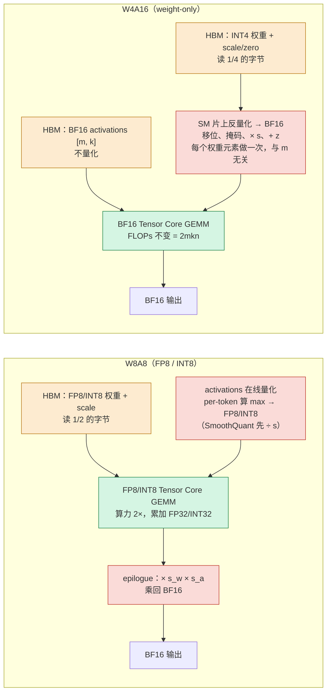

量化是把权重（有时也把激活、KV cache）从 16 bit 浮点变成 4 bit 或 8 bit。它与[04 系列第十四篇](/floating-point-formats-and-mixed-precision.html)的数值格式强相关，但不是一回事：数值格式问的是"训练和计算该用什么格式算，误差在哪里积累、怎么控制"，目标是误差可控、训练稳定；量化问的是"哪些张量可以压到比计算格式更少的位、按什么粒度放 scale、用什么校准补偿误差"，目标是字节数下降、输出分布尽量不变——它允许有损。两者共享词汇（INT8、FP8、E4M3、scale、累加精度），交汇点是细粒度 scale：DeepSeek-V3 的 FP8 训练给每个 $$1 \times 128$$ 激活块、$$128 \times 128$$ 权重块各配一个 scale，用的正是量化的手段。

这一篇先回答"量化**省**多少、什么时候省得到"（第二章，用 04 系列第六篇的 Roofline），再回答"量化**丢**多少、丢在哪、怎么少丢"（第三章起）。量化误差是本系列里最可控的一种分布改变：它有一个清楚的统计模型，每种方法都在这个模型下最小化一个明确的目标，而且方法之间的差别可以精确地说出来——RTN 什么都不管，GPTQ 补偿输出误差，AWQ 保护显著通道，SmoothQuant 迁移离群值，旋转把离群值摊平。理解了误差模型，就能回答"为什么同样是 4 bit，有的模型几乎无损、有的崩掉"——答案在权重与激活的分布形状里。

本篇要回答的核心问题是：

> **一个 4-bit 量化模型比 16-bit 慢在哪、快在哪？[^q0] 为什么同样是 4 bit，有的模型几乎无损、有的崩掉？[^q1]**

## 一、总览：五种方法在最小化什么

### 1. 一张对照表

| 方法 | 量化对象 | 最小化的目标 | 处理离群值的方式 | 需要 | 4-bit 的典型表现 |
|---|---|---|---|---|---|
| RTN | W | 每个权重的舍入误差（逐元素） | 不处理——离群值撑大 group 的范围 | 无 | INT8 够用；INT4 困惑度 +0.5 到 +几 |
| GPTQ | W | 层输出误差 $$\lVert WX - \hat{W}X \rVert^2$$（二阶补偿） | 不直接处理；补偿间接吸收一部分 | 校准集 128 × 2K token，Hessian | INT4 困惑度 +0.1 到 +0.3 |
| AWQ | W | 层输出误差（一阶：缩放搜索） | 放大显著输入通道对应的权重列 | 校准集，激活统计 | 与 GPTQ 相当，更稳 |
| SmoothQuant | W + A | 让激活可量化 | 把激活的离群值迁移到权重 | 校准集，激活统计 | W8A8 接近无损；W4A4 不够 |
| 旋转（QuaRot / SpinQuant） | W + A（+ KV） | 让权重与激活都没有离群值 | Hadamard / 学习的正交旋转，摊平离群值 | 校准集（SpinQuant 需要少量优化） | W4A4 困惑度 +0.2 到 +0.5，是 W4A4 的可行路径 |

Table: 训练后量化方法对照

五种方法里前三种只量化权重（W4A16 / W8A16），GEMM 仍在 BF16 上算，收益是字节；后两种也量化激活，GEMM 在 INT8 / INT4 / FP8 Tensor Core 上算，收益是字节加算力。两类的难度差一个量级：权重是静态的、可以离线慢慢算；激活是动态的、每次前向都不同、且有离群值。

### 2. 先说答案

4-bit 模型**快在** decode：权重字节除以 4，memory-bound 区间内每步时间接近除以 4（实际 2.5–3.5 倍，因为 KV 读取与 dequant 开销）。**慢在**两处：prefill（compute-bound，W4A16 的 dequant 是额外的算子，且 INT4 权重要先转成 BF16 再乘，没有算力收益——除非用 W4A4 / W8A8 让 Tensor Core 直接算低比特）；以及大 batch 的 decode（同样进入 compute-bound）。所以 4-bit 权重量化是为**低 batch、长输出**的负载设计的，高吞吐负载要用 W8A8 或 FP8。

同样是 4 bit 有的模型崩掉，原因几乎总是**分布形状**：（1）权重里有少数极大值（重尾），group 内的量化范围被它们撑大，其他权重只剩一两个整数级别；（2）激活里有固定通道的离群值（从约 6.7B 起系统性出现，第七章讲），它们对应的权重列特别重要，RTN 一律对待就毁了它们；（3）某些层特别敏感（第一层、最后几层、attention 的 out_proj），同样的误差在那里被放大。经过更多训练（更多 token、更多 RLHF）的模型往往**更难量化**——Llama 3 比 Llama 2 在同样的 4-bit 方法下掉得更多，一个假说是过训练把更多信息压进了每个权重的低位。第三、七章展开。

### 3. 本文的章节安排

| 章 | 主题 | 内容 |
|---|---|---|
| 二 | 量化为什么快、什么时候快 | 一个时间模型<br/>基本形式与粒度、INT4 实为 4.16–4.25 bit<br/>W4A16 的收益区间：decode 与 prefill 符号相反<br/>交叉点 B ≈ ridge/4<br/>W8A8 与 W4A16 在 Roofline 上的位置 |
| 三 | 误差模型 | 均匀量化的噪声方差<br/>裁剪与舍入的权衡<br/>误差怎么通过层传播<br/>哪些层敏感 |
| 四 | RTN 为什么到 4 bit 就不够 | 权重的重尾<br/>group 内的动态范围<br/>group size 与元数据的账 |
| 五 | GPTQ | OBS 的拉格朗日推导<br/>GPTQ 的三处工程改造<br/>act-order<br/>校准集的作用与过拟合 |
| 六 | AWQ | 显著通道<br/>缩放搜索的目标<br/>α 的含义<br/>与 GPTQ 的关系与组合 |
| 七 | 激活量化与离群值 | 离群值的来源与规模依赖<br/>SmoothQuant 的 α<br/>LLM.int8() 的分离<br/>per-token 动态量化<br/>W8A8 与 FP8：相对精度 vs 绝对精度<br/>DeepSeek-V3 的分块 scale |
| 八 | 旋转 | 正交变换不改变输出<br/>Hadamard 摊平离群值的原理<br/>QuaRot 的放置<br/>SpinQuant 的学习旋转<br/>W4A4 的可行性 |
| 九 | 格式 | INT4 / FP4 / NF4<br/>MXFP4 与 NVFP4 的微缩放块<br/>整数与浮点的精度对比<br/>GGUF 的 k-quants |
| 十 | 校准与敏感层 | 校准集的选择与大小<br/>逐层敏感度<br/>混合精度 |
| 十一 | 成本 | 量化过程的时间<br/>dequant 的运行时开销<br/>元数据字节 |
| 十二 | 动手（建议） | RTN / GPTQ / AWQ 的对照<br/>BF16 与 INT4 在 batch 1 / 64 与 8K prefill 下的对照 |
| 十三 | 本文小结 |  |
| 十四 | 自测 | 7 道题 |

Table: 本文的章节安排

## 二、量化为什么快、什么时候快

### 1. 一个时间模型

decode 阶段每步每个请求只有一个 token，权重 GEMM $$[B, k] \times [k, n]$$ 的算术强度是 $$2Bkn / 2kn = B$$ FLOP/byte；H100 SXM 的 ridge point 是 $$989 / 3.35 \approx 295$$（[04 系列第六篇](/transformer-flops-bytes-and-roofline.html)）。batch 不到大约 300，decode 的权重 GEMM 就在 Roofline 的斜线上——时间由字节数决定，与 FLOPs 无关。本章所有估算都用同一个模型：一次前向处理 $$m$$ 个 token 行，时间下界是访存时间与计算时间的较大者

$$
T(m) = \max\left( \frac{W_{\text{bytes}}}{BW},\ \frac{2 N m}{F} \right)
$$

$$W_{\text{bytes}}$$ 是要读的权重字节数，$$N$$ 是参与 GEMM 的参数量（embedding 是查表，不算），$$F$$ 是算力。代入 Llama-3-8B（8.03B 参数，BF16 权重 16.06 GB，每 token 权重 FLOPs 约 15.0 GFLOPs）：

$$
T_{\text{mem}} = \frac{16.06 \ \text{GB}}{3.35 \ \text{TB/s}} \approx 4.8 \ \text{ms}, \qquad
T_{\text{cmp}}(m) = m \times \frac{15.0 \ \text{GFLOPs}}{989 \ \text{TFLOPS}} \approx m \times 15.2 \ \mu\text{s}
$$

两者相等在 $$m \approx 316$$，与 ridge 295 同一量级。这个模型忽略了 KV cache 读取、activations 与 kernel 效率，是**理论下界**，不是任何实现的实测。量化改的是 $$W_{\text{bytes}}$$。

### 2. 基本形式与粒度

均匀量化把一个浮点权重 $$w$$ 映射到 $$b$$ 位整数再映射回来：

$$
q = \text{clamp}\left( \text{round}\left(\frac{w}{s}\right) + z,\ 0,\ 2^b - 1 \right), \qquad
\hat{w} = s \cdot (q - z)
$$

$$s$$ 是 scale（实数），$$z$$ 是 zero point（一个**整数**编码，表示实数 0 落在哪一格）。注意 $$z$$ 是加在整数一侧的，解码时先减 $$z$$ 再乘 $$s$$；有些资料写成 $$\hat w = s \cdot \text{round}(w/s) + z$$，那里的 $$z$$ 就得是实数偏移、量纲是 $$w$$ 而不是格点，两种写法不能混。**对称量化** $$z = 0$$，$$s = \max\lvert w\rvert  / (2^{b-1} - 1)$$；**非对称量化** $$z \neq 0$$，$$s = (\max w - \min w) / (2^b - 1)$$，把实际的 $$[\min, \max]$$ 区间完整映射到 $$[0, 2^b - 1]$$，对分布偏斜的权重多用掉一个 bit 的表达力。

$$s$$ 与 $$z$$ 按什么范围共享，决定了量化的**粒度**（行 = 输出通道，横向 = GEMM 的归约维 $$k = d_{in}$$）：

```text title="三种量化粒度的 (s, z) 共享范围"
                 d_in（归约维 k）─────────────────────▶
           ┌────────────────────────────────────────┐
per-tensor │ 整个矩阵共用一个 (s, z)                │ 元数据 1 个
           └────────────────────────────────────────┘

           ┌────────────────────────────────────────┐
per-       │ 行 0 ························ (s0, z0) │ 元数据 d_out 个
channel    │ 行 1 ························ (s1, z1) │ （W_Q: 4096 个）
           │ ...                                    │
           └────────────────────────────────────────┘

           ┌─────────┬─────────┬─────────┬──────────┐
per-group  │ g=128   │ g=128   │ g=128   │ ...      │ 每行 d_in/g 组
g=128      │(s00,z00)│(s01,z01)│(s02,z02)│          │ 元数据 d_out·d_in/g
           ├─────────┼─────────┼─────────┼──────────┤ （W_Q: 4096×32
           │(s10,z10)│(s11,z11)│(s12,z12)│ ...      │  = 131072 个）
           └─────────┴─────────┴─────────┴──────────┘
```

per-channel 的 scale 沿 $$k$$ 不变，可以在 GEMM 累加完之后在 epilogue 一次乘回；per-group 的 scale 沿 $$k$$ 每 $$g$$ 个元素换一次，必须在累加过程中乘——这是 W4A16 kernel 要在片上做反量化、而不能把 scale 留到最后的原因。per-group 的元数据开销：每个权重 $$b$$ 位，每 $$g$$ 个权重摊一个 scale 和一个 zero，$$\text{bit/weight} = b + (b_{\text{scale}} + b_{\text{zero}})/g$$。INT4、$$g = 128$$、FP16 scale + 4-bit zero：$$4 + 20/128 = 4.16$$ bit；FP16 scale + FP16 zero：$$4 + 32/128 = 4.25$$ bit。所以常说的"INT4 模型"实际是 **4.16–4.25 bit/权重**（第四章第 2 节再看 group size 的取舍）。代入 Llama-3-70B：$$70.55 \times 10^9 \times 4.25 / 8 \approx 37.5$$ GB，embedding 与 lm_head 保留 BF16 则约 40.6 GB——能放进一张 80 GB 的 H100，剩下约 40 GB 给 KV cache；BF16 的 141 GB 需要至少两张卡。这是 weight-only 量化最直接、也最不需要 Roofline 就能理解的收益：把一个模型从两卡变成一卡。Llama-3-8B：$$8.03 \times 4.25 / 8 \approx 4.27$$ GB。

哪些部分通常不量化，用参数量的分布来理解：embedding 是查表，量化它省的是显存而不是 decode 带宽（每步只读一行）；lm_head 在 decode 每步被完整读一遍（8B 的 1.05 GB），量化它对时间有实际帮助，但它直接决定输出分布，对误差最敏感，多数方案保留 FP16；attention 与 FFN 的 6.98B 是量化的主体。

### 3. W4A16 的收益区间：decode 与 prefill 符号相反

W4A16 指权重 4 位、activations 保持 16 位。计算时 kernel 从显存读 INT4 权重，在片上反量化成 BF16，再与 BF16 的 activations 在 BF16 Tensor Core 上做乘加。**FLOPs 一个都没少，少的只是权重字节数。**

回到时间模型。decode $$B = 1$$：

$$
T_{\text{mem}}^{\text{INT4}} = \frac{4.0 \sim 4.3 \ \text{GB}}{3.35 \ \text{TB/s}} \approx 1.2 \sim 1.3 \ \text{ms}
$$

从 4.8 ms 降到 1.2 ms（纯 4 bit）或 1.27 ms（4.25 bit）。前提是：反量化开销可忽略（它在 SM 内部做，不碰 HBM）、activations 仍是 BF16（$$B = 1$$ 时只有几十 KB）、KV cache 读取不计。

prefill 是另一回事。8K prompt 的 prefill 处理 $$m = 8192$$ 行，算术强度约 8192 FLOP/byte，远在 ridge 295 之上，时间由 FLOPs 决定：$$8192 \times 15.0 \ \text{GFLOPs} / 989 \ \text{TFLOPS} \approx 0.12$$ s（100% MFU）。FLOPs 没变，Tensor Core 还是 BF16 的，权重那 16 GB 本来在 0.12 s 里只占 4.8 ms，省掉 3/4 也只是省了 3.6 ms。而反量化是纯增加的工作：每个权重元素在被用于 8192 行的乘加之前，要先做一次移位、掩码、乘 scale、加 zero——总量与 $$kn$$ 成正比、与 $$m$$ 无关；$$m = 1$$ 时它藏在访存延迟后面，$$m = 8192$$ 时它本身可忽略，但它占用的寄存器与指令槽、以及为容纳 INT4 布局而偏离 cuBLAS 最优 tile 形状的代价，让 kernel 的 MFU 低于纯 BF16 GEMM。所以"prefill 更慢"的幅度不是理论能算出来的，取决于 kernel 实现；理论能说的只是**字节数少这一项在 compute-bound 区兑现不了**。实践中 W4A16 的 prefill 通常持平或略慢，把它当经验事实而不是定理。

同一个 4.25 bit 的权重文件，decode 快约 4 倍（理论），prefill 持平或更慢——不是两种现象，是 Roofline 上两个位置：一个在斜线上（字节数决定时间，字节减少直接兑现），一个在平台上（FLOPs 决定时间，字节减少不兑现，反量化的额外指令反而算进去）。

### 4. 从 batch 1 到 256：交叉点在 B ≈ ridge/4

把 batch 扫一遍，用同一个时间模型算 BF16 与 W4A16 各自的下界（Llama-3-8B，H100，纯 4 bit 4.0 GB，忽略反量化开销）：

| batch B | BF16 下界 (ms) | W4A16 下界 (ms) | BF16/W4A16 |
|---|---|---|---|
| 1 | 4.79 | 1.20 | 4.0 |
| 8 | 4.79 | 1.20 | 4.0 |
| 32 | 4.79 | 1.20 | 4.0 |
| 64 | 4.79 | 1.20 | 4.0 |
| 128 | 4.79 | 1.94 | 2.5 |
| 256 | 4.79 | 3.89 | 1.2 |
| 512 | 7.77 | 7.77 | 1.0（实际 W4A16 更慢） |

Table: Llama-3-8B 在 H100 上 BF16 与 W4A16 的 decode 时间下界随 batch 的变化

BF16 在 $$B < 316$$ 时一直被 4.8 ms 的访存时间钉住；W4A16 的访存时间是 1.2 ms，计算时间 $$B \times 15.2 \ \mu s$$ 追上它的位置是

$$
B^* = \frac{1.2 \ \text{ms}}{15.2 \ \mu\text{s}} \approx 79 \approx \frac{\text{ridge}}{4}
$$

一般地，权重压缩 $$k$$ 倍，W4A16 的"转折 batch"就是 $$\text{ridge}/k$$。超过 $$B^*$$ 之后 W4A16 转为 compute-bound，收益按 $$1/B$$ 衰减，到 $$B \approx \text{ridge}$$ 处两者相遇，再往上反量化开销让 W4A16 落到 BF16 下方。两个转折点要分开：W4A16 自己在 $$B \approx 79$$ 越过 ridge；但"相对 BF16 没有收益"要到 BF16 也 compute-bound、两者时间都由同样的 FLOPs 决定，即 $$B \approx 295$$——中间那段 W4A16 仍快，只是加速比从 4 倍逐渐降到 1。

这张表回答了"什么时候该用 W4A16"：**单请求或小 batch 的延迟敏感服务**（本地部署、交互式应用），以及**为了放进一张卡**。高吞吐、大 batch 的服务里，它对 decode 的帮助随 batch 变小，对 prefill 是负的。实际测到的 decode 加速通常在 3 倍左右而非 4 倍，差在几处：lm_head 常保留 FP16（1.05 GB，占 4.27 GB 的四分之一）、KV cache 读取不随权重量化减少、group 元数据、kernel 效率——都能用上面的模型逐项归因。

把它与另一种 decode 加速——投机解码（[04 系列第十二篇](/speculative-decoding-and-lora.html)，本系列上一篇再深入）——画在同一条 $$T(m)$$ 曲线上（对数坐标）：量化把 memory-bound 的平台**向下**移，投机解码把工作点**向右**推，两者的收益都止于平台与斜线的交点：


### 5. W8A8 与 W4A16 各自的位置

两类量化在 kernel 里的数据流不同——差别在**反量化发生在哪一步**、**乘加用哪种 Tensor Core**：



上面（W4A16）省的只有权重字节，乘加与 BF16 完全相同，反量化是加进去的工作；下面（W8A8）权重字节减半、activations 也变成 8 位，乘加本身换到了两倍算力的 Tensor Core 上。放到 Roofline 上：

| 配置 | 权重字节 | GEMM 精度 | decode (memory-bound) | prefill (compute-bound) |
|---|---|---|---|---|
| BF16 | 1× | BF16 Tensor Core | 4.8 ms | 基线 |
| W8A8 (FP8/INT8) | 1/2 | FP8/INT8 TC 2× 算力 | 2.4 ms 下界 | 上限快 2× |
| W4A16 | 1/4 | BF16 TC + 反量化 | 1.2 ms 下界 | 不变或更慢 |
| W4A8 | 1/4 | FP8/INT8 TC | 1.2 ms 下界 | 上限快 2×（反量化到 INT8/FP8） |

Table: 四种精度配置在 Roofline 上的位置

W8A8 让 GEMM 在 FP8 Tensor Core 上跑，ridge 变为 $$1979/3.35 \approx 591$$，prefill 的 FLOPs 上限翻倍；同时权重减半，decode 下界 2.4 ms。8K prefill 约 140 TFLOP（因果掩码下）在 60% MFU 下从约 0.24 s 降到约 0.12 s。W4A16 对 prefill 无益，对 decode 的收益是 W8A8 的两倍。两者组合的 W4A8 试图兼得，代价是把 4 位权重反量化到 8 位整数/浮点的精度损失与 kernel 复杂度。

这就是"用哪种量化"的判断依据：**prefill 重（长 prompt、高吞吐）用 W8A8；decode 重（长生成、低延迟、小 batch）用 W4A16；显存装不下先用 W4。** KV cache 的量化是同一笔账的另一半——上下文 8K、batch 64 时 Llama-3-8B 每步要读 64 GiB 的 KV，是权重的四倍，那个区间里 KV 量化比权重量化更要紧，第五篇算它。

## 三、误差模型

### 1. 均匀量化与它的噪声

先看一张图再看公式。量化做的事只有一件：在数轴上摆一排等距的格点，把每个权重换成离它最近的格点——存的不再是权重本身，而是"第几个格点"（INT4 是 −7 到 7 的一个整数）加一个公共的步长。误差就是每个点到最近格点的距离；格点摆多密、摆在哪，由范围 $$\alpha$$ 一个数决定：


图里的两难——格点被一个离群值撑粗、还是把离群值裁掉——就是本章要算的"舍入 vs 裁剪"，也是后面 GPTQ / AWQ / 旋转三种方法各自在解的问题。下面把它写成公式。

$$b$$ bit 的对称均匀量化在区间 $$[-\alpha, \alpha]$$ 上放 $$2^b - 1$$ 个格点（$$-(2^{b-1}-1)$$ 到 $$2^{b-1}-1$$，以 0 为中心），格点之间有 $$2^b - 2$$ 个间隔，步长 $$\Delta = \alpha / (2^{b-1} - 1) = 2\alpha/(2^b - 2)$$——INT4 是 $$\alpha / 7$$，不是常见误写的 $$2\alpha/15$$（那样最大格点只到 $$14\alpha/15$$，$$\alpha$$ 本身被裁掉）。非对称量化把 $$[\beta, \alpha]$$ 放 $$2^b$$ 个格点、$$2^b - 1$$ 个间隔，$$\Delta = (\alpha - \beta)/(2^b - 1)$$：

$$
\hat{w} = \Delta \cdot \text{clip}\Big(\text{round}\big(\tfrac{w}{\Delta}\big), -(2^{b-1} - 1), 2^{b-1} - 1\Big)
$$

对落在范围内的 $$w$$，舍入误差 $$e = w - \hat{w}$$ 在 $$[-\Delta/2, \Delta/2]$$ 上近似均匀分布（当 $$w$$ 的分布相对于 $$\Delta$$ 足够平滑时），方差

$$
\mathbb{E}[e^2] = \frac{1}{\Delta} \int_{-\Delta/2}^{\Delta/2} e^2 \, de = \frac{\Delta^2}{12}
$$

这是量化的基本公式。它说：误差方差与步长的平方成正比，步长与范围 $$\alpha$$ 成正比、与 $$2^b$$ 成反比。**每少 1 bit，步长约翻倍，误差方差约乘 4**（6 dB）——精确地说是格点数之比的平方：INT8 到 INT4 是 $$(255/15)^2 = 289$$ 而不是恰好 256，高位数下才趋近 $$4^{\Delta b}$$；且"误差在格内均匀"这个前提在 INT4（$$\Delta \approx 2\sigma$$）已经很勉强。

### 2. 裁剪与舍入的权衡

范围 $$\alpha$$ 怎么定？取 $$\alpha = \max\lvert w \rvert$$（不裁剪）时舍入误差最大——一个极大值把 $$\Delta$$ 撑大，所有权重的舍入误差都变大；取小一点的 $$\alpha$$，多数权重的舍入误差减小，但超出范围的权重被裁剪，产生大的裁剪误差。总误差

$$
\mathbb{E}[e^2] = \underbrace{\frac{\Delta(\alpha)^2}{12} \cdot P(\lvert w \rvert \le \alpha)}_{\text{舍入}} + \underbrace{\mathbb{E}\big[(\lvert w \rvert - \alpha)^2 \cdot \mathbb{1}[\lvert w \rvert > \alpha]\big]}_{\text{裁剪}}
$$

对高斯分布的权重，最优的 $$\alpha$$ 在 4 bit 下约为 $$2.5\sigma$$–$$3\sigma$$（而 $$\max$$ 通常在 $$4\sigma$$–$$5\sigma$$ 以上）；对重尾分布，最优裁剪更激进。所有实用的量化工具都做某种形式的范围搜索：在校准数据上扫一组 $$\alpha$$（比如 $$\max$$ 的 0.8 到 1.0），选使误差最小的。这一步在 INT8 下无所谓（$$\Delta$$ 已经很小），在 INT4 下值 0.1–0.2 的困惑度。

### 3. 误差怎么通过层传播

权重误差 $$E = \hat{W} - W$$ 造成的输出误差是 $$EX$$。对一个线性层，输出误差的期望平方范数

$$
\mathbb{E}\lVert EX \rVert_F^2 = \text{tr}(E \, \mathbb{E}[XX^\top] \, E^\top)
$$

$$\mathbb{E}[XX^\top]$$ 是输入的二阶矩——这正是 GPTQ 的 Hessian $$H$$（差一个常数 2）。这个公式说：**同样大小的权重误差，落在输入方差大的通道上，输出误差大**。输入的某些通道（激活离群通道）方差是其他通道的几十倍，这些通道对应的权重列的误差被放大几十倍。这是 AWQ 的"显著通道"的数学根源，也是 GPTQ 用 $$H$$ 加权的原因。

输出误差再经过后面的层。残差连接让误差直接累加到残差流上；LayerNorm / RMSNorm 对误差做了归一化（一定程度上抑制）；attention 的 softmax 把 Q、K 的误差非线性地放大（logits 的小误差在 softmax 之后可以是概率的大变化）。所以逐层独立地量化（所有 PTQ 方法的做法）得到的总误差不是各层误差的简单和，敏感层（第十章）的误差主导。

### 4. 误差对 loss 的影响

最终关心的是 loss 的变化。对 loss 做二阶展开，权重扰动 $$\delta$$ 引起的 loss 变化

$$
\Delta \mathcal{L} \approx \nabla \mathcal{L}^\top \delta + \frac{1}{2} \delta^\top \mathbf{H}_{\mathcal{L}} \delta
$$

训好的模型在极小点附近，一阶项约为零，剩下二阶项——loss 的 Hessian 决定哪些方向的扰动贵。整个模型的 Hessian 不可计算，所有方法都退到**逐层**的代理：让每层的输出尽量不变（第三节的 $$\lVert EX \rVert^2$$），这等价于假设 loss 对每层输出的 Hessian 是单位阵。这个代理在多数层上够用，在敏感层上不够——这是逐层 PTQ 的极限，也是 QAT（下一篇）存在的理由。

## 四、RTN 为什么到 4 bit 就不够

### 1. 权重的分布

LLM 的权重矩阵每一行（或每一列）大致是高斯的，但有**重尾**：少数权重的绝对值是标准差的 10–20 倍。这些大权重不是噪声，它们对应重要的特征（Dettmers 等 2023 SpQR 的分析：约 1% 的权重是"敏感的"，它们集中在某些行与某些列上，且与激活离群通道相关）。

一个 group（第三节）里如果有一个 $$15\sigma$$ 的权重，$$\alpha = 15\sigma$$，INT4 的 $$\Delta = 30\sigma / 15 = 2\sigma$$——**其他权重的舍入误差标准差是 $$2\sigma / \sqrt{12} \approx 0.58\sigma$$，与权重本身同量级**。这个 group 里的多数权重基本被毁了。INT8 下 $$\Delta = 30\sigma / 255 \approx 0.12\sigma$$，舍入误差 $$0.034\sigma$$，无所谓。这就是"INT8 RTN 够用、INT4 RTN 不够"的量化版本。

### 2. group size：范围的粒度

per-tensor 量化一个 scale 管整个矩阵——一个离群值毁掉全部。per-channel（每行或每列一个 scale）好很多。**per-group**（每 $$g$$ 个连续权重一个 scale，$$g = 128$$ 或 $$64$$ 或 $$32$$）更细：离群值只影响它所在的 $$g$$ 个权重。group 越小误差越小，但每个 group 要存一个 scale（FP16，16 bit）与可能的零点（4 bit 或更多），**元数据的字节**：

| group size | 每权重的有效 bit（INT4 + FP16 scale + INT4 zero） | 相对 FP16 的压缩 |
|---|---|---|
| per-channel（$$g = d_{in} = 4096$$） | $$4 + 20/4096 \approx 4.005$$ | 3.99× |
| 128 | $$4 + 20/128 = 4.156$$ | 3.85× |
| 64 | $$4 + 20/64 = 4.3125$$ | 3.71× |
| 32 | $$4 + 20/32 = 4.625$$ | 3.46× |

Table: 不同 group size 下每权重的有效 bit

$$g = 128$$ 是 GPTQ / AWQ 的默认：元数据开销 4%，误差已经比 per-channel 低得多。$$g = 32$$ 的额外收益通常在 0.05 困惑度以内，代价是 15% 的字节与更碎的 dequant。GGUF 的 Q4_K_M 用了两级 scale（super-block 256 内再分 8 个 32 的 block，block scale 用 6 bit）来压元数据——第九章。

### 3. RTN 还剩什么用

RTN 在 INT8 per-channel 下几乎无损、零成本，是 W8A16 与 FP8 的默认；在 INT4 per-group 下作为 baseline——任何方法都应该比它好，比它好多少是方法的价值。它也是 QAT 的起点（下一篇）。

## 五、GPTQ：补偿输出误差

### 1. OBS 的推导

先说结论：GPTQ 继承 OBQ（Optimal Brain Quantization）的思路——逐个量化权重，每量化一个，就调整剩下未量化的权重去补偿它带来的输出误差，补偿量由该层输入的 Hessian 决定。下面从头推这个公式。目标是量化一行权重 $$w \in \mathbb{R}^d$$ 的一部分，使层输出误差最小。OBS（Optimal Brain Surgeon，Hassibi & Stork 1993）的原始问题是**剪枝**：把第 $$q$$ 个权重置零，其余权重如何调整使输出误差最小。二次目标 $$\mathcal{E}(\delta) = \delta^\top H \delta$$（$$H = 2XX^\top$$，$$\delta$$ 是权重的变化），约束 $$\delta_q = -w_q$$（第 $$q$$ 个权重变成零），即 $$e_q^\top \delta + w_q = 0$$。拉格朗日：

$$
\mathcal{L}(\delta, \lambda) = \delta^\top H \delta + \lambda (e_q^\top \delta + w_q)
$$

对 $$\delta$$ 求导置零：$$2H\delta + \lambda e_q = 0 \Rightarrow \delta = -\frac{\lambda}{2} H^{-1} e_q$$。代入约束：$$-\frac{\lambda}{2} e_q^\top H^{-1} e_q + w_q = 0 \Rightarrow \lambda = \frac{2 w_q}{[H^{-1}]_{qq}}$$。所以

$$
\delta^* = -\frac{w_q}{[H^{-1}]_{qq}} H^{-1} e_q = -\frac{w_q}{[H^{-1}]_{qq}} H^{-1}_{:, q},
\qquad
\mathcal{E}^* = \frac{w_q^2}{[H^{-1}]_{qq}}
$$

误差按 $$H^{-1}$$ 的第 $$q$$ 列分摊到其他权重上，造成的最小输出误差是 $$w_q^2 / [H^{-1}]_{qq}$$——这个量是 OBS 选"剪哪个"的依据（下一篇讲剪枝时再用）。

OBQ 把"置零"换成"量化到最近格点"：约束变成 $$\delta_q = \text{quant}(w_q) - w_q$$，同样的推导给出

$$
\delta^* = -\frac{w_q - \text{quant}(w_q)}{[H^{-1}]_{qq}} H^{-1}_{:, q}
$$

这就是 GPTQ 的核心更新。每量化一个权重，用它更新其余未量化的权重，然后从 $$H^{-1}$$ 中去掉第 $$q$$ 行列（Schur 补：$$H^{-1} \leftarrow H^{-1} - \frac{H^{-1}_{:,q} H^{-1}_{q,:}}{[H^{-1}]_{qq}}$$），继续下一个。

### 2. 为什么这样做有效

直觉：量化第 $$q$$ 个权重带来的输出误差 $$e_q X_q$$（$$X_q$$ 是输入的第 $$q$$ 行），可以被其他权重的调整 $$\sum_{j \ne q} \delta_j X_j$$ 部分抵消——只要输入通道之间有相关性（$$H$$ 非对角）。LLM 的激活通道高度相关（残差流的维度远非独立），所以补偿的空间很大。GPTQ 论文的数字：OPT-175B 的 INT4，RTN 困惑度从 8.34 升到 10.54，GPTQ 只升到 8.68；INT3 下 RTN 崩掉（几百），GPTQ 仍在 9 以内。

### 3. GPTQ 的三处改造与 act-order

OBQ 对每一行各自挑误差最小的权重逐个量化，到百亿参数跑不动。GPTQ 做了三处工程改造：**固定列顺序**——所有行按同一列顺序量化，于是 $$H^{-1}$$ 的更新对所有行共享，一列一列推进，每列是一次矩阵向量操作；**lazy batch**——每 128 列为一块，块内更新只作用在块内，块结束时再一次性更新块外的列，减少对 $$d_{out} \times d_{in}$$ 大矩阵的反复读写；**Cholesky**——预先算 $$H^{-1}$$ 的 Cholesky 分解，逐列取用，避免反复求逆时的数值问题。$$W_Q$$ 的 $$H$$ 是 $$4096^2$$ 个 FP32、64 MB，down_proj 的约 820 MB，整个过程逐层顺序进行，175B 模型在单张 A100 上几个 GPU 小时。补一个算法上的选项：**act-order**（`desc_act`）——按 $$H$$ 的对角元（即输入通道的方差）**从大到小**的顺序量化列。原因：方差大的通道对输出影响大，先量化它们时还有很多未量化的列可以补偿；留到最后的是影响小的列，补偿空间小也无所谓。act-order 在多数模型上降低 0.05–0.2 困惑度，代价是量化后的列顺序被打乱，kernel 需要一个重排索引（`g_idx`），某些 kernel（早期的 exllama）对它支持不好。

### 4. 校准集

$$H = 2XX^\top$$ 从校准数据估计。128 条 × 2048 token = 262K 个 token 向量，对 $$d = 4096$$ 的 $$H$$（1680 万个元素）够用；论文用 C4 的随机样本。三个问题：

- **分布匹配**。校准集与目标负载的分布差异会让 $$H$$ 偏——在英文网页上校准的模型在中文或代码上量化损失更大。对特定领域的部署，用领域数据校准。
- **过拟合**。GPTQ 是在校准集上最小化输出误差，校准集太小或太单一时会过拟合它——校准集上困惑度好，别处差。128 条是经验上的下限，256–512 更稳；多样性比数量重要。
- **阻尼**。$$H$$ 可能接近奇异（某些通道方差极小），求逆不稳定；GPTQ 加 $$\lambda I$$ 阻尼（$$\lambda = 0.01 \times \text{mean}(\text{diag}(H))$$）。

## 六、AWQ：保护显著通道

### 1. 观察

AWQ（Lin 等 2023）从两个观察出发：把对应于激活幅度最大的约 1% 输入通道的权重保留 FP16、其余 RTN 到 INT4，困惑度几乎恢复到 FP16 水平；而如果按权重自身幅度挑这 1%，效果远差。也就是说，重要的是 $$\lvert x_j\rvert$$ 大的那些输入通道 $$j$$ 所对应的权重列。第三章第三节给了原因：输出误差是 $$\text{tr}(E H E^\top)$$，$$H$$ 的对角元是各输入通道的方差——同样的权重误差，在激活大的通道上代价大。

### 2. 缩放搜索

混合精度对 kernel 不友好，AWQ 改为等价缩放 $$Y = (W \text{diag}(s)) (\text{diag}(s)^{-1} X)$$，量化 $$W \text{diag}(s)$$；$$\text{diag}(s)^{-1}$$ 一侧折进前一个算子（RMSNorm 的 $$\gamma$$，或前一个线性层的输出通道），运行时零开销。它在最小化什么？对通道 $$j$$ 乘 $$s_j$$ 再量化，该列权重的量化误差（绝对值）也乘了 $$s_j$$——但这一列的输入被除以了 $$s_j$$，输出误差 $$\Delta w_j \cdot s_j \cdot x_j / s_j = \Delta w_j x_j$$ 不变？不对：关键在 group 内**共享 scale**。把第 $$j$$ 列放大 $$s_j$$ 后，如果它没有成为 group 的最大值，group 的 $$\Delta$$ 不变，这一列的**相对**量化误差 $$\Delta / (s_j w_j)$$ 变成原来的 $$1/s_j$$；输出侧再除以 $$s_j$$ 后，这一列贡献的输出误差是原来的 $$1/s_j$$。其他列不受影响（$$\Delta$$ 没变）。如果 $$s_j$$ 大到让这一列成为 group 最大值，$$\Delta$$ 变大，其他所有列的误差都上升——这是 $$s_j$$ 的上限。

所以 AWQ 的目标是

$$
s^* = \arg\min_s \ \big\lVert Q(W \text{diag}(s)) \, \text{diag}(s)^{-1} X - WX \big\rVert^2
$$

搜索空间用 $$s_j = (\text{mean}\lvert X_j \rvert)^\alpha$$ 参数化，$$\alpha \in [0, 1]$$ 网格搜索（20 个点）。$$\alpha = 0$$ 不缩放（RTN）；$$\alpha = 1$$ 完全按激活幅度缩放（对离群通道放大几十倍——通常太多，会撑大 group）。多数层的最优 $$\alpha$$ 在 0.3–0.7。

### 3. AWQ 与 GPTQ 的关系

两者优化同一个目标（层输出误差），路径不同：GPTQ 用二阶信息（$$H$$）对每个权重做补偿，是逐元素的精细调整；AWQ 用一阶信息（激活幅度）对每列做一个缩放，是粗粒度的、但对分布偏移更鲁棒（不会过拟合校准集——它只用了每通道一个统计量）。实证上两者的困惑度相近（AWQ 论文在 Llama 上略优，其他报告互有胜负）；AWQ 在**指令微调模型与多模态模型**上更稳定（GPTQ 的 Hessian 在对话数据上的估计噪声大）。

两者可以组合：先 AWQ 缩放，再 GPTQ 量化缩放后的权重——`llm-compressor` 与 `auto-round` 一类工具支持。收益通常不大（0.02–0.05 困惑度），因为两者吸收的是同一部分误差。

## 七、激活量化与离群值

### 1. 离群值的来源

现象本身：从约 6.7B 起，激活在**固定的少数 hidden 维度**上系统性地出现几十到几百倍于其他维度的值。后续研究（Sun 等 2024 "massive activations"；Bondarenko 等 2023）给了更细的图景：

- **massive activations** 出现在残差流的少数维度、少数 token 位置（第一个 token、分隔符、某些低语义 token）上，值可达数千，它们的作用类似一个**常数偏置**——attention 通过它们实现"不关注任何东西"（attention sink，下一篇 KV 那里再讲）。它们由 LayerNorm 的放大与 attention 的 softmax 共同造成：模型学到用一个极大的固定值来控制 softmax 的分配。
- **通道级离群**（outlier features）是另一类：某些 hidden 维度在所有 token 上都比其他维度大 20–100 倍。它们对应 LayerNorm 的 $$\gamma$$ 参数里的大值——归一化之后被 $$\gamma$$ 放大。这类离群随模型规模增长，在 6.7B 附近"相变"（Dettmers 等 2022 的观察：离群维度的数量与影响在这个规模突然增加）。

两类离群值都让 per-tensor 或 per-token 的激活量化失效：一个 token 向量里有一个 1000、其余是 1，INT8 的 $$\Delta = 1000/127 \approx 8$$，其余全部量化为零。

### 2. SmoothQuant 的 α

SmoothQuant（Xiao 等 2022）把难度**从激活迁移到权重**：$$Y = XW = (X \cdot \text{diag}(s)^{-1}) (\text{diag}(s) \cdot W)$$，激活通道除以 $$s_j$$、权重行乘 $$s_j$$，$$s_j = \max\lvert X_j \rvert^\alpha / \max\lvert W_j \rvert^{1-\alpha}$$；$$\alpha = 0.5$$ 时两边的每通道最大值被拉平到几何平均——激活的离群被压下去，权重的对应行被抬上来，两者都变得"可量化"。它的形式与 AWQ 惊人地相似——同一个 $$\text{diag}(s)$$ 分解——但方向相反：AWQ 把权重乘大保护权重，SmoothQuant 把激活除小保护激活。$$\alpha$$ 控制迁移多少：$$\alpha = 0$$ 时 $$s_j = 1/\max|W_j|$$（不是恒等——它把权重每通道拉到最大值 1、把这部分难度全推给激活），$$\alpha = 1$$ 把激活每通道拉到最大值 1、难度全推给权重，0.5 让两边的每通道最大值相等。注意本篇用 $$Y = XW$$ 的行向量约定，缩放乘在 $$W$$ 的**行**（输入通道）上。它的局限是 **massive activations 迁移不掉**——它们只在少数 token 上出现，per-channel 的静态 $$s_j$$ 是对所有 token 共享的，为这少数 token 放大 $$s_j$$ 会毁掉这个通道在其他 token 上的精度。实践里 SmoothQuant 让 W8A8 接近无损（INT8 有 255 个级别，容忍度高），但对 W4A4 不够。

### 3. LLM.int8()：不迁移，分离

LLM.int8()（Dettmers 等 2022）选择不迁移而是**分离**：把 $$X$$ 中任一元素绝对值超过阈值（论文用 6.0）的列（hidden 维度）单独抽出来与对应权重行做 FP16 GEMM，其余部分做 INT8 按行/按列 vector-wise 量化 GEMM，最后相加。离群维度约占 0.1%，精度保持得很好，但两个 GEMM 加上 gather/scatter 使它在多数情况下比 FP16 慢，主要价值是省显存而不是提速。

### 4. per-token 动态量化

激活的另一个自由度是**每个 token 一个 scale**（per-token），运行时动态计算（每次前向对每行取 max）。它对通道级离群无效（每行都有那些通道），但对 massive activations 有效（它们只在少数 token 上，那些 token 的 scale 大、其他 token 不受影响）。动态量化的代价是每次 GEMM 前多一个 reduce（取 max）与一个 scale kernel，通常融合进前一个算子（RMSNorm 输出时顺便算），开销几个百分点。vLLM 的 FP8 与 INT8 W8A8 默认用 per-token 动态激活量化 + per-channel 静态权重量化。

### 5. W8A8 与 FP8：相对精度 vs 绝对精度

INT8 W8A8 在 SmoothQuant + per-token 动态下对多数模型接近无损（困惑度 +0.01–0.05），GEMM 在 INT8 Tensor Core 上算力翻倍。H100 的 FP8 Tensor Core（E4M3 与 E5M2，dense 1979 TFLOPS，BF16 的两倍）给了 W8A8 一个更宽容的载体，原因在格式本身：

- INT8 的步长是**绝对**的：$$s = \max/127$$，所有值的量化误差都是 $$\pm s/2$$。一个 100 倍于典型值的离群值让 $$s$$ 变大 100 倍，典型值被压到 1 个级别附近。
- E4M3 有 3 位尾数，任何正规数的**相对**误差都约 $$2^{-4} = 6\%$$，与该值本身的大小无关；正规数范围 $$2^{-6}$$ 到 448，加上次正规数到 $$2^{-9}$$，动态范围约 $$2.3 \times 10^5$$，INT8 只有 127。

同一个 per-tensor scale 下，只要典型值仍落在 FP8 的正规数范围内，就能跌到更小的指数段而保留 3 位尾数——这是 FP8 比 INT8 对离群值宽容的全部原因，也是它不需要 SmoothQuant、per-tensor 静态 scale 通常就够、成为 H100 上默认推理格式的原因（位布局与累加精度见[04 系列第十四篇](/floating-point-formats-and-mixed-precision.html)）。代价是 3 位尾数的相对精度（6.25%）对小值的**绝对**误差比 INT8 大——但 LLM 对相对误差更敏感，所以 FP8 胜出。

**scale 的粒度在 FP8 里同样重要。** per-tensor scaling 的根本问题还是离群值：整个张量共享一个 scale，离群值被对齐到 448、占据 E4M3 窗口的顶端，比它小 $$2^{15}$$ 倍以上的元素落进次正规区开始丢有效位，小 $$2^{18}$$ 倍以上直接变 0；激活本身三四个十进制数量级的自然分布加上一个 $$100\times$$ 的离群值，尾部恰好被推进这个区域。DeepSeek-V3 的做法是缩小 scale 的作用范围：**激活按 $$1 \times 128$$ 分块**（每个 token 每 128 个通道一个 scale），**权重按 $$128 \times 128$$ 分块**。一个离群值只能拖累同一块里的 127 个邻居：$$d = 7168$$ 的激活向量有 56 个块，一个离群通道影响 $$1/56 \approx 1.8\%$$ 的元素，per-tensor 时是 100%。块大小 128 与 FP8 Tensor Core 累加提升到 FP32 的周期对齐，每 128 个 $$k$$ 元素的部分和搬到 CUDA core 时正好乘上这一块的 $$s_a \cdot s_w$$，反量化没有额外的遍历：

| 沿归约维 k 的一块 | 形状 / 周期 | 操作 |
|---|---|---|
| 激活 | 1 × 128 | 每 token 每块一个 scale `s_a[i]` |
| 权重 | 128 × 128 | 每权重块一个 scale `s_w[i]` |
| Tensor Core | k = 128（4 条 k = 32 的 WGMMA） | 计算块内部分和 `P_i`，再清零累加器 |
| CUDA core | 共 56 块（7168 / 128） | FP32 累加 `P_i × s_a[i] × s_w[i]` |

Table: DeepSeek-V3 沿 k 方向对齐的量化块、scale 与累加提升

这也解释了为什么分块量化必须配合修改 GEMM kernel：标准 FP8 GEMM 假设 per-tensor scale，在 epilogue 乘一次；分块 scale 在 $$k$$ 方向变化，必须在累加中途乘。scale 的粒度、累加的分段、kernel 的结构，三者是同一个设计决策——与第九章的 MXFP4 / NVFP4 微缩放块是同一个思路。

对高吞吐负载（大 batch，compute-bound），W8A8 / FP8 是正确的选择：字节减半、算力翻倍、精度几乎无损。W4A16 在这里没有算力收益（GEMM 还是 BF16），只省字节，而字节在 compute-bound 区间不是瓶颈。

## 八、旋转：把离群值摊平

### 1. 正交变换不改变输出

对任意正交矩阵 $$R$$（$$RR^\top = I$$），$$Y = XW = (XR)(R^\top W)$$。把 $$R$$ 作用在激活上、$$R^\top$$ 作用在权重上，输出不变。这与 AWQ / SmoothQuant 的 $$\text{diag}(s)$$ 分解是同一个思路——插入一对互逆的变换，输出不变——但对角缩放只能逐通道地放大或缩小，正交变换可以**混合通道**。

离群值集中在少数通道上的分布，经过一个"把每个通道均匀地混合到所有通道"的正交变换，变成一个各通道方差相近的分布——离群值的能量被摊到 $$d$$ 个通道上，每个通道的最大值从几百降到几个。这就是旋转方法的核心。

### 2. Hadamard 变换

哪个正交矩阵混合得最均匀？随机正交矩阵可以，但 Hadamard 矩阵有两个额外的好处：元素全是 $$\pm 1/\sqrt{d}$$，所以任何一个输入通道被等权地散到所有输出通道（**incoherence**——QuIP 论文的术语：变换后权重与激活的最大元素接近它们的 Frobenius 范数除以 $$\sqrt{d}$$，即"没有离群"）；以及它有 $$O(d \log d)$$ 的快速算法（Walsh–Hadamard 变换），运行时开销小。对 $$d$$ 不是 2 的幂的情况用 Kronecker 积拼接。

变换后离群值的抑制程度：一个 $$d = 4096$$ 的向量，一个通道是 1000 其他是 1。这里要说清一个前提——QuaRot / QuIP# 用的是**随机符号的** Hadamard（$$H \cdot \text{diag}(\pm 1)$$），不是标准 Hadamard：标准 $$H$$ 的第一行全是 $$+1/\sqrt d$$，把 4095 个 1 **同号相加**，第一个输出通道是 $$(1000 + 4095)/64 \approx 80$$（CPU 验证 79.6），离群值只从 1000 降到 80。随机翻符号后，那 4095 个 1 变成随机 $$\pm 1$$ 的和，量级 $$\sqrt{4095} \approx 64$$、除以 $$\sqrt{4096}$$ 约 1；每个通道约 $$1000/64 \approx 15.6$$ 加上 $$\pm 1$$ 量级的噪声，最大值从 1000 降到约 17（这是典型值，随机化下的尾部要用概率界描述）。**INT4 的 $$\Delta$$ 从 $$1000/7$$ 降到约 $$17/7$$**——60 倍。旋转不保证"任何向量都没有离群"：与某一行对齐的向量反而会被集中，它是把结构化的通道离群变成概率上小的随机离群。

### 3. QuaRot：旋转放在哪

QuaRot（Ashkboos 等 2024）把旋转放在四处：

1. **残差流**：在 embedding 之后乘 $$R_1$$，所有读残差流的层（每个 block 的 attention 与 MLP 的输入投影 $$W_Q, W_K, W_V, W_{up}, W_{gate}$$）左乘 $$R_1^\top$$，所有写残差流的层（$$W_O, W_{down}$$）右乘 $$R_1$$，lm_head 前的 RMSNorm 后乘 $$R_1^\top$$。因为 RMSNorm 是逐元素的缩放（$$\gamma$$ 可以先折进后面的线性层），它与旋转可交换（RMSNorm 对旋转不变——范数不变），所以 $$R_1$$ 可以完全**折进权重**，运行时零开销。这一处消除了残差流的通道级离群。
2. **attention 的 V 与 O 之间**：$$V W_O = (V R_2)(R_2^\top W_O)$$，每个 head 内一个 Hadamard，折进 $$W_V$$ 与 $$W_O$$——让 KV cache 里的 V 可以量化。
3. **MLP 的 down_proj 输入**：$$\text{act}(\ldots) W_{down}$$ 的输入是 SwiGLU 的输出，离群严重，且前面是非线性、不能折进权重，需要运行时一个在线 Hadamard（$$O(d_{ff} \log d_{ff})$$，融合进 GEMM 的 prologue）。
4. **K 与 Q 之间**：让 K cache 可量化，RoPE 之后做（RoPE 与旋转不交换），也是在线的。

结果：Llama-2 70B 的 W4A4KV4（权重、激活、KV 全 4 bit）困惑度 3.32 → 3.73（RTN 的 W4A4 是几百），零样本任务平均掉 1–2 个点。**W4A4 从不可行变成可行**——GEMM 在 INT4 Tensor Core 上（Hopper 没有 INT4 Tensor Core，用 INT8 模拟或等 Blackwell 的 FP4；QuaRot 用了 CUTLASS 的 INT4 GEMM 在 Ampere 上）。

### 4. SpinQuant：学习旋转

Hadamard 是一个固定的、"平均"的旋转；对特定模型可能有更好的旋转。SpinQuant（Liu 等 2024）把 $$R_1$$、$$R_2$$ 参数化为正交矩阵（Cayley 参数化，在 Stiefel 流形上优化），在校准集上直接最小化量化后模型的 loss（几百步、一张 GPU 几小时）；$$R_3$$、$$R_4$$（在线的两处）仍用 Hadamard。相比 QuaRot 再降 0.1–0.3 困惑度，且在 Llama 3 这类"难量化"的模型上差距更大。Meta 发布的 Llama 3.2 量化版本（1B / 3B）就用了 SpinQuant 与 QLoRA 两种方案。

### 5. 旋转与其他方法的关系

旋转解决的是"离群值"这一个问题；解决之后，权重与激活都变成接近高斯的分布，RTN 或 GPTQ 在上面工作得很好（QuaRot 用 GPTQ 量化旋转后的权重）。它不替代 GPTQ / AWQ，而是它们的**预处理**。它对 W4A16 也有帮助（权重的重尾也被摊平），但收益小于对 W4A4 的帮助——权重量化本来就有 GPTQ 兜底。

代价：（1）两处在线 Hadamard 的运行时开销（几个百分点）；（2）需要专门的 kernel 支持（在线 Hadamard 与 GEMM 的融合、INT4 GEMM）；（3）权重被旋转后不再是原来的权重——可解释性、与 LoRA adapter 的兼容性（adapter 也要旋转）都受影响。

## 九、格式

### 1. 整数与浮点的低比特格式

| 格式 | 结构 | 可表示的值 | 特点 |
|---|---|---|---|
| INT4（对称） | 4 bit 整数 | $$\{-7, \ldots, 7\} \times \Delta$$，均匀 | 最简单<br/>kernel 支持最好<br/>对重尾差 |
| INT4（非对称） | 4 bit + 零点 | $$\{0, \ldots, 15\} \times \Delta + z$$ | 多一个格点，对非对称分布好 |
| FP4（E2M1） | 1 符号 + 2 指数 + 1 尾数 | $$\{0, 0.5, 1, 1.5, 2, 3, 4, 6\} \times \pm$$，非均匀 | 大值稀、小值密——匹配高斯 |
| NF4（QLoRA） | 4 bit 查表 | 标准正态的 16 个等概率分位点 | 信息论最优（对高斯）<br/>只用于权重<br/>下一篇 |
| FP8（E4M3） | 1 + 4 + 3 | 相对精度 6.25%，范围 $$\pm 448$$ | H100 原生；激活量化的默认 |
| MXFP4 | E2M1 元素 + 每 32 个一个 E8M0（2 的幂）scale | 块内 FP4，块间 2 的幂缩放 | OCP 标准<br/>Blackwell 原生<br/>gpt-oss 的权重格式 |
| NVFP4 | E2M1 元素 + 每 16 个一个 E4M3 scale + 每张量一个 FP32 scale | 更细的块与更精确的 scale | NVIDIA Blackwell；比 MXFP4 精度好 |

Table: 整数与浮点的低比特格式

**非均匀格点**（FP4、NF4）对高斯分布的权重更有效：高斯的多数质量在 $$\pm\sigma$$ 内，均匀格点在那里太稀、在 $$\pm 3\sigma$$ 太密。NF4 是这个思路的极限——按分位数放格点，每个格点等概率。FP4 是它的硬件友好近似。但非均匀格点的**激活**量化不能直接用 Tensor Core 的整数乘加（需要查表），所以 FP4 作为硬件原生格式（Blackwell）才让非均匀格点进入激活量化。

### 2. 微缩放（microscaling）

MXFP4 / NVFP4 的"块 + 块 scale"结构就是本文第四章的 per-group，只是 group 更小（32 或 16）且 scale 本身是低比特的（E8M0 是 8 bit 的 2 的幂；E4M3 是 8 bit）。元数据开销：MXFP4 每权重 $$4 + 8/32 = 4.25$$ bit；NVFP4 $$4 + 8/16 = 4.5$$ bit。小 group 让离群值的影响局限在 16–32 个元素内，这是 FP4 在没有旋转的情况下也能工作的原因（gpt-oss 以 MXFP4 发布权重，OpenAI 的报告是几乎无损——但那是训练时就在 MXFP4 上做了 QAT 的结果，下一篇）。

### 3. GGUF 的 k-quants

llama.cpp 的 GGUF 格式有自己的一族：Q4_0（简单 per-32 block）、Q4_K_M（super-block 256 = 8 × 32，block scale 与 min 各 6 bit，super-block 一个 FP16 scale；"M" 表示 attention 的 V 与 MLP 的 down 用更高的 Q6_K）、Q5_K、Q6_K、以及 IQ 系列（importance-aware，用类似 GPTQ 的重要性矩阵 + 非均匀码本）。它们是**格式与实现**，底层的算法是本文讲的 per-group RTN 加上部分 GPTQ 式的重要性加权。选 Q4_K_M 还是 Q5_K_M 是精度—字节的权衡：4.85 bit/权重 vs 5.7，困惑度差约 0.05–0.1。

## 十、校准与敏感层

### 1. 校准集

前面反复出现的校准集，几个实用的结论：（1）128–512 条、每条 2048 token 足够，多样性重要；（2）来自目标分布——通用模型用混合的网页 + 代码 + 对话，领域模型用领域数据；（3）对指令微调模型，用**对话格式**的校准数据（带 chat template），否则 $$H$$ 估计的是基座分布；（4）校准集不能来自评测集——否则评测被污染（L5 第八篇的老问题）。

### 2. 逐层敏感度

不同层对量化的敏感度差别很大。经验规律：

- **第一层与最后几层**敏感——embedding 之后的第一层处理的是原始 token 表示，最后几层直接决定 logits。
- **attention 的 out_proj 与 MLP 的 down_proj** 比 q/k/v/up/gate 敏感——它们写残差流，且 down_proj 的输入（SwiGLU 输出）离群最严重。
- **lm_head** 通常不量化或只量化到 INT8——它直接产生 logits，且参数量占比（[04 系列第九篇](/tokenizer-vocabulary-and-token-efficiency.html)算过：128K 词表的 lm_head 是 8B 模型的 6.5%）在大模型上不显著。
- **MoE 的路由器**不量化——路由决定的离散性让小误差变成不同的专家选择。

测量敏感度的方法：对每层单独量化、其余保持 FP16，测困惑度增量；或用 Hessian 迹的估计（Hutchinson 方法，HAWQ 的做法）。

### 3. 混合精度

按敏感度给不同层不同的 bit（敏感层 8 bit 或 6 bit，其余 4 bit）。平均 bit 略增（4.3–4.5），精度显著改善。GGUF 的 "M" 后缀、`llm-compressor` 的 `ignore` 列表、SpQR 的"1% 敏感权重保持高精度"都是这个思路。它的局限是 kernel 复杂度（同一模型内多种格式的 GEMM）与"平均 bit"作为比较基准的模糊性。

## 十一、成本

### 1. 量化过程

| 方法 | 时间（70B，单张 A100 / H100） | 内存 |
|---|---|---|
| RTN | 分钟级 | 逐层加载 |
| AWQ | 1–2 小时 | 逐层：权重 + 校准激活 |
| GPTQ | 2–4 小时（Hessian 累积 + 逐列更新） | 逐层：权重 + $$H$$（$$d_{in}^2$$ FP32，down_proj 约 3 GB） |
| SmoothQuant | 分钟级（只需激活统计） | 逐层 |
| QuaRot | 与 GPTQ 相同 + 旋转折叠 | 同 GPTQ |
| SpinQuant | GPTQ + 几小时的旋转优化 | 需要整模型前向（可以 offload） |

Table: 各量化方法的量化时间与内存

都是一次性成本，与训练相比可以忽略。

### 2. 运行时开销

W4A16 的 GEMM 要先把 INT4 权重 dequant 成 BF16（乘 scale、加零点）再乘。融合的 kernel（Marlin、Machete、exllama）在 memory-bound 区间把 dequant 隐藏在权重加载的延迟后面，接近字节比例的加速（3–3.5 倍）；在 compute-bound 区间 dequant 成为额外的算力，W4A16 **比 BF16 慢**——这是"4-bit 慢在 prefill"的原因。W8A8 / FP8 / W4A4 没有这个问题（Tensor Core 直接算低比特），prefill 也有收益。

per-group 的 dequant 每 128 个权重换一次 scale，比 per-channel 多一些索引开销；act-order 的 `g_idx` 重排是一次 gather。旋转的在线 Hadamard 是 $$O(d \log d)$$，融合后几个百分点。

### 3. 字节账

Llama-3.1-70B（70.6B 参数，其中 embedding + lm_head 2.1B）：

| 配置 | 权重字节 | 备注 |
|---|---|---|
| BF16 | 141 GB | 2 张 H100 装不下（加 KV） |
| W8A8 / FP8 | 70.6 GB | 一张 H100 80 GB 刚好，KV 空间小 |
| W4A16 g128（lm_head / embedding 保持 BF16） | $$68.5 \times 0.52 + 2.1 \times 2 = 39.8$$ GB | 一张 H100 装下并留 40 GB 给 KV |
| W4A4 g128 | 同上，激活也是 4 bit | 算力也翻倍（需要 INT4 / FP4 Tensor Core） |

Table: Llama-3.1-70B 各量化配置的权重字节

0.52 字节/权重 = 4.156 bit / 8。这就是 4-bit 量化在部署上的意义：**70B 从两张卡变成一张卡**，且留出 KV 空间——单卡不需要张量并行的通信，端到端延迟再降一截。

## 十二、动手（建议）

一张 24 GB 的卡上用 `llm-compressor`（或 `auto-gptq` / `autoawq`）对 Llama-3.1-8B-Instruct 做四组量化，vLLM 加载，`lm-eval` 评测：

- 配置：BF16（基线）、RTN W4 g128、GPTQ W4 g128（act-order 开）、AWQ W4 g128；可选 GPTQ W4 g32 与 W8A8（SmoothQuant + 动态 per-token）。
- 校准：`open_platypus` 或 `ultrachat` 的 256 条对话，用 chat template。
- 评测：WikiText-2 困惑度；MMLU（5-shot）；GSM8K（8-shot）；一个长上下文任务（RULER 的 needle 子集，32K）；以及对基线的**逐 token KL**（同一批 prompt 上，量化模型与 BF16 模型 logits 的 KL 均值——下一篇会讲为什么它是更好的度量）。
- 速度：vLLM 在 batch 1 / 16 / 64 下的 decode 吞吐与 prefill 时间。

该看的：RTN 与 GPTQ / AWQ 的困惑度差；哪个 benchmark 先掉、掉多少（预期：长上下文与 GSM8K 比 MMLU 敏感）；g32 比 g128 多恢复多少；W4A16 在 batch 64 与 prefill 上是否比 BF16 慢；KL 与各 benchmark 退化的相关性。

速度那一组值得单独设计，对照第二章的时间模型（一张 H100）：

1. **准备**：同一个 Llama-3-8B（或 3.1）的 BF16 权重与它的 AWQ / GPTQ INT4 版本（$$g = 128$$），用 vLLM 分别加载，关闭 prefix caching，固定 `max_num_seqs` 使 batch 恰好为 1 或 64；
2. **decode 测量**：prompt 固定为短序列（如 128 token），生成 512 token，记录 token 间延迟（ITL）与总吞吐；
3. **prefill 测量**：prompt 8192 token，生成 1 token，记录首 token 延迟（TTFT）；
4. **对照量**：decode 用 $$T_{\text{mem}}$$（4.8 ms 与 1.27 ms）；prefill 用 $$8192 \times 15.0 \ \text{GFLOPs} / 989 \ \text{TFLOPS}$$ 除以一个 MFU（0.5–0.7）。

预期现象：batch 1 decode，INT4 的 ITL 约为 BF16 的 1/3（不到理论的 1/4，差在 lm_head、KV 读取与 kernel 效率）；batch 64 decode，两者差距缩小——INT4 的算术强度已接近其转折 batch，BF16 仍在斜线上，如果上下文长，KV cache 读取成为共同的主项，差距进一步缩小；prefill 8K，INT4 与 BF16 的 TTFT 接近，INT4 通常略慢。**任何实测与下界的差距都应该能归因到时间模型忽略的某一项**——这比数字本身重要。

不引用任何未跑过的数字。

## 十三、本文小结

| 项 | 规则 / 公式 | 备注 |
|---|---|---|
| 收益 | $$T(m) = \max(W_{bytes}/BW,\ 2Nm/F)$$；decode 强度 ≈ B，ridge ≈ 295 | 8B：BF16 4.8 ms → W4A16 1.27 ms；转折 batch ≈ ridge/4 ≈ 79；prefill 不兑现 |
| 形式 | $$\hat w = s(q - z)$$；per-tensor / per-channel / per-group | INT4 g128 实为 4.16–4.25 bit；70B 141 → 37.5–40.6 GB |
| 噪声 | 舍入误差方差 $$\Delta^2 / 12$$；每少 1 bit 方差 ×4 | 裁剪与舍入的权衡：高斯 4-bit 最优 $$\alpha \approx 2.5$$–$$3\sigma$$ |
| 传播 | 输出误差 $$\text{tr}(E H E^\top)$$，$$H = \mathbb{E}[XX^\top]$$ | 激活大的通道上权重误差被放大——显著通道的根源 |
| RTN 失败 | group 内一个 $$15\sigma$$ 权重让 INT4 的 $$\Delta = 2\sigma$$ | INT8 无所谓；per-group 128 是默认，元数据 +4% |
| GPTQ | OBS：$$\delta^* = -\frac{w_q - Q(w_q)}{[H^{-1}]_{qq}} H^{-1}_{:,q}$$（拉格朗日推出） | 补偿靠通道相关性<br/>act-order<br/>校准集 128–512，阻尼 |
| AWQ | 缩放 $$s_j = \text{mean}\lvert X_j \rvert^\alpha$$，group 内不成为最大值时该列误差 ÷ $$s_j$$ | 一阶、鲁棒<br/>与 GPTQ 精度相近<br/>可组合 |
| 离群值 | 通道级（LayerNorm γ）与 massive activations（sink） | SmoothQuant 迁移通道级<br/>per-token 动态处理 massive<br/>W8A8 / FP8 接近无损 |
| 旋转 | $$XW = (XR)(R^\top W)$$；Hadamard 把 1000 摊成约 17 | QuaRot 四处放置、两处折进权重<br/>SpinQuant 学习 $$R_1, R_2$$<br/>W4A4 可行 |
| 格式 | INT4 / FP4 / NF4<br/>MXFP4（32 块 E8M0）/ NVFP4（16 块 E4M3）<br/>GGUF k-quants | 非均匀格点匹配高斯；微缩放 = 小 group |
| 敏感层 | 首尾层、out_proj / down_proj、lm_head、MoE 路由 | 混合精度：敏感层 6–8 bit |
| 成本 | 量化 1–4 小时；W4A16 的 dequant 在 compute-bound 区间变慢 | 70B：141 → 40 GB，两卡变一卡 |
| 选型 | prefill 重用 W8A8 / FP8；decode 重用 W4A16；装不下先 W4 | FP8 相对精度对离群宽容；DeepSeek-V3 的 128 分块 scale |

Table: 训练后量化的规则与公式小结

## 十四、自测

1. 均匀量化步长 $$\Delta$$ 的舍入误差方差是多少？从 8 bit 到 4 bit 误差方差变几倍？

   <details markdown="1"><summary>答案</summary>

   $$\Delta^2 / 12$$；少 4 bit 步长 ×16、方差 ×256。所以 INT8 几乎无感、INT4 必须靠 GPTQ / AWQ 一类补偿。

   </details>

2. 一个 group（128 个权重）里有一个 $$15\sigma$$ 的离群权重，INT4 的步长变成多少？其他 127 个权重怎么了？

   <details markdown="1"><summary>答案</summary>

   范围被拉到 $$\pm 15\sigma$$，16 个格点步长约 $$2\sigma$$——其余权重（绝大多数在 $$\pm 2\sigma$$ 内）只落在两三个格点上，几乎全被抹平。这是 RTN 到 4 bit 崩掉的机制。

   </details>

3. GPTQ 与 AWQ 各用什么信息补偿量化误差？两者能组合吗？

   <details markdown="1"><summary>答案</summary>

   GPTQ 用 Hessian $$H = \mathbb{E}[XX^T]$$ 的逆做 OBS 补偿——量化一列后把误差按通道相关性分摊到未量化的列；AWQ 用激活幅度 $$\text{mean}\lvert X_j \rvert^\alpha$$ 放大显著通道的权重（激活侧同比例缩小），让这些通道的相对舍入误差变小；代价是可能撑大 group 的范围，所以 $$\alpha$$ 要在校准集上搜。一阶（AWQ）与二阶（GPTQ）可以叠加。

   </details>

4. 为什么激活量化比权重量化难？W8A8 与 W4A16 各在解决什么？

   <details markdown="1"><summary>答案</summary>

   激活有通道级离群（继承 LayerNorm 的 γ）与 massive activations（几个 token 上千倍大），动态范围极大；W4A16 只量权重、片上反量化，解决 decode 的带宽；W8A8 权重激活都量、用 INT8 / FP8 Tensor Core，同时提升 prefill 的算力上限。

   </details>

5. Llama-3-8B 量化到 INT4、group size 128（每组一个 FP16 scale 与一个 INT4 零点）：等效每权重多少位？权重多少字节？decode 下界从 4.8 ms 变成多少？

   <details markdown="1"><summary>答案</summary>

   $$4 + (16 + 4)/128 \approx 4.16$$，FP16 零点则 4.25 bit；$$8.03 \times 10^9 \times 4.25 / 8 = 4.27$$ GB；$$4.27 / 3.35 \text{ TB/s} \approx 1.27$$ ms。

   </details>

6. W4A16 量化在 batch 多大时不再有收益？为什么 prefill 反而可能更慢？

   <details markdown="1"><summary>答案</summary>

   两个不同的转折点要分开：W4A16 自己在 $$B \approx 79$$ 越过 ridge 变成 compute-bound（强度 $$4B$$）；但"相对 BF16 没有收益"要到 BF16 也 compute-bound、两者时间都由同样的 FLOPs 决定，即 $$B \approx 295$$——中间那段 W4A16 仍快，只是加速比从 4 倍逐渐降到 1（第二章的表里 $$B = 128$$ 仍有 2.5 倍）。prefill 本来就在 295 之外，字节省了兑现不了，还多了片上反量化的开销，所以持平或略慢。

   </details>

7. 旋转（QuaRot）为什么能让 W4A4 可行？$$XW = (XR)(R^T W)$$ 里 $$R$$ 要满足什么？

   <details markdown="1"><summary>答案</summary>

   Hadamard 旋转把一个通道上的 1000 摊到所有通道上约 17，离群值消失、分布接近高斯，4 bit 均匀格点够用；$$R$$ 要正交（$$R R^T = I$$）才能保证数学等价，且能折进相邻的线性层不增加推理成本。

   </details>

[^q0]: **快在 decode**：权重字节 ÷ 4，memory-bound 的 decode 快 2.5–3.5 倍，70B 从两张卡变成一张。**慢在 prefill 与大 batch**：GEMM 仍是 BF16，dequant 是额外算力——高吞吐负载要用 W8A8 / FP8（字节 ÷ 2、算力 × 2、接近无损）或 W4A4（需要旋转与低比特 Tensor Core）。详见[第二章](#二量化为什么快什么时候快)、[第九章](#九格式)、[第十一章](#十一成本)。
[^q1]: 量化误差 $$\Delta^2/12$$ 由 group 内的最大值决定，而 LLM 的权重有重尾、激活有固定通道的离群值：一个 $$15\sigma$$ 的权重让 group 内其他权重的误差与自身同量级；激活大的通道上同样的权重误差被放大几十倍。GPTQ 用 $$H^{-1}$$ 把误差补偿到相关的通道上，AWQ 放大显著通道的权重，两者把 W4A16 的困惑度损失压到 0.1–0.3；激活的离群值要靠 SmoothQuant 迁移、per-token 动态、或 Hadamard 旋转摊平——旋转让 W4A4 从崩掉变成可用。过训练的模型（Llama 3）比前代更难量化，因为每个权重的低位也被塞进了信息；对这些模型，下一篇的 QAT 是出路。详见[第三](#三误差模型)至[八章](#八旋转把离群值摊平)。
