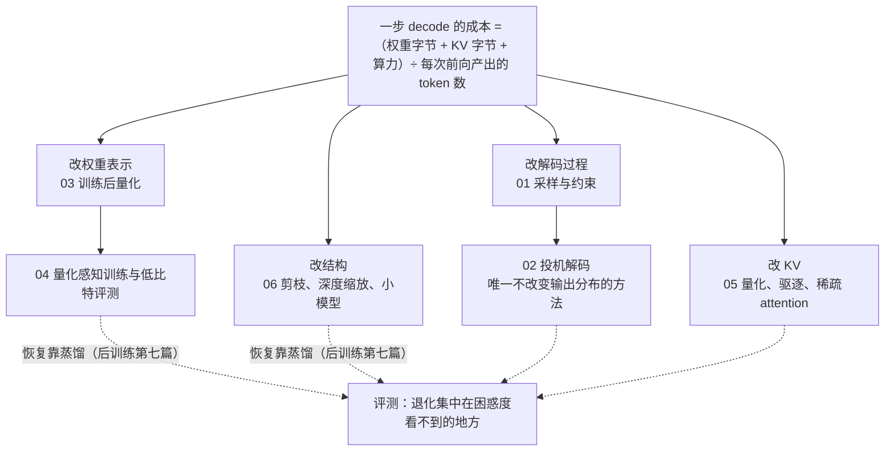

六篇正文回答了一个问题：**不改硬件、不改推理引擎，怎么让同一个模型更快、更小、更便宜——以及每种办法让模型的输出改变了多少**。第一篇讲从分布里怎么取一个 token，第二篇讲唯一不改变分布的加速（投机解码），第三、四篇讲权重与激活的低比特表示（PTQ 与 QAT），第五篇讲训好之后还能对 KV 做什么，第六篇讲删掉一部分参数之后怎么恢复、以及一个 70B 怎么变成一个能用的 8B。六篇合起来，是[《Transformer 与 LLM》](/transformer-and-llm-for-infra-engineers.html)那条成本公式的算法侧。

本文不讲新内容，做三件事：把六篇压成一张表与六段回顾，把贯穿六篇的几条线拎出来，然后给一套三段式的通关自测——判断与计算、跨篇综合、面试题。各篇末尾的自测检验的是"这一篇读懂了没有"，这里检验的是"六篇能不能连起来用"。第六篇末尾的系列总表也一并收进本文。

> **读完这六篇，你应该能回答哪些问题？[^q0] 哪些数字与结论必须能脱口而出？[^q1] 怎么判断自己是"读过"还是"掌握"了？[^q2]**

先把整个系列放在一张图上——箭头是**推导或前置上的依赖**（箭头尾端的结论被箭头头端当作前提），不是阅读顺序：

## 一、总览：系列回答的问题与主线

系列的一句话主张是：**每种推理优化都改了成本公式的一项，除投机解码之外每一种都改变了输出分布，而退化是不均匀的——集中在困惑度看不到的地方**。一次 decode 步的成本由权重字节、KV 字节、算力三项决定，再除以每次前向产出的 token 数；四条线各改其中一项：改解码过程（一、二）、改权重表示（三、四）、改 KV（五）、改结构（六）。六篇用同一把尺子量每种方法：分布是否改变、收益的区间在哪、代价是什么、退化集中在哪类任务上。

| 篇 | 回答的问题 | 一句话结论 | 必记的数字 / 公式 |
|---|---|---|---|
| [第一篇：解码策略、采样与约束生成](/decoding-strategies-sampling-and-constrained-generation.html) | 同一个模型，temperature 从 0.6 调到 1.0，pass@1 与 pass@64 各怎么变？为什么方向相反？ | 采样参数本身就在改分布：pass@1 奖励稳定走最可能的路、最优低温，pass@k 奖励至少一次走到、最优中高温；两者不能用同一组参数报告；推理模型不用 greedy | $$dH/dT = \text{Var}(z)/T^3$$；128K 词表尾部总质量可达 10%；pass@1 最优 $$T \approx 0.2$$、pass@100 最优 $$\approx 0.8$$；R1 / Qwen3：$$T = 0.6$$、top-p 0.95、无重复惩罚；pass@k $$= 1 - \binom{n-c}{k}/\binom{n}{k}$$ |
| [第二篇：投机解码：草稿、接受率与树](/speculative-decoding-drafters-acceptance-and-trees.html) | 为什么 EAGLE 的接受率高于 Medusa 而草稿成本差不多？一个 70B 模型该用什么草稿？ | 接受率 $$= 1 - \text{TV}(p, q)$$，训草稿就是蒸馏；EAGLE 赢在条件依赖与特征输入；树用宽度换深度但受 ridge 约束；投机是延迟工具不是吞吐工具 | $$\mathbb{E}[\text{tokens}] = \frac{1 - \alpha^{\gamma+1}}{1 - \alpha}$$、speedup $$= \mathbb{E}/(\gamma c + 1)$$；$$c \approx 0.02$$–$$0.05$$；接受长度 Medusa 2.5–3 → EAGLE 3.8–4.5 → EAGLE-3 5–6.5；MTP 接受率 85–90%、约 1.8×；$$B \cdot N_{tree} \lesssim \text{ridge}$$ |
| [第三篇：训练后量化：误差模型、GPTQ、AWQ 与旋转](/post-training-quantization-gptq-awq-and-rotation.html) | 一个 4-bit 模型比 16-bit 慢在哪、快在哪？为什么同样是 4 bit 有的模型无损、有的崩掉？ | 快在 memory-bound 的 decode、慢在 prefill 与大 batch；崩掉几乎总是分布形状——权重重尾与激活的固定通道离群；GPTQ 补偿、AWQ 保护、SmoothQuant 迁移、旋转摊平 | 舍入误差方差 $$\Delta^2/12$$，每少 1 bit ×4；group 内一个 $$15\sigma$$ 权重让 INT4 的 $$\Delta = 2\sigma$$；g128 有效 4.156 bit、元数据 4%；Hadamard 把 1000 摊成约 17；QuaRot 70B W4A4KV4 困惑度 3.32 → 3.73；70B 权重 141 → 39.8 GB |
| [第四篇：量化感知训练、低比特与量化模型的评测](/quantization-aware-training-low-bit-and-evaluating-quantized-models.html) | 困惑度只升 0.1 的 4-bit 模型，在什么任务上会掉 5 个点？怎么在部署前发现？ | 困惑度是所有 token 的平均，任务由关键 token 的 argmax 决定；先掉的是多步推理、长上下文、多语言与指令细节；逐 token KL 是直接度量；QAT 在末段以全精度的自己为教师把退化压回一半 | STE：$$\hat{w} = w + \text{sg}(Q(w) - w)$$；Llama-3-8B W4：PPL +0.36、MMLU −1–2、GSM8K −3–6、needle −10 以上；4-bit 均值 KL 0.01–0.05 nat、超 0.1 明显；NF4 双重量化 4.127 bit；末段 QAT 用最后 5–10% token；Gemma 3 QAT 5000 步 |
| [第五篇：KV cache 压缩：量化、驱逐与稀疏 attention](/kv-cache-compression-quantization-eviction-and-sparse-attention.html) | 128K 上下文的 KV 从 40 GB 压到 10 GB，哪种办法在哪类任务上安全？ | key 有固定通道离群、value 没有，所以 key per-channel、value per-token；FP8 KV 永远是第一步；驱逐假设"过去不重要 = 将来不重要"，在问题未知、信息密度高的任务上不成立 | 70B 每 token KV 320 KB、128K 为 40 GB → FP8 20 → INT4 12.5（元数据 25%，实际 3.2×）→ +SnapKV 25% 3.1 GB；KIVI 2 bit：key per-token 崩掉、per-channel +0.1；sink 吃 30–50% 注意力；NSA 64K 下 KV 读取 ÷ 11 |
| [第六篇：剪枝、深度缩放与小模型配方](/pruning-depth-scaling-and-small-model-recipes.html) | 剪掉 25% 的层困惑度只升 0.3，为什么下游任务掉一半？蒸馏能恢复多少？ | 中后层是残差流上的小修正，删掉对平均预测影响小、对关键位置的多步组合与后训练能力破坏大；剪枝必须蒸馏恢复，赢的是 token 效率不是精度上限 | OBS 重要性 $$w_q^2 / [H^{-1}]_{qq}$$；Wanda $$\lvert w_{ij} \rvert \cdot \lVert X_j \rVert$$；中后层余弦相似度 0.85–0.95；悬崖 70B 约 40%、13B 约 30%；Minitron 15B → 8B 用 94B token 对从头 8T，省 40×；蒸馏比继续预训练高 3–4 MMLU 点；2:4 稀疏 GEMM 1.3–1.8× |

### 1. 本文的章节安排

| 章 | 内容 |
|---|---|
| 二 | 逐篇回顾：核心问题、结论、必记、常见误解 |
| 三 | 贯穿六篇的五条线：分布变了多少、成本公式与 ridge、离群值与同一套二阶数学、困惑度掩盖的东西、蒸馏与"训练阶段就为部署设计" |
| 四 | 常见误区表 |
| 五 | 通关自测：A 判断与计算 10 题、B 跨篇综合 5 题、C 面试题 7 题、D 掌握判据 |
| 六 | 下一步 |

## 二、逐篇回顾

### 1. 第一篇：解码策略、采样与约束生成

**核心问题**：同一个模型，temperature 从 0.6 调到 1.0，pass@1 与 pass@64 各怎么变？为什么方向相反？

**结论**：解码策略不改参数、不改一次前向的成本，但决定了用户看到的每个字、评测报出的每个数字、RL 探索到的东西。所有策略在做三件事之一：变形（temperature 改变熵，$$dH/dT = \text{Var}_{p_T}(z)/T^3$$，效果依赖 logits 尺度所以跨模型不可比，且不把任何概率置零）、截断（top-k 固定个数、top-p 固定质量、min-p 相对于 $$p_{\max}$$；截断存在的理由是 128K 词表的尾部即使每个只有 $$10^{-6}$$ 总质量也可达 10%）、搜索（beam 在开放生成上失效——长度偏差、平淡与重复，最大化序列概率不是生成的正确目标）。top-p 在高温下失效因为它是累计判断，头部一变平几十上百个尾部 token 一起进 nucleus；min-p 对每个 token 独立判断所以更稳。约束解码把语法编成 FSM / PDA、每步 mask 掉不合法 token，但得到的是逐 token 归一化的贪心约束、不是模型在合法输出上的条件分布，schema 远离自然格式时"格式对了、答案错了"。pass@1 与 pass@k 对温度的响应相反：pass@k 由难题决定、且依赖 $$k$$ 次采样之间的多样性；推理模型训练时在 $$T = 1$$ 下采样，greedy 路径未被训练过，所以模型卡明确不推荐 greedy。

**必记**：

- $$p_T \propto \exp(z/T)$$；$$p_T(i)/p_T(j) = (p_1(i)/p_1(j))^{1/T}$$——低温放大头部但不置零。
- 尾部总质量：$$10^5$$ 个 $$10^{-6}$$ 的 token 合起来 0.1；$$T = 0.7$$ 也许只降到 0.02，仍不是零。
- 多数库的顺序：temperature → top-k → top-p → min-p；不要同时开多个截断。
- pass@1 最优温度约 0.2、pass@100 约 0.8（Codex 经验）；两者不能用同一组参数报告。
- 推理模型：$$T = 0.6$$、top-p 0.95、无重复惩罚、不用 greedy（R1 / Qwen3 模型卡）。
- self-consistency：GSM8K 56.5% → 74.4%（PaLM 540B，$$n = 40$$）；pass@k 无偏估计 $$1 - \binom{n-c}{k}/\binom{n}{k}$$；RLVR 提高 pass@1 不提高 pass@k。

**常见误解**："重复惩罚是无害的默认"——它对所有已出现的 token 生效，包括必须重复的标点、变量名、推导符号，frequency penalty $$\beta = 0.1$$ 下出现 50 次的词被罚 5 个 logit 单位等于禁用；在代码、数学与推理模型上几乎总是有害。另一个："约束解码只改格式不改内容"——它把模型逼进不熟悉的区域，Tam 等 2024 报告过约束解码降低任务准确率。

### 2. 第二篇：投机解码：草稿、接受率与树

**核心问题**：为什么 EAGLE 的接受率高于 Medusa 而草稿成本差不多？一个 70B 模型该用什么草稿？

**结论**：加速比只由接受率 $$\alpha$$ 与草稿成本 $$c$$ 决定，两者都是算法工程师能改的。$$\alpha = 1 - \text{TV}(p, q)$$——接受率是两个分布的重叠，不是 argmax 一致率；所以训草稿的正确目标是最小化 KL$$(p \parallel q)$$，即以目标模型为教师的前向 KL 蒸馏，且要 on-policy（DistillSpec：相对普通投机的加速比再 +10–45%）。Medusa 的 $$K$$ 个头相互独立、预测的是边缘分布，边缘天然比条件分布平、与目标重叠小；EAGLE 在目标模型的特征空间里自回归，每个草稿 token 以前一个草稿 token 和特征为条件，特征比 token 携带更多"目标想什么"的信息。EAGLE-2 用草稿置信度动态分配树的分支，EAGLE-3 去掉特征回归约束、融合低中高三层特征、用训练时测试修暴露偏差。树把一轮验证从一条链变成多条路径，但 $$B \cdot N_{tree} \lesssim \text{ridge}$$ 的约束更紧——树在 batch 1 上最有效，batch 增大要缩小树。MTP 头与 EAGLE 结构相同，且与主模型联合训练，接受率更高；n-gram 在复制类任务上免费拿 2–3 倍，自由生成上接近零。

**必记**：

- $$\mathbb{E}[\text{tokens}] = \frac{1 - \alpha^{\gamma+1}}{1 - \alpha}$$，speedup $$= \mathbb{E}[\text{tokens}] / (\gamma c + 1)$$；$$\alpha = 0.8$$、$$\gamma = 4$$、$$c = 0.1$$ 时 2.4 倍。
- 接受率随位置递减：EAGLE 第 1 个草稿约 0.8、第 5 个约 0.5；greedy 下接受率最高、随温度上升而下降。
- $$c$$：Medusa / EAGLE 对 70B 约 0.02–0.03；8B 给 70B 起草约 0.11，接受率 0.6–0.75、加速 1.5–2 倍。
- 接受长度（树）：Medusa 2.5–3、EAGLE 3.8–4.5、EAGLE-2 4.5–5.5、EAGLE-3 5–6.5；加速 2.2–2.8× → 3.5–6.5×。
- MTP（DeepSeek-V3）：$$\gamma = 1$$，第二个 token 接受率 85–90%，约 1.8 倍，零额外训练。
- 树节点：Medusa 64、EAGLE 约 26、EAGLE-2/3 约 60；batch 8 × 64 节点 = 512 已过 ridge（295）。

**常见误解**："草稿模型在数据上困惑度越低越好"——目标是像目标模型一样犯错，不是像数据；SFT 让草稿像数据，与目标的分歧不受控。另一个："投机解码对任何负载都加速"——大 batch 进入 compute-bound、短输出固定开销占比大、128K 上下文下验证 60 个节点的 KV 读取是普通 decode 的 60 倍；它是延迟优化的工具，吞吐服务上要关掉或退到 $$\gamma = 1$$。

### 3. 第三篇：训练后量化：误差模型、GPTQ、AWQ 与旋转

**核心问题**：一个 4-bit 量化模型比 16-bit 慢在哪、快在哪？为什么同样是 4 bit，有的模型几乎无损、有的崩掉？

**结论**：均匀量化的舍入误差方差是 $$\Delta^2/12$$，步长由 group 内的范围决定；权重有重尾（少数权重是 $$\sigma$$ 的 10–20 倍），一个 $$15\sigma$$ 的权重把 INT4 的 $$\Delta$$ 撑到 $$2\sigma$$，其他权重的误差与自身同量级——这是 RTN 在 INT8 够用、INT4 崩掉的机制，per-group 128 让离群值只毁 128 个。输出误差是 $$\text{tr}(E H E^\top)$$，$$H = \mathbb{E}[XX^\top]$$：同样的权重误差落在激活大的通道上被放大几十倍，这是 AWQ"显著通道"的数学根源、GPTQ 用 $$H$$ 加权的原因。GPTQ 从 OBS 的拉格朗日推出 $$\delta^* = -\frac{w_q - Q(w_q)}{[H^{-1}]_{qq}} H^{-1}_{:,q}$$，靠通道相关性把误差补偿到未量化的列；AWQ 用一阶信息把显著列放大 $$s_j = \text{mean}\lvert X_j \rvert^\alpha$$，只要不成为 group 最大值该列误差就除以 $$s_j$$。激活的离群值有两类：通道级（LayerNorm 的 $$\gamma$$ 放大，约 6.7B 起相变）与 massive activations（少数 token 上数千量级，作用类似 attention sink）；SmoothQuant 迁移前者、per-token 动态处理后者，W8A8 / FP8 接近无损。旋转用 $$XW = (XR)(R^\top W)$$ 插入一对互逆正交变换，Hadamard 把一个通道的 1000 摊成约 17，$$\Delta$$ 降 60 倍，W4A4 从崩掉变成可行。4-bit 快在 memory-bound 的 decode，慢在 prefill 与大 batch——dequant 是额外算力、GEMM 仍是 BF16；高吞吐要用 W8A8 / FP8。过训练的模型（Llama 3）比前代更难量化。

**必记**：

- $$\Delta^2/12$$；每少 1 bit 方差 ×4；INT8 → INT4 方差 ×256；高斯权重 4 bit 最优裁剪 $$\alpha \approx 2.5$$–$$3\sigma$$。
- 元数据：INT4 + FP16 scale + INT4 zero，g128 = 4.156 bit（3.85×）、g32 = 4.625 bit（3.46×）；MXFP4 4.25 bit、NVFP4 4.5 bit。
- GPTQ：OPT-175B INT4 困惑度 RTN 8.34 → 10.54，GPTQ 8.68；校准集 128 × 2048 token，阻尼 $$0.01 \times \text{mean}(\text{diag} H)$$；act-order 再降 0.05–0.2。
- AWQ 的 $$\alpha$$ 多数层在 0.3–0.7；与 GPTQ 组合只多收 0.02–0.05。
- 旋转：QuaRot 四处放置、两处折进权重；Llama-2 70B W4A4KV4 困惑度 3.32 → 3.73（RTN 几百）；SpinQuant 再降 0.1–0.3。
- 字节账：Llama-3.1-70B BF16 141 GB → FP8 70.6 → W4A16 g128 39.8 GB，两卡变一卡；decode 实际快 2.5–3.5 倍；量化过程 1–4 小时。

**常见误解**："4-bit 就是 4 倍快"——只在 memory-bound 区间兑现，prefill 与大 batch 的 decode 上 W4A16 比 BF16 慢。另一个："按权重幅度选显著通道"——AWQ 的对照是按激活幅度选 1% 保 FP16 几乎恢复全部精度，按权重幅度选不行。

### 4. 第四篇：量化感知训练、低比特与量化模型的评测

**核心问题**：困惑度只升 0.1 的 4-bit 模型，在什么任务上会掉 5 个点？怎么在部署前发现？

**结论**：round 的梯度处处为零，QAT 靠 STE——前向用 $$Q(w)$$、反向把 $$\partial Q/\partial w$$ 当 1，$$\hat{w} = w + \text{sg}(Q(w) - w)$$；它是有偏的，能用是因为把量化当噪声在期望上是对的、且全精度主权重在累积"投票"跨过格点边界（所以 QAT 必须保持全精度主权重）。公开配方都是末段 QAT：Gemma 3 在预训练后用约 5000 步、以全精度的自己为教师蒸馏；Llama 3.2 在 SFT 阶段做 QAT + LoRA；gpt-oss 在后训练阶段对 MoE 专家做 MXFP4。QAT + 蒸馏几乎总是优于交叉熵：目标更稠密、任务是"恢复到原样"、不需要新数据。QLoRA 不是 QAT，但 NF4（正态 16 分位点格点）与双重量化（4.127 bit）属于这里；2 bit 靠向量量化（QuIP# 的 E8 lattice、AQLM）把 70B 放进 24 GB；BitNet b1.58 从头训三值权重，是一种新模型而不是压缩方法。评测的核心是：困惑度是所有 token 的平均，被容易的 token 稀释；任务准确率由少数关键 token 的 argmax 决定，量化推翻的恰是 logits 差距小的位置。先掉的是多步推理、长上下文、低资源语言与代码、指令细节，且集中在难题上。逐 token KL 是直接度量，不需要 benchmark、可在目标负载上测，P99 比均值更有信息。

**必记**：

- Llama-3-8B GPTQ W4 g128：WikiText-2 PPL 6.14 → 约 6.5（+0.36），MMLU −1–2，GSM8K −3–6，32K 以上 needle −10 以上——三个任务退化相差一个量级。
- 4-bit 均值 KL 0.01–0.05 nat，超过 0.1 任务退化明显；多语言退化是英文的 2–3 倍；R1-Distill 4-bit 在 AIME 掉 5–10 点。
- 末段 QAT：最后 5–10% token 或 SFT 阶段；8B 约 100–300 GPU 小时；8B 用 100B token 做 QAT + 教师前向约 $$6.4 \times 10^{21}$$ FLOPs，64 张 H100 约 3 天。
- Llama 3.2 3B：SpinQuant PTQ 掉 MMLU 约 2、GSM8K 约 4；QAT + LoRA 掉约 1 与 2——几百 GPU 小时换回一半退化。
- Gemma 3 27B INT4 QAT：54 GB → 14.1 GB；NF4 比均匀 INT4 对高斯权重 MSE 低约 30%。
- 协议：同引擎、同采样参数、多次采样（$$n \ge 4$$）、配对检验；1–2 点差异在单次采样噪声内。

**常见误解**："困惑度 + MMLU 够评一个量化模型"——那是最不敏感的组合；退化在 GSM8K、RULER、MGSM、IFEval 上。另一个："量化模型用 vLLM 评、全精度用 transformers 评"——两者的 kernel 数值差异会被归到量化头上。

### 5. 第五篇：KV cache 压缩：量化、驱逐与稀疏 attention

**核心问题**：128K 上下文的 KV 从 40 GB 压到 10 GB，哪种办法在哪类任务上安全？

**结论**：三条路对分布的影响从小到大：量化是可控噪声，驱逐是任务依赖的有损近似，训练时稀疏在推理时是精确的但要重训。KV 的数值结构决定量化粒度：key 继承 hidden state 的通道级离群、且 RoPE 不改变每对维度的范数，value 没有系统性离群；key 的误差进 logits 被 softmax 指数放大，value 的误差被 attention 权重平均抑制——所以 KIVI 对 key 沿 token 分组 per-channel、对 value per-token，2 bit 下粒度选错崩掉、选对困惑度只升 0.1。FP8 / INT8 KV 几乎在所有任务上无损，是所有部署都应开的选项。驱逐的成因链：softmax 强制权重和为 1，很多 head 在很多位置不需要关注任何东西，第一个 token 全序列可见、被 massive activation 做成"垃圾桶"——这就是 attention sink，驱逐它即崩。H2O 按累计注意力留 top-k、偏向早出现的 token；SnapKV 在 prefill 后用观察窗（问题）选 25%，问题已知的 QA 上近无损；PyramidKV 按层分配。它们在 needle 上失败的机制是：needle 在被读到时就是"不重要"的。一般原则：基于注意力的驱逐假设"过去不重要的将来也不重要"，只在问题已知、只依赖近期、或输入冗余大时成立。NSA（压缩 / 选择 / 滑窗三分支加门控）与 MoBA（key 均值点积选块）是训练时的结构决定，精确且把 KV 读取减少一个量级。

**必记**：

- Llama-3.1-70B 每 token KV $$2 \times 80 \times 8 \times 128 \times 2 = 320$$ KB；128K：40 GB → FP8 20 GB → INT4 KIVI 12.5 GB（元数据 25%，实际 3.2×）→ +SnapKV 25% 3.1 GB；MLA 结构级 8.8 GB。
- FP8 KV：KL 增量 0.001 nat 量级，字节减半，decode 的 KV 读取流量减半。
- KIVI：key per-channel（$$G = 32$$）+ value per-token，残差窗口 $$R = 32$$ 或 128 保持全精度；Llama-2-13B 2 bit：key per-token 崩掉（困惑度几十）、per-channel 只升 0.1；KVQuant pre-RoPE + 非均匀格点让 3 bit 接近无损。
- sink：第一个 token 常吃 30–50% 注意力；StreamingLLM 留前 4 个 token + 最近 2K–4K 窗口；H2O 预算 20% 在摘要 / QA 近无损；SnapKV 观察窗最后 16–64 token。
- NSA：块 32、选 top-16、滑窗 512；64K 下 KV 读取减少约 11 倍、attention 前向反向快 6–9 倍。MoBA：块 512、选 top-3。
- 叠加：Llama-3-70B 每 token KV 320 KiB，并发 × 上下文 ≈ 43 万 token 时 KV 读取与权重打平（batch 4 × 108K、batch 8 × 54K）；KV 字节减半让长上下文下投机的验证成本也减半。

**常见误解**："驱逐 80% 在摘要上无损，所以驱逐是安全的"——同一方法在 needle 上驱逐 20% 就可能失败，退化最不均匀。另一个："key 和 value 一样量化就行"——key per-token 在 2 bit 下崩掉，粒度选择是决定性的。

### 6. 第六篇：剪枝、深度缩放与小模型配方

**核心问题**：剪掉 25% 的层，困惑度只升 0.3，为什么下游任务掉一半？蒸馏能恢复多少？

**结论**：剪掉的东西不能靠更好的舍入找回来，必须靠训练恢复，所以剪枝几乎总是"剪枝 + 蒸馏"。非结构化剪枝的重要性得分来自第三篇同一套 OBS 推导，$$\mathcal{E}_q = w_q^2/[H^{-1}]_{qq}$$（SparseGPT），Wanda 用一阶的 $$\lvert w_{ij} \rvert \cdot \lVert X_j \rVert_2$$ 在 50% 稀疏下与之接近——"哪些权重重要"的一阶答案是"乘大激活的那些"，与 AWQ 同一个观察；但非结构化 50% 在 GPU 上不变快，只有 2:4 被 Tensor Core 兑现，且 decode 的权重字节只到 5/8。层裁剪的依据是残差结构 $$h_{l+1} = h_l + f_l(h_l)$$：中后层输入输出的余弦相似度 0.85–0.95，是残差流上的小修正，删掉困惑度几乎不变、MMLU 到悬崖前几乎平坦；但 GSM8K 可从 50 掉到 10 以下，因为生成任务要 100–300 token 每步精确、中后层正是做多步组合的地方、后训练写进深层的格式与指令遵循最脆弱。宽度剪枝按激活统计估重要性（Minitron）或学 mask（Sheared LLaMA）；剪宽度恢复后精度最好、剪深度延迟降最多。恢复必须蒸馏：Minitron 同样 94B token，蒸馏比继续预训练高 3–4 MMLU 点；恢复后仍低于原模型、推理类任务恢复最慢、且要重做后训练。第六篇末尾把六篇放到一张"分布是否改变 × 收益区间 × 代价 × 退化集中在哪"的总表上，回答"70B 怎么变成能用的 8B"。

**必记**：

- 余弦相似度：前几层 0.3–0.6，中后层 0.85–0.95，最后一层又降；Block Influence $$= 1 - \mathbb{E}[\cos(h_l, h_{l+1})]$$；连续删比分散删可预测。
- 悬崖：Llama-2-70B 删约 40–45% 层、13B 约 30% 后 MMLU 骤降到随机；删 25% 层困惑度 +0.3–0.5。
- SparseGPT：OPT-175B 50% 稀疏 8.34 → 8.21，Llama-2-70B +0.5；非结构化免费区间约到 50%；2:4 GEMM 1.3–1.8×，需训恢复。
- Minitron：15B → 8B 用 94B token（约 1.2% 于 15B 的 8T，85×；论文口径"至多 40×"是对其小模型基线）；教师前向约 $$15/(3 \times 8) \approx 0.6$$ 倍学生训练算力、总算力 1.6×；Width 版比 Depth 版高 1–3 点、Depth 版快约 1.8×。
- 小模型配方：Llama 3.2 1B / 3B 从 8B 剪枝初始化 + 约 9T token 蒸馏；Gemma 3 1B 从头 2T + 蒸馏；Qwen2.5 全系列 18T；MobileLLM 30 层 × 512 优于 12 层 × 768。
- 叠加：先剪（+ 恢复）再量化；剪后模型对同样 W4 的困惑度增量大 1.5–2 倍；Llama 3.2 QAT 版顺序：剪枝 → 蒸馏 → SFT + QAT → DPO（LoRA）。

**常见误解**："MMLU 不掉就说明剪枝无损"——多选只需正确选项 logit 最大，生成任务与指令遵循掉得多得多；retrieval head 删掉 needle 崩而困惑度不变。另一个："剪枝 + 蒸馏比从头训的模型更好"——它赢的是 token 效率，精度上限低于用更好数据从头训的模型，且大模型的 8T token 是沉没成本。

## 三、贯穿全系列的几条线

### 1. 分布变了多少：从"有意改"到"不变"到"可控"到"任务依赖"

这是总纲那张表的第四列，六篇按它排序。第一篇的采样参数是**有意**改分布——温度、截断、惩罚、约束每一个都在改，所以它必须放在最前面：不先固定采样，后面任何"量化前后差多少"的比较都混进了采样噪声（第四篇的协议一致性直接引用它：温度对结果的影响可能大于量化）。第二篇是系列里唯一**不变**的方法，拒绝采样保证输出严格等于目标分布，代价是接受率 $$1 - \text{TV}$$ 决定收益——不变的是分布，变的是速度；一旦用 typical acceptance 放松验证，它就掉进了后面几篇的范畴。

第三、四篇的量化是**可控的噪声**：有 $$\Delta^2/12$$ 的统计模型，有逐 token KL 的直接度量（4-bit 0.01–0.05 nat），每种方法在最小化一个写得出来的目标。第五篇的 KV 量化沿用这个框架（FP8 KV 的 KL 0.001 nat），但驱逐跳出了它——丢掉的是信息不是精度，退化**任务依赖**且可以很大（摘要上 80% 无损、needle 上 20% 失败）；训练时稀疏又回到"不变"，因为模型从来就只看那些块。第六篇的剪枝改变最大、恢复后变小，且恢复不了的部分集中在推理类任务。

度量分布改变的工具也在递进：第二篇用 TV（接受率），第四篇用 KL（Pinsker 把两者连起来：$$\text{TV} \le \sqrt{\text{KL}/2}$$，这正是训草稿用前向 KL 蒸馏的依据），第五、六篇用任务准确率随预算 / 剪枝比例的曲线。

### 2. 成本公式的哪一项，收益止于哪个区间

每 token 的成本 = （权重字节 + KV 字节）/ 带宽 ÷ 每次前向产出的 token 数 + 算力项。第二篇改分母：一次前向产出 $$\mathbb{E}[\text{tokens}]$$ 个 token，但验证 $$N_{tree}$$ 个位置"几乎免费"只在 $$B \cdot N_{tree} \lesssim \text{ridge}$$ 内成立——batch 8 × 64 节点 = 512 已过 H100 的 ridge（295）。第三篇改权重字节：W4A16 除以 4，但 GEMM 仍是 BF16、dequant 是额外算力，所以收益止于 memory-bound 区间，prefill 与大 batch 上反而变慢；要让算力项也变，得用 W8A8 / FP8 / W4A4。第五篇改 KV 字节：Llama-3-70B 在约 40K 上下文时 KV 读取超过权重读取，此后 KV 量化的边际收益大于权重量化；驱逐与稀疏改的是 KV 的数量而不是每元素字节。第六篇改参数数量：结构化剪枝在任何硬件上兑现，非结构化 50% 在 GPU 上不变快，2:4 只在 compute-bound 区间有效、decode 字节只到 5/8。

叠加的规则由此而来，总纲预告、第五篇第八章与第六篇第八章落实：量化后的模型做投机，两者消耗的是同一段 memory-bound 余量，转折 batch 变小；KV 量化让长上下文下投机的验证成本减半；剪枝后再量化，两种误差不相加而是相乘——剪后模型对同样 W4 的困惑度增量大 1.5–2 倍。同一个 Roofline 决定了每条线的边界，也决定了它们叠加时谁先撞墙。

### 3. 离群值与同一套二阶数学

第三篇建立的两件事贯穿其后三篇。第一件是**输出误差 $$= \text{tr}(E H E^\top)$$、$$H = \mathbb{E}[XX^\top]$$**：同样的权重误差落在激活大的通道上被放大。它在第三篇是 GPTQ 用 $$H^{-1}$$ 补偿与 AWQ 保护显著通道的根源；在第六篇是 OBS 的剪枝形式 $$w_q^2/[H^{-1}]_{qq}$$（SparseGPT）与 Wanda 的 $$\lvert w \rvert \cdot \lVert X \rVert$$——GPTQ 与 SparseGPT 是同一个拉格朗日推导的两个约束（量化到格点 vs 置零），AWQ 与 Wanda 是同一个一阶观察的两个用法。

第二件是**离群值的两类来源**：通道级离群来自 LayerNorm 的 $$\gamma$$、约 6.7B 起相变；massive activations 出现在少数 token 上、值达数千、作用是常数偏置。第三篇用 SmoothQuant 迁移前者、per-token 动态处理后者、Hadamard 旋转把两者摊平。第五篇把同一结构追到 KV：key 继承 hidden state 的通道级离群、value 没有，所以 KIVI 的粒度是非对称的；massive activation 落在第一个 token 上让它的 key 与所有 query 点积都大——这就是 attention sink，驱逐它就崩，StreamingLLM 必须保留它。第六篇里承担 sink 功能的 head 与 retrieval head 一样，是校准集激活范数看不出、却不能剪的。可学习的 sink 标量（gpt-oss）是训练侧一并解决量化与驱逐难题的办法。

### 4. 困惑度是平均，任务看关键 token

第一篇先给了评测的前提：采样参数是协议里最大的一项，pass@1 与 pass@k 不能用同一组参数报，选择题用约束解码还是自由回答再抽取可以差好几个点。第三篇给了退化不均匀的第一个层面——敏感层（首尾层、out_proj / down_proj、lm_head、MoE 路由）与校准集分布（英文网页上校准的模型在中文与代码上损失更大）。

第四篇把它变成一个明确的机制：困惑度是所有 token 的平均，容易的 token 从 0.9 到 0.88 贡献 0.02，关键的 token 从 0.4 到 0.3 或被翻转；Llama-3-8B W4 的 PPL +0.36、MMLU −1–2、GSM8K −3–6、needle −10 以上相差一个量级。先掉的四类任务（多步推理、长上下文、低资源语言与代码、指令细节）与"退化集中在难题"是判断任何压缩方法的清单，逐 token KL 的 P99 是不需要 benchmark 的直接度量。第五篇的 needle 是驱逐方法的试金石，理由相同：needle 在被读到时是"不重要"的，摘要看不到它的缺失。第六篇以最极端的形式重演——删 25% 层 PPL +0.3、MMLU 悬崖前平坦、GSM8K 从 50 掉到 10 以下，因为多选只要"大致对"的残差流、生成要每步精确，而后训练写进深层的格式遵循在预训练文本的困惑度里完全看不到。六篇里每一个"无损"的声明，都要问在哪个指标、哪类任务、什么协议下。

### 5. 蒸馏与"在训练阶段就为部署设计"

系列不讲蒸馏的方法（那在后训练系列），但把它当工具用了三次，且每次教师都是"更大的自己"或"全精度的自己"。第二篇：训草稿就是蒸馏——最小化 KL$$(p \parallel q)$$、on-policy、目标模型是教师，DistillSpec 把加速比再提高 10–45%。第四篇：QAT + 蒸馏几乎总是优于交叉熵，教师是量化前的自己，Gemma 3 用 5000 步蒸馏把 PTQ 的退化压回一半。第六篇：剪枝后必须蒸馏恢复，Minitron 同样 94B token 蒸馏比继续预训练高 3–4 MMLU 点，教师前向多花 60% 算力。三处的理由相同：目标是每个位置的完整分布而不是一个正确 token，任务是"恢复到原样"而不是重新学习。

与此并行的是另一条趋势——**把部署需求提前到训练阶段**。第二篇的 MTP 头兼作训练目标与草稿，与主模型联合训练所以接受率 85–90% 高于事后训的 EAGLE；第四篇的 Llama 3.2 与 Gemma 3 由厂商发布 QAT 版本，因为只有厂商有训练数据、全精度教师与算力；第五篇的 NSA / MoBA、MLA、跨层共享把 KV 效率设计进结构，让推理时的压缩需求变小；第六篇的 Llama 3.2 用剪枝做初始化、再用预训练规模的 9T token 蒸馏。这是总纲说的"压缩不再是部署工程师的事后处理，而是模型发布的一部分"在六篇里的具体形态。

| 概念 | 出现的篇 | 关系 |
|---|---|---|
| TV 距离、KL | 二、四 | 二用 TV 定义接受率、用前向 KL 训草稿；四用逐 token KL 度量量化改变了多少；Pinsker 连接两者 |
| Roofline 的 ridge、memory-bound 区间 | 二、三、五、六 | 二：$$B \cdot N_{tree} \lesssim \text{ridge}$$；三：W4A16 只在 memory-bound 兑现；五：KV 读取的交叉点；六：2:4 只在 compute-bound 有效 |
| $$H = \mathbb{E}[XX^\top]$$、OBS | 三、六 | 三：GPTQ 的补偿与 AWQ 的显著通道；六：SparseGPT 的重要性与 Wanda 的一阶近似——同一推导 |
| 离群值、massive activations、sink | 三、五、六 | 三：SmoothQuant / per-token / 旋转；五：key per-channel、sink 不可驱逐；六：sink head 不可剪 |
| 困惑度 vs 关键 token | 一、三、四、五、六 | 一：采样参数是协议的一部分；三：敏感层；四：机制与四类任务；五：needle 试金石；六：删层的脱节 |
| 蒸馏（教师 = 自己） | 二、四、六 | 二：草稿；四：QAT；六：剪枝恢复——都是"恢复到原分布" |
| 训练阶段为部署设计 | 二、四、五、六 | MTP 头；厂商 QAT；NSA / MLA / 跨层共享；剪枝初始化 + 9T 蒸馏 |
| 采样温度 | 一、二、四 | 一：pass@1 与 pass@k 的相反响应；二：接受率在 greedy 下最高、随温度下降；四：量化前后必须同一采样参数 |

## 四、常见误区

| 误区 | 为什么错 | 正确的说法 | 出处 |
|---|---|---|---|
| 评测用 greedy 最公平 | 推理模型训练时在 $$T = 1$$ 下采样，greedy 路径未被训练，长输出下重复退化被放大 | 按模型卡（$$T = 0.6$$、top-p 0.95）多次采样报均值 | [第一篇](/decoding-strategies-sampling-and-constrained-generation.html) |
| 低温已经把尾部去掉了 | 温度只改比值不置零；128K 词表尾部总质量可达 10%，$$T = 0.7$$ 也许只降到 0.02 | 截断（top-p / min-p）才把尾部置零；高温下 min-p 比 top-p 稳 | [第一篇](/decoding-strategies-sampling-and-constrained-generation.html) |
| 草稿的 argmax 一致率就是接受率 | 接受率是 $$1 - \text{TV}$$，两个分布的重叠 | argmax 相同但形状不同 TV 可以很大；greedy 下才退化为 top-1 准确率 | [第二篇](/speculative-decoding-drafters-acceptance-and-trees.html) |
| 树越大加速越多 | 验证 $$N_{tree}$$ 个节点要满足 $$B \cdot N_{tree} \lesssim \text{ridge}$$ | 树在 batch 1 上最有效；batch 8 × 64 = 512 已过 ridge；大 batch 缩树或关掉 | [第二篇](/speculative-decoding-drafters-acceptance-and-trees.html) |
| INT4 的误差只是 INT8 的两倍 | 步长翻倍方差 ×4；少 4 bit 方差 ×256；一个 $$15\sigma$$ 权重让 $$\Delta = 2\sigma$$ | INT8 RTN 够用、INT4 RTN 不够，必须 GPTQ / AWQ 加 per-group | [第三篇](/post-training-quantization-gptq-awq-and-rotation.html) |
| W4A16 让高吞吐服务也快 4 倍 | GEMM 仍是 BF16，dequant 在 compute-bound 区间是额外算力 | 高吞吐用 W8A8 / FP8（字节 ÷ 2、算力 × 2、近无损）或 W4A4（需旋转） | [第三篇](/post-training-quantization-gptq-awq-and-rotation.html) |
| 困惑度 +0.1 就是无损 | 困惑度是平均，关键 token 的翻转被稀释 | Llama-3-8B W4：PPL +0.36 对应 GSM8K −3–6、needle −10 以上；看逐 token KL 的 P99 | [第四篇](/quantization-aware-training-low-bit-and-evaluating-quantized-models.html) |
| QAT 要从头训 | 量化误差是细节，主要能力在全精度下学会即可 | 末段 QAT：最后 5–10% token 或 SFT 阶段，教师是全精度的自己 | [第四篇](/quantization-aware-training-low-bit-and-evaluating-quantized-models.html) |
| key 与 value 用同一种量化粒度 | key 有固定通道离群、value 没有；key 误差被 softmax 指数放大 | key per-channel（沿 token 分组）、value per-token；2 bit 下选错崩掉 | [第五篇](/kv-cache-compression-quantization-eviction-and-sparse-attention.html) |
| 注意力低的 KV 可以安全驱逐 | needle 在被读到时就是"不重要"的；多跳的第二跳在问题之前不可知 | 驱逐只在问题已知（SnapKV）、只依赖近期（StreamingLLM）或输入冗余大时安全 | [第五篇](/kv-cache-compression-quantization-eviction-and-sparse-attention.html) |
| 50% 非结构化稀疏让推理快一倍 | Tensor Core 不识别零，稀疏 GEMM 在 50% 下比稠密慢 | 只有 2:4 被硬件兑现（1.3–1.8×），且 decode 字节只到 5/8 | [第六篇](/pruning-depth-scaling-and-small-model-recipes.html) |
| 删层后 MMLU 不掉就是无损 | 多选只要正确选项 logit 最大；生成任务每步精确、格式遵循写在深层 | GSM8K 可从 50 掉到 10 以下；剪枝后必须蒸馏恢复并重做后训练 | [第六篇](/pruning-depth-scaling-and-small-model-recipes.html) |

## 五、通关自测

### A. 判断与计算（10 题）

1. 词表 128K，尾部 10 万个 token 每个概率 $$2 \times 10^{-6}$$：单步采到"尾部某一个"的概率多少？把 temperature 降到 0.7 能把它变成零吗？

   

答案

   $$10^5 \times 2 \times 10^{-6} = 0.2$$，五分之一的步会采到尾部。不能——温度只改概率比值 $$(p_i/p_j)^{1/T}$$，任何非零概率仍非零；要置零只能截断（top-p / min-p）。

   

2. 对一道题采 $$n = 10$$ 次，$$c = 2$$ 次正确，pass@5 的无偏估计是多少？

   

答案

   $$1 - \binom{8}{5}/\binom{10}{5} = 1 - 56/252 \approx 0.78$$。直接"采 5 次看有没有对的"的估计方差大得多；HumanEval 的标准协议是 $$n = 200$$。

   

3. 草稿接受率 $$\alpha = 0.7$$、$$\gamma = 3$$：EAGLE 式草稿（$$c = 0.05$$）与 8B 独立小模型（$$c = 0.11$$）各加速多少？

   

答案

   $$\mathbb{E}[\text{tokens}] = (1 - 0.7^4)/0.3 \approx 2.53$$；EAGLE：$$2.53/(0.15 + 1) \approx 2.2$$ 倍；小模型：$$2.53/(0.33 + 1) \approx 1.9$$ 倍。同样的接受率下草稿成本差 2 倍只差 0.3 倍加速——真实差距在 $$\alpha$$（特征级草稿的接受率更高），不在 $$c$$。

   

4. EAGLE-2 的树约 60 个节点，H100 的 ridge 约 295：batch 最多多大验证仍"几乎免费"？batch 16 该怎么办？

   

答案

   $$B \le 295/60 \approx 4$$（4 × 60 = 240 在 ridge 内，5 × 60 = 300 已过）。batch 16 时 960 个节点远过 ridge，要缩成 $$\gamma = 1$$–$$2$$ 的链式草稿或按 batch 动态关闭投机。

   

5. 一个 group 里有一个 $$10\sigma$$ 的权重（其余近高斯），INT4 对称量化的步长与其他权重的舍入误差标准差各是多少？

   

答案

   对称 INT4 的格点是 $$-7 \ldots 7$$，$$\Delta = \alpha/7 = 10\sigma/7 \approx 1.43\sigma$$（不是 $$2\alpha/15$$——那样 $$\alpha$$ 自己会被裁掉）；舍入误差标准差 $$\Delta/\sqrt{12} \approx 0.41\sigma$$——比 $$15\sigma$$ 时的 $$0.62\sigma$$ 好一点，但仍与多数权重同量级。INT8 下 $$\Delta = 10\sigma/127 \approx 0.08\sigma$$，无所谓。

   

6. INT4 + FP16 scale + INT4 zero，group size 256：每权重有效 bit 与相对 FP16 的压缩比？比 g128 省了什么、丢了什么？

   

答案

   $$4 + 20/256 \approx 4.08$$ bit，压缩 $$16/4.08 \approx 3.9$$ 倍。比 g128（4.156 bit、3.85×）省约 2% 字节，但一个离群值毁的是 256 个权重而不是 128 个——g128 是精度与元数据的默认平衡点，g32 再多收 0.05 困惑度以内。

   

7. $$d = 1024$$ 的激活向量，一个通道是 500、其余是 1：Hadamard 旋转后最大值约多少？INT4 的步长降了多少倍？

   

答案

   前提是**随机符号**的 Hadamard（QuaRot / QuIP# 的做法）：$$500/\sqrt{1024} \approx 15.6$$，加上其他通道随机 $$\pm 1$$ 之和的约 1，最大值约 17；$$\Delta$$ 从 $$500/7$$ 降到 $$17/7$$，约 30 倍。若用标准 Hadamard，第一行把 1023 个 1 同号相加，第一个通道是 $$(500 + 1023)/32 \approx 48$$，只降 10 倍——"摊平"靠的是随机化。$$d$$ 越大摊得越平（4096 维上 1000 → 17 是 60 倍）。

   

8. Llama-3.1-8B（32 层、8 KV head、head_dim 128）128K 上下文的 KV 多少 GB？FP8 与 INT4 KIVI（按实际 3.2×）各压到多少？

   

答案

   每 token $$2 \times 32 \times 8 \times 128 \times 2 = 128$$ KB，128K 为 16 GB；FP8 8 GB；INT4 KIVI 约 5 GB（元数据 25% 让它不是 4 GB）。一张 24 GB 卡装下 BF16 权重（16 GB）后 KV 只剩 8 GB，FP8 KV 是唤醒 128K 上下文的前提。

   

9. 高吞吐服务，batch 128、prefill 为主：把 BF16 换成 W4A16 GPTQ 会变快吗？

   

答案

   否。prefill 与大 batch decode 在 compute-bound 区间，W4A16 的 GEMM 仍是 BF16、dequant 是额外算力，会比 BF16 慢。要用 W8A8 / FP8（字节 ÷ 2、算力 × 2、接近无损）或旋转后的 W4A4。

   

10. Llama-3.1-70B BF16 141 GB，做 2:4 稀疏后 decode 每步要读多少权重字节？与 FP8 权重比谁少？

    

答案

    2:4 的字节对 BF16 只到 9/16：$$141 \times 9/16 \approx 79$$ GB（2 个 16 bit 值 + 4 bit 索引对 4 个值；INT8 时是 5/8），比 FP8 的 70.6 GB 还多——2:4 的收益在 compute-bound 的 prefill 与训练，对 memory-bound 的 decode 不如量化。

    

### B. 跨篇综合（5 题）

1. 一个 W4A16 量化过的 70B 再加 EAGLE-3 草稿：加速能相乘吗？转折 batch 往哪边移？

   

答案

   第三篇：W4A16 把权重字节除以 4，decode 在 memory-bound 区间快 2.5–3.5 倍，但 dequant 是额外算力、区间缩到 $$B \lesssim \text{ridge}/4$$；第二篇：树验证要 $$B \cdot N_{tree} \lesssim \text{ridge}$$。两者消耗的是同一段 memory-bound 余量——量化让每步更快、也让验证 60 个节点更早进入 compute-bound，转折 batch 变小（总纲预告的"叠加收益不相乘"）。都是延迟工具：batch 1–4 上两者叠加有效，吞吐服务上先放弃投机。

   

2. 部署一个推理模型（$$T = 0.6$$，思维链几万 token）：采样、投机、KV、量化四件事各怎么定？

   

答案

   第一篇：$$T = 0.6$$、top-p 0.95、关掉重复惩罚、不 greedy，评测多次采样报均值；第二篇：长输出是投机收益最大的负载，EAGLE-3 在 $$T = 0.6$$ 下接受率略降仍 2.5–4×，但 128K 下验证 $$N_{tree}$$ 个节点的 KV 读取要专门 kernel；第五篇：FP8 KV 必开、INT4 谨慎（生成误差在几万 token 的链上累积）、不驱逐（推理链每一步都可能被回看）；第四篇：R1-Distill 的 4-bit 在 AIME 掉 5–10 点，比非推理模型敏感，选 W8A8 / FP8 权重或 QAT 版本，并用 AIME / GPQA 多次采样而不是 MMLU 判断。

   

3. 两个模型 WikiText 困惑度都比原模型高约 0.3：一个是 Llama-3-8B 的 GPTQ W4，一个是删了 25% 层未恢复的 70B。哪个更"坏"？怎么用一套评测区分？

   

答案

   第四篇：GPTQ W4 的 +0.36 对应 MMLU −1–2、GSM8K −3–6、needle −10 以上，均值 KL 0.01–0.05 nat；第六篇：删 25% 层 PPL +0.3–0.5 但 GSM8K 可从 50 掉到 10 以下、格式遵循被破坏、chat template 都可能不遵循——剪枝远更坏，因为删的是做多步组合的层与后训练写进深层的能力。区分用第四篇的任务组合（GSM8K、RULER、IFEval、逐 token KL 的 P99）：量化的 KL 集中在数字、代码符号等关键 token 上但均值小；剪枝的 KL 均值与 P99 都大，且 IFEval 崩。剪枝模型还要按第六篇蒸馏恢复后重做 SFT / DPO。

   

4. 激活的离群值在第三篇与第五篇里分别怎么处理？为什么 SmoothQuant 的静态 $$s_j$$ 不能顺手解决 KV 的问题？

   

答案

   第三篇：通道级离群（LayerNorm $$\gamma$$）用 SmoothQuant 的 per-channel 静态 $$s_j$$ 迁移到权重，massive activations（少数 token 上数千）迁移不掉——为少数 token 放大 $$s_j$$ 会毁掉该通道在其他 token 上的精度，要靠 per-token 动态或 Hadamard 旋转。第五篇：key 继承通道级离群，KIVI 让每个通道有自己的 scale（沿 token 分组 per-channel）而不是迁移——KV 是存起来被反复读的，没有"权重"一侧可以迁；massive activation 落在第一个 token 上成了 attention sink，它不是要消除的噪声而是 softmax 的垃圾桶，驱逐即崩。QuaRot 在 K 与 Q 之间、V 与 O 之间加的旋转是把第三篇的办法用到 KV 上（W4A4KV4）。

   

5. 手上有一个 70B，要一个能用的 8B：写出全流程的顺序与每步的算力量级、评测指标。

   

答案

   第六篇：Minitron 式按激活重要性剪宽度（精度优先）到 8B，几种候选形状各 ~2B token 短训选优，再以 70B 为教师做 ~100B token 的 logits 蒸馏（教师前向约 $$70/(3 \times 8) \approx 2.9$$ 倍学生训练算力——比 Minitron 15B → 8B 的 0.6 倍重得多），恢复后重做 SFT / DPO；第四篇：QAT 并入恢复末段（Llama 3.2 的顺序：剪枝 → 蒸馏 → SFT + QAT → DPO），或末段几百 GPU 小时以全精度的自己为教师；第三篇：最后 PTQ 到 W4A16（剪后模型对量化更敏感 1.5–2×，退化要重测）+ 第五篇的 FP8 KV；第二篇：需要低延迟再训一个 EAGLE-3 头（1–2 天 8 卡）。评测按第四篇：GSM8K / MATH、RULER、IFEval、逐 token KL，不是 MMLU；推理类任务恢复最慢，是"能用"的判据。

   

### C. 面试题（7 题）

1. 同一个模型在 GSM8K 上 greedy 78、$$T = 0.6$$ 采样 76、64 次投票 85——技术报告该报哪个？评测协议要写明什么？

   

答案

   **答案要点**：(1) 三个数字说的是不同的事：pass@1（greedy）、采样的 pass@1 均值、self-consistency 的 maj@64，成本相差 64 倍；(2) pass@1 与 pass@k 的最优温度不同（约 0.2 vs 0.8），一份只给一个温度的报告必有一个指标不是最优；(3) 推理模型不能报 greedy——训练在 $$T = 1$$ 下采样，greedy 路径未被训练，长输出重复退化；(4) 协议要写明 temperature、top-p / min-p、重复惩罚、最大长度、采样次数 $$n$$、报的是均值还是 pass@k、答案抽取靠约束解码还是正则；(5) 选择题用约束解码强制 A/B/C/D 与自由回答再抽取可以差好几个点。
   **追问方向**：RLVR 之后 pass@1 涨、pass@64 不涨说明什么（把覆盖率变成稳定性）；test-time compute 的账（14 倍算力让小模型追上 14 倍大的模型，覆盖率为零时无效）。
   **好答案与一般答案的区别**：一般答案说"报 greedy 最公平"；好答案说出每个数字对应的采样协议与成本，并指出推理模型的训练—推理分布一致性。

   

2. 我们在 vLLM 上开了投机解码，吞吐反而降了。怎么排查？

   

答案

   **答案要点**：(1) 先看 batch：$$B \cdot N_{tree} \lesssim \text{ridge}$$，吞吐服务的大 batch 让验证进入 compute-bound，投机是延迟工具不是吞吐工具——缩到 $$\gamma = 1$$–$$2$$ 链式或按 batch 动态关闭；(2) 看接受长度与按位置的接受率：领域不匹配（对话数据训的草稿用在代码上）让接受长度掉 10–20%，n-gram 在自由生成上接近 0；(3) 看输出长度：短输出上每轮固定开销与 prefill 占主导；(4) 看上下文长度：128K 下验证 60 个节点读 60 遍 KV，除非 kernel 共享树内 KV 读取；(5) 检查草稿与目标的采样参数是否一致、greedy 下输出是否逐 token 相同——不一致是分布错误不是慢；(6) 在目标硬件上实测 $$c$$，128K 词表的 lm_head 对一层 decoder 的草稿不可忽略。
   **追问方向**：MTP 头为什么接受率比 EAGLE 高（联合训练）；温度对接受率的影响（greedy 最高）。
   **好答案与一般答案的区别**：一般答案调 `num_speculative_tokens`；好答案先判断负载在 Roofline 的哪个区间，再分接受率与草稿成本两个自由度排查。

   

3. 一个 4-bit 量化模型上线前，你会怎么评？为什么困惑度不够？

   

答案

   **答案要点**：(1) 困惑度是所有 token 的平均，关键 token 的翻转被稀释：Llama-3-8B W4 的 PPL +0.36 对应 MMLU −1–2、GSM8K −3–6、needle −10 以上；(2) 先算逐 token KL——在目标负载的文本上、不需要 benchmark，4-bit 正常 0.01–0.05 nat，看 P99 与 KL 集中在哪类 token；(3) 任务组合覆盖四类先掉的：多步推理（GSM8K / MATH-500）、长上下文（RULER 16K–64K）、代码与多语言（MGSM，退化是英文的 2–3 倍）、指令遵循（IFEval）、judge 评测看风格漂移；(4) 协议一致：同引擎、同采样参数、$$n \ge 4$$ 多次采样、配对检验，1–2 点差异在单次噪声内；(5) 退化不可接受时的出路：W8A8 / FP8，或末段 QAT（几百 GPU 小时换回一半）。
   **追问方向**：读官方量化报告看哪四点；校准集怎么选（对话格式、领域数据、不能来自评测集）。
   **好答案与一般答案的区别**：一般答案跑困惑度 + MMLU；好答案说出困惑度掩盖的机制，并给出不需要 benchmark 的 KL 度量与四类敏感任务。

   

4. 同样用 GPTQ W4 g128，为什么 Llama 2 几乎无损而 Llama 3 掉得多？如果必须上 4 bit，处理顺序是什么？

   

答案

   **答案要点**：(1) 误差由 group 内的范围决定（$$\Delta^2/12$$），权重重尾与激活离群让 4 bit 的 16 个格点不够；(2) 过训练的模型（Llama 3 的 15T token）把更多信息压进每个权重的低位，同样方法困惑度损失 0.3–0.5 而不是 0.1；(3) 顺序：范围搜索（值 0.1–0.2 困惑度）→ act-order（再 0.05–0.2）→ AWQ 与 GPTQ 组合（0.02–0.05）→ 旋转（SpinQuant 在难量化模型上差距更大）→ 敏感层混合精度（首尾层、out_proj / down_proj 6–8 bit，lm_head 不量化）→ 仍不行就末段 QAT 或退到 W8A8 / FP8；(4) 校准集用目标分布、对话格式、128–512 条。
   **追问方向**：为什么按激活幅度而不是权重幅度选显著通道（$$\text{tr}(E H E^\top)$$）；旋转为什么不改变输出、哪两处必须在线。
   **好答案与一般答案的区别**：一般答案说"换 AWQ 试试"；好答案从误差模型解释差异，并按每步能收回多少困惑度排出顺序。

   

5. 128K 上下文的服务，KV 显存不够。给一个决策流程。

   

答案

   **答案要点**：(1) 先算账：70B 每 token 320 KiB、128K 为 40 GiB，并发 × 上下文过 43 万 token（batch 8 × 54K）KV 读取超过权重读取，那之后 KV 压缩的边际收益大于权重量化；(2) FP8 KV 几乎总值得开（2 倍、KL 0.001 nat 量级）——前提是后端 kernel 支持、scale 校准过；(3) 再看任务形态：问题未知需要回看（Agent 长历史、多跳、推理链）只靠量化再往下——INT4 KIVI（key per-channel、value per-token）32K 内退化 1 点内、64K 以上精确检索要测 needle，实际 3.2× 因为元数据 25%；(4) 问题已知、文档在前的 QA / 摘要可用 SnapKV 留 25%，与 FP8 叠加 8 倍；流式只依赖近期用 StreamingLLM 保留 sink + 窗口；(5) 任何基于当前注意力的驱逐在 needle 与多跳上失败，H2O 偏向早 token；(6) 有训练能力且长上下文是核心需求，正确方向是 NSA / MoBA 或 MLA、跨层共享这类结构——精确且读取减一个量级。
   **追问方向**：为什么驱逐第一个 token 会崩（sink 的成因）；INT4 KV 与投机解码叠加时的验证成本。
   **好答案与一般答案的区别**：一般答案说"开 fp8 再试 H2O"；好答案按"丢掉的是什么信息"给出任务形态到方法的映射，并说出每种方法失败的机制。

   

6. 要一个 8B 的模型，手上有 70B：从头训还是剪出来？各要多少 token、差在哪？

   

答案

   **答案要点**：(1) 剪枝 + 蒸馏的账：Minitron 15B → 8B 用 94B token 对 15B 的 8T（85×；论文"至多 40×"是对小模型基线），前提是大模型是沉没成本；(2) 剪什么：宽度（激活重要性，精度最好）还是深度（延迟降最多，Depth 版快 1.8× 但低 1–3 点），中后层余弦相似度 0.85–0.95 是删层的依据、悬崖在 70B 约 40%；(3) 恢复必须蒸馏不是继续预训练（+3–4 MMLU），教师前向多花算力，且要重做后训练——剪枝破坏的格式与指令遵循不会被预训练文本上的蒸馏恢复；(4) 上限：恢复后仍低于原模型、推理类任务恢复最慢，也低于用更好数据从头训的小模型——赢的是 token 效率不是精度；(5) 两条路都有人走：Llama 3.2 用剪枝做初始化再 9T 蒸馏，Gemma 3 / Qwen2.5 / SmolLM 从头训（结构可专门设计，深而窄，数据质量决定上限）。
   **追问方向**：不能剪的 head（retrieval / induction / sink，校准集激活看不出）；剪后再量化的敏感度（1.5–2×）与顺序。
   **好答案与一般答案的区别**：一般答案比较"剪枝快、从头训好"；好答案给出 token 账与它的前提，并说出恢复不了的部分在哪、怎么评。

   

7. "推理优化"里哪些方法改变了模型的输出，哪些没有？算法侧与系统侧的分界在哪？

   

答案

   **答案要点**：(1) 除投机解码（拒绝采样保证分布不变，宽松验证除外）与训练时稀疏（模型就这样训的）之外，本系列的每一种方法都改变了输出：采样是有意改，量化是可控噪声（KL 0.01–0.05 nat），KV 驱逐任务依赖可能很大，剪枝大但恢复后小；(2) PagedAttention、continuous batching、chunked prefill、PD 分离、prefix caching 不改变分布——它们是内存管理与调度，对模型透明，是系统侧；(3) 分界是"算法决定算什么、系统决定怎么算得快"：量化 kernel、投机在引擎里的实现、KV 量化的存储格式是系统工作，但实现的是算法侧的东西；(4) 算法工程师要知道系统侧的约束（W4A16 只在 memory-bound 兑现、树验证受 ridge 约束、tree attention 需要任意 mask 的 kernel），因为它们决定适用范围；(5) 退化是不均匀的且常用评测不敏感，所以每篇都有"怎么评"。
   **追问方向**：四条线叠加时收益为什么不相乘；一个具体负载先算哪一项是瓶颈。
   **好答案与一般答案的区别**：一般答案把 PagedAttention 归入"推理算法"；好答案用"分布是否改变"这一把尺子把方法分类，并说清算法与系统的接口。

   

### D. 掌握判据

| 水平 | 表现 |
|---|---|
| 读过 | 能说出六篇各讲什么；知道 top-p / min-p、EAGLE、GPTQ / AWQ、STE、KIVI、Minitron 这些名词；知道"除投机解码外都改变分布" |
| 掌握 | A 组能不翻书算出 8 题以上；B 组能说出每题用了哪几篇的什么；拿到一份量化 / 剪枝报告能指出它的"无损"在哪个指标、哪类任务、什么协议下成立，并估出该方法在自己负载上的收益区间 |
| 能教人 | C 组每题能给出全部要点并预判追问；能解释六篇里每个反直觉结论（pass@k 随温度上升、边缘分布的接受率低于条件分布、W4A16 在 prefill 上更慢、驱逐 sink 即崩、删层 PPL 不动而 GSM8K 掉一半）为什么成立 |

通关标准：A 组至少 8 题、B 组至少 4 题、C 组每题能说出一半以上要点。没过的部分回到第二章对应篇的"必记"，再回该篇正文。

## 六、下一步

六篇算的是"训好之后、不改硬件与引擎，模型侧还能做什么"的账，几个方向紧邻但不在范围内：

- **成本公式本身**（Roofline、KV cache 的账、量化与投机解码的基本形式、浮点格式、GQA / MLA 等结构选择）是本系列的前提，在[《Transformer 与 LLM》](/transformer-and-llm-for-infra-engineers.html)——本系列在它的结论上继续，不重复推导。
- **蒸馏的方法与评测方法论**（logits 级 KL、on-policy 蒸馏、benchmark 的方差与污染）在[《后训练：从 SFT 到可验证奖励》](/post-training-from-sft-to-verifiable-rewards.html)——本系列第二、四、六篇把蒸馏当恢复工具引用，每篇的"怎么评"都是它的应用。
- **系统侧的推理优化**（PagedAttention、continuous batching、chunked prefill、PD 分离、prefix caching、投机与结构化输出在引擎里的实现）在[《大模型推理系统揭秘》](/deep-dive-into-vllm.html)；量化 kernel、在线 Hadamard 与 GEMM 的融合、2:4 与 FP8 的硬件细节在[《GPU Kernel 工程》](/gpu-kernel-engineering.html)。
- **KL 与总变差距离**等信息论基础在[《算法工程师的数学》](/math-for-ai-algorithm-engineers.html)——第二、四篇的核心度量来自那里。
- 本系列在整张地图上的位置（L6）见[《AI 算法工程师学习地图》](/ai-algorithm-engineer-learning-roadmap.html)。

回到总纲：[《高效推理与压缩（算法侧）：解码、投机、量化与 KV》](/efficient-inference-and-compression-for-llms.html)。

## 七、延伸阅读

本系列有意不展开的内容，以及它们在哪个系列里：

- **系统侧的推理优化**——PagedAttention、continuous batching、chunked prefill、PD 分离、prefix caching、量化 kernel 的实现——不在本系列。它们在 [vLLM 系列](/deep-dive-into-vllm.html)与 [GPU Kernel 系列](/gpu-kernel-engineering.html)。
- **训练时就决定的结构选择**——GQA、MLA、MoE、sliding window——它们的成本账在 [04 系列](/transformer-and-llm-for-infra-engineers.html)，建模动机散在各篇；本系列只在第五篇讨论训好之后对 KV 的处理时回指它们。
- **蒸馏的方法本身**在 [L5 第七篇](/knowledge-distillation-for-llms.html)；本系列第四、六篇把它当作恢复精度的工具引用。
- **扩散模型的推理加速**（步数蒸馏、一致性模型）是另一套数学，放在 L7 多模态系列的第六篇。
- **硬件相关的格式细节**（FP8 的 E4M3 / E5M2、Tensor Core 对 2:4 的支持）在 [04 系列第六篇](/floating-point-formats-and-mixed-precision.html)与 GPU Kernel 系列；本系列只用它们的结论。

[^q0]: 六个：采样参数怎么定、评测用 greedy 还是采样、温度改了 pass@k 怎么变（变形 / 截断 / 搜索、pass@1 与 pass@k 的相反响应）；投机解码在这个负载上有收益吗、草稿用什么、接受率预期多少（$$1 - \text{TV}$$、蒸馏训草稿、EAGLE 与 MTP、ridge 约束）；量化到几位、用哪种方法、group 多大、为什么这个模型量化后崩了（$$\Delta^2/12$$、重尾与离群、GPTQ / AWQ / 旋转）；需要 QAT 吗、怎么在部署前发现量化的任务退化（STE、末段 QAT、困惑度掩盖的四类任务、逐 token KL）；128K 的 KV 怎么压、哪种办法在这类任务上安全（key / value 的结构、FP8 → INT4 → 驱逐的安全序、sink）；一个 70B 怎么变成能用的 8B、剪枝 + 蒸馏还是从头训（余弦相似度、悬崖、Minitron 的 token 账）。详见[第二章](#二逐篇回顾)。
[^q1]: 尾部总质量可达 10%、pass@1 最优 $$T \approx 0.2$$ 与 pass@100 约 0.8、推理模型 $$T = 0.6$$ / top-p 0.95；$$\alpha = 1 - \text{TV}$$、$$\mathbb{E}[\text{tokens}] = \frac{1 - \alpha^{\gamma+1}}{1 - \alpha}$$、接受长度 Medusa 2.5–3 → EAGLE-3 5–6.5、MTP 85–90%、$$B \cdot N_{tree} \lesssim \text{ridge}$$；$$\Delta^2/12$$ 与每少 1 bit ×4、$$15\sigma$$ 让 $$\Delta = 2\sigma$$、g128 = 4.156 bit、Hadamard 1000 → 17、70B 141 → 39.8 GB；Llama-3-8B W4 的 PPL +0.36 / MMLU −1–2 / GSM8K −3–6 / needle −10 以上、KL 0.01–0.05 nat、末段 QAT 5–10% token；70B 128K KV 40 → 20 → 12.5 → 3.1 GB、key per-channel / value per-token、sink 30–50%；余弦 0.85–0.95、悬崖 70B 约 40%、Minitron 94B token 对 8T 省 40×、蒸馏比继续预训练 +3–4 MMLU。详见[第一章](#一总览系列回答的问题与主线)、[第三章](#三贯穿全系列的几条线)。
[^q2]: 用第五章的三段自测：A 组 10 题判断与计算（至少 8 题）、B 组 5 题跨篇综合（至少 4 题）、C 组 7 道面试题（每题说出一半以上要点）；D 组的表给出"读过 / 掌握 / 能教人"三级的表现。详见[第五章](#五通关自测)。
