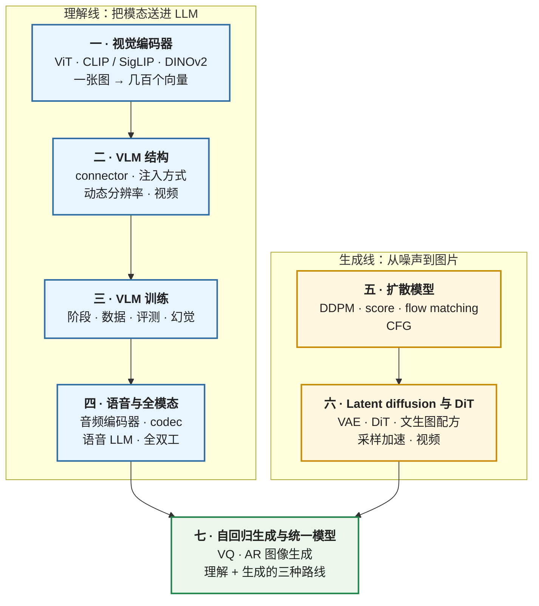

## 内容简介

《多模态：从视觉编码器到扩散模型》是一组共七篇的系列文章，对应[《AI 算法工程师学习地图》](/ai-algorithm-engineer-learning-roadmap.html)的第 L7 层。它面向已经理解 Transformer 与 LLM（L4）、做过后训练（L5）的读者，回答两个问题：**图片、视频、语音怎么进入一个语言模型**，以及**图像与视频的生成为什么是另一套数学**。

"多模态"下面有两条几乎独立的线。**理解线**把其他模态编码成 token 送进 LLM：一个视觉编码器（ViT）把图片变成几百个向量，一个 connector 把它们对齐到 LLM 的输入空间，LLM 像处理文本一样处理它们——这条线是 LLM 的扩展，用的是 L4、L5 的全部方法，新增的是编码器、connector 与对齐训练。**生成线**从噪声出发逐步去噪得到图片：扩散模型有自己的目标函数（去噪 / score matching / flow matching）、自己的结构（U-Net → DiT）、自己的采样过程（几十步迭代）与成本结构（无 KV cache、compute-bound）——这条线与 LLM 共享 Transformer 与 scaling 的经验，但数学是新的。两条线在 2025 年开始交汇：自回归图像生成用 LLM 的方式生成图像 token；统一模型让一个 Transformer 既理解又生成。

| 篇 | 主题 | 线 | 回答的问题 |
|---|---|---|---|
| 一 | 视觉编码器：CLIP、SigLIP 与自监督 ViT | 理解 | 一张图变成的几百个向量里有什么？对比学习为什么能学出"语义" |
| 二 | VLM 的结构：connector、注入方式与动态分辨率 | 理解 | 图片 token 怎么进入 LLM？三类 connector 与两种注入各自的取舍；分辨率怎么处理 |
| 三 | VLM 的训练：数据、阶段与评测 | 理解 | 先训什么后训什么、每阶段冻结谁；数据从哪来；多模态幻觉从哪来 |
| 四 | 语音与全模态：音频编码器、codec 与全双工 | 理解 → 生成 | 声音怎么 token 化？语音理解与语音生成的两条路；全模态的时延 |
| 五 | 扩散模型：DDPM、score matching 与 flow matching | 生成 | 去噪为什么等于学分布？三种视角为什么是同一件事；guidance 在做什么 |
| 六 | Latent diffusion、DiT 与文生图配方 | 生成 | 为什么在 latent 空间做；U-Net 到 DiT；SD / FLUX 的配方；采样加速；视频 |
| 七 | 自回归图像生成与统一模型 | 交汇 | 图像怎么 token 化；AR 生成 vs 扩散；理解与生成能不能用一个模型 |

读完这个系列，读者应该能够：读懂一个 VLM 的技术报告（编码器选什么、connector 怎么设计、分辨率策略、训练阶段、数据配比、评测），并判断它的每个选择在成本与效果上的取舍；读懂一个文生图模型的技术报告（噪声调度、预测目标、结构、guidance、采样步数），并理解它与 LLM 在训练与推理上的根本不同；知道两条线在哪里交汇、统一模型当前的三种路线各是什么。

## 为什么写这个系列？

### 多模态已经是默认配置

2025 年发布的主要模型几乎都是多模态的：GPT-4o、Gemini 2.5、Claude 的视觉能力、Qwen2.5-VL / Qwen2.5-Omni、Llama 3.2 Vision、Gemma 3、InternVL 3、Kimi-VL。"纯文本 LLM"正在变成一个历史阶段。一个算法工程师如果只懂文本，读不懂当前一半的技术报告。

### 理解线是 L4 + L5 的直接延伸，但有自己的坑

VLM 的 LLM 部分与文本模型完全一样，后训练方法（SFT、DPO、RL）也一样。新的东西集中在三处：编码器与 connector 的设计（一张图占多少 token、信息保留多少）、分辨率的处理（固定 vs 动态、tile vs 原生）、训练阶段的安排（先对齐 connector 还是一起训）。这三处决定了 VLM 的成本与上限，且每一处的选择在各家的报告里差别很大——LLaVA 的一个 MLP 与 Qwen-VL 早期的 Q-Former 相差几倍的 token 数；InternVL 的 tile 与 Qwen2-VL 的原生分辨率是两种哲学。系列的前三篇把这些选择放在同一把尺子上。

多模态还引入了文本模型没有的失效模式：**多模态幻觉**——描述图片里不存在的物体，是语言先验压过视觉证据的结果——以及视觉编码器的"盲点"（CLIP 类编码器对计数、空间关系、文字的弱点）。理解它们的来源才能在数据与训练上对症。

### 生成线的数学是新的

扩散模型不是 LLM 的变体。它的目标函数从变分下界或 score matching 推出，采样是解一个微分方程，结构从 U-Net 演化到 DiT，guidance 是一个对条件分布的重加权。这些在 L0–L5 里没有出现过。但它与 LLM 共享很多经验——Transformer 的 scaling、数据质量的决定性、蒸馏加速采样——理解了这一部分，就能读懂从 Stable Diffusion 到 FLUX、从 Sora 到 Wan 的整条线。

### 两条线在交汇

自回归图像生成（把图像 token 化后用 LLM 的方式生成）与统一模型（一个 Transformer 既理解图片又生成图片）是 2024–2025 年的活跃方向：Chameleon、Emu3、Janus、Transfusion、BAGEL、以及 GPT-4o 的原生图像生成。它们要回答的问题是"理解与生成能不能共享同一套表示"，而这个问题的答案决定了多模态模型的下一个形态。系列的最后一篇把两条线合起来讨论。

### 现有材料的断层

VLM 的材料多是各家的技术报告（各说各的选择，没有横向比较）；扩散模型的材料要么是数学推导（Song、Lilian Weng 的博客）要么是使用教程（diffusers 的文档），中间缺"为什么这样设计、每个选择值多少"的层次。这个系列按算法地图的一贯写法——推导 → 算账 → 公开配方对照——填这一层。

## 适合哪些读者？

### 读完 L4、L5，准备做多模态的算法学习者

主要读者。按顺序读；理解线（一到四）与生成线（五到六）可以只走一条，第七篇需要两条都读过。

### 已经在做 VLM、但对编码器与训练阶段的选择缺乏系统认识的工程师

第一到三篇是为你写的：编码器的对照、connector 与分辨率的取舍、训练阶段与数据的公开配方比较、评测与幻觉。

### 做文生图 / 视频生成的工程师

第五、六篇：从 DDPM 到 flow matching 的推导链、CFG 的含义、DiT 与 latent 空间、SD3 / FLUX 的配方、采样加速、视频的时空 patch。第七篇的自回归生成作为对照。

### Infra 工程师

[04 系列第八篇](/multimodal-vision-encoder-cost-and-image-token-kv.html)已经算过多模态的成本；本系列第二篇讲这些成本背后的设计动机，第六篇讲扩散模型完全不同的成本结构（无 KV、compute-bound、多步）——它决定了扩散模型的服务系统与 LLM 的服务系统为什么长得不一样。

## 系列的整体主线

系列的主线是**两条线、一个交汇点**：

贯穿七篇的三条线索：

- **推导线**：InfoNCE 与对比学习为什么学出语义（第一篇）；connector 的信息瓶颈（第二篇）；codec 的 RVQ（第四篇）；ELBO → 去噪目标、score matching 与 flow matching 的统一、CFG 的贝叶斯推导（第五篇）；VQ-VAE 的离散瓶颈（第七篇）。
- **成本线**：编码器的 FLOPs 与 token 数（回指 04-08）；训练阶段各自的算力；扩散模型每张图的 FLOPs 与 LLM 的对比（第六篇）；AR 图像生成的 token 数与 KV。
- **配方线**：LLaVA → Qwen2.5-VL → InternVL 3 的演化；Whisper → Qwen2.5-Omni；SD 1.x → SDXL → SD3 → FLUX；Chameleon → Janus → BAGEL。每一处设计选择在公开报告里的对照。

## 章节结构与分章导读

### 1. 视觉编码器：CLIP、SigLIP 与自监督 ViT

VLM 的第一步是把图片变成向量序列，做这件事的几乎总是一个预训练好的 ViT。它是怎么训出来的，决定了它"看到"什么。

**核心内容**：ViT 回顾（回指 [L3 第五篇](/cnn-from-lenet-to-resnet-and-vit.html)与 [04-08](/multimodal-vision-encoder-cost-and-image-token-kv.html)）；对比学习——InfoNCE 的推导、它为什么等价于估计互信息的下界、为什么需要大 batch（负样本数）、温度的作用；CLIP 的 4 亿图文对与训练算力账；SigLIP 用 sigmoid 损失把每对的判定解耦、为什么它对 batch 大小不敏感且更省；自监督（DINOv2）学到的与对比学习不同的东西（局部、几何、密集特征），以及为什么 VLM 里 CLIP 类编码器仍是主流但开始混用；编码器的"盲点"——计数、空间关系、文字、细粒度差别——它们的来源（对比学习的目标只要求区分图文对，不要求精细结构）；分辨率与 patch 大小对 token 数与信息量的影响；编码器选型对照（CLIP ViT-L/14、SigLIP-SO400M、InternViT-6B、DINOv2）。

**要回答的问题**：为什么几乎所有 VLM 都用 CLIP / SigLIP 而不用 ImageNet 分类预训练的 ViT？编码器看不到什么？

### 2. VLM 的结构：connector、注入方式与动态分辨率

编码器输出的几百个向量怎么进入 LLM。04-08 算了每种选择的 token 数与 FLOPs；这一篇讲**为什么这样选、效果差在哪**。

**核心内容**：三类 connector——MLP projector（LLaVA：信息全保留、token 数 = patch 数）、pixel-shuffle / 2×2 merge（Qwen2-VL、InternVL：空间压缩 4 倍、信息略损）、Q-Former / Perceiver resampler（BLIP-2、Flamingo、早期 Qwen-VL：固定 token 数、信息瓶颈）——各自的参数量、压缩率与信息损失，以及为什么 2024 年后主流从 Q-Former 回到 MLP + 空间压缩；decoder-only 注入（图片 token 进序列）vs cross-attention 注入（Flamingo、Llama 3.2 Vision：LLM 层间插 cross-attention 层，图片特征不进序列）的取舍——前者简单、复用一切、图片 token 占上下文；后者不占上下文、LLM 文本能力不受影响、但要新增参数与训练；分辨率的三种做法——固定（224 / 336）、AnyRes tile（LLaVA-NeXT、InternVL：切成若干 tile 各编码再拼）、原生动态（Qwen2-VL：ViT 接受任意分辨率，2D RoPE，token 数随图片大小变）——各自的 token 预算与对 OCR / 细节任务的影响；视频——帧采样率、时间维的合并（Qwen2-VL 的 2 帧合并）、M-RoPE 的三维位置、token 预算的分配；多图与交错。

**要回答的问题**：LLaVA 的一个 MLP 与 BLIP-2 的 Q-Former 相差什么？为什么 Qwen2-VL 要让 ViT 接受原生分辨率？

### 3. VLM 的训练：数据、阶段与评测

VLM 的训练不是一步到位的：先让 connector 学会对齐、再让 LLM 学会看图、再用指令数据教它回答问题、最后对齐偏好。每一阶段冻结谁、用什么数据、多少数据，各家不同。

**核心内容**：训练阶段的标准形态（connector 预对齐 → 多模态预训练 / 继续预训练 → 多模态 SFT → 偏好对齐 / RL）与各阶段的冻结策略、数据量级、lr；数据的类型——caption（LAION、CC12M、合成 recaption）、交错图文（MMC4、OBELICS）、OCR 与文档（PDF、图表、网页截图）、grounding（框、点）、视频字幕、指令数据（LLaVA-Instruct 的 GPT-4 合成、ShareGPT4V）——各自教会模型什么；对照 LLaVA-1.5 / LLaVA-NeXT / Qwen2.5-VL / InternVL 2.5 / Molmo / Llama 3.2 Vision / Idefics 的公开配方（阶段数、每阶段数据量、冻结策略、分辨率）；文本能力的保持——多模态训练会不会伤 LLM 的文本能力、怎么用文本数据混合防止；评测——MMMU、MMBench、MMStar、DocVQA、ChartQA、TextVQA、MathVista、Video-MME 各测什么；多模态幻觉——来源（语言先验、编码器盲点、训练数据里的共现偏差）、度量（POPE、HallusionBench）与缓解（数据、RLHF-V 一类的偏好对齐、解码侧的对比）。

**要回答的问题**：为什么先冻结 LLM 只训 connector？多模态幻觉从哪来、怎么减少？

### 4. 语音与全模态：音频编码器、codec 与全双工

声音进入 LLM 有两条路：连续的音频特征（像图片一样经编码器与 connector）或离散的语音 token（像文本一样）。前者适合理解，后者同时适合理解与生成。全模态模型要同时处理文本、图、音，且要实时。

**核心内容**：声学特征（mel 谱）与 Whisper 的 encoder-decoder（回指 04-08 的 1500 个位置）；CTC 与 attention 解码的对比；语音理解的两条路——音频编码器 + connector + LLM（Qwen-Audio、SALMONN）与离散 token；神经 codec——SoundStream / EnCodec 的结构、残差向量量化（RVQ）的推导与它为什么能用几个码本表示高保真音频、语义 token 与声学 token 的分层；语音生成——TTS 的 token 化路线（VALL-E：AR 生成第一层 codec token + NAR 生成其余层）与流匹配路线；语音 LLM 的对话形态；全模态模型（Qwen2.5-Omni 的 Thinker-Talker、GPT-4o 一类）的结构——为什么把"想"与"说"分开、TMRoPE 对齐音视频的时间轴；全双工——边听边说的时延账、打断的处理。

**要回答的问题**：语音为什么比图片更需要离散 token？全双工的时延由什么决定？

### 5. 扩散模型：DDPM、score matching 与 flow matching

生成线的数学核心。三种视角——去噪、score、流——在 2020–2023 年分别被提出，最终被证明是同一件事的三种参数化。

**核心内容**：前向加噪的闭式解 $$x_t = \sqrt{\bar\alpha_t} x_0 + \sqrt{1 - \bar\alpha_t}\, \epsilon$$；反向过程的变分下界，与它怎么化简为"预测噪声"的 MSE（DDPM，Ho 等 2020）——完整的推导链；三种预测目标（$$\epsilon$$、$$x_0$$、$$v$$）的等价与各自的数值行为；DDIM——为什么去噪可以是确定性的、它对应的 ODE、步数从 1000 到 50；score matching 的视角——去噪等价于估计 $$\nabla_x \log p_t(x)$$（Tweedie 公式）、SDE / ODE 的统一（Song 等 2021）；flow matching / rectified flow——从 $$x_0$$ 到噪声的直线插值、速度场的回归目标、为什么直线路径让采样步数更少（SD3、FLUX 用的正是它）；噪声调度（linear、cosine、logit-normal 采样时间步）与它对不同分辨率的影响；classifier-free guidance——从贝叶斯分解推出 $$\tilde\epsilon = \epsilon_\emptyset + w(\epsilon_c - \epsilon_\emptyset)$$、guidance scale 在做什么、为什么它提高保真度降低多样性、条件 dropout 的训练技巧。

**要回答的问题**：DDPM、score matching、flow matching 为什么是同一件事？CFG 的 $$w = 7.5$$ 在数学上意味着什么？

### 6. Latent diffusion、DiT 与文生图配方

从数学到一个能用的文生图模型：在哪个空间做扩散、用什么网络、文本怎么注入、怎么采样快。

**核心内容**：像素空间扩散的成本与 latent diffusion 的解法——VAE 把 $$1024^2 \times 3$$ 压到 $$128^2 \times 4$$（或 16 通道），扩散在 latent 上做，48 倍的压缩；VAE 的训练（重建 + KL + 感知 + 对抗）与它的瓶颈（细节、文字）；U-Net（SD 1.x / SDXL）→ DiT（Peebles & Xie 2023：把 latent patch 化送进 Transformer，adaLN 注入时间步与条件）→ MMDiT（SD3：文本与图像 token 在同一个 Transformer 里双流交互）；文本编码器的选择（CLIP 文本塔、T5-XXL、LLM）与它对 prompt 理解的影响；配方对照——SD 1.5 / SDXL / SD3 / FLUX.1 / Imagen / DALL-E 3 的参数量、latent 通道数、预测目标、调度、文本编码器、训练数据与 recaption；扩散模型的成本结构——一张 $$1024^2$$ 图 = 一个 4096 token 的序列前向 × 步数、无 KV cache、compute-bound——与 LLM 的对比，以及它对服务系统的含义；采样加速——步数蒸馏（progressive distillation）、一致性模型（consistency models / LCM）、对抗蒸馏（SDXL-Turbo / ADD）、rectified flow 的直线优势——从 50 步到 1–4 步；视频生成——时空 patch（Sora 的"patch 是视频的 token"）、3D VAE、DiT 的时空 attention、Wan / HunyuanVideo / CogVideoX 的配方；扩散的后训练一瞥（DPO for diffusion、奖励微调）。

**要回答的问题**：为什么在 latent 空间做？DiT 相比 U-Net 赢在哪？一张图的生成成本与一次 LLM 推理怎么比？

### 7. 自回归图像生成与统一模型

两条线的交汇。图片能不能像文本一样被 token 化、然后自回归地生成？理解与生成能不能用一个模型？

**核心内容**：VQ-VAE / VQGAN——把图片编码成离散 token 网格的推导（最近邻码本、commitment loss、STE 传梯度）、码本坍缩与对策（EMA 更新、码本重置、FSQ / LFQ 的无码本量化）、重建质量与 token 数的权衡；AR 图像生成——Parti、LlamaGen 用 LLM 结构逐 token 生成图像 token 的效果与成本（一张 $$256^2$$ 图 256–1024 个 token，与扩散的对比），栅格顺序的问题；VAR（next-scale prediction）——从粗到细逐尺度生成，把顺序问题变成尺度问题，效果与速度都超过栅格 AR；MaskGIT 一类的并行解码；统一模型的三条路线——纯 token（Chameleon、Emu3：一个词表同时有文本与图像 token，一个 Transformer 全做）、双编码器（Janus：理解用 SigLIP 特征、生成用 VQ token，共享 LLM）、AR + 扩散混合（Transfusion、BAGEL：文本用 AR、图像用扩散 loss，同一个 Transformer）——各自的取舍、公开结果与 GPT-4o 原生图像生成的启示；两条线的成本对照；系列总结。

**要回答的问题**：AR 生成图像与扩散各赢在哪？理解与生成的表示能不能共享？

## 贯穿全系列的实践线

这个系列**没有配套实验**（与 L5 二到八篇、L6 同一约定）。每篇有一节"动手（建议）"，给出用现成工具（`transformers`、`open_clip`、`diffusers`、`lmms-eval`）复现该篇核心现象的骨架与该看的指标，不引用未跑过的数字。

建议的动手顺序（一张 24 GB 的 GPU）：

| 篇 | 动手 | 看什么 |
|---|---|---|
| 一 | 用 `open_clip` 比较 CLIP ViT-L 与 SigLIP 在计数 / 空间关系 / 文字识别小测试上的零样本表现 | 编码器的盲点 |
| 二 | 用 LLaVA-1.5 与 Qwen2.5-VL-3B 在 DocVQA 子集上比不同分辨率设置的准确率与 token 数 | 分辨率—token—精度的三角 |
| 三 | 复现 LLaVA-1.5 的两阶段训练（558K 对齐 + 665K 指令，7B 在 24 GB 上用 LoRA），做 POPE 幻觉评测 | 阶段与幻觉 |
| 四 | 用 EnCodec 编码 / 解码一段语音，改变码本层数，听并测 MOS 代理指标 | RVQ 的分层 |
| 五 | 在 CIFAR-10 上从零训一个小 DDPM 与一个 flow matching 模型（几小时），比不同步数下的 FID | 三种视角、步数与直线路径 |
| 六 | 用 `diffusers` 跑 SD 1.5 / SDXL / SD3-medium，扫 guidance scale 与步数，测每张图的时间 | CFG 的效果与成本结构 |
| 七 | 用 VQGAN 编解码图片，改变码本大小，看重建；用 LlamaGen 生成并与 SD 比时间 | 离散瓶颈与 AR 的成本 |

## 阅读路径建议

### 完整学习路径

一到七按顺序。第一到三篇是理解线的主体，第四篇把音频接上并过渡到"离散 token 也能生成"，第五、六篇是生成线，第七篇合并。

### 只做 VLM

一 → 二 → 三，加第七篇的前半（VQ 与统一模型的理解侧）。第四篇可选。

### 只做生成

五 → 六 → 七。第一篇的 ViT 部分与第七篇的 VQ 是前置。第五篇的推导是必须的，不能跳。

### 做语音

四为主，一、二作为"编码器 + connector"范式的参考，第七篇的离散 token 生成作为对照。

### Infra 工程师

二（结构决定的成本形态）、六（扩散的成本结构为什么与 LLM 不同）。

## 本系列的边界

- **成本的账**在 [04 系列第八篇](/multimodal-vision-encoder-cost-and-image-token-kv.html)：encoder FLOPs、image token 的 KV、connector 的 token 数、视频与音频的 token 数、训练侧的显存。本系列引用它的结论，不重算。
- **CNN 与 ViT 的基础**在 [L3 第五篇](/cnn-from-lenet-to-resnet-and-vit.html)。
- **后训练方法本身**（SFT、DPO、RL）在 [L5](/post-training-from-sft-to-verifiable-rewards.html)；本系列第三篇只讲它们在多模态上的特殊之处。
- **视频理解的时序建模、3D 与机器人的具身多模态、音乐生成**不展开——各自是独立的方向。
- **扩散模型的服务系统**（批处理、多 GPU 的步并行）属于 Infra 地图。
- **应用层**（多模态 RAG、Agent 的截图操作）属于应用地图。

## 前置要求与说明

### 前置要求

- [L3 第五篇](/cnn-from-lenet-to-resnet-and-vit.html)：ViT 的结构与 patch embedding。
- [04 系列](/transformer-and-llm-for-infra-engineers.html)第一、三、八篇：Transformer 结构、KV cache、多模态成本。
- [L5](/post-training-from-sft-to-verifiable-rewards.html)第一、二、四篇：SFT、偏好数据、DPO——第三篇的多模态对齐直接用它们。
- [L0 数学导读](/math-for-ai-algorithm-engineers.html)的概率部分：第五篇的推导需要高斯分布的性质、条件概率、KL 与变分下界的基本形式。

### 版本与基线

- 理解线的对照模型：LLaVA-1.5 / NeXT、Qwen2-VL / Qwen2.5-VL、InternVL 2.5 / 3、Llama 3.2 Vision、Molmo、Gemma 3、Kimi-VL 的技术报告。
- 语音：Whisper、EnCodec、VALL-E、Qwen2-Audio、Qwen2.5-Omni、Moshi 的论文与报告。
- 生成线：DDPM、DDIM、Score SDE、Flow Matching / Rectified Flow、DiT、SD 1.x / SDXL / SD3、FLUX.1、Imagen、Sora 技术报告、Wan 2.1、HunyuanVideo、CogVideoX。
- 交汇：VQGAN、MaskGIT、Parti、LlamaGen、VAR、Chameleon、Emu3、Janus / Janus-Pro、Transfusion、BAGEL。
- 工具版本变化快，"动手"节只给接口形状。

## 章节目录

1. [视觉编码器：CLIP、SigLIP 与自监督 ViT](/vision-encoders-clip-siglip-and-self-supervised-vit.html)
2. [VLM 的结构：connector、注入方式与动态分辨率](/vlm-architecture-connectors-injection-and-dynamic-resolution.html)
3. [VLM 的训练：数据、阶段与评测](/vlm-training-recipe-data-stages-and-evaluation.html)
4. [语音与全模态：音频编码器、codec 与全双工](/speech-and-omni-models-audio-encoders-codecs-and-duplex.html)
5. [扩散模型：DDPM、score matching 与 flow matching](/diffusion-models-ddpm-score-matching-and-flow-matching.html)
6. [Latent diffusion、DiT 与文生图配方](/latent-diffusion-dit-and-text-to-image-recipes.html)
7. [自回归图像生成与统一模型](/autoregressive-image-generation-and-unified-models.html)

## 最终目标

读完这个系列，面对一个多模态的需求，读者应该能够回答：

| 追问 | 答案来自 |
|---|---|
| 编码器选 CLIP、SigLIP 还是 InternViT？它看不到什么？ | 第一篇 |
| 一张图占多少 token 是合适的？用 MLP 还是压缩？固定分辨率还是动态？ | 第二篇 · 04-08 |
| 训练分几个阶段、每阶段冻结谁、用什么数据？怎么防止文本能力退化？ | 第三篇 |
| 模型描述了图里没有的东西，问题在数据、编码器还是解码？ | 第三篇 |
| 语音要不要离散化？全双工的时延瓶颈在哪？ | 第四篇 |
| 这个文生图模型用的是 $$\epsilon$$ 预测还是 flow matching？guidance 该设多少？ | 第五篇 |
| 生成一张图的成本与一次 LLM 推理怎么比？步数怎么从 50 降到 4？ | 第六篇 |
| 要一个既能看图又能画图的模型，选纯 token、双编码器还是 AR + 扩散？ | 第七篇 |

多模态的模型每年都在换结构。不变的是两条线的数学、"一张图值多少 token"这个账、以及"模型看到了什么、没看到什么"这个问题。
