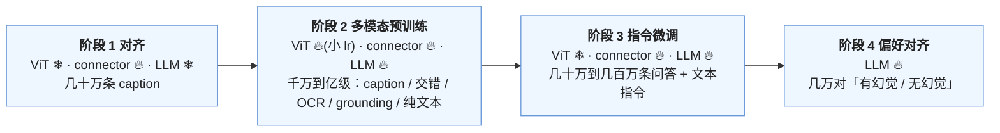

前两篇定了结构：一个预训练的 ViT、一个 connector、一个预训练的 LLM。三个部分来自三个不同的训练过程，表示空间互不相同。VLM 的训练要做的是把它们**对齐**成一个模型——让 LLM 读懂编码器的输出、让编码器为 LLM 的任务调整、让整体学会按指令回答关于图片的问题、最后让它符合人的偏好。这件事不是一步做完的：每个阶段冻结哪些部分、用什么数据、多少数据、多大的学习率，各家的报告差别很大，且这些差别在 benchmark 上的影响比 connector 类型的影响大得多。

这一篇把 VLM 训练拆成阶段与数据两个维度。阶段的问题是"谁在什么时候学"：先冻结 LLM 只训 connector，是为了不让随机初始化的 connector 的梯度破坏 LLM；后来解冻 LLM 甚至编码器，是因为对齐不只是 connector 的事。数据的问题是"教会模型什么"：caption 教对齐、交错图文教上下文、OCR 教读字、指令数据教回答、偏好数据教诚实——每类数据缺了都有对应的失效。最后是评测与多模态特有的失效：**幻觉**——描述图里没有的东西——它的来源可以追到数据、编码器与解码三处。

本篇要回答的核心问题是：

> **为什么先冻结 LLM 只训 connector？[^q0] 多模态幻觉从哪来、怎么减少？[^q1]**

## 一、总览：阶段、数据、评测

### 1. 标准的训练形态

2024–2025 年的 VLM 训练大致收敛到三到四个阶段：

| 阶段 | 训什么 | 冻结什么 | 数据 | 数据量级 | 目的 |
|---|---|---|---|---|---|
| 0（可选）编码器预训练 / 继续训 | ViT | — | 图文对（对比或生成目标） | 数亿到数十亿对 | 得到或改造编码器（上一篇 InternViT、Qwen2-VL ViT） |
| 1 对齐 | connector（有时 + 编码器） | LLM | caption | 50 万到数千万 | 让 connector 学会把视觉特征映射到 LLM 空间 |
| 2 多模态预训练 / 继续预训练 | connector + LLM（+ 编码器） | — | caption、交错图文、OCR、grounding、合成 | 数千万到数亿样本 | 让 LLM 学会用视觉信息；扩展能力（OCR、定位） |
| 3 指令微调（SFT） | 全部或 LLM + connector | 编码器（常冻结） | 多模态指令数据 + 文本指令数据 | 数十万到数百万 | 学会按指令回答 |
| 4 偏好对齐 | LLM | 其他 | 多模态[偏好对](# "tip: 同一个问题的两个回答 + 「哪个更好」的标注。DPO（direct preference optimization）直接用这种对训模型，让好回答的概率升、差回答的降，不需要单独训奖励模型") | 数万 | 减少幻觉、对齐风格 |

画成流程，每个阶段谁在学、谁被冻住（雪花 = 冻结，火焰 = 训练）：



几个词先说清：**冻结**（freeze）= 这部分参数不更新，只做前向；**lr** = [学习率](# "tip: learning rate：每一步参数沿梯度走多远。L2 第二篇：太大发散、太小慢。这里的关键是新参数（connector）与旧参数（LLM）该用不同的学习率")；**SFT** = 监督微调（supervised fine-tuning），用"问题 → 标准回答"的数据训模型；**epoch** = 把全部训练数据过一遍。

早期（LLaVA-1.5）只有 1 + 3 两阶段；2024 年后主流是 1 + 2 + 3（+ 4）。阶段 2 是变化最大的一步——它的数据量从 LLaVA 的零到 Qwen2-VL 的 1.4T token、InternVL 2.5 的数亿样本。

### 2. 先说答案

**先冻结 LLM 只训 connector**，因为 connector 是随机初始化的：它的输出一开始是噪声，如果此时 LLM 也在训练，LLM 会收到"视觉 token 是噪声"的梯度，为了降低 loss 它学会**忽略**视觉 token（或者更糟——它的文本表示被噪声梯度破坏）。冻结 LLM 让 connector 在一个固定的目标空间里学习映射——"让 LLM 用现有的能力读懂这些向量"——几十万条 caption、几千步就够。之后解冻 LLM 时，connector 已经给出有意义的输入，LLM 学的是"怎么用"而不是"要不要用"。这与 [L5 第一篇](/sft-data-chat-template-loss-mask-and-peft.html)里讨论的"新增的 embedding 与 LoRA 更新不到 embedding"是同一类问题：**新参数与旧参数不能用同一个学习率、同一个阶段训**。后续研究（Prismatic VLMs、MM1）发现如果 connector 用合理的初始化与更小的 lr，单阶段也可以，但两阶段仍是稳妥的默认。

**幻觉的来源**有三处。**数据**：训练 caption 里物体的共现统计——"厨房"的图 90% 有"冰箱"，模型学到看到厨房就说冰箱，不管这张图里有没有；以及指令数据（GPT-4 合成的 LLaVA-Instruct）本身包含幻觉——GPT-4 只看了文本描述与框，生成的对话里有不存在的细节，模型学到了它们。**编码器**：上一篇讲的盲点——编码器没有保留的信息（计数、小物体、空间关系），LLM 只能靠语言先验补全，补全的就是幻觉。**解码**：LLM 是一个强大的语言模型，视觉 token 只是上下文的一部分；生成越长，对视觉 token 的注意力越弱、对已生成文本的依赖越强（"文本惯性"），长描述的后半段幻觉率显著高于前半段。三处对应三类缓解：清洗与平衡数据、加负样本（"图里没有冰箱"）；提高分辨率、解冻编码器、多编码器；偏好对齐（RLHF-V、DPO 用幻觉 / 无幻觉的对）与解码侧的对比（VCD：用加噪图的输出做对比）。第六章展开。

### 3. 本文的章节安排

| 章 | 主题 | 内容 |
|---|---|---|
| 二 | 阶段 1：对齐 | 为什么冻结 LLM——一个 10 秒跑完的缩小实验（冻结 / 一起训 / 两阶段，图）；数据与步数；解冻编码器的时机 |
| 三 | 阶段 2：多模态预训练 | 数据类型与各自教会什么；配比；文本数据的混入；LLM 与编码器的 lr |
| 四 | 阶段 3–4：指令微调与偏好 | 指令数据的来源与合成；文本能力的保持；多模态 DPO / RL |
| 五 | 公开配方对照 | LLaVA-1.5 / NeXT / OneVision、Qwen2-VL / 2.5-VL、InternVL 2.5、Molmo、Llama 3.2、Idefics3、Gemma 3 |
| 六 | 幻觉 | 三个来源的机制与证据；共现偏差怎么变成幻觉的两特征小模型；度量；缓解 |
| 七 | 评测 | benchmark 各测什么；协议陷阱；文本能力回归 |
| 八 | 成本 | 各阶段的算力账 |
| 九 | 动手（建议） | 复现 LLaVA-1.5 两阶段 + POPE |
| 十 | 本文小结 | |
| 十一 | 自测 | 5 道题 |

## 二、阶段 1：对齐

### 1. 冻结 LLM 的理由

上一节给了直觉，这里给一个更具体的图景。阶段 1 的 loss 是 caption 的交叉熵：输入是 `<image tokens> 描述这张图：`，目标是 caption。梯度从 caption 的 loss 反传，经过 LLM 到视觉 token 的位置，再经 connector（到编码器）。如果 LLM 冻结，梯度只更新 connector——connector 学的是"输出什么向量能让 LLM 生成正确的 caption"，即在 LLM **现有的**输入 embedding 空间里找到与图片语义对应的位置。这是一个"翻译"任务，目标空间固定，几十万样本足够。

如果 LLM 不冻结，LLM 的参数也在按这个 loss 更新。早期 connector 的输出接近随机，LLM 降低 loss 的最快方式是**学会在 caption 任务里忽略视觉 token、靠语言先验生成通用的 caption**（"一张图片，里面有一些物体"）——这是一个坏的局部最优，之后即使 connector 变好，LLM 已经学会忽略它。同时 LLM 的文本能力被这些噪声梯度损伤。

### 2. 数据与步数

LLaVA-1.5 阶段 1：558K 条 caption（LAION / CC / SBU 的子集经 BLIP 重写），1 epoch，lr 1e-3（只训 MLP，可以很大），batch 256，约 2K 步，8 张 A100 几小时。之后的模型在这个阶段用更多数据（Qwen-VL 用 1.4B 对——但它同时训编码器；InternVL 1.5 用几千万），但对**只训 connector**的目的来说，几十万到几百万足够——connector 参数少，多了会过拟合 caption 的风格。

### 3. 编码器解不解冻

阶段 1 是否同时训编码器，各家分歧：LLaVA 系列一直冻结 CLIP（理由：保护预训练的表示、省显存）；Qwen-VL / Qwen2-VL 在阶段 1 就训 ViT——Qwen2-VL 的阶段 1 甚至**只**训 ViT、LLM 冻结（理由：编码器要为 LLM 的任务调整，且他们的数据量大到不怕破坏）；InternVL 解冻（编码器是自己训的，本来就要与 LLM 联训）。经验规律：**数据少（< 几百万）冻结，数据多解冻；用现成 CLIP 且数据一般时冻结更稳**。解冻时编码器的 lr 要比 connector 小一到两个量级（$$2 \times 10^{-5}$$ 一类），且常配 layer-wise lr decay（浅层更小）。

### 4. 把这件事缩小到能亲眼看见

上面是文字论证，可以用一个 CPU 上 10 秒跑完的缩小版验证。"LLM"是一个在 16 维"文本 embedding"上预训练好的两层网络（10 类分类，准确率 0.978）；"视觉输入"来自另一个 24 维空间，与文本空间毫无关系；connector 是一个随机初始化的 $$24 \to 16$$ 线性层。三种训法各 400 步：

```python
llm = torch.nn.Sequential(torch.nn.Linear(16, 64), torch.nn.ReLU(), torch.nn.Linear(64, 10))   # 「LLM」，先在文本数据上训好
conn = torch.nn.Linear(24, 16)                                                                # connector，随机初始化
loss = F.cross_entropy(llm(conn(Xv[idx])), yv[idx])                                           # 视觉样本 → connector → LLM → 分类损失
# 冻结：opt 只含 conn.parameters()；一起训：opt 含 conn + llm 的参数；两阶段：先冻结 150 步再一起训 250 步（LLM 用小 lr）
```

| 训法 | 视觉任务准确率 | 文本任务准确率（预训练能力保住了没） |
|---|---:|---:|
| 冻结 LLM，只训 connector | 0.993 | 0.978 → **0.978** |
| LLM 与 connector 一起训（同一 lr） | 0.998 | 0.978 → **0.870** |
| 两阶段：先冻结训 connector，再一起训（LLM 小 lr） | 0.998 | 0.978 → 0.974 |


三种训法都学会了视觉任务，差别全在右图：一起训时 LLM 在前 50 步收到的是"随机 connector 输出 → 分类错误"的梯度，它改了自己的参数去迁就这些噪声输入，文本能力掉了 11 个点且不会自己恢复——**训练数据里没有文本样本，没有任何力量把它拉回来**。真实 VLM 里对应的就是"多模态训练伤了 LLM 的文本能力"，第三章第 3 节的文本数据混入是另一半解药。

Prismatic VLMs（Karamcheti 等 2024）的系统消融：在 LLaVA 规模的数据上，单阶段（直接训 connector + LLM）与两阶段效果相当，前提是 connector 的 lr 合适——说明两阶段不是必需的，但它是**不需要调 lr 就能稳的默认**。

## 三、阶段 2：多模态预训练

### 1. 数据类型与它们教会什么

阶段 2 是 VLM 能力的主要来源。数据类型与各自的作用：

| 数据类型 | 代表来源 | 教会什么 | 缺了会怎样 |
|---|---|---|---|
| caption（短） | LAION、CC12M、COYO；经 recaption 的版本 | 物体、场景、属性的对齐 | 基本的看图说话不行 |
| caption（长、密集） | ShareGPT4V、合成的详细描述（GPT-4V / 自家大模型重写） | 细节、关系、布局 | 描述粗糙、忽略小物体 |
| 交错图文 | MMC4、OBELICS、网页 | 图与上下文文本的关系；多图；in-context 能力 | 多图任务与 few-shot 弱 |
| OCR / 文档 | PDF 渲染、网页截图 + HTML、合成文档、DocVQA 类数据 | 读字、版面、表格 | 文档任务不可用 |
| 图表 / 表格 | ChartQA、合成图表（matplotlib 生成 + 代码为标签） | 数值读取、趋势 | 图表任务弱 |
| grounding | RefCOCO、Visual Genome、检测数据转文本坐标 | 定位、指代、框与点 | 不会指出"哪里" |
| 视频 | WebVid、合成字幕、时序标注 | 时间、动作 | 视频任务弱 |
| 纯文本 | 预训练语料的子集 | **保持** LLM 的文本能力 | 文本能力退化 |
| 数学 / 科学图形 | 几何题、教科书图、合成 | 结构化图形推理 | MathVista 弱 |

**recaption** 是 2024 年最重要的数据技术之一：网上抓的 alt-text 短、噪、常与图无关；用一个强 VLM 为每张图重写一段准确详细的描述，质量大幅提升。ShareGPT4V 用 GPT-4V 写了 100K 条再训一个模型扩到 1.2M；Molmo 的 PixMo 用**人类语音描述**（让标注者对着图说 60–90 秒，转写成文本）得到 712K 条高质量描述——避开了"用 VLM 生成数据训 VLM"的循环；DALL-E 3 与 SD3 的训练同样依赖 recaption（第八篇）。

### 2. 配比

阶段 2 的配比决定能力的形状。几个公开的例子：

- **Qwen2-VL**：论文 2.2 节的三阶段——阶段 1 **只训 ViT**（约 600B token，图文对 / OCR / 交错）；阶段 2 **全部解冻**（再 800B token，加 VQA、grounding、视频等混合数据）；阶段 3 **锁定 ViT、只对 LLM 做指令微调**。合计约 1.4T token（含图像与文本 token，只算文本 loss）。
- **InternVL 2.5**：阶段 2 数据按任务分桶（caption、通用 QA、数学、图表、OCR、知识、文档、grounding、对话、多图、视频），公布了各桶的数据集列表；强调"数据质量过滤"（去掉重复模式、异常长度的样本）比数据量重要，报告过滤后训练更稳、幻觉更少。
- **MM1**：消融的结论——**交错图文数据对 few-shot 能力关键**（去掉它 few-shot 掉 10+ 点），caption 数据对零样本关键，纯文本数据对文本能力关键；三者的比例 45 / 45 / 10 是他们的甜点。
- **Idefics2 / 3**：OBELICS 交错数据 + LAION caption + PDF 文档（Docmatix，250 万文档页的合成 QA）；报告文档数据让 DocVQA 从 ~50 涨到 ~75。

配比的方法论与 [04 系列第十一篇](/pretraining-data-pipeline-dedup-filtering-and-mixture.html)相同：小规模消融各桶的边际收益、按目标能力加权、防止某一桶主导。多模态多了一个维度——每类数据的**图片 token 数**差别大（文档 2K、caption 图 256），按样本数配比与按 token 数配比是两回事。

### 3. 文本数据的混入

只用多模态数据继续训练 LLM 会让它的**文本能力退化**——MMLU 掉几个点、代码与数学掉更多、对话风格变差。原因是分布偏移（所有训练样本都带图，模型对"没有图的问题"的处理变弱）与遗忘（[L5 第一篇](/sft-data-chat-template-loss-mask-and-peft.html)第六章的机制）。缓解是在阶段 2 与 3 都混入纯文本数据：Qwen2-VL 混文本预训练数据；LLaVA-OneVision 的 SFT 里混文本指令数据；Llama 3.2 Vision 靠 cross-attention 结构完全避开这个问题（文本路径不动）。混入比例从 10% 到 50% 不等，一个常见的检查是训练前后在 MMLU / GSM8K / HumanEval 上的回归测试。

### 4. 学习率与冻结

阶段 2 通常全部解冻，lr 分组：LLM 用 SFT 量级（$$1\text{–}2 \times 10^{-5}$$）、connector 可以大一点、编码器最小（$$2 \times 10^{-6}$$ 到 $$2 \times 10^{-5}$$，配 layer decay）。Qwen2-VL 在阶段 1、2 训练 ViT（阶段 3 冻结）；LLaVA-NeXT 在阶段 2（他们称 stage 1.5）解冻 ViT 并用 $$2 \times 10^{-6}$$。冻结编码器的代价是编码器的盲点（上一篇）不能被下游任务修正——对 OCR 与定位任务，解冻是必要的。

## 四、阶段 3–4：指令微调与偏好

### 1. 指令数据

LLaVA 开创的做法：用 GPT-4（纯文本）读 COCO 的 caption 与检测框，生成关于图片的多轮对话、详细描述、复杂推理三类问答——158K 条。它有效，但**GPT-4 没看图**，生成的内容里有基于 caption 的推测（幻觉的一个源头）。之后的改进：用 GPT-4V 直接看图生成（ShareGPT4V、LLaVA-NeXT 的数据）；把已有的学术 VQA 数据集（VQAv2、GQA、OCR-VQA、TextVQA、RefCOCO……）转成指令格式混入（LLaVA-1.5 的 665K 里一半是这类）——它们的答案短而准确，教模型精确回答；人工标注（Molmo 的 PixMo-AskModelAnything：人提问、模型初答、人修正）。

LLaVA-OneVision（2024）的 SFT 数据 3.2M 条，分为单图、多图、视频三桶，并强调**"one vision"**——同一个模型在三种输入形态上都好，靠数据的覆盖而不是结构。

### 2. 数据的格式细节

多模态 SFT 沿用 [L5 第一篇](/sft-data-chat-template-loss-mask-and-peft.html)的全部机制：chat template（图片占位符是一个特殊 token，被替换成 $$N_{img}$$ 个视觉 token）、loss mask（只算回复）、packing（可变的图片 token 数让 packing 更重要）。一个多模态特有的坑：**图片 token 的位置**——图在文本之前还是之后、多图的顺序——训练与推理要一致，否则效果明显下降。

### 3. 偏好对齐

多模态的 RLHF / DPO 目标主要是**减少幻觉与提高描述的准确性**，方法与 [L5 第二、四篇](/preference-data-and-reward-models.html)相同，差别在数据：

- **RLHF-V**（Yu 等 2024）：人类对模型的描述做**片段级修正**（标出幻觉的句子并改写），构造"有幻觉 / 修正后"的偏好对，DPO 训练；1.4K 对就显著降低幻觉。
- **LLaVA-RLHF**：奖励模型加"事实增强"——RM 输入里附上图片的真实 caption，让它能判断幻觉。
- **合成偏好**：用一个 VLM 生成多条描述，用检测器或强模型判断哪条幻觉少，构造对。
- **RL with verifiable rewards**（2025）：对可验证的多模态任务（数学图形题、图表数值、计数）用规则奖励做 GRPO——Vision-R1、VLM-R1 等工作把 [L5 第五篇](/reasoning-models-and-verifiable-rewards.html)的方法搬到多模态，报告在 MathVista 一类上有提升。

### 4. 文本能力的保持（再说一次）

阶段 3 混入文本指令数据（LLaVA-1.5 的 665K 里有 40K 的 ShareGPT 文本对话；LLaVA-OneVision 混更多），并在训练后做文本 benchmark 的回归。InternVL 2.5 报告他们的 78B 模型在纯文本 benchmark 上与底座 Qwen2.5-72B 相比"基本持平"——这是靠数据混合与较小的 lr 做到的。

## 五、公开配方对照

| 模型 | 阶段数 | 阶段 1 | 阶段 2 | 阶段 3（SFT） | 编码器 | 备注 |
|---|---|---|---|---|---|---|
| LLaVA-1.5（2023） | 2 | 558K caption，只训 MLP，1 ep | — | 665K（学术 VQA + GPT-4 生成 + 文本），LLM + MLP，1 ep | 冻结 CLIP | 8 × A100 约 1 天；一切的基线 |
| LLaVA-NeXT / OneVision（2024） | 3 | 558K | 4M 高质量 recaption（stage 1.5），解冻 ViT | 3.2M（单图 / 多图 / 视频） | 解冻（小 lr） | 强调数据质量 |
| Qwen2-VL（2024） | 3 | 只训 ViT，600B token | 再 800B token 多任务，全解冻 | 指令 + 多图 + 视频 + agent，**ViT 冻结** | 自训；阶段 1–2 解冻、阶段 3 冻结 | 原生分辨率；DPO |
| InternVL 2.5（2024） | 3 | 对齐（InternViT + MLP） | 多任务分桶，数据过滤 | 分桶 SFT，"渐进式缩放"（小 LLM 上调好数据再换大 LLM） | 解冻 | 78B 用 Qwen2.5-72B |
| Molmo（2024） | 2 | PixMo-Cap 712K 人写描述，训 connector + LLM | — | PixMo 多任务（AskModelAnything、Points、Docs、Clocks…） | 冻结 → 解冻 | 全部数据开放、无 VLM 合成 |
| Llama 3.2 Vision（2024） | 3 | 6B 图文对，训 cross-attn + 编码器 | 高质量数据 | SFT + 拒绝采样 + DPO | 训 | 文本能力零变化 |
| Idefics3（2024） | 3 | OBELICS + LAION | + Docmatix 文档 | The Cauldron 多任务 | 冻结 → 解冻 | 文档数据的作用 |
| Gemma 3（2025） | — | 与 LLM 联合预训练（图像 token 进预训练） | 同 | 同 LLM 的后训练 | 冻结 SigLIP | 多模态从预训练开始 |
| Kimi-VL（2025） | 4 | ViT 预训练（MoonViT） | 联合预训练 + 冷却 + 长上下文激活 | SFT + 长思维链 SFT + RL | 自训 | MoE LLM；推理版本 |

趋势：（1）阶段 2 从无到有到主导；（2）编码器从冻结到解冻到自训；（3）数据从 GPT-4 合成到 recaption 到人工（Molmo）与合成的混合；（4）2025 年开始把多模态**并入 LLM 预训练**（Gemma 3、Kimi-VL）而不是事后对齐——这让"阶段"的划分逐渐模糊。

## 六、幻觉

### 1. 现象与度量

多模态幻觉（object hallucination）：模型描述图片里不存在的物体、错误的属性（颜色、数量）、不存在的关系或文字。度量：

- **CHAIR**（Rohrbach 等 2018）：生成的 caption 里提到的物体有多少不在标注里（按物体与按句子两种比例）。
- **POPE**（Li 等 2023）：二元问题"图里有 X 吗？"，X 从三种策略采样——随机、频繁出现的物体、与图中物体常共现的物体——报告准确率与 F1；共现策略最能暴露幻觉。
- **HallusionBench**、**MMHal-Bench**：更复杂的幻觉（视觉错觉、误导性问题、文本先验陷阱），常用 GPT-4 评分。
- **AMBER**：生成式与判别式结合的无 LLM 评测。

LLaVA-1.5 在 POPE 的共现子集上准确率约 85%；经过 RLHF-V 或高质量数据训练的模型到 88–90%；2025 年的模型（Qwen2.5-VL、InternVL 3）在 87–90%。注意 $$1 - \text{acc}$$ **不是**幻觉率：POPE 是 yes/no 二分类，错误里既有"没有却说有"（假阳性，才是幻觉）也有"有却说没有"（假阴性，是漏检）；平衡的 200 题里 TP 80 / TN 90 与 TP 90 / TN 80 准确率都是 85%，假阳性率却是 10% 与 20%——要看 yes 比例与 F1，或直接报假阳性率。剩下的 10% 顽固部分说明幻觉不只是数据问题。

### 2. 三个来源

**数据的共现偏差**。训练 caption 与 VQA 数据里物体的共现有强统计规律（"餐桌"与"椅子"、"街道"与"汽车"），模型把它学成先验。这个机制小到可以用一个两特征的逻辑回归（L2 第三篇）看清：造 2 万个样本，"厨房"场景里 90% 有冰箱、其他场景 10%；模型看两个特征——"场景是不是厨房"（来自文本，总是准确）与"视觉上看到冰箱没有"（来自编码器，只有 60% 的时候如实、40% 随机）——预测"有没有冰箱"：

```text
学到的权重：场景=厨房 +4.35，视觉证据=看到冰箱 +2.77，偏置 -3.57
场景是厨房、视觉没看到冰箱 → 模型说「有冰箱」的概率 0.68
场景是厨房、视觉看到冰箱   → 0.97
场景非厨房、视觉看到冰箱   → 0.31
```

厨房里明明没看到冰箱，模型仍以 0.68 的概率说"有"——场景先验的权重（4.35）比视觉证据（2.77）大，因为在训练数据里先验更可靠。把视觉证据的可靠度从 0.6 提到 0.8、0.95、1.0，这个数字降到 0.46、0.17、0.01：**编码器越可靠，模型越信眼睛而不是先验**——这就是下一段"编码器的信息缺失"与本段是同一件事的两面。Li 等 2023 的分析：VLM 幻觉出的物体与图中真实物体的共现频率显著高于随机——模型在"补全"一个统计上合理的场景。加剧它的是**合成数据的幻觉**：GPT-4 从 caption 生成的 LLaVA-Instruct 里，详细描述常包含 caption 没提、图里也没有的细节（GPT-4 在"合理地扩写"），模型学会了这种扩写。

**编码器的信息缺失**。上一篇的盲点：编码器没保留的信息（小物体、精确计数、空间关系），LLM 只能从语言先验补——补的就是幻觉。证据：提高分辨率显著降低小物体的幻觉；解冻编码器降低幻觉；用 DINOv2 拼接改善空间相关的幻觉（Cambrian-1）。

**解码的文本惯性**。LLM 生成时对视觉 token 的注意力随生成长度衰减——Huang 等 2024（OPERA）的分析：幻觉往往发生在模型对某几个"总结性" token 过度关注、对图片 token 关注不足的时刻，即语言模型的自回归惯性压过了视觉证据。长描述的后半段幻觉率是前半段的两倍以上。另一个解码侧的证据：VCD（Leng 等 2024）用**加噪的图片**跑一遍模型得到"语言先验主导"的分布，从原分布里减去它（对比解码），幻觉显著减少——说明幻觉的一部分正是"没有视觉信息时模型也会说的话"。

### 3. 缓解

| 来源 | 缓解 | 代表 |
|---|---|---|
| 数据 | 清洗合成数据里的幻觉；加**负样本**（"图里有 X 吗？——没有"，X 是常共现但不在图中的物体）；平衡共现；人工描述替代 VLM 合成 | LRV-Instruction（负指令）、Molmo（人写）、InternVL 2.5 的过滤 |
| 编码器 | 高分辨率；解冻；多编码器 | 上一篇 |
| 偏好 | 片段级修正的 DPO；事实增强的 RM | RLHF-V、LLaVA-RLHF、RLAIF-V |
| 解码 | 对比解码（VCD）；注意力惩罚（OPERA）；让模型生成时"回看"图片 | 推理时零训练，但增加成本 |
| 训练目标 | 把 grounding 数据（框、点）混入——迫使模型把描述与位置绑定 | Shikra、Molmo 的 Points、Qwen2-VL 的 grounding |

grounding 数据的作用值得单独说：要求模型在描述物体时给出坐标，它就不能"凭空说"——一个不存在的物体没有坐标可给。Molmo 的 pointing 数据与 Qwen2-VL 的 bbox 数据都被报告对减少幻觉有帮助。

### 4. 幻觉与文本模型幻觉的关系

文本 LLM 的幻觉（编造事实）与多模态幻觉共享"语言先验压过证据"的机制，但多模态的证据（图片）是**在上下文里的**——模型不是"不知道"，是"没看"。这使多模态幻觉更像 RAG 里的"忽略检索到的文档"，缓解手段也相似：让模型对证据的依赖更强（注意力、grounding）、惩罚与证据矛盾的输出（偏好对齐）。

## 七、评测

### 1. benchmark 各测什么

| benchmark | 形式 | 测什么 | 陷阱 |
|---|---|---|---|
| MMMU | 多选，大学学科级图文题 | 知识 + 推理 + 图表理解 | 很多题不看图也能答对（MMMU-Pro 过滤了这些） |
| MMBench | 多选，20 个能力维度 | 综合感知与推理 | 循环评测（选项轮换）防止位置偏差 |
| MMStar | 多选，1500 题 | 严格要求看图（过滤了纯文本可答的题） | 更能反映视觉能力 |
| MME | 是 / 否 | 感知与认知的基础能力 | 二元，饱和快 |
| VQAv2 / GQA | 短答案 | 基础视觉问答 | 答案抽取；早已饱和 |
| TextVQA / DocVQA / InfoVQA / OCRBench | 短答案 / [ANLS](# "tip: average normalized Levenshtein similarity：答案与标准答案的编辑距离相似度，允许 OCR 差一两个字符也得部分分") | 场景文字 / 文档 / 信息图 / OCR | 分辨率敏感；OCR 数据泄漏 |
| ChartQA | 短答案 | 图表数值与趋势 | 松弛匹配（数字 ±5%） |
| MathVista / MathVerse | 短答案 / 多选 | 图形数学推理 | 依赖 LLM 的数学能力 |
| RefCOCO | 框 | grounding | IoU 阈值 |
| POPE / HallusionBench | 是 / 否 | 幻觉 | 见上 |
| Video-MME / MVBench / EgoSchema | 多选 | 视频理解 | 帧数与采样策略影响大 |
| MMVet / LLaVA-Bench | 开放回答，GPT-4 评分 | 综合对话能力 | judge 偏差（L5 第八篇） |

### 2. 协议陷阱

[L5 第八篇](/evaluating-llms-benchmarks-judges-and-contamination.html)的全部问题在这里都有，多模态再加几个：

- **分辨率与 token 预算**：同一模型在不同 `max_pixels` 下 DocVQA 可以差 10 个点；报告要写明。
- **视频的帧数**：Video-MME 在 8 帧、32 帧、64 帧下分数差别大；有的模型用 1 fps 有的用固定帧数。
- **"不看图也能答"**：MMMU 与很多多选 benchmark 有相当比例的题目纯靠文本先验可答（Chen 等 2024 的分析：某些模型盲测 MMMU 得 40+）；MMStar 与 MMMU-Pro 专门过滤了这些。评一个 VLM 的**视觉**能力，要看它与"不给图"的差。
- **OCR 数据泄漏**：DocVQA / TextVQA 的训练集常在 SFT 数据里，测试集的图与训练集来自同一批文档。
- **统一 harness**：`lmms-eval`（LLaVA 团队维护）与 VLMEvalKit（OpenCompass）是两个主流，同一模型在两者上的分差 1–3 点是常态；报告要写用的是哪个。

### 3. 文本能力回归

VLM 的评测里应包含**纯文本 benchmark 的回归**（MMLU、GSM8K、HumanEval、IFEval），与底座 LLM 对照。退化超过 2–3 个点说明阶段 2 / 3 的文本数据不够或 lr 过大。Llama 3.2 Vision 的零退化是结构带来的；序列注入的模型通常有 1–3 个点的退化。

## 八、成本

### 1. 各阶段的算力

以一个 7B LLM + 400M 编码器、图片平均 576 token、文本 200 token 的配置估算（每样本约 800 token）：

| 阶段 | 样本数 | token 数 | 训练参数 | FLOPs（可训部分 $$6PT$$；冻结但在可训模块**之后**的部分要前向 + 对输入的反向 $$\approx 4PT$$；冻结且在可训模块**之前**的部分只前向 $$2PT$$） | 8 × H100 时间（40% MFU） |
|---|---|---|---|---|---|
| 1 对齐（只训 MLP） | 558K | 4.5 亿 | 20M（MLP）；ViT 在 connector 之前可 `no_grad`（$$2P$$）；LLM 在 connector **之后**，梯度要穿过它回到 connector——不算 $$dW$$ 但要算 $$dX$$（$$\approx 4P$$），把 LLM 包进 `no_grad` 会让 connector 拿不到梯度（CPU 验证：`connector.weight.grad` 存在、`backbone.grad is None`；加 `no_grad` 后输出 `requires_grad=False`） | $$4 \times 7B \times 4.5 \times 10^8 + 2 \times 0.3B \times 4.5 \times 10^8 \approx 1.3 \times 10^{19}$$ | 约 1.1 小时 |
| 2 预训练 | 10M | 80 亿 | 全部 7.4B | $$6 \times 7.4B \times 8 \times 10^9 \approx 3.6 \times 10^{20}$$ | 约 32 小时 |
| 3 SFT | 1M | 8 亿 | 7B + MLP | $$6 \times 7B \times 8 \times 10^8 \approx 3.4 \times 10^{19}$$ | 约 3 小时 |
| 4 DPO | 20K 对 | — | LLM | 小 | < 1 小时 |

阶段 2 主导。Qwen2-VL 的 1.4T token 是这个估算的 175 倍——那是一次小型预训练的规模（$$6 \times 8B \times 1.4 \times 10^{12} \approx 6.7 \times 10^{22}$$，与一个 8B LLM 在 1.4T token 上的预训练相同）。多模态预训练的成本与 LLM 预训练同量级，是 2025 年只有大团队做阶段 2 的原因；多数团队从一个开源 VLM 出发做阶段 3。

### 2. 数据的成本

recaption 1000 万张图：每张图一次 VLM 推理（约 1K token 输入 + 300 token 输出），用一个 7B VLM 约 $$2 \times 7B \times 1.3K = 18$$ TFLOPs，1000 万张 $$1.8 \times 10^{20}$$——与阶段 2 训练同量级。人工描述（Molmo）：712K 条 × 约 1 分钟语音 = 1.2 万小时的标注。数据成本不低于训练成本，这与 [04 系列第十一篇](/pretraining-data-pipeline-dedup-filtering-and-mixture.html)的结论一致。

## 九、动手（建议）

一张 24 GB 的卡上复现 LLaVA-1.5 的两阶段（LLM 用 Qwen2.5-1.5B-Instruct 或 Llama-3.2-3B-Instruct，编码器 CLIP-L/14-336 或 SigLIP-SO400M，用 LLaVA 官方代码或 `transformers` 的 LlavaForConditionalGeneration + 自写训练循环）：

- **阶段 1**：LLaVA-Pretrain 的 558K caption，只训 MLP，lr 1e-3，1 epoch（1.5B LLM 上几小时）。
- **阶段 2（他们的阶段 3）**：LLaVA-Instruct 665K，训 LLM（LoRA r=64 或全量）+ MLP，lr 2e-5，1 epoch。
- **消融**：（a）跳过阶段 1 直接训阶段 2，对比；（b）阶段 2 去掉 40K 文本对话数据，测 MMLU 回归；（c）阶段 2 加 LRV-Instruction 的负指令子集。
- **评测**：`lmms-eval` 跑 MMBench-dev、TextVQA、POPE（三个子集）、MMLU（文本回归）。

该看的：跳过阶段 1 后训练初期 loss 是否更高、最终 POPE 是否更差；去掉文本数据后 MMLU 掉多少；负指令对 POPE 共现子集的提升。不引用任何未跑过的数字。

配套代码：第二章第 4 节的冻结实验与图、第六章的共现小模型由 [`multimodal/03_vlm_training_toys.py`](https://github.com/arganzheng/ai-learning-labs/blob/main/multimodal/03_vlm_training_toys.py) 产生（`freeze` / `cooccur`），CPU 十几秒。其余数字来自各模型的技术报告。

## 十、本文小结

| 项 | 规则 | 备注 |
|---|---|---|
| 阶段 | 1 对齐（冻 LLM，训 connector）→ 2 多模态预训练（全解冻）→ 3 SFT → 4 偏好 | 2024 年后阶段 2 主导 |
| 冻结 LLM | 随机 connector 的噪声梯度会让 LLM 学会忽略视觉 token、损伤文本能力 | 新旧参数不同 lr / 阶段；合理 lr 下单阶段亦可（Prismatic） |
| 编码器 | 数据少冻结，多解冻；lr 比 connector 小 1–2 量级 + layer decay | 解冻修正盲点，OCR / 定位需要 |
| 数据 | caption 对齐、交错 few-shot、OCR 文档、grounding 定位、文本保持 | recaption 是关键技术；MM1 45 / 45 / 10 |
| 文本能力 | 混入 10–50% 文本数据；训后回归 MMLU / GSM8K | cross-attn 注入零退化 |
| 指令数据 | GPT-4 从 caption 合成（有幻觉）→ GPT-4V 看图 → 学术 VQA 转格式 → 人工 | Molmo 全人工 |
| 偏好 | 片段级修正 DPO（RLHF-V）；事实增强 RM；RLVR 用于可验证多模态任务 | 1–2K 对即显著降幻觉 |
| 幻觉来源 | 数据共现 + 合成数据幻觉；编码器信息缺失；解码的文本惯性 | POPE 共现子集 85 → 90 |
| 缓解 | 负样本、人写数据；分辨率 / 解冻 / 多编码器；DPO；对比解码；grounding 混入 | 三源三类 |
| 评测 | MMStar / MMMU-Pro 过滤盲答题；分辨率与帧数写明；统一 harness；文本回归 | 盲测 MMMU 可到 40+ |
| 成本 | 阶段 2 主导；Qwen2-VL 1.4T token ≈ 一次 8B 预训练；recaption 与训练同量级 | 多数团队只做阶段 3 |

## 十一、自测

1. 第一阶段冻结 LLM 只训 connector，防的是什么？什么条件下可以跳过这一阶段？

   <details markdown="1"><summary>答案</summary>

   随机初始化的 connector 输出是噪声，梯度传进 LLM 会让它学会忽略视觉 token、并损伤文本能力；给新旧参数不同的学习率（connector 大、LLM 小）时单阶段也可以（Prismatic）。

   </details>

2. 视觉编码器什么时候冻结、什么时候解冻？解冻时学习率怎么配？

   <details markdown="1"><summary>答案</summary>

   数据少冻结（防过拟合、防破坏预训练特征）；数据多解冻以修正编码器的盲点（OCR、定位需要）；学习率比 connector 小 1–2 个量级并按层衰减（layer decay）。

   </details>

3. 多模态训练混入 10–50% 纯文本数据是为了什么？不混会怎样？

   <details markdown="1"><summary>答案</summary>

   保持文本能力——全解冻训多模态数据会让 MMLU / GSM8K 回退；训后必须回归测这两类。cross-attn 注入在**冻结原层 + 纯文本时跳过视觉层**的条件下零退化（Llama 3.2 的做法，不是结构自带），序列注入靠混文本。

   </details>

4. 多模态幻觉的三个来源各是什么？POPE 共现子集从 85 到 90 修的是哪一个？

   <details markdown="1"><summary>答案</summary>

   数据共现（训练里“桌子”常配“椅子”，模型看到桌子就说有椅子）与合成指令数据本身的幻觉；编码器信息缺失（看不到的东西只能猜）；解码的文本惯性（语言先验压过视觉证据）。POPE 共现子集提升修的是第一个——用片段级修正的 DPO（RLHF-V）1–2K 对即显著。

   </details>

5. MM1 的数据配比 caption / 交错 / 文本 = 45 / 45 / 10 各贡献什么？

   <details markdown="1"><summary>答案</summary>

   caption 对齐图文、给零样本能力；交错的图文文档（few-shot 形态）给上下文学习与多图能力；文本保持语言能力。少了交错数据 few-shot 大幅下降，少了 caption 零样本下降。

   </details>

## 下一篇

[语音与全模态：音频编码器、codec 与全双工](/speech-and-omni-models-audio-encoders-codecs-and-duplex.html)

[^q0]: 因为 connector 从随机初始化开始、输出是噪声，此时若 LLM 也在训，它降低 loss 的捷径是学会忽略视觉 token，同时噪声梯度损伤它的文本能力；冻结 LLM 让 connector 在固定的目标空间里学一个「翻译」，几十万条 caption 就够，之后再解冻 LLM 学「怎么用」。详见[第二章](#二阶段-1对齐)、[第三章](#三阶段-2多模态预训练)。
[^q1]: 来自三处：训练数据里物体的共现统计与合成指令数据自带的幻觉让模型学会「补全一个统计上合理的场景」；编码器没保留的信息（小物体、计数、空间）只能靠语言先验补；解码时自回归的文本惯性压过对视觉 token 的注意力，长描述后半段幻觉翻倍。对应三类手段：清洗与负样本、人写数据；高分辨率、解冻编码器、多编码器；片段级修正的 DPO、对比解码、以及混入 grounding 数据让每个描述都要「指得出来」。详见[第六章](#六幻觉)。
