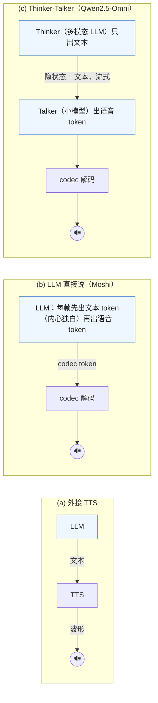

[上篇](/speech-and-omni-models-audio-encoders-codecs-and-duplex.html)把声音变成了两种东西：连续的编码器特征（Whisper encoder 每 20 ms 一个向量）与离散的 codec token（RVQ，每帧几个整数）。这一篇讲怎么用它们：**理解**——让 LLM 听懂语音（编码器 + connector + LLM，VLM 的翻版）；**生成**——让模型说话（TTS 的三条路，以及 LLM 直接生成语音 token）；**全模态与全双工**——一个模型同时听、看、说，而且要像打电话一样随时能被打断、几百毫秒内接话。

2024–2025 年的全模态模型（GPT-4o、Qwen2.5-Omni、Moshi）都建立在上篇的离散 token 之上，并进一步要求**实时**。实时的难点不在算得快，而在"边听边说"这个形态本身：模型每 80 毫秒就要决定一次"这一帧我说什么、还是继续听"。这一篇也是理解线到生成线的过渡：离散 token 与自回归生成，正是第九篇自回归图像生成的思路。

本篇要回答的核心问题是：

> **让 LLM 直接生成语音 token 会伤它的文本能力，怎么办？[^q0] 全双工的时延由什么决定？[^q1]**

## 一、总览

### 1. 先说答案

**模态竞争**：同一组参数同时学文本 token 与语音 token 的分布，语音 token 序列长（每秒几十上百个）、语言内容稀疏，训练时压过文本，模型的知识与推理能力下降。三种解法都是"把说与想分开"：Moshi 的**内心独白**——先生成对应的文本 token 再生成语音 token，文本当脚本；Qwen2.5-Omni 的 **Thinker-Talker**——Thinker 是完整的多模态 LLM 只输出文本，Talker 是一个小模型从 Thinker 的隐状态与文本流式生成语音 token，文本能力不被语音训练触碰；以及最简单的**外接 TTS**——LLM 只出文本，代价是时延叠加与语气不可控。第三章展开。

**全双工的时延**由四段相加决定：（1）音频分帧的粒度——codec 帧 80 ms（Moshi 12.5 Hz）或 Whisper 的 20–40 ms，模型至少要等一帧到齐；（2）编码器与 LLM 的**首 token 延迟**——听到的音频要过编码器、进 LLM、生成第一个语音 token；（3）codec **解码**的延迟——语音 token 变波形，流式 codec 可以逐帧解码；（4）**语义决策**的延迟——模型判断"该说了"需要的上下文——这一项不是计算，是模型的能力。Moshi 报告的理论时延 160 ms（两帧 80 ms）、实测约 200 ms；GPT-4o 报告平均 320 ms；人类对话的换手间隔约 200 ms。达到这个数字要求模型**持续地同时处理输入流与输出流**——不是"听完再说"，而是每一帧都在决定要不要说、说什么。第四章展开。

### 2. 本文的章节安排

本文按"听 → 说 → 边听边说"的顺序组织，每一步都在上篇两种表示（连续特征 / 离散 token）之间做选择：

| 章 | 主题 | 内容 |
|---|---|---|
| 二 | 语音理解 | 编码器 + connector + LLM（Qwen2-Audio）；离散 token 路线；音频的 token 预算 |
| 三 | 语音生成 | TTS 的三条路：AR 声学 token（VALL-E）、语义→声学两级、流匹配（F5-TTS）；LLM 直接说与模态竞争；Thinker-Talker |
| 四 | 全模态与全双工 | Qwen2.5-Omni 的 TMRoPE；Moshi 的多流（时间线图）与内心独白；时延的四段账 |
| 五 | 评测 | ASR 的 WER、TTS 的 MOS / WER / 说话人相似度、全双工的评测 |
| 六 | 成本 | 音频 token 的账；全双工的持续成本 |
| 七 | 动手（建议） | 理解退化；时延对比 |
| 八 | 本文小结 | |
| 九 | 自测 | 4 道题 |

## 二、语音理解

### 1. 编码器 + connector + LLM

Qwen2-Audio（2024）的结构就是 VLM 的翻版（第二篇）：Whisper-large-v3 encoder（每 20 ms 一个 1280 维特征，即 50 Hz）→ 相邻两帧平均池化到 25 Hz（第二篇的 2×2 merge 在时间轴上的版本）→ 线性投影到 LLM 维度 → Qwen-7B。一分钟语音 = 1500 个 token 进 LLM。训练三阶段（预训练对齐、多任务 SFT、DPO），数据覆盖语音识别、翻译、音频描述、声音事件、音乐、语音对话；能力包括 ASR、翻译、音频问答、语音指令跟随（用户说话、模型文本回答）。SALMONN 用双编码器（Whisper 管语音 + BEATs 管一般音频）。这条路的优点与 VLM 相同：LLM 零改动、理解质量高（连续特征保留全部信息）。缺点：**不能说**——输出是文本，要说话需外接 TTS，时延叠加。

### 2. 离散 token 路线

把语音 token 化后当文本处理：SpeechGPT 用 HuBERT 语义 token 扩展 LLM 词表，语音与文本在同一个自回归模型里，能听能说（说的是语义 token，再用一个 vocoder 变波形——音色由 vocoder 决定，不可控）。这条路让理解与生成统一，但理解质量受 token 信息损失的限制（语义 token 丢了副语言信息——语气、情绪、说话人），且离散 token 序列长（一分钟 3000 个）。

### 3. 音频的 token 预算

对比图片：一张图 256–1000 个 token；一分钟语音在 Qwen2-Audio 里 25 Hz × 60 = 1500 个 token，在 Whisper 原生 50 Hz 下 3000，在 EnCodec 声学 token 下 3.6 万（8 码本）。**语音的 token 数量级比图片大**，且随时长线性增长——一小时的会议录音是 9 万个连续特征 token，超过多数 LLM 的上下文。这是语音模型比 VLM 更需要压缩（更低的帧率：Mimi 的 12.5 Hz、Qwen2.5-Omni 的 25 Hz→ 进一步合并）与流式处理（不把整段放进上下文）的原因。

## 三、语音生成

### 1. TTS 的三条路

| 路线 | 做法 | 代表 | 特点 |
|---|---|---|---|
| AR 声学 token | 文本 → 自回归生成 codec 第一码本 token → NAR 生成其余码本 → codec 解码 | VALL-E（2023）、VALL-E 2 | 零样本音色克隆（3 秒 prompt）；AR 的不稳定（重复、跳词） |
| 语义 → 声学 两级 | 文本 → 语义 token（AR）→ 声学 token（NAR 或流匹配）→ 波形 | CosyVoice、SpeechGPT-Gen、AudioLM 式 | 内容与音色解耦；语义 token 的 AR 更稳 |
| 非自回归 / 流匹配 | 文本 + 参考音频 → 直接用扩散 / flow matching 生成 mel 谱或 codec latent → vocoder | F5-TTS、E2 TTS、Voicebox、NaturalSpeech 3 | 快（几十步并行）、稳；需要文本—音频对齐（或 filler token 技巧） |

**VALL-E** 的设计直接来自上篇 RVQ 的层次：第一个码本的 token 用自回归 Transformer 生成（以文本音素与 3 秒 prompt 的声学 token 为条件），这一步决定内容与大致韵律；其余 7 个码本用一个非自回归 Transformer 一次性生成（每个码本一层，以前面所有码本为条件）——细节的并行填充。它把 TTS 变成了"语言建模"，用 6 万小时数据训出的零样本克隆能力震动了领域。它的问题也是语言模型的问题：AR 采样的不稳定（重复、丢字、幻觉式的多说），VALL-E 2 用重复感知采样与分组建模缓解。

**流匹配 TTS**（F5-TTS 2024）走第七、八篇要讲的扩散 / 流路线：把文本（字符序列 pad 到目标长度）与参考音频的 mel 拼起来，用 DiT 在噪声与目标 mel 之间学一个速度场，32 步 ODE 采样得到 mel，再用 vocoder（Vocos）变波形。不需要音素、不需要对齐器、不需要时长模型；非自回归所以没有 AR 的不稳定；速度快（RTF 0.15）。2024–2025 年开源 TTS 的主流转向这条路或两级路（CosyVoice 2 用 AR 语义 token + 流匹配声学）。

### 2. LLM 直接说：模态竞争

语音 LLM 的"说"有两种实现：（a）LLM 生成文本，外接 TTS——简单，但时延 = LLM 首 token + TTS 首帧，且 TTS 拿不到 LLM 的"语气意图"；（b）LLM 直接生成语音 token（声学或语义）——Moshi、GLM-4-Voice、Mini-Omni 的做法——时延低、语气可控，但 LLM 要同时学两种输出，且语音 token 序列长导致文本推理能力下降（**模态间的能力竞争**：Moshi 报告纯语音训练的模型在文本知识任务上明显弱于其文本底座，靠"内心独白"——先生成文本 token 再生成对应的语音 token——缓解）。

三种做法画在一起：

Qwen2.5-Omni 的 **Thinker-Talker** 是 (a) 与 (b) 的折中：Thinker 是一个完整的多模态 LLM（听、看、想、输出文本），Talker 是一个较小的双轨自回归模型，接收 Thinker 的**隐状态与文本 token**流式地生成语音 codec token；两者端到端联合训练。Talker 拿到的不只是文本还有 Thinker 的隐状态（语气与语义意图），且流式（Thinker 每出几个 token Talker 就开始说），而 Thinker 的文本能力不受语音 token 的干扰。

## 四、全模态与全双工

### 1. 全模态：一个模型听、看、说

Qwen2.5-Omni（2025）：输入文本、图片、音频、视频（带音轨），输出文本与语音。结构上是 Qwen2.5-VL 的视觉路径 + Qwen2-Audio 的音频路径 + Thinker-Talker 的语音输出。一个新问题是**音视频的时间对齐**：视频帧的 token 与音频的 token 要按真实时间交错，模型才知道"这句话是在这一帧说的"。TMRoPE（Time-aligned Multimodal RoPE）扩展 M-RoPE：时间轴的位置 id 以 40 ms 为单位与绝对时间对齐，音频帧与视频帧按时间戳插入同一序列（每 2 秒一块，块内先视频后音频），三个模态共享时间轴。

GPT-4o（2024）是这条线的先行者——一个端到端模型处理文本、音频、图像的输入与输出，平均语音时延 320 ms——但没有公开结构；从行为推测它在音频上用了离散 token 与端到端的生成。

### 2. 全双工：边听边说

半双工（走对讲机）：用户说完 → 模型听完 → 模型回答 → 用户等回答完再说。全双工（打电话）：双方随时可以说，模型能被打断、能插话（"嗯""对"）、能在用户停顿时接话。

把两种形态的时间线画出来：

上图的关键是下半：**两条流始终都在**，模型不是在"等用户说完"，而是每一格都输出一个 token——用户说话时输出"静音"这个 token，该说话时输出语音 token。打断不需要额外机制：用户一开口，模型下一格就回到静音。

Moshi（Kyutai 2024）是第一个开源的全双工语音模型，它的结构回答了"怎么同时听与说"：

- **多流**：模型的每一步同时处理三条流——用户的音频 token（Mimi 8 码本）、模型自己的音频 token（8 码本）、模型的文本 token（内心独白）。每个时间步（80 ms）三条流各前进一帧。用户说话时模型的输出流是"静音"token，模型说话时用户流是背景噪声或静音——但两条流**始终都在**，模型每一帧都在决定自己这一帧输出什么。
- **RQ-Transformer**：时间维用一个大的 Transformer（7B，Helium）建模帧序列；每帧内的 8 + 8 + 1 个 token 用一个小的 depth Transformer 自回归生成——把"每帧 17 个 token"的深度维从主模型里拆出来，主模型每 80 ms 只跑一步。
- **内心独白**：在生成音频 token 之前先生成对应的文本 token（时间对齐、略微提前），文本作为语音内容的"脚本"，让语音的语言质量接近文本模型；反过来延后文本也可以做流式 ASR。
- **时延**：帧 80 ms，理论最小时延两帧 160 ms（一帧输入到齐 + 一帧输出），实测约 200 ms。

### 3. 时延的四段账

回到核心问题后半。一次"用户说完 → 模型开始出声"的时延：

| 段 | 内容 | 量级 | 由什么决定 |
|---|---|---|---|
| 分帧 | 等待当前帧的音频到齐 | codec 帧长：Mimi 80 ms、EnCodec 13 ms、Whisper 特征 20 ms（但 Whisper 要 30 s 窗——非流式） | codec 的帧率；流式编码器的窗 |
| 首 token | 编码器 + LLM 前向 → 第一个输出 token | LLM 一步 decode 20–50 ms（7B）；Thinker-Talker 里 Thinker 出几个文本 token 后 Talker 才开始 | 模型大小、硬件、结构 |
| 解码 | 语音 token → 波形 | 流式 codec 解码器逐帧几 ms；非流式 vocoder 要等一段 | codec 解码器是否因果 / 流式 |
| 语义决策 | 模型判断"用户说完了 / 该我说了" | 人类约 200 ms；模型依赖对停顿与语义完成度的判断 | 训练数据里的对话节奏；这不是计算延迟 |

Moshi 的 160–200 ms 里：80 ms 分帧 + 一步 7B decode（约 40 ms，帧内 depth Transformer 另加几 ms）+ Mimi 流式解码（几 ms）+ 决策（模型每帧都在决策，没有额外等待）。半双工系统（ASR → LLM → TTS 串联）的典型时延是 1–3 秒：ASR 要等静音检测（VAD）判断说完（300–700 ms）+ LLM 首 token（几百 ms，含 prefill）+ TTS 首帧（几百 ms）。**全双工把三段串联变成一个模型的一步**，且去掉了 VAD 的等待——这是 10 倍时延差的来源。

代价：全双工模型要**持续运行**——用户不说话时它也每 80 ms 跑一步（输出静音 token），一小时对话是 4.5 万步 decode；半双工只在有输入时算。且全双工的训练数据（真实的、有打断与重叠的双流对话）极少，Moshi 用合成对话（两个 TTS 声音按脚本对话）与真实数据混合。

## 五、评测

### 1. 理解侧

- **ASR**：[WER](# "tip: word error rate：转写结果相对标准答案的（替换 + 删除 + 插入的词数）/ 标准答案词数。2% 意味着每 100 个词错 2 个")（词错误率）在 LibriSpeech（clean / other）、Common Voice、多语言的 FLEURS 上。Whisper-large-v3 在 LibriSpeech clean 约 2%。
- **音频理解**：AIR-Bench（音频指令跟随）、MMAU（音频多选推理）、声音事件分类（AudioSet）、音乐（MusicCaps）。
- **语音对话**：VoiceBench——把文本指令 benchmark（AlpacaEval、IFEval、常识问答）用 TTS 转成语音输入，评模型的文本或语音回答；它暴露了语音输入下的能力退化（同一模型语音输入比文本输入低 5–15 个点是常态）。

### 2. 生成侧

- **可懂度**：把生成的语音用 ASR 转写，与目标文本比 WER。
- **自然度**：[MOS](# "tip: mean opinion score：请一群人听、各打 1–5 分取平均。4.0 以上接近真人录音")（人工 1–5 分）；自动代理 UTMOS / DNSMOS。
- **说话人相似度**：用说话人验证模型（WavLM-TDNN）算生成音频与参考音频的 embedding 余弦相似度。
- **韵律 / 情感**：较难自动评，多靠 MOS 的细分。

### 3. 全双工

- **时延**：从用户结束到模型开始出声的分布（不是平均——尾部决定体验）。
- **打断处理**：用户插话时模型是否停下、多快停下。
- **对话流畅度**：合成的双流测试集上的换手成功率、重叠率、不当沉默。

标准化程度低，是 2025 年评测方法论的空白之一。

## 六、成本

### 1. 音频 token 的账

以 Qwen2-Audio 的 25 Hz 连续特征为例，一分钟音频 1500 个 token 进 7B LLM：prefill $$2 \times 7B \times 1500 = 21$$ TFLOPs，KV 1500 × 128 KB（Llama-7B 结构）= 188 MB。一小时录音 9 万 token——超过多数上下文；实际系统按段处理（30 秒一段）或用更低帧率。

离散声学 token 的 LLM 建模：Moshi 每帧 17 个 token（8 + 8 + 1），主模型每 80 ms 一步（12.5 步/秒），一小时 4.5 万步——但每步是 7B 的一次 decode（约 40 ms），持续占一张卡的一部分。深度 Transformer 每帧 16 步（小模型，几 ms）。

### 2. 全双工的持续成本

半双工系统在无输入时空闲；全双工模型每 80 ms 跑一步不管有没有人说话。一路对话持续占用约 1/2 张 H100（7B 模型 40 ms/步 in 80 ms）——比半双工贵一个量级，且不能像文本服务那样靠 batch 摊薄（每路对话的节拍是实时的，batch 只能在多路之间做）。这是全双工产品定价高的算力基础。

## 七、动手（建议）

- **理解退化**：用 VoiceBench 的一个子集（比如 IFEval 的 100 条），文本输入与 TTS 语音输入分别喂 Qwen2-Audio-7B-Instruct，比准确率。
- **时延**：本地跑 Moshi（开源，需要 24 GB 卡）测端到端时延分布；与一个 Whisper → LLM → F5-TTS 的串联管线比。
- **RVQ 与 TTS**：上篇动手节的 EnCodec 实验之后，用 F5-TTS 与 CosyVoice 2 各合成同一段文本，用 Whisper 转写测 WER、用 WavLM 说话人模型算与参考音频的相似度。

该看的：语音输入比文本输入掉几个点；串联管线的时延是否在秒级而 Moshi 在 200–300 ms；两条 TTS 路线的 WER 与相似度。不引用任何未跑过的数字。

配套代码：第四章的时间线图由 [`multimodal/05_duplex_timeline.py`](https://github.com/arganzheng/ai-learning-labs/blob/main/multimodal/05_duplex_timeline.py) 画出（示意图，参数取自文中的公开数字）；本篇其余数字来自各模型的报告。

## 八、本文小结

| 项 | 规则 | 备注 |
|---|---|---|
| 理解 | Whisper encoder → pool 25 Hz → 投影 → LLM（Qwen2-Audio） | 一分钟 1500 token；语音输入比文本掉 5–15 点 |
| 离散 token 路线 | 语义 token 扩词表，听说统一（SpeechGPT） | 理解有损；音色由 vocoder 决定 |
| TTS | AR 声学（VALL-E：AR 第一码本 + NAR 其余）；语义→声学两级；流匹配（F5-TTS，32 步 DiT） | 主流转向流匹配与两级 |
| 直接说 | LLM 生成语音 token；模态竞争伤文本能力 → 内心独白 / Thinker-Talker | Qwen2.5-Omni：Thinker 隐状态 + 文本流式给 Talker |
| 全模态 | 视觉路径 + 音频路径 + Thinker-Talker；TMRoPE 以 40 ms 对齐音视频时间轴 | GPT-4o 320 ms |
| 全双工 | Moshi：三流每帧 80 ms 同步、RQ-Transformer（时间 7B + 深度小模型）、内心独白 | 160 ms 理论 / 200 ms 实测；人类 200 ms |
| 时延四段 | 分帧 + 首 token + 解码 + 语义决策 | 半双工串联 1–3 s（VAD + ASR + LLM + TTS）；全双工一步 |
| 成本 | 全双工持续 decode，每路约半张 H100，不能 batch 摊薄 | 半双工空闲时零成本 |

## 九、自测

1. Qwen2-Audio 一分钟语音进 LLM 多少 token？它为什么"不能说"？

   

答案

   Whisper encoder 50 Hz 池化到 25 Hz，60 秒 × 25 = 1500 个连续特征 token。输出是文本，LLM 不能"生成"连续特征去合成波形，要说话得外接 TTS。

   

2. VALL-E 为什么第一个码本用自回归、其余 7 个用非自回归？

   

答案

   RVQ 的层次：第一码本承载内容与大致韵律，需要逐 token 精确生成（AR）；后面的码本是细节精修，彼此依赖弱，可以以前面码本为条件一次性并行填充（NAR）——省 7 倍的 AR 步数。

   

3. 让 LLM 直接生成语音 token 会伤文本能力，Qwen2.5-Omni 的 Thinker-Talker 怎么绕开？

   

答案

   模态竞争：同一组参数同时学文本与语音 token 分布，互相拖累。Thinker 只生成文本（隐状态 + 文本流式输出），Talker 是独立的小模型，从 Thinker 的隐状态与文本流生成语音 token——文本能力不被语音训练触碰。

   

4. 全双工对话的时延由哪几段决定？半双工串联为什么是秒级？

   

答案

   分帧（等一帧到齐，Mimi 80 ms）、首 token（编码器 + LLM 一步，7B 约 40 ms）、codec 解码（流式几 ms）、语义决策（模型每帧都在判断，无额外等待）——合计 160–200 ms。半双工要等 VAD 判断"说完了"（300–700 ms）+ ASR + LLM 首 token（含 prefill）+ TTS 首帧，三个模型串联、每段几百毫秒，合计 1–3 秒。

   

## 下一篇

[扩散模型（上）：DDPM——加噪、去噪与变分下界](/diffusion-models-ddpm-score-matching-and-flow-matching.html)

[^q0]: 这是模态竞争：语音 token 多而内容稀，同一组参数一起学会拖垮文本能力。解法都是"把说与想分开"——Moshi 先出文本 token 当脚本再出语音 token（内心独白）；Qwen2.5-Omni 让 Thinker 只出文本、由一个小的 Talker 从 Thinker 的隐状态与文本流式生成语音 token，Thinker 的文本能力不被触碰。详见[第三章](#三语音生成)。
[^q1]: 四段相加：codec 帧长（Mimi 80 ms）、模型一步的首 token 时间（7B 约 40 ms）、流式 codec 解码（几 ms）、以及模型判断「该说了」的语义决策——后者不是计算而是能力，全双工模型每一帧都在决策所以没有额外等待。半双工把 VAD、ASR、LLM、TTS 串联起来是 1–3 秒，全双工把它们合成一个模型的一步是 200 ms，代价是模型要持续运行、每路对话占半张卡。详见[第四章](#四全模态与全双工)、[第六章](#六成本)。
