生成线的数学从这里开始。语言模型的生成是"下一个 token 的分类"——目标函数是交叉熵，采样是逐个 token；图像生成走了另一条路：从纯噪声出发，一步步去噪，几十步后得到一张图。这条路在 2020 年由 DDPM 确立、2021 年被 score-based SDE 统一、2023 年被 flow matching 简化，三种视角各有一套推导与记号，读起来像三个不同的东西——实际上它们训练的是同一个网络、只是**参数化不同**。

扩散模型分上下两篇。**上篇（本篇）只讲 DDPM**——最早、也最容易从零看懂的那个视角：怎么把一张图一步步加噪成纯噪声（前向），怎么训一个网络把噪声一步步去掉（反向），为什么训练目标最后化简成"猜出加进去的噪声"这么一句话，以及 DDIM 怎么把 1000 步采样压到 50 步。全篇用一个二维的 toy 数据集（两个月牙形的点云）把每一步**跑出来看**——数据只有两维，加噪、去噪、采样轨迹全部能画在纸上；换成图片，只是把"2 个数"换成"$$64 \times 64 \times 3$$ 个数"，公式一个字不变。**[下篇](/score-matching-flow-matching-and-classifier-free-guidance.html)**讲另外两种视角（score matching、flow matching）为什么与它是同一件事，以及所有文生图模型都依赖的 classifier-free guidance。

本篇要回答的核心问题是：

> **"扩散模型学的是去噪"——去掉噪声为什么等于学会了生成？[^q0] 训练目标从一个复杂的变分下界怎么变成了一行 MSE？DDIM 为什么能 1000 步跳到 50 步？[^q1]**

## 一、总览

### 1. 一句话版本

准备好一份数据（图片、或本文的二维点）。**前向**：往数据里一点点加高斯噪声，加 1000 次，最后完全变成噪声——这一步是固定的、不用学。**反向**：训一个网络，输入"加了噪的数据 + 现在是第几步"，输出"加进去的噪声是什么"。**生成**：从纯噪声出发，每一步让网络猜噪声、减掉一点，1000 步后得到一个像数据的东西。就这么多；本篇其余部分是把每个词说清、把公式推出来、把它跑出来。

### 2. 先说答案

**去噪为什么等于学会生成**：一个能在任何噪声水平下"猜出噪声"的网络，等于知道了"从任何一个带噪的点看，数据在哪个方向"。生成时从纯噪声出发，每一步朝数据的方向挪一点、再加回一点随机性，走 1000 步就会落到数据分布上。第四章会把这句话变成公式：网络预测的噪声 $$\epsilon_\theta$$ 与每一步该走的方向 $$\mu_\theta$$ 之间是一个线性关系。

**变分下界怎么变成 MSE**：最大化 $$\log p(x_0)$$ 算不了，用变分下界（ELBO）替代；ELBO 拆成 $$T$$ 项，每项是两个高斯之间的 KL 距离；两个高斯方差都固定，KL 只剩均值之差的平方；再把均值用噪声表示，就成了 $$\lVert \epsilon - \epsilon_\theta \rVert^2$$ 乘一个权重；Ho 等发现把权重去掉效果更好，剩下的就是那一行 MSE。

**DDIM 为什么能跳步**：DDPM 的训练目标只用到"第 $$t$$ 步的带噪样本长什么样"，没用到"第 $$t$$ 步是从第 $$t - 1$$ 步来的"。所以同一个训好的网络可以配任何一条"每一步长什么样"相同的反向路径，包括没有随机性的那条——它是一条确定的曲线（ODE），曲线可以大步走。toy 上 DDIM 20 步的质量接近 DDPM 1000 步。

### 3. 本文的章节安排

本文按"前向 → 反向 → 训练目标 → 采样 → 加速"的顺序组织，每一节先给公式与手算、再给 toy 上跑出来的结果：

| 章 | 主题 | 内容 |
|---|---|---|
| 二 | 前向过程 | 一步加噪的定义；两步合并成一步的推导（两个数验算）；闭式解；toy 上 t = 0…999 的点云（图）与 1000 步 vs 一步的数值验算 |
| 三 | 反向过程 | 为什么真实反向算不出、给定 x₀ 的反向算得出；后验均值的公式与一组数字 |
| 四 | 训练目标 | ELBO 是什么；逐项拆开；两个高斯的 KL；化简成噪声预测；L_simple；训练算法四行代码与 toy 的损失曲线 |
| 五 | 采样 | 反向更新公式与代码；toy 上从噪声到两个月牙的六帧（图）；三种预测目标 |
| 六 | DDIM | 非马尔可夫前向；确定性更新；跳步——toy 上 1000 / 50 / 20 / 10 / 5 步（图） |
| 七 | 动手（建议） | CIFAR-10 上的 DDPM；配套代码 |
| 八 | 本文小结 | |
| 九 | 自测 | 6 道题 |

Table: 本文的章节安排

## 二、前向过程：把数据变成噪声

### 1. 两条链

两条链方向相反：前向是固定的、没有参数的加噪，反向是学出来的去噪，每一步都由同一个网络 $$\epsilon_\theta(x_t, t)$$ 完成：

```mermaid
%%{init: {"flowchart": {"wrappingWidth": 160}}}%%
%% 图：扩散的两条链：前向是固定的加噪 q，反向是学出来的去噪 p_θ，每步由同一个网络完成
flowchart LR
    X0["x₀<br/>数据"] -->|"q(x₁ &#124; x₀)"| X1["x₁"] -->|"…"| XT1["x_{t−1}"] -->|"q(x_t &#124; x_{t−1})<br/>加一点噪声"| XT["x_t"] -->|"…"| XN["x_T ≈ N(0, I)<br/>纯噪声"]
    XN -.->|"p_θ(x_{T−1} &#124; x_T)"| XT -.->|"p_θ(x_{t−1} &#124; x_t)<br/>网络 ε_θ 猜噪声、减掉一点"| XT1 -.->|"…"| X0
    classDef d fill:#eef6ff,stroke:#5b8fd6,color:#222
    classDef n fill:#f4f4f4,stroke:#999,color:#222
    class X0 d
    class XN n
```



实线是**前向** $$q$$：固定、没有参数，逐步加高斯噪声，$$T$$ 步后变成纯噪声；虚线是**反向** $$p_\theta$$：学习得到，每一步用同一个网络 $$\epsilon_\theta(x_t, t)$$ 预测噪声、减掉一点。前向还有一个闭式 $$q(x_t \mid x_0)$$：训练时任取一个 $$t$$ 一步采出 $$x_t$$，不用跑整条链——第 3 节。

### 2. 一步加噪


给数据 $$x_0 \sim q(x_0)$$，定义 $$T$$ 步的加噪链，每步加一点高斯噪声：

$$
q(x_t \mid x_{t-1}) = \mathcal{N}\big(x_t;\ \sqrt{1 - \beta_t}\, x_{t-1},\ \beta_t I\big), \qquad t = 1, \ldots, T
$$

读法：$$\mathcal{N}(x; \mu, \sigma^2 I)$$ 表示"$$x$$ 服从均值 $$\mu$$、每个维度方差 $$\sigma^2$$ 的高斯分布"（L2 第二篇的钟形曲线，这里每个维度独立一条）。所以这一步是：把上一步的 $$x_{t-1}$$ 缩小成 $$\sqrt{1 - \beta_t}$$ 倍，再加上标准差 $$\sqrt{\beta_t}$$ 的噪声——写成采样形式就是 $$x_t = \sqrt{1 - \beta_t}\, x_{t-1} + \sqrt{\beta_t}\, \epsilon$$，$$\epsilon \sim \mathcal{N}(0, I)$$。为什么要缩小？为了让方差不爆炸：如果 $$x_{t-1}$$ 的方差是 1，缩小后方差 $$1 - \beta_t$$，加噪后 $$1 - \beta_t + \beta_t = 1$$——每一步都保持方差为 1（"方差保持"，下篇会再遇到这个词）。

$$\beta_t$$ 是预设的**噪声调度**（DDPM：$$T = 1000$$，$$\beta_t$$ 从 $$10^{-4}$$ 线性到 $$0.02$$——开始加得极少，后面加得多）。记 $$\alpha_t = 1 - \beta_t$$，$$\bar\alpha_t = \prod_{s \le t} \alpha_s$$（前 $$t$$ 个 $$\alpha$$ 的乘积，读"alpha bar"）。

### 3. 闭式解：从 $$x_0$$ 一步到 $$x_t$$

高斯的组合仍是高斯。先看两步：$$x_2 = \sqrt{\alpha_2}\, x_1 + \sqrt{1 - \alpha_2}\, \epsilon_1 = \sqrt{\alpha_2 \alpha_1}\, x_0 + \sqrt{\alpha_2 (1 - \alpha_1)}\, \epsilon_0 + \sqrt{1 - \alpha_2}\, \epsilon_1$$。后两项是两个**独立**的零均值高斯，它们的和仍是零均值高斯、**方差相加**（L2 第一篇"独立量的方差相加"）：$$\alpha_2(1 - \alpha_1) + (1 - \alpha_2) = 1 - \alpha_1 \alpha_2$$。用两个数验算：$$\alpha_1 = 0.9, \alpha_2 = 0.8$$，信号系数 $$\sqrt{0.72} = 0.849$$，噪声方差 $$0.8 \times 0.1 + 0.2 = 0.28 = 1 - 0.72$$——信号系数的平方加噪声方差恰好是 1。归纳到 $$t$$ 步得到从 $$x_0$$ 直接到 $$x_t$$ 的**闭式**：

$$
q(x_t \mid x_0) = \mathcal{N}\big(x_t;\ \sqrt{\bar\alpha_t}\, x_0,\ (1 - \bar\alpha_t) I\big), \qquad
x_t = \sqrt{\bar\alpha_t}\, x_0 + \sqrt{1 - \bar\alpha_t}\, \epsilon, \ \ \epsilon \sim \mathcal{N}(0, I)
$$

读法：$$x_t$$ 是"$$\sqrt{\bar\alpha_t}$$ 倍的原数据 + $$\sqrt{1 - \bar\alpha_t}$$ 倍的一份新鲜噪声"。$$\bar\alpha_t$$ 从 1 单调降到接近 0：$$t$$ 小时几乎全是数据，$$t$$ 大时几乎全是噪声，$$\bar\alpha_T \approx 0$$ 时 $$x_T$$ 接近纯噪声——前向过程把任何数据分布变成标准高斯。手算一个：$$t = 300$$，线性调度下 $$\bar\alpha_{300} = 0.394$$，$$x_0 = (1.0, -0.5)$$，抽到的噪声 $$\epsilon = (0.3, -1.2)$$，则 $$x_{300} = 0.628 \cdot (1.0, -0.5) + 0.778 \cdot (0.3, -1.2) = (0.861, -1.248)$$。这个闭式让训练可以**任取一个 $$t$$ 直接采 $$x_t$$**，不用跑整条链。

### 4. 在 toy 数据上看一遍

本文的数据：4000 个二维点，排成两个交错的月牙（scikit-learn 的 `make_moons`），归一到 $$[-1, 1]$$ 附近。对同一批点按闭式加噪到不同的 $$t$$：

```text
t =    0: ᾱ_t = 0.9999，信号系数 sqrt(ᾱ) = 1.000，噪声系数 sqrt(1−ᾱ) = 0.010
t =  100: ᾱ_t = 0.8951，信号系数 sqrt(ᾱ) = 0.946，噪声系数 sqrt(1−ᾱ) = 0.324
t =  300: ᾱ_t = 0.3940，信号系数 sqrt(ᾱ) = 0.628，噪声系数 sqrt(1−ᾱ) = 0.778
t =  600: ᾱ_t = 0.0256，信号系数 sqrt(ᾱ) = 0.160，噪声系数 sqrt(1−ᾱ) = 0.987
t =  999: ᾱ_t = 0.0000，信号系数 sqrt(ᾱ) = 0.006，噪声系数 sqrt(1−ᾱ) = 1.000
```


$$t = 100$$ 还看得出月牙，$$t = 300$$ 只剩大致的两团，$$t = 600$$ 以后与纯噪声无法区分。再验算闭式解：对同一个点 $$x_0 = (1.0, -0.5)$$ 复制 2 万份，一份逐步加噪 1000 次、一份用闭式一步到位：

```text
逐步 1000 次：均值 [ 0.004 -0.004]，标准差 [1.011 1.001]
闭式一步：  均值 [0.015 0.002]，标准差 [1.001 1.001]
理论：均值 sqrt(ᾱ_T) x_0 = [ 0.006 -0.003]，标准差 sqrt(1−ᾱ_T) = 1.000  → 几乎就是 N(0, I)
```

两种走法得到的分布一致，且都是标准高斯——起点 $$(1.0, -0.5)$$ 的信息在 1000 步后只剩 $$0.006$$ 倍。

## 三、反向过程：把噪声变回数据

### 1. 真实的反向算不出，给定 $$x_0$$ 的算得出

生成是反过来：从 $$x_T \sim \mathcal{N}(0, I)$$ 出发，逐步 $$x_T \to x_{T-1} \to \cdots \to x_0$$。真实的反向条件分布 $$q(x_{t-1} \mid x_t)$$ 依赖整个数据分布、不可得；但**给定 $$x_0$$ 的**反向条件 $$q(x_{t-1} \mid x_t, x_0)$$ 是可算的高斯（贝叶斯公式 + 两个高斯相乘）：

$$
q(x_{t-1} \mid x_t, x_0) = \mathcal{N}\big(x_{t-1};\ \tilde\mu_t(x_t, x_0),\ \tilde\beta_t I\big)
$$

$$
\tilde\mu_t = \frac{\sqrt{\bar\alpha_{t-1}}\, \beta_t}{1 - \bar\alpha_t}\, x_0 + \frac{\sqrt{\alpha_t}(1 - \bar\alpha_{t-1})}{1 - \bar\alpha_t}\, x_t, \qquad
\tilde\beta_t = \frac{1 - \bar\alpha_{t-1}}{1 - \bar\alpha_t}\, \beta_t
$$

这两个式子读起来吓人，代几个数就平常了。$$t = 300$$：$$\bar\alpha_{300} = 0.394$$，$$\bar\alpha_{299} = 0.396$$，$$\beta_{300} = 0.0061$$，算出 $$\tilde\mu_t = 0.0063\, x_0 + 0.993\, x_t$$，$$\tilde\beta_t = 0.00605$$。也就是说：**往回走一步，几乎就是停在 $$x_t$$ 原地，只朝 $$x_0$$ 的方向挪 0.6%，再加一点方差 0.006 的随机抖动**。1000 步里每一步都这么小，所以 1000 步才回得去。这个"已知 $$x_0$$ 的反向一步"是可以算的——问题是生成时我们**不知道 $$x_0$$**（它正是我们要生成的东西）。

### 2. 用网络代替 $$x_0$$

模型用一个参数化的高斯 $$p_\theta(x_{t-1} \mid x_t) = \mathcal{N}(x_{t-1}; \mu_\theta(x_t, t), \sigma_t^2 I)$$ 去逼近它——均值由网络从 $$(x_t, t)$$ 算出（相当于让网络"猜 $$x_0$$ 在哪"），方差 $$\sigma_t^2$$ 固定为 $$\beta_t$$ 或 $$\tilde\beta_t$$（两者效果相近；后来的改进让它可学习）。

## 四、训练目标：从变分下界到一行 MSE

### 1. 为什么需要一个"下界"

我们想让模型给训练数据高概率——最大化 $$\log p_\theta(x_0)$$（L2 第二篇的最大似然）。但 $$p_\theta(x_0)$$ 要对所有可能的中间路径 $$x_1, \ldots, x_T$$ 积分，算不出来。办法是找一个**永远不大于** $$\log p_\theta(x_0)$$、但算得出来的量，去最大化它——把下界推高，真值只会更高。这个量叫**变分下界**（evidence lower bound，ELBO），VAE 用的是同一招。推导用到一个不等式（Jensen：$$\log$$ 是凹函数，$$\log \mathbb{E}[\cdot] \ge \mathbb{E}[\log \cdot]$$）和一个巧妙的选择——把前向过程 $$q(x_{1:T} \mid x_0)$$ 当作"猜中间路径的分布"。结果写成负对数（越小越好）：

$$
-\log p_\theta(x_0) \le \mathbb{E}_q\Big[ \underbrace{D_{KL}(q(x_T \mid x_0) \,\|\, p(x_T))}_{L_T} + \sum_{t=2}^{T} \underbrace{D_{KL}\big(q(x_{t-1} \mid x_t, x_0) \,\|\, p_\theta(x_{t-1} \mid x_t)\big)}_{L_{t-1}} \underbrace{- \log p_\theta(x_0 \mid x_1)}_{L_0} \Big]
$$

### 2. 逐项读

[KL 散度](# "tip: Kullback–Leibler divergence，D_KL(q ‖ p)：衡量分布 q 与 p 差多远，非负，相同时为零。这里每一项都在问：模型的反向一步 p_θ 与「已知 x₀ 的真实反向一步」q 差多远")衡量两个分布差多远。三类项：$$L_T$$ 问"前向加噪 $$T$$ 步后的分布与标准高斯差多远"——前向过程固定、与 $$\theta$$ 无关，是常数；$$L_0$$ 是最后一步的重建项；中间 $$T - 1$$ 项 $$L_{t-1}$$ 各问"第 $$t$$ 步，模型的反向一步与真实的（已知 $$x_0$$ 的）反向一步差多远"——这就是训练要最小化的东西。两个高斯的 KL 有闭式，方差都固定时只剩均值的差：

$$
L_{t-1} = \frac{1}{2\sigma_t^2} \big\lVert \tilde\mu_t(x_t, x_0) - \mu_\theta(x_t, t) \big\rVert^2 + C
$$

### 3. 化简为噪声预测

模型要逼近的均值 $$\tilde\mu_t$$ 里有 $$x_0$$，而 $$x_0$$ 与 $$x_t$$ 之间由闭式解绑在一起：$$x_t = \sqrt{\bar\alpha_t} x_0 + \sqrt{1 - \bar\alpha_t}\, \epsilon$$。把 $$x_0 = \frac{1}{\sqrt{\bar\alpha_t}}(x_t - \sqrt{1 - \bar\alpha_t}\, \epsilon)$$ 代入 $$\tilde\mu_t$$，整理后

$$
\tilde\mu_t = \frac{1}{\sqrt{\alpha_t}} \Big( x_t - \frac{\beta_t}{\sqrt{1 - \bar\alpha_t}}\, \epsilon \Big)
$$

于是自然地把 $$\mu_\theta$$ 也参数化成同样的形式、让网络预测 $$\epsilon$$：

$$
\mu_\theta(x_t, t) = \frac{1}{\sqrt{\alpha_t}} \Big( x_t - \frac{\beta_t}{\sqrt{1 - \bar\alpha_t}}\, \epsilon_\theta(x_t, t) \Big)
$$

代回 $$L_{t-1}$$：

$$
L_{t-1} = \frac{\beta_t^2}{2 \sigma_t^2 \alpha_t (1 - \bar\alpha_t)} \big\lVert \epsilon - \epsilon_\theta(\sqrt{\bar\alpha_t} x_0 + \sqrt{1 - \bar\alpha_t}\, \epsilon, t) \big\rVert^2
$$

读一下：网络输入 $$(x_t, t)$$，输出它对噪声的猜测 $$\epsilon_\theta$$；损失是猜测与真实加进去的 $$\epsilon$$ 之差的平方，乘一个只与 $$t$$ 有关的系数。用第三章的数字（$$t = 300$$）验算 $$\tilde\mu_t$$ 的两种写法确实相等：$$x_0 = 1.0$$（一维）、$$\epsilon = 0.5$$，$$x_t = 0.628 + 0.778 \times 0.5 = 1.017$$；原式 $$0.0063 \times 1.0 + 0.993 \times 1.017 = 1.0161$$；噪声式 $$(1.017 - 0.0061 / 0.778 \times 0.5) / \sqrt{0.9939} = 1.0161$$。

Ho 等的关键经验发现：**去掉前面那个与 $$t$$ 有关的权重**，用

$$
L_{\text{simple}} = \mathbb{E}_{t, x_0, \epsilon} \big\lVert \epsilon - \epsilon_\theta(x_t, t) \big\rVert^2
$$

效果更好。这个权重在 $$t$$ 小（噪声少）时很大——ELBO 要求精确重建细节——而实际生成质量更依赖 $$t$$ 大时（决定全局结构）的准确性；去掉权重等于对大 $$t$$ 加权。

### 4. 训练算法：四行

采一张图 $$x_0$$、一个 $$t \sim \text{Uniform}\{1..T\}$$、一个 $$\epsilon$$，算 $$x_t$$，让网络从 $$(x_t, t)$$ 预测 $$\epsilon$$，MSE。就这么简单：

```python
def ddpm_loss(model, x0):
    t = torch.randint(0, T, (len(x0),))                                   # ① 每个样本随机抽一个时间步
    eps = torch.randn_like(x0)                                            # ② 抽一份噪声
    xt = abar[t].sqrt()[:, None] * x0 + (1 - abar[t]).sqrt()[:, None] * eps   # ③ 闭式一步得到 x_t
    return ((model(xt, t / T) - eps) ** 2).mean()                         # ④ 让网络从 (x_t, t) 猜出 ε：MSE
```

`model` 是任何"输入与输出同形状、外加一个时间 $$t$$"的网络：图片用 U-Net 或 DiT（第八篇），本文的二维 toy 用一个四层 MLP（时间 $$t$$ 编码成 16 维的正弦余弦向量拼在输入上，与 Transformer 的位置编码同款）。12000 步、每步 512 个点，CPU 上 30 秒：

```text
step  3000  loss 0.2205
step 12000  loss 0.2110
t =  50：预测噪声的 MSE 0.662
t = 300：预测噪声的 MSE 0.299
t = 700：预测噪声的 MSE 0.005
t = 990：预测噪声的 MSE 0.000
```


按 $$t$$ 分开看很有意思：$$t = 990$$ 时 $$x_t$$ 几乎就是 $$\epsilon$$，网络把输入抄一遍就对，MSE 为 0；$$t = 50$$ 时噪声只有数据的 1/5 大小、藏在月牙的形状里，要猜出它必须知道"没加噪的月牙精确长什么样"——这正是模型学到数据分布的地方。$$\epsilon$$ 本身的方差是 1，所以 0.66 意味着还有 1/3 的噪声猜不出——这部分是本质上不可猜的（从一个带噪点无法确定它来自月牙上的哪一点）。

## 五、采样：从噪声走回数据

### 1. 反向更新

从 $$x_T \sim \mathcal{N}(0, I)$$ 开始，每步 $$x_{t-1} = \mu_\theta(x_t, t) + \sigma_t z$$，$$z \sim \mathcal{N}(0, I)$$，1000 步：

```python
@torch.no_grad()
def ddpm_sample(model, n):
    x = torch.randn(n, 2)                                                 # ① 从纯噪声出发
    for t in reversed(range(T)):
        eps = model(x, torch.full((n,), t / T))                           # ② 预测噪声
        mean = (x - betas[t] / (1 - abar[t]).sqrt() * eps) / alphas[t].sqrt()   # ③ μ_θ = (x_t − β_t/√(1−ᾱ_t) ε_θ) / √α_t
        x = mean + (betas[t].sqrt() * torch.randn_like(x) if t > 0 else 0)      # ④ 加回一点随机噪声（最后一步不加）
    return x
```

③ 就是第四章第 3 节的 $$\mu_\theta$$：减掉一小份预测的噪声、再除以 $$\sqrt{\alpha_t}$$ 把上一步的缩放还回来；④ 加回方差 $$\beta_t$$ 的新噪声——不加它，采样会坍缩到少数几个"平均"的点上，加了它才能覆盖整个分布。2000 个纯噪声点走 1000 步：


```text
2000 个生成样本到最近真实数据点的平均距离 0.021（真实数据点彼此之间约 0.014）
```

前 600 步几乎看不出变化（噪声云里的微小结构在积累），最后 150 步月牙才浮现出来——这与前向过程是镜像的：前向 $$t = 100$$ 还看得见月牙，反向也要到 $$t \approx 100$$ 才看得见。生成的点离真实数据点的距离 0.021，与真实点之间的间距 0.014 同量级——网络从没见过这些噪声起点，却把它们全送到了月牙上。**它学到的是"数据长什么样"，而训练时它只被要求"猜噪声"。**

### 2. 三种预测目标

网络可以预测 $$\epsilon$$、预测 $$x_0$$、或预测 $$v$$（velocity，Salimans & Ho 2022：$$v = \sqrt{\bar\alpha_t}\, \epsilon - \sqrt{1 - \bar\alpha_t}\, x_0$$）。三者线性相关，知道其一与 $$x_t$$ 就能算另外两个：$$x_0 = (x_t - \sqrt{1 - \bar\alpha_t}\, \epsilon) / \sqrt{\bar\alpha_t}$$。差别在数值行为，看 $$x_0 = (x_t - \sqrt{1 - \bar\alpha_t}\,\epsilon)/\sqrt{\bar\alpha_t}$$ 这个换算：$$\epsilon$$ 的误差被放大 $$\sqrt{1 - \bar\alpha_t}/\sqrt{\bar\alpha_t}$$ 倍——$$\bar\alpha_t = 0.99$$（小 $$t$$）时只有 0.1 倍，$$\bar\alpha_t = 0.01$$（大 $$t$$、几乎纯噪声）时是 10 倍。所以预测 $$\epsilon$$ 在**小 $$t$$** 稳、在**大 $$t$$** 换算 $$x_0$$ 时误差放大（那里 $$x_t \approx \epsilon$$，猜噪声本身容易，但"猜对噪声"离"猜对图"很远）；预测 $$x_0$$ 相反，大 $$t$$ 稳、小 $$t$$ 时换算 $$\epsilon$$ 要除以小的 $$\sqrt{1-\bar\alpha_t}$$。$$v$$-prediction 在两端都稳定，是 Imagen Video、Stable Diffusion 2.x 768-v 等的选择（SDXL 的 refiner 官方 scheduler 配置是 `epsilon`，不是 $$v$$）；在**零终端 SNR** 的调度下（下篇第四章）尤其重要——那时 $$t = T$$ 处 $$x_T$$ 完全是噪声，预测 $$\epsilon$$ 就是输出输入本身、网络学不到东西，$$x_0$$-prediction 也可用，$$v$$ 是两端都好的选择。

## 六、DDIM 与确定性采样

### 1. 非马尔可夫的前向过程

DDPM 的 1000 步采样太慢。DDIM（Song 等 2020）的观察：DDPM 的训练目标只依赖边缘分布 $$q(x_t \mid x_0)$$（每个 $$t$$ 独立地采），不依赖前向链是否马尔可夫。可以定义一族**非马尔可夫**的前向过程，边缘分布相同、但 $$q(x_{t-1} \mid x_t, x_0)$$ 不同——同一个训好的 $$\epsilon_\theta$$ 适用于这一族里的任何一个。这一族由参数 $$\eta$$ 索引，反向更新：

$$
x_{t-1} = \sqrt{\bar\alpha_{t-1}}\, \underbrace{\frac{x_t - \sqrt{1 - \bar\alpha_t}\, \epsilon_\theta}{\sqrt{\bar\alpha_t}}}_{\hat x_0} + \sqrt{1 - \bar\alpha_{t-1} - \sigma_t^2}\, \epsilon_\theta + \sigma_t z
$$

$$\sigma_t = \eta \sqrt{\tilde\beta_t}$$。$$\eta = 1$$ 回到 DDPM（随机）；$$\eta = 0$$ **没有随机项**——给定 $$x_T$$，整条轨迹确定。直觉：先用 $$\epsilon_\theta$$ 估出 $$\hat x_0$$（把闭式解 $$x_t = \sqrt{\bar\alpha_t} x_0 + \sqrt{1 - \bar\alpha_t}\, \epsilon$$ 反解出 $$x_0$$），再按 $$t - 1$$ 的噪声水平重新"加噪"到 $$x_{t-1}$$——但用的是**预测的**噪声方向而不是新采的。代码里就是两行：

```python
x0_hat = (x - (1 - abar[t]).sqrt() * eps) / abar[t].sqrt()           # ① 先估 x̂_0
x = abar[s].sqrt() * x0_hat + (1 - abar[s]).sqrt() * eps                # ② 按下一个时间步 s 的噪声水平「重新加噪」，用预测的方向（η = 0）
```

### 2. 跳步

因为不依赖马尔可夫性，可以在时间步的子序列 $$\{\tau_1, \ldots, \tau_S\} \subset \{1, \ldots, T\}$$ 上做同样的更新（上面代码里的 `s` 就是子序列里的下一个时间步，可以离 `t` 很远）。同一个训好的 toy 模型，不重训，只改步数：

```text
DDIM  50 步：到最近真实点的平均距离 0.026
DDIM  20 步：到最近真实点的平均距离 0.031
DDIM  10 步：到最近真实点的平均距离 0.046
DDIM   5 步：到最近真实点的平均距离 0.097
```


50 步与 1000 步几乎无差，20 步仍清晰，10 步开始发胖，5 步就散了。$$S = 50$$ 步的 DDIM 与 1000 步的 DDPM 质量接近；$$S = 20$$ 也可用。20–50 倍的加速，不需要重训。这是 Stable Diffusion 默认 20–50 步的来源。同一个 $$x_T$$ 两次 DDIM 采样，结果的最大差是 $$0.0$$——确定性映射。

### 3. 确定性的意义

$$\eta = 0$$ 的 DDIM 定义了一个从噪声到数据的**确定性映射**——它是一个 ODE 的离散化（下篇第二章第四节）。确定性带来：可以对 $$x_T$$ 做插值得到语义上平滑的图像插值；可以把一张图**编码**回噪声（反向跑 ODE）再编辑；以及采样的步数可以用更好的 ODE 求解器（DPM-Solver、UniPC）进一步减少到 10–15 步。

## 七、动手（建议）

CIFAR-10（$$32^2$$）上从零训一个小 DDPM（约 35M 参数的 U-Net，`diffusers` 的 `UNet2DModel` 或自写），一张 24 GB 卡几小时：linear 调度，$$T = 1000$$，$$\epsilon$$-prediction，$$L_{simple}$$；采样用 DDPM 1000 步与 DDIM 50 / 20 / 10 步，用 `torch-fidelity` 或 `clean-fid` 算 FID（对 10K 样本）。该看的：DDIM 50 步是否接近 DDPM 1000 步、10 步掉多少；按 $$t$$ 分桶的训练 MSE 是否与本文 toy 的形态一致（大 $$t$$ 接近 0、小 $$t$$ 高）。不引用任何未跑过的数字。

配套代码：本文全部 toy 数字与五张图由 [`multimodal/06_ddpm_toy.py`](https://github.com/arganzheng/ai-learning-labs/blob/main/multimodal/06_ddpm_toy.py) 产生（`forward` / `closedform` / `train` / `sample` / `ddim` 五个子实验；模型与调度在同目录 `_diffusion_toy.py`），CPU 一分钟。下篇的 flow matching 与 CFG 实验复用这里训好的模型。

## 八、本文小结

| 项 | 公式 | 备注 |
|---|---|---|
| 一步加噪 | $$x_t = \sqrt{1 - \beta_t}\, x_{t-1} + \sqrt{\beta_t}\, \epsilon$$ | 缩小再加噪，方差保持为 1 |
| 闭式 | $$x_t = \sqrt{\bar\alpha_t} x_0 + \sqrt{1 - \bar\alpha_t}\, \epsilon$$ | 独立高斯方差相加；任取 $$t$$ 训练；toy 上 1000 步 vs 一步分布一致 |
| 反向后验 | $$q(x_{t-1} \mid x_t, x_0)$$ 是高斯，均值 $$\tilde\mu_t \approx 0.006\, x_0 + 0.993\, x_t$$（$$t = 300$$） | 每步只挪 0.6%，所以要 1000 步 |
| ELBO | 算不了 $$\log p(x_0)$$ 就最大化一个下界；拆成 $$T$$ 个 KL 项 | 每项：模型的反向一步 vs 真实的反向一步 |
| ELBO → MSE | 高斯 KL 只剩均值差 → 用噪声表示 → $$\lVert \epsilon - \epsilon_\theta \rVert^2 \times$$ 权重；去权重得 $$L_{simple}$$ | 去权重 = 对大噪声加权 |
| 训练 | 抽 $$t$$、抽 $$\epsilon$$、闭式得 $$x_t$$、猜 $$\epsilon$$ 的 MSE | 四行；toy 上 $$t = 990$$ 的 MSE 为 0、$$t = 50$$ 为 0.66 |
| 采样 | $$x_{t-1} = \frac{1}{\sqrt{\alpha_t}}(x_t - \frac{\beta_t}{\sqrt{1 - \bar\alpha_t}} \epsilon_\theta) + \sigma_t z$$ | toy：最后 150 步月牙才浮现；生成点离数据 0.021 |
| 预测目标 | $$\epsilon$$ / $$x_0$$ / $$v$$ 线性相关 | $$v$$ 两端稳定；零终端 SNR 需 $$v$$ |
| DDIM | 先估 $$\hat x_0$$ 再按 $$s$$ 重新加噪（用预测的方向）；$$\eta = 0$$ 确定性 | 跳步：toy 上 20 步 ≈ 1000 步，5 步散掉；概率流 ODE 的离散化 |

Table: DDPM 的公式小结

## 九、自测

1. 前向过程 $$x_t = \sqrt{\bar\alpha_t} x_0 + \sqrt{1 - \bar\alpha_t}\, \epsilon$$ 为什么能一步采出 $$x_t$$？训练时它省了什么？

   <details markdown="1"><summary>答案</summary>

   每步加的都是独立高斯，独立高斯之和仍是高斯、方差相加，归纳得到闭式；训练时任取一个 $$t$$ 直接采 $$x_t$$，不用跑 $$T = 1000$$ 步的链。

   </details>

2. $$\bar\alpha_t = 0.64$$，$$x_0 = 2$$，抽到 $$\epsilon = -1$$，$$x_t$$ 是多少？这时"信号"与"噪声"各占多大比例？

   <details markdown="1"><summary>答案</summary>

   $$x_t = 0.8 \times 2 + 0.6 \times (-1) = 1.0$$。信号系数 0.8、噪声系数 0.6，平方和为 1——方差保持。

   </details>

3. 为什么每一步加噪前要先把 $$x_{t-1}$$ 乘 $$\sqrt{1 - \beta_t}$$ 缩小一点？

   <details markdown="1"><summary>答案</summary>

   让方差保持为 1：方差 1 的 $$x_{t-1}$$ 缩小后方差 $$1 - \beta_t$$，加上方差 $$\beta_t$$ 的噪声后又是 1。不缩小，1000 步后方差会累积成 $$1 + \sum \beta_t \approx 11$$，$$x_T$$ 就不是标准高斯了。

   </details>

4. 训练时 $$t = 990$$ 的噪声预测 MSE 几乎为 0，$$t = 50$$ 却有 0.66。哪个时间步的训练"学到了数据"？

   <details markdown="1"><summary>答案</summary>

   $$t = 50$$。$$t = 990$$ 时 $$x_t \approx \epsilon$$，抄输入即可，不需要知道数据长什么样；$$t = 50$$ 时噪声藏在数据的形状里，要猜出噪声就要知道"干净的数据应该在哪"——这正是分布信息所在。$$L_{simple}$$ 去掉 ELBO 权重也是为了不让训练被小 $$t$$ 的精修主导。

   </details>

5. DDIM 为什么能从 1000 步跳到 50 步而 DDPM 不能？$$\eta = 0$$ 意味着什么？

   <details markdown="1"><summary>答案</summary>

   DDPM 的训练目标只依赖每个 $$t$$ 的边缘分布，同一个网络适用于一族反向过程；DDIM 取其中确定性的那条（概率流 ODE 的离散化），确定性轨迹可以大步走、也可以用高阶求解器；DDPM 每步加随机噪声，步长大了误差累积。$$\eta = 0$$ 是完全确定性：同一个 $$x_T$$ 总生成同一张图（toy 上两次采样差 0.0）。

   </details>

6. 为什么 $$L_{simple}$$（去掉 ELBO 的权重）反而效果更好？它隐式地加权了什么？

   <details markdown="1"><summary>答案</summary>

   ELBO 的权重让小噪声（小 $$t$$ 的精细步骤）占主导，而这些步骤对感知质量贡献小；去权重等价于对大噪声（决定结构）的步骤加权，样本质量提升——$$v$$ 预测与零终端 SNR 是同一条线上的修正。

   </details>

## 下一篇

[扩散模型（下）：score matching、flow matching 与 classifier-free guidance](/score-matching-flow-matching-and-classifier-free-guidance.html)

[^q0]: 一个能在每个噪声水平下猜出噪声的网络，知道从任何一个带噪点看"干净数据在哪个方向"；采样从纯噪声出发，每步按 $$\mu_\theta = \frac{1}{\sqrt{\alpha_t}}(x_t - \frac{\beta_t}{\sqrt{1 - \bar\alpha_t}} \epsilon_\theta)$$ 朝那个方向挪一点、再加回一点随机性，1000 步后落到数据分布上——toy 上 2000 个噪声点全部被送到两个月牙上，离真实数据 0.021。详见[第四章](#四训练目标从变分下界到一行-mse)、[第五章](#五采样从噪声走回数据)。
[^q1]: ELBO 拆成 $$T$$ 个高斯 KL，方差固定所以只剩均值差，均值用噪声表示后就是 $$\lVert \epsilon - \epsilon_\theta \rVert^2$$ 乘一个权重，去掉权重即 $$L_{simple}$$。DDIM 能跳步是因为训练目标只依赖每个 $$t$$ 的边缘分布，同一个网络配得上一族反向过程，取确定性的那条（ODE）就能大步走——toy 上 20 步接近 1000 步。详见[第四章](#四训练目标从变分下界到一行-mse)、[第六章](#六ddim-与确定性采样)。
