这个系列要回答的问题是：**一个 kernel 为什么快、为什么慢，以及如何把它写到接近硬件极限**。要谈"极限"，先得知道极限在哪里。所以第一篇不写、也不运行任何完整的 kernel，只做一件事：把一块 GPU 拆开，看清它由什么组成、硬件如何把工作切成 warp 和 block 放到 SM 上、每个部分能以多快的速度搬数据和做乘加，然后把这些数字装进一个足够简单、又足够有用的模型——Roofline——用它回答：

> **在一块给定的 GPU 上，一段计算理论上最快能多快？**

有了这个答案，后面每一篇的工作就有了明确的目标：elementwise kernel 的目标是把 HBM 带宽吃满；GEMM 的目标是把 Tensor Core 吃满；attention 的目标是先搞清楚自己属于哪一类。没有这个答案，"我把 kernel 优化了 3 倍"是一句没有意义的话——3 倍之后可能仍然离屋顶差 10 倍，也可能已经无路可走。


## 一、总览

### 1. 硬件基线与数字约定

本文的硬件基线是 A100 SXM 80GB，随文标注 H100 SXM 80GB 的对应数字。所有算力和带宽数字均为公开**标称值**的近似，实测会因型号、频率和功耗上限而有差异；本系列没有 GPU 实测数据，所有时间都是可推导的理论下界，或者用"通常能达到"的措辞给出的区间。

### 2. 本文的章节安排

```text
第二章  两种设计目标：延迟与吞吐      CPU 与 GPU 的晶体管预算怎么分、零开销上下文切换、一个 SM 长什么样
第三章  硬件怎么组织工作            warp：32 个 lane 一条指令（SIMT）；block：分派到 SM 的单位；硬件层级与编程模型名字的对应图
第四章  SM、warp 与 SIMT 的硬件实现   分歧怎么串行、靠 warp 切换而非乱序执行隐藏延迟、驻留上限、Tensor Core 与 CUDA Core 的关系
第五章  内存层次                     寄存器 / shared / L1 / L2 / HBM 的容量、带宽、延迟一张表；每一级给谁用；容量决定分块尺寸
第六章  Roofline 模型                算术强度、两条屋顶、ridge point、四个例子、GEMM 何时真的 compute-bound、两个利用率、一个可运行的计算器
第七章  硬件代际                     Volta / Ampere / Hopper / Blackwell 各自引入了什么
第八章  工具链地图                   nvcc、PTX/SASS、cuobjdump、nsys、ncu、compute-sanitizer 各看什么
第九章  系统层与 kernel 层的边界     哪些瓶颈属于系统层；本系列只讨论时间线上的实心色块；一张诊断决策图
第十章  本文小结
```

本文不写 CUDA 代码。grid、block、thread 这些名字在代码里怎么写、怎么编号，是下一篇的内容；本文只在第三章末尾给出硬件层级与这些名字的对应图，作为两篇之间的桥。


## 二、两种设计目标：延迟与吞吐

### 1. 晶体管预算怎么分

CPU 和 GPU 都由晶体管构成，差别在于同一份晶体管预算花在了什么地方。

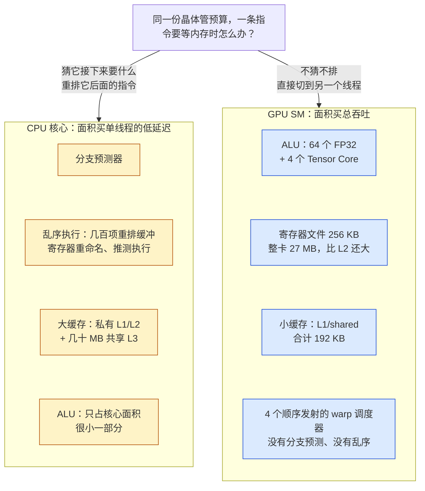

一颗现代 CPU 核心的大部分面积不是 ALU。它把面积花在**让单条指令流尽快跑完**这件事上：多级分支预测器、几百项的乱序执行（out-of-order，OoO）重排缓冲、寄存器重命名、推测执行、每核心私有的 L1/L2 加上共享的几十 MB L3。ALU 本身——真正做加法和乘法的电路——只占核心面积很小的一部分。这是**延迟优化**的设计：单线程程序里下一条指令依赖上一条指令的结果，唯一的加速办法就是让每条指令的等待时间尽量短，而等待的主要来源是内存，所以缓存越大越好、预测越准越好。

GPU 把这套逻辑翻转过来。它假设手头有**成千上万个彼此独立的线程**可以调度，于是一个线程在等内存时，硬件不去猜它接下来要什么、不去重排它的指令，而是直接切到另一个线程去执行。这样一来：分支预测、OoO、大缓存这些"缩短单线程等待"的电路都可以省掉，省下的面积全部换成 ALU 和寄存器。同样的晶体管预算下，A100 一颗芯片有 6912 个 FP32 计算单元和 108 × 256 KB = 27 MB 的寄存器文件；相比之下它的 L2 只有 40 MB、每个 SM 的 L1/shared 合计 192 KB——一颗服务器 CPU 单个核心的 L2 都常常比这个大。GPU 的 cache 不是用来"让数据尽量在手边"的，而是用来合并访存、平滑突发流量的，这是**吞吐优化**的设计。

一句话概括：**CPU 用面积换单线程的低延迟，GPU 用面积换总吞吐，并用海量线程把延迟藏起来**。

这个取舍不是免费的。它要求负载本身具备两个性质：有足够多可以并行的独立工作，且这些工作的控制流大体一致。矩阵乘法、elementwise、reduction、卷积、attention 都满足；一个链表遍历或者一个递归下降解析器则完全不满足，放到 GPU 上会比 CPU 慢得多。理解这一点，就理解了为什么本系列后面所有 kernel 的写法都在做同一件事：**把问题重新组织成成千上万个形状相同的小任务**，让硬件有足够的 warp 可以切换。

### 2. 上下文切换零开销

CPU 上的线程切换是操作系统的事：保存几十个寄存器和状态到内存、切换页表、恢复另一个线程的状态，代价是微秒级，所以 CPU 不能靠切线程来掩盖一次 100 ns 的 cache miss。

GPU 上不存在这个问题，因为**所有驻留线程的状态都同时住在寄存器文件里**。一个 SM 的 256 KB 寄存器文件被静态划分给驻留的每一个 warp，每个 warp 的寄存器在它的整个生命周期里都不会被换出。调度器切换 warp 时不需要保存或恢复任何东西，只是换一个 PC 去取指令，开销为零，每个时钟周期都可以切。这就是 GPU 能用"换一个线程执行"来替代 OoO 的前提。代价是：驻留的线程数受寄存器总量硬性限制——每个线程用的寄存器越多，能同时驻留的 warp 就越少，这就是后面几篇会反复出现的 occupancy 问题。

### 3. 一个 SM 长什么样

GPU 的基本计算单元是 SM（Streaming Multiprocessor）。A100 有 108 个 SM，H100 SXM 有 132 个。每个 SM 内部又分为 4 个 partition（NVIDIA 称之为 processing block），每个 partition 有自己的 warp 调度器、一份 64 KB 的寄存器文件、16 个 FP32 单元、16 个 INT32 单元、8 个 FP64 单元、以及一个 Tensor Core；4 个 partition 共用一块 192 KB 的 L1/shared memory SRAM：

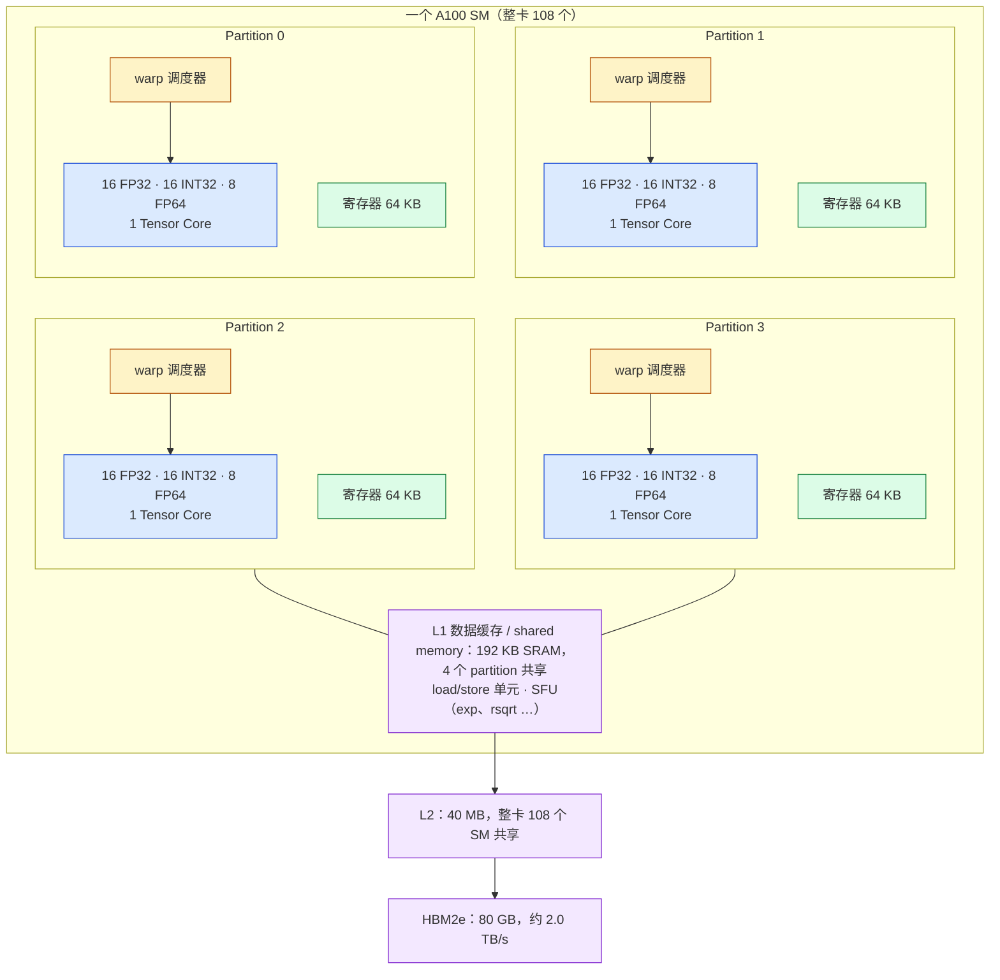

把 4 个 partition 加起来，一个 A100 SM 的资源是：

```text
A100 的一个 SM
├── 4 个 warp 调度器（每周期各发射一条 warp 指令）
├── 64 个 FP32 CUDA Core（4 × 16）
├── 64 个 INT32 单元、32 个 FP64 单元
├── 4 个第三代 Tensor Core（4 × 1）
├── 256 KB 寄存器文件（65536 个 32-bit 寄存器）
├── 192 KB L1 数据缓存 / shared memory（可配置，shared 最大 164 KB）
├── 最多 2048 个驻留线程 = 64 个 warp，最多 32 个 block
└── load/store 单元、特殊函数单元（SFU：exp、rsqrt 等）
```

FP32 峰值算力可以直接从这张表算出来：6912 个 FP32 单元，每个每周期做一次 FMA（2 FLOP），主频约 1.41 GHz：

$$
6912 \times 2 \times 1.41 \times 10^9 \approx 19.5 \text{ TFLOPS}
$$

这就是 A100 标称的 FP32 算力。H100 把每个 SM 的 FP32 单元翻倍到 128 个，SM 数增加到 132，主频提高到约 1.98 GHz，得到约 67 TFLOPS。这些数字后面 Roofline 里都会用到。

到这里我们知道了芯片上有什么。下一章看硬件如何把工作切开、放到这 108 个 SM 上。


## 三、硬件怎么组织工作：warp、block 与 SM

上一章看的是 SM 里有什么。这一章看硬件如何把一次计算切开、放到这些 SM 上执行。硬件只认两种"批量"：**warp**——32 个线程被当作一条指令的 32 个 lane；**block**——一批线程被当作一个整体分派到某个 SM。这两个词也是 CUDA 编程模型里的名字，但本章只讲它们在硬件上意味着什么；它们在代码里怎么写、怎么编号，是下一篇的内容。本章最后给出一张硬件层级与编程模型名字的对应图，作为两篇之间的桥。

### 1. warp：32 个线程，同一条指令，各自的数据——SIMT

SM 调度的最小单位不是线程而是 **warp**：32 个线程在同一时刻执行**同一条指令**，但每个线程作用在自己的寄存器和自己的数据上。这个执行方式叫 **SIMT**（Single Instruction, Multiple Threads）：

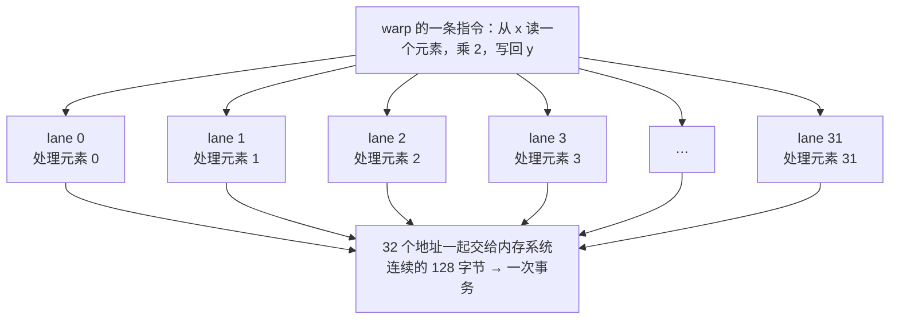

从程序员的角度，每个线程都是一个独立的标量程序：有自己的变量、自己的 `if`、自己的循环次数。从硬件的角度，一个 warp 就是一条 32 路宽的向量指令，每个线程占其中一个 **lane**。两种视角的差别在分支处显现：如果 32 个线程在一个 `if` 上走了不同的路，硬件只能把两条路径**先后**各执行一遍，每次让不满足条件的 lane "旁观"（被 mask 掉）。结果正确，但时间是两条路径之和。这叫 warp divergence，第四章展开。

warp 这一层是**几乎所有性能问题发生的地方**：32 个 lane 是否走同一条分支、32 个 lane 发出的地址能否合并成一次内存事务（上图最后一步）、32 个 lane 访问 shared memory 会不会撞上同一个 bank。这些是第三、四篇的主题；这里先记住"32 个一组"这个数字。

### 2. block：硬件分派到 SM 的单位

线程不是一个一个交给 SM 的。一次 kernel launch 提交的是一批 **thread block**（硬件文档里叫 CTA，cooperative thread array），每个 block 有几十到上千个线程；硬件的全局调度器按 SM 的空闲资源把 block 逐个分派下去。**一个 block 只会落在一个 SM 上、从头到尾不迁移；一个 SM 可以同时驻留多个 block**：

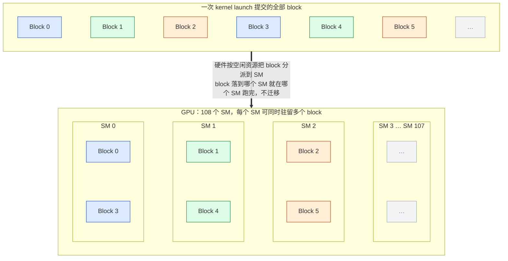

block 落到 SM 之后，它的线程被按 32 个连续编号一组切成 warp，交给这个 SM 的 4 个 warp 调度器；SM 会等到 block 内所有 warp 结束才释放它占用的寄存器和 shared memory。这个设计有两个直接后果：

- **block 内的线程可以协作，block 之间不能。** 同一个 block 的线程在同一个 SM 上，因此可以共用这个 SM 里那块 192 KB 的 SRAM（shared memory）、可以在硬件屏障上互相等待；不同 block 可能在不同 SM 上、也可能一个已经结束一个还没开始，硬件不提供它们之间的廉价通信手段。
- **block 之间彼此独立、无序。** 硬件不保证 block 的执行顺序，也不保证哪些 block 同时在跑；正因为不保证，同一份 kernel 才能不加修改地撒到 108 个、132 个或者下一代更多的 SM 上。

一个 SM 上能同时驻留多少个 block、多少个 warp，受寄存器和 shared memory 总量限制，这就是第四章要算的 occupancy。

### 3. 硬件层级与编程模型名字的对应

把本章和上一章拼起来，硬件一侧从整卡到一个执行 lane 有四层；CUDA 编程模型给其中每一层起了一个名字。下一篇会从这些名字出发写代码，这里先把对应关系画出来：

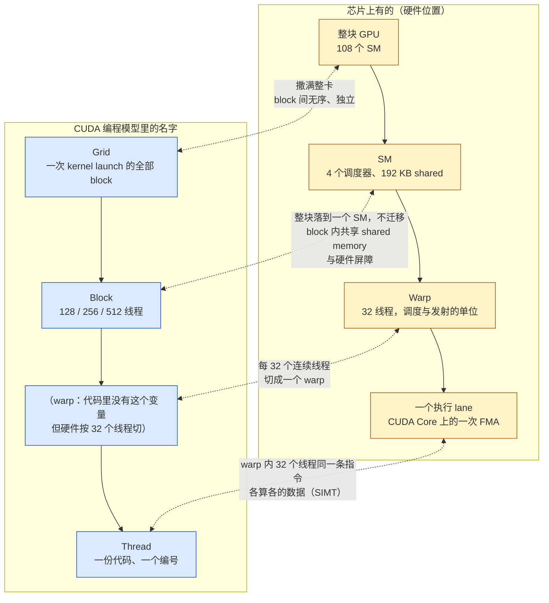

| 硬件层 | 编程模型里的名字 | 关系 |
|---|---|---|
| 整块 GPU（108 个 SM） | **Grid** | 一次 launch 的全部 block 撒满整卡；block 间无序、无同步、无共享内存 |
| 一个 SM | **Block** | 整块落到一个 SM，不迁移；block 内共享 shared memory，可在屏障上对齐 |
| 一个 warp（32 lane） | （无名字） | 硬件按 32 个连续线程切分；同一条指令、分歧时串行、访存按 warp 合并 |
| 一个 lane | **Thread** | 有自己的寄存器、编号和分支路径 |

一句话总结：**block 是硬件分派的单位、也是程序员手里最小的"可协作"单位；warp 是硬件调度的单位，程序员看不见但必须时刻记着；SM 是执行这些 warp 的地方；SIMT 是 warp 内部的执行方式**。后面几篇所有优化，本质上都是在这几层之间对齐：让一个 warp 的 32 个 lane 访问连续地址、走同一条分支；让一个 block 的数据在 shared memory 里被复用；让一次 launch 有足够多的 block 填满 108 个 SM。

有了这幅画面，下一章看 SM 是怎么把一堆 warp 跑起来、遇到分歧和访存延迟时又是怎么处理的。


## 四、SM、warp 与 SIMT 的硬件实现

### 1. 分歧怎么执行：两条路径串行

第三章说过一个 warp 一条指令，分歧的分支要串行执行。具体过程是这样的：

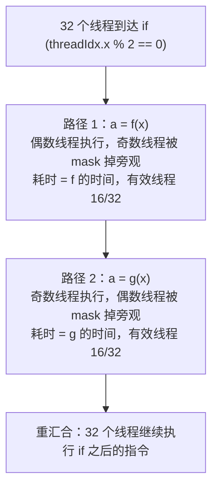

SIMT 和 CPU 的 SIMD 的区别就在这里。SIMD 里程序员要手动用 mask 处理向量内的分歧；SIMT 里编译器和硬件替你做，代码写起来像普通标量程序，但代价是隐藏的：两条路径的时间相加。它不影响正确性，只影响性能，所以写 kernel 时要尽量让同一个 warp 里的线程走同一条路：

```cpp
// 32 个线程的 warp 里，奇偶线程走不同分支：两条路径串行，各 16 个线程有效
if (threadIdx.x % 2 == 0) { a = f(x); } else { a = g(x); }

// 同样的工作量，按 warp 对齐地划分：每个 warp 内 32 个线程走同一条路，无分歧
if ((threadIdx.x / 32) % 2 == 0) { a = f(x); } else { a = g(x); }
```

（`threadIdx.x` 是线程在 block 内的编号，下一篇详述；这里只需知道相邻编号的 32 个线程在同一个 warp 里。）最常见的分歧来源其实不是这种人为的奇偶分支，而是**边界检查**：数组长度不是 32 的倍数时，最后一个 warp 里有一部分线程要跳过计算。这种分歧只发生在一个 warp 上，代价可以忽略；真正要避免的是每个 warp 都会碰到的、按数据内容分歧的分支。

一个 warp 一条指令，这个事实还决定了访存的粒度：当一个 warp 执行一条 load 指令时，32 个 lane 各自给出一个地址，硬件把这些地址合并成尽量少的内存事务（32 字节 sector、128 字节 cache line）。如果 32 个地址恰好是连续的 128 字节，一次事务搞定（第三章 SIMT 图里的情形）；如果散落在 32 个不同的 cache line 上，就要 32 次事务，有效带宽掉到 1/32。这就是 coalescing，第三篇的主题。

### 2. 延迟隐藏靠 warp 切换，而不是乱序执行

每个 SM 有 4 个 warp 调度器，每个调度器每周期挑一个"就绪"的 warp 发射一条指令。一条 warp 指令发出去之后，如果它依赖的数据还没回来（比如上一条是 HBM load，要等几百周期），这个 warp 就变成"未就绪"，调度器不等它，转去发射另一个就绪 warp 的指令：

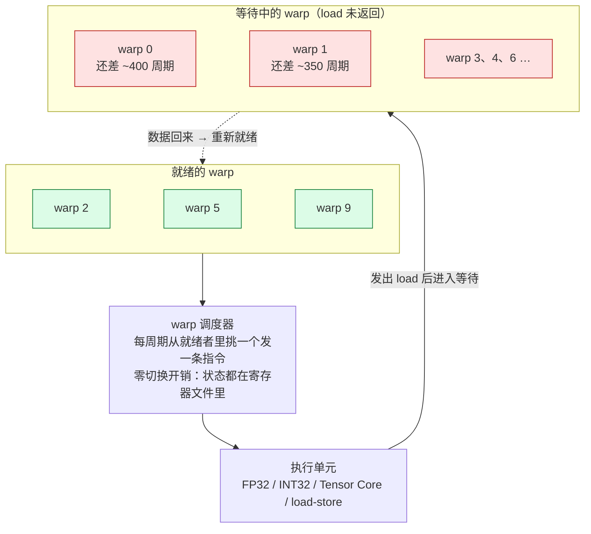

所以问题变成：**要有多少个 warp 才能把延迟填满？** 粗略地说，如果一次访存延迟是 $$L$$ 周期，而每个 warp 在两次访存之间只有 $$k$$ 条独立指令可以发射，那么每个调度器需要约 $$L / k$$ 个 warp 才能保证每周期都有活干。HBM 延迟按 600 周期算、$$k = 10$$ 的话就是 60 个 warp——而一个 SM 最多驻留 64 个 warp、分给 4 个调度器每个 16 个。这个粗算说明两件事：

- 光靠 warp 数量填不满 HBM 延迟，还要靠**单个 warp 内部的并行度**（ILP）：一次发出多条互不依赖的 load，让它们同时在飞（在 flight），一次等待换回多份数据；
- 驻留 warp 数太少时，SM 大部分时间在空转等数据，这种状态叫 **latency-bound**：既没碰到带宽上限，也没碰到算力上限。第六章讨论 Roofline 时会回到它。

这里没有 OoO。一个 warp 内部的指令严格按程序顺序发射（编译器会做静态调度），硬件只在 warp 之间选择。硬件因此简单、面积小，把复杂度推给了编译器和程序员——这是 GPU 编程比 CPU 编程更"贴近硬件"的根本原因。

### 3. 驻留：2048 个线程、64 个 warp、32 个 block

一个 SM 同时驻留多少个 warp，由几个上限中最紧的那个决定：

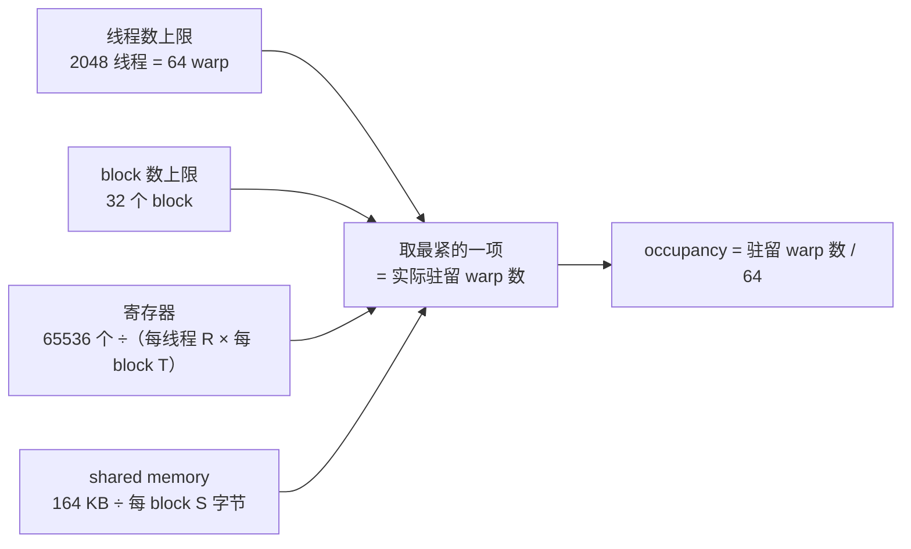

- 线程数上限：2048 个线程 = 64 个 warp；
- block 数上限：32 个 block；
- 寄存器：65536 个 32-bit 寄存器，一个线程用 $$R$$ 个、block 有 $$T$$ 个线程，则最多 $$\lfloor 65536 / (R \cdot T) \rfloor$$ 个 block（实际分配以 warp 为粒度、按 256 个寄存器向上取整）；
- shared memory：A100 每 SM 最大 164 KB，一个 block 用 $$S$$ 字节则最多 $$\lfloor 164\ \text{KB} / S \rfloor$$ 个 block。

实际驻留 warp 数与 64 的比值叫 **occupancy**。举一个数：一个 block 256 线程、每线程 64 个寄存器，寄存器一项允许 $$65536 / (64 \times 256) = 4$$ 个 block = 32 个 warp，occupancy 50%。第二篇写第一个 kernel 时会用 `nvcc -Xptxas -v` 看到每个 kernel 的寄存器数，这个算式就派上用场。

### 4. Tensor Core 在哪里，和 CUDA Core 是什么关系

Tensor Core 不是独立于 SM 的另一块芯片，它就是 SM 每个 partition 里的一个执行单元（第二章 SM 图里每个 partition 的那个"1 Tensor Core"），和 FP32 单元并列，由同一个 warp 调度器发射指令。区别在于指令的形状：

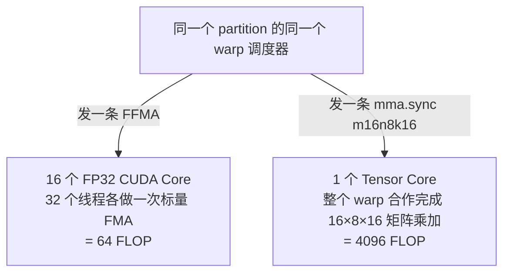

CUDA Core 的一条指令是"32 个线程各做一次标量 FMA"，Tensor Core 的一条指令是"整个 warp 合作完成一个小矩阵乘加"。Ampere 上 BF16 的主力形状是 `m16n8k16`：一条 `mma.sync` 指令做 $$16 \times 8 \times 16 = 2048$$ 次乘加，即 4096 FLOP。

一个 A100 SM 的 4 个第三代 Tensor Core 合起来每周期可以完成 **1024 次 dense BF16/FP16 FMA**。用和 FP32 一样的方法算峰值：

$$
108 \times 1024 \times 2 \times 1.41 \times 10^9 \approx 312 \text{ TFLOPS}
$$

对比 FP32 CUDA Core 的 19.5 TFLOPS，同一个 SM 里 Tensor Core 的吞吐是 CUDA Core 的 16 倍。H100 的第四代 Tensor Core 每 SM 每周期再翻倍到 2048 次 FMA，加上 SM 数和主频的提升，BF16 dense 达到约 989 TFLOPS；此外还支持 FP8，约 1979 TFLOPS。

Tensor Core 有两个约束决定了后面几篇的很多设计：第一，它只做矩阵乘加，softmax、归一化、激活函数这些仍然要走 CUDA Core 和 SFU；第二，它的操作数要按照特定的 **fragment 布局**分散在 warp 的 32 个线程的寄存器里，数据从 shared memory 搬进寄存器时必须按这个布局排好——这是 `ldmatrix`、CUTLASS 的 `Layout`、Hopper 的 TMA 存在的原因。第六篇专门讨论。


## 五、内存层次：容量、带宽、延迟

### 1. 一张图、一张表

GPU 上一个字节从 HBM 到 ALU 要经过的每一级，和第三章的硬件层级是一一对应的：一个 lane（thread）私有的是寄存器，一个 block 共享的是 shared memory，整卡共享的是 L2 和 HBM：

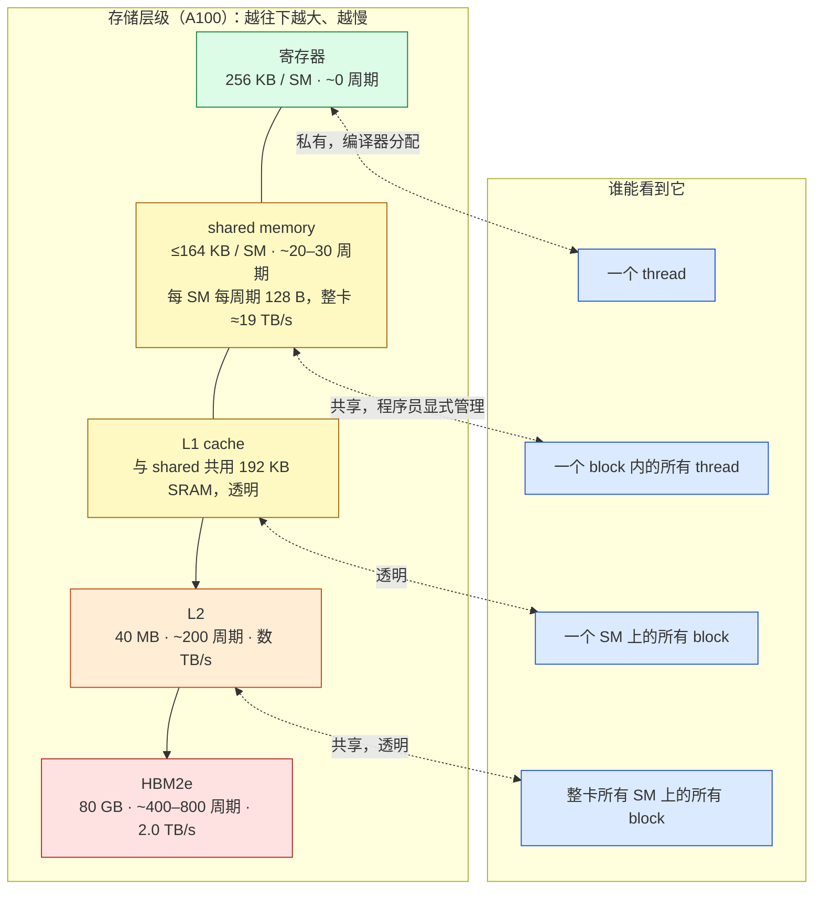

容量、带宽和延迟大致如下（A100，量级示意）：

```text
层级              容量（每 SM / 整卡）           带宽                              延迟（周期）
─────────────────────────────────────────────────────────────────────────────────────────────
寄存器            256 KB / SM（27 MB 整卡）      每 SM 每周期数 KB                   ~0（流水线内）
shared memory/L1  192 KB / SM（shared ≤164 KB）  每 SM 每周期 128 B（整卡 ≈19 TB/s）  ~20–30
L2                40 MB（整卡共享）              数 TB/s 量级                        ~200
HBM2e             80 GB                         约 2.0 TB/s（标称）                  ~400–800
```

H100 对应的数字：shared/L1 每 SM 256 KB（shared 最大 228 KB），L2 50 MB，HBM3 80 GB 约 3.35 TB/s；每 SM 每周期 shared 带宽仍是 128 字节。

几个数字值得停一下：

- **寄存器文件比 L2 还大**。27 MB 的寄存器文件对 40 MB 的 L2，这在 CPU 上不可想象。这就是第二章说的"把面积换成寄存器"。
- **shared memory 的带宽比 HBM 高一个数量级**。每 SM 每周期 128 字节，乘 108 个 SM 和 1.41 GHz，约 19.5 TB/s，是 HBM 的 10 倍。所以"把数据从 HBM 搬进 shared memory 然后反复使用"能提速，前提是重复使用的次数足够多。
- **HBM 延迟是数百周期**。600 个周期，在 1.41 GHz 下是约 400 ns。一个 warp 发出一条 load 后要等这么久才能拿到数据，这就是第四章说的必须靠大量 warp 和 ILP 来隐藏的延迟。
- **每一级的带宽都不是免费的**。寄存器每 SM 每周期数 KB 听起来很大，但 64 个 FP32 FMA 每周期就要读 3 × 64 × 4 = 768 字节、写 256 字节；Tensor Core 每周期 1024 次 FMA 对操作数的需求更高。这就是为什么 Tensor Core 的操作数直接从寄存器读，而 Hopper 的 wgmma 甚至可以直接从 shared memory 读 B 矩阵。

### 2. 每一级是给谁用的

**寄存器**是每个线程私有的，编译器分配，程序员不能直接控制，但能通过代码结构影响（一个线程持有的中间结果越多，寄存器越多，occupancy 越低）。第五篇的寄存器分块就是有意让每个线程在寄存器里持有一个 8×8 的输出 tile，用 occupancy 换数据复用。

**shared memory** 是一个 block 内所有线程共享的、程序员显式管理的片上存储，物理上和 L1 是同一块 SRAM，比例可配置。它是 block 内线程协作的唯一高速通道：reduction 里跨线程求和、GEMM 里把 A、B 的 tile 装进来让所有线程复用、attention 里放 K、V 的分块。它被分成 32 个 bank，每个 bank 每周期服务一个 4 字节的访问，32 个线程恰好各访问一个不同 bank 时才能达到每周期 128 字节，否则发生 bank conflict、串行化。第四篇讨论。

**L1** 对程序员透明，主要用于缓存全局内存读取和合并访存事务。**L2** 是整卡共享的，所有 SM 的 HBM 流量都经过它；它的存在让"多个 block 读同一份数据"时实际 HBM 流量低于理论值——这一点在讨论 GEMM 为什么能是 compute-bound 时很关键。

**HBM** 是 kernel 输入输出的最终来源和去处。绝大多数 AI kernel 的性能上限就是"把输入从 HBM 读一遍、把输出写一遍"要花的时间——这个数字是本系列每一篇的起点。

### 3. 容量数字决定了分块的尺寸

这张表里的容量不只是背景知识，它们直接决定了后面 kernel 的参数选择。举两个后面会反复出现的例子：

- GEMM 分块：一个 block 若用 $$128 \times 128$$ 的输出 tile、$$BK = 32$$、BF16、双缓冲，shared memory 需要 $$2 \times (128 + 128) \times 32 \times 2 = 32$$ KiB。A100 的 164 KB 可以放 5 个这样的 block，但 2048 线程的上限和寄存器（每线程持有 $$8 \times 8$$ 的累加器就是 64 个 FP32 寄存器，再加地址与 fragment）往往先成为约束。
- attention 分块：FlashAttention 的 HBM 流量与片上能放下的 K、V 块大小成反比——shared memory 越大、每次装进来的 K/V 越多，对 K/V 的重复读取次数就越少。H100 的 228 KB 相比 A100 的 164 KB，允许更大的 tile，这是同一个 kernel 在 Hopper 上换一组 tile 参数就能更快的原因之一。

所以读一个 kernel 的源码时，看到 `BLOCK_M = 128`、`BLOCK_N = 64`、`NUM_STAGES = 3` 之类的常数，应该能把它们换算回 shared memory 字节数和寄存器数，再对照这张表判断为什么是这些值。


## 六、Roofline 模型

### 1. 算术强度

任何一段计算都可以用两个数字刻画：做了多少浮点运算 $$F$$（FLOPs），从 HBM 搬了多少字节 $$B$$。两者之比叫**算术强度**（arithmetic intensity）：

$$
I = \frac{F}{B} \quad \text{（FLOP/byte）}
$$

它是这段计算的内在属性，只和算法有关，与硬件无关。算 $$B$$ 时取**最小必要流量**：输入各读一次、输出各写一次，中间结果假设全部留在片上。这样得到的 $$I$$ 是这个算法能达到的**最高**算术强度；实际实现如果多读了几遍（比如 naive GEMM），$$I$$ 只会更低。

### 2. 两条屋顶

一块 GPU 用两个数字刻画：峰值算力 $$P_{peak}$$（FLOP/s）和 HBM 带宽 $$BW$$（byte/s）。一段算术强度为 $$I$$ 的计算，它在这块 GPU 上能达到的算力有两个上界：

- 算力上界：无论如何不能超过 $$P_{peak}$$；
- 带宽上界：每秒最多搬 $$BW$$ 字节，每字节最多支撑 $$I$$ 次运算，所以每秒最多 $$I \cdot BW$$ 次运算。

两者取小：

$$
P_{attainable}(I) = \min(P_{peak},\ I \cdot BW)
$$

在横轴为 $$I$$、纵轴为可达算力、双对数坐标的图上，$$I \cdot BW$$ 是一条斜率为 1 的斜线，$$P_{peak}$$ 是一条水平线，两条线拼成一个屋顶的形状，这就是 Roofline（Williams 等 2009）。斜线部分叫带宽屋顶，水平部分叫算力屋顶。

等价地写成时间：一段计算的理论最短时间是

$$
T = \max\left(\frac{F}{P_{peak}},\ \frac{B}{BW}\right)
$$

两项谁大谁是瓶颈。这个式子是本系列所有"理论下界"的来源。

### 3. 拐点：ridge point

两条屋顶的交点满足 $$I \cdot BW = P_{peak}$$，即

$$
I_{ridge} = \frac{P_{peak}}{BW}
$$

代入 A100 BF16 Tensor Core：$$312 / 2.0 \approx 156$$ FLOP/byte。也就是说，在 A100 上**每从 HBM 读一个字节，至少要做 156 次 BF16 运算，才有可能把 Tensor Core 喂饱**；做不到这么多，瓶颈就是带宽，Tensor Core 有多快都没用。

同一块卡上，用不同的执行单元有不同的算力屋顶，因此有不同的 ridge point。A100 上不走 Tensor Core、只用 FP32 CUDA Core 时，$$19.5 / 2.0 \approx 10$$ FLOP/byte。H100 的 BF16 ridge 是 $$989 / 3.35 \approx 295$$，FP32 CUDA Core 约 $$67 / 3.35 \approx 20$$。

注意 ridge point 的趋势：从 A100 到 H100，算力提高了 3.2 倍，带宽只提高了 1.7 倍，ridge 从 156 抬到 295。**每一代硬件都让更多的算子变成 memory-bound**。这是为什么 kernel 融合越来越重要——不是因为算力不够，而是因为算力太多了、带宽跟不上。

### 4. 四个例子

现在回答总纲提出的核心问题。

**BF16 elementwise 加法** $$y = x + b$$，每个元素读 $$x$$、读 $$b$$、写 $$y$$，共 6 字节，做 1 次加法：

$$
I = \frac{1}{6} \approx 0.17 \text{ FLOP/byte}
$$

距 A100 的 ridge 156 差三个数量级，这是彻底的 memory-bound；即便和 FP32 CUDA Core 的 ridge 10 比也差 60 倍。它的理论时间就是字节数除以带宽：$$x$$、$$b$$、$$y$$ 各 1 GiB（$$2^{29}$$ 个元素）时流量 3 GiB，在 A100 上 $$3 \times 2^{30} / 2.0 \times 10^{12} \approx 1.61$$ ms。**无论做什么优化，这个 kernel 都不可能快于 1.61 ms**；能做的只是让它接近这个数——第三篇的全部内容。

**RMSNorm**，一行 $$d = 4096$$ 个 BF16 元素，读 8 KiB、写 8 KiB，每个元素约做 4 次运算（平方、累加、乘 rsqrt、乘权重）：

$$
I \approx \frac{4 \times 4096}{16384} = 1 \text{ FLOP/byte}
$$

仍然是 memory-bound。8192 行时 128 MiB 流量，A100 理论时间约 67 µs。它比 elementwise 多了一个跨行的 reduction，需要 shared memory 或 warp shuffle，但性能目标不变：跑到带宽上限。第四篇。

**attention decode**，Llama-3-8B（32 层、8 个 KV 头、32 个 Q 头、$$d_{head} = 128$$）生成一个 token，上下文长 $$s$$。每层要读全部 KV cache：$$2 \times 8 \times 128 \times 2 = 4$$ KiB 每 token 每层，32 层共 128 KiB 每 token；每层算量是 $$QK^T$$ 和 $$PV$$ 各 $$2 \times 32 \times 128 \times s$$，合计 $$4 \times 4096 \times s$$。两者相除：

$$
I = \frac{4 \times 4096 \cdot s}{4096 \cdot s} = 4 \text{ FLOP/byte}
$$

这个 4 恰好是 GQA 的分组数（32 个 Q 头共享 8 个 KV 头）；MHA 时是 1，batch 加大时线性增加，所以 decode attention 的算术强度通常在 1–8 之间。$$s = 4096$$ 时 KV 读取 512 MiB，A100 理论 268 µs，memory-bound。这也解释了 PagedAttention 和各种 decode kernel 的优化方向都是"每读一次 KV 尽量多用"。第八篇。

**GEMM** $$4096 \times 4096 \times 4096$$，BF16：

$$
F = 2 \times 4096^3 \approx 137.4 \text{ GFLOP}, \quad B_{min} = 3 \times 4096^2 \times 2 = 96 \text{ MiB} \approx 100.7 \text{ MB}
$$

$$
I = \frac{2 \cdot 4096^3}{3 \cdot 4096^2 \cdot 2} = \frac{4096}{3} \approx 1365 \text{ FLOP/byte}
$$

远在 ridge 156 右侧，compute-bound。理论时间由算力决定：$$137.4 \times 10^9 / 312 \times 10^{12} \approx 0.44$$ ms，而搬 100.7 MB 只要 50 µs。如果不用 Tensor Core、只用 FP32 CUDA Core，则 $$137.4 / 19.5 \approx 7.0$$ ms。这就是第五、六篇的目标：从 naive 的几十甚至上百毫秒，走到 0.44 ms 的某个百分比。

四个例子放到一张 Roofline 图上（A100，双对数坐标，示意）：

```text
可达算力（log）

1000 T ┤
       │
 312 T ┤                          /──────●─────────────   BF16 Tensor Core 屋顶 312 TFLOPS
       │                        /  ridge 156          GEMM 4096³（I≈1365）
 100 T ┤                      /
       │                    /
       │                  /
19.5 T ┤                /╌╌╌╌╌╌╌╌╌╌╌╌╌╌╌╌╌╌╌╌╌╌╌╌╌╌╌╌   FP32 CUDA Core 屋顶 19.5 TFLOPS
  10 T ┤              ●  attention decode（I≈4）       ridge≈10
       │            /
       │          /
       │        ●  RMSNorm（I≈1）
   1 T ┤      /
       │    /
       │  ●  elementwise（I≈0.17）
       │/   带宽屋顶 P = I × 2.0 TB/s
 0.1 T ┤
       └───────┴───────┴───────┴───────┴───────┴──→ 算术强度 I（FLOP/byte，log）
       0.1     1       10      100     1000    10⁴
```

三个 memory-bound 的点都落在斜线上，它们的"可达算力"分别只有 0.34、2、8 TFLOPS——不是因为 kernel 写得差，而是这类计算在这块卡上就只能这么快。只有 GEMM 落在水平屋顶上。

### 5. GEMM 什么时候才真的 compute-bound

$$I \approx 1365$$ 这个数有一个前提：**三个矩阵各从 HBM 读写一次**。这要求 $$C$$ 的每个元素只算一次、$$A$$ 的每一行和 $$B$$ 的每一列在片上被复用 4096 次。实际实现做不到把整个矩阵放进片上，只能分块：一个 block 负责 $$C$$ 的一个 $$BM \times BN$$ 的 tile，沿 $$K$$ 方向每次把 $$A$$ 的 $$BM \times BK$$、$$B$$ 的 $$BK \times BN$$ 装进 shared memory。这时每个 block 从全局内存读的数据是 $$(BM + BN) \cdot K$$ 个元素，所有 block 加起来是

$$
B_{tiled} = M \cdot N \cdot K \cdot \left(\frac{1}{BM} + \frac{1}{BN}\right) \text{ 个元素}
$$

比 naive 实现（每个输出元素独立读 $$2K$$ 个数，共 $$2MNK$$ 个元素）少了两个数量级（$$BM = BN = 128$$ 时的精确倍数第五篇推导）；但对全局内存的算术强度只有几十 FLOP/byte 的量级，**仍然低于 156**。也就是说，如果 tile 之间完全没有数据共享，128×128 的分块 GEMM 在 A100 上依然是 memory-bound。它在实践中能跑到 compute-bound，靠的是 L2：同时运行的 block 中有很多读的是 $$A$$ 的同一行块或 $$B$$ 的同一列块，40 MB 的 L2 把这些重复读取拦在了 HBM 之外，实际 HBM 流量远小于 $$B_{tiled}$$。

这给出一个重要结论，后面 GEMM 篇会反复用到：**GEMM 是 compute-bound 不是天然的，而是 tile 足够大、片上复用足够多、并且 block 调度顺序对 L2 友好的结果**。小矩阵、瘦矩阵（decode 时 $$M = $$ batch size 只有几十）、或者 tile 太小，GEMM 都会滑回带宽屋顶。

### 6. 离屋顶多远：两个利用率

Roofline 给出上界，实际 kernel 离上界多远需要两个比值：

$$
\text{带宽利用率} = \frac{B / T_{actual}}{BW}, \qquad \text{算力利用率} = \frac{F / T_{actual}}{P_{peak}}
$$

一个 memory-bound kernel 的目标是带宽利用率，一个 compute-bound kernel 的目标是算力利用率；另一个比值不重要。

对 memory-bound kernel，**带宽利用率到 85–90% 就是终点**。HBM 的标称带宽是接口的理论峰值，刷新、读写切换、bank 冲突、地址映射不均等因素使得即便是精心写的 `cudaMemcpy` 设备内拷贝也通常只能达到标称值的 90% 左右。一个 elementwise kernel 跑到 A100 上 1.7–1.8 TB/s 的有效带宽，就已经没有什么可以做的了，剩下的路只有减少字节数——融合、换精度、不写中间结果。

对 compute-bound kernel，Tensor Core 的利用率通常低一些：cuBLAS 在大方阵上一般能达到 BF16 峰值的 70–85%（受功耗降频、tile 边界浪费、流水线填充和排空影响），手写 GEMM 能到 cuBLAS 的 80–90% 已经是很好的成绩。所以对 4096³ 的 BF16 GEMM，读者在 A100 上跑出来的 cuBLAS 数字大致应该落在 0.5–0.65 ms 之间，而不是 0.44 ms。

两个利用率都需要 $$T_{actual}$$，它的测量本身有讲究：要用 `cudaEvent` 而不是 CPU 时钟、要预热、要取多次运行的中位数，还要在两次运行之间把 L2 刷掉——否则一个 100 MB 的输入在第二次运行时有相当一部分还留在 40 MB 的 L2 里，测出来的"HBM 带宽"会超过 2.0 TB/s，让人误以为突破了屋顶。第二篇会给出一个统一的 `bench()` 函数处理这些细节，后面所有篇的数字都用它测。

还要注意 Roofline 里的 $$B$$ 是**算法的最小流量**，而 `ncu` 报告的是**实际发生的 HBM 流量**。两者的比值是另一个有用的诊断量：如果一个 elementwise kernel 的实际流量是理论值的 2 倍，说明有一半的读取没有被 cache line 复用或者写入触发了额外的读（例如非对齐、非合并的访存模式）；如果一个 GEMM 的实际流量是理论 100.7 MB 的 5 倍，说明 tile 之间的复用不够、L2 没有拦住重复读取。单看"带宽利用率 90%"不能区分"读得又快又省"和"读得快但读了很多遍"，两个数字要一起看。

### 7. 一个可运行的 Roofline 计算器

把上面的推导写成代码，不需要 GPU：

```python
# roofline_time.py —— 纯 Python，不需要 GPU
GPUS = {
    # 标称值：峰值算力 (FLOP/s) 与 HBM 带宽 (byte/s)
    "A100-fp32": {"peak": 19.5e12, "bw": 2.0e12},   # CUDA Core FP32
    "A100-bf16": {"peak": 312e12,  "bw": 2.0e12},   # Tensor Core BF16 dense
    "H100-fp32": {"peak": 67e12,   "bw": 3.35e12},
    "H100-bf16": {"peak": 989e12,  "bw": 3.35e12},
}

def roofline_time(flops, bytes_, gpu):
    """Roofline 理论时间下界：算力时间与带宽时间取较大者（秒）。"""
    t_compute = flops / gpu["peak"]
    t_memory = bytes_ / gpu["bw"]
    return max(t_compute, t_memory)

GiB = 1024 ** 3
KiB = 1024

def examples():
    # 1. BF16 elementwise: y = x + b，x/b/y 各 1 GiB（2^29 个元素），两读一写
    n = 2 ** 29
    yield "elementwise y=x+b, 3 GiB traffic", n, 3 * 2 * n, "fp32"
    # 2. RMSNorm: 8192 行 × d=4096 BF16，读 8 KiB 写 8 KiB，每元素约 4 FLOP
    rows, d = 8192, 4096
    yield "RMSNorm 8192x4096", 4 * rows * d, 2 * 2 * rows * d, "fp32"
    # 3. attention decode: Llama-3-8B，32 层、8 KV 头、d_head=128、32 Q 头，
    #    上下文 s=4096，单 token：每层读 KV 4 KiB×s，FLOPs 4·d_model·s
    s, L, d_model = 4096, 32, 4096
    yield "attention decode s=4096", 4 * d_model * s * L, 4 * KiB * s * L, "bf16"
    # 4. GEMM 4096^3 BF16：2·N^3 FLOP，三个矩阵各读/写一次
    N = 4096
    yield "GEMM 4096^3 BF16", 2 * N ** 3, 3 * N * N * 2, "bf16"

if __name__ == "__main__":
    print(f"{'kernel':<32}{'FLOPs':>10}{'bytes':>10}{'I':>9}"
          f"{'A100 (us)':>12}{'H100 (us)':>12}")
    for name, flops, bytes_, unit in examples():
        I = flops / bytes_
        ta = roofline_time(flops, bytes_, GPUS[f"A100-{unit}"])
        th = roofline_time(flops, bytes_, GPUS[f"H100-{unit}"])
        print(f"{name:<32}{flops:>10.3g}{bytes_:>10.3g}{I:>9.3g}"
              f"{ta * 1e6:>12.1f}{th * 1e6:>12.1f}")
```

输出：

```text
kernel                               FLOPs     bytes        I   A100 (us)   H100 (us)
elementwise y=x+b, 3 GiB traffic  5.37e+08  3.22e+09    0.167      1610.6       961.6
RMSNorm 8192x4096                 1.34e+08  1.34e+08        1        67.1        40.1
attention decode s=4096           2.15e+09  5.37e+08        4       268.4       160.3
GEMM 4096^3 BF16                  1.37e+11  1.01e+08 1.37e+03       440.5       139.0
```

前三行 elementwise、RMSNorm、decode 用的是 CUDA Core 的算力屋顶（它们不走 Tensor Core），但结果与算力屋顶无关——时间全部由 bytes 决定，从 A100 换到 H100 的加速比恰好是带宽比 3.35/2.0 = 1.68。最后一行 GEMM 的时间由 FLOPs 决定，A100 到 H100 的加速比是算力比 989/312 = 3.17。**一个 kernel 换硬件后的加速比，本身就能告诉你它是哪一类**——这是一个不用 profiler 的诊断方法。

后面每一篇都会先用这个函数（或者它的手算版本）给出理论下界，再写 kernel，再解释差距。


## 七、硬件代际

本系列以 Ampere（A100，`sm_80`）为基线，代码默认 `-arch=sm_80`，Hopper 特性随文标注。读源码时会遇到四代架构的名字，各自引入了什么：

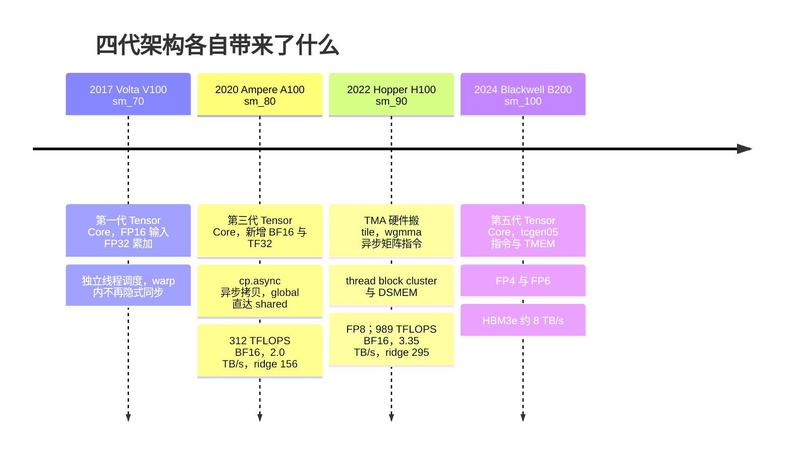

**Volta（V100，2017，`sm_70`）**。第一代 Tensor Core（只支持 FP16 输入、FP32 累加），从此 GPU 的矩阵算力与标量算力分道扬镳。另一个影响深远的改动是**独立线程调度**（independent thread scheduling）：warp 内每个线程有自己的 PC 和调用栈，分歧的分支可以交错执行而不是严格串行到重汇合点。这带来了一个后果：Volta 之前默认成立的"warp 内线程隐式同步"不再成立，需要显式 `__syncwarp()`，用 `__shfl_sync` 等带 `_sync` 后缀和 mask 参数的新版 warp 原语。读 2017 年之前的 CUDA 代码时要注意这一点。

**Ampere（A100，2020，`sm_80`）**。第三代 Tensor Core，新增 BF16、TF32 输入和 FP64 矩阵运算；2:4 结构化稀疏（本系列不用稀疏算力）。对 kernel 写法影响最大的是 **`cp.async`**：从全局内存到 shared memory 的异步拷贝，不经过寄存器，配合异步 barrier（`cp.async.wait_group`、`mbarrier`）实现"一边算这一块、一边搬下一块"的多级流水线，取代了之前"先 load 到寄存器再 store 到 shared memory"的两步走。L2 增大到 40 MB，shared memory 每 SM 最大 164 KB。

**Hopper（H100，2022，`sm_90`/`sm_90a`）**。变化最大的一代，几乎重写了高性能 GEMM 的写法：

- **TMA**（Tensor Memory Accelerator）：一条指令让专用硬件把一个多维 tensor 的 tile 从全局内存搬到 shared memory（或反向），地址计算、边界处理、swizzle 都由硬件做，单个线程发起，不占用其他线程的指令槽；
- **wgmma**（warpgroup MMA）：Tensor Core 指令从 warp 级升为 4 个 warp 组成的 warpgroup 级，形状 `m64nNk16`（N 最大 256），**异步**执行，操作数可以直接从 shared memory 读，配合 TMA 形成"生产者 warp 搬数据、消费者 warpgroup 算矩阵"的 warp specialization 模式；
- **thread block cluster** 与**分布式 shared memory**（DSMEM）：多个 block 组成 cluster，可以直接读写彼此的 shared memory，在 block 之上多了一个协作层级；
- **FP8**（E4M3/E5M2）Tensor Core，约 1979 TFLOPS dense；shared memory 每 SM 最大 228 KB；L2 50 MB；HBM3 3.35 TB/s。

FlashAttention-3、CUTLASS 3.x 的 Hopper GEMM、DeepGEMM 都建立在 TMA + wgmma + warp specialization 之上，第六篇和第八篇会涉及。

**Blackwell（B200，2024/2025，`sm_100`）**。第五代 Tensor Core，新增 FP4、FP6 精度；Tensor Core 指令再次改写为 `tcgen05` 系列，引入独立于寄存器和 shared memory 的 Tensor Memory（TMEM）存放累加器，MMA 由单个线程发起、以 CTA pair 为单位执行；双 die 封装，HBM3e 带宽约 8 TB/s。它的编程模型与 Hopper 差异很大，本系列只在提到多架构适配时点到为止，不展开。

四代的共同趋势可以用 Roofline 的语言概括：算力屋顶每代抬高 2–3 倍，带宽屋顶每代抬高不到 2 倍，ridge point 持续右移；硬件用越来越多的**异步**机制（cp.async → TMA、mma.sync → wgmma → tcgen05）让搬数据和算矩阵重叠，因为只有重叠才能同时接近两条屋顶。


## 八、工具链地图

写 kernel 会接触到一串工具。先看源码变成机器码、再跑起来的路径，每个工具都挂在这条路径的某一站上：

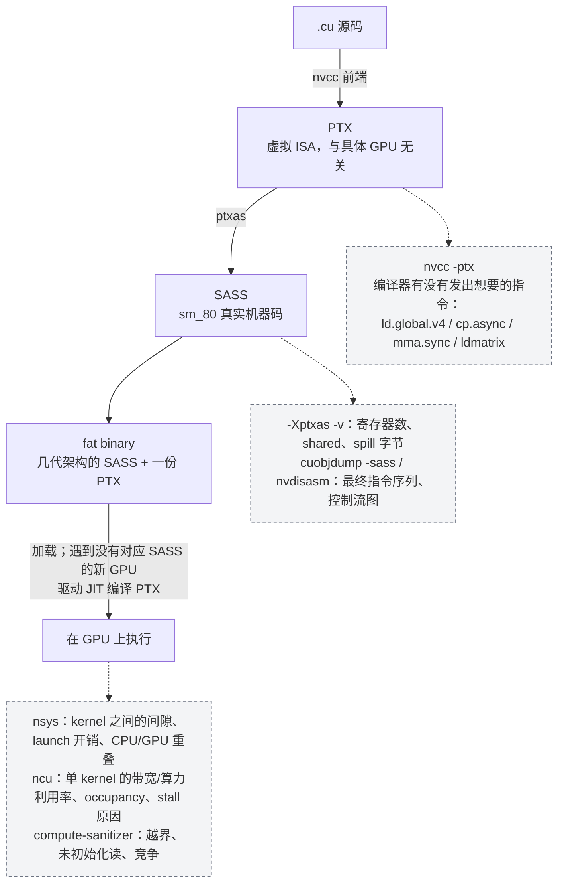

各自看的东西不同：

```text
工具 / 产物             它是什么                                看什么
────────────────────────────────────────────────────────────────────────────────────────────
nvcc                   CUDA 编译器驱动                          -arch=sm_80 选目标；-Xptxas -v 打印每个
                                                                kernel 的寄存器数、shared/spill 字节数
PTX                    虚拟 ISA，与具体 GPU 无关的中间表示        nvcc -ptx 生成；看编译器是否发出了想要的
                                                                指令（ld.global.v4、cp.async、mma.sync、
                                                                ldmatrix）；Triton 的输出也是 PTX
SASS                   真实机器码，每代架构不同                   PTX 经 ptxas 汇编而来；寄存器分配、指令调
                                                                度、是否有 spill（LDL/STL）都只有在这一层
                                                                才能看到
cuobjdump -sass        从可执行文件/.cubin 反汇编 SASS            快速查看最终指令序列；-ptx 可同时导出 PTX
nvdisasm               对 .cubin 反汇编并可输出控制流图            分析分支结构、循环体、指令延迟标注
nsys (Nsight Systems)  系统级时间线                              kernel 之间的间隙、launch 开销、CPU 与 GPU
                                                                的重叠、memcpy、多 stream 并发；回答"时间
                                                                花在哪个 kernel / 哪段等待上"
ncu (Nsight Compute)   单 kernel 剖析器                          带宽利用率、算力利用率、occupancy、warp
                                                                stall 原因、L1/L2 命中率、bank conflict、
                                                                自带 Roofline 图；回答"这个 kernel 为什么慢"
compute-sanitizer      内存与竞争检查                            越界访问、未初始化读、`__syncthreads()`
                                                                遗漏导致的竞争
```

看 `-Xptxas -v` 的输出是第二篇写完第一个 kernel 后要做的第一件事，`ncu` 是第十篇的主角。


## 九、系统层与 kernel 层的边界

### 1. 时间线上的间隙与色块

一个训练或推理程序慢，瓶颈可能在很多地方：Python 解释器、框架的 dispatch、kernel launch 的固定开销（每次几微秒）、`cudaStreamSynchronize` 或 `.item()` 造成的等待、多卡通信、数据加载。这些属于**系统层**，在 `nsys` 的时间线上表现为 GPU 空闲的间隙：

```text
nsys 时间线（示意）

CPU   ████ Python/dispatch ████        launch  ████ .item() 等待 ████████  launch  ██…
GPU        ░░░░ 空闲 ░░░░  ▓▓▓▓ kernel A ▓▓▓▓  ░░░░░░ 空闲 ░░░░░░  ▓▓ kernel B ▓▓  ░░…
                           ↑                                        ↑
                    本系列讨论的范围：                        系统层问题：CUDA Graph、融合减少
                    色块内部发生了什么                        launch、异步化——不用打开任何 kernel
```

系统层的解决手段是 CUDA Graph、算子融合减少 launch 次数、异步化、流水线——都不需要打开任何一个 kernel。本系列不讨论它们。

本系列讨论的是时间线上那些**实心的色块**：kernel 从开始到结束的这段时间里发生了什么。在这个范围内，Roofline 告诉我们瓶颈只有两类：

- **memory-bound**：$$I < I_{ridge}$$，时间由字节数决定。优化目标是带宽利用率，手段是 coalescing、向量化、减少字节数（融合、低精度）、足够的 in-flight 请求；
- **compute-bound**：$$I > I_{ridge}$$，时间由 FLOPs 决定。优化目标是算力利用率，手段是用上 Tensor Core、把数据搬运隐藏在计算后面、减少非矩阵指令的占比。

还有第三种情况，它不是一类新的瓶颈，而是前两类都没有触及：**latency-bound**。kernel 的 occupancy 太低、每个 warp 的 in-flight 访存太少、或者 grid 太小填不满 108 个 SM，导致 SM 大部分时间在等——既没有把带宽用满，也没有把算力用满。它在 Roofline 图上的表现是**这个点悬在两条屋顶下方很远的地方**，带宽利用率和算力利用率都很低。诊断它靠 `ncu` 的 occupancy 与 warp stall 指标，解决它靠提高并行度：更多的 block、更少的寄存器、一次发出更多独立的 load。第二篇的 naive kernel 和第五篇的 naive GEMM 都是它的典型案例。

### 2. 一张诊断决策图

把第六章的 Roofline、两个利用率、实际流量与理论流量之比，和上面的三类情况串起来，就是本系列的方法论：

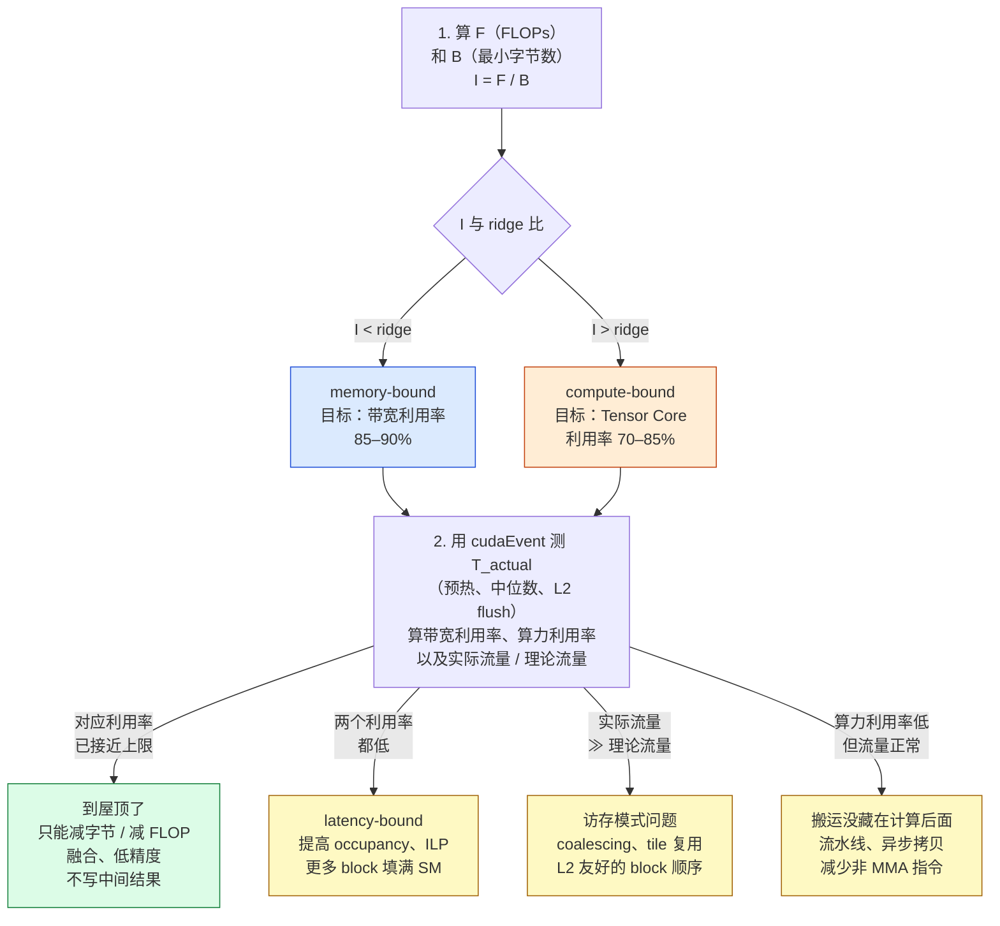

一句话：**先算字节数和 FLOPs，得到理论时间；再测；差距如果在带宽或算力利用率上，按对应的手段优化；如果两个利用率都低，先解决 latency**。


## 十、本文小结

这一篇没有写任何完整的 kernel，但建立了后面九篇都要用的坐标系：

- CPU 用晶体管买单线程延迟（分支预测、OoO、大 cache），GPU 用晶体管买吞吐（ALU、寄存器），并用零开销的 warp 切换代替 OoO 来隐藏延迟；所有驻留 warp 的状态同时住在寄存器文件里，因此驻留数受寄存器总量硬性限制（occupancy）；
- 硬件组织工作的两种批量：**warp**（32 个 lane 执行同一条指令，SIMT；分歧串行、访存按 warp 合并）和 **block**（分派到一个 SM 的单位，不迁移；block 内可共用 SM 的 shared memory，block 之间独立无序）；硬件四层（整卡 → SM → warp → lane）对应编程模型的 grid → block →（warp）→ thread；
- SM 是基本单元，A100 有 108 个、H100 有 132 个；每 SM 4 个 warp 调度器、64 个 FP32 CUDA Core、4 个 Tensor Core、256 KB 寄存器、最多 64 个驻留 warp；分歧的分支串行执行；
- 内存层次与作用域一一对应：寄存器（thread 私有，~0 周期）→ shared/L1（block 共享，~20–30 周期，每 SM 每周期 128 B）→ L2（整卡共享，~200 周期，数 TB/s）→ HBM（~400–800 周期，2.0 / 3.35 TB/s）；shared 的总带宽比 HBM 高一个数量级，是数据复用的场所；
- Tensor Core 是 SM 内与 CUDA Core 并列的执行单元，一条指令做一个小矩阵乘加，A100 每 SM 每周期 1024 次 dense BF16 FMA，是 CUDA Core 的 16 倍；
- Roofline：$$I = F / B$$，$$T = \max(F / P_{peak}, B / BW)$$，ridge $$= P_{peak} / BW$$；A100 BF16 156、FP32 约 10，H100 BF16 295；每代硬件 ridge 都右移，更多算子变成 memory-bound；
- elementwise（$$I = 1/6$$）、RMSNorm（$$I \approx 1$$）、decode attention（$$I \approx 4$$）在 ridge 左侧，时间由字节数决定，目标是 85–90% 的带宽利用率；GEMM 4096³（$$I \approx 1365$$）在右侧，时间由 FLOPs 决定，但只有 tile 足够大、L2 复用足够时才真正 compute-bound；
- latency-bound 是 occupancy 或并行度不足的特殊情况，在 Roofline 上表现为两条屋顶都没碰到；
- 系统层的开销（Python、launch、同步）不在本系列范围内；kernel 内部只有 memory 与 compute 两类瓶颈，都要量化到字节和 FLOP；
- 工具链：nvcc → PTX → SASS；`cuobjdump -sass` / `nvdisasm` 看指令，`nsys` 看时间线，`ncu` 看单 kernel 的利用率与 stall 原因。

硬件基线数字（标称值，全系列一致）：

```text
                          A100 SXM 80GB              H100 SXM 80GB
SM 数                      108                        132
每 SM warp 调度器           4                          4
每 SM 最大驻留线程          2048（64 warps）            2048（64 warps）
每 SM 寄存器文件            256 KB                     256 KB
每 SM L1/shared 合计        192 KB（shared ≤ 164 KB）   256 KB（shared ≤ 228 KB）
L2                        40 MB                      50 MB
HBM                       80 GB HBM2e，约 2.0 TB/s     80 GB HBM3，约 3.35 TB/s
FP32（CUDA Core）          19.5 TFLOPS                约 67 TFLOPS
TF32 Tensor Core（dense）  156 TFLOPS                 约 495 TFLOPS
BF16/FP16 Tensor Core      312 TFLOPS                 约 989 TFLOPS
FP8 Tensor Core            —                          约 1979 TFLOPS
ridge point（BF16）        156 FLOP/byte              295 FLOP/byte
ridge point（FP32）        约 10 FLOP/byte             约 20 FLOP/byte
warp 大小                  32                         32
shared bank               32 个 × 4 B                 同
每 SM 每周期 shared 带宽    128 B                       同
```

四个例子的算术强度与理论时间（Roofline 下界，非实测）：

```text
kernel                     FLOPs        bytes        I（FLOP/byte）  类型           A100 下界   H100 下界
elementwise y=x+b, 3 GiB   5.4e8        3.2e9        0.17           memory-bound   1.61 ms    0.96 ms
RMSNorm 8192×4096 BF16     1.3e8        1.3e8        1              memory-bound   67 µs      40 µs
decode attn, 8B, s=4096    2.1e9        5.4e8        4              memory-bound   268 µs     160 µs
GEMM 4096³ BF16            1.37e11      1.0e8        1365           compute-bound  0.44 ms    0.14 ms
```

下一篇进入 CUDA 编程模型：第三章末尾那张对应图里的每个名字在代码里怎么写——`__global__`、`dim3`、内建变量、边界检查、block 与 grid 大小怎么选、二维 block 如何切成 warp——以及设备内存、stream、event、错误处理、nvcc 编译流程，然后写第一个 kernel、用 `cudaEvent` 正确计时，回答为什么一个看起来没问题的 vector add 只跑到带宽的一小部分：

> **同样是 1 GiB 的 elementwise 加法，理论下界 1.61 ms 已经算出来了；第一个 naive kernel 会离它有多远，差距来自哪里？**


## 下一篇

[CUDA 编程模型与第一个 kernel](/cuda-programming-model-and-first-kernel.html)
