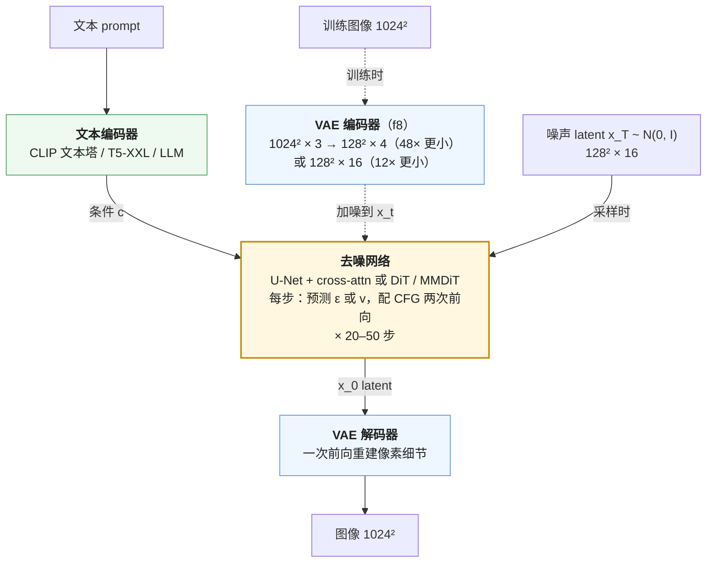

前两篇的数学在二维点云和 $$32^2$$ 的 CIFAR 上就能跑；要生成 $$1024^2$$ 的图，中间隔着三个工程决定。**在哪个空间做扩散**——像素空间的 $$1024 \times 1024 \times 3$$ 太大，Latent Diffusion 先用一个 VAE 把图压到 $$128 \times 128 \times 4$$（或 16 通道），扩散在 latent 上做，48 倍的压缩让训练与采样都进入可行区间。**用什么网络**——2022 年是 U-Net，2023 年 DiT 证明 Transformer 在扩散上同样遵循 scaling law，2024 年 SD3 与 FLUX 用 MMDiT 让文本与图像 token 在同一个 Transformer 里交互。**文本怎么进入**——CLIP 文本塔、T5-XXL、还是 LLM，决定了模型对 prompt 的理解深度。

这一篇也讲扩散模型与 LLM **完全不同的成本结构**：一张图是一个 4096 token 序列的前向乘以步数，每步是大 batch 的 GEMM，compute-bound、没有自回归的 token 级 KV cache（文本 cross-attention 的 K/V 仍可跨步缓存）、没有 token 级的串行（步与步之间仍是串行）——所以它的加速手段不是投机解码与量化 KV，而是**步数蒸馏**：从 50 步到 4 步到 1 步。最后是视频：把"patch 是图像的 token"推广到"时空 patch 是视频的 token"。

本篇要回答的核心问题是：

> **为什么在 latent 空间做？[^q0] DiT 相比 U-Net 赢在哪？[^q1] 一张图的生成成本与一次 LLM 推理怎么比？[^q2]**

## 一、总览：从数学到模型的三步

### 1. 主流文生图模型的配方

| 模型 | 年 | latent | 网络 | 参数 | 文本编码器 | 预测目标 | 调度 | 数据 |
|---|---|---|---|---|---|---|---|---|
| SD 1.5 | 2022 | VAE f8, 4ch；$$64^2$$ latent for $$512^2$$ | U-Net + cross-attn | 860M | CLIP ViT-L/14 文本塔（77 token） | $$\epsilon$$ | linear, DDPM 1000 | LAION-5B 子集（美学过滤）~2B |
| SDXL | 2023 | 同 VAE；$$128^2$$ for $$1024^2$$ | 更大 U-Net（attention 集中在低分辨率层）+ refiner | 2.6B | CLIP ViT-L + OpenCLIP ViT-bigG（拼接） | $$\epsilon$$ | linear；多尺寸训练 | 内部 |
| DiT | 2023 | VAE f8, 4ch | Transformer（adaLN-Zero） | 675M（XL/2） | 类别标签 | $$\epsilon$$ | linear | ImageNet |
| PixArt-α | 2023 | 同 | DiT + cross-attn | 600M | T5-XXL（4.3B） | $$\epsilon$$ | — | 25M（LLaVA recaption） |
| SD3 | 2024 | VAE f8, **16ch** | **MMDiT**（双流） | 2B / 8B | CLIP-L + OpenCLIP-bigG + T5-XXL | **$$v$$ (rectified flow)** | logit-normal + 分辨率平移 | 内部，recaption 50% |
| FLUX.1 | 2024 | VAE f8, 16ch | MMDiT + 单流块 | 12B | CLIP-L + T5-XXL | rectified flow | 同 SD3 | 内部；dev / schnell 是 guidance / 步数蒸馏版 |
| Imagen | 2022 | **像素空间**级联（64 → 256 → 1024） | U-Net ×3 | 2B + 超分 | T5-XXL | $$\epsilon$$ | cosine；动态阈值 | 内部 460M 对 |
| DALL-E 3 | 2023 | latent | 未公开 | — | 未公开 | — | — | **recaption 95%**（技术报告的核心） |

表里的每一列对应下面这条流水线上的一个部件——训练时图像先进 VAE 编码器变成 latent 再加噪，采样时从噪声 latent 出发、去噪几十步、最后过一次 VAE 解码器：



三条趋势：latent 通道从 4 到 16；网络从 U-Net 到 DiT；预测目标从 $$\epsilon$$ 到 rectified flow；文本编码器从 CLIP 到 T5 / LLM；数据从原始 alt-text 到 recaption。

### 2. 先说答案

**在 latent 空间做**，因为像素空间的扩散把大部分算力花在了**感知上不重要的高频细节**上——一张 $$1024^2$$ 图的三百万个像素里，决定"这是什么"的是低频的结构与中频的纹理，最高频的细节（噪点、精确的边缘位置）人眼几乎不分辨，却占了像素空间扩散最后几十步的全部工作。VAE 把这部分交给一个确定性的解码器（一次前向重建细节），扩散只在 $$48\times$$ 更小的 latent 上做语义与结构。Rombach 等 2022 的实验：latent 扩散用 1/10 的训练算力达到像素扩散的 FID，采样快 10 倍以上。代价是 VAE 的瓶颈——它重建不出的东西（小文字、精细纹理、手指）扩散模型也生成不出——SD3 把 latent 从 4 通道增到 16 通道，正是为了放宽这个瓶颈。

**DiT 赢在 scaling**。U-Net 的归纳偏置（卷积的局部性、多尺度的跳连）在小规模上是优势，在大规模上是限制：它的算力不容易均匀地花在所有位置的全局交互上，且结构复杂、难以按 LLM 的方式放大。DiT 把 latent 切成 patch 变成序列，用标准 Transformer 处理——Peebles & Xie 2023 的核心结果是 **FID 随 Transformer 的 GFLOPs 平滑下降**，与参数量、深度、宽度、patch 大小的具体分配无关，只看总算力；这是 LLM 的 scaling law 在扩散上的重现。此外 DiT 让文本可以作为**同一序列里的 token** 参与（MMDiT），而不是 U-Net 里的 cross-attention 旁路——文本与图像的交互更深。

**成本对比**：SD 1.5 一张 $$512^2$$ 图 50 步 CFG = 80 TFLOPs，A100 上 2–3 秒；SDXL $$1024^2$$ 约 400 TFLOPs、10 秒；FLUX.1-dev（12B，$$1024^2$$，28 步，guidance 蒸馏无需 ×2）约 $$2 \times 12B \times 4096 \times 28 \approx 2.8$$ PFLOPs、H100 上 10–15 秒。一次 7B LLM 生成 1000 token 是 14 TFLOPs 但 memory-bound、20–30 秒。**扩散一张图的 FLOPs 是 LLM 一次回答的 5–200 倍，时间却相近或更短**——因为扩散的每步是一个 4096 token 的大 batch 前向（compute-bound，MFU 高），LLM 的每步是 1 个 token（memory-bound，MFU 1%）。两者的服务系统因此长得不一样：扩散不需要 KV cache 与 continuous batching，需要的是步数蒸馏与算力。第七章展开。

### 3. 本文的章节安排

| 章 | 主题 | 内容 |
|---|---|---|
| 二 | Latent diffusion | 为什么像素空间贵（一张账）；用 PCA 当"VAE"在 16 维 latent 里跑一遍 DDPM、生成手写数字（代码 + 图）；VAE 的结构与训练（重建 + KL + 感知 + 对抗）；压缩率与通道数；VAE 的瓶颈 |
| 三 | U-Net 到 DiT | U-Net 的结构与条件注入；DiT 的 patchify、adaLN-Zero、scaling 结果；PixArt 的 cross-attn；MMDiT 的双流 |
| 四 | 文本编码器 | CLIP 文本塔 vs T5 vs LLM；77 token 的限制；多编码器拼接；recaption 为什么是数据侧最重要的改进 |
| 五 | 配方细节 | 多尺寸 / 多宽高比训练；微条件（SDXL）；分辨率平移；数据过滤与美学分 |
| 六 | 采样加速 | 求解器（DPM-Solver）；步数蒸馏（progressive、consistency、LCM）；对抗蒸馏（ADD / Turbo）；rectified flow 的优势；1–4 步的现状 |
| 七 | 成本结构 | 训练与采样的账；与 LLM 的对比；对服务系统的含义 |
| 八 | 视频生成 | 3D VAE；时空 patch；DiT 的时空 attention；Sora / Wan / HunyuanVideo / CogVideoX 的配方；成本 |
| 九 | 扩散的后训练 | 偏好对齐（Diffusion-DPO）；奖励微调；与 LLM 后训练的对照 |
| 十 | 动手（建议） | SD / SDXL / SD3 的 guidance 与步数扫描 |
| 十一 | 本文小结 | |
| 十二 | 自测 | 5 道题 |

## 二、Latent diffusion

### 1. 像素空间的代价

$$1024^2 \times 3$$ 的图有 3.1M 个数。U-Net 在这个尺寸上的第一层就要处理 $$1024^2$$ 个位置；如果用 Transformer，patch 16 也有 4096 个 token，patch 8 有 16384 个。且扩散的每一步都要在这个尺寸上前向，50 步就是 50 次。Imagen 与 DALL-E 2 的解法是**级联**：先在 $$64^2$$ 生成，再用两个超分扩散模型放大到 $$256^2$$、$$1024^2$$——三个模型、三套训练、错误在级联中累积。

把这笔账算出来：

| 空间 | 形状 | 数的个数 | 相对像素空间 | patch 2 的 DiT 序列长度 |
|---|---|---:|---:|---:|
| 像素 | $$1024 \times 1024 \times 3$$ | 3,145,728 | 1× | 262,144 |
| latent f8 × 4 通道（SD 1.x） | $$128 \times 128 \times 4$$ | 65,536 | 1/48 | 4,096 |
| latent f8 × 16 通道（SD3 / FLUX） | $$128 \times 128 \times 16$$ | 262,144 | 1/12 | 4,096 |

Transformer 的 attention 成本随序列长度平方增长，262144 个 token 的 attention 是 4096 个的 4096 倍——像素空间的 DiT 根本跑不起来。

Rombach 等 2022（Latent Diffusion Models）的观察：图像生成的"感知压缩"与"语义压缩"可以分开。前者（去掉人眼不分辨的高频细节）是一个确定性的、容易学的任务，用[自编码器](# "tip: autoencoder：两个网络，编码器把输入压成一个短向量（latent），解码器从短向量重建输入，训练目标是重建误差最小。VAE（variational autoencoder）在此基础上让 latent 服从一个概率分布并加 KL 正则")一次完成；后者（学分布、生成结构与内容）是难的任务，交给扩散——在压缩后的空间里做。

### 2. 把它缩小到能跑：PCA 当 VAE，16 维里做扩散

L2 第八篇的 PCA 就是最简单的自编码器：编码器 = 投影到前 $$k$$ 个主成分，解码器 = 乘回去加均值。用它当"VAE"，在 1797 张 $$8 \times 8$$ 手写数字上把 64 个像素压成 16 个数：

```text
latent  4 维：压缩 16.0 倍，重建 MSE 0.0376，保留方差 48.7%
latent  8 维：压缩  8.0 倍，重建 MSE 0.0239，保留方差 67.4%
latent 16 维：压缩  4.0 倍，重建 MSE 0.0110，保留方差 84.9%
latent 32 维：压缩  2.0 倍，重建 MSE 0.0025，保留方差 96.6%
```


16 维保留 85% 的方差，重建的数字都认得出、只是边缘略糊——这正是"感知压缩"：丢掉的是像素级的锐利度。然后把上一篇的 DDPM 原样搬到这 16 维的 latent 上（只把 `dim=2` 改成 16，把 latent 除以它的标准差归一到单位方差——SD 的 scale factor 0.18215 做的是同一件事）：

```python
pca = PCA(16).fit(X64)                                 # 「VAE」：编码器 = 投影到前 16 个主成分，解码器 = 乘回去加均值
Zn = torch.tensor(pca.transform(X64) / Z_STD)          # 1797 张图 → 1797 个 16 维 latent，归一到单位方差
model = MLP(dim=16); train(model, ddpm_loss, Zn)       # 上一篇的 DDPM，一个字不改，只是 2 维变 16 维
z = ddim_sample(model, 60, 50, dim=16) * Z_STD         # ① 在 latent 里从噪声去噪 50 步
imgs = pca.inverse_transform(z).reshape(-1, 8, 8)      # ② 「VAE 解码器」一次前向：16 个数 → 64 个像素
```


```text
生成图到最近真实数字的平均像素距离 1.06（真实数字彼此之间约 1.03）
```

从 16 维的纯噪声出发、在 latent 里去噪 50 步、解码——得到的是没在训练集里出现过的手写数字。扩散网络每步只处理 16 个数而不是 64 个；像素级的细节由确定性的解码器一次给出。把"PCA"换成卷积 VAE、"16 维"换成 $$128 \times 128 \times 4$$、MLP 换成 U-Net 或 DiT，就是 Stable Diffusion。

### 3. VAE 的结构与训练

SD 的 VAE：卷积编码器把 $$H \times W \times 3$$ 下采样 $$f = 8$$ 倍到 $$H/8 \times W/8 \times c$$（$$c = 4$$），输出均值与对数方差；解码器镜像上采样。训练损失（继承自 VQGAN，Esser 等 2021）：

$$
\mathcal{L} = \underbrace{\lVert x - \hat x \rVert_1}_{\text{重建}} + \lambda_{perc} \underbrace{\lVert \phi(x) - \phi(\hat x) \rVert^2}_{\text{LPIPS 感知}} + \lambda_{KL} \underbrace{D_{KL}(q(z \mid x) \| \mathcal{N}(0, I))}_{\text{正则，权重极小}} + \lambda_{adv} \underbrace{\mathcal{L}_{GAN}}_{\text{patch 判别器}}
$$

四项各管一件事：L1 重建管低频正确；LPIPS（一个预训练 VGG 的特征距离）管感知上的相似而不是逐像素相似；KL 项的权重极小（$$10^{-6}$$），它不是为了让 latent 真的是标准高斯（那会损失太多信息），只是防止 latent 的尺度爆炸——所以 SD 的"VAE"更像一个带轻微正则的自编码器，latent 分布远非高斯，需要一个 scale factor（0.18215）把它归一化到单位方差供扩散使用；对抗项管高频纹理的真实感——没有它重建是模糊的。

$$f = 8$$、$$c = 4$$：$$512^2 \times 3 = 786K$$ 个数 → $$64^2 \times 4 = 16K$$ 个数，**48 倍压缩**。论文比较了 $$f \in \{1, 2, 4, 8, 16, 32\}$$：$$f = 4$$–$$8$$ 是甜点——更小的 $$f$$ 压缩不够、扩散慢；更大的 $$f$$ 重建质量掉、扩散学不到细节。

### 4. 通道数：4 → 16

4 通道的 latent 是一个信息瓶颈：$$8 \times 8 \times 3 = 192$$ 个像素值被压成 4 个数。它重建不出小文字、精细纹理、手指等结构——这是 SD 1.x / SDXL 生成的图"手有问题"的一部分原因（另一部分是扩散模型本身）。SD3 把 $$c$$ 增到 16（同样 $$f = 8$$，压缩 12 倍），报告 VAE 的重建 FID 与 PSNR 大幅改善，且下游扩散模型的质量随之提高——但需要**更大的扩散模型**才能利用增加的通道（4 通道在小模型上更好、16 通道在 2B 以上更好）。FLUX 沿用 16 通道；一些 2025 年的工作试 32 通道或更深的压缩（DC-AE：$$f = 32$$、$$c = 128$$，让 DiT 的序列更短）。

### 5. VAE 的瓶颈与另一条路

VAE 决定了扩散模型能生成什么的**上限**——扩散只能生成 VAE 能解码的东西。VAE 的问题：（1）重建的细节缺失（上述）；（2）latent 空间的语义结构差——相邻的 latent 值可能解码出很不同的像素，让扩散模型的任务变难；（3）编码器与扩散模型分开训，latent 不是为扩散优化的。REPA（Yu 等 2024）发现让 DiT 的中间表示对齐一个预训练视觉编码器（DINOv2）的特征，训练快 17 倍——说明 latent 空间的语义结构对扩散的学习效率影响很大。2025 年的方向之一是让 VAE 的 latent 更"语义化"（VA-VAE 用视觉基础模型对齐 latent），或者干脆把 latent 换成视觉编码器的特征。

## 三、从 U-Net 到 DiT

### 1. U-Net 与条件注入

SD 的 U-Net：编码路径逐级下采样（$$64 \to 32 \to 16 \to 8$$），解码路径逐级上采样，同尺度之间有跳连；每级是若干 ResBlock（卷积）+ Transformer block（self-attention 在空间位置上 + cross-attention 到文本 embedding）。时间步 $$t$$ 经正弦编码与 MLP 后**加**到每个 ResBlock 的特征上；文本经 cross-attention 注入。860M 参数里 attention 占大头，且 $$64^2$$ 尺度上的 self-attention（4096 个位置）是最贵的部分——SDXL 把 attention 移到 $$32^2$$ 与 $$16^2$$ 尺度以降低成本。

U-Net 的优势是多尺度的归纳偏置（卷积擅长局部纹理、跳连保留细节），在数据少、模型小时有效。劣势：结构复杂、难以系统地放大（放大哪一级？加多少 block？）、算力分配不均（高分辨率层只有卷积、低分辨率层才有 attention）。

### 2. DiT：patchify + adaLN-Zero

DiT（Peebles & Xie 2023）把 latent（$$32^2 \times 4$$ for $$256^2$$ 图）按 $$p \times p$$ 切成 patch（$$p = 2$$：256 个 token），线性投影到 $$d$$ 维，加正弦位置编码，送进标准 Transformer（与 ViT 相同），最后反投影回 $$p^2 \times c$$ 的 patch 重组成 latent。条件（时间步 $$t$$ 与类别标签 $$c$$）的注入方式经过消融，**adaLN-Zero** 最好：每个 block 的 LayerNorm 的 scale 与 shift、以及残差的 gate，由 $$(t, c)$$ 的 embedding 经一个 MLP 回归出来——

$$
h \leftarrow h + \alpha \cdot \text{Attn}\big(\gamma \cdot \text{LN}(h) + \beta\big), \qquad (\gamma, \beta, \alpha) = \text{MLP}(\text{emb}(t) + \text{emb}(c))
$$

读法：[LayerNorm](# "tip: 层归一化：把一个向量减均值、除标准差，再乘一个缩放 γ、加一个平移 β。普通的 LN 里 γ、β 是固定的可学习参数；adaLN 让它们随条件变——同一个网络在 t = 900 与 t = 10 时表现得像两个不同的网络") 的缩放 $$\gamma$$ 与平移 $$\beta$$ 不再是固定参数，而是由"现在是第几步、要生成什么类别"算出来的；$$\alpha$$ 是残差分支的开关，控制这一层的输出加进去多少。"Zero"指 $$\alpha$$ 的 MLP 初始化为零——每个 block 初始是恒等映射，训练稳定（与 GPT-2 的残差缩放初始化同理）。上一篇的 toy MLP 把时间 $$t$$ 编码后直接拼在输入上，是最简陋的条件注入；adaLN 是让条件在每一层都能调节网络行为的精细版本。相比把条件作为额外 token 拼进序列（in-context）或 cross-attention，adaLN 更便宜（不增加序列长度、不增加 attention）且效果最好。

**scaling 结果**：DiT-S/B/L/XL × patch 8/4/2 共 12 个配置，FID 与前向 GFLOPs 的关系是一条平滑的曲线——**同样的 GFLOPs 无论怎么分配（更深、更宽、更小的 patch）FID 接近**。DiT-XL/2（675M，119 GFLOPs）在 ImageNet $$256^2$$ 上 FID 2.27，当时的 SOTA。这条 scaling 曲线是 DiT 取代 U-Net 的根本原因：它告诉工程师"要更好就加算力"，而 U-Net 没有这样简单的规律。

### 3. PixArt：DiT + 文本

DiT 的原始版本只有类别条件。PixArt-α（Chen 等 2023）加 cross-attention 层到 T5 文本 embedding（每个 DiT block 里 self-attention 之后），并用**三阶段训练**（类别条件预训练 → 文本对齐 → 美学微调）与 LLaVA 生成的密集 caption，用 SD 1.5 约 10% 的算力（约 750 A100 天）达到相当质量。它证明了 DiT + 文本 cross-attn 的可行性与数据质量的杠杆。

### 4. MMDiT：双流

SD3（Esser 等 2024）的 MMDiT 让文本与图像 token 在**同一个 self-attention** 里交互，而不是文本作为 cross-attention 的 key / value：

- 文本 token（来自 T5 与 CLIP，投影到 $$d$$）与图像 patch token 拼成一个序列。
- 每个 block 里，两种 token 有**各自的**权重（各自的 QKV 投影、MLP、adaLN）——"双流"——但 attention 是在拼接后的序列上**联合**计算的（Q、K、V 拼接后做一次 attention）。
- 时间步与池化的文本 embedding 经 adaLN 注入两条流。

为什么双流比共享权重好：文本与图像的 token 分布差别大，共享权重让一方迁就另一方；分开权重让各自有合适的表示，只在 attention 里交换信息。SD3 的消融：MMDiT 优于 cross-attention 的 DiT 与共享权重的单流（UViT 式），且优势随规模扩大。scaling：SD3 从 0.8B 到 8B，验证 loss 与人类偏好评测都随规模平滑改善，8B 未饱和。

FLUX.1（Black Forest Labs 2024）在 MMDiT 双流块之后接了若干**单流块**（文本与图像 token 共享权重，用 parallel attention + MLP 的结构），12B 参数，是 2024 年开源文生图的最强模型。它还把位置编码换成 2D RoPE（与 Qwen2-VL 的 ViT 同理），支持任意分辨率与宽高比。

## 四、文本编码器

### 1. 三种选择

| 编码器 | 参数 | token 上限 | 学到什么 | 用在 |
|---|---|---|---|---|
| CLIP 文本塔（ViT-L/14） | 123M | 77 | 与图像对齐的全局语义；词袋倾向（[第一篇](/vision-encoders-clip-siglip-and-self-supervised-vit.html)第五章） | SD 1.x / 2.x |
| OpenCLIP ViT-bigG 文本塔 | 695M | 77 | 同上，更大 | SDXL（与 CLIP-L 拼接） |
| T5-XXL encoder | 4.7B | 512（实际用 77–256） | 纯语言理解：语法、组合、长描述、拼写 | Imagen、PixArt、SD3、FLUX |
| LLM（Llama、Gemma） | 2–8B | 长 | 更强的语言理解与知识 | 2025 年的部分工作（Sana 用 Gemma-2、HunyuanVideo 用 MLLM） |

CLIP 文本塔的问题是它为**匹配图像**训练，不为理解语言：对属性绑定、否定、计数、长 prompt 的后半段都弱（第一篇的词袋性），且 77 token 的上限让长描述被截断。Imagen 的关键发现：**换成 T5-XXL 比放大扩散模型本身更有效**——文本理解是文生图的瓶颈之一。SD3 用三个编码器（CLIP-L + bigG + T5）：CLIP 的池化向量提供全局条件（经 adaLN），T5 的序列提供细粒度的 token 条件（进 MMDiT 序列）；消融显示去掉 T5 在文字渲染与复杂 prompt 上明显下降，但对一般 prompt 影响小——所以 SD3 允许推理时不加载 T5 省显存。

### 2. recaption：数据侧的杠杆

DALL-E 3 的技术报告（Betker 等 2023）几乎只讲了一件事：训练数据的 caption 质量。网上的 alt-text 短、噪、常与图无关（"IMG_2034.jpg"、SEO 关键词）。他们训了一个 captioner 为每张图生成详细描述（物体、属性、位置、背景、风格、文字），用 95% 合成 caption + 5% 原始的混合训练，prompt following 大幅提升。SD3 用 CoGVLM 做 50% recaption；PixArt 用 LLaVA；FLUX 未公开但同理。

recaption 的作用机制：扩散模型学的是 $$p(x \mid c)$$，如果 $$c$$ 与 $$x$$ 的关系弱（alt-text），模型学到的条件很弱、多样性很大但不可控；密集 caption 让 $$c$$ 几乎决定 $$x$$ 的每个方面，模型学到强条件。副作用：训练 caption 的风格（长、详细）与用户 prompt 的风格（短）不匹配——DALL-E 3 用 GPT-4 在推理时把用户 prompt **扩写**成训练风格的详细描述（"prompt upsampling"），这是它 prompt following 好的另一半原因。这与 [第三篇](/vlm-training-recipe-data-stages-and-evaluation.html) VLM 训练里 recaption 的作用完全对应。

## 五、配方细节

### 1. 多尺寸与多宽高比

SD 1.x 在固定 $$512^2$$ 上训，生成其他尺寸时质量差、且训练数据被裁成正方形（丢掉了一半的图）。SDXL 的 **bucket 训练**：把数据按宽高比分到几十个 bucket（$$1024^2$$、$$1152 \times 896$$、$$896 \times 1152$$……总像素接近），每个 batch 从一个 bucket 采，模型学会各种宽高比。FLUX 用 2D RoPE 天然支持。

### 2. 微条件

SDXL 把**原始图片的尺寸**与**裁剪坐标**作为额外条件（经正弦编码加到时间步 embedding 上）。原因：训练数据里有很多低分辨率图被放大、有很多被裁剪过的图——不告诉模型，它学到"模糊"与"被裁掉的头"是正常的；告诉它，推理时给"原始尺寸 $$1024^2$$、裁剪 $$(0, 0)$$"就得到清晰完整的图。这是一个便宜而有效的数据质量补偿。

### 3. 数据过滤

LAION-5B 经过：CLIP 图文相似度阈值（去掉不匹配的）、美学分（一个在人类美学评分上训的小模型，SD 用 > 5 的子集）、去水印、去 NSFW、分辨率下限、去重。SD 1.5 最终用了约 6 亿；SDXL 与之后的模型数据未公开，但普遍加了更严的过滤与 recaption。与 [04 系列第十一篇](/pretraining-data-pipeline-dedup-filtering-and-mixture.html)的结论一致：数据质量的杠杆大于模型结构。

### 4. 分辨率平移与两阶段

上一篇第六章讲了时间步随分辨率的平移。实践中还有**两阶段分辨率**：先在 $$256^2$$ 预训练（便宜、学语义），再在 $$1024^2$$ 微调（学细节）；SD3 与 FLUX 都这样做。高分辨率阶段的数据量可以少一个量级。

## 六、采样加速

### 1. 更好的求解器

不重训、只改采样器：DDIM（50 步）→ DPM-Solver / DPM-Solver++（Lu 等 2022：利用概率流 ODE 的半线性结构——线性部分解析积分、非线性部分高阶近似——10–20 步达到 DDIM 50 步质量）→ UniPC（预测—校正）。这些是 `diffusers` 里默认的采样器。极限约 10 步——再少，ODE 的离散化误差主导。

### 2. 步数蒸馏

要到 1–4 步，需要训练一个新模型：

- **Progressive distillation**（Salimans & Ho 2022）：学生学习用一步模拟教师的两步；反复，每轮步数减半。$$1000 \to 4$$ 需要 8 轮。质量在 4 步以下明显下降。
- **Consistency models**（Song 等 2023）：让网络学一个"一致性函数"$$f(x_t, t) = x_0$$——ODE 轨迹上任何一点都映射到同一个终点。训练时要求相邻两个时间点的输出一致（consistency distillation 用教师给出相邻点；consistency training 不用教师）。一步生成可用，多步（2–4）更好。**LCM**（Latent Consistency Models，Luo 等 2023）把它用在 SD 的 latent 上，4 步生成质量接近 SD 25 步；LCM-LoRA 让蒸馏只训一个 LoRA、可插到任何 SD 微调模型上。
- **对抗蒸馏**（ADD，Sauer 等 2023；SDXL-Turbo）：学生一步生成的图既要接近教师的多步结果（蒸馏损失）又要骗过一个判别器（对抗损失，判别器用 DINOv2 特征）。1 步可用、4 步很好；对抗损失让细节锐利但多样性降低。**LADD**（潜空间对抗蒸馏）把判别器放到 latent 空间，是 SD3-Turbo 的方法。
- **Rectified flow 的 reflow**（上一篇第五章）：让轨迹变直，1–2 步；InstaFlow 用它把 SD 1.5 蒸到 1 步。
- **分布匹配蒸馏**（DMD，Yin 等 2024）：让学生的输出分布匹配教师的分布（用两个分数网络估计 KL 梯度），1 步；DMD2 去掉了回归损失、加 GAN，是 2024 年 1 步生成的最强方法之一。

FLUX.1-schnell 是 FLUX.1 经过（未公开细节的）对抗蒸馏的 1–4 步版本；FLUX.1-dev 是 guidance 蒸馏（去掉 CFG 的两倍成本）但保持 28 步。

### 3. 蒸馏的代价

蒸馏模型的质量上限是教师；1 步模型的多样性与细节通常低于教师的多步；蒸馏本身要几千到几万 GPU 小时（比预训练便宜一到两个量级）；蒸馏后的模型对 guidance scale 与负 prompt 的响应变了（guidance 已经烤进去了）。以及一个与 [L6](/efficient-inference-and-compression-for-llms.html) 平行的教训：**蒸馏的评测要用人类偏好或 GenEval 一类的组合评测，FID 不够**——FID 对 1 步模型的模式坍缩不敏感。

## 七、成本结构

### 1. 训练

一个样本 = 一个 $$t$$ 上的一次前向 + 反向。DiT-XL/2 $$256^2$$：119 GFLOPs 前向，训练约 $$3 \times 119 = 357$$ GFLOPs 每样本，7M 步 × 256 = 1.8B 样本，$$6.4 \times 10^{20}$$ FLOPs——与一个 1B LLM 在 100B token 上的预训练同量级。SD 1.5 公开 15 万 A100 小时 ≈ $$15 \times 10^4 \times 3600 \times 312 \times 10^{12} \times 0.4 \approx 6.7 \times 10^{22}$$ FLOPs（40% MFU）；SD3 8B 与 FLUX 12B 未公开，按 scaling 推测在 $$10^{23}$$–$$10^{24}$$。

扩散训练的样本效率低于 LLM——每个样本只在一个噪声水平上给一次梯度，而 LLM 的一个序列给每个 token 一次梯度。所以扩散模型要更多 epoch（SD 在 LAION 子集上几个 epoch；DiT 在 ImageNet 上 1400 epoch）。REPA 一类让 DiT 训练快 10 倍以上的技术，正是针对这个低效率。

### 2. 采样

| 模型 | 分辨率 | latent token | 参数 | 步数 | CFG | 每步 FLOPs | 总 FLOPs | 时间（近似） |
|---|---|---|---|---|---|---|---|---|
| SD 1.5 | $$512^2$$ | $$64^2 = 4096$$（U-Net 位置） | 0.86B | 50 | ×2 | ~0.8 T | 80 T | A100 2–3 s |
| SDXL | $$1024^2$$ | $$128^2$$ | 2.6B | 50 | ×2 | ~4 T | 400 T | A100 8–10 s |
| SD3-medium | $$1024^2$$ | $$64^2 = 4096$$（patch 2） | 2B | 28 | ×2 | $$2 \times 2B \times 4096 \approx 16$$ T | 900 T | H100 ~4 s |
| FLUX.1-dev | $$1024^2$$ | 4096 | 12B | 28 | ×1（蒸馏） | ~100 T | 2.8 P | H100 10–15 s |
| FLUX.1-schnell | $$1024^2$$ | 4096 | 12B | 4 | ×1 | ~100 T | 400 T | H100 ~2 s |
| LCM SD 1.5 | $$512^2$$ | 4096 | 0.86B | 4 | ×1 | ~0.8 T | 3.2 T | A100 < 0.5 s |

对比 LLM：7B 模型生成 1000 token 约 14 TFLOPs、batch 1 时 20–30 秒（memory-bound，每步读 14 GB 权重）。FLUX 一张图是它的 200 倍 FLOPs、时间却只有一半——**扩散的每步是 4096 个 token 的并行前向**（一次大 batch 的 GEMM，MFU 可到 50% 以上），LLM 的每步是 1 个 token（MFU ~1%）。

### 3. 对服务系统的含义

扩散模型服务与 LLM 服务的差别由此而来：

| | LLM | 扩散 |
|---|---|---|
| 瓶颈 | 带宽（decode） | 算力 |
| KV cache | 核心 | 无（每步独立前向，没有跨步的缓存——除了文本编码器的输出与 CFG 的重用） |
| batching | continuous batching 是必需的 | 简单的静态 batch 即可（每个请求的步数相同、形状相同） |
| 延迟结构 | 首 token + 每 token | 步数 × 每步；无流式（要么等全部步数，要么输出中间的模糊预览） |
| 加速手段 | 量化、投机解码、KV 压缩 | 步数蒸馏、求解器、模型量化（FP8 有效，INT4 对图质量伤害较大）、算子融合 |
| 多 GPU | 张量并行 / PD 分离 | 步间流水线或 patch 并行（DistriFusion） |

这是 Infra 地图的范畴，这里只说明：扩散模型的"推理优化"与 [L6](/efficient-inference-and-compression-for-llms.html) 讲的 LLM 推理优化几乎没有重叠——L6 的六篇里只有量化的部分适用。

## 八、视频生成

### 1. 时空 patch

Sora 的技术报告（OpenAI 2024）的核心表述："patch 是视频的 token"——把视频经 3D VAE 压缩成时空 latent（时间也压缩，比如 4 倍），再切成 $$t \times h \times w$$ 的时空 patch 送进 DiT。一段 5 秒 24 fps $$480p$$ 的视频：120 帧 × $$480 \times 854$$ → 3D VAE（时间 4×、空间 8×）→ 30 × 60 × 107 的 latent → patch $$1 \times 2 \times 2$$ → 约 48K 个 token。**视频的 token 数是图片的几十倍**，attention 的 $$O(N^2)$$ 让全 attention 在这个长度上极贵。

### 2. 结构

- **3D VAE**：在图像 VAE 的基础上加时间维的卷积与下采样（因果卷积让第一帧独立编码、可以复用图像 VAE 的能力），压缩时间 4×、空间 8×、通道 16。CogVideoX、HunyuanVideo、Wan 都自训 3D VAE。
- **attention**：全 3D attention（Sora、HunyuanVideo、Wan——效果最好、最贵）或分解的空间 attention + 时间 attention（早期的 Make-A-Video、AnimateDiff——便宜但时间一致性差）。2024 年后主流转向全 attention，靠 FlashAttention 与序列并行支撑。
- **文本条件**：HunyuanVideo 用一个 MLLM（多模态 LLM）作为文本编码器（理由：MLLM 的文本表示与视觉更对齐）；Wan 用 umT5；CogVideoX 用 T5。
- **训练**：图像与视频**联合训练**（图像是单帧视频），先低分辨率短视频、再高分辨率长视频的课程。

### 3. 配方对照

| 模型 | 参数 | VAE | attention | 文本 | 分辨率 / 时长 | 备注 |
|---|---|---|---|---|---|---|
| Sora（2024，报告） | 未公开 | 时空 | 全 3D DiT | 未公开（recaption） | 可变，到 1080p 60 s | 首次展示 scaling 的效果 |
| CogVideoX（2024） | 2B / 5B | 3D，时间 4× | 全 3D，"expert" adaLN（文本与视频分开） | T5 | 720p 6 s | 开源，3D RoPE |
| HunyuanVideo（2024） | 13B | 3D，16ch | 双流 → 单流（FLUX 式） | MLLM + CLIP | 720p 5 s | 开源最大 |
| Wan 2.1（2025） | 1.3B / 14B | 3D（Wan-VAE，因果） | 全 3D DiT | umT5 | 720p 5 s | 中英文字渲染；14B 是开源最强之一 |
| Veo 2 / Kling / Gen-3 | 未公开 | — | — | — | 1080p+ | 闭源 |

### 4. 成本

HunyuanVideo 13B 生成 5 秒 720p：token 数约 $$(129/4) \times (720/16) \times (1280/16) \approx 32 \times 45 \times 80 = 115K$$ 个（patch 2 后），50 步，每步线性项 $$2 \times 6.8B \times 119K \approx 1.6$$ PFLOPs（每个 token 只经过双流块的一条流与单流块，约 6.8B 参数，而不是全部 13B），attention 项 $$4 L N^2 d = 4 \times 60 \times 119K^2 \times 3072 \approx 10.5$$ PFLOPs——是线性项的 6 倍多，一步约 12 PFLOPs，50 步总计约 600 PFLOPs——是 FLUX 一张图的 300 倍，单卡 H100 二十多分钟，实际都在多卡序列并行上跑。视频生成是 attention 主导的负载，这笔账的系统含义在 Infra 地图的 10[《扩散模型推理基础设施》](/diffusion-model-inference-infrastructure.html)里展开。视频生成是当前算力最密集的生成任务，也是步数蒸馏（CausVid、Self-Forcing 一类的自回归 + 蒸馏）最迫切的领域。

## 九、扩散的后训练

### 1. 与 LLM 后训练的对应

扩散模型的"后训练"发展出与 [L5](/post-training-from-sft-to-verifiable-rewards.html) 平行的一套：

| LLM | 扩散 | 备注 |
|---|---|---|
| SFT on 高质量数据 | 美学微调（PixArt 阶段 3、SDXL refiner、Emu 的 2000 张精选图） | Emu（Meta 2023）：几千张高质量图的微调显著提升美学 |
| DPO | **Diffusion-DPO**（Wallace 等 2023）：偏好对（人类选的好 / 差图），把 DPO 的目标推广到扩散的 ELBO 上 | Pick-a-Pic 数据集；SDXL-DPO 在人类偏好上显著提升 |
| RM + RL | 奖励微调：用 ImageReward / HPS / PickScore 一类的偏好模型做奖励，ReFL / DRaFT 直接对生成图的奖励反传梯度（通过采样链）；DDPO 用 PPO | 奖励过优化（reward hacking）同样存在——图变得"过度美化" |
| RLVR | 可验证奖励：OCR 检查文字渲染、检测器检查物体数量与位置、VQA 模型检查 prompt 遵循（GenEval 式） | 2025 年的 Flow-GRPO、DanceGRPO 把 GRPO 搬到 flow matching 模型上 |

### 2. Diffusion-DPO 的形式

DPO 的目标需要 $$\log \pi(y \mid x)$$，扩散模型的似然不可直接算，用 ELBO 替代：对偏好对 $$(x^w, x^l)$$，在同一个 $$t$$ 与噪声下比较两者的去噪误差，

$$
\mathcal{L} = -\mathbb{E} \log \sigma\Big( -\beta T\, \omega(t) \big[ (\lVert \epsilon^w - \epsilon_\theta(x^w_t) \rVert^2 - \lVert \epsilon^w - \epsilon_{ref}(x^w_t) \rVert^2) - (\lVert \epsilon^l - \epsilon_\theta(x^l_t) \rVert^2 - \lVert \epsilon^l - \epsilon_{ref}(x^l_t) \rVert^2) \big] \Big)
$$

即"让模型相对参考模型在好图上的去噪误差降得比在差图上多"。它继承了 DPO 的全部性质（L5 第四篇），包括似然同降与过优化。

## 十、动手（建议）

用 `diffusers`，一张 24 GB 卡：

- **guidance 与步数**：SD 1.5、SDXL（FP16）、SD3-medium（FP16，可不加载 T5）；同一组 20 个 prompt（含文字渲染、计数、属性绑定的例子）；扫 guidance $$w \in \{1, 3, 5, 7.5, 12\}$$ × 步数 $$\{10, 20, 30, 50\}$$；记录每张图的时间、用 CLIP score 与 GenEval 的物体 / 属性检查评一致性、目测多样性（同 prompt 4 个种子）。
- **蒸馏模型**：LCM-LoRA on SD 1.5（4 步）、SDXL-Turbo（1 / 4 步）、FLUX.1-schnell（4 步，需 24 GB 与 FP8 或 CPU offload）；与教师比时间与质量。
- **VAE 瓶颈**：用 SD 1.5 的 VAE（4ch）与 SD3 的 VAE（16ch）对同一批含小文字的图编码—解码，看重建的文字可读性。
- **成本**：记录 FLUX.1-dev 28 步与一个 7B LLM 生成 1000 token 的墙钟时间与（用 profiler 估的）FLOPs。

该看的：$$w$$ 增大时一致性升、多样性降、$$w = 12$$ 出现过饱和；SD3 在 $$w = 4$$ 已好而 SD 1.5 需要 7.5；步数 20 与 50 的差别是否可见；蒸馏模型多样性是否更低；16ch VAE 的文字重建是否明显好；FLUX 的 FLOPs 是 LLM 的两个量级而时间相近。不引用任何未跑过的数字。

配套代码：第二章的 PCA-VAE、latent 里的 DDPM 与两张图由 [`multimodal/08_latent_diffusion_toy.py`](https://github.com/arganzheng/ai-learning-labs/blob/main/multimodal/08_latent_diffusion_toy.py) 产生（`vae` / `latent` / `cost`），CPU 一分钟。其余数字来自各模型的技术报告与论文。

## 十一、本文小结

| 项 | 规则 | 备注 |
|---|---|---|
| Latent | VAE f8：$$512^2 \times 3 \to 64^2 \times 4$$，48×；4 项损失，KL 权重极小 | 感知压缩交给 VAE，语义交给扩散；1/10 训练算力 |
| 通道 | 4 → 16（SD3、FLUX）放宽瓶颈；需更大扩散模型 | 小文字、手指的一部分来源 |
| DiT | patchify + adaLN-Zero；FID ∝ GFLOPs，与分配无关 | scaling law 的重现；U-Net 无此规律 |
| MMDiT | 文本与图像 token 双流权重、联合 attention | 优于 cross-attn 与单流；FLUX 加单流块 + 2D RoPE |
| 文本编码器 | CLIP（对齐、词袋）→ T5-XXL（语言）→ LLM | Imagen：换 T5 比放大扩散更有效 |
| recaption | 密集 caption 让条件变强；推理时 prompt 扩写 | DALL-E 3 95% 合成 |
| 配方 | bucket 多宽高比；微条件（尺寸、裁剪）；美学过滤；两阶段分辨率；分辨率平移 | 数据质量 > 结构 |
| 求解器 | DPM-Solver / UniPC 10–20 步 | 不重训的极限 |
| 步数蒸馏 | progressive → consistency（LCM 4 步）→ 对抗（Turbo 1–4 步）→ DMD2（1 步） | 上限是教师；多样性降；FID 不够评 |
| 成本 | SD 1.5 80 T / 3 s；FLUX 2.8 P / 12 s；7B LLM 1000 token 14 T / 25 s | 扩散 compute-bound、无自回归 KV、按步数 / 分辨率组 batch |
| 视频 | 3D VAE（4× 时间、8× 空间）+ 时空 patch + 全 3D attention；5 s 720p ≈ 100K token | HunyuanVideo 13B ≈ 600 P（attention 占八成以上），FLUX 的 300× |
| 后训练 | 美学微调；Diffusion-DPO（ELBO 替代似然）；奖励微调；可验证奖励 + GRPO | 与 L5 平行，含 reward hacking |

## 十二、自测

1. VAE f8、4 通道：$$1024^2 \times 3$$ 的图变成多大的 latent？压缩了多少倍？SD3 改成 16 通道为什么？

   <details markdown="1"><summary>答案</summary>

   $$128^2 \times 4$$，压缩 48×；16 通道放宽 VAE 的信息瓶颈——小文字、精细纹理、手指这些 4 通道重建不出的东西扩散模型也生成不出；代价是要更大的扩散模型学更多通道。

   </details>

2. DiT 的 scaling 结论是什么？为什么说它是 LLM scaling law 的重现？

   <details markdown="1"><summary>答案</summary>

   FID 随 Transformer 的总 GFLOPs 平滑下降，与参数量、深度、宽度、patch 大小的具体分配无关；U-Net 没有这个规律。像 LLM 一样只看算力就能预测质量，是可以放大的结构。

   </details>

3. MMDiT 的“双流”是什么？比 U-Net 的 cross-attention 好在哪？

   <details markdown="1"><summary>答案</summary>

   文本 token 与图像 token 各用一套权重（双流），但在同一个 attention 里联合计算；文本与图像的交互在每一层、双向、对等，而 cross-attention 里文本只是图像的“旁路条件”。

   </details>

4. SD 1.5 一张 $$512^2$$ 图 50 步 CFG 与 7B LLM 生成 1000 token，FLOPs 与时间各怎么比？为什么形态相反？

   <details markdown="1"><summary>答案</summary>

   扩散约 80 TFLOPs、A100 2–3 秒；LLM 约 14 TFLOPs 却要 20–30 秒。扩散每步是一个几千 token 的大 batch 前向（compute-bound、MFU 高），LLM 每步只算 1 个 token（memory-bound、MFU 1%）。所以扩散的服务系统不需要自回归的 KV cache 与 token 级 continuous batching（文本 cross-attn 的 K/V 仍可跨步缓存；不同步数 / 分辨率的请求仍要动态组 batch），需要的是步数蒸馏与算力。

   </details>

5. DALL-E 3 技术报告的核心改进是什么？它属于结构还是数据？

   <details markdown="1"><summary>答案</summary>

   recaption——用一个 captioner 给 95% 的训练图重写密集、准确的描述，让条件变强、模型学会遵循复杂 prompt；纯数据侧改进，推理时配 prompt 扩写。数据质量 > 结构是这一代文生图的共同结论。

   </details>

## 下一篇

[自回归图像生成与统一模型](/autoregressive-image-generation-and-unified-models.html)

[^q0]: 因为像素空间的扩散把大部分算力花在人眼不分辨的高频细节上，而 VAE 能用一次确定性的解码重建这些细节——扩散只需在 48 倍小的空间里学语义与结构，训练算力降一个量级；代价是 VAE 的瓶颈，SD3 用 16 通道放宽它。详见[第二章](#二latent-diffusion)。
[^q1]: 赢在 **scaling**：把 latent 切成 patch 用标准 Transformer 处理后，FID 随 GFLOPs 平滑下降、与参数怎么分配无关，工程师知道「加算力就变好」，而 U-Net 的多尺度结构没有这样的规律；MMDiT 进一步让文本 token 进入同一个 attention 与图像深度交互。详见[第三章](#三从-u-net-到-dit)。
[^q2]: 一张 FLUX 图是 2.8 PFLOPs、一次 7B LLM 回答是 14 TFLOPs，相差 200 倍，时间却相近——因为扩散每步是 4096 个 token 的并行前向、compute-bound、MFU 高，LLM 每步是 1 个 token、memory-bound、MFU 1%；所以扩散没有自回归的 KV cache、不需要 token 级 continuous batching，它的加速手段是把 50 步蒸成 4 步。详见[第六章](#六采样加速)、[第七章](#七成本结构)。
