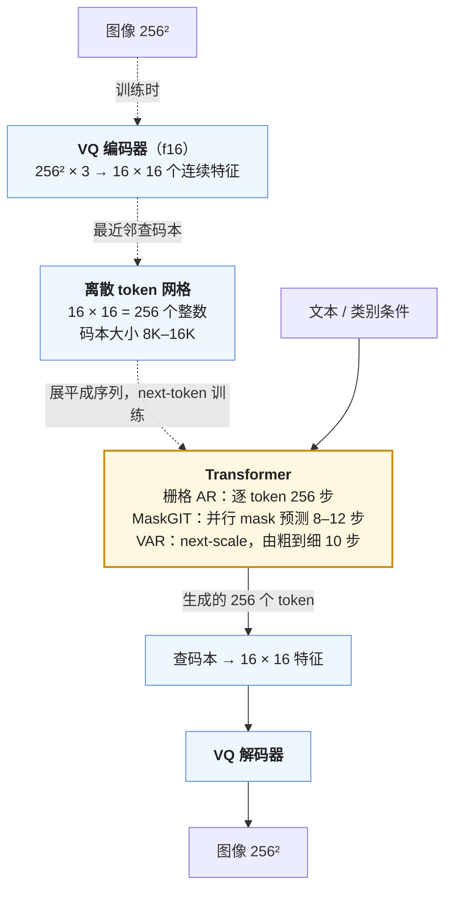

两条线在这里交汇。理解线把图片编码成连续向量送进 LLM；生成线从噪声出发去噪。中间有一条被绕过的路：**把图片像文本一样离散化成 token，然后用 LLM 的方式——next-token prediction——生成它**。这条路在 2021 年的 DALL-E（第一代）与 VQGAN 上就走通了，之后被扩散模型的质量压过；2024 年因为两个原因回来：一是 LLM 的 scaling 与基础设施太成熟，"把一切变成 token 然后用同一个 Transformer"的诱惑太大；二是**统一模型**——一个模型既理解图片又生成图片——需要生成侧能与 LLM 共享结构，而扩散是另一套。

自回归图像生成的第一个问题是**怎么离散化**：VQ-VAE 的码本、它的坍缩问题、无码本的 FSQ / LFQ。第二个问题是**按什么顺序生成**：栅格顺序的 AR（Parti、LlamaGen）、从粗到细的尺度顺序（VAR）、并行的 mask 预测（MaskGIT）。第三个问题是它与扩散**各赢在哪**——2024 年的结论是 AR 在 scaling 与统一性上有优势、扩散在质量与效率上仍领先，而混合（AR 管文本、扩散管图像、同一个 Transformer）可能是当前的最优解。最后是统一模型的三条路线与它们的公开结果。

本篇要回答的核心问题是：

> **AR 生成图像与扩散各赢在哪？理解与生成的表示能不能共享？**

## 一、总览：三个问题、三条路线

### 1. 自回归图像生成的谱系

| 模型 | 年 | tokenizer | 顺序 | 生成器 | 分辨率 / token 数 | 结果 |
|---|---|---|---|---|---|---|
| VQ-VAE / VQ-VAE-2 | 2017 / 2019 | VQ，码本 512–8192 | 栅格 AR（PixelCNN） | 卷积 AR | $$256^2$$ / 1024（+ 层次） | 首次证明离散 token 可生成 |
| DALL-E（1） | 2021 | dVAE 8192 码本 | 栅格 AR | 12B Transformer | $$256^2$$ / 1024 | 文生图的第一次展示 |
| VQGAN | 2021 | VQ + 感知 + 对抗损失，f16 | 栅格 AR | Transformer | $$256^2$$ / 256 | 重建质量的突破；latent diffusion 的 VAE 来自它 |
| MaskGIT | 2022 | VQGAN | **并行 mask 预测**，8–12 步 | 双向 Transformer | $$256^2$$ / 256 | 比栅格 AR 快 30–60× |
| Parti | 2022 | ViT-VQGAN | 栅格 AR | 20B encoder-decoder | $$256^2 \to$$ 超分 | scaling 到 20B，文字渲染好 |
| LlamaGen | 2024 | VQGAN 16384 码本，f16 / f8 | 栅格 AR | Llama 结构 0.1–3B | $$256^2$$ / 256–1024 | 纯 LLM 结构；FID 2.18（ImageNet） |
| **VAR** | 2024 | 多尺度残差 VQ | **next-scale**（由粗到细） | Transformer 0.3–2B | $$256^2$$ / 680（10 个尺度） | FID 1.73；比栅格 AR 快 20×；scaling law |
| Emu3 | 2024 | SBER-MoVQGAN | 栅格 AR | 8B，文本 + 图 + 视频统一 | $$512^2$$+ | 纯 next-token 的统一模型 |
| Infinity | 2024 | 位级 LFQ（$$2^{32}$$ 等效码本） | next-scale | 2B | $$1024^2$$ | VAR 的文生图放大 |

表里所有模型共用一条流水线，差别在 tokenizer 怎么把图变成离散 token、以及 Transformer 按什么顺序生成它们：

### 2. 统一模型的三条路线

| 路线 | 理解侧表示 | 生成侧表示 | 生成方式 | 代表 | 取舍 |
|---|---|---|---|---|---|
| 纯 token | VQ token（与生成共享） | VQ token | 栅格 AR | Chameleon（Meta 2024）、Emu3 | 结构最统一；理解侧受 VQ 信息损失限制；训练不稳定 |
| 双编码器 | 连续（SigLIP）特征 | VQ token | AR | Janus / Janus-Pro（DeepSeek 2024 / 2025） | 理解不妥协；生成与理解的视觉表示不共享 |
| AR + 扩散混合 | 连续特征（或 VAE latent） | VAE latent | 同一个 Transformer，图像部分用扩散 loss | Transfusion（Meta 2024）、Show-o、BAGEL（ByteDance 2025）、MetaQuery | 生成质量最好；模型内两套 loss；推理时图像部分要多步 |

### 3. 先说答案

**AR 赢在**：（1）与 LLM 完全共享结构、训练基础设施、scaling 经验——VAR 与 LlamaGen 都展示了图像生成上的 scaling law；（2）统一——文本、图、视频、音频都是 token，一个模型、一个 loss、一套推理引擎；（3）可变长度与多轮——生成可以在任意位置插入文本条件、生成一部分后修改。**扩散赢在**：（1）质量——同规模下 FID 与人类偏好仍领先，尤其高分辨率与细节；（2）效率——一张 $$1024^2$$ 图的 AR 是 4096 个 token 的串行 decode（4096 步！），扩散是 20–50 步的并行前向；VAR 用 next-scale 把 AR 的步数降到 10 个尺度、MaskGIT 用并行 mask 降到 8–12 步，但每步仍需完整前向；（3）可控性与编辑——CFG、inpainting、ControlNet 一类的条件注入在扩散上成熟。**2024–2025 年的结论**：AR 在 ImageNet 类别条件生成上追平了扩散（VAR 1.73 vs DiT 2.27），在文生图上仍落后一档（Emu3、Janus-Pro 的生成质量低于 SD3 / FLUX）；统一模型里生成质量最好的是混合路线（BAGEL）。

**理解与生成的表示能不能共享**：Janus 的论点是**不能完全共享**——理解需要高层语义（"这是一只猫在沙发上"，SigLIP 类特征擅长），生成需要低层细节（每个 patch 的精确纹理，VQ token 保留），同一个编码器难以两全，Chameleon 用 VQ token 做理解在 MMMU 等上明显弱于用连续特征的 VLM。Janus-Pro 用双编码器（理解 SigLIP、生成 VQ）得到两侧都不妥协的结果。但 2025 年的进展在往共享的方向推：**语义化的 tokenizer**（VILA-U 用 CLIP 特征蒸馏 VQ、TokenFlow 的双码本、UniTok）让 VQ token 同时携带语义与细节；**BAGEL** 用一个 MoT（Mixture-of-Transformers，理解与生成各自的专家权重、共享 attention）在 14B 规模上展示了理解与生成互相促进的"涌现"——统一预训练到一定规模后，生成侧的编辑与推理能力超过了分开训的模型。答案在 2025 年是"部分共享、正在收敛"。第五、六章展开。

### 4. 本文的章节安排

| 章 | 主题 | 内容 |
|---|---|---|
| 二 | 图像 tokenizer | VQ-VAE 的推导（最近邻、STE、commitment）；码本坍缩与对策；VQGAN 的感知 + 对抗；无码本量化（FSQ、LFQ）；重建 vs 生成的权衡 |
| 三 | 栅格 AR | DALL-E / Parti / LlamaGen；栅格顺序的问题；CFG 在 AR 上的形式；scaling |
| 四 | 打破栅格 | MaskGIT 的并行解码；VAR 的 next-scale 推导与多尺度残差 VQ；速度与质量 |
| 五 | AR vs 扩散 | 质量、效率、可控性、统一性的对照；混合方法（MAR 的连续 token AR + 扩散头） |
| 六 | 统一模型 | 三条路线的结构、训练与结果；Chameleon 的稳定性问题；Janus 的解耦；Transfusion / BAGEL 的混合；GPT-4o 原生图像生成的启示 |
| 七 | 成本 | AR 的 token 数与 decode 步数；与扩散的账 |
| 八 | 动手（建议） | VQGAN 码本大小与重建；LlamaGen vs SD 的时间 |
| 九 | 本文小结与系列总结 | 七篇的两条线；多模态的下一个形态 |
| 十 | 自测 | 5 道题 |

## 二、图像 tokenizer

### 1. VQ-VAE

VQ-VAE（van den Oord 等 2017）：编码器 $$E$$ 把图映射到 $$h \times w \times d$$ 的特征网格 $$z_e$$，每个位置的向量被替换为码本 $$\{e_k\}_{k=1}^{K}$$ 中最近的码字：

$$
z_q(i, j) = e_{k^*}, \qquad k^* = \arg\min_k \lVert z_e(i, j) - e_k \rVert_2
$$

解码器 $$D$$ 从 $$z_q$$ 重建图。图就变成了 $$h \times w$$ 个整数（码字索引）——$$256^2$$ 的图、$$f = 16$$：$$16 \times 16 = 256$$ 个 token，每个 $$\log_2 K$$ bit。

$$\arg\min$$ 不可微。训练用三项损失与一个技巧：

$$
\mathcal{L} = \lVert x - D(z_q) \rVert^2 + \lVert \text{sg}[z_e] - e \rVert^2 + \beta \lVert z_e - \text{sg}[e] \rVert^2
$$

- 重建项的梯度通过**直通估计**传回编码器：前向用 $$z_q$$，反向把 $$\partial \mathcal{L} / \partial z_q$$ 直接当作 $$\partial \mathcal{L} / \partial z_e$$（与 [L6 第四篇](/quantization-aware-training-low-bit-and-evaluating-quantized-models.html)的 STE 相同）。
- 第二项（codebook loss）让被选中的码字向编码器输出移动（只更新码本）；实践中用 EMA 替代——每个码字是它被分配到的所有 $$z_e$$ 的移动平均。
- 第三项（commitment loss，$$\beta = 0.25$$）让编码器输出向被选中的码字靠——防止编码器输出在码字之间乱跳。

### 2. 码本坍缩

VQ 训练的顽疾：只有一小部分码字被使用（码本利用率 10–30% 是常态），其余码字"死"了——从未被选中、从未被更新、永远不会被选中。原因：初始化时离数据远的码字从一开始就选不到，EMA 更新只作用于被选中的。后果是有效码本远小于 $$K$$，重建与生成都受限。

对策：**k-means 初始化**（用第一批数据的编码初始化码本）；**死码重置**（把长期未用的码字重置到当前 batch 的某个 $$z_e$$）；**低维码本 + 归一化**（ViT-VQGAN：把 $$z_e$$ 与 $$e$$ 投影到低维（32 或 8）并 $$L_2$$ 归一化后再找最近邻——低维空间里码字更容易被"够到"，利用率接近 100%，LlamaGen 用了这个把 16384 的码本利用率提到 97%）；**熵正则**（鼓励码字使用的分布均匀）。

### 3. VQGAN：重建质量的突破

VQ-VAE 的重建模糊——MSE 损失对高频不敏感。VQGAN（Esser 等 2021）加了 LPIPS 感知损失与 patch 判别器的对抗损失（正是上一篇 SD VAE 的四项损失，SD 的 VAE 就是 VQGAN 去掉量化的连续版本），重建变得锐利。$$f = 16$$、$$K = 1024$$ 或 16384 是标准配置；$$f = 8$$ 重建更好但 token 数翻 4 倍。

### 4. 无码本量化：FSQ 与 LFQ

码本的一切麻烦来自"学一个码本"。两个 2023 年的工作绕开它：

**FSQ**（Finite Scalar Quantization，Mentzer 等 2023）：把 $$z_e$$ 投影到很低的维度 $$d'$$（比如 5），每一维独立地 round 到 $$L$$ 个等间隔的值（比如 $$L = 8$$，用 $$\tanh$$ 压到 $$[-1, 1]$$ 后 round），码本就是这个 $$d'$$ 维格点的**隐式**乘积——$$L^{d'} = 8^5 = 32768$$ 个码字，不需要学、不会坍缩、利用率 100%。STE 传梯度，没有 commitment 与 codebook loss。效果与 VQ 相当，训练简单得多。

**LFQ**（Lookup-Free Quantization，Yu 等 2023，MAGVIT-v2）：FSQ 的极端——每一维二值化（$$L = 2$$），$$d' = 18$$ 就是 $$2^{18} = 262144$$ 的码本；加一个熵惩罚防止某些维度恒定。它让大码本（$$2^{18}$$）成为可能——VQ 的最近邻搜索在 $$K = 2^{18}$$ 下不可行，LFQ 每维独立所以是 $$O(d')$$。MAGVIT-v2 用它在视频生成上超过了扩散；Infinity 用**位级**的 LFQ（$$2^{32}$$ 等效码本，每个 token 是 32 个 bit，生成时预测 bit）做到 $$1024^2$$ 文生图。

大码本的意义：重建质量随 $$K$$ 提升（更多码字 = 更精细的表示），但 AR 生成的分类头也要 $$K$$ 类——$$2^{18}$$ 的 softmax 是 LLM 词表的两倍；Infinity 的位级预测把它变成 32 个二分类。

### 5. 重建与生成的张力

tokenizer 有两个客户：重建（解码器要从 token 还原图）与生成（AR 模型要预测 token）。两者要求相反：重建希望 token 携带尽可能多的低层细节（大码本、小 $$f$$）；生成希望 token **可预测**——语义化、冗余少、序列短。一个重建 PSNR 极高的 tokenizer 可能让 AR 模型学得很差（token 之间的统计规律太"像素化"）。这个张力是 2024–2025 年 tokenizer 研究的核心：**语义化 tokenizer**（VILA-U、TokenFlow、UniTok、以及 REPA 在扩散侧的对应）用预训练视觉编码器（CLIP / DINOv2）的特征蒸馏或对齐 VQ 的表示，让 token 既能重建又有语义——这也是统一模型（第六章）的关键部件。

## 三、栅格自回归

### 1. 从 DALL-E 到 LlamaGen

有了 token，图像生成就是语言建模：把 $$16 \times 16$$ 的 token 网格按栅格顺序（左到右、上到下）展平成 256 个 token 的序列，前面接文本 token，用 decoder-only Transformer 做 next-token prediction。DALL-E（Ramesh 等 2021）：12B 参数、256 个文本 token + 1024 个图像 token（dVAE，$$f = 8$$）、2.5 亿图文对。Parti（Yu 等 2022）：encoder-decoder、20B、ViT-VQGAN——展示了 AR 文生图随规模的改善（350M → 20B，文字渲染与组合能力显著提升）。LlamaGen（Sun 等 2024）：完全用 Llama 的结构（RoPE、SwiGLU、RMSNorm，无任何视觉特化）、0.1–3.1B、VQGAN 16384 码本 $$f = 16$$——ImageNet $$256^2$$ 类别条件 FID 2.18（3.1B），超过 DiT-XL/2 的 2.27，证明"纯 LLM 结构 + 好的 tokenizer"够用。

### 2. CFG 在 AR 上

Classifier-free guidance 直接搬到 AR：训练时以 10% 概率把条件（类别或文本）换成空 token；采样时每步两次前向得到条件与无条件的 logits，

$$
\tilde\ell = \ell_\emptyset + w (\ell_c - \ell_\emptyset)
$$

在 logits 上做外推再 softmax 采样。LlamaGen 报告 CFG 对 FID 的改善巨大（无 CFG 的 FID 是有 CFG 的 3–5 倍），$$w = 1.75$$–$$2$$（AR 上的 $$w$$ 比扩散小得多——logits 空间的外推与噪声空间的外推尺度不同）。与 [L6 第一篇](/decoding-strategies-sampling-and-constrained-generation.html)的采样参数一样，top-k / temperature 也影响 AR 图像生成的质量与多样性。

### 3. 栅格顺序的问题

栅格顺序有三个内在缺陷：（1）**单向的上下文**——生成右下角的 token 时能看到全部左上，但生成左上时对右下一无所知，图像没有这种自然的方向性（文本有）；（2）**长距离依赖被打散**——垂直相邻的两个 patch 在序列里相距 $$w$$ 个位置；（3）**串行**——$$16 \times 16$$ 要 256 步，$$1024^2$$ 图 $$f = 16$$ 是 4096 步，每步一次完整前向（有 KV cache），比扩散的 20–50 步慢一到两个量级。前两个影响质量，第三个影响效率。

### 4. scaling

LlamaGen 与 VAR 都报告了 AR 图像生成的 scaling law——测试 loss（token 的交叉熵）随参数与算力幂律下降，且 FID 随之改善。这是 AR 路线的核心卖点：**LLM 的 scaling 经验直接可用**，而扩散模型的 scaling（DiT）虽然也存在，但训练效率与 LLM 生态的距离更远。

## 四、打破栅格：并行与多尺度

### 1. MaskGIT：并行 mask 预测

MaskGIT（Chang 等 2022）放弃 AR，用 BERT 式的**双向** Transformer：训练时随机 mask 一部分图像 token，让模型预测被 mask 的；生成时从全 mask 开始，每步预测所有位置、按置信度保留一部分（按 cosine 调度逐步增加保留比例），8–12 步生成全部 256 个 token。每步是一次完整的并行前向——与扩散的形态相同（多步、每步全图），但在离散 token 上。比栅格 AR 快 30–60 倍，质量相当或更好（双向上下文）。它是后来 MUSE（Google 的文生图）、MAGVIT（视频）的基础，也是统一模型 Show-o 生成侧的方法。

### 2. VAR：next-scale prediction

VAR（Tian 等 2024）换了一个"下一个"的定义：不是下一个 patch，而是**下一个尺度**。

**多尺度残差 VQ**：把图的特征 $$f$$（$$h \times w \times d$$）编码成 $$K$$ 个尺度的 token 图 $$(r_1, r_2, \ldots, r_K)$$，分辨率从 $$1 \times 1$$ 递增到 $$h \times w$$（VAR 用 10 个尺度：1, 2, 3, 4, 5, 6, 8, 10, 13, 16）。编码是残差式的：

$$
r_k = \text{VQ}\big(\text{downsample}_k(f - \sum_{i < k} \text{upsample}(\text{lookup}(r_i)))\big)
$$

即第 $$k$$ 个尺度量化的是**前 $$k - 1$$ 个尺度重建后的残差**（下采样到第 $$k$$ 尺度的分辨率）——与 [第四篇](/speech-and-omni-models-audio-encoders-codecs-and-duplex.html)音频 codec 的 RVQ 同一个思想，只是残差在空间尺度上递进而不是在同一位置上递进。所有尺度共享一个码本。解码把所有尺度的 lookup 上采样到 $$h \times w$$ 求和。

**生成**：AR 的单位是尺度——$$p(r_1, \ldots, r_K) = \prod_k p(r_k \mid r_{<k})$$，每一步以前面所有尺度为条件，**并行**预测第 $$k$$ 尺度的全部 token（$$k^2$$ 个）。Transformer 的输入是把 $$r_{<k}$$ 上采样到第 $$k$$ 尺度的分辨率的 embedding，block-wise 因果 mask（同一尺度内双向、跨尺度因果）。10 个尺度 = 10 步，总 token 数 $$\sum k^2 \approx 680$$（比栅格的 256 多，但只有 10 次前向）。

**为什么它好**：（1）由粗到细是图像的自然顺序（先有构图、再有细节），与人类绘画与图像的多尺度统计一致，比栅格顺序的归纳偏置正确得多；（2）同一尺度内并行，没有栅格的单向上下文问题；（3）步数 10，比栅格 AR 快 20 倍；（4）保留了 AR 的形式——可以用 LLM 的全部工具。结果：ImageNet $$256^2$$ FID 1.73（2B），首次让 AR 全面超过 DiT，且 scaling law 明确（loss 与参数、算力的幂律 $$R^2 \approx 0.998$$）。VAR 拿了 NeurIPS 2024 最佳论文。

**后续**：Infinity（2024）把 VAR 扩到文生图 $$1024^2$$，用位级 LFQ（$$2^{32}$$ 等效码本）解决大码本的分类头问题，加了"位翻转自校正"（训练时随机翻转一些 bit 模拟前面尺度的错误，让后面的尺度学会纠正）；HART 用连续残差补 VQ 的信息损失。

### 3. MAR：连续 token 的 AR

Li 等 2024（MAR，"Autoregressive Image Generation without Vector Quantization"）问：AR 一定要离散 token 吗？他们让 Transformer 在 VAE 的**连续** latent 上做 AR，每个位置的输出不是 softmax 分类而是一个小的**扩散头**（MLP，几十步去噪）建模该位置的连续分布——AR 决定顺序与条件，扩散建模每个 token 的分布。它绕开了 VQ 的一切问题（码本、信息损失），ImageNet FID 1.55。这是 AR 与扩散的第一种混合：AR 在 token 间、扩散在 token 内。

## 五、AR 与扩散：各赢在哪

### 1. 一张对照表

| 维度 | 栅格 AR | VAR / MaskGIT | 扩散（DiT / MMDiT） |
|---|---|---|---|
| ImageNet 256 FID（最好） | 2.18（LlamaGen 3B） | 1.73（VAR 2B）/ 1.55（MAR） | 2.27（DiT-XL）/ 1.35（REPA 等改进） |
| 文生图质量（2025） | 落后一档（Emu3、Janus-Pro） | Infinity 接近 SDXL | SD3 / FLUX 领先 |
| 生成步数 | $$N$$（256–4096） | 8–12 | 20–50（蒸馏 1–4） |
| 每步成本 | 1 token decode（KV cache，memory-bound） | 全图前向 | 全图前向 ×2（CFG） |
| 高分辨率 | token 数与步数线性增长，难 | 尺度增加 | latent 尺寸增加，成熟 |
| 与 LLM 共享 | 完全 | 结构完全，mask 不同 | 不共享（另一套 loss、调度、采样） |
| 多模态统一 | 天然 | 天然 | 需混合结构 |
| 可控与编辑 | inpainting 需特殊顺序；ControlNet 类工具少 | mask 天然支持 inpainting | 最成熟（ControlNet、IP-Adapter、inpainting） |
| scaling law | 明确（LLM 式） | 明确 | 存在（DiT），效率较低 |
| 训练稳定性 | 需注意（Chameleon 的问题） | 好 | 好 |

### 2. 结论

在 ImageNet 类别条件生成这个 benchmark 上，AR 路线（VAR、MAR）已经与扩散平手或领先。在**文生图**上扩散仍领先——一部分是投入差距（SD3 / FLUX 的数据与算力远超任何开源 AR 文生图模型），一部分是结构性的：扩散在连续空间里建模、没有 VQ 的信息瓶颈；CFG 在噪声空间的外推比在 logits 空间的更有效；高分辨率的 latent 扩散成熟。AR 的优势在**统一**与 **scaling 基础设施**——这两点在"一个模型做所有事"的目标下压倒了单项质量的差距，是 Chameleon / Emu3 / Janus 走 AR 的原因。

2025 年出现的判断是：**图像生成的最优形式可能是混合的**——AR（或 LLM）负责理解、规划、文本与条件，扩散负责把连续的图像分布画出来（Transfusion、BAGEL 的路线，也可能是 GPT-4o 原生图像生成的路线）。

## 六、统一模型

### 1. 为什么要统一

理解与生成分开（VLM + 文生图模型）在 2024 年是标配，但有三个动机推动统一：（1）**互相促进**——理解帮助生成（模型"知道"图里该有什么、能按复杂指令与推理生成），生成帮助理解（生成是对视觉的更深理解——"能画出来才算懂"）；（2）**编辑与多轮**——"把这张图里的猫换成狗"需要同时理解输入图与生成输出图，且在一个上下文里；（3）**工程**——一个模型、一套服务。

### 2. 路线一：纯 token（Chameleon、Emu3）

Chameleon（Meta 2024）：图像用 VQ tokenizer（8192 码本，$$512^2 \to 1024$$ token）离散化，与文本 token 放进**同一个词表**，一个 7B / 34B 的 decoder-only Transformer 从头预训练（4.4T token，图文交错），next-token prediction 一个 loss。理解与生成用同一个模型、同一种 token。

它遇到的问题是**训练不稳定**——多模态 token 的分布差异让 softmax 的 logits 在训练中漂移、发散。Chameleon 的对策：QK-norm、把 LayerNorm 放到 attention 与 FFN 之后再加（"Swin 式" post-norm 的变体）、z-loss、降低 lr。以及理解侧的**质量**：VQ token 丢掉的信息让 Chameleon 在需要细节的理解任务上不如同规模的 VLM（它没有报告 MMMU 等主流 VLM benchmark，报告的是 VQA 类任务）。Emu3（BAAI 2024）同一路线、8B、加视频，生成质量报告超过 SDXL，但理解侧同样弱于专用 VLM。

### 3. 路线二：双编码器（Janus）

Janus（DeepSeek 2024）的核心论点：理解需要**高层语义**、生成需要**低层细节**，一个视觉编码器难以两全。所以解耦：理解侧用 SigLIP 的连续特征（与 VLM 相同）+ MLP，生成侧用 VQ tokenizer（LlamaGen 的）+ MLP，两侧的特征都进同一个 LLM（1.3B），生成侧的输出经一个独立的头预测 VQ token。训练三阶段（对齐 → 统一预训练 → SFT）。Janus-Pro（2025，1B / 7B）扩大数据与规模，理解侧在 MMBench / MMMU 上接近同规模 VLM，生成侧 GenEval 0.80（超过 SD3-medium 的 0.74，接近 DALL-E 3 的 0.67——GenEval 测的是 prompt 遵循，不是画质）。

代价：两套视觉表示，理解与生成之间没有共享的视觉空间——"看到的"与"画的"是不同的编码。

### 4. 路线三：AR + 扩散混合（Transfusion、BAGEL）

Transfusion（Zhou 等 2024，Meta）：一个 Transformer，文本 token 用 next-token 的交叉熵，图像用 VAE 的**连续** latent patch，在同一个序列里、用**扩散 loss**（预测噪声）训练；图像 patch 之间双向 attention、文本因果。生成图像时在序列的图像位置上跑扩散的多步去噪（每步一次 Transformer 前向，文本部分的 KV 缓存）。它把上一篇的 latent diffusion 与 LLM 放进了同一组权重，7B 模型在文生图上达到 SDXL 水平、文本能力与同规模 Llama 相当。理解侧用的也是 VAE latent（通过扩散训练学到的表示），弱于 SigLIP 特征。

Show-o（2024）：类似的混合，但图像侧用 MaskGIT 式的离散 mask 预测而不是连续扩散。

**BAGEL**（ByteDance 2025，14B 激活 7B 的 MoT）：混合路线的当前最强开源模型。结构是 **Mixture-of-Transformers**——两组 Transformer 权重（理解专家与生成专家），共享同一个 self-attention（token 拼在一起 attend），各自的 FFN 与投影；理解侧输入 SigLIP 2 特征，生成侧用 FLUX 的 VAE latent + rectified flow loss。在**大规模交错多模态数据**（视频、网页、文本、图文对，数万亿 token）上预训练。他们报告的关键观察是**能力的涌现顺序**：随训练算力增加，先是理解与基本生成，再是编辑，最后是"智能编辑"（需要推理的编辑，如"把这个场景改成冬天"、多步的视觉推理）——统一预训练在足够规模后展现出分开训练没有的能力。BAGEL 在理解 benchmark 上与 Qwen2.5-VL 7B 相当、生成上接近 FLUX.1-dev、编辑上超过开源专用编辑模型。

MetaQuery（2025）走了一条更轻的路：冻结一个 VLM，用一组可学习的 query 从它的隐状态里"提取"生成条件，送给一个冻结或微调的扩散模型——统一的代价最小，效果也不错，说明"理解模型的表示可以直接驱动生成"。

### 5. GPT-4o 的原生图像生成

2025 年 3 月 OpenAI 发布 GPT-4o 的原生图像生成——文字渲染、多轮编辑、按复杂指令与上下文（"用我刚上传的那张图的风格"）生成——质量与可控性远超此前的文生图模型。结构未公开；从行为（生成过程是从上到下逐渐显现——像栅格 AR 的顺序；但细节质量像扩散）推测是某种 AR + 扩散的混合（可能是 AR 生成低分辨率或语义 token、扩散 decoder 细化）。它对领域的影响是确认了**统一模型的方向**：把生成放进一个强 LLM 的上下文里，带来的可控性与指令遵循是分开的文生图模型做不到的。

### 6. 表示能不能共享：2025 年的答案

回到核心问题后半。证据：（1）纯 token 共享（Chameleon）让理解妥协；（2）解耦（Janus）两侧都好但没有共享的视觉空间；（3）混合（BAGEL）用共享的 attention + 分开的 FFN 得到了互相促进；（4）语义化 tokenizer（UniTok、TokenFlow）让一个离散 tokenizer 同时在理解与生成 benchmark 上接近专用方案，说明"一个表示两用"在 tokenizer 层面正在实现。答案是**部分共享**：共享上下文与 attention（让理解与生成互相看到），保留模态特化的表示与 FFN；tokenizer 层面正在从"两套"走向"一套语义化的"。这个问题的最终答案可能在更大规模上才显现——BAGEL 的涌现曲线暗示了这一点。

## 七、成本

### 1. AR 的 decode

$$1024^2$$ 图、$$f = 16$$：4096 个 token，栅格 AR 是 4096 步 decode，每步一次前向（KV cache，memory-bound）。一个 7B AR 模型：每步读 14 GB 权重 + KV，约 20–30 ms → **一张图 100 秒**。这就是栅格 AR 在高分辨率上不实用的原因。VAR：10 步，每步是全部已生成尺度的 token 数（累积到 680）的前向，compute-bound，2B 模型约 $$2 \times 2B \times 680 \times 10 \approx 27$$ TFLOPs、不到 1 秒。MaskGIT：12 步 × 全图前向。

### 2. 与扩散的账

| | FLOPs | 步数 | 瓶颈 | 时间（近似） |
|---|---|---|---|---|
| 栅格 AR 7B，4096 token | $$2 \times 7B \times 4096 \approx 57$$ T | 4096 | 带宽 | 100 s |
| VAR 2B，10 尺度 | ~27 T | 10 | 算力 | < 1 s |
| MaskGIT 1B，256 token，12 步 | $$2 \times 1B \times 256 \times 12 \approx 6$$ T | 12 | 算力 | < 0.5 s |
| DiT-XL/2 $$256^2$$，50 步 CFG | $$119 \text{ G} \times 100 \approx 12$$ T | 50 | 算力 | ~1 s |
| FLUX.1-dev $$1024^2$$ | 2.8 P | 28 | 算力 | 12 s |

栅格 AR 的 FLOPs 不高但**串行**——它继承了 LLM decode 的 memory-bound 形态；VAR 与 MaskGIT 把它变回 compute-bound 的多步并行，与扩散同形态。统一模型（BAGEL）生成一张图的成本约等于一个同规模扩散模型（rectified flow 多步）加上理解侧的 prefill。

### 3. 训练

Chameleon 34B：4.4T token；BAGEL：数万亿 token 的交错数据、14B MoT——都是 LLM 预训练量级的算力。统一模型的成本是"训一个 LLM"而不是"训一个文生图模型"，这也是它们只出现在大团队的原因。

## 八、动手（建议）

一张 24 GB 的卡：

- **VQ 的码本与重建**：用 `taming-transformers` 或 LlamaGen 的 tokenizer（16384 码本，f16 与 f8 两版）对 100 张图编解码，测 PSNR / LPIPS 与码本利用率（统计使用过的码字数）；对比 SD 的 VAE（连续）的重建；再看 FSQ 的开源实现在同样 f16 下的重建。
- **AR 生成**：LlamaGen-3B（类别条件，ImageNet）生成 $$256^2$$，扫 CFG $$w \in \{1, 1.5, 2, 3\}$$ 与 top-k，记录 256 步的时间；VAR-d30 生成同样类别，记录 10 步的时间；与 DiT-XL/2 50 步比 FID（各 5K 样本）与时间。
- **统一模型**：Janus-Pro-7B 或 BAGEL（需 24 GB + offload）：同一张图先问理解问题再要求编辑，看编辑是否保持了理解到的内容；与"Qwen2.5-VL 理解 + FLUX 重绘"的两模型流水线比。

该看的：f8 的重建远好于 f16 但 token 4 倍；码本利用率是否远低于 100%（旧 VQ）而低维归一化 VQ / FSQ 接近 100%；LlamaGen 无 CFG 的 FID 是否是有 CFG 的数倍；VAR 是否比 LlamaGen 快 20 倍且 FID 更好；统一模型的编辑是否比流水线更忠实于原图。不引用任何未跑过的数字。

## 九、本文小结与系列总结

### 1. 本文小结

| 项 | 规则 | 备注 |
|---|---|---|
| VQ-VAE | 最近邻码字；STE 传梯度；EMA 更新码本；commitment $$\beta = 0.25$$ | $$256^2$$ f16 → 256 token |
| 坍缩 | 死码字不被更新；k-means 初始化、死码重置、低维归一化（利用率 → 97%）、熵正则 | LlamaGen 16384 |
| VQGAN | + LPIPS + 对抗 → 锐利重建 | SD VAE 是它的连续版本 |
| FSQ / LFQ | 每维独立 round，隐式码本 $$L^{d'}$$ / $$2^{d'}$$，无坍缩 | LFQ $$2^{18}$$；Infinity 位级 $$2^{32}$$ |
| 张力 | 重建要细节，生成要可预测；语义化 tokenizer 调和 | UniTok、TokenFlow |
| 栅格 AR | LLM 结构 + next-token；CFG 在 logits 上 $$w \approx 2$$ | LlamaGen FID 2.18；4096 步太慢；单向上下文 |
| MaskGIT | 双向、并行 mask 预测 8–12 步 | 快 30–60× |
| VAR | next-scale：多尺度残差 VQ（RVQ 的空间版），10 尺度并行 | FID 1.73；快 20×；scaling $$R^2 = 0.998$$ |
| MAR | 连续 token AR + 扩散头 | FID 1.55；无 VQ |
| AR vs 扩散 | ImageNet 平手；文生图扩散领先；AR 赢统一与 scaling 基建 | 最优形式可能是混合 |
| 统一三路线 | 纯 token（Chameleon，理解妥协、不稳定）；双编码器（Janus，两侧好、不共享）；AR + 扩散（Transfusion、BAGEL，生成最好、涌现） | GPT-4o 确认方向 |
| 共享 | 部分共享：共享 attention / 上下文，分开 FFN；tokenizer 走向一套语义化 | BAGEL MoT |
| 成本 | 栅格 AR 7B 4096 步 100 s（带宽）；VAR < 1 s；统一模型 ≈ LLM 预训练量级 | |

### 2. 系列总结：两条线与一个交汇点

七篇走完了两条线。**理解线**（一到四）：编码器学到什么由它的训练目标决定——对比学习保留"文本能描述且需要区分"的信息，留下计数、空间、文字的盲点；connector 是一次信息与 token 的交换，MLP + 2×2 merge 是 2024 年的答案，原生分辨率解决了 tile 的边界与效率；训练分阶段是因为新旧参数不能同时同速地学，数据决定能力的形状，幻觉来自数据共现、编码器缺失与解码惯性三处；语音因为要生成而必须离散化，RVQ 的层次决定了语音生成的形态，全双工把串联的四段时延压成一个模型的一步。**生成线**（五到六）：DDPM、score、flow 是同一个分数的三种参数化，差别只在噪声水平的权重与路径的形状，直线路径让步数少；CFG 是对条件的 $$w$$ 次幂锐化；latent 让扩散只做语义，DiT 让扩散有了 scaling law，MMDiT 让文本深度参与；扩散是 compute-bound 的多步并行，与 LLM 的 memory-bound 串行是两种形态，它的加速是步数蒸馏。**交汇**（七）：离散 token 让图像进入 LLM 的生成范式，VAR 用尺度顺序修正了栅格的缺陷，统一模型在纯 token、双编码器、混合三条路线上探索理解与生成的共享，当前的答案是部分共享、方向收敛。

三条线索的终点：**推导线**——InfoNCE 的互信息下界、RVQ 的残差分解、ELBO 到噪声预测、Tweedie 公式、条件流匹配的等价性、CFG 的贝叶斯分解、VQ 的 STE；**成本线**——每个 token 对应多少像素、每个阶段多少算力、一张图多少 FLOPs 与 LLM 的对比、视频的百倍、栅格 AR 的串行代价；**配方线**——LLaVA 到 Qwen2.5-VL、Whisper 到 Moshi、SD 1.5 到 FLUX、VQGAN 到 BAGEL。

多模态的下一个形态大概率是**统一的、原生的**：多模态不再是 LLM 训好之后对齐上去的，而是从预训练第一天就在（Gemma 3、Kimi-VL、BAGEL、GPT-4o 已经这样做了）；理解与生成共享上下文；语音与视觉共享时间轴。那时这个系列的七篇会合并成一个问题——一个 Transformer 怎么用一套表示处理世界的所有信号——但每一篇讲的部件与账仍在那里。

回到总纲：[《多模态：从视觉编码器到扩散模型》](/multimodal-from-vision-encoders-to-diffusion.html)。算法工程师地图的全部系列至此写完，回到地图：[《AI 算法工程师学习地图》](/ai-algorithm-engineer-learning-roadmap.html)。

<b>核心问题的答案</b>

AR 生成图像赢在与 LLM 完全共享结构、基础设施与 scaling 经验，以及"一切皆 token"带来的多模态统一——文本、图、视频在一个模型、一个 loss 里；扩散赢在质量（连续空间无 VQ 瓶颈、CFG 更有效、高分辨率成熟）、效率（20–50 步并行 vs 栅格 AR 的几千步串行——VAR 与 MaskGIT 用尺度与 mask 把 AR 拉回 10 步左右，但文生图上仍落后一档）与可控编辑的工具生态。理解与生成的表示目前**部分共享**：纯 VQ token 共享让理解妥协（Chameleon），完全解耦两侧都好但没有共享的视觉空间（Janus），共享 attention、分开 FFN 的混合结构（BAGEL）得到了互相促进与随规模涌现的编辑能力；tokenizer 层面正在从"理解一套、生成一套"走向一套语义化的表示。答案随规模在变，方向是收敛。

## 十、自测

1. VQ-VAE 的最近邻查码字不可导，梯度怎么传？码本怎么更新？

   

答案

   STE：反向把解码器输入的梯度直接拷给编码器输出（$$z_e + \text{sg}(z_q - z_e)$$）；码本用 EMA 向被分配的编码器输出移动，加 commitment loss（$$\beta = 0.25$$）让编码器输出靠近码字。

   

2. 码本坍缩是什么？三个常见对策各是什么？

   

答案

   大部分码字从未被选中、永远不更新（死码字），有效码本远小于名义大小；对策：k-means 初始化、周期性重置死码字、低维归一化投影后再查（LlamaGen 16384 码本利用率到 97%），或 FSQ / LFQ 这类隐式码本从根上没有坍缩。

   

3. 栅格 AR 生成一张 $$256^2$$（f16）的图要多少步？MaskGIT 与 VAR 各怎么把它降到 10 步左右？

   

答案

   256 步逐 token；MaskGIT 用双向 Transformer 并行预测被 mask 的 token、每步揭开一部分，8–12 步；VAR 按尺度由粗到细（next-scale），每个尺度内的 token 并行生成，10 个尺度 10 步。

   

4. AR 与扩散各赢在哪？

   

答案

   AR：与 LLM 同一套结构、训练目标、基础设施，天然支持理解与生成统一、可变长输出，scaling 规律清楚；扩散：连续空间无 tokenizer 信息损失，图像质量与细节更好，CFG 与采样加速成熟。

   

5. 统一模型的三条路线各怎么处理“理解要语义、生成要细节”的张力？

   

答案

   纯 token（Chameleon、Emu3）：理解与生成共用 VQ token，最统一但理解受 VQ 损失限制；双编码器（Janus）：理解用连续 SigLIP 特征、生成用 VQ token，两侧不妥协但表示不共享；语义化 tokenizer（UniTok、TokenFlow）：让离散 token 同时携带语义与细节，试图一份表示两用。

   

