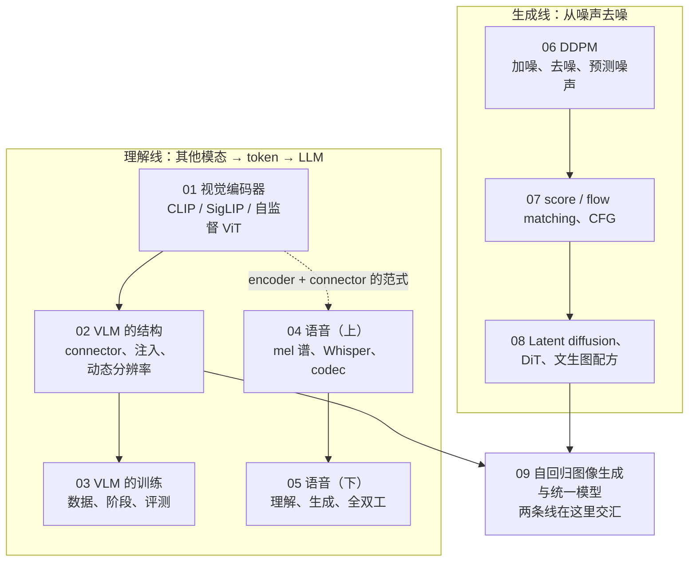

九篇正文回答了两个问题：**图片、视频、语音怎么进入一个语言模型，以及图像与视频的生成为什么是另一套数学**。前五篇是理解线——编码器学到什么、几百个向量怎么进 LLM、训练分几个阶段、声音怎么变成 token、怎么听与说；第六到八篇是生成线——去噪为什么等于学分布、三种视角为什么是同一件事、怎么把这套数学变成 SD / FLUX；第九篇是交汇——图像能不能像文本一样 token 化后自回归地生成，理解与生成能不能用一个模型。

本文不讲新内容，做三件事：把九篇压成一张表与九段回顾，把贯穿九篇的几条线拎出来，然后给一套三段式的通关自测——判断与计算、跨篇综合、面试题。各篇末尾的自测检验的是"这一篇读懂了没有"，这里检验的是"九篇能不能连起来用"。第九篇末尾的"系列总结"一节的内容也并入这里。

> **读完这九篇，你应该能回答哪些问题？[^q0] 哪些数字与结论必须能脱口而出？[^q1] 怎么判断自己是"读过"还是"掌握"了？[^q2]**

先把整个系列放在一张图上——箭头是**推导或前置上的依赖**（箭头尾端的结论被箭头头端当作前提），不是阅读顺序：

## 一、总览：系列回答的问题与主线

系列的一句话主张是：**多模态模型的每个部件都在做一次"信息 vs token"的交换，而交换的两端都能算账**。编码器的目标函数决定保留什么信息；connector 与分辨率策略决定一张图值多少 token；codec 决定一秒语音值多少 token；VAE 与 VQ tokenizer 决定生成侧在哪个空间、多长的序列上工作；生成范式（自回归 vs 扩散）决定这些 token 是串行 decode 还是多步并行前向——进而决定成本是 memory-bound 还是 compute-bound。九篇用同一套方法（推导 → 算账 → 公开配方对照），对照的是同一批模型（LLaVA → Qwen2.5-VL → InternVL、Whisper → Moshi、SD 1.5 → FLUX、VQGAN → BAGEL）。

| 篇 | 回答的问题 | 一句话结论 | 必记的数字 / 公式 |
|---|---|---|---|
| [第一篇：视觉编码器](/vision-encoders-clip-siglip-and-self-supervised-vit.html) | 为什么几乎所有 VLM 用 CLIP / SigLIP 而不用 ImageNet ViT？编码器看不到什么？ | 对比学习把图像投到已与文本对齐的语义空间，connector 只需小映射；但它只保留"文本能描述且需要区分图文对"的信息，计数、空间、绑定、小字是结构性盲点 | $$I \ge \log B - \mathcal{L}$$，CLIP 32K batch；温度学到 0.01（×100）；CLIP 训练 $$6.4 \times 10^{21}$$ FLOPs ≈ 7B LLM 150B token；ViT-L/14-336 → 576 token、SigLIP-SO400M-384 → 729；分辨率 > 参数量 > 数据 |
| [第二篇：VLM 的结构](/vlm-architecture-connectors-injection-and-dynamic-resolution.html) | LLaVA 的 MLP 与 BLIP-2 的 Q-Former 差什么？Qwen2-VL 为什么要原生分辨率？ | 差在信息瓶颈：MLP 无损保空间、Q-Former 32 个内容无关的 query 装不下细节；原生分辨率让 token ∝ 像素、全图一个 attention，解决 tile 的边界、失真、效率三问题 | 2×2 merge 4× 无损，$$28 \times 28$$ 像素/token 是文字甜点；Qwen2-VL token $$= HW / 28^2$$；LLaVA-NeXT 2880、InternVL ≤ 40 tile ≈ 10K；Llama 3.2 cross-attn +20B 参数；576 token 在 7B 里 prefill 8 TFLOPs、KV 72 MB |
| [第三篇：VLM 的训练](/vlm-training-recipe-data-stages-and-evaluation.html) | 为什么先冻结 LLM 只训 connector？幻觉从哪来、怎么减少？ | 随机 connector 的噪声梯度会让 LLM 学会忽略视觉 token；幻觉来自数据共现、编码器缺失、解码惯性三处，各有对应手段 | LLaVA-1.5 558K + 665K；MM1 配比 45 / 45 / 10；文本混入 10–50%，退化 1–3 点；POPE 共现 85 → 90；阶段 2 主导，Qwen2-VL 1.4T token ≈ 一次 8B 预训练 |
| [第四篇：语音（上）](/speech-and-omni-models-audio-encoders-codecs-and-duplex.html) | 一秒声音在模型眼里是什么？语音为什么比图片更需要离散 token？ | 波形 → log-mel（100 帧/秒 × 80）→ 编码器特征；语音要生成，主流让 LLM 生成短的离散序列再由 codec 还原波形（flow matching 生成连续 mel 是另一条可行路），RVQ 用几个小码本得到巨大的等效码本 | log-mel 25 ms / 10 ms；RVQ $$1024^8 = 2^{80}$$；EnCodec 6 kbps；三层 token 一分钟 3.6 万 / 3000 / 200 |
| [第五篇：语音（下）](/speech-understanding-generation-and-full-duplex.html) | 直接生成语音 token 为什么伤文本能力？全双工的时延由什么决定？ | 模态竞争 → 把说与想分开（内心独白 / Thinker-Talker）；时延 = 分帧 + 首 token + 解码 + 语义决策，全双工把串联四段压成一个模型的一步 | 一分钟：声学 3.6 万 / 语义 3000 / 文本 200；RVQ $$8 \times 1024 = 2^{80}$$，6 kbps；Whisper 30 s → 1500 位置；Moshi 80 ms 帧、160 / 200 ms；半双工 1–3 s；每路半张 H100 |
| [第六篇：扩散模型（上）](/diffusion-models-ddpm-score-matching-and-flow-matching.html) | 去噪为什么等于学会生成？ELBO 怎么变成一行 MSE？DDIM 为什么能跳步？ | 猜噪声的网络知道每个带噪点"数据在哪个方向"；ELBO 的高斯 KL 只剩均值差，用噪声表示后就是 MSE；DDIM 取确定性的反向路径（ODE）可大步走 | 闭式 $$x_t = \sqrt{\bar\alpha_t} x_0 + \sqrt{1 - \bar\alpha_t}\, \epsilon$$；$$\beta$$ 1e-4 → 0.02；DDIM 20 步 ≈ 1000 步 |
| [第七篇：扩散模型（下）](/score-matching-flow-matching-and-classifier-free-guidance.html) | DDPM、score matching、flow matching 为什么是同一件事？CFG 的 $$w = 7.5$$ 是什么？ | 在高斯路径 $$x_t = a_t x_0 + b_t\epsilon$$ 下三者是同一个分数 $$\nabla_x \log p_t$$ 的线性参数化，损失差一个 $$t$$ 权重，采样解同一个概率流 ODE；reflow 拉直轨迹一步采样；CFG 逐噪声层把 $$p_t(c \mid x)$$ 升到 $$w$$ 次幂（终点不是干净分布的幂） | $$\epsilon = -\sigma s$$；$$v = \epsilon - x_0$$；$$2^{7.5} \approx 180$$；toy reflow 直线度 0.49 → 1.00 |
| [第八篇：Latent diffusion 与 DiT](/latent-diffusion-dit-and-text-to-image-recipes.html) | 为什么在 latent 空间做？DiT 赢在哪？一张图与一次 LLM 推理怎么比？ | VAE 接管感知压缩，扩散只做语义（1/10 算力）；DiT 的 FID 随 GFLOPs 平滑下降、与分配无关；扩散 compute-bound 多步并行，LLM memory-bound 串行，加速手段是步数蒸馏 | f8 4ch 48×、16ch 12×；DiT-XL/2 FID 2.27；FLUX 12B、28 步、2.8 PFLOPs vs 7B LLM 1000 token 14 TFLOPs，200× 而时间相近；LCM 4 步、Turbo 1–4 步；5 s 720p 视频 ≈ 115K token、600 PFLOPs |
| [第九篇：自回归生成与统一模型](/autoregressive-image-generation-and-unified-models.html) | AR 与扩散各赢在哪？理解与生成的表示能不能共享？ | AR 赢在与 LLM 共享一切与"一切皆 token"的统一，扩散赢在质量、效率、编辑生态；表示目前部分共享（共享 attention、分开 FFN），方向是收敛 | VQ commitment $$\beta = 0.25$$；LlamaGen 16384 码本利用率 97%；栅格 $$1024^2$$ 4096 步 100 s；VAR 10 尺度 680 token、FID 1.73 vs DiT 2.27；Janus-Pro GenEval 0.80；BAGEL 14B MoT |

### 1. 本文的章节安排

| 章 | 内容 |
|---|---|
| 二 | 逐篇回顾：核心问题、结论、必记、常见误解 |
| 三 | 贯穿九篇的五条线：目标函数决定保留什么、一段信号值多少 token、离散与连续两种生成形态、新旧参数与模态竞争、数据质量与 scaling |
| 四 | 常见误区表 |
| 五 | 通关自测：A 判断与计算 10 题、B 跨篇综合 5 题、C 面试题 7 题、D 掌握判据 |
| 六 | 下一步 |

## 二、逐篇回顾

### 1. 第一篇：视觉编码器：CLIP、SigLIP 与自监督 ViT

**核心问题**：为什么几乎所有 VLM 都用 CLIP / SigLIP 而不用 ImageNet 分类预训练的 ViT？编码器看不到什么？

**结论**：VLM 用对比编码器有三个原因——对齐（特征空间已与文本共享，LLaVA 一个两层 MLP 就够）、覆盖（4 亿到 100 亿图文对里什么都有，分类模型只知道 1000 类）、规模（图文对不需要人标）。InfoNCE 是互信息的下界 $$I(X; Y) \ge \log B - \mathcal{L}$$，被 $$\log B$$ 封顶，这是 CLIP 需要 32K batch 的理论原因；实践原因是难负样本。SigLIP 把 $$B$$ 类 softmax 换成 $$B^2$$ 个独立的二分类，不需要 all-gather 相似度矩阵、对 batch 不敏感（32K 后饱和），SO400M 成为 2024–2025 年最常用的编码器。盲点来自目标函数：在 32K 的 batch 里区分"一张有猫的图"只需要"有猫 + 场景词"，精确计数、位置、属性绑定对 $$I(u; v)$$ 没有贡献，编码器没有动力保留，文本塔甚至退化成近似词袋。补救有三条：更高分辨率、与 LLM 联合训练、混入自监督编码器（DINOv2 拼接）或在对比目标上叠加 caption / 自监督目标（SigLIP 2、AIMv2）。编码器该多大：MM1 的消融给出**分辨率 > 编码器参数量 > 训练数据**，InternVL 2.5 从 6B 退回 300M，300M–700M 在联合训练 + 高分辨率下不是瓶颈。

**必记**：

- $$I \ge \log B - \mathcal{L}_{\text{InfoNCE}}$$；CLIP batch 32768 → $$\log_2 32768 = 15$$ bit（10.4 nat）。
- 温度可学习，0.07 → 约 0.01（×100）：余弦差 0.05 → logit 差 5。
- CLIP 账：4 亿对 × 32 epoch ≈ $$6.4 \times 10^{21}$$ FLOPs ≈ 7B LLM 训 150B token；256 张 V100 12 天。
- ViT-L/14 304M、$$336^2$$ → 576 patch、一次前向约 350 GFLOPs；SigLIP-SO400M 400M、$$384^2$$ → 729。
- 盲点五类：计数（4 以上接近随机）、空间（50–60%）、绑定（Winoground 接近随机）、文字（$$224^2$$ 读不出）、细粒度 / 否定。
- MM1：$$336^2$$ 比 $$224^2$$ 约 +3 点，ViT-H 比 ViT-L 不到 1 点；VLM 取 CLIP 的倒数第二层。

**常见误解**："编码器越大 VLM 越好"——分辨率的影响远大于编码器参数量，6B 编码器的收益只在 76B 级 LLM 上显现。另一个："DINOv2 的密集特征更好，直接用它做 VLM 编码器"——它没有语言对齐，单独用效果差，只能与 CLIP 类拼接。

### 2. 第二篇：VLM 的结构：connector、注入方式与动态分辨率

**核心问题**：LLaVA 的一个 MLP 与 BLIP-2 的 Q-Former 相差什么？为什么 Qwen2-VL 要让 ViT 接受原生分辨率？

**结论**：三个设计决定——connector、注入方式、分辨率策略——合起来回答"一张图占多少 token、保留多少信息、花多少算力"。MLP 对每个 patch 独立映射（参数 $$d_v d + d^2 \approx 21$$M），无损、保空间结构，把"看哪里"交给 LLM 的 attention；Q-Former 用 32 个与内容无关的 query 把整张图压成 32 个 token，固定预算、丢空间结构、多一个要单独训的模块，LLaVA-1.5 凭 MLP + 558K + 665K 数据在 12 个 benchmark 上超过用 129M 数据的 BLIP-2，之后 resampler 只剩视频与 cross-attention 注入两种用法。2024 年的折中是 MLP + 2×2 merge：拼接四个相邻 patch，压缩 4 倍而无损；4×4 平均池化（Gemma 3，16×）在 OCR 上开始掉，要 pan & scan 补偿。注入方式几乎全部收敛到序列注入；Llama 3.2 Vision 的 cross-attention 换来文本能力严格不变，代价是 +20B 参数、单独训练、引擎特殊支持，NVLM 的直接对照显示序列注入在 OCR 与推理上更好。分辨率：tile（AnyRes）编码器不变、工程简单，但切断跨 tile 的物体与文字行、pad 失真、小图浪费；Qwen2-VL 的原生动态用 2D RoPE、可变 patch 数、2×2 merge、M-RoPE，token 数 $$= HW / 28^2$$ 与像素成正比，代价是 ViT 的 $$O(N^2)$$ attention（Qwen2.5-VL 用 $$112 \times 112$$ 的窗口 attention 缓解）。任务敏感性：自然图片对 token 数不敏感，文档 / 图表 / 文字极敏感，空间 / 计数受益于原生动态。

**必记**：

- token 数：LLaVA-1.5 576；2×2 merge 144；Q-Former 32；LLaVA-NeXT $$2 \times 2$$ + 缩略图 = 2880；InternVL ≤ 40 tile × 256 ≈ 10K。
- Qwen2-VL：$$224^2$$ → 64、$$448^2$$ → 256、$$1344 \times 896$$ → 1536；默认上下限 $$256 \times 28^2$$ 到 $$1280 \times 28^2$$；DocVQA 94.5。
- 每 token 像素：LLaVA 196（$$14^2$$，冗余）、Qwen2-VL 784（$$28^2$$，文字甜点）、Gemma 3 3136（$$56^2$$，文字勉强）。
- 原生 $$N = 5120$$ patch 时 ViT attention 2.1 TFLOPs 与线性部分 6.9 TFLOPs 同量级——必须窗口化。
- 成本：576 token 在 7B 里 prefill 约 8 TFLOPs、KV 约 72 MB；1 分钟视频 2 fps × 256 token/帧 = 30K。
- M-RoPE 下一张 $$32 \times 32$$ token 的图只消耗 32 个位置 id。

**常见误解**："connector 的设计决定 VLM 效果"——MM1 的消融：connector 类型的影响远小于分辨率与 token 数，不丢信息即可。另一个："cross-attention 注入不占上下文所以更优"——它多了 20B 参数与一套特殊的训练与推理路径，多数团队选序列注入是因为简单与生态兼容。

### 3. 第三篇：VLM 的训练：数据、阶段与评测

**核心问题**：为什么先冻结 LLM 只训 connector？多模态幻觉从哪来、怎么减少？

**结论**：三个部件来自三个训练过程，VLM 训练是把它们对齐。标准形态四阶段：对齐（冻 LLM，训 connector，几十万 caption）→ 多模态预训练（全解冻，数千万到数亿样本，能力的主要来源）→ SFT → 偏好对齐。先冻结 LLM 是因为 connector 随机初始化、输出是噪声，此时若 LLM 也在训，降低 loss 的捷径是学会忽略视觉 token，且噪声梯度损伤文本能力；冻结后 connector 在固定目标空间里学一个"翻译"。Prismatic 的消融说明合适的 lr 分组下单阶段也可以，两阶段是不用调 lr 的稳妥默认。编码器数据少冻结、多解冻，解冻时 lr 比 connector 小 1–2 个量级并配 layer decay。数据决定能力形状：caption 教对齐、交错图文教 few-shot、OCR 文档教读字、grounding 教定位、纯文本保持文本能力；recaption 是 2024 年最重要的数据技术。幻觉三源三治：数据共现与合成数据自带的幻觉 → 负样本、人写数据；编码器信息缺失 → 高分辨率、解冻、多编码器；解码的文本惯性（长描述后半段幻觉翻倍）→ 片段级修正的 DPO、对比解码、grounding 混入。评测要看 MMStar / MMMU-Pro 这类过滤了盲答题的 benchmark，写明分辨率与帧数、harness，并回归纯文本 benchmark。

**必记**：

- LLaVA-1.5：阶段 1 558K caption、lr 1e-3、约 2K 步；阶段 3 665K；8 × A100 约 1 天。
- 编码器 lr：$$2 \times 10^{-6}$$ 到 $$2 \times 10^{-5}$$；LLM 用 SFT 量级 $$1\text{–}2 \times 10^{-5}$$。
- MM1 配比 caption / 交错 / 文本 = 45 / 45 / 10；去掉交错数据 few-shot 掉 10+ 点。
- 文本混入 10–50%；序列注入通常退化 1–3 点，超过 2–3 点说明文本数据不够或 lr 过大。
- POPE 共现子集：LLaVA-1.5 约 85%，RLHF-V 1.4K 对 → 88–90%；盲测 MMMU 可到 40+。
- 成本：7B 配置阶段 2 10M 样本 $$3.6 \times 10^{20}$$ FLOPs ≈ 8 × H100 32 小时；Qwen2-VL 1.4T token ≈ $$6.7 \times 10^{22}$$，与一次 8B 预训练相同；recaption 1000 万张 $$1.8 \times 10^{20}$$，与训练同量级。

**常见误解**："幻觉是数据问题，清洗数据就能消除"——POPE 顽固的 10% 来自编码器缺失与解码惯性，要靠分辨率 / 解冻与 DPO / 对比解码。另一个："多模态微调不会影响文本能力"——只用多模态数据训会让 MMLU 掉几个点、代码与数学掉更多，必须混文本并做回归测试。

### 4. 第四篇：语音（上）：从波形到 token——mel 谱、Whisper 与神经 codec

**核心问题**：一秒钟的声音在模型眼里是什么？语音为什么比图片更需要离散 token，RVQ 怎么用几个小码本表示高保真音频？

**结论**：16 kHz 的波形一秒 16000 个数，按 25 ms 窗 / 10 ms 步分帧、FFT、80 个 mel 三角滤波器、取对数，变成约 100 个 80 维向量（log-mel 谱）——一张"时间 × 频率"的图；Whisper encoder 把它变成每 20 ms 一个特征。语音要生成，而 LLM 的 next-token 头只会出离散序列（不接扩散头的话），所以主流路线需要 codec：向量量化 = 查最近码字 = K-Means，单码本精度不够；RVQ 逐级量化残差，8 个 1024 项的小码本得到 $$1024^8 = 2^{80}$$ 种索引组合（这是组合数上界，不保证 $$2^{80}$$ 个不同向量），每级误差约减半（经验，需码本能覆盖残差），且自然分层（第一码本内容、后面细节）。

**必记**：

- log-mel 100 帧/秒 × 80 维；Whisper 30 s → 1500 位置（20 ms/帧），large 1.55B。
- 三层 token 一分钟：声学约 3.6 万（EnCodec 75 帧 × 8 码本）、语义 1500–3000（25–50/秒）、文本 200。
- EnCodec：320× 下采样 → 75 帧/秒，8 × 10 bit = 6 kbps，是 MP3 128 kbps 的 1/20；2 / 4 / 8 / 16 码本 = 1.5 / 3 / 6 / 12 kbps。
- RVQ：$$r_i = r_{i-1} - e^{(i)}_{k_i}$$，$$\hat z = \sum_i e^{(i)}_{k_i}$$，$$1024^8 = 2^{80}$$；toy 上 8 级误差是单码本的 1/50。
- 训练 RVQ 的四件事：STE 直通梯度、EMA 更新码本、commitment 损失、死码重置。

**常见误解**："连续特征信息更全，所以一切用连续特征"——LLM 的 next-token 头生成不了连续向量，要么走离散 codec token，要么接一个扩散 / flow 头（F5-TTS、CosyVoice 的做法）；"生成侧必须离散"说过了头。另一个："mel 谱是为了压缩"——它只压缩 2 倍，目的是把振动模式变成"每个瞬间有哪些频率"这种模型能读的形式。

### 5. 第五篇：语音（下）：语音理解、语音生成与全双工

**核心问题**：让 LLM 直接生成语音 token 会伤它的文本能力，怎么办？全双工的时延由什么决定？

**结论**：语音理解是 VLM 的翻版——Qwen2-Audio：Whisper encoder → pool 25 Hz → 投影 → LLM，一分钟 1500 token，但不能说。TTS 三条路：AR 声学 token（VALL-E：AR 第一码本 + NAR 其余，直接来自 RVQ 的层次）、语义→声学两级、流匹配（F5-TTS，32 步 DiT）。LLM 直接说会有**模态竞争**，解法都是"把说与想分开"：Moshi 的内心独白、Qwen2.5-Omni 的 Thinker-Talker。全双工 = 两条流每 80 ms 同步前进、每一帧都在决定说不说；时延 = 分帧 + 首 token + 解码 + 语义决策，串联管线 1–3 秒，全双工 200 ms。

**必记**：

- Qwen2-Audio 25 Hz → 一分钟 1500 token，prefill 21 TFLOPs、KV 188 MB。
- Moshi：Mimi 12.5 Hz、8 码本、1.1 kbps；每帧 8 + 8 + 1 = 17 token；理论 160 ms、实测约 200 ms；GPT-4o 320 ms；人类换手约 200 ms。
- 半双工串联：VAD 300–700 ms + ASR + LLM 首 token + TTS 首帧 = 1–3 s。
- 语音输入比文本输入低 5–15 点（VoiceBench）；F5-TTS 32 步 DiT、RTF 0.15。
- 全双工每路对话持续占约半张 H100，不能 batch 摊薄。

**常见误解**："全双工的低时延靠更快的硬件"——四段里帧长与语义决策不是算力问题，串联管线的 1–3 秒主要耗在 VAD 等待与三个模型的首 token 叠加。

### 6. 第六篇：扩散模型（上）：DDPM——加噪、去噪与「预测噪声」

**核心问题**：去掉噪声为什么等于学会了生成？训练目标从变分下界怎么变成一行 MSE？DDIM 为什么能 1000 步跳到 50 步？

**结论**：前向加噪每步"缩小再加噪"、方差保持为 1，有闭式 $$x_t = \sqrt{\bar\alpha_t} x_0 + \sqrt{1 - \bar\alpha_t}\, \epsilon$$，训练可任取一个 $$t$$ 直接采样。反向的 ELBO 逐项化简后是两个高斯的 KL，只剩均值的差，把 $$x_0$$ 用 $$\epsilon$$ 表出后网络自然去预测噪声；Ho 等去掉与 $$t$$ 有关的权重得到 $$L_{\text{simple}}$$。一个能在每个噪声水平猜出噪声的网络，知道从任何带噪点看"数据在哪个方向"，从纯噪声逐步走回去就是生成——toy 上 2000 个噪声点全部落到两个月牙上。DDIM 取一族反向过程里确定性的那条（ODE），可以大步走。

**必记**：

- DDPM：$$T = 1000$$，$$\beta_t$$ 从 $$10^{-4}$$ 线性到 0.02；$$\bar\alpha_T \approx 0.0047 \ne 0$$ 是零终端 SNR 要修的问题。
- $$t = 300$$ 处 $$\bar\alpha = 0.394$$；反向一步 $$\tilde\mu_t \approx 0.006\, x_0 + 0.993\, x_t$$——每步只挪 0.6%。
- toy：$$t = 990$$ 的噪声预测 MSE 为 0、$$t = 50$$ 为 0.66——学到数据的是小 $$t$$。
- $$v = \sqrt{\bar\alpha_t}\, \epsilon - \sqrt{1 - \bar\alpha_t}\, x_0$$；DDIM 50 步 ≈ DDPM 1000 步，20 步可用，5 步散掉；DPM-Solver 10–20 步。

**常见误解**："扩散模型是在学怎么去噪一张图"——它学的是每个噪声水平下"数据在哪个方向"，去噪只是训练时的代理任务，生成时没有任何要恢复的原图。

### 7. 第七篇：扩散模型（下）：score matching、flow matching 与 classifier-free guidance

**核心问题**：DDPM、score matching、flow matching 为什么是同一件事？CFG 的 $$w = 7.5$$ 在数学上意味着什么？

**结论**：三者都在学同一个对象——每个噪声水平下的分数 $$\nabla_x \log p_t$$——的线性参数化：$$\epsilon = -\sigma s$$（Tweedie），$$v = \epsilon - x_0$$；在高斯路径 $$x_t = a_t x_0 + b_t \epsilon$$ 这个前提下，损失换元后只差与 $$t$$ 有关的权重；采样解同一个概率流 ODE（一般的 coupling / 非高斯路径不在此列）。flow matching 的条件路径是直线，但随机配对让边缘轨迹弯（toy 直线度 0.49，比 DDIM 还弯）；reflow 在 ODE 配对上重训把它拉直到 1.00，一步就能采样。CFG 用"有条件 − 无条件"的方向外推 $$w$$ 倍，等价于从 $$p(x)\, p(c \mid x)^w$$ 采样——这是逐噪声层的锐化，终点分布不是干净分布的幂（一维高斯反例：1/4 对 4/7）；$$w$$ 大了多样性降、样本被推出分布（过饱和）。

**必记**：

- $$\epsilon = -\sigma s$$；Tweedie $$\mathbb{E}[x_0 \mid x_t] = x_t + \sigma^2 s$$；直线路径下 $$\epsilon = x_t + (1 - t) v$$、$$x_0 = x_t - t v$$、$$\sigma_t = t$$。
- toy 5 步：DDIM 0.099、flow matching 0.041、reflow 0.023；reflow 1 步 0.030。
- SD3 用 logit-normal 采 $$t$$；分辨率平移 $$t_{new} = \alpha t / (1 + (\alpha - 1) t)$$，$$\alpha = \sqrt{m/n}$$。
- CFG：条件 dropout 10–20%；$$w = 7.5$$ 下可能性 2 倍的区域被放大 $$2^{7.5} \approx 180$$ 倍；toy 上 $$w$$ 1 → 4 命中 95% → 100%、标准差 0.60 → 0.35；典型值 SD 1.x 7.5、SDXL 5–7、SD3 3.5–7、FLUX.1-dev 3.5，不可跨模型比较。
- 成本：SD 1.5 U-Net 860M 一次前向 0.8 TFLOPs，50 步 × 2 = 80 TFLOPs、A100 2–3 秒；DiT-XL/2 119 GFLOPs；SD 1.5 训练约 15 万 A100 小时。

**常见误解**："flow matching 是一个不同于扩散的新生成模型"——它是同一个分数的 $$v$$-参数化，损失只差权重，SD3 / FLUX 选它是因为直线参数化容易拉直、调度直观。另一个："CFG 是让样本更符合条件分布 $$p(x \mid c)$$"——$$w = 1$$ 才是 $$p(x \mid c)$$，$$w > 1$$ 是有意偏离它的锐化。

### 8. 第八篇：Latent diffusion、DiT 与文生图配方

**核心问题**：为什么在 latent 空间做？DiT 相比 U-Net 赢在哪？一张图的生成成本与一次 LLM 推理怎么比？

**结论**：像素空间的扩散把大部分算力花在人眼不分辨的高频细节上；Rombach 等把感知压缩交给 VAE（一次确定性解码重建细节），扩散只在 48 倍小的 latent 上学语义与结构，用 1/10 的训练算力达到像素扩散的 FID。VAE 四项损失（L1 + LPIPS + 极小权重的 KL + 对抗）继承自 VQGAN，4 通道是信息瓶颈（小文字、手指），SD3 增到 16 通道，但需要 2B 以上的扩散模型才能利用。DiT 把 latent patch 化送进标准 Transformer，adaLN-Zero 注入条件，核心结果是 **FID 随 GFLOPs 平滑下降、与参数怎么分配无关**——LLM scaling law 在扩散上的重现，而 U-Net 没有这样的规律；MMDiT 让文本与图像 token 双流权重、联合 attention，优于 cross-attention 且优势随规模扩大；FLUX 加单流块与 2D RoPE。文本编码器从 CLIP（词袋）到 T5-XXL（Imagen：换 T5 比放大扩散更有效）到 LLM；recaption（DALL-E 3 95% 合成 caption + 推理时 prompt 扩写）是数据侧最大的杠杆。成本结构：一张图 = 步数 × 每步一个 4096 token 序列的前向（CFG ×2），compute-bound、无 KV cache、无串行；FLUX 一张图 2.8 PFLOPs 是 7B LLM 一次 1000 token 回答（14 TFLOPs）的 200 倍，时间却相近——LLM decode 每步 1 个 token、MFU 约 1%。所以扩散的加速是步数蒸馏（progressive → consistency / LCM 4 步 → 对抗蒸馏 Turbo 1–4 步 → DMD2 1 步），服务系统用静态 batch，L6 的推理优化几乎不适用。视频把 patch 推广为时空 patch，5 s 720p 约 115K token，attention 占八成以上，是 FLUX 一张图的 300 倍。

**必记**：

- VAE f8：$$512^2 \times 3 = 786$$K → $$64^2 \times 4 = 16$$K，48×；16 通道 12×；KL 权重 $$10^{-6}$$，scale factor 0.18215；$$f = 4$$–8 是甜点。
- DiT-XL/2 675M、119 GFLOPs、ImageNet $$256^2$$ FID 2.27；训练 7M 步 × 256 = 18 亿样本、$$6.4 \times 10^{20}$$ FLOPs、1400 epoch。
- 采样：SD 1.5 80 T / 2–3 s；SDXL 400 T / 8–10 s；SD3-medium 2B 28 步 $$2 \times 2B \times 4096 \approx 16$$ T/步、900 T；FLUX.1-dev 2.8 P / 10–15 s；schnell 4 步 400 T；LCM 4 步 3.2 T。
- 对比 7B LLM 1000 token：14 TFLOPs、20–30 s；扩散 MFU 50% 以上，LLM decode 约 1%。
- 文本编码器：CLIP-L 123M / 77 token；T5-XXL 4.7B；SD3 三编码器，去 T5 只伤文字渲染与复杂 prompt。
- 视频：3D VAE 时间 4×、空间 8×、16 通道；HunyuanVideo 13B 5 s 720p 每步 attention 10.5 P vs 线性 1.6 P，50 步约 600 PFLOPs。

**常见误解**："扩散模型的推理优化可以照搬 LLM 的"——扩散没有自回归的 token 级 KV cache（U-Net / PixArt 的文本 cross-attention K/V 仍可跨步缓存），不需要 token 级 continuous batching（不同步数 / 分辨率的请求仍要动态组 batch），量化之外的 LLM 手段（投机解码、KV 压缩）不适用。另一个："VAE 压得越狠越好"——$$f > 8$$ 重建质量掉、扩散学不到细节，16 通道要配更大的扩散模型。

### 9. 第九篇：自回归图像生成与统一模型

**核心问题**：AR 生成图像与扩散各赢在哪？理解与生成的表示能不能共享？

**结论**：图像离散化靠 VQ-VAE：最近邻查码字、STE 传梯度、EMA 更新码本、commitment loss；顽疾是码本坍缩（利用率 10–30%），对策是 k-means 初始化、死码重置、低维归一化（LlamaGen 16384 码本利用率 97%），或干脆用无码本的 FSQ / LFQ（隐式码本 $$L^{d'}$$ / $$2^{d'}$$，Infinity 位级 $$2^{32}$$）。tokenizer 有重建与生成两个客户，要求相反——重建要细节、生成要可预测——语义化 tokenizer 用 CLIP / DINOv2 特征对齐 VQ 表示来调和。栅格 AR（LlamaGen 纯 Llama 结构，FID 2.18 超过 DiT-XL/2 的 2.27）有三个内在缺陷：单向上下文、长距依赖被打散、串行——$$1024^2$$ 图 4096 步 decode、7B 模型约 100 秒。MaskGIT 用双向并行 mask 预测 8–12 步；VAR 把"下一个"定义成下一个尺度——多尺度残差 VQ 是 RVQ 的空间版——10 个尺度 10 步、FID 1.73、scaling 幂律 $$R^2 \approx 0.998$$，让 AR 变回 compute-bound 的多步并行。AR 赢在与 LLM 完全共享结构、基础设施、scaling 经验与"一切皆 token"的统一；扩散赢在质量（连续空间无 VQ 瓶颈、CFG 在噪声空间更有效）、效率与编辑生态；ImageNet 上 AR 已平手或领先，文生图上仍落后一档。统一模型三条路线：纯 token（Chameleon、Emu3——最统一，理解妥协、训练不稳定）、双编码器（Janus——理解 SigLIP、生成 VQ，两侧不妥协但不共享）、AR + 扩散混合（Transfusion、BAGEL——生成最好，MoT 共享 attention、分开 FFN，能力随规模涌现）。2025 年的答案是**部分共享、方向收敛**。

**必记**：

- VQ-VAE：$$\mathcal{L} = \lVert x - D(z_q) \rVert^2 + \lVert \text{sg}[z_e] - e \rVert^2 + \beta \lVert z_e - \text{sg}[e] \rVert^2$$，$$\beta = 0.25$$；$$256^2$$、$$f = 16$$ → 256 token。
- FSQ $$8^5 = 32768$$；LFQ $$2^{18}$$；Infinity 位级 $$2^{32}$$，每 token 预测 32 个 bit。
- AR 上的 CFG 在 logits 上外推，$$w = 1.75$$–2；无 CFG 的 FID 是有 CFG 的 3–5 倍。
- ImageNet $$256^2$$ FID：LlamaGen 2.18、VAR 1.73、MAR 1.55、DiT-XL/2 2.27；VAR 10 尺度（1, 2, 3, 4, 5, 6, 8, 10, 13, 16）共约 680 token，比栅格快 20×；MaskGIT 快 30–60×。
- 成本：栅格 AR 7B 4096 token $$\approx 57$$ TFLOPs 但 4096 步、100 s（带宽）；VAR 2B（$$256^2$$）约 2.7 TFLOPs（KV 缓存、$$\sum n_k = 680$$；不缓存 6.8 T）、< 1 s；DiT-XL/2 50 步 CFG 约 12 TFLOPs。
- 统一：Chameleon 7B / 34B 训 4.4T token，靠 QK-norm、z-loss、降 lr 稳住；Janus-Pro GenEval 0.80 vs SD3-medium 0.74；BAGEL 14B MoT（激活 7B）。

**常见误解**："AR 图像生成已被扩散淘汰"——VAR 在 ImageNet 上超过 DiT，且 AR 是统一模型的基础；反过来"AR 已全面超过扩散"也不对，文生图上 Emu3 / Janus-Pro 低于 SD3 / FLUX。另一个："统一模型就是把图像 token 放进 LLM 词表"——那是纯 token 路线，它让理解妥协；当前生成最好的统一模型是 AR + 扩散混合。

## 三、贯穿全系列的几条线

### 1. 目标函数决定表示保留什么

第一篇建立的原理贯穿全系列：一个表示保留的信息，是训练目标要求它回答的问题所需要的信息，多一点都没有。对比目标只问"这张图配哪条文本"，于是计数、位置、绑定被丢掉；caption 目标要求特征支撑每个词，AIMv2 要求预测每个 patch，SigLIP 2 把三种目标叠加，各补一类盲点。第二篇的 connector 是同一原理的下一站：Q-Former 的 32 个 query 学的是"平均而言什么重要"，与内容无关，所以装不下细节；MLP 什么都不选，把选择权留给 LLM 的 attention。第三篇把它接到失效模式上——编码器没保留的信息 LLM 只能靠语言先验补，补的就是幻觉，所以解冻编码器、提高分辨率能降幻觉。

第四篇在音频上重演：语义 token（HuBERT 聚类）只保留音素内容、丢音色，声学 token 保留一切但序列长而"内容"埋在细节里，Mimi 把第一码本蒸馏成语义 token 让一个 codec 两者兼得。第八篇的 VAE 是生成侧的同一个问题：4 通道 latent 重建不出小文字与手指，扩散模型也就生成不出，SD3 增到 16 通道；REPA 发现让 DiT 的中间表示对齐 DINOv2 特征训练快 17 倍——latent 的语义结构影响学习效率。第九篇把它推到极致：tokenizer 的重建客户要细节、生成客户要可预测，Janus 的论点"理解要高层语义、生成要低层细节、一个编码器难两全"正是同一张力；语义化 tokenizer（VILA-U、TokenFlow、UniTok）与 BAGEL 的 MoT 是两种调和。

### 2. 一段信号值多少 token

成本线的中心量是 token 数。第一篇给出编码器一端：$$(336 / 14)^2 = 576$$、$$(384 / 14)^2 \approx 729$$（27.4 取 27，实际 processor 会裁到 378），分辨率翻三倍 token 翻九倍，而分辨率恰是 OCR 任务的第一决定因素。第二篇把它变成一张"每 token 多少像素"的表——196、784、3136——并给出甜点：$$28 \times 28$$ 对文字够、对自然图片冗余，所以 2×2 merge 几乎无损而 4×4 池化在 OCR 上掉；视频是帧数 × 每帧 token，1 分钟 2 fps 就是 30K；M-RoPE 让一张 $$32 \times 32$$ token 的图只消耗 32 个位置。第三篇提醒配比要按 token 数而非样本数算——文档 2K、caption 图 256——阶段 2 的成本因此由 token 数主导。

第五篇的账更大：一分钟语音在 25 Hz 是 1500 token、在 EnCodec 声学 token 下 3.6 万，一小时会议 9 万个连续特征 token 超过多数上下文，所以语音比图片更需要低帧率（Mimi 12.5 Hz）与流式。第八篇把 token 数与步数相乘：一张 $$1024^2$$ 图是 4096 个 latent token × 28–50 步 × CFG 两次，5 s 视频是 115K token 且 attention 的 $$N^2$$ 项占八成。第九篇则是 token 数 × 串行：栅格 AR 的 4096 token 就是 4096 步 decode，VAR 用 680 个 token、10 步换回并行。同一个 token 数，在 prefill、扩散、AR decode 三种形态下的代价差几个量级——这是下一条线。

### 3. 离散与连续：两种生成形态、两种成本形态

理解侧几乎全用连续特征（第一到三篇），因为不需要生成。第四、五篇第一次引入离散 token：要让 LLM 用自己的那套栈说话，最省事的是把波形变成短的离散序列（不是唯一可行，F5-TTS 的连续 mel 路线是反例），RVQ 的层次结构决定了 VALL-E 的 AR + NAR、Moshi 的多流。第六到八篇走连续路线：扩散在连续空间（像素或 latent）上学分数，采样是解 ODE 的多步并行前向——每步是一个 4096 token 的大 batch GEMM，compute-bound、MFU 50% 以上、没有 KV cache；LLM 的 decode 每步 1 个 token、memory-bound、MFU 约 1%。同样 FLOPs 相差 200 倍，墙钟时间却相近，两套服务系统由此分道。

第九篇把两种形态放到同一张桌上：栅格 AR 继承了 LLM decode 的 memory-bound 串行——4096 步、100 秒；MaskGIT 与 VAR 用并行 mask 与尺度顺序把 AR 拉回 compute-bound 的多步并行，与扩散同形态；MAR 让 AR 决定顺序、扩散头建模每个连续 token——AR 在 token 间、扩散在 token 内；Transfusion 与 BAGEL 让文本走 next-token、图像走扩散 loss，同一组权重。VAR 的多尺度残差 VQ 与第四、五篇的 RVQ 是同一个思想在两个轴上的实现：一个在同一位置逐级量化残差，一个在空间尺度上逐级量化残差，都天然由粗到细、第一级承载主体。CFG 也在两个空间各有一版：噪声空间 $$w = 7.5$$、logits 空间 $$w \approx 2$$，同一个贝叶斯分解、不同的外推尺度。

### 4. 新旧参数、模态竞争与分阶段

第三篇的核心机制——随机初始化的 connector 与预训练好的 LLM 不能用同一个 lr、同一个阶段训——在系列里反复出现。第一篇：CLIP 的最后一层为对比目标过度全局化，VLM 取倒数第二层；Qwen2-VL 在前两个阶段训练 ViT（第三阶段冻结）让编码器被 LLM 的目标"改造"，Gemma 3 把图像放进 LLM 预训练——联合训练让编码器的初始目标函数没那么重要。第三篇给出 lr 分组的数字（编码器 $$2 \times 10^{-6}$$ 到 $$2 \times 10^{-5}$$，比 connector 小 1–2 个量级）与文本混入 10–50% 防退化；Llama 3.2 Vision 用 cross-attention 结构从根上避开——文本路径一个参数没动。

第五篇把问题命名为**模态竞争**：LLM 直接生成语音 token 时文本知识明显弱于底座，Moshi 用内心独白（先文本再语音）、Qwen2.5-Omni 用 Thinker-Talker（Thinker 只出文本与隐状态，Talker 独立地说）分离两种输出。第九篇的统一模型是同一问题的终极版：Chameleon 把图像 token 与文本放进一个词表从头训，logits 漂移到需要 QK-norm、z-loss、降 lr 才稳住，且理解妥协；Janus 解耦两侧编码器；BAGEL 的 MoT 共享 attention、分开 FFN——"共享上下文、保留模态特化的参数"。从 connector 的两阶段到 MoT，答案的形状一致：让不同来源、不同分布的部件在共享的地方交换信息，在各自的地方保留自己的表示。

### 5. 数据质量与 scaling：两个共同的杠杆

第一篇：DFN 用小 CLIP 从 12.8B 对里过滤出 2B 高质量对，训出的模型比在全部 12.8B 上训的好——数据过滤比数据量重要。第三篇：recaption 是 2024 年最重要的数据技术，ShareGPT4V 100K → 1.2M，Molmo 用 712K 条人类语音描述避开"用 VLM 生成数据训 VLM"的循环，InternVL 2.5 报告过滤后训练更稳、幻觉更少。第八篇：DALL-E 3 的技术报告几乎只讲 recaption（95% 合成 caption + 推理时 prompt 扩写），SD3 用 CoGVLM 做 50%，美学过滤与微条件是便宜有效的数据补偿，Imagen 发现换 T5 文本编码器比放大扩散模型更有效——三篇的结论相同：数据质量的杠杆大于结构。

scaling 是另一个共同点，且它决定了结构的胜负。第八篇 DiT 取代 U-Net 的根本原因是 FID 随 GFLOPs 平滑下降、与分配无关，SD3 从 0.8B 到 8B 未饱和；第九篇 LlamaGen 与 VAR 报告 AR 图像生成的 scaling law（$$R^2 \approx 0.998$$），这是 AR 路线的核心卖点；BAGEL 报告能力随算力的涌现顺序——理解与基本生成 → 编辑 → 需要推理的编辑；第一篇的编码器则是反例：分辨率 > 参数量，300M–700M 在联合训练下不是瓶颈——不是所有部件都值得放大。

| 概念 | 出现的篇 | 关系 |
|---|---|---|
| 目标函数决定保留的信息 | 一、二、三、四、六、七 | 一给原理（对比 vs caption vs 自监督）；二用于 connector；三接到幻觉；四语义 vs 声学 token；六 VAE 瓶颈与 REPA；七 tokenizer 的重建 / 生成张力 |
| 每 token 多少像素 / 多少毫秒 | 一、二、四、六、七 | 一 576 / 729；二 196 / 784 / 3136 与甜点；四 25 Hz vs 75 × 8；六 4096 latent token × 步数；七 4096 步串行 vs 680 token 10 步 |
| 残差量化 RVQ | 四、七 | 四在同一位置逐级；七 VAR 在尺度上逐级；都由粗到细、第一级承载主体 |
| 离散 token 与自回归生成 | 四、七 | 四语音主流用离散 token 生成（连续 mel + flow 亦可）；七图像 VQ token 进 LLM 范式，VAR / MaskGIT 修正串行 |
| compute-bound vs memory-bound | 二、五、六、七 | 二 prefill 的账；五、六扩散多步并行、无自回归 KV；七栅格 AR 继承 decode 的带宽瓶颈 |
| CFG / 锐化 | 五、六、七 | 五推导与 $$w = 7.5$$；六 FLUX 蒸馏掉两倍成本；七 logits 空间 $$w \approx 2$$ |
| 新旧参数与模态竞争 | 一、三、四、七 | 一解冻编码器与取层；三两阶段与 lr 分组；四 Thinker-Talker、内心独白；七 Chameleon 不稳定、Janus 解耦、BAGEL MoT |
| recaption / 数据过滤 | 一、三、六 | 一 DFN；三 ShareGPT4V、Molmo；六 DALL-E 3 95%、SD3 50% |
| scaling law | 一、六、七 | 一编码器分辨率 > 参数；六 DiT FID ∝ GFLOPs；七 VAR、LlamaGen、BAGEL 涌现 |

## 四、常见误区

| 误区 | 为什么错 | 正确的说法 | 出处 |
|---|---|---|---|
| 编码器越大 VLM 越好 | MM1 消融里 ViT-H 比 ViT-L 不到 1 点，$$336^2$$ 比 $$224^2$$ 约 3 点 | 分辨率 > 编码器参数量 > 训练数据；300M–700M 不是瓶颈 | [第一篇](/vision-encoders-clip-siglip-and-self-supervised-vit.html) |
| DINOv2 特征更好，直接拿来做 VLM 编码器 | 没有语言对齐，connector 要学的映射太大 | 与 CLIP 类拼接（Cambrian-1）或用 SigLIP 2 这类加了自监督目标的对比编码器 | [第一篇](/vision-encoders-clip-siglip-and-self-supervised-vit.html) |
| Q-Former 把 576 压到 32 是免费的 | 32 个内容无关的 query 装不下细节、丢空间结构 | 4× 空间压缩（2×2 merge）几乎无损，更高压缩在 OCR 上掉 | [第二篇](/vlm-architecture-connectors-injection-and-dynamic-resolution.html) |
| cross-attention 注入不占上下文所以更优 | +20B 参数、单独训练、引擎特殊支持；NVLM-D 在 OCR 与推理上优于 NVLM-X | 序列注入是主流，cross-attention 换的是文本能力严格不变 | [第二篇](/vlm-architecture-connectors-injection-and-dynamic-resolution.html) |
| connector 类型决定 VLM 效果 | MM1：connector 类型的影响远小于分辨率与 token 数 | 不丢信息即可；效果由进 LLM 的 token 承载多少信息决定 | [第二篇](/vlm-architecture-connectors-injection-and-dynamic-resolution.html) |
| 幻觉是数据问题，清洗就能消除 | POPE 顽固的约 10% 来自编码器缺失与解码惯性 | 三源三治：数据 / 编码器 / 解码各有手段 | [第三篇](/vlm-training-recipe-data-stages-and-evaluation.html) |
| 多模态微调不影响文本能力 | 只用多模态数据训会让 MMLU 掉几个点、代码与数学掉更多 | 混入 10–50% 文本数据并回归 MMLU / GSM8K；退化 > 2–3 点要查 | [第三篇](/vlm-training-recipe-data-stages-and-evaluation.html) |
| 全双工的低时延靠更快的硬件 | 四段里帧长与语义决策不是算力；半双工 1–3 s 主要耗在 VAD 与三个模型的首 token 叠加 | 全双工把串联变成一个模型的一步，代价是持续运行、每路半张卡 | [第五篇](/speech-understanding-generation-and-full-duplex.html) |
| flow matching 是不同于扩散的新方法 | 三者学的是同一个分数的线性参数化，损失只差噪声水平的权重 | 全部是加权 ELBO；直线路径让步数少、调度直观 | [第七篇](/score-matching-flow-matching-and-classifier-free-guidance.html) |
| guidance scale 越大越好、可跨模型比较 | $$w$$ 是逐噪声层对 $$p_t(c \mid x)$$ 的 $$w$$ 次幂锐化（终点非幂分布），大了过饱和、多样性坍缩；且与模型、调度、是否蒸馏耦合 | SD 1.x 7.5、SD3 3.5–7、FLUX.1-dev 3.5；配动态阈值 / rescale / 区间 guidance | [第六、七篇](/diffusion-models-ddpm-score-matching-and-flow-matching.html) |
| 扩散模型的推理优化照搬 LLM | 扩散无自回归 KV cache、compute-bound、每步形状相同（文本 cross-attn K/V 可缓存） | 加速靠步数蒸馏与求解器，服务按步数 / 分辨率组 batch | [第八篇](/latent-diffusion-dit-and-text-to-image-recipes.html) |
| AR 图像生成已被扩散淘汰 | VAR FID 1.73 优于 DiT-XL/2 2.27，且 AR 是统一模型的基础 | ImageNet 上平手或领先，文生图上仍落后一档；最优形式可能是混合 | [第九篇](/autoregressive-image-generation-and-unified-models.html) |

## 五、通关自测

### A. 判断与计算（10 题）

1. 把 CLIP 的 batch 从 32768 降到 8192，InfoNCE 的互信息上限变成多少 bit？改用 SigLIP 的 sigmoid 损失，这个上限还存在吗？

   

答案

   $$\log_2 8192 = 13$$ bit，比 32K 的 15 bit 少 2 bit；sigmoid 损失每对独立判定、没有 softmax 的 $$\log B$$ 封顶，对 batch 不敏感（8K–32K 性能接近，32K 后饱和）。

   

2. Qwen2-VL 处理一张 $$896 \times 896$$ 的图：ViT 里多少个 patch？进 LLM 多少个 token？在 M-RoPE 下它消耗多少个位置 id？

   

答案

   patch $$= 896^2 / 14^2 = 4096$$；2×2 merge 后 $$896^2 / 28^2 = 32 \times 32 = 1024$$ 个 token（在默认上限 1280 之内）；位置 id 只消耗 32 个（后续 token 从图片占据的最大 id + 1 开始）。

   

3. Gemma 3 的 SigLIP-SO400M-896 输出多少个 patch？4×4 平均池化后多少个 token、每个 token 对应多少像素？这对文字任务意味着什么？

   

答案

   $$896^2 / 14^2 = 4096$$ 个 patch；16× 压缩到 256 个 token，每 token $$56 \times 56 = 3136$$ 像素；对自然图片够、对文字勉强（甜点是 $$28 \times 28$$），所以 Gemma 3 要用 pan & scan 对大图或非方形图再切块补偿。

   

4. 一个 7B LLM + 400M 编码器的 VLM，阶段 2 全解冻训 20M 样本、每样本 800 token：训练 FLOPs 多少？8 × H100、40% MFU 下大约多少小时？

   

答案

   token 数 $$1.6 \times 10^{10}$$，$$6 \times 7.4\text{B} \times 1.6 \times 10^{10} \approx 7.1 \times 10^{20}$$ FLOPs；第三篇 10M 样本约 32 小时，翻倍约 64 小时。Qwen2-VL 的 1.4T token 是这个规模的近 90 倍——那是一次小型预训练。

   

5. 一分钟 24 kHz 语音经 EnCodec：8 码本下多少个声学 token？只保留前 2 个码本呢，对应多少 kbps？换成 Mimi（12.5 Hz、8 码本）多少个？

   

答案

   75 帧/秒 × 8 × 60 = 36000；2 码本 9000 个、$$75 \times 2 \times 10 = 1.5$$ kbps（内容完整但音质差）；Mimi $$12.5 \times 8 \times 60 = 6000$$——帧率降 6 倍是全双工模型每步只跑一次的前提。

   

6. Moshi 一小时对话主模型要 decode 多少步？若一步 7B decode 约 40 ms，一路对话占一张 H100 的多少？为什么不能靠 batch 摊薄？

   

答案

   帧 80 ms → $$3600 / 0.08 = 45000$$ 步；40 ms in 80 ms ≈ 1/2 张卡；每路对话的节拍是实时的，用户不说话时模型也每帧输出静音 token，batch 只能在多路之间做，不能像文本服务那样排队攒 batch。

   

7. 判断：CFG 从 $$w = 7.5$$ 降到 $$w = 4$$，一个在条件下比无条件下可能 2 倍的区域被放大多少倍？多样性与过饱和各往哪边走？

   

答案

   每个噪声层上 $$\propto p_t(x) p_t(c \mid x)^w$$：$$2^4 = 16$$ 倍（$$w = 7.5$$ 时约 180 倍，逐层的直觉，不是终点分布）；锐化减弱，多样性回升、过饱和减轻、文本一致性下降——SD3 这类 rectified flow 模型在 3.5–7 已经足够。

   

8. flow matching 直线路径上 $$t = 0.25$$，网络输出速度 $$v$$：怎么从 $$x_t$$ 与 $$v$$ 得到 $$\epsilon$$ 与 $$x_0$$？此处的分数 $$s$$ 是多少？

   

答案

   $$\epsilon = x_t + (1 - t) v = x_t + 0.75 v$$，$$x_0 = x_t - t v = x_t - 0.25 v$$；直线路径下 $$\sigma_t = t$$，$$s = -\epsilon / t = -(x_t + 0.75 v) / 0.25$$。三个量由 $$x_t$$ 与其中一个线性决定——这就是"同一件事"。

   

9. SDXL 一张 $$1024^2$$ 图 50 步 CFG 约 400 TFLOPs。若蒸馏成 4 步、不再需要 CFG，一张图多少 FLOPs？加速多少倍？质量的代价是什么？

   

答案

   每步约 4 TFLOPs，$$4 \times 4 = 16$$ TFLOPs，25 倍（50 × 2 → 4 × 1）；上限是教师、多样性与细节通常降低、guidance 已烤进去不再响应 $$w$$ 与负 prompt，评测要用人类偏好或 GenEval 而非 FID。

   

10. VAR 的 10 个尺度是 1, 2, 3, 4, 5, 6, 8, 10, 13, 16：总 token 数多少？比栅格 AR 的 256 多还是少？为什么仍快 20 倍？

    

答案

    $$\sum k^2 = 1 + 4 + 9 + 16 + 25 + 36 + 64 + 100 + 169 + 256 = 680$$，比 256 多；但只有 10 次前向（每个尺度内并行），栅格 AR 是 256 次串行 decode——步数决定时间，不是 token 数。

    

### B. 跨篇综合（5 题）

1. 一页 $$1344 \times 896$$ 的文档进 Qwen2-VL-7B，prefill 多少 FLOPs？与 SD 1.5 生成一张 $$512^2$$ 图比，FLOPs 与形态各怎样？

   

答案

   第二篇：1536 个 token，$$2 \times 7\text{B} \times 1536 \approx 21.5$$ TFLOPs（与 576 token 约 8 TFLOPs 成比例）；第八篇：SD 1.5 一张图 80 TFLOPs，约 3.7 倍。两者都是大 batch 的并行前向、compute-bound；差别在 VLM 随后的 decode 每步 1 个 token、memory-bound，而扩散没有这一段——所以 VLM 的服务像 LLM，扩散的服务不像。

   

2. 一个 VLM 数不清图里有几只猫。问题可能在编码器、connector 还是数据？给出三处的机制与各自的排查实验。

   

答案

   第一篇：对比编码器对 4 以上的计数接近随机——目标函数不需要区分 3 与 4；排查：换更高分辨率或拼接 DINOv2 看是否改善。第二篇：16× 池化或固定 query 的 resampler 丢掉空间结构；排查：改 2×2 merge 或原生动态分辨率。第三篇：数据共现与合成指令的幻觉让模型"补全"统计上合理的数量，且长描述后半段惯性更强；排查：POPE 共现子集、VCD 对比解码是否显著改善（说明是先验主导）、加负样本与 grounding 数据。

   

3. 第四篇的 RVQ 与第九篇的 VAR 多尺度残差 VQ 是同一个思想吗？各自的层次结构如何决定了生成的形态？

   

答案

   是：都是逐级量化残差、共享或分级码本、由粗到细、第一级承载主体。第四篇的残差在同一时间位置上递进——第一码本承载内容，后面 7 个是细节且彼此依赖弱，所以 VALL-E 用 AR 生成第一码本、NAR 并行填其余；第九篇的残差在空间尺度上递进——第 $$k$$ 尺度量化前 $$k - 1$$ 尺度重建后的残差，所以 VAR 以尺度为 AR 单位、尺度内并行，10 步生成 680 个 token。

   

4. Qwen2.5-Omni 的 Thinker-Talker、Moshi 的内心独白、Janus 的双编码器、BAGEL 的 MoT——它们在解决同一个问题吗？与第三篇"先冻结 LLM 训 connector"有什么关系？

   

答案

   同一个问题：不同分布的模态 / 参数放在一起训会互相拖累。第三篇：随机 connector 的噪声梯度让 LLM 忽略视觉 token、损伤文本能力，所以分阶段、分 lr。第五篇：LLM 直接生成语音 token 伤文本知识（模态竞争），Thinker 只出文本与隐状态、Talker 独立说，内心独白先文本再语音。第九篇：Chameleon 一个词表全放让 logits 漂移、理解妥协；Janus 解耦理解与生成的编码器；BAGEL 共享 attention、分开 FFN。答案的形状一致——在共享的地方交换信息，在各自的地方保留表示。

   

5. CFG 在扩散上 $$w = 7.5$$、在 LlamaGen 上 $$w \approx 2$$、在 FLUX.1-dev 上"只要一次前向"——三者背后分别是什么？

   

答案

   第七篇：$$\tilde\epsilon = \epsilon_\emptyset + w(\epsilon_c - \epsilon_\emptyset)$$，在噪声空间外推，逐层 $$\propto p_t(x) p_t(c \mid x)^w$$，每步两次前向。第九篇：同一贝叶斯分解搬到 logits 上 $$\tilde\ell = \ell_\emptyset + w(\ell_c - \ell_\emptyset)$$，外推尺度不同所以 $$w$$ 小得多，但无 CFG 的 FID 是有 CFG 的 3–5 倍。第八篇：FLUX.1-dev 做了 guidance 蒸馏——学生直接输出 $$\tilde\epsilon$$、$$w$$ 作为条件输入——去掉两倍成本，代价是 guidance 烤进模型、对负 prompt 的响应变了。

   

### C. 面试题（7 题）

1. 让你设计一个以文档理解为主的 VLM，编码器、connector、分辨率、训练阶段各怎么选？给出依据与代价。

   

答案

   **答案要点**：(1) 分辨率优先于编码器大小（MM1、PaliGemma 224 / 448 / 896 在文档上差几十点），选原生动态（Qwen2-VL 式或 SigLIP 2 NaFlex）而非 tile——tile 切断文字行；(2) 编码器 300M–700M 的 SigLIP 2 一类，训练目标带 caption / 自监督；(3) connector 用 MLP + 2×2 merge，$$28 \times 28$$ 像素/token 是文字甜点，不用 16× 池化；(4) 阶段 2 必须解冻编码器（OCR 需要修正盲点，lr $$2 \times 10^{-6}$$ 量级 + layer decay），数据加 PDF 渲染 / 网页截图 / 合成文档（Idefics 的 Docmatix 让 DocVQA 从 ~50 到 ~75）；(5) 代价：一页文档 1.5–2K token，prefill 与 KV 随之线性，ViT 要窗口 attention，可变长 batch 要 packing。
   **追问方向**：多页文档的 token 预算怎么分；评测时 `max_pixels` 与 OCR 数据泄漏；文本能力回归。
   **好答案与一般答案的区别**：一般答案说"用高分辨率 + 大编码器"；好答案把分辨率、每 token 像素、tile 边界、解冻时机放到同一张信息 vs token 的账上。

   

2. 为什么 VLM 训练要分阶段？每阶段冻结谁、用什么数据、多大 lr？怎么防止文本能力退化？

   

答案

   **答案要点**：(1) connector 随机初始化，噪声梯度会让 LLM 学会忽略视觉 token——阶段 1 冻 LLM 只训 connector，558K caption、lr 1e-3、几千步；(2) 阶段 2 全解冻，数据决定能力形状（caption / 交错 / OCR / grounding / 文本，MM1 45 / 45 / 10），lr 分组：LLM $$1\text{–}2 \times 10^{-5}$$、编码器再小 1–2 个量级；(3) 阶段 3 SFT 混文本指令，阶段 4 偏好对齐（RLHF-V 1.4K 对即显著降幻觉）；(4) Prismatic 说明合适 lr 下单阶段也可以——两阶段是免调参的默认；(5) 文本退化靠混 10–50% 文本数据 + 训后回归 MMLU / GSM8K，cross-attention 注入零退化但代价是 20B 参数。
   **追问方向**：编码器什么时候解冻；按样本数还是 token 数配比；2025 年把多模态并入 LLM 预训练（Gemma 3、Kimi-VL）后"阶段"还存在吗。
   **好答案与一般答案的区别**：一般答案背阶段表；好答案说出每个阶段防的是哪个失效，并知道哪些边界（两阶段、冻结）是可以在条件满足时打破的。

   

3. 向面试官解释 DDPM、score matching、flow matching 为什么是同一件事，然后说 SD3 / FLUX 为什么选 flow matching。

   

答案

   **答案要点**：(1) 都学每个噪声水平下 $$p_t(x)$$ 的分数：去噪分数匹配的最优解是边缘分数，$$\epsilon = -\sigma s$$（Tweedie）；(2) 直线路径下 $$v = \epsilon - x_0$$，$$\epsilon = x_t + (1-t) v$$，三者线性换算；(3) 损失换元后只差噪声水平的权重，全是加权 ELBO（Kingma & Gao）；(4) 采样都是解概率流 ODE，DDIM $$\eta = 0$$ 是它的离散化；(5) 选 flow matching 因为条件路径是直线、边缘轨迹更直，Euler 少步（20–30 步达 DDPM 50 步质量），$$t$$ 语义直观便于 logit-normal 采样与分辨率平移，且更易做后续步数蒸馏。
   **追问方向**：$$L_{\text{simple}}$$ 去掉权重为什么更好；零终端 SNR 与 $$v$$-prediction；reflow 是什么。
   **好答案与一般答案的区别**：一般答案说"都是去噪"；好答案能写出三个量的换算式，并指出差别只在权重与路径形状。

   

4. 扩散模型的服务系统与 LLM 的为什么不一样？如果要把 FLUX 出图从 12 秒降到 1 秒，你会做什么、不会做什么？

   

答案

   **答案要点**：(1) 扩散每步是 4096 token 的并行前向，compute-bound、MFU 50%+、无自回归 KV cache（文本 cross-attn K/V 可缓存）、每步形状相同；LLM decode 每步 1 token、memory-bound、MFU ~1%——FLUX 2.8 PFLOPs vs 7B LLM 14 TFLOPs，时间相近；(2) 所以静态 batch 即可，不需要 continuous batching、投机解码、KV 压缩；(3) 降到 1 秒的路是步数：更好的求解器到 10–20 步是免费的极限，再往下要蒸馏——consistency（LCM 4 步）、对抗蒸馏（Turbo / schnell 1–4 步）、DMD2（1 步），FLUX.1-schnell 4 步约 2 秒；guidance 蒸馏先去掉 CFG 的 ×2；(4) 量化只有 FP8 有效，INT4 伤画质；(5) 代价：上限是教师、多样性降、评测要用人类偏好 / GenEval。
   **追问方向**：视频为什么是 attention 主导（115K token，$$N^2$$ 占八成）；多 GPU 用 patch 并行还是步间流水线；蒸馏后 $$w$$ 与负 prompt 为什么失效。
   **好答案与一般答案的区别**：一般答案列加速技巧；好答案先从每步的算术强度说清为什么 LLM 的手段不适用，再按"免费 → 重训"的顺序排步数。

   

5. 做一个实时语音助手：音频用连续特征还是离散 token？半双工还是全双工？时延与成本各是多少量级？

   

答案

   **答案要点**：(1) 只理解用连续特征（Whisper encoder → 25 Hz → LLM，一分钟 1500 token）；要说话必须有离散 token 或外接 TTS——混合方案（Qwen2.5-Omni：Thinker 出文本与隐状态，Talker 生成 codec token）两边各取；(2) 半双工串联 VAD + ASR + LLM + TTS 是 1–3 秒，主要耗在 VAD 300–700 ms 与三个首 token 叠加；(3) 全双工（Moshi）三流每 80 ms 一帧、理论 160 ms、实测 200 ms，接近人类换手；时延四段：分帧 + 首 token + 流式解码 + 语义决策，最后一项是能力不是算力；(4) 成本：全双工持续 decode，每路约半张 H100，不能 batch 摊薄；(5) 直接说会伤文本能力（模态竞争），用内心独白或 Thinker-Talker 隔离。
   **追问方向**：RVQ 为什么 8 个 1024 码本够（$$2^{80}$$）；语音输入比文本掉 5–15 点怎么办；全双工训练数据从哪来。
   **好答案与一般答案的区别**：一般答案说"用端到端模型降时延"；好答案把时延拆成四段、说出每段的量级，并算出全双工的持续成本。

   

6. 要一个既能看图又能画图的模型，纯 token、双编码器、AR + 扩散混合选哪个？为什么理解与生成的表示难以共享？

   

答案

   **答案要点**：(1) 张力来自目标：理解要高层语义（SigLIP 类特征），生成要低层细节（VQ token / VAE latent）——第一篇的"目标函数决定保留什么"在两侧要求相反；(2) 纯 token（Chameleon、Emu3）最统一但理解妥协、训练不稳定（需 QK-norm、z-loss）；(3) 双编码器（Janus-Pro）两侧不妥协、GenEval 0.80，但"看到的"与"画的"不共享；(4) 混合（Transfusion、BAGEL）生成最好——图像走扩散 loss、文本走 AR，BAGEL 的 MoT 共享 attention、分开 FFN，并报告编辑能力随规模涌现；GPT-4o 原生图像生成从行为看也是混合；(5) 选择看目标：要生成质量与编辑选混合，要工程最简选双编码器；成本是 LLM 预训练量级。
   **追问方向**：语义化 tokenizer（UniTok、TokenFlow）能否消除张力；MetaQuery 式"冻结 VLM 驱动扩散"够不够；混合模型推理时图像部分怎么多步。
   **好答案与一般答案的区别**：一般答案比较三个模型的分数；好答案从表示的张力出发解释三条路线各牺牲了什么，并知道答案随规模在变。

   

7. 为什么 2024 年后 VLM 从 Q-Former 回到 MLP，又为什么 Llama 3.2 Vision 逆势选了 cross-attention？

   

答案

   **答案要点**：(1) Q-Former 的 32 个 query 与内容无关、固定预算、丢空间结构、多一个要单独训的模块；LLaVA-1.5 凭 MLP + 558K + 665K 在 12 个 benchmark 上超过用 129M 数据的 BLIP-2——LLM 的 attention 比小 resampler 更会挑信息；(2) token 多的问题用空间压缩解决：2×2 merge 4× 无损，$$28 \times 28$$ 像素/token 是甜点；(3) MM1 说明 connector 类型影响远小于分辨率与 token 数；(4) Llama 3.2 的动机是产品承诺——文本能力与 Llama 3.1 完全一致，cross-attention 层 gate 关掉就是原 LLM，代价 +20B 参数、单独训练、引擎特殊支持；(5) NVLM 的对照：序列注入在 OCR 与推理上更好，混合结构（缩略图进序列、tile 走 cross-attention）是折中。
   **追问方向**：resampler 还剩哪两种用法（视频、cross-attention 注入）；PaliGemma 的图片 token 双向 attention；序列注入的文本退化怎么控制在 1–3 点。
   **好答案与一般答案的区别**：一般答案说"MLP 效果更好"；好答案说出信息瓶颈的位置与 LLM attention 的角色，并把 Llama 3.2 的选择解释为约束不同而非技术更优。

   

### D. 掌握判据

| 水平 | 表现 |
|---|---|
| 读过 | 能说出九篇各讲什么；知道 InfoNCE、2×2 merge、RVQ、DDIM、CFG、DiT、VQ-VAE、VAR 这些名词与它们属于哪条线 |
| 掌握 | A 组能不翻书算出 8 题以上；B 组能说出每题用了哪几篇的什么；拿到一份 VLM 或文生图技术报告能指出编码器 / connector / 分辨率 / 阶段或 latent / 预测目标 / 调度 / guidance 的每个选择在信息与 token、算力与质量上换了什么 |
| 能教人 | C 组每题能给出全部要点并预判追问；能解释九篇里每个反直觉结论（分辨率 > 编码器大小、MLP 胜 Q-Former、幻觉不只是数据问题、语义决策不是计算时延、三种扩散视角是一件事、FLOPs 200 倍时间相近、VAR 超过 DiT）为什么成立 |

通关标准：A 组至少 8 题、B 组至少 4 题、C 组每题能说出一半以上要点。没过的部分回到第二章对应篇的"必记"，再回该篇正文。

## 六、下一步

九篇讲的是多模态模型的部件、数学与账，六个方向紧邻但不在范围内：

- **成本的账**（encoder FLOPs、image token 的 KV、connector 的 token 数、视频与音频的 token 数、训练侧显存）在 [04 系列《Transformer 与 LLM》](/transformer-and-llm-for-infra-engineers.html)——本系列引用它的结论，不重算。
- **CNN 与 ViT 的基础**（patch embedding、残差）在[《深度学习基础》](/deep-learning-foundations.html)系列。
- **后训练方法本身**（SFT、DPO、RL）在[《后训练：从 SFT 到可验证奖励》](/post-training-from-sft-to-verifiable-rewards.html)——第三篇的多模态对齐、第八篇的 Diffusion-DPO 直接用它们的形式。
- **概率与变分下界的数学**在[《算法工程师的数学》](/math-for-ai-algorithm-engineers.html)——第六、七篇的推导需要高斯的性质、KL 与 ELBO。
- **扩散模型的服务系统**（批处理、多 GPU 的步并行、compute-bound 的 serving）属于 [Infra 地图](/ai-infra-learning-roadmap.html)；**多模态 RAG 与 Agent 的截图操作**属于[应用地图](/ai-application-engineer-learning-roadmap.html)。

多模态的下一个形态大概率是统一的、原生的：多模态不再是 LLM 训好之后对齐上去的，而是从预训练第一天就在（Gemma 3、Kimi-VL、BAGEL、GPT-4o 已经这样做了）；理解与生成共享上下文；语音与视觉共享时间轴。那时九篇会合并成一个问题——一个 Transformer 怎么用一套表示处理世界的所有信号——但每一篇讲的部件与账仍在那里。

回到总纲：[《多模态：从视觉编码器到扩散模型》](/multimodal-from-vision-encoders-to-diffusion.html)；回到地图：[《AI 算法工程师学习地图》](/ai-algorithm-engineer-learning-roadmap.html)。

## 七、延伸阅读

本系列有意不展开的内容，以及它们在哪个系列里：

- **成本的账**在 [04 系列第八篇](/multimodal-vision-encoder-cost-and-image-token-kv.html)：encoder FLOPs、image token 的 KV、connector 的 token 数、视频与音频的 token 数、训练侧的显存。本系列引用它的结论，不重算。
- **CNN 与 ViT 的基础**在 [L3 第五篇](/cnn-from-lenet-to-resnet-and-vit.html)。
- **后训练方法本身**（SFT、DPO、RL）在 [L5](/post-training-from-sft-to-verifiable-rewards.html)；本系列第三篇只讲它们在多模态上的特殊之处。
- **视频理解的时序建模、3D 与机器人的具身多模态、音乐生成**不展开——各自是独立的方向。
- **扩散模型的服务系统**（批处理、多 GPU 的步并行）属于 Infra 地图。
- **应用层**（多模态 RAG、Agent 的截图操作）属于应用地图。

[^q0]: 七个：编码器为什么选对比学习、它看不到什么（目标函数决定保留的信息）；一张图怎么进 LLM、占多少 token（connector、注入、分辨率的信息 vs token 交换）；训练分几阶段、冻结谁、幻觉从哪来（新旧参数、数据形状、三源三治）；语音为什么主流用离散 token、全双工时延由什么决定（RVQ、四段时延）；DDPM / score / flow 为什么是一件事、CFG 在采样什么分布；为什么在 latent 做、DiT 赢在哪、一张图与一次 LLM 推理怎么比；AR 与扩散各赢在哪、理解与生成能不能共享表示。详见[第二章](#二逐篇回顾)。
[^q1]: $$I \ge \log B - \mathcal{L}$$ 与 CLIP 32K；576 / 729 token、$$28 \times 28$$ 像素/token 甜点、2×2 merge 4× 无损；Qwen2-VL token $$= HW / 28^2$$；MM1 45 / 45 / 10、POPE 85 → 90、文本混入 10–50%；RVQ $$8 \times 1024 = 2^{80}$$、Moshi 80 ms 帧 / 200 ms、半双工 1–3 s；$$\epsilon = -\sigma s$$、$$v = \epsilon - x_0$$、采样 $$\propto p(x) p(c \mid x)^w$$、$$w = 7.5$$；VAE f8 48×、DiT FID ∝ GFLOPs、SD 1.5 80 TFLOPs vs 7B LLM 14 TFLOPs、FLUX 2.8 PFLOPs；VAR 10 尺度 FID 1.73 vs DiT 2.27、栅格 AR 4096 步 100 s。详见[第一章](#一总览系列回答的问题与主线)、[第三章](#三贯穿全系列的几条线)。
[^q2]: 用第五章的三段自测：A 组 10 题判断与计算（至少 8 题）、B 组 5 题跨篇综合（至少 4 题）、C 组 7 道面试题（每题说出一半以上要点）；D 组的表给出"读过 / 掌握 / 能教人"三级的表现。详见[第五章](#五通关自测)。
