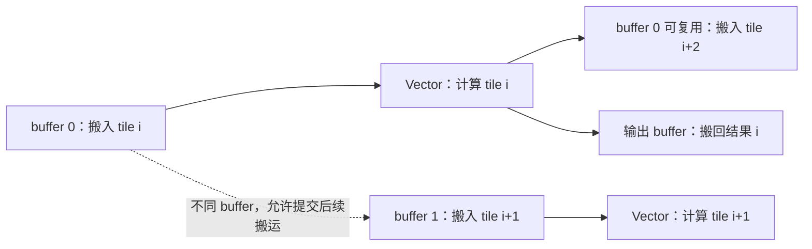

前十篇把一个 kernel 的快与慢拆成了两个数——字节与 FLOPs——以及一套固定动作：先算下界、再测实际、再用 profiler 解释差距。这套方法不依赖 CUDA，但前十篇的每一行代码都依赖 CUDA：`threadIdx`、warp、shared memory、`__syncthreads()`、`mma.sync`。

国内的推理与训练集群里已经有相当规模的昇腾卡，框架侧（PyTorch 的 `torch_npu`、vLLM 的 Ascend 插件、MindSpore）屏蔽了大部分差异，但算子层屏蔽不掉：一个在 A100 上写好的融合 kernel 搬到昇腾上，要重写。这一篇就回答"重写意味着什么"：**哪些概念是一对一映射的，哪些没有对应物，哪些看着像却不是**。

本篇是系列里唯一一篇不写 CUDA 的正文，也只写一个算子——`z = x + y`。选它的理由和第三篇选 elementwise 一样：它简单到可以把编程模型的每一行都讲完，借此把编程模型带来的迁移成本单独拆开（工具链、算子覆盖和框架兼容另有成本）。GEMM 只在最后一节点到 Cube 单元与 `Matmul` 高阶 API 的入口。

总纲给这一篇的核心问题是：

> **把第三篇的 elementwise kernel 迁到昇腾上，哪些概念一对一映射、哪些没有对应物？[^q0] 为什么 Ascend C 要你显式写出搬入、计算、搬出三段，而 CUDA 不用？[^q1]**

## 一、总览

### 1. 答案先说在前面

一句话：**普通 CUDA elementwise 用线程直接发全局 load/store；Ascend C 的 Vector Add 用显式搬运把 GM 数据送入核内，再做向量运算**。

本篇使用的 Vector 张量计算接口操作核内 buffer，核外的 Global Memory 必须由搬运单元显式搬进来。于是 CUDA 里一个线程"直接读一个全局地址再加一下"的写法在 Ascend C 里不存在，取而代之的是 `CopyIn → Compute → CopyOut` 三段，和一套管理核内 buffer 与段间同步的队列。这是最大的结构性差异；其余概念（多核切分、分块、双缓冲、host 侧 launch）在 CUDA 里都有对应物，只是名字和显式程度不同。

### 2. 版本基线与实现边界

本篇的代码与结论钉在两个版本上：文档是 CANN 8.0.0 商业版的 [Kernel Launch 开发指南](https://www.hiascend.com/document/detail/en/canncommercial/800/opdevg/Ascendcopdevg/atlas_ascendc_10_0005.html)，样例是它链接的 [Ascend/samples `v0.2-8.0.0.beta1`](https://gitee.com/ascend/samples/tree/v0.2-8.0.0.beta1/operator/ascendc/0_introduction/3_add_kernellaunch/AddKernelInvocationNeo)（commit `46e5879`）。配套工程收录在 [ai-learning-labs 的 `gpu-kernel-engineering/ascend-add/`](https://github.com/arganzheng/ai-learning-labs/tree/main/gpu-kernel-engineering/ascend-add)：`vendor/` 是原样收录的官方样例（Apache-2.0，版权归 Huawei），外加一个确定性输入生成器与逐元素验证器。

**这一篇没有真机数据。** 写作环境没有 CANN、没有昇腾设备，因此：样例没有在本地编译，CPU 调试、仿真、NPU 三种模式都没有运行，没有吞吐、带宽或双缓冲收益的实测数字。配套工程里能在普通 CPU 上跑的只有一个 NumPy 分块账本（第九章），它验证切分覆盖与数据契约，不验证队列同步，也不是 CPU 调试的替代品。凡是性能判断，本篇只给机制和应该怎么测，不给数字——这与前十篇每篇都先算下界再测实际的做法不同，是必须说明的缺口。

### 3. 本文的章节安排

| 章 | 主题 | 内容 |
|---|---|---|
| 二 | CANN 的分层 | 与 CUDA 工具链的层层对照、Kernel Launch 与框架接入两条路 |
| 三 | AI Core | Vector 与 Cube、耦合与分离架构、核内存储层次与搬运单元 |
| 四 | 一个 Add 的全文 | 官方样例逐段读：`Init`、`Process`、三段流水 |
| 五 | TPipe 与 TQue | 核内 buffer 的分配与段间同步，为什么它不是 warp |
| 六 | 切分 | block 划分、tile 大小、双缓冲、尾块与对齐 |
| 七 | host 侧与调试 | Kernel Launch 的三种运行模式、tiling 放在 host 的原因 |
| 八 | 从 Add 到 Matmul | Cube 的数据流、`TCubeTiling` 与高阶 API |
| 九 | 概念映射总表与迁移清单 | 一对一、要改写、没有对应物三类 |
| 十 | 本文小结 |  |
| 十一 | 自测 | 5 道题 |

Table: 本文的章节安排

## 二、CANN 的分层：与 CUDA 工具链对照

CUDA 这个词在日常使用里至少指四样东西：一门语言（CUDA C++）、一套运行时 API（`cudaMalloc`、`cudaMemcpy`、`<<<>>>`）、一组库（cuBLAS、cuDNN）、一个驱动。昇腾侧的 CANN（Compute Architecture for Neural Networks）也是这样一个合称，层次大致可以这样对上：

| CUDA 侧 | 昇腾侧 | 说明 |
|---|---|---|
| CUDA C++ | Ascend C | 写 kernel 的语言，C++ 语法 + 一套 API 与 `__aicore__` 修饰 |
| `cudaMalloc` / `cudaMemcpy` / stream | AscendCL（`aclrtMalloc`、`aclrtMemcpy`、`aclrtStream`） | host 侧运行时，概念几乎一一对应 |
| `<<<grid, block, shm, stream>>>` | `<<<blockDim, nullptr, stream>>>` / `ACLRT_LAUNCH_KERNEL` | 启动语法，但 `blockDim` 的含义不同（第六章） |
| nvcc | CANN 的 Ascend C 编译工具链 | CPU 调试走调测库；sim / npu 走设备侧编译，运行环境不同 |
| cuBLAS / cuDNN | CANN 的算子库与 `Matmul` 等高阶 API | 前者是库调用，后者还能在自己的 kernel 里用 |
| Nsight Systems / Compute | msprof | 剖析工具（第七章） |
| PyTorch CUDA 后端 | `torch_npu` / MindSpore | 框架接入 |

Table: CUDA 工具链与 CANN 的层次对照

写自定义算子有两条路，差别和 CUDA 侧"写个 `.cu` 直接 launch"与"注册成 PyTorch 算子"是一回事：

- **Kernel Launch**：自己写 host 侧 `main`，分配显存、拷数据、启动 kernel、取回结果。调试快、依赖少，本篇全程走这条路；
- **框架接入**：按算子工程的目录结构写 host 侧的 shape 推导与 tiling、kernel 侧实现，编译成算子包，再由框架（或 `aclnn` 接口）调用。这是算子最终要落到的形态，但它的目录约定、`.json` 定义、tiling 结构体注册等内容与编程模型无关，本篇不展开。

## 三、AI Core：Vector、Cube 与核内的存储层次

CUDA 的执行单元是 SM，SM 内部是 CUDA Core 加 Tensor Core 加 shared memory 加 L1。昇腾的执行单元是 **AI Core**，内部有三类计算单元和一套自己的存储：

- **Scalar**：标量运算与流程控制，相当于 kernel 里算 index、判断分支的那部分；
- **Vector**：向量运算单元，第三、四篇那类 elementwise 与归约跑在这里；
- **Cube**：矩阵乘加单元，对应 Tensor Core，第五到八篇的 GEMM 与 attention 要靠它。

按[官方架构文档](https://www.hiascend.com/doc_center/source/zh/canncommercial/80RC3/developmentguide/opdevg/Ascendcopdevg/atlas_ascendc_10_0008.html)，AI Core 有两种架构：**耦合架构**（Cube 与 Vector 同核，Atlas 推理系列、Atlas 训练系列）和**分离架构**（Cube 与 Vector 拆成 AI Cube 与 AI Vector 两个独立核，各有自己的 Scalar 与代码段，Atlas A2 训练系列 / Atlas 800I A2 推理产品、Atlas 200I/500 A2 推理产品）。分离架构下 AIV 与 AIC 之间通过 Global Memory 传数据。这个差异对本篇的 Add 不重要——它只用 Vector——但对融合算子很重要：在分离架构上把一个 Cube 算子和一个 Vector 算子"融合"，中间结果可能仍要落回 GM。

存储层次是迁移里最需要重新建立直觉的部分：

| CUDA 侧 | 昇腾侧 | 差别 |
|---|---|---|
| Global Memory（HBM） | Global Memory（GM） | 同一个概念，kernel 参数是 `GM_ADDR` |
| L2 cache | —— | Ascend C 编程模型里不作为可编程对象出现 |
| L1 cache（自动） | L1 Buffer（显式） | 昇腾侧是可编程的中转区，不是透明 cache |
| shared memory（显式） | Unified Buffer（UB，Vector 的输入输出所在） | 都是核内可编程空间，但 UB 的读写由搬运单元完成 |
| 寄存器 | 寄存器 | —— |
| Tensor Core 的 fragment | L0A / L0B / L0C | Cube 的输入输出专用 buffer |
| （无显式对应） | MTE1/MTE2/MTE3 搬运单元 | 层间搬运由独立单元执行，可与计算并行 |

Table: CUDA 与昇腾的存储层次对照

两条典型数据流（官方文档给的）把这张表串起来：Vector 计算是 `GM → UB → [Vector] → UB → GM`；Cube 计算是 `GM → L1 → L0A/L0B → Cube → L0C → FixPipe → GM`（或回 L1）。**本篇的 Vector/Cube 张量计算以核内 buffer 为输入输出**——这一句是整个编程模型的根。CUDA 里 `c[i] = a[i] + b[i]` 之所以能直接写全局地址，是因为硬件用 cache 和访存流水把搬运隐藏了；昇腾把搬运交给 MTE 单元，而指挥 MTE 的是你的代码。

## 四、一个 Add 的全文

先把同一份 FP16 连续输入写成最小 CUDA kernel（第三篇的主实验用 BF16；这里换成 half，与官方样例的 dtype 对齐）：

```cpp title="CUDA 对照：每个线程加载两个 half 并写回一个 half"
#include <cuda_fp16.h>

__global__ void add_cuda(const half* x, const half* y, half* z, int n) {
    int i = blockIdx.x * blockDim.x + threadIdx.x;
    if (i < n) z[i] = __hadd(x[i], y[i]);
}
```

下面按方法摘录官方 `KernelAdd`（方法体保持原样）。它包含 `kernel_operator.h`，类内有公开的 `Init`、`Process`，私有的三段方法及第五章的成员，类外入口见本章末尾；完整可编译工程而非独立代码片段在配套仓库 `vendor/`。

```cpp title="官方 Add 样例的编译期常量：总长度、核数、每核长度与 tile 划分"
constexpr int32_t TOTAL_LENGTH = 8 * 2048;                            // total length of data
constexpr int32_t USE_CORE_NUM = 8;                                   // num of core used
constexpr int32_t BLOCK_LENGTH = TOTAL_LENGTH / USE_CORE_NUM;         // length computed of each core
constexpr int32_t TILE_NUM = 8;                                       // split data into 8 tiles for each core
constexpr int32_t BUFFER_NUM = 2;                                     // tensor num for each queue
constexpr int32_t TILE_LENGTH = BLOCK_LENGTH / TILE_NUM / BUFFER_NUM; // separate to 2 parts, due to double buffer
```

六个常量就是这个算子的全部切分方案：16384 个 half，8 个核各 2048 个，每核再切成 `TILE_NUM * BUFFER_NUM = 16` 次、每次 128 个元素。注意 `TILE_LENGTH` 的定义里除了 `BUFFER_NUM`——这是样例的一个取舍：队列深度 2 的同时保持每核 buffer 总量不变，于是单次搬运的粒度减半。

```cpp title="Init：把 GM 指针按 block 偏移绑成 GlobalTensor，并向 TPipe 申请核内 buffer"
__aicore__ inline void Init(GM_ADDR x, GM_ADDR y, GM_ADDR z)
{
    xGm.SetGlobalBuffer((__gm__ half *)x + BLOCK_LENGTH * AscendC::GetBlockIdx(), BLOCK_LENGTH);
    yGm.SetGlobalBuffer((__gm__ half *)y + BLOCK_LENGTH * AscendC::GetBlockIdx(), BLOCK_LENGTH);
    zGm.SetGlobalBuffer((__gm__ half *)z + BLOCK_LENGTH * AscendC::GetBlockIdx(), BLOCK_LENGTH);
    pipe.InitBuffer(inQueueX, BUFFER_NUM, TILE_LENGTH * sizeof(half));
    pipe.InitBuffer(inQueueY, BUFFER_NUM, TILE_LENGTH * sizeof(half));
    pipe.InitBuffer(outQueueZ, BUFFER_NUM, TILE_LENGTH * sizeof(half));
}
```

`Init` 做两件事。第一件是**多核数据切分**：`GetBlockIdx()` 返回当前核的序号，乘上 `BLOCK_LENGTH` 就是这个核负责的那一段的起点。`SetGlobalBuffer(ptr, len)` 把一段 GM 地址包装成 `GlobalTensor`，之后 `xGm[offset]` 的下标都是**相对本核那一段**的——这一步等价于 CUDA 里 `const float* x_block = x + blockIdx.x * block_len;`，只是必须显式写出长度。

手算一次寻址就能检查是否重复乘了核偏移。第 3 号 block 的 GM 起点是 `3 * 2048 = 6144`，它第 2 轮处理 `[6400, 6528)`；第 7 号 block 的第 15 轮处理 `[16256, 16384)`，刚好止于总长度。`CopyIn` 里的 `progress * 128` 只能在本核视图上加一次，不能再乘 `GetBlockIdx()`。

第二件是**核内 buffer 的预分配**：`pipe.InitBuffer(queue, num, bytes)` 向 `TPipe` 申请 `num` 块、每块 `bytes` 字节的空间给这个队列。三个队列各要 2 × 256 B，共 1536 B 的数据 buffer payload（不含其它资源与管理开销）。CUDA 侧的对应物是 `__shared__` 数组或动态 shared memory 的大小——都是编译期/启动期定下的核内空间预算。

```cpp title="Process：把每核的工作切成 16 轮搬入、计算、搬出"
__aicore__ inline void Process()
{
    int32_t loopCount = TILE_NUM * BUFFER_NUM;
    for (int32_t i = 0; i < loopCount; i++) {
        CopyIn(i);
        Compute(i);
        CopyOut(i);
    }
}
```

这个循环读起来像完全串行：搬进来、算、搬出去，再搬下一块。实际的重叠不在这段代码里，而在队列的深度（第五、六章）。

```cpp title="CopyIn：申请 LocalTensor、让搬运单元把一个 tile 从 GM 搬进核内、入队"
__aicore__ inline void CopyIn(int32_t progress)
{
    AscendC::LocalTensor<half> xLocal = inQueueX.AllocTensor<half>();
    AscendC::LocalTensor<half> yLocal = inQueueY.AllocTensor<half>();
    AscendC::DataCopy(xLocal, xGm[progress * TILE_LENGTH], TILE_LENGTH);
    AscendC::DataCopy(yLocal, yGm[progress * TILE_LENGTH], TILE_LENGTH);
    inQueueX.EnQue(xLocal);
    inQueueY.EnQue(yLocal);
}
```

`AllocTensor` 从队列预分配的空间里拿一块，得到一个 `LocalTensor`——核内张量，计算单元能读写的东西。`DataCopy(dst, src, count)` 是搬运指令：这里 `src` 是 `GlobalTensor` 的一个切片，`dst` 是 `LocalTensor`，于是它是一次 GM → 核内的搬运。`EnQue` 把这块数据交给队列，表示"搬运已经发出，谁要用它请去 `DeQue`"。

```cpp title="Compute：从队列取出两个输入、在核内做向量加、把结果入队并释放输入"
__aicore__ inline void Compute(int32_t progress)
{
    AscendC::LocalTensor<half> xLocal = inQueueX.DeQue<half>();
    AscendC::LocalTensor<half> yLocal = inQueueY.DeQue<half>();
    AscendC::LocalTensor<half> zLocal = outQueueZ.AllocTensor<half>();
    AscendC::Add(zLocal, xLocal, yLocal, TILE_LENGTH);
    outQueueZ.EnQue<half>(zLocal);
    inQueueX.FreeTensor(xLocal);
    inQueueY.FreeTensor(yLocal);
}
```

`EnQue` / `DeQue` 表达生产者到消费者的数据依赖，让消费者的计算不能早于输入搬运完成。它不是 CUDA 的 block 全体线程栅栏，也不能把 C++ 方法返回理解成所有设备操作已同步完成。`Add(dst, src0, src1, count)` 是 Vector 单元上的向量加，一条 API 处理 `count` 个元素，不需要写 `for` 循环，也没有"每个线程算一个元素"的概念。算完 `EnQue` 输出、`FreeTensor` 还回两个输入的空间——这是 buffer 生命周期管理；`FreeTensor` 交还使用权，正确的依赖链还必须防止后续搬运在先前消费者完成前覆盖这块空间。

```cpp title="CopyOut：取出结果、搬回 GM、释放核内空间"
__aicore__ inline void CopyOut(int32_t progress)
{
    AscendC::LocalTensor<half> zLocal = outQueueZ.DeQue<half>();
    AscendC::DataCopy(zGm[progress * TILE_LENGTH], zLocal, TILE_LENGTH);
    outQueueZ.FreeTensor(zLocal);
}
```

对称的一段：`DataCopy` 的目标是 `GlobalTensor` 的切片，于是方向变成核内 → GM。

```cpp title="kernel 入口及 host 侧启动包装"
extern "C" __global__ __aicore__ void add_custom(GM_ADDR x, GM_ADDR y, GM_ADDR z)
{
    KernelAdd op;
    op.Init(x, y, z);
    op.Process();
}

#ifndef ASCENDC_CPU_DEBUG
void add_custom_do(uint32_t blockDim, void *stream, uint8_t *x, uint8_t *y, uint8_t *z)
{
    add_custom<<<blockDim, nullptr, stream>>>(x, y, z);
}
#endif
```

入口函数签名里的 `__global__` 和 `<<<>>>` 让 CUDA 读者有宾至如归感，但要当心三处：`__aicore__` 表示这段代码跑在 AI Core 上；`GM_ADDR` 是 GM 地址，不是 `half*`（类型转换在 `Init` 里做）；`<<<blockDim, nullptr, stream>>>` 的三个参数是**核数、保留参数、stream**，没有"block 内多少线程"这一项。这个包装函数只在非 CPU 调试时编译——CPU 调试走另一条路（第七章）。

## 五、TPipe 与 TQue：核内 buffer 的分配器与段间同步

类成员那几行是整个编程模型的声明式部分：

```cpp title="KernelAdd 的成员：一个 TPipe、三个 TQue、三个 GlobalTensor"
AscendC::TPipe pipe;
AscendC::TQue<AscendC::QuePosition::VECIN, BUFFER_NUM> inQueueX, inQueueY;
AscendC::TQue<AscendC::QuePosition::VECOUT, BUFFER_NUM> outQueueZ;
AscendC::GlobalTensor<half> xGm;
AscendC::GlobalTensor<half> yGm;
AscendC::GlobalTensor<half> zGm;
```

- **`TPipe`** 是核内存储的分配器，本样例在每个逻辑 block 的 KernelAdd 实例中持有一个。`InitBuffer` 从它管理的空间里划给各个队列。
- **`TQue<position, depth>`** 是一个有位置属性和深度的队列。`VECIN` 表示这块空间是 Vector 单元的输入侧（UB 的输入方向），`VECOUT` 是输出侧；模板深度描述队列排队能力，`InitBuffer` 的数量参数决定实际分配几块 buffer；这是两个参数，本样例把它们都设为 2，不应把队列深度和物理 buffer 数在所有写法里混为一谈。
- **`LocalTensor`** 是从队列里取出的那块数据的句柄，带元素类型。

`TQue` 身上有两个职责，分开看才不容易混：

1. **空间管理**：`AllocTensor` / `FreeTensor` 是一对，像一个固定块大小的小型分配器；
2. **执行序约束**：`EnQue` / `DeQue` 是一对，表达"生产者发出的搬运必须在消费者使用前完成"。

**`TQue` 不是 CUDA 的 warp，也不是 stream。** warp 是 32 个线程的调度单位，Ascend C 里没有对应物（线程在这个模型里不存在）；stream 是 host 侧的任务队列，对应的是 `aclrtStream`。`TQue` 管的是单个核内部一段 buffer 的生命周期和两段代码之间的次序，用于理解的 CUDA 类比是**一块显式暂存区加生产者/消费者同步**，但它不等价于 block 全体线程参加的 `__syncthreads()`——或者 Hopper 上 producer/consumer warp specialization 里的那个 mbarrier。

## 六、切分：block、tile、双缓冲、尾块与对齐

### 1. 核间划分：`blockDim` 不是 CUDA 的 block

host 侧 `uint32_t blockDim = 8;`，kernel 侧 `GetBlockIdx()` 返回 0–7。这里的 "block" 是**核间划分的逻辑任务**（本篇只讨论纯 Vector Add），不是 CUDA 里"一个 block 的若干线程"。它不是物理核 ID 的查询接口，也不能把这套数量关系直接推广到混合 AIC/AIV kernel。所以：

| CUDA | Ascend C | 说明 |
|---|---|---|
| `gridDim.x` | `blockDim`（launch 参数） | 都是"切成几份" |
| `blockIdx.x` | `GetBlockIdx()` | 都是"我是第几份" |
| `blockDim.x` / `threadIdx.x` | 无对应物 | 核内并行由 Vector API 的向量长度表达 |

Table: CUDA 与 Ascend C 的并行维度对照

一个直接后果是：CUDA kernel 里常见的 `int i = blockIdx.x * blockDim.x + threadIdx.x;` 在迁移时不是改个变量名的事，而是整段循环结构要换成"本核的一段 + 段内分块"。

### 2. 核内分块：tile 大小的约束

每核 2048 个元素为什么要切成 16 次、每次 128 个，而不是一次搬完？和第五篇选 GEMM tile 大小一样，是容量与流水的取舍：

- 核内 buffer 的容量有上限，一次搬入的量必须放得下，而且三个队列要共享这个预算；
- 队列深度大于 1 时，同一队列的多块数据同时占用空间，单块就得更小；
- 块太小则每次搬运的字节数太少，搬运单元的效率下降、循环与同步的开销占比上升。

这个样例把 `TILE_LENGTH` 定成 128 个 half（256 B）是教学取值，不是性能建议。**选 tile 大小必须按目标型号的 buffer 容量和实测来定**，本篇没有实测，不给推荐值。

### 3. 双缓冲：为什么它能重叠，以及它不保证什么

`BUFFER_NUM = 2` 是这个样例里唯一的"性能"开关。机制是这样的：队列深度为 2 时，`CopyIn(i+1)` 的 `AllocTensor` 可以拿到另一块空间——因为 `Compute(i)` 用的那块还没还、但空间不只一块——于是第 `i+1` 轮的搬运可以在第 `i` 轮的计算还在进行时就发出。搬运由 MTE 单元执行、计算由 Vector 单元执行，两者是不同的硬件单元，因此**可能**在时间上重叠：



图中只画数据与复用依赖，不代表实测时间或固定串行顺序。GM→UB 与 UB→GM 也不是同一个搬运方向；即使输入只有一个 buffer，不同输出队列的搬出也未必与下一次搬入完全串行。几个必须说清的边界：

- 重叠的前提是两个单元都有活干。搬运远长于计算（大尺寸流式 Add 常见的情况；这个固定小样例也可能主要受启动与 cache 影响）时，加深队列只能把计算藏进搬运，总时间仍由搬运决定——和第三篇"到了带宽墙只能减字节"是同一条道理；
- 深度加倍要么占用更多核内空间，要么（像这个样例）把单块变小；单块变小本身可能降低搬运效率；
- 因此"开双缓冲一定更快"是错的。要知道它在某个算子上值不值，得按第七章的方式用 msprof 测，本篇没有测。

### 4. 尾块与对齐：这个样例回避了的问题

样例的 shape 是写死的 `8 * 2048`：能被核数整除，每核能被 tile 整除，没有尾块。真实算子不能这样假设，泛化时至少要处理三件事：

- **核间不整除**：`n` 不是核数的整数倍时，前若干核多分一个块，或最后一个核处理余数；
- **核内不整除**：最后一个 tile 不足 `TILE_LENGTH`，分别记录有效长度与合法搬运长度，不能只把 `DataCopy` 的 count 改成余数；
- **对齐**：搬运指令对起止地址与长度有对齐要求，把一个非整数倍长度直接当最后一块搬，可能既不合法也不高效；若按对齐粒度补齐，必须在 host 分配/初始化真实 padding，不能把 count 向上取整后越过原张量读写；也可以按型号选择支持非对齐搬运的 API，或单独实现尾块路径。该版本样例的 256 B 搬运长度与偏移均为 32 B 的整数倍。

这三件事在 CUDA 里对应的是 `if (i < n)` 这一行边界检查加上向量化访存的尾部处理（第三篇）。差别在于：CUDA 的逐线程边界判断并不能原样替代批量搬运的边界设计。某些昇腾型号支持 Scalar 读写 GM，但那不等于本 Vector 样例自动具有通用尾块路径；是否采用带 padding 的搬运接口或其它路径，必须核对型号和版本。配套工程的 README 列了一组必须覆盖的输入（`n = 0 / 1 / 127 / 129 / 16385`、非连续、改 dtype）——都不在官方样例的支持范围内。

## 七、host 侧与三种运行模式

host 侧（`vendor/main.cpp`）的 NPU 分支与 CUDA 程序几乎逐行对应：

| CUDA | AscendCL | 作用 |
|---|---|---|
| `cudaSetDevice` | `aclInit` + `aclrtSetDevice` | 初始化与选设备 |
| `cudaStreamCreate` | `aclrtCreateStream` | 创建流 |
| `cudaMallocHost` / `cudaMalloc` | `aclrtMallocHost` / `aclrtMalloc` | host / device 分配 |
| `cudaMemcpy` | `aclrtMemcpy` | 拷贝，方向由枚举指定 |
| `kernel<<<...>>>` | `add_custom_do(...)` → `<<<blockDim, nullptr, stream>>>` | 启动 |
| `cudaStreamSynchronize` | `aclrtSynchronizeStream` | 等待 |
| `cudaFree` | `aclrtFree` / `aclrtFreeHost` | 释放 |

Table: host 侧 API 对照（CUDA 与 AscendCL）

三种运行模式是昇腾侧开发体验里和 CUDA 差别最大、也最实用的一点。`run.sh -r {cpu,sim,npu}` 用同一份 kernel 源码选择构建与运行路径（sim / npu 共用设备编译配置）：

| 模式 | 怎么跑 | 能回答什么 | 不能回答什么 |
|---|---|---|---|
| CPU 调试 | 宿主机 CPU 上执行，`ICPU_RUN_KF` 宏启动，`AscendC::GmAlloc` 代替设备内存 | 逻辑对不对，可以用 gdb、printf | 任何性能问题 |
| 仿真 | 指令级仿真器，`msprof op simulator` 可取时间线 | 流水是否重叠、指令级行为 | 不等于真机时间 |
| NPU | 真机，`msprof op` 取性能数据 | 正确性与性能 | 需要匹配型号的硬件与驱动 |

Table: Ascend C 的三种运行模式及各自能回答的问题

CUDA 侧没有"同一份 kernel 直接在 CPU 上单步"的标准做法（`cuda-gdb` 是在设备上调试），这条路对写第一个算子的人很友好。但要注意两点：CPU 调试可按 `blockDim` 执行逻辑块、检查结果，但**不能据此证明真实多核并发与硬件同步正确，更不能用它的耗时谈性能**；`ASCENDC_CPU_DEBUG` 宏切换的是 host 侧代码路径，所以两种模式下 `main.cpp` 走的是不同分支。

有匹配的 CANN 8.0.0 开发环境时，从配套工程的 `vendor/` 目录运行（路径与 SoC 需按实际安装修改；这里选择 Ascend910B1，不使用脚本默认的 Ascend310P3）：

```bash title="有 CANN 时运行官方 CPU 调试、仿真或 NPU 路径；本文未执行"
export ASCEND_INSTALL_PATH=/usr/local/Ascend/ascend-toolkit/8.0.0
source "$ASCEND_INSTALL_PATH/bin/setenv.bash"
bash run.sh -r cpu -v Ascend910B1
# 仿真需要相应组件，真机需要匹配设备与驱动：
# bash run.sh -r sim -v Ascend910B1
# bash run.sh -r npu -v Ascend910B1
python3 ../reference.py verify --root .
```

`run.sh` 会重建工程并生成随机正数输入。严格验收还要覆盖 signed / zeros / tile 与 block 边界输入：先编译，再用 `reference.py generate` 写入确定性输入，直接执行产物，最后 verify；不要重新跑会覆盖输入的 `run.sh`。具体动态库环境与循环命令见配套 README。测性能时用 `RUN_WITH_TOOLCHAIN=1` 进入脚本的 `msprof op` 路径，另加 warmup / 重复与设备侧计时；分开 H2D/D2H、kernel 与端到端耗时，并报告 SoC、CANN、输入、编译配置和缓存状态。单次小 Add 的 profiler 时间不是稳定带宽 benchmark。

**tiling 为什么放在 host 侧。** Add 的切分是编译期常量，所以样例里看不出 tiling 的分量。真实算子的 shape 在运行时才知道，于是切分方案（用几个核、每核几块、每块多大、尾块怎么办）由 host 侧根据 shape 与芯片规格算好，打包成一个结构体传给 kernel。第八章的 Matmul 样例就是这样做的：host 侧调 tiling API 生成 `TCubeTiling`，拷到设备上，kernel 再读出来。CUDA 侧的对应物是"host 侧按 shape 选 kernel 配置或模板实例"——同一件事，只是昇腾侧把它固化成了 API 与结构体。

## 八、从 Add 到 Matmul：Cube 与高阶 API

Add 只用到 Vector。GEMM 要用 Cube，数据流从 `GM → UB → GM` 变成 `GM → L1 → L0A/L0B → Cube → L0C → FixPipe → GM`。如果照第四章的方式手写，要管的 buffer 从 1 层变成 3 层，还要处理 Cube 对分形布局的要求——这正是 Ascend C 提供高阶 API 的原因。[同一 tag 的官方 Matmul 样例](https://gitee.com/ascend/samples/tree/v0.2-8.0.0.beta1/operator/ascendc/0_introduction/11_matmul_kernellaunch/MatmulInvocationNeo)的 kernel 主体是这样的：

```cpp title="Matmul 样例的 kernel 主体：注册 Matmul 对象、设置 A/B/尾块、迭代输出"
Matmul<MatmulType<AscendC::TPosition::GM, CubeFormat::ND, A_T>,
       MatmulType<AscendC::TPosition::GM, CubeFormat::ND, B_T>,
       MatmulType<AscendC::TPosition::GM, CubeFormat::ND, C_T>> mm;
REGIST_MATMUL_OBJ(&pipe, GetSysWorkSpacePtr(), mm, &tiling);
mm.SetTensorA(gmA, isTransA);
mm.SetTensorB(gmB, isTransB);
mm.SetTail(tailM, tailN);
mm.IterateAll(gmC);
mm.End();
```

对照第六篇读这段很有意思：模板参数里 `TPosition::GM` + `CubeFormat::ND` + dtype 描述三个矩阵"在哪、什么布局、什么类型"，和 CUTLASS 3.x 的 GEMM 模板参数（layout、element type、arch tag）是同一类信息；`tiling` 里的 `singleCoreM/N`、`baseM/baseN` 描述每核任务与基本分块，可与 CUTLASS 的分层 tile 思路类比，但不能把 `baseM/baseN` 机械等同于 WarpShape。`IterateAll` 把"按 K 维迭代、累加在 L0C、结果经 FixPipe 写出"这套循环收进了一次调用——换 CUDA 的话，相当于直接用 CUTLASS 的 collective API 而不是自己写 `mma.sync` 的主循环。

host 侧的 tiling 则给出了"按 shape 算配置"的具体形态：

```cpp title="Matmul 样例的 host 侧 tiling：按 SoC 规格与 shape 生成 TCubeTiling"
auto ascendcPlatform = platform_ascendc::PlatformAscendCManager::GetInstance(socVersion);
MultiCoreMatmulTiling tilingApi(*ascendcPlatform);
tilingApi.SetDim(usedCoreNum);
tilingApi.SetAType(leftPosition, leftFormat, leftDtype, isTransA);
tilingApi.SetBType(rightPosition, rightFormat, rightDtype, isTransB);
tilingApi.SetCType(resultPosition, resultFormat, resultDtype);
tilingApi.SetOrgShape(M, N, K);
tilingApi.SetShape(M, N, K);
tilingApi.SetFixSplit(baseM, baseN, -1);
tilingApi.GetTiling(tilingData);
```

注意 `GetInstance(socVersion)`：切分方案依赖**具体型号**的核数与 buffer 容量。这是和 CUDA 侧 `cudaGetDeviceProperties` 之后按 SM 数与 shared memory 上限调参一样的事，只是昇腾侧把它做成了 tiling API 的必要输入——也因此，昇腾算子的一份 tiling 换型号就要重算。

高阶 API 还有一层含义：kernel 侧的 `Matmul` 对象自己管 L1/L0 的 buffer 与流水，意味着第五、六篇那种"自己调 tile 大小与双缓冲深度"的优化空间，在这里变成了"调 tiling 参数"。手写 Cube 流水当然可行，但那是另一篇的内容。

## 九、概念映射总表与迁移清单

把前面几章压成一张表，这是本篇最该记住的东西：

| CUDA 概念 | 昇腾侧 | 迁移性质 |
|---|---|---|
| `gridDim` / `blockIdx` | `blockDim` / `GetBlockIdx()` | 一对一 |
| host 运行时与 stream | AscendCL 与 `aclrtStream` | 一对一 |
| Global Memory | GM，`GM_ADDR` | 一对一 |
| Tensor Core | Cube 单元 | 功能角色类比，不是指令或布局一对一 |
| cuBLAS / CUTLASS | host 算子库 / kernel 内 `Matmul` API | 先区分 host 调用与 kernel 内库对象 |
| shared memory 分块 | `TPipe` + `TQue` + `LocalTensor` | 要改写：显式搬运三段 |
| `__syncthreads()` | `EnQue` / `DeQue` 的次序约束 | 要改写：粒度是一块数据 |
| 向量化访存（`float4`） | `DataCopy` 的长度与对齐要求 | 要改写 |
| 边界检查 `if (i < n)` | tiling 的尾块与对齐处理 | 要改写：本样例未提供通用尾块路径 |
| `cp.async` 双缓冲 | 队列深度 `BUFFER_NUM` | 要改写（概念相同） |
| Nsight Compute | msprof | 要改写（指标体系不同） |
| `threadIdx` / warp / shuffle | 无对应物 | 没有对应物：核内并行由向量 API 表达 |
| 自动 cache 与显式暂存区 | `GlobalTensor` 不代表绕过硬件 cache；UB/L1 Buffer 需显式管理 | 不能把两边的 L1/L2 按同名等同 |
| `__ldg` / 直接读全局地址做计算 | 必须先 `DataCopy` 进核内 | 没有对应物 |

Table: CUDA 与 Ascend C 的概念映射

一份最小迁移清单，按本篇的顺序：

1. 确认算子落在 Vector 还是 Cube，以及目标型号是耦合还是分离架构（第三章）；
2. 把"每线程一个元素"的循环改成"本核一段 + 段内分块"（第四、六章）；
3. 把隐式的访存改成 `CopyIn / Compute / CopyOut` 三段，并为每段数据定好 `TQue` 的位置与深度（第四、五章）；
4. 把 shape 相关的切分从编译期常量挪到 host 侧 tiling，处理不整除与对齐（第六、七章）；
5. 先用 CPU 调试过正确性，再上仿真看流水，最后在真机上测性能（第七章）；
6. 正确性验收要逐元素比对，不要只看"误差比例在容限内"。官方样例的验证脚本允许一定比例的元素不匹配，配套工程另给了一个严格的逐元素验证器。

固定 Add 的逻辑账本是 $$16384$$ 次加法、每元素两读一写各 2 B，共 $$98304$$ B，算术强度 $$1/6$$ FLOP/B。它是程序的逻辑流量，不保证每次都从 HBM 取数；小输入受 cache 和 launch 影响，不能用这三个数冒充测出的 HBM 带宽。

配套仓库进入 `gpu-kernel-engineering/ascend-add/` 后，普通机器可以执行：

```bash title="不依赖 CANN 的分块合同检查"
python3 reference.py audit
```

下面是真实的 **NumPy 账本输出，不是 Ascend C kernel 输出**：

```text title="固定 shape 的覆盖、资源与流量检查结果"
signed: NumPy tiling covers 16384 elements exactly once
zeros: NumPy tiling covers 16384 elements exactly once
boundaries: NumPy tiling covers 16384 elements exactly once
unsupported shape/stride: rejected
block=2048, tile=128, iterations=16, queue_payload_bytes=1536
logical_global_bytes=98304, flops=16384, intensity=1/6
NumPy contract check only; no Ascend C compilation or execution
```

**本篇的验证做到哪一步，必须说清。** 写作环境没有 CANN 也没有昇腾硬件，因此只做了三件事：逐文件原样收录官方样例并核对内容；用一个 NumPy 账本复核切分契约（8 核 × 2048、16 轮 × 128、覆盖恰好一次、1536 B 队列占用、98304 B 逻辑读写量、算术强度 1/6），顺带验证不支持的 shape 与非连续输入被拒绝；对新增 Python 跑 ruff 与 mypy。**没有**编译、没有 CPU 调试、没有仿真、没有真机，所以本篇不给任何昇腾侧的性能数字；配套 README 写明了有 CANN 时该怎么跑这三种模式，以及性能测试该怎么做。

## 十、本文小结

- CANN 对 CUDA 的工具链是层层对应的：Ascend C ↔ CUDA C++、AscendCL ↔ CUDA 运行时、msprof ↔ Nsight、`torch_npu` ↔ PyTorch CUDA 后端。写自定义算子有 Kernel Launch 与框架接入两条路，本篇走前者；
- AI Core 内有 Scalar / Vector / Cube 三类计算单元，Cube 与 Vector 可能同核（耦合）或分核（分离）。**Vector/Cube 的张量运算依赖核内 buffer**，GM 与核内之间的搬运由 MTE 单元执行、由你的代码指挥——这是迁移里唯一真正的结构性改动；
- 一个 Ascend C 算子的骨架是 `Init`（绑 GM、分配核内 buffer）+ `Process`（循环）+ `CopyIn / Compute / CopyOut`。`TPipe` 是核内空间的分配器，`TQue` 同时承担空间管理（`AllocTensor` / `FreeTensor`）与执行序约束（`EnQue` / `DeQue`）；它不是 warp，也不是 stream；
- `blockDim` 是"用几个核"，核内没有线程维度，并行由向量 API 的长度表达。`threadIdx`、warp、shuffle 没有对应物；
- 双缓冲（队列深度 2）让搬运与计算**可能**重叠，但它要么多占核内空间、要么让单块变小，在 memory-bound 的算子上收益受搬运时间封顶。要不要开，得测；
- 官方 Add 样例写死 `8 * 2048`，回避了核间不整除、核内尾块与对齐三件事；它们在泛化实现里是必须正面处理的，而且不能只把 CUDA 的单元素 if 换个名字；
- GEMM 用 Cube，数据流是 `GM → L1 → L0A/L0B → Cube → L0C → FixPipe`。`Matmul` 高阶 API 把这套流水收进 `IterateAll`，优化空间从"写流水"变成"调 tiling"；tiling 依赖具体型号，换型号要重算；
- 迁移成本的分布很清楚：host 侧几乎不用重学，切分逻辑要改写，访存与同步要重写，核内并行的思维方式要换掉。

下一篇是系列总结与通关自测：把十一篇压成一张表，拎出贯穿全系列的几条线，然后给一套三段式的自测。

## 十一、自测

1. CUDA kernel 里 `int i = blockIdx.x * blockDim.x + threadIdx.x; if (i < n) z[i] = x[i] + y[i];` 迁到 Ascend C，这一行拆成了哪几部分？

   <details markdown="1"><summary>答案</summary>

   `blockIdx.x` → `GetBlockIdx()` 与 `Init` 里的 GM 偏移；`threadIdx.x` 与 block 内线程数没有直接对应物，核内并行由 `Add(..., TILE_LENGTH)` 的向量长度表达；`z[i] = x[i] + y[i]` 拆成 `DataCopy` 搬入、`Add` 计算、`DataCopy` 搬出三段，加上 `AllocTensor` / `EnQue` / `DeQue` / `FreeTensor` 管空间与次序；`if (i < n)` 变成 host 侧 tiling 的尾块与对齐处理。

   </details>

2. `TQue` 和 CUDA 的 warp、stream 分别差在哪里？

   <details markdown="1"><summary>答案</summary>

   warp 是 32 个线程的调度单位，Ascend C 里没有线程，没有对应物；stream 是 host 侧的任务队列，对应 `aclrtStream`。`TQue` 是单核内一段 buffer 的分配器 + 两段代码之间的执行序约束，可以类比显式暂存区加生产者/消费者依赖，但不等价于 block 级全体线程栅栏。

   </details>

3. 官方样例里 `TILE_LENGTH = BLOCK_LENGTH / TILE_NUM / BUFFER_NUM`。为什么分母里有 `BUFFER_NUM`？把 `BUFFER_NUM` 从 2 改成 1 会发生什么？

   <details markdown="1"><summary>答案</summary>

   为了在加深队列的同时保持每个队列占用的核内空间不变（深度 × 单块大小恒定）。改成 1：单块增到 256 个 half（512 B），轮数减为 8，数据 buffer 总量仍是 1536 B。输入 buffer 的复用依赖更紧，但单次搬运更大、循环更少。净效果必须实测，不能断言更快。

   </details>

4. 一个 memory-bound 的 elementwise 算子，在昇腾上开双缓冲后没有变快。给两个合理的解释。

   <details markdown="1"><summary>答案</summary>

   一是搬运时间远大于计算时间，重叠只能把计算藏进搬运，总时间仍由搬运决定——到了带宽墙只能减字节（第三篇的同一条结论）；二是为了腾出队列深度把单块减半，搬运效率下降，抵掉了重叠的收益。另外也要先确认测法本身可靠（warmup、重复、设备侧计时）。

   </details>

5. 只有一台没有昇腾卡的开发机，能验证一个 Ascend C 算子的哪些部分？

   <details markdown="1"><summary>答案</summary>

   装了 CANN 的话可以编译并跑 CPU 调试（逻辑正确性，可用 gdb）和仿真（流水行为），都不能用来谈真机性能。完全没有 CANN 时只能做静态检查和"把切分契约用 NumPy 复核一遍"这类参考实现验证——它不验证队列同步，也不是 CPU 调试的替代品。性能必须在匹配型号的真机上用 msprof 测。

   </details>

[^q0]: 一对一的有：核间切分（`gridDim`/`blockIdx` ↔ `blockDim`/`GetBlockIdx()`）、host 运行时与 stream（AscendCL 与 CUDA 运行时逐个对应）、Global Memory、Tensor Core ↔ Cube、库调用 ↔ 算子库与高阶 API（[第二](#二cann-的分层与-cuda-工具链对照)、[三](#三ai-corevectorcube-与核内的存储层次)、[七章](#七host-侧与三种运行模式)）。**没有对应物**的有三件：`threadIdx` / warp / shuffle——Ascend C 里不存在线程维度，核内并行由向量 API 的长度表达；CUDA cache 与昇腾的 UB/L1 Buffer 不能按同名直译（这不意味着昇腾没有硬件 cache）；"直接读全局地址做计算"——这里的 Vector `Add` 操作 `LocalTensor`，必须先搬入（[第三](#三ai-corevectorcube-与核内的存储层次)、[六章](#六切分blocktile双缓冲尾块与对齐)）。**要改写但概念相同**的是 shared memory 分块 ↔ `TPipe`/`TQue`/`LocalTensor`、`__syncthreads()` ↔ `EnQue`/`DeQue`、向量化访存 ↔ `DataCopy` 的对齐要求、边界检查 ↔ tiling 的尾块处理、`cp.async` 双缓冲 ↔ 队列深度（[第四](#四一个-add-的全文)、[五](#五tpipe-与-tque核内-buffer-的分配器与段间同步)、[六章](#六切分blocktile双缓冲尾块与对齐)）。
[^q1]: 因为这里的 Vector/Cube 张量计算操作核内 buffer（UB、L0A/L0B/L0C 等），GM 与核内之间的搬运由独立的 MTE 搬运单元完成（[第三章](#三ai-corevectorcube-与核内的存储层次)）。CUDA 的 SM 可以直接对全局地址发访存指令，硬件用 cache 与访存流水把搬运隐藏起来，所以 `c[i] = a[i] + b[i]` 能一行写完；昇腾把这层交给程序，于是搬入、计算、搬出必须分段写出，段与段之间还要显式表达次序（`EnQue`/`DeQue`）。代价是代码变长，收益是搬运与计算的重叠由你控制——队列深度就是这个控制旋钮（[第六章](#六切分blocktile双缓冲尾块与对齐)）。
