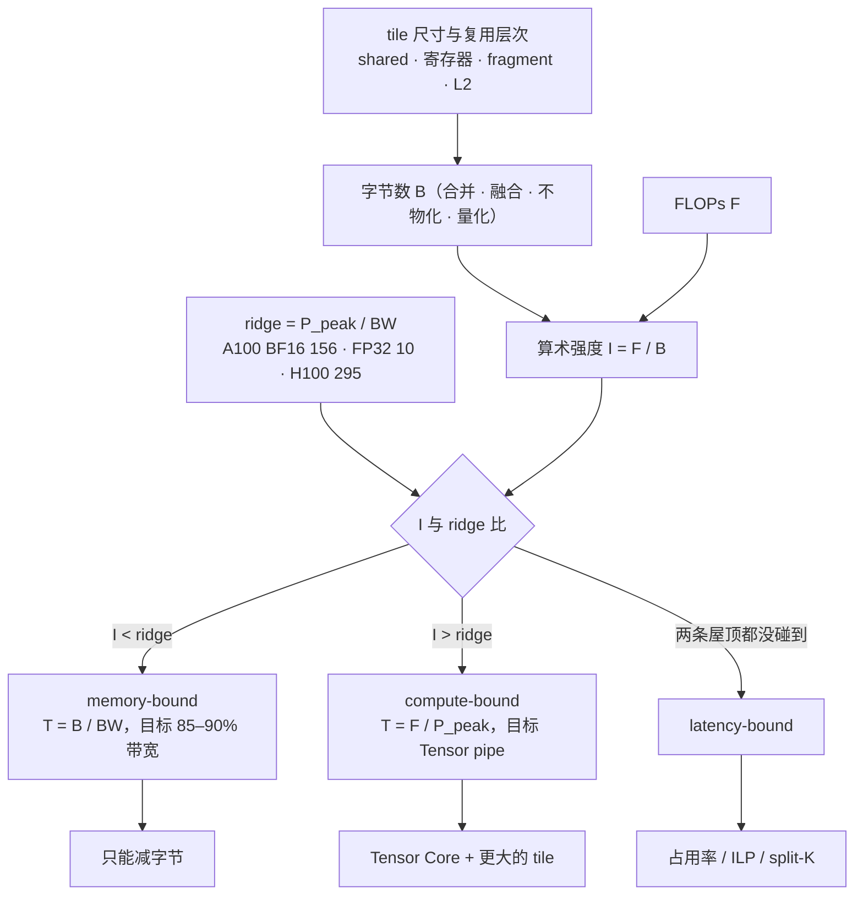

十篇正文回答了一个问题：**一个 kernel 为什么快、为什么慢，以及如何把它写到接近硬件极限**。第一篇把 GPU 拆开并建立 Roofline，第二篇写出第一个 kernel 并学会测量，第三、四篇把 memory-bound 的 elementwise 与 reduction 推到带宽墙，第五、六篇把 GEMM 从 naive 推到 Tensor Core，第七篇用 Triton 看编译器接管了哪一层，第八、九篇把这些工具用到 attention、量化与融合 kernel 上组装出一个 decoder layer，第十篇讲怎么剖析、测试、接入框架并合入一个 PR。

本文不讲新内容，做三件事：把十篇压成一张表与十段回顾，把贯穿全系列的几条线拎出来，然后给一套三段式的通关自测——判断与计算、跨篇综合、面试题。各篇末尾的自测检验的是"这一篇读懂了没有"，这里检验的是"十篇能不能连起来用"。

> **读完这十篇，你应该能回答哪些问题？[^q0] 哪些数字与结论必须能脱口而出？[^q1] 怎么判断自己是"读过"还是"掌握"了？[^q2]**

## 一、总览：系列回答的问题与主线

系列的一句话主张是：**每个 kernel 先算它理论上应该多快，再测它实际多快，再用 profiler 解释差距，再动手缩小差距**。理论下界来自 kernel 的两个数——字节数与 FLOPs——和硬件的两个数——峰值带宽与峰值算力；相除得到算术强度与 ridge point，比一下就知道是 memory-bound 还是 compute-bound，方向是减字节还是喂满 Tensor Core。硬件基线全系列一致：A100（2.0 TB/s、BF16 312 TFLOPS、FP32 19.5 TFLOPS、108 个 SM），随文标注 H100（3.35 TB/s、989 TFLOPS、132 个 SM）。

| 篇 | 回答的问题 | 一句话结论 | 必记的数字 / 公式 |
|---|---|---|---|
| [第一篇：硬件结构与 Roofline](/gpu-architecture-and-roofline.html) | 在一块给定的 GPU 上，一段计算理论上最快能多快？ | $$T = \max(F / P_{peak},\ B / BW)$$，算术强度与 ridge 比定瓶颈类型；GPU 用零开销 warp 切换而非乱序执行隐藏延迟 | ridge：A100 BF16 156、FP32 约 10，H100 295；elementwise $$I = 1/6$$、RMSNorm ≈ 1、decode attention ≈ 4、GEMM 4096³ ≈ 1365；延迟 0 / 20–30 / 200 / 400–800 周期 |
| [第二篇：CUDA 编程模型与第一个 kernel](/cuda-programming-model-and-first-kernel.html) | 五行的 vector add 跑出了理论带宽的多少？没跑满的去了哪里？ | 80–92%；DRAM 可达带宽只有标称的 85–92%，其余在每线程工作量太小、launch 与尾部、SM 填充 | 3 GiB → 1.6 ms 下界、实测 1.7–2.0 ms；block 32 的倍数、常用 128–256；event 计时；L2 flush 128 MB ≥ 2 × 40 MB |
| [第三篇：访存合并与 elementwise](/memory-coalescing-and-elementwise-kernels.html) | 跑出 90% 带宽的 elementwise 还有什么可优化？ | 没有了，要么融合，要么少做：90% 贴着物理上限，之后唯一的优化是减少总字节数 | 32 B sector；连续 100%、跨步 2 50%、跨步 ≥ 32 B 12.5%；16 B/线程；Little's law 1.2 MB 在飞、每 SM ≥ 22 warp；三个 kernel 16 B → 融合 8 B |
| [第四篇：共享内存与 reduction](/shared-memory-reduction-and-softmax.html) | 4096 维 RMSNorm 是 memory-bound 的，naive 为什么慢 10 倍？shared 与 shuffle 各解决什么？ | 慢在归约的形态不在字节数；shared 汇总跨 warp 的部分和，shuffle 在寄存器里 5 步完成 warp 内归约，sync 10 次 → 1 次 | 128 MiB → 67 µs；bank = (addr / 4) mod 32，stride $$s$$ → gcd($$s$$, 32)-way；$$d \le 1024$$ 一行一个 warp；FP16 $$e^x$$ 溢出于 11.09、BF16/FP32 于 88.7；online softmax 合并 $$m = \max(m_a, m_b)$$、$$l = l_a e^{m_a - m} + l_b e^{m_b - m}$$ |
| [第五篇：GEMM 从 naive 到分块](/gemm-from-naive-to-tiled.html) | 4096³ FP32 GEMM 每一版读多少字节、算术强度多少、在 Roofline 哪个位置？ | 分块让算术强度成为可设计的参数；瓶颈从 L1/L2 请求迁到 shared 带宽再迁到 LDS 指令与流水，寄存器分块靠 ILP | 137.4 GFLOP、192 MiB、$$I = 683$$、7.0 ms；naive 512 GiB、0.25、1–3%；分块 $$MNK(1/BM + 1/BN)$$：128×128 → 4 GiB、32；对 shared 0.25 → 2；v5 到 FP32 峰值 70–80% |
| [第六篇：Tensor Core、CUTLASS 与 CuTe](/tensor-cores-cutlass-and-cute.html) | 同样 128×128 分块，CUDA Core 与 Tensor Core 版本结构差在哪？为什么必须关心 fragment 与 `ldmatrix`？ | 累加器从属于线程变成属于 warp、布局由指令规定；`mma` 只允许约 8 条伴随指令，装载必须用 `ldmatrix` 且 shared 必须 swizzle；Hopper 交给 TMA + `wgmma` | 312 TFLOPS 是 FP32 的 16 倍；`mma.sync.m16n8k16` = 4096 FLOP、占 8 周期；BF16 4096³ 100.7 MB、$$I = 1365$$、0.44 ms；未 swizzle 64 B 行 4 路 conflict；手写到 cuBLAS 80–90% |
| [第七篇：Triton](/triton-block-level-programming.html) | Triton 的 matmul 少 80% 代码、只差 10%：那 10% 在哪里？何时值得手写？ | 编译器做了合并、流水、`ldmatrix`、swizzle、mma 选择；差在 warp specialization、epilogue 布局转换、小 shape tile、指令调度；热点 GEMM/attention、特殊指令、Hopper、跨 block 才手写 | 12 / 25 / 60 行对 50–80 / 100–150 / 200–300 行；matmul 到 cuBLAS 80–95%；`num_warps`、`num_stages` 两个旋钮；`tl.arange` 要 2 的幂 |
| [第八篇：FlashAttention 与 PagedAttention](/attention-kernels-flashattention-and-pagedattention.html) | $$N = 4096$$、$$d = 128$$ 的 attention 标准与 Flash 各读写多少 HBM？decode 每 token 读多少 KV，决定了什么？ | 不物化 $$S$$、$$P$$，靠 online softmax 逐块累加，从 memory-bound 变 compute-bound，省的是 IO 不是 FLOPs；decode 每步读全部 KV，分页只改地址不改字节 | 标准约 132 MiB、$$I \approx 62$$；FA 约 66 MiB、实际近 4 MiB；$$4N^2 d = 8.6$$ GFLOP；$$\Theta(N^2 d^2 / M)$$；每 token 128 KiB，$$B \times s >$$ 约 131k 时 KV 超过权重 |
| [第九篇：量化与融合 kernel](/quantization-and-fused-kernels.html) | INT4 weight-only GEMM decode 快 3 倍、prefill 反而慢，用 Roofline 解释 | 用指令换字节：字节除以 4、FLOPs 不变、多一条反量化指令；decode 在斜线上受益，prefill 在屋顶上不动甚至下沉；FP8 字节与 FLOPs 同时减半 | BF16 $$I \approx M$$、W4A16 $$I \approx 4M$$，交叉点 $$M \approx 40$$；decode 8 ms → 约 2 ms；E4M3 max 448 无 inf；residual + RMSNorm 10 → 8 B、RMSNorm + FP8 量化 7 → 3 B |
| [第十篇：剖析、测试与贡献](/kernel-profiling-testing-and-contribution.html) | ncu 报告 occupancy 25%、long scoreboard 60%，该改什么？ | 先看 SOL：任一接近 90% 就什么都不用改；两者都低才是 latency-bound，再看占用率的限制因素，加 ILP，改完重测 | SOL > 80% 到顶、两者 < 40–50% latency-bound；寄存器 > 32 压占用率、128+ 是 GEMM 常态；BF16 rtol 1.6e-2；边界 shape 0、1、769、5125；`TORCH_LIBRARY` + `register_fake` + `opcheck` |

### 1. 本文的章节安排

| 章 | 内容 |
|---|---|
| 二 | 逐篇回顾：核心问题、结论、必记、常见误解 |
| 三 | 贯穿十篇的五条线：理论下界先行、算术强度与 ridge、字节数是唯一变量、数据复用的层次、在飞与占用率 |
| 四 | 常见误区表 |
| 五 | 通关自测：A 判断与计算 10 题、B 跨篇综合 5 题、C 面试题 7 题、D 掌握判据 |
| 六 | 下一步 |

## 二、逐篇回顾

### 1. 第一篇：GPU 为什么这样设计——硬件结构与 Roofline

**核心问题**：在一块给定的 GPU 上，一段计算理论上最快能多快？

**结论**：CPU 用晶体管买单线程延迟，GPU 用晶体管买吞吐，并用零开销的 warp 切换代替乱序执行隐藏延迟——所有驻留 warp 的状态同时住在寄存器文件里，驻留数因此受寄存器总量硬性限制。硬件的两种批量是 warp（32 个 lane 一条指令，分歧串行、访存按 warp 合并）与 block（分派到一个 SM、不迁移、共用 shared），对应 grid → block → thread。内存层次每层带宽差一个数量级，shared 是数据复用的场所。Roofline：$$I = F / B$$，$$T = \max(F / P_{peak}, B / BW)$$，ridge $$= P_{peak} / BW$$；低于 ridge 时间由字节决定，高于由 FLOPs 决定，两条屋顶都没碰到是 latency-bound。每代硬件 ridge 右移，更多算子变成 memory-bound。

**必记**：

- A100 108 个 SM、H100 132 个；每 SM 4 个 warp 调度器、64 个 FP32 CUDA Core、4 个 Tensor Core、256 KB 寄存器、最多 64 个驻留 warp。
- 延迟：寄存器约 0、shared/L1 20–30、L2 约 200、HBM 400–800 周期；shared 每 SM 每周期 128 B。
- ridge：A100 BF16 156、FP32 约 10；H100 BF16 295、FP32 约 20。
- 四个例子：elementwise $$I = 1/6$$（3 GiB 1.61 ms）、RMSNorm ≈ 1（67 µs）、decode attention ≈ 4、GEMM 4096³ BF16 ≈ 1365（0.44 ms）；memory-bound 的目标是 85–90% 带宽。
- Tensor Core 每 SM 每周期 1024 次 dense BF16 FMA，是 CUDA Core 的 16 倍。

**常见误解**："GPU 利用率 90% 说明 kernel 跑得好"——利用率只说明有 kernel 在跑，访存糟糕的 kernel 可以占满 SM 只用 10% 带宽。另一个："优化了 3 倍"有意义——没有下界，3 倍之后可能仍差屋顶 10 倍。

### 2. 第二篇：CUDA 编程模型与第一个 kernel

**核心问题**：vector add 的 kernel 只有五行，它跑出了理论带宽的多少？没跑满的部分去了哪里？

**结论**：$$n = 2^{28}$$ 个 float 的 `c = a + b` 读 2 写 1 共 3 GiB，A100 下界约 1.6 ms；五行 kernel 通常 1.7–2.0 ms，即 80–92%。差距四处：DRAM 的刷新、行切换与读写转向让可达带宽只有标称的 85–92%；每线程只搬 4 字节、在飞请求不够；launch 延迟与最后一波填不满 SM 的尾部；以及计时本身——CPU 时钟量到的是异步 launch 的提交时间。这一篇同时立下基础：`__global__` 描述单线程的工作、launch 立即返回；全局索引 $$i = \text{blockIdx.x} \cdot \text{blockDim.x} + \text{threadIdx.x}$$ 且边界检查不可省；block 线性化后每 32 个线程切一个 warp；`cudaFree` 隐含同步所以 PyTorch 用 Caching Allocator；异步错误在下一个同步点才报且粘性；SASS 同大版本内向前兼容、PTX 靠 JIT；Volta 之后 warp 内通信必须用 `_sync` 原语。

**必记**：

- FP32 3 GiB 下界 1.6 ms、实测 1.7–2.0 ms；BF16 1.5 GiB 下界 0.8 ms、实测 0.85–1.0 ms；FLOPs 只要 14 µs。
- 差距排序：可达带宽 > 每线程工作量太小 > launch / 尾部 > SM 填充。
- block 32 的倍数、常用 128–256、上限 1024；二维 block (16, 16) 的一个 warp 跨两行。
- 每 SM 上限（A100）：2048 线程 / 64 warp / 32 block / 65536 寄存器 / 164 KB shared。
- 脚手架：event 计时、warmup ≥ 10、中位数、每次迭代前 memset 128 MB（≥ 2 × 40 MB L2）。
- `-arch=sm_80` = compute_80 PTX + sm_80 SASS。

**常见误解**："launch 后用 `std::chrono` 计时量到的是 kernel 时间"——只量到提交的几微秒，必须用 event。另一个："越界写会立刻报错"——在几百行之后的同步点才出现，之后整个 context 不可用。

### 3. 第三篇：访存合并与 elementwise kernel

**核心问题**：一个 elementwise kernel 跑出了 90% 带宽，还有什么可优化的？

**结论**：没有了，要么融合，要么少做。90% 已贴着 DRAM 85–92% 的物理上限，kernel 内部几乎没有余地；剩下的工作分两步。一是确认没有隐藏的浪费：warp 的 32 个地址是否落在最少的 32 B sector 里（AoS、非 1 的最内维 stride、未对齐都多付 sector）；是否每线程 16 字节向量化，每条指令搬 512 B、指令数减到 1/8；在飞请求是否够——Little's law 要求 A100 约 1.2 MB 在飞，128-bit 加载下每 SM 至少约 22 个 warp。ATen 的 `gpu_kernel` → `launch_vectorized_kernel` 已做了这些（128 线程、每线程 8 元素、只有最后一个 block 做边界检查），所以能到 90%。二是让 kernel 消失：三个 elementwise 分开是每元素 16 B，融合成一个是 8 B，这是 Inductor 融合全部收益的来源。

**必记**：

- BF16 `y = x + b` 6 B/元素，$$n = 2^{28}$$ 时 1.61 GB → 0.81 ms。
- 效率（32 线程 × 4 B）：连续对齐 4 sector 100%；偏移 4 B 5 sector 80%；跨步 2 50%；跨步 ≥ 32 B 12.5%；AoS 12 B 结构体读一个字段 33%。
- Little's law：2.0 TB/s × 600 ns ≈ 1.2 MB，每 SM ≈ 11 KB；128-bit 加载 ≥ 22 warp/SM，32-bit 需 88 warp（超上限 64）。
- 三版：naive 60–80%、vec8 85–92%、vec8 + grid-stride 85–92%。
- 融合：`silu(x + b) * y` 分开 5 读 3 写 16 B，融合 3 读 1 写 8 B。
- broadcast 即 stride 0；`AT_DISPATCH` 把运行期 dtype 展开成编译期模板实例。

**常见误解**："memory-bound 不需要高占用率"——带宽 × 延迟约 1.2 MB 必须在飞，占用率或 ILP 不够带宽就压不满。另一个："`float4` 只是少写几行"——它是从 60–80% 到 85–92% 的主要来源。

### 4. 第四篇：共享内存与 reduction——softmax、LayerNorm 与 online softmax

**核心问题**：一个 4096 维的 RMSNorm 读一次写一次，理论上是 memory-bound 的。为什么 naive 实现能慢 10 倍？shared memory 和 warp shuffle 各解决了哪部分？

**结论**：下界是 8192 行 × 4096 BF16 读写 128 MiB、约 67 µs，算术强度约 1。naive 跑出 500–700 µs，慢在归约的形态：一个线程串行加 4096 个数是 latency-bound 的依赖链；`atomicAdd` 到同一地址串行化且结果不可复现；两个 launch 让中间结果往返 HBM；交错寻址的树形归约 10 级、每级一次 `__syncthreads()`，快 warp 等慢 warp，bank conflict 再串行化一部分。shared memory 解决跨 warp 的汇总——每个 warp 写一个数、一个 warp 读回 32 个数再归约；warp shuffle 解决 warp 内的归约——`__shfl_xor_sync` 在寄存器里 5 步完成，不碰 shared 不需要 sync；两者叠加 sync 从 10 次到 1 次，$$d \le 1024$$ 时一行一个 warp、零 shared 零 sync。softmax 减 max 是为了 $$e^x$$ 不溢出；online softmax 一遍维护 $$(m, l)$$，合并满足结合律，是 FlashAttention 的数学基础。

**必记**：

- 128 MiB → 67 µs；RMSNorm 常见可达 80–90%，warp softmax $$d \le 2048$$ 时 80–90%。
- shared：A100 每 SM 与 L1 共 192 KB、最多 164 KB、默认静态上限 48 KB。
- bank = (addr / 4) mod 32；stride $$s$$ → gcd($$s$$, 32)-way；按列读 32-way；padding 到 33 列或 `col ^ (row & 31)`；同地址是广播。
- 六版 reduction：sync 10 → 1，shared 流量 10 级树 → 32 个 float。
- FP16 $$e^x$$ 溢出于 $$x > 11.09$$，BF16/FP32 于 $$x > 88.7$$。
- online softmax：$$m' = \max(m, x)$$、$$l' = l e^{m - m'} + e^{x - m'}$$；合并 $$m = \max(m_a, m_b)$$、$$l = l_a e^{m_a - m} + l_b e^{m_b - m}$$。
- fused residual + RMSNorm 读 3 写 2 → 读 2 写 2；均方在 FP32 累加，LayerNorm 用 Welford。

**常见误解**："`__syncthreads()` 放在 `if` 里只影响那部分线程"——另一半永远到不了栅栏，死锁或静默错误。另一个："`atomicAdd` 汇总行和最简单"——串行化且 bit 级不可复现，累加要用两级归约。

### 5. 第五篇：GEMM——从 naive 到分块

**核心问题**：一个 4096³ 的 FP32 GEMM，naive 实现要读多少字节？128×128 分块后要读多少？寄存器分块再压多少？每一步的算术强度是多少，对应 Roofline 上的哪个位置？

**结论**：137.4 GFLOP、最少 192 MiB、算术强度 683 远超 FP32 的 ridge 10，理论 7.0 ms 由算力决定。但 naive 每次 FMA 配两次全局读，逻辑读取 512 GiB、$$I = 0.25$$，L1/L2 挡掉了 HBM 流量，343 GB 的 cache 请求与 3:1 的 load/FFMA 配比仍把它压在 1–3%。shared 分块把读取降到 $$MNK(1/BM + 1/BN)$$，128×128 是 4 GiB、$$I = 32$$ 过 ridge；但一线程一输出时每次 FMA 两条 LDS，对 shared 的 $$I = 0.25$$，每 SM 每周期 128 B 的 shared 带宽成了 25% 的天花板。寄存器分块减的是 shared 读取：8×8 外积读 16 个数做 64 次 FMA，$$I = 2$$，LDS 减 8 倍；约 128 个寄存器、25% 占用率，靠 ILP 而非 TLP。再加 `float4` 与 $$A$$ 转置、`cp.async` 多 stage 流水每 tile 一次同步、predicated 边界，到 FP32 峰值 70–80%、cuBLAS 80–90%。$$M = 1$$ 的 GEMV 算术强度 1，只能靠减权重字节加速。

**必记**：

- 六版对 HBM 的 $$I$$ / 占峰值：v1 0.25 / 1–3%；v2 32×32 分块 8 / 10–20%；v3 寄存器分块 32 / 40–60%；v4 加载优化 55–70%；v5 `cp.async` 3-stage 70–80%；cuBLAS 85–95%。
- 分块读取 $$MNK(1/BM + 1/BN) \times 4$$ B：128×128 → 4 GiB、32；32×32 → 16 GiB、8。
- 对 shared 的 $$I$$：一线程一输出 0.25（上限 25%），8×8 外积 2。
- 默认 tile：BM = BN = 128、BK = 8、TM = TN = 8、256 线程、3 stage；shared $$S(BM + BN) \cdot BK \cdot 4$$ = 24 KB；1024 block / 216 并发 = 4.74 波，wave quantization 约 5%。
- GEMV：BF16 $$I = 1$$、FP32 0.5，时间 = 权重字节 / 带宽。

**常见误解**："算术强度 683 所以怎么写都 compute-bound"——naive 的实际强度只有 0.25，分块才让它成为参数。另一个："25% 占用率一定没压满硬件"——寄存器分块用 128 个寄存器换 ILP，compute-bound GEMM 的常态就是低占用率 + 高 ILP。

### 6. 第六篇：Tensor Core、CUTLASS 与 CuTe

**核心问题**：同样是 128×128 的分块，用 CUDA Core 和用 Tensor Core 写出来的 kernel 结构差在哪里？为什么 Tensor Core 版本必须关心 fragment 布局和 `ldmatrix`？

**结论**：差在计算单元与数据流。CUDA Core 版每线程持有 8×8 累加器、以任意布局从 shared 读进寄存器逐元素 FMA；Tensor Core 版一条 `mma.sync` 让一个 warp 做 16×8×16 的小矩阵乘加（4096 FLOP），操作数与累加器是 fragment——按硬件规定的布局分散在 32 个线程的寄存器里。用普通 LDS 凑这个布局要十几条指令与大量 bank conflict，而一条 mma 占 Tensor Core 8 周期、其间只能发约 8 条其他指令，会把它饿死；`ldmatrix` 一次为整个 warp 读 8 行 × 16 字节并分发到正确线程，但要求 shared 按它的访问模式 XOR swizzle，否则 64 B 行 4 路、128 B 行 8 路 conflict。Hopper 简化为 TMA → shared → `wgmma` 直接读 shared，寄存器只剩累加器，producer / consumer warp 用 mbarrier 流水。CUTLASS 3.x 把每个决定变成模板参数（device → kernel → collective → tiled MMA/copy → CuTe），CuTe 用 Layout 代数写线程到数据的映射。

**必记**：

- 312 TFLOPS = 108 SM × 1024 FMA/clk × 2 × 1.41 GHz，是 FP32 的 16 倍。
- `mma.sync.m16n8k16` = 4096 FLOP、占 8 周期；`wgmma.m64n256k16` = 262144 FMA。
- BF16 4096³：100.7 MB、$$I = 1365$$、0.44 ms；同一个 $$I = 32$$ 的 128×128 tile 在 FP32 下 compute-bound、BF16 下 memory-bound。
- 128×128×32 tile 每 k-tile 16 KiB / 1 MFLOP；warp tile 64×64 对 shared $$I = 32$$、需 64 B/clk（上限 128）。
- 三代接口：`wmma` 到 cuBLAS 50–70%、`mma.sync` 80–95%、`wgmma` 接近峰值；手写预期 cuBLAS 80–90%（约 200–260 TFLOPS）。

**常见误解**："Tensor Core 只是更快的 FMA，替换内层循环即可"——累加器归属、装载指令、shared 布局、指令预算全变，这也是 `cp.async` 与 TMA 存在的理由。另一个："fragment 布局奇怪是历史包袱"——它是硬件把 16×8 矩阵摊到 32 个线程 4 个寄存器的方式。

### 7. 第七篇：Triton——块级编程与编译器的边界

**核心问题**：Triton 的 matmul 比手写 CUDA 少 80% 的代码，性能只差 10%。那 10% 在哪里？什么场景下这 10% 值得手写？

**结论**：Triton 把线程拿掉，程序员以 program（= CUDA block）为单位写块级张量代码，layout、shared、同步全由编译器决定，`tl.constexpr` 对应模板参数，`num_warps` 与 `num_stages` 是仅有的两个硬件旋钮。编译器在 TTGIR 层做了 coalescing、pipeline、`ldmatrix`、swizzle、mma 选择——正是第三到六篇手工做的一切——所以 memory-bound 的 elementwise 与 softmax 与手写相当，matmul 到 cuBLAS 的 80–95%。差的 10% 是它暂时不做或做不好的：流水与 warp specialization 的精细控制、epilogue 的布局转换（`convert_layout`）、小 shape 的 tile 选择、指令级调度。值得手写的场景：占总时间 30% 以上的热点 GEMM 与 attention（10% 就是 3% 端到端）、需要特殊指令、需要压榨 Hopper、需要跨 block 协作；其余场景 20% 的代码量与可维护性远比 10% 性能值钱。

**必记**：

- 代码量 12 / 25 / 60 行对 CUDA 50–80 / 100–150 / 200–300 行。
- 性能：elementwise / softmax 与手写相当；matmul cuBLAS 80–95%，大形状高、小形状低（$$M = 16$$ 时只有 60%）。
- `num_warps` 默认 4；`num_stages` Ampere 默认 3，PTX 里 `cp.async.wait_group` 的数字 = num_stages − 2。
- 六层流水线：Python AST → TTIR → TTGIR → LLVM IR → PTX → cubin；TTGIR 的 `#blocked` / `#shared` / `#mma`。
- GROUP_SIZE_M swizzle：一波 108 program 的工作集 36 MiB → 22 MiB，装进 40 MB L2。

**常见误解**："用 Triton 就不必理解 warp、shared、coalescing"——`num_warps`、`num_stages`、2 的幂 tile、mask 都是执行模型的影子，出问题要读 TTGIR 与 PTX。另一个："4096³ 到 92% 说明什么都能做"——decode 形状上只有 60%，这正是 Marlin 一类手写 kernel 存在的场景。

### 8. 第八篇：Attention Kernel——FlashAttention 与 PagedAttention

**核心问题**：一个序列长度 4k、head dim 128 的 attention，标准实现和 FlashAttention 分别读写多少 HBM？decode 阶段每生成一个 token 要读多少 KV cache，这决定了什么？

**结论**：$$N = 4096$$、$$d = 128$$、单 head BF16：标准实现物化 $$S$$ 与 $$P$$，两个 $$N^2$$ 矩阵各写读一次至少 128 MiB，合计约 132 MiB；FLOPs $$4N^2 d = 8.6$$ GFLOP，$$I \approx 62$$，memory-bound（约 69 µs）。FlashAttention 分块：$$Q$$ 读 $$O$$ 写各 1 MiB，$$K, V$$ 各重读 $$N / B_r$$ 次（$$B_r = 128$$ 时 32 次、64 MiB），共约 66 MiB，且重读大多命中 L2，实际 HBM 接近 4 MiB；$$S$$、$$P$$ 只存在于 shared / 寄存器，靠 online softmax 逐块累加、最后一次重缩放——变成 compute-bound（约 28 µs）。它不省 FLOPs（还略多），省的是 IO。FA2 外层 $$Q$$ 块、warp 按 $$Q$$ 行切分、重缩放只在最后做；FA3 在 Hopper 上加 warp specialization 与 FP8。decode 时 Llama-3-8B 每 token 的 KV 是 128 KiB，每个 K/V 元素只做 $$g = 4$$ 次 FLOP，彻底 memory-bound；一步下界 = (权重字节 + $$B \times s \times$$ 128 KiB) / 带宽，$$B \times s$$ 超过约 131k 时 KV 项超过权重项。所以 decode attention 的目标是带宽利用率：split-KV 填满 SM，分页只改地址不改字节，KV 量化与 GQA 才能减字节。

**必记**：

- 标准约 132 MiB、$$I \approx 62$$；FA 约 66 MiB（实际近 4 MiB）、$$I \ge 125$$；HBM 流量 $$\Theta(N^2 d^2 / M)$$。
- FA2 让 Tensor Core 利用率 25–40% → 50–70%；FA3 sm_90 only。
- 反向只存 $$O$$ 与 $$L = m + \log l$$，重算 $$P$$：省 $$N^2$$ 显存，多 $$2N^2 d$$ FLOPs。
- decode：每 token 128 KiB；下界 (16 GB + $$B \times s \times$$ 128 KiB) / BW；$$B \times s >$$ 约 131k 时 KV 占主导。
- vLLM PagedAttention v1 grid (heads, seqs)、128 线程、每 warp 一个 KV block；v2 加 PARTITION_SIZE = 512 的第三维，reduce 用 online softmax 合并公式；后端优先级 FLASH_ATTN → FLASHINFER → TRITON_ATTN → FLEX_ATTENTION。

**常见误解**："FlashAttention 快是因为算得少"——FLOPs 略多，快在不物化 $$N^2$$ 矩阵。另一个："PagedAttention 让 decode 更快"——分页解决碎片，字节一样多；快靠 split-KV 与减 KV 字节。

### 9. 第九篇：量化与融合 kernel——推理系统的其余部分

**核心问题**：一个 INT4 weight-only GEMM，decode 时比 BF16 快 3 倍，prefill 时反而慢。用 Roofline 解释这个现象。

**结论**：W4A16 只改一个变量：权重字节减到 1/4，计算仍在 BF16 Tensor Core 上做，片上反量化每元素约一条 `lop3` + `hfma2`。decode（$$M \le 64$$）算术强度约 $$M$$ 远低于 ridge，时间 = 权重字节 / 带宽，字节减 4 倍时间就减 4 倍，实测 3 倍，剩下的是反量化与 scale 开销，Marlin 用 repack、`cp.async` 流水、寄存器内反量化压到最小。prefill 强度已过 ridge，时间由 FLOPs 决定，省字节没用，反而每个权重元素在每个 tile 里都要反量化一次，所以更慢。Roofline 上 W4A16 把工作点沿横轴右移 4 倍，只有斜线上的点能上移，交叉点 $$M \approx \text{ridge} / 4 \approx 40$$。FP8 W8A8 字节与 FLOPs 同时减半，Hopper 上两侧都受益，代价是动态量化激活与 scale 粒度：per-tensor / per-token / per-channel 不依赖 $$k$$ 放 epilogue，per-block 128×128 必须在 K 循环里按块乘再累加 FP32。融合 kernel 只赢字节；MoE 每个 expert 有效 $$M = Tk / E$$，比 dense 更靠 memory-bound 一侧。

**必记**：

- 格式：E4M3 max 448 无 inf；E5M2 max 57344；INT4 $$g = 128$$ 约 4.15 bit/权重。
- magic number：`0x6400 | q` 是 FP16 的 $$1024 + q$$，每元素约一条指令，权重需 repack。
- Roofline（A100）：BF16 $$I \approx M$$、交叉 156；W4A16 $$I \approx 4M$$、交叉约 40；FP8（H100 ridge 590）$$I \approx 2M$$、交叉约 295。
- decode 下界 Llama-3-8B：BF16 16 GB / 2 TB/s = 8 ms；INT4 约 4.1 GB → 约 2 ms；FP8 H100 2.4 ms。
- 融合：residual + RMSNorm 10 → 8 B（134 µs）、RMSNorm + 动态量化 7 → 3 B、SiLU-mul 6 B 已是下界、RoPE 4 B。
- 验证：BF16 GEMM 对 FP32 参考 rtol 1.6e-2；量化 kernel 与反量化后的参考比，不与 FP16 比。

**常见误解**："INT4 量化全面提速"——只减字节不减 FLOPs，收益只在 decode 一侧成立。另一个："融合快是因为省 launch"——赢的主要是字节，SiLU-mul 融合后 6 B 已是下界才只剩 launch 的收益。

### 10. 第十篇：剖析、测试与贡献——把 kernel 做成产品

**核心问题**：Nsight Compute 报告 achieved occupancy 25%、long scoreboard stall 60%。这个 kernel 应该改什么？

**结论**：答案是一个判断顺序。第一步看 SOL：Memory 或 Compute Throughput 接近 90% 时，25% 占用率与 60% long scoreboard 是无害表象（GEMM 常是低占用率 + 高 ILP），什么都不用改；两者都低才是 latency-bound，stall 原因才有诊断价值。第二步看占用率的限制因素：寄存器、shared 还是 grid 太小，分别对应 `__launch_bounds__` / 减少活跃变量、缩小 tile 或动态 shared、增大 grid 或 grid-stride。第三步不论如何加 ILP——memory-bound 靠在飞字节数而不是线程数压满带宽。第四步改完重测。剖析的前提是先算下界：同一个 1.6 TB/s，对 RMSNorm 是 80% 利用率"做到头了"，对 4096³ BF16 GEMM 则说明在反复读同一份数据（tiling 正确只需 0.23 TB/s）。nsys 看 kernel 之间、ncu 看 kernel 内部。正确性靠 FP32 参考、按 dtype 的 tolerance、边界 shape 与非连续输入；benchmark 靠 warmup、L2 flush、中位数与回归阈值；多架构靠 `__CUDA_ARCH__`、fatbin、运行时分派与 fallback；接入 PyTorch 靠 `TORCH_LIBRARY`、`register_fake`、`opcheck`；接入 vLLM 走 `csrc/` → `ops.h` → `torch_bindings.cpp` → `CMakeLists.txt` → `_custom_ops.py` → 层里的选择逻辑。

**必记**：

- SOL：> 80% 到顶；两者 < 40–50% 为 latency-bound；Memory 高只能减字节，Compute 高查 Tensor pipe。
- Sectors/Req 理想 = 每线程字节数 × 32 / 32，8、32 为未合并；Local load/store 非零 = spill；寄存器 > 32 开始压占用率、128+ 是 GEMM 常态。
- Llama-3-8B prefill $$M = 8192$$ 下界：QKV GEMM 1.32 ms、attention 1.76 ms、gate/up 6.2 ms、down 3.1 ms，memory-bound kernel 合计不到 1 ms；decode 时整层约为权重字节 / 带宽。
- tolerance：FP32 ~1e-5、BF16 rtol 1.6e-2（归约类 atol 1e-2）；边界 shape 0 行、1 行、769、5125、> INT32。
- 不 flush L2（A100 40 MB、H100 50 MB）量到的是 L2 带宽，数字虚高数倍。

**常见误解**："stall 原因是 profiler 最有用的信息"——只有 latency-bound 时才有诊断价值。另一个："kernel 快就能合入"——PR 还要 before/after 多 shape 多 GPU 的表、测试命令、精度评测、pre-commit。

## 三、贯穿全系列的几条线

### 1. 理论下界先行：先算、再测、再解释、再缩小

这是十篇共用的方法论。第一篇给出算法：字节数与 FLOPs 各除以峰值带宽与算力取大者，elementwise 3 GiB 是 1.61 ms、RMSNorm 128 MiB 是 67 µs、GEMM 4096³ BF16 是 0.44 ms。第二篇第一次把它用在测量上：先算 1.6 ms、再测 1.7–2.0 ms、再把差距拆成四处，同时立下 event 计时、warmup、中位数、L2 flush 的规矩。

第三到九篇每篇的开头都是同一个动作：0.81 ms、67 µs、7.0 ms、0.44 ms、132 MiB 对 66 MiB、8 ms 对 2 ms。第十篇把它变成剖析的前提：没有下界，1.6 TB/s 的 DRAM 吞吐对 RMSNorm 是"做到头了"、对 GEMM 是"完全错了"，profiler 的每个百分比都无从判断。

### 2. 算术强度与 ridge：一个量决定所有决定

第一篇定义 $$I = F / B$$ 与 ridge，之后每篇的第一个判断都是把这两个数比一下。第三篇 $$I = 1/6$$、第四篇 ≈ 1，与 156 差三个数量级，目标只有带宽。第五篇让 $$I$$ 第一次成为可设计的参数：naive 0.25 → 128×128 分块 32 → 理论最少访存 683，同一个 GEMM 从 Roofline 最左端走到最右端；同时引入第二条屋顶——对 shared 的算术强度 0.25 卡在 25%，8×8 寄存器分块提到 2。

第六篇给出 ridge 会移动的后果：Tensor Core 把 ridge 从 10 推到 156，同一个 $$I = 32$$ 的 tile 在 BF16 下回到斜线左边，所以需要更大的复用与 L2 命中（第七篇的 GROUP_SIZE_M swizzle 把一波的工作集从 36 MiB 压到 22 MiB）。第八篇 attention 的 $$I$$ 从 62 跳到 ≥ 125，瓶颈类型因此改变；第九篇 W4A16 把工作点右移 4 倍，只有斜线上的 decode 受益，交叉点 $$M \approx 40$$。第十篇的 SOL 就是 profiler 里的 Roofline。

### 3. 字节数是 memory-bound 的唯一变量

落在 ridge 左边后，时间 = 字节 / 带宽，优化归结为两件事：把带宽用满，然后减少字节。第二、三篇讲前者——合并到最少的 sector、16 字节向量化、Little's law 的 1.2 MB 在飞——到 85–92% 就是墙。第三篇第一次给出后者：三个 elementwise 分开 16 B、融合 8 B，"90% 之后唯一的优化是让 kernel 消失"。

之后每篇的 memory-bound 部分都是这句话的变奏。第四篇 fused residual + RMSNorm 读 3 写 2 → 读 2 写 2，online softmax 把读 3 次降到读 2 次。第八篇 FlashAttention 不物化 $$S$$、$$P$$，132 MiB → 66 MiB → 借 L2 约 4 MiB；decode 每步读 128 KiB × $$s$$ 的 KV，分页不改字节，减字节只能靠 KV 量化与 GQA。第九篇把它做成一张融合表——10 → 8、7 → 3、6 已是下界——并把权重字节除以 4 或 2。第十篇一句话收尾：SOL Memory 高时只能减字节。

### 4. 数据复用的层次：shared、寄存器、fragment、L2

第一篇给出内存层次：每层带宽差一个数量级，shared 每 SM 每周期 128 B，是数据复用的场所，容量决定分块尺寸。第四篇第一次用它，但只用来汇总 32 个 warp 的部分和，bank conflict 与 padding 在这里是一段话。第五篇它变成主角：tile 搬进 shared 被 128 个线程反复读，全局读取减 128 倍；shared 带宽随即成为第二屋顶，寄存器成为第三层复用，`cp.async` 让搬运不经过寄存器。

第六篇复用的单位从线程变成 warp：fragment 是硬件规定的寄存器布局，`ldmatrix` 按它装载，shared 必须 XOR swizzle；Hopper 的 `wgmma` 直接读 shared，寄存器只剩累加器。第七篇把这三层交给编译器——TTGIR 的 `#shared` 与 `#mma` 就是第五、六篇的手工决定，`num_stages` 就是 `cp.async` 的级数。第八篇多了一层 L2：$$K, V$$ 重读 $$N / B_r$$ 次但大多命中 L2，理论 66 MiB 实际近 4 MiB。

### 5. 在飞与占用率：延迟怎么隐藏

第一篇说 GPU 用零开销的 warp 切换隐藏延迟，驻留数受寄存器限制，两条屋顶都没碰到就是 latency-bound。第二篇 vector add 的差距之一是每线程只搬 4 字节、在飞不够。第三篇给出定量版本：Little's law 要求 1.2 MB 在飞、每 SM 至少约 22 个 warp，grid-stride 提供的正是 ILP。

第五篇把天平推向 ILP：寄存器分块用约 128 个寄存器换 8 倍的 LDS 减少，25% 占用率是 compute-bound GEMM 的常态；第六篇 Hopper 的 `setmaxnreg` 把 producer 压到 40 个寄存器、consumer 给 232 个，是同一个取舍。第八篇 decode 的 split-KV 解决另一种在飞不足——batch 小、head 少时 block 数填不满 SM。第十篇把这条线收成判断顺序：SOL 未满且 long scoreboard 高才是问题，先看占用率的限制因素，不论如何加 ILP。

| 概念 | 出现的篇 | 关系 |
|---|---|---|
| 理论下界 $$T = \max(F / P_{peak}, B / BW)$$ | 一至十 | 一定义；二第一次测；三至九每篇开头先算；十把它作为读 profiler 的前提 |
| 算术强度与 ridge | 一、三、四、五、六、八、九、十 | 一定义；三、四判定 memory-bound；五让它成为 tile 参数；六 ridge 右移；八、九瓶颈类型改变；十的 SOL 分类 |
| 融合 / 减字节 | 三、四、八、九、十 | 三 16 → 8 B；四读 3 写 2 → 读 2 写 2；八不物化 $$S$$；九融合表与 INT4 / FP8；十 Memory SOL 高时唯一的方向 |
| online softmax $$(m, l)$$ | 四、七、八 | 四推导与合并公式；七 Triton softmax；八 FlashAttention 逐块累加、PagedAttention v2 的 reduce |
| shared memory 与 bank conflict | 一、四、五、六、七 | 一容量与带宽；四汇总与 padding；五 tile 复用与第二屋顶；六 swizzle 配合 `ldmatrix`；七 `#shared` layout 自动做 |
| 占用率与 ILP | 一、二、三、五、六、八、十 | 一寄存器限制驻留；二、三 Little's law；五 25% 占用率靠 ILP；六 `setmaxnreg`；八 split-KV；十的判断顺序 |
| `cp.async` / TMA 流水 | 五、六、七 | 五寄存器预取到多 stage `cp.async`；六 TMA 与 producer / consumer；七 `num_stages` |
| Tensor Core 与 fragment | 一、五、六、七、八、九 | 一 16 倍算力；五 CUDA Core 极限；六 mma / `ldmatrix` / `wgmma`；七 `tl.dot` 与 `#mma`；八 FA 的两个 GEMM；九 反量化后喂 mma |
| decode 与 prefill | 五、八、九、十 | 五 GEMV $$I = 1$$；八 decode 每步读全部 KV；九 W4A16 交叉点 40；十 decode 时整层翻转为权重字节 / 带宽 |

## 四、常见误区

| 误区 | 为什么错 | 正确的说法 | 出处 |
|---|---|---|---|
| GPU 利用率 90% 说明 kernel 跑得好 | 利用率只说明有 kernel 在跑；访存糟糕的 kernel 可以占满 SM 只用 10% 带宽 | 用字节、FLOPs 与 Roofline 判断，比理论下界差多少 | [第一篇](/gpu-architecture-and-roofline.html) |
| launch 后用 CPU 时钟计时 | launch 立即返回，量到的是提交时间 | `cudaEventRecord` 前后各一个 event | [第二篇](/cuda-programming-model-and-first-kernel.html) |
| 跑到 90% 带宽还能在 kernel 内部再挤 | DRAM 可达带宽只有标称的 85–92% | 要么融合减字节，要么少做 | [第三篇](/memory-coalescing-and-elementwise-kernels.html) |
| memory-bound 不需要高占用率 | 带宽 × 延迟约 1.2 MB 必须在飞 | 每 SM ≥ 22 warp（128-bit 加载）或足够 ILP | [第三篇](/memory-coalescing-and-elementwise-kernels.html) |
| 用 `atomicAdd` 做行归约最简单 | 同地址串行化；float 加法不满足结合律、不可复现 | 树形归约 + warp shuffle；跨 block 只用原子计数 | [第四篇](/shared-memory-reduction-and-softmax.html) |
| GEMM 算术强度 683 所以怎么写都 compute-bound | naive 实际强度 0.25，被 cache 请求与 load/FFMA 配比压在 1–3% | 分块才让 $$I$$ 成为可设计的参数：128×128 → 32 | [第五篇](/gemm-from-naive-to-tiled.html) |
| 25% 占用率一定没压满硬件 | 寄存器分块用 128 个寄存器换 ILP | compute-bound GEMM 的常态是低占用率 + 高 ILP | [第五篇](/gemm-from-naive-to-tiled.html)、[第十篇](/kernel-profiling-testing-and-contribution.html) |
| Tensor Core 只是更快的 FMA，替换内层循环即可 | 累加器归属、布局、装载指令、指令预算全变 | fragment + `ldmatrix` + swizzle；Hopper 用 TMA + `wgmma` | [第六篇](/tensor-cores-cutlass-and-cute.html) |
| 用 Triton 就不必理解执行模型 | `num_warps`、`num_stages`、2 的幂 tile 都是执行模型的影子 | 性能直觉全来自 CUDA；出问题读 TTGIR 与 PTX | [第七篇](/triton-block-level-programming.html) |
| FlashAttention 快是因为算得少 | FLOPs 略多于标准实现 | 快在不物化 $$N^2$$ 矩阵，HBM 132 MiB → 66 MiB（实际近 4 MiB） | [第八篇](/attention-kernels-flashattention-and-pagedattention.html) |
| INT4 量化全面提速 | 只减字节不减 FLOPs，还多反量化指令 | 只在 decode（$$M$$ 小于约 40）赢；prefill 要 FP8 | [第九篇](/quantization-and-fused-kernels.html) |
| stall 原因是 profiler 最有用的信息 | SOL 已满时等访存是正常的 | 先看 SOL 分类，两者都低时 stall 才有诊断价值 | [第十篇](/kernel-profiling-testing-and-contribution.html) |

## 五、通关自测

### A. 判断与计算（10 题）

1. 一个 kernel 的算术强度是 200 FLOP/byte（BF16）。它在 A100 上是哪类瓶颈？在 H100 上呢？

   

答案

   A100 ridge 156，200 > 156 是 compute-bound；H100 ridge 295，200 < 295 变成 memory-bound。同一个 kernel 换代之后瓶颈类型反转，这是"每代硬件 ridge 右移"的直接后果。

   

2. kernel 每线程用 64 个寄存器、block 512 线程，一个 A100 SM（256 KB 寄存器、最多 64 warp）能驻留几个 block？占用率多少？限制因素是什么？

   

答案

   每 block 寄存器 $$512 \times 64 \times 4$$ B = 128 KB，SM 放 2 个 block = 32 个 warp；占用率 $$32 / 64 = 50\%$$。限制因素仍是寄存器（warp 上限 64 允许 4 个 block）。

   

3. BF16 vector add，$$n = 2^{28}$$，在 H100（3.35 TB/s）上理论下界多少？实测 0.55 ms 是标称带宽的百分之几，正常吗？

   

答案

   1.5 GiB ≈ 1.61 GB / 3.35 TB/s ≈ 0.48 ms；0.48 / 0.55 ≈ 87%，落在 DRAM 可达带宽 85–92% 的区间内，正常，kernel 内部已无余地。

   

4. warp 内 32 个线程各读一个 `double`（8 字节），地址连续且 128 字节对齐——需要几个 32 B sector、效率多少？改成 stride 为 2 个 `double` 呢？

   

答案

   256 B 连续 = 8 个 sector，100%；stride 2 时 32 个地址跨 512 B = 16 个 sector，只用一半数据，50%——与第三篇 `float` 跨步 2 的结论相同，sector 按字节不按元素数。

   

5. `float tile[64][64]`，一个 warp 读 `tile[threadIdx.x][k]`（32 个线程读同一列的 32 行），几路 bank conflict？padding 成多少列能消除？

   

答案

   行 stride 64 个字，gcd(64, 32) = 32，32-way conflict、串行 32 次；padding 到 65 列（奇数 stride 无冲突）或 XOR swizzle。

   

6. 4096³ FP32 GEMM 用 $$BM = BN = 64$$ 的 shared memory 分块，全局读取多少 GiB、算术强度多少？过 A100 FP32 的 ridge 了吗？

   

答案

   $$MNK(1/64 + 1/64) \times 4$$ B = $$4096^3 \times 2 / 64 \times 4$$ B = 8 GiB；$$I = 2MNK / \text{bytes} = 16$$ FLOP/byte，刚过 ridge 10；对比 128×128 的 4 GiB、32——tile 边长翻倍读取减半。

   

7. 一个 128×128×32 的 BF16 block tile 每个 K-step 要发多少条 `mma.sync.m16n8k16`？合计多少 FLOP？

   

答案

   $$(128 / 16) \times (128 / 8) \times (32 / 16) = 8 \times 16 \times 2 = 256$$ 条；每条 4096 FLOP，合计约 1 MFLOP，对应从 shared 读 16 KiB——与第六篇"每字节 32 次乘加"一致。

   

8. $$N = 8192$$、$$d = 128$$、单 head BF16，FlashAttention 取 $$B_r = 128$$：$$K, V$$ 重读几次、HBM 口径的流量多少？标准实现物化 $$S$$ 与 $$P$$ 的流量多少？

   

答案

   重读 $$8192 / 128 = 64$$ 次；$$K, V$$ 各 2 MiB 共 4 MiB，× 64 = 256 MiB，加 $$Q$$ 读 $$O$$ 写各 2 MiB 约 260 MiB（多数命中 L2，实际 HBM 接近 8 MiB）。标准实现 $$S$$、$$P$$ 各 $$8192^2 \times 2$$ B = 128 MiB，各写一次读一次共 512 MiB，加 $$Q, K, V, O$$ 8 MiB 约 520 MiB。

   

9. Llama-3-8B decode，batch 64、每条 4096 上下文：一步读多少 KV cache？与 16 GB 权重比？A100 上一步的时间下界？

   

答案

   $$64 \times 4096 \times 128$$ KiB = 32 GiB ≈ 34.4 GB，是权重的两倍多；$$B \times s = 262$$k 已超过约 131k 的临界点，KV 占主导；下界 (16 + 34.4) GB / 2.0 TB/s ≈ 25 ms。

   

10. 在 H100（BF16 ridge 295）上，INT4 W4A16 GEMM 与 BF16 的交叉点 $$M$$ 约多少？$$M = 8$$ 的 decode 与 $$M = 8192$$ 的 prefill 各是谁快？

    

答案

    交叉点 $$M \approx \text{ridge} / 4 \approx 74$$；$$M = 8$$ 在斜线上，W4A16 字节少 4 倍而快；$$M = 8192$$ 两者都 compute-bound，W4A16 多出反量化指令而略慢。要 prefill 也快得用 FP8 W8A8。

    

### B. 跨篇综合（5 题）

1. 一个 $$d = 4096$$ 的 RMSNorm，ncu 显示 DRAM 吞吐 1.0 TB/s、achieved occupancy 20%、barrier stall 占比最高。它离下界多远？该改什么？

   

答案

   第四篇：下界 67 µs（8192 行）、可达 80–90% 带宽；1.0 TB/s 只有标称的 50%。第十篇：SOL Memory 50% 未到顶，是 latency-bound，stall 原因有诊断价值——barrier 高 = 同步太多。第四篇的处方：树形归约每级一次 `__syncthreads()` 是 10 次 sync，改成两级 warp shuffle 降到 1 次；$$d = 4096 > 1024$$ 所以仍是一行一个 block，再加第三篇的 16 字节向量化读行。

   

2. 第五篇的 128×128 tile 在 FP32 上是 compute-bound，为什么同一个 tile 在第六篇的 BF16 Tensor Core 上不够？Triton 的 matmul 靠什么补这一段？

   

答案

   第五篇：128×128 对 HBM 的 $$I = 32$$，FP32 ridge 10，compute-bound。第六篇：Tensor Core 把 ridge 推到 156，$$I = 32$$ 回到斜线左边，需要更大的复用——128×128×32 的 k-tile 与 64×64 warp tile——以及 L2 挡掉重读。第七篇：GROUP_SIZE_M swizzle 让一波 108 个 program 的工作集从约 36 MiB 压到约 22 MiB 装进 40 MB L2，实际 HBM 流量接近 100.7 MB 的最小值；第一篇早已说明 GEMM 只有 tile 足够大、L2 复用足够时才真正 compute-bound。

   

3. Llama-3-8B、batch 1、上下文 8192 的 decode：一步的时间花在哪些 kernel 上？哪种手段能缩短它，哪种不能？

   

答案

   第八篇：KV 每步 $$8192 \times 128$$ KiB = 1 GiB，远小于 16 GB 权重，$$B \times s = 8$$k 未到 131k，权重项占主导。第五篇：$$M = 1$$ 的 GEMV 算术强度 1，时间 = 权重字节 / 带宽 ≈ 8 ms（A100），分块与 Tensor Core 都帮不上。第九篇：W4A16 把权重字节除以 4，约 2 ms，是这一步唯一有效的大手段；FP8 在 H100 上 2.4 ms。第八篇：attention 用 split-KV 让足够多的 SM 同时读 KV；分页不改变字节数。第十篇：decode 下所有 GEMM 变成 $$M$$ 量级强度，nsys 还要看 kernel 之间的空隙。

   

4. 要给 vLLM 加一个 residual add + RMSNorm + FP8 动态量化的融合 kernel，用 Triton 还是 CUDA？每元素省多少字节？

   

答案

   第九篇：residual + RMSNorm 分开 10 B、融合 8 B；RMSNorm + 动态量化分开 7 B、融合 3 B——收益全在字节。第三篇：memory-bound kernel 到 90% 后唯一的优化就是这种融合。第七篇：memory-bound 的 elementwise 与归约 Triton 与手写相当、代码量 1/5，正是 Triton 该用的场景；手写 CUDA 只在占总时间 30% 以上的热点 GEMM / attention、特殊指令、Hopper 特性、跨 block 协作时值得。第十篇：不论哪种写法都要 FP32 参考、量化结果与反量化参考比、`opcheck`。

   

5. online softmax 的合并公式 $$m = \max(m_a, m_b)$$、$$l = l_a e^{m_a - m} + l_b e^{m_b - m}$$ 在系列里出现在哪几处？每处解决什么问题？测试它时容差怎么定？

   

答案

   第四篇：推导它，让一行放不进寄存器的 softmax（128K 词表 logits 一行 250 KiB）一遍拿到统计量，读 3 次降到读 2 次。第八篇：FlashAttention 用它逐块累加 $$PV$$ 并在最后一次重缩放，所以 $$S$$、$$P$$ 不必物化；PagedAttention v2 与 Flash-decoding 的 reduce kernel 用同一公式合并各 partition 的 $$(O, \text{lse})$$；反向存 $$L = m + \log l$$ 重算 $$P$$。第十篇：归约类 kernel 对 FP32 参考用 BF16 rtol 1.6e-2、atol 放到 1e-2，并测 0 行、1 行、非对齐宽度与非连续输入。

   

### C. 面试题（7 题）

1. 给你一个别人写的 kernel 和一块 A100，怎么判断它写得好不好？

   

答案

   **答案要点**：(1) 手算字节数与 FLOPs 得算术强度，与 ridge 156（BF16）/ 10（FP32）比，定 memory-bound 还是 compute-bound；(2) 下界 = 字节 / 2.0 TB/s 或 FLOPs / 312 TFLOPS；(3) event 计时、warmup、L2 flush、中位数测实际值，相除得利用率——memory-bound 好 kernel 在 80–90%，GEMM 在 70–90%；(4) 差距大时开 ncu：SOL 分类、Sectors/Req 看合并、bank conflict、Occupancy 限制因素、stall 原因；(5) 只有 SOL 未满时 stall 才有诊断价值。
   **追问方向**：nsys 与 ncu 的分工；不 flush L2 数字会怎样；1.6 TB/s 对 RMSNorm 与 GEMM 各意味着什么。
   **好答案与一般答案的区别**：一般答案直接打开 profiler 看热点；好答案先给理论下界，再用 profiler 解释"离下界差多少、差在哪"。

   

2. FlashAttention 为什么比标准 attention 快？它减少了 FLOPs 吗？

   

答案

   **答案要点**：(1) 标准实现物化 $$S$$、$$P$$，$$N = 4096$$、$$d = 128$$ 时约 132 MiB、$$I \approx 62$$，memory-bound；(2) FA 分块，$$K, V$$ 重读 $$N / B_r$$ 次共约 66 MiB、多数命中 L2 实际近 4 MiB，HBM 流量 $$\Theta(N^2 d^2 / M)$$，变成 compute-bound；(3) 靠 online softmax 的 $$(m, l)$$ 逐块累加、最后一次重缩放；(4) FLOPs 不减反略多（重缩放、反向重算 $$P$$ 多 $$2N^2 d$$）；(5) FA2 改并行维度与 warp 分工让 Tensor Core 利用率 25–40% → 50–70%，FA3 用 Hopper 的 warp specialization 与 FP8。
   **追问方向**：$$B_r$$ 由什么限制；decode 时每 token 读 128 KiB KV、memory-bound；PagedAttention 改了什么没改什么。
   **好答案与一般答案的区别**：一般答案说"IO-aware、用了 shared memory"；好答案给出两种实现的字节数、算术强度与 Roofline 位置变化，并说明 FLOPs 反而多了。

   

3. 从 naive GEMM 到 cuBLAS 水平，每一步的瓶颈是什么、怎么解决？

   

答案

   **答案要点**：(1) naive 每次 FMA 两次全局读，512 GiB、$$I = 0.25$$，被 L1/L2 请求与 3:1 load/FFMA 配比压在 1–3%；(2) shared 分块降到 $$MNK(1/BM + 1/BN)$$，128×128 → 4 GiB、$$I = 32$$，但一线程一输出对 shared $$I = 0.25$$、卡在 25%；(3) 8×8 寄存器分块把对 shared 的 $$I$$ 提到 2、LDS 减 8 倍，128 个寄存器、25% 占用率靠 ILP；(4) `float4` 加载与 $$A$$ 转置消 bank conflict；(5) `cp.async` 多 stage 流水每 tile 一次同步，到 FP32 峰值 70–80%；(6) 剩余差距在 LDS/FFMA 配比、epilogue、wave quantization（4.74 波约 5%）；(7) 真正的天花板是 Tensor Core——16 倍算力、ridge 156，需要 fragment、`ldmatrix`、swizzle。
   **追问方向**：tile 三角关系；小 $$M$$ 时 split-K / stream-K；同一 tile 在 BF16 下为什么又 memory-bound。
   **好答案与一般答案的区别**：一般答案列"分块、双缓冲"；好答案说出每一版的算术强度与瓶颈迁移到了哪一层（HBM → shared 带宽 → LDS 指令 → 流水）。

   

4. 团队要写一批新 kernel，什么时候用 Triton、什么时候手写 CUDA？

   

答案

   **答案要点**：(1) Triton 编译器接管合并、向量化、多 stage `cp.async`、`ldmatrix`、swizzle、mma 选择；memory-bound 的 elementwise、归约、softmax 与手写相当，代码量 1/5；(2) matmul 到 cuBLAS 80–95%，差的 10% 在 warp specialization、epilogue 布局转换、小 shape tile、指令级调度；(3) 手写的四种场景：占总时间 30% 以上的热点 GEMM / attention、特殊指令（`ldmatrix.trans`、magic number 反量化）、Hopper 的 wgmma / TMA / 集群、跨 block 协作；(4) 融合的 elementwise、自定义 loss、实验性算子一律 Triton；(5) 排查 Triton 问题读 TTGIR 的 `#blocked` / `#shared` / `#mma` 与 PTX。
   **追问方向**：`num_warps` 与 `num_stages` 对应什么；为什么 decode 形状 Triton 只有 60%；`torch.compile` 生成的 kernel 怎么 dump。
   **好答案与一般答案的区别**：一般答案说"Triton 够用、CUDA 更快"；好答案把 10% 拆成四类可命名的编译器边界，并用"占端到端多少"决定是否值得。

   

5. 为什么 INT4 量化 GEMM 在 decode 快、prefill 反而慢？什么时候该换 FP8？

   

答案

   **答案要点**：(1) W4A16 只减权重字节（1/4），FLOPs 不变，每元素多约一条 `lop3` + `hfma2`；(2) decode $$M$$ 小，$$I \approx M$$ 远低于 ridge，时间 = 权重字节 / 带宽，16 GB → 4.1 GB 即 8 ms → 约 2 ms，实测 3 倍；(3) prefill $$M$$ 几千已过 ridge，时间由 FLOPs 决定，多出的指令让它略慢；(4) 交叉点 $$M \approx \text{ridge} / 4 \approx 40$$（A100）；(5) FP8 W8A8 字节与 FLOPs 同时减半，Hopper 上两侧都赢，代价是动态量化激活与 scale 粒度——per-block 128×128 必须进 K 循环。
   **追问方向**：Marlin 为什么为 $$M \le 64$$ 设计；量化 kernel 与什么比正确性；MoE 为什么更靠 memory-bound（每 expert $$M = Tk / E$$）。
   **好答案与一般答案的区别**：一般答案说"INT4 省显存带宽"；好答案在 Roofline 上说出工作点右移 4 倍对斜线上与屋顶上的点分别意味着什么，并给出交叉点。

   

6. 一个 memory-bound kernel 只跑到 60% 带宽，你怎么把它推到 90%？

   

答案

   **答案要点**：(1) 先确认下界与测法：event 计时、warmup、L2 flush；(2) ncu 看 Sectors/Req——8 或 32 说明未合并，AoS、非 1 的最内维 stride、未对齐都多付 sector；(3) 每线程 16 字节向量化，指令数减到 1/8，是 60–80% 到 85–92% 的主要来源；(4) 在飞是否够：Little's law 1.2 MB、每 SM ≥ 22 warp，看 Occupancy 的限制因素，grid-stride 提供 ILP；(5) 归约类看 barrier / MIO stall——sync 太多或 bank conflict，用两级 shuffle 与 padding；(6) 到 90% 就是墙，再快只能融合减字节。
   **追问方向**：为什么不 flush L2 数字虚高；`float4` 的对齐要求与尾部；ATen 怎么在运行时选向量化宽度。
   **好答案与一般答案的区别**：一般答案说"加大 block、用 shared memory"；好答案按合并 → 向量化 → 在飞 → 同步的顺序给出每步对应的 ncu 指标与预期区间，并知道 90% 之后停手。

   

7. 让你把一个新 kernel 合入 vLLM，从写完到合入要做哪些事？

   

答案

   **答案要点**：(1) 先在 issue / RFC 讨论动机、方案与 benchmark 计划，确认没有重复已有 kernel；(2) 正确性：FP32 参考，按 dtype 的 tolerance（BF16 rtol 1.6e-2、归约 atol 1e-2、量化与反量化参考比），边界 shape（0、1 行、769、5125、> INT32）、所有 dtype、非连续输入；(3) benchmark：warmup、L2 flush、中位数、带宽 / 算力利用率列、多 shape 多 GPU 的 before/after 表、回归阈值；(4) 多架构：`__CUDA_ARCH__` 分支、fatbin 至少 sm_80 与 sm_90、Hopper-only 路径 fallback；(5) 接入：`csrc/` → `ops.h` → `torch_bindings.cpp` → `CMakeLists.txt` → `_custom_ops.py` → 层里的选择逻辑，`register_fake` 与 `opcheck`；(6) PR 描述 Purpose / Test Plan / Test Result，数值有变化附 lm_eval，DCO 与 AI 辅助声明，pre-commit 通过。
   **追问方向**：CMakeLists 的架构列表与 `cuda_archs_loose_intersection`；review 会看什么；编译时间与二进制体积。
   **好答案与一般答案的区别**：一般答案只说"写测试、贴性能"；好答案能把测试矩阵、benchmark 表的列、接入的文件链与 PR 模板逐项说出来。

   

### D. 掌握判据

| 水平 | 表现 |
|---|---|
| 读过 | 能说出十篇各讲什么；知道 Roofline、ridge point、合并、bank conflict、fragment、online softmax、SOL 这些名词 |
| 掌握 | A 组能不翻书算出 8 题以上；B 组能说出每题用了哪几篇的什么；拿到一个 kernel 与一份 ncu 报告能先算下界、再说出它在 Roofline 上的位置与差距来自哪一层 |
| 能教人 | C 组每题能给出全部要点并预判追问；能解释十篇里每个反直觉结论（90% 之后没有优化、25% 占用率是 GEMM 常态、FlashAttention 的 FLOPs 更多、INT4 在 prefill 更慢、stall 原因常无意义）为什么成立 |

通关标准：A 组至少 8 题、B 组至少 4 题、C 组每题能说出一半以上要点。没过的部分回到第二章对应篇的"必记"，再回该篇正文。

## 六、下一步

十篇只讨论单个 kernel 内部：它如何映射到硬件、如何访存、如何计算、如何测量、如何交付。紧挨着它的几层不在范围内，nsys 的时间线是它们与本系列的接口——当瓶颈在 kernel 之间而不是之内时，要去的是这些系列：

- **框架层的运行时机制**（Dispatcher 如何选到这个 kernel、Autograd 如何调用反向、Caching Allocator 如何分显存、Inductor 如何决定融合哪些算子）在[《PyTorch 深度实践：从 Tensor 到深度学习运行时》](/deep-dive-into-pytorch.html)——本系列只说明"框架在 host 侧准备了什么"。
- **推理引擎的调度与内存管理**（continuous batching、KV cache 的分页管理、prefix caching、PD 分离）在[《大模型推理系统揭秘：从 vLLM 看 LLM Serving Infra 核心技术》](/deep-dive-into-vllm.html)——第八篇只讨论分页之后 kernel 如何访问它。
- **多卡通信**（NCCL、集合通信与计算的重叠、通信 kernel 本身）在[《通信与互联：从 NCCL 到 RDMA》](/communication-and-interconnect-for-ai-infra.html)。
- 本系列在整张学习路径上的位置见[《AI-Infra 工程师学习地图》](/ai-infra-learning-roadmap.html)。

回到总纲：[《GPU Kernel 工程：从 CUDA 执行模型到 FlashAttention》](/gpu-kernel-engineering.html)。

## 七、延伸阅读

本系列只讨论单个 kernel 内部：它如何映射到硬件、如何访存、如何计算、如何测量。以下内容与它紧邻，但不在范围内：

- **框架层的运行时机制**：Dispatcher 如何选择 kernel、Autograd 如何调用反向 kernel、Caching Allocator 如何管理显存、Inductor 如何决定融合哪些算子。本系列在需要时说明"框架在 host 侧准备了什么"，但不展开这些机制的原理。
- **系统层的性能问题**：Python 开销、kernel launch 开销、CPU-GPU 同步、数据加载、多卡通信。这些决定了 kernel 之外的时间花在哪里；本系列假设读者已经确认瓶颈在某个 kernel 内部。
- **推理引擎的调度与内存管理**：continuous batching、KV cache 的分页管理、prefix caching、PD 分离。本系列第八篇只讨论分页之后 kernel 如何访问 KV cache。
- **模型与算法**：注意力机制的设计动机、量化算法的校准方法、MoE 的路由策略。本系列把它们当作给定的数学定义，只讨论如何高效地算出来。
- **C++ 语言本身**：模板、RAII、lambda 等在 kernel 的 host 侧代码中大量出现，本系列假设读者已经掌握。

[^q0]: 总纲"最终目标"列出的九个：它读写多少字节、做多少 FLOP（Roofline 上的位置）；理论上最快多少、实际多少（带宽 / 算力利用率）；差距来自哪里（ncu 的指标）；访存模式对不对（合并、向量化、bank conflict）；线程协作方式对不对（shared、shuffle、同步）；用上 Tensor Core 了吗、用对了吗（mma、fragment、流水）；用 Triton 写会怎样（编译器能自动化到哪一层）；它在别的架构上会怎样（多架构与 fallback）；怎么证明它是对的、没变慢（测试、tolerance、benchmark）。详见[第二章](#二逐篇回顾)。
[^q1]: A100 2.0 TB/s、BF16 312 TFLOPS、FP32 19.5、108 个 SM；ridge A100 BF16 156、FP32 约 10、H100 295；$$T = \max(F / P_{peak}, B / BW)$$；elementwise $$I = 1/6$$、RMSNorm ≈ 1、decode attention ≈ 4、GEMM 4096³ ≈ 1365；DRAM 可达 85–92%；32 B sector、16 B/线程、Little's law 1.2 MB 在飞；bank = (addr / 4) mod 32；online softmax 合并 $$m = \max(m_a, m_b)$$、$$l = l_a e^{m_a - m} + l_b e^{m_b - m}$$；GEMM 4096³ 137.4 GFLOP、7.0 ms（FP32）/ 0.44 ms（BF16）、分块 $$MNK(1/BM + 1/BN)$$、128×128 → $$I = 32$$；`mma.sync.m16n8k16` = 4096 FLOP 占 8 周期；Triton matmul 到 cuBLAS 80–95%；attention 132 MiB → 66 MiB、decode 每 token 128 KiB、$$B \times s \approx$$ 131k 临界；W4A16 交叉点 $$M \approx 40$$；SOL > 80% 到顶、两者 < 40–50% latency-bound。详见[第一章](#一总览系列回答的问题与主线)、[第三章](#三贯穿全系列的几条线)。
[^q2]: 用第五章的三段自测：A 组 10 题判断与计算（至少 8 题）、B 组 5 题跨篇综合（至少 4 题）、C 组 7 道面试题（每题说出一半以上要点）；D 组的表给出"读过 / 掌握 / 能教人"三级的表现。详见[第五章](#五通关自测)。
