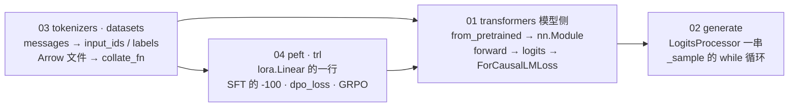

> **更新 @2026-09-30**：本系列对着 **transformers 5.17.0**（2026-09-09 发布）、**tokenizers 0.23.2**、**datasets 5.0.1**、**peft 0.21.0**、**trl 1.13.0** 的源码读，模型用本地缓存的 Qwen2.5-0.5B。文中的文件路径、类名、函数名以这组版本为准，不引用行号；读别的版本请以本地源码对照——找入口的方法不变。

## 内容简介

《读 Hugging Face 源码》是一组共四篇的系列文章，是[《AI 算法工程师学习地图》](/ai-algorithm-engineer-learning-roadmap.html) L4–L5 两层的**深入篇**。[工具箱第五篇](/hugging-face-ecosystem-six-libraries-and-a-lora-sft.html)用六行代码组装了一次 LoRA SFT，并在末尾说「读源码是最快的路」，列了六个入口；读者问：既然代码量不大，能不能把这几个入口真的读一遍？本系列就是那一遍。

它回答的问题是：

> **`AutoModelForCausalLM.from_pretrained`、`model.generate`、`tok.apply_chat_template`、`load_dataset(...).map`、`get_peft_model`、`SFTTrainer` / `DPOTrainer` / `GRPOTrainer`——工具箱第五篇那六行代码的每一行，执行时经过了哪些文件的哪些函数？L0 的公式与 L4 / L5 的结构图，各对应源码里的哪几行？**

Hugging Face 的五个库加起来几十万行，本系列不通读，只沿**一次 LoRA SFT 会走到的调用链**读：模型怎么加载、一次前向怎么走到 loss、`generate` 的循环长什么样、文本怎么变成 `input_ids`、数据怎么从 Arrow 文件到一个 batch、LoRA 怎么挂到 `nn.Linear` 上、SFT 的 `-100` 在哪一步填、DPO 与 GRPO 的公式各是哪十几行。每一篇的写法相同：先用一张调用链图给出骨架，再逐段贴源码——只贴那一段真正在做事的几行，其余用文件名 + 函数名指路——最后把它与本地图前面各层的公式或结构图对上。

举一个例子说明这个系列的取法。「LoRA 是给权重加一个低秩增量 $$BA$$」是 [L0 第三篇](/orthogonal-rotation-svd-and-low-rank.html)的数学；到了源码里它是三件可查验的事：（一）`inject_adapter` 用 `named_modules` 逐个匹配 `target_modules`，命中的 `nn.Linear` 被 `setattr` 换成 `lora.Linear`，`all-linear` 会排除 `lm_head`；（二）`update_layer` 建 `lora_A`（kaiming）与 `lora_B`（全零），`scaling = α/r`——所以训练开始时增量恰好为零；（三）`forward` 只多一行 `result + lora_B(lora_A(dropout(x))) * scaling`，先算瘦的那一半，永远不物化 $$BA$$。Qwen2.5-0.5B 上 `r=16` 挂七类线性层，可训练参数 8.8M（1.8%），`state_dict` 里只有 adapter。

系列覆盖的范围是那六行代码的四段，每段一篇：

| 段 | 主题 | 读的源码 | 篇 |
|---|---|---|---|
| 第一段 | 模型 | `from_pretrained` 的六步 一个 `DecoderLayer` 的代码 attention 注册表 KV cache `ForCausalLMLoss` | 第一篇 |
| 第二段 | 生成 | `GenerationConfig` 的三层优先级 `LogitsProcessor` 一串 `StoppingCriteria` `_sample` 的 `while` 循环 | 第二篇 |
| 第三段 | 数据 | `tokenizer.json` 的五段 chat template 与 assistant mask Arrow、`map`、fingerprint `collate_fn` | 第三篇 |
| 第四段 | 微调与后训练 | `get_peft_model` 与 `lora.Linear` SFT 的 `labels` 与 packing `dpo_loss` GRPO 的优势、裁剪与归一 | 第四篇 |

Table: 系列四段与各篇覆盖的源码

## 为什么写这个系列？

### 六行代码，四个黑盒

工具箱第五篇的六行里，`from_pretrained` 进去一个 Hub 名字、出来一个 `nn.Module`；`get_peft_model` 进去一个模型、出来一个只有 1.8% 参数可训的模型；`SFTTrainer(...).train()` 进去一个 `Dataset`、出来一个训好的模型；`generate` 进去一段 prompt、出来一段文本。会用它们不需要知道里面是什么；但调不出、报错、结果与预期差 $$10^{-4}$$ 或差 1.0 的时候，每一个问题的答案都在某个具体的文件里。

### 代码比论文准，比教程全

L4 讲了 RoPE 的公式、L5 推了 DPO 的 loss、L0 写了 GRPO 的 $$(R - \text{mean}) / \text{std}$$。论文写的是想法，代码写的是实际做法：`apply_rotary_pos_emb` 用的是前后两半配对而不是相邻两维；`dpo_loss` 的 `loss_type` 列表一眼看出 IPO、hinge 各改了哪一行；GRPO 的 `loss_type` 决定按什么归一，正是后训练系列讨论的长度偏差在代码里的位置。这些细节教程通常不写，读源码是唯一的来源。

### 这几个库的骨架很稳，只是名字在变

transformers 有 518 个模型目录，但 decoder-only 语言模型几乎全是 `modeling_llama.py` 的变体；`generate` 四千行，骨架只有「配置 → 处理器 → 停止条件 → 循环」四段；trl 一年三十多个版本，`SFTTrainer` 的数据契约改过数次，但 `-100`、`compute_loss` 往下追的路没变。本系列教的是找入口的方法：从 `Auto` 类的表、从 `compute_loss`、从 `forward` 里那一行注册表调用往下追。

## 系列的整体主线

四篇沿着一次 LoRA SFT 的数据流走：模型先加载起来（第一篇），它的两端是整数 `input_ids`——出的一端是 `generate`（第二篇），进的一端是 tokenizer 与 datasets（第三篇）——最后把 LoRA 挂上去、把三种 loss 算出来（第四篇）。

贯穿四篇的几条设计线，在系列总结里单独拎出来：

1. **注册表 + 字符串键**：`model_type` → 模型类、`_attn_implementation` → attention 函数、`loss_type` → loss 函数、`target_modules` → 要换的层——模型代码不改，实现随便换。
2. **Rust / Arrow 内核 + Python 壳**：tokenizers 与 datasets 的 Python 源码里要知道哪一行之下是另一种语言。
3. **`-100` 一个约定串起三个库**：tokenizers 的 assistant mask、trl 的 `build_labels`、transformers 的 `ForCausalLMLoss`。
4. **一个上下文省一份模型**：peft 的 `disable_adapter()` 让 DPO 与 GRPO 不用再加载参考模型。

## 章节结构与分章导读

### 1. transformers 模型侧：from_pretrained 怎么把三个文件变成 nn.Module，forward 怎么走到 loss

[第一篇](/transformers-from-pretrained-to-forward-and-loss.html)读 `models/auto/`、`modeling_utils.py`、`models/llama/modeling_llama.py` 与 `loss/loss_utils.py`。加载的六步：`AutoConfig` 读 `model_type` → `modeling_auto.py` 的表选类 → 解析 safetensors → `torch.device("meta")` 下建骨架 → `safe_open` mmap 按名字填 → `tie_weights`、初始化缺失键、`eval()`。前向：一个 `DecoderLayer` 的 RMSNorm、RoPE、MLP、两条残差与 L4 第一篇的公式逐行对应；attention 是 `ALL_ATTENTION_FUNCTIONS[config._attn_implementation]` 的一次函数指针调用；loss 不在建模文件里，按类名分派到 `ForCausalLMLoss`。最后读 `modular_qwen2.py`，看 518 个模型怎么维护。

它回答的问题：`from_pretrained` 加载 8B bf16 模型时峰值内存为什么约等于最终的 16 GB 而不是 32 GB？`attn_implementation="sdpa"` 与 `"eager"` 的 logits 为什么在 fp32 下差 $$10^{-4}$$、bf16 下差 1.0？`labels` 传进去之后，`-100` 与 `num_items_in_batch` 各在哪一行起作用？

### 2. generate：一次采样的完整调用链

[第二篇](/transformers-generate-call-chain.html)读 `generation/` 目录：`utils.py`、`logits_process.py`、`stopping_criteria.py`、`configuration_utils.py`。骨架四段：`GenerationConfig` 三层优先级（kwargs > 仓库的 `generation_config.json` > 全局默认）→ `_get_logits_processor` 按非空字段装配一串 `LogitsProcessor`（processor 在前、warper 在后，顺序由代码决定）→ 三个停止条件 → `_sample` 的 while 循环（prefill 与 decode 是同一个 `forward`，第一次 `logits_to_keep=1`，之后每步只喂最后一个 token）。`temperature`、`top_k`、`top_p`、`repetition_penalty` 各是十行代码。

它回答的问题：不传 `do_sample` 只传 `temperature=0.2`，输出是随机的吗？`top_k=50, top_p=0.9` 同时设置，保留的是交集还是并集、顺序能换吗？batch 里先停的那条序列在后面的步里发生了什么？

### 3. tokenizers 与 datasets：从 messages 到 input_ids，从 Arrow 文件到 collate_fn

[第三篇](/tokenizers-and-datasets-from-messages-to-input-ids.html)读两条流水线。`tokenizer.json` 的五段（normalizer → pre_tokenizer → BPE model → post_processor → decoder）由 Rust 库执行，Python 壳 `PreTrainedTokenizerFast` 只做加载对齐、`__call__ → encode_batch`、padding；chat template 是沙箱 Jinja，`` 标记给出 assistant mask——SFT loss mask 的第一种来源，Qwen2.5 的模板没有它。`load_dataset` 把文件转成 `.arrow` 缓存，`Dataset` 是 mmap 视图；`map` 逐批取、调函数、写新文件，文件名是 fingerprint；`shuffle` / `select` 只改索引；变长 padding 在 `collate_fn` 里、纯 Python。

它回答的问题：`len(tok)`、`tok.vocab_size`、`config.vocab_size` 三个数为什么不同（151665 / 151643 / 151936）？`"12345"` 为什么是 5 个 token 而 `"hello"` 是 1 个？改了 `map` 函数里一个 print 为什么整个 10 分钟重跑？

### 4. peft 与 trl：LoRA 怎么挂上去，SFT / DPO / GRPO 的 loss 各在哪一行

[第四篇](/peft-and-trl-lora-sft-dpo-grpo-in-source.html)读 `peft/tuners/lora/` 与 `trl/trainer/` 的三个 Trainer。peft：`get_peft_model` 返回 `PeftModel(LoraModel(原模型))`，原模型被原地改；`lora.Linear` 的 `forward` 一行；`merge` 把 $$\frac{\alpha}{r}BA$$ 加进 `weight.data`。trl：SFT 三种数据格式，`labels` 在 `_prepare_dataset` 的 `build_labels` 这一次 `map` 里造，collator 只 pad，`padding_free` 时把每段首 token 置 `-100`；`dpo_loss` 的 `sigmoid` 分支就是 $$-\log\sigma(\beta\Delta)$$，参考模型有三种来源；GRPO 的采样、组内优势、PPO 裁剪与 KL、四种 `loss_type` 的归一。

它回答的问题：`target_modules=["q_proj", "v_proj"]` 与 `"q_proj|v_proj"` 哪一种能匹配到 `model.layers.3.self_attn.q_proj`？LoRA 只训 8.8M 参数，反向为什么仍要经过冻结的 `base_layer`，省下的到底是什么？GRPO 一组 8 条全对的回答对梯度贡献多少、`beta=0` 时 trl 省掉了什么？

### 5. 系列总结与通关自测

[第五篇](/hf-source-reading-series-recap-and-self-test.html)把四篇压成一张「问题 → 文件 → 函数」的索引表，回顾贯穿五个库的四条设计线，再给一套三段式自测。

## 贯穿全系列的源码阅读线

每一篇都从工具箱第五篇的一行代码进入，读到它与本地图前面各层的对应处为止：

| 六行里的哪一行 | 入口文件 | 读到哪里为止 | 对应的前置篇 | 篇 |
|---|---|---|---|---|
| `AutoModelForCausalLM.from_pretrained(name)` | `models/auto/auto_factory.py` → `modeling_utils.py` → `models/llama/modeling_llama.py` | `ForCausalLMLoss`（`loss/loss_utils.py`） | [L4 第一篇](/transformer-architecture-from-a-sentence-to-the-next-token.html)的结构图、[L0 第五篇](/from-maximum-likelihood-to-cross-entropy.html)的交叉熵 | 01 |
| `model.generate(**inputs, do_sample=True, top_p=0.9)` | `generation/utils.py` | `_sample` 循环里的 `multinomial` 与 `stopping_criteria` | L0 第五篇第七章的采样公式 | 02 |
| `tok.apply_chat_template(messages)` / `load_dataset(name).map(fn)` | `tokenization_utils_tokenizers.py`、`utils/chat_template_utils.py` / `arrow_dataset.py`、`load.py` | Rust 的 `encode_batch` / `ArrowWriter` 与 `collate_fn` | [预训练第二篇](/tokenizer-vocabulary-and-token-efficiency.html)的 BPE | 03 |
| `get_peft_model(model, LoraConfig(...))` | `peft/mapping_func.py` → `tuners/lora/model.py` → `tuners/lora/layer.py` | `Linear.forward` 的一行 | [L0 第三篇](/orthogonal-rotation-svd-and-low-rank.html)的 $$W + BA$$ | 04 |
| `SFTTrainer(...).train()`（及 DPO / GRPO） | `trl/trainer/sft_trainer.py`、`dpo_trainer.py`、`grpo_trainer.py` | `build_labels`、`dpo_loss`、`_compute_loss` | [后训练系列](/post-training-from-sft-to-verifiable-rewards.html)第一、三、四篇 | 04 |

Table: 六行代码各自的入口、终点与对应的前置篇

每篇给出的输出——`Loading weights: 290/290`、装配出的 `LogitsProcessorList`、`cache-<fingerprint>.arrow` 的文件名、`trainable params: 8.8M`——都来自 Qwen2.5-0.5B 上的一次实际运行，脚本在 [ai-learning-labs/hf-source-reading](https://github.com/arganzheng/ai-learning-labs/tree/main/hf-source-reading)；正文已给出读懂所需的全部代码，读本系列不需要它。

## 前置要求与说明

### 前置要求

| 需要 | 到什么程度 | 在哪里学 |
|---|---|---|
| 工具箱第五篇的六行代码 | 跑过一次，知道 `config.json` / `tokenizer.json` / `safetensors` 各是什么 | [工具箱第五篇](/hugging-face-ecosystem-six-libraries-and-a-lora-sft.html) |
| `nn.Module`、`state_dict`、`DataLoader` | 知道键名从属性路径来、`collate_fn` 做什么 | [工具箱第三篇](/pytorch-in-use-five-objects-and-a-training-loop.html) |
| Transformer 的结构 | 能画出一个 decoder block，知道 RoPE、GQA、KV cache 各在哪 | [L4 第一篇](/transformer-architecture-from-a-sentence-to-the-next-token.html) |
| SFT / DPO / GRPO 的目标函数 | 认得 $$-\log\sigma(\beta\Delta)$$ 与 $$(R - \text{mean}) / \text{std}$$ | [后训练系列](/post-training-from-sft-to-verifiable-rewards.html)第一、三、四篇 |

Table: 读本系列需要的前置

第二篇只依赖第一篇；第三篇独立；第四篇用到前三篇（`ForCausalLMLoss`、`apply_chat_template`、`map`）。

### 版本与基线

transformers 5.17.0、tokenizers 0.23.2、datasets 5.0.1、peft 0.21.0、trl 1.13.0；模型 Qwen/Qwen2.5-0.5B，数据集 HuggingFaceH4/no_robots。引用只给文件路径与类名 / 函数名，不给行号——这几个库的目录结构改得快，行号几个月就失效，找入口的方法不会。

## 章节目录

| 篇 | 标题 | 读它需要 |
|---|---|---|
| 01 | [transformers 模型侧：from_pretrained 怎么把三个文件变成 nn.Module，forward 怎么走到 loss](/transformers-from-pretrained-to-forward-and-loss.html) | L4 第一篇 |
| 02 | [generate：一次采样的完整调用链](/transformers-generate-call-chain.html) | 01 |
| 03 | [tokenizers 与 datasets：从 messages 到 input_ids，从 Arrow 文件到 collate_fn](/tokenizers-and-datasets-from-messages-to-input-ids.html) | 工具箱第五篇 |
| 04 | [peft 与 trl：LoRA 怎么挂上去，SFT / DPO / GRPO 的 loss 各在哪一行](/peft-and-trl-lora-sft-dpo-grpo-in-source.html) | 01–03、后训练系列 |
| 05 | [系列总结与通关自测](/hf-source-reading-series-recap-and-self-test.html) | 01–04 |

Table: 章节目录

## 最终目标

读完四篇，对工具箱第五篇的六行代码，你应该能：

1. 说出 `from_pretrained` 的六步，并解释为什么 8B 模型的加载峰值内存等于权重大小；
2. 在 `modeling_llama.py` 里指出 L4 结构图上每个方框对应的类，并说出 attention 实现是怎么切换的；
3. 写出 `temperature` / `top_k` / `top_p` 各自的十行代码，说出 `_sample` 循环每步做的六件事；
4. 解释 `tokenizer.json` 的五段与 `map` 的 fingerprint，判断一次 `map` 为什么命中或没命中缓存；
5. 从 `get_peft_model` 追到 `lora.Linear.forward` 的那一行，从 `SFTTrainer` 追到 `-100` 被填的那一次 `map`，从 `dpo_loss` 与 `_compute_loss` 里各指出论文公式对应的几行。

之后遇到任何一个新的 Trainer、新的 `LogitsProcessor`、新的模型目录，方法相同：找到注册表、找到 `compute_loss`、找到 `forward` 里那一行调用，往下追。
