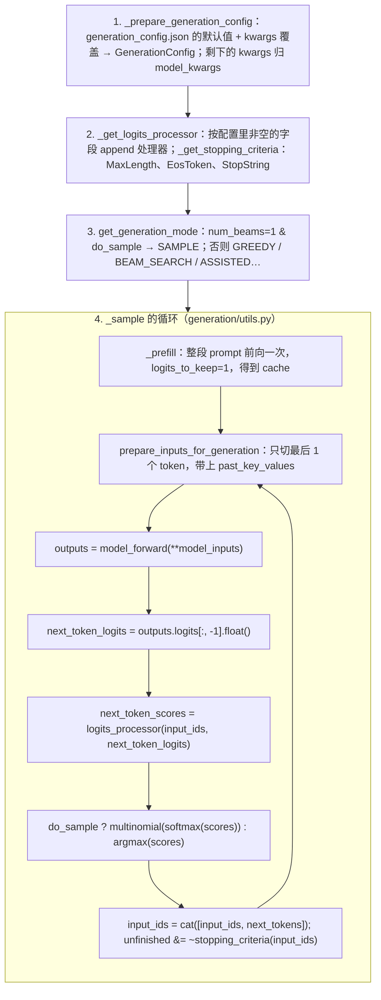

> **更新 @2026-09-30**：本文对着 **transformers 5.17.0** 的 `generation/` 目录读（`utils.py` 4250 行、`logits_process.py` 3222 行、`stopping_criteria.py` 643 行、`configuration_utils.py` 1892 行），配套脚本在 `ai-learning-labs/hf-source-reading/`，模型用本地缓存的 Qwen2.5-0.5B。路径与名字以该版本为准，不引用行号。

上一篇的前向在 `logits` 处结束：`[B, T, 151936]` 个分数。推理时接下来的每一件事——把最后一个位置的分数变成一个 token、把它拼回去、再前向一次——都在 `model.generate(...)` 里。这个函数是 transformers 最常被调用、也最常被抱怨"看不懂"的函数：`generate` 本身 400 行，它调的 `_sample` 300 行，分散在四个文件里的 `LogitsProcessor` 有五十多个类。

其实骨架很简单：**一份配置 → 一串对 logits 的变换 → 一串停止条件 → 一个 while 循环**。本篇按这四段读，最后把 `temperature=0.7, top_k=50, top_p=0.9` 这三个参数各自对应的十行代码摆出来——[L0 第五篇](/from-maximum-likelihood-to-cross-entropy.html)讲的采样公式，代码里就是这几行。

本篇要回答的核心问题是：

> **`model.generate(**inputs, max_new_tokens=8, do_sample=True, temperature=0.7, top_k=50, top_p=0.9)` 执行时，参数怎么变成一串 `LogitsProcessor`？decode 循环的每一步做了哪几件事、在哪一行停下？[^q0]**

## 一、总览

### 1. 四段



### 2. 本文的章节安排

| 章 | 主题 | 内容 |
|---|---|---|
| 二 | 配置从哪来 | `GenerationConfig` 三层优先级；`generation_config.json`；`max_length=20` 与 `max_new_tokens` 的老陷阱；哪些 kwargs 会被转给 `forward` |
| 三 | 变换 logits 的一串函数 | `LogitsProcessor` 接口；`_get_logits_processor` 怎么按字段装配；顺序为什么是 penalty → temperature → top-k → top-p；每个的十行代码 |
| 四 | 什么时候停 | `StoppingCriteria`；`MaxLengthCriteria`、`EosTokenCriteria`（`torch.isin`）、`StopStringCriteria`；`unfinished_sequences` 位向量与 batch 里的 padding |
| 五 | 循环本身 | `_prefill` 与 `logits_to_keep=1`；`prepare_inputs_for_generation` 切最后一个 token；`_update_model_kwargs_for_generation` 给 attention_mask 加一列；`DeferredStopCheck` 为什么晚一步；`torch.compile` 与 chunked prefill |
| 六 | 别的模式 | greedy / beam / assisted（投机解码）/ `custom_generate` 各在哪；为什么本系列只读 `_sample` |
| 七 | 流式输出 | `TextStreamer` 与 `TextIteratorStreamer`：`put` / `end` 与一个线程 |
| 八 | 本文小结 | |
| 九 | 自测 | 五道题 |

Table: 本文的章节安排

## 二、配置从哪来

### 1. 三层优先级

`generate` 的第一件实事是 `self._prepare_generation_config(generation_config, **kwargs)`。它的注释写得很清楚：**调用时的 kwargs > 模型的 `self.generation_config` > 全局默认值**。`self.generation_config` 是 `from_pretrained` 收尾时（上一篇第三章的 `adjust_generation_fn`）从仓库的 `generation_config.json` 读出来的——Qwen2.5-0.5B 的是：

```text
{'max_new_tokens': 2048, 'do_sample': False, 'bos_token_id': 151643, 'eos_token_id': 151643}
```

所以对这个模型不传 `max_new_tokens` 时会生成到 2048 个 token（配套脚本：5 个 token 的 prompt 不传长度，输出总长 2053）；老一些的仓库没有这个文件，落到全局默认 `max_length=20`，输出被截在第 20 个 token——这是初学者最常撞到的"为什么只输出了两句话"。**`max_new_tokens` 与 `max_length` 同时存在时前者优先**，`_validate_generated_length` 会打警告。

`GenerationConfig`（`configuration_utils.py`）是一个近百个字段的数据类，字段分五组：长度（`max_new_tokens`、`min_new_tokens`、`stop_strings`）、策略（`do_sample`、`num_beams`、`penalty_alpha`）、分布变换（`temperature`、`top_k`、`top_p`、`min_p`、`repetition_penalty`、`no_repeat_ngram_size`……）、输出（`return_dict_in_generate`、`output_scores`）、特殊 token（`pad`、`bos`、`eos`）。每个字段就是第三章一个处理器的开关。

### 2. 不认识的 kwargs 去哪

`generation_config.update(**kwargs)` 返回它**不认识**的键，这些成为 `model_kwargs`，原样传给 `forward`——`attention_mask`、`pixel_values`、`inputs_embeds` 都是这样到模型里的。`_validate_model_kwargs` 会拿 `forward` 的签名检查，拼错的参数名（`temperture`）在这里报 `ValueError` 而不是被静默忽略——4.x 早期它是静默的，很多"为什么 temperature 没生效"的 issue 之后才加了校验。

### 3. 模式

`generation_config.get_generation_mode()`：`num_beams` 为 1 时，`do_sample=True` → `SAMPLE`，否则 `GREEDY_SEARCH`（`penalty_alpha` 与 `top_k` 同时设了 → `CONTRASTIVE_SEARCH`）；`num_beams > 1` → `BEAM_SEARCH` / `BEAM_SAMPLE` / `GROUP_BEAM_SEARCH`；传了 `assistant_model` → `ASSISTED_GENERATION`。5.x 里 greedy 与 sample 是同一个 `_sample` 函数（`do_sample` 只在选 token 那一行分叉），所以配套脚本打印 `mode GenerationMode.SAMPLE`，greedy 时也走同一段循环。

## 三、变换 logits 的一串函数

### 1. 接口

```python
class LogitsProcessor:
    def __call__(self, input_ids: torch.LongTensor, scores: torch.FloatTensor) -> torch.FloatTensor: ...

class LogitsProcessorList(list):
    def __call__(self, input_ids, scores, **kwargs):
        for processor in self:
            scores = processor(input_ids, scores)
        return scores
```

`scores` 是 `[B, V]` 的 fp32 logits（`_sample` 里先 `.float()` 再传进来），`input_ids` 是到目前为止的整段序列（repetition penalty 要看它）。一个处理器就是"拿 logits、返回 logits"的纯函数，串成 list 依次作用——这是 transformers 里最干净的一处设计，自己写一个只需要实现 `__call__`，通过 `logits_processor=LogitsProcessorList([...])` 传进去（合并时 `_merge_criteria_processor_list` 不允许与配置字段生成的处理器同类型重复）。

### 2. 装配

`_get_logits_processor` 是 200 行的 `if generation_config.xxx is not None: processors.append(XxxLogitsProcessor(...))`。配套脚本用 `do_sample=True, temperature=0.7, top_k=50, top_p=0.9, repetition_penalty=1.1` 装配出：

```text
['RepetitionPenaltyLogitsProcessor', 'TemperatureLogitsWarper', 'TopKLogitsWarper', 'TopPLogitsWarper']
```

顺序由代码里 `append` 的顺序决定，不由你传参的顺序决定：先是所有"processor"（改分数：penalty、n-gram 禁止、bad words、min length 把 eos 压成 $$-\infty$$……），再是 `do_sample` 为真时才加的"warper"（改分布形状：temperature → top_h → top_k → top_p → min_p → typical_p → epsilon / eta cutoff），最后可选的 watermark 与 `LogitNormalization`。**temperature 在 top-k / top-p 之前**：top-p 看的是累计概率，而概率由 temperature 之后的 logits 决定——先截断再除温度会让 top-p 的含义变化。greedy（`do_sample=False`）时 warper 一个都不加，传了 `temperature` 也无效，5.x 会打警告。

### 3. 每个十行

```python
class TemperatureLogitsWarper(LogitsProcessor):
    def __call__(self, input_ids, scores):
        return scores / self.temperature
```

$$p_i \propto \exp(z_i / T)$$——L0 第五篇的温度。$$T < 1$$ 拉大差距，分布更尖。

```python
class TopKLogitsWarper(LogitsProcessor):
    def __call__(self, input_ids, scores):
        top_k = min(self.top_k, scores.size(-1))
        indices_to_remove = scores < torch.topk(scores, top_k)[0][..., -1, None]   # 比第 k 大的还小的
        return scores.masked_fill(indices_to_remove, self.filter_value)             # 填 -inf
```

`torch.topk` 取前 $$k$$ 个的值，`[..., -1, None]` 是第 $$k$$ 大那个，比它小的全部置 `-inf`——softmax 之后概率为 0，`multinomial` 永远抽不到。

```python
class TopPLogitsWarper(LogitsProcessor):
    def __call__(self, input_ids, scores):
        sorted_logits, sorted_indices = torch.sort(scores, descending=False)        # 升序！
        cumulative_probs = sorted_logits.softmax(dim=-1).cumsum(dim=-1)
        sorted_indices_to_remove = cumulative_probs <= (1 - self.top_p)             # 从小端累计到 1-p 的都删
        sorted_indices_to_remove[..., -self.min_tokens_to_keep :] = 0               # 最大的至少留 1 个
        indices_to_remove = sorted_indices_to_remove.scatter(1, sorted_indices, sorted_indices_to_remove)
        return scores.masked_fill(indices_to_remove, self.filter_value)
```

论文里"从大到小累计到 $$p$$ 为止保留"，代码里写成等价的"从小到大累计到 $$1 - p$$ 为止删除"——省掉一次翻转。`scatter` 把排序空间里的布尔掩码映射回原词表位置。注意它作用在 top-k **之后**的分数上：被 top-k 置成 `-inf` 的 token 概率为 0，累计和不受影响。

```python
class RepetitionPenaltyLogitsProcessor(LogitsProcessor):
    def __call__(self, input_ids, scores):
        score = torch.gather(scores, 1, input_ids)                                  # 已出现过的 token 的分数
        score = torch.where(score < 0, score * self.penalty, score / self.penalty)  # 正分除、负分乘 → 都变小
        return scores.scatter(1, input_ids, score)
```

（5.17 的实现多了 3 维 `scores` 与 packed 序列的分支，二维路径就是这三行。）`penalty > 1` 时出现过的 token 分数一律下降；正负分要分开处理，因为"变小"对正数是除、对负数是乘——这是 CTRL 论文里的原始定义，也是它被批评"对 logit 的尺度敏感"的原因。

配套脚本用 `output_scores=True` 把每一步 processor 之后的 `scores` 拿出来：第一步 151936 个分数里**只有 1 个是有限值**——`temperature=0.7` 之后第一名的概率已经超过 0.9，top-p 把其他全删了；`multinomial` 在这一步等于 argmax。采样与 greedy 的前两个 token 因此相同（`' mat.'`），之后才分叉。

## 四、什么时候停

### 1. 三个条件

```python
class StoppingCriteria(ABC):
    def __call__(self, input_ids, scores, **kwargs) -> torch.BoolTensor: ...   # [B] 的布尔向量：哪些序列该停
```

`_get_stopping_criteria` 装配的默认三件（配套脚本传了 `stop_strings=["\n"]`）：

```text
['MaxLengthCriteria', 'StopStringCriteria', 'EosTokenCriteria']
```

- `MaxLengthCriteria`：`input_ids.shape[-1] >= max_length`，对整个 batch 一起判。
- `EosTokenCriteria`：`torch.isin(input_ids[:, -1], self.eos_token_id)`——`eos_token_id` 可以是一个列表（Llama 3 的 `<|eot_id|>` 与 `<|end_of_text|>` 都算），所以用 `isin` 而不是 `==`。
- `StopStringCriteria`：把 `stop_strings` 预处理成一张 token 级的嵌入表（哪些 token 以停止串的哪一段结尾、长度多少），每步用一次 `embedding` 查表加几次向量运算判断"最近几个 token 拼起来是否以某个停止串结尾"——不解码成文本，全程在 GPU 上；代价是需要 `tokenizer` 参数。

### 2. `unfinished_sequences`

```python
unfinished_sequences = torch.ones(batch_size, dtype=torch.long)
...
next_tokens = next_tokens * unfinished_sequences + pad_token_id * (1 - unfinished_sequences)
input_ids = torch.cat([input_ids, next_tokens[:, None]], dim=-1)
unfinished_sequences = unfinished_sequences & ~stopping_criteria(input_ids, scores)
```

batch 里的序列各停各的：停了的那条以后每步都被填 `pad_token_id`，但仍然跟着大家一起前向（浪费算力——这是 transformers 的静态 batch，[vLLM 系列](/deep-dive-into-vllm.html)的 continuous batching 就是为了让停了的位置立刻让给新请求）。所有位都为 0 时循环退出。`pad_token_id` 没设时 `_prepare_special_tokens` 用 `eos_token_id` 代替并打警告——那个警告的来源就在这里。

## 五、循环本身

### 1. prefill 与 decode 是同一个 `forward`

```python
outputs = self._prefill(input_ids, generation_config, model_kwargs, ...)
while self._has_unfinished_sequences(...):
    if prefill_consumed:
        model_inputs = self.prepare_inputs_for_generation(input_ids, next_sequence_length=1, **model_kwargs)
        outputs = model_forward(**model_inputs, return_dict=True)
    prefill_consumed = True
    model_kwargs = self._update_model_kwargs_for_generation(outputs, model_kwargs, ...)
    next_token_logits = outputs.logits[:, -1].to(copy=True, dtype=torch.float32)
    next_token_scores = logits_processor(input_ids, next_token_logits)
    if do_sample:
        probs = nn.functional.softmax(next_token_scores, dim=-1)
        next_tokens = torch.multinomial(probs, num_samples=1).squeeze(1)
    else:
        next_tokens = torch.argmax(next_token_scores, dim=-1)
    ...
```

`_prefill` 把整段 prompt 喂给 `forward`（`generate` 之前已经在 `model_kwargs` 里塞了 `logits_to_keep=1`——上一篇第七章那个参数，prefill 只算最后一个位置的 logits），返回的 `outputs.past_key_values` 就是装满 prompt 的 cache。之后每一步 `prepare_inputs_for_generation` 做的事是 `input_ids[:, -1:]`——**只切最后一个 token**，其余从 cache 里来。[L4 第二篇](/transformer-token-journey-training-and-inference.html)讲的 prefill / decode 两阶段，在代码里是"同一个 `forward`、第一次喂整段、之后每次喂一个"。

`_update_model_kwargs_for_generation` 在两步之间做簿记：把 `outputs.past_key_values` 放回 `model_kwargs`，给 `attention_mask` 在末尾 `cat` 一列 1（padding 的 batch 需要它），`cache_position` 加一。`position_ids` 不在这里算——上一篇说过，模型自己从 `cache.get_seq_length()` 推。

### 2. `.to(copy=True)` 与 `DeferredStopCheck`

`next_token_logits = outputs.logits[:, -1].to(copy=True, ...)`：拷一份是为了让 `outputs` 能被释放——prefill 那一步的 `outputs.logits` 可能很大，抓着切片的引用就抓着整块内存。

`DeferredStopCheck` 是 5.x 的一个性能修补：`unfinished_sequences.max() == 0` 要把 GPU 上的一个数读回 CPU，这是一次同步，每步一次会让 CPU 无法提前排队下一步的 kernel。修法是异步拷贝、**下一步**再读——代价是循环多跑一步、流式输出晚一个 token。类的 docstring 把这个权衡写得很清楚，值得读。

### 3. `torch.compile` 与 chunked prefill

`model_forward = self.get_compiled_call(compile_config) if self._valid_auto_compile_criteria(...) else self.__call__`：用 `StaticCache` 且在 CUDA 上时 decode 的 `forward` 会被自动 `torch.compile`（形状固定才编得起来——这是 `StaticLayer` 存在的理由）。`prefill_chunk_size` 设了时 `_prefill` 把 prompt 按块 `torch.split` 后依次前向，每块都写进同一个 cache——长 prompt 的显存峰值从 $$O(T)$$ 的激活降到 $$O(\text{chunk})$$。这两个都是 [vLLM 系列](/deep-dive-into-vllm.html)里 CUDA graph 与 chunked prefill 的最简版本。

## 六、别的模式

| 模式 | 函数 | 一句话 |
|---|---|---|
| greedy / sample | `_sample` | 本文；`do_sample` 只在选 token 那一行分叉 |
| beam search | `_beam_search` | 每步保留 `num_beams` 条得分最高的前缀，cache 要跟着 `reorder_cache` 重排；长度惩罚 `length_penalty` |
| assisted / speculative | `_assisted_decoding` | 小模型（`assistant_model`）先猜 $$k$$ 个 token，大模型一次前向验证；接受率的数学在 [L4 第十二篇](/quantization-speculative-decoding-and-lora.html)；`prompt_lookup_num_tokens` 是不用小模型、从 prompt 里找 n-gram 当草稿的变体 |
| contrastive / DoLa / group beam | 5.x 已移到 Hub 上的 `custom_generate` 仓库 | `_get_deprecated_gen_repo` 会指路 |
| 自定义 | `custom_generate="user/repo"` 或一个可调用对象 | 从 Hub 仓库的 `custom_generate/generate.py` 加载解码函数（要 `trust_remote_code`） |

Table: generate 的几种模式与入口

本系列只读 `_sample`：它是产品里 99% 的调用路径，其他模式都是在它的骨架上改"选 token"那一步。`custom_generate` 是 5.x 给研究者留的口——新的解码算法先作为 Hub 仓库发布，不再往 `utils.py` 里加分支。

## 七、流式输出

```python
streamer = TextIteratorStreamer(tok, skip_prompt=True)
thread = Thread(target=model.generate, kwargs={**inputs, "streamer": streamer, "max_new_tokens": 200})
thread.start()
for piece in streamer:        # 主线程边打印
    print(piece, end="")
```

`_sample` 里只有两处与 streamer 有关：每步 `stop_check`（内部 `streamer.put(next_tokens)`）、结束时 `streamer.end()`。`TextStreamer.put` 累积 token 并在解码出完整的词（`decode` 结果以空格或换行结尾，中文按字）时打印；`TextIteratorStreamer` 把文本片段放进一个 `Queue`，`__next__` 从队列取——所以 `generate` 要跑在另一个线程。这就是 Web 服务里 SSE 流式接口的最简实现；`generate` 本身是同步阻塞的，transformers 5.x 另有 `AsyncTextIteratorStreamer` 与 `transformers serve` 做了异步版本。

## 八、本文小结

- `generate` = 配置合并 → 装配处理器与停止条件 → 选模式 → `_sample` 循环。配置三层优先级：kwargs > 仓库的 `generation_config.json` > 全局默认；不认识的 kwargs 转给 `forward`。
- `LogitsProcessor` 是"拿 logits 返回 logits"的纯函数，按 `_get_logits_processor` 里 `append` 的固定顺序串起来：processor（penalty 等）在前、warper（temperature → top-k → top-p → min-p）在后；greedy 不加 warper。
- temperature 一行除法；top-k 用 `topk` 取阈值再 `masked_fill(-inf)`；top-p 升序累计到 $$1-p$$ 删除再 `scatter` 回原位；repetition penalty 正分除、负分乘。
- 停止条件返回 `[B]` 布尔向量；`EosTokenCriteria` 用 `torch.isin` 支持多个 eos；停了的序列填 pad 继续跟跑（静态 batch）。
- 循环里 prefill 与 decode 是同一个 `forward`：第一次喂整段并 `logits_to_keep=1`，之后每次 `input_ids[:, -1:]` + cache；`_update_model_kwargs_for_generation` 给 `attention_mask` 加一列；`DeferredStopCheck` 把 GPU→CPU 同步推迟一步。
- 流式输出只是 `streamer.put` / `end` 两个钩子 + 一个线程。

## 九、自测

1. `model.generate(**inputs, temperature=0.2)`，不传 `do_sample`。输出是确定性的还是随机的？`temperature` 起作用了吗？

   <details markdown="1"><summary>答案</summary>
   取决于模型的 `generation_config.json`：Qwen2.5 里 `do_sample: False`，所以是 greedy，确定性；`_get_logits_processor` 只在 `do_sample` 为真时 append `TemperatureLogitsWarper`，`temperature` 没起作用（5.x 打警告）。要采样必须显式 `do_sample=True`。
   </details>

2. `top_k=50, top_p=0.9` 同时设置时，最终保留的候选集是两者的交集还是并集？如果交换顺序（先 top-p 再 top-k）结果会变吗？

   <details markdown="1"><summary>答案</summary>
   交集：top-k 先把第 50 名之后的置 `-inf`，top-p 再在剩下的（概率重新归一化后）删掉小端累计到 $$1-p$$ 的。交换顺序结果可能不同——top-p 的累计概率算在"当前还活着"的 token 上，先 top-k 会改变归一化的分母。transformers 固定 top-k 在前，与 nucleus 论文的推荐一致。
   </details>

3. batch 里有 4 条 prompt，第 2 条在第 10 步生成了 eos，其余在第 30 步才停。第 2 条在第 11–30 步发生了什么？输出序列里它的第 11–30 位是什么？

   <details markdown="1"><summary>答案</summary>
   它仍然每步跟着前向（cache 也在增长），只是 `unfinished_sequences[1] = 0`，`next_tokens` 被 `* 0 + pad_token_id * 1` 换成 pad，第 11–30 位全是 `pad_token_id`。算力浪费了 20 步 × 1/4；这正是 continuous batching 要解决的问题。
   </details>

4. 自己写一个 `LogitsProcessor` 禁止模型输出数字 token。它应该放在 temperature 之前还是之后？为什么 transformers 不让你通过 `logits_processor=` 再传一个 `TemperatureLogitsWarper`？

   <details markdown="1"><summary>答案</summary>
   顺序无所谓——置 `-inf` 与除温度可交换（$$-\infty / T = -\infty$$）；但按惯例"改分数"的处理器放在 warper 之前，`_merge_criteria_processor_list` 会把用户传的 list 合并在配置生成的 processor 之后、warper 之前。同类型重复会报错，因为两个 temperature 相乘的效果与配置字段的语义冲突，用户应改 `generation_config.temperature` 而不是再传一个。
   </details>

5. 为什么 `_sample` 要在 prefill 之后才决定用 `DeferredStopCheck`，而不是一开始就决定？（提示：读它上面那段注释。）

   <details markdown="1"><summary>答案</summary>
   `DeferredStopCheck` 需要在 cache 上开 `activate_past_recording`（记录每步写入以便回滚多跑的那一步）；如果在 prefill 之前就开，prefill 期间写入的整段 prompt 的 k、v 都会被额外记录一份——对滑窗或线性 attention 这类本来会丢弃大部分状态的模型，这是一次巨大的、不必要的显存峰值。所以先 prefill、再决定。
   </details>

## 下一篇

`generate` 的输入是 `input_ids`，输出也是 `input_ids`——文本在两端。把 `messages=[{"role": "user", "content": ...}]` 变成带 `<|im_start|>` 的 token 序列、把训练数据从 Arrow 文件流到 `collate_fn`、给 SFT 造出 prompt 位置全是 `-100` 的 `labels`，是 `tokenizers` 与 `datasets` 两个库的事。下一篇沿 `tok.apply_chat_template(messages, tokenize=True)` 与 `load_dataset(...).map(...)` 读。

[^q0]: `_prepare_generation_config` 把仓库 `generation_config.json` 的默认值与 kwargs 合并成 `GenerationConfig`，不认识的 kwargs 转给 `forward`；`_get_logits_processor` 按非空字段依次 `append`：`RepetitionPenaltyLogitsProcessor`（若设）→ `TemperatureLogitsWarper` → `TopKLogitsWarper` → `TopPLogitsWarper`（后三个仅 `do_sample=True` 时）；`_get_stopping_criteria` 装 `MaxLengthCriteria`、`EosTokenCriteria`（`torch.isin`，支持多个 eos）、可选 `StopStringCriteria`。循环：`_prefill` 整段前向（`logits_to_keep=1`）拿到 cache；每步 `prepare_inputs_for_generation` 切 `input_ids[:, -1:]` + cache → `forward` → `logits[:, -1].float()` → processors → `multinomial(softmax)` 或 `argmax` → `cat` → `unfinished &= ~criteria(input_ids)`，停了的序列填 pad 继续跟跑，全停时退出。详见[第三章](#三变换-logits-的一串函数)至[第五章](#五循环本身)。
