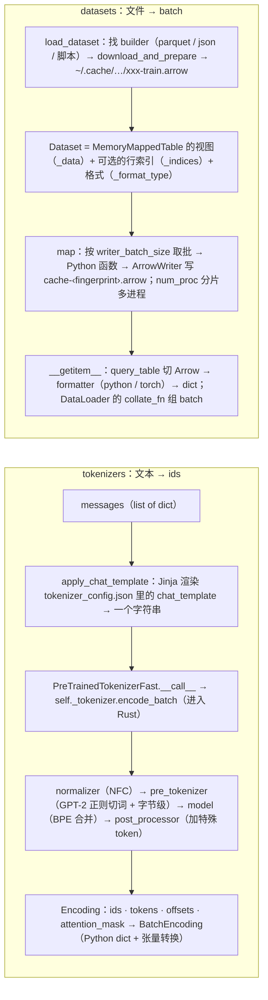

> **更新 @2026-09-30**：本文对着 **tokenizers 0.23.2**（Rust 库 + Python 绑定）、**transformers 5.17.0** 的 `tokenization_utils_base.py` / `tokenization_utils_tokenizers.py` / `utils/chat_template_utils.py`、**datasets 5.0.1** 的 `arrow_dataset.py`（7417 行）/ `load.py` / `builder.py` / `iterable_dataset.py` 读，配套脚本在 `ai-learning-labs/hf-source-reading/`，用本地缓存的 Qwen2.5-0.5B tokenizer 与 `HuggingFaceH4/no_robots` 数据集。路径与名字以这些版本为准，不引用行号。

前两篇的模型两端都是整数：`input_ids` 进、`input_ids` 出。把 `"猫坐在垫子上"` 变成 `[10236, 234, 104, 104427, ...]`、把 `[{"role": "user", "content": "Hi"}]` 变成带 `<|im_start|>` 的一串 token，是 `tokenizers` 的事；把 9500 条对话从磁盘上的 Arrow 文件按需取出来、对每条跑一遍 tokenizer 并把结果存回磁盘、在多进程里并行、下次跑时直接命中缓存，是 `datasets` 的事。两个库都是"Rust / C++ 内核 + 薄 Python 壳"，读它们的 Python 源码时要知道**哪一行之下是另一种语言**——本文把这条线画出来。

本篇要回答的核心问题是：

> **`tok.apply_chat_template(messages, tokenize=True)` 与 `load_dataset(name).map(fn, num_proc=4)` 各经过了哪几层？哪一层在 Python、哪一层在 Rust / Arrow？为什么第二次 `map` 几乎不花时间？[^q0]**

## 一、总览

### 1. 两条流水线



### 2. 本文的章节安排

| 章 | 主题 | 内容 |
|---|---|---|
| 二 | tokenizer.json 里的五段 | Rust 库的流水线：normalizer、pre_tokenizer、model、post_processor、decoder；Qwen2.5 的每一段是什么；`Ġ` 与字节级 BPE |
| 三 | Python 壳 | `PreTrainedTokenizerFast` 包了什么：`added_tokens`、`__call__` 到 `encode_batch` 的路、`BatchEncoding`、padding 与 `attention_mask`、`padding_side` |
| 四 | chat template | `apply_chat_template` → `render_jinja_template`；`add_generation_prompt`；`` 与 `return_assistant_tokens_mask`——SFT loss mask 的第一种来源 |
| 五 | `load_dataset` 到 Arrow | builder 的三种来源；`download_and_prepare` 落成 `.arrow`；`Dataset` 是 mmap 视图；`Features` 是 schema |
| 六 | `map` 与 fingerprint | `_map_single` 的取批-调函数-写文件；`batched`；`num_proc` 分片；fingerprint 怎么算、为什么 lambda 也能命中缓存；`select` / `shuffle` 是索引不是拷贝 |
| 七 | 取一条、组一批 | `__getitem__` → `query_table` → formatter；`with_format("torch")`；`IterableDataset` 与 streaming；到 `DataLoader` 的 `collate_fn` |
| 八 | 本文小结 | |
| 九 | 自测 | 五道题 |

Table: 本文的章节安排

## 二、tokenizer.json 里的五段

### 1. 一个 JSON 描述一条流水线

`Qwen/Qwen2.5-0.5B` 的 `tokenizer.json` 有 7 MB，顶层只有九个键：`version`、`truncation`、`padding`、`added_tokens`、`normalizer`、`pre_tokenizer`、`post_processor`、`decoder`、`model`。后五个就是 Rust 库 `tokenizers` 的流水线，一段一个组件，**`Tokenizer.from_file` 读这个 JSON 就把整条流水线搭出来**——不需要任何 Python 代码，所以同一个文件能被 Python、Node、Rust 的 tokenizers 直接用。配套脚本把 Qwen2.5 的每一段打印出来：

| 段 | Qwen2.5-0.5B 的配置 | 做什么 |
|---|---|---|
| `normalizer` | `NFC` | Unicode 规范化（组合字符统一），不改大小写、不去空格 |
| `pre_tokenizer` | `Sequence[Split(GPT-2 正则), ByteLevel]` | 先用一条正则把文本切成"词"（英文缩写、字母串、数字单个、标点串、空白），再把每个词的 UTF-8 字节映射成 256 个可见字符 |
| `model` | `BPE`，vocab 151643、merges 151387 | 在每个"词"内部按 merges 表的优先级反复合并相邻 pair，直到没有可合并的 |
| `post_processor` | `ByteLevel`（不加任何特殊 token） | GPT 系没有 `[CLS]`；Llama 的 `TemplateProcessing` 会在这里加 `<s>` |
| `decoder` | `ByteLevel` | 把 `Ġ`、`ãĢĤ` 这类字节字符还原成 UTF-8 字节再解码成字符串 |

Table: tokenizer.json 的五段与 Qwen2.5 的配置

[L4 预训练系列第一篇](/tokenizer-vocabulary-and-token-efficiency.html)讲了 BPE 的算法与词表设计；这里补代码层面的两点。

### 2. `Ġ` 与字节级

```text title="一句中英混合文本的 tokens 与 ids"
"The cat sat on the mat. 猫坐在垫子上。"
tokens: ['The', 'Ġcat', 'Ġsat', 'Ġon', 'Ġthe', 'Ġmat', '.', 'Ġç', 'Į', '«', 'åĿIJåľ¨', 'åŀ«', 'åŃIJ', 'ä¸Ĭ', 'ãĢĤ']
ids:    [785, 8251, 7578, 389, 279, 5517, 13, 10236, 234, 104, 104427, 102628, 44729, 17447, 1773]
```

`Ġ` 是字节 0x20（空格）在 ByteLevel 映射下的可见字符——GPT-2 的做法是把 256 个字节一一映射到 Unicode 的可打印区，这样 BPE 的词表里没有任何"不可见"或"不合法"的字符串，任何输入都不会 OOV。副作用是中文看起来是乱码：`猫` 的 UTF-8 是三个字节 `E7 8C AB`，映射成 `ç`、`Į`、`«`，词表里没有把这三个合并起来的 merge，所以 `猫` 被切成 3 个 token（前面还带一个空格）；`坐在` 两个字六个字节合成了一个 token `åĿIJåľ¨`——常见词组在训练语料里出现够多，merges 表学到了它。`decoder` 段负责把这些字符逐个还原成字节再 UTF-8 解码，所以 `decode` 永远能还原原文，即使单个 token 不是完整字符。

### 3. 正则切词决定了 token 边界

`pre_tokenizer` 里那条正则（GPT-2 / GPT-4 风格）：

```text title="GPT-2 / GPT-4 风格的 pre_tokenizer 正则"
(?i:'s|'t|'re|'ve|'m|'ll|'d)|[^\r\n\p{L}\p{N}]?\p{L}+|\p{N}| ?[^\s\p{L}\p{N}]+[\r\n]*|\s*[\r\n]+|\s+(?!\S)|\s+
```

BPE 的合并**只在正则切出的一段内部**发生——这是为什么 `cat` 前面的空格归到 `Ġcat` 而不是独立 token（`[^\r\n\p{L}\p{N}]?\p{L}+` 允许一个非字母开头），数字永远一位一个 token（`\p{N}` 单个匹配——Qwen2.5 与 Llama 3 都这样，所以 `12345` 是 5 个 token，模型做算术要逐位处理）。改这条正则就改了整个 tokenizer 的行为，而它写在 JSON 里，不在代码里。

## 三、Python 壳

### 1. 两层类

`AutoTokenizer.from_pretrained` 返回的 `Qwen2Tokenizer` 继承 `PreTrainedTokenizerFast`（`tokenization_utils_tokenizers.py`），它的 `self._tokenizer` 就是 Rust 的 `tokenizers.Tokenizer` 对象——配套脚本打印 `backend Tokenizer`。5.x 里"慢"tokenizer（纯 Python 的 `tokenization_python.py`）只剩极少数模型还在用；绝大多数时候读到的 Python 代码只做三件事：

1. **加载与对齐**：`__init__` 用 `TokenizerFast.from_file(tokenizer.json)` 建后端，再按 `tokenizer_config.json` 设 `truncation` / `padding` / 特殊 token；`added_tokens_decoder` 里的 22 个 `AddedToken`（`<|im_start|>` 等）是**绕过 BPE**直接匹配的字符串——所以 `len(tok) = 151665 = 151643 + 22`，`vocab_size` 属性只算 BPE 的 151643，`config.json` 里的 `vocab_size: 151936` 又是另一个数（embedding 表留了余量对齐到 64 的倍数）。三个数不同是新手常撞的坑。
2. **`__call__` → `_batch_encode_plus`**：把字符串或字符串列表整理成 batch，设好截断 / 填充，一次 `self._tokenizer.encode_batch(...)` 进 Rust——Rust 内部用 rayon 多线程，这是它比纯 Python 快两个数量级的原因。返回的 `Encoding` 对象带 `ids`、`tokens`、`offsets`（每个 token 在原文的字符区间，配套脚本打印 `(0,3), (3,7)...`）、`attention_mask`、`special_tokens_mask`。
3. **`BatchEncoding`**：一个 dict 子类，`return_tensors="pt"` 时把列表转成张量，`.to(device)` 一起搬，还保留 `word_ids()` / `char_to_token()` 这类对齐查询——NER、抽取式 QA 靠它们。

### 2. padding 与 `attention_mask`

```text title="padding=True 时的 input_ids 与 attention_mask"
tok(["Hi", "Hello world, hello"], padding=True)
input_ids:      [[13048, 151643, 151643, 151643], [9707, 1879, 11, 23811]]
attention_mask: [[1, 0, 0, 0],                    [1, 1, 1, 1]]
padding_side: right
```

`pad_token` 是 `<|endoftext|>`（Qwen2.5 没有单独的 pad，与 eos 同一个 id）；`attention_mask` 的 0 就是上一篇 `create_causal_mask` 里 `padding_mask_function` 读的东西。**`padding_side` 是 tokenizer 的属性**，训练默认右填充；decode-only 模型做 batch 推理要**左填充**（`tok.padding_side = "left"`），否则最后一个位置是 pad、`generate` 取 `logits[:, -1]` 取到的是 pad 位置的预测——上一篇 `generate` 里那个"检测到右填充"的警告就是查这个。

## 四、chat template

### 1. 一段 Jinja

`tokenizer_config.json` 里的 `chat_template` 是一段 2427 字符的 Jinja 模板（工具箱第五篇提过）。`apply_chat_template(messages, tokenize=True)` 分两步：`render_jinja_template`（`utils/chat_template_utils.py`）把 `messages` 渲染成一个字符串，然后 `self(rendered, ...)` 走第三章的路。渲染结果：

```text title="apply_chat_template 渲染出的字符串"
<|im_start|>system\nYou are terse.<|im_end|>\n<|im_start|>user\nHi<|im_end|>\n<|im_start|>assistant\nHello!<|im_end|>\n
```

`render_jinja_template` 用的是 `jinja2.sandbox.ImmutableSandboxedEnvironment`——模板来自 Hub 仓库，是不可信输入，沙箱禁止访问属性以外的任何 Python 对象；额外注册了 `raise_exception`、`strftime_now`、`tojson` 几个函数（模板里 `{{ raise_exception('...') }}` 就是它）。`tools=[...]` 参数会把 Python 函数的签名与 docstring 解析成 JSON schema 注入模板（`get_json_schema`），这是 function calling 的数据契约在 tokenizer 层的实现。

### 2. `add_generation_prompt`

```text title="add_generation_prompt=True 的结尾"
apply_chat_template(msgs[:2], add_generation_prompt=True)
… <|im_start|>user\nHi<|im_end|>\n<|im_start|>assistant\n
```

推理时必须传 `add_generation_prompt=True`：模板在末尾补 `<|im_start|>assistant\n`，模型才知道该开始生成回复；忘了传，模型会先"帮你"生成这几个 token 或直接续写用户的话。训练时**不传**——数据里已经有完整的 assistant 回合。`continue_final_message=True` 是另一头：最后一条是 assistant 的半截话，不加 `<|im_end|>`，让模型续写（prefill 一个前缀）。

### 3. `` 与 assistant mask

`return_assistant_tokens_mask=True` 让 `apply_chat_template` 额外返回一个 0/1 列表：哪些 token 属于 assistant 的回合。实现靠模板里的 ` ... ` 标记：渲染时一个自定义的 Jinja 扩展记录这两个标记之间的**字符区间**，再用 `offsets` 映射成 token 区间。`render_jinja_template` 一进门就检查：


```python title="render_jinja_template 对 generation 标记的检查"
if return_assistant_tokens_mask and not re.search(r"\{\%-?\s*generation\s*-?\%\}", chat_template):
    raise ValueError("return_assistant_tokens_mask==True but chat template does not contain `` keyword.")
```


配套脚本对 Qwen2.5-0.5B 的模板跑这条正则：**False**——它没有这个标记。这就是下一篇 `SFTTrainer(assistant_only_loss=True)` 在 Qwen2.5 上会报错、要先换一个带 `` 的模板的原因；SFT 的 loss mask 有两种来源，这是第一种，另一种（`prompt` / `completion` 格式）在下一篇。

## 五、`load_dataset` 到 Arrow

### 1. builder 的三种来源

`load_dataset("HuggingFaceH4/no_robots", split="train")`（`load.py`）先 `load_dataset_builder`：看这个名字是本地路径、Hub 仓库还是内置模块，再看仓库里有什么文件——`*.parquet` → `packaged_modules/parquet`、`*.json(l)` → `json`、`*.csv`、`*.arrow`、图片目录 → `imagefolder`；datasets 4.0 起**不再执行仓库里的 Python 脚本**（`trust_remote_code` 已删），全部走这些打包好的 builder。`builder.download_and_prepare()` 把原始文件（这里是两个 parquet）下载、按 `Features` 转成 Arrow、写到 `~/.cache/huggingface/datasets/HuggingFaceH4___no_robots/default/0.0.0/<hash>/no_robots-train.arrow`——配套脚本打印 `cache files: ['no_robots-train.arrow']`。这一步只在第一次跑；之后 `load_dataset` 直接打开这个 `.arrow`。

### 2. `Dataset` 是一个 mmap 视图

```text title="load_dataset 得到的 Dataset 与 Arrow 表类型"
Dataset({features: ['prompt', 'prompt_id', 'messages', 'category'], num_rows: 9500})
features: {'prompt': Value('string'), ..., 'messages': List({'content': Value('string'), 'role': Value('string')}), ...}
arrow table type: MemoryMappedTable
```

`Dataset` 对象（`arrow_dataset.py`）的核心是三个字段：`_data`（一个 `MemoryMappedTable`——`pyarrow.memory_map` 打开的文件，**不读进内存**，操作系统按页调入）、`_indices`（可选的行号表，见第六章）、`_format_type`（取出时转成什么）。`Features` 是 Arrow schema 的 datasets 版：`Value("string")`、`List(...)`、`ClassLabel`、`Image`；它决定 `.arrow` 里每列的类型，也决定 `map` 输出能不能写回去（类型对不上 `ArrowWriter` 会报错——这是 `map` 里最常见的报错来源）。100 GB 的数据集 `load_dataset` 之后进程只多几十 MB 常驻内存，靠的就是 mmap。

## 六、`map` 与 fingerprint

### 1. 取批、调函数、写文件

```python title="ds.map 统计每条样本的 token 数"
ds2 = ds.map(lambda ex: {"n_tok": len(tok.apply_chat_template(ex["messages"], tokenize=True))}, num_proc=1)
```

`Dataset.map`（`arrow_dataset.py`，参数十几个）做的事：决定输出的缓存文件名（下一节）；若文件存在且 `load_from_cache_file` → 直接 `Dataset.from_file` 返回；否则 `_map_single`：按 `writer_batch_size=1000` 从 `_data` 切批 → 逐条（`batched=False`）或整批（`batched=True`，函数拿到 `dict[str, list]`）调用你的函数 → 输出合并回原列 → `ArrowWriter` 写进新的 `.arrow` 文件；`num_proc=4` 时把行号按 rank 分四片，`multiprocess.Pool` 各跑一片写四个文件再拼起来。配套脚本：9500 条 4.3 秒（每条一次 Jinja 渲染 + tokenize），新列 `n_tok`，新缓存文件 `cache-a89dbbef0b763772.arrow`。

`batched=True` 是最重要的性能开关：tokenizer 的 `__call__` 接受列表并在 Rust 里多线程处理，`batched=True, batch_size=1000` 比逐条调快一个量级；`remove_columns=[...]` 顺手删掉不再需要的原文列，省磁盘也省之后 collate 的时间。

### 2. fingerprint：文件名就是缓存键

`cache-a89dbbef0b763772.arrow` 里的十六进制是 **fingerprint**（`fingerprint.py`）：`update_fingerprint(old_fingerprint, transform, transform_args)` 把上一个 dataset 的 fingerprint、`"map"` 这个变换名、以及全部参数（包括你传的函数）一起哈希。函数怎么哈希？`dill` 把函数对象序列化（字节码 + 闭包里引用的对象 + 默认参数），再 hash 字节串——所以**同一个 lambda 写两遍能命中缓存**（配套脚本第二次相同的 `map` 只花 0.7 秒，是校验与打开文件的开销），改了函数体里任何一个字符或闭包引用的 tokenizer 就是新 fingerprint、新文件。哈希失败（函数引用了不可序列化的对象）时 datasets 会打警告并用随机 fingerprint——这就是"为什么我的 `map` 每次都重跑"最常见的原因，修法是 `new_fingerprint=` 手动指定，或把不可序列化的东西移出函数。`@fingerprint_transform(inplace=False)` 装饰器贴在 `map`、`filter`、`select`、`shuffle`、`sort`、`rename_column` 等每一个返回新 dataset 的方法上——**每个 `Dataset` 对象都有唯一的 fingerprint，它是这个对象的"内容地址"**。

### 3. `select` / `shuffle` 不拷数据

`ds.shuffle(seed=0)` 只生成一张 9500 行的**行号表**放进 `_indices`（配套脚本：`MemoryMappedTable`，也在磁盘上），`_data` 一个字节没动；`select`、`train_test_split`、`shard` 同理。取第 $$i$$ 条时先查 `_indices[i]` 得到真实行号再去 `_data` 取——多一次间接寻址，代价是随机访问 Arrow 表比顺序扫慢，`shuffle` 之后的 `map` 会明显变慢，`ds.flatten_indices()` 把间接层物化掉。

## 七、取一条、组一批

### 1. `__getitem__`

```python title="Dataset._getitem：切 Arrow 再格式化"
def _getitem(self, key, **kwargs):
    formatter = get_formatter(format_type, features=self._info.features, **format_kwargs)
    pa_subtable = query_table(self._data, key, indices=self._indices)      # 切 Arrow：零拷贝
    return format_table(pa_subtable, key, formatter=formatter, ...)         # Arrow → Python / torch / numpy
```

`ds[0]` 走这三行：`query_table` 用 Arrow 的 `slice` / `take` 切出一行的子表（仍是 Arrow，不拷贝），`formatter` 负责转换——默认 `PythonFormatter` 转成 dict of Python 对象，`with_format("torch")` 换成 `TorchFormatter`（配套脚本：`n_tok` 变成 `Tensor`）。`ds["prompt"]` 返回一个惰性的 `Column`。所以 `Dataset` 就是"一张 Arrow 表 + 一个取出时的转换器"，`DataLoader(ds, collate_fn=...)` 里 `__getitem__` 被 worker 子进程调用，每次从 mmap 的文件页里取一条——工具箱第三篇画的 DataLoader 流程图里"worker 子进程 `getitem`"那一步在这里。

### 2. streaming

`load_dataset(..., streaming=True)` 返回 `IterableDataset`（`iterable_dataset.py`，5425 行）：不下载、不转 Arrow，`__iter__` 时边读远端 parquet 边 yield；`map` / `filter` / `shuffle(buffer_size=)` 都变成包在迭代器外面的一层（`MappedExamplesIterable`、`BufferShuffledExamplesIterable`），惰性执行，没有 fingerprint 也没有缓存。预训练读几 TB 的 fineweb 用它；SFT 几万条用普通 `Dataset`。`Dataset.to_iterable_dataset(num_shards=)` 把本地 Arrow 表也变成可流式、可按 shard 分给多个 DataLoader worker 的形式。

### 3. 到 `collate_fn`

`Dataset` 的一条是 dict，`DataLoader` 的 `collate_fn` 把 $$B$$ 个 dict 拼成一个 dict of 张量——变长序列要 padding，这一步 datasets 不管，是 `transformers.DataCollatorWithPadding`（调 `tok.pad`）或 trl 的 collator（下一篇：在这里造 `labels` 与 loss mask）。`tok.pad` 在 Python 里做（把列表补到最长），不进 Rust——所以 collate 是数据管线里少数纯 Python 的热点，`num_workers` 开多个进程就是为了它。

## 八、本文小结

- `tokenizer.json` 是一条 Rust 流水线的完整描述：normalizer → pre_tokenizer（正则切词决定合并边界，数字逐位）→ BPE model → post_processor → decoder；ByteLevel 让任何输入无 OOV，代价是中文 token 看起来是乱码。
- Python 壳 `PreTrainedTokenizerFast` 只做加载对齐、`__call__ → encode_batch`、`BatchEncoding`；`added_tokens` 绕过 BPE；`len(tok)`、`vocab_size`、`config.vocab_size` 是三个不同的数；decode-only 模型 batch 推理要左填充。
- chat template 是沙箱 Jinja；`add_generation_prompt` 推理必传、训练不传；`` 标记 + `offsets` 给出 assistant mask，Qwen2.5 的模板没有它。
- `load_dataset` 通过打包的 builder 把文件转成 `.arrow` 缓存；`Dataset` = mmap 的 Arrow 表 + 可选行号索引 + 格式器，大数据集不占内存。
- `map` 逐批取、调函数、`ArrowWriter` 写新文件；文件名是 fingerprint（上游 fingerprint + 变换 + 参数 + `dill` 序列化的函数的哈希），这是"第二次不花时间"和"为什么每次重跑"的同一个机制；`batched=True` 是最大的性能开关；`shuffle` / `select` 只改索引。
- `__getitem__` = `query_table` 零拷贝切 Arrow + formatter；streaming 是惰性迭代器链；变长 padding 在 `collate_fn` 里、纯 Python。

## 九、自测

1. `len(tok)`、`tok.vocab_size`、`model.config.vocab_size` 对 Qwen2.5-0.5B 分别是 151665、151643、151936。三个数各是什么？训练时给 tokenizer 加了 10 个新特殊 token，哪个数会变、模型要不要动？

   <details markdown="1"><summary>答案</summary>
   `vocab_size` 是 BPE 词表（`tokenizer.json` 的 `model.vocab`）；`len(tok)` 再加 `added_tokens`（22 个绕过 BPE 的特殊 token）；`config.vocab_size` 是 embedding / lm_head 的行数，比前者大是为了对齐到 64 的倍数、留余量。加 10 个 token 后 `len(tok)` 变 151675，仍小于 151936，embedding 不用 resize（余量够）；若超出才要 `model.resize_token_embeddings(len(tok))`。
   </details>

2. 为什么 `"12345"` 在 Qwen2.5 / Llama 3 里是 5 个 token，而 `"hello"` 是 1 个？这由哪一段决定？

   <details markdown="1"><summary>答案</summary>
   `pre_tokenizer` 的正则里数字用 `\p{N}` 单个匹配，每个数字是独立的一段，BPE 只在段内合并，所以永远逐位；`hello` 由 `\p{L}+` 整体匹配成一段，词表里有它的完整 merge。改正则（GPT-4 用 `\p{N}{1,3}` 三位一组）就改了行为——它写在 JSON 里，不在代码里。
   </details>

3. `ds.map(fn, num_proc=8)` 第一次跑了 10 分钟，改了 `fn` 里一个 print 之后又跑了 10 分钟。为什么？怎样避免？

   <details markdown="1"><summary>答案</summary>
   fingerprint 由 `dill` 序列化的函数字节码参与哈希，加一个 print 改了字节码 → 新 fingerprint → 新缓存文件 → 全部重算。避免：把不影响输出的改动放在 `map` 之外；或传固定的 `new_fingerprint="tokenized-v1"` / `cache_file_name=`，自己管理缓存键（改了逻辑记得换名字）。
   </details>

4. 对一个 `shuffle(seed=0)` 之后的 `Dataset` 做 `map`，比在 `shuffle` 之前做慢很多。原因是什么？

   <details markdown="1"><summary>答案</summary>
   `shuffle` 只生成 `_indices` 行号表，`map` 取批时按打乱的行号在 mmap 的 Arrow 表里随机访问，页面缓存命中率低、每批要 `take` 而不是 `slice`。先 `map` 再 `shuffle`，或 `ds.flatten_indices()` 把打乱后的表物化成连续文件。
   </details>

5. 用 Qwen2.5-0.5B 跑 `apply_chat_template(..., return_assistant_tokens_mask=True)` 会怎样？想拿到 assistant mask 有哪两条路？

   <details markdown="1"><summary>答案</summary>
   `render_jinja_template` 检查模板里有没有 ``，Qwen2.5 的模板没有 → `ValueError`。两条路：换一个加了 `…` 包住 assistant 内容的模板（`tok.chat_template = ...`）；或不用模板级 mask，把数据整理成 `prompt` / `completion` 两列，让 trl 的 collator 按 prompt 长度置 `-100`（下一篇）。
   </details>

## 下一篇

数据到了 `input_ids` 与 `attention_mask`，模型能算 logits 与 loss，缺的是"训"这个动作：冻结基座、挂上 LoRA、按 prompt 长度把 `labels` 置 `-100`、packing、每步的 `compute_loss`——以及 DPO 那十几行 loss、GRPO 的组内归一化优势。下一篇读 `peft/tuners/lora/layer.py` 与 `trl/trainer/{sft,dpo,grpo}_trainer.py`。

[^q0]: `apply_chat_template`：Python 侧 `render_jinja_template` 用沙箱 Jinja 把 `messages` 渲染成一个带 `<|im_start|>` 的字符串（`add_generation_prompt` 决定末尾补不补 `<|im_start|>assistant\n`），再 `self(rendered)` → `_batch_encode_plus` → `self._tokenizer.encode_batch` 进入 Rust：normalizer（NFC）→ pre_tokenizer（正则切词 + 字节级）→ BPE 合并 → post_processor → `Encoding`，回到 Python 包成 `BatchEncoding`。`load_dataset(...).map(fn)`：`load.py` 选 builder → `download_and_prepare` 落成 `.arrow` → `Dataset` 是 mmap 的 Arrow 表视图 → `map` 先按 fingerprint（上游 fingerprint + "map" + 参数 + `dill` 序列化的 `fn` 的哈希）算缓存文件名，命中则直接打开，否则 `_map_single` 按批取、调 `fn`、`ArrowWriter` 写文件；`num_proc` 按行号分片多进程。第二次相同的 `map` 命中同名缓存文件，只做校验与打开。详见[第二章](#二tokenizerjson-里的五段)、[第四章](#四chat-template)、[第六章](#六map-与-fingerprint)。
