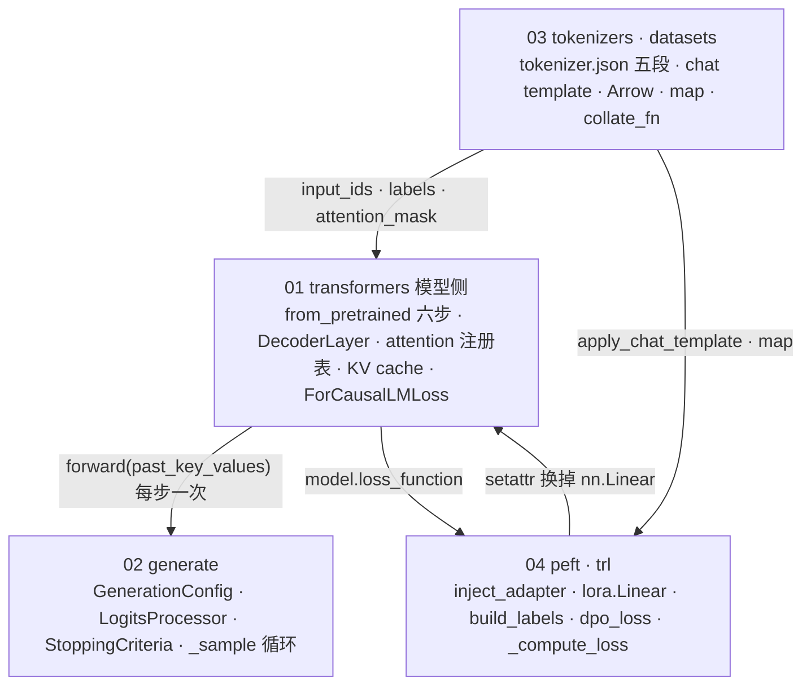

四篇正文回答了一个问题：**[工具箱第五篇](/hugging-face-ecosystem-six-libraries-and-a-lora-sft.html)那六行代码，执行时各经过哪些文件的哪些函数**。第一篇读模型的加载与一次前向，第二篇读 `generate` 的循环，第三篇读文本与数据两条流水线，第四篇读 LoRA 怎么挂上去与三种 loss 各在哪一行。本文把四篇压成一张「问题 → 文件 → 函数」的索引表，拎出贯穿五个库的四条设计线，再给一套自测。

> **读完这四篇，你应该能回答哪些问题？[^q0] 哪些文件名、函数名与数字必须能脱口而出？[^q1] 怎么判断自己是"读过"还是"掌握"了？[^q2]**

先把整个系列放在一张图上——箭头是**调用或数据上的依赖**，不是阅读顺序：

## 一、总览：系列回答的问题与主线

系列的一句话主张是：**这几个库的骨架是「注册表 + 字符串键」，读源码就是找到注册表、找到 `compute_loss`、找到 `forward` 里那一行调用，往下追**。`model_type` 选模型类、`_attn_implementation` 选 attention 函数、`loss_type` 选 loss、`target_modules` 选要换的层——每一处都是一张表和一个键，模型代码不改，实现随便换。

| 篇 | 回答的问题 | 一句话结论 | 必记的文件 / 函数 / 数字 |
|---|---|---|---|
| [01 模型侧](/transformers-from-pretrained-to-forward-and-loss.html) | 三个文件怎么变成 `nn.Module`，`forward` 怎么走到 loss | 加载六步：读 `model_type` → 查表选类 → meta device 建骨架 → mmap 按名字填 → 收尾；前向逐行对应 L4 结构图，attention 与 loss 都是注册表调用 | `modeling_auto.py` 的 `_LazyAutoMapping` `torch.device("meta")` `safe_open` `ALL_ATTENTION_FUNCTIONS` `ForCausalLMLoss` sdpa/eager 差 $$10^{-4}$$（fp32）与 1.0（bf16） `Loading weights 290/290` |
| [02 generate](/transformers-generate-call-chain.html) | 一次采样的完整调用链 | 四段：`GenerationConfig` 三层优先级 → 按非空字段装配 processor 串 → 停止条件 → `_sample` 循环，每步六件事 | `_prepare_generation_config` `_get_logits_processor`（processor 在前、warper 在后） `TemperatureLogitsWarper` / `TopK` / `TopP` `unfinished_sequences` 不传长度时 Qwen2.5 生成到 2048 |
| [03 tokenizers · datasets](/tokenizers-and-datasets-from-messages-to-input-ids.html) | 从 messages 到 `input_ids`，从 Arrow 文件到 `collate_fn` | `tokenizer.json` 一个 JSON 描述五段 Rust 流水线，Python 只是壳；`Dataset` 是 Arrow 表的 mmap 视图，`map` 写新文件、文件名是 fingerprint，`shuffle` 只改索引 | normalizer → pre_tokenizer → model → post_processor → decoder `encode_batch` `` 151665 / 151643 / 151936 `cache-<fingerprint>.arrow` `_indices` |
| [04 peft · trl](/peft-and-trl-lora-sft-dpo-grpo-in-source.html) | LoRA 怎么挂上去，SFT / DPO / GRPO 的 loss 各在哪一行 | `inject_adapter` 用 `setattr` 把 `nn.Linear` 换成 `lora.Linear`，`forward` 多一行 SFT 的 `-100` 在 `build_labels` 那一次 `map` 里填 `dpo_loss` 十几行 GRPO 的优势、裁剪、KL、归一各一段 | `result + lora_B(lora_A(dropout(x))) * scaling` `scaling = α/r` `lora_B` 全零 8.8M（1.8%） `build_labels` `-logsigmoid(β·Δ)` `(r − mean)/(std + 1e-4)` `loss_type` 的 grpo / bnpo / dr_grpo |

Table: 四篇的核心问题、结论与必记项

### 1. 本文的章节安排

| 章 | 内容 |
|---|---|
| 二 | 逐篇回顾：每篇的骨架、关键代码位置与总纲提出的问题的答案 |
| 三 | 贯穿全系列的四条线：注册表、Rust / Arrow 内核、`-100`、`disable_adapter` |
| 四 | 常见误区 |
| 五 | 通关自测：判断与计算、跨篇综合、面试题、掌握判据 |
| 六、七 | 下一步与延伸阅读 |

Table: 本文的章节安排

## 二、逐篇回顾

### 1. 第一篇：transformers 模型侧——from_pretrained 怎么把三个文件变成 nn.Module，forward 怎么走到 loss

**骨架。**`AutoModelForCausalLM.from_pretrained(name)` 的六步：`AutoConfig.from_pretrained` 读 `config.json` 的 `model_type`；`_LazyAutoMapping` 用 `(model_type, "AutoModelForCausalLM")` 查 `modeling_auto.py` 里的表得到 `Qwen2ForCausalLM`——`architectures` 字段不参与选类；解析仓库里的 safetensors 分片；在 `torch.device("meta")` 下建骨架，不分配一字节权重；`safe_open` 拿到每个张量的切片句柄，赋值时才 mmap 读盘、按 `state_dict` 键名填；收尾 `tie_weights`、初始化缺失键、`eval()`，`generation_config.json` 也在此时读入。前向：`Qwen2DecoderLayer` 的 RMSNorm、`apply_rotary_pos_emb`（前后两半配对）、`repeat_kv`（GQA，`expand` 不拷内存）、SwiGLU MLP、两条残差；attention 那一行是 `ALL_ATTENTION_FUNCTIONS[config._attn_implementation](...)`——eager 是手算六步加 fp32 softmax，sdpa 是一次 `scaled_dot_product_attention`；KV cache 是 `DynamicCache`，每层 `cat` 到 `key_states`；loss 不在建模文件里，`self.loss_function` 按类名分派到 `loss/loss_utils.py` 的 `ForCausalLMLoss`。最后读 `modular_qwen2.py`：不到 200 行继承 Llama / Mistral，`modular_model_converter.py` 展开成自包含的 `modeling_qwen2.py`。

**总纲的问题。**8B bf16 加载峰值约等于 16 GB：meta device 骨架不占内存，权重 mmap 逐个赋进参数，不会同时存在「文件里一份 + 模型里一份」。sdpa 与 eager 在 fp32 下差 $$1.7 \times 10^{-4}$$、bf16 下差到 1.0：数学相同、求和顺序不同，bf16 只有 8 位尾数——比较两个 attention 实现的输出必须在 fp32。`labels` 传进去后：`ForCausalLMLoss` 先 `shift`（`logits[:, :-1]` 对 `labels[:, 1:]`），`cross_entropy(ignore_index=-100)` 只对非 `-100` 位置求和；`num_items_in_batch` 传入时分母从本 micro-batch 的有效 token 数换成整个梯度累积周期的总数，梯度累积才与大 batch 等价。

### 2. 第二篇：generate——一次采样的完整调用链

**骨架。**`_prepare_generation_config`：kwargs > 模型的 `generation_config`（来自仓库的 `generation_config.json`）> 全局默认；不认识的 kwargs 成为 `model_kwargs` 原样传给 `forward`，拼错的参数名由 `_validate_model_kwargs` 报错。`_get_logits_processor` 是 200 行的 `if xxx is not None: append(...)`：先所有 processor（repetition penalty、n-gram、bad words、min length），`do_sample` 为真时再加 warper（temperature → top-k → top-p → min-p……），顺序由代码决定。`_get_stopping_criteria`：`MaxLength`、`EosToken`、`StopString`。`get_generation_mode` 选 greedy / sample / beam / assisted。`_sample` 的循环：`_prefill` 整段 prompt 前向一次（`logits_to_keep=1`）拿到 cache，之后每步 `prepare_inputs_for_generation` 只切最后一个 token → `forward` → 取 `logits[:, -1]` → 过 processor 串 → `multinomial(softmax)` 或 `argmax` → `cat` → `unfinished_sequences &= ~stopping_criteria(...)`；停了的序列此后每步填 `pad_token_id` 但仍跟着前向——静态 batch，vLLM 的 continuous batching 解决的正是这个。流式输出是循环里多一个 `streamer.put(next_tokens)`。

**总纲的问题。**只传 `temperature=0.2` 不传 `do_sample`：Qwen2.5 的 `generation_config.json` 里 `do_sample=False`，走 greedy，warper 根本不装配，`temperature` 无效（新版本会打警告）。`top_k=50, top_p=0.9`：processor 串里 `TopK` 在 `TopP` 之前，先留 50 个再在这 50 个里按累积概率 0.9 截——结果是「先 k 后 p」的交集；换顺序结果一般不同，且 transformers 不允许用 `logits_processor=` 再传一个同类 warper（会报重复）。batch 里第 10 步停的那条：第 11–30 步 `next_tokens` 被 `unfinished_sequences` 掩成 `pad_token_id`，输出序列里这 20 位是 pad；它的前向没有省掉。

### 3. 第三篇：tokenizers 与 datasets——从 messages 到 input_ids，从 Arrow 文件到 collate_fn

**骨架。**`tokenizer.json`（Qwen2.5 的 7 MB）顶层九个键，后五个就是 Rust 流水线：`normalizer`（NFC）→ `pre_tokenizer`（GPT-2 正则切词 + `ByteLevel`）→ `model`（BPE，vocab 151643、merges 151387）→ `post_processor`（Qwen 不加特殊 token；Llama 的 `TemplateProcessing` 在此加 `<s>`）→ `decoder`。`Tokenizer.from_file` 读它就搭出整条流水线，Python、Node、Rust 共用。Python 壳 `PreTrainedTokenizerFast`：`__call__ → encode_batch`（进 Rust）→ `BatchEncoding`，padding 与 `added_tokens` 对齐在壳里做。`apply_chat_template` 是沙箱 Jinja 渲染 `tokenizer_config.json` 里的 `chat_template`；`return_assistant_tokens_mask=True` 依赖模板里的 `` 标记。`load_dataset` 找 builder → `download_and_prepare` → `~/.cache/…/no_robots-train.arrow`；`Dataset` = `MemoryMappedTable` 视图 `_data` + 可选行索引 `_indices` + 格式；`map` 按 `writer_batch_size` 取批 → 调函数 → `ArrowWriter` 写 `cache-<fingerprint>.arrow`，fingerprint 由上一个 fingerprint、变换名、全部参数（函数用 `dill` 序列化）哈希；`shuffle` / `select` 只生成行号表；`__getitem__` 切 Arrow → formatter → dict，变长 padding 在 `DataLoader` 的 `collate_fn` 里。

**总纲的问题。**三个数：151665 是 `len(tok)` = 基础词表 + `added_tokens`（22 个特殊 token）；151643 是 `vocab_size` = BPE 表大小；151936 是 `config.vocab_size` = embedding 行数，为 GPU 对齐补到 128 的倍数——加 10 个特殊 token 只有 `len(tok)` 变，仍小于 151936，模型不用 `resize_token_embeddings`。`"12345"` 是 5 个 token：GPT-2 正则在 `pre_tokenizer` 里把数字单个切开，BPE 的合并只在「词」内进行；`"hello"` 是一个整词、merges 表里能合到底。改 print 后 10 分钟重跑：函数字节码变了，`dill` 哈希变，fingerprint 变，缓存文件名对不上——用 `new_fingerprint=` 固定，或把函数拆成不变的模块级函数。

### 4. 第四篇：peft 与 trl——LoRA 怎么挂上去，SFT / DPO / GRPO 的 loss 各在哪一行

**骨架。**peft：`get_peft_model` 返回 `PeftModel(LoraModel(model))`，原模型被原地改；`_prepare_adapter_config` 把 `all-linear` 展开成所有 `nn.Linear` 名（排除 `lm_head`）；`inject_adapter` 用 `named_modules` 逐个匹配，命中的交给 `_create_and_replace` 新建 `lora.Linear(base_layer, r, lora_alpha, ...)` 再 `setattr(parent, name, new_module)`；`update_layer` 建 `lora_A = Linear(in, r)`（kaiming）、`lora_B = Linear(r, out)`（全零）、`scaling = α/r`，`_mark_only_adapters_as_trainable` 冻结其余；`forward` 多一行 `result + lora_B(lora_A(dropout(x))) * scaling`，先算瘦的一半；`merge` 把 `get_delta_weight` 加进 `base_layer.weight.data`。trl：`SFTTrainer._prepare_dataset` 接受 messages / prompt-completion / 纯文本三种格式，套模板、tokenize、按 `completion_mask` 或 `assistant_masks` 在 `build_labels` 这一次 `map` 里造 `labels`（不该学的位 `-100`），可选 `pack_dataset`（bfd）；`DataCollatorForLanguageModeling` 只 pad（`input_ids` 用 pad id、`labels` 用 `-100`），`padding_free` 时拼成一行加 `position_ids` 并把每段首 token 置 `-100`；`compute_loss` 走模型的 `loss_function`。`DPOTrainer`：`concatenated_forward` 把 chosen 与 rejected 拼成一个 batch 前向，取 completion 的 log p 之和；参考 log p 来自 `ref_model`、或 peft 时 `disable_adapter()` 下再前向一次、或 `precompute_ref_log_probs`；`dpo_loss` 的 `sigmoid` 分支是 `-logsigmoid(β((logπ_c − logπref_c) − (logπ_r − logπref_r)))`，其余 `loss_type` 各改一行。`GRPOTrainer`：`_generate_and_score_completions` 每个 prompt 采 $$G$$ 条、过 `reward_funcs`；`advantages = (r − mean_group) / (std_group + 1e-4)`；`_compute_loss`：`ratio = exp(logπ − logπ_old)`，`-min(ratio·A, clip(ratio, 1−ε_low, 1+ε_high)·A)`，`beta != 0` 时加 `β·KL`（k3 估计），`loss_type` 决定按条平均（grpo）、全 token 平均（bnpo）还是除常数（dr_grpo）。

**总纲的问题。**`target_modules=["q_proj", "v_proj"]` 是「模块名以此结尾」的列表匹配，能命中 `model.layers.3.self_attn.q_proj`；字符串 `"q_proj|v_proj"` 被当作正则 `re.fullmatch`，要匹配完整路径必须写成 `".*\.(q_proj|v_proj)"`，原样写匹配不到。LoRA 反向仍经过冻结的 `base_layer`：梯度要从 loss 传到每一层的输入 $$x$$，才能到达更靠前的 `lora_A`，`base_layer` 的 `weight.grad` 不算但 $$\partial L / \partial x = g W$$ 必须算；省下的是优化器状态（AdamW 两份动量 × 全部参数）与权重梯度，激活内存不省。GRPO 一组 8 条全对：`r − mean = 0`，`advantages` 全零，`per_token_loss` 全零，这组对本步梯度零贡献；DAPO 的 dynamic sampling 把这样的组过滤掉、重采到 batch 满；`beta=0` 时 trl 不建参考模型、不算 `per_token_kl`。

## 三、贯穿全系列的几条线

### 1. 注册表 + 字符串键

`model_type → 模型类`（`_LazyAutoMapping`）、`_attn_implementation → attention 函数`（`ALL_ATTENTION_FUNCTIONS`）、类名 → loss 函数（`LOSS_MAPPING`）、`loss_type → dpo_loss 的分支`、`target_modules → 要换的层`。读任何一个新模型、新 Trainer，先找那张表。

### 2. Rust / Arrow 内核 + Python 壳

`encode_batch` 之下是 Rust，`_data` 之下是 Arrow 的 mmap。Python 源码读到这两条线就停：壳负责对齐、格式转换与缓存管理，速度与内存都由内核决定——`batched=True` 快一个量级是因为一次进 Rust 多线程处理一千条；`shuffle` 不拷数据是因为只改行号表。

### 3. `-100` 一个约定串起三个库

tokenizers 的 assistant mask（``）→ trl 的 `build_labels`（mask 为 0 的位填 `-100`）与 collator（pad 位填 `-100`、`padding_free` 的段首填 `-100`）→ transformers 的 `ForCausalLMLoss`（`ignore_index=-100`）。三个库没有共享任何类，靠这个整数约定协作。

### 4. 一个上下文省一份模型

`PeftModel.disable_adapter()` 让同一个模型在 LoRA 关掉时就是参考模型：DPO 的 `ref log p`、GRPO 的 KL 都可以这样算，省掉一份完整权重；`merge` / `unmerge` 与之类似，改 `weight.data` 而不改结构。

| 概念 | 在哪一篇 | 与谁相连 |
|---|---|---|
| `_LazyAutoMapping` / `ALL_ATTENTION_FUNCTIONS` / `LOSS_MAPPING` | 01 | 04 的 `loss_type`、`target_modules` 同一模式 |
| `generation_config.json` | 01 读入、02 使用 | `from_pretrained` 收尾时读，`_prepare_generation_config` 用 |
| `past_key_values` / `DynamicCache` | 01 建 | 02 的 `prepare_inputs_for_generation` 每步只喂一个 token 的前提 |
| `` | 03 | 04 的 `assistant_only_loss` 报错的原因 |
| `map` 与 fingerprint | 03 | 04 的 `_prepare_dataset` 就是几次 `map` |
| `-100` | 01 消费、03 产生、04 填写 | 见上文第 3 条 |
| `disable_adapter()` | 04 | 02 的 `generate` 在 GRPO 采样时也走它 |

Table: 贯穿全系列的概念及其关系

## 四、常见误区

| 误区 | 为什么错 | 正确说法 |
|---|---|---|
| `architectures` 字段决定 `from_pretrained` 实例化哪个类 | `Auto` 类只看 `model_type` 查自己那张表 | `AutoModelForCausalLM` 对 `model_type=qwen2` 永远给 `Qwen2ForCausalLM`，`architectures` 只影响 `AutoModel` 的默认头 |
| 加载模型峰值内存是权重的两倍 | meta device 骨架不占内存，safetensors mmap 逐个赋值 | 峰值约等于权重本身 |
| `attn_implementation` 换了结果就不一样、说明有 bug | 两种实现数学相同，差异来自求和顺序与精度 | fp32 差 $$10^{-4}$$、argmax 一致才是正常；bf16 下差 1.0 也正常 |
| 传了 `temperature` 就在采样 | warper 只在 `do_sample=True` 时装配 | 看模型 `generation_config.json` 的 `do_sample` 默认值 |
| `top_k` 与 `top_p` 的顺序看我传参的顺序 | `_get_logits_processor` 按代码里 `append` 的顺序 | 固定 temperature → top-k → top-p |
| `len(tok) == config.vocab_size` | 一个是 tokenizer 的词条数，一个是 embedding 行数 | 151665 ≠ 151936，后者为对齐补大；加少量 token 不需要 resize |
| `map` 不会重跑，datasets 有缓存 | 缓存键是 fingerprint，函数体一变就失效 | 改任何一行（含 print）都重跑；用 `new_fingerprint=` 或模块级函数 |
| `shuffle` 之后 `map` 应该一样快 | `shuffle` 只改 `_indices`，之后是随机访问 Arrow | 先 `map` 再 `shuffle`，或 `flatten_indices()` |
| `target_modules="q_proj|v_proj"` 能匹配到所有 q/v 层 | 字符串走 `re.fullmatch`，要匹配完整路径 | 用列表 `["q_proj", "v_proj"]`（后缀匹配）或写完整正则 |
| LoRA 训练显存约等于 1.8% 参数的显存 | 激活与反向的 $$gW$$ 一点没省 | 省的是优化器状态与权重梯度 |
| `SFTTrainer` 默认只对 assistant 算 loss | 默认 `assistant_only_loss=False`，全部非 pad 位都算 | 要 assistant-only 须模板带 `` 或用 prompt-completion 格式 |
| DPO 一定要加载两份模型 | peft 下 `disable_adapter()` 就是参考模型 | 一份权重、两次前向 |
| GRPO 一组全对是最好的样本 | 优势全零、梯度零贡献 | DAPO 过滤这类组重采；`scale_rewards` 与 `loss_type` 决定归一 |

Table: 常见误区与正确说法

## 五、通关自测

### A. 判断与计算（10 题）

1. `config.json` 里 `"model_type": "llama"`、`"architectures": ["MistralForCausalLM"]`，`AutoModelForCausalLM.from_pretrained` 给出哪个类？
2. 70B bf16 模型、safetensors 分 30 片，`from_pretrained(device_map="auto")` 的 CPU 峰值内存约多少？
3. `attn_implementation="eager"` 与 `"sdpa"` 在 bf16 下同一输入的 `argmax` 不一致，是 bug 吗？
4. `labels` 长 $$T = 512$$，前 200 位是 `-100`，`ForCausalLMLoss` 对多少个位置平均？
5. Qwen2.5-0.5B 上 `model.generate(**inputs)` 不传任何长度参数，会生成多少个新 token？
6. `do_sample=True, top_k=0, top_p=1.0, temperature=1.0`，processor 串里有几个 warper？
7. `"2024"` 在 Qwen2.5 的 tokenizer 里是几个 token？由五段中的哪一段决定？
8. `ds.map(fn, num_proc=8)` 跑完后把 `num_proc` 改成 4 再跑，命中缓存吗？
9. Qwen2.5-0.5B（hidden 896、24 层）上 `r=16, target_modules="all-linear"`，`lora_B` 初始化后第一步前向的输出与基座相比差多少？
10. GRPO `num_generations=8`，一组 reward 为 `[1,1,1,1,0,0,0,0]`，`scale_rewards="group"`，第一条的 `advantage` 是多少？

**答案要点。**（1）`LlamaForCausalLM`——只看 `model_type`。（2）约等于权重大小，`device_map="auto"` 下更少：meta 骨架 + 逐分片 mmap，不会 30 片同时驻留。（3）不是：bf16 8 位尾数，两种实现求和顺序不同，logits 差到 1.0 时 argmax 可能翻转；要比对请用 fp32。（4）312 个：shift 后目标是 `labels[1:]` 共 511 位，其中前 199 位是 `-100`，$$511 - 199 = 312$$；`-100` 的位不进分母。（5）2048：仓库 `generation_config.json` 的 `max_new_tokens=2048`；配套脚本 5 个 token 的 prompt 输出总长 2053。（6）零个：`top_k=0`、`top_p=1.0`、`temperature=1.0` 都是「不装配」的默认值。（7）4 个：GPT-2 正则在 `pre_tokenizer` 把数字单个切开。（8）命中：`num_proc` 不进 fingerprint，结果文件由分片合并而来；改 `fn` 才失效。（9）零：`lora_B` 全零，$$B A x = 0$$，第一步前向与基座逐位相同。（10）约 0.94：`mean = 0.5`，`nanstd` 是无偏标准差 $$\sqrt{8 \cdot 0.25 / 7} \approx 0.535$$，`advantage = (1 - 0.5) / (0.535 + 10^{-4}) \approx 0.935$$；后四条为 $$-0.935$$，一组之和为零。

### B. 跨篇综合（5 题）

1. 用 Qwen2.5 做 `SFTTrainer(assistant_only_loss=True)` 报错。从 tokenizer 到 Trainer 追一遍错在哪个文件，两条修法各有什么代价？
2. 手写 decode 循环忘了传 `past_key_values`、只喂新 token，输出乱了。从第一篇的 `forward` 与第二篇的 `prepare_inputs_for_generation` 说明两处错。
3. DPO 用 peft 训练时没有 `ref_model`。参考 log p 从哪来？涉及第四篇的哪个上下文与第一篇的哪一层？
4. 一次 `SFTTrainer.train()` 中 `-100` 出现在哪三处、由哪三个库的哪三个函数写入或消费？
5. 换一个新模型架构到 transformers（假设已合入），`generate`、`get_peft_model`、`SFTTrainer` 分别需要它提供什么，才能不改一行代码直接用？

**答案要点。**（1）第三篇：`chat_template_utils.py` 检查模板里是否有 ``，Qwen2.5 的模板没有，`return_assistant_tokens_mask` 报 `ValueError`；第四篇的 `_prepare_dataset` 传了这个参数。修法一：换一个带 `` 的模板（要保证与原模板渲染结果一致，否则分布漂移）；修法二：改成 prompt-completion 格式走 `completion_mask`（多轮对话只能对最后一轮算 loss）。（2）第一处：没有 cache 时 `forward` 把这一个 token 当作位置 0 的完整序列，RoPE 位置错、attention 看不到历史；第二处：`prepare_inputs_for_generation` 只切最后一个 token 的前提是 `past_key_values` 里有之前所有层的 K/V——要么全序列重算，要么带 cache。（3）`DPOTrainer` 在 `ref_model is None and is_peft_model` 时用 `with self.model.disable_adapter():` 再前向一次；`disable_adapter` 让每个 `lora.Linear.forward` 走 `self.base_layer(x)` 分支——第一篇里被 `setattr` 换掉的那些 `nn.Linear`。（4）trl `build_labels`（mask 为 0 的位）、trl `DataCollatorForLanguageModeling`（pad 位、`padding_free` 段首）、transformers `ForCausalLMLoss`（`ignore_index=-100` 消费）；来源之一是 tokenizers 的 assistant mask。（5）`generate`：`GenerationMixin` 与 `forward` 接受 `past_key_values` / `use_cache`、返回 `logits`；`get_peft_model`：模块是 `nn.Linear`（或有对应 LoRA 层的类型）且命名可被 `target_modules` 匹配；`SFTTrainer`：`forward(labels=...)` 返回 `loss`（即走 `loss_function`），tokenizer 有 `chat_template`。

### C. 面试题（6 题）

1. `from_pretrained` 为什么快、内存为什么省？说出 meta device 与 safetensors mmap 各解决什么。
2. `generate` 里 `temperature`、`top_k`、`top_p` 各怎么实现？为什么顺序固定？
3. `tokenizer.json` 的五段各做什么？Llama 与 Qwen 在哪一段不同？
4. `datasets.map` 的缓存键是怎么算的？什么情况下会意外失效或意外命中？
5. LoRA 在源码层面是怎么「挂上去」的？训练时省的是什么、不省的是什么？
6. `dpo_loss` 与 GRPO 的 `_compute_loss` 各是哪几行？`loss_type` 在两处分别控制什么？

**答案要点。**（1）meta device：建骨架不分配权重内存；mmap：`safe_open` 的切片句柄赋值时按页读盘，峰值等于权重本身，且 290 个张量秒级加载。（2）`TemperatureLogitsWarper` 是 `scores / temperature`；`TopK` 用 `topk` 找第 $$k$$ 大值，小于它的置 $$-\infty$$；`TopP` 排序、`softmax`、`cumsum`，超过 $$p$$ 的置 $$-\infty$$——各十行；顺序由 `_get_logits_processor` 里 `append` 的顺序决定，让 top-p 在 temperature 之后算才是「对调温后的分布截断」。（3）normalizer 规范化 Unicode；pre_tokenizer 切词 + 字节映射；model 做 BPE 合并；post_processor 加特殊 token；decoder 还原字节——Llama 的 `post_processor` 是 `TemplateProcessing` 加 `<s>`，Qwen 是 `ByteLevel` 不加。（4）`update_fingerprint(old, "map", args)`，函数用 `dill` 序列化进哈希；改函数任何字节码、闭包变量、默认参数都失效；改 `num_proc` 或函数外的东西不失效；lambda 引用了可变全局变量时可能意外命中。（5）`inject_adapter` 匹配 `target_modules`，`_create_and_replace` 新建 `lora.Linear(base_layer)`，`setattr` 换掉父模块属性；`forward` 多一行 $$\frac{\alpha}{r} B A x$$；省优化器状态与权重梯度，不省激活与 $$\partial L / \partial x$$。（6）`dpo_loss`：`logits = (logπ_c − logπref_c) − (logπ_r − logπref_r)`，`sigmoid` 分支 `-logsigmoid(β·logits)`，`loss_type` 选公式变体（ipo、hinge…）；GRPO：`coef_1 = exp(logπ − logπ_old)`，`coef_2 = clamp`，`-min(coef_1·A, coef_2·A)`，`+ β·KL`，`loss_type` 选归一方式（grpo 按条、bnpo 按 token、dr_grpo 除常数、dapo）。

### D. 掌握判据

| 程度 | 判据 |
|---|---|
| 读过 | 能说出四篇各读了哪几个文件 |
| 理解 | A 组至少 8 题、B 组至少 4 题不看答案答对；能画出第一篇的六步与第二篇的四段 |
| 掌握 | 拿到一个没读过的 trl Trainer 或 transformers 新模型目录，30 分钟内找到它的 `compute_loss` / 注册表 / `forward` 里的注册调用，并说出与本系列哪一篇的骨架相同 |

Table: 掌握程度的判据

## 六、下一步

本系列是[《AI 算法工程师学习地图》](/ai-algorithm-engineer-learning-roadmap.html) L4–L5 的深入篇。往前，它读的每一段代码都对应地图里的一篇公式或结构图：模型侧对应 [L4 Transformer 系列](/transformer-and-llm-for-infra-engineers.html)第一篇，`generate` 对应 [L0 第五篇](/from-maximum-likelihood-to-cross-entropy.html)第七章，LoRA 对应 [L0 第三篇](/orthogonal-rotation-svd-and-low-rank.html)，三种 loss 对应[后训练系列](/post-training-from-sft-to-verifiable-rewards.html)。往后，两条路：

- **推理侧。**第二篇的 `_sample` 是静态 batch、Python 循环、每层 `cat` 的 KV cache——[vLLM 源码系列](/deep-dive-into-vllm.html)读 continuous batching 与 PagedAttention 怎么把这三件事各换掉一个。
- **训练侧。**第四篇的 `GRPOTrainer` 采样与训练在同一进程——[verl 源码导读](/verl-source-walkthrough-from-a-grpo-config-to-every-worker.html)读 rollout 与 actor 分到不同 worker 之后同一条 GRPO loss 长什么样。

## 七、延伸阅读

本系列没有读的部分，需要时从下面进：

- **transformers 的其余目录。**`models/` 里 encoder、多模态（`Qwen2VLForConditionalGeneration` 的 `pixel_values` 怎么进 `inputs_embeds`）、`integrations/`（flash attention、bitsandbytes 量化的 `Linear4bit`）、`trainer.py`（trl 的三个 Trainer 都继承它：训练循环、梯度累积、`num_items_in_batch` 的来源）。
- **accelerate。**`device_map="auto"` 的切分与 `dispatch_model`、多卡下 `Trainer` 的 DDP / FSDP 包装——[Infra 地图](/ai-infra-learning-roadmap.html)的分布式训练系列。
- **peft 的其他 tuner。**`tuners/` 目录下 DoRA、AdaLoRA、IA3、prompt tuning，结构与 `lora/` 相同：一个 `Config`、一个 `Model`、一个 `Layer`。
- **trl 的其他 Trainer。**`PPOTrainer`（带 value head）、`RewardTrainer`、`KTOTrainer`、`OnlineDPOTrainer`，以及 GRPO 的 vLLM 采样后端（`use_vllm=True`，`vllm_client.py`）。
- **datasets 的 streaming。**`IterableDataset` 与 `iterable_dataset.py`：不落 Arrow、边下边用，`shuffle` 变成缓冲区随机——预训练规模的数据只能这样读。

版本与文件名以总纲所述为准；这几个库的目录结构一年内会变，读的方法不变。

[^q0]: 五个：`from_pretrained` 怎么把三个文件变成 `nn.Module`（六步）；`generate` 一步做哪六件事、processor 串怎么装配；`tokenizer.json` 五段与 `map` 的 fingerprint；LoRA 怎么被 `setattr` 挂上去、`forward` 多的那一行；SFT 的 `-100`、`dpo_loss`、GRPO 的优势 / 裁剪 / 归一各在哪几行。
[^q1]: `_LazyAutoMapping`、`torch.device("meta")`、`safe_open`、`ALL_ATTENTION_FUNCTIONS`、`ForCausalLMLoss`；`_get_logits_processor`、`unfinished_sequences`；normalizer → pre_tokenizer → model → post_processor → decoder、151665 / 151643 / 151936、`cache-<fingerprint>.arrow`；`inject_adapter`、`result + lora_B(lora_A(dropout(x))) * scaling`、`scaling = α/r`、8.8M（1.8%）；`build_labels`、`-logsigmoid(β·Δ)`、`(r − mean) / (std + 1e-4)`。
[^q2]: 用第五章的三段自测：A 组 10 题判断与计算（至少 8 题）、B 组 5 题跨篇综合（至少 4 题）、C 组 6 题面试题（能不看答案讲两分钟）；再按 D 表的「掌握」判据，拿一个没读过的 Trainer 试 30 分钟。
