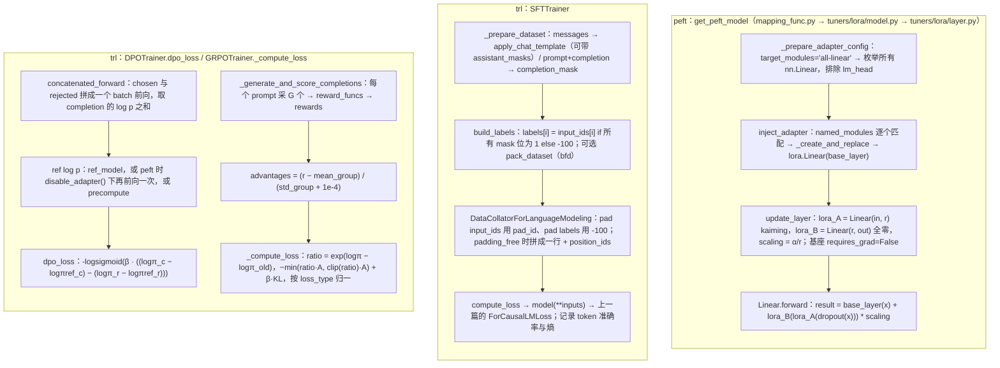

> **更新 @2026-09-30**：本文对着 **peft 0.21.0**（`tuners/lora/layer.py` 2739 行、`tuners/tuners_utils.py` 2781 行）与 **trl 1.13.0**（`trainer/sft_trainer.py` 1927 行、`dpo_trainer.py` 1823 行、`grpo_trainer.py` 3497 行）读，配套脚本在 `ai-learning-labs/hf-source-reading/`，模型用本地缓存的 Qwen2.5-0.5B。trl 是 Hugging Face 几个库里改得最快的一个（一年三十多个版本，`SFTTrainer` 的数据契约改过数次），路径与名字以 1.13.0 为准，不引用行号；读别的版本请以本地源码对照。

工具箱第五篇那六行里，第三行 `get_peft_model(model, LoraConfig(...))` 和第五、六行 `SFTTrainer(...).train()` 是两个最"黑"的盒子：前者进去一个 `nn.Module`、出来一个只有 1.8% 参数可训的 `nn.Module`，后者进去一个 `Dataset`、出来一个训好的模型。前三篇把 transformers 的模型、生成、数据读完了，这一篇读剩下的两个库：peft 怎么把[ L0 第三篇](/orthogonal-rotation-svd-and-low-rank.html)的 $$W + BA$$ 变成一次 `forward` 里的一行加法，trl 怎么把[后训练系列](/post-training-from-sft-to-verifiable-rewards.html)的三个 loss——SFT 的带 mask 交叉熵、DPO 的 $$-\log\sigma(\beta \Delta)$$、GRPO 的组内归一化优势——各写成十几行。

本篇要回答的核心问题是：

> **`get_peft_model` 怎么找到要替换的层、替换成什么？`SFTTrainer` 的 `labels` 里的 `-100` 是在哪一步、按什么规则填的？`dpo_loss` 与 GRPO 的 `_compute_loss` 里，论文的公式各对应哪几行？[^q0]**

## 一、总览

### 1. 两个库、四条路



### 2. 本文的章节安排

| 章 | 主题 | 内容 |
|---|---|---|
| 二 | peft：找到要换的层 | `get_peft_model` 的返回类型；`target_modules` 的三种写法；`all-linear` 为什么不含 `lm_head`；`inject_adapter` 的匹配循环 |
| 三 | peft：换成什么 | `lora.Linear` 的结构；`update_layer` 的初始化（A kaiming、B 零、`scaling = α/r` 或 rsLoRA 的 $$\alpha/\sqrt r$$）；`forward` 的一行；`merge` / `unmerge`；`PeftModel` 与 `state_dict` 里只有 adapter |
| 四 | trl：SFT 的数据契约 | 三种数据格式；`_prepare_dataset` 的 `map` 链；`build_labels` 与 `-100` 的规则；`assistant_only_loss` vs `completion_only_loss`；packing 的三种策略与 `padding_free` |
| 五 | trl：SFT 的一步 | collator 做什么、不做什么；`compute_loss` 与 `loss_type`；`num_items_in_batch` 与 token 准确率、熵 |
| 六 | trl：DPO | `concatenated_forward`；参考模型的三种来源；`dpo_loss` 的十几行与 `loss_type` 表；`label_smoothing` |
| 七 | trl：GRPO | 采样、打分、组内优势；`_compute_loss` 的 PPO 裁剪与 KL；`loss_type` 决定怎么对 token 归一（grpo / dr_grpo / bnpo / dapo）；vLLM 在哪 |
| 八 | 本文小结 | |
| 九 | 自测 | 五道题 |

Table: 本文的章节安排

## 二、peft：找到要换的层

### 1. `get_peft_model`

```python title="get_peft_model 一行"
model = get_peft_model(model, LoraConfig(r=16, lora_alpha=32, target_modules="all-linear", lora_dropout=0.05))
```

`mapping_func.get_peft_model`（200 行）按 `peft_config.task_type` 查 `MODEL_TYPE_TO_PEFT_MODEL_MAPPING` 选一个包装类（不传 `task_type` 时是通用的 `PeftModel`，配套脚本打印 `PeftModel`），它的 `__init__` 再按 `peft_type` 选 tuner——LoRA 是 `LoraModel`（`tuners/lora/model.py`）。所以返回值是三层套娃：`PeftModel.base_model` 是 `LoraModel`，`LoraModel.model` 才是原来的 `Qwen2ForCausalLM`——**原模型对象被原地修改**（层被替换），不是拷贝。`peft_model.base_model.model.model.layers[0].self_attn.q_proj` 这样的路径就是这么来的。

### 2. `target_modules` 与 `all-linear`

`LoraConfig.target_modules` 三种写法：列表 `["q_proj", "v_proj"]`（按模块名的**最后一段**精确匹配），字符串（当作正则对完整路径 `re.fullmatch`），或字面量 `"all-linear"`。第三种在 `tuners_utils._maybe_include_all_linear_layers` 里展开：

```python title="_maybe_include_all_linear_layers 展开 all-linear"
linear_classes = (torch.nn.Linear, Conv1D)
linear_module_names = set()
for name, module in model.named_modules():
    if isinstance(module, linear_classes):
        linear_module_names.add(name)
...
if isinstance(model, PreTrainedModel):
    output_emb = model.get_output_embeddings()      # lm_head
    ... module_names_to_exclude.add(last_module_name)
linear_module_names -= module_names_to_exclude
```

枚举所有 `nn.Linear`，**排除输出层**——`lm_head` 是 $$896 \times 151936$$ 的大矩阵、又常与 embedding 绑权重，给它挂 LoRA 既贵又会破坏绑定；配套脚本确认挂完之后 `lm_head` 仍是普通的 `Linear`。展开的结果是七个名字（q/k/v/o/gate/up/down），之后与列表写法走同一条路。

### 3. `inject_adapter`

```python title="BaseTuner.inject_adapter：找到目标并替换"
# tuners_utils.BaseTuner.inject_adapter（节选）
for key, target in model.named_modules():          # 全部模块，约 900 个
    if not self._check_target_module_exists(peft_config, key):
        continue
    parent, target, target_name = _get_submodules(model, key)
    self._create_and_replace(peft_config, adapter_name, target, target_name, parent, current_key=key)
self._mark_only_adapters_as_trainable(model)        # 除了名字带 "lora_" 的，全部 requires_grad=False
```

`_check_target_module_exists` 对每个模块名做上一节的匹配；匹配上的交给 `LoraModel._create_and_replace`：按目标层类型（`nn.Linear` / `nn.Embedding` / `nn.Conv2d` / 量化的 `bnb.Linear4bit` 各有对应的 LoRA 层）新建一个 `lora.Linear(target, adapter_name, r, lora_alpha, ...)`，然后 `setattr(parent, target_name, new_module)`——用 Python 的属性赋值把 `self_attn.q_proj` 换掉，`Qwen2Attention.forward` 里 `self.q_proj(hidden_states)` 那一行代码不用改。24 层 × 7 个 = 168 个替换。最后 `_mark_only_adapters_as_trainable` 把基座全部冻结：配套脚本 `trainable 8,798,208 of 502,830,976 (1.75%)`——与后训练第二篇那张表的 8.8M 对上。

## 三、peft：换成什么

### 1. `lora.Linear`

```python title="lora.Linear.__init__"
class Linear(nn.Module, LoraLayer):
    def __init__(self, base_layer, adapter_name, r=0, lora_alpha=1, lora_dropout=0.0, ...):
        super().__init__()
        LoraLayer.__init__(self, base_layer, ...)   # 记住 base_layer，建 lora_A / lora_B / scaling / lora_dropout 四个 dict
        self.update_layer(adapter_name, r, lora_alpha=lora_alpha, lora_dropout=lora_dropout, ...)
```

四个属性都是 `nn.ModuleDict` / `dict`，**键是 adapter 名**——一个层可以同时挂多个 adapter（`"default"`、`"math"`、`"code"`），`set_adapter` 切换、`add_weighted_adapter` 合并，这是多 LoRA 的数据结构基础。`update_layer` 里：

```python title="update_layer：建 lora_A / lora_B / scaling"
self.lora_A[adapter_name] = nn.Linear(self.in_features, r, bias=False)     # [r, in]
self.lora_B[adapter_name] = nn.Linear(r, self.out_features, bias=False)    # [out, r]
if use_rslora:
    self.scaling[adapter_name] = lora_alpha / math.sqrt(r)
else:
    self.scaling[adapter_name] = lora_alpha / r
...
# reset_lora_parameters
nn.init.kaiming_uniform_(self.lora_A[adapter_name].weight, a=math.sqrt(5))    # A 随机
nn.init.zeros_(self.lora_B[adapter_name].weight)                               # B 全零
```

配套脚本对 `q_proj`：`A (16, 896)`、`B (896, 16)`、`scaling 2.0`（$$\alpha / r = 32 / 16$$）、`B all zero: True`。这就是 L0 第三篇讲的"一个为零、一个随机，开始时 $$\Delta W = 0$$"；`use_rslora=True` 换成 $$\alpha / \sqrt r$$——后训练第二篇讨论的 rsLoRA 在代码里就是这个 `if`。`init_lora_weights` 还接受 `"pissa"`、`"corda"`、`"olora"`、`"eva"`、`"loftq"` 等字符串，各调一个用 SVD 或数据初始化 A、B 的函数（`pissa_init` 对 $$W$$ 做 SVD 取前 $$r$$ 个奇异向量），公式那篇提到的 PiSSA 就是这里的一个分支。

### 2. `forward`：一行

```python title="lora.Linear.forward"
def forward(self, x, *args, **kwargs):
    if self.disable_adapters:
        if self.merged: self.unmerge()
        result = self.base_layer(x, *args, **kwargs)
    elif self.merged:
        result = self.base_layer(x, *args, **kwargs)
    else:
        result = self.base_layer(x, *args, **kwargs)
        for active_adapter in self.active_adapters:
            lora_A = self.lora_A[active_adapter]; lora_B = self.lora_B[active_adapter]
            dropout = self.lora_dropout[active_adapter]; scaling = self.scaling[active_adapter]
            x = self._cast_input_dtype(x, lora_A.weight.dtype)
            result = result + lora_B(lora_A(dropout(x))) * scaling
    return result
```

核心一行 `result + lora_B(lora_A(dropout(x))) * scaling` 就是 $$xW + \frac{\alpha}{r}\,x A^T B^T$$——**先算瘦的 `lora_A(x)`**（$$[T, 896] \to [T, 16]$$），再 `lora_B`（$$[T, 16] \to [T, 896]$$），永远不物化 $$BA$$；L0 第一篇讲结合律成本时说的"先让输入过瘦的那个"，代码里天然如此。配套脚本给 B 填随机数后对拍：`forward == base + B(A x)*scaling: True`。`_cast_input_dtype` 是 bf16 基座 + fp32 adapter 时的类型对齐（LoRA 参数常保持 fp32，工具箱第四篇的混合精度）。`disable_adapters` 分支是 `with model.disable_adapter():` 上下文——第六章 DPO 用它拿参考模型的输出，不用再存一份基座。

### 3. `merge`、`unmerge` 与 `get_delta_weight`

```python title="get_delta_weight、merge 与 unmerge"
def get_delta_weight(self, adapter):
    return transpose(weight_B @ weight_A, self.fan_in_fan_out) * self.scaling[adapter]    # [out, r] @ [r, in] → [out, in]
def merge(self, safe_merge=False, adapter_names=None):
    base_layer.weight.data += delta_weight        # W' = W + (α/r) B A，原地
def unmerge(self):
    base_layer.weight.data -= self.get_delta_weight(active_adapter)
```

`merge_and_unload()` 对每层调 `merge` 再把 `lora.Linear` 换回 `base_layer`，得到一个与原模型结构完全相同、权重被改过的 `Qwen2ForCausalLM`——后训练第二篇说的"合并后推理零开销"。`unmerge` 是它的逆，减回去（浮点上有 $$10^{-7}$$ 级的残差，反复 merge / unmerge 会累积）。

### 4. `state_dict` 里只有 adapter

`PeftModel.save_pretrained` 存的是 `get_peft_model_state_dict`：只挑键里带 `lora_` 的参数（8.8M，bf16 下 17 MB），加一个 `adapter_config.json`。所以 Hub 上一个 LoRA 仓库只有几十 MB，`PeftModel.from_pretrained(base, "user/adapter")` 或 transformers 自带的 `model.load_adapter(...)`（上一篇 `from_pretrained` 收尾时那个 `_adapter_model_path` 分支）再把它挂回基座。基座权重不在里面——adapter 与基座的对应关系靠 `adapter_config.json` 里的 `base_model_name_or_path`，换了基座版本挂上去不报错但结果是错的。

## 四、trl：SFT 的数据契约

### 1. 三种格式

`SFTTrainer` 接受的 `train_dataset` 一行可以是三种形状之一，`_prepare_dataset` 按列名判断：

| 格式 | 列 | 怎么变成 `input_ids` | loss mask 来源 |
|---|---|---|---|
| 语言模型 | `text` | 直接 tokenize | 无（全部位置算 loss） |
| 对话 | `messages`（list of `{role, content}`） | `apply_chat_template(messages, tokenize=True)`；`assistant_only_loss=True` 时加 `return_assistant_tokens_mask=True` → `assistant_masks` 列 | 模板里的 ``（上一篇第四章） |
| prompt / completion | `prompt`、`completion`（字符串或各自的 messages） | 分别 tokenize，拼接；`completion_mask` = prompt 位置 0、completion 位置 1 | 拼接边界 |

Table: SFTTrainer 的三种数据格式与 loss mask 来源

`completion_only_loss` 默认 `None`，`__init__` 里 `self.completion_only_loss = "prompt" in dataset_sample and "completion" in dataset_sample`——有这两列就自动只算 completion 的 loss；`messages` 格式想只算 assistant 要显式 `assistant_only_loss=True`，而且模板必须有 ``，否则 `_prepare_dataset` 报 "may be missing the `` keyword"——上一篇的伏笔：Qwen2.5 自带的模板没有这个标记。

### 2. `build_labels`：`-100` 在这里填

```python title="SFTTrainer._prepare_dataset：build_labels 填 -100"
# SFTTrainer._prepare_dataset（节选）
column_names = get_dataset_column_names(dataset)
if "labels" not in column_names:
    mask_columns = []
    if self.completion_only_loss and "completion_mask" in column_names:
        mask_columns.append("completion_mask")
    if "assistant_masks" in column_names:
        mask_columns.append("assistant_masks")

    def build_labels(example, mask_columns):
        masks = [example[column] for column in mask_columns]
        labels = [token_id if all(bits) else -100
                  for token_id, *bits in zip(example["input_ids"], *masks, strict=False)]
        return {"labels": labels}

    dataset = dataset.map(build_labels, fn_kwargs={"mask_columns": mask_columns}, remove_columns=mask_columns, **map_kwargs)
```

规则一句话：**某个位置的所有 mask 位都是 1，`labels` 才等于 `input_ids`，否则 `-100`**。这是一次 `datasets.map`（上一篇第六章，有缓存），发生在训练开始前，不在每步的 collator 里——1.x 之前的 trl 在 collator 里造 labels，现在提前到数据准备阶段，`labels` 成为数据集的一列，你可以在 `trainer.train_dataset[0]["labels"]` 里直接检查 mask 对不对（后训练第二篇建议的"打印 loss mask 比例"就该看这一列）。上一篇 `ForCausalLMLoss` 再把 labels 左移一位——所以 **completion 的第一个 token 由 prompt 的最后一个位置预测**，它的 loss 是算的；prompt 内部的位置全不算。

### 3. packing

`SFTConfig(packing=True)` 时 `_prepare_dataset` 最后调 `pack_dataset(dataset, max_length, strategy)`（`data_utils.py`）。三种策略：

| 策略 | 做法 | 边界 |
|---|---|---|
| `bfd`（默认） | Best Fit Decreasing：按长度降序，每条放进剩余空间最合适的"箱子"，超长的截断 | 保留：每条样本完整，`seq_lengths` 列记录箱子里各段的长度 |
| `bfd_split` | 同上，但超长的切开放进别的箱子 | 保留 |
| `wrapped` | 全部拼成一条长流再按 `max_length` 切 | 不保留：样本会被切在中间（老的 `ConstantLengthDataset` 做法） |

Table: pack_dataset 的三种策略

`bfd` 配合 `padding_free=True`（用了 bfd 会自动开）：collator 把一个 batch 的几条**拼成一行**，用 `position_ids` 标出每段从 0 重新计数，交给 FlashAttention 的 varlen 接口按 `position_ids` 切段算 attention——不同样本之间互不可见，又没有 padding 浪费。这就是为什么 `bfd` 要求 `attn_implementation` 是 flash / kernels 系（sdpa 不支持从 `position_ids` 推段边界，构造时会警告）。

## 五、trl：SFT 的一步

### 1. collator 只做 padding

```python title="DataCollatorForLanguageModeling.torch_call"
# DataCollatorForLanguageModeling.torch_call（节选）
labels = [example.get("labels", example["input_ids"]) for example in examples]
output["input_ids"] = pad(input_ids, padding_value=self.pad_token_id, padding_side="right", ...)
output["attention_mask"] = pad(attention_mask, padding_value=0, ...)
output["labels"] = pad(labels, padding_value=-100, padding_side="right", ...)
if self.padding_free:
    output["input_ids"] = torch.cat(input_ids)[None]; output["position_ids"] = ...
    output["labels"][output["position_ids"] == 0] = -100      # 每段第一个 token 不算：它的"上一个"是别的样本
```

配套脚本：两条 `[1,2,3,4,5]`（labels 前两个 `-100`）与 `[6,7,8]` 组 batch，`labels` 变成 `[[-100,-100,3,4,5],[-100,7,8,-100,-100]]`——**padding 位置的 label 是 `-100`，不是 pad_id**，所以 pad 不进 loss；`padding_free` 下 `[1,2,3]` 与 `[6,7]` 拼成 `[1,2,3,6,7]`，`position_ids=[0,1,2,0,1]`，`labels=[-100,2,3,-100,7]`——每段的第一个 token 被置 `-100`，因为左移之后它会被上一段的最后一个位置"预测"。

### 2. `compute_loss`

```python title="SFTTrainer.compute_loss"
def compute_loss(self, model, inputs, return_outputs=False, num_items_in_batch=None):
    ...
    (loss, outputs) = super().compute_loss(model, inputs, return_outputs=True, num_items_in_batch=num_items_in_batch)
    # 之后：从 outputs.logits 算 token 准确率与熵，记进 self._metrics
```

`super().compute_loss` 是 transformers `Trainer` 的：把 `num_items_in_batch` 塞进 `inputs`，调 `model(**inputs)`，取 `outputs.loss`——也就是上一篇第七章的 `ForCausalLMLoss`。trl 自己不写交叉熵，只在外面加了两个可观测量：`mean_token_accuracy`（argmax 命中率，按 `labels != -100` 的位置）与 `entropy`（每 token 的分布熵）。`loss_type="dft"` 换成 Dynamic Fine-Tuning（按预测概率加权），`"chunked_nll"` 用 `_chunked_cross_entropy_loss` 分块算——不物化 `[B, T, V]` 的 fp32 logits（$$B \times T \times 151936 \times 4$$ 字节，长序列下常是显存峰值），`use_liger_kernel=True` 用 Liger 的融合 kernel 做同一件事。

## 六、trl：DPO

### 1. `concatenated_forward`

一个 batch 有 `prompt`、`chosen`、`rejected` 三列。`concatenated_forward` 把 chosen 与 rejected 在 batch 维上拼成 $$2B$$ 条一起前向（一次 forward 而不是两次，且两者的 prompt 部分在同一个 kernel 里），对每条取 completion 位置 log softmax 之后目标 token 的对数概率**求和**得到 $$\log \pi_\theta(y \mid x)$$——按位置求和而不是平均，这是 DPO 论文的定义（`loss_type="ipo"` 才用平均）。

### 2. 参考模型的三种来源

`compute_ref_log_probs` 里：

- 传了 `ref_model` → 用它前向（显存多一份基座）；
- `is_peft_model(self.model) and ref_model is None` → `with self.null_ref_context():`，内部就是 `model.disable_adapter()`——第三章那个 `disable_adapters` 分支，**同一个模型关掉 LoRA 就是参考模型**，零额外显存；
- `precompute_ref_log_probs=True` → 训练开始前把全部数据的参考 log p 算一遍存成两列，之后不再需要参考模型。

后训练第三篇算 DPO 显存账时说"LoRA 下参考模型免费"，来源就是第二条。

### 3. `dpo_loss`

```python title="DPOTrainer.dpo_loss"
chosen_logratios = chosen_logps - ref_chosen_logps
rejected_logratios = rejected_logps - ref_rejected_logps
# f_divergence_type == "reverse_kl"（默认）：scores = logratios
delta_score = chosen_scores - rejected_scores
for loss_type, loss_weight in zip(self.loss_types, self.loss_weights):
    if loss_type == "sigmoid":
        per_sequence_loss = -F.logsigmoid(self.beta * delta_score)       # 标准 DPO
    elif loss_type == "hinge":
        per_sequence_loss = torch.relu(1 - self.beta * delta_score)
    elif loss_type == "ipo":
        per_sequence_loss = (delta_score - 1 / (2 * self.beta)) ** 2
    ...
    loss = loss + loss_weight * per_sequence_loss
chosen_rewards = self.beta * chosen_logratios.detach(); rejected_rewards = self.beta * rejected_logratios.detach()
```

[L0 第六篇](/entropy-cross-entropy-and-kl-to-dpo.html)推出的

$$
\mathcal{L}_{\text{DPO}} = -\log\sigma\!\left(\beta\left[\log\frac{\pi_\theta(y_w|x)}{\pi_{\text{ref}}(y_w|x)} - \log\frac{\pi_\theta(y_l|x)}{\pi_{\text{ref}}(y_l|x)}\right]\right)
$$

就是 `sigmoid` 那一行：两个 logratio 相减是方括号，乘 $$\beta$$，`logsigmoid` 取负。`label_smoothing` 把它变成 $$-(1-\epsilon)\log\sigma(\beta\Delta) - \epsilon\log\sigma(-\beta\Delta)$$（cDPO，对标注噪声鲁棒）。`loss_type` 可以是一个列表配 `loss_weights`——`["sigmoid", "sft"]` 就是 RPO（加一项 chosen 的 SFT loss 防止 chosen 概率也一起掉，后训练第三篇讨论的那个现象）。`f_divergence_type` 换掉 KL 时改的是 logratio 到 score 的映射（`js_divergence`、`alpha_divergence`），loss 形式不变。`chosen_rewards - rejected_rewards > 0` 的比例就是日志里的 `rewards/accuracies`。

## 七、trl：GRPO

### 1. 采样与打分

`GRPOTrainer` 每步的 `_generate_and_score_completions`：对 batch 里每个 prompt 生成 `num_generations` 条（`G`）completion——`use_vllm=True` 时走 `vllm_mode="colocate"`（vLLM 引擎与训练进程共卡）或 `"server"`（独立 vLLM 服务，`trl vllm-serve`），否则用 transformers 的 `generate`（上一篇）；然后把每条交给 `reward_funcs`——一个列表，元素可以是 `nn.Module`（奖励模型，`AutoModelForSequenceClassification`）或普通 Python 函数（`def accuracy_reward(completions, **kwargs) -> list[float]`，可验证奖励就是这种），`reward_weights` 加权求和。[RL Infra 系列](/rl-post-training-infrastructure.html)讨论的"rollout 引擎与训练器怎么共享 GPU、权重怎么同步"，在 trl 里就是 `vllm_mode` 这个开关和它背后 `_move_model_to_vllm` 的权重推送。

### 2. 组内优势

```python title="GRPOTrainer：组内优势"
mean_grouped_rewards = torch.nanmean(rewards.view(-1, num_generations), dim=1).repeat_interleave(num_generations)
std_rewards = nanstd(rewards.view(-1, num_generations), dim=1).repeat_interleave(num_generations)   # scale_rewards="group"
advantages = rewards - mean_grouped_rewards
if self.scale_rewards != "none":
    advantages = advantages / (std_rewards + 1e-4)
```

`rewards.view(-1, G)` 把同一 prompt 的 $$G$$ 条排成一行，减行均值、除行标准差——[L0 第七篇](/derivatives-gradients-chain-rule-and-policy-gradient.html)的 $$(R - \text{mean}) / \text{std}$$。`scale_rewards="batch"` 换成整个 batch 的标准差（Dr. GRPO 建议不除、`"none"`），`+1e-4` 防止一组全对或全错时除零——那种组的优势全为 0，对梯度没贡献，这就是 DAPO 的 dynamic sampling 要把它们过滤掉的原因。

### 3. `_compute_loss`

```python title="GRPOTrainer._compute_loss：PPO 裁剪"
coef_1 = torch.exp(log_importance_weights)                      # π_θ / π_old，token 级或 sequence 级
coef_2 = torch.clamp(coef_1, 1 - self.epsilon_low, 1 + self.epsilon_high)
per_token_loss1 = coef_1 * advantages
per_token_loss2 = coef_2 * advantages
per_token_loss = -torch.min(per_token_loss1, per_token_loss2)     # PPO 裁剪
if self.beta != 0.0:
    per_token_loss = per_token_loss + self.beta * per_token_kl     # KL 惩罚（k3 估计），beta=0 时连参考模型都不建
if self.loss_type == "grpo":
    loss = ((per_token_loss * mask).sum(-1) / mask.sum(-1).clamp(min=1.0)).mean()   # 每条先按长度平均、再对条平均
elif self.loss_type == "bnpo":
    loss = (per_token_loss * mask).sum() / mask.sum().clamp(min=1.0)                # 全部 token 一起平均
elif self.loss_type == "dr_grpo":
    loss = (per_token_loss * mask).sum() / (mask.shape[0] * self.max_completion_length)   # 除以常数
elif self.loss_type == "dapo": ...
```

`epsilon_high` 与 `epsilon_low` 分开（DAPO 的 clip-higher）；`importance_sampling_level="sequence"` 时 `log_importance_weights` 先对 token 求和再广播（GSPO）。三种归一方式对应后训练第四篇讨论的长度偏差：`grpo` 每条按自己长度平均，长回答里每个 token 权重小；`dr_grpo` 除以常数，去掉这个偏差；`bnpo` 按 batch 总 token 平均。GRPO 论文里的公式一条一条对应到 `loss_type` 的分支，改哪一行就是哪篇后续论文。当 `num_iterations=1` 时 $$\pi_\theta = \pi_{old}$$、`coef_1 = 1`，裁剪不起作用，loss 退化为 $$-A \cdot \log\pi$$ 的 REINFORCE 形式——`coef_1` 的计算用了 `per_token_logps - per_token_logps.detach()` 保梯度，这是读这段代码时最容易困惑的一行。

## 八、本文小结

- `get_peft_model` 返回 `PeftModel(LoraModel(原模型))`，**原模型被原地改**：`inject_adapter` 用 `named_modules` 匹配 `target_modules`（`all-linear` = 所有 `nn.Linear` 减去 `lm_head`），`setattr` 换成 `lora.Linear`，然后冻结所有不带 `lora_` 的参数。
- `lora.Linear` 持 `base_layer` + 以 adapter 名为键的 `lora_A`（kaiming）/ `lora_B`（零）/ `scaling`（$$\alpha/r$$，rsLoRA 是 $$\alpha/\sqrt r$$）；`forward` 是 `base(x) + B(A(dropout(x))) * scaling`，先算瘦的；`merge` 把 $$\frac{\alpha}{r}BA$$ 加进 `weight.data`；`state_dict` 只存 adapter。
- `SFTTrainer` 三种数据格式；`labels` 在 `_prepare_dataset` 的 `build_labels` 这一次 `map` 里造：所有 mask 位为 1 才等于 `input_ids`，否则 `-100`；collator 只 pad（labels 用 `-100`），`padding_free` 时拼一行并把每段首 token 置 `-100`；`compute_loss` 走 transformers 的 `ForCausalLMLoss`，trl 只加准确率与熵。
- DPO：chosen / rejected 拼一个 batch 前向；参考模型 = 独立模型 / `disable_adapter()` / 预计算；`dpo_loss` 的 `sigmoid` 分支就是 $$-\log\sigma(\beta\Delta)$$，`loss_type` 列表可组合。
- GRPO：采样（transformers 或 vLLM）→ `reward_funcs` → 组内减均值除标准差 → PPO 裁剪（`epsilon_low/high`）+ 可选 KL → `loss_type` 决定按什么归一。

## 九、自测

1. `LoraConfig(target_modules=["q_proj", "v_proj"])` 与 `target_modules="q_proj|v_proj"` 有什么不同？哪一种能匹配到 `model.layers.3.self_attn.q_proj`？

   <details markdown="1"><summary>答案</summary>
   列表按模块名最后一段精确匹配（`key.endswith("." + target)` 或相等），两个都能匹配到；字符串当作正则对**完整路径** `re.fullmatch`，`"q_proj|v_proj"` 匹配不上 `model.layers.3.self_attn.q_proj`（要写 `".*\.(q_proj|v_proj)"`）。正则写法的用处是只挂某几层：`".*layers\.(2[0-3])\..*proj"`。
   </details>

2. LoRA 训练时 `optimizer` 只拿到 8.8M 个参数，但反向传播仍要经过冻结的 `base_layer`。为什么？省下的到底是什么？

   <details markdown="1"><summary>答案</summary>
   `result = base_layer(x) + ...` 里 `x` 来自上一层，对 `x` 的梯度要穿过 `base_layer.weight`（$$W^T G$$）传回去，这一半算量与全量相同。省的是对 `W` 自身的梯度（`requires_grad=False`，autograd 不算 $$G x^T$$）、它的 fp32 主权重与 Adam 两个矩（每参数 12–16 字节）——后训练第二篇那张 7.36 GiB → 1.03 GiB 的表。
   </details>

3. 数据是 `messages` 格式，用 Qwen2.5 自带模板，`SFTConfig(assistant_only_loss=True)`。会发生什么？两条修法各有什么代价？

   <details markdown="1"><summary>答案</summary>
   `_prepare_dataset` 调 `apply_chat_template(..., return_assistant_tokens_mask=True)`，模板无 `` → 报错。修法一：换模板（`tok.chat_template = ...` 加上标记）——要保证渲染结果与原模板逐字相同，否则训练分布偏移；修法二：把数据转成 `prompt` / `completion` 两列（最后一条 assistant 是 completion，其余是 prompt），走 `completion_mask`——多轮对话只能算最后一轮的 loss。
   </details>

4. `padding_free=True` 时 collator 把 `labels[position_ids == 0] = -100`。如果不这样做会算错什么？

   <details markdown="1"><summary>答案</summary>
   `ForCausalLMLoss` 把 labels 左移一位：位置 $$t$$ 的 logits 预测 labels[$$t+1$$]。拼接后第二段的首 token（`position_ids == 0`）的 label 会左移到第一段最后一个位置——让模型用样本 A 的结尾预测样本 B 的开头。置 `-100` 后这个跨样本的位置不算 loss；attention 那边由 varlen kernel 按 `position_ids` 切段保证互不可见。
   </details>

5. GRPO 里一组 8 条回答全部答对（reward 全为 1）。这组对本步的梯度贡献是多少？DAPO 怎么处理这种组？`beta=0` 时 trl 省掉了什么？

   <details markdown="1"><summary>答案</summary>
   优势 $$= (1 - 1) / (0 + 10^{-4}) = 0$$，8 条的 `per_token_loss` 全为 0，梯度贡献为零（只占了采样与前向的算力）。DAPO 的 dynamic sampling 把全对 / 全错的组丢掉、补采样直到 batch 里都是有区分度的组。`beta=0` 时不加 KL 项，`GRPOTrainer.__init__` 里 `self.ref_model = None`，连参考模型的前向都不做——省一次前向与一份权重（LoRA 下是 `disable_adapter` 的那次前向）。
   </details>

## 下一篇

四篇正文到此结束：模型怎么加载与前向、怎么生成、数据怎么变成 `input_ids` 与 `labels`、LoRA 与三种 loss 各在哪一行。总结篇把它们压成一张「问题 → 文件 → 函数」的索引表，回顾贯穿六个库的几条设计线（注册表 + 字符串键、Rust / Arrow 内核 + Python 壳、`-100` 一个约定串起三个库、`disable_adapter` 一个上下文省一份模型），再给一套自测。

[^q0]: `get_peft_model` → `PeftModel` → `LoraModel.inject_adapter`：`named_modules` 逐个用 `target_modules` 匹配（`all-linear` 先展开成所有 `nn.Linear` 减 `lm_head`），命中的 `setattr` 换成 `lora.Linear(base_layer)`，`update_layer` 建 `lora_A`（`[r, in]`，kaiming）、`lora_B`（`[out, r]`，零）、`scaling = α/r`，最后冻结不带 `lora_` 的参数。`SFTTrainer._prepare_dataset`：套模板 / 拼 prompt+completion 得 `input_ids` 与 `assistant_masks` / `completion_mask`，一次 `map` 跑 `build_labels`——所有 mask 位为 1 则 `labels = input_ids`，否则 `-100`；collator 只 pad（labels 填 `-100`）。`dpo_loss`：`-F.logsigmoid(beta * ((chosen_logps - ref_chosen_logps) - (rejected_logps - ref_rejected_logps)))`。GRPO：`advantages = (rewards - 组均值) / (组标准差 + 1e-4)`，`_compute_loss` 里 `coef_1 = exp(logπ − logπ_old)`、`coef_2 = clamp(coef_1, 1−ε_low, 1+ε_high)`、`-min(coef_1·A, coef_2·A) + β·KL`，按 `loss_type` 归一。详见[第二章](#二peft找到要换的层)至[第七章](#七trlgrpo)。
