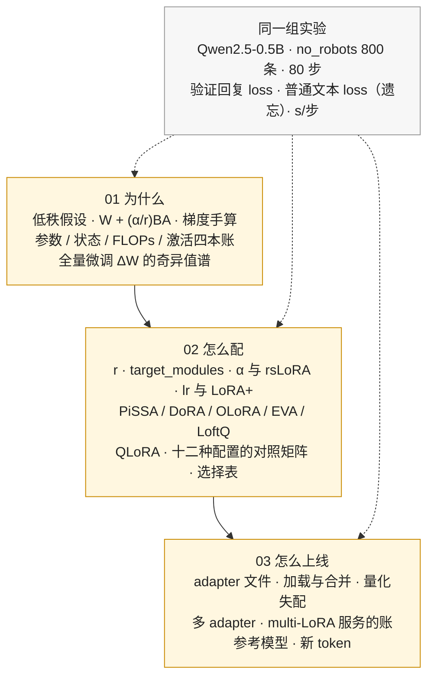

> **更新 @2026-09-30**：本系列的实验用 **peft 0.21.1**、**trl 1.14.1**、**transformers 5.17.0**、**bitsandbytes 0.50.2**、**PyTorch 2.14（CPU）**，模型是本地缓存的 Qwen2.5-0.5B，数据是 HuggingFaceH4/no_robots。文中的参数名（`r`、`lora_alpha`、`target_modules`、`use_rslora`、`init_lora_weights`……）以这组版本为准；LoRA 的数学与账目不随版本变。

## 内容简介

《LoRA 专题》是一组共三篇正文加一篇总结的系列文章，是[《AI 算法工程师学习地图》](/ai-algorithm-engineer-learning-roadmap.html) L5 后训练层的**专题篇**。LoRA（Low-Rank Adaptation，Hu 等 2021）是今天做 SFT 的默认方式：一张消费级显卡微调 8B 模型、一个底座服务上百个客户的定制版本、DPO / GRPO 里省掉一份参考模型，背后都是它。本站此前把 LoRA 拆在五处讲——[L0 第三篇](/orthogonal-rotation-svd-and-low-rank.html)讲数学骨架，[工具箱第五篇](/hugging-face-ecosystem-six-libraries-and-a-lora-sft.html)用六行代码组装一次 LoRA SFT，[后训练第一篇](/sft-data-chat-template-loss-mask-and-peft.html)第五章讲它在 SFT 里的地位，[L4 第十二篇](/quantization-speculative-decoding-and-lora.html)算它的计算形态，[HF 源码第四篇](/peft-and-trl-lora-sft-dpo-grpo-in-source.html)读 `lora.Linear` 的实现——读者反馈是「每处都只讲了一角」。本系列把它讲全：一个从没用过 LoRA 的人读完，应当能独立决定**用不用、怎么配、怎么上线**，并说得出每个决定的依据。

它回答的问题是：

> **为什么给一个几十亿参数的模型加两个瘦矩阵就能把它微调好？`r`、`lora_alpha`、`target_modules`、学习率各取多少、依据是什么？训完的 adapter 怎么存、怎么合并、怎么让一个底座同时服务几十个 adapter？什么时候低秩假设不成立、该回到全量微调？[^q0]**

三篇正文都配同一组实验：Qwen2.5-0.5B 上，同一份 800 条指令数据、同样 80 步，把全量微调与十二种 LoRA 配置逐个训一遍，比验证集回复的 loss、比普通文本 loss 的变化（遗忘）、比每步耗时；再把全量微调学到的 $$\Delta W$$ 做 SVD，看它到底有多"低秩"。所有数字在一台 8 线程的 CPU 上跑出，与作者在 Apple Silicon 上跑[后训练第一篇](/sft-data-chat-template-loss-mask-and-peft.html)的基线一致（训练前验证回复 loss 2.4936、普通文本 loss 2.8748）。

系列覆盖的范围是三段：

| 段 | 问题 | 内容 | 篇 |
|---|---|---|---|
| 第一段 | 为什么 | 低秩假设从哪来 $$W + \frac{\alpha}{r} BA$$ 的前向、梯度与初始化 参数 / 训练状态 / FLOPs / 激活四本账 全量微调的 $$\Delta W$$ 到底低不低秩 | 第一篇 |
| 第二段 | 怎么配 | $$r$$、`target_modules`、$$\alpha$$ 与 rsLoRA、lr 与 LoRA+、dropout PiSSA / DoRA / OLoRA / EVA / LoftQ QLoRA 的 NF4、双重量化与分页优化器 十三种配置（全量 + 十二种 LoRA）的对照矩阵与一张选择表 | 第二篇 |
| 第三段 | 怎么上线 | adapter 文件与底座匹配 加载、合并与数值等价 量化底座的失配 多 adapter 的切换与合成 multi-LoRA 服务的账 `disable_adapter` 当参考模型 新 token 学不会的坑 | 第三篇 |

Table: 系列三段的范围

## 为什么写这个系列？

### LoRA 已经是 SFT 的事实标准，但多数人只会抄一份配置

`r=16, lora_alpha=32, target_modules="all-linear", lr=2e-4` 这一行几乎出现在每个 SFT 脚本里。它为什么是 16 而不是 4 或 256？`all-linear` 比只挂 attention 好多少？为什么 LoRA 的 lr 要比全量大一个量级？换成 QLoRA 会掉多少精度？这些问题每一个都有可复现的答案，但散在五篇论文和十几个 GitHub issue 里。本系列把它们收拢，每个旋钮给出**一次对照实验的数字**而不是一句经验。

### 低秩假设是一个可以直接检验的经验假设

「微调对权重的改动是低秩的」是 LoRA 的全部前提。它不是定理——Biderman 等 2024 的谱分析表明全量微调的 $$\Delta W$$ 其实是高秩的，Hu 等 2021 却在 GPT-3 上用 $$r = 1$$ 追平了全量。两件事怎么同时成立？本系列第一篇直接把 0.5B 模型全量微调 80 步得到的 168 个 $$\Delta W$$ 做 SVD：前 16 个奇异值占多少能量、截到秩 16 装回模型后效果剩多少。读完这一篇，「格式是低秩的、知识是高秩的」不再是一句转述。

### 从训练到服务是一条完整的链

adapter 存下来只有几十 MB，这个数字决定了 LoRA 在产品侧的价值：一个底座挂几十个 adapter 按请求切换。但它也带来一串工程问题——adapter 对着哪个底座学的、换底座会怎样、合并后再量化与量化底座挂 adapter 差多少、两个 adapter 能不能加起来、`disable_adapter()` 为什么就是 DPO 的参考模型、新加的特殊 token 为什么学不会。这些不是论文的内容，却是每个上线 LoRA 的团队都踩过的坑。

## 系列的整体主线

三篇沿着「为什么 → 怎么配 → 怎么上线」走，用同一个模型、同一份数据、同一组实验串起来：

贯穿三篇的几条线，在系列总结里单独拎出来：

- **一个公式**：$$W' = W + \frac{\alpha}{r} BA$$，$$A \in \mathbb{R}^{r \times d_{in}}$$ 随机、$$B \in \mathbb{R}^{d_{out} \times r}$$ 为零。第一篇推它的梯度，第二篇调它的每个符号，第三篇把它合并回 $$W$$ 或按请求切换 $$(A, B)$$。
- **四本账**：可训练参数 $$r(d_{in} + d_{out})$$、训练状态（冻结权重 2 B + 可训练 16 B）、前向多出的 FLOPs 与 kernel、激活值一分不省。每一篇都回到这四本账上算一次。
- **一个假设**：$$\Delta W$$ 低秩。第一篇检验它，第二篇看它在哪些配置下成立得更好（`all-linear` 优于 attention-only、$$r$$ 的边际收益很快归零），第三篇看它失效时该做什么（全量、或 LoRA 加数据回放）。
- **一份数据、一组数字**：训练前验证回复 loss 2.4936；全量 80 步与 LoRA $$r = 16$$ 全部线性层 80 步各降到多少、忘掉多少——所有配置在这一组数字上对照。

## 章节结构与分章导读

### 1. 低秩假设：为什么两个瘦矩阵够用，以及它省了哪几本账

从 Aghajanyan 等 2020 的「内在维度」到 Hu 等 2021 的 LoRA：微调的有效自由度远小于参数量。给出 $$W + \frac{\alpha}{r} BA$$ 的前向、用一个 $$2 \times 3$$ 的例子手算 $$\partial \mathcal{L} / \partial A$$、$$\partial \mathcal{L} / \partial B$$，说明为什么冻结的 $$W$$ 不需要梯度、为什么 $$B = 0$$ 时第一步只有 $$B$$ 动、为什么对输入的梯度一分不省。然后算四本账：Qwen2.5-0.5B 与 Llama-3.1-8B 上七个线性层各自的 LoRA 参数量、训练状态从 120 GiB 到 15.5 GiB、前向 FLOPs 只多 0.6% 但 kernel 数翻三倍、激活值不变。最后是检验：全量微调 80 步的 $$\Delta W$$ 奇异值谱，以及截到秩 1 / 4 / 16 / 64 装回去后验证 loss 各剩多少。

> **给一个 $$4096 \times 4096$$ 的矩阵加 $$r = 16$$ 的 LoRA，可训练参数少了几倍？训练一步的时间为什么没有少这么多倍？全量微调学到的 $$\Delta W$$ 截到秩 16 之后，效果还剩多少？[^q1]**

### 2. 选参：r、target_modules、alpha、lr 与 QLoRA / DoRA / PiSSA 各让模型变成什么

每个旋钮一节，每节一组对照数字。秩 $$r$$ 取 4 / 16 / 64；目标矩阵只挂 attention 与挂全部线性层；$$\alpha$$ 固定时 $$r$$ 增大让更新按 $$1/r$$ 塌缩、rsLoRA 的 $$\alpha / \sqrt r$$ 怎么修；lr 取 $$10^{-5}$$ / $$10^{-4}$$ / $$10^{-3}$$ 与 LoRA+ 的 $$A$$、$$B$$ 分别设 lr；初始化：默认 Kaiming / 零、PiSSA 用 $$W$$ 的主奇异方向、OLoRA 的 QR、EVA 用激活的 SVD、LoftQ 对着量化误差初始化；DoRA 把幅度与方向分开训；QLoRA 的 NF4、双重量化、分页优化器与它在 CPU 上的实测。全量与十二种 LoRA 配置在同一张表里比验证 loss、遗忘与每步耗时，最后给一张「任务类型 × 资源 → 配置」的选择表。

> **同样 80 步，$$r$$ 从 4 到 64 验证 loss 差多少？只挂 attention 差多少？lr 大十倍会怎样？rsLoRA、DoRA、PiSSA 各比默认好多少？什么时候该放弃 LoRA 用全量？[^q2]**

### 3. 工程：adapter 文件、合并、多 LoRA 服务与参考模型

`save_pretrained` 存下的 `adapter_config.json` 与 `adapter_model.safetensors` 各有什么、为什么只有几十 MB；`PeftModel.from_pretrained` 装回去与训练结束时的数值一致；`merge_and_unload` 前后 logits 的最大差是浮点舍入量级、前向时间怎么变；adapter 对着 FP32 底座学、装到 NF4 底座上差多少、先合并再量化又差多少；一个底座挂两个 adapter 的 `set_adapter` 切换、`add_weighted_adapter` 的 linear / cat / svd 三种合成；`disable_adapter()` 让 DPO / GRPO 不必再放一份参考模型；multi-LoRA 服务的显存账与 vLLM 的 `max_loras × max_lora_rank`；新加特殊 token 只挂 LoRA 学不会、`trainable_token_indices` 与 `modules_to_save` 各怎么修。

> **一个 8B 模型的 adapter 多大？合并后与合并前的输出差多少？QLoRA 训出的 adapter 装到 BF16 底座上会怎样？一个底座服务 50 个客户，用 50 个 adapter 与存 50 份合并模型差多少显存？[^q3]**

### 4. 系列总结与通关自测

[第四篇](/lora-series-recap-and-self-test.html)逐篇回答上面的分章问题，拎出贯穿三篇的四条线，列常见误区，再给一套判断计算 / 跨篇综合 / 面试题三段自测。

## 贯穿全系列的实践线

三篇正文共用一组脚本，在 Qwen2.5-0.5B 上跑出文中每一个数字：

| 篇 | 脚本 | 子实验 | 看什么 |
|---|---|---|---|
| 01 | `01_low_rank.py` | `hand` 手算梯度 · `account` 四本账 · `speed` 一步耗时与算子数 · `init` 五种初始化 · `spectrum` 全量 $$\Delta W$$ 的谱与截秩 | 公式与自动微分逐元素一致 LoRA 一步未必更快 $$\Delta W$$ 高秩但截到秩 16 效果几乎不掉 |
| 02 | `02_knobs.py` | 全量 + 十二种 LoRA 配置，各 80 步 | 验证回复 loss、普通文本 loss 变化、s/步 三列并排 |
| 03 | `03_deploy.py` | `files` · `merge` · `quant` · `multi` · `tokens` | adapter 只有几十 MB 合并前后 logits 差 $$10^{-4}$$ 量级 NF4 失配 两个 adapter 的合成 新 token 不动 |

Table: 三篇正文的配套实验

脚本在 [ai-learning-labs/lora](https://github.com/arganzheng/ai-learning-labs/tree/main/lora)，CPU 可跑（8 线程约 2 小时，`--quick` 十分钟）；正文已给出理解所需的全部代码与数字，读本系列不需要它。

## 前置要求与说明

### 前置要求

| 需要 | 到什么程度 | 在哪里学 |
|---|---|---|
| 矩阵的秩与 SVD | 知道秩 $$r$$ 的矩阵能写成 $$r$$ 个外积之和、前 $$r$$ 个奇异值的截断是最优低秩近似 | [L0 第三篇](/orthogonal-rotation-svd-and-low-rank.html) |
| 反向传播与 Adam | 能写出一个线性层的 $$\partial \mathcal{L} / \partial W$$、知道 Adam 每参数存两个矩 | [L0 第七篇](/derivatives-gradients-chain-rule-and-policy-gradient.html)、[L3 第一篇](/backpropagation-by-hand.html)、[L3 第三篇](/optimizers-from-sgd-to-adamw.html) |
| SFT 的数据格式 | 知道 chat template、loss mask、`completion_only_loss` 是什么 | [后训练第一篇](/sft-data-chat-template-loss-mask-and-peft.html)第二至四章 |
| `peft` / `trl` 的用法 | 跑过一次 `get_peft_model` + `SFTTrainer` | [工具箱第五篇](/hugging-face-ecosystem-six-libraries-and-a-lora-sft.html) |

Table: 读本系列需要的前置

三篇可以独立读：第二篇的每个旋钮都先重述它在公式里的位置；第三篇的每个实验都先说明它用的 adapter 是怎么训出来的。想读 `lora.Linear` 的实现，去 [HF 源码第四篇](/peft-and-trl-lora-sft-dpo-grpo-in-source.html)；想读 multi-LoRA 的 kernel 与调度，去 [vLLM 系列第十篇](/request-shapes-multi-lora-and-multimodal.html)——本系列只算账，不读那两处的源码。

### 版本与基线

peft 0.21.1、trl 1.14.1、transformers 5.17.0、bitsandbytes 0.50.2、PyTorch 2.14（CPU）；模型 Qwen/Qwen2.5-0.5B（base，494M 参数，24 层，hidden 896，中间层 4864，KV 维 128），数据 HuggingFaceH4/no_robots 的 800 条单轮样本训练、100 条验证，遗忘用 wikitext-2 测试集的 60 段。训练配置与[后训练第一篇](/sft-data-chat-template-loss-mask-and-peft.html)相同：batch 4 × 512、80 步、cosine、warmup 8 步、只对回复算 loss。

## 章节目录

| 篇 | 标题 | 读它需要 |
|---|---|---|
| 01 | [低秩假设：为什么两个瘦矩阵够用，以及它省了哪几本账](/lora-low-rank-hypothesis-gradients-and-accounts.html) | L0 第三篇 |
| 02 | [选参：r、target_modules、alpha、lr 与 QLoRA / DoRA / PiSSA 各让模型变成什么](/lora-hyperparameters-rank-targets-alpha-lr-and-variants.html) | 01 |
| 03 | [工程：adapter 文件、合并、多 LoRA 服务与参考模型](/lora-in-production-adapters-merging-multi-lora-and-serving.html) | 01、02 |
| 04 | [系列总结与通关自测](/lora-series-recap-and-self-test.html) | 01–03 |

Table: 章节目录

## 最终目标

读完三篇，你应该能：

1. 在纸上写出 $$W' = W + \frac{\alpha}{r} BA$$ 的前向与两个梯度，说出为什么 $$W$$ 不需要梯度、为什么对输入的梯度不能省、为什么 LoRA 一步未必更快；
2. 给任意一个模型的 `config.json` 算出 LoRA 的四本账：可训练参数、训练状态、多出的 FLOPs 与 kernel、不变的激活值；
3. 说出「$$\Delta W$$ 低秩」这个假设的证据与反例，知道它在什么任务上成立、在什么任务上该回到全量；
4. 拿到一个新任务时写出 `LoraConfig` 的每个字段，并对每个字段说出一个对照实验的数字作为依据；
5. 知道 QLoRA、rsLoRA、LoRA+、DoRA、PiSSA、EVA、LoftQ 各改了公式里的哪个符号、解决什么问题、代价是什么；
6. 把训好的 adapter 存下来、装回去、合并、量化、与另一个 adapter 合成，并说出每一步的数值等价程度；
7. 给一个「一个底座服务 N 个客户」的需求算出 adapter 与合并模型两种方案的显存与切换代价；
8. 说出 LoRA 在 DPO / GRPO 里怎么省掉参考模型、新加 token 为什么学不会、怎么修。

[^q0]: 因为微调学到的权重增量 $$\Delta W$$ 近似低秩：对全量微调的 $$\Delta W$$ 做 SVD，前 16 个奇异方向已解释大部分能量，截到秩 16 后效果几乎不变——所以用 $$BA$$（$$B$$ 全零初始化，训练开始时增量恰为零）就够。选参依据是对照实验：$$r$$ 取 16 左右（4 → 64 验证 loss 差别在百分之几，64 遗忘更多）；`lora_alpha` 定 scaling $$\alpha/r$$，$$\alpha$$ 固定时增大 $$r$$ 会让更新塌缩，rsLoRA 改用 $$\alpha/\sqrt r$$；`target_modules` 挂全部线性层比只挂 attention 好得多；lr 比全量高一个量级（$$10^{-4}$$ 级）。adapter 以 `adapter_config.json` + `adapter_model.safetensors` 存（8B 模型几十 MB），`merge_and_unload` 合并后 logits 差在浮点舍入量级，多 adapter 服务靠 vLLM 的 `max_loras × max_lora_rank` 在一个底座上按请求切换。低秩假设不成立的情形：要学大量新知识 / 新语言、新加特殊 token 的 embedding、或 $$\Delta W$$ 的奇异值衰减很慢时，回到全量微调（或 `modules_to_save` 全量训那几层）。
[^q1]: $$4096\times4096$$ 有 16.8M 参数，$$r=16$$ 的 LoRA 只有 $$2\times4096\times16 = 131{,}072$$ 个——少 **128 倍**。训练一步的时间没有少这么多倍，是因为前向与反向对**输入激活**的梯度仍要穿过完整的冻结权重（$$W^\top\delta$$ 的 GEMM 一个不少），省掉的只是对权重的梯度 $$\delta x^\top$$ 与优化器状态——所以时间通常只省 20–40%，显存省得多（无梯度与 Adam 状态：每参数从 16 字节降到权重的 2 字节）。全量微调学到的 $$\Delta W$$ 截到秩 16：第一篇的实验里奇异值前几十个之后迅速衰减，截断后的 $$\Delta W$$ 在验证集上保留了绝大部分收益（loss 差在百分之几以内），这就是低秩假设的直接证据。
[^q2]: Qwen2.5-0.5B、800 条指令、80 步的对照：$$r$$ 从 4 到 64 验证回复 loss 只差百分之几（4 已能学会格式，64 对普通文本 loss 的遗忘更明显）；只挂 attention 比挂全部线性层明显差——FFN 占三分之二参数，不挂它学不到多少；lr 大十倍（$$10^{-3}$$）训练 loss 降得快但验证 loss 回升、遗忘陡增，$$10^{-5}$$ 则 80 步几乎没动；rsLoRA 在大 $$r$$ 下比默认好（修正了 $$\alpha/r$$ 的塌缩），DoRA 与 PiSSA 比默认好零点零几的 loss、代价是多一点显存与计算。该放弃 LoRA 用全量的时机：任务需要大量新知识或新语言、新加特殊 token、$$\Delta W$$ 奇异值衰减慢、或显存本来就放得下且追求最后一点效果。第二篇末尾给出「任务类型 × 资源 → 配置」的选择表。
[^q3]: 8B 模型、$$r=16$$ 挂全部线性层约 40M 参数，bf16 下 **约 80 MB**（Qwen2.5-0.5B 上 8.8M 参数、十几 MB）。合并（`merge_and_unload`，$$W + BA\cdot\text{scaling}$$）前后 logits 的最大差在浮点舍入量级（$$10^{-3}$$ 以内，bf16），输出 token 一致；合并后前向少一次瘦矩阵乘，略快。QLoRA 的 adapter 是对着 **NF4 量化后的底座**学的，装到 BF16 底座上会有一个系统性偏差（它学进了量化误差的补偿），loss 略变差，通常可接受但要重新评测；先合并再量化又是另一个数。50 个客户：50 个 adapter 各 80 MB = 4 GB 显存共享一个 16 GB 的底座，而 50 份合并模型是 50 × 16 GB = 800 GB——差两个数量级，这就是 multi-LoRA 服务（vLLM 的 `max_loras × max_lora_rank`）存在的理由。
