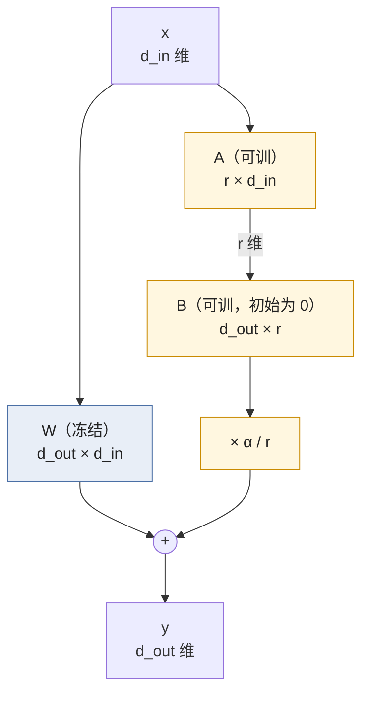

> **更新 @2026-09-30**：实验用 peft 0.21.1、trl 1.14.1、transformers 5.17.0、PyTorch 2.14（CPU，8 线程），模型 Qwen2.5-0.5B（base），数据 no_robots。配套脚本 `ai-learning-labs/lora/01_low_rank.py`（子实验 `hand` / `account` / `speed` / `init` / `spectrum`）；正文给出理解所需的全部数字。

LoRA 的全部内容是一句话：**冻结 $$W$$，只训一对瘦矩阵 $$B$$、$$A$$，让 $$W' = W + \frac{\alpha}{r} BA$$**。这一句里有三个不显然的地方：为什么改动可以只有秩 $$r$$、这一对瘦矩阵的梯度怎么算与省了什么、以及"省"的到底是四本账里的哪几本。本文把三件事各落到数字上：一个 $$2 \times 3$$ 的手算、Qwen2.5-0.5B 与 Llama-3.1-8B 上按 `config.json` 逐矩阵算出的账，以及一个直接的检验——把 0.5B 全量微调 80 步得到的 168 个 $$\Delta W$$ 做 SVD，截到秩 16 装回去看效果剩多少。

## 一、来龙去脉：从"内在维度"到 LoRA

### 1.1 微调的自由度远小于参数量

2020 年 Aghajanyan 等人问了一个问题：微调一个预训练模型，到底需要多少个自由度？他们的做法是把全部参数的更新限制在一个随机的 $$d$$ 维子空间里——$$\theta = \theta_0 + P z$$，$$P$$ 是固定的随机投影，只训 $$z \in \mathbb{R}^d$$——然后看 $$d$$ 取多小还能达到全量微调 90% 的效果。答案是几百：RoBERTa-large 有 3.5 亿参数，在 MRPC 上 $$d \approx 200$$ 就够。这个 $$d$$ 叫**内在维度**（intrinsic dimension），而且模型越大它越小。

这就是 LoRA 的出发点：既然微调只需要几百个方向，就没有必要给每个参数都配一份梯度和优化器状态。问题是随机投影 $$P$$ 太浪费——它占的内存和全量一样，而且随机方向不一定是好方向。

### 1.2 前人的三条路，和 LoRA 为什么赢了

在 LoRA 之前，"少训一些参数"已经有几种做法：

| 方法 | 训什么 | 加在哪 | 推理时 | 问题 |
|---|---|---|---|---|
| Adapter（Houlsby 等 2019） | 每层串联插一个瓶颈 MLP（$$d \to m \to d$$） | 注意力与 FFN 之后 | 多两个矩阵乘，**加延迟** | 小 batch 在线服务时延迟涨 20–30% |
| Prefix-Tuning（Li & Liang 2021） | 每层前面接 $$p$$ 个可训的虚拟 token 的 K、V | 注意力的 K、V | 序列变长 $$p$$ | 占上下文长度；难优化，效果随 $$p$$ 不单调 |
| P-Tuning / Prompt Tuning（Lester 等 2021） | 输入前的连续 prompt 向量 | 只在输入层 | 序列变长 | 小模型上效果差很多 |
| BitFit（Ben Zaken 等 2021） | 只训 bias | 所有 bias | 无 | 表达力太小 |
| **LoRA**（Hu 等 2021） | 与 $$W$$ **并联**的 $$BA$$ | 任意线性层 | **可以合并进 $$W$$，零额外延迟** | 低秩假设不成立时不如全量 |

Table: LoRA 之前的参数高效微调方法，以及 LoRA 与它们的差别

LoRA 赢在两点：**并联而不是串联**，所以训完可以把 $$BA$$ 加回 $$W$$，推理时一个 kernel 都不多；**不占序列长度**，所以不影响上下文预算。Hu 等 2021 在 GPT-3 175B 上的数字：只给注意力的 $$W_q$$、$$W_v$$ 挂 $$r = 4$$ 的 LoRA，可训练参数少一万倍、显存少三倍、每个任务的 checkpoint 从 350 GB 变成 35 MB，效果与全量微调持平或更好。后来 QLoRA（2023）让 65B 模型能在一张 48 GB 的卡上微调，LoRA 就成了 SFT 的默认方式。

## 二、公式：前向、梯度、初始化

### 2.1 前向

一个线性层 $$y = W x$$，$$W \in \mathbb{R}^{d_{out} \times d_{in}}$$。LoRA 把它改成：

$$
y = W x + \frac{\alpha}{r}\, B A x,\qquad
A \in \mathbb{R}^{r \times d_{in}},\;
B \in \mathbb{R}^{d_{out} \times r},\;
r \ll \min(d_{in}, d_{out})
$$

$$W$$ 冻结，$$A$$、$$B$$ 可训。$$\alpha / r$$ 是一个固定的缩放常数，`peft` 里叫 `scaling`。注意计算顺序：**先算 $$A x$$（得到 $$r$$ 维），再乘 $$B$$**，从不显式构造 $$d_{out} \times d_{in}$$ 的 $$BA$$——那样就把省下的算力又花回去了。



参数量：$$W$$ 有 $$d_{in} d_{out}$$ 个，$$A$$ 与 $$B$$ 一共 $$r(d_{in} + d_{out})$$ 个。$$d_{in} = d_{out} = 4096$$、$$r = 16$$ 时是 $$16 \times 8192 = 131{,}072$$ 对 $$16{,}777{,}216$$，128 倍。[L0 第三篇](/orthogonal-rotation-svd-and-low-rank.html)里有一个 $$4 \times 4$$、$$r = 2$$ 的数值例子说明 $$BA$$ 的每一行都是 $$A$$ 的行的线性组合，本文不重复。

### 2.2 梯度：用一个 2×3 的例子手算

记 $$G = \partial \mathcal{L} / \partial y$$（$$d_{out}$$ 维），$$s = \alpha / r$$，$$h = A x$$（$$r$$ 维）。链式法则给出：

$$
\frac{\partial \mathcal{L}}{\partial B} = s\, G\, h^\top
= s\, G\, (A x)^\top,
\qquad
\frac{\partial \mathcal{L}}{\partial A} = s\, B^\top G\, x^\top,
\qquad
\frac{\partial \mathcal{L}}{\partial x} = W^\top G + s\, A^\top B^\top G
$$

三个式子各说明一件事：

- $$\partial \mathcal{L} / \partial B$$ 是 $$d_{out} \times r$$，$$\partial \mathcal{L} / \partial A$$ 是 $$r \times d_{in}$$——**从来没有人算 $$d_{out} \times d_{in}$$ 的 $$\partial \mathcal{L} / \partial W = G x^\top$$**。冻结的 $$W$$ 连 `.grad` 都没有。
- $$\partial \mathcal{L} / \partial A$$ 里有一个 $$B^\top$$：$$B = 0$$ 时它是零。所以默认初始化下**第一步只有 $$B$$ 在动**，$$A$$ 的梯度随 $$B$$ 长大才出现。
- $$\partial \mathcal{L} / \partial x$$ 里有 $$W^\top G$$：要把梯度传给下一层（更靠近输入的那一层），**必须穿过冻结的 $$W$$**。这一项的算量与全量微调完全相同，LoRA 一分没省。

拿具体数字过一遍。$$W = \begin{pmatrix} 1 & 0 & 2 \\ 0 & 1 & 0 \end{pmatrix}$$ 冻结，$$r = 1$$，$$A = (1, -1, 0)$$，$$B = (0, 0)^\top$$，$$\alpha = 2$$ 所以 $$s = 2$$。输入 $$x = (2, 1, 1)^\top$$，目标 $$t = (3, 0)^\top$$，损失 $$\mathcal{L} = \frac12 \lVert y - t \rVert^2$$。

第一步：

- $$W x = (1 \cdot 2 + 2 \cdot 1,\; 1 \cdot 1) = (4, 1)$$；$$B = 0$$ 所以 $$y = (4, 1)$$，$$\mathcal{L} = \frac12 (1^2 + 1^2) = 1$$。
- $$G = y - t = (1, 1)$$；$$h = A x = 2 - 1 + 0 = 1$$。
- $$\partial \mathcal{L} / \partial B = s\, G\, h = 2 \cdot (1, 1) \cdot 1 = (2, 2)^\top$$。
- $$\partial \mathcal{L} / \partial A = s\, B^\top G\, x^\top = 2 \cdot 0 \cdot x^\top = (0, 0, 0)$$。

用 lr 0.1 做一步 SGD：$$B \leftarrow (0, 0) - 0.1 \cdot (2, 2) = (-0.2, -0.2)$$，$$A$$ 不变。

第二步：

- $$y = W x + s\, B\, (A x) = (4, 1) + 2 \cdot (-0.2, -0.2) \cdot 1 = (3.6, 0.6)$$，$$\mathcal{L} = \frac12 (0.36 + 0.36) = 0.36$$。
- $$G = (0.6, 0.6)$$；$$B^\top G = -0.2 \cdot 0.6 - 0.2 \cdot 0.6 = -0.24$$。
- $$\partial \mathcal{L} / \partial A = 2 \cdot (-0.24) \cdot (2, 1, 1) = (-0.96, -0.48, -0.48)$$——不再是零。
- $$\partial \mathcal{L} / \partial B = 2 \cdot (0.6, 0.6) \cdot 1 = (1.2, 1.2)^\top$$。

此时等效的 $$\Delta W = s\, B A = 2 \cdot \begin{pmatrix} -0.2 \\ -0.2 \end{pmatrix} (1, -1, 0) = \begin{pmatrix} -0.4 & 0.4 & 0 \\ -0.4 & 0.4 & 0 \end{pmatrix}$$，两行成比例，秩 1——不论训多久，$$\Delta W$$ 的秩不会超过 $$r$$。

`01_low_rank.py hand` 用 autograd 跑同一个例子，`B.grad = [2.0, 2.0]`、`A.grad = [0.0, 0.0, 0.0]`、第二步 `A.grad = [-0.96, -0.48, -0.48]`，`W.grad = None`，与手算逐个一致。

### 2.3 初始化：为什么是 A 随机、B 为零

初始化要满足两个条件：训练开始时 $$W' = W$$（不能一上来就把预训练模型改坏），又不能让梯度全为零（否则永远学不动）。$$B A$$ 只要有一个为零就满足第一条；两个都为零则 $$\partial \mathcal{L} / \partial B = s G (Ax)^\top = 0$$、$$\partial \mathcal{L} / \partial A = s B^\top G x^\top = 0$$，违反第二条。所以是**一个零、一个随机**。选 $$B = 0$$、$$A$$ 随机（`peft` 默认 Kaiming 均匀，`init_lora_weights="gaussian"` 是 $$\mathcal{N}(0, 1/r)$$）而不是反过来，有一个不那么显然的理由：$$A$$ 随机时 $$h = A x$$ 是输入的一个随机投影，第一步 $$B$$ 的梯度 $$s G h^\top$$ 立刻就是有信息的；若 $$A = 0$$、$$B$$ 随机，第一步 $$h = 0$$，只有 $$A$$ 动而 $$A$$ 的梯度 $$s B^\top G x^\top$$ 里的 $$B$$ 是无关的随机方向。第五节的实验把五种初始化各训 20 步比一比。

PiSSA、OLoRA、EVA、LoftQ 这些"更聪明的初始化"都不满足 $$BA = 0$$，它们的做法是同时改 $$W$$ 让 $$W_{res} + BA = W$$ 仍成立——留到[第二篇](/lora-hyperparameters-rank-targets-alpha-lr-and-variants.html)。

## 三、四本账：LoRA 省了什么、没省什么

"LoRA 省显存"是对的，但省的是四本账中的一本半。四本账是：可训练参数、训练状态、计算量（FLOPs 与 kernel 数）、激活值。

```text
┌──────────────┬────────────────────────────────┬────────────────────────────────┐
│ 账            │ 全量微调                        │ LoRA（r=16，全部线性层）          │
├──────────────┼────────────────────────────────┼────────────────────────────────┤
│ 可训练参数     │ N                               │ r·Σ(d_in+d_out)  ≈ 0.5%–2% N    │  ← 省 50–200 倍
│ 训练状态       │ 权重 2B + 主权重 4B + Adam 8B    │ 冻结权重 2B + 可训练 16B          │  ← 省 5–8 倍
│              │ + 梯度 2B = 16 B/参数            │ ≈ 2 B/参数 + 一点                │
│ 计算量        │ 前向 2N + 反向 4N = 6N/token     │ 前向 2N(1+ε) + 输入梯度 2N        │  ← 只省 1/3
│              │                                 │ + 权重梯度 ≈ 0 → ≈ 4N/token      │     kernel 数反而多 3 倍
│ 激活值        │ ∝ batch × 序列长 × hidden × 层数  │ 一样                             │  ← 一分不省
└──────────────┴────────────────────────────────┴────────────────────────────────┘
```

### 3.1 可训练参数：逐矩阵算

Qwen2.5-0.5B 的每层有七个线性层：注意力的 $$q, k, v, o$$ 与 MLP 的 gate、up、down。hidden 896、中间层 4864、KV 维 128（GQA，2 个 KV 头），24 层。按 `config.json` 逐个算 $$r = 16$$ 的 LoRA 参数 $$r(d_{in} + d_{out})$$：

| 矩阵 | 形状 in × out | 参数 | $$r = 16$$ LoRA | LoRA / 原矩阵 |
|---|---|---|---|---|
| q_proj | 896 × 896 | 0.80M | 28.7K | 3.57% |
| k_proj | 896 × 128 | 0.11M | 16.4K | 14.29% |
| v_proj | 896 × 128 | 0.11M | 16.4K | 14.29% |
| o_proj | 896 × 896 | 0.80M | 28.7K | 3.57% |
| gate_proj | 896 × 4864 | 4.36M | 92.2K | 2.11% |
| up_proj | 896 × 4864 | 4.36M | 92.2K | 2.11% |
| down_proj | 4864 × 896 | 4.36M | 92.2K | 2.11% |

Table: Qwen2.5-0.5B 每层七个线性层的参数与 r=16 的 LoRA 参数

两个观察：**矩阵越"方"、越大，LoRA 占比越小**（$$r(d_{in} + d_{out}) / d_{in} d_{out}$$ 在 $$d_{in} = d_{out} = d$$ 时是 $$2r / d$$）；GQA 让 $$k, v$$ 很窄，给它们挂 LoRA 的相对开销大但绝对量小。乘 24 层再加起来：

| 配置 | 0.5B 可训练 | 占比 | 8B 可训练 | 占比 |
|---|---|---|---|---|
| $$r = 4$$，只挂 attention（q k v o） | 0.54M | 0.11% | 3.4M | 0.04% |
| $$r = 16$$，只挂 attention | 2.16M | 0.44% | 13.6M | 0.17% |
| $$r = 16$$，全部七个 | **8.80M** | **1.78%** | **41.9M** | **0.52%** |
| $$r = 64$$，全部七个 | 35.2M | 7.12% | 167.8M | 2.09% |

Table: 不同 r 与目标矩阵下的可训练参数（Qwen2.5-0.5B 494M 参数；Llama-3.1-8B 8.03B 参数，hidden 4096、中间层 14336、KV 维 1024、32 层）

`get_peft_model(...).print_trainable_parameters()` 打出的 `trainable params: 8,798,208 || all params: 502,830,976 || trainable%: 1.7497` 就是第三行——分母里多出的 8.8M 是 `peft` 把 LoRA 参数也计入了总数。

### 3.2 训练状态：从 120 GiB 到 15.5 GiB

混合精度 + AdamW 下每个**可训练**参数要存：BF16 权重 2 B、FP32 主权重 4 B、Adam 两个矩 8 B、梯度 2 B，共 16 B；每个**冻结**参数只存 BF16 权重 2 B。所以：

$$
\text{训练状态} = 2\,N_{total} + 14\,N_{trainable}\ \text{字节}
$$

（可训练参数的 BF16 权重已计入前一项，剩下 14 B。）8B 模型全量：$$16 \times 8.03 \times 10^9 = 128\ \text{GB} \approx 120\ \text{GiB}$$，一张 80 GB 的卡放不下。LoRA $$r = 16$$ 全部线性层：$$2 \times 8.03 \times 10^9 + 14 \times 41.9 \times 10^6 = 16.6\ \text{GB} \approx 15.5\ \text{GiB}$$，几乎全是冻结权重那 15 GiB。0.5B 上是 7.36 GiB 对 1.03 GiB。

这本账里 LoRA 省的是 Adam 状态与主权重，**冻结权重本身一个字节都不少**——这就是 QLoRA 的切入点：把这 15 GiB 的冻结权重量化到 4 bit 变成 4 GiB，LoRA 部分不变。

### 3.3 计算量：FLOPs 只省三分之一，kernel 数翻三倍

全量训练每个 token 每个参数约 6 次浮点运算：前向 2、反向 4（对输入的梯度 2、对权重的梯度 2）。LoRA：前向多了 $$B A x$$ 两个瘦矩阵乘，$$r = 16$$ 时 0.5B 上每层多 0.73M 对 30M FLOPs（2.5%），8B 上是 0.6%；反向里对输入的梯度 $$W^\top G$$ 照算（2 次），对权重的梯度只算 $$A$$、$$B$$ 的（几乎为 0）。所以 LoRA 每 token 约 $$4N$$ 对全量的 $$6N$$——**理论上只快三分之一**，不是可训练参数少多少倍就快多少倍。

实践中往往连三分之一都拿不到，因为 kernel 数变了：每个挂了 LoRA 的线性层，前向从 1 个 GEMM 变成 3 个（$$W x$$、$$A x$$、$$B h$$）加 1 次加法，反向同理。0.5B 的 168 个线性层多出 336 个瘦 GEMM，每个的算术强度都很低（$$r = 16$$ 的矩阵乘几乎是纯带宽操作）。GPU 上表现为 kernel launch 与显存带宽开销，CPU 上表现为一步时间不降反升。第 3.5 节有实测。

### 3.4 激活值：一分不省

反向传播要用前向时的中间结果，这些激活值与**可训练参数无关**，只与 batch、序列长、hidden、层数有关。不开 FlashAttention 与重计算时，一个 Transformer 层每 token 大约要存 $$34 h$$ 字节（BF16，Korthikanti 等 2022 的估算，含注意力、MLP、LayerNorm、dropout 各处的输入），再加注意力分数 $$5 a s$$ 字节（$$a$$ 头数、$$s$$ 序列长）。用本系列的训练配置算 Qwen2.5-0.5B：batch 4 × 512 = 2048 token，$$h = 896$$，24 层：

$$
34 \times 896 \times 2048 \times 24 \approx 1.5 \times 10^9\ \text{字节} \approx 1.4\ \text{GiB}
$$

再加最后的 logits：$$2048 \times 151936$$ 个词表分数，FP32 下 1.24 GB。加起来约 2.7 GiB——**比 LoRA 的全部训练状态（1.03 GiB）还大**。序列长到 4096、batch 不变时这个数字乘 8。所以 LoRA 微调长序列时显存仍会爆，解法是梯度检查点（`gradient_checkpointing=True`，用 1/3 的额外计算换掉大部分激活值）、FlashAttention（去掉 $$5 a s$$ 那一项）、以及 `completion_only_loss` 下只对回复位置算 logits 的 loss 实现，与 LoRA 无关。

### 3.5 实测：一步的时间、优化器状态与算子数

同一台 8 线程 CPU、Qwen2.5-0.5B、batch 4 × 256，各跑一步训练（前向 + 反向 + Adam 更新），用 `torch.profiler` 数前向的算子：

| 配置 | 一步 | 其中前向 | 前向 aten 算子 | 其中矩阵乘 | 梯度 | Adam 状态 |
|---|---|---|---|---|---|---|
| 全量 | 3.46 s | 0.91 s | 5091 | 437 | 1885 MB | 3769 MB |
| LoRA r=16 全部线性层 | 2.31 s | 0.94 s | 9963 | 1445 | 34 MB | 67 MB |

Table: 全量与 LoRA 一步训练的实测（FP32，CPU；`01_low_rank.py speed`）

读法：

- **前向没有变快**（0.91 对 0.94 s）：LoRA 的前向多了 $$168 \times 2$$ 个瘦矩阵乘与 168 次加法，算子数几乎翻倍（5091 → 9963，矩阵乘 437 → 1445），只是它们都很小。
- **省的是梯度与 Adam 状态**：1885 MB → 34 MB、3769 MB → 67 MB，正是 $$494M \times 4\ \text{B}$$ 对 $$8.8M \times 4\ \text{B}$$ 那两本账（3.1、3.2 节）。
- **一步快了三分之一**（3.46 → 2.31 s），来自两处：反向不算 $$\partial \mathcal{L} / \partial W$$ 那 168 个 $$d_{out} \times d_{in}$$ 的外积（3.3 节），以及 Adam 更新从 494M 个参数变成 8.8M 个。序列拉长到 512 时（第二篇的对照矩阵）差距缩到 6.7 对 6.3 s/步——对输入的梯度要穿过每一个冻结的 $$W$$，这部分随序列长线性增长，LoRA 一分不省。

## 四、检验低秩假设：全量微调的 ΔW 到底有多"低秩"

前面都是"假设 $$\Delta W$$ 低秩"之下的推导。这一节直接看：真的全量微调一次，学到的 $$\Delta W$$ 是什么样。

### 4.1 两个看似矛盾的结论

Hu 等 2021 报告 GPT-3 上 $$r = 1$$ 就能追平全量微调，且 $$r = 8$$ 与 $$r = 64$$ 学到的子空间高度重合——"微调的内在秩很低"。Biderman 等 2024（*LoRA Learns Less and Forgets Less*）把 Llama-2-7B 全量微调后的 $$\Delta W$$ 做 SVD，发现要覆盖 90% 的能量需要的秩是典型 LoRA $$r$$ 的 10–100 倍——"$$\Delta W$$ 是高秩的"。同时他们发现 LoRA 在代码与数学的继续预训练上明显不如全量，但在指令微调上接近，且**忘得更少**。

两件事并不矛盾：全量微调学到的 $$\Delta W$$ 确实是高秩的，但其中**对任务有用的部分是低秩的**，剩下的高秩成分是优化噪声与（对该任务）无关的漂移。检验方法就是把 $$\Delta W$$ 截到秩 $$r$$ 装回模型，看效果掉多少。

### 4.2 实验：80 步全量微调的 ΔW 的谱

用第二篇那次全量微调（lr $$10^{-5}$$、80 步）的权重减去 base，得到 168 个线性层的 $$\Delta W$$，对每个做 SVD。挑第 0、12、23 层的三种矩阵看前 $$r$$ 个奇异值占的能量（$$\sum_{i \le r} \sigma_i^2 / \sum_i \sigma_i^2$$）：

| 矩阵 | 形状 | $$\lVert \Delta W \rVert / \lVert W \rVert$$ | 秩 1 | 秩 4 | 秩 16 | 秩 64 | 秩 256 |
|---|---|---|---|---|---|---|---|
| L0.q_proj | 896×896 | 0.0007 | 29.2% | 44.5% | 68.0% | 88.8% | 98.9% |
| L0.o_proj | 896×896 | 0.0041 | 27.4% | 51.3% | 67.1% | 84.2% | 97.3% |
| L0.down_proj | 896×4864 | 0.0031 | 5.0% | 10.9% | 20.3% | 39.3% | 73.2% |
| L12.q_proj | 896×896 | 0.0026 | 7.2% | 20.1% | 42.6% | 69.6% | 93.9% |
| L12.o_proj | 896×896 | 0.0031 | 8.9% | 22.4% | 43.3% | 74.0% | 95.2% |
| L12.down_proj | 896×4864 | 0.0031 | 5.4% | 12.5% | 24.4% | 44.3% | 75.3% |
| L23.q_proj | 896×896 | 0.0026 | 9.7% | 22.6% | 40.7% | 67.4% | 93.1% |
| L23.o_proj | 896×896 | 0.0028 | 10.7% | 20.6% | 39.8% | 70.0% | 94.5% |
| L23.down_proj | 896×4864 | 0.0032 | 8.9% | 17.5% | 28.5% | 48.3% | 78.4% |

Table: 全量微调 80 步后 ΔW 的谱：前 r 个奇异值占的能量（`01_low_rank.py spectrum`）


再把 168 个 $$\Delta W$$ **各截到秩 $$r$$**（只留前 $$r$$ 个奇异三元组）装回 base，看效果剩多少：

| 装回的 $$\Delta W$$ | 验证回复 loss | 普通文本 loss |
|---|---|---|
| 训练前（不装） | 2.4936 | 2.8748 |
| 截到秩 1 | 2.4084 | 2.8734 |
| 截到秩 4 | 2.3987 | 2.8796 |
| 截到秩 16 | 2.3959 | 2.8823 |
| 截到秩 64 | 2.3964 | 2.8861 |
| 不截（168 个线性层的完整 $$\Delta W$$） | 2.3993 | 2.8917 |

Table: ΔW 截到秩 r 后装回模型的效果（最后一行只装线性层的 ΔW，embedding / lm_head / norm 的改动没装，所以与第二篇全量模型的 2.3924 不同）

读法：

- **$$\Delta W$$ 本身不低秩**：秩 16 只占方阵 40–68%、MLP 矩阵 20–28% 的能量，要到秩 256 才覆盖九成以上——这是 Biderman 等 2024 的"高秩"。
- **但有用的部分低秩**：秩 1 就拿到了全部收益的 95%（2.4936 → 2.4084，不截是 2.3993），秩 16 的 2.3959 已经**好于不截**。剩下的 80% 能量是对这个任务无用的成分——它带来的只有遗忘（普通文本 loss 从 2.8823 涨到 2.8917）。这是 Hu 等 2021 的"内在秩很低"。
- 两者说的是同一个 $$\Delta W$$ 的不同部分。LoRA 赌的是：**只学那个低秩的、有用的部分**，把高秩的噪声与漂移直接扔掉——所以它"学得少也忘得少"不是巧合，是同一件事。
- $$\lVert \Delta W \rVert / \lVert W \rVert$$ 只有 $$10^{-3}$$ 量级：80 步 SFT 对权重的改动非常小，这也是第三篇里 BF16 下合并要升到 FP32 再加的原因。

## 五、初始化实验：五种 A、B 的起点

2.5 节的推导说 $$A$$、$$B$$ 必须"一个零、一个随机"。这里五种起点各训 20 步（$$r = 16$$、全部线性层、lr $$10^{-4}$$、batch 4 × 512），看训练前模型有没有被改动、训完学到多少：

| 起点 | 训练前验证 loss（base 2.4936） | 20 步后验证 loss | 训完 $$\lVert A \rVert$$ | 训完 $$\lVert B \rVert$$ |
|---|---|---|---|---|
| $$B = 0$$、$$A$$ 随机（`peft` 默认，Kaiming 均匀） | 2.4936（+0.0000） | **2.4473** | 29.9 | 0.71 |
| $$A = 0$$、$$B$$ 随机 | 2.4936（+0.0000） | 2.4813 | 0.6 | 318.39 |
| $$A$$、$$B$$ 都随机 | 14.8172（+12.3237） | 10.0049 | 29.9 | 318.45 |
| $$A$$、$$B$$ 都为 0 | 2.4936（+0.0000） | 2.4936 | 0.0 | 0.00 |
| `gaussian`（$$A \sim \mathcal{N}(0, 1/r)$$、$$B = 0$$） | 2.4936（+0.0000） | 2.4595 | 124.0 | 0.68 |

Table: 五种 A、B 初始化各训 20 步（`01_low_rank.py init`）

读法：

- **有一个是零，训练前就等于 base**（前三列 +0.0000）；都随机则一开始就把模型改坏（loss 从 2.49 跳到 14.8），20 步也救不回来。
- **都为 0 永远学不动**：$$\partial \mathcal{L} / \partial B = s G h^\top$$ 里 $$h = A x = 0$$，$$\partial \mathcal{L} / \partial A = s B^\top G x^\top$$ 里 $$B = 0$$，两个梯度恒为零，训完的 $$A$$、$$B$$ 仍是 0、验证 loss 一位小数都没变。日志里的训练 loss 在下降只是各步 batch 不同，不是在学——这是看训练曲线时要记住的一课。
- **$$B = 0$$、$$A$$ 随机比反过来好**（2.4473 对 2.4813）：$$h = A x$$ 是输入的随机投影，第一步 $$B$$ 的梯度就有信息；反过来第一步 $$h = 0$$，只有 $$A$$ 动而它的梯度里乘着一个随机的 $$B$$。而且随机的 $$B$$ 比随机的 $$A$$ 大一个量级（168 个矩阵合起来的范数 318 对 29.9）：Kaiming 均匀的幅度是 $$1 / \sqrt{\text{fan\_in}}$$，$$B$$ 的 fan_in 是 $$r = 16$$，$$A$$ 的是 $$d_{in} = 896$$ 或 4864。同一个 lr 下 $$\Delta W = sBA$$ 的更新尺度完全不同——这就是第二篇 LoRA+ 讨论的 $$A$$、$$B$$ 不对称。
- `gaussian` 的 $$A$$ 范数是默认的 4 倍（124 对 29.9），20 步学到的略少（2.4595）。两者都能用，差别在前几步的有效学习率上；`peft` 默认就好。

## 六、什么时候低秩假设不成立

把本文的账与检验合起来，可以说清 LoRA 的适用边界：

- **格式、风格、指令跟随、领域口吻**：改动集中在少数方向上，$$r = 8 \sim 64$$ 够，LoRA 与全量接近且忘得更少——这是 SFT 的主要场景，也是 LoRA 成为默认的原因。
- **注入大量新知识、继续预训练、代码与数学的大幅提升**：需要的改动本身是高秩的，LoRA 明显不如全量（Biderman 等 2024 的代码实验差 5–10 个点）。这时要么全量，要么 LoRA 把 $$r$$ 开到 256 以上并挂全部线性层、再接受它仍然学得少一些。
- **新增 token、改词表**：LoRA 只挂线性层，embedding 与 lm_head 冻结，新 token 那一行永远不动——[第三篇](/lora-in-production-adapters-merging-multi-lora-and-serving.html)有实验与修法。
- **训练预算充足、只服务一个模型**：LoRA 省的显存与存储没有价值，全量微调是更简单的选择。

判断的办法不是猜，是[第二篇](/lora-hyperparameters-rank-targets-alpha-lr-and-variants.html)的对照实验：同数据同步数，全量与几种 $$r$$ 的 LoRA 并排比验证 loss 与遗忘。

## 七、本文小结

- LoRA 来自"微调的内在维度很低"这个观察；它比 Adapter、Prefix-Tuning 胜出，是因为**并联可合并、零推理延迟、不占序列长度**。
- $$y = W x + \frac{\alpha}{r} B A x$$；$$\partial \mathcal{L} / \partial B = s G (Ax)^\top$$、$$\partial \mathcal{L} / \partial A = s B^\top G x^\top$$，没有人算 $$\partial \mathcal{L} / \partial W$$；但 $$\partial \mathcal{L} / \partial x = W^\top G + \cdots$$ 必须穿过冻结的 $$W$$。
- $$B = 0$$、$$A$$ 随机：训练开始时 $$W' = W$$，第一步只有 $$B$$ 动；两个都为零学不动，两个都随机一开始就改坏。
- 四本账：可训练参数省 50–200 倍；训练状态省 5–8 倍（8B：120 GiB → 15.5 GiB），省的是 Adam 与主权重，冻结权重本身不少；FLOPs 只省三分之一且 kernel 数翻三倍，一步未必更快；激活值一分不省。
- 全量微调的 $$\Delta W$$ 本身高秩，但截到低秩后效果掉得很少——有用的改动是低秩的，这是 LoRA 赌对的地方；新知识与继续预训练是它赌输的地方。

## 八、自测

1. 一个 $$d_{in} = 4096$$、$$d_{out} = 11008$$ 的 `up_proj`，挂 $$r = 16$$ 的 LoRA。可训练参数是原矩阵的几分之一？若 $$r = 64$$ 呢？

   <details markdown="1"><summary>答案</summary>
   $$16 \times (4096 + 11008) = 241{,}664$$，原矩阵 $$4096 \times 11008 = 45{,}088{,}768$$，约 1/187（0.54%）。$$r = 64$$ 是 $$966{,}656$$，约 1/47（2.1%）。占比随 $$r$$ 线性增长。
   </details>

2. 用第 2.2 节的例子，若把初始化换成 $$A = 0$$、$$B = (1, 1)^\top$$，第一步两个梯度各是多少？

   <details markdown="1"><summary>答案</summary>
   $$h = A x = 0$$，所以 $$\partial \mathcal{L} / \partial B = s G h^\top = 0$$；$$\partial \mathcal{L} / \partial A = s B^\top G x^\top = 2 \cdot (1 + 1) \cdot (2, 1, 1) = (8, 4, 4)$$。第一步只有 $$A$$ 动，方向由随机的 $$B$$ 决定。
   </details>

3. 8B 模型全部线性层挂 $$r = 16$$ LoRA，混合精度 AdamW。训练状态多少？其中冻结权重、LoRA 权重、Adam 状态、梯度各占多少？

   <details markdown="1"><summary>答案</summary>
   冻结权重 $$2 \times 8.03 \times 10^9 = 16.1$$ GB（15.0 GiB）；LoRA 41.9M 参数：BF16 权重 84 MB、FP32 主权重 168 MB、Adam 335 MB、梯度 84 MB，合计 0.67 GB。总计 16.7 GB ≈ 15.5 GiB，96% 是冻结权重——所以 QLoRA 量化的是这一块。
   </details>

4. 有人说"LoRA 可训练参数只有 1%，所以训练比全量快 100 倍"。错在哪？理论上快多少？

   <details markdown="1"><summary>答案</summary>
   反向传播对输入的梯度 $$W^\top G$$ 必须穿过每个冻结的 $$W$$，这部分算量与全量相同；LoRA 省的只是对权重的梯度 $$G x^\top$$。全量每 token 约 $$6N$$ FLOPs，LoRA 约 $$4N$$，理论上快 1/3；实际因为 kernel 数翻三倍、瘦矩阵乘算术强度低，常常只快 10–20%，CPU 上甚至更慢。
   </details>

5. batch 4、序列 2048、hidden 4096、32 层的 8B 模型做 LoRA 微调，不开梯度检查点。激活值大约多少？LoRA 的训练状态多少？哪个大？

   <details markdown="1"><summary>答案</summary>
   $$34 \times 4096 \times 8192 \times 32 \approx 36.5$$ GB（不含注意力分数与 logits）；训练状态 15.5 GiB。激活值是训练状态的两倍多——这就是为什么 LoRA 长序列微调仍要 `gradient_checkpointing`，它与 LoRA 无关。
   </details>

6. 全量微调的 $$\Delta W$$ 前 16 个奇异值只占能量的一小部分，但截到秩 16 装回去效果几乎不掉。这说明什么？什么任务上这个结论会反过来？

   <details markdown="1"><summary>答案</summary>
   $$\Delta W$$ 的高秩部分对该任务的效果贡献很小（噪声或无关漂移），有用的改动集中在少数方向上——LoRA 学的就是这少数方向。继续预训练、大量新知识注入、代码/数学能力大幅提升等任务上有用的改动本身是高秩的，截秩会明显掉效果，LoRA 也明显不如全量。
   </details>

## 下一篇

低秩假设在 SFT 上成立，剩下的问题是公式里每个符号取多少：$$r$$、$$\alpha$$、挂哪些矩阵、学习率、初始化、要不要量化底座。[第二篇](/lora-hyperparameters-rank-targets-alpha-lr-and-variants.html)把十二种配置在同一份数据上各训 80 步，每个旋钮给一组数字。
