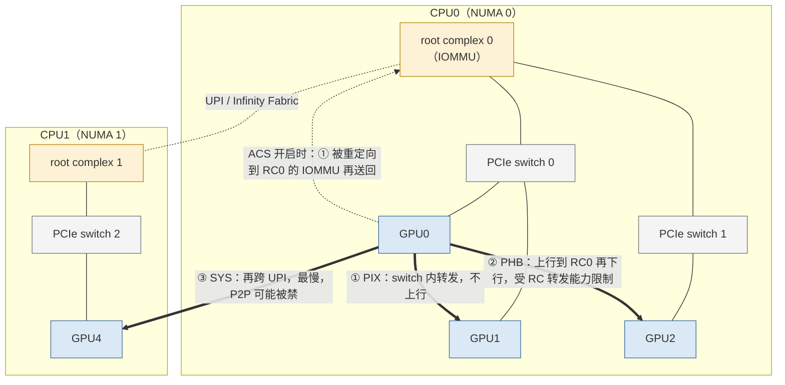
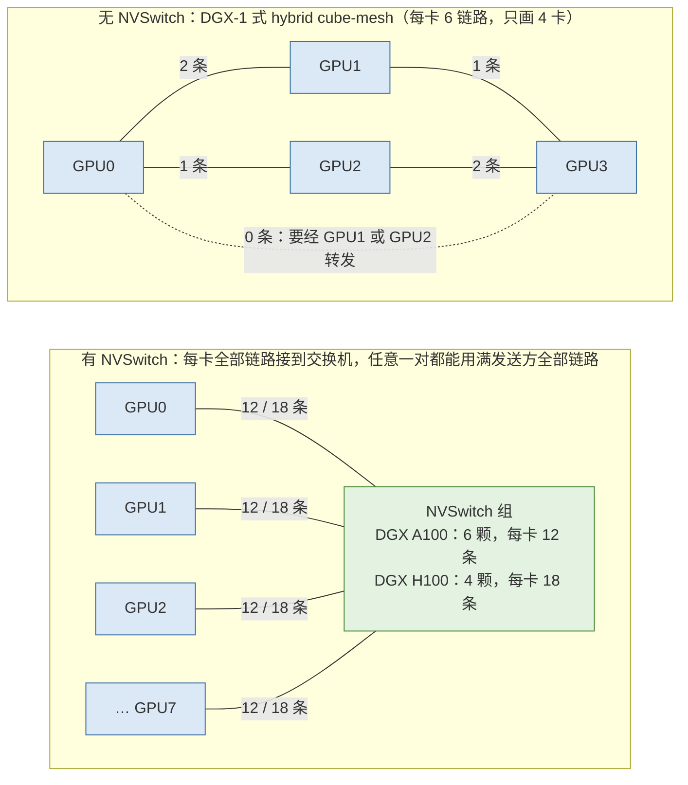
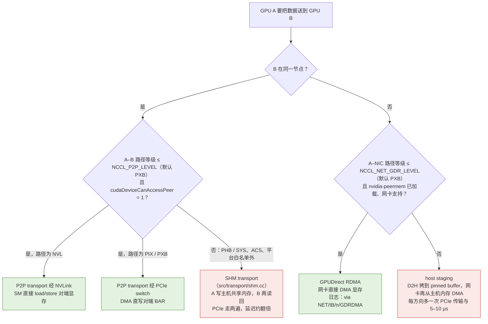
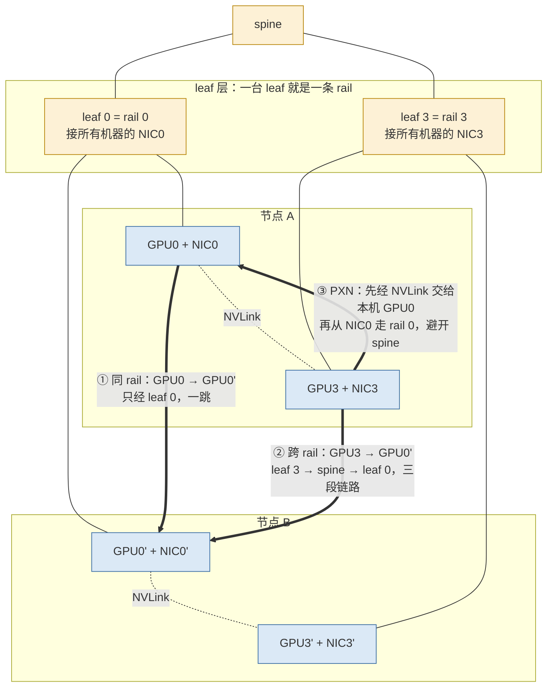

上一篇把一次通信的时间写成 $$T = \alpha + S/\beta$$：α 是固定开销，β 是带宽，S 是字节数；ring all_reduce 在 n 个参与者上的时间是 $$T_{\text{ring}} = 2(n-1)\,\alpha + \frac{2(n-1)}{n}\cdot\frac{S}{\beta}$$。这个模型能算出"8 卡 1 GB 的 all_reduce 在 25 GB/s 的链路上大约 70 ms"，但它有两个空位：α 和 β 是多少，取决于数据走的是哪条链路。同一台机器上，两张 GPU 之间的 β 可能是 450 GB/s，也可能是 25 GB/s，也可能只有 10 GB/s，差 40 倍；α 可能是 2 微秒，也可能是 20 微秒。哪一个成立，由硬件拓扑决定。

这一篇给 α 和 β 填上真实数字。一台 8 卡服务器内部有三种物理链路：GPU 之间的 NVLink（经 NVSwitch）、GPU 与网卡、CPU 之间的 PCIe、两颗 CPU 之间的 UPI / Infinity Fabric；节点之间有 InfiniBand 或 RoCE。每一种链路的速率差一个量级，数据从 GPU0 到 GPU1 走哪一种，取决于两张卡在机箱里的物理位置——而这个位置可以从 `nvidia-smi topo -m` 的一张矩阵里读出来。

读懂这张矩阵是本篇最实用的目标。它的每个格子是六个等级之一：`NV#`、`PIX`、`PXB`、`PHB`、`NODE`、`SYS`，每个等级对应一条具体的物理路径和一个带宽区间。NCCL 内部用几乎相同的一组词（`LOC`/`NVL`/`PIX`/`PXB`/`PHB`/`SYS`）描述路径，并据此决定两张卡之间用 NVLink 直读、经 PCIe 直读、还是绕道主机内存，决定一张 GPU 该用八张网卡里的哪一张。所以这张矩阵不只是"看看"，它就是 NCCL 决策的输入。

总纲给本篇的核心问题是：

> **`nvidia-smi topo -m` 里 GPU0 到 GPU1 是 `NV12`、到 NIC0 是 `PIX`、到 NIC4 是 `SYS`。这三个词各自意味着什么带宽和什么路径？为什么 NCCL 会为 GPU0 选 NIC0 而不是 NIC4？**

回答它需要三块知识：PCIe 树的结构（root complex、switch、P2P 事务，第二章）、NVLink / NVSwitch 的带宽（第三章）、网卡与 NUMA 的归属（第四、六章）。第五章把它们汇总成读矩阵的方法并正面回答这个问题。之后第七章讲主机内存在路径上的位置，第八章从单机扩到集群（fat-tree、rail），第九章讲用哪些工具把每段链路的实际带宽测出来，填回代价模型。

依照系列惯例，本文的性能数字有三种口径：**理论值**（由 lane 数、编码、频率算出）、**标称值**（厂商公开的规格）、**"通常能达到"的区间**（社区与文档中反复出现的经验范围）。本文没有实测数据；读者在自己机器上用第九章的工具测出的数字应当落在给出的区间里，落不进去就是排障的起点。所有带宽数字都会注明"单向"还是"双向合计"，这两者相差一倍，混用是这一层最常见的错误。


## 一、总览：一条路径上的三种速度

### 1. 节点内与节点间的两类路径

把一台 8 卡服务器和它的邻居画成一张图，GPU 到 GPU 的数据只有下面几条路可走：

```text
                    节点 A                                          节点 B
  ┌──────────────────────────────────────────┐        ┌────────────────────────┐
  │  GPU0 ══ NVSwitch ══ GPU1 … GPU7          │        │  GPU0' … GPU7'         │
  │   ║                    ║                  │        │    ║                   │
  │ PCIe sw0             PCIe sw3             │        │  PCIe sw              │
  │  ║    ║               ║    ║              │        │   ║    ║               │
  │ NIC0 CPU0 ── UPI ── CPU1  NIC7            │        │  NIC0'  CPU            │
  │  │    │              │     │              │        │   │                    │
  │  │  DRAM0          DRAM1   │              │        │   │                    │
  └──┼────────────────────────┼──────────────┘        └───┼────────────────────┘
     └────────── IB / RoCE 交换网 ───────────────────────────┘

  节点内 GPU→GPU    ① NVLink，经 NVSwitch（NV#）                   ← 默认路径
                    ② PCIe P2P，经同一个 PCIe switch（PIX/PXB）
                    ③ PCIe，经 CPU 的 root complex（PHB/NODE）
                    ④ PCIe，跨两颗 CPU 之间的 UPI（SYS）
  节点间 GPU→GPU    ⑤ GPU → PCIe → NIC → 网络 → NIC' → PCIe → GPU'
                       其中 GPU→NIC 一段本身也分 PIX/PXB/PHB/SYS
```

①～④ 是节点内的四种路径，速率从快到慢；⑤ 是节点间，它的两端各含一段 GPU 到 NIC 的 PCIe 路径，这段路径的等级决定了 GPUDirect RDMA 能不能开、开了之后能跑多快（下一篇的主题）。

### 2. 三个量级的带宽

把每种链路的单向带宽放在一张表里，是这一篇最重要的一组数字（标称值或理论值，非实测）：

| 链路 | 代际 | 单向带宽 | 双向合计 | 备注 |
|---|---|---|---|---|
| NVLink（每 GPU 总计） | A100 第三代，12 链路 | 300 GB/s | 600 GB/s | NCCL 内部按每链路 20 GB/s 估算 |
| NVLink（每 GPU 总计） | H100 第四代，18 链路 | 450 GB/s | 900 GB/s | NCCL 内部按每链路 20.6 GB/s 估算 |
| NVLink（每 GPU 总计） | Blackwell 第五代，18 链路 | 900 GB/s | 1.8 TB/s | NCCL 内部按每链路 40.1 GB/s 估算 |
| PCIe x16 | 3.0 | ≈ 16 GB/s | ≈ 32 GB/s | 实测通常 80–90% |
| PCIe x16 | 4.0 | ≈ 32 GB/s | ≈ 64 GB/s | 实测通常 80–90% |
| PCIe x16 | 5.0 | ≈ 64 GB/s | ≈ 128 GB/s | 实测通常 80–90% |
| InfiniBand 端口 | HDR 200 Gb/s | ≈ 25 GB/s | ≈ 50 GB/s | 一张网卡一个端口 |
| InfiniBand 端口 | NDR 400 Gb/s | ≈ 50 GB/s | ≈ 100 GB/s | 一张网卡一个端口 |
| CPU 间互联 | UPI / Infinity Fabric | 数十 GB/s | — | NCCL 按 CPU 型号取 6–40 GB/s |

三个量级：NVLink 是几百 GB/s，PCIe 与网卡是几十 GB/s，跨 CPU socket 的路径在 NCCL 的估算里最低只有个位数 GB/s。一次 all_reduce 走哪个量级，时间就差一个量级。

### 3. 两本账在硬件层上的对应

上一篇的"两本账"落到硬件上，各有各的来源：

- **带宽的账**看链路速率和路径上最窄的一段。GPU 经 PCIe 4.0 x16 发到网卡再上 HDR 200 Gb/s 的网络，瓶颈是 25 GB/s 的网卡而不是 32 GB/s 的 PCIe；如果这条路还要经过 CPU 的 root complex 和 UPI，瓶颈就变成 UPI 和 root complex 里的 P2P 转发能力。
- **延迟的账**看路径上的跳数和每一跳的处理时间。NVLink 上 GPU 直接读写对端显存，一跳；PCIe P2P 经 switch 转发，一到两跳，每跳几百纳秒；经 root complex 要多穿一次 CPU 的 IOMMU 与内部互联；跨节点要经过网卡的 DMA、网络交换机、对端网卡，端到端的单边 RDMA WRITE 通常在 1–2 微秒量级（非实测）；如果不能绕过主机内存，还要加上两次拷贝和一次 CPU 参与。

这一篇主要填带宽的账，因为它由硬件直接决定；延迟的账里硬件的贡献（链路延迟、跳数）通常只占一小部分，大部分来自软件——kernel 启动、协议握手、proxy 线程——留到第四篇。

### 4. 本文的章节安排

| 章 | 主题 | 内容 |
|---|---|---|
| 二 | PCIe | lane 与代际怎么换算成 GB/s；root complex、switch、P2P 事务；为什么跨 root complex 的 P2P 慢甚至不可用；ACS；NCCL 如何估算 PCIe 带宽 |
| 三 | NVLink/NVSwitch | 每代的链路数与带宽；NVSwitch 如何做到 any-to-any 全带宽；为什么 NVLink 上的 `all_reduce` 几乎不受消息大小影响；NVLink SHARP |
| 四 | 网卡与网络 | IB 的代际与速率；RoCE v2 与 PFC/ECN；8 卡为什么配 8 张 400 Gb/s 网卡 |
| 五 | 读拓扑 | nvidia-smi topo -m 的六个等级与一张样例矩阵；lspci -tv；topo -mp；回答核心问题；NCCL 的路径类型与选网卡逻辑 |
| 六 | NUMA 与亲和 | socket、内存节点、PCIe 设备的归属；为什么绑核影响通信；NCCL 怎么用亲和 |
| 七 | 主机内存 | pinned memory、staging buffer；什么时候必须经过主机内存 |
| 八 | 集群拓扑 | fat-tree 与超额订阅；rail-optimized；对调度的意义 |
| 九 | 测一测 | nvbandwidth、p2pBandwidthLatencyTest、`ib_write_bw` 各测哪一段；数字该长什么样 |
| 十 | 小结 | 要点、检查项、源码位置、comm-probe 的 `topo_map.py` |


## 二、PCIe：lane、代际、root complex 与 P2P

### 1. 从 GT/s 到 GB/s

PCIe 是点对点的串行链路，一条链路由若干 lane 组成，每个 lane 是一对差分线（一收一发），所以 PCIe 天然是全双工的：单向带宽与双向合计相差一倍。带宽由三个数决定：lane 数（x1/x4/x8/x16）、每 lane 的传输速率（GT/s，每秒多少次符号传输）、编码效率。

| 代际 | 每 lane 速率 | 编码 | 每 lane 单向有效 | x16 单向 | x16 双向合计 |
|---|---|---|---|---|---|
| 3.0 | 8 GT/s | 128b/130b | ≈ 0.985 GB/s | ≈ 15.75 GB/s（常记 16） | ≈ 31.5 GB/s |
| 4.0 | 16 GT/s | 128b/130b | ≈ 1.97 GB/s | ≈ 31.5 GB/s（常记 32） | ≈ 63 GB/s |
| 5.0 | 32 GT/s | 128b/130b | ≈ 3.94 GB/s | ≈ 63 GB/s（常记 64） | ≈ 126 GB/s |
| 6.0 | 64 GT/s | PAM4 + FLIT | ≈ 7.6 GB/s | ≈ 121 GB/s | ≈ 242 GB/s |

计算方法：$$\text{x16 单向} = 16 \times \text{GT/s} \times \frac{128}{130} / 8$$。3.0 是 $$16 \times 8 \times 0.985 / 8 \approx 15.75$$ GB/s。这是物理层的上限；上面还有事务层的开销——每个 TLP（Transaction Layer Packet）带 12–16 字节头，加上 DLLP、流控 credit、ACK/NAK，最大 payload 通常是 256 或 512 字节——所以 DMA 的实际带宽通常是理论值的 80–90%。PCIe 4.0 x16 上一次大块 `cudaMemcpy` H2D 能跑 25–27 GB/s，5.0 x16 上 50–55 GB/s，是常见的区间（非实测）。

A100 是 PCIe 4.0 x16，H100 是 5.0 x16；Blackwell 的 PCIe 代际取决于 SKU 与平台——常见的 B200 HGX/DGX 仍是 5.0 x16，PCIe 6.0 只出现在特定的新平台上。这决定了每张 GPU 与外界（CPU、网卡）交换数据的上限：A100 单向 32 GB/s，H100 64 GB/s。记住这两个数，第四章要用。

### 2. PCIe 树：root complex、switch、endpoint

PCIe 是一棵树。树根是 **root complex**，集成在 CPU 里，它把 CPU 核、内存控制器和 PCIe 根端口（root port）连在一起；每个根端口向下引出一条链路。链路的另一端要么是一个 **endpoint**（GPU、网卡、NVMe），要么是一个 **PCIe switch**——switch 有一个上游端口接向根、多个下游端口再各接一个设备或另一个 switch。

一台双路 8 卡服务器上，这棵树通常长这样：

```text
CPU0 (NUMA 0)                                   CPU1 (NUMA 1)
 root complex                                    root complex
  ├─ root port ── PCIe switch 0                   ├─ root port ── PCIe switch 2
  │                ├─ GPU0                        │                ├─ GPU4
  │                ├─ GPU1                        │                ├─ GPU5
  │                ├─ NIC0 (mlx5_0)               │                ├─ NIC4 (mlx5_4)
  │                └─ NIC1 (mlx5_1)               │                └─ NIC5 (mlx5_5)
  ├─ root port ── PCIe switch 1                   ├─ root port ── PCIe switch 3
  │                ├─ GPU2                        │                ├─ GPU6
  │                ├─ GPU3                        │                ├─ GPU7
  │                ├─ NIC2                        │                ├─ NIC6
  │                └─ NIC3                        │                └─ NIC7
  └─ root port ── NVMe / 管理网卡 …               └─ …
            │                                              │
            └────────────── UPI / Infinity Fabric ─────────┘
```

每颗 CPU 的 root complex 只有有限的 lane（Sapphire Rapids 每颗 80 条 5.0 lane，EPYC Genoa 每颗 128 条），挂不下 4 张 GPU 加 4 张网卡各 x16，所以中间要加 PCIe switch 做扇出：switch 用一条 x16 上行链路连 CPU，下行提供四条 x16。这意味着同一个 switch 下的四个设备**共享**一条到 CPU 的 x16 上行——但它们彼此之间的流量不需要经过上行链路，这就是 P2P 事务的价值。

### 3. P2P 事务：走 switch 与走 root complex

PCIe 的每次读写都是一个 TLP，带着目标地址。GPU0 要写 GPU1 的显存，只要 GPU1 的显存被映射进了 PCIe 地址空间（BAR），GPU0 的 DMA 引擎就可以直接发出目标地址落在 GPU1 BAR 里的 Memory Write TLP。这个 TLP 从 GPU0 的链路进入 switch，switch 查地址路由表发现目标在另一个下游端口，直接转发过去——不上行、不经 CPU、不经主机内存。这就是 **P2P（peer-to-peer）事务**，CUDA 里叫 GPUDirect P2P，`cudaDeviceEnablePeerAccess` 打开它。

如果两张 GPU 不在同一个 switch 下（比如 GPU0 与 GPU2），TLP 要先上行到 root complex，由 root complex 转发到另一个根端口再下行。这时的瓶颈有三个：

- **上行链路被共享**：GPU0 所在 switch 的 x16 上行同时承担 4 个设备的所有 CPU 方向流量；
- **root complex 的 P2P 转发能力**：不是所有 CPU 都以全速转发 P2P 写，Intel 平台会把 P2P 流量拆成 64 字节的 TLP 转发（NCCL 源码 `src/graph/topo.h` 的注释明确提到这一点，并为此对 Intel CPU 的 GPU–GPU PCIe 带宽打折），实际带宽可能只有链路的一半；
- **跨 socket**：如果 GPU0 在 CPU0 下、GPU4 在 CPU1 下，还要跨 UPI，带宽再打折，延迟再加。

把这三条 P2P 路径叠到第 2 节那棵树上，就是 `nvidia-smi topo -m` 里 `PIX`/`PHB`/`SYS` 三个等级的物理含义（下一节的 ACS 用虚线画出：它把本该在 switch 内完成的 ① 强行改道成 ②）：



所以 PCIe P2P 的带宽从"同 switch"到"跨 socket"是一条下坡路：同 switch 下能接近链路带宽的 80–90%；经 root complex 通常明显更低且随 CPU 平台差异很大；跨 socket 最差。NCCL 对这几段各有一个内部估算值，见本章第 5 节。

### 4. 为什么跨 root complex 的 P2P 可能"不可用"：ACS 与 IOMMU

比慢更麻烦的是不可用。`cudaDeviceCanAccessPeer` 返回 0、或者 `nvidia-smi topo -p2p r` 显示 `NS`（Not Supported），常见原因有两类。

第一类是**平台不支持经 root complex 的 P2P**。某些 CPU 或 BIOS 不允许根端口之间转发 P2P 事务，或者转发时不保证写顺序；NVIDIA 驱动维护一份平台白名单，白名单之外跨 root complex 的 P2P 会被直接禁用。此时 NCCL 会回落到经主机内存的 SHM transport（第七章）。

第二类是 **ACS（Access Control Services）**。ACS 是 PCIe switch 下游端口上的一组安全特性，本意是在虚拟化场景下防止一个设备直接访问另一个设备——启用 ACS 的 Source Validation / P2P Request Redirect 后，switch 不再直接在下游端口之间转发 P2P TLP，而是把它们全部**重定向到 root complex**，由 IOMMU 做地址翻译和权限检查再送回来。结果是：即使两张 GPU 在同一个 switch 下，P2P 流量也被迫走 root complex，带宽掉到经 root complex 的水平，延迟翻倍；某些平台上干脆失败。裸金属、单租户的训练机上通常在 BIOS 里关闭 ACS，或者用 `setpci` 清掉每个下游端口的 ACS 控制位——但要清楚这是在关闭 PCIe 的访问控制，设备之间不再有 IOMMU 隔离，只应在理解风险、且机器不跑不可信负载时做；容器或虚机场景下如果需要 IOMMU 隔离，就要接受这个代价，或者用 ATS（Address Translation Services）让设备缓存翻译结果。检查方法：

```bash
# 找出所有开启了 ACS 的 PCIe 桥（ACSCtl 里 SrcValid+ / ReqRedir+ 即为开启）
for dev in $(lspci -D | awk '/PCI bridge/ {print $1}'); do
  ctl=$(sudo lspci -s "$dev" -vvv 2>/dev/null | grep -o 'ACSCtl:.*')
  [ -n "$ctl" ] && echo "$dev  $ctl"
done
# IOMMU 是否开着
dmesg | grep -i -E 'DMAR|IOMMU' | head
cat /proc/cmdline    # 看有没有 intel_iommu=on / amd_iommu=on / iommu=pt
```

一台"看起来拓扑完美"的机器，P2P 带宽却只有 PCIe 直连的一半，ACS 是第一个要查的。

### 5. NCCL 如何估算 PCIe 带宽

NCCL 不测带宽，它读 `/sys` 里的链路参数然后按公式估算。`src/graph/xml.cc` 的 `ncclTopoGetXmlFromSys` 从每个 PCI 设备目录读 `max_link_speed` 和 `max_link_width`（并与上游端口的值取较小者，因为链路速率由两端中较慢的一方决定）；`src/graph/topo.cc` 的 `ncclTopoAddPci` 用一张表把 GT/s 换成每 lane 的速率，再乘 lane 数：

```cpp
// src/graph/topo.cc（NCCL 2.28.9）
struct kvDict kvDictPciGen[] = {
  { "2.5 GT/s", 15 }, { "5 GT/s", 30 }, { "8 GT/s", 60 }, { "16 GT/s", 120 }, { "32 GT/s", 240 },
  // ... 新内核的字符串带 "PCIe" 后缀，另有 "64.0 GT/s PCIe" → 480
  { NULL, 60 /* Default fallback */ } }; // x100 Mbps per lane
// ...
if (width == 0) width = 16;
NCCLCHECK(kvConvertToInt(str, &speed, kvDictPciGen)); // Values in 100Mbps, per lane
NCCLCHECK(ncclTopoConnectNodes(node, parent, LINK_PCI, width*speed/80.0));
```

`width*speed/80` 对 PCIe 3.0 x16 是 $$16 \times 60 / 80 = 12$$ GB/s，4.0 x16 是 24 GB/s，5.0 x16 是 48 GB/s——恰好是理论值 16/32/64 的 75%。`src/graph/topo.h` 里也定义了 `#define PCI_BW 12.0  // PCI Gen3 x16` 作为默认值。这告诉我们两件事：NCCL 假设 PCIe 能达到理论值的四分之三；它对 PCIe 的估算只用来**比较路径**和**搜索 ring/tree**（第四篇），不是性能承诺。同一个文件里跨 CPU 的互联带宽按 CPU 型号取常量：`BDW_QPI_BW 6.0`、`SKL_QPI_BW 10.0`、`SRP_QPI_BW 22.0`、`ERP_QPI_BW 40.0`（Intel 各代）、`AMD_BW 16.0`、`ARM_BW 6.0`——这就是第一章表里"跨 socket 路径 NCCL 按 6–40 GB/s 估算"的来源。


## 三、NVLink 与 NVSwitch

### 1. 每代 NVLink 的链路数与带宽

NVLink 是 NVIDIA 专有的 GPU 间互联，与 PCIe 相比有三点本质区别：带宽高一个量级；GPU 之间直接以 load/store 语义访问对端显存（不是 DMA 拷贝，是 SM 里的一条访存指令可以落在对端 HBM 上）；支持原子操作和（Hopper 起）在交换机内做归约。每一代的规格：

| GPU | NVLink 代际 | 每 GPU 链路数 | 每链路双向合计 | 每 GPU 双向合计 | 每 GPU 单向 |
|---|---|---|---|---|---|
| V100 | 第二代 | 6 | 50 GB/s | 300 GB/s | 150 GB/s |
| A100 | 第三代 | 12 | 50 GB/s | 600 GB/s | 300 GB/s |
| H100 SXM | 第四代 | 18 | 50 GB/s | 900 GB/s | 450 GB/s |
| B200 / GB200 | 第五代 | 18 | 100 GB/s | 1.8 TB/s | 900 GB/s |

厂商宣传的"600 GB/s"、"900 GB/s"、"1.8 TB/s"全部是**双向合计**，做代价模型时 β 要用单向值：A100 300 GB/s、H100 450 GB/s、Blackwell 900 GB/s。与 PCIe 对比：H100 的 NVLink 单向 450 GB/s 是它自己 PCIe 5.0 x16 单向 64 GB/s 的 7 倍；A100 的 300 GB/s 是 PCIe 4.0 x16 的 9.4 倍。

`nvidia-smi topo -m` 里 `NV12`、`NV18` 的数字就是两张 GPU 之间**绑定的链路条数**。A100 的 8 卡机器上任意两卡都是 `NV12`，说明 GPU0 的全部 12 条链路都能服务到 GPU1 的流量——这不是 GPU0 与 GPU1 之间直连了 12 条线，而是 NVSwitch 的功劳。

### 2. NVSwitch：any-to-any 全带宽

没有 NVSwitch 时，GPU 的链路要分给不同的邻居。以 8 卡 V100 的 DGX-1 为例，每卡 6 条链路，不可能与另外 7 张卡各连一条，只能形成一个 hybrid cube-mesh：有的卡对之间 2 条链路，有的 1 条，有的 0 条（要经第三张卡转发）。此时两卡之间的带宽取决于它们是谁，ring 的构造要精心贴合物理连线。



NVSwitch 把这变成了交换网络。每张 GPU 的所有链路全部接到 NVSwitch 芯片上（DGX A100 用 6 颗第二代 NVSwitch，每卡 12 条链路每颗 switch 各 2 条；DGX H100 用 4 颗第三代 NVSwitch，每卡 18 条链路分到 4 颗上），任意两张 GPU 之间的流量由 switch 交换。效果是：**任意一对 GPU 之间都能用满发送方的全部链路带宽**，与它们的编号无关；8 张卡同时全速对外发送，switch 的总交换容量足以承载（DGX H100 的 4 颗 NVSwitch 合计双向 7.2 TB/s，正好是 8 × 900 GB/s）。这就是"any-to-any 全带宽"，也是 `nvidia-smi topo -m` 里 GPU 之间清一色 `NV12` 或 `NV18` 的物理含义。

对代价模型的意义：节点内 8 卡的 β 是一个常数，不随"谁和谁通信"变化；ring 的每一步都以同样的带宽进行；tree 的每条边也一样。NCCL 在 NVSwitch 机器上的拓扑搜索因此非常简单——第四篇会看到它甚至不必真的搜索。

### 3. 为什么 NVLink 上的 all_reduce 几乎不受消息大小影响

这是总纲反复提到的一个现象：nccl-tests 在 8 卡 NVSwitch 机器上跑 all_reduce，busbw 曲线在几 MB 之后就基本平了，从几 MB 到几 GB 差不多；而在 IB 上同样的曲线要到几十上百 MB 才抬到平台。把两本账各算一遍就清楚了。

**带宽的账。** 8 卡 ring all_reduce，每卡收发 $$\frac{2(n-1)}{n} S = 1.75 S$$ 字节。H100 上 β 取 NVLink 单向 450 GB/s 的一个可达比例，比如 NCCL 内部的估算 $$18 \times 20.6 \approx 371$$ GB/s。S = 1 GB 时带宽项 $$1.75 \times 1\ \text{GB} / 371\ \text{GB/s} \approx 4.7$$ ms；S = 8 MB 时 $$\approx 38$$ µs。

**延迟的账。** ring 有 $$2(n-1) = 14$$ 步，每步是一次 GPU 对 GPU 的 NVLink 写加一次同步。NVLink 一跳的硬件延迟在 1 µs 量级以下，加上 NCCL 协议层每步的 flag 检查，每步 α 取 1–2 µs（非实测，量级估计），14 步合计 15–30 µs；再加一次 kernel 启动的 5–10 µs。

两本账的拐点在 $$S/\beta \cdot 1.75 = 14\alpha$$ 处，即 $$S \approx 14 \times 1.5\,\mu s \times 371\ \text{GB/s} / 1.75 \approx 4.5$$ MB。也就是说，**几 MB 以上的消息在 NVLink 上已经是带宽主导**，busbw 曲线在几 MB 之后就到平台是理所当然的。换到 IB：β 变成 50 GB/s（NDR 单向），α 变成跨节点的 5–10 µs 一步（proxy 线程参与、RDMA 往返、跨交换机），拐点 $$S \approx 14 \times 8\,\mu s \times 50\ \text{GB/s} / 1.75 \approx 3.2$$ MB——看起来差不多，但 IB 上的 β 低 7 倍，所以同样是"带宽主导"，达到平台的绝对时间长 7 倍，而且跨节点的 ring 跨越了多台机器、n 更大、步数更多，α 项还在增长。曲线形状差异的根源就是 β 差一个量级、α 也差近一个量级，而 NVLink 上两者的比值让拐点落在了很小的消息上。

还有一个更直接的原因：NVLink 上 GPU 用 load/store 直接写对端显存，不需要 CPU proxy 线程参与，每一步的 α 里没有"CPU 轮询并提交网络请求"这一项——这一项在跨节点路径上是 α 的主要来源之一（第四篇 `src/proxy.cc`）。

### 4. NVLink SHARP（NVLS）

第三代 NVSwitch（Hopper）在交换机里加入了归约引擎，NVIDIA 叫 NVLink SHARP（SHARP 原本是 Mellanox 在 IB 交换机里做在网归约的技术名字）。GPU 把数据发到 NVSwitch 上的一个"多播地址"，switch 负责把来自多张卡的数据相加再分发回去。对 all_reduce 的意义：ring 里每张卡要经历 $$2(n-1)$$ 步、每步等上下游握手，而经 NVLS 每张卡只是把自己的 S 字节发给 switch、再收回归约好的 S 字节，步数降到常数，归约本身也从 GPU 卸载到了 switch；每卡的字节量（发 S 收 S）并不比 ring 的 $$1.75S$$ 少，省下的是步数、同步和 GPU 的归约工作。NCCL 从 2.17 起支持 NVLS 算法，`src/transport/nvls.cc` 里 `NCCL_PARAM(NvlsEnable, "NVLS_ENABLE", 2)` 控制它（默认 2 表示自动判断）。第四篇会讲它在调优表里如何与 Ring/Tree 竞争；这里只需要知道：H100 及之后的 NVSwitch 机器上，节点内大消息 all_reduce 的 busbw 可以**超过** NVLink 单向标称值——因为 nccl-tests 的 busbw 是用 ring 的 $$\frac{2(n-1)}{n}$$ 系数从完成时间反算出来的，NVLS 完成得比 ring 模型预估的快，反算值自然越过了"上限"。看到这种"超过理论值"的曲线不要惊讶，那是 NVLS 在工作。

### 5. NCCL 眼中的 NVLink 带宽

`src/graph/topo.h` 里定义了 NCCL 对每代 NVLink **每链路单向**带宽的估算：

```cpp
// src/graph/topo.h（NCCL 2.28.9）
#define LOC_BW 5000.0
#define SM60_NVLINK_BW 18.0
#define SM70_NVLINK_BW 20.0
#define SM80_NVLINK_BW 20.0
#define SM90_NVLINK_BW 20.6
#define SM86_NVLINK_BW 12.0
#define SM100_NVLINK_BW 40.1
#define PCI_BW 12.0           // PCI Gen3 x16
// ...
#define NET_BW 12.0           // 100Gbit
```

`ncclTopoNVLinkBw(cudaCompCap)` 按算力版本选其中一个，`src/graph/topo.cc` 的 `ncclTopoAddNvLinks` 用 `count * nvlBw` 作为两张 GPU（或 GPU 与 NVSwitch）之间 NVLink 边的带宽。A100（SM80）12 条 × 20 = 240 GB/s，是理论单向 300 GB/s 的 80%；H100（SM90）18 × 20.6 ≈ 371 GB/s，是 450 的 82%；Blackwell（SM100）18 × 40.1 ≈ 722 GB/s，是 900 的 80%。这组"打 8 折"的数就是 NCCL 认为 NVLink 上**能达到**的带宽，也是第九章用 nvbandwidth 测出来的数字应该接近的水平。


## 四、网卡与网络：InfiniBand、RoCE 与 8 卡 8 网卡

### 1. InfiniBand 的代际与端口速率

InfiniBand 的速率按每 lane 的信号速率命名，一个端口通常是 4 个 lane（4x）：

| 代际 | 每 lane | 4x 端口 | 单向字节速率 | 常见网卡 |
|---|---|---|---|---|
| EDR | 25 Gb/s | 100 Gb/s | ≈ 12.5 GB/s | ConnectX-4/5 |
| HDR | 50 Gb/s | 200 Gb/s | ≈ 25 GB/s | ConnectX-6 |
| NDR | 100 Gb/s | 400 Gb/s | ≈ 50 GB/s | ConnectX-7 |
| XDR | 200 Gb/s | 800 Gb/s | ≈ 100 GB/s | ConnectX-8 |

"200 Gb/s"、"400 Gb/s"是数据速率（编码开销已经扣除），直接除 8 就是字节速率。RDMA 传输还有包头（IB 传输头 + 可能的 RoCE 的以太网/IP/UDP 头）和 ACK 开销，MTU 4096 字节时协议效率在 95% 以上，所以 `ib_write_bw` 测出来的大消息带宽通常是端口速率的 92–97%：HDR 上 23–24.5 GB/s，NDR 上 46–49 GB/s（非实测，常见区间）。NCCL 内部 `NET_BW 12.0` 是按 100 Gb/s 网卡写的默认值，实际会用网卡插件报告的速率覆盖。

一张网卡（HCA，Host Channel Adapter）在 `/sys/class/infiniband/` 下叫 `mlx5_0`、`mlx5_1`……每个 HCA 可以有一个或两个端口。8 卡训练机上通常是 8 张单端口 HDR 或 NDR 网卡（有的机器还有一两张双端口网卡专门给存储和管理流量）。

### 2. RoCE v2：以太网上的 RDMA，以及为什么需要 PFC / ECN

RoCE v2（RDMA over Converged Ethernet）把 IB 的传输层原封不动地封进 UDP（目的端口 4791）/IP/以太网帧里，所以上层的 verbs 编程接口和 NCCL 的网络插件几乎不用改，网卡也是同一批 ConnectX，只是端口工作在以太网模式。差别在下面两层：

- **寻址**：IB 用 LID（子网管理器分配的 16 位本地标识），RoCE 用 GID（映射自 IP 地址，所以有 `NCCL_IB_GID_INDEX` 的问题，下一篇讲）；
- **丢包**：IB 链路层是信用（credit）流控，接收方没有 buffer 发送方就不发，链路本身无损；以太网默认是有损的，交换机 buffer 满了就丢包。而 IB 传输层的 RC（Reliable Connection）用的是 Go-Back-N 重传：丢一个包，后面已经发出的所有包都要重发。100 Gb/s 以上的链路上千分之一的丢包率就能让有效带宽掉一半以上。

所以 RoCE 网络必须做成"无损"或"近无损"，靠两套机制：**PFC**（Priority Flow Control，802.1Qbb）在某个优先级队列快满时逐跳发 PAUSE 帧，让上游停发，是逐跳的硬保证；**ECN**（Explicit Congestion Notification）让交换机在队列开始积压时给包打标记，接收方收到标记后发 CNP（Congestion Notification Packet）通知发送方降速，网卡上的 DCQCN 算法据此调节发送速率，是端到端的软调节。两者配合：ECN 先工作把速率压下来，PFC 作为最后的防线防止真丢包。这些配置分布在交换机（PFC 优先级、ECN 阈值、DSCP 到队列的映射）和网卡（`NCCL_IB_TC` 设置流量类别、DSCP 值、DCQCN 参数）两边，任何一边没配对，表现就是**多机 nccl-tests 的大消息带宽远低于单机、且抖动大**。第六篇的决策树里"多机远差于单机"一条，RoCE 环境下先查 PFC/ECN。

### 3. 为什么 8 卡 H100 配 8 张 400 Gb/s 网卡

一台 8 卡 H100 服务器的标准配置是 8 张 ConnectX-7 NDR 400 Gb/s 网卡，每张 GPU 一张，与 GPU 挂在同一个 PCIe switch 下。为什么是这个比例，把每 GPU 的三个单向带宽放在一起看：

```text
每张 H100 GPU 的三条对外链路（单向）：
  NVLink（到本机其他 7 卡）   450 GB/s     ← 节点内
  PCIe 5.0 x16（到 CPU/NIC）    64 GB/s     ← 出 GPU 的唯一非 NVLink 通道
  一张 NDR 网卡（到其他节点）   50 GB/s     ← 节点间

整机（8 卡）：
  NVLink 总交换容量（单向）    8 × 450 = 3600 GB/s
  8 张 NDR 网卡（单向）        8 × 50  =  400 GB/s   =  3.2 Tb/s
  比值                          9 : 1
```

三个观察：

- **网卡速率与 GPU 的 PCIe 代际匹配。** 50 GB/s 的网卡占用 64 GB/s 的 PCIe 5.0 x16 的 78%。A100 时代同样：HDR 25 GB/s 对 PCIe 4.0 x16 的 32 GB/s，也是 78%。Blackwell 平台上 CX-8 800 Gb/s = 100 GB/s 已经超过 PCIe 5.0 x16 的 64 GB/s，所以这一代要么网卡走 PCIe 6.0 x16（128 GB/s，又回到 78%），要么改用 NVLink/C2C 之类的直连方式绕开 PCIe——具体取决于平台。网卡速率是按"一张 GPU 的 PCIe 链路能喂饱一张网卡"选的，再快 PCIe 就成了瓶颈。
- **一张 GPU 配一张网卡，因为两张 GPU 共享一张网卡会让每卡的节点间带宽减半，而 PCIe 上行也不够。** GPU 与网卡放在同一个 switch 下，GPU 到网卡的 DMA（GPUDirect RDMA）在 switch 内完成，不占 CPU 方向的上行链路——这是拓扑上 `PIX` 的由来，也是 GPUDirect RDMA 能跑满的前提。
- **节点内比节点间快 9 倍**，这就是分层算法（上一篇第七章）的物理依据：节点内先用 NVLink 做 reduce_scatter，只把 1/8 的数据送出网卡，再在节点间做 all_reduce，最后节点内 all_gather。不做分层直接在 64 卡上跑一个大 ring，每一步的带宽被最慢的那条边（网卡）限制在 50 GB/s，NVLink 的 450 GB/s 就浪费了。

对代价模型：一次跨节点的 all_reduce，β 取网卡的 50 GB/s（NDR）或 25 GB/s（HDR）；节点内的那部分 β 取 NVLink 的 371–450 GB/s。两个 β 之间差 9 倍，所以跨节点通信的总时间几乎全部由网卡决定。

### 4. 网卡在延迟账上的位置

网卡路径的 α 也比 NVLink 大。一次 RDMA WRITE 从发起到对端可见，经过：发送方 GPU 数据在显存里就位 → CPU proxy 线程往网卡的发送队列写 Work Request（用户态，几百纳秒）→ 网卡 DMA 从显存读数据（PCIe 一次往返，约 1 µs）→ 网络传输与交换机转发（每跳几百纳秒，两层 fat-tree 三跳）→ 对端网卡 DMA 写入显存 → 完成通知回到 proxy 线程。端到端 1.5–3 µs（非实测，`ib_write_lat` 在两台直连机器上通常给出 1–2 µs 的数字）。而 NVLink 一跳不到 1 µs 且无 CPU 参与。跨节点 ring 每一步的 α 因此至少多几微秒，加上 proxy 线程的轮询周期和调度抖动，实际每步 5–10 µs 是常见的量级。64 KB 的 all_reduce 在 8 卡 NVLink 上可能 15–20 µs 完成，在 2 机 16 卡 IB 上通常要 50–100 µs——这两个数的差别几乎全是 α，与带宽无关。


## 五、读拓扑：`nvidia-smi topo -m`、`lspci -tv` 与 `topo -mp`

### 1. 六个等级

`nvidia-smi topo -m` 输出一个矩阵，行列是本机所有 GPU 和 RDMA 网卡，每个格子是两者之间路径的**等级**。图例（`nvidia-smi` 自己打印的英文说明）翻译成路径与带宽：

| 等级 | nvidia-smi 的定义 | 物理路径 | 带宽量级（单向） |
|---|---|---|---|
| `X` | 自己 | — | — |
| `NV#` | 经 # 条绑定的 NVLink | GPU ↔ NVSwitch ↔ GPU | # × 25 GB/s（第三/四代），A100 NV12 = 300，H100 NV18 = 450 |
| `PIX` | 至多经过一个 PCIe bridge | 同一个 PCIe switch 下 | 接近 PCIe 链路带宽（4.0 x16 ≈ 25–28，5.0 x16 ≈ 50–55） |
| `PXB` | 经过多个 PCIe bridge，但不经 host bridge | 两级 PCIe switch 之间 | 略低于 PIX |
| `PHB` | 经过 PCIe host bridge（通常即 CPU 的 root complex） | 同一颗 CPU 下不同根端口 | 受 root complex 转发能力限制，通常明显低于 PIX；Intel 平台可能只有一半 |
| `NODE` | 经过 PCIe 与同一 NUMA 节点内多个 host bridge 之间的互联 | 同一 NUMA 节点、不同 host bridge | 与 PHB 相近或更低 |
| `SYS` | 经过 PCIe 与 NUMA 节点之间的 SMP 互联（QPI/UPI） | 跨 CPU socket | 最低，NCCL 按 CPU 型号估 6–40 GB/s，且 P2P 可能不可用 |

`NODE` 与 `PHB` 的区分在多数双路服务器上不明显（一个 NUMA 节点通常就是一颗 CPU 一个 host bridge），在把一颗 CPU 划成多个 NUMA 节点（AMD 的 NPS 模式、Intel 的 SNC）的机器上会出现。从排障角度可以把六级压成三档：`NV#` 是 NVLink，几百 GB/s；`PIX`/`PXB` 是 PCIe switch 内，几十 GB/s，P2P 与 GPUDirect RDMA 都能全速；`PHB`/`NODE`/`SYS` 是经过了 CPU，带宽打折、延迟增加、P2P 可能被禁用。

### 2. 一台 8 卡 + 8 网卡机器的样例矩阵

下面是按第二章第 2 节那棵 PCIe 树（每个 switch 下 2 张 GPU + 2 张网卡，两颗 CPU 各两个 switch）构造的 A100 机器矩阵，与真实 DGX 类机器的输出格式一致，等级按上述规则推出（不同厂商的机型可能是 `PXB` 而不是 `PIX`，取决于 switch 是一级还是两级）：

```text
$ nvidia-smi topo -m
        GPU0  GPU1  GPU2  GPU3  GPU4  GPU5  GPU6  GPU7  mlx5_0 mlx5_1 mlx5_2 mlx5_3 mlx5_4 mlx5_5 mlx5_6 mlx5_7  CPU Affinity   NUMA Affinity
GPU0     X    NV12  NV12  NV12  NV12  NV12  NV12  NV12  PIX    PIX    NODE   NODE   SYS    SYS    SYS    SYS     0-31,64-95     0
GPU1    NV12   X    NV12  NV12  NV12  NV12  NV12  NV12  PIX    PIX    NODE   NODE   SYS    SYS    SYS    SYS     0-31,64-95     0
GPU2    NV12  NV12   X    NV12  NV12  NV12  NV12  NV12  NODE   NODE   PIX    PIX    SYS    SYS    SYS    SYS     0-31,64-95     0
GPU3    NV12  NV12  NV12   X    NV12  NV12  NV12  NV12  NODE   NODE   PIX    PIX    SYS    SYS    SYS    SYS     0-31,64-95     0
GPU4    NV12  NV12  NV12  NV12   X    NV12  NV12  NV12  SYS    SYS    SYS    SYS    PIX    PIX    NODE   NODE    32-63,96-127   1
GPU5    NV12  NV12  NV12  NV12  NV12   X    NV12  NV12  SYS    SYS    SYS    SYS    PIX    PIX    NODE   NODE    32-63,96-127   1
GPU6    NV12  NV12  NV12  NV12  NV12  NV12   X    NV12  SYS    SYS    SYS    SYS    NODE   NODE   PIX    PIX     32-63,96-127   1
GPU7    NV12  NV12  NV12  NV12  NV12  NV12  NV12   X    SYS    SYS    SYS    SYS    NODE   NODE   PIX    PIX     32-63,96-127   1
mlx5_0  PIX   PIX   NODE  NODE  SYS   SYS   SYS   SYS    X     PIX    NODE   NODE   SYS    SYS    SYS    SYS
mlx5_1  PIX   PIX   NODE  NODE  SYS   SYS   SYS   SYS   PIX     X     NODE   NODE   SYS    SYS    SYS    SYS
...

Legend:
  X    = Self
  SYS  = Connection traversing PCIe as well as the SMP interconnect between NUMA nodes (e.g., QPI/UPI)
  NODE = Connection traversing PCIe as well as the interconnect between PCIe Host Bridges within a NUMA node
  PHB  = Connection traversing PCIe as well as a PCIe Host Bridge (typically the CPU)
  PXB  = Connection traversing multiple PCIe bridges (without traversing the PCIe Host Bridge)
  PIX  = Connection traversing at most a single PCIe bridge
  NV#  = Connection traversing a bonded set of # NVLinks
```

读这张矩阵的顺序：

1. **GPU–GPU 块**全是 `NV12`：NVSwitch 机器，节点内任意两卡之间 NVLink 全带宽（单向 300 GB/s），NCCL 会用 P2P transport 经 NVLink，不需要关心 PCIe。H100 机器这里是 `NV18`。如果这里出现 `PIX`/`PHB`/`SYS`，说明没有 NVLink（PCIe 版 GPU）或者 NVLink 坏了——后者在 `nvidia-smi nvlink -s` 里看每条链路的状态。
2. **GPU–NIC 块**决定每张 GPU 该用哪张网卡。GPU0 到 `mlx5_0`/`mlx5_1` 是 `PIX`（同一个 switch），到 `mlx5_2`/`mlx5_3` 是 `NODE`（同一颗 CPU、不同 switch，要经 root complex），到 `mlx5_4`～`mlx5_7` 是 `SYS`（要跨 UPI 到另一颗 CPU）。
3. **最后两列**是 CPU 亲和与 NUMA 亲和：GPU0～3 属于 NUMA 0，应该绑到 CPU 0-31（及其超线程 64-95）；GPU4～7 属于 NUMA 1。第六章用它。

### 3. 回答核心问题：`NV12`、`PIX`、`SYS`

现在可以正面回答总纲的核心问题了。

**GPU0 → GPU1 是 `NV12`**：两卡之间的流量经 NVSwitch 走 12 条第三代 NVLink，单向 300 GB/s（双向合计 600 GB/s），NCCL 内部估算为 240 GB/s。GPU0 的 SM 可以直接 load/store GPU1 的显存，不经 PCIe、不经 CPU、不经主机内存。这是节点内的默认路径，也是最快的路径。

**GPU0 → NIC0（`mlx5_0`）是 `PIX`**：GPU0 与 NIC0 挂在同一个 PCIe switch 下，两者之间的 DMA 在 switch 内转发，不上行到 CPU。带宽上限是两者中较窄的 PCIe 链路——A100 的 4.0 x16 单向 32 GB/s，实际 25–28 GB/s，足以喂饱一张 HDR 200 Gb/s（25 GB/s）网卡。这条路径满足 GPUDirect RDMA 的最优条件：网卡直接从 GPU0 的显存 DMA 读数据发出去，全程不碰主机内存。

**GPU0 → NIC4（`mlx5_4`）是 `SYS`**：NIC4 挂在 CPU1 下面的 switch 上，GPU0 的数据要先上行到 CPU0 的 root complex，跨 UPI 到 CPU1，再下行到 NIC4 所在的 switch。带宽受 UPI 与两次 root complex 转发限制（NCCL 对 Intel Sapphire Rapids 的估算是 22 GB/s，对更早的 Skylake 只有 10 GB/s），延迟多几微秒；更重要的是 GPUDirect RDMA 在这条路径上默认**不启用**——NCCL 的 GDR 默认等级是 `PXB`，`SYS` 超过了它，数据会退而经过主机内存中转（第七章），带宽再打一次折。

**为什么 NCCL 为 GPU0 选 NIC0 而不是 NIC4**：NCCL 在初始化时为每张 GPU 计算到每张网卡的路径类型与带宽（`src/graph/paths.cc` 的 `ncclTopoComputePaths`），然后 `src/graph/topo.cc` 的 `ncclTopoGetLocalNet` 调用 `ncclTopoGetLocal(system, GPU, gpu, NET, ...)` 挑出"带宽最大、带宽相同时路径类型最近"的那一组网卡：

```cpp
// src/graph/topo.cc（NCCL 2.28.9）ncclTopoGetLocal，删节
int minType = PATH_DIS;
float maxBw = 0;
for (int i=0; i<system->nodes[resultType].count; i++) {
  if (paths[i].bw > maxBw || (paths[i].bw == maxBw && paths[i].type < minType)) {
    maxBw = paths[i].bw; minType = paths[i].type; count = 0;
  }
  if (paths[i].bw == maxBw && paths[i].type == minType) locals[count++] = i;
}
```

对 GPU0 来说，NIC0 与 NIC1 是 `PIX`（`PATH_PIX = 4`）且带宽最高，NIC4 是 `SYS`（`PATH_SYS = 9`）且带宽最低，所以候选集是 {NIC0, NIC1}；接着 `ncclTopoGetLocalNet` 用 GPU 编号（经 `mirrorBits` 打散）和 channel 编号在候选集里轮转，让 GPU0 与 GPU1 不至于都挤在 NIC0 上。这就是"NCCL 选 NIC0 而不是 NIC4"的完整机制：**不是配置出来的，是从 `/sys` 读出的 PCIe 树算出来的**。`NCCL_DEBUG=INFO` 里 `NCCL INFO Channel 00/0 : 0[0] -> 8[0] [send] via NET/IB/0/GDRDMA` 这一行的 `/0` 就是选中的网卡编号，`GDRDMA` 表示 GPUDirect RDMA 生效——如果这里出现的网卡与 `topo -m` 里 `PIX` 的那张不一致，或者少了 `GDRDMA`，就是拓扑识别出了问题（第六篇的排障项）。

### 4. `lspci -tv`：看 PCIe 树本身

`nvidia-smi topo -m` 是结论，`lspci -tv` 是证据。它以树形打印整个 PCIe 层级，`-v` 加上设备名。一段典型输出（删节，一个 switch 下的部分）：

```text
$ lspci -tv
-+-[0000:e0]-+-00.0  Intel Corporation ...                     ← CPU1 的一个 root complex 段
 ...
 +-[0000:40]-+-01.0-[41-4f]----00.0-[42-4f]--+-00.0-[43]----00.0  NVIDIA Corporation GA100 [A100 SXM4 80GB]
 |           |                               +-04.0-[44]----00.0  Mellanox Technologies MT28908 Family [ConnectX-6]
 |           |                               +-08.0-[45]----00.0  NVIDIA Corporation GA100 [A100 SXM4 80GB]
 |           |                               \-0c.0-[46]----00.0  Mellanox Technologies MT28908 Family [ConnectX-6]
 |           +-02.0-[50-5f]----00.0-[51-5f]--+-00.0-[52]----00.0  NVIDIA Corporation GA100 ...
 ...
```

读法：`[0000:40]` 是一个 PCI 域/总线段，通常一颗 CPU 有几个这样的段；`01.0-[41-4f]` 是 root port，它下面覆盖总线 41–4f；`00.0-[42-4f]` 是 PCIe switch 的上游端口；再往下 `00.0-[43]`、`04.0-[44]`……是 switch 的四个下游端口，各挂一个设备。两张 GPU 与两张网卡出现在同一个 switch 的下游端口上，就是 `topo -m` 里 `PIX` 的来源；如果 GPU 与网卡分别挂在同一个 root complex 的不同 root port 下，就是 `PHB`/`NODE`；出现在不同的 `[0000:xx]` 段且这些段属于不同 CPU，就是 `SYS`。

配合 `lspci -vvv -s <BDF>` 可以看每个设备的 `LnkCap`（链路能力）与 `LnkSta`（链路当前状态）：

```text
LnkCap: Port #0, Speed 16GT/s, Width x16, ...
LnkSta: Speed 16GT/s (ok), Width x16 (ok)
```

`LnkSta` 的 Speed 或 Width 低于 `LnkCap`——比如协商成了 x8 或 8GT/s——是"PCIe 带宽只有一半"这类问题的直接证据，原因多是插槽、riser 卡或 BIOS 设置。NCCL 读的正是同一份信息（`/sys/bus/pci/devices/<BDF>/max_link_speed` 与 `max_link_width`），但它读的是 max（能力），不是 current（当前）；链路降速时 NCCL 的估算会偏乐观。

### 5. `nvidia-smi topo -mp`：只看 PCIe 的矩阵

`nvidia-smi topo -mp` 打印同样的矩阵，但**忽略 NVLink**，只按 PCIe 拓扑判定等级。在 NVSwitch 机器上 GPU–GPU 块从清一色 `NV12` 变成 `PIX`/`NODE`/`SYS` 的组合，展示的是"如果不走 NVLink，PCIe P2P 会走哪条路"。它有两个用途：

- 判断 GPU 之间的 PCIe 关系，这在 NVLink 被禁用（`NCCL_P2P_DISABLE=1` 排障时、或者 MIG 切分后）或部分 NVLink 故障时决定回落路径的带宽；
- 确认 GPU 与网卡的亲和：GPU–NIC 之间本来就没有 NVLink，所以 `-m` 与 `-mp` 在这一块相同，但 `-mp` 的输出里 GPU–GPU 块的 `PIX` 恰好把"哪两张 GPU 与哪两张网卡共享一个 switch"标出来了——GPU0 与 GPU1 之间是 `PIX`，GPU0 与 mlx5_0/mlx5_1 之间也是 `PIX`，四者在一个 switch 下。

另外两个常用子命令：`nvidia-smi topo -p2p r`（或 `w`/`n`/`a`）打印 P2P 读/写/NVLink/原子操作的可用性矩阵，`OK` 与 `NS`（不支持）/`CNS`（芯片组不支持）直接告诉你哪一对 GPU 之间 P2P 被禁了；`nvidia-smi nvlink -s` 逐条列出 NVLink 的状态与速率，一条 `inactive` 就意味着 `NV12` 会变成 `NV11`，带宽掉 1/12。

### 6. NCCL 的路径类型：同一套词汇

NCCL 内部对路径的分类与 `nvidia-smi` 几乎一一对应，定义在 `src/graph/topo.h`（NCCL 2.28.9）：

```cpp
#define PATH_LOC 0   // Local (myself)
#define PATH_NVL 1   // Connection traversing NVLink
#define PATH_NVB 2   // Connection through NVLink using an intermediate GPU
#define PATH_C2C 3   // Connection through C2C（Grace-Hopper 的 CPU–GPU 直连）
#define PATH_PIX 4   // Connection traversing at most a single PCIe bridge
#define PATH_PXB 5   // Connection traversing multiple PCIe bridges (without traversing the PCIe Host Bridge)
#define PATH_P2C 6   // GPU–NIC：经 C2C 到 CPU 再经 PCIe 到 NIC
#define PATH_PXN 7   // GPU–NIC：经另一张 GPU 中转（rail-local 聚合发送）
#define PATH_PHB 8   // Connection traversing PCIe as well as a PCIe Host Bridge (typically the CPU)
#define PATH_SYS 9   // Connection traversing PCIe as well as the SMP interconnect between NUMA nodes (e.g., QPI/UPI)
#define PATH_NET 10  // Connection through the network
#define PATH_DIS 11  // Disconnected
```

`src/graph/topo.cc` 里对应的字符串表是 `topoPathTypeStr[] = { "LOC", "NVL", "NVB", "C2C", "PIX", "PXB", "P2C", "PXN", "PHB", "SYS", "NET", "DIS" }`——`NCCL_DEBUG=INFO` 日志和 `NCCL_TOPO_DUMP_FILE` 导出的 XML 里出现的就是这些词。数值越小路径越近，NCCL 用"小于等于某个等级"来做门控：

- `NCCL_P2P_LEVEL`：两张 GPU 之间的路径等级不超过它才用 P2P transport（直接读写对端显存），否则回落到 SHM。`src/graph/paths.cc` 的 `ncclTopoCheckP2p` 里默认值是 `int p2pLevel = PATH_PXB;`，注释写着 "By default don't use P2P across CPU Host Bridges and further apart"——也就是 `PHB` 和 `SYS` 默认不走 P2P，正是因为第二章第 3、4 节的原因。用户用 `NCCL_P2P_LEVEL=SYS` 可以强制打开（`ncclGetLevel` 同时接受 `LOC/PIX/PXB/PHB/SYS` 这些词和旧的数字写法）。
- `NCCL_NET_GDR_LEVEL`：GPU 到网卡的路径等级不超过它才用 GPUDirect RDMA。`ncclTopoCheckGdr` 里默认 `int netGdrLevel = PATH_PXB;`。所以核心问题里 GPU0 到 NIC4 的 `SYS` 路径不会开 GDR。

这两个变量在第四篇和第六篇还会出现；这里只需记住：**它们的取值就是 `nvidia-smi topo -m` 里的等级词，默认边界是 `PXB`，即"不跨 CPU"**。


## 六、NUMA 与亲和

### 1. socket、内存节点与 PCIe 设备的归属

双路服务器有两颗 CPU，每颗有自己的内存控制器和自己的 PCIe root complex。操作系统把"一颗 CPU + 它直连的内存 + 它直连的 PCIe 设备"叫一个 NUMA 节点。跨节点访问内存要经过 UPI，延迟高 50–100%、带宽受 UPI 限制；跨节点访问 PCIe 设备同理。每个 PCIe 设备属于且只属于一个 NUMA 节点，内核在 `/sys` 里给出：

```bash
# 每张 GPU 属于哪个 NUMA 节点、本地 CPU 是哪些
for d in /sys/bus/pci/devices/*; do
  cls=$(cat $d/class)
  case $cls in
    0x030200|0x030000) kind=GPU ;;           # 3D controller / VGA
    0x020700|0x020000) kind=NIC ;;           # InfiniBand / Ethernet
    *) continue ;;
  esac
  echo "$(basename $d) $kind numa=$(cat $d/numa_node) cpus=$(cat $d/local_cpulist)"
done
# 网卡从 RDMA 设备名反查
cat /sys/class/infiniband/mlx5_0/device/numa_node
# 整机的 NUMA 布局
numactl -H
```

`numa_node` 为 `-1` 表示内核不知道归属（常见于 BIOS 没有正确导出 ACPI 的 `_PXM`，或者单路机器），此时 NCCL 会把设备挂到默认 CPU 节点下，`nvidia-smi topo -m` 的 NUMA Affinity 列显示 `N/A`；这不影响正确性，但会让 NCCL 无法判断 `SYS` 与 `PHB`，也无法正确设亲和。

### 2. 为什么绑核会影响通信性能

GPU 之间走 NVLink 的通信几乎不涉及 CPU，绑核对它没影响。受影响的是三类涉及主机的活动：

- **proxy 线程**：跨节点通信时 NCCL 为每个 communicator 起一个 CPU 线程（`src/proxy.cc` 的 `ncclProxyService`）替 GPU 向网卡提交 RDMA 请求、轮询完成队列。这个线程读写的是网卡的 doorbell 寄存器和完成队列（在主机内存里）。如果它跑在 CPU1 上而网卡挂在 CPU0 下，每次 doorbell 写和 CQ 轮询都要跨 UPI，单次多几百纳秒；proxy 线程每秒要做几十万次这样的操作，累积起来直接抬高小消息的 α，也可能让它跟不上网卡的速度而拉低大消息的带宽。
- **host staging 缓冲**：走 SHM transport 或没有 GDR 的网络路径时（第七章），数据要经过主机内存里的 pinned buffer。这块 buffer 分配在哪个 NUMA 节点，决定了 GPU 的 DMA 和网卡的 DMA 要不要跨 UPI 去读写它。NCCL 在初始化时**故意**把当前线程绑到 GPU 所属 NUMA 节点的 CPU 上再分配主机内存，就是为了让这些 buffer 落在正确的节点（Linux 默认 first-touch 策略：内存分配在首次触碰它的 CPU 所在节点）。
- **用户进程本身**：PyTorch 的 Python 主线程、数据加载、`cudaMemcpy` 的 pinned buffer——它们与通信没有直接关系，但如果 8 个 rank 的进程全部挤在 CPU0 上，CPU0 的内存带宽和 UPI 就成了公共瓶颈。

因此训练脚本的标准做法是：rank i 的进程绑到 GPU i 所属 NUMA 节点的 CPU 上，`numactl --cpunodebind=<node> --membind=<node>` 或在 launcher 里按 `nvidia-smi topo -m` 最后两列设置。这不会让 NVLink 更快，但会让跨节点通信的 α 稍低、更稳定，并避免一个 socket 被压垮。

### 3. NCCL 如何读取并使用亲和：`NCCL_IGNORE_CPU_AFFINITY`

NCCL 自己也做这件事，而且做得很克制。`src/graph/xml.cc` 的 `ncclTopoGetXmlFromCpu` 从 `/sys/devices/system/node/node<N>/cpumap` 读出每个 NUMA 节点的 CPU 掩码存进拓扑；`src/graph/topo.cc` 的 `ncclTopoGetCpuAffinity` 在初始化时计算本 rank 应该用哪些 CPU：

```cpp
// src/graph/topo.cc（NCCL 2.28.9）ncclTopoGetCpuAffinity，删节
NCCL_PARAM(IgnoreCpuAffinity, "IGNORE_CPU_AFFINITY", 0);

ncclResult_t ncclTopoGetCpuAffinity(struct ncclTopoSystem* system, int rank, cpu_set_t* affinity) {
  // ... 找到本 rank 的 GPU 以及离它最近的 CPU 节点（ncclGetLocalCpu）
  cpu_set_t mask;
  SYSCHECK(sched_getaffinity(0, sizeof(cpu_set_t), &mask), "sched_getaffinity");  // 进程当前的亲和
  cpu_set_t cpuMask = cpu->cpu.affinity;                                           // GPU 所在 NUMA 节点的 CPU
  cpu_set_t finalMask;
  if (ncclParamIgnoreCpuAffinity())
    finalMask = cpuMask;             // 忽略进程已有的亲和，直接用 GPU 的
  else
    CPU_AND(&finalMask, &mask, &cpuMask);  // 取交集：只在用户允许的范围内选靠近 GPU 的核
  // ...
  INFO(NCCL_INIT, "%s: %s", __func__, msg);   // 日志：Affinity for GPU 0 is 0-31,64-95. (GPU affinity = ... ; CPU affinity = ...)
```

`src/init.cc` 里调用它之后 `sched_setaffinity` 到这个集合，分配完主机侧资源再恢复原来的亲和。默认行为是**取交集**：NCCL 尊重用户（或调度器、容器）已经设好的亲和，只在其中挑靠近 GPU 的核。这就带来一个边界情况：如果用户把进程绑到了**错误**的 NUMA 节点（比如 GPU0 的进程被绑到 CPU1 的核上），交集为空，日志会打出 `Affinity for GPU 0 is empty, ignoring`，NCCL 放弃设亲和，主机 buffer 就会分配在错误的节点上。`NCCL_IGNORE_CPU_AFFINITY=1` 让 NCCL 无视进程亲和、强制使用 GPU 所属节点的 CPU——它的适用场景恰好就是"外层调度器给的亲和不可信、但又改不了它"的情况，例如某些容器平台或 MPI 的默认绑核策略与机器拓扑不匹配。正常情况下不需要它。

proxy 线程的亲和另有一个入口：`src/proxy.cc` 里 `ncclGetEnv("NCCL_PROXY_CPUSET")` 允许把 proxy 线程钉到指定的核上，避免它与计算线程或数据加载争抢；`ncclProxyService` 启动时打印 `[Proxy Service] Device 0 CPU core 5`，可以据此核对它落在了哪颗 CPU 上。

排障时看 `NCCL_DEBUG=INFO` 里的这两行（`Affinity for GPU` 与 `[Proxy Service] ... CPU core`），对照 `nvidia-smi topo -m` 的 CPU Affinity 列，三者一致才算亲和正确。


## 七、主机内存在路径上的位置

### 1. pinned memory：DMA 的前提

GPU 的 DMA 引擎和网卡的 DMA 引擎都按物理地址工作，且不理解操作系统的换页。普通 `malloc` 的内存可能被换出、物理页可能被内核挪动，设备不能直接 DMA 它。**pinned memory**（页锁定内存，`cudaHostAlloc`/`cudaMallocHost`，或 `mlock` 加设备注册）把一段虚拟地址固定在特定物理页上，并把物理地址告知设备，之后设备可以随时读写它。这是 GPU ↔ 主机内存拷贝跑满 PCIe 的前提（pageable 内存的拷贝要先由 CPU 拷进一块临时 pinned buffer，带宽掉到一半以下），也是 RDMA 内存注册（`ibv_reg_mr`，下一篇）在做的事。

pinned memory 有代价：分配慢（要 pin 页、建立映射），占用不能被换出的物理内存，且属于某个 NUMA 节点。NCCL 在初始化时预分配好各 transport 需要的 pinned buffer 并反复使用，就是为了不在通信路径上付这个代价。

### 2. staging buffer：什么时候数据必须经过主机内存

NCCL 决定一次传输要不要经过主机内存，走的是下面这棵决策树——两个分叉点分别由第五章第 6 节的 `NCCL_P2P_LEVEL` 与 `NCCL_NET_GDR_LEVEL` 门控，默认边界都是 `PXB`：



有三种情况数据不能从源 GPU 直接到目的地，必须先落到主机内存的一块 **staging buffer** 再被搬走：

- **节点内、P2P 不可用**：两张 GPU 之间的路径等级超过 `NCCL_P2P_LEVEL`（默认 `PXB`）——即 `PHB`/`NODE`/`SYS`——或者 `cudaDeviceCanAccessPeer` 返回 0（ACS、平台白名单）。NCCL 用 SHM transport（`src/transport/shm.cc`）：源 GPU 把数据写进主机共享内存，目的 GPU 再从那里读走。数据在 PCIe 上走了两遍（一次上行写到内存、一次下行读回来），还占用内存带宽；两次 PCIe 传输用两条不同的链路（源和目的各自的 x16），所以带宽上限约等于一条 PCIe 链路的带宽，但延迟翻倍、CPU 内存带宽被占用。
- **节点间、GPUDirect RDMA 不可用**：`nvidia-peermem` 模块没加载、网卡与 GPU 的路径等级超过 `NCCL_NET_GDR_LEVEL`（默认 `PXB`）、或者网卡不支持。此时 NCCL 先把数据从显存拷到主机 pinned buffer（一次 PCIe D2H），再由网卡从主机内存 DMA 发出（一次 PCIe 从内存到网卡）；接收侧反过来。每个方向多一次 PCIe 传输和一次主机内存往返，带宽被限制在单条 PCIe 链路以内并与其他流量竞争，α 多出一次拷贝的延迟和 proxy 线程发起拷贝的开销。`NCCL_DEBUG=INFO` 里 `via NET/IB/0` 后面没有 `/GDRDMA`，就是这条路径。
- **本来就在主机上的数据**：数据加载、CPU 侧的 tensor、`dist.all_reduce` 一个 CPU tensor（Gloo 后端）。

### 3. 什么时候可以绕过：两本账

绕过主机内存的两个机制是 GPUDirect P2P（节点内 NVLink 或 PCIe 直接访问对端显存）和 GPUDirect RDMA（网卡直接 DMA 显存），它们的共同条件是**路径不经过 CPU 的 root complex 或至少不跨 socket**。带宽账：绕过后节点内走 NVLink 是几百 GB/s 对经主机内存的十几到几十 GB/s；节点间 GDR 让网卡直读显存，PCIe 一次通过，可以跑满 50 GB/s 的 NDR，不绕过时受 PCIe 双次传输和内存带宽限制，通常只能到网卡速率的一半到三分之二（非实测，量级）。延迟账：每多一次经主机内存的拷贝多 5–10 µs（DMA 启动 + 完成通知 + proxy 线程调度），对几十 KB 的小消息这就是总时间的翻倍。

对第三章的一个补充：NVLink 路径上没有任何主机内存参与，这也是它 α 小的原因之一。


## 八、集群级拓扑：fat-tree 与 rail-optimized

### 1. fat-tree 与超额订阅

几十台以上的 GPU 服务器之间用多层交换机连成 **fat-tree**（Clos 网络）：叶交换机（leaf）向下接服务器网卡、向上接脊交换机（spine），两层能接几百到上千个端口，三层可到上万。fat-tree 的理想是**无阻塞**：每台 leaf 向上的总带宽等于向下的总带宽，任意两个端口之间都能同时全速通信。实际部署为了省钱常做**超额订阅**（oversubscription）：leaf 下行 64 个端口、上行只有 32 个，比值 2:1，跨 leaf 的流量在上行链路上争抢，同时全速跨 leaf 通信时每条流只能拿到一半带宽。

以一台 2:1 超额订阅的 leaf 为例：

```text
        spine0         spine1         spine2         spine3
           ╲              │              │              ╱
            ╲ 8 条        │ 8 条         │ 8 条        ╱ 8 条
             ╲            │              │            ╱
              ┌───────────┴──────────────┴───────────┐
              │                 leaf0                │  上行 4 × 8 = 32 端口
              └─┬──┬──┬──┬──┬──┬──┬──┬──┬──┬──┬──┬─┘
                │  │  │  │  │  │  │  │  │  │  │  │    下行 64 端口（8 台机器 × 8 NIC）
              NIC0 ……………………………………………………………… NIC63

  超额订阅比 = 下行 64 : 上行 32 = 2 : 1
  同一 leaf 下两台机器   β = 网卡速率（NDR 50 GB/s）
  跨 leaf                β = min(网卡速率, 上行总带宽 ÷ 同时跨 leaf 的流数)
                         64 张网卡同时全部跨 leaf → 每流 ≈ 25 GB/s，打对折
```

对代价模型的意义：跨节点 β 不再是一个常数。同一 leaf 下的两台机器之间 β 是网卡速率；跨 leaf 时 β 取网卡速率与"上行带宽 ÷ 同时跨 leaf 的流数"的较小者。一个 512 卡的任务如果被打散在 16 台 leaf 上，它的 all_reduce 几乎每一步都跨 leaf，在 2:1 超额订阅的网络里 β 的有效值可能只有一半。这是"同一个任务换了机器分配就变慢"的常见原因。

IB 网络另有一个特点：路由由子网管理器（Subnet Manager）静态计算，一条流走哪条上行路径在连接建立时就定了，不像以太网 ECMP 那样按流哈希。多条流哈希到同一条上行链路的冲突在两种网络里都存在，IB 的自适应路由（Adaptive Routing）和 NCCL 每个连接多 QP（`NCCL_IB_QPS_PER_CONNECTION`，第六篇）都是缓解手段。

### 2. rail-optimized 设计

一台 8 卡机器有 8 张网卡，传统做法是把 8 张网卡接到同一台 leaf 上（一台机器一个 leaf 端口组）。**rail-optimized** 反过来：把所有机器的 NIC0 接到 leaf 0，所有机器的 NIC1 接到 leaf 1，……，所有机器的 NIC7 接到 leaf 7。每台 leaf 对应一条 **rail**，一条 rail 上是全部机器同一编号的网卡——也就是同一编号的 GPU。



它的依据正是第四章的分析：GPU i 用 NIC i，所以跨节点的流量天然按 GPU 编号分成了 8 股互不干扰的流。在 rail-optimized 网络里，节点 A 的 GPU0 到节点 B 的 GPU0 的流量只经过 leaf 0，**一跳**，不上 spine；只有 GPU0 到 GPU3 这种跨 rail 的流量才需要经 spine 绕行（两跳、三段链路，且与其他跨 rail 流争抢 spine 带宽）。而分层 all_reduce 的节点间阶段恰好是"每台机器的 GPU i 与其他机器的 GPU i 通信"，全部落在同一条 rail 内。结果：节点间通信的大部分流量只走 leaf，spine 层可以做更高的超额订阅而不影响 all_reduce，延迟少一跳。

NCCL 对此有明确的配合。当一个 GPU 需要发给的目标 GPU 不在同一 rail 上时，它可以先经 NVLink 把数据交给本机同 rail 的那张 GPU，再由它的网卡发出——`src/graph/topo.h` 里的 `PATH_PXN`（"Connection between a GPU and a NIC using an intermediate GPU. Used to enable rail-local, aggregated network send/recv operations"）就是这条路径，`src/graph/paths.cc` 里 `NCCL_PARAM(PxnDisable, "PXN_DISABLE", 0)` 控制它。跨 rail 的成本从"经 spine 的网络跳"变成"一次 NVLink 转发"，NVLink 比网卡快 9 倍，这笔账划得来。`NCCL_CROSS_NIC`（`src/graph/search.cc`，默认 2 = 自动）控制 ring 的两端是否允许落在不同网卡上，它的取值也与网络是否 rail-optimized 相关。

### 3. 对任务调度的意义

三条可操作的结论：

- **一个任务的节点尽量在同一组 leaf 下**（rail-optimized 网络里即同一组 rail switch），跨 pod 或跨 spine 组的分配让 β 打折且不稳定；Slurm 的拓扑感知调度（`topology.conf`）和 Kubernetes 的拓扑亲和就是为此。
- **一个任务尽量整机分配（8 卡）**，而不是 4 卡 + 4 卡拼在两台机器上。半台机器意味着节点内 NVLink 只有一半参与，节点间流量翻倍，而且与另一个任务共享同一台机器的网卡与 PCIe。
- **GPU–NIC 映射必须一致**：rail-optimized 依赖"每台机器的 GPU i 用 NIC i、NIC i 接 leaf i"，一台机器的网卡插错了 PCIe 槽位（NIC4 挂到了 GPU0 的 switch 下）或者线接错了 leaf，这台机器上的所有 rail 流量都要绕 spine，表现为多机 nccl-tests 里它参与的任务总是慢一点——第九章的工具能把它抓出来。


## 九、测一测：每段链路的实际带宽

### 1. 工具与它们测的那一段

| 工具 | 来源 | 测的路径 | 输出 | 对应代价模型的哪个参数 |
|---|---|---|---|---|
| `nvbandwidth` | github.com/NVIDIA/nvbandwidth | H2D / D2H（PCIe）、D2D（NVLink 或 PCIe P2P），用 copy engine 或 SM | 矩阵，GB/s | 节点内 β；PCIe β |
| `p2pBandwidthLatencyTest` | cuda-samples | GPU 对 GPU 的 P2P 带宽与延迟（开/关 P2P 各一组） | 矩阵，GB/s 与 µs | 节点内 β 与 α |
| `ib_write_bw` / `ib_read_bw` | perftest（rdma-core 生态） | 两台机器网卡到网卡的 RDMA WRITE / READ 带宽，`--use_cuda` 时源/目的换成显存 | MB/s 或 Gb/s | 节点间 β |
| `ib_write_lat` / `ib_read_lat` | perftest | 单次 RDMA 操作的往返/单程延迟 | µs | 节点间 α 的硬件部分 |
| `nccl-tests` | 第六篇 | 整条路径上的集合通信 | busbw 曲线 | 与模型预测比对 |

前四个测**单段链路**，是本篇的工具；nccl-tests 测**整条路径**，把它们全部叠起来，留到第六篇。排障的顺序是从下往上：nccl-tests 的数字不对时，先用本篇的工具确认每一段链路各自是好的。

### 2. `nvbandwidth`：节点内的 PCIe 与 NVLink

nvbandwidth 是 NVIDIA 维护的带宽测试程序，用 `cudaMemcpyAsync`（copy engine，`_ce` 后缀）或自己写的拷贝 kernel（`_sm` 后缀）在各种源/目的组合之间搬数据，报告 GB/s。常用的测例：

```bash
./nvbandwidth -l                                             # 列出全部测例
./nvbandwidth -t host_to_device_memcpy_ce                    # 每张 GPU 从主机 pinned 内存读：PCIe 单向
./nvbandwidth -t device_to_host_memcpy_ce                    # 反向
./nvbandwidth -t device_to_device_memcpy_read_ce             # GPU 对 GPU 读：NVLink（或 PCIe P2P）单向
./nvbandwidth -t device_to_device_bidirectional_memcpy_read_ce   # 双向同时
./nvbandwidth -t all_to_one_write_ce                         # 7 张卡同时写 1 张：NVSwitch 的汇聚带宽
```

数字该长什么样（非实测，按标称值与常见可达比例推算）：

- `host_to_device_memcpy_ce`：A100（PCIe 4.0 x16）每卡 24–27 GB/s，H100（5.0 x16）50–55 GB/s。如果某一张卡只有一半，查 `lspci -vvv` 的 `LnkSta`。如果所有卡都偏低且主机内存分配在了错误的 NUMA 节点，会看到跨 socket 的那 4 张卡低于本地的 4 张——nvbandwidth 默认按 GPU 亲和分配主机内存，需要用 `numactl` 故意改变来观察。
- `device_to_device_memcpy_read_ce`：A100 NVSwitch 机器上任意一对 240–280 GB/s（理论单向 300），H100 上 360–420 GB/s（理论 450）。矩阵应当**均匀**——任意一对相差不应超过几个百分点，某一行明显偏低说明那张卡的部分 NVLink 不工作（`nvidia-smi nvlink -s`）。PCIe 版 GPU 没有 NVLink，这个数字就是 PCIe P2P 带宽：同 switch（`PIX`）下 20–27 GB/s（4.0），经 root complex（`PHB`）通常明显更低，`SYS` 更低。
- `device_to_device_bidirectional_memcpy_read_ce`：接近单向的两倍，A100 上 480–540 GB/s；如果只有单向的水平，说明某个方向被限制（早期 PCIe P2P 场景常见）。

### 3. `p2pBandwidthLatencyTest`：P2P 开关对比

cuda-samples 里的 `p2pBandwidthLatencyTest` 打印四张矩阵：P2P 关闭与开启时的单向带宽、双向带宽、以及延迟。它的价值在**对比**：

```text
Unidirectional P2P=Disabled Bandwidth Matrix (GB/s)     ← 经主机内存 staging
   D\D     0      1      2      3
     0 1500.0  20.5   20.3   11.2                        ← 对角线是本地拷贝（HBM 带宽），11.2 是跨 socket
Unidirectional P2P=Enabled Bandwidth Matrix (GB/s)      ← 直接访问对端显存
   D\D     0      1      2      3
     0 1500.0 270.1  269.8  268.9                        ← NVLink 全开
P2P=Disabled Latency Matrix (us)
     0   1.8   18.9   19.2   22.5
P2P=Enabled Latency Matrix (us)
     0   1.8    2.1    2.1    2.2
```

（示意数字，A100 量级，非实测。）P2P=Disabled 的那张矩阵是"如果 NCCL 回落到 SHM 会有多慢"的直接答案：带宽是 PCIe 的量级、延迟接近 20 µs；Enabled 之后带宽上到 NVLink、延迟降到 2 µs。如果 Enabled 与 Disabled 的数字一样，说明 P2P 实际没开（ACS、白名单、`cudaDeviceCanAccessPeer` 为 0），而 NCCL 会遇到同样的问题。延迟矩阵里 2 µs 的量级也是 NVLink 路径上 α 的硬件部分，可以直接填进代价模型。

### 4. `ib_write_bw` / `ib_read_bw`：节点间的网卡到网卡

perftest 是 RDMA 世界的标准带宽/延迟测试。两台机器各运行一端：

```bash
# 服务器端（node-b），指定网卡、报告 Gb/s、消息 1 MB、跑 10 秒
ib_write_bw -d mlx5_0 -F --report_gbits -s 1048576 -D 10
# 客户端（node-a），最后一个参数是服务器的 IP（带外 TCP 用来交换 QP 信息）
ib_write_bw -d mlx5_0 -F --report_gbits -s 1048576 -D 10 node-b
# 用显存作为源/目的（需要编译时开 CUDA 支持，下一篇展开）
ib_write_bw -d mlx5_0 -F --report_gbits -s 1048576 --use_cuda=0 node-b
# 延迟
ib_write_lat -d mlx5_0 -F -s 8 node-b
```

数字该长什么样（非实测）：HDR 200 Gb/s 的网卡，主机内存对主机内存的 `ib_write_bw` 大消息应在 185–196 Gb/s（23–24.5 GB/s）；NDR 400 Gb/s 在 370–395 Gb/s（46–49 GB/s）。`ib_read_bw` 通常略低于 `ib_write_bw`（READ 要对端网卡先取数据再回传，多一次 PCIe 读延迟，流水深度受限）。`ib_write_lat` 在同一 leaf 下的两台机器之间 1–2 µs，跨 spine 多 0.3–0.6 µs 一跳。

三个常见偏差与原因：

- 数字只有一半（HDR 上 ~100 Gb/s）：网卡的 PCIe 链路协商成了 x8 或 3.0，`lspci -vvv -s <NIC BDF>` 看 `LnkSta`；或者网卡在 `SYS` 位置、测试进程与 buffer 又在另一个 socket 上——perftest 用 `numactl` 绑到网卡所属的 NUMA 节点再测，差异会消失。
- RoCE 上数字波动大或随时间下降：PFC/ECN 没配好导致丢包重传；用 `ethtool -S <ifname> | grep -i -E 'pause|discard|ecn'` 看计数器。
- `--use_cuda` 后数字明显低于主机内存版：GPU 与网卡的路径不是 `PIX`/`PXB`，GDR 经 root complex 转发被打折，或者 `nvidia-peermem` 没加载——下一篇的主题。

### 5. 比一比：差距的解释与检查清单

把测出的数字与本篇的标称值对照，差距的解释按段落找：

```text
链路段            标称（单向）        通常可达            低于可达区间时先查
PCIe 4.0 x16      32 GB/s            24–27 GB/s          LnkSta 是否 x16/16GT/s；主机 buffer 的 NUMA 节点；ACS
PCIe 5.0 x16      64 GB/s            50–55 GB/s          同上
NVLink A100       300 GB/s（NV12）   240–280 GB/s        nvidia-smi nvlink -s 有无 inactive 链路；是否真的走了 P2P
NVLink H100       450 GB/s（NV18）   360–420 GB/s        同上
IB HDR            25 GB/s            23–24.5 GB/s        网卡 PCIe 链路；进程/buffer 的 NUMA；线缆与端口错误计数（ibstat / perfquery）
IB NDR            50 GB/s            46–49 GB/s          同上
RoCE v2 400G      50 GB/s            45–49 GB/s          PFC/ECN 配置；pause/discard 计数；MTU
GDR 路径          = 网卡速率          接近网卡速率        topo -m 中 GPU–NIC 是否 PIX/PXB；nvidia-peermem；NCCL_NET_GDR_LEVEL
跨 socket（SYS）  UPI 带宽            NCCL 估 6–40 GB/s   本来就应避免；若不可避免看 numactl -H 的距离矩阵
```

这张表填上你自己机器的第三列，就是这台机器的"物理上限档案"。之后任何 nccl-tests 或训练里的通信数字，都先与它比，再谈算法和参数。


## 十、本文小结

### 1. 要点回顾

- 节点内三种速度量级：NVLink（A100 单向 300 GB/s、H100 450 GB/s、Blackwell 900 GB/s；厂商的 600/900/1800 是双向合计）、PCIe（x16 单向 3.0/4.0/5.0 ≈ 16/32/64 GB/s，可达 80–90%）、跨 socket 的 UPI（NCCL 按 6–40 GB/s 估算）。节点间是网卡：HDR 25 GB/s、NDR 50 GB/s 单向。
- PCIe 是树：root complex → switch → endpoint。同 switch 下的 P2P 在 switch 内转发（`PIX`/`PXB`），经 root complex（`PHB`/`NODE`）带宽打折且可能不支持，跨 socket（`SYS`）最差。ACS 会把 switch 内的 P2P 强制重定向到 root complex，是"拓扑完美但 P2P 慢"的首要嫌疑。
- NVSwitch 让 8 卡任意两两之间都能用满全部 NVLink 链路（`NV12`/`NV18` 清一色），节点内 β 是常数。NVLink 上的 all_reduce 在几 MB 之后就是带宽主导，因为 β 大、α 小、且没有 CPU proxy 参与；NVLink SHARP（NVLS）在 Hopper 起让交换机做归约，busbw 可以超过 ring 的理论系数。
- 8 卡配 8 张网卡、每张网卡的速率约为 GPU PCIe 链路的 78%（HDR/4.0、NDR/5.0、800G/6.0 都是这个比例），每张 GPU 与自己的网卡同 switch。整机 NVLink 交换容量是网卡总带宽的 9 倍，这是分层算法的物理依据。RoCE v2 必须配 PFC + ECN，否则 Go-Back-N 重传让带宽崩塌。
- `nvidia-smi topo -m` 的六个等级 `NV#`/`PIX`/`PXB`/`PHB`/`NODE`/`SYS` 与 NCCL `src/graph/topo.h` 的 `PATH_NVL`/`PATH_PIX`/`PATH_PXB`/`PATH_PHB`/`PATH_SYS` 一一对应；`NCCL_P2P_LEVEL` 与 `NCCL_NET_GDR_LEVEL` 的默认边界都是 `PXB`，即"不跨 CPU"。NCCL 为 GPU 选网卡的规则是"带宽最大、其次路径最近"（`ncclTopoGetLocal`），所以 GPU0 选 `PIX` 的 NIC0 而不是 `SYS` 的 NIC4。
- NUMA 亲和影响的是 proxy 线程与 host staging buffer，不影响 NVLink 路径。NCCL 默认取"进程亲和 ∩ GPU 所属节点 CPU"，交集为空时放弃；`NCCL_IGNORE_CPU_AFFINITY=1` 强制用 GPU 的；`NCCL_PROXY_CPUSET` 钉 proxy 线程。
- 数据必须经主机内存的两种情况：节点内 P2P 不可用（走 SHM）、节点间 GDR 不可用（走 host staging）。两者都多一次 PCIe 传输和 5–10 µs 的拷贝延迟。
- 集群级：fat-tree 的超额订阅让跨 leaf 的 β 不再是常数；rail-optimized 把同编号 GPU 的流量收在同一台 leaf 下一跳完成，NCCL 用 PXN 经 NVLink 转发跨 rail 流量；任务应整机、同 leaf 组分配，GPU–NIC 映射必须一致。
- 工具分段：nvbandwidth 测 PCIe 与 NVLink，p2pBandwidthLatencyTest 对比 P2P 开关，ib_write_bw/ib_read_bw/ib_write_lat 测网卡到网卡；nccl-tests 测整条路径（第六篇）。

### 2. 排障检查项

这一层出问题（大消息带宽远低于标称、或某几张卡明显慢于其他）时按顺序看：

1. `nvidia-smi topo -m`：GPU–GPU 是否全 `NV#`、每张 GPU 是否有 `PIX`/`PXB` 的网卡、NUMA Affinity 列是否有值（`N/A` 意味着 NCCL 无法区分 `SYS`）。
2. `nvidia-smi nvlink -s`：有没有 `inactive` 的链路；`nvidia-smi topo -p2p r`：有没有 `NS`/`CNS`。
3. `lspci -vvv -s <BDF>` 的 `LnkSta` 对 `LnkCap`：GPU 与网卡的 PCIe 是否降速降宽。
4. ACS：`lspci -vvv | grep ACSCtl` 里 `SrcValid+`/`ReqRedir+` 的桥；IOMMU 是否开着。
5. NUMA：`/sys/bus/pci/devices/*/numa_node` 与进程绑核是否一致；`NCCL_DEBUG=INFO` 里 `Affinity for GPU N is ...` 是否为空、`[Proxy Service] Device N CPU core M` 是否落在正确 socket。
6. `NCCL_DEBUG=INFO` 里 `via NET/IB/<n>/GDRDMA`：网卡编号是否是 `topo -m` 中 `PIX` 的那张，`GDRDMA` 是否出现。
7. 用 nvbandwidth 和 ib_write_bw 分段测，与第九章第 5 节的表对照，定位到具体的一段。
8. RoCE：`ethtool -S` 的 pause / discard / ECN 计数；交换机侧 PFC/ECN 配置。
9. 多机：任务是否跨了 leaf / pod；每台机器的 GPU–NIC 映射是否一致（用 topo_map.py 在每台机器上跑一遍对比）。

### 3. 本篇涉及的源码与工具位置

以 NCCL 2.28.9 的源码树为准（更新的版本目录可能调整，以你手上的版本为准）。

| 位置 | 内容 |
|---|---|
| `src/graph/topo.h` | `PATH_LOC`/`PATH_NVL`/`PATH_NVB`/`PATH_C2C`/`PATH_PIX`/`PATH_PXB`/`PATH_P2C`/`PATH_PXN`/`PATH_PHB`/`PATH_SYS`/`PATH_NET`/`PATH_DIS` 路径类型；`SM80_NVLINK_BW`/`SM90_NVLINK_BW`/`SM100_NVLINK_BW`、`PCI_BW`、`*_QPI_BW`、`AMD_BW`、`NET_BW` 带宽常量；`ncclTopoNVLinkBw` |
| `src/graph/topo.cc` | `topoPathTypeStr[]`；`kvDictPciGen[]` 与 `ncclTopoAddPci`（PCIe 带宽 = width×speed/80）；`ncclTopoAddNvLinks`（NVLink 带宽 = count×每链路）；`ncclTopoGetInterCpuBw`；`ncclTopoGetLocal`、`ncclTopoGetLocalNet`（为 GPU 选网卡）；`ncclTopoGetCpuAffinity` 与 `NCCL_PARAM(IgnoreCpuAffinity, "IGNORE_CPU_AFFINITY", 0)`；`ncclTopoGetSystem` 读 `NCCL_TOPO_FILE` / 写 `NCCL_TOPO_DUMP_FILE` |
| `src/graph/xml.cc` | `ncclTopoGetXmlFromSys`（读 `/sys/bus/pci/devices/*/{max_link_speed,max_link_width,numa_node}`）；`ncclTopoGetXmlFromCpu`（读 `/sys/devices/system/node/node*/cpumap`）；`ncclTopoFillGpu`、`ncclTopoFillNet` |
| `src/graph/paths.cc` | `ncclTopoComputePaths`；`ncclTopoCheckP2p`（默认 `p2pLevel = PATH_PXB`）与 `NCCL_P2P_LEVEL`/`NCCL_P2P_DISABLE`（经 `ncclGetLevel`）；`ncclTopoCheckGdr`（默认 `netGdrLevel = PATH_PXB`）与 `NCCL_NET_GDR_LEVEL`；`NCCL_PARAM(PxnDisable, "PXN_DISABLE", 0)`；`ncclGetLocalCpu` |
| `src/graph/search.cc` | `NCCL_PARAM(CrossNic, "CROSS_NIC", 2)` |
| `src/transport/nvls.cc` | `NCCL_PARAM(NvlsEnable, "NVLS_ENABLE", 2)` |
| `src/proxy.cc` | `ncclProxyService`（proxy 线程入口，启动时设亲和并打印 CPU core）；`NCCL_PROXY_CPUSET`（`ncclGetEnv`） |
| `src/init.cc` | 调用 `ncclTopoGetCpuAffinity` 后 `sched_setaffinity`，分配主机资源后恢复 |
| 工具 | `nvidia-smi topo -m` / `-mp` / `-p2p r`、`nvidia-smi nvlink -s`、`lspci -tv` / `-vvv`、`numactl -H`、`/sys/bus/pci/devices/*/{numa_node,local_cpulist,class}`、`nvbandwidth`、cuda-samples `p2pBandwidthLatencyTest`、perftest `ib_write_bw` / `ib_read_bw` / `ib_write_lat` |

### 4. comm-probe 本篇增量：`topo_map.py`

`topo_map.py` 做三件事：解析 `nvidia-smi topo -m` 得到 GPU–GPU 与 GPU–NIC 的等级矩阵；从 `/sys/bus/pci/devices/*` 找出所有 GPU 与 RDMA/以太网卡，沿 `/sys` 的真实路径向上找到它们各自挂在哪个 PCIe switch、哪个 root port、哪个 NUMA 节点；把这些拼成一张 GPU–PCIe switch–NIC–NUMA 的图，以文本树或 Graphviz DOT 输出。另外它维护一个 `measurements.json`，记录用 nvbandwidth、ib_write_bw、ib_write_lat 测出的每段链路数字，并按上一篇 `cost_model.py` 的输入格式导出 α 与 β。

用法：

```bash
python topo_map.py tree                         # 文本树：NUMA → root port → switch → GPU/NIC
python topo_map.py dot > topo.dot && dot -Tsvg topo.dot -o topo.svg
python topo_map.py matrix                       # 重新排版 nvidia-smi topo -m，并标出每张 GPU 的"本地网卡"
python topo_map.py record nvlink_d2d 268.5      # 记录一次实测（GB/s），来源 nvbandwidth
python topo_map.py record ib_write_bw 24.1 --nic mlx5_0
python topo_map.py record ib_write_lat 1.7      # µs
python topo_map.py export                       # 输出 cost_model.py 用的 {"alpha_us":..., "beta_gbps":...}
```

关键实现（删节；完整文件约 220 行）：

```python
#!/usr/bin/env python3
"""topo_map.py -- build a GPU / PCIe switch / NIC / NUMA map of this host."""
import glob, json, os, re, subprocess, sys
from collections import defaultdict

PCI = "/sys/bus/pci/devices"
CLASS_KIND = {"0x030200": "GPU", "0x030000": "GPU",      # 3D / VGA controller
              "0x020700": "NIC", "0x020000": "NIC"}      # InfiniBand / Ethernet

def read(path, default=""):
    try:
        with open(path) as f: return f.read().strip()
    except OSError: return default

def pci_devices():
    """Return {bdf: {kind, numa, cpus, chain}}; chain = list of upstream BDFs, nearest first."""
    devs = {}
    for d in glob.glob(f"{PCI}/*"):
        kind = CLASS_KIND.get(read(f"{d}/class"))
        if not kind: continue
        real = os.path.realpath(d)                       # .../pci0000:40/0000:40:01.0/0000:41:00.0/0000:42:00.0/0000:43:00.0
        parts = [p for p in real.split("/") if re.fullmatch(r"[0-9a-f]{4}:[0-9a-f]{2}:[0-9a-f]{2}\.[0-7]", p)]
        bdf, chain = parts[-1], parts[-2::-1]            # chain[0] = switch downstream port, ..., chain[-1] = root port
        devs[bdf] = dict(kind=kind, numa=int(read(f"{d}/numa_node", "-1")),
                         cpus=read(f"{d}/local_cpulist"), chain=chain,
                         name=rdma_name(d) if kind == "NIC" else gpu_name(d))
    return devs

def rdma_name(sysdev):                                  # mlx5_0 etc., via /sys/class/infiniband
    for p in glob.glob(f"{sysdev}/infiniband/*"): return os.path.basename(p)
    for p in glob.glob(f"{sysdev}/net/*"): return os.path.basename(p)
    return "?"

def gpu_name(sysdev):
    return "GPU@" + os.path.basename(sysdev)[5:]         # nvidia-smi -q -x 可以把 busid 映射成 GPU 序号，此处略

def switch_of(dev):
    """The PCIe switch a device hangs under = the upstream port of its downstream port; root port if no switch."""
    c = dev["chain"]
    return c[1] if len(c) >= 3 else c[-1]                # [downstream, upstream, root_port] -> upstream

def parse_topo_matrix(text=None):
    """Parse `nvidia-smi topo -m` into {(row, col): level}, plus per-GPU cpu/numa affinity."""
    text = text or subprocess.run(["nvidia-smi", "topo", "-m"], capture_output=True, text=True).stdout
    lines = [l for l in text.splitlines() if l.strip() and not l.startswith("Legend")]
    header = lines[0].split()
    ncol = len([h for h in header if h.startswith(("GPU", "NIC", "mlx"))])
    levels, affinity = {}, {}
    for line in lines[1:]:
        f = line.split()
        if not f or f[0].startswith(("X", "SYS", "NODE", "PHB", "PXB", "PIX", "NV")): break   # reached the legend
        row, cells = f[0], f[1:1 + ncol]
        for col, lv in zip(header[:ncol], cells): levels[(row, col)] = lv
        if row.startswith("GPU") and len(f) > 1 + ncol: affinity[row] = f[1 + ncol:1 + ncol + 2]
    return header[:ncol], levels, affinity

RANK = {"X": 0, "NV": 1, "PIX": 4, "PXB": 5, "PHB": 8, "NODE": 8, "SYS": 9}   # mirrors NCCL PATH_* ordering
def rank(level): return RANK["NV"] if level.startswith("NV") else RANK.get(level, 11)

def local_nics(cols, levels, gpu):
    """Same rule NCCL uses in ncclTopoGetLocal: keep NICs with the nearest path type."""
    nics = [c for c in cols if not c.startswith("GPU")]
    best = min(rank(levels[(gpu, n)]) for n in nics)
    return [n for n in nics if rank(levels[(gpu, n)]) == best]

def tree(devs):
    numa = defaultdict(lambda: defaultdict(list))
    for bdf, d in devs.items(): numa[d["numa"]][switch_of(d)].append((bdf, d))
    for node in sorted(numa):
        print(f"NUMA {node}")
        for sw, members in sorted(numa[node].items()):
            root = members[0][1]["chain"][-1]
            print(f"  root port {root} -> switch {sw}")
            for bdf, d in sorted(members):
                print(f"      {d['kind']:3} {d['name']:<10} {bdf}  cpus={d['cpus']}")

def dot(devs):
    print("graph topo {\n  rankdir=LR; node [shape=box];")
    for bdf, d in devs.items():
        color = "#cde" if d["kind"] == "GPU" else "#edc"
        root, sw = d["chain"][-1], switch_of(d)
        print(f'  "{bdf}" [label="{d["kind"]} {d["name"]}", style=filled, fillcolor="{color}"];')
        print(f'  "numa{d["numa"]}" -- "{root}";  "{root}" -- "{sw}";  "{sw}" -- "{bdf}";')
    print("}")

MEAS = "measurements.json"
def record(key, value, **tags):
    m = json.load(open(MEAS)) if os.path.exists(MEAS) else {}
    m.setdefault(key, []).append(dict(value=float(value), **tags))
    json.dump(m, open(MEAS, "w"), indent=2)

def export():
    """alpha/beta for cost_model.py: beta = measured GB/s of the segment, alpha = measured one-way latency."""
    m = json.load(open(MEAS))
    med = lambda k: sorted(x["value"] for x in m[k])[len(m[k]) // 2] if k in m else None
    print(json.dumps({"intra_node": {"beta_gbps": med("nvlink_d2d"), "alpha_us": med("p2p_lat")},
                      "inter_node": {"beta_gbps": med("ib_write_bw"), "alpha_us": med("ib_write_lat")}}, indent=2))

if __name__ == "__main__":
    cmd = sys.argv[1] if len(sys.argv) > 1 else "tree"
    if cmd == "tree": tree(pci_devices())
    elif cmd == "dot": dot(pci_devices())
    elif cmd == "matrix":
        cols, levels, aff = parse_topo_matrix()
        for g in [c for c in cols if c.startswith("GPU")]:
            print(g, "local NICs:", local_nics(cols, levels, g), "affinity:", aff.get(g))
    elif cmd == "record":                                # record <key> <value> [--nic mlx5_0] [--pair 0,1] ...
        tags = dict(zip([a.lstrip("-") for a in sys.argv[4::2]], sys.argv[5::2]))
        record(sys.argv[2], sys.argv[3], **tags)
    elif cmd == "export": export()
```

几处实现上的要点：

- **PCIe 层级从 `/sys` 的真实路径读**，不解析 `lspci -tv` 的文本。`/sys/bus/pci/devices/<BDF>` 是一个符号链接，`realpath` 展开后是 `/sys/devices/pci0000:40/0000:40:01.0/0000:41:00.0/0000:42:00.0/0000:43:00.0`，路径上的每一段 BDF 就是 root port → switch 上游端口 → switch 下游端口 → 设备。这与 NCCL `src/graph/xml.cc` 里 `ncclTopoGetXmlFromSys` 沿 `/sys/class/pci_bus/.../../..` 向上爬的做法是同一个信息源。`lspci -tv` 仍然值得在排障时人工看一眼（有设备名、能看到降速），脚本里用 `-tv` 的解析当作可选的交叉校验。
- **"本地网卡"的判定规则照抄 NCCL**：`RANK` 表按 `PATH_*` 的顺序给等级赋值，`local_nics` 取等级最小（路径最近）的一组网卡，与 `ncclTopoGetLocal` 中 "bw 相同时 type 最小" 的规则一致（脚本没有带宽信息，所以只用等级）。对第五章的样例矩阵，GPU0 得到 `['mlx5_0', 'mlx5_1']`。
- **测量记录与导出**分开：`record` 只追加带标签的原始数字，`export` 取中位数生成 `cost_model.py` 的输入。中位数而不是最大值，是为了让代价模型的预测偏向"通常能达到"而不是"偶尔能达到"。
- 在集群的每台机器上跑一次 `tree`，把输出做 diff，可以直接找出网卡插错槽位或 NUMA 归属异常的机器（第八章第 3 节）。

有了这张拓扑图和这份测量记录，第一篇的代价模型就有了真实的 α 和 β。下一篇进入节点间路径的软件层：网卡是如何被驱动的、数据怎样从显存直接进网卡，以及这条路径上 GPUDirect 的开关分别意味着几次拷贝。

> **一段显存里的数据要发到另一台机器的显存，走 TCP、走 RDMA 不开 GPUDirect、走 RDMA 开 GPUDirect，分别经过几次拷贝、经过哪些 PCIe 链路？各自的带宽上限是多少？**


## 下一篇

[RDMA 与 GPUDirect：绕过 CPU 和主机内存的数据通路](/rdma-and-gpudirect.html)
