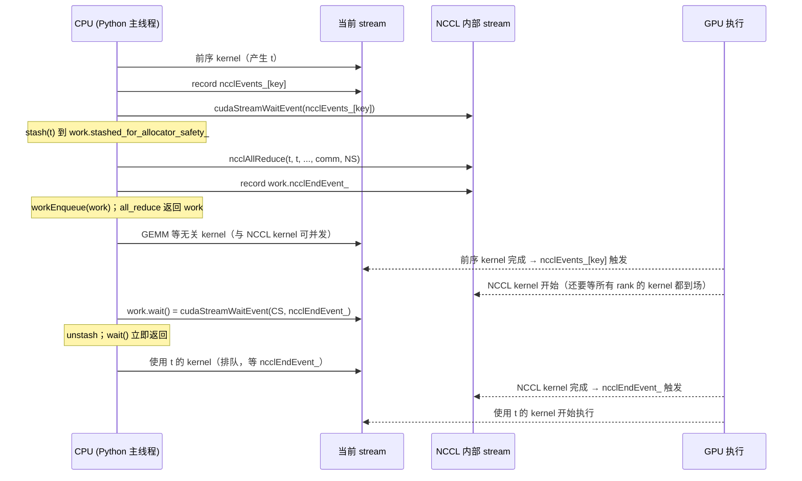

> 本文是[《通信与互联：从 NCCL 到 RDMA》](/communication-and-interconnect-for-ai-infra.html)系列的第 5 篇（共七篇）。上一篇：[NCCL 架构：拓扑探测、channel、算法与协议](/nccl-architecture-topology-channels-algorithms-and-protocols.html)　下一篇：[nccl-tests、调优与排障：从带宽曲线到 hang](/nccl-tests-tuning-and-debugging-hangs.html)

上一篇沿着 `ncclAllReduce` 走完了 NCCL 内部的全部路径：bootstrap、拓扑探测、ring/tree 搜索、transport 建连、调优表、enqueue、一个 kernel 里 nChannels 个 block 各跑一条环，跨机时由 proxy 线程替 GPU 驱动网卡。那一篇的结论可以压缩成一句话：**NCCL 是一个把集合通信编译成 CUDA kernel 的库，`ncclAllReduce(sendbuf, recvbuf, count, dtype, op, comm, stream)` 的最后一个参数决定了这个 kernel 排进哪条队列**。这一篇就从这最后一个参数开始。

绝大多数人不直接调 NCCL，而是写 `dist.all_reduce(t)`。这一行 Python 与 `ncclAllReduce` 之间隔着 PyTorch 的 c10d 层：`distributed_c10d.py` → `ProcessGroup` → `Backend` → `ProcessGroupNCCL`。这一层做的事情不多，但每一件都直接决定性能与正确性：communicator 什么时候创建、NCCL kernel 排到哪条 stream、返回的 `Work` 对象里存了什么、`wait()` 等的是谁、输入 tensor 在通信结束前会不会被 Caching Allocator 回收、超时由哪个线程发现、发现之后做什么。这些机制在文档里各有一两句话，但要把"重叠为什么没发生"、"为什么 hang 到 10 分钟才报错"这类问题解释清楚，只能去读 `ProcessGroupNCCL.cpp`。

本篇只讲通信层的视角。DDP 的 bucket 怎么划、FSDP 怎么分片、流水线怎么排 micro-batch，都不在范围内——它们决定"发什么、发多大、什么时候发"，本篇讨论的是"发出去之后 PyTorch 与 GPU 之间发生了什么"。DDP 的 bucket 会作为例子出现一次，用来说明合并小消息为什么能把第 1 篇 α-β 模型里的延迟项变成带宽项。

总纲给本篇的核心问题是：

> **`work = dist.all_reduce(t, async_op=True)` 返回时，通信开始了吗？`work.wait()` 返回时，通信完成了吗？在此期间修改 `t` 会发生什么？**

三个问题的标准答案都是"不一定"，但"不一定"不是可操作的答案。本篇要用 stream 与 event 把它们换成精确的陈述：哪条 stream 上排了什么、哪个 event 被谁等待、CPU 在哪一行真的停下来。

依照系列惯例，本文的性能数字要么是可推导的理论值（标称带宽、α-β 模型），要么是"通常能达到"的区间，均标注"非实测"；带宽数字每次出现都区分"单向"与"双向合计"。源码以 PyTorch 2.12（v2.12.0，2026-05-11 发布）为准，NCCL 以 2.28.9 为准，vLLM 的对照部分以 v0.23.0 为准；c10d 这一层在 2.x 各版本之间改动不小（内部 stream 的使用条件、tensor 生命周期方案、错误处理默认值都变过），文中会在相应处标注"以你手上的版本为准"。


## 一、总览：从 `dist.all_reduce` 到 `ncclAllReduce` 的四层

### 1. 一次调用穿过的层次

```text
Python   dist.all_reduce(t, op, group, async_op)          torch/distributed/distributed_c10d.py
            │  组装 AllreduceOptions{reduceOp, asyncOp}
            ▼
C++      ProcessGroup::allreduce                           torch/csrc/distributed/c10d/ProcessGroup.hpp
            │  经 dispatcher 调 c10d::allreduce_ 算子     Ops.cpp
            │  按 tensor 的 device 类型选 Backend
            ▼
C++      Backend::allreduce  (虚函数)                      Backend.hpp
            ▼
C++      ProcessGroupNCCL::allreduce → collective()        ProcessGroupNCCL.cpp
            │  1. getNCCLComm / initNCCLComm     懒创建 communicator，经 Store 分发 ncclUniqueId
            │  2. 选 stream：async_op ? 内部 ncclStreams_[key] : 当前 stream
            │  3. syncStream：让 NCCL stream 等当前 stream 的 event
            │  4. 创建 WorkNCCL，stash 输入输出 tensor
            │  5. fn(...) → ncclAllReduce(..., comm, stream)
            │  6. 在 NCCL stream 上 record ncclEndEvent_
            │  7. workEnqueue：交给 watchdog 线程监视
            ▼
NCCL     ncclAllReduce → enqueue → kernel launch（上一篇）
```

第 1 步只在第一次碰到某个 device 时发生，之后是一次 map 查找。第 2～6 步是每次调用都走的热路径，全部是 host 侧的异步操作：没有一步会等待 GPU。第 7 步把一份 `WorkNCCL` 的拷贝放进 `workMetaList_`，由一条独立线程每 100 ms 轮询一次，这是超时与异步错误检测的基础。

### 2. 两条 stream、两个 event、一个 Work

`async_op=True` 时的运行时对象关系是本篇的主线：

```text
当前 stream（计算）     ──┬── 前序 kernel ──┐(record ncclEvents_[key])
                         │                  │
                         │                  ▼(block)
NCCL 内部 stream        ──┼───────────── ncclAllReduce kernel ──┐(record work.ncclEndEvent_)
                         │                                       │
                         │           work.wait() ⇒ 当前 stream ──▼(block)── 后续 kernel
                         │
CPU                      ▲ 全程不停：all_reduce 返回、wait() 返回都在 kernel 执行之前
```

三件事各自独立：**NCCL stream 等当前 stream**（保证输入已算好）、**当前 stream 等 NCCL stream**（保证输出被用前已归约完）、**CPU 不等任何人**（除非显式配置）。所谓"异步"就是第三件事；所谓"重叠"就是两条 stream 之间没有依赖的那一段时间里 GPU 同时跑两个 kernel。

### 3. 版本口径：几处近期变化

读本篇时有三处要对照自己的版本（以下均为 2.12 的行为）：

- **同步模式的 stream**。2.12 的 `collective()` 明确写着 `asyncOp ? ncclStreams_.at(key) : at::cuda::getCurrentCUDAStream(device.index())`，上面一行注释是 "in asyncOp=false [default] mode, we use currentStream as ncclStream"：`async_op=False`（默认）时 NCCL kernel 直接排在**当前 stream** 上，不用内部 stream，也不返回 `Work`（`collective()` 返回 `nullptr`，Python 侧 `all_reduce` 看到 `work is None` 就直接返回）。头文件顶部那段 "each NCCL call is scheduled on a separate CUDA stream that is different from the current CUDA stream" 的类注释描述的是早期 2.x 一律用内部 stream 再 `work.wait()` 的行为，2.12 里它只对 `async_op=True` 成立。两种行为对用户可见的效果相同，但 profiler 里 kernel 所在的行不同。
- **tensor 生命周期**。`TORCH_NCCL_AVOID_RECORD_STREAMS` 曾是可选项，2.12 的构造函数里它已经变成 `TORCH_WARN_ONCE("TORCH_NCCL_AVOID_RECORD_STREAMS is the default now, this environment variable is thus deprecated.")`：默认走 stash 方案，集合通信路径不再调 `recordStream`。
- **错误处理默认值**。`asyncErrorHandling_` 的默认值是 `getCvarInt(TORCH_NCCL_ASYNC_ERROR_HANDLING, 3 /*SkipCleanUp*/)`，即超时后直接把进程带下去而不先 `ncclCommAbort`；头文件里该变量声明上方的 TODO 注释写着 "We want to eventually remove this variable and make users to use the default value (3 - SkipCleanUp)"，说明更早版本的默认值与此不同、且这个开关本身可能被移除。

环境变量名以 `ProcessGroupNCCL.hpp` 里 `static std::vector<std::string> TORCH_NCCL_*` 的声明为准，多数保留了不带 `TORCH_` 前缀的旧名作为别名（如 `NCCL_BLOCKING_WAIT`），本文一律用新名。

### 4. 本文的章节安排

```text
二、c10d 的分层           init_process_group 做了什么；Store 与 rendezvous；ncclUniqueId 如何分发；new_group 与 ncclCommSplit
三、对象模型              communicator 的懒创建与 deviceKey；NCCLComm 与非阻塞初始化；WorkNCCL 里的两个 event；内部 stream 从哪来
四、stream 语义           collective() 逐步读；同步与异步两种模式；wait() 等的是谁；CPU 何时真的阻塞；回答核心问题
五、tensor 生命周期        Caching Allocator 的跨 stream 危险；recordStream 与 stash 两种方案；不调 wait() 会怎样
六、重叠                  重叠能省多少（α-β）；GPU 并发的硬件条件；重叠杀手清单；profiler 里怎么看；合并与 DDP bucket 的账
七、函数式集合通信         AsyncCollectiveTensor 与 wait_tensor；WorkRegistry；torch.compile 如何重排通信
八、错误处理与超时         watchdog 每 100 ms 做什么；超时后的四种处置；heartbeat monitor；timeout 参数到底约束什么
九、对照                  Gloo、UCC、vLLM 的 PyNccl；对称内存与 NCCL 的关系
十、小结                  要点、检查项、源码位置、comm-probe 的 overlap_bench.py
```


## 二、c10d 的分层：Python → ProcessGroup → Backend → ProcessGroupNCCL

### 1. `init_process_group` 做了什么

`torch/distributed/distributed_c10d.py` 的 `init_process_group(backend, init_method, timeout, world_size, rank, store, device_id, ...)` 做三件事。第一，**rendezvous**：如果没传 `store`，按 `init_method`（`env://`、`tcp://host:port`、`file://`）调用 `rendezvous()` 得到一个 `Store`，对 `env://` 和 `tcp://` 这就是 `TCPStore`（`torch/distributed/rendezvous.py` 的 `_create_c10d_store`），rank 0 起 server、其他 rank 做 client。得到的 store 被包一层 `PrefixStore("default_pg", store)`，让不同 process group 的 key 互不冲突。第二，**创建 ProcessGroup**：`_new_process_group_helper` 构造 C++ 的 `ProcessGroup` 对象，并按 backend 名字为它挂上一个 `Backend`——`nccl` 对应 `ProcessGroupNCCL(store, rank, size, options)`。第三，把默认组注册到 `_world`，后面 `dist.all_reduce(t)` 不传 `group` 时就用它。

注意 `ProcessGroupNCCL` 的构造函数**不创建任何 NCCL communicator**。头文件的注释说得很直接："the constructor doesn't create any NCCL communicators. A single NCCL communicator can only be used on a specific set of devices, and are therefore created on-demand when a collective runs"。构造函数做的是读环境变量、构造 `Watchdog` 与 `HeartbeatMonitor` 两个对象并启动 watchdog 线程（heartbeat monitor 线程由 watchdog 线程在 `Watchdog::run` 开头 `pg_->heartbeatMonitor_->start()` 拉起；`TORCH_NCCL_BLOCKING_WAIT=1` 时两条都不启）、注册 allocator hook（如果开了 `TORCH_NCCL_USE_TENSOR_REGISTER_ALLOCATOR_HOOK`）。所以 `init_process_group` 返回时，NCCL 层什么都还没发生；上一篇讲的 bootstrap、拓扑探测、建连都推迟到第一次集合通信。传了 `device_id` 时是例外：`eagerConnectSingleDevice` 会立刻 `initNCCLComm`，把初始化成本前移到可控的位置，这也是 `ncclCommSplit` 能工作的前提（父 communicator 必须先存在）。

`timeout` 参数的默认值按 backend 不同：NCCL 用 `default_pg_nccl_timeout`（C++ 的 `kProcessGroupNCCLDefaultTimeout`，10 分钟），其他 backend 用 `default_pg_timeout`（`kProcessGroupDefaultTimeout`，30 分钟）。它约束什么，第八章展开。

### 2. `ProcessGroup` 与 `Backend`：一次 allreduce 的分发路径

`torch/csrc/distributed/c10d/ProcessGroup.hpp` 里的 `ProcessGroup` 不是后端，而是一个**按 device 类型路由到 Backend 的外壳**。它的 `allreduce` 方法体不直接干活，而是通过 dispatcher 查一个算子：

```cpp
// ProcessGroup.hpp, ProcessGroup::allreduce
static auto op = c10::Dispatcher::singleton()
    .findSchemaOrThrow("c10d::allreduce_", "")
    .typed<...>();
auto work = std::get<1>(op.call(tensors, /*this*/, reduceOp, sparseIndices,
                                opts.asyncOp, opts.timeout.count()));
```

`c10d::allreduce_` 在 `Ops.cpp` 里按 device 注册了 CPU / CUDA 等多个实现，每个实现都是 `process_group->getBackend(c10::DeviceType::XXX)->allreduce(...)`。这样设计有两个目的：一个 `ProcessGroup` 可以同时挂 CPU 的 Gloo 与 CUDA 的 NCCL（`backendTypeToBackend_` / `deviceTypeToBackend_` 两张表），tensor 在哪就走哪个后端；集合通信成为 dispatcher 里的一等算子，autograd、profiler、`torch.compile` 才能看见它。

`Backend.hpp` 定义了后端接口：`allreduce`、`allgather`、`send/recv`、`barrier` 等虚函数，加上能力查询 `supportsCoalescing()`、`supportsSplitting()`、`startCoalescing()/endCoalescing()`、`setTimeout()`。`ProcessGroupNCCL`、`ProcessGroupGloo`、`ProcessGroupUCC` 都继承它。

### 3. Store 与 `ncclUniqueId` 的分发

第 4 篇讲过 `ncclCommInitRank` 需要所有 rank 拿到同一个 `ncclUniqueId`（本质是 rank 0 bootstrap socket 的地址），NCCL 自己不负责把它送到其他 rank。PyTorch 用 Store 做这件事，`ProcessGroupNCCL::broadcastUniqueNCCLID`：

```cpp
// ProcessGroupNCCL.cpp, broadcastUniqueNCCLID（删节）
if (!isSingleP2POp) {
  storeKey = std::to_string(ncclCommCounter_++);   // 第几个 communicator
} else {
  storeKey = p2pKey;                                // "src:dst"
}
if (rank_ == 0 || (isSingleP2POp && p2pRank == 0)) {
  store_->set(storeKey, vec);                       // rank 0 写
} else {
  auto vec = store_->get(storeKey);                 // 其他 rank 阻塞读，直到 key 出现
  std::memcpy(ncclID, vec.data(), vec.size());
}
```

`store_->get` 是带超时的阻塞调用：如果 rank 0 在 `ncclGetUniqueId` 之前就崩了，其他 rank 会在这里等到 store 超时，报错信息里明确写着 "This may indicate a possible application crash on rank 0 or a network set up issue"。这是训练启动阶段 hang 的第一个常见位置。

规模大时一个 root 不够。`TORCH_NCCL_RANKS_PER_ROOT`（默认 128）决定每多少 rank 配一个 root：`getSize() > ranksPerRoot` 时走 `useScalableInit` 路径，多个 root 各自 `ncclGetUniqueId`，通过 `allgatherUniqueNCCLIDs` 用 store 的 `multiGet` 收齐，再调 `NCCLComm::create_scalable` → `ncclCommInitRankScalable`（2.28.9 的 `src/nccl.h.in` 里有此接口，较老的 NCCL 没有）。多 root bootstrap 缩短的是万卡规模下 rank 0 被所有人连接的排队时间。

`TCPStore`（`TCPStore.hpp/.cpp`）本身是一个 key-value 服务，默认走 libuv（`TCPStoreOptions::useLibUV = true`），支持 `set/get/add/check/wait/multiGet`。它在 c10d 里承担四种角色：rendezvous、`ncclUniqueId` 分发、Flight Recorder 的 dump 信号（`kStoreDumpKey = "exception_dump"`）、跨 rank 错误传播（`kStoreErrorSignalKey = "remote_error"`，需 `TORCH_NCCL_PROPAGATE_ERROR`）。它只在控制面出现，数据面的每个字节都不经过它。

### 4. `new_group` 与 `ncclCommSplit`

`dist.new_group(ranks)` 为子集 rank 创建新的 `ProcessGroup`，底层是一个新的 `ProcessGroupNCCL`，共享同一个 store 但用不同的 `PrefixStore` 前缀。新组的 communicator 同样是懒创建。`ProcessGroupNCCL::Options` 里的 `split_from` 与 `split_color` 提供了另一条路：如果父组已经有 communicator（`eagerConnectSingleDevice` 之后），`initNCCLComm` 会调 `NCCLComm::split` → `ncclCommSplit(parent, color, rank, &newcomm, &config)`，复用父 communicator 已建好的拓扑与连接，省掉一次完整 bootstrap。`ncclCommSplit` 是集合调用，所有父组成员都得参与（不在子组的传 `NCCL_SPLIT_NOCOLOR`），所以它只用于集合通信的组，P2P 的 communicator 不走这条路。


## 三、ProcessGroupNCCL 的对象模型

### 1. communicator 的懒创建：`devNCCLCommMap_` 与 deviceKey

`ProcessGroupNCCL` 用 `std::unordered_map<std::string, std::shared_ptr<NCCLComm>> devNCCLCommMap_` 缓存 communicator，key 由 `getKeyFromDevice(device)` 生成——单卡进程下就是 device index 的字符串。P2P 操作用 `"rank:peer"` 形式的 key，每对 rank 一个独立的两成员 communicator。

`collective()` 的开头：

```cpp
const auto key = getKeyFromDevice(device);
std::shared_ptr<NCCLComm> ncclComm = getNCCLComm(key);
if (ncclComm == nullptr) {
  ncclComm = initNCCLComm(key, device, opType);
}
```

`getNCCLComm` 加锁查表；`initNCCLComm` 做全部初始化：分发 uniqueId、`NCCLComm::create`、从 stream pool 拿一条 stream 放进 `ncclStreams_[key]`、创建一个 `ncclEvents_[key]`、把 communicator 从 `inInitializationCommMap_` 移到 `devNCCLCommMap_`。第一次集合通信的耗时因此包括整个 NCCL 初始化（8 卡节点内通常几百毫秒到几秒，跨机随规模增长，非实测），benchmark 的 warmup 必须把它排除。

`initNCCLComm` 里还有一段值得注意的 `[Group Start/End Note]`：如果调用发生在 `ncclGroupStart()` 之后（`batch_isend_irecv` 的场景），它会先把所有活动的 group 用 `ncclGroupEnd()` 关掉、初始化完 communicator、再重新 `ncclGroupStart()` 同样次数。原因是 NCCL 在 group 内延迟执行，如果 `ncclCommInitRank` 也被延迟，后面的 `ncclSend` 拿到的 comm 是空指针。这是"框架层要理解 NCCL group 语义"的一个具体例子。

### 2. `NCCLComm` 包装与非阻塞初始化

`NCCLUtils.hpp` 的 `class NCCLComm` 包装 `ncclComm_t`，附带：`rank_`、`deviceIndex_`、`aborted_`、`ncclAsyncErr_`、`commFailureReason_`、`nonBlocking_`、`initialized_`、一把 mutex、已注册的内存段 `registeredSegmentHandles_`。核心方法：

```cpp
// NCCLUtils.cpp, NCCLComm::create（删节）
comm->nonBlocking_ = config.blocking == 0;
C10D_NCCL_CHECK_NONBLOCKING(
    ncclCommInitRankConfig(&(comm->ncclComm_), numRanks, commId, rank, &config),
    std::nullopt);
// Under blocking mode, comm is initialized immediately after NCCL init
// returns; Under nonblocking mode, we check whether comm is initialized the
// *next* time ncclComm_ is accessed.
comm->initialized_ = !comm->nonBlocking_;
```

`ncclCommInitRankConfig` 接受 `ncclConfig_t`，其中 `blocking = 0` 打开 NCCL 的非阻塞模式：初始化立即返回 `ncclInProgress`，实际的 bootstrap 与建连在后台进行，后续每次调用 NCCL API 前要用 `ncclCommGetAsyncError` 轮询到 `ncclSuccess`（`NCCLComm::waitReady`，超时由 `TORCH_NCCL_NONBLOCKING_TIMEOUT` 控制，`NCCLUtils.cpp` 的 `nccl_nonblocking_timeout()` 给的默认值是 30 分钟，与 `kBackendDefaultTimeout` 一致）。`ProcessGroupNCCL::useNonblocking()` 决定用不用它，优先级：`Options.config.blocking` 显式设置 > 环境变量 `TORCH_NCCL_USE_COMM_NONBLOCKING`（用 `c10::utils::check_env` 读取）> 默认 `false`。2.12 的源码注释仍保留着被注释掉的第三档"eager init 时自动开非阻塞"，并说明它在 torch 2.7.1 被禁用，原因是 NCCL 2.26 非阻塞模式的一个 hang（pytorch/pytorch#153960）。

非阻塞模式的价值在于：`ncclCommInitRank` 在阻塞模式下如果某个 rank 永远不来，会无限期挂住主线程；非阻塞模式让 PyTorch 能在自己的超时上放弃、abort、报错。代价是每次 NCCL 调用后多一轮 `C10D_NCCL_CHECK_TIMEOUT` 的轮询（`while (result == ncclInProgress) { C10D_CHECK_TIMEOUT(...); sched_yield(); commWrapper->getAsyncError(&result); }`，`NCCLComm::getAsyncError` 是 `ncclCommGetAsyncError` 的加锁包装，避免 watchdog 与主线程同时调它）。

`NCCLComm::abort` 调 `ncclCommAbort` 并同样轮询到完成；`checkForNcclError` 调 `ncclCommGetAsyncError` 取出 NCCL 后台（proxy 线程、网络）发现的错误。这两个是第八章 watchdog 的工具。

### 3. `WorkNCCL`：起止 event 与 Future

每次集合通信返回一个 `c10::intrusive_ptr<Work>`，NCCL 后端的实现是 `ProcessGroupNCCL::WorkNCCL`。它的成员里与本篇直接相关的：

```text
device_                          这次操作在哪张卡
ncclStartEvent_                  NCCL stream 上、kernel 之前 record 的 event（仅 TORCH_NCCL_ENABLE_TIMING 或 desync debug 时创建）
ncclEndEvent_                    NCCL stream 上、kernel 之后 record 的 event（总是创建）
ncclComm_                        用的哪个 communicator
blockingWait_ / opTimeout_       从 ProcessGroupNCCL 拷来的配置
workStartTime_                   host 侧 steady_clock，checkTimeout 用它算流逝时间
seq_ / isP2P_                    集合通信序号；Flight Recorder 与 desync debug 用它对齐各 rank
stashed_for_allocator_safety_    TensorShelf，暂存输入输出 tensor 的引用（第五章）
future_                          getFuture() 返回的 CUDA-aware Future
```

`isCompleted()` 与 `isStarted()` 不查 NCCL，而是 `ncclEndEvent_->query()` / `ncclStartEvent_->query()`，也就是 `cudaEventQuery`：问 GPU "这个 event 过了没"。这决定了两件事：`isCompleted()` 是非阻塞的，可以在主线程或 watchdog 线程反复轮询；"完成"的定义是**NCCL kernel 在 NCCL stream 上执行完毕**，与 CPU 无关、与当前 stream 无关。

end event 默认用 `cudaEventDisableTiming` 创建（`WorkNCCL` 构造函数里是 `enableTiming ? cudaEventDefault : cudaEventDisableTiming`，开了 `TORCH_NCCL_CUDA_EVENT_CACHE` 时改从 `CUDAEventCache` 取；`initNCCLComm` 为 `ncclEvents_` 写的注释解释了为什么选这个 flag：它对 `cudaStreamWaitEvent` 与 `cudaEventQuery` 性能最好），所以默认拿不到每次集合通信的 GPU 耗时；`TORCH_NCCL_ENABLE_TIMING=1` 才创建 start event 并打开计时，`work.getDuration()` 才有意义。头文件注释同时警告：计时打开后 watchdog 要调 `cudaEventElapsedTime`，增加了 watchdog 自己 hang 的概率。

### 4. 内部 stream：`ncclStreams_` 与优先级

`initNCCLComm` 里：

```cpp
bool force_high = getCvarBool(TORCH_NCCL_HIGH_PRIORITY, false);
auto streamVal = at::cuda::getStreamFromPool(
    options_->is_high_priority_stream || force_high);
// ...
ncclStreams_.emplace(deviceKey, streamVal);
ncclEvents_.emplace(deviceKey, at::cuda::CUDAEvent(cudaEventDisableTiming));
```

每个 `ProcessGroupNCCL` 实例、每个 deviceKey 一条 stream，从 PyTorch 的 stream pool 取。`is_high_priority_stream` 可以通过 `dist.ProcessGroupNCCL.Options(is_high_priority_stream=True)` 传进 `init_process_group(pg_options=...)`，环境变量 `TORCH_NCCL_HIGH_PRIORITY=1` 对所有组强制打开。高优先级 stream 的含义是 CUDA 的 stream priority：当两条 stream 都有 block 待调度时，硬件优先给高优先级 stream 的 block 分 SM。这对重叠的意义第六章讲。

多个 process group（比如 DP 组与 TP 组）各有自己的 NCCL stream，它们之间互不等待。这是"多 communicator 多 stream 数据竞争"（第 6 篇的排障项之一）的来源：两个组的集合通信如果读写同一块显存，PyTorch 不会自动加依赖。


## 四、stream 语义：一次 all_reduce 的 stream/event 之舞

### 1. `collective()` 逐步读

`ProcessGroupNCCL::collective` 是所有集合通信的模板，`allreduce_impl` 只是往里传一个 lambda。把它的主干抽出来（删掉 Flight Recorder、nan check、profiler 相关的行）：

```cpp
// ProcessGroupNCCL.cpp, ProcessGroupNCCL::collective（删节）
auto device = getDevice(inputs[0]);
at::cuda::OptionalCUDAGuard gpuGuard(device);
auto capture_status = c10::cuda::currentStreamCaptureStatusMayInitCtx();

const auto key = getKeyFromDevice(device);
auto ncclComm = getNCCLComm(key);
if (ncclComm == nullptr) ncclComm = initNCCLComm(key, device, opType);

// in asyncOp=false [default] mode, we use currentStream as ncclStream
// otherwise, we use separate ncclStream and let it sync on currentStream
auto ncclStream = asyncOp ? ncclStreams_.at(key)
                          : at::cuda::getCurrentCUDAStream(device.index());
if (asyncOp) {
  // First let NCCL streams wait for input tensors allocation streams
  syncStream(device, ncclEvents_[key], ncclStream);
}

bool enqueue = !coalescing_state_ && capture_status == CaptureStatus::None;
auto work = initWork(device, rank_, opType, false, profilingTitle, inputs, outputs, enqueue);
work->outputs_ = std::make_shared<std::vector<at::Tensor>>(outputs);

if (asyncOp) {                                   // 同步模式不需要生命周期管理
  work->stashed_for_allocator_safety_->stash(inputs);
  work->stashed_for_allocator_safety_->stash(outputs);
}
if (work->timingEnabled_ && !coalescing_state_) work->ncclStartEvent_->record(ncclStream);

pre(ncclStream, work);
ncclComm_t comm = ncclComm->getNcclComm();
C10D_NCCL_CHECK_TIMEOUT(fn(inputs[0], outputs[0], comm, ncclStream), ncclComm, ...);
post(ncclStream, work);

if (!coalescing_state_) work->ncclEndEvent_->record(ncclStream);
work->ncclComm_ = ncclComm;
// ... future_、blockingWait_、opTimeout_ 等
if (enqueue) workEnqueue(work);
return asyncOp ? work : nullptr;
```

`syncStream` 只有两行：

```cpp
void syncStream(at::Device& device, at::cuda::CUDAEvent& ncclEvent, at::cuda::CUDAStream& ncclStream) {
  ncclEvent.record(at::cuda::getCurrentCUDAStream(device.index()));
  ncclEvent.block(ncclStream);   // cudaStreamWaitEvent(ncclStream, event)
}
```

`fn` 就是 `ncclAllReduce(input.data_ptr(), output.data_ptr(), numel, dtype, op, comm, stream.stream())`。整个函数里没有任何 `cudaStreamSynchronize` / `cudaDeviceSynchronize` / `cudaEventSynchronize`，全部是入队操作。

### 2. 同步模式（`async_op=False`）：kernel 就在当前 stream 上

默认模式下 `ncclStream` 就是当前 stream，所以 NCCL kernel 与前后的计算 kernel 排在同一条队列里，天然有序：前面的 kernel 算完输入，NCCL kernel 归约，后面的 kernel 读结果。不需要 event，不需要 stash（tensor 的分配 stream 就是使用 stream，Caching Allocator 的规则自然满足），也不返回 `Work`。Python 侧：

```python
work = group.allreduce([tensor], opts)
if async_op:
    return work
elif work is not None:  # Backward compatible with backends that don't sync at CPP level
    work.wait()
# Otherwise, the backend has sync'ed at CPP level
```

这里"sync'ed at CPP level"指的正是"kernel 已排在当前 stream 上"，而不是 CPU 等到了 GPU 完成。**同步模式的 `dist.all_reduce(t)` 返回时，CPU 同样没有等 GPU**，只是从 stream 顺序上保证了后续操作看到归约结果。很多人把 `async_op=False` 理解成"阻塞到通信完成"，在 CUDA 语义下这是错的——它阻塞的是 stream，不是线程。

`WorkNCCL` 仍然会创建并 `workEnqueue` 给 watchdog（`enqueue` 只在 coalescing 或 graph capture 时为 false），所以同步模式的集合通信同样受超时检测保护。

### 3. 异步模式（`async_op=True`）：内部 stream 与两个 event



图里有两个时间轴：CPU 的箭头是入队顺序，全部在毫秒级内完成；GPU 的虚线箭头是实际执行，可能在 CPU 已经跑到很后面时才发生。CPU 侧的"all_reduce 返回"与 GPU 侧的"NCCL kernel 开始"之间没有任何因果关系——前者只保证 kernel 已在队列里。

NCCL kernel "开始执行"还有一层：即使本 rank 的 NCCL stream 轮到了它，kernel 内部的第一步是与 peer 握手（第 4 篇讲的 channel 上的 flag 等待），如果其他 rank 的同一次集合通信还没被启动，本 rank 的 kernel 会占着 SM 自旋等待。这是 "straggler 拖慢全局" 与 "一个 rank hang 导致全体 hang" 的物理机制。

### 4. `work.wait()` 等的是谁

```cpp
// ProcessGroupNCCL.cpp（删节）
void ProcessGroupNCCL::WorkNCCL::synchronizeStream() {
  auto currentStream = at::cuda::getCurrentCUDAStream(device_.index());
  // Block the current stream on the NCCL stream
  ncclEndEvent_->block(currentStream);
  // Unstage the stashed tensors so that CachingAllocator can recycle them
  // THIS MUST HAPPEN AFTER THE BLOCKING CALL ABOVE
  stashed_for_allocator_safety_->unstash();
}

bool ProcessGroupNCCL::WorkNCCL::wait(std::chrono::milliseconds timeout) {
  synchronize();                       // → synchronizeStream()
  if (blockingWait_ || timeout != kNoTimeout) {
    while (!isCompleted()) {           // cudaEventQuery 轮询
      if (checkTimeout(...)) { ...; break; }
      std::this_thread::sleep_for(std::chrono::milliseconds(kSynchronizeBusyWaitMillis));  // 1 ms
    }
  } else if (isBarrierOp_ && !isCompleted()) {
    currentStream.synchronize();       // barrier 特例：真的等 GPU
  }
  if (exception()) { abort(); handleException(TearDown); }
  return true;
}
```

默认路径只有第一行有效：`ncclEndEvent_->block(currentStream)` 即 `cudaStreamWaitEvent(currentStream, ncclEndEvent_)`，往当前 stream 里插一个"等 NCCL 完成"的屏障，然后 unstash、返回。**`wait()` 是 stream 级等待，不阻塞 CPU。** 头文件注释说 `wait()` 与 `synchronize()` 是同义词，就是这个意思。

要注意 `wait()` 等的是**调用 `wait()` 时的当前 stream**。如果在 stream A 上发起 all_reduce、切到 stream B 再调 `wait()`，被插屏障的是 B；A 上后续对 `t` 的操作没有任何保护。这是多 stream 代码里一个常见的隐蔽错误。

### 5. 什么时候 CPU 才真的阻塞

在 `ProcessGroupNCCL` 的路径上，CPU 线程真正停下来等 GPU 只有这几种情形：

```text
TORCH_NCCL_BLOCKING_WAIT=1          所有 wait() 变成轮询 isCompleted() 直到完成或超时；同时不再创建 watchdog 线程
work.wait(timeout=timedelta(...))   显式传超时，同样进入轮询
dist.barrier()                      isBarrierOp_ 且未完成 → currentStream.synchronize()
非阻塞 communicator 的 waitReady     初始化 / abort 阶段轮询 ncclCommGetAsyncError
用户自己的同步                       .item() / .cpu() / torch.cuda.synchronize() / cudaMemcpy 到 pageable 内存 / cudaFree
```

最后一类不是 c10d 的，但它们决定了程序的实际节奏，第六章的"重叠杀手"全在这一类。

`dist.barrier()` 值得单说。它在 NCCL 后端上的实现是一次 1 元素的 all_reduce 加一次 `currentStream.synchronize()`，所以它确实阻塞 CPU；同时它只保证"所有 rank 都执行到了 barrier 这一行"，并不保证此前所有 rank 的其他 stream 上的工作都已完成。

### 6. 回答核心问题

现在可以精确回答总纲的问题。

**`work = dist.all_reduce(t, async_op=True)` 返回时，通信开始了吗？** 不一定，且大概率没有。返回时能保证的是：（a）NCCL kernel 已经入队到本进程该 device 的 NCCL 内部 stream；（b）这条 stream 上插了一个 `cudaStreamWaitEvent`，kernel 不会在当前 stream 上此前的操作完成之前开始；（c）`t` 的引用已被 stash，不会被 allocator 回收。kernel 何时真正开始，取决于当前 stream 的积压、GPU 的 SM 空闲情况、以及其他 rank 何时启动同一次集合通信。C++ 侧 `WorkNCCL::isStarted()` 用 start event 回答这个问题（需要 `TORCH_NCCL_ENABLE_TIMING`，且没有暴露到 Python 的 `Work` 上），用户侧只能靠 profiler 看。

**`work.wait()` 返回时，通信完成了吗？** 不一定。默认配置下 `wait()` 只往当前 stream 插入对 `ncclEndEvent_` 的等待，CPU 立即返回，此时 NCCL kernel 可能还在跑、甚至还没开始。它保证的是**因果关系**：此后在当前 stream 上排入的任何 kernel，都会在 NCCL kernel 完成之后执行。只有 `TORCH_NCCL_BLOCKING_WAIT=1`、显式 `timeout`、或随后自己做一次 `torch.cuda.synchronize()`，"返回"才等于"完成"。`work.is_completed()` 是那个可以随时问的非阻塞探针。

**在此期间修改 `t` 会发生什么？** 分三种情况：

- 在 `wait()` 之前、当前 stream 上对 `t` 发一个 kernel（`t.add_(1)`、`t.zero_()`）：当前 stream 与 NCCL stream 之间此时**没有任何依赖**，两个 kernel 可能并发读写同一块显存，结果是未定义的——可能归约的是改过的值、可能改写被归约结果覆盖、可能两边各改一半。NCCL 的 in-place all_reduce 既读 `t` 又写 `t`，所以"只读 `t`"同样不安全：`t.sum().item()` 读到的可能是归约前、归约中或归约后的值。
- 在 `wait()` 之前 `del t` 或让 `t` 出作用域：安全。`stashed_for_allocator_safety_` 持有引用，块不会归还给 allocator；`wait()` 之后 unstash，此时当前 stream 已经等待了 `ncclEndEvent_`，后续复用这块显存的 kernel 必然排在 NCCL kernel 之后。
- 在 `wait()` 之后、当前 stream 上修改：安全。这正是 `wait()` 的用途。

一句话：`async_op=True` 之后、`wait()` 之前，`t` 属于 NCCL stream，当前 stream 不得碰它——既不能写，也不能读。


## 五、输入 tensor 的生命周期与 Caching Allocator

### 1. 跨 stream 的危险

PyTorch 的 CUDA Caching Allocator 按 stream 管理块：一个 tensor 在 stream A 上分配，释放时（引用计数归零）它的块立即回到 A 的空闲池，下一次 A 上的分配可以立刻拿到它。这在单 stream 下是安全的：A 上后续 kernel 必然排在此前使用这块内存的 kernel 之后。

但 `async_op=True` 让 tensor 被另一条 stream（NCCL stream）使用。考虑：

```python
t = torch.randn(N, device="cuda")          # 在当前 stream 分配
work = dist.all_reduce(t, async_op=True)    # NCCL stream 将读写 t
del t                                       # 引用归零，块回到当前 stream 的空闲池
u = torch.empty(N, device="cuda")           # 立刻拿到同一块
u.fill_(0)                                  # 当前 stream 上的 kernel，与 NCCL kernel 并发写同一地址
```

没有额外机制的话，第 5 行的 `fill_` 与第 2 行的 NCCL kernel 会在两条 stream 上并发写同一块显存。这就是 `ProcessGroupNCCL.cpp` 里 `[Sync Streams]` 注释描述的第二个问题："We also need to make sure input tensors are not freed before their usages on ncclStreams finish"。

### 2. 旧方案：`recordStream`

`c10::cuda::CUDACachingAllocator::recordStream(block, stream)` 告诉 allocator "这个块还被 stream 用着"。释放时 allocator 不立即回收，而是在 stream 上 record 一个 event，把块放进待回收队列，此后每次分配前 `cudaEventQuery` 一遍，event 过了才真正回收。ProcessGroupNCCL 早年对每个输入输出 tensor 调 `recordStream(ncclStream)`，2.12 的 `ProcessGroupNCCL.cpp` 里只剩两处还在用它：`pointToPoint`（对 send/recv 的 tensor）与 `allreduce_sparse`（对输出与 `recvIndices`，旁边的 TODO 写着 "not changing the lifetime management of outputs this time, revisit later"）；`collective()`、`collectiveCoalesced()` 以及 `alltoall_base`/`alltoall` 都已走 stash。

它的代价有两个。一是**延迟回收**：块要等 NCCL kernel 完成才可复用，在通信密集的循环里会让峰值显存上升——这是 FSDP 文档里 `limit_all_gathers` 一类选项存在的背景之一。二是 `recordStream` 的 event 查询发生在分配路径上，在高频分配的代码里有可测量的开销。

### 3. 现方案：stash 到 `TensorShelf`

现在的方案是不告诉 allocator 任何事情，而是**让 `WorkNCCL` 多持有一份引用**。`collective()` 里 `work->stashed_for_allocator_safety_->stash(inputs / outputs)`，`synchronizeStream()` 里先 `ncclEndEvent_->block(currentStream)` 再 `unstash()`。顺序就是安全性的全部：unstash 之后引用归零、块回到当前 stream 的空闲池，但当前 stream 已经被插了"等 NCCL 完成"的屏障，任何复用这块内存的 kernel 都排在 NCCL kernel 之后。

这个方案没有 `recordStream` 的分配路径开销，块的回收也不依赖 event 查询；代价是 tensor 的生命周期被延长到 `wait()` 那一刻，用户忘了 `wait()` 就会一直占着。头文件里 `TORCH_NCCL_AVOID_RECORD_STREAMS` 的注释解释了这个取舍；构造函数则告诉我们它已经是默认。

### 4. 不调 `wait()` 会怎样

`Watchdog::runLoop` 里有对应处理：当 watchdog 发现某个 `work.isCompleted()` 而它的 shelf 非空，就把 shelf 的 `shared_ptr` 挪到 `ProcessGroupNCCL::shelvesToUnstash_`；下一次主线程调任何集合通信、进入 `workEnqueue` 时统一 unstash。注释说明为什么不在 watchdog 线程直接 unstash："directly unstashing from watchdog thread would cause some rare problems"——tensor 析构可能触发 autograd meta 的析构，需要在用户线程进行。

所以忘记 `wait()` 不会泄漏，但显存会多占到"kernel 完成 + 下一次集合通信"为止，且正确性没有保障（当前 stream 从未等过 NCCL）。

### 5. 用户侧要守的规矩

```text
1. async_op=True 之后、wait() 之前，不在任何 stream 上读写参与通信的 tensor
2. wait() 要在将来使用结果的那条 stream 上调（wait 等的是"当前 stream"）
3. 如果输出 tensor 会在第三条 stream 上使用，wait() 之后还要自己加 event 依赖
4. 通信输入若是在非当前 stream 上算出来的，发起 all_reduce 前先让当前 stream 等那条 stream（syncStream 只看当前 stream）
5. 每个 async work 都要 wait()，否则 tensor 引用会被 shelf 持有到下一次集合通信
```

第 4 条容易被忽略：`syncStream` record 的是**当前 stream** 的 event，如果 `t` 是在另一条 stream 上刚算出来的、当前 stream 上什么都没发生，NCCL stream 等到的 event 立刻触发，kernel 可能在 `t` 算完之前就开始读它。


## 六、`async_op=True` 与计算通信重叠

### 1. 重叠的两本账

[第 1 篇](/collective-communication-primitives-and-cost-model.html)的 α-β 模型给出一次 ring all_reduce 的时间：

$$
T_{\text{ring}} = 2(n-1)\,\alpha + \frac{2(n-1)}{n}\cdot\frac{S}{\beta}
$$

以默认节点（8 卡 H100 + NVSwitch）、一个 25 MB 的 DDP bucket 为例（非实测，理论值）：每 rank 收发 $$\frac{2\times 7}{8}\times 25\ \text{MB} \approx 43.75\ \text{MB}$$；NVLink 每 GPU 双向合计 900 GB/s、单向 450 GB/s，带宽项约 $$43.75\ \text{MB} / 450\ \text{GB/s} \approx 97\ \mu s$$；加上 $$14\alpha$$ 的延迟项（节点内 α 取几微秒量级），一次 bucket 的 all_reduce 在 100～150 µs 量级。跨机（每 GPU 一张 400 Gb/s ≈ 50 GB/s 单向的网卡）带宽项变成 $$43.75\ \text{MB} / 50\ \text{GB/s} \approx 875\ \mu s$$。

同一时间 GPU 能算多少？H100 SXM 的 BF16 dense Tensor Core 标称约 990 TFLOPS，一个 $$8192^3$$ 的 BF16 GEMM 约 $$1.1\times 10^{12}$$ FLOP，理论下界约 1.1 ms，实际通常在 1.5～2 ms（非实测，"通常能达到"区间）。也就是说，一个大 GEMM 的时间足够掩盖一到两次跨机 bucket all_reduce。反向传播里每个 bucket 就绪后就发起 all_reduce、同时继续算下一层的梯度，通信几乎全部藏在计算后面——这是数据并行能 scale 的前提。反过来，如果重叠失效，每个 step 要多付出所有 bucket 的通信时间之和：梯度 1 GB 跨机约 35 ms，对一个 300 ms 的 step 是 12% 的损失。

带宽的账说：重叠能省的是通信的全部时间，上限由"计算时间是否 ≥ 通信时间"决定。延迟的账说：重叠**不能**省掉 α——每次集合通信的 kernel 启动、握手、协议开销仍然发生，只是被藏起来了；小消息很多时，藏得住时间，藏不住 SM 占用。

### 2. GPU 上并发的条件

两条 stream 上的 kernel 能否真的同时跑，由硬件决定，PyTorch 与 NCCL 都只能提供条件：

**SM 资源。** NCCL kernel 的 grid 是 nChannels 个 block，每个 block 的线程数由 `NCCL_NTHREADS`（`src/graph/tuning.cc` 里 `NCCL_PARAM(Nthreads, "NTHREADS", -2)`）与协议决定，Simple 协议通常 512 线程。8 卡节点内 NCCL 一般用 2～32 个 channel，所以 NCCL kernel 占的是几个到几十个 SM，剩下的（H100 有 132 个）留给 GEMM。但 GEMM kernel 通常按"填满所有 SM"的 grid 启动，如果它先占满，NCCL kernel 就要等它的 block 退出才能插进去；反过来 NCCL 先占几个 SM，GEMM 的 block 少了几个位置，会慢一点（通常几个百分点，非实测）。`NCCL_MAX_CTAS` / `NCCL_MIN_CTAS`（`src/init.cc`）或 `ncclConfig_t` 的 `maxCTAs` 限制 NCCL 用的 block 数，是"用带宽换 SM"的旋钮。

**优先级。** `TORCH_NCCL_HIGH_PRIORITY=1` 让 NCCL stream 成为高优先级：GEMM 的 block 陆续退出时，空出来的 SM 优先给 NCCL 的 block。这对"GEMM 先占满、NCCL 等不到 SM"的情况有效，代价是 GEMM 的尾部会慢一些。它不能抢占正在运行的 block。

**没有隐式序列化。** 同一进程内两条 stream 之间只要没有 event 依赖、没有 device 级同步、没有跨 stream 的内存操作，硬件就可以并发。下一节列的"杀手"全部是在无意中制造了这种序列化。

**NCCL 侧没有阻塞。** 上一篇说过跨机时 NCCL kernel 依赖 proxy 线程推动网络请求，如果 proxy 线程被抢占（CPU 绑核不当、CPU 过载），kernel 在 GPU 上自旋、看起来"在跑"其实在等，SM 被占着但没有进度。

### 3. 重叠杀手清单

```text
杀手                       机制                                                    表现
─────────────────────────────────────────────────────────────────────────────────────────────────
.item() / .cpu() /         cudaMemcpy 到 pageable 内存 = 当前 stream 同步 + CPU 阻塞    CPU 停在这一行，GPU 队列跑空；
  bool(tensor) / print     后续 kernel 无法提前入队                                  trace 上 GPU 有空洞，通信独占
torch.cuda.synchronize()   device 级同步，等所有 stream                              同上，且连 NCCL stream 一起等
Caching Allocator 的       申请显存失败 → release_cached_blocks →                    随机出现的 cudaFree，trace 上一段
  cudaFree                 synchronize_and_free_events + cudaFree（隐式设备同步）      几百微秒到几毫秒的全 GPU 静止
wait() 放得太早            当前 stream 立刻等 NCCL end event，后面的 GEMM 排在通信后    CPU 不阻塞、看似异步，GPU 上却串行
async_op=False             kernel 排在当前 stream，与前后计算串行                     同上
同一条 stream 上做通信      多个 process group 共用 stream 或手工 with torch.cuda.stream  通信之间互相排队
GEMM 占满 SM               NCCL block 排不进去，等 GEMM 尾部                          通信 kernel 的起点被推后
CPU 侧 launch 太慢          Python 开销 > kernel 时间，GPU 饥饿                        两条 stream 都有空洞，不是重叠问题
```

Caching Allocator 那一行需要解释。`c10/cuda/CUDACachingAllocator.cpp` 的分配路径在拿不到合适块时调 `release_cached_blocks`，它先 `synchronize_and_free_events`（等所有待回收块的 event），再对空闲 segment 逐个 `cudaFree`；`cudaFree` 本身隐含设备同步。所以显存碎片化、峭值逼近上限时，会在不可预测的位置插入全 GPU 同步，重叠随之消失。`PYTORCH_CUDA_ALLOC_CONF=expandable_segments:True` 让 segment 可以增长而不是释放重分配，能显著减少这类 `cudaFree`。

### 4. 在 profiler trace 里怎么看

`torch.profiler.profile(activities=[ProfilerActivity.CPU, ProfilerActivity.CUDA])` 导出的 Chrome trace 里，每条 CUDA stream 一行，kernel 按 stream 分行显示。要检查的东西：

```text
1. NCCL kernel 在哪一行     名字以 ncclDevKernel_ 开头（如 ncclDevKernel_AllReduce_Sum_f32_RING_LL），
                             它所在的 stream id 应与 GEMM 不同；同一行说明 async_op 没生效或走了同步模式
2. 时间轴上是否重叠          NCCL kernel 的 [start, end] 与 GEMM kernel 的 [start, end] 有交集才算重叠；
                             紧邻但不相交 = 串行
3. CPU 行上的同步点          cudaStreamSynchronize / cudaDeviceSynchronize / cudaMemcpy（非 Async）/ cudaFree
                             出现在 all_reduce 与 GEMM 之间 = 杀手
4. cudaStreamWaitEvent      每次 async all_reduce 应看到两个：一个在 NCCL 侧（syncStream），一个在 wait() 处；
                             wait() 的那个如果紧跟在 all_reduce 后面、GEMM 之前 = wait 放早了
5. NCCL kernel 的持续时间    远长于 α-β 预测 = 在等其他 rank（straggler）或等 SM，不是带宽问题
```

第 5 点是训练排障里最有用的一条：NCCL kernel 在 trace 上"很长"往往不是通信慢，而是本 rank 先到、在自旋等别人。对照多个 rank 的 trace，看谁的 kernel 最短，那个就是最晚到的。

### 5. 合并：`all_reduce_coalesced`、`_coalescing_manager` 与 DDP bucket 的账

回到 α-β：1000 个 25 KB 的梯度各做一次 all_reduce，延迟项 $$1000 \times 2(n-1)\alpha$$；合并成一个 25 MB 做一次，延迟项只有 $$2(n-1)\alpha$$，带宽项不变。节点内 NCCL 小消息延迟通常在 10～30 µs 量级（非实测），1000 次就是 10～30 ms，而 25 MB 一次的带宽项只有约 100 µs。这就是 DDP 为什么要把梯度攒成 bucket（默认 `bucket_cap_mb` 25 MB）再通信：**把 1000 次延迟主导的调用变成 1 次带宽主导的调用**。bucket 的划分规则不在本篇范围，但它在通信层的实现是本篇的内容。

PyTorch 提供两级合并。`dist.all_reduce_coalesced(tensors)`（已标 deprecated，推荐用 `_coalescing_manager`）对应 `ProcessGroupNCCL::allreduce_coalesced` → `collectiveCoalesced`，一次 `WorkNCCL`、一次 event、一个 `ncclGroupStart/End` 里若干次 `ncclAllReduce`：

```cpp
// ProcessGroupNCCL.cpp, collectiveCoalesced（删节）
{
  torch::cuda::nccl::AutoNcclGroup nccl_group_guard(comm, useNonblocking());
  for (const auto i : c10::irange(inputs.size())) {
    C10D_NCCL_CHECK_TIMEOUT(fn(inputs[i], outputs[i], comm, ncclStream), ncclComm, ...);
  }
}
work->ncclEndEvent_->record(ncclStream);
```

`_coalescing_manager` 是 Python 侧的上下文管理器：

```python
with dist._coalescing_manager(group, async_ops=True) as cm:
    for t in tensors:
        dist.all_reduce(t)       # 不发出，只记到 _world.pg_coalesce_state[group]
cm.wait()                        # 退出 with 时才真正调 group.allreduce_coalesced(tensors, opts)
```

它要求块内所有操作同类型（都是 all_reduce、或都是 all_gather_into_tensor、或都是 reduce_scatter_tensor），退出时合成一次 `*_coalesced` 调用。传了 `device` 参数时走旧路径：`group._start_coalescing(device)` → `ProcessGroupNCCL::startCoalescing` 设置 `coalescing_state_ |= CoalActive` 并 `ncclGroupStart()`，块内每次 `collective()` 只做 enqueue 不 record event（`if (!coalescing_state_) ncclEndEvent_->record`），`endCoalescing` 统一 `ncclGroupEnd()`、record 一个 end event、返回一个代表整块的 `WorkNCCL`。

合并为什么有效，从 NCCL 侧看是第 4 篇讲的 group 语义：`ncclGroupStart/End` 之间的多个操作被 `src/enqueue.cc` 合并进同一个 kernel plan，一次 launch、channel 间并行处理不同的 buffer；从 c10d 侧看是**一个 Work、一个 event、一次 watchdog 项**，减少的是 PyTorch 自己的每次调用开销。两级合并叠加，才把每 step 几千个小梯度的通信压到几十次 kernel launch。

注意合并不等于拼接：`all_reduce_coalesced` 的输入仍然是多个不连续的 tensor，NCCL 对每个都要独立处理，只是共享一次 launch 与握手；DDP 的 bucket 则是真正 flatten 成一块连续显存后做一次 all_reduce，是更彻底的合并。两者在 α 上的收益相同，在带宽利用上后者更好（一块大 buffer 比多块小 buffer 更容易切满所有 channel）。


## 七、函数式集合通信与 `torch.compile`

### 1. 为什么需要另一套 API

`dist.all_reduce(t)` 是 in-place 的、有副作用的、返回一个不透明 `Work`；`torch.compile` 的 tracer 处理不了这三点：它要求算子是函数式的（输入不变、输出是新 tensor）、依赖通过数据流表达而不是通过 `Work` 句柄。`torch/distributed/_functional_collectives.py` 提供了这套函数式版本：

```python
from torch.distributed import _functional_collectives as fcol
y = fcol.all_reduce(x, "sum", group)   # 不修改 x，返回新 tensor（或 AsyncCollectiveTensor）
z = y * 2                               # 首次使用时自动 wait
```

底层是 `torch.ops._c10d_functional.all_reduce(x, reduceOp, group_name)`，C++ 实现在 `torch/csrc/distributed/c10d/Functional.cpp`：`all_reduce` 先 `clone` 出输出，再对输出做 in-place 的 `all_reduce_`，后者调 `group->allreduce(...)` 并 `c10d::register_work(tensor, work)`——把 `Work` 登记到一个以 tensor 存储为 key 的 `WorkRegistry`（`ProcessGroup.cpp`，`RankLocal<WorkRegistry>`）。

### 2. `AsyncCollectiveTensor` 与 `wait_tensor`

函数式集合通信的"等待"不再是 `work.wait()` 而是 `wait_tensor(tensor)`，同样是一个算子（`_c10d_functional.wait_tensor`）。它从 `WorkRegistry` 里 `pop_works(tensor)` 取出登记过的 `Work` 并调 `wait()`——在 NCCL 后端上仍然是 stream 级的 `ncclEndEvent_->block(currentStream)`。文件头部注释把两种模式讲清了：

```text
Under torch.compile/dynamo:
  c10d_functional.all_reduce(...)  - dynamo captures this op call, doesn't trace deeper
  _maybe_wrap_tensor(...)          - wait_tensor() op is immediately called, no AsyncTensor subclass needed

Under eager execution:
  c10d_functional.all_reduce(...)  - dispatches to real kernel OR records op in trace
  _maybe_wrap_tensor(...)          - AsyncTensor wrapper applied to returned tensor,
                                     which issues wait_tensor() at the time of first use
```

eager 模式下返回的是 `AsyncCollectiveTensor`，一个 tensor 子类，带 `elem` 与 `completed` 两个槽；任何算子作用在它上面时，`__torch_dispatch__` 先对 `elem` 调 `wait_tensor`，再执行算子。这把"什么时候 wait"从用户手里拿走，变成"第一次真正用到时"，天然是最晚的 wait 位置，也就是最大的重叠窗口。compile 模式下 `wait_tensor` 作为显式节点进入图，由编译器决定它的位置。

`allow_inflight_collective_as_graph_input_ctx` 处理混合场景：在 eager 里 `async_op=True` 发起、在编译区域里 `wait_tensor`。打开后 `ProcessGroup::allreduce` 也会 `register_work`，`WorkNCCL::synchronize()` 完成后 `unregister_work`。

### 3. `torch.compile` 对通信的重排

图里有了 `all_reduce` 与 `wait_tensor` 两个节点，编译器就能做两件手工很难做对的事：把 `all_reduce` 尽量**提前**（输入一就绪就发），把 `wait_tensor` 尽量**推后**（用到结果前一刻才等），中间填入无依赖的计算。Inductor 的相关配置在 `torch/_inductor/config.py`：`reorder_for_compute_comm_overlap`（默认 `False`）与 `reorder_for_compute_comm_overlap_passes`，注释给出的推荐组合是 `reorder_communication_preserving_peak_memory` → `sink_waits_iterative` → `reorder_communication_preserving_peak_memory`。"preserving peak memory" 说明了重排的约束：通信提前意味着输出 buffer 提前分配、输入 buffer 延后释放，重叠窗口越大峰值显存越高，这与第五章 stash 方案的取舍是同一件事。

这一节的要点是：函数式集合通信没有改变 NCCL 层的任何东西——stream、event、`WorkNCCL` 全部照旧——它改变的是"谁来决定 wait 的位置"。


## 八、错误处理与超时：watchdog 与 heartbeat monitor

### 1. 两条边线程

`ProcessGroupNCCL` 的构造函数创建 `Watchdog` 与 `HeartbeatMonitor` 两个对象，然后 `watchdog_->start()`（`blockingWait_` 模式下不启 watchdog）；heartbeat monitor 的线程不是构造函数直接起的，而是 `Watchdog::run` 进入 `runLoop` 之前调 `pg_->heartbeatMonitor_->start()` 拉起的，所以没有 watchdog 就没有 heartbeat monitor。线程名分别是 `pt_nccl_watchdg` 与 `pt_nccl_heartbt`，`py-spy dump --native` 或 `gdb` 里能看到。

```text
主线程            发起集合通信 → workEnqueue(work) 把 WorkNCCL 拷贝进 workMetaList_
                  ↓
Watchdog          每 100 ms（kWatchdogThreadSleepMillis）遍历 workMetaList_：
                    查 NCCL 异步错误 → 查超时 → 查完成 → 清理；每轮 heartbeat_++
                  ↓
HeartbeatMonitor  每 TORCH_NCCL_HEARTBEAT_TIMEOUT_SEC（默认 480 s）看一次 heartbeat_ 有没有变；
                  同时轮询 TCPStore 上的 dump 信号；必要时 dump Flight Recorder 并 std::abort()
```

头文件注释解释了为什么需要独立线程："we can't rely on the user calling certain methods like wait(), isCompleted() etc. to detect and remediate errors"——如果 rank 3 hang 了，rank 0 的主线程可能正阻塞在自己的 `.item()` 上，永远不会去问 `Work` 的状态。

### 2. watchdog 每 100 ms 做什么

`Watchdog::runLoop` 对 `workMetaList_` 里每个未完成的 work 依次做：

```cpp
// ProcessGroupNCCL.cpp, Watchdog::runLoop（删节）
work.checkAndSetException();                    // ncclCommGetAsyncError：NCCL 后台报错了吗
bool timedout = !work.exception() && work.checkTimeout();   // steady_clock::now() - workStartTime_ >= opTimeout_
if (timedout) { pg_->error_ = ErrorType::TIMEOUT; desyncDebugger_.run(); }
if (work.exception()) {
  LOG(ERROR) << "failure detected by watchdog at work sequence id: " << work.seq_ << ...;
  work.printTraceback();                        // Flight Recorder 里记的发起栈
  if (propagatePgError_) pg_->broadcastSignal(store_, "remote_error:" + pg_uid_, rank_);
  pg_->broadcastDumpSignal();                   // 通过 TCPStore 通知其他 rank dump
  std::this_thread::sleep_for(getDumpTimeout() * 4);   // 给 dump 留时间
  if (SHOULD_CLEAN_UP(asyncErrorHandling_)) { work.abort(); pg_->abortComms(); }
  work.handleException(asyncErrorHandling_);    // SHOULD_TEAR_DOWN → rethrow → 进程退出
}
if (work.isCompleted()) { /* 转移 shelf、更新 lastCompletedSeq、Flight Recorder retire、从 list 删除 */ }
```

三点要说清。第一，**超时是 host 时钟**：`checkTimeout` 比较的是 `workStartTime_`（`WorkNCCL` 构造时的 `steady_clock::now()`，即入队时刻）到现在的流逝时间，不是 GPU 上的执行时间。一个集合通信如果因为当前 stream 前面积压了 10 分钟的计算而迟迟不开始，同样会超时——这就是第 6 篇要讲的"checkpoint 保存或数据加载卡住会表现为 NCCL timeout"：不是通信慢，是通信前面有东西把 stream 或 CPU 占了 10 分钟。第二，**异步错误的来源是 `ncclCommGetAsyncError`**：网络断了、对端进程死了，NCCL 的 proxy 线程会把错误记到 communicator 上，这个函数取出来；kernel 本身不会报错，它只会一直自旋。第三，**先 dump 再处置**：`broadcastDumpSignal` 通过 TCPStore 的 `exception_dump` key 通知所有 rank 的 heartbeat monitor 各自 dump Flight Recorder（需 `TORCH_NCCL_TRACE_BUFFER_SIZE > 0`，默认 2000，`TORCH_NCCL_DUMP_ON_TIMEOUT` 默认 true），然后 sleep 给 dump 留时间，所以从超时到进程退出之间还有几十秒。

### 3. 超时之后：`TORCH_NCCL_ASYNC_ERROR_HANDLING` 的四种模式

```cpp
enum ErrorHandlingMode {
  NoHandling = 0,   // 不处理异步错误，watchdog 只清理完成的 work
  TearDown = 1,     // abort communicator，然后 rethrow 让进程退出
  CleanUpOnly = 2,  // 只 abort communicator，不退出进程
  SkipCleanUp = 3   // 不 abort 直接退出进程（默认；注释：最后手段，以防 ncclCommAbort 自己 hang）
};
```

默认值 `3` 意味着：超时后 PyTorch **不调用** `ncclCommAbort`，直接抛 `DistBackendError` 让进程崩。理由写在注释里：`ncclCommAbort` 本身也可能 hang（它要和对端协调、要等 proxy 线程退出），在一个已经出问题的集群上再依赖它不可靠；进程退出后由驱动回收资源更稳。`TearDown`（1）则先 `work.abort()` → `ncclComm_->abort()` → `ncclCommAbort` 再抛。哪种更合适取决于上层的容错方案（是整个作业重启，还是希望进程活着做 in-process 恢复），后者用 `CleanUpOnly`。

`TORCH_NCCL_BLOCKING_WAIT=1` 是另一套路径：没有 watchdog，主线程在 `wait()` 里轮询 `isCompleted()` 与 `checkTimeout()`，超时后 `abort()` 并从主线程抛异常。它的好处是异常在用户代码的调用栈里抛出、可以 try/except；坏处是 CPU 被阻塞、失去异步、以及用户没调 `wait()` 的操作不受保护。

`TORCH_NCCL_DESYNC_DEBUG=1` 打开 `DesyncDebugger`：每个 work 的 start/end 通过 store 记录，超时时汇总各 rank 停在哪个 seq，直接指出掉队者。它依赖 start event，所以隐含 `enableTiming_ = true`。`TORCH_NCCL_NAN_CHECK=1` 在 `collective()` 里对输入调 `checkForNan`（在 NCCL stream 上多跑一个 kernel），用于定位 NaN 首次出现的 rank 与操作，代价是每次集合通信多一次 kernel。

### 4. heartbeat monitor：看门狗的看门狗

watchdog 自己会 hang。它每轮调 `cudaEventQuery`（`finishedGPUExecutionInternal` 的注释："Although this seems to be a non-blocking call, but we did notice hangs in the past. It can hang if another thread is holding the CUDA global context lock"），`ncclCommGetAsyncError`、`ncclCommAbort` 也都可能不返回。`HeartbeatMonitor::runLoop` 每 `heartbeatTimeoutInSec_`（`TORCH_NCCL_HEARTBEAT_TIMEOUT_SEC`，默认 `60 * 8` 即 480 秒）读一次 `pg_->getWatchdogHeartbt()`（转调 `Watchdog::getHeartbt()`），如果计数没变，说明 watchdog 卡住了：它会 dump Flight Recorder 与 C++ 栈（`TORCH_NCCL_LOG_CPP_STACK_ON_UNCLEAN_SHUTDOWN`，默认 true），然后 `terminateProcess` → `LOG(FATAL)` → `std::abort()`。错误信息里明确建议：如果确认是误报，"disable the heartbeat monitor (TORCH_NCCL_ENABLE_MONITORING=0)"。

所以一个 hang 的完整时间线是：集合通信入队 → 10 分钟（`timeout`）后 watchdog 报超时 → 广播 dump 信号、sleep 约 60 秒 → 抛异常进程退出；如果 watchdog 自己也卡了，再等最多 8 分钟由 heartbeat monitor 强杀。总纲第 6 篇的问题"为什么会等到 timeout 才暴露"，答案的一半在这里：NCCL kernel 在 GPU 上自旋没有任何错误可报，唯一的信号就是时间。

### 5. `init_process_group(timeout=)` 到底约束什么

`timeout` 存进 `Backend::Options::timeout`，`ProcessGroupNCCL` 在 `collective()` 里通过 `assignTimeoutToWork` 拷给每个 `WorkNCCL` 的 `opTimeout_`。它约束的是**单次集合通信从入队到 end event 触发的 host 时间**，由 watchdog 用 `checkTimeout` 判断（或 blocking wait 下主线程判断）。它**不**约束：communicator 初始化（非阻塞模式下由 `TORCH_NCCL_NONBLOCKING_TIMEOUT` 管；阻塞模式下没有超时）、Store 操作（`store.set_timeout`，`init_process_group` 里用同一个 `timeout` 值设置了它）、`dist.barrier()` 之外的 CPU 阻塞。

头文件里 `Options` 的注释还有一句容易误读的话："timeout in ProcessGroupNCCL::Options denote the timeout for operations. This is only used when blockingWait_ is enabled"。以 2.12 的实际代码为准，watchdog 路径同样用它（`checkTimeout` 里 `workTimeout = timeout ? *timeout : opTimeout_`，而 `opTimeout_` 正是 `assignTimeoutToWork` 从 `options_->timeout` 拷来的）。

### 6. 环境变量速查

以下变量名均在 2.12 的 `ProcessGroupNCCL.hpp` 的 `static std::vector<std::string> TORCH_NCCL_*` 声明中核对过（最后两个例外，见备注），默认值取自 `ProcessGroupNCCL.cpp` 里对应的 `getCvarBool/getCvarInt` 调用：

```text
变量                                        默认            作用
──────────────────────────────────────────────────────────────────────────────────────────────
TORCH_NCCL_BLOCKING_WAIT                    0               wait() 阻塞 CPU 轮询；不启 watchdog
TORCH_NCCL_ASYNC_ERROR_HANDLING             3 (SkipCleanUp) 超时/错误后的处置模式（0/1/2/3）
TORCH_NCCL_HEARTBEAT_TIMEOUT_SEC            480             heartbeat monitor 判定 watchdog 卡死的时间
TORCH_NCCL_ENABLE_MONITORING                1               是否启用 heartbeat monitor
TORCH_NCCL_DUMP_ON_TIMEOUT                  1               超时时 dump Flight Recorder
TORCH_NCCL_TRACE_BUFFER_SIZE                2000            Flight Recorder 环形缓冲大小；0 关闭
TORCH_NCCL_WAIT_TIMEOUT_DUMP_MILSEC         15000           给 dump 留的时间
TORCH_NCCL_COORD_CHECK_MILSEC               1000            monitor 轮询 TCPStore 信号的间隔
TORCH_NCCL_PROPAGATE_ERROR                  0               经 TCPStore 把错误传给同组其他 rank
TORCH_NCCL_DESYNC_DEBUG                     0               超时时汇总各 rank 的 seq，定位掉队者
TORCH_NCCL_ENABLE_TIMING                    0               创建 start event、允许 getDuration()
TORCH_NCCL_NAN_CHECK                        0               每次集合通信前检查输入 NaN
TORCH_NCCL_HIGH_PRIORITY                    0               NCCL 内部 stream 用高优先级
TORCH_NCCL_AVOID_RECORD_STREAMS             (已是默认)      stash 代替 recordStream；设置它只会得到弃用警告
TORCH_NCCL_USE_TENSOR_REGISTER_ALLOCATOR_HOOK 0             allocator 每个 segment 都向 NCCL 注册（user buffer registration）
TORCH_NCCL_BCAST_UNIQUEID                   1               经 Store 广播 ncclUniqueId
TORCH_NCCL_RANKS_PER_ROOT                   128             超过则走多 root 的 scalable init
TORCH_NCCL_RETHROW_CUDA_ERRORS              1               watchdog 遇到 CUDA 错误是否重抛
TORCH_NCCL_LOG_CPP_STACK_ON_UNCLEAN_SHUTDOWN 1              强杀前打印 C++ 栈
TORCH_NCCL_CUDA_EVENT_CACHE                 1               watchdog 用 event 缓存避免析构 event 时 hang
TORCH_NCCL_USE_COMM_NONBLOCKING             (未设)          用 ncclCommInitRankConfig 非阻塞初始化（不在 .hpp 声明，.cpp 里用 c10::utils::check_env 读取）
TORCH_NCCL_NONBLOCKING_TIMEOUT              1800 (秒)       非阻塞初始化 / abort 的轮询上限（不在 .hpp 声明，NCCLUtils.cpp 的 nccl_nonblocking_timeout()，默认 30 分钟）
```

第 6 篇的 Flight Recorder 一节会展开 `TORCH_NCCL_TRACE_BUFFER_SIZE` 与 `TORCH_NCCL_DUMP_ON_TIMEOUT` 的用法。


## 九、对照：Gloo、UCC、PyNccl 与对称内存

### 1. Gloo：CPU 线程池，没有 stream

`ProcessGroupGloo`（`ProcessGroupGloo.hpp`）是 CPU 后端：`Options::threads` 默认 2，构造函数起 `threads_` 个工作线程，每次集合通信封装成 `AsyncWork` 投进队列，工作线程用 gloo 的算法（TCP 或 ibverbs transport）在 CPU 上做归约。它的 `Work::wait()` 是真正的 CPU 等待——等工作线程做完。对 CUDA tensor 它会先拷到 host。Gloo 的价值在于不依赖 GPU：进程组初始化、小的控制面同步（`dist.barrier(group=gloo_group)`）、CPU 上的 metadata 交换都可以用它，避免在 NCCL 上做 1 元素的 all_reduce 占 SM。

### 2. UCC：另一种 GPU 后端

`ProcessGroupUCC`（`ProcessGroupUCC.hpp`）基于 UCX/UCC，同样支持 CUDA tensor：它有自己的 `stream` 与 `ucc_ee_h cuda_ee`（execution engine），集合通信在这条 stream 上触发。结构与 NCCL 后端相似（内部 stream、`WorkUCC`），差别在于底层用 UCX 的传输层而不是 NCCL 的 channel/proxy 模型，对 RDMA 与多种网络的适配更灵活，在 NVIDIA GPU 上性能通常不及 NCCL。它说明 c10d 的抽象是对的：换后端不需要改任何用户代码。

### 3. vLLM 的 PyNccl：为什么绕开 ProcessGroupNCCL

vLLM v0.23.0 的 `vllm/distributed/device_communicators/pynccl_wrapper.py` 用 `ctypes.CDLL(so_file)` 直接加载 `libnccl.so`（路径由 `VLLM_NCCL_SO_PATH` 或 `find_nccl_library()` 决定），声明 `ncclCommInitRank`、`ncclAllReduce`、`ncclGroupStart` 等函数签名；`pynccl.py` 的 `PyNcclCommunicator.all_reduce(in_tensor, out_tensor=None, op=ReduceOp.SUM, stream=None)` 在 `stream is None` 时取 `current_stream()` 作为 NCCL kernel 的 stream。它仍然用 PyTorch 的 `ProcessGroup`（构造函数里断言 `dist.get_backend(group) != dist.Backend.NCCL`，实践中是 Gloo）或 vLLM 自己的 `StatelessProcessGroup` 做 rendezvous 与 uniqueId 广播，但数据面完全不经过 `ProcessGroupNCCL`。

为什么推理引擎要这么做，本篇只给结论，第 7 篇展开：

- **stream 控制。** 推理引擎自己管理 stream，希望 all_reduce 就排在当前 stream 上（与本篇第四章的同步模式相同），不需要 `WorkNCCL`、event、stash 这些为"异步 + 重叠"设计的机制；decode 阶段每层一次几十 KB 的 all_reduce，每次多几微秒的 host 开销都算钱。
- **CUDA Graph 捕获。** vLLM 把整个 decode step 捕获成 CUDA Graph 回放；`ProcessGroupNCCL::collective` 在捕获时会跳过 `workEnqueue`（`enqueue = ... && capture_status == None`），但 watchdog、event、Flight Recorder 这些与捕获交互的部分是额外风险面，直接调 `ncclAllReduce` 更可控。
- **不需要 watchdog。** 推理进程的 hang 由上层的健康检查处理，不需要一个每 100 ms 轮询、8 分钟后强杀的线程。

代价是失去了超时检测与异步错误处理，这在训练里不可接受，在推理里由外部机制补。

### 4. 对称内存：让 kernel 直接读写对端显存

`torch/csrc/distributed/c10d/symm_mem/` 是 PyTorch 自己的低延迟通信原语层。`SymmetricMemory.hpp` 的注释定义了它：每个 rank 分配同样大小的一块显存，`rendezvous()` 一次性交换句柄，之后每张卡拿到所有 peer 的 buffer 指针（`get_buffer_ptrs` / `get_buffer_ptrs_dev`）与 signal pad 指针，任何 CUDA kernel 都可以直接对对端显存做 load/store，用 signal pad 上的 `put_signal` / `wait_signal` / `barrier` 做同步。CUDA 后端的实现（`CUDASymmetricMemory.cu`）用 `cuMemCreate` + `cuMemExportToShareableHandle` / `cuMemImportFromShareableHandle`（POSIX fd 或 FABRIC 句柄）建立跨进程映射，支持 NVLink 上的 multicast（`cuMulticastCreate`，NVLS 硬件归约）。Python 侧 `torch.distributed._symmetric_memory` 提供 `empty()`、`rendezvous()`、`set_backend("CUDA" | "NCCL" | "NVSHMEM")`，以及一组算子：`one_shot_all_reduce`、`two_shot_all_reduce_`、`multimem_all_reduce_`、`multimem_one_shot_all_reduce`（`CUDASymmetricMemoryOps.cu` 里注册）。

它与 NCCL 的关系是**互补而非替代**。NCCL 的 all_reduce 是一个通用 kernel：握手、按 channel 切分、ring/tree 多步、协议 flag，对几十 KB 的消息这些固定开销就是全部时间（第 1 篇的 α）。one-shot all_reduce 是一步：每张卡直接读所有 peer 的输入、本地求和、写自己的输出，没有多步、没有 proxy、没有 channel 调度，延迟接近一次 NVLink 往返加一次 barrier。它只在节点内、NVLink 全互联、消息小到"多读几倍数据比多走几步更便宜"时占优；two-shot（先 reduce_scatter 再 all_gather）把数据量降到与 ring 相同，适合稍大的消息；multimem 版本用 NVLS 硬件在 NVSwitch 上归约，进一步省掉 SM 上的求和。`set_backend("NCCL")` 则让对称内存的分配走 NCCL 的 window 注册接口（`NCCLSymmetricMemory.cu` 里的 `ncclMemAlloc` + `ncclCommWindowRegister(..., NCCL_WIN_COLL_SYMMETRIC)`；`nccl_dev_cap.hpp` 规定 `NCCL_VERSION_CODE >= NCCL_VERSION(2, 27, 0)` 才定义 `NCCL_HAS_SYMMEM_SUPPORT`，2.28 起再加 `NCCL_HAS_SYMMEM_DEVICE_SUPPORT`），把 NCCL 自己的设备端能力暴露出来。

第 7 篇会拿 vLLM 的 custom all-reduce、对称内存、NCCL 三者在 decode 阶段的延迟做对照。本篇要建立的直觉是：**它们都在打 α 的账**，而 NCCL 的 α 里，ProcessGroupNCCL 那一层（Python 调用、`Work` 构造、event record、watchdog 入队）通常只占几微秒，大部分在 NCCL kernel 内部。


## 十、本文小结

### 1. 要点回顾

```text
分层        dist.all_reduce → ProcessGroup（dispatcher 算子 c10d::allreduce_）→ Backend → ProcessGroupNCCL::collective → ncclAllReduce
Store       TCPStore 只做控制面：rendezvous、ncclUniqueId 分发（rank 0 set / 其他 get）、dump 与错误信号
懒创建      构造函数不建 communicator；第一次集合通信时 initNCCLComm，超过 TORCH_NCCL_RANKS_PER_ROOT 走多 root
对象        每 deviceKey 一个 NCCLComm、一条内部 stream、一个 ncclEvents_；每次操作一个 WorkNCCL，带 end event（start event 需开计时）
同步模式    async_op=False：kernel 排在当前 stream，不返回 Work，CPU 不阻塞，靠 stream 顺序保证正确
异步模式    async_op=True：NCCL stream 等当前 stream 的 event → kernel → record end event；wait() = 当前 stream 等 end event
CPU 阻塞    只有 TORCH_NCCL_BLOCKING_WAIT、显式 timeout、barrier、用户自己的同步才阻塞 CPU
核心问题    返回 ≠ 开始，wait 返回 ≠ 完成；wait 前碰 t（读或写）= 数据竞争；del t 安全（stash）
生命周期    默认 stash 到 TensorShelf、wait() 后 unstash；recordStream 只剩少数路径；不 wait 则 watchdog 转移 shelf
重叠        条件：不同 stream + 无隐式同步 + SM 有余量；杀手：.item()、synchronize、cudaFree、wait 放早、同 stream
合并        _coalescing_manager / all_reduce_coalesced → ncclGroupStart/End，一个 Work 一个 event；把 α 主导变 β 主导
函数式      _functional_collectives 让通信成为算子；AsyncCollectiveTensor 首次使用时 wait；compile 可重排
超时        watchdog 每 100 ms 查异步错误与 host 时钟超时；默认 SkipCleanUp 直接退出；heartbeat monitor 480 s 强杀
对照        Gloo 是 CPU 线程池；PyNccl 直接调 libnccl 拿 stream 控制权；对称内存打 α 的账，与 NCCL 互补
```

### 2. 排障检查项

框架这一层出问题时先看这些：

```text
现象：重叠没发生
  □ profiler 里 NCCL kernel 与计算 kernel 是否在不同 stream 行；同一行 → async_op 没开或用了同步模式
  □ 两者之间 CPU 行上有没有 cudaStreamSynchronize / cudaDeviceSynchronize / 非 Async 的 cudaMemcpy / cudaFree
  □ wait() 的 cudaStreamWaitEvent 是不是紧跟 all_reduce（wait 放早了）
  □ 显存是否逼近上限（cudaFree 频发）→ 试 expandable_segments:True
  □ GEMM 是否占满 SM → 试 TORCH_NCCL_HIGH_PRIORITY=1 或限制 NCCL_MAX_CTAS
  □ NCCL kernel 远长于 α-β 预测 → 对照各 rank trace 找 straggler，不是带宽问题

现象：结果错 / 不稳定
  □ async_op=True 之后 wait() 之前是否读写了参与通信的 tensor
  □ wait() 是否在使用结果的那条 stream 上调
  □ 输入是否在别的 stream 上产生而当前 stream 没等它
  □ 多个 process group 是否共享 buffer 而没加依赖

现象：hang / timeout
  □ 是启动阶段（store get ncclUniqueId 超时 → rank 0 没起来或网络配置）还是运行阶段
  □ 超时报的 seq 与 op 是什么；开 TORCH_NCCL_DESYNC_DEBUG 或看 Flight Recorder 对齐各 rank
  □ 集合通信前面是否有长时间的 CPU 阻塞（checkpoint、数据加载）—— host 时钟超时
  □ 是 watchdog 报的（10 分钟）还是 heartbeat monitor 报的（再 8 分钟，watchdog 自己卡了）
  □ 想在进程内恢复 → TORCH_NCCL_ASYNC_ERROR_HANDLING=2；想尽快退出 → 保持默认 3
```

### 3. 本篇涉及的源码与工具位置

| 主题 | 路径 | 函数 / 类 / 符号 |
|---|---|---|
| Python 入口 | `torch/distributed/distributed_c10d.py` | `init_process_group`、`_new_process_group_helper`、`all_reduce`、`all_reduce_coalesced`、`_coalescing_manager`、`_CoalescingManager`、`new_group`、`barrier` |
| 默认超时 | `torch/distributed/constants.py` | `default_pg_timeout`、`default_pg_nccl_timeout` |
| rendezvous | `torch/distributed/rendezvous.py` | `rendezvous`、`_create_c10d_store` |
| ProcessGroup 外壳 | `torch/csrc/distributed/c10d/ProcessGroup.hpp` / `.cpp` | `ProcessGroup::allreduce`（dispatcher）、`BackendType`、`WorkRegistry`、`register_work`、`wait_tensor` |
| 算子注册 | `torch/csrc/distributed/c10d/Ops.cpp` | `c10d::allreduce_`、`IMPL_ALLREDUCE` |
| Backend 接口 | `torch/csrc/distributed/c10d/Backend.hpp` | `Backend::allreduce`、`supportsCoalescing`、`startCoalescing`、`endCoalescing`、`Options::timeout`、`kBackendDefaultTimeout` |
| Work 接口 | `torch/csrc/distributed/c10d/Work.hpp` / `.cpp` | `Work::wait`、`synchronize`、`isCompleted`、`blockCurrentStream`、`getFuture`、`kNoTimeout` |
| NCCL 后端 | `torch/csrc/distributed/c10d/ProcessGroupNCCL.hpp` / `.cpp` | `ProcessGroupNCCL`、`WorkNCCL`、`Options`、`Watchdog`、`HeartbeatMonitor`、`DesyncDebugger`、`TensorShelf`、`ErrorHandlingMode`、`collective`、`collectiveCoalesced`、`pointToPoint`、`initNCCLComm`、`getNCCLComm`、`broadcastUniqueNCCLID`、`allgatherUniqueNCCLIDs`、`syncStream`、`workEnqueue`、`startCoalescing`、`endCoalescing`、`useNonblocking`、`abortComms`、`eagerConnectSingleDevice`、`WorkNCCL::wait`、`synchronize`、`synchronizeStream`、`isCompleted`、`checkTimeout`、`handleException`、`Watchdog::runLoop`、`HeartbeatMonitor::runLoop`、`terminateProcess`、`kWatchdogThreadSleepMillis`、`kSynchronizeBusyWaitMillis`、`kProcessGroupNCCLDefaultTimeout`、`TORCH_NCCL_*` 声明 |
| NCCL 包装 | `torch/csrc/distributed/c10d/NCCLUtils.hpp` / `.cpp` | `NCCLComm::create`、`create_scalable`、`split`、`waitReady`、`abort`、`checkForNcclError`、`getAsyncError`、`C10D_NCCL_CHECK_TIMEOUT`、`C10D_NCCL_CHECK_NONBLOCKING`、`nccl_nonblocking_timeout` |
| Store | `torch/csrc/distributed/c10d/TCPStore.hpp` / `.cpp` | `TCPStore`、`TCPStoreOptions`（`isServer`、`useLibUV`、`waitWorkers`） |
| 函数式集合通信 | `torch/distributed/_functional_collectives.py`、`torch/csrc/distributed/c10d/Functional.cpp` | `all_reduce`、`wait_tensor`、`AsyncCollectiveTensor`、`_maybe_wrap_tensor`、`allow_inflight_collective_as_graph_input_ctx`、`c10d::all_reduce_` |
| 编译重排 | `torch/_inductor/config.py` | `reorder_for_compute_comm_overlap`、`reorder_for_compute_comm_overlap_passes` |
| Caching Allocator | `c10/cuda/CUDACachingAllocator.cpp` | `recordStream`、`release_cached_blocks`、`synchronize_and_free_events`、`expandable_segments` |
| 对称内存 | `torch/csrc/distributed/c10d/symm_mem/` | `SymmetricMemory.hpp`（`get_buffer_ptrs`、`barrier`、`put_signal`、`wait_signal`、`rendezvous`、`set_backend`）、`CUDASymmetricMemory.cu`、`CUDASymmetricMemoryOps.cu`（`one_shot_all_reduce`、`two_shot_all_reduce_`、`multimem_all_reduce_`、`multimem_one_shot_all_reduce`）、`NCCLSymmetricMemory.cu`、`nccl_dev_cap.hpp`（`NCCL_HAS_SYMMEM_SUPPORT`） |
| 对称内存 Python | `torch/distributed/_symmetric_memory/__init__.py` | `empty`、`rendezvous`、`set_backend`、`get_backend`、`put_signal`、`wait_signal` |
| 其他后端 | `torch/csrc/distributed/c10d/ProcessGroupGloo.hpp`、`ProcessGroupUCC.hpp` | `ProcessGroupGloo::AsyncWork`、`Options::threads`；`ProcessGroupUCC::WorkUCC`、`cuda_ee`、`stream` |
| NCCL 侧旋钮 | `nccl/src/graph/tuning.cc`、`src/init.cc`、`src/device/common.h` | `NCCL_NTHREADS`、`NCCL_MAX_CTAS` / `NCCL_MIN_CTAS`、`ncclDevKernel_*` |
| vLLM 对照（v0.23.0） | `vllm/distributed/device_communicators/pynccl_wrapper.py`、`pynccl.py` | `ctypes.CDLL`、`VLLM_NCCL_SO_PATH`、`find_nccl_library`、`PyNcclCommunicator.all_reduce(in_tensor, out_tensor=None, op, stream=None)` |

### 4. comm-probe 本篇增量：`overlap_bench.py`

**做什么。** 用 `torchrun` 在 n 张卡上跑：单独 GEMM、单独 all_reduce、两者在两条 stream 上重叠，报告三者的 GPU 时间与重叠率；然后逐个开启"重叠杀手"（`.item()`、显存压力触发 `cudaFree`、`wait()` 放早、`torch.cuda.synchronize()`）重跑，展示重叠率如何掉到零；每种模式各录一份 `torch.profiler` trace 供对照。

**输入。** `--size-mb`（all_reduce 消息大小，默认 25，对应 DDP bucket）、`--gemm`（方阵边长，默认 8192）、`--iters`、`--killer {none,item,frag,early_wait,sync}`、`--trace-dir`。

**输出。** 每个 rank 一行：`gemm_ms`、`ar_ms`、`both_ms`、`overlap = (gemm_ms + ar_ms - both_ms) / min(gemm_ms, ar_ms)`（1.0 为完全重叠，0 为串行），以及 trace 文件路径。

关键实现：

```python
# comm-probe/overlap_bench.py（节选，约 110 行；完整脚本另附）
import argparse, os, time
import torch, torch.distributed as dist
from torch.profiler import profile, ProfilerActivity

def timed(fn, iters, warmup=5):
    """用 CUDA event 计时，返回中位数 ms；全程不调 synchronize 以免自己成为杀手。"""
    for _ in range(warmup):
        fn()
    starts = [torch.cuda.Event(enable_timing=True) for _ in range(iters)]
    ends = [torch.cuda.Event(enable_timing=True) for _ in range(iters)]
    for i in range(iters):
        starts[i].record()
        fn()
        ends[i].record()
    torch.cuda.synchronize()          # 只在整轮结束后同步一次
    ts = sorted(s.elapsed_time(e) for s, e in zip(starts, ends))
    return ts[len(ts) // 2]

def make_ops(args, dev):
    a = torch.randn(args.gemm, args.gemm, device=dev, dtype=torch.bfloat16)
    b = torch.randn(args.gemm, args.gemm, device=dev, dtype=torch.bfloat16)
    buf = torch.randn(args.size_mb * 1024 * 1024 // 4, device=dev)   # fp32
    def gemm():
        return a @ b
    def ar():
        dist.all_reduce(buf)          # 同步模式：kernel 排在当前 stream
    def both():
        # 正确的重叠写法：先发通信（进内部 stream），再发计算（当前 stream），最后 wait
        work = dist.all_reduce(buf, async_op=True)
        killer_between(args, buf, work)
        c = a @ b
        work.wait()                   # 只让当前 stream 等 end event，CPU 不阻塞
        return c
    return gemm, ar, both

def killer_between(args, buf, work):
    """在 all_reduce 发出之后、GEMM 发出之前插入一个重叠杀手。"""
    k = args.killer
    if k == "none":
        return
    if k == "item":
        # cudaMemcpy 到 pageable 内存：当前 stream 同步 + CPU 阻塞，GEMM 无法提前入队。
        # 注意这里读的是 buf 以外的东西——读 buf 本身在 wait() 前是数据竞争。
        _ = torch.ones(1, device=buf.device).item()
    elif k == "early_wait":
        work.wait()                   # 当前 stream 立刻等 NCCL：GEMM 排到通信之后，GPU 上串行
    elif k == "sync":
        torch.cuda.synchronize()      # device 级同步，两条 stream 都被等
    elif k == "frag":
        # 制造显存压力：在很小的配额下反复申请不同大小的块，逼 allocator 走
        # release_cached_blocks → cudaFree（隐式设备同步）。配额在 main 里设置。
        junk = [torch.empty(int(2**20 * (1 + (i * 7) % 13)), device=buf.device, dtype=torch.uint8)
                for i in range(48)]
        del junk[::2]
        big = torch.empty(2**20 * 200, device=buf.device, dtype=torch.uint8)   # 迫使释放缓存块
        del big, junk

def main():
    p = argparse.ArgumentParser()
    p.add_argument("--size-mb", type=int, default=25)
    p.add_argument("--gemm", type=int, default=8192)
    p.add_argument("--iters", type=int, default=20)
    p.add_argument("--killer", default="none", choices=["none", "item", "frag", "early_wait", "sync"])
    p.add_argument("--trace-dir", default="traces")
    args = p.parse_args()

    local_rank = int(os.environ["LOCAL_RANK"])
    dev = torch.device("cuda", local_rank)
    torch.cuda.set_device(dev)
    dist.init_process_group("nccl", device_id=dev)      # device_id → eager 建 communicator，避免首个 all_reduce 计入
    if args.killer == "frag":
        torch.cuda.set_per_process_memory_fraction(0.12)   # 缩小配额，让 frag 模式必然触发 cudaFree

    gemm, ar, both = make_ops(args, dev)
    gemm_ms, ar_ms = timed(gemm, args.iters), timed(ar, args.iters)
    both_ms = timed(both, args.iters)
    overlap = (gemm_ms + ar_ms - both_ms) / max(min(gemm_ms, ar_ms), 1e-6)

    os.makedirs(args.trace_dir, exist_ok=True)
    trace = f"{args.trace_dir}/overlap_{args.killer}_rank{dist.get_rank()}.json"
    with profile(activities=[ProfilerActivity.CPU, ProfilerActivity.CUDA]) as prof:
        for _ in range(3):
            both()
        torch.cuda.synchronize()
    prof.export_chrome_trace(trace)

    print(f"[rank {dist.get_rank()}] killer={args.killer:10s} gemm={gemm_ms:7.3f} ms  "
          f"ar={ar_ms:7.3f} ms  both={both_ms:7.3f} ms  overlap={overlap:5.2f}  trace={trace}")
    dist.destroy_process_group()

if __name__ == "__main__":
    main()
```

运行方式：

```bash
torchrun --nproc_per_node=8 overlap_bench.py --killer none
torchrun --nproc_per_node=8 overlap_bench.py --killer item
torchrun --nproc_per_node=8 overlap_bench.py --killer early_wait
torchrun --nproc_per_node=8 overlap_bench.py --killer frag
torchrun --nproc_per_node=8 overlap_bench.py --killer sync
```

**在 trace 里看什么。** 用 Chrome 的 `chrome://tracing` 或 Perfetto 打开 `overlap_none_rank0.json`：

- 找到两行 GPU stream。一行有 `ncclDevKernel_AllReduce_*`，另一行有 GEMM kernel（cuBLAS 的 `*gemm*` / `*cutlass*` 名字）。`none` 模式下两者的时间段应该重叠，`both_ms` 接近 `max(gemm_ms, ar_ms)`，`overlap` 接近 1。
- 切到 `early_wait`：kernel 仍然在两行，但 GEMM 的起点被推到 NCCL kernel 结束之后；CPU 行上 `cudaStreamWaitEvent` 紧跟着 `ncclAllReduce`。`both_ms ≈ gemm_ms + ar_ms`，`overlap ≈ 0`。这是"CPU 看似异步、GPU 实际串行"的标准样本。
- 切到 `item`：CPU 行上出现 `cudaMemcpyAsync` 后跟 `cudaStreamSynchronize`（或直接 `cudaMemcpy`），GPU 行上 NCCL kernel 独自跑完、出现一段空洞、GEMM 才开始。空洞的长度就是 CPU 被阻塞的时间。
- 切到 `frag`：CPU 行上出现 `cudaFree`，其前后所有 GPU 行同时静止。`overlap` 掉到 0 附近且 `both_ms` 波动大——`cudaFree` 何时发生取决于 allocator 状态，这正是它难以从日志上定位的原因。
- 切到 `sync`：`cudaDeviceSynchronize` 出现在两个 kernel 之间，效果与 `item` 类似，但它连 NCCL stream 一起等。

**与理论对照。** 把 `ar_ms` 与第 1 篇 `cost_model.py` 给出的 ring 预测比：8 卡 NVSwitch 上 25 MB 的 all_reduce 理论带宽项约 97 µs（450 GB/s 单向），实测通常在 0.15～0.3 ms（非实测，"通常能达到"区间；小消息端更接近 α 主导）；`gemm_ms` 与 $$2 \cdot 8192^3 / (990 \times 10^{12})\ \text{s} \approx 1.1\ \text{ms}$$ 比。若 `none` 模式下 `both_ms` 明显大于 `max(gemm_ms, ar_ms)` 而 trace 上确实重叠，差额就是 SM 竞争的代价，可以用 `TORCH_NCCL_HIGH_PRIORITY=1` 或调 `NCCL_MAX_CTAS` 观察变化。

到这里，comm-probe 有了检查框架层的工具：`cost_model.py` 说通信该多快、`topo_map.py` 说链路能多快、`nccl_log_reader.py` 说 NCCL 选了什么、`overlap_bench.py` 说框架有没有把通信藏起来。下一篇把这些工具和 nccl-tests 一起用到完整的测量与排障流程上：带宽曲线怎么读、哪个环境变量动哪一层、一个 64 卡任务在第 3000 步 hang 住时怎么在一小时内找到掉队的 rank。

> **一个 64 卡训练任务在第 3000 步 hang 住，所有 rank 的日志都停在 all_reduce。是谁的问题、是哪一次 all_reduce、为什么会等到 timeout 才暴露？**


## 下一篇

[nccl-tests、调优与排障：从带宽曲线到 hang](/nccl-tests-tuning-and-debugging-hangs.html)
