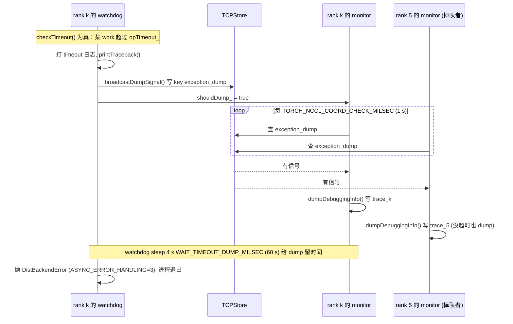

> 本文是[《通信与互联：从 NCCL 到 RDMA》](/communication-and-interconnect-for-ai-infra.html)系列的第 6 篇（共八篇）。上一篇：[PyTorch 的通信栈：ProcessGroupNCCL、stream 语义与计算通信重叠](/pytorch-communication-stack-processgroupnccl-and-streams.html)　下一篇：[推理侧的通信：custom all-reduce 与 KV 传输](/inference-communication-custom-all-reduce-and-kv-transfer.html)

前五篇建立了一条完整的因果链：第一篇的 α-β 模型给出一次集合通信的理论时间，第二、三篇给出链路能提供的 β 和 α，第四篇讲 NCCL 如何在探测到的拓扑上选 ring/tree、channel 数、算法与协议去逼近这个上限，第五篇讲 ProcessGroupNCCL 如何把 NCCL kernel 放到自己的 stream 上、watchdog 如何盯着每一个 `WorkNCCL`。这条链上每一环都可能出错，而错误的表现只有三种：**慢**、**卡**、**结果不对**。本篇的任务是把前五篇变成一套可操作的方法——面对这三种现象，先测什么、先看什么、先改什么。

性能这一半的核心工具是 nccl-tests。它做的事情很简单：对一组消息大小依次调用同一个集合通信原语，报告时间、algbw 和 busbw。但这条曲线包含的信息远比"峰值多少 GB/s"多：小消息端的平台高度是 α，大消息端的平台高度是 β，拐点位置是二者之比，中段的每一次台阶都是算法或协议的切换点。学会读这条曲线，再配合 `NCCL_DEBUG=INFO` 里的几行决策日志，绝大多数"通信慢"的问题都能在一小时内定位到某一层。

正确性这一半的核心问题是 hang。集合通信有一个和普通 RPC 完全不同的失败模式：它没有"对端拒绝"或"连接断开"这样的即时错误，一个 rank 少调用一次 all_reduce、或者用了不同大小的 tensor，其他所有 rank 只会在 GPU 上安静地自旋等待，直到 watchdog 的 timeout 到期。到那时每个 rank 的日志都停在同一个地方，看起来所有人都有责任，而实际上只有一个 rank 掉队了。找到它需要把所有 rank 最近的集合通信记录按序号对齐——这正是 PyTorch Flight Recorder 做的事，NCCL 2.24 之后自带的 RAS 子系统提供了另一种视角。

本篇要回答总纲提出的核心问题：

> **一个 64 卡训练任务在第 3000 步 hang 住，所有 rank 的日志都停在 all_reduce。是谁的问题、是哪一次 all_reduce、为什么会等到 timeout 才暴露？**

依照系列惯例，本文的性能数字要么是可推导的理论值，要么是公开标称值，要么是"通常能达到"的区间，全部明确标注为非实测；曲线形状是典型形状，不是某台机器的测量结果。源码以 NCCL 2.28.9、nccl-tests 2.18.3 与 PyTorch 2.12（v2.12.0）为准；`TORCH_NCCL_*` 环境变量的默认值随版本变过，正文只标注 PyTorch 2.12 源码里的默认值，读者以自己手上的版本为准。


## 一、总览：从现象到层级的排障框架

### 1. 两半、三种现象、一张层级图

一次 `dist.all_reduce` 从 Python 到线路要穿过六层，每一层都有自己的观测手段和典型故障：

```text
层                    典型故障                          观测手段
─────────────────────────────────────────────────────────────────────────────────
框架 (c10d)           调用不一致 · 小消息没合并 ·        Flight Recorder · py-spy ·
                      stream 依赖错 · .item() 打断重叠    torch.profiler · TORCH_NCCL_DESYNC_DEBUG
─────────────────────────────────────────────────────────────────────────────────
NCCL 决策层           算法/协议选错 · channel 太少 ·      NCCL_DEBUG=INFO SUBSYS=GRAPH,TUNING ·
(graph/tuning)        拓扑探测错                          NCCL_TOPO_DUMP_FILE · NCCL_GRAPH_DUMP_FILE
─────────────────────────────────────────────────────────────────────────────────
NCCL transport        P2P 没走 NVLink · GDR 没开 ·         NCCL_DEBUG=INFO 里的 "via P2P/…" "via NET/IB/…/GDRDMA"
(p2p/shm/net)         回落到 Socket                       "GPU Direct RDMA Disabled …"
─────────────────────────────────────────────────────────────────────────────────
设备 kernel           在 flag 上自旋等对端               cuda-gdb · nvidia-smi 看 SM 占用不降
─────────────────────────────────────────────────────────────────────────────────
网络 (IB/RoCE)        网卡亲和错 · PFC/ECN 没配 ·         ibstat · ib_write_bw · 交换机计数器 ·
                      链路降速 · 丢包重传                 NCCL_IB_HCA · dmesg
─────────────────────────────────────────────────────────────────────────────────
硬件 (PCIe/NVLink)    链路降级 · 跨 NUMA · GPU 掉卡       nvidia-smi topo -m · nvidia-smi nvlink -s · lspci -vv
```

三种现象在这张图上的排查方向不同。**慢**从下往上：先确认硬件和网络能提供的上限（第二、三篇的 nvbandwidth 与 `ib_write_bw`），再用 nccl-tests 看 NCCL 拿到了多少，最后看框架侧是否浪费了。**卡**从上往下：先用 Flight Recorder 判断是不是调用不一致，是则到此为止；不是再往下看 rank 是否存活、网络是否断开。**错**几乎只在框架层和数值层：归约顺序、算法差异、stream 竞争、NaN 传播。

### 2. 四段法在本篇的落法

总纲规定的"算一算、看一看、测一测、比一比"在本篇是主线而不是点缀：

- **算一算**：用第一篇的 ring 公式预测 busbw 曲线的形状与拐点，算出"这条曲线应该长什么样"；
- **看一看**：读 `NCCL_DEBUG=INFO` 日志里 transport、算法、协议、channel 的决策，读 `src/misc/param.cc` 和 `src/debug.cc` 弄清环境变量与日志的机制；
- **测一测**：nccl-tests 扫描，nccl-tests 之外还有 py-spy、gdb、Flight Recorder 这些"测卡在哪"的工具；
- **比一比**：实测曲线与预测曲线的每一处偏差都对应一个检查项，本篇第九章把它们整理成决策树。

### 3. 本文的章节安排

```text
二、nccl-tests：怎么测          编译、参数、三种启动方式、输出每一列的含义、测量纪律
三、带宽曲线的读法              两个平台与拐点 · 用 α-β 模型预测拐点 · 三条参考线 · 五种异常形状
四、调优参数：按作用层分类      参数如何被读取 · 算法/协议 · 并行度 · 缓冲 · 路径 · 网络 · Socket · 特殊功能 · 该动/少动/不动
五、日志：NCCL_DEBUG 的三层     级别 · 子系统 · 按 rank 分文件 · 一份 INFO 日志里要找的八行 · RAS
六、hang 的分类与定位工具       六类 hang · py-spy/gdb/cuda-gdb · Flight Recorder 记录什么、怎么 dump、fr_trace.py 怎么对齐
七、timeout 的语义              init_process_group(timeout=) 约束什么 · watchdog 的时钟 · 为什么 checkpoint 卡住会变成 NCCL timeout · 回答核心问题
八、正确性问题                  浮点归约顺序 · 算法差异 · NaN 与 TORCH_NCCL_NAN_CHECK · 多 communicator/多 stream 竞争
九、决策树                      慢 / hang / 错 三棵树的展开版，从现象到检查项到处理方式
十、本文小结                    要点 · 检查项 · 源码位置 · comm-probe 的 sweep.sh 与 hang_lab/
```


## 二、nccl-tests：怎么测

### 1. 编译与二进制

nccl-tests 是 NCCL 官方的性能与正确性测试集，每个集合通信原语一个二进制：`all_reduce_perf`、`all_gather_perf`、`reduce_scatter_perf`、`broadcast_perf`、`reduce_perf`、`alltoall_perf`、`sendrecv_perf`、`scatter_perf`、`gather_perf`、`hypercube_perf`，对应 `src/*.cu` 里的同名文件；公共逻辑（参数解析、buffer 分配、计时、输出）在 `src/common.cu` 与 `src/util.cu`，数据校验的生成与比对在 `verifiable/verifiable.cu`。二进制启动时会打一行 `# nccl-tests version 2.18.3 nccl-headers=<编译时 NCCL 版本码> nccl-library=<运行时 NCCL 版本码>`（`src/util.cu`，版本号来自 `src/common.h` 的 `NCCL_TESTS_VERSION`）。

编译分两种。不带 MPI 只能单进程：

```bash
make -j CUDA_HOME=/usr/local/cuda NCCL_HOME=/path/to/nccl
```

带 MPI 才能多进程、多机（README 明确说明多进程数由 MPI 管理，不作为参数传入）：

```bash
make -j MPI=1 MPI_HOME=/path/to/openmpi CUDA_HOME=/usr/local/cuda NCCL_HOME=/path/to/nccl
```

`NCCL_HOME` 决定链接哪个 `libnccl.so`。运行时 `LD_LIBRARY_PATH` 若指向另一个版本，测出来的是另一个版本的数字——排障时第一件事是 `ldd ./build/all_reduce_perf | grep nccl` 确认实际加载的库，并核对 nccl-tests 开头那行 `nccl-headers=… nccl-library=…` 与 NCCL 日志里的 `NCCL version 2.x.y`。

### 2. 参数

`src/common.cu` 的 `getopt_long` 表定义了全部参数（默认值见同文件开头的全局变量与 README 的 Arguments 一节），常用的这些：

```text
-b, --minbytes        起始消息大小（可带 K/M/G 后缀，按 1024 进位；默认 32M）
-e, --maxbytes        结束消息大小（默认 32M）
-f, --stepfactor      每步乘以的因子（-f 2 即翻倍扫描）
-i, --stepbytes       每步加的字节数（与 -f 二选一；默认 1M）
-g, --ngpus           每个线程（进程）管几张 GPU
-t, --nthreads        每进程几个线程（每线程再管 -g 张卡；单机不用 MPI 时通常 -t 1 -g 8）
-n, --iters           每个消息大小计时迭代次数（默认 20）
-w, --warmup_iters    预热迭代次数（默认 1，几乎总要手动加大）
-m, --agg_iters       每次迭代聚合几个操作（ncclGroupStart/End 包起来；默认 1）
-N, --run_cycles      整个扫描重复几轮并逐轮打印（默认 1；0 无限）
-c, --check           校验迭代次数；-c 0 关闭校验（默认 1，即校验一次）
-o, --op              归约算子：sum/prod/min/max/avg/mulsum/all
-d, --datatype        数据类型：int8/uint8/int32/uint32/int64/uint64/half/float/double/bfloat16/…/all
-r, --root            broadcast/reduce 的 root
-z, --blocking        0 不阻塞（默认，计时后再同步）；1 每次调用后 wait + barrier；2 每次调用后 wait 但不 barrier
-a, --average         多进程时报告哪个时间：0=rank0 / 1=平均（默认）/ 2=最小 / 3=最大
-G, --cudagraph       把 -n 次迭代捕获进 CUDA Graph 再 launch <num> 次，去掉 CPU 侧 launch 开销
-R, --local_register  1 本地注册 send/recv buffer；2 对称注册（NCCL 2.27+ 的 symmetric memory 路径）
-x, --cta_policy      0/1/2 设置 NCCL_CTA_POLICY（NCCL 2.27+；2 需 2.28+）
-C, --report_cputime  1 时报告 CPU 侧时间而不是 GPU 侧延迟
-S, --report_timestamps  每行结果加时间戳
-J, --output_file     结果写 JSON
-T, --timeout         秒；超过则报错退出，而不是永远 hang
-p, --parallel_init   1 时用多线程并行初始化 communicator
-M, --memory_report   1 时结尾打印显存占用报告
-u, --unalign         把 send/recv buffer 故意偏移若干元素，测非对齐路径
```

总 rank 数等于 进程数 × `-t` × `-g`。`-g 8` 单进程管 8 卡是最简单的节点内测试；多机则每进程一卡 `-g 1`，让 MPI 起 8 × 节点数个进程。nccl-tests 2.18.3 的结果表里**没有**算法/协议/channel 数这几列；要知道第四篇讲的"NCCL 为这个消息大小选了什么"，用 `NCCL_DEBUG=INFO NCCL_DEBUG_SUBSYS=TUNING` 让 rank 0 在每次调用时打一行 `AllReduce: N Bytes -> Algo Ring proto LL128 channel{Lo..Hi}={0..15}`（NCCL `src/enqueue.cc`），再与结果表按消息大小对照。

### 3. 三种启动方式

单机不用 MPI：

```bash
./build/all_reduce_perf -b 8 -e 8G -f 2 -g 8 -n 50 -w 10 -c 0
```

多机用 mpirun（`-N 8` 每节点 8 进程，`-np` 总进程数；`-x` 把环境变量传过去）：

```bash
mpirun -np 16 -N 8 --hostfile hosts \
  -x NCCL_DEBUG=INFO -x NCCL_IB_HCA=mlx5_0,mlx5_1,mlx5_2,mlx5_3,mlx5_4,mlx5_5,mlx5_6,mlx5_7 \
  -x NCCL_SOCKET_IFNAME=eth0 -x LD_LIBRARY_PATH \
  ./build/all_reduce_perf -b 8 -e 8G -f 2 -g 1 -n 50 -w 10 -c 0
```

`src/common.cu` 的 `run()` 里可以看到 MPI 只用来做几件事：`MPI_Comm_rank/size` 确定 rank、`MPI_Comm_split` 按 `NCCL_TESTS_SPLIT` 的 color 分组、`MPI_Bcast` 分发 `ncclUniqueId`、结果汇总（`Allreduce()` 里的 `MPI_Allreduce` 取时间的平均/最小/最大，以及错误数求和）。数据路径与 MPI 无关，所以 Slurm 下 `srun --mpi=pmix` 也可以。`localRank` 由 hostname 的哈希（`MPI_Allgather` 收集 `hostHashs`）算出，用它选 GPU；`NCCL_TESTS_DEVICE` 可以覆盖起始 GPU 编号。

nccl-tests 本身**没有 torchrun 模式**。但很多集群没有 MPI，只有 PyTorch，这时等价的做法是一个几十行的 PyTorch 脚本在 torchrun 下做同样的扫描——第十章的 `sweep.sh` 附带了这个脚本（`torch_sweep.py`）。要注意它测的是"经过 ProcessGroupNCCL 的 NCCL"，多了第五篇讲的 event 记录、watchdog 与 stream 切换的开销，小消息端会比 nccl-tests 高几微秒，大消息端应当一致；如果大消息端也差很多，说明框架侧有问题（比如 `TORCH_NCCL_HIGH_PRIORITY`、stream 优先级、或者 tensor 不连续触发了拷贝）。

### 4. 输出的每一列

一次扫描的输出长这样（`src/util.cu` 的 `writeResultHeader` 决定列名，`writeResultFooter` 打结尾三行）：

```text
# nccl-tests version 2.18.3 nccl-headers=22809 nccl-library=22809
# Using devices
#  Rank  0 Group  0 Pid  12345 on   hostname device  0 [0000:1a:00.0] NVIDIA H100 80GB HBM3
   ...
#
#                                                              out-of-place                       in-place
#       size         count      type   redop    root     time   algbw   busbw #wrong     time   algbw   busbw #wrong
#        (B)    (elements)                               (us)  (GB/s)  (GB/s)            (us)  (GB/s)  (GB/s)
           8             2     float     sum      -1    xx.xx    0.00    0.00      0    xx.xx    0.00    0.00      0
   ...
  1073741824     268435456     float     sum      -1  xxxx.x   xxx.x   xxx.x      0  xxxx.x   xxx.x   xxx.x      0
# Out of bounds values : 0 OK
# Avg bus bandwidth    : xxx.xx
#
# Collective test concluded: all_reduce_perf
```

- `size` 是字节，`count` 是元素数；
- `time` 是 `-n` 次迭代的平均单次时间（微秒），多进程时按 `-a` 取 rank 0 / 平均 / 最小 / 最大；
- `algbw` = size / time，`busbw` = algbw × 校正系数，系数在每个 `src/*.cu` 的 `*GetBw` 里：`AllReduceGetBw` 乘 $$\frac{2(n-1)}{n}$$，`AllGatherGetBw`、`ReduceScatterGetBw`、`AlltoAllGetBw` 乘 $$\frac{n-1}{n}$$，`BroadcastGetBw`、`SendRecvGetBw` 乘 1；
- `#wrong` 是校验发现的错误元素数，`-c 0` 时为 0 且不做校验；
- out-of-place 与 in-place 是 send/recv buffer 不同与相同两种情况，正常两组数字接近；
- 最后的 `Avg bus bandwidth` 是所有大小、out-of-place 与 in-place 两组 busbw 的算术平均（`common.cu` 里每打一行结果就 `bw[0] += busBw; bw_count[0]++`），只是一个粗略的回归比较值，不能当峰值用；`NCCL_TESTS_MIN_BW` 环境变量设一个 GB/s 阈值，平均值低于阈值的 90% 时该行标 `FAILED` 并返回非零退出码，用于 CI 验收。

busbw 是唯一能与硬件带宽直接比较的数字，理由第一篇讲过：ring all_reduce 每个 rank 实际收发 $$\frac{2(n-1)}{n}S$$ 字节，busbw 就是这个流量除以时间，也就是"链路实际被驱动到了多少"。

### 5. 测量的纪律

几条不遵守就得不到可比数字的规则：

- **预热要够**：`-w` 至少 5～10 次（默认只有 1 次）。第一次调用触发 kernel 加载、connection 建立、buffer 注册，可能是稳态的几十倍；
- **迭代要够、又不能过长**：小消息 `-n 100`，大消息 `-n 20` 已足够；8 GB 消息 100 次迭代要跑几分钟；
- **校验单独跑**：`-c 1`（默认）会在每个大小上、计时迭代之外额外跑一次带校验的迭代，并用 `ncclVerifiableVerify` kernel 在 GPU 上与预期值比对，不影响计时数字但拖慢整体；性能扫描用 `-c 0`，正确性检查再用 `-c 1 -o all -d all`；
- **控制干扰**：其他 GPU 任务、其他网络流量、CPU 频率策略都会影响小消息端；多机测试前先各节点跑一遍单机基线；
- **固定并记录环境**：NCCL 版本、`NCCL_*` 环境变量、驱动、固件、`nvidia-smi topo -m` 的输出与结果一起存档，否则三个月后无法解释两条曲线为什么不同；
- **加 `-T`**：多机测试加 `-T 600`，网络有问题时得到一个错误而不是一个永远不退出的进程。


## 三、带宽曲线的读法

### 1. 横轴、纵轴、两个平台与拐点

把 `size` 取对数作横轴、`busbw` 作纵轴，一条健康的 all_reduce 曲线是一个 S 形：

```text
busbw
  ▲
  │                                            ┌──────────────  带宽平台：≈ β_eff
  │                                        ┌───┘
  │                                    ┌───┘
  │                                ┌───┘  ← 拐点区：α 项与 β 项相当
  │                            ┌───┘
  │                        ┌───┘
  │                    ┌───┘
  │              ┌─────┘
  │  ────────────┘  ← 延迟平台：busbw ∝ S，斜率 45°（对数坐标下），高度由 α 决定
  └────────────────────────────────────────────────────────────▶ size (log)
     8B    1K    32K   1M    4M   16M   64M  256M  1G   8G
```

左端 busbw 随 S 线性增长——因为时间几乎不变（被 α 主导），busbw = 常数系数 × S / T。在对数坐标下这是一条 45° 斜线，它的**纵向位置**由 α 决定：同样 1 MB 的消息，α 从 10 µs 变到 20 µs，这段曲线整体下移一半。看小消息端时应该直接看 `time` 列而不是 `busbw` 列：8 字节 all_reduce 的 time 就是这套系统的 α 下限（kernel 启动 + 一轮握手）。

右端 busbw 趋于平台——时间被 S/β 主导，busbw 趋于链路的有效带宽 β_eff。平台高度与硬件标称值的比值就是"效率"，通常能达到的区间在 80～95%。

中间是拐点区。第一篇定义了拐点：α 项与 β 项相等的消息大小。对 ring all_reduce：

$$
2(n-1)\,\alpha = \frac{2(n-1)}{n}\cdot\frac{S}{\beta} \quad\Longrightarrow\quad S_{\text{knee}} = n\,\alpha\,\beta
$$

在 $$S_{\text{knee}}$$ 处 busbw 恰好是平台的一半；要到平台的 90%，带宽项须是延迟项的 9 倍，即 $$S \approx 9\,S_{\text{knee}}$$。

### 2. 用 α-β 模型预测拐点

代入典型值（非实测；α 取"每步有效延迟"，含 kernel 内同步与协议握手）：

```text
场景                       n     α (每步)   β (每 GPU 单向可达)    S_knee = n·α·β    90% 平台 ≈ 9·S_knee
8×H100 NVSwitch 节点内      8     ~3 µs      ~400 GB/s              ~10 MB            ~90 MB
8×A100 NVSwitch 节点内      8     ~3 µs      ~270 GB/s              ~6.5 MB           ~60 MB
2 节点 ×8，NDR 400 每 GPU   16    ~10 µs     ~45 GB/s               ~7 MB             ~65 MB
8 节点 ×8，NDR 400 每 GPU   64    ~10 µs     ~45 GB/s               ~29 MB            ~260 MB
```

这解释了几个常见的观察：为什么 8 卡节点内要到 64～128 MB 才接近平台；为什么 64 卡跨机的曲线在 256 MB 以下都"看起来没跑满"；为什么 DDP 默认 25 MB 的 bucket 在单机 8 卡上刚过拐点、在 64 卡上还在爬坡（这是为什么大规模下 NCCL 会为中等消息选 Tree——把 $$2(n-1)$$ 步的延迟项换成 $$2\log_2 n$$ 步）。

把这些预测线叠在实测曲线上，就是第十章 `sweep.sh` 画的图。预测与实测的三种偏差各有含义：**平台低**是 β 的问题（路径、GDR、channel）；**左端整体偏低**（小消息 time 偏大）是 α 的问题（协议、跨 NUMA、proxy）；**中段偏离**是算法/协议切换的问题。下图用 ring 模型把三种偏差画在同一张对数坐标图上（8×H100 的典型参数，非实测）——α 的问题只动左半段，β 的问题只动右半段，切换点的问题只在拐点附近出现：


### 3. 三条参考线

下面是三种典型环境的 all_reduce busbw 曲线应有的样子。数字全部是"通常能达到"的区间，非实测；读者的机器落在区间内即为正常。

```text
环境                          8 B time      1 MB busbw      64 MB busbw       ≥1 GB busbw (平台)     平台对应的硬件上限
────────────────────────────────────────────────────────────────────────────────────────────────────────────────────
8×H100 SXM + NVSwitch         10–20 µs      40–80 GB/s      250–400 GB/s      350–480 GB/s           NVLink 900 GB/s 双向合计
                                                                                                     = 450 GB/s 单向
8×A100 SXM + NVSwitch         12–25 µs      30–60 GB/s      150–230 GB/s      220–280 GB/s           NVLink 600 GB/s 双向合计
                                                                                                     = 300 GB/s 单向
8×GPU 仅 PCIe 4.0（无 NVLink） 20–40 µs      5–10 GB/s       10–20 GB/s        10–25 GB/s             PCIe 4.0 x16 单向 32 GB/s，
                                                                                                     多卡共享上游、经 CPU 更低
2 节点 ×8 H100，NDR 每 GPU     25–45 µs      15–25 GB/s      35–45 GB/s        40–48 GB/s             NDR 400 Gb/s = 50 GB/s 单向
2 节点 ×8 H100，HDR 每 GPU     25–45 µs      10–18 GB/s      18–23 GB/s        20–24 GB/s             HDR 200 Gb/s = 25 GB/s 单向
2 节点 ×8，每节点只有 1 张 NDR  30–50 µs      3–5 GB/s        5–6 GB/s          5–6.2 GB/s             50 GB/s 被 8 张 GPU 分摊
```

三点说明：

- H100 NVSwitch 上 busbw 可以**超过** 450 GB/s 的单向标称值。原因是 busbw 的校正系数 $$\frac{2(n-1)}{n}$$ 假设的是 ring 的流量模式；开启 NVLS 后归约在 NVSwitch 内完成，步数从 $$2(n-1)$$ 降到常数，完成时间比 ring 模型预估的短（每卡发 S 收 S，字节量并不比 ring 少），按 ring 系数从时间反算 busbw 就会"超标"。看到 busbw 高于单向链路上限不是测错了，而是说明 NVLS 生效了；反过来如果 H100 节点上平台只有 300 GB/s 上下，先查 `NCCL_NVLS_ENABLE` 与 `NCCL_DEBUG=INFO` 里 "NVLS multicast support is available" 那一行。
- 跨机曲线的平台由每 GPU 的网卡决定，而不是由 NVLink 决定。8 卡节点每 GPU 一张 400 Gb/s 网卡，all_reduce busbw 上限 50 GB/s；这是节点内 NVLink 平台的 1/8～1/10。多机训练的通信账几乎全部记在这一条线上。
- PCIe-only 机器的曲线不但平台低，而且形状可能不单调：跨 CPU socket 的 GPU 对经 UPI/QPI 通信，channel 数与 ring 走向对结果影响大；这类机器上 `NCCL_P2P_LEVEL` 与 `NCCL_SHM_DISABLE` 才是真正需要试的参数。

### 4. 从 nccl-tests 到训练

nccl-tests 给出的是"这台机器、这个 NCCL、这个消息大小"的上限。训练时实际拿到的通常更低，差距来自三处：计算 kernel 与通信 kernel 争 SM（第五篇）；框架把 buffer 切成了比拐点小的块；多个 communicator（DP、TP、PP 各一个）的流量叠加在同一条链路上。所以 nccl-tests 的正确用法是**基线**：它排除框架因素后告诉你硬件加 NCCL 能到哪里；训练 profiler 里的通信 kernel 时长与它比，差距就是框架侧要解释的部分。

### 5. 常见异常形状与原因

```text
形状                                  最可能的原因                                    先查什么
──────────────────────────────────────────────────────────────────────────────────────────────────────────────
大消息平台远低于参考线                 链路没走对（P2P 没走 NVLink、走了 SHM 或 CPU）    NCCL_DEBUG=INFO 里 "via P2P/…" 还是 "via SHM/…"
（节点内）                            channel 太少                                   "Connected all rings" 附近的 channel 数；TUNING 日志的 channel{Lo..Hi}
                                      NVLink 链路降级 / 掉线                          nvidia-smi nvlink -s；nvidia-smi topo -m
──────────────────────────────────────────────────────────────────────────────────────────────────────────────
大消息平台远低于参考线                 GDR 没开（数据经 host 内存中转）                  "GPU Direct RDMA Disabled for GPU … (distance N > M)"
（跨机）                              网卡亲和错：GPU 用了跨 NUMA/跨 PCIe switch 的网卡  "via NET/IB/<dev>" 里的 dev 与 topo -m 对照
                                      NCCL_IB_HCA 没限定，混入了管理网口或不同链路类型    "NET/IB : Using [0]mlx5_…" 那一行列了哪些设备
                                      回落到 Socket                                   "Using network Socket" 而不是 "Using network IB"
                                      RoCE 没配 PFC/ECN，丢包重传                       交换机计数器、ibstat 的 port_rcv_errors
                                      链路协商在低速率                                 ibstat 的 Rate 字段
──────────────────────────────────────────────────────────────────────────────────────────────────────────────
小消息 time 明显偏高                   协议选错（LL/LL128 被禁用，小消息走了 Simple）     TUNING 日志的 proto；NCCL_PROTO 是否被设置
（左端整体下移）                       跨 NUMA：进程绑核与 GPU/网卡不在同一 NUMA          numactl -H；进程的 CPU 亲和
                                      proxy 线程被抢占（CPU 被计算线程占满）             top 看 NCCL proxy 线程；预留 CPU 核
                                      框架没合并小消息（不是 nccl-tests 的问题）         训练侧 profiler 看通信 kernel 的大小分布
──────────────────────────────────────────────────────────────────────────────────────────────────────────────
中段有凹陷或台阶                       算法/协议切换点选得不好                           NCCL_DEBUG_SUBSYS=TUNING 看切换发生在哪个大小
                                      channel 数随消息大小变化                          同上，看 channel{Lo..Hi}
                                      不是问题：Tree→Ring、LL128→Simple 的切换本身      切换处小幅不平滑是正常的
                                      就有几个百分点的不连续
──────────────────────────────────────────────────────────────────────────────────────────────────────────────
多机远差于 (单机 / 节点数)             以上跨机各项之外：每节点网卡数 < GPU 数              数一下 "NET/IB : Using" 里的设备数
                                      NCCL_CROSS_NIC 配置与拓扑不匹配                    换 0/1/2 试
──────────────────────────────────────────────────────────────────────────────────────────────────────────────
曲线抖动、in-place 与 out-of-place 差很多  其他任务干扰；GPU 降频；buffer 未对齐         nvidia-smi -q -d CLOCK；-u 参数是否设置
```


## 四、调优参数：按作用层分类

### 1. 参数怎么被读取

NCCL 的环境变量绝大多数经 `NCCL_PARAM` 宏定义（`src/include/param.h`）：

```cpp
// src/include/param.h（2.28.9）
#define NCCL_PARAM(name, env, deftVal) \
  int64_t ncclParam##name() { \
    constexpr int64_t uninitialized = INT64_MIN; \
    static int64_t cache = uninitialized; \
    if (__builtin_expect(__atomic_load_n(&cache, __ATOMIC_RELAXED) == uninitialized, false)) { \
      ncclLoadParam("NCCL_" env, deftVal, uninitialized, &cache); \
    } \
    return cache; \
  }
```

三个后果值得记住。第一，值是**整数**（`strtoll`，支持 0x 前缀），且**只读一次**并缓存——进程启动后改环境变量无效，同一进程内两个 communicator 不可能用不同的 `NCCL_BUFFSIZE`。第二，`ncclLoadParam`（`src/misc/param.cc`）在 `NCCL_DEBUG=INFO` 且子系统含 `ENV` 时打印 `"%s set by environment to %lld."`，所以日志开头那一串 "set by environment" 就是本次生效的全部整数参数，排障时先核对这一段。第三，读取经过 `ncclGetEnv`，它先调用 `initEnv`（`src/misc/param.cc`）把 `NCCL_CONF_FILE` 指定的文件（未设时依次读 `~/.nccl.conf`、`/etc/nccl.conf`）里的 `KEY=VALUE` 用 `setenv(..., 0)` 注入——**不覆盖**已有环境变量，所以优先级是 环境变量 > `NCCL_CONF_FILE` > `~/.nccl.conf` > `/etc/nccl.conf` > 代码默认值。2.28 还多了一层 `NCCL_ENV_PLUGIN`（`src/plugin/env.cc`），允许外部插件接管所有环境变量的读取，集群可以用它做统一配置下发。

字符串类参数不走 `NCCL_PARAM`，而是各自 `ncclGetEnv`：`NCCL_ALGO`、`NCCL_PROTO`（`src/graph/tuning.cc`）、`NCCL_IB_HCA`（`src/transport/net_ib.cc`）、`NCCL_SOCKET_IFNAME`（`src/misc/socket.cc`）、`NCCL_NET`、`NCCL_TOPO_DUMP_FILE`（`src/init.cc`）、`NCCL_GRAPH_DUMP_FILE`（`src/graph/search.cc`）、`NCCL_TOPO_FILE`（`src/graph/topo.cc`）。`NCCL_P2P_LEVEL`、`NCCL_P2P_DISABLE`、`NCCL_NET_GDR_LEVEL` 三个走 `src/graph/paths.cc` 的 `ncclGetLevel`，既接受 `LOC/NVL/PIX/PXB/PHB/SYS` 这类路径类型名，也兼容旧式数字。

### 2. 算法与协议：`NCCL_ALGO`、`NCCL_PROTO`

2.28.9 的算法名（`src/init.cc` 的 `ncclAlgoStr`）：`Tree`、`Ring`、`CollNetDirect`、`CollNetChain`、`NVLS`、`NVLSTree`、`PAT`；协议名（`ncclProtoStr`）：`LL`、`LL128`、`Simple`。`src/graph/tuning.cc` 的 `parseList` 支持按原语指定与 `^` 排除：

```text
NCCL_ALGO=Ring                          所有原语只用 Ring
NCCL_ALGO="ring;allreduce:tree"         默认 Ring，all_reduce 用 Tree（分号分隔按原语覆盖）
NCCL_PROTO=^LL128                       禁用 LL128（排查 LL128 在某些 PCIe 拓扑上的正确性问题时用）
NCCL_PROTO="LL,Simple;allreduce:^LL"    全局 LL+Simple，但 all_reduce 不用 LL
```

作用层是第四篇讲的 tuning 决策：NCCL 对每个（原语、算法、协议）组合估算时间，取最小者；设置这两个变量是把某些组合从候选集里删掉。**它们是排障工具，不是调优工具**：怀疑 Tree 在某个消息大小上选错了，用 `NCCL_ALGO=Ring` 跑一遍对照就能确认；确认之后正确的动作是把结论反馈到 tuner plugin（`NCCL_TUNER_PLUGIN`）或升级 NCCL，而不是在生产环境固定一个算法——固定算法会让另一段消息大小变差。

### 3. 并行度：`NCCL_MIN_NCHANNELS`、`NCCL_MAX_NCHANNELS`、`NCCL_NTHREADS`

`NCCL_MIN_NCHANNELS`、`NCCL_MAX_NCHANNELS`（`src/graph/connect.cc`）限定 channel 数的范围，上限是 `MAXCHANNELS` = 64（`src/include/device.h`）。每个 channel 是一个独立的 ring/tree 加一组 CUDA block 加自己的 buffer；channel 多，带宽高（更多 SM、更多并发的 NIC QP），但小消息延迟略增、占用的 SM 更多、与计算 kernel 的争抢更明显。第五篇讨论重叠时讲过：训练里通信 kernel 多占一个 SM 就少一个 SM 给 GEMM。

`NCCL_NTHREADS`（`src/graph/tuning.cc`）是每个 channel 的 CUDA block 线程数，Simple 协议默认 512（`NCCL_SIMPLE_MAX_NTHREADS`），PCIe 带宽受限的拓扑上默认降为 256；LL128 上限 640。它必须是 32 的倍数且在 64～640 之间，几乎没有理由手动设。

这三者是"两种账"冲突最直接的例子：带宽的账要 channel 多，延迟的账和计算重叠的账要 channel 少。nccl-tests 的大消息平台上不去时可以试 `NCCL_MAX_NCHANNELS=32` 看看是否有提升，有则说明拓扑探测给的默认 channel 数偏保守；但在训练里应该用 profiler 验证通信与计算的重叠没有变差再决定。

### 4. 缓冲：`NCCL_BUFFSIZE`

`NCCL_BUFFSIZE`（`src/init.cc`）是每个 channel 每个方向的 Simple 协议 buffer，默认 `DEFAULT_BUFFSIZE` = 4 MiB，分成 `NCCL_STEPS` 个 slot 做流水。它决定了跨机传输的每一步在途字节数：跨机 α ≈ 10 µs、β = 50 GB/s 时，一个 4 MiB 的 buffer 分 8 步、每步 512 KB，在途数据 512 KB / 50 GB/s ≈ 10 µs，刚好覆盖一步的延迟。长距离（跨机房、高延迟 RoCE）链路上带宽平台上不去、且 `ib_write_bw` 正常，可以试 8 MiB 或 16 MiB；节点内 NVLink 上改它几乎没有效果。`NCCL_LL_BUFFSIZE`、`NCCL_LL128_BUFFSIZE` 同理但更少需要动。

### 5. 路径选择：`NCCL_P2P_LEVEL`、`NCCL_P2P_DISABLE`、`NCCL_SHM_DISABLE`、`NCCL_NET_GDR_LEVEL`

这组变量作用在第四篇讲的 transport 选择上，取值是第二篇讲的 `nvidia-smi topo -m` 里那套路径类型（`src/graph/topo.cc` 的 `topoPathTypeStr`：`LOC NVL NVB C2C PIX PXB P2C PXN PHB SYS NET DIS`）：

- `NCCL_P2P_LEVEL`：两张 GPU 距离不超过这个级别才用 CUDA P2P（NVLink 或 PCIe 直通），否则走 SHM。默认 `PXB`（`src/graph/paths.cc` 的 `p2pLevel = PATH_PXB`），即同一 PCIe switch 下允许，跨 CPU（PHB、SYS）不允许——因为跨 CPU 的 P2P 在很多平台上比经 host 内存中转还慢。`NCCL_P2P_DISABLE=1` 等价于 `NCCL_P2P_LEVEL=LOC`。
- `NCCL_SHM_DISABLE=1`（`src/transport/shm.cc`）禁用共享内存传输，两张不能 P2P 的 GPU 会被迫走网络（哪怕在同一台机器上）。只在怀疑 SHM 路径有 bug 时用。
- `NCCL_NET_GDR_LEVEL`：GPU 与网卡距离不超过这个级别才启用 GPUDirect RDMA，默认也是 `PXB`（`netGdrLevel = PATH_PXB`）。GPU 和网卡跨了 CPU 时默认关 GDR，日志里出现 `GPU Direct RDMA Disabled for GPU x / HCA y (distance N > M)`，数据经 host 内存中转，跨机 busbw 掉到 PCIe/内存拷贝的水平。**正确的修法是让 GPU 用对的网卡**（拓扑亲和、`NCCL_IB_HCA`），而不是把 level 放宽到 `SYS`——放宽后 GDR 跨 CPU 通常比不开还慢。

### 6. 网络：`NCCL_IB_HCA`、`NCCL_IB_GID_INDEX`、`NCCL_IB_TC`、`NCCL_IB_QPS_PER_CONNECTION`、`NCCL_IB_SPLIT_DATA_ON_QPS`

全部在 `src/transport/net_ib.cc`：

- `NCCL_IB_HCA`：限定 NCCL 使用的 IB 设备与端口，逗号分隔，`mlx5_0:1` 形式指定端口；前缀 `^` 排除、`=` 精确匹配（否则是前缀匹配，`mlx5_1` 会同时匹配 `mlx5_1` 和 `mlx5_10`）。生产环境**应当显式设置**：不设时 NCCL 会枚举所有 `ibv_get_device_list` 返回的设备，包括存储网、管理网上的 RoCE 网卡，出现 `Attempted to merge incompatible devices … Try selecting NICs of only one link type using NCCL_IB_HCA` 的告警或直接把流量分到慢网卡上。
- `NCCL_IB_GID_INDEX`：RoCE v2 必须指定正确的 GID index（对应 RoCE v2 + IPv4 的那一项，`show_gids` 可查）；IB 上不需要。设错的症状是 QP 建立失败或跨机完全不通。2.28 里默认 -1 表示自动选择，多数 rdma-core 版本能选对，但混合 v1/v2 的环境仍需手动。
- `NCCL_IB_TC`：Traffic Class，RoCE 上用于把 NCCL 流量映射到配置了 PFC/ECN 的优先级队列（常见值 106 对应 DSCP 26），必须与交换机配置一致；IB 上一般不用。`NCCL_IB_SL` 是 IB 上的对应物。
- `NCCL_IB_QPS_PER_CONNECTION`（默认 1）：每个连接开几条 QP。多条 QP 在有多路径（ECMP）的以太网 fabric 上可以把一条流打散到多条链路，缓解哈希冲突；`NCCL_IB_SPLIT_DATA_ON_QPS`（默认 0）决定是把每个消息切开分到各 QP（1）还是各消息轮转（0）。IB fabric 有自适应路由时不需要；RoCE 上遇到多机带宽不稳、且交换机侧看到链路利用不均时试 2 或 4。
- 同文件里还有 `NCCL_IB_TIMEOUT`（默认 20）、`NCCL_IB_RETRY_CNT`（默认 7）、`NCCL_IB_AR_THRESHOLD`、`NCCL_IB_PCI_RELAXED_ORDERING`、`NCCL_IB_ROCE_VERSION_NUM`、`NCCL_IB_MERGE_NICS`；除 timeout 在大规模 RoCE 上偶尔需要调大之外，其余按默认。

### 7. Socket 与 bootstrap：`NCCL_SOCKET_IFNAME`、`NCCL_SOCKET_NTHREADS`、`NCCL_NSOCKS_PERTHREAD`

`NCCL_SOCKET_IFNAME`（`src/misc/socket.cc` 的 `ncclFindInterfaces`）指定 bootstrap（交换 `ncclUniqueId` 之后建立 out-of-band 连接）以及 Socket transport 用的网口，支持前缀匹配与 `^` 排除。设错的典型症状是初始化 hang 在 bootstrap 阶段（`NCCL_DEBUG=INFO` 停在 `Bootstrap: Using <ifname>` 之后不动）或者选中了 docker0 之类不可路由的接口。它**不影响** IB 数据路径的选择——那是 `NCCL_IB_HCA` 的事。

`NCCL_SOCKET_NTHREADS`、`NCCL_NSOCKS_PERTHREAD`（`src/transport/net_socket.cc`）只在数据走 Socket transport 时有意义：多线程多 socket 才能把 TCP 推到接近线速。如果你在 IB/RoCE 集群上发现自己需要调它们，说明数据根本没走 RDMA，先回去看 "Using network" 那一行。

### 8. 特殊功能：`NCCL_CROSS_NIC`、`NCCL_NVLS_ENABLE`、`NCCL_COLLNET_ENABLE`

- `NCCL_CROSS_NIC`（`src/graph/search.cc`，默认 2）：ring 跨机时是否允许从一张网卡出、另一张网卡进。0 强制同网卡（rail-optimized 网络，即每张网卡接到独立的 leaf 交换机时应设 0）；1 允许；2 让 NCCL 按拓扑决定。设错在 rail 网络上会让流量跨 spine，多机 busbw 下降且不稳定。
- `NCCL_NVLS_ENABLE`（`src/transport/nvls.cc`，默认 2 = 自动）：Hopper 及之后 + NVSwitch 上启用 NVLink SHARP（多播归约）。如果第三节看到 H100 平台明显低于 400 GB/s，日志里没有 `NVLS multicast support is available`，检查驱动版本与 Fabric Manager。
- `NCCL_COLLNET_ENABLE`（`src/init.cc`）：启用 SHARP（IB 交换机内归约）之类的 CollNet 插件，需要网络侧支持与 `NCCL_NET_PLUGIN`；一般集群不具备，保持默认。

### 9. 该动、少动、几乎不动

```text
类别            参数                                              理由
──────────────────────────────────────────────────────────────────────────────────────────────────────────────
生产环境应显式   NCCL_IB_HCA                                       不设会枚举所有 RDMA 设备，混入慢网卡
设置的           NCCL_SOCKET_IFNAME                                bootstrap 选错网口是初始化 hang 的第一原因
                NCCL_IB_GID_INDEX（RoCE v2）                       自动选择不总是对
                NCCL_IB_TC / NCCL_IB_SL（RoCE 有 PFC/ECN 时）        流量必须落在配了无损的队列里
                NCCL_DEBUG=WARN（生产）/ INFO（排障）               见第五章
                NCCL_DEBUG_FILE（多机排障时）                        不然 64 个进程的日志混在一起
──────────────────────────────────────────────────────────────────────────────────────────────────────────────
排障时用来对照   NCCL_ALGO / NCCL_PROTO                            确认某个算法/协议是否是问题源；确认后不要留在生产配置里
的（跑完就撤）   NCCL_P2P_DISABLE / NCCL_SHM_DISABLE / NCCL_P2P_LEVEL  确认路径选择是否是问题源
                NCCL_NET_GDR_LEVEL                                确认 GDR 是否是问题源；修法是改亲和不是放宽 level
                NCCL_MIN/MAX_NCHANNELS                            确认 channel 数是否偏保守；训练里要验证重叠
                NCCL_CROSS_NIC                                    rail 网络上试 0
                NCCL_IB_QPS_PER_CONNECTION                        RoCE ECMP 不均时试 2/4
──────────────────────────────────────────────────────────────────────────────────────────────────────────────
几乎永远不该动   NCCL_NTHREADS / NCCL_LL128_NTHREADS               默认值是按拓扑算的
                NCCL_BUFFSIZE / NCCL_LL_BUFFSIZE                  只有高延迟长链路才需要
                NCCL_IB_TIMEOUT / NCCL_IB_RETRY_CNT               调大只是把"报错"变成"更久的 hang"
                NCCL_NVLS_ENABLE / NCCL_COLLNET_ENABLE            让 NCCL 自动判断；设 0 只用于验证它是不是 bug 源
                NCCL_TOPO_FILE                                    手写拓扑文件只用于虚拟机里探测不到拓扑的情形
```

一条总原则：**每个改动都要用 nccl-tests 的前后两条曲线证明**，并且要看整条曲线而不是一个点。把 `NCCL_ALGO=Ring` 写进生产配置的团队，通常是三年前在某台机器上的某个消息大小上看到过 5% 的提升。


## 五、日志：NCCL_DEBUG 的三层

### 1. 级别

`src/debug.cc` 的 `ncclDebugInit` 解析 `NCCL_DEBUG`，接受（不区分大小写）`VERSION`、`WARN`、`INFO`、`ABORT`、`TRACE`：

- 未设置：什么都不打，连版本都不打。
- `VERSION`：只打一行 `NCCL version 2.28.9+cuda12.x`。
- `WARN`：只打 `WARN` 级别——错误与异常路径。**生产默认应当是 WARN**：开销可忽略，而 hang 或性能问题时那一行 `NCCL WARN` 往往就是答案（`Cuda failure`、`Got completion from peer … with error 12`、`Attempted to merge incompatible devices`、`socket … Connection reset`）。
- `INFO`：加上初始化阶段的全部决策——拓扑、ring/tree、transport、算法协议表、环境变量。这是排性能问题的级别。它在初始化时打几百到几千行，稳态时几乎不打（除非 `NCCL_DEBUG_SUBSYS` 含 `COLL`），所以排障期开着它是可以接受的。
- `ABORT`：在第一个 WARN 处 abort 进程，得到 core dump。
- `TRACE`：每一次 API 调用与内部步骤。注意 `src/include/debug.h` 里 `TRACE(...)` 宏只在编译时带 `-DENABLE_TRACE`（`make TRACE=1`）才有实体，发行版二进制里 `NCCL_DEBUG=TRACE` 只多出 `TRACE_CALL` 那一类 `NCCL CALL ncclAllReduce(...)` 的 API 调用记录，其余与 INFO 相同。

`NCCL_WARN_ENABLE_DEBUG_INFO=1` 是一个有用的组合：平时按 WARN 运行，一旦出现 WARN 就把级别提到 INFO，之后的日志会带上更多上下文。

每行日志的格式（`ncclDebugLog`）：`<hostname>:<pid>:<tid> [<cudaDev>] NCCL INFO ...`，WARN 行多出 `<file>:<line>`。多机排障时用 `<hostname>:<pid>` 定位到 rank，用 `[<cudaDev>]` 定位到卡。

### 2. 子系统：`NCCL_DEBUG_SUBSYS`

`INFO` 默认只开 `INIT`、`BOOTSTRAP`、`ENV` 三个子系统（`ncclDebugInit` 里的 `tempNcclDebugMask`）。`NCCL_DEBUG_SUBSYS` 用逗号分隔选择，`^` 前缀取反。2.28.9 的完整列表：

```text
INIT       初始化流程、communicator 创建、"Connected all rings/trees"
COLL       每一次集合通信调用：opCount、buffer、count、datatype、op、comm、stream（稳态大量输出）
P2P        P2P transport 的连接建立（"via P2P/CUMEM"）
SHM        SHM transport
NET        网络 transport：设备枚举、"via NET/IB/…/GDRDMA"、GDR 开关
GRAPH      拓扑图与搜索：ring/tree 的构造，"Ring 00 : 3 -> 0 -> 1"
TUNING     算法/协议表；enqueue 时 rank 0 打 "AllReduce: N Bytes -> Algo Ring proto LL128 channel{Lo..Hi}"
ENV        环境变量读取："NCCL_XXX set by environment to N"
ALLOC      内存分配
CALL       API 调用（TRACE 级别）
PROXY      proxy 线程
NVLS       NVLink SHARP
BOOTSTRAP  bootstrap 网络
REG        buffer 注册
PROFILE    profiler 插件
RAS        RAS 子系统
ALL        全部
```

三个常用组合：

- 排性能：`NCCL_DEBUG=INFO NCCL_DEBUG_SUBSYS=INIT,GRAPH,NET,TUNING`——拓扑决策、transport、每个消息大小选了什么。
- 找"是哪一次 all_reduce"：`NCCL_DEBUG=INFO NCCL_DEBUG_SUBSYS=COLL`——`src/enqueue.cc` 会为每次调用打 `AllReduce: opCount 3f2 sendbuff … count 6553600 datatype 7 op 0 root 0 comm 0x… [nranks=64] stream 0x…`。`opCount` 是每个 communicator 内单调递增的序号；hang 之后比较各 rank 最后一行的 `opCount`，就能看出谁少了一次。代价是每次调用一行日志，训练时每步几百行，只在复现问题时开。
- 排网络：`NCCL_DEBUG=INFO NCCL_DEBUG_SUBSYS=NET,ENV`。

### 3. 按 rank 分文件：`NCCL_DEBUG_FILE`

`NCCL_DEBUG_FILE` 指定输出文件，`ncclDebugInit` 里展开两个占位符：`%h` 主机名、`%p` 进程号（`%%` 转义为 `%`）。多机多进程时必须用它，否则 stdout 里 64 个进程的行交织在一起无法阅读：

```bash
NCCL_DEBUG=INFO NCCL_DEBUG_FILE=/shared/logs/nccl.%h.%p.log
```

文件用 `setlinebuf` 行缓冲，进程崩溃时不会丢已写的行。只有 `NCCL_DEBUG` 高于 `VERSION` 时才会创建文件。注意没有 `%r`（rank）占位符——NCCL 在读这个变量时还不知道自己的 rank；要按 rank 命名，用启动器的环境变量（torchrun 的 `RANK`、mpirun 的 `OMPI_COMM_WORLD_RANK`）拼路径，例如在 wrapper 脚本里 `export NCCL_DEBUG_FILE=/shared/logs/nccl.rank${RANK}.log`。

### 4. 一份 INFO 日志里要找的八行

拿到一份 `NCCL_DEBUG=INFO` 日志，不要从头读，直接 grep 这八样东西（第四篇的 `nccl_log_reader.py` 做的就是这个）：

```text
1  NCCL version 2.28.9+cuda12.x                             版本对不对；多机各节点是否一致
2  NCCL_XXX set by environment to …                          生效的参数就这些，别的都是默认
3  Bootstrap: Using eth0:10.0.0.1<0>                         bootstrap 网口
4  NET/IB : Using [0]mlx5_0:1/IB [1]mlx5_1:1/IB … ; OOB eth0  数据网卡列表：数量、链路类型（IB/RoCE）、是否混入了不该有的
   Using network IB                                          还是 "Using network Socket"？
5  GPU Direct RDMA Enabled/Disabled for GPU x / HCA y        GDR 是否生效，distance 多少
6  Channel 00/0 : 0[0] -> 1[1] via P2P/CUMEM                 节点内路径：P2P 还是 SHM
   Channel 00/0 : 7[7] -> 8[0] [send] via NET/IB/0/GDRDMA    跨机路径：哪张网卡、带不带 GDRDMA
7  Connected all rings, use ring PXN 0 GDR 1                  ring 建好；channel 数看 "Channel NN/…" 的最大编号
   Connected all trees
8  （SUBSYS 含 TUNING 时）AllReduce: 33554432 Bytes -> Algo Ring proto Simple channel{Lo..Hi}={0..15}
                                                             这个大小选了什么；与曲线上的台阶对照
```

前七行都在初始化阶段，第八行在每次调用（只有 rank 0 打）。曲线异常时，几乎总能在这八行里找到与预期不符的一处。

### 5. NCCL 自己的运行时视角：RAS 与 `ncclras`

NCCL 2.24 起内置了 RAS（Reliability, Availability, Serviceability）子系统，源码在 `src/ras/`，默认启用（`src/bootstrap.cc` 的 `NCCL_PARAM(RasEnable, "RAS_ENABLE", 1)`）。每个进程里一个 RAS 线程，进程之间用 TCP 组成一张监控网，与 NCCL 的数据路径完全独立。随 NCCL 一起编译的命令行工具 `ncclras`（`src/ras/client.cc`，`make install` 装到 `bin/`）连接到任一进程的 RAS 端口（默认 28028，`NCCL_RAS_ADDR` 可改），输出全作业的状态：

```text
ncclras -v          # 或 ncclras -f json
Job summary
===========
  Nodes  Processes         GPUs  Processes     GPUs
(total)   per node  per process    (total)  (total)
      8          8            1         64       64
Communicators
...
```

`src/ras/client_support.cc` 为每个 communicator 汇总各 rank 的 `collOpCounts`（按原语类型计数的集合通信次数）并比较，不一致时标记 `MISMATCH`，有 rank 没响应时标记 `INCOMPLETE`，并把与多数不同的少数 rank 作为 outlier 列出。这与下一章的 Flight Recorder 在原理上相同——**比较各 rank 的操作计数找掉队者**——但它不依赖 PyTorch，对 nccl-tests、vLLM 的 PyNccl、自写的 NCCL 程序都有效，而且是实时查询而不是 timeout 后 dump。它给不出 Python 栈和 tensor 形状，所以在 PyTorch 训练里两者是互补的。


## 六、hang 的分类与定位工具

### 1. 为什么 hang 是集合通信的默认失败模式

第四篇讲过 NCCL kernel 的工作方式：每个 channel 的 block 在 device 内存的 flag 上自旋，等对端把数据和 flag 写过来；数据到了就处理、再向下一跳写。**没有任何一处有超时**——kernel 不知道"对端应该在多久内到"，也没有心跳。第五篇讲过 CPU 侧：`ncclAllReduce` 在 enqueue 之后立即返回，Python 线程继续往下走，直到下一个需要 GPU 结果的同步点（`.item()`、`torch.cuda.synchronize()`、下一步的 `loss.backward()` 隐含的依赖）才阻塞在 `cudaStreamSynchronize` 或 event 等待上。

于是一个 rank 少调一次 all_reduce 的后果是：其他 63 个 rank 的 kernel 在等它的数据，它们的 CPU 线程阻塞在同步点，日志停在同一行；而它自己已经跑到下一次 all_reduce 并阻塞在那里——它的 kernel 在等其他人。所有人都在等，没有人会报错。唯一会打破这个僵局的是 ProcessGroupNCCL 的 watchdog：每个 `WorkNCCL` 从创建起计时，超过 `opTimeout_` 就判定 timeout（`WorkNCCL::checkTimeout`），日志里出现 `Watchdog caught collective operation timeout: WorkNCCL(SeqNum=…, OpType=ALLREDUCE, NumelIn=…, NumelOut=…, Timeout(ms)=600000) ran for 600xxx milliseconds before timing out.`——这条会在**每一个** rank 上出现，因为每个 rank 都有一个等不到的 work。

所以 hang 的排查等价于回答一个问题：**是所有 rank 都在等同一个不存在的东西（网络/硬件/死进程），还是有一个 rank 在等别的东西（调用不一致）？** 前者看基础设施，后者看代码。

### 2. 六类 hang

```text
类别                          机制                                                   现象特征
─────────────────────────────────────────────────────────────────────────────────────────────────────────────────
A 集合通信参数不一致           rank 3 传 1 MB+4 KB，其他传 1 MB；NCCL 不校验 count      要么 hang（多数），要么静默完成给出错误结果（少数，
  （tensor 大小 / dtype 不同）  跨 rank 是否一致，ring 上各 rank 按自己的 count 切块，   取决于协议与切块对齐）；Flight Recorder 报
                              收发字节数对不上                                        SIZE_OR_SYNTAX_MISMATCH 或 COLLECTIVE_DTYPE_MISMATCH
─────────────────────────────────────────────────────────────────────────────────────────────────────────────────
B 调用顺序 / 次数不一致        rank 2 因 if 分支跳过一次 all_reduce（或多做一次）；     各 rank 停在不同的序号上；rank 2 的 collective_seq_id
                              之后它的第 k 次配的是别人的第 k+1 次                    比别人少 1；若各次大小恰好相同则要到最后一次才 hang
─────────────────────────────────────────────────────────────────────────────────────────────────────────────────
C send/recv 不配对             rank 0 send 给 1，rank 1 没有 recv（或 recv 自 2）；     只有涉及的 rank 先停；其他 rank 走到下一次集合通信
                              流水线并行的 stage 边界最常见                           后被连锁拖住；Flight Recorder 里 is_p2p 条目找不到配对
─────────────────────────────────────────────────────────────────────────────────────────────────────────────────
D 两个 communicator 交叉等待   rank A 先在 comm1 上 all_reduce 再在 comm2 上；rank B    经典死锁；各 rank 各自"合法"，只是顺序不同；
                              顺序反过来；两个 kernel 各占着 SM 等对方                 py-spy 看到不同 rank 停在不同 PG 的调用上
─────────────────────────────────────────────────────────────────────────────────────────────────────────────────
E 一个 rank 崩溃 / 被 kill /   rank 17 OOM 退出、被 OOM killer 杀、Python 异常退出但    ps 看进程数少了一个；dmesg 有 Killed process；
  卡在非通信代码               没触发 abort；或者活着但卡在 dataloader / checkpoint /   py-spy 看它的栈不在 c10d 里；其他所有 rank 停在同一序号
                              GIL 死锁 / 第三方库的 mutex                              且状态一致
─────────────────────────────────────────────────────────────────────────────────────────────────────────────────
F 网络或硬件真的断了           链路 down、网卡 reset、交换机重启、GPU Xid 错误、        NCCL WARN：Got completion from peer … with error /
                              NVLink 错误                                            Cuda failure / socket closed by remote；dmesg 有 mlx5 / Xid；
                                                                                    ibstat 的 State 不是 Active；所有 rank 停在同一序号
```

A～D 是代码问题，出现在特定步数、可复现，且各 rank 的"最后一次操作"**不一致**；E、F 是环境问题，随机出现，各 rank 的"最后一次操作"**一致**（除了崩掉的那个没有）。这个区分是第九章决策树的第一层。

### 3. 看栈：py-spy、gdb、cuda-gdb

hang 发生后进程都还在（watchdog 默认 10 分钟后才动手），先看栈。三个工具看三层：

```bash
# Python 栈：每个 rank 停在哪一行 Python 代码。--native 会带上 C 栈
py-spy dump --pid <pid>                    # 不需要 root，不 attach，秒级
py-spy dump --pid <pid> --native | head -80

# C++ 栈：确认是阻塞在 cudaStreamSynchronize / ncclCommAbort / TCPStore wait 还是别的 mutex
gdb -p <pid> -batch -ex "thread apply all bt" 2>/dev/null > gdb.rank${RANK}.txt

# kernel 是否在跑：NCCL kernel 在自旋时 nvidia-smi 的 GPU-Util 是 100%、SM 有占用但没有进展
nvidia-smi --query-gpu=utilization.gpu,memory.used --format=csv
cuda-gdb -p <pid>   →  (cuda-gdb) info cuda kernels     # 看到 ncclDevKernel_* 一直在，即 kernel 在等
```

把 64 个 rank 的 `py-spy dump` 收集到一处（用 pdsh / clush / Slurm 的 `srun --overlap`），然后比较：

- 63 个停在 `train.py:312 loss.backward()` → `.../c10d ... work.wait()`，1 个停在 `dataloader.py` 的 `queue.get()` 或 `torch.save`：类 E，这个 rank 就是答案；
- 所有 64 个停在同一行同一个 all_reduce：类 E（崩了的那个不在列表里，数进程数）或类 F（看 dmesg、ibstat、NCCL WARN）；
- 一部分停在 `all_reduce`、一部分停在 `send`/`recv`：类 C；
- 停在不同 process group 的调用上：类 D；
- 都停在 all_reduce 但行号不同（一个在 step k 的 forward、其他在 step k 的 backward）：类 A 或 B，需要 Flight Recorder 确认是哪一次。

py-spy 的局限是只能看到"卡在哪个调用"，看不到"卡的这个调用和别人的哪个调用配对"，也看不到已经完成的历史。这正是 Flight Recorder 补上的部分。

### 4. Flight Recorder：记录什么、怎么开、怎么 dump

Flight Recorder 是 ProcessGroupNCCL 里的一个环形缓冲（`torch/csrc/distributed/c10d/FlightRecorder.hpp` 的 `FlightRecorder<EventType>`，CUDA 实例在 `FlightRecorderCuda.cpp`）。每次 `initWork` 创建 `WorkNCCL` 时调用 `FlightRecorderCUDA::get()->recordWithResetEnabled(...)` 写入一条 `Entry`，字段包括：

```text
pg_id / pg_name            哪个 process group（名字与 desc）
collective_seq_id          该 PG 内集合通信的序号（每次 kernel launch 加 1；coalesced 组算一次）
p2p_seq_id                 该 PG 内 send/recv 的序号
op_id                      逻辑操作序号（coalesced 组内每个 op 一个）
profiling_name             "nccl:all_reduce" 这类名字
input_sizes / dtypes       输入 tensor 的形状与类型
output_sizes / dtypes      输出
traceback_                 调用时的 Python 栈（CapturedTraceback::gather；TORCH_NCCL_TRACE_CPP_STACK=1 加 C++ 栈）
time_created_ns            enqueue 时间
timeout_ms                 这条 work 的 timeout
start_ / end_ event        用于查询状态：scheduled / started / completed
time_discovered_started    watchdog 发现 kernel 已开始的时间
time_discovered_completed  watchdog 发现 kernel 已完成的时间
retired_                   已从 workMetaList_ 移出；retired 但未 completed = 超时了
thread_id / thread_name    发起调用的线程
```

关键的一点：它记录的是**每一次调用**，不只是失败的那一次。所以 dump 出来的是"最近 N 次集合通信的完整账本"，包括每次的形状、每次的 Python 栈、每次是否完成。把 64 份账本按 `collective_seq_id` 对齐，就能看到在哪个序号上谁的记录与别人不同。

开关与默认值（PyTorch 2.12 的 `ProcessGroupNCCL.cpp`、`FlightRecorder.hpp` 与 `FlightRecorder.cpp`；其他版本不同，注意核对）：

```text
TORCH_NCCL_TRACE_BUFFER_SIZE     环形缓冲条数；2.12 默认 2000（即默认开启），设 0 关闭
                                 （别名 TORCH_FR_BUFFER_SIZE，优先于旧名）
TORCH_NCCL_DUMP_ON_TIMEOUT       watchdog 判定 timeout 或异常时 dump；2.12 默认 true
TORCH_NCCL_ENABLE_MONITORING     heartbeat monitor 线程，负责执行 dump 与在 watchdog 卡死时杀进程；2.12 默认 true
TORCH_NCCL_DEBUG_INFO_TEMP_FILE  dump 文件前缀，后接全局 rank 号；2.12 默认 $XDG_CACHE_HOME/torch/comm_lib_trace_rank_
                                 （XDG_CACHE_HOME 未设时为 ~/.cache/torch/comm_lib_trace_rank_）；别名 TORCH_FR_DUMP_TEMP_FILE
TORCH_NCCL_TRACE_CPP_STACK       同时记录 C++ 栈（有开销），默认 false（别名 TORCH_FR_CPP_STACK）
TORCH_NCCL_HEARTBEAT_TIMEOUT_SEC monitor 判定 watchdog 自己卡死的时间，默认 480 秒
TORCH_NCCL_WAIT_TIMEOUT_DUMP_MILSEC  dump 的时间预算，默认 15000 ms
TORCH_NCCL_DEBUG_INFO_PIPE_FILE  设置后 monitor 在 <前缀><全局rank>.pipe 上监听一个命名管道，往里写就触发 dump——不用等 timeout
```

生产训练建议显式写上这四个，不依赖默认值随版本变动：

```bash
export TORCH_NCCL_TRACE_BUFFER_SIZE=2000
export TORCH_NCCL_DUMP_ON_TIMEOUT=1
export TORCH_NCCL_ENABLE_MONITORING=1
export TORCH_NCCL_DEBUG_INFO_TEMP_FILE=/shared/fr_dumps/${JOB_ID}/trace_   # 共享存储，后接 rank 号
```

dump 的触发流程（`ProcessGroupNCCL.cpp` 的 `Watchdog::runLoop` 与 `HeartbeatMonitor::runLoop`）：

```text
watchdog 发现某个 work 超时
  → 打 "Watchdog caught collective operation timeout … " 与 "failure detected by watchdog at work sequence id: N
     PG status: last enqueued work: N, last completed work: K"
  → work.printTraceback() 打出这次调用的 Python 栈
  → broadcastDumpSignal(): 在全局 TCPStore 上写 key "exception_dump"（kStoreDumpKey），通知所有 rank
  → 本地 shouldDump_ = true；sleep 4 × TORCH_NCCL_WAIT_TIMEOUT_DUMP_MILSEC（默认 60 秒）给 dump 留时间
  → 之后按 TORCH_NCCL_ASYNC_ERROR_HANDLING（默认 3 = SkipCleanUp）抛异常，进程退出
每个 rank 的 monitor 线程每 TORCH_NCCL_COORD_CHECK_MILSEC（1 秒）检查 TCPStore 上的 "exception_dump"
  → 看到就调用 dumpDebuggingInfo()，把 FlightRecorder 的内容 pickle 后交给 DebugInfoWriter::write 写文件
```

这条流程里有两个线程、两类 rank 在协作——超时的 rank 的 watchdog 只负责"喊"，真正写文件的是每个 rank 自己的 monitor 线程，包括那个没有超时的掉队者：



于是**所有 rank**——包括那个没超时、只是掉队的 rank——都会 dump。这是它能对齐的前提。如果 TCPStore 已经不可用（rank 0 死了），其他 rank 收不到信号，就只能靠各自的 timeout 触发本地 dump。

不想等 10 分钟 timeout 时，有两条手动触发的路：`torch._C._distributed_c10d._dump_nccl_trace()`（Python 侧，返回 pickle bytes，需要 Python 线程能响应——hang 在 `.item()` 时它不能）；或者设置 `TORCH_NCCL_DEBUG_INFO_PIPE_FILE=/tmp/fr_pipe`，hang 时 `echo 1 > /tmp/fr_pipe<rank>.pipe`，monitor 线程会 dump（它不依赖 Python 线程；管道只在 uid 为 0 的默认 PG 上创建，按全局 rank 命名）。后者是复现实验里最方便的。

### 5. `fr_trace.py` 怎么对齐

分析工具在 `torch/distributed/flight_recorder/fr_trace.py`，逻辑在 `components/`（`loader.py` 读文件、`builder.py` 建库、`utils.py` 匹配）：

```bash
python -m torch.distributed.flight_recorder.fr_trace /shared/fr_dumps/${JOB_ID}/ -p trace_
# 或 python torch/distributed/flight_recorder/fr_trace.py <dir> --prefix trace_
#   -j / --just_print_entries        只打印所有 rank 的条目，不做匹配（先用它看一眼）
#   --selected-ranks 3 17            只看这几个 rank
#   --pg-filters default tp          只看某些 PG
#   --allow-incomplete-ranks         少了几个 rank 的文件也分析
#   --print_stack_trace              打出条目的 Python 栈
#   --mismatch_cap 10                最多打印前 10 处不匹配
#   -o db.pkl                        导出扁平数据库
```

它的算法：把每个 rank 的条目按 PG 分组、按 `collective_seq_id` 排序，然后对每个 PG 从最小的序号开始，取所有 rank 在该序号上的条目互相比对（`utils.py` 的 `match_one_event`），得到 `types.py` 里的 `MatchState`：

```text
FULLY_MATCHED               原语、形状、dtype、状态都一致
COLLECTIVE_TYPE_MISMATCH    rank 3 在这个序号上是 all_gather，其他是 all_reduce    → 类 B（顺序不一致）
SIZE_OR_SYNTAX_MISMATCH     形状不一致，或 send/recv 不配对                       → 类 A 或 C
COLLECTIVE_DTYPE_MISMATCH   dtype 不一致                                          → 类 A
COLLECTIVE_STATE_MISMATCH   有的 completed、有的 scheduled/started                 → 有 rank 根本没开始这次操作（类 E 的"卡在别处"）
UNDECIDED                   alltoall 这类需要看全部 rank 才能判断
```

输出里第一处非 `FULLY_MATCHED` 的序号和 `culprit` rank 就是答案。把 64 份账本按序号排成一张表，三大类 hang 各有一眼可辨的签名——这正是第九章决策树 hang 分支第一层"一致还是不一致"的判据：

```text
fr_trace.py 的视角：一行一个 rank，一格一条 entry；格内是 input_sizes（元素数）
与状态：C = completed，S = started（kernel 已启动、在等对端）

① 类 A（代码）：同一序号上形状不同 → SIZE_OR_SYNTAX_MISMATCH，culprit = rank 3
          seq 4        seq 5        seq 6
rank 0    [1M] C       [2M] C       [3M] S
rank 1    [1M] C       [2M] C       [3M] S
rank 3    [1M] C       [2M] C       [3M+1K] S   ← 只有它不同，看这条的 Python 栈
rank 7    [1M] C       [2M] C       [3M] S
  （类 B 的样子相同：跳过一次的 rank 在该序号上顶着"下一步"的形状 [4M]）

② 类 E-卡住（环境）：rank 5 比别人少一条，且它的最后一条是 C
          seq 4        seq 5        seq 6
rank 0    [1M] C       [2M] C       [3M] S
rank 1    [1M] C       [2M] C       [3M] S
rank 5    [1M] C       [2M] C         --        ← 没调用 seq 6：卡在 torch.save
rank 7    [1M] C       [2M] C       [3M] S
  （类 E-崩溃：rank 5 连 dump 文件都没有，fr_trace 加 --allow-incomplete-ranks）

③ 类 F（网络 / 硬件）：全部 rank 完全一致，都停在 seq 6、都是 S
          seq 4        seq 5        seq 6
rank 0    [1M] C       [2M] C       [3M] S
rank 1    [1M] C       [2M] C       [3M] S
 ...       ...          ...          ...
rank 63   [1M] C       [2M] C       [3M] S      ← 无 culprit：看 WARN、dmesg
```

对类 B 有一个细节：如果每一步的 all_reduce 大小完全相同，跳过一次的 rank 在后续每个序号上的形状都与别人一致，匹配会一路 `FULLY_MATCHED`，直到最后一个序号上别人有条目、它没有——这时报的是 `COLLECTIVE_STATE_MISMATCH` 或缺失条目，指向同一个 rank，只是不能告诉你它是在哪一步跳过的。真实训练里 DDP bucket、FSDP 各层参数的形状各不相同，所以这个歧义很少出现；第十章 `hang_lab/` 的脚本故意让每步大小不同，就是为了让匹配结果无歧义。

### 6. `TORCH_NCCL_DESYNC_DEBUG`

Flight Recorder 之前的机制，仍然可用。开启后（`ProcessGroupNCCL.cpp` 的 `DesyncDebugger`；同时会强制 `enableTiming_`），每个 work 开始和结束时把 `(seq, 原语名)` 写到 TCPStore 上的 per-rank key（`TraceUtils.h` 的 `getTraceStartKey/getTraceEndKey`）。timeout 时 `retrieveDesyncReport` 读所有 rank 的 key，输出：本 rank 停在哪个序号、哪些 rank 没有记录（missing）、哪些 rank 落后（lagging）、以及一张 seq → rank → start/end 的快照。它比 Flight Recorder 轻（只记最后一次，写 TCPStore）、也粗（没有形状、没有栈、只在 timeout 的那个 rank 上报告）。TCPStore 在几千 rank 时会成为热点，所以新版本更推荐 Flight Recorder；两者可以同时开。

类 E 的两个子类在这些工具下的签名不同："崩了"的 rank 没有 dump 文件（`fr_trace.py` 加 `--allow-incomplete-ranks`），答案在它的 stderr 与 dmesg 里，`TORCH_NCCL_PROPAGATE_ERROR=1` 可让 watchdog 把错误经 TCPStore 广播给同 PG 的其他 rank 提前退出；"活着但卡在别处"的 rank 有 dump，但比别人**少一条**且最后一条是 `completed`，其他 rank 的最后一条是 `started`——这是"卡在通信之外"的签名，下一章用它解释 checkpoint 卡住为什么变成 NCCL timeout。


## 七、timeout 的语义

### 1. `init_process_group(timeout=)` 约束什么

`torch/distributed/distributed_c10d.py` 的 `init_process_group(timeout=None)`：NCCL 后端默认 `default_pg_nccl_timeout` = 10 分钟（`ProcessGroupNCCL.hpp` 的 `kProcessGroupNCCLDefaultTimeout` = 10 × 60 × 1000 ms；其他后端 `kProcessGroupDefaultTimeout` = 30 分钟）。这个值成为每个 `WorkNCCL` 的 `opTimeout_`，也可以在 `new_group(timeout=)` 里按 PG 覆盖。

它约束的是：**从 `WorkNCCL` 对象创建（即 CPU 线程调用 `dist.all_reduce` 的那一刻，`workStartTime_ = steady_clock::now()`）到 watchdog 观察到它的结束 event 完成之间的墙钟时间**。把 CPU 线程、NCCL stream 与 watchdog 三条时间线并排，这个区间覆盖了什么、不覆盖什么就清楚了：

```text
t0 = CPU 调用 dist.all_reduce：WorkNCCL 创建，workStartTime_ 起算
│
│ CPU 线程    ─┬─ 立即返回 ── Python 继续 ── .item()/wait() 阻塞 ─────────────▶
│              │                              （CPU 侧等多久，timeout 不管）
│ NCCL stream ─┴─[排在前面的 GEMM 30 s]─[NCCL kernel 自旋等对端 ……]─[end event]
│                                                                            │
│ watchdog     每 1 s：now − workStartTime_ > opTimeout_ 且 end event 未完成？
│
├──────────── opTimeout_ 计量区间（默认 10 min，含排队与等对端）──────────────┤
t0                                                              end event 完成
```

注意三点：

- 时钟从 CPU enqueue 开始，不是从 kernel 开始执行。如果 NCCL stream 前面排着一个 30 秒的 GEMM（第五篇的 stream 依赖），这 30 秒也算在里面；
- 它不约束 CPU 侧的任何等待。`work.wait()` 默认是 stream 级等待不阻塞 CPU（第五篇），Python 线程卡在别处与这个 timeout 无关——除非 `TORCH_NCCL_BLOCKING_WAIT=1`，那时 `wait()` 会在 CPU 上轮询 `isCompleted()` 并在同一个 timeout 后抛异常（这个模式下 2.12 不再创建 watchdog 线程，日志里会有 "TORCH_NCCL_BLOCKING_WAIT is enabled, NO watchdog thread is created"）；
- 它不是 NCCL 的机制。`libnccl.so` 里没有任何 timeout（IB 层的 `NCCL_IB_TIMEOUT` 是 QP 重传超时，只对物理丢包起作用），全部超时逻辑在 c10d 的 watchdog 线程里。用 PyNccl（vLLM）或裸 NCCL 的程序没有这层保护，hang 就是永远 hang——这是 RAS 存在的一个理由。

### 2. 为什么 checkpoint 保存或数据加载卡住会表现为 NCCL timeout

设想 rank 5 在第 3000 步之后保存 checkpoint，`torch.save` 因为共享存储抖动卡了 15 分钟。其他 63 个 rank 已经进入第 3001 步，调用了 all_reduce，它们的 `WorkNCCL` 从此刻计时。rank 5 还没调用第 3001 步的 all_reduce——它甚至还没开始第 3001 步的 forward。10 分钟后，63 个 rank 的 watchdog 同时判定它们的 all_reduce 超时，每个 rank 都打出 `Watchdog caught collective operation timeout … OpType=ALLREDUCE`，然后抛 `DistBackendError`（默认的 `TORCH_NCCL_ASYNC_ERROR_HANDLING=3`，即 SkipCleanUp 模式，不 abort communicator 直接退出；设为 1 的 TearDown 模式才会先 abort）。rank 5 十五分钟后从 `torch.save` 回来，发现 TCPStore 上有 dump 信号、或者自己调用 all_reduce 时 communicator 已被对端 abort，也报错退出。

事后看日志：64 个 rank 中 63 个报了 NCCL timeout，rank 5 报的是别的错（或者最后才报），所有报错都提到 all_reduce。**根本原因是存储，现象是通信**。这是 NCCL timeout 最常见的误导：timeout 只说明"有 rank 在这次集合通信上等了 10 分钟"，不说明为什么等——等的对象可能根本不在通信代码里。Flight Recorder 对这种情况给出的签名是上一章说的：rank 5 比别人少一条，且它的最后一条是 `completed`。

这也解释了为什么不能靠"调大 timeout"解决问题：timeout 是检测器，不是原因。把它调到 2 小时只会让 64 张卡多空转 2 小时。合理的做法反而是**适当调小**（比如训练稳态下一步不超过 30 秒，timeout 设 5 分钟），让问题更早暴露，同时用 Flight Recorder 保证暴露时有足够的信息。

### 3. heartbeat monitor：监视 watchdog 的人

watchdog 自己也可能卡——它调用 `cudaEventQuery`，在某些驱动错误下这个调用不返回；它在 timeout 处理里调用 `ncclCommAbort`，这个调用在网络异常时可能阻塞很久。`HeartbeatMonitor`（`TORCH_NCCL_ENABLE_MONITORING`，2.12 默认 true）每隔一段时间检查 watchdog 的心跳计数器，超过 `TORCH_NCCL_HEARTBEAT_TIMEOUT_SEC`（默认 480 秒）没变化就 dump（如果还能 dump）然后 `std::abort()` 杀掉本进程——宁可让作业死掉释放资源，也不让它无限期地占着 64 张卡。

时间线合起来（示意；dump 由 watchdog 广播信号、monitor 线程执行，heartbeat 只监视 watchdog 自身的活性）：

```text
t = 0            rank 5 卡在 torch.save；其他 rank 调用 step 3001 的 all_reduce，WorkNCCL 计时开始
t = 10 min       63 个 rank 的 watchdog：checkTimeout 为真 → 打日志 → 广播 exception_dump → 等 60 s
t = 10 min + 1 s 各 rank 的 monitor 线程看到信号 → dumpDebuggingInfo → 写 trace_<rank>（rank 5 也写，它的 monitor 线程活着）
t = 11 min       63 个 rank 抛 DistBackendError；SkipCleanUp 模式下不 abort comm 直接退出
t = 15 min       rank 5 从 torch.save 回来，发现对端已退出，报错退出
若 watchdog 自己卡住：t = 10 min + 8 min，monitor 线程 abort 进程
```

### 4. 回答核心问题

> 一个 64 卡训练任务在第 3000 步 hang 住，所有 rank 的日志都停在 all_reduce。是谁的问题、是哪一次 all_reduce、为什么会等到 timeout 才暴露？

**为什么等到 timeout 才暴露**：因为 NCCL 的 kernel 在 flag 上自旋而没有超时概念，NCCL 库本身不区分"对端慢"与"对端不来"，CPU 线程在 enqueue 后早已返回。系统里唯一的计时器是 c10d watchdog 上每个 work 的 `opTimeout_`，默认 10 分钟。在这 10 分钟内没有任何组件有理由报错。"所有 rank 的日志都停在 all_reduce"只是因为 all_reduce 是每一步都要经过的同步点：不管谁掉队、因为什么掉队，其他人一定会停在下一次 all_reduce 上等他。

**是谁的问题**：分三步。第一步数进程：`ps`/Slurm 看 64 个进程是否都在，少了的那个就是答案（类 E-崩溃），去看它的 stderr 与 dmesg。第二步看 Flight Recorder：timeout 时每个 rank 已自动 dump 到 `TORCH_NCCL_DEBUG_INFO_TEMP_FILE` 前缀 + rank 号，跑 `fr_trace.py`。如果它报出某个序号上的 `SIZE_OR_SYNTAX_MISMATCH` / `COLLECTIVE_TYPE_MISMATCH` 并给出 culprit，那是代码问题（类 A/B），culprit 就是掉队者——去看它那条 entry 的 Python 栈，通常是一个只在特定 rank 或特定数据上走的分支。如果某个 rank 比别人少一条且它的最后一条是 `completed`，它卡在通信之外（类 E-卡住），对它 `py-spy dump`。如果 64 份记录**完全一致**，都停在同一序号且都是 `started`，那不是任何 rank 的代码问题，是网络或硬件（类 F）：查每个节点的 `dmesg`（Xid、mlx5 错误）、`ibstat`（State/Rate）、NCCL WARN 日志（`Got completion … with error`），交换机侧看端口计数。第三步——如果 Flight Recorder 没开（`TORCH_NCCL_TRACE_BUFFER_SIZE=0`，或用的是默认关闭的版本），退而用 `py-spy dump` 全体比栈，或者事后在复现时开 `NCCL_DEBUG=INFO NCCL_DEBUG_SUBSYS=COLL` 比各 rank 最后一行的 `opCount`。

**是哪一次 all_reduce**：Flight Recorder 的 entry 有 `collective_seq_id`、`profiling_name`、`input_sizes`、`pg_name` 与调用时的 Python 栈。序号告诉你这是本 PG 的第几次集合通信；形状与 PG 名告诉你它是 DDP 的哪个 bucket、FSDP 的哪一层的 reduce_scatter、还是 TP 组的某次 all_reduce；Python 栈直接给出文件与行号。watchdog 日志里的 `PG status: last enqueued work: N, last completed work: K` 也给出同样的序号信息（FR dump 的 `pg_status` 里还有 `last_started_collective`），粒度粗一点。没有 Flight Recorder 时，`NCCL_DEBUG_SUBSYS=COLL` 的 `opCount` 是同一个东西的 NCCL 侧编号（每个 communicator 独立计数），配合 `count` 与 `datatype` 也能反推出是哪个 bucket。

"第 3000 步"这个信息本身也有用：如果 hang 稳定出现在同一步，几乎肯定是代码路径（第 3000 步做了 checkpoint / eval / 学习率调整 / 数据集切换）而不是网络；如果每次 hang 的步数不同，优先怀疑环境。


## 八、正确性问题

### 1. 浮点归约顺序：同一份数据、不同的和

浮点加法不满足结合律。ring all_reduce 里第 k 个分块在 rank k 上按 ring 的顺序累加，tree 按树的结构累加，NVLS 在 NVSwitch 里按硬件的顺序累加；同一组输入，三种算法给出的 `sum` 在最后几位上可以不同。同一算法内部，channel 数、chunk 大小的变化也会改变累加顺序。所以：

- 同一作业内两次运行结果的 bit 级差异，如果只发生在最后几个有效位、且随算法/规模变化，是正常的；
- 各 rank 拿到的结果**互相一致**是 all_reduce 的语义保证（每个分块只在一处归约再广播），不一致是 bug（见第 4 小节的数据竞争）；
- 需要 bit 级可复现时，固定 `NCCL_ALGO`、`NCCL_PROTO`、channel 数，并接受性能损失；或者在框架层用确定性归约（例如先 all_gather 再本地按固定顺序求和，通信量增加 n 倍）。

`nccl-tests -c 1` 的校验绕开了这个问题：`src/common.cu` 的 `CheckDelta` 调用 `verifiable/verifiable.cu` 的 `ncclVerifiableVerify`，输入数据由 `ncclVerifiablePrepareInput` 按 rank 数、rank 号与元素下标精心构造（`verifiable.h` 的注释：carefully craft floating point input to produce exactly predictable output），使归约结果不依赖累加顺序，所以浮点类型也做精确比对，只有 `avg` 算子对浮点类型放宽到 2 ulp（因为预乘 1/n 的中间精度未定义）。因此 `#wrong` 非零基本可以视为真正的数据错误，而不是归约顺序引起的精度差异。

### 2. 算法依赖的数值差异

LL 和 LL128 协议在传输时把数据与 flag 打包（LL 8 字节数据 + 8 字节 flag，LL128 每 128 字节 120 字节数据），Simple 协议整块传输，三者的**数值结果应当相同**——协议只改变搬运方式，不改变累加顺序。算法（Ring / Tree / NVLS / PAT）会改变累加顺序。所以调试"换了 NCCL 版本 loss 曲线不一样了"时，先用 `NCCL_ALGO` 固定算法看差异是否消失；消失则是归约顺序，是正常的；不消失再怀疑 bug。

历史上确有 LL128 在特定 PCIe 拓扑上因为 128 字节原子性假设不成立而产生错误数据的案例，NCCL 在拓扑探测里已针对已知平台禁用；如果 `-c 1` 在某台机器上报 `#wrong`，`NCCL_PROTO=^LL128` 对照一次是标准动作。

### 3. NaN 的来源与 `TORCH_NCCL_NAN_CHECK`

一个 rank 的梯度里出现 NaN，all_reduce 之后所有 rank 的梯度都是 NaN——归约把 NaN 传染给所有人，事后无法知道源头是谁。`TORCH_NCCL_NAN_CHECK=1`（`ProcessGroupNCCL.cpp` 的 `enableNanCheck_`）让 ProcessGroupNCCL 在每次集合通信与 send **之前**在 NCCL stream 上跑一个 `checkForNan` kernel（`torch/csrc/distributed/c10d/NanCheck.cu`）检查输入；发现 NaN 就在**发送方**报错，错误里带 rank 与操作名。它有开销（每次通信多一个扫描 kernel，约等于多读一遍输入），只在追 NaN 时开。

它检查的是输入不是输出，所以能区分"我这边产生了 NaN"与"别人传给我 NaN"：前者本 rank 报错，后者本 rank 不报、别的 rank 报。NaN 的来源通常在计算侧（溢出、除零、坏数据），通信层只是传播者；但有一类通信层引入的 NaN 值得知道——第 4 小节的数据竞争让 all_reduce 读到了尚未写完的 buffer，读到的垃圾恰好是 NaN 模式。

### 4. 多 communicator 与多 stream 的数据竞争

第五篇讲了 ProcessGroupNCCL 用自己的 stream，与计算 stream 靠 event 建依赖，输入 tensor 的生命周期靠 `recordStream` 或 stash 保护。当用户绕过这套机制时会出问题：

- **自建 stream 上调用集合通信而不建依赖**：`with torch.cuda.stream(s): dist.all_reduce(t)`——ProcessGroupNCCL 会让 NCCL stream 等待当前 stream `s`，但如果 `t` 是在默认 stream 上刚算出来的、而 `s` 与默认 stream 之间没有 event，all_reduce 可能读到旧值。症状是结果偶尔错、与负载相关。
- **两个 PG 在两条 NCCL stream 上并发操作重叠的 buffer**：DP 组 all_reduce 的梯度 buffer 与 TP 组 all_reduce 的激活 buffer 不会重叠，但用户自己 `new_group` 出的多个组如果操作同一个 tensor 的不同 view 且不同步，会竞争。
- **`async_op=True` 之后在 `wait()` 之前修改输入**：第五篇核心问题的答案——修改会被通信 kernel 读到，结果不确定。
- **输入 tensor 被 Caching Allocator 提前回收再分配给别的计算**：`TORCH_NCCL_AVOID_RECORD_STREAMS` 的 stash 机制（2.12 已是默认，再设该变量只会得到一条 deprecated 警告）防的就是这个；自写扩展直接调 NCCL 时没有这层保护。

这类问题的共同签名是：**各 rank 的 all_reduce 结果不一致**（用 all_gather 收齐来比，或者 `TORCH_DISTRIBUTED_DEBUG=DETAIL` 让 c10d 对每次集合通信的输入做哈希并跨 rank 比对——`enableCollectiveHashDebug_`），并且随时序变化。定位手段是 `CUDA_LAUNCH_BLOCKING=1` 或强制在通信前后 `torch.cuda.synchronize()`——问题消失即证实是竞争，然后二分找缺失的依赖。

### 5. 用 nccl-tests 做正确性验收

新机器、新驱动、新 NCCL 版本上线前跑一遍带校验的全量扫描：

```bash
for t in all_reduce reduce_scatter all_gather broadcast reduce alltoall sendrecv; do
  ./build/${t}_perf -b 8 -e 1G -f 2 -g 8 -n 5 -w 2 -c 1 -o all -d all -T 600 2>&1 | tee check.${t}.log
done
grep -H "Out of bounds" check.*.log     # 全部应为 "0 OK"
```

`-o all -d all` 让每个算子与每种类型的组合都跑一遍。它不能发现框架层的竞争，但能排除 NCCL 与硬件层的数据错误（坏的 NVLink 链路、PCIe 的 relaxed ordering 问题、GDR 缓存一致性问题都曾以 `#wrong` 非零的形式被发现）。


## 九、决策树

把前面各章收成三棵树。每个叶子给出"看什么"与"做什么"。

### 1. 慢

```text
慢
├─ 先做：nccl-tests 单机基线 + 多机基线 + 与第三章参考线比 + 与 cost_model 预测比
│
├─ 大消息 busbw 低（节点内）
│    ├─ 查 nvidia-smi topo -m：GPU 间是 NV# 还是 PIX/PXB/SYS？NVLink 是否降级（nvidia-smi nvlink -s）
│    ├─ 查 NCCL_DEBUG=INFO："via P2P/…" 还是 "via SHM/…"？  → SHM 说明 P2P 被禁或 level 不够：查 NCCL_P2P_LEVEL/DISABLE、IOMMU、ACS
│    ├─ 查 channel 数（TUNING 日志的 channel{Lo..Hi} 或 "Channel NN/…" 最大编号） → 明显少于预期：试 NCCL_MAX_NCHANNELS 对照，怀疑拓扑探测（NCCL_TOPO_DUMP_FILE 看 XML）
│    └─ H100 上低于 350 GB/s 且无 "NVLS multicast support is available"  → 驱动/Fabric Manager
│
├─ 大消息 busbw 低（跨机）
│    ├─ 先单独测网络：ib_write_bw 两机之间能到多少？低 → 网络问题，不是 NCCL 的
│    ├─ "Using network Socket"  → 没走 RDMA：libibverbs/驱动/NCCL_IB_DISABLE/容器里缺 /dev/infiniband
│    ├─ "GPU Direct RDMA Disabled … distance N > M"  → GDR 没开：nvidia-peermem/DMA-BUF 是否加载；GPU 与网卡是否同 PCIe switch；修亲和而不是放宽 level
│    ├─ "NET/IB : Using [...]" 列出的设备数 < GPU 数，或混入了不同链路类型  → NCCL_IB_HCA 限定
│    ├─ "via NET/IB/<dev>" 的 dev 与 GPU 不亲和  → 拓扑探测或容器拓扑可见性问题；NCCL_TOPO_FILE 兜底
│    ├─ RoCE：ibstat 的 port_rcv_errors / 交换机丢包计数上升  → PFC/ECN、NCCL_IB_TC 与交换机队列不一致
│    ├─ 带宽不稳、时高时低  → ECMP 哈希不均：NCCL_IB_QPS_PER_CONNECTION=2/4；或 rail 网络上 NCCL_CROSS_NIC=0
│    └─ 都正常但仍差 20%+  → NCCL_BUFFSIZE（高延迟链路）；NCCL 版本；固件
│
├─ 小消息延迟高（time 列左端偏大）
│    ├─ NCCL_DEBUG_SUBSYS=TUNING 看 proto：小消息应为 LL/LL128；是 Simple → 查 NCCL_PROTO 是否被设置、LL128 是否被拓扑禁用
│    ├─ 进程绑核：numactl / taskset 是否让进程与 GPU、网卡在同一 NUMA
│    ├─ proxy 线程被抢占：top 看 CPU 是否满载；训练时预留核给 NCCL
│    └─ 训练里小消息多而 nccl-tests 正常  → 框架没合并：DDP bucket、FSDP 的 reshard 策略、functional collective 的重排
│
└─ 多机远差于单机 / 节点数
     └─ 跨机的每一项 + 检查是否每节点网卡数 < GPU 数 + NCCL_CROSS_NIC
```

### 2. hang

```text
hang（watchdog 报 timeout，或没有 watchdog 时进程不动）
├─ 先做：数进程数；收集全体 py-spy dump；收集 Flight Recorder dump；grep 全体 NCCL WARN；看 dmesg
│
├─ 进程数少了  → 类 E-崩溃：看缺失 rank 的 stderr（OOM/异常）、dmesg（Killed process / Xid）
│               处理：修根因；开 TORCH_NCCL_PROPAGATE_ERROR 让其他 rank 早退
│
├─ 所有 rank 的 FR 记录一致（同序号、同状态 started）
│    ├─ 有 NCCL WARN（completion error / Cuda failure / socket closed）  → 类 F：网络或 GPU 硬件
│    │      ibstat（State/Rate）· dmesg（mlx5、Xid）· nvidia-smi -q（Xid、ECC）· 交换机
│    └─ 无 WARN  → 也可能是类 F 的静默丢失，或 NCCL bug；cuda-gdb 确认 kernel 在自旋；换 NCCL 版本对照
│
├─ FR 报某序号 SIZE_OR_SYNTAX / TYPE / DTYPE MISMATCH，给出 culprit
│    → 类 A/B：代码问题。看 culprit 那条 entry 的 Python 栈，找只在该 rank 上走的分支
│      （按 rank 的 if、按数据的 if、动态 shape、只在 rank 0 做的 eval/log）
│
├─ 某 rank 比别人少一条，且其最后一条是 completed
│    → 类 E-卡住：对它 py-spy dump。常见：torch.save、DataLoader、logging、GIL 死锁、第三方锁
│
├─ 部分 rank 停在 send/recv、部分停在集合通信；FR 里 is_p2p 条目找不到配对
│    → 类 C：流水线 stage 边界的 send/recv 数量或 peer 不一致；检查 micro-batch 数、warmup 阶段的调度
│
└─ 各 rank 停在不同 PG 的调用上
     → 类 D：多 communicator 顺序不一致。统一各 rank 上 PG 的调用顺序；或用 batch_isend_irecv / coalescing 合并
```

### 3. 错

```text
错
├─ 各 rank 结果互相一致，但与预期 / 上一版本有微小差异
│    → 浮点归约顺序：固定 NCCL_ALGO 看差异是否消失；正常现象，需要复现性时固定算法与 channel
│
├─ 各 rank 结果互相不一致
│    ├─ TORCH_DISTRIBUTED_DEBUG=DETAIL 的输入哈希是否一致？不一致 → 输入就不同：数据竞争或调用不一致
│    ├─ 加 torch.cuda.synchronize() 后消失  → stream 依赖缺失 / async_op 后过早修改输入 / allocator 回收
│    └─ nccl-tests -c 1 也报 #wrong  → NCCL 或硬件层：NCCL_PROTO=^LL128 对照；nvidia-smi -q 看 ECC/Xid；换卡
│
└─ NaN
     ├─ TORCH_NCCL_NAN_CHECK=1 → 报错的 rank 就是源头；看该 rank 的计算（溢出、除零、坏样本）
     └─ 无 rank 报错但结果 NaN  → 通信过程中引入：数据竞争（见上）或硬件错误
```

### 4. 一小时排障流程

```text
第 0–10 分钟   收集：进程数、全体 py-spy dump、FR dump、NCCL WARN、dmesg、ibstat、nvidia-smi -q
第 10–20 分钟  分类：按上面三棵树的第一层判断是 慢/卡/错，是 代码/环境
第 20–40 分钟  定位：fr_trace.py 对齐（卡）/ nccl-tests 基线与 INFO 日志八行（慢）/ 固定算法对照（错）
第 40–60 分钟  验证：改一处、跑 nccl-tests 或 hang_lab 复现脚本确认；把结论与环境记录归档
```

超过一小时还没有定位到层，通常是因为跳过了第 0–10 分钟的收集直接开始猜。


## 十、本文小结

### 1. 要点回顾

```text
nccl-tests      总 rank 数 = 进程 × -t × -g；-b/-e/-f 扫描，-n/-w 迭代预热（-w 默认仅 1），-c 0 关校验测性能；algo/proto/channel 看 NCCL 的 TUNING 日志
                busbw = algbw × 系数（all_reduce 2(n-1)/n，all_gather/reduce_scatter/all_to_all (n-1)/n，broadcast 1），
                以各 src/*.cu 的 *GetBw 为准；只有 busbw 能和硬件比
曲线            左端斜线高度看 α（直接看 time 列），右端平台看 β，拐点 S_knee = n·α·β，到 90% 平台约 9·S_knee
                8×H100 节点内 ≈ 10 MB 拐点、~90 MB 接近平台；64 卡跨机 ≈ 30 MB 拐点、~260 MB 接近平台（典型值，非实测）
参考线          8×H100 NVSwitch 350–480 GB/s（NVLS 可超单向 450）；8×A100 220–280；PCIe-only 10–25；
                2 节点 NDR 每 GPU 40–48；HDR 20–24；每节点 1 张 NDR 5–6（全部非实测）
参数            NCCL_PARAM 整数、只读一次、优先级 env > NCCL_CONF_FILE > ~/.nccl.conf > /etc/nccl.conf > 默认；
                字符串类走 ncclGetEnv；P2P_LEVEL/NET_GDR_LEVEL 走 ncclGetLevel 接受路径类型名
                应设：IB_HCA、SOCKET_IFNAME、GID_INDEX/TC（RoCE）、DEBUG、DEBUG_FILE；
                对照用：ALGO/PROTO、P2P/SHM/GDR、NCHANNELS、CROSS_NIC、QPS；几乎不动：NTHREADS、BUFFSIZE、IB_TIMEOUT
日志            WARN 生产、INFO 排障（默认子系统 INIT,BOOTSTRAP,ENV）、TRACE 需 -DENABLE_TRACE；
                SUBSYS 选 GRAPH/NET/TUNING/COLL；DEBUG_FILE 的 %h/%p；八行速查；RAS/ncclras 是 NCCL 侧的 opCount 对齐
hang            kernel 自旋无超时、CPU 早已返回、唯一计时器是 c10d watchdog 的 opTimeout_（默认 10 min，从 enqueue 起算）
                六类：参数不一致 / 次数不一致 / send-recv 不配对 / 多 comm 交叉 / rank 崩或卡在别处 / 网络硬件；
                前四类各 rank 最后一次操作不一致，后两类一致
工具            py-spy dump 看 Python 栈 → gdb 看 C++ → cuda-gdb 看 kernel；
                Flight Recorder 记每次调用（seq、形状、dtype、栈、状态），timeout 时经 TCPStore 通知全体 dump，
                fr_trace.py 按 collective_seq_id 对齐给出 MatchState 与 culprit；DESYNC_DEBUG 是轻量前身
timeout         约束 enqueue → 结束 event 的墙钟时间；不约束 CPU；不是 NCCL 的机制；
                checkpoint/dataloader 卡住 → 其他 rank 在下一次集合通信上等满 timeout → 表现为 NCCL timeout
正确性          归约顺序随算法/channel 变，各 rank 间一致是语义保证；NAN_CHECK 在发送方检查输入；
                结果不一致 + 随时序变 = stream 竞争；nccl-tests -c 1 -o all -d all 做硬件层验收
```

### 2. 排障检查项

通信层出问题时按这个顺序看：

```text
1  版本与库      ldd 确认 libnccl.so；日志 "NCCL version"；各节点一致
2  进程与硬件    进程数对不对；nvidia-smi（Xid、降频、掉卡）；dmesg；ibstat State/Rate
3  路径          INFO 日志：Using network IB？via P2P 还是 SHM？GDRDMA 有没有？网卡与 GPU 亲和对不对？
4  参数          "set by environment" 列表：有没有三年前留下的 NCCL_ALGO=Ring
5  曲线          nccl-tests 单机 + 多机，与参考线、与 cost_model 比：平台低 → β 问题；左端低 → α 问题；中段 → 切换点
6  卡            FR dump → fr_trace.py → 一致（环境）还是不一致（代码）；py-spy 补 Python 侧
7  错            固定算法 → 差异消失是归约顺序；各 rank 不一致 → 竞争；NAN_CHECK 找源头
8  记录          每次结论连同 topo -m、环境变量、版本一起归档
```

### 3. 本篇涉及的源码与工具位置

```text
项目          路径                                                        关键函数 / 内容
─────────────────────────────────────────────────────────────────────────────────────────────────────────────
nccl-tests    src/common.cu                                               getopt_long 参数表与 usage；参数默认值；run()；MPI 的使用；NCCL_TESTS_MIN_BW；
2.18.3                                                                    NCCL_TESTS_DEVICE；CheckDelta
              src/common.h                                                NCCL_TESTS_VERSION
              src/util.cu                                                 writeResultHeader 列名；writeResultFooter 的 "Out of bounds values" / "Avg bus bandwidth"
              src/all_reduce.cu 等                                        *GetBw：algbw → busbw 的系数
              verifiable/verifiable.cu                                    ncclVerifiablePrepareInput / ncclVerifiableVerify（精确校验；avg 放宽 2 ulp）
              README.md · doc/PERFORMANCE.md                              编译选项 MPI=1；Arguments 与默认值；busbw 的推导
NCCL 2.28.9   src/include/param.h · src/misc/param.cc                     NCCL_PARAM 宏；ncclLoadParam；initEnv 与 NCCL_CONF_FILE；ncclGetEnv
              src/plugin/env.cc                                           NCCL_ENV_PLUGIN
              src/debug.cc · src/include/debug.h                          ncclDebugInit：NCCL_DEBUG 级别、NCCL_DEBUG_SUBSYS、NCCL_DEBUG_FILE 的 %h/%p；
                                                                          ncclDebugLog 行格式；TRACE 需 ENABLE_TRACE
              src/graph/tuning.cc                                         NCCL_ALGO / NCCL_PROTO 的 parseList；NCCL_NTHREADS；TUNING 日志
              src/graph/connect.cc                                        NCCL_MIN_NCHANNELS / NCCL_MAX_NCHANNELS
              src/graph/paths.cc                                          ncclGetLevel；NCCL_P2P_LEVEL / NCCL_P2P_DISABLE / NCCL_NET_GDR_LEVEL；
                                                                          "GPU Direct RDMA Enabled/Disabled"
              src/graph/topo.cc                                           topoPathTypeStr（LOC NVL … SYS）；NCCL_TOPO_FILE
              src/graph/search.cc                                         NCCL_CROSS_NIC；NCCL_GRAPH_DUMP_FILE
              src/init.cc                                                 NCCL_BUFFSIZE；NCCL_COLLNET_ENABLE；NCCL_TOPO_DUMP_FILE；NCCL_NET；ncclAlgoStr/ncclProtoStr
              src/transport/net_ib.cc                                     NCCL_IB_HCA 解析（^ 与 =）；IB_GID_INDEX / IB_TC / IB_SL / IB_QPS_PER_CONNECTION /
                                                                          IB_SPLIT_DATA_ON_QPS / IB_TIMEOUT / IB_RETRY_CNT；"NET/IB : Using …"
              src/transport/net.cc · p2p.cc · shm.cc                     "via NET/IB/…/GDRDMA" · "via P2P/…" · "via SHM/…"
              src/transport/nvls.cc                                       NCCL_NVLS_ENABLE
              src/transport/net_socket.cc · src/misc/socket.cc            NCCL_SOCKET_NTHREADS / NCCL_NSOCKS_PERTHREAD；NCCL_SOCKET_IFNAME
              src/enqueue.cc                                              COLL 日志的 opCount 行；TUNING 日志的 "N Bytes -> Algo … proto …"
              src/ras/ · src/bootstrap.cc                                 RAS 子系统；ncclras 客户端（client.cc）；collOpCounts 比对（client_support.cc）；NCCL_RAS_ENABLE
PyTorch       torch/csrc/distributed/c10d/ProcessGroupNCCL.hpp            TORCH_NCCL_* 变量定义；ErrorHandlingMode；kStoreDumpKey；DumpPipe；
2.12                                                                      kProcessGroupNCCLDefaultTimeout
              torch/csrc/distributed/c10d/ProcessGroupNCCL.cpp            各 TORCH_NCCL_* 的 getCvar 默认值；WorkNCCL::checkTimeout；Watchdog::runLoop；
                                                                          HeartbeatMonitor::runLoop；broadcastDumpSignal；dumpDebuggingInfo；DesyncDebugger；
                                                                          checkForNan 调用点
              torch/csrc/distributed/c10d/FlightRecorder.hpp/.cpp         Entry 字段；DebugInfoWriter 默认路径；TORCH_FR_* 别名
              torch/csrc/distributed/c10d/FlightRecorderCuda.cpp          dump_nccl_trace
              torch/csrc/distributed/c10d/TraceUtils.h                    retrieveDesyncReport
              torch/csrc/distributed/c10d/NanCheck.hpp/.cu                checkForNan
              torch/distributed/flight_recorder/fr_trace.py · components/ 分析工具；MatchState；参数
              torch/distributed/distributed_c10d.py · constants.py        init_process_group(timeout=)；default_pg_nccl_timeout
```

### 4. comm-probe 本篇增量：`sweep.sh` 与 `hang_lab/`

`sweep.sh` 对一组原语跑 nccl-tests 扫描、解析成 CSV、画出 busbw 曲线并叠上第一篇 `cost_model.py` 的 ring 预测：

```bash
#!/usr/bin/env bash
# comm-probe/sweep.sh — nccl-tests 扫描 → CSV → 图
# 用法: sweep.sh [-c all_reduce,all_gather] [-g 8] [-b 8] [-e 8G] [-m "mpirun -np 16 -N 8 --hostfile hosts"]
#       环境: NCCL_TESTS_BIN=nccl-tests/build  ALPHA_US=3 BETA_GBS=400（预测线用）
set -euo pipefail
COLLS="all_reduce"; NGPUS=8; MINB=8; MAXB=8G; LAUNCHER=""; ITERS=20; WARM=5
while getopts "c:g:b:e:m:n:w:" o; do case $o in
  c) COLLS=$OPTARG;; g) NGPUS=$OPTARG;; b) MINB=$OPTARG;; e) MAXB=$OPTARG;;
  m) LAUNCHER=$OPTARG;; n) ITERS=$OPTARG;; w) WARM=$OPTARG;; esac; done
BIN=${NCCL_TESTS_BIN:-./nccl-tests/build}
OUT=${OUT:-sweep_$(hostname -s)_$(date +%Y%m%d_%H%M%S)}; mkdir -p "$OUT"
# 记录环境：没有这些，三个月后无法解释两条曲线为什么不同
{ nvidia-smi topo -m; nvidia-smi --query-gpu=name,driver_version --format=csv; env | grep '^NCCL_' || true; \
  ldd "$BIN/all_reduce_perf" | grep nccl; } > "$OUT/env.txt" 2>&1
[ -n "$LAUNCHER" ] && G=1 || G=$NGPUS          # mpirun 下每进程一卡
echo "coll,nranks,size_bytes,count,type,time_us,algbw_gbs,busbw_gbs,wrong" > "$OUT/sweep.csv"
for coll in ${COLLS//,/ }; do
  log="$OUT/$coll.log"
  NCCL_DEBUG=${NCCL_DEBUG:-WARN} $LAUNCHER "$BIN/${coll}_perf" -b "$MINB" -e "$MAXB" -f 2 -g "$G" \
      -n "$ITERS" -w "$WARM" -c 0 -T 600 2>&1 | tee "$log"
  # 数据行以数字开头；取 out-of-place 的 size count type time algbw busbw #wrong（第 1,2,3,6,7,8,9 列）
  nranks=$(grep -c '^#  Rank ' "$log" || echo "$NGPUS")
  awk -v c="$coll" -v n="$nranks" '$1 ~ /^[0-9]+$/ {printf "%s,%s,%s,%s,%s,%s,%s,%s,%s\n", c,n,$1,$2,$3,$6,$7,$8,$9}' \
      "$log" >> "$OUT/sweep.csv"
  grep -E "Out of bounds|Avg bus bandwidth" "$log" >> "$OUT/summary.txt" || true
done
python3 "$(dirname "$0")/plot_sweep.py" "$OUT/sweep.csv" --alpha-us "${ALPHA_US:-3}" --beta-gbs "${BETA_GBS:-400}" -o "$OUT/busbw.png"
echo "done: $OUT"
```

`plot_sweep.py` 读 CSV，按原语画 busbw 对 size 的对数曲线，并叠上 ring 预测（与 `cost_model.py` 的 `ring_allreduce_time` 公式相同，这里内联以便脚本独立运行）：

```python
#!/usr/bin/env python3
# comm-probe/plot_sweep.py
import argparse, csv, collections
import matplotlib; matplotlib.use("Agg")
import matplotlib.pyplot as plt

def ring_allreduce_busbw(n, S, alpha, beta):
    """第 1 篇 cost_model.py 的 ring 公式：T = 2(n-1)α + 2(n-1)/n · S/β；busbw = 2(n-1)/n · S / T"""
    T = 2 * (n - 1) * alpha + 2 * (n - 1) / n * S / beta
    return 2 * (n - 1) / n * S / T

ap = argparse.ArgumentParser()
ap.add_argument("csv"); ap.add_argument("-o", default="busbw.png")
ap.add_argument("--alpha-us", type=float, default=3.0); ap.add_argument("--beta-gbs", type=float, default=400.0)
a = ap.parse_args()
rows = collections.defaultdict(list)
with open(a.csv) as f:
    for r in csv.DictReader(f):
        rows[(r["coll"], int(r["nranks"]))].append((int(r["size_bytes"]), float(r["busbw_gbs"]), float(r["time_us"])))
fig, ax = plt.subplots(figsize=(9, 5))
for (coll, n), pts in rows.items():
    pts.sort(); xs = [p[0] for p in pts]
    ax.plot(xs, [p[1] for p in pts], marker="o", ms=3, label=f"{coll} n={n} (measured)")
    if coll == "all_reduce":
        pred = [ring_allreduce_busbw(n, S, a.alpha_us * 1e-6, a.beta_gbs * 1e9) / 1e9 for S in xs]
        ax.plot(xs, pred, ls="--", label=f"ring model α={a.alpha_us}µs β={a.beta_gbs}GB/s")
        knee = n * a.alpha_us * 1e-6 * a.beta_gbs * 1e9
        ax.axvline(knee, color="gray", ls=":", lw=1); ax.text(knee, 1, f"S_knee≈{knee/2**20:.0f}MiB", rotation=90, va="bottom")
ax.set_xscale("log", base=2); ax.set_xlabel("message size (bytes)"); ax.set_ylabel("busbw (GB/s)")
ax.grid(True, which="both", alpha=.3); ax.legend(); fig.tight_layout(); fig.savefig(a.o, dpi=120)
```

预测线与实测线的关系按第三章第 2 小节读：平台差是 β，左端差是 α，中段差是切换点；要对照台阶位置，把 `NCCL_DEBUG=INFO NCCL_DEBUG_SUBSYS=TUNING` 传给 `sweep.sh`（它只在 `NCCL_DEBUG` 未设时默认 WARN），日志里 rank 0 的 `N Bytes -> Algo … proto …` 行按字节数与结果表逐行对应。

`hang_lab/` 是三个 torchrun 脚本加一份诊断剧本。三个脚本共用一个骨架，每步的 tensor 大小随步数变化（让 Flight Recorder 的匹配无歧义），并把 timeout 设短：

```python
# comm-probe/hang_lab/common.py
import os, datetime, torch, torch.distributed as dist

def setup(timeout_s=60):
    dist.init_process_group("nccl", timeout=datetime.timedelta(seconds=timeout_s))
    rank = dist.get_rank(); torch.cuda.set_device(rank % torch.cuda.device_count())
    return rank, dist.get_world_size()

def numel(step):            # 每步大小不同：(step+1) × 64K 元素
    return (step + 1) << 16
```

```python
# comm-probe/hang_lab/size_mismatch.py — 类 A：rank 3 在第 5 步多传 1024 个元素
from common import setup, numel
import torch, torch.distributed as dist
rank, world = setup()
for step in range(8):
    n = numel(step) + (1024 if (step == 5 and rank == 3) else 0)
    t = torch.ones(n, device="cuda")
    dist.all_reduce(t)                 # 第 5 步：rank 3 的 count 与其他 rank 不一致 → 通常 hang
    torch.cuda.synchronize()
    if rank == 0: print(f"step {step} done", flush=True)
dist.destroy_process_group()
```

另两个脚本只改一行：`count_mismatch.py` 在第 5 步让 rank 2 跳过 all_reduce（`if not (step == 5 and rank == 2): dist.all_reduce(t)`），之后它的第 6 次调用与别人的第 5 次配对，形状不同；`unpaired_sendrecv.py` 在每步 all_reduce 之后加一段流水线式的 send/recv（rank i 发给 i+1），并在第 5 步让 rank 1 不 recv，于是 rank 0 的 send 永远等不到配对，rank 0 与 rank 1 先停，其余 rank 在第 6 步的 all_reduce 上被连锁拖住。

统一的启动与诊断剧本：

```bash
# 启动：开 Flight Recorder，dump 到当前目录，开命名管道以便不等 timeout 就 dump
export TORCH_NCCL_TRACE_BUFFER_SIZE=2000 TORCH_NCCL_DUMP_ON_TIMEOUT=1 TORCH_NCCL_ENABLE_MONITORING=1
export TORCH_NCCL_DEBUG_INFO_TEMP_FILE=$PWD/fr/trace_  TORCH_NCCL_DEBUG_INFO_PIPE_FILE=$PWD/fr/pipe
export NCCL_DEBUG=INFO NCCL_DEBUG_SUBSYS=COLL NCCL_DEBUG_FILE=$PWD/fr/nccl.%h.%p.log
mkdir -p fr; torchrun --nproc_per_node 8 hang_lab/size_mismatch.py &

# 观察到 "step 4 done" 之后不再有输出（约 5 秒后），开始诊断：
# 1. 进程都在吗？                                → 8 个都在，排除崩溃
pgrep -f hang_lab | wc -l
# 2. 全体 Python 栈                              → 都停在 all_reduce 那一行；栈相同 → 不是"卡在别处"
for p in $(pgrep -f hang_lab/size_mismatch); do echo "== $p"; py-spy dump --pid $p | head -20; done
# 3. NCCL 侧 opCount 对齐                        → 各 rank 最后一行 opCount 相同（同一次调用），count 列 rank 3 多 1024
for f in fr/nccl.*.log; do echo "$f: $(grep 'AllReduce: opCount' $f | tail -1 | grep -o 'opCount [0-9a-f]* .* count [0-9]*')"; done
# 4. 不等 60 s timeout，手动触发 FR dump（DumpPipe 的文件名 = 前缀 + 全局 rank + ".pipe"）
for r in 0 1 2 3 4 5 6 7; do echo 1 > fr/pipe${r}.pipe; done; sleep 3; ls fr/trace_*
# 5. 对齐
python -m torch.distributed.flight_recorder.fr_trace fr/ -p trace_
```

三种情形下 `fr_trace.py` 的预期输出与判读：

```text
size_mismatch.py       collective_seq_id=6（第 5 步，从 1 起算）：SIZE_OR_SYNTAX_MISMATCH，culprit rank 3；
                       该条 input_sizes 为 [394240] 而其他为 [393216]；--print_stack_trace 指到 dist.all_reduce 那一行
                       → 类 A。修法：在 all_reduce 前 assert 形状（或在开发期开 TORCH_DISTRIBUTED_DEBUG=DETAIL 做跨 rank 形状校验）

count_mismatch.py      collective_seq_id=6：rank 2 的 input_sizes 是 [458752]（第 6 步的大小），其他是 [393216]
                       → SIZE_OR_SYNTAX_MISMATCH，culprit rank 2；序号 6 上它"看起来"传了别的东西，实际是少调了一次
                       py-spy 会看到 rank 2 停在 step 6 的 all_reduce、其他 rank 停在 step 5
                       → 类 B。修法：找出让 rank 2 跳过的分支；集合通信必须在所有 rank 上无条件执行
                       （对照实验：把 numel() 改成常数，fr_trace 会一路 FULLY_MATCHED 直到最后一个序号才报 STATE_MISMATCH——
                       这是"每步大小相同时定位不到具体哪一步"的直观演示）

unpaired_sendrecv.py   集合通信条目到 seq 5 全部 FULLY_MATCHED；p2p 条目里 rank 0 有一条 send(dst=1) 无配对，rank 1 无对应 recv；
                       rank 2–7 停在 seq 6 的 all_reduce（等 rank 0、1），rank 0 停在 send，rank 1 停在下一步的 all_reduce
                       py-spy 直接显示两组不同的栈（send vs all_reduce）
                       → 类 C。修法：send/recv 成对写在同一段代码里（batch_isend_irecv），stage 边界的 micro-batch 数各 rank 一致
```

每个脚本都在 60 秒 timeout 后自动 dump 并退出，剧本第 4 步只是为了不等。跑完三个脚本，读者应当对"各 rank 最后一次操作一致还是不一致"这个判据、以及 py-spy 与 Flight Recorder 各自能回答什么问题有肌肉记忆——这是第九章决策树 hang 分支的全部基础。

到这里，训练侧的通信从理论到测量到排障已经闭环。下一篇转向推理：decode 阶段每层一次几十 KB 的 TP all_reduce，纯延迟主导，NCCL 的固定开销成了主要成本；PD 分离的 KV 传输是点对点大块搬运，不需要归约也不需要 NCCL。两个场景都要用本篇的方法测、用第一篇的模型算，但答案会不一样。

> **8 卡 TP 的 decode，每层一次 128 KB 的 all_reduce，NCCL 要 30 微秒，custom all-reduce 要 10 微秒。这 20 微秒省在哪里？为什么这个方法不能用在训练的梯度同步上？**


## 下一篇

[推理侧的通信：custom all-reduce 与 KV 传输](/inference-communication-custom-all-reduce-and-kv-transfer.html)
