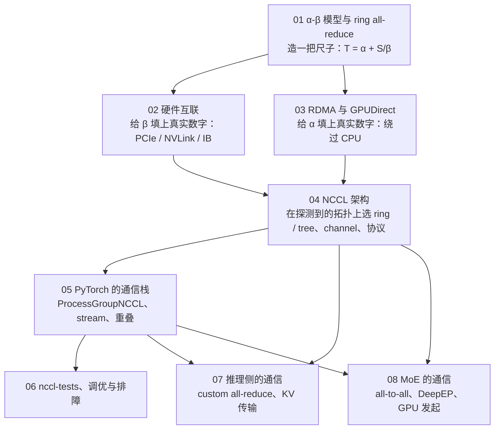

八篇正文回答了一个问题：**一次 all_reduce 从调用到完成，数据在 PCIe、NVLink、InfiniBand 上是怎么流动的，为什么有时候是带宽的问题、有时候是延迟的问题**。第一篇造尺子（α-β 模型与 ring 的推导），第二、三篇给尺子填上真实刻度（链路带宽、拓扑等级、RDMA 的三条路径），第四篇讲 NCCL 如何在这些刻度上做决定，第五篇讲 PyTorch 如何使用 NCCL 而不浪费它，第六篇把前五篇变成一条曲线和一棵决策树，第七、八篇把同一套方法用到推理的 decode TP、PD 分离和 MoE 的 all_to_all 上——那里 NCCL 不再是答案，绕开它的三种办法各自付了什么代价。

本文不讲新内容，做三件事：把八篇压成一张表与八段回顾，把贯穿八篇的几条线拎出来，然后给一套三段式的通关自测——判断与计算、跨篇综合、面试题。各篇末尾的自测检验的是"这一篇读懂了没有"，这里检验的是"八篇能不能连起来用"：面对一次慢的或卡住的通信，能不能先算出理论值、再说出数据走了哪条路、再指出问题在哪一层。

> **读完这八篇，你应该能回答哪些问题？[^q0] 哪些数字与结论必须能脱口而出？[^q1] 怎么判断自己是"读过"还是"掌握"了？[^q2]**

先把整个系列放在一张图上——箭头是**推导或前置上的依赖**（箭头尾端的结论被箭头头端当作前提），不是阅读顺序：

## 一、总览：系列回答的问题与主线

系列的一句话主张是：**每一次通信都在算两本账——带宽的账与延迟的账——分清在算哪本账，才知道该换算法、该换硬件、还是什么都不用换**。带宽的账看链路速率、算法的带宽效率、协议的有效载荷比例；延迟的账看步数、握手次数、kernel 启动、proxy 线程的响应，到 MoE 的 decode 还要加上一项发起速率。八篇用同一个四段法（算一算 → 看一看 → 测一测 → 比一比）在各自的层上把两本账各算一遍，并留下一套能在任何新机器上跑一遍的诊断工具集 comm-probe。

| 篇 | 回答的问题 | 一句话结论 | 必记的数字 / 公式 |
|---|---|---|---|
| [第一篇：集合通信原语与代价模型](/collective-communication-primitives-and-cost-model.html) | 8 卡 1 GB 的 all_reduce 在 25 GB/s 链路上要多久？64 KB 呢？为什么一个对带宽敏感、一个对延迟敏感？ | $$T = \text{步数} \times \alpha + \text{每 rank 字节数} / \beta$$；ring 的带宽项与 $$n$$ 无关、延迟项随 $$n$$ 线性增长，拐点 $$S^* = n\alpha\beta$$ 把消息分到两本账 | $$T_{\text{ring}} = 2(n-1)\alpha + \frac{2(n-1)}{n}\frac{S}{\beta}$$；1 GB 约 70 ms（延迟 0.2%）、64 KB 约 145 µs（带宽 3%）；busbw = algbw × $$\frac{2(n-1)}{n}$$；8 卡 IB 拐点约 2 MB；tree $$2\lceil\log_2 n\rceil$$ 步 |
| [第二篇：硬件互联](/hardware-interconnect-pcie-nvlink-and-topology.html) | `NV12` / `PIX` / `SYS` 各意味着什么带宽和路径？NCCL 为什么给 GPU0 选 NIC0 不选 NIC4？ | 节点内三个量级（NVLink 几百 GB/s、PCIe 与网卡几十、跨 socket 个位数到几十）；`nvidia-smi topo -m` 的六个等级就是 NCCL 决策的输入；选网卡的规则是带宽最大、其次路径最近 | NVLink 单向 A100 300 / H100 450 / Blackwell 900 GB/s（厂商 600 / 900 / 1800 是双向合计）；PCIe x16 单向 3.0 / 4.0 / 5.0 ≈ 16 / 32 / 64 GB/s；HDR 25、NDR 50 GB/s；网卡速率约为 PCIe 链路的 78%；整机 NVLink 容量是网卡总带宽的 9 倍 |
| [第三篇：RDMA 与 GPUDirect](/rdma-and-gpudirect.html) | 显存到对端显存，走 TCP、RDMA 无 GDR、RDMA + GDR，各几次拷贝、走哪些 PCIe 链路、上限多少？ | TCP 每端 2 次拷贝、主机内存每字节访问 4 次、原理上跑不满 400 Gb/s；RDMA 无 GDR 1 次拷贝；RDMA + GDR 0 次拷贝、PCIe switch 内一跳，上限 min(NIC, PCIe) | H100 / PCIe 5.0 / NDR = 50 GB/s，A100 / PCIe 4.0 / HDR = 25 GB/s，A100 配 NDR 被卡在 32 GB/s；延迟 IB 1–2 µs、RoCE 2–4 µs、TCP 15–50 µs；`NCCL_NET_GDR_LEVEL` 默认 `PXB`；`NCCL_IB_TIMEOUT=20` → 4.3 s × 7 次 ≈ 30 s 后 status=12 |
| [第四篇：NCCL 架构](/nccl-architecture-topology-channels-algorithms-and-protocols.html) | 同一次 8 卡 all_reduce，NCCL 为什么在 NVSwitch 机上选 NVLS + Simple、NVLink 机上选 Ring + LL128、PCIe 机上只剩 Simple / LL、32 节点选 Tree？强行 Ring 付出什么？ | 决策全部在 `ncclCommInitRank` 里做完（拓扑 → 路径 → 图搜索 → channel → 调优表），`ncclAllReduce` 只查表；调优表就是 α-β 模型按算法 × 协议 × 拓扑分别算出的 lat 与 bw | $$T = \text{lat} \times \text{latCount} + S / (1000 \times \text{bw})$$；LL 50%、LL128 约 94%、Simple 接近 100%；LL128 只在 NVLink 路径启用；32 节点 ring 510 步 vs tree $$2 \times (7 + 5)$$ 步；强行 Ring：NVSwitch 大消息慢约 2 倍、32 节点中小消息慢 4–7 倍 |
| [第五篇：PyTorch 的通信栈](/pytorch-communication-stack-processgroupnccl-and-streams.html) | `async_op=True` 返回时通信开始了吗？`wait()` 返回时完成了吗？期间改 `t` 会怎样？ | 三个"不一定"换成 stream 与 event 的精确陈述：NCCL stream 等当前 stream 的 event，`wait()` 是当前 stream 等 end event，CPU 全程不停；重叠的来源与失效的来源是同一套编排 | watchdog 每 100 ms 轮询、`opTimeout_` 默认 10 分钟、heartbeat monitor 480 s 强杀；25 MB bucket 节点内约 97 µs、跨机约 875 µs 带宽项；1000 个 25 KB 各做一次 vs 合并一次：延迟项 1000 倍差；DDP bucket 25 MiB |
| [第六篇：nccl-tests、调优与排障](/nccl-tests-tuning-and-debugging-hangs.html) | 64 卡任务第 3000 步 hang 在 all_reduce：是谁、是哪一次、为什么等到 timeout 才暴露？ | 曲线左端看 α、右端看 β、拐点 $$S_{\text{knee}} = n\alpha\beta$$；hang 分六类，前四类各 rank 最后一次操作不一致、后两类一致；Flight Recorder 按 `collective_seq_id` 对齐给出 culprit | 到 90% 平台约 $$9\,S_{\text{knee}}$$；8×H100 节点内拐点约 10 MB、64 卡跨机约 30 MB；参考线 8×H100 350–480 GB/s、2 节点 NDR 每 GPU 40–48；参数优先级 env > `NCCL_CONF_FILE` > `~/.nccl.conf` > `/etc/nccl.conf`；kernel 自旋无超时，唯一计时器是 c10d 的 watchdog |
| [第七篇：推理侧的通信](/inference-communication-custom-all-reduce-and-kv-transfer.html) | 8 卡 TP decode 每层 128 KB 的 all_reduce，NCCL 30 µs、custom all-reduce 10 µs，20 µs 省在哪？为什么不能用在梯度同步上？ | decode TP 是纯 α 的账：省的是 launch 路径、14 步 → 2 步、无 channel buffer 中转、可捕获进 CUDA Graph；KV 传输是纯 β 的点对点账，单边 RDMA 比 NCCL 更自然 | 128 KB = 8 × 8192 × 2 B；NCCL Ring + LL 模型 6.6 + 14 × 0.6 ≈ 15 µs；custom AR 36 个 block、8 卡 < 256 KB one-shot、上限 8 MB、只能节点内；Llama-3-70B 每 token KV 320 KB，4096 token 1.25 GiB，TP8 每 rank 160 MiB，400 Gb/s 约 3.4 ms |
| [第八篇：MoE 的通信](/moe-communication-all-to-all-deepep-and-gpu-initiated.html) | EP=64 跨 8 节点，一层 dispatch + combine 每 token 跨多少链路、搬多少字节、走几步？NCCL 的 all_to_all 为什么在 decode 不够用，DeepEP 怎么做到几百微秒？ | 通信矩阵由路由决定、每步不同、最慢的 rank 决定时间；prefill 是网卡带宽的账（按节点去重把网卡上的份数从 7 压到 3.2）；decode 是发起速率的账（1024 条 7.4 KB 消息，CPU proxy 给不了，IBGDA 让 warp 自己写 WQE 与 doorbell） | FP8 dispatch 59 KB / token、BF16 combine 115 KB；跨节点比例 $$1 - 1/N$$；去重份数 $$N(1 - (1 - 1/N)^k)(1 - 1/N)$$：7 → 4.6 → 3.2；prefill 一层 5.6–12.5 ms；decode 理论 429 µs、README 487 µs，其中 3/4 是字节、40–60 µs 是 α |

Table: 八篇的核心问题、结论与必记公式

### 1. 本文的章节安排

| 章 | 内容 |
|---|---|
| 二 | 逐篇回顾：核心问题、结论、必记、常见误解 |
| 三 | 贯穿八篇的四条线：两本账与拐点、谁来发起、拓扑等级与 GDR 的条件、绕开 NCCL 的三种办法 |
| 四 | 常见误区表 |
| 五 | 通关自测：A 判断与计算 10 题、B 跨篇综合 5 题、C 面试题 7 题、D 掌握判据 |
| 六 | 下一步 |

Table: 本文的章节安排

## 二、逐篇回顾

### 1. 第一篇：集合通信原语与代价模型——α-β 模型与 ring all-reduce

**核心问题**：8 张卡做一次 1 GB 的 all_reduce，链路单向 25 GB/s，ring 算法理论上要多久？改成 64 KB 呢？这两个数字为什么分别对带宽和延迟敏感？

**结论**：任何集合通信由 $$n$$、$$S$$（上层决定）与 $$\alpha$$、$$\beta$$（底层决定）四个量描述，算法把 $$(n, S)$$ 变成"走几步、每步搬多少字节"，于是 $$T = \text{步数} \times \alpha + \text{每 rank 字节数} / \beta$$——前一项是延迟的账，后一项是带宽的账。ring all_reduce = reduce_scatter + all_gather，各 $$n - 1$$ 步、每步 $$S/n$$ 字节：带宽项 $$\to 2S/\beta$$ 与 $$n$$ 无关（大消息最优），延迟项 $$2(n-1)\alpha$$ 随 $$n$$ 线性增长（小消息、大规模失败）。两项相等的拐点 $$S^* = n\alpha\beta$$ 决定一个消息算哪本账：带宽侧换链路、多网卡有用；延迟侧只有减步数（tree 的 $$2\lceil\log_2 n\rceil$$）、降 α、合并有用。nccl-tests 的 algbw = $$S/T$$ 随 $$n$$ 变，busbw = algbw × 系数是唯一能与链路单向带宽直接比的数字。

**必记**：

- $$T_{\text{ring}} = 2(n-1)\alpha + \frac{2(n-1)}{n}\frac{S}{\beta}$$；8 卡、25 GB/s、α = 10 µs：1 GB 约 70 ms（延迟 0.2%），64 KB 约 145 µs（带宽 3%）。
- busbw 系数 = 每 rank 至少接收的字节：all_reduce $$\frac{2(n-1)}{n}$$，all_gather / reduce_scatter / all_to_all $$\frac{n-1}{n}$$，broadcast / reduce 1。
- 拐点：单消息 $$\alpha\beta$$，集合通信 $$n\alpha\beta$$；8 卡 IB ring 约 2 MB；链路越快拐点越大。
- tree $$2\lceil\log_2 n\rceil$$ 步，朴素二叉树带宽只有 ring 一半，double binary tree 补回 $$2S/\beta$$；1024 卡 64 KB：ring 约 20 ms、tree 约 205 µs。
- 分层：节点间每网卡只扛 $$S/p$$，4 节点 32 卡快 4.7 倍；典型 α：IB 一步 5–20 µs、NVLink 2–5 µs（非实测）。

**常见误解**："换更快的网卡通信就会更快"——对延迟主导的小消息无效，拐点反而后移。另一个："busbw 超过链路带宽是测错了"——NVLS、两级算法下 ring 的系数不适用，超过是正常的。

### 2. 第二篇：硬件互联——PCIe、NVLink、NVSwitch 与网络拓扑

**核心问题**：`nvidia-smi topo -m` 里 GPU0 到 GPU1 是 `NV12`、到 NIC0 是 `PIX`、到 NIC4 是 `SYS`。这三个词各自意味着什么带宽和什么路径？为什么 NCCL 会为 GPU0 选 NIC0 而不是 NIC4？

**结论**：节点内三种链路差一个量级：NVLink（经 NVSwitch 任意两卡全带宽，节点内 β 是常数）、PCIe（GPU 与网卡、CPU 之间）、跨 socket 的 UPI；节点间是 IB 或 RoCE。PCIe 是树：同 switch 下的 P2P 在 switch 内转发（`PIX` / `PXB`），经 root complex（`PHB` / `NODE`）打折且可能不支持，跨 socket（`SYS`）最差；ACS 会把 switch 内 P2P 重定向到 root complex，是"拓扑完美但 P2P 慢"的首要嫌疑。`topo -m` 的六个等级与 NCCL `topo.h` 的 `PATH_*` 一一对应，是 NCCL 决策的输入；`NCCL_P2P_LEVEL` 与 `NCCL_NET_GDR_LEVEL` 默认边界都是 `PXB`（不跨 CPU）。NCCL 选网卡的规则是带宽最大、其次路径最近，所以 GPU0 选 `PIX` 的 NIC0。8 卡配 8 张网卡、每张与自己的 GPU 同 switch，让每个 GPU 都有一条 `PIX` 路径并行用满节点间带宽；rail-optimized 组网把同编号 GPU 收在同一台 leaf 下，NCCL 用 PXN 经 NVLink 转发跨 rail 流量。

**必记**：

- 单向带宽：NVLink A100 300 / H100 450 / Blackwell 900 GB/s（厂商 600 / 900 / 1800 是双向合计）；PCIe x16 3.0 / 4.0 / 5.0 ≈ 16 / 32 / 64 GB/s（实测 80–90%）；HDR 25、NDR 50 GB/s；UPI 在 NCCL 估算里 6–40 GB/s。
- NCCL 内部常数：NVLink 每链路 20 / 20.6 / 40.1 GB/s（A100 / H100 / B200），PCIe = width × speed / 80（Gen4 x16 = 24）。
- 网卡速率约为 PCIe 链路的 78%（HDR / 4.0、NDR / 5.0、800G / 6.0）；整机 NVLink 交换容量约是网卡总带宽的 9 倍——分层算法的物理依据。
- RoCE v2 必须配 PFC + ECN / DCQCN，否则 Go-Back-N 重传让带宽崩塌；IB 有链路层信用流控天然无损。
- NUMA 亲和影响 proxy 线程与 host staging，不影响 NVLink 路径；`NCCL_IGNORE_CPU_AFFINITY=1`、`NCCL_PROXY_CPUSET`。

**常见误解**："`PIX` 就一定快"——ACS / IOMMU 可能把 P2P 重定向，先用 `p2pBandwidthLatencyTest` 对比开关。另一个："900 GB/s 就是 β"——那是双向合计，单向 450。

### 3. 第三篇：RDMA 与 GPUDirect——绕过 CPU 和主机内存的数据通路

**核心问题**：一段显存里的数据要发到另一台机器的显存，走 TCP、走 RDMA 不开 GPUDirect、走 RDMA 开 GPUDirect，分别经过几次拷贝、经过哪些 PCIe 链路？各自的带宽上限是多少？

**结论**：TCP 每端 2 次拷贝、主机内存每字节访问 4 次、每个 MSS 要 CPU 参与——喂满一张 400 Gb/s 网卡要 15–40 个核，8 张网卡在主机内存上产生 1.6 TB/s 流量，原理上跑不满。RDMA 的三个承诺（kernel bypass、zero copy、CPU offload）把 CPU 参与降到每个消息一次 post / poll；不开 GDR 仍有 1 次到 pinned staging 的拷贝，主机内存仍在数据面上；GPUDirect RDMA 让网卡 DMA 经 PCIe P2P 直接读写 GPU BAR1，0 拷贝、switch 内折返、上限 min(NIC, PCIe x16)。verbs 对象 device → PD → {MR(lkey / rkey), QP, CQ}，NCCL 只用 RC QP，用 RDMA WRITE + WITH_IMM（接收方经 FIFO 告知地址与 rkey，末尾 WR 带立即数触发对端完成）。注册要 pin 页并写 MTT，GB 级 buffer 百毫秒级，所以必须在初始化时做——MR cache、`ncclCommRegister`、KV pool 预注册都是这本账的产物。GDR 的前提是 GPU 与网卡同 root complex，默认 `PXB` 之外 NCCL 拒绝开 GDR、改走 host staging。

**必记**：

- 三条路径：TCP 2 次拷贝 / 4 次主机内存访问；RDMA 无 GDR 1 次 / 2 次；RDMA + GDR 0 次 / 0 次。
- 上限：H100 / PCIe 5.0 / NDR = 50 GB/s；A100 / PCIe 4.0 / HDR = 25 GB/s；A100 配 NDR 被卡在 32 GB/s（扣协议开销约 28）；8 卡 GDR 合计 400 GB/s、主机内存流量 0。
- 延迟：IB 1–2 µs、RoCE 2–4 µs、TCP RTT 15–50 µs；RDMA 多两项初始化开销——连接建立与内存注册。
- QP 状态机 RESET → INIT → RTR → RTS；`NCCL_IB_TIMEOUT=20` 一次 4.3 s × `RETRY_CNT=7` ≈ 30 s 后 status=12；status=13（RNR）= 对端没 post recv，通常对端已 hang。
- GDR 两条路：`nvidia-peermem` 或 DMA-BUF；Ampere 接收后需 RDMA READ flush，Hopper 不需要；RoCE 要选对 GID 索引与 `NCCL_IB_TC`。

**常见误解**："`GPU Direct RDMA Disabled (distance 4 > 3)` 就设 `NCCL_NET_GDR_LEVEL=SYS`"——先用 `ib_write_bw --use_cuda` 证明跨 root complex 的路径能跑，多数该修的是 GPU–NIC 亲和。另一个："RDMA 就是快的 TCP"——它的程序结构必须是初始化时连接与注册、数据面只 post 与 poll。

### 4. 第四篇：NCCL 架构——拓扑探测、channel、算法与协议

**核心问题**：同一次 8 卡 all_reduce，NCCL 在 NVSwitch 机器上选了 NVLS + Simple，在没有 NVSwitch 的 NVLink 机器上选了 Ring + LL128，在纯 PCIe 机器上只剩 Simple / LL，跨 32 台机器时选了 Tree。它是根据什么做出这三个不同决定的？强行用 `NCCL_ALGO=Ring` 会付出什么？

**结论**：NCCL 是两段路径。`ncclCommInitRank` 做与消息无关的决策：bootstrap → 拓扑探测（`/sys` 走 PCIe 树、NVML 查 NVLink）→ 路径计算（类型取沿途最差一段）→ 图搜索（nChannels 条 ring / tree，拼成全局 ring 与 double binary tree）→ transport（P2P → SHM → NET → CollNet，NVLS 单独走 multicast，2.28 默认 lazy connect）→ 调优表。`ncclAllReduce` 只查表选最小的 $$T = \text{lat} \times \text{latCount} + S / (1000 \times \text{bw})$$，切 channel，启一个 kernel、nChannels 个 block 各跑一条环；跨机时 CPU proxy 线程替 GPU isend / irecv / test。三个决定的账：NVSwitch 上 NVLS 让交换机做归约、一步完成，而 ring 每卡 NVLink 流量 $$1.75S$$ 且串行 14 步；有 NVLink 无 NVSwitch 时 LL128 可用（依赖 NVLink 写序保证）；纯 PCIe 上 LL128 被禁，只剩 Simple 与 LL；32 节点 ring 510 步 vs tree $$2 \times (7 + 5)$$ 步，延迟差一个量级、带宽只差 30%，直到几百 MB 都选 Tree。

**必记**：

- 协议：LL 8 + 8 字节原子 store、无 fence、50%；LL128 120 / 128 字节、约 94%、仅 NVLink 路径；Simple 512 KiB slot + fence、接近 100%、延迟最高。
- 路径类型 `LOC < NVL < NVB < C2C < PIX < PXB < P2C < PXN < PHB < SYS`；`NCCL_P2P_LEVEL` / `NCCL_NET_GDR_LEVEL` 默认 `PXB`。
- channel = 一条 ring / tree + 每 peer 每方向的 buffer 与连接 + kernel 的一个 block + 一份 proxy 工作；nChannels = 图搜索条数 × 2，被 `NCCL_MIN/MAX_NCHANNELS` 裁剪，按消息大小缩。
- 强行 Ring：H100 NVSwitch 1 GB 慢约 1.9 倍（带宽账）；32 节点 25 MB 慢约 4.5 倍（延迟账）；只在大规模 + GB 级消息上正确。
- send / recv 必须同一个 group，否则死锁；第一次集合通信慢是 lazy connect，正常。

**常见误解**："NCCL 每次调用都在搜索最优算法"——搜索与建表全在初始化期，执行期只查表。另一个："proxy 只是辅助线程"——GPU 不能 post RDMA，跨节点每一步都经它，单线程、被抢占即抖动，是很多性能问题与 hang 的源头。

### 5. 第五篇：PyTorch 的通信栈——ProcessGroupNCCL、stream 语义与计算通信重叠

**核心问题**：`work = dist.all_reduce(t, async_op=True)` 返回时，通信开始了吗？`work.wait()` 返回时，通信完成了吗？在此期间修改 `t` 会发生什么？

**结论**：一次调用穿过 `distributed_c10d.py` → `ProcessGroup` → `Backend` → `ProcessGroupNCCL::collective` 四层，热路径全是 host 侧异步操作。`async_op=True` 时 NCCL kernel 排在内部 stream 上：内部 stream 先等当前 stream 的 event，kernel 跑完 record end event；`wait()` = 当前 stream 等那个 end event，CPU 不阻塞。所以返回 ≠ 开始、wait 返回 ≠ 完成；wait 前在当前 stream 上读写 `t` 是数据竞争；`del t` 反而安全（`WorkNCCL` 默认 stash 到 `TensorShelf`）。2.12 的 `async_op=False` 直接排在当前 stream、不返回 Work。重叠的条件是不同 stream + 无隐式同步 + SM 有余量，杀手是 `.item()`、`synchronize`、Caching Allocator 的 `cudaFree`、`wait()` 放太早、同 stream。合并（`_coalescing_manager` → `ncclGroupStart/End`）把 N 次 $$2(n-1)\alpha$$ 变成 1 次，是 DDP bucket 的通信层原理。watchdog 每 100 ms 查异步错误与 host 时钟超时，默认 SkipCleanUp 直接退出；heartbeat monitor 480 s 后强杀卡住的 watchdog。

**必记**：

- 25 MB bucket、8 卡 H100：每 rank 收发约 43.75 MB，NVLink 单向 450 GB/s 带宽项约 97 µs，跨机 50 GB/s 网卡约 875 µs；一个 $$8192^3$$ BF16 GEMM 1.5–2 ms 足够藏一到两次。
- 1000 个 25 KB 各做一次：延迟项 $$1000 \times 2(n-1)\alpha$$，节点内小消息 10–30 µs 一次就是 10–30 ms；合并成 25 MB 一次带宽项约 100 µs。
- CPU 只在 `TORCH_NCCL_BLOCKING_WAIT`、显式 timeout、`barrier`、用户自己的 synchronize 时阻塞。
- 超时是 host 时钟、从入队起算、默认 10 分钟；stream 前面积压 10 分钟的计算同样超时。
- `TORCH_NCCL_ASYNC_ERROR_HANDLING` 默认 3；`TORCH_NCCL_HEARTBEAT_TIMEOUT_SEC` 480；`TORCH_NCCL_TRACE_BUFFER_SIZE` 默认 2000；`expandable_segments:True` 减少 `cudaFree`。

**常见误解**："`work.wait()` 阻塞 CPU 到通信完成"——它只在当前 stream 上插一个 wait event。另一个："trace 里 NCCL kernel 很长说明通信慢"——多半是本 rank 先到、在自旋等 straggler，kernel 最短的那个才是最晚到的。

### 6. 第六篇：nccl-tests、调优与排障——从带宽曲线到 hang

**核心问题**：一个 64 卡训练任务在第 3000 步 hang 住，所有 rank 的日志都停在 all_reduce。是谁的问题、是哪一次 all_reduce、为什么会等到 timeout 才暴露？

**结论**：一次 `dist.all_reduce` 穿过六层，三种现象方向不同：慢从下往上（先硬件与网络的上限，再 NCCL 拿到多少，最后框架是否浪费），卡从上往下（先用 Flight Recorder 判断是否调用不一致），错几乎只在框架与数值层。曲线左端看 α、右端看 β、拐点 $$S_{\text{knee}} = n\alpha\beta$$、到 90% 平台约 $$9\,S_{\text{knee}}$$；平台低是 β 的问题（路径、GDR、channel），左端偏低是 α 的问题（协议、跨 NUMA、proxy），中段偏离是切换点。hang 等到 timeout 才暴露，是因为 NCCL kernel 自旋无超时、CPU 早已返回，唯一计时器是 c10d watchdog 的 `opTimeout_`。六类 hang：参数不一致、次数不一致、send / recv 不配对、多 communicator 交叉、某 rank 崩或卡在别处、网络硬件——前四类各 rank 最后一次操作不一致，后两类一致。Flight Recorder 记录每次集合通信的 seq、形状、dtype、栈与状态，`fr_trace.py` 按 `collective_seq_id` 对齐给出 culprit rank。

**必记**：

- 拐点（典型值）：8×H100 节点内 α 约 3 µs、β 约 400 GB/s → 约 10 MB、90% 平台约 90 MB；64 卡 NDR α 约 10 µs、β 约 45 GB/s → 约 29 MB、约 260 MB。
- 参考线：8×H100 NVSwitch 350–480 GB/s（NVLS 可超单向 450）；8×A100 220–280；PCIe-only 10–25；2 节点 NDR 每 GPU 40–48、HDR 20–24；每节点 1 张 NDR 5–6。
- 总 rank 数 = 进程 × `-t` × `-g`；`-w` 默认仅 1，`-c 0` 关校验。
- 参数优先级 env > `NCCL_CONF_FILE` > `~/.nccl.conf` > `/etc/nccl.conf`，整数参数只读一次；应设 `IB_HCA`、`SOCKET_IFNAME`、RoCE 的 `GID_INDEX` / `TC`；几乎不动 `NTHREADS`、`BUFFSIZE`、`IB_TIMEOUT`。
- timeout 约束 enqueue → end event 的墙钟、不区分原因，所以 checkpoint / dataloader 卡住表现为 NCCL timeout；NCCL 2.24 起的 RAS / `ncclras` 是 NCCL 侧的 opCount 对齐。

**常见误解**："所有 rank 都停在 all_reduce，所以是网络或 NCCL 的问题"——多数是某个 rank 多发或少发了一次，FR 对齐后第一处不一致就是答案。另一个："中段有台阶是配置问题"——Tree → Ring、LL128 → Simple 的切换本身就有几个百分点的不连续。

### 7. 第七篇：推理侧的通信——custom all-reduce 与 KV 传输

**核心问题**：8 卡 TP 的 decode，每层一次 128 KB 的 all_reduce，NCCL 要 30 微秒，custom all-reduce 要 10 微秒。这 20 微秒省在哪里？为什么这个方法不能用在训练的梯度同步上？

**结论**：decode 的 TP all_reduce 是纯 α 的账：128 KB 在 NVLink 上 $$S/\beta$$ 不到 1 µs，NCCL 的固定开销由 launch 路径、Ring + LL 的 14 步串行握手（模型 6.6 + 14 × 0.6 ≈ 15 µs）、经 channel buffer 中转的拷贝、以及不能捕获进 CUDA Graph 带来的每步 launch 构成。vLLM 的 custom all-reduce 用 CUDA IPC 把 8 张卡的 buffer 互相映射、用 `Signal` flag 做 barrier、一个 36 block 的 kernel：one-shot 每卡直接读 7 个对端的完整数据本地归约（2 次 barrier、2 步、无中转、可捕获、bit 级一致），8 卡 256 KB 以下用它，以上 two-shot。它不能用于训练，因为它为"小消息、节点内、地址固定"设计：one-shot 每卡读 $$(n-1)S$$、大消息带宽账立刻输（上限 8 MB）；只能节点内；buffer 必须预先 IPC 注册且固定；无重叠编排、无容错。KV 传输回到带宽的账但是点对点、动态对端、无归约、要与计算解耦、按请求隔离失败，所以用单边 RDMA：`KVConnector` 把 scheduler 侧决策与 worker 侧传输分开，NixlConnector 由 decode 侧 READ prefill 侧已注册的 KV block。

**必记**：

- 128 KB = 8 × 8192 × 2 B；80 层每步 160 次，每次省 20 µs 是每步 3.2 ms。
- custom AR：`kMaxBlocks = 36`；8 卡 < 256 KB one-shot；`max_size` 默认 8 MB，启用 torch symm mem 时 H100 8 卡收紧到 256 KB；8 卡上 (16 KB, 128 KB) 之外 NCCL symm mem 反而更快。
- 后端链（v0.23.0）：NCCL symm mem（可选）→ quick reduce（ROCm）→ FlashInfer（可选）→ custom AR → torch symm mem → PyNccl；PyNccl 用 ctypes 直调 libnccl，stream 由调用者传、无 watchdog、可捕获。
- KV：每 token 每层 $$2 \times \text{num\_kv\_heads} \times \text{head\_dim} \times \text{dtype}$$；Llama-3-70B 320 KB / token，4096 token 1.25 GiB，TP8 每 rank 160 MiB，400 Gb/s 约 3.4 ms（理论）——与 decode 一步同量级。
- 自己写原语的判据：消息 < 几百 KB、节点内、地址固定、每步上百次、失败可整体重启——四条都满足才值得。

**常见误解**："custom all-reduce 在所有小消息上都赢"——几 KB 级消息上 NCCL 对称内存更快，36 个 block 的启动与两次 flag 交换也是固定成本。另一个："KV 传输用 NCCL send/recv 就行"——communicator 是静态成员集合、失败即全体 abort，与动态对端、按请求隔离的需求相反。

### 8. 第八篇：MoE 的通信——all-to-all、DeepEP 与 GPU 发起的通信

**核心问题**：一层 MoE 的 dispatch + combine，在 EP=64 跨 8 节点时，每个 token 要跨多少条链路、搬多少字节、走几步？为什么 NCCL 的 all_to_all 在 decode 时不够用，DeepEP 又是怎么把它做到几百微秒以内的？

**结论**：dispatch 与 combine 是两次 all_to_all 形状的通信、互为转置，通信矩阵由路由决定、每步不同、最慢的 rank 决定时间。每 token $$k$$ 份拷贝：hidden 7168、top-8 时 FP8 dispatch 59 KB、BF16 combine 115 KB，比 dense 层的 TP all_reduce 多 3–5 倍。均匀路由下 $$1 - 1/N$$ 出节点；平坦 all_to_all 每 token 7 份走网卡，DeepEP normal kernel 按节点去重（先 RDMA 到对端同号 GPU、再 NVLink 转发，与第四篇 PXN、第二篇 rail 是同一件事）压到 4.6 份，4 节点 group routing 再压到 3.2 份——prefill 一层从 12.5 ms 压到 5.6 ms，网卡始终是瓶颈。decode 的 128 token 切成 1024 条 7.4 KB 消息，理论 429 µs、README 487 µs，3/4 是字节；要在 173 µs 内发完约 6 条 / µs，NCCL 由单个 CPU proxy 逐条发起给不了，变长还要先交换 counts + D2H 同步、不可捕获。DeepEP 的回答：NVSHMEM 对称堆 + IBGDA 让 warp 直接写 WQE、更新 doorbell record、敲映射进 GPU 地址空间的网卡 doorbell，拿掉 proxy 的通知延迟与 CPU 软件路径，留下硬件的 α；low-latency kernel 预留 worst-case 接收槽位、计数随数据原子加、无 host 同步、可捕获。

**必记**：

- 每份拷贝：BF16 14,336 B；FP8 + per-128 scale 7,168 + 224 = 7,392 B；每 token dispatch 59 KB（FP8）、combine 115 KB。
- 走网卡的份数：平坦 $$k(1 - 1/N)$$；去重 $$N(1 - (1 - 1/N)^k)(1 - 1/N)$$；$$N = k = 8$$：7.00 → 4.59 → 3.15；每 rank 网卡字节 212 → 139 → 95 MB（4096 token）。
- $$T_{\text{a2a}} \approx \alpha_{\text{step}} + \max(B_{\text{NIC}} / \beta_{\text{NIC}},\ B_{\text{NVL}} / \beta_{\text{NVL}})$$；一轮 $$n - 1$$ 条并发流；变长 split 多两次 α 加一次 host 同步。
- EP=64：prefill 一层 12.5 / 8.2 / 5.6 ms；decode 理论 429 µs、README 487 µs（dispatch 173、combine 314），α 约 40–60 µs。
- Megatron 三种 dispatcher：allgather（字节与 $$k$$ 无关）、alltoall（A2A(EP) + AG(TP)）、flex + `_DeepepManager`；DeepEP normal 默认 20 SM、每 2 SM 一个 channel；`NVSHMEM_IB_ENABLE_IBGDA=1`；vLLM `--all2all-backend` 默认 `allgather_reducescatter`。

**常见误解**："prefill 十几毫秒比 decode 几百微秒更难"——prefill 是带宽账、可流水可重叠；decode 条数多、在关键路径上，瓶颈是发起速率。另一个："EP=64 的 decode 是纯延迟账"——6.6 MB 过 50 GB/s 网卡本身就要 132 µs，README 的 173 µs 里 3/4 是字节。

## 三、贯穿全系列的几条线

### 1. 两本账与拐点：同一个 API，两种相反的答案

第一篇建立的度量在其后七篇里一次也没有换过。$$T = \text{步数} \times \alpha + \text{每 rank 字节数} / \beta$$，拐点 $$S^* = n\alpha\beta$$，一个消息在拐点哪一侧决定它算哪本账。第二篇给 β 填数（NVLink 几百、PCIe 与网卡几十、跨 socket 更低），第三篇给 α 填数（RDMA 1–2 µs、TCP 15–50 µs）并指出 RDMA 有 TCP 没有的两项固定开销（连接建立、内存注册）。第四篇里 NCCL 的调优表就是这个模型按算法 × 协议 × 拓扑分别算出的 lat 与 bw，每一处取舍两本账的答案都相反：更多 channel 提高带宽却增加小消息延迟，LL 协议延迟最低却只有 50% 带宽，Tree 把 510 步压到 24 步却损失 30% 带宽。

第五篇把两本账用在框架层：重叠能省的是带宽项的全部时间（上限由计算时间是否 ≥ 通信时间决定），但省不掉 α——每次调用的 launch 与握手仍然发生；合并（DDP bucket、`_coalescing_manager`）则是把 1000 次延迟主导的调用变成 1 次带宽主导的调用。第六篇把拐点画成曲线：8×H100 节点内约 10 MB、64 卡跨机约 29 MB，DDP 默认 25 MB 的 bucket 在单机刚过拐点、在 64 卡还在爬坡——这也是大规模下 NCCL 为中等消息选 Tree 的原因。

第七、八篇是两个极端。decode TP 的 128 KB 在 NVLink 上 $$S/\beta$$ 不到 1 µs，全部是 α，所以 custom all-reduce 的全部收益是"14 步 → 2 步、无中转、可捕获"，它放弃的正是带宽的账（上限 8 MB）；KV 传输的 1.25 GiB 全部是 β，所以用单边 RDMA 跑满网卡，放弃的是集合语义。MoE 的 prefill 是网卡带宽的账（按节点去重把 7 份压到 3.2 份），decode 则给延迟的账加了第三项——发起速率 × 条数。每一篇都在各自的层上把两本账各算一遍，这是"分清在算哪本账"这一主张的全部内容。

### 2. 谁来发起：从 proxy 线程到 GPU 自己写 WQE

一条从第三篇开始、在第八篇收尾的线。第三篇讲 RDMA 的数据面只有 post 与 poll，CPU 每个消息只做这两件事，"一个核能驱动一张 400 Gb/s 网卡，NCCL 的 proxy 线程就是这样一个核"。第四篇讲这个核在 NCCL 里的位置：GPU kernel 不能 post RDMA 请求，每个 communicator 一个 CPU proxy 线程按 head / tail 与 kernel 同步、替它 isend / irecv / test；它是单线程，被抢占即抖动，kernel 自旋等它——节点内 NVLink P2P 由 kernel 直接读写对端显存，不经它。第二篇的 NUMA 亲和、第六篇"小消息 time 偏高先查 proxy 线程被抢占"、第五篇"NCCL 侧没有阻塞"都是这条线的排障侧。

第七篇给出第一种绕开：custom all-reduce 用 CUDA IPC 让 kernel 直接读写对端显存，节点内不需要任何发起者，flag 就是同步；但它只能节点内。第八篇给出第二种：decode 的 all_to_all 每层 1024 条消息要在 173 µs 内发完，约 6 条 / µs，一个 CPU 线程的 `ibv_post_send` 加 GPU–CPU flag 往返在微秒量级，给不了；IBGDA 让 warp 自己写 WQE、更新 doorbell record、敲映射进 GPU 地址空间的网卡 doorbell，发起者从一个 CPU 线程变成几百个 warp，拿掉的是 proxy 的通知延迟、CPU 软件路径与串行化，留下的是硬件的 α。第四篇"GPU 不能提交 RDMA 请求所以要 proxy"在第八篇不再是铁律：NCCL 2.28 自己的 GIN 设备端 API 与 PyTorch 2.12 的 NVSHMEM 后端 `all_to_all_vdev` 正在把同一能力搬进通用库。

### 3. 拓扑等级与 GDR 的条件：一组词在五篇里的位置

第二篇引入 `nvidia-smi topo -m` 的六个等级 `NV#` / `PIX` / `PXB` / `PHB` / `NODE` / `SYS`，并说它们不只是"看看"，而是 NCCL 决策的输入。第三篇讲 GPUDirect RDMA 的前提正是这组词：GPU 与网卡在同一 PCIe switch 下（`PIX` / `PXB`）DMA 在 switch 内折返，跨 root complex 带宽可能只有几 GB/s、有的平台不支持 P2P，所以 `NCCL_NET_GDR_LEVEL` 默认 `PXB`，日志 `GPU Direct RDMA Disabled (distance 4 > 3)` 就是这条规则的输出。第四篇把它变成 NCCL 内部的 `LOC < NVL < NVB < C2C < PIX < PXB < P2C < PXN < PHB < SYS`，路径类型取沿途最差一段，`NCCL_P2P_LEVEL` 与 `NCCL_NET_GDR_LEVEL` 用同一组词控制某种路径最多能跨多远。

第六篇的决策树里，"多机远差于单机"第一层就是这组词：`via NET/IB/<dev>` 里的 dev 与 `topo -m` 对照、`GDRDMA` 有没有出现、`NCCL_IB_HCA` 有没有把管理网口混进来。第七篇 KV 传输慢的检查清单是同一套（`topo -mp`、`UCX_NET_DEVICES`、GDR 可用性），第八篇 DeepEP 把跨节点 token 先 RDMA 到同号 GPU 再 NVLink 转发，与第四篇的 PXN、第二篇的 rail-optimized 是同一件事——同编号 GPU 走同一台 leaf 一跳到达，跨 rail 的流量经 NVLink 转发。平台工程师给任务提的要求（每 GPU 一张网卡、GPU 与 NIC 同 switch、同号 GPU 同 rail、GPU–NIC 映射每台机器一致）全部可以从这组词推出来。

### 4. 绕开 NCCL 的三种办法，各付了什么

第四、五篇解释 NCCL 与 ProcessGroupNCCL 为什么长成那样：多 channel、流水、协议握手是为了逼近大消息的链路上限；内部 stream、event、watchdog、TensorShelf 是为了让训练框架安全地异步使用它。第七、八篇的三种绕开，每一种放弃的都是这些设计里的某一部分：custom all-reduce 放弃多 channel 与流水（36 个 block、one-shot 每卡读 $$(n-1)S$$），换来 14 步 → 2 步与可捕获；PyNccl 放弃 watchdog 与 stream 编排，换来 stream 控制权；KV 传输放弃集合语义与静态 communicator，换来动态对端、与计算解耦、按请求隔离失败，代价是第三篇的预注册（GB 级百毫秒，所以整个 KV pool 在初始化时注册）；DeepEP 的 low-latency kernel 用 worst-case 显存换掉 counts 交换与 host 同步、用 IBGDA 换掉 proxy，换来可捕获与几百微秒的 decode，但只适合几百 token 以内。

第七篇的判据把这条线收成一句话：消息小、节点内或对称 buffer 可达、地址固定、每步上百次、失败可整体重启——满足这些才值得自己写原语，否则用 NCCL。第四篇的 proxy、第五篇的 watchdog、第三篇的注册代价，分别解释了每一条为什么必要。

| 概念 | 出现的篇 | 关系 |
|---|---|---|
| α-β 模型、拐点 $$S^* = n\alpha\beta$$ | 一、四、五、六、七、八 | 一推导；四是 NCCL 调优表的形式；五用它算重叠与合并；六画成曲线；七、八分别推到纯 α 与纯 β 的极端 |
| busbw 系数 $$\frac{2(n-1)}{n}$$ | 一、四、六 | 一定义；四解释 NVLS 下为何"超标"；六用它读参考线 |
| 拓扑等级 `PIX` / `PXB` / `SYS` | 二、三、四、六、七 | 二定义；三给 GDR 条件；四是 `NCCL_*_LEVEL` 的词表；六、七是排障第一层 |
| 每 GPU 一张网卡、rail、PXN、同号 GPU 转发 | 二、四、八 | 二给物理理由（78%、9 倍）；四 NCCL 用 PXN；八 DeepEP 按节点去重 |
| RDMA WRITE / READ、注册、MR cache | 三、四、七、八 | 三定义；四 NCCL 用 WRITE + IMM；七 KV 预注册、decode 侧 READ；八 NVSHMEM 对称堆 |
| proxy 线程 → IBGDA | 三、四、六、八 | 三"一个核驱动一张网卡"；四 proxy 的位置与风险；六排障项；八 GPU 自己发起 |
| stream / event、可捕获 | 五、七、八 | 五定义语义与重叠条件；七 custom AR 与 PyNccl 为可捕获绕开 c10d；八 LL kernel 无 host 同步所以可捕获 |
| 合并小消息 | 一、五、六 | 一"合并是延迟侧唯一有效的对策之一"；五 `_coalescing_manager` 与 DDP bucket；六"框架没合并"是左端偏高的原因之一 |
| watchdog、timeout、Flight Recorder | 五、六 | 五给机制（100 ms、10 分钟、480 s）；六给排障（六类 hang、`fr_trace.py`） |
| all_to_all 的 $$n(n-1)$$ 条流 | 一、八 | 一留下一句话；八展开为 MoE 的字节、去重与发起速率 |

Table: 贯穿八篇的概念及其关系

## 四、常见误区

| 误区 | 为什么错 | 正确的说法 | 出处 |
|---|---|---|---|
| 通信慢就换更快的网卡 | 延迟主导的小消息对 β 不敏感，链路越快拐点越大 | 先判断消息在拐点哪一侧：64 KB 在 8 卡 IB 上 145 µs 里带宽只占 3% | [第一篇](/collective-communication-primitives-and-cost-model.html) |
| algbw 能和硬件带宽比 | algbw = $$S/T$$ 随 $$n$$ 变 | busbw = algbw × 系数，链路跑满时等于单向带宽、与 $$n$$ 无关 | [第一篇](/collective-communication-primitives-and-cost-model.html) |
| H100 的 NVLink 是 900 GB/s 的 β | 900 是双向合计 | 单向 450 GB/s；A100 300、Blackwell 900 | [第二篇](/hardware-interconnect-pcie-nvlink-and-topology.html) |
| 拓扑是 `PIX`，P2P 就一定快 | ACS / IOMMU 可能把 switch 内 P2P 重定向到 root complex | 用 `p2pBandwidthLatencyTest` 对比 P2P 开关、查 `ACSCtl` | [第二篇](/hardware-interconnect-pcie-nvlink-and-topology.html) |
| RDMA 不开 GDR 也差不了多少 | 主机内存仍在数据面上，A100 / PCIe 4.0 上 D2H 与 NIC DMA 共享主机内存，8 卡合计 800 GB/s 顶到内存带宽 | GDR 是必需：0 拷贝、switch 内一跳、上限 min(NIC, PCIe) | [第三篇](/rdma-and-gpudirect.html) |
| `GPU Direct RDMA Disabled` 就设 `NCCL_NET_GDR_LEVEL=SYS` | 跨 root complex 的 P2P 可能只有几 GB/s 或不支持 | 先修 GPU–NIC 亲和；要放宽先用 `ib_write_bw --use_cuda` 证明路径能跑 | [第三篇](/rdma-and-gpudirect.html) |
| Ring 是 all_reduce 的最优算法 | 只在带宽账上最优；延迟项随 $$n$$ 线性增长 | NVSwitch 上 NVLS 快约 2 倍；32 节点中小消息 Tree 快 4–7 倍 | [第四篇](/nccl-architecture-topology-channels-algorithms-and-protocols.html) |
| 设 `NCCL_ALGO` / `NCCL_PROTO` 是常规调优手段 | 自动选择基于调优表，手工覆盖常是三年前留下的 env | 先看 TUNING 日志与 nccl-tests 扫描确认交叉点，再写进 tuner 配置 | [第四篇](/nccl-architecture-topology-channels-algorithms-and-protocols.html)、[第六篇](/nccl-tests-tuning-and-debugging-hangs.html) |
| `work.wait()` 阻塞 CPU 到通信完成 | 它只是当前 stream 等 end event | CPU 只在 `TORCH_NCCL_BLOCKING_WAIT`、barrier、显式 synchronize 时阻塞 | [第五篇](/pytorch-communication-stack-processgroupnccl-and-streams.html) |
| trace 里 NCCL kernel 很长 = 通信带宽不够 | 本 rank 先到、在自旋等别人 | 对照各 rank trace，kernel 最短的是最晚到的 straggler | [第五篇](/pytorch-communication-stack-processgroupnccl-and-streams.html) |
| 所有 rank 停在 all_reduce，是 NCCL 的 bug | kernel 自旋无超时，唯一计时器是 watchdog，任何 rank 掉队都表现为全体 timeout | 用 Flight Recorder 对齐序号找 culprit；六类 hang 里四类是调用不一致 | [第六篇](/nccl-tests-tuning-and-debugging-hangs.html) |
| custom all-reduce 在所有小消息上都赢 | 36 个 block 的启动与两次 flag 交换也是固定成本 | 8 卡 (16 KB, 128 KB) 是优势区间，更小的消息 NCCL 对称内存更快 | [第七篇](/inference-communication-custom-all-reduce-and-kv-transfer.html) |
| MoE 的 decode 通信是纯延迟问题 | EP=64 时 6.6 MB 过 50 GB/s 网卡本身就要 132 µs | README 173 µs 里 3/4 是字节，α 约 40 µs；瓶颈是发起速率 | [第八篇](/moe-communication-all-to-all-deepep-and-gpu-initiated.html) |

Table: 常见误区与正确说法

## 五、通关自测

### A. 判断与计算（10 题）

1. 16 卡跨机 ring all_reduce 一个 256 MB 的梯度，每 GPU 一张 NDR 网卡（β 取 50 GB/s）、α 取 10 µs：理论时间多少？延迟占比多少？busbw 大约多少？

   

答案

   带宽项 $$\frac{2 \times 15}{16} \times 256\,\text{MB} / 50\,\text{GB/s} = 1.875 \times 256 / 50 \approx 9.6$$ ms；延迟项 $$30 \times 10$$ µs = 0.3 ms；合计约 9.9 ms，延迟占 3%。busbw = $$1.875 \times 256\,\text{MB} / 9.9\,\text{ms} \approx 48.5$$ GB/s——接近 50 GB/s 的链路，带宽主导。

   

2. 2 节点 × 8 卡、每 GPU 一张 HDR 网卡（实际可达 β 约 22 GB/s）、α 约 10 µs：nccl-tests 曲线的拐点和 90% 平台大约在哪？DDP 默认 25 MB 的 bucket 落在哪一段？

   

答案

   $$S_{\text{knee}} = n\alpha\beta = 16 \times 10\,\mu\text{s} \times 22\,\text{GB/s} \approx 3.5$$ MB；90% 平台约 $$9 \times 3.5 \approx 32$$ MB。25 MB 在拐点之后、90% 平台之前，busbw 大约在平台的 80–90%，还没完全跑满。

   

3. 8 卡 ring all_gather，拼接后总量 2 GB，β = 25 GB/s、α = 10 µs：每 rank 收多少字节？时间多少？algbw 与 busbw 各多少？

   

答案

   每 rank 收 $$\frac{n-1}{n}S = \frac{7}{8} \times 2\,\text{GB} = 1.75$$ GB；$$n - 1 = 7$$ 步延迟 70 µs 可忽略，时间约 $$1.75 / 25 = 70$$ ms；algbw = $$2\,\text{GB} / 70\,\text{ms} \approx 28.6$$ GB/s，busbw = algbw × $$\frac{7}{8}$$ ≈ 25 GB/s——all_gather 的 algbw 高于链路，busbw 与 all_reduce 一样落在链路带宽上。

   

4. A100 服务器插 NDR 400 Gb/s 网卡，`ib_write_bw --use_cuda` 稳定在 28 GB/s 左右。是故障吗？

   

答案

   不是。A100 的 PCIe 4.0 x16 单向 32 GB/s，扣掉协议开销约 28 GB/s，是这条 PCIe 链路的上限；NDR 的 50 GB/s 被 PCIe 卡住，网卡浪费三分之一。网卡速率约为 PCIe 链路的 78% 才是匹配的搭配（HDR 配 4.0、NDR 配 5.0）。

   

5. `nvidia-smi topo -m` 里 GPU2 到它"应该用"的网卡 NIC2 是 `PHB`。NCCL 默认会怎样？带宽账变成哪条路径？该先做什么？

   

答案

   `PHB` 超过 `NCCL_NET_GDR_LEVEL` 默认的 `PXB`，NCCL 不开 GDR，日志出现 `GPU Direct RDMA Disabled ... (distance N > 3)`；数据改走第三篇的路径 B：GPU → 主机 pinned staging → NIC，每端多 1 次 PCIe 拷贝、主机内存回到数据面，上限受 PCIe 与主机内存共享限制。先查 `nvidia-smi topo -mp` 与 `/sys/bus/pci/devices/*/numa_node`——大概率是网卡插错槽位或 GPU–NIC 映射与其他机器不一致；不要直接放宽到 `SYS`。

   

6. 在 8 卡 NVLink 机器上对一个 4 MB 的 all_reduce 强制 `NCCL_PROTO=LL`，带宽账付出什么？在纯 PCIe 机器上 `NCCL_PROTO=LL128` 会怎样？

   

答案

   LL 每 16 字节里只有 8 字节数据，有效载荷 50%，带宽项翻倍——4 MB 在 NVLink 上已经过了 LL 的优势区间，NCCL 默认会选 LL128（约 94%）或 Simple。纯 PCIe 上 LL128 被禁（PCIe 不保证写序），指定它会得到 "no algorithm/protocol available" 一类错误，只能在 Simple 与 LL 之间选。

   

7. 发起 5 个 `async_op=True` 的 all_reduce 后，在调用它们的 `wait()` 之前对一个与通信无关的 tensor 调了 `.item()`。重叠还在吗？

   

答案

   不在。`.item()` 是到 pageable 内存的 `cudaMemcpy`，等于当前 stream 同步加 CPU 阻塞：CPU 停在这一行，后续计算 kernel 无法提前入队，GPU 队列跑空，trace 上出现空洞、通信独占 GPU。与 tensor 是否参与通信无关——它同步的是 stream，不是那个 tensor。

   

8. 4 节点 × 8 卡 = 32 rank：ring 与 NCCL 的 tree（节点内链 + 节点间树）各走几步？延迟账差多少倍？

   

答案

   ring $$2(n-1) = 62$$ 步；tree 节点内 7 步 + 节点间 $$\log_2 4 = 2$$ 步、再乘 2 = 18 步。延迟账差约 3.4 倍（32 节点时是 510 vs 24，差一个数量级），带宽账 ring 好 30%——所以 4 节点上 Tree 的优势区间比 32 节点窄得多，交叉点更早回到 Ring。

   

9. TP=4 的 decode，batch 32 token、hidden 4096、BF16：每层 all_reduce 多大？在 8 卡 H100 节点上取 4 卡做 TP，默认配置下会走哪个后端？60 层模型一步做几次、每次省 20 µs 是多少？

   

答案

   $$32 \times 4096 \times 2$$ B = 256 KB。4 卡 H100 的 `CUSTOM_ALL_REDUCE_MAX_SIZES` 是 32 MB，256 KB 走 custom all-reduce（4 卡 32 KB–256 KB 是它相对 NCCL symm mem 的优势区间）。每层 attention 与 MLP 各一次，60 层 120 次，每次省 20 µs 就是每步 2.4 ms。

   

10. hidden 4096、top-4、EP 跨 4 节点、FP8 dispatch（per-128 scale）：每份拷贝多少字节？每 token dispatch 多少字节？平坦 all_to_all 与按节点去重下每 token 各走网卡几份？

    

答案

    每份 $$4096 + (4096 / 128) \times 4 = 4096 + 128 = 4224$$ B；每 token $$4 \times 4224 \approx 16.9$$ KB。平坦 $$k(1 - 1/N) = 4 \times 3/4 = 3$$ 份；去重 $$N(1 - (1 - 1/N)^k)(1 - 1/N) = 4 \times (1 - 0.75^4) \times 0.75 \approx 2.05$$ 份——$$k$$ 与 $$N$$ 都小时去重收益（3 → 2.05）比 DeepSeek-V3 形状（7 → 4.6）小。

    

### B. 跨篇综合（5 题）

1. DDP 默认 25 MB 的 bucket，在 8 卡 H100 单机与 64 卡跨机（NDR 每 GPU）上各处在曲线哪一段？NCCL 会为它选什么算法？框架侧还能做什么？

   

答案

   第六篇：单机拐点约 10 MB，25 MB 刚过拐点；64 卡拐点约 29 MB，25 MB 还在爬坡。第四篇：64 卡 25 MB 在 Tree 的区间（32 节点算例里 Tree 比 Ring 快 4.5 倍，交叉点在几百 MB），NCCL 自动选 Tree。第五篇：bucket 本身已是合并，框架侧能做的是保证重叠不被 `.item()`、`cudaFree`、`wait()` 放早杀掉，以及调大 `bucket_cap_mb` 让消息离平台更近（代价是重叠的粒度变粗）。

   

2. 两机 16 卡 nccl-tests 的大消息 busbw 只有单机的 1/30，而不是预期的 1/8–1/10。按层列出你要看的东西。

   

答案

   第六篇的决策树"多机远差于单机"：先看 `NCCL_DEBUG=INFO` 是 `Using network IB` 还是 `Socket`（回落到 Socket 是第三篇 RDMA 没被使用——查 `ibstat`、`ulimit -l`、`NCCL_IB_HCA`）；再看连接行有没有 `GDRDMA`、有没有 `GPU Direct RDMA Disabled`（第三篇：GDR 没开，数据经主机内存）；再对照 `via NET/IB/<dev>` 的 dev 与第二篇 `topo -m` 的 `PIX` 网卡是否一致、`NET/IB : Using` 列了几张网卡（每节点网卡数 < GPU 数时上限被分摊）；RoCE 查 PFC / ECN 与丢包计数（第二、三篇）。最后用第三篇的 `ib_write_bw --use_cuda` 分段测：主机内存版就不到线速，问题在 NCCL 之下。

   

3. PD 分离里 decode 实例要从 prefill 实例拉 1.25 GiB 的 KV。为什么用单边 RDMA 而不是 NCCL？带宽上限由什么决定？GDR 不可用时会怎样？

   

答案

   第七篇：点对点、动态对端、无归约、要与计算解耦、按请求隔离失败，NCCL 的静态 communicator 与集合语义相反；vLLM 由 decode 侧 READ。第三篇：单边 READ / WRITE 对端 CPU 不参与，需要对端地址与 rkey，所以 KV pool 要在初始化时整体注册（GB 级注册百毫秒级，不能在数据面上做）。第二篇：上限是每 GPU 一张的 400 Gb/s 网卡（50 GB/s）而不是 NVLink，TP8 每 rank 160 MiB 约 3.4 ms；GPU 与 NIC 要 `PIX`。GDR 不可用时回到第三篇的路径 B：`kv_buffer_device=cpu`，多一次 PCIe 拷贝、主机内存回到数据面。

   

4. custom all-reduce 与 DeepEP 的 low-latency kernel 都绕开了 NCCL，各自在算哪本账？它们共同依赖什么、共同放弃了什么？

   

答案

   第七篇：custom AR 算的是 α——128 KB 在 NVLink 上不到 1 µs，省的是 launch 路径、14 步 → 2 步、中转拷贝。第八篇：DeepEP LL 算的是发起速率——1024 条 7.4 KB 消息要 6 条 / µs，CPU proxy 给不了，IBGDA 让 warp 自己写 WQE。共同依赖：预先建立、地址固定的对称 / IPC 显存（custom AR 的 IPC 句柄与 `RankData`，DeepEP 的 NVSHMEM 对称堆与 worst-case 槽位），因此都能捕获进 CUDA Graph（第五篇：ProcessGroupNCCL 的 watchdog、event、CPU 侧逻辑让 NCCL 不好捕获）。共同放弃：第四篇 NCCL 的多 channel 流水与大消息带宽、跨节点通用性（custom AR）或大 batch（LL 的 `num_max_dispatch_tokens_per_rank`）、容错。

   

5. 64 卡任务第 3000 步 hang。用第三到第六篇各一条线索，说出你判断"是代码还是环境"的顺序。

   

答案

   第五篇：等的是 watchdog 的 host 时钟 10 分钟，超时后自动 dump Flight Recorder（默认开启，2000 条）。第六篇：`fr_trace.py` 对齐——各 rank 最后一次操作不一致（seq、形状、dtype）是前四类 hang，是代码（第 3000 步而不是第 1 步，最常见是数据相关的分支或空 tensor）；一致则是后两类，转环境。第四篇：环境侧看 proxy 线程是否还活着（`NCCL_PROXY_DUMP_SIGNAL`）、对端 rank 是否存活、send / recv 是否配对在同一 group。第三篇：日志 `status=12` 是传输超时（约 30 s 后出现，查线缆、GID、PFC），`status=13` 是 RNR——对端没 post recv，通常对端已 hang 或崩溃，回到 hang 排查而不是网络。

   

### C. 面试题（7 题）

1. profiler 说通信占了迭代时间的 40%。你怎么判断该换算法、换硬件，还是什么都不用换？

   

答案

   **答案要点**：(1) 先算账：消息多大、几个参与者，用 $$T = \text{步数} \times \alpha + \text{字节} / \beta$$ 算理论值，看在拐点 $$S^* = n\alpha\beta$$ 哪一侧；(2) 延迟侧（几十 KB）：合并、减步数（Tree）、降 α（LL、NVLink），换网卡无效；(3) 带宽侧（几百 MB）：看链路走对没有（`via P2P` 还是 `SHM`、`GDRDMA` 有没有）、channel 数、协议；(4) 与 nccl-tests 基线比：训练 kernel 时长远长于基线是 straggler 或 SM 争抢，不是带宽；(5) 重叠有没有发生——通信藏在计算后面时 40% 可能不需要处理；(6) 是否有 straggler：对照各 rank 的 trace。
   **追问方向**：怎么从曲线反推 α 与 β；重叠失效的常见原因；多 communicator 叠加在同一链路上怎么算。
   **好答案与一般答案的区别**：一般答案直接列环境变量；好答案先把这次通信归到某一本账、再对照理论值与 nccl-tests 基线，最后才谈调参。

   

2. 讲一遍 `dist.all_reduce(t)` 从 Python 调用到字节上网线经过了什么。

   

答案

   **答案要点**：(1) c10d：`distributed_c10d.py` → `ProcessGroup` 算子 → `ProcessGroupNCCL::collective`，懒创建 communicator（经 TCPStore 分发 `ncclUniqueId`）、选 stream、syncStream、stash tensor、`ncclAllReduce`、record end event、交给 watchdog；(2) NCCL 执行期：查调优表选算法 × 协议、切 channel、一个 kernel nChannels 个 block；初始化期已做完拓扑探测、路径、图搜索、transport；(3) 节点内：kernel 经 NVLink P2P 直接读写对端显存，LL / LL128 / Simple 决定 flag 与数据怎么放；(4) 跨节点：kernel 写 channel buffer，proxy 线程 post RDMA WRITE + IMM，网卡经 GPUDirect 直接 DMA 显存（同 switch 下不到 root complex）；(5) 对端反向走一遍；(6) 完成：end event 被记录，`wait()` 让当前 stream 等它。
   **追问方向**：`async_op` 两种模式的 stream 差别；第一次调用为什么慢（lazy connect）；GDR 不生效时数据走哪。
   **好答案与一般答案的区别**：一般答案停在 "NCCL 做 ring all_reduce"；好答案能说出每一层的文件位置与两本账在该层的形态。

   

3. 你为 8 卡 H100 训练集群写硬件与网络的验收要求，会写哪几条，各基于什么？

   

答案

   **答案要点**：(1) 每 GPU 一张网卡、与 GPU 同 PCIe switch（`topo -m` 全 `PIX` / `PXB`）——GDR 的条件与并行用满节点间带宽；(2) 网卡与 PCIe 匹配（NDR 配 5.0，约 78%），否则被 PCIe 卡住；(3) `nvidia-smi topo -m` GPU–GPU 全 `NV18`，`nvlink -s` 无 inactive，`-p2p r` 无 `NS`；(4) ACS 关闭、IOMMU 确认，`p2pBandwidthLatencyTest` 对比；(5) NUMA Affinity 列有值，每台机器 GPU–NIC 映射一致（`topo_map.py` diff）；(6) RoCE 必须配 PFC + ECN，IB 检查 `ibstat` Rate；(7) rail-optimized 组网、任务整机同 leaf 组分配；(8) 验收数字：nvbandwidth、`ib_write_bw --use_cuda` 接近线速，nccl-tests 单机平台 350–480 GB/s、两机 NDR 每 GPU 40–48 GB/s。
   **追问方向**：fat-tree 超额订阅对跨 leaf β 的影响；容器里 GDR 需要什么（peermem / DMA-BUF、IPC namespace）；IBGDA 的驱动要求。
   **好答案与一般答案的区别**：一般答案说"要有 IB 和 NVLink"；好答案给出每条要求背后的路径类型、带宽比例与验收数字。

   

4. 为什么同一个 NCCL 在不同机器上选不同的算法与协议？什么时候该手工设 `NCCL_ALGO`？

   

答案

   **答案要点**：(1) 决策来自调优表 $$T = \text{lat} \times \text{latCount} + S / (1000 \times \text{bw})$$，lat 与 bw 按拓扑、算法、协议分别算；(2) NVSwitch → NVLS 可用，交换机内归约一步完成，几百 KB 以上胜 ring；(3) 有 NVLink 无 NVSwitch → LL128 可用（依赖 NVLink 写序），几 MB 以下 Ring + LL128；(4) 纯 PCIe → LL128 被禁，只剩 Simple / LL；(5) 多节点 → ring 步数 $$2(n-1)$$ 线性增长，tree 只要节点内 $$p - 1$$ 加节点间 $$\log_2 N$$、再乘 2，中小消息选 Tree；(6) 手工设的代价：H100 NVSwitch 1 GB 强行 Ring 慢 1.9 倍、32 节点 25 MB 慢 4.5 倍；只有 TUNING 日志与 nccl-tests 扫描证明自动选择在某个大小上明显错时才覆盖，且写进 tuner 配置而不是全局 env。
   **追问方向**：LL / LL128 / Simple 各怎么传数据；channel 数怎么定、小消息为什么缩；tuner 插件接口。
   **好答案与一般答案的区别**：一般答案背"小消息 Tree、大消息 Ring"；好答案能用两本账解释每台机器上的交叉点为什么在那里。

   

5. 推理团队说 TP decode 的 all_reduce 延迟太高，要不要自己写一个通信原语？给出判断依据。

   

答案

   **答案要点**：(1) 先算：128 KB 在 NVLink 上 $$S/\beta$$ 不到 1 µs，全部是 α，NCCL 模型约 15 µs（launch + 14 步 × 0.6 µs）；(2) 先看走了哪个后端：vLLM 已有 custom AR（8 卡 < 256 KB one-shot）、torch symm mem（256 KB–64 MB 多播）、PyNccl 兜底，启动日志有后端列表与禁用原因；(3) TP 是否跨节点——跨节点就没有 IPC 路径，应改用 PP；(4) 自己写的四条判据：消息 < 几百 KB、节点内或对称 buffer 可达、地址固定、每步上百次、失败可整体重启；(5) 代价：放弃大消息带宽（one-shot 读 $$(n-1)S$$）、跨节点、重叠编排与容错；(6) 收益量级：80 层 160 次、每次 20 µs 是每步 3.2 ms。
   **追问方向**：CUDA Graph 捕获时 IPC 地址怎么处理（`register_graph_buffers`）；为什么最小的消息上 NCCL 对称内存反而更快；PyNccl 为什么绕开 ProcessGroupNCCL。
   **好答案与一般答案的区别**：一般答案说"custom all-reduce 快"；好答案先证明这是 α 的账、再确认现有后端链的落点、再用四条判据决定。

   

6. 设计一个 EP=64、跨 8 节点的 MoE 层的通信方案，prefill 与 decode 分别怎么做？

   

答案

   **答案要点**：(1) 先算字节：hidden 7168、top-8，FP8 dispatch 59 KB / token、BF16 combine 115 KB，跨节点比例 7/8；(2) prefill 是网卡带宽的账：按节点去重（RDMA 到同号 GPU 再 NVLink 转发）把每 token 网卡份数 7 → 4.6，group-limited routing 限 4 节点 → 3.2，一层从 12.5 ms 压到 5.6 ms；用 DeepEP normal kernel 在 comm stream 上占 20 个 SM，与专家 GEMM 重叠；(3) decode 是发起速率的账：1024 条 7.4 KB 消息，用 DeepEP low-latency（IBGDA、worst-case 槽位、无 host 同步、可捕获），双 micro-batch 用 `return_recv_hook` 让 RDMA 在无 kernel 时进行；(4) 不用 NCCL 路径的原因：变长 split 要先交换 counts + D2H 同步、不可捕获，CPU proxy 给不了 6 条 / µs；(5) 负载：专家热点让最慢的 rank 决定时间，看 `num_tokens_per_rank` 与 `*_wait_recv_cost_stats`，用 EPLB；(6) 硬件要求：网卡支持 IBGDA、`NVSHMEM_IB_ENABLE_IBGDA=1`、EP 的节点数与 group routing 匹配。
   **追问方向**：EP 与 TP / DP 叠加时多出哪些通信；`all_to_all_vdev` 与 GIN 是什么；为什么 decode 不是纯延迟账。
   **好答案与一般答案的区别**：一般答案说"用 DeepEP"；好答案分开两种形态各算一遍账，说出去重与 group routing 各压掉多少、LL kernel 用什么换了什么。

   

7. 解释 TCP、RDMA、RDMA + GPUDirect 三条路径的差别，以及为什么 400 Gb/s 时代 GPUDirect 是必需而不是锦上添花。

   

答案

   **答案要点**：(1) TCP：每端 2 次拷贝、主机内存每字节 4 次访问、每个 MSS 要 CPU，跑满一张 400 Gb/s 网卡要 15–40 个核，8 张网卡在主机内存上 1.6 TB/s——原理上跑不满；(2) RDMA 三个承诺（kernel bypass、zero copy、CPU offload）把 CPU 参与降到每个消息 post / poll，但不开 GDR 仍有 1 次到 pinned staging 的拷贝，A100 / PCIe 4.0 上 D2H 与 NIC DMA 共享主机内存、实际不到 25 GB/s；(3) GDR：网卡经 PCIe P2P 直接 DMA GPU BAR1，0 拷贝、switch 内一跳，上限 min(NIC, PCIe) = 50 GB/s（H100），8 卡 400 GB/s、主机内存流量 0；(4) 条件：GPU 与 NIC 同 root complex（默认 `PXB`）、peermem 或 DMA-BUF、Ampere 需 flush；(5) 延迟：IB 1–2 µs、RoCE 2–4 µs、TCP 15–50 µs，但 RDMA 多了连接建立与注册两项初始化开销。
   **追问方向**：NCCL 为什么用 WRITE + IMM 而不是 SEND / RECV；MR cache 为什么存在；RoCE 与 IB 在寻址与拥塞控制上的差别。
   **好答案与一般答案的区别**：一般答案说"RDMA 绕过内核所以快"；好答案能算出 CPU 核数与内存带宽为什么在 400 Gb/s 上成为硬上限，并说出 GDR 的拓扑条件。

   

### D. 掌握判据

| 水平 | 表现 |
|---|---|
| 读过 | 能说出八篇各讲什么；知道 α-β、ring、busbw、`PIX` / `SYS`、GDR、LL / LL128 / Simple、proxy、watchdog、Flight Recorder、custom all-reduce、IBGDA 这些名词 |
| 掌握 | A 组能不翻书算出 8 题以上；B 组能说出每题用了哪几篇的什么；拿到一份 nccl-tests 曲线或一份 `NCCL_DEBUG=INFO` 日志，能指出它在哪一层偏离理论值；拿到一次 hang 的 FR dump 能说出是代码还是环境 |
| 能教人 | C 组每题能给出全部要点并预判追问；能解释八篇里每个反直觉结论（换快网卡对小消息无效、busbw 可以超过链路带宽、Tree 在大规模上比 Ring 快一个量级、`wait()` 不阻塞 CPU、所有 rank 停在同一处却只有一个 rank 有责任、custom AR 在最小消息上输给 NCCL、EP=64 的 decode 有 3/4 是字节）为什么成立 |

Table: 掌握程度的判据

通关标准：A 组至少 8 题、B 组至少 4 题、C 组每题能说出一半以上要点。没过的部分回到第二章对应篇的"必记"，再回该篇正文；能在一台新机器上按 comm-probe 的顺序跑一遍（画拓扑 → 测链路 → nccl-tests 对照 → 检查重叠与后端 → 算 all_to_all 的账）并解释每一处差距，才算真正掌握。

## 六、下一步

八篇讨论的只是通信层：数据如何在 GPU 之间、节点之间流动，代价多少，如何测量与排障。几个方向紧邻但不在范围内：

- **并行策略的设计与容错恢复**（DP / TP / PP / EP / FSDP 怎么切、hang 定位之后如何恢复训练）在[《大规模训练工程：从并行策略到容错恢复》](/large-scale-training-from-parallelism-to-fault-tolerance.html)——本系列只把它们产生的通信模式作为输入。
- **推理引擎的调度与 KV cache 管理**（continuous batching、分页、prefix caching、PD 分离的调度策略）在[《大模型推理系统揭秘》](/deep-dive-into-vllm.html)——第七篇只讨论 KV 的传输层，不讨论何时搬、搬谁。
- **kernel 内部**（custom all-reduce 与 DeepEP kernel 的访存与占用率优化）在[《GPU Kernel 工程》](/gpu-kernel-engineering.html)——本系列读它们的结构，不优化它们。
- **模型作为计算对象的算量**（参数量、FLOPs、KV cache 字节）在[《Transformer 与 LLM：结构、算量与数值》](/transformer-and-llm-for-infra-engineers.html)——第七、八篇的字节数从那里出发。
- 本系列在整张地图上的位置（L3）见[《AI-Infra 工程师学习地图》](/ai-infra-learning-roadmap.html)。

回到总纲：[《通信与互联：从 NCCL 到 RDMA》](/communication-and-interconnect-for-ai-infra.html)。

## 七、延伸阅读

本系列只讨论通信层：数据如何在 GPU 之间、节点之间流动，由哪些软硬件承载，代价是多少，如何测量与排障。以下内容与它紧邻，但不在范围内：

- **并行策略的设计**：数据并行、张量并行、流水线并行、专家并行、FSDP / ZeRO 的分片规则与配置选择。本系列只把它们产生的通信模式（哪种原语、多大消息、多少参与者、在不在关键路径上）作为输入，不讨论怎么切分模型。
- **训练系统的容错与弹性**：节点失败后的恢复、checkpoint、弹性伸缩。本系列第六篇讨论如何定位一次 hang，但不讨论定位之后如何自动恢复训练。
- **推理引擎的调度与 KV cache 管理**：continuous batching、分页管理、prefix caching、PD 分离的调度策略。本系列第七篇只讨论 KV 从一张卡搬到另一张卡的传输层，不讨论何时搬、搬谁。
- **kernel 内部**：NCCL 的设备侧原语会读源码，vLLM 的 custom all-reduce kernel 与 DeepEP 的 dispatch / combine kernel 会讲结构，但不讨论如何优化一个 CUDA kernel 的访存与占用率。
- **通用网络知识**：TCP/IP、以太网交换、路由。假设读者作为后端工程师已经具备；本系列只讲 RDMA 与 GPU 相关的部分。
- **集群网络的物理设计与运维**：交换机选型、布线、fat-tree 的层数与超额订阅比。第二篇会在拓扑一节提及它们对通信的影响，但不展开。
- **NVIDIA 之外的通信栈**：AMD 的 RCCL 与 CUDA 版 NCCL 高度对应，华为 HCCL、Intel oneCCL 结构类似；正文在相关位置提及，不展开。

[^q0]: 八个：这次通信传了多少字节、多少参与者、理论上要多久、是延迟还是带宽主导（α-β 模型、拐点 $$S^* = n\alpha\beta$$）；数据走了哪条物理链路、上限多少（`nvidia-smi topo -m` 的六个等级、NVLink / PCIe / IB 的单向带宽）；跨机时经过主机内存了吗、GPUDirect 生效了吗（三条路径、`NCCL_NET_GDR_LEVEL`）；NCCL 为什么选这个算法与协议、切了几个 channel（调优表、LL / LL128 / Simple、Ring / Tree / NVLS）；框架侧有没有浪费它、重叠发生了吗（stream / event 语义、重叠杀手、合并）；实测曲线和理论差在哪、hang 住是谁在哪一次操作上（曲线读法、六类 hang、Flight Recorder）；推理的小消息为什么绕开 NCCL、KV 该用什么传（custom all-reduce 的 α 账、单边 RDMA）；MoE 一层 all_to_all 搬多少字节、decode 为什么不能靠 proxy（每 token $$k$$ 份、按节点去重、发起速率与 IBGDA）。详见[第二章](#二逐篇回顾)。
[^q1]: $$T_{\text{ring}} = 2(n-1)\alpha + \frac{2(n-1)}{n}\frac{S}{\beta}$$，8 卡 25 GB/s 上 1 GB 约 70 ms、64 KB 约 145 µs；拐点 $$S^* = n\alpha\beta$$、90% 平台约 $$9\,S^*$$；busbw = algbw × $$\frac{2(n-1)}{n}$$；NVLink 单向 A100 300 / H100 450 GB/s，PCIe 4.0 / 5.0 x16 单向 32 / 64 GB/s，HDR 25 / NDR 50 GB/s，网卡约为 PCIe 的 78%；GDR 上限 min(NIC, PCIe)，A100 配 NDR 卡在 32 GB/s；`NCCL_P2P_LEVEL` / `NCCL_NET_GDR_LEVEL` 默认 `PXB`；LL 50%、LL128 94%、Simple 接近 100%；32 节点 ring 510 步 vs tree 24 步；watchdog 100 ms、timeout 10 分钟、heartbeat 480 s；8×H100 拐点约 10 MB、平台 350–480 GB/s；decode TP 128 KB、NCCL 模型 15 µs、custom AR 14 步 → 2 步、8 卡 < 256 KB one-shot、上限 8 MB；Llama-3-70B KV 320 KB / token；MoE FP8 dispatch 59 KB、BF16 combine 115 KB、网卡份数 7 → 4.6 → 3.2、EP=64 decode 429 / 487 µs。详见[第一章](#一总览系列回答的问题与主线)、[第三章](#三贯穿全系列的几条线)。
[^q2]: 用第五章的三段自测：A 组 10 题判断与计算（至少 8 题）、B 组 5 题跨篇综合（至少 4 题）、C 组 7 道面试题（每题说出一半以上要点）；D 组的表给出"读过 / 掌握 / 能教人"三级的表现，最后一条判据是能在一台新机器上按 comm-probe 的顺序跑一遍并解释每一处差距。详见[第五章](#五通关自测)。
