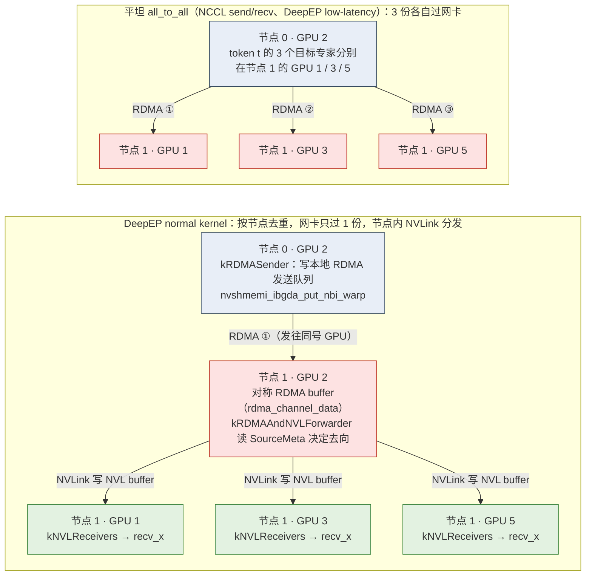
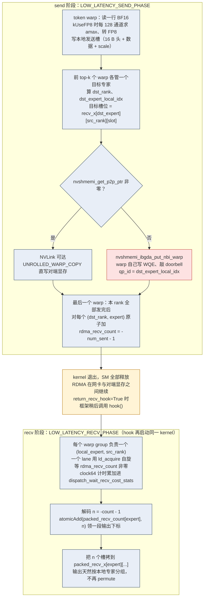
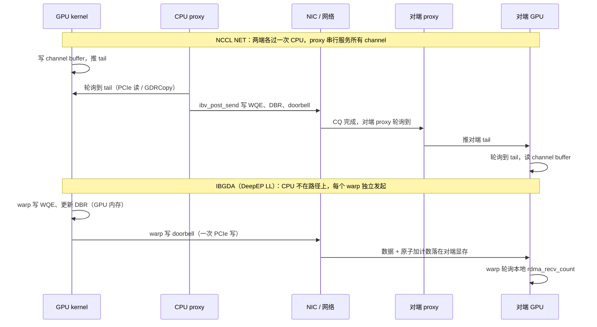

> 本文是[《通信与互联：从 NCCL 到 RDMA》](/communication-and-interconnect-for-ai-infra.html)系列的第 8 篇（共八篇）。上一篇：[推理侧的通信：custom all-reduce 与 KV 传输](/inference-communication-custom-all-reduce-and-kv-transfer.html)

前七篇处理的通信有一个共同点：参与者之间交换的字节数在调用之前就是确定的。all_reduce 的每个 rank 拿同样大小的 buffer，all_gather 的每个 rank 贡献同样大小的一片，KV 传输的 block 列表由 scheduler 事先算好。第一篇给 all_to_all 留了一句话——"$$n(n-1)$$ 条不同的流，无法从绕环一圈里得到好处，跨节点时会同时压满所有链路，是 MoE 训练最难对付的通信模式"——然后就再没有回来。本篇回到这里。

MoE 把它变成了训练和推理里最重的一种通信。一层 MoE 的前向，每个 token 由 router 选出 top-k 个专家，专家分布在 EP 组的所有 rank 上，于是 token 要被**分发**（dispatch）到持有那些专家的 rank、算完再**收回**（combine）加权求和。两次通信都是 all_to_all 的形状，但和第一篇定义的 all_to_all 有三个不同：每个 rank 发给每个对端的**字节数由路由结果决定**、每次都不一样；发给同一个对端的 token 要在对端按专家**重排**成连续的段；对小 batch 的 decode，每条流只有几 KB 到几十 KB，而流的条数是 $$n(n-1)$$。第一个不同让 NCCL 的 all_to_all 必须先做一次通信交换长度；第二个让通信和排列操作纠缠在一起；第三个把问题从带宽的账推到延迟的账，而 NCCL 的延迟账在这里付不起——它的 send/recv 经 proxy 线程提交 RDMA 请求，一个 CPU 线程替一张 GPU 上的几十个 SM 逐条 post，跨节点的每一步都要经过它。

DeepSeek 开源的 DeepEP 是对这三个不同的一份完整回答：一套面向 MoE 的 dispatch / combine kernel，节点内用 NVLink、节点间用 RDMA；高吞吐版本把路由、类型转换、重排和通信融成一个 kernel；低延迟版本用 NVSHMEM 的 IBGDA 让 GPU 的 warp 自己写网卡的工作队列和门铃，把 CPU proxy 从数据路径上彻底拿掉。它同时也是本系列最后一块拼图：第三篇讲 GPUDirect RDMA 时说"GPUDirect Async——GPU 自己触发网卡——本系列不展开"，第四篇讲 NCCL 时说"GPU kernel 不能提交 RDMA 请求，所以需要 proxy"。本篇展开前者，并解释后者为什么不再是一条铁律。

本篇的核心问题是：

> **一层 MoE 的 dispatch + combine，在 EP=64 跨 8 节点时，每个 token 要跨多少条链路、搬多少字节、走几步？为什么 NCCL 的 all_to_all 在 decode 时不够用，DeepEP 又是怎么把它做到几百微秒以内的？**

本文的源码以 **NCCL 2.28.9**、**nccl-tests 2.18.3**、**PyTorch 2.12**、**vLLM v0.23.0（2026-06-14 发布）**、**Megatron-LM core_v0.18.0（2026-06-22 发布）**、**DeepEP v1.2.1（2025-09-15 发布）** 为准。NVSHMEM 本地没有源码树，本文只按 DeepEP 源码对它的使用方式和 NVSHMEM 公开文档描述概念，不引用其内部实现；DeepEP v1.2.1 的 `third-party/README.md` 要求 NVSHMEM 3.3.9 及以上。硬件数字沿用前几篇：H100 SXM 的 NVLink 双向合计 900 GB/s（单向 450 GB/s，标称）、InfiniBand NDR 400 Gb/s（单向约 50 GB/s）、PCIe 5.0 x16 单向约 64 GB/s。文中所有时间数字都是**理论下界或典型量级**，唯一的例外是 DeepEP README 里的官方性能表——引用时会注明它是 DeepSeek 在 H800 + CX7 400 Gb/s 环境下的官方数字，不是本文的实测。DeepEP README 用的模型形状（hidden 7168、top-8、256 专家、4096 token/rank 的 prefill 与 128 token/rank 的 decode）是 DeepSeek-V3/R1 的，本文的算例沿用它，方便和官方表对照。


## 一、总览：一层 MoE 的通信形态

### 1. 四步：路由、dispatch、专家、combine

```text
每个 EP rank 上的一层 MoE（EP = n，每 rank e = E/n 个专家）

  hidden [T, H]  ──► router ──► topk_idx [T, k]、topk_weights [T, k]
                                    │
                    ┌───────────────┴────────────────┐
                    │ dispatch：all_to_all 的形状       │
                    │   rank r 把 token t 发给          │  每 token k 份拷贝
                    │   expert(t, j) 所在的 rank         │  每份 H × dtype 字节
                    │   对端按 (local expert) 重排成段   │  发给谁、发多少由 topk_idx 决定
                    └───────────────┬────────────────┘
                                    ▼
                    每个 rank：对本地 e 个专家各做一次 grouped GEMM（收到的 token 数各不相同）
                                    │
                    ┌───────────────┴────────────────┐
                    │ combine：dispatch 的镜像          │  同样的 k 份拷贝走回来
                    │   专家输出按 dispatch 的来源发回    │  接收方按 topk_weights 加权求和
                    └───────────────┬────────────────┘
                                    ▼
  output [T, H]
```

四步里有两步是通信，而且是**成对**的：combine 的通信矩阵是 dispatch 的转置，谁发给了谁多少，收回来时就是谁发回给谁多少。所以 DeepEP 的 `dispatch` 返回一个 `handle`，`combine` 直接拿它复用布局信息，不用再算一次；反向传播时 dispatch 的梯度是一次 combine、combine 的梯度是一次 dispatch（Megatron `fused_a2a.py` 里 `FusedDispatch.backward` 调 `buffer.combine`，`FusedCombine.backward` 调 `buffer.dispatch`）。

通信矩阵由路由决定，这是 MoE 通信区别于前七篇一切通信的地方。同一个模型、同一个 batch 大小，两个 step 的 all_to_all 各 rank 收发的字节数可以差很多；某个专家热门时，持有它的 rank 收到的 token 比别人多几倍，all_to_all 的完成时间由这个最慢的 rank 决定。把某一步的通信矩阵写出来就能看到这两点：

```text
dispatch 的通信矩阵 C[i][j] = rank i 发给 rank j 的 token 拷贝数
（EP=4 示意，T=64、k=8，每 rank 发出 512 份；rank3 持有一个热门专家）

               收: rank0   rank1   rank2   rank3      行和（发出）
  rank0 发         120      90      40     262          512
  rank1 发         110      85      45     272          512
  rank2 发         115      95      35     267          512
  rank3 发         105      90      50     267          512
  ───────────────────────────────────────────────────
  列和（收到）      450     360     170    1068   ← 平均 512，rank3 收 2.1 倍
                                                    它的接收、GEMM、combine
                                                    都最慢，其余 3 个 rank 等它

combine 的通信矩阵 = Cᵀ：rank3 要发回 1068 份，rank2 只发回 170 份；
矩阵每个 step 都随 topk_idx 变化，所以 dispatch 前必须先知道各列的和
```

### 2. 两本账在 MoE 上的落点

用第一篇的记号。一层 MoE 的 dispatch，每个 rank 发出 $$T \times k$$ 份 token 拷贝，每份 $$H \times b$$ 字节（$$b$$ 是 dtype 字节数，FP8 dispatch 时再加每 128 个元素一个 fp32 的 scale）。均匀路由下 $$1 - 1/n$$ 的拷贝发往别的 rank、$$1 - 1/N$$ 的拷贝发往别的节点（$$N$$ 是节点数）。

**prefill / 训练**：$$T = 4096$$、$$k = 8$$、$$H = 7168$$，FP8 dispatch 每 rank 发出约 242 MB，BF16 combine 约 470 MB。这是**带宽的账**：算的是每张网卡要承担多少字节、NVLink 要承担多少字节、两者哪个先成为瓶颈。DeepEP 的 normal kernel 就是为这本账设计的，它的一个关键动作是让一份跨节点的 token 拷贝在网卡上只走一次，到了对端节点再由 NVLink 分发给同一节点的多个目标 GPU。

**decode**：$$T = 128$$，同样的 $$k$$ 和 $$H$$，每 rank 发出约 7.6 MB，切成 1024 条 7.4 KB 的消息发往 64 个目标。这是**延迟的账**，但和第七篇 decode TP all_reduce 的延迟账不同：那里是一次 128 KB 的消息、时间全部是同步开销；这里是上千条小消息，时间取决于**每条消息的发起开销乘以条数**——谁来发起、能有多少个发起者并行、每次发起要跨几次 PCIe。DeepEP 的 low-latency kernel 让每个 warp 直接向网卡提交请求，发起者从一个 CPU 线程变成几百个 warp，这就是它的答案。

同一层 MoE，prefill 和 decode 两本账的答案指向两套完全不同的 kernel，这也是 DeepEP 分成 normal 和 low-latency 两组的原因；vLLM 的 `deepep_high_throughput` 与 `deepep_low_latency` 两个后端、Megatron 的 `flex` dispatcher 都是它们的封装。

### 3. 本文的章节安排

```text
第二章  算一算：dispatch 与 combine 的字节数、跨节点比例、步数；核心问题在 EP=64 上的数字；
        prefill 与 decode 两种形态；EP 与 TP / DP 叠加时通信怎样相加
第三章  NCCL 路径：ncclAlltoAll 在 2.28.9 里是什么、p2p 的调度与 proxy、PyTorch 的 all_to_all_single 与
        input_split_sizes、为什么变长 split 要先交换 counts、为什么 decode 时不够用
第四章  Megatron 的三种 token dispatcher：AllGather、AllToAll、Flex（DeepEP）各自的通信量与适用条件
第五章  DeepEP 的 Buffer 与 normal kernel：对称显存布局、三步流程、intranode 的 channel 队列、
        internode 的 RDMA 到同号 GPU 再 NVLink 转发、SM 数与 FP8 dispatch
第六章  DeepEP 的 low-latency kernel 与 GPU 发起的通信：worst-case buffer、send / recv 两阶段与 hook、
        NVSHMEM 的对称堆、IBGDA 让 warp 写 WQE 与 doorbell、与第三 / 四篇的对照表、NCCL 自己的 GIN
第七章  对称内存的一般化：PyTorch 2.12 的 all_to_all_vdev 与 all_to_all_vdev_2d
第八章  vLLM 的 all2all 后端：All2AllBackend 的选项、各 manager 的 dispatch / combine、EP 与 DP / TP 的组合、
        与第七篇 custom all-reduce 的分工、EPLB
第九章  测一测与比一比：专家热点如何体现为通信时间、DeepEP 的 SM 数与 Config、NVSHMEM 环境变量、检查清单
第十章  本文小结与系列总结：要点、源码位置、comm-probe 的 moe_a2a_model.py 与 a2a_bench.py；八篇的回顾
```


## 二、算一算：dispatch 与 combine 的账

### 1. 每个 token 多少字节

一个 token 被 dispatch 时产生 $$k$$ 份拷贝，每份的字节数取决于 dtype：

```text
每份拷贝                                   H = 7168
BF16                    H × 2                                 14,336 B
FP8 + per-128 scale     H × 1 + (H / 128) × 4                 7,168 + 224 = 7,392 B
DeepEP LL 的消息        再加 16 B 的 int4 头（源 token 下标）    7,408 B（FP8）/ 14,352 B（BF16）
combine（BF16）         H × 2                                 14,336 B
```

FP8 dispatch 的 scale 布局来自 DeepEP：`Buffer.dispatch` 的文档要求 FP8 输入是一个二元组，第二项形状 `[num_tokens, hidden // 128]`、dtype `torch.float`；low-latency kernel 在 kernel 内部做转换，`internode_ll.cu` 的 `dispatch` 模板参数 `kUseFP8` 为真时每个 warp 对 128 个通道求 amax、算 scale、转 FP8，消息大小 `num_bytes_per_msg = sizeof(int4) + kHidden + num_scales * sizeof(float)`。combine 一律 BF16（low-latency 有一个可选的 10 bit LogFMT 压缩，`use_logfmt`），因为加权求和要在接收端做，精度不能再降。

一个 token 一层的通信量：dispatch $$k \times 7{,}392 = 59$$ KB（FP8）或 $$115$$ KB（BF16），combine $$115$$ KB。$$k = 8$$ 的 MoE 每层每 token 搬 170～230 KB，比一个 dense 层的 TP all_reduce（每 token $$2 \times \frac{2(n-1)}{n} \times H \times 2 \approx 50$$ KB）多 3～5 倍——这是 MoE 通信"重"的第一层含义。

### 2. 跨节点的比例与 RDMA 拷贝数

$$n$$ 个 rank 分在 $$N$$ 个节点上，每节点 $$p = n/N$$ 张卡。均匀路由下，一份拷贝的目标落在本节点的概率是 $$1/N$$，所以跨节点的比例是 $$1 - 1/N$$。$$N = 8$$ 时 7/8 的拷贝要过网卡。

但"过网卡的拷贝数"取决于实现。**平坦的 all_to_all**（NCCL 的 send/recv、DeepEP 的 low-latency kernel）把每份拷贝直接发到目标 rank，一个 token 的 $$k$$ 份里期望 $$k(1 - 1/N)$$ 份走 RDMA。**按节点去重**（DeepEP 的 normal kernel）把发往同一节点的多份拷贝在网卡上合成一份，先 RDMA 到对端节点里**与自己同号的 GPU**，再由它经 NVLink 转发给该节点内的各目标 GPU；一个 token 走 RDMA 的份数是它的目标节点数（去掉本节点）。$$k$$ 个目标均匀落在 $$N$$ 个节点上时，期望的不同节点数是 $$N\left(1 - (1 - 1/N)^k\right)$$，乘上 $$1 - 1/N$$ 是期望的远端节点数：

```text
N = 8 节点，k = 8               走 RDMA 的份数 / token        每 rank 网卡字节（T = 4096，FP8 dispatch）
平坦 all_to_all                  8 × 7/8 = 7.00                4096 × 7.00 × 7,392 B = 212 MB
按节点去重                       8 × (1 − (7/8)^8) × 7/8 ≈ 4.59  139 MB
去重 + group-limited routing     4 × (1 − (3/4)^8) × 7/8 ≈ 3.15  95 MB
（每 token 最多 4 个节点）
```

第三行是 DeepSeek-V3 的设计点：路由先选 4 个节点、再在这 4 个节点里选 8 个专家，DeepEP README 说它的 normal kernel"针对非对称域的带宽转发优化，如从 NVLink 域转发到 RDMA 域"，指的就是这件事。网卡是整条路径上最窄的一段（50 GB/s 对 NVLink 的几百 GB/s），把网卡上的字节从 7 份压到 3 份，是 MoE 通信设计里最大的一笔带宽账。代价是 NVLink 上多走一遍：跨节点到达的每份数据都要再经 NVLink 转发一次，所以 NVLink 承担的字节数接近全部拷贝，而不是只有 $$1/N$$。

### 3. all_to_all 在 α-β 模型里

第一篇的通式 $$T = \text{步数} \times \alpha + \text{每 rank 字节数} / \beta$$ 对 all_to_all 要改两处。

**步数**。all_to_all 的直接算法只有一轮：每个 rank 同时向 $$n - 1$$ 个对端各发一条消息，没有 ring 那种 $$n - 1$$ 步的串行依赖。所以延迟项不随 $$n$$ 线性增长——这是它比 ring 好的地方。但"一轮"里有 $$n - 1$$ 条消息要**发起**，每条发起有自己的固定开销；发起者是一个 CPU proxy 线程时这 $$n - 1$$ 次串行，是 GPU 上的几百个 warp 时并行。这就是把 $$\alpha$$ 拆成"每轮的 α"和"每条消息的发起开销 × 条数"两项的原因，第六章会用 DeepEP 的官方数字反推它。

**字节数与 β**。ring 的每个 rank 只有一条出向链路在用；all_to_all 的每个 rank 同时在向本节点的 $$p - 1$$ 张卡走 NVLink、向其他 $$N - 1$$ 个节点走网卡。两条路并行，时间取两者中长的那个：

$$
T_{\text{a2a}} \approx \alpha_{\text{step}} + \max\!\left(\frac{B_{\text{NIC}}}{\beta_{\text{NIC}}},\ \frac{B_{\text{NVL}}}{\beta_{\text{NVL}}}\right)
$$

其中 $$B_{\text{NIC}}$$ 按上一小节的 RDMA 拷贝数算，$$B_{\text{NVL}}$$ 取全部拷贝（平坦算法的本节点部分只有 $$1/N$$，但 DeepEP 的转发让几乎所有字节都过一遍 NVLink；作为上界统一按全部拷贝算）。$$\beta_{\text{NVL}}$$ 用"一张 GPU 做 all_to_all 时实际能用到的出向带宽"，DeepEP README 给的 H800 环境是"约 160 GB/s NVLink 最大带宽"、intranode 实测 153 GB/s；本文模型默认取 150 GB/s（H100 的 NVLink 更宽，这个默认值偏保守）。

**变长 split 多出的一次通信**。每个 rank 要事先知道会从每个对端收到多少 token 才能分配接收 buffer、告诉 NCCL `output_split_sizes`。这需要在数据 all_to_all 之前先做一次 counts 的交换（一次很小的 all_to_all 或 all_gather），再把结果从 GPU 拷到 CPU、同步 stream。这一步的代价不是字节而是**两次 α 加一次 host 同步**，并且这次同步让 CUDA Graph 捕获失效——第三章展开。

### 4. 核心问题的数字：EP=64 跨 8 节点

取 DeepEP README 的形状：$$H = 7168$$、$$k = 8$$、256 个专家、EP=64（8 节点 × 8 卡，每 rank 4 个专家），网卡 NDR 单向 50 GB/s，NVLink 按 150 GB/s，α 跨节点一步 20 µs（典型量级，非实测）。

**每个 token 跨多少条链路**：8 份拷贝，均匀路由下期望 7 份出节点、1 份留在节点内。出节点的一份走 GPU → PCIe → NIC → IB 交换机 → 对端 NIC → PCIe → 对端 GPU；平坦算法到此为止，DeepEP normal kernel 到达的是对端节点的同号 GPU，再加一跳 NVLink 到真正的目标。按节点去重后，一个 token 期望只有约 4.6 份（不限制节点）或 3.2 份（限 4 节点）走网卡。combine 原路返回，链路数翻倍。

**搬多少字节**：每 token dispatch 59 KB（FP8）、combine 115 KB（BF16）；每 rank 每层 prefill 4096 token 时 dispatch 出向 242 MB、combine 470 MB。

**走几步**：dispatch 一轮、combine 一轮，这是任何实现都要付的；NCCL 路径每个方向再加一次 counts 交换和一次 host 同步；DeepEP normal kernel 每个方向是 `get_dispatch_layout`、`notify_dispatch`（交换 counts，CPU 等一个 pinned 计数器）、`dispatch` 三个 kernel，combine 复用 handle 少一步；low-latency kernel 每个方向只有一个 kernel 的 send 阶段和一个 recv 阶段，没有 counts 交换。

**时间**（`moe_a2a_model.py` 的输出，第十章给完整表）：

```text
prefill，4096 token/rank，FP8 dispatch / BF16 combine，EP=64
                            网卡字节     网卡时间     NVLink 时间    dispatch    combine    一层
平坦 all_to_all              212 MB      4.24 ms     1.61 ms        4.26 ms    8.24 ms    12.5 ms
按节点去重（DeepEP normal）    139 MB      2.78 ms     1.61 ms        2.80 ms    5.42 ms     8.2 ms
去重 + 4 节点 group routing    95 MB      1.91 ms     1.61 ms        1.93 ms    3.72 ms     5.6 ms

decode，128 token/rank，同样 dtype，EP=64（low-latency：平坦，无去重）
                            网卡字节     网卡时间     NVLink 时间    dispatch    combine    一层
理论                          6.6 MB     132 µs      50 µs          152 µs     277 µs     429 µs
DeepEP README（H800，官方）                                         173 µs     314 µs     487 µs
```

三件事值得先记住，后面几章都会回到它们。第一，prefill 的 MoE 通信是**网卡带宽的账**：EP=64 时网卡时间是 NVLink 的 1.7～2.6 倍，60 层这样的 MoE 层一个 micro-batch 要花 0.3～0.75 s 在通信上，能否与计算重叠决定了训练效率——DeepEP README 的双 micro-batch 重叠图和 `async_finish` / `previous_event` 接口是为这个存在的。第二，decode 在 EP=64、128 token 时**并不是纯延迟主导**：6.6 MB 过 50 GB/s 的网卡本身就要 132 µs，README 的 173 µs 里 3/4 是字节；把 β 的账算清楚之后剩下的 40 µs 左右才是 α。第三，decode 的字节被切成了 1024 条 7.4 KB 的消息，173 µs 内发完意味着每 µs 发起约 6 条——这个发起速率是 CPU proxy 线程给不了的（一次 `ibv_post_send` 加上 GPU–CPU 之间的 flag 往返在微秒量级，典型量级非实测），这是"为什么要 GPU 发起"的算术根据。

### 5. prefill 与 decode 两种形态

把上面的数字放回第一篇的曲线上：

```text
                    每 rank 出向字节     消息条数 / 大小            主导项                DeepEP 的 kernel
prefill / 训练      几百 MB              per-rank 大块，几 MB 一条    网卡 β；NVLink 转发      normal（intranode.cu / internode.cu）
                                                                   SM 数决定能否跑满链路
decode              几 MB                T × k 条，每条几 KB          每条消息的发起开销 × 条数  low-latency（internode_ll.cu）
                                                                   + 网卡 β（EP 大时）
```

两种形态对"重叠"的要求也不同。prefill 的通信长达毫秒，要和专家 GEMM 重叠，DeepEP normal kernel 在自己的 comm stream 上跑、占 `num_sms` 个 SM（默认 20），其余 SM 留给计算；decode 的通信只有几百微秒，但 decode 本身也只有几毫秒，README 的做法是双 micro-batch：一个 batch 的 attention 和另一个 batch 的 dispatch 重叠，靠 `return_recv_hook` 让 RDMA 在后台进行、期间不占任何 SM——第六章讲它怎么做到的。

### 6. EP 与 TP / DP 叠加时通信怎样相加

第一篇列过训练五种并行各自的通信，这里只说 EP 与其他并行组合时**多出来**的部分。

- **EP + TP（专家也切 TP）**：Megatron 的 `MoEAlltoAllTokenDispatcher` 先在 EP 组做 all_to_all，再在 TP 组做一次 all_gather（`dispatch_postprocess` 里 `gather_from_sequence_parallel_region(..., group=self.tp_group)`），combine 时先 reduce_scatter（TP）再 all_to_all（EP）。每层多两次 TP 集合通信，消息是 all_to_all 之后的全部本地 token。`MoEFlexTokenDispatcher` 的做法不同：把 TP × EP 当成一个平坦的组，`router_topk = tp_size × topk`、`num_experts = tp_size × num_experts`，让 DeepEP 一次 dispatch 把 token 同时送到所有 TP 副本——通信量与前者相同，但少了一次集合通信的 α。
- **EP + DP（推理常见：attention 用 DP，MoE 用 EP）**：vLLM 的 EP 组就是 DP × TP 组平坦化的结果（第八章）。attention 部分各 DP rank 独立，到了 MoE 层所有 DP rank 的 token 一起做 dispatch；DP rank 之间的 batch 大小不同，dispatch 的 counts 交换必须覆盖 DP 维度。
- **共享专家**：dense 的 shared expert 不需要通信，可以与 dispatch all_to_all 重叠；Megatron `token_dispatch` 里刻意把 `shared_experts.linear_fc1_forward_and_act` 放在 token 的 all_to_all 之后、probs 的 all_to_all 之前，让 GEMM 在通信进行时被启动——这是第五篇讲的 stream 级重叠的一个具体用法。

其余（PP 的 send/recv、DP 的梯度 all_reduce）与 dense 模型相同，不重复。


## 三、NCCL 路径：ncclAlltoAll、send/recv 与 all_to_all_single

### 1. ncclAlltoAll 在 2.28.9 里是什么

NCCL 2.28 的 `src/nccl.h.in` 里有 `ncclAlltoAll(sendbuff, recvbuff, count, datatype, comm, stream)`：每个 rank 向每个对端发 `count` 个元素、从每个对端收 `count` 个元素，发给 rank j 的数据取自 `sendbuff + j*count`，从 rank i 收到的放在 `recvbuff + i*count`。注意它**只有等长版本**，没有 `ncclAlltoAllv`——2.28.9 的公共头文件里不存在变长 all_to_all 的 API。

它也不是一个独立的 collective kernel。`src/collectives.cc` 的 `ncclAlltoAll` 构造一个 `ncclFuncAlltoAll` 的 `ncclInfo` 交给 `ncclEnqueueCheck`，然后 `src/enqueue.cc` 的 `taskAppend` 把它展开：

```cpp
// src/enqueue.cc，taskAppend，有删节
if (info->coll == ncclFuncAlltoAll) {
  for (int r=0; r<comm->nRanks; r++) {
    NCCLCHECK(p2pTaskAppend(comm, info, ncclFuncSend, collAPI, (char*)info->sendbuff + r*info->count*ncclTypeSize(info->datatype), info->count, info->datatype, r));
    NCCLCHECK(p2pTaskAppend(comm, info, ncclFuncRecv, collAPI, (char*)info->recvbuff + r*info->count*ncclTypeSize(info->datatype), info->count, info->datatype, r));
  }
}
```

也就是 $$n$$ 对 send/recv 任务——与用户自己写 `ncclGroupStart(); for r: ncclSend(...); ncclRecv(...); ncclGroupEnd();` 完全等价。同一个函数里只有一条例外路径：`comm->symmetricSupport && comm->nNodes == 1`、两个 buffer 都是用 `NCCL_WIN_COLL_SYMMETRIC` 注册的对称窗口、且 `config.CTAPolicy == NCCL_CTA_POLICY_ZERO` 时走 `ceCollTaskAppend`——`src/ce_coll.cc` 用 copy engine（`cudaMemcpyAsync` 一类的 DMA，不占 SM）做单节点内的 AllGather / AlltoAll / Scatter / Gather（`ncclCeImplemented` 列出这四种，且要求 CUDA 12.5+）。这条路径与 MoE 的跨节点场景无关，但它说明 NCCL 也意识到 all_to_all 不需要归约、可以不占 SM。

FP8 是 NCCL 支持的 dtype；`taskAppend` 对 `ncclFloat8e4m3` / `ncclFloat8e5m2` 的检查只对需要归约的 collective 要求 sm90（"FP8 reduction support begins with sm90"），AlltoAll、AllGather、Broadcast、Scatter、Gather 不受限。所以 NCCL 可以搬 FP8 的 token，但类型转换和 scale 计算要另外的 kernel 做。

### 2. p2p 的调度与 proxy

$$n$$ 对 send/recv 进了 planner 之后由 `scheduleP2pTasksToPlan`（`src/enqueue.cc`）安排。它按 `comm->p2pSchedule[round]` 的顺序逐轮取出 (sendRank, recvRank) 对，`ncclP2pSchedule`（`src/init.cc`）用一个二次剩余序列（源码注释给的 16 rank 例子：0, 1, 3, 6, 10, 15, 5, 12, …）生成每轮的对端偏移，让所有 rank 在同一轮不会同时打向同一个目标；多节点时先按节点分组（`p2pSchedGroupSize`），再在组内轮转，与 PXN 的聚合因子配合。每轮的任务被切到 `p2pnChannelsPerPeer` 个 p2p channel 上，所有轮合成**一次 kernel 启动**（`ncclDevFuncId_P2p()` 对应的 kernel），设备侧由 `src/device/sendrecv.h` 执行。

节点内的对端走 P2P transport，kernel 直接读写对端显存（第四篇）。跨节点的对端走 NET transport：kernel 把数据写到 channel buffer、推 `tail`，proxy 线程的 `sendProxyProgress` 看到之后按 `NCCL_P2P_NET_CHUNKSIZE`（`src/init.cc` 默认 128 KB）切块调 `isend`，网卡完成后再由对端 proxy 推 `tail` 让接收 kernel 去读。第四篇第九章讲过这条链：**每一条跨节点消息的每一个 chunk 都要经过 CPU 线程一次**，而一个 rank 只有一个 progress 线程（`ncclProxyProgress`），它对所有活跃的 channel 与对端串行轮询（`progressOps`）。对 prefill 的几 MB 一条的消息这不是问题——chunk 大、条数少、带宽主导；对 decode 的 1024 条 7.4 KB 消息，每条都要 GPU 写 tail → proxy 发现 → `ibv_post_send` → 完成 → 对端 proxy 推 tail → 对端 kernel 发现，一个线程串行做上千遍。`NCCL_P2P_LL_THRESHOLD`（`src/enqueue.cc` 默认 16 KB）以下的 p2p 会用 LL 协议减少每步的同步，但发起者仍是 proxy。

### 3. PyTorch 的 all_to_all_single 与 input_split_sizes

`torch.distributed.all_to_all_single(output, input, output_split_sizes=None, input_split_sizes=None, group=None, async_op=False)`（`torch/distributed/distributed_c10d.py`）的语义：`input` 沿第 0 维切成 `world_size` 段，第 j 段发给 rank j；`output` 的第 i 段来自 rank i。两个 split 参数为 `None` 时等分；否则 `input_split_sizes[j]` 是发给 rank j 的行数、`output_split_sizes[i]` 是从 rank i 收的行数，两者必须与对端的 `input_split_sizes` 互为转置，否则 hang 或数据错位——这是第六篇"参数不一致"一类 hang 在 MoE 里最常见的形态。

c10d 侧 `ProcessGroupNCCL::alltoall_base`（`torch/csrc/distributed/c10d/ProcessGroupNCCL.cpp`）分两条路：

```text
split 为空（等长）     torch::cuda::nccl::all2all_single_equal_split      torch/csrc/cuda/nccl.cpp
                       NCCL ≥ 2.28 → ncclAlltoAll（一次调用）
                       更早版本 → ncclGroupStart + n × (ncclSend, ncclRecv) + ncclGroupEnd
split 非空（变长）     c10d::computeLengthsAndOffsets 算出每个对端的字节长度与偏移
                       torch::cuda::nccl::all2all_single_unequal_split
                       → ncclGroupStart + n × (ncclSend(sendbuff+senddispls[r]), ncclRecv(recvbuff+recvdispls[r])) + ncclGroupEnd
                       （ncclAllToAllv 分支只在 ROCm 或定义了 NCCL_ALLTOALLV_SUPPORTED 的构建里，PyTorch 自身不定义它）
```

两条路在 NCCL 内部殊途同归：都变成 $$n$$ 对 p2p 任务。差别只在 host 侧——等长版本 PyTorch 传一次 `ncclAlltoAll`，变长版本 PyTorch 自己循环 $$2n$$ 次 `ncclSend` / `ncclRecv`。`_nccl_should_send_recv` 在 NCCL > 2.13 时对 0 长度也照常发（源码注释：NCCL 2.12.10 起支持 0 字节 send/recv，跳过会导致各 rank 调用不匹配而死锁）。两条路都通过 `collective()` 包装成一个 `Work`（`OpType::ALLTOALL_BASE`，profiler 名 `nccl:all_to_all`），进入第五篇讲的 stream / event / watchdog 机制，也被第六篇的 Flight Recorder 记录为一次 collective。

### 4. 为什么变长 split 要先交换 counts：两步、两次 α、一次 host 同步

`output_split_sizes` 是一个 Python 列表——**必须在 CPU 上**。而"我会从每个对端收到多少 token"只有对端知道（它的 router 决定的），并且结果在 GPU 上。所以任何用 `all_to_all_single` 做 MoE dispatch 的框架都要走这三步：

```text
1. 本地算 input_splits[j] = 发给 rank j 的 token 数          GPU 上一个 sum（routing_map 按专家求和再按 rank 归并）
2. 交换 counts                                               一次很小的集合通信（all_to_all 或 all_gather，几十到几千字节）
3. D2H + 同步：把 output_splits 拷到 CPU、等待完成             cudaMemcpyAsync + cudaStreamSynchronize（或 .tolist()）
4. 分配接收 buffer（sum(output_splits) 行），发数据 all_to_all
```

第 2 步是一次额外的 α（跨节点十几到几十微秒，典型量级）；第 3 步是一次 host 同步，它让 CPU 停下来等 GPU，之后所有 kernel 的发射都要重新排队，对 decode 这种每层几百微秒的场景，一次几十微秒的同步不可忽略，更重要的是 **CUDA Graph 无法捕获它**——第七篇讲过 decode 几乎全部在 graph 回放里，一个不能捕获的 all_to_all 意味着整层 MoE 都要退出 graph。Megatron 的 `MoEAlltoAllTokenDispatcher` 把这件事做得很显式：`preprocess` 用 `gather_from_sequence_parallel_region(num_local_tokens_per_expert, group=self.tp_ep_group)` 交换每个专家的 token 数（这里选的是 all_gather，因为后面 `dispatch_postprocess` 排序也要用到全局分布），`cuda_sync_point` 记录同步必须发生在哪一步（`before_permutation_1` / `before_ep_alltoall` / `before_permutation_2` / `before_finish` / `no_sync`），`_maybe_dtoh_and_synchronize` 在那一步把 `input_splits` / `output_splits` 等拷到 CPU；类注释直接说明了这些 DtoH 在专门的 `cuda_dtoh_stream` 上做以便与主 stream 重叠。

对 combine 没有这个问题：combine 的 splits 就是 dispatch 的 splits 反过来，不用再交换。所以 NCCL 路径一层 MoE 的通信是 **3 次集合通信（counts、dispatch、combine）加 1 次 host 同步**，本文模型里记为 `nccl+cnt` 一列。

### 5. 为什么 decode 时不够用

把前面几小节合起来，NCCL 的 all_to_all 在 decode 上付的额外代价有五项，每一项都对应 DeepEP 的一个设计决定：

```text
NCCL 路径在 decode 上多付的                                  DeepEP low-latency 的做法
─────────────────────────────────────────────────────────   ─────────────────────────────────────────────────
counts 交换 + host 同步；不能进 CUDA Graph                    接收 buffer 按 worst case（num_max_dispatch_tokens_per_rank × num_ranks
                                                            每专家）预分配，计数随数据一起用原子加送到对端，无 host 同步，可捕获
每条跨节点消息经 proxy 线程发起；一个 CPU 线程对所有对端串行     每个 warp 自己写 WQE、敲门铃（IBGDA）；发起者数量随 SM 数增长
数据经 channel buffer 中转（Simple 协议的 slot、LL 的 8+8）      写进对端的对称 buffer，接收端直接从那里读出成 [expert, token, hidden] 布局
permute → 发送 buffer → 接收 buffer → 按专家排序，多次拷贝     FP8 转换、按专家分槽、发送在一个 kernel 里完成；combine 时加权求和在接收端完成
kernel 全程占 SM 自旋等 head / tail                          send 阶段结束 kernel 就退出；RDMA 在后台进行；recv 阶段由 hook 另起 kernel
```

第一、二项是延迟账上的，后三项是"少搬几次、少占 SM"。第六章逐项讲 DeepEP 怎么做的；先看训练框架在 NCCL 之上和 DeepEP 之上各是什么样。


## 四、Megatron 的三种 token dispatcher

Megatron-LM core_v0.18.0 的 `megatron/core/transformer/moe/token_dispatcher.py` 定义了基类 `MoETokenDispatcher` 和三个实现，`moe_layer.py` 按 `config.moe_token_dispatcher_type` 选择（`transformer_config.py`：`Literal['allgather', 'alltoall', 'flex']`，默认 `allgather`）。三者共享同一组钩子：`dispatch_preprocess` → `token_dispatch` → `dispatch_postprocess` → 专家计算 → `combine_preprocess` → `token_combine` → `combine_postprocess`。

### 1. MoEAllGatherTokenDispatcher：all_gather 全部 token

最简单的实现不做 all_to_all。`token_dispatch` 在 TP × EP 组上 `gather_from_sequence_parallel_region` 三样东西：`routing_map`、`probs`、`hidden_states`——把**所有 rank 的所有 token**收到每个 rank；`dispatch_postprocess` 再用 `local_map = routing_map[:, local_expert_indices]` 挑出路由到本地专家的那些，`permute` 成按专家连续的段。combine 反过来：`unpermute` 回全局位置（其他专家的位置是 0），`reduce_scatter_to_sequence_parallel_region` 在 TP × EP 组上归约并切回自己那段。

通信量：每 rank 接收 $$(n - 1) \times T \times H \times b$$（全部别人的 token），与 $$k$$ 无关；combine 的 reduce_scatter 同样是 $$\frac{n-1}{n} \times nTHb$$。对比 all_to_all 的 $$\frac{n-1}{n} \times T k H b$$，两者之比是 $$n / k$$：**$$k \geq n$$ 时 all_gather 不吃亏**（每个 token 反正几乎要去所有 rank），$$n \gg k$$ 时 all_to_all 少 $$n/k$$ 倍。EP=8、top-8 时两者相同；EP=64、top-8 时 all_gather 多 8 倍。它还有一个隐含成本：每个 rank 对全部 $$nT$$ 个 token 做 permute 和 mask，计算和显存随 $$n$$ 增长。所以它适合小 EP（TP × EP ≤ 8 一类）和"专家数少、每个 token 选的专家占比高"的模型；Megatron 把它设为默认，是因为它没有 counts 交换与 host 同步、对 CUDA Graph 最友好（`cudagraph_attrs = ['routing_map']`）。

### 2. MoEAlltoAllTokenDispatcher：上一章的 NCCL 路径

类文档把七步写得很清楚：

```text
(1) preprocess：算通信元数据（input_splits / output_splits / 每本地专家 token 数）并决定同步点
(2) dispatch preprocess：permute，把 token 按目标 rank 排成连续段
(3) token dispatch：A2A(EP)
(4) dispatch postprocess：AG(TP) → 若本地专家 > 1，sort_chunk 按专家重排
(5) combine preprocess：sort_chunk 还原 → RS(TP)
(6) token combine：A2A(EP)
(7) combine postprocess：unpermute
```

`token_dispatch` 调 `megatron/core/tensor_parallel/mappings.py` 的 `all_to_all`（`_AllToAll.apply`），后者就是 `torch.distributed.all_to_all_single(output, input, output_split_sizes, input_split_sizes, group)`，变长时 `output = input.new_empty([sum(output_split_sizes)] + ...)`——这行 `sum()` 要求 `output_split_sizes` 已经在 CPU 上，对应第三章第 4 节的 host 同步。token 和 probs 各做一次 all_to_all（两次调用），`use_nccl_stream=True` 时用 `async_op=True` 再立刻 `wait()`，让 NCCL 在 ProcessGroupNCCL 的内部 stream 上跑（第五篇）。

它的通信量是标准的 all_to_all：每 rank 发出 $$\frac{n-1}{n} T k H b$$（EP 组），TP > 1 时 `dispatch_postprocess` 再在 TP 组上 all_gather 一次 all_to_all 之后的全部本地 token（`output_splits_tp` 给出变长的 split）。`moe_pad_expert_input_to_capacity`（drop-and-pad）时 splits 变成常数 `capacity`，不再需要交换 counts，代价是丢 token 和补零。

同步点的选择（`cuda_sync_point` 与 `cuda_dtoh_point`）是这个 dispatcher 最精细的部分：dropless 训练下 `num_out_tokens = T × topk` 是静态的，permute 不需要同步；EP > 1 时 `before_ep_alltoall` 之前必须拿到 splits；本地专家 > 1 且没有 fused permute 时 `before_permutation_2` 之前要拿到每专家 token 数。CUDA Graph 模式（`cuda_graph_impl != "none"` 且捕获 `moe_preprocess`）下 DtoH 点被推到 `before_ep_alltoall`，让 preprocess 那一段能被捕获——all_to_all 本身仍然不能。

### 3. MoEFlexTokenDispatcher 与 _DeepepManager：DeepEP 的封装

`MoEFlexTokenDispatcher` 的类文档说它"在所有 TP 和 EP rank 上用一个通信组，让 dispatch 逻辑与具体并行策略无关"。`_initialize_metadata` 把 `[T, num_experts]` 的 routing_map 扩成 `[T, world_size, num_local_experts]`——TP 的每个副本被当作一组独立的目标专家，所以 `_DeepepManager` 构造时 `router_topk = tp_size × moe_router_topk`、`num_experts = tp_size × num_moe_experts`。后端由 `moe_flex_dispatcher_backend`（`deepep` 或 `hybridep`）选择；`moe_enable_deepep` 已标记为 deprecated，等价于 `flex` + `deepep`。

`_DeepepManager.setup_metadata` 用 `torch.topk(probs, router_topk)` 把 multihot 的 routing_map 转回 `[T, k]` 的 `token_indices` / `token_probs`（DeepEP 的输入格式，被丢弃的 token 用 -1 标记）；`dispatch` 调 `fused_dispatch`（`fused_a2a.py` 的 `FusedDispatch.apply`）：

```python
# megatron/core/transformer/moe/fused_a2a.py，FusedDispatch.forward，有删节
buffer = get_buffer(group, get_hidden_bytes(x))
num_tokens_per_rank, num_tokens_per_rdma_rank, num_tokens_per_expert, is_token_in_rank, event = \
    buffer.get_dispatch_layout(token_indices, num_experts, previous_event=previous_event,
                               async_finish=async_finish, allocate_on_comm_stream=allocate_on_comm_stream)
# NOTES: the CPU will wait for GPU's signal to arrive, so this is not compatible with CUDA graph
recv_x, recv_token_indices, recv_token_probs, num_recv_tokens_per_expert_list, handle, after_event_overlap = \
    buffer.dispatch(x, topk_idx=token_indices, topk_weights=token_probs,
                    num_tokens_per_rank=num_tokens_per_rank, num_tokens_per_rdma_rank=num_tokens_per_rdma_rank,
                    is_token_in_rank=is_token_in_rank, num_tokens_per_expert=num_tokens_per_expert,
                    previous_event=event, async_finish=async_finish, allocate_on_comm_stream=allocate_on_comm_stream)
```

`get_buffer` 是 DeepEP README 示例代码的原样搬运：用 `Buffer.get_dispatch_config(group.size())` 与 `get_combine_config` 的 `get_nvl_buffer_size_hint` / `get_rdma_buffer_size_hint` 算出两块 buffer 的大小，全局只建一个 `Buffer`。`set_deepep_num_sms(config.moe_deepep_num_sms)` 调 `Buffer.set_num_sms`，默认 20。dispatch 之后 `get_permuted_hidden_states_by_experts` 把收到的 `[recv_tokens, k]` 的 indices 转回 multihot（`_indices_to_multihot` 或 fused 版本）再 `permute` 成按本地专家连续——DeepEP normal kernel 送到的是"按来源 rank 排列、每 token 带 topk 信息"的布局，按专家的排列由框架完成。`combine` 调 `fused_combine` → `buffer.combine(x, handle)`，用 dispatch 留下的 handle。

`_DeepepManager` 对 probs 的 dtype 有硬要求：`DeepEP only supports float32 probs`，非 fp32 时告警并转换。

### 4. 三者的对照

```text
                     通信原语                       每 rank 字节（dispatch 方向）              counts 交换 / host 同步      CUDA Graph      适用
allgather            AG(TP×EP) + RS(TP×EP)          (n−1) × T × H × b，与 k 无关               无                          可捕获          小 EP、k 接近 n
alltoall             A2A(EP) ×2（token、probs）      (n−1)/n × T × k × H × b                    AG counts + DtoH 同步        不可捕获 A2A    中等 EP，NCCL 即可
                     + AG(TP) / RS(TP)              + TP 组的 all_gather
flex / deepep        DeepEP dispatch / combine      同上，但跨节点按节点去重、可 FP8            get_dispatch_layout +       不可捕获        大 EP、跨节点
                     （TP×EP 一个组）                                                          notify_dispatch（CPU 等计数器）  （normal kernel）
```

第三列的差别就是第二章第 2 节的算术；第四列的差别是第三章第 4 节的两次 α。下面两章看 DeepEP 是怎么实现第三行的。


## 五、DeepEP：Buffer 与 normal kernel

DeepEP v1.2.1 的源码分三层：Python 的 `deep_ep/buffer.py`（`Buffer` 类，接口与配置表）、C++ 的 `csrc/deep_ep.cpp`（`Buffer` 的 host 侧：分配、同步、启动 kernel、等待计数器）、CUDA 的 `csrc/kernels/`（`intranode.cu`、`internode.cu`、`internode_ll.cu`、`layout.cu`、`runtime.cu`，以及 `ibgda_device.cuh`）。`csrc/config.hpp` 放 `Config` 与 `LowLatencyLayout`，`csrc/kernels/configs.cuh` 放常量：`NUM_MAX_NVL_PEERS 8`、`NUM_MAX_RDMA_PEERS 20`（normal kernel 最多 8 × 20 = 160 个 rank）、`NUM_MAX_LOCAL_EXPERTS 1024`、`NUM_BUFFER_ALIGNMENT_BYTES 128`。

### 1. Buffer 的对称显存布局

`Buffer.__init__(group, num_nvl_bytes, num_rdma_bytes, low_latency_mode, num_qps_per_rank, ...)` 建两块 buffer，两块都是**对称的**：每个 rank 分配同样大小、对端的同一逻辑位置可以用同一个偏移访问。

**NVLink buffer**（`num_nvl_bytes`）。C++ 构造函数 `Buffer::Buffer` 里 `cudaMalloc` 一块 `num_nvl_bytes + barrier_signal_bytes + buffer_ptr_bytes + barrier_signal_ptr_bytes`，`cudaIpcGetMemHandle` 导出句柄；Python 侧用 `dist.all_gather_object` 交换句柄和 device id，`Buffer::sync` 对同节点的每个对端 `cudaIpcOpenMemHandle(..., cudaIpcMemLazyEnablePeerAccess)`，把 8 个指针写进设备端数组 `buffer_ptrs_gpu`、把 8 个 barrier 信号指针写进 `barrier_signal_ptrs_gpu`。这与第七篇 custom all-reduce 的 `RankData` / `Signal` 是同一套机制：CUDA IPC + 每 rank 一块 + 指针表。`check_nvlink_connections`（`deep_ep/utils.py`）要求节点内的 rank 两两 NVLink 直连（PCIe 卡只允许 EP=2），原因与 custom AR 相同。

**RDMA buffer**（`num_rdma_bytes`）。`Buffer::sync` 在 `num_rdma_bytes > 0` 时初始化 NVSHMEM（`internode::init`，`runtime.cu`：`nvshmemx_set_attr_uniqueid_args` + `nvshmemx_init_attr(NVSHMEMX_INIT_WITH_UNIQUEID, ...)`，unique id 由 rank 0 或每个 RDMA 组的 root 生成、经 `all_gather_object` 分发），然后 `internode::alloc` → `nvshmem_align(alignment, size)` 从 NVSHMEM 的**对称堆**分配。对称堆的含义是：所有 PE 上这块 buffer 的大小相同、在各自堆里的偏移相同，于是"本地指针 + 对端 PE 号"就足以确定对端地址——kernel 里 `nvshmemi_get_p2p_ptr(dst_ptr, rank, dst_rank)` 对 NVLink 可达的对端返回一个可以直接 store 的映射地址，不可达时返回 0、走 RDMA（第六章）。normal 模式下 NVSHMEM 的 PE 集合是**每个节点同号 GPU 组成的 RDMA 组**（`nvshmem_rank = rdma_rank`，`num_nvshmem_ranks = num_rdma_ranks`），即 rank `r` 只与 `r % 8` 相同的其他节点 GPU 建 RDMA 连接；low-latency 模式下所有 rank 都是 PE。

进入 NVSHMEM 之前 `Buffer.__init__` 设了一组环境变量（`deep_ep/buffer.py`），这是本文唯一有源码依据的 NVSHMEM 配置清单：

```python
os.environ['NVSHMEM_DISABLE_P2P'] = '0' if allow_nvlink_for_low_latency_mode else '1'
os.environ['NVSHMEM_IB_ENABLE_IBGDA'] = '1'
os.environ['NVSHMEM_IBGDA_NUM_RC_PER_PE'] = f'{num_qps_per_rank}'
os.environ['NVSHMEM_QP_DEPTH'] = os.environ.get('NVSHMEM_QP_DEPTH', '1024')   # 深度 > 在飞 WR 数，kernel 里省掉 WQ slot 检查
os.environ['NVSHMEM_MAX_TEAMS'] = '7'
os.environ['NVSHMEM_DISABLE_NVLS'] = '1'                                       # 不用 NVLink SHARP
os.environ['NVSHMEM_CUMEM_GRANULARITY'] = f'{2 ** 29}'
if not allow_mnnvl: os.environ['NVSHMEM_DISABLE_MNNVL'] = '1'
```

`NVSHMEM_IB_ENABLE_IBGDA=1` 是整个设计的前提；`NVSHMEM_IBGDA_NUM_RC_PER_PE` 是每对 PE 之间的 RC QP 数——normal 模式下要等于 channel 数（`internode.cu` 的 `dispatch` 有 `EP_DEVICE_ASSERT(ibgda_get_state()->num_rc_per_pe == num_channels or ... >= num_sms)`），low-latency 模式下 README 要求"必须等于本地专家数"，因为 LL kernel 用 `dst_expert_local_idx` 作为 `qp_id`，每个本地专家一条 QP。这两个数决定了 GPU 上有多少条独立的发送队列可以并行敲门铃。

**其他**：`workspace`（`NUM_WORKSPACE_BYTES` 32 MB，放 LL kernel 的每专家原子计数器）、几个 `cudaMallocHost(..., cudaHostAllocMapped)` 的 pinned 计数器（`moe_recv_counter`、`moe_recv_expert_counter`、`moe_recv_rdma_counter`）——GPU kernel 直接写、CPU 轮询读，是 normal kernel "CPU 等 GPU 的信号"的载体。所有 kernel 在 `Buffer` 自己的 `comm_stream` 上启动，`get_comm_stream` 暴露给框架做 event 依赖。

### 2. 三步：get_dispatch_layout → notify_dispatch → dispatch

normal 模式的一次 dispatch（`Buffer.dispatch`，无 handle 时）：

1. **`get_dispatch_layout`**（`layout.cu`）：输入 `topk_idx [T, k]`，输出 `num_tokens_per_rank [n]`、`num_tokens_per_rdma_rank [N]`、`num_tokens_per_expert [E]`、`is_token_in_rank [T, n]`（bool）。最后一个就是"按节点 / 按 rank 去重"的载体：一个 token 选了同一 rank 的两个专家只算一次。
2. **`notify_dispatch`**（`intranode.cu` / `internode.cu`）：把本 rank 要发给每个对端的 token 数写到对端的 buffer 里（节点内直接 store 到对端 IPC 映射的 buffer，节点间 `nvshmemi_ibgda_put_nbi_warp` 写到对端的对称 buffer），`barrier_block` 同步，然后每个 rank 算出自己总共会收到多少 token、每个本地专家收到多少、每个 channel 的前缀和（`channel_prefix_matrix`），并把总数写进 pinned 的 `moe_recv_counter`。C++ 侧 `Buffer::intranode_dispatch` / `internode_dispatch` 在 host 上自旋等这个计数器变为非负，超过 `NUM_CPU_TIMEOUT_SECS` 抛 `"DeepEP error: CPU recv timeout"`——这就是 README 那句"an implicit CPU wait for GPU received count signal will be involved"、也是 `fused_a2a.py` 注释里"not compatible with CUDA graph"的来源。它取代了 NCCL 路径的"counts all_to_all + D2H + 同步"，少了一次 torch 层的集合通信，但 host 同步仍在。
3. **`dispatch`**：拿到接收总数后分配 `recv_x`、`recv_topk_idx` 等输出，启动数据 kernel。返回的 `handle`（`rank_prefix_matrix`、`channel_prefix_matrix`、`recv_src_idx`、`is_token_in_rank`、`send_head` 等）给 combine 与反向复用；带 handle 再调 `dispatch` 时跳过前两步（`cached` 模式）。

`num_worst_tokens` 参数是一个绕开 host 同步的口子：给出接收上限就不等计数器、可以进 CUDA Graph，但 `Buffer.dispatch` 的文档标明它"for intranode only"。

### 3. intranode kernel：channel 队列与 head / tail

`intranode.cu` 的 `dispatch` kernel 用 `num_sms` 个 block，**每两个 SM 一个 channel**（`num_channels = num_sms / 2`）：偶数 block 发、奇数 block 收。发送 block 里每个 warp 负责一个目标 rank，把属于该 channel 的 token 写进目标 rank 的 NVLink buffer 里为"本 channel × 本来源 rank"预留的一段环形队列（`nvl_channel_x`，容量 `num_max_nvl_chunked_recv_tokens` 个 token），每写一批（`num_max_nvl_chunked_send_tokens`）用 `st_release_sys_global` 推 `channel_tail_idx`；接收 block 里每个 warp 对应一个来源 rank，轮询 tail、把 token 从队列拷到 `recv_x` 的最终位置（位置由 `channel_prefix_matrix` 决定，直接落成按来源 rank 连续的布局）、推 `channel_head_idx` 释放槽位。head / tail 协议与第四篇 NCCL 的 Simple 协议同构，但队列在**接收方**的显存里、发送方远程写，接收方本地轮询——轮询不跨 NVLink。

`Config` 的五个字段就是这套队列的参数：`num_sms`、`num_max_nvl_chunked_send_tokens` / `num_max_nvl_chunked_recv_tokens`、`num_max_rdma_chunked_send_tokens` / `num_max_rdma_chunked_recv_tokens`。`Buffer.get_dispatch_config(num_ranks)` / `get_combine_config` 是按 rank 数（2、4、8、16、24、32、64、128、144、160）查表的默认值，源码注释写着 `TODO: automatically tune`、README 建议在自己的集群上跑 tests 调优。不在表里的 rank 数直接 `assert` 失败。

### 4. internode kernel：RDMA 到同号 GPU，NVLink 转发

`internode.cu` 的 `dispatch` 把一个 block 的 warp 分成五种角色（`enum class WarpRole`）：

```text
kRDMASender             读本地 token，写进本 rank 的 RDMA 发送 buffer，按目标节点分块，
                        nvshmemi_ibgda_put_nbi_warp 发到目标节点同号 GPU 的对称 buffer（kNumDispatchRDMASenderWarps = 7 个 warp）
kRDMASenderCoordinator  维护 RDMA 队列的 tail、按 num_max_rdma_chunked_send_tokens 批量提交
kRDMAAndNVLForwarder    等 RDMA 数据到达本 rank（同号 GPU），按 token 里的 SourceMeta 决定它要去本节点哪几张卡，
                        经 NVLink 写进目标卡的 NVL buffer（每 warp 一个 NVL 目标，NUM_MAX_NVL_PEERS = 8 个 warp）
kForwarderCoordinator   维护 RDMA 接收侧的 head（告诉发送方可以覆盖了）
kNVLReceivers           从本卡的 NVL buffer 读出 token 落到 recv_x 的最终位置
```

一份跨节点的 token 拷贝的路径是：源 GPU 的 `kRDMASender` → RDMA → 目标节点同号 GPU 的对称 buffer → 该 GPU 的 `kRDMAAndNVLForwarder` → NVLink → 目标 GPU 的 NVL buffer → 目标 GPU 的 `kNVLReceivers` → `recv_x`。用一个 token 的三个目标专家恰好都落在同一个远端节点的情形，把它和平坦 all_to_all 并排画出来：



红色节点是经网卡到达的，绿色是经 NVLink 到达的：平坦算法三份都过网卡（50 GB/s 的那段），去重后网卡只过一份，其余两跳落在 NVLink 上——第二章第 2 节"7 份压到 4.6 份"的算术就是这张图对全部 token 求期望。这正是第二章说的"网卡上只走一份、到节点内再 NVLink 分发"；`Buffer.dispatch` 的文档写明了它的拓扑要求："节点内的 rank 经 NVLink 可见，**同 GPU 序号**的 rank 经 RDMA 可见"——和第四篇 PXN（GPU 经 NVLink 借同节点另一张 GPU 的 NIC）以及第二篇 rail-optimized 网络（同号 GPU 的网卡在同一个 rail 上）是同一件事的三个侧面。RDMA 侧的对称 buffer 也是每 channel 一段环形队列（`rdma_channel_data`、`rdma_channel_head` / `rdma_channel_tail`），`SymBuffer` 模板按 "channel × 对端 RDMA rank" 切片；元数据 `rdma_channel_meta` 每 channel 每对端 `NUM_MAX_NVL_PEERS * 2 + 2` 个 int，就是"我这一 channel 要给你们节点每张卡多少 token"。

combine 是镜像：`kNVLSender`（本地专家输出经 NVLink 送到同节点负责该来源节点的 GPU）、`kNVLAndRDMAForwarder`（把本节点 8 张卡送来的、同一个目标节点的结果**先归约**再 RDMA 发回去——combine 的加权求和一部分在转发点完成）、`kRDMAReceiver`、`kCoordinator`。

Megatron `fused_a2a.py` 的 `get_buffer` 注释里有一句要单独记住："the adaptive routing configuration of the network **must be off**"；DeepEP 自己的 README 在 Network configurations 一节说得更细——重负载环境建议开 adaptive routing、轻负载用静态路由，因为它能消除路由冲突造成的拥塞但会增加延迟。两处说法的差别说明这是一个随版本与集群变化的配置项；它之所以值得关注，是因为 normal kernel 的 RDMA 队列（`rdma_channel_head` / `rdma_channel_tail` 与 `Config` 里 `num_max_rdma_chunked_send_tokens <= num_max_rdma_chunked_recv_tokens / 2` 那条关于 lazy head update 的断言）建立在同一条 RC QP 上写操作按序到达的前提上——第三篇讲的"RC QP 保证顺序"在应用层的一个具体依赖。碰到跨节点 dispatch 偶发超时时，交换机的路由模式是要查的一项。

### 5. SM 数、FP8 与 dispatch 的返回布局

normal kernel 占 `Buffer.num_sms` 个 SM（默认 20，`set_num_sms` 要求偶数），其余 SM 留给与之重叠的计算。这个数是带宽账上的旋钮：SM 少了驱动不满 NVLink 与网卡（每个 channel 是两个 SM，channel 数决定并发的队列数与 RC QP 数），SM 多了抢计算。README 的性能表是 H800 上跑出来的，intranode 8 卡 153 GB/s（NVLink 瓶颈）、internode 16～64 卡 43～58 GB/s（RDMA 瓶颈）——后者已经接近 400 Gb/s 网卡的线速，说明 20 个 SM 足够把网卡跑满，瓶颈回到第二章算的字节数上。

FP8 dispatch 由调用方先量化：`x` 传 `(fp8_tensor, scales)` 二元组，kernel 只搬运；BF16 combine 在 `kNVLAndRDMAForwarder` 与最终接收端做加权求和。dispatch 的输出 `recv_x` 按**来源 rank** 连续排列，每个 token 附带 `recv_topk_idx` / `recv_topk_weights` 和 `num_recv_tokens_per_expert_list`（Python 列表，长度 = 本地专家数，`expert_alignment` 可把每个专家的 token 数对齐到某个倍数以便 GEMM）；按专家重排由框架（Megatron 的 `permute`、vLLM 的 `DeepEPHTPrepareAndFinalize`）完成。


## 六、DeepEP 的 low-latency kernel 与 GPU 发起的通信

### 1. 为什么 decode 要另一套 kernel

第三章第 5 节的表列了 NCCL 路径在 decode 上多付的五项，其中 normal kernel 已经解决了"多次拷贝"和"按节点去重"，但还剩三项：它仍要 `notify_dispatch` 和 CPU 等计数器（不能进 CUDA Graph）；它的 kernel 全程占 SM 自旋；它的 RDMA 发送经过 channel 队列的 tail / head 协议、按 chunk 批量提交，这是为 MB 级消息设计的流水线，对 7 KB 的消息每一层协议都是纯开销。low-latency kernel（`internode_ll.cu`）的设计目标是把这三项也拿掉，方法是三条：

- **不交换 counts，按最坏情况预留接收空间。** `Buffer(group, 0, num_rdma_bytes, low_latency_mode=True, num_qps_per_rank=num_local_experts)`，`num_rdma_bytes` 由 `get_low_latency_rdma_size_hint(num_max_dispatch_tokens_per_rank, hidden, num_ranks, num_experts)` 算出。`csrc/config.hpp` 的 `LowLatencyLayout` 给出布局：每个本地专家为**每个来源 rank** 预留 `num_max_dispatch_tokens_per_rank` 个消息槽，接收 buffer 大小 `num_experts × num_max_dispatch_tokens_per_rank × num_bytes_per_msg`；发送 buffer、接收 buffer、信号 buffer 各**两份**（奇偶交替，让下一次 dispatch 不必等上一次 combine 清空）。README 的注释说 LL 模式"消耗的显存比 normal 多得多"，建议 `num_max_dispatch_tokens_per_rank`（decode 的 batch 上限）小于 256；EP=64、256 专家、hidden 7168、128 token 时接收 buffer 一份约 $$256 \times 128 \times 14{,}352 \approx 470$$ MB，两份近 1 GB。空间换掉了 counts 交换和 host 同步，于是 `low_latency_dispatch` 的文档可以写"compatible with CUDA graph"。
- **计数随数据走。** 发送方把每个 token 直接写进对端 `[local_expert][src_rank][slot]` 的槽位，最后对该专家发一个原子加 `-num_tokens_sent - 1`（负数编码是为了和"0 = 还没到"区分）；接收方对每个 (本地专家, 来源 rank) 自旋等这个计数非零，然后知道要从哪几个槽读多少。
- **每个 warp 自己发 RDMA。** 没有 channel 队列、没有 coordinator、没有 proxy：`nvshmemi_ibgda_put_nbi_warp` 由发送该 token 的 warp 直接调用，下一小节展开。

### 2. dispatch / combine 的 send 与 recv 两阶段，以及 hook

`internode_ll.cu` 的 `dispatch<kUseFP8, kUseUE8M0, kHidden>` 是一个 kernel 两个阶段，用 `phases` 位掩码选择执行哪些（`configs.cuh`：`LOW_LATENCY_SEND_PHASE 1`、`LOW_LATENCY_RECV_PHASE 2`）：

**send 阶段**。block 数与 warp 分组由 host 侧算出：`num_warp_groups = ceil(num_experts / num_device_sms)`、`num_warps_per_group = 32 / num_warp_groups`、`num_sms = ceil(num_experts / num_warp_groups)`——256 个专家在 132 个 SM 的 H100 上是 2 个 warp group、128 个 block，每个 warp group 负责一个专家。block 里前 `num_warps - 1` 个 warp 按 token 循环（`token_idx = sm_id; token_idx += num_sms`）：读一个 token 的 BF16 行，`kUseFP8` 时每 128 个通道 warp 内归约 amax、算 scale、转 FP8，写进本地 RDMA 发送 buffer 的一个消息槽（16 字节头放源 token 下标）；然后第 `warp_id < num_topk` 个 warp 各负责该 token 的一个目标专家：算出目标 rank 与目标专家的本地序号、目标槽位地址 `rdma_recv_x + dst_expert_local_idx × num_ranks × max_tokens × msg + rank × max_tokens × msg + slot × msg`，`nvshmemi_get_p2p_ptr` 非零（NVLink 可达）就 `UNROLLED_WARP_COPY` 直接写对端显存，否则 `nvshmemi_ibgda_put_nbi_warp(dst_ptr, src_ptr, num_bytes_per_msg, dst_rank, dst_expert_local_idx, lane_id, slot_idx)`。最后一个 warp 统计每个专家的发送数，全部发完后（`atomic_finish_counter_per_expert` 到位）对每个目标 (rank, expert) 发计数：远端 `nvshmemi_ibgda_amo_nonfetch_add(rdma_recv_count + ..., -num_tokens_sent - 1, dst_rank, dst_expert_local_idx)`，NVLink 对端 `st_release_sys_global`。

**recv 阶段**。每个 warp group 负责一个 (本地专家, 来源 rank)：一个 lane 用 `ld_acquire_sys_global` 自旋等 `rdma_recv_count` 非零（`clock64()` 计时，累加进 `dispatch_wait_recv_cost_stats[src_rank]`——第九章排障要用），解码出 token 数，`atomicAdd(packed_recv_count + local_expert_idx, n)` 领一段输出下标，然后把这些槽里的消息拷到 `packed_recv_x[local_expert][...]`——输出直接就是**按本地专家分组**的 `[num_local_experts, num_ranks × max_tokens, hidden]` 布局，`packed_recv_layout_range` 记录每个来源 rank 落在哪一段，`packed_recv_src_info` 记录源 token 下标供 combine 回送。不需要再 permute。

**hook**。`Buffer::low_latency_dispatch`（`deep_ep.cpp`）里：

```cpp
auto launch_stream = return_recv_hook ? compute_stream : comm_stream;
launcher(return_recv_hook ? LOW_LATENCY_SEND_PHASE : (LOW_LATENCY_SEND_PHASE | LOW_LATENCY_RECV_PHASE));
// ...
if (return_recv_hook) recv_hook = [=]() { launcher(LOW_LATENCY_RECV_PHASE); };
```

`return_recv_hook=True` 时只启动 send 阶段——kernel 发完所有 RDMA 请求就**退出**，SM 全部释放，RDMA 在网卡与对端显存之间继续进行，GPU 上什么都不在跑；框架在合适的时机调用 `hook()`，它再启动一次同一个 kernel、只执行 recv 阶段。README 的双 micro-batch 图和"不占用任何 SM 资源"说的就是这段窗口：batch A 的 dispatch 在飞，SM 全给 batch B 的 attention。这是第五篇"计算通信重叠"的极限形态——重叠的不是两个 kernel，而是一个 kernel 和一段没有 kernel 的时间。send 和 recv 不在同一个 kernel 里时不需要 `cg::this_grid().sync()`，源码里 `if (phases & LOW_LATENCY_SEND_PHASE) cg::this_grid().sync();` 只在合并执行时做一次 grid 同步。`low_latency_dispatch` 的文档同时警告：只有两组 buffer，任一时刻最多只能持有 2 次 LL kernel 的结果张量。

把上面三段合成一张图——一次 LL dispatch 里数据、计数与 kernel 生命周期是怎么走的：



黄色那一格就是 hook 带来的窗口。把它放到时间轴上，就是 README 的双 micro-batch 重叠：

```text
双 micro-batch 重叠（batch A / B 交替，一层 MoE；LL kernel + return_recv_hook）

时间 ───────────────────────────────────────────────────────────────────►
SM 上在跑    │ A:attn │A:disp│   B:attn   │A:recv│ A:expert │B:disp│  ...
             │        │ send │            │ hook │   GEMM   │ send │
             ├────────┼──────┼────────────┼──────┼──────────┼──────┤
网卡 / RDMA  │        │      │A:disp 在飞 │      │          │B:disp│
（无 kernel）│        │      │（数据在飞）│      │          │ 在飞 │

A:disp send   只执行 SEND_PHASE：warp 写完 WQE、敲完 doorbell，kernel 即退出
B:attn        此时 GPU 上没有任何通信 kernel，SM 全部给 batch B 的 attention
A:recv hook   框架需要 A 的结果时调用 hook()，同一 kernel 只跑 RECV_PHASE
对比 normal   dispatch kernel 从发到收全程占 num_sms 个 SM 自旋等 head / tail
```

combine（`internode_ll.cu` 的 `combine<kUseLogFMT, kHidden, kNumMaxTopk, kNumMaxUnrolls>`）结构相同：send 阶段每个专家把输出按 `src_info` 送回源 rank 的槽位（`zero_copy=True` 时专家 GEMM 直接写进 `get_next_low_latency_combine_buffer` 给的 RDMA buffer，省一次拷贝），发一个 flag；recv 阶段每个 token 等它 top-k 个来源的 flag，按 `topk_weights` 在接收端加权求和。`kNumMaxTopk = 11`，`SUPPORTED_HIDDEN_SIZES` 由模板实例化决定（vLLM 侧列出 2048～8192 的八个值）。

### 3. NVSHMEM：对称堆、put 与 IBGDA

DeepEP 通过 NVSHMEM 用到的概念只有三个，都能在 `runtime.cu`、`internode.cu`、`internode_ll.cu` 与 `ibgda_device.cuh` 里看到：

- **对称堆（symmetric heap）**：`nvshmem_align` 分配的内存在所有 PE 上大小、偏移一致；kernel 拿本地地址加对端 PE 号就能算出远端地址，不需要交换指针（对比 custom AR 和 normal 模式 NVL buffer 的 IPC 指针表）。第五篇讲的 PyTorch symmetric memory 是同一个思想在 c10d 里的实现，`set_backend("NVSHMEM")` 时底层就是 NVSHMEM（`torch/csrc/distributed/c10d/symm_mem/NVSHMEMSymmetricMemory.cpp`）。
- **单边 put / 原子操作**：`nvshmem_int64_p`、`nvshmemx_getmem_nbi_block` 这类 API 是 NVSHMEM 标准接口（PyTorch 的 `all_to_all_vdev` 用它们，第七章）；DeepEP 没有走标准 API，而是把 NVSHMEM 内部的 IBGDA 设备端函数复制到 `ibgda_device.cuh` 里加以简化（文件头与 README 的 License 一节说明了它引用 NVSHMEM 代码、受 NVSHMEM SLA 约束），用 `nvshmemi_ibgda_put_nbi_warp`（RDMA WRITE）、`nvshmemi_ibgda_amo_nonfetch_add`（远端原子加）、`nvshmemi_ibgda_rma_p`（写一个 int）、`nvshmemi_ibgda_quiet`（等本 QP 全部完成）四个原语完成所有通信。
- **传输方式：IBRC vs IBGDA**。NVSHMEM 的 InfiniBand 传输有两种发起方式。**IBRC**（以及 UCX、libfabric 等）是"GPU 把请求写进一个队列，主机上的 proxy 线程取出来调 verbs 提交"——结构上与 NCCL 的 proxy 一样，只是队列的形式不同。**IBGDA**（InfiniBand GPUDirect Async）把 QP 的 work queue、doorbell record 和 doorbell 寄存器都映射进 GPU 的地址空间，GPU 线程直接写它们，网卡直接从 GPU 显存取 WQE；CPU 完全不在数据路径上。DeepEP 的 `third-party/README.md` 给了两种启用方式：改 NVIDIA 驱动参数 `NVreg_EnableStreamMemOPs=1 NVreg_RegistryDwords="PeerMappingOverride=1;"`（传统 IBGDA，让 GPU 能写网卡的 BAR），或者装 GDRCopy 加载 `gdrdrv`（"CPU-assisted IBGDA"：GPU 写 WQE，由 CPU 协助 post send，有小的性能损失）。第三篇讲的 GDRCopy 在这里出现了第三种用途。

### 4. ibgda_device.cuh：warp 写 WQE、更新 DBR、敲 doorbell

第三篇讲 verbs 时说一次 RDMA WRITE 是 `ibv_post_send`：往 QP 的 send queue 写一个 WQE，更新 doorbell record，再写网卡的 doorbell 寄存器告诉它"有新工作"。第四篇说 GPU kernel 做不了这件事，所以要 proxy。`ibgda_device.cuh` 就是 GPU kernel 做这件事的代码：

```cpp
// csrc/kernels/ibgda_device.cuh，有删节
nvshmemi_ibgda_put_nbi_warp(uint64_t req_rptr, uint64_t req_lptr, size_t bytes, int dst_pe, int qp_id, int lane_id, int message_idx) {
    auto qp = ibgda_get_rc(dst_pe, qp_id);                     // 到 dst_pe 的第 qp_id 条 RC QP（设备端状态里的表）
    // 每个 lane 取一段：查 lkey / rkey（ibgda_get_lkey_and_rkey），一条消息最多切成 num_wqes 段
    // ...
    if (lane_id == 0) base_wqe_idx = ibgda_reserve_wqe_slots(qp, num_wqes);   // 原子地在 send queue 里占 num_wqes 个槽
    base_wqe_idx = __shfl_sync(0xffffffff, base_wqe_idx, 0);
    if (lane_id < num_wqes)
        ibgda_write_rdma_write_wqe(qp, my_laddr, my_lkey, my_raddr, my_rkey, my_chunk_size, wqe_idx, &wqe_ptr);  // 每个 lane 写一个 WQE
    __syncwarp();
    if (lane_id == 0) ibgda_submit_requests<kAlwaysDoPostSend>(qp, base_wqe_idx, num_wqes, message_idx);
}
```

`ibgda_submit_requests` 先 `__threadfence()` 保证 WQE 写完，用 `atomicCAS` 等到前面的槽位都已填好（多个 warp 并发占槽，提交必须按序），然后 `ibgda_post_send`：`ibgda_update_dbr` 用 `st_na_release` 把新的生产者下标写进 doorbell record，`ibgda_ring_db` 把一个 8 字节的控制段（`opmod_idx_opcode`、`qpn_ds`）`st_na_release` 到 `qp->tx_wq.bf`——这就是映射进 GPU 地址空间的**网卡 doorbell 寄存器**。默认情况下不是每条消息都敲门（`kNumRequestInBatch = 4`，每 4 条敲一次，`kAlwaysDoPostSend` 强制），`state->use_async_postsend` 为真时（CPU-assisted 模式）只更新 `prod_idx`，由 CPU 去敲。完成检查是 `ibgda_poll_cq`：GPU 轮询 CQ 里的 wqe counter，`nvshmemi_ibgda_quiet` 等到本 QP 的 `prod_idx` 全部完成。

这段代码回答了第三、四篇留下的问题：**GPU 为什么"不能"驱动网卡，以及现在为什么能**。不能，是因为 QP 的队列、DBR 和 doorbell 页原本只映射给 CPU，verbs 库是 CPU 侧代码；能，是因为 IBGDA 让 NVSHMEM 在初始化时用 DevX 把这三样东西的地址交给 GPU（doorbell 页要经 `PeerMappingOverride` 允许 GPU 写另一个 PCIe 设备的 BAR），之后 GPU 线程对它们的 store 就是 PCIe 上的写事务，与 CPU 写没有区别。

**它拿掉了哪一部分 α。** 对比第四篇的 proxy 链路，先把两条路上的参与者画出来——同一条跨节点消息，从发送 kernel 到接收 kernel 各经过谁：



两位 CPU proxy 在下半段没有任何消息经过——省掉的正是它们两端的轮询周期、软件路径和串行化。逐项对照：

```text
NCCL NET（proxy）一条消息的发起：                              IBGDA 一条消息的发起：
  GPU kernel 写数据到 buffer、推 tail（显存或 sysmem）             warp 写 WQE（GPU 内存里的 WQ）
  proxy 线程轮询到 tail（跨 PCIe 读，或 GDRCopy）                 warp 写 DBR（GPU 内存）
  proxy 调 ibv_post_send：写 WQE、DBR、doorbell（CPU → NIC）       warp 写 doorbell（GPU → NIC，一次 PCIe 写）
  一个 progress 线程串行服务本 rank 所有 channel × 对端           每个 warp 独立，发起并发度 = 活跃 warp 数
  完成：proxy 轮询 CQ → 推对端 tail → 对端 kernel 轮询到           完成：数据与计数直接落在对端显存，对端 warp 轮询本地
```

被拿掉的是三样：GPU→CPU 的通知延迟（proxy 轮询周期）、CPU 上 `ibv_post_send` 的软件路径、以及最重要的**串行化**——一个 CPU 线程对上千条消息逐条 post，变成几百个 warp 各自 post。第二章第 4 节算过：EP=64 decode 每 rank 1024 条消息在 README 的 173 µs 里发完，约 6 条/µs；一个线程每条花 1 µs 就要 1 ms。这个差距不是 β 也不是单条消息的 α，而是**发起速率**，α-β 模型里没有这一项，本篇把它记作 $$\alpha_{\text{issue}} \times \text{条数}$$。

**它没有拿掉的。** 网卡处理 WQE、线缆与交换机的传播、对端 PCIe 写入——这些是硬件的 α，IBGDA 和 proxy 一样要付。README 数字反推出的 40～60 µs（第十章表里的 `alpha_eff`）就是这些加上 kernel 启动与 recv 阶段的轮询。

### 5. 与第三、四篇的对照表

```text
                    GPUDirect RDMA（第三篇）        NCCL NET 传输（第四篇）              DeepEP normal          DeepEP low-latency（IBGDA）
数据路径            NIC DMA 直读写显存              同左（GDR），经 channel buffer        同左，经对称 buffer 队列  同左，直接写对端专家槽位
请求由谁发起        CPU（ibv_post_send）            CPU proxy 线程                       GPU warp（IBGDA）       GPU warp（IBGDA）
GPU–CPU 同步        无（应用自己安排）               head / tail 计数器 + proxy 轮询       notify 阶段 CPU 等一个   无（worst-case buffer）
                                                                                       pinned 计数器
完成通知            CQ（CPU 轮询）                  proxy 轮询 CQ 再推 tail               GPU 轮询对端写来的 tail   GPU 轮询对端原子加的计数
内存注册            ibv_reg_mr，应用管理             NCCL 注册 channel buffer /            NVSHMEM 对称堆一次注册    同左
                                                   用户 buffer 注册（ncclCommRegister）
跨节点拓扑要求      GPU 与 NIC 同 PCIe switch 最佳    同左；PXN 可借邻卡 NIC               同号 GPU 之间 RDMA 可达   所有 rank 之间 RDMA 可达
                                                                                       + 节点内 NVLink 全互联    （NVLink 可达的走 P2P）
适用消息            任意                             大消息带宽最优；小消息受 proxy 限制    prefill 级的 MB 消息      decode 级的 KB 消息、上千条
CUDA Graph          —                               可捕获（第七篇）                     不可（CPU 等计数器）      可
```

### 6. NCCL 自己的 GIN

NCCL 也在走这条路。2.28.9 的源码树里有一套**设备端 API**（`src/include/nccl_device/`，README 说明了它的分层：`foo.h` 公共声明、`impl/foo__types.h` 结构体、`impl/foo__funcs.h` 内联实现）：`ncclDevCommCreate`（`src/dev_runtime.cc`）从一个 communicator 创建可以传进用户 kernel 的 `ncclDevComm`；`nccl_device/gin.h` 定义 GIN（GPU-Initiated Networking）的 `put`，完成动作可以是对端信号加一（`ncclGin_SignalAdd` / `SignalInc`）或本地计数器加一（`ncclGin_CounterInc`）；`nccl_device/ll_a2a.h` 甚至有一个 `ncclLLA2ASession`，提供 `send(peer, slot, data)` / `recv(slot)` / `recvReduce` 的低延迟 all-to-all 会话。后端有两种（`nccl_device/net_device.h`：`NCCL_NET_DEVICE_GIN_PROXY`、`NCCL_NET_DEVICE_GIN_GDAKI`）：proxy 版由 `src/gin/gin_host_proxy.cc` 用 CPU 线程代发，GDAKI（GPUDirect Async Kernel-Initiated）版在 `src/transport/gdaki/gin_host_gdaki.cc` 基于 DOCA GPUNetIO 实现，`src/transport/net_ib.cc` 末尾的 `ncclGinIbGdaki` 把它注册为 IB 传输的一个变体（只对 `IB_PROVIDER_MLX5` 的设备）。`src/gin/gin_host.cc` 里 `NCCL_GIN_ENABLE`（默认 1）与 `NCCL_GIN_TYPE` 控制它。

这套 API 不影响 `ncclAlltoAll` 这样的 host 侧集合通信——它们仍走 proxy；它面向的是想在自己的 kernel 里做通信的用户，正是 DeepEP 这一类 kernel 的定位。本文不展开它的用法（v2.28.9 的公开文档尚少），只指出方向：**GPU 发起的通信正在从 NVSHMEM 这样的外部库进入 NCCL 本身**。


## 七、对称内存的一般化：all_to_all_vdev

第五篇和第七篇讲了 PyTorch symmetric memory（`torch/csrc/distributed/c10d/symm_mem/`）的基础和它在 all_reduce 上的用法，这里只讲它对 all_to_all 的意义。PyTorch 2.12 在 NVSHMEM 后端（`nvshmem_extension.cu`，`set_backend("NVSHMEM")`）下注册了三个算子（`SymmetricMemory.cpp` 的 schema）：

```text
symm_mem.all_to_all_vdev(input, out, in_splits, out_splits_offsets, group_name)
symm_mem.all_to_all_vdev_2d(input, out, in_splits, out_splits_offsets, group_name, major_align=None)
symm_mem.all_to_all_vdev_2d_offset(input, out, in_splits_offsets, out_splits_offsets, group_name)
```

名字里的 `vdev` 是 "v（变长）+ splits on device"：**split 信息是设备端张量，不是 Python 列表**。`all_to_all_vdev` 启动两个 kernel：`exchangeSplitAndOffset` 一个 block，前 `npes` 个线程各用 `nvshmem_int64_p` 把"我发给你多少"和"我的数据在我 buffer 里的偏移"写到对端的 `out_splits_offsets`，`nvshmemx_barrier_block` 同步；然后 `allToAllV` 用 `nvshmemx_getmem_nbi_block` 按对端写来的偏移**去对端读**（RDMA READ 语义的 get），每个对端分若干 block 并行。两个 kernel 都在同一条 stream 上、用 `nvshmemx_collective_launch` 启动，中间没有 host 同步——counts 交换从"集合通信 + D2H + sync"变成了"一个 kernel 里几次 8 字节的远端写加一次 barrier"。这正是第三章第 4 节那两次 α 与一次同步的对称内存解法，代价是 `out` 要按最坏情况分配（测试 `test/distributed/test_nvshmem.py` 里 `max_out_numel = max_inp_numel × world_size`）。

`all_to_all_vdev_2d` 是它的 MoE 版：splits 是 `[world_size × ne]`（`ne` 为每 rank 专家数），输入按 (rank, expert) 分块，输出按 (expert, rank) 排列——一次通信把 token 直接落成**按本地专家分组**的布局，省掉 Megatron `dispatch_postprocess` 里的 `sort_chunks_by_idxs`；`major_align` 让每个专家段的起始对齐到给定倍数，对应 DeepEP 的 `expert_alignment`。`all_to_all_vdev_2d_offset` 是它的逆操作（源码注释："reverse operation to the all_to_all_vdev_2d"），供 combine 使用。

它与 DeepEP 的关系：同一个底层（NVSHMEM 对称堆 + GPU 发起的 put/get），但停在通用的 all_to_all_v 语义上，不做 FP8 转换、不做 top-k 去重、不做加权求和，也没有 normal kernel 的节点内转发。它的价值在于**用 `torch.ops.symm_mem.*` 的形式把"GPU 发起的变长 all_to_all"变成一个可以被 `torch.compile` 看见的算子**（`_symmetric_memory/__init__.py` 里注册了 Meta 实现），是框架层面对本篇主题的一般化。


## 八、vLLM 的 all2all 后端与 EP / DP 组合

### 1. All2AllBackend 的选项与 CudaCommunicator 的构造

vLLM v0.23.0 用 `--all2all-backend`（`ParallelConfig.all2all_backend`，`vllm/config/parallel.py`）选择 MoE 的通信实现，不再有环境变量形式。可选值：

```text
allgather_reducescatter   默认；dispatch 用 all_gatherv、combine 用 reduce_scatterv（AgRsAll2AllManager）
deepep_high_throughput    DeepEP normal kernel（DeepEPHTAll2AllManager）
deepep_low_latency        DeepEP low-latency kernel（DeepEPLLAll2AllManager）
mori_high_throughput / mori_low_latency    MoRI（ROCm 侧的 EP 库，MoriAll2AllManager）
nixl_ep                   基于 NIXL 的 EP kernel（NixlEPAll2AllManager，支持弹性 EP）
flashinfer_nvlink_two_sided / flashinfer_nvlink_one_sided    FlashInfer 的 MNNVL all-to-all（flashinfer_all2allv 是前者的临时别名）
naive / pplx              已移除，_validate_parallel_config 里告警并回落到 allgather_reducescatter
```

`CudaCommunicator.__init__`（`vllm/distributed/device_communicators/cuda_communicator.py`）在 `use_all2all` 为真时按这个值实例化对应的 `*All2AllManager`（都在 `all2all.py`，基类 `All2AllManagerBase` 在 `base_device_communicator.py`），`dispatch_router_logits` / `dispatch` / `combine` 三个方法转发给它。与第七篇的 all_reduce 后端链不同，这里**没有运行时的 if 链**——一个进程只有一个 all2all manager，由配置决定。

### 2. 三个 manager 的 dispatch / combine

**AgRsAll2AllManager**。`dispatch` 从 `get_forward_context().dp_metadata.get_chunk_sizes_across_dp_rank()` 拿到各 DP rank 的 token 数，在 DP 组（`is_sequence_parallel` 时 EP 组）上 `all_gatherv([hidden_states, topk_weights, topk_ids], dim=0, sizes=sizes)`——把所有 rank 的 token 和路由结果收齐，每个 rank 再从中挑属于本地专家的算；`combine` 用 `reduce_scatterv`。这就是第四章 Megatron `allgather` dispatcher 的思路，通信量与 $$k$$ 无关、随 EP 线性增长，但不需要任何外部库、不需要 NVSHMEM。`sizes` 来自 DP 元数据，说明它按 DP rank 而不是 EP rank 计量——vLLM 的 EP 组就是 DP × TP 展开的结果，同一 DP rank 的 TP 副本持有相同的 token。

**DeepEPHTAll2AllManager**。`_make_all2all_kwargs`：`num_nvl_bytes = VLLM_DEEPEP_BUFFER_SIZE_MB × 1 MB`（默认 1024 MB），跨节点且未设 `VLLM_DEEPEP_HIGH_THROUGHPUT_FORCE_INTRA_NODE` 时 `num_rdma_bytes` 同样大小、`num_qps_per_rank = num_sms // 2`（= channel 数，对应第五章的断言），否则 RDMA buffer 为 0、QP 数 1；`low_latency_mode=False`。`get_handle` 用这些参数从 `handle_cache` 取或建 `deep_ep.Buffer`；`set_num_sms` 只允许调小（buffer 按创建时的 SM 数分配）。基类把 `num_sms` 定为 20 并注释"This is the DeepEP default. Stick to it till we can establish reasonable defaults based on profiling"——三个项目（DeepEP、Megatron、vLLM）默认都是 20。真正的 dispatch / combine 不在 manager 里，而在 `vllm/model_executor/layers/fused_moe/prepare_finalize/deepep_ht.py` 的 `DeepEPHTPrepareAndFinalize`：`_do_dispatch` 先 `buffer.get_dispatch_layout(...)` 再 `buffer.dispatch(...)`（`async_finish` 在非 DBO 时为真），`finalize` 调 `buffer.combine`。

**DeepEPLLAll2AllManager**。`_make_all2all_kwargs(max_num_tokens_per_dp_rank, token_hidden_size, num_ep_ranks, num_global_experts, num_local_experts)`：`num_rdma_bytes = deep_ep.Buffer.get_low_latency_rdma_size_hint(...)`，`num_qps_per_rank = num_local_experts`（README 的要求），`low_latency_mode=True`、`allow_nvlink_for_low_latency_mode=True`、`allow_mnnvl=VLLM_DEEPEP_LOW_LATENCY_USE_MNNVL`。`max_sms_used` 返回 0，注释"DeepEP LL uses RDMA so no SMs are used for communication"——这个值被 vLLM 的 DBO（dual batch overlap，`vllm/v1/worker/gpu_ubatch_wrapper.py` 的 `_create_sm_control_context`）用来把 `VLLM_DBO_COMM_SMS` 收紧到通信真正需要的 SM 数，其余交给计算（DeepGEMM 的 `set_num_sms`）；HT 后端则通过 `set_num_sms` 被动态调整。`prepare_finalize/deepep_ll.py` 的 `DeepEPLLPrepareAndFinalize.prepare_async` 调 `buffer.low_latency_dispatch(a1, topk_ids, max_tokens_per_rank, num_experts, use_fp8=self.use_fp8_dispatch, round_scale=..., use_ue8m0=..., async_finish=False, return_recv_hook=True)`，返回 `(hook, receiver)` 两个可调用对象——恰好对应第六章的 send / recv 两阶段；`finalize` 调 `low_latency_combine(..., return_recv_hook=do_recv_hook)`。`use_fp8_dispatch` 由 `all2all_utils.py` 的 `maybe_make_prepare_finalize` 决定：量化配置是 FP8 且 block shape 等于 `DEEPEP_QUANT_BLOCK_SHAPE`（128）时为真，注释"We may want to use FP8 dispatch just to reduce data movement"——第二章第 1 节那一半字节数的账。`SUPPORTED_HIDDEN_SIZES = [2048, 2560, 3072, 4096, 5120, 6144, 7168, 8192]`，不在其中的 hidden 用 `maybe_roundup_layer_hidden_size` 向上取整（多传一点零）。

`all2all.py` 的 DeepEP manager 会传 `explicitly_destroy=True`，销毁时逐个 `handle.destroy()`——对应 DeepEP `Buffer` 文档里"析构函数里释放资源可能让 Python 的异常处理 hang"的提醒。

### 3. EP 与 DP / TP 的组合，以及与 custom all-reduce 的分工

vLLM 里 MoE 的并行由三个量决定：`tensor_parallel_size`、`data_parallel_size`、`enable_expert_parallel`。EP 组是 DP × TP 的展开，专家按 `expert_placement_strategy`（`linear` / `round_robin`）放到 EP rank 上。`ParallelConfig` 的两个属性把组合关系说清了：

```python
# vllm/config/parallel.py
@property
def use_sequence_parallel_moe(self) -> bool:
    return (self.all2all_backend in ("allgather_reducescatter", "deepep_high_throughput", "deepep_low_latency",
                                     "mori_high_throughput", "mori_low_latency", "nixl_ep")
            and self.enable_expert_parallel and self.tensor_parallel_size > 1 and self.data_parallel_size > 1)

@property
def use_batched_dp_moe(self) -> bool:
    return (self.all2all_backend in ("deepep_low_latency", "nixl_ep")
            and self.enable_expert_parallel and self.data_parallel_size > 1)
```

第一个属性上方的注释解释了原因：TP > 1 且 DP > 1 时，同一 DP rank 的 TP 副本持有相同的 token，如果每个副本都把全部 token dispatch 出去，专家会重复计算、通信也重复；所以 MoE 的输入先做 sequence parallel（每个 TP 副本只负责 1/TP 的 token），dispatch 在 EP 组上做。第二个属性说 low-latency 路径按"batched"的方式组织 DP 的输入——每个 DP rank 的 token 数补齐到 `max_num_tokens`，对应 LL kernel 的 `num_max_dispatch_tokens_per_rank`。

与第七篇 custom all-reduce 的分工：一层里 attention 的 TP all_reduce 走 `CudaCommunicator.all_reduce` 的后端链（custom AR / symm mem / PyNccl），MoE 的 dispatch / combine 走 `all2all_manager`；两者用的是同一个 `CudaCommunicator`（`__init__` 里 `if "tp" not in unique_name` 决定是否建 custom AR，`use_all2all` 决定是否建 all2all manager），但互不替代。TP 的 all_reduce 是几十 KB 一次、节点内、归约；EP 的 all_to_all 是几 MB、跨节点、无归约但要重排，正好是第一篇两本账的两端。EP 跨节点、TP 不跨节点，是这两种通信各自的拓扑要求决定的。

### 4. EPLB

第一章说 all_to_all 的时间由最慢的 rank 决定，专家热点直接变成通信时间。vLLM 的 `vllm/distributed/eplb/`（`enable_eplb`、`EPLBConfig`：`window_size` 默认 1000 步、`step_interval` 默认 3000 步、`num_redundant_experts`、`log_balancedness`）在运行时做专家重排：`eplb_state.py` 的 `EplbState` 维护 `global_expert_load_window`（形状 `[window_size, num_moe_layers, num_physical_experts]`），`policy/default.py` 的 `rebalance_experts`（及 `rebalance_experts_hierarchical`，参数里有 `num_nodes`——把同一组的专家尽量放在同一节点，与第二章的节点去重相配合）算出新的 physical → logical 映射，`rebalance_execute.py` 的 `rearrange_expert_weights_inplace` 在 rank 之间搬权重。对通信层它意味着两件事：dispatch 的 `topk_ids` 要经 `global_to_physical` 映射（`DeepEPLLPrepareAndFinalize._map_global_to_physical_ids`），以及热点专家有冗余副本后 `is_token_in_rank` 的分布更均匀。EPLB 的策略不在本系列范围内，只需知道它是第九章"负载不均"那一项在系统层面的解法。


## 九、测一测与比一比：排障与调优

### 1. 专家热点如何体现为通信时间

all_to_all 的完成时间是**最慢的那一对**决定的：某个 rank 收到的 token 数是平均值的 3 倍，它的接收、它的专家 GEMM、以及所有等它 combine 的 rank 都慢 3 倍。在 profiler 里这表现为 dispatch kernel 的时间方差大、不同 rank 的 kernel 时长不一致，以及 combine 之前一段空等。三种量化它的方法：

- **路由统计**。Megatron 的 `moe_utils.py` 有 `track_moe_metrics` / `save_to_aux_losses_tracker`，aux loss 本身就是负载均衡项；`get_dispatch_layout` 返回的 `num_tokens_per_expert` 与 `num_tokens_per_rank` 直接给出本 step 的分布，`max / mean` 就是"最慢 rank 比平均慢多少"的估计。
- **DeepEP 的诊断张量**。`low_latency_dispatch` 接受 `cumulative_local_expert_recv_stats`（`[num_local_experts]`，累计每个本地专家收到的 token 数，文档说"useful for online service EP load balance monitoring"）和 `dispatch_wait_recv_cost_stats`（`[num_ranks, num_ranks]`，累计等待每个来源 rank 数据到达的时钟周期，"useful for detecting and precisely localizing slow anomalies"）；`low_latency_combine` 有对应的 `combine_wait_recv_cost_stats`。第六章第 2 节看到 recv 阶段用 `clock64()` 计时并 `atomicAdd` 到这个张量——它是按来源 rank 分列的等待时间矩阵，哪一列持续偏大，那个 rank 就是慢的（专家热点、网卡降速、或者它自己在等别人）。这是第六篇"各 rank 停在不同处"那一类问题在 MoE 里的专用工具。
- **vLLM 的 EPLB 日志**。`log_balancedness=True` 时按 `log_balancedness_interval` 打印负载均衡度。

热点的处理在通信层之外（aux loss、EPLB、冗余专家），但通信层能先判断"慢是因为不均还是因为链路"：如果 `num_tokens_per_rank` 均匀而某个 rank 仍慢，才去查它的网卡与拓扑（下一小节）。

### 2. DeepEP 的配置项

```text
配置                                       位置                                   含义与影响
Buffer.num_sms / set_num_sms               deep_ep/buffer.py；Megatron moe_deepep_num_sms（默认 20）；
                                           vLLM DeepEPAll2AllManagerBase.num_sms（20）
                                                                                  normal kernel 用的 SM 数，必须偶数；每 2 个 SM 一个 channel；
                                                                                  太少跑不满链路，太多抢计算；LL kernel 不受它控制
Config（get_dispatch_config / get_combine_config）   deep_ep/buffer.py            按 rank 数查表的 chunk / 队列深度；rank 数不在表里直接 assert；
                                                                                  README 建议在自己集群上跑 tests 调优
num_nvl_bytes / num_rdma_bytes             Buffer.__init__；vLLM VLLM_DEEPEP_BUFFER_SIZE_MB（默认 1024）
                                                                                  两块对称 buffer 的大小；normal 按 get_*_buffer_size_hint 算，
                                                                                  LL 按 get_low_latency_rdma_size_hint 算（与 max tokens、专家数成正比）
num_qps_per_rank                           Buffer.__init__ → NVSHMEM_IBGDA_NUM_RC_PER_PE
                                                                                  normal = channel 数（num_sms / 2）；LL = 本地专家数
num_max_dispatch_tokens_per_rank           low_latency_dispatch；vLLM moe.max_num_tokens；README 建议 < 256
                                                                                  LL 接收 buffer 的每来源 rank 槽位数；越大显存越多
allow_nvlink_for_low_latency_mode          Buffer.__init__ → NVSHMEM_DISABLE_P2P
                                                                                  LL 模式下节点内对端走 NVLink 直写；文档提醒它"与 hook 式重叠有些不兼容"，
                                                                                  且 PCIe 连接会有内存序问题
use_fp8 / round_scale / use_ue8m0          low_latency_dispatch                    FP8 dispatch 与 scale 格式；vLLM 按量化配置自动决定
expert_alignment / num_worst_tokens        Buffer.dispatch（normal）               每专家 token 数对齐；给出上限可免 CPU 同步（仅节点内）
```

### 3. 环境变量：只列源码或 README 里能查到的

```text
NVSHMEM（由 DeepEP Buffer.__init__ 设置或 README 提及）
  NVSHMEM_IB_ENABLE_IBGDA=1            必须；GPU 发起 RDMA 的前提
  NVSHMEM_IBGDA_NUM_RC_PER_PE          = num_qps_per_rank
  NVSHMEM_QP_DEPTH                     默认 1024（DeepEP 设）；要大于在飞 WR 数
  NVSHMEM_DISABLE_P2P                  LL 模式下 0 / 1 由 allow_nvlink_for_low_latency_mode 决定
  NVSHMEM_MAX_TEAMS=7、NVSHMEM_DISABLE_NVLS=1、NVSHMEM_CUMEM_GRANULARITY=2^29、NVSHMEM_DISABLE_MNNVL=1（非 MNNVL）
  NVSHMEM_IB_SL                        README：用 IB 的 Virtual Lane 隔离 normal / low-latency / 其他流量
DeepEP 构建
  NVSHMEM_DIR                          未设则禁用所有 internode 与 low-latency 功能
  DISABLE_SM90_FEATURES、TORCH_CUDA_ARCH_LIST、DISABLE_AGGRESSIVE_PTX_INSTRS（README：ld.global.nc.L1::no_allocate 读 volatile 数据
                                       是 Hopper 上验证过的未定义行为用法，别的平台出错时关掉）
NVIDIA 驱动（third-party/README.md）
  NVreg_EnableStreamMemOPs=1 NVreg_RegistryDwords="PeerMappingOverride=1;"   传统 IBGDA；或装 GDRCopy + gdrdrv 走 CPU-assisted
vLLM
  --all2all-backend、VLLM_DEEPEP_BUFFER_SIZE_MB、VLLM_DEEPEP_HIGH_THROUGHPUT_FORCE_INTRA_NODE、VLLM_DEEPEP_LOW_LATENCY_USE_MNNVL
Megatron
  --moe-token-dispatcher-type {allgather,alltoall,flex}、--moe-flex-dispatcher-backend {deepep,hybridep}、--moe-deepep-num-sms、
  --moe-router-dtype fp32（DeepEP 要求 fp32 probs）
NCCL（走 all_to_all_single 时）
  NCCL_P2P_NET_CHUNKSIZE（默认 128 KB）、NCCL_P2P_LL_THRESHOLD（默认 16 KB）、以及第六篇的 NCCL_IB_* / NCCL_NET_GDR_LEVEL
```

第七篇第七章提过一件事在这里要再说一次：vLLM 的 NixlConnector 注释解释它限制 UCX 线程数是因为"每个线程通过 DevX 分配 UAR（doorbell 页），过多会耗尽网卡的 UAR 空间，导致同机的 NVSHMEM（DeepEP）初始化失败"。IBGDA 的每条 QP 也要 doorbell 页——PD 分离与 EP 同机部署时，KV 传输和 MoE 通信在网卡资源上是竞争关系，`num_qps_per_rank × 对端数` 是要算的。

### 4. 检查清单

**MoE 层通信慢（prefill / 训练）**：

```text
1. 算理论值：moe_a2a_model.py 给出网卡与 NVLink 的字节与时间；profiler 里 dispatch + combine 的时间与之比
   接近 → 带宽账，看第 2 步；差几倍 → 看第 3、4 步
2. 网卡是否被跑满：nvidia-smi topo -mp 确认每 GPU 一张网卡且亲和正确（第二篇）；ib_write_bw --use_cuda 的数字是上限（第三篇）；
   DeepEP internode 的官方数字 43～58 GB/s 是 CX7 400G 上的参照
3. 负载：num_tokens_per_rank 的 max / mean；dispatch_wait_recv_cost_stats 哪一列大
4. 实现：allgather dispatcher 在大 EP 上多 n/k 倍字节；alltoall dispatcher 每层多一次 counts 交换 + 同步；
   flex/deepep 是否真的启用（moe_flex_dispatcher_backend、fused_dispatch 非 None）
5. DeepEP 的 SM 数：num_sms 太小时 NVLink / 网卡跑不满；对照 README 的 SM 数与带宽
6. 网络：adaptive routing 的设置（get_buffer 注释要求关）；NVSHMEM_IB_SL 隔离流量；RoCE 上的 PFC / ECN（第三篇）
```

**decode 的 MoE 通信慢**：

```text
1. 走的是哪套 kernel：vLLM --all2all-backend 是否 deepep_low_latency；allgather_reducescatter 在 EP > 8 时字节多 n/k 倍
2. IBGDA 是否生效：NVSHMEM_IB_ENABLE_IBGDA=1；驱动 PeerMappingOverride 或 gdrdrv；初始化失败时 Buffer.__init__ 的 assert is_available
3. 理论值：EP=64、128 token 时网卡字节项本身就是 130～260 µs（第二章），不要期待几十微秒
4. 与 README 对照：同形状下 dispatch / combine 应在官方数字的量级；差一倍以上查 QP 数（= 本地专家数）、
   NVLink 对端是否走了 RDMA（allow_nvlink_for_low_latency_mode）、hook 是否被立刻调用（没有重叠）
5. CUDA Graph：LL 路径可捕获；如果整层退出了 graph，查是否有 host 同步（counts、.tolist()、.item()）
6. hidden 是否在 SUPPORTED_HIDDEN_SIZES 里，不在则 round up 多传零
```

**hang**：

```text
- all_to_all_single 的 input_split_sizes / output_split_sizes 不互为转置 → 第六篇 Flight Recorder 里 nccl:all_to_all 的 inSplitSizes / outSplitSizes 列
- DeepEP "CPU recv timeout" / "timeout (dispatch CPU)"（NUM_CPU_TIMEOUT_SECS）→ 某个 rank 没进 dispatch，或 notify 的写没到达（网卡 / QP 问题）
- LL recv 阶段永远等不到 count → 注意 send 阶段对每一个 (目标 rank, 专家) 都会发计数，一个 token 都没有时发的是 -1，
  所以"等不到"只可能是对端没执行 send 阶段、或 RDMA 未完成；查对端是否卡在 nvshmemi_ibgda_quiet、网卡计数器与 QP 状态
- 两块 LL buffer 被第三个结果占用（文档："cannot hold more than 2 low-latency kernels' result tensors"）
```


## 十、本文小结与系列总结

### 1. 要点回顾

```text
MoE 的通信形态         每层两次 all_to_all 形状的通信（dispatch、combine 互为转置）；矩阵由路由决定、每步不同；
                      最慢的 rank 决定时间
字节数                每 token k 份拷贝 × (H × dtype + scale)：hidden 7168、top-8 时 FP8 dispatch 59 KB、BF16 combine 115 KB
跨节点比例            均匀路由 1 − 1/N；平坦 a2a 每 token k(1 − 1/N) 份走网卡；按节点去重 N(1 − (1 − 1/N)^k)(1 − 1/N) 份；
                      DeepSeek-V3 的 4 节点 group routing 把 EP=64 的 7 份压到约 3.2 份
α-β 模型              一轮 n − 1 条并发流；T ≈ α + max(B_NIC / β_NIC, B_NVL / β_NVL)；变长 split 多一次 counts 交换 + host 同步；
                      decode 多一项 α_issue × 条数
核心问题（EP=64）      prefill 一层 5.6～12.5 ms（取决于去重），网卡是瓶颈；decode 一层理论 429 µs，README 487 µs，
                      其中 3/4 是字节、约 40～60 µs 是 α；1024 条消息 / 173 µs ≈ 6 条/µs 的发起速率 CPU proxy 给不了
NCCL 路径             2.28.9 有 ncclAlltoAll（等长），taskAppend 展开成 n 对 send/recv；单节点对称窗口下可走 copy engine；
                      PyTorch 等长 → ncclAlltoAll，变长 → send/recv group；变长要先交换 counts + D2H 同步，不可捕获
Megatron              allgather（字节与 k 无关，小 EP 可用）/ alltoall（A2A(EP) + AG(TP)，cuda_sync_point）/
                      flex + _DeepepManager（TP×EP 一个组，fused_dispatch / fused_combine）
DeepEP Buffer         NVL buffer：cudaMalloc + cudaIpc + 指针表；RDMA buffer：nvshmem_align 对称堆；
                      normal 模式 PE = 同号 GPU 的 RDMA 组；NVSHMEM_IB_ENABLE_IBGDA=1、NUM_RC_PER_PE = QP 数
normal kernel         get_dispatch_layout → notify_dispatch（CPU 等 pinned 计数器）→ dispatch；每 2 SM 一个 channel、head/tail 队列；
                      internode 五种 warp 角色，RDMA 到同号 GPU 再 NVLink 转发；combine 在转发点先归约
low-latency kernel    worst-case 接收槽位、计数随数据原子加、无 host 同步、可捕获；send / recv 两阶段，return_recv_hook 让 RDMA
                      在无 kernel 运行时进行；FP8 转换在 kernel 内；输出直接按本地专家分组
GPU 发起的通信         ibgda_device.cuh：warp 写 WQE → 更新 DBR → 敲 doorbell（映射进 GPU 地址空间的网卡寄存器）；
                      拿掉 proxy 的通知延迟、CPU 软件路径与串行化；留下硬件 α
NCCL 的 GIN           2.28.9 的 nccl_device/ 设备端 API：ncclDevCommCreate、gin.h 的 put + signal、ll_a2a.h；GDAKI（DOCA GPUNetIO）与 proxy 两种后端
对称内存一般化         PyTorch 2.12 NVSHMEM 后端的 all_to_all_vdev / _2d / _2d_offset：splits 在设备端，一个 kernel 交换 counts，get 拉数据
vLLM                  --all2all-backend：allgather_reducescatter（默认）/ deepep_high_throughput / deepep_low_latency / nixl_ep / flashinfer / mori；
                      EP = DP × TP；use_sequence_parallel_moe；LL 的 prepare 返回 (hook, receiver)；FP8 dispatch 按量化配置；EPLB
排障                  先算字节（网卡 vs NVLink），再看负载（num_tokens_per_rank、*_wait_recv_cost_stats），再看实现与 IBGDA 是否生效
```

### 2. 本篇涉及的源码与工具位置

| 内容 | 位置 |
|---|---|
| NCCL all_to_all | NCCL 2.28.9 `src/nccl.h.in`：`ncclAlltoAll`；`src/collectives.cc`：`ncclAlltoAll`；`src/enqueue.cc`：`taskAppend`（展开为 `p2pTaskAppend`）、`scheduleP2pTasksToPlan`、`NCCL_P2P_LL_THRESHOLD`；`src/init.cc`：`ncclP2pSchedule`、`NCCL_P2P_NET_CHUNKSIZE`；`src/ce_coll.cc`：`ncclCeImplemented`、`ncclLaunchCeColl`；`src/device/sendrecv.h` |
| NCCL GIN | `src/include/nccl_device/`：`gin.h`、`ll_a2a.h`、`net_device.h`（`NCCL_NET_DEVICE_GIN_PROXY` / `GIN_GDAKI`）、`README.md`；`src/dev_runtime.cc`：`ncclDevCommCreate`；`src/gin/gin_host.cc`：`NCCL_GIN_ENABLE` / `NCCL_GIN_TYPE`；`src/gin/gin_host_proxy.cc`；`src/transport/gdaki/gin_host_gdaki.cc`；`src/transport/net_ib.cc`：`ncclGinIbGdaki` |
| nccl-tests | `src/alltoall.cu`：`AlltoAllGetBw`（busbw 系数 $$(n-1)/n$$），有 `ncclAlltoAll` 时用它，否则 send/recv group |
| PyTorch all_to_all | `torch/distributed/distributed_c10d.py`：`all_to_all_single`、`all_to_all`；`torch/csrc/distributed/c10d/ProcessGroupNCCL.cpp`：`alltoall_base`、`alltoall`；`torch/csrc/cuda/nccl.cpp`：`all2all_single_equal_split`、`all2all_single_unequal_split`、`all2all`、`_nccl_should_send_recv`；`torch/csrc/distributed/c10d/Utils.hpp`：`computeLengthsAndOffsets` |
| PyTorch 对称内存 a2a | `torch/csrc/distributed/c10d/symm_mem/nvshmem_extension.cu`：`all_to_all_vdev`、`all_to_all_vdev_2d`、`all_to_all_vdev_2d_offset`、`exchangeSplitAndOffset`、`allToAllV`、`get_a2a_nblocks`；`SymmetricMemory.cpp`（schema）；`NVSHMEMSymmetricMemory.cpp`；`torch/distributed/_symmetric_memory/__init__.py`：`set_backend`、Meta 实现；`test/distributed/test_nvshmem.py`：`test_all_to_all_vdev` |
| Megatron dispatcher | `megatron/core/transformer/moe/token_dispatcher.py`：`MoETokenDispatcher`、`MoEAllGatherTokenDispatcher`、`MoEAlltoAllTokenDispatcher`（`preprocess`、`cuda_sync_point`、`_maybe_dtoh_and_synchronize`）、`MoEFlexTokenDispatcher`（`_initialize_metadata`）、`_DeepepManager`、`_HybridEPManager`；`moe_layer.py`（按 `moe_token_dispatcher_type` 选择）；`transformer_config.py`：`moe_token_dispatcher_type`、`moe_flex_dispatcher_backend`、`moe_deepep_num_sms`、`moe_enable_deepep` |
| Megatron DeepEP 封装 | `megatron/core/transformer/moe/fused_a2a.py`：`get_buffer`、`get_hidden_bytes`、`FusedDispatch`、`FusedCombine`、`set_deepep_num_sms`、`HybridEPDispatch`；`moe_utils.py`：`permute`、`unpermute`、`sort_chunks_by_idxs`、`get_capacity`、`pad_routing_map`、`track_moe_metrics`；`megatron/core/tensor_parallel/mappings.py`：`_AllToAll`、`all_to_all` |
| DeepEP Python | `deep_ep/buffer.py`：`Buffer.__init__`（NVSHMEM 环境变量）、`set_num_sms`、`get_dispatch_config` / `get_combine_config`、`get_low_latency_rdma_size_hint`、`get_dispatch_layout`、`dispatch`、`combine`、`internode_dispatch` / `internode_combine`、`low_latency_dispatch`、`low_latency_combine`、`clean_low_latency_buffer`、`get_next_low_latency_combine_buffer`、`get_comm_stream`；`deep_ep/utils.py`：`check_nvlink_connections`、`EventOverlap` |
| DeepEP host | `csrc/deep_ep.cpp`：`Buffer::Buffer`（`cudaMalloc` + `cudaIpcGetMemHandle`、pinned 计数器）、`Buffer::sync`（`cudaIpcOpenMemHandle`、`internode::init` / `alloc`）、`intranode_dispatch` / `internode_dispatch`（CPU 等 `moe_recv_counter`，`NUM_CPU_TIMEOUT_SECS`）、`low_latency_dispatch` / `low_latency_combine`（`phases`、`recv_hook`）；`csrc/config.hpp`：`Config`、`get_nvl_buffer_size_hint` / `get_rdma_buffer_size_hint`、`LowLatencyBuffer`、`LowLatencyLayout`、`get_low_latency_rdma_size_hint` |
| DeepEP kernel | `csrc/kernels/configs.cuh`：`NUM_MAX_NVL_PEERS`、`NUM_MAX_RDMA_PEERS`、`LOW_LATENCY_SEND_PHASE` / `RECV_PHASE`；`layout.cu`：`get_dispatch_layout`；`intranode.cu`：`notify_dispatch`、`dispatch`、`combine`、`barrier_block`；`internode.cu`：`dispatch`（`WarpRole::kRDMASender` / `kRDMASenderCoordinator` / `kRDMAAndNVLForwarder` / `kForwarderCoordinator` / `kNVLReceivers`）、`combine`（`kNVLSender` / `kNVLAndRDMAForwarder` / `kRDMAReceiver` / `kCoordinator`）、`SymBuffer` / `AsymBuffer`；`internode_ll.cu`：`dispatch<kUseFP8, kUseUE8M0, kHidden>`、`combine<kUseLogFMT, ...>`、`clean_low_latency_buffer`、`logfmt_encode`；`runtime.cu`：`internode::init`（`nvshmemx_init_attr`）、`alloc`（`nvshmem_align`）、`barrier` |
| IBGDA | `csrc/kernels/ibgda_device.cuh`：`ibgda_get_rc`、`ibgda_reserve_wqe_slots`、`ibgda_write_rdma_write_wqe`、`ibgda_write_rdma_write_inl_wqe`、`ibgda_write_amo_add_wqe`、`ibgda_update_dbr`、`ibgda_ring_db`、`ibgda_post_send`、`ibgda_submit_requests`、`nvshmemi_ibgda_put_nbi_warp`、`nvshmemi_ibgda_amo_nonfetch_add`、`nvshmemi_ibgda_rma_p`、`ibgda_poll_cq`、`nvshmemi_ibgda_quiet` |
| DeepEP 文档 | `README.md`：性能表（H800 + CX7，官方数字）、Network configurations（`NVSHMEM_IB_SL`、adaptive routing）、示例代码、Undefined-behavior PTX usage；`third-party/README.md`：NVSHMEM 3.3.9+、IBGDA 的两种启用方式 |
| vLLM all2all | `vllm/config/parallel.py`：`All2AllBackend`、`ParallelConfig.all2all_backend`、`use_sequence_parallel_moe`、`use_batched_dp_moe`、`enable_eplb` / `EPLBConfig`；`vllm/distributed/device_communicators/cuda_communicator.py`：`CudaCommunicator.__init__`（按后端建 manager）、`dispatch_router_logits` / `dispatch` / `combine`；`all2all.py`：`AgRsAll2AllManager`、`DeepEPAll2AllManagerBase`、`DeepEPHTAll2AllManager`、`DeepEPLLAll2AllManager`、`NixlEPAll2AllManager`、`FlashInferNVLinkTwoSidedManager` / `OneSidedManager`、`MoriAll2AllManager`；`base_device_communicator.py`：`All2AllManagerBase`；`vllm/envs.py`：`VLLM_DEEPEP_BUFFER_SIZE_MB`、`VLLM_DEEPEP_HIGH_THROUGHPUT_FORCE_INTRA_NODE`、`VLLM_DEEPEP_LOW_LATENCY_USE_MNNVL` |
| vLLM prepare / finalize | `vllm/model_executor/layers/fused_moe/all2all_utils.py`：`maybe_make_prepare_finalize`（`use_fp8_dispatch` 的判定）；`prepare_finalize/deepep_ht.py`：`DeepEPHTPrepareAndFinalize._do_dispatch` / `prepare` / `finalize`；`prepare_finalize/deepep_ll.py`：`DeepEPLLPrepareAndFinalize`（`SUPPORTED_HIDDEN_SIZES`、`prepare_async`、`_receiver`、`finalize_async`）；`prepare_finalize/naive_dp_ep.py`、`nixl_ep.py`、`flashinfer_nvlink_*.py` |
| vLLM EPLB | `vllm/distributed/eplb/eplb_state.py`：`EplbState`、`EplbStats`；`policy/default.py`：`rebalance_experts`、`rebalance_experts_hierarchical`；`rebalance_execute.py`：`rearrange_expert_weights_inplace` |
| 工具 | nccl-tests `alltoall_perf`；`ib_write_bw --use_cuda`（第三篇）；`nvidia-smi topo -mp`（第二篇）；torch profiler；comm-probe `moe_a2a_model.py`、`a2a_bench.py`（下） |

### 3. comm-probe 本篇增量：moe_a2a_model.py 与 a2a_bench.py

**`moe_a2a_model.py`** 把第一篇的 `cost_model.py` 扩展到 all_to_all。输入模型形状（hidden、top-k、group-limited routing 的节点数）、EP 规模与每节点卡数、dtype、两条链路的 β 与 α，输出 prefill（按 DeepEP normal kernel 的节点去重建模）与 decode（按 low-latency 的平坦 all_to_all 建模）下每 rank 的字节数、网卡与 NVLink 各自的时间、dispatch / combine / 一层的理论时间、NCCL 路径多付的 counts 交换与同步，并在默认形状下把 DeepEP README 的官方 decode 数字并排列出、反推 `alpha_eff`。它不需要 GPU。

```python
#!/usr/bin/env python3
"""comm-probe / moe_a2a_model.py -- alpha-beta model for one MoE layer's dispatch + combine.

Per rank, uniform routing:
  copies_out      = T * k                    (token-copies leaving the rank, one per selected expert)
  bytes_dispatch  = copies * (H * b_d + scales)     bytes_combine = copies * H * b_c
  flat a2a (NCCL, DeepEP low-latency): NIC copies = k * (1 - 1/nodes)
  node-dedup (DeepEP normal kernel: one RDMA copy per destination node, NVLink forward inside):
                                       NIC copies = E[distinct remote nodes] = G*(1-(1-1/G)^k)*(1-1/nodes),
                                       G = nodes, or --groups for group-limited routing
  T_one_way = alpha_step + max(NIC bytes / beta_nic, NVLink bytes / beta_nvl)   (links run in parallel)
  NCCL path adds a count-exchange collective + a D2H sync before each data all_to_all.
All numbers are theoretical lower bounds / typical orders of magnitude, not measurements.
"""
import argparse

# DeepEP v1.2.1 README, low-latency kernels, H800 + CX7 400 Gb/s, 128 tokens, hidden 7168, top-8,
# FP8 dispatch / BF16 combine. Official numbers, quoted only to back out alpha_eff.
DEEPEP_README_LL_US = {8: (77, 114), 16: (118, 195), 32: (155, 273), 64: (173, 314)}

def nic_copies(k, nodes, dedup, groups):
    if nodes == 1:
        return 0.0
    if not dedup:
        return k * (1.0 - 1.0 / nodes)
    G = min(groups or nodes, nodes)
    return G * (1.0 - (1.0 - 1.0 / G) ** k) * (1.0 - 1.0 / nodes)

def one_way(T, k, per_copy, ep, ppn, beta_nvl, beta_nic, alpha, dedup, groups):
    nodes = max(ep // ppn, 1)
    nvl_bytes = T * k * per_copy                       # every copy crosses NVLink at least once (forwarding or direct)
    nic_bytes = T * nic_copies(k, nodes, dedup, groups) * per_copy
    t_nic, t_nvl = nic_bytes / beta_nic, nvl_bytes / beta_nvl
    return alpha + max(t_nic, t_nvl), nic_bytes, t_nic, t_nvl

def main():
    p = argparse.ArgumentParser()
    p.add_argument("--ep", type=int, nargs="+", default=[8, 16, 64])
    p.add_argument("--ppn", type=int, default=8, help="ranks per node (NVLink domain)")
    p.add_argument("--hidden", type=int, default=7168)
    p.add_argument("--topk", type=int, default=8)
    p.add_argument("--groups", type=int, default=None, help="group-limited routing: max nodes per token")
    p.add_argument("--prefill-tokens", type=int, default=4096)
    p.add_argument("--decode-tokens", type=int, default=128)
    p.add_argument("--dispatch-bytes", type=float, default=1.0, help="bytes/elem for dispatch (1 = FP8)")
    p.add_argument("--combine-bytes", type=float, default=2.0, help="bytes/elem for combine (2 = BF16)")
    p.add_argument("--beta-nvl", type=float, default=150.0, help="per-GPU NVLink egress actually usable, GB/s")
    p.add_argument("--beta-nic", type=float, default=50.0, help="per-GPU NIC unidirectional, GB/s (NDR 400G)")
    p.add_argument("--alpha-intra", type=float, default=5.0, help="one a2a step inside a node, us")
    p.add_argument("--alpha-inter", type=float, default=20.0, help="one a2a step across nodes, us")
    p.add_argument("--alpha-sync", type=float, default=30.0,
                   help="NCCL path: count-exchange collective + D2H/host sync before the data a2a, us")
    p.add_argument("--no-dedup-prefill", action="store_true", help="model prefill as flat a2a instead of DeepEP normal")
    a = p.parse_args()

    scales = a.hidden // 128 * 4 if a.dispatch_bytes < 2 else 0     # DeepEP: one fp32 scale per 128 channels
    per_copy_d = a.hidden * a.dispatch_bytes + scales
    per_copy_c = a.hidden * a.combine_bytes
    beta_nvl, beta_nic = a.beta_nvl * 1e9, a.beta_nic * 1e9
    print(f"hidden={a.hidden} topk={a.topk} groups={a.groups or '-'} dispatch={per_copy_d:.0f} B/copy "
          f"combine={per_copy_c:.0f} B/copy beta_nvl={a.beta_nvl} GB/s beta_nic={a.beta_nic} GB/s")

    phases = (("prefill/normal", a.prefill_tokens, not a.no_dedup_prefill), ("decode/low-latency", a.decode_tokens, False))
    for name, T, dedup in phases:
        print(f"\n[{name}] {T} tokens/rank -> {T * a.topk} token-copies/rank per direction, "
              f"node-dedup={'on' if dedup else 'off'}")
        print(f"{'EP':>4} {'nodes':>5} {'NICcp':>6} {'disp MB':>8} {'NIC MB':>7} {'NIC us':>8} {'NVL us':>8} "
              f"{'dispatch':>9} {'combine':>9} {'layer':>8} {'nccl+cnt':>9} {'readme d/c':>11} {'alpha_eff':>9}")
        for ep in a.ep:
            nodes = max(ep // a.ppn, 1)
            alpha = (a.alpha_inter if nodes > 1 else a.alpha_intra) * 1e-6
            td, nicb, tnic, tnvl = one_way(T, a.topk, per_copy_d, ep, a.ppn, beta_nvl, beta_nic, alpha, dedup, a.groups)
            tc, _, _, _ = one_way(T, a.topk, per_copy_c, ep, a.ppn, beta_nvl, beta_nic, alpha, dedup, a.groups)
            layer = td + tc
            nccl = layer + 2 * (alpha + a.alpha_sync * 1e-6)
            readme, aeff = "-", "-"
            if (name.startswith("decode") and ep in DEEPEP_README_LL_US and a.hidden == 7168 and a.topk == 8
                    and a.dispatch_bytes == 1.0 and a.combine_bytes == 2.0 and T == 128 and a.ppn == 8):
                rd, rc = DEEPEP_README_LL_US[ep]
                readme = f"{rd}/{rc}"
                # README latency minus the pure byte term = everything the model lumps into alpha
                aeff = f"{rd - (td - alpha) * 1e6:.0f}/{rc - (tc - alpha) * 1e6:.0f}"
            print(f"{ep:>4} {nodes:>5} {nic_copies(a.topk, nodes, dedup, a.groups):>6.2f} "
                  f"{T * a.topk * per_copy_d / 1e6:>8.1f} {nicb / 1e6:>7.1f} {tnic * 1e6:>8.1f} {tnvl * 1e6:>8.1f} "
                  f"{td * 1e6:>9.1f} {tc * 1e6:>9.1f} {layer * 1e6:>8.1f} {nccl * 1e6:>9.1f} {readme:>11} {aeff:>9}")
    print("\nunits: us. NICcp = RDMA copies per token; 'layer' = dispatch + combine, each = alpha + max(NIC, NVLink) "
          "byte term; 'nccl+cnt' adds a count exchange + host sync per direction; 'alpha_eff' = README latency - byte term.")

if __name__ == "__main__":
    main()
```

默认参数下的输出（DeepSeek-V3 形状；β_NVL 150 GB/s、β_NIC 50 GB/s、α 节点内 5 µs / 跨节点 20 µs、counts 交换加同步 30 µs——全部是典型量级，非实测）：

```text
$ python3 moe_a2a_model.py
hidden=7168 topk=8 groups=- dispatch=7392 B/copy combine=14336 B/copy beta_nvl=150.0 GB/s beta_nic=50.0 GB/s

[prefill/normal] 4096 tokens/rank -> 32768 token-copies/rank per direction, node-dedup=on
  EP nodes  NICcp  disp MB  NIC MB   NIC us   NVL us  dispatch   combine    layer  nccl+cnt  readme d/c alpha_eff
   8     1   0.00    242.2     0.0      0.0   1614.8    1619.8    3136.7   4756.6    4826.6           -         -
  16     2   1.00    242.2    30.2    603.2   1614.8    1634.8    3151.7   4786.6    4886.6           -         -
  64     8   4.59    242.2   139.1   2782.4   1614.8    2802.4    5416.1   8218.4    8318.4           -         -

[decode/low-latency] 128 tokens/rank -> 1024 token-copies/rank per direction, node-dedup=off
  EP nodes  NICcp  disp MB  NIC MB   NIC us   NVL us  dispatch   combine    layer  nccl+cnt  readme d/c alpha_eff
   8     1   0.00      7.6     0.0      0.0     50.5      55.5     102.9    158.3     228.3      77/114     27/16
  16     2   4.00      7.6     3.8     75.7     50.5      95.7     166.8    262.5     362.5     118/195     42/48
  64     8   7.00      7.6     6.6    132.5     50.5     152.5     276.9    429.4     529.4     173/314     41/57

$ python3 moe_a2a_model.py --ep 64 --groups 4          # DeepSeek-V3 的 4 节点 group-limited routing
[prefill/normal] ...
  64     8   3.15    242.2    95.4   1907.3   1614.8    1927.3    3718.9   5646.2    5746.2           -         -

$ python3 moe_a2a_model.py --ep 64 --no-dedup-prefill   # 平坦 all_to_all（NCCL 路径）的 prefill
[prefill/normal] ...
  64     8   7.00    242.2   211.9   4238.9   1614.8    4258.9    8240.8  12499.7   12599.7           -         -
```

读法。prefill 三行：EP=8 只有 NVLink，1.6 ms 对应 README intranode 153 GB/s 的量级；EP=16 只有一个远端节点，去重后每 token 网卡上只走 1 份，网卡时间反而小于 NVLink，瓶颈仍在 NVLink——这就是"节点内不是免费的"（第一篇第九章）在 MoE 上的版本；EP=64 网卡 2.8 ms 成为瓶颈，group routing 再压到 1.9 ms，平坦算法则是 4.2 ms。decode 三行的 `alpha_eff` 列是 README 官方延迟减去模型的字节项：dispatch 27～42 µs、combine 16～57 µs，随 EP 缓慢增长——这就是 IBGDA 路径上剩下的、模型归入 α 的全部固定开销（kernel 启动、WQE 与 doorbell、网卡与交换机、对端轮询）。如果换成 NCCL 路径，`nccl+cnt` 列多出的 100 µs 是 counts 交换与同步，而 proxy 的发起速率还没有算进去。第二个命令是 DeepSeek-V3 的设计点；第三个命令说明按节点去重值多少：EP=64 时一层少 4.3 ms。

**`a2a_bench.py`** 是用 `torch.distributed.all_to_all_single` 做 MoE dispatch 替身的最小 benchmark：对每个 token 数，分别测等长 split（走 `ncclAlltoAll`）、变长 split 但 splits 已知（只有数据 all_to_all）、以及框架真正要付的两步（counts all_to_all + `.tolist()` 同步 + 数据 all_to_all）。`--skew` 把一部分拷贝多路由到 rank 0，模拟专家热点。与 `moe_a2a_model.py` 的 `nccl+cnt` 列和 nccl-tests `alltoall_perf` 对照。

```python
#!/usr/bin/env python3
"""comm-probe / a2a_bench.py -- torch.distributed.all_to_all_single as a MoE dispatch stand-in.

torchrun --nproc_per_node 8 a2a_bench.py --tokens 128 4096 --hidden 7168 --topk 8
Measures, per (tokens, hidden, topk):
  equal      : fixed split, one all_to_all_single            (NCCL ncclAlltoAll in 2.28, or send/recv group)
  v_only     : variable split, splits known                  (data all_to_all only; PyTorch expands to send/recv)
  v_2step    : counts all_to_all + D2H sync + data all_to_all (what a framework must do every layer)
Compare with moe_a2a_model.py (theory) and nccl-tests alltoall_perf (fixed split).
"""
import argparse, os, torch, torch.distributed as dist

def bench(fn, iters=50, warmup=10):
    for _ in range(warmup):
        fn()
    torch.cuda.synchronize(); dist.barrier()
    s, e = torch.cuda.Event(enable_timing=True), torch.cuda.Event(enable_timing=True)
    s.record()
    for _ in range(iters):
        fn()
    e.record(); torch.cuda.synchronize()
    return s.elapsed_time(e) * 1000 / iters                      # us / call

def main():
    ap = argparse.ArgumentParser()
    ap.add_argument("--tokens", type=int, nargs="+", default=[128, 4096])
    ap.add_argument("--hidden", type=int, default=7168)
    ap.add_argument("--topk", type=int, default=8)
    ap.add_argument("--dtype", default="bf16", choices=["bf16", "fp8"])
    ap.add_argument("--skew", type=float, default=0.0,
                    help="route this extra fraction of copies to rank 0 (hot expert); 0 = uniform")
    a = ap.parse_args()
    dist.init_process_group("nccl")
    rank, world = dist.get_rank(), dist.get_world_size()
    torch.cuda.set_device(rank % torch.cuda.device_count())
    dtype = torch.bfloat16 if a.dtype == "bf16" else torch.float8_e4m3fn
    esize = torch.tensor([], dtype=dtype).element_size()
    if rank == 0:
        print(f"world={world} hidden={a.hidden} topk={a.topk} dtype={a.dtype} skew={a.skew}")
        print(f"{'tokens':>6} {'MB/rank':>8} {'equal_us':>9} {'v_only_us':>10} {'v_2step_us':>11} {'algbw GB/s':>11}")
    for T in a.tokens:
        copies = T * a.topk                                       # token-copies leaving this rank
        base = copies // world
        counts = torch.full((world,), base, dtype=torch.int64, device="cuda")
        counts[0] += int(copies * a.skew)                          # hot expert on rank 0
        counts[-1] = max(0, counts[-1] - int(copies * a.skew))
        in_splits = counts.tolist()
        x = torch.empty(sum(in_splits), a.hidden, dtype=dtype, device="cuda")
        # equal split: pad so every rank sends the same amount
        xe = torch.empty(world * base, a.hidden, dtype=dtype, device="cuda")
        ye = torch.empty_like(xe)
        def equal():
            dist.all_to_all_single(ye, xe)
        # variable split with splits already known on the host
        out_counts = torch.empty_like(counts)
        dist.all_to_all_single(out_counts, counts)               # exchange counts once
        out_splits = out_counts.tolist()
        y = torch.empty(sum(out_splits), a.hidden, dtype=dtype, device="cuda")
        def v_only():
            dist.all_to_all_single(y, x, output_split_sizes=out_splits, input_split_sizes=in_splits)
        # the full two-step path a framework pays each layer
        def v_2step():
            oc = torch.empty_like(counts)
            dist.all_to_all_single(oc, counts)                  # step 1: counts (fixed split)
            os_ = oc.tolist()                                    # D2H + host sync
            yy = torch.empty(sum(os_), a.hidden, dtype=dtype, device="cuda")
            dist.all_to_all_single(yy, x, output_split_sizes=os_, input_split_sizes=in_splits)
        te, tv, t2 = bench(equal), bench(v_only), bench(v_2step)
        mb = sum(in_splits) * a.hidden * esize / 1e6
        if rank == 0:
            print(f"{T:>6} {mb:>8.1f} {te:>9.1f} {tv:>10.1f} {t2:>11.1f} {mb * 1e6 / (tv * 1e-6) / 1e9:>11.1f}")
    dist.destroy_process_group()

if __name__ == "__main__":
    main()
```

读法：`equal_us` 与 `v_only_us` 在同一字节数下应接近（NCCL 内部都是 send/recv 任务），`v_2step_us − v_only_us` 就是 counts 交换加 host 同步的代价，把它填进 `moe_a2a_model.py --alpha-sync`；`algbw` 一列在 4096 token 时应接近节点内 NVLink（单机）或网卡（多机）的量级，差得远先查第六篇的清单；`--skew 0.3` 之后所有列都会变慢——虽然只有 rank 0 多收，但 all_to_all 要等它。8 卡单机跑不出跨节点的部分，两机 16 卡才能看到网卡成为瓶颈；`torchrun` 的用法同第六篇。它没有 DeepEP 的对照，因为 DeepEP 自带 `tests/test_intranode.py`、`test_internode.py`、`test_low_latency.py`，README 建议直接用它们做调优——在同一台机器上跑一遍，`v_2step_us` 与 `test_low_latency.py` 的数字之差就是本篇第三、六章讲的全部内容的实测版。

到这里，八篇文章各自给出的示例代码合起来就是 comm-probe 的全部（它们随文给出、由读者自行保存成对应文件，不是一个已发布的软件包）：`cost_model.py` 算理论值，`topo_map.py` 画拓扑并记录链路实测，`rdma_write.c` 验证 GDR 路径，`nccl_log_reader.py` 读 NCCL 的决策，`overlap_bench.py` 检查框架侧的重叠，`sweep.sh` 与 `hang_lab/` 跑 nccl-tests 曲线与 hang 剧本，`tp_ar_bench.py` 与 `kv_xfer/` 验收推理侧的两个后端，`moe_a2a_model.py` 与 `a2a_bench.py` 给 MoE 的 all_to_all 算账并测出 NCCL 路径的代价。

### 4. 系列总结

八篇文章走了一条从抽象到物理再回到软件的路：

```text
第一篇  代价模型        T = α + S/β；ring 的 2(n-1)α + (2(n-1)/n)·S/β；algbw 与 busbw；消息大小的谱
第二篇  硬件互联        PCIe 各代单向带宽、NVLink 每 GPU 双向合计 600 / 900 GB/s / 1.8 TB/s、IB HDR / NDR；
                        nvidia-smi topo 的六个等级；NUMA 与亲和；每 GPU 一张网卡的理由
第三篇  RDMA 与 GDR     verbs：PD / MR / QP / CQ / WR；单边 WRITE / READ 与双边 SEND / RECV；GPUDirect RDMA 的
                        PCIe 拓扑条件；注册的代价；ib_write_bw --use_cuda
第四篇  NCCL 架构       bootstrap → 拓扑探测 → 图搜索 → transport → 调优表 → enqueue → kernel → proxy；
                        Ring / Tree / NVLS；Simple / LL / LL128；channel
第五篇  PyTorch 通信栈   ProcessGroupNCCL 的 stream 与 event 语义、Work 与 wait 的含义、recordStream、重叠的条件、
                        watchdog 与 timeout、对称内存
第六篇  测量与排障       nccl-tests 曲线的读法、调优参数的层次、hang 的分类、Flight Recorder、决策树
第七篇  推理侧          decode TP all_reduce 的纯延迟账与 custom all-reduce；后端选择链与 PyNccl；CUDA Graph；
                        KV 传输的带宽账与 NIXL / UCX / Mooncake 的单边 RDMA
第八篇  MoE 的通信      all_to_all 的字节与跨节点比例、变长 split 的两步；Megatron 三种 dispatcher；DeepEP 的对称 buffer、
                        NVLink 转发与 low-latency kernel；IBGDA 让 GPU 自己写 WQE 与 doorbell；all_to_all_vdev；vLLM 的 all2all 后端
```

贯穿始终的是**两种账**。带宽的账看链路速率、算法的带宽效率（ring 的 $$\frac{2(n-1)}{n}$$、tree 的一半、NVLS 的一步、all_to_all 按节点去重后网卡上的份数）、协议开销（LL 的 50%、LL128 的 94%、FP8 dispatch 省的一半）；延迟的账看步数、握手次数、kernel 启动、proxy 的响应，到了第八篇还要加上一项**发起速率**——上千条小消息由谁、以多大的并发度提交。每一处取舍两本账的答案都相反：更多 channel 提高带宽却增加小消息延迟，Tree 降低延迟却在某些拓扑上损失带宽，custom all-reduce 把步数从 14 压到 2 却放弃了大消息的带宽与跨节点的能力，KV 传输用单边 RDMA 跑满网卡却放弃了 NCCL 的集合语义，DeepEP 的 low-latency kernel 用 worst-case 的显存和 GPU 发起的 RDMA 换掉 counts 交换与 proxy、却只适合几百 token 以内的 decode。分清一次通信在算哪本账，是判断"该换算法、该换硬件、还是什么都不用换"的前提；本系列的每一篇都在各自的层上把两本账各算了一遍。

方法是同一个四段法：**算一算**用代价模型给出理论上限，**看一看**读源码、日志、拓扑文件弄清这一层怎么做决定，**测一测**用 nvbandwidth、ib_write_bw、nccl-tests、profiler 测出实际数字，**比一比**解释差距并落成检查清单。它的产物是 comm-probe：

```text
cost_model.py        α-β 模型 · ring / tree 预测 · algbw 与 busbw 换算                       第一篇
topo_map.py          解析 nvidia-smi topo / lspci / NUMA · 画拓扑图 · 记录 nvbandwidth 与 ib_write_bw   第二篇
rdma_write.c         libibverbs 最小 RDMA WRITE · 显存版（GPUDirect RDMA）· 与 ib_write_bw 对照      第三篇
nccl_log_reader.py   解析 NCCL_DEBUG=INFO 日志 · 提取 ring / tree / channel / 算法协议决策 · 与预测比对  第四篇
overlap_bench.py     计算与通信重叠的 micro-benchmark · profiler trace 检查 · 重叠失效的复现集        第五篇
sweep.sh · hang_lab/ nccl-tests 扫描与画图 · 三种 hang 的复现与定位剧本 · 排障决策树                第六篇
tp_ar_bench.py       vLLM 各 all_reduce 后端延迟对照 · eager / CUDA Graph / PyNccl · 与 nccl-tests 对照  第七篇
kv_xfer/             两实例 PD 分离 · NixlConnector · 从 /metrics 取 NIXL 带宽 · 与 ib_write_bw 对照      第七篇
moe_a2a_model.py     all_to_all 的 α-β 模型 · 网卡 vs NVLink · 节点去重 · 与 DeepEP README 对照反推 α     第八篇
a2a_bench.py         all_to_all_single 等长 / 变长 / 两步 · 专家热点的 --skew · 与 alltoall_perf 对照        第八篇
```

拿到一台新机器，按顺序跑一遍：先画拓扑，再测每段链路，再跑 nccl-tests 与理论对照，再检查框架侧的重叠与后端选择，MoE 模型再算一遍 all_to_all 的账并确认 IBGDA 生效。之后每一次"通信慢了"或"通信卡了"，都能用它把问题定位到某一层。

总纲承诺的三种能力，现在可以逐条对照：

1. **阅读能力。** NCCL 的主路径（`init.cc` → `graph/` → `transport/` → `enqueue.cc` → `device/`）与它的设备端 API 雏形（`nccl_device/`）、PyTorch c10d 的 `ProcessGroupNCCL` 与对称内存、vLLM 的 `CudaCommunicator` 后端链、`KVConnector` 的 scheduler / worker 分工与 `All2AllManager`、Megatron 的三种 token dispatcher、DeepEP 从 `Buffer` 到 `ibgda_device.cuh` 的三层——每个设计决定背后都能指出硬件原因：为什么 LL 协议要 8 字节搭 8 字节、为什么 ProcessGroupNCCL 要有内部 stream 与 watchdog、为什么 custom all-reduce 只用 36 个 block 且只能在 NVLink 全互联的节点内用、为什么 KV 传输要用单边 RDMA 而不是 NCCL、为什么 DeepEP 要把跨节点的 token 先发到同号 GPU 再 NVLink 转发、为什么 decode 的 all_to_all 必须由 GPU 自己发起。
2. **诊断能力。** 面对一次慢的或卡住的通信：先算理论值（第一、八篇），再看数据走了哪条链路（第二、三篇），再看 NCCL 或 vLLM 选了什么（第四、七、八篇的日志与配置），再看框架侧有没有浪费（第五篇），再用 nccl-tests、Flight Recorder 与 DeepEP 的等待时间统计把差距或 hang 定位到具体的一层或具体的一个 rank（第六、八篇）——而不是靠试环境变量。
3. **决策能力。** 为一个任务判断通信的理论上限、选择算法与传输路径、给平台提出拓扑与亲和的要求（每 GPU 一张网卡、GPU 与 NIC 同一 PCIe switch、同号 GPU 同一 rail、TP 不跨节点、EP 的节点数与 group routing 匹配、容器共享 IPC namespace、IBGDA 所需的驱动参数），并知道什么时候该自己写一个通信原语：消息小、节点内或对称 buffer 可达、地址固定、每步上百次、失败可整体重启——满足这些才值得，否则用 NCCL。

通信层是单卡之外一切系统的底座，也是训练与推理两条路径唯一共享的一层。这个系列把它从 `dist.all_reduce(t)` 一行代码展开到 PCIe、NVLink、InfiniBand 上的每一段路，再收回到 vLLM 的两个 kernel、一次 RDMA READ、和 DeepEP 里一个 warp 写下的一条 WQE。展开是为了看清代价，收回是为了在正确的层上做决定。

### 5. 系列目录

1. [集合通信原语与代价模型：α-β 模型与 ring all-reduce](/collective-communication-primitives-and-cost-model.html)
2. [硬件互联：PCIe、NVLink、NVSwitch 与网络拓扑](/hardware-interconnect-pcie-nvlink-and-topology.html)
3. [RDMA 与 GPUDirect：绕过 CPU 和主机内存的数据通路](/rdma-and-gpudirect.html)
4. [NCCL 架构：拓扑探测、channel、算法与协议](/nccl-architecture-topology-channels-algorithms-and-protocols.html)
5. [PyTorch 的通信栈：ProcessGroupNCCL、stream 语义与计算通信重叠](/pytorch-communication-stack-processgroupnccl-and-streams.html)
6. [nccl-tests、调优与排障：从带宽曲线到 hang](/nccl-tests-tuning-and-debugging-hangs.html)
7. [推理侧的通信：custom all-reduce 与 KV 传输](/inference-communication-custom-all-reduce-and-kv-transfer.html)
8. [MoE 的通信：all-to-all、DeepEP 与 GPU 发起的通信](/moe-communication-all-to-all-deepep-and-gpu-initiated.html)
