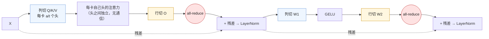
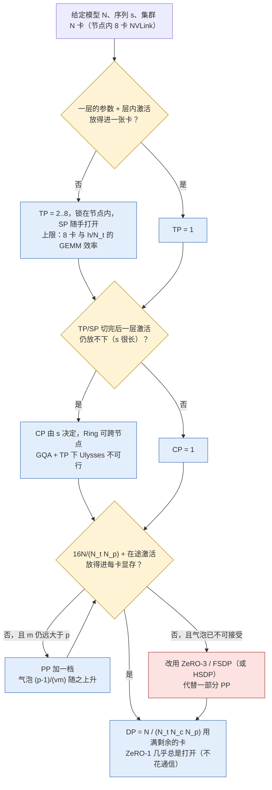

上一篇算出了一个数字：混合精度 + Adam 下，每个参数在训练时要占 16 字节。一个 70B 的模型光是参数、梯度和优化器状态就是 1.13 TB，还没算激活；405B 是 6.5 TB。任何一张 80 GB 的卡都放不下其中的零头。所以这些字节必须被切开放到很多卡上——**怎么切**，就是并行策略的全部内容。

习惯上并行策略被当作一组 API：DDP、FSDP、`ColwiseParallel`、`Schedule1F1B`、`--tensor-model-parallel-size 8`。这样理解的问题是你记住了十几个名字，却回答不了"这个配置为什么慢"。换一个角度：训练的状态只有四样——参数、梯度、优化器状态、激活——每一种并行策略无非是决定**这四样东西的哪一样、沿哪个维度、切到哪一组卡上**，然后为这个决定付出**一种特定形态的通信**。DP 什么都不切、只切数据，代价是每步一次梯度 all-reduce；ZeRO-3 把三种常驻状态都切了，代价是每步多一次参数 all-gather；TP 切矩阵，代价是每层四次激活大小的集合通信；PP 切层，代价是气泡；CP 切序列，代价是 K/V 在卡间流动；EP 切专家，代价是 all-to-all。

把每种策略写成同一个五元组——**切哪种状态 / 每 step 通信量 / 走哪条链路 / 能否与计算重叠 / 适用条件**——它们就可以放在同一张表里比较，而"该用几维并行、每维多少"这个问题也就变成了一道有公式可套的算术题。本篇就是把这张表填满。

本篇的核心问题：

> **每种并行都在"复制"和"切分"之间做交换：复制多占显存，切分多花通信。给定一个模型和一个集群的拓扑（节点内 NVLink、节点间 InfiniBand），每个维度的通信量是多少、走哪条链路、和计算能不能重叠？[^q0] 这决定了它该放在几维并行的哪一层。**

本篇不碰任何一个框架的进程组代码（那是下一篇），只在每一节末尾指出 PyTorch 2.13.0 与 Megatron Core 0.18.0 里对应实现的位置，方便读者按图索骥。通信原语（all-reduce、all-gather、reduce-scatter、all-to-all、send/recv）只用它们的**语义和每卡通信量**，耗时当作由链路带宽决定的黑盒。

## 一、总览

### 1. 符号与第一篇的结论

本篇沿用第一篇的记账符号，用到的复述如下：

| 符号 | 含义 |
|---|---|
| $$N$$ | 参数量（个数）。混合精度 + Adam 下每参数 16 字节：bf16 参数 2 + bf16 梯度 2 + fp32 主参数 4 + fp32 一阶矩 4 + fp32 二阶矩 4 → 常驻状态 16N 字节（fp32 累加梯度则 18N） |
| $$N_d, N_t, N_p, N_c, N_e$$ | 五个并行度：数据 / 张量 / 流水 / 上下文 / 专家。放在一起是因为它们的乘积就是总卡数：$$N_{\text{GPU}} = N_t \cdot N_c \cdot N_p \cdot N_d$$（EP 从 DP 里划出，不另乘） |
| $$s, b, h, a, L$$ | 序列长、micro-batch 大小、隐藏维、注意力头数、层数。放在一起是因为激活的大小由这五个数决定（第一篇的 $$34sbh$$ 每层） |
| $$m$$ | 每个 DP 副本每 step 的 micro-batch 数（梯度累积步数） |

Table: 本篇沿用的记账符号

**通信量的口径**：本篇所有"通信量"指**一张卡在一个 step 内发出的字节数**（全双工链路上收发同时进行、数量相等）。对 $$n$$ 个参与者、有效载荷 $$S$$ 字节，五个原语的每卡通信量是：

| 原语 | 每卡通信量 | 近似 | S 的含义 |
|---|---|---|---|
| all-reduce(S) | 2(n−1)/n · S | ≈ 2S | S 为每卡 buffer 大小 |
| all-gather(S) | (n−1)/n · S | ≈ S | S 为拼接后的总大小 |
| reduce-scatter(S) | (n−1)/n · S | ≈ S | S 为输入总大小 |
| all-to-all(S) | (n−1)/n · S | ≈ S | S 为每卡输入总大小；n(n−1) 条独立的流 |
| send/recv(S) | S | S | 点对点 |

Table: 五个原语的每卡通信量

以及一条后面反复使用的等式：**all-reduce = reduce-scatter + all-gather**，两半各 $$\approx S$$，合计 $$\approx 2S$$。用 N 计量时，$$N$$ 个 bf16 梯度做一次 all-reduce，每卡搬 $$\approx 2N$$ 个元素，即 $$4N$$ 字节；本篇按 ZeRO 论文的习惯把它写成"$$2N$$ 的通信量"，单位是元素，乘以 dtype 字节数才是字节。

### 2. 并行是状态的放置方案

把四种状态、六种并行放在同一张图上：

| 策略 | 参数 | 梯度 | 优化器状态 | 激活 |
|---|---|---|---|---|
| DP (DDP) | 复制 | 复制→归约 | 复制 | 按 batch 切（天然） |
| ZeRO-1 | 复制 | 复制→归约 | 切 1/N_d | 同上 |
| ZeRO-2 | 复制 | 切 1/N_d | 切 1/N_d | 同上 |
| ZeRO-3 / FSDP | 切 1/N_d | 切 1/N_d | 切 1/N_d | 同上；前向前临时 all-gather 一层参数 |
| TP | 切 1/N_t | 切 1/N_t | 切 1/N_t | 按 h（头 / FFN 列）切 1/N_t，层边界处完整 |
| SP（Megatron） | — | — | — | 层边界处也按 s 切 1/N_t |
| CP | 复制 | 复制→归约 | 复制 | 按 s 切 1/N_c，含注意力本身 |
| PP | 切 1/N_p | 切 1/N_p | 切 1/N_p | 只持有本 stage 的层；同时在途 ≤ N_p 个 micro-batch |
| EP | 专家切 1/N_e | 同 | 同 | token 按路由结果 all-to-all 到专家所在卡 |

Table: 六种并行各切哪种状态

读这张表的方式：**每一行"切"的格子越多，显存越省；每一个"切"都对应一种通信**。DP 那一行只在"梯度→归约"处有通信；ZeRO-3 在参数一格多了一次 all-gather；TP 的三个"切"是免费的（矩阵切开后梯度和优化器状态自然跟着切），它的代价在激活那一格——层内切开的激活要在层边界处拼回来。PP 同理，三个状态的"切"不产生通信，代价是 stage 之间传激活和气泡。

这张图还揭示了另一件事：**DP 系的策略（DP/ZeRO/FSDP）与模型并行系的策略（TP/PP/CP/EP）是正交的**。前者决定"同一个参数的几份副本之间如何分工"，后者决定"一份模型如何被切开"。任何一个真实配置都是两者的乘积：模型被 TP/PP 切成 $$N_t N_p$$ 份，每份再有 $$N_d N_c$$ 个副本，副本之间用 ZeRO 的某一级分片。

同一套切法在推理侧也用（vLLM 的 TP / PP / EP / DP），但账完全不同，因为**推理只有两种状态**——权重与 KV cache——没有梯度、没有优化器状态、没有为反向保存的激活。把两边放在一张表里对照，能看清每种并行在训练里多出来的那部分是什么：

| 策略 | 训练侧切什么、代价是什么（本篇） | 推理侧切什么、代价是什么（[vLLM 系列第八篇](/multi-gpu-scaling-strategies.html)） | 差别的来源 |
|---|---|---|---|
| DP | 复制模型，切数据；每 step 梯度 all-reduce $$2N$$，可与反向重叠 | 复制模型，各副本独立服务不同请求，**副本之间不通信**（只有调度器分发请求） | 推理没有梯度要归约，DP 退化成"多开几个实例" |
| ZeRO / FSDP | 切优化器状态 / 梯度 / 参数，前向前 all-gather 参数 | **不存在**——没有优化器状态和梯度可切；权重放不下时用 TP / PP | ZeRO 切的三种状态推理侧有两种根本没有 |
| TP | 切权重 + 层内激活；每层前向 2 次、反向 2 次 all-reduce，载荷 $$sbh$$；不可重叠 → NVLink | 切权重 + **KV cache**（按头切）；每层前向 2 次 all-reduce，decode 时 $$s = 1$$、载荷只有 $$bh$$（Llama 70B、b = 32 每次 512 KiB），但每生成一个 token 都要走 80 层 × 2 次 | 训练在意**带宽**（载荷大），推理在意**延迟**（载荷小、次数多、每次都在出 token 的关键路径上） |
| PP | 切层；气泡 $$(p-1)/m$$ 用 micro-batch 填；边界传激活 + 梯度 | 切层 + 对应层的 KV cache；气泡用**并发请求**填，请求长短不一所以更难填满；边界只传前向激活 | 训练的 $$m$$ 由 batch 决定、可控；推理的"m"是在线流量，不可控 |
| CP | 切序列 + 注意力本身，K/V 沿环流动，前向 + 反向 | 切长 prompt 的 prefill（PCP）或 decode 时的 KV cache（DCP） | 推理侧 decode 阶段每步只有 1 个 query，切的是 KV cache 而不是激活 |
| EP | 切专家参数 / 梯度 / 优化器状态；每层 dispatch + combine 各一次 all-to-all，反向再两次 | 切专家权重；每层 dispatch + combine，无反向；更在意小批次下 all-to-all 的延迟 | 反向的两次 all-to-all 与负载不均的梯度效应是训练独有的 |

Table: 训练侧与推理侧并行策略的对照

一句话概括：**推理侧的并行是本篇的子集**——去掉所有与梯度、优化器状态有关的行和列，剩下的就是 vLLM 那篇讨论的东西；反过来，推理侧对延迟的极端敏感（decode 每步只算一个 token）是本篇用不上的约束。两篇都需要理解的读者，建议先读本篇把"四种状态"看全，再看推理篇里哪两种消失了。本篇专注训练侧，即"状态有四种、每一种怎么切"。

**能亲手跑的部分**：本篇二到六章各有一段"亲手验证"，用 `torch.distributed` 的 gloo 后端在**一台笔记本的 4 个 CPU 进程**之间真的做 all-reduce / reduce-scatter / all-gather / all-to-all / send-recv——语义与 NCCL 在 GPU 之间完全一样，只是慢——把并行版的结果与单进程算一遍的参考值逐格对数。脚本是 [`ai-learning-labs/large-scale-training/02_parallelism_toys.py`](https://github.com/arganzheng/ai-learning-labs/blob/main/large-scale-training/02_parallelism_toys.py)，全部跑完十秒，不需要 GPU。文中贴的输出都是它跑出来的。

### 3. 五元组与两条链路

每种并行的五元组里，"走哪条链路"和"能否重叠"是决定它放在哪一层的关键。集群有两种链路：节点内 8 张卡之间的 NVLink（H100 标称单向 450 GB/s，8 卡集合通信通常能用到每卡 200–300 GB/s 量级）和节点之间每卡一张的 InfiniBand（NDR 标称单向 50 GB/s）。两者带宽差 5–10 倍。

| 策略 | 通信量（每卡每 step） | 形态 | 在关键路径上？ |
|---|---|---|---|
| TP | 4 × 2 × (激活 s·b·h) × 每 stage 层数 × m | 集合 | 是；下一步 GEMM 等它 → 必须 NVLink |
| CP (ring) | 3 × (N_c−1) × 每卡 K/V 块 × 层数 × m | 点对点环 | 否；与注意力分块计算重叠 → 可跨节点 |
| PP | 2 × 层边界激活 × m | 点对点 | 否；调度掩盖 → 跨节点 |
| DP / ZeRO | 2N_local（ZeRO-3 为 3N_local） | 集合 | 否；与反向重叠 → 跨节点，但量大 |
| EP | 4 × 路由 token × 层数 × m | all-to-all | 是；专家计算等它 → 尽量节点内 |

Table: 各并行策略的通信量、形态与是否在关键路径上

"通信量大"和"必须快链路"是两件事。TP 的通信量在数值上常常是最大的一项，但真正把它锁在节点内的是**它在关键路径上**：column-parallel 的输出经过 all-reduce 才能进下一个 GEMM，没有东西可以和它重叠。DP 的通信量也不小，但它是一大块可以在反向传播期间慢慢发的数据，对延迟不敏感，只要带宽够。PP 的通信量最小、又不在关键路径上，所以它是最适合放在最慢链路上的那一维。

### 4. 本文的章节安排

| 章 | 主题 | 内容 |
|---|---|---|
| 二 | 数据并行与 ZeRO | DP 的 2N；ZeRO-1/2/3 各切什么；3N 的推导；FSDP1 vs FSDP2；HSDP |
| 三 | 张量并行与序列并行 | 列切 + 行切的配对（2×2 矩阵手算一遍）；Transformer 里哪层列切、哪层行切；每层 2 + 2 次 all-reduce 与 f / g 共轭（两个进程亲手验证）；为什么不出节点；SP 把 all-reduce 拆成 AG + RS |
| 四 | 上下文并行 | 为什么 TP/SP 不够；Ring Attention 与 Ulysses 的通信形态；GQA 的影响 |
| 五 | 流水线并行 | GPipe → 1F1B → interleaved → zero-bubble；气泡率 (p-1)/m 的推导；通信量最小 |
| 六 | 专家并行 | 专家的状态形态；一个 token 的旅程：路由 → dispatch → 专家 → combine；all-to-all 通信量；负载不均、容量因子与辅助损失；分块流水把 all-to-all 藏起来；EP 与 DP/TP 的组合；4 个进程亲手跑一遍 |
| 七 | 组合与实例 | 五元组大表；组合顺序 TP → CP → PP → DP 及原因；Llama 3 405B 代入；原语对应表；三框架对照 |
| 八 | 小结 | 要点、源码位置、train-ledger 的 `ledger/parallel.py` |

Table: 本文的章节安排

## 二、数据并行与 ZeRO：切优化器状态、梯度、参数

### 1. DP：什么都不切，通信 2N

数据并行是最朴素的放置方案：每张卡持有全部 $$16N$$ 字节的常驻状态，各自处理不同的数据，反向结束后把梯度求平均，再各自做完全相同的优化器步骤。每卡显存 $$16N$$ 与 $$N_d$$ 无关——DP 不省显存，只加吞吐。

通信只有一处：$$N$$ 个 bf16 梯度的 all-reduce。按第一章的口径每卡搬 $$\frac{2(N_d-1)}{N_d}N \approx 2N$$ 个元素、$$4N$$ 字节。70B 模型是 282 GB——每张卡、每一步。这个数字与 $$N_d$$ 几乎无关（8 卡是 $$1.75N$$，1024 卡是 $$1.998N$$），这是 ring / 分层 all-reduce 带宽最优的结果，也是 DP 能扩展到上千卡的原因。

它能扩展的另一个原因是**重叠**：反向传播是从最后一层往前算的，某一层的梯度算完就可以开始 all-reduce，不必等整个反向结束。DDP 把参数按反向顺序分成若干 bucket（默认 25 MiB 一桶，PyTorch 2.13.0 `torch/csrc/distributed/c10d/reducer.hpp` 的 `kDefaultBucketBytesCap`），一个桶内的梯度都就位就发出去。只要每层的通信时间小于该层的反向计算时间，DP 的通信就被完全藏住，step 时间与单卡一样。这个条件在 $$N_d$$ 增大时不会变差（通信量不随 $$N_d$$ 变），只在**计算变少**时变差——micro-batch 太小、或者模型被 TP/PP 切得太碎，每层的反向时间就盖不住它的梯度通信了。

### 2. ZeRO-1 / ZeRO-2：切优化器状态与梯度，通信量不变

DP 的浪费在优化器状态：$$N_d$$ 张卡各存一份完全相同的 fp32 主参数、一阶矩、二阶矩（$$12N$$ 字节），然后各自做一遍完全相同的更新。ZeRO（Rajbhandari et al. 2020）的观察是这份状态可以按参数切成 $$N_d$$ 份，每张卡只负责更新自己那 $$1/N_d$$ 的参数。

**ZeRO-1** 只切优化器状态。每卡显存从 $$16N$$ 降到 $$4N + 12N/N_d$$。通信上，梯度 all-reduce 被拆成两半：先 **reduce-scatter**，让每张卡拿到自己负责的那 $$1/N_d$$ 梯度的归约结果（$$\approxN$$ 元素）；各自更新自己的参数分片后，再 **all-gather** 把更新后的 bf16 参数拼回每张卡（$$\approxN$$ 元素）。合计仍是 $$2N$$，与 DP 完全相同——因为 all-reduce 本来就等于 reduce-scatter + all-gather，ZeRO-1 只是在两者之间插入了优化器步骤。

**ZeRO-2** 再切梯度。观察是：reduce-scatter 之后，每张卡只需要自己负责的那 $$1/N_d$$ 梯度，其余 $$(N_d-1)/N_d$$ 可以在 reduce-scatter 完成的瞬间释放。于是梯度显存也降到 $$2N/N_d$$，每卡 $$2N + 14N/N_d$$。通信量仍是 $$2N$$——什么都没多。实现上要求梯度按 bucket 在反向过程中即时 reduce-scatter 并释放，而不是攒到反向结束。

Megatron 的分布式优化器（`megatron/core/optimizer/distrib_optimizer.py`）就是 ZeRO-1 这一级，`--use-distributed-optimizer` 打开；它的 reduce-scatter 与 all-gather 都以 bucket 为单位与计算重叠（下一篇展开）。

**亲手验证 all-reduce = reduce-scatter + all-gather**（`02_parallelism_toys.py zero`）。4 个进程，进程 $$r$$ 的"梯度"是 8 个数 $$10r + [0, 1, \ldots, 7]$$。DP 做一次 all-reduce；ZeRO-1 换成 reduce-scatter（进程 $$r$$ 只拿到第 $$r$$ 段两个元素的和）→ 各自"更新"自己那段（这里用 ×0.5 代替优化器）→ all-gather 拼回：

```text
all-reduce 结果        : [60.0, 64.0, 68.0, 72.0, 76.0, 80.0, 84.0, 88.0]
reduce-scatter 段(进程0): [60.0, 64.0] ← 正是 all-reduce 结果的前两个元素
all-gather 后 0.5×和   : [30.0, 32.0, 34.0, 36.0, 38.0, 40.0, 42.0, 44.0]
RS + AG == AR × 0.5 ?  : True
```

60 = 0 + 10 + 20 + 30 是四个进程第 0 个元素之和。reduce-scatter 之后进程 0 手里只有两个数——这就是 ZeRO-2 能把梯度显存降到 $$2N/N_d$$ 的原因：其余六个数它再也不需要了。

### 3. ZeRO-3：切参数，通信 2N → 3N

前两级不碰参数：bf16 参数 $$2N$$ 在每张卡上是完整的，因为前向和反向都要用完整的参数做 GEMM。**ZeRO-3** 把参数也切成 $$N_d$$ 份，每卡只常驻 $$2N/N_d$$；用到哪一层时再临时把那一层的参数 **all-gather** 回来，用完立即释放。每卡显存降到 $$16N/N_d$$——所有常驻状态都被 $$N_d$$ 均分。

代价是通信量从 $$2N$$ 涨到 $$3N$$。逐项数：

| 阶段 | 通信 | 全部层合计 | 说明 |
|---|---|---:|---|
| 前向 | 每层执行前 all-gather 该层参数 | ≈ N | 新增 |
| 反向 | 每层反向前再次 all-gather 该层参数 | ≈ N | 新增（前向后释放了） |
| 反向 | 每层梯度算完 reduce-scatter | ≈ N | 原有 |
| 优化器后 | 不再需要 all-gather 参数 | 0 | 原 ZeRO-1 的那次省掉了：下一步前向本来就要 all-gather |
| **合计** | | **3N** | |

Table: ZeRO-3 通信量从 2N 到 3N 的逐项

把四级放到同一条 step 时间轴上，通信落在哪个阶段一眼可见（每格是该级在该阶段的每卡通信量，单位元素）：

| 级别 | 前向 L1…Ln | 反向 Ln…L1 | 优化器步骤之后 | 合计 |
|---|---|---|---|---:|
| DP (ZeRO-0) | — | AR 梯度 ≈ 2N | — | 2N |
| ZeRO-1 / 2 | — | RS 梯度 ≈ N | AG 参数 ≈ N | 2N |
| ZeRO-3 | 逐层 AG 参数 ≈ N（用完即释放） | 逐层 AG 参数 ≈ N + RS 梯度 ≈ N | —（下一步前向的逐层 AG 取代了它） | 3N |
| ZeRO-3 不释放 | 逐层 AG 参数 ≈ N | —（参数仍在）+ RS 梯度 ≈ N | — | 2N |

Table: ZeRO 四级在 step 时间轴上的通信

推导里有一个容易漏的抵消：ZeRO-1/2 在优化器步骤后有一次参数 all-gather，ZeRO-3 把它省掉了，因为下一个 step 的前向本来就要逐层 all-gather——时间轴上就是 ZeRO-1 最右一格挪到了 ZeRO-3 最左一格；所以净增只有反向那一次。如果前向后**不释放**参数（FSDP 的 `reshard_after_forward=False`），反向那次 all-gather 也省掉，通信回到 $$2N$$，代价是完整的 bf16 参数 $$2N$$ 常驻——这时它的显存是 $$2N + 14N/N_d$$，与 ZeRO-2 相同。**ZeRO-3 的 $$3N$$ 是用 $$1N$$ 的通信换 $$2N(1 - 1/N_d)$$ 的显存**。

另一点：这 $$3N$$ 的每一份都能重叠。前向的 all-gather 可以预取（算第 $$i$$ 层时 all-gather 第 $$i+1$$ 层），反向同样；reduce-scatter 与 DP 一样跟着反向走。所以 ZeRO-3 在带宽充足时 step 时间接近 DP，只是"带宽充足"的门槛比 DP 高 50%。

把四级放到 4 张卡上画出来，哪一级切了哪种状态一眼可见：


### 4. 每卡显存表：70B、N_d = 64

把 70.6B 参数（Llama 3 70B）、$$N_d = 64$$ 代入，字节数以 GB（$$10^9$$）计：

| 级别 | 参数 (bf16) | 梯度 (bf16) | 优化器 (fp32×3) | 常驻合计 | 每 step 通信（元素） | 通信形态 |
|---|---:|---:|---:|---:|---|---|
| DP (ZeRO-0) | 141.2 | 141.2 | 847.2 | 1129.6 GB | 2N | all-reduce |
| ZeRO-1 | 141.2 | 141.2 | 13.2 | 295.6 GB | 2N | reduce-scatter + all-gather |
| ZeRO-2 | 141.2 | 2.2 | 13.2 | 156.6 GB | 2N | 同上，梯度即时释放 |
| ZeRO-3 | 2.2 | 2.2 | 13.2 | 17.6 GB | 3N | AG (fwd) + AG (bwd) + RS |

Table: 70B、N_d = 64 下各 ZeRO 级别的每卡显存与通信

三级之间的显存台阶分别是 $$12N$$、$$2N$$、$$2N$$——优化器状态是最大的一块，所以 ZeRO-1 一步就拿掉了 74%，这也是为什么 Megatron 长期只做到 ZeRO-1 而不觉得亏。表里没有激活：$$s = 8192$$、$$b = 1$$ 时一层 34sbh ≈ 2.3 GB，80 层 180 GB，ZeRO 一个字节都不帮它——切激活是 TP/SP/CP/PP 和重计算的事。

### 5. FSDP1 与 FSDP2：FlatParameter 与 per-parameter DTensor

FSDP 是 ZeRO-3 在 PyTorch 里的原生实现，有两代。

**FSDP1**（`torch/distributed/fsdp/fully_sharded_data_parallel.py` 的 `FullyShardedDataParallel`）把一个 wrap 单元（通常是一个 Transformer 层）内的所有参数**拍平拼接**成一个一维的 `FlatParameter`（`torch/distributed/fsdp/_flat_param.py`，管理它的是 `FlatParamHandle`），再把这个大一维张量均匀切成 $$N_d$$ 段。好处是每层只有一次 all-gather 和一次 reduce-scatter，通信效率最高；坏处是原始参数的形状、dtype、`requires_grad` 都被抹掉了——同一个 `FlatParameter` 里的参数必须同 dtype、要一起冻结或一起训练，和 TP 组合时要专门适配，checkpoint 里的分片也是"一维大张量的第 $$k$$ 段"，不对应任何一个具体参数。`torch/distributed/fsdp/api.py` 的 `ShardingStrategy` 枚举把 ZeRO 三级映射为 `FULL_SHARD`（ZeRO-3）、`SHARD_GRAD_OP`（ZeRO-2）、`NO_SHARD`（DDP），另有 `HYBRID_SHARD`（见下节）。

**FSDP2**（`torch/distributed/fsdp/_fully_shard/` 下的 `fully_shard()`）放弃了拍平：每个参数**各自**沿第 0 维切成 $$N_d$$ 份，切开后的分片是一个 `DTensor`（placement 为 `Shard(0)`）。一次 `fully_shard(module)` 调用把该 module 的参数编成一个通信组 `FSDPParamGroup`（`_fsdp_param_group.py`），组内每个参数对应一个 `FSDPParam`（`_fsdp_param.py`，维护 sharded / unsharded 两种状态的切换）。前向前 `FSDPParamGroup.unshard()` 把组内所有参数的分片拷进一个连续 buffer 做**一次** all-gather（`_fsdp_collectives.py` 的 `foreach_all_gather`），拷出后各参数恢复原形状；前向后 `reshard()` 释放；反向后 `post_backward()` 把梯度拷进连续 buffer 做一次 reduce-scatter（`foreach_reduce`）。所以通信次数与 FSDP1 相同，但参数的身份保留了：不同参数可以不同 dtype、可以单独冻结、每个参数的分片是一个自描述的 DTensor——这让 FSDP2 能与 TP 的 DTensor 自然组合（一个参数同时有 `Shard(0)` 的 FSDP 维和 `Shard(1)` 的 TP 维），checkpoint 也能按参数名重分片（第五篇）。`_fsdp_api.py` 的 `MixedPrecisionPolicy` 决定 all-gather 出来的参数用什么 dtype 计算、reduce-scatter 用什么 dtype 归约；`reshard_after_forward` 参数就是第 3 节里 $$3N$$ 与 $$2N$$ 之间的开关，它还可以是一个整数——前向后不是完全释放而是重分片到一个更小的组（例如节点内 8 卡），让反向的 all-gather 只在节点内做。

两代的显存与通信量相同，差别在**可组合性**：FSDP2 是 torchtitan 与 PyTorch 原生 TP/PP/CP 组合的基础，下一篇的对照会反复用到。

### 6. HSDP：节点内切、节点间复制

ZeRO-3 的 $$3N$$ 通信全在 DP 组上；当 $$N_d$$ 跨越几十个节点时，这 $$3N$$ 走的是 InfiniBand，而且 all-gather 是在关键路径附近的（预取深度有限）。**HSDP**（Hybrid Sharded Data Parallel）把 DP 维拆成两层：在一个 $$N_s$$ 卡的分片组内做 ZeRO-3（通常 $$N_s = 8$$ 或几个节点），分片组之间做普通 DP 复制（$$N_r = N_d / N_s$$ 个副本）。把 $$N_d = 16$$ 张卡排成 $$N_r \times N_s = 2 \times 8$$ 的网格，两种通信各走网格的一个方向：


| 项 | HSDP（$$N_s$$ 卡一组） | 走哪条链路 | 备注 |
|---|---|---|---|
| 显存 | $$16N / N_s$$ | — | 只被分片组均分，$$N_s$$ 小则显存大 |
| 分片组内通信 | AG + AG + RS ≈ $$3N$$ | NVLink（$$N_s = 8$$ 时） | ZeRO-3 的全部大头 |
| 副本间通信 | reduce-scatter 之后的梯度分片做 all-reduce，每卡 $$2(N_r - 1)/N_r \times N/N_s \approx 2N/N_s$$ | IB | 量比 $$3N$$ 小了 $$N_s$$ 倍 |

Table: HSDP 的显存、通信与链路

它的取舍很直接：把大头 $$3N$$ 挪到快链路上，跨节点只剩 $$2N/N_s$$，代价是显存只省 $$N_s$$ 倍。70B 用 $$N_s = 8$$ 每卡要 141 GB，放不下；$$N_s = 64$$ 才是 17.6 GB。所以 HSDP 的 $$N_s$$ 是"刚好放得下"的最小值，不是越小越好。FSDP2 里 HSDP 由传入的 2D `DeviceMesh` 决定：`fully_shard(module, mesh=mesh_2d)` 时参数 placement 为 `(Replicate(), Shard(0))`，`_fsdp_common.py` 的 `HSDPMeshInfo` 同时持有 shard 与 replicate 两个进程组；`_fsdp_api.py` 的 `DataParallelMeshDims` 则允许在一个更高维的 SPMD mesh 上指定哪些维是 shard、哪些是 replicate。

## 三、张量并行与序列并行

### 1. 列切与行切的配对

张量并行把一个线性层的权重矩阵切开。对 $$Y = XA$$（Megatron 的记法，$$X$$ 是 $$[\text{tokens}, h]$$ 的激活，$$A$$ 是 $$[h, h']$$ 的权重），有两种切法：


| 切法 | 每卡持有 | 输入 | 输出 | 通信 |
|---|---|---|---|---|
| 列切（column-parallel）$$A = [A_1 \mid A_2 \mid \cdots \mid A_t]$$ | $$A_i$$：$$h \times h'/t$$ | $$X$$ 完整（每卡一份） | $$Y_i = X A_i$$ 是 $$Y$$ 的第 $$i$$ 列块，按列分布在各卡 | 输入不需通信 |
| 行切（row-parallel）$$A = [A_1 ; A_2 ; \cdots ; A_t]$$ | $$A_i$$：$$h/t \times h'$$ | $$X$$ 必须按列切成 $$X_i$$ | $$Y = \sum_i X_i A_i$$，每卡一个部分和 | 输出需要 all-reduce |

Table: 列切与行切的对比

用一个能在纸上算完的例子把两种切法走一遍。$$N_t = 2$$，输入 $$X = [1, 2]$$（1 个 token、$$h = 2$$），两个权重矩阵

$$
A = \begin{pmatrix} 1 & 2 \\ 3 & 4 \end{pmatrix},\qquad
B = \begin{pmatrix} 1 & 0 \\ 0 & 2 \end{pmatrix},\qquad
\text{单卡：}\ Y = XA = [1{\cdot}1 + 2{\cdot}3,\ 1{\cdot}2 + 2{\cdot}4] = [7, 10],\quad Z = YB = [7, 20]
$$

| | 卡 0 | 卡 1 | 拼起来 / 加起来 |
|---|---|---|---|
| **列切 A**：卡 $$i$$ 持第 $$i$$ 列 | $$A_0 = \binom{1}{3}$$ | $$A_1 = \binom{2}{4}$$ | |
| $$Y_i = X A_i$$，X 每卡一份完整的 | $$Y_0 = 1{\cdot}1 + 2{\cdot}3 = 7$$ | $$Y_1 = 1{\cdot}2 + 2{\cdot}4 = 10$$ | $$[Y_0 \mid Y_1] = [7, 10] = Y$$ ✓ 不需通信 |
| **行切 B**：卡 $$i$$ 持第 $$i$$ 行 | $$B_0 = (1, 0)$$ | $$B_1 = (0, 2)$$ | |
| $$Z_i = Y_i B_i$$，输入正好是上一步自己那块 | $$Z_0 = 7 \cdot (1, 0) = [7, 0]$$ | $$Z_1 = 10 \cdot (0, 2) = [0, 20]$$ | $$Z_0 + Z_1 = [7, 20] = Z$$ ✓ 一次 all-reduce |

Table: 2×2 例子里列切与行切的每卡计算

两点在数字里看得很清楚：列切的输出 $$Y_i$$ 就是行切需要的输入——**中间不用任何通信就接上了**；行切各卡算出的是**部分和**（$$[7, 0]$$ 和 $$[0, 20]$$ 单独看都不对），必须相加才是答案，这就是 all-reduce 的来源。如果 A 和 B 之间有一个逐元素的激活函数（ReLU、GELU），它作用在 $$Y_i$$ 上与作用在完整 $$Y$$ 上结果相同，所以不影响这个结论。

Megatron-LM（Shoeybi et al. 2019）的洞见是把两者**配对**：MLP 的第一个线性层列切、第二个行切。列切的输出 $$Y_i$$ 正好是行切需要的按列分布的输入 $$X_i$$，中间的 GELU 是逐元素的、不需要完整向量——于是整个 MLP 只在末尾做一次 all-reduce。注意力同理：Q/K/V 投影列切（每卡持 $$a/N_t$$ 个头，头之间的计算天然独立），输出投影行切，末尾一次 all-reduce。



落到一个 Transformer 层的六个线性层上，规律只有一条——**产生"每卡一份独立分量"的层列切，把分量合回去的层行切**：

| Transformer 里的层 | 切法 | 为什么 |
|---|---|---|
| Q / K / V 投影 | 列切 | 输出维是"头"，每卡拿 $$a / N_t$$ 个头，头之间的注意力互不依赖 |
| 注意力本身（softmax(QKᵀ)V） | 本地计算 | 每卡只算自己那些头，不需要别的卡的任何东西 |
| 输出投影 O | 行切 | 输入维是"头"，正好是上一步各卡手里的分量；输出是部分和 → all-reduce |
| FFN 第一层（gate / up、W1） | 列切 | 输出维是 FFN 中间维 $$4h$$，切开后每卡一段 |
| 激活函数（GELU / SwiGLU） | 本地计算 | 逐元素，作用在自己那一段上 |
| FFN 第二层（down、W2） | 行切 | 输入维是 FFN 中间维，正好是上一步的分量；输出部分和 → all-reduce |

Table: Transformer 层六个线性层的切法

所以一层只有两次 all-reduce（O 之后、W2 之后），而不是六次。LayerNorm、embedding 这类不是"列切→行切"配对的层，在 TP 组内要么复制、要么按词表切（embedding 的词表切法在 Megatron 里是 `VocabParallelEmbedding`，输出也要一次 all-reduce）。

状态上，TP 是最"干净"的切分：权重被切成 $$1/N_t$$，它的梯度和优化器状态自然也是 $$1/N_t$$，**不需要任何额外通信来维持分片**——这与 ZeRO 形成对比，ZeRO 为了维持参数分片每步要 all-gather 两次。LayerNorm 的权重、偏置这类小参数在 TP 组内是复制的。

### 2. 每层 2 + 2 次 all-reduce 与通信量

前向每层两次 all-reduce（注意力后一次、MLP 后一次），每次的载荷是一个完整的激活张量 $$s \cdot b \cdot h$$ 个元素。反向也是两次：行切层前向的 all-reduce 在反向是恒等（梯度直接分发），而列切层前向的恒等（输入广播）在反向变成 all-reduce（各卡对 $$X$$ 的梯度要求和）——两者互为共轭，所以反向的 all-reduce 出现在与前向不同的位置，但次数相同。用 Megatron 论文的记法（$$f$$：前向恒等、反向 all-reduce；$$g$$：前向 all-reduce、反向恒等），一个 MLP 块的前向与反向是：


前向的 all-reduce 在块尾（$$g$$），反向的 all-reduce 在块头（$$f$$）；注意力块同理。每层四次，每次每卡 $$\frac{2(N_t-1)}{N_t} \cdot sbh \cdot 2$$ 字节。

回到上一节的数字，反向也能手算。令损失 $$= \sum Z$$，则 $$dZ = [1, 1]$$，每张卡拿到一份完整的 $$dZ$$（$$g$$ 的反向是恒等）：

| | 卡 0 | 卡 1 | 与单卡对照 |
|---|---|---|---|
| $$dB_i = Y_i^{\mathsf T} dZ$$ | $$7 \cdot [1, 1] = [7, 7]$$ | $$10 \cdot [1, 1] = [10, 10]$$ | 单卡 $$dB = Y^{\mathsf T} dZ = \binom{7\ 7}{10\ 10}$$，按**行**拼 ✓ |
| $$dY_i = dZ\, B_i^{\mathsf T}$$ | $$[1,1]\cdot(1,0)^{\mathsf T} = 1$$ | $$[1,1]\cdot(0,2)^{\mathsf T} = 2$$ | 单卡 $$dY = [1, 2]$$，按列拼 ✓ 不需通信 |
| $$dA_i = X^{\mathsf T} dY_i$$ | $$\binom{1}{2} \cdot 1 = \binom{1}{2}$$ | $$\binom{1}{2} \cdot 2 = \binom{2}{4}$$ | 单卡 $$dA = \binom{1\ 2}{2\ 4}$$，按**列**拼 ✓ |
| $$dX_i = dY_i A_i^{\mathsf T}$$ | $$1 \cdot (1, 3) = [1, 3]$$ | $$2 \cdot (2, 4) = [4, 8]$$ | 单卡 $$dX = dY A^{\mathsf T} = [5, 11]$$ = $$[1,3] + [4,8]$$ ✓ **一次 all-reduce**（$$f$$） |

Table: 2×2 例子里 TP 反向的每卡计算

权重的梯度 $$dA_i$$、$$dB_i$$ 每卡只算自己那一块、正好就是自己持有的那一块的梯度——这是上一节末尾说的"参数、梯度、优化器状态的切分不需要额外通信"的具体含义。唯一要通信的是对输入的梯度 $$dX$$：两卡各有一个部分和，相加才对。

代入 Llama 3 405B（$$h = 16384$$，$$s = 8192$$，$$b = 1$$，bf16）：一个激活张量 268 MB，$$N_t = 8$$ 的一次 all-reduce 每卡搬 470 MB，每层四次 1.88 GB；一个 PP stage 约 8 层、每 step 16 个 micro-batch，每卡每 step **约 220 GB** 走 NVLink。这是所有并行维度里数值上最大的一项。

这 220 GB 与 $$N_t$$ 几乎无关（系数 $$2(N_t-1)/N_t$$），但每卡的**计算**随 $$N_t$$ 减少——TP 越大，同样的通信配越少的计算，通信占比线性上升。这是 TP 不能无限加大的第一个原因。

### 3. 用两个进程亲手验证 f 与 g

Megatron `mappings.py` 里的 $$f$$、$$g$$ 就是两个 `autograd.Function`，一个前向什么都不做、反向 all-reduce，另一个反过来。把它们写出来接在上面的小矩阵上（`02_parallelism_toys.py tp`，完整代码见脚本）：

```python
class F(torch.autograd.Function):          # _CopyToModelParallelRegion
    @staticmethod
    def forward(ctx, x): return x            # ① 前向恒等：X 每卡一份完整的
    @staticmethod
    def backward(ctx, gx):
        gx = gx.clone(); dist.all_reduce(gx); return gx   # ② 反向：dX 的部分和相加

class G(torch.autograd.Function):          # _ReduceFromModelParallelRegion
    @staticmethod
    def forward(ctx, x):
        x = x.clone(); dist.all_reduce(x); return x       # ③ 前向：Z 的部分和相加
    @staticmethod
    def backward(ctx, gx): return gx         # ④ 反向恒等：dZ 每卡一份完整的

Ai = A[:, t:t+1].requires_grad_()            # ⑤ 卡 t 持 A 的第 t 列、B 的第 t 行
Bi = B[t:t+1, :].requires_grad_()
Z = G.apply(torch.relu(F.apply(X) @ Ai) @ Bi) # ⑥ 列切 → ReLU → 行切 → g
Z.sum().backward()                           # ⑦ 反向自动走 g（恒等）→ 本地 → f（all-reduce）
```

两个进程各持一半权重（另外两个进程只旁观），输出：

```text
前向  进程0: Y_0 = [[7.0]]  Z_0 = Y_0 B_0 = [[7.0, 0.0]]
      进程1: Y_1 = [[10.0]]  Z_1 = Y_1 B_1 = [[0.0, 20.0]]
      g all-reduce → Z = [[7.0, 20.0]]  单卡 Z = [[7.0, 20.0]]
反向  dB_0 = [[7.0, 7.0]]  dB_1 = [[10.0, 10.0]]  单卡 dB = [[7.0, 7.0], [10.0, 10.0]] （按行拼起来）
      dA_0 = [[1.0], [2.0]]  dA_1 = [[2.0], [4.0]]  单卡 dA = [[1.0, 2.0], [2.0, 4.0]] （按列拼起来）
      f all-reduce → dX = [[5.0, 11.0]]  单卡 dX = [[5.0, 11.0]]
TP 前向 + 反向与单卡逐格相等: True
```

与上面两张手算表逐格一致。这 20 行就是 TP 的全部机制；生产实现多出来的是把 $$f$$ / $$g$$ 换成 all-gather / reduce-scatter（SP，下面第 5 节）、把反向的 all-reduce 与权重梯度的 GEMM 重叠（`LinearWithGradAccumulationAndAsyncCommunication`），以及把它们塞进几十层里。

### 4. 为什么 TP 不出节点

第二个原因更硬：这四次 all-reduce **在关键路径上**。行切层的输出必须归约完才能加残差、过 LayerNorm、进下一个子层；列切层反向对 $$X$$ 的梯度必须归约完才能继续往前传。没有别的计算可以填进这段等待（Megatron 的 `LinearWithGradAccumulationAndAsyncCommunication` 能把反向里对输入的梯度 all-reduce 与对权重的梯度 GEMM 重叠，能藏一部分但不是全部）。

所以 TP 的每一次通信都直接加在 step 时间上，它对**延迟**和**带宽**都敏感。8 卡 NVLink 上一次几百 MB 的 all-reduce 是一两毫秒；跨 IB 是十几毫秒；乘以每层四次、几十层、十几个 micro-batch，差别是 step 时间的几倍。这就是 TP 几乎只在 NVLink 域内使用、$$N_t \le 8$$（NVL72 一类机器上可以更大）成为惯例的原因。放到第一章的五元组里：TP **切参数、梯度、优化器状态与层内激活；每层 $$4 \times 2sbh$$ 元素；NVLink；不可重叠；节点内**。

### 5. SP：把 all-reduce 拆成 all-gather + reduce-scatter，激活再降 N_t 倍

TP 切了层**内**的激活（Q/K/V、FFN 中间态按头 / 按列分布），但层**边界**处的激活——LayerNorm 的输入输出、dropout、残差流——在每张 TP 卡上是完整复制的：$$sbh$$ 个元素、$$N_t$$ 份。Korthikanti et al. 2022（Megatron 的激活重计算论文）算过，一层激活 $$sbh(34 + 5as/h)$$ 里，TP 切不到的部分是 $$10sbh$$，随 $$N_t$$ 增大它的占比越来越高。

**序列并行**（Megatron 意义下的 SP，注意与后面的 CP 区分）把这部分沿序列维切成 $$N_t$$ 份：LayerNorm、dropout、残差加法都是逐 token 的，切开序列不影响结果。切开后进入列切线性层前要把序列拼回来（**all-gather**），行切线性层的输出原本要 all-reduce、现在改成 **reduce-scatter**（归约的同时按序列切开），正好落回序列并行的布局：

| | 层边界（LN、dropout、残差） | 进列切层前 | 行切层之后 | 层边界 |
|---|---|---|---|---|
| 无 SP | $$X$$ 完整，每卡一份（$$sbh$$） | 直接进 | **all-reduce** | 完整 |
| 有 SP | $$X_i$$，每卡 $$1/t$$ 的序列（$$sbh/t$$） | **all-gather** 拼回完整序列 | **reduce-scatter**：归约的同时按序列切开 | 每卡 $$1/t$$ |

Table: 有无 SP 时层边界的通信

通信量：一次 all-gather $$\approx S$$ 加一次 reduce-scatter $$\approx S$$，等于一次 all-reduce 的 $$\approx 2S$$——**分文未加**。反向对称（all-gather 的反向是 reduce-scatter，reduce-scatter 的反向是 all-gather）。收益是那 $$10sbh$$ 也被 $$N_t$$ 均分，一层的激活变成 $$\frac{sbh}{N_t}(34 + 5as/h)$$，整层都被切了。因为不花钱，Megatron 里 SP 总是随 TP 一起开（`--sequence-parallel`），torchtitan 的 TP 也默认带 SP。它顺带还改变了 PP 的载荷：层边界处的张量现在是 $$sbh/N_t$$ 而不是 $$sbh$$，Megatron `megatron/core/pipeline_parallel/schedules.py` 的 `get_tensor_shapes()` 在 `sequence_parallel` 打开时把序列长除以 TP 大小，正是这一点。

### 6. 实现的位置

PyTorch 2.13.0 用 DTensor 表达 TP：`torch/distributed/tensor/parallel/style.py` 的 `ColwiseParallel` 把 `nn.Linear` 的权重按 `Shard(0)` 分布（PyTorch 的 `Linear` 存的是 $$A^T$$，第 0 维就是输出维，对应 Megatron 的列切）、输入为 `Replicate()`、输出为 `Shard(-1)`；`RowwiseParallel` 把权重按 `Shard(1)` 分布、输入 `Shard(-1)`、输出 `Replicate()`——从 `Shard(-1)` 到 `Replicate()` 的 redistribute 就是那次 all-reduce，由 DTensor 自动插入。`SequenceParallel` 让 LayerNorm / RMSNorm / Dropout 在序列维 `Shard(1)` 的输入上运行，与前后两个线性层之间的 all-gather / reduce-scatter 同样由 redistribute 生成。`api.py` 的 `parallelize_module()` 把一张 `{子模块名: ParallelStyle}` 的计划应用到模型上。这套实现的特点是**通信是从 placement 推导出来的，不是手写的**。

Megatron Core 0.18.0 则是手写的：`megatron/core/tensor_parallel/layers.py` 的 `ColumnParallelLinear`（`gather_output` 控制是否在输出处 all-gather）与 `RowParallelLinear`（`input_is_parallel` 表示输入已按列分布）；`mappings.py` 里每种通信是一个 `autograd.Function`——`_CopyToModelParallelRegion`（前向恒等、反向 all-reduce）、`_ReduceFromModelParallelRegion`（前向 all-reduce、反向恒等）这一对是无 SP 的 TP；`_GatherFromSequenceParallelRegion` 与 `_ReduceScatterToSequenceParallelRegion` 这一对是有 SP 的 TP。共轭关系在类名里就写明了。

## 四、上下文并行

### 1. 为什么 TP/SP 还不够

TP + SP 把一层的激活切成 $$1/N_t$$，但 $$N_t \le 8$$。当 $$s$$ 从 8K 长到 128K 时，激活线性增长 16 倍，注意力的 $$s^2$$ 项（即使有 FlashAttention 不物化分数矩阵，计算量仍是 $$s^2$$）增长 256 倍；单层 $$34sbh/8$$ 在 $$h = 16384$$、$$s = 131072$$ 时是 9 GB，80 层无论怎么重计算都放不下。需要一个能超过 8、能跨节点的维度来切序列——这就是**上下文并行**（CP）。

CP 与 SP 的区别：SP 只切层边界处那些逐 token 的算子，注意力本身仍在完整序列上算（all-gather 拼回来了）；CP 把**注意力本身**也沿序列切开，每张卡只持有 $$s/N_c$$ 个 token 的 Q/K/V，全程不拼回完整序列。困难在于注意力不是逐 token 的：每个 query 要看到全部 key/value。两种做法解决这个困难。

### 2. Ring Attention：K/V 沿环流动

Ring Attention（Liu et al. 2023）让每张卡固定持有自己那块 Q，把 K/V 块沿环传递：第 $$j$$ 步用来自第 $$(i-j) \bmod N_c$$ 张卡的 K/V 块算一个局部注意力，同时把手上的 K/V 块发给下一张卡、接收上一张卡的。$$N_c - 1$$ 步后每块 Q 看过了全部 K/V；局部结果用 online-softmax 的方式合并（与 FlashAttention 分块的合并方式相同）。

"合并"具体是怎么做的？softmax 的麻烦在分母：$$\text{softmax}(s)_j = e^{s_j} / \sum_k e^{s_k}$$，分母要看全所有 key 才知道，可每张卡一次只看到一块。办法是每块只记三个数——本块的最大分数 $$m$$（防溢出用）、分母的部分和 $$l = \sum e^{s_k - m}$$、分子的部分和 $$\text{acc} = \sum e^{s_k - m} v_k$$——两块合并时把各自的 $$l$$、$$\text{acc}$$ 乘上 $$e^{m_i - m_{\text{new}}}$$ 对齐到同一个最大值再相加。一个 query、四个 key 分两块的例子（分数 $$s = [1, 0 \mid 2, 0]$$，$$v_1..v_4 = (1,0), (0,1), (1,1), (2,0)$$）：

| | 块 1（key 1, 2） | 块 2（key 3, 4） | 合并（$$m = \max(1, 2) = 2$$，块 1 乘 $$e^{1-2} = 0.368$$） |
|---|---|---|---|
| $$m$$ | 1 | 2 | 2 |
| $$l = \sum e^{s - m}$$ | $$e^0 + e^{-1} = 1.368$$ | $$e^0 + e^{-2} = 1.135$$ | $$1.368 \times 0.368 + 1.135 = 1.639$$ |
| $$\text{acc} = \sum e^{s - m} v$$ | $$(1.000, 0.368)$$ | $$(1.271, 1.000)$$ | $$(1.000, 0.368) \times 0.368 + (1.271, 1.000) = (1.639, 1.135)$$ |
| 输出 $$\text{acc} / l$$ | | | $$(1.000, 0.693)$$ |

Table: 两块 softmax 统计量的合并

对照一次算完的完整 softmax：$$e^s = (2.718, 1, 7.389, 1)$$，分母 $$12.107$$，权重 $$(0.225, 0.083, 0.610, 0.083)$$，输出 $$0.225(1,0) + 0.083(0,1) + 0.610(1,1) + 0.083(2,0) = (1.000, 0.693)$$——完全一致（合并后的 $$l = 1.639$$ 正是 $$12.107 / e^2$$）。分块的顺序、块数都不影响结果，所以 K/V 块可以按环上任何顺序到达。

**亲手验证**（`02_parallelism_toys.py cp`）：8 个 token 切到 4 个进程，每个进程持自己那 2 个 token 的 Q/K/V，用 `dist.isend` / `dist.recv` 把 K/V 块沿环传 3 步，每收到一块就按上表合并一次：

```text
序列 8 个 token，4 张卡各 2 个；每步每卡用的 K/V 块（第一个数是本卡的）：
  卡 0: K/V 块 [0, 3, 2, 1]
  卡 1: K/V 块 [1, 0, 3, 2]
  卡 2: K/V 块 [2, 1, 0, 3]
  卡 3: K/V 块 [3, 2, 1, 0]
Ring 4 步合并后与完整注意力的最大误差（各卡）: ['6.0e-08', '1.2e-07', '3.0e-07', '1.2e-07']
```

每一列四张卡用的块各不相同——同一时刻环上四个 K/V 块都在被用，没有一张卡在等；这就是下图右半那张表。


通信是**点对点的 send/recv**，每步传一个 K/V 块。每卡每层：前向接收 $$N_c - 1$$ 个 K/V 块；反向再接收一遍 K/V（重算局部注意力需要）并传递累积的 dK/dV，约为前向的两倍。每个 K/V 块的大小是 $$\frac{s}{N_c} \cdot b \cdot 2 \cdot h_{kv} \cdot 2$$ 字节（K 和 V 各一份，$$h_{kv}$$ 是 K/V 的总维度：MHA 下等于 $$h$$，GQA 下是 $$\text{kv\_heads} \times \text{head\_dim}$$；再有 TP 时除以 $$N_t$$）。合计：

$$
V_{\text{ring}} \approx 3\,(N_c - 1)\cdot\frac{s\,b}{N_c}\cdot 2h_{kv}\cdot 2 \;\approx\; 12\,s\,b\,h_{kv}\ \text{字节／层}
$$

注意这个量**与 $$N_c$$ 几乎无关**：不论切成几份，每张卡都要把整个序列的 K/V 看一遍。它的好处在别处：通信是点对点、可以与当前块的注意力计算完全重叠（算第 $$j$$ 块时收第 $$j+1$$ 块），只要一块的注意力计算时间大于一块 K/V 的传输时间。所以 Ring Attention 可以跨节点、$$N_c$$ 可以很大。因果 mask 下还有一个负载均衡问题：靠后的 Q 块要算更多的 K/V 块，靠前的少；标准做法是把序列按"头尾配对"的方式分块（第 $$i$$ 张卡持有第 $$i$$ 块和第 $$2N_c - 1 - i$$ 块），让每张卡的计算量相等：

因果 mask 下把序列切成 $$2N_c = 8$$ 块（$$N_c = 4$$），块 $$j$$ 的 Q 要看 K/V 块 $$0..j$$，工作量是 $$j + 1$$ 个 K/V 块：

| 分配方式 | 卡 0 | 卡 1 | 卡 2 | 卡 3 | 最忙 / 最闲 |
|---|---|---|---|---|---|
| 顺序分配 | {0, 1} = 1 + 2 = 3 | {2, 3} = 7 | {4, 5} = 11 | {6, 7} = 15 | 5 |
| 头尾配对 | {0, 7} = 1 + 8 = 9 | {1, 6} = 9 | {2, 5} = 9 | {3, 4} = 9 | 1（全部相等） |

Table: 因果 mask 下 CP 两种分配方式的负载

### 3. Ulysses：按头 all-to-all

DeepSpeed-Ulysses（Jacobs et al. 2023）换一个思路：注意力对**头**是独立的。每张卡持有 $$s/N_c$$ 个 token 的全部头，算 Q/K/V 投影后做一次 **all-to-all**，变成持有全部 $$s$$ 个 token 的 $$a/N_c$$ 个头——这时每张卡可以对自己的头做完整的、不需要任何通信的注意力；算完再 all-to-all 回到按序列切的布局，进输出投影。


前向四次 all-to-all（Q、K、V、O），反向四次，每次载荷是一个激活张量 $$\frac{s}{N_c} b h$$：

$$
V_{\text{ulysses}} \approx 8\cdot\frac{N_c - 1}{N_c}\cdot\frac{s\,b\,h}{N_c}\cdot 2 \;\approx\; \frac{16\,s\,b\,h}{N_c}\ \text{字节／层}
$$

与 Ring 相反，Ulysses 的通信量随 $$N_c$$ **下降**——$$N_c$$ 越大每卡持有的序列越短，all-to-all 搬的就越少。但它有一个硬约束：$$N_c$$ 不能超过头数（GQA 下是 K/V 头数，否则要复制 K/V 头），而且 all-to-all 在关键路径上、$$N_c(N_c-1)$$ 条流同时打满链路，跨节点时对网络的压力比 ring 的点对点大得多。

### 4. 两者对比与 GQA 的影响

| | Ring Attention | Ulysses |
|---|---|---|
| 切的状态 | Q/K/V/激活 沿 $$s$$ 切 $$1/N_c$$ | 同，但注意力内部临时按头切 |
| 通信形态 | send/recv 环，$$N_c - 1$$ 步 | all-to-all，每层 4 + 4 次 |
| 每卡每层通信量 | $$\approx 12\, s b h_{kv}$$（与 $$N_c$$ 无关） | $$\approx 16\, s b h / N_c$$ |
| 能否重叠 | 是（与分块注意力计算流水） | 否（关键路径） |
| $$N_c$$ 上限 | 无 | ≤ 头数（GQA：≤ K/V 头数） |
| 与 TP 组合 | K/V 块再除以 $$N_t$$ | 头数再除以 $$N_t$$，上限更紧 |

Table: Ring Attention 与 Ulysses 的对比

GQA 是分水岭。MHA 下 $$h_{kv} = h$$，Ring 每层 $$12sbh$$ 对 Ulysses 的 $$16sbh/N_c$$，$$N_c = 8$$ 时 Ring 多搬 6 倍；GQA 下 $$h_{kv}$$ 只有 $$h$$ 的 $$1/8$$ 到 $$1/16$$（Llama 3 405B：128 个头、8 个 K/V 头，$$h_{kv} = h/16$$），Ring 的通信量随之缩到 $$0.75\,sbh$$，反而比 Ulysses 少了；同时 Ulysses 的 $$N_c$$ 上限被压到 8 个 K/V 头再除以 $$N_t$$——TP = 8 时它只剩 1。所以 GQA + TP 的大模型上 Ring 是唯一可行的选择，Llama 3 用的正是它。放进五元组：CP **切激活（含注意力）；Ring 每层 $$\approx 12sbh_{kv}$$，Ulysses $$\approx 16sbh/N_c$$；可跨节点；Ring 可重叠、Ulysses 不可；长序列必需**。

PyTorch 2.13.0 里 CP 是实验 API：`torch/distributed/tensor/experimental/_context_parallel/_attention.py` 的 `context_parallel()` 上下文管理器把 SDPA 替换为 ring 版本（`_templated_ring_attention()`），K/V 块的传递方式有两种 `_RingRotater`——`_AllToAllRotater`（逐步点对点交换）与 `_AllGatherRotater`（一次 all-gather 全部 K/V，换通信量换步数），由 `set_rotate_method()` 选择；因果负载均衡在 `_load_balancer.py` 的 `_HeadTailLoadBalancer`。Megatron 的 CP 在 Transformer Engine 的注意力内核里实现，`parallel_state.py` 单独维护 CP 进程组，梯度归约用 `get_data_parallel_group(with_context_parallel=True)`——这一点第七章组合时会用到：**CP 的各卡持有同一份参数的副本，梯度要在 DP × CP 上归约**。

## 五、流水线并行

### 1. 按层切，用 micro-batch 填满

流水线并行把 $$L$$ 层切成 $$N_p$$ 段（stage），每段放在一组卡上，激活按顺序从 stage 0 流到 stage $$N_p - 1$$，梯度反向流回。状态上它与 TP 一样干净：参数、梯度、优化器状态都被切成 $$1/N_p$$，不需要通信来维持；激活方面，每张卡只持有自己 stage 的层的激活。通信只有 stage 边界处的激活（前向）与激活的梯度（反向），是**点对点** send/recv，载荷是一个层边界处的张量（$$sbh$$，有 SP 时 $$sbh/N_t$$）——所有并行维度里最小的通信量，而且不在关键路径上（下面讲的调度就是为了让它不在）。

代价是一个新的东西：**气泡**。一个 batch 从 stage 0 进入到 stage $$N_p - 1$$ 出来之前，后面的 stage 没事可做；反向同理。把 batch 切成 $$m$$ 个 micro-batch 依次送入，让不同 stage 同时处理不同的 micro-batch，才能填满流水线。

PP 的机制本身很短，可以先亲手跑一遍再看调度（`02_parallelism_toys.py pp`）：4 层各放一个进程、4 个 micro-batch，前向 `recv` 上一 stage 的激活 → 算自己这层 → `send` 给下一 stage；反向 `recv` 下一 stage 传回的激活梯度 → `backward` 累积到本层权重 → 把对输入的梯度 `send` 回上一 stage。GPipe 顺序（先做完 4 个前向再做 4 个反向）：

```text
4 stage × 4 micro-batch，GPipe 调度；各 stage 权重梯度与单卡的最大误差: ['2.4e-07', '2.4e-07', '2.4e-07', '1.5e-08']
每个 stage 只保存了自己那一层的参数与 4 个 micro-batch 的输入激活（反向要用）
```

注意最后一句：反向要用前向的输入激活，所以 stage 0 在开始第一个反向之前手里攥着全部 4 个 micro-batch 的激活——这就是下面 GPipe 显存问题的来源，也是 1F1B 要解决的事。

### 2. GPipe 与气泡率 (p − 1)/m 的推导

记 $$p = N_p$$，每个 micro-batch 在一个 stage 上前向耗时 $$t_f$$、反向 $$t_b$$（通常 $$t_b \approx 2t_f$$）。GPipe（Huang et al. 2019）的调度是先把 $$m$$ 个 micro-batch 的前向全部做完，再做全部反向：

下图上半是 $$p = 4$$、$$m = 4$$ 的时间表（横轴时间、每行一个 stage，F 是前向、B 是反向），两头各有 $$p - 1$$ 格空白——气泡。

看任何一个 stage：它做了 $$m$$ 次前向和 $$m$$ 次反向，有用时间 $$m(t_f + t_b)$$。但整条流水线从第一个前向开始到最后一个反向结束的总时间，等于 stage 0 的时间线长度：前向阶段最后一个 micro-batch 要在 stage $$p-1$$ 做完，stage 0 才能开始反向，中间 stage 0 空等 $$(p-1)t_f$$；反向阶段对称，空等 $$(p-1)t_b$$。所以：

$$
T_{\text{total}} = m(t_f + t_b) + (p-1)(t_f + t_b), \qquad
\frac{T_{\text{bubble}}}{T_{\text{ideal}}} = \frac{(p-1)(t_f+t_b)}{m(t_f+t_b)} = \frac{p-1}{m}
$$

气泡占**总时间**的比例是 $$\frac{p-1}{m + p - 1}$$。$$p = 16$$、$$m = 16$$ 时是 48%——一半时间在等；要把它压到 10% 以下需要 $$m \ge 9(p-1) = 135$$。**气泡率只与 $$p$$ 和 $$m$$ 有关，与模型大小、卡的快慢无关**，这是 PP 的根本约束：$$m$$ 由 global batch 除以 $$N_d$$ 再除以 micro-batch 大小决定，不能随意加大；$$p$$ 由显存决定，不能随意减小。

### 3. 1F1B：不减气泡，减显存

GPipe 的另一个问题是显存：stage 0 在开始反向前要保存全部 $$m$$ 个 micro-batch 的激活。1F1B（PipeDream-Flush，Narayanan et al. 2021）在进入稳态后交替做一次前向、一次反向，让每个 micro-batch 的激活尽早被反向消费掉：

下图下半是 $$p = 4$$、$$m = 8$$ 的 1F1B 时间表：

两种调度画在同一张图上对比（GPipe 里反向按 2 倍时长画，1F1B 按等长画以便看清交替）：


气泡的总量没有变（仍是前向填充 $$p-1$$ 格、反向排空 $$p-1$$ 格，$$\frac{p-1}{m}$$），但任一时刻每个 stage 在途的 micro-batch 数不超过 $$p$$（stage $$i$$ 是 $$p - i$$），激活显存从 $$O(m)$$ 降到 $$O(p)$$，与 $$m$$ 无关——这让 $$m$$ 可以放大去压气泡。1F1B 是所有生产框架的默认调度。

### 4. Interleaved 1F1B：用更多 stage 换更小的气泡

气泡 $$(p-1)(t_f + t_b)$$ 里的 $$t_f$$、$$t_b$$ 是**一个 stage** 的前向 / 反向时间。如果把每张卡上的层再切成 $$v$$ 段（virtual stage / model chunk），让流水线有 $$pv$$ 个 stage、每张卡轮流负责其中 $$v$$ 个不相邻的 stage，那么每个 stage 只有原来 $$1/v$$ 的层，$$t_f$$、$$t_b$$ 缩小 $$v$$ 倍，而填充和排空的格数由卡数 $$p$$ 决定不变：

$$
\frac{T_{\text{bubble}}}{T_{\text{ideal}}} = \frac{(p-1)(t_f + t_b)/v}{m(t_f + t_b)} = \frac{p-1}{v\,m}
$$

$$p = 2$$ 张卡、$$v = 2$$，共 4 个 stage，卡 0 持 stage {0, 2}、卡 1 持 stage {1, 3}（上标是 stage 编号，同一个 micro-batch 在卡 0 上进出两次）：

| 时间 → | 1 | 2 | 3 | 4 | 5 | 6 | 7 | 8 |
|---|---|---|---|---|---|---|---|---|
| 卡 0 | F0⁰ | F1⁰ | F0² | F1² | B1² | B0² | B1⁰ | B0⁰ |
| 卡 1 | · | F0¹ | F1¹ | F0³ | F1³ | B1³ | B0³ | B1¹ |

Table: Interleaved 1F1B 的时间表

代价：stage 边界从 $$p - 1$$ 个变成 $$pv - 1$$ 个，PP 的点对点通信量乘以 $$v$$；调度更复杂；每张卡在途的激活也多了。Megatron 的 `--num-layers-per-virtual-pipeline-stage` 就是这个 $$v$$。$$p = 16$$、$$m = 16$$、$$v = 8$$ 时气泡从 48% 降到 10.5%。

### 5. Zero-bubble：把反向拆成两半

Qi et al. 2023 的观察是反向本身可以拆成两个独立的部分：对**输入**的梯度 $$B$$（下一个 stage 等的是它）和对**权重**的梯度 $$W$$（谁都不等它，只要在优化器步骤前算完）。1F1B 把两者绑在一起，$$W$$ 无谓地占据了关键路径。把 $$W$$ 拆出来、塞进原本的气泡里，气泡就能大幅缩小；再配合把优化器步骤的同步点后移，理论上可以做到零气泡（ZB-H2），代价是激活显存更高；ZB-H1 在与 1F1B 相同的显存下把气泡减到约三分之一。ZB-V 用 $$v = 2$$ 的 V 形 stage 分配（卡 $$i$$ 持 stage $$i$$ 和 $$2p - 1 - i$$）在 $$t_f = t_B = t_W$$ 的假设下达到零气泡；DeepSeek-V3 的 DualPipe 进一步让前向与反向的两个方向在流水线上同时流动，用双份参数换更多的重叠机会。

这些调度都不改变 PP 的状态放置与通信总量（DualPipe 的参数双份除外），只改变时间轴上的排列。它们的共同前提是 $$W$$ 可以延后——这要求框架把 `backward` 拆成 `backward_input` 与 `backward_weight` 两个可以分别调用的操作，是 `torch.distributed.pipelining` 与 Megatron 都专门做过的事。

### 6. 通信量与链路

PP 的通信量是所有维度里最小的：每个 micro-batch 在每个 stage 边界前向传一个 $$sbh/N_t$$（有 SP）的张量、反向传一个同样大小的梯度。Llama 3 405B、$$N_t = 8$$：一个张量 33.5 MB，16 个 micro-batch、前向 + 反向，每卡每 step **1 GB**，是 TP 的 1/220。它又是点对点、不在关键路径上（在 1F1B 稳态下 stage $$i$$ 发出前向激活后立即开始做一个反向，接收方也有自己的活干），所以它是最适合放在跨节点链路上、甚至跨机柜链路上的维度。放进五元组：PP **切参数、梯度、优化器状态、激活（按层）；每 step $$2m \cdot sbh/N_t$$；IB；可重叠；气泡率 $$(p-1)/(vm)$$ 要求 $$m \gg p$$**。

### 7. 实现的位置

PyTorch 2.13.0 的 `torch/distributed/pipelining/schedules.py` 把调度做成了可枚举的类：单 stage 每卡的 `ScheduleGPipe` 与 `Schedule1F1B`（基类 `PipelineScheduleSingle`）；多 stage 每卡的 `ScheduleInterleaved1F1B`、`ScheduleLoopedBFS`、`ScheduleInterleavedZeroBubble`（论文的 ZB-H1 / ZB1P）、`ScheduleZBVZeroBubble`（ZB-V，要求每卡恰好两个 stage）、`ScheduleDualPipeV`（基类 `PipelineScheduleMulti`，运行时是 `_PipelineScheduleRuntime`，它把调度表达成一张按时间步排列的动作表——前向、反向输入、反向权重、send、recv——逐步执行）；`get_schedule_class()` 按名字取类。每个 stage 是 `stage.py` 的 `PipelineStage`，负责 send/recv 与形状推断。Megatron 0.18.0 的 `megatron/core/pipeline_parallel/schedules.py` 是过程式写法：`forward_backward_pipelining_without_interleaving()` 是 1F1B，`forward_backward_pipelining_with_interleaving()` 是 interleaved 1F1B，`get_forward_backward_func()` 按 PP 与 VP 大小选择其一；点对点在 `p2p_communication.py`。两种写法的对照是下一篇的内容。

## 六、专家并行

### 1. MoE 的状态形态

MoE 把每层的 FFN 换成 $$E$$ 个专家，每个 token 由路由器选 $$k$$ 个（通常 $$k = 1$$ 或 2）专家处理。参数量随 $$E$$ 线性增长，但每个 token 的计算量只与 $$k$$ 有关——这是 MoE 的全部吸引力，也是它的状态形态与 dense 模型的全部差别：**参数很多、每个参数被很少的 token 用到**。

对放置来说这意味着：专家参数不能像 dense 参数那样靠 TP 切——一个专家的 FFN 矩阵本来就不大（与 dense 的 FFN 同尺寸），切成 8 份每份的 GEMM 太小、效率差；也不适合完全靠 ZeRO-3 切——每层前向要 all-gather 全部 $$E$$ 个专家的参数，但每张卡的 token 只用其中 $$k$$ 个。自然的方案是**专家并行**：把 $$E$$ 个专家分到 $$N_e$$ 张卡上，每卡 $$E/N_e$$ 个；专家参数、梯度、优化器状态各切 $$1/N_e$$，不需要通信维持；非专家部分（注意力、embedding）在 EP 组内是复制的，仍靠 DP/ZeRO 或 TP 切。

### 2. 一个 token 的旅程：路由 → dispatch → 专家 → combine

先把一个 MoE 层在 EP 下的完整流程走一遍，再算通信量。用最小的例子：$$N_e = 2$$ 张卡、$$E = 4$$ 个专家（卡 0 持 E0、E1，卡 1 持 E2、E3）、每卡 3 个 token、$$k = 1$$（每个 token 只去一个专家，便于看清；$$k = 2$$ 时每个 token 复制两份，其余不变）。


| 步 | 做什么 | 例子里发生了什么 | 通信 |
|---|---|---|---|
| ① 路由 | 一个小线性层给每个 token 对 $$E$$ 个专家打分，softmax 后取 top-$$k$$，记下专家编号与权重 | 卡 0：$$t_0 \to E2,\ t_1 \to E0,\ t_2 \to E3$$；卡 1：$$t_3 \to E1,\ t_4 \to E2,\ t_5 \to E0$$ | 无（路由器权重每卡一份） |
| ② 按目标卡排序 | 专家编号 ÷ 每卡专家数 = 目标卡；把 token 按目标卡排好，数出"发给每张卡几个" | 卡 0 发给 [卡 0, 卡 1] = [1, 2]；卡 1 发给 [2, 1] | 先交换一次这些计数（几个整数），双方才知道要收多少 |
| ③ dispatch | 一次 all-to-all：第 $$i$$ 卡发给第 $$j$$ 卡的那段 token 到达第 $$j$$ 卡 | 卡 0 收到 $$t_1, t_3, t_5$$；卡 1 收到 $$t_0, t_2, t_4$$ | **all-to-all**，载荷 = 本卡 token 数 × $$k$$ × $$h$$ |
| ④ 本地专家计算 | 收到的 token 再按专家分组，每个专家对自己那批做一个 FFN（两个 GEMM + 激活） | 卡 0：E0 ← {$$t_1, t_5$$}，E1 ← {$$t_3$$}；卡 1：E2 ← {$$t_0, t_4$$}，E3 ← {$$t_2$$} | 无 |
| ⑤ combine | 第二次 all-to-all，split 与 ③ 互换，结果回到 token 原来的卡与原来的位置 | $$t_0$$ 的结果从卡 1 回到卡 0 的第 0 个位置 | **all-to-all**，载荷同 ③ |
| ⑥ 加权求和 | $$k$$ 份结果按路由权重相加，再加残差 | $$k = 2$$ 时若 $$t_0$$ 选了 E2（0.62）与 E0（0.28）：$$y_0 = 0.62\,E2(x_0) + 0.28\,E0(x_0)$$ | 无 |

Table: 一个 token 在 MoE 层的旅程

④ 里每个专家的 GEMM 都很小（例子里 1–2 个 token；真实训练里每专家几十到几千个 token），所以实现上把一张卡上所有专家的 GEMM 打包成一个 **grouped GEMM**（一次 kernel 启动、按段处理），而不是逐个专家发 kernel——这是 MoE 的算力效率问题，本篇只记住它存在。

**反向**走完全相同的路、方向相反：损失对 $$y$$ 的梯度经过 ⑥ 的加权 → 经 ⑤ 的反向（一个 dispatch 形状的 all-to-all）回到专家所在的卡 → 专家的两个 GEMM 反向，得到**专家权重的梯度**（只在持有它的卡上，不需要任何归约——与 TP 一样"免费"）与对输入的梯度 → 经 ③ 的反向（一个 combine 形状的 all-to-all）回到 token 原来的卡。所以每层前向 2 次、反向 2 次 all-to-all，与 TP 的 2 + 2 次 all-reduce 对称。all-to-all 的反向是"split 互换的 all-to-all"这件事，第 7 节的代码里就是十行。

### 3. all-to-all 通信量

每层前向两次 all-to-all，反向再两次。每次的载荷是本卡的 token 数 × $$k$$ × $$h$$（每个 token 被复制 $$k$$ 份），其中 $$\frac{N_e - 1}{N_e}$$ 要出卡（剩下 $$1/N_e$$ 的专家碰巧在本卡）：

$$
V_{\text{EP}} \approx 4 \cdot \frac{N_e - 1}{N_e}\cdot \frac{s\,b}{N_c}\cdot k\,h \cdot 2\ \text{字节／层}
$$

代一组数：$$h = 8192$$、bf16，一个 token 的隐藏向量是 $$8192 \times 2 = 16$$ KB；$$k = 2$$ 则 dispatch 发出 32 KB、combine 收回 32 KB；反向再一遍。8192 个 token、$$N_e = 8$$：每层每卡 $$4 \times 7/8 \times 8192 \times 32\ \text{KB} \approx 0.9$$ GB。

与 TP 的每层 $$8sbh$$ 量级相同（$$k = 2$$ 时正好相等），但形态完全不同：TP 的 all-reduce 是环状流水化的、每步只与邻居通信；all-to-all 是 $$N_e(N_e - 1)$$ 条独立的流同时发生，跨节点时同时压满所有网卡，没有环可以借力。它也在关键路径上——专家的 GEMM 要等 token 到齐。所以 EP 与 TP 一样偏爱节点内，但它比 TP 更能容忍跨节点（可以按专家分块流水化，第 5 节），而 $$N_e$$ 常常需要大于 8（专家数 64 到 256 时每卡只放几个专家才划算）。

### 4. 负载不均：通信与计算的双重代价，容量因子与辅助损失

上面的通信量假设 token 均匀分到各专家。路由器不保证这一点：热门专家收到的 token 可能是平均值的几倍。不均衡在两个地方付费：

- **通信**：all-to-all 的每卡时间由**收到最多 token 的那张卡**决定，其余卡等它；不均衡度 $$\rho$$（最忙的卡的负载 / 平均负载）直接乘在通信时间上。
- **计算**：最忙的专家所在的卡要算 $$\rho$$ 倍的 GEMM，同一 step 内其他卡等它——这是一个结构性的 straggler，每层都发生。

有多不均？第 7 节的 toy（8 个专家、$$k = 2$$、随机初始化的路由器、64 个 token）跑出来是：

```text
各进程收到的 token 数: [42, 32, 13, 41]   平均 32，最忙 / 平均 = ρ = 1.31
每个专家收到的 token 数: [21, 21, 19, 13, 12, 1, 19, 22]   平均 16
```

一个专家只收到 1 个 token、另一个 22 个——这是**未经训练**的路由器的典型状态，也是为什么下面两种手段几乎总是打开的。

**容量因子**（capacity factor）给每个专家设一个上限 $$C$$，超出的 token 被丢弃（不经过专家，只走残差）或溢出到次选专家：

$$
C = \left\lceil \text{CF} \times \frac{T \cdot k}{E} \right\rceil,\qquad
\text{例：}\ T = 64,\ k = 2,\ E = 8,\ \text{CF} = 1.25 \ \Rightarrow\ C = \lceil 1.25 \times 16 \rceil = 20
$$

$$T k / E$$ 是"完全均匀时每个专家该收到几个"（例子里 16），CF 是容许超出的倍数。上面那组负载里 21、21、22 三个专家超过 20，各丢 1–2 个 token。代价是训练信号被截断：被丢的 token 这一层等于没学；好处是通信与计算的上界确定了，buffer 可以预分配。推理侧一般不丢 token（会改变输出），所以 vLLM 那篇把 CF 讲成"buffer 大小"的问题；训练侧它是"丢多少"的问题。

**辅助损失**（load balancing loss）从根上让路由器均匀：记 $$f_e$$ 为路由到专家 $$e$$ 的 token 比例、$$P_e$$ 为路由器给专家 $$e$$ 的平均概率，Switch Transformer 的辅助损失是 $$\alpha E \sum_e f_e P_e$$——两者都均匀（$$= 1/E$$）时取最小值 $$\alpha$$，某个专家既常被选中（$$f_e$$ 大）又被给了高概率（$$P_e$$ 大）时变大。它与主目标冲突（有时最好的专家就该多干活），所以 $$\alpha$$ 很小（$$10^{-2}$$ 量级）。DeepSeek-V3 换了一种"无辅助损失"的做法：给每个专家一个可调偏置加到路由分数上，负载高就调低，不进梯度。Megatron 的 `megatron/core/transformer/moe/moe_utils.py` 里 `switch_load_balancing_loss_func()` 与 `get_capacity()` 分别对应这两种手段。放进五元组时 EP 的通信量要带上 $$\rho$$：**切专家的参数、梯度、优化器状态与路由后的激活；每层 $$4 \cdot \rho \cdot \frac{sb}{N_c} k h$$；all-to-all；不可重叠（可分块流水）；尽量节点内，负载均衡是前提**。

### 5. 分块流水：把 all-to-all 藏进专家计算

第 3 节说 all-to-all 在关键路径上——专家要等 token 到齐。但"到齐"可以是分批的：把本卡的 token 切成几块，第 0 块在算专家时第 1 块正在路上：

| 时间 → | $$t_0$$ | $$t_1$$ | $$t_2$$ | $$t_3$$ | $$t_4$$ |
|---|---|---|---|---|---|
| dispatch（通信） | 块 0 | 块 1 | 块 2 | 块 3 | |
| 专家 GEMM（计算） | | 块 0 | 块 1 | 块 2 | 块 3 |
| combine（通信） | | | 块 0 | 块 1 | 块 2 … |

Table: all-to-all 分块流水的时间表

不分块时一层的时间是 $$T_{\text{dispatch}} + T_{\text{GEMM}} + T_{\text{combine}}$$；分块流水后接近 $$\max(T_{\text{通信}}, T_{\text{计算}})$$ 加一头一尾的填充。能藏多少取决于两者哪个更长：跨节点 IB 上 all-to-all 慢、专家 GEMM 又因为 token 少而短，经常是通信更长、藏不干净——这就是 EP 仍然"尽量节点内"的原因。DeepSeek-V3 的 DeepEP 与 Megatron 的 `MoEFlexTokenDispatcher` 做的正是这件事，前者还把节点内 NVLink 与节点间 IB 两段分开走（token 先 IB 到目标节点的某一张卡，再 NVLink 到目标卡，让 $$N_e(N_e-1)$$ 条流里跨节点的那部分变少）。

### 6. EP 与 DP/TP 的组合

EP 的进程组与 DP 组是**同一批卡的不同用法**：一个 EP 组的 $$N_e$$ 张卡处理的是 $$N_e$$ 个不同的 micro-batch（它们本来是 DP 副本），只是专家层在它们之间交换 token。所以 EP 不增加总卡数，$$N_e$$ 从 $$N_d$$ 里划出来：专家参数的 DP 组大小是 $$N_d / N_e$$（Megatron 称为 expert data parallel），非专家参数的 DP 组仍是 $$N_d$$。同一批卡的两种分组如下（$$N_d = 8$$、$$N_e = 4$$、$$E = 16$$ 个专家）：

| DP rank | 0 | 1 | 2 | 3 | 4 | 5 | 6 | 7 |
|---|---|---|---|---|---|---|---|---|
| EP 组（all-to-all 组） | EP 组 0 | EP 组 0 | EP 组 0 | EP 组 0 | EP 组 1 | EP 组 1 | EP 组 1 | EP 组 1 |
| 本卡专家 | E0–3 | E4–7 | E8–11 | E12–15 | E0–3 | E4–7 | E8–11 | E12–15 |
| 专家 DP 组（大小 $$N_d / N_e = 2$$） | a = {0, 4} | b = {1, 5} | c = {2, 6} | d = {3, 7} | a | b | c | d |
| 非专家 DP 组（注意力 / embedding） | 全部 8 卡 | | | | | | | |

Table: EP 组与 DP rank 的对应

ZeRO 对两组参数分别按各自的 DP 组分片：专家参数在 2 卡的组里切，非专家参数在 8 卡的组里切——这是本篇 `ledger/parallel.py` 里 MoE 那几行除法的来源。Megatron 0.18.0 的 `parallel_state.py` 里 EP 是 rank 排布 `"tp-cp-ep-dp-pp"` 中的一维，`megatron/core/transformer/moe/token_dispatcher.py` 里 `MoEAlltoAllTokenDispatcher` 是本节描述的 all-to-all 实现，`MoEAllGatherTokenDispatcher` 是 $$N_e$$ 很小时的替代（all-gather 全部 token、各卡挑自己专家的）。EP 与 TP 的组合（专家再做 TP）在 Megatron 里也支持，但如第 1 节所说通常不划算，多数 MoE 配置让专家层的 TP 为 1。

### 7. 用 4 个进程亲手跑一遍 EP

`02_parallelism_toys.py ep`：8 个专家、$$k = 2$$，4 个进程各持 2 个专家、各有 16 个 token（$$h = 4$$）。路由器随机初始化、四个进程同一份。核心是 ② 到 ⑥ 这几步，all-to-all 用 `dist.all_to_all_single(out, in, out_splits, in_splits)`，它的反向就是 split 互换：

```python
class A2A(torch.autograd.Function):
    @staticmethod
    def forward(ctx, x, out_splits, in_splits):
        ctx.splits = (in_splits, out_splits)
        out = x.new_empty(sum(out_splits), x.shape[1])
        dist.all_to_all_single(out, x, out_splits, in_splits); return out
    @staticmethod
    def backward(ctx, g):                                  # 反向：split 互换的 all-to-all
        in_splits, out_splits = ctx.splits
        gx = g.new_empty(sum(in_splits), g.shape[1])
        dist.all_to_all_single(gx, g, in_splits, out_splits); return gx, None, None

w, eid = torch.softmax(x @ W_router, 1).topk(k, 1)        # ① 路由：每 token 选 k 个专家
flat_x, flat_e = x.repeat_interleave(k, 0), eid.reshape(-1)  # ② 每 token 复制 k 份
dst = flat_e // per_rank                                   #    目标进程 = 专家编号 // 每进程专家数
order = torch.argsort(dst, stable=True)                    #    按目标进程排好
send = torch.bincount(dst, minlength=WORLD).tolist()       #    发给每个进程几个
dist.all_to_all_single(recv_t, torch.tensor(send))         #    先交换计数，才知道收多少
xin = A2A.apply(flat_x[order], recv, send)                 # ③ dispatch
for j in range(per_rank):                                  # ④ 本地专家逐个算自己那批
    sel = recv_e == rank * per_rank + j
    yout[sel] = torch.tanh(xin[sel] @ W_local[j])
yback = A2A.apply(yout, send, recv)                        # ⑤ combine：split 互换
y[order] = yback                                           #    还原发送前的顺序
out = (flat_w[:, None] * y).reshape(T, k, h).sum(1)        # ⑥ 按路由权重加权求和
```

参考答案是"每个 token 自己去查全部 8 个专家"（等价于 EP 组只有一张卡），梯度则把四个进程的参考梯度 all-reduce 后取本进程那两个专家的部分：

```text
dispatch 矩阵：第 i 行 = 进程 i 发给进程 0..3 的 token 数
  进程 0: [10, 8, 2, 12]   合计 32
  进程 1: [10, 6, 3, 13]   合计 32
  进程 2: [11, 10, 3, 8]   合计 32
  进程 3: [11, 8, 5, 8]   合计 32
各进程收到的 token 数: [42, 32, 13, 41]   平均 32，最忙 / 平均 = ρ = 1.31
每个专家收到的 token 数: [21, 21, 19, 13, 12, 1, 19, 22]   平均 16；容量因子 1.25 → 容量 C = ⌈1.25×64×2/8⌉ = 20，超过 C 的专家: [0, 1, 7]
EP 前向与「每个 token 自己算」的最大误差（各进程）: ['0.0e+00', '0.0e+00', '0.0e+00', '0.0e+00']
EP 本地专家梯度与完整梯度的最大误差（各进程）  : ['9.5e-07', '4.8e-07', '4.8e-07', '4.8e-07']
```

三件事在输出里同时看到：每个进程**发出**的都是 32 个（16 token × 2），**收到**的却从 13 到 42——这就是 $$\rho$$；dispatch 矩阵的每一列之和就是每个进程收到的数，第 2 列最小、因为进程 2 的两个专家（E4、E5）冷门；前向误差是 0（同样的浮点数以同样的顺序相加），反向 $$10^{-6}$$ 量级（累加顺序不同）——专家权重的梯度只在持有它的进程上、且不需要归约就已经是完整的，验证了第 2 节"与 TP 一样免费"的说法。


## 七、组合：多维并行与 Llama 3 405B

### 1. 五元组大表

把前五章收进一张表。通信量一栏是每卡每 step，$$N_{\text{local}} = N / (N_t N_p)$$ 是本卡持有的参数份额；"激活"指一个层边界处的张量 $$\frac{s}{N_c} b h$$ 个元素。

| 策略 | 切哪种状态 | 每 step 通信量（每卡） | 链路 | 重叠 | 适用条件 |
|---|---|---|---|---|---|
| DP (DDP) | 无（切数据） | all-reduce 2N_local | IB | 是 | 模型放得下一张卡；N_d 任意 |
| ZeRO-1 | 优化器状态 1/N_d | RS N + AG N = 2N_local | IB | 是 | 优化器状态是显存大头（74%） |
| ZeRO-2 | + 梯度 1/N_d | 同上 2N_local | IB | 是 | 梯度需即时归约释放 |
| ZeRO-3/FSDP | + 参数 1/N_d | AG N + AG N + RS N = 3N_local | IB | 是 | 带宽充足；不 reshard 则 2N |
| HSDP | 参数/梯度/优化器 1/N_s | 组内 3N_local（NVLink）+ 组间 AR 2N_local/N_s | NVLink+IB | 是 | 中等模型，跨节点带宽紧 |
| TP | 参数/梯度/优化器 1/N_t + 层内激活 | 4 × AR(激活) × 层数/stage × m ≈ 8·sbh·L_s·m/N_c | NVLink | 否 | N_t ≤ 8；GEMM 够大 |
| SP | 层边界激活再切 1/N_t | 与 TP 相同（AR → AG + RS） | NVLink | 否 | 总是随 TP 打开 |
| CP (Ring) | 激活（含注意力）1/N_c | 3(N_c−1) × K/V 块 ≈ 12·sb·h_kv·L_s·m | IB | 是 | 长序列；GQA 下极便宜 |
| CP (Ulysses) | 同上 | 8 次 all-to-all ≈ 16·sbh·L_s·m/N_c | IB | 否 | N_c ≤ K/V 头数 / N_t |
| PP | 参数/梯度/优化器/激活 按层 1/N_p | 2 × 激活/N_t × m × v（send/recv） | IB | 是 | m ≫ p；气泡 (p−1)/(vm) |
| EP | 专家参数/梯度/优化器 1/N_e | 4 × ρ × all-to-all(token·k·h) × L_s × m | IB/NVLink | 部分 | MoE；负载均衡；N_e 从 N_d 划出 |

Table: 并行策略五元组大表

看这张表的两个维度。**按通信量**：TP 最大、DP/ZeRO 次之（但只与 $$N_{\text{local}}$$ 成正比、与 $$N_d$$ 无关）、CP 与 EP 视模型而定、PP 最小。**按链路要求**：TP 与 EP 在关键路径上必须快链路；CP（Ring）、PP、DP 都能重叠，可以跨节点。

### 2. 组合顺序：TP → CP → PP → DP 及原因

多维并行是这些策略的乘积，卡数 $$N = N_t N_c N_p N_d$$。选择每一维的大小有一个几乎固定的顺序，它来自上表的"链路"和"重叠"两栏：

| 步 | 维度 | 约束 | 为什么选它 |
|---|---|---|---|
| 第一步 | TP | 受节点内卡数限制（≤ 8），受 GEMM 效率限制（h/N_t 不能太小） | 把一层放进一张卡（层内激活 + 该层参数），并把层边界激活切 1/N_t（SP） |
| 第二步 | CP | 序列长到 TP/SP 切完仍放不下一层激活时才需要；Ring 可跨节点 | N_c 由 s 决定 |
| 第三步 | PP | 越小越好（气泡），但受"每卡显存放得下 L/N_p 层的 16N/(N_t N_p) + 在途激活"约束 | 把 L 层的参数 + 优化器状态放进 N_t × N_p 张卡 |
| 第四步 | DP | 用满剩余的卡：N_d = N / (N_t N_c N_p) | ZeRO-1 几乎总是打开（不花通信）；如果 PP 放不下、或 N_p 太大气泡不可接受，用 ZeRO-3/FSDP 代替一部分 PP |

Table: 多维并行的组合顺序

每一步都是一个"放得下吗"的判断，放不下就在当前维度上加，直到 PP 的气泡不可接受时才改用 ZeRO-3/FSDP 兜底：



为什么是这个顺序？TP 必须最内层，因为它的通信不可重叠、必须走 NVLink，节点内 8 张卡是唯一的候选。CP 其次：Ring 的 K/V 块流动可以跨节点，但它与 TP 组的相互作用最紧（K/V 块要除以 $$N_t$$），且它决定每卡的序列长度、进而决定后面所有维度的激活大小。PP 再外：它的通信量最小、可重叠、点对点，能放在最慢的链路上；它是**确定每卡显存能否放下参数**的最后一道闸。DP 最外：它不切模型，只是把整个模型（已被 TP/CP/PP 切好的一份）复制 $$N_d$$ 次；从状态的角度看，一个 DP 副本 = 一份完整模型，所以它逻辑上包着其他所有维度。

要区分两件事：**逻辑嵌套**与**物理 rank 排布**。逻辑上 DP 最外，但在把 rank 映射到物理卡时，框架把**通信量最大、最不能等的维度放在编号最相邻（同节点）的卡上**，通信量最小、最能等的维度放在最远的卡上——Megatron `parallel_state.py` 的 `initialize_model_parallel()` 默认 rank 顺序是 `"tp-cp-ep-dp-pp"`（`RankGenerator` 按它生成各进程组）：TP 变化最快（同节点），PP 变化最慢（最远），DP 在两者之间。用一个小例子把这个顺序落到 rank 编号上：

TP = 4、DP = 2、PP = 2（CP = EP = 1），16 卡 = 2 节点 × 8，order `tp-cp-ep-dp-pp`，rank = tp + 4·dp + 8·pp——tp 变化最快、拿到相邻的 rank，pp 变化最慢、拿到最远的卡：

| 节点（链路） | pp | dp | tp = 0 | tp = 1 | tp = 2 | tp = 3 | 组 |
|---|---|---|---|---|---|---|---|
| 节点 0（NVLink） | 0 | 0 | 0 | 1 | 2 | 3 | TP 组 {0, 1, 2, 3}：同节点相邻 |
| 节点 0（NVLink） | 0 | 1 | 4 | 5 | 6 | 7 | DP 组 {0, 4}、{1, 5}…：本例在节点内 |
| 节点 1（IB 跨节点） | 1 | 0 | 8 | 9 | 10 | 11 | PP 组 {0, 8}、{1, 9}…：跨节点，只走每 step 最小的那 1 GB |
| 节点 1（IB 跨节点） | 1 | 1 | 12 | 13 | 14 | 15 | |

Table: 16 卡 TP=4、DP=2、PP=2 的 rank 布局

真实配置里 TP = 8 就占满一个节点，DP 组已经跨节点，PP 组则跨得更远（相隔 $$N_t N_d$$ 个 rank）。也就是说物理上 PP 而不是 DP 被放到最外层的链路上，因为 PP 只有 1 GB 而 DP 有十几 GB。"TP 最内、DP 最外"说的是决策顺序与状态嵌套，"PP 最远"说的是链路分配——两者不矛盾，都是从上表推出来的。

### 3. Llama 3 405B 代入

Llama 3 论文（Dubey et al. 2024）给出的 405B 训练配置有三档（Table 5）：8K GPU 与 16K GPU 上 $$s = 8192$$，TP = 8、CP = 1、PP = 16、DP = 64 或 128；长上下文阶段 $$s = 131072$$，TP = 8、**CP = 16**、PP = 16、DP = 4（四维乘积 8192 张卡）。（本系列总纲把两档合写成 "TP=8/CP=16/PP=16/DP=128"，乘起来是 262144 张卡，不是 16384——正确的是上面两档；正文以论文为准。）模型：126 层、$$h = 16384$$、128 个头、8 个 K/V 头、词表 128256，$$N = 405 \times 10^9$$。

**状态放置**（16K GPU、$$s = 8192$$ 档，ZeRO-1 式的分布式优化器）：

| 项 | 计算 | 结果 |
|---|---|---:|
| 每卡参数份额 | $$N_{local} = 405B / (8 \times 16)$$ | 3.16B |
| bf16 参数 | $$2 \times 3.16B$$ | 6.3 GB |
| bf16 梯度 | | 6.3 GB |
| 优化器（fp32 × 3） | $$12 \times 3.16B / N_d = 38\ \text{GB} / 128$$ | 0.3 GB（ZeRO-1 把 38 GB 切成 0.3 GB） |
| 常驻合计 | | ≈ 12.9 GB（二进制单位 12.06 GiB） |
| 每层激活（每卡） | $$34 \times 8192 \times 16384 / 8$$（FlashAttention，SP 已切 $$1/N_t$$，$$b = 1$$） | 570 MB |
| 每 stage 层数与峰值激活 | $$126 / 16 \approx 8$$ 层；1F1B 下 stage 0 在途 ≤ 16 个 micro-batch → $$8 \times 16 \times 570$$ MB | ≈ 73 GB |

Table: Llama 3 405B 的状态放置

最后一行说明了两件事：常驻状态只有 13 GB，80 GB 显存的大头是**在途激活**；以及为什么 405B 需要选择性重计算或更小的 $$v$$ 才能把激活压进 80 GB（第四篇）。

**通信量**（global batch 16M token → 每 step 2048 个序列，每个 DP 副本 16 个，$$b = 1$$ 则 $$m = 16$$；6N 算力 $$3.9 \times 10^{22}$$ FLOP，16384 × 989 TFLOPS 标称 × 41% MFU 下 step 约 5.9 s）：

| 维度 | 计算 | 每卡每 step | 链路 | 备注 |
|---|---|---:|---|---|
| TP | 4 × AR(268 MB) × 8 层 × 16 mb = 4 × 470 MB × 126 | ≈ 220 GB | NVLink | 220 GB / 5.9 s ≈ 37 GB/s 每卡平均 |
| PP | 2 × 33.5 MB × 16 mb | ≈ 1.0 GB | IB | |
| DP | RS(6.3 GB) + AG(6.3 GB) | ≈ 12.6 GB | IB | 与反向重叠；12.6 GB / 50 GB/s = 0.25 s ≪ 5.9 s |
| CP | — | — | | $$N_c = 1$$ |

Table: Llama 3 405B 各维度的通信量

长上下文档（$$s = 131072$$，CP = 16，每卡仍是 8192 个 token，$$m$$ 取 32 为例）：

| 维度 | 计算 | 每卡每 step | 链路 | 备注 |
|---|---|---:|---|---|
| TP | 每卡序列长不变 → 每 mb 每层与上面相同，× 32 mb | ≈ 441 GB | NVLink | |
| CP | K/V 块 = 8192 × 2 × (1024 / 8) × 2 B = 4 MB；3 × 15 × 4 MB × 8 层 × 32 mb | ≈ 47 GB | IB | 与注意力重叠。若用 Ulysses：8 × 15/16 × 33.5 MB × 8 × 32 ≈ 63 GB，且 $$N_c = 16 >$$ K/V 头数 / $$N_t$$ = 1，不可行 |
| PP | 2 × 33.5 MB × 32 | ≈ 2.1 GB | IB | |
| DP | $$N_d \times N_c = 64$$ 个副本，RS + AG | 仍 ≈ 12.6 GB | IB | |
| 气泡 | $$(16 - 1)/(32 + 15)$$（$$v = 1$$）；$$v = 8$$ 时 $$(15/8)/(32 + 15/8)$$ | 32% / 5.5% | | |

Table: Llama 3 405B 长上下文档的通信量

CP 那一行是 GQA 的功劳：K/V 总维度 1024 只有 $$h$$ 的 1/16，再被 TP 切 8 份，每卡每块 K/V 只有 4 MB，16 倍的序列长度只多了 47 GB 的**可重叠**跨节点通信。这正是"CP 放在 TP 之外、PP 之内"的实例——它跨节点，但通信量和形态都比 DP 温和。

气泡一行则解释了为什么 405B 的 PP = 16 不是灾难：$$m = 16$$、$$v = 1$$ 的气泡是 48%，与论文报告的 38–43% MFU 不相容，所以实际调度里 stage 必须再切（interleaved，$$v > 1$$）或 $$m$$ 更大；论文第 3.3 节也确实描述了对流水线调度的修改。这是下一篇比较两种 1F1B 实现、第四篇讨论 micro-batch 与 $$v$$ 取值的起点。

### 4. 三框架对照

三个框架实现的是同一张表，但各自覆盖的格子与默认取向不同（源码细节在下一篇）：

| | Megatron Core 0.18.0 | DeepSpeed 0.19.2 | torchtitan（PyTorch 原生 API） |
|---|---|---|---|
| DP/ZeRO | DDP + 分布式优化器（ZeRO-1）；Megatron-FSDP（ZeRO-3）作为新选项 | ZeRO-1/2/3 全部；offload；ZeRO++ 的分层与量化通信 | FSDP2 `fully_shard`（ZeRO-3）；`reshard_after_forward` 调 2N/3N；HSDP 由 2D mesh |
| TP + SP | `ColumnParallelLinear` / `RowParallelLinear`，手写 `mappings.py` 的通信 | 依赖 Megatron 的层或自带 autotp | `ColwiseParallel` / `RowwiseParallel` / `SequenceParallel`，通信由 DTensor redistribute 推导 |
| CP | Transformer Engine 的 ring attention；dp-cp 组归约梯度 | DeepSpeed-Ulysses（按头 all-to-all） | `torch.distributed.tensor.experimental` 的 `context_parallel`（ring） |
| PP | `schedules.py` 的 1F1B / interleaved，过程式写法 | `pipe/` 引擎，1F1B | `torch.distributed.pipelining` 的 `Schedule*` 类，声明式动作表 |
| EP | `token_dispatcher.py`（all-to-all / all-gather / flex） | MoE 层 + expert parallel 组 | 实验性 |
| 进程组 | `parallel_state.py`，order "tp-cp-ep-dp-pp" | `groups.py` | DeviceMesh（`device_mesh.py`），维度命名 |

Table: 三框架对并行策略的覆盖

三者对同一格子的选择差异，多数可以从五元组解释：Megatron 长期只做 ZeRO-1 是因为 ZeRO-1 拿掉了 74% 的显存却不花通信，其余靠 TP/PP 解决；DeepSpeed 从 ZeRO-3 出发是因为它对用户模型零侵入；torchtitan 用 FSDP2 + DTensor 是因为 per-parameter 分片让各维度可以自由组合。

### 5. 原语 ↔ 并行对应表

最后把通信原语与并行策略的对应关系收成一张表，本系列只用到这五个原语的语义与通信量：

| 原语 | 语义 | 每卡通信量 | 服务于 |
|---|---|---|---|
| all-reduce | 所有卡的 buffer 求和，结果每卡一份 | ≈ 2S | DP 梯度；TP（无 SP）每层 2 + 2 次；HSDP 组间梯度 |
| all-gather | 每卡一段，拼成完整的一份给每卡 | ≈ S | ZeRO-1/2 更新后的参数；ZeRO-3/FSDP 前向与反向前的参数；SP 进列切层前的激活 |
| reduce-scatter | 每卡一份完整输入，求和后每卡拿一段 | ≈ S | ZeRO-1/2/3 的梯度；SP 行切层后的激活 |
| all-to-all | 第 i 卡的第 j 块发给第 j 卡（转置） | ≈ S；n(n−1) 条流 | EP 的 token dispatch / combine；Ulysses 的 Q/K/V/O 转置 |
| send / recv | 一对一 | S | PP 的 stage 边界激活与梯度；Ring Attention 的 K/V 块 |

Table: 通信原语与并行策略的对应

一个记法：**all-reduce 给复制的状态用，all-gather / reduce-scatter 给分片的状态用，all-to-all 给按路由或按维度转置的激活用，send/recv 给流水和环用**。看到一个训练任务的通信 profile 里各原语的占比，就能反推它的并行配置。

## 八、本文小结

### 1. 要点回顾

- 并行策略是**状态的放置方案**：四种状态（参数、梯度、优化器状态、激活）× 六种切法，每一个"切"对应一种通信。DP 系（DP/ZeRO/FSDP）决定同一参数的副本之间如何分工，模型并行系（TP/PP/CP/EP）决定一份模型如何切开，两者正交，真实配置是乘积。
- **DP** 什么都不切、通信 $$2N$$，与 $$N_d$$ 无关、可与反向重叠。**ZeRO-1** 切优化器状态（拿掉 74% 显存）、**ZeRO-2** 再切梯度，通信仍是 $$2N$$（all-reduce = reduce-scatter + all-gather）。**ZeRO-3** 切参数，通信 $$3N$$：前向 all-gather 新增 $$N$$，反向 all-gather 新增 $$N$$，省掉优化器后的 all-gather $$N$$，净增 $$N$$；不 reshard 则回到 $$2N$$、显存等于 ZeRO-2。
- **FSDP1** 把一层拍平成 `FlatParameter`；**FSDP2** 每参数一个 `Shard(0)` 的 DTensor，通信次数相同、可组合性质变。**HSDP** 组内 ZeRO-3 走 NVLink、组间 all-reduce 只剩 $$2N/N_s$$，代价是显存只省 $$N_s$$ 倍。
- **TP** 列切 + 行切配对，每层前向 2 次、反向 2 次 all-reduce，载荷是激活 $$sbh$$；参数/梯度/优化器状态的切分免费；通信在关键路径上、不可重叠，所以锁在 NVLink 内、$$N_t \le 8$$。**SP** 把 all-reduce 拆成 all-gather + reduce-scatter，通信不变、层边界激活再切 $$1/N_t$$，总是随 TP 打开。
- **CP** 切注意力本身。Ring Attention 点对点传 K/V，每层 $$\approx 12sbh_{kv}$$、与 $$N_c$$ 无关、可重叠、可跨节点、$$N_c$$ 无上限；Ulysses 每层 8 次 all-to-all $$\approx 16sbh/N_c$$，随 $$N_c$$ 下降但 $$N_c \le$$ K/V 头数 $$/ N_t$$。GQA + TP 下 Ring 是唯一选择。
- **PP** 按层切，通信最小（$$2m$$ 个层边界张量，点对点、可重叠），代价是气泡 $$\frac{p-1}{m}$$（相对理想时间）、$$\frac{p-1}{m+p-1}$$（占总时间）。1F1B 不减气泡、把激活从 $$O(m)$$ 降到 $$O(p)$$；interleaved 用 $$v$$ 个 virtual stage 把气泡降到 $$\frac{p-1}{vm}$$、通信乘 $$v$$；zero-bubble 把反向拆成 $$B$$ 与 $$W$$、用 $$W$$ 填气泡。
- **EP** 切专家：路由 → 按目标卡排序 → dispatch（all-to-all）→ 本地专家 grouped GEMM → combine（split 互换的 all-to-all）→ 加权求和；反向原路返回，每层 2 + 2 次 all-to-all、载荷 token × $$k$$ × $$h$$，$$N_e(N_e-1)$$ 条流、在关键路径上，分块流水能藏一部分；负载不均 $$\rho$$ 同时乘在通信与计算上，容量因子 $$C = \lceil \text{CF} \cdot Tk/E \rceil$$ 定上界、辅助损失或偏置调路由；$$N_e$$ 从 $$N_d$$ 里划出，专家参数的 DP 组是 $$N_d/N_e$$。
- **训练 vs 推理**：推理只有权重与 KV cache 两种状态，ZeRO 系整个消失、DP 退化成多实例、TP 切 KV cache 且每个 decode step 都在关键路径上（在意延迟而非带宽）、PP 用并发请求而不是 micro-batch 填气泡。推理侧的并行是本篇的子集。
- 本篇的每个机制都能在**一台笔记本的 4 个 CPU 进程**上用 gloo 后端真跑（[`ai-learning-labs/large-scale-training/02_parallelism_toys.py`](https://github.com/arganzheng/ai-learning-labs/blob/main/large-scale-training/02_parallelism_toys.py)）：RS + AG = AR、TP 的 f / g、Ring Attention 的 send/recv + online softmax、GPipe 的激活前传梯度回传、EP 的两次 all-to-all，前向与反向都与单进程逐格相等。
- **组合顺序** TP → CP → PP → DP：TP 不可重叠必须节点内；CP 决定每卡序列长；PP 是放下参数的最后一道闸、通信最小可放最远；DP 用满其余的卡、逻辑上包着一切。物理 rank 排布把 PP 放最远（Megatron 默认 `"tp-cp-ep-dp-pp"`）。
- **Llama 3 405B**（TP 8 / PP 16 / DP 128，$$s$$ = 8K）：每卡常驻 13 GB、在途激活可达 73 GB；每 step TP 220 GB NVLink、DP 12.6 GB IB、PP 1 GB IB；$$m = 16$$、$$v = 1$$ 的气泡 48% 与 38–43% MFU 不相容，stage 必须再切。长上下文档 CP = 16 只多 47 GB 可重叠的 IB 通信，GQA 是原因。

### 2. 本篇涉及的源码位置

| 路径 | 内容 |
|---|---|
| PyTorch 2.13.0 `torch/distributed/fsdp/_fully_shard/_fully_shard.py` | `fully_shard()`：per-parameter `Shard(0)` DTensor 分片；`mesh` 为 2D 时是 HSDP；`reshard_after_forward` 在 $$2N$$ 与 $$3N$$ 之间切换（可为整数：重分片到更小的组）；`FSDPModule` |
| PyTorch 2.13.0 `torch/distributed/fsdp/_fully_shard/_fsdp_param.py`、`_fsdp_param_group.py` | `FSDPParam`（单个参数的 sharded / unsharded 状态）；`FSDPParamGroup` 的 `unshard()` / `reshard()` / `post_backward()`；`FSDPCommContext` 的 all-gather / reduce-scatter / all-reduce 三条 stream |
| PyTorch 2.13.0 `torch/distributed/fsdp/_fully_shard/_fsdp_collectives.py`、`_fsdp_api.py`、`_fsdp_common.py` | `foreach_all_gather()`、`foreach_reduce()`（一组参数拼成一次集合通信）；`MixedPrecisionPolicy`、`DataParallelMeshDims`；`HSDPMeshInfo` |
| PyTorch 2.13.0 `torch/distributed/fsdp/fully_sharded_data_parallel.py`、`_flat_param.py`、`api.py` | FSDP1：`FullyShardedDataParallel`、`FlatParameter` / `FlatParamHandle`、`ShardingStrategy`（`FULL_SHARD` / `SHARD_GRAD_OP` / `NO_SHARD` / `HYBRID_SHARD`） |
| PyTorch 2.13.0 `torch/distributed/tensor/parallel/style.py`、`api.py` | `ColwiseParallel`（权重 `Shard(0)`、输出 `Shard(-1)`）、`RowwiseParallel`（权重 `Shard(1)`、输入 `Shard(-1)`、输出 `Replicate()`）、`SequenceParallel`；`parallelize_module()` |
| PyTorch 2.13.0 `torch/distributed/pipelining/schedules.py` | `ScheduleGPipe`、`Schedule1F1B`（`PipelineScheduleSingle`）；`ScheduleInterleaved1F1B`、`ScheduleLoopedBFS`、`ScheduleInterleavedZeroBubble`、`ScheduleZBVZeroBubble`、`ScheduleDualPipeV`（`PipelineScheduleMulti` / `_PipelineScheduleRuntime`）；`get_schedule_class()` |
| PyTorch 2.13.0 `torch/distributed/tensor/experimental/_context_parallel/_attention.py`、`_load_balancer.py` | `context_parallel()`、`_templated_ring_attention()`、`_AllToAllRotater` / `_AllGatherRotater`、`set_rotate_method()`；`_HeadTailLoadBalancer` |
| PyTorch 2.13.0 `torch/distributed/device_mesh.py` | `DeviceMesh`、`init_device_mesh()`；`DeviceMesh.__getitem__` 按名取子 mesh、`_flatten()` 合并维度——HSDP 与多维组合的底座 |
| PyTorch 2.13.0 `torch/csrc/distributed/c10d/reducer.hpp` | `kDefaultBucketBytesCap`（DDP 25 MiB bucket） |
| Megatron Core 0.18.0 `megatron/core/tensor_parallel/layers.py` | `ColumnParallelLinear`（`gather_output`）、`RowParallelLinear`（`input_is_parallel`）、`LinearWithGradAccumulationAndAsyncCommunication`（反向 all-reduce 与权重梯度 GEMM 重叠） |
| Megatron Core 0.18.0 `megatron/core/tensor_parallel/mappings.py` | `_CopyToModelParallelRegion` / `_ReduceFromModelParallelRegion`（无 SP 的共轭对）；`_GatherFromSequenceParallelRegion` / `_ReduceScatterToSequenceParallelRegion`（SP 的共轭对） |
| Megatron Core 0.18.0 `megatron/core/parallel_state.py` | `initialize_model_parallel()` 默认 `order="tp-cp-ep-dp-pp"`、`RankGenerator`；`get_data_parallel_group(with_context_parallel=True)` |
| Megatron Core 0.18.0 `megatron/core/pipeline_parallel/schedules.py` | `forward_backward_pipelining_without_interleaving()`（1F1B）、`forward_backward_pipelining_with_interleaving()`、`get_forward_backward_func()`；`get_tensor_shapes()`（SP 时 PP 载荷除以 $$N_t$$） |
| Megatron Core 0.18.0 `megatron/core/transformer/moe/token_dispatcher.py`、`moe_utils.py` | `MoEAlltoAllTokenDispatcher`、`MoEAllGatherTokenDispatcher`、`MoEFlexTokenDispatcher`；`switch_load_balancing_loss_func()`、`get_capacity()` |
| [`ai-learning-labs/large-scale-training/02_parallelism_toys.py`](https://github.com/arganzheng/ai-learning-labs/blob/main/large-scale-training/02_parallelism_toys.py) | 本篇的五个 toy：`zero` / `tp` / `cp` / `pp` / `ep`，4 个 CPU 进程 + gloo，十秒跑完 |
| train-ledger `ledger/parallel.py` | 本篇增量，见下 |

Table: 本篇涉及的源码位置

### 3. train-ledger 本篇增量：ledger/parallel.py

第一篇的账本给出一个模型的四类状态字节数；本篇给它加上并行维度：输入 `ParallelConfig(tp, pp, dp, cp, ep, zero_stage, …)`，输出每卡常驻状态与每 step 各并行维度、各原语的通信字节数，以及 PP 气泡率。它只依赖第一篇的 `ledger.model.ModelSpec` 与 `ledger.memory.state_bytes()`，不依赖 torch。

```python
"""train-ledger / ledger/parallel.py -- parallelism as state placement.

Input : ModelSpec + StateBytes (from article 1) + ParallelConfig
Output: per-GPU state bytes and per-step communication bytes, broken down
        by parallel dimension and by collective type.

Interface relied upon from article 1 (kept minimal on purpose):
  ledger.model.ModelSpec   fields: layers, hidden, heads, vocab, seq_len,
                           ffn_hidden, params  (optional: kv_heads)
  ledger.memory.StateBytes fields: params_bytes, grads_bytes, optim_bytes
  ledger.memory.state_bytes(model, precision, optimizer) -> StateBytes
No torch dependency.
"""
from __future__ import annotations

from dataclasses import dataclass, field

from ledger.model import ModelSpec
from ledger.memory import StateBytes, state_bytes

# --------------------------------------------------------------------------
# collectives: bytes each rank sends (== receives) for a payload of S bytes.
# S follows the usual convention: all_reduce -> per-rank buffer; all_gather /
# reduce_scatter / all_to_all -> total (concatenated) size; send_recv -> message.
# --------------------------------------------------------------------------
def coll_bytes(kind: str, n: int, S: float) -> float:
    if n <= 1 and kind != "send_recv":
        return 0.0
    if kind == "all_reduce":
        return 2 * (n - 1) / n * S
    if kind in ("all_gather", "reduce_scatter", "all_to_all"):
        return (n - 1) / n * S
    if kind == "send_recv":
        return S
    raise ValueError(kind)


@dataclass
class MoESpec:
    num_experts: int = 1
    topk: int = 1
    expert_fraction: float = 0.0     # share of params living in experts
    capacity_factor: float = 1.0     # >1 models padding / imbalance (rho)


@dataclass
class ParallelConfig:
    tp: int = 1
    pp: int = 1
    dp: int = 1
    cp: int = 1
    ep: int = 1
    zero_stage: int = 0              # 0 = DDP, 1/2/3 = ZeRO-1/2/3 (3 == FSDP)
    sequence_parallel: bool = True   # Megatron SP inside the TP group
    cp_kind: str = "ring"            # "ring" | "ulysses"
    reshard_after_forward: bool = True   # ZeRO-3 / FSDP2 only
    hsdp_shard: int | None = None    # HSDP: shard group size (None = flat)
    micro_batch: int = 1
    num_microbatches: int = 1
    vp: int = 1                      # virtual stages per PP rank (interleaved 1F1B)
    act_bytes: int = 2               # bf16 activations
    moe: MoESpec = field(default_factory=MoESpec)

    @property
    def world(self) -> int:
        return self.tp * self.pp * self.dp * self.cp

    @property
    def grad_replicas(self) -> int:
        """ranks holding a replica of the same parameter shard: gradients are
        reduced over dp x cp (Megatron's dp-cp group)."""
        return self.dp * self.cp


@dataclass
class Comm:
    dim: str                         # "tp" | "cp" | "pp" | "dp" | "ep"
    kind: str                        # collective type
    link: str                        # "nvlink" | "ib"
    bytes: float                     # per GPU per step (sent)
    overlap: str                     # "yes" | "partial" | "no"


@dataclass
class Placement:
    per_gpu: StateBytes
    comms: list[Comm]
    bubble_fraction: float           # PP bubble as share of total step time
    tokens_per_gpu_per_mb: int

    def total_bytes(self, dim: str | None = None) -> float:
        return sum(c.bytes for c in self.comms if dim is None or c.dim == dim)

    def by_kind(self) -> dict[str, float]:
        out: dict[str, float] = {}
        for c in self.comms:
            out[c.kind] = out.get(c.kind, 0.0) + c.bytes
        return out


def _shard_factors(cfg: ParallelConfig) -> tuple[float, float, float]:
    """(params, grads, optim) divisors from the ZeRO stage over the DP replicas."""
    n = cfg.grad_replicas if cfg.hsdp_shard is None else cfg.hsdp_shard
    p = n if cfg.zero_stage >= 3 else 1
    g = n if cfg.zero_stage >= 2 else 1
    o = n if cfg.zero_stage >= 1 else 1
    return p, g, o


def per_gpu_state(model: ModelSpec, st: StateBytes, cfg: ParallelConfig) -> StateBytes:
    """model-parallel (tp, pp, ep) divides every byte; ZeRO divides by stage."""
    fp, fg, fo = _shard_factors(cfg)
    mp = cfg.tp * cfg.pp
    dense, expert = 1.0 - cfg.moe.expert_fraction, cfg.moe.expert_fraction

    def split(total: float, zero_div: float) -> float:
        # expert params are additionally split by EP; their DP group is dp/ep
        d = total * dense / mp / zero_div
        e = total * expert / (mp * cfg.ep) / max(zero_div / cfg.ep, 1.0)
        return d + e

    return StateBytes(
        params_bytes=int(split(st.params_bytes, fp)),
        grads_bytes=int(split(st.grads_bytes, fg)),
        optim_bytes=int(split(st.optim_bytes, fo)),
    )


def activation_bytes_per_layer(model: ModelSpec, cfg: ParallelConfig, flash: bool = True) -> float:
    """Korthikanti et al. 2022: s*b*h*(34 + 5*a*s/h) bytes per layer, divided by
    TP (with SP the whole term) and by CP; FlashAttention drops the 5*a*s/h term."""
    s, b, h, a = model.seq_len, cfg.micro_batch, model.hidden, model.heads
    per = s * b * h * 34.0
    if not flash:
        per += 5.0 * a * s * s * b
    return per / (cfg.tp * cfg.cp)


def pp_bubble_fraction(p: int, m: int, vp: int = 1) -> float:
    """1F1B / GPipe: (p-1) idle slots against m useful ones per stage.
    Interleaved 1F1B with vp chunks shrinks each slot by 1/vp."""
    if p <= 1:
        return 0.0
    bubble = (p - 1) / vp
    return bubble / (m + bubble)


def place(model: ModelSpec, st: StateBytes, cfg: ParallelConfig) -> Placement:
    L_stage = model.layers / cfg.pp
    m = cfg.num_microbatches
    tok = model.seq_len * cfg.micro_batch // cfg.cp            # tokens per GPU per micro-batch
    S_act = tok * model.hidden * cfg.act_bytes                 # one activation tensor
    comms: list[Comm] = []

    # ---- TP: 2 collectives fwd + 2 bwd per layer on an activation-sized tensor
    if cfg.tp > 1:
        per_call = coll_bytes("all_reduce", cfg.tp, S_act)     # AG + RS pair costs the same
        total = 4 * per_call * L_stage * m
        if cfg.sequence_parallel:
            comms.append(Comm("tp", "all_gather", "nvlink", total / 2, "partial"))
            comms.append(Comm("tp", "reduce_scatter", "nvlink", total / 2, "partial"))
        else:
            comms.append(Comm("tp", "all_reduce", "nvlink", total, "no"))

    # ---- CP: ring passes K,V blocks (and dK,dV in bwd); Ulysses all-to-alls Q,K,V,O
    if cfg.cp > 1:
        kv_heads = getattr(model, "kv_heads", None) or model.heads
        head_dim = model.hidden // model.heads
        if cfg.cp_kind == "ring":
            kv_block = tok * 2 * (kv_heads * head_dim / cfg.tp) * cfg.act_bytes   # K and V, this rank's heads
            per_layer = 3 * (cfg.cp - 1) * kv_block            # fwd: K,V ; bwd: K,V + dK,dV
            comms.append(Comm("cp", "send_recv", "ib", per_layer * L_stage * m, "yes"))
        else:
            per_layer = 8 * coll_bytes("all_to_all", cfg.cp, S_act / cfg.tp)
            comms.append(Comm("cp", "all_to_all", "ib", per_layer * L_stage * m, "no"))

    # ---- PP: activations cross stage boundaries; with SP the tensor is 1/tp of S_act
    if cfg.pp > 1:
        S_pp = S_act / (cfg.tp if cfg.sequence_parallel else 1)
        comms.append(Comm("pp", "send_recv", "ib", 2 * S_pp * m * cfg.vp, "yes"))

    # ---- DP / ZeRO / FSDP / HSDP on this GPU's own (tp, pp) shard of the model
    n = cfg.grad_replicas
    local_params = st.params_bytes / (cfg.tp * cfg.pp)         # bf16 params on this rank
    local_grads = st.grads_bytes / (cfg.tp * cfg.pp)
    if n > 1:
        shard_n = cfg.hsdp_shard or n
        repl_n = n // shard_n
        if cfg.zero_stage == 0:
            comms.append(Comm("dp", "all_reduce", "ib", coll_bytes("all_reduce", n, local_grads), "yes"))
        else:
            comms.append(Comm("dp", "reduce_scatter", "ib", coll_bytes("reduce_scatter", shard_n, local_grads), "yes"))
            ag = 1 if cfg.zero_stage < 3 or not cfg.reshard_after_forward else 2
            comms.append(Comm("dp", "all_gather", "ib", ag * coll_bytes("all_gather", shard_n, local_params), "yes"))
            if repl_n > 1:                                     # HSDP: reduce across replica groups
                comms.append(Comm("dp", "all_reduce", "ib",
                                  coll_bytes("all_reduce", repl_n, local_grads / shard_n), "yes"))

    # ---- EP: dispatch + combine all-to-all, fwd and bwd, on routed tokens
    if cfg.ep > 1 and cfg.moe.num_experts > 1:
        routed = tok * model.hidden * cfg.act_bytes * cfg.moe.topk * cfg.moe.capacity_factor
        per_layer = 4 * coll_bytes("all_to_all", cfg.ep, routed)
        comms.append(Comm("ep", "all_to_all", "ib", per_layer * L_stage * m, "partial"))

    return Placement(per_gpu_state(model, st, cfg), comms,
                     pp_bubble_fraction(cfg.pp, m, cfg.vp), tok)


def fmt(b: float) -> str:
    for unit in ("B", "KB", "MB", "GB", "TB"):
        if abs(b) < 1024 or unit == "TB":
            return f"{b:8.2f} {unit}"
        b /= 1024
    return f"{b:.2f} TB"


def report(model: ModelSpec, cfg: ParallelConfig, precision: str = "bf16", optimizer: str = "adam") -> None:
    st = state_bytes(model, precision, optimizer)
    pl = place(model, st, cfg)
    print(f"{model.name}: tp={cfg.tp} cp={cfg.cp} pp={cfg.pp} dp={cfg.dp} ep={cfg.ep} "
          f"zero={cfg.zero_stage} sp={cfg.sequence_parallel} mb={cfg.micro_batch} m={cfg.num_microbatches} "
          f"-> {cfg.world} GPUs")
    g = pl.per_gpu
    print(f"  per-GPU state : params {fmt(g.params_bytes)}  grads {fmt(g.grads_bytes)}  "
          f"optim {fmt(g.optim_bytes)}  total {fmt(g.params_bytes + g.grads_bytes + g.optim_bytes)}")
    print(f"  activation/layer/GPU (flash, 1 mb): {fmt(activation_bytes_per_layer(model, cfg))}"
          f"   layers/stage {model.layers / cfg.pp:.1f}   tokens/GPU/mb {pl.tokens_per_gpu_per_mb}")
    print(f"  PP bubble fraction: {pl.bubble_fraction:.3f}")
    for c in pl.comms:
        print(f"  {c.dim:3s} {c.kind:15s} {c.link:7s} {fmt(c.bytes)}  overlap={c.overlap}")
    print(f"  total per GPU per step: {fmt(pl.total_bytes())}"
          f"  (nvlink {fmt(sum(c.bytes for c in pl.comms if c.link == 'nvlink'))},"
          f" ib {fmt(sum(c.bytes for c in pl.comms if c.link == 'ib'))})")


if __name__ == "__main__":
    from ledger.model import llama3_405b, llama3_70b

    m405 = llama3_405b()
    # Llama 3 405B, 16K GPUs, s = 8192 (Table 5 of the Llama 3 paper): TP=8 CP=1 PP=16 DP=128
    report(m405, ParallelConfig(tp=8, cp=1, pp=16, dp=128, zero_stage=1,
                                micro_batch=1, num_microbatches=16))
    # long-context stage, s = 131072: TP=8 CP=16 PP=16 DP=4
    m405_long = llama3_405b(); m405_long.seq_len = 131072
    report(m405_long, ParallelConfig(tp=8, cp=16, pp=16, dp=4, zero_stage=1,
                                     micro_batch=1, num_microbatches=32))
    # same model, pure ZeRO-3 / FSDP over 16K GPUs
    report(m405, ParallelConfig(dp=16384, zero_stage=3, micro_batch=1, num_microbatches=1))
    # 70B on 1024 GPUs, three placements
    for cfg in (ParallelConfig(tp=8, pp=8, dp=16, zero_stage=1, micro_batch=1, num_microbatches=32),
                ParallelConfig(tp=8, pp=4, dp=32, zero_stage=1, micro_batch=1, num_microbatches=16, vp=2),
                ParallelConfig(dp=1024, zero_stage=3, hsdp_shard=64, micro_batch=1, num_microbatches=1)):
        report(llama3_70b(), cfg)
```

几点实现说明。通信量按第一章的口径计算：`coll_bytes` 返回每卡**发出**的字节数，all-reduce 用 $$2(n-1)/n$$、其余三个集合原语用 $$(n-1)/n$$。TP 的 all-gather + reduce-scatter 对与一次 all-reduce 等价，所以 SP 打开时只是把同一份量拆成两行记。CP 的 K/V 块用 `kv_heads`（GQA）并除以 TP；`ModelSpec` 若没有 `kv_heads` 字段则退化为 MHA。DP 一段用的是本卡的 $$N_{\text{local}}$$——TP/PP 切了之后 DP 组内交换的只是本卡那一份；`grad_replicas` 是 $$N_d \times N_c$$，因为 CP 各卡持有同一份参数。HSDP 通过 `hsdp_shard` 打开，多出一行组间 all-reduce。气泡率返回的是占总时间的份额 $$\frac{(p-1)/v}{m + (p-1)/v}$$。这里的激活估算只给一层、一个 micro-batch 的数，在途 micro-batch 数与重计算策略是第四篇的内容。

运行输出（`python -m ledger.parallel`，`ledger/model.py` 里的 `llama3_405b()` / `llama3_70b()` 是第一篇定义的模型规格，`kv_heads=8`；字节数为二进制单位）：

```text
llama3-405b: tp=8 cp=1 pp=16 dp=128 ep=1 zero=1 sp=True mb=1 m=16 -> 16384 GPUs
  per-GPU state : params     5.91 GB  grads     5.91 GB  optim   283.49 MB  total    12.09 GB
  activation/layer/GPU (flash, 1 mb):   544.00 MB   layers/stage 7.9   tokens/GPU/mb 8192
  PP bubble fraction: 0.484
  tp  all_gather      nvlink    110.25 GB  overlap=partial
  tp  reduce_scatter  nvlink    110.25 GB  overlap=partial
  pp  send_recv       ib          1.00 GB  overlap=yes
  dp  reduce_scatter  ib          5.86 GB  overlap=yes
  dp  all_gather      ib          5.86 GB  overlap=yes
  total per GPU per step:   233.22 GB  (nvlink   220.50 GB, ib    12.72 GB)
llama3-405b: tp=8 cp=16 pp=16 dp=4 ep=1 zero=1 sp=True mb=1 m=32 -> 8192 GPUs
  per-GPU state : params     5.91 GB  grads     5.91 GB  optim   566.97 MB  total    12.37 GB
  activation/layer/GPU (flash, 1 mb):   544.00 MB   layers/stage 7.9   tokens/GPU/mb 8192
  PP bubble fraction: 0.319
  tp  all_gather      nvlink    220.50 GB  overlap=partial
  tp  reduce_scatter  nvlink    220.50 GB  overlap=partial
  cp  send_recv       ib         44.30 GB  overlap=yes
  pp  send_recv       ib          2.00 GB  overlap=yes
  dp  reduce_scatter  ib          5.81 GB  overlap=yes
  dp  all_gather      ib          5.81 GB  overlap=yes
  total per GPU per step:   498.92 GB  (nvlink   441.00 GB, ib    57.92 GB)
llama3-405b: tp=1 cp=1 pp=1 dp=16384 ep=1 zero=3 sp=True mb=1 m=1 -> 16384 GPUs
  per-GPU state : params    47.25 MB  grads    47.25 MB  optim   283.49 MB  total   377.98 MB
  activation/layer/GPU (flash, 1 mb):     4.25 GB   layers/stage 126.0   tokens/GPU/mb 8192
  PP bubble fraction: 0.000
  dp  reduce_scatter  ib        755.91 GB  overlap=yes
  dp  all_gather      ib          1.48 TB  overlap=yes
  total per GPU per step:     2.21 TB  (nvlink     0.00 B, ib     2.21 TB)
llama3-70b: tp=8 cp=1 pp=8 dp=16 ep=1 zero=1 sp=True mb=1 m=32 -> 1024 GPUs
  per-GPU state : params     2.05 GB  grads     2.05 GB  optim   788.50 MB  total     4.88 GB
  activation/layer/GPU (flash, 1 mb):   272.00 MB   layers/stage 10.0   tokens/GPU/mb 8192
  PP bubble fraction: 0.179
  tp  all_gather      nvlink    140.00 GB  overlap=partial
  tp  reduce_scatter  nvlink    140.00 GB  overlap=partial
  pp  send_recv       ib          1.00 GB  overlap=yes
  dp  reduce_scatter  ib          1.93 GB  overlap=yes
  dp  all_gather      ib          1.93 GB  overlap=yes
  total per GPU per step:   284.85 GB  (nvlink   280.00 GB, ib     4.85 GB)
llama3-70b: tp=8 cp=1 pp=4 dp=32 ep=1 zero=1 sp=True mb=1 m=16 -> 1024 GPUs
  per-GPU state : params     4.11 GB  grads     4.11 GB  optim   788.50 MB  total     8.98 GB
  activation/layer/GPU (flash, 1 mb):   272.00 MB   layers/stage 20.0   tokens/GPU/mb 8192
  PP bubble fraction: 0.086
  tp  all_gather      nvlink    140.00 GB  overlap=partial
  tp  reduce_scatter  nvlink    140.00 GB  overlap=partial
  pp  send_recv       ib          1.00 GB  overlap=yes
  dp  reduce_scatter  ib          3.98 GB  overlap=yes
  dp  all_gather      ib          3.98 GB  overlap=yes
  total per GPU per step:   288.96 GB  (nvlink   280.00 GB, ib     8.96 GB)
llama3-70b: tp=1 cp=1 pp=1 dp=1024 ep=1 zero=3 sp=True mb=1 m=1 -> 1024 GPUs
  per-GPU state : params     2.05 GB  grads     2.05 GB  optim    12.32 GB  total    16.43 GB
  activation/layer/GPU (flash, 1 mb):     2.12 GB   layers/stage 80.0   tokens/GPU/mb 8192
  PP bubble fraction: 0.000
  dp  reduce_scatter  ib        129.36 GB  overlap=yes
  dp  all_gather      ib        258.73 GB  overlap=yes
  dp  all_reduce      ib          3.85 GB  overlap=yes
  total per GPU per step:   391.94 GB  (nvlink     0.00 B, ib   391.94 GB)
```

每一组都对应正文的一处。前两组是第七章第 3 节的 Llama 3 两档配置，TP 的 220 GB、DP 的 12.6 GB、PP 的 1 GB、CP 的 47 GB（二进制 44.3 GiB）、48% 与 32% 的气泡都从这里来。第三组是"如果 405B 只用 FSDP"：常驻状态只有 377 MB，但一层激活 4.25 GB × 126 层根本放不下，而且每卡每 step 要在 IB 上搬 2.2 TB——$$3N$$ 的通信作用在**整个模型**上，而 TP × PP = 128 把它缩到了 1/128；这就是为什么 ZeRO-3 不能替代模型并行去训 405B。后三组是 70B 在 1024 卡上的三种放置：TP 8 / PP 8 与 TP 8 / PP 4 的 NVLink 流量一样（TP 通信只与总层数和 micro-batch 数有关），差别在 PP 的气泡（18% 对 8.6%，后者用了 $$v = 2$$）和每卡显存（4.9 GB 对 9.0 GB）；纯 HSDP（分片组 64 卡）常驻 16.4 GB 放得下，但 IB 上 392 GB 的通信是前两者的 40–80 倍——它能否被反向藏住，取决于第四篇要测的重叠效率。

这个脚本给出的是**每卡显存与通信量**，还没有时间。把通信量换成时间需要链路带宽与重叠效率，把气泡率换成 MFU 需要 micro-batch 大小与重计算策略——这些是第四篇的内容。而在此之前，先要看清三个框架各自是怎么把本篇的每一行变成代码的。

> **一个 bf16 参数在 Megatron-LM、DeepSpeed、torchtitan 里各自存在哪里、什么时候被 all-gather、什么时候被释放、它的 fp32 主副本在哪张卡上？**

## 九、自测

1. DP、ZeRO-1、ZeRO-2、ZeRO-3 各切什么？每 step 的通信量各多少（以参数量 $$N$$ 计）？

   <details markdown="1"><summary>答案</summary>

   DP 不切，$$2N$$；ZeRO-1 切优化器状态，$$2N$$；ZeRO-2 再切梯度，$$2N$$（all-reduce 本来就是 RS + AG）；ZeRO-3 再切参数，$$3N$$（前向 AG $$N$$ + 反向 AG $$N$$ + RS $$N$$；省掉了优化器后的 AG）。显存分别是 16、$$4 + 12/N_d$$、$$2 + 14/N_d$$、$$16/N_d$$ 字节 / 参数。

   </details>

2. TP 为什么必须锁在节点内、$$N_t \le 8$$？SP 改变了什么？

   <details markdown="1"><summary>答案</summary>

   TP 的 all-reduce 在每层的关键路径上（下一层要等结果），不可与计算重叠，且载荷 $$sbh$$ 每层 4 次——只有 NVLink 的带宽与延迟扛得住；跨节点走 IB 每层几十 µs × 4 × 80 层就是几十 ms。SP 把 all-reduce 拆成 all-gather + reduce-scatter，通信量不变，但层边界的激活（LayerNorm、dropout）也被切成 $$1/N_t$$。

   </details>

3. PP $$p = 8$$、micro-batch 数 $$m = 16$$：气泡占理想时间的多少？interleaved $$v = 4$$ 呢？代价是什么？

   <details markdown="1"><summary>答案</summary>

   $$\frac{p-1}{m} = 7/16 = 44\%$$（占总时间 $$7/23 = 30\%$$）；interleaved $$\frac{p-1}{vm} = 7/64 = 11\%$$；代价是 P2P 通信次数乘 $$v$$、每个 virtual stage 更小。

   </details>

4. Llama 3 405B 用 TP 8 / PP 16 / DP 128，每 step 三个维度的通信量各约多少、走哪条链路？为什么这样放？

   <details markdown="1"><summary>答案</summary>

   TP 约 220 GB 走 NVLink（不可重叠、量大、节点内）；DP 约 12.6 GB 走 IB（可与反向重叠）；PP 约 1 GB 走 IB（点对点、可重叠、最少）。规则：不可重叠且量大的放最近，可重叠的放远。

   </details>

5. 为什么长上下文用 CP 而不是把 TP 开更大？GQA 在这里起什么作用？

   <details markdown="1"><summary>答案</summary>

   TP 切的是隐藏维，序列长 $$s$$ 不变、每卡激活仍随 $$s$$ 增长，且 $$N_t \le 8$$ 已到顶；CP 切序列，每卡只有 $$s / N_c$$ 的激活。CP 的通信是传 KV（ring attention），GQA 让 KV 只有 Q 的 1/4–1/8，Llama 3 CP = 16 只多 47 GB 可重叠的 IB 通信。

   </details>

6. TP 的 MLP 块里，为什么权重梯度 $$dA_i$$、$$dB_i$$ 不需要通信，而对输入的梯度 $$dX$$ 需要一次 all-reduce？EP 里专家权重的梯度呢？

   <details markdown="1"><summary>答案</summary>

   $$dA_i = X^{\mathsf T} dY_i$$、$$dB_i = Y_i^{\mathsf T} dZ$$ 只用到本卡持有的那一列 / 那一行对应的分量，算出来就是本卡那块权重的完整梯度（第三章的 2×2 例子：$$dA_0 = (1, 2)^{\mathsf T}$$ 正是单卡 $$dA$$ 的第 0 列）；$$dX_i = dY_i A_i^{\mathsf T}$$ 每卡只是一个部分和（$$[1,3]$$ 与 $$[4,8]$$），必须相加成 $$[5, 11]$$——这就是 $$f$$ 的反向。EP 同理：专家权重只在一张卡上，收到的 token 就是它的全部输入，梯度算出来就是完整的，不需要归约；需要通信的是 token 的梯度原路 all-to-all 回去。

   </details>

7. 推理系统（vLLM）也有 DP / TP / PP / EP，为什么没有 ZeRO？它的 TP 与训练的 TP 在意的东西为什么不同？

   <details markdown="1"><summary>答案</summary>

   ZeRO 切的是优化器状态、梯度、参数三种常驻状态里的前两种（ZeRO-3 才切参数），推理没有前两种，也没有反向可以把 all-gather 藏进去，所以没有 ZeRO；权重放不下时直接 TP / PP。训练的 TP 每次 all-reduce 载荷是 $$sbh$$（几百 MB），在意带宽；推理 decode 时 $$s = 1$$、载荷只有 $$bh$$（几百 KB），但每生成一个 token 要走 80 层 × 2 次、每一次都在出 token 的关键路径上，在意延迟。

   </details>

## 下一篇

[三个框架：Megatron-LM、DeepSpeed 与 torchtitan 的架构对比与源码导读](/megatron-deepspeed-torchtitan-architecture-and-source-guide.html)

[^q0]: 把每种并行看成**状态的放置方案**：四种状态（参数、梯度、优化器状态、激活）各选复制还是切分，每个「切」对应一种通信、一个时机、一条链路。**DP 系**：DP 什么都不切、每 step 通信 $$2N$$（梯度 all-reduce），与卡数无关、可与反向重叠；ZeRO-1 切优化器状态、ZeRO-2 再切梯度，通信仍 $$2N$$；ZeRO-3 / FSDP 切参数，前向要 all-gather，通信 $$3N$$——在 DP 组上，可放节点间，能重叠（[第二章](#二数据并行与-zero切优化器状态梯度参数)）。**模型并行系**：TP 列切 + 行切配对，每层前向 2 次反向 2 次 all-reduce、载荷是激活 $$sbh$$，在关键路径上不可重叠，所以锁在 NVLink 内、$$N_t \le 8$$；SP 把它拆成 all-gather + reduce-scatter（[第三章](#三张量并行与序列并行)）；CP 切序列，attention 用 ring 传 KV，GQA 下 KV 小所以可重叠、可跨节点（[第四章](#四上下文并行)）；PP 按层切，通信最小（层边界激活、点对点、可重叠），代价是气泡 $$\frac{p-1}{m}$$（[第五章](#五流水线并行)）；EP 切专家，每层 all-to-all、在关键路径上（[第六章](#六专家并行)）。**放哪一层**：通信不可重叠且量大的放最近（TP 节点内），可重叠的可以放远（DP、PP 节点间），组合顺序 TP → CP → PP → DP。Llama 3 405B 的 TP 8 / PP 16 / DP 128 每 step：TP 220 GB 走 NVLink、DP 12.6 GB 走 IB、PP 1 GB 走 IB（[第七章](#七组合多维并行与-llama-3-405b)）。
