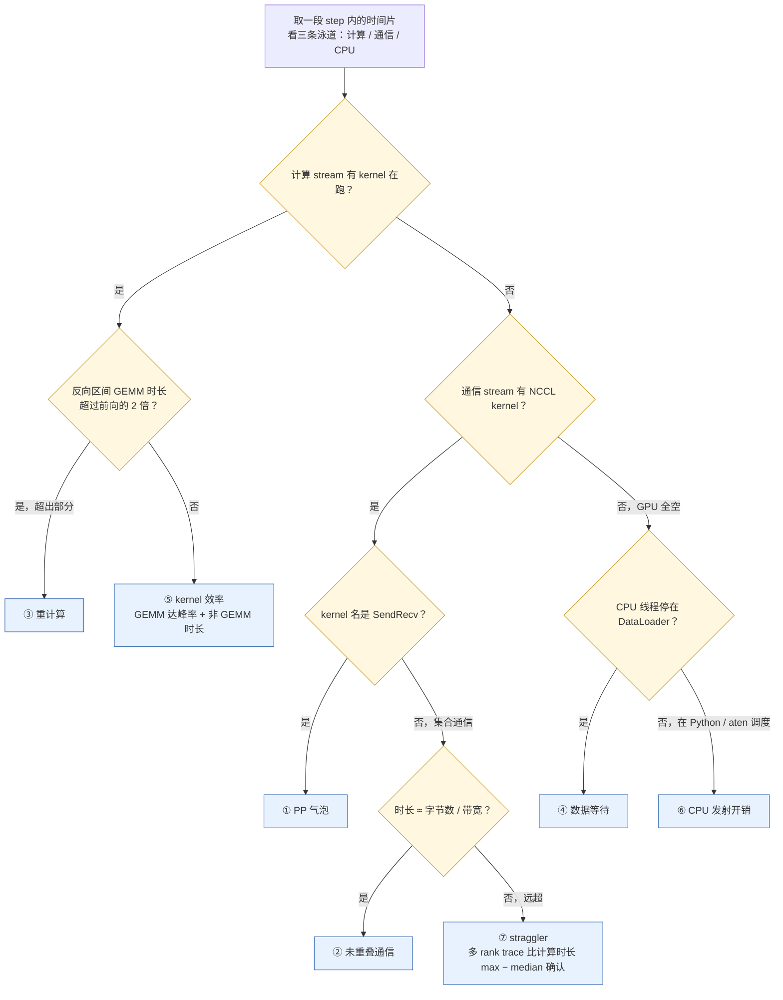

> 本文是[《大规模训练工程：从并行策略到容错恢复》](/large-scale-training-from-parallelism-to-fault-tolerance.html)系列的第 4 篇（共八篇）。上一篇：[三个框架：Megatron-LM、DeepSpeed 与 torchtitan 的架构对比与源码导读](/megatron-deepspeed-torchtitan-architecture-and-source-guide.html)；下一篇：[分布式 checkpoint：格式、异步保存与重分片恢复](/distributed-checkpoint-format-async-save-and-resharding.html)。

> **更新 @2026-09-06**：本文 torchtitan 部分基于 v0.3.0 刷新；其余源码引用仍以 PyTorch 2.13.0 / Megatron Core 0.18.0 为准。

前三篇把一个训练任务拆成了四种状态、把并行策略拆成了"复制还是切分"的选择、把三个框架拆成了"一个 bf16 参数的一生"。这些是零件。本篇把零件装回去：拿到一份模型规格和一份集群规格，坐下来算出一组配置，跑起来，然后面对那个所有人都会遇到的数字——**MFU 比预期低了 10 个点**。

配置一个千卡任务没有搜索空间可以穷举。TP、PP、DP、CP 四个维度、micro-batch、重计算策略、重叠开关、精度、编译，任意组合都要几分钟到几十分钟才能跑出一个 MFU 数字，一千张卡一小时的成本以万美元计。所以配置不是"试出来"的，而是**算出来、再用少量实验校准**的：先用显存账和通信量排除掉放不下和明显亏的组合，剩下两三个候选，各跑一段基准，用 profiler 看损失在哪，再决定。本篇前半部分是这套推导，后半部分是这套校准。

校准的核心是一张"MFU 损失账"。一个 step 的时间由七类东西组成：算力真正干活的时间、流水线气泡、没被计算盖住的通信、重计算多算的那部分、等数据、kernel 本身没跑到峰值、CPU 发射跟不上 GPU，以及有一张卡拖慢所有人。MFU 从 42% 掉到 32%，缺的 10 个点一定分布在这七项里；每一项在 torch.profiler 或 Nsight 的时间线上都有各自的形状和测法。把每一项标上价，才知道先改哪一个。

本篇要回答总纲提出的核心问题：

> **一个 70B dense 模型，1024 张 H100（128 节点 × 8 卡），序列长 8192，global batch 4M token。TP、PP、DP 各多少？micro-batch 多大？要不要重计算？预期 MFU 多少？跑出来只有 32%，缺的 10 个点去了哪里？**

依照系列惯例：硬件数字一律取公开标称值（H100 SXM bf16 dense 989 TFLOPS、HBM 80 GB、NVLink 单向 450 GB/s、每 GPU 一张 400 Gb/s 网卡即 50 GB/s）；推导出的显存与时间是账本数字；第六章那张"32% 是怎么来的"的表是**构造的示例**，用来演示拆解方法，不是任何一台集群的实测。源码以 Megatron Core 0.18.0、PyTorch 2.13.0 为准，torchtitan 依更新声明以 v0.3.0 为准。


## 一、总览

### 1. 本篇用到的记账符号与结论

第一、二篇建立的符号，本篇只用下面这些，在此复述以求自治：

```text
N            参数量（个）；N_bytes 为某精度下的参数字节数
N_t N_p N_d N_c   张量并行 / 流水线并行 / 数据并行 / 上下文并行的并行度；正文中常写作 t, p, d, c
s  b  h  a  L     序列长 · micro-batch 内序列数 · 隐藏维 · 注意力头数 · 层数
m            每个 step 每条流水线上的 micro-batch 数（= 梯度累积步数）
B            global batch（序列数）；B_tok = B·s 为 token 数
```

三条结论：

- **每参数 16 字节**：bf16 参数 2 + bf16 梯度 2 + fp32 主参数 4 + Adam 一阶矩 4 + 二阶矩 4。Megatron 默认用 fp32 累积梯度（`--accumulate-allreduce-grads-in-fp32`），梯度项变成 4 字节，合计 18；本篇按 Megatron 的路径用 18，按 FSDP2 的路径用 16。
- **每 token 6N FLOP**（前向 2、反向 4），再加注意力的 $$12Lhs$$。Megatron `megatron/training/training.py` 的 `num_floating_point_operations()` 与 torchtitan `torchtitan/models/utils.py` 的 `get_dense_model_nparams_and_flops()` 都是这个式子（后者不计输入 embedding 的参数）。MFU 按 PaLM 论文的定义，不计重计算的 FLOP。
- **每层激活**：Korthikanti et al. 2022 给出无并行时每层 $$sbh\left(34 + 5\frac{as}{h}\right)$$ 字节；TP 加序列并行后除以 $$t$$；用 FlashAttention 后 $$5as/h$$ 项基本消失，本篇取 $$34sbh/t$$。**流水线气泡率** $$\frac{p-1}{m}$$，交错（interleaved）调度下再除以每卡的虚拟 stage 数 $$v$$。

四种并行的每 step 每卡通信量（第二篇的五元组只取"量"这一列）：

```text
DP（all-reduce 梯度）              ≈ 2 N_local_bytes          走节点间；可与反向重叠
DP + ZeRO-1（reduce-scatter+all-gather）≈ 2 N_local_bytes     同上；all-gather 可与下一个前向重叠
ZeRO-3 / FSDP（每个 micro-batch）  ≈ 3 N_local_bytes × m       前向 all-gather、反向 all-gather + reduce-scatter
TP + SP（每层每 micro-batch）      8 × (t-1)/t × sbh × 2 字节  走 NVLink；前向 2 AG + 2 RS，反向同
PP（每个 stage 边界每 micro-batch）2 × sbh × 2 / t 字节        走节点间；量最小，延迟敏感
```

其中 N_local 是这张卡上持有的参数（被 TP、PP 切过之后的份额）。

### 2. 配置问题的形状

一个千卡配置有四个自由度和三类约束：

```text
自由度      TP · PP · DP · CP 的乘积 = 卡数；micro-batch b；重计算策略；（EP 仅 MoE）
约束 1      显存：静态状态 + 在途激活 + 开销 ≤ 80 GB（留 10% 给碎片）
约束 2      通信：每类通信量 / 对应链路带宽 ≪ 计算时间，且能被重叠
约束 3      算法：global batch 由训练配方定，不是性能参数
```

三类约束的地位不同。显存是硬约束，放不下就是放不下；通信是软约束，超了只是慢；global batch 是外部给定的，配置只能决定它怎么被切成 micro-batch。所有推导都是在这三条边界内找 MFU 的最大值。

### 3. 决策流程

```text
                    模型规格 (N, L, h, a, s)   集群规格 (卡数, 节点内卡数, 每卡显存, NVLink/网卡带宽)
                                        │
                                        ▼
              ┌─ 第一步：TP ────────────────────────────────────────────────────────┐
              │  上限 = NVLink 域大小（8）；下限 = 让 N/(t·p) 的静态状态能放下         │
              │  TP 通信量 ∝ sbh/层，只在 NVLink 上可接受；能用 8 就用 8，否则 4          │
              │  开 SP（序列并行），激活除以 t                                          │
              └────────────────────────────────────────────────────────────────────┘
                                        │
                                        ▼
              ┌─ 第二步：PP ────────────────────────────────────────────────────────┐
              │  目标：N/(t·p) 的参数 + 梯度 + 优化器分片 + 在途激活 ≤ 显存预算            │
              │  p 越大显存越松、气泡越大；每加一倍 p，m 要同倍增才保持气泡率              │
              │  优先用交错调度（v 个虚拟 stage）降气泡，而不是加 m                       │
              └────────────────────────────────────────────────────────────────────┘
                                        │
                                        ▼
              ┌─ 第三步：DP ────────────────────────────────────────────────────────┐
              │  d = 卡数 / (t·p·c)；m = B / (d·b)                                     │
              │  选 ZeRO-1（分布式优化器）还是 ZeRO-3/FSDP：看每卡每 step 的 token 数      │
              │  每卡 token 少、m 多 → FSDP 的 3N×m 通信压不住，选 PP + ZeRO-1            │
              └────────────────────────────────────────────────────────────────────┘
                                        │
                                        ▼
              ┌─ 第四步：CP ────────────────────────────────────────────────────────┐
              │  仅当 s 大到单卡（TP 后）一层的激活或注意力放不下时启用                    │
              │  s = 8192 不需要；s ≥ 32K 开始需要；c 占用的卡从 d 里扣                   │
              └────────────────────────────────────────────────────────────────────┘
                                        │
                                        ▼
              micro-batch b：显存允许下尽量大，但 m = B/(d·b) 要 ≥ 4p 才能压住气泡；通常 b = 1 或 2
              重计算：先不开；放不下时按"选择性 → 按层 N → 全量"的顺序加
                                        │
                                        ▼
              用账本算出：每卡显存、每 step 各类通信量与时间、气泡率、理论 step 时间 → 两三个候选
                                        │
                                        ▼
              各候选跑 100 step 基准 → profiler → 七项损失拆解（第六章）→ 定版并进版本控制
```

### 4. 三框架在"配置面"上的对照

同一件事三个框架各有各的名字，本篇正文以 Megatron 和 torchtitan 为主：

```text
配置项              Megatron Core 0.18.0                          DeepSpeed 0.19.2                     torchtitan v0.3.0
────────────────────────────────────────────────────────────────────────────────────────────────────────────────────────
并行度              --tensor-model-parallel-size                  TP 需模型侧支持；PP 用 PipelineModule   ParallelismConfig.tensor_parallel_degree /
                    --pipeline-model-parallel-size                ZeRO stage 决定 DP 形态                pipeline_parallel_degree / data_parallel_shard_degree /
                    --context-parallel-size                                                             data_parallel_replicate_degree / context_parallel_degree
micro-batch         --micro-batch-size / --global-batch-size      train_micro_batch_size_per_gpu /       TrainingConfig.local_batch_size / global_batch_size；
                    m 由 num_microbatches_calculator 算           gradient_accumulation_steps            PP 下再由 pipeline_parallel_microbatch_size 切
重计算              TransformerConfig.recompute_granularity /     activation_checkpointing 段            activation_checkpoint 子命令：selective / full /
                    recompute_method / recompute_num_layers /     (partition_activations, cpu_checkpointing)   memory-budget / none（activation_checkpoint.py）
                    recompute_modules
重叠                DistributedDataParallelConfig.overlap_grad_   ZeRO overlap_comm；stage3_prefetch_    FSDP2 隐式预取 + set_modules_to_forward_prefetch；
                    reduce / overlap_param_gather；               bucket_size                            CompileConfig.enable_async_tensor_parallel
                    ModelParallelConfig.tp_comm_overlap /
                    overlap_p2p_comm
编译 / 低精度        --fp8 (TE)；cuda_graph_impl                   无原生 compile 集成                    CompileConfig.enable（per-block）；Float8LinearConverter
```

DeepSpeed 这一列后文不再展开：它的配置面是 JSON，概念与 Megatron 的 ZeRO-1 一致，重计算沿用 `deepspeed/runtime/activation_checkpointing/checkpointing.py`，读者按对照表映射即可。

### 5. 本文的章节安排

```text
二、从规格推配置          70B / 1024 H100 的四步推导：TP → PP → DP → CP；三个候选；推导表；预期 MFU 与 step 时间
三、global batch、micro-batch 与梯度累积   三个量的关系 · micro-batch 的两头约束 · 三框架里它们叫什么
四、激活重计算与 offload  三种策略的代价 · Megatron 参数族 · torch.utils.checkpoint 与 torchtitan 的三种 AC · offload
五、通信与计算的重叠      DP reduce · TP 通信 · PP p2p 各自怎么重叠 · 重叠失败的五种原因
六、MFU 损失的七项拆解    每项的现象、在 profiler 时间线上的形状、测法与处置 · 回答"缺的 10 个点"
七、融合、低精度与编译    TE FP8 · 融合 kernel · torch.compile per-block 与 FSDP2/TP 的兼容 · CUDA Graph
八、配置纪律              版本控制 · 前后基准 · 变更留痕
九、本文小结              要点 · 源码位置 · train-ledger 的 sweep/ 与 mfu_breakdown.py · 外推到 1024 卡
```


## 二、从规格推配置：70B / 1024 H100 的完整推导

### 1. 输入

模型取 Llama 3 70B 的结构：$$L=80$$、$$h=8192$$、$$a=64$$（8 个 KV 头）、FFN 中间维 28672（SwiGLU）、词表 128256，$$N \approx 70.6\text{B}$$，其中输入 embedding 约 1.05B。集群 128 节点 × 8 张 H100 SXM，节点内 NVSwitch，每 GPU 一张 400 Gb/s 网卡。序列长 $$s=8192$$，global batch $$B_{tok} = 4\text{Mi} = 4{,}194{,}304$$ token，即 $$B = 512$$ 条序列。

先算三个与配置无关的数：

- **静态状态总量**：$$70.6\text{B} \times 18 \approx 1.27\text{ TB}$$（Megatron 路径）；平均到 1024 卡是 1.24 GB/卡——只要状态被充分切分，静态状态不是问题；问题在于**怎么切**决定通信量。
- **每 step FLOP**：每 token $$6 \times 69.5\text{B} + 12 \times 80 \times 8192 \times 8192 \approx 4.17 \times 10^{11} + 0.64 \times 10^{11} = 4.81 \times 10^{11}$$；每 step $$4.81 \times 10^{11} \times 4.19 \times 10^6 \approx 2.02 \times 10^{18}$$。分到 1024 卡、按 989 TFLOPS 标称，**理论下限 2.0 s/step**。MFU 42% 对应 4.75 s/step、约 88 万 token/s；32% 对应 6.2 s/step、约 68 万 token/s。
- **每层每 micro-batch 激活**（$$b=1$$、TP=8 + SP、FlashAttention）：$$34 \times 8192 \times 8192 / 8 \approx 285\text{ MB}$$。SwiGLU 的两个 3.5h 中间量比论文假设的 GELU 4h 多存一份，账本在这个数上预留 20% 余量。

### 2. 第一步：TP

上限是 NVLink 域：8。取 $$t=8$$ 后每卡持有 $$N/8 = 8.8\text{B}$$ 参数（PP 再往下切）。TP 通信量：每层每 micro-batch 前向两次 all-gather 加两次 reduce-scatter、反向同样四次，每次搬 $$(t-1)/t \times sbh \times 2 \approx 117\text{ MB}$$，每层每 micro-batch 约 0.94 GB。这个量只能放在 NVLink 上：按 450 GB/s 标称单向带宽，一层一个 micro-batch 要 2 ms 多；一个 step 的总量取决于 PP 和 m（见推导表），是 TP 必须与 GEMM 重叠的原因。

要不要 $$t=4$$？$$t=4$$ 把 TP 通信减半，但每卡参数翻倍，逼着 PP 加深、气泡变大，且 8 卡节点里 4 卡一组会让两组 TP 共享 NVSwitch 却各自跑 PP 的 p2p 出节点。在 8 卡 NVLink 节点上 dense 70B 的常规选择是 $$t=8$$，本篇沿用。开 `--sequence-parallel`（torchtitan 默认 `enable_sequence_parallel=True`）。

### 3. 第二步：PP

$$t=8$$ 后，PP 决定每卡的参数份额 $$N/(8p)$$ 和在途激活。三个候选：

```text
候选            每卡参数     bf16 参数  fp32 梯度   优化器分片(ZeRO-1)   静态合计   每 stage 层数   在途 micro-batch   激活(×1.2)    logits+开销   总计
────────────────────────────────────────────────────────────────────────────────────────────────────────────────────────────────────────────────
C  TP8/PP1/DP128  8.8 B     17.6 GB   35.3 GB    8.8B×12/128 = 0.8 GB   53.7 GB    80             1（梯度累积）      27 GB         8 GB          ~89 GB  ✗
B  TP8/PP2/DP64   4.4 B      8.8 GB   17.6 GB    4.4B×12/64  = 0.8 GB   27.3 GB    40             2                 27 GB         8 GB          ~62 GB  ✓
A  TP8/PP4/DP32   2.2 B      4.4 GB    8.8 GB    2.2B×12/32  = 0.8 GB   14.0 GB    20             4                 27 GB         8 GB          ~49 GB  ✓
```

在途激活：1F1B 调度下第一个 stage 最多同时持有 $$p$$ 个 micro-batch 的激活，所以三个候选的激活都是"每 stage 层数 × 在途数 × 285 MB"= 80 × 285 MB ≈ 22.8 GB，乘 1.2 余量得 27 GB——**PP 不减少激活总量，只是把它和参数一起分到更多卡上**；真正减少激活的是 micro-batch、SP、CP 和重计算。"logits+开销"包括最后一个 stage 的 logits（$$s \times V \times 6 / t \approx 0.8\text{ GB}$$，bf16 一份 fp32 一份）、CUDA context、多个 communicator 的 NCCL buffer、分配器碎片，按 8 GB 预留。

候选 C 不开重计算放不下；候选 A、B 都放得下且**不需要重计算**。这是本篇第一个实质结论：70B / 8192 / 1024 卡这个规格，用 TP8 + PP2 或 PP4，micro-batch 1，激活是放得下的，重计算不是必需的。

### 4. 第三步：DP，以及 ZeRO-1 还是 FSDP

$$d = 1024 / (8p)$$：候选 A 是 32，B 是 64。每条流水线每 step 处理 $$B/d$$ 条序列，$$b=1$$ 时 $$m = B/d$$：A 是 16，B 是 8。

三个维度落到 128 个节点上是什么样子，用候选 A 画出来（Megatron `initialize_model_parallel()` 默认 `order="tp-cp-ep-dp-pp"`，TP 变化最快、PP 最慢；torchtitan 的 DeviceMesh 维度顺序 `pp, dp, cp, tp` 结果相同）：

```text
候选 A：TP8 / PP4 / DP32   rank = tp + 8·dp + 256·pp   节点 n = dp + 32·pp
                                         （节点 n 放 rank 8n...8n+7）

              dp=0       dp=1       dp=2     ...     dp=31
            ┌──────────┬──────────┬──────────┬─────┬──────────┐
 pp=0       │ 节点 0   │ 节点 1   │ 节点 2   │ ... │ 节点 31  │ rank   0– 255
 (stage 0)  │ rank 0–7 │ rank 8–15│ 16–23    │     │ 248–255  │
            ├──────────┼──────────┼──────────┼─────┼──────────┤
 pp=1       │ 节点 32  │ 节点 33  │ 节点 34  │ ... │ 节点 63  │ rank 256– 511
            ├──────────┼──────────┼──────────┼─────┼──────────┤
 pp=2       │ 节点 64  │ 节点 65  │ 节点 66  │ ... │ 节点 95  │ rank 512– 767
            ├──────────┼──────────┼──────────┼─────┼──────────┤
 pp=3       │ 节点 96  │ 节点 97  │ 节点 98  │ ... │ 节点 127 │ rank 768–1023
            └──────────┴──────────┴──────────┴─────┴──────────┘

 一个格子 = 一个 TP 组：节点内 8 卡，走 NVSwitch（0.94 GB/层/micro-batch）
 一列     = 一条流水线：节点 k → 32+k → 64+k → 96+k，p2p 走节点间网卡
 一行同号 GPU = 一个 DP 组：32 个节点的第 i 张卡，reduce-scatter/all-gather
             走节点间网卡；共 8×4 = 32 个 DP 组，每组 32 个 rank
 v=4 交错时 stage 0 持有层 1–5 / 21–25 / 41–45 / 61–65，其余 stage 类推
```

这张图解释了后面所有通信量为什么落在哪条链路上：TP 的 300 GB/step 全部在格子内的 NVSwitch 上；PP 的 p2p 只在纵向相邻两格之间；DP 的 8.8 GB/step 横跨一行的 32 个节点，且 32 个 DP 组同时在跑，每张网卡都被自己那一组占用。

气泡率：A 非交错 $$3/16 = 18.8\%$$，B 是 $$1/8 = 12.5\%$$——都太高。交错调度取 $$v=4$$（A 每 chunk 5 层，B 每 chunk 10 层）：A 降到 $$3/64 = 4.7\%$$，B 降到 $$1/32 = 3.1\%$$。Megatron 用 `--num-virtual-stages-per-pipeline-rank 4`（或 `--num-layers-per-virtual-pipeline-stage`），调度在 `megatron/core/pipeline_parallel/schedules.py` 的 `forward_backward_pipelining_with_interleaving()`；PyTorch 侧是 `torch/distributed/pipelining/schedules.py` 的 `ScheduleInterleaved1F1B`，torchtitan 通过 `pipeline_parallel_schedule = "Interleaved1F1B"` 选它。

DP 的通信：ZeRO-1（Megatron 的分布式优化器 `--use-distributed-optimizer`）每 step 每卡 reduce-scatter 一次梯度、all-gather 一次更新后的 bf16 参数，量约 $$2 \times N_{local} \times 2$$ 字节（`--grad-reduce-in-bf16` 时）：A 是 8.8 GB、B 是 17.6 GB；按 50 GB/s 网卡分别是 0.18 s 和 0.35 s，占 4.75 s 目标的 4% 和 7%，且两段都能重叠（第五章）。

为什么不用 FSDP 代替 PP？torchtitan 的自然写法是 TP8 + FSDP128（候选 C 的 FSDP 版）：静态状态 $$70.6\text{B} \times 16 / 1024 \approx 1.1\text{ GB}$$，加激活 27 GB，显存最松、没有气泡。代价在通信：每卡持有 TP 份额 8.8B 参数，每个 micro-batch 前向 all-gather 17.6 GB、反向再 all-gather 17.6 GB（默认 `reshard_after_forward=True`）、reduce-scatter 一次；$$m = 512/128 = 4$$ 个 micro-batch，每 step 每卡约 $$4 \times 35 + 35 \approx 175\text{ GB}$$ 走节点间网卡，按 50 GB/s 要 3.5 s——比 2.0 s 的理论计算时间还长，怎么重叠都盖不住。`reshard_after_forward=False` 省掉一半 all-gather 还有 105 GB、2.1 s。根本原因是**每卡每 step 只有 4096 个 token**：参数切分的通信量按参数算，不随 token 数摊薄；每卡 token 少的大规模任务，PP + ZeRO-1 的 $$2N_{local}$$ 远比 FSDP 的 $$3N_{local} \times m$$ 便宜。HSDP 把 all-gather 限制在节点内能救一部分，但节点内 8 卡已经被 TP 占了。这就是 Llama 3 405B 用 TP8/CP16/PP16/DP128 而不是 FSDP 的算术。

### 5. 第四步：CP

$$s = 8192$$、TP8 + SP 之后一层的激活 285 MB，注意力用 FlashAttention 不存 $$s^2$$ 的分数矩阵，CP 没有必要。到 $$s \ge 32\text{K}$$，激活每层过 1 GB、注意力的计算占比从 13% 升到近 40%，才需要 CP 把序列切到多卡（Megatron `--context-parallel-size`，torchtitan `context_parallel_degree`）；CP 的卡从 $$d$$ 里扣，通信是 ring attention 的 K/V 传递，走 NVLink 或节点间取决于 c 放在哪一层。本篇 $$c = 1$$。

### 6. 推导表

```text
项目                        候选 A                          候选 B                          备注
────────────────────────────────────────────────────────────────────────────────────────────────────────────────────
TP / PP / DP / CP           8 / 4 / 32 / 1                  8 / 2 / 64 / 1                  t·p·d = 1024
虚拟 stage v                4（每 chunk 5 层）               4（每 chunk 10 层）              交错 1F1B
micro-batch b               1                               1                               b=2 时 A 的激活到 54 GB，总计 ~76 GB，太紧
每流水线序列数 B/d          16                              8
梯度累积步 m                16                              8                               m = B/(d·b)
气泡率 (p-1)/(m·v)          4.7%                            3.1%
每卡静态状态                14.0 GB                         27.3 GB                         ZeRO-1，fp32 梯度累积
每卡激活（不重计算）        27 GB                           27 GB                           285 MB × 80 层-micro-batch × 1.2
每卡激活（选择性重计算）    ≈ 27 GB                         ≈ 27 GB                         FlashAttention 下 core_attn 已无 s² 项，几乎不省
每卡激活（全量重计算）      80 × 16.8 MB × 1.2 ≈ 1.6 GB     同                              只存每层输入 sbh·2/t
每卡总显存（不重计算）      ~49 GB                          ~62 GB                          含 8 GB logits/开销
DP 通信 / step / 卡         8.8 GB → 0.18 s                 17.6 GB → 0.35 s                50 GB/s 网卡；可重叠
TP 通信 / step / 卡         0.94 GB × 20 层 × 16 = 300 GB    0.94 GB × 40 层 × 8 = 300 GB    NVLink 450 GB/s → 0.67 s；须与 GEMM 重叠
PP p2p / step / 卡          16 × 2 × 16.8 MB × v = 2.1 GB    8 × 2 × 16.8 MB × v = 0.5 GB    量小，延迟敏感
理论计算时间 / step         2.0 s                           2.0 s                           2.02e18 / 1024 / 989e12
预期 step 时间              4.4–4.9 s                       4.3–4.8 s                       见下节
预期 MFU 区间               40–45%                          41–46%                          设计目标 42%
```

A 与 B 的差别在于把显存换成了 DP 通信：B 每卡多 13 GB 静态状态、DP 通信翻倍、气泡略低。两者都是合理的起点。本篇后文以 A 为主线，因为它的显存余量允许后续加 CP 或把 $$s$$ 拉长而不必重新设计。

### 7. 预期 MFU 区间是怎么来的

"预期 step 时间"一行不是拍的，是按第六章的七项各给一个正常范围加出来的：

```text
项                          正常范围（占理论计算时间 2.0 s 的倍数或绝对值）        候选 A 的预期
──────────────────────────────────────────────────────────────────────────────────────────────────
kernel 效率                 GEMM 达峰 70–75%，非 GEMM kernel 再占 15–20%   → 计算实际耗时 ≈ 2.0 / 0.62 ≈ 3.2 s
PP 气泡                     气泡率 × 前后向时间                              3.2 × 4.7% ≈ 0.15 s
未重叠通信                  TP 未盖住部分 0.2–0.4 s；DP 尾部 0.05–0.1 s     ≈ 0.3–0.5 s
重计算                      不开为 0；选择性 +3–5%；全量 +30–35%           0
数据等待                    应为 0；预取够深时 < 0.05 s                      ≈ 0
CPU 发射开销                每 step 0.1–0.3 s（b=1 时 kernel 小而多）        ≈ 0.2 s
straggler                   健康集群 < 2%                                    ≈ 0.1 s
合计                                                                         ≈ 4.0–4.4 s → MFU 45–50%（乐观），取 40–45% 为预期区间
```

这张预算表的作用不是给出精确数字，而是给出**每一项的正常范围**——第六章拿实测去对照它，超出范围的那几项就是要改的。Llama 3 论文在 8K–16K 张 H100 上报告 38–43%，Megatron-LM 论文在 A100 上报告 52%；1024 卡 70B dense 做到 42% 是合理目标，做不到 35% 说明有明确的问题。


## 三、global batch、micro-batch 与梯度累积

### 1. 三个量的关系

$$
B = d \times b \times m
$$

三个量里只有 $$B$$ 是算法参数：它由训练配方定，与卡数无关；卡数变了只能动 $$d$$ 和 $$m$$，不能动 $$B$$。$$b$$ 是每次前向的序列数，由显存与 GEMM 效率决定；$$m$$ 是商，同时也是 PP 的 micro-batch 数和梯度累积步数——**在 PP 下这两个概念是同一个数**，Megatron 的 `megatron/core/num_microbatches_calculator.py` 的 `get_num_microbatches()` 返回的就是它，torchtitan 的 `Trainer` 用 `global_batch_size // (local_batch_size × dp_degree)` 算出 `gradient_accumulation_steps`，PP 下再由 `pipeline_parallel_microbatch_size` 把 `local_batch_size` 切成流水 micro-batch。

### 2. micro-batch 的两头约束

$$b$$ 小的问题是**GEMM 形状**。TP8 + SP 下一层的线性层输入是 $$(s \cdot b / t) \times h = 1024b \times 8192$$，与 $$8192 \times (4 \cdot 8192 / 8)$$ 的权重相乘；$$b=1$$ 时 M 维只有 1024（all-gather 后 8192），H100 的大 GEMM 在 M 达到几千时才接近峰值，M=1024 的效率通常在 60–70%。同时 kernel 数量与 $$b$$ 无关而每个 kernel 变短，CPU 发射开销的占比上升（第六章第 7 节）。

$$b$$ 大的问题是**激活与气泡**。激活随 $$b$$ 线性增长（候选 A 的 $$b=2$$ 到 54 GB）；$$m = B/(d \cdot b)$$ 随 $$b$$ 反比缩小，气泡率 $$\frac{p-1}{m v}$$ 随之上升——$$b=2$$ 让候选 A 的 $$m$$ 从 16 掉到 8，气泡从 4.7% 翻到 9.4%。把 $$b$$ 从 1 拨到 4，两个候选的三个量一起动：

| $$b$$ | GEMM M 维（AG 后 $$s \cdot b$$） | A：$$m$$ | A：气泡 v=1 → v=4 | A：每卡显存 | B：$$m$$ | B：气泡 v=1 → v=4 | B：每卡显存 |
|---|---|---|---|---|---|---|---|
| 1 | 8192 | 16 | 18.8% → 4.7% | ~49 GB | 8 | 12.5% → 3.1% | ~62 GB |
| 2 | 16384 | 8 | 37.5% → 9.4% | ~76 GB（紧） | 4 | 25% → 6.3% | ~89 GB ✗ |
| 4 | 32768 | 4 | 75% → 18.8% | ~130 GB ✗ | 2 | 50% → 12.5% | ~143 GB ✗ |

所以 PP 下 $$b$$ 几乎总是 1 或 2，而"用更大的 micro-batch 提高 GEMM 效率"这条路在 PP 下是被气泡堵死的：要 GEMM 效率就得减小 $$p$$（候选 B）或不用 PP（FSDP，但通信压不住）。这是三个约束互相牵制最直接的例子。

序列打包（第七篇）是绕开这个矛盾的手段之一：$$b=1$$ 但一条"序列"里装多个文档，M 维不变、token 利用率上去。Megatron 的 `--micro-batch-size 1` 配 packed sequence 是标准写法（`arguments.py` 里有对应断言：sequence packing 要求 micro_batch_size 为 1）。

### 3. batch 渐增

训练配方常要求前期用小 global batch。Megatron 的 `--rampup-batch-size <start> <increment> <samples>`（`megatron/training/config/training_config.py` 的 `rampup_batch_size` 字段，0.18.0 已标记 deprecated 并指向 `step_batch_size_schedule`）让 $$B$$ 按 sample 数线性增长，$$m$$ 随之变化——意味着渐增期的气泡率比稳态高，MFU 曲线前段偏低是正常的，不要在渐增期做基准对比。


## 四、激活重计算与 offload

### 1. 三种策略与代价

```text
策略           存什么                                  省多少激活                       多算多少
────────────────────────────────────────────────────────────────────────────────────────────────────────
全量 (full)    每层（或每 N 层）的输入 sbh·2/t          每层 285 MB → 16.8 MB（约 94%）   反向前重做整层前向：+1 次前向 ≈ +33% FLOP，MFU 不计、HFU 计
选择性         存 GEMM 的输入输出，重算注意力 softmax   论文设定下约 60%；FlashAttention   只重算注意力的非 GEMM 部分：+3–5%
(selective)    等便宜的部分（Korthikanti et al. 2022）  下 s² 项已不存在，几乎不省
按层 N         前 N 层全量重计算，其余不重计算            N/L_stage × 94%                   N/L_stage × 33%
```

选择性重计算的论点是：注意力的 softmax、dropout、分数矩阵占激活的大头（$$5as/h$$ 项）但算力占比小，重算它们几乎不花时间。这个论点在 FlashAttention 普及后要重新审视：FlashAttention 本身就不存分数矩阵，反向时在 kernel 内重算，所以"重算注意力"的收益已经被 kernel 拿走了，选择性重计算剩下的收益很小。Megatron 0.18.0 的 `recompute_modules` 默认仍是 `["core_attn"]`，在 TE fused attention 下开它的收益要用 `torch.cuda.memory_stats` 实测确认，否则只是多花了 3–5% 算力。

按层 N 是显存"差一点"时最经济的手段：候选 A 若把 $$b$$ 提到 2、激活到 54 GB 总计 76 GB，重计算 20 层里的 6 层省 6 × 285 MB × 4 ≈ 6.8 GB、多算 6/20 × 33% ≈ 10%——比全量重计算便宜三倍。

### 2. Megatron 的参数族

0.18.0 把重计算配置放在 `megatron/core/transformer/transformer_config.py` 的 `TransformerConfig` 里，CLI 参数由 `megatron/training/argument_utils.py` 的 `ArgumentGroupFactory` 从 dataclass 字段自动生成（字段名下划线换连字符），所以 `arguments.py` 里只看得到几个手写的兼容项：

```text
字段 / CLI                                       含义
─────────────────────────────────────────────────────────────────────────────────────────────────────
recompute_granularity  --recompute-granularity    None / 'selective' / 'full'
recompute_method       --recompute-method         'uniform'（每 recompute_num_layers 层为一组重算）/ 'block'（每 stage 只重算前 N 层）
recompute_num_layers   --recompute-num-layers     uniform 时每组层数；block 时每 stage 重算的层数；selective 时必须为 None
recompute_modules      --recompute-modules        selective 时重算哪些子模块：core_attn / moe_act / layernorm / mla_up_proj / mlp / moe / shared_experts
distribute_saved_activations --distribute-saved-activations   把保存的激活沿 TP 组切分（与 SP 互斥）
--recompute-activations                          arguments.py 里的快捷方式，等价于 --recompute-granularity selective
--checkpoint-activations                         已废弃，arguments.py 会报错并提示改用上面两个
```

`transformer_config.py` 的 `__post_init__` 做了全部合法性检查：`full` 必须配 `recompute_method` 与 `recompute_num_layers`；`selective` 不能带 `recompute_num_layers`；`recompute_modules` 里 `moe_act` 要求 grouped GEMM。实现入口在 `megatron/core/transformer/transformer_block.py` 的 `TransformerBlock`，它调用 `megatron/core/recompute.py` 的 `checkpointed_forward()`，底层是 `megatron/core/tensor_parallel/random.py` 的 `checkpoint()`（`CheckpointFunction`，负责保存并恢复 TP 的 RNG 状态，这是 Megatron 不直接用 `torch.utils.checkpoint` 的原因），或在 TE 可用时用 TE 的 checkpoint。

PP 下还有一个细粒度旋钮：`ModelParallelConfig.num_microbatches_with_partial_activation_checkpoints`——只对前若干个 micro-batch 做重计算（它们在 1F1B 里存活最久），`schedules.py` 的 `forward_step()` 通过 `checkpoint_activations_microbatch` 参数传入。它没有 CLI 参数（`arguments.py` 的 exclude 列表里明确列出），要在代码里设。

### 3. `torch.utils.checkpoint` 与 torchtitan 的三种 AC

PyTorch 2.13 的 `torch/utils/checkpoint.py` 有两条路径：`use_reentrant=True` 的 `CheckpointFunction`（旧路径，一个 autograd Function 包住整段前向，不支持 `torch.autograd.grad`、与 FSDP 的 hook 有兼容问题）和 `use_reentrant=False` 的非重入路径（用 saved-tensor hooks 实现，推荐）。选择性重计算的接口是 `CheckpointPolicy` 枚举（`MUST_SAVE / PREFER_SAVE / MUST_RECOMPUTE / PREFER_RECOMPUTE`）和 `create_selective_checkpoint_contexts(policy_fn)`，policy 函数按 op 决定存还是重算。`set_checkpoint_early_stop()` 控制重计算是否在拿到所需张量后提前停止。

torchtitan v0.3.0 的 `torchtitan/distributed/activation_checkpoint.py` 在这之上给了三种策略，都以 transformer block 为单位包裹（`ActivationCheckpointing.apply()` 遍历 `model.layers`，用 `torch/distributed/algorithms/_checkpoint/checkpoint_wrapper.py` 的 `checkpoint_wrapper` 替换每个 block）：

- `FullAC`：整个 block 重算；
- `SelectiveAC`：per-op 策略。`_get_default_save_ops()` 把 SDPA/FlexAttention、`aten.linear`、`aten.max`（低精度缩放因子）、`aten.topk`（MoE 路由稳定性）、reduce-scatter / all-to-all 等通信 op 标成 `MUST_SAVE`，其余 `PREFER_RECOMPUTE`；同时**每隔一个 mm 重算一个**（`wrapped_policy` 里的 `mm_count % 2`），在存和算之间取中；`force_recompute_mm_shapes_by_fqns` 让路由门这类小 GEMM 总是重算。它与 Megatron 的 selective 不是一回事：Megatron 按子模块（core_attn）选，torchtitan 按 op 选，并且默认就重算一半 GEMM——所以 torchtitan 的 selective 比 Megatron 的 selective 省得多、也贵得多（大约 +15% FLOP 量级，视 GEMM 占比而定）；
- `MemoryBudgetAC`：交给编译器——设 `torch._functorch.config.activation_memory_budget`（0 到 1），由 AOTAutograd 的 partitioner 按预算决定存哪些中间量。**要求模型已 compile**（`Trainer.Config` 校验），是 `torch.compile` 才有的选项。

配置面是 tyro 子命令：`activation_checkpoint:selective`、`:full`、`:memory-budget`、`:none`；Python 配置里直接赋 `config.activation_checkpoint = SelectiveAC.Config()`。`llama3_8b()`（`torchtitan/models/llama3/config_registry.py`）默认 `SelectiveAC`，`llama3_70b()` 与 `llama3_405b()` 默认 `FullAC` 配 TP8——这两个默认值对 8 卡是合理的（70B 在 8 卡 TP8 上没有 PP 和 DP 可分显存，只能全量重算），但不是千卡的答案。

### 4. 激活 offload

重计算用算力换显存，offload 用 PCIe 带宽换显存：前向把激活拷到 CPU pinned memory，反向拷回。H100 的 PCIe 5.0 x16 单向约 64 GB/s 标称，一层 285 MB 来回要约 9 ms，而一层前向的计算时间（候选 A，b=1）约 2 ms 量级——offload 只有在拷贝能藏在几层计算后面、并且显存实在放不下时才划算。Megatron 提供两层实现：`ModelParallelConfig.cpu_offloading` 加 `cpu_offloading_num_layers`（`--cpu-offloading-num-layers N`，设了就自动置 `cpu_offloading=True`；`transformer_config.py` 检查它与 PP 和 `recompute_granularity` 互斥），以及 0.18 的细粒度版 `fine_grained_activation_offloading` 加 `offload_modules`（`core_attn / attn_proj / expert_fc1 / moe_act / attn_norm / mlp_norm / qkv_linear`，实现在 `megatron/core/pipeline_parallel/fine_grained_activation_offload.py`）。PyTorch 原生是 `torch/autograd/graph.py` 的 `save_on_cpu` saved-tensor hooks。torchtitan 没有激活 offload，只有 FSDP2 的参数/梯度/优化器 offload（`TrainingConfig.enable_cpu_offload` → `CPUOffloadPolicy`），那是另一回事。

本篇的 70B 配置不需要 offload；它的位置是长序列（$$s \ge 64\text{K}$$）或单机微调这类显存极端受限的场景。


## 五、通信与计算的重叠

### 1. DP 梯度 reduce 与反向的重叠

反向是从最后一层往前算的，第 $$L$$ 层的梯度算完时前面 $$L-1$$ 层还在算——这段时间足够把第 $$L$$ 层的梯度 reduce 出去。实现上把参数按反向顺序分到若干 bucket，一个 bucket 的梯度全部就位就发一次 reduce-scatter。Megatron 在 `megatron/core/distributed/distributed_data_parallel_config.py` 的 `DistributedDataParallelConfig` 里有全部旋钮：`overlap_grad_reduce`（`--overlap-grad-reduce`）、`bucket_size` / `num_buckets`（`--ddp-bucket-size` / `--ddp-num-buckets`）、`pad_buckets_for_high_nccl_busbw`（把 bucket 补到 $$2^{16}$$ 的倍数，因为 ring 算法的每卡消息是 bucket_size/dp_size，对齐才有高 busbw）、`average_in_collective`。分布式优化器之后的参数 all-gather 同理与**下一个 step 的前向**重叠：`overlap_param_gather`（`--overlap-param-gather`），`align_param_gather` 让各 PP stage 同时发起以免互相等。

有一个陷阱：梯度累积期间不能 reduce。$$m$$ 个 micro-batch 只有最后一个的反向该触发通信，前 $$m-1$$ 个要关掉——Megatron 在 `schedules.py` 里通过 `no_sync_func` / `disable_grad_sync()` / `enable_grad_sync()` 做这件事；FSDP2 是 `set_requires_gradient_sync(False)`（`torch/distributed/fsdp/_fully_shard/_fully_shard.py` 的 `FSDPModule`），并可用 `set_reshard_after_backward(False)` 让累积期间不重新分片参数、省掉下一次 all-gather。**重叠只在最后一个 micro-batch 的反向里发生**，所以 DP 通信能藏起来的上限是"一次反向的时间"，$$m$$ 越大这个上限相对越宽松。把一个 step 的两条 stream 摆在同一根时间轴上（以 4 个 bucket 为例）：

```text
时间 ──────────────────────────────────────────────────────────────────────────►
      micro-batch 1..m-1 micro-batch m（最后一个）   等    opt 下一 step
     ┌──────────────────┬──┬──────┬─────┬─────┬─────┬─────┬───┬─────────┬──────┐
计算 │F1B1..F(m-1)B(m-1)│Fm│L80-61│60-41│40-21│L20-1│ 空  │opt│F1' L1-20│L21-..│
通信 │ no_sync 不发梯度 │  │      │RS b3│RS b2│RS b1│RS b0│   │AG b0    │AG b1 │
     └──────────────────┴──┴──────┴─────┴─────┴─────┴─────┴───┴─────────┴──────┘
                                   ▲ 层80-61 就位    ▲ 尾部    ▲ AG 盖住
                                     发 bucket 3       暴露      下一步前向
```

RS = reduce-scatter 梯度，AG = all-gather 更新后的参数；bucket 按反向顺序编号（b3 是最后几层，最先算完）。图里能看出三件事：前 $$m-1$$ 个 micro-batch 通信流是空的；最后一个 bucket（b0，最前面几层）算完时反向已经结束，它的 reduce-scatter 没有计算可以盖，是必然暴露的尾部（第六章第 3 节预算里的"DP 尾部 0.05–0.1 s"）；all-gather 要等优化器更新完，所以它盖住的是**下一个 step** 的前向，前向从第 1 层开始算、b0 恰好也是第 1 层附近的参数，顺序天然匹配。

### 2. TP 通信与 GEMM 的重叠

TP 的 all-gather / reduce-scatter 夹在 GEMM 之间，数据依赖是直接的：reduce-scatter 的输入就是 GEMM 的输出，all-gather 的输出就是下一个 GEMM 的输入，没有"前面还在算别的"可以借。重叠只能靠**把 GEMM 和通信都切成块**：GEMM 沿 M 维分成若干片，第 $$i$$ 片算完就开始通信，同时算第 $$i+1$$ 片。这需要 GEMM kernel 与通信 kernel 的细粒度协作。

Megatron 走 Transformer Engine 的 userbuffers：`ModelParallelConfig.tp_comm_overlap`（`--tp-comm-overlap`），细项 `tp_comm_overlap_ag / tp_comm_overlap_rs / tp_comm_overlap_rs_dgrad / tp_comm_bulk_*`，`--tp-comm-overlap-cfg` 指向每层每 GEMM 的 YAML 配置。torchtitan 走 Inductor 的 async TP：`CompileConfig.enable_async_tensor_parallel`，`torchtitan/distributed/compile.py` 的 `_maybe_enable_async_tp()` 给 TP 进程组开 symmetric memory 并置 `torch._inductor.config._micro_pipeline_tp = True`，让编译器把 all-gather + matmul、matmul + reduce-scatter 的模式改写成分块流水。两者都要求 SP 开着（否则通信是 all-reduce，没法分块流水），都只对足够大的 GEMM 有收益——M 太小时分块后每片都跑不满 SM。

### 3. PP 点对点与计算的重叠

1F1B 稳态里每个 stage 每个时间片做一个前向、一个反向，同时要收上游的激活、发下游的激活、收下游的梯度、发上游的梯度。四个 p2p 的量都小（16.8 MB），但如果同步等，每次都是一个网络往返的延迟。Megatron 的 `ModelParallelConfig.overlap_p2p_comm`（默认开，`--no-overlap-p2p-communication` 关）让 `schedules.py` 用 `isend/irecv` 先发再算、算完再 wait；`batch_p2p_comm` 把四个操作打包成一次 `batch_isend_irecv`，与 `overlap_p2p_comm` 互斥。`torch/distributed/pipelining/schedules.py` 的 `_PipelineScheduleRuntime` 系列（`ScheduleInterleaved1F1B`、`ScheduleInterleavedZeroBubble`、`ScheduleZBVZeroBubble`、`ScheduleDualPipeV`）把通信和计算都当作调度动作显式排列，重叠是调度表的一部分。

### 4. 重叠失败的常见原因

重叠开关打开不等于重叠发生。profiler 时间线上通信 kernel 与计算 kernel 不并行，通常是这五种原因之一：

```text
现象                                  原因                                          处置
─────────────────────────────────────────────────────────────────────────────────────────────────────────────────
DP 的 reduce-scatter 全部堆在反向结束后  overlap 没开；或 bucket 太大（一个 bucket 覆盖半个模型）  开 overlap_grad_reduce；bucket 调到 每卡消息 ≥ 拐点大小 即可，不要更大
一个 bucket 一发就等它完成             通信 stream 与计算 stream 之间有多余的同步            查 .item()、torch.cuda.synchronize()、日志里的 tensor 打印
通信 kernel 与计算 kernel 交替而不并行  通信 kernel 占了太多 SM，计算 kernel 没有 SM 可用；    减 NCCL channel 数；或让 GEMM 留出 SM（TE userbuffers 的做法）
                                      或计算 kernel 把 SM 占满，通信 kernel 排不进去
TP 的 all-gather 每次都暴露            没开 SP（通信是 all-reduce，不可分块）；或 M 太小      开 SP；b 或 s 加大；确认 tp_comm_overlap / async TP 实际生效（看日志）
p2p 有等待但两边都空闲                 相邻 stage 的 micro-batch 顺序不一致、或 stage 层数不均   查 pipeline 布局；用 --decoder-first/last-pipeline-num-layers 平衡
CPU 侧发射慢，通信虽异步但发得晚        每个 step 几千个小 kernel，Python 跟不上 GPU             第六章第 7 节；CUDA Graph；融合
```

第三条值得多说一句：GPU 上通信与计算"并行"的前提是两种 kernel 同时驻留在 SM 上。NCCL kernel 每个 channel 占一个 block，几十个 channel 就是几十个 SM；H100 有 132 个 SM，计算 kernel 若是按满 SM 设计的 GEMM，两者只能轮流。这是本系列不展开的 NCCL 侧细节，但它是"重叠没发生"最难查的一种：时间线上两类 kernel 看起来是并行发起的，实际是串行执行的，只有看每个 kernel 的实际时长是否比单独跑时变长才能确认。


## 六、MFU 损失的七项拆解

### 1. 总账与测法总则

$$
\text{MFU} = \frac{T_{ideal}}{T_{step}}, \qquad T_{step} = T_{ideal} + \sum_{i=1}^{7} \Delta_i
$$

$$T_{ideal}$$ 是模型 FLOP 除以标称峰值（候选 A：2.0 s），七个 $$\Delta_i$$ 是本章的七项。每一项的测法都基于同一份材料：**一个 step 的 torch.profiler 时间线**（Chrome trace JSON），要求 `ProfilerActivity.CUDA` 开着、`record_shapes=True`、覆盖至少一个完整的 `ProfilerStep#N` 区间。torchtitan 的 `torchtitan/tools/profiler.py`（`Profiler.Config` 的 `enable_profiling / profile_freq / profiler_warmup / profiler_active`）默认就这么配并 `export_chrome_trace()`；Megatron 用 `--use-pytorch-profiler --profile-step-start 10 --profile-step-end 12 --profile-ranks 0 8 16`（`megatron/training/config/common_config.py` 的 `ProfilingConfig`），或 `--profile` 走 Nsight Systems 的 `cudaProfilerStart/Stop` 区间。

时间线上要看的只有三条泳道：计算 stream 上的 kernel、通信 stream 上的 NCCL kernel（名字以 `ncclDevKernel_` 开头，`SendRecv` 是 p2p，`AllGather / ReduceScatter / AllReduce` 是集合通信）、以及 CPU 线程上的 op 与 `cudaLaunchKernel`。七项就是这三条泳道上七种不同的**空隙形状**：

```text
项              时间线上的形状                                              测量
──────────────────────────────────────────────────────────────────────────────────────────────────────────────
1 PP 气泡        计算 stream 空，通信 stream 上只有 SendRecv 在等             p2p 独占时间（无计算 kernel 并行的 SendRecv 时长）
2 未重叠通信     计算 stream 空，通信 stream 上是 AllGather/ReduceScatter     集合通信独占时间
3 重计算         反向区间里出现与前向同形状的 GEMM/attention kernel           反向 GEMM 时间 − 2 × 前向 GEMM 时间（正值部分）
4 数据等待       两个 step 之间、CPU 线程停在 DataLoader.__next__，GPU 全空    step 边界处的 GPU 空隙 ∩ DataLoader op 区间
5 kernel 效率    kernel 都在跑，但每个 GEMM 的 FLOP/时长 低于峰值；非 GEMM 多  计算 kernel 总时长 − T_ideal
6 CPU 发射开销   计算 stream 有细碎空隙，CPU 线程在忙（Python / aten 调度）    GPU 全空 且 不在 DataLoader 中 的空隙
7 straggler      集合通信 kernel 时长 ≫ 字节数/带宽；跨 rank 计算时间不一致   多 rank trace：计算时长的 max − median；或集合通信时长 − 理论传输时间
```

表里的七种形状两两之间容易混：4 与 6 都是"GPU 全空"，只差 CPU 线程当时在干什么；2 与 7 都是"通信 kernel 很长"，只差是带宽不够还是在等别人；3 与 5 都是"计算 kernel 在跑"，只差反向里有没有多出一份前向。把时间线上任意一段空隙归到某一项，走的是下面这棵判定树：



前六项一个 rank 的 trace 就能测；第七项需要多个 rank。第九章的 `mfu_breakdown.py` 实现的就是这张表。Nsight Systems 的对应做法：`nsys profile --capture-range=cudaProfilerApi -t cuda,nvtx`，用 `nsys stats --report cuda_gpu_kern_sum` 拿 kernel 分类汇总，用 NVTX（Megatron `--nvtx-ranges`）标出前向/反向/优化器区间；Nsight 的优势是能看到 SM 占用率和多进程的同一时间轴，劣势是文件大、不能按 Python 栈归因。

### 2. PP 气泡

理论值 $$\frac{p-1}{mv} \times T_{fb}$$，$$T_{fb}$$ 是一个 step 全部前向加反向的时间。时间线上气泡出现在 step 开头（warmup：前 $$p-1$$ 个 micro-batch 只有前向）和结尾（cooldown：只有反向），稳态里没有。测法是把没有计算 kernel 并行的 `SendRecv` 时长加起来，与理论值比：**高于理论值**通常是 stage 不均衡——第一个 stage 多了 embedding、最后一个多了 lm_head 和 loss，按层数均分的话首尾 stage 更慢，其他 stage 每个 micro-batch 都要等它们。Megatron 用 `--decoder-first-pipeline-num-layers` / `--decoder-last-pipeline-num-layers`（`TransformerConfig.num_layers_in_first_pipeline_stage / num_layers_in_last_pipeline_stage`）或 `--pipeline-model-parallel-layout` 手工不均分；torchtitan 用 `pipeline_parallel_first_stage_less_layers` / `pipeline_parallel_last_stage_less_layers`（默认各 1）或 `module_fqns_per_model_part` 显式指定。处置顺序：先均衡 stage，再加 $$v$$，最后才是加 $$m$$（要 $$b$$ 更小或 $$d$$ 更小）或减 $$p$$。

### 3. 未重叠的通信

把通信 stream 上没有计算 kernel 并行的集合通信时长加起来，按名字分成 DP（`ReduceScatter / AllGather` 在 DP 组）和 TP（在 TP 组；trace 里区分不了进程组，按 kernel 出现的位置——夹在 GEMM 之间的是 TP，反向尾部和 step 开头的是 DP）。然后与账本比：候选 A 的 DP 通信 0.18 s、TP 通信 0.67 s 是**全部暴露**时的上界，实测的独占时间除以它就是"没被盖住的比例"。DP 独占时间接近上界说明 `overlap_grad_reduce` 没生效（第五章第 4 节的检查表）；TP 独占接近上界说明 `tp_comm_overlap` / async TP 没生效或 SP 没开。TP 部分即使全部生效也不会到零——分块流水的第一块和最后一块总是暴露的——经验上能藏掉一半到三分之二。

### 4. 重计算

反向区间（从第一个 `autograd::engine::evaluate_function` CPU op 到优化器 step 之前）的 GEMM 时长正常是前向的两倍（dgrad + wgrad）。全量重计算后反向区间会多出一整份前向的 GEMM 和 attention kernel，比值变成三倍；选择性重计算多出的是非 GEMM kernel（softmax、mask、dropout）。测法就是"反向 GEMM 时间 − 2 × 前向 GEMM 时间"，正值部分是重计算的 GEMM 代价；非 GEMM 部分用同样的差法。**这项没有"正常范围"，只有"是否必要"**：先用 `torch.cuda.memory_stats()` 的 `allocated_bytes.all.peak` 确认关掉重计算是否真的放不下，再决定；很多任务开着 selective 只是因为示例配置里有。

### 5. 数据等待

两个 `ProfilerStep` 之间、优化器 kernel 结束到下一个 step 第一个 kernel 开始的空隙，且 CPU 线程正处在 DataLoader 的 `__next__`（trace 里是 `enumerate(DataLoader)#_MultiProcessingDataLoaderIter.__next__` 一类的 op），就是数据等待。健康状态下这个空隙应当接近零：DataLoader 有 worker 进程预取，GPU 算这个 step 时下一个 batch 早已就位。出现等待的原因几乎都在 CPU 侧：worker 数不够、在线 tokenize、对象存储的流式读取抖动、`pin_memory` 没开、CPU 被 NCCL proxy 线程和 worker 争抢。第七篇讨论数据管线；本篇只需要知道怎么把它从 MFU 账里分离出来——它和 CPU 发射开销都是"GPU 全空"，区别只在 CPU 线程当时在做什么。

### 6. kernel 效率与 GEMM 形状

计算 kernel 的总时长减去 $$T_{ideal}$$ 是"kernel 层面的损失"，它有两个来源：GEMM 没跑到峰值，以及非 GEMM kernel（norm、RoPE、SwiGLU 激活、residual add、loss、优化器）占的时间——后者在模型 FLOP 里几乎不计，却实实在在占时间。测法：按 kernel 名把计算 kernel 分成 GEMM（名字含 `gemm / cutlass / nvjet / Cijk`）、attention（`flash / fmha / attention`）和其他；GEMM 的达峰率用 `record_shapes` 记录的 `aten::mm` 输入维度算 $$2MNK$$ 除以时长再除以峰值；其他 kernel 的时长直接就是损失。

GEMM 形状不友好的典型：M 维太小（$$b=1$$ 且 TP 大）、N 或 K 不是 64/128 的倍数（词表 128256 / 8 = 16032 不是 128 的倍数，lm_head 的 GEMM 会掉一档；Megatron 的 `--make-vocab-size-divisible-by` 就是为此）、GQA 的 KV 投影 N 维只有 $$8 \times 128 / t = 128$$。处置：调整 $$b$$、pad 词表、把 QKV 三个投影融合成一个 GEMM（Megatron 与 torchtitan 都默认 `fuse_qkv`）。非 GEMM 部分的处置是第七章的融合。

### 7. CPU 发射开销

GPU 计算 stream 上有空隙、CPU 线程在忙、又不在 DataLoader 里——GPU 在等 CPU 把下一个 kernel 发出来。一个 70B 模型 80 层每层几十个 op，$$b=1$$ 时每个 kernel 只有几十到几百微秒，而 Python 侧一个 op 的调度开销在 10 µs 量级，几千个 op 就是几十毫秒；再加上 autograd 引擎、FSDP/DDP 的 hook、`DTensor` 的 dispatch，很容易到 0.2–0.3 s。它的特征是**与 GPU 快慢无关、与 $$b$$ 成反比**：把 $$b$$ 翻倍，这项占比减半。处置有三层：融合（减少 op 数）、`torch.compile`（把一个 block 的几十个 op 变成几个 Triton kernel）、CUDA Graph（把整个 micro-batch 的发射录下来重放，Megatron `TransformerConfig.cuda_graph_impl` 取 `local / transformer_engine / full_iteration`，torchtitan 默认开启前后向的 CUDA graph 捕获，`TrainingConfig.disable_cuda_graphs` 可关）。

### 8. straggler

同步训练里最慢的 rank 决定每一次集合通信何时完成。单个 rank 的 trace 上它表现为集合通信 kernel 的时长远超字节数除以带宽——多出来的是在等别人。确认要靠多 rank 的 trace（Megatron 的 `--profile-ranks` 一次采几个不同节点的 rank）：各 rank 计算 kernel 的总时长若相差超过 2–3%，就有 straggler；最慢的那个 rank 的通信时长反而最短（它是被等的那个）。成因在第六篇展开（降频、HBM 纠错、PCIe 降速、网络链路差、数据不均衡），本篇只需把它从通信项里分出来：**通信项是"带宽不够或没重叠"，straggler 项是"有人来晚了"**，两者在时间线上都是通信 kernel 变长，靠跨 rank 对比才能区分。

### 9. 回答核心问题：缺的 10 个点去了哪里

候选 A 设计目标 42%（4.75 s/step），假设跑出来 32%（6.2 s/step），多出 1.45 s。下面是一张**构造的**拆解表——数字是按第 1 节的测法从一份假想的 trace 里读出来的，用来演示七项如何加起来正好是 10 个点；它不是任何一次真实测量：

```text
项              预算（第二章第 7 节）    "实测"     超出      折成 MFU 点   现象与归因                                          处置
─────────────────────────────────────────────────────────────────────────────────────────────────────────────────────────────────────────────────────
1 PP 气泡        0.15 s                  0.23 s     +0.08     ~0.5          首尾 stage 各多算 embedding / lm_head+loss，其余 stage 等   首尾 stage 少放 1 层
2 未重叠通信     0.4 s                   0.8 s      +0.4      ~3            --overlap-grad-reduce / --overlap-param-gather 没开，DP 全暴露；  开两个 overlap；开 tp_comm_overlap
                                                                            tp_comm_overlap 没开，TP 独占接近 0.67 s 上界
3 重计算         0                       0.13 s     +0.13     ~1            示例配置带着 --recompute-granularity selective，TE fused attention 下白算   关掉；用 memory_stats 确认放得下
4 数据等待       0                       0.05 s     +0.05     ~0.5          在线 tokenize，2 个 worker                             离线 tokenize；worker 数 ≥ 4；pin_memory
5 kernel 效率    3.2 s                   3.4 s      +0.2      ~1.5          --no-bias-swiglu-fusion / --no-rope-fusion 被示例脚本带进来；词表未 pad  去掉两个 no-fusion；--make-vocab-size-divisible-by 128
6 CPU 发射开销   0.2 s                   0.45 s     +0.25     ~1.5          b=1、无 CUDA Graph、每 step 数千个小 kernel               cuda_graph_impl=local；或 b=2 配 v 更大
7 straggler      0.1 s                   0.45 s     +0.35     ~2            节点 37 一张卡持续降频，所有 DP reduce-scatter 等它         隔离该节点（第六篇）；开训前跑 gpu_sniff_test
合计             4.75 s → 42%            6.2 s → 32%  +1.45   ~10
```

"折成 MFU 点"按 $$\Delta_i / 1.45 \times 10$$ 分摊。这张表说明的方法论比数字重要：七项里有四项（2、3、5、6）是**配置错误**，靠读一遍启动脚本就能修，加起来 6 个点；一项（7）是**硬件问题**，profiler 只能指出它存在、修它要靠第六篇的手段；一项（1）是**结构问题**，要改 pipeline 布局；一项（4）是**管线问题**，归第七篇。先修配置错误，再查硬件，最后才碰结构——这是从 32% 回到 42% 的顺序。


## 七、融合、低精度与 torch.compile

本章只讨论三样东西**对 MFU 的影响和使用约束**，不讨论它们的实现。

### 1. Transformer Engine 的 FP8

H100 的 FP8 tensor core 峰值是 bf16 的两倍（1979 对 989 TFLOPS 标称）。MFU 按 bf16 峰值算的话，FP8 GEMM 会让 GEMM 部分的"达峰率"看起来超过 100%——更规范的做法是按实际精度的峰值算，或者只比 token/s。FP8 的收益全部在 GEMM：GEMM 时间大约减少 30–40%（不是 50%，因为量化、缩放、转置有开销，且小 GEMM 本来就不受算力限制）；非 GEMM kernel、通信、气泡、CPU 开销一样不变。所以 FP8 对 step 时间的贡献取决于 GEMM 占比：候选 A 里 GEMM 约占计算时间的 70%，FP8 能带来 20–25% 的 step 时间下降，相当于 MFU（按 bf16 峰值）从 42% 到 52% 左右——这是它被广泛使用的原因。

约束：Megatron 通过 TE 集成（`--fp8-format hybrid` 等，`TransformerConfig.fp8 / fp8_recipe`，recipe 有 `tensorwise / delayed / mxfp8 / blockwise`；`megatron/core/extensions/transformer_engine.py` 的 `TELinear / TELayerNormColumnParallelLinear / TERowParallelLinear` 是 FP8 生效的层）；首尾层常保持 bf16（`first_last_layers_bf16`）；`delayed` recipe 需要跨 step 的 amax 历史，与 checkpoint 和重计算都有交互（重计算时 amax 不能被重算两次，TE 的 checkpoint 路径处理这一点）。torchtitan 用 torchao 的 `Float8LinearConverter`（`torchtitan/components/quantization/float8.py`；`llama3_405b()` 默认开，`filter_fqns=["lm_head"]` 排除输出层；recipe 为 `rowwise` / `rowwise_with_gw_hp`，任一维不是 16 的倍数的线性层自动跳过），要求 `torch.compile` 才有性能（`model_compile_enabled` 传给 converter；否则量化 op 不融合，反而变慢）。收敛性不在本篇范围，但要说一句：FP8 是数值配置的变更，第八章的"前后基准"对它必须包含 loss 曲线对比，不能只看 MFU。

### 2. 融合 kernel

融合的收益全部落在第六章第 6 项的"非 GEMM kernel"和第 7 项的"CPU 发射开销"上：把 bias + GELU/SwiGLU、bias + dropout + residual、RoPE、RMSNorm、softmax 各自融成一个 kernel，op 数减少、显存读写减少。Megatron 默认全开（`--no-bias-swiglu-fusion`、`--no-rope-fusion`、`--no-bias-dropout-fusion`、`--no-masked-softmax-fusion` 是关闭开关——注意示例脚本里若带着它们就是在关融合），TE 还融合了 LayerNorm + 线性层。交叉熵的融合（分块计算、不物化 fp32 logits）对大词表尤其重要：$$s \times V \times 4 = 8192 \times 128256 \times 4 \approx 4.2\text{ GB}$$ 的 fp32 logits 是最后一个 stage 的显存大户；torchtitan 的 `ChunkedLossWrapper` 就是为此。

融合对 MFU 的贡献没有 FP8 那么大——通常是几个点——但它几乎没有约束和风险，是所有配置都应该打开的基线。

### 3. `torch.compile` per-block 与 FSDP2 / TP 的兼容

torchtitan 的编译策略在 `torchtitan/distributed/compile.py` 的 `apply_compile()`：**对每个 transformer block 单独 `compile(backend=..., fullgraph=True)`**，而不是编译整个模型。理由是重复结构：80 个 block 结构相同，Dynamo 只需追踪一次、其余命中缓存，编译时间从几十分钟降到几分钟；`fullgraph=True` 保证 block 内没有 graph break。收益在第六章第 6、7 项：Inductor 把 norm / RoPE / 激活函数 / residual 融成少数 Triton kernel，一个 block 的 kernel 数从几十降到十几，CPU 发射开销与非 GEMM 时间同时下降；`MemoryBudgetAC` 只有在它之上才可用。

顺序很重要。`torchtitan/models/llama3/parallelize.py` 的 `parallelize_llama()` 的次序是：TP（`model.parallelize`）→ AC（`ac_config.build().apply(model)`）→ compile（`apply_compile`）→ FSDP（`apply_fsdp_to_decoder`）。TP 在 compile 之前是因为 DTensor 的 TP 是模块级改写，编译器看到的是已经并行的 block，通信 op 进入图中（这也是 async TP 能做的前提）；AC 在 compile 之前是因为 `checkpoint_wrapper` 要包住整个 block 才能被 Dynamo 当作一个 higher-order op 处理；FSDP 在 compile 之后是因为 `fully_shard` 的 pre/post-forward hook 在被编译的 block 外面，编译区域内没有 FSDP 的通信——这样 FSDP2 的隐式预取和 reshard 不受编译影响，代价是 FSDP 的 all-gather 不能被编译器改写。`apply_compile()` 还设置了两个 Dynamo 开关：`capture_scalar_outputs`（MoE 的动态形状）和 `skip_fwd_side_effects_in_bwd_under_checkpoint`（AC 重算时不重放前向的 Python 副作用，比如 RoPE cache 更新——这是 compile + AC 组合时的已知语义差异，`activation_checkpoint.py` 的 `_disable_dynamo_lru_cache()` 处理的是 SAC + PP + FlexAttention 的另一个交互）。

Megatron 没有等价的 per-block compile；它的路径是 TE 的融合 kernel 加 CUDA Graph（`cuda_graph_impl`）。两者达到的效果相似（少 kernel、少发射），实现哲学不同：一个靠编译器，一个靠手写 kernel 加录制回放。

### 4. CUDA Graph

CUDA Graph 只解决第 7 项（CPU 发射开销），对 kernel 效率和通信没有帮助。约束是形状固定、区间内不能有 CPU-GPU 同步（`.item()`、动态形状、数据依赖的分支）、PP 下目前不支持（torchtitan 的 `disable_cuda_graphs` 文档明确说明）。它与 `torch.compile` 独立（`mode="reduce-overhead"` 是编译器自己的图捕获），可以叠加。


## 八、配置纪律

一个千卡任务要跑几周，配置会被改几十次——加一个重叠开关、换一个 bucket 大小、开 FP8、调 checkpoint 间隔。不留痕的话，三周后 MFU 从 42% 掉到 38% 时没有人能说清是哪一次改动造成的。三条纪律：

**配置进版本控制**。启动脚本、环境变量（`NCCL_*`、`TORCH_NCCL_*`、`CUDA_DEVICE_MAX_CONNECTIONS`）、容器镜像 tag、框架 commit、模型配置一起提交，每次训练启动时把 `git rev-parse HEAD` 和完整的 `args` 打进日志开头（Megatron 会打印全部 args；torchtitan 打印 `Trainer.Config`）。torchtitan v0.3.0 把配置从 TOML 改成 Python 函数（`torchtitan_recipes/` 与各模型的 `config_registry.py`，`--module X --config f` 选择），`--section.option` 的 CLI 覆盖只为兼容保留、"不再增加"——这个方向本身就是配置纪律：一份配置是一个可 import、可 diff、可 code review 的函数，而不是一条几百字符的命令行。

**每次改动前后各跑一段基准**。基准是同一份数据、同一个 seed、至少 100 个稳态 step（跳过 warmup 和 batch 渐增期），记录 step 时间的中位数与 p95、token/s、MFU、`max_memory_allocated`、loss 曲线，加一份 profiler trace 存档。只改一个变量。MFU 变化小于 1 个点视为噪声——千卡任务的 step 时间本身有 1–2% 的抖动。

**变更留痕**。一张表：日期、改了什么、为什么、前后基准的数字、trace 文件的位置、谁批准的。第八篇的值班手册会引用这张表；第六篇的故障复盘也会。


## 九、本文小结

### 1. 要点回顾

```text
推导顺序     TP（NVLink 域 8，开 SP）→ PP（放下 N/(t·p) + 在途激活，交错调度压气泡）→ DP（用满卡；每卡 token 少选 ZeRO-1 不选 FSDP）→ CP（s ≥ 32K）
70B/1024 卡  候选 A：TP8/PP4(v=4)/DP32，b=1，m=16，气泡 4.7%，每卡 ~49 GB 不重计算；候选 B：TP8/PP2(v=4)/DP64，m=8，~62 GB
             FSDP128 版每 step 每卡 ~175 GB 节点间通信、3.5 s，压不住 —— 每卡 4096 token 太少
             理论 2.0 s/step；目标 42% ≈ 4.75 s ≈ 88 万 token/s
三个 batch   B = d·b·m；B 是算法参数；PP 下 m 既是 micro-batch 数也是梯度累积步；b 小 GEMM 差、b 大气泡大，通常 1 或 2
重计算       全量 +33% FLOP 省 94% 激活；选择性在 FlashAttention 下几乎不省；按层 N 是"差一点"时最经济；先确认放不下再开
重叠         DP 靠 bucket 与反向重叠、all-gather 与下一前向重叠，只在最后一个 micro-batch 发生；TP 靠分块流水（TE userbuffers / async TP），须开 SP；
             PP 靠 isend/irecv；失败五因：没开 / bucket 太大 / 多余同步 / SM 争抢 / CPU 发得晚
七项拆解     气泡 · 未重叠通信 · 重计算 · 数据等待 · kernel 效率 · CPU 发射 · straggler；一份 trace 测前六项，多 rank 测第七项
             缺的 10 个点：配置错误 ~6（先修）、硬件 ~2（隔离）、结构 ~0.5（布局）、管线 ~0.5（第七篇）
FP8/融合/编译 FP8 只快 GEMM，step 时间降 20–25%；融合是无风险基线；per-block compile 顺序 TP → AC → compile → FSDP；CUDA Graph 只治 CPU 开销
纪律         配置进 git、启动时打印全部参数；改一个变量、前后各 100 step 基准 + trace；变更表
```

### 2. 本篇涉及的源码位置

```text
项目                  路径                                                          关键符号 / 内容
──────────────────────────────────────────────────────────────────────────────────────────────────────────────────────────────
Megatron Core         megatron/core/transformer/transformer_config.py               TransformerConfig：recompute_granularity / recompute_method / recompute_num_layers /
0.18.0                                                                              recompute_modules / distribute_saved_activations；fp8 / fp8_recipe；
                                                                                    fine_grained_activation_offloading / offload_modules；cuda_graph_impl；
                                                                                    num_layers_in_first/last_pipeline_stage；__post_init__ 的合法性检查
                      megatron/core/model_parallel_config.py                        ModelParallelConfig：tp_comm_overlap 及 tp_comm_overlap_ag/rs/rs_dgrad；overlap_p2p_comm；
                                                                                    batch_p2p_comm；cpu_offloading / cpu_offloading_num_layers；sequence_parallel；
                                                                                    num_microbatches_with_partial_activation_checkpoints；microbatch_group_size_per_vp_stage
                      megatron/core/distributed/distributed_data_parallel_config.py DistributedDataParallelConfig：overlap_grad_reduce / overlap_param_gather / align_param_gather /
                                                                                    bucket_size / num_buckets / pad_buckets_for_high_nccl_busbw / average_in_collective
                      megatron/core/pipeline_parallel/schedules.py                  get_forward_backward_func；forward_backward_pipelining_without_interleaving /
                                                                                    _with_interleaving；forward_step 的 checkpoint_activations_microbatch；disable/enable_grad_sync
                      megatron/core/pipeline_parallel/fine_grained_activation_offload.py   细粒度激活 offload
                      megatron/core/recompute.py · transformer_block.py             checkpointed_forward；TransformerBlock 的重计算入口
                      megatron/core/tensor_parallel/random.py                       checkpoint / CheckpointFunction（带 TP RNG 状态）
                      megatron/core/num_microbatches_calculator.py                  get_num_microbatches
                      megatron/core/extensions/transformer_engine.py                TELinear / TELayerNormColumnParallelLinear / TERowParallelLinear / TEDotProductAttention
                      megatron/training/arguments.py                                --recompute-activations 快捷方式；--checkpoint-activations 废弃提示；--tp-comm-overlap-cfg；
                                                                                    --overlap-grad-reduce / --overlap-param-gather / --ddp-bucket-size；--no-overlap-p2p-communication；
                                                                                    --grad-reduce-in-bf16；--decoder-first/last-pipeline-num-layers；--cuda-graph-modules；
                                                                                    --no-bias-swiglu-fusion 等融合开关；exclude 列表（哪些字段没有 CLI）
                      megatron/training/argument_utils.py                           ArgumentGroupFactory：dataclass 字段 → CLI 参数
                      megatron/training/config/training_config.py · common_config.py   micro_batch_size / global_batch_size / rampup_batch_size；ProfilingConfig
                      megatron/training/training.py                                 num_floating_point_operations；throughput 日志；profiler 区间
                      megatron/training/theoretical_memory_usage.py                 compute_weight_and_optimizer_memory / compute_activation_memory / report_theoretical_memory
torchtitan v0.3.0     torchtitan/distributed/activation_checkpoint.py               ActivationCheckpointing / FullAC / SelectiveAC / MemoryBudgetAC；_get_default_save_ops；
                                                                                    _disable_dynamo_lru_cache；ActivationCheckpointingConfig 子命令
                      torchtitan/distributed/compile.py                             apply_compile（per-block, fullgraph）；_maybe_enable_async_tp；_maybe_regional_inductor_backend
                      torchtitan/distributed/fsdp.py                                apply_fsdp_to_decoder；reshard_after_forward 策略；EP 下的 set_modules_to_forward/backward_prefetch
                      torchtitan/models/llama3/parallelize.py                       parallelize_llama：TP → AC → compile → FSDP 的顺序
                      torchtitan/models/llama3/config_registry.py                   llama3_8b / llama3_70b / llama3_405b 的默认 AC、TP、compile、FP8
                      torchtitan/config/configs.py                                  TrainingConfig（local_batch_size / global_batch_size / seq_len / disable_cuda_graphs / enable_cpu_offload）；
                                                                                    ParallelismConfig（各 degree、pipeline_parallel_schedule、*_stage_less_layers、fsdp_reshard_after_forward）；
                                                                                    CompileConfig（enable / components / backend / enable_async_tensor_parallel）
                      torchtitan/config/README.md                                   Python 配置、--module/--config、CLI 冻结说明
                      torchtitan/trainer.py                                         gradient_accumulation_steps 的推导
                      torchtitan/tools/profiler.py                                  Profiler.Config；export_chrome_trace
                      torchtitan/models/utils.py                                    get_dense_model_nparams_and_flops（6N + 12Lhs）
                      torchtitan/components/metrics.py                              mfu 的计算与打印
PyTorch v2.13.0       torch/utils/checkpoint.py                                     checkpoint（use_reentrant）；CheckpointFunction；CheckpointPolicy；
                                                                                    create_selective_checkpoint_contexts；set_checkpoint_early_stop
                      torch/distributed/algorithms/_checkpoint/checkpoint_wrapper.py    checkpoint_wrapper
                      torch/distributed/fsdp/_fully_shard/_fully_shard.py           fully_shard；FSDPModule 的 set_modules_to_forward_prefetch / set_modules_to_backward_prefetch /
                                                                                    set_requires_gradient_sync / set_reshard_after_forward / set_reshard_after_backward / set_unshard_in_backward
                      torch/distributed/fsdp/_fully_shard/_fsdp_api.py              MixedPrecisionPolicy / OffloadPolicy / CPUOffloadPolicy
                      torch/distributed/fsdp/_fully_shard/_fsdp_param_group.py      wait_for_unshard / reshard / _backward_prefetch / _prefetch_unshard
                      torch/distributed/fsdp/_fully_shard/_fsdp_collectives.py      foreach_all_gather / foreach_reduce
                      torch/distributed/pipelining/schedules.py                     Schedule1F1B / ScheduleInterleaved1F1B / ScheduleInterleavedZeroBubble / ScheduleZBVZeroBubble / ScheduleDualPipeV
                      torch/autograd/graph.py                                       saved_tensors_hooks / save_on_cpu
                      torch/_functorch/config.py                                    activation_memory_budget
```

### 3. train-ledger 本篇增量：`sweep/` 与 `mfu_breakdown.py`

练手项目在 8 卡上跑 Llama 3 8B，对比配置矩阵的 MFU，用 profiler 拆损失，再外推到 1024 卡。目录：

```text
train-ledger/
  ledger/            第一、二篇：model.py memory.py flops.py parallel.py
  sweep/
    recipes.py       torchtitan 配置矩阵（Python 配置函数，v0.3.0 的方式）
    run_sweep.sh     逐个跑、收集日志与 trace
    extrapolate.py   用 ledger.parallel 把 8 卡结论外推到 1024 卡
  mfu_breakdown.py   读 torch.profiler 的 Chrome trace，按七项分桶
```

torchtitan v0.3.0 没有 TOML 配置文件（旧版的 `train_configs/*.toml` 已移除），配置是返回 `Trainer.Config` 的 Python 函数，用 `--module` 指定模块、`--config` 指定函数名。`sweep/recipes.py` 从 `llama3_8b()` 派生出矩阵 TP ∈ {1, 2} × AC ∈ {none, selective, full} × compile ∈ {off, on}，FSDP 填满剩余的卡：

```python
# train-ledger/sweep/recipes.py — torchtitan v0.3.0 配置矩阵；MODULE=sweep.recipes CONFIG=<函数名> ./run_train.sh
from torchtitan.config import CompileConfig
from torchtitan.distributed.activation_checkpoint import FullAC, SelectiveAC
from torchtitan.models.llama3.config_registry import llama3_8b
from torchtitan.tools.profiler import Profiler
from torchtitan.trainer import Trainer

NGPU = 8
AC = {"none": lambda: None, "selective": SelectiveAC.Config, "full": FullAC.Config}

def _base(tp: int, ac: str, compile_on: bool, *, local_batch: int = 1, steps: int = 60) -> Trainer.Config:
    cfg = llama3_8b()
    cfg.parallelism.tensor_parallel_degree = tp
    cfg.parallelism.data_parallel_shard_degree = NGPU // tp     # FSDP 用满剩余的卡
    cfg.activation_checkpoint = AC[ac]()
    cfg.compile = CompileConfig(enable=compile_on)              # components 默认 ["model", "loss"]
    cfg.training.local_batch_size = local_batch
    cfg.training.seq_len = 8192
    cfg.training.steps = steps
    cfg.profiler = Profiler.Config(enable_profiling=True, profile_freq=50,
                                   profiler_warmup=3, profiler_active=1)   # 第 50 步附近采一个完整 step
    cfg.metrics.enable_tensorboard = True
    return cfg

# 矩阵：函数名即配置名，便于 run_sweep.sh 用 CONFIG=... 选择
def tp1_ac_none_eager():      return _base(1, "none", False)
def tp1_ac_none_compile():    return _base(1, "none", True)
def tp1_ac_sel_eager():       return _base(1, "selective", False)
def tp1_ac_sel_compile():     return _base(1, "selective", True)
def tp1_ac_full_eager():      return _base(1, "full", False)
def tp1_ac_full_compile():    return _base(1, "full", True)
def tp2_ac_none_eager():      return _base(2, "none", False)
def tp2_ac_none_compile():    return _base(2, "none", True)
def tp2_ac_sel_eager():       return _base(2, "selective", False)
def tp2_ac_sel_compile():     return _base(2, "selective", True)
def tp2_ac_full_eager():      return _base(2, "full", False)
def tp2_ac_full_compile():    return _base(2, "full", True)

# 附加两组，用来观察 micro-batch 与 async TP 的影响
def tp1_ac_none_compile_b2(): return _base(1, "none", True, local_batch=2)
def tp2_ac_none_asynctp():
    cfg = _base(2, "none", True)
    cfg.compile.enable_async_tensor_parallel = True
    return cfg
```

`run_sweep.sh` 在 torchtitan 仓库根目录下执行（`sweep/` 需在 `PYTHONPATH` 里），每个配置跑 60 步，从日志抓 `mfu(%)` 与 `memory` 字段，trace 落在各自的 `dump_folder`：

```bash
#!/usr/bin/env bash
# train-ledger/sweep/run_sweep.sh — 在 torchtitan 仓库根目录运行；PYTHONPATH 含 train-ledger/
set -euo pipefail
OUT=${OUT:-sweep_out}; mkdir -p "$OUT"
CONFIGS=$(python -c 'import sweep.recipes as r, inspect; print(" ".join(n for n,_ in inspect.getmembers(r, inspect.isfunction) if n.startswith("tp")))')
for c in $CONFIGS; do
  echo "=== $c"
  NGPU=8 MODULE=sweep.recipes CONFIG=$c ./run_train.sh --dump_folder "$OUT/$c" 2>&1 | tee "$OUT/$c.log"
  # 稳态：取第 20 步之后的 mfu 与 step 时间中位数
  python - "$OUT/$c.log" <<'EOF'
import re, sys, statistics
mfu, tps = [], []
for line in open(sys.argv[1]):
    m = re.search(r"step:\s*(\d+).*?tps:\s*([\d,]+).*?mfu:\s*([\d.]+)%", line)
    if m and int(m.group(1)) >= 20:
        tps.append(float(m.group(2).replace(",", ""))); mfu.append(float(m.group(3)))
if mfu: print(f"steady mfu median {statistics.median(mfu):.1f}%  tps median {statistics.median(tps):,.0f}")
EOF
done
```

`mfu_breakdown.py` 读一个或多个 rank 的 Chrome trace，按第六章第 1 节的表分桶。它只依赖标准库，输入是 `torch.profiler` 导出的 JSON（事件有 `ph / cat / name / ts / dur / args`），定位 `ProfilerStep#N` 区间后在其中做区间并集运算：

```python
#!/usr/bin/env python3
"""train-ledger/mfu_breakdown.py — 把一个 step 的 torch.profiler trace 按七项 MFU 损失分桶。

用法：python mfu_breakdown.py --ideal-s 0.0 --trace rank0.json [--trace rank3.json ...]
  --ideal-s   模型 FLOP / 标称峰值 得到的理论计算时间（秒）；由 ledger.flops 算出后传入
分桶（每项单位：秒；只统计第一个完整的 ProfilerStep 区间）：
  bubble        通信 stream 上无计算并行的 p2p(SendRecv) 时间
  comm_exposed  无计算并行的集合通信时间
  recompute     反向区间 GEMM 时间 − 2 × 前向区间 GEMM 时间（正值部分）
  data_wait     GPU 全空 ∩ CPU 处于 DataLoader.__next__
  kernel_eff    计算 kernel 总时长 − ideal_s
  cpu_launch    GPU 全空、且不在 DataLoader 中
  straggler     多 rank 时：计算时长 max − median（单 rank 时为 0，另打印每个集合通信的最长等待）
"""
import argparse, json, statistics
from bisect import bisect_left

GEMM = ("gemm", "cutlass", "nvjet", "Cijk", "xmma", "sm90_", "wgmma")
ATTN = ("flash", "fmha", "attention", "sdpa")

def union(iv):
    iv = sorted(iv); out = []
    for s, e in iv:
        if out and s <= out[-1][1]: out[-1][1] = max(out[-1][1], e)
        else: out.append([s, e])
    return out

def total(iv): return sum(e - s for s, e in iv)

def subtract(a, b):
    """区间集合 a 减去 b。"""
    out = []
    for s, e in a:
        cur = s
        for bs, be in b:
            if be <= cur or bs >= e: continue
            if bs > cur: out.append([cur, bs])
            cur = max(cur, be)
            if cur >= e: break
        if cur < e: out.append([cur, e])
    return out

def intersect(a, b): return subtract(a, subtract(a, b))

def load_step(path):
    ev = json.load(open(path))["traceEvents"]
    steps = sorted(e for e in ev if e.get("ph") == "X" and str(e.get("name", "")).startswith("ProfilerStep#"))
    if not steps: raise SystemExit(f"{path}: no ProfilerStep annotation")
    st = steps[0]; t0, t1 = st["ts"], st["ts"] + st["dur"]
    inside = [e for e in ev if e.get("ph") == "X" and t0 <= e["ts"] < t1 and e.get("dur", 0) > 0]
    return t0, t1, inside

def classify(t0, t1, ev):
    us = lambda e: [e["ts"], e["ts"] + e["dur"]]
    kern = [e for e in ev if e.get("cat") == "kernel"]
    nccl = [e for e in kern if e["name"].startswith("ncclDevKernel") or "nccl" in e["name"].lower()]
    p2p = [e for e in nccl if "SendRecv" in e["name"]]
    coll = [e for e in nccl if e not in p2p]
    comp = [e for e in kern if e not in nccl]
    gemm = [e for e in comp if any(k in e["name"] for k in GEMM)]
    attn = [e for e in comp if any(k in e["name"].lower() for k in ATTN)]
    comp_u, p2p_u, coll_u = union(map(us, comp)), union(map(us, p2p)), union(map(us, coll))
    busy_u = union(comp_u + p2p_u + coll_u)
    idle_u = subtract([[t0, t1]], busy_u)

    cpu = [e for e in ev if e.get("cat") in ("cpu_op", "user_annotation", "python_function")]
    loader_u = union([us(e) for e in cpu if "DataLoader" in e["name"] or "__next__" in e["name"]])
    autograd = [e for e in cpu if e["name"].startswith("autograd::engine::evaluate_function")]
    bwd_start = min((e["ts"] for e in autograd), default=t1)
    fwd_gemm = sum(e["dur"] for e in gemm if e["ts"] < bwd_start)
    bwd_gemm = sum(e["dur"] for e in gemm if e["ts"] >= bwd_start)

    r = {}
    r["step_s"] = (t1 - t0) / 1e6
    r["compute_s"] = total(comp_u) / 1e6
    r["gemm_s"], r["attn_s"] = sum(e["dur"] for e in gemm) / 1e6, sum(e["dur"] for e in attn) / 1e6
    r["bubble"] = total(subtract(p2p_u, comp_u)) / 1e6
    r["comm_exposed"] = total(subtract(coll_u, union(comp_u + p2p_u))) / 1e6
    r["recompute"] = max(0.0, bwd_gemm - 2 * fwd_gemm) / 1e6
    r["data_wait"] = total(intersect(idle_u, loader_u)) / 1e6
    r["cpu_launch"] = total(subtract(idle_u, loader_u)) / 1e6
    r["coll_max_s"] = max((e["dur"] for e in coll), default=0) / 1e6
    r["n_kernels"] = len(comp)
    return r

def main():
    ap = argparse.ArgumentParser()
    ap.add_argument("--trace", action="append", required=True)
    ap.add_argument("--ideal-s", type=float, required=True, help="model FLOPs / nominal peak, seconds")
    a = ap.parse_args()
    rs = [classify(*load_step(p)) for p in a.trace]
    r = rs[0]
    comp = [x["compute_s"] for x in rs]
    straggler = (max(comp) - statistics.median(comp)) if len(rs) > 1 else 0.0
    kernel_eff = max(0.0, r["compute_s"] - a.ideal_s)
    rows = [("1 bubble (p2p only)", r["bubble"]), ("2 comm exposed", r["comm_exposed"]),
            ("3 recompute", r["recompute"]), ("4 data wait", r["data_wait"]),
            ("5 kernel efficiency", kernel_eff), ("6 cpu launch / idle", r["cpu_launch"]),
            ("7 straggler (multi-rank)", straggler)]
    print(f"step {r['step_s']:.3f}s  ideal {a.ideal_s:.3f}s  MFU {100*a.ideal_s/r['step_s']:.1f}%  "
          f"kernels {r['n_kernels']}  gemm {r['gemm_s']:.3f}s attn {r['attn_s']:.3f}s  longest collective {r['coll_max_s']*1e3:.1f} ms")
    for name, v in rows:
        print(f"  {name:<28} {v:7.3f} s   {100*v/r['step_s']:5.1f}% of step   {100*v*a.ideal_s/r['step_s']**2:5.2f} MFU pts")
    acct = a.ideal_s + sum(v for _, v in rows)
    print(f"  accounted {acct:.3f}s of {r['step_s']:.3f}s  (residual {r['step_s']-acct:+.3f}s = overlap double-count / unclassified)")

if __name__ == "__main__":
    main()
```

几点说明。第一，"MFU pts" 一列按 $$\Delta_i \cdot T_{ideal} / T_{step}^2$$ 折算——把该项归零后 MFU 的一阶提升量。第二，kernel 效率项用 `ideal_s` 作基准，所以它把 GEMM 未达峰与非 GEMM kernel 两者都算进去，想分开看就对照 `gemm_s / attn_s` 与总 `compute_s`。第三，`recompute` 用"反向 GEMM 超出前向两倍"的差法，对 torchtitan 的 `SelectiveAC`（重算一半 mm）和 `FullAC` 有效，对只重算非 GEMM 的策略会低估。第四，最后一行的 residual 是自检：七项加理论时间应当接近 step 时间，差得多说明分类规则（GEMM 名字模式、DataLoader op 名）需要按你的 trace 调整——kernel 名字随 cuBLAS/TE 版本变，这份列表不是权威。

读者在 8 卡上应当能看到这些**定性**规律（数字随机器而异，这里不给）：`tp2` 比 `tp1` 的 `comm_exposed` 明显更高（TP 通信在 8 卡内走 NVLink 但 8B 模型的 GEMM 太小盖不住），`asynctp` 把它压回去一部分；`ac_full` 的 `recompute` 接近前向 GEMM 时间，`ac_sel` 约为其一半；`compile` 同时降低 `cpu_launch` 与 `kernel_eff`（非 GEMM 部分），kernel 数量减少数倍；`b2` 让 `cpu_launch` 占比减半。

### 4. 外推到 1024 卡

8 卡的结论有两类。**比率类**（compile 减少多少 CPU 开销、全量重计算多算多少、TP 独占能藏多少）随规模基本不变，可以直接搬到千卡的预算表里。**绝对量类**（通信时间、气泡、显存）随并行度变化，要用账本重算。`sweep/extrapolate.py` 做的就是后一件事——它不跑任何 GPU 代码，只调用第二篇的 `ledger.parallel`：

```python
# train-ledger/sweep/extrapolate.py（节选）— 8 卡校准量 + 账本 → 1024 卡预算
from ledger.model import llama3_70b                       # 第一篇：结构常量（seq_len=8192）
from ledger.memory import state_bytes                     # 第一篇：四类状态字节数
from ledger.flops import step_time_lower_bound            # 第一篇：6N + 12Lhs / 峰值
from ledger.parallel import ParallelConfig, place, activation_bytes_per_layer  # 第二篇

model = llama3_70b()
st = state_bytes(model, precision="bf16", optimizer="adam")
B_TOKENS = 4 * 2**20
for cfg in (ParallelConfig(tp=8, pp=4, dp=32, zero_stage=1, micro_batch=1, num_microbatches=16, vp=4),
            ParallelConfig(tp=8, pp=2, dp=64, zero_stage=1, micro_batch=1, num_microbatches=8, vp=4),
            ParallelConfig(dp=1024, zero_stage=3, micro_batch=1, num_microbatches=1)):
    pl = place(model, st, cfg)                            # 每卡常驻状态 + 每 step 分项通信 + 气泡率
    act = activation_bytes_per_layer(model, cfg) * model.layers / cfg.pp   # 一个 micro-batch 的在途激活（不重计算）
    t_ideal = step_time_lower_bound(model, tokens_per_step=B_TOKENS, n_gpus=1024)   # 989 TFLOPS 标称
    ib_bytes = pl.total_bytes("dp") + pl.total_bytes("pp")
    ...  # 把 8 卡测到的比率（TP 藏住比例、CPU 开销/kernel、compile 收益）乘到 pl.comms 与 t_ideal 上，输出第二章第 7 节那张预算表
```

调用方式就是这几行：`ParallelConfig(tp, pp, dp, cp, ep, zero_stage, micro_batch, num_microbatches, vp)` 描述一种放置，`place()` 返回每卡常驻状态、按维度和原语分项的通信量与气泡率，`activation_bytes_per_layer()` 给出激活；重计算与 offload 的折减是本篇加在这两个数上的系数。第二章的推导表就是它的输出加上第七节的预算表。做完这一步，读者手上有：一份在 8 卡上验证过比率、用账本外推到 1024 卡的配置，以及一个能把任何一份 trace 拆成七项的脚本——这是接手一个千卡任务时用来"第一天就知道 MFU 为什么不到预期"的工具。

配置能算出来、能跑满，只解决了"怎么配、怎么跑满"。接下来是"怎么跑一个月不倒"：第一件事是把这 1.27 TB 的状态安全地写到磁盘上，而且不能让 1024 张卡停下来等。

> **一个 405B 模型、6 TB 状态的 checkpoint，同步写要停训练几分钟？异步写代价是什么？故障后剩 15 个节点而不是 16 个，能不能直接加载？**


## 下一篇

[分布式 checkpoint：格式、异步保存与重分片恢复](/distributed-checkpoint-format-async-save-and-resharding.html)
