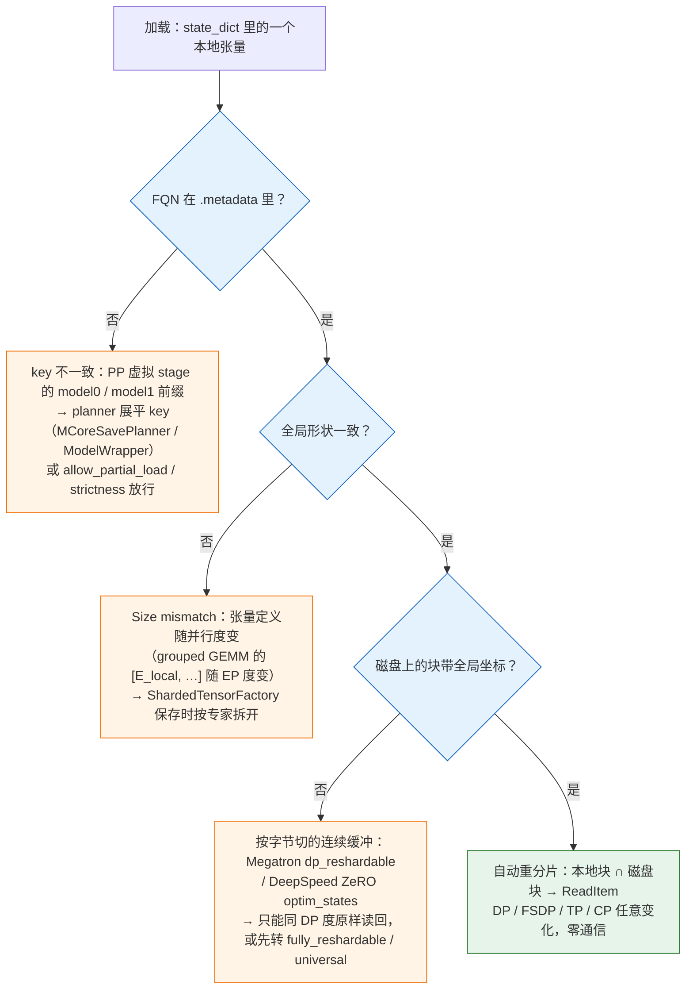
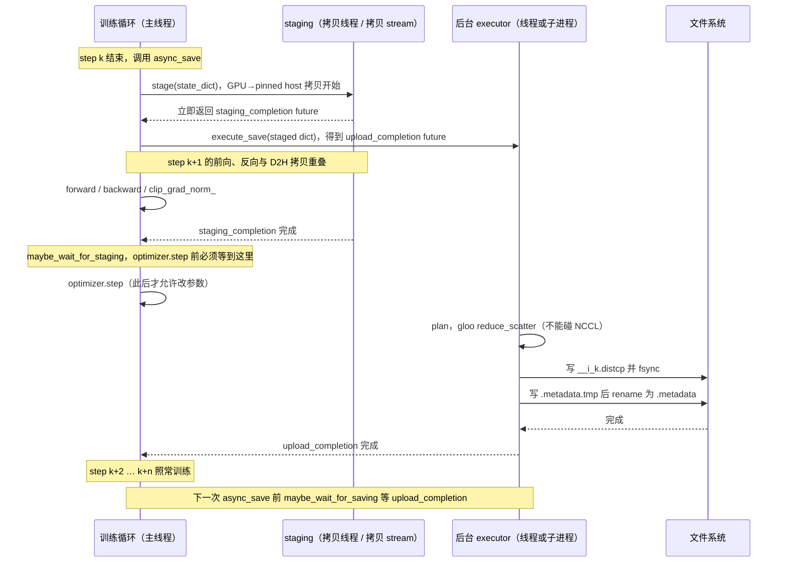

> **更新 @2026-09-06**：本文 torchtitan 部分基于 v0.3.0 刷新；其余源码引用仍以 PyTorch 2.13.0 / Megatron Core 0.18.0 / DeepSpeed 0.19.2 为准。

前四篇解决的是"怎么配、怎么跑满"。配置定了、MFU 到了预期，任务开始按一个月的日程往前跑。这时候训练引擎面对的第一个可靠性问题不是故障本身，而是一个更朴素的问题：**这一千多 GB 到几 TB 的状态，怎么写到磁盘上，写多久一次，写的时候要不要停**。

Llama 3 论文（Dubey et al. 2024）给了一组值得反复引用的数字：16K 张 H100、54 天预训练、466 次任务中断，其中 419 次是意外的。折算下来集群平均每三小时出一次事。每一次事故后，任务从上一个 checkpoint 重来，checkpoint 之后算的那部分全部作废。checkpoint 存得越勤，作废的越少；但每存一次都要花时间。一个 405B 模型的完整训练状态接近 6 TB，如果同步写要停几分钟，那么"每小时存一次"和"每十分钟存一次"之间差的不是几个百分点，而是训练任务能不能按时结束。

所以 checkpoint 有两个核心指标。第一个是**保存开销**——存一次训练要停多久，它决定能存多频繁；第二个是**恢复的灵活性**——故障后卡数变了、并行配置变了，还能不能加载。前者靠分片写与异步写解决，后者靠把每个张量的全局形状与每个分片的位置写进元数据、加载时按交集读取来解决。两者加起来就是"分布式 checkpoint"这个词的全部含义，PyTorch 把它做成了 `torch.distributed.checkpoint`（DCP），Megatron 与 torchtitan 都建在它上面，DeepSpeed 走了另一条路。

本篇要回答总纲提出的核心问题：

> **一个 405B 模型、6 TB 状态的 checkpoint，同步写要停训练几分钟？异步写代价是什么？故障后剩 15 个节点而不是 16 个，能不能直接加载？**

依照系列惯例：带宽一律取公开标称值（每 GPU 一张 400 Gb/s 网卡即 50 GB/s、PCIe 5.0 x16 单向约 64 GB/s），并行文件系统的聚合带宽随集群而异，正文中给出的是量级与算法而不是某台集群的实测。源码以 PyTorch 2.13.0、Megatron Core 0.18.0、DeepSpeed 0.19.2 为准，torchtitan 依更新声明以 v0.3.0 为准。


## 一、总览

### 1. 本篇用到的记账符号与结论

第一篇建立的符号，本篇只用下面这些，在此复述以求自治：

```text
N            参数量（个）
N_t N_p N_d N_c   张量并行 / 流水线并行 / 数据并行 / 上下文并行的并行度；正文中常写作 t, p, d, c
δ            一次 checkpoint 让训练停下的时间（秒）；同步保存时是整个写入时间，异步保存时只是阻塞部分
M            集群的平均故障间隔 MTBF（秒）；单卡 MTBF 除以卡数
τ            checkpoint 间隔（秒）
```

两条结论：

- **训练态每参数 16 字节**：bf16 参数 2 + bf16 梯度 2 + fp32 主参数 4 + Adam 一阶矩 4 + 二阶矩 4（Megatron 用 fp32 累积梯度时为 18）。checkpoint 不需要梯度——它每 step 重算——所以**落盘每参数 14 字节**（Megatron 路径：bf16 参数 + fp32 主参数 + 两个矩）或 **12 字节**（FSDP2 路径：参数本身就是 fp32，bf16 副本是前向时临时 cast 出来的）。405B 模型按 14 字节算是 5.7 TB，这就是总纲说的"约 6 TB"。
- **每参数的 checkpoint 字节与并行配置无关**。TP、PP、DP 决定每个张量被切成几块、放在哪张卡，但去掉 DP 复制之后的**唯一字节数**不变。这是分片 checkpoint 能重分片的前提，也是算写入时间时的分母。

### 2. 一次 checkpoint 的两条路径

保存与加载各是一条流水线，两条线在磁盘上的目录里汇合：

```text
保存                                                                    加载
─────────────────────────────────────────────────                     ─────────────────────────────────────────────────
训练状态（每 rank 持有自己的分片）                                       新的训练状态（可能是另一套 TP/PP/DP）
   │  state_dict()：参数、优化器、调度器、数据位置、RNG、步数               │  state_dict()：只要 key 与全局形状，内容待填
   ▼                                                                     ▼
staging：GPU → 主机内存（可选、异步保存必需）                              读 .metadata：每个张量的全局形状 + 所有分片位置
   │                                                                     │
   ▼                                                                     ▼
plan：每 rank 列出"我要写什么"，汇总去重成全局计划                        plan：我的每个本地分片 ∩ 磁盘上的哪些分片 → ReadItem 列表
   │                                                                     │
   ▼                                                                     ▼
write：每 rank 写自己的文件；coordinator 写 .metadata                     read：按 ReadItem 只读交集部分，narrow 后 copy_ 到本地张量
   │                                                                     │
   ▼                                                                     ▼
目录：__0_0.distcp … __N_0.distcp  .metadata（提交标记）                  set_state_dict()：装回模型与优化器
```

三个观察决定了后面所有的设计：第一，磁盘上的内容是"全局张量的一组分片"而不是"某个 rank 的内存映像"，这样加载时的分片布局可以与保存时不同；第二，`.metadata` 是最后写的，它的出现等价于"这个 checkpoint 完整"，因此写它必须是原子的；第三，保存路径上只有 staging 那一步必须由训练进程在 GPU 空闲时做，其余全部可以挪到后台线程或进程——这就是异步保存。

### 3. 三框架在 checkpoint 上的对照

```text
                     Megatron Core 0.18.0                          DeepSpeed 0.19.2                        torchtitan v0.3.0
──────────────────────────────────────────────────────────────────────────────────────────────────────────────────────────────────
分片抽象             ShardedTensor / ShardedObject                 无；每 rank 的 state_dict 直接 torch.save    DTensor（FSDP2 / TP 原生）
                     （megatron/core/dist_checkpointing/mapping.py）
磁盘格式             torch_dist（DCP 文件 + common.pt +            mp_rank_XX_model_states.pt +               DCP：step-N/__i_0.distcp + .metadata
                     metadata.json）；也可 torch / torch_dcp /      zero_pp_rank_X_mp_rank_XX_optim_states.pt   （可导出 HF safetensors）
                     fsdp_dtensor
底层写入             DCP FileSystemWriter 的子类                   CheckpointEngine：Torch / Fast /            DCP FileSystemWriter
                     FileSystemWriterAsync                         Decoupled / Nebula / DataStates
异步保存             --async-save；nvrx 或 mcore 策略；            writer.decoupled = true（独立进程）           checkpoint.async_mode = async /
                     可持久后台 worker                                                                         async_with_pinned_mem
写入去重 / 并行      FullyParallelSaveStrategyWrapper 在 DP        data_parallel = replica/socket/machine       DCP DefaultSavePlanner 去重
                     副本间分摊写入
重分片               模型：任意 TP/PP/DP；优化器按 sharding_type   ZeRO 文件绑定 DP 度；换配置需先转             任意 DP / TP（DTensor 决定）；PP 需
                     （dp_reshardable / fully_reshardable）         universal checkpoint（ds_to_universal.py）    切分点一致
本地 / 多级存储      non_persistent_ckpt_type = local +            无内置                                       无内置（keep_latest_k 清理）
                     replication（借 nvidia-resiliency-ext）
```

DeepSpeed 这一列后文只在第八章展开一节：它的 checkpoint 是"每 rank 一份 `torch.save`"的传统模式，重分片依赖离线转换，这与 DCP 的"磁盘上是全局张量"是两种哲学，对照着看正好说明分片 checkpoint 解决了什么。

### 4. 本文的章节安排

```text
二、checkpoint 里有什么         六类内容各多少字节、缺了会怎样；三框架各自怎么组装 state_dict
三、为什么不能写成一个文件      405B 的算术：rank-0 汇总的三个瓶颈；分片写的账；三种目录长什么样
四、DCP 的对象模型              dcp.save 的四步；Planner / StorageWriter / Metadata 三组类；state_dict 一侧的 API；对象模型图
五、重分片加载                  dcp.load 的流程；resharding.py 怎么算交集（带数字例子）；能与不能重分片的边界；回答"15 个节点"
六、异步保存                    三段时间线；DefaultStager / StagingOptions；线程还是进程；staging 主机内存代价（数字）；隐藏成本
七、Megatron 的 dist_checkpointing   ShardedTensor；serialization.save/load；strategies；分布式优化器的四种分片；CheckpointConfig 参数族
八、DeepSpeed 与 torchtitan     CheckpointEngine 与 universal checkpoint；torchtitan CheckpointManager 怎么包 DCP
九、多级存储与存多久一次        本地 NVMe → PFS；邻居恢复；Young 公式推导；代入 Llama 3；校验、保留、版本兼容
十、本文小结                    要点 · 源码位置 · train-ledger 的 ckpt/ 与 ledger/checkpoint_interval.py
```


## 二、checkpoint 里有什么，为什么缺一样都不行

### 1. 六类内容

"精确恢复"的定义是：从 checkpoint 重启后，第 $$k+1$$ 步及之后每一步的 loss 与不中断的那次训练逐位相同（同一硬件、确定性 kernel 下），或至少在数值噪声范围内相同。要做到这一点，下面六样东西一样都不能少：

```text
内容                 每参数字节        为什么必需                                      缺了会怎样
────────────────────────────────────────────────────────────────────────────────────────────────────────────────────────
模型参数             2（bf16）或 4      前向的输入                                      没有模型
优化器状态           8（Adam m, v）     Adam 的更新量 = lr · m / (sqrt(v) + ε)，m、v 是     从零开始的 m、v 会让前几百步的更新量偏大，
+ fp32 主参数        + 4               历史梯度的指数平均；fp32 主参数是 bf16 参数        loss 明显上翘；bf16 参数上直接累加小更新会被
                                        无法表示的小更新的累积处                          舍掉，训练"停滞"
学习率调度器         —（几个标量）      当前 lr、warmup 进度、衰减阶段                      lr 从 warmup 起点重来，等价于一次大 lr 冲击
数据加载器位置       —（几 KB 到 MB）   下一个要读的 sample 是谁；shuffle 的 epoch 与       重复看一遍已训过的数据（过拟合）或跳过一段
                                        offset                                            （欠训练），且不可复现
RNG 状态             —（每 rank 几 KB） dropout mask、数据 shuffle、MoE 的随机路由；        loss 曲线在重启处出现一个小台阶；跨 TP 的
                                        Megatron 还有 TP 组内的 CUDA RNG tracker            dropout 不一致会直接算错
迭代计数与累计量     —（几个标量）      step、已见 token 数、累计 FLOP；决定调度器与        退出条件错；日志与曲线断裂
                                        数据位置的重建
```

前两行是字节的大头：Adam 的两个矩加 fp32 主参数是参数本身的 6 倍（若参数按 bf16 算）。后四行几乎不占空间，但缺了任何一样都不再是"精确恢复"，只是"从一个不错的初始化重新开始"。总纲里说"优化器状态是参数的两到三倍"，就是 12 字节比 2 到 4 字节。

一个常被忽略的第七项是**训练配置本身**。Megatron 把整个 `args` 存进 checkpoint（`megatron/training/checkpointing.py` 的 `generate_state_dict()` 写 `state_dict['args']`），加载时 `check_checkpoint_args()` 对比关键字段，`--use-checkpoint-args` 可以直接用 checkpoint 里的模型结构参数覆盖命令行。不存配置的后果是三个月后没人知道这份 checkpoint 是用什么 `--num-layers` 训的。

### 2. 三框架各自怎么组装 state_dict

三个框架把这六样东西装进一个 dict 的方式不同，但 key 的种类是一样的：

Megatron 的 `generate_state_dict()`（`megatron/training/checkpointing.py`）产出 `args`、`checkpoint_version`（当前是 3.0）、`iteration`、`model`（PP 多个虚拟 stage 时是 `model0`、`model1`…）、`optimizer`、`opt_param_scheduler`、`rng_state`，可选 `rerun_state_machine`（第六篇的 SDC 检测状态）与 `num_floating_point_operations_so_far`。`--ckpt-format torch_dist` 时 `model` 与 `optimizer` 来自 `sharded_state_dict()`，值是 `ShardedTensor`；其他格式来自普通 `state_dict()`。RNG 由 `get_rng_state()` 收集 Python、NumPy、torch CPU、CUDA 四个生成器加 TP 组的 `CudaRNGStatesTracker`，在 `torch_dist` 格式下包成一个按 `(pp_rank, tp_rank)` 分片的 `ShardedObject`——RNG 状态是"按 TP/PP 位置存、DP 内相同"的东西，这个分片形状精确表达了它的语义。数据加载器位置走单独的文件（`maybe_save_dataloader_state()`），因为它按 DP rank 分片、与模型无关。

torchtitan 的 `CheckpointManager`（`torchtitan/components/checkpointer/dcp.py`）把 `states` 字典交给 DCP：`model` 是 `ModelWrapper`、`optimizer` 是 `OptimizersContainer`、`lr_scheduler` 是 `LRSchedulersContainer`、`dataloader` 是 `ParallelAwareDataloader`（基于 `torchdata` 的 `StatefulDataLoader`），另有 `train_state`——`Trainer` 类自身实现了 `Stateful` 协议，`state_dict()` 返回 `step` 与 `ntokens_seen`。这些对象全部实现 `torch.distributed.checkpoint.stateful.Stateful`，DCP 在 `_stateful_to_state_dict()` 里逐个调用它们的 `state_dict()`。

DeepSpeed 的 `DeepSpeedEngine.save_checkpoint()`（`deepspeed/runtime/engine.py`）把模型、优化器、lr scheduler、`global_steps`、`skipped_steps`、`ds_config` 与用户传入的 `client_state` 写成每 rank 一个 `torch.save` 文件；数据加载器位置与 RNG 由用户放进 `client_state`——这是它与另两个框架最明显的分工差异。

### 3. 优化器状态为什么最难

参数的 key 是 FQN（`layers.3.attention.wq.weight`），天然全局唯一。优化器状态的 key 却是 `param_groups` 里的**下标**：`state[0]`、`state[1]`……下标只在一个进程的一个 optimizer 对象里有意义。PP 下 rank 0 的 `state[0]` 指第 0 层的某个参数，rank 1 的 `state[0]` 指第 8 层的——直接合并会互相覆盖。三个框架都要把优化器状态**重新按 FQN 编址**：

- PyTorch 的 `torch/distributed/checkpoint/state_dict.py` 提供 `get_optimizer_state_dict()`，内部 `_get_optim_state_dict()` 把下标换成参数 FQN，并在 FSDP2 / TP 下让每个状态张量跟随对应参数的 DTensor 布局（`m`、`v` 与参数同形状、同分片）；`set_optimizer_state_dict()` 反向映射，且在优化器尚未跑过一步（state 为空）时先 `_init_optim_state()` 造出零状态再装。
- torchtitan 的 `OptimizersContainer.state_dict()` 调 `torchtitan/components/optimizer/utils.py` 的 `get_flat_optim_state_dict()`，把多个 optimizer（每个 PP stage 一个）的状态拍平成一个 FQN 键的 dict；`load_flat_optim_state_dict()` 反向。
- Megatron 的 `megatron/core/dist_checkpointing/optimizer.py` 提供 `get_param_id_to_sharded_param_map()` 与 `make_sharded_optimizer_tensor()`：先建 `param id → 模型 ShardedTensor` 的映射，再给每个优化器状态造一个与对应参数**同分片描述**的 `ShardedTensor`（key 加前缀 `optimizer.state.exp_avg.` 等）。分布式优化器的情况更复杂，第七章第 3 节单独讲。

结论：优化器状态在磁盘上必须表达成"参数 X 的 m 的第几块"，而不是"rank 7 的 optimizer 的第 12 个状态"。这一转换做对了，重分片才有可能。


## 三、为什么不能写成一个文件：405B 的算术

### 1. 6 TB 是怎么来的

Llama 3 405B 的训练配置是 TP=8、CP=16、PP=16、DP=128，共 16384 张 H100。每参数 14 字节，$$405 \times 10^9 \times 14 \approx 5.7 \text{ TB}$$。DP=128 意味着参数在 128 个副本里各有一份，但 checkpoint 只需要一份；分布式优化器（ZeRO-1）把 fp32 主参数与两个矩切成 128 份，每张卡持有 $$1/128$$。所以每张卡"唯一持有"的字节是：bf16 参数分片 $$2 \times 405\text{B} / (8 \times 16) = 6.3 \text{ GB}$$（这份在 128 个 DP 副本上重复，只需一个副本写），加优化器分片 $$12 \times 405\text{B} / 16384 \approx 0.30 \text{ GB}$$。全部去重后每张卡平均 $$5.7 \text{ TB} / 16384 \approx 350 \text{ MB}$$。

### 2. rank-0 汇总的三个瓶颈

最朴素的写法是所有 rank 把状态发给 rank 0，rank 0 调一次 `torch.save`。这条路在三个地方同时撞墙：

```text
瓶颈             算术                                                              结论
────────────────────────────────────────────────────────────────────────────────────────────────────────────────
主机内存         rank 0 所在节点要装下 5.7 TB；一个 8 卡节点通常配 1–2 TB 内存        物理上放不下；即便流式处理也要分几十批
接收带宽         全部数据经 rank 0 的一张网卡进来：5.7 TB / 50 GB/s ≈ 114 s          仅传输就近两分钟，且期间其他 16383 张卡空转
写入带宽         单个客户端写并行文件系统：标称 2–5 GB/s；torch.save 是单线程 pickle，   5.7 TB / 5 GB/s ≈ 19 min；按 1 GB/s ≈ 95 min
                 通常 1 GB/s 上下
```

第三行是决定性的。即使前两个问题用流式与多网卡绕过去，**单个写入者的带宽**决定了同步写至少要停十几分钟到一个多小时。把这个 δ 代入第九章的 Young 公式：δ = 10 min、M = 3 h 时最优间隔约 1 小时，训练时间的三分之一花在存 checkpoint 和回退重算上。这就是"单文件 checkpoint 为什么不可行"的完整回答——不是格式不优雅，是算术不允许。

### 3. 分片写的账

分片写的思路是：每个 rank 写自己唯一持有的那 350 MB，DP 副本之间只写一份。2048 个节点每个写 2.8 GB，写入时间由**并行文件系统的聚合带宽**决定：聚合 500 GB/s 时 5.7 TB 要 11 s，1 TB/s 时 6 s。GPU 到主机内存那一段——350 MB 走 PCIe 5.0 x16——不到 10 ms，可以忽略。

这里出现了一个新的瓶颈：**计划阶段的集合通信**。DCP 的每个 rank 要把"我打算写哪些张量的哪些块"发给 coordinator 汇总去重，16384 个 rank 每个几千个 `WriteItem`，这一次 gather 的对象序列化与反序列化在 Python 里做，可能比写数据本身还慢。Megatron 与 DCP 都为此加了**计划缓存**：结构不变时只做第一次（Megatron 的 `ckpt_assume_constant_structure`、DCP `DefaultSavePlanner(enable_plan_caching=True)`），第四章会看到实现。

### 4. 三种目录长什么样

分片 checkpoint 在磁盘上不是一个文件而是一个目录。三个框架的目录长得不一样，但结构一致——数据文件按写入者分、元数据集中：

```text
DCP / torchtitan（step-1000/）                Megatron torch_dist（iter_0001000/）             DeepSpeed ZeRO（global_step1000/）
────────────────────────────────────          ─────────────────────────────────────           ──────────────────────────────────────────
__0_0.distcp        rank 0 写的数据            __0_0.distcp … __N_0.distcp   同 DCP           mp_rank_00_model_states.pt     每个 TP/PP 位置一份
__1_0.distcp        rank 1 写的数据            .metadata                     同 DCP           mp_rank_01_model_states.pt     模型参数（bf16）
…                                             common.pt        非分片对象：args、iteration、  zero_pp_rank_0_mp_rank_00_optim_states.pt
__N_0.distcp                                                   调度器状态等（rank 0 写）        zero_pp_rank_1_mp_rank_00_optim_states.pt
.metadata           全局元数据：每个 key 的     metadata.json    格式后端与版本                 …                              每个 DP rank 一份 ZeRO 分片
                    全局形状 + 所有块的位置     ../latest_checkpointed_iteration.txt            ../latest                      指向最新 tag
                    + 每块在哪个文件的哪个偏移
```

DCP 的 `__{rank}_{n}.distcp` 文件名里 `n` 是该 rank 的第几个写线程（`FileSystemWriter(thread_count=k)` 时每 rank 产出 k 个文件）。Megatron 的 `torch_dist` 格式**就是** DCP 的目录再加两个文件；这是两者互通的物理基础，第七章展开。DeepSpeed 的文件名把 `mp_rank`（TP×PP 位置）和 `zero_pp_rank`（DP 位置）编进去了——文件与并行布局一一对应，这正是它换布局要先转换的原因。


## 四、DCP 的对象模型

### 1. 一次 `dcp.save` 走过的四步

`torch/distributed/checkpoint/state_dict_saver.py` 的 `save()` 最终调 `_save_state_dict()`，结构是两次集合通信包着四个局部函数：

```text
每个 rank                                         coordinator（默认 rank 0）
──────────────────────────────────────────────    ───────────────────────────────────────────────────────
local_step()
  planner.set_up_planner(state_dict, storage_meta, is_coordinator)
  storage_writer.set_up_storage_writer(...)
  local_plan = planner.create_local_plan()         ← 列出本 rank 的 WriteItem
  local_plan = storage_writer.prepare_local_plan()  ← FileSystemWriter 在这里 mkdir、检查是否覆盖
        │
        └──── distW.reduce_scatter("plan", local_step, global_step) ────►  global_step(all_local_plans)
                                                                            planner.create_global_plan()   ← 去重 + 生成 Metadata
                                                                            storage_writer.prepare_global_plan()  ← 给每个 plan 分配文件前缀 __i_
        ◄─────────────── 每个 rank 收回自己的 central_plan ──────────────────┘
write_data()
  final_plan = planner.finish_plan(central_plan)
  storage_writer.write_data(final_plan, planner)   ← 真正的 I/O；返回 Future[list[WriteResult]]
        │
        └──── distW.all_reduce("write", write_data, finish_checkpoint) ──►  finish_checkpoint(all_results)
                                                                            storage_writer.finish(metadata, results)  ← 写 .metadata
```

`_DistWrapper` 的 `reduce_scatter` 是"gather 到 coordinator、处理、scatter 回去"，`all_reduce` 是"gather、处理、broadcast 结果"，都走 `process_group` 参数指定的进程组——异步保存时这个组必须是 gloo 的，因为它在后台线程里跑，不能碰 NCCL。`use_collectives=False` 时跳过全部通信，每个 rank 写自己的 `__{rank}.metadata`，这是 2.13 里标注为实验性的"无协调保存"。

### 2. Planner：谁写什么

`torch/distributed/checkpoint/planner.py` 定义了协议，`default_planner.py` 给了默认实现：

- `WriteItem`：一次写请求，含 `index: MetadataIndex`（fqn + 块在全局张量中的 offset）、`type`（`SHARD` / `TENSOR` / `BYTE_IO`）、`tensor_data: TensorWriteData`（块的 `ChunkStorageMetadata` 与 `TensorProperties`）。`SavePlan` 是 `WriteItem` 的列表加 `storage_data`（存储层塞进来的私有数据，如文件前缀）与 `planner_data`（planner 的私有数据，如嵌套 dict 的展平映射）。
- `SavePlanner` 的四个钩子：`set_up_planner` → `create_local_plan` → `create_global_plan`（仅 coordinator）→ `finish_plan`，再加 `resolve_data(write_item)`——存储层写数据时通过它取到真正的张量或 `BytesIO`。
- `DefaultSavePlanner.set_up_planner()` 先 `flatten_state_dict()` 把嵌套 dict 展平成 `optimizer.state.layers.0.wq.weight.exp_avg` 这样的点分 key（映射存进 `planner_data`），再 `_flatten_sharded_tensors()`；`create_local_plan()` 调 `create_default_local_save_plan()`，对每个值分派：DTensor → `_create_write_items_for_dtensor()`（一个 `WriteItem`，块的 offset 由 DTensor 的 placements 与 mesh 坐标算出）；普通 tensor → 整个张量一个块，且**只有 coordinator 写**（其他 rank 的副本被跳过）；非张量对象 → pickle 成 `BYTE_IO`。
- `create_global_plan()` 先 `dedup_save_plans()`（`_dedup_save_plans.py`）：同一个 `MetadataIndex` 出现在多个 rank 的计划里时，只留给"目前计划写入字节最少"的那个 rank，把负载摊平——这就是 DP 副本只写一份的实现；`dedup_save_to_lowest_rank=True` 时改为总给最小 rank。然后 `create_default_global_save_plan()` 把所有 `WriteItem` 汇成 `Metadata`，`_validate_global_plan()` 检查每个张量的块是否越界或重叠。
- `enable_plan_caching=True`（2.13 的 `DefaultSavePlanner` 构造参数）：本地计划与上次相同时发一个空的 `SavePlan(usable=False)`，coordinator 复用缓存的全局计划与 `Metadata`，把每次保存的 gather 从"几千个 WriteItem"降为"几个字节"。

### 3. Storage：怎么写

`torch/distributed/checkpoint/storage.py` 定义 `StorageWriter` / `StorageReader`；`filesystem.py` 的 `FileSystemWriter` 是默认实现：

- `prepare_global_plan()` 给第 `i` 个计划的 `storage_data` 赋 `_StoragePrefix("__i_")`；`write_data()` 按 `thread_count` 用 `_split_by_size_and_type()` 把 `WriteItem` 分桶（先按类型分，再按大小贪心均衡），每桶一个文件 `__i_k.distcp`，`_write_files_from_queue()` 在各线程里顺序 `torch.save` 每个块并 `fsync`。`per_thread_copy_ahead`（默认 10 MB）控制从 GPU 预拷多少到主机再写——这是同步保存路径下的小型流水线；异步保存时数据已在主机上，`FileSystemWriter.stage()` 把它置 0。
- `finish()` 在 `Metadata` 里填 `version`（`CURRENT_DCP_VERSION`，当前 "1.0.0"）与 `storage_data`（每个 `MetadataIndex` → 文件名、偏移、长度），pickle 到 `.metadata.tmp`，fsync，再 `rename` 成 `.metadata`。`rename` 在 POSIX 文件系统上是原子的，所以"目录里有 `.metadata`"与"checkpoint 完整"等价——加载器只看这个文件。
- `FileSystemWriter` 同时继承 `BlockingAsyncStager`（`staging.py`），所以它既是写入者也是一个 stager；`async_save()` 若发现 `storage_writer` 本身是 `AsyncStager` 且没传单独的 stager，就直接用它做 staging（第六章）。
- `SerializationFormat` 枚举（`TORCH_SAVE` / `SAFETENSORS`）决定每个块的序列化方式；`hf_storage.py` 的 `HuggingFaceStorageWriter` / `HuggingFaceStorageReader` 在其上实现 safetensors 目录格式，torchtitan 的 HF 导出用的就是它。

### 4. Metadata：磁盘上有什么

`torch/distributed/checkpoint/metadata.py` 里的几个 dataclass 是整个格式的核心：

```text
Metadata
 ├─ state_dict_metadata: dict[fqn → TensorStorageMetadata | BytesStorageMetadata]
 │     TensorStorageMetadata
 │      ├─ properties: TensorProperties(dtype, …)
 │      ├─ size: torch.Size                    ← 全局形状
 │      └─ chunks: list[ChunkStorageMetadata]  ← 每一块的 offsets 与 sizes（全局坐标）
 ├─ planner_data                               ← DefaultSavePlanner：展平 key → 原嵌套路径
 ├─ storage_data: dict[MetadataIndex → _StorageInfo(relative_path, offset, length)]
 ├─ storage_meta: StorageMeta(checkpoint_id, save_id, load_id)
 └─ version: "1.0.0"
```

一个例子。TP=2 下保存 `layers.0.attention.wq.weight`（全局 `[4096, 4096]`，按第 0 维切）：

```text
state_dict_metadata["model.layers.0.attention.wq.weight"] =
  TensorStorageMetadata(
    properties = TensorProperties(dtype=torch.bfloat16),
    size       = torch.Size([4096, 4096]),
    chunks     = [ChunkStorageMetadata(offsets=[0, 0],    sizes=[2048, 4096]),
                  ChunkStorageMetadata(offsets=[2048, 0], sizes=[2048, 4096])])
storage_data[MetadataIndex(fqn, offset=[0, 0])]    = _StorageInfo("__0_0.distcp", offset=…, length=16777216)
storage_data[MetadataIndex(fqn, offset=[2048, 0])] = _StorageInfo("__1_0.distcp", offset=…, length=16777216)
```

`.metadata` 里没有任何"rank"、"TP"、"PP" 的概念，只有全局形状与块坐标。这就是加载时可以换并行配置的原因——加载器不需要知道保存时用了什么并行，只需要知道每块在哪。

### 5. state_dict 一侧：把并行框架的细节藏起来

`dcp.save` 接受的是 `dict[str, Stateful | Any]`。从一个 FSDP2 + TP 包装过的模型和优化器得到"可重分片"的 state_dict，靠的是 `torch/distributed/checkpoint/state_dict.py`：

- `get_model_state_dict(model, options=StateDictOptions(...))`：返回 canonical FQN 键的 dict，值在 FSDP2 / TP 下是 DTensor（保留分片信息），`full_state_dict=True` 时 all-gather 成完整张量，`cpu_offload=True` 时搬到 CPU。
- `get_optimizer_state_dict(model, optimizers, options)`：优化器状态改为按参数 FQN 编址，状态张量跟随参数的 DTensor 布局；`flatten_optimizer_state_dict=True` 时进一步拍平。
- `set_model_state_dict()` / `set_optimizer_state_dict()` / `set_state_dict()`：反向；`broadcast_from_rank0=True` 允许只在 rank 0 有完整 state_dict、逐张量 broadcast 后按本地 DTensor 分片切下来——这是"从单文件 `torch.save` 迁移进 FSDP2"的路径。
- `Stateful` 协议（`stateful.py`）：只要对象有 `state_dict()` / `load_state_dict()`，就能直接放进 `dcp.save` 的 dict 里，DCP 在 `_stateful_to_state_dict()` 里替你调用；`dcp.load` 时反向调 `load_state_dict()`。torchtitan 的四个容器与 `Trainer` 本身都实现了它。

PyTorch 文档里推荐的写法是把模型与优化器包成一个 `Stateful`：

```python
from torch.distributed.checkpoint.state_dict import get_state_dict, set_state_dict
from torch.distributed.checkpoint.stateful import Stateful

class AppState(Stateful):
    def __init__(self, model, optimizer):
        self.model, self.optimizer = model, optimizer

    def state_dict(self):
        model_sd, optim_sd = get_state_dict(self.model, self.optimizer)
        return {"model": model_sd, "optim": optim_sd}

    def load_state_dict(self, state_dict):
        set_state_dict(self.model, self.optimizer,
                       model_state_dict=state_dict["model"], optim_state_dict=state_dict["optim"])
```

这样 `dcp.save({"app": AppState(model, opt), "step": step_holder}, checkpoint_id=path)` 一行就够了。本篇练手项目的 `ckpt/async_dcp.py` 用的就是这个模式。

### 6. 对象模型图

```text
                       ┌──────────────── 用户侧 ────────────────┐
                       │ dict[str, Stateful | Tensor | DTensor | Any]│
                       │  ← get_model_state_dict / get_optimizer_state_dict（state_dict.py）
                       └───────────────────┬───────────────────┘
                                           │ _stateful_to_state_dict()
             ┌─────────────────────────────┼─────────────────────────────┐
             │                             ▼                             │
   保存      │   SavePlanner ──create_local_plan──► SavePlan[WriteItem]   │   StorageWriter
 (state_dict_saver.py)  (planner.py /          │ reduce_scatter          │   (storage.py / filesystem.py)
             │    default_planner.py)         ▼                          │     prepare_local_plan / prepare_global_plan
             │      resolve_data ◄──────── write_data ──────────────────►│     write_data → WriteResult
             │                              │ all_reduce                 │     finish(metadata) → .metadata
             │                              ▼                            │
             │                         Metadata（metadata.py）            │
             │                          state_dict_metadata: fqn → TensorStorageMetadata{size, chunks[ChunkStorageMetadata]}
             │                          storage_data: MetadataIndex → 文件/偏移
             └─────────────────────────────┬─────────────────────────────┘
                                           │ 磁盘：__i_k.distcp + .metadata
             ┌─────────────────────────────┼─────────────────────────────┐
   加载      │   LoadPlanner ──create_local_plan──► LoadPlan[ReadItem]    │   StorageReader
 (state_dict_loader.py)  (default_planner.py)    ▲                       │     read_metadata() → Metadata
             │      resharding.py /              │                        │     read_data(plan, planner)：按 ReadItem 读、narrow、copy_
             │      planner_helpers.create_read_items_for_chunk_list()    │
             │      resolve_tensor / commit_tensor ◄──────────────────────┘
             └─────────────────────────────────────────────────────────────┘
   异步      staging.py：AsyncStager 协议 → DefaultStager(StagingOptions) / BlockingAsyncStager / _ReplicationStager
             _async_executor.py：_AsyncCheckpointExecutor → _ThreadBasedAsyncCheckpointExecutor / _ProcessBasedAsyncCheckpointExecutor
```


## 五、重分片加载

### 1. `dcp.load` 的流程

`state_dict_loader.py` 的 `load()` 与保存对称：`storage_reader.read_metadata()` 读回 `Metadata`；`local_step()` 里 `planner.set_up_planner(state_dict, metadata, is_coordinator)`、`planner.create_local_plan()`、`storage_reader.prepare_local_plan()`；`global_step()` 里 `create_global_plan()`（默认实现原样返回——加载不需要去重，每个 rank 读自己要的）；然后 `read_data()`：`storage_reader.read_data(plan, planner)` 按 `ReadItem` 逐个读文件片段，`planner.resolve_tensor(read_item)` 给出目标张量的对应切片（`torch/distributed/_shard/_utils.py` 的 `narrow_tensor_by_index()`），`copy_` 进去，`planner.commit_tensor()` 收尾。

关键在 `DefaultLoadPlanner.create_local_plan()` → `create_default_local_load_plan()`：对 state_dict 里每个 key，取 `metadata.state_dict_metadata[fqn]`，先检查全局形状一致（`md.size != obj.size()` 直接 `ValueError`），再 `_create_read_items(fqn, md, obj)`。若 `obj` 是 DTensor，只在当前 rank 属于其 mesh 时（`device_mesh.get_coordinate() is not None`）生成读请求，并由 `_create_chunk_from_dtensor()` 算出本地块的全局坐标；若是普通 tensor，本地块就是整个张量。

### 2. 交集是怎么算的

`planner_helpers.py` 的 `create_read_items_for_chunk_list(fqn, checkpoint_md, local_chunks)` 是重分片算法本体。输入是磁盘上这个张量的所有块（`checkpoint_md.chunks`）与本 rank 需要的块（`local_chunks`），输出是一组 `ReadItem`。2.13 的实现是一个扫描线：选延伸最长的维度做 `sweep_dim`，两组块各按该维起点排序，维护一个"活动的已存块"有序列表，对每个本地块只与活动集里的块做逐维判定——把 $$O(S \times L)$$ 的两两比较降到接近线性。逐维判定就是 `resharding.py` 的两个函数：

- `_check_shard_metadata_pair_overlap(shard1, shard2)`：每一维上，若一块的起点 ≥ 另一块的终点则不相交；所有维都相交才算相交（矩形相交的标准判定）。
- `_shards_get_overlap_region_wrt_saved_tensor(saved_shard, current_shard)`：对每一维返回 `(dim, 在已存块内的偏移, 在本地块内的偏移, 长度)`——长度是两段的 `min(终点) - max(起点)`，偏移是各自起点到 `max(起点)` 的距离。

一个数字例子。上一节那个 `[4096, 4096]` 的权重在 TP=2 下存成两块 `[0:2048]`、`[2048:4096]`。现在换成 FSDP 在 6 个 rank 上按第 0 维切——4096 除不尽 6，DTensor 的分片是 683、683、683、683、683、681。把两侧的块沿第 0 维并排画出来，重分片就是左右两列的区间求交：

```text
行号   磁盘上的块（TP=2 保存）             加载侧的本地块（FSDP 6 rank）
   0 ┌───────────────────────────┐    ┌──────────────────────┐
     │ chunk 0                   │    │ rank 0  [0, 683)     │
     │ offsets=[0,0]             │    ├──────────────────────┤
     │ sizes=[2048,4096]         │    │ rank 1  [683, 1366)  │
     │ → __0_0.distcp            │    ├──────────────────────┤
     │                           │    │ rank 2  [1366, 2049) │ ← 跨过 2048
2048 ├───────────────────────────┤    │ ┄┄┄┄┄┄┄┄ 2048 ┄┄┄┄┄┄ │
     │ chunk 1                   │    ├──────────────────────┤
     │ offsets=[2048,0]          │    │ rank 3  [2049, 2732) │
     │ sizes=[2048,4096]         │    ├──────────────────────┤
     │ → __1_0.distcp            │    │ rank 4  [2732, 3415) │
     │                           │    ├──────────────────────┤
4096 └───────────────────────────┘    │ rank 5  [3415, 4096) │
                                      └──────────────────────┘
```

rank 0、1、3、4、5 的本地块各自完全落在一个磁盘块里，一个 `ReadItem` 就够；rank 2 的本地块是 `offsets=[1366, 0], sizes=[683, 4096]`，它跨过了 2048 这条线：

```text
与已存块 0 [0:2048]    ：min(2048, 2049) - max(0, 1366) = 682   → ReadItem(storage_offsets=[1366, 0], dest_offsets=[0, 0],   lengths=[682, 4096])
与已存块 1 [2048:4096] ：min(4096, 2049) - max(2048, 1366) = 1  → ReadItem(storage_offsets=[0, 0],    dest_offsets=[682, 0], lengths=[1, 4096])
```

rank 2 发两个读请求，从 `__0_0.distcp` 读 682 行、从 `__1_0.distcp` 读 1 行，拼进自己的 683 行。整个过程没有任何 rank 间通信——每个 rank 只读文件，读的是自己那部分。TP=2 → TP=4 更简单：TP rank 1 的本地块 `[1024:2048]` 完全落在已存块 0 里，一个 `ReadItem`，`storage_offsets=[1024, 0]`。

### 3. 能重分片与不能重分片的边界

重分片能自动发生，条件是：**同一个 FQN、同一个全局形状、分片在磁盘上表达成全局坐标的块**。加载时对 state_dict 里的每个张量，这三个条件是依次检查的，哪一步不满足就落到哪种"额外工作"：



在三个条件都满足的情况下，DP 度、FSDP 分片数、TP 度、CP 度的任何变化都由上面的交集算法吸收。三种情况需要额外工作：

- **PP 切分点变化**：PP 不切张量，切的是层。`layers.31.wq.weight` 无论在哪个 stage 都叫这个名字，所以 PP 度变化本身没问题；但 Megatron 的 `model0`/`model1` 这种按虚拟 stage 编号的顶层 key 会变，需要 planner 展平（Megatron 的 `MCoreSavePlanner` 用 ShardedTensor 的 `key` 而不是 dict 路径）。torchtitan 通过 `ModelWrapper` 把多个 stage 的 state_dict 合成一个扁平 dict 解决同一问题。
- **优化器状态的分片不跟随参数**：Megatron 分布式优化器默认把 fp32 主参数与矩按"bucket 里的连续字节"切给 DP rank，与参数的逻辑形状无关。这种布局在磁盘上表达不成"参数 X 的第几块"，只能在 DP 度不变时原样读回（第七章第 3 节的 `dp_reshardable` vs `fully_reshardable`）。
- **张量本身的定义随并行度变化**：MoE 专家权重在 EP 下按专家切、专家数不变时可重分片；但若使用把多个专家拼成一个 `[E_local, …]` 张量的 grouped GEMM 布局，`E_local` 随 EP 度变，全局形状不一致就直接报 `Size mismatch`。Megatron 用 `ShardedTensorFactory` 把这类张量在保存时拆成每专家一块、加载时合回去。

DeepSpeed 的 ZeRO checkpoint 不满足上面的条件——它的 `zero_pp_rank_X_..._optim_states.pt` 里是该 DP rank 的展平 fp32 缓冲区，不带全局坐标，所以换 DP 度必须先离线转换成 universal checkpoint（第八章）。

### 4. 回答核心问题：15 个节点而不是 16 个

假设原配置 16 节点 128 卡、TP=8、PP=1、FSDP=16。坏了一个节点、只剩 15 个，能不能直接加载？

分两层看。**checkpoint 层**：可以。FSDP 从 16 变 15，每个参数的 DTensor 分片从 16 块变 15 块，`create_read_items_for_chunk_list()` 为每个新块算出与旧块的交集——大多数新块跨两个旧块，各发两个读请求；优化器状态跟随参数，同样处理；`train_state`、`lr_scheduler` 是标量，任何 rank 都能读。**训练层**：global batch 是 $$d \times b \times m$$，DP 从 16 变 15 时要么 $$m$$ 或 $$b$$ 跟着变（Megatron 会因 global batch 不能被 $$d \times b$$ 整除而报错），要么接受 global batch 变成原来的 15/16 并相应改 lr。torchtitan 从 `TrainingConfig.global_batch_size` 与 `local_batch_size` 重算 `gradient_accumulation_steps`：原来 global batch 512 条序列 = $$16 \times 4 \times 8$$，DP 变 15 后 $$512 / (15 \times 4)$$ 不整除，同样报错。所以答案是：**DCP 层面直接加载没有问题，需要人为决定的是训练配方在 15/16 规模下怎么办**——这是第六篇弹性训练（torchft 的副本组模型允许 DP 副本数动态变化）的起点。

数据加载器是另一个坑：`StatefulDataLoader` 的状态按 DP rank 存，16 份状态装到 15 个 rank 里没有自然的映射。Megatron 的 dataloader 状态文件也是按 DP rank 分的。实践中的做法是记录**全局已消费的 sample 数**，重启时用它重建每个 rank 的起点，而不是恢复每个 rank 的私有迭代器状态——第七篇讲。


## 六、异步保存

### 1. 三段时间线

同步保存的时间线是：训练停 → GPU→主机拷贝 → plan 通信 → 写文件 → fsync → 写 `.metadata` → 训练继续，δ 是全部。异步保存把它切成三段：

```text
                 训练 step k     │ staging │  训练 step k+1   step k+2  …                    │ 训练 step k+n
GPU / 主 stream  ────────────────┤ 阻塞 δ  ├──────────────────────────────────────────────────┤
                                 │ GPU→pinned host 拷贝（几百 MB ~ 十几 GB，PCIe 速度）
后台线程 / 进程                  └────────►│ plan（gloo 集合通信）→ 写 __i_k.distcp → fsync → .metadata │ future 完成
                                            ↑ 与训练重叠；争抢 CPU、内存带宽、网卡（若 PFS 走以太网）
```

δ 从"全部写入时间"变成"staging 时间"，后者只由 PCIe 带宽与要拷的字节数决定。每卡 350 MB（405B/16K 卡）或 1 GB（70B/1024 卡）在标称 64 GB/s 的 PCIe 5.0 上是几十毫秒；即便按实际的 25–30 GB/s 算也在 0.1 s 以内。写入本身在后台进行，只要它在下一次保存开始前完成即可。

### 2. `dcp.async_save` 的实现

`state_dict_saver.py` 的 `async_save()` 做四件事：

1. 检查进程组含 CPU 后端（`torch.device("cpu") in pg._device_types`），否则报错要求用 `cpu:gloo,cuda:nccl` 初始化——后台线程里的 plan 通信不能走 NCCL。
2. 确定 stager：传了 `async_stager` 用它；没传但 `storage_writer` 是 `AsyncStager`（`FileSystemWriter` 就是），用 `storage_writer`；两者都没有，则创建 `DefaultStager(StagingOptions(False, False, False, False))`——注意这四个 `False`：**默认路径不用 pinned memory、不用共享内存、不异步 staging、不用 non-blocking 拷贝**，是最保守也最慢的配置。
3. `state_dict = _stateful_to_state_dict(state_dict)`，然后 `async_stager.stage(state_dict)`——这一步在调用线程里跑，是 δ 的主体。
4. 按 `async_checkpointer_type` 选 `_ThreadBasedAsyncCheckpointExecutor` 或 `_ProcessBasedAsyncCheckpointExecutor`，`execute_save()` 把 staged dict 交给它，返回 `Future`。若 stager 返回的是 `Future`（异步 staging），则返回 `AsyncSaveResponse(staging_completion, upload_completion)` 两个 future。

`staging.py` 里有三个 stager：

- `BlockingAsyncStager`：用 `torch/distributed/_state_dict_utils.py` 的 `_create_cpu_state_dict()` + `_copy_state_dict()` 同步拷到 CPU；`cache_staged_state_dict=True` 时保留一份 pinned 的 CPU state_dict 复用，省去每次分配与 pin 的时间（pin 一大块内存本身要几百毫秒），代价是常驻主机内存。`FileSystemWriter(cache_staged_state_dict=...)` 就是把这个参数传给它。
- `DefaultStager(StagingOptions)`：全功能版。`use_pinned_memory` 用 pinned 内存；`use_shared_memory` 把 CPU 张量放进共享内存（进程式 executor 需要）；`use_async_staging` 在单线程 `ThreadPoolExecutor` 里做拷贝，返回 `Future`；`use_non_blocking_copy` 在单独的 `torch.Stream` 上发 `copy_(non_blocking=True)` 再 `synchronize()`。底层是 `_state_dict_stager.py` 的 `StateDictStager`：按 storage 而不是按 tensor 缓存 CPU 副本（`WeakIdKeyDictionary`），同一 storage 的多个视图只拷一次，且**下一次保存时若源 storage 没变则复用已分配的 pinned 缓冲**——这就是 torchtitan `ModelWrapper` 要保证 state_dict 里张量的 storage 稳定的原因。
- `_ReplicationStager`：把 staged dict 同时发给另一个 rank 做副本，是第九章"邻居恢复"在 DCP 里的实验性实现。

### 3. 线程还是进程

`_async_thread_executor.py` 的 `_ThreadBasedAsyncCheckpointExecutor` 在一个单 worker 的 `ThreadPoolExecutor` 里调 `save()`。简单，但线程受 GIL 约束：plan 阶段的 pickle、`torch.save` 的序列化都持 GIL，与训练循环的 Python 部分争抢。训练循环若是 CPU 发射受限的（第四篇的第七项损失），后台保存会直接拉长 step 时间。

`_async_process_executor.py` 的 `_ProcessBasedAsyncCheckpointExecutor` 用 `multiprocessing` 的 `spawn` 起一个常驻的 `_AsyncCheckpointProcess`，子进程用 `_ProcessGroupInitInfo` 里的信息自己初始化一个 gloo 进程组（所以所有 rank 的子进程组成了一个平行的"checkpoint 世界"），通过 `Pipe` 接收保存请求；staged dict 必须在共享内存里（`use_shared_memory=True`），子进程直接读，不再拷贝。GIL 问题消失，代价是多一个进程、一套进程组、以及 `/dev/shm` 的容量——容器默认的 64 MB shm 显然不够，得挂大。torchtitan 的 `async_with_pinned_mem` 模式就是 `PROCESS` executor + 四个 `True` 的 `StagingOptions`。

### 4. staging 的主机内存代价

每张卡要 stage 的字节就是它唯一持有的 checkpoint 字节，乘上一个"几份"的系数：

```text
配置                          每卡唯一字节   每节点 staging   双缓冲 / 缓存时   备注
──────────────────────────────────────────────────────────────────────────────────────────────────────────
405B / 16384 卡（14 B/参数）    ~350 MB        ~2.8 GB          ~5.6 GB          节点 1–2 TB 内存，可忽略
70B / 1024 卡（14 B/参数）      ~1.0 GB        ~7.7 GB          ~15 GB           同上
8B / 8 卡 FSDP2（12 B/参数）    ~12 GB         ~96 GB           ~190 GB          单节点 8 卡、全部状态都在这一个节点上：
                                                                                  pinned 内存占掉主机内存的相当一部分
```

第三行是练手项目的规模，也是最容易踩坑的规模：8B 模型的 12 字节/参数在 8 卡上摊下来每卡 12 GB，pinned 之后这块内存不能被换出、不能给 page cache、不能给数据加载 worker；`cache_staged_state_dict=True` 或 `StateDictStager` 的缓存复用意味着它常驻。共享内存模式下它还要算进 `/dev/shm` 的限额。千卡规模反而轻松——总字节被摊得很薄。

除了容量，pinned 内存的**分配时间**也要算：`cudaHostAlloc` 几 GB 要几百毫秒到一秒，若每次保存都重新分配，δ 就多了这一秒。这就是 `cache_staged_state_dict` 与 `StateDictStager` 缓存存在的原因。

### 5. 异步保存的隐藏成本

异步保存把 δ 从分钟降到亚秒，但三样东西没有消失，只是换了形态：

- **后台 I/O 与训练争资源**。写文件的线程或进程占 CPU 核、占内存带宽、若 PFS 走以太网还占网卡——与数据加载 worker、与 NCCL 的主机侧代理线程争。Megatron 为此给异步 worker 设 nice 值与 I/O 优先级（`async_ckpt_cpu_priority`、`async_ckpt_io_priority`，在 `strategies/async_utils.py` 的 `_set_process_qos()` 里调 `os.nice` 与 `ionice`）。表现是保存期间 step 时间上浮几个百分点，练手项目会测这个数。
- **上一次没写完就到了下一次**。`async_save` 的调用者必须在下一次保存前 `future.result()`（torchtitan 的 `maybe_wait_for_saving()` 在 `_save()` 开头做这件事）。若写入时间 > 保存间隔，训练会在这里等——异步保存的**间隔下限就是后台写入时间**。
- **staging 的正确性窗口**。`use_async_staging=True` 时拷贝在后台线程进行，训练不能在拷贝完成前修改参数——也就是 `optimizer.step()` 之前必须等 `staging_completion`。torchtitan 把 `checkpointer.maybe_wait_for_staging()` 放在 `train_step()` 里 `clip_grad_norm_` 之后、`optimizers.step()` 之前：前向反向已经和拷贝重叠过了，只在真正要改参数时才等。这是 δ 能进一步压低的原因：staging 与整个前向反向重叠，训练只在 `step()` 前等剩余部分。
- **GC**。staged dict 是几万个张量对象，Python 的分代 GC 会在保存期间被触发；torchtitan 在 `_save()` 前后手动 `GarbageCollection.collect()`，Megatron 的 `async_utils.py` 里有 `_disable_gc()` 上下文。

把上面两个等待点（`staging_completion` 在 `optimizer.step()` 前、`upload_completion` 在下一次保存前）放到一条时间线上，就是 torchtitan `async_with_pinned_mem` 模式下"谁等谁"的完整关系：



δ 是训练真正停下来等的时间：同步 staging 时是整段拷贝，异步 staging 时只剩 `optimizer.step()` 前等拷贝尾巴的那一小段；后台写入越长，越有可能在最后一行把下一次保存挡住。


## 七、Megatron 的 dist_checkpointing

### 1. ShardedTensor：Megatron 的"全局坐标"

Megatron 早于 DTensor 建立了自己的分片描述。`megatron/core/dist_checkpointing/mapping.py` 的 `ShardedTensor` 是一个 dataclass：`key`（全局唯一名）、`data`（本地张量）、`global_shape`、`global_offset`、`axis_fragmentations`（每个轴被切成几段）、`replica_id`（这个分片在哪些维度上是复制的——DP 副本的 `replica_id` 不同，只有 `is_main_replica()` 为真的那个写）、`prepend_axis_num`（本地张量比全局少几维，PP 下把层号作为前置轴）、`flattened_range`（分布式优化器的连续缓冲切片）、`allow_shape_mismatch`（词表 padding 之类允许全局形状不一致的张量）。构造函数 `ShardedTensor.from_rank_offsets()` 从 `(axis, rank, size)` 三元组算出 offset。

同一文件里还有：`ShardedObject`——非张量对象的分片版（RNG 状态、数据加载器状态），有 `global_shape` 与 `global_offset` 但内容是 pickle；`ShardedTensorFactory`——保存时把一个张量按函数拆成多个 `ShardedTensor`、加载时合回来（MoE 专家、QKV 交错布局用它）；`LocalNonpersistentObject`——只在内存里、不落盘的东西。

模型侧的入口是每个 `MegatronModule` 的 `sharded_state_dict()`：TP 切分的 `ColumnParallelLinear` 返回按第 0 维分片的 `ShardedTensor`，`RowParallelLinear` 按第 1 维，LayerNorm 全复制（`replica_id` 含 TP rank），Transformer 层的 key 用全局层号——这一步把并行布局翻译成全局坐标，与 DCP 里 `_create_chunk_from_dtensor()` 做的事一样，只是手写。

### 2. serialization 与 strategies

`megatron/core/dist_checkpointing/serialization.py` 的 `save(sharded_state_dict, checkpoint_dir, sharded_strategy, common_strategy, async_sharded_save, ...)` 按七步走：应用 factories → 剥离 `LocalNonpersistentObject` → 抽出所有 `ShardedBase` → 其余对象由 rank 0 写 `common.pt` → 校验分片完整性（`validation.py` 的 `validate_sharding_integrity()`：每个全局张量的每一块恰好被一个 main replica 覆盖）→ 用 `sharded_strategy` 写分片 → 写 `metadata.json`（`core.py` 的 `CheckpointingConfig`：`sharded_backend`、版本）。`load()` 对称，多一个 `strict` 参数（`validation.py` 的 `StrictHandling` 枚举：`assume_ok_unexpected` / `log_unexpected` / `raise_all` / `return_all` 等八种，对应 `--dist-ckpt-strictness`）。

`strategies/` 是可插拔后端，`base.py` 定义 `SaveShardedStrategy` / `LoadShardedStrategy` / `AsyncSaveShardedStrategy`：

- `strategies/torch.py` 的 `TorchDistSaveShardedStrategy` / `TorchDistLoadShardedStrategy`：默认后端 `torch_dist`。`mcore_to_pyt_state_dict()` 把 `ShardedTensor` 翻译成 PyTorch 的 `ShardedTensor`（legacy 分片抽象，DCP 支持它）；`MCoreSavePlanner` / `MCoreLoadPlanner` 继承 DCP 的 `DefaultSavePlanner` / `DefaultLoadPlanner`，加上 `replica_id` 感知的去重（`keep_only_main_replica=True`——比 DCP 按字节均衡的去重更贴合 Megatron 的复制语义）与 `allow_shape_mismatch` 处理；写入用 `strategies/filesystem_async.py` 的 `FileSystemWriterAsync`——`FileSystemWriter` 的子类，把 `write_data` 拆成"准备"（在训练进程）与"执行"（在后台进程），`separation_hint` 可以把某个前缀的张量单独成文件；`cached_metadata=True` 时缓存全局 `Metadata`，`state_dict_saver.py` 的 `save_state_dict_async_plan()` 与 `verify_global_md_reuse()` 负责判断能否复用。所以**Megatron `torch_dist` 目录里的 `.distcp` 与 `.metadata` 就是 DCP 的文件**，用 `dcp.load` 或 `FileSystemReader` 能直接读（key 是 Megatron 的 `ShardedTensor.key`）。
- `strategies/fully_parallel.py` 的 `FullyParallelSaveStrategyWrapper`：包在任何 save 策略外面，用 `distribute_main_replicas_with_precomputed_distribution()` 在 DP 组内重新分配"谁是 main replica"——原本 DP rank 0 写全部模型参数、其他 rank 空闲，改成按字节贪心摊到所有 DP rank，让每个 rank 写的量接近均衡。`do_cache_distribution=True` 时缓存分配结果。这是 `--ckpt-fully-parallel-save`（默认开）。`FullyParallelLoadStrategyWrapper` 对称：每个 rank 读一部分，再用 `exchange_utils.py` 的 broadcast / gather 分发给需要的 rank（`--ckpt-fully-parallel-load`，默认关；`ckpt_fully_parallel_load_exchange_algo` 选算法）。
- `strategies/async_utils.py`：`AsyncRequest`（写函数 + 参数 + finalize 回调）、`TemporalAsyncCaller`（每次保存起一个进程）、`PersistentAsyncCaller`（常驻 worker，`--use-persistent-ckpt-worker`）、`AsyncCallsQueue`。`megatron/training/async_utils.py` 的 `schedule_async_save()` 入队，`maybe_finalize_async_save()` 在训练循环里每步检查一次是否有完成的请求、执行 finalize（写 tracker 文件、清理旧 checkpoint）。
- `strategies/nvrx.py`：`async_strategy="nvrx"`（默认）时把异步部分委托给 nvidia-resiliency-ext 的 `checkpointing.async_ckpt` 实现；`"mcore"` 用内置实现。两者接口一致。

### 3. 分布式优化器的四种分片

`megatron/core/optimizer/distrib_optimizer.py` 的 `DistributedOptimizer.sharded_state_dict()` 按 `metadata['distrib_optim_sharding_type']` 分派到四种实现，这是 Megatron checkpoint 里最能体现"格式决定可重分片性"的地方：

```text
sharding_type               实现                                   磁盘表达                                  可重分片性         代价
──────────────────────────────────────────────────────────────────────────────────────────────────────────────────────────────────────
dp_reshardable（默认）      sharded_param_state_dp_reshardable     每个 bucket 的连续缓冲切片，ShardedTensor    只能变 DP 度        零通信、零拷贝
                                                                   带 flattened_range
fully_reshardable           sharded_param_state_fully_reshardable  每个参数的 fp32 主副本与两个矩按模型张量的     TP/PP/EP/DP 任意    保存时要把连续缓冲按参数切开、
（--dist-ckpt-optim-fully-                                          分片描述存（与模型参数同坐标）                                  加载时合回；额外内存与时间
 reshardable）
fully_sharded_model_space   sharded_param_state_fs_model_space     同上的旧实现                              同上               标注将废弃
dp_zero_gather_scatter      sharded_param_state_dp_zero            DP rank 0 gather 全部后写                  只能变 DP 度        通信量大；标注将废弃
```

两种格式在磁盘上"一块"指什么，画出来最清楚——同一个 bucket，`dp_reshardable` 按字节等分给 DP rank，`fully_reshardable` 按参数边界切：

```text
DistributedOptimizer 的一个 bucket（DP=4）：参数按顺序拍平进一段连续 fp32 缓冲

 参数       p0 (wq)         p1 (wk)        p2 (wv)          p3 (wo)
        ┌───────────────┬───────────┬─────────────────┬─────────────┐
        │ 16 单位       │ 12 单位   │ 18 单位         │ 14 单位     │
        └───────────────┴───────────┴─────────────────┴─────────────┘
 DP 切分 ├──────────────┼──────────────┼──────────────┼──────────────┤
          rank 0         rank 1         rank 2         rank 3
          [0, 15)        [15, 30)       [30, 45)       [45, 60)

dp_reshardable    磁盘上一块 = "bucket b 的字节 [15, 30)"
                  （ShardedTensor + flattened_range），切分线落在 p0、p2 内部；
                  TP 变 → 参数大小与排列变 → 字节区间不再对应任何东西
fully_reshardable 磁盘上一块 = "p1 的 exp_avg 的第 j 块"（与模型参数同全局坐标）
                  保存时把 rank 持有的字节区间按参数边界切开、还原成参数形状；
                  加载时反向——多一次切拼，换来 TP/PP/EP/DP 任意变
```

默认的 `dp_reshardable` 之所以只能变 DP，是因为 bucket 的边界与切分依赖 `DistributedOptimizer` 内部的参数排列——同一个模型在 TP=4 与 TP=8 下 bucket 里的字节顺序不同。想换 TP/PP 加载，保存时就得用 `fully_reshardable`。`distrib_optim_fully_reshardable_mem_efficient` 是它的省内存变体（gloo 通信、单 rank 写）。`--no-ckpt-fully-parallel-save` 会让 `dp_reshardable` 格式连 DP 都不能变（`CheckpointConfig.fully_parallel_save` 的文档说明如此）。

### 4. `CheckpointConfig` 与参数族

Megatron 0.18.0 的 CLI 参数由 dataclass 生成（第四篇讲过 `megatron/training/argument_utils.py` 的 `ArgumentGroupFactory`：字段名下划线换连字符）。checkpoint 相关字段在 `megatron/training/config/training_config.py` 的 `CheckpointConfig`，对应的 CLI：

```text
字段（CLI）                                         含义
──────────────────────────────────────────────────────────────────────────────────────────────────────────────────────
save / load / save_interval（--save-interval）       目录与持久 checkpoint 间隔
ckpt_format（--ckpt-format）                          torch | torch_dist（默认）| torch_dcp | fsdp_dtensor
async_save（--async-save）                            异步保存；只支持 torch_dist
async_strategy（--async-strategy）                    nvrx（默认）| mcore
use_persistent_ckpt_worker                            常驻后台 worker；async_ckpt_cpu_priority / async_ckpt_io_priority 调它的 nice 与 ionice
async_ckpt_use_cpu_shm                                先拷到 CPU 共享内存再交给 worker（避开 CUDA IPC）
fully_parallel_save（--no-ckpt-fully-parallel-save 关）  DP 组内分摊写入；fully_parallel_load（--ckpt-fully-parallel-load）
ckpt_assume_constant_structure                        结构不变 → 缓存计划与全局元数据
dist_ckpt_optim_fully_reshardable                     分布式优化器用 fully_reshardable 格式
dist_ckpt_strictness                                  加载时 key 不匹配的处理（StrictHandling）
ckpt_load_validate_sharding_integrity                 加载时校验每块恰被一个 main replica 访问
non_persistent_save_interval / non_persistent_ckpt_type（global | local | in_memory）/
non_persistent_local_ckpt_dir / non_persistent_local_ckpt_algo（fully_parallel | atomic）   第九章的本地 checkpoint
replication / replication_jump / replication_factor   本地 checkpoint 的跨节点副本（借 nvidia-resiliency-ext）
verify_integrity                                      保存时对文件做哈希清单、加载时校验
use_checkpoint_args / use_mp_args_from_checkpoint_args   从 checkpoint 里恢复模型 / 并行参数
no_load_optim / no_load_rng / finetune                 部分加载
```

`megatron/training/checkpointing.py` 的 `save_checkpoint()` 是把这些串起来的地方：`generate_state_dict()` 组 dict → 按 `ckpt_format` 选路径（`torch_dist` 走 `dist_checkpointing.save()`，可传 `async_sharded_save=True` 得到 `AsyncRequest`）→ `--async-save` 时 `schedule_async_save()`，finalize 回调里写 `latest_checkpointed_iteration.txt`（`get_checkpoint_tracker_filename()`）——这个文件是 Megatron 的"提交标记"，晚于全部数据文件写，加载时 `read_metadata()` 读它决定加载哪个 iteration。`load_checkpoint()` 先 `_load_base_checkpoint()` 按 `_get_checkpoint_format()` 判断目录格式（`auto_detect_ckpt_format`），`torch_dist` 时先加载 `common.pt` 拿 `args`、再 `generate_state_dict()` 造出带 `ShardedTensor` 的"空"模板（`is_loading=True`）、交给 `dist_checkpointing.load()` 填充。`fix_query_key_value_ordering()` 处理 `checkpoint_version` < 2.0 的 QKV 布局——这是版本兼容在代码里的形状。


## 八、DeepSpeed 与 torchtitan

### 1. DeepSpeed：CheckpointEngine 与 universal checkpoint

DeepSpeed 的 checkpoint 抽象在 `deepspeed/runtime/checkpoint_engine/checkpoint_engine.py` 的 `CheckpointEngine`：`create(info)` / `save(state_dict, path)` / `load(path)` / `commit(info)` 四个方法，加 `is_data_parallel_writer(dp_rank)`（哪些 DP rank 参与写）与 `is_decoupled()`。`utils.py` 的 `create_checkpoint_engine()` 按 JSON 配置选实现：

```text
实现                              选择条件                                   行为
──────────────────────────────────────────────────────────────────────────────────────────────────────────────
TorchCheckpointEngine             默认                                       torch.save / torch.load
FastCheckpointEngine              checkpoint.writer 配置存在、decoupled=false    双缓冲 io_buffer_size（默认 64 MB）的流式写；
                                                                              data_parallel = replica | socket | machine 决定 DP 副本
                                                                              内谁写（越粗的单位写的 rank 越少）
DecoupledCheckpointEngine         writer.decoupled = true                    spawn 一个常驻子进程，save 只是把 state_dict 放进
                                                                              mp.SimpleQueue，commit 时写 latest；即 DeepSpeed 的异步保存
NebulaCheckpointEngine            nebula.enabled                             Azure Nebula 服务
DataStatesCheckpointEngine        datastates.enabled                         DataStates-LLM 的异步多级引擎
```

`DeepSpeedEngine.save_checkpoint()`（`deepspeed/runtime/engine.py`）的流程：`checkpoint_engine.create(CheckpointCommitInfo(tag, save_dir, save_latest))` → `_save_checkpoint()` 写 `mp_rank_XX_model_states.pt`（`_get_ckpt_name()`，每个 TP×PP 位置一份、DP 副本中一份）→ ZeRO 开启时 `_save_zero_checkpoint()` 写 `zero_pp_rank_X_mp_rank_XX_optim_states.pt`（`_get_zero_ckpt_name()`，**每个 DP rank 一份**）→ `checkpoint_engine.commit()` 写 `latest` 文件。ZeRO 文件里是该 rank 的 fp32 展平缓冲区与优化器状态——它们与 DP 度、与 `zero_optimization` 的 partition 方式绑定，换 DP 度加载会因为分片形状对不上而失败。

解法是 **universal checkpoint**（`deepspeed/checkpoint/`）：离线脚本 `ds_to_universal.py` 读一个 ZeRO checkpoint，`extract_zero_shards()` 把每个 DP rank 的展平缓冲按参数切开（`dump_param_fragment()`：每个参数每个状态一个文件片段），`merge_tp_slices()` 把 TP 切片按 `reshape_meg_2d.py` 的规则合成完整张量（ZeRO-3 走 `merge_zero3_slices()`），输出一个"每参数一个目录、每个状态一个 `.pt`"的与并行无关的布局，并写 `latest_universal`。加载时 JSON 配 `"checkpoint": {"load_universal": true}`，`engine.load_checkpoint()` 走 `load_universal_checkpoint()` 分支，`deepspeed/checkpoint/universal_checkpoint.py` 的 `load_hp_checkpoint_state()` 按当前 TP rank / world size 从完整张量切出本 rank 的那份、再装进 ZeRO 的展平缓冲。

对照 DCP：universal checkpoint 也是"磁盘上是全局张量"，只是分两步——先离线合并成全局、再在线切分；DCP 把两步合成加载时的一次交集计算。前者多一次全量读写（5.7 TB 的模型要转几十分钟到几小时），后者零额外 I/O。DeepSpeed 的 `deepspeed_checkpoint.py` 的 `DeepSpeedCheckpoint` 与 `zero_checkpoint.py` 的 `ZeROCheckpoint` 是这套转换的目录解析层。

### 2. torchtitan：`CheckpointManager` 怎么包 DCP

torchtitan v0.3.0 把 checkpoint 放在 `torchtitan/components/checkpointer/`：`base.py` 的 `BaseCheckpointManager`（`load` / `save` / `maybe_wait_for_staging` / `maybe_wait_for_saving` / `close` 五个接口）与 `ModelWrapper`，`dcp.py` 的 `CheckpointManager`（DCP 实现），`torch_checkpointing.py` 的 `TorchCheckpointingManager`（另一套基于外部 `torch_checkpointing` 包的实现，本文不展开）。`components/checkpoint.py` 只是兼容性重导出。

`CheckpointManager` 的要点：

- **配置**：`BaseCheckpointManager.Config` 有 `enable`、`folder`、`interval`、`keep_latest_k`（默认 10）、`load_step`、`initial_load_path` / `initial_load_model_only` / `initial_load_in_hf`、`last_save_model_only` / `last_save_in_hf`、`export_dtype`、`exclude_from_loading`、`enable_first_step_checkpoint`、`create_seed_checkpoint`；`CheckpointManager.Config` 加 `async_mode`：`disabled` / `async` / `async_with_pinned_mem`。
- **states 字典**：构造时把 `MODEL: ModelWrapper(model_parts)`、`OPTIMIZER: optimizers`、`DATALOADER: dataloader`、`LR_SCHEDULER: lr_schedulers` 合进用户传的 `states`（`Trainer` 传 `{"train_state": self}`）。`_flattened_model_states_sd()` 在保存前把 `MODEL` 的内容提到顶层（key 直接是参数 FQN），这样导出的 checkpoint 与 HF 格式转换更直接。
- **`dcp_save()`**：`async` 模式调 `dcp.async_save(state_dict, checkpoint_id, process_group=self.pg)`——`self.pg` 是构造时 `dist.new_group(backend="gloo")` 建的；`async_with_pinned_mem` 模式额外传 `async_checkpointer_type=AsyncCheckpointerType.PROCESS` 与 `async_stager=self.stager`，stager 是 `DefaultStager(StagingOptions(use_pinned_memory=True, use_shared_memory=True, use_async_staging=True, use_non_blocking_copy=True))`，第一次保存时懒创建、`close()` 时释放；`disabled` 调 `dcp.save`。`to_hf=True` 时先用 `sd_adapter.to_hf()` 转 key、再用 `HuggingFaceStorageWriter` 写 safetensors，分片写完后 `consolidate_safetensors_files_on_every_rank()` 合并。
- **`_save()`**：`_should_save()` 判定（间隔、首步、末步）→ `maybe_wait_for_saving()` 等上一次的 `save_future` → `_create_checkpoint_id()` 得到 `folder/step-N` → 按模式保存，记录 `staging_future` / `save_future` → `_purge_stale_checkpoints()`：超过 `keep_latest_k` 的目录路径放进 `purge_queue`，由一个 daemon `purge_thread` 在后台 `rmtree`——删除几百 GB 的目录在 PFS 上要几十秒，不能挡训练。
- **训练循环里的位置**：`Trainer.train_step()` 在 `clip_grad_norm_()` 之后、`optimizers.step()` 之前调 `checkpointer.maybe_wait_for_staging()`；`train()` 主循环每步之后调 `checkpointer.save(self.step, last_step=...)`。第六章第 5 节讲过为什么放这里。
- **`ModelWrapper` 的 storage 稳定性**：`state_dict()` 返回缓存的 dict，值与参数共享 storage；由 hook 产出的新张量（如把融合参数拆开的 hook）用 `copy_` 刷进旧缓冲而不是替换——为的是让 `StateDictStager` 的按 storage 缓存命中，pinned 缓冲跨保存复用。
- **`_load()`**：`_find_load_step()` 扫描 `step-*` 目录取最大；`_states_to_load(model_only)` 决定装哪些 key（`exclude_from_loading` 可排除 `dataloader` 等）；`dcp_load()` 调 `dcp.load(states, checkpoint_id)`，`initial_load_in_hf` 时用 `HuggingFaceStorageReader` 加 `sd_adapter.from_hf()`。


## 九、多级存储与存多久一次

### 1. 多级存储与邻居恢复

并行文件系统或对象存储是 checkpoint 的最终归宿，但它有两个问题：聚合带宽是全集群共享的（几百 GB/s 到 1 TB/s 量级），恢复时 16K 张卡同时读 5.7 TB 要几十秒到几分钟；而且它是共享基础设施，别的任务在写时你的读会变慢。本地 NVMe 每节点几 GB/s、全集群加起来几十 TB/s，且没人跟你争。于是形成两级：

```text
一级：本地 NVMe（或内存）    每 N₁ 步一次；每 rank 写自己的分片到本机；秒级；不持久（节点坏了就没了）
二级：PFS / 对象存储         每 N₂ ≫ N₁ 步一次；持久；恢复时从这里读
```

一级 checkpoint 的问题是"节点坏了它的分片就没了"，解法是**副本**：每个 rank 的本地分片同时发一份给另外一个或几个节点（走 NCCL / RDMA，带宽远高于 PFS）。恢复时坏节点的替代者从持有副本的邻居节点拿数据，其余节点从自己的本地盘读——整个恢复不碰 PFS。Megatron 的 `non_persistent_ckpt_type="local"` 加 `--replication --replication-jump J --replication-factor F` 就是这个模型：`megatron/training/training.py` 从 nvidia-resiliency-ext 导入 `LocalCheckpointManager` 与 `CliqueReplicationStrategy`，rank $$n$$ 的副本放在 $$n + J, n + 2J, \ldots$$；`non_persistent_local_ckpt_algo` 的 `fully_parallel` / `atomic` 决定本地写法。以 8 个节点、J=2、F=3 为例，副本的放置与恢复路径是：

```text
本地 checkpoint 的副本放置（8 节点，replication_jump J=2，replication_factor F=3）

节点        0     1     2     3     4     5     6     7
本地分片   S0    S1    S2    S3    S4    S5    S6    S7   ← 每 N₁ 步写本机 NVMe
副本 +J    S6    S7    S0    S1    S2    S3    S4    S5   ← 走 NCCL / RDMA 推过来
副本 +2J   S4    S5    S6    S7    S0    S1    S2    S3

节点 3 故障 → 替代节点上线 → 从节点 5（+J）或节点 7（+2J）拉回 S3；
其余节点从本机 NVMe 读自己的 S_n。整个恢复不碰 PFS。
```

DCP 侧 `staging.py` 的 `_ReplicationStager` 与 `_pg_transport.py` 的 `PGTransport`（通过进程组直接传 state_dict）是同一思路的构件，2.13 里仍是内部 API，torchft 用后者做副本组之间的状态同步（第六篇）。

多级存储改变了 Young 公式里的两个量：一级 checkpoint 的 δ 更小（本地写），所以 τ₁ 可以更短；二级只需要保证"节点整批丢失"这种低频事件下的恢复，τ₂ 可以按更低的故障率算。

### 2. Young 公式的推导

设 checkpoint 间隔 τ、每次开销 δ、故障服从均值为 M 的指数分布（M ≫ τ）。每个周期的长度是 τ + δ，其中有用工作 τ。故障发生时，从上一个 checkpoint 到故障点的工作作废，故障均匀落在周期内，期望作废 τ/2（严格说还要加重启与加载时间 R，第六篇把 R 放进有效训练时间公式，这里先忽略）。单位时间的浪费由两项组成：

$$
f(\tau) = \frac{\delta}{\tau} + \frac{\tau}{2M}
$$

第一项是 checkpoint 本身占的比例（每 τ 秒花 δ 秒），第二项是回退损失占的比例（每 M 秒损失 τ/2 秒）。对 τ 求导令为零：

$$
-\frac{\delta}{\tau^2} + \frac{1}{2M} = 0 \quad\Longrightarrow\quad \tau_{opt} = \sqrt{2\delta M}
$$

代回去，最小浪费是两项相等时的 $$f_{min} = 2 \cdot \frac{\delta}{\tau_{opt}} = \sqrt{\frac{2\delta}{M}}$$。这个式子的含义比 τ 本身更重要：**最优情况下浪费比例只与 δ/M 的平方根成正比**。δ 缩小 100 倍，浪费缩小 10 倍。Daly 2006 的高阶修正是 $$\tau = \sqrt{2\delta(M + R)} - \delta$$，在 δ ≪ M 时与 Young 几乎一致。

### 3. 代入 Llama 3

Llama 3 论文的 54 天、419 次意外中断给出 $$M \approx 54 \times 24 / 419 \approx 3.09$$ 小时。用第十章的 `ledger/checkpoint_interval.py` 算几个 δ：

```text
δ                          τ_opt       最小浪费    每次故障期望损失    每天保存次数   对应的实现
────────────────────────────────────────────────────────────────────────────────────────────────────────────
600 s（同步、单写入者量级）   61 min      32.8%       40 min             24            第三章第 2 节的 rank-0 汇总
120 s（同步、分片写、慢 PFS） 27 min      14.7%       16 min             53            dcp.save 到聚合带宽不足的存储
 60 s（同步、分片写）         19 min      10.4%       11 min             75            dcp.save 到 100 GB/s 量级的 PFS
 10 s（异步、阻塞 staging）    8 min       4.2%        4 min            183            async_save，默认 stager（不 pin、同步拷贝）
  2 s（异步、pinned + 重叠）   3.5 min     1.9%        2 min            409            async_with_pinned_mem；staging 与前向反向重叠
```

三个读法。第一，同步保存在 3 小时 MTBF 下**无论如何调间隔**都要浪费 10% 以上，这是"异步保存为什么是必需的"的定量回答——Llama 3 论文报告的 >90% 有效训练时间，在同步保存下算不出来。第二，异步保存把最优间隔压到几分钟，此时约束变成第六章第 5 节的"后台写入时间 < 间隔"：5.7 TB 在 3.5 分钟内写完需要 27 GB/s 的聚合带宽，PFS 做得到；每天 400 次、每次 5.7 TB 是 2.3 PB/天的写入量，**保留策略**必须跟上（下一节）。第三，δ 之外还有 R——检测、重启、加载——第六篇会看到它在 Llama 3 的规模上是分钟级，与 δ 同量级甚至更大，所以把 δ 压到秒级之后，下一个要压的是 R。

### 4. 校验、保留与版本兼容

**校验**。一个 checkpoint 目录"完整"的判据是提交标记的存在：DCP 的 `.metadata`（fsync 后原子 rename）、Megatron 的 `latest_checkpointed_iteration.txt`（异步保存的 finalize 回调里写）、DeepSpeed 的 `latest`（`commit()` 里写）。三者都要求**数据文件全部 fsync 之后才写标记**——`FileSystemWriter(sync_files=True)` 默认如此，关掉它保存会快但崩溃时可能留下"标记在、数据不全"的目录。内容级校验：Megatron 的 `verify_integrity=True` 在保存时 `save_integrity_manifest()` 对每个文件算哈希、加载时 `verify_integrity_manifest()` 比对（`dist_checkpointing/validation.py`）；`ckpt_load_validate_sharding_integrity` 检查每块恰好被一个 main replica 访问。最可靠的校验是**加载一次**：写完后在另一组进程里 `dcp.load` 到 `_EmptyStateDictLoadPlanner`（`default_planner.py`，从 metadata 重建空 state_dict 再填充）并比对若干张量的 checksum——练手项目的 `reshard_check.py` 顺带做这件事。

**保留**。每 3.5 分钟 5.7 TB 不能全留。常见策略是三层：最近 k 个（torchtitan 的 `keep_latest_k`，后台线程删）；每 N 小时留一个（供 loss spike 回退——第七篇 PaLM 的做法要回退到 spike 前约 100 步）；里程碑永久保留（每 1000 亿 token 之类）。Megatron 的 `cleanup_old_non_persistent_checkpoint()` 只管一级本地 checkpoint 的清理（`leave_ckpt_num`），二级由外部脚本管。删除本身要异步——`_async_delete_checkpoint_impl()`、torchtitan 的 `purge_thread` 都是为此。

**版本兼容**。三个层次：格式版本（DCP `Metadata.version` "1.0.0"、`_version.py` 里对 2.3 以前展平方式的兼容判断；Megatron `metadata.json` 的 `sharded_backend` 与 `sharded_backend_version`）、内容版本（Megatron `checkpoint_version` 3.0，`fix_query_key_value_ordering()` 兼容 < 2.0 的 QKV 交错布局）、框架版本（`args` 存进 checkpoint，`check_checkpoint_args()` 比对）。实践原则是：checkpoint 目录里必须能找到写它的框架 commit 与配置；升级框架前先用新版本加载旧 checkpoint 跑 10 步比对 loss。`DefaultLoadPlanner(allow_partial_load=True)` 与 Megatron 的 `dist_ckpt_strictness=log_unexpected` 是处理"新版本多了一个 buffer"这类小差异的开关。


## 十、本文小结

### 1. 要点回顾

```text
内容           参数 + 优化器（m, v, fp32 主参数 = 参数的 6 倍）+ 调度器 + 数据位置 + RNG + 步数（+ 配置）；缺一样就不是精确恢复
               优化器状态必须按参数 FQN 重编址（get_optimizer_state_dict / get_flat_optim_state_dict / make_sharded_optimizer_tensor）
字节           训练态 16 B/参数，落盘 14（Megatron）或 12（FSDP2）；405B → 5.7 TB；与并行配置无关
单文件         rank-0 汇总撞三堵墙：主机内存放不下、单网卡 114 s、单写入者 19–95 min → δ 十分钟量级 → 浪费 1/3
分片写         每卡 350 MB（405B/16K）；由 PFS 聚合带宽决定，秒级；DP 副本去重；计划阶段的集合通信要缓存
DCP            save = local_step → reduce_scatter → write_data → all_reduce；Planner 决定谁写什么、Storage 写文件、Metadata 记全局形状与块坐标
               .metadata 最后原子写入 = 提交标记；磁盘上没有 rank / TP / PP，只有全局坐标
重分片         load 时每个本地块 ∩ 磁盘块 → ReadItem；resharding.py 逐维算交集，planner_helpers 扫描线；零通信
               条件：同 FQN、同全局形状、块带全局坐标；PP 变需展平 key；Megatron 分布式优化器需 fully_reshardable；DeepSpeed 需 universal
异步           δ 从写入时间变 staging 时间；DefaultStager 四个开关（默认全 False）；线程受 GIL、进程要 /dev/shm
               staging 内存 = 每卡唯一字节 ×（1–2）：8B/8 卡是每卡 12 GB，千卡反而轻；等 staging 放在 optimizer.step 前
Megatron       ShardedTensor 手写全局坐标；torch_dist = DCP 文件 + common.pt + metadata.json；FullyParallelSave 分摊写；nvrx / mcore 异步
DeepSpeed      CheckpointEngine（Torch / Fast / Decoupled）；ZeRO 文件绑 DP 度；ds_to_universal 离线合并成全局再切
torchtitan     CheckpointManager 包 dcp.async_save；async_with_pinned_mem = PROCESS executor + 全 True 的 StagingOptions；gloo 组；keep_latest_k
Young          τ_opt = sqrt(2δM)，最小浪费 sqrt(2δ/M)；M ≈ 3.1 h 时 δ = 10 min → 33%，δ = 2 s → 1.9%；异步不是优化是必需
多级           本地 NVMe + 邻居副本（replication_jump）秒级、PFS 持久；校验靠提交标记 + fsync + 加载验证；保留三层；版本三层
```

### 2. 本篇涉及的源码位置

```text
项目                  路径                                                        关键符号 / 内容
────────────────────────────────────────────────────────────────────────────────────────────────────────────────────────────────────
PyTorch v2.13.0       torch/distributed/checkpoint/state_dict_saver.py            save / async_save / _save_state_dict；AsyncCheckpointerType；AsyncSaveResponse；
                                                                                  _stateful_to_state_dict；local_step / global_step / write_data / finish_checkpoint
                      torch/distributed/checkpoint/state_dict_loader.py           load；local_step / global_step / read_data
                      torch/distributed/checkpoint/planner.py                     SavePlanner / LoadPlanner；SavePlan / LoadPlan；WriteItem / ReadItem；WriteItemType / TensorWriteData
                      torch/distributed/checkpoint/default_planner.py             DefaultSavePlanner（flatten、dedup、enable_plan_caching）/ DefaultLoadPlanner（allow_partial_load）；
                                                                                  _EmptyStateDictLoadPlanner；create_default_local_save_plan / create_default_local_load_plan；_validate_global_plan
                      torch/distributed/checkpoint/_dedup_save_plans.py           dedup_save_plans
                      torch/distributed/checkpoint/planner_helpers.py             create_read_items_for_chunk_list（扫描线）；_create_write_items_for_dtensor；_create_chunk_from_dtensor
                      torch/distributed/checkpoint/resharding.py                  _check_shard_metadata_pair_overlap；_shards_get_overlap_region_wrt_saved_tensor
                      torch/distributed/checkpoint/storage.py                     StorageWriter / StorageReader；WriteResult
                      torch/distributed/checkpoint/filesystem.py                  FileSystemWriter（继承 _FileSystemWriter + BlockingAsyncStager）/ FileSystemReader；
                                                                                  thread_count / single_file_per_rank / sync_files / per_thread_copy_ahead / cache_staged_state_dict；
                                                                                  _split_by_size_and_type；_write_files_from_queue；finish 的 .metadata 原子写；DEFAULT_SUFFIX；CURRENT_DCP_VERSION；SerializationFormat
                      torch/distributed/checkpoint/metadata.py                    Metadata / TensorStorageMetadata / ChunkStorageMetadata / BytesStorageMetadata / TensorProperties /
                                                                                  MetadataIndex / StorageMeta
                      torch/distributed/checkpoint/staging.py                     AsyncStager；StagingOptions；DefaultStager；BlockingAsyncStager；_ReplicationStager
                      torch/distributed/checkpoint/_state_dict_stager.py          StateDictStager（按 storage 缓存的 pinned / shared CPU 副本）
                      torch/distributed/checkpoint/_async_executor.py             _AsyncCheckpointExecutor
                      torch/distributed/checkpoint/_async_thread_executor.py      _ThreadBasedAsyncCheckpointExecutor；save_wrapper
                      torch/distributed/checkpoint/_async_process_executor.py     _ProcessBasedAsyncCheckpointExecutor；_AsyncCheckpointProcess；_ProcessGroupInitInfo
                      torch/distributed/checkpoint/state_dict.py                  StateDictOptions；get_model_state_dict / get_optimizer_state_dict / get_state_dict；
                                                                                  set_model_state_dict / set_optimizer_state_dict / set_state_dict；_init_optim_state
                      torch/distributed/checkpoint/stateful.py                    Stateful
                      torch/distributed/checkpoint/hf_storage.py                  HuggingFaceStorageWriter / HuggingFaceStorageReader
                      torch/distributed/checkpoint/format_utils.py                dcp_to_torch_save / torch_save_to_dcp；BroadcastingTorchSaveReader
                      torch/distributed/checkpoint/_pg_transport.py               PGTransport（进程组直传 state_dict，内部 API）
Megatron Core         megatron/core/dist_checkpointing/mapping.py                 ShardedTensor（from_rank_offsets、replica_id、flattened_range）/ ShardedObject / ShardedTensorFactory /
0.18.0                                                                            LocalNonpersistentObject；is_main_replica
                      megatron/core/dist_checkpointing/serialization.py           save / load / load_common_state_dict / load_tensors_metadata / load_sharded_metadata
                      megatron/core/dist_checkpointing/core.py                    CheckpointingConfig；metadata.json
                      megatron/core/dist_checkpointing/strategies/common.py       common.pt 的读写
                      megatron/core/dist_checkpointing/strategies/base.py         SaveShardedStrategy / LoadShardedStrategy / AsyncSaveShardedStrategy；get_default_strategy
                      megatron/core/dist_checkpointing/strategies/torch.py        TorchDistSaveShardedStrategy / TorchDistLoadShardedStrategy；MCoreSavePlanner / MCoreLoadPlanner；
                                                                                  mcore_to_pyt_state_dict；get_async_strategy
                      megatron/core/dist_checkpointing/strategies/filesystem_async.py   FileSystemWriterAsync
                      megatron/core/dist_checkpointing/strategies/fully_parallel.py     FullyParallelSaveStrategyWrapper / FullyParallelLoadStrategyWrapper；
                                                                                  distribute_main_replicas_with_precomputed_distribution
                      megatron/core/dist_checkpointing/strategies/async_utils.py  AsyncRequest；TemporalAsyncCaller / PersistentAsyncCaller；AsyncCallsQueue；_set_process_qos；_disable_gc
                      megatron/core/dist_checkpointing/strategies/state_dict_saver.py   save_state_dict_async_plan / save_state_dict_async_finalize；verify_global_md_reuse
                      megatron/core/dist_checkpointing/strategies/nvrx.py         has_nvrx_async_support；make_nvrx_async_request
                      megatron/core/dist_checkpointing/optimizer.py               get_param_id_to_sharded_param_map；make_sharded_optimizer_tensor；optim_state_to_sharding_state
                      megatron/core/dist_checkpointing/validation.py              StrictHandling；validate_sharding_integrity；save_integrity_manifest / verify_integrity_manifest
                      megatron/core/optimizer/distrib_optimizer.py                DistributedOptimizer.sharded_state_dict；sharded_param_state_dp_reshardable / _fully_reshardable /
                                                                                  _fs_model_space / _dp_zero
                      megatron/training/checkpointing.py                          save_checkpoint / load_checkpoint / generate_state_dict / get_rng_state / _load_base_checkpoint /
                                                                                  _get_checkpoint_format / get_checkpoint_tracker_filename / read_metadata / check_checkpoint_args /
                                                                                  fix_query_key_value_ordering / maybe_save_dataloader_state / cleanup_old_non_persistent_checkpoint
                      megatron/training/async_utils.py                            schedule_async_save / maybe_finalize_async_save / init_persistent_async_worker
                      megatron/training/config/training_config.py                 CheckpointConfig（ckpt_format / async_save / async_strategy / fully_parallel_save / …）
                      megatron/training/argument_utils.py                         ArgumentGroupFactory：字段 → CLI
                      megatron/training/training.py                               LocalCheckpointManager / CliqueReplicationStrategy 的接入（nvidia-resiliency-ext）
DeepSpeed 0.19.2      deepspeed/runtime/checkpoint_engine/checkpoint_engine.py    CheckpointEngine；CheckpointCommitInfo
                      deepspeed/runtime/checkpoint_engine/utils.py                create_checkpoint_engine
                      deepspeed/runtime/checkpoint_engine/{torch,fast,decoupled,nebula,datastates}_checkpoint_engine.py   五种实现
                      deepspeed/runtime/model_checkpointing/constants.py          CHECKPOINT_FORMAT（writer 的 JSON 字段）；CheckpointWriterType；CheckpointDataParallel
                      deepspeed/runtime/engine.py                                 save_checkpoint / load_checkpoint / _get_ckpt_name / _get_zero_ckpt_name / load_universal_checkpoint
                      deepspeed/checkpoint/ds_to_universal.py                     extract_zero_shards / merge_tp_slices / merge_zero3_slices / dump_param_fragment
                      deepspeed/checkpoint/universal_checkpoint.py                load_hp_checkpoint_state；enable_universal_checkpoint
                      deepspeed/checkpoint/{deepspeed_checkpoint,zero_checkpoint,reshape_meg_2d}.py   DeepSpeedCheckpoint / ZeROCheckpoint / 重排规则
torchtitan v0.3.0     torchtitan/components/checkpointer/base.py                  BaseCheckpointManager（Config：interval / keep_latest_k / exclude_from_loading …）；ModelWrapper；purge_thread
                      torchtitan/components/checkpointer/dcp.py                   CheckpointManager（Config.async_mode）；AsyncMode；dcp_save / dcp_load / _save / _load /
                                                                                  _maybe_wait_for_staging / _wait_for_saving / _purge_stale_checkpoints / _create_checkpoint_id
                      torchtitan/components/checkpointer/torch_checkpointing.py   TorchCheckpointingManager（另一实现）
                      torchtitan/components/checkpoint.py                         兼容性重导出
                      torchtitan/components/optimizer/optimizer.py                OptimizersContainer.state_dict / load_state_dict
                      torchtitan/components/optimizer/utils.py                    init_optim_state / get_flat_optim_state_dict / load_flat_optim_state_dict
                      torchtitan/components/dataloader.py                         ParallelAwareDataloader（StatefulDataLoader）
                      torchtitan/trainer.py                                       Trainer 实现 Stateful（step / ntokens_seen）；train_step 里 maybe_wait_for_staging 的位置；train 里 save
```

### 3. train-ledger 本篇增量：`ckpt/` 与 `ledger/checkpoint_interval.py`

```text
train-ledger/
  ledger/
    checkpoint_interval.py   Young 公式、每次故障的期望损失、集群 MTBF（无 torch 依赖）
  ckpt/
    async_dcp.py             torchrun：FSDP2 小模型 + AdamW，dcp.async_save；测阻塞时间 vs 总时间、保存期间的 step 时间
    reshard_check.py         用另一套 DP×TP 布局加载同一份 checkpoint；比对参数、比对同一 batch 的 loss
```

**`ledger/checkpoint_interval.py`** 是第九章那张表的来源，无 torch 依赖，`python3 ledger/checkpoint_interval.py` 直接跑：

```python
# train-ledger/ledger/checkpoint_interval.py — Young 公式与每次故障的期望损失（无 torch 依赖）
from __future__ import annotations

import math
from dataclasses import dataclass


@dataclass(frozen=True)
class CheckpointPlan:
    delta_s: float      # 一次 checkpoint 让训练停下的时间 δ（秒）；异步保存时只算阻塞部分
    mtbf_s: float       # 集群平均故障间隔 M（秒）
    interval_s: float   # 保存间隔 τ（秒）

    @property
    def overhead(self) -> float:
        """训练时间中被 checkpoint 与回退吃掉的比例：δ/τ + τ/(2M)。"""
        return self.delta_s / self.interval_s + self.interval_s / (2 * self.mtbf_s)

    @property
    def expected_lost_work_s(self) -> float:
        """每次故障平均丢掉的已完成工作：均匀落在区间内，期望为 τ/2（再加一次 δ）。"""
        return self.interval_s / 2 + self.delta_s


def young_interval(delta_s: float, mtbf_s: float) -> float:
    """Young (1974)：τ_opt = sqrt(2 δ M)。"""
    return math.sqrt(2.0 * delta_s * mtbf_s)


def daly_interval(delta_s: float, mtbf_s: float) -> float:
    """Daly (2006) 的高阶修正：τ_opt = sqrt(2 δ M) - δ（δ ≪ M 时与 Young 几乎一致）。"""
    return math.sqrt(2.0 * delta_s * mtbf_s) - delta_s


def cluster_mtbf_s(per_gpu_mtbf_hours: float, n_gpu: int) -> float:
    """单卡 MTBF 除以卡数（独立故障假设）。"""
    return per_gpu_mtbf_hours * 3600.0 / n_gpu


def llama3_mtbf_s() -> float:
    """Llama 3 论文：16K H100、54 天预训练、419 次意外中断。"""
    return 54 * 24 * 3600.0 / 419


def table(mtbf_s: float, deltas_s: list[float]) -> str:
    rows = ["δ(s)     τ_opt      开销    每次故障期望损失   每天 checkpoint 次数"]
    for d in deltas_s:
        tau = young_interval(d, mtbf_s)
        plan = CheckpointPlan(d, mtbf_s, tau)
        rows.append(
            f"{d:7.0f}  {tau/60:7.1f} min  {plan.overhead*100:5.1f}%  "
            f"{plan.expected_lost_work_s/60:8.1f} min          {86400/tau:6.0f}"
        )
    return "\n".join(rows)


if __name__ == "__main__":
    m = llama3_mtbf_s()
    print(f"Llama 3 集群 MTBF ≈ {m/3600:.2f} h")
    print(table(m, [600, 120, 60, 10, 2]))
    print()
    fixed = CheckpointPlan(600, m, 3600)
    print(f"同步 10 min、每小时一次：开销 {fixed.overhead*100:.1f}%")
    print(f"1024 卡、单卡 MTBF 2 年：集群 MTBF {cluster_mtbf_s(2*365*24, 1024)/3600:.1f} h")
```

输出：

```text
Llama 3 集群 MTBF ≈ 3.09 h
δ(s)     τ_opt      开销    每次故障期望损失   每天 checkpoint 次数
    600     60.9 min   32.8%      40.5 min              24
    120     27.2 min   14.7%      15.6 min              53
     60     19.3 min   10.4%      10.6 min              75
     10      7.9 min    4.2%       4.1 min             183
      2      3.5 min    1.9%       1.8 min             409

同步 10 min、每小时一次：开销 32.8%
1024 卡、单卡 MTBF 2 年：集群 MTBF 17.1 h
```

第六篇的 `ledger/availability.py` 会 import 这里的 `CheckpointPlan`，把检测、重启、加载时间 R 加进去得到完整的有效训练时间。

**`ckpt/async_dcp.py`** 在单节点 8 卡上测第六章的两个数：`async_save` 返回前的阻塞时间（≈ staging）与 `future.result()` 的总时间，以及保存期间与平时的 step 时间差。模型故意用小的（几亿参数），让现象而不是 I/O 绝对量成为主角：

```python
# train-ledger/ckpt/async_dcp.py — torchrun --nproc_per_node 8 ckpt/async_dcp.py --mode {sync,async,async_pinned}
import argparse, os, time
import torch, torch.nn as nn, torch.distributed as dist
import torch.distributed.checkpoint as dcp
from torch.distributed.checkpoint.staging import DefaultStager, StagingOptions
from torch.distributed.checkpoint.state_dict import get_state_dict, set_state_dict
from torch.distributed.checkpoint.state_dict_saver import AsyncCheckpointerType
from torch.distributed.checkpoint.stateful import Stateful
from torch.distributed.device_mesh import init_device_mesh
from torch.distributed.fsdp import fully_shard

class Block(nn.Module):
    def __init__(self, h):
        super().__init__()
        self.w1, self.w2 = nn.Linear(h, 4 * h, bias=False), nn.Linear(4 * h, h, bias=False)
    def forward(self, x):
        return x + self.w2(torch.relu(self.w1(x)))

class Model(nn.Module):
    def __init__(self, h=2048, layers=24, vocab=32000):
        super().__init__()
        self.emb = nn.Embedding(vocab, h)
        self.blocks = nn.ModuleList(Block(h) for _ in range(layers))
        self.head = nn.Linear(h, vocab, bias=False)
    def forward(self, x):
        x = self.emb(x)
        for b in self.blocks:
            x = b(x)
        return self.head(x)

class AppState(Stateful):                       # 第四章第 5 节的模式
    def __init__(self, model, opt, extra):
        self.model, self.opt, self.extra = model, opt, extra
    def state_dict(self):
        m, o = get_state_dict(self.model, self.opt)
        return {"model": m, "optim": o, **self.extra}
    def load_state_dict(self, sd):
        set_state_dict(self.model, self.opt, model_state_dict=sd["model"], optim_state_dict=sd["optim"])
        self.extra.update({k: v for k, v in sd.items() if k not in ("model", "optim")})

def main():
    p = argparse.ArgumentParser()
    p.add_argument("--mode", default="async", choices=["sync", "async", "async_pinned"])
    p.add_argument("--out", default="/tmp/ledger_ckpt/step-100")
    p.add_argument("--steps", type=int, default=40)
    p.add_argument("--save-at", type=int, default=20)
    args = p.parse_args()

    dist.init_process_group("cpu:gloo,cuda:nccl")          # async_save 要求有 CPU 后端
    rank, local = dist.get_rank(), int(os.environ["LOCAL_RANK"])
    torch.cuda.set_device(local)
    mesh = init_device_mesh("cuda", (dist.get_world_size(),), mesh_dim_names=("dp",))

    torch.manual_seed(0)
    model = Model().cuda()
    for b in model.blocks:
        fully_shard(b, mesh=mesh)
    fully_shard(model, mesh=mesh)
    opt = torch.optim.AdamW(model.parameters(), lr=1e-4)
    state = {"app": AppState(model, opt, {"step": 0})}

    stager = None
    if args.mode == "async_pinned":
        stager = DefaultStager(StagingOptions(True, True, True, True))    # torchtitan async_with_pinned_mem 的配置

    x = torch.randint(0, 32000, (4, 1024), device="cuda")
    fut, t_block, step_times = None, None, []
    for step in range(1, args.steps + 1):
        torch.cuda.synchronize(); t0 = time.perf_counter()
        loss = model(x).float().logsumexp(-1).mean()
        loss.backward()
        if stager is not None and fut is not None:
            fut.staging_completion.result()                # 等 staging 结束再改参数（torchtitan 放在 optimizer.step 前）
        opt.step(); opt.zero_grad()
        torch.cuda.synchronize(); step_times.append(time.perf_counter() - t0)

        if step == args.save_at:
            state["app"].extra["step"] = step
            t1 = time.perf_counter()
            if args.mode == "sync":
                dcp.save(state, checkpoint_id=args.out)
            elif args.mode == "async":
                fut = dcp.async_save(state, checkpoint_id=args.out)
            else:
                fut = dcp.async_save(state, checkpoint_id=args.out,
                                     async_checkpointer_type=AsyncCheckpointerType.PROCESS, async_stager=stager)
            t_block = time.perf_counter() - t1
    t_total = None
    if fut is not None:
        t2 = time.perf_counter()
        (fut.upload_completion if hasattr(fut, "upload_completion") else fut).result()
        t_total = t_block + (time.perf_counter() - t2)     # 上界：后台可能早已完成
    if stager is not None:
        stager.close()

    if rank == 0:
        before = sum(step_times[:args.save_at - 1]) / (args.save_at - 1)
        during = sum(step_times[args.save_at:args.save_at + 5]) / 5
        after = sum(step_times[-5:]) / 5
        print(f"mode={args.mode} blocking={t_block:.3f}s total<={t_total if t_total else t_block:.3f}s "
              f"step_before={before*1e3:.1f}ms step_during_save={during*1e3:.1f}ms step_after={after*1e3:.1f}ms "
              f"pinned_host={torch.cuda.host_memory_stats().get('allocated_bytes.current', 0) / 2**30:.2f}GiB")
    dist.destroy_process_group()

if __name__ == "__main__":
    main()
```

预期看到的**定性**规律（数字随机器与存储而异）：`sync` 的 `blocking` 等于全部写入时间，`step_during_save` 无意义；`async` 的 `blocking` 是同步 staging 的时间（这个模型每卡约 0.6 GB 的 fp32 参数 + 矩，不 pin 的拷贝要几百毫秒），`step_during_save` 比 `step_before` 高——线程式写入在 GIL 上与训练争；`async_pinned` 的 `blocking` 降到几十毫秒（拷贝在后台 stream 上、只在 `opt.step` 前等），`step_during_save` 的上浮更小（写入在另一个进程），代价是 `pinned_host`（`torch.cuda.host_memory_stats()` 报告的 pinned 分配量）多出一份常驻副本。把 `--steps` 与 `--save-at` 拉大、每隔几步存一次，可以直接测出"后台写入时间"这个异步保存的间隔下限。

**`ckpt/reshard_check.py`** 验证第五章：用不同的 DP×TP 布局加载 `async_dcp.py` 存的 checkpoint，比对参数与 loss。用 `--nproc_per_node 8` 跑，`--tp` 取 1、2、4；也可以用 `--nproc_per_node 6` 跑 `--tp 1`，重现"15 个节点而不是 16 个"的那种不整除分片：

```python
# train-ledger/ckpt/reshard_check.py — torchrun --nproc_per_node N ckpt/reshard_check.py --tp T --ckpt /tmp/ledger_ckpt/step-100
import argparse, os
import torch, torch.distributed as dist
import torch.distributed.checkpoint as dcp
from torch.distributed.checkpoint.state_dict import get_model_state_dict, StateDictOptions
from torch.distributed.device_mesh import init_device_mesh
from torch.distributed.fsdp import fully_shard
from torch.distributed.tensor.parallel import ColwiseParallel, RowwiseParallel, parallelize_module
from async_dcp import AppState, Model      # 同目录

def build(tp):
    world = dist.get_world_size()
    mesh = init_device_mesh("cuda", (world // tp, tp), mesh_dim_names=("dp", "tp"))
    torch.manual_seed(1)                       # 故意用不同的种子：一切参数都应来自 checkpoint
    model = Model().cuda()
    if tp > 1:
        for b in model.blocks:
            parallelize_module(b, mesh["tp"], {"w1": ColwiseParallel(), "w2": RowwiseParallel()})
    for b in model.blocks:
        fully_shard(b, mesh=mesh["dp"])
    fully_shard(model, mesh=mesh["dp"])
    opt = torch.optim.AdamW(model.parameters(), lr=1e-4)
    return model, opt

def main():
    p = argparse.ArgumentParser()
    p.add_argument("--tp", type=int, default=1)
    p.add_argument("--ckpt", required=True)
    args = p.parse_args()
    dist.init_process_group("cpu:gloo,cuda:nccl")
    torch.cuda.set_device(int(os.environ["LOCAL_RANK"]))

    model, opt = build(args.tp)
    state = {"app": AppState(model, opt, {"step": 0})}
    dcp.load(state, checkpoint_id=args.ckpt)           # 重分片在这里发生：每个本地 DTensor 分片 ∩ 磁盘块

    # 1) 参数一致性：all-gather 成完整张量后与 rank 0 上"参考布局"的 checksum 比较
    full = get_model_state_dict(model, options=StateDictOptions(full_state_dict=True, cpu_offload=True))
    if dist.get_rank() == 0:
        digest = {k: (v.double().sum().item(), v.double().abs().sum().item()) for k, v in full.items()}
        ref_path = args.ckpt + ".digest.pt"
        if os.path.exists(ref_path):
            ref = torch.load(ref_path)
            bad = [k for k in digest if not all(abs(a - b) <= 1e-6 * max(1.0, abs(b)) for a, b in zip(digest[k], ref[k]))]
            print(f"tp={args.tp} step={state['app'].extra['step']} params_checked={len(digest)} mismatched={bad}")
        else:
            torch.save(digest, ref_path)              # 第一次运行（任意布局）写下参考
            print(f"tp={args.tp} wrote reference digest for {len(digest)} tensors")

    # 2) loss 衔接：同一个固定 batch 上前向，loss 应与保存前最后一步的 loss 在数值噪声内相同
    torch.manual_seed(0)
    x = torch.randint(0, 32000, (4, 1024), device="cuda")
    with torch.no_grad():
        loss = model(x).float().logsumexp(-1).mean()
    if dist.get_rank() == 0:
        print(f"tp={args.tp} loss_on_fixed_batch={loss.item():.6f}")
    dist.destroy_process_group()

if __name__ == "__main__":
    main()
```

`--tp 1`、`--tp 2`、`--tp 4` 三次运行打印的 `loss_on_fixed_batch` 应在 bf16 噪声内相同（TP 改变 GEMM 的归约顺序，最后几位会不同），`mismatched` 应为空；`--nproc_per_node 6 --tp 1` 走的是第五章第 2 节那种"一个本地块跨两个磁盘块"的路径。想看 `ReadItem` 长什么样，给 `dcp.load` 传一个继承 `DefaultLoadPlanner`、在 `create_local_plan()` 里打印 `plan.items` 的 planner 即可。做完这两步，读者手上有：一个能量化"异步保存到底省了多少、代价在哪"的脚本，和一个能证明"换布局加载后模型没变"的脚本——第六篇的 chaos 演练（kill 一个 rank 后用少一个节点的配置重启）直接复用它们。

checkpoint 解决的是"状态怎么安全落盘、怎么灵活装回"。但 Young 公式里的 M 是给定的，δ 之外的 R——从故障发生到训练恢复的检测、重启、加载时间——本篇一直放在括号里。下一篇把它们拿出来：一千张卡平均几小时坏一张，每次从发现到恢复要多久，哪一段最该缩短。

> **一千张卡平均每几小时坏一张。每次故障从发现到恢复训练要多久？其中检测、重启、加载 checkpoint、回退重算各占多少？把有效训练时间从 85% 提到 95%，最该缩短的是哪一段？**


## 下一篇

[容错与弹性：故障率数学、straggler、SDC 与弹性训练](/fault-tolerance-and-elastic-training.html)
