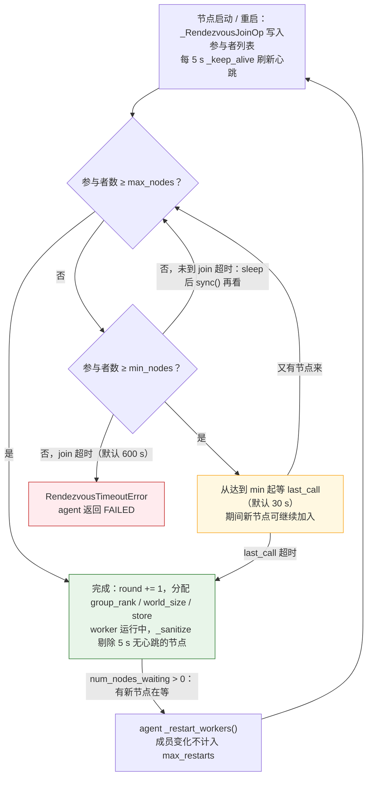
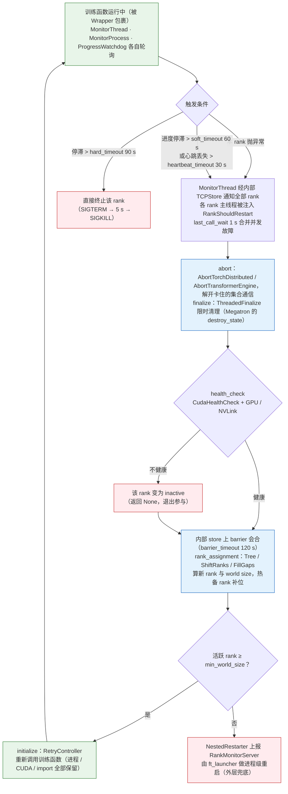
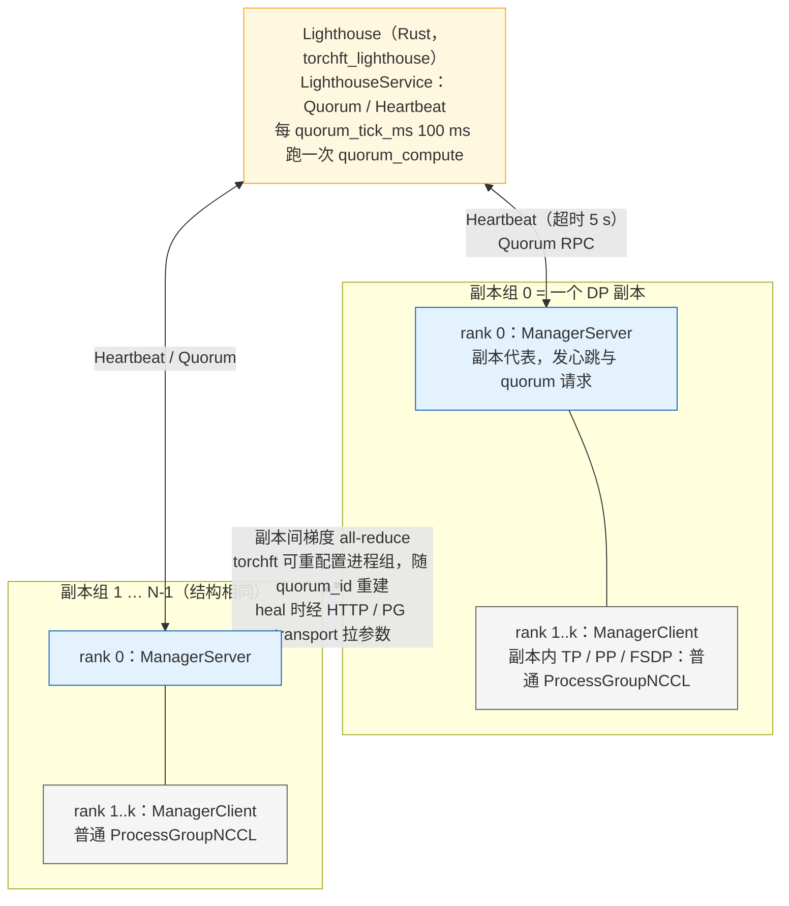
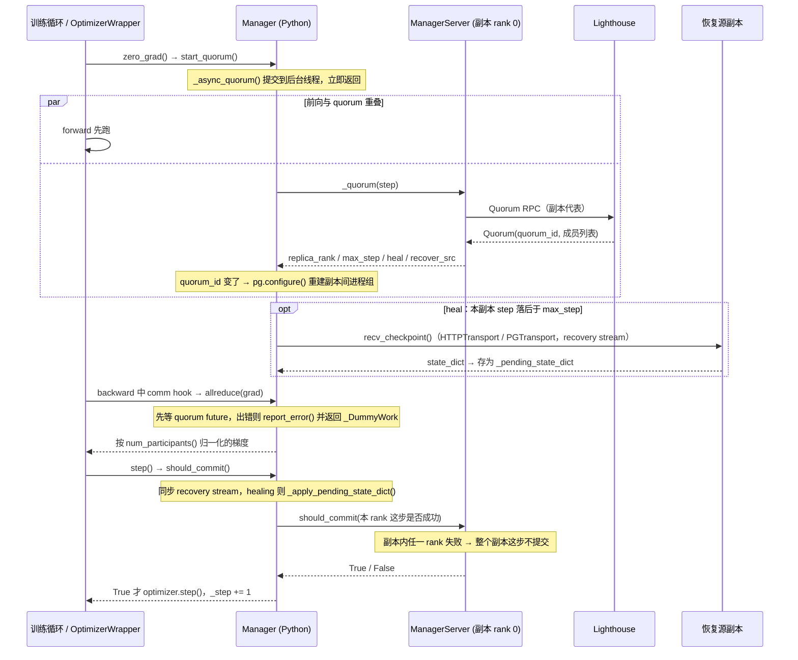
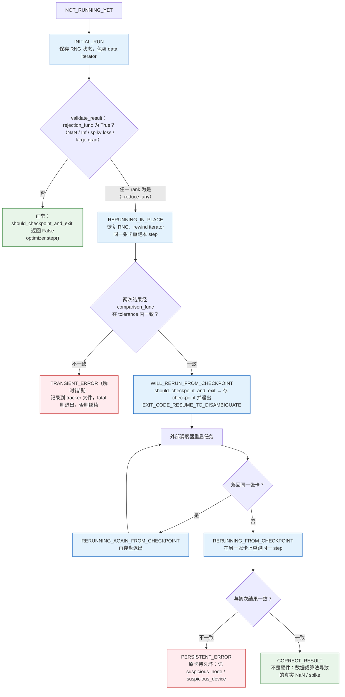

> **更新 @2026-09-06**：本文 torchft 部分基于 v0.2.0、torchtitan 部分基于 v0.3.0 刷新；其余源码引用仍以 PyTorch 2.13.0 / Megatron Core 0.18.0 / NVIDIA Resiliency Extension 0.6.0 为准。

Llama 3 论文（Dubey et al. 2024，*The Llama 3 Herd of Models*）第 3.3.4 节给了一组很少有训练团队愿意公开的数字：405B 模型在 16K 张 H100 上预训练，54 天的统计窗口里发生了 466 次任务中断，其中 47 次是计划内的（固件升级、数据集切换），**419 次是意外的**；意外中断里约 78% 归因于确认或疑似的硬件问题，GPU 本身（含 HBM3）占 58.7%；有 6 次（1.4%）是 silent data corruption——GPU 算错了但没有任何报错。同一节接着说：他们仍然维持了超过 90% 的有效训练时间，54 天里只有 3 次中断需要显著的人工介入。

419 次除以 54 天，平均每 3.1 小时一次。这个频率下，"故障"不再是异常事件而是训练循环的一部分：一个千卡任务的工程设计必须把"每几小时坏一次"当作已知输入，像对待 step 时间和显存一样去算它。第五篇算了其中一半——checkpoint 该多久存一次（Young 公式），异步保存为什么是必需的。本篇算另一半：**故障发生之后，从"有一张卡坏了"到"训练重新在跑"之间的每一秒去了哪里，哪一段最值得压缩。**

这条时间线有四段：**检测**（多久之后所有 rank 知道出事了）、**重启**（把进程组重新拉起来要多久）、**加载**（读回上一个 checkpoint）、**回退**（从上一个 checkpoint 到故障点之间白算的那段）。四段加起来是一次故障的代价，乘以故障频率就是丢掉的训练时间。每一段都对应一组具体的机制和源码：检测靠 NCCL watchdog、心跳和 step 时间告警；重启靠 `torchrun` 的 elastic agent 与 rendezvous，或者绕过进程重启的 in-process restart；加载是第五篇的内容；回退由 checkpoint 间隔决定。在这四段之外还有三个不能被这条时间线涵盖的问题：卡数变了怎么继续（弹性训练与 torchft 的副本组模型）、一张卡慢了怎么办（straggler）、一张卡算错了怎么发现（SDC）。

本篇要回答总纲提出的核心问题：

> **一千张卡平均每几小时坏一张。每次故障从发现到恢复训练要多久？其中检测、重启、加载 checkpoint、回退重算各占多少？把有效训练时间从 85% 提到 95%，最该缩短的是哪一段？**

依照系列惯例：论文数字注明出处；本篇的时间数字（检测多少秒、重启多少分钟）是**量级估计**，用来演示公式的用法，不是任何一台集群的实测；`ledger/availability.py` 的输出是模型计算结果。源码以 PyTorch 2.13.0、Megatron Core 0.18.0、NVIDIA Resiliency Extension（下文简称 NVRx）0.6.0 为准，torchft 与 torchtitan 依更新声明分别以 v0.2.0 与 v0.3.0 为准。通信原语仍当黑盒，只用语义。


## 一、总览

### 1. 本篇用到的记账符号与上一篇的结论

第一、五篇建立的符号，本篇只用下面这些，在此复述以求自治：

```text
N        集群的 GPU 数
M_gpu    单卡的平均故障间隔（MTBF，小时）；集群 MTBF  M = M_gpu / N
δ        一次 checkpoint 对训练造成的停顿时间（同步保存是完整写入时间，异步保存是 staging 拷贝时间）
τ        checkpoint 间隔（两次 checkpoint 之间的训练时间）
T_d T_r T_l   一次故障的检测时间 · 重启时间 · checkpoint 加载时间
```

第五篇的三条结论：

- **Young 公式**：在"每 τ 时间付 δ 的保存代价"与"故障时平均丢 τ/2 的进度"之间取最小，得最优间隔 $$\tau_{opt} \approx \sqrt{2\delta M}$$。
- **异步保存**把 δ 从"写完 6 TB 要几分钟"压到"把状态拷进 pinned memory 要几秒"，代价是每卡多一份主机内存里的状态副本和一个后台写线程。δ 缩小两个量级，τ_opt 缩小一个量级，回退损失也随之缩小一个量级——这是它成为必需品的原因。
- **重分片加载**（DCP 的 metadata 与 resharding、Megatron `dist_checkpointing`）让"剩 15 个节点而不是 16 个"时仍能加载同一份 checkpoint——这是弹性训练在存储层的前提。

### 2. 故障是常态：把 Llama 3 的数字放进一张表

```text
Llama 3 405B 预训练（Dubey et al. 2024，§3.3.4）
────────────────────────────────────────────────────────────────────────
规模            16,384 × H100                 54 天统计窗口
中断            466 次，其中 47 次计划内、419 次意外        → 平均每 3.1 小时一次意外中断
归因            ~78% 确认/疑似硬件；GPU（含 HBM3）58.7%     → 剩下 ~22% 软件、网络、维护、依赖
SDC             6 次，1.4%                                → 不报错的错误结果，只能靠校验发现
结果            >90% 有效训练时间；3 次需要显著人工介入      → 其余 416 次由自动化处理
反推            集群 MTBF ≈ 3.1 h → 单卡 MTBF ≈ 3.1 × 16384 ≈ 5.1 万小时 ≈ 5.8 年
```

最后一行值得停一下：单卡 5.8 年的 MTBF 是相当可靠的硬件，但 16K 张放在一起就是每三小时坏一张。**故障率随卡数线性增长**，而每次故障的代价（检测、重启、加载、回退）与卡数关系不大——所以同一套容错方案，在 1024 卡上有效训练时间 98%，到 16K 卡可能只剩 85%。第二章的公式就是把这句话写成算式。

### 3. 容错的四个环节与本篇的全局图

```text
                 训练在跑 ──────────────────────────────────────────────▶ 时间
                    │
        ①故障发生   ▼  某张卡坏 / 某进程崩 / 某 rank hang / 某卡变慢 / 某卡算错
                    │
        ②检测 T_d   │  显式：进程退出、XID、NCCL 报错 → 秒级
                    │  隐式：hang / 变慢 → 靠 watchdog 超时（默认 10 分钟）、心跳、step 时间告警
                    │  静默：算错不报错 → 靠冗余计算 / 重跑比对（第九章）
                    ▼
        ③重启 T_r   │  进程重启：torchrun agent 杀掉全部 worker → rendezvous → 重新拉起 → CUDA init → NCCL comm init  → 分钟级
                    │  进程内重启：NVRx inprocess 只 abort 通信、在原进程里重新进入训练函数                         → 秒级
                    │  弹性：torchft 的副本组各自独立，坏组退出 quorum，其余组继续                                → 无重启
                    ▼
        ④加载 T_l   │  从最近 checkpoint 加载（本地 NVMe 优先，第五篇）；重分片允许卡数变化
                    ▼
        ⑤回退 τ/2   │  上一个 checkpoint 到故障点之间的训练重做一遍
                    │
                    ▼  训练重新在跑
```

平行于这条时间线的三件事：**坏卡隔离**（让同一张卡不要连续制造故障）、**straggler**（没有故障但有人拖慢所有人）、**SDC**（没有故障但结果是错的）。

### 4. 三框架在容错面上的对照

```text
环节            Megatron Core 0.18.0 / Megatron-LM                DeepSpeed 0.19.2                          torchtitan v0.3.0
───────────────────────────────────────────────────────────────────────────────────────────────────────────────────────────────────────
启动 / 重启      torchrun 或 NVRx ft_launcher                        deepspeed launcher；elasticity/          torchrun（run_train.sh）
                                                                    的 DSElasticAgent 继承 LocalElasticAgent
检测            --enable-ft-package → training/ft_integration.py    依赖 torchrun / NCCL watchdog            依赖 torchrun / NCCL watchdog
                （NVRx RankMonitorClient 心跳与 section 超时）
进程内重启      --inprocess-restart → training/inprocess_restart.py  无                                       无
                （NVRx inprocess.Wrapper）
弹性 / 副本组    无（world size 固定；重分片加载靠 dist_checkpointing） elasticity/ 只做 batch/卡数兼容计算      experiments/torchft/：TorchFTManager、
                                                                                                             FaultTolerantTrainer（HSDP 副本组 + torchft）
straggler       core/utils.py StragglerDetector（--log-straggler）   无内置                                    无内置（用 NVRx attribution/straggler）
SDC / 重跑       core/rerun_state_machine.py RerunStateMachine       无                                       无
故障注入         core/fault_injector.py（走 NVRx inject_fault）       无                                       无
预检            training/gpu_sniff_test.py（--gpu-sniff-test-interval） 无                                     无
```

Megatron 是这一章的主角：它和 NVRx 一起覆盖了检测、进程内重启、straggler、SDC、注入、预检六件事；torchtitan 的角色是 torchft 的集成示范；DeepSpeed 在容错上基本依赖 torchrun 和外部系统，后文不再展开。

### 5. 本文的章节安排

```text
二、故障率数学          集群 MTBF · 有效训练时间的五项公式 · Young 公式的位置 · Llama 3 数字代入 · 85%→95% 该缩短哪一段
三、三类故障 × 检测手段  显式 / 隐式 / 静默 · 检测矩阵 · NCCL watchdog 与 TORCH_NCCL_* · NVRx fault_tolerance 与 Megatron ft_integration
四、重启：torchrun 与 rendezvous   run.py → launcher/api.py → elastic agent · rendezvous 的 c10d/etcd 后端与 min:max · --max-restarts · 一次重启的时间账
五、进程内重启          为什么进程重启慢 · NVRx inprocess.Wrapper 的组件 · Megatron inprocess_restart.py · 与 ft_launcher 的嵌套
六、弹性训练：torchft    副本组模型 · Lighthouse 的 quorum 规则（Rust） · Manager 的 start_quorum / allreduce / should_commit · 恢复 · DDP/HSDP 与 torchtitan · LocalSGD/DiLoCo
七、坏卡隔离与预检       从日志到排除列表 · gpu_sniff_test · NVRx 健康检查
八、straggler           成因 · 计算时间 vs 等待时间 · Megatron StragglerDetector · NVRx attribution/straggler · what-if 论文的结论
九、SDC 与确定性         为什么危险 · 冗余与校验 · RerunStateMachine 的机制与三种模式 · fault_injector · 确定性
十、本文小结            要点 · 源码位置 · train-ledger 的 ledger/availability.py 与 chaos/
```


## 二、故障率数学：从 MTBF 到有效训练时间

### 1. 集群 MTBF

把每张卡的故障看作独立的泊松过程，单卡故障率 $$1/M_{gpu}$$，$$G$$ 张卡的总故障率是 $$G/M_{gpu}$$，于是

$$
M = \frac{M_{gpu}}{N}
$$

"每张卡"在这里是一个记账单位：网卡、交换机、主机、软件 bug 造成的中断都按比例摊到卡上。Llama 3 的 78% 硬件、58.7% GPU 说明 GPU 确实是大头，但 $$M_{gpu}$$ 应当理解为"每张卡份额的所有原因 MTBF"，用集群的实际中断频率反推（上一章表末行的 5.1 万小时就是这样得来的），而不是从 GPU 的数据手册抄。

一个推论：$$M$$ 与卡数 $$G$$ 成反比，所以**同样的容错方案在不同规模下的有效训练时间不同**。1024 卡的集群 MTBF 是 16K 卡的 16 倍，同样每次故障丢 20 分钟，前者丢 0.7% 的时间，后者丢 11%。

### 2. 有效训练时间的五项公式

设训练在墙钟时间 $$T_{total}$$ 里做了 $$T_{useful}$$ 的有用计算。三类时间不是有用计算：

- **checkpoint 停顿**：每 τ 的有用时间付一次 δ，共 $$T_{useful} \cdot \delta/\tau$$；
- **故障损失**：故障按 $$1/M$$ 的频率发生，每次损失 $$L = T_d + T_r + T_l + \tau/2$$——检测、重启、加载三段是纯等待，$$\tau/2$$ 是平均回退量（故障时刻在间隔内均匀分布）；共 $$T_{total} \cdot L/M$$；
- 二阶项（重启期间又坏、回退重算期间再存 checkpoint）忽略。

于是 $$T_{total} = T_{useful}(1 + \delta/\tau) + T_{total} \cdot L/M$$，解出**有效训练时间**（goodput）：

$$
G = \frac{T_{useful}}{T_{total}} = \frac{1 - \dfrac{T_d + T_r + T_l + \tau/2}{M}}{1 + \dfrac{\delta}{\tau}}
$$

分子是故障损失，分母是保存代价。五个可动的量各在一处：

```text
项            出现在        由谁决定                                  量级（本篇假设，非实测）
─────────────────────────────────────────────────────────────────────────────────────────────────
1/M  故障频率   分子的分母    硬件质量 × 卡数；坏卡隔离能降一点          1024 卡 ~2 天一次；16K 卡 ~3 小时一次
T_d  检测       分子          watchdog 超时 / 心跳 / step 告警           显式故障秒级；hang 靠超时：默认 10 分钟
T_r  重启       分子          进程重启 vs 进程内重启 vs 弹性              进程重启 2–5 分钟；进程内 10–60 秒；弹性 ~0
T_l  加载       分子          checkpoint 放在哪、多大、多少 rank 并行读    本地 NVMe 几十秒；远端并行文件系统几分钟
τ/2  回退       分子          checkpoint 间隔                           τ_opt = √(2δM)，异步保存下几分钟
δ/τ  保存代价   分母          同步 vs 异步保存                          同步几分钟 / τ；异步几秒 / τ
```

### 3. Young 公式在这个式子里的位置

只看与 τ 有关的两项 $$\delta/\tau + \tau/(2M)$$，对 τ 求导取零得 $$\tau_{opt} = \sqrt{2\delta M}$$，这就是第五篇的 Young 公式——它是上面 G 表达式在忽略 $$T_d, T_r, T_l$$ 时的一阶最优解。代回去，τ 两项的最小总代价是 $$\sqrt{2\delta/M}$$：

```text
δ = 300 s（同步保存 6 TB）  M = 3.05 h     τ_opt = √(2·300·10980) ≈ 43 min    τ 两项合计 ≈ 23%
δ = 10 s（异步 staging）    M = 3.05 h     τ_opt = √(2·10·10980)  ≈ 7.8 min   τ 两项合计 ≈ 4.3%
```

这就是第五篇"异步保存是必需的"的定量版本：在 16K 卡的故障频率下，同步保存**无论怎么选 τ** 都要付掉 20% 以上，而且 δ 越大 τ_opt 越大、回退也越大——两头都亏。异步保存把这两项一起压到 5% 以内，剩下的 $$T_d + T_r + T_l$$ 才成为主要矛盾。

### 4. 把 Llama 3 的数字代进去

用第十章的 `ledger/availability.py`（无 torch 依赖）算三个场景，1024 卡与 16K 卡各一行，单卡 MTBF 统一取 5 万小时（Llama 3 反推值），τ 取 Young 最优：

```text
场景                                  1024 卡（M = 48.8 h）                          16K 卡（M = 3.05 h）
                                       τ_opt      G       主导项                     τ_opt      G       主导项
──────────────────────────────────────────────────────────────────────────────────────────────────────────────────────
A  同步保存 δ=300s；T_d=600s（watchdog）  171 min   93.8%   回退 2.9%，保存 2.7%         43 min    70.8%   回退 11.7%，保存 8.3%，检测 5.5%
   T_r=300s（进程重启）；T_l=120s
B  异步保存 δ=10s；其余同 A               31 min    98.4%   回退 0.5%，保存 0.5%         7.8 min   86.7%   检测 5.5%，重启 2.7%，回退 2.1%
C  异步 δ=10s；T_d=60s（心跳）；           31 min    98.9%   回退 0.5%，保存 0.5%         7.8 min   94.5%   回退 2.1%，保存 2.0%，检测 0.5%
   T_r=30s（进程内重启）；T_l=60s（本地）
```

三个观察：

- **1024 卡上三个场景差别很小**（93.8% → 98.9%）：M 长达两天，每次故障丢 20 分钟也无所谓。这是为什么很多团队在千卡以下感受不到容错工程的价值——数学上它确实不值多少。
- **16K 卡上 A → B 提升 16 个点，全部来自 δ**：同步改异步一件事，就把有效时间从 71% 拉到 87%。这与 Llama 3 论文的叙述一致：他们把 checkpoint 开销压得很低是达到 >90% 的前提。
- **B → C 再提升 8 个点，来自检测与重启**：B 的主导项已经不是 checkpoint 而是 T_d 的 5.5%——那 600 秒是 NCCL watchdog 的默认超时（第三章）。把 hang 的检测从 10 分钟压到 1 分钟、把进程重启换成进程内重启，才到 94.5%。**Llama 3 的 >90% 落在 B 和 C 之间**，说明他们做到了异步保存和快速检测中的至少一部分。

### 5. 回答核心问题：85% → 95%，该缩短哪一段

公式给出的顺序是明确的：先看分母（δ/τ），它是唯一能一次拿走十几个点的项；分母压到 2% 以内后看分子里的最大项——**绝大多数情况下是 T_d**，因为显式故障的检测是秒级而 hang 的检测是默认 10 分钟的超时，而 hang 在长时训练里并不少见（NCCL watchdog timeout 在 Llama 3 的统计里单独占了 1.7%）；再是 T_r（进程重启的 2–5 分钟里，NCCL communicator 初始化和 CUDA context 创建是大头，进程内重启正是省它们）；T_l 通常最小（本地 checkpoint 加上并行读）。回退项 τ/2 在 δ 压下去之后自动变小，不需要单独动。

所以"85% 提到 95%"的答案是：**如果还在同步保存，先改异步；如果已经异步，缩短 hang 的检测时间，然后缩短重启时间**。本篇第三到五章按这个顺序展开三段的机制。


## 三、三类故障与检测手段矩阵

### 1. 显式、隐式、静默

同一个硬件问题在软件层可以有三种表现：

- **显式故障**：有人报错。进程收到信号退出、CUDA 调用返回错误（Xid 在 `dmesg` 里同时出现）、NCCL 返回 `ncclRemoteError` / `ncclSystemError`、Python 异常未捕获。检测时间是秒级——错误一出现就有人知道。
- **隐式故障**：没人报错但训练不前进。一个 rank 死在某个 kernel 里、NIC 链路断了但没有报错、某个 rank 的数据加载卡住、死锁——其他 rank 在下一次集合通信上安静地等。**没有任何机制能在等待中区分"对方慢"和"对方死了"**，只能靠超时；检测时间就是超时值。变慢（straggler）是隐式故障的温和形态，它连超时都不触发。
- **静默故障**：训练在前进、没有报错、结果是错的。SDC——GPU 算出错误的数、错误的梯度通过 all-reduce 污染所有副本；或者 NaN/Inf 出现但没被检查。检测时间取决于有没有校验：没有就是"永远"，有也只能在校验点发现。

Llama 3 的 419 次里，前两类占了绝大部分，第三类 6 次；但第三类每一次都可能让此前若干小时的训练作废（污染了参数），单位代价最高。

### 2. 检测矩阵

```text
                  显式（崩溃 / Xid / NCCL 报错）        隐式（hang / 变慢）                      静默（算错不报错）
────────────────────────────────────────────────────────────────────────────────────────────────────────────────────────
进程层            进程退出码；torchrun agent 的         agent 只知道进程活着，不知道它在做什么     无
                  _monitor_workers 每 monitor_interval 轮询
通信层            NCCL 错误经 ProcessGroupNCCL 的         watchdog：每个集合通信从 enqueue 起计时，  无（归约结果正确性无法在通信层判断）
                  watchdog 抛出（TORCH_NCCL_ASYNC_        超过 timeout 视为 hang → 抛错/abort
                  ERROR_HANDLING）                        （默认 10 分钟）
框架层            Python 异常 → 进程退出                   NVRx RankMonitor 心跳 / section 超时      RerunStateMachine：重跑一个 iteration 比对
                                                          （分钟级，按实测 step 时间自动算）        NaN/Inf/spiky loss 校验；梯度范数校验
应用层            —                                        step 时间告警（每 rank 计算时间 vs 等待）  loss 曲线人工/规则告警（第七篇）
硬件层            dmesg Xid；DCGM 事件                    DCGM 温度/频率/功耗；网卡 link_down 计数  ECC 计数上升是 SDC 的前兆之一
```

一个结论：**隐式故障的检测时间由最短的那个超时决定**。NCCL watchdog 默认 10 分钟是"最后一道防线"，不是设计目标；框架层的心跳（NVRx）和应用层的 step 告警都是为了把它压到分钟级。

### 3. NCCL watchdog 与 `TORCH_NCCL_*`

PyTorch 的 NCCL 后端对每一次集合通信记一个 `WorkNCCL`，`torch/csrc/distributed/c10d/ProcessGroupNCCL.cpp` 的 `Watchdog::runLoop()` 在独立线程里轮询这些 work，`WorkNCCL::checkTimeout()` 比较"从 enqueue 到现在"与进程组的 timeout（`init_process_group(timeout=)`，默认值 `ProcessGroupNCCL.hpp` 的 `kProcessGroupNCCLDefaultTimeout` = 10 分钟）。超时怎么处理由 `TORCH_NCCL_ASYNC_ERROR_HANDLING` 决定，2.13 的默认是 `3`（`ErrorHandlingMode::SkipCleanUp`）：abort communicator 并把异常抛给主线程，进程随之退出——把隐式故障**转化为显式故障**，让 agent 能看到。设为 `0`（`NoHandling`）时超时只记日志不动作，训练会永远挂着。`TORCH_NCCL_BLOCKING_WAIT` 是另一条路：主线程同步等待、不创建 watchdog，一般不用。

与本篇相关的还有四个变量（均在 `ProcessGroupNCCL.hpp` 定义、`.cpp` 里 `getCvar*` 读取默认值）：

```text
变量                                   2.13 默认     作用
────────────────────────────────────────────────────────────────────────────────────────────────────────
TORCH_NCCL_ASYNC_ERROR_HANDLING        3             超时/错误的处理模式：0 不处理 · 1 TearDown · 2 CleanUpOnly · 3 SkipCleanUp
TORCH_NCCL_ENABLE_MONITORING           true          启用 HeartbeatMonitor：一个监视 watchdog 线程本身的线程
TORCH_NCCL_HEARTBEAT_TIMEOUT_SEC       480（8 分钟）  watchdog 线程多久没心跳就认为它卡死（例如卡在 CUDA 调用里），杀进程
TORCH_NCCL_COORD_CHECK_MILSEC          1000          HeartbeatMonitor 轮询间隔
TORCH_NCCL_PROPAGATE_ERROR             false         一个进程组出错时把错误传播到其他进程组
```

`HeartbeatMonitor::runLoop()` 解决的是"看门狗自己死了"的问题：watchdog 线程在 `cudaEventQuery` 这类调用里卡住时，谁来发现？答案是再来一个只看 watchdog 心跳的线程，8 分钟没心跳就 dump 调试信息（第八篇的 Flight Recorder）并终止进程。这两层超时——集合通信 10 分钟、watchdog 心跳 8 分钟——是 PyTorch 自带的 hang 检测上限，**把 `timeout=` 调短是最便宜的 T_d 优化**：一个 step 若稳定在 5 秒，timeout 设 2 分钟足够覆盖 checkpoint 保存和偶发抖动；但要记住第五篇的提醒，同步 checkpoint 保存和数据加载卡顿会让其他 rank 在下一次集合通信上等，timeout 必须大于这些操作的最长时间。

### 4. 心跳与 section 超时：NVRx `fault_tolerance` 与 Megatron `ft_integration.py`

NCCL watchdog 只能盯集合通信。一个 rank 在 Python 里死循环、在数据加载里卡住、在 checkpoint 保存里卡住，都要等到别人的下一次集合通信超时才暴露。NVRx 的 `fault_tolerance` 模块从训练循环外面盯：

- **启动器**：`ft_launcher`（`src/nvidia_resiliency_ext/fault_tolerance/launcher.py`，入口 `main`）是 `torchrun` 的替代品，参数兼容并追加 `--ft-*` 一族；它自己的 `LocalElasticAgent`（同文件，继承 torch 的 `SimpleElasticAgent`）在 `_start_workers()` 里为**每个 local rank** 拉起一个 `RankMonitorServer` 子进程（`rank_monitor_server.py` 的 `RankMonitorServer.run_in_subprocess()`）。
- **客户端**：训练进程里的 `RankMonitorClient`（`rank_monitor_client.py`）通过 IPC socket 连到自己的监视进程，两种上报方式：`send_heartbeat()`（周期心跳）或 `start_section(name)` / `end_section(name)`（把训练循环划成命名区段，每段各自的超时）。
- **超时**：`FaultToleranceConfig`（`config.py`）里的 `rank_heartbeat_timeout`、`rank_section_timeouts`、`rank_out_of_section_timeout`；可以手工设，也可以让 `TimeoutsCalc`（`timeouts_calc.py`）按实测区段时长乘 `safety_factor`（默认 5.0）自动算出。监视进程发现超时后，`RankMonitorServer._shutdown_rank()` 用 `rank_termination_signal`（默认 `SIGKILL`）杀掉该 rank——同样是把隐式故障转成显式故障，交给 agent 重启。
- **状态机**：`rank_monitor_state_machine.py` 的 `RankMonitorState` 有 `UNINITIALIZED / INITIALIZE / HANDLING_START / HANDLING_PROCESSING / HANDLING_COMPLETED / FINALIZED / ABORTED`，是监视进程对"这个 rank 现在在干什么"的记录。

Megatron 的集成在 `megatron/training/ft_integration.py`（`--enable-ft-package`，训练必须用 `ft_launcher` 启动）。它用 section 模式：`setup()` 打开 `"setup"` 区段；`on_training_step_start()` / `on_training_step_end()` 在若干 warmup step 之后把每个训练 step 包进 `"step"` 区段；`on_checkpointing_start()` / `on_checkpointing_end()` 把保存（含异步保存的 finalize）包进 `"checkpointing"` 区段；不在任何区段里的时间归 `rank_out_of_section_timeout`。`--calc-ft-timeouts` 打开后，`_maybe_update_timeouts()` 在每次 checkpoint 后和训练结束时按观测值更新三个区段的超时并存进 FT 状态文件。文件头的示例命令给出了一组典型值：`setup:600,step:180,checkpointing:420`，out-of-section 300 秒——也就是 **step 卡住 3 分钟就杀**，比 NCCL watchdog 的 10 分钟快三倍多，这就是第二章场景 B 到 C 里 T_d 那一段的来源。`maybe_setup_simulated_fault()` 还能按参数在某个 rank 上模拟一次故障（随机 rank 在若干秒后杀自己或 hang），用于演练。

step 时间告警是同一件事的应用层版本：每个 rank 记录 step 的计算时间与集合通信等待时间（第八章第 2 节），超过阈值上报；它不杀进程，但能在 straggler 阶段就发出信号，比等到超时早得多。


## 四、重启：torchrun、elastic agent 与 rendezvous

### 1. 从 `torchrun` 到 agent 的调用链

`torchrun` 是 `torch/distributed/run.py` 的 `main()`：`get_args_parser()` 解析 `--nnodes`、`--nproc-per-node`、`--rdzv-backend`、`--rdzv-endpoint`、`--rdzv-id`、`--rdzv-conf`、`--max-restarts`、`--monitor-interval`、`--standalone` 等参数，`config_from_args()` 把它们变成 `torch/distributed/launcher/api.py` 的 `LaunchConfig`，`elastic_launch` 调用 `launch_agent()`：创建 rendezvous handler，构造 `WorkerSpec`（入口、每节点进程数、rdzv handler、`max_restarts`、`monitor_interval`），实例化 `torch/distributed/elastic/agent/server/local_elastic_agent.py` 的 `LocalElasticAgent`，调 `agent.run()`。

**每个节点一个 agent，agent 管本节点的 worker 进程**。agent 之间不直接通信，只通过 rendezvous 后端（一个共享的 store）协调。这个结构决定了重启的粒度：一个 worker 挂了，**它所在节点的 agent 会杀掉本节点全部 worker，其他节点的 agent 通过 rendezvous 得知并跟着重启自己的 worker**——因为 NCCL communicator 是全局的，少了一个成员其他成员的下一次集合通信都会失败或超时，与其等它们各自超时，不如统一重启。

### 2. agent 的主循环与 `--max-restarts`

`torch/distributed/elastic/agent/server/api.py` 的 `SimpleElasticAgent._invoke_run()` 是核心循环：

```text
_initialize_workers(worker_group)           ← _rendezvous() 拿到 group_rank / world_size / store，_start_workers() 拉起进程
while True:
    sleep(monitor_interval)                 ← 默认 0.1 s
    result = _monitor_workers(worker_group) ← LocalElasticAgent 里检查每个子进程的存活与退出码
    SUCCEEDED   → _exit_barrier()，返回
    UNHEALTHY / FAILED
        remaining_restarts > 0 → remaining_restarts -= 1；_restart_workers()（= _stop_workers + _initialize_workers）
        否则                  → _stop_workers()，返回 FAILED
    HEALTHY
        rdzv_handler.num_nodes_waiting() > 0 → 有新节点在等着加入：_restart_workers()（成员变化不计入 restarts）
```

三点值得注意。第一，`--max-restarts` 默认是 **0**：不加它，任何一个 worker 挂掉整个任务就结束，"torchrun 自动重启"必须显式打开。第二，重启计数是 agent 本地的：每个 agent 各自数自己的 `_remaining_restarts`，通过 rendezvous 同步的是"要不要重新集合"而不是"还剩几次"。第三，"有新节点在等"也触发重启——这就是弹性的入口：`--nnodes=min:max` 时，一个节点退出后其余节点在 min 以上仍可继续，一个节点回来后大家重启一次把它接进来。

重启后的进程能拿到一些环境变量（`local_elastic_agent.py` 的 `_start_workers()` 设置）：`TORCHELASTIC_RESTART_COUNT`（第几次重启）、`TORCHELASTIC_MAX_RESTARTS`、`TORCHELASTIC_RUN_ID`，以及照常的 `RANK / LOCAL_RANK / WORLD_SIZE / MASTER_ADDR / MASTER_PORT / GROUP_RANK`。**训练脚本不需要知道自己是不是被重启的**——它只需要"启动时若有 checkpoint 就加载"这一条逻辑，这是所有自动重启方案对应用代码的唯一要求。第十章 `chaos/kill_rank.py` 用 `TORCHELASTIC_RESTART_COUNT` 决定只在第一次运行时制造故障。

### 3. rendezvous：c10d / etcd 后端、`min:max` 与四个超时

rendezvous 回答一个问题：**这一轮参与训练的是哪些节点，各自的 group_rank 是多少，共用哪个 store**。`torch/distributed/elastic/rendezvous/` 下：

- `api.py`：`RendezvousHandler` 抽象（`next_rendezvous()` 返回 `RendezvousInfo`：store、rank、world_size、bootstrap store 信息）、`RendezvousParameters`、`RendezvousHandlerRegistry`；
- `dynamic_rendezvous.py`：`DynamicRendezvousHandler`，真正的算法。状态 `_RendezvousState`（参与者、等待列表、冗余列表、round、是否完成/关闭、各节点最后心跳）存在后端里；`_DistributedRendezvousOpExecutor.run()` 驱动 `_RendezvousJoinOp`、`_RendezvousExitOp`、`_RendezvousCloseOp`、`_RendezvousKeepAliveOp` 这几个操作，每一步先 `sync()` 从后端拿最新状态、算下一个 `_Action`（加入参与者 / 加入等待列表 / 标记完成 / 睡一会再看……）、写回；
- `c10d_rendezvous_backend.py` 的 `C10dRendezvousBackend`：后端用 PyTorch 自己的 `TCPStore`（也支持 `FileStore`），`--rdzv-backend=c10d --rdzv-endpoint=host:port`，rank 0 所在节点起 store，**不需要额外服务**；
- `etcd_rendezvous_backend.py` 的 `EtcdRendezvousBackend`：后端用 etcd，适合 store 节点自己也可能坏的场景（c10d 的 TCPStore 在 host 节点挂掉时整个 rendezvous 不可用；etcd 是高可用的）；`etcd_rendezvous.py` 是旧的独立实现；
- `static_tcp_rendezvous.py`：`--rdzv-backend=static`（默认值），固定 `MASTER_ADDR/PORT`，不支持弹性。

`--nnodes=min:max` 由 `run.py` 的 `parse_min_max_nnodes()` 解析，进入 `RendezvousSettings` 的 `min_nodes / max_nodes`。`_RendezvousJoinOp` 的规则：参与者达到 `max_nodes` 立即完成；达到 `min_nodes` 但未到 `max_nodes` 时，从达到 min 的时刻起再等 `last_call` 超时（默认 30 秒，`RendezvousTimeout` 的 `_DEFAULT_TIMEOUTS`），期间有新节点来就接纳，超时后以当前成员完成；一直不到 min 则等 `join` 超时（默认 600 秒）后失败。另两个超时：`close`（30 秒）与 `heartbeat`（5 秒，节点用 `_keep_alive()` 定期更新自己在状态里的时间戳，`_sanitize()` 把超时未心跳的节点从参与者里剔掉）。这四个值通过 `--rdzv-conf join_timeout=…,last_call_timeout=…` 调整。

把 `_RendezvousJoinOp` 的分支与四个超时画在一起（每次 `sync()` 后重新走一遍判断）：



`last_call` 是 T_r 里一个容易被忽视的固定开销：**弹性模式下每次重启至少多等 30 秒**，等"可能还有节点要来"。集群规模确定、不打算弹性时把 `min:max` 设成相等，达到 max 立即完成，省掉这 30 秒。

### 4. 一次进程重启的时间账

把 T_r 拆开（数字是量级，非实测）：

```text
阶段                                             量级            省它的办法
──────────────────────────────────────────────────────────────────────────────────────────────────────
agent 发现 worker 退出                            < 1 s           monitor_interval 默认 0.1 s
杀掉本节点其余 worker（SIGTERM → 等待 → SIGKILL）   秒级            —
rendezvous：写状态、等其他节点、last_call           5–40 s          min == max；c10d 后端；调 last_call_timeout
拉起新进程：Python 解释器、import torch 与框架      10–30 s         进程内重启（第五章）
CUDA context、加载 kernel、TE/Triton JIT            10–60 s         进程内重启；预编译 kernel 缓存
init_process_group + 各并行组的 NCCL communicator   20 s–数分钟      进程内重启只重建 communicator；减少进程组数量；
  （TP/PP/DP/CP/EP 每组一个，每个要 bootstrap 与拓扑探测）              NCCL 的懒初始化让第一次通信才建 comm（把成本挪到 T_l 之后）
数据集索引、tokenizer、数据加载器 worker 进程        10–60 s         进程内重启保留它们
合计                                             2–5 分钟
```

千卡下最不可控的是 NCCL communicator 初始化：进程组越多、成员越多越慢，且任何一个 rank 慢都拖住所有人。这一项加上进程和 CUDA 的固定开销，是"进程重启至少几分钟"的来源，也是下一章的动机。


## 五、进程内重启

### 1. 为什么进程重启慢、以及能不能不重启进程

上一节的账里，进程本身（解释器、import、CUDA context、JIT 缓存、数据集索引、DataLoader worker）占了一到两分钟，而这些东西在故障前后**没有变化**——坏的是一张卡或一根网线，不是这个进程的代码和数据。进程内重启（in-process restart）的想法是：不杀进程，只把坏掉的东西（通信 communicator、GPU 上的训练状态）清掉，在同一个进程里重新进入训练函数，从 checkpoint（最好是本地或内存里的）恢复。坏掉的 rank 退出，剩下的 rank 用更小的 world size 或者备用 rank 接着跑。

它省掉的是进程重启账里除 NCCL communicator 初始化之外的几乎全部，T_r 从分钟级到几十秒。代价是训练代码必须写成"可重入"的：全局状态要能销毁重建，异常要能在函数边界被截住。

### 2. NVRx `inprocess.Wrapper` 的组件

`src/nvidia_resiliency_ext/inprocess/wrap.py` 的 `Wrapper` 是一个装饰器：把训练函数包起来，任一 rank 出错时**所有健康 rank 同时**重新调用这个函数，直到全部成功或触发终止条件。构造参数就是整套机制的组件清单：

```text
组件（构造参数）                        类型 / 默认                                    做什么
──────────────────────────────────────────────────────────────────────────────────────────────────────────────────────────
store_factory / store_kwargs            inprocess.store.TCPStore（继承 torch TCPStore）  各 rank 之间协调重启的内部 store；有 barrier 实现
abort                                   AbortTorchDistributed()                        异步中止：abort 全部 NCCL communicator、destroy_process_group，
                                                                                       让卡在集合通信里的线程解开（否则主线程永远出不来）
                                        AbortTransformerEngine / AbortPersistent-       中止 TE 的通信资源 / 中止异步 checkpoint 的持久 worker
                                        CheckpointProcesses
initialize                              initialize.RetryController(min_world_size)      每次（重）进入前的 rank 本地初始化；控制最少多少 rank 才重试
finalize                                finalize.ThreadedFinalize(timeout, fn)          出错后的清理（在线程里跑并限时，防止清理本身卡住）
health_check                            health_check.CudaHealthCheck / FaultCounter；   重启前检查本 rank 是否健康；Wrapper 自动追加 GPU、NVLink 检查
                                        自动链上 ChainedGPUHealthCheck 等                （_construct_restart_health_check），不健康的 rank 被剔除
rank_assignment                         Compose(ActivateAllRanks(), ShiftRanks())       重启时给剩下的 rank 重新编号、算新的 world size；
                                        可选 Tree / MaxActiveWorldSize /                Tree 按节点分层保留备用 rank，FillGaps 让备用 rank 填坑
                                        ActiveWorldSizeDivisibleBy / FillGaps
monitor_thread_interval                 1 s                                            MonitorThread：进程内线程，检查其他 rank 有没有报错、本 rank 有没有超时，
                                                                                       出事时用异步异常打断主线程（RankShouldRestart）
monitor_process_interval                1 s                                            MonitorProcess：进程外的监视进程，主进程被 GIL 锁死或整个卡住时仍能工作
heartbeat_interval / heartbeat_timeout  1 s / 30 s                                     rank 间心跳；30 秒没心跳视为该 rank 消失
progress_watchdog_interval              1 s                                            ProgressWatchdog：自动时间戳（通过 CUDA stream callback），不需要用户报进度
soft_timeout / hard_timeout             60 s / 90 s                                    进度停滞 60 s → 该 rank 执行 abort 并参与重启；90 s → 直接终止该 rank
barrier_timeout / completion_timeout    120 s / 120 s                                  重启 barrier 与完成 barrier 的超时
last_call_wait                          1 s                                            给其他 rank 报"我也出错了"的窗口，把并发故障合并成一次重启
termination_grace_time                  5 s                                            hard timeout 时 SIGTERM 到 SIGKILL 的间隔
```

`__init__` 里的一串 `enforce_value` 规定了它们的顺序关系：`soft_timeout < hard_timeout < barrier_timeout`、`heartbeat_interval < heartbeat_timeout < barrier_timeout`、各监视间隔小于 `soft_timeout`。理解这些默认值就理解了它的检测能力：**hang 在 60 秒内被 `ProgressWatchdog` + `soft_timeout` 发现**（对比 NCCL watchdog 的 600 秒），rank 消失在 30 秒内被心跳发现，进程整体卡死由进程外的 `MonitorProcess` 兜底。

一次重启的流程：某 rank 抛异常或超时 → `MonitorThread` 通知 store → 其他 rank 的 `MonitorThread` 收到、向主线程注入 `RankShouldRestart` → 所有 rank 执行 `abort`（解开卡住的集合通信）→ `finalize` 清理 → `health_check` → 通过 store 的 barrier 会合 → `rank_assignment` 算出新的 rank 与 world size（不健康的 rank 变为 inactive，返回 None）→ `initialize` → 重新调用训练函数。整个过程进程不退出、CUDA context 不重建、Python 模块不重新 import。

把这个循环连同它的三个分支（不健康 rank 被剔除、健康 rank 不够时交给外层 `ft_launcher`、hard timeout 直接杀）画出来：



### 3. Megatron 的 `inprocess_restart.py`

`megatron/training/inprocess_restart.py` 把上面的组件按 Megatron 的需要装配起来（`--inprocess-restart` 打开，参数在 `arguments.py` 的 `_add_inprocess_restart_args()`，每个 `Wrapper` 超时都有对应的 `--inprocess-*` 参数）：

- `inprocess_restart(train, args)` 返回被 `Wrapper` 包过的训练函数。`rank_assignment` 用 `Tree`：第一层 `Layer(min_ranks=max_ranks=--inprocess-active-world-size, flag=RESERVE)`，即活跃 world size 固定、多出来的 rank 是**预留的热备**；`--inprocess-granularity node` 时再加一层按 `socket.gethostname()` 分组、每组 `device_count` 个 rank——一张卡坏了整节点退出、由备用节点顶上，保证 TP 组不跨节点；
- `abort` 组合了 `AbortTransformerEngine`、`AbortTorchDistributed`、一个自定义的 `AbortCheckpoint`（重置异步 checkpoint 的持久 worker）以及 `NestedRestarterHandlingStarting`；`finalize` 是 `ThreadedFinalize(fn=destroy_state)`，`destroy_state()` 调 `training.destroy_global_state()` 和 `rerun_state_machine.destroy_rerun_state_machine()`——Megatron 的全局单例（args、timers、tensorboard writer、rerun 状态机、并行状态）必须能被销毁重建，这是"可重入"的具体含义；`--inprocess-empty-cuda-cache` 再加一个 `torch.cuda.empty_cache`；
- `initialize` 是 `RetryController(min_world_size=active_world_size)` 加 `NestedRestarterHandlingCompleted`；`health_check` 是 `CudaHealthCheck(timeout=10s)`；
- `maybe_wrap_for_inprocess_restart(pretrain)` 在 `pretrain` 外层包一次，并额外起一个 `TCPStore`（`MASTER_PORT + 1`，`Wrapper` 内部 store 用 `MASTER_PORT + 2`）；`maybe_force_nccl_backend_init(device_id)` 强制在建子进程组之前完整初始化默认 NCCL 后端——注释说明了原因：`destroy_process_group` 只对已完全初始化的后端能终止 NCCL kernel，否则 abort 不彻底。

`NestedRestarter*` 四个类（`inprocess/nested_restarter.py`）是与 `ft_launcher` 的接口：进程内重启失败到一定程度（比如健康 rank 不够 `min_world_size`）时，把事件报给外层的 `RankMonitorServer`，由 `ft_launcher` 做进程级重启。**两层嵌套**——里层秒级处理大多数故障，外层分钟级兜底——是 NVRx 推荐的部署形态。

### 4. 它把 T_r 压到多少、代价是什么

省掉的是进程、CUDA、import、数据集的固定开销；留下的是 NCCL communicator 重建和 checkpoint 加载（`T_l`，若用 NVRx `checkpointing/local` 的本地 checkpoint 或内存副本，也是秒级）。所以 T_r 从"2–5 分钟"变成"十几秒到一分钟"，T_d 从 NCCL 的 10 分钟变成 `soft_timeout` 的 60 秒——第二章场景 C 的两个数字都来自这里。

代价有三：训练代码必须可重入（Megatron 为此改了全局状态的生命周期）；必须有热备 rank 才能保持 world size（否则 DP 度变化、global batch 的切法变化，Megatron 不支持运行时改并行度）；abort 后 GPU 上可能残留异常状态，`CudaHealthCheck` 与 NVRx 自动追加的 GPU/NVLink 检查是防线，但一张真坏的卡会让它所在节点整体被剔除。


## 六、弹性训练：torchft 的副本组模型

### 1. 问题：卡数变了怎么继续

前两章的重启都假设 world size 不变（弹性重启靠 `min:max`，但重启后仍是所有 rank 一起重建全部进程组）。torchft 换了一个思路：**把数据并行的每个副本当作可独立失败的单元**。一个 DP 副本内部（TP/PP/FSDP 分片）仍是普通的 PyTorch 进程组，不容错；副本之间的梯度 all-reduce 由 torchft 接管，某个副本消失时其余副本用更小的 DP 度继续，消失的副本恢复后从活着的副本拉参数重新加入——**没有全局重启，也没有 checkpoint 加载**（参数直接从邻居拷）。

这个模型的约束是：并行度里必须有一维是"复制"（DDP 或 HSDP 的 replicate 维），且一个副本组不能太大（一个副本组内部任何故障都让整组退出）。它是 Llama 3 那种 TP8/CP16/PP16/DP128 配置的天然搭配——128 个 DP 副本每个 128 卡，一张卡坏影响 1/128 的算力而不是全部。

### 2. Lighthouse 与 quorum（Rust）

torchft v0.2.0 的协调服务 Lighthouse 是 Rust 实现（`src/lighthouse.rs`，二进制入口 `src/bin/lighthouse.rs`，通过 `pyproject.toml` 暴露为 `torchft_lighthouse` 命令），gRPC 接口在 `proto/torchft.proto`：`LighthouseService` 有 `Quorum` 与 `Heartbeat` 两个 RPC，`ManagerService` 有 `Quorum / CheckpointMetadata / ShouldCommit / Kill`。每个副本组的 rank 0 运行一个 `ManagerServer`（`src/manager.rs`，Python 侧类型在 `torchft/_torchft.pyi`）作为副本的代表向 Lighthouse 发心跳和 quorum 请求；副本内其他 rank 通过 `ManagerClient` 找自己的 `ManagerServer`。

三层角色的关系——注意副本组**内部**仍是普通的、不容错的 NCCL 进程组，torchft 只接管副本**之间**的那一维：



`LighthouseOpt` 四个参数：`--min_replicas`（多少副本才成 quorum）、`--join_timeout_ms`（默认 60000：等还在心跳但没来参加的副本多久）、`--quorum_tick_ms`（默认 100：多久检查一次）、`--heartbeat_timeout_ms`（默认 5000：多久没心跳算死）。`quorum_compute()` 是核心规则，按顺序：

```text
1  healthy_replicas    = 最近 heartbeat_timeout_ms 内有心跳的副本
   healthy_participants = 其中已经发了 quorum 请求（"我准备好进入下一步"）的副本
2  若上一轮 quorum 存在，且它的全部成员都在 healthy_participants 里  → "Fast quorum"：立即以候选者成立（不等别人）
   （若任一参与者带 shrink_only，候选者只能是上一轮成员的子集——只缩不扩）
3  healthy_participants < min_replicas                                → 不成立，等
4  healthy_participants ≤ healthy_replicas / 2                       → 不成立（防止脑裂：至少要有一半以上活着的副本参加）
5  还有活着但没来参加的副本，且从第一个参加者到现在 < join_timeout_ms   → 成立但先等 straggler
6  否则                                                              → 成立，quorum_id += 1
```

第 2 条决定了稳态开销：没人掉线时每一步的 quorum 是"快速路径"，不用等 join_timeout；第 5 条决定了掉线后的恢复延迟：一个副本死了（心跳超时 5 秒），剩下的副本在 join_timeout（默认 60 秒）内成立新 quorum——这两个值就是 torchft 的 T_d。`_quorum_tick()` 每 100 ms 调一次 `quorum_compute()`，成立时把 `Quorum`（成员列表按 replica_id 排序、quorum_id）广播给所有参与者。

`src/manager.rs` 的 `ManagerServer` 收到 Lighthouse 的 quorum 后算出本副本的 `ManagerQuorumResponse`：`replica_rank / replica_world_size`（在新 quorum 里的位置）、`max_step`（参与者中最大的 step）、`heal`（本副本的 step 落后于 max_step 或 step 0 需要同步 → 需要从别人拉参数）、`recover_src_replica_rank / recover_src_manager_address`（从谁拉）、`recover_dst_replica_ranks`（要给谁发）、`store_address`（新进程组用的 TCPStore）。恢复源的分配在这里做：落后的副本被轮流分配给处于 max_step 的副本。

### 3. Manager：`start_quorum` / `allreduce` / `should_commit`

Python 侧 `torchft/manager.py` 的 `Manager` 是训练循环看到的全部接口。构造参数里最重要的：`pg`（一个 torchft 的可重配置进程组，见下）、`min_replica_size`、`use_async_quorum`（默认 True）、`timeout`（集合通信、should_commit、checkpoint 传输的默认超时，60 秒）、`quorum_timeout`（60 秒；LocalSGD/DiLoCo 要设到小时级）、`world_size_mode`（`DYNAMIC`：用全部可用副本并按副本数归一化梯度；`FIXED_WITH_SPARES`：只用 `min_replica_size` 个，多出的备用副本贡献零梯度）、`checkpoint_transport`（默认 `HTTPTransport`，另有 `PGTransport` 用进程组传）、`replica_id`、`lighthouse_addr`（或环境变量 `TORCHFT_LIGHTHOUSE`）。

一个 step 的三次交互：

- **`start_quorum()`**：在前向之前调（`torchft/optim.py` 的 `OptimizerWrapper.zero_grad()` 就是调它）。它把 `_async_quorum()` 提交到单线程 executor，`use_async_quorum=True` 时立刻返回让前向先跑，quorum 在后台算。`_async_quorum()` 向 `ManagerServer` 发 `_quorum()`；拿到结果后若 `quorum_id` 变了，调 `self._pg.configure(store_addr, replica_id, replica_rank, replica_world_size, quorum_id, group_rank, group_world_size, ranks_in_quorum)` **重建副本间进程组**（这是 torchft 进程组类的关键能力，普通 `ProcessGroupNCCL` 做不到），并重置 Flight Recorder 的记录路径；若 `heal`，在专用的 recovery stream 上从 `recover_src` 拉 checkpoint（`_checkpoint_transport.recv_checkpoint()`），存为 `_pending_state_dict`，等安全时刻再 `_apply_pending_state_dict()`；若 `recover_dst_replica_ranks` 非空，把自己的 state dict 发给它们。
- **`allreduce(tensor)`**：DDP 的 comm hook 调它（`torchft/ddp.py` 的 `DistributedDataParallel._comm_hook` → `state.allreduce(bucket.buffer())`）。它先等 quorum future，若本 step 已经 `errored()` 则返回一个不做事的 `_DummyWork`；否则在重配置过的进程组上发 all-reduce，`wrap_future()` 把结果按 `num_participants()` 归一化，**任何异常被捕获并记进 `report_error()` 而不抛出**——一个副本挂掉时其他副本的 all-reduce 会失败，但训练循环不崩，只是这一步作废。`should_quantize=True` 时走 `torchft/collectives.py` 的 `allreduce_quantized()`（Triton 实现的量化 all-reduce）。
- **`should_commit()`**：反向之后、optimizer step 之前调（`OptimizerWrapper.step()` 只在它返回 True 时真正 step）。它同步 recovery stream、检查进程组有没有错、若在 healing 就应用 pending state dict，然后把"本 rank 这步是否成功"（有足够副本且没错）发给 `ManagerServer`，`ManagerServer` 在副本内做一致性决定：**副本内任一 rank 失败则整个副本这步不提交**。返回 True 时 `_step += 1`、`_batches_committed += num_participants()`；`max_retries` 次连续失败则抛异常。

一个 step 里这三次交互与前向反向的重叠关系（`use_async_quorum=True`；heal 分支只在本副本落后时走）：



进程组类在 `torchft/process_group.py`：`ProcessGroup` 基类增加 `configure()` / `abort()` / `errored()` / `shutdown()`；`ProcessGroupWrapper` 包一个真实后端并在 `configure()` 时销毁重建；`ProcessGroupGloo` / `ProcessGroupNCCL` / `ProcessGroupXCCL` 是对应后端；`ProcessGroupBaby*`（`ProcessGroupBabyNCCL` 等）把后端放进**子进程**——NCCL 的 abort 可能卡住或搞坏 CUDA context，放在子进程里坏了就杀掉重开，用共享内存传张量；`ManagedProcessGroup` 让 FSDP/HSDP 这类不走 comm hook 的代码也能用 torchft：它的 `allreduce()` 直接调 `manager.allreduce()`，`size()` 返回 `manager.num_participants()`；`ErrorSwallowingProcessGroupWrapper` 与 `FakeProcessGroupWrapper` 用于测试与注入。

### 4. 恢复：从邻居拉参数而不是从存储读

healing 用 `torchft/checkpointing/` 的 `CheckpointTransport`：`HTTPTransport` 在恢复源上起 HTTP 服务、恢复方按 `checkpoint_metadata` 拉取 state dict；`PGTransport` 用一个临时进程组直接传张量（支持 DTensor 的 `_DTensorMeta`）。传的是 `Manager.state_dict()` 与用户通过 `register_state_dict_fn()` 注册的全部 state dict（模型、优化器、以及 `_manager_state_dict()` 里的 step 与 batches_committed）。这就是 T_l 的另一种形态：不是从并行文件系统读 6 TB，而是从同一集群里的另一台机器拷一份副本的分片——带宽是节点间网络，时间是秒到几十秒。

torchft 不取代周期性 checkpoint（全部副本同时坏、或整个任务被抢占时仍需要它），`Manager` 的文档明确要求把 `Manager.state_dict()` 一起存进周期 checkpoint，否则恢复后 step 计数不一致。

### 5. 与 DDP / HSDP 的配合，以及 torchtitan 的 `experiments/torchft/`

DDP 路径最简单：`torchft.DistributedDataParallel(manager, module)`（`torchft/ddp.py`，继承 `torch.nn.parallel.DistributedDataParallel`，用 `manager` 做 comm hook 的 state）、`torchft.Optimizer`（`OptimizerWrapper`）、`torchft/data.py` 的 `DistributedSampler`（按 `num_replica_groups × replica_rank` 切数据，让副本组之间不重复）。仓库根目录的 `train_ddp.py` 是完整示例，README 给出了单机两副本组的启动方式：先 `torchft_lighthouse --min_replicas 1 --quorum_tick_ms 100 --join_timeout_ms 10000`，再在两个 shell 里以 `REPLICA_GROUP_ID=0/1`、`NUM_REPLICA_GROUPS=2`、`TORCHFT_LIGHTHOUSE=http://localhost:29510` 各起一个 `torchrun --nnodes=1 --nproc_per_node=1`。

HSDP 路径是 torchtitan v0.3.0 的 `torchtitan/experiments/torchft/`：

- `manager.py` 的 `TorchFTManager`（`Configurable`，配置类 `TorchFTManager.Config`：`enable / process_group（gloo|nccl|mccl）/ process_group_timeout_ms / replica_id / group_size / min_replica_size / semi_sync_method`）。`enable=True` 时构造 `torchft.Manager(pg=..., min_replica_size, use_async_quorum=(semi_sync_method is None), replica_id=f"torchtitan_ft_{replica_id}")`，并建一个 `ManagedProcessGroup` 注册为 `"dp_replicate"`；`get_dp_info(dp_degree, dp_rank)` 把数据加载器看到的 DP 度扩成 `dp_degree × group_size`、rank 偏移 `dp_degree × replica_id`——**每个 torchtitan 实例只知道自己副本组内的 FSDP 分片维，副本维由 torchft 提供**；`maybe_set_all_reduce_hook()` 给每个 `FSDPModule` 装 `set_all_reduce_hook`，把 reduce-scatter 之后的梯度在 `replicate_pg` 上再做一次 `all_reduce(AVG)`——这就是 HSDP 的副本维 all-reduce，只是走了可重配置的进程组；
- `optimizer.py` 的 `TorchFTOptimizersContainer` 把 torchtitan 的 `OptimizersContainer` 包进 `torchft.Optimizer`，`step()` / `zero_grad()` 分派到 torchft 的版本（`zero_grad → start_quorum`、`step → should_commit`）；
- `checkpoint.py` 的 `TorchFTCheckpointManager`：周期 checkpoint 由 replica_id 最小的存活副本负责保存（README 说明），并管理一个 `_ft_folder()` 存 torchft 自己的状态；
- `trainer.py` 的 `FaultTolerantTrainer`：`init_distributed()` 里 `config.fault_tolerance.build()` 构造 `TorchFTManager`，`train_step()` 里加入 `should_commit` 语义，`train()` 用 `maybe_semi_sync_training()` 上下文包住训练循环；配置函数 `llama3/config_registry.py` 的 `llama3_torchft_debugmodel()`。

README 的例子是 8 卡单机两副本组、每组 FSDP 4 卡：先起 Lighthouse，再起两个 torchtitan 实例——`NGPU=4 CUDA_VISIBLE_DEVICES=0,1,2,3 MODULE=torchft.llama3 CONFIG=llama3_torchft_debugmodel ./run_train.sh --fault_tolerance.enable --fault_tolerance.replica_id=0 --fault_tolerance.group_size=2 --parallelism.data_parallel_shard_degree=4`，另一个 `replica_id=1`、`CUDA_VISIBLE_DEVICES=4,5,6,7`。杀掉其中一个实例，另一个继续训练（DP 度从 2 变 1，梯度按 `num_participants` 归一化）；重新拉起被杀的实例，它从活着的那个拉参数后重新加入。第十章 `chaos/` 的第四个演练就是它。

### 6. LocalSGD / DiLoCo 在容错语境下的位置

`torchft/local_sgd.py` 提供两个上下文管理器。`LocalSGD(manager, model, optimizer, sync_every)`：副本各自训练 `sync_every` 步，然后对参数做一次 all-reduce 平均；quorum 只在每 `sync_every` 步算一次，期间任何副本失败都让这 `sync_every` 步作废并重算 quorum。`DiLoCo(manager, model_fragments, inner_optimizer, outer_optimizer, sync_every, ...)`：实现 DiLoCo（Douillard et al. 2023）与 Streaming DiLoCo（2025）——各副本用内层优化器本地训练，每 `sync_every` 步把"伪梯度"（全局参数与本地参数之差）all-reduce 后交给外层优化器，Streaming 版本把模型分成 fragment 错开同步；它在 CPU 上保留一份参数备份（`backup_device`），同步失败时回退到上一次同步的参数。

它们在容错语境下的意义是：**把副本之间的同步频率从每步一次降到每几十几百步一次**，于是副本间进程组的重配置、quorum、甚至跨数据中心的慢链路都变得可以承受。torchtitan 的 `semi_sync_method = "local_sgd" | "diloco"` 就是走这条路（`maybe_semi_sync_training()`，此时 `use_async_quorum=False`，quorum 在同步步同步地算）。代价是算法层面的：LocalSGD/DiLoCo 与同步 SGD 不是同一个优化过程，收敛性要单独验证——这超出本系列范围，本篇只指出它们在容错光谱上的位置：同步训练 + torchft 是"每步都要 quorum"，DiLoCo + torchft 是"每 H 步一次 quorum"，后者对故障的容忍度更高、对算法的改动也更大。

### 7. 代价与边界

torchft 不是免费的：每步一次 quorum RPC（快速路径下几毫秒，与前向重叠）；`allreduce` 多一层 Python wrapper 和 future 回调；进程组重配置时 NCCL communicator 要重建（同一个 T_r 里的大头，但只重建副本维那一个 comm，且其他副本组不受影响）；`FIXED_WITH_SPARES` 要多养备用副本；`DYNAMIC` 模式下副本数变化意味着 global batch 变化，需要训练配方能容忍。v0.2.0 的进程组 abort 路径仍标注为实验性（Baby 进程组就是为它的不可靠而设计的），torchtitan 的集成也标注为 experimental。它解决的是"DP 副本级"的容错；副本内部（TP/PP/FSDP）的故障仍然要靠前几章的重启。

把第四、五、六章的三种恢复方式放在一起对照——它们不是替代关系，而是按故障单元从大到小、保留状态从少到多排列，实践中嵌套使用：

| 维度 | 进程重启（torchrun / ft_launcher） | 进程内重启（NVRx inprocess.Wrapper） | 副本组弹性（torchft） |
|---|---|---|---|
| 故障单元 | 整个任务：任一 worker 挂，所有节点的 worker 全部重启 | 整个任务的通信层：所有健康 rank 同时重进训练函数 | 一个 DP 副本组：坏组退出 quorum，其余组不停 |
| 保留什么 | 什么都不保留 | 进程、CUDA context、import、JIT 缓存、数据集索引、DataLoader worker | 全部；连 checkpoint 加载也省掉（从邻居拉参数） |
| 重建什么 | 进程 + CUDA + 全部 NCCL communicator + 数据集 | 全部 NCCL communicator（abort 后重建） | 只重建副本维那一个 communicator（`pg.configure()`） |
| T_d（hang） | NCCL watchdog 600 s；NVRx section 超时分钟级 | ProgressWatchdog + `soft_timeout` 60 s；心跳 30 s | `heartbeat_timeout_ms` 5 s + `join_timeout_ms` 60 s |
| T_r 量级 | 2–5 分钟 | 十几秒到一分钟 | ≈ 0（其余组不重启；坏组回来时 heal 秒到几十秒） |
| T_l | 从存储加载 checkpoint | 从存储或本地 / 内存 checkpoint | 从活着的副本拉 state dict |
| world size | 固定；`min:max` 弹性重启仍是全体重建 | 固定：靠热备 rank（`Tree` 的 RESERVE 层）补位 | 动态：`DYNAMIC` 改 DP 度，或 `FIXED_WITH_SPARES` 养备用副本 |
| 对训练代码的要求 | 启动时有 checkpoint 就加载 | 训练函数可重入：全局状态可销毁重建 | 并行度必须含 replicate 维；副本间通信交给 Manager / ManagedProcessGroup |
| 覆盖不了的 | — | 健康 rank < `min_world_size` → 交外层 ft_launcher | 副本内部（TP/PP/FSDP）故障：整组退出，再靠前两种重启 |
| 框架支持 | 三框架皆可 | Megatron `--inprocess-restart` | torchft 原生 DDP；torchtitan `experiments/torchft/`（HSDP） |


## 七、坏卡隔离与开训前自检

### 1. 从故障日志到排除列表

Llama 3 的"3 次人工介入"背后是自动化的坏卡处理：一张卡坏了，重启之后如果它还在，很可能再坏一次——第二章公式里的 $$1/M$$ 不是常数，它有一部分是"同一张卡反复坏"贡献的。隔离流程在引擎侧只有两个要求：**每次故障能归因到具体的 rank / 节点**（日志里的 rank 标记、Xid 与 hostname 的对应、NCCL 错误消息里的对端信息、NVRx 的 `attribution/` 模块从日志和 Flight Recorder 归因），以及**重启时能排除这个节点**（进程重启时由调度器换节点；进程内重启时 `rank_assignment` 的 `Tree` 按节点剔除；torchft 里坏副本组不再加入 quorum）。调度器侧的排除列表、节点驱逐策略不在本系列范围。

一个实用的规则：同一节点在 24 小时内造成两次不明原因中断就隔离送检。它建立在归因之上——没有按 rank 的日志与指标（第八篇），隔离就无从谈起。

### 2. 预检：`gpu_sniff_test.py` 与 NVRx 的健康检查

坏卡最好在开训前发现。Megatron 的 `megatron/training/gpu_sniff_test.py` 跑五个微基准并跨 rank 比较：GEMM（TFLOP/s）、全局进程组 all-reduce、TP 组 reduce-scatter、EP 组 all-to-all、DP 组两两 send/recv（各报 busbw），**任何一个 rank 偏离均值超过一个标准差就标为 outlier**。两种用法：独立运行 `torchrun --nproc_per_node=N megatron/training/gpu_sniff_test.py`，或 `--gpu-sniff-test-interval N`（`training_config.py` 的 `gpu_sniff_test_interval`）让 `training.py` 的 `_run_gpu_sniff_test()` 每 N 个 iteration 跑一次——后者能抓到训练中途开始降频的卡，是第八章 straggler 检测的粗粒度版本。

NVRx 的 `shared_utils/health_check.py` 提供 `GPUHealthCheck`（NVML：ECC、Xid、温度、功耗状态）、`NVLHealthCheck`（NVLink 状态）、`NicHealthCheck` 与 `NicLinkStateHealthCheck`（网卡 link_downed 计数与链路状态）、`DistributedStorageHealthCheck`（存储可写）以及组合它们的 `NodeHealthCheck`。它们在两处被用：`ft_launcher` 在启动和重启前跑（`FaultToleranceConfig` 的 `enable_nic_healthcheck` 默认 True、`enable_nic_monitor` 训练中周期监视 link_down）；`inprocess.Wrapper` 重启前自动链上 GPU 与 NVLink 检查。预检发现的坏卡在开训前就被排除，不进入 $$1/M$$。

第八篇的开训检查清单会把这些与 NCCL 带宽测试、小规模 dry-run、checkpoint 恢复演练放在一起。


## 八、straggler：没有故障但有人拖慢所有人

### 1. 成因

同步训练里每一次集合通信都要等最慢的参与者。一张卡慢 20%，全部卡慢 20%。第四篇把它列为 MFU 七项损失之一并给了测法（多 rank trace 的计算时长 max − median），本篇看成因与检测机制：

```text
类别        成因                                        特征
──────────────────────────────────────────────────────────────────────────────────────────────────────────
硬件        GPU 降频（温度、功耗封顶、时钟策略）             持续；该 rank 计算 kernel 一致变慢；nvidia-smi 频率低
            HBM ECC 纠错频繁（坏 memory 的前兆）             持续或阵发；ECC 计数上升
            PCIe 链路降速（x16 → x8，Gen5 → Gen4）           H2D/D2H 与 GDR 慢；数据加载与 PP p2p 受影响
            网络链路差（误码、重传、拥塞）                    该节点所有跨机通信慢；ibstat 计数器
主机        CPU 侧数据加载慢（worker 不够、被抢占、NUMA 错）   step 边界处等待；只影响那个节点
            Python GC、日志、监控 agent 抢 CPU               阵发；与 GPU 无关
负载        序列长度 / packing 不均导致每 rank 计算量不同      每步换 rank；不是"一张慢卡"而是"这一步谁的数据多"
            PP 的 stage 不均衡、MoE 的专家负载不均            结构性；同一批 rank 一直慢
```

### 2. 检测原理：每 rank 的计算时间 vs 等待时间

判据只有一条：**慢的 rank 计算时间长、通信等待时间短；被拖的 rank 反之**。所以检测需要每个 rank 各自记录"本 step 花在计算 kernel 上的时间"与"花在集合通信里的时间"，然后跨 rank 比较——单个 rank 的时间线分不清"我慢"和"我在等别人"。

```text
一个 step 内各 rank 的时间线（rank 5 是 straggler）
时间 ────────────────────────────────────────────────────────────▶
rank 0  │████ 计算 ████│░░░░░░░ 等待 all-reduce ░░░░░░░│▒ 通信 ▒│
rank 1  │████ 计算 ████│░░░░░░░ 等待 all-reduce ░░░░░░░│▒ 通信 ▒│
rank 5  │████████████ 计算（慢）██████████████████████│▒ 通信 ▒│ ← 计算长、等待≈0
rank 6  │████ 计算 ████│░░░░░░░ 等待 all-reduce ░░░░░░░│▒ 通信 ▒│
        ▲              ▲                               ▲
        step 开始       快 rank 进入集合通信，开始等      最慢 rank 到达，
                        （单看自己：像是"通信慢"）        all-reduce 才真正开始
```

从单个快 rank 的视角，"等待"和"通信"都发生在同一个 all-reduce 调用里，看起来只是通信变慢了；只有把所有 rank 的计算时间并排比较，才能看出谁把大家拖住了。

实现有两个层次。轻量的：在训练循环里用 CUDA event 给前向反向计时（不含通信），每 N 步 all-gather 各 rank 的计时，算 min/max/中位数；重的：CUPTI 拿到每个 kernel 的实际执行时间，按 kernel 名聚合，能把"GEMM 慢了"和"数据加载慢了"分开。

### 3. Megatron 的 `StragglerDetector`

`megatron/core/utils.py` 的 `StragglerDetector` 是轻量方案的实现（单例；文档在 `megatron/core/README_STRAGGLER.md`；`--log-straggler` 打开，配置类 `training/config/resilience_config.py` 的 `StragglerDetectionConfig`：`log_straggler / straggler_ctrlr_port / straggler_minmax_count / disable_straggler_on_startup`）。`configure()` 设 world、rank、报告的 min/max 数量、控制端口；`start_method()` / `stop_method()` 用 CUDA event 给一段代码计时（可用作上下文管理器），`training.py` 用它包住前向反向；`elapsed()` 返回 `(delta, batch_delta, temp, power, util, clock)`——计时之外还顺手读了 `torch.cuda.temperature() / power_draw() / utilization() / clock_rate()`，**把"慢"和"降频"直接放在一行里对照**；`report(total_flops, log_interval)` 每 `log_interval` 步 gather 全部 rank 的数据，打印 `MnRtt/Rnk`（最短往返时间与 rank）、`MxRtt/Rnk`、`MnEtpt/Rnk`（最低估算吞吐 TF/s 与 rank）、`MxEtpt/Rnk`，以及 `Bottom N Ranks with lowest Etpt` / `Top N Ranks with highest Etpt` 两行。`_controller()` 在 `straggler_ctrlr_port` 上监听，运行中可以开关检测（`_check_toggle()`），因为计时本身有开销。

它的输出是"哪个 rank 最慢、慢多少、当时的频率与温度"，足以回答"有没有 straggler、是不是降频"，回答不了"慢在哪个 kernel"。

### 4. NVRx `attribution/straggler` 的 `Detector`

`src/nvidia_resiliency_ext/attribution/straggler/straggler.py` 的 `Detector` 是重方案（也是类方法单例）。`Detector.initialize(scores_to_compute, gather_on_rank0, profiling_interval, report_time_interval, node_name)` 之后，两种标记方式：`Detector.detection_section(name)` 上下文管理器包住一段代码，或 `Detector.wrap_callables(callable_ids)` 直接给函数打桩（`CallableId(obj, "name")`，`restore_original_callables()` 撤销）。底层 `cupti.py` 的 `CuptiManager` 用 CUPTI（C++ 扩展在 `cupti_src/`）采集区段内每个 kernel 的执行时间；`reporting.py` 的 `ReportGenerator` 算两类分数（每个 rank 对每个区段 / kernel 取执行时间的中位数，再算比值）：**relative perf score**——最快 rank 的中位数除以本 rank 的中位数，0.5 表示本 rank 比最快的慢一倍，找出相对慢的 rank；**individual perf score**——本 rank 历史最好的中位数除以当前中位数，找出"自己变慢了"的 rank，即使所有 rank 一起变慢也能发现。`Report` 里有 `gpu_relative_perf_scores`、`section_relative_perf_scores`、`gpu_individual_perf_scores`、`section_individual_perf_scores` 四组，`Report.identify_stragglers(gpu_rel_threshold=0.75, section_rel_threshold=0.75, ...)` 按阈值给出 straggler 列表。`generate_report_if_interval_elapsed()` 按 `report_time_interval`（默认 60 秒，`ReportIntervalTracker` 让各 rank 同步）出报告。

两套工具的分工：Megatron 的检测器零依赖、开销小、适合常开；NVRx 的检测器要 CUPTI、开销大、按 `profiling_interval` 抽样，适合定位到 kernel 级或做长期基线。

### 5. what-if 分析论文的结论

Lin et al.（OSDI 2025，*Understanding Stragglers in Large Model Training Using What-if Analysis*，ByteDance Seed 与 NYU）用五个月、3079 个 LLM 预训练任务（128 到 5K+ 卡）的 trace 做了一件事：按每个 rank 的操作时间线，把每个操作的时长替换成"无 straggler 时应有的值"（计算取各 rank 的均值、通信取中位数），按依赖关系重放模拟，得到"如果没有 straggler 这个任务会多快"，与实际对比。结论与本章直接相关：

- **普遍且代价高**：42.5% 的任务因 straggler 至少慢 10%；尾部任务浪费 45% 的资源；
- **多数 straggler 不是硬件故障**：作者明确说"straggler 不是简单地总由硬件故障造成"——数据层面的序列长度不均衡（每个 DP rank 拿到的 token 数不同，每步的慢 rank 都在换）、PP 的 stage 划分不均、以及 CPU 侧的干扰（如 GC）是重要成因；持续慢的"坏卡"是少数；
- **时空模式**：硬件型 straggler 在空间上集中（同一节点）、时间上持续；负载型 straggler 空间上分散、时间上阵发。

这改变了处置顺序：看到 straggler 先看它是不是每步换 rank——是的话去查数据 packing 与 PP 布局（第四、七篇），不是的话再查硬件（本章第 3、4 节的检测器加 `gpu_sniff_test`）。把 straggler 全部归因于"坏卡"并隔离节点，会浪费好节点而不解决问题。


## 九、SDC 与确定性

### 1. 为什么静默错误最贵

SDC（silent data corruption）是硬件在没有报错的情况下算出错误结果：一个 SM 的某个运算单元老化、电压边缘、宇宙射线翻转了没有 ECC 保护的寄存器或 SRAM。GPU 的 HBM 有 ECC，但计算路径上大量状态没有。Llama 3 的 6 次（1.4%）是**被发现的**次数——发现它需要校验，没被发现的不在统计里。

训练对 SDC 尤其敏感的原因是数据并行的 all-reduce：一张卡的错误梯度被平均进所有副本的参数里，之后每一个 checkpoint 都带着这个错误。发现得晚，就要回退到污染前的 checkpoint——如果还留着的话。loss 曲线上它可能表现为一次 spike，也可能什么都看不出来（错误足够小），后者最危险。

### 2. 检测手段

```text
手段                  原理                                                  代价                       覆盖
───────────────────────────────────────────────────────────────────────────────────────────────────────────────────────
数值校验              loss / 梯度里有 NaN、Inf、异常大的值 → 拒绝这一步           几乎为 0                   只抓"错得离谱"的
冗余计算              同一计算在两张卡上各算一遍比对（或用 CPU 算一遍关键量）     算力翻倍或抽样翻倍           全覆盖但太贵，只能抽样
重跑比对（rerun）      发现可疑结果后在同一张卡重算一次：结果不同 → 瞬时错误；     只在可疑时付一次 step 的代价   依赖"可疑"的触发条件
                      结果相同 → 在另一张卡重算：不同 → 该卡的持久错误；相同 → 不是硬件
周期性确定性校验       固定输入、固定 seed，定期跑一个已知答案的 kernel 集合         抽样开销                   抓持久坏卡，抓不到瞬时错误
ECC / Xid 关联        HBM ECC 纠错计数上升与 SDC 事件时间相关                     0                          前兆而非检测
```

Megatron 实现的是"数值校验触发 + 重跑比对归因"这一条路。

### 3. `RerunStateMachine`：机制与三种模式

`megatron/core/rerun_state_machine.py` 的 `RerunStateMachine`（单例，`initialize_rerun_state_machine()` 创建、`get_rerun_state_machine()` 获取、`destroy_rerun_state_machine()` 销毁）把 train step 包成一个可重入的循环。训练代码的改动只有三处（`megatron/training/training.py` 的 `train_step()` 已经这么写了）：

```python
rerun_state_machine = get_rerun_state_machine()
while rerun_state_machine.should_run_forward_backward(data_iterator):   # 首次 True；需要重跑时再 True
    optimizer.zero_grad()
    ... forward / backward ...                                            # 里面调 validate_result()
should_checkpoint, should_exit, exit_code = rerun_state_machine.should_checkpoint_and_exit()
if should_checkpoint: save_checkpoint(...)
if should_exit: sys.exit(exit_code)
optimizer.step()
```

- **`should_run_forward_backward(data_iterator)`**：第一次进入时保存状态（Python/NumPy/PyTorch/CUDA 的 RNG、可选的 `state_save_func()` 返回的自定义状态）并把 data iterator 包成 `RerunDataIterator`（记录取出的 batch，`rewind()` 可以倒回去重放同一批数据）；若上一轮有 rank 请求重跑（`rerun_requested` 经 `_reduce_any()` 在全局 all-reduce），恢复状态、倒回 iterator、返回 True 再跑一遍。
- **`validate_result(result, rejection_func, message, comparison_func, tolerance, fatal)`**：在前向/反向里调用。`rejection_func(result)` 为 True 时标记可疑并请求重跑；重跑时对同一个调用点（按 `Caller` 与调用计数定位）用 `comparison_func` 比较两次结果，`tolerance=0` 要求逐位一致（前向计算在 Megatron 里是确定性的，所以可以）。`pretrain_gpt.py` 的 loss 函数里有三处：`torch.isnan` 与 `torch.isinf`（`--check-for-nan-in-loss-and-grad`，`fatal=True`）、`is_unexpectedly_large(threshold=SPIKY_LOSS_FACTOR)`（`--check-for-spiky-loss`，`fatal=False`）；`megatron/core/distributed/param_and_grad_buffer.py` 在梯度 reduce 前对每个 bucket 做 NaN/Inf 检查与 `--check-for-large-grads` 的 `is_unexpectedly_large(threshold=10)`——**这就是 SDC 校验点：错误梯度在被 all-reduce 污染所有副本之前被拦下**。
- **状态机**（`RerunState`）：`NOT_RUNNING_YET → INITIAL_RUN → RERUNNING_IN_PLACE`（第一次重跑，同一张卡）；若重跑结果与初次**不同** → 归因 `TRANSIENT_ERROR`（瞬时错误，`RerunDiagnostic`），记录后按 `fatal` 决定退出或继续；若**相同** → `WILL_RERUN_FROM_CHECKPOINT`：`should_checkpoint_and_exit()` 返回 `(True, True, EXIT_CODE_RESUME_TO_DISAMBIGUATE)`，保存 checkpoint 并退出，**由外部调度器在不同的 GPU 上重启**；重启后进入 `RERUNNING_FROM_CHECKPOINT`，再跑一次：与初次不同 → `PERSISTENT_ERROR`（原来那张卡的持久错误，`suspicious_node / suspicious_device` 记的就是它）；相同 → `CORRECT_RESULT`（不是硬件问题，是数据或算法导致的真实 NaN/spike）；若重启落回同一张卡则 `RERUNNING_AGAIN_FROM_CHECKPOINT` 再来。`result_rejected_tracker_filename` 指定的文件记录每次事件与 `RerunValidationStatus`（`FIRST_RERUN_REPRODUCIBLE` 等），`get_skipped_iterations_from_tracker_file()` 让第七篇的"跳过坏 batch"能读它。
- **三种模式**（`RerunMode`，配置 `resilience_config.py` 的 `RerunStateMachineConfig.rerun_mode`，默认 `validate_results`）：`DISABLED`；`VALIDATE_RESULTS`（上述全部逻辑）；`REPORT_DETERMINISM_STATS`——不触发重跑，而是每隔 `REPORTING_INTERVAL_ITERATIONS` 步**主动**重跑并用 `QuickStats` 统计两次结果的相对差异，报告这个模型在这套配置下有多不确定。它的用途是校准：如果 `tolerance=0` 下正常的非确定性就会让比较失败，`VALIDATE_RESULTS` 模式会误报，先用它测出正常的差异范围。
- **注入**：`RerunErrorInjector(error_injection_rate, error_injection_type)`（配置 `error_injection_rate`，如 1000 表示每 1000 次校验注入一次；`error_injection_type` 取 `correct_result / transient_error / persistent_error`）在 `validate_result()` 里按概率篡改结果或让比较失败，用来演练整条归因链路。

`RerunState` 的完整转移——两次比对、三种结论，中间隔着一次"存盘退出、换卡重启"：



文档里两条假设值得记住：控制流必须确定（重跑要产生相同序列的 `validate_result` 调用），但**计算不必确定**（通过 `tolerance` 容忍）；以及它只能重跑当前 step——上一步算错、这一步才表现为 spike 的情况抓不到。

### 4. `fault_injector.py`：演练用的故障注入

`megatron/core/fault_injector.py` 不是 SDC 专用，它是对 NVRx `shared_utils/inject_fault.py` 的封装（`_require_nvidia_resiliency_ext()`），用于第十章那种"往一个训练任务里注入故障看恢复路径"的演练。`FaultInjectorConfig`：`fault_injector_ranks` 或 `fault_injector_num_ranks`（在哪些 / 多少个随机 rank 上注入）、`fault_injector_fault_types`（NVRx 的 `Fault` 枚举：`GPU_ERROR / GPU_SLEEP / WORKLOAD_EXC / ASYNC_EXC / SIGNAL_EXC / OS_ABORT / LOCK_GIL / SEGFAULT / SIGINT / SIGKILL / SIGTERM / SIGSTOP`）、`fault_injector_fault_probabilities`、`fault_injector_fault_delay` 或 `fault_injector_mtti_seconds`（固定延迟或按平均注入间隔随机）、`fault_injector_delay_start_iteration`、`fault_injector_seed`。`setup_fault_injection(config)` 在选中的 rank 上起一个定时器，到点执行 `get_fault()` 抽出的故障。`GPU_SLEEP` 是 straggler 演练，`LOCK_GIL` 是 hang 演练，`SIGKILL` 是崩溃演练，`GPU_ERROR` 是显式 CUDA 错误——第三章矩阵里的每一格都能注入。

### 5. 确定性

重跑比对、回退重放、坏 batch 定位（第七篇）都依赖一件事：**同样的输入、同样的状态，再跑一遍得到同样的结果**。三个层面：

- **kernel 层**：`torch.use_deterministic_algorithms(True)` 让 PyTorch 对有非确定性实现的 op 选确定性版本或报错；cuBLAS 需要 `CUBLAS_WORKSPACE_CONFIG=:4096:8`；`torch.backends.cudnn.deterministic = True; benchmark = False`。Megatron 的 `--deterministic-mode`（`ModelParallelConfig.deterministic_mode`；`arguments.py` 里断言不能与 FlashAttention、融合交叉熵同用，且要求 `NCCL_ALGO` 显式设为 `Tree / Ring / CollnetDirect / CollnetChain / ^NVLS` 之一）和 torchtitan 的 `debug.deterministic`（`torchtitan/distributed/utils.py` 里做上述设置，并关掉 `fill_uninitialized_memory` 以避开与通信 stream 的竞争）都是这一层的开关。
- **通信层**：浮点归约的结果依赖顺序，而 NCCL 的归约顺序随算法、channel 数、消息大小变化——同一份梯度两次 all-reduce 可能差最后一位。要逐位可复现就得把算法固定（Megatron 的 `NCCL_ALGO` 断言就是为此），或者像 torchtitan 的 `debug.batch_invariant` 那样用"确定性归约顺序"的实现。本系列不展开通信实现，只需知道：**默认配置下跨 step 的逐位可复现是没有保证的**，`RerunStateMachine` 的 `tolerance` 参数就是给这个留的。
- **数据层**：数据顺序与 RNG 状态可从 checkpoint 精确恢复（第五篇存了、第七篇讨论数据加载器的有状态恢复）。

确定性的代价是性能：FlashAttention 的反向、某些 scatter/index op、融合 kernel 的确定性版本都更慢，`NCCL_ALGO` 固定后通信也可能变慢。生产训练通常不开全局确定性，而是保证**控制流确定 + 数据顺序确定 + 校验带 tolerance**——这正是 `RerunStateMachine` 文档里那两条假设的工程含义。


## 十、本文小结

### 1. 要点回顾

```text
故障率      M = M_gpu / N；Llama 3：16K 卡 54 天 419 次意外 → M ≈ 3.1 h，反推单卡 ≈ 5 万小时；78% 硬件、58.7% GPU、1.4% SDC；>90% 有效、3 次人工
有效时间    G = (1 − (T_d + T_r + T_l + τ/2)/M) / (1 + δ/τ)；τ_opt = √(2δM) 是忽略前三项的一阶最优
            16K 卡：同步保存怎么选 τ 都亏 20%+（71%）；异步 → 87%，主导项变成 T_d；再压检测与重启 → 94%；1024 卡三者差别很小
顺序        先 δ（同步改异步），再 T_d（hang 的检测从 10 分钟到 1 分钟），再 T_r（进程重启 → 进程内），T_l 最后
三类故障    显式秒级；隐式只能靠超时（NCCL watchdog 10 min · HeartbeatMonitor 8 min · NVRx section 分钟级 · inprocess soft_timeout 60 s）；静默靠校验
检测        TORCH_NCCL_ASYNC_ERROR_HANDLING=3 把超时变成显式错误；NVRx RankMonitor 每 rank 一个监视进程、心跳或 section；
            Megatron ft_integration 三个 section：setup / step / checkpointing，--calc-ft-timeouts 自动算
重启        torchrun → LaunchConfig → LocalElasticAgent；_invoke_run 循环：FAILED 且有剩余 restarts → 全部重启；--max-restarts 默认 0
            rendezvous：c10d（TCPStore，无外部服务）/ etcd（高可用）；min:max + last_call 30 s；join 600 s；心跳 5 s
            进程重启 2–5 分钟：进程 + CUDA + NCCL comm init + 数据集；NCCL comm 是千卡下最不可控的一项
进程内重启  NVRx inprocess.Wrapper：abort 解开通信 → finalize → health_check → rank_assignment → 重进训练函数；进程不退出
            Megatron inprocess_restart.py：Tree 按节点预留热备、destroy_state 销毁全局单例、AbortTransformerEngine；与 ft_launcher 嵌套
弹性        torchft：DP 副本为独立失败单元；Lighthouse（Rust）quorum：fast quorum / min_replicas / 半数防脑裂 / join_timeout 等 straggler
            Manager：start_quorum（异步，重配进程组、拉参数 heal）→ allreduce（吞错、按参与数归一）→ should_commit（副本内一致才 step）
            HSDP 集成走 ManagedProcessGroup + FSDP set_all_reduce_hook；torchtitan experiments/torchft；LocalSGD/DiLoCo 把 quorum 频率降到每 H 步
隔离与预检  归因到 rank/节点 → 排除；gpu_sniff_test 五个微基准跨 rank 找 outlier；NVRx GPU/NVL/NIC/存储健康检查在启动与重启前跑
straggler   判据：计算长、等待短；Megatron StragglerDetector（CUDA event + 温度/频率/功耗）；NVRx Detector（CUPTI，relative 与 individual 两种分数）
            what-if 论文：42.5% 任务慢 ≥10%，尾部浪费 45%；多数不是硬件而是序列长度与 stage 不均——先看是否每步换 rank
SDC         校验点在梯度 reduce 之前；RerunStateMachine：可疑 → 原地重跑（不同=瞬时）→ 存盘换卡重跑（不同=持久，相同=非硬件）；
            三种模式 disabled / validate_results / report_determinism_stats；RerunErrorInjector 演练；fault_injector 注入 12 种故障
确定性      控制流必须确定、计算可带 tolerance；全局确定性（use_deterministic_algorithms + 固定 NCCL_ALGO）很慢，只在校准与排查时开
```

### 2. 本篇涉及的源码位置

```text
项目                   路径                                                              关键符号 / 内容
────────────────────────────────────────────────────────────────────────────────────────────────────────────────────────────────────
PyTorch v2.13.0        torch/csrc/distributed/c10d/ProcessGroupNCCL.hpp                  kProcessGroupNCCLDefaultTimeout（10 min）；ErrorHandlingMode；TORCH_NCCL_ASYNC_ERROR_HANDLING /
                                                                                         BLOCKING_WAIT / ENABLE_MONITORING / HEARTBEAT_TIMEOUT_SEC / COORD_CHECK_MILSEC / PROPAGATE_ERROR 定义
                       torch/csrc/distributed/c10d/ProcessGroupNCCL.cpp                  WorkNCCL::checkTimeout；Watchdog::runLoop；HeartbeatMonitor::runLoop；各 getCvar 默认值
                       torch/distributed/run.py                                          get_args_parser（--nnodes / --rdzv-* / --max-restarts / --monitor-interval / --standalone）；
                                                                                         parse_min_max_nnodes；config_from_args；main
                       torch/distributed/launcher/api.py                                 LaunchConfig；elastic_launch；launch_agent
                       torch/distributed/elastic/agent/server/api.py                     WorkerSpec / WorkerGroup / WorkerState；SimpleElasticAgent：_invoke_run、_rendezvous、
                                                                                         _restart_workers、_monitor_workers、_exit_barrier
                       torch/distributed/elastic/agent/server/local_elastic_agent.py     LocalElasticAgent：_start_workers（TORCHELASTIC_RESTART_COUNT / MAX_RESTARTS / RUN_ID）、_monitor_workers
                       torch/distributed/elastic/rendezvous/api.py                       RendezvousHandler；RendezvousInfo；RendezvousParameters；RendezvousHandlerRegistry
                       torch/distributed/elastic/rendezvous/dynamic_rendezvous.py        DynamicRendezvousHandler；RendezvousTimeout（join 600 / last_call 30 / close 30 / heartbeat 5）；
                                                                                         RendezvousSettings；_RendezvousState；_DistributedRendezvousOpExecutor；_RendezvousJoinOp
                       torch/distributed/elastic/rendezvous/c10d_rendezvous_backend.py   C10dRendezvousBackend；create_backend
                       torch/distributed/elastic/rendezvous/etcd_rendezvous_backend.py   EtcdRendezvousBackend
                       torch/distributed/elastic/rendezvous/static_tcp_rendezvous.py     静态 rendezvous（--rdzv-backend 默认 static）
NVRx v0.6.0            fault_tolerance/launcher.py                                       ft_launcher 入口 main；LocalElasticAgent（NVRx 版）；--ft-* 参数
                       fault_tolerance/rank_monitor_server.py · rank_monitor_client.py   RankMonitorServer（每 local rank 一个子进程）；RankMonitorClient：send_heartbeat / start_section / end_section
                       fault_tolerance/config.py · timeouts_calc.py                      FaultToleranceConfig；TimeoutsCalc（safety_factor 5.0）
                       fault_tolerance/rank_monitor_state_machine.py                     RankMonitorState / RankMonitorStateMachine
                       inprocess/wrap.py                                                 Wrapper（全部超时参数与顺序约束）；CallWrapper
                       inprocess/abort.py · finalize.py · initialize.py · health_check.py AbortTorchDistributed / AbortTransformerEngine；ThreadedFinalize；RetryController；
                                                                                         CudaHealthCheck / FaultCounter / ChainedGPU|NVL|NicHealthCheck
                       inprocess/rank_assignment.py                                      ActivateAllRanks / ShiftRanks / FillGaps / Tree / Layer / LayerFlag / MaxActiveWorldSize
                       inprocess/monitor_thread.py · monitor_process.py · progress_watchdog.py   MonitorThread（RankShouldRestart）；MonitorProcess；ProgressWatchdog
                       inprocess/nested_restarter.py                                     NestedRestarterHandlingStarting / HandlingCompleted / Finalized / Aborted
                       attribution/straggler/straggler.py · reporting.py · cupti.py      Detector（initialize / detection_section / wrap_callables / generate_report）；Report / ReportGenerator；CuptiManager
                       shared_utils/health_check.py                                      GPUHealthCheck / NVLHealthCheck / NicHealthCheck / NicLinkStateHealthCheck / DistributedStorageHealthCheck / NodeHealthCheck
                       shared_utils/inject_fault.py                                      Fault 枚举；inject_fault
Megatron Core 0.18.0   megatron/training/ft_integration.py                               setup；on_training_step_start/end；on_checkpointing_start/end；_maybe_update_timeouts；maybe_setup_simulated_fault
                       megatron/training/inprocess_restart.py                            inprocess_restart；maybe_wrap_for_inprocess_restart；maybe_force_nccl_backend_init；destroy_state
                       megatron/training/arguments.py                                    _add_inprocess_restart_args（--inprocess-* / --enable-ft-package / --calc-ft-timeouts）；
                                                                                         --check-for-large-grads；--no-check-for-nan-in-loss-and-grad；deterministic_mode 的断言
                       megatron/training/config/resilience_config.py                     RerunStateMachineConfig（rerun_mode / error_injection_rate / error_injection_type / check_for_spiky_loss）；
                                                                                         StragglerDetectionConfig
                       megatron/core/rerun_state_machine.py                              RerunStateMachine：should_run_forward_backward / validate_result / should_checkpoint_and_exit / is_unexpectedly_large；
                                                                                         RerunMode / RerunState / RerunDiagnostic / RerunValidationStatus；RerunDataIterator；RerunErrorInjector；QuickStats
                       megatron/core/distributed/param_and_grad_buffer.py                梯度 reduce 前的 validate_result 调用（NaN/Inf/large grads）
                       pretrain_gpt.py                                                   loss 函数里的 validate_result（isnan / isinf / spiky loss）
                       megatron/core/fault_injector.py                                   FaultInjectorConfig；get_fault_ranks / get_fault / get_fault_delay / setup_fault_injection
                       megatron/core/utils.py                                            StragglerDetector：configure / start_method / stop_method / elapsed / report
                       megatron/training/gpu_sniff_test.py · training.py                 run_gpu_sniff_test；_run_gpu_sniff_test；gpu_sniff_test_interval
                       megatron/core/model_parallel_config.py                            deterministic_mode
torchft v0.2.0         src/lighthouse.rs · src/bin/lighthouse.rs                          Lighthouse；LighthouseOpt（min_replicas / join_timeout_ms / quorum_tick_ms / heartbeat_timeout_ms）；quorum_compute；_quorum_tick
                       src/manager.rs                                                    ManagerServer 的 quorum 响应：max_step / heal / recover_src_* / recover_dst_replica_ranks
                       proto/torchft.proto                                               LighthouseService（Quorum / Heartbeat）；ManagerService（Quorum / CheckpointMetadata / ShouldCommit / Kill）
                       torchft/manager.py                                                Manager：start_quorum / wait_quorum / _async_quorum / allreduce / should_commit / report_error / state_dict；
                                                                                         WorldSizeMode；TORCHFT_LIGHTHOUSE / TORCHFT_*_TIMEOUT_SEC 环境变量
                       torchft/process_group.py                                          ProcessGroup（configure / abort / errored）；ProcessGroupWrapper；ProcessGroupGloo / NCCL / XCCL；
                                                                                         ProcessGroupBaby* ；ManagedProcessGroup；ErrorSwallowingProcessGroupWrapper
                       torchft/ddp.py · optim.py · data.py                                DistributedDataParallel（comm hook → manager.allreduce）；OptimizerWrapper（zero_grad → start_quorum，step → should_commit）；DistributedSampler
                       torchft/checkpointing/                                            CheckpointTransport；HTTPTransport；PGTransport
                       torchft/local_sgd.py                                              LocalSGD；DiLoCo；_StreamingDiLoCoFragment
                       torchft/collectives.py                                            allreduce_quantized
torchtitan v0.3.0      torchtitan/experiments/torchft/manager.py                         TorchFTManager（Config：enable / process_group / replica_id / group_size / min_replica_size / semi_sync_method）；
                                                                                         get_dp_info；maybe_set_all_reduce_hook；maybe_semi_sync_training
                       torchtitan/experiments/torchft/optimizer.py · checkpoint.py       TorchFTOptimizersContainer；TorchFTCheckpointManager
                       torchtitan/experiments/torchft/trainer.py · llama3/config_registry.py   FaultTolerantTrainer；llama3_torchft_debugmodel
                       torchtitan/distributed/utils.py · config/configs.py               debug.deterministic 的实现；batch_invariant
DeepSpeed 0.19.2       deepspeed/elasticity/elastic_agent.py · elasticity.py             DSElasticAgent；compute_elastic_config（仅提及）
```

### 3. train-ledger 本篇增量：`ledger/availability.py` 与 `chaos/`

```text
train-ledger/
  ledger/
    availability.py     无 torch 依赖：N、单卡 MTBF、T_d / T_r / T_l、δ、τ → 集群 MTBF、τ_opt、有效训练时间、各项占比、主导项
  chaos/                8 卡演练，依赖 GPU；只给关键脚本与命令
    common.py           一个几层 Linear 的小模型 + DDP 训练循环 + 每 K 步存本地 checkpoint + 启动时有则加载
    kill_rank.py        演练 1：某 rank 在第 N 步 os._exit；torchrun --max-restarts 重启并从 checkpoint 续跑
    slow_rank.py        演练 2：某 rank 的 forward pre-hook 里 sleep；每 rank 记录计算 vs all_reduce 等待时间并 gather 比较
    corrupt_grad.py     演练 3：某 rank 的梯度 hook 里放大一个梯度；用全局梯度范数与每 rank 范数比对拦下，并用确定性重算比对归因
    torchft_demo.sh     演练 4：Lighthouse + 两个副本组（torchft train_ddp.py 或 torchtitan experiments/torchft），杀一个再拉起
```

`ledger/availability.py` 完整如下（第二章第 4 节的表就是它的输出整理而来）：

```python
"""train-ledger/ledger/availability.py -- goodput model for long-running training (no torch dependency).

Model
  cluster MTBF          M = M_gpu / N
  checkpoint overhead   delta / tau per unit of useful time (delta = exposed cost of one checkpoint)
  loss per failure      L = t_detect + t_restart + t_load + tau / 2   (rollback ~ half an interval)
  goodput               G = (1 - L / M) / (1 + delta / tau)
  Young's interval      tau_opt = sqrt(2 * delta * M)
"""
from __future__ import annotations

import math
from dataclasses import dataclass

HOUR = 3600.0


@dataclass(frozen=True)
class Cluster:
    n_gpus: int
    gpu_mtbf_hours: float          # per-GPU MTBF (all failure sources attributed per GPU)

    @property
    def mtbf_s(self) -> float:      # cluster MTBF in seconds
        return self.gpu_mtbf_hours * HOUR / self.n_gpus


@dataclass(frozen=True)
class Recovery:
    t_detect_s: float               # failure -> all ranks know (watchdog / heartbeat / step alarm)
    t_restart_s: float              # process teardown + relaunch + rendezvous + NCCL comm init
    t_load_s: float                 # checkpoint load + warmup to first step
    delta_s: float                  # exposed (training-stalling) cost of one checkpoint


@dataclass(frozen=True)
class Goodput:
    mtbf_s: float
    tau_s: float
    goodput: float
    ckpt_overhead: float            # delta / tau  (fraction of useful time)
    loss_per_failure_s: float
    terms: dict                     # fraction of wall-clock lost to each term
    dominant: str

    def as_row(self) -> str:
        t = self.terms
        return (f"{self.mtbf_s/HOUR:8.2f} h  tau {self.tau_s/60:6.1f} min  goodput {100*self.goodput:6.2f}%  "
                f"| ckpt {100*t['checkpoint']:5.2f}  detect {100*t['detect']:5.2f}  restart {100*t['restart']:5.2f}  "
                f"load {100*t['load']:5.2f}  rollback {100*t['rollback']:5.2f}  | dominant: {self.dominant}")


def young_interval(delta_s: float, mtbf_s: float) -> float:
    """tau_opt = sqrt(2 * delta * M): minimises delta/tau + tau/(2M)."""
    return math.sqrt(2.0 * delta_s * mtbf_s)


def goodput(cluster: Cluster, rec: Recovery, tau_s: float | None = None) -> Goodput:
    M = cluster.mtbf_s
    tau = tau_s if tau_s is not None else young_interval(rec.delta_s, M)
    L = rec.t_detect_s + rec.t_restart_s + rec.t_load_s + tau / 2.0
    if L >= M:
        raise ValueError(f"loss per failure {L:.0f}s >= cluster MTBF {M:.0f}s: training never makes progress")
    ovh = rec.delta_s / tau
    G = (1.0 - L / M) / (1.0 + ovh)
    # wall-clock fractions: useful G; checkpointing G*ovh; failures L/M split by component
    terms = {
        "checkpoint": G * ovh,
        "detect": rec.t_detect_s / M,
        "restart": rec.t_restart_s / M,
        "load": rec.t_load_s / M,
        "rollback": (tau / 2.0) / M,
    }
    dominant = max(terms, key=terms.get)
    return Goodput(M, tau, G, ovh, L, terms, dominant)


def sweep(cluster: Cluster, rec: Recovery, taus_min=(2, 5, 10, 15, 30, 60)) -> list[Goodput]:
    out = [goodput(cluster, rec)]
    for m in taus_min:
        try:
            out.append(goodput(cluster, rec, tau_s=m * 60))
        except ValueError:
            pass
    return out


if __name__ == "__main__":
    import argparse
    ap = argparse.ArgumentParser()
    ap.add_argument("--gpu-mtbf-hours", type=float, default=50_000.0,
                    help="per-GPU MTBF; Llama 3: 16384 GPUs, 54 days, 419 unexpected interruptions -> ~50,700 h")
    ap.add_argument("--detect", type=float, default=600.0, help="seconds; NCCL watchdog default is 600")
    ap.add_argument("--restart", type=float, default=300.0, help="seconds; process relaunch + rendezvous + NCCL init")
    ap.add_argument("--load", type=float, default=120.0, help="seconds; checkpoint load")
    ap.add_argument("--delta", type=float, default=300.0, help="seconds; exposed checkpoint cost (sync ~minutes, async ~seconds)")
    ap.add_argument("--gpus", type=int, nargs="+", default=[1024, 16384])
    a = ap.parse_args()
    rec = Recovery(a.detect, a.restart, a.load, a.delta)
    for n in a.gpus:
        c = Cluster(n, a.gpu_mtbf_hours)
        print(f"== {n} GPUs, per-GPU MTBF {a.gpu_mtbf_hours:,.0f} h, cluster MTBF {c.mtbf_s/HOUR:.2f} h; "
              f"detect {a.detect:.0f}s restart {a.restart:.0f}s load {a.load:.0f}s delta {a.delta:.0f}s")
        for g in sweep(c, rec):
            tag = "opt " if abs(g.tau_s - young_interval(a.delta, c.mtbf_s)) < 1e-6 else "    "
            print("  " + tag + g.as_row())
```

三次运行对应第二章的三个场景（输出节选，保留 τ_opt 行与两个固定 τ）：

```text
$ python ledger/availability.py --delta 300                       # 场景 A：同步保存，watchdog 检测，进程重启
== 1024 GPUs, per-GPU MTBF 50,000 h, cluster MTBF 48.83 h; detect 600s restart 300s load 120s delta 300s
  opt    48.83 h  tau  171.2 min  goodput  93.76%  | ckpt  2.74  detect  0.34  restart  0.17  load  0.07  rollback  2.92  | dominant: rollback
         48.83 h  tau   30.0 min  goodput  84.78%  | ckpt 14.13  detect  0.34  restart  0.17  load  0.07  rollback  0.51  | dominant: checkpoint
== 16384 GPUs, per-GPU MTBF 50,000 h, cluster MTBF 3.05 h; detect 600s restart 300s load 120s delta 300s
  opt     3.05 h  tau   42.8 min  goodput  70.76%  | ckpt  8.27  detect  5.46  restart  2.73  load  1.09  rollback 11.68  | dominant: rollback
          3.05 h  tau   10.0 min  goodput  58.66%  | ckpt 29.33  detect  5.46  restart  2.73  load  1.09  rollback  2.73  | dominant: checkpoint

$ python ledger/availability.py --delta 10                        # 场景 B：异步保存
== 1024 GPUs ... delta 10s
  opt    48.83 h  tau   31.2 min  goodput  98.36%  | ckpt  0.52  detect  0.34  restart  0.17  load  0.07  rollback  0.53  | dominant: rollback
== 16384 GPUs ... delta 10s
  opt     3.05 h  tau    7.8 min  goodput  86.73%  | ckpt  1.85  detect  5.46  restart  2.73  load  1.09  rollback  2.13  | dominant: detect
          3.05 h  tau   30.0 min  goodput  82.07%  | ckpt  0.46  detect  5.46  restart  2.73  load  1.09  rollback  8.19  | dominant: rollback

$ python ledger/availability.py --delta 10 --detect 60 --restart 30 --load 60   # 场景 C：异步 + 心跳检测 + 进程内重启 + 本地 checkpoint
== 1024 GPUs ... detect 60s restart 30s load 60s delta 10s
  opt    48.83 h  tau   31.2 min  goodput  98.85%  | ckpt  0.53  detect  0.03  restart  0.02  load  0.03  rollback  0.53  | dominant: rollback
== 16384 GPUs ... detect 60s restart 30s load 60s delta 10s
  opt     3.05 h  tau    7.8 min  goodput  94.49%  | ckpt  2.02  detect  0.55  restart  0.27  load  0.55  rollback  2.13  | dominant: rollback
```

`dominant` 一列就是"最该缩短哪一段"的机器答案：场景 A 是回退（τ 被 δ 逼大了），场景 B 是检测，场景 C 回到回退——此时再想提升只能靠更频繁的 checkpoint（要 δ 更小）或更少的故障（坏卡隔离）。读者可以把自己集群的实际中断频率、checkpoint 停顿、超时配置代进去，得到自己的主导项。

`chaos/` 的四个演练只给关键片段与预期日志形状（不给精确时间——它们随机器变化）。公共部分 `common.py`：几层 `Linear` 的模型、DDP、每 `--ckpt-every` 步 `torch.save` 到本地目录、启动时若目录里有 checkpoint 就加载（模型、优化器、step、RNG），并用 `TORCHELASTIC_RESTART_COUNT` 判断是不是重启后的运行。

**演练 1：kill 一个 rank，torchrun 弹性重启。**

```python
# train-ledger/chaos/kill_rank.py（节选）
import os, torch, torch.distributed as dist
from common import build, train_steps, save_ckpt, load_ckpt

def main():
    dist.init_process_group("nccl")
    rank, restart = dist.get_rank(), int(os.environ.get("TORCHELASTIC_RESTART_COUNT", "0"))
    model, opt, step = build(); step = load_ckpt(model, opt, step)
    def maybe_fail(s):
        if restart == 0 and rank == 3 and s == 25:            # 只在首次运行、rank 3、第 25 步制造故障
            print(f"[rank {rank}] injecting crash at step {s}", flush=True)
            os._exit(1)                                       # 模拟进程崩溃：不经 Python 清理，其他 rank 会在下一次 all_reduce 上报错/超时
    train_steps(model, opt, start=step, n=60, ckpt_every=10, hook=maybe_fail)
```

```bash
# 8 卡，允许重启 2 次；显式设置 timeout 短一些，让其他 rank 快点从 hang 变成报错（默认 10 分钟）
torchrun --standalone --nnodes=1 --nproc-per-node=8 --max-restarts=2 chaos/kill_rank.py --ckpt-dir /tmp/ckpt --timeout-s 60
```

预期日志形状：第 25 步 rank 3 打印 injecting crash 并退出 → 其余 rank 在下一次 all_reduce 上卡住：走网络传输的连接能感知对端断开、很快报 NCCL remote error，节点内 NVLink/P2P 路径上的 rank 则一直等到 watchdog timeout——这正是把 `--timeout-s` 设短的原因；两种情况下 `TORCH_NCCL_ASYNC_ERROR_HANDLING` 的默认值都把它变成异常、进程退出 → agent 日志 `Worker group FAILED. 2/2 attempts left; will restart worker group` → 全部 8 个进程重新拉起，`TORCHELASTIC_RESTART_COUNT=1` → 每个 rank 打印 loading checkpoint at step 20 → 从 20 继续到 60。**观察点**：从 crash 到第一条"resumed at step 20"日志之间的墙钟时间就是本机上的 T_d + T_r + T_l；被丢掉的 5 步（20 → 25）是回退。把 `--timeout-s` 改回默认、再把 `os._exit(1)` 换成 `time.sleep(3600)`（模拟 hang），会看到 T_d 从秒级变成 timeout 值——这是第三章"隐式故障只能靠超时"的直观演示。

**演练 2：拖慢一个 rank，用计算 vs 等待时间找到它。**

```python
# train-ledger/chaos/slow_rank.py（节选）
def register_slowdown(model, rank, slow_rank=5, ms=30):
    if rank == slow_rank:
        model.register_forward_pre_hook(lambda m, i: time.sleep(ms / 1000))   # CPU 侧拖 30 ms，GPU 随之空转

def timed_step(model, opt, batch):
    e0, e1, e2 = (torch.cuda.Event(enable_timing=True) for _ in range(3))
    e0.record(); loss = model(batch).sum(); loss.backward(); e1.record()     # DDP 的 all_reduce 在 backward 里异步发出
    opt.step(); torch.cuda.synchronize(); e2.record(); e2.synchronize()
    return e0.elapsed_time(e1), e1.elapsed_time(e2)        # 近似：前者含计算（与部分重叠的通信），后者是等通信完成 + optimizer

def report(compute_ms, wait_ms):
    buf = torch.tensor([compute_ms, wait_ms], device="cuda"); out = [torch.zeros_like(buf) for _ in range(dist.get_world_size())]
    dist.all_gather(out, buf)
    if dist.get_rank() == 0:
        rows = [(r, c.item(), w.item()) for r, (c, w) in enumerate(out)]
        med = statistics.median(c for _, c, _ in rows)
        for r, c, w in rows:
            flag = "  <-- straggler" if c > 1.15 * med else ""
            print(f"rank {r}: compute {c:7.1f} ms  wait {w:7.1f} ms{flag}")
```

预期形状：rank 5 的 compute 一列比中位数高约 30 ms、wait 一列最低；其他 7 个 rank 的 wait 一列都高出约 30 ms。这就是第八章的判据。把 sleep 换成 `torch.cuda._sleep()`（GPU 侧空转）可以模拟降频型 straggler，效果相同；再对照 Megatron 的 `StragglerDetector.report()` 输出格式，`MxRtt/Rnk` 应当指向同一个 rank。

**演练 3：篡改一个梯度，用范数校验拦下并归因。**

```python
# train-ledger/chaos/corrupt_grad.py（节选）
def register_corruption(model, rank, bad_rank=6, at_step=30, scale=1e4):
    p = next(model.parameters()); state = {"step": 0}
    def hook(grad):
        state["step"] += 1
        if rank == bad_rank and state["step"] == at_step:
            g = grad.clone(); g.view(-1)[0] *= scale; return g        # 一个元素放大 1e4：模拟一次 SDC
        return grad
    p.register_hook(hook)                                              # 在 DDP 的 bucket reduce 之前生效

def check_before_reduce(model, threshold=10.0):
    # 与 Megatron param_and_grad_buffer 的做法同源：在梯度进入 all_reduce 之前校验每 rank 的局部范数
    local = torch.norm(torch.stack([p.grad.norm() for p in model.parameters()]))
    gathered = [torch.zeros_like(local) for _ in range(dist.get_world_size())]; dist.all_gather(gathered, local)
    norms = torch.stack(gathered); med = norms.median()
    bad = (norms > threshold * med).nonzero().flatten().tolist()
    return bad          # 非空 → 本步拒绝；返回可疑 rank 列表
```

流程：用 `model.no_sync()` 跑反向（不让 DDP 在反向里 reduce），`check_before_reduce()` 发现 rank 6 的范数是中位数的上千倍 → 全部 rank 跳过本步的 optimizer.step（用 all-reduce 一个"拒绝"标志保证一致）→ 归因：在 `torch.use_deterministic_algorithms(True)` 与固定 seed 下，rank 6 用同一批数据**重算一次反向**，范数恢复正常 → 说明第一次是瞬时的（注入是一次性的）；若重算仍异常，则要换卡重算才能区分持久坏卡与真实的坏数据——这就是 `RerunStateMachine` 三阶段归因在 8 卡上的手工版。预期日志：`step 30: rank 6 grad norm 1.2e+04 vs median 1.1e+00 -> rejected; rerun on same device -> norm 1.1e+00 -> TRANSIENT`。读者也可以直接在 Megatron 上用 `RerunStateMachineConfig(error_injection_rate=..., error_injection_type="transient_error")` 触发同一条链路，观察 `result_rejected_tracker_filename` 里的记录。

**演练 4：torchft 两个副本组。**

```bash
# train-ledger/chaos/torchft_demo.sh — 8 卡：两个副本组，各 4 卡（HSDP，副本内 FSDP=4），任一组可被杀掉再拉起
# shell 0：Lighthouse（min_replicas=1：剩一个组也继续；join_timeout 10 s：掉线后最多等 10 s 成立新 quorum）
RUST_BACKTRACE=1 torchft_lighthouse --min_replicas 1 --quorum_tick_ms 100 --join_timeout_ms 10000
# shell 1 / shell 2：两个 torchtitan 实例（v0.3.0，experiments/torchft/ 的 README 命令）
NGPU=4 CUDA_VISIBLE_DEVICES=0,1,2,3 TORCHFT_LIGHTHOUSE=http://localhost:29510 MODULE=torchft.llama3 CONFIG=llama3_torchft_debugmodel \
  ./run_train.sh --fault_tolerance.enable --fault_tolerance.replica_id=0 --fault_tolerance.group_size=2 --parallelism.data_parallel_shard_degree=4
NGPU=4 CUDA_VISIBLE_DEVICES=4,5,6,7 TORCHFT_LIGHTHOUSE=http://localhost:29510 MODULE=torchft.llama3 CONFIG=llama3_torchft_debugmodel \
  ./run_train.sh --fault_tolerance.enable --fault_tolerance.replica_id=1 --fault_tolerance.group_size=2 --parallelism.data_parallel_shard_degree=4
# 演练：Ctrl-C 杀掉 shell 2；等 shell 1 的日志显示新 quorum 后再重新执行 shell 2 的命令
```

预期日志形状：两组启动后 Lighthouse 打印 `Valid quorum found [2/2 participants healthy]`、两组各自打印 `reconfiguring for quorum_id=1`，之后每步是 `Fast quorum found!`；杀掉组 1 后约 5 秒（heartbeat_timeout）Lighthouse 认为它死了，组 0 在下一步的 quorum 里拿到只含自己的成员列表，打印 `reconfiguring for quorum_id=2`，`should_commit=True enough_replicas=True`，训练继续、DP 度变为 1；组 1 重新拉起后向 Lighthouse 报到，新 quorum 成立，组 1 的日志出现 `healing required, fetching checkpoint metadata from ...` 与 `fetching checkpoint from recover_src_replica_rank=0`，随后 `applying pending state dict`，它的 step 计数跳到与组 0 一致——**没有任何一方重启进程，也没有从存储加载 checkpoint**。对照 `torchft/manager.py` 的 `_async_quorum()` 与 `should_commit()` 的日志语句读这段输出，第六章第 3 节的三次交互就全部落到实处。同样的演练也可以用 torchft 仓库自带的 `train_ddp.py` 加 `REPLICA_GROUP_ID / NUM_REPLICA_GROUPS` 做，每组 1 卡。

四个演练做完，读者对第二章公式里的每一项都有了一次"亲眼看到它多长"的经验：T_d 在显式与隐式故障下差两个量级，T_r 在进程重启与副本组切换下差两个量级，回退由 τ 决定，而 SDC 的校验点必须在梯度 reduce 之前。

### 4. 从"不倒"到"不飞"

到这里，硬件层面的长时问题——坏、慢、错——都有了检测与恢复的路径。但训练还可能在硬件一切正常的情况下失败：第 137,000 步 loss 从 2.1 跳到 4.8，没有任何 rank 报错、没有 straggler、梯度范数校验也没拦下什么。这是下一篇的问题：数值为什么会跑飞，哪些信号必须在事前记录，数据管线如何做到精确回放让"回退到 spike 前 100 步、跳过后面 200 个 batch"成为可能。

> **第 137,000 步 loss 从 2.1 跳到 4.8。是数据、学习率、还是数值精度？要回答这个问题，需要哪些信号在事前就被记录下来，需要哪些状态能被精确回放？**


## 下一篇

[训练稳定性与数据管线：loss spike、梯度范数、数据混合与流式加载](/training-stability-and-data-pipeline.html)
