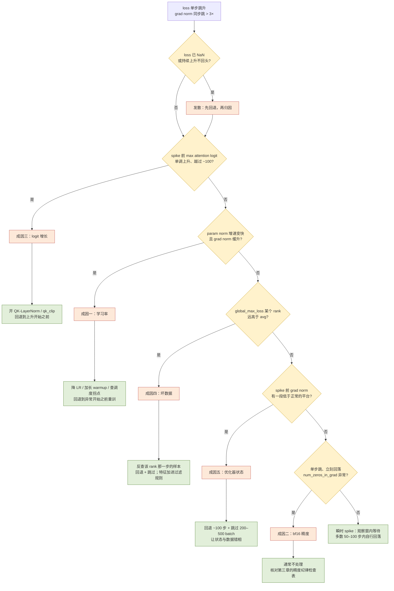
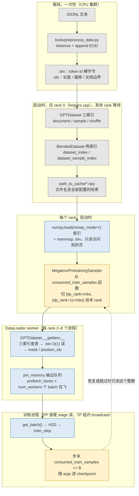

> **更新 @2026-09-06**：本文 torchtitan 部分基于 v0.3.0 刷新；其余源码引用仍以 PyTorch 2.13.0 / Megatron Core 0.18.0 / DeepSpeed 0.19.2 为准。

前两篇处理的敌人是硬件：卡会坏、网会断、算出来的结果会悄悄错。这一篇的敌人不报错、不掉卡、不超时——任务好好地跑着，第 137,000 步 loss 从 2.1 跳到 4.8，梯度范数从 0.3 蹿到 40，然后要么在几百步后慢慢爬回来，要么再也回不来。PaLM 论文（Chowdhery et al. 2022）报告 540B 模型的训练中出现了大约 20 次这样的 spike；OLMo 2 的技术报告用了整整一节讲他们怎么把它压下去。这是长时训练里发生频率仅次于硬件故障、而排查难度远高于硬件故障的一类事件。

难在归因。硬件故障有 XID、有 NCCL 报错、有 rerun 比对；loss spike 只有一条曲线。学习率太高、bf16 精度不够、注意力 logit 长大、某个 batch 里混进了几千个重复 token、Adam 的二阶矩落后于参数的变化——每一种成因画出来的 loss 曲线都差不多。要把它们分开，靠的不是事后的推理，而是**事前就记下来的一组数值信号**：梯度范数、参数范数、学习率、loss scale、梯度里零的个数、注意力 logit 的最大值。这些信号在 spike 发生前的几十步里各有各的形状，事后对照才知道该改配置、还是该跳过那批数据。

而"跳过那批数据"这一句，把本篇的另一半——数据管线——牵了进来。PaLM 的处理是回退到 spike 前约 100 步的 checkpoint、跳过随后的 200–500 个 batch；这个动作成立的前提是：checkpoint 能精确恢复（第五篇）、数据加载器能从**精确的样本位置**继续、并且在任意 rank 上重放出**一样的样本序列**。一个训练任务的数据管线通常被当成"喂数据的"，但它同时是稳定性处理的基础设施：它要能被回放、能被跳过、能被记录进 checkpoint，而且不能成为 MFU 账上那 0.5 个点的"数据等待"。所以这两个题目放在同一篇。

本篇要回答总纲提出的核心问题：

> **第 137,000 步 loss 从 2.1 跳到 4.8。是数据、学习率、还是数值精度？要回答这个问题，需要哪些信号在事前就被记录下来，需要哪些状态能被精确回放？**

依照系列惯例：本篇不讨论学习率、batch size、数据配比的算法依据，只讨论它们的**工程**处理——什么信号该记、什么阈值该报、回退多远、跳过多少、数据怎么存怎么读怎么恢复。源码以 Megatron Core 0.18.0、DeepSpeed 0.19.2、PyTorch 2.13.0 为准，torchtitan 依更新声明以 v0.3.0 为准。


## 一、总览

### 1. 本篇用到的记账符号与前几篇的结论

第一篇建立的符号，本篇只用这几个：$$N$$ 参数量；$$N_d, N_t, N_p, N_c$$ 数据 / 张量 / 流水线 / 上下文并行度，正文常写作 $$d, t, p, c$$；$$s, b, h, a, L$$ 序列长、micro-batch 内序列数、隐藏维、头数、层数；$$B$$ global batch（序列数）；$$\delta$$ 一次 checkpoint 的开销时间，$$M$$ 平均故障间隔。

三条前几篇的结论，本篇要反复用到，在此复述以求自治：

- **为什么有 fp32 主参数与 fp32 优化器状态。** bf16 有 8 位指数、7 位尾数，相对精度约 $$2^{-8} \approx 0.4\%$$。一次 Adam 更新 $$\eta \cdot \hat m / \sqrt{\hat v}$$ 的量级约等于学习率 $$\eta \sim 10^{-4}$$，而参数本身的量级在 $$10^{-2}$$ 到 $$1$$ 之间——更新量与参数之比常常低于 $$2^{-8}$$，直接加到 bf16 参数上会被舍入成零。所以参数的"真身"必须以 fp32 存一份（主参数），Adam 的一阶矩、二阶矩也以 fp32 存，bf16 参数只是每步从主参数拷出来的计算用副本。这是每参数 16 字节的来源，也是本篇第三章"精度纪律"的出发点：**任何把这条链上的某一环降到 bf16 的做法，都是稳定性的潜在风险**。
- **checkpoint 里必须有什么才能精确恢复。** 模型参数（fp32 主参数，不是 bf16 副本）、优化器状态、学习率调度器状态、迭代计数、**数据加载器的位置**、随机数状态（Python / NumPy / torch CPU / CUDA，Megatron 还有 TP 组的 RNG tracker）。缺任何一样，恢复后的 loss 曲线都与不中断的那条不重合。第五篇讲了前四样怎么落盘；本篇第七章讲第五样。
- **回退的思想。** 第六篇的有效训练时间公式里有一项"回退损失"：故障后从上一个 checkpoint 重来，checkpoint 之后算过的步全部作废。本篇把这个机制反过来用：**主动**回退到 spike 之前的 checkpoint，再**主动**改变之后的数据顺序（跳过一段），让训练走上另一条轨迹。它的代价就是第六篇算过的那笔账：回退 $$k$$ 步等于损失 $$k$$ 步的算力，所以 checkpoint 间隔 $$\tau$$ 决定了"回退到 spike 前约 100 步"这句话能不能精确执行。

### 2. 两条线为什么是一条

```text
          稳定性线                                     数据线
   ┌────────────────────┐                     ┌────────────────────────┐
   │ 现象：loss / grad   │                     │ 离线 tokenize → .bin/.idx│
   │       norm 跳升     │                     │ 混合 → shuffle → 打包    │
   │ 成因：LR / bf16 /   │  "那个 batch 里     │ 采样器 → DataLoader     │
   │  logit / 坏数据 /   │◀── 有什么？" ──────▶│ → 消费位置进 checkpoint  │
   │  优化器状态         │                     │                        │
   │ 预防：clip / warmup │  "回退 + 跳过"      │ 精确恢复：位置 / 不重不漏│
   │  / z-loss / QK-norm │──── 需要 ─────────▶│  / 多 rank 一致          │
   │ 处理：回退 + 跳过   │                     │ 流式加载 / 预取 / MFU    │
   └────────────────────┘                     └────────────────────────┘
```

两条线在两处相交。第一处是**归因**：排除了学习率和精度之后，剩下的嫌疑人就是数据，而要把嫌疑落实，必须能拿到"第 137,000 步各 rank 各拿了哪些样本"——这要求数据管线的每一步都是确定性的、可回放的。第二处是**处理**：跳过 batch 是通过改数据加载器的位置实现的，而不是改模型；这要求数据加载器的位置是 checkpoint 的一部分，并且能被人为地往前拨。

### 3. 稳定性的三幕与数据管线的五环

本篇稳定性部分按"现象与成因 → 预防 → 处理"三幕展开，数据部分按五个环节展开：

```text
稳定性  第二章 现象与成因    spike 的三种形态；五种成因各自的机理与在信号上的指纹
        第三章 预防          全局梯度范数裁剪（跨 TP/PP/DP）· warmup · z-loss · QK-LayerNorm · WD 例外 · 精度纪律 · fp16 loss scale
        第四章 处理          PaLM 的回退 + 跳过；它依赖什么；Megatron 里对应的开关；回退多远、跳过多少的账
        第五章 信号          必须记录的清单；每个信号的正常与异常形态；三框架里在哪打印

数据    第六章 存储与索引    离线 vs 在线 tokenize · .bin/.idx · 三个索引与缓存 · 混合与多阶段 · 打包与 cu_seqlens · DeepSpeed 课程
        第七章 加载与恢复    流式读取（HF streaming / 对象存储 / StreamingDataset）· 有状态 DataLoader · 三框架的恢复语义 · 数据等待与 MFU
```

### 4. 三框架在"稳定性与数据"面上的对照

```text
项目                Megatron Core 0.18.0                              DeepSpeed 0.19.2                          torchtitan v0.3.0
──────────────────────────────────────────────────────────────────────────────────────────────────────────────────────────────────────────
全局梯度范数        optimizer/clip_grads.py get_grad_norm_fp32：       zero/stage_1_and_2.py scaled_global_norm →   distributed/utils.py clip_grad_norm_：
                    先在 DP（若 FSDP）再在 grad_stats_parallel_group   get_grad_norm_direct（每参数组）→           get_total_norm 得 DTensor(_NormPartial) →
                    上 all-reduce；分布式优化器时该组 = 整个 world     unscale_and_clip_grads                      full_tensor() 归约 → PP 组再 all-reduce
loss scale          fp16：DynamicGradScaler（hysteresis/backoff）；    fp16：overflow → skipped_steps += 1；         无 fp16 路径；bf16 无 scale
                    bf16 无 scale                                     bf16_optimizer 无 scale
异常检测            RerunStateMachine：check_for_nan_in_loss_and_grad  has_overflow / _has_inf_or_nan → 跳步        trainer.py：global_avg_loss 非有限则 raise
                    / check_for_spiky_loss / check_for_large_grads
跳过 batch          --iterations-to-skip；--result-rejected-tracker-   无内建；用户改 sampler                       无内建；用 dataloader state_dict 手工拨
                    filename 自动生成
数据格式            .bin/.idx（IndexedDataset）；tools/preprocess_data  data_pipeline/data_sampling/indexed_dataset   HF datasets（streaming=True）在线 tokenize
混合                BlendedDataset + build_blending_indices            无（用户侧）                                  hf_datasets/interleaved.py InterleavedDataset
打包                GPTDataset 连续流 + reset_attention_mask；          无                                            positions==0 标文档边界 → FlexAttention 文档
                    SFTDataset cu_seqlens → PackedSeqParams(thd)                                                     mask / varlen cu_seqlens
数据位置进 ckpt     args.consumed_train_samples（+ skipped）           仅 curriculum 下保存 data_sampler.state_dict  ParallelAwareDataloader(StatefulDataLoader)
                    → MegatronPretrainingSampler 从该位置续              （含 consumed_samples、np RNG）              .state_dict() 按 dp_rank 存进 DCP
```

### 5. 本文的章节安排

| 章 | 主题 | 内容 |
|---|---|---|
| 二 | loss spike：现象与成因 | 三种形态 · 五种成因（LR / bf16 / logit / 坏数据 / 优化器状态）各自的机理与信号指纹 |
| 三 | 预防 | 全局范数裁剪的三框架实现 · warmup · z-loss 与 QK-LayerNorm · WD 例外 · 精度纪律 · fp16 loss scale |
| 四 | 处理：回退与跳过 | PaLM 的做法 · 三个前提 · Megatron 的 --iterations-to-skip 与 tracker 文件 · 回退多远与跳过多少的账 |
| 五 | 必须记录的信号 | 清单 · 正常与异常形态 · Megatron `training_log` / torchtitan MetricsProcessor / DeepSpeed 的对应 |
| 六 | 数据管线（上）：存储与索引 | 离线 vs 在线 · `.bin`/`.idx` 格式 · document/sample/shuffle 三索引与缓存 · 混合与多阶段 · 打包与 `cu_seqlens` · DeepSpeed 课程学习 |
| 七 | 数据管线（下）：加载与恢复 | 流式读取 · 可恢复的三条要求 · Megatron / torchtitan / DeepSpeed 的恢复语义 · 数据等待与 MFU |
| 八 | 本文小结 | 要点 · 源码位置 · train-ledger 的 signals/ 与 `data/replay_check.py` · 回答核心问题 |


## 二、loss spike：现象与成因

### 1. 三种形态

同样是"loss 跳升"，在曲线上有三种不同的走法，处置完全不同：

```text
形态          曲线                                        伴随信号                                 通常的成因
────────────────────────────────────────────────────────────────────────────────────────────────────────────────────────
瞬时 spike    单步或几步跳高，几十步内回到原趋势           grad norm 同步跳一下，被 clip 压住          单个坏 batch；bf16 舍入的偶发放大
可恢复 spike  跳高后花几百到几千步慢慢爬回，可能留下台阶   grad norm 先跳后持续偏高；param norm 有折点  LR 偏高；优化器状态被污染后需要时间"忘掉"
发散          跳高后不回头，loss 升到接近 ln(V) 或 NaN     grad norm 爆炸或变 NaN；attention logit 极大  logit 增长；LR 过高；精度链某环断裂
```

第一种最常见也最无害，多数时候不需要处理；第二种是本篇的主角，PaLM 描述的就是它；第三种一旦出现只能回退。三种形态在发生**之前**的信号上就有区别——这是第五章要讲的：发散往往在几百步前就能从 attention logit 最大值或 grad norm 的缓慢上升中看到，而瞬时 spike 事前没有任何征兆。

### 2. 成因一：学习率

学习率是最常见也最容易排除的嫌疑。它的机理是直接的：更新步长 $$\eta \cdot \hat m / \sqrt{\hat v + \epsilon}$$ 太大，参数越过了损失面的"谷"。三个具体的场景：

- **warmup 太短**。训练初期 Adam 的二阶矩 $$\hat v$$ 还没有可靠的估计，$$\hat m / \sqrt{\hat v}$$ 的分母偏小、比值偏大；此时若 $$\eta$$ 已经到峰值，前几百步就会 spike。warmup 的作用就是让 $$\hat v$$ 先"热起来"。
- **峰值 LR 对模型规模偏高**。同一个 LR 在 1B 模型上稳定，在 70B 上可能不稳定——这是训练配方问题，不在本篇范围；但工程上它的指纹很清楚：spike 在整个训练过程中**周期性**出现，且回退 + 跳过后在附近再次出现。
- **batch 渐增或 LR 调度的拐点**。第四篇提到的 `--rampup-batch-size`、以及 WSD（warmup-stable-decay）调度进入 decay 段的那一步，都是 LR 与 batch 关系发生变化的时刻；spike 恰好出现在这些拐点后几十步内，就该先查调度。

LR 成因的信号指纹：**param norm 的增长速率在 spike 前变快**（步长大了），grad norm 在 spike 前几十步已经缓慢上升。

### 3. 成因二：bf16 精度

先把"7 位尾数"换成一个数字。一个量级在 $$[0.5, 1)$$ 的 bf16 参数，相邻两个可表示值的间距（ulp）是 $$2^{-1} \times 2^{-7} = 2^{-8} \approx 0.0039$$；任何绝对值小于半个 ulp、即约 $$0.002$$ 的加数都会被舍入掉。而一次 Adam 更新的量级约等于学习率——$$3 \times 10^{-4}$$——比 $$0.002$$ 小一个量级。也就是说，**如果参数以 bf16 存放，绝大多数步的更新根本写不进去**；只有参数量级降到 $$10^{-2}$$ 以下的那些元素还能被更新到。这不是"精度略有损失"，而是"训练在多数参数上停止"。bf16 的 7 位尾数在四处会咬人：

- **主参数**：上文已说，更新量小于 $$2^{-8}$$ 倍参数就会丢失。这在所有主流框架里都由 fp32 主参数解决，但要确认没有被关掉：Megatron 的 `--bf16` 路径走 `Float16OptimizerWithFloat16Params`（`megatron/core/optimizer/optimizer.py`），主参数在 `main_param`；torchtitan 的 FSDP2 用 `MixedPrecisionPolicy(param_dtype, reduce_dtype)`（`torchtitan/distributed/fsdp.py`；`ParallelismConfig.mixed_precision_param` 默认 bfloat16、`mixed_precision_reduce` 只允许 float32），分片参数本体保持 fp32，bf16 只是 all-gather 出来的计算副本。DeepSpeed 的 `bf16_optimizer.py` 同理。**用 `--use-precision-aware-optimizer` 一类把主参数或优化器状态压到 bf16/fp8 的选项，是显存与稳定性的交换**，开之前要有 loss 曲线对比。
- **梯度累积**：$$m$$ 个 micro-batch 的梯度逐个相加，若在 bf16 里累加，后加的小梯度会被前面的大和吞掉。Megatron 的 `--accumulate-allreduce-grads-in-fp32` 让梯度 buffer 是 fp32（`arguments.py` 在 `--bf16` 下自动把它置 True，除非显式给了 `--grad-reduce-in-bf16`），代价是每参数多 2 字节（第一篇的 16 → 18）。torchtitan 的 FSDP2 `reduce_dtype=fp32` 让 reduce-scatter 在 fp32 里做。
- **注意力 softmax**：logit 差值大时 $$\exp$$ 在 bf16 里分辨率不够，softmax 输出会出现精确的 0 和 1。Megatron `TransformerConfig.attention_softmax_in_fp32` 默认 True（`apply_query_key_layer_scaling` 时强制 True）；FlashAttention 与 TE fused attention 内部本来就以 fp32 累加。
- **loss 与 logits**：最后一层的 $$s \times V$$ logits 若以 bf16 进入交叉熵，log-softmax 的精度不够。Megatron 的 `tensor_parallel/cross_entropy.py` 与 torchtitan 的损失函数都把 logits 提升到 fp32 再算。

bf16 成因的指纹：spike **没有任何前兆**，grad norm 在同一步跳起然后立刻回落，且 `num_zeros_in_grad`（第五章）在该步异常。它更像是"偶发放大"而不是"逐渐失稳"。

### 4. 成因三：注意力 logit 增长

Wortsman et al. 2023（"Small-scale proxies for large-scale Transformer training instabilities"）用小模型复现了大模型的两种不稳定，其中第一种就是**注意力 logit 增长**：$$q \cdot k / \sqrt{d}$$ 的量级随 $$\|W_q\| \|W_k\|$$ 的增长而增长，训练到一定阶段某些头的 logit 达到几百，softmax 饱和成 one-hot，梯度要么穿不过（softmax 的 Jacobian 接近零）要么在 bf16 里失去分辩率。ViT-22B（Dehghani et al. 2023）是最早公开报告靶向这个问题的：在 $$q$$、$$k$$ 上各加一个 LayerNorm 再做点积，把 logit 的量级钉在 $$\sqrt{d}$$ 附近。

这一成因的指纹是**唯一能在事前几百步就看到的**：注意力 logit 最大值单调上升，越过某个阈值（经验上 bf16 下 100 左右开始危险）后 loss 才反应。Megatron 0.18.0 把这个信号做成了可选项：`TransformerConfig.log_max_attention_logit`，开着时 `megatron/core/optimizer/qk_clip.py` 的 `clip_qk(model, log_max_only=True)` 每步遍历各层的 `core_attention.current_max_attn_logits`，在 DP（含 CP）组上取 MAX 后返回全模型的最大 logit，`training.py` 的 `train_step()` 把它作为 `log_max_attention_logit` 返回给日志。同一文件还实现了 MuonClip 风格的 `qk_clip`：`qk_clip_threshold`（默认 100）与 `qk_clip_alpha`（默认 0.5），超过阈值时按 $$\eta = \min(\text{threshold} / \max\text{logit}, 1)$$ 缩放 $$W_q$$、$$W_k$$——这是"处理"而不只是"记录"。

### 5. 成因四：坏数据

"坏"在这里不是质量差，而是**分布上异常到足以在一个 batch 内制造出巨大的梯度**：几千个重复 token（网页里的导航栏、日志文件的时间戳）、超长的单字符序列、编码错误产生的高频罕见 token、被 tokenizer 切成上万个碎片的二进制块。这类样本的 loss 极低（重复 token 太好预测）或极高（完全随机），二者都让梯度偏离正常方向；如果一个 global batch 里同一来源的这类样本凑在一起，梯度范数就会跳。

OLMo 2 的技术报告（Team OLMo 2024）把"重复 n-gram"列为 spike 的一个确认成因，处理是在数据侧过滤掉重复率过高的文档。工程上，坏数据的指纹是：**可复现**——回退到 spike 前的 checkpoint、用同样的数据顺序重跑，spike 在同一步再次出现；跳过那几个 batch 后消失。这是第四章"回退 + 跳过"能奏效的前提，也是第七章"数据顺序可回放"的价值所在。

### 6. 成因五：优化器状态的时间性

PaLM 论文有一个精妙的观察：把 spike 时的那批数据拿到**另一个** checkpoint 上训，不会 spike。也就是说，spike 不是数据单独造成的，而是**数据与当时的优化器状态的组合**。Adam 的二阶矩 $$\hat v$$ 是梯度平方的指数移动平均，$$\beta_2 = 0.95$$ 时时间常数约 20 步、$$0.999$$ 时约 1000 步；当参数的某个方向上梯度量级突然变大（例如遇到一批分布不同的数据），$$\hat v$$ 要几十到几百步才跟上，这期间 $$\hat m / \sqrt{\hat v}$$ 被放大。$$\epsilon$$ 太小（$$10^{-8}$$）时分母对小 $$\hat v$$ 没有保护。这就是为什么"跳过 200–500 个 batch"有效——不是这些 batch 本身都有问题，而是跳过它们让优化器状态与数据的相位错开了。

这一成因的指纹是：spike 前 grad norm 有一段**低于正常**的平台（$$\hat v$$ 被压小），随后一批正常量级的梯度就被放大成 spike；参数范数在 spike 处出现折点。

### 7. 归因的方法

五种成因，五种指纹，都要靠事前记录的信号来读。把它们放在一张表里：

```text
成因            事前征兆                                    spike 步的信号                             回退+跳过后
────────────────────────────────────────────────────────────────────────────────────────────────────────────────────────────
LR              param norm 增速变快；grad norm 缓升           grad norm 跳、被 clip；loss 慢慢回           附近再现（周期性）
bf16 精度       无                                          grad norm 单步跳、立刻回；num_zeros 异常     不再现，但别处偶发
logit 增长      max attention logit 单调升，越过 ~100        grad norm 爆；部分层 NaN                    很快再现，除非加 QK-norm
坏数据          无                                          grad norm 跳；loss 可能先降后升              同一步再现；跳过后消失
优化器状态      grad norm 有一段低平台                        正常量级梯度被放大                          换数据顺序后消失
```

表是"指纹 → 成因"的对照，真正值班时是按信号一层层排除的。把上表压成一棵决策树，问题的顺序是"哪种成因的信号最独特、最早能看到"：



归因不是为了写报告，而是决定下一步：LR 与 logit 成因要改配置（并可能回退到更早的 checkpoint 重训一段）；坏数据与优化器状态成因用回退 + 跳过；bf16 成因通常不处理，但要检查精度链有没有被误配。


## 三、预防

预防的目标是把每一步更新的方差压在一个阈值之下，让上面五种成因中的任何一种都不足以把参数推出稳定区。六种手段按"必开"到"按需"排列。先用一张表把"每种手段对准第二章的哪个成因、付什么代价、三框架里的开关在哪"对齐，各节再展开实现细节：

| 手段 | 对准的成因 | 代价 | Megatron Core 0.18.0 | torchtitan v0.3.0 |
|---|---|---|---|---|
| 全局梯度范数裁剪 | 五种成因的最后一道闸：把单步更新的量级压在阈值下 | 一次全局 all-reduce + 一次 multi-tensor scale；归约组算错会**安静地**过度裁剪 | `--clip-grad`（默认 1.0） | `TrainingConfig.max_norm`（默认 1.0） |
| warmup | 成因一（$$\hat v$$ 未建立时步长偏大） | 前几百步 LR 偏低；scheduler 状态必须进 checkpoint | `OptimizerParamScheduler(lr_warmup_steps)` | `LRSchedulersContainer(warmup_steps=200)` |
| QK-LayerNorm / qk_clip | 成因三（注意力 logit 增长） | 每层两个小 norm kernel，MFU 几乎不变 | `qk_layernorm` / `qk_l2_norm`；`qk_clip_threshold` 兜底 | 无开关，在模型定义里加 |
| z-loss | 输出 logit 整体漂移（发散前兆） | 多一项 $$10^{-4}\log^2 Z$$，可忽略 | 仅 MoE 路由 `moe_z_loss_coeff`；输出层要自加 | 无，要自加 |
| weight decay 例外 | norm gain / bias / embedding 范数被压小后放大相对更新 | 无算力代价，需要参数分组 | 1-D 与 `.bias` 默认 `wd_mult=0`；embedding 需 override | 所有参数同一 `weight_decay` |
| 精度纪律 | 成因二（bf16 舍入吞掉更新 / 累积 / softmax / logits） | 每参数多 2–12 字节显存与 reduce 带宽 | `--accumulate-allreduce-grads-in-fp32`、`attention_softmax_in_fp32` | FSDP2 `reduce_dtype=fp32`，分片参数本体 fp32 |
| fp16 loss scale | fp16 梯度下溢（bf16 不需要） | 溢出步整步跳过；scale 本身要进 checkpoint | `DynamicGradScaler` | 无 fp16 路径 |

### 1. 全局梯度范数裁剪

裁剪本身只有一行数学：$$g \leftarrow g \cdot \min\left(1, \frac{c}{\|g\|_2 + 10^{-6}}\right)$$，$$c$$ 通常取 1.0（Megatron `--clip-grad` 默认 1.0，torchtitan `TrainingConfig.max_norm` 默认 1.0）。难点在 $$\|g\|_2$$——它必须是**全模型**的范数，而全模型的梯度被 TP、PP、DP（ZeRO/FSDP 时）切在几百张卡上。数学上这不难：范数的平方是可加的，

$$
\|g\|_2^2 = \sum_{\text{shard } i} \|g_i\|_2^2, \qquad \|g\|_\infty = \max_i \|g_i\|_\infty
$$

每张卡算自己那一片的平方和，在**恰好覆盖所有分片各一次**的进程组上 all-reduce SUM，再开方。麻烦全在"恰好一次"这四个字上：哪些参数在多张卡上有副本（TP 组内复制的 LayerNorm、PP 首尾共享的 embedding、非分布式优化器下 DP 组内完整的梯度副本），哪些参数只在一张卡上有（TP 切开的矩阵、分布式优化器的分片），决定了归约组该是谁、哪些副本该被跳过。算错的后果是安静的：范数被高估，clip 系数偏小，训练变慢但不报错。三个框架的做法：

**Megatron** 的实现在 `megatron/core/optimizer/clip_grads.py`：`get_grad_norm_fp32(grads_for_norm, norm_type, grad_stats_parallel_group)` 先用 `multi_tensor_l2norm`（TE 或 Apex 的 multi-tensor kernel，一次 kernel 算一列 tensor 的范数）得到本地范数的平方和，然后在 `grad_stats_parallel_group` 上 all-reduce SUM、开方；`clip_grad_by_total_norm_fp32(parameters, max_norm, total_norm)` 用 `multi_tensor_scale` 原地缩放；`count_zeros_fp32()` 用同一个组归约梯度中零的个数。三处细节决定了它的正确性：

- **哪些梯度参与范数。** `optimizer.py` 的 `MegatronOptimizer.get_main_grads_for_grad_norm()` 过滤掉两类会被重复计数的参数：`param_is_not_shared()`（被首尾 PP stage 共享的 embedding 只算一次）和 `param_is_not_tensor_parallel_duplicate()`（LayerNorm 权重这类在 TP 组内复制的参数只在 TP rank 0 计入）。漏掉这个过滤，$$\|g\|$$ 会被高估 $$t$$ 倍的一部分，clip 变得过于激进——这是自己写多维并行时最常见的 bug。
- **在哪个组上归约。** `get_grad_stats_parallel_group()`：非分布式优化器时，DP 组的梯度 all-reduce 已经完成、每个 DP rank 手里是完整的 DP 平均梯度，所以只需在**模型并行组**（TP × PP）上归约；分布式优化器（`distrib_optimizer.py` 覆盖此方法）时每个 rank 只持有自己那一分片的主梯度，必须在**整个 world** 上归约。Megatron-FSDP 的 DTensor 梯度还要先在 DP 组上归约（`get_data_parallel_group_if_dtensor()`）。
- **调用时序。** `MixedPrecisionOptimizer.step()` 的顺序是 `prepare_grads()`（拷到 fp32 主梯度、fp16 时 unscale 并查 inf）→ `clip_grad_norm()` → `count_zeros()`（若 `log_num_zeros_in_grad`）→ `step_with_ready_grads()`；返回 `(success, grad_norm, num_zeros_in_grad)`，`train_step()` 再用 `reduce_max_stat_across_model_parallel_group()` 把没有可训练参数的 rank 上的 None 补齐。所以 Megatron 日志里的 `grad norm` 是 **clip 之前**的全局范数——这正是我们要记的那个信号。

**torchtitan** 的 `torchtitan/distributed/utils.py` `clip_grad_norm_(parameters, max_norm, norm_type, error_if_nonfinite, foreach, pp_mesh, ep_enabled)` 走 PyTorch 原生路径：`torch.nn.utils.get_total_norm(grads)`（`torch/nn/utils/clip_grad.py`，2.13 把 `_get_total_norm` 与 `_clip_grads_with_norm_` 以公开名导出）对一列 DTensor 梯度返回一个 placement 为 `_NormPartial` 的 DTensor（`torch/distributed/tensor/_ops/_math_ops.py`），`.full_tensor()` 触发按 $$p$$ 范数语义的归约——FSDP 与 TP 两个维度一次搞定；PP 不在 DTensor 的 mesh 里，所以再显式地在 `pp_mesh` 上 all-reduce $$p$$ 次幂之和。最后 `torch.nn.utils.clip_grads_with_norm_()` 缩放。EP 开启时走 `_clip_grad_norm_with_ep()`，因为专家参数与稠密参数在不同的 mesh 上。`trainer.py` 的 `train_step()` 把返回值 `grad_norm.item()` 交给 `MetricsProcessor.log()`。

**DeepSpeed** 在 ZeRO-1/2（`deepspeed/runtime/zero/stage_1_and_2.py`）里是 `scaled_global_norm()` → 对每个参数组调 `get_grad_norm_direct(gradients, params)`（在 DP 组上 all-reduce 平方和，提供了 `mpu` 时再在模型并行组上归约）→ `torch.linalg.vector_norm` 合并各组 → `unscale_and_clip_grads()`；结果存进 `_global_grad_norm`，通过 `engine.get_global_grad_norm()` 读。Stage 3 同名方法在 `stage3.py`。注意 fp16 下 DeepSpeed 的范数是 loss scale 之后的，读数时要除以 scale（源码里 `_global_grad_norm = scaled_global_grad_norm / prev_scale` 已做）。

### 2. warmup 与学习率调度

warmup 的作用上文已述（让 $$\hat v$$ 先建立起来），工程上的注意点是**它必须进 checkpoint**。Megatron 的 `megatron/core/optimizer_param_scheduler.py` `OptimizerParamScheduler(lr_warmup_steps, lr_decay_steps, lr_decay_style, wd_incr_style, ...)` 的 `state_dict()` 存进 checkpoint 的 `opt_param_scheduler` 键；`lr_decay_style` 支持 `WSD`。torchtitan 的 `torchtitan/components/optimizer/lr_scheduler.py` `LRSchedulersContainer`（`warmup_steps` 默认 200，`decay_type` 为 linear / sqrt / cosine，`decay_ratio` 控制 WSD 的 decay 段比例，`min_lr_factor` 下限）继承 `Stateful`，被 checkpointer 以 `LR_SCHEDULER` 键保存。恢复后 LR 不对，是"loss 曲线不衔接"最常见的原因之一。

### 3. z-loss 与 QK-LayerNorm

两者都是 Wortsman et al. 2023 确认有效的结构性手段，针对不同的不稳定。

**QK-LayerNorm** 针对注意力 logit 增长：Megatron `TransformerConfig.qk_layernorm`（CLI `--qk-layernorm` 由 `ArgumentGroupFactory` 从字段生成）在 $$q$$、$$k$$ 投影后各加一个 `normalization` 类型的 norm；`qk_l2_norm` 是 Llama 4 风格的 L2 归一化变体。它的代价是每层多两个小 kernel，几乎不影响 MFU；收益是把成因三从"会发生"变成"不会发生"。新开的大模型训练几乎都开着它。

**z-loss** 针对输出 logit 发散：在交叉熵之外加 $$10^{-4} \cdot \log^2 Z$$（$$Z$$ 是 softmax 的归一化项），把 $$\log Z$$ 拉向 0，防止输出 logits 整体漂移。PaLM 首先使用。Megatron 0.18.0 **没有**输出层的 z-loss 选项，只有 MoE 路由器上的 `moe_z_loss_coeff`（`transformer_config.py`，推荐起始值 $$10^{-3}$$），用户需要自己在 loss 函数里加；torchtitan 的 `components/loss.py` 也没有。这是一个"框架未覆盖、配方常需要"的空白。

### 4. weight decay 的例外

weight decay 对 1-D 参数（LayerNorm 的 gain、bias）与 embedding 的作用与对矩阵不同。Megatron 的默认策略在 `megatron/core/optimizer/__init__.py` 的 `get_standard_config_overrides()`：**所有一维参数与名字以 `.bias` 结尾的参数 `wd_mult = 0`**；`apply_wd_to_qk_layernorm` 开着时 QK-LayerNorm 的参数例外（Qwen3-Next 的做法）。**embedding 默认是有 weight decay 的**——它是二维参数。OLMo 2 报告的做法是 embedding 不做 weight decay（防止 embedding 范数被压得过小、进而放大第一层的相对更新），这需要用户通过 `ParamKey(attr="is_embedding_or_output_parameter")` 一类的 override 自己加；同一文件里 `decoupled_lr` 就是用这个属性给 embedding 与输出层设不同 LR 的。torchtitan 的优化器配置（`components/optimizer/optimizer.py`）对所有参数用同一个 `weight_decay`，没有分组。

### 5. 精度纪律

把第二章第 3 节的四处 bf16 风险反过来写，就是一份检查表：

```text
□ 主参数 fp32（不用 precision-aware optimizer 把它压低，除非有对比实验）
□ Adam 一阶矩、二阶矩 fp32
□ 梯度累积与 DP reduce 在 fp32（Megatron --accumulate-allreduce-grads-in-fp32；FSDP2 reduce_dtype=fp32）
□ 注意力 softmax fp32（attention_softmax_in_fp32；或 fused attention 内部 fp32 累加）
□ logits → 交叉熵 fp32
□ RMSNorm / LayerNorm 的方差计算 fp32（融合 kernel 通常已保证）
□ FP8 只在 GEMM 输入上，首尾层保持 bf16（第四篇）
```

每一项都对应显存或带宽的代价，这就是为什么它们都是"可关的"；也是为什么第四篇说 FP8 这类数值配置变更的前后基准必须含 loss 曲线。

### 6. fp16 的 loss scale

bf16 训练没有这一项；fp16 训练必须有。fp16 的指数只有 5 位，梯度容易下溢成零，所以把 loss 乘一个大数（scale）再反向，更新前再除回来。scale 太大会上溢成 inf，太小则下溢——动态调整：Megatron `megatron/core/optimizer/grad_scaler.py` 的 `DynamicGradScaler(initial_scale, min_scale, growth_factor, backoff_factor, growth_interval, hysteresis)`，连续 `hysteresis` 次发现 inf/NaN 就把 scale 乘 `backoff_factor`，连续 `growth_interval` 步正常就乘 `growth_factor`；`--initial-loss-scale` 默认 $$2^{32}$$。发现 inf 的那一步**整步跳过**（`MixedPrecisionOptimizer.step()` 在 `prepare_grads()` 返回 `found_inf_flag` 时直接 `return False, None, None`，`train_step()` 记 `skipped_iter = 1`）。DeepSpeed 同理：`stage_1_and_2.py` 的 `has_overflow()` → `engine.py` 里 `self.skipped_steps += 1`，`skipped_steps` 进 checkpoint。**loss scale 与 skipped iterations 因此都是信号**：scale 持续下降说明梯度里的 inf 越来越多，是发散的前兆；skipped iterations 突然增加同理。


## 四、处理：回退与跳过

### 1. PaLM 的做法

PaLM 论文 Training Instability 一节的原话大意是：遇到 spike 时，从 spike 前约 100 步的 checkpoint 重新开始，并跳过 200–500 个数据 batch，覆盖 spike 前后的那段数据；这样做之后 spike 不再在同一位置出现。他们同时验证了把同一批数据放到另一个 checkpoint 上不会 spike，从而把成因归结为数据与优化器状态的组合。

这个动作看起来简单，拆开是三个操作：

```text
1. 回退   加载第 (T − k) 步的 checkpoint，k ≈ 100                         → 依赖第五篇：checkpoint 密度与精确恢复
2. 跳过   让数据加载器从第 (T − k + n) 步的位置开始，n ≈ 200–500          → 依赖本篇第七章：数据位置可精确设置
3. 继续   其余一切（LR 调度、RNG、优化器状态）从 T − k 的状态自然演进       → 依赖 checkpoint 完整
```

第 2 步是关键。它要求数据加载器的"位置"是一个**可以被人为设置的整数**（消费过的样本数），而且给定这个整数，每个 DP rank 拿到的样本是确定的。Megatron 的设计恰好满足：位置就是 `args.consumed_train_samples`，采样器按它从头数。HF streaming 这类"迭代器状态"式的加载器就做不到——它能恢复到保存时的位置，但不能跳到任意位置，"跳过 n 个 batch"只能靠真的迭代 n 个 batch 并丢弃（torchtitan 的路径，见第七章）。

### 2. 三个前提

- **checkpoint 够密。** "回退约 100 步"意味着 checkpoint 间隔 $$\tau \le 100$$ 步左右——对一个 5 s/step 的任务是 8 分钟一次。第五篇的 Young 公式 $$\tau_{opt} \approx \sqrt{2\delta M}$$ 给的是容错最优的间隔，通常比这个长（$$\delta = 30$$ s、$$M = 3$$ h 时约 7 分钟，正好在量级上；$$M$$ 更大时 $$\tau_{opt}$$ 更长）。若 $$\tau$$ 是 1000 步，"回退 100 步"就变成"回退到 1000 步前"，多损失 900 步的算力。异步保存与本地 NVMe 一级存储（第五篇）让密 checkpoint 的代价可承受。
- **数据顺序可确定、可回放。** 第七章的全部内容。
- **能确定 spike 的起点。** 从曲线上看到 spike 的那一步 $$T$$ 未必是问题开始的那一步——成因五的"低平台"可能在 $$T$$ 前几百步就开始了。回退 100 步是经验值，若第五章的信号显示异常更早开始，就回退得更早。

### 3. Megatron 的实现

Megatron 0.18.0 把"跳过"做成了配置项：`TrainingConfig.iterations_to_skip`（`megatron/training/config/training_config.py`，CLI `--iterations-to-skip`，1-indexed 的迭代号列表）。`training.py` 的 `train()` 主循环在每步开头检查 `(iteration + 1) in args.iterations_to_skip`，命中则调 `dummy_train_step(train_data_iterator)`——它只从 data iterator 取一个 global batch 的数据并丢弃，不做前向反向——然后 `consumed_train_samples` 与 `skipped_train_samples` 各加一个 global batch，`iteration` 加一，`continue`。两个计数器同步增加的意义在于：**采样器的位置（consumed）与训练的进度（iteration）保持了原有的对应关系**，恢复时 `consumed_train_samples` 仍然等于 `iteration × global_batch_size`，`build_train_valid_test_data_loaders()` 里的"向后兼容"断言不会被破坏；`skipped_train_samples` 单独记账，让日志与 TensorBoard（`skipped-train-samples`）能看到跳过了多少。

跳过的列表还可以**自动**生成：`--result-rejected-tracker-filename` 指定一个文件，`RerunStateMachine`（`megatron/core/rerun_state_machine.py`）在 `validate_result()` 拒绝某个结果时往里追加一行（含 jobID、rank、iteration、status）；下次启动时 `arguments.py` 调 `RerunStateMachine.get_skipped_iterations_from_tracker_file()`，把"同一 iteration 被记录不止一次"的迭代号追加到 `iterations_to_skip`。配合 `check_for_spiky_loss`（`RerunStateMachineConfig`，默认关）——`pretrain_gpt.py` 的 `loss_func()` 用 `is_unexpectedly_large(threshold=SPIKY_LOSS_FACTOR=10, context="loss")` 做拒绝函数：前 100 步采样 loss 的最大值，之后任一步的 loss 超过该最大值 10 倍即拒绝，`fatal=False`——以及 `--check-for-large-grads`（`param_and_grad_buffer.py` 的 `check_grads()` 在 DP 通信之前对每个 bucket 的梯度范数做同样的 10 倍检查），Megatron 就有了一条"检测 spike → 重跑确认（第六篇的 rerun 机制，区分瞬态硬件错误与可复现结果）→ 记录 → 下次启动自动跳过"的自动化路径。它不会自动回退，回退仍是人的决定：查信号、选 checkpoint、改 `--load`、加 `--iterations-to-skip`、重启。

torchtitan 与 DeepSpeed 没有等价的内建开关。torchtitan 的 `trainer.py` 在 `global_avg_loss` 非有限时直接 `raise RuntimeError`（只拦 NaN/inf，不拦 spike）；跳过要靠加载 checkpoint 后手工迭代 dataloader 丢弃 $$n$$ 个 batch（第七章第 4 节）。DeepSpeed 的 `skipped_steps` 只覆盖 fp16 overflow 的自动跳步。

### 4. 回退多远、跳过多少：一笔账

设 checkpoint 间隔 $$\tau$$ 步、spike 发生在第 $$T$$ 步、被人发现时已经到了 $$T + w$$ 步（$$w$$ 是告警到处置的延迟，值班响应通常 $$w$$ 在几十到几百步）。回退到 spike 前最近的 checkpoint $$T_c = \tau \lfloor (T - k) / \tau \rfloor$$，损失的算力是 $$T + w - T_c$$ 步；跳过 $$n$$ 个 batch 损失的是 $$n \times B$$ 个样本（不是算力，是数据——这些样本以后不会再见到，对多 epoch 训练可以补回来）。以 $$\tau = 100$$、$$k = 100$$、$$w = 50$$ 为例，一次处置的算力代价约 250–300 步，对一个 100 万步的任务是 0.03%；一个训练中 20 次 spike 合计不到 1%。**这笔账说明回退 + 跳过是便宜的**——贵的是发现它所需的信号与响应，以及让它成为可能的 checkpoint 密度与数据可回放性。

跳过多少：PaLM 的 200–500 覆盖了 $$\beta_2 = 0.95$$ 时 $$\hat v$$ 的 10–25 个时间常数，让优化器状态与那段数据充分"错相"。$$\beta_2$$ 更接近 1 时要跳得更多。

### 5. 处置流程

把前四节压成值班时照着做的一张卡片（第八篇的值班手册会引用它）：

```text
1  确认形态      loss 单步跳 > 10% 且 grad norm 跳 > 3×？→ 是 spike。若 loss 已 NaN / 持续上升 → 发散，直接进入第 4 步
2  等一等        瞬时 spike 多数在 50–100 步内自行回落。设一个观察窗（例如 100 步），期间不动
3  读信号        对照第二章第 7 节的表：param norm 斜率 / max logit 趋势 / grad norm 低平台 / global_max_loss 指向的 rank
                 → LR 或 logit 成因：改配置（降 LR / 开 QK-norm），回退到异常开始之前的 checkpoint
                 → 坏数据或优化器状态成因：进入第 4 步
4  回退 + 跳过   选 spike 前 ~100 步的 checkpoint；Megatron 加 --iterations-to-skip 覆盖 spike 附近 200–500 步；
                 torchtitan 加载后手工丢弃 n 个 batch；其余参数不变
5  验证          恢复后前 100 步的 loss 与原曲线在回退点衔接；spike 位置不再出现；replay_check 确认数据顺序只在跳过处有差异
6  留档          spike 步、成因判断、回退点、跳过范围、样本 id 反查结果 → 复盘表；若是坏数据，把特征加进过滤规则
```


## 五、必须记录的信号

### 1. 清单

下面是每一步都应该记录（不是每 `log_interval` 步）、且要落到可查询存储里的信号。"正常形态"是稠密 Transformer 预训练在 warmup 之后的典型样子：

```text
信号                       来源                                            正常形态                                异常形态与含义
──────────────────────────────────────────────────────────────────────────────────────────────────────────────────────────────────────────────────
loss（global avg）         全 DP 组按 token 加权平均                        平滑下降，步间抖动 < 1–2%                单步跳 > 10%：spike；持续上升：发散；台阶：数据阶段切换或 LR 拐点
loss（global max）         各 DP rank 本地平均的最大值（torchtitan 有）      与 avg 差 < 5%                          某 rank 远高于 avg：该 rank 的 batch 有坏样本——直接定位到 rank
grad norm（clip 前）       全局 L2，见第三章第 1 节                          warmup 后缓慢下降至 0.1–1，抖动 < 30%    跳 > 3×：spike 起点；缓升：LR 偏高或 logit 增长；低平台后跳：优化器状态
param norm                 全部参数的 L2（Megatron --log-params-norm）      单调缓升，增速递减                       增速突增：步长过大；折点：spike 已改变轨迹
learning rate              调度器当前值                                     按调度曲线                               恢复后与调度不符：scheduler 状态没进 checkpoint
loss scale（fp16）         DynamicGradScaler 当前值                         阶梯状，偶尔 backoff 后回涨               持续下降：inf 越来越多，发散前兆
skipped iterations         fp16 overflow / iterations_to_skip 的计数        长期为 0                                 连续出现：数值链某环断裂
num_zeros_in_grad          梯度中精确为零的元素数（Megatron）                稳定，随模型固定                          突增：梯度下溢（精度）或某部分参数收不到梯度（数据/mask）
max attention logit        全模型各层 logit 最大值（Megatron log_max_attention_logit）  缓升后平台，< 50–100          单调升过 100：成因三，加 QK-norm 或 qk_clip
n_tokens_seen / consumed samples   数据位置                                 线性增长                                 恢复后不连续：数据位置没进 checkpoint，样本重复或遗漏
step time / data_loading(%)        第四篇的 MFU 账                          稳定；data_loading < 1%                  data_loading 上升：管线跟不上（第七章第 6 节）
```

三个补充：第一，**loss 与 grad norm 要记 clip 前的原始值**——clip 后的 grad norm 恒等于阈值，没有信息量。第二，grad norm 若能按 PP stage 或按层分组记录（Megatron 的 `check_grads()` 是按 bucket 算的，可以顺手记下来），能直接看出是哪一段网络出了问题。第三，这些信号要**逐步记录、长期保存**：spike 的归因要看它前几百步的形态，`log_interval = 100` 的日志分辨率不够；TensorBoard 事件文件够用，但第八篇会讨论为什么要同时进 Prometheus。

### 2. 三框架里在哪

**Megatron** 的 `megatron/training/training.py` `training_log(loss_dict, total_loss_dict, learning_rate, decoupled_learning_rate, iteration, loss_scale, report_memory_flag, skipped_iter, grad_norm, params_norm, num_zeros_in_grad, ...)` 是所有信号的汇合点。TensorBoard 键名：`lm loss`（及 `* vs samples` 变体）、`grad-norm`、`params-norm`、`num-zeros`、`loss-scale`、`learning-rate`、`batch-size`、`skipped-train-samples`；控制台一行日志里有 `consumed samples`、`grad norm`、`num zeros`、`params norm`、`number of skipped iterations`、`number of nan iterations`。开关：`--log-params-norm`（`calc_params_l2_norm()` 在 `megatron/training/utils/common_utils.py`）、`--log-num-zeros-in-grad`、`--log-max-attention-logit`、`--log-loss-scale-to-tensorboard`（默认开）。grad norm 与 num zeros 默认就算（clip 需要前者），params norm 要单独开，因为多一次全参数的范数计算。

**torchtitan** 的 `torchtitan/components/metrics.py` `MetricsProcessor.log(step, global_avg_loss, global_max_loss, grad_norm, extra_metrics)` 输出 `loss_metrics/global_avg_loss`、`loss_metrics/global_max_loss`、`grad_norm`、`throughput(tps)`、`tflops`、`mfu(%)`、`time_metrics/end_to_end(s)`、`time_metrics/data_loading(s)`、`time_metrics/data_loading(%)`、`memory/*`，`extra_metrics` 里有 `n_tokens_seen` 与各参数组的 LR。**没有** param norm、num zeros、attention logit——这三个要靠自己加（第八章的 `signals/` 给了一个 hook 的写法）。`global_max_loss` 是 torchtitan 独有的好东西：它是各 DP rank 本地平均 loss 的最大值，在 `trainer.py` 里用 `dist_utils.dist_max()` 算出，一眼就能看出 spike 是全局的还是某个 rank 的。

**DeepSpeed** 的 `engine.py` 在 `steps_per_print` 时打 `step=..., skipped=..., lr=..., mom=...`；`get_global_grad_norm()` 返回最近一步的全局范数，`monitor` 子系统（`deepspeed/monitor/`）可写 TensorBoard / W&B / CSV。信号的种类是三者中最少的，用 DeepSpeed 的任务通常在自己的训练循环里补。

### 3. 记录的纪律

- **每步都记，不采样**。信号的存储成本是每步几十个浮点数，对任何任务都可以忽略。
- **记原始值**。clip 前的 grad norm、unscale 后的真实梯度量级、按 token 加权的 loss。
- **随 checkpoint 一起留档**。spike 归因要对照"spike 前 100 步的信号"与"那 100 步用了哪些样本"，后者要靠 consumed samples 与数据索引反查，所以信号文件里每一行都要有 step 与 consumed samples 两列。
- **按 rank 可查**。至少 `global_max_loss` 这类聚合要保留是哪个 rank 贡献的极值；第八篇会讲 per-rank 可见性的全套。


## 六、数据管线（上）：存储与索引

数据管线的目标有三条：喂得快（不成为 MFU 账上的一项）、可控（混合比例、shuffle、打包都按配方精确执行）、可回放（第七章）。本章讲前两条在 Megatron 里的实现——它是三个框架中最完整的一套——并对照 DeepSpeed 与 torchtitan。

先看 Megatron 整条管线的各个环节**分别在哪里跑**——离线一次、启动时只有 rank 0、每个 rank、DataLoader worker 进程、还是训练进程——以及第七章要用的那个整数 `consumed_train_samples` 插在哪一环：



灰色环节在训练开始前或启动时只做一次，其产物（`.bin/.idx`、索引缓存）是所有 rank 共享的只读文件；蓝色环节每步都在跑；黄色的两处是同一个整数的生产者与消费者——数据位置进 checkpoint、恢复、跳过 batch，改的都只是它。

### 1. 离线 tokenize 还是在线

```text
                离线（预处理成 token id 的二进制文件）              在线（训练时从文本 tokenize）
────────────────────────────────────────────────────────────────────────────────────────────────────────
CPU              一次性成本；训练时 DataLoader 几乎不占 CPU           每步都要 tokenize，几千 token/s/核，大词表 BPE 更慢；worker 数与 NCCL proxy 线程争 CPU
存储             token id 通常 2–4 字节/token，比文本小              原始文本，大 2–4 倍
可复现           token 序列固定；tokenizer 版本变化必须重新预处理     tokenizer 库版本 / 正则实现的差异会改变 token 序列
灵活性           改 tokenizer、改 EOD 策略要重跑预处理                随时换
随机访问         .idx 给出每个文档的字节偏移，O(1) 取任意文档          迭代器式，只能顺序读
适用             预训练（数据固定、跑几周、要精确回放）               实验、SFT、数据频繁变化
```

千卡预训练几乎都是离线。Megatron 的 `tools/preprocess_data.py`：输入 JSONL，`--json-keys` 指定字段，`--tokenizer-type` 与 `--workers` 并行 tokenize，`--append-eod` 在每个文档末尾加 EOD token，`--partitions` 把大文件切成多份并行处理后由 `IndexedDatasetBuilder.add_index()` 合并；`tools/merge_datasets.py` 合并多个已有的 .bin/.idx。torchtitan 是在线的：`torchtitan/hf_datasets/text_datasets.py` 的 `HuggingFaceTextDataset.__iter__()` 对每个样本调 `tokenizer.encode()`。它的 `c4` 配置用 `load_dataset(..., streaming=True)` 直接从 Hub 流式读——这是研究与验证配置的选择，不是千卡预训练的。

### 2. `.bin` / `.idx`：IndexedDataset

`megatron/core/datasets/indexed_dataset.py` 定义了格式。`.bin` 是所有文档的 token id 首尾相接的裸字节；`.idx` 由 `_IndexWriter.write(sequence_lengths, sequence_modes, document_indices)` 写出：

```text
.idx 布局（小端）
  9 字节 magic  "MMIDIDX\x00\x00"        _INDEX_HEADER
  u64           版本 = 1
  u8            dtype 代码                DType.code_from_dtype：1 u8 · 2 i8 · 3 i16 · 4 i32 · 5 i64 · 6 f32 · 7 f64 · 8 u16
  u64           sequence_count            序列（文档）数
  u64           document_count            文档边界数
  i32[seq]      sequence_lengths          每个序列的 token 数
  i64[seq]      sequence_pointers         每个序列在 .bin 里的字节偏移（_sequence_pointers 由长度累加得出）
  i64[doc]      document_indices          文档边界（多模态时一个文档含多个序列；文本时 = 0..seq）
  i8[seq]       sequence_modes            可选，多模态才有
```

`DType.optimal_dtype(vocab_size)`：词表 ≤ 65500 用 `uint16`（2 字节/token），否则 `int32`（4 字节）——Llama 3 的 128256 词表落在 int32，这是 `preprocess_data.py` 里 `IndexedDatasetBuilder(bin_path, dtype=DType.optimal_dtype(tokenizer.vocab_size))` 自动决定的。`GPTDatasetConfig.__post_init__` 用同一规则算出 `token_dtype_code`（4 或 8），供 `--per-dataset-sequences-path` 的快速路径使用。

读的一侧：`IndexedDataset(path_prefix, multimodal, mmap, object_storage_config, ...)` 的 `initialize()` 建一个 `_IndexReader` 读 `.idx` 全部进内存（几十 GB 的 .bin 对应的 .idx 通常几百 MB），再按配置选 `_BinReader`：`_MMapBinReader`（默认，`numpy.memmap` 整个 .bin，靠页缓存）、`_FileBinReader`（`--no-mmap-bin-files`，每次 `pread`，内存占用可控）、`_S3BinReader` / `_MultiStorageClientBinReader`（对象存储，见第七章）。`get(idx, offset, length)` 用 `sequence_pointers[idx] + offset × itemsize` 定位、读 `length` 个元素——**任何文档的任何片段都是 O(1) 随机访问**，这是打包与回放的基础。

### 3. GPTDataset 的三个索引与缓存

`megatron/core/datasets/gpt_dataset.py` 的 `GPTDataset` 把"文档的集合"变成"定长样本的序列"。它不复制任何 token，只造三个 numpy 数组（`_build_document_sample_shuffle_indices()`）：

```text
document_index   1-D int32   文档 id 的序列。每个 epoch 一份 [0..D) 的随机排列，拼接 num_epochs 份（_build_document_index）
sample_index     2-D int32   (num_samples + 1) × 2：第 i 个样本从 document_index[sample_index[i,0]] 的第 sample_index[i,1] 个 token 开始，
                             到 sample_index[i+1] 结束——样本是文档流上连续的 s+1 个 token，可以跨文档（helpers.cpp build_sample_idx）
shuffle_index    1-D         [0..num_samples) 的随机排列（_build_shuffle_index）；若最后一个 epoch 不完整则分两段各自 shuffle
```

`__getitem__(idx)` → `_query_document_sample_shuffle_indices(idx)`：`idx = shuffle_index[idx]`，查 `sample_index[idx]` 与 `sample_index[idx+1]` 得到起止文档与偏移，对跨越的每个文档调 `dataset.get(document_index[i], offset, length)`，拼接，不足则 pad。然后 `_get_ltor_masks_and_position_ids()` 造 loss mask、position ids 与（可选的）attention mask。

三次查表把一个样本号一路映射到 `.bin` 里的字节区间，中间不复制任何 token（下图取 $$s = 8$$，一个样本是 9 个 token，跨了两个文档）：

```text
GPTDataset.__getitem__(idx)：三次查表，零拷贝

 idx = 5
   │  shuffle_index（seed 决定的随机排列）
   ▼
 shuffle_index[5] = 2                       ← 文档流上的第 2 个样本
   │  sample_index（(num_samples+1) × 2，helpers.cpp build_sample_idx）
   ▼
 sample_index[2] = (doc_pos 1, offset 2)    ← 起点
 sample_index[3] = (doc_pos 2, offset 3)    ← 终点（含）
   │  document_index（每个 epoch 一份文档 id 的随机排列）
   ▼
 doc_pos:          0      1      2      3
 document_index: [  7  |  12  |  3   |  9  | ... ]
                          │      │
   │  IndexedDataset.get(doc, offset, length)：sequence_pointers[doc] 定位
   ▼
 .bin  ┆ doc 12: t0 t1 [t2 t3 t4 t5 EOD] ┆ doc 3: [u0 u1 u2 u3] EOD ┆ doc 9 ...
                       └──── 5 个 ────┘         └── 4 个 ──┘
 样本 2 = t2 t3 t4 t5 EOD u0 u1 u2 u3      （跨文档；EOD 是唯一的边界标记）
```

第四章的"反查坏 batch"就是把这条链倒着走：`consumed_train_samples` 加 rank 的切片位置给出 `idx`，三次查表后拿到文档 id，去 `.bin` 里看那几个文档是什么。

三个要点：

- **确定性。** 三个索引全部由 `numpy.random.RandomState(config.random_seed)` 生成（`--seed`），给定 seed、数据集、`sequence_length`、`num_samples`，索引是确定的。这是"数据顺序可回放"的第一层保证。
- **缓存。** 索引写到 `path_to_cache`（`--data-cache-path`，缺省是 `.bin` 同目录下的 `cache/GPTDataset_indices/`），文件名带 `unique_description_hash`——数据集路径、split、seed、序列长、样本数等全部配置的哈希；任何一项变了就重新构建。只有 rank 0 构建（`torch.distributed.get_rank() == 0`），其余 rank 等待后 `numpy.load(mmap_mode="r")`。**缓存目录是 checkpoint 的伴生物**：恢复训练时若缓存被删，会重建出同样的索引（seed 相同）；但若有人改了数据集（哪怕只是重新预处理了同一份数据、文档顺序变了），`document_index` 就变了，`consumed_train_samples` 指向的是**另一批**样本——训练会"看起来正常地"继续，而实际上数据顺序已经断裂。0.18.0 的 `--dataloader-fast-cache-load` 与 `--dataloader-defer-npy-index-mmap` 是千卡启动优化：跳过存在性检查、延迟 mmap 到第一次访问。
- **epoch 的处理。** `num_samples` 由 `train_iters × global_batch_size`（或 `train_samples`）决定，可能超过一个 epoch。`_get_num_epochs()` 算出需要几个 epoch，`_build_document_index()` 为每个 epoch 独立 shuffle 文档；最后一个不完整的 epoch 若少于 80%（`threshold = 0.80`）则 `separate_final_epoch = True`，其 shuffle 与前面的 epoch 分开，保证每份数据在被第二次看到之前，第一遍已经看完。

一个规模感：15T token、平均文档 1000 token、$$s = 8192$$ 的预训练，文档数 $$D \approx 1.5 \times 10^{10}$$，样本数 $$\approx 1.8 \times 10^9$$。`document_index`（int32）约 60 GB，`sample_index`（2 × int32）约 15 GB，`shuffle_index`（样本数不到 $$2^{32}$$ 时用 uint32）约 7 GB，`.idx` 里的 `sequence_pointers`（int64）与 `sequence_lengths`（int32）合计约 180 GB——这些全部是**每个 rank 都要打开**的文件。它们靠 `numpy.load(mmap_mode="r")` 与 `memmap` 只把访问到的页读进来，所以实际驻留远小于文件大小；但构建它们是 rank 0 上的单机任务（`helpers.cpp` 的 C++ 循环），15T 规模下要几十分钟到几小时。这就是为什么 0.18.0 加了 `--per-dataset-sequences-path`（`tools/build_sequences_per_dataset.py` 预先统计每个数据集的序列数与文档数，让 `__len__` 不必打开 `.idx`）、`--dataloader-fast-cache-load` 与 `--dataloader-defer-npy-index-mmap`：千卡任务的启动时间里，数据集构建往往是最大的一项，而每次故障重启都要再付一次。

### 4. 混合与多阶段

多来源按权重采样由两层实现。`BlendedMegatronDatasetBuilder`（`blended_megatron_dataset_builder.py`）读 `BlendedMegatronDatasetConfig.blend`（`--data-path w1 p1 w2 p2 ...`；不给权重则按各数据集的大小推）或 `blend_per_split`（`--train-data-path` / `--valid-data-path` / `--test-data-path` 各自独立的混合），为每个来源建一个 `GPTDataset`，样本数按 `_get_size_per_split_per_dataset(normalized_weights, target_size, surplus)` 分配——`surplus` 默认 0.005（`--mid-level-dataset-surplus`），多建 0.5% 的样本以吸收采样时的取整误差。然后 `BlendedDataset(datasets, weights, size, config)`（`blended_dataset.py`）造两个索引：`dataset_index[i]`（第 i 个样本来自哪个数据集，int16）与 `dataset_sample_index[i]`（在该数据集内的第几个样本），由 `helpers.cpp` 的 `build_blending_indices()` 生成——一个贪心算法：每一步选"当前实际比例落后于目标比例最多"的数据集，误差始终在一个样本以内，不是随机采样。这两个索引同样进 `path_to_cache`。`--data-path` 只给前缀不给权重时走 `build_exhaustive_blending_indices()`：每个数据集精确取完所有样本。

**多阶段**（不同训练阶段用不同的混合比例，例如 Llama 3 的 annealing 阶段提高高质量数据的比例）在 0.18.0 里由 `--phase-transition-iterations t1,t2,...` 实现：`training.py` 的 `get_train_valid_test_num_samples()` 按当前 `iteration` 落在哪个阶段计算该阶段的 `train_samples`，`build_train_valid_test_data_loaders()` 把 `consumed_train_samples_in_current_phase` 设成 `(iteration − last_transition) × global_batch_size`——即**每个阶段的数据集从零开始计数**；到达阶段边界时训练保存 checkpoint 并退出（`should_exit` 路径里 `iteration in args.phase_transition_iterations`），由外层脚本换 `--data-path` 重启。`checkpointing.py` 的 `check_checkpoint_args()` 在多阶段下要求 `global_batch_size` 不变（阶段边界按 iteration 换算 sample 依赖它）。**混合比例本身不进 checkpoint**——它在启动参数里；这意味着"恢复时传了不同的 `--data-path`"不会报错，只会悄悄换数据。把启动参数进版本控制（第四篇的配置纪律）是唯一的保护。

torchtitan 的对应物是 `torchtitan/hf_datasets/interleaved.py` 的 `InterleavedDataset(datasets, weights, seed, stopping_strategy)`：用 `random.Random(seed).choices()` 按权重随机选来源——是随机采样而不是 Megatron 的确定性贪心——`state_dict()` 保存 RNG 状态与各来源的状态。`InterleavedHuggingFaceTextDataLoader` 与 `InterleavedChatDataLoader` 把它接到 `ParallelAwareDataloader` 上。DeepSpeed 没有混合的实现。

### 5. 打包与 cu_seqlens

预训练的"打包"在 Megatron 里是隐式的：`GPTDataset` 的样本是文档流上连续的 $$s+1$$ 个 token，天然跨文档，EOD token 是边界。要不要让注意力跨文档，由两个开关决定：`--reset-attention-mask` 让 `_get_ltor_masks_and_position_ids()` 把 EOD 之后的 token 对 EOD 之前的 token 的注意力置零（块对角 mask），`--reset-position-ids` 让每个文档的 position 从 0 重新数。默认两者都关（跨文档注意力，Llama 2 之前的常规做法）；Llama 3 论文说明他们在预训练中使用了文档内注意力，长上下文阶段尤其重要。

用上一节那个跨文档的样本（取其前 $$s = 8$$ 个 token 作输入）画出两种设置下的 attention mask 与 position ids，以及同一布局在显式打包与 torchtitan 里的编码：

```text
行 = query，列 = key；x 可见，. 屏蔽

           默认：跨文档因果                    --reset-attention-mask
   key   t2 t3 t4 t5 EOD u0 u1 u2           t2 t3 t4 t5 EOD u0 u1 u2
   t2     x  .  .  .  .   .  .  .            x  .  .  .  .   .  .  .
   t3     x  x  .  .  .   .  .  .            x  x  .  .  .   .  .  .
   t4     x  x  x  .  .   .  .  .            x  x  x  .  .   .  .  .
   t5     x  x  x  x  .   .  .  .            x  x  x  x  .   .  .  .
   EOD    x  x  x  x  x   .  .  .            x  x  x  x  x   .  .  .
   u0     x  x  x  x  x   x  .  .            .  .  .  .  .   x  .  .
   u1     x  x  x  x  x   x  x  .            .  .  .  .  .   x  x  .
   u2     x  x  x  x  x   x  x  x            .  .  .  .  .   x  x  x
   pos    0  1  2  3  4   5  6  7            0  1  2  3  4   0  1  2
          （position_ids 连续）            （--reset-position-ids 每文档归零）

 同一布局的显式打包（thd，micro_batch_size = 1）：
   cu_seqlens = [0, 5, 8]
   段 0 = 位置 [0,5)，doc 12 的尾；段 1 = 位置 [5,8)，doc 3 的头
 torchtitan 的编码：
   positions = [0,1,2,3,4,0,1,2]
   positions == 0 处即段起点，cumsum 得文档 id → FlexAttention 块对角 mask
```

右侧的块对角 mask 就是 `reset_attention_mask` 的效果：`u0` 之后的 token 看不到 EOD 及其之前的任何 token；左侧默认设置下 `u0` 能看到整段 doc 12，模型要自己学会"EOD 之前的内容与我无关"。

显式的打包——变长序列拼成一条、注意力 kernel 按 `cu_seqlens` 分段——走 `megatron/core/packed_seq_params.py` 的 `PackedSeqParams(qkv_format="thd", cu_seqlens_q, cu_seqlens_kv, cu_seqlens_q_padded, cu_seqlens_kv_padded, max_seqlen_q, max_seqlen_kv, ...)`，传给 TE 的 fused attention 与 RoPE kernel；`thd` 格式（token-major，没有 batch 维）让一个 micro-batch 就是一条打包序列，这就是第四篇说"sequence packing 要求 `micro_batch_size = 1`"的原因。0.18.0 里造 `cu_seqlens` 的是 SFT 路径：`megatron/training/datasets/sft_dataset.py` 的 `SFTDataset.__getitem__()` 贪心地把对话塞进 `pack_length`，记录每条的累计长度到 `cu_seqlens`，CP 开启时把每条 pad 到 `2 × cp_size` 的倍数（CP 的负载均衡切分要求）；`pretrain_gpt.py` 的 `get_batch()` 拿到 `cu_seqlens` 与 `cu_seqlens_padded` 后构造 `PackedSeqParams`，并调 `update_seqlen_stats_from_cu_seqlens()` 让 FLOPs 计算按真实长度而不是 pad 后长度算——打包后 MFU 的分子要用真实 token 数。

torchtitan 用另一种编码：`HuggingFaceTextDataset` 输出 `positions`，每个文档从 0 开始（`_positions_buffer.extend(range(len(sample_tokens) - 1))`），`torchtitan/models/common/attention.py` 的 `get_document_mask_mod(positions)` 用 `positions == 0` 识别文档起点、`cumsum` 得到文档 id、生成 FlexAttention 的块对角 mask；`create_varlen_metadata_for_document(positions)` 从同一信号造 `cu_seqlens` 给 varlen attention。**文档边界信息藏在 position ids 里而不是单独的字段**——这让 dataloader 的 state_dict 只需保存三个 buffer（`inputs_buffer`、`labels_buffer`、`positions_buffer`），也是 `load_state_dict()` 对缺失 `positions_buffer` 的旧 checkpoint 发出警告的原因（位置错了，文档 mask 就错了）。

### 6. DeepSpeed 的 `data_pipeline/`

`deepspeed/runtime/data_pipeline/` 在 0.19.2 里有三样东西，都属于"数据效率"而不是"数据加载"：

- **课程学习**（`curriculum_scheduler.py` `CurriculumScheduler`，`data_sampling/data_sampler.py` `DeepSpeedDataSampler`）：按 `difficulty`（例如序列长度、词频）给样本分簇（`data_analyzer.py` 的 `DataAnalyzer` / `DistributedDataAnalyzer` 离线算指标并写 `index_to_sample` / `index_to_metric` 文件），训练时按 `fixed_linear` / `fixed_root` / `fixed_discrete` / `custom` 调度逐步放开难度。这是 DeepSpeed 里**唯一带 `state_dict()` 的采样器**：保存 `consumed_samples`、`curriculum_step`、`current_difficulties`、`data_cluster_current_position`、`np_rng_state`，`engine.py` 在 `curriculum_learning_enabled()` 时把它以 `data_sampler` 键存进 checkpoint。序列长度课程（旧的 `curriculum_learning` legacy 配置，`curriculum_type = "seqlen"`）在 `engine.py` 里通过 `curriculum_seqlen` 传给模型，由模型截断输入——它改变的是每步的 token 数，MFU 账要跟着变。
- **动态 batch**（`data_sampling/variable_batch_size_and_lr.py`）：`batch_by_seqlens()` 按 `max_tokens` 把变长样本组成 token 数近似相等的 micro-batch，`VariableBatchSizeLR` 按 batch 大小缩放 LR。
- **随机层 token 丢弃**（`data_routing/basic_layer.py` `RandomLayerTokenDrop`）：Random-LTD，训练时随机丢一部分 token 不过某些层。

`deepspeed_io()` 在 `curriculum_learning_enabled()` 时把这些配置传给 `DeepSpeedDataLoader`；否则 DeepSpeed 的数据加载就是普通的 `torch.utils.data.DataLoader` 加 `DistributedSampler`（eval 路径）或用户传入的 sampler——**普通路径下 DeepSpeed 不保存任何数据位置**，恢复后从哪里继续是用户的责任。


## 七、数据管线（下）：加载与恢复

### 1. 流式读取

"流式"有两层意思：数据不在本地盘上（对象存储），或者数据不是预先索引好的文件（HF datasets 的 `streaming=True`）。

**Megatron 的对象存储路径**：`IndexedDataset(path_prefix="s3://..." 或 "msc://...", mmap=False, object_storage_config=ObjectStorageConfig(path_to_idx_cache, bin_chunk_nbytes))`。`.idx` 整个下载到本地缓存（`--object-storage-cache-path`）；`.bin` 由 `_S3BinReader` 按 `bin_chunk_nbytes`（默认 256 MiB）的块按需拉取——源码注释解释了取值：块太小则每次 `read()` 都发请求，固定延迟占主导；块太大则一次请求阻塞太久。`_MultiStorageClientBinReader` 走 NVIDIA 的 Multi-Storage Client。索引缓存 `object_storage_cache_path` 是 `GPTDatasetConfig` 的独立字段。**随机访问语义不变**：sample/shuffle 索引照常工作，只是 `get()` 的延迟从页缓存变成了一次范围请求；预取靠 DataLoader worker 并行。

**torchtitan 的 HF streaming 路径**：`HuggingFaceTextDataset` 用 `datasets.load_dataset(path, streaming=True)` 得到 `IterableDataset`，`datasets.distributed.split_dataset_by_node(ds, dp_rank, dp_world_size)` 按 rank 切分（HF 的实现是按 shard 分配、shard 数不整除时按样本轮转），然后逐样本 tokenize、进 buffer、每凑够 `seq_len` 个 token 吐一个样本。它被 `HuggingFaceTextDataLoader` 包进 `ParallelAwareDataloader`——`torchtitan/components/dataloader.py` 里它同时继承 `torchdata.stateful_dataloader.StatefulDataLoader` 与 `BaseDataLoader(Stateful)`。**`StatefulDataLoader` 不在 PyTorch 2.13.0 源码树里**（`torch/utils/data/` 下没有它），它来自独立的 `torchdata` 包（torchtitan 要求 `torchdata >= 0.8.0`）；它比 `torch.utils.data.DataLoader` 多的就是 `state_dict()` / `load_state_dict()`——保存各 worker 的迭代位置、随机状态、以及底层 dataset 的 `state_dict()`（如果 dataset 实现了）。

**两种替代**：Hugging Face datasets 的 streaming 自带 `state_dict()` / `load_state_dict()`（`IterableDataset` 级，记录 shard 与 shard 内偏移，这正是 torchtitan 在 `_data.state_dict()` 里用的），配合 `set_epoch()` 换 shuffle 种子。MosaicML 的 StreamingDataset 是另一条路：数据预先切成固定大小的 shard（MDS 格式，带索引），本地缓存按需下载，`state_dict()` 记录样本级位置，并且**支持恢复时改变 world size**（按样本 id 重新分配，Megatron 与 torchtitan 都不支持）——它的设计目标就是"弹性 + 精确恢复"。

### 2. 可恢复的三条要求

恢复后的数据流要与不中断的运行**逐样本相同**。拆成三条：

```text
① 精确位置       恢复后第一个 batch 是中断前最后一个已完成 step 的下一个 batch；不多不少
② 不重不漏       中断时 DataLoader worker 已预取但训练未消费的 batch 不能丢（漏），也不能被算作已消费（重）
③ 多 rank 一致   所有 DP rank 恢复到同一个 step 的位置；TP/PP/CP 组内各 rank 看到同一份数据
```

第 ② 条最容易被忽略：`torch.utils.data.DataLoader` 有 `prefetch_factor × num_workers` 个 batch 在飞，进程被 kill 时它们就没了；若位置按"dataset 已产出的样本数"记，就会漏；按"训练已消费的样本数"记则安全。第 ③ 条在 PP 下有个细节：只有 PP 首尾 stage 真正读数据（Megatron 的 `get_batch()` 在中间 stage 返回 None），但 `consumed_train_samples` 是所有 rank 的 args 都有的一致值。

### 3. Megatron：位置是一个整数

Megatron 的方案是最简单也最健壮的：**数据位置 = 训练已消费的样本数**，一个整数。把它画在样本号的数轴上，三条要求、跳过、换 DP 都是对这一个数的操作：

```text
样本号全序（shuffle 后固定；d = 4 个 DP rank，mbs = 2，B = d × mbs = 8）

          ...已消费 T 步...│←─── step T+1 的 global batch ────→│←─ T+2 ─...
 样本号                T·B │ +0  +1 │ +2  +3 │ +4  +5 │ +6  +7 │ +8  +9 ...
 DP 切片                   │ rank 0 │ rank 1 │ rank 2 │ rank 3 │ rank 0 ...
                             ▲                                   ▲
       checkpoint@T 只记一个整数：                        worker 已预取到这里
       consumed_train_samples = T·B                       （kill 时随进程消失）

 恢复    sampler = range(T·B, total) 重新数 → 第一个 batch 仍是 +0..+7  → ① ②
 跳过 n  consumed_train_samples += n·B（dummy_train_step 逐个消费）→ (T+n)·B
 换 DP   d = 8、mbs = 1 时切法变成 8 片各 1 个，样本全序不变 → 仍从 T·B 续
```

- **保存**：`args.consumed_train_samples`（以及 `skipped_train_samples`、`consumed_valid_samples`）是 `args` 的字段，`checkpointing.py` 的 `generate_state_dict()` 把整个 `args` 存进 `state_dict['args']`；`iteration` 单独存 `state_dict['iteration']`。**不保存 DataLoader 或 sampler 的任何对象状态**（`maybe_save_dataloader_state()` 只对 Megatron Energon 多模态加载器生效，源码注释明确说内建的文本加载器"creates index files upfront"，不需要保存）。
- **恢复**：`load_checkpoint()` 从 `checkpoint_args` 读回 `consumed_train_samples`、`skipped_train_samples`、`consumed_valid_samples`，`update_num_microbatches(consumed_samples=...)` 让 batch 渐增的状态也对齐。`build_train_valid_test_data_loaders()` → `build_pretraining_data_loader(dataset, consumed_samples)`（`megatron/training/datasets/data_samplers.py`）→ `MegatronPretrainingSampler(total_samples, consumed_samples, micro_batch_size, data_parallel_rank, data_parallel_size)`。它的 `__iter__()` 就是 `for idx in range(self.consumed_samples, self.total_samples)`：每凑满 `micro_batch_size × data_parallel_size` 个连续的样本号，切出 `[dp_rank × mbs, (dp_rank + 1) × mbs)` 那一片给本 rank。位置、切分、顺序全部由这个整数与 DP 配置决定；`GPTDataset.__getitem__` 对同一个样本号在任何 rank、任何时刻返回同一批 token（第六章第 3 节的确定性索引）。
- **三条要求的满足**：① 由 `consumed_train_samples` 在每步结束时（`train()` 里 `args.consumed_train_samples += iteration_sequences`）才增加保证——checkpoint 保存在步末，记的是已完成的步；② 预取中的 batch 不影响这个计数，恢复后 sampler 从 `consumed` 重新数，自然把它们再产出一遍；③ 所有 rank 的 `args` 相同。**改变 DP 大小也能恢复**（`micro_batch_size × data_parallel_size` 的分块变了，但样本号的全序不变，只是分给各 rank 的方式变了）——这是"位置是整数"相对于"位置是迭代器状态"的决定性优势，也是第五篇重分片恢复在数据侧的对应物。
- **代价**：`dataloader_type = 'single'` 意味着单遍顺序扫过 shuffle 后的样本序列，多 epoch 靠 `GPTDataset` 在索引里预先拼好多个 epoch；`'cyclic'` 用 `MegatronPretrainingRandomSampler`（按 `consumed_samples // total_samples` 算 epoch、在 epoch 内以 `data_sharding` 方式随机），位置仍是整数。`'external'` 把一切交给用户。

跳过 batch（第四章）在这套方案里就是让 `consumed_train_samples` 多加 $$n \times B$$——`dummy_train_step()` 做的正是这件事，只不过是通过真的迭代一次来"消费"。

### 4. torchtitan：位置是迭代器状态

torchtitan 的方案跟随 PyTorch 生态的 `Stateful` 协议（`torch/distributed/checkpoint/stateful.py`）：任何实现了 `state_dict()` / `load_state_dict()` 的对象都可以放进 DCP 的 state 字典。`trainer.py` 构造 `Checkpointer` 时传入 `dataloader=self.dataloader`，`torchtitan/components/checkpointer/dcp.py` 把它以 `DATALOADER = "dataloader"` 键加入 `self.states`（同一字典里还有 `MODEL`、`OPTIMIZER`、`LR_SCHEDULER`、以及 `train_state`——`Trainer.state_dict()` 返回 `{"step", "ntokens_seen"}`）。保存时 DCP 对每个 `Stateful` 调 `state_dict()`。

`ParallelAwareDataloader.state_dict()` 返回 `{f"dp_rank_{dp_rank}": pickle.dumps(super().state_dict()), "world_size": dp_world_size}`——`StatefulDataLoader` 的状态被序列化成一个 bytes，按 DP rank 键存；同一 DP rank 的 TP/PP 副本存的是同一份内容（DCP 会去重）。`load_state_dict()` 先 `assert dp_world_size == state_dict["world_size"]`——**不支持改变 DP 大小后恢复**（"dataloader resharding is not supported yet"），这是迭代器状态方案的固有限制；然后 `pickle.loads` 交给 `StatefulDataLoader.load_state_dict()`，它再调 dataset 的 `load_state_dict()`。

`HuggingFaceTextDataset.state_dict()` 存三个 token buffer（跨样本边界未凑满一个 `seq_len` 的残余）加位置：map-style 数据集（本地文件）存 `sample_idx` 与 `epoch`，恢复时 `_data.skip(sample_idx)` 并按 `epoch` 重放 `shuffle(seed=42 + epoch)`；streaming 数据集存 `_data.state_dict()`（HF 的 shard 级状态）。`ChatDataset` 多存 `pending_input_ids` / `pending_label_ids`——贪心打包时放不进当前包的那条样本。

三条要求的满足方式：① `snapshot_every_n_steps`——`trainer.py` 把它设成 `checkpoint.interval × gradient_accumulation_steps × num_pipeline_parallel_microbatches`，即 `StatefulDataLoader` 每隔这么多次 `__next__` 拍一次 worker 状态快照，正好与 checkpoint 步对齐；② `StatefulDataLoader` 的状态记的是"已交给主进程的 batch 数"，worker 预取但未交付的不计，恢复后重新生成——这是它相对普通 DataLoader 的核心改进；③ 每个 DP rank 各存各的，一致性依赖所有 rank 在同一步保存（DCP 的集合语义保证）。跳过 batch 没有"整数加 n"的捷径：只能加载后对 dataloader 迭代 $$n$$ 次丢弃——`batch_generator()` 在 `StopIteration` 时抛 `DataloaderExhaustedError`，所以丢弃时要处理数据耗尽。

### 5. DeepSpeed

上一章已说：只有课程学习的 `DeepSpeedDataSampler` 有状态并进 checkpoint（`data_sampler` 键，含 `consumed_samples` 与 `np_rng_state`）。普通路径下 `engine.save_checkpoint()` 存 `global_steps`、`skipped_steps`、`global_samples`（`engine.py` 的 `client_state` 之外的引擎状态），用户可以用 `global_samples` 自己实现 Megatron 式的整数位置——Megatron-DeepSpeed 就是这么做的。

三种方案放在一起，得到一份"可恢复数据加载器"的检查表，自己写加载器或评估第三方加载器时逐条对：

```text
□ 位置的定义是"训练已消费的样本数"，而不是"dataset 已产出的样本数"（预取中的 batch 不算已消费）
□ 位置随 checkpoint 一起保存，且在同一个 step 边界上（步末计数、步末存盘）
□ 给定位置，每个 DP rank 拿到的样本可以离线推算出来（用于反查坏 batch）；这要求 shuffle 由 seed 决定、索引可缓存
□ 位置可以被人为设置到任意值（跳过 batch 只是加一个数），而不只是"恢复到保存时的位置"
□ 改变 DP 大小后仍能从同一位置继续（样本全序与 rank 分配解耦）—— Megatron 可以、torchtitan 不可以、StreamingDataset 可以
□ 多 epoch 时每个 epoch 的 shuffle 独立且可重放（Megatron 预拼多 epoch 索引；torchtitan shuffle(seed=42+epoch)）
□ 跨样本边界的残余 token buffer 也在状态里（torchtitan 的 inputs/labels/positions_buffer；Megatron 没有残余——样本边界是硬的）
□ 数据集本身有版本标识（Megatron 的 unique_description_hash / 数据文件的校验和），恢复时能发现数据被换过
```

### 6. 数据等待与 MFU：谁在等谁

第四篇的七项拆解里，"数据等待"是 GPU 全空、CPU 线程停在 `DataLoader.__next__` 的那段空隙。反过来的情况——数据早就准备好、在队列里等 GPU——是健康状态，不需要处理。区分两者：

```text
现象                                 GPU 等数据                                    数据等 GPU（健康）
──────────────────────────────────────────────────────────────────────────────────────────────────────────────────
profiler 时间线                     step 边界处 GPU 空隙，CPU 在 __next__ 里阻塞     step 边界处无空隙；__next__ 立即返回
torchtitan time_metrics/data_loading(%)  > 1–2%，且随 step 时间抖动                 ≈ 0
DataLoader 队列                      worker 的输出队列长期为空                        队列长期满（prefetch_factor × num_workers 个 batch 就位）
CPU                                  worker 进程 100%，或被 NCCL proxy / 主进程挤占    worker 大部分时间 sleep
对象存储                             请求延迟抖动直接映射到 step 时间                 预取深度盖住了延迟
```

torchtitan 的 `batch_generator()` 用 `time.perf_counter()` 包住 `next(data_iterator)`，累计到 `MetricsProcessor.data_loading_times`，`log()` 时算出 `data_loading(s)` 与 `data_loading(%)`——这是三个框架里唯一开箱即用的"数据等待"指标。Megatron 没有直接的等价物，但 `--timing-log-level` 提高后 `batch-generator` 计时器（`get_batch()` 外层）给出同样的信息；profiler 是通用手段。

出现等待时的处置顺序，按代价从低到高：`pin_memory=True`（Megatron 的 `build_pretraining_data_loader()` 固定开着；torchtitan `ParallelAwareDataloader.Config.pin_memory` 默认 False）；`num_workers` 从 2 加到 4–8（Megatron `--num-workers` 默认 2；torchtitan 默认 0，即主进程加载）；`prefetch_factor` 加深（torchtitan 默认 None → 2）；对象存储的 `bin_chunk_nbytes` 与并发；最后是把在线 tokenize 改成离线。一个粗算：一张 H100 上 Llama 3 8B、$$s = 8192$$、$$b = 1$$，一个 micro-batch 的前向反向约 0.3–0.4 s；DataLoader 只要能在这段时间里从任何地方读出 8192 个 token（int32 下 32 KB）就够了——本地 mmap 是微秒级，对象存储的一次范围请求是几十毫秒级，都远小于预算。**数据等待几乎从不是带宽问题，而是并发与调度问题**：worker 太少、在线 tokenize 太慢、worker 与 NCCL proxy 线程争同一批核（第六篇 straggler 成因之一）。


## 八、本文小结

### 1. 要点回顾

```text
三种形态     瞬时（坏 batch / bf16 偶发）· 可恢复（LR / 优化器状态）· 发散（logit 增长 / 精度链断裂）
五种成因     LR：param norm 增速变快 · bf16：无前兆单步跳 · logit：max logit 单调升过 ~100 · 坏数据：可复现 · 优化器状态：grad norm 低平台后放大
预防         全局范数裁剪（Megatron clip_grads.py 三函数；去重 shared/TP-duplicate；分布式优化器在 world 上归约；torchtitan _NormPartial + PP all-reduce）
             warmup（scheduler 进 ckpt）· QK-LayerNorm（qk_layernorm / qk_clip）· z-loss（Megatron 只有 MoE 路由的）· WD 例外（默认仅 1-D 与 bias）· 精度纪律七项 · fp16 loss scale
处理         PaLM：回退 ~100 步 + 跳过 200–500 batch；前提：ckpt 密度、数据可回放、能定位起点
             Megatron：--iterations-to-skip → dummy_train_step；consumed 与 skipped 同步加；--result-rejected-tracker-filename + check_for_spiky_loss 自动生成
             代价约 250–300 步/次，20 次 < 1%——便宜的是处置，贵的是信号与基础设施
信号         loss avg/max · grad norm（clip 前）· param norm · LR · loss scale · skipped iters · num_zeros · max attention logit · consumed samples · data_loading%
             每步记、记原始值、随 ckpt 留档、按 rank 可查
存储         离线 tokenize → .bin/.idx（_IndexWriter 布局；optimal_dtype u16/i32）；GPTDataset 三索引由 seed 确定、缓存带配置哈希、rank 0 构建
混合         BlendedDataset 贪心 build_blending_indices（确定性）· surplus 0.5% · 多阶段 --phase-transition-iterations 每阶段从零计数、边界处存盘退出
打包         隐式（连续流 + reset_attention_mask/position_ids）· 显式（cu_seqlens → PackedSeqParams thd，mbs=1）· torchtitan 用 positions==0 编码边界
恢复         Megatron：位置 = consumed_train_samples 整数，sampler 从该处数，可换 DP；torchtitan：StatefulDataLoader 迭代器状态按 dp_rank 存，不可换 DP；DeepSpeed：仅课程学习有状态
等待         GPU 等数据 vs 数据等 GPU：profiler 空隙 ∩ __next__、torchtitan data_loading(%)、队列深度；几乎总是并发问题不是带宽问题
```

### 2. 本篇涉及的源码位置

```text
项目                  路径                                                          关键符号 / 内容
──────────────────────────────────────────────────────────────────────────────────────────────────────────────────────────────
Megatron Core         megatron/core/optimizer/clip_grads.py                         get_grad_norm_fp32 / clip_grad_by_total_norm_fp32 / count_zeros_fp32
0.18.0                megatron/core/optimizer/optimizer.py                          MegatronOptimizer.get_main_grads_for_grad_norm / get_grad_stats_parallel_group / clip_grad_norm /
                                                                                    count_zeros；MixedPrecisionOptimizer.prepare_grads / step（返回 success, grad_norm, num_zeros_in_grad）；
                                                                                    Float16OptimizerWithFloat16Params
                      megatron/core/optimizer/grad_scaler.py                        DynamicGradScaler（growth_factor / backoff_factor / growth_interval / hysteresis）
                      megatron/core/optimizer/qk_clip.py                            clip_qk（log_max_only）；current_max_attn_logits 的 DP MAX 归约
                      megatron/core/optimizer/__init__.py                           get_standard_config_overrides（1-D 与 bias 的 wd_mult=0；apply_wd_to_qk_layernorm；decoupled_lr）
                      megatron/core/optimizer_param_scheduler.py                    OptimizerParamScheduler（lr_warmup_steps / lr_decay_style 含 WSD / state_dict）
                      megatron/core/transformer/transformer_config.py               qk_layernorm / qk_l2_norm / qk_clip / qk_clip_threshold / qk_clip_alpha / log_max_attention_logit /
                                                                                    attention_softmax_in_fp32 / apply_query_key_layer_scaling / moe_z_loss_coeff
                      megatron/core/distributed/param_and_grad_buffer.py            check_grads（每 bucket 范数的 NaN/Inf/10× 检查）；DistributedDataParallelConfig.check_for_large_grads
                      megatron/core/rerun_state_machine.py                          RerunStateMachine.validate_result / is_unexpectedly_large / get_skipped_iterations_from_tracker_file；
                                                                                    RerunMode / RerunDiagnostic
                      megatron/training/config/resilience_config.py                 RerunStateMachineConfig（rerun_mode / check_for_nan_in_loss / check_for_spiky_loss）
                      megatron/training/config/training_config.py                   iterations_to_skip / log_params_norm / log_num_zeros_in_grad / log_max_attention_logit /
                                                                                    log_loss_scale_to_tensorboard
                      megatron/training/training.py                                 train_step（optimizer.step 返回值；clip_qk；skipped_iter）；training_log（TensorBoard 键名）；
                                                                                    train（iterations_to_skip → dummy_train_step；consumed/skipped_train_samples）；dummy_train_step；
                                                                                    get_train_valid_test_num_samples / build_train_valid_test_data_loaders（phase_transition）；
                                                                                    update_seqlen_stats_from_cu_seqlens
                      megatron/training/utils/common_utils.py                       calc_params_l2_norm / reduce_max_stat_across_model_parallel_group
                      megatron/training/checkpointing.py                            generate_state_dict（args / iteration / opt_param_scheduler / rerun_state_machine / rng_state）；
                                                                                    load_checkpoint（consumed_train_samples / skipped_train_samples / consumed_valid_samples）；
                                                                                    get_rng_state；maybe_save_dataloader_state；check_checkpoint_args
                      megatron/training/datasets/data_samplers.py                   build_pretraining_data_loader；MegatronPretrainingSampler（consumed_samples 起点、按 dp_rank 切片）；
                                                                                    MegatronPretrainingRandomSampler
                      megatron/training/datasets/sft_dataset.py                     SFTDataset（贪心打包、cu_seqlens、CP pad）
                      megatron/training/arguments.py                                --data-path / --train-data-path / --phase-transition-iterations / --data-cache-path / --num-workers /
                                                                                    --reset-attention-mask / --reset-position-ids / --object-storage-cache-path / --mid-level-dataset-surplus /
                                                                                    --check-for-large-grads / --result-rejected-tracker-filename / --clip-grad / --initial-loss-scale
                      megatron/core/datasets/indexed_dataset.py                     DType.optimal_dtype；_IndexWriter.write；_IndexReader；_MMapBinReader / _FileBinReader / _S3BinReader /
                                                                                    _MultiStorageClientBinReader；IndexedDataset.get；IndexedDatasetBuilder.add_document / add_index / finalize
                      megatron/core/datasets/gpt_dataset.py                         GPTDatasetConfig；GPTDataset._build_document_sample_shuffle_indices / _query_document_sample_shuffle_indices；
                                                                                    _build_document_index / _build_shuffle_index / _get_ltor_masks_and_position_ids
                      megatron/core/datasets/blended_dataset.py                     BlendedDataset（dataset_index / dataset_sample_index）
                      megatron/core/datasets/blended_megatron_dataset_builder.py    BlendedMegatronDatasetBuilder；_get_size_per_split_per_dataset
                      megatron/core/datasets/blended_megatron_dataset_config.py     blend / blend_per_split / path_to_cache / mid_level_dataset_surplus
                      megatron/core/datasets/helpers.cpp                            build_sample_idx / build_blending_indices / build_exhaustive_blending_indices
                      megatron/core/datasets/object_storage_utils.py                ObjectStorageConfig（path_to_idx_cache / bin_chunk_nbytes）
                      megatron/core/packed_seq_params.py                            PackedSeqParams（qkv_format="thd" / cu_seqlens_* / *_padded）
                      tools/preprocess_data.py · tools/merge_datasets.py            离线 tokenize 与合并
                      pretrain_gpt.py                                               loss_func（check_for_spiky_loss，SPIKY_LOSS_FACTOR=10）；get_batch → PackedSeqParams
DeepSpeed 0.19.2      deepspeed/runtime/zero/stage_1_and_2.py                       scaled_global_norm / get_grad_norm_direct / unscale_and_clip_grads / has_overflow / _has_inf_or_nan
                      deepspeed/runtime/engine.py                                   skipped_steps；get_global_grad_norm；deepspeed_io；save/load 的 data_sampler 键
                      deepspeed/runtime/data_pipeline/curriculum_scheduler.py       CurriculumScheduler
                      deepspeed/runtime/data_pipeline/data_sampling/data_sampler.py DeepSpeedDataSampler（state_dict / load_state_dict）
                      deepspeed/runtime/data_pipeline/data_sampling/data_analyzer.py    DataAnalyzer / DistributedDataAnalyzer
                      deepspeed/runtime/data_pipeline/data_sampling/variable_batch_size_and_lr.py   batch_by_seqlens / VariableBatchSizeLR
                      deepspeed/runtime/data_pipeline/data_routing/basic_layer.py   RandomLayerTokenDrop
                      deepspeed/runtime/data_pipeline/constants.py                  CURRICULUM_LEARNING_* / DYNAMIC_BATCHING_*
torchtitan v0.3.0     torchtitan/distributed/utils.py                               clip_grad_norm_（DTensor full_tensor + pp_mesh all-reduce）/ _clip_grad_norm_with_ep / set_determinism
                      torchtitan/trainer.py                                         train_step（clip_grad_norm_ → optimizers.step；global_avg/max_loss；非有限 loss raise）；
                                                                                    batch_generator（data_loading_times；DataloaderExhaustedError）；state_dict（step / ntokens_seen）；
                                                                                    snapshot_every_n_steps 的推导
                      torchtitan/components/metrics.py                              MetricsProcessor.log（全部指标键名）；data_loading_times
                      torchtitan/components/dataloader.py                           BaseDataLoader；ParallelAwareDataloader（StatefulDataLoader 子类；按 dp_rank 的 state_dict；world_size 断言）；
                                                                                    DataloaderExhaustedError
                      torchtitan/hf_datasets/text_datasets.py                       HuggingFaceTextDataset（streaming；split_dataset_by_node；buffer 与 positions；state_dict）；
                                                                                    HuggingFaceTextDataLoader；ChatDataset；InterleavedHuggingFaceTextDataLoader
                      torchtitan/hf_datasets/interleaved.py                         InterleavedDataset（weights / seed / rng_state）
                      torchtitan/components/checkpointer/dcp.py · base.py           DATALOADER / MODEL / OPTIMIZER / LR_SCHEDULER 键；states 字典；exclude_from_loading
                      torchtitan/components/optimizer/lr_scheduler.py               LRSchedulersContainer（warmup_steps / decay_type / decay_ratio / min_lr_factor）
                      torchtitan/models/common/attention.py                         get_document_mask_mod / create_varlen_metadata_for_document / VarlenMetadata
                      torchtitan/config/configs.py                                  TrainingConfig.max_norm / seed / deterministic
PyTorch v2.13.0       torch/nn/utils/clip_grad.py                                   get_total_norm / clip_grads_with_norm_ / clip_grad_norm_
                      torch/distributed/tensor/_ops/_math_ops.py                    _NormPartial
                      torch/distributed/checkpoint/stateful.py                      Stateful 协议
```

### 3. train-ledger 本篇增量：`signals/` 与 `data/replay_check.py`

```text
train-ledger/
  ledger/               第一、二篇
  sweep/  mfu_breakdown.py   第四篇
  ckpt/   chaos/        第五、六篇
  signals/
    logger.py           每步信号 → JSONL；纯 PyTorch 循环直接调用，torchtitan 用 hook 接
    plot.py             读 JSONL，画 loss / grad norm / param norm / max logit 四联图并标出 spike
  data/
    replay_check.py     中断 + 恢复后各 rank 的样本 id 序列 == 不中断运行；构造坏 batch；演练回退 + 跳过
```

**`signals/logger.py`。** 只依赖标准库与 torch，一个进程一个文件，每步一行 JSON。它做三件框架通常不做的事：算 clip 前的 grad norm（用 `torch.nn.utils.get_total_norm`，与 torchtitan 同一函数）、算 param norm、从注意力模块的 hook 里取 logit 最大值。

```python
# train-ledger/signals/logger.py
"""Per-step numerical signal logger -> JSONL.  One file per rank.

用法（纯 PyTorch 循环）：
    sig = SignalLogger("signals/rank0.jsonl", model, rank=0)
    sig.attach_attention_hooks(model, module_filter=lambda n, m: n.endswith("attention"))
    for step, batch in enumerate(loader):
        loss = model(batch).loss; loss.backward()
        gn = torch.nn.utils.clip_grad_norm_(model.parameters(), 1.0)     # 返回 clip 前范数
        opt.step(); sched.step(); opt.zero_grad()
        sig.log(step, loss=loss.item(), grad_norm=gn.item(), lr=sched.get_last_lr()[0],
                consumed_samples=(step + 1) * global_batch, skipped=0, loss_scale=None)
"""
import json, math, time
import torch


class SignalLogger:
    def __init__(self, path, model, rank=0, flush_every=1):
        self.f = open(path, "a", buffering=1)
        self.model, self.rank, self.flush_every = model, rank, flush_every
        self._max_logit = torch.zeros((), device="cuda") if torch.cuda.is_available() else torch.zeros(())
        self._hooks = []

    # --- 注意力 logit 最大值：在 softmax 之前的 scores 上挂 hook ---------------------------------
    def attach_attention_hooks(self, model, module_filter):
        """module_filter(name, module) -> bool；被选中的模块需在 forward 返回值或属性里暴露 scores。
        这里演示最通用的一种：模块把 q、k 作为 forward 的前两个输入（(b, a, s, d)），hook 自己算 max(q·k^T/sqrt(d))。
        对 FlashAttention / TE fused attention 拿不到 scores，用 Megatron 的 log_max_attention_logit 代替。"""
        def pre_hook(mod, args):
            q, k = args[0], args[1]
            with torch.no_grad():
                s = torch.einsum("bahd,bakd->bahk", q[:, :, :512].float(), k[:, :, :512].float()) / math.sqrt(q.shape[-1])
                self._max_logit = torch.maximum(self._max_logit, s.amax())
        for name, m in model.named_modules():
            if module_filter(name, m):
                self._hooks.append(m.register_forward_pre_hook(pre_hook))

    # --- 参数范数与梯度里零的个数 ------------------------------------------------------------------
    @torch.no_grad()
    def param_norm(self):
        return torch.nn.utils.get_total_norm([p.detach() for p in self.model.parameters()], 2.0).item()

    @torch.no_grad()
    def num_zeros_in_grad(self):
        n = 0
        for p in self.model.parameters():
            if p.grad is not None:
                n += (p.grad.numel() - torch.count_nonzero(p.grad)).item()
        return n

    def log(self, step, *, loss, grad_norm, lr, consumed_samples, skipped=0, loss_scale=None, extra=None):
        rec = {
            "t": time.time(), "step": step, "rank": self.rank,
            "loss": loss, "grad_norm": grad_norm, "param_norm": self.param_norm(),
            "lr": lr, "loss_scale": loss_scale, "skipped": skipped,
            "num_zeros_in_grad": self.num_zeros_in_grad(),
            "max_attn_logit": float(self._max_logit) if self._hooks else None,
            "consumed_samples": consumed_samples,
        }
        if extra: rec.update(extra)
        self.f.write(json.dumps(rec) + "\n")
        self._max_logit.zero_()

    def close(self):
        for h in self._hooks: h.remove()
        self.f.close()
```

在 torchtitan 里接入的方式是包一层 `train_step`：torchtitan v0.3.0 的 `Trainer.train_step()` 在 `clip_grad_norm_` 之后拿到 `grad_norm`，在 `metrics_processor.log()` 之前算 `global_avg_loss`；最省事的做法是继承 `Trainer`、重写 `train_step()` 调父类后从 `self.metrics_processor` 的最近一次 `log()` 参数里取值——或者更简单地在 `MetricsProcessor.log()` 上打 monkey patch，把 `step / global_avg_loss / global_max_loss / grad_norm / extra_metrics["n_tokens_seen"]` 抄一份到 `SignalLogger`，再补 `param_norm()`。`num_zeros_in_grad()` 要在 `optimizers.step()` 之前调（之后梯度可能被 `zero_grad(set_to_none=True)` 清掉），所以 patch 的位置在 `clip_grad_norm_` 之后、`optimizers.step()` 之前——这一段在 `train_step()` 内部，只能靠子类重写。

**`signals/plot.py`。** 读一个或多个 rank 的 JSONL，画四联图，并用第五章的规则标出候选 spike：

```python
# train-ledger/signals/plot.py — python plot.py signals/rank0.jsonl [--spike-factor 3] [--window 50]
import argparse, json, statistics
import matplotlib.pyplot as plt

ap = argparse.ArgumentParser()
ap.add_argument("files", nargs="+"); ap.add_argument("--spike-factor", type=float, default=3.0)
ap.add_argument("--window", type=int, default=50)
a = ap.parse_args()

rows = [json.loads(l) for f in a.files for l in open(f)]
rows.sort(key=lambda r: (r["step"], r["rank"]))
steps = sorted({r["step"] for r in rows})
by = lambda k: [statistics.fmean(r[k] for r in rows if r["step"] == s and r[k] is not None) for s in steps]
loss, gn, pn, lg = by("loss"), by("grad_norm"), by("param_norm"), by("max_attn_logit") if rows[0].get("max_attn_logit") is not None else None

# spike 候选：grad norm 超过前 window 步中位数的 spike_factor 倍
spikes = []
for i in range(a.window, len(steps)):
    med = statistics.median(gn[i - a.window:i])
    if gn[i] > a.spike_factor * med:
        spikes.append(steps[i])

fig, axes = plt.subplots(4 if lg else 3, 1, sharex=True, figsize=(12, 10))
for ax, (name, y) in zip(axes, [("loss", loss), ("grad norm (pre-clip)", gn), ("param norm", pn)] + ([("max attention logit", lg)] if lg else [])):
    ax.plot(steps, y, lw=0.8); ax.set_ylabel(name)
    for s in spikes: ax.axvline(s, color="r", alpha=0.3, lw=0.8)
axes[-1].set_xlabel("step")
print(f"{len(spikes)} spike candidates: {spikes[:20]}{' ...' if len(spikes) > 20 else ''}")
plt.tight_layout(); plt.savefig("signals.png", dpi=120)
```

用它做第二章第 7 节那张归因表：spike 前 param norm 的斜率有没有变（LR）、grad norm 有没有低平台（优化器状态）、max logit 有没有单调上升（logit 增长）、spike 步是否孤立（bf16 / 坏数据）。

**`data/replay_check.py`。** 三个子命令，都在 8 卡上用 `torchrun` 跑，只依赖 torch 与一个"能报告样本 id"的 dataset。样本 id 是什么由框架决定：Megatron 用 `GPTDataset` 的样本号（`shuffle_index` 之前的 idx，也就是 sampler 产出的整数）；torchtitan 用 `HuggingFaceTextDataset` 的 `_sample_idx` 加 buffer 长度（需要 dataset 在返回的 dict 里多带一个 `sample_id` 字段——练手项目里改一行）。核心校验只有一个：

```python
# train-ledger/data/replay_check.py（核心部分）
"""
replay   跑 N 步，每步把本 rank 拿到的 sample_id 追加到 ids_uninterrupted_rank{r}.txt
resume   跑 K 步存 ckpt，kill 掉进程，从 ckpt 恢复再跑 N-K 步；两段的 sample_id 拼起来写 ids_resumed_rank{r}.txt
check    逐 rank 比较两份文件：长度相等、逐项相等；任一 rank 不等即失败，打印第一个分歧位置
"""
import sys, torch, torch.distributed as dist


def record_ids(loader, steps, path, id_key="sample_id"):
    with open(path, "a") as f:
        it = iter(loader)
        for _ in range(steps):
            batch = next(it)
            ids = batch[id_key].flatten().tolist()
            f.write(" ".join(map(str, ids)) + "\n")


def check(world_size, a="ids_uninterrupted", b="ids_resumed"):
    ok = True
    for r in range(world_size):
        x = open(f"{a}_rank{r}.txt").read().split(); y = open(f"{b}_rank{r}.txt").read().split()
        if x != y:
            ok = False
            k = next((i for i, (p, q) in enumerate(zip(x, y)) if p != q), min(len(x), len(y)))
            print(f"rank {r}: MISMATCH at sample #{k}: uninterrupted={x[k:k+3]} resumed={y[k:k+3]} (len {len(x)} vs {len(y)})")
    # 再查 rank 间：同一 step 的样本不应重复（DP 切片不相交）
    per_step = zip(*[open(f"{a}_rank{r}.txt").read().splitlines() for r in range(world_size)])
    for s, lines in enumerate(per_step):
        ids = [i for l in lines for i in l.split()]
        if len(ids) != len(set(ids)):
            ok = False; print(f"step {s}: duplicate sample ids across ranks")
    print("OK" if ok else "FAILED"); return ok
```

`resume` 子命令的中断要用 `kill -9`，不能用优雅退出——优雅退出可能让 DataLoader worker 把预取的 batch 交付出去，掩盖第七章第 2 节的第 ② 条问题。要验证的组合：Megatron `--dataloader-type single`（应当通过）、torchtitan `num_workers=0`（应当通过）、torchtitan `num_workers=4` 且 `snapshot_every_n_steps` 与 checkpoint 间隔不对齐（应当**失败**，这就是 `trainer.py` 里那个乘积的意义）、Megatron 恢复时改 DP 大小（应当通过，位置是整数）、torchtitan 恢复时改 DP 大小（应当被 `world_size` 断言拒绝）。

**坏 batch 与回退 + 跳过演练。** 用同一个脚本的第四个子命令 `inject`：在第 $$T$$ 步把某个 DP rank 的 batch 换成 8192 个同一 token（重复 token 是最容易构造的"坏数据"，loss 会极低而梯度方向极偏），或换成均匀随机的 token（loss 接近 $$\ln V$$，梯度极大）；用 `signals/` 记录，确认 grad norm 在第 $$T$$ 步跳起、`global_max_loss` 指向被注入的 rank；然后按第四章的流程：找到 $$T$$ 前最近的 checkpoint、Megatron 加 `--iterations-to-skip T`（或 torchtitan 手工丢弃一个 batch）重启，用 `replay_check` 确认恢复后的样本序列在 $$T$$ 处正好少了一个 global batch、其余完全一致，并且 spike 不再出现。做完这三样，读者手上有：一份能画出五种成因指纹的信号记录、一个能证明"数据顺序精确恢复"的校验器、以及一次完整的 spike 处置演练。

### 4. 回答核心问题

> 第 137,000 步 loss 从 2.1 跳到 4.8。是数据、学习率、还是数值精度？

看第 136,900 到 137,000 步的信号：`param_norm` 的斜率没变、`max_attn_logit` 稳定在 40 以下，排除 LR 与 logit 增长；`grad_norm` 在 137,000 步单步从 0.3 跳到 40 且前面没有低平台，`global_max_loss` 显示 DP rank 17 的本地 loss 是 11.2 而其余 rank 都在 2.1 附近——嫌疑落在 rank 17 那一步的 batch。用 `consumed_train_samples`（$$137{,}000 \times B$$）加 rank 17 的切片位置反查 `shuffle_index → sample_index → document_index`，找到那几个文档，看到几千个重复的 token。处置：回退到第 136,900 步的 checkpoint，`--iterations-to-skip 137000`（或多跳几个），重启；`replay_check` 确认其余数据顺序不变；把那几个文档的特征加进数据过滤规则。事后用 `check_for_spiky_loss` 加 `--result-rejected-tracker-filename` 让下一次同类事件自动进入跳过列表。

> 需要哪些信号在事前就被记录下来，需要哪些状态能被精确回放？

信号是第五章那张表的每一行，每步一记；状态是 checkpoint 里的那六样东西，其中数据位置还要能被人为拨动。有了这两样，spike 从"一条曲线上的谜"变成"一个有 5 种已知指纹、3 个标准处置的事件"。

剩下的问题是运维的：这些信号怎么进面板、什么阈值该叫醒人、卡住了（不是跳了，是不动了）怎么查——

> **凌晨三点告警：step 时间从 12 秒变成 40 秒，没有报错。十分钟内你要判断是 straggler、数据、通信、还是硬件降频。你需要的每一个信号，在开训前有没有采集？**


## 下一篇

[长时训练的可观测与运维：从指标到 hang 排查](/long-running-training-observability-and-operations.html)
