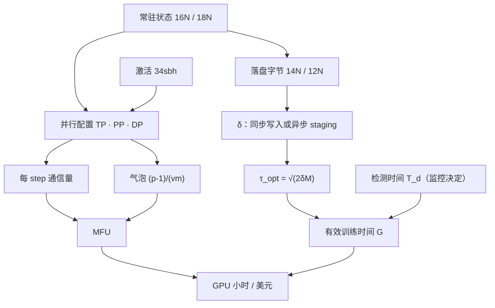

八篇正文回答了一个问题：**一个千卡训练任务，怎么配、怎么跑满、怎么跑一个月不倒**。前四篇是静态与稳态——第一篇算一张卡上四种状态的字节数与 FLOP，第二篇把每种并行写成"切哪种状态、付哪种通信"，第三篇追一个 bf16 参数在 Megatron-LM、DeepSpeed、torchtitan 里的一生，第四篇从模型与集群规格推出 70B / 1024 卡的配置并拆解 MFU 损失；后四篇是长时——第五篇把状态写到磁盘并允许换布局读回，第六篇算故障之后每一秒去了哪里，第七篇让数值不跑飞、数据可回放，第八篇把任务当作服务来运维。八篇合起来，是[《大规模训练工程：从并行策略到容错恢复》](/large-scale-training-from-parallelism-to-fault-tolerance.html)总纲里"训练引擎这一层"的全部。

本文不讲新内容，做三件事：把八篇压成一张表与八段回顾，把贯穿八篇的四条线拎出来，然后给一套三段式的通关自测——判断与计算、跨篇综合、面试题。各篇末尾的自测检验的是"这一篇读懂了没有"，这里检验的是"八篇能不能连起来用"：拿到一份模型规格和集群规格能不能算出配置，拿到一份故障统计能不能算出有效训练时间，凌晨三点 step 时间翻三倍能不能在十分钟内定位。

> **读完这八篇，你应该能回答哪些问题？[^q0] 哪些数字与结论必须能脱口而出？[^q1] 怎么判断自己是"读过"还是"掌握"了？[^q2]**

## 一、总览：系列回答的问题与主线

系列的一句话主张是：**训练引擎围绕状态组织，先算再试**。一个训练任务的全部状态只有四样——参数、梯度、优化器状态、激活；并行策略是决定它们放在哪张卡上，checkpoint 是把其中三样写到持久存储，容错是在一部分卡消失后重建它们，稳定性是保证它们的数值不跑飞，可观测是让它们的字节数与位置成为指标。每一篇都先给公式、代入 Llama 3 的 8B / 70B / 405B 与 1024 或 16K 张 H100，再到 Megatron Core 0.18.0、DeepSpeed 0.19.2、PyTorch 2.13.0 与 torchtitan v0.3.0 的源码里把同一个系数找出来。配置不是试出来的，是算出来再用少量实验校准的；checkpoint 间隔不是拍脑袋，是一个平方根；有效训练时间不是运气，是一个五项公式。

| 篇 | 回答的问题 | 一句话结论 | 必记的数字 / 公式 |
|---|---|---|---|
| [第一篇：状态解剖](/training-state-anatomy-memory-and-mfu.html) | 70B、$$s = 8192$$，一张 80 GB 的 H100 上参数与优化器状态要多少字节？一层激活多少？每 token 多少 FLOP？ | 四种状态里三种是 $$N$$ 的线性函数、一种是 token 数的线性函数；两本账（字节、FLOP）的公式很短，难在系数 | 每参数 16 字节（Megatron fp32 累加梯度 18）；70B 常驻 1.13 TB、405B 6.49 TB；激活每层 $$sbh(34 + 5as/h)$$，FlashAttention 后 $$34sbh$$，70B 每层 2.28 GB；每 token $$6N + 6Lsh$$（因果），70B 449 GFLOP；MFU 不含重计算、HFU 含，全量重计算 HFU = 4/3 MFU；千卡 dense ≥ 40% 是好成绩 |
| [第二篇：并行策略全景](/parallelism-strategies-which-state-to-shard.html) | 每个并行维度通信量多少、走哪条链路、能否与计算重叠？ | 并行是状态的放置方案：每一个"切"对应一种通信；不可重叠且量大的放最近，可重叠的放远 | DP / ZeRO-1 / ZeRO-2 通信 $$2N$$，ZeRO-3 $$3N$$；TP 每层 2 + 2 次 all-reduce、$$N_t \le 8$$；PP 气泡 $$\frac{p-1}{m}$$，交错后 $$\frac{p-1}{vm}$$；组合顺序 TP → CP → PP → DP；Llama 3 405B TP 8 / PP 16 / DP 128 每 step：TP 220 GB NVLink、DP 12.6 GB IB、PP 1 GB IB |
| [第三篇：三个框架](/megatron-deepspeed-torchtitan-architecture-and-source-guide.html) | 一个 bf16 参数在三个框架里存在哪、何时被 all-gather、何时释放、fp32 主副本在哪张卡？ | Megatron 常驻完整 bf16（buffer 视图）、DeepSpeed Stage 3 常驻 $$1/N_d$$ 碎片、torchtitan 不常驻 bf16（fp32 分片 unshard 出来）；通信量相同，表示与可组合性不同 | 每参数常驻：Megatron $$2 + 4 + 12/N_d$$、DeepSpeed $$(16 或 18)/N_d$$ + 临时层、torchtitan $$16/N_d$$ + 临时层；Megatron RS + AG = $$2N$$，FSDP2 / Stage 3 AG + AG + RS = $$3N$$；进程组：`RankGenerator(order="tp-cp-ep-dp-pp")` / mpu 委托 / `DeviceMesh` |
| [第四篇：千卡配置实战](/thousand-gpu-configuration-and-mfu-tuning.html) | 70B、1024 张 H100、$$s = 8192$$、global batch 4M：TP / PP / DP 各多少？micro-batch？重计算？预期 MFU？只有 32% 时缺的 10 个点在哪？ | 推导顺序 TP → PP → DP → CP；每卡 token 少时选 PP + ZeRO-1 不选 FSDP；MFU 损失拆成七项各自标价，先修配置错误 | 候选 A TP8 / PP4（$$v = 4$$）/ DP32，$$b = 1$$、$$m = 16$$，气泡 4.7%，每卡约 49 GB 不重计算；FSDP128 每卡每 step 175 GB 节点间通信、3.5 s；理论 2.0 s / step，目标 42% ≈ 4.75 s ≈ 88 万 token/s；全量重计算 +33% FLOP 省 94% 激活；FP8 step 时间降 20–25%；缺的 10 个点：配置约 6、硬件约 2、结构约 0.5、管线约 0.5 |
| [第五篇：分布式 checkpoint](/distributed-checkpoint-format-async-save-and-resharding.html) | 405B、6 TB 状态的 checkpoint 同步写要停几分钟？异步写代价是什么？剩 15 个节点能不能直接加载？ | 磁盘上是"全局张量的一组分片"而不是某个 rank 的内存映像，所以能零通信重分片；$$\delta$$ 从写入时间变成 staging 时间，异步不是优化是必需 | 落盘每参数 14（Megatron）或 12（FSDP2）字节，405B 5.7 TB；单文件 19–95 分钟，分片写每卡 350 MB 秒级；Young 公式 $$\tau_{opt} = \sqrt{2\delta M}$$、最小浪费 $$\sqrt{2\delta/M}$$；$$M \approx 3.1$$ h 时 $$\delta = 10$$ min → 33%、2 s → 1.9%；staging 内存 = 每卡唯一字节 ×（1–2） |
| [第六篇：容错与弹性](/fault-tolerance-and-elastic-training.html) | 每次故障从发现到恢复要多久？检测、重启、加载、回退各占多少？85% → 95% 最该缩短哪一段？ | 故障是常态：$$M = M_{gpu}/N$$；先 $$\delta$$（同步改异步），再 $$T_d$$（hang 检测 10 分钟 → 1 分钟），再 $$T_r$$（进程重启 → 进程内），$$T_l$$ 最后 | $$G = \dfrac{1 - (T_d + T_r + T_l + \tau/2)/M}{1 + \delta/\tau}$$；Llama 3：16K 卡 54 天 419 次意外中断、$$M \approx 3.1$$ h、单卡约 5 万小时、78% 硬件、58.7% GPU、1.4% SDC、>90% 有效、3 次人工；16K 卡同步 71% → 异步 87% → 压检测与重启 94%；NCCL watchdog 10 min、进程重启 2–5 min |
| [第七篇：稳定性与数据管线](/training-stability-and-data-pipeline.html) | 第 137,000 步 loss 从 2.1 跳到 4.8——数据、学习率还是精度？哪些信号要事前记、哪些状态要能回放？ | 五种成因各有信号指纹，靠事前记录的原始值归因；处理是回退 + 跳过，前提是 checkpoint 密度与数据管线确定性 | 三种形态（瞬时 / 可恢复 / 发散）× 五种成因（LR / bf16 / logit / 坏数据 / 优化器状态）；max attention logit 单调升过约 100；裁剪阈值 1.0；PaLM 回退约 100 步 + 跳过 200–500 batch，代价约 250–300 步 / 次；Megatron 位置 = `consumed_train_samples` 可换 DP，torchtitan `StatefulDataLoader` 不可换 |
| [第八篇：可观测与运维](/long-running-training-observability-and-operations.html) | 凌晨三点 step 时间 12 s → 40 s、没有报错：十分钟内怎么判断是 straggler、数据、通信还是降频？信号在开训前采了吗？ | 三层指标（任务 / 进程 / 硬件）、按 rank 看、以 step 为时钟；"step 是否前进"是 hang 唯一可靠的信号；Flight Recorder 指出哪个 rank 缺席哪次集合通信 | 四个嫌疑各一个决定性指标：Timers minmax / `data_loading(%)` / 通信等待 + IB 计数器 / `SM_CLOCK`；FR 2.13.0 默认开（buffer 2000、dump on timeout），要把 dump 路径接好、缓冲加到 2 万；假设 2.5 美元 / 卡时：1 个 MFU 点 ≈ 30 天任务的 0.71 天 ≈ 4.4 万美元，告警 + runbook 每次事故省约 30 min ≈ 512 GPU 小时 |

### 1. 本文的章节安排

| 章 | 内容 |
|---|---|
| 二 | 逐篇回顾：核心问题、结论、必记、常见误解 |
| 三 | 贯穿八篇的四条线：状态线、算账线、框架线、运维线 |
| 四 | 常见误区表 |
| 五 | 通关自测：A 判断与计算 10 题、B 跨篇综合 5 题、C 面试题 7 题、D 掌握判据 |
| 六 | 下一步 |

## 二、逐篇回顾

### 1. 第一篇：训练任务的状态解剖——显存账与 MFU

**核心问题**：一个 70B 参数、序列长 8192 的模型，在一张 80 GB 的 H100 上，参数与优化器状态要多少字节？一层的激活要多少？每个 token 要多少 FLOP？

**结论**：训练的全部状态是四样。参数、梯度、优化器状态是参数量 $$N$$ 的线性函数，系数由精度与优化器决定：bf16 参数 2 + bf16 梯度 2 + fp32 主参数 4 + Adam 两个矩 8 = 每参数 16 字节；fp32 主参数不是冗余，bf16 的 0.4% 相对精度存不下 $$10^{-5}$$ 量级的更新。Megatron 默认 fp32 累加梯度是 18 字节，分布式优化器下每卡 $$6 + 12/N_d$$。激活是每次前向喂进去多少 token 的线性函数，每层 $$sbh(34 + 5as/h)$$，其中 $$5as/h$$ 是 $$s \times s$$ 的分数矩阵，FlashAttention 不物化它。算力只有一个主项 $$6N$$（前向 2、dgrad 2、wgrad 2）加注意力的 $$6Lsh$$（因果减半）。MFU 按 PaLM 的定义不含重计算，HFU 含——开全量重计算后 HFU 好看而 MFU 不会。80 GB 的卡扣掉 CUDA context、NCCL buffer、库 workspace、allocator 碎片后，能给张量的只有约 68–74 GiB。

**必记**：

- 三档模型常驻状态（16 字节）：8B 128 GB、70B 1.13 TB、405B 6.49 TB——8B 单卡也放不下，405B 的这个数就是它 checkpoint 的量级。
- 激活 $$s = 8192$$、$$b = 1$$：8B 每层 1.14 GB、70B 2.28 GB、405B 4.56 GB；不用 FlashAttention 各乘 10 倍；logits 一条序列 6.3 GB。
- 34 = 10（TP 切不开）+ 24（TP 切得开）；TP + SP 后 $$34sbh/N_t$$。
- 70B、$$s = 8192$$：449 GFLOP / token；一条序列单卡下限 3.72 s；4M token / step、1024 卡下限 1.86 s。
- 同一个 4.5 s / step：MFU 41.3%，HFU 42.3%（选择性重计算）或 55.1%（全量）。
- 参考水平：Megatron-LM 论文 A100 上 52%（含重计算）、PaLM 46.2%、Llama 3 405B 38–43%；千卡 H100 dense 40% 以上是好成绩，做不到 30% 有明确问题。

**常见误解**："开了重计算 MFU 上去了"——上去的是 HFU；MFU 只数模型本身的 FLOP，报告数字时要说清用的是哪个口径。另一个："`nvidia-smi` 显示 78 GB 就是张量占了 78 GB"——`memory_allocated` < `memory_reserved` < 进程占用，三层数字分别对应张量、caching allocator、进程。

### 2. 第二篇：并行策略全景——每种并行切的是哪种状态

**核心问题**：每种并行都在"复制"和"切分"之间做交换。给定一个模型和一个集群的拓扑，每个维度的通信量是多少、走哪条链路、和计算能不能重叠？

**结论**：把每种并行写成同一个五元组——切哪种状态 / 每 step 通信量 / 走哪条链路 / 能否重叠 / 适用条件——它们就能放进同一张表。DP 系（DP / ZeRO / FSDP）决定同一参数的副本之间如何分工，模型并行系（TP / PP / CP / EP）决定一份模型如何切开，两者正交，真实配置是乘积。DP 什么都不切、通信 $$2N$$；ZeRO-1 切优化器状态（拿掉 74% 显存）、ZeRO-2 再切梯度，通信仍 $$2N$$，因为 all-reduce 本来就是 reduce-scatter + all-gather；ZeRO-3 切参数，前向多一次 all-gather，通信 $$3N$$。TP 列切 + 行切配对，每层前向 2 次、反向 2 次 all-reduce，载荷是激活 $$sbh$$、在关键路径上不可重叠，所以锁在 NVLink 内；SP 把 all-reduce 拆成 all-gather + reduce-scatter，通信不变、层边界激活再切 $$1/N_t$$。CP 切注意力本身，Ring Attention 传 K/V、GQA 下量小可跨节点。PP 按层切，通信最小，代价是气泡；1F1B 不减气泡只把激活从 $$O(m)$$ 降到 $$O(p)$$，交错调度把气泡除以 $$v$$。"通信量大"和"必须快链路"是两件事：TP 锁在节点内是因为它在关键路径上，DP 量也不小但可以在反向期间慢慢发。

**必记**：

- 显存每参数：DP 16、ZeRO-1 $$4 + 12/N_d$$、ZeRO-2 $$2 + 14/N_d$$、ZeRO-3 $$16/N_d$$；ZeRO-3 不 reshard 则通信回到 $$2N$$、显存等于 ZeRO-2。
- 原语每卡通信量：all-reduce ≈ $$2S$$，all-gather / reduce-scatter / all-to-all ≈ $$S$$；ZeRO 论文口径的"$$2N$$"单位是元素。
- 气泡 $$\frac{p-1}{m}$$（相对理想时间）、$$\frac{p-1}{m+p-1}$$（占总时间）；交错 $$\frac{p-1}{vm}$$，代价是 P2P 次数乘 $$v$$。
- HSDP：组内 ZeRO-3 走 NVLink，组间 all-reduce 只剩 $$2N/N_s$$，显存只省 $$N_s$$ 倍。
- 链路：NVLink 标称单向 450 GB/s，IB NDR 50 GB/s，差 5–10 倍；Megatron 默认 rank 排布 `"tp-cp-ep-dp-pp"`，PP 放最远。
- Llama 3 405B（TP 8 / PP 16 / DP 128）：每卡常驻 13 GB、在途激活可达 73 GB；$$m = 16$$、$$v = 1$$ 的气泡 48% 与 38–43% MFU 不相容，stage 必须再切；长上下文 CP = 16 只多 47 GB 可重叠的 IB 通信。

**常见误解**："TP 通信量最大所以最贵"——它贵在不可重叠而不只在量；PP 通信最小又可重叠，所以放最慢的链路。另一个："长上下文把 TP 开大就行"——TP 切的是隐藏维，每卡激活仍随 $$s$$ 增长且 $$N_t \le 8$$ 已到顶，只有 CP 切序列。

### 3. 第三篇：三个框架——Megatron-LM、DeepSpeed 与 torchtitan 的架构对比与源码导读

**核心问题**：一个 bf16 参数在这三个框架里各自存在哪里、什么时候被 all-gather、什么时候被释放、它的 fp32 主副本在哪张卡上？

**结论**：三个框架的差异压缩成一句话——各自从四种状态中的哪一种出发组织代码。Megatron 从模型结构出发：TP 切矩阵、PP 切层，一个 DP 副本内的全部 bf16 参数拍进 `_ParamAndGradBuffer` 的连续内存、从不释放；梯度经 DDP hook 累加进 `main_grad`（默认 fp32），bucket 满了就 reduce-scatter；`DistributedOptimizer` 按字节区间把 fp32 主参数与优化器状态切成 $$1/N_d$$，step 后 all-gather 更新过的 bf16 参数回 buffer。DeepSpeed 从优化器状态出发：ZeRO 逐级切 O → G → P，Stage 3 下 bf16 参数常驻 $$1/N_d$$ 碎片（`ds_tensor`），module 的 pre-forward hook 触发参数协调器按 trace 预取 all-gather、用完立即释放，fp32 主参数是扁平 fp32 分区。torchtitan 从参数的表示出发：`fully_shard` 让每个参数成为 `Shard(0)` 的 fp32 DTensor，前向前 unshard 进连续 buffer 并按 `MixedPrecisionPolicy` 转成临时 bf16，反向后 reduce-scatter、free——fp32 分片既是模型参数也是主参数。三者通信量相同（$$2N$$ 或 $$3N$$），表示决定可组合性：FSDP1 的 `FlatParameter` 与 FSDP2 的每参数 DTensor 通信次数相同，后者能与 TP 的 DTensor、DCP、`torch.compile` 直接组合。

**必记**：

- 每参数常驻：Megatron $$2 + 4 + 12/N_d$$（默认 fp32 梯度）；DeepSpeed Stage 3 $$(16 或 18)/N_d$$ + 临时层；torchtitan $$16/N_d$$ + 临时的 bf16 unshard 参数。
- 进程组：Megatron `RankGenerator(order="tp-cp-ep-dp-pp")` 填全局变量；DeepSpeed 委托 mpu 或克隆 world；torchtitan `DeviceMesh` 切成几张视图。
- 前向前 all-gather 的三种实现：Stage 3 每参数 `ds_tensor` + coalesced；FSDP1 `FlatParameter` 一次；FSDP2 每参数 DTensor 拷进连续 buffer 一次。
- torchtitan 装配顺序：meta 设备构造 → `parallelize` → `to_empty` → `init_weights`，405B 也不在单卡上物化完整模型；v0.3.0 配置是返回 `Trainer.Config` 的 Python 函数，TP 由声明式 `ShardingConfig` 描述。
- 1F1B 两种写法：Megatron 过程式三段循环 + `P2PCommunicator` 合并收发；PyTorch `Schedule1F1B` 把 P2P 翻译成 `_Action` 表由 `_PipelineScheduleRuntime` 解释。
- 趋势：Megatron-FSDP 的 `ShardingStrategy` 四级、DeepSpeed 的 DeviceMesh、torchtitan 的 `ShardingConfig`——分片正在成为数据的属性。

**常见误解**："三个框架显存不一样是因为算法不一样"——ZeRO-1 / ZeRO-3 的字节数三家一致，差别在临时层与表示（连续 buffer / 碎片 / DTensor）。另一个："FSDP2 比 FSDP1 通信少"——通信量与次数相同，变的是可组合性。

### 4. 第四篇：千卡配置实战——并行搭配、micro-batch、激活重计算与 MFU 调优

**核心问题**：一个 70B dense 模型，1024 张 H100（128 节点 × 8 卡），序列长 8192，global batch 4M token。TP、PP、DP 各多少？micro-batch 多大？要不要重计算？预期 MFU 多少？跑出来只有 32%，缺的 10 个点去了哪里？

**结论**：配置不是试出来的，是算出来再用少量实验校准的。四个自由度（TP · PP · DP · CP）三类约束（显存硬约束、通信软约束、global batch 由算法给定），推导顺序 TP → PP → DP → CP：TP 锁在 NVLink 域取 8、开 SP；PP 要放下 $$N/(t \cdot p)$$ 的静态状态与在途激活——1F1B 下第一个 stage 同时持有 $$p$$ 个 micro-batch 的激活，所以 PP 不减少激活总量，只把它和参数一起分到更多卡上；DP 用满剩余的卡，$$m = B/(d \cdot b)$$；$$s = 8192$$ 不开 CP。为什么不用 FSDP128 代替 PP：每卡每 step 只有 4096 个 token，参数切分的通信按参数算、不随 token 摊薄，FSDP 的 $$3N_{local} \times m$$ 远比 PP + ZeRO-1 的 $$2N_{local}$$ 贵。MFU 校准靠一张七项损失账——气泡、未重叠通信、重计算、数据等待、kernel 效率、CPU 发射、straggler——一份 trace 测前六项、多 rank 测第七项；先修配置错误，再查硬件，最后才碰结构。

**必记**：

- 候选 A：TP8 / PP4（$$v = 4$$）/ DP32，$$b = 1$$、$$m = 16$$，气泡 4.7%，每卡静态 14 GB + 激活 27 GB + 开销 8 GB ≈ 49 GB，不需要重计算；候选 B：TP8 / PP2 / DP64，$$m = 8$$，约 62 GB。
- 每 step 通信（候选 A）：TP 300 GB NVLink（须与 GEMM 重叠）、DP 8.8 GB → 0.18 s、PP 2.1 GB；FSDP128 版 175 GB 节点间、3.5 s，比 2.0 s 的计算时间还长。
- 理论 2.0 s / step（$$6 \times 69.5\text{B} + 12Lhs = 4.81 \times 10^{11}$$ FLOP / token）；42% ≈ 4.75 s ≈ 88 万 token/s；32% ≈ 6.2 s。
- 重计算：全量 +33% FLOP 省 94% 激活；选择性在 FlashAttention 下几乎不省；按层 $$N$$ 是"差一点"时最经济；先确认放不下再开。
- 重叠失败五因：没开 / bucket 太大 / 多余同步 / SM 争抢 / CPU 发得晚；DP 重叠只在最后一个 micro-batch 发生；TP 重叠靠分块流水、前提是开 SP。
- FP8 只快 GEMM，step 时间降 20–25%；compile 顺序 TP → AC → compile → FSDP；CUDA Graph 只治 CPU 开销。

**常见误解**："PP 越深激活越少"——激活总量不变，减少激活的是 micro-batch、SP、CP 和重计算。另一个："MFU 低先换调度或换并行"——经验分布里配置错误约 6 个点，读一遍启动脚本就能修；结构问题只有约 0.5 个点。

### 5. 第五篇：分布式 checkpoint——格式、异步保存与重分片恢复

**核心问题**：一个 405B 模型、6 TB 状态的 checkpoint，同步写要停训练几分钟？异步写代价是什么？故障后剩 15 个节点而不是 16 个，能不能直接加载？

**结论**：checkpoint 有两个核心指标——保存开销决定能存多频繁，恢复灵活性决定换并行配置能不能加载。落盘不需要梯度，每参数 14（Megatron：bf16 参数 + fp32 主参数 + 两个矩）或 12（FSDP2）字节，且与并行配置无关。rank-0 汇总写单文件撞三堵墙：主机内存放不下、单网卡 114 s、单写入者 19–95 分钟；分片写每卡只有 350 MB，秒级。DCP 的 `save` 是 `local_step` → `reduce_scatter` → `write_data` → `all_reduce` 四步，Planner 决定谁写什么、Storage 写文件、`.metadata` 记每个张量的全局形状与每块的全局坐标，最后原子写入作为提交标记——磁盘上没有 rank / TP / PP，只有全局坐标，所以加载时每个本地块与磁盘块逐维算交集生成 `ReadItem`，零通信完成重分片。异步保存把 $$\delta$$ 从写入时间变成 staging 时间，代价是主机内存里一份状态副本；Young 公式说最优浪费只与 $$\sqrt{\delta/M}$$ 成正比，$$\delta$$ 缩小 100 倍浪费缩小 10 倍——在 3 小时 MTBF 下同步保存怎么调间隔都要浪费 10% 以上，异步不是优化是必需。

**必记**：

- 405B 落盘 5.7 TB；16K 卡分片写每卡 350 MB。
- $$\tau_{opt} = \sqrt{2\delta M}$$，$$f_{min} = \sqrt{2\delta/M}$$；$$M \approx 3.1$$ h：$$\delta$$ = 600 s → 61 min、32.8%；60 s → 19 min、10.4%；10 s → 8 min、4.2%；2 s → 3.5 min、1.9%。
- 每 3.5 分钟 5.7 TB 需 27 GB/s 聚合带宽、2.3 PB / 天写入量，保留策略必须跟上（最近 $$k$$ 个 / 每 $$N$$ 小时一个 / 里程碑）。
- staging 内存 = 每卡唯一字节 ×（1–2）：8B / 8 卡每卡 12 GB，千卡反而轻；等 staging 完成的点放在 `optimizer.step` 之前。
- 重分片条件：同 FQN、同全局形状、块带全局坐标；PP 变要展平 key；Megatron 分布式优化器需 `fully_reshardable`；DeepSpeed ZeRO 文件绑 DP 度、需先 `ds_to_universal`。
- 提交标记：DCP `.metadata`、Megatron `latest_checkpointed_iteration.txt`、DeepSpeed `latest`，都要求数据文件 fsync 之后再写。

**常见误解**："checkpoint 大小随并行配置变"——TP / PP / DP 只决定每个张量切成几块放哪张卡，去掉 DP 复制后的唯一字节不变。另一个："异步保存是性能优化，同步也能用"——3 小时 MTBF 下同步保存的最小浪费是 10% 以上，Llama 3 的 >90% 有效训练时间在同步保存下算不出来。

### 6. 第六篇：容错与弹性——故障率数学、straggler、SDC 与弹性训练

**核心问题**：一千张卡平均每几小时坏一张。每次故障从发现到恢复训练要多久？其中检测、重启、加载 checkpoint、回退重算各占多少？把有效训练时间从 85% 提到 95%，最该缩短的是哪一段？

**结论**：$$M = M_{gpu}/N$$，故障率随卡数线性增长而每次故障的代价与卡数无关，所以同一套容错方案在 1024 卡上 98%、到 16K 卡可能只剩 85%。一次故障的损失 = 检测 $$T_d$$ + 重启 $$T_r$$ + 加载 $$T_l$$ + 平均回退 $$\tau/2$$，有效训练时间 $$G = (1 - L/M)/(1 + \delta/\tau)$$，Young 公式是忽略前三项时的一阶最优。代入 Llama 3 的数字：16K 卡同步保存无论怎么选 $$\tau$$ 都亏 20% 以上（71%），改异步到 87%，此时主导项变成 $$T_d$$——hang 只能靠超时发现，NCCL watchdog 默认 10 分钟；把检测压到 1 分钟、进程重启（2–5 分钟，NCCL comm init 是千卡下最不可控的一项）换成进程内重启（NVRx `inprocess.Wrapper`：abort 通信 → finalize → health check → 重分配 rank → 重进训练函数），到 94%。弹性是另一条路：torchft 把 DP 副本当独立失败单元，Lighthouse 做 quorum，坏一组其他组继续。此外还有三件时间线之外的事：straggler 的判据是计算长、等待短，且多数不是硬件而是序列长度与 stage 不均；SDC 靠在梯度 reduce 之前校验，`RerunStateMachine` 原地重跑分瞬时、换卡重跑分持久。

**必记**：

- Llama 3：16K 卡、54 天、466 次中断、419 次意外 → $$M \approx 3.1$$ h，反推单卡约 5 万小时（5.8 年）；78% 硬件、58.7% GPU、1.4% SDC；>90% 有效、3 次人工。
- 1024 卡 $$M \approx 48.8$$ h，三个场景 93.8% → 98.9% 差别很小；16K 卡 A → B 提升 16 个点全部来自 $$\delta$$，B → C 再提升 8 个点来自检测与重启。
- 超时默认值：NCCL watchdog 10 min、HeartbeatMonitor 8 min、inprocess `soft_timeout` 60 s；`TORCH_NCCL_ASYNC_ERROR_HANDLING=3` 把超时变成显式错误。
- torchrun：`--max-restarts` 默认 0；rendezvous c10d / etcd、`min:max` + `last_call` 30 s、join 600 s、心跳 5 s。
- what-if 论文（OSDI 2025）：42.5% 的任务因 straggler 至少慢 10%，尾部浪费 45%；先看是否每步换 rank。
- 确定性：控制流必须确定、计算可带 tolerance；全局确定性很慢，只在校准与排查时开。

**常见误解**："千卡以下感受不到容错的价值，说明它没用"——1024 卡 $$M$$ 长达两天，数学上确实不值多少；到 16K 卡同一方案差 24 个点。另一个："straggler 就是坏卡，隔离节点即可"——硬件型在空间上集中、时间上持续；负载型每步换 rank，隔离好节点不解决问题。

### 7. 第七篇：训练稳定性与数据管线——loss spike、梯度范数、数据混合与流式加载

**核心问题**：第 137,000 步 loss 从 2.1 跳到 4.8。是数据、学习率、还是数值精度？要回答这个问题，需要哪些信号在事前就被记录下来，需要哪些状态能被精确回放？

**结论**：spike 的排查靠事前而不是事后。先看形态：瞬时（下一步就回来：坏 batch 或 bf16 偶发）、可恢复（几百步爬回：学习率或优化器状态）、发散（一路上去：logit 增长或精度链断裂）。五种成因各有指纹：学习率——param norm 增速在事前变快；bf16——无前兆单步跳；logit 增长——max attention logit 单调升过约 100，是唯一能在事前几百步看到的；坏数据——换 seed 回放同一 batch 可复现；优化器状态——grad norm 在低平台后放大。预防按"必开"到"按需"：全局梯度范数裁剪（范数平方可加，但必须在正确的组上归约，算错会安静地过度裁剪）、warmup、QK-LayerNorm、z-loss、weight decay 例外、精度纪律、fp16 loss scale。处理是 PaLM 的回退约 100 步 + 跳过 200–500 个 batch，Megatron 用 `--iterations-to-skip` 执行 `dummy_train_step`，consumed 与 skipped 同步加。这个动作把数据管线牵进来：离线 tokenize 的 `.bin/.idx`、`GPTDataset` 由 seed 确定的三个索引、`BlendedDataset` 的确定性贪心混合、数据位置进 checkpoint——管线必须确定性、可回放、可跳过。

**必记**：

- 信号清单：loss avg / max、clip 前的 grad norm、param norm、LR、loss scale、skipped iters、num_zeros、max attention logit、consumed samples、data_loading%——每步记原始值、随 checkpoint 留档、按 rank 可查。
- 裁剪 $$g \leftarrow g \cdot \min(1, c/(\lVert g \rVert_2 + 10^{-6}))$$，$$c$$ 通常 1.0；clip 后的 grad norm 恒等于阈值、没有信息量。
- 回退 + 跳过代价约 250–300 步 / 次，20 次 < 1%——便宜的是处置，贵的是信号与基础设施。
- weight decay 例外默认仅 1-D 参数与 bias；Megatron 的 z-loss 只有 MoE 路由的；`qk_clip_threshold` 默认 100。
- 恢复语义：Megatron 位置 = `consumed_train_samples` 一个整数，可换 DP；torchtitan `StatefulDataLoader` 按 dp_rank 存迭代器状态，不可换 DP；DeepSpeed 仅课程学习有状态。
- 数据等待几乎总是并发问题不是带宽问题：看 profiler 空隙 ∩ `__next__`、`data_loading(%)`、队列深度。

**常见误解**："loss spike 是脏数据"——数据只是五种成因之一，两种（bf16、logit 增长）是模型内部数值问题、一种是优化器状态。另一个："换了 DP 度就不能从 checkpoint 恢复数据顺序"——取决于位置的表示：一个样本计数可换，一份迭代器状态不可换。

### 8. 第八篇：长时训练的可观测与运维——从指标到 hang 排查

**核心问题**：凌晨三点告警：step 时间从 12 秒变成 40 秒，没有报错。十分钟内你要判断是 straggler、数据、通信、还是硬件降频。你需要的每一个信号，在开训前有没有采集？

**结论**：把训练任务当作服务：看得见、叫得醒、查得出、有章法，差别在于按 rank 看、以 step 为时钟、以 checkpoint 为恢复点。三层指标按"谁能采、谁来看"划分：任务层一份（loss、grad norm、token/s、MFU、step 时间与抖动、step 是否前进）、进程层每 rank 一份（各阶段时间、通信等待、`memory_stats`、数据队列）、硬件层每卡一份（温度、功耗、时钟、XID、ECC、链路错误，由 DCGM 采）。"step 是否前进"是 hang 唯一可靠的信号——hang 时 GPU 利用率常是 100%、日志还在滚，所有指标都停在最后一个值而不是变坏，且必须由独立于训练进程的东西读取。hang 的归因靠 Flight Recorder：每次集合通信的发起与完成记在环形缓冲里，超时时 watchdog 广播 dump 信号、各 rank 写文件，`torchfrtrace` 对齐后指出哪个 rank 缺席哪次通信或谁发了尺寸不同的张量；报"No errors found"就转硬件路径。性能回归四个嫌疑各一个决定性指标。成本把优先级统一到 GPU 小时：检测时间是有效训练时间公式里唯一完全由监控决定的一项。

**必记**：

- 四个嫌疑：straggler——Timers minmax 或每 rank 阶段时间；数据——`data_loading(%)` 或 GPU 空隙 ∩ `__next__`；通信——等待上升而计算不变 + IB 计数器；降频——`SM_CLOCK` 掉到 1.3 GHz 以下、温度 / 功耗触顶。另两个：碎片（`inactive_split_bytes`、`num_alloc_retries`）与日志爆量。
- 健康形态：step 时间抖动 1–2%，p95 / p50 > 1.2 有 rank 在拖；通信等待 < 2% step 时间。
- FR 在 2.13.0 默认 `TORCH_FR_BUFFER_SIZE=2000`、`TORCH_NCCL_DUMP_ON_TIMEOUT=true`、`ENABLE_MONITORING=true`；要做的是把 `TORCH_FR_DUMP_TEMP_FILE` 指到可收集的路径、缓冲加到 2 万、`ASYNC_ERROR_HANDLING` 保持 3。
- 分工：TensorBoard / W&B 按 step 看曲线，Prometheus 按时间与 rank 告警；训练进程写每 rank JSONL、节点 sidecar 暴露，不让 Prometheus 抓一千个目标。
- 告警：page 的是 step 停止、NaN、连续重启失败、checkpoint 失败、有效训练时间跌破、MFU 掉 15%、XID / DBE；其余 record。
- 成本（假设 2.5 美元 / 卡时）：1024 卡一天 6.1 万美元；1 个 MFU 点 ≈ 30 天任务的 0.71 天 ≈ 4.4 万美元；hang 检测 10 分钟 vs 100 秒，乘每三小时一次就是 4–5 个百分点有效训练时间；告警 + runbook 每次事故省约 30 min ≈ 512 GPU 小时 ≈ 1,280 美元，一个月约 30 万美元。

**常见误解**："GPU 利用率 100% 说明在正常训练"——NCCL kernel 自旋等对端时利用率也是 100%，只有 step 计数能区分"在跑"和"卡住"。另一个："Flight Recorder 是要额外开的调试工具"——2.13.0 里默认开着，多数团队只是没把 dump 路径接到能拿到文件的地方。

## 三、贯穿全系列的几条线

### 1. 状态线：四样东西的字节、位置、落盘与重建

总纲的第一句话是"训练引擎围绕状态组织"，八篇是这句话在八个层面上的展开。第一篇给出四种状态的字节数与生命周期：前三样是 $$N$$ 的线性函数（16 或 18 字节 / 参数），激活是 token 数的线性函数（$$34sbh$$），激活峰值在前向末、梯度峰值在反向末。第二篇决定它们放在哪张卡：每一个"切"对应一种通信，DP 系切副本之间的分工、模型并行系切一份模型。第三篇把"放在哪"落到容器上——连续 buffer 的视图、$$1/N_d$$ 的碎片、`Shard(0)` 的 DTensor——同一个 bf16 参数三种存在方式。

第五篇把其中三样写到磁盘：不需要梯度，所以落盘是 14 或 12 字节，且去掉 DP 复制后的唯一字节与并行配置无关——这是能重分片的前提。第六篇在一部分卡消失后重建它们：重分片加载是弹性训练在存储层的前提，torchft 从活着的副本组拉参数是另一种重建。第七篇保证它们的数值不跑飞：fp32 主参数与 fp32 优化器状态这条精度链上的任何一环降到 bf16 都是风险，数据加载器的位置也是必须进 checkpoint 的状态。第八篇让它们的字节数与位置成为进程层指标（`memory_stats` 的 allocated / reserved / `inactive_split_bytes`），它们的变化成为告警。任何一个训练系统的问题，先问"哪种状态、多少字节、在哪张卡、什么时候动"。

### 2. 算账线：显存 → 通信 → MFU → checkpoint 间隔 → 有效训练时间 → GPU 小时

每一篇加一项，最后换成同一个单位。第一篇是两本账：字节的账决定能不能跑（$$16N$$ + 激活 + 开销 ≤ 每卡显存），FLOP 的账决定最快能多快（step 下限 = tokens × FLOP/token ÷ 卡数 × 峰值），MFU 是两者之比。第二篇加通信量：$$2N$$、$$3N$$、$$sbh$$ 每层四次、气泡 $$\frac{p-1}{m}$$。第四篇把它们合成配置推导——候选 A 的 49 GB、300 GB NVLink、2.0 s 理论、42% 目标——并把 MFU 缺口拆成七项各自标价；"每卡 token 少选 ZeRO-1 不选 FSDP"是通信账直接推出的结论。

第五篇加 $$\delta$$ 与 $$M$$：Young 公式 $$\tau_{opt} = \sqrt{2\delta M}$$，最小浪费 $$\sqrt{2\delta/M}$$。第六篇把它嵌进五项公式 $$G = (1 - (T_d + T_r + T_l + \tau/2)/M)/(1 + \delta/\tau)$$，Young 公式是忽略前三项时的一阶最优；同一套方案 1024 卡 98%、16K 卡 71% 到 94%，差别全在 $$M$$ 与各项的相对大小。第八篇把所有项换成 GPU 小时与美元：1 个 MFU 点 4.4 万美元、一次 hang 的告警 + runbook 省 512 GPU 小时、checkpoint 间隔按 Young 调整每天省 550 GPU 小时——用它排优先级。这条线的意义不在精确（每项 ±10%），在于先算再试：不可能的配置开机前排除，"多久存一次"从拍脑袋变成一个平方根。

### 3. 框架线：三种取向，每个主题一张对照表

Megatron-LM 按模型结构切、DeepSpeed 按优化器状态切、torchtitan 用 PyTorch 原生原语组合，这三种取向在每一篇都有一张对照表。第三篇是进程组与状态容器：`RankGenerator` / mpu 委托 / `DeviceMesh`；`_ParamAndGradBuffer` / `ds_tensor` + 扁平分区 / DTensor。第四篇是配置面：`--tensor-model-parallel-size` 与 `recompute_*` 参数族 / JSON / `ParallelismConfig` 与 Python 配置函数；重计算、重叠、编译各有各的名字。第五篇是 checkpoint 格式：Megatron `ShardedTensor` 手写全局坐标、torch_dist 格式；DeepSpeed 每 rank 一份 `torch.save`、绑 DP 度、需 `ds_to_universal`；torchtitan `CheckpointManager` 包 `dcp.async_save`。

第六篇是容错接口：Megatron 与 NVRx 覆盖检测、进程内重启、straggler、SDC、注入、预检六件事，torchtitan 是 torchft 的集成示范，DeepSpeed 基本依赖 torchrun。第七篇是稳定性与数据：全局范数在哪个组上归约（`grad_stats_parallel_group` / `_NormPartial` + PP all-reduce）、跳过 batch 有没有内建、数据位置以什么形式进 checkpoint。第八篇是可观测面：Timers 的 max / minmax / all、`MetricsProcessor` 与每 rank JSONL、`StragglerDetector`。对照着读的收获是分清哪些是分布式训练本身的要求（优化器状态一定以 fp32 存在某处、ZeRO 三级的字节数三家一致），哪些是框架的选择（连续 buffer 还是碎片、argparse 还是 Python）；共同底座是 `torch.distributed`，趋势是分片成为数据的属性。

### 4. 运维线：从恢复点到有人值班的系统

后四篇是一条从"能恢复"到"自动恢复"到"知道要恢复"的线。第五篇的 checkpoint 是恢复点：提交标记、fsync、保留策略、版本兼容，异步保存让间隔短到几分钟。第六篇是自动化：三类故障三种检测手段——显式秒级、隐式靠超时、静默靠校验——torchrun 的 `_invoke_run` 循环、进程内重启、坏卡隔离与 `gpu_sniff_test` 预检，让 419 次中断里 416 次不需要人。第七篇是数值层的可观测：十个信号每步记原始值、随 checkpoint 留档，回退 + 跳过是有章法的处置而不是重启。

第八篇把它们接成一个有人值班的系统：三层指标、"step 是否前进"的独立 watchdog、Flight Recorder 的 dump 路径、page 与 record 的边界、开训清单 13 项（FR 演练与 page 通路测试最常被跳过）、runbook 的"症状 → 五分钟检查 → 处置 → 升级"、复盘写检测时间与恢复分解。检测时间 $$T_d$$ 是有效训练时间公式里唯一完全由监控决定的一项——这条线的终点回到第六篇的公式。

| 概念 | 出现的篇 | 关系 |
|---|---|---|
| 四种状态与每参数 16 / 18 字节 | 一、二、三、五、七 | 一定义；二决定切法；三落到容器；五落盘去掉梯度成 14 / 12；七解释 fp32 链为何不能降 |
| 激活 $$34sbh$$ 与 micro-batch | 一、二、四 | 一给公式；二说 TP + SP 除以 $$N_t$$、PP 在途 $$O(p)$$；四算出 27 GB 并断定不需要重计算 |
| 通信量 $$2N$$ / $$3N$$ | 二、三、四 | 二推导；三在源码里找到 RS + AG 与 AG + AG + RS；四用它否决 FSDP128 |
| 气泡 $$\frac{p-1}{m}$$ | 二、四 | 二推导与交错；四用 $$v = 4$$ 把 18.8% 压到 4.7% |
| MFU 与七项损失 | 一、四、六、八 | 一定义（不含重计算）；四拆七项；六给 straggler 的成因与检测器；八给性能回归的决定性指标与每个点的价格 |
| $$\delta$$、$$M$$、$$\tau_{opt}$$ | 五、六、八 | 五推导 Young 公式；六嵌进五项公式；八用它算每天省多少 GPU 小时 |
| 重分片 / 换 DP 恢复 | 五、六、七 | 五给 DCP 的交集加载；六作为弹性训练的存储前提；七指出数据加载器位置能否换 DP 取决于表示 |
| 检测时间 $$T_d$$ | 六、八 | 六证明异步之后它是主导项；八说它是唯一完全由监控决定的项，"step 是否前进"是唯一可靠信号 |
| 回退与跳过 | 五、六、七 | 五的保留策略要留每 $$N$$ 小时一个；六的 $$\tau/2$$ 是被动回退；七把它反过来主动用 |
| 三框架对照 | 三至八 | 每篇一张表；取向不变（按结构 / 按优化器 / 原生原语），主题变 |

下图是算账线上各量的依赖关系（箭头表示"决定"）：

## 四、常见误区

| 误区 | 为什么错 | 正确的说法 | 出处 |
|---|---|---|---|
| bf16 训练每参数 2 字节，70B 只要 140 GB | 忘了梯度、fp32 主参数与 Adam 两个矩 | 每参数 16（或 18）字节，70B 1.13 TB，是一张 80 GB 卡的 14 倍 | [第一篇](/training-state-anatomy-memory-and-mfu.html) |
| 开重计算后 MFU 上去了 | 重计算多算的 FLOP 只计入 HFU | MFU 不含重计算；全量重计算 HFU = 4/3 MFU | [第一篇](/training-state-anatomy-memory-and-mfu.html) |
| TP 通信量最大所以最贵，能少就少 | 贵在关键路径上不可重叠，不只在量 | TP 锁在 NVLink 内 $$N_t \le 8$$；PP 量最小可重叠放最远 | [第二篇](/parallelism-strategies-which-state-to-shard.html) |
| ZeRO-2 比 ZeRO-1 多通信 | all-reduce 本来就是 reduce-scatter + all-gather | ZeRO-1 / 2 都是 $$2N$$，只有 ZeRO-3 涨到 $$3N$$ | [第二篇](/parallelism-strategies-which-state-to-shard.html) |
| FSDP2 比 FSDP1 通信少所以快 | 通信次数与量相同 | 差别是表示：每参数 DTensor 能与 TP、DCP、compile 组合 | [第三篇](/megatron-deepspeed-torchtitan-architecture-and-source-guide.html) |
| torchtitan 常驻一份 bf16 参数 | FSDP2 常驻的是 fp32 分片 | bf16 只在一层前向、反向的几十毫秒里存在，fp32 分片就是主参数 | [第三篇](/megatron-deepspeed-torchtitan-architecture-and-source-guide.html) |
| 千卡上用 FSDP 代替 PP，没有气泡更快 | 每卡每 step 只有 4096 个 token，参数通信不随 token 摊薄 | FSDP128 每卡 175 GB / 3.5 s 盖不住；每卡 token 少选 PP + ZeRO-1 | [第四篇](/thousand-gpu-configuration-and-mfu-tuning.html) |
| PP 加深激活就少 | 1F1B 第一个 stage 同时持有 $$p$$ 个 micro-batch 的激活 | PP 不减少激活总量；减少的是 micro-batch、SP、CP、重计算 | [第四篇](/thousand-gpu-configuration-and-mfu-tuning.html) |
| checkpoint 大小随 TP / PP / DP 变 | 去掉 DP 复制后的唯一字节不变 | 落盘 14 或 12 字节 / 参数，与并行配置无关；这正是能重分片的前提 | [第五篇](/distributed-checkpoint-format-async-save-and-resharding.html) |
| 异步 checkpoint 是锦上添花 | 3 小时 MTBF 下同步保存最小浪费 $$\sqrt{2\delta/M}$$ ≥ 10% | $$\delta$$ 从分钟到秒，浪费从 33% 到 1.9%；异步是必需 | [第五篇](/distributed-checkpoint-format-async-save-and-resharding.html) |
| 有效训练时间低先缩短 checkpoint 间隔 | 间隔由 $$\tau_{opt} = \sqrt{2\delta M}$$ 决定，$$\delta$$ 不变缩间隔只是多付保存代价 | 先 $$\delta$$，再 $$T_d$$，再 $$T_r$$；回退项随 $$\delta$$ 自动变小 | [第六篇](/fault-tolerance-and-elastic-training.html) |
| straggler = 坏卡，隔离节点即可 | 多数 straggler 是序列长度 / stage 不均衡，每步换 rank | 先看是否每步换 rank；是则查数据 packing 与 PP 布局 | [第六篇](/fault-tolerance-and-elastic-training.html) |
| loss spike 就是脏数据 | 五种成因里两种是模型内部数值问题、一种是优化器状态 | 先看形态与信号指纹：param norm、max logit、grad norm 平台、可复现性 | [第七篇](/training-stability-and-data-pipeline.html) |
| GPU 利用率 100% 说明训练正常 | hang 时 NCCL kernel 自旋等对端，利用率照样 100% | "step 是否前进"是 hang 唯一可靠信号，须由独立进程读取 | [第八篇](/long-running-training-observability-and-operations.html) |

## 五、通关自测

### A. 判断与计算（10 题）

1. Llama 3 405B（$$N = 405.85$$B）用 Megatron 默认路径（fp32 累加梯度）训练，常驻状态多少字节？它的 checkpoint 落盘多少？两个数为什么不同？

   

答案

   常驻 $$18N \approx 7.3$$ TB（16 字节口径是 6.49 TB）；落盘 $$14N \approx 5.7$$ TB——checkpoint 不需要梯度（每 step 重算），只存 bf16 参数 + fp32 主参数 + 两个矩。

   

2. Llama 3 8B（$$h = 4096$$、$$a = 32$$）、$$s = 8192$$、$$b = 2$$，用 FlashAttention 时一层激活多少？不用呢？

   

答案

   $$34sbh = 34 \times 8192 \times 2 \times 4096 \approx 2.28$$ GB（$$b = 1$$ 的 1.14 GB 翻倍）；不用 FlashAttention 要加 $$5as/h = 5 \times 32 \times 8192 / 4096 = 320$$，$$(34 + 320)/34 \approx 10$$ 倍，约 24 GB 一层。

   

3. FSDP2 设 `reshard_after_forward=False`，每 step 通信量与每参数显存各变成多少？

   

答案

   通信从 $$3N$$ 回到 $$2N$$（省掉反向前的 all-gather）；显存不再是 $$16/N_d$$，参数在前向后仍完整驻留，等于 ZeRO-2 的 $$2 + 14/N_d$$ 字节 / 参数。

   

4. Llama 3 405B 用 TP 8 / PP 16 / DP 128，global batch 16M token、$$s = 8192$$、$$b = 1$$：$$m$$ 多少？非交错气泡占理想时间与总时间各多少？这与 38–43% 的 MFU 相容吗？

   

答案

   16M / 8192 = 2048 条序列，DP 128 每路 16 条，$$m = 16$$；气泡 $$\frac{p-1}{m} = 15/16 = 94\%$$（相对理想时间），占总时间 $$15/31 = 48\%$$——不相容，stage 必须再切（交错 $$v$$ 个 virtual stage 或更多 micro-batch）。

   

5. 第四篇候选 B（TP8 / PP2 / DP64，$$v = 4$$）如果把 micro-batch 改成 $$b = 2$$：$$m$$ 与气泡率各多少？显存还放得下吗？

   

答案

   $$m = 512 / (64 \times 2) = 4$$，气泡 $$\frac{1}{4 \times 4} = 6.25\%$$（比 $$b = 1$$ 的 3.1% 高）；激活翻倍 27 → 54 GB，加静态 27.3 GB 与开销 8 GB 约 89 GB，80 GB 放不下——$$b$$ 大既加气泡又加激活，这就是通常取 1 或 2 的原因。

   

6. 同步分片写 $$\delta = 60$$ s：16K 卡（$$M \approx 3.1$$ h）与 1024 卡（$$M \approx 48.8$$ h）的 $$\tau_{opt}$$ 与最小浪费各多少？

   

答案

   16K 卡：$$\sqrt{2 \times 60 \times 11160} \approx 1157$$ s ≈ 19 min，浪费 $$\sqrt{120/11160} \approx 10.4\%$$；1024 卡：$$\sqrt{2 \times 60 \times 175680} \approx 4590$$ s ≈ 77 min，浪费 $$\sqrt{120/175680} \approx 2.6\%$$——同一个 $$\delta$$ 在千卡上可接受、在万卡上必须改异步。

   

7. 第六篇场景 A（16K 卡：同步 $$\delta = 300$$ s、$$T_d = 600$$ s、$$T_r = 300$$ s、$$T_l = 120$$ s、$$\tau = 43$$ min）有效时间 70.8%。若只把 $$T_d$$ 压到 60 s、其余不动，$$G$$ 变成多少？说明了什么？

   

答案

   $$M = 10980$$ s、$$\tau/2 = 1290$$ s：分子 $$1 - (60 + 300 + 120 + 1290)/10980 \approx 0.839$$，分母 $$1 + 300/2580 \approx 1.116$$，$$G \approx 75\%$$——只提升约 4 个点；而同步改异步（场景 B）一步到 87%。分母（$$\delta/\tau$$）没压下去之前，动分子的收益有限，顺序是先 $$\delta$$。

   

8. 70B 模型走 FSDP2 路径、1024 卡：checkpoint 落盘多少？每卡唯一字节多少？异步保存的 staging 主机内存每卡最多多少？

   

答案

   $$12 \times 70.55\text{B} \approx 847$$ GB；每卡约 0.83 GB；staging 是每卡唯一字节 ×（1–2），最多约 1.7 GB——千卡反而轻，8B / 8 卡才是每卡 12 GB。

   

9. 候选 A 里 GEMM 约占计算时间 70%，FP8 让 GEMM 时间减 30–40%，step 时间降 20–25%。若某配置 GEMM 只占 50%，FP8 能让 step 时间降多少？

   

答案

   $$0.5 \times (0.30 \sim 0.40) = 15\% \sim 20\%$$——非 GEMM kernel、通信、气泡、CPU 开销都不变，FP8 的收益完全取决于 GEMM 占比；GEMM 占比低的配置先修的不是精度。

   

10. 1024 卡、每三小时一次 hang：只靠 NCCL 10 分钟超时发现与靠"step 停 100 s"告警发现，一天差多少 GPU 小时？按 2.5 美元 / 卡时是多少钱？

    

答案

    每次差 600 − 100 = 500 s ≈ 8.3 min，× 1024 卡 ≈ 142 GPU 小时；一天 8 次约 1,140 GPU 小时 ≈ 2,800 美元——这还只是检测一项，第八篇算上 runbook 的决策时间是每次约 30 min、每月约 30 万美元。

    

### B. 跨篇综合（5 题）

1. Llama 3 405B 用 TP 8 / PP 16 / DP 128 训练时每卡常驻状态 13 GB，而它的 checkpoint 分片写每卡只有 350 MB。两个数为什么差 37 倍？

   

答案

   第二篇：13 GB 是每卡的 bf16 参数 + 梯度（TP × PP 切成 1/128 份、在 128 个 DP 副本上各有一份）+ 被 ZeRO-1 切成 1/128 的 fp32 主参数与两个矩；第五篇：checkpoint 去掉 DP 复制（每个参数只写一次）、去掉梯度，5.7 TB 分到 16K 卡才是 350 MB。第一篇：两者都从 $$N$$ 的线性函数出发，系数不同（常驻 16 / 18、落盘 14）。

   

2. torchtitan 训练在 16 个节点上跑，一个节点坏了，用剩下 15 个节点从最近的 checkpoint 继续。模型与优化器能不能直接加载？数据顺序能不能不重不漏地接上？有什么替代方案？

   

答案

   第五篇：能——DCP 的 `.metadata` 只有全局坐标，新的 FSDP 分片与磁盘块算交集、零通信重分片；第七篇：不能——torchtitan 的 `StatefulDataLoader` 按 dp_rank 存迭代器状态，DP 度变了状态对不上（Megatron 的 `consumed_train_samples` 一个整数则可以）；第六篇：替代方案是 torchft 的副本组模型——坏的 DP 副本退出 quorum、其余继续、恢复后从活着的副本拉参数——或者按第四篇的推导用同样的卡数换一组能整除的 TP / PP / DP。

   

3. 第 137,000 步出现 spike，要按 PaLM 的做法回退到 spike 前约 100 步。候选 A 的配置（4.75 s / step）下，异步 checkpoint（$$\tau_{opt}$$ = 3.5 min）与同步 checkpoint（$$\tau_{opt}$$ = 61 min）各能回退到多远？这对第七篇的处理意味着什么？

   

答案

   第四篇：4.75 s / step；第五篇：3.5 min ≈ 44 步一个 checkpoint，能回退到 spike 前 100–144 步之内；61 min ≈ 770 步一个，最近的 checkpoint 可能在 spike 前几百步，回退代价从第七篇说的 250–300 步涨到近千步。第七篇：回退 + 跳过成立的三个前提之一就是 checkpoint 密度——异步保存不只是容错的必需，也是稳定性处置的必需；另外第五篇的保留策略要留"每 $$N$$ 小时一个"供回退。

   

4. 候选 A 跑出 32%，七项拆解里 straggler 占了 2 个点、且每次都是同一个 rank。接下来按哪几篇的手段查？

   

答案

   第四篇：多 rank trace 的计算时长 max − median 确认是 straggler 而非通信；第六篇：同一 rank 持续慢 → 硬件型（空间集中、时间持续），用 Megatron `StragglerDetector` 的 `elapsed()` 同一行看温度 / 功耗 / 频率，或 NVRx `Detector` 的 relative perf score，再用 `gpu_sniff_test` 跨 rank 找 outlier；第八篇：对照硬件层 DCGM 的 `SM_CLOCK`（< 1.3 GHz 降频）、ECC、NVLink / PCIe 重放计数，确认后按第六篇隔离节点。若每步换 rank 则转第七篇查数据 packing。

   

5. 同一个 70B / 1024 卡任务，用 torchtitan 与用 Megatron 各自"最自然"的写法配置，DP 侧的通信量、每参数字节、checkpoint 落盘字节各是多少？

   

答案

   第三篇：torchtitan 默认 FSDP2（ZeRO-3），Megatron 默认 DDP + 分布式优化器（ZeRO-1）；第二、四篇：FSDP 每 micro-batch $$3N_{local}$$、$$m = 4$$ 时每卡 175 GB 节点间通信，ZeRO-1 是 $$2N_{local}$$ ≈ 8.8 GB——所以 torchtitan 在这个规格上也得开 PP；第三篇：每参数 $$16/N_d$$ + 临时 bf16 vs $$2 + 4 + 12/N_d$$；第五篇：落盘 12 字节（fp32 分片本身是主参数）vs 14 字节（bf16 参数 + fp32 主参数 + 两个矩）。

   

### C. 面试题（7 题）

1. 给你一个 70B dense 模型和 1024 张 H100，序列长 8192，global batch 4M token。说出你的配置和每个数字的理由。

   

答案

   **答案要点**：(1) 先算三个与配置无关的数：静态状态 $$18N \approx 1.27$$ TB、每 step $$2.02 \times 10^{18}$$ FLOP → 理论 2.0 s、每层每 micro-batch 激活 285 MB（TP8 + SP + FlashAttention）；(2) TP = 8 锁 NVLink 域、开 SP；(3) PP 放下 $$N/(t \cdot p)$$ 与 $$p$$ 个在途 micro-batch：PP4 每卡 49 GB、PP2 62 GB、PP1 89 GB 放不下；(4) DP = 32，$$m = 16$$，$$v = 4$$ 交错把气泡从 18.8% 压到 4.7%；(5) 不开重计算、不开 CP；(6) DP 用 ZeRO-1 不用 FSDP——每卡 4096 token，FSDP 175 GB / 3.5 s 盖不住；(7) 预期 MFU 40–45%，目标 42% ≈ 4.75 s。
   **追问方向**：$$b = 2$$ 会怎样（激活 54 GB，太紧）；$$s$$ 拉到 32K 后哪一步变（CP）；FSDP 什么时候合适（每卡 token 多、m 小）；Llama 3 405B 为什么是 TP8 / CP16 / PP16 / DP128。
   **好答案与一般答案的区别**：一般答案报一组并行度；好答案先算出每卡显存、每 step 各类通信量与理论时间，再说每个维度为什么落在那条链路上。

   

2. Megatron-LM、DeepSpeed、torchtitan 三选一，你的判断依据是什么？

   

答案

   **答案要点**：(1) 三者实现同一张并行表，通信量相同，差在从哪种状态出发组织代码：按结构切 / 按优化器切 / 原生原语组合；(2) Megatron：极致性能、TE / FP8、PP 与分布式优化器成熟，代价是模型必须用它的层写、几百个 flag；(3) DeepSpeed：包裹任意 `nn.Module` 零侵入、offload，代价是调试难、checkpoint 绑 DP 度需 `ds_to_universal`、容错依赖外部；(4) torchtitan：可读、可组合（DTensor + FSDP2 + DCP + compile）、是 PyTorch 官方参考用法，但默认 FSDP2 在每卡 token 少的千卡任务上要配 PP；(5) 每个主题的对照表（配置面、checkpoint、容错、数据、可观测）决定运维成本。
   **追问方向**：一个 bf16 参数在三家里各存在哪、fp32 主参数在哪；FSDP1 与 FSDP2 差在哪；Megatron-FSDP 反映什么趋势。
   **好答案与一般答案的区别**：一般答案说"Megatron 快、DeepSpeed 易用"；好答案用"一个 bf16 参数的一生"把显存表、通信时间线、checkpoint 格式的差别推出来。

   

3. checkpoint 该多久存一次？怎么存？给出公式与数字。

   

答案

   **答案要点**：(1) Young 公式 $$\tau_{opt} = \sqrt{2\delta M}$$，最小浪费 $$\sqrt{2\delta/M}$$；(2) $$M = M_{gpu}/N$$，Llama 3 16K 卡约 3.1 h；(3) 同步写 $$\delta$$ 分钟级 → 浪费 10–33%，异步 staging 秒级 → 1.9%，所以异步是必需；(4) 怎么存：分片写（每卡 350 MB）而不是 rank-0 汇总（19–95 分钟）；DCP 的 `.metadata` 记全局坐标、最后原子写入作提交标记；(5) 多级存储：本地 NVMe + 邻居副本秒级恢复、PFS 持久；(6) 代价：staging 内存、2.3 PB / 天写入量与保留策略、后台写入时间 < 间隔（27 GB/s）。
   **追问方向**：staging 完成点为什么要在 `optimizer.step` 之前；换 TP / PP / DP 加载要满足什么；Megatron 分布式优化器的 `fully_reshardable`；Daly 修正。
   **好答案与一般答案的区别**：一般答案说"每小时存一次、用异步"；好答案把 $$\delta$$、$$M$$ 代进平方根，说出同步保存为什么在万卡上"怎么调都亏"。

   

4. 一个 16K 卡任务的有效训练时间是 85%，要提到 95%。你怎么分析、先动哪一段？

   

答案

   **答案要点**：(1) 写出 $$G = (1 - (T_d + T_r + T_l + \tau/2)/M)/(1 + \delta/\tau)$$，分母是保存代价、分子是故障损失；(2) 先看分母：如果还是同步保存，改异步一步能拿十几个点（71% → 87%）；(3) 分母压到 2% 以内后看分子最大项——通常是 $$T_d$$：hang 靠 NCCL watchdog 默认 10 分钟发现，改成"step 停 90 s"告警 + `ASYNC_ERROR_HANDLING=3` + NVRx 心跳；(4) 再 $$T_r$$：进程重启 2–5 分钟里 CUDA context 与 NCCL comm init 是大头，进程内重启压到秒级；(5) $$T_l$$ 最后（本地 NVMe + 并行读）；(6) 回退项随 $$\delta$$ 自动变小；(7) 弹性（torchft 副本组）是把 $$T_r$$ 做到约 0 的另一条路。
   **追问方向**：为什么 1024 卡上三个场景只差 5 个点；坏卡隔离能改哪一项；SDC 不在这个公式里怎么算。
   **好答案与一般答案的区别**：一般答案说"多存 checkpoint、快点重启"；好答案按公式给顺序，并说出每一步能拿几个点。

   

5. 训练 loss 突然跳升，你排查的顺序是什么？需要哪些事前准备？

   

答案

   **答案要点**：(1) 先看形态：瞬时 / 可恢复 / 发散，缩小到两三种成因；(2) 对照事前记录的信号指纹：param norm 增速（LR）、无前兆单步跳（bf16）、max attention logit 单调升过 100（logit 增长）、grad norm 低平台后放大（优化器状态）、换 seed 回放可复现（坏数据）；(3) 处理：回退约 100 步 + 跳过 200–500 个 batch（`--iterations-to-skip`），代价约 250–300 步；(4) 事前准备：十个信号每步记原始值（clip 前的 grad norm）、随 checkpoint 留档、按 rank 可查；(5) 数据管线确定性可回放：离线 tokenize、seed 决定的索引、位置进 checkpoint；(6) 预防开关：全局范数裁剪在正确的组上归约、warmup、QK-LayerNorm、z-loss、WD 例外、精度纪律。
   **追问方向**：为什么全局范数算错会"安静地"过度裁剪；`qk_clip` 与 QK-LayerNorm 的区别；恢复时换 DP 度数据位置对不对得上。
   **好答案与一般答案的区别**：一般答案说"降 lr、跳过坏数据"；好答案把五种成因与五个信号一一对应，并指出便宜的是处置、贵的是信号与基础设施。

   

6. 千卡任务所有进程都活着、GPU 利用率 100%，但 step 计数不动了。你怎么在十分钟内找到原因？

   

答案

   **答案要点**：(1) 这是 hang：唯一可靠的信号是"step 是否前进"，告警必须由独立于训练进程的 watchdog 读取；(2) Flight Recorder 在 2.13.0 默认开着，watchdog 超时 → 广播 dump 信号 → 各 rank 写文件，前提是开训前把 `TORCH_FR_DUMP_TEMP_FILE` 指到可收集的路径、缓冲加到 2 万；(3) `torchfrtrace` 对齐所有 rank 的记录，指出第几次集合通信上哪些 rank 缺席、或谁发了尺寸不同的张量；(4) 手动路径：`py-spy dump --native` 全部 rank，多数停在 wait、少数停在别处 → 少数是嫌疑人；(5) 常见成因：某 rank 条件分支不一致、数据加载器在某 rank 耗尽、点对点死锁；(6) FR 报 "No errors found" → 转硬件路径（dmesg XID、DCGM、IB 计数器）；(7) 定位后按 runbook 处置：隔离节点、重启、从 checkpoint 恢复，复盘时写下检测时间与恢复分解。
   **追问方向**：为什么 `TORCH_NCCL_ASYNC_ERROR_HANDLING` 要保持 3；`TORCH_DISTRIBUTED_DEBUG=DETAIL` 为什么不上生产；hang 检测从 10 分钟到 90 秒值多少有效训练时间。
   **好答案与一般答案的区别**：一般答案说"看日志、重启"；好答案说出 hang 为什么只有 step 计数能发现，以及 Flight Recorder 的链路与边界。

   

7. 任务的 MFU 比设计目标低 10 个点，你怎么找回来？按什么顺序？

   

答案

   **答案要点**：(1) 先确认口径：MFU 不含重计算、按 bf16 标称峰值算，别拿 HFU 比；(2) 拿一份完整 `ProfilerStep` 的 trace 按七项拆解——气泡、未重叠通信、重计算、数据等待、kernel 效率、CPU 发射——多 rank trace 测第七项 straggler；(3) 每项对照第四篇的正常范围预算表（气泡率 × 前后向时间、TP 未盖住 0.2–0.4 s、数据等待 ≈ 0、CPU 0.1–0.3 s、straggler < 2%）；(4) 顺序：配置错误（重叠没开、bucket 太大、多余同步、SM 争抢、CPU 发得晚，约 6 个点）读一遍启动脚本就能修 → 硬件（降频、坏卡，约 2 个点，用第六篇的检测器隔离）→ 管线（数据等待，第七篇）→ 结构（pipeline 布局，约 0.5 个点）；(5) 每个点的价格：42% 下一个点是吞吐的 2.4%，30 天任务约 0.71 天、4.4 万美元；(6) 纪律：改一个变量、前后各 100 step 基准 + trace、配置进 git。
   **追问方向**：FP8 能拿几个点、为什么不是 2 倍；step 时间慢慢变长（性能回归）与一开始就低有什么不同；每卡 token 少时 FSDP 与 PP 哪个通信便宜。
   **好答案与一般答案的区别**：一般答案列一堆可能原因；好答案把 10 个点分到七项各自标价，先修便宜的、最后才碰结构。

   

### D. 掌握判据

| 水平 | 表现 |
|---|---|
| 读过 | 能说出八篇各讲什么；知道 16 字节 / 参数、$$2N$$ 与 $$3N$$、气泡 $$\frac{p-1}{m}$$、Young 公式、Flight Recorder 这些名词 |
| 掌握 | A 组能不翻书算出 8 题以上；B 组能说出每题用了哪几篇的什么；拿到一份模型与集群规格能推出配置并算出显存、通信量与理论 step 时间，拿到一份故障统计能算出有效训练时间并说出先动哪一段 |
| 能教人 | C 组每题能给出全部要点并预判追问；能解释八篇里每个反直觉结论（PP 不减少激活、每卡 token 少不选 FSDP、checkpoint 大小与并行配置无关、异步保存是必需而非优化、多数 straggler 不是坏卡、GPU 利用率 100% 也可能是 hang）为什么成立 |

通关标准：A 组至少 8 题、B 组至少 4 题、C 组每题能说出一半以上要点。没过的部分回到第二章对应篇的"必记"，再回该篇正文；算不出来的题先回第一篇把符号与两本账重建一遍——八篇里所有数字都是从那两本账推出来的。

## 六、下一步

八篇讨论的是训练引擎这一层：状态如何被切分、放置、持久化、恢复与监控。总纲列出的边界之外，有几个方向紧邻但不在范围内：集合通信的实现（NCCL 的算法、protocol、拓扑探测、RDMA）——本系列只用了原语的语义与通信量；kernel 内部（GEMM、attention、融合算子）——本系列只测它们在 MFU 损失里的份额；模型算量与显存的逐项推导——第一篇直接使用了 $$6N$$ 与激活估算式；学习率、batch size、数据配比的算法依据——第七篇只讨论它们的工程处理；Kubernetes / Slurm 调度、并行文件系统与对象存储的选型——第五、六篇只给出引擎对它们的要求；推理引擎。

- **RL 后训练的系统问题**（rollout 与训练的协同、多模型的调度）在[《RL 后训练基础设施：rollout 与训练如何共享一组 GPU》](/rl-post-training-infrastructure.html)——本系列以预训练为主线，SFT 在系统层面与预训练同构。
- 上面其余方向在本站的位置，见[《AI-Infra 工程师学习地图》](/ai-infra-learning-roadmap.html)。

回到总纲：[《大规模训练工程：从并行策略到容错恢复》](/large-scale-training-from-parallelism-to-fault-tolerance.html)。

[^q0]: 八个，即总纲"最终目标"的八问：每张卡上放了哪些状态、多少字节（第一篇的显存账）；每个 step 走了多少通信、走哪条链路（第二篇的五元组）；这个框架把参数与优化器状态存在哪里（第三篇：一个 bf16 参数的一生）；MFU 应该是多少、实际差在哪一项（第四篇的推导与七项拆解）；checkpoint 多久存一次、换卡数能不能加载（第五篇的 Young 公式与重分片）；坏一张卡会损失多少时间、怎么缩短（第六篇的五项公式）；loss 跳了回退到哪一步、跳过哪些数据（第七篇的信号与数据回放）；卡住了哪个 rank 没到哪次通信（第八篇的 Flight Recorder）。详见[第二章](#二逐篇回顾)。
[^q1]: 每参数 16 字节（Megatron 18），70B 1.13 TB、405B 6.49 TB；激活每层 $$34sbh$$（TP + SP 后除以 $$N_t$$）；每 token $$6N + 6Lsh$$；DP / ZeRO-1 / ZeRO-2 通信 $$2N$$、ZeRO-3 $$3N$$；TP $$N_t \le 8$$；气泡 $$\frac{p-1}{m}$$、交错除以 $$v$$；组合顺序 TP → CP → PP → DP；70B / 1024 卡：TP8 / PP4（$$v = 4$$）/ DP32、$$m = 16$$、每卡 49 GB、理论 2.0 s、目标 42% ≈ 4.75 s；落盘 14 或 12 字节、405B 5.7 TB；$$\tau_{opt} = \sqrt{2\delta M}$$、最小浪费 $$\sqrt{2\delta/M}$$，$$M \approx 3.1$$ h 时 $$\delta$$ 10 min → 33%、2 s → 1.9%；$$G = (1 - (T_d + T_r + T_l + \tau/2)/M)/(1 + \delta/\tau)$$，16K 卡 71% → 87% → 94%；Llama 3 的 419 次 / 54 天、78% 硬件、1.4% SDC、>90% 有效；NCCL watchdog 10 min；PaLM 回退约 100 步 + 跳过 200–500 batch；max attention logit 约 100；1 个 MFU 点 ≈ 4.4 万美元。详见[第一章](#一总览系列回答的问题与主线)、[第三章](#三贯穿全系列的几条线)。
[^q2]: 用第五章的三段自测：A 组 10 题判断与计算（至少 8 题）、B 组 5 题跨篇综合（至少 4 题）、C 组 7 道面试题（每题说出一半以上要点）；D 组的表给出"读过 / 掌握 / 能教人"三级的表现。详见[第五章](#五通关自测)。
