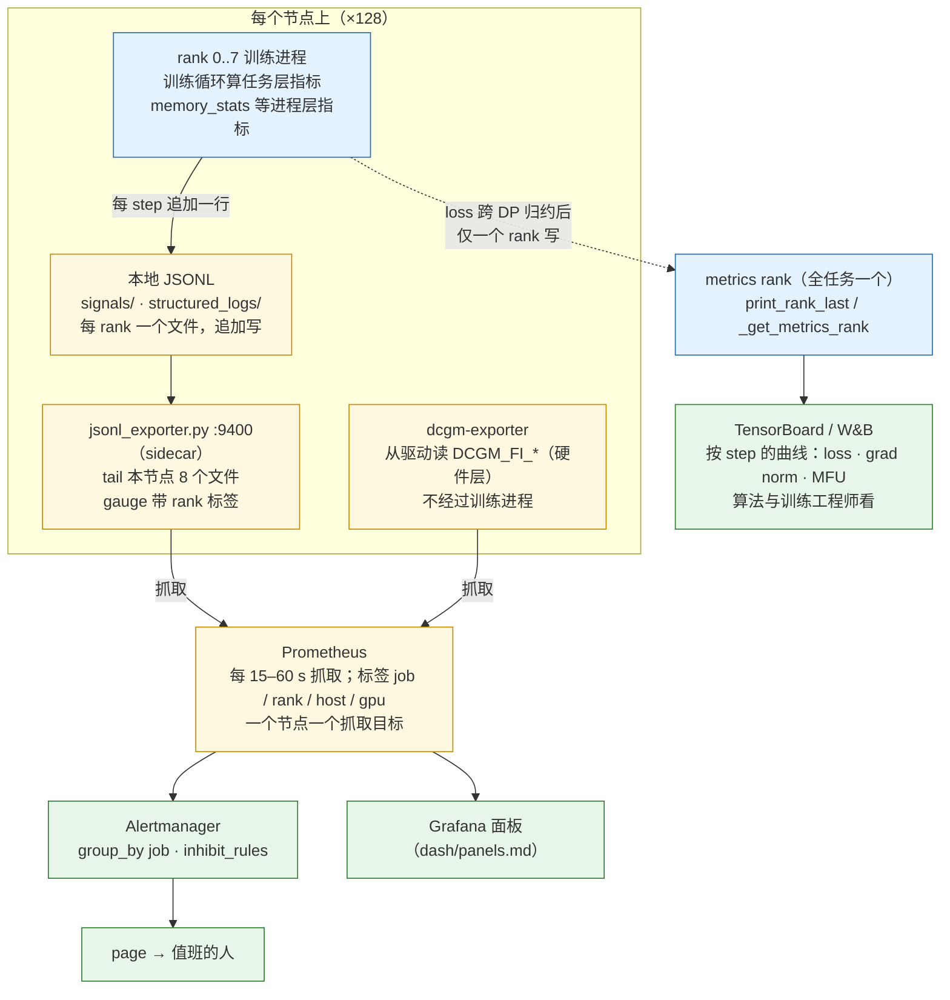
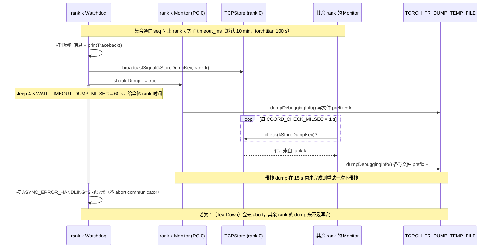
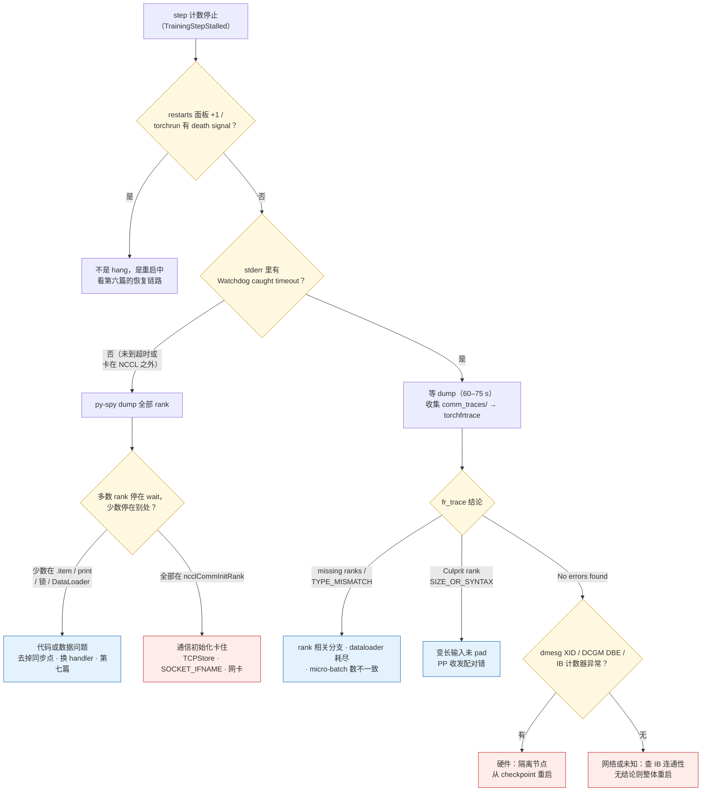
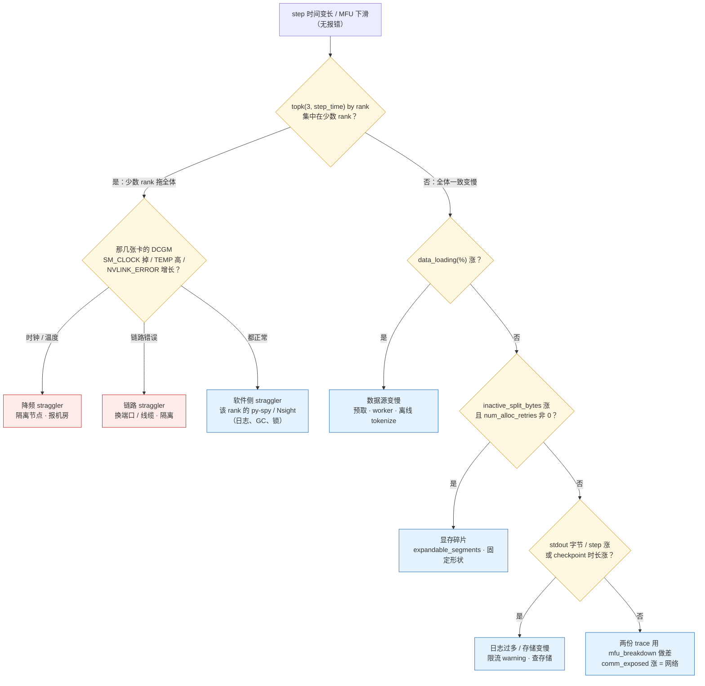
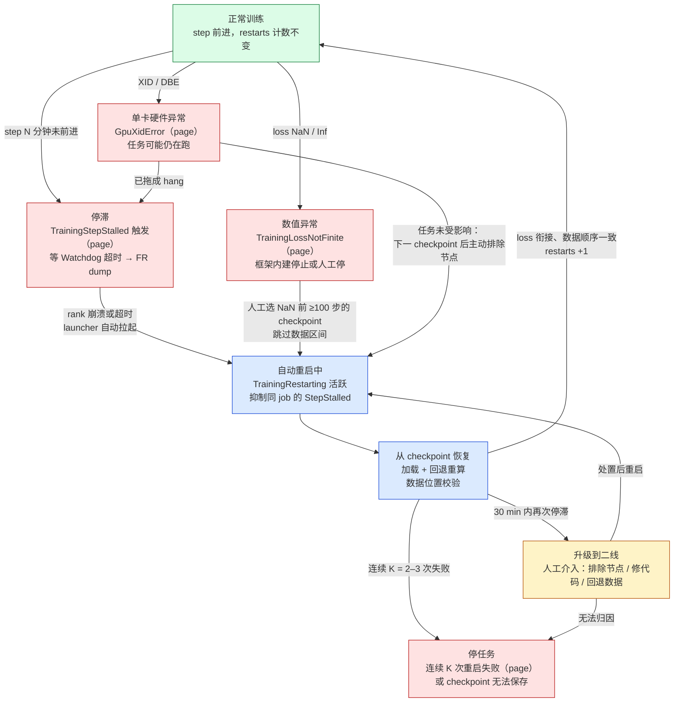

> **更新 @2026-09-06**：本文 torchtitan 部分基于 v0.3.0 刷新；其余源码引用仍以 PyTorch 2.13.0 / Megatron Core 0.18.0 为准。

前七篇把一个千卡训练任务从"配出来"讲到"跑满"再讲到"不倒"：显存账、并行策略、三个框架、MFU 拆解、checkpoint、容错、稳定性与数据。每一篇都在回答"出了某件事该怎么办"。本篇回答的是前面那半句——**怎么知道出了事**，以及知道之后的十分钟里该看哪里、该叫谁、该按什么顺序查。

这不是一个附加题。Llama 3 论文（Dubey et al. 2024）报告的 54 天里 419 次意外中断，平均每三小时一次；同一篇论文说他们只有 3 次需要显著的人工介入，有效训练时间超过 90%。两组数字之间的差距，一半是第五、六篇的自动恢复，另一半是**检测**：故障在几秒内被发现，而不是被早上来上班的人发现。三类故障里，显式故障（进程崩溃、NCCL 报错）会自己喊；静默故障（SDC、数据错误）要靠第六、七篇的校验；夹在中间的"hang 或变慢"最麻烦——所有进程都活着、日志还在滚、GPU 利用率甚至是 100%，但 step 计数不动了。这一类只有监控能发现，而且发现之后还要能回答"哪个 rank 在哪次通信上没有到"。

所以本篇的重心有两个。一个是**指标体系**：任务层、进程层、硬件层三层各看什么、从哪采、写到哪、怎么按 rank 看。另一个是 **hang 的排查**：PyTorch 的 Flight Recorder 把每一次集合通信的发起与完成都记在一个环形缓冲里，超时时所有 rank 各自 dump 一份，一个分析脚本把它们对齐，指出第几次集合通信上哪些 rank 缺席、或者谁发了一个尺寸不同的张量。这套机制在 2.13.0 里已经默认打开，但多数团队不知道它存在，也没有把 dump 路径接到能拿到文件的地方。

围绕这两个重心，还有三件次要但必需的事：性能回归（step 时间慢慢变长）的排查顺序、告警的分级（什么叫醒人、什么只记录）、以及运维流程本身——开训前的检查清单、值班手册、复盘模板。最后用成本把它们串起来：每一个 MFU 百分点、每一次故障各值多少 GPU 小时，决定先修什么。

本篇要回答总纲提出的核心问题：

> **凌晨三点告警：step 时间从 12 秒变成 40 秒，没有报错。十分钟内你要判断是 straggler、数据、通信、还是硬件降频。你需要的每一个信号，在开训前有没有采集？**

源码以 PyTorch 2.13.0、Megatron Core 0.18.0 为准，torchtitan 依更新声明以 v0.3.0 为准。文中 DCGM 指标名以 dcgm-exporter 的默认字段表为准，随版本略有增减；GPU 单价是标注为假设的数字，不是任何供应商的报价。本篇不引用其他系列的文章，集合通信只用语义。


## 一、总览

### 1. 本篇用到的前文结论

前文的符号与结论，本篇只用下面这些，在此复述以求自治：

```text
MFU            观测吞吐 × 每 token FLOP / (卡数 × 标称峰值)，来自 PaLM 论文的定义；不计激活重计算的 FLOP
               H100 SXM bf16 dense 标称 989 TFLOPS；1024 卡 70B dense 的设计目标 42%（第四篇候选 A：4.75 s/step）
七项 MFU 损失   PP 气泡 · 未重叠通信 · 重计算 · 数据等待 · kernel 效率 · CPU 发射 · straggler（第四篇）
三类故障        显式（崩溃 / XID / NCCL 报错）· 隐式（hang / 变慢）· 静默（SDC / 坏数据）（第六篇）
δ  M  τ        一次 checkpoint 的开销 · 平均故障间隔 · checkpoint 间隔；Young 公式 τ_opt ≈ √(2δM)（第五篇）
有效训练时间    有用训练时间 / 总时间；每次故障的代价 = 检测 + 重启 + 加载 + 回退重算（第六篇）
数值信号        loss · grad norm · params norm · lr · loss scale · 跳过的迭代数 · num_zeros_in_grad · 注意力 logit 最大值（第七篇）
```

checkpoint/重启的周期在本篇里的意义是：**检测时间是有效训练时间公式里唯一完全由监控决定的一项**。一个 hang 如果靠 NCCL 的 10 分钟默认超时才被发现，1024 张卡就空转 10 分钟；如果靠"step 计数 90 秒没动"的告警发现，就是 90 秒。两者相差的 8 分半钟，乘以每三小时一次的故障频率，就是 4–5 个百分点的有效训练时间。

### 2. 把训练任务当作服务

一个在线服务有四件运维基本功：看得见（metrics / logs / traces）、叫得醒（alerting）、查得出（debugging）、有章法（runbook / postmortem）。训练任务与在线服务的差别只在于：它是一个进程组而不是一群独立进程，所以"一个 rank 的问题是全体的问题"；它有一个内在的进度量（step）而不是请求量；它的故障后果是回退到上一个 checkpoint 而不是丢几个请求。这三个差别决定了本篇与通用运维手册不同的地方——**按 rank 看、以 step 为时钟、以 checkpoint 为恢复点**。

```text
                 ┌──────────────────────── 看得见 ────────────────────────┐
                 │  任务层   loss · grad norm · lr · token/s · MFU · step 时间 · 抖动     │
                 │  进程层   每 rank 计算/等待时间 · 显存峰值与碎片 · 数据队列 · CPU       │
                 │  硬件层   温度 · 功耗 · 频率 · XID · ECC · 行重映射 · 网卡错包重传      │
                 └───────────────┬────────────────────────────────────────┘
                                 │ 写入
              TensorBoard / W&B（曲线，按 step）        Prometheus（时序，按时间与 rank）
                                 │                                │
                                 │                          告警规则（第五章）
                                 │                                │
                 ┌───────────────┴─────────── 查得出 ─────────────┴────────┐
                 │  hang     Flight Recorder dump → fr_trace → 哪个 rank 缺席哪次集合通信   │
                 │           py-spy dump 全部 rank → Python 栈；TORCH_DISTRIBUTED_DEBUG   │
                 │  变慢     profiler 时间线对比 · 少数 rank 上的 Nsight · 硬件层指标对照   │
                 └───────────────────────── 有章法 ──────────────────────────┘
                     开训检查清单 · 值班手册 · 复盘模板 · 成本换算决定优先级
```

### 3. 三层指标表

三层的划分标准是**谁能采、谁来看**。任务层由训练循环自己算，一个任务一份；进程层每个 rank 一份，由训练进程或旁路的采集器采；硬件层与训练进程无关，由 DCGM 这类守护进程从驱动读，一张卡一份。

```text
层     指标                              采集点                                          正常形态 / 异常形态
────────────────────────────────────────────────────────────────────────────────────────────────────────────────────────────────
任务   loss（全局平均 / 全局最大）         训练循环；跨 DP 归约后由一个 rank 写出           平滑下降；spike、NaN、平台（第七篇）
       grad norm · params norm · lr      优化器 step 后                                   grad norm 缓慢下降且抖动稳定；持续上升 = 前兆
       loss scale · 跳过 / NaN 迭代数     fp16 时；Megatron 的 skipped / nan iterations   为 0；连续非 0 = 数值问题
       token/s · TFLOPS/GPU · MFU        用 6N + 12Lhs 与 step 时间算                      平直；缓慢下滑 = 性能回归；阶跃 = straggler / 降频
       step 时间及其 p50 / p95 / 抖动     每 step 计时，最好每 rank                         抖动 1–2%；p95/p50 > 1.2 = 有 rank 在拖
       step 计数是否前进                  最近一次 step 完成的时间戳                        持续前进；停止 = hang（唯一可靠的 hang 信号）
       checkpoint 保存时长与成功/失败      checkpoint 组件                                  δ 稳定；失败 = 立即告警
       数据加载等待 · 消费到的样本位置     dataloader                                        等待 ≈ 0；位置单调
进程   每 rank 前向 / 反向 / 优化器时间    Megatron Timers（all 模式）· torchtitan 结构化日志  各 rank 一致；一个 rank 持续偏长 = straggler
       每 rank 通信等待时间               集合通信 kernel 时长 − 理论传输时间               健康集群 < 2% step 时间
       显存 allocated / reserved 峰值      torch.cuda.memory_stats                          稳定；reserved 持续上涨 = 碎片；num_alloc_retries > 0 = 快 OOM
       inactive_split_bytes（碎片）        同上                                              稳定；上涨 = 碎片化
       CPU 利用率 · dataloader 队列深度    进程或 node exporter                              队列满；空 = 数据跟不上
       进程存活 · 最后一次日志时间戳        torchrun 日志目录                                 每 rank 都在写
硬件   温度 · 功耗 · SM 时钟 · 降频原因    DCGM_FI_DEV_GPU_TEMP / POWER_USAGE / SM_CLOCK      SM 时钟贴近最大值；掉到 1.3 GHz 以下 = 降频
       XID 错误                           DCGM_FI_DEV_XID_ERRORS · dmesg                   0；出现即隔离节点（第六篇）
       ECC 单比特 / 双比特 · 行重映射      DCGM_FI_DEV_ECC_SBE/DBE_VOL_TOTAL · ROW_REMAP_*   SBE 缓慢增长可接受；DBE / 重映射待处理 = 换卡
       NVLink / PCIe 错误与重放           DCGM_FI_DEV_NVLINK_*_ERROR_COUNT · PCIE_REPLAY     不增长；增长 = 链路问题 → straggler 的常见根因
       网卡错包 · 重传 · 链路降速          IB 计数器（perfquery / rdma statistics）          不增长
       Tensor core 活跃度                 DCGM_FI_PROF_PIPE_TENSOR_ACTIVE                   与 MFU 同趋势；某卡显著低 = 该卡有问题
```

表里有一行值得单独说：**"step 计数是否前进"是 hang 唯一可靠的信号**。GPU 利用率在 hang 时通常是 100%（NCCL kernel 在自旋等对端），功耗正常，进程活着，日志还在打 warning。只有"最近一次 step 完成的时间戳距现在多久"这个量能区分"在跑"和"卡住"。它必须由训练循环写出，并由一个独立于训练进程的东西（Prometheus 抓取、或一个 watchdog 脚本）读取——训练进程自己卡住时不会报告自己卡住了。

### 4. 三框架在"可观测面"上的对照

```text
项                Megatron Core 0.18.0                                DeepSpeed 0.19.2                          torchtitan v0.3.0
──────────────────────────────────────────────────────────────────────────────────────────────────────────────────────────────────────
计时器            megatron/core/timers.py：Timers / Timer；            deepspeed/utils/timer.py：                torchtitan/observability/structured_logger：
                  --timing-log-level 0/1/2、--timing-log-option        SynchronizedWallClockTimer；              log_trace_span 写每 rank JSONL；
                  max/minmax/all                                       wall_clock_breakdown 配置                  gantt_generator 合成 Chrome trace
step 日志         megatron/training/training.py：training_log()        engine.py 按 steps_per_print 打印；        torchtitan/components/metrics.py：
                  "elapsed time per iteration" · "throughput per GPU"  ThroughputTimer                           MetricsProcessor.log()：tps · tflops · mfu(%)
                  · grad norm · num zeros · skipped / nan iterations                                              · memory/max_active · data_loading(%)
MFU / TFLOPS      num_floating_point_operations() / (Δt × world_size)   flops_profiler（按 op 统计，非每 step）    num_flops_per_token × tps / get_peak_flops()
显存              --log-memory-to-tensorboard 写 memory_stats 四项；    monitor 配置写 tensorboard/wandb/csv       DeviceMemoryMonitor.get_peak_stats()：
                  report_memory()；--record-memory-history 存快照                                                  active/reserved 峰值 · num_alloc_retries · num_ooms
后端              TensorBoard · W&B · one_logger                       deepspeed/monitor/：tensorboard/wandb/     TensorBoardLogger · WandBLogger（LoggerContainer）
                                                                       comet/csv
straggler         megatron/core/utils.py：StragglerDetector；           无                                         无（靠每 rank JSONL 事后比较）
                  --log-straggler；运行时可通过端口开关
Flight Recorder   由 PyTorch 提供，Megatron 不额外封装                  同左                                       CommConfig.trace_buf_size（默认 20000）自动设
                                                                                                                 TORCH_FR_BUFFER_SIZE / TORCH_FR_DUMP_TEMP_FILE
```

DeepSpeed 这一列后文不再展开：它的计时与监控概念与 Megatron 同构，读者按对照表映射即可。

### 5. 本文的章节安排

```text
二、三层指标的采集      Megatron 的 Timers 与 training_log · torchtitan 的 MetricsProcessor 与结构化日志 · memory_stats · DCGM · TB/W&B 与 Prometheus 的分工 · 每 rank 可见性
三、hang 排查           Flight Recorder：记什么 · 开关与默认值 · 从超时到 dump 的链路 · fr_trace 分析器 · 一次完整走查 · py-spy · TORCH_DISTRIBUTED_DEBUG · 常见成因
四、性能回归的排查      step 时间慢慢变长的四个嫌疑 · profiler 时间线对比 · 少数 rank 上的 Nsight · 与七项拆解的衔接
五、告警设计            page 与 record 的边界 · 规则表 · 抑制与合并 · 任务状态与告警的对应
六、运维流程            开训检查清单 · 值班手册 · 复盘模板
七、成本视角            GPU 小时的换算 · 用它排优先级
八、本文小结            要点 · 源码位置 · train-ledger 的 dash/ 与 runbook.md · Flight Recorder hang 演练
九、系列总结            读者手上有什么 · 四条线 · 系列目录
```


## 二、三层指标的采集

### 1. 任务层：Megatron 的 Timers 与 training_log

Megatron 的计时器在 `megatron/core/timers.py`。`Timers` 是一组命名计时器的容器，构造时接收 `log_level`（0/1/2）与 `log_option`（`max` / `minmax` / `all`）；`Timers.__call__(name, log_level)` 按名字取或建一个 `Timer`，级别高于配置的返回 `DummyTimer`（全部方法为空），所以未开启的计时点没有开销。`Timer.start()` / `stop()` 可带 `barrier=True`——先做一次全局 barrier 再计时，这让"forward-backward"这类计时器测的是**全体最慢 rank 的时间**而不是本 rank 的时间。

关键在 `Timers._get_elapsed_time_all_ranks()`：它把各 rank 的计时值 all-gather 成一个 `[world_size, len(names)]` 的张量，`_get_global_min_max_time()` 从中取每个计时器的最小 / 最大值及对应 rank，`_get_all_ranks_time_string()` 则逐 rank 列出。这就是三种 `log_option` 的来源：`max` 只报最慢的，`minmax` 报最快最慢的 rank 号与时间，`all` 全部列出。**`minmax` 是 straggler 的第一道探测器**——如果 `forward-compute` 的 max 与 min 相差 20% 且 max 总落在同一个 rank 上，那张卡就是嫌疑人。代价是每次 log 一次 all-gather，`--log-interval` 之外不会触发。

日志行由 `megatron/training/training.py` 的 `training_log()` 拼出。它按 `timing_log_level` 决定报哪些计时器：级别 1 是 `forward-backward`、`all-grads-sync`、`params-all-gather`、`optimizer` 及其子项；级别 2 加上 `batch-generator`、`forward-compute` / `backward-compute` 与八种 PP 收发计时器。每 `log_interval` 步它调用 `timers('interval-time').elapsed(barrier=True)` 得到区间时间，除以迭代数得到 `elapsed time per iteration (ms)`；开 `--log-throughput` 时用 `num_floating_point_operations()` 除以（每迭代时间 × world_size）得到 `throughput per GPU (TFLOP/s/GPU)`——这就是第一篇的 MFU 分子，除以标称峰值即 MFU。一行典型的日志：

```text
 [2026-08-08 03:12:44.118201] iteration     1370/  100000 | consumed samples:       701440 | elapsed time per iteration (ms): 4812.3 |
 throughput per GPU (TFLOP/s/GPU): 411.2 | learning rate: 2.987E-04 | global batch size:   512 | lm loss: 2.104E+00 |
 loss scale: 1.0 | grad norm: 0.812 | num zeros: 1834 | params norm: 2731.402 | number of skipped iterations:   0 | number of nan iterations:   0 |
```

`training_log()` 同时把这些量写进 TensorBoard 与 W&B（`get_tensorboard_writer()` / `get_wandb_writer()`），并在 `--log-memory-to-tensorboard` 下写 `torch.cuda.memory_stats()` 的四项：`reserved_bytes.all.current`、`allocated_bytes.all.current`、`allocated_bytes.all.peak`、`allocation.all.current`。日志由 `print_rank_last()` 打印——最后一个 rank 才有完整的 loss，这与 torchtitan 的 `_get_metrics_rank()` 选"最后一个 PP stage 的第一个 rank"是同一个理由。`--record-memory-history` 让 `training_log()` 每个 log 周期把 `torch.cuda.memory._snapshot()` pickle 到 `--memory-snapshot-path`，用于事后看碎片。

Megatron 还有一个内置的 straggler 探测器：`megatron/core/utils.py` 的 `StragglerDetector`（单例，`training.py` 里的 `stimer`），`--log-straggler` 开启，每 `log_interval` 调用 `stimer.report()`，报告各 rank 的最小 / 最大 round-trip 时间、估算吞吐、功耗与温度（`MnRtt/Rnk`、`MnPwr/Rnk`、`MnTmp/Rnk` 一类的字段），`--straggler-minmax-count` 控制列出几个最快最慢的 rank，`--straggler-ctrlr-port` 允许运行时通过一个端口开关它。它把进程层与硬件层的一部分合在一起，是排查 straggler 时最先看的东西。

### 2. 任务层：torchtitan 的 MetricsProcessor

torchtitan v0.3.0 的指标在 `torchtitan/components/metrics.py`。`MetricsProcessor` 持有一个 `BaseLogger`（空实现）、`TensorBoardLogger`、`WandBLogger` 或把二者装在一起的 `LoggerContainer`，由 `_build_metric_logger()` 按 `MetricsProcessor.Config` 的 `enable_tensorboard` / `enable_wandb` 构建。哪个 rank 写由 `_get_metrics_rank()` 决定：非 PP 是 rank 0；PP 下是最后一个 stage 的第一个 rank（因为只有它算 loss）；`ZBVZeroBubble` 调度例外，loss 回到 rank 0。`save_for_all_ranks=True` 让每个 rank 都写、目录按 `rank_{n}` 分开——千卡下不要这么做，TensorBoard 目录会有一千个子目录，那是 Prometheus 的活（第 5 节）。

MFU 的计算在 `MetricsProcessor.log()`：

```python
# torchtitan/components/metrics.py，MetricsProcessor.log()，有删节
time_delta = time.perf_counter() - self.time_last_log
tps = self.ntokens_since_last_log / (time_delta * self.parallel_dims.non_data_parallel_size)
tflops = self.num_flops_per_token * tps / 1e12
mfu = None if self.has_quantization else 100 * self.num_flops_per_token * tps / self.gpu_peak_flops
```

四个量的来源：`ntokens_since_last_log` 由 `Trainer` 的 batch 生成器在每次 `next(data_iterator)` 后累加 `labels.numel()`；`non_data_parallel_size` 是 TP × PP × CP 的乘积，除以它得到**每卡** token/s（同一个 batch 被非 DP 维度的卡共同处理，只算一份）；`num_flops_per_token` 来自模型的 `get_nparams_and_flops()`（第四篇：`6N + 12Lhs`）；`gpu_peak_flops` 来自 `torchtitan/tools/utils.py` 的 `get_peak_flops()`——按设备名查表，H100 SXM 返回 989e12、H100 PCIe 756e12、H100 NVL 835e12、A100 312e12，它还会调用 `lspci` 读真实的 PCI 设备名，因为 `torch.cuda.get_device_name()` 分不清 SXM 与 PCIe。一个细节：开 FP8 等量化时 `mfu` 置为 `None`（日志显示 `N/A`），因为按 bf16 峰值算的 MFU 在 FP8 下没有意义——这与第四篇的讨论一致。

同一个 `log()` 还写：`time_metrics/end_to_end(s)`（区间时间除以 `log_freq`，即每 step 时间）、`time_metrics/data_loading(s)` 与 `data_loading(%)`（生成器里 `next()` 前后计时的累加，即数据等待），以及 `DeviceMemoryMonitor.get_peak_stats()` 的六项：`active_bytes.all.peak`、`reserved_bytes.all.peak` 各折成 GiB 与百分比、`num_alloc_retries`、`num_ooms`——后两项非零时直接 `logger.warning`。stdout 上是一行：

```text
[titan] step: 1370  loss:  2.10412  grad_norm:  0.8123  memory: 61.38GiB(77.42%)  tps: 3,412  tflops: 413.9  mfu: 41.85%
```

`Trainer` 在调用 `metrics_processor.log()` 之前先做了两件事：用 `dist_sum` / `dist_max` 在 loss mesh 上归约出 `global_avg_loss` 与 `global_max_loss`；检查 `math.isfinite(global_avg_loss)`，不是有限值就 `raise RuntimeError`——这是 torchtitan 内建的"loss NaN 就停"，比告警更快，代价是重启由外层负责。

### 3. 进程层：memory_stats、每 rank 计时与结构化日志

进程层的第一个来源是 `torch.cuda.memory_stats()`。它返回 PyTorch Caching Allocator 的全部计数器，本篇用到的键（PyTorch 2.13.0，`torch/cuda/memory.py` 的 `memory_stats()` 文档串列出全部）：

```text
allocated_bytes.all.{current,peak}     张量实际占用；peak 是显存账的"实测"，与第一、二篇的计算对账
reserved_bytes.all.{current,peak}      分配器向 CUDA 要到的总量（cudaMalloc 的和）；reserved − allocated 是分配器持有但未用的
active_bytes.all.{current,peak}        含尚未被 stream 释放的块；torchtitan 的 max_active 用的是它
inactive_split_bytes.all.current       碎片：被切分后空闲、但因邻块在用而无法归还的字节；长期训练中持续上涨 = 碎片化
requested_bytes.all.{current,peak}     用户实际请求的字节（不含对齐 padding）
num_alloc_retries                      cudaMalloc 失败后 empty_cache 重试的次数；> 0 说明已经在显存边缘，每次重试都是一次同步与停顿
num_ooms                               抛出的 OOM 次数
num_device_alloc / num_device_free     cudaMalloc / cudaFree 调用次数；稳态下应当为 0 增长——增长说明分配器在反复向驱动要还内存
```

这些计数器每 step 读一次几乎没有开销（不涉及同步），每个 rank 都应当采。第四章会用 `inactive_split_bytes` 与 `num_alloc_retries` 诊断"step 时间慢慢变长"。

第二个来源是**每 rank 的阶段计时**。Megatron 的 `Timers` 在 `log_option='all'` 下给出每 rank 每阶段的时间，但要经过一次 all-gather 并打在一行里，千卡下这一行有一千个数字。torchtitan v0.3.0 的做法更适合大规模：`torchtitan/observability/structured_logger/` 是一个每 rank 写 JSONL 的结构化日志器，`init_structured_logger(source, output_dir)` 在每个进程里初始化一次，`log_trace_span("fwd_bwd")` 作为上下文管理器或装饰器写出 `fwd_bwd_start` / `fwd_bwd_end` 两条记录，`log_trace_instant()` 写点事件，`log_trace_scalar({...})` 写数值，`set_step(step)` 让之后的每条记录带上 step 号。`Trainer` 里已经埋好的 span 有 `step`、`fetching_batch`、`post_dataloading_process`、`fwd_bwd`、`optim`、`collect_dist_metrics`，以及初始化阶段的 `torch_distributed_init`、`model_parallelism_init`；数值有 `local_valid_tokens`、`global_valid_tokens`。每条记录由 `jsonl_handler.py` 的 `TraceJsonlFormatter` 写成一行 JSON，字段含 `rank`、`source`、`step`、`relative_step`、`time_us`、`log_type_name`（如 `fwd_bwd_end`）、`caller`（文件:行:函数），文件名为 `structured_logs/{source}.global_rank_{rank}.{时间戳}-{随机}.jsonl`。`gantt_generator.py` 的 `generate_gantt_trace(log_dir, output_path)` 把一个目录下所有 rank 的 JSONL 合成一个 Chrome trace JSON，在 Perfetto 里打开就是一张**所有 rank 同一时间轴的甘特图**——`fwd_bwd` 在哪个 rank 上总是最长、`fetching_batch` 在哪个 rank 上偶尔冒出来，一眼可见。配置项是 `DebugConfig.enable_structured_logging`（默认 `True`），自定义后端通过环境变量 `TITAN_STRUCT_LOGGER_HANDLERS` 指定 handler 工厂。

这套东西的设计原则值得抄：**每 rank 一个文件、追加写、不阻塞训练、事后合并**。它不做任何跨 rank 通信，所以不会成为新的 hang 源；它的数据粒度是"阶段"而不是"kernel"，所以文件大小可控（每 step 十几行）。它没有 Prometheus 后端，第八章的 `dash/` 会补一个。

第三个来源是 CPU 侧：dataloader 的队列深度（`torch.utils.data.DataLoader` 没有直接暴露，torchtitan 用 `data_loading(s)` 间接反映）、进程的 CPU 利用率与 RSS（node exporter 的 `process_*` 或 cgroup 指标）、NCCL proxy 线程与 dataloader worker 是否在争同一批核。

### 4. 硬件层：DCGM 的字段

硬件层不经过训练进程。NVIDIA DCGM（Data Center GPU Manager）以守护进程从驱动读计数器，dcgm-exporter 把它们以 Prometheus 格式暴露，每张卡一组标签（`gpu`、`UUID`、`Hostname`，可选注入 Kubernetes 的 pod 标签）。本篇关心的字段分四组：

```text
组        字段（dcgm-exporter 默认表中的名字）                      用途
────────────────────────────────────────────────────────────────────────────────────────────────────────────
状态      DCGM_FI_DEV_GPU_TEMP · DCGM_FI_DEV_MEMORY_TEMP             温度；HBM 温度过高先于 SM 降频
          DCGM_FI_DEV_POWER_USAGE                                    功耗；训练稳态应贴近 TDP；某卡显著低 = 它没在干活
          DCGM_FI_DEV_SM_CLOCK · DCGM_FI_DEV_MEM_CLOCK                时钟；H100 SXM 满载 SM 时钟约 1.98 GHz（标称最大）
          DCGM_FI_DEV_CLOCK_THROTTLE_REASONS（新版名 CLOCKS_EVENT_REASONS） 降频原因位图：功耗墙 / 温度墙 / 同步 boost
利用率    DCGM_FI_PROF_GR_ENGINE_ACTIVE · DCGM_FI_PROF_SM_ACTIVE      粗粒度活跃度；hang 时也可能是 100%
          DCGM_FI_PROF_PIPE_TENSOR_ACTIVE                            Tensor core 活跃比例；与 MFU 同趋势，是"这张卡在算矩阵"的直接证据
          DCGM_FI_PROF_DRAM_ACTIVE                                   HBM 带宽活跃度
          DCGM_FI_PROF_NVLINK_TX_BYTES / RX_BYTES · PCIE_TX/RX_BYTES  链路流量；TP 组内各卡应对称
错误      DCGM_FI_DEV_XID_ERRORS                                     最近的 XID 码；任何非 0 值 = 该卡不可信
          DCGM_FI_DEV_ECC_SBE_VOL_TOTAL · ECC_DBE_VOL_TOTAL           单/双比特错误累计；DBE = 立即隔离
          DCGM_FI_DEV_ROW_REMAP_PENDING · UNCORRECTABLE_REMAPPED_ROWS  HBM 行重映射；pending = 需要重置 GPU
          DCGM_FI_DEV_NVLINK_CRC_FLIT_ERROR_COUNT_TOTAL · NVLINK_REPLAY_ERROR_COUNT_TOTAL   NVLink 链路错误
          DCGM_FI_DEV_PCIE_REPLAY_COUNTER                            PCIe 重放
显存      DCGM_FI_DEV_FB_USED · DCGM_FI_DEV_FB_FREE                   驱动视角的显存占用（含 CUDA context、NCCL buffer）
```

字段名随 dcgm-exporter 版本有增删（例如降频原因字段在新版本改名），部署时以 `dcgm-exporter --help` 或其默认 csv 为准。两点经验：**`PROF_*` 系列需要 DCGM 的 profiling 模块**，与 Nsight 同时使用会冲突（同一时刻只能有一个 profiler 占用硬件计数器），做 Nsight 采样的那几张卡上要临时关掉；**XID 的权威来源是内核日志**（`dmesg` / `journalctl -k` 里的 `NVRM: Xid`），DCGM 只报最近一个码，故障复盘时以 dmesg 为准。

网络侧（InfiniBand）不在 DCGM 里：`perfquery` 或 `/sys/class/infiniband/*/ports/*/counters/` 下的 `port_rcv_errors`、`port_xmit_discards`、`link_downed`、`symbol_error`，以及 `rdma statistics` 的重传计数，用 node exporter 的 infiniband collector 或专门的 exporter 采。straggler 的根因里"某条链路差"是常见的一种，没有这组指标就只能靠排除法。

### 5. TensorBoard / W&B 与 Prometheus 的分工

两种后端回答两种问题。TensorBoard 与 W&B 是**按 step 的曲线**：loss、grad norm、lr、MFU 随训练进度的变化，用来判断训练本身健不健康，看的人是算法与训练工程师，粒度是每 `log_interval` 步一个点，写的 rank 只有一个。Prometheus 是**按时间与 rank 的时序**：每张卡的温度、每个 rank 的 step 时间、最近一次 step 完成的时间戳，用来判断系统健不健康并触发告警，看的人是值班的人与告警规则，粒度是每 15–60 秒一次抓取，标签维度包括 rank、host、gpu。

分工的原则：**凡是要按 rank 看、要告警的，进 Prometheus；凡是要与上一次实验对比曲线形状的，进 TensorBoard / W&B**。两边有重叠（loss、MFU 两边都要），重叠部分以 Prometheus 为告警源、TensorBoard 为分析源。不要用 TensorBoard 做告警（它没有查询语言，事件文件是追加的二进制），也不要用 Prometheus 存每 step 的 loss 曲线（它按时间抓取，会漏 step，且长期保留成本高）。

训练进程向 Prometheus 暴露指标有两条路：进程内起一个 HTTP 端口（`prometheus_client` 的 `start_http_server`），千卡下就是一千个抓取目标，服务发现要能跟上 torchrun 重启后的端口变化；或者训练进程只写本地 JSONL（第 3 节的做法），节点上一个 sidecar 读文件并暴露——一个节点一个目标，重启不影响。第八章的 `dash/jsonl_exporter.py` 走第二条路。把三层指标的采集点、落地位置与两种后端画在一起，能看清"谁在每个节点上跑、谁只有一份、谁绕过了训练进程"：



### 6. 每 rank 的可见性

千卡任务的排障工具首先要能回答"第 517 号 rank 在干什么"。四件基础设施：

- **日志按 rank 分文件**。torchrun（`torch/distributed/run.py`）的 `--log-dir` 让每个本地 rank 的 stdout/stderr 落到 `<log_dir>/<run_id>/attempt_<n>/<local_rank>/` 下，`--redirects 3` 重定向 stdout 与 stderr，`--tee 3` 同时打到终端，`--local-ranks-filter 0,4` 只在终端显示指定的 rank。所有 rank 的日志都要留，但只有少数 rank 的要实时看。
- **日志行带 rank 前缀**。Megatron 的 `print_rank_0` / `print_rank_last` 已经把大多数日志压到一个 rank；剩下的（warning、NCCL 输出、`report_memory()` 的 `[Rank N]` 前缀）要能按 rank 过滤。PyTorch 的 c10d 日志（`ProcessGroupNCCL` 的 `logPrefix()`）自带 `[PG ID x PG GUID y Rank z]`，这是 hang 排查时要读的那些行。
- **指标带 rank 标签**。第 3 节的 JSONL 与第 5 节的 Prometheus 标签。
- **rank 到物理位置的映射**。`RANK` → `hostname` + `LOCAL_RANK` → GPU UUID → 机架/交换机端口。straggler 定位到 rank 之后要能落到一张具体的卡，这张映射表在开训时生成（各 rank 打印 `socket.gethostname()`、`torch.cuda.current_device()` 与 `nvidia-smi -L` 的 UUID），存进 run 的元数据里。

聚合与抽样的原则：任务层聚合（一个数），进程层全采但只在异常时看（Prometheus 的 `topk(5, step_time_seconds)` 一类查询），硬件层全采全看（它是告警源）。日志则反过来：全部留存、按 rank 抽样看。


## 三、hang 排查：Flight Recorder

### 1. hang 是什么、为什么难查

同步训练里每个 step 有几十到几百次集合通信，每一次都要求同一进程组内所有 rank 到达。**任何一个 rank 没有发起某次通信，其余 rank 就在那次通信上永远等下去**——GPU 上是 NCCL kernel 自旋（利用率 100%），CPU 上是主线程阻塞在 `work.wait()` 或下一次 launch 上。没有异常、没有错误日志，直到 `ProcessGroupNCCL` 的 watchdog 发现某个 work 超过了超时时间（默认 `kProcessGroupNCCLDefaultTimeout` = 10 分钟；torchtitan 的 `CommConfig.train_timeout_seconds` 默认 100 秒，初始化阶段 300 秒）。

难查在两处。第一，**报错的 rank 不是肇事的 rank**：超时在等待的 rank 上抛出，而没有到的那个 rank 可能正在做别的事、也可能自己也在等另一次通信。第二，**等到超时时现场已经没了**：抛异常、abort communicator、进程退出，谁在等谁的信息随之消失。事后能拿到的只有各 rank 的最后几行日志。

Flight Recorder 解决的正是第二个问题：在每个 rank 上持续记录最近 N 次集合通信的元数据（谁、哪个进程组、第几次、什么操作、多大、什么状态、Python 栈），超时时**所有 rank 一起 dump**，事后用分析器把各 rank 的记录按序列号对齐——第一个不一致的地方就是答案。

### 2. Flight Recorder 记录什么

实现在 `torch/csrc/distributed/c10d/FlightRecorder.hpp` 与 `FlightRecorder.cpp`（模板实现在 `FlightRecorderDetail.hpp`，CUDA 事件的特化在 `FlightRecorderCuda.cpp`）。`FlightRecorder<EventType>` 是进程内单例（`get()`），核心是一个大小为 `max_entries_` 的环形数组 `entries_`，元素是 `Entry`：

```text
Entry 字段（FlightRecorder.hpp）              dump 出来的键                    含义
────────────────────────────────────────────────────────────────────────────────────────────────────────────
id_ / reset_epoch_                          record_id                        环形缓冲里的序号
pg_id_ / pg_name_                           pg_id / process_group            进程组的 uid 与 (name, desc)；desc 由 init_process_group 的 group_desc 给
collective_seq_id_ / p2p_seq_id_ / op_id_   collective_seq_id / p2p_seq_id / op_id   集合通信序号（每个 kernel launch +1）/ p2p 序号 / 逻辑 op 序号（coalesced 组内每 op +1）
profiling_name_                             profiling_name                  "nccl:all_reduce"、"nccl:_allgather_base" 一类的名字
traceback_                                  frames                          发起时的 Python 栈（C++ 栈需 TORCH_FR_CPP_STACK）
start_ / end_                               state                           两个 CUDA event；查询后得 scheduled / started / completed
time_created_                               time_created_ns                 入队时间
time_discovered_started_ / _completed_      time_discovered_started_ns / _completed_ns   watchdog 线程发现 kernel 开始 / 结束的时间（晚于实际）
timeout_ms_                                 timeout_ms                      该 work 的超时
isP2P_                                      is_p2p
input_dims_ / input_dtypes_ / output_*      input_sizes / input_dtypes / output_sizes / output_dtypes   张量形状与类型——尺寸不匹配靠它抓
duration_                                   duration_ms                     完成后的 kernel 时长（需 TORCH_NCCL_ENABLE_TIMING）
retired_                                    retired                         已从 watchdog 的 work 列表移除；retired 但未 completed = 超时了
```

`record()` 在 `ProcessGroupNCCL` 每次发起集合通信或 p2p 时被调用，`update_state()` 由 watchdog 线程在轮询时调用（查询两个 CUDA event 得出 `scheduled` / `started` / `completed`），`retire_id()` 在 work 完成时把 event 指针清掉并可选计算时长。`dump()` 产出 pickle，`dump_json()` 产出 JSON（不含栈，太大）；两者都带 `version`（`FlightRecorder.hpp` 里 `version_val` 为 "2.10"）、`pg_config`（每个进程组的 rank 列表，由 `record_pg_ranks()` 记录）、`pg_status`（每个进程组最后入队 / 开始 / 完成的序号）与 `entries`。

进程组级的 `pg_status` 单独有用：`ProcessGroupStatus` 的 `lastEnqueuedSeq` / `lastStartedSeq` / `lastCompletedSeq` 出现在超时的错误消息里（`getNCCLWatchdogTimeoutErrorMsg()`），不用分析器也能先看一眼"这个 rank 入队到第几次、完成到第几次"。

### 3. 开关与默认值

全部环境变量在 `torch/csrc/distributed/c10d/ProcessGroupNCCL.hpp`、`FlightRecorder.hpp` 与 `FlightRecorder.cpp` 里定义，2.13.0 的默认值：

```text
环境变量                                    默认值                       含义（读取位置）
────────────────────────────────────────────────────────────────────────────────────────────────────────────────────────────
TORCH_FR_BUFFER_SIZE                        2000                         环形缓冲条目数；> 0 即启用（FlightRecorder 构造函数）
  = TORCH_NCCL_TRACE_BUFFER_SIZE            （同一值的旧名，二者任一生效；ProcessGroupNCCL 构造函数也读它填 traceBufferSize_）
TORCH_FR_CPP_STACK = TORCH_NCCL_TRACE_CPP_STACK   false                  是否同时抓 C++ 栈（慢，默认关）
TORCH_NCCL_DUMP_ON_TIMEOUT                  true                         超时或异常时 dump（HeartbeatMonitor 构造函数；注释说明名字已不准确，异常也会触发）
TORCH_NCCL_ENABLE_MONITORING                true                         启用 heartbeat monitor 线程（dump 由它执行）
TORCH_NCCL_HEARTBEAT_TIMEOUT_SEC            480（8 分钟）                 watchdog 线程本身无心跳多久后判定 watchdog 卡死并 abort 进程
TORCH_NCCL_WAIT_TIMEOUT_DUMP_MILSEC         15000                        等 dump 完成的时间；watchdog 抛异常前额外 sleep 它的 4 倍（60 s）给全体 rank 时间 dump
TORCH_NCCL_COORD_CHECK_MILSEC               1000                         monitor 线程轮询 TCPStore 上"有人要 dump"信号的间隔
TORCH_FR_DUMP_TEMP_FILE                     $XDG_CACHE_HOME 或 $HOME/.cache 下 torch/comm_lib_trace_rank_   dump 文件前缀，后接全局 rank 号
  = TORCH_NCCL_DEBUG_INFO_TEMP_FILE         （旧名，兼容）                 （DebugInfoWriter::getWriter()）
TORCH_FR_DUMP_DYNAMIC_FILE_NAME             false                        每次 write 时重新读 TORCH_FR_DUMP_TEMP_FILE（用于按时间命名）
TORCH_NCCL_DEBUG_INFO_PIPE_FILE             空                           设了则在 <值><rank>.pipe 处建命名管道，往里写任何字节触发一次 dump 而不终止训练
TORCH_INCLUDE_STACK_TRACE                   true                         dump 里包含 Python 栈
TORCH_INCLUDE_ONLY_ACTIVE                   false                        只 dump 未完成的条目
TORCH_NCCL_ENABLE_TIMING                    false                        记录 kernel 时长（需要额外的 CUDA event，略有开销）
TORCH_NCCL_ASYNC_ERROR_HANDLING             3（SkipCleanUp）              超时后的处理：0 不处理 / 1 TearDown / 2 CleanUpOnly / 3 SkipCleanUp
TORCH_NCCL_PROPAGATE_ERROR                  false                        把错误通过 TCPStore 广播到同进程组其他 rank
TORCH_NCCL_DESYNC_DEBUG                     false                        另一套更早的 desync 诊断（DesyncDebugger），与 FR 独立
TORCH_DISTRIBUTED_DEBUG                     OFF                          OFF / INFO / DETAIL；DETAIL 时 desync debug 与 timing 自动开（见第 7 节）
```

三点必须知道。**第一，2.13.0 里 Flight Recorder 与超时 dump 都是默认开的**——`TORCH_FR_BUFFER_SIZE` 默认 2000、`TORCH_NCCL_DUMP_ON_TIMEOUT` 默认 true、`TORCH_NCCL_ENABLE_MONITORING` 默认 true。很多"要开 FR 得设一堆环境变量"的经验来自更早的版本；2.13.0 上要做的不是开它，而是**把 dump 路径指到一个所有 rank 都能写、事后能收集到的地方**（默认在 `$HOME/.cache/torch/` 下，容器里往往是临时文件系统，进程退出即丢）。**第二，`TORCH_NCCL_ASYNC_ERROR_HANDLING` 不能是 1**：TearDown 模式下 watchdog 会先 abort，dump 来不及完成；torchtitan 的 `torchtitan/distributed/utils.py` 的 `init_distributed()` 强制把它设成 `"3"`，并按 `CommConfig.trace_buf_size`（默认 20000）设 `TORCH_FR_BUFFER_SIZE`，把 `TORCH_FR_DUMP_TEMP_FILE` 指到 `<dump_folder>/comm_traces/rank_`，注释里写明原因。**第三，缓冲要够大**：2000 条在一个每 step 几百次通信的任务里只够几个 step；PP 加 FSDP 的任务一个 step 可能上千次。torchtitan 选 20000 是合理的量级，每条几百字节，内存代价几 MB。

### 4. 从超时到 dump 的链路

```text
  rank k 的 watchdog 线程（ProcessGroupNCCL::Watchdog::runLoop）
      │  发现某个 work 超过 timeout_ms
      ├─ 打印超时消息：seq 号、profiling name、lastEnqueued / lastStarted / lastCompleted
      ├─ work.printTraceback()：该集合通信发起时的 Python 栈
      ├─ pg_->broadcastDumpSignal()
      │     ├─ broadcastSignal(globalStore_, kStoreDumpKey, globalRank())   ← 往 TCPStore 写"rank k 要 dump"
      │     └─ shouldDump_.store(true)                                      ← 通知本进程的 monitor 线程
      ├─ sleep(TORCH_NCCL_WAIT_TIMEOUT_DUMP_MILSEC × 4 = 60 s)              ← 给所有 rank 时间
      └─ 按 TORCH_NCCL_ASYNC_ERROR_HANDLING 处理（默认 3：抛异常但不 abort communicator）

  每个 rank 上 PG uid 0 的 monitor 线程（ProcessGroupNCCL::HeartbeatMonitor::runLoop）
      │  每 TORCH_NCCL_COORD_CHECK_MILSEC 轮询一次
      ├─ shouldDump_ 为 true（本 rank 先发现）或 globalStore_->check(kStoreDumpKey) 为 true（别的 rank 发现）
      ├─ 日志："Observed flight recorder dump signal from another rank via TCPStore." / "First PG on this rank to signal dumping."
      ├─ 读出发信号的 rank 号，拼进错误消息："Received a dump signal due to a collective timeout from rank X ..."
      └─ pg_->dumpDebuggingInfo(includeStackTrace, onlyActive)
            ├─ dump_nccl_trace(...) → FlightRecorder::dump()：pickle
            ├─ DebugInfoWriter::getWriter(globalRank()).write(trace)   → <TORCH_FR_DUMP_TEMP_FILE><rank>
            └─ 日志："Flight Recorder trace successfully dumped." / "Finished flight recorder successfully. Output can be analyzed using the fr_trace script."
         第一次带栈 dump 若在 TORCH_NCCL_WAIT_TIMEOUT_DUMP_MILSEC 内没完成，再试一次不带栈
```

上面是单个 rank 内两条线程各自的调用树；跨 rank 看，dump 信号是怎样从发现超时的 rank k 传到其余 rank、以及为什么 watchdog 要在抛异常前多睡 60 秒，用时序图更清楚：



几个细节决定了实际能不能拿到文件。dump 是在 **monitor 线程**里做的，不是 watchdog 线程——因为 watchdog 可能正卡在 CUDA API 上；monitor 线程同时负责检查 watchdog 的心跳（`TORCH_NCCL_HEARTBEAT_TIMEOUT_SEC`，默认 8 分钟），watchdog 卡死时它也会 dump 然后 `LOG(FATAL)` 终止进程。只有 **PG uid 0**（默认进程组）的 monitor 线程做 dump 与轮询 TCPStore，因为所有进程组共用同一个 FlightRecorder 单例，dump 一次就包含全部进程组的记录。信号通过 **TCPStore** 传播，所以 TCPStore（rendezvous 用的那个，rank 0 上）必须还活着；如果 rank 0 自己崩了，其他 rank 的 monitor 会打 "Failed to check the should dump flag on TCPStore" 然后放弃。

**不等超时也能 dump**。两条路：设 `TORCH_NCCL_DEBUG_INFO_PIPE_FILE=/some/dir/fr_`，每个 rank 在 `/some/dir/fr_<rank>.pipe` 建一个命名管道（`DumpPipe` 结构，只在 Linux 上），值班的人 `echo 1 > /some/dir/fr_517.pipe` 就触发 rank 517 dump 一次，**训练继续**——这是"任务看起来变慢但没超时"时看通信状态的手段；或者在 Python 里直接调 `torch._C._distributed_c10d._dump_nccl_trace(includeCollectives=True, includeStackTraces=True, onlyActive=False)`（`init.cpp` 里绑定）拿到 pickle 字节，自己写到任意位置——把它接到一个信号处理器上（`SIGUSR1`），就有了不依赖文件系统布局的手动 dump。`DebugInfoWriter::registerWriter()` 允许注册自定义 writer（例如写对象存储），要在第一次 dump 之前注册（否则默认 writer 已被自动注册），重复注册会告警并以最后一个为准。

### 5. 分析器：fr_trace

分析器在 `torch/distributed/flight_recorder/`，入口 `fr_trace.py` 的 `main()`，安装时注册为命令 `torchfrtrace`（`setup.py` 的 console_scripts；随 PyTorch 一起装上），也可以 `python -m torch.distributed.flight_recorder.fr_trace`。参数由 `components/config_manager.py` 的 `JobConfig` 定义：

```text
torchfrtrace <trace_dir> [-p PREFIX] [-o out.pkl] [-j] [-v] [--print_stack_trace]
             [--selected-ranks R ...] [--pg-filters NAME ...] [--allow-incomplete-ranks]
             [--mismatch_cap N] [--transform-ft --group-world-size W]

trace_dir                 每 rank 一个文件的目录，文件名 <prefix><rank>
-p / --prefix             文件名前缀；不给则由 loader._determine_prefix() 推断（目录里只能有一组前缀）
-j / --just_print_entries 不做匹配，只按 rank 逐条打印（配 --selected-ranks / --pg-filters 缩小范围）
--allow-incomplete-ranks  缺少部分 rank 的 dump 时仍做尽力分析（默认要求进程组内所有 rank 都有文件）
--mismatch_cap            最多报多少处不一致（默认 10）
--transform-ft            torchft 的副本组场景，把组内 rank 映射为全局 rank
-o                        把扁平数据库 pickle 出来供进一步分析
```

流程（`components/`）：`loader.py` 的 `read_dir()` 读目录，`read_dump()` 把每个 pickle 解出 `entries` / `version` / `pg_config`；`builder.py` 的 `build_db()` 先 `check_version()` 确认各 rank 的 FR 版本一致、`align_trace_from_beginning()` 对齐各 rank 环形缓冲的起点、`build_groups_memberships()` 从 `pg_config` 建出进程组与成员表、然后 `build_collectives()` 做匹配；结果是 `types.py` 的 `Database`（`tracebacks` / `collectives` / `ncclcalls` / `groups` / `memberships` 五张表）。

匹配算法（`build_collectives()`）是贪心的：从第一个 rank 的第一条记录出发，在同一进程组的其他 rank 里找同一 `collective_seq_id` 的记录，逐个用 `types.py` 的 `Op.match()` 比较——操作类型、输入输出尺寸、dtype、状态——得到一个 `MatchState`：

```text
MatchState（types.py）              含义                                             典型根因
────────────────────────────────────────────────────────────────────────────────────────────────────────────
FULLY_MATCHED                       全部一致
COLLECTIVE_TYPE_MISMATCH            同一序号上操作不同（一边 all_reduce 一边 broadcast）  rank 相关的控制流走了不同分支
SIZE_OR_SYNTAX_MISMATCH             尺寸不一致，或 p2p 的 src/dst 对不上                  变长 batch 没有 pad；PP 收发配对错
COLLECTIVE_DTYPE_MISMATCH           dtype 不一致                                       混精度路径不一致
COLLECTIVE_STATE_MISMATCH           一边 completed 一边 scheduled                        对端没到；或该 rank 的 kernel 没被调度
UNDECIDED                           需要看全部 rank 才能判断（all_to_all 的尺寸）
```

匹配失败时 `utils.py` 的 `error_analysis()` 分四种情况报告，每种都通过 `EntryState.log()` 打出同一组字段——序号、`record_id`、进程组、集合通信名、输入输出尺寸、world size、期望的 rank 集合、状态、栈：

```text
case 1  "Not all ranks joining collective, sequence number: N"  + "missing ranks: {…}"      ← 有 rank 根本没发起这次通信
case 2  all_to_all 的尺寸检查："Input/output mismatch in the collective sequence number: N"
case 3  全部匹配，无输出
case 4  "Collective sequence number: N has errors" + "error msg: Culprit rank R; Error type: SIZE_OR_SYNTAX_MISMATCH"  ← 有 rank 发了不一样的东西
默认    缺 dump："We cannot decide what's wrong with this collective entry because we missed FR dumps from ranks (…)"
        或 "No errors found for this collective entry, There could be some other reasons why we see collective timeout."
```

最后一条要认真对待：**FR 只能发现"通信层面的不一致"**。如果所有 rank 都正确地发起了同一次 all-reduce、尺寸一致、但它就是不完成，FR 会告诉你"没有错误"——那是 NCCL 或硬件的问题（网卡挂了、某张卡的 kernel 没被调度、GPU 掉了），要转向 dmesg、XID 与 NCCL 自己的调试输出。FR 的定位能力止步于"哪个 rank 在哪次通信上做了什么"。

### 6. 一次完整的走查

设定：8 卡 FSDP 训练，第 41 步开始 step 计数不动，100 秒后（torchtitan 的 `train_timeout_seconds`）rank 3 的日志出现：

```text
[rank3]:[E ProcessGroupNCCL.cpp] [PG ID 0 PG GUID 0(default_pg) Rank 3] Watchdog caught collective operation timeout:
  WorkNCCL(SeqNum=2891, OpType=ALLGATHER_BASE, NumelIn=..., NumelOut=..., Timeout(ms)=100000) ran for 100032 milliseconds before timing out.
[rank3]:[E ProcessGroupNCCL.cpp] ... last enqueued NCCL work: 2891, last completed NCCL work: 2890.
[rank3]:[E ProcessGroupNCCL.cpp] ... First PG on this rank to signal dumping.
[rank0]:[E ProcessGroupNCCL.cpp] ... Observed flight recorder dump signal from another rank via TCPStore.
[rank0]:[E ProcessGroupNCCL.cpp] ... Received a dump signal due to a collective timeout from  rank 3 and we will try our best to dump the debug info. ...
[rank5]:[I ProcessGroupNCCL.cpp] ... ProcessGroupNCCL dumping nccl trace to /work/run42/comm_traces/rank_5
...
[rank0]:[I ProcessGroupNCCL.cpp] ... Finished flight recorder successfully. Output can be analyzed using the fr_trace script.
```

第一步，从日志确认**所有 8 个 rank 都 dump 成功**（每个 rank 一行 "Flight Recorder trace successfully dumped."），并把 8 个文件收到一台机器的同一目录：多节点时用 `pdsh` / `srun` 从各节点的 `comm_traces/` 拷。第二步，跑分析器：

```text
$ torchfrtrace /work/run42/comm_traces -p rank_
Not all ranks joining collective, sequence number: 2891
internal record id: 14887
group info: 0:default_pg
collective: nccl:_allgather_base
missing ranks: {5}
input sizes: [[2097152]]
output sizes: [[16777216]]
world size: 8
expected ranks: {0, 1, 2, 3, 4, 6, 7}
collective state: scheduled
collective stack trace:
  all_gather_into_tensor at .../torch/distributed/distributed_c10d.py
  foreach_all_gather at .../torch/distributed/fsdp/_fully_shard/_fsdp_collectives.py
  unshard at .../torch/distributed/fsdp/_fully_shard/_fsdp_param_group.py
  ...
```

读法：序号 2891 这次 all-gather，7 个 rank 发起了、都停在 `scheduled`（kernel 已入队但没开始——NCCL 的 kernel 在等最后一个参与者），**rank 5 没有发起它**。栈告诉我们这是 FSDP 某个参数组的前向 unshard。第三步，看 rank 5 在干什么——用 `-j --selected-ranks 5` 只打它的记录：

```text
$ torchfrtrace /work/run42/comm_traces -p rank_ -j --selected-ranks 5 --print_stack_trace | tail -8
Rank 5
--------------------------------------------------------------
_allgather_base(input_sizes=[[2097152]], state=completed)
_reduce_scatter_base(input_sizes=[[16777216]], state=completed)
all_reduce(input_sizes=[[1]], state=scheduled)
  stack_id  frame_stack
        17  all_reduce at .../torch/distributed/distributed_c10d.py
            _check_batch at .../train.py
```

`-j` 模式按 rank 列出每条记录（`Op.__repr__` 的短格式：操作、输入尺寸、状态；`-v` 给出全部字段），`--print_stack_trace` 把去重后的栈按 `stack_id` 列在后面。rank 5 的第 2891 次集合通信是一个 1 元素的 `all_reduce`，来自 `train.py` 的 `_check_batch`——一段只在某个条件下执行的校验代码，在 rank 5 上被触发了（例如它那份数据里出现了一个坏样本，代码想 all-reduce 一个标志位），其他 rank 没有触发，直接进了下一层的 all-gather。两边都在等：rank 5 等别人参加它的 all_reduce，别人等 rank 5 参加 all-gather。这就是 FR 能给出的全部：**序号、操作、尺寸、状态、发起栈、缺席者**。剩下的（为什么 rank 5 走了那个分支）回到代码与第七篇的数据管线。

把 8 个 rank 的环形缓冲按 `collective_seq_id` 对齐，分析器看到的就是下面这张表——"第一个不一致的列"就是答案，之后 rank 5 的每条记录都会与其他 rank 错开一格：

```text
seq    rank 0,1,2,3,4,6,7          rank 5                  匹配结果
─────  ──────────────────────────  ──────────────────────  ───────────────────
2889   _allgather_base  completed  _allgather_base compl.  FULLY_MATCHED
2890   _reduce_scatter  completed  _reduce_scatter compl.  FULLY_MATCHED
2891 ► _allgather_base  scheduled  all_reduce [1]  sched.  case 1: missing {5}
2892   （未发起，阻塞在 2891）      （未发起，等 7 rank）     —
```

如果第二步的输出是 "Collective sequence number: 2891 has errors ... Culprit rank 5; Error type: SIZE_OR_SYNTAX_MISMATCH"，说明 rank 5 发了同类型但尺寸不同的张量——变长序列没有 pad 到一致、或某个 rank 的 micro-batch 数不同；如果是 "No errors found"，转第 5 节末尾的硬件路径。

### 7. py-spy 与 TORCH_DISTRIBUTED_DEBUG

FR 给的是 NCCL 层的视角。有两类 hang 不在那一层：训练进程卡在 Python 里（dataloader 的 worker 死锁、`.item()` 等一个永远不完成的 kernel、GIL 死锁、日志库的锁），以及 rank 之间根本没到发起通信的那一步。这时用 `py-spy dump --pid <pid>` 直接读一个正在运行的 Python 进程的栈，不需要进程配合、不需要重启：

```bash
# 在每个节点上对全部训练进程各 dump 一次 Python 栈；--native 同时给出 C 栈（看到底是卡在 cudaStreamSynchronize 还是 ncclCommInitRank）
for pid in $(pgrep -f 'train.py'); do
  echo "=== pid $pid rank $(tr '\0' '\n' < /proc/$pid/environ | grep ^RANK= | cut -d= -f2)"
  py-spy dump --pid "$pid" --native 2>&1 | head -40
done
```

多节点用 `pdsh -w node[001-128]` 把上面的脚本推到每个节点，把输出收回来按 rank 排序。读法：所有 rank 的主线程栈**大多数**停在同一个地方（`work.wait()` / `all_gather_into_tensor`），**少数**停在别处——那少数就是嫌疑人；如果所有 rank 都停在 `DataLoader.__next__` 或 `queue.get`，问题在数据侧（第七篇）；如果栈在 `ncclCommInitRank`，是通信初始化卡住（TCPStore、网络、`NCCL_SOCKET_IFNAME`），与训练逻辑无关。`py-spy dump` 是只读的（用 `process_vm_readv` 读内存），对训练进程没有副作用，可以在生产任务上随时用；它需要与训练进程同一用户或 `CAP_SYS_PTRACE`，容器里要加这个 capability。

`TORCH_DISTRIBUTED_DEBUG`（`torch/csrc/distributed/c10d/debug.cpp` 解析，取值 `OFF` / `INFO` / `DETAIL`）是另一类工具：`DETAIL` 时 `torch/distributed/distributed_c10d.py` 把每个进程组包进 `ProcessGroupWrapper`（`ProcessGroupWrapper.hpp`），**每次集合通信前先在 gloo 上做一次校验**——比较各 rank 的操作类型与张量形状，不一致就在**发起前**抛出带 rank 信息的异常，而不是等 10 分钟超时。同时 `ProcessGroupNCCL` 构造函数在 `DETAIL` 下自动打开 `TORCH_NCCL_DESYNC_DEBUG` 与 `enableTiming_`。代价大（每次通信多一次 CPU 侧的集合通信），**只用于复现阶段**：在 8 卡上开着它跑，能把"rank 相关的控制流"这类 bug 在开训前抓出来；千卡生产任务上不要开。

### 8. 常见成因

```text
成因                                     FR 的表现                                              修法
──────────────────────────────────────────────────────────────────────────────────────────────────────────────────────────────
rank 相关的条件分支里有集合通信            case 1 missing ranks，或 COLLECTIVE_TYPE_MISMATCH        集合通信放在分支外；要传的标志先本地算、再无条件 all_reduce
某 rank 的 dataloader 耗尽 / 抛异常        该 rank 停在上一步末尾，其他 rank 停在本步第一次通信       每个 rank 的样本数一致（drop_last / 定长 epoch）；耗尽时 all_reduce 一个"结束"标志
变长输入没有 pad                          SIZE_OR_SYNTAX_MISMATCH，culprit 是尺寸不同的 rank         pad 到一致；或先 all_gather 尺寸
PP 的 send/recv 配对错                    p2p 记录里 src/dst 对不上；一边 scheduled 一边没有         调度表检查；用 batch_isend_irecv 成组
不同 rank 上的 micro-batch 数不同          rank 间同一 step 内集合通信次数不同 → 序号错位            m 由 global batch 统一算，不由本地数据量算
一个 rank 在 .item() 或 print(tensor) 上等  FR 无异常（通信都完成了）；py-spy 停在 .item()             找出并去掉训练循环里的同步点
NCCL 初始化卡住                           FR 里没有记录（还没开始）；py-spy 在 ncclCommInitRank      TCPStore 可达性、NCCL_SOCKET_IFNAME、防火墙、网卡状态
硬件：某卡 kernel 不调度 / 网卡掉          FR "No errors found"；dmesg 有 XID；DCGM 有 DBE/掉卡      隔离节点，重启（第六篇）
GIL 死锁 / 日志锁                         FR 无异常；py-spy 多个线程互相等锁                        换日志 handler；避免在 hook 里打日志
watchdog 自己卡死                         "watchdog got stuck for 480 seconds"，monitor 线程 abort   通常是 CUDA API hang，按硬件路径处理
```

前五条是**代码问题**，8 卡上开 `TORCH_DISTRIBUTED_DEBUG=DETAIL` 就能抓到；后四条是**环境问题**，只能靠 FR 排除掉代码问题后转向硬件层指标。把本章的工具按"先看什么、结果指向哪里"串起来，就是值班时从 step 停止到归因的决策树（第六章的 runbook 是它的命令版）：



蓝色是**代码问题**（8 卡复现即可修），红色是**环境问题**（处置是隔离与重启，白天再找根因）。


## 四、性能回归的排查

### 1. step 时间慢慢变长的四个嫌疑

hang 是阶跃，性能回归是斜坡：跑了三天，step 时间从 4.75 秒涨到 5.3 秒，MFU 从 42% 滑到 37%，没有任何报错。第四篇的七项拆解针对的是"一开始就不到预期"，本章针对"开始达标、后来变差"。四个嫌疑按出现频率：

```text
嫌疑            机制                                                    证据（哪个指标）                                    处置
──────────────────────────────────────────────────────────────────────────────────────────────────────────────────────────────────────
显存碎片        Caching Allocator 的块被切碎，大分配找不到连续块 → cudaFree +   inactive_split_bytes 持续上涨；num_alloc_retries > 0；    PYTORCH_CUDA_ALLOC_CONF=expandable_segments:True；
                cudaMalloc 反复（每次是设备同步）→ step 时间上涨             num_device_alloc / num_device_free 稳态下仍增长            固定形状；避免每 step 变化的临时大张量
日志过多        每 step 打几十行、或某个 warning 被触发几千次 → 主线程在      stdout 字节数 / step 上涨；py-spy 栈频繁在 logging；        限流 warning；warning 只在 rank 0；日志 handler 异步
                写 stdout（经常是同步的管道）                                data_loading(%) 不变但 end_to_end 涨
数据加载队列    数据源变慢（对象存储限流、某个 shard 大文件、在线 tokenize      data_loading(s) 与 data_loading(%) 上涨；GPU 有空隙          预取深度；worker 数；离线 tokenize（第七篇）
                遇到长文档）→ GPU 等数据
温度降频        机房温度 / 某节点风扇 / 某卡散热片 → SM 时钟从 1.98 GHz 掉到    DCGM_FI_DEV_SM_CLOCK 下降；CLOCK_THROTTLE_REASONS 温度位；   隔离节点（straggler，第六篇）；报机房
                1.3 GHz → 该卡成为 straggler → 全体等它                     GPU_TEMP 上升；该 rank 的 fwd_bwd 时间偏长
```

还有两个不那么常见的：**checkpoint 变慢**（存储后端负载上升，异步保存的 staging 拷贝拖慢了 step；看 checkpoint 保存时长指标）和**主机内存泄漏**（某个 Python 对象每 step 增长，RSS 上涨到 swap；看进程 RSS）。

排查顺序由代价决定：先看指标（零成本）——四个嫌疑各有一个决定性的指标，一分钟内可以排除三个；再看 py-spy（几秒，无副作用）；最后才是 profiler（要重启任务或等下一个采样窗口）。

### 2. profiler 时间线对比

回归的证据是"现在"与"以前"的差，所以要有"以前"的 trace。第四篇的配置纪律要求每次基准存一份 profiler trace，本章用它：用 `mfu_breakdown.py`（第四篇）把新旧两份 trace 各拆成七项，做差——哪一项涨了，就是回归所在。

```text
项                 基准（第 100 步）   现在（第 51,300 步）   差         结论
──────────────────────────────────────────────────────────────────────────────────────
compute_s          3.21 s            3.24 s              +0.03      kernel 本身没变慢（排除降频：降频会让所有 kernel 变长）
1 bubble           0.15 s            0.16 s              +0.01
2 comm_exposed     0.38 s            0.39 s              +0.01
3 recompute        0                 0                   0
4 data_wait        0.01 s            0.02 s              +0.01
5 kernel_eff       1.21 s            1.24 s              +0.03
6 cpu_launch       0.22 s            0.71 s              +0.49      ← GPU 空、CPU 忙、不在 DataLoader：分配器重试 / 日志 / Python 侧变慢
7 straggler        0.08 s            0.09 s              +0.01
```

`cpu_launch` 涨 0.5 秒而 `compute_s` 不变，把范围缩到"CPU 侧在 step 内多做了什么"——配合 `num_alloc_retries` 的上涨，就是碎片。若是 `compute_s` 整体涨、且只在某些 rank 上涨，是降频或硬件；若是 `data_wait` 涨，是数据；若是 `comm_exposed` 涨而 `compute_s` 不变，是网络。这张差分表把四个嫌疑对应到四个不同的桶，这是它比看单一 MFU 数字有用的地方。

生产任务上拿 trace 的方式：torchtitan 的 `Profiler.Config` 按 `profile_freq` 周期性采（第四篇），trace 落在 `dump_folder`；Megatron 的 `--profile-step-start/end` 只在指定步采一次，所以长时任务里要靠重启时改参数或用 Nsight 的 `cudaProfilerApi` 区间。周期性采样的代价：一个 step 的 trace 几十到几百 MB，每小时采一次、只在 3–4 个 rank 上采，一周下来几十 GB，可以接受。

### 3. 少数 rank 上的 Nsight Systems

torch.profiler 看不到的两样东西——SM 占用率、多进程在同一时间轴上——要靠 Nsight Systems。它的开销与文件大小都比 torch.profiler 大，所以**只在少数 rank 上开**：一个 TP 组（同一节点 8 卡）加一个跨节点的 rank，覆盖节点内与节点间两种通信。

```bash
# 只让 LOCAL_RANK 0–7 且 RANK 在 {0..7, 512} 的进程走 nsys；其他进程直接 exec
# 捕获范围由代码里的 torch.cuda.profiler.start()/stop() 决定（Megatron --profile；torchtitan 用 Profiler.Config 或手动加）
if [[ " 0 1 2 3 4 5 6 7 512 " == *" $RANK "* ]]; then
  exec nsys profile -t cuda,nvtx,osrt --capture-range=cudaProfilerApi --capture-range-end=stop \
       --cuda-graph-trace=node -o "/work/run42/nsys/rank${RANK}_step%q{STEP}" "$@"
else
  exec "$@"
fi
```

`--capture-range=cudaProfilerApi` 让 nsys 只在 `cudaProfilerStart()` 与 `cudaProfilerStop()` 之间记录，其余时间几乎无开销，可以在生产任务上常驻；`-t osrt` 加上 OS 运行时调用（`pthread_mutex_lock`、`read`、`write`）——第 1 节的"日志过多"与"GIL 死锁"在这条泳道上直接可见。多份 `.nsys-rep` 可以在 GUI 里以 multi-report 视图并排，同一时间轴上看 8 个 rank 的 kernel 是否对齐：某个 rank 的 GEMM 系统性地晚开始、或它的 NCCL kernel 系统性地最短（它是被等的那个），就是 straggler 的直接证据。`nsys stats --report cuda_gpu_kern_sum` 给按 kernel 名汇总的表，与 `mfu_breakdown.py` 的分类互为校验。

注意与 DCGM 的冲突：`DCGM_FI_PROF_*` 与 Nsight 抢同一组硬件计数器，采样期间在那几张卡上会看到 `PROF_*` 指标缺失或报错，这是预期行为。

### 4. 与七项拆解的衔接

第四篇的七项是**空间分解**（一个 step 的时间去了哪里），本章的四个嫌疑是**时间分解**（哪一项随时间变了）。两者用同一份工具（`mfu_breakdown.py` 与 trace），区别只在于本章要两份 trace 做差。straggler 是两者的交点：第四篇说它在时间线上表现为"集合通信 kernel 时长远超字节数除以带宽"，本章补上它的**时间性**——一张卡的降频、一条链路的错误计数上涨，都是渐进的，在硬件层指标上比在 MFU 上更早可见。所以"step 时间从 12 秒变成 40 秒"这个核心问题里，先看的不是 profiler，而是：`topk(3, step_time_seconds)` 是不是集中在某几个 rank；那几个 rank 所在卡的 `DCGM_FI_DEV_SM_CLOCK` 与 `NVLINK_*_ERROR_COUNT` 有没有异常；`data_loading(%)` 有没有涨；`inactive_split_bytes` 有没有涨。四个查询，一分钟，四个嫌疑各排除或坐实一个。查询有先后：第一刀先切"少数 rank 还是全体"，因为它把硬件嫌疑与其余三个分开，后面的每一步都只在自己那一侧查：




## 五、告警设计

### 1. page 与 record 的边界

告警只有两级有意义：**page**（叫醒人，需要在分钟级采取行动，否则损失持续累积）与 **record**（记下来，第二天早上看，或者作为复盘材料）。中间的"warning"级别在实践里等于 record，因为没有人会为它半夜起床。判断标准只有一个：**如果没人处理，接下来一小时会不会持续损失 GPU 小时？**

```text
page（叫醒人）                                            record（记录，白天看）
────────────────────────────────────────────────────────────────────────────────────────────────────────
step 计数 N 分钟没前进（hang；N = 2–3 倍正常 step 时间，且 > 90 s）   单个 rank 的 step 时间偶尔超 p95
loss 为 NaN / Inf（若框架没有内建停止）                     grad norm 单次 spike 但自行恢复
连续 K 次重启失败（K = 2–3；自动恢复已经不工作）             单次重启成功
checkpoint 保存失败、或连续两次保存时长超阈值                checkpoint 时长缓慢上涨
有效训练时间（滑动 24 h）跌破阈值（如 85%）                  MFU 相对基准下滑 < 5%
MFU 相对基准下滑 > 15% 且持续 > 30 min                       任何一张卡 SM 时钟低于阈值（先 record，重复出现再升级）
任何一张卡 XID / ECC DBE / 行重映射 pending                   ECC SBE 增长
任务进程消失且未被自动拉起                                   dataloader 等待占比 > 5%
数据消费位置回退或重复（恢复后顺序不对）                      显存 reserved 上涨 / num_alloc_retries > 0
```

有几条的归类需要解释。**XID 是 page**，尽管一张卡的 XID 不一定立刻让任务停——因为它几乎总是在几小时内导致 hang 或崩溃，而且隔离节点的动作越早，回退到的 checkpoint 越近。**MFU 下滑 15% 是 page 而 5% 不是**——按第七章的成本换算，1024 卡上 15% 的 MFU 损失每小时值几百美元，等到早上就是几千；5% 在 step 时间抖动的范围边缘，容易误报。**dataloader 等待是 record**——它通常是慢慢恶化的，而且处置（调整 worker 数、换数据源）多半要重启任务，白天做更合适。

### 2. 规则

Prometheus 规则的形式（完整文件见第八章的 `dash/alerts.yml`）：


```yaml
# 三条 page 规则的核心表达式；train_* 指标由 dash/jsonl_exporter.py 从每 step JSONL 暴露
- alert: TrainingStepStalled
  expr: (time() - max by (job) (train_last_step_completed_timestamp_seconds)) > 3 * max by (job) (train_step_time_seconds_p50)
        and (time() - max by (job) (train_last_step_completed_timestamp_seconds)) > 90
  for: 0m
  labels: {severity: page}
  annotations:
    summary: "{{ $labels.job }}: no step completed for {{ $value | humanizeDuration }}"
    runbook: "runbook.md#hang"

- alert: TrainingLossNotFinite
  expr: train_loss_is_finite == 0
  for: 0m
  labels: {severity: page}

- alert: GpuXidError
  expr: increase(DCGM_FI_DEV_XID_ERRORS[10m]) > 0
  labels: {severity: page}
  annotations:
    summary: "XID on {{ $labels.Hostname }} gpu {{ $labels.gpu }}: code {{ $value }}"
    runbook: "runbook.md#xid"
```


`TrainingStepStalled` 的写法有两个要点：阈值**相对于该任务自己的 step 时间**（3 倍 p50），因为不同任务的 step 时间从 1 秒到 30 秒都有；同时有一个绝对下限（90 秒），避免 step 时间 1 秒的小任务因为一次 GC 或 checkpoint 就 page。`for: 0m` 是因为表达式里已经包含了时间条件。

### 3. 抑制与合并

千卡任务的告警会**成串**来：一张卡 XID → 该 rank 崩溃 → 其他 1023 个 rank 超时 → 1023 条 "step stalled"（如果按 rank 告警）→ torchrun 重启 → 1024 条 "process restarted"。三条纪律：任务级指标（step 计数、loss）**按 job 聚合后告警**，不按 rank；硬件级告警按卡，但用 Alertmanager 的 `group_by: [job]` 把同一任务 5 分钟内的告警合成一条通知；设 `inhibit_rules`——`TrainingRestarting` 活跃时抑制同一 job 的 `TrainingStepStalled`，`GpuXidError` 活跃时抑制同一节点的 `GpuClockLow`。目标是值班的人在凌晨三点收到**一条**消息："run42 的 step 停在 51,300，node037 gpu 5 在 02:58 报 XID 79，自动重启进行中（第 1 次）"——而不是一千条。

### 4. 任务状态与告警的对应

抑制规则和值班手册里的升级条件，背后是同一个东西：从运维视角看，一个运行中的任务只有几个状态，每条告警只在特定状态下有意义，每个状态迁移要么是自动的（torchrun / ft_launcher 触发）、要么要人来决定。把它画出来，抑制规则就不是零散的经验，而是"同一状态下不重复报"这一条原则的展开：



红色是会 page 的状态，蓝色是自动迁移（不需要人），黄色是必须有人决定的。从图上能直接读出三件事。第一，**为什么 `TrainingRestarting` 要抑制 `StepStalled`**：停滞是重启的前一个状态，重启期间 step 当然不前进，再报一次是重复。第二，**XID 有两条出边**：任务还在跑时主动排除节点走蓝色的自动路径，等它拖成 hang 再处理就多付一次 dump 与 Watchdog 超时——这就是第 1 节把 XID 归为 page 的原因。第三，**从"恢复"出去的三条边就是升级条件**：回到正常是默认；30 分钟内再停滞说明根因没除，进黄色人工状态；连续 K 次失败说明自动恢复已经不工作，直接停——继续让 launcher 拉起只会反复消耗回退重算的时间。值班手册（第六章第 2 节）里每个症状的"升级"一行，就是这张图上对应节点的出边。


## 六、运维流程

### 1. 开训前的检查清单

一个千卡任务开训前的检查，每一项对应本系列的一篇，每一项都有一个"通过标准"：

```text
项                                  做什么                                                        通过标准                                   出处
──────────────────────────────────────────────────────────────────────────────────────────────────────────────────────────────────────────────
□ 硬件自检                          每张卡跑 gpu_sniff_test 类的自检：显存读写、GEMM 达峰、NVLink 带宽    达峰率 > 95% 且节点内一致；无 XID              第六篇
□ 节点间带宽                        每对相邻节点的 all-reduce / all-gather 带宽（当作黑盒测）             与标称网卡带宽差 < 15%；无异常慢的节点          第二篇（通信量）
□ 时钟与降频                        满载 5 分钟，读 DCGM_FI_DEV_SM_CLOCK 与 THROTTLE_REASONS               全部卡贴近最大时钟，无温度/功耗墙              本篇
□ 显存账对账                        用 ledger 算出的每卡显存 vs 小规模 dry-run 的 allocated peak           实测在计算值 ±10% 内；reserved 留 10% 余量     第一、二、三篇
□ MFU 基准                          100 步稳态，记录 step 时间 p50/p95、MFU、trace 一份                   MFU 在预期区间；p95/p50 < 1.15                 第四篇
□ checkpoint 保存与恢复演练          存一次、kill 全部进程、从 checkpoint 恢复、比对 loss 与数据位置        loss 精确衔接；数据顺序一致；保存时长 δ 已记录   第五、七篇
□ 换配置加载                        用不同 DP/TP 加载同一 checkpoint                                       成功且 loss 一致                               第五篇
□ 故障注入                          kill 一个 rank；人为拖慢一个 rank；篡改一个梯度                        自动重启成功；straggler 被检测；SDC 被检测      第六篇
□ Flight Recorder                   TORCH_FR_DUMP_TEMP_FILE 指向持久且可收集的路径；跑一次 hang 演练      所有 rank 的 dump 都能收到；fr_trace 指出正确 rank  本篇
□ 指标与告警                        Prometheus 抓到每个 rank 的 train_*、每张卡的 DCGM_*；测试 page 通路   人为停止 step 计数 → 2 分钟内收到 page          本篇
□ 日志                              torchrun --log-dir 落盘；rank → host/GPU 映射表已生成                 每 rank 一个文件；能从 rank 号查到物理卡        本篇
□ 配置留痕                          启动脚本、环境变量、镜像 tag、框架 commit 进 git；启动时打印全部参数   变更表有条目                                   第四篇
□ 值班                              runbook 已更新；值班表已排；page 通路已测                                                                              本篇
```

其中"Flight Recorder 演练"与"指标与告警"两项最常被跳过，也最常在第一次事故时暴露：dump 写到了容器的 `/root/.cache` 里随进程消失；或者告警规则写好了但 Prometheus 从来没抓到过 `train_*` 指标。**开训前故意制造一次 hang、故意让 step 停一次**，是验证这两项的唯一办法。

### 2. 值班手册

runbook 的形式是"症状 → 五分钟内的检查 → 处置 → 升级条件"，每个症状一节，每一步给出具体的命令或查询，而不是原则。骨架（完整模板在第八章的 `runbook.md`）：

```text
症状：step 停止（TrainingStepStalled）
  1. 确认是 hang 不是重启：Grafana 面板 "restarts" 最近 10 分钟有没有 +1；torchrun 日志末尾有没有 "Received N death signal"
  2. 看是否已有超时：grep -l "Watchdog caught collective operation timeout" <log_dir>/*/*/stderr
     有 → 等 dump 完成（约 60–75 s），收集 comm_traces/，跑 torchfrtrace（第三章第 6 节）
     无 → 训练还没超时（在 100 s 内）或卡在 NCCL 之外：py-spy dump 全部 rank（第三章第 7 节）
  3. 硬件：过去 15 分钟 increase(DCGM_FI_DEV_XID_ERRORS[15m]) > 0 的卡；dmesg -T | grep Xid
  4. 处置：
     - FR 指出某 rank 缺席且 dmesg 有该节点 XID → 把节点加入排除列表，触发重启，从最近 checkpoint 恢复
     - FR 指出代码问题（missing ranks 无硬件异常）→ 记录序号与栈，重启；白天修代码
     - FR "No errors found" 且无 XID → 查网络（IB 计数器、节点连通性）；无结论则整体重启
  5. 升级：重启后 30 分钟内再次 hang → 叫二线；连续 3 次 → 停任务

症状：MFU 下滑 > 15%（TrainingMfuDegraded）
  1. topk(5, train_step_time_seconds) by rank —— 集中在少数 rank？
     是 → 那些 rank 的 DCGM_FI_DEV_SM_CLOCK / GPU_TEMP / NVLINK_*_ERROR；straggler 路径
     否 → 全体一致变慢：train_data_loading_pct 涨？→ 数据；train_mem_inactive_split_bytes 涨？→ 碎片；都没涨 → 网络或存储
  2. 处置：straggler → 隔离节点重启；碎片 → 下次重启加 expandable_segments；数据 → 记录，白天处理
  3. 升级：无法归因且持续 > 2 h → 叫二线

症状：loss NaN（TrainingLossNotFinite）
  1. 框架是否已停止（torchtitan 会 raise；Megatron 看 nan iterations 计数）
  2. 看第七篇的信号：grad norm 与 max_attention_logit 在 NaN 前 100 步的形态；数据位置
  3. 处置：回退到 NaN 前 ≥ 100 步的 checkpoint，跳过对应的数据区间（第七篇），重启
  4. 升级：同一位置再次 NaN → 数据问题，叫数据负责人；不同位置 → 数值问题，叫算法负责人

症状：checkpoint 失败（CheckpointSaveFailed）
  1. 存储可用性（df、对象存储健康）；异步保存的后台进程是否还在
  2. 处置：存储问题 → 修复后手动触发一次保存确认；框架问题 → 记录错误，缩短间隔用本地 NVMe 兜底
  3. 升级：两个 checkpoint 间隔内无法恢复保存 → 停任务（继续跑的每一步都可能白跑）

症状：节点 XID / ECC DBE（GpuXidError / GpuEccDbe）
  1. 该节点是否在任务里（rank → host 映射表）；XID 码含义（79 掉卡、48 DBE、63/64 行重映射、31/43 通常是软件）
  2. 处置：任务尚未受影响 → 在下一个 checkpoint 后主动排除该节点并重启（比等它把任务拖 hang 便宜）；已 hang → 见 hang 路径
```

每一步的"命令或查询"必须是可以直接复制执行的。凌晨三点没有人能从原则推导出命令。

### 3. 复盘模板

每一次 page 级事件都写一份复盘，结构固定，半页到一页：

```text
标题：<日期> run42 hang 于 step 51,300（node037 gpu5 XID 79）
影响：训练停止 02:58–03:41（43 min）；回退到 step 51,000 的 checkpoint，重算 300 步（24 min）；合计损失 67 min × 1024 卡 ≈ 1,143 GPU 小时
时间线（UTC）：
  02:58:12  node037 dmesg: NVRM Xid 79（GPU has fallen off the bus）
  02:58:40  rank 293 最后一次 step 完成（step 51,300）
  03:00:20  TrainingStepStalled page（阈值 100 s）
  03:00:22  rank 12 watchdog 超时；FR 广播 dump 信号；03:01:35 全部 1024 rank dump 完成
  03:07     值班收集 dump，torchfrtrace：seq 2,183,441 missing ranks {293}；结合 XID 判定硬件
  03:09     node037 加入排除列表；触发重启
  03:17     rendezvous 完成（1016 卡 + 1 备用节点）；03:24 checkpoint 加载完成；03:41 step 时间回到基准
根因：GPU 硬件故障（XID 79），非软件
检测：page 在 hang 后 100 s 发出——符合预期
恢复：43 min 里 9 min 是人工决策，17 min 是重启 + 加载，剩下是 dump 等待与 rendezvous
做得好：FR dump 全部收到；runbook 的 hang 路径直接可用
待改进：
  1. XID 79 出现到 hang 有 30 s，若 GpuXidError 直接触发自动排除 + 重启，可省下 9 min 人工决策 → 加自动化
  2. checkpoint 间隔 300 步 × 4.75 s ≈ 24 min；按 Young 公式 τ_opt = √(2 × 45 s × 3 h) ≈ 16 min → 缩到 200 步
  3. rendezvous 8 min 偏长：查 TCPStore 与镜像拉取
行动项：<负责人> <截止日期> ×3
```

模板里两处数字是可以在复盘会上直接讨论的：**检测时间**（page 距事件多久）和**恢复时间的分解**（人工 / 重启 / 加载 / 回退各占多少）——它们就是第六篇有效训练时间公式里的项，复盘的产出就是决定缩短哪一项。

## 七、成本视角

所有优先级问题最后都是同一个单位：GPU 小时。假设 H100 的单价是每卡每小时 2.5 美元（**这是一个为了算例设的假设，不是报价**；公有云按需价高于此、长期合约与自建集群的折旧口径低于此，读者代入自己的数字）。1024 卡：

$$
\text{每小时} = 1024 \times 2.5 = 2{,}560\ \text{美元}, \qquad \text{每天} \approx 61{,}000\ \text{美元}, \qquad \text{30 天} \approx 1.84\ \text{M 美元}
$$

**一个 MFU 百分点**：设计目标 42%，一个点是吞吐的 $$1/42 \approx 2.4\%$$。一个跑 30 天的任务，1 个 MFU 点等于 0.71 天，约 44,000 美元；第四篇那 10 个点就是 44 万美元，或者一周的训练时间。这解释了为什么第四篇说"MFU 从 32% 到 42% 不是锦上添花"。

**一次 hang**：从停止到 step 时间恢复基准，第六章复盘那个例子是 67 分钟（含回退重算），约 1,143 GPU 小时、2,860 美元。其中 43 分钟的停机可以拆成：检测 100 秒（有告警）或 10 分钟（只靠 NCCL 默认超时）、dump 与等待 1–2 分钟、人工决策 9 分钟（有 runbook）或 30 分钟以上（没有）、重启与 rendezvous 8 分钟、加载 7 分钟、回退重算 24 分钟。**告警与 runbook 两项合起来省下的时间（约 30 分钟 = 512 GPU 小时 = 1,280 美元）每次事故都在发生**——以每三小时一次的频率，一天 8 次，一个月就是 30 万美元。这就是本篇讨论的东西的价格。把两种情形的时间线并排（每格约 2 分钟），省下的正是最前面和中间那两段——检测靠告警、决策靠 runbook，其余四段（dump、重启、加载、回退重算）与监控无关：

```text
每格 ≈ 2 分钟    D 检测    F dump 等待    H 人工决策
                 R 重启与 rendezvous    L 加载    C 回退重算

无告警、无 runbook（靠 NCCL 10 min 超时发现；从原则推导命令）
  DDDDD F HHHHHHHHHHHHHHH RRRR LLLL CCCCCCCCCCCC
  10    2  30+             8    7    24                          （分钟）

有告警、有 runbook（step 停 100 s 即 page；照手册执行）
  D F HHHHH RRRR LLLL CCCCCCCCCCCC
  2 2 9     8    7    24                                         （分钟）

差 ≈ 13 格 ≈ 30 min × 1024 卡 ≈ 512 GPU 小时 ≈ 1,280 美元/次
每 3 h 一次 → 一天 8 次 → ≈ 30 万美元/月
```

**checkpoint 间隔**：第五篇的 Young 公式给出 $$\tau_{opt} \approx \sqrt{2\delta M}$$。$$\delta = 45$$ 秒（异步保存对 step 的实际干扰）、$$M = 3$$ 小时时 $$\tau_{opt} \approx 16$$ 分钟；间隔从 24 分钟缩到 16 分钟，平均回退重算从 12 分钟降到 8 分钟，每次故障省 4 分钟 × 1024 卡 = 68 GPU 小时，一天 8 次就是 550 GPU 小时，约 1,400 美元/天——而代价是每天多存 30 次 checkpoint 的存储与 I/O。

把这些数字放在一起，就有了优先级：

```text
优化项                            一次性投入                  月度收益（1024 卡、每 3 h 一次故障的假设下）
──────────────────────────────────────────────────────────────────────────────────────────────────────
step 停止告警 + hang runbook       2–3 人日                   ≈ 30 万美元（每次事故省 ~30 min）
XID → 自动排除节点 + 自动重启      1–2 周（与调度器集成）       每次事故再省 5–10 min → ≈ 5–10 万美元
checkpoint 间隔按 Young 公式调整   1 天                        ≈ 4 万美元
修 1 个 MFU 点                     视原因，1 天到数周           ≈ 4.4 万美元
Flight Recorder 路径与演练         半天                        不直接省钱，但把"无法归因"的 hang 从数小时缩到十分钟
```

数字是假设下的估算，比例是可靠的：**可观测与运维的投入回收期以天计**，而它们常常是训练团队最后才做的事。


## 八、本文小结

### 1. 要点回顾

```text
三层指标      任务层（loss · grad norm · lr · token/s · MFU · step 时间与抖动 · step 是否前进）一份；
              进程层（每 rank 阶段时间 · 通信等待 · memory_stats · 数据队列）每 rank 一份；
              硬件层（温度 · 功耗 · 时钟 · XID · ECC · 行重映射 · 链路错误）每卡一份；"step 是否前进"是 hang 唯一可靠信号
采集          Megatron：Timers（max/minmax/all，minmax 是 straggler 第一道探测）· training_log() · StragglerDetector；
              torchtitan：MetricsProcessor.log()（mfu = flops/token × tps / get_peak_flops()，FP8 时为 N/A）· 每 rank JSONL 的 structured_logger · gantt_generator；
              memory_stats 的 inactive_split_bytes / num_alloc_retries 看碎片；DCGM 的 DEV_* / PROF_* 看硬件
分工          TB/W&B 按 step 看曲线；Prometheus 按时间与 rank 告警；训练进程写 JSONL、sidecar 暴露，避免千个抓取目标
每 rank       torchrun --log-dir/--redirects/--tee/--local-ranks-filter；c10d 日志的 [PG ID x Rank z] 前缀；rank → host/GPU 映射表
Flight Recorder  2.13.0 默认开（TORCH_FR_BUFFER_SIZE=2000，TORCH_NCCL_DUMP_ON_TIMEOUT=true，ENABLE_MONITORING=true）；
              要做的是把 TORCH_FR_DUMP_TEMP_FILE 指到可收集的路径、缓冲加大到 2 万、ASYNC_ERROR_HANDLING 保持 3；
              链路：watchdog 超时 → broadcastDumpSignal（TCPStore）→ 各 rank monitor 线程 dumpDebuggingInfo → DebugInfoWriter；
              手动：TORCH_NCCL_DEBUG_INFO_PIPE_FILE 命名管道 / _dump_nccl_trace()；分析：torchfrtrace → missing ranks / Culprit rank
FR 的边界     只能发现通信层面的不一致；"No errors found" → 转硬件路径（dmesg XID、DCGM、IB 计数器）
py-spy        py-spy dump --pid --native，只读无副作用；多数 rank 停在 wait、少数停在别处 → 少数是嫌疑人
DEBUG=DETAIL  ProcessGroupWrapper 在发起前校验类型与形状；只用于 8 卡复现，不上生产
性能回归      四个嫌疑各一个决定性指标：inactive_split_bytes / stdout 字节数 / data_loading(%) / SM_CLOCK；两份 trace 用 mfu_breakdown 做差
告警          page：step 停止 · NaN · 连续重启失败 · checkpoint 失败 · 有效训练时间跌破 · MFU 掉 15% · XID/DBE；其余 record；按 job 聚合、抑制成串
流程          开训清单 13 项（FR 演练与 page 通路测试最常被跳过）；runbook 症状 → 五分钟检查 → 处置 → 升级；复盘写检测时间与恢复分解
成本          假设 2.5 $/卡时：1024 卡一天 6.1 万美元；1 MFU 点 ≈ 30 天任务的 0.7 天；告警 + runbook 每次事故省 ~30 min ≈ 512 GPU 小时
```

### 2. 本篇涉及的源码位置

```text
项目              路径                                                        关键符号 / 内容
────────────────────────────────────────────────────────────────────────────────────────────────────────────────────────────────
PyTorch v2.13.0   torch/csrc/distributed/c10d/FlightRecorder.hpp              FlightRecorder<EventType>：Entry（各字段）· record / update_state / retire_id / dump / dump_json ·
                                                                               getCollectiveTrace / getPgConfig / getPgStatus；DebugInfoWriter：write / getWriter / registerWriter；
                                                                               version_val "2.10"；TORCH_INCLUDE_STACK_TRACE / TORCH_INCLUDE_ONLY_ACTIVE；dump_fr_trace / dump_fr_trace_json
                  torch/csrc/distributed/c10d/FlightRecorder.cpp              DebugInfoWriter::getWriter 的默认路径（$XDG_CACHE_HOME|$HOME/.cache/torch/comm_lib_trace_rank_）；
                                                                               TORCH_FR_DUMP_TEMP_FILE / TORCH_NCCL_DEBUG_INFO_TEMP_FILE / TORCH_FR_DUMP_DYNAMIC_FILE_NAME
                  torch/csrc/distributed/c10d/FlightRecorderDetail.hpp · FlightRecorderCuda.cpp   模板实现；CUDA event 特化
                  torch/csrc/distributed/c10d/ProcessGroupNCCL.hpp            环境变量定义：TORCH_NCCL_DUMP_ON_TIMEOUT / ENABLE_MONITORING / HEARTBEAT_TIMEOUT_SEC / TRACE_BUFFER_SIZE /
                                                                               WAIT_TIMEOUT_DUMP_MILSEC / COORD_CHECK_MILSEC / PROPAGATE_ERROR / DESYNC_DEBUG / ASYNC_ERROR_HANDLING /
                                                                               ENABLE_TIMING / LOG_CPP_STACK_ON_UNCLEAN_SHUTDOWN；DumpPipe；ErrorHandlingMode；kProcessGroupNCCLDefaultTimeout（10 min）；
                                                                               HeartbeatMonitor · Watchdog · DesyncDebugger
                  torch/csrc/distributed/c10d/ProcessGroupNCCL.cpp            构造函数读 traceBufferSize_ / debugInfoPipeFile_；HeartbeatMonitor 构造函数的默认值；HeartbeatMonitor::runLoop；
                                                                               Watchdog::runLoop 的超时分支；broadcastDumpSignal；dumpDebuggingInfo；getNCCLWatchdogTimeoutErrorMsg
                  torch/csrc/distributed/c10d/init.cpp                        _dump_nccl_trace / _dump_nccl_trace_json 的 Python 绑定
                  torch/csrc/distributed/c10d/debug.cpp · debug.h             TORCH_DISTRIBUTED_DEBUG 解析；DebugLevel
                  torch/csrc/distributed/c10d/ProcessGroupWrapper.hpp/.cpp    DETAIL 下的发起前校验
                  torch/distributed/distributed_c10d.py                       DETAIL 时包装 ProcessGroupWrapper
                  torch/distributed/flight_recorder/fr_trace.py               main（torchfrtrace 入口，setup.py console_scripts）
                  torch/distributed/flight_recorder/components/config_manager.py   JobConfig：全部命令行参数
                  torch/distributed/flight_recorder/components/loader.py      read_dir / read_dump / _determine_prefix
                  torch/distributed/flight_recorder/components/builder.py     build_db / build_groups_memberships / build_collectives / transform_ft
                  torch/distributed/flight_recorder/components/types.py       MatchState / MatchInfo / Op.match / EntryState.log / Database / Collective / NCCLCall / Group / Membership
                  torch/distributed/flight_recorder/components/utils.py       error_analysis（四种情况）· just_print_entries · align_trace_from_beginning · check_no_missing_dump_files · check_version
                  torch/cuda/memory.py                                        memory_stats（各键的文档）· reset_peak_memory_stats · _record_memory_history · _snapshot · _dump_snapshot · memory_summary
                  torch/distributed/run.py                                    --log-dir / --redirects / --tee / --local-ranks-filter
Megatron Core     megatron/core/timers.py                                     TimerBase / DummyTimer / Timer / Timers：__call__ · _get_elapsed_time_all_ranks · _get_global_min_max_time · log · write
0.18.0            megatron/training/training.py                               training_log（timers_to_log 两级 · elapsed time per iteration · throughput per GPU · memory_stats 四项 · print_rank_last）；
                                                                               train_step 返回 grad_norm / num_zeros_in_grad；stimer（StragglerDetector 单例）· stimer.report
                  megatron/training/config/training_config.py                 log_interval · timing_log_level · timing_log_option · log_throughput · log_timers_to_tensorboard · log_memory_to_tensorboard ·
                                                                               log_memory_interval · log_params_norm · log_num_zeros_in_grad · log_max_attention_logit · log_energy
                  megatron/training/config/common_config.py                   record_memory_history
                  megatron/training/config/resilience_config.py               StragglerDetectionConfig：log_straggler · straggler_ctrlr_port · straggler_minmax_count · disable_straggler_on_startup
                  megatron/core/utils.py                                      StragglerDetector（configure / report）
                  megatron/training/utils/common_utils.py                     report_memory · print_rank_last
                  megatron/training/ft_integration.py                         RankMonitorClient 的接入（心跳，第六篇）
torchtitan v0.3.0 torchtitan/components/metrics.py                            DeviceMemoryMonitor.get_peak_stats · BaseLogger / TensorBoardLogger / WandBLogger / LoggerContainer ·
                                                                               _get_metrics_rank · MetricsProcessor（Config：log_freq / enable_tensorboard / enable_wandb / save_for_all_ranks；log；log_validation）
                  torchtitan/tools/utils.py                                   get_peak_flops（按设备名查标称峰值；lspci 区分 SXM/PCIe/NVL）
                  torchtitan/trainer.py                                       ntokens_since_last_log / data_loading_times 的累加；dist_sum / dist_max 归约 loss；isfinite 检查；sl.log_trace_span 埋点
                  torchtitan/observability/structured_logger/structured_logging.py   init_structured_logger · log_trace_span · log_trace_instant · log_trace_scalar · LogType · event_extra · TraceEventsOnlyFilter
                  torchtitan/observability/structured_logger/step_state.py    set_step · add_step_tag · get_step
                  torchtitan/observability/structured_logger/jsonl_handler.py TraceJsonlFormatter · TraceJsonlHandler（文件名格式）· register_jsonl_handler；TITAN_STRUCT_LOGGER_HANDLERS
                  torchtitan/observability/structured_logger/gantt_generator.py   generate_gantt_trace（JSONL → Chrome trace）
                  torchtitan/distributed/utils.py                             init_distributed：强制 TORCH_NCCL_ASYNC_ERROR_HANDLING=3；按 CommConfig 设 TORCH_FR_BUFFER_SIZE / TORCH_NCCL_DUMP_ON_TIMEOUT / TORCH_FR_DUMP_TEMP_FILE
                  torchtitan/config/configs.py                                CommConfig：init_timeout_seconds（300）· train_timeout_seconds（100）· trace_buf_size（20000）· save_traces_folder · save_traces_file_prefix；
                                                                               DebugConfig.enable_structured_logging
                  torchtitan/tools/profiler.py                                Profiler.Config（第四篇）
DeepSpeed 0.19.2  deepspeed/utils/timer.py · deepspeed/monitor/ · deepspeed/profiling/flops_profiler/   SynchronizedWallClockTimer · ThroughputTimer；tensorboard/wandb/comet/csv monitor；flops profiler
工具              torchfrtrace · py-spy dump · nsys profile --capture-range=cudaProfilerApi · dcgm-exporter · perfquery · Prometheus / Alertmanager / Grafana
```

### 3. train-ledger 本篇增量：`dash/`、`runbook.md` 与 hang 演练

本篇给练手项目加最后三件东西：

```text
train-ledger/
  dash/
    jsonl_exporter.py    读 signals/ 与 torchtitan structured_logs/ 的每 step JSONL，暴露 Prometheus 指标（一个节点一个）
    alerts.yml           Prometheus 告警规则：page 级与 record 级
    panels.md            Grafana 面板清单（每块面板：查询、单位、阈值线）
  chaos/
    fr_hang_drill.py     8 卡 hang 演练：某 rank 在指定 step 发起不同的集合通信；FR dump；用 torchfrtrace 读结果
  runbook.md             值班手册骨架（第六章第 2 节的五个症状）
```

**`dash/jsonl_exporter.py`**：第七篇的 `signals/logger.py` 每 step 追加一行 JSON（`t`、`step`、`rank`、`loss`、`grad_norm`、`param_norm`、`lr`、`loss_scale`、`skipped`、`num_zeros_in_grad`、`max_attn_logit`、`consumed_samples`），每 rank 一个文件；本篇给它再加一组性能与显存字段——`step_time_s`、`tps`、`mfu`、`data_wait_s`，以及从 `torch.cuda.memory_stats()` 取的 `mem_allocated_peak`、`mem_reserved_peak`、`mem_inactive_split`、`num_alloc_retries`——第七篇只管数值信号，这些字段属于本篇的三层指标。exporter 在每个节点上跑一个，tail 该节点所有 rank 的文件，把最新一行的数值字段变成带 `rank` 标签的 gauge，另外维护 `train_last_step_completed_timestamp_seconds` 与 `train_loss_is_finite`——前者是 hang 告警的依据，后者把 NaN 变成一个能告警的 0/1。它只依赖 `prometheus_client`：

```python
#!/usr/bin/env python3
"""train-ledger/dash/jsonl_exporter.py — 把每 rank 的每 step JSONL 暴露为 Prometheus 指标。

用法：python jsonl_exporter.py --dir /work/run42/signals --port 9400 [--dir /work/run42/structured_logs]
每个节点跑一个；Prometheus 抓 <node>:9400/metrics。数值字段一律变成 train_<字段> gauge（label: rank, job）。
额外维护：
  train_last_step_completed_timestamp_seconds{rank}   最近一行的 ts（hang 告警依据）
  train_loss_is_finite{rank}                          loss 是否有限（NaN 告警依据）
  train_step_time_seconds_p50{job}                    该节点各 rank 最近 20 步 step_time_s 的中位数（阈值基准）
torchtitan structured_logs 的 *_start/*_end 记录会被配成 train_span_<name>_seconds{rank}。
"""
import argparse, glob, json, math, os, statistics, time
from collections import defaultdict, deque
from prometheus_client import Gauge, start_http_server

JOB = os.environ.get("TRAIN_JOB", "train")
gauges: dict[str, Gauge] = {}
last_ts = Gauge("train_last_step_completed_timestamp_seconds", "unix ts of last completed step", ["rank", "job"])
finite = Gauge("train_loss_is_finite", "1 if loss finite", ["rank", "job"])
p50 = Gauge("train_step_time_seconds_p50", "median step time over last 20 steps, this node", ["job"])
span = Gauge("train_span_seconds", "duration of a torchtitan structured_logger span", ["rank", "job", "name"])
recent: dict[str, deque] = defaultdict(lambda: deque(maxlen=20))
open_spans: dict[tuple, int] = {}

def g(name):
    if name not in gauges:
        gauges[name] = Gauge(f"train_{name}", f"per-step signal {name}", ["rank", "job"])
    return gauges[name]

def handle_signal_line(rec):
    rank = str(rec.get("rank", "?"))
    for k, v in rec.items():
        if isinstance(v, (int, float)) and k not in ("rank",):
            g(k).labels(rank=rank, job=JOB).set(v if math.isfinite(v) else float("nan"))
    if "t" in rec:
        last_ts.labels(rank=rank, job=JOB).set(rec["t"])
    if "loss" in rec:
        finite.labels(rank=rank, job=JOB).set(1 if math.isfinite(rec["loss"]) else 0)
    if "step_time_s" in rec:
        recent[rank].append(rec["step_time_s"])
        allv = [x for d in recent.values() for x in d]
        if allv:
            p50.labels(job=JOB).set(statistics.median(allv))

def handle_titan_line(rec):
    # torchtitan structured_logger: {"rank":..,"step":..,"time_us":..,"log_type_name":"fwd_bwd_start"|"fwd_bwd_end"|...}
    name, rank = rec.get("log_type_name", ""), str(rec.get("rank", "?"))
    if name.endswith("_start"):
        open_spans[(rank, name[:-6])] = rec["time_us"]
    elif name.endswith("_end") and (rank, name[:-4]) in open_spans:
        dur = (rec["time_us"] - open_spans.pop((rank, name[:-4]))) / 1e6
        span.labels(rank=rank, job=JOB, name=name[:-4]).set(dur)
        if name == "step_end":
            last_ts.labels(rank=rank, job=JOB).set(rec["time_us"] / 1e6)

def tail(dirs, interval=2.0):
    pos: dict[str, int] = {}
    while True:
        for d in dirs:
            for path in glob.glob(os.path.join(d, "**", "*.jsonl"), recursive=True):
                with open(path) as f:
                    f.seek(pos.get(path, 0))
                    for line in f:
                        try:
                            rec = json.loads(line)
                        except json.JSONDecodeError:
                            continue
                        (handle_titan_line if "log_type_name" in rec else handle_signal_line)(rec)
                    pos[path] = f.tell()
        time.sleep(interval)

if __name__ == "__main__":
    ap = argparse.ArgumentParser()
    ap.add_argument("--dir", action="append", required=True)
    ap.add_argument("--port", type=int, default=9400)
    a = ap.parse_args()
    start_http_server(a.port)
    tail(a.dir)
```

它有意不做聚合：Prometheus 端用 `max by (job)`、`topk`、`quantile` 做。一个节点 8 个 rank、每 step 十几个字段，指标量很小。

**`dash/alerts.yml`**：完整规则。``…`` 包住的是 Alertmanager 模板：


```yaml
# train-ledger/dash/alerts.yml — Prometheus 告警规则；severity=page 的进值班通道，record 的只进面板与周报
groups:
- name: train-page
  rules:
  - alert: TrainingStepStalled
    expr: |
      (time() - max by (job) (train_last_step_completed_timestamp_seconds)) > 3 * max by (job) (train_step_time_seconds_p50)
      and (time() - max by (job) (train_last_step_completed_timestamp_seconds)) > 90
    labels: {severity: page}
    annotations:
      summary: "{{ $labels.job }}: no step completed for {{ $value | humanizeDuration }} (hang or restart in progress)"
      runbook: "runbook.md#step-stalled"
  - alert: TrainingLossNotFinite
    expr: min by (job) (train_loss_is_finite) == 0
    labels: {severity: page}
    annotations: {summary: "{{ $labels.job }}: loss is NaN/Inf", runbook: "runbook.md#loss-nan"}
  - alert: TrainingRestartLoop
    expr: increase(train_restart_total[30m]) >= 3
    labels: {severity: page}
    annotations: {summary: "{{ $labels.job }}: {{ $value }} restarts in 30m", runbook: "runbook.md#restart-loop"}
  - alert: CheckpointSaveFailed
    expr: increase(train_ckpt_failed_total[1h]) > 0
    labels: {severity: page}
    annotations: {runbook: "runbook.md#ckpt-failed"}
  - alert: TrainingMfuDegraded
    expr: avg by (job) (train_mfu) < 0.85 * avg by (job) (train_mfu_baseline)
    for: 30m
    labels: {severity: page}
    annotations:
      summary: "{{ $labels.job }}: MFU {{ $value | printf \"%.1f\" }}% is >15% below baseline for 30m"
      runbook: "runbook.md#mfu-degraded"
  - alert: GpuXidError
    expr: increase(DCGM_FI_DEV_XID_ERRORS[10m]) > 0
    labels: {severity: page}
    annotations:
      summary: "XID on {{ $labels.Hostname }} gpu{{ $labels.gpu }}"
      runbook: "runbook.md#xid"
  - alert: GpuEccDbe
    expr: increase(DCGM_FI_DEV_ECC_DBE_VOL_TOTAL[10m]) > 0 or DCGM_FI_DEV_ROW_REMAP_PENDING > 0
    labels: {severity: page}
    annotations: {runbook: "runbook.md#xid"}
  - alert: EffectiveTrainingTimeLow
    expr: avg_over_time(train_effective_fraction[24h]) < 0.85
    labels: {severity: page}
    annotations: {summary: "{{ $labels.job }}: effective training time {{ $value | printf \"%.2f\" }} over 24h"}

- name: train-record
  rules:
  - alert: RankStepTimeOutlier
    expr: train_step_time_s > 1.2 * on (job) group_left train_step_time_seconds_p50
    for: 10m
    labels: {severity: record}
    annotations: {summary: "rank {{ $labels.rank }} step time {{ $value | printf \"%.2f\" }}s vs p50 (straggler candidate)"}
  - alert: GpuClockLow
    expr: DCGM_FI_DEV_SM_CLOCK < 1500 and DCGM_FI_DEV_POWER_USAGE > 300
    for: 5m
    labels: {severity: record}
    annotations: {summary: "{{ $labels.Hostname }} gpu{{ $labels.gpu }} SM clock {{ $value }} MHz under load (thermal/power throttle?)"}
  - alert: MemoryFragmentation
    expr: deriv(train_mem_inactive_split[1h]) > 0 and increase(train_num_alloc_retries[1h]) > 0
    labels: {severity: record}
  - alert: DataLoadingWait
    expr: avg by (job) (train_data_wait_s / train_step_time_s) > 0.05
    for: 15m
    labels: {severity: record}
  - alert: GpuEccSbeGrowing
    expr: increase(DCGM_FI_DEV_ECC_SBE_VOL_TOTAL[24h]) > 100
    labels: {severity: record}
  - alert: NvlinkErrors
    expr: increase(DCGM_FI_DEV_NVLINK_CRC_FLIT_ERROR_COUNT_TOTAL[1h]) > 0 or increase(DCGM_FI_DEV_NVLINK_REPLAY_ERROR_COUNT_TOTAL[1h]) > 0
    labels: {severity: record}
```


`train_restart_total`、`train_ckpt_failed_total`、`train_effective_fraction`、`train_mfu_baseline` 四个指标由第五、六篇的组件（checkpoint、`ledger/availability.py`）与启动脚本写进 JSONL——基准 MFU 是开训清单里"MFU 基准"那一步的输出，作为常量写入。Alertmanager 侧配 `group_by: [job]`、`group_wait: 30s`，并加两条 inhibit：`TrainingRestartLoop` 抑制 `TrainingStepStalled`，`GpuXidError` 抑制同一 `Hostname` 的 `GpuClockLow`。

**`dash/panels.md`**：Grafana 面板清单，一行一块，按三层排。不给 JSON dashboard（太长且与 Grafana 版本耦合），给查询：

```text
行 1  任务层（按 job）
  step 进度            max by (job)(train_step)                                       单位 none；右轴 time() - train_last_step_completed_timestamp_seconds
  loss                 avg by (job)(train_loss)；min/max 作阴影                        对数轴可选
  grad norm            avg by (job)(train_grad_norm)；阈值线 = 裁剪阈值 1.0
  MFU / TFLOPS         avg by (job)(train_mfu)；阈值线 = 基准 × 0.85 与 × 0.95           单位 percent
  step 时间            quantile by (job)(0.5, train_step_time_s) 与 0.95；p95/p50 比值   单位 s；比值 > 1.2 标红
  token/s              sum by (job)(train_tps)
  checkpoint           train_ckpt_duration_s（柱）；increase(train_ckpt_failed_total)   单位 s
  有效训练时间          avg_over_time(train_effective_fraction[24h])                    单位 percent；阈值线 0.85 / 0.90
行 2  进程层（按 rank，热力图或 topk）
  step 时间热力图        train_step_time_s                                              rank 为 y 轴；颜色 = 相对 p50
  阶段时间 topk          topk(5, train_span_seconds{name="fwd_bwd"})；同 optim / fetching_batch
  显存                  train_mem_reserved_peak · train_mem_allocated_peak · train_mem_inactive_split   单位 bytes；每 rank 一线或 max/min
  分配器重试            increase(train_num_alloc_retries[1h]) by rank                   > 0 标红
  数据等待              train_data_wait_s / train_step_time_s by rank                   单位 percent
行 3  硬件层（按 Hostname, gpu）
  SM 时钟               DCGM_FI_DEV_SM_CLOCK；阈值线 1500 MHz                            单位 MHz
  温度 / 功耗           DCGM_FI_DEV_GPU_TEMP · DCGM_FI_DEV_POWER_USAGE
  Tensor core 活跃      DCGM_FI_PROF_PIPE_TENSOR_ACTIVE                                  与 MFU 同趋势；某卡显著低标红
  错误计数              increase(DCGM_FI_DEV_XID_ERRORS[1h]) · ECC_DBE · ROW_REMAP_PENDING · NVLINK_*_ERROR · PCIE_REPLAY_COUNTER   表格，非 0 标红
  NVLink 流量           DCGM_FI_PROF_NVLINK_TX_BYTES by gpu                               同一节点 8 卡应对称
行 4  事件
  重启 / checkpoint / 告警 注解（annotations）叠在行 1 的所有图上                          用 Loki 或 Alertmanager 作注解源
```

**`chaos/fr_hang_drill.py`**：8 卡 hang 演练。目的不是测 FR 能不能工作，而是**测你的部署能不能拿到 dump 并读懂它**。脚本让 rank 5 在第 3 步发起一个与其他 rank 不同的集合通信（`--mode size`：同样 all_reduce 但尺寸不同；`--mode skip`：干脆不发，直接进下一次），超时设成 30 秒，dump 路径指到当前目录的 `fr_dumps/`：

```python
#!/usr/bin/env python3
"""train-ledger/chaos/fr_hang_drill.py — Flight Recorder hang 演练（PyTorch 2.13.0，8 卡）。

用法（在同一台 8 卡机器上）：
  export TORCH_FR_BUFFER_SIZE=2000 TORCH_NCCL_DUMP_ON_TIMEOUT=1 TORCH_NCCL_ASYNC_ERROR_HANDLING=3
  export TORCH_FR_DUMP_TEMP_FILE=$PWD/fr_dumps/rank_
  mkdir -p fr_dumps && torchrun --nproc_per_node 8 --log-dir logs chaos/fr_hang_drill.py --culprit 5 --mode size
  # 约 30 s 超时 + 60 s dump 等待后所有进程退出；然后：
  torchfrtrace fr_dumps -p rank_                 # 期望：Collective sequence number: N has errors ... Culprit rank 5; SIZE_OR_SYNTAX_MISMATCH
  torchfrtrace fr_dumps -p rank_ -j --selected-ranks 5 --print_stack_trace   # 看 rank 5 那条记录的栈：hang_step()
--mode skip 时 rank 5 跳过这次 all_reduce 直接进入下一步的 all_gather，期望输出：Not all ranks joining collective ... missing ranks: {5}
"""
import argparse, datetime, os, torch, torch.distributed as dist

def hang_step(rank, culprit, mode, x):
    if rank == culprit and mode == "size":
        dist.all_reduce(torch.ones(1, device="cuda"))       # 同类型、不同尺寸 → SIZE_OR_SYNTAX_MISMATCH
    elif rank == culprit and mode == "skip":
        pass                                                # 不发 → 其他 rank 的这次 all_reduce 永远等不到它
    else:
        dist.all_reduce(x)

def main():
    ap = argparse.ArgumentParser()
    ap.add_argument("--culprit", type=int, default=5)
    ap.add_argument("--mode", choices=["size", "skip"], default="size")
    ap.add_argument("--hang-at", type=int, default=3)
    ap.add_argument("--timeout-s", type=int, default=30)
    a = ap.parse_args()
    rank, local = int(os.environ["RANK"]), int(os.environ["LOCAL_RANK"])
    torch.cuda.set_device(local)
    dist.init_process_group("nccl", timeout=datetime.timedelta(seconds=a.timeout_s), device_id=torch.device("cuda", local))
    x = torch.randn(1 << 20, device="cuda")
    out = torch.empty(dist.get_world_size() << 20, device="cuda")
    for step in range(10):
        dist.all_reduce(x)                                  # 正常通信，填满 FR 缓冲的一部分
        dist.all_gather_into_tensor(out, x)
        if step == a.hang_at:
            hang_step(rank, a.culprit, a.mode, x)
        torch.cuda.synchronize()
        if rank == 0:
            print(f"step {step} done", flush=True)
    dist.destroy_process_group()

if __name__ == "__main__":
    main()
```

演练的读法分三步，与第三章第 6 节一致。第一步看 `logs/` 下各 rank 的 stderr：应当有一个 rank 先打 "Watchdog caught collective operation timeout"，随后 8 个 rank 各有一行 "Flight Recorder trace successfully dumped."，`fr_dumps/` 下有 `rank_0` 到 `rank_7` 八个文件——**少一个都说明部署有问题**（路径不可写、`ASYNC_ERROR_HANDLING` 被设成 1、TCPStore 提前退出）。第二步跑 `torchfrtrace`，`--mode size` 应当报 `Culprit rank 5; Error type: SIZE_OR_SYNTAX_MISMATCH` 并给出 `input sizes` 的差别（`[[1048576]]` 对 `[[1]]`）；`--mode skip` 应当报 `missing ranks: {5}`，且 rank 5 用 `-j` 看时它的下一条记录是 `all_gather_into_tensor` 而其他 rank 停在 `all_reduce`——序号错位一格。第三步，把 `TORCH_FR_DUMP_TEMP_FILE` 改成你生产环境真实使用的路径（对象存储挂载、共享文件系统）再跑一遍：dump 写在哪、由谁收集、收集脚本对 1024 个文件要多久，这三个问题的答案就是 runbook 里 hang 路径的第 2 步。

多做一个变体有价值：不设 `TORCH_FR_DUMP_TEMP_FILE`，看默认路径落在哪（容器里通常是 `/root/.cache/torch/comm_lib_trace_rank_*`），进程退出后它还在不在——多数团队的第一次真实 hang 就是这样丢掉了 dump。

**`runbook.md`**：第六章第 2 节五个症状的骨架，每个症状四段（检查 / 处置 / 升级 / 相关面板与告警），加一节"环境速查"（dump 路径、日志路径、rank → host 映射表的位置、排除列表怎么改、如何触发重启），和一节"联系人"。它是一份活文档：每次复盘的行动项里有一类就是"更新 runbook 第 X 节"。

到这里，train-ledger 的八个增量合在一起（随文给出、由读者自行保存成对应文件，不是一个已发布的软件包）：`ledger/` 算显存、算力、通信量与可用性；`runs/` 与 `sweep/` 在 8 卡上验证并外推；`ckpt/` 与 `chaos/` 演练保存、恢复与故障；`signals/` 记录数值信号；`dash/` 与 `runbook.md` 把它们变成一个能值班的系统。


## 九、系列总结

八篇文章从一张卡上的四种状态出发，走到一千张卡跑一个月的运维手册。回头看，读者手上应当有三样东西。

**一本账**。`train-ledger/ledger/` 对任意模型规格与集群规格给出：四类状态各多少字节、每参数 16 或 18 字节、激活的 $$34sbh/t$$、每 token $$6N + 12Lhs$$ FLOP、每种并行每 step 的通信量与走的链路、每卡显存与理论 step 时间、Young 公式下的 checkpoint 间隔、给定 MTBF 下的有效训练时间。这本账的意义不在于精确——它的每一项都有 ±10% 的误差——而在于**先算再试**：把不可能的配置在开机前排除，把"MFU 为什么只有 32%"变成七项各自与预算的对照，把"多久存一次 checkpoint"从拍脑袋变成一个平方根。

**一份配置**。在 8 卡上验证过、用账本外推到 1024 卡的 Llama 风格训练配置：TP8 / PP4（交错 v=4）/ DP32、micro-batch 1、不重计算、ZeRO-1 分布式优化器、DP 与 TP 重叠全开、异步 DCP checkpoint、torchrun 弹性重启、数值信号全记录、三层指标与告警。它不是一个千卡任务，但它是接手一个千卡任务时要带的全部：每个数字都能说出来源，每个开关都知道为什么开。

**一套流程**。开训检查清单、值班手册、复盘模板，以及把每一次故障与每一个 MFU 百分点换成 GPU 小时的成本表。它们的价值在第七章算过：以天为单位的回收期。

四条贯穿全系列的线，各自的终点：

```text
状态线   参数 · 梯度 · 优化器状态 · 激活
         第一篇给出它们的字节数与生命周期 → 第二篇决定它们放在哪张卡（复制还是切分）→ 第三篇追踪一个 bf16 参数在三个框架里的一生
         → 第五篇把它们写到磁盘并允许换布局读回 → 第六篇在一部分卡消失后重建它们 → 第七篇保证它们的数值不跑飞
         → 第八篇：它们的字节数与位置成为进程层指标（memory_stats），它们的变化成为告警
算账线   显存账 → 通信量 → MFU → checkpoint 间隔 → 有效训练时间 → GPU 小时
         每一篇加一项，第八篇把全部项目换成同一个单位（美元或 GPU 小时），用它排优先级
框架线   Megatron-LM · DeepSpeed · torchtitan
         从进程组组织（第三篇）到配置面（第四篇）、checkpoint 格式（第五篇）、容错接口（第六篇）、数据管线（第七篇）、可观测面（第八篇）
         每篇一张对照表；差别是设计取向（按结构切 / 按优化器切 / 用原生原语组合），共同底座是 torch.distributed
运维线   日志与指标 → 故障检测 → 自动恢复 → 值班手册
         第五篇的 checkpoint 是恢复点，第六篇的检测与重启是自动化，第七篇的信号是数值层的可观测，第八篇把它们接成一个有人值班的系统
```

总纲提出的三种能力，现在可以逐条对照：

1. **配置能力**：给定模型与集群规格，用账本算出显存、通信量与 MFU 预期，按 TP → PP → DP → CP 的顺序做出并行配置，按 Young 公式定 checkpoint 间隔，并对每一个决定说出理由——第一到五篇。
2. **诊断能力**：MFU 偏低用七项拆解，step 时间抖动用每 rank 指标找 straggler，hang 用 Flight Recorder 找到缺席的 rank 与序号，loss spike 用事前记录的信号回溯到数据或数值——第四、六、七、八篇。
3. **运维能力**：为一个持续数周的任务设计 checkpoint、容错、监控与告警方案，把有效训练时间维持在 90% 以上——第五到八篇，以及本篇的清单、手册与复盘。

训练引擎围绕状态组织，这是总纲的第一句话，也是全系列的方法：任何一个训练系统的问题，先问"哪种状态、多少字节、在哪张卡、什么时候动"，答案就在四条线的交点上。

**系列目录**

- 总纲：[大规模训练工程：从并行策略到容错恢复](/large-scale-training-from-parallelism-to-fault-tolerance.html)

1. [训练任务的状态解剖：显存账与 MFU](/training-state-anatomy-memory-and-mfu.html)
2. [并行策略全景：每种并行切的是哪种状态](/parallelism-strategies-which-state-to-shard.html)
3. [三个框架：Megatron-LM、DeepSpeed 与 torchtitan 的架构对比与源码导读](/megatron-deepspeed-torchtitan-architecture-and-source-guide.html)
4. [千卡配置实战：并行搭配、micro-batch、激活重计算与 MFU 调优](/thousand-gpu-configuration-and-mfu-tuning.html)
5. [分布式 checkpoint：格式、异步保存与重分片恢复](/distributed-checkpoint-format-async-save-and-resharding.html)
6. [容错与弹性：故障率数学、straggler、SDC 与弹性训练](/fault-tolerance-and-elastic-training.html)
7. [训练稳定性与数据管线：loss spike、梯度范数、数据混合与流式加载](/training-stability-and-data-pipeline.html)
8. [长时训练的可观测与运维：从指标到 hang 排查](/long-running-training-observability-and-operations.html)
