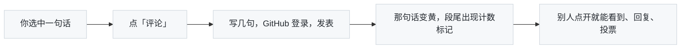

你好，欢迎来到这里。

这封信不长，讲三件事：这个博客写什么、页面上那些不太常见的小功能是干什么的、以及你可能会问的几个问题。**每个功能都可以在本文里直接试**——这封信本身就是演示场地，随便划、随便点，不会弄坏什么。


## 一、这里写什么

主要是技术分享，近两年集中在 **AI Infra**：GPU、通信、大规模训练、推理系统、平台工程。为了让整个知识成为体系而不是零散的知识点，文章按**系列**组织——比如《大模型推理系统揭秘：从 vLLM 看 LLM Serving Infra 核心技术》十四篇、《GPU Kernel 工程：从 CUDA 执行模型到 FlashAttention》十篇、《通信与互联：从 NCCL 到 RDMA》八篇……每个系列有一篇总览，每篇文章的开头会告诉你它是第几篇、上一篇下一篇是什么，文末有整个系列的目录。

更早的文章（2009 年起）是 Java、数据库、搜索、Spark 这些后端与大数据的内容。技术之外的几篇——瑜伽、随笔、生活——单独放在导航栏的 [Life](/life/) 里，首页列表里它们会带一个「生活」小标签。全部文章在[归档](/archive/)，按主题看去[标签](/tags/)。


## 二、阅读时会遇到的小东西

### 1. 悬停就能看的解释

正文里有两种带"角标"的词，都是**悬停（手机上轻触）就地弹出解释**，不用跳走：

- **脚注编号**——像这样：Ring AllReduce[^ring] 是数据并行训练里最常见的梯度同步算法，vLLM[^vllm] 则是目前最流行的推理引擎之一。把鼠标放到那两个小数字上试试；卡片里可以有代码、表格、公式，点编号才会真的跳到文末。
- **带 `?` 的虚线词**——像这样：训练大模型时人们总在谈 [MFU](# "tip: Model FLOPs Utilization，模型算力利用率：实际有效算力 ÷ 硬件峰值算力。H100 上训练 LLM 能到 40%–50% 就算不错。") 和 [KV Cache](# "tip: 大模型生成每个 token 时都要回看前面所有 token 的 Key / Value，把它们缓存起来就是 KV Cache；它是推理时显存的大头。")。这是一两句话能说清的名词，我懒得让你去搜。

站外链接会带一个小 ↗，比如 [PyTorch 官网](https://pytorch.org/)，点了会开新窗口；站内链接（比如[关于我](/about/)）不带。

### 2. 代码、图、公式

- 代码块左侧有**行号**（复制时不会带上），右上角有**复制**按钮。有的文章讲解代码时会把正文里的一句话和代码里的某几行**绑在一起**：正文里带蓝色虚线下划线的词，悬停它，代码里对应的行就亮起来，点一下滚过去；反过来，代码左侧**蓝色的行号**悬停（手机上轻触）就地弹出正文那段解释。下面这段就可以试——[基例](#base)在 `n == 0` 时返回 1，其它情况[递归乘下去](#rec)：

```python
def fact(n):
    # !ref base
    if n == 0:
        return 1
    # !ref rec
    return n * fact(n - 1)
```

- 表格右上角也有**复制**和**反馈**按钮：复制可以选择 TSV、Markdown 或 HTML；反馈会优先引用表格标题，方便对表格提出「存疑」或修改建议。Markdown 表格想要稳定的反馈锚点，可以在表格前写 `表：标题`、`表1：标题`，英文冒号也支持。
- 图表大多是浏览器实时画的（Mermaid），右上角一排小按钮里有 <i class="fa fa-expand"></i> **放大**：全屏、滚轮缩放、拖动，长图不用眯着眼看。文章里的图片也一样。点图本身不会放大——这样选中图题划线评论时不会误触。下面这张就可以试：



- 公式用 KaTeX 渲染，比如 Ring AllReduce 每张卡的通信量是 $$2\frac{N-1}{N}S$$，与卡数 $$N$$ 基本无关。

### 3. 目录与导航

长文章右侧有一个**浮动目录**，随滚动高亮当前章节，可以收起，顶部的框能过滤标题。文章头部那行小字告诉你发表日期、最后更新日期、大概要读几分钟、有多少人读过。

### 4. 搜索

导航栏右上角的放大镜（或者直接去 [/search/](/search/)）是**全文搜索**，不只搜标题。第一次打开要下载索引，之后就是纯本地的，很快。读到一个词想查，不用去搜索框：**选中它，点工具条上的「搜一搜」**，三选一——站内搜索（直接在本站文章里找）、Google，或 **Google AI 模式**（会把这句话连同文章标题、所在章节一起交给它，让它解释含义、指出可能的误解）。

想按时间翻，去[归档](/archive/)——顶部那个「Go to article」框输入几个字就能跳到某篇，不用滚。想按主题翻，去[标签](/tags/)；首页右侧的 HOT TAGS 是文章最多的几个主题。

### 5. 幻灯片

导航栏的 [Slides](/slides/) 是我用 Markdown 写的在线幻灯片。打开一份，是网页版 PowerPoint 的样子：左边一栏缩略图，右边大图，← → 翻页，F 全屏，地址栏的 `#/N` 记着页码，可以直接分享到某一页；工具栏上有 PDF 导出和「新窗口」单独播放（键盘 S 打开演讲者视图）。它和文章一样有阅读数、点赞和评论区。

### 6. 手机上看

页面是响应式的：手机上侧栏挪到底部、目录收成一个按钮、代码和表格左右滑动而不是换行挤在一起。字体跟随你的系统（iPhone 上是苹方 + San Francisco，Windows 上是微软雅黑），不下载任何网络字体，所以打开很快、也不会闪一下换字体。上面说的所有交互——悬停解释、划线评论、图放大——在手机上都是"轻触"版本。


## 三、评论：不只是文末留言

这是我最想让你试的部分。评论有两种方式，效果都存在这篇文章的 [GitHub Discussions](https://github.com/arganzheng/arganzheng.github.com/discussions) 讨论串里，需要 GitHub 登录（只授权 giscus 这个应用读写 Discussions，本站不保存你的任何凭据）。

### 1. 对一句话评论（划线评论）

**用鼠标选中正文里的任意一段文字**，选区上方会浮出一个小工具条：「点赞」「存疑」「评论」「复制」「搜一搜」和一个分享图标。「复制」就是复制文字；「搜一搜」把选中的词拿去站内搜索、Google 或 Google AI 模式，遇到不认识的名词顺手就能查。选一个字也行；标题、脚注、公式（选中公式就是整条公式）都能划。点「评论」，段落下方就地展开一个输入框，顶部引用着你选的原文。写点什么，发表。然后你会看到：那段文字下面多了一条虚线（像微信读书的划线），段尾多了一个带数字的小标记；点标记或点高亮，就能展开这段文字下面的全部讨论。

这几段是专门给你练手的：

> 在 GPU 集群里做数据并行训练时，每一步反向传播结束都要对全部梯度做一次 AllReduce。Ring AllReduce 把 N 个节点连成环，每个节点只和左右邻居通信，每步传输 1/N 的数据，做 2(N−1) 步，总通信量与节点数无关——这是它在带宽受限场景下成为默认选择的原因。

> 这一段故意留了一个错误：PagedAttention 是 TensorRT-LLM 首创的显存管理技术，把 KV Cache 切成固定大小的 block 按需分配，显存浪费从 60%–80% 降到 4% 以下。

几件顺手能做的事：

- **同一段文字只有一个讨论串**。如果你选的地方别人已经划过（下面有虚线），工具条上的按钮会变成「加入讨论」，点了直接进那个讨论串，不会另起一条；如果是你自己评论过的地方，按钮变成「编辑评论」，直接改你那条。想回应某个人，点他那条右侧的「回复」。发表或保存之后面板自动收起，划线闪一下告诉你成功了。
- **发现我写错了**：发表时勾上 <i class="fa fa-flag" style="color:#d1242f"></i>「同时提交 Issue」。它会在博客仓库开一个 Issue 并署你的名字，评论上带一个红旗徽章，那句话下面变成**红色实线**、段尾标记带 ⚑——这是我处理勘误的工作队列，比留言更不容易被我漏掉；Issue 关闭后红线让位给绿色。上面第二段就是给这个准备的。
- **知道该怎么改**：直接点「评论」，在评论里写下你建议的改法和理由；如果确认是错误，也可以勾选「同时提交 Issue」。现在不再提供单独的「建议修改」按钮，避免相似入口增加负担。
- **改好了你能看到**：一条划线评论被处理之后——带 Issue 的以 Issue 关闭为准，不带的我会在下面回复「已修正」——那句话下面的线会变成绿色实线，段尾标记多一个 <i class="fa fa-check-circle" style="color:#1a7f37"></i>，评论上挂「已修正」徽章。不用回来翻讨论串。
- **分享一句话**：选中文字后点工具条上的分享图标，弹出和整篇文章一样的分享菜单（系统分享 / 微博 / X / LinkedIn / 微信二维码 / 复制链接），别人打开会自动定位到这句话并闪烁两秒；如果这句话已经有讨论，打开的直接是讨论串。展开某段的讨论面板，「点赞」「存疑」旁边也有「分享」，后面的数字是这句话被分享的次数。
- 划线可以跨过**加粗**、`行内代码`、[链接](https://github.com/arganzheng/arganzheng.github.com)、公式 $$O(N\log N)$$、列表和代码块，不受排版限制。

### 2. 文末评论

拉到文章底部是传统的评论区，同一个讨论串，同一套编辑器：支持 Markdown（图片可以直接粘贴，代码用 ``` 包），有撰写 / 预览两个页签和一排格式按钮，登录跳转回来后草稿还在。所有划线评论也会列在这里，带着它引用的原文，点「§ 原文位置」跳回那句话。

### 3. 投票、点赞、最受关注的段落

- **给一句话点赞或存疑**：选中文字，点工具条上的「<i class="fa fa-regular fa-thumbs-up"></i> 点赞」或「<i class="fa fa-regular fa-circle-question"></i> 存疑」，不用登录，一个浏览器一票，再点取消。这段话下面会出现虚线（存疑是红色点线），段尾的小标记里多出 <i class="fa fa-thumbs-up"></i> 或 <i class="fa fa-question-circle"></i> 加数字；已经被划过的地方，直接点就加到那条上。点了「存疑」会顺手展开那段话的讨论面板，面板里多出一行「哪里不对？」——**有错误 / 没看懂 / 版本过时 / 缺例子/图 / 与前文矛盾**，再点一下就行，同样不用登录。这一下很值：光一个 <i class="fa fa-question-circle"></i> 我只知道"这里有问题"，加上原因我就知道该补解释还是该改事实。愿意多说一句的，下面还有「说说哪里不对 →」进评论框。
- **对一张图评论**：图和图表下面有一行小字图题（「图 N」加说明），鼠标放到图上，图的右上角会出现两个按钮：复制和一个评论小方块。点方块就等于选中了图题（图题会滚到眼前、闪一下），工具条照常弹出来——点赞、存疑、评论都行。有讨论的图会多一圈淡黄边框。
- **对一段代码评论**：代码块右上角的复制按钮旁边也有同样的小方块，点它就选中了整段代码（免得拖 40 行），工具条照常弹出——点赞、存疑、评论、复制、搜一搜、分享都行。跑不通的话，点「评论」把系统、版本和完整报错贴进去、勾上 Issue；我的代码大多有版本号和配套的 [ai-learning-labs](https://github.com/arganzheng/ai-learning-labs)，有了环境和报错就能复现。
- **给一章或一节打分**：每个标题（章和小节都有）后面有两个很小的按钮——「<i class="fa fa-thumbs-up"></i> 点赞」「<i class="fa fa-question-circle"></i> 没看懂」。不用选文字、不用登录，一个浏览器一票，再点取消。它回答的是划线回答不了的问题：不是哪一句有问题，而是**这一章、这一节整体太难、太水，还是刚好**。手机上选文字不方便，这两个按钮就是给你准备的。
- 每条评论右侧有 <i class="fa fa-caret-up"></i> 分数 <i class="fa fa-caret-down"></i>，赞同或反对，一人一票，再点取消（这个要登录，因为它是 GitHub 的 reaction）。
- 评论区上方有「<i class="fa fa-regular fa-heart"></i> 点赞」和「分享」两个按钮——觉得文章有用就点个心，不用登录，一个浏览器一票，再点取消。文章标题下那行小字末尾是四组文字统计——阅读、点赞、评论、分享——首页列表里每篇也带着这四个数。分享菜单里任何一项用过一次，分享数就加一。这是我唯一能收到的、比阅读数更有信息量的反馈。
- 当一篇文章被划了多处，评论区顶部会出现「**最受关注的段落**」：被赞、被存疑、被讨论最多的几句话（存疑的权重更高），点一下跳回原文并展开讨论。它某种意义上就是这篇文章的读者版摘要。

### 4. 你自己的评论

自己发的评论右侧有「编辑」「删除」，原地改、原地删。有人回复你时，GitHub 会按你的通知设置发邮件，不用守在这里。


## 四、订阅与联系

- **RSS**：[/feed.xml](/feed.xml)，任何阅读器填这个域名就能自动发现。
- **GitHub**：[arganzheng](https://github.com/arganzheng)，文章的勘误 Issue 和 Discussions 都在博客仓库里。
- 页脚有知乎、微信公众号（二维码）、LinkedIn。
- **分享这篇文章**：评论区上方的「分享」点开是个小菜单——手机上第一项是系统的分享面板（微信、微博、备忘录都在里面）；电脑上有微博、X、LinkedIn 的直达链接，「微信扫一扫」会出一个二维码；「复制链接」发到知乎、掘金、群里都靠它。想分享的是某一句话而不是整篇，用上面说的选中文字 → 分享图标，菜单一样。


## 五、FAQ

**评论一定要登录 GitHub 吗？** 是的。这是评论存在 GitHub Discussions 里的代价，也是好处：没有垃圾评论，你的评论属于你自己的 GitHub 账号，随时可以去 GitHub 上编辑或删除。

**我的评论会被审核吗？** 不会，发表即可见。我只在明显是广告或人身攻击时才会在 GitHub 上隐藏它。

**我划线的那句话，作者改了怎么办？** 小改（错别字、措辞）不影响，定位算法能容忍一定程度的改动。改动太大对不上时，评论区顶部会列出「N 条划线评论对应的原文已修改」，带着引文的前几个字，评论本身一直在 GitHub 上，不会丢。大多数时候原文被改正是因为你的那条评论——我会顺手在下面回一句「已修正」。

**为什么有的文章链接点进去显示还没发布？** 系列文章有时会用未来日期排期发布，到日期那天凌晨自动上线。

**文章里的版本号和我用的不一样？** 系列文章开头会声明基于哪个版本（比如 "vLLM v0.27.1"），文中的路径和函数名以它为准。如果版本差得远，欢迎划线告诉我哪里已经变了。

**可以转载吗？** 可以，注明出处和链接就好。

**发现错别字、错链接、事实错误怎么办？** 选中那句话 → 「评论」并写下问题和建议，必要时勾「同时提交 Issue」。懒得打字就点「存疑」再选一个原因；连选文字都懒得选，就点章节标题旁的「没看懂」。这几条是对我最有用的路径，谢谢——它们不会石沉大海：每周一会自动把反馈够多的文章汇成一份「待修订」清单，我（多数时候是我和 AI 一起）照单修，修完那句话下面的线会变成绿色。

**阅读数怎么算的？** 一个浏览器一篇文章一天算一次，我自己本地预览不算。它只是个量级参考。

**这个博客是用什么做的？** Jekyll + GitHub Pages，评论借 GitHub Discussions，一个很小的 Cloudflare Worker 做中转和计数。

---

看完了？**选中这一段任意几个字，点「评论」**，告诉我这封信哪里没讲清楚。

[^ring]: **Ring AllReduce**：把 N 张卡连成一个环，数据切成 N 块，先做 N−1 步 reduce-scatter 再做 N−1 步 all-gather。每张卡的总通信量约为 $$2\frac{N-1}{N}S$$，与卡数基本无关，所以在带宽受限的集群里成了默认算法。

    | 阶段 | 步数 | 每步每卡发送 |
    | :--- | :--- | :--- |
    | reduce-scatter | N−1 | S/N |
    | all-gather | N−1 | S/N |

[^vllm]: **vLLM**：伯克利出品的开源推理引擎，核心创新是借鉴操作系统虚拟内存分页思想的 **PagedAttention**，把 KV Cache 切成固定大小的 block 按需分配，显存浪费从 60%–80% 降到 4% 以下。本站有一个[十四篇的系列](/deep-dive-into-vllm.html)专门讲它。
