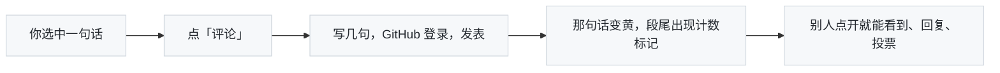

你好，欢迎来到这里。

这封信讲三件事：这里写什么、读的时候有哪些顺手的小功能、怎么告诉我哪里写得不对。**这封信本身就是演示场地**，下面提到的功能都可以直接在这里试，随便划、随便点，不会弄坏什么。


## 一、这里写什么

主要是技术，近两年集中在 AI 工程。内容按三张学习地图组织——[AI 算法工程师](/ai-algorithm-engineer-learning-roadmap.html)、[AI-Infra 工程师](/ai-infra-learning-roadmap.html)、[AI 应用工程师](/ai-application-engineer-learning-roadmap.html)——地图下面是三十多个**系列**，比如《[大模型推理系统揭秘](/deep-dive-into-vllm.html)》《GPU Kernel 工程》《通信与互联》。每个系列有总纲、正文和一篇总结自测；文章开头告诉你它是第几篇，文末有整个系列的目录。导航栏的 [Series](/series.html) 是全部系列的树。

更早的文章（2009 年起）是 Java、数据库、搜索、大数据。技术之外，[Life](/life/) 是生活类的文章，[Moments](/moments/) 是随笔，[Slides](/slides/) 是幻灯片。按时间翻去[归档](/archive/)，按主题翻去[标签](/tags/)。


## 二、读的时候

### 1. 就地解释，不用跳走

- **脚注**：Ring AllReduce[^ring] 是数据并行训练里最常见的梯度同步算法，vLLM[^vllm] 是目前最流行的推理引擎之一。鼠标放到小数字上（手机上轻触）就弹出卡片，里面可以有代码、表格、公式；点编号才会跳到文末。
- **带 `?` 的虚线词**：训练大模型时人们总在谈 [MFU](# "tip: Model FLOPs Utilization，模型算力利用率：实际有效算力 ÷ 硬件峰值算力。H100 上训练 LLM 能到 40%–50% 就算不错。") 和 [KV Cache](# "tip: 大模型生成每个 token 时都要回看前面所有 token 的 Key / Value，把它们缓存起来就是 KV Cache；它是推理时显存的大头。")。一两句话能说清的名词，不用你去搜。
- **站内链接**：鼠标停在《[个人博客终于迎来了久违的更新](/blog-is-back.html)》这样的站内文章链接上，会弹出它的标题、日期和摘要。站外链接带个小 ↗，比如 [PyTorch 官网](https://pytorch.org/)，在新窗口打开。

重要的话会放进彩色提示框，像这样：

> [!TIP] 快捷键
> 任何页面按 `⌘K`（Windows 上是 `Ctrl+K`）或 `/` 打开全文搜索，`Esc` 关闭。

### 2. 代码、图、公式

- **代码块**顶上有一条栏：「代码块 N：标题」、语言、**复制**和**评论**；左侧的行号复制时不会带上。讲解代码时，正文里带蓝色虚线的词和代码行是**绑在一起**的：悬停它，对应的行亮起来，点一下滚过去；反过来，悬停代码左侧蓝色的行号，就地弹出正文那段解释。试试——[基例](#base)在 `n == 0` 时返回 1，其它情况[递归乘下去](#rec)：

```python title="递归求阶乘：基例与递归"
def fact(n):
    # !ref base
    if n == 0:
        return 1
    # !ref rec
    return n * fact(n - 1)
```

- **图**右上角的按钮里有 <i class="fa fa-expand"></i> **放大**：全屏、滚轮缩放、拖动，长图不用眯着眼看。**表格**右上角能复制成 TSV、Markdown 或 HTML。


```mermaid
%% 图：划线评论的流程：选中一句话、点评论、登录发表，那句话变黄并出现计数标记
flowchart LR
    A["你选中一句话"] --> B["点「评论」"] --> C["写几句，GitHub 登录，发表"]
    C --> D["那句话变黄，段尾出现计数标记"]
    D --> E["别人点开就能看到、回复、投票"]
    classDef c fill:#f6f8fa,stroke:#d0d7de,color:#24292f;
    class A,B,C,D,E c;
```

- **公式**用 KaTeX 渲染，比如 Ring AllReduce 每张卡的通信量是 $$2\frac{N-1}{N}S$$，与卡数 $$N$$ 基本无关。

### 3. 长文章怎么读

- **目录**：宽屏时右侧有浮动目录，随滚动高亮当前章节；窗口窄时右边缘有一个 ‹‹ OUTLINE 小标签，点开是抽屉。
- **折叠**：章节标题左侧的小三角收起这一节（电脑上悬停标题才出现）；按住 ⌥ / Alt 再点，同级章节一起收起。`⌘F` 查找、目录跳转会自动展开被收起的内容。
- **继续阅读**：页面顶部有一条细进度条；长文读到一半离开，下次打开时底部会提示「上次读到「某节」 · 继续阅读」。位置只记在你自己的浏览器里。
- **搜索**：导航栏的放大镜、上面的快捷键，或者 [/search/](/search/)，搜的是全文。读到不认识的词，选中它，点工具条上的「搜一搜」：站内、Google，或 Google AI 模式（会带上文章标题和所在章节，请它解释）。
- **文末**：系列目录、「LINKED FROM」（哪些文章引用了这篇）、「YOU MIGHT ALSO LIKE」（相关推荐），顺着链接就能把一个主题读下去。
- **暗色模式**默认跟随系统，导航栏的月亮 / 太阳按钮可以手动切换。手机上所有交互都是「轻触」版，代码和表格左右滑动。


## 三、告诉我哪里不对

这是我最想让你试的部分。**选中正文里的任意文字**（标题、脚注、公式都行），上方会浮出一个工具条：

| 按钮 | 做什么 | 要登录吗 |
| :--- | :--- | :--- |
| 点赞 | 这句有用 | 不用，一个浏览器一票，再点取消 |
| 存疑 | 这句有问题；接着可以点原因：有错误 / 没看懂 / 版本过时 / 缺例子/图 / 与前文矛盾，可多选 | 不用 |
| 评论 | 段落下面就地展开输入框，顶部引用你选的原文 | GitHub 登录 |
| 分享 | 分享这一句，别人打开会自动定位到它 | 不用 |
| 复制 / 搜一搜 | 复制文字；拿去站内或 Google 查 | 不用 |

Table: 选中文字后工具条上的按钮

存疑加上原因很值：光一个问号我只知道「这里有问题」，有了原因我就知道该补解释还是该改事实。这两段是专门给你练手的：

> 在 GPU 集群里做数据并行训练时，每一步反向传播结束都要对全部梯度做一次 AllReduce。Ring AllReduce 把 N 个节点连成环，每个节点只和左右邻居通信，每步传输 1/N 的数据，做 2(N−1) 步，总通信量与节点数无关——这是它在带宽受限场景下成为默认选择的原因。

> 这一段故意留了一个错误：PagedAttention 是 TensorRT-LLM 首创的显存管理技术，把 KV Cache 切成固定大小的 block 按需分配，显存浪费从 60%–80% 降到 4% 以下。

划过的地方会留下一条线，颜色就是状态：

- **虚线**：有人评论或点赞过，段尾的小标记带着数字，点开是这段的全部讨论。同一段文字只有一个讨论串：别人划过的地方按钮变成「加入讨论」，你自己评论过的变成「编辑评论」。
- **红色点线**：有人存疑。
- **红色实线 + ⚑**：有人评论时勾了 <i class="fa fa-flag" style="color:#d1242f"></i>「同时提交 Issue」，会在博客仓库开一个署你名字的 Issue。这是我处理勘误的工作队列，比留言更不容易漏——上面第二段就是给它准备的。
- **绿色实线 + <i class="fa fa-check-circle" style="color:#1a7f37"></i>**：我改好了（Issue 关闭、回复了「已修正」，或把存疑标记为已修正）。之后如果又有人存疑，会重新变红——说明没改到位。

**图和代码块**也能评：图右上角、代码块顶栏各有一个评论小方块，点它就等于选中了图题或代码标题，工具条照常弹出。代码跑不通，就把系统、版本和完整报错贴进评论，勾上 Issue。

拉到文末是**评论区**，和划线评论是同一个讨论串（存在这篇文章的 [GitHub Discussions](https://github.com/arganzheng/arganzheng.github.com/discussions) 里），支持 Markdown、能粘贴图片；自己的评论可以编辑、删除，每条评论可以 <i class="fa fa-caret-up"></i> <i class="fa fa-caret-down"></i> 投票。评论区上方的「<i class="fa fa-regular fa-heart"></i> 点赞」和「分享」不用登录。一篇文章被划得多了，评论区顶部会出现「**最受关注的段落**」——相当于读者版的摘要。


## 四、幻灯片与随笔

### 1. 幻灯片

[Slides](/slides/) 是我用 Markdown 写的在线幻灯片，打开是网页版 PowerPoint 的样子：左边缩略图，右边播放器，地址栏的 `#/N` 是页码，下面和文章一样有点赞和评论。每个系列也配一份「系列精华」deck，系列框里有「幻灯片」链接。这种 deck 的主线横向一篇一页，细节藏在**纵向**子页里：右下角出现 ↓ 时按它展开，按 → 跳过整组。

| 想做什么 | 怎么做 |
|---|---|
| 翻页 | ← → 或空格；有 ↓ 的页按 ↓ 看展开 |
| 全屏 | 工具栏的全屏按钮或 F，Esc 退出 |
| 总览所有页 | Esc 或 O，点一页跳过去 |
| 演讲者视图 | S，弹出一个新窗口（当前页、下一页、备注、计时）；关掉那个窗口就退出。浏览器拦截弹窗时要允许一次 |
| 导出 PDF | 工具栏的 PDF，打印对话框里选横向、无边距、勾上背景图形 |
| 看全部快捷键 | 播放时按 ? |

Table: 幻灯片的常用操作

### 2. 随笔

[Moments](/moments/) 是碎碎念：写不成文章的一句话、几张图、一段小视频、一首诗或一首歌，排成一条卡片流。

- 侧栏有热力图、「随机漫步」（随手翻一条旧的）、「每日回顾」（往年、往月的今天）、标签和月份；顶部的筛选框可以跨月份按文字、标签、地点或有没有图来找。
- 每条有自己的页面，分享时可以生成一张带二维码的图片卡；可以点 ♡、可以划线评论（评论区在每个月页面的底部）。
- 单独的 RSS：[/moments.xml](/moments.xml)。


## 五、FAQ

**评论一定要登录 GitHub 吗？** 发评论要，点赞、存疑、分享不用。评论存在 GitHub Discussions 里：没有垃圾评论，评论属于你自己的账号，随时可以去 GitHub 上改或删。登录只授权 giscus 这个应用读写 Discussions，本站不保存你的凭据。

**我的评论会被审核吗？** 不会，发表即可见。只有明显的广告或人身攻击我才会隐藏。有人回复你时，GitHub 会按你的通知设置发邮件。

**我划线的那句话被改了怎么办？** 小改不影响定位。改动太大对不上时，评论区顶部会列出「原文已修改」的划线评论，评论本身一直在。多半就是因为你那条评论才改的。

**反馈真的有人看吗？** 有。每周一会自动把反馈够多的文章汇成「待修订」清单，我（多数时候是我和 AI 一起）照单修，修完那句话下面的线就变绿。

**为什么有的链接点进去显示还没发布？** 系列文章按日期排期，到那天凌晨自动上线。

**文章里的版本号和我用的不一样？** 系列开头会声明基于哪个版本（比如 vLLM v0.27.1），文中的路径和函数名以它为准。版本差得远的地方，欢迎划线告诉我。

**阅读数怎么算的？** 一个浏览器一篇文章一天算一次，只是个量级参考。阅读进度只存在你本机，不上传。

**可以转载吗？** 可以，注明出处和链接就好。

**怎么订阅、找到我？** RSS 是 [/feed.xml](/feed.xml)，阅读器里填域名就能自动发现；GitHub 是 [arganzheng](https://github.com/arganzheng)；页脚有知乎、微信公众号和 LinkedIn。

**这个博客是用什么做的？** Jekyll + GitHub Pages，评论借 GitHub Discussions，一个很小的 Cloudflare Worker 做中转和计数。

---

看完了？**选中这一段任意几个字，点「评论」或「存疑」**，告诉我这封信哪里没讲清楚。

[^ring]: **Ring AllReduce**：把 N 张卡连成一个环，数据切成 N 块，先做 N−1 步 reduce-scatter 再做 N−1 步 all-gather。每张卡的总通信量约为 $$2\frac{N-1}{N}S$$，与卡数基本无关，所以在带宽受限的集群里成了默认算法。

    | 阶段 | 步数 | 每步每卡发送 |
    | :--- | :--- | :--- |
    | reduce-scatter | N−1 | S/N |
    | all-gather | N−1 | S/N |

    Table: Ring AllReduce 两个阶段的步数与每步发送量

[^vllm]: **vLLM**：伯克利出品的开源推理引擎，核心创新是借鉴操作系统虚拟内存分页思想的 **PagedAttention**，把 KV Cache 切成固定大小的 block 按需分配，显存浪费从 60%–80% 降到 4% 以下。本站有一个[十五篇的系列](/deep-dive-into-vllm.html)专门讲它。
