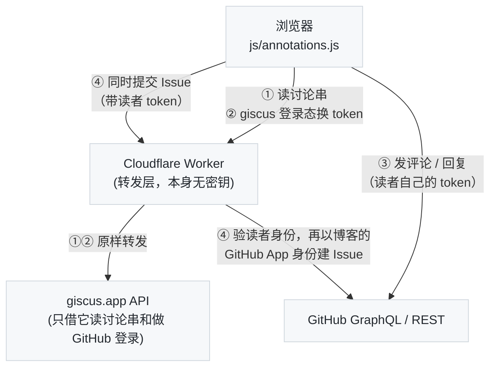

> 本文是**读者划线评论（Highlight Annotations）**功能的官方演示与说明。它和[浮窗脚注、行内 Tips](/popup-footnotes-and-inline-tips-demo.html) 方向相反：那些是**作者**写给读者的解释，这个是**读者**写给作者和其他读者的——像 Medium 的 highlight、Kindle 的热门标注、或者 Code Review 工具里的行内评论，直接在正文的某句话上留下讨论。你现在就可以在本文任意一段上试。

---

## 一、速查

| 你做的事 | 发生的事 |
| :--- | :--- |
| 用鼠标选中正文里的一段文字 | 选区上方浮出小工具条：`评论` / `复制链接` |
| 点 `评论` | 段落**正下方**就地展开评论框，顶部引用你选中的原文 |
| 用 GitHub 登录，写点什么，`发表评论`（或 `⌘/Ctrl+Enter`） | 这段文字变成<mark style="background:rgba(255,213,79,.32);padding:0">淡黄色高亮</mark>，段尾出现计数标记 <span style="display:inline-flex;align-items:center;gap:3px;padding:0 6px;height:18px;font-size:11px;line-height:18px;font-weight:600;color:#8a6d00;background:#fff3bf;border:1px solid #f5d96b;border-radius:9px;vertical-align:2px;"><i class="fa fa-comment"></i>1</span> |
| 点高亮或标记 | 展开这段文字的全部评论与回复，底部可以继续评论 |
| 点某条评论右侧的 `回复` | 变成对那条评论的回复（框上出现「回复 @某人」，× 切回） |
| 勾上 <i class="fa fa-flag" style="color:#d1242f"></i> `同时提交 Issue` 再发表 | 额外在博客仓库开一个 GitHub Issue，评论带红旗徽章 |
| 点 `复制链接` | 得到 `…html#hl=选中的文字`，别人打开会自动定位并闪烁这段文字 |

所有内容都存在文章的 [GitHub Discussions](https://github.com/arganzheng/arganzheng.github.com/discussions) 讨论串里，没有额外的数据库。**文末评论区和划线评论是同一套东西**：同一个讨论串、同一个编辑器、同样的回复 / 编辑 / 删除 / 提 Issue，区别只是一个挂在某句话上、一个挂在整篇文章上。划线评论会同时出现在文末列表里（带着它引用的原文和 `§ 原文位置` 链接，点击就跳回那句话）。

---

## 二、试一试：下面是几段用来练手的文字

请放心划，这几段就是给你划的。

### 1. 对一句话发表评论

在 GPU 集群里做数据并行训练时，每一步反向传播结束都要对全部梯度做一次 AllReduce。Ring AllReduce 把 N 个节点连成环，每个节点只和左右邻居通信，每步传输 1/N 的数据，做 2(N−1) 步，总通信量与节点数无关——这是它在带宽受限场景下成为默认选择的原因。

> 试试：选中上面「总通信量与节点数无关」这几个字，点 `评论`，写一句话发表。发表后注意三件事：文字变黄了、段尾多了一个标记、文末评论区里多了一条以引用开头的评论。

### 2. 对同一段文字再评论、以及回复别人

同一段文字只有**一个讨论串**。如果你选中的文字落在别人已经划过的范围里（哪怕只是重叠一部分），点 `评论` 会直接展开那个讨论串，你的评论会加进去，而不是另起一条——在 GitHub 上也是同一个 thread。展开面板后，底部的输入框默认是「对这段文字」发新评论；想针对某个人的观点说话，点他那条右侧的 `回复`。

> 试试：如果上一段已经有人划过（有黄色高亮），点高亮展开，先发一条自己的评论，再点别人那条的 `回复` 回一句。

### 3. 「这里写错了」——顺手给作者提 Issue

这一段故意留了一个错误：PagedAttention 是 TensorRT-LLM 首创的显存管理技术，把 KV Cache 切成固定大小的 block 按需分配，显存浪费从 60%–80% 降到 4% 以下。

> 试试：上面那句话的出处写错了（PagedAttention 出自 vLLM 的论文）。选中「TensorRT-LLM 首创」，点 `评论`，指出问题，然后**勾上右下角的「同时提交 Issue」**再发表。你会在仓库的 [Issues](https://github.com/arganzheng/arganzheng.github.com/issues?q=label%3A%E5%88%92%E7%BA%BF%E8%AF%84%E8%AE%BA) 里看到一条带 `划线评论` 标签、署你名字的 Issue，评论面板里这条评论会带一个红旗徽章 <span style="display:inline-flex;align-items:center;gap:3px;padding:0 7px;font-size:11.5px;line-height:18px;color:#d1242f;background:#ffebe9;border:1px solid #ffcecb;border-radius:9px;vertical-align:1px;"><i class="fa fa-flag"></i> Issue #N</span> 和左侧红线，和一般的讨论区分开。这就是我处理勘误的工作队列。

### 4. 跨越格式的选区

划线不受排版限制：可以跨过**加粗**、`行内代码`、[链接](https://github.com/arganzheng/arganzheng.github.com)、行内公式 $$O(N \log N)$$，也可以从一个段落的末尾划到下一段开头；列表项、表格单元格、代码块里的文字同样可以划。高亮只包裹文字节点，所以原有的链接照样能点、公式照样能渲染。

- 列表项也可以划：这一行是 `<li>` 里的文字。
- 代码块里的也行：

```python
def all_reduce(tensors, group):
    # 划这行注释试试
    return dist.all_reduce(tensors, group=group)
```

### 5. 分享一句话

选中任意文字点 `复制链接`，得到的是形如 `/highlight-annotations-demo.html#hl=选中的文字` 的链接，可读、可手改。别人打开后页面会滚动到那句话并闪烁两秒——没有浏览器原生 Text Fragment 那种去不掉的紫色底。评论里的 `§ 原文位置` 链接则是 `#annot-<短哈希>`，打开后直接展开对应的讨论串。

---

## 三、评论框里有什么

- **撰写 / 预览**两个页签，预览用 GitHub 的渲染器，所见即 GitHub 上所得。
- 工具条：加粗、斜体、标题、引用、行内代码、代码块、链接、图片、无序 / 有序列表；`⌘/Ctrl+B`、`I`、`K` 对应加粗、斜体、链接。不熟 Markdown 也能写，熟的直接敲。
- 内容为空时 `发表评论` 是灰的；`取消` 和右上角 `×` 都是收起。
- GitHub 登录只需登一次，文末评论区和划线评论共用；登录会跳到 GitHub 再跳回来，**草稿会保留**。登录后用户名旁有 `退出`。
- 自己发的评论右侧有 `编辑` / `删除`（只有你自己能看到），原地改、原地删，不用去 GitHub；每条评论右侧的 <i class="fa fa-github"></i> 图标是它在 GitHub 上的原文链接。
- 发表失败时（网络、权限）会给一个「复制内容」按钮，把带引用的 Markdown 复制出来，粘贴到文末评论框里发也是一样的效果。

---

## 四、它是怎么实现的

### 1. 存储：就是一条普通评论

没有新后台。每条划线评论就是文章 Discussions 讨论串里的一条评论，只是开头多了一段带定位链接的引用：

~~~markdown
> 被划线的原文
>
> <sub>[§ 原文位置](https://arganzheng.life/<slug>.html#annot-1a2b3c4d) · [⚑ Issue #12](https://github.com/<repo>/issues/12)</sub>

读者写的评论正文
~~~

`⚑ Issue` 那截只在勾了「同时提交 Issue」时才有。这种格式在 GitHub 上直接读也是通顺的：引用、出处、正文。对同一段文字的后续评论是新的顶层评论（同样的引用），对某个人的回复是 GitHub 的 reply。

### 2. 定位：W3C 选择器 + 模糊匹配

页面加载时，脚本拉取讨论串，把这种形状的评论解析成 W3C Web Annotation 的 [`TextQuoteSelector`](https://www.w3.org/TR/annotation-model/#text-quote-selector)——引用块的文字就是 `exact`。然后在正文里找它：

1. **精确匹配**：把正文所有文字节点拼成一个大字符串（排除脚注编号、公式、代码高亮的辅助元素），直接查找。
2. **模糊匹配**：找不到就用近似字符串匹配（[approx-string-match](https://github.com/robertknight/approx-string-match-js)，Hypothesis 用的同一算法），允许原文有一定比例的增删改。所以我改个错别字、调整一下措辞，读者的高亮依然对得上。
3. **对不上**：改动太大就放弃锚定，在文末评论区顶部列为「未能定位」，评论本身还在 GitHub 上，不会丢。

匹配到的区间被切成若干 `<mark>` 包住文字节点——只包文字，不动结构，所以链接、公式、Tips 的悬停都照常工作；重叠的划线共享同一个 `<mark>`（带多个 id），不会嵌套。

### 3. 数据通路：一个不存密钥的 Cloudflare Worker



文末评论区以前是 [giscus](https://giscus.app) 的 iframe；现在 iframe 没有了，评论列表和划线评论由同一段脚本渲染（所以才能做到两边一致），giscus 只剩两个用途：匿名读取讨论串的公开接口，和 GitHub 登录的 OAuth 中转。浏览器不能直接调 giscus 的接口（CORS 只放行它自己的域名），所以中间加了一层 Worker 做转发和 60 秒缓存。**发评论、改评论、删评论用的都是读者自己的 GitHub 身份**：登录回跳后会话存在本站的 `localStorage` 里，脚本用它换出 token，直接调 GitHub GraphQL（`addDiscussionComment` / `updateDiscussionComment` / `deleteDiscussionComment`），评论显示为读者本人，在 GitHub 上也能继续编辑。

只有「同时提交 Issue」走了不同的路：giscus 这个 GitHub App 只申请了 Discussions 权限，读者的 token 开不了 Issue。所以 Worker 先用读者 token 向 GitHub 核实身份，再以**博客自己的 GitHub App** 身份创建 Issue（正文首行署名「由 @读者 提出」）。App 凭据靠私钥签短期 JWT 换取安装令牌，不像 PAT 那样会过期。

### 4. 隐私与边界

- 登录授权给的是 giscus 这个 GitHub App（只有 Discussions 读写权限），本站不保存你的任何凭据；Worker 只转发，不落库。
- 没有 emoji reactions——GitHub 目前不允许 App 签发的用户 token 点赞，giscus 里那个按钮本来也是灰的。
- 你能在 GitHub 上编辑、删除自己的评论，页面下次加载就会同步。
- 所有内容公开可见，和 GitHub Discussions 一致。

---

> 💡 看完了？选中本段任意几个字，点「评论」，告诉我这篇说明哪里没讲清楚。
