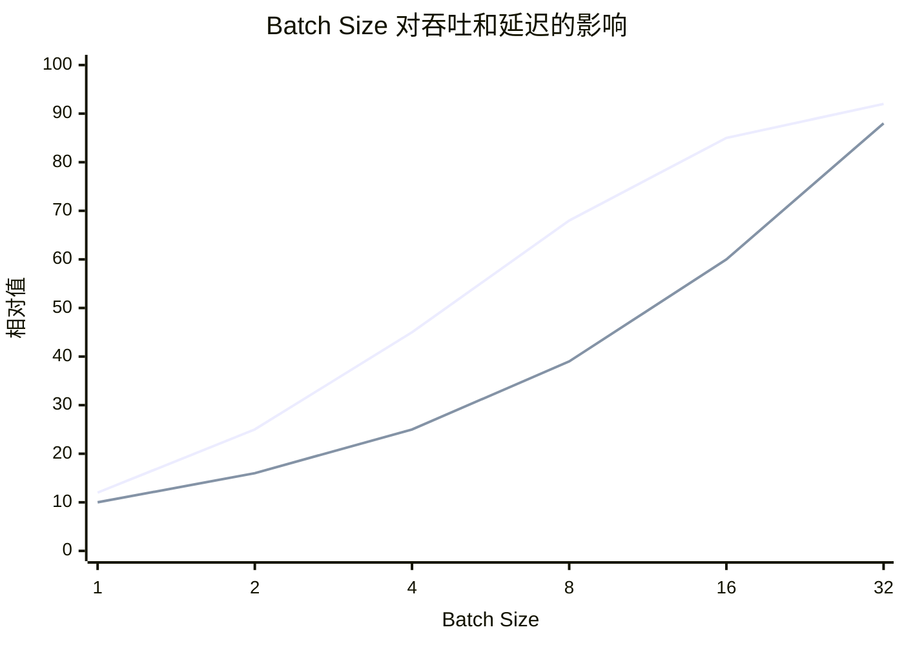

> **NOTE** 本文基于 vLLM v0.27.1（tag `6e448d0`, 2026-08-11）源码剖析。文中文件路径、类名和函数名均以该版本为准；vLLM 迭代很快，阅读时请以你手上的版本对照。


传统深度学习推理通常围绕一个相对稳定的计算过程展开：输入一批形状相近的数据，执行一次前向传播，然后返回结果。

LLM Serving 则完全不同。一个请求可能携带几十个，也可能携带数万个输入 token；模型还需要逐个生成长度未知的输出 token。在这个过程中，系统必须动态管理请求、显存、KV Cache、批次和 GPU 计算资源。

因此，LLM Serving 的难点并不只是“模型更大”或“参数更多”，而是它改变了推理服务的基本执行模型：

> 从一次性、静态、可预测的前向计算，转变为持续进行、动态变化、状态不断增长的自回归计算。

本篇要回答的核心问题是：

> **为什么 LLM Serving 不能沿用传统 DL 推理“一次前向、一次返回”的服务模型？它究竟在哪些地方变难了？**

## 一、总览：三方面的变化与挑战

### 1. 三方面的变化和挑战

整体来说，有如下三方面的变化和挑战：

1. 传统深度学习推理与 LLM Serving 存在巨大的范式差异
2. Prefill 与 Decode 是两种完全不同的 GPU Workload
3. 吞吐与时延之间难以避免的系统权衡

后文先分别展开这三点，再把它们收拢为三个根本变化，给出后续各篇的阅读地图，最后引入一个贯穿整个系列的具体请求作为算账的例子。

### 2. 本文的章节安排

```text
第二章  范式转移                  服务对象从“一次计算”变成“持续生成过程”
第三章  Prefill 与 Decode         两种完全不同的 GPU Workload：计算规模、瓶颈与优化手段
第四章  吞吐与时延                Batch 增大带来的收益与代价，SLO 约束下的权衡
第五章  三个根本变化              动态执行、带状态推理、混合 Workload
第六章  阅读地图                  后续内容围绕的四个核心问题与两个横切约束
第七章  一个贯穿全文的例子        Llama-3-70B / 8×H100 / 2050+300 token 的基础算账
第八章  本文小结
```

## 二、范式转移：服务对象从“一次计算”变成“持续生成过程”

理解 LLM Serving 的第一步，不是从某个具体优化技术开始，而是先看清它与典型传统 DL Serving 在**服务对象**上的差异：**从一次 Forward 到持续生成**。

许多传统深度学习推理任务都可以抽象为“一次请求对应一次前向计算”：

```text
请求进入 → 组 Batch → 执行一次 Forward → 返回结果
```

即使输入 shape 存在一定变化，系统通常也可以通过 padding、bucketing 或预编译的执行形态，将请求规整为有限几种执行模式。在推理过程中，中间激活一般即可释放。

LLM Serving 则不同。一个请求通常要经历：

```text
请求进入
  ↓
Prompt Processing / Prefill
  ↓
生成第一个 Token
  ↓
Decode Step 1
  ↓
Decode Step 2
  ↓
Decode Step ...
  ↓
EOS 或达到长度上限
```

它的输入和输出都具有动态性：

- **输入长度不固定**：可能是几十个 token，也可能是数万甚至更长的上下文；
- **输出长度不确定**：模型何时生成 EOS，事先无法准确确定；
- **服务时长不可直接预知**：请求可能只生成几个 token，也可能持续数千个 token；
- **中间状态需要跨多个 step 保留**：Prefill 产生的 KV Cache 会被后续 Decode 持续访问。

因此，LLM Serving 的核心变化并不只是模型更大，而是服务对象从“一次性计算任务”变成了**带有动态生命周期和持久中间状态的生成任务**。

| 维度 | 典型传统 DL Serving | LLM Serving |
|---|---|---|
| 服务单位 | 一次或少数几次 Forward | 多轮自回归生成 |
| 输入长度 | 通常可规整为有限几种形态 | 可变，可能非常长 |
| 输出长度 | 通常较容易确定 | 由生成过程动态决定 |
| 中间状态 | 多为临时激活 | KV Cache 跨 Decode Step 持续存在 |
| Batch 语义 | 请求级静态或动态 Batch | 面向持续执行的 Continuous Batching |
| 内存模式 | 相对静态 | KV Cache 动态增长和回收 |
| 服务时长 | 相对容易估计 | 与输出长度、调度和资源竞争有关 |
| 主要挑战 | 高效执行一次计算 | 计算、调度和状态管理协同优化 |

这并不意味着传统 Serving 的技术全部失效，而是意味着系统不能再只依赖以下假设：

- 输入和执行 shape 基本固定；
- 一次 Forward 即可完成请求；
- 请求服务时长容易估计；
- 执行过程中或者执行后无需保存中间状态；
- 内存可以按请求一次性分配。

LLM Serving 需要在显存预算、请求生命周期、生成进度和服务等级约束之间进行动态决策。这是后续调度、缓存和执行优化的共同背景。


## 三、Prefill 与 Decode：两种完全不同的 GPU Workload

LLM 推理通常分为 Prefill 与 Decode 两个阶段：

```text
──[       Prefill       ]──[D][D][D][D][D][D][D]──▶
                            ↑  ↑  ↑  ↑  ↑  ↑  ↑
                  每步生成 1 个 Token
```

Prefill 主要决定**第一个 Token 何时到达**，Decode 则决定**后续 Token 的生成速度和稳定性**。二者不仅执行顺序不同，计算规模、并行方式和硬件瓶颈也明显不同。

```text
┌──────────────────────────── Prefill 数据流 ─────────────────────────────┐
│                                                                         │
│  input_ids: [t₁, t₂, t₃, ..., tₙ]    (N 个 Prompt Token 并行输入)      │
│       │                                                                 │
│       ▼                                                                 │
│  ┌─────────┐  Q: [N, H, d]                                             │
│  │  QKV    │  K: [N, Hkv, d]   ──写入──▶  KV Cache (N 个新位置)         │
│  │  Proj   │  V: [N, Hkv, d]   ──写入──▶  (批量写入 Prompt)             │
│  └─────────┘                                                            │
│       │                                                                 │
│  Attention: 逻辑上计算 Q × Kᵀ 和 Attention × V                          │
│             实际通常由 FlashAttention 等 Kernel 分块完成                │
│       │                                                                 │
│  只取最后 1 个 Position 的 Logits → Sampling → 第 1 个 Output Token     │
│                                                                         │
│  特征: Compute-Bound 倾向，高 GPU 利用率，大矩阵 GEMM                   │
└─────────────────────────────────────────────────────────────────────────┘

┌──────────────────────────── Decode 数据流 ──────────────────────────────┐
│                                                                         │
│  input_ids: [tₙ₊ₖ]                 (1 个新 Token 输入)                   │
│       │                                                                 │
│       ▼                                                                 │
│  ┌─────────┐  q: [1, H, d]                                             │
│  │  QKV    │  k: [1, Hkv, d]   ──追加──▶  KV Cache (1 个新位置)         │
│  │  Proj   │  v: [1, Hkv, d]   ──追加──▶  (增量写入)                    │
│  └─────────┘                                                            │
│       │                                                                 │
│  Attention: q × K_historyᵀ → × V       (读取全部历史 KV)                │
│       │                                                                 │
│  Logits → Sampling → 下一个 Output Token                                │
│                                                                         │
│  特征: Memory-Bound 倾向，单请求并行度低，大量 HBM 读取                  │
└─────────────────────────────────────────────────────────────────────────┘
```

可以把两者的差异概括为：

> Prefill 一次处理多个 Prompt Token，并批量写入 KV Cache；Decode 每个 Step 只处理一个新 Token，却要读取此前累积的历史 KV Cache。

| 维度 | Prefill | Decode |
|---|---|---|
| 单步输入 Token 数 | N 个 Prompt Token | 每个请求 1 个新 Token |
| 单请求序列并行度 | 高 | 低 |
| 跨请求并行度 | 可通过 Batch 提升 | 依赖 Continuous Batching |
| KV Cache 操作 | 批量写入 N 个位置 | 追加 1 个位置，读取历史 KV |
| Attention 序列相关计算 | O(N² · d) | O(L · d)，L 为当前序列长度 |
| 总计算量 | O(N·d² + N²·d) | O(d² + L·d) per Step |
| 典型瓶颈 | Compute、长序列 Attention | HBM 带宽、KV Cache、通信 |
| 常见优化 | FlashAttention、Chunked Prefill | PagedAttention、FlashInfer、CUDA Graph |
| CUDA Graph | 需视执行形态而定 | 适合形状和路径相对稳定的场景 |

在多请求服务中，Prefill 和 Decode 会竞争同一组 GPU 资源：

- 长 Prefill 可能占据大量计算资源，导致 Decode 延迟抖动；
- Decode 请求过多，可能挤压 Prefill 的计算机会；
- 新请求不断进入，会同时消耗计算预算和 KV Cache 容量。

这也是以下机制存在的原因：

- Continuous Batching；
- Token Budget；
- Chunked Prefill；
- 抢占与重计算；
- Prefill/Decode 分离。

## 四、吞吐与时延：无法同时最优的权衡

扩大 Batch 通常可以提高吞吐，因为更多请求能够共享一次权重读取和 GPU 计算。

但 Batch 增大也会带来：

- 更长的计算等待；
- 更激烈的显存带宽竞争；
- 更高的单请求延迟；
- 更严重的尾延迟；
- 更大的 KV Cache 压力。



一般而言：

- **吞吐**：先随 Batch 增大而增长，随后进入饱和；
- **单请求延迟**：通常随 Batch 增大而上升；
- **尾延迟**：在资源接近饱和时可能快速恶化。

因此，系统目标不是简单地追求最大 Batch，而是在 SLO 约束下选择合适的执行规模：

```text
吞吐最大化
      ▲
      │      可接受区间
      │    ┌──────────┐
      │   /            \
      │  /              \
      └────────────────────▶
          延迟 / 尾延迟约束
```

调度器需要同时考虑：

- 当前活跃请求数；
- Prompt 长度；
- 已生成 token 数；
- KV Cache 占用；
- 请求优先级；
- TTFT、ITL 和 P99 等 SLO。

这也是 Token Budget、Chunked Prefill、抢占和 Admission Control 等机制出现的原因。


## 五、LLM Serving 的三个根本变化

到这里，可以将 LLM Serving 相对于传统深度学习推理的变化概括为三个方面。

### 1. 变化一：从静态计算变成动态执行

传统推理通常可以预先确定输入形状、Batch 大小和计算过程。

LLM Serving 中：

- Prompt 长度不确定；
- 输出长度不确定；
- 请求完成时间不确定；
- 每轮活跃请求集合不确定。

因此，系统需要持续调度，而不是只在请求到达时进行一次 Batch 组装。下面用 4 个槽位、12 个 step 的时间线对比两种做法（`P` = Prefill，`D` = Decode 一步，`E` = 生成 EOS 的那一步，`.` = 槽位空转）：

```text
静态 Batch：整批同进同出，最长的请求决定整批何时结束
step    1  2  3  4  5  6  7  8  9 10 11 12
R1     [P][D][D][D][E] .  .  .  .  .  .  .    5 步有效，7 步空转
R2     [P][D][D][D][D][D][D][D][D][D][D][E]   12 步有效
R3     [P][D][E] .  .  .  .  .  .  .  .  .    3 步有效，9 步空转
R4     [P][D][D][D][D][D][E] .  .  .  .  .    7 步有效，5 步空转
R5..   ── 排队，直到 step 12 整批结束才能进入 ──▶
有效槽位 27 / 48

Continuous Batching：以 step 为粒度，完成的请求离开，等待的请求补位
step    1  2  3  4  5  6  7  8  9 10 11 12
slot1  [P][D][D][D][E][P][D][D][D][D][E][P]   R1 → R5 → R8
slot2  [P][D][D][D][D][D][D][D][D][D][D][E]   R2
slot3  [P][D][E][P][D][D][D][D][E][P][D][D]   R3 → R6 → R9
slot4  [P][D][D][D][D][D][E][P][D][D][D][D]   R4 → R7
有效槽位 48 / 48
```

静态 Batch 里，R3 在 step 3 就结束了，但它的槽位要空转到 step 12 才能让给排队的 R5；输出长度越不均匀，浪费越大。Continuous Batching 把调度粒度从“一批请求”降到“一个 step”，任何一步结束都可以有请求离开、有请求进入，槽位始终有事可做。代价是同一个 step 里会混着新请求的 Prefill 和老请求的 Decode（如 step 6 的 slot1 与 slot2），一个长 Prompt 的 Prefill 会拖慢同批所有 Decode 的这一步——这正是第三章说的资源竞争，也是 Chunked Prefill 和 Token Budget 要解决的问题。

### 2. 变化二：从无状态推理变成带状态推理

传统推理通常只需要处理输入、模型参数和临时激活。

LLM Serving 还必须管理每个请求不断增长的 KV Cache。KV Cache 的位置、容量、复用和回收都会直接影响：

- 最大并发数；
- 可支持的上下文长度；
- 显存利用率；
- 请求是否需要抢占；
- 系统整体吞吐。

### 3. 变化三：从单一 Workload 变成 Prefill 与 Decode 的混合 Workload

Prefill 更偏向计算密集型，Decode 更偏向访存密集型。

这意味着：

- 适合 Prefill 的优化，不一定适合 Decode；
- 提高 GPU 算力利用率，不一定能降低 Decode 延迟；
- 只优化 Kernel，不一定能解决排队问题；
- 只优化 KV Cache，也不一定能改善长 Prompt 的 TTFT。


## 六、阅读地图：后续内容如何展开

后续章节将围绕 LLM Serving 的四个核心问题展开。

| # | 核心问题 | 主要机制 | 主要代码落点 | 后续章节 |
|---|---|---|---|---|
| 一 | 请求来了，**这一轮谁执行、执行多少？** | Continuous Batching、Token Budget、Chunked Prefill、抢占 | `Scheduler` | 调度 |
| 二 | 历史状态**放在哪里、如何复用？** | PagedAttention、Prefix Cache、GQA/MLA、KV 量化 | `KVCacheManager` / `BlockPool` | KV Cache |
| 三 | 这一轮**如何计算得更快？** | FlashAttention、CUDA Graph、算子融合、量化、投机解码 | `ModelRunner` / Attention Backend | 执行优化 |
| 四 | 一张卡不够，**如何扩展？** | TP、PP、EP、CP、DP、集合通信 | `Executor` / `distributed` | 多卡与集群 |   |

四问之外还有两个**横切约束**：模型在变、硬件在变——它们不新增问题，但要求上面四个答案在剧烈变化的外部环境里保持稳定。

## 七、一个贯穿全文的例子

抽象的讨论容易滑走，所以从这里开始，本文会**反复回到同一个具体请求**。后面每一章都会带着它算一笔账。

> **场景设定**
>
> - **模型**：Llama-3-70B，FP16，80 层，`hidden=8192`，64 个 Q head / 8 个 KV head（GQA-8），`head_dim=128`
> - **硬件**：8 × H100 80GB，TP=8，机内 NVLink
> - **请求**：2000 token 的 system prompt + 50 token 的用户提问，生成 300 token
>   - prompt 合计 **2050** token，结束时序列长度 **2350** token

先把两个最基础的量算出来，后面各章都要用：

| 量 | 计算 | 结果 |
|---|---|---|
| 每 token 每层的 KV | `2(K,V) × 8 kv_head × 128 dim × 2 B` | **4 KB** |
| 每 token 的 KV（80 层） | `4 KB × 80` | **320 KB** |
| ↳ TP=8 时每张卡承担 | `320 KB ÷ 8` | 40 KB |
| 这个请求最终的 KV 总量 | `2350 × 320 KB` | **约 734 MB** |
| 权重每卡 | `141 GB ÷ 8` | 17.6 GB |

有了这两个量，就可以给第三章“Prefill 偏 Compute-Bound、Decode 偏 Memory-Bound”的判断算一笔账。线性层的 FLOPs 按 `2 × 参数量 × token 数` 估，每卡参数 `70.6B ÷ 8 ≈ 8.8B`；HBM 读取按“权重读一遍 + 历史 KV 读一遍”估；H100 SXM 的 FP16 稠密算力约 989 TFLOPS、HBM 带宽约 3.35 TB/s，拐点（ridge point）约 295 FLOP/B——算术强度高于它是 Compute-Bound，低于它是 Memory-Bound：

| 一个 step（每卡） | FLOPs | HBM 读取 | 算术强度 | 相对拐点 295 | 下界耗时 |
|---|---|---|---|---|---|
| Prefill，2050 token | `2 × 8.8G × 2050` ≈ 36 TFLOP | 权重 17.6 GB | ≈ 4100 FLOP/B | 高 14× → **Compute-Bound** | 算力：36T / 989T ≈ **37 ms** |
| Decode，Batch=1，L=2350 | `2 × 8.8G` ≈ 17.6 GFLOP | 17.6 GB + KV 94 MB | ≈ 1 FLOP/B | 低 300× → **Memory-Bound** | 带宽：17.7 GB / 3.35 TB/s ≈ **5.3 ms** |
| Decode，Batch=64，L=2350 | 64 × 17.6G ≈ 1.1 TFLOP | 17.6 GB + KV 6.0 GB | ≈ 48 FLOP/B | 低 6× → 仍 Memory-Bound | 带宽：23.6 GB / 3.35 TB/s ≈ **7.0 ms** |
| Decode，Batch=256，L=2350 | 256 × 17.6G ≈ 4.5 TFLOP | 17.6 GB + KV 24 GB | ≈ 108 FLOP/B | 低 2.7× → 仍 Memory-Bound | 带宽：41.6 GB / 3.35 TB/s ≈ **12.4 ms** |

这张表忽略了 Attention 自身的 FLOPs、TP 通信和 Kernel 效率，只给理想下界，但已经足够说明几件事：

- Prefill 2050 个 token 的算力时间是权重读取时间的 7 倍，GPU 在“算”；Decode 一步做的计算只要 0.02 ms，却要花 5.3 ms 把 17.6 GB 权重从 HBM 搬一遍，GPU 在“等数据”。
- Decode 从 Batch=1 到 Batch=64，一步的耗时只从 5.3 ms 涨到 7.0 ms，工作量却是 64 倍——权重读取被整批分摊，这就是第四章“扩大 Batch 提升吞吐”的来源。
- 但 KV 读取不能分摊：每个请求的历史 KV 都要各读一遍，Batch=256 时 KV 读取（24 GB）已经超过权重本身，一步耗时开始随 Batch 线性上涨。KV Cache 不只是显存容量问题，也是带宽问题，这是后续 KV Cache 各篇和 GQA/MLA、KV 量化存在的原因。


## 八、本文小结

- LLM Serving 的难点不在“模型更大”，而在服务对象变了：从一次性、静态、可预测的前向计算，变成持续进行、动态变化、状态不断增长的自回归生成过程。
- 输入长度、输出长度、服务时长都不可预知，Prefill 产生的 KV Cache 要跨多个 Decode Step 保留——系统必须在显存预算、请求生命周期、生成进度和 SLO 之间持续做动态决策。
- Prefill 与 Decode 是两种截然不同的 Workload：前者一次处理 N 个 token、偏 Compute-Bound；后者每步只处理 1 个 token、却要读全部历史 KV、偏 Memory-Bound。两者竞争同一组 GPU 资源，这是 Continuous Batching、Token Budget、Chunked Prefill、抢占与 PD 分离存在的原因。
- 扩大 Batch 提升吞吐，但会抬高单请求延迟、尾延迟和 KV Cache 压力；目标不是最大 Batch，而是在 SLO 约束下选择合适的执行规模。
- 归纳为三个根本变化：从静态计算到动态执行、从无状态推理到带状态推理、从单一 Workload 到 Prefill/Decode 混合 Workload。
- 后续各篇围绕四个核心问题展开——这一轮谁执行、状态放哪、如何算得更快、如何扩展——外加模型与硬件两个横切约束；并反复回到同一个 Llama-3-70B / 8×H100 的请求算账（每 token 320 KB KV，全请求约 734 MB）。


## 下一篇

[如何衡量一个 LLM Serving 系统？](/how-to-measure-llm-serving.html)
