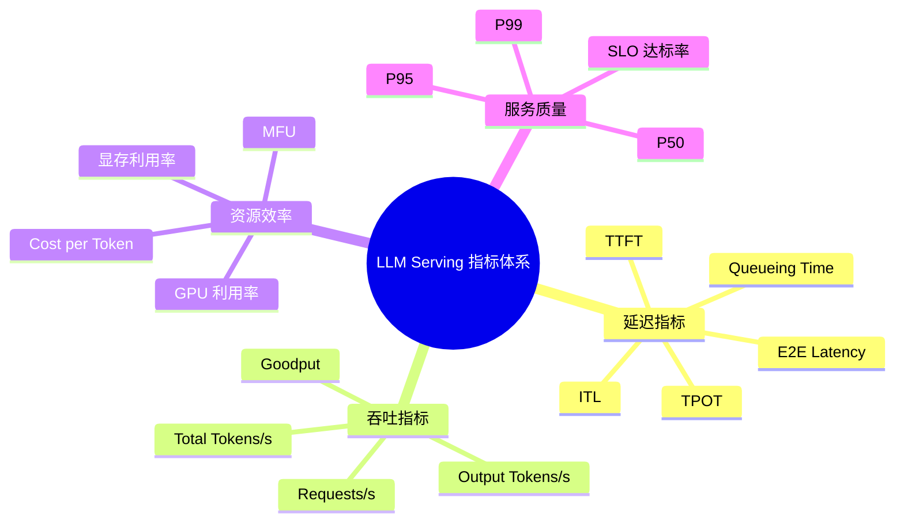

> **NOTE** 本文基于 vLLM v0.27.1（tag `6e448d0`, 2026-08-11）源码剖析。文中文件路径、类名和函数名均以该版本为准；vLLM 迭代很快，阅读时请以你手上的版本对照。


上一篇说明了 LLM Serving 为什么难：服务对象变成了持续生成过程，Prefill 与 Decode 是两种不同的 Workload，吞吐与时延无法同时最优。在动手优化之前，还需要先回答一个更基本的问题——系统到底好不好、问题出在哪一段。

LLM Serving 的性能不能只看单一指标：延迟、吞吐、效率与服务质量四个维度各自暴露不同阶段、不同资源的瓶颈。本篇的核心问题是：

> **应该用哪些指标衡量一个 LLM Serving 系统？指标异常时，如何判断问题出在排队、Prefill、Decode 还是资源，并选择对应的优化方向？**

## 一、总览：先定义指标，再对应瓶颈

### 1. 四个维度与一条使用原则

本篇先给出完整的指标体系——延迟（TTFT、TPOT、ITL、E2E、Queueing Time）、吞吐（Tokens/s、Requests/s、Goodput）、资源效率（MFU、GPU 利用率、显存利用率、Cost per Token）和服务质量（P50/P95/P99、SLO 达标率）——并逐一说明定义、反映的问题和使用注意；然后讨论常见的解读误区，把“指标异常”映射到“重点优化方向”；最后读一遍 vLLM 自带的 `vllm bench` 实现，用源码口径消除定义上的歧义。

贯穿全篇的原则是：不同指标对应不同瓶颈，不同瓶颈对应不同优化手段。

### 2. 本文的章节安排

```text
第二章  LLM Serving 指标总览        四个维度下各指标的定义、反映的问题与使用注意
第三章  指标常见误区与优化方向      六个常见误区、指标与优化方向的对应表、分析顺序
第四章  在 vLLM 里怎么测            `vllm bench` 的四个子命令与五条口径细节
第五章  本文小结
```

## 二、LLM Serving 指标总览

LLM Serving 的性能不能只看单一指标，而应同时关注四个维度：

```text
延迟：用户需要等待多久？
吞吐：系统单位时间处理多少请求和 Token？
效率：GPU、显存和资金利用得好不好？
服务质量：有多少请求满足 SLO？
```



延迟维度的五个指标其实是同一条请求时间线上的不同区间，先把它们放到一张图里，后面的定义就不容易混（`t0` 客户端发出请求，`t1` 服务端开始执行，`t2` 首 token 到达客户端，`t3..tN` 后续每个输出 token 到达客户端，共 N 个输出 token）：

```text
时间 ────────────────────────────────────────────────────────────────▶
   t0            t1            t2      t3      t4      t5   ...     tN
   │             │             │       │       │       │            │
   ├── Queueing ─┼── Prefill ──┤       │       │       │            │
   ├─────────── TTFT ──────────┤       │       │       │            │
   │                           ├─ITL1──┼─ITL2──┼─ITL3──┼─── ... ────┤
   │                           ├─── TPOT = (E2E - TTFT)/(N - 1) ────┤
   ├───────────────────────── E2E Latency ──────────────────────────┤
```

几个容易看错的地方：TTFT 从 `t0` 而不是 `t1` 起算，所以它包含排队、首 token 采样和网络传输，不等于 Prefill；ITL 是 `t2` 之后每一段间隔各自的值，有 N−1 个样本，所以能算分位数；TPOT 是这 N−1 段的平均值，一个请求只有一个数，它和 ITL 的均值相等，但抹掉了抖动；E2E 覆盖整条线。

**指标说明**

| 维度 | 指标 | 定义 | 主要反映 | 常见影响因素 | 使用注意 |
|---|---|---|---|---|---|
| **延迟** | **TTFT**<br>Time To First Token | 请求到达至收到第一个输出 Token 的时间 | 首次响应速度 | 排队、Prompt 长度、Prefill、Prefix Cache、首 Token 生成 | 不等于 Prefill 时间，还包括排队和传输 |
| **延迟** | **TPOT**<br>Time Per Output Token | Decode 阶段平均生成一个输出 Token 的时间：`(E2E − TTFT) / (输出 Token 数 − 1)` | 平均生成速度 | Decode Batch、KV Cache 长度、显存带宽、Attention Kernel、量化 | vLLM 的 `vllm bench serve` 明确**不含首 Token**（报告栏标注 `excl. 1st token`）；对比其他工具时需确认口径 |
| **延迟** | **ITL**<br>Inter-Token Latency | 相邻两个输出 Token 到达客户端的时间间隔 | 流式输出的连续性和稳定性 | 调度抖动、Batch 变化、抢占、网络传输 | 应重点观察 P95/P99，而不只是平均值 |
| **延迟** | **E2E Latency** | 从请求发送至完整结果返回的总时间 | 完整请求体验 | 排队、Prefill、Decode、输出长度、网络 | 长输出场景下通常受 Decode 主导 |
| **延迟** | **Queueing Time** | 请求到达至开始执行前的等待时间 | 系统拥塞程度 | 并发量、Batch 容量、Admission Control、KV Cache 空间 | 高并发时可能成为 TTFT 的主要部分 |
| **吞吐** | **Output Tokens/s** | 单位时间生成的输出 Token 数 | Decode 吞吐 | Batch Size、显存带宽、Kernel、并行度 | 适合衡量在线生成能力 |
| **吞吐** | **Total Tokens/s** | 单位时间处理的输入与输出 Token 总数 | 端到端 Token 处理能力 | Prompt 长度、输出长度、Prefill 和 Decode 效率 | 必须说明是否包含输入 Token |
| **吞吐** | **Requests/s** | 单位时间完成的请求数 | 业务请求处理能力 | 请求长度、并发度、服务策略 | 不能脱离输入输出长度单独比较 |
| **吞吐** | **Goodput** | 单位时间内满足 SLO 的**请求数**（req/s） | 满足服务质量后的有效吞吐 | 吞吐、尾延迟、调度、Admission Control | vLLM 的实现是 `request_goodput = 达标请求数 / 时长`，SLO 只能对 `ttft`、`tpot`、`e2el` 三项设阈值（`--goodput ttft:200 tpot:50`）；有些论文按 Token 计 Goodput，注意区分 |
| **资源效率** | **MFU**<br>Model FLOPs Utilization | 实际模型 FLOPs/s 与理论峰值 FLOPs/s 的比值 | 计算单元利用效率 | GEMM 规模、算子融合、Kernel 调度 | Decode 可能受显存带宽限制，MFU 低不一定代表低效 |
| **资源效率** | **GPU 利用率** | GPU 活跃时间占比 | GPU 是否持续工作 | 计算、访存、通信、调度和 Kernel Launch | 需要结合 HBM 带宽和 Tokens/s 判断 |
| **资源效率** | **显存利用率** | 已使用显存与可用显存的比例 | 并发和上下文容量 | 权重、KV Cache、激活、通信 Buffer、运行时开销 | 显存不仅决定模型能否加载，也决定并发度 |
| **资源效率** | **Cost per Token** | 处理一个 Token 的综合成本 | 经济效率 | GPU 成本、吞吐、利用率、量化、SLO | 应明确按输入、输出还是有效 Token 计算 |
| **服务质量** | **P50** | 50% 请求不超过该延迟 | 典型请求体验 | 常规负载 | 不能代表尾部请求 |
| **服务质量** | **P95** | 95% 请求不超过该延迟 | 大多数用户体验 | 负载波动、请求长度、调度 | 常用于在线服务 SLO |
| **服务质量** | **P99** | 99% 请求不超过该延迟 | 尾部请求体验 | 长请求、资源竞争、抢占、网络抖动 | 对多租户和交互式服务尤其重要 |
| **服务质量** | **SLO 达标率** | 满足预设延迟或吞吐目标的请求比例 | 服务稳定性 | TTFT、ITL、E2E、排队和错误率 | Goodput 的计算基础之一 |

## 三、指标常见误区与优化方向

LLM Serving 的各项指标并非相互独立。不同指标暴露的是不同阶段或不同资源的瓶颈，因此应根据指标异常选择优化方向，而不是笼统地追求 GPU 利用率或总吞吐。

### 1. 常见误区

**误区一：只看平均延迟**

平均值可能掩盖严重的尾延迟问题。在线服务通常应同时报告：

```text
平均值 + P50 + P95 + P99 + SLO 达标率
```

尤其是在动态批处理和多租户环境中，少量长请求可能显著拖高 P99。

**误区二：将 TTFT 等同于 Prefill 时间**

TTFT 通常还包括：

```text
排队时间 + 调度等待 + Prefill + 首 Token 生成 + 网络传输
```

因此 TTFT 过高不一定意味着 Prefill Kernel 低效，也可能是请求在队列中等待过久。

**误区三：只用 TPOT 衡量流式体验**

TPOT 是平均值，而用户实际感受到的是每个 Token 的到达间隔。调度抖动、Batch 动态变化和通信阻塞可能导致平均 TPOT 正常，但 ITL 的 P95/P99 很差。

**误区四：用 GPU 利用率判断系统是否高效**

GPU 利用率较高，可能只是 GPU 在等待显存访问或通信；GPU 利用率较低，也可能是系统受限于显存带宽、请求不足或模型并行通信。因此需要结合以下指标共同判断：

- HBM 带宽利用率；
- Kernel 执行时间；
- MFU；
- Decode TPOT；
- GPU 间通信时间；
- 有效 Tokens/s。

**误区五：只比较 Requests/s**

不同测试的 Prompt 长度、Output 长度和请求分布不同，Requests/s 很难直接比较。更合理的报告方式是同时给出：

```text
并发数、输入 Token 数、输出 Token 数、Output Tokens/s、
Total Tokens/s、TTFT、TPOT/ITL 和 P99
```

**误区六：显存占用越高越好**

提高 KV Cache 使用率有助于增加并发，但过度填充显存可能造成：

- 新请求无法接入；
- 长请求触发抢占；
- KV Cache 频繁换入换出；
- P99 延迟显著升高；
- 系统出现 OOM 风险。

因此，显存利用率应与并发度、KV Cache 命中率、抢占率和尾延迟联合分析。

### 2. 指标与优化方向的对应关系


| 指标或现象 | 主要暴露的问题 | 重点优化方向 |
|---|---|---|
| **TTFT 过高** | 排队时间长、Prefill 计算量大或首 Token 调度不及时 | 减少排队、优化 Prefill Kernel、使用 Prefix Cache、采用 Chunked Prefill、改进请求优先级 |
| **ITL / TPOT 过高** | Decode 阶段访存效率低、KV Cache 访问开销大或 Batch 调度不合理 | 优化 Decode Kernel、改进 KV Cache 布局和访问、减少通信开销、优化 Continuous Batching |
| **吞吐不足** | 有效 Batch 太小、计算或显存带宽利用率低 | 增大有效 Batch、提高算力和带宽利用率、优化 Kernel、减少 CPU/GPU 调度开销 |
| **P99 过高** | 长请求竞争、动态 Batch 抖动、资源争用或排队失控 | 控制长 Prefill、限制最大上下文、隔离不同长度请求、改进调度、增加限流和 Admission Control |
| **KV Cache 不足** | 上下文过长、并发过高或 KV Cache 管理效率低 | 使用 PagedAttention、Prefix Cache、KV 量化、KV Cache 复用和抢占 |
| **GPU 利用率低但 TTFT 高** | 请求排队、调度间隙或并发不足 | 优化请求准入、动态批处理、调度粒度和 CPU/GPU 协同 |
| **GPU 利用率高但吞吐低** | 可能受显存带宽、Kernel 效率或通信瓶颈限制 | 优化内存访问、融合 Kernel、量化、减少同步和跨卡通信 |
| **Prefill 很快但 Decode 很慢** | Decode 的小矩阵计算和 KV Cache 访存成为瓶颈 | 优化 Decode 专用 Kernel、改进 KV Cache 布局、调整 Decode Batch 和并行策略 |
| **吞吐高但 Goodput 低** | 系统牺牲延迟换取吞吐，导致大量请求违反 SLO | 引入 SLO-aware 调度、限制 Batch 上限、控制长请求、优化资源隔离 |
| **P99 随并发快速恶化** | 系统接近饱和，排队和资源竞争出现非线性增长 | 设置并发上限、实施 Admission Control、区分请求优先级、扩展实例或进行负载分片 |

### 3. 使用原则

指标分析应遵循以下顺序：

```text
先确认指标口径
    ↓
区分 Prefill、Decode、排队和网络因素
    ↓
观察平均值与 P95/P99 的差异
    ↓
结合 GPU、显存、带宽和通信指标定位瓶颈
    ↓
选择与指标对应的优化方向
    ↓
用 Goodput 和 SLO 达标率验证优化是否有效
```

核心原则是：

> 不同指标对应不同瓶颈，不同瓶颈对应不同优化手段。  
> 不能用提高吞吐的方法解决 TTFT，也不能用单纯增加 GPU 利用率的方法解决 P99 或 KV Cache 容量问题。

## 四、在 vLLM 里怎么测：`vllm bench`

上面的指标不是纸面定义，vLLM 自带的压测工具就是按这些口径实现的，读一遍源码可以消除大部分口径歧义。入口是 `vllm bench <子命令>`（`vllm/entrypoints/cli/benchmark/`），子命令分别对应 `vllm/benchmarks/` 下的同名模块：

| 子命令 | 用途 | 实现 |
|---|---|---|
| `vllm bench serve` | 对一个已启动的 OpenAI 兼容服务发起在线压测，报告 TTFT / TPOT / ITL / E2E 的均值与分位数、吞吐、Goodput | `vllm/benchmarks/serve.py` |
| `vllm bench throughput` | 离线吞吐：直接调用 `LLM.generate`，不经 HTTP | `vllm/benchmarks/throughput.py` |
| `vllm bench latency` | 单 batch 端到端延迟 | `vllm/benchmarks/latency.py` |
| `vllm bench sweep` | 对多组参数批量跑 `serve` | `vllm/benchmarks/sweep/` |

一次典型的在线压测：

```bash
vllm bench serve --model <MODEL> --dataset-name sharegpt --dataset-path ShareGPT.json \
  --request-rate 8 --num-prompts 500 \
  --percentile-metrics ttft,tpot,itl,e2el --metric-percentiles 50,95,99 \
  --goodput ttft:300 tpot:60
```

几个与口径直接相关的实现细节（`vllm/benchmarks/lib/endpoint_request_func.py` 与 `serve.py` 的 `calculate_metrics`）：

- **TTFT** 在客户端收到第一个 SSE chunk 时打点，所以包含了网络与 HTTP 解析开销，不是服务端的 Prefill 时间；
- **ITL** 是相邻 chunk 到达时刻的差，逐个记录后再算分位数；
- **TPOT** = `(latency − ttft) / (output_len − 1)`，不含首 Token；
- **Goodput** 按请求计数，一个请求只有 `ttft`、`tpot`、`e2el` 三项全部达标才算有效；
- **Total Token throughput** = `(总输入 Token + 总输出 Token) / 时长`，包含输入。

用上面命令里的 `--goodput ttft:300 tpot:60` 举一个 6 个请求、跑了 10 s 的例子，看 Goodput 是怎么从 Requests/s 里“扣”出来的（没有给 `e2el` 阈值，所以不检查）：

| 请求 | TTFT (ms) | TPOT (ms) | TTFT ≤ 300 | TPOT ≤ 60 | 计入 Goodput | 不达标的原因 |
|---|---|---|---|---|---|---|
| R1 | 120 | 35 | ✓ | ✓ | ✓ | — |
| R2 | 280 | 58 | ✓ | ✓ | ✓ | —（两项都贴着阈值，但仍达标） |
| R3 | 450 | 30 | ✗ | ✓ | ✗ | 排队久，首 token 慢 |
| R4 | 90 | 75 | ✓ | ✗ | ✗ | 首 token 快，但 Decode 每步太慢 |
| R5 | 150 | 40 | ✓ | ✓ | ✓ | — |
| R6 | 310 | 62 | ✗ | ✗ | ✗ | 两项都超 |
| **合计** | | | | | **3 / 6** | Requests/s = 6/10 = **0.6**；Goodput = 3/10 = **0.3 req/s** |

R3 和 R4 各只违反一项，但一样不计入——Goodput 是按请求做“与”判断，不是按指标各算达标率。这也解释了第三章“吞吐高但 Goodput 低”那一行：加大 Batch 让 6 个请求都完成了（Requests/s 不变甚至更高），却把一半请求推过了阈值。

对比不同引擎的 benchmark 数字时，先确认对方工具的这五条口径是否一致，否则数字没有可比性。

## 五、本文小结

LLM Serving 的指标体系可以归纳为：

```text
延迟：TTFT、TPOT、ITL、E2E
吞吐：Tokens/s、Requests/s、Goodput
效率：MFU、GPU 利用率、显存利用率、Cost per Token
质量：P50、P95、P99、SLO 达标率
```

其中最重要的区别是：

> 吞吐衡量系统处理了多少工作；  
> 延迟衡量用户等待了多久；  
> Goodput 衡量系统在满足 SLO 的前提下完成了多少有效工作。


## 下一篇

[鸟瞰 vLLM：一个请求如何穿过整个推理系统？](/vllm-request-lifecycle-overview.html)
