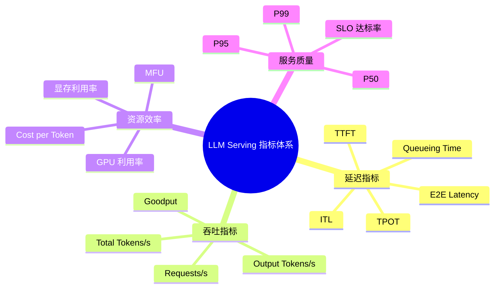

> **NOTE** 本文基于 vLLM v0.27.1（tag `6e448d0`, 2026-08-11）源码深度剖析。文中所有文件路径、类名和行号均以该版本为准；vLLM 迭代很快，阅读时请以你手上的版本对照。


## 1. LLM Serving 指标总览

LLM Serving 的性能不能只看单一指标，而应同时关注四个维度：

```text
延迟：用户需要等待多久？
吞吐：系统单位时间处理多少请求和 Token？
效率：GPU、显存和资金利用得好不好？
服务质量：有多少请求满足 SLO？
```



**指标说明**

| 维度 | 指标 | 定义 | 主要反映 | 常见影响因素 | 使用注意 |
|---|---|---|---|---|---|
| **延迟** | **TTFT**<br>Time To First Token | 请求到达至收到第一个输出 Token 的时间 | 首次响应速度 | 排队、Prompt 长度、Prefill、Prefix Cache、首 Token 生成 | 不等于 Prefill 时间，还包括排队和传输 |
| **延迟** | **TPOT**<br>Time Per Output Token | Decode 阶段平均生成一个输出 Token 的时间 | 平均生成速度 | Decode Batch、KV Cache 长度、显存带宽、Attention Kernel、量化 | 需明确是否包含首 Token |
| **延迟** | **ITL**<br>Inter-Token Latency | 相邻两个输出 Token 到达客户端的时间间隔 | 流式输出的连续性和稳定性 | 调度抖动、Batch 变化、抢占、网络传输 | 应重点观察 P95/P99，而不只是平均值 |
| **延迟** | **E2E Latency** | 从请求发送至完整结果返回的总时间 | 完整请求体验 | 排队、Prefill、Decode、输出长度、网络 | 长输出场景下通常受 Decode 主导 |
| **延迟** | **Queueing Time** | 请求到达至开始执行前的等待时间 | 系统拥塞程度 | 并发量、Batch 容量、Admission Control、KV Cache 空间 | 高并发时可能成为 TTFT 的主要部分 |
| **吞吐** | **Output Tokens/s** | 单位时间生成的输出 Token 数 | Decode 吞吐 | Batch Size、显存带宽、Kernel、并行度 | 适合衡量在线生成能力 |
| **吞吐** | **Total Tokens/s** | 单位时间处理的输入与输出 Token 总数 | 端到端 Token 处理能力 | Prompt 长度、输出长度、Prefill 和 Decode 效率 | 必须说明是否包含输入 Token |
| **吞吐** | **Requests/s** | 单位时间完成的请求数 | 业务请求处理能力 | 请求长度、并发度、服务策略 | 不能脱离输入输出长度单独比较 |
| **吞吐** | **Goodput** | 单位时间内满足 SLO 的有效请求或 Token 数 | 满足服务质量后的有效吞吐 | 吞吐、尾延迟、调度、Admission Control | 比理论吞吐更接近实际服务价值 |
| **资源效率** | **MFU**<br>Model FLOPs Utilization | 实际模型 FLOPs/s 与理论峰值 FLOPs/s 的比值 | 计算单元利用效率 | GEMM 规模、算子融合、Kernel 调度 | Decode 可能受显存带宽限制，MFU 低不一定代表低效 |
| **资源效率** | **GPU 利用率** | GPU 活跃时间占比 | GPU 是否持续工作 | 计算、访存、通信、调度和 Kernel Launch | 需要结合 HBM 带宽和 Tokens/s 判断 |
| **资源效率** | **显存利用率** | 已使用显存与可用显存的比例 | 并发和上下文容量 | 权重、KV Cache、激活、通信 Buffer、运行时开销 | 显存不仅决定模型能否加载，也决定并发度 |
| **资源效率** | **Cost per Token** | 处理一个 Token 的综合成本 | 经济效率 | GPU 成本、吞吐、利用率、量化、SLO | 应明确按输入、输出还是有效 Token 计算 |
| **服务质量** | **P50** | 50% 请求不超过该延迟 | 典型请求体验 | 常规负载 | 不能代表尾部请求 |
| **服务质量** | **P95** | 95% 请求不超过该延迟 | 大多数用户体验 | 负载波动、请求长度、调度 | 常用于在线服务 SLO |
| **服务质量** | **P99** | 99% 请求不超过该延迟 | 尾部请求体验 | 长请求、资源竞争、抢占、网络抖动 | 对多租户和交互式服务尤其重要 |
| **服务质量** | **SLO 达标率** | 满足预设延迟或吞吐目标的请求比例 | 服务稳定性 | TTFT、ITL、E2E、排队和错误率 | Goodput 的计算基础之一 |

## 2. 指标常见误区与优化方向

LLM Serving 的各项指标并非相互独立。不同指标暴露的是不同阶段或不同资源的瓶颈，因此应根据指标异常选择优化方向，而不是笼统地追求 GPU 利用率或总吞吐。

### 2.1 常见误区

#### 误区一：只看平均延迟

平均值可能掩盖严重的尾延迟问题。在线服务通常应同时报告：

```text
平均值 + P50 + P95 + P99 + SLO 达标率
```

尤其是在动态批处理和多租户环境中，少量长请求可能显著拖高 P99。

#### 误区二：将 TTFT 等同于 Prefill 时间

TTFT 通常还包括：

```text
排队时间 + 调度等待 + Prefill + 首 Token 生成 + 网络传输
```

因此 TTFT 过高不一定意味着 Prefill Kernel 低效，也可能是请求在队列中等待过久。

#### 误区三：只用 TPOT 衡量流式体验

TPOT 是平均值，而用户实际感受到的是每个 Token 的到达间隔。调度抖动、Batch 动态变化和通信阻塞可能导致平均 TPOT 正常，但 ITL 的 P95/P99 很差。

#### 误区四：用 GPU 利用率判断系统是否高效

GPU 利用率较高，可能只是 GPU 在等待显存访问或通信；GPU 利用率较低，也可能是系统受限于显存带宽、请求不足或模型并行通信。因此需要结合以下指标共同判断：

- HBM 带宽利用率；
- Kernel 执行时间；
- MFU；
- Decode TPOT；
- GPU 间通信时间；
- 有效 Tokens/s。

#### 误区五：只比较 Requests/s

不同测试的 Prompt 长度、Output 长度和请求分布不同，Requests/s 很难直接比较。更合理的报告方式是同时给出：

```text
并发数、输入 Token 数、输出 Token 数、Output Tokens/s、
Total Tokens/s、TTFT、TPOT/ITL 和 P99
```

#### 误区六：显存占用越高越好

提高 KV Cache 使用率有助于增加并发，但过度填充显存可能造成：

- 新请求无法接入；
- 长请求触发抢占；
- KV Cache 频繁换入换出；
- P99 延迟显著升高；
- 系统出现 OOM 风险。

因此，显存利用率应与并发度、KV Cache 命中率、抢占率和尾延迟联合分析。

### 2.2 指标与优化方向的对应关系


| 指标或现象 | 主要暴露的问题 | 重点优化方向 |
|---|---|---|
| **TTFT 过高** | 排队时间长、Prefill 计算量大或首 Token 调度不及时 | 减少排队、优化 Prefill Kernel、使用 Prefix Cache、采用 Chunked Prefill、改进请求优先级 |
| **ITL / TPOT 过高** | Decode 阶段访存效率低、KV Cache 访问开销大或 Batch 调度不合理 | 优化 Decode Kernel、改进 KV Cache 布局和访问、减少通信开销、优化 Continuous Batching |
| **吞吐不足** | 有效 Batch 太小、计算或显存带宽利用率低 | 增大有效 Batch、提高算力和带宽利用率、优化 Kernel、减少 CPU/GPU 调度开销 |
| **P99 过高** | 长请求竞争、动态 Batch 抖动、资源争用或排队失控 | 控制长 Prefill、限制最大上下文、隔离不同长度请求、改进调度、增加限流和 Admission Control |
| **KV Cache 不足** | 上下文过长、并发过高或 KV Cache 管理效率低 | 使用 PagedAttention、Prefix Cache、KV 量化、KV Cache 复用和抢占 |
| **GPU 利用率低但 TTFT 高** | 请求排队、调度间隙或并发不足 | 优化请求准入、动态批处理、调度粒度和 CPU/GPU 协同 |
| **GPU 利用率高但吞吐低** | 可能受显存带宽、Kernel 效率或通信瓶颈限制 | 优化内存访问、融合 Kernel、量化、减少同步和跨卡通信 |
| **Prefill 很快但 Decode 很慢** | Decode 的小矩阵计算和 KV Cache 访存成为瓶颈 | 优化 Decode 专用 Kernel、改进 KV Cache 布局、调整 Decode Batch 和并行策略 |
| **吞吐高但 Goodput 低** | 系统牺牲延迟换取吞吐，导致大量请求违反 SLO | 引入 SLO-aware 调度、限制 Batch 上限、控制长请求、优化资源隔离 |
| **P99 随并发快速恶化** | 系统接近饱和，排队和资源竞争出现非线性增长 | 设置并发上限、实施 Admission Control、区分请求优先级、扩展实例或进行负载分片 |

## 2.3 使用原则

指标分析应遵循以下顺序：

```text
先确认指标口径
    ↓
区分 Prefill、Decode、排队和网络因素
    ↓
观察平均值与 P95/P99 的差异
    ↓
结合 GPU、显存、带宽和通信指标定位瓶颈
    ↓
选择与指标对应的优化方向
    ↓
用 Goodput 和 SLO 达标率验证优化是否有效
```

核心原则是：

> 不同指标对应不同瓶颈，不同瓶颈对应不同优化手段。  
> 不能用提高吞吐的方法解决 TTFT，也不能用单纯增加 GPU 利用率的方法解决 P99 或 KV Cache 容量问题。

## 3. 本章小结

LLM Serving 的指标体系可以归纳为：

```text
延迟：TTFT、TPOT、ITL、E2E
吞吐：Tokens/s、Requests/s、Goodput
效率：MFU、GPU 利用率、显存利用率、Cost per Token
质量：P50、P95、P99、SLO 达标率
```

其中最重要的区别是：

> 吞吐衡量系统处理了多少工作；  
> 延迟衡量用户等待了多久；  
> Goodput 衡量系统在满足 SLO 的前提下完成了多少有效工作。


