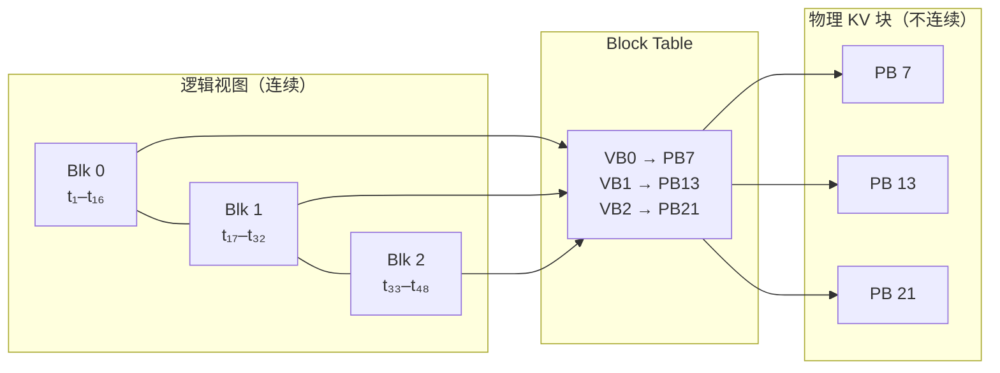
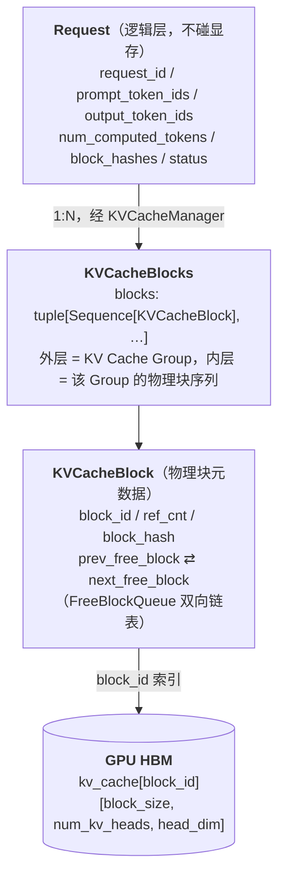
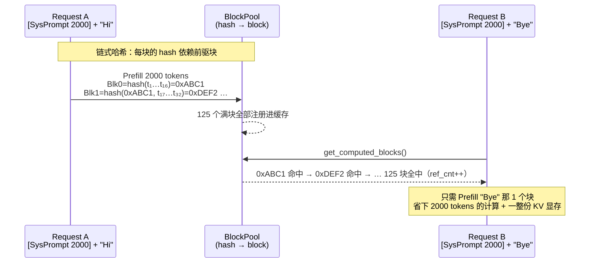
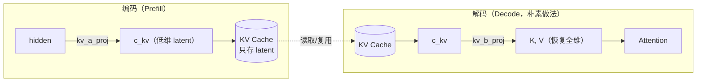

> **NOTE** 本文基于 vLLM v0.27.1（tag `6e448d0`, 2026-08-11）源码深度剖析。文中所有文件路径、类名和行号均以该版本为准；vLLM 迭代很快，阅读时请以你手上的版本对照。


设想一个场景：

你有一张 80 GB 的卡，同时来了 100 个请求。第一个请求最后只生成了 300 个 token，第二个生成了 3000 个，第三个一路写到 20K。**问题在于：这三个数字，你在请求到达的那一刻一个都不知道。**

如果按传统做法，给每个请求划一块连续显存来放它的 KV Cache，那你只能按"最坏情况"预留——按模型支持的最大长度划。于是那个只生成 300 token 的请求，占着一块够装 32K token 的地。100 个请求这么一摊，卡就满了，尽管真正装了有效数据的可能不到三成。

> **显存不是被模型吃掉的，是被"不确定性"浪费掉的。**

PagedAttention 的核心思想，用一句话就能说完：

> **别给请求整块连续空间。把 KV Cache 切成固定大小的小块，用多少申请多少，块与块之间不要求相邻。**

这样"预留"就消失了——因为不再需要预判总长度，只需要在写满当前块时再要一块。这个思路你大概率见过：**它就是操作系统的虚拟内存分页**。下面我们从传统做法的具体代价讲起，再看这套页表思想是怎么被搬到 GPU 上的。

## 1. PagedAttention 的数学本质与源码实现

### 1.1 痛点：传统显存分配的碎片灾难

在 PagedAttention 出现之前，每个请求的 KV Cache 必须在 GPU 显存中预分配一段**连续内存**，其长度等于模型支持的最大序列长度。这造成了两类碎片：

```
GPU HBM (80 GB)，每个请求按 max_len=2048 预留连续空间
┌──────────────────────────────────────────────────────────┐
│ Req A  ████████░░░░░░░░░░░░░░░░░░░░░░░░░░░░░░░░░░░░░░░░  │
│        ↑实际用 500      ↑ 内部碎片：1548 tokens 的空间白占 │
│ Req B  ████████████████░░░░░░░░░░░░░░░░░░░░░░░░░░░░░░░░  │
│ ░░░░░░ 剩余空间凑不出一整段连续的 2048 → Req C 进不来 ░░░  │
│        （外部碎片：总量其实够，但不连续）                  │
└──────────────────────────────────────────────────────────┘
```

| 碎片类型 | 成因 | 后果 |
|---|---|---|
| **内部碎片** | 按最大长度预留，实际用不了那么多 | 主要浪费来源 |
| **外部碎片** | 已释放的空间不连续 | 总量够却无法分配给新请求 |

总浪费率有多大？PagedAttention 论文（SOSP'23）测得当时的 SOTA 系统中，**真正存放有效 KV 的显存只占 20.4% ~ 38.2%**——也就是约 60% ~ 80% 被碎片和预留吃掉了。

### 1.2 页表思想的映射：操作系统虚拟内存在推理系统中的重现

PagedAttention 的灵感直接来自操作系统的虚拟内存管理。核心思想是将连续的逻辑地址空间映射到不连续的物理页框：

| | 操作系统虚拟内存 | PagedAttention |
|---|---|---|
| 连续的逻辑视图 | 虚拟地址空间（Page 0,1,2,3…） | 逻辑 token 序列（Blk 0,1,2…，每块 16 个 token） |
| 映射表 | Page Table（VP → PF） | **Block Table**（虚拟块 → 物理块） |
| 不连续的物理载体 | 物理页框 Physical Frame | **物理 KV 块** Physical Block（GPU HBM 上） |
| 分配单位 | 一页（如 4 KB） | 一块（`block_size` 个 token 的 K/V） |
| 好处 | 进程看到连续内存，实际零散存放 | 请求看到连续序列，KV 实际零散存放 |

映射关系是这样的——注意物理块号完全不需要连续：



在 vLLM 中，每个物理块（Physical Block）存储固定数量 token 的 K 和 V 张量：

```python
# KV Cache 物理布局 (单层)
# shape: [num_physical_blocks, block_size, num_kv_heads, head_dim]
# 例: [2048 blocks, 16 tokens/block, 8 heads, 128 dim]
kv_cache = torch.zeros(num_blocks, block_size, num_kv_heads, head_dim,
                        dtype=torch.float16, device="cuda")
```

### 1.3 源码解密：核心数据结构关系



顺着箭头从上到下跟踪：Request 只是逻辑层，不直接触及 GPU 显存；KVCacheBlock 才是物理块的元数据，它同时挂在 Request 的 blocks 列表和 BlockPool 的 free/cached 列表里；block_id 最终索引到 GPU HBM 中的一片连续显存，里面放的是一整块 block_size 个 token 的 K 和 V。这三层映射是理解后面 Prefix Cache 复用和 Preemption 释放的基础。

> **回到我们的例子**：2050 个 prompt token，`block_size=16`，于是需要 `⌈2050/16⌉ = 129` 个块（前 128 块装满 2048 个 token，第 129 块只装 2 个）。生成完 300 个 token 后，序列长 2350，共占 **147 个块**。
>
> 注意一个巧合般的细节：**2000 个 token 的 system prompt 恰好是 125 个整块**。这不是偶然设计，但它揭示了 Prefix Cache 的一个硬约束——只有**装满**的块才会被缓存，所以可复用的边界永远对齐到 `block_size`。下一节就用这一点算账。

`BlockPool`（`vllm/v1/core/block_pool.py`）管理所有物理块的分配和回收，使用双向链表实现高效的 LRU 驱逐：

```python
# vllm/v1/core/block_pool.py (简化)
class BlockPool:
    def __init__(self, num_gpu_blocks: int, ...):
        self.num_gpu_blocks = num_gpu_blocks
        self.free_block_queue = FreeKVCacheBlockQueue(num_gpu_blocks)
        # Prefix Cache: hash → 物理块映射
        self.cached_block_hash_to_block = BlockHashToBlockMap()

    def get_new_blocks(self, num_blocks: int) -> list[KVCacheBlock]:
        """从空闲队列分配新块（如果不够，驱逐 LRU 缓存块）"""
        ...

    def free_blocks(self, blocks: Iterable[KVCacheBlock]):
        """ref_cnt--，归零则回收到空闲队列"""
        ...

    def cache_full_blocks(self, request, blocks, ...):
        """将满块的 hash 注册到 Prefix Cache"""
        ...
```

块分配的布局（引自 `allocate_slots()` 注释）：

```
  |<──── computed ────>|<─ new_computed ─>|<─ external ─>|<── new ──>|<─ lookahead ─>|
                                                          |<── to be computed ──────>|
                                          |<────────── to be allocated ──────>|
                                          |<────────── to be cached ──────────>|

  computed:      之前已缓存在 KV Cache 中的 tokens（Prefix Cache 命中）
  new_computed:  本轮新计算但已完成的 tokens
  external:      从远端传输的 KV 块（PD 分离场景）
  new:           需要本轮计算的新 tokens
  lookahead:     为 Speculative Decoding 预留的额外 tokens
```

这个布局也揭示了 Scheduler 为什么不能按请求类型硬分类。一轮迭代中一个请求可能同时覆盖 computed（prefix cache 命中）、new（需要新计算）和 lookahead（spec decode 预留），不同请求在这个轴上的位置各不相同。token 预算模型统一处理这些区间，而不是按"prefill 请求"和"decode 请求"分开。


## 2. KV Cache 的写入、读取与生命周期

上一节讲的是「块从哪来」，这一节讲「块怎么被用完再还回去」——一次请求从 Prefill 批量写入，到 Decode 逐 slot 追加，最后在完成或被抢占时归还，构成 KV Cache 的完整生命周期。

```
                     KV Cache 生命周期全景

  ┌─────── Prefill 阶段 ──────┐   ┌────── Decode 阶段 ──────┐
  │                            │   │                          │
  │  prompt tokens:            │   │  每步 1 个新 token:       │
  │  [t₁, t₂, ..., tₙ]       │   │  [tₙ₊₁], [tₙ₊₂], ...   │
  │       │                    │   │       │                  │
  │       ▼                    │   │       ▼                  │
  │  ┌─────────────────┐      │   │  ┌──────────┐           │
  │  │ 批量写入 KV     │      │   │  │ 增量追加  │           │
  │  │ Cache 块        │      │   │  │ 1 个 slot │           │
  │  │                 │      │   │  │           │           │
  │  │ Block 0: [t₁~t₁₆]│   │   │  │ Block 2:  │           │
  │  │ Block 1: [t₁₇~t₃₂]│  │   │  │ 追加 tₙ₊₁ │           │
  │  │ Block 2: [t₃₃~tₙ] │   │   │  └──────────┘           │
  │  └─────────────────┘      │   │                          │
  └────────────────────────────┘   └──────────────────────────┘

  ┌─────── Attention 读取 ──────────────────────────────────┐
  │                                                         │
  │  Block Table (虚拟→物理映射):                            │
  │  req_42 → [PhyBlock_7, PhyBlock_13, PhyBlock_21]       │
  │                                                         │
  │  Attention Kernel 通过 Block Table 索引读取:             │
  │  for each query position:                               │
  │    for each block in block_table[req]:                  │
  │      K_block = kv_cache[block_id, :, :key_heads, :]    │
  │      V_block = kv_cache[block_id, :, :val_heads, :]    │
  │      score += Q @ K_blockᵀ                              │
  │    attn_out = softmax(scores) @ V_blocks               │
  └─────────────────────────────────────────────────────────┘

  ┌─────── 生命周期终结 ────────────────────────────────────┐
  │                                                         │
  │  请求完成:                                               │
  │    Scheduler → KVCacheManager.free(request)             │
  │    → ref_cnt-- 对所有块                                  │
  │    → ref_cnt == 0 的块归还 free_block_queue              │
  │    → 有 block_hash 的块进入 LRU 缓存（Prefix Cache）     │
  │    → 无 hash 的块立即回收                                 │
  │                                                         │
  │  抢占:                                                   │
  │    → 释放所有块                                          │
  │    → num_computed_tokens = 0 （需从头重算）               │
  │    → 但 Prefix Cache 命中可跳过部分重算                   │
  └─────────────────────────────────────────────────────────┘
```

**① 写入**——两个阶段的写法完全不同：

| 阶段 | 写入方式 | 例子 |
|---|---|---|
| Prefill | 批量写入若干整块 | `Block 0: t₁~t₁₆`、`Block 1: t₁₇~t₃₂`、`Block 2: t₃₃~tₙ` |
| Decode | 每步增量追加 1 个 slot | `Block 2` 尾部追加 `tₙ₊₁`，写满了才要新块 |

**② 读取**——Attention Kernel 不认识"请求"，只认 Block Table：

```
Block Table:  req_42 → [PB_7, PB_13, PB_21]

for each query position:
    for block_id in block_table[req]:
        K_block = kv_cache[block_id, :, :key_heads, :]
        V_block = kv_cache[block_id, :, :val_heads, :]
        scores += Q @ K_blockᵀ
    attn_out = softmax(scores) @ V_blocks
```

**③ 归还**——这一步决定了块能不能被别人复用：

| 触发 | 动作 | 关键后果 |
|---|---|---|
| 请求完成 | `KVCacheManager.free(request)`：所有块 `ref_cnt--` | `ref_cnt == 0` 才真正归还 `free_block_queue` |
| ↳ 块有 `block_hash` | 进入 LRU 缓存 | **留给 Prefix Cache 复用** |
| ↳ 块无 hash（未写满） | 立即回收 | 无法复用 |
| 被抢占 | 释放所有块 + `num_computed_tokens = 0` | 需重算，但 Prefix Cache 命中可跳过大部分 |

注意倒数第二行：**块只有"写满"才会被缓存**。这解释了为什么 Prefix Cache 的命中粒度是 `block_size`，而不是单个 token。


## 3. KV Cache 还能更小吗：复用、压缩与分层存储

在进入具体手段之前，先立一个分层框架——**这三层解决的是完全不同的问题，不应该混为一谈**：

| 层级 | 手段 | 解决的问题 |
|------|------|-----------|
| 系统管理层 | PagedAttention、Prefix Cache | 已经要存这么多，**显存怎么管才不浪费** |
| 模型架构层 | MQA / GQA / MLA | **本来到底需要存多少** |
| 数值层 | FP8 / INT8 量化 | 每个 KV 元素**占几个字节** |

三者是正交的，可以叠加：MLA 减少了要存的量，PagedAttention 管理这些量的摆放，FP8 再把每个元素压小。下面按这个顺序展开。

### 3.1 Prefix Cache：重复计算复用

在生产环境中，大量请求共享相同的 System Prompt（如 ChatGPT 的系统指令可能占 2000+ tokens）。Prefix Cache 的核心思想是：如果两个请求的前缀 token 完全相同，它们可以共享同一份 KV Cache 块。



vLLM 使用链式哈希确保前缀匹配的正确性——每个块的哈希值依赖其前驱块的哈希，因此只有完全相同的前缀序列才会产生相同的哈希链。

> **回到我们的例子**：那 2000 token 的 system prompt 是 **125 个整块**。第一个请求跑完后它们全部进入缓存；**第二个请求带着同样的 system prompt 到来时，这 125 块全部命中**，只需要 prefill 用户那 50 个 token。
>
> 省下多少？按第 1.6 节的量算：
>
> - **计算**：2000 token 的 prefill 不用做了，TTFT 从约 92 ms 掉到 5 ms 量级
> - **显存**：这 125 块（约 625 MB 的 KV）在两个请求间**共享同一份物理块**，靠 `ref_cnt` 计数，不是复制
>
> 在真实的多租户服务里，system prompt 往往被成百上千个请求共享——这就是为什么 Prefix Cache 是性价比最高的优化之一。

```python
# vllm/v1/core/kv_cache_utils.py (签名照抄, 函数体简化)
def hash_block_tokens(
    hash_function: Callable[[Any], bytes],
    parent_block_hash: BlockHash | None,
    curr_block_token_ids: Sequence[int],
    extra_keys: tuple[Any, ...] | None = None,
) -> BlockHash:
    """链式哈希：当前块哈希 = f(前驱块哈希, 本块 token ids, 额外键)"""
    if not parent_block_hash:
        parent_block_hash = NONE_HASH  # 首块的哈希起点
    return BlockHash(
        hash_function((parent_block_hash, tuple(curr_block_token_ids), extra_keys))
    )
```

这个签名里有两个细节值得留意，它们不是实现噪音：

- **哈希函数是注入进来的，不是 Python 内建的 `hash()`**，返回值也是 bytes 而非 int（可选 `sha256_cbor`、`xxhash_cbor` 等）。因为块哈希要在多个 worker、甚至跨节点（PD 分离、LMCache）之间对得上，必须可控且可复现。
- **链条起点 `NONE_HASH` 默认是随机的。** `init_none_hash()` 在未设置 `PYTHONHASHSEED` 时取 `os.urandom(32)`，即每个进程一个随机起点；只有显式设置 `PYTHONHASHSEED` 才会变成确定值。这是一个刻意的安全默认：随机起点让块哈希无法被外部预测，避免跨租户的缓存探测；而想让多进程/多节点共享同一份 prefix cache，就必须放弃这个默认。**可复现性和不可预测性在这里是一对取舍**，vLLM 默认选了后者。
- **`extra_keys` 是隔离用的。** 同一串 token 在不同 LoRA adapter、不同多模态输入、不同 `cache_salt`、不同 prompt embeds 下不能复用同一份 KV，这些维度都由 `generate_block_hash_extra_keys()` 收集进 `extra_keys`。也就是说，"前缀相同"的判定比"token 序列相同"严格——这是 prefix cache 的正确性边界。

### 3.2 GQA / MQA：模型结构级 KV Cache 瘦身

KV Cache 的大小与 KV head 数量成正比。Grouped-Query Attention (GQA) 和 Multi-Query Attention (MQA) 通过减少 KV head 数来缩减 KV Cache：

以 8 个 Query head 为例，三种变体的差别只在于**几个 Q head 共享一份 K/V**：

| 变体 | Q heads | K/V heads | 每 token 每层 KV 大小 | 相对 MHA |
|---|---|---|---|---|
| **MHA** | 8 | 8（一对一） | `2 × L × S × H × d` | 100% |
| **GQA** | 8 | 2~4（分组共享） | `2 × L × S × G × d` | 1/2 ~ 1/8 |
| **MQA** | 8 | 1（全部共享） | `2 × L × S × 1 × d` | 1/8 ~ 1/64 |

```
MHA   Q: [1][2][3][4][5][6][7][8]
      K: [1][2][3][4][5][6][7][8]      ← 一个 Q 配一个 K/V

GQA   Q: [1][2][3][4][5][6][7][8]
      K: [ G1  ][ G2  ][ G3  ][ G4 ]   ← 每 2 个 Q 共享一份

MQA   Q: [1][2][3][4][5][6][7][8]
      K: [        K1            ]      ← 全部 Q 共享一份
```

代价是表达能力：K/V head 越少，KV Cache 越小，但模型区分不同注意力模式的自由度也越低。GQA 是目前公认的甜点区——这也是为什么 Llama 3 全系都用 GQA。

| 模型 | 注意力类型 | num_heads | num_kv_heads | KV Cache 比例 |
|------|-----------|-----------|-------------|--------------|
| GPT-3 175B | MHA | 96 | 96 | 100% |
| Llama 3 70B | GQA | 64 | 8 | 12.5% |
| Llama 3 8B | GQA | 32 | 8 | 25% |
| Falcon 7B | MQA | 71 | 1 | 1.4% |
| DeepSeek V3 | MLA | 128 | - | ~2% (存 576 维 latent，非 128×128 的完整 KV) |

### 3.3 MLA：从 KV Cache 到 Latent Cache

DeepSeek V2/V3 提出的 Multi-head Latent Attention (MLA) 是一种更激进的 KV Cache 压缩方案。它不存储完整的 K、V 张量，而是存储一个低维的 latent 向量：

| | 传统 MHA / GQA | MLA（DeepSeek） |
|---|---|---|
| 存的是什么 | `K [Hkv, d]` + `V [Hkv, d]` | `c_kv [kv_lora_rank]` + `k_pe [qk_rope_head_dim]` |
| 每 token 每层 | `2 × Hkv × d` bytes | `(kv_lora_rank + qk_rope_head_dim) × sizeof(dtype)` |
| 实例 | Llama-70B（GQA-8）：`2×8×128×2B` = **4 KB** | DeepSeek V3：`(512+64)×2B` ≈ **1.1 KB** |

MLA 的运作分两步——**存的时候压缩，用的时候还原**：



但朴素做法有个致命问题：**每一步 Decode 都要把全部历史 token 的 latent 解压回全维 K/V**，那省下的显存又变成了带宽开销。真正的关键优化叫 **"吸收"（Absorbing）**——把解压矩阵 `W_uk` 预先融合进 `W_q`，于是可以**直接在 latent 空间做 Attention，完全不解压**。这一手的工程细节留到第 7.4.1 节展开。

压缩效果：相比同规模 MHA 可缩减一个数量级以上；相比 Llama 式 GQA-8（4 KB/token/layer）约缩减 3~4x。

vLLM 中 MLA 的实现位于 `vllm/model_executor/layers/mla.py`，通过 `MLAAttentionSpec` 定义其特殊的 KV Cache 规格（存储 latent 而非完整 KV）。

### 3.4 KV Cache Quantization：数值压缩与带宽优化

除了结构级的压缩（GQA/MQA/MLA），还可以通过数值量化进一步压缩 KV Cache：

| 格式 | 每元素 | 相对 FP16 | 精度影响 |
|---|---|---|---|
| FP32 | 4 bytes | 2.0× | 基准（训练精度） |
| FP16 / BF16 | 2 bytes | 1.0× | 标准推理精度 |
| **FP8 (E4M3)** | 1 byte | 0.5× | **轻微损失，实践中最安全的选择** |
| INT8 | 1 byte | 0.5× | 需要校准，按 head / channel 量化 |
| INT4 | 0.5 bytes | 0.25× | 显著损失，很少用于 KV Cache |

算一遍实际规模（Llama-70B、GQA-8、80 layers、seq_len=4096）：

| 场景 | 计算 | 结果 |
|---|---|---|
| 单请求 FP16 | 4 KB/token/layer × 4096 × 80 | 1.34 GB |
| 单请求 FP8 | 2 KB/token/layer × 4096 × 80 | 0.67 GB（省 50%） |
| **并发 8 路 FP16** | 1.34 GB × 8 | **10.7 GB** |

单请求看着不大，但注意最后一行：**KV Cache 是"并发数 × 上下文长度"的乘积**，这才是它压垮显存的方式。

量化粒度决定了精度与开销的平衡，scale 分得越细越准、但元数据越多：

| 粒度 | 含义 | 精度 |
|---|---|---|
| Per-tensor | 整个 KV Cache 共享 1 个 scale | 最差 |
| Per-token | 每个 token 一个 scale | 较好 |
| Per-head | 每个 head 一个 scale | 精细 |
| Per-channel | 每个 channel 一个 scale | 最优 |
| Per-group | 每 G 个元素共享 scale | 灵活折中 |

实现上分两个动作：**Quantize-on-write**（写入时即以低精度存储）和 **Dequantize-on-read**（读取时反量化，或直接在 attention kernel 内处理）。是否启用取决于模型、dtype、backend 与配置。

KV Cache 量化与 PagedAttention 在设计上可以组合：量化后的 KV 仍按 block 粒度管理，同时需要记录相应 scale 或格式元数据。具体是否支持、如何存储 scale、是否在 attention kernel 内完成反量化，取决于 v0.27.1 中对应模型、dtype 和 attention backend 的实现。

**注意**：Softmax 对 Key 的误差特别敏感（因为指数函数会放大误差），长上下文下量化误差可能累积。FP8 是实践中最安全的 KV Cache 量化格式。

### 3.5 KV Cache Offloading 与 Swapping

当 GPU 显存不足时，vLLM 支持将 KV Cache 卸载到更低层的存储：

| 层级 | 容量 | 带宽 | 延迟 | 存什么 |
|---|---|---|---|---|
| **GPU HBM**（热） | 10–80 GB | 3.35 TB/s (H100) | ~ns | 活跃请求的 KV |
| **CPU DRAM**（温） | 256 GB–2 TB | ~200 GB/s | ~100 ns | 被抢占请求的 KV（经 PCIe Gen5，64 GB/s） |
| **NVMe SSD**（冷） | 1–16 TB | ~7 GB/s | ~10 μs | 长期前缀缓存（较新的方向） |

当 GPU 显存不够时，有三种应对策略，代价各不相同：

| 策略 | 做法 | 优点 | 缺点 |
|---|---|---|---|
| **Recomputation**（重算） | 直接释放 KV，恢复时从头算 | 无传输开销，不占 CPU 内存 | 浪费 GPU 算力 |
| **Swapping**（换出） | KV 块 GPU→CPU，恢复时回传 | 保留了已算结果 | 吃 PCIe 带宽 |
| **Quantization + Offload** | 量化后再换出 | 传输量减半 | 额外精度损失 |

vLLM V1 当前主要使用 **Recomputation** 策略（`_preempt_request()` 中将 `num_computed_tokens` 置零），因为在 Prefix Cache 存在的情况下，重算的实际成本远低于理论最坏情况——大部分前缀块仍在缓存中可复用。

<details markdown="1">
<summary><b>📂 本章源码导航</b></summary>

**KV Cache 与 PagedAttention**

| 想看什么 | 从哪开始 |
|---|---|
| **块的分配与释放（核心）** | `vllm/v1/core/kv_cache_manager.py` → `allocate_slots()` |
| 物理块池、LRU 驱逐、Prefix Cache 注册 | `vllm/v1/core/block_pool.py` |
| 块哈希、`extra_keys`、`NONE_HASH` | `vllm/v1/core/kv_cache_utils.py` → `hash_block_tokens()` |
| 各类 KV Cache 规格（含 MLA） | `vllm/v1/kv_cache_interface.py` |
| MLA 层实现 | `vllm/model_executor/layers/mla.py` |
| KV 量化 | `vllm/model_executor/layers/quantization/` |

</details>


