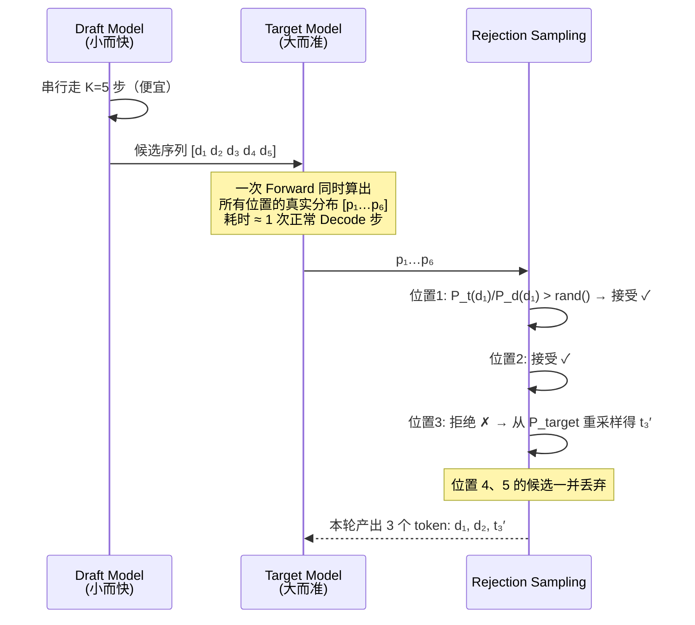
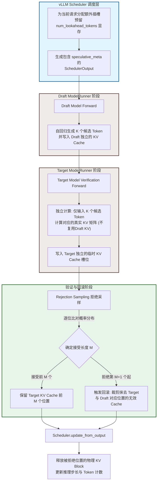

> **NOTE** 本文基于 vLLM v0.27.1（tag `6e448d0`, 2026-08-11）源码深度剖析。文中所有文件路径、类名和行号均以该版本为准；vLLM 迭代很快，阅读时请以你手上的版本对照。


这一章的问题是：**这些已经确定要算的 token，怎么算得更快。**


Decode 偏 memory-bound、Prefill 偏 compute-bound，但落到 GPU 上，浪费其实只有四种形态：

| 浪费形态 | 症状 | 对策 | 
|---|---|---|
| GPU 在**等 CPU 发指令** | kernel 之间有气泡 | CUDA Graph | 
| GPU 在**等 HBM 送数据** | 算力闲置、访存打满 | FlashAttention、算子融合 | 
| 搬的**每个数太胖** | 带宽被低信息密度的数据占满 | FP8 / INT8 / INT4 量化 | 
| **轮次本身太多** | 每轮只产出 1 个 token | 投机解码 | 


**回到我们的例子**（Llama-3-70B、8×H100、TP=8）：每张卡持有 17.6 GB 权重，H100 HBM 带宽 3.35 TB/s，于是**一次 decode 的权重读取下界约 5.3 ms**；加上 KV 读取、80 层 × 2 次 All-Reduce 和 kernel 开销，实测一步大约在 10 ms 量级。

那么这个请求的账就清楚了：

| 环节 | 估算 | 占比 |
|---|---|---|
| Prefill 2050 token | ≈ 92 ms（8×H100 稠密算力 7.9 PFLOPS，按 40% MFU 估） | 3% |
| Decode 300 步 | 300 × 10 ms ≈ **3000 ms** | **97%** |
| E2E | ≈ 3.1 s | |

**看清楚这个 3% vs 97%**：TTFT 只有 92 ms，而 97% 的时间花在那 300 次逐 token 的 decode 上。这解释了为什么绝大多数优化都是针对 Decode 侧的优化——Prefill 再快一倍，端到端也只省 3%。

## 1. GPU 为什么在空转？—— Kernel Launch 与 CUDA Graph

第一种浪费最反直觉：**GPU 并不慢，它只是在排队等 CPU 告诉它下一步做什么。** 这个问题在 Prefill 阶段几乎看不见（单个 kernel 算得久，提交开销被淹没），却会在 Decode 阶段被放大——因为 Decode 每步的计算量太小了。

### 1.1 痛点：Kernel Launch Overhead

在 Decode 阶段，每步模型 Forward 要启动**数百到上千个** CUDA Kernel，而每个 Kernel 的实际 GPU 计算时间可能只有几十微秒。数量之所以这么多，是因为它是**逐层累乘**的：以 80 层的 Llama-3-70B 为例，单层就有 RMSNorm ×2、QKV Proj、RoPE、Attention、O Proj、MLP 的三个 GEMM 与激活，TP=8 下还要再加 2 次 All-Reduce——十几个 kernel × 80 层，一步下来轻松上千。32 层的 7B 也在数百这个量级。

这里要先破除一个常见的误解：**kernel launch 本身是异步的，CPU 提交完就返回，并不会傻等 GPU 算完。** 正常情况下 CPU 会一路往前提交，把 GPU 的任务队列填满，提交开销完全隐藏在 GPU 执行时间背后。所以真正的成立条件只有一个：

> **当单个 kernel 的 GPU 执行时间 < CPU 提交它所需的时间时，GPU 就会追上 CPU，队列被抽干，开始出现气泡。**

这就解释了为什么 CUDA Graph 基本只对 Decode 有意义：Prefill 的 kernel 动辄跑几百微秒，CPU 那点提交开销（现代 CUDA 通常 2–5 μs 量级）根本追不上；而 Decode 阶段充斥着大量只需要 1.5μs 的细碎 Kernel，几十个这样的小 Kernel 排下来，CPU 异步发射的速度就成了拖后腿的那一方。

下图画的正是这种队列被抽干、算力不饱和的最坏情形（Launch-Bound 状态）——注意它不是常态，而是 Decode 小 kernel 场景下才会退化成的样子：

```
┌───────────────── 无 CUDA Graph: Decode 阶段的 Launch-Bound 气泡 ──────────────────┐
│                                                                                   │
│  CPU (Host Thread):                                                               │
│  ───[Launch K1]───[Launch K2]───[Launch K3]───[Launch K4]─── ... (全力发射)        │
│        4μs           4μs           4μs           4μs                              │
│         │             │             │             │                               │
│         ▼ (命令入队)  ▼             ▼             ▼                               │
│  GPU (Hardware):                                                                  │
│  ───[ Kernel 1 ]─[气泡]─[ Kernel 2 ]─[气泡]─[ Kernel 3 ]─[气泡]─ ...              │
│        1.5μs      2.5μs    1.5μs      2.5μs    1.5μs      2.5μs                   │
│                                                                                   │
│  【现象剖析】：                                                                   │
│  1. 时刻 0，CPU 开始提交 K1。                                                      │
│  2. 时刻 4，CPU 提交完 K1 并「立刻」开始提交 K2。同一时间，GPU 拿到 K1 开始执行。          │
│  3. 时刻 5.5，GPU 仅用 1.5μs 就把 K1 算完了！此时 GPU 检查队列，发现 K2 还没提交完。      │
│  4. 结果：GPU 只能被迫原地熄火，陷入 2.5μs 的「空闲气泡」，直到时刻 8 CPU 提交完 K2。      │
│                                                                                   │
│  【开销占比】：                                                                   │
│  若一步包含 400 个小 Kernel，CPU 耗时 = 400 × 4μs = 1600μs (总发射耗时)               │
│  因为 GPU 速度快于 CPU，整个流水线被 CPU 强行拉长。最终总耗时将由 CPU 侧决定：             │
│  总执行时间 ≈ 1600μs。其中 GPU 真正干活 600μs (37.5%)，卡死在气泡中 1000μs     (62.5%)。│
└───────────────────────────────────────────────────────────────────────────────────┘

```

### 1.2 CUDA Graph：静态执行图捕获与重放

为了消灭上述图中高达 62.5% 的恐怖气泡，CUDA Graph 改变了游戏规则。它在模型初始化或第一轮时将一系列 Kernel Launch 录制成一个"计算图"，之后用一次 Launch 重放整个图：

```
┌───────── CUDA Graph: 一次 Launch 重放整个 Decode 步 ─────────────────┐
│                                                                       │
│  Capture 阶段 (启动时一次性完成):                                       │
│  ─[record start]─[kernel₁]─[kernel₂]─...─[kernelₙ]─[record end]─   │
│  → 得到 CUDAGraph 对象, 记录了全部 kernel 及其参数地址                  │
│                                                                       │
│  Replay 阶段 (每步推理):                                               │
│  CPU: ──[replay: 1次launch, ~10μs]────────────────────────────────   │
│  GPU: ──[kernel₁][kernel₂][kernel₃]...[kernelₙ]──  (无 gap!)         │
│         连续执行，kernel 之间无 launch 等待                             │
│                                                                       │
│  总执行 = 10μs(1次launch) + ~8000μs(compute) = 8010μs               │
│  vs 上面完全暴露时的 10000μs → 上界省 20%                              │
│  实测通常在 5%~15%（部分提交开销本来就被隐藏了）                        │
│                                                                       │
│  约束:                                                                 │
│  · 图中 kernel 的形状必须固定 → 需要对不同 Batch Size 预捕获           │
│  · 内存地址必须固定 → 通过 placeholder tensor 复用                     │
│  · 不支持动态控制流 → Decode (固定模式) 适用, Prefill (可变) 不适用     │
└───────────────────────────────────────────────────────────────────────┘
```

捕获与重放由 `CudaGraphManager`（`vllm/v1/worker/gpu/cudagraph_utils.py`）负责，而"用哪种模式"由配置枚举 `CUDAGraphMode`（`vllm/config/compilation.py`）描述：

```python
# vllm/config/compilation.py
class CUDAGraphMode(enum.Enum):
    NONE = 0                        # 全程 Eager
    PIECEWISE = 1                   # 分段录制（处理动态部分）
    FULL = 2                        # 完整模型 Forward 录制为一个大图
    FULL_DECODE_ONLY = (FULL, NONE)       # decode 走 FULL, mixed batch 走 Eager
    FULL_AND_PIECEWISE = (FULL, PIECEWISE)  # decode 走 FULL, mixed batch 走 PIECEWISE
```

| 模式名称 | 技术机制与核心策略 | 性能表现（Decode / Mixed Batch） | 显存开销 | 工业界应用现状 |
|---|---|---|---|---|
| NONE | 全程 Eager 模式 CPU 实时解析并逐个发射 CUDA Kernel。 | 差（CPU发射瓶颈，气泡多） 一般（Prefill 可掩盖部分延迟） | 无 | 已淘汰 / 仅调试 仅用于底层算子开发调试或多模态超大输入排错。 |
| PIECEWISE | 分段录制模式 固定形状层录为小图，动态算子（如Attention）走 Eager。 | 良好（消灭大部分非 Attention 层气泡） 良好（动态算子外置，天然兼容混批） | 中等 | 自研/定制框架 多用于模型包含非标准、无法完整录图的自定义算子场景。 |
| FULL | 完整模型单图录制 Forward 整体录制为单个无法拆分的超级宏 Kernel。 | 极致（消除 100% 气泡，达硬件极限） 无法运行（形状一变立即崩溃） | 低至中等 | 离线批处理与跑分 用于离线大批量固定格式处理（如Embedding提取）与静态 BenchMark。 |
| FULL_DECODE_ONLY | 双轨动态切换 纯 Decode 走 FULL 图；混入 Prefill 自动降级至 NONE（Eager）。 | 极致（纯生成阶段拿满无气泡性能） 一般（Prefill 虽走 Eager 但受图影响小） | 中等（需针对常用 BS 做多桶捕获） | 商业推理引擎首选（如 vLLM / TRT-LLM） 工业界最主流的线上部署策略，兼顾极高吞吐与 Continuous Batching 稳定性。 |
| FULL_AND_PIECEWISE | 混合双轨优化 纯 Decode 走 FULL 大图；混入 Prefill 切换至 PIECEWISE 分段图。 | 极致（纯生成阶段性能达到硬件极限） 优秀（混批下固定层依然享受图加速） | 高（需常驻多套不同形态的多桶图） | 大厂尖端自研内核 属于头部大厂魔改推理框架的进阶方案，针对极高并发、追求极致长尾延迟（P99）的终极生产环境。 |

从当前工业界的最新演进来看，随着 PD 分离架构（Prefill-Decode Separation） 逐渐成为大厂的主流选择，上述模式的落地有了更清晰的物理边界：

* Decode 节点：由于完全剥离了 Prefill，输入形态被高度固化，大面积直接采用 FULL 模式或高密度的 FULL_DECODE_ONLY 榨干算力。
* Prefill 节点：由于需要应对 Chunked Prefill 等高度动态的形状变化，更多采用 PIECEWISE 或直接处于 NONE 状态以确保绝对稳定。 

## 2. 数据为什么搬不动？—— 压缩 HBM 流量

第二种浪费才是大头。GPU 的算力增长速度远快于显存带宽，于是绝大多数推理 kernel 的真实瓶颈都不是"算不完"，而是"数据喂不上"。

这一节的三种手段看起来毫不相干——换 Attention 实现、融合算子、挑后端——但它们优化的是**同一个量**：

> **HBM 流量 = 搬运次数 × 每次搬运的数据量。**

FlashAttention 和 Kernel Fusion 减少的是"搬运次数"（别让中间结果落地再读回来），下一节的量化减少的是"每次搬多少字节"。

### 2.1 FlashAttention

#### 2.1.1 vLLM的 Attention 后端与动态算子路由

在进入到 FlashAttention 之前，我们还是要先介绍一下 vLLM 的 Attention Backend 和 Selector 机制。

Attention 算子的硬件执行效率高度依赖于工作负载（Workload）形态、硬件架构及数据类型（dtype）。vLLM 在 vllm/v1/attention/backends/ 下集成了数十种 Attention 后端，并在 registry.py 中通过 Selector 机制，根据 Head Size、dtype、硬件算力以及运行时特征（Prefill / Decode / Mixed / MLA）进行动态算子路由（Kernel Selection）。

其核心后端生态及工业界典型的推荐基准（Benchmark Prefs）划分如下：

* **FlashInfer (flashinfer.py)**：默认的通用全能型后端。得益于对 Ragged Batch、PagedAttention 以及 Prefill+Decode 混合批次的深度汇编级优化，在 Decode 及 Mixed 场景下吞吐领先。
* **FlashAttention (flash_attn.py)**：NVIDIA 生态的经典基准。在纯 Prefill 场景下对长 Query 具备极佳的矩阵乘法吞吐表现，并包含 flash_attn_diffkv 等衍生变体。
* **MLA 特化后端 (mla/)**：针对 DeepSeek 等模型的低秩 KV 压缩（MLA）进行算子融合与内存重排优化。包含 FlashInfer MLA、FlashMLA、CUTLASS MLA、Triton MLA 及 ROCm 架构下的 AITER Triton MLA。
* **Triton / FlexAttention (triton_attn.py, flex_attention.py)**：高可定制化后端。利用高级语言抽象，便于跨硬件平台快速移植、验证或进行非标的自定义 Mask/Attention 研发。
* **硬件特化与非标后端**：包含 AMD 生态的 ROCm 系列（rocm_attn.py 等）、CPU 降级后端，以及适配 Mamba、Linear Attention 等非 Transformer 架构的专用算子。

**TIPS：** 业界没有绝对通用的默认后端，算子路由强绑定于具体的 vLLM 版本与底层硬件。在生产环境上线或变更 workload 形态（如从单轮 QA 转向超长多轮对话）前，必须基于目标硬件进行针对性的端到端压力测试（Profile & Benchmark）。

#### 2.2.2 FlashAttention：Tiling 与 Online-Softmax

FlashAttention 是现代 LLM 推理的基石算子。它的核心思想是通过**分块计算（Tiling）**和 **Online Softmax**，让 N×N 的中间矩阵**根本不必在 HBM 里出现**。注意它优化的是**访存**，计算量（FLOPs）一分没少。


```
┌──────────────── Standard Attention vs FlashAttention ─────────────────┐
│                                                                       │
│  Standard Attention:                                                  │
│                                                                       │
│  Q[N,d] × K[N,d]ᵀ → S[N,N]     ← O(N²) 存储, 写入 HBM                  │
│        → softmax(S) → P[N,N]    ← O(N²) 存储, 读写 HBM                 │
│        → P × V[N,d] → O[N,d]    ← O(N²) 读取 HBM                       │
│                                                                       │
│  总 HBM 访问: O(N² + N·d)                                             │
│  瓶颈: N > 几千时, S 和 P 矩阵占满显存                                   │
│                                                                       │
│  ────────────────────────────────────────────────────────────────     │
│                                                                       │
│  FlashAttention (Tiling + Online Softmax):                            │
│                                                                       │
│  将 Q, K, V 分成 Bq × Bk 的小块:                                        │
│                                                                       │
│  ┌──────┐                                                             │
│  │ SRAM │ ← 只在片上缓存 (192 KB, A100)                                 │
│  │      │                                                             │
│  │ Q_tile [Bq, d]  ← 从 HBM 加载一次                                   │
│  │ K_tile [Bk, d]  ← 分块加载                                          │
│  │ V_tile [Bk, d]  ← 分块加载                                          │
│  │ S_tile [Bq, Bk] ← 在 SRAM 中计算, 不写回 HBM!                        │
│  │ O_acc  [Bq, d]  ← 在线累加                                          │
│  │ m, l   [Bq]     ← softmax 统计量 (max, sum)                         │
│  └──────┘                                                             │
│                                                                       │
│  for each K_tile, V_tile:                                             │
│    S_tile = Q_tile @ K_tileᵀ                (SRAM 内计算)              │
│    m_new = max(m_old, rowmax(S_tile))       (Online max)              │
│    P_tile = exp(S_tile - m_new)             (SRAM 内计算)              │
│    l_new = exp(m_old - m_new) * l_old + rowsum(P_tile)                │
│    O_acc = rescale(O_acc) + P_tile @ V_tile (Online 累加)              │
│                                                                       │
│  总 HBM 访问: O(N²d²/M)（`M`为可用SRAM大小） ← 相比 O(N²) 大幅降低!        ｜                  │
│  无需存储 N×N 矩阵, 序列长度不再受显存限制                                 │
└───────────────────────────────────────────────────────────────────────┘
```

**说明：**

- 标准注意力会显式生成两个 N×N 大矩阵，显存和带宽压力都很大。
- FlashAttention 不保存完整中间矩阵，而是把计算拆成小块，在片上完成并立即复用。
- 它的目标不是减少 FLOPs，而是减少 HBM 读写。

##### ① 为什么 Standard Attention 会卡显存？

Standard Attention的问题在于它把两个 N×N 的大矩阵实实在在地写进了 HBM：

```
Q[N,d] × K[N,d]^T  ->  S[N,N]                # O(N²) **写入** HBM
S[N,N]             ->  softmax  ->  P[N,N]   # O(N²) **读 + 写** HBM 
P[N,N] × V[N,d]    ->  O[N,d]                # O(N²) **读取** HBM

HBM 中的代价：
- S：要写回一次
- S：softmax 前要再读一次
- P：要写回一次
- P：乘 V 前要再读一次
```

总 HBM 访问 **O(N·d + N²)**，其中 N² 项的系数是 4（S 写、S 读、P 写、P 读）。更要命的是显存：N 到几千时，S、P 两个矩阵就能把显存占满。

**说明：**

- 问题不只是矩阵大，而是它们必须在 HBM 里“来回搬运”
- 当序列长度变大时，N² 级别的中间结果会迅速成为瓶颈
- 所以标准注意力的主要痛点是访存和显存，不是算力

##### ② FlashAttention 的 Tiling 思路

FlashAttention 把 Q/K/V 切成 `Bq × Bk` 的小块，让中间结果**只在片上 SRAM 里出现，从不落回 HBM**（A100 每个 SM 的 L1/shared 合计 192 KB，可作 shared memory 的约 164 KB）：

```
Q 被切成 Q_tile
K、V 被切成 K_tile / V_tile

             ┌──────── SRAM / Shared Memory ──────────┐
HBM -> Q_tile ┤                                        ├-> 输出 (O_acc)
HBM -> K_tile ┤  S_tile = Q_tile @ K_tile^T           ├
HBM -> V_tile ┤  Online Softmax(S_tile):              ├
              ┤     维护m, l运行时统计量，O_acc在线累加   ├
              └───────────────────────────────────────┘
              
说明：
- 每次只处理一小块 Q/K/V
- S_tile 只在片上临时存在，不写回 HBM
- 这样可以把大矩阵的“中间停留”从显存中拿掉
```

| 驻留在 SRAM 的东西 | 形状 | 说明 |
|---|---|---|
| `Q_tile` | `[Bq, d]` | 从 HBM 加载 |
| `K_tile` / `V_tile` | `[Bk, d]` | 分块循环加载 |
| `S_tile` | `[Bq, Bk]` | **在 SRAM 中算完就用掉，不写回** |
| `O_acc` | `[Bq, d]` | 在线累加的输出 |
| `m, l` | `[Bq]` | softmax 的运行时统计量（行最大值、指数和） |

##### ③ Online Softmax 是怎么“边算边归一化”的

FlashAttention能够运转的关键在于**Online Softmax**，它让 softmax 不需要先看到整行就能开始累加。

softmax 看起来需要先知道一整行的最大值和总和，才能归一化。这似乎意味着必须先把完整的 S[N,N] 算出来。但 FlashAttention 用了 Online Softmax，允许它在分块过程中动态维护：

- m：当前最大值
- l：指数和
- O_acc：输出累加结果

当新块到来时，如果发现最大值变了，就把历史结果按比例重新缩放，再把新块的贡献加进去。
这样就能保证：**分块计算的结果，和一次性算完整 softmax 的结果严格等价。**

```
m, l, O_acc = -inf, 0, 0
for each K_tile, V_tile:                               # 沿 KV 方向循环
    S_tile = Q_tile @ K_tileᵀ                          # SRAM 内，不写回
    m_new  = max(m, rowmax(S_tile))                    # 滚动更新行最大值
    P_tile = exp(S_tile - m_new)                       # SRAM 内
    l      = exp(m - m_new) * l + rowsum(P_tile)       # 修正旧的指数和
    O_acc  = exp(m - m_new) * O_acc + P_tile @ V_tile  # 同一个系数修正旧的累加结果
    m      = m_new
O = O_acc / l                                          # 整个循环结束才做这一次除法
```

每来一个新块，就用 `exp(m_old - m_new)` 把此前累加的结果**追溯性地缩放一次**，因此它与"先看完整行再 softmax"在数学上**严格等价**，不是近似。注意归一化的除法被推迟到了循环之外——这是它能一边扫一边累加的前提。

##### ④ FlashAttention 到底省了什么？

FlashAttention 的收益主要体现在两方面：

**显存：O(N²) → O(N)**
标准 Attention 需要显式保存 S[N,N] 和 P[N,N]，所以额外显存是 O(N²)。
FlashAttention 只保存当前 tile 和少量统计量，因此额外显存降到 O(N) 级别。

**访存（带宽）：O(N²) → O(N²d²/M)**
标准 Attention 里，中间矩阵要在 HBM 里反复读写。
FlashAttention 把大部分中间计算压到片上内存完成，显著降低 HBM 访问压力。

但是需要注意的是，FlashAttention 并没有把 HBM 访问从 O(N²) 降到 O(N·d)。论文给出的 IO 复杂度是 **O(N²d²/M)**（`M` 为可用 SRAM 大小）——**N² 这一项消不掉**，因为循环要沿一个方向走 `N/B` 次，每一次都得把另一侧的 tile 重新从 HBM 过一遍。它真正做的是把 N² 项的**系数**从 4 压到 `d²/M` 量级。

**但要注意，计算复杂度并没有任何改变**
FlashAttention 并没有把注意力从 O(N²) 变成 O(N)。
它优化的是 IO 和显存占用，不是注意力本身的二次结构。

**对比 & 总结**

| 特性 | Standard Attention | FlashAttention |
|------|-------------------|----------------|
| HBM 访问 | O(N·d + N²) | **O(N²d²/M)** |
| 额外显存 | **O(N²)**（必须物化 S、P） | **O(N)**（只留 `m`、`l`） |
| 最大序列长度 | 受 N² 显存约束 | 不再受 N² 显存约束 |
| IO 效率 | 低（中间矩阵 HBM 往返） | 高（tile 在 SRAM 内复用） |
| 实现复杂度 | 简单 | 高（需要手写 CUDA kernel） |

**FlashAttention 在显存上是渐进式的胜利（O(N²) → O(N)，这条无条件成立），在带宽上拿到的是一个常数倍的胜利**——倍数约为 `M/d²`，`d` 越小、SRAM 越大越划算。实测 2~4× 的加速也不只来自访存量本身，还来自少了一趟独立的 softmax kernel、以及不再被 N² 显存卡住 batch。

##### ⑤ 训练和推理中的差异

FlashAttention 在训练和推理中的作用并不完全相同。

- **训练时**，反向传播需要依赖注意力计算中的一些中间信息。  
  但 FlashAttention 为了节省显存，不会把完整的 `S` 和 `P` 中间矩阵保存下来。  
  因此在反向阶段，通常需要通过**重算（recompute）**来恢复这些信息，再继续求梯度。  
  也就是说，训练阶段的核心特点是 **“用计算换显存”**。

- **推理时**，模型只需要做前向计算，不需要反向传播。  
  这意味着中间结果不必长期保留，也不会带来额外的重算代价。  
  所以 FlashAttention 在推理阶段通常表现为**纯收益**：既降低显存占用，又减少访存压力。

##### ⑥ Serving 场景下的 Decode 优化：从 FlashAttention 到 Flash-Decoding

在 Serving 场景里，FlashAttention 的收益不只取决于计算复杂度，更取决于**GPU 是否能被有效填满**。它的核心优势来自 query 方向上有足够多的行可以切块复用；但在 **Decode** 阶段，`query_len = 1`，因此 `Bq` 只能取 1，query 方向根本切不动。此时 kernel 会退化成对一长串历史 KV 的单行扫描，SM 大量空转，原本依赖 tiling 的效率优势也会明显减弱。

Decode 侧的办法不是继续沿 query 切，而是**把切分方向换到 KV 维度**：通过 **split-K / Flash-Decoding**，让多个 SM 各自处理一段历史 KV，先得到局部的注意力结果，再使用和 FlashAttention 完全一致的 `m`、`l` 在线 rescale 规则把这些局部结果合并起来。vLLM 中的 FlashInfer / paged decode kernel 走的就是这条路线，这也是上一节的 selector 需要根据 workload 形态做分派的原因。

更进一步看，**“分块计算 + 在线累加”** 其实是同一个数学技巧在不同硬件层级上的重复出现，只是切分边界不同：

| 切分位置 | 沿什么方向切 | 方案 | 
|---|---|---|
| SRAM ↔ HBM | query | FlashAttention | 
| SM ↔ SM | KV | Flash-Decoding / split-KV |
| GPU ↔ GPU | 序列 | Ring Attention | 

因此，在 Serving 场景中，FlashAttention 的关键不再只是“能不能把 attention 算得更省”，而是“在当前 workload 形态下，应该沿哪一维切块、在哪一层级做合并”。这也是为什么 Prefill、Decode、跨 GPU 长序列分别对应 FlashAttention、Flash-Decoding 和 Ring Attention。

##### ⑦ 版本演进与优化方向

FlashAttention 后续版本主要是在同一套数学核心上继续做工程优化，而不是改变算法本质。

- **FlashAttention-2**
重点提升了 GPU 并行效率，把并行维度进一步扩展到序列方向，同时减少了非矩阵乘法指令的开销。

- **FlashAttention-3**
针对 Hopper 架构做了更进一步的优化，引入了 warp specialization，并支持 FP8 等更高效的低精度计算。

不过，无论是最初版本还是后续版本，FlashAttention 的核心思想都没有变：
**通过分块计算（Tiling）和在线归一化（Online Softmax），在保持结果等价的前提下，大幅降低注意力计算的显存和访存开销。**

### 2.2 Kernel Fusion

Kernel Fusion 的核心目标，是**把原本多个相邻的算子合并到一个 kernel 里执行**，从而减少中间结果的读写开销，降低 kernel launch 次数，并提升整体吞吐效率。对于大模型推理而言，很多算子本身的计算量并不大，但它们之间频繁地在 HBM 中读写中间 tensor，会让性能很快受限于显存带宽而不是算力。因此，Kernel Fusion 本质上是在做一件和 FlashAttention 非常相似的事情：**尽量让中间结果不落到 HBM，而是在片上完成连续计算。**

#### 2.2.1 Kernel Fusion 的动机与收益

在传统的未融合实现中，一个算子链通常会被拆成多个独立 kernel。例如以 `RMSNorm → RoPE → Residual` 为例：

| | 未融合（3 个独立 kernel） | 融合后（1 个 kernel） |
|---|---|---|
| 执行 | RMSNorm 读 x 写 temp₁ → RoPE 读 temp₁ 写 temp₂ → Residual 读 temp₂ 写 out | 读 x 一次 → norm → RoPE → 加 residual → 写 out 一次 |
| HBM 访问 | **6 次**（3 读 + 3 写） | **2 次**（1 读 + 1 写） |
| 中间 tensor | 2 个 | **0 个** |
| kernel launch | 3 次 | 1 次 |

可以看到，未融合版本的问题并不只是“多了几个算子”，而是每个算子之间都要把中间结果写回 HBM，再从 HBM 读出来继续处理。这种反复搬运数据的方式，会显著放大显存带宽压力。相比之下，融合后的 kernel 直接在一次执行过程中完成多个连续操作，只在最开始读取输入、最后写出结果，中间过程尽量留在寄存器或共享内存中，从而大幅减少内存访问。

Kernel Fusion优化带来的收益主要有三类：

1. **减少 HBM 访问**
中间 tensor 不再频繁写回显存，显著降低带宽开销。
2. **减少 kernel launch 开销**
多个小 kernel 合并成一个后，可以减少 launch 次数和调度开销。
3. **提升整体吞吐效率**
对推理场景来说，尤其是 decode 阶段，很多算子都偏轻量，launch 和访存的开销占比很高，融合后的收益往往非常明显。

注意这个收益的来源和 FlashAttention 完全一致——**都是不让中间结果去 HBM 兜一圈**，只不过 FlashAttention 作用在一个算子内部，Kernel Fusion 作用在多个算子之间。

#### 2.2.2 vLLM 中的 Kernel Fusion 实践

在 vLLM 中，Kernel Fusion 已经被广泛用于推理链路的多个环节，尤其集中在 `csrc/libtorch_stable/` 下的 CUDA 实现中，目标就是尽可能把高频、低算力密度但高访存代价的操作合并执行。下面这些算子就是比较典型的例子：

| 融合算子 | 涉及操作 | 实现位置 | 收益 |
|----------|---------|---------|------|
| Fused RMSNorm | RMSNorm + Residual Add | `csrc/libtorch_stable/layernorm_kernels.cu` | 减少 1 次 HBM 读写 |
| Fused RMSNorm + Quant | RMSNorm + 动态 per-token 量化 | `csrc/libtorch_stable/layernorm_quant_kernels.cu` | 归一化后直接出低精度 |
| Fused RoPE | RoPE + Permute | `csrc/libtorch_stable/pos_encoding_kernels.cu` | 减少中间 tensor |
| Fused QKV | Q/K/V 三个矩阵乘合并 | PyTorch/cuBLAS | 1 次 GEMM 替代 3 次 |
| Fused Attention | softmax(QK/√d)V + KV Cache R/W | FlashAttention kernel | 核心融合 |
| Fused Gate-Up | gate_proj + up_proj + SiLU | cuBLAS + activation | 减少中间存储 |
| Fused Sampling | top-k + top-p + temperature | `csrc/libtorch_stable/sampler.cu` | GPU 端采样 |
| Fused KV Cache | Cache write + 量化 | `csrc/libtorch_stable/cache_kernels_fused.cu` | 写入时即量化 |

这些融合算子覆盖了推理过程中的几个关键环节：

* 归一化阶段：如 RMSNorm 与 Residual 的融合，减少前后张量搬运；
* 位置编码阶段：如 RoPE 与维度重排的融合，避免生成临时 tensor；
* 线性投影阶段：如 QKV 合并计算，减少重复访存和 launch；
* 注意力阶段：如 FlashAttention，将 softmax 和矩阵乘法尽量做成一个高效流程；
* 采样阶段：如 top-k/top-p/temperature 一体化，减少生成端的额外开销；
* 缓存阶段：如 KV Cache 写入与量化融合，降低显存占用并提高写入效率。

可以看到，vLLM 的融合并不局限于某一个单点优化，而是围绕整个推理链路进行系统性的改造。其思路是：凡是存在“中间结果写回 HBM 再继续处理”的地方，都尽量尝试融合。

### 2.3 小结

Kernel Fusion 和 FlashAttention 的共同点在于，它们都在解决同一个根本问题：
**把本可以在片上连续完成的计算，尽量压缩成一次执行，避免中间结果落到 HBM。**

如果说 FlashAttention 是注意力内部的“算子内融合”，那么 Kernel Fusion 则更像是推理系统层面的“算子间融合”。二者结合起来，最终目标都是：

* 少读少写
* 少 launch
* 少中间 tensor
* 更高吞吐、更低延迟

## 3. 能不能少搬几个字节？—— 低精度推理

上一节在减少搬运**次数**，这一节换个方向：让每次搬运的**数据本身变小**。两者正交，可以叠加。

### 3.1 推理量化的对象、收益与代价

| | 权重 (W) | 激活 (A) | KV Cache |
|---|---|---|---|
| 生命周期 | 常驻 GPU，占比最大 | 动态生成，逐层计算 | 动态增长，随序列膨胀 |
| 量化收益 | 减少显存、加速推理 | 加速 GEMM、减少带宽 | 更多并发、更长上下文 |
| 典型方法 | GPTQ / AWQ / W4A16 | W8A8 / FP8、per-token | FP8 / INT8、per-head |

三种量化对象不是均匀受益的。权重量化同时降低显存和 Decode 带宽压力，因为 Decode 每步都要读权重；KV Cache 量化主要受益于 Decode 的历史 KV 读取和并发数；激活量化则更直接加速 Prefill 的 GEMM。选择方案前需要先判断瓶颈在 Prefill 还是 Decode。

### 3.2 权重量化方法

| 方法 | 格式 | 原理 | 量化时机 | 精度 |
|------|------|------|---------|------|
| **GPTQ** | W4A16 | 基于 Hessian 的逐层最优量化 | 离线（需校准数据） | 好 |
| **AWQ** | W4A16 | 保护显著权重通道 | 离线（需校准数据） | 更好 |
| **SmoothQuant** | W8A8 | 将激活难度转移到权重 | 离线 | 好 |
| **FP8** | W8A8 | 硬件原生 FP8 格式 | 在线/离线 | 接近 FP16 |
| **Weight-only** | W4A16/W8A16 | 只量化权重，激活保持 FP16 | 离线 | 较好 |

以 Llama-70B 为例：

| 格式 | 权重大小 | Decode 加速 | 精度损失 |
|---|---|---|---|
| FP16 | 140 GB | 1.0×（基准） | 基准 |
| FP8 (W8A8) | 70 GB | 1.5–2.0× | 极小 |
| INT8 (W8A8) | 70 GB | 1.5–2.0× | 小 |
| INT4 (W4A16) | 35 GB | 1.8–2.5× | 中等 |

Decode 之所以能加速，有三个叠加的原因：

1. **权重从 HBM 加载的带宽直接减半**——回到 10.5 节那笔账，batch=1 时权重读取就是 decode 耗时的大头，砍掉一半立竿见影；
2. INT4 / FP8 GEMM 能用上 Tensor Core 的特殊指令，算力更高；
3. 模型变小后可能用更少的卡装下，**连通信开销一起省了**。

### 3.3 FP8 推理

FP8 是 H100/H200 引入的硬件原生低精度格式，vLLM 通过 `vllm/model_executor/layers/quantization/fp8.py` 支持：

FP8 有两种排布，推理基本只用前者：

| 格式 | 位分配 | 范围 | 精度 | 用途 |
|---|---|---|---|---|
| **E4M3** | 1 符号 + 4 指数 + 3 尾数 | [-448, 448] | ~3–4 位有效数字 | **权重与激活** |
| E5M2 | 1 符号 + 5 指数 + 2 尾数 | 更大 | ~2–3 位有效数字 | 梯度，推理少用 |

这个取舍很直白：E4M3 拿指数位换尾数位，**牺牲动态范围来保精度**——推理时数值范围可以靠 scaling 控住，精度却不能省。

FP8 推理的优势：

- Tensor Core 原生支持 FP8 GEMM。H100 SXM 稠密算力 **FP8 1979 TFLOPS vs BF16 989 TFLOPS，理论 2×**（常见的 3958 TFLOPS 是"带稀疏"口径，不能拿来和稠密 BF16 比）
- 权重 + 激活 + KV Cache 全链路 FP8 → 显存减半
- Per-tensor / Per-token scaling 可按需选择精度档位

### 3.4 混合精度组合与性能评测

| 组合 | 权重 | 激活 | KV Cache | 显存 | TTFT | TPOT | 质量 |
|---|---|---|---|---|---|---|---|
| FP16 全精度 | FP16 | FP16 | FP16 | 100% | 基准 | 基准 | 基准 |
| FP8 全链路 | FP8 | FP8 | FP8 | 50% | 0.7× | 0.6× | ≈ 基准 |
| W4A16 + FP16 KV | INT4 | FP16 | FP16 | 35% | 0.8× | 0.5× | 轻降 |
| W4A16 + FP8 KV | INT4 | FP16 | FP8 | 27% | 0.7× | 0.5× | 轻降 |
| FP8 W/A + FP8 KV | FP8 | FP8 | FP8 | 50% | 0.5× | 0.5× | ≈ 基准 |

**表中数值是相对基准的比例，仅作量级示意，实际因模型和场景而异。** 读这张表时注意三条规律：

- **TTFT 主要受权重量化影响**（Prefill 是 compute-bound，吃的是算力）
- **TPOT 同时受权重量化和 KV 量化影响**（Decode 是 memory-bound，吃的是带宽）
- **显存降低还有二阶收益**：省下的显存能换更大 batch，实际吞吐提升往往超过表里的单请求数字

最后一句必须说在前面：**质量损失一定要用 eval benchmark 实测**（HumanEval、MMLU 等），不能靠"≈ 基准"这三个字就上生产。


## 4. 能不能少跑几轮模型？—— 投机解码

前面三节都在优化"一轮怎么跑得更快"。这一节换个思路：**能不能让一轮多产出几个 token，从而少跑几轮？**

### 4.1 Decode 的根本瓶颈

Decode 阶段的核心瓶颈是**逐 Token 串行**：每一步只生成 1 个 token，但需要完整读取模型权重和 KV Cache。GPU 算力的绝大部分处于闲置状态（低 arithmetic intensity）。

```
传统 Decode：
  Step 1 → token₁ → Step 2 → token₂ → Step 3 → token₃ → …
  每一步都要：读完整模型权重 + 读全部历史 KV，却只算出 1 个 token
```

算力利用率在小 batch 下可以低到个位数百分比——绝大部分时间在等 HBM。（batch 增大后同一份权重被多个请求摊薄，利用率会显著回升，这正是 Continuous Batching 有效的根本原因；但**单个请求的延迟**并不会因此变好，这才是投机解码要解决的问题。）

### 4.2 Speculative Decoding 基本原理

核心思想：用一个**小而快**的 Draft Model 一次性推测多个候选 token，然后用**大而准**的 Target Model 并行验证这些候选。

在看流程之前，必须先破除一个几乎人人都会产生的误解：

> **投机解码并没有消除自回归依赖。**

看到"一次 Forward 产出 5 个 token"，很容易以为 token 之间的依赖被打破、可以并行生成了。**不是的。** token 之间的因果依赖是语言模型的定义本身，谁也绕不过去。投机解码做的是另一件事：

- **依赖仍然存在**：`d₂` 的生成依然依赖 `d₁`，`d₃` 依赖 `d₂`……这个串行链条在 **Draft 模型内部**照样一步步走完，只不过 Draft 模型足够便宜，串行 5 步的代价也很小；
- **被并行化的是"验证"，不是"生成"**：Target 模型拿到 `[d₁...d₅]` 这个**已经确定的序列**之后，可以用一次 Forward 同时算出所有位置的真实概率分布——因为此时每个位置的输入前缀都已知了，不需要等上一步的输出。

所以它的本质是一次**赌注**：用便宜模型猜一条路径，再用贵模型一次性核对这条路径对不对。猜对了就白赚几个 token，猜错了就退回重来。**它省下的是 Target 模型的"轮次"，而不是语言模型的"依赖"。** 这也解释了为什么接受率一低，收益就迅速蒸发——赌输的次数太多了。



三个要点：

- **一次 Target Forward 产出了 3 个 token**，理想情况最多能到 K+1 个；
- **拒绝是"截断式"的**——位置 3 一旦被拒，后面的 4、5 全部作废，因为它们的前提已经不成立了。这也是接受率对收益影响巨大的原因；
- **输出分布严格无损**：这套修正采样（rejection sampling）在数学上保证最终分布与直接用 Target Model 采样**完全一致**。投机解码不是近似加速，这一点和量化有本质区别。

| | 做法 | 耗时 | 产出 | 等效 TPOT |
|---|---|---|---|---|
| 普通 Decode | 5 次 Forward，每次 15 ms | 75 ms | 5 tokens | 15 ms |
| Speculative | Draft 5 步（5 ms）+ Verify 1 次（18 ms） | 23 ms | 3 tokens（接受 2 + 重采样 1） | **≈ 7.7 ms** |

约 **2× 加速**。注意 Verify 那 18 ms 比普通 Decode 的 15 ms 略高——因为要一次算 6 个位置而不是 1 个，计算量确实增加了，只是在 memory-bound 区间这点额外计算几乎免费。**这正是投机解码的本质：拿闲置算力去换延迟。**

### 4.3 工程实现与核心算法：Scheduler、KV Cache 与 拒绝采样

投机解码（Speculative Decoding）在 vLLM 中的落地绝非简单的算法套用，其核心难点在于非确定性（Speculative）的显存管理与多模型流水线的数学对冲。

#### 4.3.1 核心数据流拓扑图

在 vLLM 的实际工程实现中，Draft 模型（草稿模型）与 Target 模型（目标大模型）各自维护一套完全隔离的 KV Cache 空间。Target 模型在验证时，必须使用自己独立计算的 KV 矩阵。以下是 vLLM 投机解码的数据流向与组件交互图：



#### 4.3.2 关键工程痛点：显存管理的“时间回溯”

传统的自回归生成在工程上是单向递增的，显存管理器只需机械地分配新块。然而，投机解码给显存管理引入了“可能要回滚”的全新机制：

* 维度与空间完全隔离：Draft 模型（如 1B）每 Token 的 KV 尺寸远小于 Target 模型（如 70B）。Target 模型在验证前向传播（Verification Forward）时，会将候选的 K 个 Token 作为输入，在自己的 Transformer Layer 中计算出大模型视角下的 KV 值并写入大模型的缓存中，两者的显存完全不共享、不复用。
* 物理块的“裁剪（Truncate）”与释放：拒绝采样确定接受长度 `M（0 <= M <= K)` 后，未被接受的 `K-M` 个 Token 对应的 KV 空间便成了“脏数据”。vLLM 会调用显存管理器的回滚 API，强行将逻辑 Token ID 与物理块槽位的映射关系撤回到第 M 个 Token 处。这种“按位置撤销”的逻辑极大地增加了物理显存调度的复杂性。

#### 4.3.3 核心算法：拒绝采样的数学对冲

投机采样之所以能做到数学上完全无损（Lossless），完全依赖于其精妙的拒绝采样（Rejection Sampling）与概率对冲机制。

**接受概率公式**

设在某位置，Draft 与 Target 模型的预测概率分布分别为 $$p(x)$$ 和 $$q(x)$$。对于 Draft 采样出的候选 Token $$x^*$$，Target 模型的接受概率为：

$$P(\text{接受 } x^*) = \min\left(1, \frac{q(x^*)}{p(x^*)}\right)$$

* $$q(x^*) \ge p(x^*)$$：大模型更认可该候选，100% 接受。
* $$q(x^*) < p(x^*)$$：大模型认为小模型冒进了，以 $$\frac{q(x^*)}{p(x^*)}$$ 概率接受。

**拒绝后的残差对冲**

在多步投机中，验证是串行、逐字进行的。一旦某个候选 Token 在第 $$M+1$$ 个位置被拒绝，投机链条彻底断裂。大模型不仅要触发回滚、抹去该位置及之后的所有 KV Cache，还必须基于残差分布（Residual Distribution） $$q'(x)$$ 在当前位置重新采样出一个 Token 来拉回正轨：

$$q'(x) = \frac{\max\left(0, q(x) - p(x)\right)}{\sum_{z} \max\left(0, q(z) - p(z)\right)}$$

直观理解：当小模型在 $$x^*$$ 处过于自信（被拒绝）时，大模型在重新采样时会扣除小模型多估的概率空间。残差分布 $$q'(x)$$ 的本质，就是去专门采样那些大模型认为可能出现、但被小模型低估（残差部分）的 Token，从而在统计学上实现与大模型原生自回归的绝对一致。在每个 Step 结束时，调度器调用 update_from_output() 根据最终实际接受的 Token 数量校准步长，并将无用的物理显存块吐回给内存池。

#### 4.3.4 Speculative Decoding 的变体

不同 Speculative Decoding 方法的核心区别，主要在于**“候选 token 如何生成”**。它们整体都遵循类似的流程：

```text
Candidate Generation
        │
        ▼
[d₁, d₂, d₃, ...]
        │
        ▼
Target Model Verification
        │
   ┌────┴────┐
   ▼         ▼
 Accept     Reject
```

因此在 vLLM 中，这些不同的候选生成机制被统一抽象为 **Proposer（候选生成器）**，实现在 `vllm/v1/spec_decode/` 下。不同 Proposer 负责产生 speculative decoding 所需的候选 token，而后续的 Target 验证、接受/拒绝以及 KV Cache 更新等流程则可以复用统一的 speculative decoding 基础设施。

但在看表之前要先做一个分类上的澄清，因为下表把六种方法平铺在一起，容易掩盖一件事：**它们并不都是"推理技巧"。**

```
Speculative Decoding（一种推理时的加速框架）
│
├── 纯推理侧，不碰模型：
│   ├── 独立 Draft Model      —— 另找一个小模型
│   ├── N-gram               —— 从 prompt 里抄
│   └── Suffix Decoding      —— 从后缀树里抄
│
├── 需要额外训练一个"头"：
│   ├── EAGLE                —— 训一个特征级 draft 头
│   └── Medusa               —— 训若干并行 LM 头
│
└── 模型自带（Model-native）：
    └── MTP                  —— 预训练阶段就已经有了
```


其中，**MTP 和其他方法尤其值得区分**。

N-gram、Suffix、Draft Model、EAGLE、Medusa，本质上都是为了在推理阶段获得更便宜的候选 token：有的方法依赖另一个小模型，有的方法依赖历史 token，有的方法在 Target Model 上增加额外的预测组件。

而 **Multi-Token Prediction（MTP）首先是一种模型架构与训练目标**：模型在训练阶段不仅学习预测下一个 token，还学习预测多个未来位置的 token。这样得到的 MTP 层在推理阶段又可以天然用于生成 speculative decoding 所需要的候选 token。

因此，MTP 与其他方法最大的区别在于：

> **EAGLE、Medusa 等是在已有 Target Model 外部增加 speculative 组件；MTP 则要求 Target Model 本身原生具备 Multi-Token Prediction 能力。**

这也带来了明显的工程差异：

* Draft Model、N-gram、Suffix 等更多属于**部署阶段可以选择的推理策略**；
* EAGLE、Medusa 虽然也可以在部署阶段启用，但需要提前针对特定 Target Model 训练相应的额外组件；
* MTP 则要求模型 checkpoint 原生包含对应的 MTP 结构和权重。

在 vLLM 中，这一点也体现在实现上：MTP 的相关配置会从模型配置中读取，例如 `num_nextn_predict_layers`；对应的 MTP 权重也作为模型 checkpoint 的一部分进行加载。换句话说，**MTP 不是 vLLM 在部署时临时给普通模型外挂的能力，而是模型本身携带的能力。**

下表是对它们几个的对比：

| 方法                  | 候选生成机制         | 核心原理                                                | 优势                               | 局限                                              |
| ------------------- | -------------- | --------------------------------------------------- | -------------------------------- | ----------------------------------------------- |
| **Draft Model**     | 独立小模型          | 用一个更小、更快的模型自回归生成候选                                  | 通用、与 Target 解耦                   | 需要额外模型、显存和计算                                    |
| **N-gram**          | 历史 token 匹配    | 从已有上下文中查找重复 n-gram 并预测后续 token                      | 几乎零模型开销                          | 依赖文本中的重复模式                                      |
| **Suffix Decoding** | 后缀匹配           | 利用后缀结构/匹配结果生成候选                                     | 无需额外训练模型                         | 对上下文中的可匹配模式依赖较强                                 |
| **EAGLE**           | Target Feature | 利用 Target Model 的内部 feature，通过轻量 Draft Head 自回归生成候选 | 不需要完整 Draft Model，额外开销较低         | 需要针对 Target Model 训练 EAGLE 组件                   |
| **Medusa**          | 多预测 Head       | 在 Target Model 上增加多个未来 token 预测 Head，并构造候选树         | 不需要独立 Draft Model，可并行产生多个候选      | 需要训练额外 Head，并涉及 Candidate Tree / Tree Attention |
| **MTP**             | MTP Layers     | 利用模型原生的 Multi-Token Prediction 层生成未来 token          | 模型原生支持，天然适合 speculative decoding | 需要模型 checkpoint 原生支持 MTP                        |


##### EAGLE：不再外挂完整 Draft Model，而是外挂轻量 Draft Head

EAGLE 的核心思想是：

> **利用 Target Model 已经计算出来的内部 feature，再通过一个专门训练的轻量 Draft Network 生成候选，而不是再运行一个完整的 Draft Model。**

可以粗略理解为：

```text
                 Target Model
                      │
                      ▼
               Hidden Feature
                      │
                      ▼
                ┌───────────┐
                │ EAGLE     │
                │ Draft Head│
                └─────┬─────┘
                      │
                  d₁ → d₂ → d₃ → ...
                      │
                      ▼
              Target Verification
```

因此 EAGLE 与 Draft Model 的最大区别是：

```text
Draft Model：

Target Model + 完整 Draft Model


EAGLE：

Target Model + 轻量 EAGLE Draft Component
```

EAGLE 并不是一个可以对任意模型直接通用的插件。EAGLE Head 需要针对特定 Target Model 进行训练和适配，但相比维护一个完整的 Draft Model，它的额外参数量和计算开销通常要小得多。

##### Medusa：多个 Head 同时预测未来位置

Medusa 的思路与 EAGLE 类似，也是在 Target Model 上增加额外的预测组件，但它采用的是**多 Head**设计。

```text
                     Target Model
                          │
                          ▼
                     Hidden State
                          │
          ┌───────────────┼───────────────┐
          ▼               ▼               ▼
      Medusa Head 1   Medusa Head 2   Medusa Head 3
          │               │               │
          ▼               ▼               ▼
      candidates       candidates       candidates
          └───────────────┼───────────────┘
                          ▼
                   Candidate Tree
                          │
                          ▼
                  Target Verification
```

每个 Head 负责预测不同未来位置的 token，并可以产生多个候选。多个 Head 的结果进一步组织成 **Candidate Tree**，然后 Target Model 利用 Tree Attention 等机制一次验证多条候选路径。

因此，Medusa 的关键并不只是“增加几个 LM Head”，而是：

> **利用多个预测 Head 构造未来 token 的候选树，再通过一次 Target Model 执行验证多个候选路径。**

这也是 Medusa 与简单的“多个并行 LM Head”之间的重要区别。

##### MTP：模型原生就拥有 Multi-Token Prediction 能力

MTP 与前面的 EAGLE / Medusa 最大的区别在于：

> **MTP 不是部署时外挂到普通模型上的组件，而是模型架构和训练阶段就已经具备的能力。**

可以理解为：

```text
                  Target Model
                       │
                       ▼
                Hidden Features
                       │
                       ▼
                ┌─────────────┐
                │ MTP Layer 1 │
                └──────┬──────┘
                       │
                       ▼
                ┌─────────────┐
                │ MTP Layer 2 │
                └──────┬──────┘
                       │
                       ▼
                 Future Tokens
                       │
                       ▼
               Target Verification
```

因此，从部署形态上看：

```text
Draft Model：

Target + 独立 Draft Model


EAGLE：

Target + EAGLE Draft Component


Medusa：

Target + 多个 Medusa Heads


MTP：

Target 本身就包含 MTP Layers
```

这也是为什么 MTP 能否用于 speculative decoding，在很大程度上取决于**模型 checkpoint 是否原生支持 MTP**。

在 vLLM 的工程实现中，MTP 并没有完全独立出一套 speculative decoding 框架，而是复用了已有的 proposer 基础设施。部分 MTP 模型会基于 `EagleProposer` 进行扩展，并由模型侧的 MTP predictor 负责具体的候选生成。

这里需要特别注意：

> **“代码上复用 `EagleProposer`”并不意味着“MTP 算法本质上是 EAGLE 的一种特例”。**

二者在算法思想上仍然不同，只是在 vLLM 中，它们的候选生成和 speculative decoding 执行流程具有较强的共性，因此可以复用同一套工程抽象。


##### 从“外挂程度”理解这些方法

如果从一个非常直观的工程视角来看（注意：这只是**工程上的理解框架，而不是严格的算法演进顺序**），可以把这些方法理解成 Target Model 的 speculative 能力逐渐与模型本身融合：

```text
Draft Model
    │
    │ 另找一个小模型来猜
    ▼
EAGLE
    │
    │ 利用 Target Feature + 轻量 Draft Component
    ▼
Medusa
    │
    │ 多个 Head 产生未来 token 候选
    ▼
MTP
    │
    │ 模型原生学习预测多个未来 token
    ▼
Model-native Speculation
```

它们虽然实现方式不同，但最终都在解决同一个问题：

> **Target Model 每生成一个 token 都需要执行昂贵的计算，而 speculative decoding 希望用更低成本的方法一次猜出多个 token，再让 Target Model 一次性验证，从而减少 Target Model 的逐 token 解码次数。**

最后还需要注意一个反直觉现象：Speculative Decoding 在高并发、高 GPU 利用率场景下可能出现负收益。它通过增加 Draft 计算，换取 Target Model 更少的 autoregressive decoding iteration。当 GPU 已经处于较高利用率时，额外的 Draft 计算会与其他请求竞争计算、显存带宽以及执行资源，此时减少 Target iteration 带来的收益可能不足以抵消新增开销，甚至导致整体性能下降。因此，Speculative Decoding 更容易在 GPU 资源相对充裕、且对 Decode latency / ITL 敏感的场景中体现价值；对于高并发、吞吐优先的 Serving 场景，则需要结合 Acceptance Rate、Draft 成本、Batch Size 和 GPU 利用率进行实际评估。


<details markdown="1">
<summary><b>📂 本章源码导航</b></summary>

**GPU 执行**

| 想看什么 | 从哪开始 |
|---|---|
| **一轮 batch 在 GPU 上怎么跑** | `vllm/v1/worker/gpu/model_runner.py`、`input_batch.py`（翻译层细节见第 10.4 节） |
| CUDA Graph 捕获与重放 | `vllm/v1/worker/gpu/cudagraph_utils.py`；模式枚举在 `vllm/config/compilation.py` |
| Attention 后端选择 | `vllm/v1/attention/selector.py` → `get_attn_backend()` |
| 各 Attention 后端实现 | `vllm/v1/attention/backends/`（MLA 变体在 `mla/`） |
| 投机解码各 Proposer | `vllm/v1/spec_decode/`（EAGLE / MTP 都在 `eagle.py`） |
| 融合算子（CUDA） | `csrc/libtorch_stable/` |
| 量化 | `vllm/model_executor/layers/quantization/`（FP8 见 `fp8.py`） |

</details>

