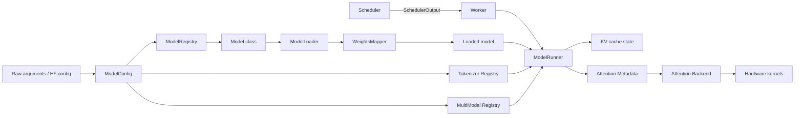
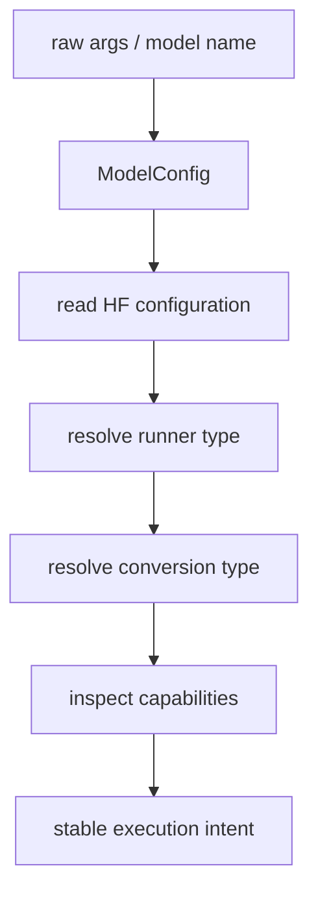
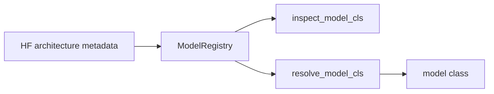
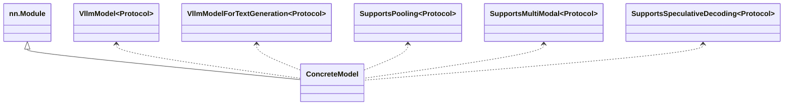
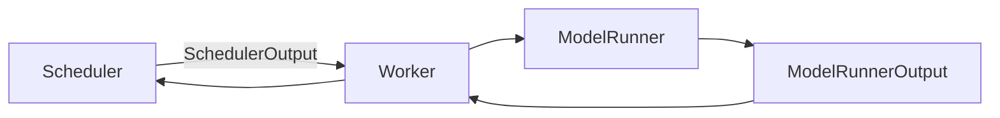
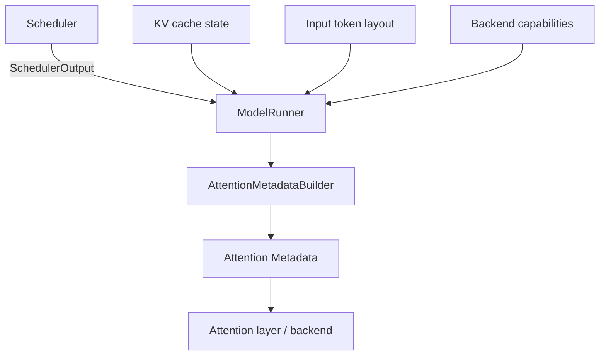
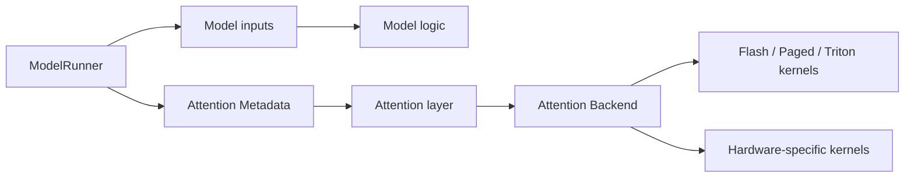

> **NOTE** 本文基于 vLLM v0.27.1（tag `6e448d0`, 2026-08-11）源码深度剖析。文中所有文件路径、类名和行号均以该版本为准；vLLM 迭代很快，阅读时请以你手上的版本对照。


## 1. 痛点：为什么推理引擎必须持续适配新模型？

### 1.1 模型算法同质化与工程实现异构化

LLM 模型在算法上高度同质，都是基于 Transformer模型，围绕以下组件构建：

- Embedding；
- Transformer Block；
- Attention；
- Feed-Forward Network；
- Normalization；
- LM Head。

但模型的工程实现上却是高度异构化：

| 维度 | 差异示例 |
|---|---|
| Attention | MHA / GQA / MQA / MLA / Sliding Window |
| 位置编码 | RoPE / ALiBi / Learned / NTK-RoPE |
| 归一化 | LayerNorm / RMSNorm、Pre-Norm / Post-Norm，位置与数量都可能不同 |
| MLP | Dense / MoE / Switch / Top-K routing |
| 激活函数 | GELU / SiLU / SwiGLU / GeGLU |
| KV Cache 格式 | Full KV / Latent（MLA）/ State（Mamba） |
| 特殊头 | MTP Head / EAGLE Head / Medusa Head |

难点不在"差异多"，而在**每一种差异都会往下捅穿好几层**：

- 换 Attention 变体 → 影响 Attention Kernel **和** KV Cache 布局
- 换 KV Cache 格式 → 影响显存管理 **和** 调度策略（Mamba 的 state 根本不是块状的）
- 加特殊头 → 影响采样、调度预算 **和** KV 回滚逻辑（见第 7.4.3 节）
- 引入 MoE → 影响路由、Token Dispatch、通信和负载均衡
- 改变权重布局 → 影响加载、量化和张量并行

而新架构的发布频率是**周级**的。所以真正的问题是：**如何在不动 Continuous Batching + PagedAttention 这套通用框架的前提下，容纳每个模型的特殊计算路径。**

### 1.2 新模型差异如何向下游扩散？

一个新模型接入推理引擎时，影响通常可以分为三个层次。

| 层次 | 主要内容 | 典型问题 |
|---|---|---|
| 模型层 | 网络结构、权重、配置 | 如何加载权重？如何表示模型结构？ |
| 运行时层 | 调度、KV Cache、并行 | 如何执行动态 Batch？如何管理显存？ |
| 算子层 | Attention、MoE、量化 Kernel | 如何获得足够的吞吐和延迟？ |

理想情况下，模型层只需要调用运行时提供的通用能力，运行时层则通过标准算子完成执行。但现实中的新模型经常会突破既有假设，导致修改从模型层一路传递到 Kernel 层。

以标准 Attention 为例，其基本路径可以抽象为：

```text
Q、K、V
  ↓
QKᵀ
  ↓
Scale 与 Mask
  ↓
Softmax
  ↓
与 V 相乘
  ↓
输出
```

而在实际推理系统中，还需要同时考虑：

- 当前请求处于 Prefill 还是 Decode；
- Batch 中每条序列的长度是否相同；
- KV Cache 是否分页存储；
- 是否启用张量并行或流水线并行；
- 是否使用量化；
- 是否存在特殊的位置编码；
- 当前硬件适合哪一种 Kernel。

因此，推理引擎适配的难点并不是“把论文公式翻译成代码”，而是：

> 将模型的计算语义，准确映射到一个动态、异步、分布式且高度优化的执行系统中。


### 1.3 推理引擎适配的核心目标

一个成熟的模型适配方案通常需要同时满足四个目标：

1. **正确性**：模型输出应与参考实现一致；
2. **性能**：不能因为复用抽象而损失关键路径性能；
3. **可维护性**：模型特化逻辑不能污染整个运行时；
4. **可扩展性**：新模型能够复用已有的执行原语。

这四个目标之间并不总是一致。

| 方案 | 灵活性 | 性能 | 可维护性 | 适用场景 |
|---|---:|---:|---:|---|
| 完全复用通用实现 | 高 | 中 | 高 | 结构接近已有模型 |
| 模型专用 Python 逻辑 | 高 | 中低 | 中低 | 快速验证和早期接入 |
| Custom Op | 中 | 高 | 中高 | 性能关键算子 |
| 专用 Kernel 与运行时改造 | 低 | 很高 | 中 | 范式级模型创新 |

适配工作的本质，就是在这几个目标之间找到合理的工程折中。


## 2. vLLM 的核心抽象：从模型接入到运行时执行

在前一节中我们讨论过，模型变化往往会跨层扩散：模型结构会影响状态表示，状态表示会影响执行方式，执行方式又会进一步影响缓存、调度和性能优化。

vLLM 应对这一问题的方式，并不是建立一个包含所有模型逻辑的超大基类，而是根据不同问题的变化边界，建立一组相互衔接但职责相对独立的抽象：

```text
配置语义
  → 模型发现
  → 能力契约
  → 模型实例化与权重装配
  → 运行时调度
  → 执行编排
  → Attention / Kernel 执行
```

从整体上看，vLLM 的模型接入与运行时执行可以抽象为下面这条链路：



这张图可以分成两个相对独立的部分：

- **模型接入链路**：`ModelConfig → ModelRegistry → ModelLoader → Loaded model`；
- **运行时执行链路**：`Scheduler → Worker → ModelRunner → Attention Backend → Kernel`。

二者通过加载完成的模型实例、运行时协议和输入状态连接起来。模型代码主要描述“模型如何计算”，运行时组件则负责“在动态请求环境中如何组织这次计算”。

### 2.1 配置语义：`ModelConfig` 将外部参数收敛为执行意图

新模型接入的第一步并不是直接编写模型代码，而是先明确：

> 这个模型是什么，以及系统准备以什么方式运行它？

vLLM 通过 `ModelConfig` 对外部参数和 Hugging Face 配置进行统一解释。它通常需要处理：

- 模型架构信息，例如 `architectures`、`model_type`；
- runner 类型，例如 generate、pooling、draft；
- 输出或转换类型，例如 embed、classify、none；
- dtype、量化和并行配置；
- 最大上下文长度；
- tokenizer 和多模态相关配置；
- 模型是否具备某些运行能力或限制。

可以将这一过程表示为：



`ModelConfig` 的价值不在于简单保存参数，而在于完成一次**语义收敛**：

```text
外部配置、命令行参数、模型元数据
              ↓
        统一的执行意图
```

后续模块拿到的不是一组零散参数，而是已经具有统一含义的配置对象。这样可以避免 registry、loader、runner 分别重新解释同一组参数，减少重复判断和冲突分支。

需要注意的是，`ModelConfig` 的职责是描述：

> “应该以什么方式运行这个模型。”

它不负责：

- 选择并实例化具体模型对象；
- 读取和装配 checkpoint；
- 组织某一轮请求执行；
- 选择具体 attention kernel。

这些职责分别由后续抽象承担。

### 2.2 模型发现：`ModelRegistry` 负责定位实现

当系统已经知道模型的架构语义和运行方式后，下一步是确定：

> 应该使用哪个模型实现类？

这就是 `ModelRegistry` 的职责。它将配置中识别出的架构名称映射到具体的模型实现，通常支持以下机制：

- 内置模型映射；
- 运行时注册；
- 外部模块或插件注册；
- `module:class` 形式的懒加载；
- auto 模式下的回退策略。

其基本数据流可以表示为：



在工程上，模型检查和模型解析通常可以分成两个阶段：

- `inspect_model_cls`：在模型真正实例化之前，检查模型能力、接口或元信息；
- `resolve_model_cls`：真正获取并返回用于实例化的模型类。

这种“两阶段”设计能够避免在仅需要判断模型能力时，就提前导入、初始化或执行大量模型相关逻辑。

这里需要明确一个常见误区：

> `ModelRegistry` 负责“找到谁”，而不是负责“怎么跑”。

它通常不负责：

- 创建完整模型对象；
- 读取 checkpoint；
- 将权重写入参数；
- 管理设备侧模型生命周期；
- 处理请求级 batch 和 KV cache。

这些工作分别属于 `ModelLoader`、`Worker` 和 `ModelRunner`。

因此，Registry 更接近一个**模型实现路由层**，而不是完整的模型生命周期管理器。

### 2.3 能力契约：`nn.Module` 加 Protocol，而不是统一继承树

模型类被找到之后，还需要回答另一个问题：

> 不同模型如何接入统一运行时，同时避免被一棵庞大的继承树束缚？

vLLM 的模型抽象更接近：

```text
PyTorch nn.Module
        +
能力协议（Protocol / capability contract）
```

底层要求模型具备 `torch.nn.Module` 的基础能力，包括：

- 参数注册；
- `state_dict`；
- device 迁移；
- train/eval 状态；
- 与 PyTorch 工具链的兼容性。

在此基础上，上层再通过 Protocol 或类似能力契约描述运行时所需的能力，例如：

- 文本生成；
- pooling；
- embedding；
- classification；
- speculative decoding；
- 多模态输入；
- 特殊 attention；
- 混合架构或状态缓存；
- 量化、LoRA 等扩展能力。

概念上可以表示为：



这种设计带来两个主要好处。

**第一，兼容已有实现。**

模型不必为了接入 vLLM 而重构成某个复杂的继承体系，只要实现运行时真正需要的能力即可。

**第二，能力可以组合。**

一个模型可以同时支持生成、多模态和 speculative decoding，也可以只实现 pooling 或 embedding，而不必被迫继承一条包含无关方法的基类链。

因此，这里的统一并不一定意味着所有模型具有完全相同的 Python `forward` 签名。更准确地说，统一的是：

- 输入和输出的语义；
- 运行时所依赖的能力；
- 模型与执行器之间的契约。

而不是强制所有模型在源码层面使用完全相同的参数列表。

### 2.4 模型落地：`ModelLoader` 与 `WeightsMapper`

找到模型类并不意味着模型已经可以运行。实际接入中最容易出错的部分之一，是 checkpoint 权重如何正确装配到模型参数中。

vLLM 将模型初始化和权重装配集中到 loader 相关抽象中。概念上的加载流程如下：

```text
解析模型类
  → 初始化模型结构
  → 读取 checkpoint
  → 权重名称映射
  → 参数拆分或合并
  → 并行切分
  → 参数加载
  → 量化及加载后处理
  → 设备侧整理
```

可以表示为：

```mermaid
flowchart TD
    A[resolved model class] --> B[initialize model]
    B --> C[read checkpoint]
    C --> D[WeightsMapper / model-specific mapping]
    D --> E[split / merge / shard weights]
    E --> F[load parameters]
    F --> G[quantization and post-processing]
    G --> H[model.eval()]
```

`WeightsMapper` 的作用不只是简单重命名。实际加载过程可能同时包含以下几类转换。

1、参数命名差异：checkpoint 中的 key 与模型实现中的参数名可能不同，需要进行重命名或前缀转换。

2、参数结构差异：一个 checkpoint tensor 可能需要：

- 拆分成多个模型参数；
- 与其他 tensor 合并；
- 对 QKV、gate/up projection 等结构进行特殊处理；
- 根据模型实现调整参数排列方式。

3、并行切分差异：在 tensor parallel 或 pipeline parallel 场景下，checkpoint 中的完整权重需要按照运行时并行策略切分到不同设备或不同 rank。

4、量化和设备布局差异：权重加载还可能涉及：

- packed weight；
- 量化权重格式；
- 特殊 dtype；
- 延迟初始化；
- 设备侧布局转换；
- 加载后量化处理。

因此，更准确的表述是：

> `WeightsMapper` 及模型特定的权重加载逻辑，负责将外部 checkpoint 表示转换为运行时参数表示。这个过程可能同时包含重命名、拆分合并、并行切分、量化适配和设备布局转换。

这也是为什么许多表面上看起来像“推理错误”的问题，实际上可能源于权重装配错误。将加载过程隔离出来，有助于把问题区分为：

```text
模型结构问题
权重映射问题
运行时执行问题
kernel 或硬件问题
```

从而降低排障复杂度。

### 2.5 运行时执行边界：`Worker + ModelRunner`

前面几节关注的是模型如何被识别、实现和加载。从这里开始，讨论模型如何在动态请求环境中运行。

模型类本身不应该直接感知：

- 请求何时进入或退出；
- 当前 batch 如何变化；
- 每个请求本轮推进多少 token；
- KV cache 如何分配和释放；
- prefill、decode 和 speculative decoding 如何协同；
- 当前设备采用哪种执行策略。

这些运行时复杂度主要由 `Worker + ModelRunner` 承接。

可以将两者理解为一个整体的执行边界：

```text
Scheduler
    ↓
Worker
    ↓
ModelRunner
    ↓
Model / Attention / Kernel
```

其中：

#### 2.5.1 `Worker`

`Worker` 处在执行器和设备运行环境之间，负责承接上层调度结果，并管理设备侧的执行上下文和生命周期。它通常参与：

- 接收调度器输出；
- 初始化和维护 `ModelRunner`；
- 管理设备执行环境；
- 协调 KV cache 和其他运行时状态；
- 发起一次模型执行；
- 将执行结果返回给上层。

#### 2.5.2 `ModelRunner`

`ModelRunner` 更关注单步执行编排，包括：

- 组织输入 token；
- 准备 position；
- 组织 batch 和 token layout；
- 准备 KV cache 引用；
- 构造 attention metadata；
- 调用模型 forward；
- 计算 logits；
- 执行采样、pooling 或其他后处理；
- 封装统一的 `ModelRunnerOutput`。

因此可以用下面的方式区分模型逻辑和系统逻辑：

```text
模型类：
    如何完成一次模型计算

Worker / ModelRunner：
    在当前动态系统状态下，如何组织这次计算
```

需要注意的是，二者的边界不是简单的文件边界。实际工程中，RoPE、mask、position、KV 访问和部分输入预处理，可能由模型层、attention 层、ModelRunner 或 backend 共同承担。更准确的划分方式，是依据数据语义和稳定契约，而不是依据某段代码位于哪个文件。


### 2.6 执行计划输入：`SchedulerOutput`

`Worker + ModelRunner` 的第一个重要输入，是 Scheduler 生成的 `SchedulerOutput`。

它可以被理解为：

> Scheduler 针对当前 step 生成的结构化执行计划。

`SchedulerOutput` 面向的是调度语义，主要描述：

- 本轮需要处理哪些请求；
- 每个请求需要推进多少 token；
- 请求处于何种执行阶段；
- 哪些请求需要进行 prefill 或 decode；
- 是否包含 speculative decoding 相关 token；
- 是否有 encoder 或多模态输入；
- 哪些请求已经完成；
- 哪些 KV 或 encoder 状态需要创建、更新或释放。

数据流可以表示为：



`SchedulerOutput` 的重要性在于，它将调度决策从具体执行方式中分离出来：

```text
Scheduler 决定：
    这一轮处理谁、处理多少

ModelRunner 决定：
    如何将这个计划组织成设备侧计算
```

从运行时数据协议的角度看，`SchedulerOutput` 可以被称为一种 step-level IR，即每一步的执行计划。但这里的 IR 主要是“运行时结构化协议”的含义，并不等同于编译器意义上的完整中间表示。

它不应该直接描述：

- 某个具体 kernel 的调用方式；
- 某种硬件的线程布局；
- 某个 attention backend 的内部数据结构；
- 模型实现的具体 forward 细节。

这些信息应在执行侧进一步细化。

### 2.7 从执行计划到算子输入：`Attention Metadata`

`Attention Metadata` 与 `SchedulerOutput` 有关，但二者并不是同一层次的对象。

更准确地说：

> `SchedulerOutput` 是 Scheduler 面向执行器产生的高层执行计划；`Attention Metadata` 则是 ModelRunner 根据该计划、当前 KV cache 状态和 backend 需求构造出的 attention 算子输入描述。

其构造过程可以表示为：



Attention metadata 可能包含：

- query 起点；
- 每个序列的长度；
- `seq_lens`；
- `block_table`；
- `slot_mapping`；
- prefill/decode 边界；
- token 到 KV block 的映射；
- 局部 attention、滑动窗口或其他 attention 模式所需的信息；
- 特定 backend 所需的布局和执行参数。

它的作用是把高层运行时状态转换成 attention kernel 可以理解的形式：

```text
请求级调度状态
    ↓
token 与 KV 的逻辑关系
    ↓
attention kernel 的输入布局
```

因此，`Attention Metadata` 并不是调度器的原始输出，也不是模型结构本身的一部分。它是执行侧的适配层，负责连接：

```text
SchedulerOutput
    → ModelRunner
    → AttentionMetadataBuilder
    → Attention Metadata
    → Attention Backend
```

三者的职责可以压缩为：

```text
SchedulerOutput 决定这一轮执行什么；
ModelRunner 决定如何组织这次执行；
Attention Metadata 描述 attention 应该看见什么。
```

这也是 vLLM 能够演进调度策略而不必频繁修改模型定义的重要原因之一。只要调度器仍然通过稳定的执行协议表达计划，执行侧就可以将新的调度策略转换为对应的 metadata 和输入布局。


### 2.8 模型计算与 Attention Backend：从语义到 Kernel

在 ModelRunner 准备好输入和 attention metadata 后，系统进入模型计算阶段。

模型逻辑层主要负责表达模型本身的计算语义，例如：

- token embedding；
- position embedding 或 RoPE；
- Transformer block；
- attention；
- MLP；
- residual connection；
- logits；
- pooling 或分类表示。

Attention Backend 则负责把 attention 语义映射到具体执行实现。它通常需要处理：

- paged KV cache；
- prefill 和 decode；
- 不同 batch 和 sequence layout；
- MLA 或其他特殊 attention；
- 混合 attention；
- 不同硬件平台；
- 不同 dtype 和 kernel 实现。

可以将这一层表示为：



需要对“算子选择”作一个更精确的描述。

ModelRunner 通常负责准备执行上下文和 metadata；具体 attention 层或 backend 再根据：

- attention 类型；
- prefill/decode 模式；
- metadata 中的布局；
- dtype；
- head dimension；
- 硬件能力；
- backend 支持情况；

选择合适的具体实现。

因此，Attention Backend 不是一个简单的算子实现集合，而是一个包含以下职责的执行适配层：

```text
模型声明 attention 需求
        ↓
ModelRunner 提供本轮执行 metadata
        ↓
Backend 判断可用实现
        ↓
选择并调用具体 kernel
```

模型代码因此不需要直接绑定某个硬件平台或某个具体 attention kernel。模型接入主要关注“attention 的语义”，而硬件后端负责“如何高效执行这个语义”。


### 2.9 横切抽象：KV、Tokenizer、多模态与插件

前面的内容构成了主执行链路。但一个模型能否稳定上线，还取决于若干横切抽象。

#### 2.9.1 KV Cache 抽象

KV cache 不应绑定到某个模型实现，而应作为独立的运行时状态管理机制。

相关抽象通常需要统一：

- cache 分组；
- layer 级缓存；
- block 布局；
- dtype；
- 初始化；
- 分配、更新与释放；
- paged cache 访问；
- hybrid attention 的缓存管理。

可以将其理解为：

```text
模型只声明需要什么状态；
KV 系统负责状态如何分配、保存和访问。
```

不过，这里需要保留一个边界意识：

> KV cache 抽象统一的是缓存管理和访问语义，并不意味着所有模型内部状态都能无差别地表示为传统 K/V tensor。

对于 Mamba 类或混合架构，系统可能还需要支持 state cache、循环状态或其他形式的持久化执行状态。因此，KV/cache 抽象应当被理解为更广义的**推理状态管理协议**。

#### 2.9.2 Tokenizer Registry

Tokenizer Registry 将 tokenizer 的特殊处理从模型执行路径中解耦出来，可以承接：

- tokenizer mode；
- 专有 tokenizer 实现；
- truncation 方向；
- chat template；
- 特殊 token；
- tokenizer 与模型配置之间的差异。

这样，新增 tokenizer 模式时，不必在每个模型实现中复制条件分支。

#### 2.9.3 MultiModal Registry

多模态模型的复杂性往往不只来自模型结构，还来自输入预处理链。MultiModal Registry 可以将模型类与具体 processor 松耦合，承接：

- 图片、视频、音频等输入处理；
- 多模态特征提取；
- 模态特征与文本 token 的对齐；
- encoder 输入组织；
- 不同模型所需的 processor 工厂。

其核心思想是：

```text
模型结构演进
        与
多模态数据处理演进
        相互解耦
```

#### 2.9.4 Plugin / Extension 机制

随着模型、硬件和采样策略不断增加，仅依靠核心代码内置实现会导致系统越来越庞大。因此，插件机制可以进一步支持外部注册和扩展，例如：

- 模型实现；
- 自定义 layer；
- attention backend；
- tokenizer；
- 多模态 processor；
- sampler；
- 量化实现；
- 输出处理逻辑。

插件机制的价值在于：

> 在不修改核心执行路径的前提下，为系统增加新的模型能力或硬件能力。

不过，插件并不是对所有内部对象开放任意修改，而应建立在清晰的注册点和稳定契约之上。否则，插件只会把核心系统中的隐式耦合转移到外部。


### 2.10 动态运行时与静态执行图：抽象边界的性能代价

运行时抽象提高了灵活性，但也会增加编译优化和图捕获的难度。

动态推理环境通常具有以下特征：

- batch size 持续变化；
- sequence length 持续变化；
- 请求不断加入和退出；
- KV cache 地址不固定；
- prefill、decode 和 speculative decoding 路径不同；
- 不同请求可能具有不同的执行阶段和输入布局。

而编译器和图捕获机制通常更擅长处理：

- 相对稳定的计算图；
- 稳定或可预测的 tensor shape；
- 明确的控制流；
- 固定的内存布局；
- 可重复执行的 kernel 序列。

因此，vLLM 一类的推理引擎需要在动态调度和静态优化之间建立边界：

```text
动态调度、灵活执行
          ↕
稳定计算片段、编译优化
```

一个重要的工程思想是：

> 不是消除动态性，而是将动态性集中在运行时边界内，再把稳定部分下沉给编译器和硬件后端。

例如，系统可以将动态因素保留在：

- Scheduler；
- Worker；
- ModelRunner；
- KV cache 状态；
- Attention Metadata；
- 输入 buffer 和运行时参数。

同时，将相对稳定的计算片段交给：

- `torch.compile`；
- CUDA Graph；
- shape bucketing；
- kernel fusion；
- backend-specific graph capture。

可以将这种分工表示为：

```text
动态部分：
    请求调度
    batch 组织
    token 数量
    KV block 地址
    执行路径选择

静态部分：
    稳定的模型子图
    固定范围的 shape bucket
    可复用的 kernel 序列
    硬件相关的融合算子
```

因此，前文介绍的抽象不仅服务于代码可维护性，也服务于性能优化。`SchedulerOutput` 和 `Attention Metadata` 将动态状态显式化，使编译器和 kernel 不必理解完整的请求调度逻辑，而只需要消费结构化的运行时输入。


### 2.11 新模型接入时的判断路径

这套抽象的工程价值，最终体现在一个具体问题上：

> 当新模型接入失败时，应该首先修改哪一层？

可以按照变化来源进行判断。

| 变化类型 | 优先检查的层 |
|---|---|
| 模型架构无法识别 | `ModelConfig`、`ModelRegistry` |
| runner 或输出类型判断错误 | `ModelConfig`、能力协议 |
| forward 或模型结构不兼容 | Model class、Protocol、Attention layer |
| checkpoint 参数找不到 | `ModelLoader`、`WeightsMapper` |
| QKV 或特殊权重加载错误 | 模型特定加载逻辑、并行切分逻辑 |
| batch 或 token 数量异常 | Scheduler、`SchedulerOutput`、ModelRunner |
| KV cache 行为异常 | KV cache 配置、状态管理、metadata builder |
| attention 结果异常 | Attention Metadata、Attention layer、Backend |
| tokenizer 输入异常 | Tokenizer Registry |
| 图片、视频等输入异常 | MultiModal Registry |
| 性能不稳定 | ModelRunner、Attention Backend、Graph Capture、编译配置 |

也可以将接入过程概括为下面的判断顺序：

```text
先确认模型是否被正确识别
    ↓
再确认模型类和能力契约是否匹配
    ↓
再确认 checkpoint 是否正确装配
    ↓
再确认运行时输入和 KV 状态是否正确
    ↓
最后检查 attention backend、编译和硬件性能
```

这样可以避免在模型尚未正确加载时，就直接从 kernel 或调度器开始排查。


### 2.12 小结：动态性上浮，静态性下沉

vLLM 的核心设计可以概括为：

> 配置层收敛执行意图，注册层定位模型实现，契约层表达模型能力，加载层隔离权重差异；Scheduler 生成执行计划，Worker 和 ModelRunner 组织动态执行，Attention Metadata 将运行时状态转换为算子输入，Attention Backend 再将模型语义映射到具体硬件 kernel。

这里需要特别区分几个对象之间的关系：

```text
ModelConfig
    表达“准备如何运行”

ModelRegistry
    决定“使用哪一个实现”

ModelLoader / WeightsMapper
    负责“如何把模型落地”

SchedulerOutput
    描述“这一轮执行什么”

Worker / ModelRunner
    负责“如何组织这次执行”

Attention Metadata
    描述“attention 应该看见什么”

Attention Backend
    决定“用什么 kernel 执行”
```

因此，`SchedulerOutput`、`Attention Metadata` 和 `ModelRunner` 并不是三个平行组件，而是一条逐级细化的数据流：

```text
调度计划
  → 执行编排
  → Attention 输入描述
  → Kernel 执行
```

这套架构背后的工程哲学可以进一步概括为：

1. **动态性上浮**  
   将请求队列、调度策略、batch 变化和执行路径选择集中在 Scheduler、Worker、ModelRunner 及其运行时协议中。

2. **静态性下沉**  
   将稳定的模型计算、attention 子图和硬件相关 kernel 下沉给编译器、CUDA Graph 和 Attention Backend。

3. **以契约连接两者**  
   通过 Registry、Protocol、WeightsMapper、SchedulerOutput 和 Attention Metadata，在动态系统与静态算子之间建立稳定的数据和能力契约。

最终，支持一个新模型不再意味着对整个推理引擎进行全栈修改，而是先判断变化发生在哪个边界：

```text
配置变化       → ModelConfig
识别变化       → ModelRegistry
能力变化       → Protocol / model class
权重变化       → ModelLoader / WeightsMapper
执行变化       → Scheduler / Worker / ModelRunner
缓存变化       → KV cache / state management
Attention变化  → Metadata / Attention layer / Backend
输入变化       → Tokenizer / MultiModal Registry
性能变化       → Backend / Graph Capture / Compiler
```

这就是 vLLM 能够在保持高性能的同时快速支持新模型的关键：它并没有试图消除模型差异，而是将不同类型的差异放置到合适的抽象边界中，让模型逻辑、运行时调度、状态管理和硬件执行能够相对独立地演进。


## 3. 适配机制的演进：从临时补丁到编译化扩展

### 3.1 早期方式：硬编码与模型专用实现

最直接的适配方式，是为新模型增加一个专用实现。

优点是：

- 开发路径短；
- 便于快速验证；
- 可以直接表达模型特有逻辑。

缺点也很明显：

- 模型代码容易与运行时耦合；
- 重复实现大量已有逻辑；
- 难以复用现有 Kernel；
- 后续维护成本高；
- 不同模型之间容易形成分叉。

这种方式适合模型早期接入，但不适合作为长期架构。


### 3.2 热插拔适配：Monkey Patch

当模型已有实现，但某些模块暂时无法直接复用时，可以采用热插拔方式替换局部逻辑。

例如：

```text
原始模型实现
    ↓
替换 Attention 模块
    ↓
替换 RoPE 或 MLP
    ↓
复用其余模型结构
```

这种方法可以降低重复代码，但通常存在以下问题：

- 调用关系不够显式；
- 依赖模块内部实现细节；
- 不同版本之间容易失效；
- 调试和性能分析较困难；
- 不利于长期维护。

因此，Monkey Patch 更适合过渡阶段，而不是稳定扩展接口。


### 3.3 Custom Op：将性能关键路径下沉为标准算子

当模型结构已经能够通过通用 Python 模块表达，但性能关键路径不足时，Custom Op 是更合理的方案。

Custom Op 通常承担三类职责：

1. 为 Python 层提供稳定接口；
2. 将计算转发给 CUDA、Triton 或其他后端；
3. 隐藏不同硬件后端之间的实现差异。

典型调用路径如下：

```text
Python Module
    ↓
统一 Op 接口
    ↓
后端 Dispatch
    ↓
CUDA / Triton / CPU Kernel
```

**图 7-5  Custom Op 的分层结构**

适合下沉为 Custom Op 的部分包括：

- Attention；
- RMSNorm；
- RoPE；
- Fused MLP；
- MoE Routing；
- Quantization；
- Sampling。

需要强调的是，Custom Op 主要解决“算子如何高效执行”，并不自动解决：

- 调度器如何组织请求；
- KV Cache 如何分配；
- 多卡之间如何通信；
- MTP 如何回滚；
- 不同执行阶段如何切换。

当模型创新涉及这些运行时语义时，仅增加 Custom Op 通常是不够的。


### 3.4 IR：从算子注册走向计算图与后端解耦

IR 可以看作位于模型表达和硬件执行之间的中间层。

它不直接描述某块 GPU 上的具体线程布局，而是描述：

- 计算操作；
- 张量依赖；
- 数据流关系；
- Shape 与布局约束；
- 可融合或可重排的计算；
- 后端执行需求。

IR 驱动的模型执行路径：

```text
模型代码
   ↓
IR 表示
   ↓
图变换与优化
   ↓
后端 Kernel
   ↓
硬件执行
```

相较于单纯的算子注册，IR 可以进一步支持：

- 算子融合；
- 内存访问重排；
- 自动选择后端；
- 静态与动态 Shape 的统一表达；
- 不同硬件之间的代码生成；
- 模型结构与 Kernel 实现解耦。

不过，在推理系统中，IR 不能脱离动态运行时单独存在。它仍然需要与以下信息协同：

- 动态 Batch；
- KV Cache Metadata；
- Prefill/Decode 阶段；
- 并行拓扑；
- 显存约束；
- 请求优先级。

因此，更现实的方向不是用静态编译完全替代动态调度，而是：

> 由运行时决定执行计划，由 IR 和编译器优化计划中的计算部分。


### 3.5 从“支持模型”到“组合计算原语”

当推理引擎将 Attention、MoE、MTP 等能力抽象为可组合的计算原语后，接入新模型就不再是从头实现整个网络，而是组合已有能力。

```text
标准 Attention 原语
        +
标准 MoE 原语
        +
标准 RoPE 原语
        +
标准 KV Cache 原语
        ↓
新的模型结构
```

这意味着模型适配的基本单位正在发生变化：

```text
过去：适配一个完整模型
现在：组合一组标准计算原语
```

但这种方法的前提是，模型创新仍然能够被现有原语表达。如果模型改变了原语本身的语义，或者改变了多个原语之间的协作方式，就需要扩大抽象边界。


## 4. 适配的边界：为什么仍然需要特化 Kernel？

### 4.1 抽象机制解决了什么问题？

通用抽象主要解决以下问题：

- 统一模型加载流程；
- 隔离模型结构与调度器；
- 复用 KV Cache 管理；
- 复用并行和通信机制；
- 减少重复实现；
- 提高新模型接入速度。

对于结构接近已有模型的架构，抽象能够显著降低适配成本。


### 4.2 抽象机制解决不了什么问题？

当模型改变以下内容时，通用抽象可能会失效：

- 数据表示方式；
- 内存访问模式；
- 算子融合边界；
- 通信与计算的重叠方式；
- Decode 阶段的执行粒度；
- 调度器与模型计算之间的关系。

例如，某个模型使用特殊的低秩 KV 表示。此时，继续将它强行转换为标准 K/V，虽然可以复用已有 Attention 接口，但可能带来：

- 额外的显存读写；
- 额外的矩阵变换；
- 更高的带宽压力；
- 无法发挥模型设计本身的优势。

这时，特化 Kernel 并不是“为了追求极限性能而过度优化”，而是模型语义变化后的必然结果。


### 4.3 通用算子与特化算子的永恒博弈

| 维度 | 通用实现 | 特化实现 |
|---|---|---|
| 接入速度 | 快 | 慢 |
| 模型复用 | 强 | 弱 |
| 峰值性能 | 中等 | 高 |
| 维护成本 | 低 | 高 |
| 适配范围 | 广 | 窄 |
| 对模型创新的支持 | 有限 | 强 |

可以将适配边界概括为：

> 当模型只改变“计算结构”时，通用抽象通常足够；当模型改变“数据流、内存流或执行流”时，就需要引入特化实现。


## 5. 一个新模型接入 vLLM 的完整路径

前文介绍了 vLLM 的核心抽象及其职责边界。这一节我们从工程实施角度说明**当一个新模型需要接入 vLLM 时，应该按照什么顺序分析、实现、验证和优化。**

从前面vLLM的核心抽象我们知道，新模型接入不是“新增一个模型类”这么简单。一个完整的接入过程，通常需要同时处理以下问题：

```text
模型是否可以复用现有实现
  → 模型结构是否正确
  → checkpoint 权重是否正确装配
  → 单卡最小路径是否可运行
  → KV Cache 和 Attention 是否正确
  → 调度与执行链路是否贯通
  → 并行、量化和高级能力是否可用
  → 性能是否达到预期
  → 正确性和分布式测试是否通过
```

一个重要原则是：**先建立正确、可观察、可复现的最小实现，再逐步引入并行、量化、图捕获和特化算子等优化。**

如果一开始就同时修改模型结构、权重加载、KV Cache、并行策略和 kernel，任何错误都会被多个变量掩盖，排障成本会显著上升。

### 5.1 模型差异分析与复用决策

接入新模型的第一步不是立即编写代码，而是确定新模型与现有实现之间的差异，以及这些差异会影响哪些层级。

首先需要确认模型的基本形态：

- 是 decoder-only、encoder-only 还是 encoder-decoder；
- 是否支持标准文本生成、pooling、embedding 或分类；
- 是否包含 encoder 输出缓存；
- 是否使用标准 Transformer block；
- Attention 是 MHA、MQA、GQA、MLA，还是其他特殊形式；
- MLP 是标准 FFN、SwiGLU、MoE，还是其他结构；
- 是否使用特殊位置编码、attention mask 或 position 计算；
- 是否包含 speculative decoding、MTP 或其他多预测路径；
- 是否支持多模态输入；
- 是否包含 KV Cache 之外的 recurrent state 或其他持久化状态；
- checkpoint 的参数命名、布局和格式是否与现有实现兼容。

可以先建立一张模型差异表：

| 检查项 | 现有实现 | 新模型 | 影响层级 | 是否需要改造 |
|---|---|---|---|---|
| 模型架构 | decoder-only | decoder-only | Config / Model | 是/否 |
| Attention | 标准 MHA/GQA | 特殊 Attention | Model / Backend | 是/否 |
| 状态管理 | 标准 K/V Cache | 压缩 KV 或 recurrent state | Cache / Metadata | 是/否 |
| MLP | Dense FFN | MoE | Model / Parallel | 是/否 |
| 位置编码 | RoPE | 特殊 RoPE | Model / Runner | 是/否 |
| 输入形式 | 纯文本 | 文本加图像 | Tokenizer / Multimodal | 是/否 |
| 输出结构 | 单一 LM Head | 多预测头 | Runner / Sampling | 是/否 |
| 权重命名 | 与实现一致 | 命名不同 | Loader / Mapper | 是/否 |
| 权重布局 | 标准布局 | 融合或打包布局 | Loader / Quantization | 是/否 |
| 并行方式 | Tensor Parallel | 需要 Expert Parallel | Distributed | 是/否 |

差异分析的最终目标不是列出所有不同，而是做出接入决策。通常有三种结果：

```text
A. 直接复用现有模型实现
B. 复用公共模块，仅局部改造模型结构或权重加载
C. 新增模型实现，并扩展运行时状态、执行协议或 backend
```

可以按照以下顺序判断：

1. 新模型的计算图是否与现有模型基本一致；
2. 差异是否仅限于配置字段、模型名称或参数命名；
3. 差异是否可以由已有的 attention、MLP、MoE 或 position 模块表达；
4. checkpoint 是否只需要增加映射规则；
5. 现有 `ModelRunner` 是否能够提供模型所需的输入；
6. 现有 KV Cache 或状态管理机制是否能够表示模型的推理状态；
7. 现有 Attention Backend 是否能够执行模型的 attention 语义；
8. 新模型是否需要新的并行、通信或输出协议。

其中，应该尽量遵循：

> 优先复用公共组件，局部适配模型差异；只有当现有抽象无法表达新模型语义时，才扩展运行时协议或底层 backend。

这一阶段的产物应当是一份明确的接入设计，而不是一组尚未验证的代码改动。至少需要确定：

- 复用哪些已有模块；
- 新增哪些模型组件；
- 是否需要新的权重映射；
- 是否需要扩展能力协议；
- 是否需要新的 cache/state 表示；
- 是否需要新的 attention backend；
- 首次接入版本只支持哪些能力；
- 哪些能力留待后续扩展。


### 5.2 实现模型结构与权重装配

模型实现阶段需要解决两个相互关联但应当分开验证的问题：

```text
模型结构实现：
    forward 计算是否正确

权重装配实现：
    checkpoint 参数是否正确加载到模型结构
```

#### 5.2.1 模型结构实现

模型类应首先正确描述模型本身的计算语义，包括：

- embedding；
- position 或 RoPE；
- attention；
- MLP 或 MoE；
- residual connection；
- normalization；
- logits；
- pooling 或其他输出头。

实现时应尽量复用 vLLM 已有的公共组件，例如：

- 线性层和并行线性层；
- attention 层；
- RMSNorm 或其他 normalization；
- RoPE；
- MoE 路由和 expert 模块；
- 量化线性层；
- 输出头；
- 已有的输入和输出协议。

如果新模型只是在层配置、激活函数或参数组织方式上存在差异，通常不应复制一整套已有实现，而应通过组合已有模块完成适配。

模型实现还需要明确自身支持的能力。例如：

- 是否支持文本生成；
- 是否支持 pooling；
- 是否支持多模态输入；
- 是否支持 speculative decoding；
- 是否需要特殊的 cache/state；
- 是否需要特殊 attention metadata。

这些能力应通过已有的能力契约或 Protocol 表达，而不是通过运行时对具体模型类进行大量类型判断。

#### 5.2.2 权重装配

权重加载通常需要处理以下转换：

- 参数名称转换；
- 前缀和模块路径转换；
- QKV 权重合并或拆分；
- gate/up projection 的合并或拆分；
- MoE expert 权重组织；
- Tensor Parallel 切分；
- Pipeline Parallel 所需的层分配；
- 权重转置和重排；
- packed weight 或量化格式转换；
- scale、zero-point 等量化参数加载；
- 加载后的设备布局转换。

因此，`WeightsMapper` 的职责不只是简单的字符串替换。更准确地说，它负责将外部 checkpoint 表示转换为运行时参数表示，可能同时包含：

```text
参数重命名
  → 参数拆分或合并
  → 并行切分
  → 格式转换
  → 量化适配
  → 设备布局转换
```

权重加载阶段应建立明确的检查机制，至少包括：

- checkpoint 中的参数是否全部被消费；
- 是否存在未匹配参数；
- 是否存在重复匹配；
- 参数 Shape 是否一致；
- 参数 dtype 是否符合预期；
- QKV、gate/up 和 MoE expert 等融合参数是否按预期处理；
- 不同并行 rank 加载的参数是否互补；
- 量化权重与对应 scale 是否成对加载。

建议将权重装配的验收标准明确为：

```text
无未匹配参数
无重复加载参数
关键参数 Shape 全部一致
参数数量和统计量符合预期
单层输出与参考实现一致
端到端 logits 误差在允许范围内
```

需要注意的是，权重加载错误不一定会导致程序立即崩溃。参数名称碰巧匹配、Shape 恰好兼容，仍然可能产生数值错误，最终表现为：

- logits 偏差；
- 生成结果异常；
- 某些输入长度下结果错误；
- 多卡结果与单卡不一致；
- 模型质量明显下降但程序运行正常。

因此，不能只通过“模型成功加载”判断权重装配正确。

推荐采用以下验证顺序：

```text
参数匹配检查
  → 关键参数 Shape 检查
  → 参数统计量检查
  → 单层输出对比
  → hidden states 对比
  → logits 对比
  → 端到端生成结果对比
```

直接比较最终生成文本只能作为最后一层验证，因为采样和离散 token 可能掩盖中间层的数值误差。


### 5.3 打通单卡最小可运行路径

模型结构和权重装配完成后，不应立即接入所有高级能力。首先应建立一个简单、稳定且容易观察的最小运行路径。

建议按照以下顺序逐步推进：

```text
模型实例化
  → 单卡加载
  → 单请求 Prefill
  → 单请求 Decode
  → 多轮 Decode
  → 基本采样
  → 简单动态 Batch
```

此阶段暂时不引入或尽量避免：

- Tensor Parallel；
- Pipeline Parallel；
- Expert Parallel；
- 量化；
- CUDA Graph；
- Prefix Cache；
- speculative decoding；
- 自定义特化 kernel；
- 复杂的多模态输入路径。

最小路径的目标不是获得高性能，而是建立一个可以与参考实现进行稳定对比的正确性基线。至少需要确认：

- 模型可以正确实例化；
- 权重可以完整加载；
- 单步 forward 结果正确；
- 单次 Prefill 结果正确；
- Prefill 后可以继续 Decode；
- position 和 attention mask 正确；
- logits 能够正确传递到 sampling；
- EOS 和停止条件正常；
- 请求完成后显存和运行时状态可以释放。

这一阶段尤其需要关注 Prefill 和 Decode 之间的状态衔接。对于同一个序列，可以比较：

```text
一次性 Prefill 得到的 logits
```

与：

```text
分段 Prefill / Decode 得到的对应 logits
```

如果二者存在非预期差异，通常应优先检查：

- position 计算；
- attention mask；
- KV Cache 写入；
- KV Cache 读取；
- sequence length；
- token 到 cache block 的映射；
- prefill 和 decode 的路径切换。

只有最小单卡路径稳定后，才适合继续引入动态 Batch 和多卡执行。

### 5.4 适配运行时状态与 Attention 执行

模型结构正确并不代表已经完成运行时接入。新模型还必须能够与调度、KV Cache、Attention Metadata 和 backend 协同工作。

运行时执行链路可以表示为：

```text
Scheduler
   ↓
SchedulerOutput
   ↓
Worker
   ↓
ModelRunner
   ↓
Attention Metadata
   ↓
Model / Attention Backend
   ↓
KV Cache 访问
```

其中：

- `SchedulerOutput` 描述当前 step 需要处理哪些请求以及每个请求推进多少 token；
- `ModelRunner` 将调度计划转换为模型输入、batch 布局和运行时状态；
- `Attention Metadata` 描述当前 attention 需要使用的序列长度、KV block 和 token 映射；
- Attention Backend 根据 metadata 和硬件能力选择具体执行实现；
- KV Cache 或其他状态系统负责保存和访问跨 step 的推理状态。

因此，Attention Metadata 并不是调度器直接产生的原始结果，而是由 ModelRunner 根据以下信息构造：

```text
SchedulerOutput
  + 当前输入 token 布局
  + KV Cache / state 状态
  + Attention 类型
  + Backend 能力
  ↓
Attention Metadata
```

新模型接入时，应重点确认以下问题。

#### 5.4.1 Attention 路径

- Attention 是否属于现有 backend 支持的类型；
- MHA、MQA、GQA 或 MLA 的 head 数是否正确；
- Q、K、V 的 Shape 和布局是否符合预期；
- prefill 和 decode 是否使用相同的状态语义；
- 是否需要特殊的 mask、position 或 RoPE；
- 是否存在局部 attention、滑动窗口或混合 attention；
- 是否需要新增 attention metadata 字段。

#### 5.4.2 KV Cache 或其他推理状态

- cache 的层数是否正确；
- KV head 数和 head dimension 是否正确；
- cache dtype 是否匹配；
- cache block 的布局是否正确；
- block table 和 slot mapping 是否正确传递；
- cache block 的分配、复用和释放是否正确；
- prefill 写入的状态是否能被 decode 正确读取；
- 模型是否需要 K/V 之外的 recurrent state、压缩状态或其他持久化状态。

对于非标准模型，不应强行将所有推理状态表示为传统 K/V tensor。如果模型使用 recurrent state、压缩 KV 或混合缓存，应首先明确其状态语义，再决定是否复用现有 cache 抽象，还是扩展新的状态管理协议。

#### 5.4.3 并行路径

并行能力建议采用逐级扩展的方式：

```text
单卡
  → Tensor Parallel
  → Pipeline Parallel
  → Expert Parallel
  → 多节点通信
```

需要分别确认：

- Tensor Parallel 下 Q、K、V、MLP 权重如何切分；
- Pipeline Parallel 下层之间的 hidden state 如何传递；
- MoE 是否需要 Expert Parallel；
- token dispatch 和 combine 是否保持顺序；
- 通信是否会改变 token 对齐；
- 通信是否能够与计算重叠；
- 不同并行规模下输出是否与单卡结果一致。

首次接入时不必一次性支持所有并行方式。应根据模型规模和实际部署需求，先实现最小必要的并行能力。

### 5.5 注册模型并验证端到端执行

模型结构、权重装配和最小运行时路径稳定后，需要将模型接入模型发现机制，并打通完整执行链路。

模型发现与加载链路为：

```text
ModelConfig
   ↓
ModelRegistry
   ↓
Model class
   ↓
ModelLoader
   ↓
WeightsMapper
   ↓
Loaded model
```

运行时执行链路为：

```text
Scheduler
   ↓
SchedulerOutput
   ↓
Worker
   ↓
ModelRunner
   ↓
Attention Metadata
   ↓
Model / Attention Backend
   ↓
ModelRunnerOutput
```

这一阶段应分别验证模型发现、模型加载和请求执行，避免将不同问题混在一起。

#### 5.5.1 模型发现与加载验证

重点检查：

- 模型架构名称能否被正确识别；
- `ModelConfig` 是否解析出正确的 runner 类型；
- `ModelRegistry` 是否能够返回正确的模型类；
- 模型类是否能够被正常导入和实例化；
- checkpoint 是否能够完整加载；
- dtype、量化和并行配置是否生效；
- 单卡初始化是否成功；
- 是否存在未匹配或重复加载的参数。

#### 5.5.2 单卡端到端验证

重点覆盖：

- 单请求 Prefill；
- 单请求 Decode；
- 多轮 Decode；
- 动态 Batch；
- 流式输出；
- EOS 和停止条件；
- 请求取消；
- 请求完成后的 KV Cache 回收；
- 显存释放；
- 异常请求后的状态恢复。

#### 5.5.3 服务生命周期验证

除了正常生成路径，还应验证：

- 请求在 Prefill 阶段取消；
- 请求在 Decode 阶段取消；
- 多个请求同时完成；
- 长请求被新请求打断或插入；
- OOM 后服务是否能够正确报错；
- 异常请求是否会残留 cache block；
- 多次加载和卸载模型后是否出现显存泄漏。

“模型能够被 Registry 找到”只说明模型发现链路正常，并不代表模型已经能够在动态请求环境中稳定执行。只有上述运行时行为全部贯通，才可以认为模型完成了基础接入。


### 5.6 扩展并行、量化和其他高级能力

基础单卡路径稳定后，再逐步接入高级能力。建议按照实际需求分阶段推进，而不是将所有能力作为首次接入的前置条件。

#### 5.6.1 并行能力

可以按照以下顺序扩展：

```text
单卡
  → Tensor Parallel
  → Pipeline Parallel
  → Expert Parallel
  → 多节点部署
```

每增加一种并行方式，都需要重新验证：

- 参数切分是否正确；
- rank 间输出是否一致；
- 通信数据是否正确；
- token 顺序是否保持；
- cache 和状态是否与并行布局匹配；
- 计算和通信是否存在不必要的同步。

#### 5.6.2 量化能力

量化接入不仅是改变 dtype，还可能涉及：

- checkpoint 格式；
- packed weight；
- scale 和 zero-point；
- 权重布局；
- 激活量化；
- kernel 支持；
- 并行切分顺序；
- 量化误差。

因此，量化应在浮点或高精度基线稳定后进行，并比较：

```text
高精度模型
  → 量化模型数值误差
  → 端到端生成质量
  → 性能与显存收益
```

#### 5.6.3 Prefix Cache、Speculative Decoding 和 MTP

这些能力会改变运行时状态和执行路径，不应仅被视为模型开关。

接入时需要确认：

- Prefix Cache 是否适用于模型的状态语义；
- speculative decoding 是否需要额外的 draft model 或多预测头；
- MTP 的 hidden state 和 logits 如何组织；
- 接受或拒绝 token 后，KV Cache 如何回滚或更新；
- 多预测路径是否与 sampling 和停止条件兼容。

首次接入时，如果这些能力不是模型上线的必要条件，可以先明确标记为暂不支持，而不是在基础实现中加入未经验证的分支。

### 5.7 性能分析与选择性特化

正确性和稳定性通过后，才进入性能优化阶段。性能优化必须建立在可复现的测试配置和稳定的正确性基线上。

建议先固定以下条件：

- 模型权重和版本；
- GPU 型号；
- dtype 和量化配置；
- 输入长度；
- 输出长度；
- batch size；
- 并行规模；
- sampling 参数；
- cache 配置；
- 软件和驱动版本。

随后使用端到端 profiling 定位关键瓶颈，而不是一开始就重写某个算子。

性能指标应按照场景区分。

| 场景 | 主要指标 |
|---|---|
| 单请求 Prefill | TTFT、Prefill 延迟、Prefill 吞吐 |
| 单请求 Decode | ITL、每秒生成 token 数 |
| 动态 Batch | 总吞吐、P95/P99 延迟、batch 利用率 |
| 长上下文 | KV Cache 占用、显存带宽、OOM 情况 |
| Prefix Cache | 命中率、命中后的 TTFT、cache 管理开销 |
| 多卡推理 | 通信占比、扩展效率、计算通信重叠 |
| MoE 模型 | 路由开销、dispatch/combine 开销、expert 利用率 |
| 量化模型 | 显存占用、量化误差、反量化开销 |

推荐使用以下优化流程：

```text
建立端到端基线
      ↓
采集算子、访存、通信和调度指标
      ↓
定位关键瓶颈
      ↓
判断瓶颈属于计算、访存、通信、调度还是采样
      ↓
选择性引入优化
      ↓
重新验证正确性和性能收益
```

常见瓶颈包括：

- Attention 计算；
- KV Cache 访存；
- MoE 路由、dispatch 和 combine；
- Tensor Parallel 或 Expert Parallel 通信；
- 量化和反量化；
- kernel launch；
- 动态 Shape 导致的图捕获失败；
- Python 或 CPU 侧调度；
- sampling；
- 内存分配和 cache 管理。

因此，Attention 并不总是第一瓶颈。特别是在小 batch Decode 场景中，系统可能受限于 kernel launch、访存、采样或通信，而不是纯粹的矩阵计算。

只有当 profiling 证明现有实现确实是关键路径时，才应考虑：

- 新增特化 kernel；
- 扩展 Attention Backend；
- 增加 shape bucket；
- 引入 CUDA Graph；
- 使用 `torch.compile`；
- 融合量化和计算；
- 优化通信与计算重叠；
- 修改 ModelRunner 的输入布局。

每次优化都必须重新进行数值和端到端验证，避免为了局部吞吐牺牲模型正确性或请求稳定性。

### 5.8 正确性、性能与分布式验收

模型接入的最终验收至少包括三类测试：

1. 正确性测试；
2. 性能测试；
3. 分布式和故障恢复测试。

#### 5.8.1 正确性测试

正确性测试应覆盖模型结构、权重加载、运行时状态和服务行为。

基础数值测试包括：

- 与参考框架比较 hidden states；
- 与参考框架比较 logits；
- 比较不同输入长度下的结果；
- 比较不同 batch size 下的结果；
- 检查 Prefill 与 Decode 的一致性；
- 检查不同 dtype 下的误差；
- 检查量化模型的误差范围；
- 检查单卡与多卡结果的一致性。

生成行为测试包括：

- greedy decoding；
- temperature、top-k、top-p 等采样参数；
- EOS 行为；
- stop token 和 stop string；
- 最大输出长度；
- 空输入、短输入和超长输入；
- 多轮对话和 chat template；
- 流式输出；
- 请求中途取消。

运行时状态测试包括：

- KV Cache 分配；
- KV Cache 复用；
- Prefix Cache 命中和未命中；
- 请求完成后的 cache 回收；
- 长时间运行后的显存稳定性；
- 动态 Batch 中请求加入和退出；
- OOM 或异常后的状态恢复。

如果模型支持多模态，还应额外测试：

- 图片、视频或音频预处理；
- 多模态 token 与文本 token 的对齐；
- 不同输入尺寸；
- 多模态输入缺失或格式错误；
- 多模态 encoder 状态的缓存和释放。

#### 5.8.2 性能测试

性能测试至少应覆盖以下场景：

- 单请求短上下文；
- 单请求长上下文；
- 短 Prefill、长 Decode；
- 长 Prefill、短 Decode；
- 多请求动态 Batch；
- 高并发 Decode；
- Prefix Cache；
- 不同 batch size；
- 不同输入和输出长度；
- 不同 dtype 和量化配置；
- 不同并行规模。

性能测试不能只观察平均值，还应关注：

- 首 Token 延迟；
- 单 Token 间隔；
- 总吞吐；
- P50、P95、P99 延迟；
- GPU 利用率；
- 显存占用；
- 显存带宽利用率；
- kernel launch 数量；
- 通信占比；
- cache 分配和回收开销。

#### 5.8.3 分布式与故障恢复测试

分布式测试应覆盖：

- 不同 Tensor Parallel size；
- 不同 Pipeline Parallel stage 数；
- Expert Parallel；
- 多节点通信；
- 不同 rank 的参数和输出一致性；
- 通信与计算重叠；
- 请求取消；
- OOM；
- 通信超时；
- 部分 rank 异常；
- 服务重启；
- 模型重复加载和卸载。

建议重点比较：

```text
单卡结果
    与
多卡结果

参考框架结果
    与
vLLM 结果

未优化实现
    与
优化后实现
```

每增加一种并行方式、量化方式或特化 kernel，都应重新执行相应的正确性测试和性能回归测试。

### 5.9 推荐的接入顺序与发布门槛

综合上述步骤，一个新模型的推荐接入顺序如下：

```text
1. 分析模型差异
       ↓
2. 确定复用、局部改造或全新实现
       ↓
3. 实现模型结构
       ↓
4. 实现权重映射与装配
       ↓
5. 通过参数和数值检查
       ↓
6. 打通单卡、单请求 Prefill
       ↓
7. 打通单卡 Decode 和多轮执行
       ↓
8. 接入 KV Cache 和 Attention Metadata
       ↓
9. 注册 ModelConfig / ModelRegistry
       ↓
10. 验证动态 Batch 和请求生命周期
       ↓
11. 扩展 Tensor Parallel 等并行能力
       ↓
12. 接入量化和其他高级能力
       ↓
13. Profiling 并进行选择性特化
       ↓
14. 完成正确性、性能和分布式验收
```

可以将发布门槛概括为：

```text
模型能够被正确识别
  且
权重能够完整装配
  且
单卡 Prefill / Decode 数值正确
  且
KV Cache 和请求生命周期稳定
  且
目标并行配置下输出正确
  且
性能达到预期
  且
故障和资源回收行为可控
```

最终，一个新模型是否真正“接入完成”，不能只看模型类是否已经注册，也不能只看单次请求是否能够生成文本。完整接入应当同时满足：

```text
配置可识别
实现可复用或可维护
权重可正确装配
运行时状态可管理
Prefill / Decode 可稳定执行
并行路径可验证
性能瓶颈可解释
异常场景可恢复
```

从架构角度看，这一过程正好对应前文所描述的抽象链路：

```text
配置语义
  → 模型发现
  → 模型能力
  → 权重装配
  → 调度计划
  → 执行编排
  → Attention Metadata
  → KV Cache / Backend
  → 硬件执行
```

因此，新模型接入的核心并不是把所有差异都塞进模型类，而是识别差异所在的层级，并将其放置到正确的抽象边界中：

```text
配置差异       → ModelConfig
识别差异       → ModelRegistry
结构差异       → Model class / 公共模块
权重差异       → ModelLoader / WeightsMapper
执行差异       → Worker / ModelRunner
状态差异       → KV Cache / State Management
Attention 差异 → Attention Metadata / Backend
输入差异       → Tokenizer / Multimodal Registry
性能差异       → Compiler / Graph / Kernel Backend
```

这也是新模型能够在不破坏既有运行时和性能优化的前提下接入 vLLM 的关键。


## 6. 实际案例分析：DeepSeek架构的工程适配

DeepSeek 系列模型的接入，并不是简单地增加一个模型类、补充若干权重映射，或者为某个算子编写特化 Kernel。它更像是一次对推理引擎既有协议的压力测试：模型在注意力机制、专家路由、推测式生成和缓存管理等方面引入了新的状态组织方式，迫使 vLLM 重新审视原有抽象是否足够表达这些变化。

从工程角度看，DeepSeek 的接入可以被拆解为三类问题：

1. **如何表示新的计算状态**；
2. **如何调度动态变化的计算路径**；
3. **如何保证这些动态状态在增量执行、并行执行和回滚执行中的一致性**。

因此，DeepSeek 的适配并不是单点修改，而是涉及以下多个层次：

```text
模型配置与注册
    ↓
权重加载与结构映射
    ↓
注意力与 KV Cache 表达
    ↓
MoE 路由与分布式执行
    ↓
MTP / Speculative Decoding 状态管理
    ↓
调度、验证、回滚与性能优化
```

这也说明，复杂模型的接入过程，本质上是将模型自身的特殊机制翻译成推理框架能够理解的协议。

### 6.1 MLA：从注意力优化到 KV Cache 协议扩展

Multi-head Latent Attention，简称 MLA，最直接的目标是降低 KV Cache 的存储与访存开销。传统多头注意力通常需要为每个 Token 保存规模较大的 Key 和 Value 状态，而 MLA 则通过低秩表示压缩历史上下文，使缓存中的信息维度显著降低。

在概念上，传统 KV Cache 可以抽象为：

```text
K_cache: [batch, sequence_length, num_heads, head_dim]
V_cache: [batch, sequence_length, num_heads, head_dim]
```

而 MLA 更接近于保存某种低秩潜变量：

```text
latent_cache: [batch, sequence_length, latent_dim]
```

在实际实现中，缓存内容、解码方式以及位置编码相关状态可能比上述形式更加复杂。因此，MLA 的关键变化并不只是“把缓存张量变小”，而是改变了缓存的语义：

> KV Cache 不再必然表示已经展开的 Key/Value，而可以表示生成 Key/Value 所需的压缩状态。

这会影响 vLLM 的多个组件。

#### 6.1.1 Cache allocation

缓存分配逻辑不能只根据固定的 `num_heads × head_dim` 计算容量，而需要能够根据不同注意力后端提供的缓存布局动态确定：

- 每个 Token 需要多少缓存空间；
- 缓存是按完整 KV 保存，还是按 latent 表示保存；
- 不同层是否使用相同的缓存格式；
- 缓存是否包含额外的位置编码或旋转位置状态。

因此，缓存分配接口需要从“分配一块固定形状的 KV 空间”，逐渐演进为“根据注意力协议分配一类可被后端解释的缓存空间”。

#### 6.1.2 Cache write 与 cache copy

在普通注意力中，缓存写入通常可以理解为：

```text
新生成的 K、V
    ↓
写入对应的 block
```

而在 MLA 中，写入的数据可能是压缩后的 latent，或者是经过投影、分解和位置编码处理后的中间状态。于是，缓存写入与复制操作必须明确：

- 写入的是展开后的表示还是压缩表示；
- block table 如何解释缓存位置；
- prefix cache 复用时复制的到底是什么；
- 交换、重排、迁移缓存时是否需要额外转换。

这意味着，`copy_blocks`、cache swap、prefix caching 等底层机制不能假设所有缓存都具有传统 K/V 的形状和语义。

#### 6.1.3 Attention Metadata

MLA 对 `Attention Metadata` 的要求也更高。Metadata 不仅要描述序列长度、slot 映射和 block table，还可能需要包含：

- latent cache 的布局信息；
- 不同阶段使用的投影参数；
- prefill 与 decode 阶段不同的计算路径；
- 是否启用特定的压缩或恢复逻辑；
- 后端需要的额外 stride、偏移与索引信息。

因此，MLA 可以被视为对注意力后端接口的一次扩展：

```text
传统注意力：
SchedulerOutput
    → seq_lens / block_table
    → 标准 K/V Attention

MLA：
SchedulerOutput
    → cache layout / latent metadata / position metadata
    → MLA-specific Attention Backend
```

需要注意的是，MLA 并不意味着整个 vLLM 都必须理解 MLA 的数学细节。更合理的设计是：

- 上层负责表达调度结果和缓存状态；
- 模型层负责组织 MLA 所需的输入；
- Attention Backend 负责具体的压缩状态恢复与高效计算；
- Cache Manager 负责提供与该协议兼容的存储和搬运能力。

这体现了“动态性上浮，静态性下沉”的原则：MLA 的特殊性应当被限制在明确的模型和后端边界内，而不是扩散到所有通用调度代码中。


### 6.2 MoE：从静态执行图到动态专家路由

Mixture-of-Experts，简称 MoE，将单一的前馈网络替换为多个专家网络，并由 Router 为每个 Token 选择少量专家执行。它的核心优势是：

> 在保持较大参数规模的同时，使每个 Token 实际只激活部分参数。

然而，对推理引擎而言，MoE 带来的并不仅是多个 `Linear` 层，而是一套动态的 Token-to-Expert 执行机制。

传统 Dense 模型中的执行路径相对稳定：

```text
Token
  → Attention
  → MLP
  → 下一层
```

MoE 模型则更接近：

```text
Token
  → Router
  → Expert Selection
  → Token Dispatch
  → Expert Compute
  → Token Combine
```

其中，Expert Selection 和 Token Dispatch 的结果会随着每一批 Token 的内容动态变化。

#### 6.2.1 Token-to-Expert 映射

MoE 执行通常需要构造某种 Token-to-Expert 映射表，用于描述：

- 每个 Token 被分配到哪些专家；
- 每个专家接收多少 Token；
- Token 在重排后位于哪个位置；
- 专家计算完成后如何恢复原始 Token 顺序；
- 跨设备专家如何进行通信。

可以抽象为：

```text
原始 Token 顺序
    ↓
Router 得分
    ↓
Top-k Expert Selection
    ↓
Token-to-Expert Mapping
    ↓
按专家重排
    ↓
Expert Computation
    ↓
按原始顺序还原
```

这与普通 MLP 的主要差异在于：矩阵乘法的输入排列不再固定，计算负载也不再均匀。

#### 6.2.2 与 Scheduler 的关系

需要谨慎区分两个层次：

- `Scheduler` 通常负责请求、序列和 Token 级别的批处理调度；
- Router 负责根据当前 Token 的隐藏状态选择专家。

因此，Scheduler 通常无法在真正计算 Router 之前准确知道每个 Token 的专家归属。更准确的说法是：

> MoE 要求调度与执行编排层能够容纳动态的专家路由结果，而不是简单地要求 Scheduler 在执行前完全预测专家负载。

在某些优化路径中，系统可以根据历史统计、容量限制或设备拓扑对可能的专家负载进行预估，但这属于调度优化，而不是 Router 语义本身。

这会推动 `SchedulerOutput` 和 `ModelRunner` 之间的契约更加丰富。例如，执行计划可能需要支持：

- 当前批次是否包含 MoE 层；
- 是否启用专家并行；
- 专家容量限制；
- 通信与计算的重叠策略；
- 当前执行需要的 dispatch buffer；
- 不同设备上的专家布局。

因此，MoE 的接入点不仅在模型定义中，也在分布式执行和运行时编排中。

#### 6.2.3 专家并行与通信

当专家分布在不同 GPU 上时，Token 需要通过通信操作发送到对应设备。典型过程包括：

```text
本地 Token
    → 本地 Router
    → All-to-All / Dispatch
    → 远程 Expert
    → All-to-All / Combine
    → 本地 Token 顺序恢复
```

这里的性能瓶颈可能不再是单个 GEMM，而是：

- Token dispatch 的重排；
- All-to-All 通信；
- 专家负载不均衡；
- 小批量专家矩阵乘法；
- 通信与计算之间的同步。

因此，MoE 的验证不能只检查输出数值，还必须检查：

- 专家负载是否严重倾斜；
- 通信量是否符合预期；
- 极端输入下是否出现专家容量溢出；
- 多卡和单卡路径是否具有一致语义；
- Token 重排和还原是否保持顺序正确。

### 6.3 MTP：从单步生成到可验证的多步执行

Multi-Token Prediction，简称 MTP，改变了传统自回归模型“一次只生成一个 Token、确认后再继续”的执行方式。它允许模型在一次前向过程中提出多个候选 Token，随后通过验证逻辑决定哪些候选可以被接受。

因此，MTP 的基本执行过程可以表示为：

```text
已确认上下文
    ↓
生成多个候选 Token
    ↓
验证候选序列
    ↓
接受部分候选
    ↓
拒绝或回滚其余候选
    ↓
提交新的推理状态
```

这与普通 decode 最大的区别在于：一次计算可能产生多个“暂时状态”，但这些状态并不一定全部成为最终状态。

#### 6.3.1 推理状态不再只有“提交”语义

传统增量推理通常假设：

```text
执行一步
    → 写入 KV Cache
    → 更新 sequence length
    → 进入下一步
```

MTP 则引入了两种状态：

- **暂存状态**：候选 Token 对应的临时计算结果；
- **提交状态**：经过验证后正式纳入序列的结果。

因此，KV Cache、序列长度、位置编码状态以及相关元数据都必须能够区分：

```text
tentative state
    与
committed state
```

如果候选 Token 已经直接覆盖了正式缓存，那么验证失败后就必须具备可靠的撤销机制。否则，后续 Token 可能会读取到本不应存在的上下文，导致结果错误。

#### 6.3.2 回滚语义

MTP 的回滚并不是简单地把 Python 列表长度减一。它可能涉及：

- 回退序列长度；
- 释放或重新标记缓存 block；
- 恢复 block table；
- 清理临时 attention metadata；
- 撤销候选 Token 的 logits 状态；
- 恢复位置编码和采样相关状态；
- 修正请求级别的生成进度。

因此，回滚必须是一个具有一致性的事务操作：

```text
开始候选执行
    ↓
记录旧状态
    ↓
写入暂存结果
    ↓
验证候选
    ↓
提交，或恢复旧状态
```

从这个意义上说，MTP 将一种过去较少出现在普通推理路径中的语义引入了运行时：

> 推理状态不仅要支持前进，还要支持可验证、可撤销和部分提交。

这为未来的 Speculative Decoding、树状候选生成以及更复杂的搜索式解码提供了基础。

不过，“MTP 是 vLLM 历史上第一次引入可撤销状态管理”这一表述应当适当收敛。更严谨的说法是：MTP 将**显式的候选状态、部分接受和回滚语义**带入了更核心的推理状态管理路径，使这一能力从特殊优化机制上升为需要系统级支持的运行时能力。

#### 6.3.3 Scheduler 与 KV Cache 的协同

MTP 要求 Scheduler 不再只处理“下一步要生成哪个 Token”，还需要处理：

- 当前请求允许生成多少候选 Token；
- 哪些候选已经生成；
- 哪些候选通过验证；
- 哪些状态需要提交；
- 哪些状态需要回滚；
- 回滚后下一轮调度从哪个位置继续。

因此，调度输出可能需要携带更丰富的候选和验证信息。ModelRunner 则负责将这些信息编排为实际的模型执行步骤，Attention Backend 最终接收与当前提交状态一致的 metadata。

可以将三者关系概括为：

```text
Scheduler：
决定候选执行与提交/回滚计划

ModelRunner：
将计划编排为若干次模型执行

Attention / KV Backend：
按照当前有效状态读取、写入或恢复缓存
```

MTP 的关键验证点也不只是“最终文本是否合理”，而是要检查：

- 部分接受后的位置是否连续；
- 回滚后的 KV Cache 是否与基线一致；
- 多轮候选执行后是否发生状态污染；
- 接受 0 个、1 个或全部候选时是否都正确；
- prefill、decode 与 MTP 混合批次是否正确；
- 失败路径是否会造成缓存泄漏或 block 错配。


### 6.4 DeepSeek 架构接入的边界拆解

下面的决策矩阵可以看出DeepSeek 的每项特性都不能简单归入“模型层”。它们分别触及了缓存、调度、分布式执行、算子后端和状态管理等不同边界。

| 特性 | 主要变化 | 接入动作 | 对应抽象边界 | 关键验证点 |
|---|---|---|---|---|
| MLA | KV 表示从完整 K/V 转向低秩或压缩状态 | 实现低秩状态生成、恢复与缓存读写 | Attention Metadata、KV Cache、Attention Backend | 与标准注意力对比数值误差；检查缓存读写和 prefix 复用 |
| MoE | 每个 Token 动态选择部分专家 | 实现 Router、Token dispatch、专家计算与结果 combine | ModelRunner、Distributed Executor、Expert Parallel | 专家负载均衡、通信吞吐、Token 顺序恢复、容量溢出 |
| MTP | 一次执行产生多个候选并进行验证 | 实现候选状态、部分提交与回滚 | Scheduler、ModelRunner、KV Cache、Sampling | 接受、拒绝和部分接受路径的一致性 |
| 低秩投影 | 权重和激活的形状、计算路径变化 | 增加相应层实现与权重映射 | Model Definition、Weights Mapper | 权重切分、合并、量化格式与精度 |
| 分布式专家 | 专家跨设备分布 | 增加通信与设备映射逻辑 | Parallel State、Distributed Backend | 单卡/多卡一致性、通信死锁、负载倾斜 |
| 动态缓存 | 缓存不再是简单线性追加 | 支持 block 分配、复用、交换与回滚 | KV Cache Manager | 缓存生命周期、碎片率、回滚后状态 |
| 推测式执行 | 计算结果存在暂存与提交两个阶段 | 建立可撤销的执行状态 | Scheduler、ModelRunner、KV Cache | 长序列、多请求并发和异常路径 |
| 特化 Kernel | 通用算子难以覆盖全部性能需求 | 增加硬件与后端特化实现 | Attention Backend、Custom Op | 数值稳定性、边界尺寸、不同硬件兼容性 |


### 6.5 三层架构：通用层、特化层与验证层

为了控制复杂度，DeepSeek 的接入可以按照三层结构组织。

#### 6.5.1 通用层

通用层负责复用 vLLM 已有的基础能力，包括：

- 请求管理；
- Tokenizer；
- 基础调度；
- block-based KV Cache；
- 权重加载框架；
- 张量并行和流水线并行；
- 采样接口；
- 通用的 ModelRunner 生命周期。

通用层的目标不是理解所有模型细节，而是提供稳定的运行时骨架。

#### 6.5.2 特化层

特化层负责承载 DeepSeek 的模型特性，包括：

- MLA 的注意力与缓存布局；
- MoE Router 和专家执行；
- 专家并行与 Token dispatch；
- MTP 候选生成与验证；
- 特殊的位置编码与投影逻辑；
- 面向特定硬件的优化 Kernel。

特化层应当尽量通过清晰的接口接入通用层，而不应直接修改大量无关的调度和缓存代码。

#### 6.5.3 验证层

验证层负责确保特化逻辑不会破坏通用运行时。它至少应覆盖以下维度：

##### ① 数值正确性

- MLA 与参考实现的输出误差；
- MoE 路由结果与专家计算结果；
- MTP 接受路径与完整自回归路径；
- 不同精度下的误差边界；
- 量化模型与非量化模型的一致性。

##### ② 状态一致性

- KV Cache 写入和读取；
- prefix cache 命中；
- block swap；
- MTP 回滚；
- 部分提交；
- 多轮 decode 后的序列状态。

##### ③ 并发与分布式正确性

- 多请求连续批处理；
- 不同长度请求混合；
- 专家跨设备通信；
- 通信与计算重叠；
- 高并发下的 block 回收。

##### ④ 性能正确性

性能并不是单纯追求吞吐量，还包括：

- 首 Token 延迟；
- 单 Token 延迟；
- KV Cache 占用；
- 专家负载均衡；
- 通信比例；
- 回滚开销；
- 长上下文下的显存增长；
- 不同 batch size 下的退化情况。

对于 DeepSeek 这类复杂模型，验证层的重要性甚至不低于特化层。因为 MLA、MoE 和 MTP 的问题往往并不在正常路径上暴露，而是在以下边界条件中出现：

- 候选全部拒绝；
- 候选只接受一部分；
- 专家负载极度倾斜；
- 缓存 block 发生交换；
- 长序列和短序列混合；
- 多卡通信延迟抖动；
- 特定输入触发数值不稳定。

### 6.6 小结：DeepSeek 接入的本质

DeepSeek 对 vLLM 的影响，可以概括为三次协议扩展：

1. **MLA 扩展了缓存协议**  
   KV Cache 不再只是完整 Key/Value 的存储区域，也可以是压缩潜变量及其恢复所需的运行时状态。

2. **MoE 扩展了执行协议**  
   模型执行不再是固定的数据流，而是包含动态路由、Token 重排、专家分发和跨设备通信的运行时过程。

3. **MTP 扩展了状态协议**  
   推理状态不再只有“向前追加”，还必须支持候选、验证、部分提交与回滚。

因此，DeepSeek 的接入可以被视为 vLLM 从“支持更多模型”走向“支持更多推理范式”的一个代表性案例。它所揭示的并不是某个单独模型的特殊性，而是现代推理引擎必须面对的共同趋势：

> 模型结构越来越动态，缓存状态越来越复杂，执行路径越来越依赖运行时决策；而高性能推理框架必须通过稳定的抽象边界，把这些动态变化限制在可控的协议之内。

这也是 vLLM 架构演进的核心方向：让上层能够表达复杂模型，让中层能够编排动态执行，让底层仍然保持高效、确定且可验证的算子执行。


## 7. 总结：推理引擎适配能力的本质

### 7.1 模型层、运行时层与算子层的三层适配模型

可以将模型适配归纳为三层：

```text
┌────────────────────────────┐
│ 模型层：结构、权重、配置     │
├────────────────────────────┤
│ 运行时层：调度、Cache、并行  │
├────────────────────────────┤
│ 算子层：Kernel、量化、通信   │
└────────────────────────────┘
```

不同类型的模型创新，会触及不同层次：

| 模型变化 | 主要影响层 |
|---|---|
| 新增普通层或修改激活函数 | 模型层、算子层 |
| 改变 KV Cache 表示 | 模型层、运行时层、算子层 |
| 引入 MoE | 三层均受影响 |
| 引入 MTP | 模型层、运行时层、采样层 |
| 改变并行方式 | 运行时层、通信层 |

真正成熟的推理引擎，不是让所有模型都使用同一个实现，而是建立清晰的适配边界，让变化能够被隔离在合适的层次中。


### 7.2 推理引擎的核心竞争力

推理引擎的核心竞争力可以概括为四点：

1. **抽象能力**：能否识别不同模型之间可复用的共同结构；
2. **运行时能力**：能否高效处理动态 Batch、KV Cache 和请求调度；
3. **特化能力**：能否针对关键模型和硬件提供高性能实现；
4. **演进能力**：能否在新模型出现时快速扩大抽象边界。

如果只有抽象，没有特化，系统可能易于扩展但性能不足；如果只有特化，没有抽象，系统可能性能很高但难以维护。优秀的推理引擎需要在二者之间建立动态平衡。


### 7.3 从模型适配到模型与引擎共演进

随着模型结构不断创新，模型和推理引擎之间的关系正在发生变化。

过去通常是：

```text
模型先设计
    ↓
推理引擎被动适配
```

未来更可能是：

```text
模型结构设计
      ↔
推理引擎能力
      ↔
硬件执行特性
```

模型设计会考虑：

- KV Cache 成本；
- 通信开销；
- Kernel 可实现性；
- 量化友好性；
- 推理阶段的吞吐和延迟。

推理引擎也会通过运行时反馈影响模型设计，例如：

- 哪些结构更适合动态 Batch；
- 哪些 MoE 路由方式更适合多卡；
- 哪些 Attention 形式更节省 Cache；
- 哪些预测机制更适合 Speculative Decoding。

因此，模型适配的最终目标并不是让推理引擎无限承受模型复杂度，而是推动模型、引擎和硬件形成协同演进。

> **通用抽象负责扩大适配范围，特化 Kernel 负责突破性能边界，运行时与 IR 则负责在动态执行和编译优化之间建立新的连接。**

这构成了现代推理引擎适配新模型的基本方法论。


<details markdown="1">
<summary><b>📂 本章源码导航</b></summary>

**模型适配**

| 想看什么 | 从哪开始 |
|---|---|
| **新模型如何被识别与加载** | `vllm/model_executor/models/registry.py` |
| 模型实现范例 | `vllm/model_executor/models/llama.py`、`deepseek_v2.py` |
| MTP 头 | `vllm/model_executor/models/deepseek_mtp.py` |
| MTP 方法白名单 | `vllm/config/speculative.py` |
| MLA 封装 | `vllm/model_executor/layers/mla.py` |

</details>

