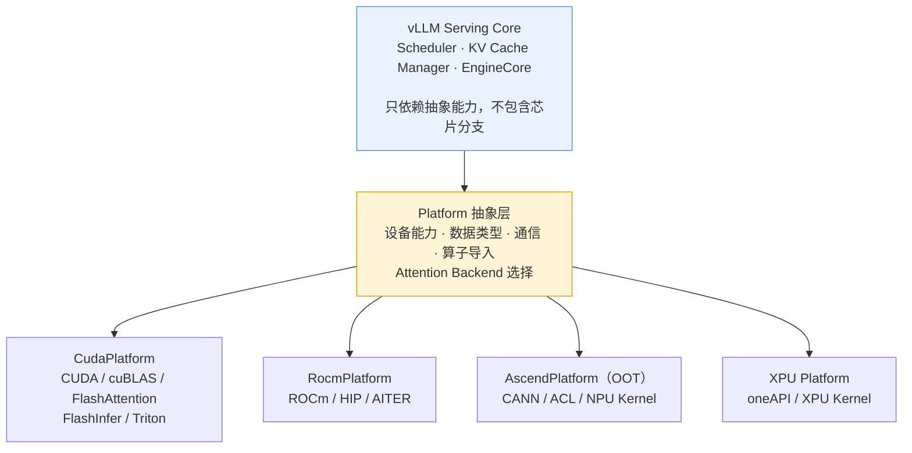
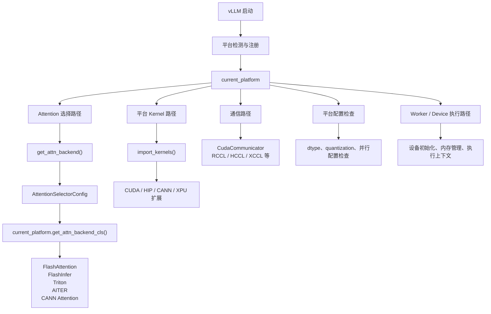
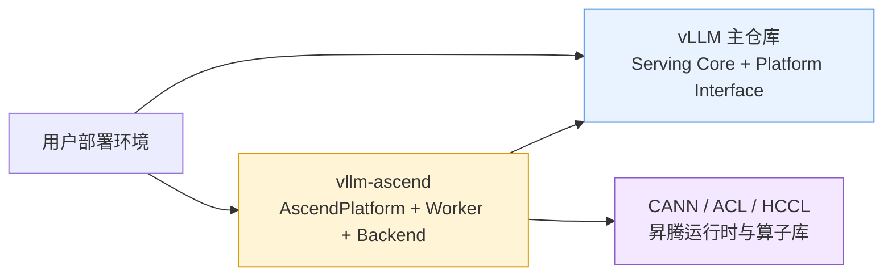
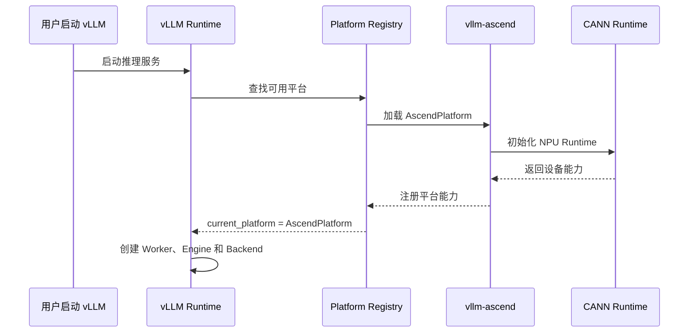
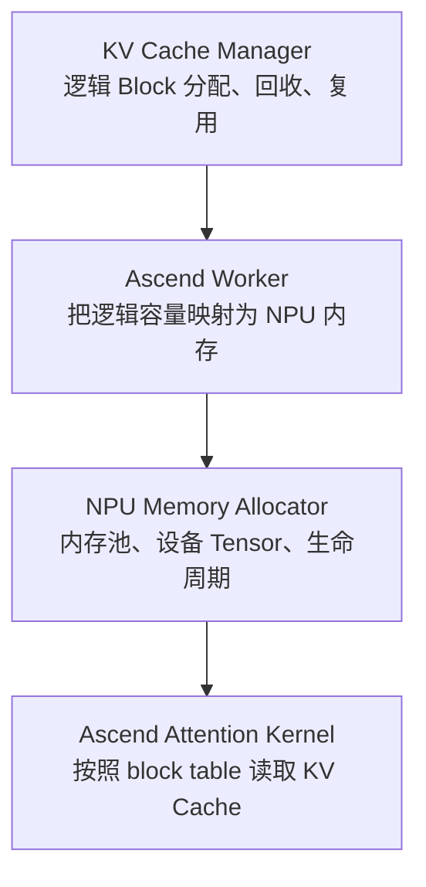
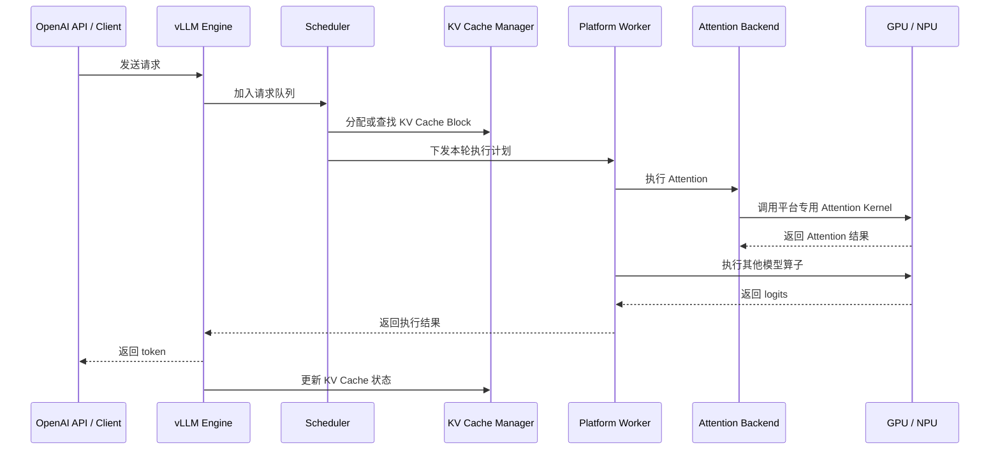
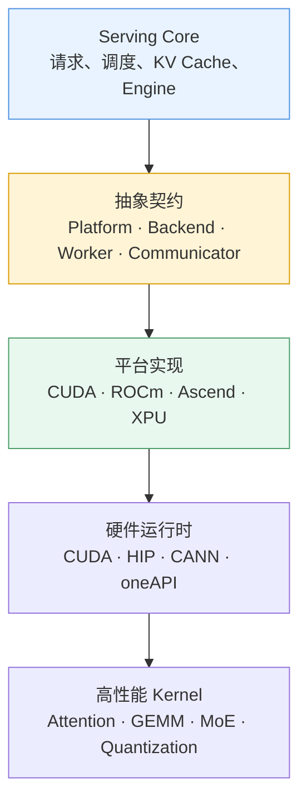

> **NOTE** 本文基于 vLLM v0.27.1（tag `6e448d0`, 2026-08-11）源码深度剖析。文中所有文件路径、类名和行号均以该版本为准；vLLM 迭代很快，阅读时请以你手上的版本对照。


上一章讨论了模型适配：面对不断变化的模型结构，Serving 框架如何通过统一接口、模型注册和模块化执行路径，降低新模型接入成本。

但模型只是变化来源之一。

在真实部署环境中，硬件同样在快速变化。GPU 不再是唯一选择，AMD ROCm、华为昇腾 Ascend、Intel XPU、Google TPU 以及各种专用加速器，都在参与大模型推理基础设施的竞争。

这就带来一个更棘手的问题：

> **如何让同一套 Serving 逻辑运行在不同芯片上，同时避免芯片差异渗透到 Scheduler、KV Cache 和请求生命周期管理之中？**

vLLM 的答案不是在核心代码里堆积更多硬件分支，而是建立一套平台抽象、后端选择和插件扩展机制，把硬件差异尽可能隔离在系统边界之外。


## 1. 一条设计原则：硬件适配不能污染 Serving 核心

先看一个反例。

假设 Scheduler 需要根据硬件特性决定是否允许某种调度策略，于是代码变成：

```python
if is_cuda():
    ...
elif is_ascend():
    ...
elif is_rocm():
    ...
```

KV Cache 管理器也出现类似判断：

```python
if is_cuda():
    allocate_cuda_blocks()
elif is_ascend():
    allocate_npu_blocks()
```

Attention、通信、量化和模型执行路径中也不断加入类似分支。

一开始，这种方式看起来很直接。但随着硬件类型增加，问题会迅速暴露：

- 调度逻辑开始依赖具体设备名称；
- KV Cache 管理器需要理解不同设备的内存模型；
- 模型执行器被迫维护多套硬件分支；
- 每加入一种芯片，都要修改多个核心模块；
- 不同硬件分支之间逐渐产生行为差异；
- 测试矩阵从“功能 × 模型”膨胀为“功能 × 模型 × 芯片”。

最终，Serving 核心不再是一个与硬件无关的调度系统，而变成了各种硬件特殊情况的集合。

因此，硬件适配首先是一条架构原则：

> **硬件适配不能污染上层 Serving 逻辑。**

把这句话放回前面几章的语境里，会更容易理解。

第四章的 Scheduler 关心的是：

- 当前请求需要执行多少 token；
- 当前 batch 还有多少计算预算；
- 哪些请求应该继续 decode；
- 哪些请求应该被抢占或延迟。

第五章的 KV Cache Manager 关心的是：

- KV Cache 被划分成多少个 block；
- 哪些 block 已经分配；
- 哪些 block 可以复用；
- prefix cache 是否命中；
- 显存不足时如何回收或换出。

这些模块应该依赖的是抽象能力，而不是具体芯片：

```text
Scheduler
  └── 只关心 token 预算、请求状态和执行资源

KVCacheManager
  └── 只关心 block、容量、分配和回收

Model Executor
  └── 只关心模型层如何执行

硬件平台层
  └── 负责设备、算子、通信、数据类型和内存实现
```

理想的依赖关系如下：



上层只需要提出类似的问题：

```text
当前设备是什么类型？
支持哪些数据类型？
支持 FP8 或其他量化格式吗？
使用哪个 Attention Backend？
集合通信由哪个实现负责？
需要加载哪些平台扩展？
```

它不应该关心：

```text
这是 NVIDIA GPU、AMD GPU，还是昇腾 NPU？
底层使用 CUDA、HIP 还是 CANN？
具体 Kernel 是哪个动态库？
通信实现是 NCCL、RCCL 还是 HCCL？
```

这些问题应该由平台层回答。


## 2. Platform：硬件能力的统一来源

在 vLLM 中，`Platform` 可以理解为硬件适配的“能力中心”。

它并不是简单的设备名称包装，而是向上层提供一组相对稳定的能力查询接口，例如：

- 设备类型和设备名称；
- 当前设备的计算能力；
- 支持的数据类型；
- 支持的量化格式；
- 默认通信后端；
- Attention Backend 选择；
- 底层扩展导入；
- Device Communicator；
- 平台级配置检查；
- 平台相关的 Worker 或执行组件。

从抽象上看，上层代码依赖的是这样的接口：

```python
class Platform:
    device_name: str
    device_type: str

    @classmethod
    def get_attn_backend_cls(cls, ...):
        ...

    @classmethod
    def import_kernels(cls):
        ...

    @classmethod
    def get_device_communicator_cls(cls):
        ...

    @classmethod
    def get_punica_wrapper(cls):
        ...

    @classmethod
    def check_and_update_config(cls, config):
        ...
```

不同平台提供不同实现，但上层不需要知道这些实现的细节。

可以把它理解为：

```text
上层代码提出能力问题
        ↓
Platform 提供平台事实
        ↓
具体 Backend 或 Kernel 被选择
```

这里的关键不是“所有硬件都实现完全相同的代码”，而是：

> **所有硬件都通过相对稳定的抽象边界向 Serving 核心提供能力。**

### `current_platform` 是如何出现的？

程序启动时，vLLM 需要先确定当前运行平台。这个过程通常涉及：

1. 读取运行环境和设备配置；
2. 检测可用设备；
3. 加载内置平台或外部平台插件；
4. 选择与当前环境匹配的平台实现；
5. 将平台对象暴露为全局使用的 `current_platform`。

因此，后续代码不需要到处重新判断设备类型，而是统一读取：

```python
from vllm.platforms import current_platform
```

然后通过它获取设备能力。

需要注意的是，实际初始化路径会随着 vLLM 版本、插件机制和部署方式变化。对于博客来说，更准确的表述是：

> **`current_platform` 是运行时平台选择机制的统一出口。它背后可能来自内置平台，也可能来自通过插件机制注册的 Out-of-Tree 平台。**


## 3. Platform、Attention Backend 与 Kernel Backend 的真实关系

很多人第一次阅读 vLLM 硬件适配代码时，会自然地形成一种“三层调用栈”：

```text
Platform Backend
      ↓
Attention Backend
      ↓
Kernel Backend
```

这种理解在 Attention 局部路径上有一定合理性，但如果把它当成整个硬件适配体系的真实结构，就会产生误解。

更准确的关系是：

> **Platform 是设备能力和运行时事实的来源；Attention Backend 是其中一个重要的动态选择器；大量其他 Kernel、通信组件和平台扩展则可以由 Platform 直接提供。**

整体关系更接近下面这样：



### 路径一：Attention Backend 选择

Attention 是 vLLM 中最重要的动态后端选择场景之一。

典型入口可以抽象为：

```python
def get_attn_backend(
    head_size,
    dtype,
    kv_cache_dtype,
    use_mla,
    sliding_window,
    ...
):
    selector_config = AttentionSelectorConfig(
        head_size=head_size,
        dtype=dtype,
        kv_cache_dtype=kv_cache_dtype,
        use_mla=use_mla,
        sliding_window=sliding_window,
        ...
    )

    return current_platform.get_attn_backend_cls(
        selector_config
    )
```

平台在选择 Attention Backend 时，可能需要综合判断：

- 设备类型；
- GPU Compute Capability 或 NPU 能力；
- head size；
- query 和 KV 的数据类型；
- KV Cache 的数据类型；
- 是否使用 MLA；
- 是否启用 sliding window；
- 是否支持 prefix caching；
- 是否支持 paged attention；
- prefill 和 decode 的执行模式；
- 当前硬件是否存在对应 Kernel。

最终得到的可能是：

```text
FlashAttentionBackend
FlashInferBackend
TritonAttentionBackend
AITER Attention Backend
Ascend / CANN Attention Backend
```

可以用一个简化后的伪代码表示：

```python
class CudaPlatform(Platform):

    @classmethod
    def get_attn_backend_cls(cls, config):
        if supports_flashinfer(config):
            return FlashInferBackend

        if supports_flash_attention(config):
            return FlashAttentionBackend

        return TritonAttentionBackend
```

这并不意味着所有平台都必须把选择逻辑写成同样的形式。平台可以根据自己的能力返回合适的实现。

### 路径二：直接导入平台 Kernel

并不是所有底层算子都需要经过 Attention Backend。

平台可能直接加载自己的 C++、CUDA、HIP 或 CANN 扩展：

```python
class CudaPlatform(Platform):

    @classmethod
    def import_kernels(cls) -> None:
        import vllm._C_stable_libtorch
        import vllm._moe_C_stable_libtorch

        with contextlib.suppress(ImportError):
            import vllm._qutlass_C
```

这些扩展可能包含：

- MoE 相关算子；
- Quantization 相关算子；
- RMSNorm、RoPE 等基础算子；
- GEMM 或矩阵乘法优化；
- 自定义通信算子；
- 平台专用的运行时扩展。

它们的加载不需要经过 Attention Backend。

### 路径三：平台直接提供通信和其他组件

集合通信同样可能由平台直接决定：

```python
class CudaPlatform(Platform):

    @classmethod
    def get_device_communicator_cls(cls) -> str:
        return (
            "vllm.distributed.device_communicators."
            "cuda_communicator.CudaCommunicator"
        )
```

不同硬件平台可能分别对接：

```text
NVIDIA GPU  → NCCL
AMD GPU     → RCCL
昇腾 NPU    → HCCL
Intel XPU   → XCCL 或对应通信实现
```

LoRA、量化、内存管理以及平台特有的执行组件，也可能走类似的直接派发路径。

因此，系统级的真实关系不是：

```text
Platform → Attention Backend → 所有 Kernel
```

而是：

```text
                         ┌─ Attention Backend Selector
                         │
current_platform ────────┼─ Kernel Import
                         │
                         ├─ Device Communicator
                         │
                         ├─ Worker / Device Runtime
                         │
                         └─ Platform Configuration
```

### 为什么 Attention 要单独做 Selector？

Attention 之所以被单独抽象出来，不只是因为它名字特殊，而是因为它同时具备三个特点：

1. **计算量大**：Attention 是推理性能的关键组成部分；
2. **硬件敏感**：不同设备对矩阵乘法、稀疏访问、KV Cache 读取的优化方式不同；
3. **场景复杂**：prefill、decode、paged KV Cache、MLA、不同 head size 和不同数据类型，都可能影响最优实现。

因此，Attention 往往需要根据运行配置动态选择后端。

例如，同一块 GPU 上：

```text
某种 head size + FP16 + prefill
    → FlashAttention

某种 head size + FP8 KV Cache + decode
    → FlashInfer

特殊模型结构或不满足优化条件
    → Triton 或通用实现
```

而 RMSNorm、RoPE 等算子，很多时候可以通过平台扩展直接绑定。它们也可能存在多个实现，但通常不需要像 Attention 一样根据大量运行时条件进行复杂选择。

所以，Attention Selector 可以看作：

> **性能关键路径上的动态决策机制。**

而 `import_kernels()` 更像是：

> **平台级实现的加载和绑定机制。**

两者都属于硬件适配，但解决的问题不同。


## 4. Out-of-Tree插件架构：把新硬件放到主仓库之外

如果每接入一种硬件，都必须修改 vLLM 主仓库，那么硬件生态很容易受到两个问题限制：

- 主仓库需要长期维护大量平台代码；
- 硬件厂商无法独立发布适配版本。

因此，vLLM 支持 Out-of-Tree，也就是 OOT 适配。

OOT 的核心思想是：

> **主仓库提供稳定的扩展接口，第三方通过独立包实现具体平台。**

以昇腾为例，适配包可以独立维护在 `vllm-ascend` 中，而不是把所有 CANN 相关代码直接放入 vLLM 主仓库。

从架构上看：



主仓库和插件包之间大致是这样的分工：

| 能力 | vLLM 主仓库提供 | Ascend 插件实现 |
|---|---|---|
| 平台抽象 | `Platform` 接口和平台注册机制 | `AscendPlatform` |
| 模型接口 | 标准模型执行接口 | 尽量复用标准模型实现 |
| Attention | `AttentionBackend` 抽象和选择入口 | CANN 或 Ascend 专用 Attention |
| Worker | Worker 基类和执行生命周期 | NPU 设备初始化、执行和内存管理 |
| Kernel | 通用算子接口、扩展加载约定 | CANN Custom Ops、Ascend Kernel |
| 通信 | 分布式和 Device Communicator 抽象 | HCCL 等昇腾通信实现 |
| 数据类型 | 配置和能力查询接口 | NPU 支持的数据类型与限制 |
| 量化 | 量化配置和模型接口 | 昇腾量化 Kernel 与转换逻辑 |
| 内存 | KV Cache 抽象和缓存管理流程 | NPU 内存分配、显存/内存池适配 |
| 配置检查 | 通用配置校验入口 | NPU 特有约束和兼容性检查 |

因此，“接入昇腾”绝不是简单地把：

```python
if device == "npu":
    ...
```

添加到几个文件里。

一个真正可用的昇腾后端，通常需要完成以下工作。


## 5. 昇腾适配需要解决哪些问题？

### 5.1 平台识别与注册

首先，vLLM 必须能够识别当前设备，并将其映射到 Ascend 平台实现。

平台对象需要提供基础信息，例如：

```python
class AscendPlatform(Platform):
    device_name = "npu"
    device_type = "npu"
```

但平台识别并不等于适配完成。它还需要解决：

- 如何检测 NPU 是否可用；
- 如何读取设备数量；
- 如何设置当前设备；
- 如何初始化 CANN 运行时；
- 如何让分布式进程看到正确的设备；
- 如何让 vLLM 在启动时加载正确的插件。

启动阶段的逻辑可以抽象为：



这里有一个重要的工程事实：

> **平台注册只解决“让系统看见这个硬件”，不代表底层算子、通信和模型执行都已经可用。**


### 5.2 Worker 与设备生命周期

Serving 核心通常不会直接操作每一种硬件的底层运行时，而是通过 Worker 负责：

- 设备初始化；
- 设备上下文建立；
- 模型加载；
- 权重搬运；
- 内存统计；
- 执行请求；
- 设备同步；
- 进程退出时资源释放。

昇腾 Worker 需要将这些流程映射到 NPU 和 CANN 的运行时模型中。

例如：

```text
通用 Worker 生命周期
    ↓
NPU 设备选择
    ↓
CANN Runtime 初始化
    ↓
模型权重加载到 NPU
    ↓
创建 NPU 内存池
    ↓
加载 CANN / Custom Ops
    ↓
执行模型
    ↓
同步与错误处理
```

这里最容易被低估的是“错误处理”和“同步语义”。

不同设备的执行可能是异步的，算子错误也可能延迟到同步点才暴露。因此，Worker 不能只完成基本的 `forward()` 调用，还需要适配：

- 设备同步方式；
- 异步执行异常；
- 内存不足错误；
- 设备复位或上下文失效；
- 多进程下的设备隔离；
- 进程退出时的资源清理。

### 5.3 Attention Backend

Attention 通常是昇腾适配中最关键的部分之一。

一个 Ascend Attention Backend 至少需要回答：

- 使用哪一种 CANN Attention 算子；
- 输入张量布局是什么；
- Q、K、V 的数据类型是什么；
- KV Cache 的布局如何组织；
- 如何支持 paged KV Cache；
- prefill 和 decode 是否使用不同 Kernel；
- 是否支持 sliding window；
- 是否支持 MLA 或其他特殊 Attention 结构；
- 不同 head size 是否都能运行；
- 不支持的配置如何回退。

抽象来看，调用路径可以是：

```text
Attention Layer
      ↓
AttentionBackend.forward()
      ↓
Ascend Attention Backend
      ↓
CANN / Custom Attention Operator
      ↓
NPU Kernel
```

一个简化的后端结构可能如下：

```python
class AscendAttentionBackend(AttentionBackend):

    @staticmethod
    def get_impl_cls():
        return AscendAttentionImpl


class AscendAttentionImpl:
    def forward(
        self,
        query,
        key,
        value,
        kv_cache,
        attn_metadata,
    ):
        # 根据 prefill/decode、KV Cache 布局等条件
        # 调用对应的 CANN 或自定义算子
        return ascend_attention_op(
            query=query,
            key=key,
            value=value,
            kv_cache=kv_cache,
            metadata=attn_metadata,
        )
```

真正的实现通常还需要处理张量布局转换、元数据构造和不同执行阶段的分派。

尤其要注意，Attention Backend 并不是只实现一个数学公式。它必须适配 vLLM 的运行时语义：

```text
请求调度结果
    ↓
Attention Metadata
    ↓
Block Table / KV Cache 位置
    ↓
Prefill 或 Decode
    ↓
设备专用 Attention Kernel
```

如果平台只实现了一个能够计算 Attention 的算子，但不能正确理解 vLLM 的 KV Cache block 布局，那么它仍然不能作为完整的 vLLM Attention Backend 使用。


### 5.4 KV Cache 与内存管理

vLLM 的 KV Cache 管理器通常应该保持平台无关。它负责的是逻辑 block：

```text
逻辑层：
block 0、block 1、block 2……
```

但这些 block 最终如何落到 NPU 内存上，则需要平台和 Worker 共同完成。

昇腾适配需要处理：

- NPU 内存容量查询；
- KV Cache block 大小计算；
- Cache Tensor 的创建；
- Cache Tensor 的数据类型；
- Cache Tensor 的布局；
- block table 到设备 Tensor 的映射；
- 内存池或缓存分配器；
- 多卡场景下的内存隔离。

理想的分层是：



关键点在于：

> **KV Cache Manager 不应该知道 Ascend 的内存 API；Ascend Worker 也不应该重新实现一套 KV Cache 调度逻辑。**

如果这两个层次混在一起，未来接入另一种 NPU 时，就会再次出现核心逻辑复制。


### 5.5 基础算子与自定义 Kernel

完整的模型执行不仅包含 Attention，还包括大量基础算子：

- RMSNorm；
- LayerNorm；
- RoPE；
- SiLU、GELU 等激活函数；
- Linear / GEMM；
- Quantization；
- MoE Router；
- Top-k；
- Expert 执行；
- Logits 计算；
- Sampling 前后的数据处理。

这些算子可能来自：

1. CANN 已有算子；
2. PyTorch NPU 算子；
3. vLLM 通用实现；
4. Ascend Custom Operator；
5. 针对特定模型或数据类型优化的专用 Kernel。

适配时不能只追求“能运行”，还需要确认：

- 算子是否支持目标数据类型；
- 输入输出布局是否一致；
- 是否产生隐式数据类型转换；
- 是否存在 CPU 回退；
- 是否引入不必要的设备同步；
- 是否支持动态 shape；
- 是否适合 decode 阶段的小 batch 场景。

例如，一个算子即使功能正确，但每次执行都触发设备同步，也可能严重拖慢 token 生成速度。

因此，算子适配需要同时验证：

```text
数值正确性
    +
形状正确性
    +
设备放置正确性
    +
异步执行正确性
    +
性能可接受
```

### 5.6 量化支持

量化是硬件适配中非常容易产生差异的部分。

同一种量化名称，在不同硬件平台上可能对应不同实现：

```text
权重存储格式
激活量化格式
缩放因子布局
反量化位置
矩阵乘法 Kernel
KV Cache 数据类型
```

因此，昇腾平台需要明确支持哪些量化方式，以及每一种量化方式对应什么实现。

平台层可以提供能力查询：

```python
@classmethod
def get_supported_quantization(cls):
    return {
        "w8a8",
        "w8a16",
        # 具体能力取决于硬件、CANN 和插件版本
    }
```

然后在模型加载或配置检查阶段提前拒绝不支持的组合，而不是等到运行中才失败：

```text
模型要求：某种量化格式
        ↓
平台能力检查
        ↓
支持 → 选择对应 Kernel
不支持 → 明确报错或选择兼容路径
```

这也是硬件抽象的重要价值：

> **把硬件限制变成可查询、可验证的能力，而不是隐藏在深层 Kernel 错误中。**


### 5.7 分布式通信与并行策略

单卡推理只是硬件适配的一部分。大模型部署经常需要：

- Tensor Parallel；
- Pipeline Parallel；
- Data Parallel；
- Expert Parallel；
- 多进程多卡执行；
- 节点间通信。

在 NVIDIA 环境中，常见通信组件是 NCCL；在昇腾环境中，则需要对接 HCCL 或相应的通信实现。

昇腾插件需要处理：

- 通信后端初始化；
- rank 和 world size；
- NPU 卡号与进程绑定；
- 集合通信算子；
- 通信拓扑；
- 多机环境变量；
- 通信异常和超时；
- Tensor Parallel 所需的 AllReduce、AllGather、ReduceScatter 等操作。

逻辑上，Serving 核心只需要表达：

```python
communicator.all_reduce(tensor)
```

而具体实现由平台提供：

```text
CudaPlatform  → CudaCommunicator → NCCL
AscendPlatform → AscendCommunicator → HCCL
```

如果通信层没有正确适配，模型可能单卡正常、多卡却出现：

- 初始化失败；
- rank 卡死；
- 输出不一致；
- 通信性能异常；
- 进程无法正常退出。

所以，硬件适配的验证范围必须覆盖单卡和多卡。

## 6. OOT 适配的边界：不是“主仓库完全不用改”

“Out-of-Tree”经常被简化成一句话：

> 安装插件就可以支持新硬件，主仓库一行代码都不用改。

这句话表达了 OOT 的目标，但从工程角度看需要更谨慎。

OOT 能否做到真正独立，取决于主仓库是否已经提供足够稳定的扩展点，包括：

- Platform 接口；
- 平台注册机制；
- Attention Backend 接口；
- Worker 基类；
- Device Communicator 接口；
- Kernel 导入约定；
- 配置检查入口；
- 模型执行接口；
- KV Cache 和内存管理边界。

如果某项能力还没有抽象出来，插件就可能需要：

- 提交主仓库补丁；
- 扩展新的注册点；
- 临时使用兼容层；
- 等待上游版本提供接口；
- 针对不同 vLLM 版本维护不同分支。

因此，更准确的表述是：

> **OOT 把硬件实现从主仓库中隔离出来，但它仍然依赖主仓库提供稳定的扩展契约。**

这也是为什么平台适配不只是“写一个 `AscendPlatform` 类”。它还需要持续跟踪：

- vLLM 内部接口变化；
- Attention Metadata 变化；
- Worker 生命周期变化；
- KV Cache 布局变化；
- 分布式接口变化；
- PyTorch 和 CANN 版本兼容性；
- 不同硬件型号的能力差异。

一个成熟的 OOT 插件，实际上是一个独立的适配层和发行生态。


## 7. 一次请求在异构硬件上的执行路径

把前面的模块组合起来，可以得到一个更完整的请求执行路径：



在这条路径中：

- API 层不关心设备；
- Engine 不关心设备；
- Scheduler 不关心设备；
- KV Cache Manager 不关心设备；
- Worker 负责设备生命周期；
- Attention Backend 负责关键 Attention 实现；
- Platform 负责能力查询、扩展加载和平台组件选择。

这就是硬件解耦真正想要达到的效果：

> **上层流程保持稳定，底层实现可以替换。**


## 8. 如何判断硬件适配是否真正做到了解耦？

可以用下面几个问题进行检查。

### 检查一：Serving 核心是否出现设备判断？

重点搜索：

```text
is_cuda()
is_ascend()
is_rocm()
device.type == ...
```

如果这些判断大量出现在 Scheduler、请求状态机和 KV Cache 逻辑中，说明硬件边界可能已经被突破。

### 检查二：平台能力是否可以被查询？

例如：

```python
current_platform.get_attn_backend_cls(...)
current_platform.get_device_communicator_cls()
current_platform.import_kernels()
current_platform.check_and_update_config(...)
```

如果上层必须自己判断“这个芯片是否支持某算子”，说明能力抽象还不够完整。

### 检查三：不支持的配置是否能提前失败？

理想情况是：

```text
启动阶段发现不支持
    ↓
给出明确错误信息
```

而不是：

```text
服务启动成功
    ↓
请求执行到某个深层 Kernel 时崩溃
```

### 检查四：插件是否能独立演进？

一个好的 OOT 适配应该能够：

- 独立发布；
- 独立测试；
- 独立适配硬件驱动和算子库版本；
- 尽量减少对主仓库的侵入；
- 在主仓库升级时有清晰的兼容边界。

### 检查五：是否只完成了“能跑”，还是同时完成了“跑得好”？

硬件适配至少要验证：

```text
功能正确
数值正确
数据类型正确
KV Cache 正确
多卡通信正确
性能达到预期
异常处理可用
```

能在 NPU 上返回结果，只能说明适配链路打通了；能在真实模型、真实 batch 和真实上下文长度下稳定达到目标吞吐，才算完成了工程适配。


## 9. 小结：Platform 是边界，不是万能胶

这一章最重要的结论可以概括为三句话。

第一：

> **Serving 核心应该依赖抽象能力，而不是依赖具体芯片。**

第二：

> **Platform 是硬件能力中心，但不是所有底层组件的唯一调用父类。**

Attention Backend、Kernel、通信组件、Worker 和平台扩展，都可能从 Platform 获取能力或被 Platform 直接派发。

第三：

> **Out-of-Tree 让硬件适配可以独立演进，但前提是主仓库提供稳定的扩展契约。**

因此，vLLM 的硬件解耦并不是简单地增加几个平台类，而是建立了多层边界：



最终，硬件差异应该停留在最底层：

```text
芯片差异
  ↓
运行时差异
  ↓
平台实现差异
  ↓
Backend / Worker / Kernel 差异
  ↓
Serving 核心保持稳定
```

这正是一个高性能推理框架面对异构硬件时最重要的架构能力：

> **让底层硬件快速变化，让上层 Serving 逻辑尽量不变。**

<details markdown="1">
<summary><b>📂 本章源码导航</b></summary>

**硬件平台**

| 想看什么 | 从哪开始 |
|---|---|
| **平台抽象接口（本章核心）** | `vllm/platforms/interface.py` |
| CUDA 平台实现 | `vllm/platforms/cuda.py`（注意 `import_kernels()` 与 `get_attn_backend_cls()` 是**两条并行路径**） |
| 其他平台 | `vllm/platforms/`（`rocm.py`、`xpu.py`、`cpu.py`） |
| Attention 分派点 | `vllm/v1/attention/selector.py` |

</details>


