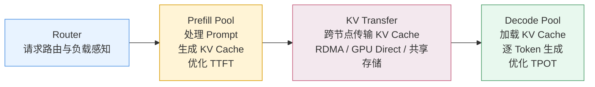
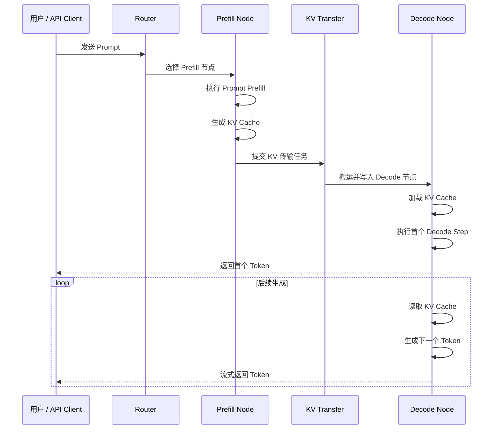
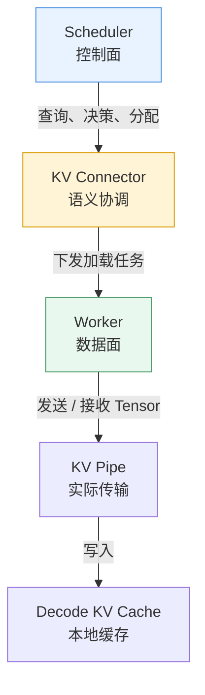
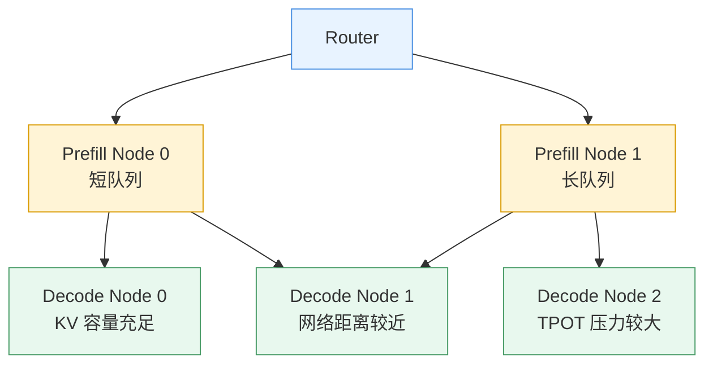
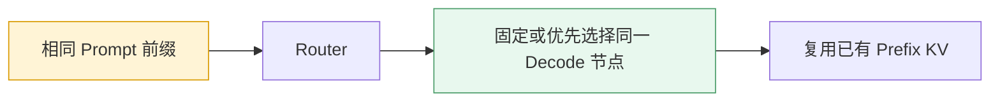
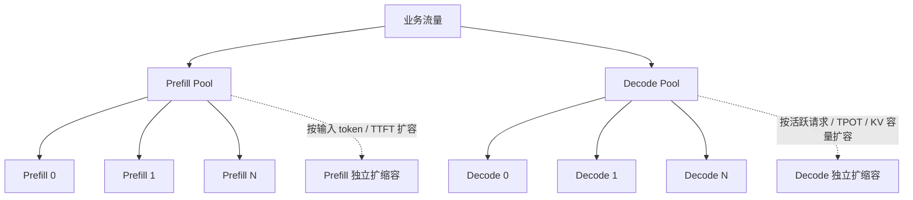
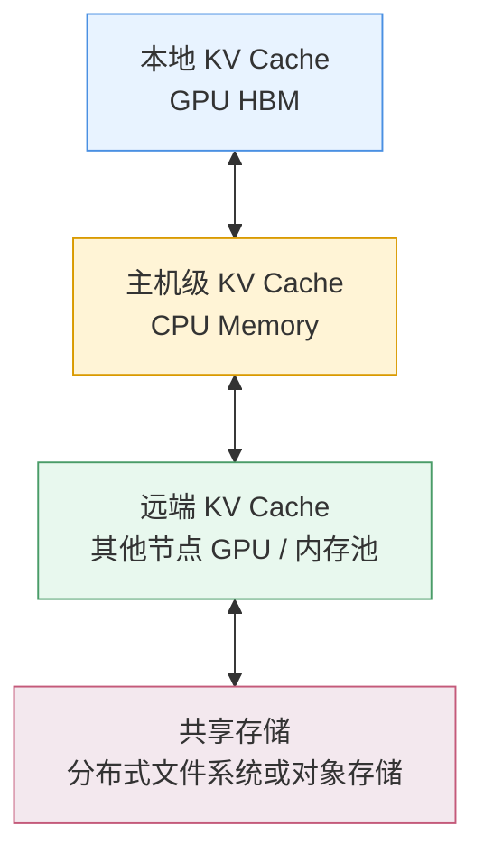

> **NOTE** 本文基于 vLLM v0.27.1（tag `6e448d0`, 2026-08-11）源码深度剖析。文中所有文件路径、类名和行号均以该版本为准；vLLM 迭代很快，阅读时请以你手上的版本对照。


前九章主要讨论的是：

```text
如何在一台机器或一组共享设备上，把请求高效地运行起来？
```

这一章进一步追问：

```text
如果 Prefill 和 Decode 不再共享同一批 GPU，
它们如何协作完成同一个请求？
```

这就是 PD 分离，也就是 **Prefill/Decode Disaggregation**。

PD 分离表面上是把 GPU 分成两个池子：

```text
Prefill Pool  → 负责处理输入 Prompt
Decode Pool   → 负责逐 Token 生成
```

但它的本质并不是简单的服务拆分，而是：

> **把一次请求的执行过程拆成两个阶段，并把阶段之间的 KV Cache 作为跨节点状态进行传递。**

因此，PD 分离真正改变的不是某个算子，而是 Serving 系统的状态边界：

```text
单机 Serving：
    请求、调度、KV Cache 大多在本地完成

集群 Serving：
    请求需要跨节点路由
    KV Cache 需要跨节点传输
    状态需要被查询、缓存、恢复和淘汰
```

当前，在讨论怎么PD分离之前，我们要先搞清楚为什么要PD分离。

## 1. 为什么要分离 Prefill 和 Decode？

### 1.1 两种计算阶段，两种资源画像

Prefill 和 Decode 使用的是同一套模型，但它们的计算行为并不相同。

Prefill 需要一次性处理用户输入的全部 Prompt token：

```text
Prompt：
[t₁, t₂, t₃, ..., tₙ]

一次前向：
    同时处理大量输入 token
    生成对应的 KV Cache
```

它通常具有以下特点：

- 计算量大；
- 矩阵乘法规模较大；
- 更容易表现为计算密集型；
- 长 Prompt 会显著增加处理时间；
- 目标通常是降低 TTFT，即首 Token 延迟。

Decode 则是在已有 KV Cache 的基础上，每轮生成一个或少量 token：

```text
已有 KV Cache
    +
当前生成 token
    ↓
生成下一个 token
```

它通常具有以下特点：

- 每轮计算规模较小；
- 需要反复读取模型权重和 KV Cache；
- 更容易受到内存带宽、访存延迟和 batch 组织方式影响；
- 生成阶段持续时间长；
- 目标通常是稳定 TPOT，即每个输出 Token 的延迟。

这里需要强调：

> Prefill 更偏计算密集，Decode 更容易受到带宽和访存影响，但这不是绝对规律。实际瓶颈还取决于模型结构、上下文长度、Batch 大小、量化方式和硬件型号。

同一批 GPU 同时承担两种 workload 时，资源画像会不断变化：

```text
时间 →
┌──────────────┬──┬──┬──┬──────────────┬──┬──┐
│   Prefill    │D │D │D │   Prefill    │D │D │
└──────────────┴──┴──┴──┴──────────────┴──┴──┘
   计算密集        访存敏感       计算密集       访存敏感
```

混合部署下，一个长 Prompt 可能占用大量计算资源，使正在 Decode 的请求被延迟；而 Decode 请求又会持续占用 KV Cache 和显存，限制 Prefill 的 batch 组织。

因此，混合部署的主要问题并不是“Prefill 和 Decode 不能同时运行”，而是：

> **两种阶段的资源需求不同，却被迫共享相同的调度和硬件资源。**


### 1.2 混合部署的主要代价

| 问题 | 直接后果 |
|---|---|
| Prefill 计算量大 | 可能抢占 Decode 的执行机会 |
| Decode 持续占用 KV Cache | 限制 Prefill 的 batch 和并发 |
| 长 Prompt 进入队列 | TTFT 和 TPOT 同时抖动 |
| 两类 workload 共用硬件 | 难以针对性选择设备和并行度 |
| 负载比例动态变化 | 资源利用率容易失衡 |
| 扩容只能整体扩容 | Prefill 或 Decode 其中一侧可能出现资源浪费 |

例如，某一时刻请求主要是长文档输入，Prefill 池成为瓶颈；过一段时间后，输入变少，但大量请求进入长文本生成阶段，Decode 池又成为瓶颈。

如果 Prefill 和 Decode 共用同一批 GPU，只能整体增加机器，无法针对真正的瓶颈进行扩展。


### 1.3 PD 分离的基本架构

PD 分离将两类 workload 放到不同的资源池中：



两类节点可以采用不同的资源配置：

```text
Prefill Pool：
    更关注计算吞吐
    适合较高计算能力
    可以采用不同的 Tensor Parallel 配置
    重点优化长 Prompt 处理

Decode Pool：
    更关注内存带宽和稳定吞吐
    需要容纳更多并发请求的 KV Cache
    重点优化持续生成和 TPOT
```

PD 分离带来的核心收益包括：

- Prefill 和 Decode 可以独立扩缩容；
- 长 Prompt 不容易直接阻塞 Decode；
- 两个池子可以使用不同的硬件配置；
- 可以分别优化 TTFT 和 TPOT；
- Decode 节点可以维持更稳定的 Continuous Batching；
- 可以根据实际流量比例调整 Prefill/Decode 资源配比。

但它并不是无条件的性能升级。PD 分离会引入新的成本：

- KV Cache 必须跨节点传输；
- 请求路由变得更加复杂；
- 节点间网络成为新的瓶颈；
- KV Cache 的状态需要被追踪和恢复；
- 故障处理从单进程问题变成分布式问题。

所以更准确的判断是：

> **PD 分离用跨节点协调和 KV Transfer 的成本，换取 Prefill 与 Decode 的资源独立性。**


## 2. 一次请求如何经过 Prefill 和 Decode？

理解 PD 分离最直接的方式，是跟踪一个请求的完整生命周期。



一次请求大致经历以下阶段。

### 2.1 第一步：Router 选择 Prefill 节点

Router 根据输入长度、Prefill 节点负载和可能的 Prefix Cache 命中情况，选择一个 Prefill 节点。

此时需要考虑的并不只是请求数，还包括：

- Prompt token 数量；
- 当前 Prefill 队列长度；
- 节点剩余计算容量；
- 已有 Prefix Cache 是否可复用；
- 目标节点的设备和并行配置。

### 2.2 第二步：Prefill 节点处理 Prompt

Prefill 节点执行模型前向，处理输入 Prompt，并生成各层的 K/V 张量。

这些 KV 通常按照 vLLM 的 block 组织方式写入 KV Cache：

```text
Prompt token
    ↓
Attention 层计算
    ↓
K/V 张量
    ↓
KV Cache Block
```

### 2.3 第三步：KV Transfer

Prefill 节点将请求需要的 KV Cache 传输给目标 Decode 节点。

传输内容可能包括：

- KV Cache Tensor；
- block table；
- token 数量；
- layer 信息；
- 数据类型和布局；
- 请求标识；
- 传输状态和元数据。

### 2.4 第四步：Decode 节点接管请求

Decode 节点收到 KV Cache 后，将它放入本地 Cache，并建立请求与 KV block 的映射。

之后，Decode 节点不再重复处理原始 Prompt，而是直接基于已有 KV Cache 生成后续 token。

### 2.5 第五步：持续 Decode

后续生成通常持续在 Decode 池内完成：

```text
读取已有 KV Cache
    ↓
处理当前 token
    ↓
生成下一个 token
    ↓
追加新的 KV Cache
```

这时请求已经从 Prefill 节点迁移到了 Decode 节点。

因此，PD 分离不是：

```text
Prefill 服务返回结果
Decode 服务重新开始执行
```

而是：

```text
Prefill 服务计算出中间状态
Decode 服务接管这个中间状态
```

这个中间状态就是 KV Cache。


## 3. KV Transfer：PD 分离真正的难点

把 GPU 分成两个池子很容易，真正困难的是中间这条连接线：

```text
Prefill Node
    ──────────────── KV Cache ────────────────>
Decode Node
```

如果 KV 传输速度不够快，Prefill 阶段节省下来的计算时间，可能会被网络传输和同步等待重新吃掉。

因此：

> **PD 分离的核心不是“有没有两个池子”，而是 KV 能否高效、正确、及时地从一个池子交给另一个池子。**


### 3.1 KV Cache 到底有多大？

KV Cache 的大小取决于模型结构和数据类型。一个简化的估算公式是：

```text
KV bytes/token
≈
层数
× 2（K 和 V）
× KV heads
× head_dim
× 每元素字节数
```

整个请求的 KV 大小大致为：

```text
KV 总大小
≈
Prompt token 数
× KV bytes/token
```

影响 KV 大小的主要因素包括：

- Transformer 层数；
- KV head 数；
- head dimension；
- KV Cache 数据类型；
- GQA / MQA 配置；
- block 对齐和元数据；
- 是否使用压缩或量化 KV Cache。

例如，沿用前文的示例配置，假设：

```text
每个 token 的 KV Cache ≈ 320 KB
Prompt 长度 = 2050 token
```

那么：

```text
2050 × 320 KB
≈ 656,000 KB
≈ 641 MiB
```

因此，这个请求需要从 Prefill 节点搬运的 KV 数据大约是 **641 MiB**。

这里的 320 KB/token 只是特定模型、层数、KV heads、head_dim 和数据类型下的示例，不是所有模型的固定值。


### 3.2 传输时间如何估算？

理想情况下：

```text
传输时间
≈
KV 数据量 / 实际有效带宽
+
端到端固定延迟
```

如果 KV 大小为 641 MiB，实际有效带宽为 50 GB/s，则仅从带宽下限估算：

```text
641 MiB / 50 GB/s
≈ 12.8 ms
```

但这只是理想值。真实端到端延迟还会受到以下因素影响：

- KV block 的切分方式；
- 元数据交换；
- GPU 与 NIC 的拓扑；
- PCIe 或 NVLink 路径；
- RDMA 协议开销；
- DMA 调度；
- 接收端内存分配；
- Tensor 布局转换；
- 传输完成后的同步；
- 多请求并发传输造成的带宽竞争。

因此，更准确的表述是：

> 12.8 ms 是理想带宽下限，不代表请求从 Prefill 到 Decode 的真实交接延迟。

PD 分离需要优化的是完整链路：

```text
KV 生成
  + 元数据准备
  + 网络传输
  + 目标端写入
  + KV 状态确认
  + Decode 开始执行
```


### 3.3 KV Transfer 能否与计算重叠？

最理想的情况不是：

```text
先完成全部 KV 传输
    ↓
再开始 Decode
```

而是让数据传输和模型执行尽可能形成流水：

```text
Layer 0 KV 到达 → 可以开始处理 Layer 0
Layer 1 KV 到达 → 可以开始处理 Layer 1
Layer 2 KV 到达 → 可以开始处理 Layer 2
```

示意如下：

```mermaid
gantt
    title KV 传输与模型执行的流水
    dateFormat  s
    axisFormat  %S

    section KV Transfer
    Layer 0 KV 到达 :done, kv0, 0, 1
    Layer 1 KV 到达 :active, kv1, 1, 1
    Layer 2 KV 到达 :kv2, 2, 1
    Layer 3 KV 到达 :kv3, 3, 1

    section Attention / Decode
    执行 Layer 0 :a0, 1, 1
    执行 Layer 1 :a1, 2, 1
    执行 Layer 2 :a2, 3, 1
    执行 Layer 3 :a3, 4, 1
```



一些 KV Transfer 实现支持按层、按阶段或按块等待，使传输与模型前向存在重叠空间。

不过，需要注意：

> 是否能够真正实现按层流水，取决于 KV Connector、Worker、Attention Backend、Cache 布局和底层传输实现之间的协作。

如果传输必须等整个请求的 KV 全部到齐后才能开始 Decode，那么流程就会退化为：

```text
Prefill
    ↓
整请求 KV 传输
    ↓
Decode
```

此时传输和计算完全串行，PD 分离的收益会显著下降。


## 4. vLLM 中的 KV Transfer 抽象

从功能职责上，可以把 KV Transfer 理解为三类组件：

```text
Serving 语义层
    ↓
KV 索引与缓存层
    ↓
数据传输与存储层
```

不同实现的模块边界并不完全相同，但它们解决的问题大致可以归入这三类。


### 4.1 Serving 语义层：KV Connector

KV Connector 面向 vLLM 的调度和执行流程，负责把“远端 KV Cache”纳入请求生命周期。

它需要解决的问题包括：

- 远端是否已经存在某个 Prompt 的 KV；
- 当前请求有多少 token 可以复用；
- Scheduler 是否应该为这些 token 分配计算资源；
- Worker 何时开始加载 KV；
- 某一层的 KV 是否已经可用；
- 请求结束后如何清理相关状态；
- 传输失败后是否回退到重新 Prefill。

从职责上可以分为两组。

#### 4.1.1 Scheduler 侧

Scheduler 不应该直接搬运 Tensor，而是负责做决策：

```text
是否存在远端 KV？
可以复用多少 token？
需要为哪些 token 分配本地 block？
当前请求是否可以进入下一阶段？
```

典型接口可能包括：

```text
get_num_new_matched_tokens()
update_state_after_alloc()
request_finished()
```

#### 4.1.2 Worker 侧

Worker 负责真正的数据面操作：

```text
开始加载 KV
等待某一层 KV 到达
保存某一层 KV
将 KV 写入本地 Cache
```

典型接口可能包括：

```text
start_load_kv()
wait_for_layer_load()
save_kv_layer()
```

因此，KV Connector 体现了前面章节反复出现的控制面与数据面分离：



Scheduler 只决定：

```text
要不要使用远端 KV
要使用多少远端 KV
什么时候允许请求继续执行
```

Worker 才真正执行：

```text
从哪里读取 KV
把 KV 搬到哪里
如何写入本地 Cache
什么时候确认完成
```


### 4.2 KV 索引与缓存层

跨节点传输并不意味着每次都要重新搬运全部 KV。

如果多个请求拥有相同前缀，系统可以尝试复用已有 KV：

```text
请求 A：
[系统提示词][长文档 A]

请求 B：
[系统提示词][长文档 B]
```

如果前缀部分相同：

```text
[系统提示词]
```

那么请求 B 可以复用请求 A 已经生成的部分 KV。

这需要一个 KV 索引与缓存层，负责维护：

```text
Token 前缀 / KV Block
        ↓
远端位置、状态、引用关系和生命周期
```

它可能需要支持：

- KV 查询；
- Prefix Cache 命中；
- block 元数据管理；
- 引用计数；
- 插入和驱逐；
- 过期和失效；
- 远端存储位置记录；
- 传输状态追踪。

这层的关键作用是：

> **尽量减少重复计算和重复搬运。**

但它也会带来新的问题：

- 远端 KV 是否仍然有效；
- 不同模型版本能否复用；
- 不同数据类型能否复用；
- 不同并行配置下布局是否兼容；
- KV 被驱逐后如何通知使用方；
- 多个请求同时写入同一个前缀时如何处理。


### 4.3 数据传输与存储层

最底层是数据传输与存储机制，负责真正搬运 KV Tensor。

可能涉及的路径包括：

```text
GPU → GPU
GPU → CPU
CPU → GPU
GPU → NIC → 远端 GPU
GPU → 分布式内存池
GPU → 共享存储 → 远端 GPU
```

常见优化方向包括：

- RDMA；
- GPUDirect RDMA；
- GPU IPC；
- NVLink；
- PCIe 拓扑优化；
- 零拷贝或少拷贝；
- 异步传输；
- 多流并行；
- 分块流水；
- 传输与计算重叠。

可以把这三类职责总结为：

| 层次 | 主要问题 |
|---|---|
| Serving 语义层 | 请求是否需要远端 KV，何时开始和结束 |
| KV 索引与缓存层 | 哪些 KV 已经存在，能复用多少 |
| 传输与存储层 | KV Tensor 实际如何搬运和保存 |

需要特别注意：

> 这三类职责是功能上的划分，不一定对应所有实现中固定的三个独立模块。


## 5. NIXL、LMCache、Mooncake 等生态组件

PD 分离涉及的组件很多，但它们并不处在完全相同的抽象层。

### 5.1 NIXL

NIXL 可以理解为面向 AI 推理场景的数据传输抽象，重点解决：

- GPU、CPU 和内存之间的数据搬运；
- 节点间高性能传输；
- 异步传输；
- 对不同硬件路径和网络能力进行抽象。

在 NVIDIA GPU 环境中，它可以结合 GPUDirect RDMA 等能力，减少 CPU 参与和不必要的数据拷贝。

更准确地说，NIXL 主要解决的是：

```text
数据如何高效地从这里搬到那里
```

而不是单独负责完整的请求路由或 KV 生命周期管理。

### 5.2 LMCache

LMCache 更偏向 KV Cache 的缓存、复用和存储管理，关注的问题包括：

- KV 是否已经存在；
- KV 是否可以跨请求复用；
- KV 应该放在 GPU、CPU 还是远端存储；
- KV 如何在不同层级之间迁移；
- KV 如何被淘汰和恢复。

它解决的不只是：

```text
把 KV 发给另一个节点
```

还包括：

```text
KV 放在哪里？
如何查找？
如何复用？
什么时候淘汰？
```

### 5.3 Mooncake

Mooncake 面向大规模推理服务场景，通常同时关注：

- KV Cache 的分布式管理；
- 高性能数据传输；
- KV Cache 的调度；
- 多节点资源协作；
- Prefill 与 Decode 的协同。

它更接近一套面向大规模 Serving 的系统化方案，而不仅仅是单一传输 API。

### 5.4 其他传输和存储实现

不同生态中还可能出现面向特定场景的组件，例如：

- KV 流式传输实现；
- 基于 RDMA 的传输后端；
- 分布式内存池；
- 共享文件系统；
- 面向元数据管理的存储系统；
- GPU 到 GPU 的专用互联方案。

因此，不应把 NIXL、LMCache、Mooncake 简单看成完全等价的“KV Pipe”。更准确的关系是：

```text
vLLM KV Transfer 抽象
        ↓
可组合不同的：
    传输实现
    KV 缓存
    分布式存储
    内存池
    调度与路由系统
```

它们可能在某些部署中组合使用，也可能由一个系统同时覆盖多个层次。


## 6. PD 分离下的请求路由

PD 分离之后，Router 不再只是一个普通的轮询负载均衡器。

它至少需要同时观察两类资源：

```text
Prefill 资源：
    计算队列、Prompt 长度、Prefill 吞吐

Decode 资源：
    活跃请求数、KV Cache 容量、Decode Batch、TPOT
```

一个请求的路由过程可以抽象为：



### 6.1 Prefill 节点选择

可以考虑：

- Prompt 长度；
- 当前排队请求的总 token 数；
- Prefill batch 的预计完成时间；
- 当前设备利用率；
- Prefix Cache 是否命中；
- 节点间网络位置。

### 6.2 Decode 节点选择

可以考虑：

- 当前活跃请求数；
- KV Cache 使用率；
- 剩余 KV 容量；
- 当前 Decode batch 大小；
- 预计 TPOT；
- 到 Prefill 节点的网络距离；
- 是否已有相同前缀的 KV。

因此，路由目标不是简单的“请求数平均”，而是：

```text
让 Prompt 计算排队可控
让 KV 传输代价可控
让 Decode Batch 稳定
让 KV Cache 容量不倾斜
```


## 7. KV Affinity：路由中的状态亲和性

如果同一前缀的请求尽量被路由到相同的 Decode 节点，就有机会复用该节点上已有的 Prefix Cache。

例如：

```text
请求 A → Decode Node 0
请求 B → Decode Node 0
```

如果请求 A 和请求 B 共享长前缀，那么请求 B 可能直接复用 Node 0 上的部分 KV。

这就是 KV Affinity。



但 KV Affinity 不能无限强化，否则会产生新的热点：

```text
所有相同前缀请求
    ↓
集中到同一个 Decode 节点
    ↓
Prefix Cache 命中率提高
但节点负载和 KV 容量失衡
```

因此，实际路由需要在几件事之间做平衡：

- Prefix Cache 命中率；
- Decode 节点负载；
- KV Cache 容量；
- 网络传输代价；
- 请求的延迟目标。

可以将路由目标写成：

```text
路由代价
=
Prefill 排队时间
+ KV 传输时间
+ Decode 排队时间
+ KV 容量压力
- Prefix Cache 命中收益
```

这已经不是传统的无状态服务路由，而是带有执行状态和缓存状态感知的路由。


## 8. 两个池子可以独立扩缩容

PD 分离最直接的收益之一，是 Prefill 和 Decode 可以独立扩缩容。



可以根据不同指标进行扩容。

### 8.1 Prefill 池的扩容指标

- 输入 token 速率；
- Prefill 队列长度；
- Prompt 平均长度；
- TTFT；
- Prefill GPU 利用率；
- Prefill 阶段的排队时间。

### 8.2 Decode 池的扩容指标

- 活跃生成请求数；
- 输出 token 速率；
- TPOT；
- Decode batch 大小；
- KV Cache 使用率；
- 每个节点可容纳的最大请求数。

例如：

```text
长文档请求增加
    → 优先扩容 Prefill Pool

对话生成请求增加
    → 优先扩容 Decode Pool

输出长度普遍变长
    → Decode Pool 的压力增加

输入长度普遍变长
    → Prefill Pool 的压力增加
```

但独立扩缩容也会带来资源配比问题。

如果 Prefill 节点过多而 Decode 节点不足：

```text
Prompt 很快处理完
但大量 KV 堵在传输和 Decode 阶段
```

如果 Decode 节点过多而 Prefill 节点不足：

```text
Decode 资源空闲
但请求迟迟无法完成 Prefill
```

因此，扩缩容系统需要同时观察两个池子的端到端吞吐，而不能只看单侧 GPU 利用率。


## 9. 故障恢复：KV Cache 变成分布式状态

在单机部署中，一个进程失效通常意味着本地请求和 KV Cache 一起丢失。

在 PD 分离架构中，状态分布在多个节点之间：

```text
请求元数据
    ↓
Router / Engine

Prompt 计算状态
    ↓
Prefill Node

KV Cache
    ↓
Decode Node / KV Storage

输出生成状态
    ↓
Decode Node
```

因此，Decode 节点宕机时，系统需要处理：

```text
Decode 节点故障
    ↓
本地 KV Cache 丢失
    ↓
请求无法从原位置继续生成
    ↓
重新选择 Decode 节点
    ↓
重新 Prefill 或恢复远端 KV
```

### 9.1 策略一：重新 Prefill

最简单的方式是重新处理原始 Prompt。

```text
原始请求仍然保留
    ↓
重新选择 Prefill 节点
    ↓
重新计算 KV Cache
    ↓
发送给新的 Decode 节点
```

优点：

- 实现简单；
- 不需要额外的 KV 持久化；
- 状态一致性问题较少。

缺点：

- 长 Prompt 重新计算成本高；
- 恢复期间 TTFT 增加；
- 大量请求同时恢复时可能形成流量尖峰。

### 9.2 策略二：从远端 KV 存储恢复

如果 KV 已经写入远端缓存或分布式存储，可以直接恢复：

```text
新 Decode 节点
    ↓
查询远端 KV
    ↓
加载对应 block
    ↓
继续 Decode
```

优点：

- 避免重复 Prefill；
- 适合长上下文和高价值请求；
- 恢复时间更稳定。

缺点：

- 需要维护远端 KV；
- 增加存储和网络成本；
- 需要处理版本、布局、数据类型和有效期；
- 远端存储也可能成为新的故障点。

### 9.3 策略三：复制 KV Cache

可以在多个 Decode 节点或远端存储中保留副本。

优点：

- 故障恢复速度快；
- 降低单节点故障影响；
- 可以减少重新 Prefill 的概率。

缺点：

- 增加网络流量；
- 增加显存或存储开销；
- KV 写入路径更复杂；
- 需要处理副本淘汰和一致性。

KV Cache 与数据库数据还有一个重要区别：

> **KV Cache 通常是可重建状态，而不是必须永久保存的业务事实。**

因此，很多系统不会追求像数据库那样的强一致持久化，而是在以下目标之间进行权衡：

```text
恢复速度
可靠性
网络成本
存储成本
重新计算成本
```

## 10. PD 分离不是无条件划算

PD 分离的收益取决于业务流量、模型结构和网络条件。

可以将它简化为：

```text
PD 分离收益
≈
避免的 Prefill / Decode 干扰
+ 独立扩缩容收益
+ 硬件配置收益
- KV 传输成本
- 路由与协调成本
- 故障恢复成本
```

### 10.1 更适合 PD 分离的场景

- Prompt 较长；
- Prefill 和 Decode 的负载比例变化明显；
- Decode 请求持续时间长；
- 对 TPOT 稳定性要求高；
- Prefill 和 Decode 需要不同的硬件配置；
- 节点间具备高速互联；
- KV Cache 复用率较高；
- Prefill 和 Decode 可以分别扩缩容。

### 10.2 可能不适合 PD 分离的场景

- 请求很短；
- 并发量很低；
- 节点间网络带宽有限；
- KV Cache 传输无法与计算重叠；
- Prefill 和 Decode 的资源需求差异不明显；
- 路由和运维复杂度超过了性能收益。

可以用一个简单的判断标准：

```text
如果：

KV 传输时间 + 协调时间
    <
混合部署中的排队与调度干扰

那么 PD 分离更可能有收益。
```

但还要分别观察两个指标：

- **TTFT**：Time To First Token，首 Token 延迟；
- **TPOT**：Time Per Output Token，每个输出 Token 的延迟。

PD 分离通常希望：

```text
Prefill Pool → 优化 TTFT
Decode Pool  → 优化 TPOT
```

然而，KV Transfer 本身会增加首 Token 前的等待时间。因此，不能只看 Prefill 节点的计算时间，也不能只看 Decode 节点的吞吐，必须观察完整端到端链路：

```text
请求进入
  → Prefill 排队
  → Prompt 计算
  → KV 传输
  → Decode 排队
  → 首 Token 返回
```


## 11. 从单机 KV Cache 到集群 KV Cache

前面几章里，KV Cache 主要是单机内部的执行状态：

```text
请求
  ↓
Scheduler
  ↓
KV Cache Manager
  ↓
本地 GPU Cache
```

到了 PD 分离之后，KV Cache 的关系变成：

```text
请求
  ↓
Router
  ↓
Prefill 节点
  ↓
KV Transfer
  ↓
Decode 节点
  ↓
本地或远端 KV Cache
```

KV Cache 现在需要具备更多属性：

- 可定位；
- 可传输；
- 可查询；
- 可复用；
- 可迁移；
- 可淘汰；
- 可恢复；
- 可监控。

这意味着 KV Cache 已经不再只是“显存中的一块 Tensor”，而是集群中的一种可管理资源。



不同层级可以承担不同目标：

```text
GPU HBM：
    最低访问延迟，容量有限

CPU Memory：
    容量更大，访问延迟更高

远端 GPU / 内存池：
    支持跨节点复用，需要网络传输

共享存储：
    容量大，适合恢复和长期缓存，但延迟最高
```

这也使得未来的 Serving 系统更像一个“分层 KV Cache 系统”：

```text
热 KV：
    当前 Decode 请求正在使用

温 KV：
    近期可能复用，放在本地或邻近节点

冷 KV：
    长时间未访问，放到远端存储

失效 KV：
    被淘汰或等待回收
```


## 12. 小结：PD 分离的本质是状态转移

PD 分离不是简单地把 GPU 分成两组。

它真正做的是：

```text
把请求执行拆成 Prefill 和 Decode 两个阶段
        ↓
让两个阶段使用不同的资源池
        ↓
通过 KV Transfer 传递中间状态
        ↓
由 Router 和 KV 管理系统协调整个生命周期
```

本章的核心结论可以概括为三句话。

第一：

> **Prefill 和 Decode 的资源需求不同，混合部署会让两者互相干扰。**

第二：

> **PD 分离的真正难点不在“分两个池”，而在 KV Cache 的跨节点传输、查询、复用和恢复。**

第三：

> **当 KV Cache 从本地状态变成分布式状态后，Serving 系统就从单机调度问题演进成了集群状态管理问题。**

完整的架构演进可以这样概括：

```text
模型适配
    ↓
硬件解耦
    ↓
单机调度
    ↓
本地 KV Cache 管理
    ↓
Prefill / Decode 分离
    ↓
跨节点 KV Transfer
    ↓
集群级路由、缓存、扩缩容与故障恢复
```

因此，PD 分离真正带来的变化是：

> **让 Prefill 和 Decode 各自更接近最优资源配置，同时要求系统具备管理分布式 KV 状态的能力。**

它不是单机 Serving 的简单放大，而是 Serving 架构从“本地执行系统”走向“分布式状态系统”的关键一步。

<details markdown="1">
<summary><b>📂 本章源码导航</b></summary>

**PD 分离与 KV 传输**

| 想看什么 | 从哪开始 |
|---|---|
| **KV Connector 抽象（本章核心）** | `vllm/distributed/kv_transfer/kv_connector/v1/base.py` |
| 各类 connector 实现 | `vllm/distributed/kv_transfer/` |
| 等待远端 KV 的请求状态 | `vllm/v1/request.py` → `WAITING_FOR_REMOTE_KVS` |

</details>


