> **NOTE** 本文基于 vLLM v0.27.1（tag `6e448d0`, 2026-08-11）源码深度剖析。文中所有文件路径、类名和行号均以该版本为准；vLLM 迭代很快，阅读时请以你手上的版本对照。


## 一、为什么 LLM Serving 比传统 DL 推理难？

传统深度学习推理通常围绕一个相对稳定的计算过程展开：输入一批形状相近的数据，执行一次前向传播，然后返回结果。

LLM Serving 则完全不同。一个请求可能携带几十个，也可能携带数万个输入 token；模型还需要逐个生成长度未知的输出 token。在这个过程中，系统必须动态管理请求、显存、KV Cache、批次和 GPU 计算资源。

因此，LLM Serving 的难点并不只是“模型更大”或“参数更多”，而是它改变了推理服务的基本执行模型：

> 从一次性、静态、可预测的前向计算，转变为持续进行、动态变化、状态不断增长的自回归计算。

本章从三个方面说明这种变化：

1. 传统深度学习推理与 LLM Serving 的范式差异；
2. Prefill 与 Decode 两种完全不同的 GPU Workload；
3. 吞吐与时延之间难以避免的系统权衡。


### 1.1 范式转移：服务对象从“一次计算”变成“持续生成过程”

理解 LLM Serving 的第一步，不是从某个具体优化技术开始，而是先看清它与典型传统 DL Serving 在**服务对象**上的差异：**从一次 Forward 到持续生成**。

许多传统深度学习推理任务都可以抽象为“一次请求对应一次前向计算”：

```text
请求进入 → 组 Batch → 执行一次 Forward → 返回结果
```

即使输入 shape 存在一定变化，系统通常也可以通过 padding、bucketing 或预编译的执行形态，将请求规整为有限几种执行模式。请求结束后，中间激活一般即可释放。

LLM Serving 则不同。一个请求通常要经历：

```text
请求进入
  ↓
Prompt Processing / Prefill
  ↓
生成第一个 Token
  ↓
Decode Step 1
  ↓
Decode Step 2
  ↓
Decode Step ...
  ↓
EOS 或达到长度上限
```

它的输入和输出都具有动态性：

- **输入长度未知**：可能是几十个 token，也可能是数万甚至更长的上下文；
- **输出长度未知**：模型何时生成 EOS，事先无法准确确定；
- **服务时长不可直接预知**：请求可能只生成几个 token，也可能持续数千个 token；
- **中间状态需要跨多个 step 保留**：Prefill 产生的 KV Cache 会被后续 Decode 持续访问。

因此，LLM Serving 的核心变化并不只是模型更大，而是服务对象从“一次性计算任务”变成了**带有动态生命周期和持久中间状态的生成任务**。

| 维度 | 典型传统 DL Serving | LLM Serving |
|---|---|---|
| 服务单位 | 一次或少数几次 Forward | 多轮自回归生成 |
| 输入长度 | 通常可规整为有限几种形态 | 可变，可能非常长 |
| 输出长度 | 通常较容易确定 | 由生成过程动态决定 |
| 中间状态 | 多为临时激活 | KV Cache 跨 Decode Step 持续存在 |
| Batch 语义 | 请求级静态或动态 Batch | 面向持续执行的 Continuous Batching |
| 内存模式 | 相对静态 | KV Cache 动态增长和回收 |
| 服务时长 | 相对容易估计 | 与输出长度、调度和资源竞争有关 |
| 主要挑战 | 高效执行一次计算 | 计算、调度和状态管理协同优化 |

这并不意味着传统 Serving 的技术全部失效，而是意味着系统不能再只依赖以下假设：

- 输入和执行 shape 基本固定；
- 一次 Forward 即可完成请求；
- 请求服务时长容易估计；
- 中间状态可以在一次执行后释放；
- 内存可以按请求一次性分配。

LLM Serving 需要在显存预算、请求生命周期、生成进度和服务等级约束之间进行动态决策。这是后续调度、缓存和执行优化的共同背景。


### 1.2 Prefill 与 Decode：两种完全不同的 GPU Workload

LLM 推理通常分为 Prefill 与 Decode 两个阶段：

```text
──[       Prefill       ]──[D][D][D][D][D][D][D]──▶
                            ↑  ↑  ↑  ↑  ↑  ↑  ↑
                  每步生成 1 个 Token
```

Prefill 主要决定**第一个 Token 何时到达**，Decode 则决定**后续 Token 的生成速度和稳定性**。二者不仅执行顺序不同，计算规模、并行方式和硬件瓶颈也明显不同。

```text
┌──────────────────────────── Prefill 数据流 ─────────────────────────────┐
│                                                                         │
│  input_ids: [t₁, t₂, t₃, ..., tₙ]    (N 个 Prompt Token 并行输入)      │
│       │                                                                 │
│       ▼                                                                 │
│  ┌─────────┐  Q: [N, H, d]                                             │
│  │  QKV    │  K: [N, Hkv, d]   ──写入──▶  KV Cache (N 个新位置)         │
│  │  Proj   │  V: [N, Hkv, d]   ──写入──▶  (批量写入 Prompt)             │
│  └─────────┘                                                            │
│       │                                                                 │
│  Attention: 逻辑上计算 Q × Kᵀ 和 Attention × V                          │
│             实际通常由 FlashAttention 等 Kernel 分块完成                │
│       │                                                                 │
│  只取最后 1 个 Position 的 Logits → Sampling → 第 1 个 Output Token     │
│                                                                         │
│  特征: Compute-Bound 倾向，高 GPU 利用率，大矩阵 GEMM                   │
└─────────────────────────────────────────────────────────────────────────┘

┌──────────────────────────── Decode 数据流 ──────────────────────────────┐
│                                                                         │
│  input_ids: [tₙ₊ₖ]                 (1 个新 Token 输入)                   │
│       │                                                                 │
│       ▼                                                                 │
│  ┌─────────┐  q: [1, H, d]                                             │
│  │  QKV    │  k: [1, Hkv, d]   ──追加──▶  KV Cache (1 个新位置)         │
│  │  Proj   │  v: [1, Hkv, d]   ──追加──▶  (增量写入)                    │
│  └─────────┘                                                            │
│       │                                                                 │
│  Attention: q × K_historyᵀ → × V       (读取全部历史 KV)                │
│       │                                                                 │
│  Logits → Sampling → 下一个 Output Token                                │
│                                                                         │
│  特征: Memory-Bound 倾向，单请求并行度低，大量 HBM 读取                  │
└─────────────────────────────────────────────────────────────────────────┘
```

可以把两者的差异概括为：

> Prefill 一次处理多个 Prompt Token，并批量写入 KV Cache；Decode 每个 Step 只处理一个新 Token，却要读取此前累积的历史 KV Cache。

| 维度 | Prefill | Decode |
|---|---|---|
| 单步输入 Token 数 | N 个 Prompt Token | 每个请求 1 个新 Token |
| 单请求序列并行度 | 高 | 低 |
| 跨请求并行度 | 可通过 Batch 提升 | 依赖 Continuous Batching |
| KV Cache 操作 | 批量写入 N 个位置 | 追加 1 个位置，读取历史 KV |
| Attention 序列相关计算 | O(N² · d) | O(L · d)，L 为当前序列长度 |
| 总计算量 | O(N·d² + N²·d) | O(d² + L·d) per Step |
| 典型瓶颈 | Compute、长序列 Attention | HBM 带宽、KV Cache、通信 |
| 常见优化 | FlashAttention、Chunked Prefill | PagedAttention、FlashInfer、CUDA Graph |
| CUDA Graph | 需视执行形态而定 | 适合形状和路径相对稳定的场景 |

在多请求服务中，Prefill 和 Decode 会竞争同一组 GPU 资源：

- 长 Prefill 可能占据大量计算资源，导致 Decode 延迟抖动；
- Decode 请求过多，可能挤压 Prefill 的计算机会；
- 新请求不断进入，会同时消耗计算预算和 KV Cache 容量。

这也是以下机制存在的原因：

- Continuous Batching；
- Token Budget；
- Chunked Prefill；
- 抢占与重计算；
- Prefill/Decode 分离。

### 1.3 吞吐与时延：无法同时最优的权衡

扩大 Batch 通常可以提高吞吐，因为更多请求能够共享一次权重读取和 GPU 计算。

但 Batch 增大也会带来：

- 更长的计算等待；
- 更激烈的显存带宽竞争；
- 更高的单请求延迟；
- 更严重的尾延迟；
- 更大的 KV Cache 压力。

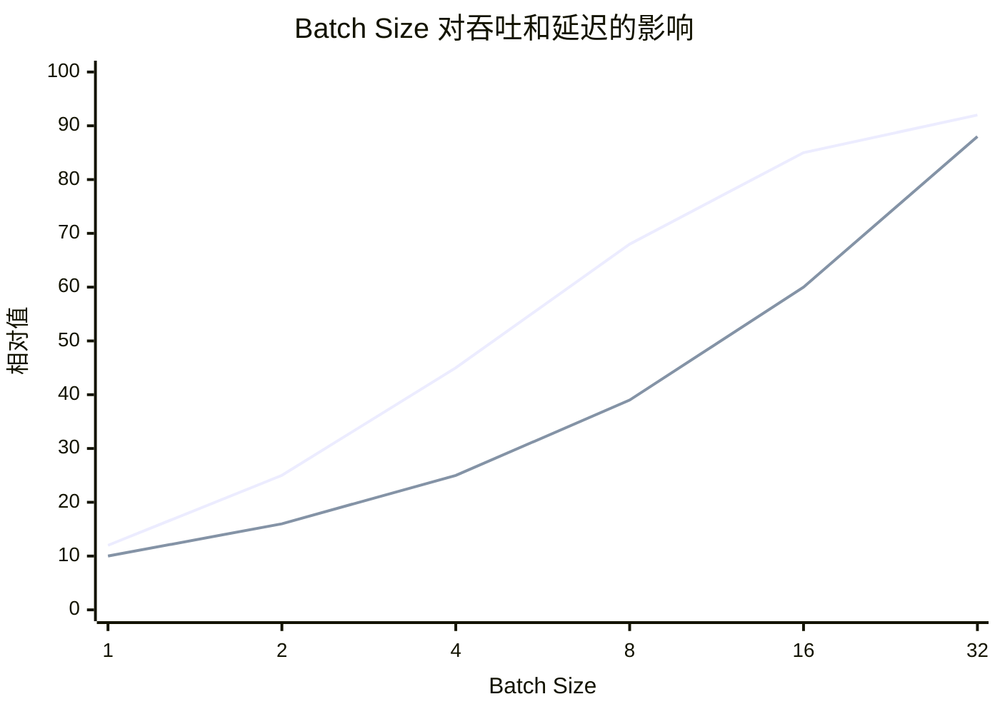

一般而言：

- **吞吐**：先随 Batch 增大而增长，随后进入饱和；
- **单请求延迟**：通常随 Batch 增大而上升；
- **尾延迟**：在资源接近饱和时可能快速恶化。

因此，系统目标不是简单地追求最大 Batch，而是在 SLO 约束下选择合适的执行规模：

```text
吞吐最大化
      ▲
      │      可接受区间
      │    ┌──────────┐
      │   /            \
      │  /              \
      └────────────────────▶
          延迟 / 尾延迟约束
```

调度器需要同时考虑：

- 当前活跃请求数；
- Prompt 长度；
- 已生成 token 数；
- KV Cache 占用；
- 请求优先级；
- TTFT、ITL 和 P99 等 SLO。

这也是 Token Budget、Chunked Prefill、抢占和 Admission Control 等机制出现的原因。


### 1.4 小结：LLM Serving 的三个根本变化  

到这里，可以将 LLM Serving 相对于传统深度学习推理的变化概括为三个方面。

#### 变化一：从静态计算变成动态执行

传统推理通常可以预先确定输入形状、Batch 大小和计算过程。

LLM Serving 中：

- Prompt 长度不确定；
- 输出长度不确定；
- 请求完成时间不确定；
- 每轮活跃请求集合不确定。

因此，系统需要持续调度，而不是只在请求到达时进行一次 Batch 组装。

#### 变化二：从无状态推理变成带状态推理

传统推理通常只需要处理输入、模型参数和临时激活。

LLM Serving 还必须管理每个请求不断增长的 KV Cache。KV Cache 的位置、容量、复用和回收都会直接影响：

- 最大并发数；
- 可支持的上下文长度；
- 显存利用率；
- 请求是否需要抢占；
- 系统整体吞吐。

#### 变化三：从单一 Workload 变成 Prefill 与 Decode 的混合 Workload

Prefill 更偏向计算密集型，Decode 更偏向访存密集型。

这意味着：

- 适合 Prefill 的优化，不一定适合 Decode；
- 提高 GPU 算力利用率，不一定能降低 Decode 延迟；
- 只优化 Kernel，不一定能解决排队问题；
- 只优化 KV Cache，也不一定能改善长 Prompt 的 TTFT。


### 1.5 阅读地图：后续内容如何展开

后续章节将围绕 LLM Serving 的四个核心问题展开。

| # | 核心问题 | 主要机制 | 主要代码落点 | 后续章节 |
|---|---|---|---|---|
| 一 | 请求来了，**这一轮谁执行、执行多少？** | Continuous Batching、Token Budget、Chunked Prefill、抢占 | `Scheduler` | 调度 |
| 二 | 历史状态**放在哪里、如何复用？** | PagedAttention、Prefix Cache、GQA/MLA、KV 量化 | `KVCacheManager` / `BlockPool` | KV Cache |
| 三 | 这一轮**如何计算得更快？** | FlashAttention、CUDA Graph、算子融合、量化、投机解码 | `ModelRunner` / Attention Backend | 执行优化 |
| 四 | 一张卡不够，**如何扩展？** | TP、PP、EP、CP、DP、集合通信 | `Executor` / `distributed` | 多卡与集群 |                          |

四问之外还有两个**横切约束**：模型在变、硬件在变——它们不新增问题，但要求上面四个答案在剧烈变化的外部环境里保持稳定。

### 1.6 一个贯穿全文的例子

抽象的讨论容易滑走，所以从这里开始，本文会**反复回到同一个具体请求**。后面每一章都会带着它算一笔账。

> **场景设定**
>
> - **模型**：Llama-3-70B，FP16，80 层，`hidden=8192`，64 个 Q head / 8 个 KV head（GQA-8），`head_dim=128`
> - **硬件**：8 × H100 80GB，TP=8，机内 NVLink
> - **请求**：2000 token 的 system prompt + 50 token 的用户提问，生成 300 token
>   - prompt 合计 **2050** token，结束时序列长度 **2350** token

先把两个最基础的量算出来，后面各章都要用：

| 量 | 计算 | 结果 |
|---|---|---|
| 每 token 每层的 KV | `2(K,V) × 8 kv_head × 128 dim × 2 B` | **4 KB** |
| 每 token 的 KV（80 层） | `4 KB × 80` | **320 KB** |
| ↳ TP=8 时每张卡承担 | `320 KB ÷ 8` | 40 KB |
| 这个请求最终的 KV 总量 | `2350 × 320 KB` | **约 734 MB** |
| 权重每卡 | `141 GB ÷ 8` | 17.6 GB |


## 二、如何衡量一个 LLM Serving 系统？

### 2.1 LLM Serving 指标总览

LLM Serving 的性能不能只看单一指标，而应同时关注四个维度：

```text
延迟：用户需要等待多久？
吞吐：系统单位时间处理多少请求和 Token？
效率：GPU、显存和资金利用得好不好？
服务质量：有多少请求满足 SLO？
```

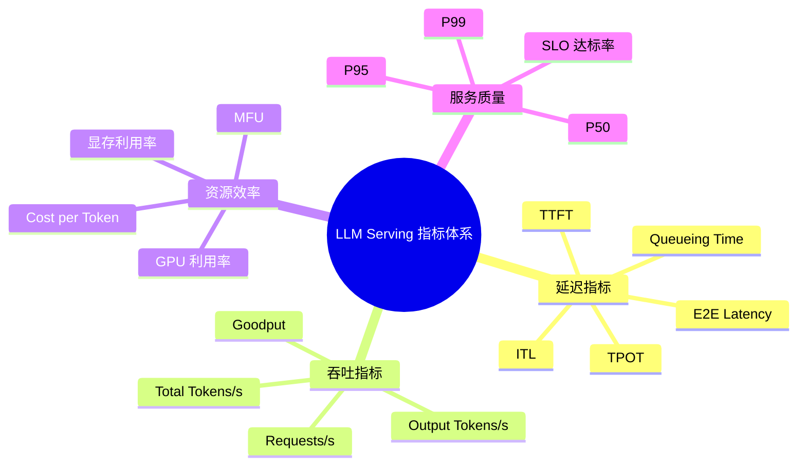

**指标说明**

| 维度 | 指标 | 定义 | 主要反映 | 常见影响因素 | 使用注意 |
|---|---|---|---|---|---|
| **延迟** | **TTFT**<br>Time To First Token | 请求到达至收到第一个输出 Token 的时间 | 首次响应速度 | 排队、Prompt 长度、Prefill、Prefix Cache、首 Token 生成 | 不等于 Prefill 时间，还包括排队和传输 |
| **延迟** | **TPOT**<br>Time Per Output Token | Decode 阶段平均生成一个输出 Token 的时间 | 平均生成速度 | Decode Batch、KV Cache 长度、显存带宽、Attention Kernel、量化 | 需明确是否包含首 Token |
| **延迟** | **ITL**<br>Inter-Token Latency | 相邻两个输出 Token 到达客户端的时间间隔 | 流式输出的连续性和稳定性 | 调度抖动、Batch 变化、抢占、网络传输 | 应重点观察 P95/P99，而不只是平均值 |
| **延迟** | **E2E Latency** | 从请求发送至完整结果返回的总时间 | 完整请求体验 | 排队、Prefill、Decode、输出长度、网络 | 长输出场景下通常受 Decode 主导 |
| **延迟** | **Queueing Time** | 请求到达至开始执行前的等待时间 | 系统拥塞程度 | 并发量、Batch 容量、Admission Control、KV Cache 空间 | 高并发时可能成为 TTFT 的主要部分 |
| **吞吐** | **Output Tokens/s** | 单位时间生成的输出 Token 数 | Decode 吞吐 | Batch Size、显存带宽、Kernel、并行度 | 适合衡量在线生成能力 |
| **吞吐** | **Total Tokens/s** | 单位时间处理的输入与输出 Token 总数 | 端到端 Token 处理能力 | Prompt 长度、输出长度、Prefill 和 Decode 效率 | 必须说明是否包含输入 Token |
| **吞吐** | **Requests/s** | 单位时间完成的请求数 | 业务请求处理能力 | 请求长度、并发度、服务策略 | 不能脱离输入输出长度单独比较 |
| **吞吐** | **Goodput** | 单位时间内满足 SLO 的有效请求或 Token 数 | 满足服务质量后的有效吞吐 | 吞吐、尾延迟、调度、Admission Control | 比理论吞吐更接近实际服务价值 |
| **资源效率** | **MFU**<br>Model FLOPs Utilization | 实际模型 FLOPs/s 与理论峰值 FLOPs/s 的比值 | 计算单元利用效率 | GEMM 规模、算子融合、Kernel 调度 | Decode 可能受显存带宽限制，MFU 低不一定代表低效 |
| **资源效率** | **GPU 利用率** | GPU 活跃时间占比 | GPU 是否持续工作 | 计算、访存、通信、调度和 Kernel Launch | 需要结合 HBM 带宽和 Tokens/s 判断 |
| **资源效率** | **显存利用率** | 已使用显存与可用显存的比例 | 并发和上下文容量 | 权重、KV Cache、激活、通信 Buffer、运行时开销 | 显存不仅决定模型能否加载，也决定并发度 |
| **资源效率** | **Cost per Token** | 处理一个 Token 的综合成本 | 经济效率 | GPU 成本、吞吐、利用率、量化、SLO | 应明确按输入、输出还是有效 Token 计算 |
| **服务质量** | **P50** | 50% 请求不超过该延迟 | 典型请求体验 | 常规负载 | 不能代表尾部请求 |
| **服务质量** | **P95** | 95% 请求不超过该延迟 | 大多数用户体验 | 负载波动、请求长度、调度 | 常用于在线服务 SLO |
| **服务质量** | **P99** | 99% 请求不超过该延迟 | 尾部请求体验 | 长请求、资源竞争、抢占、网络抖动 | 对多租户和交互式服务尤其重要 |
| **服务质量** | **SLO 达标率** | 满足预设延迟或吞吐目标的请求比例 | 服务稳定性 | TTFT、ITL、E2E、排队和错误率 | Goodput 的计算基础之一 |

### 2.2 指标常见误区与优化方向

LLM Serving 的各项指标并非相互独立。不同指标暴露的是不同阶段或不同资源的瓶颈，因此应根据指标异常选择优化方向，而不是笼统地追求 GPU 利用率或总吞吐。

#### 2.2.1 常见误区

##### 误区一：只看平均延迟

平均值可能掩盖严重的尾延迟问题。在线服务通常应同时报告：

```text
平均值 + P50 + P95 + P99 + SLO 达标率
```

尤其是在动态批处理和多租户环境中，少量长请求可能显著拖高 P99。

##### 误区二：将 TTFT 等同于 Prefill 时间

TTFT 通常还包括：

```text
排队时间 + 调度等待 + Prefill + 首 Token 生成 + 网络传输
```

因此 TTFT 过高不一定意味着 Prefill Kernel 低效，也可能是请求在队列中等待过久。

##### 误区三：只用 TPOT 衡量流式体验

TPOT 是平均值，而用户实际感受到的是每个 Token 的到达间隔。调度抖动、Batch 动态变化和通信阻塞可能导致平均 TPOT 正常，但 ITL 的 P95/P99 很差。

##### 误区四：用 GPU 利用率判断系统是否高效

GPU 利用率较高，可能只是 GPU 在等待显存访问或通信；GPU 利用率较低，也可能是系统受限于显存带宽、请求不足或模型并行通信。因此需要结合以下指标共同判断：

- HBM 带宽利用率；
- Kernel 执行时间；
- MFU；
- Decode TPOT；
- GPU 间通信时间；
- 有效 Tokens/s。

##### 误区五：只比较 Requests/s

不同测试的 Prompt 长度、Output 长度和请求分布不同，Requests/s 很难直接比较。更合理的报告方式是同时给出：

```text
并发数、输入 Token 数、输出 Token 数、Output Tokens/s、
Total Tokens/s、TTFT、TPOT/ITL 和 P99
```

##### 误区六：显存占用越高越好

提高 KV Cache 使用率有助于增加并发，但过度填充显存可能造成：

- 新请求无法接入；
- 长请求触发抢占；
- KV Cache 频繁换入换出；
- P99 延迟显著升高；
- 系统出现 OOM 风险。

因此，显存利用率应与并发度、KV Cache 命中率、抢占率和尾延迟联合分析。

#### 2.2.2 指标与优化方向的对应关系


| 指标或现象 | 主要暴露的问题 | 重点优化方向 |
|---|---|---|
| **TTFT 过高** | 排队时间长、Prefill 计算量大或首 Token 调度不及时 | 减少排队、优化 Prefill Kernel、使用 Prefix Cache、采用 Chunked Prefill、改进请求优先级 |
| **ITL / TPOT 过高** | Decode 阶段访存效率低、KV Cache 访问开销大或 Batch 调度不合理 | 优化 Decode Kernel、改进 KV Cache 布局和访问、减少通信开销、优化 Continuous Batching |
| **吞吐不足** | 有效 Batch 太小、计算或显存带宽利用率低 | 增大有效 Batch、提高算力和带宽利用率、优化 Kernel、减少 CPU/GPU 调度开销 |
| **P99 过高** | 长请求竞争、动态 Batch 抖动、资源争用或排队失控 | 控制长 Prefill、限制最大上下文、隔离不同长度请求、改进调度、增加限流和 Admission Control |
| **KV Cache 不足** | 上下文过长、并发过高或 KV Cache 管理效率低 | 使用 PagedAttention、Prefix Cache、KV 量化、KV Cache 复用和抢占 |
| **GPU 利用率低但 TTFT 高** | 请求排队、调度间隙或并发不足 | 优化请求准入、动态批处理、调度粒度和 CPU/GPU 协同 |
| **GPU 利用率高但吞吐低** | 可能受显存带宽、Kernel 效率或通信瓶颈限制 | 优化内存访问、融合 Kernel、量化、减少同步和跨卡通信 |
| **Prefill 很快但 Decode 很慢** | Decode 的小矩阵计算和 KV Cache 访存成为瓶颈 | 优化 Decode 专用 Kernel、改进 KV Cache 布局、调整 Decode Batch 和并行策略 |
| **吞吐高但 Goodput 低** | 系统牺牲延迟换取吞吐，导致大量请求违反 SLO | 引入 SLO-aware 调度、限制 Batch 上限、控制长请求、优化资源隔离 |
| **P99 随并发快速恶化** | 系统接近饱和，排队和资源竞争出现非线性增长 | 设置并发上限、实施 Admission Control、区分请求优先级、扩展实例或进行负载分片 |

### 2.2.3 使用原则

指标分析应遵循以下顺序：

```text
先确认指标口径
    ↓
区分 Prefill、Decode、排队和网络因素
    ↓
观察平均值与 P95/P99 的差异
    ↓
结合 GPU、显存、带宽和通信指标定位瓶颈
    ↓
选择与指标对应的优化方向
    ↓
用 Goodput 和 SLO 达标率验证优化是否有效
```

核心原则是：

> 不同指标对应不同瓶颈，不同瓶颈对应不同优化手段。  
> 不能用提高吞吐的方法解决 TTFT，也不能用单纯增加 GPU 利用率的方法解决 P99 或 KV Cache 容量问题。

### 2.3 本章小结

LLM Serving 的指标体系可以归纳为：

```text
延迟：TTFT、TPOT、ITL、E2E
吞吐：Tokens/s、Requests/s、Goodput
效率：MFU、GPU 利用率、显存利用率、Cost per Token
质量：P50、P95、P99、SLO 达标率
```

其中最重要的区别是：

> 吞吐衡量系统处理了多少工作；  
> 延迟衡量用户等待了多久；  
> Goodput 衡量系统在满足 SLO 的前提下完成了多少有效工作。


## 三、鸟瞰 vLLM：一个请求如何穿过整个推理系统？

### 3.1 静态系统拓扑（自顶向下）

vLLM V1 的整体架构遵循**控制面/数据面分离**的经典设计哲学。我们自顶向下，逐层解剖其系统拓扑。

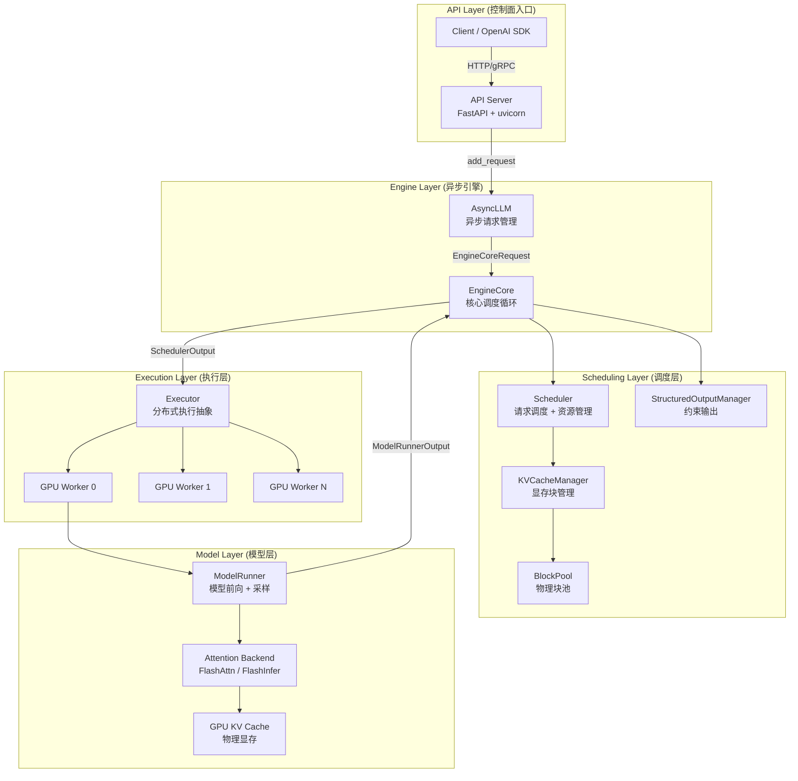

从这张图看，从 Client 到 EngineCore 是请求入队路径，传递的是"生成什么"；EngineCore 到 Worker 再到 ModelRunner 是执行路径，携带的是这一轮调度出来的 batch 和 block 布局；而 ModelRunner 返回的只是采样结果，不是下一次 forward 的完整状态。调度状态留在 EngineCore，模型侧负责的是单次前向计算。

#### API Server 与 AsyncLLM：异步并发处理的桥头堡

入口位于 `vllm/entrypoints/openai/api_server.py`，基于 FastAPI 构建的 HTTP 服务器，实现了 OpenAI 兼容的 `/v1/chat/completions`、`/v1/completions` 等 REST API。

`AsyncLLM`（`vllm/v1/engine/async_llm.py`）是面向外部的异步引擎接口，负责：
- 接收 HTTP 请求并转化为内部 `EngineCoreRequest`
- 管理请求的异步生命周期
- 支持 SSE 流式响应
- 数据并行（DP）场景下的多引擎协调

#### EngineCore：推理系统的中央调度大脑

`EngineCore`（`vllm/v1/engine/core.py`）是 vLLM V1 引擎的核心，它的 `step()` 方法驱动整个推理循环：

```python
# vllm/v1/engine/core.py (简化)
class EngineCore:
    """Inner loop of vLLM's Engine."""

    def __init__(self, vllm_config, executor_class, ...):
        # 1. 初始化模型执行器
        self.model_executor = executor_class(vllm_config)

        # 2. 初始化 KV Cache
        kv_cache_config = self._initialize_kv_caches(vllm_config)

        # 3. 初始化调度器
        Scheduler = vllm_config.scheduler_config.get_scheduler_cls()
        self.scheduler = Scheduler(
            vllm_config=vllm_config,
            kv_cache_config=kv_cache_config,
            ...
        )
```

#### Scheduler 与 KVCacheManager：资源管理双核

`Scheduler`（`vllm/v1/core/sched/scheduler.py`，约 3000 行）是调度的大脑，决定每一轮迭代中哪些请求参与推理、分配多少 token 预算。

`KVCacheManager`（`vllm/v1/core/kv_cache_manager.py`）管理 GPU 显存上的 KV Cache 物理块——分配、释放、前缀缓存复用、驱逐。

#### Worker 与 Model Executor：模型执行的设备抽象

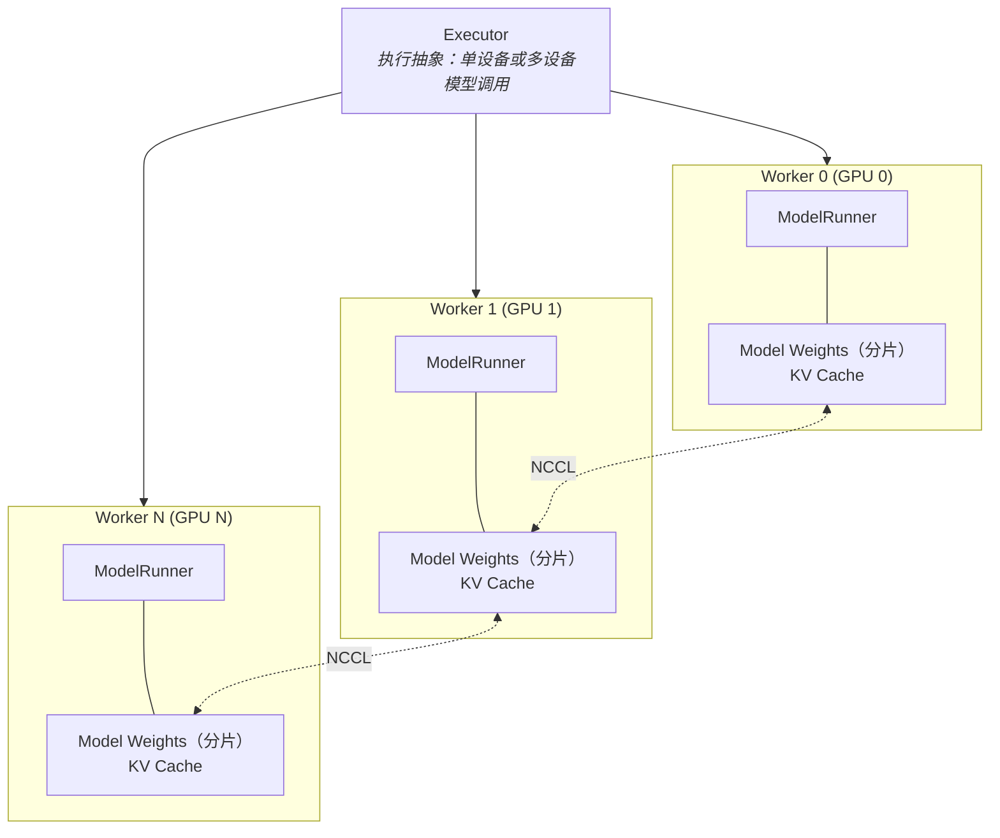

常见 GPU 部署中，Executor 会把一次 `execute_model()` 调用分发给一个或多个 Worker；Worker 再调用本地的 `ModelRunner` 执行模型前向、采样和 KV Cache 读写。单卡、同机多进程、Ray 分布式和 external launcher 的进程/设备映射并不完全相同，因此不应把“一个 GPU 固定绑定一个 Worker 进程”写成绝对规则。

每个 Worker 通常负责：
- `ModelRunner`：负责模型前向计算、输入准备、采样
- 模型权重的分片（Tensor Parallel 下每卡持有一部分）
- KV Cache 物理显存

`Executor`（`vllm/v1/executor/abstract.py`）是模型执行抽象层，负责在一个设备或多个设备上执行模型，而不是 Scheduler 本身。v0.27.1 中可见的主要实现包括：
- `UniProcExecutor`：单进程单卡
- `MultiprocExecutor`：多进程多卡（同机）
- `RayDistributedExecutor`：Ray 分布式（直接继承 `Executor`）
- `RayExecutorV2`：Ray 分布式的新实现，注意它继承的是 `MultiprocExecutor` 而非 `Executor`——即复用同一套 worker 进程管理逻辑，只把进程的**拉起方式**换成 Ray（`RayWorkerProc(WorkerProc)`）
- `ExecutorWithExternalLauncher`：外部 launcher 场景（继承 `UniProcExecutor`）

这条继承链本身就说明了一件事：**"用不用 Ray"是部署方式的差异，不是执行模型的差异。** Executor 这层抽象的价值就在于把"进程怎么起、卡怎么分"和"一轮 batch 怎么执行"彻底分开，所以 V2 才能靠换掉进程拉起方式来复用同机多进程的全部逻辑。


### 3.2 一次请求的完整生命周期

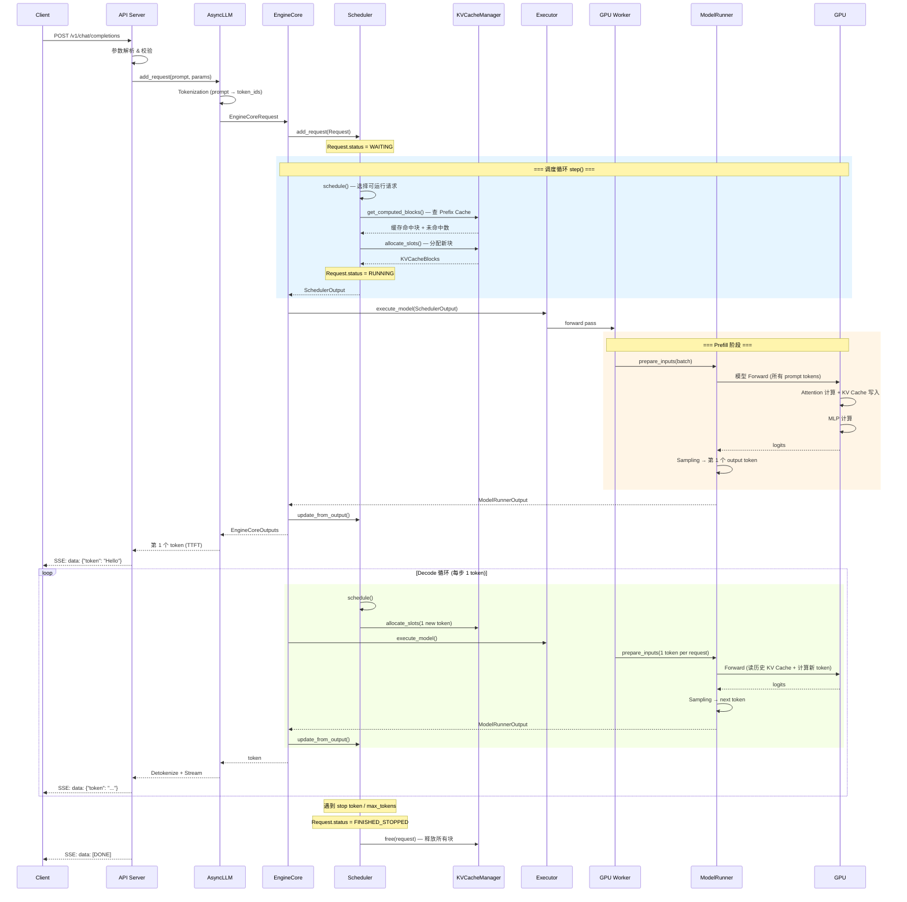

### 3.3 数据流：Token 如何穿过整个 Serving 栈

```
  ┌──────┐     ┌─────────┐     ┌────────┐     ┌───────────┐
  │Client│────▶│API Server│────▶│AsyncLLM│────▶│EngineCore │
  └──────┘     └─────────┘     └────────┘     └─────┬─────┘
  "Hello,       HTTP JSON       add_request     EngineCoreReq
   tell me                      (text)          (token_ids)
   a joke"                         │
                              Tokenizer
                          [15496, 11, 2425,
                           757, 257, 9707]
                                                     │
                                              ┌──────▼──────┐
                                              │  Scheduler   │
                                              │  schedule()  │
                                              └──────┬──────┘
                                              SchedulerOutput
                                              (req_ids, block_table,
                                               num_tokens_per_req)
                                                     │
                                              ┌──────▼──────┐
                                              │  Executor    │
                                              │  → Worker    │
                                              └──────┬──────┘
                                                     │
                                              ┌──────▼──────┐
                                              │ ModelRunner  │
                                              │prepare_inputs│
                                              └──────┬──────┘
                                              input_ids, positions,
                                              block_table, slot_mapping
                                                     │
                                              ┌──────▼──────┐
                                              │   GPU       │
                                              │  Forward    │
                                              │  Pass       │
                                              └──────┬──────┘
                                              logits [vocab_size]
                                                     │
                                              ┌──────▼──────┐
                                              │  Sampling   │
                                              │ (top-p/top-k│
                                              │  /temp)     │
                                              └──────┬──────┘
                                              sampled_token_id
                                                     │
                                              ┌──────▼──────┐
                                              │Detokenizer  │
                                              │ → "Sure"    │
                                              └──────┬──────┘
                                                     │
  ┌──────┐     ┌─────────┐                    ┌──────▼──────┐
  │Client│◀────│SSE Stream│◀───────────────────│  Response   │
  └──────┘     └─────────┘                    └─────────────┘
  "Sure, here's a joke..."
```


### 3.4 总结

这一章主要要关注的是模块之间的分工：

> **EngineCore 驱动循环，Scheduler 决定这一轮谁跑、跑多少 token，Executor 负责把任务分发下去，ModelRunner 负责真正调用 GPU 算。**

把它和上一章的四问对齐，就得到全文的骨架：

| 四问 | 承担模块 |
|------|---------|
| 一、这一轮谁执行、执行多少 | `Scheduler`（+ `EngineCore` 驱动） |
| 二、状态放哪、怎么复用 | `KVCacheManager` / `BlockPool` |
| 三、怎么算得更快 | `ModelRunner` / Attention Backend / Kernel |
| 四、怎么扩出去 | `Executor` / `Worker` / 集合通信 |


<details markdown="1">
<summary><b>📂 本章源码导航</b></summary>

**入口与引擎循环**

| 想看什么 | 从哪开始 |
|---|---|
| HTTP 入口、OpenAI 兼容接口 | `vllm/entrypoints/openai/api_server.py` |
| 异步请求生命周期、流式响应 | `vllm/v1/engine/async_llm.py` |
| **推理主循环（建议从这里入手）** | `vllm/v1/engine/core.py` → `EngineCore.step()` |
| 执行抽象与各种部署形态 | `vllm/v1/executor/abstract.py` |
| 一轮 batch 在 GPU 上怎么跑 | `vllm/v1/worker/gpu/model_runner.py` |

</details>


## 四、Scheduler：GPU 这一轮到底给谁用？

前面我们已经解决了一个重要问题：

> **KV Cache 如何管理？**

PagedAttention 将 KV Cache 从连续的大块显存变成可以按 Block 动态分配和回收的资源，使得不同请求可以灵活共享 GPU 显存。

但有了 KV Cache 之后，还有一个更直接的问题：

> **GPU 这一轮到底给谁用？每个请求这一轮应该推进多少？**

这正是 Scheduler 要解决的问题。

传统深度学习推理通常以固定 Batch 为基本调度单位：

```text
Batch
 ├── Request A
 ├── Request B
 └── Request C

        ↓

执行完整 Batch

        ↓

所有 Request 完成
```

这种模式对于 CNN、分类模型等输入输出长度相对固定的任务比较合适。

但 LLM Serving 完全不同：

* 不同请求的 Prompt 长度不同；
* 每个请求最终生成多少 token 是未知的；
* Prefill 和 Decode 的计算特征不同；
* 请求会不断到达和完成；
* KV Cache 会随着生成过程动态增长；
* Speculative Decoding 甚至会让一次迭代推进多个 token。

因此，LLM Serving 的 Batch 不能再是一个固定不变的集合。

vLLM 的调度可以理解为逐渐回答五个问题：

```text
为什么 Batch 必须动态变化？
        │
        ▼
4.1 Continuous Batching
        │
        ▼
为什么一个长 Prompt 也不能一次执行完？
        │
        ▼
4.2 Chunked Prefill
        │
        ▼
Scheduler 每一轮到底给每个 Request 多少计算额度？
        │
        ▼
4.3 Token Budget
        │
        ▼
为什么 Prefill / Decode / Speculative 可以同时存在？
        │
        ▼
4.4 Mixed Batch
        │
        ▼
如果 KV Cache 不够怎么办？
        │
        ▼
4.5 Admission Control & Preemption
```

最终可以把 Scheduler 理解为：

> **在计算资源和 KV Cache 资源的双重约束下，每一轮动态决定哪些 Request 执行，以及每个 Request 本轮推进多少 token。**


### 4.1 Continuous Batching：为什么 Batch 必须动态变化？

#### 4.1.1 Static Batching 的问题

传统推理系统通常采用 Static Batching。

例如有三个请求：

```text
Request A：生成 12 tokens
Request B：生成 6 tokens
Request C：生成 4 tokens
```

如果采用固定 Batch：

```text
Step 1：

A  ████████████
B  ██████
C  ████

Step 2：

A  ████████████
B  ██████
C  ████

...

Step 4：

A  ████████████
B  ██████
C  ████
              ↑
          B、C 已经完成

...

Step 12：

A  ████████████
B  idle
C  idle
```

问题很明显：

> **请求 B、C 已经完成，但 Batch 仍然要等请求 A。**

GPU 的部分计算资源因此被浪费。

更严重的是，新来的 Request D 即使已经排队，也无法及时加入当前 Batch：

```text
A ──────────────────────────────►
B ───────────► done

C ────────► done

D ────────► waiting...
```

于是系统形成：

```text
GPU
│
├── 已完成请求释放资源
│
├── Batch 仍然没有结束
│
└── 新请求无法及时进入
```

#### 4.1.2 Continuous Batching

LLM 的生成过程天然是迭代式的：

```text
Iteration 1
    ↓
Iteration 2
    ↓
Iteration 3
    ↓
...
```

因此，一个更合理的做法是：

> **不再固定整个 Batch 的生命周期，而是在每一轮迭代开始之前重新决定本轮有哪些 Request 参与执行。**

这就是 Continuous Batching。

```text
                 Continuous Batching

Iter 1:   [A] [B] [C]

Iter 2:   [A] [B] [C]

Iter 3:   [A] [B] [C] → A 完成

Iter 4:        [B] [C] [D]   ← D 加入

Iter 5:        [B] [C] [D] [E]  ← E 加入

Iter 6:        [B] [D] [E]      ← C 完成

...
```

与 Static Batching 相比：

| 特性         | Static Batching | Continuous Batching |
| ---------- | --------------- | ------------------- |
| Batch 生命周期 | 固定              | 每轮动态调整              |
| 新请求加入      | 等 Batch 结束      | 每轮都可以尝试加入           |
| 已完成请求      | 占位直到 Batch 结束   | 立即释放资源              |
| Padding    | 通常需要            | 不需要为了 Batch 对齐而等待   |
| GPU 利用率    | 请求完成后逐渐下降       | 可以持续填充              |
| 调度复杂度      | 较低              | 较高                  |

因此，Continuous Batching 的核心不是简单地：

> “把更多 Request 放进 Batch。”

而是：

> **每一次迭代，都重新决定 GPU 这一轮应该服务哪些 Request。**


### 4.2 Chunked Prefill：为什么一个 Request 也不能一次吃完？

Continuous Batching 解决了：

> **不同 Request 之间如何动态加入和退出。**

但还有一个问题：

> **如果某一个 Request 自己就非常大怎么办？**

例如一个 32K token 的 Prompt：

```text
Request A
┌─────────────────────────────────────────────┐
│              32K Prompt                     │
└─────────────────────────────────────────────┘
```

如果一次性完成 Prefill：

```text
Iteration 1：

[A: Prefill 32K]
```

那么 A 可能长时间占用 GPU。

此时其他已经处于 Decode 状态的请求：

```text
Request B → Decode
Request C → Decode
Request D → Decode
```

都可能被迫等待。

于是出现典型的 Head-of-Line Blocking：

```text
Long Prefill
████████████████████████████████████████

B Decode   ──────────────────────────────
C Decode   ──────────────────────────────
D Decode   ──────────────────────────────
                 ↑
              被阻塞
```

这会直接影响 Decode 请求的 TPOT。

#### 4.2.1 Chunked Prefill

因此，长 Prompt 也需要被拆成多个 Chunk：

```text
32K Prompt

┌──────┬──────┬──────┬──────┬──────┐
│Chunk1│Chunk2│Chunk3│Chunk4│Chunk5│ ...
└──────┴──────┴──────┴──────┴──────┘
```

例如：

```text
Iteration 1:
[A: Chunk1] [B: Decode] [C: Decode]

Iteration 2:
[A: Chunk2] [B: Decode] [C: Decode]

Iteration 3:
[A: Chunk3] [B: Decode] [C: Decode]

...
```

这样，A 不再一次性独占 GPU，而是和其他请求交替推进。

```text
没有 Chunked Prefill：

Iter 1   [Long Prefill ████████████████████]
Iter 2   [Long Prefill ████████████████████]
Iter 3   [Long Prefill ████████████████████]
Iter 4   [Decode A][Decode B][Decode C]


有 Chunked Prefill：

Iter 1   [Chunk1][Decode A][Decode B]
Iter 2   [Chunk2][Decode A][Decode B]
Iter 3   [Chunk3][Decode A][Decode B]
Iter 4   [Chunk4][Decode A][Decode B]
...
```

#### 4.2.2 Chunked Prefill 的代价

Chunked Prefill 并不是免费优化。

它实际上是在做一个典型的：

> **TTFT ↔ TPOT trade-off**

如果长 Prompt 一次性执行：

```text
Long Request
      ↓
快速完成 Prefill
      ↓
TTFT 较低

但：

Decode Requests
      ↓
被阻塞
      ↓
TPOT 出现尖峰
```

如果采用 Chunked Prefill：

```text
Long Request
      ↓
Prefill 被拆成多个 Chunk
      ↓
TTFT 上升

但：

Decode Requests
      ↓
可以持续执行
      ↓
TPOT 更平稳
```

因此，Chunked Prefill 的本质不是简单的“把 Prompt 切小”。

更准确地说：

> **Chunked Prefill 将一个巨大的 Prefill 工作量拆成多个可调度的 token 额度，使 Scheduler 可以在长 Prompt 与 Decode 请求之间重新分配 GPU 计算资源。**

这里已经出现了一个非常关键的概念：

> **Token Budget。**


#### 4.2.3 `long_prefill_token_threshold`

在 vLLM 中，可以通过：

```python
long_prefill_token_threshold
```

限制一次 Prefill 可以推进的 token 数量。

概念上可以理解为：

```python
num_new_tokens = min(
    num_new_tokens,
    long_prefill_token_threshold,
)
```

例如：

```text
Prompt = 2050 tokens
long_prefill_token_threshold = 512
```

那么这个 Prefill 最多可以被拆成：

```text
512 + 512 + 512 + 512 + 2
```

即：

```text
Chunk 1 → 512
Chunk 2 → 512
Chunk 3 → 512
Chunk 4 → 512
Chunk 5 → 2
```

代价是这个请求需要更多轮才能完成 Prefill，TTFT 可能上升；收益则是其他 Decode 请求不容易被一个长 Prefill 长时间阻塞。

因此：

> **Chunked Prefill 实际上是在调度层把“长请求”变成多个可以跨 iteration 分配的工作单元。**

而接下来真正需要回答的问题是：

> **Scheduler 每一轮到底有多少工作额度可以分配？又应该如何在不同 Request 之间分配？**


## 4.3 Token Budget：Scheduler 每一轮到底怎么分配？

这一节是整个 Scheduler 的核心。

前面的 Continuous Batching 解决了：

> Request 可以动态加入和退出。

Chunked Prefill 又解决了：

> 一个 Request 也可以被拆成多个部分逐步推进。

于是 Scheduler 每一轮都面临一个非常具体的问题：

> **这一轮 GPU 最多处理多少 token？这些 token 应该分给哪些 Request？**


### 4.3.1 Request 是调度对象，Token 是调度资源

这里需要先纠正一个非常容易产生误解的说法。

不要简单理解成：

> Scheduler 调度的不是 Request，而是 Token。

更准确的说法是：

> **Request 是 Scheduler 的调度对象，Token 是 Scheduler 分配计算资源的基本单位。**

也就是说：

```
                    Scheduler
                        │
              调度哪些 Request？
                        │
                        ▼
                  Request A
                  Request B
                  Request C
                        │
                        │
                 每个 Request
                 分配多少 token？
                        │
                        ▼
              num_new_tokens
```

所以，Scheduler 并不是把 token 当成独立任务进行调度，而是：

> **以 Request 为对象，以 token 为资源，决定每个 Request 本轮推进多少 token。**


### 4.3.2 每一轮首先确定 Token Budget

Scheduler 首先需要确定：

> **本轮最多允许处理多少 token？**

在 vLLM V1 中，Scheduler 有一个配置项：

```text
max_num_scheduled_tokens
```

它定义的是：

> **一次 `schedule()` iteration 中，最多允许调度多少个 token。**

所以可以把它记成：

[
B = \text{max_num_scheduled_tokens}
]


例如：

```text
max_num_scheduled_tokens = 512
```

那么：

```text
本轮 Token Budget = 512
```

意味着：

```text
这一轮最多安排 512 token 的计算工作
```

所有 Request 在这一轮消耗的 token 额度之和不能超过这个预算：

```text
Σ num_new_tokens_i ≤ 512
```

于是 Scheduler 的问题就可以抽象成：

```text
给每一个 Request 分配 x_i 个 token

满足：

0 ≤ x_i ≤ request_remaining_i

Σ x_i ≤ Token Budget
```

这就是 Scheduler 最核心的资源分配问题。


### 4.3.3 Request 还需要推进多少？

Scheduler 需要知道：

> **这个 Request 到底还差多少 token？**

vLLM 中有两个非常关键的量：

```text
num_tokens_with_spec
num_computed_tokens
```

它们可以帮助我们理解 Scheduler 的工作方式。


#### `num_computed_tokens`

表示这个 Request 当前已经完成计算的 token 数量。

例如：

```text
Prompt = 2050 tokens

当前：

num_computed_tokens = 1024
```

意味着：

```text
前 1024 tokens
      ↓
已经完成计算
      ↓
对应 KV Cache 已经建立
```

#### `num_tokens_with_spec`

它表示当前 Request 这一轮希望推进到的目标 token 位置。

普通 Decode 情况下，通常只需要推进一个 token：

```text
num_tokens_with_spec
    ≈
num_computed_tokens + 1
```

而如果涉及 speculative decoding，则可能一次需要推进多个 token：

```text
num_tokens_with_spec
    >
num_computed_tokens + 1
```

因此，Scheduler 可以计算：

```text
remaining_tokens
    =
num_tokens_with_spec
    -
num_computed_tokens
```

也就是：

> **这个 Request 当前还需要多少 token 的计算额度。**


### 4.3.4 `num_new_tokens`：本轮真正分配多少？

Scheduler 最终真正关心的是：

```text
num_new_tokens
```

即：

> **这个 Request 在本轮到底推进多少 token。**

概念上可以理解为：

```python
remaining_tokens = (
    req.num_tokens_with_spec
    - req.num_computed_tokens
)

num_new_tokens = min(
    remaining_tokens,
    token_budget,
    other_constraints,
)
```

然后：

```python
token_budget -= num_new_tokens
```

于是：

```text
                  Token Budget
                       │
                       ▼
                ┌─────────────┐
                │    512      │
                └──────┬──────┘
                       │
             ┌─────────┼─────────┐
             ▼         ▼         ▼
           Req A     Req B     Req C
           400         1         1
             │         │         │
             └─────────┼─────────┘
                       ▼
                  剩余 110
```

这就是 Scheduler 最核心的工作。


### 4.3.5 用一个完整例子看懂 `schedule()`

假设当前：

```text
max_num_scheduled_tokens = 512
```

也就是：

```text
Token Budget = 512
```

当前有三个正在运行的 Request：

```text
Request A：
长 Prompt Prefill
remaining = 400

Request B：
普通 Decode
remaining = 1

Request C：
普通 Decode
remaining = 1
```

Scheduler 可以分配：

```text
A → 400
B → 1
C → 1
```

消耗：

```text
400 + 1 + 1 = 402
```

于是：

```text
剩余 Token Budget
    =
512 - 402
    =
110
```

此时 waiting 队列中还有：

```text
Request D：
Prompt = 300 tokens
```

Scheduler 不需要等待 A、B、C 全部完成。

只要还有预算，就可以继续接纳 D：

```text
D → 110
```

最终：

```text
┌─────────────────────────────────────────────┐
│          Token Budget = 512                 │
├─────────────────────────────────────────────┤
│ Request A：Prefill       400 tokens         │
│ Request B：Decode          1 token          │
│ Request C：Decode          1 token          │
│ Request D：Prefill       110 tokens         │
├─────────────────────────────────────────────┤
│ Total                    512 tokens         │
└─────────────────────────────────────────────┘
```

这就是一个典型的 Mixed Batch。

但注意：

> **此时 Scheduler 根本不需要创建三个不同的 Batch。**

它只是在一个统一的 Token Budget 下：

```text
A → 400
B → 1
C → 1
D → 110
```

### 4.3.6 Decode 为什么也是同一个调度模型？

现在看普通 Decode。

假设：

```text
Request B：

num_computed_tokens = 100
num_tokens_with_spec = 101
```

那么：

```text
remaining_tokens
    =
101 - 100
    =
1
```

因此：

```text
B → 1 token
```

这就是普通 Decode。

而一个长 Prompt：

```text
num_computed_tokens = 1000
num_tokens_with_spec = 1500
```

那么：

```text
remaining_tokens
    =
1500 - 1000
    =
500
```

这就是 Prefill workload。

因此，从 Scheduler 的角度看：

```text
Prefill：

remaining_tokens 很大

Decode：

remaining_tokens 通常为 1

Chunked Prefill：

remaining_tokens 很大
但单轮只能推进一部分

Speculative Decode：

remaining_tokens 可能大于 1
```

所以可以得到一个非常重要的结论：

> **从 Scheduler 的角度，Prefill、Decode 并不是两套完全独立的调度算法，而只是不同 Request 在当前 iteration 中具有不同的 token 推进需求。**

Prefill 和 Decode 依然是非常重要的性能分析概念，但它们并不意味着 Scheduler 内部必须存在两个完全独立的“Prefill Scheduler”和“Decode Scheduler”。


#### 4.3.7 Scheduler 的核心源码逻辑

在 vLLM V1 中，关键逻辑位于：

```text
vllm/v1/core/sched/scheduler.py
```

其中 `Scheduler.schedule()` 可以概念化为：

```python
def schedule(self, throttle_prefills=False):
    token_budget = self.max_num_scheduled_tokens

    # 1. 先处理已经 Running 的 Request
    for req in self.running:

        target = req.num_tokens_with_spec

        num_new_tokens = (
            target - req.num_computed_tokens
        )

        num_new_tokens = min(
            num_new_tokens,
            token_budget,
        )

        # 长 Prefill 的额外限制
        if self.scheduler_config.long_prefill_token_threshold > 0:
            num_new_tokens = min(
                num_new_tokens,
                self.scheduler_config.long_prefill_token_threshold,
            )

        # 2. 尝试为这些 token 分配 KV Cache
        blocks = self.kv_cache_manager.allocate_slots(
            req,
            num_new_tokens,
        )

        if blocks is None:
            self._preempt_request(req)
            continue

        # 3. 消耗本轮 Token Budget
        token_budget -= num_new_tokens

    # 4. 再尝试接纳 Waiting Request
    for req in self.waiting:

        computed_blocks, num_computed = (
            self.kv_cache_manager.get_computed_blocks(req)
        )

        num_new_tokens = (
            req.num_tokens_with_spec
            - num_computed
        )

        num_new_tokens = min(
            num_new_tokens,
            token_budget,
        )

        blocks = self.kv_cache_manager.allocate_slots(
            req,
            num_new_tokens,
        )

        if blocks is None:
            break

        req.status = RequestStatus.RUNNING

        token_budget -= num_new_tokens

    return SchedulerOutput(...)
```

这里最值得注意的是：

```python
num_new_tokens = (
    req.num_tokens_with_spec
    - req.num_computed_tokens
)
```

以及：

```python
token_budget -= num_new_tokens
```

它们共同构成了 Scheduler 的核心逻辑：

```text
Request 当前还差多少？
        │
        ▼
remaining_tokens
        │
        │ 与本轮 Token Budget 比较
        ▼
num_new_tokens
        │
        ▼
allocate_slots()
        │
        ▼
消耗 Token Budget
        │
        ▼
继续处理下一个 Request
```

需要特别注意：

> 上面的两个 `for` 循环并不是“Decode 循环”和“Prefill 循环”。

它们更准确地表示：

```text
Running Requests
        ↓
Waiting Requests
```

在这两个集合中，Scheduler 都是在做同一件事情：

> **计算 Request 当前需要推进多少 token，并在本轮剩余 Token Budget 和其他资源约束下决定实际推进多少。**


### 4.3.8 Token Budget 与 KV Cache 是两个不同维度的约束

到这里还需要区分一个非常重要的概念。

Scheduler 同时受到两类资源约束：

```text
                Scheduler
                    │
          ┌─────────┴─────────┐
          │                   │
          ▼                   ▼
     Compute Resource     Memory Resource
     Token Budget          KV Cache
          │                   │
          ▼                   ▼
  本轮最多算多少 token    能否容纳这些 token
```

Token Budget 回答：

> **这一轮最多执行多少计算？**

KV Cache 回答：

> **这些 token 对应的 KV Cache 是否有地方存？**

因此，即使：

```text
Token Budget = 512
```

也不代表一定可以执行 512 tokens。

例如：

```text
Token Budget 足够
        │
        ▼
需要分配 KV Cache
        │
        ▼
KV Cache Block 不够
        │
        ▼
无法继续接纳 / 需要抢占
```

这就是下一节 Admission Control 与 Preemption 要解决的问题。

整体调度流程如下：

```text
                    Scheduler
                        │
                        ▼
          max_num_scheduled_tokens
                        │
                        ▼
                ┌──────────────┐
                │ Token Budget │
                └──────┬───────┘
                       │
                       ▼
             Request token demand
                       │
                       ▼
                num_new_tokens
                       │
                       ▼
                allocate_slots()
                       │
                       ▼
                 KV Cache
                       │
             ┌─────────┴─────────┐
             ▼                   ▼
           足够                  不足
             │                   │
             ▼                   ▼
          执行                  等待/抢占
```

## 4.4 Mixed Batch：为什么 Prefill、Decode 与 Speculative 可以共存？

前面的 Token Budget 机制实际上已经自然产生了 Mixed Batch。

所谓 Mixed Batch，并不是 Scheduler 专门定义了一种新的：

```text
MixedBatch
```

而是：

> **多个不同类型的 Request 在同一个 Token Budget 下同时获得 token 推进额度。**


### 4.4.1 一轮 GPU 中可以同时有什么？

假设当前：

```text
Token Budget = 512
```

系统中有：

```text
Request A：
长 Prompt，还没有完成 Prefill

Request B：
正常 Decode

Request C：
Speculative Decode

Request D：
刚刚进入系统，需要 Prefill
```

Scheduler 可以得到类似这样的分配：

| Request   | 本轮 token | Workload           | 含义                    |
| --------- | -------: | ------------------ | --------------------- |
| A         |      256 | Prefill            | 长 Prompt 的一个 Chunk    |
| B         |        1 | Decode             | 生成下一个 token           |
| C         |        5 | Speculative Decode | 推进真实 token + 候选 token |
| D         |      250 | Prefill            | 新请求开始 Prefill         |
| **Total** |  **512** |                    |                       |

于是这一轮：

```text
┌─────────────────────────────────────────────┐
│             Token Budget = 512              │
├─────────────────────────────────────────────┤
│ A：Prefill Chunk       256 tokens           │
│ B：Decode                1 token            │
│ C：Speculative           5 tokens           │
│ D：Prefill              250 tokens           │
├─────────────────────────────────────────────┤
│ Total                   512 tokens           │
└─────────────────────────────────────────────┘
```

这就是 Mixed Batch。


### 4.4.2 Mixed Batch 并不是三种 Batch 拼起来

这里非常容易产生误解。

不要理解成：

```text
Prefill Batch
      +
Decode Batch
      +
Speculative Batch
      ↓
Mixed Batch
```

更准确的理解是：

```text
                 Scheduler
                     │
                     ▼
              Token Budget
                     │
          ┌──────────┼──────────┐
          ▼          ▼          ▼
        Req A      Req B      Req C
          │          │          │
       256 token    1 token    5 token
          │          │          │
          └──────────┼──────────┘
                     ▼
                SchedulerOutput
```

也就是说：

> **Scheduler 只有一套统一的 token 分配逻辑，而 Prefill、Decode、Speculative 只是不同 Request 在这一轮产生了不同的 token 推进需求。**

这也是为什么 Token Budget 是理解 Mixed Batch 的关键。


### 4.4.3 Speculative Decoding 为什么可以自然融入？

普通 Decode：

```text
当前已经计算到 token N

下一轮：
推进 1 token
```

因此：

```text
remaining ≈ 1
```

而 Speculative Decoding 可能希望一次推进多个 token：

```text
当前：
N

Speculative：
N+1
N+2
N+3
N+4
```

因此：

```text
remaining > 1
```

对于 Scheduler 来说，两者最终都只是：

```text
Request
    ↓
num_tokens_with_spec
    ↓
num_computed_tokens
    ↓
remaining tokens
    ↓
num_new_tokens
```

所以 Scheduler 不需要重新设计一套：

```text
Speculative Scheduler
```

而是使用同一个 Token Budget 模型处理。

这也是一个非常重要的架构思想：

> **上层优化可以改变一个 Request 一轮希望推进的 token 数量，但不需要改变 Scheduler 的基本资源分配抽象。**

因此，Speculative Decoding 与普通 Decode 可以在同一个 iteration 中共存。

### 4.4.4 SchedulerOutput：调度完成后发生什么？

Scheduler 完成本轮决策后，并不会直接执行模型计算。

它会将本轮调度结果通过：

```text
SchedulerOutput
```

传递给执行层。

可以把整个过程理解为：

```text
                 Scheduler
                     │
                     │ schedule()
                     ▼
          ┌─────────────────────┐
          │   SchedulerOutput   │
          ├─────────────────────┤
          │ Request 列表        │
          │ token 数量          │
          │ KV Cache 分配结果   │
          │ 其他调度元数据      │
          └──────────┬──────────┘
                     │
                     ▼
                 ModelRunner
                     │
                     ▼
              InputBatch
                     │
                     ├── slot_mapping
                     ├── block_table
                     └── attention metadata
                     │
                     ▼
                 GPU 执行
```

因此：

> **Scheduler 负责“决定这一轮算什么”，执行层负责“把这个决定真正变成 GPU 上的计算”。**

执行层需要通过 `InputBatch`、`slot_mapping`、block table 和 attention metadata，把这些不同形态的 token 组织成一次 GPU forward。

```
┌──────────────── 一轮 Mixed Batch 的 token 构成 ──────────────────────┐
│                                                                      │
│  SchedulerOutput (本轮 token 预算分配结果):                            │
│                                                                      │
│  ┌─ Req A (长 prefill, 已推进 256, 本轮再推 256) ──────────────────┐ │
│  │  |████████████████████████|  ← 256 个 prefill tokens              │ │
│  │  block_table = [7, 13]  (新分配的块)                              │ │
│  └──────────────────────────────────────────────────────────────────┘ │
│                                                                      │
│  ┌─ Req B (普通 decode) ───────────────────────────────────────────┐ │
│  │  |█|  ← 1 个 decode token                                        │ │
│  │  block_table 追加 slot 到已有块                                   │ │
│  │  KV Cache 已累积 seq_len=512                                     │ │
│  └──────────────────────────────────────────────────────────────────┘ │
│                                                                      │
│  ┌─ Req C (decode, spec decode) ───────────────────────────────────┐ │
│  │  |█ █ █ █ █|  ← 1 个真实 token + 4 个候选 token                  │ │
│  │  block_table 额外预留 lookahead slots                             │ │
│  └──────────────────────────────────────────────────────────────────┘ │
│                                                                      │
│  GPU 侧组装:                                                          │
│  ┌──────────────────────────────────────────────────────────────────┐ │
│  │  InputBatch (扁平的 token 序列):                                  │ │
│  │  [A₀ A₁ … A₂₅₅ | B₀ | C₀ C₁ C₂ C₃ C₄]                         │ │
│  │  total_tokens = 256 + 1 + 5 = 262                                │ │
│  │                                                                  │ │
│  │  slot_mapping (每个 token 的 KV 写入位置):                        │ │
│  │  A: [block7:0..15, block13:0..15, ...]  (新块, 全部写入)         │ │
│  │  B: [block3:slot15]                    (追加到已存在块尾部)        │ │
│  │  C: [block5:slot12..16]               (含 lookahead 预留)        │ │
│  │                                                                  │ │
│  │  attention metadata 统计（用于 backend 内部分支）:                 │ │
│  │  num_prefill_tokens = 256  → backend 先处理这 256 个 prefill token│ │
│  │  num_decode_tokens  = 6    → 再处理这 6 个 decode/candidate token │ │
│  │  block_table (per-req) 告诉 kernel 每个请求的 KV 块映射            │ │
│  │  query_start_loc 区分不同请求的 token 起始位置                     │ │
│  └──────────────────────────────────────────────────────────────────┘ │
│                                                                      │
│  关键: 模型级只有一个 attention backend, 不是 per-request 切换。       │
│  该 backend 根据 metadata 中的 prefill/decode token 计数,              │
│  在自己的 forward 内调用不同的底层 kernel (如 FlashInfer 的             │
│  trtllm_batch_context_with_kv_cache 和 trtllm_batch_decode_...)。     │
└──────────────────────────────────────────────────────────────────────┘
```

## 4.5 Admission Control 与 Preemption：KV Cache 不够怎么办？

到这里，Scheduler 已经解决了：

> **计算资源怎么分？**

但还存在另外一个问题：

> **如果 KV Cache 已经没有足够空间了怎么办？**

这是 LLM Serving 中非常现实的问题。

因为每推进一个 token，都可能需要增加对应的 KV Cache。

于是 Scheduler 同时受到：

```text
计算约束：
Token Budget

内存约束：
KV Cache Blocks
```


### 4.5.1 Admission Control：不是所有 Request 都能立即进入 Running

假设：

```text
GPU KV Cache
┌─────────────────────────────┐
│ █ █ █ █ █ █ █ █ █ █ █ █ █ │
│ █ █ █ █ █ █ █ █ █ █ █ █ █ │
│ █ █ █ █ █ █ █ █ █ █ █ █ █ │
└─────────────────────────────┘

Free Blocks = 很少
```

此时来了一个新的 Request：

```text
Request D
Prompt = 4K tokens
```

即使：

```text
Token Budget 足够
```

也不代表 D 能立即运行。

因为：

```text
Token Budget 足够
        │
        ▼
需要 KV Cache
        │
        ▼
Free Blocks 不足
        │
        ▼
无法继续
```

因此 Scheduler 在接纳 Waiting Request 时，需要同时考虑 KV Cache 是否能够满足需求。

这就是 Admission Control。

可以简单理解成：

> **先判断“GPU 有没有能力接纳这个 Request”，再决定是否让它进入 Running。**


### 4.5.2 KV Cache 不够：Preemption

如果当前 Running Requests 已经占满 KV Cache，而又有更高优先级的调度需求，Scheduler 就可能需要抢占某些 Request。

概念流程：

```text
KV Cache 不足
      │
      ▼
需要释放 KV Cache
      │
      ▼
选择一个 Running Request
      │
      ▼
Preemption
      │
      ├── 释放 KV Cache
      │
      ├── Request 状态变为 PREEMPTED
      │
      └── 重新进入 Waiting
```

vLLM V1 当前主要使用 **Recomputation** 思路：

```text
Preempt
   ↓
释放该 Request 的 KV Cache
   ↓
num_computed_tokens = 0
   ↓
重新进入 Waiting
   ↓
恢复运行时重新计算
```

也就是说：

> **抢占并不是把 Request 本身删除，而是释放它占用的 KV Cache，之后再重新计算。**


### 4.5.3 Recomputation vs Swapping

从实现策略上，可以将抢占后的处理方式分为两类：

| 策略                     | 做法                      | 优点              | 缺点                 |
| ---------------------- | ----------------------- | --------------- | ------------------ |
| Recomputation          | 释放 KV Cache，恢复时重新计算     | 不需要额外 CPU KV 存储 | 浪费 GPU 计算          |
| Swapping               | GPU KV → CPU，恢复时再传回 GPU | 保留已经计算的 KV      | 消耗 CPU 内存和 PCIe 带宽 |
| Quantization + Offload | KV 量化后再换出               | 减少传输量           | 增加量化误差和实现复杂度       |

vLLM V1 当前主要采用 Recomputation。

其核心逻辑可以概念化为：

```python
def _preempt_request(request, ...):

    self._free_request_blocks(request)

    request.status = RequestStatus.PREEMPTED

    request.num_computed_tokens = 0

    request.num_preemptions += 1

    self.waiting.prepend_request(request)
```

其中最关键的是：

```python
request.num_computed_tokens = 0
```

这意味着：

> **从 Scheduler 的角度，这个 Request 后续需要重新计算。**


### 4.5.4 为什么 Recomputation 不一定像想象中那么昂贵？

乍看之下：

```text
Preemption
    ↓
KV Cache 全部释放
    ↓
重新 Prefill
    ↓
不是浪费大量计算吗？
```

理论上确实如此。

但 Prefix Cache 会改变实际成本。

如果 Request 的大量前缀仍然命中 Prefix Cache：

```text
Request
┌───────────────────────────────────────┐
│ Prefix Cache Hit │ 需要重新计算       │
└───────────────────────────────────────┘
        │                    │
        ▼                    ▼
      跳过                  重算
```

那么恢复时并不一定需要从头重新计算整个 Prompt。

因此：

> **Prefix Cache 可以显著降低 Recomputation 的实际代价。**

这也是为什么 KV Cache、Prefix Cache 和 Scheduler 并不是三个互相独立的模块，而是共同参与请求生命周期管理。


### 4.5.5 LIFO Preemption 与重新入队

在当前实现中，抢占选择和重新入队还涉及队列策略。

一个重要原则是：

> **尽量避免已经运行很久的 Request 被反复抢占。**

当前实现采用 LIFO 风格的抢占策略，并且被抢占的 Request 会重新放回 Waiting 队列的前部，以便尽快恢复。

概念上：

```text
Running：

A
B
C
D
```

如果 D 被抢占：

```text
D
↓
Preempt
↓
Waiting Queue Head
```

恢复时：

```text
Waiting：

D → A → B → ...
```

这样可以避免被抢占的 Request 长时间得不到恢复。


### 4.5.6 Watermark：给 KV Cache 留一点安全余量

Scheduler 还需要避免一种非常糟糕的情况：

```text
接纳 Request
      ↓
KV Cache 几乎耗尽
      ↓
下一轮马上又不够
      ↓
立即 Preemption
      ↓
刚运行又被抢占
      ↓
反复震荡
```

因此可以预留一定比例的 KV Cache 作为安全余量。

这就是 Watermark 的基本思想：

```text
KV Cache Blocks

┌────────────────────────────────┐
│        可正常使用              │
│                                │
│                                │
├────────────────────────────────┤
│        Watermark               │
│        安全余量                │
└────────────────────────────────┘
```

概念上：

```python
watermark_blocks = int(
    watermark * num_blocks
)
```

在接纳新的 Waiting / Preempted Request 时：

```python
required_blocks = (
    num_blocks_to_allocate
    + watermark_blocks
)
```

只有剩余 Block 足够时才接纳。

这样可以减少：

> **Admission → 立即 Preemption → 再 Admission**

这种资源震荡。


## 4.6 本章小结：Scheduler：从“Batch 调度”到“资源调度”

到这里，可以把 vLLM Scheduler 的整个设计串起来。

传统推理系统更像：

```text
Request
   ↓
固定 Batch
   ↓
执行
   ↓
Batch 完成
```

而 vLLM 更接近：

```text
                 Incoming Requests
                        │
                        ▼
                  Waiting Queue
                        │
                        ▼
                  Scheduler
                        │
             ┌──────────┴──────────┐
             │                     │
             ▼                     ▼
       Token Budget             KV Cache
       计算资源约束              内存约束
             │                     │
             └──────────┬──────────┘
                        ▼
                本轮调度结果
                        │
                        ▼
                SchedulerOutput
                        │
                        ▼
                   ModelRunner
                        │
                        ▼
                     GPU
```

从一个 Request 的生命周期来看：

```text
Request 到达
     │
     ▼
Waiting
     │
     ▼
Admission Control
     │
     ├── KV Cache 不足 ──→ Waiting
     │
     ▼
Running
     │
     ▼
Scheduler.schedule()
     │
     ├── 计算 remaining tokens
     │
     ├── 分配 Token Budget
     │
     ├── allocate_slots()
     │
     └── 生成 SchedulerOutput
     │
     ▼
GPU 执行
     │
     ├── Prefill
     ├── Chunked Prefill
     ├── Decode
     └── Speculative Decode
     │
     ▼
num_computed_tokens 更新
     │
     ├── 未完成 ──────→ 下一轮 Scheduler
     │
     └── 完成 ────────→ 释放 KV Cache
```

因此，第四章最重要的结论可以概括为：

> **vLLM Scheduler 并不是简单地维护一个“当前 Batch”。它实际上是在每一个 iteration 中，结合 Token Budget、Request 状态和 KV Cache 可用空间，动态决定哪些 Request 可以执行，以及每个 Request 本轮可以推进多少 token。**

而 Continuous Batching、Chunked Prefill 和 Mixed Batch，实际上都可以从这个统一的资源调度模型中自然推导出来：

```text
                    Scheduler
                        │
                        ▼
                 Token Budget
                        │
          ┌─────────────┼─────────────┐
          ▼             ▼             ▼
       Request A     Request B     Request C
          │             │             │
       256 tokens      1 token       5 tokens
          │             │             │
          ▼             ▼             ▼
       Prefill         Decode      Spec Decode
          │             │             │
          └─────────────┼─────────────┘
                        ▼
                  Mixed Batch
```

最终形成一个非常重要的抽象：

> **LLM Serving 的 Scheduler，本质上不是在调度“Batch”，而是在动态调度一组具有不同计算需求和不同 KV Cache 状态的 Request，并通过 Token Budget 将有限的 GPU 计算能力分配给它们。**

这也是为什么 vLLM 能够在同一轮中同时处理：

```text
长 Prompt Prefill
        +
Chunked Prefill
        +
普通 Decode
        +
Speculative Decode
        +
新 Request Admission
```

而不需要为每一种 workload 设计一套完全独立的 Scheduler。

如果只记住这一章的五句话：

1. **Continuous Batching**：Request 可以在每个 iteration 动态加入和退出。
2. **Chunked Prefill**：一个超长 Request 也不能无限制地独占一轮计算。
3. **Token Budget**：Scheduler 为每个 iteration 设置一个 token 数量上限，以控制本轮 GPU 的最大调度工作量；在此基础上，再结合 Request 的 token 推进需求和 KV Cache 可用空间，决定每个 Request 实际推进多少 token。
4. **Mixed Batch**：Prefill、Decode 和 Speculative Decode 可以在同一轮自然共存，因为它们最终都被统一表示成 token 推进需求。
5. **Admission Control + Preemption**：Token Budget 解决“算多少”，KV Cache 管理解决“能不能装下”。

因此，vLLM Scheduler 的核心可以浓缩成一句话：

> **每一轮，Scheduler 在有限的计算 Token Budget 和 KV Cache 资源约束下，为不同 Request 动态分配本轮的 token 推进额度。**


<details markdown="1">
<summary><b>📂 本章源码导航</b></summary>

| 想看什么                     | 从哪开始                                                       |
| ------------------------ | ---------------------------------------------------------- |
| **Scheduler 核心调度逻辑**     | `vllm/v1/core/sched/scheduler.py` → `Scheduler.schedule()` |
| **Request 状态与生命周期**      | `vllm/v1/core/sched/`                                      |
| **Token Budget**         | `Scheduler.schedule()` → `max_num_scheduled_tokens`        |
| **KV Cache 分配**          | `vllm/v1/core/kv_cache_manager.py` → `allocate_slots()`    |
| **Prefix Cache**         | `vllm/v1/core/kv_cache_manager.py` / `block_pool.py`       |
| **Preemption**           | `Scheduler._preempt_request()`                             |
| **Scheduler → Executor** | `SchedulerOutput`                                          |
| **执行层 InputBatch 构造**    | `ModelRunner`，见后续执行层章节                                     |

</details>


## 五、KV Cache：LLM Serving 的第一号内存问题

设想一个场景：

你有一张 80 GB 的卡，同时来了 100 个请求。第一个请求最后只生成了 300 个 token，第二个生成了 3000 个，第三个一路写到 20K。**问题在于：这三个数字，你在请求到达的那一刻一个都不知道。**

如果按传统做法，给每个请求划一块连续显存来放它的 KV Cache，那你只能按"最坏情况"预留——按模型支持的最大长度划。于是那个只生成 300 token 的请求，占着一块够装 32K token 的地。100 个请求这么一摊，卡就满了，尽管真正装了有效数据的可能不到三成。

> **显存不是被模型吃掉的，是被"不确定性"浪费掉的。**

PagedAttention 的核心思想，用一句话就能说完：

> **别给请求整块连续空间。把 KV Cache 切成固定大小的小块，用多少申请多少，块与块之间不要求相邻。**

这样"预留"就消失了——因为不再需要预判总长度，只需要在写满当前块时再要一块。这个思路你大概率见过：**它就是操作系统的虚拟内存分页**。下面我们从传统做法的具体代价讲起，再看这套页表思想是怎么被搬到 GPU 上的。

### 5.1 PagedAttention 的数学本质与源码实现

#### 痛点：传统显存分配的碎片灾难

在 PagedAttention 出现之前，每个请求的 KV Cache 必须在 GPU 显存中预分配一段**连续内存**，其长度等于模型支持的最大序列长度。这造成了两类碎片：

```
GPU HBM (80 GB)，每个请求按 max_len=2048 预留连续空间
┌──────────────────────────────────────────────────────────┐
│ Req A  ████████░░░░░░░░░░░░░░░░░░░░░░░░░░░░░░░░░░░░░░░░  │
│        ↑实际用 500      ↑ 内部碎片：1548 tokens 的空间白占 │
│ Req B  ████████████████░░░░░░░░░░░░░░░░░░░░░░░░░░░░░░░░  │
│ ░░░░░░ 剩余空间凑不出一整段连续的 2048 → Req C 进不来 ░░░  │
│        （外部碎片：总量其实够，但不连续）                  │
└──────────────────────────────────────────────────────────┘
```

| 碎片类型 | 成因 | 后果 |
|---|---|---|
| **内部碎片** | 按最大长度预留，实际用不了那么多 | 主要浪费来源 |
| **外部碎片** | 已释放的空间不连续 | 总量够却无法分配给新请求 |

总浪费率有多大？PagedAttention 论文（SOSP'23）测得当时的 SOTA 系统中，**真正存放有效 KV 的显存只占 20.4% ~ 38.2%**——也就是约 60% ~ 80% 被碎片和预留吃掉了。

#### 页表思想的映射：操作系统虚拟内存在推理系统中的重现

PagedAttention 的灵感直接来自操作系统的虚拟内存管理。核心思想是将连续的逻辑地址空间映射到不连续的物理页框：

| | 操作系统虚拟内存 | PagedAttention |
|---|---|---|
| 连续的逻辑视图 | 虚拟地址空间（Page 0,1,2,3…） | 逻辑 token 序列（Blk 0,1,2…，每块 16 个 token） |
| 映射表 | Page Table（VP → PF） | **Block Table**（虚拟块 → 物理块） |
| 不连续的物理载体 | 物理页框 Physical Frame | **物理 KV 块** Physical Block（GPU HBM 上） |
| 分配单位 | 一页（如 4 KB） | 一块（`block_size` 个 token 的 K/V） |
| 好处 | 进程看到连续内存，实际零散存放 | 请求看到连续序列，KV 实际零散存放 |

映射关系是这样的——注意物理块号完全不需要连续：

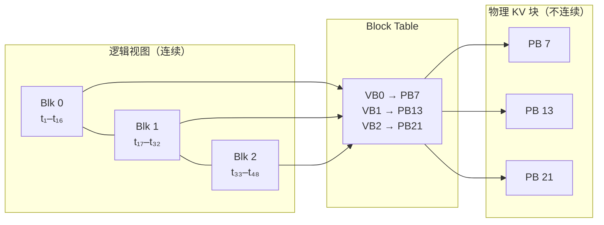

在 vLLM 中，每个物理块（Physical Block）存储固定数量 token 的 K 和 V 张量：

```python
# KV Cache 物理布局 (单层)
# shape: [num_physical_blocks, block_size, num_kv_heads, head_dim]
# 例: [2048 blocks, 16 tokens/block, 8 heads, 128 dim]
kv_cache = torch.zeros(num_blocks, block_size, num_kv_heads, head_dim,
                        dtype=torch.float16, device="cuda")
```

#### 源码解密：核心数据结构关系

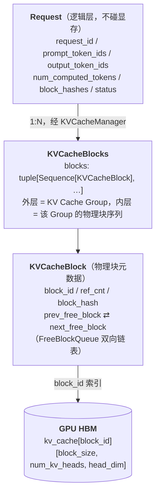

顺着箭头从上到下跟踪：Request 只是逻辑层，不直接触及 GPU 显存；KVCacheBlock 才是物理块的元数据，它同时挂在 Request 的 blocks 列表和 BlockPool 的 free/cached 列表里；block_id 最终索引到 GPU HBM 中的一片连续显存，里面放的是一整块 block_size 个 token 的 K 和 V。这三层映射是理解后面 Prefix Cache 复用和 Preemption 释放的基础。

> **回到我们的例子**：2050 个 prompt token，`block_size=16`，于是需要 `⌈2050/16⌉ = 129` 个块（前 128 块装满 2048 个 token，第 129 块只装 2 个）。生成完 300 个 token 后，序列长 2350，共占 **147 个块**。
>
> 注意一个巧合般的细节：**2000 个 token 的 system prompt 恰好是 125 个整块**。这不是偶然设计，但它揭示了 Prefix Cache 的一个硬约束——只有**装满**的块才会被缓存，所以可复用的边界永远对齐到 `block_size`。下一节就用这一点算账。

`BlockPool`（`vllm/v1/core/block_pool.py`）管理所有物理块的分配和回收，使用双向链表实现高效的 LRU 驱逐：

```python
# vllm/v1/core/block_pool.py (简化)
class BlockPool:
    def __init__(self, num_gpu_blocks: int, ...):
        self.num_gpu_blocks = num_gpu_blocks
        self.free_block_queue = FreeKVCacheBlockQueue(num_gpu_blocks)
        # Prefix Cache: hash → 物理块映射
        self.cached_block_hash_to_block = BlockHashToBlockMap()

    def get_new_blocks(self, num_blocks: int) -> list[KVCacheBlock]:
        """从空闲队列分配新块（如果不够，驱逐 LRU 缓存块）"""
        ...

    def free_blocks(self, blocks: Iterable[KVCacheBlock]):
        """ref_cnt--，归零则回收到空闲队列"""
        ...

    def cache_full_blocks(self, request, blocks, ...):
        """将满块的 hash 注册到 Prefix Cache"""
        ...
```

块分配的布局（引自 `allocate_slots()` 注释）：

```
  |<──── computed ────>|<─ new_computed ─>|<─ external ─>|<── new ──>|<─ lookahead ─>|
                                                          |<── to be computed ──────>|
                                          |<────────── to be allocated ──────>|
                                          |<────────── to be cached ──────────>|

  computed:      之前已缓存在 KV Cache 中的 tokens（Prefix Cache 命中）
  new_computed:  本轮新计算但已完成的 tokens
  external:      从远端传输的 KV 块（PD 分离场景）
  new:           需要本轮计算的新 tokens
  lookahead:     为 Speculative Decoding 预留的额外 tokens
```

这个布局也揭示了 Scheduler 为什么不能按请求类型硬分类。一轮迭代中一个请求可能同时覆盖 computed（prefix cache 命中）、new（需要新计算）和 lookahead（spec decode 预留），不同请求在这个轴上的位置各不相同。token 预算模型统一处理这些区间，而不是按"prefill 请求"和"decode 请求"分开。


### 5.2 KV Cache 的写入、读取与生命周期

上一节讲的是「块从哪来」，这一节讲「块怎么被用完再还回去」——一次请求从 Prefill 批量写入，到 Decode 逐 slot 追加，最后在完成或被抢占时归还，构成 KV Cache 的完整生命周期。

```
                     KV Cache 生命周期全景

  ┌─────── Prefill 阶段 ──────┐   ┌────── Decode 阶段 ──────┐
  │                            │   │                          │
  │  prompt tokens:            │   │  每步 1 个新 token:       │
  │  [t₁, t₂, ..., tₙ]       │   │  [tₙ₊₁], [tₙ₊₂], ...   │
  │       │                    │   │       │                  │
  │       ▼                    │   │       ▼                  │
  │  ┌─────────────────┐      │   │  ┌──────────┐           │
  │  │ 批量写入 KV     │      │   │  │ 增量追加  │           │
  │  │ Cache 块        │      │   │  │ 1 个 slot │           │
  │  │                 │      │   │  │           │           │
  │  │ Block 0: [t₁~t₁₆]│   │   │  │ Block 2:  │           │
  │  │ Block 1: [t₁₇~t₃₂]│  │   │  │ 追加 tₙ₊₁ │           │
  │  │ Block 2: [t₃₃~tₙ] │   │   │  └──────────┘           │
  │  └─────────────────┘      │   │                          │
  └────────────────────────────┘   └──────────────────────────┘

  ┌─────── Attention 读取 ──────────────────────────────────┐
  │                                                         │
  │  Block Table (虚拟→物理映射):                            │
  │  req_42 → [PhyBlock_7, PhyBlock_13, PhyBlock_21]       │
  │                                                         │
  │  Attention Kernel 通过 Block Table 索引读取:             │
  │  for each query position:                               │
  │    for each block in block_table[req]:                  │
  │      K_block = kv_cache[block_id, :, :key_heads, :]    │
  │      V_block = kv_cache[block_id, :, :val_heads, :]    │
  │      score += Q @ K_blockᵀ                              │
  │    attn_out = softmax(scores) @ V_blocks               │
  └─────────────────────────────────────────────────────────┘

  ┌─────── 生命周期终结 ────────────────────────────────────┐
  │                                                         │
  │  请求完成:                                               │
  │    Scheduler → KVCacheManager.free(request)             │
  │    → ref_cnt-- 对所有块                                  │
  │    → ref_cnt == 0 的块归还 free_block_queue              │
  │    → 有 block_hash 的块进入 LRU 缓存（Prefix Cache）     │
  │    → 无 hash 的块立即回收                                 │
  │                                                         │
  │  抢占:                                                   │
  │    → 释放所有块                                          │
  │    → num_computed_tokens = 0 （需从头重算）               │
  │    → 但 Prefix Cache 命中可跳过部分重算                   │
  └─────────────────────────────────────────────────────────┘
```

**① 写入**——两个阶段的写法完全不同：

| 阶段 | 写入方式 | 例子 |
|---|---|---|
| Prefill | 批量写入若干整块 | `Block 0: t₁~t₁₆`、`Block 1: t₁₇~t₃₂`、`Block 2: t₃₃~tₙ` |
| Decode | 每步增量追加 1 个 slot | `Block 2` 尾部追加 `tₙ₊₁`，写满了才要新块 |

**② 读取**——Attention Kernel 不认识"请求"，只认 Block Table：

```
Block Table:  req_42 → [PB_7, PB_13, PB_21]

for each query position:
    for block_id in block_table[req]:
        K_block = kv_cache[block_id, :, :key_heads, :]
        V_block = kv_cache[block_id, :, :val_heads, :]
        scores += Q @ K_blockᵀ
    attn_out = softmax(scores) @ V_blocks
```

**③ 归还**——这一步决定了块能不能被别人复用：

| 触发 | 动作 | 关键后果 |
|---|---|---|
| 请求完成 | `KVCacheManager.free(request)`：所有块 `ref_cnt--` | `ref_cnt == 0` 才真正归还 `free_block_queue` |
| ↳ 块有 `block_hash` | 进入 LRU 缓存 | **留给 Prefix Cache 复用** |
| ↳ 块无 hash（未写满） | 立即回收 | 无法复用 |
| 被抢占 | 释放所有块 + `num_computed_tokens = 0` | 需重算，但 Prefix Cache 命中可跳过大部分 |

注意倒数第二行：**块只有"写满"才会被缓存**。这解释了为什么 Prefix Cache 的命中粒度是 `block_size`，而不是单个 token。


### 5.3 KV Cache 还能更小吗：复用、压缩与分层存储

在进入具体手段之前，先立一个分层框架——**这三层解决的是完全不同的问题，不应该混为一谈**：

| 层级 | 手段 | 解决的问题 |
|------|------|-----------|
| 系统管理层 | PagedAttention、Prefix Cache | 已经要存这么多，**显存怎么管才不浪费** |
| 模型架构层 | MQA / GQA / MLA | **本来到底需要存多少** |
| 数值层 | FP8 / INT8 量化 | 每个 KV 元素**占几个字节** |

三者是正交的，可以叠加：MLA 减少了要存的量，PagedAttention 管理这些量的摆放，FP8 再把每个元素压小。下面按这个顺序展开。

#### 5.3.1 Prefix Cache：重复计算复用

在生产环境中，大量请求共享相同的 System Prompt（如 ChatGPT 的系统指令可能占 2000+ tokens）。Prefix Cache 的核心思想是：如果两个请求的前缀 token 完全相同，它们可以共享同一份 KV Cache 块。

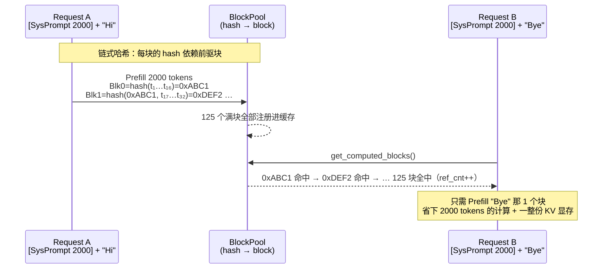

vLLM 使用链式哈希确保前缀匹配的正确性——每个块的哈希值依赖其前驱块的哈希，因此只有完全相同的前缀序列才会产生相同的哈希链。

> **回到我们的例子**：那 2000 token 的 system prompt 是 **125 个整块**。第一个请求跑完后它们全部进入缓存；**第二个请求带着同样的 system prompt 到来时，这 125 块全部命中**，只需要 prefill 用户那 50 个 token。
>
> 省下多少？按第 1.6 节的量算：
>
> - **计算**：2000 token 的 prefill 不用做了，TTFT 从约 92 ms 掉到 5 ms 量级
> - **显存**：这 125 块（约 625 MB 的 KV）在两个请求间**共享同一份物理块**，靠 `ref_cnt` 计数，不是复制
>
> 在真实的多租户服务里，system prompt 往往被成百上千个请求共享——这就是为什么 Prefix Cache 是性价比最高的优化之一。

```python
# vllm/v1/core/kv_cache_utils.py (签名照抄, 函数体简化)
def hash_block_tokens(
    hash_function: Callable[[Any], bytes],
    parent_block_hash: BlockHash | None,
    curr_block_token_ids: Sequence[int],
    extra_keys: tuple[Any, ...] | None = None,
) -> BlockHash:
    """链式哈希：当前块哈希 = f(前驱块哈希, 本块 token ids, 额外键)"""
    if not parent_block_hash:
        parent_block_hash = NONE_HASH  # 首块的哈希起点
    return BlockHash(
        hash_function((parent_block_hash, tuple(curr_block_token_ids), extra_keys))
    )
```

这个签名里有两个细节值得留意，它们不是实现噪音：

- **哈希函数是注入进来的，不是 Python 内建的 `hash()`**，返回值也是 bytes 而非 int（可选 `sha256_cbor`、`xxhash_cbor` 等）。因为块哈希要在多个 worker、甚至跨节点（PD 分离、LMCache）之间对得上，必须可控且可复现。
- **链条起点 `NONE_HASH` 默认是随机的。** `init_none_hash()` 在未设置 `PYTHONHASHSEED` 时取 `os.urandom(32)`，即每个进程一个随机起点；只有显式设置 `PYTHONHASHSEED` 才会变成确定值。这是一个刻意的安全默认：随机起点让块哈希无法被外部预测，避免跨租户的缓存探测；而想让多进程/多节点共享同一份 prefix cache，就必须放弃这个默认。**可复现性和不可预测性在这里是一对取舍**，vLLM 默认选了后者。
- **`extra_keys` 是隔离用的。** 同一串 token 在不同 LoRA adapter、不同多模态输入、不同 `cache_salt`、不同 prompt embeds 下不能复用同一份 KV，这些维度都由 `generate_block_hash_extra_keys()` 收集进 `extra_keys`。也就是说，"前缀相同"的判定比"token 序列相同"严格——这是 prefix cache 的正确性边界。

#### 5.3.2 GQA / MQA：模型结构级 KV Cache 瘦身

KV Cache 的大小与 KV head 数量成正比。Grouped-Query Attention (GQA) 和 Multi-Query Attention (MQA) 通过减少 KV head 数来缩减 KV Cache：

以 8 个 Query head 为例，三种变体的差别只在于**几个 Q head 共享一份 K/V**：

| 变体 | Q heads | K/V heads | 每 token 每层 KV 大小 | 相对 MHA |
|---|---|---|---|---|
| **MHA** | 8 | 8（一对一） | `2 × L × S × H × d` | 100% |
| **GQA** | 8 | 2~4（分组共享） | `2 × L × S × G × d` | 1/2 ~ 1/8 |
| **MQA** | 8 | 1（全部共享） | `2 × L × S × 1 × d` | 1/8 ~ 1/64 |

```
MHA   Q: [1][2][3][4][5][6][7][8]
      K: [1][2][3][4][5][6][7][8]      ← 一个 Q 配一个 K/V

GQA   Q: [1][2][3][4][5][6][7][8]
      K: [ G1  ][ G2  ][ G3  ][ G4 ]   ← 每 2 个 Q 共享一份

MQA   Q: [1][2][3][4][5][6][7][8]
      K: [        K1            ]      ← 全部 Q 共享一份
```

代价是表达能力：K/V head 越少，KV Cache 越小，但模型区分不同注意力模式的自由度也越低。GQA 是目前公认的甜点区——这也是为什么 Llama 3 全系都用 GQA。

| 模型 | 注意力类型 | num_heads | num_kv_heads | KV Cache 比例 |
|------|-----------|-----------|-------------|--------------|
| GPT-3 175B | MHA | 96 | 96 | 100% |
| Llama 3 70B | GQA | 64 | 8 | 12.5% |
| Llama 3 8B | GQA | 32 | 8 | 25% |
| Falcon 7B | MQA | 71 | 1 | 1.4% |
| DeepSeek V3 | MLA | 128 | - | ~2% (存 576 维 latent，非 128×128 的完整 KV) |

#### 5.3.3 MLA：从 KV Cache 到 Latent Cache

DeepSeek V2/V3 提出的 Multi-head Latent Attention (MLA) 是一种更激进的 KV Cache 压缩方案。它不存储完整的 K、V 张量，而是存储一个低维的 latent 向量：

| | 传统 MHA / GQA | MLA（DeepSeek） |
|---|---|---|
| 存的是什么 | `K [Hkv, d]` + `V [Hkv, d]` | `c_kv [kv_lora_rank]` + `k_pe [qk_rope_head_dim]` |
| 每 token 每层 | `2 × Hkv × d` bytes | `(kv_lora_rank + qk_rope_head_dim) × sizeof(dtype)` |
| 实例 | Llama-70B（GQA-8）：`2×8×128×2B` = **4 KB** | DeepSeek V3：`(512+64)×2B` ≈ **1.1 KB** |

MLA 的运作分两步——**存的时候压缩，用的时候还原**：

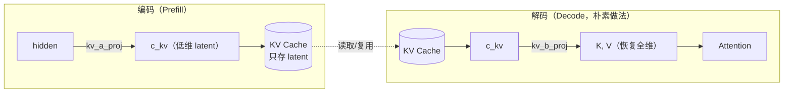

但朴素做法有个致命问题：**每一步 Decode 都要把全部历史 token 的 latent 解压回全维 K/V**，那省下的显存又变成了带宽开销。真正的关键优化叫 **"吸收"（Absorbing）**——把解压矩阵 `W_uk` 预先融合进 `W_q`，于是可以**直接在 latent 空间做 Attention，完全不解压**。这一手的工程细节留到第 7.4.1 节展开。

压缩效果：相比同规模 MHA 可缩减一个数量级以上；相比 Llama 式 GQA-8（4 KB/token/layer）约缩减 3~4x。

vLLM 中 MLA 的实现位于 `vllm/model_executor/layers/mla.py`，通过 `MLAAttentionSpec` 定义其特殊的 KV Cache 规格（存储 latent 而非完整 KV）。

#### 5.3.4 KV Cache Quantization：数值压缩与带宽优化

除了结构级的压缩（GQA/MQA/MLA），还可以通过数值量化进一步压缩 KV Cache：

| 格式 | 每元素 | 相对 FP16 | 精度影响 |
|---|---|---|---|
| FP32 | 4 bytes | 2.0× | 基准（训练精度） |
| FP16 / BF16 | 2 bytes | 1.0× | 标准推理精度 |
| **FP8 (E4M3)** | 1 byte | 0.5× | **轻微损失，实践中最安全的选择** |
| INT8 | 1 byte | 0.5× | 需要校准，按 head / channel 量化 |
| INT4 | 0.5 bytes | 0.25× | 显著损失，很少用于 KV Cache |

算一遍实际规模（Llama-70B、GQA-8、80 layers、seq_len=4096）：

| 场景 | 计算 | 结果 |
|---|---|---|
| 单请求 FP16 | 4 KB/token/layer × 4096 × 80 | 1.34 GB |
| 单请求 FP8 | 2 KB/token/layer × 4096 × 80 | 0.67 GB（省 50%） |
| **并发 8 路 FP16** | 1.34 GB × 8 | **10.7 GB** |

单请求看着不大，但注意最后一行：**KV Cache 是"并发数 × 上下文长度"的乘积**，这才是它压垮显存的方式。

量化粒度决定了精度与开销的平衡，scale 分得越细越准、但元数据越多：

| 粒度 | 含义 | 精度 |
|---|---|---|
| Per-tensor | 整个 KV Cache 共享 1 个 scale | 最差 |
| Per-token | 每个 token 一个 scale | 较好 |
| Per-head | 每个 head 一个 scale | 精细 |
| Per-channel | 每个 channel 一个 scale | 最优 |
| Per-group | 每 G 个元素共享 scale | 灵活折中 |

实现上分两个动作：**Quantize-on-write**（写入时即以低精度存储）和 **Dequantize-on-read**（读取时反量化，或直接在 attention kernel 内处理）。是否启用取决于模型、dtype、backend 与配置。

KV Cache 量化与 PagedAttention 在设计上可以组合：量化后的 KV 仍按 block 粒度管理，同时需要记录相应 scale 或格式元数据。具体是否支持、如何存储 scale、是否在 attention kernel 内完成反量化，取决于 v0.27.1 中对应模型、dtype 和 attention backend 的实现。

**注意**：Softmax 对 Key 的误差特别敏感（因为指数函数会放大误差），长上下文下量化误差可能累积。FP8 是实践中最安全的 KV Cache 量化格式。

#### 5.3.5 KV Cache Offloading 与 Swapping

当 GPU 显存不足时，vLLM 支持将 KV Cache 卸载到更低层的存储：

| 层级 | 容量 | 带宽 | 延迟 | 存什么 |
|---|---|---|---|---|
| **GPU HBM**（热） | 10–80 GB | 3.35 TB/s (H100) | ~ns | 活跃请求的 KV |
| **CPU DRAM**（温） | 256 GB–2 TB | ~200 GB/s | ~100 ns | 被抢占请求的 KV（经 PCIe Gen5，64 GB/s） |
| **NVMe SSD**（冷） | 1–16 TB | ~7 GB/s | ~10 μs | 长期前缀缓存（较新的方向） |

当 GPU 显存不够时，有三种应对策略，代价各不相同：

| 策略 | 做法 | 优点 | 缺点 |
|---|---|---|---|
| **Recomputation**（重算） | 直接释放 KV，恢复时从头算 | 无传输开销，不占 CPU 内存 | 浪费 GPU 算力 |
| **Swapping**（换出） | KV 块 GPU→CPU，恢复时回传 | 保留了已算结果 | 吃 PCIe 带宽 |
| **Quantization + Offload** | 量化后再换出 | 传输量减半 | 额外精度损失 |

vLLM V1 当前主要使用 **Recomputation** 策略（`_preempt_request()` 中将 `num_computed_tokens` 置零），因为在 Prefix Cache 存在的情况下，重算的实际成本远低于理论最坏情况——大部分前缀块仍在缓存中可复用。

<details markdown="1">
<summary><b>📂 本章源码导航</b></summary>

**KV Cache 与 PagedAttention**

| 想看什么 | 从哪开始 |
|---|---|
| **块的分配与释放（核心）** | `vllm/v1/core/kv_cache_manager.py` → `allocate_slots()` |
| 物理块池、LRU 驱逐、Prefix Cache 注册 | `vllm/v1/core/block_pool.py` |
| 块哈希、`extra_keys`、`NONE_HASH` | `vllm/v1/core/kv_cache_utils.py` → `hash_block_tokens()` |
| 各类 KV Cache 规格（含 MLA） | `vllm/v1/kv_cache_interface.py` |
| MLA 层实现 | `vllm/model_executor/layers/mla.py` |
| KV 量化 | `vllm/model_executor/layers/quantization/` |

</details>


## 六、GPU 执行：如何让每个 Token 算得更快？

上一章决定了"这一轮算哪些 token"，这一章的问题是：**这些已经确定要算的 token，怎么算得更快。**


Decode 偏 memory-bound、Prefill 偏 compute-bound，但落到 GPU 上，浪费其实只有四种形态：

| 浪费形态 | 症状 | 对策 | 
|---|---|---|
| GPU 在**等 CPU 发指令** | kernel 之间有气泡 | CUDA Graph | 
| GPU 在**等 HBM 送数据** | 算力闲置、访存打满 | FlashAttention、算子融合 | 
| 搬的**每个数太胖** | 带宽被低信息密度的数据占满 | FP8 / INT8 / INT4 量化 | 
| **轮次本身太多** | 每轮只产出 1 个 token | 投机解码 | 


> **回到我们的例子**（Llama-3-70B、8×H100、TP=8）：每张卡持有 17.6 GB 权重，H100 HBM 带宽 3.35 TB/s，于是**一次 decode 的权重读取下界约 5.3 ms**；加上 KV 读取、80 层 × 2 次 All-Reduce 和 kernel 开销，实测一步大约在 10 ms 量级。
>
> 那么这个请求的账就清楚了：
>
> | 环节 | 估算 | 占比 |
> |---|---|---|
> | Prefill 2050 token | ≈ 92 ms（8×H100 稠密算力 7.9 PFLOPS，按 40% MFU 估） | 3% |
> | Decode 300 步 | 300 × 10 ms ≈ **3000 ms** | **97%** |
> | E2E | ≈ 3.1 s | |
>
> **看清楚这个 3% vs 97%**：TTFT 只有 92 ms，而 97% 的时间花在那 300 次逐 token 的 decode 上。这解释了本章为什么把绝大部分篇幅给了 Decode 侧的优化——Prefill 再快一倍，端到端也只省 3%。

### 6.1 GPU 为什么在空转？—— Kernel Launch 与 CUDA Graph

第一种浪费最反直觉：**GPU 并不慢，它只是在排队等 CPU 告诉它下一步做什么。** 这个问题在 Prefill 阶段几乎看不见（单个 kernel 算得久，提交开销被淹没），却会在 Decode 阶段被放大——因为 Decode 每步的计算量太小了。

#### 6.1.1 痛点：Kernel Launch Overhead

在 Decode 阶段，每步模型 Forward 要启动**数百到上千个** CUDA Kernel，而每个 Kernel 的实际 GPU 计算时间可能只有几十微秒。数量之所以这么多，是因为它是**逐层累乘**的：以 80 层的 Llama-3-70B 为例，单层就有 RMSNorm ×2、QKV Proj、RoPE、Attention、O Proj、MLP 的三个 GEMM 与激活，TP=8 下还要再加 2 次 All-Reduce——十几个 kernel × 80 层，一步下来轻松上千。32 层的 7B 也在数百这个量级。

这里要先破除一个常见的误解：**kernel launch 本身是异步的，CPU 提交完就返回，并不会傻等 GPU 算完。** 正常情况下 CPU 会一路往前提交，把 GPU 的任务队列填满，提交开销完全隐藏在 GPU 执行时间背后。所以真正的成立条件只有一个：

> **当单个 kernel 的 GPU 执行时间 < CPU 提交它所需的时间时，GPU 就会追上 CPU，队列被抽干，开始出现气泡。**

这就解释了为什么 CUDA Graph 基本只对 Decode 有意义：Prefill 的 kernel 动辄跑几百微秒，CPU 那点提交开销（现代 CUDA 通常 2–5 μs 量级）根本追不上；而 Decode 阶段充斥着大量只需要 1.5μs 的细碎 Kernel，几十个这样的小 Kernel 排下来，CPU 异步发射的速度就成了拖后腿的那一方。

下图画的正是这种队列被抽干、算力不饱和的最坏情形（Launch-Bound 状态）——注意它不是常态，而是 Decode 小 kernel 场景下才会退化成的样子：

```
┌───────────────── 无 CUDA Graph: Decode 阶段的 Launch-Bound 气泡 ──────────────────┐
│                                                                                   │
│  CPU (Host Thread):                                                               │
│  ───[Launch K1]───[Launch K2]───[Launch K3]───[Launch K4]─── ... (全力发射)        │
│        4μs           4μs           4μs           4μs                              │
│         │             │             │             │                               │
│         ▼ (命令入队)  ▼             ▼             ▼                               │
│  GPU (Hardware):                                                                  │
│  ───[ Kernel 1 ]─[气泡]─[ Kernel 2 ]─[气泡]─[ Kernel 3 ]─[气泡]─ ...              │
│        1.5μs      2.5μs    1.5μs      2.5μs    1.5μs      2.5μs                   │
│                                                                                   │
│  【现象剖析】：                                                                   │
│  1. 时刻 0，CPU 开始提交 K1。                                                      │
│  2. 时刻 4，CPU 提交完 K1 并「立刻」开始提交 K2。同一时间，GPU 拿到 K1 开始执行。          │
│  3. 时刻 5.5，GPU 仅用 1.5μs 就把 K1 算完了！此时 GPU 检查队列，发现 K2 还没提交完。      │
│  4. 结果：GPU 只能被迫原地熄火，陷入 2.5μs 的「空闲气泡」，直到时刻 8 CPU 提交完 K2。      │
│                                                                                   │
│  【开销占比】：                                                                   │
│  若一步包含 400 个小 Kernel，CPU 耗时 = 400 × 4μs = 1600μs (总发射耗时)               │
│  因为 GPU 速度快于 CPU，整个流水线被 CPU 强行拉长。最终总耗时将由 CPU 侧决定：             │
│  总执行时间 ≈ 1600μs。其中 GPU 真正干活 600μs (37.5%)，卡死在气泡中 1000μs     (62.5%)。│
└───────────────────────────────────────────────────────────────────────────────────┘

```

#### 6.1.2 CUDA Graph：静态执行图捕获与重放

为了消灭上述图中高达 62.5% 的恐怖气泡，CUDA Graph 改变了游戏规则。它在模型初始化或第一轮时将一系列 Kernel Launch 录制成一个"计算图"，之后用一次 Launch 重放整个图：

```
┌───────── CUDA Graph: 一次 Launch 重放整个 Decode 步 ─────────────────┐
│                                                                       │
│  Capture 阶段 (启动时一次性完成):                                       │
│  ─[record start]─[kernel₁]─[kernel₂]─...─[kernelₙ]─[record end]─   │
│  → 得到 CUDAGraph 对象, 记录了全部 kernel 及其参数地址                  │
│                                                                       │
│  Replay 阶段 (每步推理):                                               │
│  CPU: ──[replay: 1次launch, ~10μs]────────────────────────────────   │
│  GPU: ──[kernel₁][kernel₂][kernel₃]...[kernelₙ]──  (无 gap!)         │
│         连续执行，kernel 之间无 launch 等待                             │
│                                                                       │
│  总执行 = 10μs(1次launch) + ~8000μs(compute) = 8010μs               │
│  vs 上面完全暴露时的 10000μs → 上界省 20%                              │
│  实测通常在 5%~15%（部分提交开销本来就被隐藏了）                        │
│                                                                       │
│  约束:                                                                 │
│  · 图中 kernel 的形状必须固定 → 需要对不同 Batch Size 预捕获           │
│  · 内存地址必须固定 → 通过 placeholder tensor 复用                     │
│  · 不支持动态控制流 → Decode (固定模式) 适用, Prefill (可变) 不适用     │
└───────────────────────────────────────────────────────────────────────┘
```

捕获与重放由 `CudaGraphManager`（`vllm/v1/worker/gpu/cudagraph_utils.py`）负责，而"用哪种模式"由配置枚举 `CUDAGraphMode`（`vllm/config/compilation.py`）描述：

```python
# vllm/config/compilation.py
class CUDAGraphMode(enum.Enum):
    NONE = 0                        # 全程 Eager
    PIECEWISE = 1                   # 分段录制（处理动态部分）
    FULL = 2                        # 完整模型 Forward 录制为一个大图
    FULL_DECODE_ONLY = (FULL, NONE)       # decode 走 FULL, mixed batch 走 Eager
    FULL_AND_PIECEWISE = (FULL, PIECEWISE)  # decode 走 FULL, mixed batch 走 PIECEWISE
```

| 模式名称 | 技术机制与核心策略 | 性能表现（Decode / Mixed Batch） | 显存开销 | 工业界应用现状 |
|---|---|---|---|---|
| NONE | 全程 Eager 模式 CPU 实时解析并逐个发射 CUDA Kernel。 | 差（CPU发射瓶颈，气泡多） 一般（Prefill 可掩盖部分延迟） | 无 | 已淘汰 / 仅调试 仅用于底层算子开发调试或多模态超大输入排错。 |
| PIECEWISE | 分段录制模式 固定形状层录为小图，动态算子（如Attention）走 Eager。 | 良好（消灭大部分非 Attention 层气泡） 良好（动态算子外置，天然兼容混批） | 中等 | 自研/定制框架 多用于模型包含非标准、无法完整录图的自定义算子场景。 |
| FULL | 完整模型单图录制 Forward 整体录制为单个无法拆分的超级宏 Kernel。 | 极致（消除 100% 气泡，达硬件极限） 无法运行（形状一变立即崩溃） | 低至中等 | 离线批处理与跑分 用于离线大批量固定格式处理（如Embedding提取）与静态 BenchMark。 |
| FULL_DECODE_ONLY | 双轨动态切换 纯 Decode 走 FULL 图；混入 Prefill 自动降级至 NONE（Eager）。 | 极致（纯生成阶段拿满无气泡性能） 一般（Prefill 虽走 Eager 但受图影响小） | 中等（需针对常用 BS 做多桶捕获） | 商业推理引擎首选（如 vLLM / TRT-LLM） 工业界最主流的线上部署策略，兼顾极高吞吐与 Continuous Batching 稳定性。 |
| FULL_AND_PIECEWISE | 混合双轨优化 纯 Decode 走 FULL 大图；混入 Prefill 切换至 PIECEWISE 分段图。 | 极致（纯生成阶段性能达到硬件极限） 优秀（混批下固定层依然享受图加速） | 高（需常驻多套不同形态的多桶图） | 大厂尖端自研内核 属于头部大厂魔改推理框架的进阶方案，针对极高并发、追求极致长尾延迟（P99）的终极生产环境。 |

从当前工业界的最新演进来看，随着 PD 分离架构（Prefill-Decode Separation） 逐渐成为大厂的主流选择，上述模式的落地有了更清晰的物理边界：

* Decode 节点：由于完全剥离了 Prefill，输入形态被高度固化，大面积直接采用 FULL 模式或高密度的 FULL_DECODE_ONLY 榨干算力。
* Prefill 节点：由于需要应对 Chunked Prefill 等高度动态的形状变化，更多采用 PIECEWISE 或直接处于 NONE 状态以确保绝对稳定。 

### 6.2 数据为什么搬不动？—— 压缩 HBM 流量

第二种浪费才是大头。GPU 的算力增长速度远快于显存带宽，于是绝大多数推理 kernel 的真实瓶颈都不是"算不完"，而是"数据喂不上"。

这一节的三种手段看起来毫不相干——换 Attention 实现、融合算子、挑后端——但它们优化的是**同一个量**：

> **HBM 流量 = 搬运次数 × 每次搬运的数据量。**

FlashAttention 和 Kernel Fusion 减少的是"搬运次数"（别让中间结果落地再读回来），下一节的量化减少的是"每次搬多少字节"。

#### 6.2.1 Attention 后端与动态算子路由

Attention 算子的硬件执行效率高度依赖于工作负载（Workload）形态、硬件架构及数据类型（dtype）。vLLM 在 vllm/v1/attention/backends/ 下集成了数十种 Attention 后端，并在 registry.py 中通过 Selector 机制，根据 Head Size、dtype、硬件算力以及运行时特征（Prefill / Decode / Mixed / MLA）进行动态算子路由（Kernel Selection）。

其核心后端生态及工业界典型的推荐基准（Benchmark Prefs）划分如下：

* FlashInfer (flashinfer.py)：默认的通用全能型后端。得益于对 Ragged Batch、PagedAttention 以及 Prefill+Decode 混合批次的深度汇编级优化，在 Decode 及 Mixed 场景下吞吐领先。
* FlashAttention (flash_attn.py)：NVIDIA 生态的经典基准。在纯 Prefill 场景下对长 Query 具备极佳的矩阵乘法吞吐表现，并包含 flash_attn_diffkv 等衍生变体。
* MLA 特化后端 (mla/)：针对 DeepSeek 等模型的低秩 KV 压缩（MLA）进行算子融合与内存重排优化。包含 FlashInfer MLA、FlashMLA、CUTLASS MLA、Triton MLA 及 ROCm 架构下的 AITER Triton MLA。
* Triton / FlexAttention (triton_attn.py, flex_attention.py)：高可定制化后端。利用高级语言抽象，便于跨硬件平台快速移植、验证或进行非标的自定义 Mask/Attention 研发。
* 硬件特化与非标后端：包含 AMD 生态的 ROCm 系列（rocm_attn.py 等）、CPU 降级后端，以及适配 Mamba、Linear Attention 等非 Transformer 架构的专用算子。

**TIPS：** 业界没有绝对通用的默认后端，算子路由强绑定于具体的 vLLM 版本与底层硬件。在生产环境上线或变更 workload 形态（如从单轮 QA 转向超长多轮对话）前，必须基于目标硬件进行针对性的端到端压力测试（Profile & Benchmark）。


#### 6.2.2 FlashAttention：Tiling 与 Online-Softmax

FlashAttention 是现代 LLM 推理的基石算子。它的核心思想是通过**分块计算（Tiling）**和 **Online Softmax**，让 N×N 的中间矩阵**根本不必在 HBM 里出现**。注意它优化的是**访存**，计算量（FLOPs）一分没少。


```
┌──────────────── Standard Attention vs FlashAttention ─────────────────┐
│                                                                       │
│  Standard Attention:                                                  │
│                                                                       │
│  Q[N,d] × K[N,d]ᵀ → S[N,N]     ← O(N²) 存储, 写入 HBM                  │
│        → softmax(S) → P[N,N]    ← O(N²) 存储, 读写 HBM                 │
│        → P × V[N,d] → O[N,d]    ← O(N²) 读取 HBM                       │
│                                                                       │
│  总 HBM 访问: O(N² + N·d)                                             │
│  瓶颈: N > 几千时, S 和 P 矩阵占满显存                                   │
│                                                                       │
│  ────────────────────────────────────────────────────────────────     │
│                                                                       │
│  FlashAttention (Tiling + Online Softmax):                            │
│                                                                       │
│  将 Q, K, V 分成 Bq × Bk 的小块:                                        │
│                                                                       │
│  ┌──────┐                                                             │
│  │ SRAM │ ← 只在片上缓存 (192 KB, A100)                                 │
│  │      │                                                             │
│  │ Q_tile [Bq, d]  ← 从 HBM 加载一次                                   │
│  │ K_tile [Bk, d]  ← 分块加载                                          │
│  │ V_tile [Bk, d]  ← 分块加载                                          │
│  │ S_tile [Bq, Bk] ← 在 SRAM 中计算, 不写回 HBM!                        │
│  │ O_acc  [Bq, d]  ← 在线累加                                          │
│  │ m, l   [Bq]     ← softmax 统计量 (max, sum)                         │
│  └──────┘                                                             │
│                                                                       │
│  for each K_tile, V_tile:                                             │
│    S_tile = Q_tile @ K_tileᵀ                (SRAM 内计算)              │
│    m_new = max(m_old, rowmax(S_tile))       (Online max)              │
│    P_tile = exp(S_tile - m_new)             (SRAM 内计算)              │
│    l_new = exp(m_old - m_new) * l_old + rowsum(P_tile)                │
│    O_acc = rescale(O_acc) + P_tile @ V_tile (Online 累加)              │
│                                                                       │
│  总 HBM 访问: O(N²d²/M)（`M`为可用SRAM大小） ← 相比 O(N²) 大幅降低!        ｜                  │
│  无需存储 N×N 矩阵, 序列长度不再受显存限制                                 │
└───────────────────────────────────────────────────────────────────────┘
```

**说明：**

- 标准注意力会显式生成两个 N×N 大矩阵，显存和带宽压力都很大。
- FlashAttention 不保存完整中间矩阵，而是把计算拆成小块，在片上完成并立即复用。
- 它的目标不是减少 FLOPs，而是减少 HBM 读写。

##### 1、为什么 Standard Attention 会卡显存？

Standard Attention的问题在于它把两个 N×N 的大矩阵实实在在地写进了 HBM：

```
Q[N,d] × K[N,d]^T  ->  S[N,N]                # O(N²) **写入** HBM
S[N,N]             ->  softmax  ->  P[N,N]   # O(N²) **读 + 写** HBM 
P[N,N] × V[N,d]    ->  O[N,d]                # O(N²) **读取** HBM

HBM 中的代价：
- S：要写回一次
- S：softmax 前要再读一次
- P：要写回一次
- P：乘 V 前要再读一次
```

总 HBM 访问 **O(N·d + N²)**，其中 N² 项的系数是 4（S 写、S 读、P 写、P 读）。更要命的是显存：N 到几千时，S、P 两个矩阵就能把显存占满。

**说明：**

- 问题不只是矩阵大，而是它们必须在 HBM 里“来回搬运”
- 当序列长度变大时，N² 级别的中间结果会迅速成为瓶颈
- 所以标准注意力的主要痛点是访存和显存，不是算力

##### 2、FlashAttention 的 Tiling 思路

FlashAttention 把 Q/K/V 切成 `Bq × Bk` 的小块，让中间结果**只在片上 SRAM 里出现，从不落回 HBM**（A100 每个 SM 的 L1/shared 合计 192 KB，可作 shared memory 的约 164 KB）：

```
Q 被切成 Q_tile
K、V 被切成 K_tile / V_tile

             ┌──────── SRAM / Shared Memory ──────────┐
HBM -> Q_tile ┤                                        ├-> 输出 (O_acc)
HBM -> K_tile ┤  S_tile = Q_tile @ K_tile^T           ├
HBM -> V_tile ┤  Online Softmax(S_tile):              ├
              ┤     维护m, l运行时统计量，O_acc在线累加   ├
              └───────────────────────────────────────┘
              
说明：
- 每次只处理一小块 Q/K/V
- S_tile 只在片上临时存在，不写回 HBM
- 这样可以把大矩阵的“中间停留”从显存中拿掉
```

| 驻留在 SRAM 的东西 | 形状 | 说明 |
|---|---|---|
| `Q_tile` | `[Bq, d]` | 从 HBM 加载 |
| `K_tile` / `V_tile` | `[Bk, d]` | 分块循环加载 |
| `S_tile` | `[Bq, Bk]` | **在 SRAM 中算完就用掉，不写回** |
| `O_acc` | `[Bq, d]` | 在线累加的输出 |
| `m, l` | `[Bq]` | softmax 的运行时统计量（行最大值、指数和） |

##### 3、Online Softmax 是怎么“边算边归一化”的

FlashAttention能够运转的关键在于**Online Softmax**，它让 softmax 不需要先看到整行就能开始累加。

softmax 看起来需要先知道一整行的最大值和总和，才能归一化。这似乎意味着必须先把完整的 S[N,N] 算出来。但 FlashAttention 用了 Online Softmax，允许它在分块过程中动态维护：

- m：当前最大值
- l：指数和
- O_acc：输出累加结果

当新块到来时，如果发现最大值变了，就把历史结果按比例重新缩放，再把新块的贡献加进去。
这样就能保证：**分块计算的结果，和一次性算完整 softmax 的结果严格等价。**

```
m, l, O_acc = -inf, 0, 0
for each K_tile, V_tile:                               # 沿 KV 方向循环
    S_tile = Q_tile @ K_tileᵀ                          # SRAM 内，不写回
    m_new  = max(m, rowmax(S_tile))                    # 滚动更新行最大值
    P_tile = exp(S_tile - m_new)                       # SRAM 内
    l      = exp(m - m_new) * l + rowsum(P_tile)       # 修正旧的指数和
    O_acc  = exp(m - m_new) * O_acc + P_tile @ V_tile  # 同一个系数修正旧的累加结果
    m      = m_new
O = O_acc / l                                          # 整个循环结束才做这一次除法
```

每来一个新块，就用 `exp(m_old - m_new)` 把此前累加的结果**追溯性地缩放一次**，因此它与"先看完整行再 softmax"在数学上**严格等价**，不是近似。注意归一化的除法被推迟到了循环之外——这是它能一边扫一边累加的前提。

##### 4、FlashAttention 到底省了什么？

FlashAttention 的收益主要体现在两方面：

**显存：O(N²) → O(N)**
标准 Attention 需要显式保存 S[N,N] 和 P[N,N]，所以额外显存是 O(N²)。
FlashAttention 只保存当前 tile 和少量统计量，因此额外显存降到 O(N) 级别。

**访存（带宽）：O(N²) → O(N²d²/M)**
标准 Attention 里，中间矩阵要在 HBM 里反复读写。
FlashAttention 把大部分中间计算压到片上内存完成，显著降低 HBM 访问压力。

但是需要注意的是，FlashAttention 并没有把 HBM 访问从 O(N²) 降到 O(N·d)。论文给出的 IO 复杂度是 **O(N²d²/M)**（`M` 为可用 SRAM 大小）——**N² 这一项消不掉**，因为循环要沿一个方向走 `N/B` 次，每一次都得把另一侧的 tile 重新从 HBM 过一遍。它真正做的是把 N² 项的**系数**从 4 压到 `d²/M` 量级。

**但要注意，计算复杂度并没有任何改变**
FlashAttention 并没有把注意力从 O(N²) 变成 O(N)。
它优化的是 IO 和显存占用，不是注意力本身的二次结构。

**对比 & 总结**

| 特性 | Standard Attention | FlashAttention |
|------|-------------------|----------------|
| HBM 访问 | O(N·d + N²) | **O(N²d²/M)** |
| 额外显存 | **O(N²)**（必须物化 S、P） | **O(N)**（只留 `m`、`l`） |
| 最大序列长度 | 受 N² 显存约束 | 不再受 N² 显存约束 |
| IO 效率 | 低（中间矩阵 HBM 往返） | 高（tile 在 SRAM 内复用） |
| 实现复杂度 | 简单 | 高（需要手写 CUDA kernel） |

**FlashAttention 在显存上是渐进式的胜利（O(N²) → O(N)，这条无条件成立），在带宽上拿到的是一个常数倍的胜利**——倍数约为 `M/d²`，`d` 越小、SRAM 越大越划算。实测 2~4× 的加速也不只来自访存量本身，还来自少了一趟独立的 softmax kernel、以及不再被 N² 显存卡住 batch。

##### 5、训练和推理中的差异

FlashAttention 在训练和推理中的作用并不完全相同。

- **训练时**，反向传播需要依赖注意力计算中的一些中间信息。  
  但 FlashAttention 为了节省显存，不会把完整的 `S` 和 `P` 中间矩阵保存下来。  
  因此在反向阶段，通常需要通过**重算（recompute）**来恢复这些信息，再继续求梯度。  
  也就是说，训练阶段的核心特点是 **“用计算换显存”**。

- **推理时**，模型只需要做前向计算，不需要反向传播。  
  这意味着中间结果不必长期保留，也不会带来额外的重算代价。  
  所以 FlashAttention 在推理阶段通常表现为**纯收益**：既降低显存占用，又减少访存压力。

##### 6、Serving 场景下的 Decode 优化：从 FlashAttention 到 Flash-Decoding

在 Serving 场景里，FlashAttention 的收益不只取决于计算复杂度，更取决于**GPU 是否能被有效填满**。它的核心优势来自 query 方向上有足够多的行可以切块复用；但在 **Decode** 阶段，`query_len = 1`，因此 `Bq` 只能取 1，query 方向根本切不动。此时 kernel 会退化成对一长串历史 KV 的单行扫描，SM 大量空转，原本依赖 tiling 的效率优势也会明显减弱。

Decode 侧的办法不是继续沿 query 切，而是**把切分方向换到 KV 维度**：通过 **split-K / Flash-Decoding**，让多个 SM 各自处理一段历史 KV，先得到局部的注意力结果，再使用和 FlashAttention 完全一致的 `m`、`l` 在线 rescale 规则把这些局部结果合并起来。vLLM 中的 FlashInfer / paged decode kernel 走的就是这条路线，这也是上一节的 selector 需要根据 workload 形态做分派的原因。

更进一步看，**“分块计算 + 在线累加”** 其实是同一个数学技巧在不同硬件层级上的重复出现，只是切分边界不同：

| 切分位置 | 沿什么方向切 | 方案 | 
|---|---|---|
| SRAM ↔ HBM | query | FlashAttention | 
| SM ↔ SM | KV | Flash-Decoding / split-KV |
| GPU ↔ GPU | 序列 | Ring Attention | 

因此，在 Serving 场景中，FlashAttention 的关键不再只是“能不能把 attention 算得更省”，而是“在当前 workload 形态下，应该沿哪一维切块、在哪一层级做合并”。这也是为什么 Prefill、Decode、跨 GPU 长序列分别对应 FlashAttention、Flash-Decoding 和 Ring Attention。

##### 7、版本演进与优化方向

FlashAttention 后续版本主要是在同一套数学核心上继续做工程优化，而不是改变算法本质。

- **FlashAttention-2**
重点提升了 GPU 并行效率，把并行维度进一步扩展到序列方向，同时减少了非矩阵乘法指令的开销。

- **FlashAttention-3**
针对 Hopper 架构做了更进一步的优化，引入了 warp specialization，并支持 FP8 等更高效的低精度计算。

不过，无论是最初版本还是后续版本，FlashAttention 的核心思想都没有变：
**通过分块计算（Tiling）和在线归一化（Online Softmax），在保持结果等价的前提下，大幅降低注意力计算的显存和访存开销。**

#### 6.2.3 Kernel Fusion 

Kernel Fusion 的核心目标，是**把原本多个相邻的算子合并到一个 kernel 里执行**，从而减少中间结果的读写开销，降低 kernel launch 次数，并提升整体吞吐效率。对于大模型推理而言，很多算子本身的计算量并不大，但它们之间频繁地在 HBM 中读写中间 tensor，会让性能很快受限于显存带宽而不是算力。因此，Kernel Fusion 本质上是在做一件和 FlashAttention 非常相似的事情：**尽量让中间结果不落到 HBM，而是在片上完成连续计算。**

##### 1、Kernel Fusion 的动机与收益

在传统的未融合实现中，一个算子链通常会被拆成多个独立 kernel。例如以 `RMSNorm → RoPE → Residual` 为例：

| | 未融合（3 个独立 kernel） | 融合后（1 个 kernel） |
|---|---|---|
| 执行 | RMSNorm 读 x 写 temp₁ → RoPE 读 temp₁ 写 temp₂ → Residual 读 temp₂ 写 out | 读 x 一次 → norm → RoPE → 加 residual → 写 out 一次 |
| HBM 访问 | **6 次**（3 读 + 3 写） | **2 次**（1 读 + 1 写） |
| 中间 tensor | 2 个 | **0 个** |
| kernel launch | 3 次 | 1 次 |

可以看到，未融合版本的问题并不只是“多了几个算子”，而是每个算子之间都要把中间结果写回 HBM，再从 HBM 读出来继续处理。这种反复搬运数据的方式，会显著放大显存带宽压力。相比之下，融合后的 kernel 直接在一次执行过程中完成多个连续操作，只在最开始读取输入、最后写出结果，中间过程尽量留在寄存器或共享内存中，从而大幅减少内存访问。

Kernel Fusion优化带来的收益主要有三类：

1. **减少 HBM 访问**
中间 tensor 不再频繁写回显存，显著降低带宽开销。
2. **减少 kernel launch 开销**
多个小 kernel 合并成一个后，可以减少 launch 次数和调度开销。
3. **提升整体吞吐效率**
对推理场景来说，尤其是 decode 阶段，很多算子都偏轻量，launch 和访存的开销占比很高，融合后的收益往往非常明显。

注意这个收益的来源和 FlashAttention 完全一致——**都是不让中间结果去 HBM 兜一圈**，只不过 FlashAttention 作用在一个算子内部，Kernel Fusion 作用在多个算子之间。

##### 2、vLLM 中的 Kernel Fusion 实践

在 vLLM 中，Kernel Fusion 已经被广泛用于推理链路的多个环节，尤其集中在 `csrc/libtorch_stable/` 下的 CUDA 实现中，目标就是尽可能把高频、低算力密度但高访存代价的操作合并执行。下面这些算子就是比较典型的例子：

| 融合算子 | 涉及操作 | 实现位置 | 收益 |
|----------|---------|---------|------|
| Fused RMSNorm | RMSNorm + Residual Add | `csrc/libtorch_stable/layernorm_kernels.cu` | 减少 1 次 HBM 读写 |
| Fused RMSNorm + Quant | RMSNorm + 动态 per-token 量化 | `csrc/libtorch_stable/layernorm_quant_kernels.cu` | 归一化后直接出低精度 |
| Fused RoPE | RoPE + Permute | `csrc/libtorch_stable/pos_encoding_kernels.cu` | 减少中间 tensor |
| Fused QKV | Q/K/V 三个矩阵乘合并 | PyTorch/cuBLAS | 1 次 GEMM 替代 3 次 |
| Fused Attention | softmax(QK/√d)V + KV Cache R/W | FlashAttention kernel | 核心融合 |
| Fused Gate-Up | gate_proj + up_proj + SiLU | cuBLAS + activation | 减少中间存储 |
| Fused Sampling | top-k + top-p + temperature | `csrc/libtorch_stable/sampler.cu` | GPU 端采样 |
| Fused KV Cache | Cache write + 量化 | `csrc/libtorch_stable/cache_kernels_fused.cu` | 写入时即量化 |

这些融合算子覆盖了推理过程中的几个关键环节：

* 归一化阶段：如 RMSNorm 与 Residual 的融合，减少前后张量搬运；
* 位置编码阶段：如 RoPE 与维度重排的融合，避免生成临时 tensor；
* 线性投影阶段：如 QKV 合并计算，减少重复访存和 launch；
* 注意力阶段：如 FlashAttention，将 softmax 和矩阵乘法尽量做成一个高效流程；
* 采样阶段：如 top-k/top-p/temperature 一体化，减少生成端的额外开销；
* 缓存阶段：如 KV Cache 写入与量化融合，降低显存占用并提高写入效率。

可以看到，vLLM 的融合并不局限于某一个单点优化，而是围绕整个推理链路进行系统性的改造。其思路是：凡是存在“中间结果写回 HBM 再继续处理”的地方，都尽量尝试融合。

##### 3、小结

Kernel Fusion 和 FlashAttention 的共同点在于，它们都在解决同一个根本问题：
**把本可以在片上连续完成的计算，尽量压缩成一次执行，避免中间结果落到 HBM。**

如果说 FlashAttention 是注意力内部的“算子内融合”，那么 Kernel Fusion 则更像是推理系统层面的“算子间融合”。二者结合起来，最终目标都是：

* 少读少写
* 少 launch
* 少中间 tensor
* 更高吞吐、更低延迟

### 6.3 能不能少搬几个字节？—— 低精度推理

上一节在减少搬运**次数**，这一节换个方向：让每次搬运的**数据本身变小**。两者正交，可以叠加。

#### 6.3.1 推理量化的对象、收益与代价

| | 权重 (W) | 激活 (A) | KV Cache |
|---|---|---|---|
| 生命周期 | 常驻 GPU，占比最大 | 动态生成，逐层计算 | 动态增长，随序列膨胀 |
| 量化收益 | 减少显存、加速推理 | 加速 GEMM、减少带宽 | 更多并发、更长上下文 |
| 典型方法 | GPTQ / AWQ / W4A16 | W8A8 / FP8、per-token | FP8 / INT8、per-head |

三种量化对象不是均匀受益的。权重量化同时降低显存和 Decode 带宽压力，因为 Decode 每步都要读权重；KV Cache 量化主要受益于 Decode 的历史 KV 读取和并发数；激活量化则更直接加速 Prefill 的 GEMM。选择方案前需要先判断瓶颈在 Prefill 还是 Decode。

#### 6.3.2 权重量化方法

| 方法 | 格式 | 原理 | 量化时机 | 精度 |
|------|------|------|---------|------|
| **GPTQ** | W4A16 | 基于 Hessian 的逐层最优量化 | 离线（需校准数据） | 好 |
| **AWQ** | W4A16 | 保护显著权重通道 | 离线（需校准数据） | 更好 |
| **SmoothQuant** | W8A8 | 将激活难度转移到权重 | 离线 | 好 |
| **FP8** | W8A8 | 硬件原生 FP8 格式 | 在线/离线 | 接近 FP16 |
| **Weight-only** | W4A16/W8A16 | 只量化权重，激活保持 FP16 | 离线 | 较好 |

以 Llama-70B 为例：

| 格式 | 权重大小 | Decode 加速 | 精度损失 |
|---|---|---|---|
| FP16 | 140 GB | 1.0×（基准） | 基准 |
| FP8 (W8A8) | 70 GB | 1.5–2.0× | 极小 |
| INT8 (W8A8) | 70 GB | 1.5–2.0× | 小 |
| INT4 (W4A16) | 35 GB | 1.8–2.5× | 中等 |

Decode 之所以能加速，有三个叠加的原因：

1. **权重从 HBM 加载的带宽直接减半**——回到 10.5 节那笔账，batch=1 时权重读取就是 decode 耗时的大头，砍掉一半立竿见影；
2. INT4 / FP8 GEMM 能用上 Tensor Core 的特殊指令，算力更高；
3. 模型变小后可能用更少的卡装下，**连通信开销一起省了**。

#### 6.3.3 FP8 推理

FP8 是 H100/H200 引入的硬件原生低精度格式，vLLM 通过 `vllm/model_executor/layers/quantization/fp8.py` 支持：

FP8 有两种排布，推理基本只用前者：

| 格式 | 位分配 | 范围 | 精度 | 用途 |
|---|---|---|---|---|
| **E4M3** | 1 符号 + 4 指数 + 3 尾数 | [-448, 448] | ~3–4 位有效数字 | **权重与激活** |
| E5M2 | 1 符号 + 5 指数 + 2 尾数 | 更大 | ~2–3 位有效数字 | 梯度，推理少用 |

这个取舍很直白：E4M3 拿指数位换尾数位，**牺牲动态范围来保精度**——推理时数值范围可以靠 scaling 控住，精度却不能省。

FP8 推理的优势：

- Tensor Core 原生支持 FP8 GEMM。H100 SXM 稠密算力 **FP8 1979 TFLOPS vs BF16 989 TFLOPS，理论 2×**（常见的 3958 TFLOPS 是"带稀疏"口径，不能拿来和稠密 BF16 比）
- 权重 + 激活 + KV Cache 全链路 FP8 → 显存减半
- Per-tensor / Per-token scaling 可按需选择精度档位

#### 6.3.4 混合精度组合与性能评测

| 组合 | 权重 | 激活 | KV Cache | 显存 | TTFT | TPOT | 质量 |
|---|---|---|---|---|---|---|---|
| FP16 全精度 | FP16 | FP16 | FP16 | 100% | 基准 | 基准 | 基准 |
| FP8 全链路 | FP8 | FP8 | FP8 | 50% | 0.7× | 0.6× | ≈ 基准 |
| W4A16 + FP16 KV | INT4 | FP16 | FP16 | 35% | 0.8× | 0.5× | 轻降 |
| W4A16 + FP8 KV | INT4 | FP16 | FP8 | 27% | 0.7× | 0.5× | 轻降 |
| FP8 W/A + FP8 KV | FP8 | FP8 | FP8 | 50% | 0.5× | 0.5× | ≈ 基准 |

**表中数值是相对基准的比例，仅作量级示意，实际因模型和场景而异。** 读这张表时注意三条规律：

- **TTFT 主要受权重量化影响**（Prefill 是 compute-bound，吃的是算力）
- **TPOT 同时受权重量化和 KV 量化影响**（Decode 是 memory-bound，吃的是带宽）
- **显存降低还有二阶收益**：省下的显存能换更大 batch，实际吞吐提升往往超过表里的单请求数字

最后一句必须说在前面：**质量损失一定要用 eval benchmark 实测**（HumanEval、MMLU 等），不能靠"≈ 基准"这三个字就上生产。


### 6.4 能不能少跑几轮模型？—— 投机解码

前面三节都在优化"一轮怎么跑得更快"。这一节换个思路：**能不能让一轮多产出几个 token，从而少跑几轮？**

#### 6.4.1 Decode 的根本瓶颈

Decode 阶段的核心瓶颈是**逐 Token 串行**：每一步只生成 1 个 token，但需要完整读取模型权重和 KV Cache。GPU 算力的绝大部分处于闲置状态（低 arithmetic intensity）。

```
传统 Decode：
  Step 1 → token₁ → Step 2 → token₂ → Step 3 → token₃ → …
  每一步都要：读完整模型权重 + 读全部历史 KV，却只算出 1 个 token
```

算力利用率在小 batch 下可以低到个位数百分比——绝大部分时间在等 HBM。（batch 增大后同一份权重被多个请求摊薄，利用率会显著回升，这正是 Continuous Batching 有效的根本原因；但**单个请求的延迟**并不会因此变好，这才是投机解码要解决的问题。）

#### 6.4.2 Speculative Decoding 基本原理

核心思想：用一个**小而快**的 Draft Model 一次性推测多个候选 token，然后用**大而准**的 Target Model 并行验证这些候选。

在看流程之前，必须先破除一个几乎人人都会产生的误解：

> **投机解码并没有消除自回归依赖。**

看到"一次 Forward 产出 5 个 token"，很容易以为 token 之间的依赖被打破、可以并行生成了。**不是的。** token 之间的因果依赖是语言模型的定义本身，谁也绕不过去。投机解码做的是另一件事：

- **依赖仍然存在**：`d₂` 的生成依然依赖 `d₁`，`d₃` 依赖 `d₂`……这个串行链条在 **Draft 模型内部**照样一步步走完，只不过 Draft 模型足够便宜，串行 5 步的代价也很小；
- **被并行化的是"验证"，不是"生成"**：Target 模型拿到 `[d₁...d₅]` 这个**已经确定的序列**之后，可以用一次 Forward 同时算出所有位置的真实概率分布——因为此时每个位置的输入前缀都已知了，不需要等上一步的输出。

所以它的本质是一次**赌注**：用便宜模型猜一条路径，再用贵模型一次性核对这条路径对不对。猜对了就白赚几个 token，猜错了就退回重来。**它省下的是 Target 模型的"轮次"，而不是语言模型的"依赖"。** 这也解释了为什么接受率一低，收益就迅速蒸发——赌输的次数太多了。

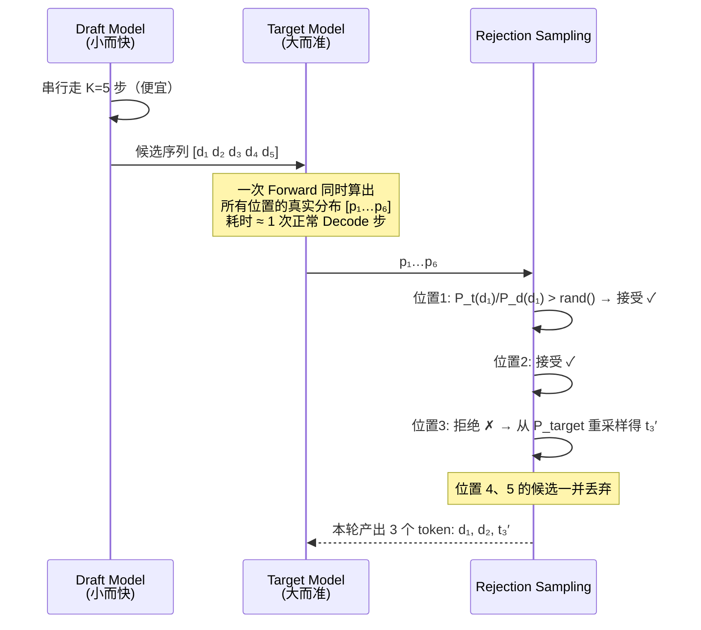

三个要点：

- **一次 Target Forward 产出了 3 个 token**，理想情况最多能到 K+1 个；
- **拒绝是"截断式"的**——位置 3 一旦被拒，后面的 4、5 全部作废，因为它们的前提已经不成立了。这也是接受率对收益影响巨大的原因；
- **输出分布严格无损**：这套修正采样（rejection sampling）在数学上保证最终分布与直接用 Target Model 采样**完全一致**。投机解码不是近似加速，这一点和量化有本质区别。

| | 做法 | 耗时 | 产出 | 等效 TPOT |
|---|---|---|---|---|
| 普通 Decode | 5 次 Forward，每次 15 ms | 75 ms | 5 tokens | 15 ms |
| Speculative | Draft 5 步（5 ms）+ Verify 1 次（18 ms） | 23 ms | 3 tokens（接受 2 + 重采样 1） | **≈ 7.7 ms** |

约 **2× 加速**。注意 Verify 那 18 ms 比普通 Decode 的 15 ms 略高——因为要一次算 6 个位置而不是 1 个，计算量确实增加了，只是在 memory-bound 区间这点额外计算几乎免费。**这正是投机解码的本质：拿闲置算力去换延迟。**

#### 6.4.3 工程实现与核心算法：Scheduler、KV Cache 与 拒绝采样

投机解码（Speculative Decoding）在 vLLM 中的落地绝非简单的算法套用，其核心难点在于非确定性（Speculative）的显存管理与多模型流水线的数学对冲。

##### 1. 核心数据流拓扑图

在 vLLM 的实际工程实现中，Draft 模型（草稿模型）与 Target 模型（目标大模型）各自维护一套完全隔离的 KV Cache 空间。Target 模型在验证时，必须使用自己独立计算的 KV 矩阵。以下是 vLLM 投机解码的数据流向与组件交互图：

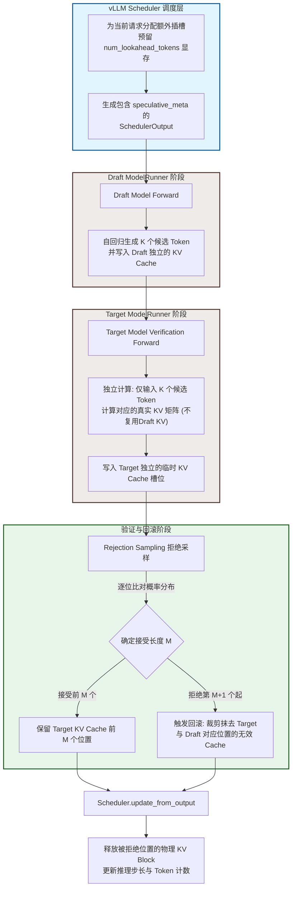

##### 2. 关键工程痛点：显存管理的“时间回溯”

传统的自回归生成在工程上是单向递增的，显存管理器只需机械地分配新块。然而，投机解码给显存管理引入了“可能要回滚”的全新机制：

* 维度与空间完全隔离：Draft 模型（如 1B）每 Token 的 KV 尺寸远小于 Target 模型（如 70B）。Target 模型在验证前向传播（Verification Forward）时，会将候选的 K 个 Token 作为输入，在自己的 Transformer Layer 中计算出大模型视角下的 KV 值并写入大模型的缓存中，两者的显存完全不共享、不复用。
* 物理块的“裁剪（Truncate）”与释放：拒绝采样确定接受长度 `M（0 <= M <= K)` 后，未被接受的 `K-M` 个 Token 对应的 KV 空间便成了“脏数据”。vLLM 会调用显存管理器的回滚 API，强行将逻辑 Token ID 与物理块槽位的映射关系撤回到第 M 个 Token 处。这种“按位置撤销”的逻辑极大地增加了物理显存调度的复杂性。

##### 3. 核心算法：拒绝采样的数学对冲

投机采样之所以能做到数学上完全无损（Lossless），完全依赖于其精妙的拒绝采样（Rejection Sampling）与概率对冲机制。

**接受概率公式**

设在某位置，Draft 与 Target 模型的预测概率分布分别为 $$p(x)$$ 和 $$q(x)$$。对于 Draft 采样出的候选 Token $$x^*$$，Target 模型的接受概率为：

$$P(\text{接受 } x^*) = \min\left(1, \frac{q(x^*)}{p(x^*)}\right)$$

* $$q(x^*) \ge p(x^*)$$：大模型更认可该候选，100% 接受。
* $$q(x^*) < p(x^*)$$：大模型认为小模型冒进了，以 $$\frac{q(x^*)}{p(x^*)}$$ 概率接受。

**拒绝后的残差对冲**

在多步投机中，验证是串行、逐字进行的。一旦某个候选 Token 在第 $$M+1$$ 个位置被拒绝，投机链条彻底断裂。大模型不仅要触发回滚、抹去该位置及之后的所有 KV Cache，还必须基于残差分布（Residual Distribution） $$q'(x)$$ 在当前位置重新采样出一个 Token 来拉回正轨：

$$q'(x) = \frac{\max\left(0, q(x) - p(x)\right)}{\sum_{z} \max\left(0, q(z) - p(z)\right)}$$

直观理解：当小模型在 $$x^*$$ 处过于自信（被拒绝）时，大模型在重新采样时会扣除小模型多估的概率空间。残差分布 $$q'(x)$$ 的本质，就是去专门采样那些大模型认为可能出现、但被小模型低估（残差部分）的 Token，从而在统计学上实现与大模型原生自回归的绝对一致。在每个 Step 结束时，调度器调用 update_from_output() 根据最终实际接受的 Token 数量校准步长，并将无用的物理显存块吐回给内存池。

##### 6.5.4 Speculative Decoding 的变体

不同 Speculative Decoding 方法的核心区别，主要在于**“候选 token 如何生成”**。它们整体都遵循类似的流程：

```text
Candidate Generation
        │
        ▼
[d₁, d₂, d₃, ...]
        │
        ▼
Target Model Verification
        │
   ┌────┴────┐
   ▼         ▼
 Accept     Reject
```

因此在 vLLM 中，这些不同的候选生成机制被统一抽象为 **Proposer（候选生成器）**，实现在 `vllm/v1/spec_decode/` 下。不同 Proposer 负责产生 speculative decoding 所需的候选 token，而后续的 Target 验证、接受/拒绝以及 KV Cache 更新等流程则可以复用统一的 speculative decoding 基础设施。

但在看表之前要先做一个分类上的澄清，因为下表把六种方法平铺在一起，容易掩盖一件事：**它们并不都是"推理技巧"。**

```
Speculative Decoding（一种推理时的加速框架）
│
├── 纯推理侧，不碰模型：
│   ├── 独立 Draft Model      —— 另找一个小模型
│   ├── N-gram               —— 从 prompt 里抄
│   └── Suffix Decoding      —— 从后缀树里抄
│
├── 需要额外训练一个"头"：
│   ├── EAGLE                —— 训一个特征级 draft 头
│   └── Medusa               —— 训若干并行 LM 头
│
└── 模型自带（Model-native）：
    └── MTP                  —— 预训练阶段就已经有了
```


其中，**MTP 和其他方法尤其值得区分**。

N-gram、Suffix、Draft Model、EAGLE、Medusa，本质上都是为了在推理阶段获得更便宜的候选 token：有的方法依赖另一个小模型，有的方法依赖历史 token，有的方法在 Target Model 上增加额外的预测组件。

而 **Multi-Token Prediction（MTP）首先是一种模型架构与训练目标**：模型在训练阶段不仅学习预测下一个 token，还学习预测多个未来位置的 token。这样得到的 MTP 层在推理阶段又可以天然用于生成 speculative decoding 所需要的候选 token。

因此，MTP 与其他方法最大的区别在于：

> **EAGLE、Medusa 等是在已有 Target Model 外部增加 speculative 组件；MTP 则要求 Target Model 本身原生具备 Multi-Token Prediction 能力。**

这也带来了明显的工程差异：

* Draft Model、N-gram、Suffix 等更多属于**部署阶段可以选择的推理策略**；
* EAGLE、Medusa 虽然也可以在部署阶段启用，但需要提前针对特定 Target Model 训练相应的额外组件；
* MTP 则要求模型 checkpoint 原生包含对应的 MTP 结构和权重。

在 vLLM 中，这一点也体现在实现上：MTP 的相关配置会从模型配置中读取，例如 `num_nextn_predict_layers`；对应的 MTP 权重也作为模型 checkpoint 的一部分进行加载。换句话说，**MTP 不是 vLLM 在部署时临时给普通模型外挂的能力，而是模型本身携带的能力。**

下表是对它们几个的对比：

| 方法                  | 候选生成机制         | 核心原理                                                | 优势                               | 局限                                              |
| ------------------- | -------------- | --------------------------------------------------- | -------------------------------- | ----------------------------------------------- |
| **Draft Model**     | 独立小模型          | 用一个更小、更快的模型自回归生成候选                                  | 通用、与 Target 解耦                   | 需要额外模型、显存和计算                                    |
| **N-gram**          | 历史 token 匹配    | 从已有上下文中查找重复 n-gram 并预测后续 token                      | 几乎零模型开销                          | 依赖文本中的重复模式                                      |
| **Suffix Decoding** | 后缀匹配           | 利用后缀结构/匹配结果生成候选                                     | 无需额外训练模型                         | 对上下文中的可匹配模式依赖较强                                 |
| **EAGLE**           | Target Feature | 利用 Target Model 的内部 feature，通过轻量 Draft Head 自回归生成候选 | 不需要完整 Draft Model，额外开销较低         | 需要针对 Target Model 训练 EAGLE 组件                   |
| **Medusa**          | 多预测 Head       | 在 Target Model 上增加多个未来 token 预测 Head，并构造候选树         | 不需要独立 Draft Model，可并行产生多个候选      | 需要训练额外 Head，并涉及 Candidate Tree / Tree Attention |
| **MTP**             | MTP Layers     | 利用模型原生的 Multi-Token Prediction 层生成未来 token          | 模型原生支持，天然适合 speculative decoding | 需要模型 checkpoint 原生支持 MTP                        |


##### EAGLE：不再外挂完整 Draft Model，而是外挂轻量 Draft Head

EAGLE 的核心思想是：

> **利用 Target Model 已经计算出来的内部 feature，再通过一个专门训练的轻量 Draft Network 生成候选，而不是再运行一个完整的 Draft Model。**

可以粗略理解为：

```text
                 Target Model
                      │
                      ▼
               Hidden Feature
                      │
                      ▼
                ┌───────────┐
                │ EAGLE     │
                │ Draft Head│
                └─────┬─────┘
                      │
                  d₁ → d₂ → d₃ → ...
                      │
                      ▼
              Target Verification
```

因此 EAGLE 与 Draft Model 的最大区别是：

```text
Draft Model：

Target Model + 完整 Draft Model


EAGLE：

Target Model + 轻量 EAGLE Draft Component
```

EAGLE 并不是一个可以对任意模型直接通用的插件。EAGLE Head 需要针对特定 Target Model 进行训练和适配，但相比维护一个完整的 Draft Model，它的额外参数量和计算开销通常要小得多。

##### Medusa：多个 Head 同时预测未来位置

Medusa 的思路与 EAGLE 类似，也是在 Target Model 上增加额外的预测组件，但它采用的是**多 Head**设计。

```text
                     Target Model
                          │
                          ▼
                     Hidden State
                          │
          ┌───────────────┼───────────────┐
          ▼               ▼               ▼
      Medusa Head 1   Medusa Head 2   Medusa Head 3
          │               │               │
          ▼               ▼               ▼
      candidates       candidates       candidates
          └───────────────┼───────────────┘
                          ▼
                   Candidate Tree
                          │
                          ▼
                  Target Verification
```

每个 Head 负责预测不同未来位置的 token，并可以产生多个候选。多个 Head 的结果进一步组织成 **Candidate Tree**，然后 Target Model 利用 Tree Attention 等机制一次验证多条候选路径。

因此，Medusa 的关键并不只是“增加几个 LM Head”，而是：

> **利用多个预测 Head 构造未来 token 的候选树，再通过一次 Target Model 执行验证多个候选路径。**

这也是 Medusa 与简单的“多个并行 LM Head”之间的重要区别。

##### MTP：模型原生就拥有 Multi-Token Prediction 能力

MTP 与前面的 EAGLE / Medusa 最大的区别在于：

> **MTP 不是部署时外挂到普通模型上的组件，而是模型架构和训练阶段就已经具备的能力。**

可以理解为：

```text
                  Target Model
                       │
                       ▼
                Hidden Features
                       │
                       ▼
                ┌─────────────┐
                │ MTP Layer 1 │
                └──────┬──────┘
                       │
                       ▼
                ┌─────────────┐
                │ MTP Layer 2 │
                └──────┬──────┘
                       │
                       ▼
                 Future Tokens
                       │
                       ▼
               Target Verification
```

因此，从部署形态上看：

```text
Draft Model：

Target + 独立 Draft Model


EAGLE：

Target + EAGLE Draft Component


Medusa：

Target + 多个 Medusa Heads


MTP：

Target 本身就包含 MTP Layers
```

这也是为什么 MTP 能否用于 speculative decoding，在很大程度上取决于**模型 checkpoint 是否原生支持 MTP**。

在 vLLM 的工程实现中，MTP 并没有完全独立出一套 speculative decoding 框架，而是复用了已有的 proposer 基础设施。部分 MTP 模型会基于 `EagleProposer` 进行扩展，并由模型侧的 MTP predictor 负责具体的候选生成。

这里需要特别注意：

> **“代码上复用 `EagleProposer`”并不意味着“MTP 算法本质上是 EAGLE 的一种特例”。**

二者在算法思想上仍然不同，只是在 vLLM 中，它们的候选生成和 speculative decoding 执行流程具有较强的共性，因此可以复用同一套工程抽象。


##### 从“外挂程度”理解这些方法

如果从一个非常直观的工程视角来看（注意：这只是**工程上的理解框架，而不是严格的算法演进顺序**），可以把这些方法理解成 Target Model 的 speculative 能力逐渐与模型本身融合：

```text
Draft Model
    │
    │ 另找一个小模型来猜
    ▼
EAGLE
    │
    │ 利用 Target Feature + 轻量 Draft Component
    ▼
Medusa
    │
    │ 多个 Head 产生未来 token 候选
    ▼
MTP
    │
    │ 模型原生学习预测多个未来 token
    ▼
Model-native Speculation
```

它们虽然实现方式不同，但最终都在解决同一个问题：

> **Target Model 每生成一个 token 都需要执行昂贵的计算，而 speculative decoding 希望用更低成本的方法一次猜出多个 token，再让 Target Model 一次性验证，从而减少 Target Model 的逐 token 解码次数。**

最后还需要注意一个反直觉现象：Speculative Decoding 在高并发、高 GPU 利用率场景下可能出现负收益。它通过增加 Draft 计算，换取 Target Model 更少的 autoregressive decoding iteration。当 GPU 已经处于较高利用率时，额外的 Draft 计算会与其他请求竞争计算、显存带宽以及执行资源，此时减少 Target iteration 带来的收益可能不足以抵消新增开销，甚至导致整体性能下降。因此，Speculative Decoding 更容易在 GPU 资源相对充裕、且对 Decode latency / ITL 敏感的场景中体现价值；对于高并发、吞吐优先的 Serving 场景，则需要结合 Acceptance Rate、Draft 成本、Batch Size 和 GPU 利用率进行实际评估。


<details markdown="1">
<summary><b>📂 本章源码导航</b></summary>

**GPU 执行**

| 想看什么 | 从哪开始 |
|---|---|
| **一轮 batch 在 GPU 上怎么跑** | `vllm/v1/worker/gpu/model_runner.py`、`input_batch.py`（翻译层细节见第 10.4 节） |
| CUDA Graph 捕获与重放 | `vllm/v1/worker/gpu/cudagraph_utils.py`；模式枚举在 `vllm/config/compilation.py` |
| Attention 后端选择 | `vllm/v1/attention/selector.py` → `get_attn_backend()` |
| 各 Attention 后端实现 | `vllm/v1/attention/backends/`（MLA 变体在 `mla/`） |
| 投机解码各 Proposer | `vllm/v1/spec_decode/`（EAGLE / MTP 都在 `eagle.py`） |
| 融合算子（CUDA） | `csrc/libtorch_stable/` |
| 量化 | `vllm/model_executor/layers/quantization/`（FP8 见 `fp8.py`） |

</details>

## 七、Multi-GPU：一张卡不够时如何扩展？

### 7.1 分布式推理的混合并行策略

分布式推理的混合并行策略：

| 遇到的问题 | 该用的策略 | 切的是什么 |
|---|---|---|
| 单张卡放不下**一个 Linear 层** | **TP** | 层**内**的矩阵，按行/列切 |
| 单层放得下，但**整个模型**太大 | **PP** | 按**层**切，分段流水 |
| MoE 的 **Expert 太多** | **EP** | 按 **Expert** 切 |
| **上下文太长**，KV Cache 装不下 | **CP** | 按 **token 序列**切 |
| 模型明明装得下，但**要更多吞吐** | **DP** | 什么都不切，**整个模型复制一份** |

这张表里最值得单独说的是 **DP**：它和其余四个不是一类东西。TP/PP/EP/CP 解决的都是"装不下"，是被迫拆分；**DP 解决的是"想要更多"，前提恰恰是单卡装得下**。所以生产部署里通常是"先用 TP/PP/EP/CP 把模型塞进一组卡，再用 DP 把这组卡整体复制 N 份来放大吞吐"——DP 永远是最外层。

下面按 DP → TP → PP → EP → CP 的顺序展开。

#### 7.1.1 DP (Data Parallelism)

**DP：每个 GPU 持有完整模型副本，各自处理不同请求。**

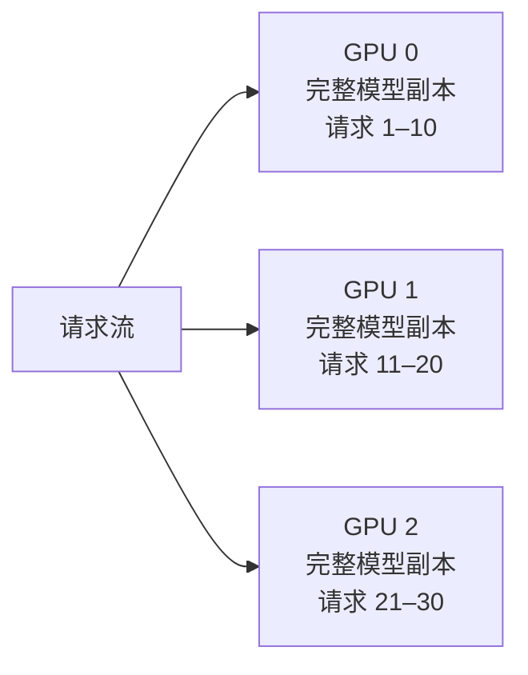

| | 说明 |
|---|---|
| 优势 | 吞吐近似线性扩展，**GPU 间零通信** |
| 限制 | 每个 GPU 必须装得下完整模型 |
| 适用 | 模型放得下、但并发不够的场景 |
| vLLM 实现 | `DPCoordinator`（`vllm/v1/engine/coordinator.py`）管理多个 `EngineCore` 实例，用 ZMQ 做请求分发与负载均衡 |

#### 7.1.2 TP (Tensor Parallelism)

##### 1、TP 是什么？

**TP（Tensor Parallelism）**：将一个 Transformer Layer 内的大矩阵/计算张量切分到多张 GPU 上，让多张 GPU **共同完成同一个请求**的计算。

与 DP“**一张 GPU 处理一批请求**”不同，TP 是：

```text
DP：
Request A ──→ GPU 0（完整模型）
Request B ──→ GPU 1（完整模型）
Request C ──→ GPU 2（完整模型）

TP：
                 一个 Request
                      │
          ┌───────────┼───────────┐
          ▼           ▼           ▼
        GPU 0       GPU 1       GPU 2
        1/N 模型     1/N 模型     1/N 模型
          └───────────┼───────────┘
                      ▼
                 共同完成计算
```

因此 TP 的主要价值是：

* **降低单 GPU 的模型参数和计算量**
* 让原本单卡放不下的模型可以跨多卡运行

代价则是：**GPU 之间需要频繁通信。**

##### 2、TP 怎么切？

以矩阵乘法：
$$Y=XW$$

为例，TP 最常见的两种切法是 **Column Parallel** 和 **Row Parallel**。

```text
┌────────────── Tensor Parallelism ────────────────────────────────────┐
│                                                                       │
│  TP: 单层内的矩阵按行/列切分到多个 GPU                                │
│                                                                       │
│  Column-parallel (QKV Projection, Gate/Up):                           │
│  ┌──────────┐   ┌──────────┐   ┌──────────┐   ┌──────────┐         │
│  │  GPU 0   │   │  GPU 1   │   │  GPU 2   │   │  GPU 3   │         │
│  │ W[:, 0:d]│   │W[:, d:2d]│   │W[:,2d:3d]│   │W[:,3d:4d]│         │
│  │    ↓     │   │    ↓     │   │    ↓     │   │    ↓     │         │
│  │ Y₀=X@W₀ │   │ Y₁=X@W₁ │   │ Y₂=X@W₂ │   │ Y₃=X@W₃ │         │
│  └──────────┘   └──────────┘   └──────────┘   └──────────┘         │
│       ↓              ↓              ↓              ↓                 │
│   各 GPU 得到输出的一部分, 无需通信 (column-parallel 前半)             │
│                                                                       │
│  Row-parallel (O Projection, Down):                                   │
│  ┌──────────┐   ┌──────────┐   ┌──────────┐   ┌──────────┐         │
│  │  GPU 0   │   │  GPU 1   │   │  GPU 2   │   │  GPU 3   │         │
│  │W[0:d, :] │   │W[d:2d, :]│   │W[2d:3d,:]│   │W[3d:4d,:]│         │
│  │    ↓     │   │    ↓     │   │    ↓     │   │    ↓     │         │
│  │ Z₀=Y₀@W₀│   │ Z₁=Y₁@W₁│   │ Z₂=Y₂@W₂│   │ Z₃=Y₃@W₃│         │
│  └────┬─────┘   └────┬─────┘   └────┬─────┘   └────┬─────┘         │
│       └───────┬───────┴──────┬───────┘              │                │
│               ▼              ▼                       ▼                │
│         ═══════════ All-Reduce ═══════════                           │
│         Z = Z₀ + Z₁ + Z₂ + Z₃                                       │
│                                                                       │
│  每层 All-Reduce 次数: 2（Attention 后 + MLP 后）                     │
│  通信量: 2 × B × S × H × sizeof(dtype)                               │
│  最佳场景: NVLink / NVSwitch 互联的同机多卡                          │
└───────────────────────────────────────────────────────────────────────┘
```

两者的核心区别：

|      | Column Parallel | Row Parallel |
| ---- | --------------- | ------------ |
| 权重   | 按列切             | 按行切          |
| 每卡计算 | (Y_i=XW_i)      | (Z_i=Y_iW_i) |
| 结果   | 输出的不同分片         | 输出的部分和       |
| 通信   | 无               | All-Reduce   |
| 典型应用 | QKV、Gate/Up     | O、Down       |


##### 3、为什么 Column 和 Row 可以配合而且经常成对出现？

两种切法之所以能够配合，是因为：

> Column Parallel 的输出分片，恰好对应 Row Parallel 的输入分片。

可以用两个连续的 Linear Layer 来理解：

$$
X \rightarrow Linear_1 \rightarrow Y \rightarrow Linear_2 \rightarrow Z
$$

假设 TP=4：

```text
        Linear 1                         Linear 2
     Column Parallel                   Row Parallel

          W₁                                W₂
     ┌───────────────┐              ┌───────┐
     │ W₁₀│W₁₁│W₁₂│W₁₃│              │ W₂₀  │
     └───────────────┘              ├───────┤
          │                         │ W₂₁  │
          ▼                         ├───────┤
     Y = [Y₀│Y₁│Y₂│Y₃]              │ W₂₂  │
          │                         ├───────┤
          │                         │ W₂₃  │
          │                         └───────┘
          │                             │
          └────── Y₀ → W₂₀ ────────────┤
                 Y₁ → W₂₁ ─────────────┤
                 Y₂ → W₂₂ ─────────────┤
                 Y₃ → W₂₃ ─────────────┤
                                       ▼
                                  All-Reduce
                                       │
                                       ▼
                                       Z
```

假设：

$$
X\in R^{B\times8}
$$

第一层：

$$
Y=XW_1,\qquad W_1\in R^{8\times8}
$$

采用 **Column Parallel**，把 (W_1) 按列切成 4 份：

```text
                 W₁ (8 × 8)
        ┌────────┬────────┬────────┬────────┐
        │   W₁₀  │   W₁₁  │   W₁₂  │   W₁₃  │
        │  8 × 2 │  8 × 2 │  8 × 2 │  8 × 2 │
        └────────┴────────┴────────┴────────┘
             GPU0     GPU1     GPU2     GPU3
```

每张 GPU 分别计算：

$$
Y_0=XW_{10},\quad
Y_1=XW_{11},\quad
Y_2=XW_{12},\quad
Y_3=XW_{13}
$$

所以每张 GPU 得到 (Y) 的一部分：

$$
Y_0,Y_1,Y_2,Y_3\in R^{B\times2}
$$

整体上：

$$
\boxed{Y=[Y_0|Y_1|Y_2|Y_3]}
$$

现在进入第二层：

$$
Z=YW_2
$$

因为 (Y) 的维度是 8，所以：

$$
W_2\in R^{8\times4}
$$

注意：**这里的 Row Parallel 并不是随便把 (W_2) 切几块，而是沿着上一层输出 (Y) 的这个维度切。**

```text
                 W₂ (8 × 4)
              按行切成 4 份

        ┌──────────────────┐
        │      W₂₀         │  ← 2 × 4，对应 Y₀
        ├──────────────────┤
        │      W₂₁         │  ← 2 × 4，对应 Y₁
        ├──────────────────┤
        │      W₂₂         │  ← 2 × 4，对应 Y₂
        ├──────────────────┤
        │      W₂₃         │  ← 2 × 4，对应 Y₃
        └──────────────────┘
          GPU0    GPU1    GPU2    GPU3
```

于是每张 GPU 可以**直接使用自己上一层得到的 (Y_i)**：

$$
Z_0=Y_0W_{20}
$$

$$
Z_1=Y_1W_{21}
$$

$$
Z_2=Y_2W_{22}
$$

$$
Z_3=Y_3W_{23}
$$

为什么最后要相加？

因为完整的矩阵乘法实际上是：

$$
\begin{aligned}
Z
&=YW_2\
&=[Y_0|Y_1|Y_2|Y_3]
\begin{bmatrix}
W_{20}\
W_{21}\
W_{22}\
W_{23}
\end{bmatrix}\
&=Y_0W_{20}+Y_1W_{21}+Y_2W_{22}+Y_3W_{23}
\end{aligned}
$$

因此：

$$
\boxed{Z=Z_0+Z_1+Z_2+Z_3}
$$

最后通过 **All-Reduce** 把各 GPU 的部分结果相加。

```text
 GPU0             GPU1             GPU2             GPU3
  │                │                │                │
Y₀ × W₂₀         Y₁ × W₂₁         Y₂ × W₂₂         Y₃ × W₂₃
  │                │                │                │
 Z₀                Z₁               Z₂               Z₃
  └────────────────┴────────────────┴────────────────┘
                           │
                     All-Reduce
                           │
                           ▼
                    Z = Z₀+Z₁+Z₂+Z₃
```

所以，**Column → Row 能够配合的关键**就是：

> **Column Parallel 把上一层的输出 (Y) 按列切开；Row Parallel 再把下一层权重 (W_2) 按对应的行切开。这样每张 GPU 上的 (Y_i) 正好对应自己的 (W_{2i})，无需重新分发激活，只需要在最后 All-Reduce 合并部分结果。**

可以把它记成：

$$
\boxed{
\text{Column：输出切分}
\rightarrow
\text{Row：输入维度对应切分}
\rightarrow
\text{All-Reduce：合并部分结果}
}
$$


##### 4、TP 在 Transformer 中怎么应用？

这种“列-行”的组合完美对应了标准 Transformer 解码器（Decoder）内部的组件设计： 

* **Self-Attention 模块**：
    * **QKV Projection（列并行）**：将输入映射到 Q、K、V 空间，每个 GPU 独立负责一部分 Attention Head（注意力头）。
    * **Attention 计算**：在各 GPU 内部独立完成计算。
    * **Output Projection / O_Proj（行并行）**：将多头输出映射回原维度，直到这一步结束时，才进行一次 All-Reduce 通信完成整体求和。 
* **MLP / FFN 模块**：
    * **Gate / Up Projection / FC1（列并行）**：将特征维度放大到中间维度（如 $4H$），各 GPU 分片计算。
    * **Down Projection / FC2（行并行）**：将中间维度重新缩小回原维度，同样在第二层结束后才进行一次 All-Reduce 通信。 

以 TP=4 为例：

```text
┌────────────────────────────── Transformer Layer ──────────────────────────────┐
│                                                                              │
│   Attention                                                                  │
│                                                                              │
│   Input X                                                                    │
│      │                                                                       │
│      ├───────────────┬───────────────┬───────────────┐                       │
│      ▼               ▼               ▼               │                       │
│   Q Projection    K Projection    V Projection       │                       │
│   Column TP       Column TP       Column TP          │                       │
│      │               │               │               │                       │
│      ▼               ▼               ▼               │                       │
│   Q₀ Q₁ Q₂ Q₃     K₀ K₁ K₂ K₃     V₀ V₁ V₂ V₃       │                       │
│      │               │               │               │                       │
│      └───────────────┼───────────────┘               │                       │
│                      ▼                               │                       │
│               Attention Compute                      │                       │
│               GPU 本地计算                            │                       │
│                      │                               │                       │
│                      ▼                               │                       │
│              O Projection                            │                       │
│              Row TP                                   │                       │
│                      │                               │                       │
│              ┌───────┴───────┐                       │                       │
│              ▼       ▼       ▼       ▼               │                       │
│             GPU0    GPU1    GPU2    GPU3              │                       │
│              └───────┬───────┘                       │                       │
│                      ▼                               │                       │
│                 All-Reduce                           │                       │
│                      │                               │                       │
│                      ▼                               │                       │
│                 Attention Out                         │                       │
│                                                      │                       │
│──────────────────────────────────────────────────────┼───────────────────────│
│                                                      │                       │
│   MLP                                                │                       │
│                                                      │                       │
│   Input                                               │                       │
│      │                                               │                       │
│      ├──────────────────────┬────────────────────────┤                       │
│      ▼                      ▼                                                │
│   Gate Projection        Up Projection                                         │
│   Column TP              Column TP                                            │
│      │                      │                                                  │
│      ▼                      ▼                                                  │
│   Gate₀...Gate₃          Up₀...Up₃                                            │
│      │                      │                                                  │
│      └───────────┬──────────┘                                                  │
│                  ▼                                                             │
│             Activation                                                         │
│             GPU 本地计算                                                       │
│                  │                                                             │
│                  ▼                                                             │
│             Down Projection                                                    │
│             Row TP                                                             │
│                  │                                                             │
│          ┌───────┴───────┐                                                     │
│          ▼       ▼       ▼       ▼                                             │
│         GPU0    GPU1    GPU2    GPU3                                           │
│          └───────┬───────┘                                                     │
│                  ▼                                                             │
│             All-Reduce                                                         │
│                  │                                                             │
│                  ▼                                                             │
│              MLP Out                                                            │
│                                                                              │
└──────────────────────────────────────────────────────────────────────────────┘
```

这里可以抓住一个非常简单的规律：

| Transformer 部分       | TP 方式               | 为什么                       |
| -------------------- | ------------------- | ------------------------- |
| Q / K / V Projection | **Column Parallel** | 将不同 Head/输出维度分到不同 GPU     |
| Attention            | **GPU 本地计算**        | 每个 GPU 处理自己的 Head         |
| O Projection         | **Row Parallel**    | 将各 GPU 的 Attention 输出重新组合 |
| Gate / Up Projection | **Column Parallel** | 将 MLP 中间维度切到不同 GPU        |
| Activation           | **GPU 本地计算**        | 每个 GPU 处理自己的中间维度          |
| Down Projection      | **Row Parallel**    | 将各 GPU 的部分结果合并            |

因此可以把一个 Transformer Layer 简化成：

```text
        Attention                         MLP

    QKV Projection                   Gate / Up Projection
    Column Parallel                  Column Parallel
           │                                │
           ▼                                ▼
    ┌─────────────┐                  ┌─────────────┐
    │ Attention   │                  │ Activation  │
    │ GPU Local   │                  │ GPU Local   │
    └──────┬──────┘                  └──────┬──────┘
           │                                │
      O Projection                    Down Projection
      Row Parallel                    Row Parallel
           │                                │
           ▼                                ▼
     All-Reduce                         All-Reduce
           │                                │
           ▼                                ▼
      Attention Out                       MLP Out
```

这样就能看到 TP 在 Transformer 中最核心的结构：

$$
\boxed{
\text{Column Parallel}
\rightarrow
\text{GPU 本地计算}
\rightarrow
\text{Row Parallel}
\rightarrow
\text{All-Reduce}
}
$$

这个模式在 **Attention 和 MLP 中各出现一次**，因此：**每个 Transformer Layer 通常需要 2 次 All-Reduce**：

**Attention：** 
$$
QKV\rightarrow Attention\rightarrow O\rightarrow All\text{-}Reduce
$$

**MLP：**
$$
Gate/Up\rightarrow Activation\rightarrow Down\rightarrow All\text{-}Reduce
$$

##### 5、TP 的代价：通信

TP 的核心交换是：**用 GPU 间通信换取单卡计算和显存压力的降低。**

一次 All-Reduce 的逻辑通信量约为：

$$
\boxed{
V=B\times S\times H\times sizeof(dtype)
}
$$

其中：

* (B)：Batch Size，本轮同时处理的序列数
* (S)：本轮每个序列处理的 token 数
* (H)：Hidden Size

**Decode 阶段通常 (S=1)**。

以我们前面的例子为例：

* Batch=32
* (S=1)
* (H=8192)
* BF16（2 Byte）
* 80 层
* 每层 2 次 All-Reduce

则：

$$
V_{\text{一次}}
=32\times1\times8192\times2
=512\text{ KiB}
$$

整个 Decode Step：

$$
512\text{ KiB}\times2\times80
\approx\boxed{80\text{ MiB}}
$$

这是**逻辑通信量**；实际链路传输量还取决于 All-Reduce 算法。例如 Ring All-Reduce 单卡的传输量约为：

$$
2\frac{N-1}{N}V
$$

TP=8 时约为 (1.75V)。

##### 6、为什么 TP 更适合机内高速互联场景？

TP 的问题不只是“通信量大”，更重要的是：**All-Reduce 位于每层计算的关键路径，需要同步等待。**

```text
GPU Compute
     │
     ▼
All-Reduce
     │
     │ 等待
     ▼
GPU Compute
     │
     ▼
All-Reduce
     │
     ▼
下一层
```

因此 TP 对 **带宽和延迟** 都非常敏感。

| 互联                | TP 适合度 | 原因            |
| ----------------- | ------ | ------------- |
| NVLink / NVSwitch | ⭐⭐⭐⭐⭐  | 高带宽、低延迟       |
| PCIe              | ⭐⭐⭐    | 带宽和延迟较弱       |
| 跨机 IB / RoCE     | ⭐⭐      | 网络路径更长、同步成本更高 |

所以工程上通常遵循：**TP 优先放在高速互联的机内多卡**。跨机扩展时，则通常结合 **DP、PP、EP** 等并行方式，减少高频的跨机同步。

> **一句话总结：TP 把一个 Transformer Layer 的矩阵计算拆给多张 GPU；Column Parallel 产生输出分片，Row Parallel 产生部分和，再通过 All-Reduce 合并。它用 GPU 间通信换取单卡计算和显存压力的降低，因此尤其依赖高速的机内互联。**

#### 7.1.3 PP (Pipeline Parallelism)

##### 1、PP是什么？

与 TP 主要切分同一层不同，PP 切分的是**不同层（可以而且往往是多个层一个stage）**。

PP的基本思路是：模型沿层的方向切开多个连续的stage，并将这些 stage 部署到不同的 GPU 或 GPU 组上，推理请求需要依次经过所有 stage，stage间串行传递 `hidden_states`。每个 stage 只保存自己负责层的权重和 KV cache。

例如，一个包含 60 层 Transformer 的模型可以划分为三个 stage：

```text
Stage 0：Layers 0–19
Stage 1：Layers 20–39
Stage 2：Layers 40–59
```

其PP和数据流向如下所示：

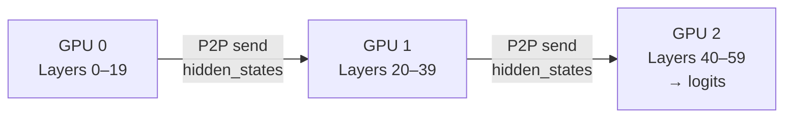

对于一个 batch，输入首先经过 GPU 0 的层；GPU 0 产生边界激活后，将其发送给 GPU 1，依此类推。每个 stage 只保存自己负责的模型层，以及这些层对应的中间状态和 KV cache。

##### 2、为什么推理系统需要 PP

在 LLM Serving 中，模型规模可能远超单张 GPU 的显存容量。除了模型权重之外，推理时还需要保存：

- 模型权重；
- KV cache；
- 中间激活；
- CUDA graph 和通信缓冲区；
- 批处理、调度和运行时所需的临时空间。

尤其是长上下文和高并发场景下，KV cache 可能占据大量显存。即使模型权重能够放入单卡，加入多个请求的 KV cache 后，也可能无法继续扩展 batch size。

PP 可以将模型不同层的权重和 KV cache 分布到多个 GPU 上，使单张 GPU 只负责模型的一部分。

因此，在推理场景中，PP 主要解决两个问题：

1. **模型权重无法放入单卡或单个 GPU 组；**
2. **模型权重和 KV cache 的总显存需求过大。**

需要注意，PP 并不会减少整个模型的总计算量。它主要改变的是：

- 模型和缓存如何分布；
- 请求如何经过不同 GPU；
- 多张 GPU 如何协同完成一次前向计算。

##### 3、PP 怎么切分模型

PP 通常将模型按连续层切分：

```text
GPU 0：Embedding + Layers 0–19
GPU 1：Layers 20–39
GPU 2：Layers 40–59 + LM Head
```

每个连续的层区间称为一个 **pipeline stage**。

同一个 stage 内的层通常在本地 GPU 上连续执行，只有 stage 边界处需要跨 GPU 传递中间激活。

这意味着 PP 的通信主要发生在：

```text
Stage 0 → Stage 1
Stage 1 → Stage 2
```

而不是每一层都进行跨卡通信。

另外，PP最简单的方式是按照层数平均切分，但实际部署中还需要考虑：

- 每个 stage 的计算量；
- 每个 stage 的权重显存；
- 每个 stage 的 KV cache 显存；
- Embedding 和输出层的额外开销；
- GPU 的计算能力和显存容量；
- stage 之间的网络带宽和延迟。

如果某个 stage 的计算时间明显更长，整个请求就会被这个 stage 拖慢。因为后续 stage 必须等待它产生输出，前面的 stage 也可能因为下游处理不及时而无法继续推进。

所以，PP 的切分目标不是简单地让每个 stage 拥有相同数量的层，而是尽量让各 stage 的：

- 计算时间；
- 显存占用；
- 通信开销；

保持相对均衡。

**TIPS** PP 的每个 Stage 不一定只对应一张 GPU

在实际推理系统中，一个 stage 也可能由多张 GPU 组成，并在 stage 内部使用 TP：

```text
Stage 0：GPU 0–3，通过 TP 计算 Layers 0–19
Stage 1：GPU 4–7，通过 TP 计算 Layers 20–39
Stage 2：GPU 8–11，通过 TP 计算 Layers 40–59
```

此时：

- PP 负责层与层之间的切分；
- TP 负责一个 stage 内部的层计算；
- 每个 PP stage 可以看作一个 TP 计算组。


##### 3、推理请求在 PP 中如何流动

###### ① Prefill 阶段  

Prefill 阶段负责处理用户输入的完整 prompt。

例如，用户输入长度为 1024 个 token，数据会依次经过所有 stage：

```text
Prompt tokens
  ↓
Stage 0：计算前 20 层
  ↓ hidden states
Stage 1：计算中间 20 层
  ↓ hidden states
Stage 2：计算后 20 层
  ↓
生成 logits
```

在每个 stage 内部，模型会为自己负责的层计算对应的 Key 和 Value，并写入本地 KV cache：

```text
Stage 0：保存 Layers 0–19 的 KV cache
Stage 1：保存 Layers 20–39 的 KV cache
Stage 2：保存 Layers 40–59 的 KV cache
```

Prefill 通常具有较强的计算特征，输入 token 数量较多，因此比较容易通过批处理或请求并发来提高 GPU 利用率。

###### ② Decode 阶段  

Decode 阶段每次只生成一个或少量新 token。

生成下一个 token 时，新的 hidden states 仍然需要依次经过所有 stage：

```text
新 token
  ↓
Stage 0：读取本地 KV cache，计算 Layers 0–19
  ↓
Stage 1：读取本地 KV cache，计算 Layers 20–39
  ↓
Stage 2：读取本地 KV cache，计算 Layers 40–59
  ↓
输出下一个 token
```

每个 stage 只访问自己负责层的 KV cache，但整个生成过程仍然需要经过完整的模型层。

因此，PP 在 decode 阶段的主要特点是：

- KV cache 按 stage 分布；
- 每个 token 都需要经过所有 stage；
- stage 间需要传递中间激活；
- 单请求的端到端延迟会受到多个 stage 串行执行的影响。

在高并发场景中，系统可以同时调度多个请求或多个 token，使不同 stage 尽量处理不同请求的工作，从而提升整体吞吐。

##### 5、PP的代价：流水线气泡

所谓流水线气泡，是指某些 GPU 暂时没有可执行的工作，只能等待其他 stage。

① 启动时的气泡

假设有三个 stage，开始处理第一个 microbatch 时：但在启动阶段，后面的 stage 还没有输入；在结束阶段，前面的 stage 已经完成，而后面的 stage 仍在处理剩余数据。GPU 暂时没有工作可执行的时间段，就是流水线气泡。

```
时间 →
Stage 0：F(M1)
Stage 1：空闲 → 等待 M1
Stage 2：空闲 → 等待 M1
```

当 Stage 0 计算完 M1 并发送给 Stage 1 后：

```
时间 →
Stage 0：F(M2)
Stage 1：F(M1)
Stage 2：空闲 → 等待 M1
```

此时 Stage 2 仍然没有数据可处理。

随着数据不断向后传递，流水线才逐渐被填满。这一阶段称为 Fill。

② 结束时的气泡
当 Stage 0 已经处理完最后一个 microbatch 后，后面的 stage 可能仍然有数据没有处理完：

```
Stage 0：已完成
Stage 1：仍在处理最后几个 microbatch
Stage 2：仍在处理最后几个 microbatch
```

流水线需要继续运行，直到所有 stage 都完成任务。这一阶段称为 Drain。

因此，PP 通常包含：

1. **Fill**：流水线逐渐填满
2. **Steady State**：所有 stage 尽量并行工作
3. **Drain**：流水线逐渐排空

Fill 和 Drain 阶段产生的空闲时间，就是流水线气泡的一部分。

气泡大小主要取决于：

- stage 数量；
- 并发请求或 microbatch 数量；
- 各 stage 的负载是否均衡；
- stage 之间的通信延迟；
- 调度器能否持续提供足够的工作。

对于推理系统而言，一个重要区别是：

> 训练通常可以通过大量 microbatch 长时间维持稳定流水线；在线推理的请求数量、输入长度和输出长度不断变化，因此流水线负载更动态，气泡和负载不均衡更难完全消除。

因此，PP 往往更适合有一定并发度、注重整体吞吐的 Serving 场景。对于单请求低延迟场景，则需要谨慎评估 stage 串行执行和通信带来的开销。

##### 6、推理和训练中的 PP 有什么不同

PP 既可以用于训练，也可以用于推理，但两者关注的问题不同。

###### ① 训练阶段的 PP

训练时，每个 microbatch 都需要进行：

```text
Forward：Stage 0 → Stage 1 → Stage 2
Backward：Stage 2 → Stage 1 → Stage 0
```

因此训练 PP 需要处理：

- forward 激活保存；
- backward 梯度传递；
- 多个 microbatch 的梯度累积；
- 参数更新；
- 1F1B 等调度策略；
- 激活显存优化。

训练 PP 的主要目标通常是：

- 支撑超大模型训练；
- 提高整体训练吞吐；
- 降低单卡模型状态和激活压力。

###### ② 推理阶段的 PP

推理阶段通常只有 forward，不需要：

- backward；
- 梯度；
- 优化器状态；
- 参数更新；
- 用于 backward 的训练激活。

推理 PP 的主要关注点是：

- 模型权重能否分布到多张 GPU；
- KV cache 如何分布；
- Prefill 和 Decode 如何调度；
- stage 间通信是否成为瓶颈；
- 如何提升并发吞吐；
- 如何控制单请求延迟。

###### ③ 对比总结

两者的核心区别概括来说如下：

> 训练 PP 的核心是调度 forward、backward 和激活显存；推理 PP 的核心是分布式执行 forward、管理 KV cache，以及在吞吐和延迟之间做权衡。

| 对比项 | 训练 PP | 推理 PP |
|---|---|---|
| 主要计算 | Forward + Backward | Forward |
| 是否需要梯度 | 需要 | 不需要 |
| 是否需要参数更新 | 需要 | 不需要 |
| 主要显存对象 | 参数、梯度、优化器状态、激活 | 参数、KV cache、运行时缓冲区 |
| 典型调度 | Microbatch、1F1B | 请求/Token 批处理、Prefill/Decode 调度 |
| 主要优化目标 | 训练吞吐和显存 | Serving 吞吐、延迟和缓存容量 |
| 边界通信 | 激活 + 反向梯度 | 主要是前向激活 |

##### 7、PP 对 KV cache 有什么影响

在大模型推理（Inference）场景下，PP 对 KV Cache 的管理、显存占用以及调度带来了极其深远的影响。

###### ① 空间分布式切分：KV Cache 被天然“分层切片”

在单卡或张量并行（TP）中，全网所有层的 KV Cache 通常集中在同一张显卡或同一个机组里。但在 PP 并行下每个 Stage（显卡/节点）只负责模型的一部分层（Layers）。因此，只有当前 Stage 所包含层的 KV Cache 会被缓存在该卡的显存中。

例如：一个 4 阶段的 PP 流水线（Stage 0-3），总共 80 层模型。Stage 0 只持有第 1~20 层的模型参数，因此它也只负责创建和维护第 1~20 层的 KV Cache。后序层的 KV Cache 散落在后面的显卡上。

###### ② 显存节约：降低单卡 KV Cache 的上限压力

大模型推理的显存瓶颈通常在于 模型参数 + KV Cache。

* 单卡纵向扩容：因为 PP 将模型层数均分到了不同卡上，单卡上需要缓存的 KV Cache 层数也变成了总层数的 1/PP_Size。
* 释放长文本潜力：在处理超长文本（Context Length）或大 Batch 推理时，单卡因为只需要存 1/N 的层，从而能腾出更多显存来容纳更多的 Token，在一定程度上缓解了单卡显存因长文本而崩溃（OOM）的问题。

###### ③ 动态管理难题：跨 Stage 的 Token 调度与绑定

在现代推理框架（如 vLLM, LMDeploy）中，通常使用 PagedAttention 来动态申请和管理 KV Cache 虚拟内存块。引入 PP 后，这种管理变得极其复杂：

* 全局调度一致性：当一个 Batch 的请求在不同的 Stage 之间流动时，中央调度器必须确保所有 Stage 在同一时间为同一个请求分配或释放 KV Cache 块。
* 不均匀负载（Load Imbalance）：由于不同请求的 Prompt 长度和生成长度不同（特别是多轮对话或 Early Stopping），某些请求可能在中间就结束了。调度器需要跨越不同的 PP Stage 去同步“释放”这些不再需要的 KV Cache 块，如果同步不及时，会导致某些 Stage 显存提前占满。

###### ④ 跨机通信：解耦架构下的新瓶颈

在一些超大规模推理集群中（如 Speculative Decoding 投机采样或分布式推理），PP 经常跨机部署：

* PP 阶段之间传递的是 Activation（激活值 Tensor），而不是整个 KV Cache。
* 虽然不需要在网络上传输 KV Cache（因为它们已经常驻在各自层的显卡上），但是由于 PP 的每一步都需要等待前级通信，网络延迟（Latency）会直接增加每个 Token 的生成时间（TP-Time-to-First-Token 和 Time-per-Output-Token）。

##### 8、什么时候适合使用 PP

PP 通常适合以下推理场景：

1、模型权重无法放入单卡或单个 TP 组

这是最直接的场景：

- 模型参数规模很大；
- 单卡显存不足；
- 单机内的 TP 组仍然无法容纳完整模型；
- 需要跨节点部署。

2、KV cache 显存压力较大

当模型可以勉强加载，但长上下文或高并发导致 KV cache 不足时，PP 可以将不同层的 KV cache 分布到不同 GPU 上

不过，还需要结合 PagedAttention、KV cache 量化或其他缓存优化技术共同评估。

3、更关注整体吞吐

PP 更适合：

- 多请求并发；
- 批量推理；
- 长 prompt 的 Prefill；
- 希望提升集群整体吞吐；
- 能够持续向流水线提供任务。

4、需要跨节点部署模型

当模型太大，需要跨多台机器部署时，PP 可以减少跨机 TP 所需的高频集合通信，因此常被用于：

```text
机内 TP + 机间 PP
```

需要谨慎使用的场景：

以下场景不一定适合 PP：

- 单请求、低并发的实时对话；
- 极度追求首 token 延迟或单 token 延迟；
- 跨机网络带宽不足；
- stage 之间计算量严重不均衡；
- 模型本身可以由单机 TP 高效容纳；
- 请求长度和到达模式变化非常剧烈。

在这些场景中，PP 虽然能够解决显存问题，但 stage 间的串行执行和通信可能抵消并行带来的收益。

#### 7.1.4 EP (Expert Parallelism)

混合专家模型（Mixture-of-Experts，MoE）通过在模型中引入多个相对独立的 Expert，并利用 Router 为每个 Token 动态选择少量 Expert，从而在不线性增加计算量的情况下扩大模型参数规模。

与传统稠密模型不同，MoE 模型通常只激活部分参数。例如，一个 MoE 层可能包含 64 个 Expert，但每个 Token 只选择其中的 Top-2 个 Expert。这样，模型可以拥有较大的总参数量，同时将单个 Token 的实际计算量控制在较低水平。

然而，随着 Expert 数量增加，单张 GPU 往往无法容纳全部 Expert 参数。因此，需要将不同 Expert 分布到多张 GPU 上，这就是专家并行（Expert Parallelism，EP）。

##### 1、EP 的核心思想

EP 的基本思想是：

> 将 MoE 层中的不同 Expert 切分并放置在不同 GPU 上，每张 GPU 只负责计算本地持有的 Expert。

假设一个 MoE 层包含 64 个 Expert，使用 4 张 GPU，并设置 `EP=4`，则可以按照如下方式进行分配：

```text
总计 64 个 Experts，4 张 GPU，EP = 4

┌──────────────────────────────────────────────────────────────┐
│                        Expert Parallelism                    │
├──────────────────────────────────────────────────────────────┤
│ GPU 0：Expert  0 ~ 15                                        │
│ GPU 1：Expert 16 ~ 31                                        │
│ GPU 2：Expert 32 ~ 47                                        │
│ GPU 3：Expert 48 ~ 63                                        │
└──────────────────────────────────────────────────────────────┘
```

从参数存储角度看，每张 GPU 只需要加载总 Expert 参数的约四分之一。假设所有 Expert 参数大小相同，则：

```text
单卡 Expert 参数量 ≈ 总 Expert 参数量 / EP Size
```

需要注意的是，EP 只切分 MoE 层中的 Expert。Router、Attention 层以及其他共享模块是否复制或切分，通常还要结合 Tensor Parallelism（TP）、Data Parallelism（DP）或 Pipeline Parallelism（PP）共同决定。

##### 2、为什么 MoE 需要 EP

在稠密模型中，每个 Token 通常都会经过同一组参数；而在 MoE 模型中，多个 Expert 只对部分 Token 激活。

例如：

```text
输入 Token 数量：      4096
Expert 总数：           64
每个 Token 激活 Expert：Top-2
```

理论上，每个 Token 只需要经过 2 个 Expert，而不是全部 64 个 Expert。因此，MoE 可以实现：

```text
参数容量较大，但单 Token 激活参数量较小
```

但是，如果所有 64 个 Expert 都放在一张 GPU 上，会带来较大的显存压力。EP 将 Expert 分散到多个 GPU，使得：

- 单卡显存占用降低；
- 更多 Expert 可以加入模型；
- 不同 GPU 可以并行执行不同 Expert；
- 模型容量可以随着 GPU 数量扩展。

EP 的代价是：Token 不一定会被发送到当前 GPU 上的 Expert，因此必须进行跨 GPU 通信。

##### 3、EP 的完整执行流程

一个典型的 EP MoE 层可以抽象为以下五个阶段：

从工程实现角度看，MoE 的瓶颈并不是“一个大 GEMM 算不动”，而是 **Router + 动态 Dispatch + 变长 Grouped GEMM + Combine** 这一整条动态流水线：

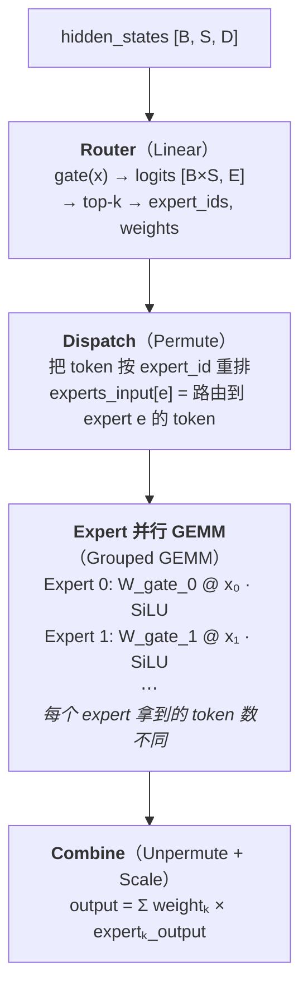

```text
                    MoE 层执行流程

┌──────────────┐
│ 输入 Hidden   │
│ States        │
└──────┬───────┘
       │
       ▼
┌──────────────┐
│ Router/Gate  │  计算每个 Token 的 Expert 概率
└──────┬───────┘
       │
       ▼
┌──────────────┐
│ Top-K 选择   │  确定 Expert ID 和路由权重
└──────┬───────┘
       │
       ▼
┌──────────────┐
│ Dispatch     │  将 Token 发送至目标 Expert 所在 GPU
│ All-to-All   │
└──────┬───────┘
       │
       ▼
┌──────────────┐
│ 本地 Expert  │  执行 Expert FFN/GEMM
│ Computation  │
└──────┬───────┘
       │
       ▼
┌──────────────┐
│ Combine      │  将结果发回原 GPU 并按路由权重聚合
│ All-to-All   │
└──────┬───────┘
       │
       ▼
┌──────────────┐
│ 残差连接/后续 │
│ Transformer 层│
└──────────────┘
```

###### ① Router 计算

对于输入 Token 的隐藏状态 \(x_t\)，Router 通常先计算每个 Expert 的打分：

$$
s_t = W_r x_t
$$

其中：

- \(x_t\) 表示第 \(t\) 个 Token 的隐藏状态；
- \(W_r\) 表示 Router 权重；
- \(s_t\) 表示该 Token 对所有 Expert 的路由分数。

经过 Softmax 后，得到路由概率：

$$
p_{t,e} = \operatorname{Softmax}(s_t)_e
$$

然后选择概率最高的 Top-K 个 Expert：

$$
\mathcal{E}_t = \operatorname{TopK}(p_t, K)
$$

例如：

```text
Token t₁：
  Expert 3  → 权重 0.62
  Expert 17 → 权重 0.28
  其他      → 权重 0.10

Top-2 路由结果：
  t₁ → Expert 3、Expert 17
```

Router 不仅需要记录 Expert ID，还需要记录每个 Expert 对应的路由权重。后续 Combine 阶段会使用这些权重对不同 Expert 的输出进行加权求和。

###### ② All-to-All Dispatch

Router 完成路由后，系统需要根据 Expert ID 判断 Token 的目标 GPU。

在前面的例子中：

```text
Expert  3  位于 GPU 0
Expert 17  位于 GPU 1
Expert 35  位于 GPU 2
Expert 52  位于 GPU 3
```

如果当前 Token 位于 GPU 0，但它选择了 Expert 17，那么该 Token 必须从 GPU 0 发送到 GPU 1。

```text
┌──────────────┐                         ┌──────────────┐
│    GPU 0     │                         │    GPU 1     │
│              │                         │              │
│ Token t₁     │────── Dispatch ───────▶│ Expert 17    │
│ 选择 E17     │                         │              │
└──────────────┘                         └──────────────┘
```

当多个 GPU 上都有 Token 需要访问不同 GPU 的 Expert 时，就形成全对全通信，即 All-to-All。

```text
                         All-to-All Dispatch

             ┌─────────────┐
             │    GPU 0    │
             └─────┬───────┘
          ╱─────────┼─────────╲
         ▼          ▼          ▼
┌─────────────┐ ┌─────────────┐ ┌─────────────┐
│    GPU 1    │ │    GPU 2    │ │    GPU 3    │
│ E16~E31     │ │ E32~E47     │ │ E48~E63     │
└─────────────┘ └─────────────┘ └─────────────┘
         ▲          ▲          ▲
          ╲─────────┼─────────╱
             ┌──────┴──────┐
             │    GPU 0    │
             └─────────────┘
```

实际实现通常不会逐个 Token 单独发送，而是先按照目标 Expert 或目标 GPU 对 Token 进行重排和打包，再进行批量通信：

```text
原始 Token 顺序：

[t₀, t₁, t₂, t₃, t₄, t₅]

路由结果：

t₀ → E3
t₁ → E17
t₂ → E35
t₃ → E3
t₄ → E52
t₅ → E17

按照目标 GPU 重排：

GPU 0：t₀、t₃
GPU 1：t₁、t₅
GPU 2：t₂
GPU 3：t₄
```

这种重排过程通常需要维护以下元数据：

- Token 的原始位置；
- 目标 Expert ID；
- 路由权重；
- Token 属于哪个源 GPU；
- Token 在目标 Expert 批次中的位置。

###### ③ 本地 Expert 计算

完成 Dispatch 后，每张 GPU 会收到一批需要由本地 Expert 处理的 Token。由于每张 GPU 只保存部分 Expert，因此它只负责执行这些本地 Expert 的前馈网络计算。

例如，在 `EP=4` 的场景中：

```text
GPU 0：Expert 0  ~ Expert 15
GPU 1：Expert 16 ~ Expert 31
GPU 2：Expert 32 ~ Expert 47
GPU 3：Expert 48 ~ Expert 63
```

GPU 0 收到 Token 后，会按照目标 Expert 进行分组：

```text
GPU 0 本地 Expert：

Expert 3  ← t₀、t₃
Expert 8  ← t₆
Expert 12 ← t₇、t₈
```

对应的数据流如下：

```text
┌────────────────────┐
│ GPU 0 收到的 Tokens │
│ t₀、t₃、t₆、t₇、t₈  │
└─────────┬──────────┘
          │ 按 Expert ID 分组
          ▼
┌─────────┬─────────┬──────────┐
│Expert 3 │Expert 8 │Expert 12 │
│t₀、t₃  │t₆       │t₇、t₈    │
└────┬────┴────┬────┴─────┬────┘
     └─────────┴──────────┘
               ▼
       本地 Expert 计算
```

一个典型的 Expert 通常是一个独立的前馈网络。对于输入隐藏状态 $$x$$，普通 FFN 可以表示为：

$$
\operatorname{Expert}_e(x)
=
W_{2,e}\,\sigma(W_{1,e}x)
$$

其中：

- $$W_{1,e}$$ 是第 $$e$$ 个 Expert 的上投影矩阵；
- $$W_{2,e}$$ 是下投影矩阵；
- $$\sigma$$ 是激活函数，例如 SiLU 或 GELU。

对于常见的 SwiGLU 结构，可以表示为：

$$
\operatorname{Expert}_e(x)
=
W_{2,e}
\left[
\operatorname{SiLU}(W_{1,e}x)
\odot
(W_{3,e}x)
\right]
$$

其中，$$\odot$$ 表示逐元素相乘，$$W_{3,e}$$ 是 SwiGLU 中的第二个上投影矩阵。

在实际实现中，一个 Expert 通常会批量处理多个 Token，而不是逐个 Token 计算。假设 Expert $$e$$ 接收到 $$n_e$$ 个 Token，将它们组成输入矩阵 $$X_e$$，则普通 FFN 的计算可以写成：

$$
Y_e
=
\sigma(X_e W_{1,e})W_{2,e}
$$

其中：

- $$X_e$$ 包含分配给 Expert $$e$$ 的多个 Token；
- $$Y_e$$ 是该 Expert 对这些 Token 的输出；
- 矩阵乘法通常由 GPU 上的 GEMM Kernel 完成。


对于同一张 GPU 上的多个 Expert，系统通常会采用 Grouped GEMM，将多个 Expert 的矩阵乘法组织为一个批量计算任务：

```text
GPU 0：

Expert 3  → 处理 128 个 Tokens
Expert 8  → 处理  64 个 Tokens
Expert 12 → 处理  96 个 Tokens

Grouped GEMM：
┌────────────┬────────────┬─────────────┐
│ Expert 3   │ Expert 8   │ Expert 12   │
│ n₃ = 128   │ n₈ = 64    │ n₁₂ = 96    │
└────────────┴────────────┴─────────────┘
```

与为每个 Expert 单独启动一次 GEMM 相比，Grouped GEMM 可以减少 Kernel Launch 开销，并提升 GPU 计算资源的利用率。其效果取决于：

- 每个 Expert 接收到的 Token 数量；
- Token 是否已经按照 Expert 分组；
- 各 Expert 之间的负载是否均衡；
- 是否存在 Padding 或 Token Overflow；
- Expert 计算能否与后续通信重叠执行。

计算完成后，各 Expert 的输出会进入 All-to-All Combine 阶段，返回原始 Token 所在的 GPU，并根据 Router 产生的权重进行聚合。

###### ④ All-to-All Combine

Expert 计算完成后，结果需要发回原始 Token 所在的 GPU。这个过程称为 Combine，通常也需要一次 All-to-All 通信。

```text
                    All-to-All Combine

GPU 0 原始 Token t₁
        ▲
        │ Expert 17 计算结果
        │
GPU 1 ──┘

GPU 0 原始 Token t₂
        ▲
        │ Expert 35 计算结果
        │
GPU 2 ──┘
```

如果一个 Token 选择了 Top-2 Expert，则它会收到两个 Expert 的输出：

$$
y_t =
p_{t,e_1}\operatorname{Expert}_{e_1}(x_t)
+
p_{t,e_2}\operatorname{Expert}_{e_2}(x_t)
$$

例如：

```text
Token t₁：

来自 Expert 3 的输出：  y₁
来自 Expert 17 的输出： y₂

Router 权重：
  p₁ = 0.62
  p₂ = 0.28

聚合结果：
  y = 0.62 × y₁ + 0.28 × y₂
```

聚合完成后，MoE 层通常还会执行残差连接：

$$
z_t = x_t + y_t
$$

##### 4、EP 通信示意图

将整个流程放在一起，可以表示为：

```text
┌───────────────────────────────────────────────────────────────────┐
│                         MoE + EP 执行过程                         │
└───────────────────────────────────────────────────────────────────┘

        GPU 0                         GPU 1
┌──────────────────┐          ┌──────────────────┐
│ 输入 Token       │          │ 输入 Token       │
│ t₀, t₁, t₂       │          │ t₃, t₄, t₅       │
├──────────────────┤          ├──────────────────┤
│ Router           │          │ Router           │
│ t₀→E3, E17       │          │ t₃→E5, E20       │
└────────┬─────────┘          └────────┬─────────┘
         │                             │
         └──────────┬───────┬──────────┘
                    │       │
                    ▼       ▼
             All-to-All Dispatch
                    │       │
         ┌──────────┘       └──────────┐
         ▼                             ▼
┌──────────────────┐          ┌──────────────────┐
│ GPU 0 本地计算   │          │ GPU 1 本地计算   │
│ E0 ~ E15         │          │ E16 ~ E31        │
│ t₀→E3            │          │ t₀→E17           │
└────────┬─────────┘          └────────┬─────────┘
         │                             │
         └──────────┬───────┬──────────┘
                    │       │
                    ▼       ▼
             All-to-All Combine
                    │       │
         ┌──────────┘       └──────────┐
         ▼                             ▼
┌──────────────────┐          ┌──────────────────┐
│ GPU 0 聚合结果   │          │ GPU 1 聚合结果   │
│ Top-K 加权求和   │          │ Top-K 加权求和   │
└──────────────────┘          └──────────────────┘
```

对于 4 张 GPU，逻辑结构相同，只是通信参与者从 2 个扩展到 4 个。

##### 5、Capacity Factor（CF）：专家容量因子

###### ① 为什么需要容量限制

Router 的路由结果是动态的。即使平均情况下 Token 能够均匀分布到各个 Expert，也可能出现某些 Expert 被大量 Token 选中的情况。

例如，某一批次共有 1024 个 Token，Top-2 路由意味着总路由数量为：

$$
1024 \times 2 = 2048
$$

如果有 64 个 Expert，平均每个 Expert 接收：

$$
2048 / 64 = 32
$$

个 Token。

但实际分布可能如下：

```text
Expert 0：  18 Tokens
Expert 1：  25 Tokens
Expert 2：  31 Tokens
Expert 3：  96 Tokens  ← 热门 Expert
Expert 4：  22 Tokens
...
```

如果 Expert 3 的缓冲区只能容纳 32 个 Token，就会产生溢出。

因此，系统通常会为每个 Expert 预留一个最大容量：

$$
C =
\left\lceil
\text{Capacity Factor}
\times
\frac{T \times K}{E}
\right\rceil
$$

其中：

- \(T\)：Token 数量；
- \(K\)：每个 Token 选择的 Expert 数量；
- \(E\)：Expert 总数；
- \(C\)：单个 Expert 的最大 Token 容量；
- Capacity Factor：容量因子。

例如：

```text
Token 数量 T = 1024
Top-K       K = 2
Expert 数量 E = 64
Capacity Factor = 1.25
```

则：

$$
C =
\left\lceil
1.25 \times \frac{1024 \times 2}{64}
\right\rceil
=
\lceil 40 \rceil
=
40
$$

也就是说，每个 Expert 最多接收约 40 个 Token。

###### ② Capacity Factor 的权衡

Capacity Factor 越大，Expert 越不容易溢出，但需要预留更多缓冲空间；Capacity Factor 越小，显存和通信开销较低，但 Token 丢弃概率可能上升。

```text
Capacity Factor 增大

┌──────────────────────────────────────────────┐
│ 优点：                                       │
│  · Token Overflow 减少                       │
│  · 更多 Token 能够完成 Expert 计算           │
│  · 模型质量通常更稳定                       │
├──────────────────────────────────────────────┤
│ 缺点：                                       │
│  · Expert Buffer 更大                        │
│  · 通信量可能增加                            │
│  · GEMM 可能包含更多 Padding                 │
│  · 显存占用上升                              │
└──────────────────────────────────────────────┘
```

反之：

```text
Capacity Factor 减小

┌──────────────────────────────────────────────┐
│ 优点：                                       │
│  · 缓冲区更小                                │
│  · 显存占用更低                              │
│  · 通信和计算规模更可控                      │
├──────────────────────────────────────────────┤
│ 缺点：                                       │
│  · 热门 Expert 更容易溢出                    │
│  · 部分 Token 可能被丢弃或旁路处理            │
│  · 模型效果可能下降                          │
└──────────────────────────────────────────────┘
```

训练场景中，Token Overflow 可能通过丢弃、跳过 Expert 或采用残差路径处理。推理场景则通常更加关注延迟稳定性，可能使用固定容量、动态容量或特定的负载均衡机制。

###### ③ 负载均衡损失

仅依赖 Capacity Factor 并不能从根本上解决热门 Expert 问题。训练时通常还会加入负载均衡损失，使 Router 尽量均匀地使用不同 Expert。

理想情况下：

```text
Expert 0：约 1/64 的路由
Expert 1：约 1/64 的路由
...
Expert 63：约 1/64 的路由
```

如果某些 Expert 长期获得过多 Token，则可能导致：

- 这些 Expert 所在 GPU 成为性能瓶颈；
- 其他 GPU 处于空闲状态；
- Token 排队时间增加；
- 系统出现明显的长尾延迟；
- Expert 的训练质量和利用率失衡。

因此，EP 的性能不仅取决于 GPU 数量，还取决于 Router 是否能够产生较均衡的 Token 分布。

##### 6、EP 中的通信与计算重叠

传统实现通常按照以下顺序执行：

```text
Dispatch → 等待通信完成 → Expert 计算
        → 等待计算完成 → Combine
```

这种方式容易产生 GPU 空转：

```text
时间轴：

通信：  ███████
计算：         ███████████
通信：                    ███████
GPU：    通信等待  计算       通信等待
```

现代 MoE 推理和训练系统会尽量进行通信与计算重叠（Communication-Computation Overlap）。

以 2 卡、8 个 Expert 为例，每张卡都要把“不属于自己”的 token 送出去，同时接收“属于自己”的 token：

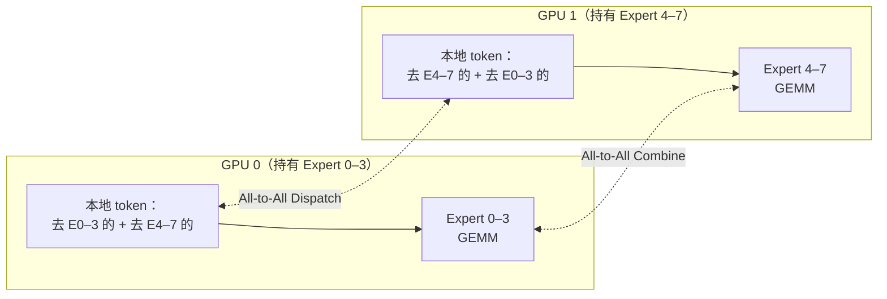

###### ① 分块执行

一种常见方法是将 Token 分成多个 Chunk：

```text
Chunk 0、Chunk 1、Chunk 2、Chunk 3
```

然后让不同 Chunk 处于不同阶段：

```text
时间 ─────────────────────────────────────────────▶

Chunk 0： Dispatch ── Expert Compute ── Combine
Chunk 1：              Dispatch ── Expert Compute ── Combine
Chunk 2：                            Dispatch ── Expert Compute ── Combine
Chunk 3：                                          Dispatch ── ...
```

更细致地表示：

```text
时间       t0        t1        t2        t3        t4

Dispatch   [C0]      [C1]      [C2]      [C3]
Compute              [C0]      [C1]      [C2]
Combine                         [C0]      [C1]      [C2]
```

这样可以在计算 Chunk 0 的同时，为 Chunk 1 执行 Dispatch，从而减少通信等待。

###### ② 通信与计算重叠的收益

理想情况下，系统总耗时可以从：

$$
T_{\text{total}}
=
T_{\text{dispatch}}
+
T_{\text{compute}}
+
T_{\text{combine}}
$$

降低到接近：

$$
T_{\text{total}}
\approx
\max(
T_{\text{communication}},
T_{\text{compute}}
)
$$

当然，实际效果取决于：

- Token 数量；
- Expert 负载是否均衡；
- GPU 间互联带宽；
- 通信库实现；
- GEMM 的矩阵规模；
- Kernel 调度方式；
- 是否需要额外的 Token 重排和内存拷贝。

当 Expert 计算量较小而通信量较大时，计算很难完全隐藏通信；当 Batch 较大、Expert GEMM 较充分时，通信与计算重叠的收益通常更加明显。

##### 7、EP 的主要通信特征与性能瓶颈

###### ① All-to-All 通信量

如果每个 Token 选择 Top-K 个 Expert，则 MoE 层的路由数据规模大致与以下因素相关：

$$
V_{\text{comm}}
\propto
T \times K \times H \times \text{ElementSize}
$$

其中：

- \(T\)：Token 数量；
- \(K\)：Top-K；
- \(H\)：隐藏层维度；
- `ElementSize`：每个元素的字节数。

因此，以下情况会显著增加通信量：

- Batch 或序列长度增大；
- Top-K 增大；
- 隐藏层维度增大；
- 使用更高精度的数据类型；
- EP 组内 GPU 数量增加。

以 BF16 为例，每个隐藏状态元素通常占 2 字节。如果隐藏维度为 8192，则单个 Token 的隐藏状态大小约为：

$$
8192 \times 2 = 16384 \text{ Bytes}
$$

当一个 Token 被发送到两个 Expert 时，Dispatch 阶段至少需要传输两份相关激活数据，Combine 阶段还需要传回对应结果。

###### ② 负载不均衡

EP 的计算负载由实际路由到每个 Expert 的 Token 数量决定，而不是简单由 GPU 数量决定。

```text
均衡情况：

GPU 0：██████████  25%
GPU 1：██████████  25%
GPU 2：██████████  25%
GPU 3：██████████  25%

不均衡情况：

GPU 0：██████████████████  45%
GPU 1：██████              15%
GPU 2：████                10%
GPU 3：██████████          30%
```

在同步执行模式下，整个 MoE 层通常需要等待最慢的 GPU：

$$
T_{\text{layer}}
\approx
\max_i(T_{\text{GPU}_i})
$$

因此，即使平均计算量不高，只要一张 GPU 因热门 Expert 而变慢，整个批次的延迟就会受到影响。

###### ③ 小批次 GEMM 效率

MoE 的每个 Expert 只处理一部分 Token。当 Token 数量较少或分布不均时，每个 Expert 的 GEMM 规模可能很小，导致 GPU Tensor Core 利用率下降。

```text
大批次：

Expert 0：████████████████  高效 GEMM
Expert 1：██████████████    高效 GEMM
Expert 2：████████████      较高效 GEMM

小批次：

Expert 0：██               GEMM 利用率低
Expert 1：█                GEMM 利用率低
Expert 2：███              GEMM 利用率较低
```

因此，MoE 系统需要在 Token 重排、Expert 分组、批量 GEMM 和通信之间进行联合优化。

##### 8、EP 与其他并行策略的区别

| 并行方式 | 切分对象 | 主要目标 | 典型通信 | 主要挑战 |
|---|---|---|---|---|
| 数据并行 DP | Batch 或样本 | 提升吞吐 | 梯度 All-Reduce | 参数复制、梯度同步 |
| 张量并行 TP | 单层权重或激活 | 拆分单层计算 | All-Reduce、All-Gather | 层内通信频繁 |
| Pipeline 并行 PP | 网络层或阶段 | 突破显存限制 | 点对点通信 | Pipeline Bubble |
| 专家并行 EP | MoE Expert | 分摊 Expert 参数 | All-to-All | 动态路由、负载不均 |
| 序列并行 SP | 序列维度 | 降低激活显存 | All-Gather、Reduce-Scatter | 序列切分和同步 |

EP 与 TP 的核心区别如下：

```text
TP：切分同一个 Expert 或同一个线性层的权重

┌─────────────┐
│ 一个线性层  │
├──────┬──────┤
│GPU 0 │GPU 1 │
│权重  │权重  │
│切片 A│切片 B│
└──────┴──────┘

EP：不同 GPU 保存不同 Expert

┌─────────────┐
│ MoE 层      │
├──────┬──────┤
│GPU 0 │GPU 1 │
│E0~E15│E16~31│
└──────┴──────┘
```

TP 关注的是“一个计算模块如何被多张 GPU 共同完成”；EP 关注的是“不同 Expert 如何被不同 GPU 分别完成”。

##### 9、EP 与 TP 的组合

在实际的大模型系统中，EP 很少单独使用，通常会与 TP 结合。

一种常见架构是：

```text
Transformer Block

┌─────────────────────────────┐
│ Attention                   │
│ 使用 TP 切分                 │
│ GPU 0 ~ GPU 3 协同计算       │
└──────────────┬──────────────┘
               │
               ▼
┌─────────────────────────────┐
│ MoE FFN                     │
│ 使用 EP 分布不同 Experts     │
│ GPU 0：E0~E15               │
│ GPU 1：E16~E31              │
│ GPU 2：E32~E47              │
│ GPU 3：E48~E63              │
└─────────────────────────────┘
```

更复杂的部署可以表示为二维并行网格：

```text
                 EP 维度
          EP 0       EP 1
        ┌────────┬────────┐
TP 0    │ GPU 0  │ GPU 2  │
        ├────────┼────────┤
TP 1    │ GPU 1  │ GPU 3  │
        └────────┴────────┘
```

在这种配置中：

- TP 负责切分 Attention 或线性层；
- EP 负责切分不同 Expert；
- 一个 TP Group 内的 GPU 共同完成某个 Expert 的计算；
- 不同 EP Group 保存不同的 Expert 集合。

这种组合能够同时解决：

1. 单个线性层过大，无法放入单卡；
2. Expert 总参数量过大，无法全部复制；
3. Attention 和 MoE 部分具有不同的并行需求。

不过，TP 与 EP 的组合也会增加拓扑设计和通信调度复杂度。系统需要明确：

- 哪些 GPU 属于同一个 TP Group；
- 哪些 GPU 属于同一个 EP Group；
- Dispatch 是否跨越 TP Group；
- Expert 计算前后是否需要重新聚合；
- 通信是否能够通过 NVLink 或节点内高速互联完成。

##### 10、vLLM 中的 EP 实现

在 vLLM 等推理引擎中，EP 通常通过通信抽象层实现。上层 MoE 计算逻辑不必直接处理不同通信库的底层细节，而是调用统一的 Dispatch 和 Combine 接口。

可以抽象为：

```python
# 伪代码，仅用于说明执行流程

router_logits = router(hidden_states)
topk_ids, topk_weights = topk(router_logits, k=top_k)

recv_tokens, metadata = communicator.dispatch(
    hidden_states,
    topk_ids,
    topk_weights,
)

local_outputs = run_local_experts(
    recv_tokens,
    metadata,
)

outputs = communicator.combine(
    local_outputs,
    metadata,
    topk_weights,
)
```

其中：

- `dispatch` 负责根据 Expert ID 将 Token 分发到目标 GPU；
- `run_local_experts` 负责执行当前 GPU 上的本地 Expert；
- `combine` 负责将结果发送回源 GPU，并恢复 Token 顺序；
- `metadata` 保存 Token 重排、Expert 映射和聚合所需的信息。

不同版本和不同硬件环境下，vLLM 可使用不同的通信后端或优化路径，例如：

- DeepEP；
- 基于 NVLink 的高性能通信路径；
- FlashInfer 相关的 MoE/通信优化；
- Mori 等通信调度与融合方案。

具体后端是否可用，取决于 vLLM 版本、GPU 架构、CUDA 环境、节点拓扑和启动配置。因此，在技术文档中更稳妥的表述是：

> vLLM 通过通信抽象层提供 EP 的 Dispatch/Combine 能力，并可根据硬件和配置选择 DeepEP、NVLink 优化路径、FlashInfer 相关实现或其他通信后端。
> 

在 MoE 专家计算侧，vLLM 的 Fused MoE（`vllm/model_executor/layers/fused_moe/`）还提供了多种专家后端实现：

| 后端 | 文件 | 适用场景 |
|------|------|---------|
| **Triton Experts** | `experts/triton_moe.py` | 通用 NVIDIA GPU |
| **DeepGemm Experts** | `experts/deep_gemm_moe.py` | H100+ 高效 GEMM |
| **CUTLASS FP8** | `experts/cutlass_moe.py` | FP8 量化 MoE |
| **Marlin MoE** | `experts/marlin_moe.py` | INT4/INT8 量化 MoE |
| **ROCm AIter** | `experts/rocm_aiter_moe.py` | AMD GPU |
| **XPU Experts** | `experts/xpu_moe.py` | Intel GPU |

##### 11、EP 的常见优化方向

MoE 工程优化通常围绕以下四类手段展开：

| 手段 | 解决什么 |
|---|---|
| **Padding Removal** | 不为了对齐而 padding 到最大值，避免算白工 |
| **Grouped GEMM** | 把多个形状不同的小 GEMM 合成一次 kernel 调用 |
| **Fused MoE Kernel** | Route + Dispatch + GEMM + Combine 全融进一个 kernel，省掉中间张量的 HBM 往返 |
| **All-to-All 与计算重叠** | 把通信藏到计算背后 |

###### ① Token 重排与内存布局优化

Dispatch 前需要将 Token 按目标 GPU 和目标 Expert 重新排列。高效实现会尽量减少：

- 非连续内存访问；
- 重复内存拷贝；
- 临时 Buffer；
- CPU 参与调度；
- 不必要的格式转换。

理想的数据流如下：

```text
原始激活
   │
   ├── Router 产生 Expert ID
   │
   ├── GPU 内部快速分桶
   │
   ├── 按目标 GPU 打包
   │
   ├── All-to-All
   │
   └── 按 Expert 连续布局，直接进入 GEMM
```

###### ② Grouped GEMM

如果每个 Expert 都单独启动一次 GEMM Kernel，会产生大量 Kernel Launch 开销。Grouped GEMM 可以将多个 Expert 的矩阵乘法组织在一起执行。

```text
传统方式：

Launch GEMM(E0)
Launch GEMM(E1)
Launch GEMM(E2)
Launch GEMM(E3)

Grouped GEMM：

一次调度多个 Expert 的 GEMM
┌─────┬─────┬─────┬─────┐
│ E0  │ E1  │ E2  │ E3  │
└─────┴─────┴─────┴─────┘
```

这有助于提升 GPU 利用率，尤其适用于：

- Expert 数量较多；
- 每个 Expert 的 Token 数量较少；
- 多个 Expert 使用相同结构；
- 需要降低 Kernel Launch 开销的场景。

###### ③ 通信与计算重叠

通过 Chunking、异步通信和多 Stream 调度，可以实现：

```text
当前 Chunk：Expert 计算
下一 Chunk：Dispatch
上一 Chunk：Combine
```

从而减少 GPU 等待时间。

###### ④ 通信拓扑感知

EP 性能高度依赖 GPU 之间的连接方式：

```text
同机 NVLink：

GPU 0 ═══ GPU 1
  ║  ╲   ╱  ║
  ║   ╲ ╱   ║
GPU 2 ═══ GPU 3

跨节点网络：

Node 0 ───── InfiniBand/RoCE ───── Node 1
```

同机 NVLink 通常具有更高带宽和更低延迟，而跨节点 EP 需要经过 InfiniBand、RoCE 或其他网络互联，通信成本可能明显增加。

因此，部署时通常需要考虑：

- EP Group 是否尽量放在同一节点；
- GPU 与 NVLink 拓扑是否匹配；
- 跨节点 All-to-All 是否会成为瓶颈；
- 是否需要分层通信；
- 是否需要将高频通信限制在节点内。

###### ⑤ Expert 复制与热门 Expert 优化

当某些 Expert 长期成为热门 Expert 时，可以考虑对其进行复制：

```text
普通 Expert：

E3 只位于 GPU 0

热门 Expert：

E3 副本 1 → GPU 0
E3 副本 2 → GPU 1
E3 副本 3 → GPU 2
```

Router 可以在多个副本之间进一步选择，从而减轻单个 GPU 的压力。

这种方法可以降低负载不均衡，但会增加：

- Expert 参数显存占用；
- 模型加载时间；
- 路由策略复杂度；
- 参数同步成本，尤其是在训练场景中。

##### 12、EP 的优点与局限

###### ① 优点

1. **降低单卡显存压力**

   不需要在每张 GPU 上复制全部 Expert 参数。

2. **支持更大规模的 MoE 模型**

   Expert 总数量可以随着 GPU 数量扩展。

3. **提高 Expert 计算的并行度**

   不同 GPU 可以同时执行不同 Expert。

4. **适合稀疏激活模型**

   只有被选中的 Expert 才执行实际计算。

5. **可以与 TP、PP、DP 灵活组合**

   能够适配大规模训练和推理集群。

###### ② 局限

1. **All-to-All 通信成本高**

   Token 需要在 GPU 之间动态流动。

2. **路由结果具有动态性**

   通信量和计算量难以像稠密模型一样静态规划。

3. **容易出现负载不均衡**

   热门 Expert 可能导致个别 GPU 成为瓶颈。

4. **小批次下 GEMM 效率较低**

   单个 Expert 收到的 Token 数量不足时，计算单元利用率下降。

5. **跨节点部署复杂**

   如果 EP 通信跨越节点网络，延迟和带宽可能显著影响性能。


##### 13、总结

专家并行是 MoE 模型扩展的关键并行策略。它通过将不同 Expert 分布到不同 GPU 上，实现 Expert 参数和计算任务的横向扩展。

其基本执行流程可以概括为：

```text
Router
  │
  ▼
Top-K Expert Selection
  │
  ▼
All-to-All Dispatch
  │
  ▼
本地 Expert GEMM
  │
  ▼
All-to-All Combine
  │
  ▼
按路由权重聚合
```

EP 的性能主要由以下因素共同决定：

```text
EP 性能
≈ 通信效率
  × Expert 负载均衡程度
  × 本地 GEMM 效率
  × 通信计算重叠能力
  × GPU 互联拓扑
```

因此，一个高性能 EP 系统不仅要将 Expert 分布到不同 GPU，还需要同时解决：

- Token 如何高效分发；
- Expert 容量如何设置；
- 热门 Expert 如何处理；
- 通信和计算如何重叠；
- 多个 Expert 如何进行 Grouped GEMM；
- EP 与 TP 如何协同；
- 跨节点通信如何优化。

在 vLLM 等推理框架中，EP 通常通过 `dispatch` 和 `combine` 等通信抽象接口实现，并结合 DeepEP、NVLink、FlashInfer 或其他高性能通信后端，尽量降低 MoE 动态路由带来的通信开销。最终目标不是单纯减少通信次数，而是让通信、Token 重排、Expert 计算和结果聚合形成连续的数据流水线。

#### 7.1.5 CP (Context Parallelism)

##### 1、CP 是什么？
Context Parallelism（CP）是一种面向长序列的并行技术，其核心思想是将输入序列沿上下文维度切分，并分配到多个 GPU 上。每个 GPU 只负责处理整个序列的一部分 token，从而降低单个 GPU 的显存占用，并支持更长上下文的训练与推理。

例如，对于长度为 64K 的输入序列，在 4 个 GPU 上进行上下文并行时，可以将序列划分为 4 个连续的 chunk：

```
完整序列：[t₁, t₂, ..., t₆₄₀₀₀]

GPU 0：[t₁     ~ t₁₆₀₀₀]       chunk 0
GPU 1：[t₁₆₀₀₁ ~ t₃₂₀₀₀]       chunk 1
GPU 2：[t₃₂₀₀₁ ~ t₄₈₀₀₀]       chunk 2
GPU 3：[t₄₈₀₀₁ ~ t₆₄₀₀₀]       chunk 3
```

设上下文并行度为 CP，则每个 GPU 通常只需要保存约 1/CP 的序列激活值和 KV Cache。因此，在其他条件相同的情况下，CP 可以显著降低单卡显存压力。例如，4 路 CP 理论上可以将与序列长度相关的显存占用分摊到 4 个 GPU 上。

##### 2、Ring Attention

但是这样问题也来了：在标准自注意力中，每个 Query 都需要与完整序列上的 Key 和 Value 进行计算。而现在每个 GPU 只保存本地序列片段，就无法直接完成全局注意力计算。

为此，CP 通常结合 Ring Attention，通过环形通信在不同 GPU 之间传递 Key-Value（KV）块。每个 GPU 保留本地 Query，并依次接收其他 GPU 上的 K、V，完成注意力结果的累加。

以 4 个 GPU 为例，计算过程可以抽象为：

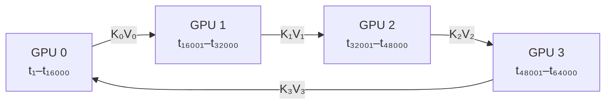

以 GPU 0 为例，它持有本地 Q，分四步凑出全局注意力：

```
Step 1：GPU 0 使用本地 K₀、V₀ 计算局部注意力
Step 2：K₁、V₁ 通过环形通信传递，GPU 0 继续累加注意力结果
Step 3：K₂、V₂ 传递至 GPU 0，GPU 0 继续累加
Step 4：K₃、V₃ 传递至 GPU 0，完成全局注意力计算
```

这个"分块算 + 在线累加"的套路，和第 5.2.2 节的 FlashAttention 是**同一个数学技巧**（Online Softmax），只不过一个跨的是 SRAM 与 HBM，另一个跨的是 GPU 与 GPU。

在实际实现中，每个 GPU 会对不同 KV 块产生的注意力结果进行在线归约。为了避免保存所有中间结果，通常采用 Online Softmax 等方法，对不同 KV 分块的注意力结果进行数值稳定的增量合并。

##### 3、CP 的主要优势

1. **降低单卡显存占用**  
   序列相关的激活值和 KV Cache 被分摊到多个 GPU，单卡占用通常随 CP 度数近似降低为原来的 `1/CP`。

2. **支持更长上下文**  
   当单个 GPU 无法容纳 64K、128K 甚至 1M tokens 的上下文时，可以通过增加 CP 并行度扩展可处理的序列长度。

3. **适合长序列 Prefill**  
   对于长文档理解、长上下文问答以及大规模代码分析等任务，CP 可以有效缓解 Prefill 阶段的显存压力。

4. **与其他并行方式结合**  
   CP 可以与数据并行（DP）、张量并行（TP）和流水线并行（PP）组合，形成适用于大模型训练和推理的混合并行架构。

##### 4、CP 的代价与限制

CP 并不会消除全局注意力的计算和通信需求。由于每个 GPU 都需要访问其他 GPU 的 K、V，因此系统会引入额外的 GPU 间通信开销。CP 的性能通常依赖于：

- GPU 之间的互联带宽；
- Ring 通信的效率；
- Attention Kernel 的实现；
- 序列长度和 CP 并行度；
- Prefill 与 Decode 阶段的负载特征。

当序列较短或 GPU 间通信带宽不足时，CP 带来的收益可能被通信开销抵消。因此，CP 更适合超长上下文场景，而不是所有序列长度下的默认并行方案。

##### 5、vLLM 中的 CP

在 vLLM 等推理框架中，CP 可以根据 Prefill 和 Decode 两个阶段的特点进行进一步划分：

- **PCP（Prefill Context Parallelism）**：主要用于 Prefill 阶段，将长输入序列分布到多个 GPU 上，以降低长上下文计算和显存压力。
- **DCP（Decode Context Parallelism）**：主要用于 Decode 阶段，在逐 token 生成过程中对上下文相关的计算进行并行化。

Prefill 阶段通常具有较大的序列长度和计算量，更适合通过序列切分提升吞吐；Decode 阶段则具有逐步生成、通信频繁的特点，需要针对 KV Cache 访问和跨 GPU 同步进行优化。

总体而言，Context Parallelism 通过“切分上下文、局部计算、全局通信”的方式，将超长序列处理扩展到多个 GPU。它特别适用于 64K～1M tokens 等超长上下文场景，是突破单卡序列长度和 KV Cache 显存限制的重要技术。


#### 7.1.6 混合并行策略汇总

| 模型规模 / 场景 | 推荐策略 | 说明 |
|---|---|---|
| 小于单卡显存 | DP（多实例） | 最简单，吞吐线性扩展 |
| 1–2 卡显存 | TP=2/4 | 机内 NVLink 通信 |
| 4–8 卡显存 | TP=4/8 | 用满机内所有卡 |
| 大于 8 卡显存 | TP=8 + PP=N | 机内 TP + 跨机 PP |
| MoE 模型 | TP + EP | TP 切 Attention，EP 切 Expert |
| 超长上下文 | 上述 + CP | 在已有方案上叠加 |
| 高并发小模型 | DP + TP | DP 放大吞吐，TP 降低单请求延迟 |

四条经验法则：

- **TP 优先放在 NVLink 互联的卡之间**——它通信最频繁且在关键路径上
- **PP 用于跨机或 NVLink 不足时**——它能容忍更高延迟
- **EP 与 TP 可组合**，通常 `TP × EP = 总 GPU 数`
- **DP 永远是最外层的吞吐倍增器**——它不解决"装不下"，只解决"不够快"


### 7.2 通信优化：推理系统的性能深水区

在多 GPU 推理系统中，计算单元的利用率往往受限于通信延迟和数据移动开销。尤其是在 Decode 阶段，单步生成的 Token 数量很少，矩阵乘法的计算量下降，而跨 GPU 同步仍然存在，通信启动延迟、同步等待和小消息处理效率就会变得格外重要。

如果把计算看作引擎，通信就是制约其转速的传动系统：链路带宽决定数据能够搬得多快，通信延迟决定每次搬运需要等多久，而计算与通信能否重叠，则决定了这段等待能否被隐藏。

因此，通信优化不能只看“链路峰值带宽”，还需要同时关注：

- 数据经过哪条物理链路；
- 通信发生在初始化阶段还是推理关键路径；
- 消息是小而频繁，还是大而集中；
- 通信是否引入全局同步；
- 通信能否与计算重叠；
- 实际拓扑是否与并行策略匹配。

#### 7.2.1 数据流向图谱：谁在拖慢速度？

在讨论通信优化之前，先把一次推理中的主要数据移动路径展开来看。

需要注意的是，模型推理可以粗略分为两个阶段：

- **初始化阶段**：加载模型权重、建立通信域、分配 KV Cache；
- **推理阶段**：循环执行 Prefill 或 Decode，包括输入传递、层间计算、跨 GPU 通信、采样和 KV Cache 管理。

模型权重加载通常只发生一次，虽然数据量很大，但一般不属于每个请求或每个 Token 的关键路径。真正决定在线推理性能的，主要是推理循环中的高频通信。

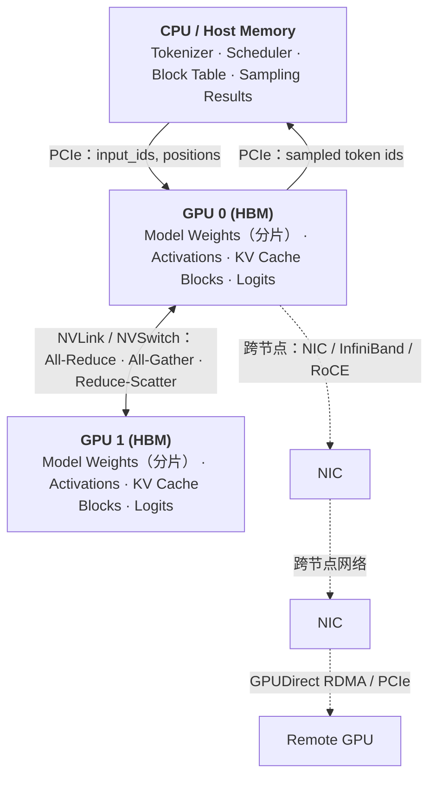

从系统角度看，通信链路大致可以分成三类。

**1、CPU 与 GPU 之间**

CPU-GPU 通信通常经过 PCIe。典型数据包括：

- `input_ids`；
- `positions`；
- 调度器生成的元数据；
- 采样结果；
- 被抢占或换出的 KV Cache Block。

这些数据的规模和频率差异很大。输入 Token 和采样结果通常只有 KB 级别，数据量并不大；KV Cache Swap 则可能一次搬运大量数据，但通常只在显存压力较高或发生抢占时触发。

**2、同一节点内的 GPU 之间**

同机 GPU 之间可能通过以下路径通信：

- NVLink；
- NVSwitch；
- PCIe P2P；
- 经过 CPU Root Complex 的 PCIe 路径。

对于 Tensor Parallel，激活需要在 GPU 之间频繁进行 `All-Reduce`、`All-Gather` 或 `Reduce-Scatter`。对于 Expert Parallel，Token Dispatch 通常需要 `All-to-All`，这类通信更容易受到拓扑、消息布局和负载均衡的影响。

**3、跨节点 GPU 之间**

跨节点通信通常经过：

```text
GPU HBM
  ↓
PCIe
  ↓
NIC
  ↓
InfiniBand / RoCE
  ↓
远端 NIC
  ↓
PCIe
  ↓
远端 GPU HBM
```

如果使用 GPUDirect RDMA，网络设备可以更直接地访问 GPU 显存，减少不必要的 CPU 内存中转。否则，数据可能需要经过 Host Memory，额外增加拷贝次数和延迟。

下面是典型链路的带宽量级：

| 链路 | 理论带宽量级 | 说明 |
|---|---:|---|
| NVLink / NVSwitch | 数百 GB/s，具体取决于 GPU、代际和拓扑 | 通常是机内 GPU 通信的首选路径 |
| PCIe Gen5 x16 | 约 64 GB/s，单向理论值 | 实际有效带宽低于理论值 |
| InfiniBand NDR 400 Gb/s | 约 50 GB/s，原始线速折算 | 实际有效带宽受协议和实现影响 |
| RoCE | 取决于网卡和网络配置 | 对拥塞控制、交换机配置更敏感 |

这里需要避免将不同口径的带宽直接等价比较。例如，NVLink 或 NVSwitch 的宣传带宽可能是单 GPU 聚合带宽、双向带宽或系统总带宽，而 PCIe 和 InfiniBand 常按单向链路带宽描述。实际性能还取决于拓扑、并发度、消息大小和通信算法。

下面是主要数据移动类型的分析：

| 数据移动类型 | 方向 | 触发频率 | 数据量 / 带宽要求 | 常见技术 | 性能影响 |
|---|---|---:|---:|---|---|
| 模型权重加载 | CPU → GPU | 初始化一次 | 高 | PCIe DMA、分片加载 | 影响启动时间 |
| `input_ids` / `positions` | CPU ↔ GPU | 每步 | 低，通常为 KB 级 | PCIe、Pinned Memory | 通常不是主要瓶颈 |
| TP 集合通信 | GPU ↔ GPU | 典型情况下每层多次 | 高 | NCCL、CustomAllreduce | 关键路径 |
| PP 微批传递 | GPU → GPU | Stage 之间 | 中 | NCCL P2P、Send / Recv | 影响流水线气泡 |
| EP Token Dispatch | GPU ↔ GPU | 每个 MoE 层 | 高 | NCCL All-to-All | 关键路径 |
| KV Cache Swap | GPU ↔ CPU | 抢占或显存不足时 | 高 | 异步 PCIe 拷贝 | 影响异常请求和尾延迟 |
| Sampled Token | GPU → CPU | 每步 | 极低，通常为整数 | Device-to-Host Copy | 通常不是带宽瓶颈 |

因此，不能简单地说“所有通信都值得优化”。更准确的结论是：

> TP 集合通信和 EP Token Dispatch 通常是最值得优先优化的通信路径，因为它们既可能数据量较大，又处于模型层级或 Token 路由的同步依赖链上。CPU-GPU 小消息则更需要关注调用次数、同步方式和启动延迟，而不是链路带宽。

#### 7.2.2 NCCL：多 GPU 通信的默认底座

NCCL（NVIDIA Collective Communications Library）是 NVIDIA 提供的 GPU 集合通信库，主要为多 GPU 和多节点场景提供高性能通信原语。

它并不负责模型如何切分，也不负责调度 Transformer 层；它负责的是：当模型代码要求多个 GPU 进行数据交换或规约时，以尽可能高效的方式完成这些操作。

常见的 NCCL 通信原语包括：

| 通信原语 | 含义 | 推理中的典型用途 |
|---|---|---|
| `All-Reduce` | 所有 GPU 对数据进行规约，并获得完整结果 | TP 中合并部分结果 |
| `All-Gather` | 每张 GPU 提供一部分数据，最终所有 GPU 获得完整数据 | 收集分片激活或参数 |
| `Reduce-Scatter` | 先规约，再将结果分片发送给不同 GPU | 以分片结果直接进入后续计算 |
| `All-to-All` | 每张 GPU 向所有其他 GPU 发送不同数据 | EP Token Dispatch |
| `Broadcast` | 一张 GPU 将数据发送给所有 GPU | 广播控制数据或共享状态 |
| `Send / Recv` | 点对点发送与接收 | PP Stage 之间传递激活 |

在 vLLM 或类似推理框架中，模型并行代码通常不会直接管理底层的 NVLink、PCIe 或 InfiniBand。上层只需要调用相应的集合通信接口，底层通信库再根据当前硬件和进程组执行实际的数据移动。

##### 1、NCCL 如何选择通信路径？

NCCL 会根据 GPU 拓扑、节点结构、消息规模和可用网络设备选择通信方式。典型路径如下：

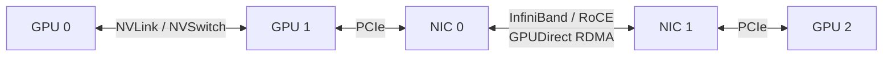

同一节点内，NCCL 优先使用 NVLink 或 NVSwitch；如果 GPU 之间没有直接 NVLink，则可能使用 PCIe P2P。跨节点时，则需要通过 NIC 和 InfiniBand 或 RoCE 网络进行通信。

通信性能因此高度依赖物理拓扑。相同数量的 GPU，如果一种机器采用 NVSwitch，而另一种机器主要依赖 PCIe，TP 通信性能可能存在明显差异。跨节点场景中，如果 GPUDirect RDMA 没有正常启用，数据经过 CPU 内存中转，也可能造成显著性能下降。

##### 2、Ring、Tree 与通信协议

NCCL 内部会根据场景选择不同的通信算法。常见算法包括：

- **Ring**：将 GPU 组织成环，通常能够较好地利用链路带宽，适合较大的消息；
- **Tree**：将 GPU 组织成树状结构，通信步数可能更少，适合延迟敏感或特定拓扑；
- **分层算法**：先完成机内通信，再完成跨节点通信，或者反过来组合执行。

实际选择并不是“Ring 永远适合大消息、Tree 永远适合小消息”这么简单，还会受到 GPU 拓扑、节点数、网络结构、集合通信类型和消息大小的影响。

NCCL 还会根据消息规模选择不同的通信协议。小消息更关注启动延迟和同步开销，大消息更关注链路带宽和数据吞吐。因此，Decode 与 Prefill 可能呈现完全不同的通信特征：

- Decode：消息较小、调用频繁，更容易受启动延迟影响；
- Prefill：激活规模更大，更容易受有效带宽影响；
- MoE：除了带宽，还需要关注 Token 重排、负载不均衡和 All-to-All 的同步特性。

##### 3、vLLM 中的通信抽象

vLLM 对通信后端进行了抽象，使模型代码不需要直接感知底层使用 NCCL、P2P 还是其他实现。整体可以理解为三层：

| 层级 | 接口或组件 | 主要职责 |
|---|---|---|
| 最高层：集合通信 API | `tensor_model_parallel_all_reduce()`<br/>`tensor_model_parallel_all_gather()`<br/>`tensor_model_parallel_reduce_scatter()` | 模型代码调用集合通信 |
| 中间层：`GroupCoordinator` | `all_reduce()`、`all_gather()`、`send()`、`recv()` | 管理进程组和通信协调 |
| 底层：设备通信器 | `CudaCommunicator`、`CustomAllreduce`、`FlashInferAllReduce`、`CpuCommunicator`、`XpuCommunicator` | 执行具体的设备或网络通信 |

其中，`CudaCommunicator` 通常对应 NCCL 路径；`CpuCommunicator` 可用于 CPU 通信；在特定硬件和场景下，还可能使用 FlashInfer 或其他专门优化的实现。

这种分层的意义在于：上层模型代码只表达“我要做一次 All-Reduce”，而不必关心底层是通过 NVLink、PCIe、InfiniBand，还是某种专用 Kernel 完成的。

##### 4、`CustomAllreduce`：针对特定场景的优化

除了 NCCL，vLLM 还提供了 `CustomAllreduce`。它的目标不是全面替代 NCCL，而是在满足特定条件时，针对机内小消息通信进一步降低固定开销。

其典型特点包括：

- 面向特定的 GPU 数量和进程组配置；
- 基于 GPU P2P 和直接内存访问；
- 针对固定机内拓扑进行优化；
- 在小张量场景下，可能比通用 NCCL 路径具有更低的启动和同步开销；
- 某些实现可利用 Hopper 等新架构提供的对称内存能力。

需要特别强调，`CustomAllreduce` 并不是“任何场景都比 NCCL 快”。它通常更适合：

- 单机多卡；
- GPU 之间具备良好的 P2P 或 NVLink 连接；
- 通信消息较小；
- 通信模式固定；
- 对 Decode 阶段的低延迟较敏感。

而 NCCL 更适合：

- 复杂的机内拓扑；
- 跨节点通信；
- 较大的消息；
- 多种集合通信原语；
- 需要成熟的拓扑发现、调度和容错能力的场景。

因此，两者的关系更准确地说是：

> NCCL 提供通用、高度成熟的多 GPU 通信底座；`CustomAllreduce` 则针对固定拓扑和特定消息规模，压缩通用通信库在调度、缓冲区管理和同步上的额外开销。

具体支持的 GPU 数量、架构和启用条件可能随 vLLM 版本变化，实际使用时应以对应版本的源码和运行时检查结果为准。

##### 5、NCCL 的调试与调优入口

NCCL 的调优应遵循“先确认拓扑，再定位瓶颈，最后修改参数”的顺序，而不是一开始就设置大量环境变量。

常见的调试变量包括：

| 环境变量 | 作用 | 使用建议 |
|---|---|---|
| `NCCL_DEBUG=INFO` | 输出 NCCL 初始化和通信信息 | 排查问题时临时开启 |
| `NCCL_DEBUG_SUBSYS=INIT,GRAPH,NET` | 限定调试信息类别 | 查看拓扑和网络选择 |
| `NCCL_SOCKET_IFNAME` | 指定 Socket 网卡接口 | 多网卡环境中明确通信网卡 |
| `NCCL_IB_HCA` | 指定 InfiniBand HCA | 多 HCA 环境中避免选错设备 |
| `NCCL_IB_GID_INDEX` | 指定 RoCE GID | 按实际网络配置设置 |
| `NCCL_P2P_LEVEL` | 控制 GPU P2P 的使用范围 | 不建议无依据修改 |
| `NCCL_NET_GDR_LEVEL` | 控制 GPUDirect RDMA 使用条件 | 跨节点排查时关注 |
| `NCCL_ALGO` | 指定通信算法 | 适合基准测试和针对性实验 |
| `NCCL_PROTO` | 指定通信协议 | 不建议生产环境盲目固定 |

首先可以检查 GPU 拓扑：

```bash
nvidia-smi topo -m
```

然后使用 NCCL Tests 对集合通信进行基准测试，例如：

```bash
./build/all_reduce_perf -b 8 -e 2G -f 2 -g 2
```

如果机内 NCCL 测试结果已经明显低于硬件预期，应优先检查：

- GPU 是否通过 NVLink 或 NVSwitch 连接；
- GPU P2P 是否正常；
- PCIe Root Complex 和 NUMA 绑定是否合理；
- 是否发生了不必要的 Host Memory 中转。

如果是跨节点性能异常，则需要检查：

- InfiniBand 或 RoCE 链路；
- NCCL 是否选中了正确网卡；
- GPUDirect RDMA 是否生效；
- 网卡和 GPU 的 NUMA 亲和性；
- 网络拥塞和交换机配置。

只有在这些基础条件确认无误后，才值得进一步实验 `NCCL_ALGO`、`NCCL_PROTO` 等参数。否则，修改参数很容易掩盖真正的拓扑或硬件配置问题。

#### 7.2.3 计算与通信的深度重叠：隐藏等待时间

即使通信链路已经达到较高带宽，如果计算和通信仍然严格串行，通信时间依然会完整地暴露在端到端延迟中。

**没有重叠时**

```text
时间 →

Compute  [GEMM₁][── idle ──][GEMM₂][── idle ──][GEMM₃]
Comm     [ idle ][AllReduce₁][ idle ][AllReduce₂][ idle ]

总时间 ≈ T_compute + T_comm
```

此时，计算完成后必须等待通信，通信完成后才能继续下一段计算。GPU 的计算单元可能在等待通信，而通信单元也可能在等待计算产生输入。

**发生重叠时**

```text
时间 →

Compute  [GEMM₁      ][GEMM₂      ][GEMM₃      ]
Comm          [AllReduce₁][AllReduce₂]

总时间 ≈ max(T_compute, T_comm)
```

所以这里的目标不是减少通信本身的字节数，而是让通信时间尽可能被计算时间覆盖。

##### 1、使用独立 CUDA Stream

最基础的手段是将通信任务调度到独立的 CUDA Stream 上：

- 计算任务运行在计算 Stream；
- NCCL 集合通信运行在通信 Stream；
- 通过 CUDA Event 或显式依赖保证数据就绪后再启动通信；
- 后续计算在通信完成后等待相应 Event。

概念上可以表示为：

```text
Compute Stream:  [产生激活]────────────[继续计算]
                         \             ↑
Communication Stream:     [All-Reduce]─┘
```

但“放到不同 Stream”并不自动意味着真正重叠。以下条件不满足时，两个 Stream 仍然可能串行：

- 通信和计算争用同一硬件资源；
- 存在隐式同步；
- 通信输入尚未准备好；
- 后续计算必须等待完整通信结果；
- 算子或运行时插入了全设备同步。

因此，重叠优化的关键不只是创建多个 Stream，而是重新设计依赖关系。

##### 2、用 Reduce-Scatter 与 All-Gather 拆解 All-Reduce

在数学上：

```text
All-Reduce = Reduce-Scatter + All-Gather
```

`All-Reduce` 会让每张 GPU 最终获得完整的规约结果。将其拆成两个阶段后，第一阶段 `Reduce-Scatter` 会先完成规约，并将结果分片分发到不同 GPU。

如果后续计算能够按分片执行，那么某张 GPU 获得自己的局部结果后，就可以先开始处理这一部分数据，同时让 `All-Gather` 在后台继续收集其他分片。

```text
Reduce-Scatter  →  本地分片就绪 → 局部计算
                         │
                         └──────→ All-Gather 在后台继续
```

这样做的本质，是把原本要求“完整结果就绪”的依赖，改造成“局部结果就绪即可开始局部计算”的依赖。

但是，这种优化并非对所有模型结构都自动有效。它至少需要满足：

- 后续计算能够处理分片数据；
- 模型依赖允许局部结果先行；
- All-Gather 不会在计算开始后立即重新形成阻塞；
- 通信 Stream 与计算 Stream 之间的依赖安排合理。

此外，拆分后的总通信量通常仍与直接 All-Reduce 处于同一量级，真正的收益来自通信与计算的重叠，而不是简单减少了通信字节数。

##### 3、MoE 中重叠 All-to-All 与 Expert GEMM

MoE 模型的通信流程通常包括：

```text
Token Routing
      ↓
Token Dispatch / All-to-All
      ↓
Expert GEMM
      ↓
Token Combine / All-to-All
```

如果所有 Token 必须完成分发后，Expert 才开始计算，通信延迟就会完整暴露出来。更进一步的实现会尝试：

- 尽早计算路由结果；
- 分块进行 Token Dispatch；
- 某一批 Token 到达后立即启动对应 Expert GEMM；
- Expert 计算的同时继续传输下一批 Token；
- 计算完成后分块执行 Token Combine。

概念上可以形成如下流水线：

```text
时间 →

Dispatch   [Batch₁][Batch₂][Batch₃]
Expert          [GEMM₁ ][GEMM₂ ][GEMM₃ ]
Combine                  [Combine₁][Combine₂]
```

不过，MoE 的重叠难度通常高于普通 TP 通信，因为它还受到以下因素影响：

- Token 路由是否均衡；
- 每个 Expert 收到的 Token 数量是否稳定；
- All-to-All 的消息是否足够大；
- Token 重排和内存布局是否高效；
- Expert GEMM 是否具备足够计算量；
- 是否存在容量限制和丢弃 Token 的机制。

因此，MoE 通信优化不仅是“把 All-to-All 放到另一个 Stream”，还涉及路由、分桶、内存布局和 Expert 计算粒度的协同设计。

#### 7.2.4 通信问题的定位方法

通信性能问题通常不能只通过端到端吞吐量判断。需要将问题拆分为拓扑、链路、通信原语和应用依赖几个层次。

##### 1、第一步：确认物理拓扑

```bash
nvidia-smi topo -m
```

重点关注：

- GPU 之间是否存在 NVLink；
- 是否经过同一个 PCIe Root Complex；
- GPU 与 NIC 是否处于同一 NUMA 节点；
- 是否存在跨 CPU Socket 的额外路径；
- 多节点 GPU 是否能够使用 GPUDirect RDMA。

##### 2、第二步：确认 NCCL 识别结果

临时开启 NCCL 日志：

```bash
NCCL_DEBUG=INFO
NCCL_DEBUG_SUBSYS=INIT,GRAPH,NET
```

重点查看：

- NCCL 识别到了哪些 GPU；
- 使用了哪些网卡；
- 是否启用了 P2P；
- 是否使用 NVLink、InfiniBand 或 RoCE；
- 是否出现回退到 Socket 或 Host Memory 的迹象。

##### 3、第三步：使用 NCCL Tests 区分通信库问题和应用问题

如果 `all_reduce_perf` 的性能已经较差，问题大概率位于硬件拓扑、驱动、网络或 NCCL 配置层面。

如果 NCCL Tests 性能正常，但 vLLM 端到端性能仍然较差，则需要进一步检查：

- 通信消息大小是否过小；
- 每步通信调用次数是否过多；
- 是否存在隐式同步；
- 通信和计算是否真正重叠；
- 是否发生了不必要的张量转换或内存拷贝；
- 是否存在负载不均衡；
- CUDA Graph 或算子融合是否受到通信依赖影响。

##### 4、第四步：根据消息规模区分优化方向

| 现象 | 可能原因 | 优先检查方向 |
|---|---|---|
| 小消息延迟高 | 启动和同步开销占比高 | Stream、调用次数、CustomAllreduce |
| 大消息带宽低 | 链路未充分利用 | 拓扑、算法、协议、消息切分 |
| 机内通信慢 | NVLink/P2P 未生效 | `nvidia-smi topo -m`、NCCL 日志 |
| 跨节点通信慢 | 网络或 GDR 配置问题 | NIC、HCA、GPUDirect RDMA |
| NCCL 测试正常但端到端慢 | 应用依赖未重叠 | CUDA Event、Stream 和算子依赖 |
| MoE 通信抖动明显 | Token 分布不均 | 路由、Expert 负载和 Token 分桶 |
| Decode 吞吐低 | 小消息和同步占主导 | 通信融合、低延迟实现和批处理 |

#### 7.2.5 小结：通信优化的优先级

通信优化可以按照以下顺序推进：

1. **先确认并行策略是否匹配硬件拓扑**；
2. **确认 GPU P2P、NVLink、InfiniBand 和 GPUDirect RDMA 是否正常**；
3. **使用 NCCL Tests 测量通信原语的实际性能**；
4. **区分小消息延迟问题和大消息带宽问题**；
5. **减少不必要的同步、拷贝和通信调用**；
6. **让通信与计算尽可能重叠**；
7. **在满足条件时使用 `CustomAllreduce` 等专用实现**；
8. **最后再针对具体工作负载调整 NCCL 算法和协议参数**。

最终目标并不是让某一次 All-Reduce 的基准测试数字最大，而是降低通信在完整推理路径中的可见时间：

```text
端到端时间
= 计算时间
+ 无法隐藏的通信时间
+ 同步等待
+ 数据重排与拷贝开销
```

理想情况下，通信应该尽可能被计算覆盖；对于无法覆盖的部分，则需要通过更合适的拓扑、更低延迟的通信实现、更少的同步点以及更合理的并行策略，将其压缩到最小。

<details markdown="1">
<summary><b>📂 本章源码导航</b></summary>

**分布式**

| 想看什么 | 从哪开始 |
|---|---|
| 并行组的建立与管理 | `vllm/distributed/parallel_state.py` |
| 集合通信后端 | `vllm/distributed/device_communicators/`（小张量优化见 `custom_all_reduce.py`） |
| 数据并行协调 | `vllm/v1/engine/coordinator.py` |
| Fused MoE 各后端 | `vllm/model_executor/layers/fused_moe/experts/` |
| MoE 路由（含两级 grouped top-k） | `vllm/model_executor/layers/fused_moe/router/grouped_topk_router.py` |

</details>


## 八、模型适配：如何跟上变化极快的模型世界？

### 8.1 痛点：为什么推理引擎必须持续适配新模型？

#### 8.1.1 模型算法同质化与工程实现异构化

LLM 模型在算法上高度同质，都是基于 Transformer模型，围绕以下组件构建：

- Embedding；
- Transformer Block；
- Attention；
- Feed-Forward Network；
- Normalization；
- LM Head。

但模型的工程实现上却是高度异构化：

| 维度 | 差异示例 |
|---|---|
| Attention | MHA / GQA / MQA / MLA / Sliding Window |
| 位置编码 | RoPE / ALiBi / Learned / NTK-RoPE |
| 归一化 | LayerNorm / RMSNorm、Pre-Norm / Post-Norm，位置与数量都可能不同 |
| MLP | Dense / MoE / Switch / Top-K routing |
| 激活函数 | GELU / SiLU / SwiGLU / GeGLU |
| KV Cache 格式 | Full KV / Latent（MLA）/ State（Mamba） |
| 特殊头 | MTP Head / EAGLE Head / Medusa Head |

难点不在"差异多"，而在**每一种差异都会往下捅穿好几层**：

- 换 Attention 变体 → 影响 Attention Kernel **和** KV Cache 布局
- 换 KV Cache 格式 → 影响显存管理 **和** 调度策略（Mamba 的 state 根本不是块状的）
- 加特殊头 → 影响采样、调度预算 **和** KV 回滚逻辑（见第 7.4.3 节）
- 引入 MoE → 影响路由、Token Dispatch、通信和负载均衡
- 改变权重布局 → 影响加载、量化和张量并行

而新架构的发布频率是**周级**的。所以真正的问题是：**如何在不动 Continuous Batching + PagedAttention 这套通用框架的前提下，容纳每个模型的特殊计算路径。**

#### 8.1.2 新模型差异如何向下游扩散？

一个新模型接入推理引擎时，影响通常可以分为三个层次。

| 层次 | 主要内容 | 典型问题 |
|---|---|---|
| 模型层 | 网络结构、权重、配置 | 如何加载权重？如何表示模型结构？ |
| 运行时层 | 调度、KV Cache、并行 | 如何执行动态 Batch？如何管理显存？ |
| 算子层 | Attention、MoE、量化 Kernel | 如何获得足够的吞吐和延迟？ |

理想情况下，模型层只需要调用运行时提供的通用能力，运行时层则通过标准算子完成执行。但现实中的新模型经常会突破既有假设，导致修改从模型层一路传递到 Kernel 层。

以标准 Attention 为例，其基本路径可以抽象为：

```text
Q、K、V
  ↓
QKᵀ
  ↓
Scale 与 Mask
  ↓
Softmax
  ↓
与 V 相乘
  ↓
输出
```

而在实际推理系统中，还需要同时考虑：

- 当前请求处于 Prefill 还是 Decode；
- Batch 中每条序列的长度是否相同；
- KV Cache 是否分页存储；
- 是否启用张量并行或流水线并行；
- 是否使用量化；
- 是否存在特殊的位置编码；
- 当前硬件适合哪一种 Kernel。

因此，推理引擎适配的难点并不是“把论文公式翻译成代码”，而是：

> 将模型的计算语义，准确映射到一个动态、异步、分布式且高度优化的执行系统中。


#### 8.1.3 推理引擎适配的核心目标

一个成熟的模型适配方案通常需要同时满足四个目标：

1. **正确性**：模型输出应与参考实现一致；
2. **性能**：不能因为复用抽象而损失关键路径性能；
3. **可维护性**：模型特化逻辑不能污染整个运行时；
4. **可扩展性**：新模型能够复用已有的执行原语。

这四个目标之间并不总是一致。

| 方案 | 灵活性 | 性能 | 可维护性 | 适用场景 |
|---|---:|---:|---:|---|
| 完全复用通用实现 | 高 | 中 | 高 | 结构接近已有模型 |
| 模型专用 Python 逻辑 | 高 | 中低 | 中低 | 快速验证和早期接入 |
| Custom Op | 中 | 高 | 中高 | 性能关键算子 |
| 专用 Kernel 与运行时改造 | 低 | 很高 | 中 | 范式级模型创新 |

适配工作的本质，就是在这几个目标之间找到合理的工程折中。


### 8.2 vLLM 的核心抽象：从模型接入到运行时执行

在前一节中我们讨论过，模型变化往往会跨层扩散：模型结构会影响状态表示，状态表示会影响执行方式，执行方式又会进一步影响缓存、调度和性能优化。

vLLM 应对这一问题的方式，并不是建立一个包含所有模型逻辑的超大基类，而是根据不同问题的变化边界，建立一组相互衔接但职责相对独立的抽象：

```text
配置语义
  → 模型发现
  → 能力契约
  → 模型实例化与权重装配
  → 运行时调度
  → 执行编排
  → Attention / Kernel 执行
```

从整体上看，vLLM 的模型接入与运行时执行可以抽象为下面这条链路：

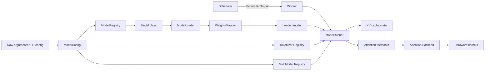

这张图可以分成两个相对独立的部分：

- **模型接入链路**：`ModelConfig → ModelRegistry → ModelLoader → Loaded model`；
- **运行时执行链路**：`Scheduler → Worker → ModelRunner → Attention Backend → Kernel`。

二者通过加载完成的模型实例、运行时协议和输入状态连接起来。模型代码主要描述“模型如何计算”，运行时组件则负责“在动态请求环境中如何组织这次计算”。

#### 8.2.1 配置语义：`ModelConfig` 将外部参数收敛为执行意图

新模型接入的第一步并不是直接编写模型代码，而是先明确：

> 这个模型是什么，以及系统准备以什么方式运行它？

vLLM 通过 `ModelConfig` 对外部参数和 Hugging Face 配置进行统一解释。它通常需要处理：

- 模型架构信息，例如 `architectures`、`model_type`；
- runner 类型，例如 generate、pooling、draft；
- 输出或转换类型，例如 embed、classify、none；
- dtype、量化和并行配置；
- 最大上下文长度；
- tokenizer 和多模态相关配置；
- 模型是否具备某些运行能力或限制。

可以将这一过程表示为：

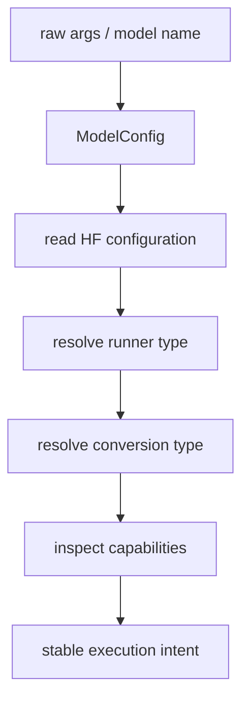

`ModelConfig` 的价值不在于简单保存参数，而在于完成一次**语义收敛**：

```text
外部配置、命令行参数、模型元数据
              ↓
        统一的执行意图
```

后续模块拿到的不是一组零散参数，而是已经具有统一含义的配置对象。这样可以避免 registry、loader、runner 分别重新解释同一组参数，减少重复判断和冲突分支。

需要注意的是，`ModelConfig` 的职责是描述：

> “应该以什么方式运行这个模型。”

它不负责：

- 选择并实例化具体模型对象；
- 读取和装配 checkpoint；
- 组织某一轮请求执行；
- 选择具体 attention kernel。

这些职责分别由后续抽象承担。

#### 8.2.2 模型发现：`ModelRegistry` 负责定位实现

当系统已经知道模型的架构语义和运行方式后，下一步是确定：

> 应该使用哪个模型实现类？

这就是 `ModelRegistry` 的职责。它将配置中识别出的架构名称映射到具体的模型实现，通常支持以下机制：

- 内置模型映射；
- 运行时注册；
- 外部模块或插件注册；
- `module:class` 形式的懒加载；
- auto 模式下的回退策略。

其基本数据流可以表示为：

```mermaid
flowchart LR
    HF[HF architecture metadata] --> REG[ModelRegistry]
    REG --> I[inspect_model_cls]
    REG --> R[resolve_model_cls]
    R --> CLS[model class]
```

在工程上，模型检查和模型解析通常可以分成两个阶段：

- `inspect_model_cls`：在模型真正实例化之前，检查模型能力、接口或元信息；
- `resolve_model_cls`：真正获取并返回用于实例化的模型类。

这种“两阶段”设计能够避免在仅需要判断模型能力时，就提前导入、初始化或执行大量模型相关逻辑。

这里需要明确一个常见误区：

> `ModelRegistry` 负责“找到谁”，而不是负责“怎么跑”。

它通常不负责：

- 创建完整模型对象；
- 读取 checkpoint；
- 将权重写入参数；
- 管理设备侧模型生命周期；
- 处理请求级 batch 和 KV cache。

这些工作分别属于 `ModelLoader`、`Worker` 和 `ModelRunner`。

因此，Registry 更接近一个**模型实现路由层**，而不是完整的模型生命周期管理器。

#### 8.2.3 能力契约：`nn.Module` 加 Protocol，而不是统一继承树

模型类被找到之后，还需要回答另一个问题：

> 不同模型如何接入统一运行时，同时避免被一棵庞大的继承树束缚？

vLLM 的模型抽象更接近：

```text
PyTorch nn.Module
        +
能力协议（Protocol / capability contract）
```

底层要求模型具备 `torch.nn.Module` 的基础能力，包括：

- 参数注册；
- `state_dict`；
- device 迁移；
- train/eval 状态；
- 与 PyTorch 工具链的兼容性。

在此基础上，上层再通过 Protocol 或类似能力契约描述运行时所需的能力，例如：

- 文本生成；
- pooling；
- embedding；
- classification；
- speculative decoding；
- 多模态输入；
- 特殊 attention；
- 混合架构或状态缓存；
- 量化、LoRA 等扩展能力。

概念上可以表示为：

```mermaid
classDiagram
    class nn.Module
    class VllmModel~Protocol~
    class VllmModelForTextGeneration~Protocol~
    class SupportsPooling~Protocol~
    class SupportsMultiModal~Protocol~
    class SupportsSpeculativeDecoding~Protocol~

    nn.Module <|-- ConcreteModel
    VllmModel <.. ConcreteModel
    VllmModelForTextGeneration <.. ConcreteModel
    SupportsPooling <.. ConcreteModel
    SupportsMultiModal <.. ConcreteModel
    SupportsSpeculativeDecoding <.. ConcreteModel
```

这种设计带来两个主要好处。

**第一，兼容已有实现。**

模型不必为了接入 vLLM 而重构成某个复杂的继承体系，只要实现运行时真正需要的能力即可。

**第二，能力可以组合。**

一个模型可以同时支持生成、多模态和 speculative decoding，也可以只实现 pooling 或 embedding，而不必被迫继承一条包含无关方法的基类链。

因此，这里的统一并不一定意味着所有模型具有完全相同的 Python `forward` 签名。更准确地说，统一的是：

- 输入和输出的语义；
- 运行时所依赖的能力；
- 模型与执行器之间的契约。

而不是强制所有模型在源码层面使用完全相同的参数列表。

#### 8.2.4 模型落地：`ModelLoader` 与 `WeightsMapper`

找到模型类并不意味着模型已经可以运行。实际接入中最容易出错的部分之一，是 checkpoint 权重如何正确装配到模型参数中。

vLLM 将模型初始化和权重装配集中到 loader 相关抽象中。概念上的加载流程如下：

```text
解析模型类
  → 初始化模型结构
  → 读取 checkpoint
  → 权重名称映射
  → 参数拆分或合并
  → 并行切分
  → 参数加载
  → 量化及加载后处理
  → 设备侧整理
```

可以表示为：

```mermaid
flowchart TD
    A[resolved model class] --> B[initialize model]
    B --> C[read checkpoint]
    C --> D[WeightsMapper / model-specific mapping]
    D --> E[split / merge / shard weights]
    E --> F[load parameters]
    F --> G[quantization and post-processing]
    G --> H[model.eval()]
```

`WeightsMapper` 的作用不只是简单重命名。实际加载过程可能同时包含以下几类转换。

1、参数命名差异：checkpoint 中的 key 与模型实现中的参数名可能不同，需要进行重命名或前缀转换。

2、参数结构差异：一个 checkpoint tensor 可能需要：

- 拆分成多个模型参数；
- 与其他 tensor 合并；
- 对 QKV、gate/up projection 等结构进行特殊处理；
- 根据模型实现调整参数排列方式。

3、并行切分差异：在 tensor parallel 或 pipeline parallel 场景下，checkpoint 中的完整权重需要按照运行时并行策略切分到不同设备或不同 rank。

4、量化和设备布局差异：权重加载还可能涉及：

- packed weight；
- 量化权重格式；
- 特殊 dtype；
- 延迟初始化；
- 设备侧布局转换；
- 加载后量化处理。

因此，更准确的表述是：

> `WeightsMapper` 及模型特定的权重加载逻辑，负责将外部 checkpoint 表示转换为运行时参数表示。这个过程可能同时包含重命名、拆分合并、并行切分、量化适配和设备布局转换。

这也是为什么许多表面上看起来像“推理错误”的问题，实际上可能源于权重装配错误。将加载过程隔离出来，有助于把问题区分为：

```text
模型结构问题
权重映射问题
运行时执行问题
kernel 或硬件问题
```

从而降低排障复杂度。

#### 8.2.5 运行时执行边界：`Worker + ModelRunner`

前面几节关注的是模型如何被识别、实现和加载。从这里开始，讨论模型如何在动态请求环境中运行。

模型类本身不应该直接感知：

- 请求何时进入或退出；
- 当前 batch 如何变化；
- 每个请求本轮推进多少 token；
- KV cache 如何分配和释放；
- prefill、decode 和 speculative decoding 如何协同；
- 当前设备采用哪种执行策略。

这些运行时复杂度主要由 `Worker + ModelRunner` 承接。

可以将两者理解为一个整体的执行边界：

```text
Scheduler
    ↓
Worker
    ↓
ModelRunner
    ↓
Model / Attention / Kernel
```

其中：

##### `Worker`

`Worker` 处在执行器和设备运行环境之间，负责承接上层调度结果，并管理设备侧的执行上下文和生命周期。它通常参与：

- 接收调度器输出；
- 初始化和维护 `ModelRunner`；
- 管理设备执行环境；
- 协调 KV cache 和其他运行时状态；
- 发起一次模型执行；
- 将执行结果返回给上层。

##### `ModelRunner`

`ModelRunner` 更关注单步执行编排，包括：

- 组织输入 token；
- 准备 position；
- 组织 batch 和 token layout；
- 准备 KV cache 引用；
- 构造 attention metadata；
- 调用模型 forward；
- 计算 logits；
- 执行采样、pooling 或其他后处理；
- 封装统一的 `ModelRunnerOutput`。

因此可以用下面的方式区分模型逻辑和系统逻辑：

```text
模型类：
    如何完成一次模型计算

Worker / ModelRunner：
    在当前动态系统状态下，如何组织这次计算
```

需要注意的是，二者的边界不是简单的文件边界。实际工程中，RoPE、mask、position、KV 访问和部分输入预处理，可能由模型层、attention 层、ModelRunner 或 backend 共同承担。更准确的划分方式，是依据数据语义和稳定契约，而不是依据某段代码位于哪个文件。


#### 8.2.6 执行计划输入：`SchedulerOutput`

`Worker + ModelRunner` 的第一个重要输入，是 Scheduler 生成的 `SchedulerOutput`。

它可以被理解为：

> Scheduler 针对当前 step 生成的结构化执行计划。

`SchedulerOutput` 面向的是调度语义，主要描述：

- 本轮需要处理哪些请求；
- 每个请求需要推进多少 token；
- 请求处于何种执行阶段；
- 哪些请求需要进行 prefill 或 decode；
- 是否包含 speculative decoding 相关 token；
- 是否有 encoder 或多模态输入；
- 哪些请求已经完成；
- 哪些 KV 或 encoder 状态需要创建、更新或释放。

数据流可以表示为：

```mermaid
flowchart LR
    S[Scheduler] -->|SchedulerOutput| W[Worker]
    W --> R[ModelRunner]
    R --> O[ModelRunnerOutput]
    O --> W
    W --> S
```

`SchedulerOutput` 的重要性在于，它将调度决策从具体执行方式中分离出来：

```text
Scheduler 决定：
    这一轮处理谁、处理多少

ModelRunner 决定：
    如何将这个计划组织成设备侧计算
```

从运行时数据协议的角度看，`SchedulerOutput` 可以被称为一种 step-level IR，即每一步的执行计划。但这里的 IR 主要是“运行时结构化协议”的含义，并不等同于编译器意义上的完整中间表示。

它不应该直接描述：

- 某个具体 kernel 的调用方式；
- 某种硬件的线程布局；
- 某个 attention backend 的内部数据结构；
- 模型实现的具体 forward 细节。

这些信息应在执行侧进一步细化。

#### 8.2.7 从执行计划到算子输入：`Attention Metadata`

`Attention Metadata` 与 `SchedulerOutput` 有关，但二者并不是同一层次的对象。

更准确地说：

> `SchedulerOutput` 是 Scheduler 面向执行器产生的高层执行计划；`Attention Metadata` 则是 ModelRunner 根据该计划、当前 KV cache 状态和 backend 需求构造出的 attention 算子输入描述。

其构造过程可以表示为：

```mermaid
flowchart TD
    S[Scheduler] -->|SchedulerOutput| R[ModelRunner]
    K[KV cache state] --> R
    I[Input token layout] --> R
    C[Backend capabilities] --> R
    R --> B[AttentionMetadataBuilder]
    B --> M[Attention Metadata]
    M --> A[Attention layer / backend]
```

Attention metadata 可能包含：

- query 起点；
- 每个序列的长度；
- `seq_lens`；
- `block_table`；
- `slot_mapping`；
- prefill/decode 边界；
- token 到 KV block 的映射；
- 局部 attention、滑动窗口或其他 attention 模式所需的信息；
- 特定 backend 所需的布局和执行参数。

它的作用是把高层运行时状态转换成 attention kernel 可以理解的形式：

```text
请求级调度状态
    ↓
token 与 KV 的逻辑关系
    ↓
attention kernel 的输入布局
```

因此，`Attention Metadata` 并不是调度器的原始输出，也不是模型结构本身的一部分。它是执行侧的适配层，负责连接：

```text
SchedulerOutput
    → ModelRunner
    → AttentionMetadataBuilder
    → Attention Metadata
    → Attention Backend
```

三者的职责可以压缩为：

```text
SchedulerOutput 决定这一轮执行什么；
ModelRunner 决定如何组织这次执行；
Attention Metadata 描述 attention 应该看见什么。
```

这也是 vLLM 能够演进调度策略而不必频繁修改模型定义的重要原因之一。只要调度器仍然通过稳定的执行协议表达计划，执行侧就可以将新的调度策略转换为对应的 metadata 和输入布局。


#### 8.2.8 模型计算与 Attention Backend：从语义到 Kernel

在 ModelRunner 准备好输入和 attention metadata 后，系统进入模型计算阶段。

模型逻辑层主要负责表达模型本身的计算语义，例如：

- token embedding；
- position embedding 或 RoPE；
- Transformer block；
- attention；
- MLP；
- residual connection；
- logits；
- pooling 或分类表示。

Attention Backend 则负责把 attention 语义映射到具体执行实现。它通常需要处理：

- paged KV cache；
- prefill 和 decode；
- 不同 batch 和 sequence layout；
- MLA 或其他特殊 attention；
- 混合 attention；
- 不同硬件平台；
- 不同 dtype 和 kernel 实现。

可以将这一层表示为：

```mermaid
flowchart LR
    R[ModelRunner] --> I[Model inputs]
    R --> M[Attention Metadata]
    I --> ML[Model logic]
    M --> AL[Attention layer]
    AL --> AB[Attention Backend]
    AB --> K1[Flash / Paged / Triton kernels]
    AB --> K2[Hardware-specific kernels]
```

需要对“算子选择”作一个更精确的描述。

ModelRunner 通常负责准备执行上下文和 metadata；具体 attention 层或 backend 再根据：

- attention 类型；
- prefill/decode 模式；
- metadata 中的布局；
- dtype；
- head dimension；
- 硬件能力；
- backend 支持情况；

选择合适的具体实现。

因此，Attention Backend 不是一个简单的算子实现集合，而是一个包含以下职责的执行适配层：

```text
模型声明 attention 需求
        ↓
ModelRunner 提供本轮执行 metadata
        ↓
Backend 判断可用实现
        ↓
选择并调用具体 kernel
```

模型代码因此不需要直接绑定某个硬件平台或某个具体 attention kernel。模型接入主要关注“attention 的语义”，而硬件后端负责“如何高效执行这个语义”。


#### 8.2.9 横切抽象：KV、Tokenizer、多模态与插件

前面的内容构成了主执行链路。但一个模型能否稳定上线，还取决于若干横切抽象。

##### （1）KV Cache 抽象

KV cache 不应绑定到某个模型实现，而应作为独立的运行时状态管理机制。

相关抽象通常需要统一：

- cache 分组；
- layer 级缓存；
- block 布局；
- dtype；
- 初始化；
- 分配、更新与释放；
- paged cache 访问；
- hybrid attention 的缓存管理。

可以将其理解为：

```text
模型只声明需要什么状态；
KV 系统负责状态如何分配、保存和访问。
```

不过，这里需要保留一个边界意识：

> KV cache 抽象统一的是缓存管理和访问语义，并不意味着所有模型内部状态都能无差别地表示为传统 K/V tensor。

对于 Mamba 类或混合架构，系统可能还需要支持 state cache、循环状态或其他形式的持久化执行状态。因此，KV/cache 抽象应当被理解为更广义的**推理状态管理协议**。

##### （2）Tokenizer Registry

Tokenizer Registry 将 tokenizer 的特殊处理从模型执行路径中解耦出来，可以承接：

- tokenizer mode；
- 专有 tokenizer 实现；
- truncation 方向；
- chat template；
- 特殊 token；
- tokenizer 与模型配置之间的差异。

这样，新增 tokenizer 模式时，不必在每个模型实现中复制条件分支。

##### （3）MultiModal Registry

多模态模型的复杂性往往不只来自模型结构，还来自输入预处理链。MultiModal Registry 可以将模型类与具体 processor 松耦合，承接：

- 图片、视频、音频等输入处理；
- 多模态特征提取；
- 模态特征与文本 token 的对齐；
- encoder 输入组织；
- 不同模型所需的 processor 工厂。

其核心思想是：

```text
模型结构演进
        与
多模态数据处理演进
        相互解耦
```

##### （4）Plugin / Extension 机制

随着模型、硬件和采样策略不断增加，仅依靠核心代码内置实现会导致系统越来越庞大。因此，插件机制可以进一步支持外部注册和扩展，例如：

- 模型实现；
- 自定义 layer；
- attention backend；
- tokenizer；
- 多模态 processor；
- sampler；
- 量化实现；
- 输出处理逻辑。

插件机制的价值在于：

> 在不修改核心执行路径的前提下，为系统增加新的模型能力或硬件能力。

不过，插件并不是对所有内部对象开放任意修改，而应建立在清晰的注册点和稳定契约之上。否则，插件只会把核心系统中的隐式耦合转移到外部。


#### 8.2.10 动态运行时与静态执行图：抽象边界的性能代价

运行时抽象提高了灵活性，但也会增加编译优化和图捕获的难度。

动态推理环境通常具有以下特征：

- batch size 持续变化；
- sequence length 持续变化；
- 请求不断加入和退出；
- KV cache 地址不固定；
- prefill、decode 和 speculative decoding 路径不同；
- 不同请求可能具有不同的执行阶段和输入布局。

而编译器和图捕获机制通常更擅长处理：

- 相对稳定的计算图；
- 稳定或可预测的 tensor shape；
- 明确的控制流；
- 固定的内存布局；
- 可重复执行的 kernel 序列。

因此，vLLM 一类的推理引擎需要在动态调度和静态优化之间建立边界：

```text
动态调度、灵活执行
          ↕
稳定计算片段、编译优化
```

一个重要的工程思想是：

> 不是消除动态性，而是将动态性集中在运行时边界内，再把稳定部分下沉给编译器和硬件后端。

例如，系统可以将动态因素保留在：

- Scheduler；
- Worker；
- ModelRunner；
- KV cache 状态；
- Attention Metadata；
- 输入 buffer 和运行时参数。

同时，将相对稳定的计算片段交给：

- `torch.compile`；
- CUDA Graph；
- shape bucketing；
- kernel fusion；
- backend-specific graph capture。

可以将这种分工表示为：

```text
动态部分：
    请求调度
    batch 组织
    token 数量
    KV block 地址
    执行路径选择

静态部分：
    稳定的模型子图
    固定范围的 shape bucket
    可复用的 kernel 序列
    硬件相关的融合算子
```

因此，前文介绍的抽象不仅服务于代码可维护性，也服务于性能优化。`SchedulerOutput` 和 `Attention Metadata` 将动态状态显式化，使编译器和 kernel 不必理解完整的请求调度逻辑，而只需要消费结构化的运行时输入。


#### 8.2.11 新模型接入时的判断路径

这套抽象的工程价值，最终体现在一个具体问题上：

> 当新模型接入失败时，应该首先修改哪一层？

可以按照变化来源进行判断。

| 变化类型 | 优先检查的层 |
|---|---|
| 模型架构无法识别 | `ModelConfig`、`ModelRegistry` |
| runner 或输出类型判断错误 | `ModelConfig`、能力协议 |
| forward 或模型结构不兼容 | Model class、Protocol、Attention layer |
| checkpoint 参数找不到 | `ModelLoader`、`WeightsMapper` |
| QKV 或特殊权重加载错误 | 模型特定加载逻辑、并行切分逻辑 |
| batch 或 token 数量异常 | Scheduler、`SchedulerOutput`、ModelRunner |
| KV cache 行为异常 | KV cache 配置、状态管理、metadata builder |
| attention 结果异常 | Attention Metadata、Attention layer、Backend |
| tokenizer 输入异常 | Tokenizer Registry |
| 图片、视频等输入异常 | MultiModal Registry |
| 性能不稳定 | ModelRunner、Attention Backend、Graph Capture、编译配置 |

也可以将接入过程概括为下面的判断顺序：

```text
先确认模型是否被正确识别
    ↓
再确认模型类和能力契约是否匹配
    ↓
再确认 checkpoint 是否正确装配
    ↓
再确认运行时输入和 KV 状态是否正确
    ↓
最后检查 attention backend、编译和硬件性能
```

这样可以避免在模型尚未正确加载时，就直接从 kernel 或调度器开始排查。


#### 8.2.12 小结：动态性上浮，静态性下沉

vLLM 的核心设计可以概括为：

> 配置层收敛执行意图，注册层定位模型实现，契约层表达模型能力，加载层隔离权重差异；Scheduler 生成执行计划，Worker 和 ModelRunner 组织动态执行，Attention Metadata 将运行时状态转换为算子输入，Attention Backend 再将模型语义映射到具体硬件 kernel。

这里需要特别区分几个对象之间的关系：

```text
ModelConfig
    表达“准备如何运行”

ModelRegistry
    决定“使用哪一个实现”

ModelLoader / WeightsMapper
    负责“如何把模型落地”

SchedulerOutput
    描述“这一轮执行什么”

Worker / ModelRunner
    负责“如何组织这次执行”

Attention Metadata
    描述“attention 应该看见什么”

Attention Backend
    决定“用什么 kernel 执行”
```

因此，`SchedulerOutput`、`Attention Metadata` 和 `ModelRunner` 并不是三个平行组件，而是一条逐级细化的数据流：

```text
调度计划
  → 执行编排
  → Attention 输入描述
  → Kernel 执行
```

这套架构背后的工程哲学可以进一步概括为：

1. **动态性上浮**  
   将请求队列、调度策略、batch 变化和执行路径选择集中在 Scheduler、Worker、ModelRunner 及其运行时协议中。

2. **静态性下沉**  
   将稳定的模型计算、attention 子图和硬件相关 kernel 下沉给编译器、CUDA Graph 和 Attention Backend。

3. **以契约连接两者**  
   通过 Registry、Protocol、WeightsMapper、SchedulerOutput 和 Attention Metadata，在动态系统与静态算子之间建立稳定的数据和能力契约。

最终，支持一个新模型不再意味着对整个推理引擎进行全栈修改，而是先判断变化发生在哪个边界：

```text
配置变化       → ModelConfig
识别变化       → ModelRegistry
能力变化       → Protocol / model class
权重变化       → ModelLoader / WeightsMapper
执行变化       → Scheduler / Worker / ModelRunner
缓存变化       → KV cache / state management
Attention变化  → Metadata / Attention layer / Backend
输入变化       → Tokenizer / MultiModal Registry
性能变化       → Backend / Graph Capture / Compiler
```

这就是 vLLM 能够在保持高性能的同时快速支持新模型的关键：它并没有试图消除模型差异，而是将不同类型的差异放置到合适的抽象边界中，让模型逻辑、运行时调度、状态管理和硬件执行能够相对独立地演进。


### 8.3 适配机制的演进：从临时补丁到编译化扩展

#### 8.3.1 早期方式：硬编码与模型专用实现

最直接的适配方式，是为新模型增加一个专用实现。

优点是：

- 开发路径短；
- 便于快速验证；
- 可以直接表达模型特有逻辑。

缺点也很明显：

- 模型代码容易与运行时耦合；
- 重复实现大量已有逻辑；
- 难以复用现有 Kernel；
- 后续维护成本高；
- 不同模型之间容易形成分叉。

这种方式适合模型早期接入，但不适合作为长期架构。


#### 8.3.2 热插拔适配：Monkey Patch

当模型已有实现，但某些模块暂时无法直接复用时，可以采用热插拔方式替换局部逻辑。

例如：

```text
原始模型实现
    ↓
替换 Attention 模块
    ↓
替换 RoPE 或 MLP
    ↓
复用其余模型结构
```

这种方法可以降低重复代码，但通常存在以下问题：

- 调用关系不够显式；
- 依赖模块内部实现细节；
- 不同版本之间容易失效；
- 调试和性能分析较困难；
- 不利于长期维护。

因此，Monkey Patch 更适合过渡阶段，而不是稳定扩展接口。


#### 8.3.3 Custom Op：将性能关键路径下沉为标准算子

当模型结构已经能够通过通用 Python 模块表达，但性能关键路径不足时，Custom Op 是更合理的方案。

Custom Op 通常承担三类职责：

1. 为 Python 层提供稳定接口；
2. 将计算转发给 CUDA、Triton 或其他后端；
3. 隐藏不同硬件后端之间的实现差异。

典型调用路径如下：

```text
Python Module
    ↓
统一 Op 接口
    ↓
后端 Dispatch
    ↓
CUDA / Triton / CPU Kernel
```

**图 7-5  Custom Op 的分层结构**

适合下沉为 Custom Op 的部分包括：

- Attention；
- RMSNorm；
- RoPE；
- Fused MLP；
- MoE Routing；
- Quantization；
- Sampling。

需要强调的是，Custom Op 主要解决“算子如何高效执行”，并不自动解决：

- 调度器如何组织请求；
- KV Cache 如何分配；
- 多卡之间如何通信；
- MTP 如何回滚；
- 不同执行阶段如何切换。

当模型创新涉及这些运行时语义时，仅增加 Custom Op 通常是不够的。


#### 8.3.4 IR：从算子注册走向计算图与后端解耦

IR 可以看作位于模型表达和硬件执行之间的中间层。

它不直接描述某块 GPU 上的具体线程布局，而是描述：

- 计算操作；
- 张量依赖；
- 数据流关系；
- Shape 与布局约束；
- 可融合或可重排的计算；
- 后端执行需求。

IR 驱动的模型执行路径：

```text
模型代码
   ↓
IR 表示
   ↓
图变换与优化
   ↓
后端 Kernel
   ↓
硬件执行
```

相较于单纯的算子注册，IR 可以进一步支持：

- 算子融合；
- 内存访问重排；
- 自动选择后端；
- 静态与动态 Shape 的统一表达；
- 不同硬件之间的代码生成；
- 模型结构与 Kernel 实现解耦。

不过，在推理系统中，IR 不能脱离动态运行时单独存在。它仍然需要与以下信息协同：

- 动态 Batch；
- KV Cache Metadata；
- Prefill/Decode 阶段；
- 并行拓扑；
- 显存约束；
- 请求优先级。

因此，更现实的方向不是用静态编译完全替代动态调度，而是：

> 由运行时决定执行计划，由 IR 和编译器优化计划中的计算部分。


#### 8.3.5 从“支持模型”到“组合计算原语”

当推理引擎将 Attention、MoE、MTP 等能力抽象为可组合的计算原语后，接入新模型就不再是从头实现整个网络，而是组合已有能力。

```text
标准 Attention 原语
        +
标准 MoE 原语
        +
标准 RoPE 原语
        +
标准 KV Cache 原语
        ↓
新的模型结构
```

这意味着模型适配的基本单位正在发生变化：

```text
过去：适配一个完整模型
现在：组合一组标准计算原语
```

但这种方法的前提是，模型创新仍然能够被现有原语表达。如果模型改变了原语本身的语义，或者改变了多个原语之间的协作方式，就需要扩大抽象边界。


### 8.4 适配的边界：为什么仍然需要特化 Kernel？

#### 8.4.1 抽象机制解决了什么问题？

通用抽象主要解决以下问题：

- 统一模型加载流程；
- 隔离模型结构与调度器；
- 复用 KV Cache 管理；
- 复用并行和通信机制；
- 减少重复实现；
- 提高新模型接入速度。

对于结构接近已有模型的架构，抽象能够显著降低适配成本。


#### 8.4.2 抽象机制解决不了什么问题？

当模型改变以下内容时，通用抽象可能会失效：

- 数据表示方式；
- 内存访问模式；
- 算子融合边界；
- 通信与计算的重叠方式；
- Decode 阶段的执行粒度；
- 调度器与模型计算之间的关系。

例如，某个模型使用特殊的低秩 KV 表示。此时，继续将它强行转换为标准 K/V，虽然可以复用已有 Attention 接口，但可能带来：

- 额外的显存读写；
- 额外的矩阵变换；
- 更高的带宽压力；
- 无法发挥模型设计本身的优势。

这时，特化 Kernel 并不是“为了追求极限性能而过度优化”，而是模型语义变化后的必然结果。


#### 8.4.3 通用算子与特化算子的永恒博弈

| 维度 | 通用实现 | 特化实现 |
|---|---|---|
| 接入速度 | 快 | 慢 |
| 模型复用 | 强 | 弱 |
| 峰值性能 | 中等 | 高 |
| 维护成本 | 低 | 高 |
| 适配范围 | 广 | 窄 |
| 对模型创新的支持 | 有限 | 强 |

可以将适配边界概括为：

> 当模型只改变“计算结构”时，通用抽象通常足够；当模型改变“数据流、内存流或执行流”时，就需要引入特化实现。


### 8.5 一个新模型接入 vLLM 的完整路径

前文介绍了 vLLM 的核心抽象及其职责边界。这一节我们从工程实施角度说明**当一个新模型需要接入 vLLM 时，应该按照什么顺序分析、实现、验证和优化。**

从前面vLLM的核心抽象我们知道，新模型接入不是“新增一个模型类”这么简单。一个完整的接入过程，通常需要同时处理以下问题：

```text
模型是否可以复用现有实现
  → 模型结构是否正确
  → checkpoint 权重是否正确装配
  → 单卡最小路径是否可运行
  → KV Cache 和 Attention 是否正确
  → 调度与执行链路是否贯通
  → 并行、量化和高级能力是否可用
  → 性能是否达到预期
  → 正确性和分布式测试是否通过
```

一个重要原则是：**先建立正确、可观察、可复现的最小实现，再逐步引入并行、量化、图捕获和特化算子等优化。**

如果一开始就同时修改模型结构、权重加载、KV Cache、并行策略和 kernel，任何错误都会被多个变量掩盖，排障成本会显著上升。

#### 8.5.1 模型差异分析与复用决策

接入新模型的第一步不是立即编写代码，而是确定新模型与现有实现之间的差异，以及这些差异会影响哪些层级。

首先需要确认模型的基本形态：

- 是 decoder-only、encoder-only 还是 encoder-decoder；
- 是否支持标准文本生成、pooling、embedding 或分类；
- 是否包含 encoder 输出缓存；
- 是否使用标准 Transformer block；
- Attention 是 MHA、MQA、GQA、MLA，还是其他特殊形式；
- MLP 是标准 FFN、SwiGLU、MoE，还是其他结构；
- 是否使用特殊位置编码、attention mask 或 position 计算；
- 是否包含 speculative decoding、MTP 或其他多预测路径；
- 是否支持多模态输入；
- 是否包含 KV Cache 之外的 recurrent state 或其他持久化状态；
- checkpoint 的参数命名、布局和格式是否与现有实现兼容。

可以先建立一张模型差异表：

| 检查项 | 现有实现 | 新模型 | 影响层级 | 是否需要改造 |
|---|---|---|---|---|
| 模型架构 | decoder-only | decoder-only | Config / Model | 是/否 |
| Attention | 标准 MHA/GQA | 特殊 Attention | Model / Backend | 是/否 |
| 状态管理 | 标准 K/V Cache | 压缩 KV 或 recurrent state | Cache / Metadata | 是/否 |
| MLP | Dense FFN | MoE | Model / Parallel | 是/否 |
| 位置编码 | RoPE | 特殊 RoPE | Model / Runner | 是/否 |
| 输入形式 | 纯文本 | 文本加图像 | Tokenizer / Multimodal | 是/否 |
| 输出结构 | 单一 LM Head | 多预测头 | Runner / Sampling | 是/否 |
| 权重命名 | 与实现一致 | 命名不同 | Loader / Mapper | 是/否 |
| 权重布局 | 标准布局 | 融合或打包布局 | Loader / Quantization | 是/否 |
| 并行方式 | Tensor Parallel | 需要 Expert Parallel | Distributed | 是/否 |

差异分析的最终目标不是列出所有不同，而是做出接入决策。通常有三种结果：

```text
A. 直接复用现有模型实现
B. 复用公共模块，仅局部改造模型结构或权重加载
C. 新增模型实现，并扩展运行时状态、执行协议或 backend
```

可以按照以下顺序判断：

1. 新模型的计算图是否与现有模型基本一致；
2. 差异是否仅限于配置字段、模型名称或参数命名；
3. 差异是否可以由已有的 attention、MLP、MoE 或 position 模块表达；
4. checkpoint 是否只需要增加映射规则；
5. 现有 `ModelRunner` 是否能够提供模型所需的输入；
6. 现有 KV Cache 或状态管理机制是否能够表示模型的推理状态；
7. 现有 Attention Backend 是否能够执行模型的 attention 语义；
8. 新模型是否需要新的并行、通信或输出协议。

其中，应该尽量遵循：

> 优先复用公共组件，局部适配模型差异；只有当现有抽象无法表达新模型语义时，才扩展运行时协议或底层 backend。

这一阶段的产物应当是一份明确的接入设计，而不是一组尚未验证的代码改动。至少需要确定：

- 复用哪些已有模块；
- 新增哪些模型组件；
- 是否需要新的权重映射；
- 是否需要扩展能力协议；
- 是否需要新的 cache/state 表示；
- 是否需要新的 attention backend；
- 首次接入版本只支持哪些能力；
- 哪些能力留待后续扩展。


#### 8.5.2 实现模型结构与权重装配

模型实现阶段需要解决两个相互关联但应当分开验证的问题：

```text
模型结构实现：
    forward 计算是否正确

权重装配实现：
    checkpoint 参数是否正确加载到模型结构
```

##### 模型结构实现

模型类应首先正确描述模型本身的计算语义，包括：

- embedding；
- position 或 RoPE；
- attention；
- MLP 或 MoE；
- residual connection；
- normalization；
- logits；
- pooling 或其他输出头。

实现时应尽量复用 vLLM 已有的公共组件，例如：

- 线性层和并行线性层；
- attention 层；
- RMSNorm 或其他 normalization；
- RoPE；
- MoE 路由和 expert 模块；
- 量化线性层；
- 输出头；
- 已有的输入和输出协议。

如果新模型只是在层配置、激活函数或参数组织方式上存在差异，通常不应复制一整套已有实现，而应通过组合已有模块完成适配。

模型实现还需要明确自身支持的能力。例如：

- 是否支持文本生成；
- 是否支持 pooling；
- 是否支持多模态输入；
- 是否支持 speculative decoding；
- 是否需要特殊的 cache/state；
- 是否需要特殊 attention metadata。

这些能力应通过已有的能力契约或 Protocol 表达，而不是通过运行时对具体模型类进行大量类型判断。

##### 权重装配

权重加载通常需要处理以下转换：

- 参数名称转换；
- 前缀和模块路径转换；
- QKV 权重合并或拆分；
- gate/up projection 的合并或拆分；
- MoE expert 权重组织；
- Tensor Parallel 切分；
- Pipeline Parallel 所需的层分配；
- 权重转置和重排；
- packed weight 或量化格式转换；
- scale、zero-point 等量化参数加载；
- 加载后的设备布局转换。

因此，`WeightsMapper` 的职责不只是简单的字符串替换。更准确地说，它负责将外部 checkpoint 表示转换为运行时参数表示，可能同时包含：

```text
参数重命名
  → 参数拆分或合并
  → 并行切分
  → 格式转换
  → 量化适配
  → 设备布局转换
```

权重加载阶段应建立明确的检查机制，至少包括：

- checkpoint 中的参数是否全部被消费；
- 是否存在未匹配参数；
- 是否存在重复匹配；
- 参数 Shape 是否一致；
- 参数 dtype 是否符合预期；
- QKV、gate/up 和 MoE expert 等融合参数是否按预期处理；
- 不同并行 rank 加载的参数是否互补；
- 量化权重与对应 scale 是否成对加载。

建议将权重装配的验收标准明确为：

```text
无未匹配参数
无重复加载参数
关键参数 Shape 全部一致
参数数量和统计量符合预期
单层输出与参考实现一致
端到端 logits 误差在允许范围内
```

需要注意的是，权重加载错误不一定会导致程序立即崩溃。参数名称碰巧匹配、Shape 恰好兼容，仍然可能产生数值错误，最终表现为：

- logits 偏差；
- 生成结果异常；
- 某些输入长度下结果错误；
- 多卡结果与单卡不一致；
- 模型质量明显下降但程序运行正常。

因此，不能只通过“模型成功加载”判断权重装配正确。

推荐采用以下验证顺序：

```text
参数匹配检查
  → 关键参数 Shape 检查
  → 参数统计量检查
  → 单层输出对比
  → hidden states 对比
  → logits 对比
  → 端到端生成结果对比
```

直接比较最终生成文本只能作为最后一层验证，因为采样和离散 token 可能掩盖中间层的数值误差。


#### 8.5.3 打通单卡最小可运行路径

模型结构和权重装配完成后，不应立即接入所有高级能力。首先应建立一个简单、稳定且容易观察的最小运行路径。

建议按照以下顺序逐步推进：

```text
模型实例化
  → 单卡加载
  → 单请求 Prefill
  → 单请求 Decode
  → 多轮 Decode
  → 基本采样
  → 简单动态 Batch
```

此阶段暂时不引入或尽量避免：

- Tensor Parallel；
- Pipeline Parallel；
- Expert Parallel；
- 量化；
- CUDA Graph；
- Prefix Cache；
- speculative decoding；
- 自定义特化 kernel；
- 复杂的多模态输入路径。

最小路径的目标不是获得高性能，而是建立一个可以与参考实现进行稳定对比的正确性基线。至少需要确认：

- 模型可以正确实例化；
- 权重可以完整加载；
- 单步 forward 结果正确；
- 单次 Prefill 结果正确；
- Prefill 后可以继续 Decode；
- position 和 attention mask 正确；
- logits 能够正确传递到 sampling；
- EOS 和停止条件正常；
- 请求完成后显存和运行时状态可以释放。

这一阶段尤其需要关注 Prefill 和 Decode 之间的状态衔接。对于同一个序列，可以比较：

```text
一次性 Prefill 得到的 logits
```

与：

```text
分段 Prefill / Decode 得到的对应 logits
```

如果二者存在非预期差异，通常应优先检查：

- position 计算；
- attention mask；
- KV Cache 写入；
- KV Cache 读取；
- sequence length；
- token 到 cache block 的映射；
- prefill 和 decode 的路径切换。

只有最小单卡路径稳定后，才适合继续引入动态 Batch 和多卡执行。

#### 8.5.4 适配运行时状态与 Attention 执行

模型结构正确并不代表已经完成运行时接入。新模型还必须能够与调度、KV Cache、Attention Metadata 和 backend 协同工作。

运行时执行链路可以表示为：

```text
Scheduler
   ↓
SchedulerOutput
   ↓
Worker
   ↓
ModelRunner
   ↓
Attention Metadata
   ↓
Model / Attention Backend
   ↓
KV Cache 访问
```

其中：

- `SchedulerOutput` 描述当前 step 需要处理哪些请求以及每个请求推进多少 token；
- `ModelRunner` 将调度计划转换为模型输入、batch 布局和运行时状态；
- `Attention Metadata` 描述当前 attention 需要使用的序列长度、KV block 和 token 映射；
- Attention Backend 根据 metadata 和硬件能力选择具体执行实现；
- KV Cache 或其他状态系统负责保存和访问跨 step 的推理状态。

因此，Attention Metadata 并不是调度器直接产生的原始结果，而是由 ModelRunner 根据以下信息构造：

```text
SchedulerOutput
  + 当前输入 token 布局
  + KV Cache / state 状态
  + Attention 类型
  + Backend 能力
  ↓
Attention Metadata
```

新模型接入时，应重点确认以下问题。

##### Attention 路径

- Attention 是否属于现有 backend 支持的类型；
- MHA、MQA、GQA 或 MLA 的 head 数是否正确；
- Q、K、V 的 Shape 和布局是否符合预期；
- prefill 和 decode 是否使用相同的状态语义；
- 是否需要特殊的 mask、position 或 RoPE；
- 是否存在局部 attention、滑动窗口或混合 attention；
- 是否需要新增 attention metadata 字段。

##### KV Cache 或其他推理状态

- cache 的层数是否正确；
- KV head 数和 head dimension 是否正确；
- cache dtype 是否匹配；
- cache block 的布局是否正确；
- block table 和 slot mapping 是否正确传递；
- cache block 的分配、复用和释放是否正确；
- prefill 写入的状态是否能被 decode 正确读取；
- 模型是否需要 K/V 之外的 recurrent state、压缩状态或其他持久化状态。

对于非标准模型，不应强行将所有推理状态表示为传统 K/V tensor。如果模型使用 recurrent state、压缩 KV 或混合缓存，应首先明确其状态语义，再决定是否复用现有 cache 抽象，还是扩展新的状态管理协议。

##### 并行路径

并行能力建议采用逐级扩展的方式：

```text
单卡
  → Tensor Parallel
  → Pipeline Parallel
  → Expert Parallel
  → 多节点通信
```

需要分别确认：

- Tensor Parallel 下 Q、K、V、MLP 权重如何切分；
- Pipeline Parallel 下层之间的 hidden state 如何传递；
- MoE 是否需要 Expert Parallel；
- token dispatch 和 combine 是否保持顺序；
- 通信是否会改变 token 对齐；
- 通信是否能够与计算重叠；
- 不同并行规模下输出是否与单卡结果一致。

首次接入时不必一次性支持所有并行方式。应根据模型规模和实际部署需求，先实现最小必要的并行能力。

#### 8.5.5 注册模型并验证端到端执行

模型结构、权重装配和最小运行时路径稳定后，需要将模型接入模型发现机制，并打通完整执行链路。

模型发现与加载链路为：

```text
ModelConfig
   ↓
ModelRegistry
   ↓
Model class
   ↓
ModelLoader
   ↓
WeightsMapper
   ↓
Loaded model
```

运行时执行链路为：

```text
Scheduler
   ↓
SchedulerOutput
   ↓
Worker
   ↓
ModelRunner
   ↓
Attention Metadata
   ↓
Model / Attention Backend
   ↓
ModelRunnerOutput
```

这一阶段应分别验证模型发现、模型加载和请求执行，避免将不同问题混在一起。

##### 模型发现与加载验证

重点检查：

- 模型架构名称能否被正确识别；
- `ModelConfig` 是否解析出正确的 runner 类型；
- `ModelRegistry` 是否能够返回正确的模型类；
- 模型类是否能够被正常导入和实例化；
- checkpoint 是否能够完整加载；
- dtype、量化和并行配置是否生效；
- 单卡初始化是否成功；
- 是否存在未匹配或重复加载的参数。

##### 单卡端到端验证

重点覆盖：

- 单请求 Prefill；
- 单请求 Decode；
- 多轮 Decode；
- 动态 Batch；
- 流式输出；
- EOS 和停止条件；
- 请求取消；
- 请求完成后的 KV Cache 回收；
- 显存释放；
- 异常请求后的状态恢复。

##### 服务生命周期验证

除了正常生成路径，还应验证：

- 请求在 Prefill 阶段取消；
- 请求在 Decode 阶段取消；
- 多个请求同时完成；
- 长请求被新请求打断或插入；
- OOM 后服务是否能够正确报错；
- 异常请求是否会残留 cache block；
- 多次加载和卸载模型后是否出现显存泄漏。

“模型能够被 Registry 找到”只说明模型发现链路正常，并不代表模型已经能够在动态请求环境中稳定执行。只有上述运行时行为全部贯通，才可以认为模型完成了基础接入。


#### 8.5.6 扩展并行、量化和其他高级能力

基础单卡路径稳定后，再逐步接入高级能力。建议按照实际需求分阶段推进，而不是将所有能力作为首次接入的前置条件。

##### 并行能力

可以按照以下顺序扩展：

```text
单卡
  → Tensor Parallel
  → Pipeline Parallel
  → Expert Parallel
  → 多节点部署
```

每增加一种并行方式，都需要重新验证：

- 参数切分是否正确；
- rank 间输出是否一致；
- 通信数据是否正确；
- token 顺序是否保持；
- cache 和状态是否与并行布局匹配；
- 计算和通信是否存在不必要的同步。

##### 量化能力

量化接入不仅是改变 dtype，还可能涉及：

- checkpoint 格式；
- packed weight；
- scale 和 zero-point；
- 权重布局；
- 激活量化；
- kernel 支持；
- 并行切分顺序；
- 量化误差。

因此，量化应在浮点或高精度基线稳定后进行，并比较：

```text
高精度模型
  → 量化模型数值误差
  → 端到端生成质量
  → 性能与显存收益
```

##### Prefix Cache、Speculative Decoding 和 MTP

这些能力会改变运行时状态和执行路径，不应仅被视为模型开关。

接入时需要确认：

- Prefix Cache 是否适用于模型的状态语义；
- speculative decoding 是否需要额外的 draft model 或多预测头；
- MTP 的 hidden state 和 logits 如何组织；
- 接受或拒绝 token 后，KV Cache 如何回滚或更新；
- 多预测路径是否与 sampling 和停止条件兼容。

首次接入时，如果这些能力不是模型上线的必要条件，可以先明确标记为暂不支持，而不是在基础实现中加入未经验证的分支。

#### 8.5.7 性能分析与选择性特化

正确性和稳定性通过后，才进入性能优化阶段。性能优化必须建立在可复现的测试配置和稳定的正确性基线上。

建议先固定以下条件：

- 模型权重和版本；
- GPU 型号；
- dtype 和量化配置；
- 输入长度；
- 输出长度；
- batch size；
- 并行规模；
- sampling 参数；
- cache 配置；
- 软件和驱动版本。

随后使用端到端 profiling 定位关键瓶颈，而不是一开始就重写某个算子。

性能指标应按照场景区分。

| 场景 | 主要指标 |
|---|---|
| 单请求 Prefill | TTFT、Prefill 延迟、Prefill 吞吐 |
| 单请求 Decode | ITL、每秒生成 token 数 |
| 动态 Batch | 总吞吐、P95/P99 延迟、batch 利用率 |
| 长上下文 | KV Cache 占用、显存带宽、OOM 情况 |
| Prefix Cache | 命中率、命中后的 TTFT、cache 管理开销 |
| 多卡推理 | 通信占比、扩展效率、计算通信重叠 |
| MoE 模型 | 路由开销、dispatch/combine 开销、expert 利用率 |
| 量化模型 | 显存占用、量化误差、反量化开销 |

推荐使用以下优化流程：

```text
建立端到端基线
      ↓
采集算子、访存、通信和调度指标
      ↓
定位关键瓶颈
      ↓
判断瓶颈属于计算、访存、通信、调度还是采样
      ↓
选择性引入优化
      ↓
重新验证正确性和性能收益
```

常见瓶颈包括：

- Attention 计算；
- KV Cache 访存；
- MoE 路由、dispatch 和 combine；
- Tensor Parallel 或 Expert Parallel 通信；
- 量化和反量化；
- kernel launch；
- 动态 Shape 导致的图捕获失败；
- Python 或 CPU 侧调度；
- sampling；
- 内存分配和 cache 管理。

因此，Attention 并不总是第一瓶颈。特别是在小 batch Decode 场景中，系统可能受限于 kernel launch、访存、采样或通信，而不是纯粹的矩阵计算。

只有当 profiling 证明现有实现确实是关键路径时，才应考虑：

- 新增特化 kernel；
- 扩展 Attention Backend；
- 增加 shape bucket；
- 引入 CUDA Graph；
- 使用 `torch.compile`；
- 融合量化和计算；
- 优化通信与计算重叠；
- 修改 ModelRunner 的输入布局。

每次优化都必须重新进行数值和端到端验证，避免为了局部吞吐牺牲模型正确性或请求稳定性。

#### 8.5.8 正确性、性能与分布式验收

模型接入的最终验收至少包括三类测试：

1. 正确性测试；
2. 性能测试；
3. 分布式和故障恢复测试。

##### 正确性测试

正确性测试应覆盖模型结构、权重加载、运行时状态和服务行为。

基础数值测试包括：

- 与参考框架比较 hidden states；
- 与参考框架比较 logits；
- 比较不同输入长度下的结果；
- 比较不同 batch size 下的结果；
- 检查 Prefill 与 Decode 的一致性；
- 检查不同 dtype 下的误差；
- 检查量化模型的误差范围；
- 检查单卡与多卡结果的一致性。

生成行为测试包括：

- greedy decoding；
- temperature、top-k、top-p 等采样参数；
- EOS 行为；
- stop token 和 stop string；
- 最大输出长度；
- 空输入、短输入和超长输入；
- 多轮对话和 chat template；
- 流式输出；
- 请求中途取消。

运行时状态测试包括：

- KV Cache 分配；
- KV Cache 复用；
- Prefix Cache 命中和未命中；
- 请求完成后的 cache 回收；
- 长时间运行后的显存稳定性；
- 动态 Batch 中请求加入和退出；
- OOM 或异常后的状态恢复。

如果模型支持多模态，还应额外测试：

- 图片、视频或音频预处理；
- 多模态 token 与文本 token 的对齐；
- 不同输入尺寸；
- 多模态输入缺失或格式错误；
- 多模态 encoder 状态的缓存和释放。

##### 性能测试

性能测试至少应覆盖以下场景：

- 单请求短上下文；
- 单请求长上下文；
- 短 Prefill、长 Decode；
- 长 Prefill、短 Decode；
- 多请求动态 Batch；
- 高并发 Decode；
- Prefix Cache；
- 不同 batch size；
- 不同输入和输出长度；
- 不同 dtype 和量化配置；
- 不同并行规模。

性能测试不能只观察平均值，还应关注：

- 首 Token 延迟；
- 单 Token 间隔；
- 总吞吐；
- P50、P95、P99 延迟；
- GPU 利用率；
- 显存占用；
- 显存带宽利用率；
- kernel launch 数量；
- 通信占比；
- cache 分配和回收开销。

##### 分布式与故障恢复测试

分布式测试应覆盖：

- 不同 Tensor Parallel size；
- 不同 Pipeline Parallel stage 数；
- Expert Parallel；
- 多节点通信；
- 不同 rank 的参数和输出一致性；
- 通信与计算重叠；
- 请求取消；
- OOM；
- 通信超时；
- 部分 rank 异常；
- 服务重启；
- 模型重复加载和卸载。

建议重点比较：

```text
单卡结果
    与
多卡结果

参考框架结果
    与
vLLM 结果

未优化实现
    与
优化后实现
```

每增加一种并行方式、量化方式或特化 kernel，都应重新执行相应的正确性测试和性能回归测试。

#### 8.5.9 推荐的接入顺序与发布门槛

综合上述步骤，一个新模型的推荐接入顺序如下：

```text
1. 分析模型差异
       ↓
2. 确定复用、局部改造或全新实现
       ↓
3. 实现模型结构
       ↓
4. 实现权重映射与装配
       ↓
5. 通过参数和数值检查
       ↓
6. 打通单卡、单请求 Prefill
       ↓
7. 打通单卡 Decode 和多轮执行
       ↓
8. 接入 KV Cache 和 Attention Metadata
       ↓
9. 注册 ModelConfig / ModelRegistry
       ↓
10. 验证动态 Batch 和请求生命周期
       ↓
11. 扩展 Tensor Parallel 等并行能力
       ↓
12. 接入量化和其他高级能力
       ↓
13. Profiling 并进行选择性特化
       ↓
14. 完成正确性、性能和分布式验收
```

可以将发布门槛概括为：

```text
模型能够被正确识别
  且
权重能够完整装配
  且
单卡 Prefill / Decode 数值正确
  且
KV Cache 和请求生命周期稳定
  且
目标并行配置下输出正确
  且
性能达到预期
  且
故障和资源回收行为可控
```

最终，一个新模型是否真正“接入完成”，不能只看模型类是否已经注册，也不能只看单次请求是否能够生成文本。完整接入应当同时满足：

```text
配置可识别
实现可复用或可维护
权重可正确装配
运行时状态可管理
Prefill / Decode 可稳定执行
并行路径可验证
性能瓶颈可解释
异常场景可恢复
```

从架构角度看，这一过程正好对应前文所描述的抽象链路：

```text
配置语义
  → 模型发现
  → 模型能力
  → 权重装配
  → 调度计划
  → 执行编排
  → Attention Metadata
  → KV Cache / Backend
  → 硬件执行
```

因此，新模型接入的核心并不是把所有差异都塞进模型类，而是识别差异所在的层级，并将其放置到正确的抽象边界中：

```text
配置差异       → ModelConfig
识别差异       → ModelRegistry
结构差异       → Model class / 公共模块
权重差异       → ModelLoader / WeightsMapper
执行差异       → Worker / ModelRunner
状态差异       → KV Cache / State Management
Attention 差异 → Attention Metadata / Backend
输入差异       → Tokenizer / Multimodal Registry
性能差异       → Compiler / Graph / Kernel Backend
```

这也是新模型能够在不破坏既有运行时和性能优化的前提下接入 vLLM 的关键。


### 8.6 实际案例分析：DeepSeek架构的工程适配

DeepSeek 系列模型的接入，并不是简单地增加一个模型类、补充若干权重映射，或者为某个算子编写特化 Kernel。它更像是一次对推理引擎既有协议的压力测试：模型在注意力机制、专家路由、推测式生成和缓存管理等方面引入了新的状态组织方式，迫使 vLLM 重新审视原有抽象是否足够表达这些变化。

从工程角度看，DeepSeek 的接入可以被拆解为三类问题：

1. **如何表示新的计算状态**；
2. **如何调度动态变化的计算路径**；
3. **如何保证这些动态状态在增量执行、并行执行和回滚执行中的一致性**。

因此，DeepSeek 的适配并不是单点修改，而是涉及以下多个层次：

```text
模型配置与注册
    ↓
权重加载与结构映射
    ↓
注意力与 KV Cache 表达
    ↓
MoE 路由与分布式执行
    ↓
MTP / Speculative Decoding 状态管理
    ↓
调度、验证、回滚与性能优化
```

这也说明，复杂模型的接入过程，本质上是将模型自身的特殊机制翻译成推理框架能够理解的协议。

#### 8.6.1 MLA：从注意力优化到 KV Cache 协议扩展

Multi-head Latent Attention，简称 MLA，最直接的目标是降低 KV Cache 的存储与访存开销。传统多头注意力通常需要为每个 Token 保存规模较大的 Key 和 Value 状态，而 MLA 则通过低秩表示压缩历史上下文，使缓存中的信息维度显著降低。

在概念上，传统 KV Cache 可以抽象为：

```text
K_cache: [batch, sequence_length, num_heads, head_dim]
V_cache: [batch, sequence_length, num_heads, head_dim]
```

而 MLA 更接近于保存某种低秩潜变量：

```text
latent_cache: [batch, sequence_length, latent_dim]
```

在实际实现中，缓存内容、解码方式以及位置编码相关状态可能比上述形式更加复杂。因此，MLA 的关键变化并不只是“把缓存张量变小”，而是改变了缓存的语义：

> KV Cache 不再必然表示已经展开的 Key/Value，而可以表示生成 Key/Value 所需的压缩状态。

这会影响 vLLM 的多个组件。

##### 1、Cache allocation

缓存分配逻辑不能只根据固定的 `num_heads × head_dim` 计算容量，而需要能够根据不同注意力后端提供的缓存布局动态确定：

- 每个 Token 需要多少缓存空间；
- 缓存是按完整 KV 保存，还是按 latent 表示保存；
- 不同层是否使用相同的缓存格式；
- 缓存是否包含额外的位置编码或旋转位置状态。

因此，缓存分配接口需要从“分配一块固定形状的 KV 空间”，逐渐演进为“根据注意力协议分配一类可被后端解释的缓存空间”。

##### 2、Cache write 与 cache copy

在普通注意力中，缓存写入通常可以理解为：

```text
新生成的 K、V
    ↓
写入对应的 block
```

而在 MLA 中，写入的数据可能是压缩后的 latent，或者是经过投影、分解和位置编码处理后的中间状态。于是，缓存写入与复制操作必须明确：

- 写入的是展开后的表示还是压缩表示；
- block table 如何解释缓存位置；
- prefix cache 复用时复制的到底是什么；
- 交换、重排、迁移缓存时是否需要额外转换。

这意味着，`copy_blocks`、cache swap、prefix caching 等底层机制不能假设所有缓存都具有传统 K/V 的形状和语义。

##### 3、Attention Metadata

MLA 对 `Attention Metadata` 的要求也更高。Metadata 不仅要描述序列长度、slot 映射和 block table，还可能需要包含：

- latent cache 的布局信息；
- 不同阶段使用的投影参数；
- prefill 与 decode 阶段不同的计算路径；
- 是否启用特定的压缩或恢复逻辑；
- 后端需要的额外 stride、偏移与索引信息。

因此，MLA 可以被视为对注意力后端接口的一次扩展：

```text
传统注意力：
SchedulerOutput
    → seq_lens / block_table
    → 标准 K/V Attention

MLA：
SchedulerOutput
    → cache layout / latent metadata / position metadata
    → MLA-specific Attention Backend
```

需要注意的是，MLA 并不意味着整个 vLLM 都必须理解 MLA 的数学细节。更合理的设计是：

- 上层负责表达调度结果和缓存状态；
- 模型层负责组织 MLA 所需的输入；
- Attention Backend 负责具体的压缩状态恢复与高效计算；
- Cache Manager 负责提供与该协议兼容的存储和搬运能力。

这体现了“动态性上浮，静态性下沉”的原则：MLA 的特殊性应当被限制在明确的模型和后端边界内，而不是扩散到所有通用调度代码中。


#### 8.6.2 MoE：从静态执行图到动态专家路由

Mixture-of-Experts，简称 MoE，将单一的前馈网络替换为多个专家网络，并由 Router 为每个 Token 选择少量专家执行。它的核心优势是：

> 在保持较大参数规模的同时，使每个 Token 实际只激活部分参数。

然而，对推理引擎而言，MoE 带来的并不仅是多个 `Linear` 层，而是一套动态的 Token-to-Expert 执行机制。

传统 Dense 模型中的执行路径相对稳定：

```text
Token
  → Attention
  → MLP
  → 下一层
```

MoE 模型则更接近：

```text
Token
  → Router
  → Expert Selection
  → Token Dispatch
  → Expert Compute
  → Token Combine
```

其中，Expert Selection 和 Token Dispatch 的结果会随着每一批 Token 的内容动态变化。

##### 1、Token-to-Expert 映射

MoE 执行通常需要构造某种 Token-to-Expert 映射表，用于描述：

- 每个 Token 被分配到哪些专家；
- 每个专家接收多少 Token；
- Token 在重排后位于哪个位置；
- 专家计算完成后如何恢复原始 Token 顺序；
- 跨设备专家如何进行通信。

可以抽象为：

```text
原始 Token 顺序
    ↓
Router 得分
    ↓
Top-k Expert Selection
    ↓
Token-to-Expert Mapping
    ↓
按专家重排
    ↓
Expert Computation
    ↓
按原始顺序还原
```

这与普通 MLP 的主要差异在于：矩阵乘法的输入排列不再固定，计算负载也不再均匀。

##### 2、与 Scheduler 的关系

需要谨慎区分两个层次：

- `Scheduler` 通常负责请求、序列和 Token 级别的批处理调度；
- Router 负责根据当前 Token 的隐藏状态选择专家。

因此，Scheduler 通常无法在真正计算 Router 之前准确知道每个 Token 的专家归属。更准确的说法是：

> MoE 要求调度与执行编排层能够容纳动态的专家路由结果，而不是简单地要求 Scheduler 在执行前完全预测专家负载。

在某些优化路径中，系统可以根据历史统计、容量限制或设备拓扑对可能的专家负载进行预估，但这属于调度优化，而不是 Router 语义本身。

这会推动 `SchedulerOutput` 和 `ModelRunner` 之间的契约更加丰富。例如，执行计划可能需要支持：

- 当前批次是否包含 MoE 层；
- 是否启用专家并行；
- 专家容量限制；
- 通信与计算的重叠策略；
- 当前执行需要的 dispatch buffer；
- 不同设备上的专家布局。

因此，MoE 的接入点不仅在模型定义中，也在分布式执行和运行时编排中。

##### 3、专家并行与通信

当专家分布在不同 GPU 上时，Token 需要通过通信操作发送到对应设备。典型过程包括：

```text
本地 Token
    → 本地 Router
    → All-to-All / Dispatch
    → 远程 Expert
    → All-to-All / Combine
    → 本地 Token 顺序恢复
```

这里的性能瓶颈可能不再是单个 GEMM，而是：

- Token dispatch 的重排；
- All-to-All 通信；
- 专家负载不均衡；
- 小批量专家矩阵乘法；
- 通信与计算之间的同步。

因此，MoE 的验证不能只检查输出数值，还必须检查：

- 专家负载是否严重倾斜；
- 通信量是否符合预期；
- 极端输入下是否出现专家容量溢出；
- 多卡和单卡路径是否具有一致语义；
- Token 重排和还原是否保持顺序正确。

#### 8.6.3 MTP：从单步生成到可验证的多步执行

Multi-Token Prediction，简称 MTP，改变了传统自回归模型“一次只生成一个 Token、确认后再继续”的执行方式。它允许模型在一次前向过程中提出多个候选 Token，随后通过验证逻辑决定哪些候选可以被接受。

因此，MTP 的基本执行过程可以表示为：

```text
已确认上下文
    ↓
生成多个候选 Token
    ↓
验证候选序列
    ↓
接受部分候选
    ↓
拒绝或回滚其余候选
    ↓
提交新的推理状态
```

这与普通 decode 最大的区别在于：一次计算可能产生多个“暂时状态”，但这些状态并不一定全部成为最终状态。

##### 1、推理状态不再只有“提交”语义

传统增量推理通常假设：

```text
执行一步
    → 写入 KV Cache
    → 更新 sequence length
    → 进入下一步
```

MTP 则引入了两种状态：

- **暂存状态**：候选 Token 对应的临时计算结果；
- **提交状态**：经过验证后正式纳入序列的结果。

因此，KV Cache、序列长度、位置编码状态以及相关元数据都必须能够区分：

```text
tentative state
    与
committed state
```

如果候选 Token 已经直接覆盖了正式缓存，那么验证失败后就必须具备可靠的撤销机制。否则，后续 Token 可能会读取到本不应存在的上下文，导致结果错误。

##### 2、回滚语义

MTP 的回滚并不是简单地把 Python 列表长度减一。它可能涉及：

- 回退序列长度；
- 释放或重新标记缓存 block；
- 恢复 block table；
- 清理临时 attention metadata；
- 撤销候选 Token 的 logits 状态；
- 恢复位置编码和采样相关状态；
- 修正请求级别的生成进度。

因此，回滚必须是一个具有一致性的事务操作：

```text
开始候选执行
    ↓
记录旧状态
    ↓
写入暂存结果
    ↓
验证候选
    ↓
提交，或恢复旧状态
```

从这个意义上说，MTP 将一种过去较少出现在普通推理路径中的语义引入了运行时：

> 推理状态不仅要支持前进，还要支持可验证、可撤销和部分提交。

这为未来的 Speculative Decoding、树状候选生成以及更复杂的搜索式解码提供了基础。

不过，“MTP 是 vLLM 历史上第一次引入可撤销状态管理”这一表述应当适当收敛。更严谨的说法是：MTP 将**显式的候选状态、部分接受和回滚语义**带入了更核心的推理状态管理路径，使这一能力从特殊优化机制上升为需要系统级支持的运行时能力。

##### 3、Scheduler 与 KV Cache 的协同

MTP 要求 Scheduler 不再只处理“下一步要生成哪个 Token”，还需要处理：

- 当前请求允许生成多少候选 Token；
- 哪些候选已经生成；
- 哪些候选通过验证；
- 哪些状态需要提交；
- 哪些状态需要回滚；
- 回滚后下一轮调度从哪个位置继续。

因此，调度输出可能需要携带更丰富的候选和验证信息。ModelRunner 则负责将这些信息编排为实际的模型执行步骤，Attention Backend 最终接收与当前提交状态一致的 metadata。

可以将三者关系概括为：

```text
Scheduler：
决定候选执行与提交/回滚计划

ModelRunner：
将计划编排为若干次模型执行

Attention / KV Backend：
按照当前有效状态读取、写入或恢复缓存
```

MTP 的关键验证点也不只是“最终文本是否合理”，而是要检查：

- 部分接受后的位置是否连续；
- 回滚后的 KV Cache 是否与基线一致；
- 多轮候选执行后是否发生状态污染；
- 接受 0 个、1 个或全部候选时是否都正确；
- prefill、decode 与 MTP 混合批次是否正确；
- 失败路径是否会造成缓存泄漏或 block 错配。


### 8.6.4 DeepSeek 架构接入的边界拆解

下面的决策矩阵可以看出DeepSeek 的每项特性都不能简单归入“模型层”。它们分别触及了缓存、调度、分布式执行、算子后端和状态管理等不同边界。

| 特性 | 主要变化 | 接入动作 | 对应抽象边界 | 关键验证点 |
|---|---|---|---|---|
| MLA | KV 表示从完整 K/V 转向低秩或压缩状态 | 实现低秩状态生成、恢复与缓存读写 | Attention Metadata、KV Cache、Attention Backend | 与标准注意力对比数值误差；检查缓存读写和 prefix 复用 |
| MoE | 每个 Token 动态选择部分专家 | 实现 Router、Token dispatch、专家计算与结果 combine | ModelRunner、Distributed Executor、Expert Parallel | 专家负载均衡、通信吞吐、Token 顺序恢复、容量溢出 |
| MTP | 一次执行产生多个候选并进行验证 | 实现候选状态、部分提交与回滚 | Scheduler、ModelRunner、KV Cache、Sampling | 接受、拒绝和部分接受路径的一致性 |
| 低秩投影 | 权重和激活的形状、计算路径变化 | 增加相应层实现与权重映射 | Model Definition、Weights Mapper | 权重切分、合并、量化格式与精度 |
| 分布式专家 | 专家跨设备分布 | 增加通信与设备映射逻辑 | Parallel State、Distributed Backend | 单卡/多卡一致性、通信死锁、负载倾斜 |
| 动态缓存 | 缓存不再是简单线性追加 | 支持 block 分配、复用、交换与回滚 | KV Cache Manager | 缓存生命周期、碎片率、回滚后状态 |
| 推测式执行 | 计算结果存在暂存与提交两个阶段 | 建立可撤销的执行状态 | Scheduler、ModelRunner、KV Cache | 长序列、多请求并发和异常路径 |
| 特化 Kernel | 通用算子难以覆盖全部性能需求 | 增加硬件与后端特化实现 | Attention Backend、Custom Op | 数值稳定性、边界尺寸、不同硬件兼容性 |


#### 8.6.5 三层架构：通用层、特化层与验证层

为了控制复杂度，DeepSeek 的接入可以按照三层结构组织。

##### 1、通用层

通用层负责复用 vLLM 已有的基础能力，包括：

- 请求管理；
- Tokenizer；
- 基础调度；
- block-based KV Cache；
- 权重加载框架；
- 张量并行和流水线并行；
- 采样接口；
- 通用的 ModelRunner 生命周期。

通用层的目标不是理解所有模型细节，而是提供稳定的运行时骨架。

##### 2、特化层

特化层负责承载 DeepSeek 的模型特性，包括：

- MLA 的注意力与缓存布局；
- MoE Router 和专家执行；
- 专家并行与 Token dispatch；
- MTP 候选生成与验证；
- 特殊的位置编码与投影逻辑；
- 面向特定硬件的优化 Kernel。

特化层应当尽量通过清晰的接口接入通用层，而不应直接修改大量无关的调度和缓存代码。

##### 3、验证层

验证层负责确保特化逻辑不会破坏通用运行时。它至少应覆盖以下维度：

###### ① 数值正确性

- MLA 与参考实现的输出误差；
- MoE 路由结果与专家计算结果；
- MTP 接受路径与完整自回归路径；
- 不同精度下的误差边界；
- 量化模型与非量化模型的一致性。

###### ② 状态一致性

- KV Cache 写入和读取；
- prefix cache 命中；
- block swap；
- MTP 回滚；
- 部分提交；
- 多轮 decode 后的序列状态。

###### ③ 并发与分布式正确性

- 多请求连续批处理；
- 不同长度请求混合；
- 专家跨设备通信；
- 通信与计算重叠；
- 高并发下的 block 回收。

###### ④ 性能正确性

性能并不是单纯追求吞吐量，还包括：

- 首 Token 延迟；
- 单 Token 延迟；
- KV Cache 占用；
- 专家负载均衡；
- 通信比例；
- 回滚开销；
- 长上下文下的显存增长；
- 不同 batch size 下的退化情况。

对于 DeepSeek 这类复杂模型，验证层的重要性甚至不低于特化层。因为 MLA、MoE 和 MTP 的问题往往并不在正常路径上暴露，而是在以下边界条件中出现：

- 候选全部拒绝；
- 候选只接受一部分；
- 专家负载极度倾斜；
- 缓存 block 发生交换；
- 长序列和短序列混合；
- 多卡通信延迟抖动；
- 特定输入触发数值不稳定。

#### 8.6.6 小结：DeepSeek 接入的本质

DeepSeek 对 vLLM 的影响，可以概括为三次协议扩展：

1. **MLA 扩展了缓存协议**  
   KV Cache 不再只是完整 Key/Value 的存储区域，也可以是压缩潜变量及其恢复所需的运行时状态。

2. **MoE 扩展了执行协议**  
   模型执行不再是固定的数据流，而是包含动态路由、Token 重排、专家分发和跨设备通信的运行时过程。

3. **MTP 扩展了状态协议**  
   推理状态不再只有“向前追加”，还必须支持候选、验证、部分提交与回滚。

因此，DeepSeek 的接入可以被视为 vLLM 从“支持更多模型”走向“支持更多推理范式”的一个代表性案例。它所揭示的并不是某个单独模型的特殊性，而是现代推理引擎必须面对的共同趋势：

> 模型结构越来越动态，缓存状态越来越复杂，执行路径越来越依赖运行时决策；而高性能推理框架必须通过稳定的抽象边界，把这些动态变化限制在可控的协议之内。

这也是 vLLM 架构演进的核心方向：让上层能够表达复杂模型，让中层能够编排动态执行，让底层仍然保持高效、确定且可验证的算子执行。


### 8.7 总结：推理引擎适配能力的本质

#### 8.7.1 模型层、运行时层与算子层的三层适配模型

可以将模型适配归纳为三层：

```text
┌────────────────────────────┐
│ 模型层：结构、权重、配置     │
├────────────────────────────┤
│ 运行时层：调度、Cache、并行  │
├────────────────────────────┤
│ 算子层：Kernel、量化、通信   │
└────────────────────────────┘
```

不同类型的模型创新，会触及不同层次：

| 模型变化 | 主要影响层 |
|---|---|
| 新增普通层或修改激活函数 | 模型层、算子层 |
| 改变 KV Cache 表示 | 模型层、运行时层、算子层 |
| 引入 MoE | 三层均受影响 |
| 引入 MTP | 模型层、运行时层、采样层 |
| 改变并行方式 | 运行时层、通信层 |

真正成熟的推理引擎，不是让所有模型都使用同一个实现，而是建立清晰的适配边界，让变化能够被隔离在合适的层次中。


#### 8.7.2 推理引擎的核心竞争力

推理引擎的核心竞争力可以概括为四点：

1. **抽象能力**：能否识别不同模型之间可复用的共同结构；
2. **运行时能力**：能否高效处理动态 Batch、KV Cache 和请求调度；
3. **特化能力**：能否针对关键模型和硬件提供高性能实现；
4. **演进能力**：能否在新模型出现时快速扩大抽象边界。

如果只有抽象，没有特化，系统可能易于扩展但性能不足；如果只有特化，没有抽象，系统可能性能很高但难以维护。优秀的推理引擎需要在二者之间建立动态平衡。


#### 8.7.3 从模型适配到模型与引擎共演进

随着模型结构不断创新，模型和推理引擎之间的关系正在发生变化。

过去通常是：

```text
模型先设计
    ↓
推理引擎被动适配
```

未来更可能是：

```text
模型结构设计
      ↔
推理引擎能力
      ↔
硬件执行特性
```

模型设计会考虑：

- KV Cache 成本；
- 通信开销；
- Kernel 可实现性；
- 量化友好性；
- 推理阶段的吞吐和延迟。

推理引擎也会通过运行时反馈影响模型设计，例如：

- 哪些结构更适合动态 Batch；
- 哪些 MoE 路由方式更适合多卡；
- 哪些 Attention 形式更节省 Cache；
- 哪些预测机制更适合 Speculative Decoding。

因此，模型适配的最终目标并不是让推理引擎无限承受模型复杂度，而是推动模型、引擎和硬件形成协同演进。

> **通用抽象负责扩大适配范围，特化 Kernel 负责突破性能边界，运行时与 IR 则负责在动态执行和编译优化之间建立新的连接。**

这构成了现代推理引擎适配新模型的基本方法论。


<details markdown="1">
<summary><b>📂 本章源码导航</b></summary>

**模型适配**

| 想看什么 | 从哪开始 |
|---|---|
| **新模型如何被识别与加载** | `vllm/model_executor/models/registry.py` |
| 模型实现范例 | `vllm/model_executor/models/llama.py`、`deepseek_v2.py` |
| MTP 头 | `vllm/model_executor/models/deepseek_mtp.py` |
| MTP 方法白名单 | `vllm/config/speculative.py` |
| MLA 封装 | `vllm/model_executor/layers/mla.py` |

</details>


## 九、硬件解耦：如何不让芯片差异污染 Serving 核心？

上一章讨论了模型适配：面对不断变化的模型结构，Serving 框架如何通过统一接口、模型注册和模块化执行路径，降低新模型接入成本。

但模型只是变化来源之一。

在真实部署环境中，硬件同样在快速变化。GPU 不再是唯一选择，AMD ROCm、华为昇腾 Ascend、Intel XPU、Google TPU 以及各种专用加速器，都在参与大模型推理基础设施的竞争。

这就带来一个更棘手的问题：

> **如何让同一套 Serving 逻辑运行在不同芯片上，同时避免芯片差异渗透到 Scheduler、KV Cache 和请求生命周期管理之中？**

vLLM 的答案不是在核心代码里堆积更多硬件分支，而是建立一套平台抽象、后端选择和插件扩展机制，把硬件差异尽可能隔离在系统边界之外。


### 9.1 一条设计原则：硬件适配不能污染 Serving 核心

先看一个反例。

假设 Scheduler 需要根据硬件特性决定是否允许某种调度策略，于是代码变成：

```python
if is_cuda():
    ...
elif is_ascend():
    ...
elif is_rocm():
    ...
```

KV Cache 管理器也出现类似判断：

```python
if is_cuda():
    allocate_cuda_blocks()
elif is_ascend():
    allocate_npu_blocks()
```

Attention、通信、量化和模型执行路径中也不断加入类似分支。

一开始，这种方式看起来很直接。但随着硬件类型增加，问题会迅速暴露：

- 调度逻辑开始依赖具体设备名称；
- KV Cache 管理器需要理解不同设备的内存模型；
- 模型执行器被迫维护多套硬件分支；
- 每加入一种芯片，都要修改多个核心模块；
- 不同硬件分支之间逐渐产生行为差异；
- 测试矩阵从“功能 × 模型”膨胀为“功能 × 模型 × 芯片”。

最终，Serving 核心不再是一个与硬件无关的调度系统，而变成了各种硬件特殊情况的集合。

因此，硬件适配首先是一条架构原则：

> **硬件适配不能污染上层 Serving 逻辑。**

把这句话放回前面几章的语境里，会更容易理解。

第四章的 Scheduler 关心的是：

- 当前请求需要执行多少 token；
- 当前 batch 还有多少计算预算；
- 哪些请求应该继续 decode；
- 哪些请求应该被抢占或延迟。

第三章的 KV Cache Manager 关心的是：

- KV Cache 被划分成多少个 block；
- 哪些 block 已经分配；
- 哪些 block 可以复用；
- prefix cache 是否命中；
- 显存不足时如何回收或换出。

这些模块应该依赖的是抽象能力，而不是具体芯片：

```text
Scheduler
  └── 只关心 token 预算、请求状态和执行资源

KVCacheManager
  └── 只关心 block、容量、分配和回收

Model Executor
  └── 只关心模型层如何执行

硬件平台层
  └── 负责设备、算子、通信、数据类型和内存实现
```

理想的依赖关系如下：

```mermaid
graph TD
    CORE["vLLM Serving Core<br/>Scheduler · KV Cache Manager · EngineCore<br/><br/>只依赖抽象能力，不包含芯片分支"]

    CORE --> PLATFORM

    PLATFORM["Platform 抽象层<br/>设备能力 · 数据类型 · 通信 · 算子导入<br/>Attention Backend 选择"]

    PLATFORM --> CUDA
    PLATFORM --> ROCM
    PLATFORM --> ASCEND
    PLATFORM --> XPU

    CUDA["CudaPlatform<br/>CUDA / cuBLAS / FlashAttention<br/>FlashInfer / Triton"]
    ROCM["RocmPlatform<br/>ROCm / HIP / AITER"]
    ASCEND["AscendPlatform（OOT）<br/>CANN / ACL / NPU Kernel"]
    XPU["XPU Platform<br/>oneAPI / XPU Kernel"]

    style CORE fill:#e8f3ff,stroke:#4a90e2
    style PLATFORM fill:#fff4d6,stroke:#d99a00
```

上层只需要提出类似的问题：

```text
当前设备是什么类型？
支持哪些数据类型？
支持 FP8 或其他量化格式吗？
使用哪个 Attention Backend？
集合通信由哪个实现负责？
需要加载哪些平台扩展？
```

它不应该关心：

```text
这是 NVIDIA GPU、AMD GPU，还是昇腾 NPU？
底层使用 CUDA、HIP 还是 CANN？
具体 Kernel 是哪个动态库？
通信实现是 NCCL、RCCL 还是 HCCL？
```

这些问题应该由平台层回答。


### 9.2 Platform：硬件能力的统一来源

在 vLLM 中，`Platform` 可以理解为硬件适配的“能力中心”。

它并不是简单的设备名称包装，而是向上层提供一组相对稳定的能力查询接口，例如：

- 设备类型和设备名称；
- 当前设备的计算能力；
- 支持的数据类型；
- 支持的量化格式；
- 默认通信后端；
- Attention Backend 选择；
- 底层扩展导入；
- Device Communicator；
- 平台级配置检查；
- 平台相关的 Worker 或执行组件。

从抽象上看，上层代码依赖的是这样的接口：

```python
class Platform:
    device_name: str
    device_type: str

    @classmethod
    def get_attn_backend_cls(cls, ...):
        ...

    @classmethod
    def import_kernels(cls):
        ...

    @classmethod
    def get_device_communicator_cls(cls):
        ...

    @classmethod
    def get_punica_wrapper(cls):
        ...

    @classmethod
    def check_and_update_config(cls, config):
        ...
```

不同平台提供不同实现，但上层不需要知道这些实现的细节。

可以把它理解为：

```text
上层代码提出能力问题
        ↓
Platform 提供平台事实
        ↓
具体 Backend 或 Kernel 被选择
```

这里的关键不是“所有硬件都实现完全相同的代码”，而是：

> **所有硬件都通过相对稳定的抽象边界向 Serving 核心提供能力。**

#### `current_platform` 是如何出现的？

程序启动时，vLLM 需要先确定当前运行平台。这个过程通常涉及：

1. 读取运行环境和设备配置；
2. 检测可用设备；
3. 加载内置平台或外部平台插件；
4. 选择与当前环境匹配的平台实现；
5. 将平台对象暴露为全局使用的 `current_platform`。

因此，后续代码不需要到处重新判断设备类型，而是统一读取：

```python
from vllm.platforms import current_platform
```

然后通过它获取设备能力。

需要注意的是，实际初始化路径会随着 vLLM 版本、插件机制和部署方式变化。对于博客来说，更准确的表述是：

> **`current_platform` 是运行时平台选择机制的统一出口。它背后可能来自内置平台，也可能来自通过插件机制注册的 Out-of-Tree 平台。**


### 9.3 Platform、Attention Backend 与 Kernel Backend 的真实关系

很多人第一次阅读 vLLM 硬件适配代码时，会自然地形成一种“三层调用栈”：

```text
Platform Backend
      ↓
Attention Backend
      ↓
Kernel Backend
```

这种理解在 Attention 局部路径上有一定合理性，但如果把它当成整个硬件适配体系的真实结构，就会产生误解。

更准确的关系是：

> **Platform 是设备能力和运行时事实的来源；Attention Backend 是其中一个重要的动态选择器；大量其他 Kernel、通信组件和平台扩展则可以由 Platform 直接提供。**

整体关系更接近下面这样：

```mermaid
graph TD
    START["vLLM 启动"] --> DETECT["平台检测与注册"]
    DETECT --> CP["current_platform"]

    CP --> ATTENTION["Attention 选择路径"]
    CP --> KERNEL["平台 Kernel 路径"]
    CP --> COMM["通信路径"]
    CP --> CONFIG["平台配置检查"]
    CP --> WORKER["Worker / Device 执行路径"]

    ATTENTION --> SELECTOR["get_attn_backend()"]
    SELECTOR --> CONFIG2["AttentionSelectorConfig"]
    CONFIG2 --> PLATFORM_SELECT["current_platform.get_attn_backend_cls()"]
    PLATFORM_SELECT --> BACKEND["FlashAttention<br/>FlashInfer<br/>Triton<br/>AITER<br/>CANN Attention"]

    KERNEL --> IMPORT["import_kernels()"]
    IMPORT --> EXT["CUDA / HIP / CANN / XPU 扩展"]

    COMM --> COMM_IMPL["CudaCommunicator<br/>RCCL / HCCL / XCCL 等"]

    CONFIG --> CHECK["dtype、quantization、并行配置检查"]
    WORKER --> DEVICE["设备初始化、内存管理、执行上下文"]
```

#### 路径一：Attention Backend 选择

Attention 是 vLLM 中最重要的动态后端选择场景之一。

典型入口可以抽象为：

```python
def get_attn_backend(
    head_size,
    dtype,
    kv_cache_dtype,
    use_mla,
    sliding_window,
    ...
):
    selector_config = AttentionSelectorConfig(
        head_size=head_size,
        dtype=dtype,
        kv_cache_dtype=kv_cache_dtype,
        use_mla=use_mla,
        sliding_window=sliding_window,
        ...
    )

    return current_platform.get_attn_backend_cls(
        selector_config
    )
```

平台在选择 Attention Backend 时，可能需要综合判断：

- 设备类型；
- GPU Compute Capability 或 NPU 能力；
- head size；
- query 和 KV 的数据类型；
- KV Cache 的数据类型；
- 是否使用 MLA；
- 是否启用 sliding window；
- 是否支持 prefix caching；
- 是否支持 paged attention；
- prefill 和 decode 的执行模式；
- 当前硬件是否存在对应 Kernel。

最终得到的可能是：

```text
FlashAttentionBackend
FlashInferBackend
TritonAttentionBackend
AITER Attention Backend
Ascend / CANN Attention Backend
```

可以用一个简化后的伪代码表示：

```python
class CudaPlatform(Platform):

    @classmethod
    def get_attn_backend_cls(cls, config):
        if supports_flashinfer(config):
            return FlashInferBackend

        if supports_flash_attention(config):
            return FlashAttentionBackend

        return TritonAttentionBackend
```

这并不意味着所有平台都必须把选择逻辑写成同样的形式。平台可以根据自己的能力返回合适的实现。

#### 路径二：直接导入平台 Kernel

并不是所有底层算子都需要经过 Attention Backend。

平台可能直接加载自己的 C++、CUDA、HIP 或 CANN 扩展：

```python
class CudaPlatform(Platform):

    @classmethod
    def import_kernels(cls) -> None:
        import vllm._C_stable_libtorch
        import vllm._moe_C_stable_libtorch

        with contextlib.suppress(ImportError):
            import vllm._qutlass_C
```

这些扩展可能包含：

- MoE 相关算子；
- Quantization 相关算子；
- RMSNorm、RoPE 等基础算子；
- GEMM 或矩阵乘法优化；
- 自定义通信算子；
- 平台专用的运行时扩展。

它们的加载不需要经过 Attention Backend。

#### 路径三：平台直接提供通信和其他组件

集合通信同样可能由平台直接决定：

```python
class CudaPlatform(Platform):

    @classmethod
    def get_device_communicator_cls(cls) -> str:
        return (
            "vllm.distributed.device_communicators."
            "cuda_communicator.CudaCommunicator"
        )
```

不同硬件平台可能分别对接：

```text
NVIDIA GPU  → NCCL
AMD GPU     → RCCL
昇腾 NPU    → HCCL
Intel XPU   → XCCL 或对应通信实现
```

LoRA、量化、内存管理以及平台特有的执行组件，也可能走类似的直接派发路径。

因此，系统级的真实关系不是：

```text
Platform → Attention Backend → 所有 Kernel
```

而是：

```text
                         ┌─ Attention Backend Selector
                         │
current_platform ────────┼─ Kernel Import
                         │
                         ├─ Device Communicator
                         │
                         ├─ Worker / Device Runtime
                         │
                         └─ Platform Configuration
```

#### 为什么 Attention 要单独做 Selector？

Attention 之所以被单独抽象出来，不只是因为它名字特殊，而是因为它同时具备三个特点：

1. **计算量大**：Attention 是推理性能的关键组成部分；
2. **硬件敏感**：不同设备对矩阵乘法、稀疏访问、KV Cache 读取的优化方式不同；
3. **场景复杂**：prefill、decode、paged KV Cache、MLA、不同 head size 和不同数据类型，都可能影响最优实现。

因此，Attention 往往需要根据运行配置动态选择后端。

例如，同一块 GPU 上：

```text
某种 head size + FP16 + prefill
    → FlashAttention

某种 head size + FP8 KV Cache + decode
    → FlashInfer

特殊模型结构或不满足优化条件
    → Triton 或通用实现
```

而 RMSNorm、RoPE 等算子，很多时候可以通过平台扩展直接绑定。它们也可能存在多个实现，但通常不需要像 Attention 一样根据大量运行时条件进行复杂选择。

所以，Attention Selector 可以看作：

> **性能关键路径上的动态决策机制。**

而 `import_kernels()` 更像是：

> **平台级实现的加载和绑定机制。**

两者都属于硬件适配，但解决的问题不同。


### 9.4 Out-of-Tree插件架构：把新硬件放到主仓库之外

如果每接入一种硬件，都必须修改 vLLM 主仓库，那么硬件生态很容易受到两个问题限制：

- 主仓库需要长期维护大量平台代码；
- 硬件厂商无法独立发布适配版本。

因此，vLLM 支持 Out-of-Tree，也就是 OOT 适配。

OOT 的核心思想是：

> **主仓库提供稳定的扩展接口，第三方通过独立包实现具体平台。**

以昇腾为例，适配包可以独立维护在 `vllm-ascend` 中，而不是把所有 CANN 相关代码直接放入 vLLM 主仓库。

从架构上看：

```mermaid
graph LR
    VLLM["vLLM 主仓库<br/>Serving Core + Platform Interface"]
    PLUGIN["vllm-ascend<br/>AscendPlatform + Worker + Backend"]
    CANN["CANN / ACL / HCCL<br/>昇腾运行时与算子库"]
    USER["用户部署环境"]

    USER --> VLLM
    USER --> PLUGIN
    PLUGIN --> VLLM
    PLUGIN --> CANN

    style VLLM fill:#e8f3ff,stroke:#4a90e2
    style PLUGIN fill:#fff4d6,stroke:#d99a00
    style CANN fill:#f3e8ff,stroke:#8a5cc7
```

主仓库和插件包之间大致是这样的分工：

| 能力 | vLLM 主仓库提供 | Ascend 插件实现 |
|---|---|---|
| 平台抽象 | `Platform` 接口和平台注册机制 | `AscendPlatform` |
| 模型接口 | 标准模型执行接口 | 尽量复用标准模型实现 |
| Attention | `AttentionBackend` 抽象和选择入口 | CANN 或 Ascend 专用 Attention |
| Worker | Worker 基类和执行生命周期 | NPU 设备初始化、执行和内存管理 |
| Kernel | 通用算子接口、扩展加载约定 | CANN Custom Ops、Ascend Kernel |
| 通信 | 分布式和 Device Communicator 抽象 | HCCL 等昇腾通信实现 |
| 数据类型 | 配置和能力查询接口 | NPU 支持的数据类型与限制 |
| 量化 | 量化配置和模型接口 | 昇腾量化 Kernel 与转换逻辑 |
| 内存 | KV Cache 抽象和缓存管理流程 | NPU 内存分配、显存/内存池适配 |
| 配置检查 | 通用配置校验入口 | NPU 特有约束和兼容性检查 |

因此，“接入昇腾”绝不是简单地把：

```python
if device == "npu":
    ...
```

添加到几个文件里。

一个真正可用的昇腾后端，通常需要完成以下工作。


### 9.5 昇腾适配需要解决哪些问题？

#### 9.5.1 平台识别与注册

首先，vLLM 必须能够识别当前设备，并将其映射到 Ascend 平台实现。

平台对象需要提供基础信息，例如：

```python
class AscendPlatform(Platform):
    device_name = "npu"
    device_type = "npu"
```

但平台识别并不等于适配完成。它还需要解决：

- 如何检测 NPU 是否可用；
- 如何读取设备数量；
- 如何设置当前设备；
- 如何初始化 CANN 运行时；
- 如何让分布式进程看到正确的设备；
- 如何让 vLLM 在启动时加载正确的插件。

启动阶段的逻辑可以抽象为：

```mermaid
sequenceDiagram
    participant User as 用户启动 vLLM
    participant Runtime as vLLM Runtime
    participant Registry as Platform Registry
    participant Plugin as vllm-ascend
    participant CANN as CANN Runtime

    User->>Runtime: 启动推理服务
    Runtime->>Registry: 查找可用平台
    Registry->>Plugin: 加载 AscendPlatform
    Plugin->>CANN: 初始化 NPU Runtime
    CANN-->>Plugin: 返回设备能力
    Plugin-->>Registry: 注册平台能力
    Registry-->>Runtime: current_platform = AscendPlatform
    Runtime->>Runtime: 创建 Worker、Engine 和 Backend
```

这里有一个重要的工程事实：

> **平台注册只解决“让系统看见这个硬件”，不代表底层算子、通信和模型执行都已经可用。**


#### 9.5.2 Worker 与设备生命周期

Serving 核心通常不会直接操作每一种硬件的底层运行时，而是通过 Worker 负责：

- 设备初始化；
- 设备上下文建立；
- 模型加载；
- 权重搬运；
- 内存统计；
- 执行请求；
- 设备同步；
- 进程退出时资源释放。

昇腾 Worker 需要将这些流程映射到 NPU 和 CANN 的运行时模型中。

例如：

```text
通用 Worker 生命周期
    ↓
NPU 设备选择
    ↓
CANN Runtime 初始化
    ↓
模型权重加载到 NPU
    ↓
创建 NPU 内存池
    ↓
加载 CANN / Custom Ops
    ↓
执行模型
    ↓
同步与错误处理
```

这里最容易被低估的是“错误处理”和“同步语义”。

不同设备的执行可能是异步的，算子错误也可能延迟到同步点才暴露。因此，Worker 不能只完成基本的 `forward()` 调用，还需要适配：

- 设备同步方式；
- 异步执行异常；
- 内存不足错误；
- 设备复位或上下文失效；
- 多进程下的设备隔离；
- 进程退出时的资源清理。

#### 9.5.3 Attention Backend

Attention 通常是昇腾适配中最关键的部分之一。

一个 Ascend Attention Backend 至少需要回答：

- 使用哪一种 CANN Attention 算子；
- 输入张量布局是什么；
- Q、K、V 的数据类型是什么；
- KV Cache 的布局如何组织；
- 如何支持 paged KV Cache；
- prefill 和 decode 是否使用不同 Kernel；
- 是否支持 sliding window；
- 是否支持 MLA 或其他特殊 Attention 结构；
- 不同 head size 是否都能运行；
- 不支持的配置如何回退。

抽象来看，调用路径可以是：

```text
Attention Layer
      ↓
AttentionBackend.forward()
      ↓
Ascend Attention Backend
      ↓
CANN / Custom Attention Operator
      ↓
NPU Kernel
```

一个简化的后端结构可能如下：

```python
class AscendAttentionBackend(AttentionBackend):

    @staticmethod
    def get_impl_cls():
        return AscendAttentionImpl


class AscendAttentionImpl:
    def forward(
        self,
        query,
        key,
        value,
        kv_cache,
        attn_metadata,
    ):
        # 根据 prefill/decode、KV Cache 布局等条件
        # 调用对应的 CANN 或自定义算子
        return ascend_attention_op(
            query=query,
            key=key,
            value=value,
            kv_cache=kv_cache,
            metadata=attn_metadata,
        )
```

真正的实现通常还需要处理张量布局转换、元数据构造和不同执行阶段的分派。

尤其要注意，Attention Backend 并不是只实现一个数学公式。它必须适配 vLLM 的运行时语义：

```text
请求调度结果
    ↓
Attention Metadata
    ↓
Block Table / KV Cache 位置
    ↓
Prefill 或 Decode
    ↓
设备专用 Attention Kernel
```

如果平台只实现了一个能够计算 Attention 的算子，但不能正确理解 vLLM 的 KV Cache block 布局，那么它仍然不能作为完整的 vLLM Attention Backend 使用。


#### 9.5.4 KV Cache 与内存管理

vLLM 的 KV Cache 管理器通常应该保持平台无关。它负责的是逻辑 block：

```text
逻辑层：
block 0、block 1、block 2……
```

但这些 block 最终如何落到 NPU 内存上，则需要平台和 Worker 共同完成。

昇腾适配需要处理：

- NPU 内存容量查询；
- KV Cache block 大小计算；
- Cache Tensor 的创建；
- Cache Tensor 的数据类型；
- Cache Tensor 的布局；
- block table 到设备 Tensor 的映射；
- 内存池或缓存分配器；
- 多卡场景下的内存隔离。

理想的分层是：

```mermaid
graph TD
    MANAGER["KV Cache Manager<br/>逻辑 Block 分配、回收、复用"]
    WORKER["Ascend Worker<br/>把逻辑容量映射为 NPU 内存"]
    ALLOC["NPU Memory Allocator<br/>内存池、设备 Tensor、生命周期"]
    KERNEL["Ascend Attention Kernel<br/>按照 block table 读取 KV Cache"]

    MANAGER --> WORKER
    WORKER --> ALLOC
    ALLOC --> KERNEL
```

关键点在于：

> **KV Cache Manager 不应该知道 Ascend 的内存 API；Ascend Worker 也不应该重新实现一套 KV Cache 调度逻辑。**

如果这两个层次混在一起，未来接入另一种 NPU 时，就会再次出现核心逻辑复制。


#### 9.5.5 基础算子与自定义 Kernel

完整的模型执行不仅包含 Attention，还包括大量基础算子：

- RMSNorm；
- LayerNorm；
- RoPE；
- SiLU、GELU 等激活函数；
- Linear / GEMM；
- Quantization；
- MoE Router；
- Top-k；
- Expert 执行；
- Logits 计算；
- Sampling 前后的数据处理。

这些算子可能来自：

1. CANN 已有算子；
2. PyTorch NPU 算子；
3. vLLM 通用实现；
4. Ascend Custom Operator；
5. 针对特定模型或数据类型优化的专用 Kernel。

适配时不能只追求“能运行”，还需要确认：

- 算子是否支持目标数据类型；
- 输入输出布局是否一致；
- 是否产生隐式数据类型转换；
- 是否存在 CPU 回退；
- 是否引入不必要的设备同步；
- 是否支持动态 shape；
- 是否适合 decode 阶段的小 batch 场景。

例如，一个算子即使功能正确，但每次执行都触发设备同步，也可能严重拖慢 token 生成速度。

因此，算子适配需要同时验证：

```text
数值正确性
    +
形状正确性
    +
设备放置正确性
    +
异步执行正确性
    +
性能可接受
```

#### 9.5.6 量化支持

量化是硬件适配中非常容易产生差异的部分。

同一种量化名称，在不同硬件平台上可能对应不同实现：

```text
权重存储格式
激活量化格式
缩放因子布局
反量化位置
矩阵乘法 Kernel
KV Cache 数据类型
```

因此，昇腾平台需要明确支持哪些量化方式，以及每一种量化方式对应什么实现。

平台层可以提供能力查询：

```python
@classmethod
def get_supported_quantization(cls):
    return {
        "w8a8",
        "w8a16",
        # 具体能力取决于硬件、CANN 和插件版本
    }
```

然后在模型加载或配置检查阶段提前拒绝不支持的组合，而不是等到运行中才失败：

```text
模型要求：某种量化格式
        ↓
平台能力检查
        ↓
支持 → 选择对应 Kernel
不支持 → 明确报错或选择兼容路径
```

这也是硬件抽象的重要价值：

> **把硬件限制变成可查询、可验证的能力，而不是隐藏在深层 Kernel 错误中。**


#### 9.5.7 分布式通信与并行策略

单卡推理只是硬件适配的一部分。大模型部署经常需要：

- Tensor Parallel；
- Pipeline Parallel；
- Data Parallel；
- Expert Parallel；
- 多进程多卡执行；
- 节点间通信。

在 NVIDIA 环境中，常见通信组件是 NCCL；在昇腾环境中，则需要对接 HCCL 或相应的通信实现。

昇腾插件需要处理：

- 通信后端初始化；
- rank 和 world size；
- NPU 卡号与进程绑定；
- 集合通信算子；
- 通信拓扑；
- 多机环境变量；
- 通信异常和超时；
- Tensor Parallel 所需的 AllReduce、AllGather、ReduceScatter 等操作。

逻辑上，Serving 核心只需要表达：

```python
communicator.all_reduce(tensor)
```

而具体实现由平台提供：

```text
CudaPlatform  → CudaCommunicator → NCCL
AscendPlatform → AscendCommunicator → HCCL
```

如果通信层没有正确适配，模型可能单卡正常、多卡却出现：

- 初始化失败；
- rank 卡死；
- 输出不一致；
- 通信性能异常；
- 进程无法正常退出。

所以，硬件适配的验证范围必须覆盖单卡和多卡。

### 9.6 OOT 适配的边界：不是“主仓库完全不用改”

“Out-of-Tree”经常被简化成一句话：

> 安装插件就可以支持新硬件，主仓库一行代码都不用改。

这句话表达了 OOT 的目标，但从工程角度看需要更谨慎。

OOT 能否做到真正独立，取决于主仓库是否已经提供足够稳定的扩展点，包括：

- Platform 接口；
- 平台注册机制；
- Attention Backend 接口；
- Worker 基类；
- Device Communicator 接口；
- Kernel 导入约定；
- 配置检查入口；
- 模型执行接口；
- KV Cache 和内存管理边界。

如果某项能力还没有抽象出来，插件就可能需要：

- 提交主仓库补丁；
- 扩展新的注册点；
- 临时使用兼容层；
- 等待上游版本提供接口；
- 针对不同 vLLM 版本维护不同分支。

因此，更准确的表述是：

> **OOT 把硬件实现从主仓库中隔离出来，但它仍然依赖主仓库提供稳定的扩展契约。**

这也是为什么平台适配不只是“写一个 `AscendPlatform` 类”。它还需要持续跟踪：

- vLLM 内部接口变化；
- Attention Metadata 变化；
- Worker 生命周期变化；
- KV Cache 布局变化；
- 分布式接口变化；
- PyTorch 和 CANN 版本兼容性；
- 不同硬件型号的能力差异。

一个成熟的 OOT 插件，实际上是一个独立的适配层和发行生态。


### 9.7 一次请求在异构硬件上的执行路径

把前面的模块组合起来，可以得到一个更完整的请求执行路径：

```mermaid
sequenceDiagram
    participant API as OpenAI API / Client
    participant Engine as vLLM Engine
    participant Scheduler as Scheduler
    participant Cache as KV Cache Manager
    participant Worker as Platform Worker
    participant Attn as Attention Backend
    participant Device as GPU / NPU

    API->>Engine: 发送请求
    Engine->>Scheduler: 加入请求队列
    Scheduler->>Cache: 分配或查找 KV Cache Block
    Scheduler->>Worker: 下发本轮执行计划
    Worker->>Attn: 执行 Attention
    Attn->>Device: 调用平台专用 Attention Kernel
    Device-->>Attn: 返回 Attention 结果
    Worker->>Device: 执行其他模型算子
    Device-->>Worker: 返回 logits
    Worker-->>Engine: 返回执行结果
    Engine-->>API: 返回 token
    Engine->>Cache: 更新 KV Cache 状态
```

在这条路径中：

- API 层不关心设备；
- Engine 不关心设备；
- Scheduler 不关心设备；
- KV Cache Manager 不关心设备；
- Worker 负责设备生命周期；
- Attention Backend 负责关键 Attention 实现；
- Platform 负责能力查询、扩展加载和平台组件选择。

这就是硬件解耦真正想要达到的效果：

> **上层流程保持稳定，底层实现可以替换。**


### 9.8 如何判断硬件适配是否真正做到了解耦？

可以用下面几个问题进行检查。

#### 检查一：Serving 核心是否出现设备判断？

重点搜索：

```text
is_cuda()
is_ascend()
is_rocm()
device.type == ...
```

如果这些判断大量出现在 Scheduler、请求状态机和 KV Cache 逻辑中，说明硬件边界可能已经被突破。

#### 检查二：平台能力是否可以被查询？

例如：

```python
current_platform.get_attn_backend_cls(...)
current_platform.get_device_communicator_cls()
current_platform.import_kernels()
current_platform.check_and_update_config(...)
```

如果上层必须自己判断“这个芯片是否支持某算子”，说明能力抽象还不够完整。

#### 检查三：不支持的配置是否能提前失败？

理想情况是：

```text
启动阶段发现不支持
    ↓
给出明确错误信息
```

而不是：

```text
服务启动成功
    ↓
请求执行到某个深层 Kernel 时崩溃
```

#### 检查四：插件是否能独立演进？

一个好的 OOT 适配应该能够：

- 独立发布；
- 独立测试；
- 独立适配硬件驱动和算子库版本；
- 尽量减少对主仓库的侵入；
- 在主仓库升级时有清晰的兼容边界。

#### 检查五：是否只完成了“能跑”，还是同时完成了“跑得好”？

硬件适配至少要验证：

```text
功能正确
数值正确
数据类型正确
KV Cache 正确
多卡通信正确
性能达到预期
异常处理可用
```

能在 NPU 上返回结果，只能说明适配链路打通了；能在真实模型、真实 batch 和真实上下文长度下稳定达到目标吞吐，才算完成了工程适配。


### 9.9 小结：Platform 是边界，不是万能胶

这一章最重要的结论可以概括为三句话。

第一：

> **Serving 核心应该依赖抽象能力，而不是依赖具体芯片。**

第二：

> **Platform 是硬件能力中心，但不是所有底层组件的唯一调用父类。**

Attention Backend、Kernel、通信组件、Worker 和平台扩展，都可能从 Platform 获取能力或被 Platform 直接派发。

第三：

> **Out-of-Tree 让硬件适配可以独立演进，但前提是主仓库提供稳定的扩展契约。**

因此，vLLM 的硬件解耦并不是简单地增加几个平台类，而是建立了多层边界：

```mermaid
graph TD
    CORE["Serving Core<br/>请求、调度、KV Cache、Engine"]

    ABSTRACT["抽象契约<br/>Platform · Backend · Worker · Communicator"]

    DEVICE["平台实现<br/>CUDA · ROCm · Ascend · XPU"]

    RUNTIME["硬件运行时<br/>CUDA · HIP · CANN · oneAPI"]

    KERNEL["高性能 Kernel<br/>Attention · GEMM · MoE · Quantization"]

    CORE --> ABSTRACT
    ABSTRACT --> DEVICE
    DEVICE --> RUNTIME
    RUNTIME --> KERNEL

    style CORE fill:#e8f3ff,stroke:#4a90e2
    style ABSTRACT fill:#fff4d6,stroke:#d99a00
    style DEVICE fill:#e8f8ee,stroke:#4a9c68
```

最终，硬件差异应该停留在最底层：

```text
芯片差异
  ↓
运行时差异
  ↓
平台实现差异
  ↓
Backend / Worker / Kernel 差异
  ↓
Serving 核心保持稳定
```

这正是一个高性能推理框架面对异构硬件时最重要的架构能力：

> **让底层硬件快速变化，让上层 Serving 逻辑尽量不变。**

<details markdown="1">
<summary><b>📂 本章源码导航</b></summary>

**硬件平台**

| 想看什么 | 从哪开始 |
|---|---|
| **平台抽象接口（本章核心）** | `vllm/platforms/interface.py` |
| CUDA 平台实现 | `vllm/platforms/cuda.py`（注意 `import_kernels()` 与 `get_attn_backend_cls()` 是**两条并行路径**） |
| 其他平台 | `vllm/platforms/`（`rocm.py`、`xpu.py`、`cpu.py`） |
| Attention 分派点 | `vllm/v1/attention/selector.py` |

</details>


## 十、PD 分离：从单机 Serving 走向集群 Serving

> **本章把前面讨论的四个问题从单机推向集群：当 Prefill 和 Decode 不再共享同一批 GPU，调度、KV Cache、路由和故障恢复都需要重新设计。**

前八章主要讨论的是：

```text
如何在一台机器或一组共享设备上，把请求高效地运行起来？
```

第九章进一步追问：

```text
如果 Prefill 和 Decode 不再共享同一批 GPU，
它们如何协作完成同一个请求？
```

这就是 PD 分离，也就是 **Prefill/Decode Disaggregation**。

PD 分离表面上是把 GPU 分成两个池子：

```text
Prefill Pool  → 负责处理输入 Prompt
Decode Pool   → 负责逐 Token 生成
```

但它的本质并不是简单的服务拆分，而是：

> **把一次请求的执行过程拆成两个阶段，并把阶段之间的 KV Cache 作为跨节点状态进行传递。**

因此，PD 分离真正改变的不是某个算子，而是 Serving 系统的状态边界：

```text
单机 Serving：
    请求、调度、KV Cache 大多在本地完成

集群 Serving：
    请求需要跨节点路由
    KV Cache 需要跨节点传输
    状态需要被查询、缓存、恢复和淘汰
```

当前，在讨论怎么PD分离之前，我们要先搞清楚为什么要PD分离。

### 10.1 为什么要分离 Prefill 和 Decode？

#### 10.1.1 两种计算阶段，两种资源画像

Prefill 和 Decode 使用的是同一套模型，但它们的计算行为并不相同。

Prefill 需要一次性处理用户输入的全部 Prompt token：

```text
Prompt：
[t₁, t₂, t₃, ..., tₙ]

一次前向：
    同时处理大量输入 token
    生成对应的 KV Cache
```

它通常具有以下特点：

- 计算量大；
- 矩阵乘法规模较大；
- 更容易表现为计算密集型；
- 长 Prompt 会显著增加处理时间；
- 目标通常是降低 TTFT，即首 Token 延迟。

Decode 则是在已有 KV Cache 的基础上，每轮生成一个或少量 token：

```text
已有 KV Cache
    +
当前生成 token
    ↓
生成下一个 token
```

它通常具有以下特点：

- 每轮计算规模较小；
- 需要反复读取模型权重和 KV Cache；
- 更容易受到内存带宽、访存延迟和 batch 组织方式影响；
- 生成阶段持续时间长；
- 目标通常是稳定 TPOT，即每个输出 Token 的延迟。

这里需要强调：

> Prefill 更偏计算密集，Decode 更容易受到带宽和访存影响，但这不是绝对规律。实际瓶颈还取决于模型结构、上下文长度、Batch 大小、量化方式和硬件型号。

同一批 GPU 同时承担两种 workload 时，资源画像会不断变化：

```text
时间 →
┌──────────────┬──┬──┬──┬──────────────┬──┬──┐
│   Prefill    │D │D │D │   Prefill    │D │D │
└──────────────┴──┴──┴──┴──────────────┴──┴──┘
   计算密集        访存敏感       计算密集       访存敏感
```

混合部署下，一个长 Prompt 可能占用大量计算资源，使正在 Decode 的请求被延迟；而 Decode 请求又会持续占用 KV Cache 和显存，限制 Prefill 的 batch 组织。

因此，混合部署的主要问题并不是“Prefill 和 Decode 不能同时运行”，而是：

> **两种阶段的资源需求不同，却被迫共享相同的调度和硬件资源。**


#### 10.1.2 混合部署的主要代价

| 问题 | 直接后果 |
|---|---|
| Prefill 计算量大 | 可能抢占 Decode 的执行机会 |
| Decode 持续占用 KV Cache | 限制 Prefill 的 batch 和并发 |
| 长 Prompt 进入队列 | TTFT 和 TPOT 同时抖动 |
| 两类 workload 共用硬件 | 难以针对性选择设备和并行度 |
| 负载比例动态变化 | 资源利用率容易失衡 |
| 扩容只能整体扩容 | Prefill 或 Decode 其中一侧可能出现资源浪费 |

例如，某一时刻请求主要是长文档输入，Prefill 池成为瓶颈；过一段时间后，输入变少，但大量请求进入长文本生成阶段，Decode 池又成为瓶颈。

如果 Prefill 和 Decode 共用同一批 GPU，只能整体增加机器，无法针对真正的瓶颈进行扩展。


#### 10.1.3 PD 分离的基本架构

PD 分离将两类 workload 放到不同的资源池中：

```mermaid
graph LR
    R["Router<br/>请求路由与负载感知"]

    P["Prefill Pool<br/>处理 Prompt<br/>生成 KV Cache<br/>优化 TTFT"]

    T["KV Transfer<br/>跨节点传输 KV Cache<br/>RDMA / GPU Direct / 共享存储"]

    D["Decode Pool<br/>加载 KV Cache<br/>逐 Token 生成<br/>优化 TPOT"]

    R --> P
    P --> T
    T --> D

    style R fill:#e8f3ff,stroke:#4a90e2
    style P fill:#fff4d6,stroke:#d99a00
    style T fill:#f3e8ee,stroke:#c45a7a
    style D fill:#e8f8ee,stroke:#4a9c68
```

两类节点可以采用不同的资源配置：

```text
Prefill Pool：
    更关注计算吞吐
    适合较高计算能力
    可以采用不同的 Tensor Parallel 配置
    重点优化长 Prompt 处理

Decode Pool：
    更关注内存带宽和稳定吞吐
    需要容纳更多并发请求的 KV Cache
    重点优化持续生成和 TPOT
```

PD 分离带来的核心收益包括：

- Prefill 和 Decode 可以独立扩缩容；
- 长 Prompt 不容易直接阻塞 Decode；
- 两个池子可以使用不同的硬件配置；
- 可以分别优化 TTFT 和 TPOT；
- Decode 节点可以维持更稳定的 Continuous Batching；
- 可以根据实际流量比例调整 Prefill/Decode 资源配比。

但它并不是无条件的性能升级。PD 分离会引入新的成本：

- KV Cache 必须跨节点传输；
- 请求路由变得更加复杂；
- 节点间网络成为新的瓶颈；
- KV Cache 的状态需要被追踪和恢复；
- 故障处理从单进程问题变成分布式问题。

所以更准确的判断是：

> **PD 分离用跨节点协调和 KV Transfer 的成本，换取 Prefill 与 Decode 的资源独立性。**


### 10.2 一次请求如何经过 Prefill 和 Decode？

理解 PD 分离最直接的方式，是跟踪一个请求的完整生命周期。

```mermaid
sequenceDiagram
    participant U as 用户 / API Client
    participant R as Router
    participant P as Prefill Node
    participant T as KV Transfer
    participant D as Decode Node

    U->>R: 发送 Prompt
    R->>P: 选择 Prefill 节点
    P->>P: 执行 Prompt Prefill
    P->>P: 生成 KV Cache
    P->>T: 提交 KV 传输任务
    T->>D: 搬运并写入 Decode 节点
    D->>D: 加载 KV Cache
    D->>D: 执行首个 Decode Step
    D-->>U: 返回首个 Token

    loop 后续生成
        D->>D: 读取 KV Cache
        D->>D: 生成下一个 Token
        D-->>U: 流式返回 Token
    end
```

一次请求大致经历以下阶段。

#### 第一步：Router 选择 Prefill 节点

Router 根据输入长度、Prefill 节点负载和可能的 Prefix Cache 命中情况，选择一个 Prefill 节点。

此时需要考虑的并不只是请求数，还包括：

- Prompt token 数量；
- 当前 Prefill 队列长度；
- 节点剩余计算容量；
- 已有 Prefix Cache 是否可复用；
- 目标节点的设备和并行配置。

#### 第二步：Prefill 节点处理 Prompt

Prefill 节点执行模型前向，处理输入 Prompt，并生成各层的 K/V 张量。

这些 KV 通常按照 vLLM 的 block 组织方式写入 KV Cache：

```text
Prompt token
    ↓
Attention 层计算
    ↓
K/V 张量
    ↓
KV Cache Block
```

#### 第三步：KV Transfer

Prefill 节点将请求需要的 KV Cache 传输给目标 Decode 节点。

传输内容可能包括：

- KV Cache Tensor；
- block table；
- token 数量；
- layer 信息；
- 数据类型和布局；
- 请求标识；
- 传输状态和元数据。

#### 第四步：Decode 节点接管请求

Decode 节点收到 KV Cache 后，将它放入本地 Cache，并建立请求与 KV block 的映射。

之后，Decode 节点不再重复处理原始 Prompt，而是直接基于已有 KV Cache 生成后续 token。

#### 第五步：持续 Decode

后续生成通常持续在 Decode 池内完成：

```text
读取已有 KV Cache
    ↓
处理当前 token
    ↓
生成下一个 token
    ↓
追加新的 KV Cache
```

这时请求已经从 Prefill 节点迁移到了 Decode 节点。

因此，PD 分离不是：

```text
Prefill 服务返回结果
Decode 服务重新开始执行
```

而是：

```text
Prefill 服务计算出中间状态
Decode 服务接管这个中间状态
```

这个中间状态就是 KV Cache。


### 10.3 KV Transfer：PD 分离真正的难点

把 GPU 分成两个池子很容易，真正困难的是中间这条连接线：

```text
Prefill Node
    ──────────────── KV Cache ────────────────>
Decode Node
```

如果 KV 传输速度不够快，Prefill 阶段节省下来的计算时间，可能会被网络传输和同步等待重新吃掉。

因此：

> **PD 分离的核心不是“有没有两个池子”，而是 KV 能否高效、正确、及时地从一个池子交给另一个池子。**


#### 10.3.1 KV Cache 到底有多大？

KV Cache 的大小取决于模型结构和数据类型。一个简化的估算公式是：

```text
KV bytes/token
≈
层数
× 2（K 和 V）
× KV heads
× head_dim
× 每元素字节数
```

整个请求的 KV 大小大致为：

```text
KV 总大小
≈
Prompt token 数
× KV bytes/token
```

影响 KV 大小的主要因素包括：

- Transformer 层数；
- KV head 数；
- head dimension；
- KV Cache 数据类型；
- GQA / MQA 配置；
- block 对齐和元数据；
- 是否使用压缩或量化 KV Cache。

例如，沿用前文的示例配置，假设：

```text
每个 token 的 KV Cache ≈ 320 KB
Prompt 长度 = 2050 token
```

那么：

```text
2050 × 320 KB
≈ 656,000 KB
≈ 641 MiB
```

因此，这个请求需要从 Prefill 节点搬运的 KV 数据大约是 **641 MiB**。

这里的 320 KB/token 只是特定模型、层数、KV heads、head_dim 和数据类型下的示例，不是所有模型的固定值。


#### 10.3.2 传输时间如何估算？

理想情况下：

```text
传输时间
≈
KV 数据量 / 实际有效带宽
+
端到端固定延迟
```

如果 KV 大小为 641 MiB，实际有效带宽为 50 GB/s，则仅从带宽下限估算：

```text
641 MiB / 50 GB/s
≈ 12.8 ms
```

但这只是理想值。真实端到端延迟还会受到以下因素影响：

- KV block 的切分方式；
- 元数据交换；
- GPU 与 NIC 的拓扑；
- PCIe 或 NVLink 路径；
- RDMA 协议开销；
- DMA 调度；
- 接收端内存分配；
- Tensor 布局转换；
- 传输完成后的同步；
- 多请求并发传输造成的带宽竞争。

因此，更准确的表述是：

> 12.8 ms 是理想带宽下限，不代表请求从 Prefill 到 Decode 的真实交接延迟。

PD 分离需要优化的是完整链路：

```text
KV 生成
  + 元数据准备
  + 网络传输
  + 目标端写入
  + KV 状态确认
  + Decode 开始执行
```


#### 10.3.3 KV Transfer 能否与计算重叠？

最理想的情况不是：

```text
先完成全部 KV 传输
    ↓
再开始 Decode
```

而是让数据传输和模型执行尽可能形成流水：

```text
Layer 0 KV 到达 → 可以开始处理 Layer 0
Layer 1 KV 到达 → 可以开始处理 Layer 1
Layer 2 KV 到达 → 可以开始处理 Layer 2
```

示意如下：

```mermaid
gantt
    title KV 传输与模型执行的流水
    dateFormat  s
    axisFormat  %S

    section KV Transfer
    Layer 0 KV 到达 :done, kv0, 0, 1
    Layer 1 KV 到达 :active, kv1, 1, 1
    Layer 2 KV 到达 :kv2, 2, 1
    Layer 3 KV 到达 :kv3, 3, 1

    section Attention / Decode
    执行 Layer 0 :a0, 1, 1
    执行 Layer 1 :a1, 2, 1
    执行 Layer 2 :a2, 3, 1
    执行 Layer 3 :a3, 4, 1
```

一些 KV Transfer 实现支持按层、按阶段或按块等待，使传输与模型前向存在重叠空间。

不过，需要注意：

> 是否能够真正实现按层流水，取决于 KV Connector、Worker、Attention Backend、Cache 布局和底层传输实现之间的协作。

如果传输必须等整个请求的 KV 全部到齐后才能开始 Decode，那么流程就会退化为：

```text
Prefill
    ↓
整请求 KV 传输
    ↓
Decode
```

此时传输和计算完全串行，PD 分离的收益会显著下降。


### 10.4 vLLM 中的 KV Transfer 抽象

从功能职责上，可以把 KV Transfer 理解为三类组件：

```text
Serving 语义层
    ↓
KV 索引与缓存层
    ↓
数据传输与存储层
```

不同实现的模块边界并不完全相同，但它们解决的问题大致可以归入这三类。


#### 10.4.1 Serving 语义层：KV Connector

KV Connector 面向 vLLM 的调度和执行流程，负责把“远端 KV Cache”纳入请求生命周期。

它需要解决的问题包括：

- 远端是否已经存在某个 Prompt 的 KV；
- 当前请求有多少 token 可以复用；
- Scheduler 是否应该为这些 token 分配计算资源；
- Worker 何时开始加载 KV；
- 某一层的 KV 是否已经可用；
- 请求结束后如何清理相关状态；
- 传输失败后是否回退到重新 Prefill。

从职责上可以分为两组。

##### Scheduler 侧

Scheduler 不应该直接搬运 Tensor，而是负责做决策：

```text
是否存在远端 KV？
可以复用多少 token？
需要为哪些 token 分配本地 block？
当前请求是否可以进入下一阶段？
```

典型接口可能包括：

```text
get_num_new_matched_tokens()
update_state_after_alloc()
request_finished()
```

##### Worker 侧

Worker 负责真正的数据面操作：

```text
开始加载 KV
等待某一层 KV 到达
保存某一层 KV
将 KV 写入本地 Cache
```

典型接口可能包括：

```text
start_load_kv()
wait_for_layer_load()
save_kv_layer()
```

因此，KV Connector 体现了前面章节反复出现的控制面与数据面分离：

```mermaid
graph TD
    S["Scheduler<br/>控制面"]
    C["KV Connector<br/>语义协调"]
    W["Worker<br/>数据面"]
    P["KV Pipe<br/>实际传输"]
    D["Decode KV Cache<br/>本地缓存"]

    S -->|"查询、决策、分配"| C
    C -->|"下发加载任务"| W
    W -->|"发送 / 接收 Tensor"| P
    P -->|"写入"| D

    style S fill:#e8f3ff,stroke:#4a90e2
    style C fill:#fff4d6,stroke:#d99a00
    style W fill:#e8f8ee,stroke:#4a9c68
```

Scheduler 只决定：

```text
要不要使用远端 KV
要使用多少远端 KV
什么时候允许请求继续执行
```

Worker 才真正执行：

```text
从哪里读取 KV
把 KV 搬到哪里
如何写入本地 Cache
什么时候确认完成
```


#### 10.4.2 KV 索引与缓存层

跨节点传输并不意味着每次都要重新搬运全部 KV。

如果多个请求拥有相同前缀，系统可以尝试复用已有 KV：

```text
请求 A：
[系统提示词][长文档 A]

请求 B：
[系统提示词][长文档 B]
```

如果前缀部分相同：

```text
[系统提示词]
```

那么请求 B 可以复用请求 A 已经生成的部分 KV。

这需要一个 KV 索引与缓存层，负责维护：

```text
Token 前缀 / KV Block
        ↓
远端位置、状态、引用关系和生命周期
```

它可能需要支持：

- KV 查询；
- Prefix Cache 命中；
- block 元数据管理；
- 引用计数；
- 插入和驱逐；
- 过期和失效；
- 远端存储位置记录；
- 传输状态追踪。

这层的关键作用是：

> **尽量减少重复计算和重复搬运。**

但它也会带来新的问题：

- 远端 KV 是否仍然有效；
- 不同模型版本能否复用；
- 不同数据类型能否复用；
- 不同并行配置下布局是否兼容；
- KV 被驱逐后如何通知使用方；
- 多个请求同时写入同一个前缀时如何处理。


#### 10.4.3 数据传输与存储层

最底层是数据传输与存储机制，负责真正搬运 KV Tensor。

可能涉及的路径包括：

```text
GPU → GPU
GPU → CPU
CPU → GPU
GPU → NIC → 远端 GPU
GPU → 分布式内存池
GPU → 共享存储 → 远端 GPU
```

常见优化方向包括：

- RDMA；
- GPUDirect RDMA；
- GPU IPC；
- NVLink；
- PCIe 拓扑优化；
- 零拷贝或少拷贝；
- 异步传输；
- 多流并行；
- 分块流水；
- 传输与计算重叠。

可以把这三类职责总结为：

| 层次 | 主要问题 |
|---|---|
| Serving 语义层 | 请求是否需要远端 KV，何时开始和结束 |
| KV 索引与缓存层 | 哪些 KV 已经存在，能复用多少 |
| 传输与存储层 | KV Tensor 实际如何搬运和保存 |

需要特别注意：

> 这三类职责是功能上的划分，不一定对应所有实现中固定的三个独立模块。


### 10.5 NIXL、LMCache、Mooncake 等生态组件

PD 分离涉及的组件很多，但它们并不处在完全相同的抽象层。

#### NIXL

NIXL 可以理解为面向 AI 推理场景的数据传输抽象，重点解决：

- GPU、CPU 和内存之间的数据搬运；
- 节点间高性能传输；
- 异步传输；
- 对不同硬件路径和网络能力进行抽象。

在 NVIDIA GPU 环境中，它可以结合 GPUDirect RDMA 等能力，减少 CPU 参与和不必要的数据拷贝。

更准确地说，NIXL 主要解决的是：

```text
数据如何高效地从这里搬到那里
```

而不是单独负责完整的请求路由或 KV 生命周期管理。

#### LMCache

LMCache 更偏向 KV Cache 的缓存、复用和存储管理，关注的问题包括：

- KV 是否已经存在；
- KV 是否可以跨请求复用；
- KV 应该放在 GPU、CPU 还是远端存储；
- KV 如何在不同层级之间迁移；
- KV 如何被淘汰和恢复。

它解决的不只是：

```text
把 KV 发给另一个节点
```

还包括：

```text
KV 放在哪里？
如何查找？
如何复用？
什么时候淘汰？
```

#### Mooncake

Mooncake 面向大规模推理服务场景，通常同时关注：

- KV Cache 的分布式管理；
- 高性能数据传输；
- KV Cache 的调度；
- 多节点资源协作；
- Prefill 与 Decode 的协同。

它更接近一套面向大规模 Serving 的系统化方案，而不仅仅是单一传输 API。

#### 其他传输和存储实现

不同生态中还可能出现面向特定场景的组件，例如：

- KV 流式传输实现；
- 基于 RDMA 的传输后端；
- 分布式内存池；
- 共享文件系统；
- 面向元数据管理的存储系统；
- GPU 到 GPU 的专用互联方案。

因此，不应把 NIXL、LMCache、Mooncake 简单看成完全等价的“KV Pipe”。更准确的关系是：

```text
vLLM KV Transfer 抽象
        ↓
可组合不同的：
    传输实现
    KV 缓存
    分布式存储
    内存池
    调度与路由系统
```

它们可能在某些部署中组合使用，也可能由一个系统同时覆盖多个层次。


### 10.6 PD 分离下的请求路由

PD 分离之后，Router 不再只是一个普通的轮询负载均衡器。

它至少需要同时观察两类资源：

```text
Prefill 资源：
    计算队列、Prompt 长度、Prefill 吞吐

Decode 资源：
    活跃请求数、KV Cache 容量、Decode Batch、TPOT
```

一个请求的路由过程可以抽象为：

```mermaid
graph TD
    R["Router"]
    R --> P1["Prefill Node 0<br/>短队列"]
    R --> P2["Prefill Node 1<br/>长队列"]

    P1 --> D1["Decode Node 0<br/>KV 容量充足"]
    P1 --> D2["Decode Node 1<br/>网络距离较近"]

    P2 --> D2
    P2 --> D3["Decode Node 2<br/>TPOT 压力较大"]

    style R fill:#e8f3ff,stroke:#4a90e2
    style P1 fill:#fff4d6,stroke:#d99a00
    style P2 fill:#fff4d6,stroke:#d99a00
    style D1 fill:#e8f8ee,stroke:#4a9c68
    style D2 fill:#e8f8ee,stroke:#4a9c68
    style D3 fill:#e8f8ee,stroke:#4a9c68
```

#### Prefill 节点选择

可以考虑：

- Prompt 长度；
- 当前排队请求的总 token 数；
- Prefill batch 的预计完成时间；
- 当前设备利用率；
- Prefix Cache 是否命中；
- 节点间网络位置。

#### Decode 节点选择

可以考虑：

- 当前活跃请求数；
- KV Cache 使用率；
- 剩余 KV 容量；
- 当前 Decode batch 大小；
- 预计 TPOT；
- 到 Prefill 节点的网络距离；
- 是否已有相同前缀的 KV。

因此，路由目标不是简单的“请求数平均”，而是：

```text
让 Prompt 计算排队可控
让 KV 传输代价可控
让 Decode Batch 稳定
让 KV Cache 容量不倾斜
```


### 10.7 KV Affinity：路由中的状态亲和性

如果同一前缀的请求尽量被路由到相同的 Decode 节点，就有机会复用该节点上已有的 Prefix Cache。

例如：

```text
请求 A → Decode Node 0
请求 B → Decode Node 0
```

如果请求 A 和请求 B 共享长前缀，那么请求 B 可能直接复用 Node 0 上的部分 KV。

这就是 KV Affinity。

```mermaid
graph LR
    P["相同 Prompt 前缀"]
    P --> R["Router"]
    R --> D["固定或优先选择同一 Decode 节点"]
    D --> C["复用已有 Prefix KV"]

    style P fill:#fff4d6,stroke:#d99a00
    style D fill:#e8f8ee,stroke:#4a9c68
```

但 KV Affinity 不能无限强化，否则会产生新的热点：

```text
所有相同前缀请求
    ↓
集中到同一个 Decode 节点
    ↓
Prefix Cache 命中率提高
但节点负载和 KV 容量失衡
```

因此，实际路由需要在几件事之间做平衡：

- Prefix Cache 命中率；
- Decode 节点负载；
- KV Cache 容量；
- 网络传输代价；
- 请求的延迟目标。

可以将路由目标写成：

```text
路由代价
=
Prefill 排队时间
+ KV 传输时间
+ Decode 排队时间
+ KV 容量压力
- Prefix Cache 命中收益
```

这已经不是传统的无状态服务路由，而是带有执行状态和缓存状态感知的路由。


### 10.8 两个池子可以独立扩缩容

PD 分离最直接的收益之一，是 Prefill 和 Decode 可以独立扩缩容。

```mermaid
graph TD
    TRAFFIC["业务流量"]

    TRAFFIC --> PPOOL["Prefill Pool"]
    TRAFFIC --> DPOOL["Decode Pool"]

    PPOOL --> P1["Prefill 0"]
    PPOOL --> P2["Prefill 1"]
    PPOOL --> P3["Prefill N"]

    DPOOL --> D1["Decode 0"]
    DPOOL --> D2["Decode 1"]
    DPOOL --> D3["Decode N"]

    PPOOL -.->|"按输入 token / TTFT 扩容"| PA["Prefill 独立扩缩容"]
    DPOOL -.->|"按活跃请求 / TPOT / KV 容量扩容"| DA["Decode 独立扩缩容"]
```

可以根据不同指标进行扩容。

#### Prefill 池的扩容指标

- 输入 token 速率；
- Prefill 队列长度；
- Prompt 平均长度；
- TTFT；
- Prefill GPU 利用率；
- Prefill 阶段的排队时间。

#### Decode 池的扩容指标

- 活跃生成请求数；
- 输出 token 速率；
- TPOT；
- Decode batch 大小；
- KV Cache 使用率；
- 每个节点可容纳的最大请求数。

例如：

```text
长文档请求增加
    → 优先扩容 Prefill Pool

对话生成请求增加
    → 优先扩容 Decode Pool

输出长度普遍变长
    → Decode Pool 的压力增加

输入长度普遍变长
    → Prefill Pool 的压力增加
```

但独立扩缩容也会带来资源配比问题。

如果 Prefill 节点过多而 Decode 节点不足：

```text
Prompt 很快处理完
但大量 KV 堵在传输和 Decode 阶段
```

如果 Decode 节点过多而 Prefill 节点不足：

```text
Decode 资源空闲
但请求迟迟无法完成 Prefill
```

因此，扩缩容系统需要同时观察两个池子的端到端吞吐，而不能只看单侧 GPU 利用率。


### 10.9 故障恢复：KV Cache 变成分布式状态

在单机部署中，一个进程失效通常意味着本地请求和 KV Cache 一起丢失。

在 PD 分离架构中，状态分布在多个节点之间：

```text
请求元数据
    ↓
Router / Engine

Prompt 计算状态
    ↓
Prefill Node

KV Cache
    ↓
Decode Node / KV Storage

输出生成状态
    ↓
Decode Node
```

因此，Decode 节点宕机时，系统需要处理：

```text
Decode 节点故障
    ↓
本地 KV Cache 丢失
    ↓
请求无法从原位置继续生成
    ↓
重新选择 Decode 节点
    ↓
重新 Prefill 或恢复远端 KV
```

#### 策略一：重新 Prefill

最简单的方式是重新处理原始 Prompt。

```text
原始请求仍然保留
    ↓
重新选择 Prefill 节点
    ↓
重新计算 KV Cache
    ↓
发送给新的 Decode 节点
```

优点：

- 实现简单；
- 不需要额外的 KV 持久化；
- 状态一致性问题较少。

缺点：

- 长 Prompt 重新计算成本高；
- 恢复期间 TTFT 增加；
- 大量请求同时恢复时可能形成流量尖峰。

#### 策略二：从远端 KV 存储恢复

如果 KV 已经写入远端缓存或分布式存储，可以直接恢复：

```text
新 Decode 节点
    ↓
查询远端 KV
    ↓
加载对应 block
    ↓
继续 Decode
```

优点：

- 避免重复 Prefill；
- 适合长上下文和高价值请求；
- 恢复时间更稳定。

缺点：

- 需要维护远端 KV；
- 增加存储和网络成本；
- 需要处理版本、布局、数据类型和有效期；
- 远端存储也可能成为新的故障点。

#### 策略三：复制 KV Cache

可以在多个 Decode 节点或远端存储中保留副本。

优点：

- 故障恢复速度快；
- 降低单节点故障影响；
- 可以减少重新 Prefill 的概率。

缺点：

- 增加网络流量；
- 增加显存或存储开销；
- KV 写入路径更复杂；
- 需要处理副本淘汰和一致性。

KV Cache 与数据库数据还有一个重要区别：

> **KV Cache 通常是可重建状态，而不是必须永久保存的业务事实。**

因此，很多系统不会追求像数据库那样的强一致持久化，而是在以下目标之间进行权衡：

```text
恢复速度
可靠性
网络成本
存储成本
重新计算成本
```

### 10.10 PD 分离不是无条件划算

PD 分离的收益取决于业务流量、模型结构和网络条件。

可以将它简化为：

```text
PD 分离收益
≈
避免的 Prefill / Decode 干扰
+ 独立扩缩容收益
+ 硬件配置收益
- KV 传输成本
- 路由与协调成本
- 故障恢复成本
```

#### 更适合 PD 分离的场景

- Prompt 较长；
- Prefill 和 Decode 的负载比例变化明显；
- Decode 请求持续时间长；
- 对 TPOT 稳定性要求高；
- Prefill 和 Decode 需要不同的硬件配置；
- 节点间具备高速互联；
- KV Cache 复用率较高；
- Prefill 和 Decode 可以分别扩缩容。

#### 可能不适合 PD 分离的场景

- 请求很短；
- 并发量很低；
- 节点间网络带宽有限；
- KV Cache 传输无法与计算重叠；
- Prefill 和 Decode 的资源需求差异不明显；
- 路由和运维复杂度超过了性能收益。

可以用一个简单的判断标准：

```text
如果：

KV 传输时间 + 协调时间
    <
混合部署中的排队与调度干扰

那么 PD 分离更可能有收益。
```

但还要分别观察两个指标：

- **TTFT**：Time To First Token，首 Token 延迟；
- **TPOT**：Time Per Output Token，每个输出 Token 的延迟。

PD 分离通常希望：

```text
Prefill Pool → 优化 TTFT
Decode Pool  → 优化 TPOT
```

然而，KV Transfer 本身会增加首 Token 前的等待时间。因此，不能只看 Prefill 节点的计算时间，也不能只看 Decode 节点的吞吐，必须观察完整端到端链路：

```text
请求进入
  → Prefill 排队
  → Prompt 计算
  → KV 传输
  → Decode 排队
  → 首 Token 返回
```


### 10.11 从单机 KV Cache 到集群 KV Cache

前面几章里，KV Cache 主要是单机内部的执行状态：

```text
请求
  ↓
Scheduler
  ↓
KV Cache Manager
  ↓
本地 GPU Cache
```

到了 PD 分离之后，KV Cache 的关系变成：

```text
请求
  ↓
Router
  ↓
Prefill 节点
  ↓
KV Transfer
  ↓
Decode 节点
  ↓
本地或远端 KV Cache
```

KV Cache 现在需要具备更多属性：

- 可定位；
- 可传输；
- 可查询；
- 可复用；
- 可迁移；
- 可淘汰；
- 可恢复；
- 可监控。

这意味着 KV Cache 已经不再只是“显存中的一块 Tensor”，而是集群中的一种可管理资源。

```mermaid
graph TD
    LOCAL["本地 KV Cache<br/>GPU HBM"]
    HOST["主机级 KV Cache<br/>CPU Memory"]
    REMOTE["远端 KV Cache<br/>其他节点 GPU / 内存池"]
    STORAGE["共享存储<br/>分布式文件系统或对象存储"]

    LOCAL <--> HOST
    HOST <--> REMOTE
    REMOTE <--> STORAGE

    style LOCAL fill:#e8f3ff,stroke:#4a90e2
    style HOST fill:#fff4d6,stroke:#d99a00
    style REMOTE fill:#e8f8ee,stroke:#4a9c68
    style STORAGE fill:#f3e8ee,stroke:#c45a7a
```

不同层级可以承担不同目标：

```text
GPU HBM：
    最低访问延迟，容量有限

CPU Memory：
    容量更大，访问延迟更高

远端 GPU / 内存池：
    支持跨节点复用，需要网络传输

共享存储：
    容量大，适合恢复和长期缓存，但延迟最高
```

这也使得未来的 Serving 系统更像一个“分层 KV Cache 系统”：

```text
热 KV：
    当前 Decode 请求正在使用

温 KV：
    近期可能复用，放在本地或邻近节点

冷 KV：
    长时间未访问，放到远端存储

失效 KV：
    被淘汰或等待回收
```


### 10.12 小结：PD 分离的本质是状态转移

PD 分离不是简单地把 GPU 分成两组。

它真正做的是：

```text
把请求执行拆成 Prefill 和 Decode 两个阶段
        ↓
让两个阶段使用不同的资源池
        ↓
通过 KV Transfer 传递中间状态
        ↓
由 Router 和 KV 管理系统协调整个生命周期
```

本章的核心结论可以概括为三句话。

第一：

> **Prefill 和 Decode 的资源需求不同，混合部署会让两者互相干扰。**

第二：

> **PD 分离的真正难点不在“分两个池”，而在 KV Cache 的跨节点传输、查询、复用和恢复。**

第三：

> **当 KV Cache 从本地状态变成分布式状态后，Serving 系统就从单机调度问题演进成了集群状态管理问题。**

完整的架构演进可以这样概括：

```text
模型适配
    ↓
硬件解耦
    ↓
单机调度
    ↓
本地 KV Cache 管理
    ↓
Prefill / Decode 分离
    ↓
跨节点 KV Transfer
    ↓
集群级路由、缓存、扩缩容与故障恢复
```

因此，PD 分离真正带来的变化是：

> **让 Prefill 和 Decode 各自更接近最优资源配置，同时要求系统具备管理分布式 KV 状态的能力。**

它不是单机 Serving 的简单放大，而是 Serving 架构从“本地执行系统”走向“分布式状态系统”的关键一步。

<details markdown="1">
<summary><b>📂 本章源码导航</b></summary>

**PD 分离与 KV 传输**

| 想看什么 | 从哪开始 |
|---|---|
| **KV Connector 抽象（本章核心）** | `vllm/distributed/kv_transfer/kv_connector/v1/base.py` |
| 各类 connector 实现 | `vllm/distributed/kv_transfer/` |
| 等待远端 KV 的请求状态 | `vllm/v1/request.py` → `WAITING_FOR_REMOTE_KVS` |

</details>


## 十一、Serving Infra 的下一站：从模型执行器到分布式智能操作系统

在前面的章节中，我们围绕 vLLM 的核心机制展开了讨论：模型如何加载，算子如何执行，请求如何调度，以及 KV Cache 如何管理。

这些机制解决的是一个核心问题：

> 如何让一次模型推理更高效？

但在真实生产环境中，请求正在变得越来越复杂。一个请求可能包含超长上下文、多轮对话、工具调用、Session 状态，以及图像、音频或视频输入。它不再是一次短暂的函数调用，而可能是一个持续数分钟甚至数小时的分布式任务。

因此，Serving 系统需要管理的对象已经从单纯的模型计算扩展为：

```text
计算
+ KV Cache
+ Session
+ 请求状态
+ 调度计划
+ 故障恢复信息
```

Serving Infra 的核心问题也随之改变：

```text
计算在哪里执行？
状态存储在哪里？
请求如何被调度、迁移和恢复？
```

这三个问题分别对应：

- **计算平面**：编译器、并行策略和执行计划；
- **状态平面**：KV Cache、Prefix Cache 和 Session；
- **调度平面**：请求路由、容量编排、弹性和恢复。

Serving 系统正在从“模型执行器”演进为“分布式智能操作系统”。


### 11.1 Serving 系统正在管理什么

#### 11.1.1 从请求响应到智能任务

早期的推理服务可以抽象为一个简单流程：

```text
输入请求
    ↓
模型执行
    ↓
输出结果
```

请求之间相互独立，模型没有显式的长期状态。系统关注的指标也相对简单：

- 每秒生成多少 token；
- 单请求延迟是多少；
- GPU 利用率是多少；
- 系统支持多少并发。

但 Agent、长上下文和多模态应用改变了这一模型。

一次任务可能经历：

```text
接收请求
   ↓
Prefill
   ↓
生成一部分结果
   ↓
调用外部工具
   ↓
等待工具返回
   ↓
恢复上下文
   ↓
继续生成
```

在这个过程中，GPU 只是任务使用的资源之一。KV Cache、Session、工具调用结果和调度元数据，同样需要被保存、迁移和恢复。

Serving 系统管理的对象因此从“请求”扩展为“带状态的任务”。

#### 11.1.2 性能指标需要重新定义

吞吐和延迟仍然重要，但已经不足以描述生产系统的真实质量。

系统还需要关注：

- TTFT：首 token 延迟；
- TPOT：平均输出 token 时间；
- ITL：token 间延迟；
- SLO 满足率；
- 请求超时率；
- KV Cache 命中率；
- 每百万 token 成本；
- 单位能耗；
- 故障恢复时间。

其中，Goodput 比单纯吞吐更接近生产环境的目标：

$$
\text{Goodput}
=
\frac{\text{满足 SLO 的有效请求或 token 数}}
{\text{总资源消耗}}
$$

一个系统即使拥有很高的 tokens/s，如果大量请求超时，或者消耗了过多 GPU，也不能称为高效。

未来的 Serving 系统追求的不是“生成更多 token”，而是 **在满足 SLO 的前提下，以更低的成本完成更多有效任务。**


### 11.2 计算：从手工并行到自动执行计划

#### 11.2.1 手写 Kernel 的边界

在深度学习系统发展的早期，性能优化主要依赖专家手写 Kernel：

- CUDA Kernel；
- Triton Kernel；
- 融合算子；
- 针对特定 GPU 的矩阵乘法；
- 针对特定 Attention 结构的实现。

这种方式依然重要。对于关键路径上的核心算子，手写 Kernel 通常能够提供很高的性能上限。

但模型和硬件的快速变化，也暴露了这种方式的局限：

- 模型结构越来越复杂；
- 硬件架构越来越多；
- Prefill 和 Decode 的执行特征不同；
- 最优实现依赖 Batch、上下文长度和数据类型；
- Kernel 数量和维护成本持续增加。

同一个 Attention 算子，在短上下文、长上下文、Prefill、Decode 和不同量化精度下，可能需要完全不同的实现。

因此，未来的优化对象不会只是单个 Kernel，而是完整的执行计划。

#### 11.2.2 Serving Plan Compiler

未来的 Serving 编译器可以被抽象为 **Serving Plan Compiler**。

它的输入包括：

```text
模型结构
+ 输入输出特征
+ 硬件拓扑
+ 显存容量
+ 网络能力
+ 并行策略
+ KV Cache 策略
+ SLO 目标
+ 负载预测
```

输出则是一套完整的执行计划：

```text
算子实现
+ 融合方式
+ 张量布局
+ 内存分配
+ 并行方案
+ Batch 策略
+ Cache 策略
+ 通信路径
+ 调度参数
```

编译器的边界因此逐步扩大：

```text
Kernel Compiler
        ↓
Graph Compiler
        ↓
Model Compiler
        ↓
Serving Plan Compiler
```

这并不意味着手写 Kernel 会消失。更现实的方向是编译器和专家插件协同工作：

- 编译器负责搜索和组合；
- 专家 Kernel 作为高性能插件；
- Runtime 根据负载选择不同实现；
- 在线 Profiling 持续修正执行计划；
- 执行计划与硬件拓扑绑定。

未来，一个模型可能不再只有一份固定的执行代码，而是拥有多套计划：

```text
短请求计划
长上下文计划
高并发 Decode 计划
低延迟计划
高吞吐计划
低成本计划
```

Runtime 根据请求特征和集群状态选择合适的计划。


### 11.3 自动化并行与容量编排

自动化并行是 Serving Infra 下一阶段最重要的演进方向之一。

它解决的问题不是“如何启动更多副本”，而是：**如何根据模型、硬件拓扑、请求负载和 SLO，自动生成合适的分布式执行方案。**

#### 11.3.1 从手工配置到自动并行

当前部署大模型，通常需要人工配置：

- Tensor Parallel；
- Pipeline Parallel；
- Data Parallel；
- Expert Parallel；
- Context Parallel；
- Prefill 和 Decode 的 Worker 数量；
- KV Cache 的传输路径；
- Batch 和调度参数。

这些参数并不是相互独立的。

例如：

- 增大 TP 可以降低单卡显存压力，但会增加通信；
- PP 可以扩展模型规模，但可能引入流水线气泡；
- DP 可以增加吞吐，但需要复制模型和 Cache；
- EP 可以减少专家计算，但对 All-to-All 网络提出更高要求；
- CP 可以支持更长上下文，但会增加状态交换。

并行策略本质上是一个联合优化问题：

$$
P^*
=
\arg\min_{P}
\left(
C_{\text{compute}}
+
C_{\text{memory}}
+
C_{\text{communication}}
\right)
$$

同时满足：

$$
\text{TTFT}(P) \leq SLO_{\text{prefill}}
$$

$$
\text{TPOT}(P) \leq SLO_{\text{decode}}
$$

其中，\(P\) 代表完整的并行与部署计划。

#### 11.3.2 自动化并行与 PD 容量均衡

自动化并行和 Prefill/Decode 容量均衡处于不同层次。

```text
模型
  │
  ▼
自动化并行规划
  │
  ├── TP / PP / DP / EP / CP
  ├── GPU 映射
  └── 通信计划
  │
  ▼
Worker 执行单元
  │
  ├── Prefill Worker × N
  └── Decode Worker × M
          │
          ▼
    PD 容量编排
```

**自动化并行策略生成**解决的是：**一个模型或一个 Worker 内部，如何切分计算和资源？**

例如：

```text
TP = 4
PP = 2
EP = 4
```

**PD 容量均衡**解决的是：**整个集群中，Prefill 和 Decode 分别需要部署多少资源？**

例如：

```text
Prefill：8 个 Worker
Decode：24 个 Worker
```

前者决定 Worker 内部如何使用 GPU，后者决定集群中 Prefill 与 Decode 的资源比例。

#### 11.3.3 拓扑感知的并行规划

自动化并行不能只看 GPU 数量，还必须理解硬件拓扑：

```text
GPU 拓扑
+ NVLink
+ PCIe 层级
+ NUMA 结构
+ RDMA 路径
+ 交换机带宽
+ 故障域
```

不同并行策略对拓扑的依赖不同：

| 并行方式 | 主要依赖 |
|---|---|
| TP | 低延迟、高带宽互联 |
| PP | Stage 间通信和负载均衡 |
| DP | 跨节点扩展能力 |
| EP | All-to-All 网络能力 |
| CP | 上下文相关状态交换 |
| PD 解耦 | KV Cache 传输路径 |

一个拓扑感知的规划器需要回答：

- 哪些 GPU 应当放入同一个 TP Group？
- 哪些 Pipeline Stage 可以跨节点部署？
- 哪些专家需要复制？
- KV Cache 应该通过哪条路径传输？
- 如何避免多个 All-to-All 共享同一条拥塞链路？

这是一种 **Topology-aware Parallelism Planning**。

#### 11.3.4 Prefill/Decode 容量均衡

Prefill 和 Decode 的资源特征不同。

Prefill 通常具有更高的计算密度，主要受到输入 token 数和上下文长度影响；Decode 则更容易受到活跃请求数、KV Cache 容量、显存带宽和输出长度影响。

可以用两个简化变量描述负载：

$$
\lambda_{\text{prefill}}
=
\text{输入 token 到达率}
$$

$$
\lambda_{\text{decode}}
=
\text{活跃请求数}
\times
\text{平均输出 token 速率}
$$

当输入长度突然增加时，Prefill 可能成为瓶颈；当输出变长或并发提高时，Decode 可能成为瓶颈。

调度器需要持续观察：

```text
Prefill 队列长度
Decode 队列长度
TTFT
TPOT
活跃序列数
KV Cache 使用率
KV Cache 传输带宽
GPU 利用率
输入输出长度分布
```

然后动态调整：

```text
Prefill 副本数
Decode 副本数
GPU 配额
请求路由
批处理策略
KV Cache 位置
```

这不再是普通的弹性伸缩，而是**面向推理阶段的容量编排。**

#### 11.3.5 MoE 与专家资源

MoE 模型进一步放大了自动并行的复杂度。

不同时间段、不同用户群体和不同任务类型，可能产生完全不同的专家路由分布，从而导致：

- 某些专家成为热点；
- All-to-All 通信拥塞；
- GPU 之间负载不均；
- 专家容量限制；
- 静态专家映射失效。

未来的 Serving 系统可能需要支持：

- Expert-aware Routing；
- 热门专家动态复制；
- 专家与 GPU 的动态映射；
- 专家负载预测；
- 通信与计算重叠；
- 基于运行时流量调整 EP。

并行策略因此不再只是按照参数切分模型，也需要根据真实 token 流量编排计算资源。


### 11.4 状态：从 KV Cache 到 Inference State Plane

#### 11.4.1 KV Cache 已经成为运行时资源

KV Cache 最初只是一次请求生命周期内的临时数据。

但随着上下文长度和 Session 生命周期增加，KV Cache 已经具备了明显的状态属性：

- 占用大量显存；
- 影响请求调度；
- 可以被多个请求复用；
- 可能跨 Worker 迁移；
- 可能需要持久化；
- 决定请求能否快速恢复；
- 影响 PD 解耦的通信成本。

因此，KV Cache 不应再只是模型实例内部的实现细节，而应成为 Serving 系统的一等资源。

#### 11.4.2 分层 KV Cache

单一的 GPU HBM 很难同时满足超长上下文和长生命周期 Session 的需求。

未来的 KV Cache 可能采用分层存储：

```text
GPU HBM
    ↓
CPU 内存
    ↓
本地 SSD
    ↓
远程内存或分布式缓存
```

不同层级具有不同的容量、带宽和访问延迟：

- HBM：速度快，但容量有限；
- CPU 内存：容量更大，但访问延迟更高；
- 本地 SSD：容量大，但随机访问较慢；
- 远程内存：便于共享和迁移，但依赖网络。

调度器需要决定：

- 哪些 KV 保留在 HBM；
- 哪些 KV 可以 Offload；
- 哪些 KV 需要压缩；
- 哪些 KV 可以重计算；
- 哪些 KV 需要复制；
- 哪些 KV 可以淘汰。

对于短上下文，重新计算可能比跨节点传输更便宜；对于超长上下文，传输则可能明显优于重新 Prefill。

“传输还是重算”将成为运行时决策。

#### 11.4.3 Cache-aware Scheduling

当 KV Cache 成为共享状态后，请求调度就不能只考虑哪个 Worker 当前最空闲。

调度器还需要考虑：

- Worker 当前负载；
- Prefix Cache 命中情况；
- KV Cache 所在位置；
- 请求迁移成本；
- 网络拓扑；
- Session 粘性；
- Cache 的预期复用价值。

一个 Worker 即使当前负载略高，但已经拥有目标请求的大部分 Prefix Cache，将请求发送到该 Worker 仍可能更优。

调度目标因此从：

```text
选择最空闲的 Worker
```

演进为：

```text
选择计算、状态和网络综合成本最低的 Worker
```

这就是 **Cache-aware Scheduling**，更进一步，也可以称为 **Joint Compute–State Scheduling**。

#### 11.4.4 Inference State Plane

除了 KV Cache，未来的 Serving 系统还需要管理：

- Prefix Cache；
- 对话历史；
- Agent Session；
- 工具调用结果；
- 多模态中间表示；
- 投机解码状态；
- 模型版本和执行计划。

这些对象可以统一抽象为 **Inference State Plane**，即推理状态平面。

状态平面至少需要提供：

- 状态寻址；
- 生命周期管理；
- 状态放置；
- 状态迁移；
- 状态复制；
- 状态版本管理；
- 状态失效；
- 状态恢复；
- 访问权限；
- 成本控制。

模型执行器只需要声明：

```text
需要哪些状态
产生哪些状态
状态生命周期多长
状态是否允许迁移和复用
```

状态平面则负责：

```text
状态放在哪里
如何传输
何时淘汰
是否压缩
是否复制
如何恢复
```

这将改变 Serving Runtime 的边界：Runtime 不再独占所有状态，而是成为状态平面的一个使用者。

### 11.5 调度：从单体 Engine 到分布式执行

#### 11.5.1 Prefill/Decode 解耦

传统 Serving Engine 通常将请求接收、Prefill、Decode、KV Cache 管理和结果输出集中在一个进程或一个 Worker 集群中。

这种方式简单直接，但存在几个限制：

- Prefill 和 Decode 难以独立扩展；
- 长 Prefill 容易影响 Decode；
- 资源无法按阶段精细配置；
- KV Cache 生命周期与 Worker 强绑定；
- 故障和迁移成本较高。

Disaggregated Serving 将不同阶段拆分：

```text
请求入口
   ↓
Prefill 集群
   ↓
KV Cache Transfer
   ↓
Decode 集群
   ↓
流式输出
```

其优势包括：

- Prefill 和 Decode 独立扩缩容；
- 两个阶段可以选择不同并行策略；
- 长短请求可以隔离；
- 资源利用率更容易优化；
- 阶段级故障恢复更加清晰。

但它也引入了新的系统问题：

- KV Cache 如何传输；
- Decode Worker 如何选择；
- 网络带宽是否成为瓶颈；
- 请求和状态如何绑定；
- 失败后重新计算还是恢复状态；
- 如何维护流式输出顺序。

PD 解耦不是简单地拆分两个服务，而是一次执行模型的重构。

#### 11.5.2 KV Cache Transfer

KV Cache Transfer 的成本取决于：

- 上下文长度；
- KV 头数量；
- 数据精度；
- 传输协议；
- 网络拓扑；
- 是否需要重新布局；
- 是否支持压缩；
- 是否可以与计算重叠。

可能的传输路径包括：

```text
GPU → GPU
GPU → CPU → GPU
GPU → RDMA → GPU
GPU → 远程缓存 → GPU
```

系统需要联合决定：

```text
Prefill 在哪里执行？
KV Cache 放在哪里？
Decode 在哪里执行？
使用哪条传输路径？
是否值得传输，还是直接重算？
```

这使得 KV Cache Transfer 不再是一个底层通信细节，而成为全局调度的一部分。

#### 11.5.3 请求迁移与状态迁移

在单体架构中，请求通常与 Worker 强绑定。一旦 Worker 过载或发生故障，请求迁移往往意味着重新开始计算。

在分布式 Serving 中，理想的迁移对象应当包括：

```text
请求
+ KV Cache
+ Session 状态
+ 调度元数据
```

系统还需要区分不同状态的恢复策略：

| 状态类型 | 可能的恢复策略 |
|---|---|
| 短期 KV Cache | 丢弃并重算 |
| 长上下文 KV Cache | 分层持久化或异步复制 |
| Agent Session | 外部状态存储 |
| 工具调用结果 | 事件日志或结果缓存 |
| 执行元数据 | 控制面持久化 |
| 流式输出进度 | 检查点或幂等重放 |

只有当状态可以独立于计算实例存在时，请求迁移才真正可行。

#### 11.5.4 Speculative Serving

投机解码通常被视为模型优化，但在大规模部署中，它也会成为基础设施能力。

```text
Draft Model
    ↓
生成候选 token
    ↓
Target Model
    ↓
验证候选 token
    ↓
接受或拒绝
```

Serving 系统需要决定：

- Draft Model 和 Target Model 的资源比例；
- 两者是否共置；
- 草稿 token 如何传输；
- 不同请求的投机深度；
- 接受率下降时如何调整；
- 验证失败后的回退策略；
- 多模型版本如何兼容。

因此，投机解码不应只是模型代码中的一个开关，而可以被抽象为：**由 Serving 系统管理的多模型协同执行计划。**


### 11.6 弹性：从故障重试到状态恢复

#### 11.6.1 推理系统的故障模型

传统无状态服务发生故障时，通常只需要重新发送请求。

但对于长上下文和持久化 Session，故障可能造成：

- 大量 KV Cache 丢失；
- Agent 工作流中断；
- 多模态中间结果失效；
- 已完成的 Prefill 被迫重算；
- 长请求重新排队；
- 输出重复或状态不一致。

未来的恢复粒度需要从请求级扩展到：

```text
请求级
Session 级
KV Block 级
Pipeline Stage 级
Worker 级
集群级
```

并非所有状态都需要强一致复制。不同状态可以采用不同策略：

- 短期状态直接丢弃；
- 长期状态异步复制；
- Agent 状态外置存储；
- 工具结果使用事件日志；
- 可重算状态采用检查点或重放。

核心目标不是“永不失败”，而是：**故障发生后，以尽可能低的代价恢复有效执行。**

#### 11.6.2 Goodput 驱动的调度

GPU 利用率高，并不代表服务质量高。

例如：

- GPU 正在处理大量即将超时的请求；
- 超长请求长期占用批次；
- KV Cache 传输阻塞了计算；
- 高吞吐策略导致尾延迟恶化。

更合理的调度目标应当同时考虑：

- 请求优先级；
- SLO；
- 资源成本；
- 能耗；
- 故障风险；
- Cache 复用收益。

可以将目标表示为：

$$
\max
\left(
\text{Goodput}
-
\alpha \cdot \text{Cost}
-
\beta \cdot \text{SLO Violation}
-
\gamma \cdot \text{Energy}
\right)
$$

这意味着 Serving 调度器会从队列管理器演进为多目标优化系统。

#### 11.6.3 异构硬件与能耗感知

未来的推理集群不会只包含一种 GPU，还可能同时使用：

- 不同代际和显存容量的 GPU；
- CPU；
- 专用推理加速器；
- 高带宽内存设备；
- 具备不同网络能力的节点。

不同硬件适合不同任务：

- 大显存设备适合长上下文；
- 高算力设备适合 Prefill；
- 高显存带宽设备适合 Decode；
- 低成本设备适合低优先级请求；
- 高速互联节点适合 TP 或 EP；
- 高网络带宽节点适合 KV Cache Transfer。

请求路由需要综合考虑：

```text
模型兼容性
+ 当前负载
+ 显存容量
+ 网络拓扑
+ 能耗
+ 成本
+ SLO
```

资源调度的目标也将从“把请求放到空闲 GPU”演进为：**把合适的请求放到最适合的硬件上。**


### 11.7 vLLM 的位置与边界

vLLM 代表了现代 LLM Serving Runtime 的重要发展方向。

通过 PagedAttention、连续批处理、KV Cache 管理和高效调度，vLLM 解决了传统推理系统中的许多关键问题：

- KV Cache 内存碎片；
- 静态 Batch 的低利用率；
- 请求长度差异带来的资源浪费；
- Decode 阶段的动态调度；
- 多请求并发下的显存管理。

从这个意义上说，vLLM 已经不只是一个模型执行库，而是一个具备明显 Runtime 特征的推理系统。

但当系统进一步面对以下场景时，问题会超出单个 Engine 的边界：

- 超大规模跨节点部署；
- Prefill/Decode 物理解耦；
- KV Cache 跨集群迁移；
- 多模型协同；
- Agent Session 持久化；
- 多模态异步流水线；
- 自动并行策略搜索；
- 多租户 SLO 调度；
- 跨硬件资源编排；
- 故障域级别的状态恢复。

因此，vLLM 的下一步不只是继续增加更多高性能 Kernel，也可能是向更完整的 Serving Runtime 和分布式执行平台扩展。

| 问题 | vLLM 的优势 | 下一阶段 |
|---|---|---|
| KV Cache | PagedAttention、Block 管理 | 跨 Worker、跨节点状态平面 |
| 动态批处理 | 连续批处理、请求调度 | 全局 SLO 调度 |
| 单模型执行 | 高效 Runtime | 多阶段、多模型协同 |
| GPU 利用率 | 优化局部执行效率 | Goodput、成本和能耗联合优化 |
| 请求处理 | Engine 内部调度 | 请求迁移与 Session 恢复 |

一个单体 Engine 可以很好地管理局部执行效率，却很难独立解决全局状态、跨阶段调度和集群级资源编排。

未来的 Serving 系统更可能由多个层次共同构成：

```text
模型与编译层
    ↓
Serving Runtime
    ↓
Inference State Plane
    ↓
分布式调度与编排层
    ↓
硬件与数据中心基础设施
```

vLLM 可以成为其中重要的执行层，但完整的 AI Serving Operating System 需要更多组件共同完成。


### 11.8 AI Serving Operating System

将前面的变化放在一起，可以得到一个未来架构：

```text
┌──────────────────────────────────────┐
│       Agent / Application Layer      │
├──────────────────────────────────────┤
│       Request & Workflow Layer       │
├──────────────────────────────────────┤
│       Global Scheduler / SLO         │
├──────────────────────────────────────┤
│       Inference State Plane          │
├──────────────────────────────────────┤
│       Serving Plan Compiler          │
├───────────────┬──────────────┬───────┤
│ Prefill Pool  │ Decode Pool  │ Tools │
├───────────────┴──────────────┴───────┤
│ GPU / CPU / Memory / Network / SSD   │
└──────────────────────────────────────┘
```

每一层承担不同职责：

- **应用与 Agent 层**：对话、工具调用、多模态任务和多模型协同；
- **工作流层**：请求拆分、任务依赖和阶段转换；
- **全局调度层**：请求路由、优先级、SLO 和容量编排；
- **状态平面**：KV Cache、Prefix Cache、Session 和中间状态；
- **编译层**：算子、内存、通信和并行计划；
- **执行层**：Prefill、Decode、Encoder、Draft Model 和 Target Model；
- **资源层**：GPU、CPU、内存、网络和存储。

在这种架构中，Serving 系统的核心抽象不再是：

```text
一个模型 + 一组 GPU
```

而是：

```text
一组带状态的智能任务
+ 一套动态执行计划
+ 一个可迁移、可恢复的分布式运行时
```

### 11.9 Serving Engineer 的角色变化

过去，Serving Engineer 主要关注：

- CUDA 和 Kernel；
- 显存；
- Batch；
- 请求队列；
- 模型加载；
- 单机性能。

未来则需要同时理解：

- 编译器；
- 分布式系统；
- 操作系统；
- 网络与 RDMA；
- 存储系统；
- 调度理论；
- 资源编排；
- SLO 与成本模型；
- Agent 状态机；
- 多模态流水线；
- 故障恢复；
- 硬件拓扑。

这并不意味着每个人都必须成为所有领域的专家，而是 Serving 系统本身已经不再允许这些领域彼此割裂。

一个高性能 Kernel，如果无法适应请求调度，可能无法带来有效收益；一个优秀的调度器，如果不了解 KV Cache 位置，可能造成大量网络浪费；一个高效的集群编排器，如果不了解模型并行策略，也可能将资源放在错误的位置。

未来的 Serving Engineer 需要具备系统级视野：

> 不仅要知道模型如何计算，还要知道计算如何被编排、状态如何被管理，以及故障发生后系统如何继续工作。


### 11.10 结语：Serving 的下一站

LLM Serving 的演进，不只是让模型生成 token 更快。

它正在完成四个转变：

```text
手工配置        → 自动执行计划
本地缓存        → 分布式状态平面
单体推理        → 多阶段分布式执行
GPU 利用率       → Goodput、SLO 与成本联合优化
```

未来的 Serving 系统需要同时管理：

- 可编排的计算；
- 可迁移的状态；
- 可恢复的请求；
- 异构的资源；
- 动态生成的执行计划。

vLLM 解决了高性能模型执行中的许多关键问题，但它代表的更多是 Runtime 层，而不是完整的 AI Serving Operating System。

下一阶段的核心，不再是：**如何在一张 GPU 上更快地运行模型？**

而是：**如何让计算、状态和调度协同工作，使整个智能系统能够在复杂环境中持续、低成本、可恢复地完成任务？**

这就是 Serving Infra 的下一站。


## 十二、回到源码：一次请求在 vLLM 内部的真实旅程

> **前九章回答了「是什么」和「为什么」，这一章回答「怎么实现」。**

现在你已经知道 Scheduler 为什么要按 token 预算调度、KV Cache 为什么要分块、Attention Backend 为什么要按 batch 形态分派。带着这些「为什么」回头看数据结构，它们就不再是需要背的字段列表，而是每一个都能对应到一个设计约束。

这一章刻意放在最后：如果它出现在第二章，你只会看到一堆 class；出现在这里，你会看到**设计决策留下的痕迹**。

### 12.1 控制面与数据面的分离

```mermaid
graph LR
    subgraph CP["控制面（Python）"]
        direction LR
        A[API Server] --> B[AsyncLLM] --> C[EngineCore] --> D[Scheduler] --> E[KVCacheManager]
    end
    subgraph DP["数据面（C++ / CUDA）"]
        direction LR
        F[Worker] --> G[ModelRunner] --> H[GPU Kernels] --> I[NCCL]
    end
    CP -->|"SchedulerOutput<br/>(req_ids, block_table, …)"| DP
```

| | 控制面（Python） | 数据面（C++ / CUDA） |
|---|---|---|
| 组件 | API Server → AsyncLLM → EngineCore → Scheduler → KVCacheManager | Worker → ModelRunner → GPU Kernels → NCCL |
| 职责 | 请求接收与参数解析、Tokenization / Detokenization、请求状态机、流式响应、数据并行协调 | 输入张量准备、模型 Forward（GEMM / Attention / MLP）、KV Cache 物理读写 |
| | 调度决策、KV 块分配与释放、Prefix Cache 查找、抢占决策、停止条件检测 | 采样（top-p / top-k / temperature）、集合通信、CUDA Graph 捕获与重放 |
| 技术栈 | ZMQ IPC、msgspec 序列化、asyncio | CUDA Stream 驱动、零拷贝传输 |

**为什么控制流和数据流需要解耦？**

1. **语言特性匹配**：调度逻辑复杂多变（频繁的条件判断、动态数据结构操作），适合 Python；数值计算追求极致性能，适合 C++/CUDA
2. **迭代速度**：调度算法是 vLLM 最频繁迭代的模块，Python 的开发效率远胜 C++
3. **控制面开销可被摊薄**：只要调度、序列化和输入准备开销显著小于 GPU 执行时间，Python 控制面的影响就可以被流水线化和批处理摊薄；具体是否成为瓶颈取决于 batch、模型和硬件
4. **Batch Queue 机制**：vLLM 通过 `batch_queue` 等机制让调度与执行尽量流水线化，当 GPU 执行当前 batch 时，CPU 侧可以准备后续 batch

**说明** 为什么控制面开销可被摊薄？
这里用数字解释说明一下。下图以一个较大模型的 decode 步（forward 约 15 ms 量级，例如 70B 级别多卡部署）为例——第 10.5 节那张 7B 单卡的表里 decode 是 8–12 ms，量级不同但结论一致：只要 GPU 侧是十毫秒量级，Python 侧的零点几毫秒就淹没在里面。

```
单次 Decode 迭代
  Python 控制面  ──[schedule ~0.05ms][prepare ~0.1ms]
  GPU 数据面     ────────────────────────────[model forward ~15ms][sample ~0.05ms]
                 → Python 开销占比 0.15ms / 15ms ≈ 1%

流水线化后（Batch Queue）
  CPU  ──[sched N][prep N]──[sched N+1][prep N+1]──
  GPU  ──────────────────[forward N]──────────[forward N+1]──
                          ↑ GPU 在算 N 的同时，CPU 已在准备 N+1
                          → Python 延迟被摊薄甚至完全隐藏
```

Python/C++语言核心分工原则：

| 层面 | 语言 | 职责 | 为什么选这个语言 |
|------|------|------|----------------|
| API + 调度 | Python | 请求管理、调度策略、KV块分配 | 逻辑复杂多变，需要快速迭代 |
| 输入准备 | Python + PyTorch | 张量构建、block table 更新 | 利用 PyTorch 的张量接口 |
| 模型 Forward | C++/CUDA (via PyTorch) | GEMM、Attention、MLP | 极致性能 |
| 自定义算子 | CUDA / Triton | RMSNorm、RoPE、Fused Attention | 硬件特化 |
| 集合通信 | C++ (NCCL) | All-Reduce、All-Gather | 零拷贝、内核级调度 |

#### Python如何调用C++：PyBind11 与 Triton

vLLM 的 C++/CUDA 扩展通过 PyTorch 的 Custom Op 机制注册（位于 `csrc/` 目录），使用 PyBind11 绑定 Python 接口。同时，许多算子（尤其是 Attention 和 MoE 相关）使用 OpenAI Triton 编写，兼顾性能和开发效率：

| Python 层 | → | C++ / CUDA 层 | → | GPU 硬件 |
|---|---|---|---|---|
| `torch.ops.vllm.rms_norm()` | | `csrc/libtorch_stable/layernorm_kernels.cu` | | CUDA Cores |
| `attention_backend()` | | FlashAttention（C++ lib）或 Triton kernel（`.py`） | | Tensor Cores |
| `fused_moe()` | | `csrc/libtorch_stable/moe/`（CUDA）或 Triton experts（`.py`） | | Tensor Cores |
| `torch.matmul()` | | cuBLAS GEMM | | Tensor Cores |


### 12.2 四个域：给源码里的每个对象定位

vLLM V1 的核心数据对象（定义在 `vllm/v1/request.py`、`vllm/v1/core/sched/output.py`、`vllm/v1/outputs.py`）可以分为四个域：

- **请求域**：`Request` 是调度器内部对请求的完整表示，包含 token ids、采样参数、状态机状态、块哈希等
- **调度域**：`SchedulerOutput` 封装每一轮的调度决策，`ModelRunnerOutput` 封装 GPU 执行结果
- **显存域**：`KVCacheBlock` 是物理块的元数据（含引用计数和哈希），Block Table 维护虚拟→物理映射
- **模型域**：模型权重常驻 GPU，激活张量在前向计算中动态生成和销毁

这四个域和第一章的四问是对应的：请求域是四问的输入，调度域是第一问的产物，显存域是第二问的产物，模型域是第三问的战场。

```
┌─────────────────────────────────────────────────────────────────────┐
│                      核心数据对象全景图                               │
├─────────────────────────────────────────────────────────────────────┤
│                                                                     │
│  ┌──────────────────── 请求域 ────────────────────────┐             │
│  │                                                     │            │
│  │  EngineCoreRequest  ──→  Request                    │            │
│  │  (IPC 传输对象)         (调度器内部对象)              │            │
│  │    · request_id          · status (状态机)           │            │
│  │    · prompt (text)       · prompt_token_ids          │            │
│  │    · sampling_params     · output_token_ids          │            │
│  │    · lora_request        · num_computed_tokens       │            │
│  │                          · block_hashes              │            │
│  │                          · spec_token_ids            │            │
│  └─────────────────────────────────────────────────────┘            │
│                                                                     │
│  ┌──────────────────── 调度域 ────────────────────────┐             │
│  │                                                     │            │
│  │  SchedulerOutput           ModelRunnerOutput         │            │
│  │  (调度决策)                (模型执行结果)             │            │
│  │    · scheduled_requests     · req_ids                │            │
│  │    · num_scheduled_tokens   · sampled_token_ids      │            │
│  │    · finished_req_ids       · logprobs_tensors       │            │
│  │    · preempted_req_ids      · draft_tokens           │            │
│  └─────────────────────────────────────────────────────┘            │
│                                                                     │
│  ┌──────────────────── 显存域 ────────────────────────┐             │
│  │                                                     │            │
│  │  KVCacheBlock              Block Table               │            │
│  │  (物理块元数据)            (虚拟→物理映射)            │            │
│  │    · block_id               · req → [block_ids]      │            │
│  │    · ref_cnt                                         │            │
│  │    · block_hash                                      │            │
│  │                                                      │            │
│  │  KV Cache Tensor (GPU HBM)                           │            │
│  │    · shape: [num_blocks, block_size, num_heads, d]   │            │
│  └─────────────────────────────────────────────────────┘            │
│                                                                     │
│  ┌──────────────────── 模型域 ────────────────────────┐             │
│  │                                                     │            │
│  │  Model Weights (参数)   Activations (激活)           │            │
│  │    · Linear.weight        · hidden_states            │            │
│  │    · LayerNorm.weight     · Q, K, V tensors          │            │
│  │                           · attention_output         │            │
│  │                           · logits                   │            │
│  └─────────────────────────────────────────────────────┘            │
└─────────────────────────────────────────────────────────────────────┘
```

两条边界值得留意：

- **`EngineCoreRequest` → `Request` 是一次跨进程翻译**。前者是能被 msgspec 序列化、走 ZMQ 的扁平数据；后者是带状态机、会被反复修改的活对象。这条边界就是第 2.3 节控制面的进程边界。
- **显存域是唯一"跨请求共享"的域**。请求域、调度域、模型域的对象都属于某一次请求或某一轮迭代，而 `KVCacheBlock` 会被多个请求通过 `ref_cnt` 共享——Prefix Cache 的全部魔法都发生在这一行。

### 12.3 请求状态机：系统如何决定"下一步做什么"

##### 请求状态机

vLLM V1 的请求状态机（`RequestStatus`，定义在 `vllm/v1/request.py`）是理解控制流的关键：

```mermaid
stateDiagram-v2
    [*] --> WAITING: 请求到达

    WAITING --> WAITING_FOR_STRUCTURED_OUTPUT_GRAMMAR: 需要编译约束语法
    WAITING_FOR_STRUCTURED_OUTPUT_GRAMMAR --> WAITING: 语法编译完成

    WAITING --> WAITING_FOR_REMOTE_KVS: PD分离,等待KV传输
    WAITING_FOR_REMOTE_KVS --> RUNNING: KV加载完成

    WAITING --> RUNNING: 调度器选中,分配KV块
    RUNNING --> RUNNING: 继续Decode(逐token)

    RUNNING --> PREEMPTED: 显存不足,被抢占
    PREEMPTED --> WAITING: 重新入队(需重算)

    RUNNING --> FINISHED_STOPPED: 遇到stop token
    RUNNING --> FINISHED_LENGTH_CAPPED: 达到max_tokens
    RUNNING --> FINISHED_ABORTED: 被用户取消
    RUNNING --> FINISHED_ERROR: 运行时错误
    RUNNING --> FINISHED_REPETITION: 重复检测

    RUNNING --> WAITING_FOR_STREAMING_REQ: 流式会话暂停
    WAITING_FOR_STREAMING_REQ --> WAITING: 收到新输入继续
```

```python
# vllm/v1/request.py
class RequestStatus(enum.IntEnum):
    WAITING = enum.auto()
    WAITING_FOR_STRUCTURED_OUTPUT_GRAMMAR = enum.auto()
    WAITING_FOR_REMOTE_KVS = enum.auto()
    WAITING_FOR_STREAMING_REQ = enum.auto()
    RUNNING = enum.auto()
    PREEMPTED = enum.auto()
    # Note: anything after PREEMPTED will be considered as a finished status.
    FINISHED_STOPPED = enum.auto()
    FINISHED_LENGTH_CAPPED = enum.auto()
    FINISHED_ABORTED = enum.auto()
    FINISHED_IGNORED = enum.auto()
    FINISHED_ERROR = enum.auto()
    FINISHED_REPETITION = enum.auto()
```

状态机里值得特别注意的是 PREEMPTED：它只有一条出路，即回到 WAITING。被抢占的请求会释放 KV 块，等调度器重新分配资源后再继续。因此系统不能假设"已经开始跑的请求一定能跑完"，Scheduler 每轮都要同时面对新请求和恢复请求。

##### Scheduler 的调度决策

在 vLLM V1 中，`Scheduler.schedule()` 的核心不是把系统硬切成 Prefill 阶段和 Decode 阶段，而是在每一轮迭代里分配统一的 token 预算。源码注释明确指出：调度器内部没有严格的 "decoding phase" 或 "prefill phase"；每个请求维护 `num_computed_tokens`，调度器尝试让它追赶 `num_tokens_with_spec`。

```
┌─────────────────────────────────────────────────────────────────┐
│                  Scheduler.schedule() 核心问题                    │
├─────────────────────────────────────────────────────────────────┤
│  输入: 当前 running / waiting 请求、KV Cache 状态、token budget     │
│                                                                 │
│  对每个可推进请求，计算本轮可以新增多少 token:                      │
│  · 新请求可能推进一段 prompt tokens                                │
│  · 已运行请求通常推进下一个 decode token                            │
│  · spec decode / MTP 可能需要额外 lookahead tokens                 │
│  · 长 prompt 可能被 long_prefill_token_threshold 截断              │
│                                                                 │
│  同时满足:                                                        │
│  · max_num_batched_tokens / max_num_scheduled_tokens              │
│  · max_num_seqs                                                   │
│  · KV Cache 可用块数                                               │
│  · encoder / multimodal / structured output 等附加约束             │
│                                                                 │
│  输出: SchedulerOutput                                            │
│  · 本轮调度的请求与 token 数                                        │
│  · block table / slot mapping 相关更新                             │
│  · preemption、KV transfer、spec decode 等执行提示                  │
└─────────────────────────────────────────────────────────────────┘
```

这里可以和第一章的结论对上了：Prefill / Decode 的区分在**性能分析**层面依然成立（第 1.2 节），但在 **Scheduler 的实现**层面它们被统一到"本轮给这个请求推进多少 token"这一个模型里——这正是第四章反复强调的那句话在源码里的样子。


### 12.4 翻译层：SchedulerOutput 如何变成 GPU 张量

第四章的调度决策和第五章的 GPU 执行之间，隔着一层谁都没细讲的翻译：调度器交出来的是"哪个请求本轮推进多少 token"，而 kernel 要的是"这个 token 的 KV 写到哪个 slot、这个请求能读哪些块"。做这件翻译的是 `ModelRunner.prepare_inputs()`。

**Scheduler 交出来的东西**（`SchedulerOutput`）：

| 字段 | 内容 | 含义 |
|---|---|---|
| `scheduled_new_reqs` | `{req_id: num_tokens}` | 首次调度的请求 |
| `scheduled_running_reqs` | `{req_id: num_tokens}` | 继续执行的请求 |
| `req_to_new_blocks` | `{req_id: [(block_id, n)]}` | 本轮的块分配 |
| `finished_req_ids` / `preempted_req_ids` | — | 状态通知 |

**`ModelRunner.prepare_inputs()` 把它翻译成 GPU 数据结构**，四步：

| 步骤 | 做什么 | 细节 |
|---|---|---|
| ① `InputBatch` 构造 | 按 scheduled tokens 扁平化成一条 token_id 序列 | Req A（已缓存 256、新推 256）→ 追加 256 个<br/>Req B（decode）→ 追加 1 个<br/>Req C（spec decode）→ 追加 1+N 个 |
| ② `slot_mapping` 构造 | 每个 token → `(block_id, offset)` | 新块从头写；已有块追加到尾部；**Prefix Cache 命中的 token 不写，直接复用** |
| ③ attention metadata | 告诉 kernel 每个请求能读哪些块 | `block_table`（per req）、`query_lens` / `kv_lens` / `is_prompt` / spec flags |
| ④ 执行模式选择 | 决定走 Graph 还是 Eager | 纯 decode 且 size 匹配 → CUDA Graph replay；含 prefill / mixed / size 不匹配 → Eager |

最终**给 GPU 的**是 `input_ids, positions, attn_metadata`，**从 GPU 拿回的**是 `hidden_states → logits → sampled_token_ids`。

大致流程如下所示：

```
┌─────── SchedulerOutput → ModelRunner 映射 ───────────────────────────┐
│                                                                      │
│  Scheduler 输出:                                                     │
│  ┌──────────────────────────────────────────────────────────────────┐ │
│  │ scheduled_new_reqs:      {req_id: num_tokens}       ← 首次调度    │ │
│  │ scheduled_running_reqs:  {req_id: num_tokens}       ← 继续执行    │ │
│  │ req_to_new_blocks:       {req_id: [(block_id, n)]}  ← 块分配      │ │
│  │ finished_req_ids, preempted_req_ids, ...            ← 状态通知    │ │
│  └──────────────────────────────────────────────────────────────────┘ │
│                              │                                        │
│                              ▼                                        │
│  ModelRunner.prepare_inputs():                                        │
│  ┌──────────────────────────────────────────────────────────────────┐ │
│  │ 1. InputBatch 构造: 根据 scheduled tokens 扁平化为 token_id 序列  │ │
│  │    · Req A (已缓存 256, 新推 256) → 追加 256 个 token_ids         │ │
│  │    · Req B (decode) → 追加 1 个 token_id                          │ │
│  │    · Req C (spec decode) → 追加 1 + N 个 token_ids                │ │
│  │                                                                  │ │
│  │ 2. slot_mapping 构造: token → (block_id, offset)                 │ │
│  │    · 新分配的块 → 从头写入                                         │ │
│  │    · 已存在块 → 追加到尾部                                         │ │
│  │    · Prefix Cache 命中的 token → 不写入, 直接复用                   │ │
│  │                                                                  │ │
│  │ 3. attention metadata 构造:                                       │ │
│  │    · block_table (per req): 虚拟块 → 物理块的映射                  │ │
│  │    · query_lens / kv_lens / is_prompt / spec_decode flags         │ │
│  │                                                                  │ │
│  │ 4. CUDA Graph / Eager 模式选择:                                   │ │
│  │    · Pure decode + size matched → CUDA Graph replay               │ │
│  │    · 含 prefill / mixed / size mismatch → Eager 模式              │ │
│  └──────────────────────────────────────────────────────────────────┘ │
│                                                                      │
│  给 GPU: input_ids, positions, attn_metadata                          │
│  从 GPU: hidden_states → logits → sampled_token_ids                   │
└──────────────────────────────────────────────────────────────────────┘
```

图中 SchedulerOutput 到 GPU 计算中间隔着一层的 `ModelRunner.prepare_inputs`。这一层不是调模型，而是把调度决策翻译成 GPU 数据结构：`slot_mapping` 告诉每个 token 的 KV 写去哪，`block_table` 告诉每个请求能读到哪些块。CUDA Graph / Eager 的选择也在这里决定。这层翻译是看懂后面 Prefill、Decode 和 Mixed Batch 执行差异的前提。

现在可以回头看这一层为什么必须存在：`slot_mapping` 是第三章分块存储的直接产物（KV 不连续，所以必须逐 token 给出落点），`block_table` 是 Prefix Cache 共享的直接产物（多个请求可能指向同一个物理块），而"走 Graph 还是 Eager"则是第 5.1 节那个约束的落地位置（图里的形状必须固定）。**三个字段，三章的设计约束。**


### 12.5 从请求到 GPU Kernel 的完整调用链

把前面所有环节串成一条链，可以清楚看到语言边界（Python → C++ → CUDA）落在哪几个位置：

```
  HTTP Request ("Hello")
       │
       │ ①  Python (FastAPI)
       ▼
  api_server.py: create_chat_completion()
       │
       │ ②  Python (async)
       ▼
  AsyncLLM.add_request() → Tokenizer → [15496, 11, ...]
       │
       │ ③  Python (IPC: ZMQ + msgspec)
       ▼
  EngineCore.add_request() → Scheduler.add_request()
       │
       │ ④  Python (调度算法)
       ▼
  Scheduler.schedule() → SchedulerOutput
       │
       │ ⑤  Python → C++ 边界
       ▼
  Executor.execute_model() → Worker.execute_model()
       │
       │ ⑥  Python (张量准备)
       ▼
  ModelRunner._execute_model()
    → prepare_inputs(): 构建 input_ids, positions, block_table 张量
       │
       │ ⑦  Python → CUDA 边界 (PyTorch dispatch)
       ▼
  model.forward(input_ids, positions, kv_caches, attn_metadata)
    → 每层: RMSNorm → QKV → RoPE → Attention → O_proj → MLP
       │
       │ ⑧  CUDA Kernel Launch (C++ runtime)
       ▼
  Attention Backend (FlashAttention / FlashInfer)
    → flash_attn_varlen_func() 或 flashinfer.decode()
       │
       │ ⑨  CUDA Graph (可选: Decode 阶段)
       ▼
  cudagraph_manager.run_fullgraph(batch_desc)
    → 预捕获的完整执行图一次性重放
       │
       │ ⑩  GPU → CPU
       ▼
  Sampling: logits → sampled_token_ids (GPU tensor → CPU list)
       │
       │ ⑪  Python (输出处理)
       ▼
  ModelRunnerOutput → Scheduler.update_from_output()
    → Detokenizer → "Sure" → SSE Stream → Client
```

| # | 层 | 调用 | 语言 / 边界 |
|---|---|---|---|
| ① | HTTP 入口 | `api_server.py: create_chat_completion()` | Python（FastAPI） |
| ② | 异步引擎 | `AsyncLLM.add_request()` → Tokenizer → `[15496, 11, …]` | Python（async） |
| ③ | 进程边界 | `EngineCore.add_request()` → `Scheduler.add_request()` | **Python IPC：ZMQ + msgspec** |
| ④ | 调度 | `Scheduler.schedule()` → `SchedulerOutput` | Python（调度算法） |
| ⑤ | 执行分发 | `Executor.execute_model()` → `Worker.execute_model()` | **Python → C++ 边界** |
| ⑥ | 张量准备 | `ModelRunner._execute_model()` → `prepare_inputs()`：构建 `input_ids`、`positions`、`block_table` | Python |
| ⑦ | 模型前向 | `model.forward(...)`；每层 RMSNorm → QKV → RoPE → Attention → O_proj → MLP | **Python → CUDA 边界（PyTorch dispatch）** |
| ⑧ | Attention kernel | Attention Backend → `flash_attn_varlen_func()` 或 `flashinfer.decode()` | **CUDA Kernel Launch（C++ runtime）** |
| ⑨ | 图重放（可选） | `cudagraph_manager.run_fullgraph(batch_desc)`：预捕获的完整图一次性重放 | CUDA Graph，仅 Decode |
| ⑩ | 取回结果 | Sampling：`logits` → `sampled_token_ids`（GPU tensor → CPU list） | **GPU → CPU** |
| ⑪ | 输出处理 | `ModelRunnerOutput` → `Scheduler.update_from_output()` → Detokenizer → SSE Stream → Client | Python |

三条语言边界（③⑤⑦）恰好把这条链切成了四段，而它们的位置不是随意的：

- **③ 是进程边界** —— API 层与引擎核心分离，为的是不让 HTTP 处理阻塞调度循环；
- **⑤ 是控制面与数据面的边界** —— 上游全是决策，下游全是计算（第 2.3 节）；
- **⑦ 是 Python 与 GPU 的边界** —— 过了这里就再没有 Python 开销可言。

前面说"Python 控制面只占 ~1%"，指的正是 ①–⑥ 这一段相对 ⑦–⑩ 的耗时占比。


### 12.6 附录：各环节耗时量级

**测试口径**（不写清口径的耗时表没有意义）：Llama-2-7B、FP16、A100 80GB 单卡（HBM 带宽约 2.0 TB/s）、TP=1、prompt 512 tokens、无 prefix cache 命中、CUDA Graph 开启。**换任何一个条件，下面的数字都会变。**

| 环节 | 典型耗时 | 说明 |
|---|---|---|
| Tokenization | 0.1–0.5 ms | CPU，可忽略 |
| `Scheduler.schedule()` | 0.01–0.1 ms | Python，随请求数增长 |
| CPU→GPU 输入拷贝 | 0.01–0.05 ms | PCIe DMA，数据量极小 |
| Kernel Launch | ~2–5 μs/个 | Decode 一步数百个（7B / 32 层）；开 CUDA Graph 后合并为 1 次 |
| Prefill（512 tokens） | 5–15 ms | Compute-bound，GEMM 主导 |
| **Decode 一步（batch=1）** | **8–12 ms** | Memory-bound，下界由权重读取决定 |
| **Decode 一步（batch=32）** | **10–18 ms** | **注意：不是 ×32** |
| 权重读取 | ≈ 6.6 ms | 13.5 GB ÷ 2.0 TB/s，**batch=1 时 decode 耗时的大头** |
| KV Cache 读取 | 随上下文线性增长 | 512 ctx 时很小；32K ctx 时会反超权重成为主导 |
| Sampling | 0.01–0.1 ms | GPU kernel |
| GPU→CPU token 拷贝 | ~5 μs | 数据量极小 |
| Detokenization | 0.01–0.05 ms | CPU，可忽略 |

派生指标：

| 指标 | batch=1 | batch=32 | 说明 |
|---|---|---|---|
| TTFT | 10–20 ms | 随排队增加 | ≈ queueing + prefill |
| TPOT | 8–12 ms | 10–18 ms | ≈ 一次 decode 步 |
| 系统吞吐 | ~100 tok/s | **~2000 tok/s** | batch 放大的是这一行 |


这张表里最值得盯住的是**加粗的那两行**。batch 从 1 涨到 32，单步耗时只从 ~10 ms 涨到 ~15 ms，**远不是 32 倍**——因为那 13.5 GB 权重无论 batch 多大都只需要从 HBM 读一遍，32 个请求把这笔固定成本摊薄了。

这正是第 1.3 节那条吞吐-延迟权衡曲线的微观解释，也是 Continuous Batching 全部收益的来源：**在 memory-bound 区间，增大 batch 几乎是免费的吞吐。** 直到 batch 大到让 KV Cache 读取或计算本身成为新瓶颈为止——那时曲线才会掉头。

顺带澄清一个常见误解：**ITL 不等于 `TPOT × batch`。** 稳态下 ITL 约等于 TPOT；它真正的意义在于反映**波动**——当一个长 prompt 的 chunked prefill 插进来、或者发生抢占时，个别 token 的间隔会出现尖峰。所以优化 ITL 靠的是稳定调度，不是缩小 batch。


## 结语

我们从第 1.6 节起跟踪的那个请求，现在可以完整地复盘一遍了：

| 章 | 这个请求在这一章遭遇了什么 | 数字 |
|---|---|---|
| 三 | 它的 KV 被切成块存放；system prompt 那 125 个整块可被后续请求复用 | 147 块 / 734 MB |
| 四 | 它没有"prefill 阶段"，只是被持续发放 token 额度，直到追平 2050 | 若 chunk=512 则分 5 段 |
| 五 | 97% 的时间花在 300 次逐 token 的 decode 上 | 92 ms + 3000 ms |
| 六 | 每个 token 每步在 8 张卡间同步约 2.5 MB | NVLink 上 ~0.09 ms |
| 九 | 若拆成 PD 两池，它的 641 MB KV 要跨节点搬一次 | ≈ 13 ms |

**同一个请求，五个视角，五笔完全不同的账。** 这正是 Serving Infra 的日常——没有哪一个数字能单独说明问题，但它们合在一起就是系统的全貌。

回到第 1.5 节那四个问题，现在每一个都有了答案：

| 问题 | vLLM 的回答 |
|------|-----------|
| 这一轮谁执行、执行多少 | Continuous Batching + 统一 token 预算 + Chunked Prefill |
| 状态放哪、怎么复用 | PagedAttention + Prefix Cache + GQA/MLA + KV 量化 |
| 怎么算得更快 | FlashAttention + CUDA Graph + 算子融合 + 低精度 + 投机解码 |
| 怎么扩出去 | TP / PP / EP / CP / DP + 通信重叠 |

但如果只把这些当成一份优化清单，就错过了最重要的东西。**这些技术之所以能共存于一个系统，是因为它们背后有一套统一的世界观。** 如果这篇文章只留下三句话，我希望是这三句：

**其一，KV Cache 是一切约束的源头。** 它是 LLM 推理里唯一随时间无限增长的状态，所以它同时决定了并发上限、上下文上限和抢占时机。看不懂显存，就看不懂调度——第九章那三个未来方向，最后都撞回了这堵墙。

**其二，调度的单位是 token，不是 request。** Scheduler 内部没有"prefill 阶段"和"decode 阶段"，只有"这一轮给这个请求推进多少 token"。理解了这一点，Continuous Batching、Chunked Prefill、投机解码、混合批次就不再是四种技巧，而是同一个模型的四种取值。

**其三，文中每个性能数字都只是量级示意。** 接受率、加速比、耗时表——它们随模型、硬件、batch、上下文长度剧烈漂移。真正可迁移的是判断方法（先定位瓶颈在 Prefill 还是 Decode，再选手段），而不是具体数值。请在你自己的 workload 上重测。

所以最后，我更愿意这样概括它：

> **vLLM 不是一堆推理优化技术的集合，而是一套围绕「动态请求 + KV 状态 + GPU 资源」构建起来的推理操作系统。**

它调度任务、管理内存、抽象硬件、隔离故障——操作系统做的事，它都在做，只不过管的不是进程和物理内存页，而是请求和 KV 块。理解了这个类比，你就不只是理解了 vLLM，而是拿到了看懂下一个 Serving 系统的钥匙。
 
