> **NOTE** 本文基于 vLLM v0.27.1（tag `6e448d0`, 2026-08-11）源码深度剖析。文中所有文件路径、类名和行号均以该版本为准；vLLM 迭代很快，阅读时请以你手上的版本对照。


## 一、为什么 LLM Serving 比传统 DL 推理难？

### 1.1 范式转移：传统 DL 推理 vs LLM Serving

传统深度学习推理（如图像分类、目标检测）与大模型推理之间存在一条根本性的鸿沟。理解这条鸿沟，是理解一切 LLM Serving 优化技术的起点。

**静态与动态的鸿沟** 传统 CV/NLP 推理是一个"纯函数"：输入 shape 固定（`[B, 3, 224, 224]`），输出 shape 固定，一次 forward 结束。服务框架（Triton、TF-Serving）只需要做一件事——**攒批**：等 10ms，凑齐 32 个请求，一起打进 GPU。

LLM 推理是"双未知"的：
- **输入长度未知**：用户可能发 20 token 的闲聊，也可能发 128K token 的整本合同；
- **输出长度未知**：模型什么时候吐 EOS，事先无法预测，甚至无法估计。

这意味着：**你无法预分配显存，也无法预测一个请求要占用 GPU 多久**。这一条，摧毁了传统 Serving 的全部前提。

| 维度 | 传统 DL 推理 | LLM Serving |
|---|---|---|
| 输入长度 | 固定（如 224×224） | 可变（1 ~ 128K+ tokens） |
| 输出长度 | 固定（类别数） | **不可预知**（1 ~ 数千 tokens） |
| 执行模式 | 单次 Forward Pass | 自回归循环（逐 Token 生成） |
| Batch 语义 | 静态组批 | 动态组批（Continuous Batching） |
| 内存占用 | 前向一次性 | **累积增长**（KV Cache 持续膨胀） |
| 延迟特征 | 确定性 | 与输出长度线性相关 |
| GPU 利用模式 | 持续高算力利用 | Prefill 高算力 / Decode 低利用 |

这里的差异不只是在规模上，而是在执行方式上。传统推理一次 forward 就能得到最终结果；LLM 则要把刚生成的 token 重新送回模型，形成一条自回归循环。输出长度、KV 显存和端到端延迟都会随着循环动态变化，这也是后面调度、缓存和执行优化要解决的核心问题。


### 1.2 Prefill 与 Decode：两种完全不同的 GPU Workload

LLM 推理天然分为两个阶段，它们在计算特征上截然对立：

| | Prefill 阶段（Prompt Processing） | Decode 阶段（Token Generation） |
|---|---|---|
| 输入 | 全部 prompt tokens | 上一步生成的 1 个 token |
| 并行度 | 高（所有 token 并行） | 极低（逐 token 串行） |
| Attention 计算量 | O(n² · d) | O(n · d) per step |
| 瓶颈 | **Compute-Bound** | **Memory-Bound** |
| GPU 算力利用 | 高 | 低 |
| 耗时 | 一次性 | 持续（= 输出长度 × TPOT） |

时间线上，一个请求长这样——一段 Prefill，然后是一长串 Decode：

```
──[    Prefill    ]──[D][D][D][D][D][D][D]──▶
                      ↑  ↑  ↑  ↑  ↑  ↑  ↑
        每步只生成 1 个 token，但要读取全部历史 KV Cache
```

**Prefill 阶段**是计算密集型（Compute-Bound）。所有 prompt tokens 一次性输入模型，矩阵乘法的并行度高，GPU 的 Tensor Core 被充分利用。

需要澄清一点：上图标注的 `O(n²·d)` 只是 **Attention 那一项**。Prefill 的总 FLOPs 还有来自各个投影和 MLP 的 `O(n·d²)` 项，而在常见配置下（`n` 几千、`d` 几千）后者往往才是主体。这也解释了一个容易搞混的现象：**Prefill 之所以 compute-bound，首要原因是"每个 token 都要过一遍全部权重做大 GEMM"，而不仅仅是"序列长度的平方"**。序列真正拉长到几十 K 之后，`n²` 项才逐渐反超，长上下文优化（FlashAttention、Chunked Prefill、Context Parallel）也正是在那个区间才变得关键。

**Decode 阶段**是访存密集型（Memory-Bound）。每步只生成 1 个新 token，但需要读取之前所有 token 累积的 KV Cache。大量时间花在 HBM（高带宽内存）的数据搬运上，Tensor Core 大部分时间在等数据。

换句话说，Prefill 的瓶颈是"算得不够快"，Decode 的瓶颈是"数据搬得不够快"。这个转折会反复出现在后续讨论里：Chunked Prefill 针对前者，PagedAttention 和 CUDA Graph 更多针对后者。

#### Prefill 与 Decode 的数据流差异

```
┌──────────────────────────── Prefill 数据流 ─────────────────────────────┐
│                                                                         │
│  input_ids: [t₁, t₂, t₃, ..., tₙ]    (N 个 prompt tokens 并行输入)     │
│       │                                                                 │
│       ▼                                                                 │
│  ┌─────────┐  Q: [N, H, d]                                             │
│  │  QKV    │  K: [N, Hkv, d]   ──写入──▶  KV Cache (N 个新位置)         │
│  │  Proj   │  V: [N, Hkv, d]   ──写入──▶  (批量写入整个 prompt)          │
│  └─────────┘                                                            │
│       │                                                                 │
│  Attention: Q × Kᵀ → [N, N] → × V     (全量计算，O(N²·d))              │
│       │                                                                 │
│  只取最后 1 个 position 的 logits → Sampling → 第 1 个 output token       │
│                                                                         │
│  特征: Compute-Bound, 高 GPU 利用率, GEMM 大矩阵, 高 arithmetic intensity│
└─────────────────────────────────────────────────────────────────────────┘

┌──────────────────────────── Decode 数据流 ──────────────────────────────┐
│                                                                         │
│  input_ids: [tₙ₊ₖ]               (1 个新 token 输入)                    │
│       │                                                                 │
│       ▼                                                                 │
│  ┌─────────┐  q: [1, H, d]                                             │
│  │  QKV    │  k: [1, Hkv, d]   ──追加──▶  KV Cache (1 个新位置)         │
│  │  Proj   │  v: [1, Hkv, d]   ──追加──▶  (增量写入)                    │
│  └─────────┘                                                            │
│       │                                                                 │
│  Attention: q × K_historyᵀ → [1, N+k] → × V_history  (读取全部历史KV)   │
│       │                                                                 │
│  logits → Sampling → 下一个 output token                                 │
│                                                                         │
│  特征: Memory-Bound, 低 GPU 利用率, 大量 HBM 读取, 低 arithmetic intensity│
└─────────────────────────────────────────────────────────────────────────┘
```

可以看到两者的差别只在**入口的宽度**和**KV Cahe的存取方向**：Prefill 是一次灌进 N 个 token、批量写 KV；Decode 是每次挤进 1 个 token，却要把之前累积的全部 KV 读一遍。

| 维度 | Prefill | Decode |
|------|---------|--------|
| 输入 tokens 数 | N (全部 prompt) | 1 (每步) |
| KV Cache 操作 | 批量写入 N 条 | 追加 1 条，读取全部历史 |
| Attention 计算 | O(N² · d) | O(N · d) per step |
| 总 FLOPs（含投影/MLP） | O(N·d² + N²·d) | O(d² + N·d) per step |
| 计算瓶颈 | Compute-Bound (GEMM) | Memory-Bound (HBM 带宽) |
| Batch 特征 | 少量长序列 | 大量短步长 |
| 最佳 Kernel | FlashAttention (tiling) | FlashInfer / PagedAttention |
| CUDA Graph | 通常不用（长度可变） | 强烈推荐（固定模式重放） |


### 1.3 吞吐与时延：无法同时最优的权衡

这引出了 LLM Serving 的核心矛盾：

- **追求高吞吐**：需要大 Batch Size，让更多请求共享 GPU 算力 → 但每个请求的延迟增加
- **追求低时延**：需要小 Batch Size，减少排队和计算竞争 → 但 GPU 利用率下降，吞吐骤减

```
     吞吐 (Tokens/s)                         延迟 (ms/token)
        ▲                                       ▲
        │         ╱───────── 饱和              │             ╱
        │        ╱                              │           ╱
        │      ╱                                │         ╱
        │    ╱                                  │       ╱
        │  ╱                                    │     ╱
        │╱                                      │  ╱─
        └──────────────▶ Batch Size             └──────────────▶ Batch Size

        吞吐随 Batch 增大先线性增后饱和       延迟随 Batch 增大持续恶化
```

把 Batch Size 当作横轴，两条曲线的形状完全不同：

- **吞吐**：先近似线性上升，然后进入饱和平台——因为 memory-bound 区间里权重只需读一遍，加请求几乎是免费的，直到算力或 KV 容量成为新瓶颈。
- **单请求延迟**：从一开始就单调上升，且没有平台期——每个请求都要和更多同伴争抢同一批资源。

**注意这不是"二选一"的关系。** 两条曲线共享同一个横轴，扩大 batch 会让吞吐和单请求延迟**同时上升**。所以系统要做的不是在吞吐和延迟里挑一个，而是在给定 SLO 下找到可接受的 batch 区间——这正是 Admission Control 和调度预算存在的理由。


### 1.4 现代 LLM Serving 的核心性能指标体系

评价一个 LLM Serving 系统的好坏，需要一套完整的指标体系。以下是业界标准指标的全景图：

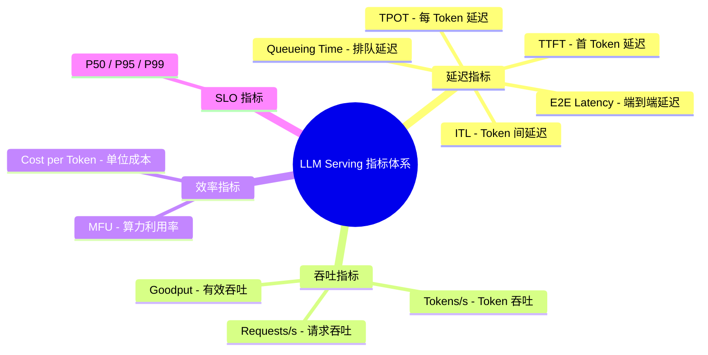
```mermaid
mindmap
  root((LLM Serving 指标体系))
    延迟指标
      TTFT - 首 Token 延迟
      TPOT - 每 Token 延迟
      ITL - Token 间延迟
      E2E Latency - 端到端延迟
      Queueing Time - 排队延迟
    吞吐指标
      Tokens/s - Token 吞吐
      Requests/s - 请求吞吐
      Goodput - 有效吞吐
    效率指标
      MFU - 算力利用率
      Cost per Token - 单位成本
    SLO 指标
      P50 / P95 / P99
```

#### 1.4.1 指标详解

| 指标 | 定义 | 影响因素 | 优化方向 |
|------|------|----------|----------|
| **TTFT** (Time To First Token) | 从请求到达到返回第1个 token 的延迟 | Prefill 计算量、排队时间、Prefix Cache 命中率 | Chunked Prefill、Prefix Cache、PD 分离 |
| **TPOT** (Time Per Output Token) | 生成每个输出 token 的平均耗时 | Decode 带宽、Batch Size、KV Cache 大小 | Speculative Decoding、量化、CUDA Graph |
| **ITL** (Inter-Token Latency) | 相邻两个输出 token 之间的实际间隔 | 与 TPOT 类似，但反映实际波动 | 稳定调度、减少抢占 |
| **E2E Latency** | 端到端总延迟 | = Queueing + Prefill + Decode + Egress | 全链路优化 |
| **Queueing Time** | 请求在队列中等待调度的时间 | 并发量、Batch 容量、Admission Control | 动态扩容、负载均衡 |
| **Tokens/s** | 系统每秒处理的 token 总量 | GPU 利用率、Batch Size、并行度 | Continuous Batching、多卡并行 |
| **MFU** | Model FLOPs Utilization | 实际算力/理论峰值算力 | 减少空闲、算子融合 |
| **Goodput** | 满足 SLO 约束的有效吞吐 | 尾延迟控制能力 | 抢占策略、Admission Control |
| **P50/P95/P99** | 延迟百分位数 | 尾部请求的资源竞争 | 公平调度、优先级机制 |
| **Cost per Token** | 每生成 1 token 的综合成本 | 硬件利用率、吞吐量 | 量化、MoE 稀疏化 |

#### 1.4.2 端到端延迟分解

```
├──────────────────────── E2E Latency ────────────────────────┤
┌──────────┬───────────┬───────────────────────────┬─────────┐
│ Queueing │  Prefill  │      Decode (N steps)     │ Egress  │
│  排队    │  一次性   │   TPOT × N 个 output token │  回传   │
└──────────┴───────────┴───────────────────────────┴─────────┘
 ←  wait  → ← compute- → ←────── memory-bound ─────→ ← net →
             bound
           ↑                                              ↑
         TTFT 到这里为止                              Last Token
```

这条横线也说明，TTFT 不等于"第一段耗时"，而是从请求到达到第一个 output token 的总和，其中包含 Queueing 和 Prefill。E2E 的大头通常是 Decode，因为它要乘上整个输出长度。只盯着 TPOT 会漏掉排队和长 prompt 的影响，只盯着 TTFT 又会低估长输出场景的成本。

### 1.5 总纲：vLLM 其实只在回答四个问题

前面的挑战和指标可以收敛成四个问题。**本文剩下的所有内容——以及 vLLM 绝大部分核心代码——都可以归进这四问之一。** 后面每章开头，我都会标明它在回答哪一问。

| # | 问题 | 核心机制 | 主要落点 | 本文章节 |
|---|------|---------|---------|---------|
| 一 | 请求来了，**这一轮谁执行、执行多少？** | Continuous Batching、Token Budget、Chunked Prefill、抢占 | `Scheduler` | 第四章 |
| 二 | 历史状态**放在哪里、怎么复用？** | PagedAttention、Prefix Cache、GQA/MLA、KV 量化 | `KVCacheManager` / `BlockPool` | 第三章 |
| 三 | 这一轮**怎么算得更快？** | FlashAttention、CUDA Graph、算子融合、量化、投机解码 | `ModelRunner` / Attention Backend | 第五章 |
| 四 | 一张卡不够，**怎么扩出去？** | TP / PP / EP / CP / DP、集合通信 | `Executor` / `distributed` | 第六章 |

四问之外还有两个**横切约束**：模型在变（第七章）、硬件在变（第八章）——它们不新增问题，但要求上面四个答案在剧烈变化的外部环境里保持稳定。最后，第九章把四问从单机尺度推到集群尺度（PD 分离）。

读到后面任何一个陌生的类名或机制时，建议先问一句：**它在回答哪一问？** 这比记住它在哪个文件里重要得多。


### 1.6 一个贯穿全文的例子

抽象的讨论容易滑走，所以从这里开始，本文会**反复回到同一个具体请求**。后面每一章都会带着它算一笔账。

> **场景设定**
>
> - **模型**：Llama-3-70B，FP16，80 层，`hidden=8192`，64 个 Q head / 8 个 KV head（GQA-8），`head_dim=128`
> - **硬件**：8 × H100 80GB，TP=8，机内 NVLink
> - **请求**：2000 token 的 system prompt + 50 token 的用户提问，生成 300 token
>   - prompt 合计 **2050** token，结束时序列长度 **2350** token

先把两个最基础的量算出来，后面各章都要用：

| 量 | 计算 | 结果 |
|---|---|---|
| 每 token 每层的 KV | `2(K,V) × 8 kv_head × 128 dim × 2 B` | **4 KB** |
| 每 token 的 KV（80 层） | `4 KB × 80` | **320 KB** |
| ↳ TP=8 时每张卡承担 | `320 KB ÷ 8` | 40 KB |
| 这个请求最终的 KV 总量 | `2350 × 320 KB` | **约 734 MB** |
| 权重每卡 | `141 GB ÷ 8` | 17.6 GB |

记住 **320 KB/token** 这个数——它是后面所有账的基础。


## 二、鸟瞰 vLLM：一个请求如何穿过整个推理系统？

### 2.1 静态系统拓扑（自顶向下）

vLLM V1 的整体架构遵循**控制面/数据面分离**的经典设计哲学。我们自顶向下，逐层解剖其系统拓扑。

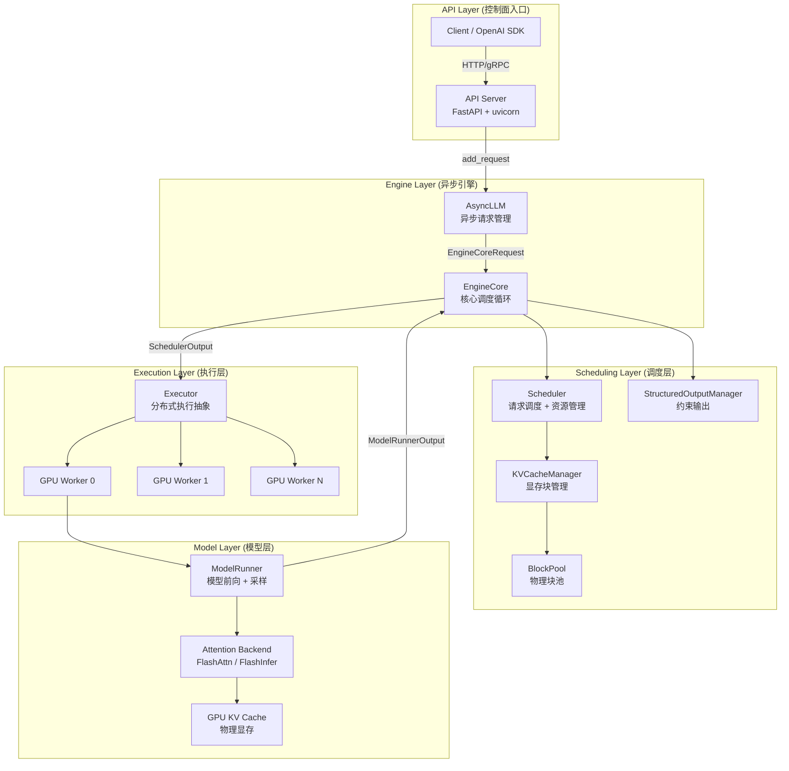
```mermaid
graph TB
    subgraph "API Layer (控制面入口)"
        Client[Client / OpenAI SDK]
        API[API Server<br/>FastAPI + uvicorn]
    end

    subgraph "Engine Layer (异步引擎)"
        AsyncLLM[AsyncLLM<br/>异步请求管理]
        EngineCore[EngineCore<br/>核心调度循环]
    end

    subgraph "Scheduling Layer (调度层)"
        Scheduler[Scheduler<br/>请求调度 + 资源管理]
        KVCacheManager[KVCacheManager<br/>显存块管理]
        BlockPool[BlockPool<br/>物理块池]
        SOManager[StructuredOutputManager<br/>约束输出]
    end

    subgraph "Execution Layer (执行层)"
        Executor[Executor<br/>分布式执行抽象]
        Worker0[GPU Worker 0]
        Worker1[GPU Worker 1]
        WorkerN[GPU Worker N]
    end

    subgraph "Model Layer (模型层)"
        MR0[ModelRunner<br/>模型前向 + 采样]
        Attn[Attention Backend<br/>FlashAttn / FlashInfer]
        KVCache[GPU KV Cache<br/>物理显存]
    end

    Client -->|HTTP/gRPC| API
    API -->|add_request| AsyncLLM
    AsyncLLM -->|EngineCoreRequest| EngineCore
    EngineCore --> Scheduler
    Scheduler --> KVCacheManager
    KVCacheManager --> BlockPool
    EngineCore --> SOManager
    EngineCore -->|SchedulerOutput| Executor
    Executor --> Worker0
    Executor --> Worker1
    Executor --> WorkerN
    Worker0 --> MR0
    MR0 --> Attn
    Attn --> KVCache
    MR0 -->|ModelRunnerOutput| EngineCore
```

从这张图看，从 Client 到 EngineCore 是请求入队路径，传递的是"生成什么"；EngineCore 到 Worker 再到 ModelRunner 是执行路径，携带的是这一轮调度出来的 batch 和 block 布局；而 ModelRunner 返回的只是采样结果，不是下一次 forward 的完整状态。调度状态留在 EngineCore，模型侧负责的是单次前向计算。

#### API Server 与 AsyncLLM：异步并发处理的桥头堡

入口位于 `vllm/entrypoints/openai/api_server.py`，基于 FastAPI 构建的 HTTP 服务器，实现了 OpenAI 兼容的 `/v1/chat/completions`、`/v1/completions` 等 REST API。

`AsyncLLM`（`vllm/v1/engine/async_llm.py`）是面向外部的异步引擎接口，负责：
- 接收 HTTP 请求并转化为内部 `EngineCoreRequest`
- 管理请求的异步生命周期
- 支持 SSE 流式响应
- 数据并行（DP）场景下的多引擎协调

#### EngineCore：推理系统的中央调度大脑

`EngineCore`（`vllm/v1/engine/core.py`）是 vLLM V1 引擎的核心，它的 `step()` 方法驱动整个推理循环：

```python
# vllm/v1/engine/core.py (简化)
class EngineCore:
    """Inner loop of vLLM's Engine."""

    def __init__(self, vllm_config, executor_class, ...):
        # 1. 初始化模型执行器
        self.model_executor = executor_class(vllm_config)

        # 2. 初始化 KV Cache
        kv_cache_config = self._initialize_kv_caches(vllm_config)

        # 3. 初始化调度器
        Scheduler = vllm_config.scheduler_config.get_scheduler_cls()
        self.scheduler = Scheduler(
            vllm_config=vllm_config,
            kv_cache_config=kv_cache_config,
            ...
        )
```

#### Scheduler 与 KVCacheManager：资源管理双核

`Scheduler`（`vllm/v1/core/sched/scheduler.py`，约 3000 行）是调度的大脑，决定每一轮迭代中哪些请求参与推理、分配多少 token 预算。

`KVCacheManager`（`vllm/v1/core/kv_cache_manager.py`）管理 GPU 显存上的 KV Cache 物理块——分配、释放、前缀缓存复用、驱逐。

#### Worker 与 Model Executor：模型执行的设备抽象

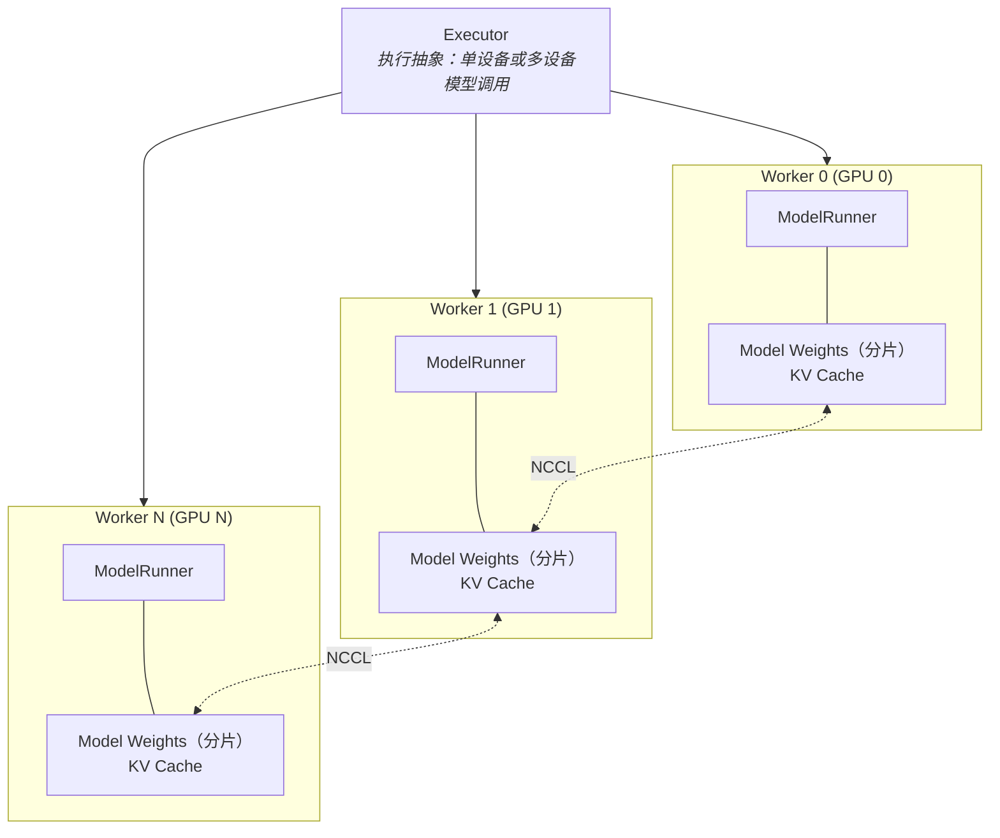
```mermaid
graph TB
    EX["Executor<br/><i>执行抽象：单设备或多设备模型调用</i>"]
    EX --> W0 & W1 & WN
    subgraph W0["Worker 0 (GPU 0)"]
        M0["ModelRunner"] --- S0["Model Weights（分片）<br/>KV Cache"]
    end
    subgraph W1["Worker 1 (GPU 1)"]
        M1["ModelRunner"] --- S1["Model Weights（分片）<br/>KV Cache"]
    end
    subgraph WN["Worker N (GPU N)"]
        MN["ModelRunner"] --- SN["Model Weights（分片）<br/>KV Cache"]
    end
    S0 <-.->|NCCL| S1
    S1 <-.->|NCCL| SN
```

常见 GPU 部署中，Executor 会把一次 `execute_model()` 调用分发给一个或多个 Worker；Worker 再调用本地的 `ModelRunner` 执行模型前向、采样和 KV Cache 读写。单卡、同机多进程、Ray 分布式和 external launcher 的进程/设备映射并不完全相同，因此不应把“一个 GPU 固定绑定一个 Worker 进程”写成绝对规则。

每个 Worker 通常负责：
- `ModelRunner`：负责模型前向计算、输入准备、采样
- 模型权重的分片（Tensor Parallel 下每卡持有一部分）
- KV Cache 物理显存

`Executor`（`vllm/v1/executor/abstract.py`）是模型执行抽象层，负责在一个设备或多个设备上执行模型，而不是 Scheduler 本身。v0.27.1 中可见的主要实现包括：
- `UniProcExecutor`：单进程单卡
- `MultiprocExecutor`：多进程多卡（同机）
- `RayDistributedExecutor`：Ray 分布式（直接继承 `Executor`）
- `RayExecutorV2`：Ray 分布式的新实现，注意它继承的是 `MultiprocExecutor` 而非 `Executor`——即复用同一套 worker 进程管理逻辑，只把进程的**拉起方式**换成 Ray（`RayWorkerProc(WorkerProc)`）
- `ExecutorWithExternalLauncher`：外部 launcher 场景（继承 `UniProcExecutor`）

这条继承链本身就说明了一件事：**"用不用 Ray"是部署方式的差异，不是执行模型的差异。** Executor 这层抽象的价值就在于把"进程怎么起、卡怎么分"和"一轮 batch 怎么执行"彻底分开，所以 V2 才能靠换掉进程拉起方式来复用同机多进程的全部逻辑。


### 2.2 一次请求的完整生命周期

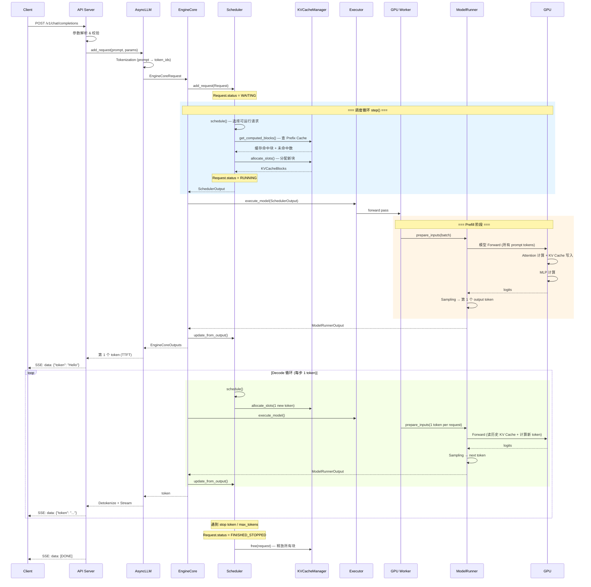
```mermaid
sequenceDiagram
    participant C as Client
    participant API as API Server
    participant E as AsyncLLM
    participant EC as EngineCore
    participant S as Scheduler
    participant KV as KVCacheManager
    participant EX as Executor
    participant W as GPU Worker
    participant MR as ModelRunner
    participant GPU as GPU

    C->>API: POST /v1/chat/completions
    API->>API: 参数解析 & 校验
    API->>E: add_request(prompt, params)
    E->>E: Tokenization (prompt → token_ids)
    E->>EC: EngineCoreRequest
    EC->>S: add_request(Request)

    Note over S: Request.status = WAITING

    rect rgb(230, 245, 255)
        Note over EC,GPU: === 调度循环 step() ===
        S->>S: schedule() — 选择可运行请求
        S->>KV: get_computed_blocks() — 查 Prefix Cache
        KV-->>S: 缓存命中块 + 未命中数
        S->>KV: allocate_slots() — 分配新块
        KV-->>S: KVCacheBlocks
        Note over S: Request.status = RUNNING
        S-->>EC: SchedulerOutput
    end

    EC->>EX: execute_model(SchedulerOutput)
    EX->>W: forward pass

    rect rgb(255, 245, 230)
        Note over W,GPU: === Prefill 阶段 ===
        W->>MR: prepare_inputs(batch)
        MR->>GPU: 模型 Forward (所有 prompt tokens)
        GPU->>GPU: Attention 计算 + KV Cache 写入
        GPU->>GPU: MLP 计算
        GPU-->>MR: logits
        MR->>MR: Sampling → 第 1 个 output token
    end

    MR-->>EC: ModelRunnerOutput
    EC->>S: update_from_output()
    EC-->>E: EngineCoreOutputs
    E-->>API: 第 1 个 token (TTFT)
    API-->>C: SSE: data: {"token": "Hello"}

    loop Decode 循环 (每步 1 token)
        rect rgb(245, 255, 230)
            S->>S: schedule()
            S->>KV: allocate_slots(1 new token)
            EC->>EX: execute_model()
            W->>MR: prepare_inputs(1 token per request)
            MR->>GPU: Forward (读历史 KV Cache + 计算新 token)
            GPU-->>MR: logits
            MR->>MR: Sampling → next token
            MR-->>EC: ModelRunnerOutput
            EC->>S: update_from_output()
        end
        EC-->>E: token
        E-->>API: Detokenize + Stream
        API-->>C: SSE: data: {"token": "..."}
    end

    Note over S: 遇到 stop token / max_tokens
    Note over S: Request.status = FINISHED_STOPPED
    S->>KV: free(request) — 释放所有块
    API-->>C: SSE: data: [DONE]
```

### 2.3 数据流：Token 如何穿过整个 Serving 栈

```
  ┌──────┐     ┌─────────┐     ┌────────┐     ┌───────────┐
  │Client│────▶│API Server│────▶│AsyncLLM│────▶│EngineCore │
  └──────┘     └─────────┘     └────────┘     └─────┬─────┘
  "Hello,       HTTP JSON       add_request     EngineCoreReq
   tell me                      (text)          (token_ids)
   a joke"                         │
                              Tokenizer
                          [15496, 11, 2425,
                           757, 257, 9707]
                                                     │
                                              ┌──────▼──────┐
                                              │  Scheduler   │
                                              │  schedule()  │
                                              └──────┬──────┘
                                              SchedulerOutput
                                              (req_ids, block_table,
                                               num_tokens_per_req)
                                                     │
                                              ┌──────▼──────┐
                                              │  Executor    │
                                              │  → Worker    │
                                              └──────┬──────┘
                                                     │
                                              ┌──────▼──────┐
                                              │ ModelRunner  │
                                              │prepare_inputs│
                                              └──────┬──────┘
                                              input_ids, positions,
                                              block_table, slot_mapping
                                                     │
                                              ┌──────▼──────┐
                                              │   GPU       │
                                              │  Forward    │
                                              │  Pass       │
                                              └──────┬──────┘
                                              logits [vocab_size]
                                                     │
                                              ┌──────▼──────┐
                                              │  Sampling   │
                                              │ (top-p/top-k│
                                              │  /temp)     │
                                              └──────┬──────┘
                                              sampled_token_id
                                                     │
                                              ┌──────▼──────┐
                                              │Detokenizer  │
                                              │ → "Sure"    │
                                              └──────┬──────┘
                                                     │
  ┌──────┐     ┌─────────┐                    ┌──────▼──────┐
  │Client│◀────│SSE Stream│◀───────────────────│  Response   │
  └──────┘     └─────────┘                    └─────────────┘
  "Sure, here's a joke..."
```


### 2.4 总结

这一章主要要关注的是模块之间的分工：

> **EngineCore 驱动循环，Scheduler 决定这一轮谁跑、跑多少 token，Executor 负责把任务分发下去，ModelRunner 负责真正调用 GPU 算。**

把它和上一章的四问对齐，就得到全文的骨架：

| 四问 | 承担模块 |
|------|---------|
| 一、这一轮谁执行、执行多少 | `Scheduler`（+ `EngineCore` 驱动） |
| 二、状态放哪、怎么复用 | `KVCacheManager` / `BlockPool` |
| 三、怎么算得更快 | `ModelRunner` / Attention Backend / Kernel |
| 四、怎么扩出去 | `Executor` / `Worker` / 集合通信 |


<details markdown="1">
<summary><b>📂 本章源码导航</b></summary>

**入口与引擎循环**

| 想看什么 | 从哪开始 |
|---|---|
| HTTP 入口、OpenAI 兼容接口 | `vllm/entrypoints/openai/api_server.py` |
| 异步请求生命周期、流式响应 | `vllm/v1/engine/async_llm.py` |
| **推理主循环（建议从这里入手）** | `vllm/v1/engine/core.py` → `EngineCore.step()` |
| 执行抽象与各种部署形态 | `vllm/v1/executor/abstract.py` |
| 一轮 batch 在 GPU 上怎么跑 | `vllm/v1/worker/gpu/model_runner.py` |

</details>


## 三、KV Cache：LLM Serving 的第一号内存问题

> **本章回答第二问：历史状态放在哪里、怎么复用。**

设想一个场景：

你有一张 80 GB 的卡，同时来了 100 个请求。第一个请求最后只生成了 300 个 token，第二个生成了 3000 个，第三个一路写到 20K。**问题在于：这三个数字，你在请求到达的那一刻一个都不知道。**

如果按传统做法，给每个请求划一块连续显存来放它的 KV Cache，那你只能按"最坏情况"预留——按模型支持的最大长度划。于是那个只生成 300 token 的请求，占着一块够装 32K token 的地。100 个请求这么一摊，卡就满了，尽管真正装了有效数据的可能不到三成。

> **显存不是被模型吃掉的，是被"不确定性"浪费掉的。**

PagedAttention 的核心思想，用一句话就能说完：

> **别给请求整块连续空间。把 KV Cache 切成固定大小的小块，用多少申请多少，块与块之间不要求相邻。**

这样"预留"就消失了——因为不再需要预判总长度，只需要在写满当前块时再要一块。这个思路你大概率见过：**它就是操作系统的虚拟内存分页**。下面我们从传统做法的具体代价讲起，再看这套页表思想是怎么被搬到 GPU 上的。

### 3.1 PagedAttention 的数学本质与源码实现

#### 痛点：传统显存分配的碎片灾难

在 PagedAttention 出现之前，每个请求的 KV Cache 必须在 GPU 显存中预分配一段**连续内存**，其长度等于模型支持的最大序列长度。这造成了两类碎片：

```
GPU HBM (80 GB)，每个请求按 max_len=2048 预留连续空间
┌──────────────────────────────────────────────────────────┐
│ Req A  ████████░░░░░░░░░░░░░░░░░░░░░░░░░░░░░░░░░░░░░░░░  │
│        ↑实际用 500      ↑ 内部碎片：1548 tokens 的空间白占 │
│ Req B  ████████████████░░░░░░░░░░░░░░░░░░░░░░░░░░░░░░░░  │
│ ░░░░░░ 剩余空间凑不出一整段连续的 2048 → Req C 进不来 ░░░  │
│        （外部碎片：总量其实够，但不连续）                  │
└──────────────────────────────────────────────────────────┘
```

| 碎片类型 | 成因 | 后果 |
|---|---|---|
| **内部碎片** | 按最大长度预留，实际用不了那么多 | 主要浪费来源 |
| **外部碎片** | 已释放的空间不连续 | 总量够却无法分配给新请求 |

总浪费率有多大？PagedAttention 论文（SOSP'23）测得当时的 SOTA 系统中，**真正存放有效 KV 的显存只占 20.4% ~ 38.2%**——也就是约 60% ~ 80% 被碎片和预留吃掉了。

#### 页表思想的映射：操作系统虚拟内存在推理系统中的重现

PagedAttention 的灵感直接来自操作系统的虚拟内存管理。核心思想是将连续的逻辑地址空间映射到不连续的物理页框：

| | 操作系统虚拟内存 | PagedAttention |
|---|---|---|
| 连续的逻辑视图 | 虚拟地址空间（Page 0,1,2,3…） | 逻辑 token 序列（Blk 0,1,2…，每块 16 个 token） |
| 映射表 | Page Table（VP → PF） | **Block Table**（虚拟块 → 物理块） |
| 不连续的物理载体 | 物理页框 Physical Frame | **物理 KV 块** Physical Block（GPU HBM 上） |
| 分配单位 | 一页（如 4 KB） | 一块（`block_size` 个 token 的 K/V） |
| 好处 | 进程看到连续内存，实际零散存放 | 请求看到连续序列，KV 实际零散存放 |

映射关系是这样的——注意物理块号完全不需要连续：

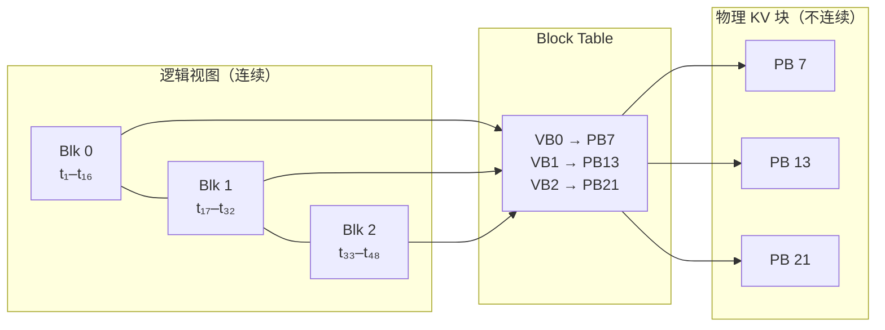
```mermaid
graph LR
    subgraph LOG["逻辑视图（连续）"]
        B0["Blk 0<br/>t₁–t₁₆"] --- B1["Blk 1<br/>t₁₇–t₃₂"] --- B2["Blk 2<br/>t₃₃–t₄₈"]
    end
    subgraph BT["Block Table"]
        T["VB0 → PB7<br/>VB1 → PB13<br/>VB2 → PB21"]
    end
    subgraph PHY["物理 KV 块（不连续）"]
        P7["PB 7"]
        P13["PB 13"]
        P21["PB 21"]
    end
    B0 --> T
    B1 --> T
    B2 --> T
    T --> P7 & P13 & P21
```

在 vLLM 中，每个物理块（Physical Block）存储固定数量 token 的 K 和 V 张量：

```python
# KV Cache 物理布局 (单层)
# shape: [num_physical_blocks, block_size, num_kv_heads, head_dim]
# 例: [2048 blocks, 16 tokens/block, 8 heads, 128 dim]
kv_cache = torch.zeros(num_blocks, block_size, num_kv_heads, head_dim,
                        dtype=torch.float16, device="cuda")
```

#### 源码解密：核心数据结构关系

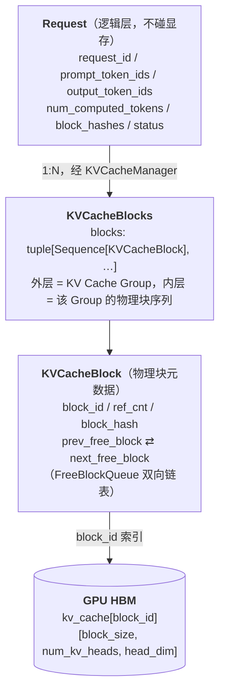
```mermaid
graph TD
    R["<b>Request</b>（逻辑层，不碰显存）<br/>request_id / prompt_token_ids / output_token_ids<br/>num_computed_tokens / block_hashes / status"]
    R -->|"1:N，经 KVCacheManager"| KB
    KB["<b>KVCacheBlocks</b><br/>blocks: tuple[Sequence[KVCacheBlock], …]<br/>外层 = KV Cache Group，内层 = 该 Group 的物理块序列"]
    KB --> B
    B["<b>KVCacheBlock</b>（物理块元数据）<br/>block_id / ref_cnt / block_hash<br/>prev_free_block ⇄ next_free_block（FreeBlockQueue 双向链表）"]
    B -->|"block_id 索引"| H
    H[("<b>GPU HBM</b><br/>kv_cache[block_id]<br/>[block_size, num_kv_heads, head_dim]")]
```

顺着箭头从上到下跟踪：Request 只是逻辑层，不直接触及 GPU 显存；KVCacheBlock 才是物理块的元数据，它同时挂在 Request 的 blocks 列表和 BlockPool 的 free/cached 列表里；block_id 最终索引到 GPU HBM 中的一片连续显存，里面放的是一整块 block_size 个 token 的 K 和 V。这三层映射是理解后面 Prefix Cache 复用和 Preemption 释放的基础。

> **回到我们的例子**：2050 个 prompt token，`block_size=16`，于是需要 `⌈2050/16⌉ = 129` 个块（前 128 块装满 2048 个 token，第 129 块只装 2 个）。生成完 300 个 token 后，序列长 2350，共占 **147 个块**。
>
> 注意一个巧合般的细节：**2000 个 token 的 system prompt 恰好是 125 个整块**。这不是偶然设计，但它揭示了 Prefix Cache 的一个硬约束——只有**装满**的块才会被缓存，所以可复用的边界永远对齐到 `block_size`。下一节就用这一点算账。

`BlockPool`（`vllm/v1/core/block_pool.py`）管理所有物理块的分配和回收，使用双向链表实现高效的 LRU 驱逐：

```python
# vllm/v1/core/block_pool.py (简化)
class BlockPool:
    def __init__(self, num_gpu_blocks: int, ...):
        self.num_gpu_blocks = num_gpu_blocks
        self.free_block_queue = FreeKVCacheBlockQueue(num_gpu_blocks)
        # Prefix Cache: hash → 物理块映射
        self.cached_block_hash_to_block = BlockHashToBlockMap()

    def get_new_blocks(self, num_blocks: int) -> list[KVCacheBlock]:
        """从空闲队列分配新块（如果不够，驱逐 LRU 缓存块）"""
        ...

    def free_blocks(self, blocks: Iterable[KVCacheBlock]):
        """ref_cnt--，归零则回收到空闲队列"""
        ...

    def cache_full_blocks(self, request, blocks, ...):
        """将满块的 hash 注册到 Prefix Cache"""
        ...
```

块分配的布局（引自 `allocate_slots()` 注释）：

```
  |<──── computed ────>|<─ new_computed ─>|<─ external ─>|<── new ──>|<─ lookahead ─>|
                                                          |<── to be computed ──────>|
                                          |<────────── to be allocated ──────>|
                                          |<────────── to be cached ──────────>|

  computed:      之前已缓存在 KV Cache 中的 tokens（Prefix Cache 命中）
  new_computed:  本轮新计算但已完成的 tokens
  external:      从远端传输的 KV 块（PD 分离场景）
  new:           需要本轮计算的新 tokens
  lookahead:     为 Speculative Decoding 预留的额外 tokens
```

这个布局也揭示了 Scheduler 为什么不能按请求类型硬分类。一轮迭代中一个请求可能同时覆盖 computed（prefix cache 命中）、new（需要新计算）和 lookahead（spec decode 预留），不同请求在这个轴上的位置各不相同。token 预算模型统一处理这些区间，而不是按"prefill 请求"和"decode 请求"分开。

---

### 3.2 KV Cache 的写入、读取与生命周期

上一节讲的是「块从哪来」，这一节讲「块怎么被用完再还回去」——一次请求从 Prefill 批量写入，到 Decode 逐 slot 追加，最后在完成或被抢占时归还，构成 KV Cache 的完整生命周期。

```
                     KV Cache 生命周期全景

  ┌─────── Prefill 阶段 ──────┐   ┌────── Decode 阶段 ──────┐
  │                            │   │                          │
  │  prompt tokens:            │   │  每步 1 个新 token:       │
  │  [t₁, t₂, ..., tₙ]       │   │  [tₙ₊₁], [tₙ₊₂], ...   │
  │       │                    │   │       │                  │
  │       ▼                    │   │       ▼                  │
  │  ┌─────────────────┐      │   │  ┌──────────┐           │
  │  │ 批量写入 KV     │      │   │  │ 增量追加  │           │
  │  │ Cache 块        │      │   │  │ 1 个 slot │           │
  │  │                 │      │   │  │           │           │
  │  │ Block 0: [t₁~t₁₆]│   │   │  │ Block 2:  │           │
  │  │ Block 1: [t₁₇~t₃₂]│  │   │  │ 追加 tₙ₊₁ │           │
  │  │ Block 2: [t₃₃~tₙ] │   │   │  └──────────┘           │
  │  └─────────────────┘      │   │                          │
  └────────────────────────────┘   └──────────────────────────┘

  ┌─────── Attention 读取 ──────────────────────────────────┐
  │                                                         │
  │  Block Table (虚拟→物理映射):                            │
  │  req_42 → [PhyBlock_7, PhyBlock_13, PhyBlock_21]       │
  │                                                         │
  │  Attention Kernel 通过 Block Table 索引读取:             │
  │  for each query position:                               │
  │    for each block in block_table[req]:                  │
  │      K_block = kv_cache[block_id, :, :key_heads, :]    │
  │      V_block = kv_cache[block_id, :, :val_heads, :]    │
  │      score += Q @ K_blockᵀ                              │
  │    attn_out = softmax(scores) @ V_blocks               │
  └─────────────────────────────────────────────────────────┘

  ┌─────── 生命周期终结 ────────────────────────────────────┐
  │                                                         │
  │  请求完成:                                               │
  │    Scheduler → KVCacheManager.free(request)             │
  │    → ref_cnt-- 对所有块                                  │
  │    → ref_cnt == 0 的块归还 free_block_queue              │
  │    → 有 block_hash 的块进入 LRU 缓存（Prefix Cache）     │
  │    → 无 hash 的块立即回收                                 │
  │                                                         │
  │  抢占:                                                   │
  │    → 释放所有块                                          │
  │    → num_computed_tokens = 0 （需从头重算）               │
  │    → 但 Prefix Cache 命中可跳过部分重算                   │
  └─────────────────────────────────────────────────────────┘
```

**① 写入**——两个阶段的写法完全不同：

| 阶段 | 写入方式 | 例子 |
|---|---|---|
| Prefill | 批量写入若干整块 | `Block 0: t₁~t₁₆`、`Block 1: t₁₇~t₃₂`、`Block 2: t₃₃~tₙ` |
| Decode | 每步增量追加 1 个 slot | `Block 2` 尾部追加 `tₙ₊₁`，写满了才要新块 |

**② 读取**——Attention Kernel 不认识"请求"，只认 Block Table：

```
Block Table:  req_42 → [PB_7, PB_13, PB_21]

for each query position:
    for block_id in block_table[req]:
        K_block = kv_cache[block_id, :, :key_heads, :]
        V_block = kv_cache[block_id, :, :val_heads, :]
        scores += Q @ K_blockᵀ
    attn_out = softmax(scores) @ V_blocks
```

**③ 归还**——这一步决定了块能不能被别人复用：

| 触发 | 动作 | 关键后果 |
|---|---|---|
| 请求完成 | `KVCacheManager.free(request)`：所有块 `ref_cnt--` | `ref_cnt == 0` 才真正归还 `free_block_queue` |
| ↳ 块有 `block_hash` | 进入 LRU 缓存 | **留给 Prefix Cache 复用** |
| ↳ 块无 hash（未写满） | 立即回收 | 无法复用 |
| 被抢占 | 释放所有块 + `num_computed_tokens = 0` | 需重算，但 Prefix Cache 命中可跳过大部分 |

注意倒数第二行：**块只有"写满"才会被缓存**。这解释了为什么 Prefix Cache 的命中粒度是 `block_size`，而不是单个 token。

---

### 3.3 KV Cache 还能更小吗：复用、压缩与分层存储

在进入具体手段之前，先立一个分层框架——**这三层解决的是完全不同的问题，不应该混为一谈**：

| 层级 | 手段 | 解决的问题 |
|------|------|-----------|
| 系统管理层 | PagedAttention、Prefix Cache | 已经要存这么多，**显存怎么管才不浪费** |
| 模型架构层 | MQA / GQA / MLA | **本来到底需要存多少** |
| 数值层 | FP8 / INT8 量化 | 每个 KV 元素**占几个字节** |

三者是正交的，可以叠加：MLA 减少了要存的量，PagedAttention 管理这些量的摆放，FP8 再把每个元素压小。下面按这个顺序展开。

#### 3.3.1 Prefix Cache：重复计算复用

在生产环境中，大量请求共享相同的 System Prompt（如 ChatGPT 的系统指令可能占 2000+ tokens）。Prefix Cache 的核心思想是：如果两个请求的前缀 token 完全相同，它们可以共享同一份 KV Cache 块。

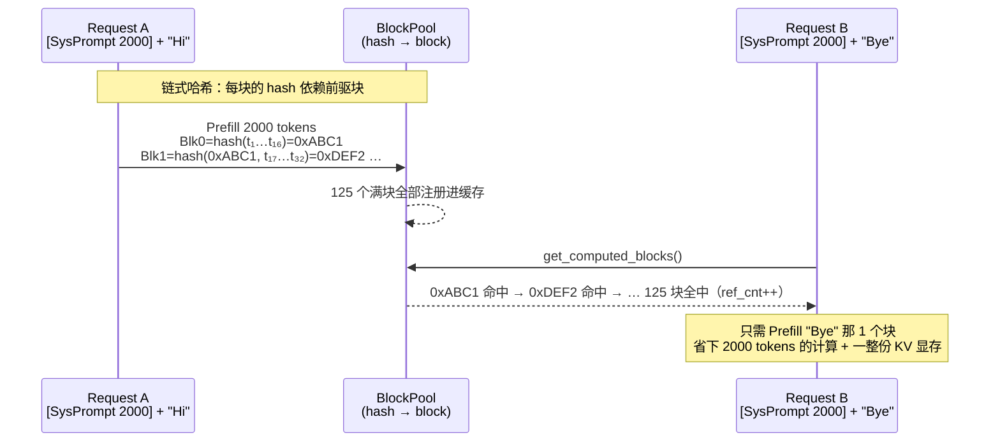
```mermaid
sequenceDiagram
    participant A as Request A<br/>[SysPrompt 2000] + "Hi"
    participant P as BlockPool<br/>(hash → block)
    participant B as Request B<br/>[SysPrompt 2000] + "Bye"

    Note over A,P: 链式哈希：每块的 hash 依赖前驱块
    A->>P: Prefill 2000 tokens<br/>Blk0=hash(t₁…t₁₆)=0xABC1<br/>Blk1=hash(0xABC1, t₁₇…t₃₂)=0xDEF2 …
    P-->>P: 125 个满块全部注册进缓存
    B->>P: get_computed_blocks()
    P-->>B: 0xABC1 命中 → 0xDEF2 命中 → … 125 块全中（ref_cnt++）
    Note over B: 只需 Prefill "Bye" 那 1 个块<br/>省下 2000 tokens 的计算 + 一整份 KV 显存
```

vLLM 使用链式哈希确保前缀匹配的正确性——每个块的哈希值依赖其前驱块的哈希，因此只有完全相同的前缀序列才会产生相同的哈希链。

> **回到我们的例子**：那 2000 token 的 system prompt 是 **125 个整块**。第一个请求跑完后它们全部进入缓存；**第二个请求带着同样的 system prompt 到来时，这 125 块全部命中**，只需要 prefill 用户那 50 个 token。
>
> 省下多少？按第 1.6 节的量算：
>
> - **计算**：2000 token 的 prefill 不用做了，TTFT 从约 92 ms 掉到 5 ms 量级
> - **显存**：这 125 块（约 625 MB 的 KV）在两个请求间**共享同一份物理块**，靠 `ref_cnt` 计数，不是复制
>
> 在真实的多租户服务里，system prompt 往往被成百上千个请求共享——这就是为什么 Prefix Cache 是性价比最高的优化之一。

```python
# vllm/v1/core/kv_cache_utils.py (签名照抄, 函数体简化)
def hash_block_tokens(
    hash_function: Callable[[Any], bytes],
    parent_block_hash: BlockHash | None,
    curr_block_token_ids: Sequence[int],
    extra_keys: tuple[Any, ...] | None = None,
) -> BlockHash:
    """链式哈希：当前块哈希 = f(前驱块哈希, 本块 token ids, 额外键)"""
    if not parent_block_hash:
        parent_block_hash = NONE_HASH  # 首块的哈希起点
    return BlockHash(
        hash_function((parent_block_hash, tuple(curr_block_token_ids), extra_keys))
    )
```

这个签名里有两个细节值得留意，它们不是实现噪音：

- **哈希函数是注入进来的，不是 Python 内建的 `hash()`**，返回值也是 bytes 而非 int（可选 `sha256_cbor`、`xxhash_cbor` 等）。因为块哈希要在多个 worker、甚至跨节点（PD 分离、LMCache）之间对得上，必须可控且可复现。
- **链条起点 `NONE_HASH` 默认是随机的。** `init_none_hash()` 在未设置 `PYTHONHASHSEED` 时取 `os.urandom(32)`，即每个进程一个随机起点；只有显式设置 `PYTHONHASHSEED` 才会变成确定值。这是一个刻意的安全默认：随机起点让块哈希无法被外部预测，避免跨租户的缓存探测；而想让多进程/多节点共享同一份 prefix cache，就必须放弃这个默认。**可复现性和不可预测性在这里是一对取舍**，vLLM 默认选了后者。
- **`extra_keys` 是隔离用的。** 同一串 token 在不同 LoRA adapter、不同多模态输入、不同 `cache_salt`、不同 prompt embeds 下不能复用同一份 KV，这些维度都由 `generate_block_hash_extra_keys()` 收集进 `extra_keys`。也就是说，"前缀相同"的判定比"token 序列相同"严格——这是 prefix cache 的正确性边界。

#### 3.3.2 GQA / MQA：模型结构级 KV Cache 瘦身

KV Cache 的大小与 KV head 数量成正比。Grouped-Query Attention (GQA) 和 Multi-Query Attention (MQA) 通过减少 KV head 数来缩减 KV Cache：

以 8 个 Query head 为例，三种变体的差别只在于**几个 Q head 共享一份 K/V**：

| 变体 | Q heads | K/V heads | 每 token 每层 KV 大小 | 相对 MHA |
|---|---|---|---|---|
| **MHA** | 8 | 8（一对一） | `2 × L × S × H × d` | 100% |
| **GQA** | 8 | 2~4（分组共享） | `2 × L × S × G × d` | 1/2 ~ 1/8 |
| **MQA** | 8 | 1（全部共享） | `2 × L × S × 1 × d` | 1/8 ~ 1/64 |

```
MHA   Q: [1][2][3][4][5][6][7][8]
      K: [1][2][3][4][5][6][7][8]      ← 一个 Q 配一个 K/V

GQA   Q: [1][2][3][4][5][6][7][8]
      K: [ G1  ][ G2  ][ G3  ][ G4 ]   ← 每 2 个 Q 共享一份

MQA   Q: [1][2][3][4][5][6][7][8]
      K: [        K1            ]      ← 全部 Q 共享一份
```

代价是表达能力：K/V head 越少，KV Cache 越小，但模型区分不同注意力模式的自由度也越低。GQA 是目前公认的甜点区——这也是为什么 Llama 3 全系都用 GQA。

| 模型 | 注意力类型 | num_heads | num_kv_heads | KV Cache 比例 |
|------|-----------|-----------|-------------|--------------|
| GPT-3 175B | MHA | 96 | 96 | 100% |
| Llama 3 70B | GQA | 64 | 8 | 12.5% |
| Llama 3 8B | GQA | 32 | 8 | 25% |
| Falcon 7B | MQA | 71 | 1 | 1.4% |
| DeepSeek V3 | MLA | 128 | - | ~2% (存 576 维 latent，非 128×128 的完整 KV) |

#### 3.3.3 MLA：从 KV Cache 到 Latent Cache

DeepSeek V2/V3 提出的 Multi-head Latent Attention (MLA) 是一种更激进的 KV Cache 压缩方案。它不存储完整的 K、V 张量，而是存储一个低维的 latent 向量：

| | 传统 MHA / GQA | MLA（DeepSeek） |
|---|---|---|
| 存的是什么 | `K [Hkv, d]` + `V [Hkv, d]` | `c_kv [kv_lora_rank]` + `k_pe [qk_rope_head_dim]` |
| 每 token 每层 | `2 × Hkv × d` bytes | `(kv_lora_rank + qk_rope_head_dim) × sizeof(dtype)` |
| 实例 | Llama-70B（GQA-8）：`2×8×128×2B` = **4 KB** | DeepSeek V3：`(512+64)×2B` ≈ **1.1 KB** |

MLA 的运作分两步——**存的时候压缩，用的时候还原**：

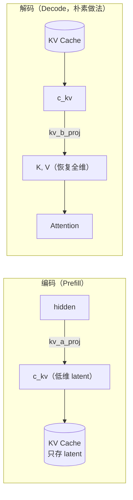
```mermaid
graph LR
    subgraph E["编码（Prefill）"]
        H[hidden] -->|kv_a_proj| C["c_kv（低维 latent）"] --> KV[("KV Cache<br/>只存 latent")]
    end
    subgraph D["解码（Decode，朴素做法）"]
        KV2[("KV Cache")] --> C2[c_kv] -->|kv_b_proj| KVF["K, V（恢复全维）"] --> AT[Attention]
    end
```

但朴素做法有个致命问题：**每一步 Decode 都要把全部历史 token 的 latent 解压回全维 K/V**，那省下的显存又变成了带宽开销。真正的关键优化叫 **"吸收"（Absorbing）**——把解压矩阵 `W_uk` 预先融合进 `W_q`，于是可以**直接在 latent 空间做 Attention，完全不解压**。这一手的工程细节留到第 7.4.1 节展开。

压缩效果：相比同规模 MHA 可缩减一个数量级以上；相比 Llama 式 GQA-8（4 KB/token/layer）约缩减 3~4x。

vLLM 中 MLA 的实现位于 `vllm/model_executor/layers/mla.py`，通过 `MLAAttentionSpec` 定义其特殊的 KV Cache 规格（存储 latent 而非完整 KV）。

#### 3.3.4 KV Cache Quantization：数值压缩与带宽优化

除了结构级的压缩（GQA/MQA/MLA），还可以通过数值量化进一步压缩 KV Cache：

| 格式 | 每元素 | 相对 FP16 | 精度影响 |
|---|---|---|---|
| FP32 | 4 bytes | 2.0× | 基准（训练精度） |
| FP16 / BF16 | 2 bytes | 1.0× | 标准推理精度 |
| **FP8 (E4M3)** | 1 byte | 0.5× | **轻微损失，实践中最安全的选择** |
| INT8 | 1 byte | 0.5× | 需要校准，按 head / channel 量化 |
| INT4 | 0.5 bytes | 0.25× | 显著损失，很少用于 KV Cache |

算一遍实际规模（Llama-70B、GQA-8、80 layers、seq_len=4096）：

| 场景 | 计算 | 结果 |
|---|---|---|
| 单请求 FP16 | 4 KB/token/layer × 4096 × 80 | 1.34 GB |
| 单请求 FP8 | 2 KB/token/layer × 4096 × 80 | 0.67 GB（省 50%） |
| **并发 8 路 FP16** | 1.34 GB × 8 | **10.7 GB** |

单请求看着不大，但注意最后一行：**KV Cache 是"并发数 × 上下文长度"的乘积**，这才是它压垮显存的方式。

量化粒度决定了精度与开销的平衡，scale 分得越细越准、但元数据越多：

| 粒度 | 含义 | 精度 |
|---|---|---|
| Per-tensor | 整个 KV Cache 共享 1 个 scale | 最差 |
| Per-token | 每个 token 一个 scale | 较好 |
| Per-head | 每个 head 一个 scale | 精细 |
| Per-channel | 每个 channel 一个 scale | 最优 |
| Per-group | 每 G 个元素共享 scale | 灵活折中 |

实现上分两个动作：**Quantize-on-write**（写入时即以低精度存储）和 **Dequantize-on-read**（读取时反量化，或直接在 attention kernel 内处理）。是否启用取决于模型、dtype、backend 与配置。

KV Cache 量化与 PagedAttention 在设计上可以组合：量化后的 KV 仍按 block 粒度管理，同时需要记录相应 scale 或格式元数据。具体是否支持、如何存储 scale、是否在 attention kernel 内完成反量化，取决于 v0.27.1 中对应模型、dtype 和 attention backend 的实现。

**注意**：Softmax 对 Key 的误差特别敏感（因为指数函数会放大误差），长上下文下量化误差可能累积。FP8 是实践中最安全的 KV Cache 量化格式。

#### 3.3.5 KV Cache Offloading 与 Swapping

当 GPU 显存不足时，vLLM 支持将 KV Cache 卸载到更低层的存储：

| 层级 | 容量 | 带宽 | 延迟 | 存什么 |
|---|---|---|---|---|
| **GPU HBM**（热） | 10–80 GB | 3.35 TB/s (H100) | ~ns | 活跃请求的 KV |
| **CPU DRAM**（温） | 256 GB–2 TB | ~200 GB/s | ~100 ns | 被抢占请求的 KV（经 PCIe Gen5，64 GB/s） |
| **NVMe SSD**（冷） | 1–16 TB | ~7 GB/s | ~10 μs | 长期前缀缓存（较新的方向） |

当 GPU 显存不够时，有三种应对策略，代价各不相同：

| 策略 | 做法 | 优点 | 缺点 |
|---|---|---|---|
| **Recomputation**（重算） | 直接释放 KV，恢复时从头算 | 无传输开销，不占 CPU 内存 | 浪费 GPU 算力 |
| **Swapping**（换出） | KV 块 GPU→CPU，恢复时回传 | 保留了已算结果 | 吃 PCIe 带宽 |
| **Quantization + Offload** | 量化后再换出 | 传输量减半 | 额外精度损失 |

vLLM V1 当前主要使用 **Recomputation** 策略（`_preempt_request()` 中将 `num_computed_tokens` 置零），因为在 Prefix Cache 存在的情况下，重算的实际成本远低于理论最坏情况——大部分前缀块仍在缓存中可复用。

<details markdown="1">
<summary><b>📂 本章源码导航</b></summary>

**KV Cache 与 PagedAttention**

| 想看什么 | 从哪开始 |
|---|---|
| **块的分配与释放（核心）** | `vllm/v1/core/kv_cache_manager.py` → `allocate_slots()` |
| 物理块池、LRU 驱逐、Prefix Cache 注册 | `vllm/v1/core/block_pool.py` |
| 块哈希、`extra_keys`、`NONE_HASH` | `vllm/v1/core/kv_cache_utils.py` → `hash_block_tokens()` |
| 各类 KV Cache 规格（含 MLA） | `vllm/v1/kv_cache_interface.py` |
| MLA 层实现 | `vllm/model_executor/layers/mla.py` |
| KV 量化 | `vllm/model_executor/layers/quantization/` |

</details>

---

## 四、Scheduler：GPU 这一轮到底给谁用？

> **本章回答第一问：请求来了，这一轮谁执行、执行多少。**

KV Cache 解决的是"状态如何存"；Scheduler 解决的是"每一轮谁能获得多少 token 预算"。两者高度耦合，但不是同一层抽象。把调度单独成章，可以避免把显存块管理和请求选择策略混为一谈。

如果说 PagedAttention 是 vLLM 最出名的技术，那 Scheduler 就是最被低估的那个。**PagedAttention 决定"状态放得下多少"，Scheduler 决定"这一轮 GPU 到底给谁用"——只有两者合在一起，才构成一个 Serving 系统。** 这一章值得读得慢一点。

而理解 vLLM 调度器最关键的一句话是：

> ### vLLM 的 Scheduler 调度的不是 Request，而是 Token Budget。

它不问"这个请求是 prefill 还是 decode"，只问"这一轮我还剩多少 token 额度，这个请求能吃掉多少"。同一轮里的三个请求可能长这样：

```
Request A（长 prompt 还没喂完） → 本轮推进 256 个 prefill token
Request B（正常生成中）         → 本轮推进 1 个 decode token
Request C（开了投机解码）       → 本轮推进 1 个真实 token + 4 个候选 token
                                  ────────────────────────────
                                  本轮 token 预算共消耗 262
```

这三种形态在调度器眼里没有类型差别，只有数量差别——都是"让 `num_computed_tokens` 向 `num_tokens_with_spec` 追赶若干步"。**Continuous Batching 之所以能"continuous"，正是因为调度的粒度细到了 token，而不是停留在 request。** 下面几节都是这句话的展开。

### 4.1 Scheduler 与 Continuous Batching

#### 4.1.1 迭代级组批（Iteration-level Batching）

Continuous Batching 是 vLLM 最具革命性的调度创新。传统 DL 推理中，一个 Batch 的所有请求必须同时开始、同时结束。Continuous Batching 打破这一限制，在**每一步迭代**级别动态调整 Batch 组成：


```mermaid
gantt
    title Continuous Batching 时间线
    dateFormat X
    axisFormat %s

    section Request A
    Prefill     :a1, 0, 2
    Decode      :a2, 2, 8
    Done ✓      :milestone, 8, 0

    section Request B
    Prefill     :b1, 0, 3
    Decode      :b2, 3, 12
    Done ✓      :milestone, 12, 0

    section Request C
    Wait        :c0, 0, 2
    Prefill     :c1, 2, 4
    Decode      :c2, 4, 9
    Done ✓      :milestone, 9, 0

    section Request D
    Wait        :d0, 0, 8
    Prefill     :d1, 8, 9
    Decode      :d2, 9, 14
    Done ✓      :milestone, 14, 0
```

关键代码路径在 `Scheduler.schedule()` 中。下面的伪代码强调 v0.27.1 的统一 token 预算模型，而不是严格的 Prefill / Decode 两阶段：

```python
# vllm/v1/core/sched/scheduler.py (概念化简)
def schedule(self, throttle_prefills=False) -> SchedulerOutput:
    token_budget = self.max_num_scheduled_tokens

    # 先尝试推进已经 running 的请求。
    # 注意：源码注释明确说明 scheduler 内部没有严格的
    # "decoding phase" 或 "prefill phase"。
    for req in self.running:
        target = req.num_tokens_with_spec
        num_new_tokens = target - req.num_computed_tokens
        num_new_tokens = min(num_new_tokens, token_budget)

        if self.scheduler_config.long_prefill_token_threshold > 0:
            num_new_tokens = min(
                num_new_tokens,
                self.scheduler_config.long_prefill_token_threshold,
            )

        blocks = self.kv_cache_manager.allocate_slots(req, num_new_tokens)
        if blocks is None:
            self._preempt_request(req)
            continue

        token_budget -= num_new_tokens

    # 再从 waiting 队列中接纳新请求或恢复请求。
    for req in self.waiting:
        computed_blocks, num_computed = self.kv_cache_manager.get_computed_blocks(req)
        num_new_tokens = req.num_tokens_with_spec - num_computed

        # Prefix cache、chunked prefill、spec decode、encoder budget
        # 都会影响本轮最终能推进多少 token。
        num_new_tokens = min(num_new_tokens, token_budget)

        blocks = self.kv_cache_manager.allocate_slots(req, num_new_tokens)
        if blocks is None:
            break

        req.status = RequestStatus.RUNNING
        token_budget -= num_new_tokens

    return SchedulerOutput(...)
```

这个模型能同时覆盖普通 prefill、decode、chunked prefill、prefix cache、speculative decoding / MTP 以及部分多模态或 encoder-decoder 约束。Prefill 和 Decode 仍然会在性能分析中出现，但它们是 workload 形态，不是 `Scheduler.schedule()` 内部的硬编码阶段。

注意伪代码中两个循环不是"decode 循环"和"prefill 循环"——只是先处理 running 队列、再处理 waiting 队列。每个循环里实际分配的 token 数量都由 `num_tokens_with_spec - num_computed_tokens` 算出，这个差值既可以是一个 decode token，也可以是一段 prefill token，或者 spec decode 的多个候选 token。

> **回到我们的例子**：这个请求进来时 `num_computed_tokens = 0`，`num_tokens_with_spec = 2050`，差值 2050 就是它"想要"的额度。但它拿不到这么多——假设 `max_num_batched_tokens = 2048`，而同一轮里还有别的请求在 decode，那么它本轮实际只能推进几百个 token，剩下的下一轮继续。
>
> 于是这个请求的一生在调度器眼里是这样的：**先用若干轮把 `num_computed_tokens` 从 0 追到 2050（这些轮属于 prefill 形态），然后是 300 轮每轮 +1（decode 形态）。** 调度器全程没有"切换阶段"这个动作，它只是一直在做同一件事——**发 token 额度**。

---

### 4.2 Batch 是如何动态变化的

上一节的 token 预算模型，落到宏观时间线上就是 Continuous Batching 与传统 Static Batching 的差别：

```
  ┌─────────────── Static Batching (传统) ──────────────────┐
  │                                                         │
  │  Step 1:  [Req A ████████████]                         │
  │           [Req B ██████ pad  ]  ← Padding 浪费         │
  │           [Req C ████ pad    ]  ← Padding 浪费         │
  │                                                         │
  │  Step 2:  [Req A ████████████]  ← A 已完成但仍占位      │
  │           [Req B ██████████  ]                          │
  │           [Req C ████████    ]                          │
  │                                                         │
  │  问题: A 完成后其 GPU 资源闲置，D 排队等待               │
  └─────────────────────────────────────────────────────────┘

  ┌──────────── Continuous Batching (vLLM) ─────────────────┐
  │                                                         │
  │  Iter 1:  [A:prefill] [B:prefill] [C:prefill]          │
  │  Iter 2:  [A:decode ] [B:decode ] [C:decode ]          │
  │  Iter 3:  [A:done ✓ ] [B:decode ] [C:decode ] [D:prefill]  ← D 立即加入!
  │  Iter 4:              [B:decode ] [C:done ✓ ] [D:decode] [E:prefill]
  │  Iter 5:              [B:done ✓ ] [D:decode ] [E:decode] [F:prefill]
  │                                                         │
  │  优势: 请求完成即释放资源，新请求立即填补空位              │
  │        GPU 利用率持续保持高位                             │
  └─────────────────────────────────────────────────────────┘
```

| 特性 | Static Batching | Continuous Batching |
|------|----------------|-------------------- |
| Batch 生命周期 | 固定，等所有请求完成 | 每轮迭代动态调整 |
| 新请求加入 | 等当前 Batch 全部完成 | 每轮迭代可加入 |
| 已完成请求 | 占位直到 Batch 结束 | 立即释放资源 |
| Padding | 需要对齐，浪费算力 | 无 Padding |
| GPU 利用率 | 随请求完成逐渐降低 | 持续高位 |
| 实现复杂度 | 简单 | 需要动态内存管理 |

---

### 4.3 Chunked Prefill：长文本 Prefill 拆分

长 prompt（如 32K tokens 的文档）如果一次性 Prefill，会导致：
1. **TTFT 飙升**：该请求独占 GPU 直到 Prefill 完成
2. **Decode 阻塞**：其他正在 Decode 的请求被迫等待
3. **TPOT 波动**：Decode 请求的逐 token 延迟出现尖峰

Chunked Prefill 将长 Prefill 拆分为多个小块，与 Decode 请求混合执行：

```
无 Chunked Prefill —— 长请求独占整条 batch
  Iter 1: [Long Prefill ██████████████████]   ← 32K tokens，其他请求全停
  Iter 2: [Long Prefill ██████████████████]   ← 还在 Prefill…
  Iter 3: [A:decode][B:decode][C:decode]      ← 终于轮到
  ✗ TPOT 出现长达数十 ms 的尖峰

有 Chunked Prefill —— 每轮只切一小段，预算留给别人
  Iter 1: [Chunk₁ ███][A:decode][B:decode][C:decode]
  Iter 2: [Chunk₂ ███][A:decode][B:decode][C:decode]
  Iter 3: [Chunk₃ ███][A:decode][B:decode][C:decode]
  …
  Iter N: [ChunkN █  ][A:decode][B:decode][C:decode]
  ✓ TPOT 平稳，代价是这个长请求的 TTFT 上升
```

对比两列可以看到，Chunked Prefill 改变的不仅是长请求自身的调度方式，更是整条 batch 的预算分配。没有 chunking 时，长请求会在若干轮内独占整条 batch；有 chunking 时，每轮只切一小段 prefill，剩余的 token 预算留给其他请求 decode。代价是长请求要经过更多轮才能完成 prefill，TTFT 会上升，但其他请求的 TPOT 更稳定。

> **回到我们的例子**：2050 token 的 prompt，若设 `long_prefill_token_threshold = 512`，它会被切成 **5 段**（512×4 + 2）。代价是这个请求要多等 4 轮才出首 token，TTFT 上升；收益是这 5 轮里其他请求的 decode 一直在正常推进，**没有一轮被它独占**。
>
> 这就是 TTFT 与 TPOT 之间那笔典型交易——而第 1.3 节说过，系统要做的从来不是消灭这种取舍，而是把它调到 SLO 允许的位置上。

```python
# Chunked Prefill 的核心逻辑
if num_new_tokens > request_token_budget:
    if not self.enable_chunked_prefill:
        break  # 等待足够预算
    # 截断到当前可用预算
    num_new_tokens = min(num_new_tokens, request_token_budget)
    req.is_prefill_chunk = True  # 标记为非最终 prefill 块
```

### 4.4 抢占与 Admission Control

当 GPU 显存耗尽时，Scheduler 面临极端抉择：

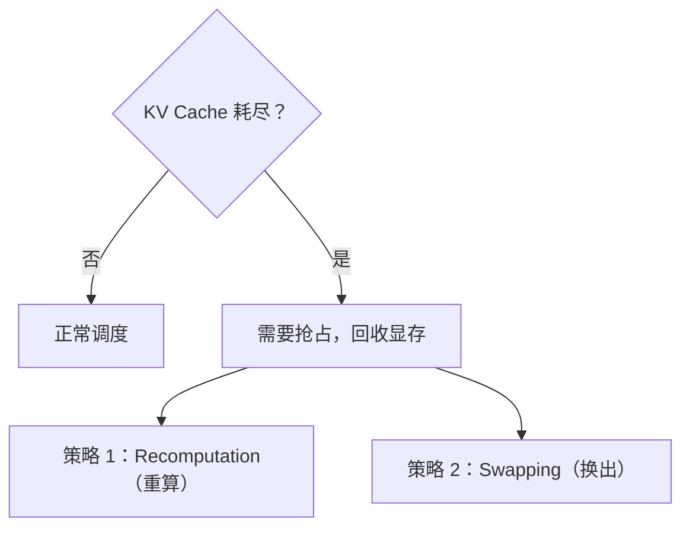
```mermaid
graph TD
    Q{"KV Cache 耗尽？"} -->|否| N["正常调度"]
    Q -->|是| P["需要抢占，回收显存"]
    P --> R["策略 1：Recomputation（重算）"]
    P --> S["策略 2：Swapping（换出）"]
```

| | Recomputation（重算） | Swapping（换出） |
|---|---|---|
| 做法 | 释放该请求所有 KV 块，`num_computed_tokens = 0`，重新入队到 WAITING **队头** | KV 块 GPU→CPU 异步传出，保存请求状态，恢复时再回传 |
| 优点 | 不占用 CPU 内存 | 保留了已算的结果 |
| 缺点 | 浪费 GPU 算力 | 吃 PCIe 带宽 |
| 缓解 | 恢复时 Prefix Cache 命中可跳过大部分重算 | — |

两条附加规则：

- **抢占顺序是 LIFO** ——最后进来的请求最先被抢占。这样已经跑了很久的请求不至于前功尽弃。
- **重新入队时放在队头**，而不是队尾，让被抢占的请求优先恢复。

```python
# vllm/v1/core/sched/scheduler.py (简化)
def _preempt_request(self, request, timestamp, ...):
    """抢占请求: 释放所有 KV 块，重置计算进度"""
    self._free_request_blocks(request)
    self.encoder_cache_manager.free(request)
    request.status = RequestStatus.PREEMPTED
    request.num_computed_tokens = 0  # 回退到零 → 需要重算
    request.num_preemptions += 1
    self.waiting.prepend_request(request)  # 放到队头，优先恢复
```

`KVCacheManager` 还提供了一个 `watermark` 旋钮，用于在准入时预留一层显存余量，减少"刚放进来就被抢占"的震荡：

```python
# vllm/v1/core/kv_cache_manager.py
self.watermark_blocks = int(watermark * kv_cache_config.num_blocks)
...
# 只在接纳 waiting / preempted 请求时施加这层余量:
required_blocks = num_blocks_to_allocate + watermark_blocks
if free_blocks < required_blocks:
    # 本轮不接纳，请求留在 WAITING 队列
```

但这里有两个容易被误读的前提，值得说清楚：

1. **`watermark` 默认是 `0.0`**，也就是说默认并不预留余量。它是一个可调项，而不是 vLLM 默认开启的保护机制。
2. **它只作用于新入场和被抢占后恢复的请求**（源码注释明确写了 "applied to waiting/preempted requests only"）。已经 RUNNING 的请求继续申请块时不受这层余量约束——否则正在生成的请求会因为水位线而被无谓地抢占，反而放大抖动。

所以更准确的说法是：vLLM 的准入控制主要靠"KV 块不够就不调度、不够就抢占"这条硬约束，`watermark` 只是叠加在其上的可选缓冲。

<details markdown="1">
<summary><b>📂 本章源码导航</b></summary>

**调度**

| 想看什么 | 从哪开始 |
|---|---|
| **统一 token 预算的调度主体（本章最该读的）** | `vllm/v1/core/sched/scheduler.py` → `Scheduler.schedule()`，尤其开头那段 `NOTE(woosuk)` 注释 |
| 抢占逻辑 | 同上 → `_preempt_request()` |
| 请求状态机与 `num_computed_tokens` | `vllm/v1/request.py` |
| 调度决策的数据结构 | `vllm/v1/core/sched/output.py` |
| `max_num_batched_tokens`、`long_prefill_token_threshold` 等旋钮 | `vllm/config/scheduler.py` |

</details>

---

## 五、GPU 执行：如何让每个 Token 算得更快？

> **本章回答第三问：这一轮已经确定要算的 token，怎么算得更快。**

上一章决定了"这一轮算哪些 token"，这一章的问题是：**这些已经确定要算的 token，怎么算得更快。**

Decode 偏 memory-bound、Prefill 偏 compute-bound（第 1.2 节），但落到 GPU 上，浪费其实只有四种形态。这一章就按这四种浪费组织：

| 浪费形态 | 症状 | 对策 | 本章小节 |
|---|---|---|---|
| GPU 在**等 CPU 发指令** | kernel 之间有气泡 | CUDA Graph | 5.1 |
| GPU 在**等 HBM 送数据** | 算力闲置、访存打满 | FlashAttention、算子融合 | 5.2 |
| 搬的**每个数太胖** | 带宽被低信息密度的数据占满 | FP8 / INT8 / INT4 量化 | 5.3 |
| **轮次本身太多** | 每轮只产出 1 个 token | 投机解码 | 5.4 |

最后 5.5 回到现实：真实的一轮 batch 里，prefill、decode、投机候选是混在一起的。

> **回到我们的例子**（Llama-3-70B、8×H100、TP=8）：每张卡持有 17.6 GB 权重，H100 HBM 带宽 3.35 TB/s，于是**一次 decode 的权重读取下界约 5.3 ms**；加上 KV 读取、80 层 × 2 次 All-Reduce 和 kernel 开销，实测一步大约在 10 ms 量级。
>
> 那么这个请求的账就清楚了：
>
> | 环节 | 估算 | 占比 |
> |---|---|---|
> | Prefill 2050 token | ≈ 92 ms（8×H100 稠密算力 7.9 PFLOPS，按 40% MFU 估） | 3% |
> | Decode 300 步 | 300 × 10 ms ≈ **3000 ms** | **97%** |
> | E2E | ≈ 3.1 s | |
>
> **看清楚这个 3% vs 97%**：TTFT 只有 92 ms，而 97% 的时间花在那 300 次逐 token 的 decode 上。这解释了本章为什么把绝大部分篇幅给了 Decode 侧的优化——Prefill 再快一倍，端到端也只省 3%。

### 5.1 GPU 为什么在空转？—— Kernel Launch 与 CUDA Graph

第一种浪费最反直觉：**GPU 并不慢，它只是在排队等 CPU 告诉它下一步做什么。** 这个问题在 Prefill 阶段几乎看不见（单个 kernel 算得久，提交开销被淹没），却会在 Decode 阶段被放大——因为 Decode 每步的计算量太小了。

#### 5.1.1 痛点：Kernel Launch Overhead

在 Decode 阶段，每步模型 Forward 要启动**数百到上千个** CUDA Kernel，而每个 Kernel 的实际 GPU 计算时间可能只有几十微秒。数量之所以这么多，是因为它是**逐层累乘**的：以 80 层的 Llama-3-70B 为例，单层就有 RMSNorm ×2、QKV Proj、RoPE、Attention、O Proj、MLP 的三个 GEMM 与激活，TP=8 下还要再加 2 次 All-Reduce——十几个 kernel × 80 层，一步下来轻松上千。32 层的 7B 也在数百这个量级。

这里要先破除一个常见的误解：**kernel launch 本身是异步的，CPU 提交完就返回，并不会傻等 GPU 算完。** 正常情况下 CPU 会一路往前提交，把 GPU 的任务队列填满，提交开销完全隐藏在 GPU 执行时间背后。所以真正的成立条件只有一个：

> **当单个 kernel 的 GPU 执行时间 < CPU 提交它所需的时间时，GPU 就会追上 CPU，队列被抽干，开始出现气泡。**

这就解释了为什么 CUDA Graph 基本只对 Decode 有意义：Prefill 的 kernel 动辄跑几百微秒，CPU 那点提交开销（现代 CUDA 通常 2–5 μs 量级）根本追不上；而 Decode 每个 kernel 可能只有几十微秒，几十个 kernel 排下来，CPU 就成了拖后腿的那一方。

下图画的正是这种**已经追平之后**的最坏情形——注意它不是常态，而是 Decode 小 kernel 场景下才会退化成的样子：

```
┌───────── 无 CUDA Graph: Decode 一步的 Kernel Launch 开销 ────────────┐
│                                                                       │
│  CPU (Host):                                                          │
│  ──[launch]─[wait]─[launch]─[wait]─[launch]─[wait]─ ...              │
│     5μs      │      5μs      │      5μs      │                       │
│              │               │               │                        │
│  GPU (Device):               │               │                        │
│  ──────────[kernel₁]────[kernel₂]────[kernel₃]──── ...               │
│              30μs            20μs            40μs                      │
│                                                                       │
│  问题: GPU 在等 CPU 发射下一个 kernel 时空闲（气泡）                   │
│  400 个 kernel × 5μs launch = 2000μs                                  │
│  总执行 = 2000μs(launch) + ~8000μs(compute) = 10000μs                │
│  launch 开销占比 ≈ 20%（这是完全暴露时的上界）                          │
│                                                                       │
│  注意: 这 2000μs 只有在"CPU 提交跟不上 GPU 消费"时才真正暴露出来。     │
│       若 GPU 侧足够慢（如 Prefill），同样的提交开销会被完全隐藏，       │
│       此时上 CUDA Graph 收益接近于零。                                 │
└───────────────────────────────────────────────────────────────────────┘
```

#### 5.1.2 CUDA Graph：静态执行图捕获与重放

CUDA Graph 将一系列 Kernel Launch 录制成一个"计算图"，之后用一次 Launch 重放整个图：

```
┌───────── CUDA Graph: 一次 Launch 重放整个 Decode 步 ─────────────────┐
│                                                                       │
│  Capture 阶段 (启动时一次性完成):                                       │
│  ─[record start]─[kernel₁]─[kernel₂]─...─[kernelₙ]─[record end]─   │
│  → 得到 CUDAGraph 对象, 记录了全部 kernel 及其参数地址                  │
│                                                                       │
│  Replay 阶段 (每步推理):                                               │
│  CPU: ──[replay: 1次launch, ~10μs]────────────────────────────────   │
│  GPU: ──[kernel₁][kernel₂][kernel₃]...[kernelₙ]──  (无 gap!)         │
│         连续执行，kernel 之间无 launch 等待                             │
│                                                                       │
│  总执行 = 10μs(1次launch) + ~8000μs(compute) = 8010μs               │
│  vs 上面完全暴露时的 10000μs → 上界省 20%                              │
│  实测通常在 5%~15%（部分提交开销本来就被隐藏了）                        │
│                                                                       │
│  约束:                                                                 │
│  · 图中 kernel 的形状必须固定 → 需要对不同 Batch Size 预捕获           │
│  · 内存地址必须固定 → 通过 placeholder tensor 复用                     │
│  · 不支持动态控制流 → Decode (固定模式) 适用, Prefill (可变) 不适用     │
└───────────────────────────────────────────────────────────────────────┘
```

捕获与重放由 `CudaGraphManager`（`vllm/v1/worker/gpu/cudagraph_utils.py`）负责，而"用哪种模式"由配置枚举 `CUDAGraphMode`（`vllm/config/compilation.py`）描述：

```python
# vllm/config/compilation.py
class CUDAGraphMode(enum.Enum):
    NONE = 0                        # 全程 Eager
    PIECEWISE = 1                   # 分段录制（处理动态部分）
    FULL = 2                        # 完整模型 Forward 录制为一个大图
    FULL_DECODE_ONLY = (FULL, NONE)       # decode 走 FULL, mixed batch 走 Eager
    FULL_AND_PIECEWISE = (FULL, PIECEWISE)  # decode 走 FULL, mixed batch 走 PIECEWISE
```

- **FULL**：将整个模型 Forward（从 input_ids 到 logits）录制为单个 CUDA Graph，Decode 时一次 Launch 完成。通常最高效，但要求执行路径和张量地址在运行时保持固定。
- **PIECEWISE**：将模型拆分为多个子图，动态部分（如 MoE routing）在子图之间执行。灵活性更好，但性能稍低。

注意后两个成员的值是**元组**：这正是前面"Decode 用 Graph、Prefill 用 Eager"这句话在代码里的落地方式。`FULL_DECODE_ONLY` 和 `FULL_AND_PIECEWISE` 各自携带两个运行时模式，`decode_mode()` 取第一个、`mixed_mode()` 取第二个，调度出来的 batch 是纯 decode 还是含 prefill 的混合批次，决定了这一轮走哪条路径。换句话说，CUDA Graph 的适用边界不是一个全局开关，而是**每一轮 batch 形态的函数**。

```python
# vllm/v1/worker/gpu/model_runner.py (简化)
def _execute_model(self, scheduler_output, ...):
    batch_desc = self._get_batch_desc(scheduler_output)

    if batch_desc.cg_mode == CUDAGraphMode.FULL:
        # 一次性重放完整 CUDA Graph
        output = self.cudagraph_manager.run_fullgraph(batch_desc)
    elif batch_desc.cg_mode == CUDAGraphMode.PIECEWISE:
        # 分段重放 + 动态执行
        output = self.cudagraph_manager.run_pw_graph(self.model, model_inputs)
    else:
        # Eager 模式（无 CUDA Graph，用于 Prefill）
        output = self.model(input_ids, positions, kv_caches, attn_metadata)
```

---

### 5.2 数据为什么搬不动？—— 压缩 HBM 流量

第二种浪费才是大头。GPU 的算力增长速度远快于显存带宽，于是绝大多数推理 kernel 的真实瓶颈都不是"算不完"，而是"数据喂不上"。

这一节的三种手段看起来毫不相干——换 Attention 实现、融合算子、挑后端——但它们优化的是**同一个量**：

> **HBM 流量 = 搬运次数 × 每次搬运的数据量。**

FlashAttention 和 Kernel Fusion 减少的是"搬运次数"（别让中间结果落地再读回来），下一节的量化减少的是"每次搬多少字节"。

#### 5.2.1 Attention 后端：同一个计算，多种 kernel

Attention 后端是算子优化的第一个决策点：同一个 Attention 计算，在不同请求阶段、不同硬件和 dtype 下，最优 kernel 可能完全不同。v0.27.1 在 `vllm/v1/attention/backends/` 下提供了数十种后端，通过 `registry.py` 的 selector 按 head_size、dtype、硬件能力和 workload 形态（Prefill / Decode / Mixed / MLA）动态选择。

Prefill 场景通常偏向 FlashAttention 等对长 query 高效的后端；Decode 场景中 FlashInfer 对 ragged batch 和 PagedAttention 的原生支持更匹配；MLA 等特殊 attention 变体还有 CUTLASS MLA、FlashInfer MLA、FlashMLA、Triton MLA 等针对性实现。以下列举 v0.27.1 中部分主要后端：

- FlashAttention (`flash_attn.py`)：NVIDIA GPU 上广泛使用的 Attention 实现，对 Prefill 长序列有良好吞吐。也有 `flash_attn_diffkv` 变体。
- FlashInfer (`flashinfer.py`)：针对 Decode 的 ragged batch、PagedAttention、Prefill+Decode 混合批次做了深度优化。
- Triton Attention (`triton_attn.py`, `triton_attn_diffkv.py`)：Triton 语言的灵活后端，易于定制和移植。
- ROCm 后端 (`rocm_attn.py`, `rocm_aiter_fa.py`, `rocm_aiter_unified_attn.py`)：AMD GPU 特化实现。
- MLA 后端 (`mla/`)：FlashInfer MLA、FlashMLA、CUTLASS MLA、Triton MLA、AITER Triton MLA、TokenSpeed MLA、ROCm AITER MLA 等，为 DeepSeek 等模型的低秩 KV 提供专门优化。
- 其他后端：FlexAttention (`flex_attention.py`)、GDN Attention、Linear Attention、Mamba 后端、CPU Attention 等。

选择不是全局固定的：“通常 FlashInfer 是默认 Decode 后端”这种说法需要加上版本、硬件和模型前提。实际使用中 selector 会根据环境自动选择，生产部署前建议用当前版本和目标 workload 做 benchmark 确认。

#### 5.2.2 FlashAttention：Tiling 与 Online-Softmax

FlashAttention 是现代 LLM 推理的基石算子。它的核心思想是通过**分块计算（Tiling）**和 **Online Softmax**，让 N×N 的中间矩阵**根本不必在 HBM 里出现**。注意它优化的是**访存**，计算量（FLOPs）一分没少。

```
┌──────────────── Standard Attention vs FlashAttention ─────────────────┐
│                                                                       │
│  Standard Attention:                                                  │
│                                                                       │
│  Q[N,d] × K[N,d]ᵀ → S[N,N]     ← O(N²) 存储, 写入 HBM                  │
│        → softmax(S) → P[N,N]    ← O(N²) 存储, 读写 HBM                 │
│        → P × V[N,d] → O[N,d]    ← O(N²) 读取 HBM                       │
│                                                                       │
│  总 HBM 访问: O(N² + N·d)                                             │
│  瓶颈: N > 几千时, S 和 P 矩阵占满显存                                   │
│                                                                       │
│  ────────────────────────────────────────────────────────────────     │
│                                                                       │
│  FlashAttention (Tiling + Online Softmax):                            │
│                                                                       │
│  将 Q, K, V 分成 Bq × Bk 的小块:                                        │
│                                                                       │
│  ┌──────┐                                                             │
│  │ SRAM │ ← 只在片上缓存 (192 KB, A100)                                 │
│  │      │                                                             │
│  │ Q_tile [Bq, d]  ← 从 HBM 加载一次                                   │
│  │ K_tile [Bk, d]  ← 分块加载                                          │
│  │ V_tile [Bk, d]  ← 分块加载                                          │
│  │ S_tile [Bq, Bk] ← 在 SRAM 中计算, 不写回 HBM!                        │
│  │ O_acc  [Bq, d]  ← 在线累加                                          │
│  │ m, l   [Bq]     ← softmax 统计量 (max, sum)                         │
│  └──────┘                                                             │
│                                                                       │
│  for each K_tile, V_tile:                                             │
│    S_tile = Q_tile @ K_tileᵀ                (SRAM 内计算)              │
│    m_new = max(m_old, rowmax(S_tile))       (Online max)              │
│    P_tile = exp(S_tile - m_new)             (SRAM 内计算)              │
│    l_new = exp(m_old - m_new) * l_old + rowsum(P_tile)                │
│    O_acc = rescale(O_acc) + P_tile @ V_tile (Online 累加)              │
│                                                                       │
│  总 HBM 访问: O(N²d²/M)（`M`为可用SRAM大小） ← 相比 O(N²) 大幅降低!        ｜                  │
│  无需存储 N×N 矩阵, 序列长度不再受显存限制                                 │
└───────────────────────────────────────────────────────────────────────┘
```

**Standard Attention** 的问题在于它把两个 N×N 的大矩阵实实在在地写进了 HBM：

| 步骤 | 产物 | HBM 行为 |
|---|---|---|
| `Q[N,d] × K[N,d]ᵀ` | `S[N,N]` | O(N²) **写入** HBM |
| `softmax(S)` | `P[N,N]` | O(N²) **读 + 写** HBM |
| `P × V[N,d]` | `O[N,d]` | O(N²) **读取** HBM |

总 HBM 访问 **O(N·d + N²)**，其中 N² 项的系数是 4（S 写、S 读、P 写、P 读）。更要命的是显存：N 到几千时，S、P 两个矩阵就能把显存占满。

**FlashAttention** 把 Q/K/V 切成 `Bq × Bk` 的小块，让中间结果**只在片上 SRAM 里出现，从不落回 HBM**（A100 每个 SM 的 L1/shared 合计 192 KB，可作 shared memory 的约 164 KB）：

| 驻留在 SRAM 的东西 | 形状 | 说明 |
|---|---|---|
| `Q_tile` | `[Bq, d]` | 从 HBM 加载 |
| `K_tile` / `V_tile` | `[Bk, d]` | 分块循环加载 |
| `S_tile` | `[Bq, Bk]` | **在 SRAM 中算完就用掉，不写回** |
| `O_acc` | `[Bq, d]` | 在线累加的输出 |
| `m, l` | `[Bq]` | softmax 的运行时统计量（行最大值、指数和） |

关键在于 **Online Softmax**——它让 softmax 不需要先看到整行就能开始累加：

```
m, l, O_acc = -inf, 0, 0
for each K_tile, V_tile:                               # 沿 KV 方向循环
    S_tile = Q_tile @ K_tileᵀ                          # SRAM 内，不写回
    m_new  = max(m, rowmax(S_tile))                    # 滚动更新行最大值
    P_tile = exp(S_tile - m_new)                       # SRAM 内
    l      = exp(m - m_new) * l + rowsum(P_tile)       # 修正旧的指数和
    O_acc  = exp(m - m_new) * O_acc + P_tile @ V_tile  # 同一个系数修正旧的累加结果
    m      = m_new
O = O_acc / l                                          # 整个循环结束才做这一次除法
```

每来一个新块，就用 `exp(m_old - m_new)` 把此前累加的结果**追溯性地缩放一次**，因此它与"先看完整行再 softmax"在数学上**严格等价**，不是近似。注意归一化的除法被推迟到了循环之外——这是它能一边扫一边累加的前提。

**这里要澄清一个流传很广的说法。** FlashAttention 并没有把 HBM 访问从 O(N²) 降到 O(N·d)。论文给出的 IO 复杂度是 **O(N²d²/M)**（`M` 为可用 SRAM 大小）——**N² 这一项消不掉**，因为循环要沿一个方向走 `N/B` 次，每一次都得把另一侧的 tile 重新从 HBM 过一遍。它真正做的是把 N² 项的**系数**从 4 压到 `d²/M` 量级：

| 特性 | Standard Attention | FlashAttention |
|------|-------------------|----------------|
| HBM 访问 | O(N·d + N²) | **O(N²d²/M)** |
| 额外显存 | **O(N²)**（必须物化 S、P） | **O(N)**（只留 `m`、`l`） |
| 最大序列长度 | 受 N² 显存约束 | 不再受 N² 显存约束 |
| IO 效率 | 低（中间矩阵 HBM 往返） | 高（tile 在 SRAM 内复用） |
| 实现复杂度 | 简单 | 高（需要手写 CUDA kernel） |

所以准确的说法是：**FlashAttention 在显存上是渐进式的胜利（O(N²) → O(N)，这条无条件成立），在带宽上拿到的是一个常数倍的胜利**——倍数约为 `M/d²`，`d` 越小、SRAM 越大越划算。实测 2~4× 的加速也不只来自访存量本身，还来自少了一趟独立的 softmax kernel、以及不再被 N² 显存卡住 batch。

顺带说一个训练与推理的不对称：训练时 FlashAttention 不保存 S、P，反向传播要重算一遍（recompute），本质是"用算力换显存"；**而推理没有反向，这笔代价根本不存在——推理侧用 FlashAttention 是纯赚**。后续版本走的还是同一条路：FlashAttention-2 把并行维度从 `batch × head` 扩展到序列方向、并砍掉大量非 matmul 指令；FlashAttention-3 用上 Hopper 的 warp specialization 与 FP8。数学内核始终是上面那段 online softmax。

最后是它的**适用边界**，这一点在 Serving 里比复杂度更重要：Tiling 的收益来自"query 方向有足够多的行可以切块复用"，而 **Decode 的 `query_len = 1`，`Bq` 只能取 1，query 方向根本切不动**——kernel 退化成一次又长又瘦的 KV 扫描，SM 大量闲置。

Decode 侧的解法是把切分方向换掉：**沿 KV 长度做 split-K（Flash-Decoding）**，让多个 SM 各算一段历史 KV 的局部结果，最后用**上面那套一模一样的 `m`、`l` rescale 规则**把局部结果合并起来。vLLM 里 FlashInfer / paged decode kernel 走的就是这条路，这也正是上一节 selector 要按 workload 形态分派的原因。

值得留意的是，"分块算 + 在线累加"这一个数学技巧在本文会出现三次，区别只在切在哪条边界上：

| 切在哪 | 沿什么方向切 | 名字 | 出现在 |
|---|---|---|---|
| SRAM ↔ HBM | query | FlashAttention | 本节 |
| SM ↔ SM | KV | Flash-Decoding / split-KV | 本节（Decode 侧） |
| GPU ↔ GPU | 序列 | Ring Attention | 第 6.1.5 节 |

而 kernel launch 的空转要靠 5.1 的 CUDA Graph 来消。**这些手段针对的是不同的浪费，不能互相替代。**

#### 5.2.3 Kernel Fusion 的动机与收益

以 `RMSNorm → RoPE → Residual` 这一串为例：

| | 未融合（3 个独立 kernel） | 融合后（1 个 kernel） |
|---|---|---|
| 执行 | RMSNorm 读 x 写 temp₁ → RoPE 读 temp₁ 写 temp₂ → Residual 读 temp₂ 写 out | 读 x 一次 → norm → RoPE → 加 residual → 写 out 一次 |
| HBM 访问 | **6 次**（3 读 + 3 写） | **2 次**（1 读 + 1 写） |
| 中间 tensor | 2 个 | **0 个** |
| kernel launch | 3 次 | 1 次 |

省下约 **67% 的内存带宽**，顺带少了 2 次 launch。注意这个收益的来源和 FlashAttention 完全一致——**都是不让中间结果去 HBM 兜一圈**，只不过 FlashAttention 作用在一个算子内部，Kernel Fusion 作用在算子之间。

#### 5.2.4 vLLM 中的融合算子

vLLM 在 `csrc/` 目录中实现了大量融合算子（CUDA 实现集中在 `csrc/libtorch_stable/` 下，CPU 后端另有 `csrc/cpu/`）：

| 融合算子 | 涉及操作 | 实现位置 | 收益 |
|----------|---------|---------|------|
| Fused RMSNorm | RMSNorm + Residual Add | `csrc/libtorch_stable/layernorm_kernels.cu` | 减少 1 次 HBM 读写 |
| Fused RMSNorm + Quant | RMSNorm + 动态 per-token 量化 | `csrc/libtorch_stable/layernorm_quant_kernels.cu` | 归一化后直接出低精度 |
| Fused RoPE | RoPE + Permute | `csrc/libtorch_stable/pos_encoding_kernels.cu` | 减少中间 tensor |
| Fused QKV | Q/K/V 三个矩阵乘合并 | PyTorch/cuBLAS | 1 次 GEMM 替代 3 次 |
| Fused Attention | softmax(QK/√d)V + KV Cache R/W | FlashAttention kernel | 核心融合 |
| Fused Gate-Up | gate_proj + up_proj + SiLU | cuBLAS + activation | 减少中间存储 |
| Fused Sampling | top-k + top-p + temperature | `csrc/libtorch_stable/sampler.cu` | GPU 端采样 |
| Fused KV Cache | Cache write + 量化 | `csrc/libtorch_stable/cache_kernels_fused.cu` | 写入时即量化 |

---

### 5.3 能不能少搬几个字节？—— 低精度推理

上一节在减少搬运**次数**，这一节换个方向：让每次搬运的**数据本身变小**。两者正交，可以叠加。

#### 5.3.1 推理量化的对象、收益与代价

| | 权重 (W) | 激活 (A) | KV Cache |
|---|---|---|---|
| 生命周期 | 常驻 GPU，占比最大 | 动态生成，逐层计算 | 动态增长，随序列膨胀 |
| 量化收益 | 减少显存、加速推理 | 加速 GEMM、减少带宽 | 更多并发、更长上下文 |
| 典型方法 | GPTQ / AWQ / W4A16 | W8A8 / FP8、per-token | FP8 / INT8、per-head |

三种量化对象不是均匀受益的。权重量化同时降低显存和 Decode 带宽压力，因为 Decode 每步都要读权重；KV Cache 量化主要受益于 Decode 的历史 KV 读取和并发数；激活量化则更直接加速 Prefill 的 GEMM。选择方案前需要先判断瓶颈在 Prefill 还是 Decode。

#### 5.3.2 权重量化方法

| 方法 | 格式 | 原理 | 量化时机 | 精度 |
|------|------|------|---------|------|
| **GPTQ** | W4A16 | 基于 Hessian 的逐层最优量化 | 离线（需校准数据） | 好 |
| **AWQ** | W4A16 | 保护显著权重通道 | 离线（需校准数据） | 更好 |
| **SmoothQuant** | W8A8 | 将激活难度转移到权重 | 离线 | 好 |
| **FP8** | W8A8 | 硬件原生 FP8 格式 | 在线/离线 | 接近 FP16 |
| **Weight-only** | W4A16/W8A16 | 只量化权重，激活保持 FP16 | 离线 | 较好 |

以 Llama-70B 为例：

| 格式 | 权重大小 | Decode 加速 | 精度损失 |
|---|---|---|---|
| FP16 | 140 GB | 1.0×（基准） | 基准 |
| FP8 (W8A8) | 70 GB | 1.5–2.0× | 极小 |
| INT8 (W8A8) | 70 GB | 1.5–2.0× | 小 |
| INT4 (W4A16) | 35 GB | 1.8–2.5× | 中等 |

Decode 之所以能加速，有三个叠加的原因：

1. **权重从 HBM 加载的带宽直接减半**——回到 10.5 节那笔账，batch=1 时权重读取就是 decode 耗时的大头，砍掉一半立竿见影；
2. INT4 / FP8 GEMM 能用上 Tensor Core 的特殊指令，算力更高；
3. 模型变小后可能用更少的卡装下，**连通信开销一起省了**。

#### 5.3.3 FP8 推理

FP8 是 H100/H200 引入的硬件原生低精度格式，vLLM 通过 `vllm/model_executor/layers/quantization/fp8.py` 支持：

FP8 有两种排布，推理基本只用前者：

| 格式 | 位分配 | 范围 | 精度 | 用途 |
|---|---|---|---|---|
| **E4M3** | 1 符号 + 4 指数 + 3 尾数 | [-448, 448] | ~3–4 位有效数字 | **权重与激活** |
| E5M2 | 1 符号 + 5 指数 + 2 尾数 | 更大 | ~2–3 位有效数字 | 梯度，推理少用 |

这个取舍很直白：E4M3 拿指数位换尾数位，**牺牲动态范围来保精度**——推理时数值范围可以靠 scaling 控住，精度却不能省。

FP8 推理的优势：

- Tensor Core 原生支持 FP8 GEMM。H100 SXM 稠密算力 **FP8 1979 TFLOPS vs BF16 989 TFLOPS，理论 2×**（常见的 3958 TFLOPS 是"带稀疏"口径，不能拿来和稠密 BF16 比）
- 权重 + 激活 + KV Cache 全链路 FP8 → 显存减半
- Per-tensor / Per-token scaling 可按需选择精度档位

#### 5.3.4 混合精度组合与性能评测

| 组合 | 权重 | 激活 | KV Cache | 显存 | TTFT | TPOT | 质量 |
|---|---|---|---|---|---|---|---|
| FP16 全精度 | FP16 | FP16 | FP16 | 100% | 基准 | 基准 | 基准 |
| FP8 全链路 | FP8 | FP8 | FP8 | 50% | 0.7× | 0.6× | ≈ 基准 |
| W4A16 + FP16 KV | INT4 | FP16 | FP16 | 35% | 0.8× | 0.5× | 轻降 |
| W4A16 + FP8 KV | INT4 | FP16 | FP8 | 27% | 0.7× | 0.5× | 轻降 |
| FP8 W/A + FP8 KV | FP8 | FP8 | FP8 | 50% | 0.5× | 0.5× | ≈ 基准 |

**表中数值是相对基准的比例，仅作量级示意，实际因模型和场景而异。** 读这张表时注意三条规律：

- **TTFT 主要受权重量化影响**（Prefill 是 compute-bound，吃的是算力）
- **TPOT 同时受权重量化和 KV 量化影响**（Decode 是 memory-bound，吃的是带宽）
- **显存降低还有二阶收益**：省下的显存能换更大 batch，实际吞吐提升往往超过表里的单请求数字

最后一句必须说在前面：**质量损失一定要用 eval benchmark 实测**（HumanEval、MMLU 等），不能靠"≈ 基准"这三个字就上生产。

---

### 5.4 能不能少跑几轮模型？—— 投机解码

前面三节都在优化"一轮怎么跑得更快"。这一节换个思路：**能不能让一轮多产出几个 token，从而少跑几轮？**

##### Decode 的根本瓶颈

Decode 阶段的核心瓶颈是**逐 Token 串行**：每一步只生成 1 个 token，但需要完整读取模型权重和 KV Cache。GPU 算力的绝大部分处于闲置状态（低 arithmetic intensity）。

```
传统 Decode：
  Step 1 → token₁ → Step 2 → token₂ → Step 3 → token₃ → …
  每一步都要：读完整模型权重 + 读全部历史 KV，却只算出 1 个 token
```

算力利用率在小 batch 下可以低到个位数百分比——绝大部分时间在等 HBM。（batch 增大后同一份权重被多个请求摊薄，利用率会显著回升，这正是 Continuous Batching 有效的根本原因；但**单个请求的延迟**并不会因此变好，这才是投机解码要解决的问题。）

##### Speculative Decoding 基本原理

核心思想：用一个**小而快**的 Draft Model 一次性推测多个候选 token，然后用**大而准**的 Target Model 并行验证这些候选。

在看流程之前，必须先破除一个几乎人人都会产生的误解：

> **投机解码并没有消除自回归依赖。**

看到"一次 Forward 产出 5 个 token"，很容易以为 token 之间的依赖被打破、可以并行生成了。**不是的。** token 之间的因果依赖是语言模型的定义本身，谁也绕不过去。投机解码做的是另一件事：

- **依赖仍然存在**：`d₂` 的生成依然依赖 `d₁`，`d₃` 依赖 `d₂`……这个串行链条在 **Draft 模型内部**照样一步步走完，只不过 Draft 模型足够便宜，串行 5 步的代价也很小；
- **被并行化的是"验证"，不是"生成"**：Target 模型拿到 `[d₁...d₅]` 这个**已经确定的序列**之后，可以用一次 Forward 同时算出所有位置的真实概率分布——因为此时每个位置的输入前缀都已知了，不需要等上一步的输出。

所以它的本质是一次**赌注**：用便宜模型猜一条路径，再用贵模型一次性核对这条路径对不对。猜对了就白赚几个 token，猜错了就退回重来。**它省下的是 Target 模型的"轮次"，而不是语言模型的"依赖"。** 这也解释了为什么接受率一低，收益就迅速蒸发——赌输的次数太多了。

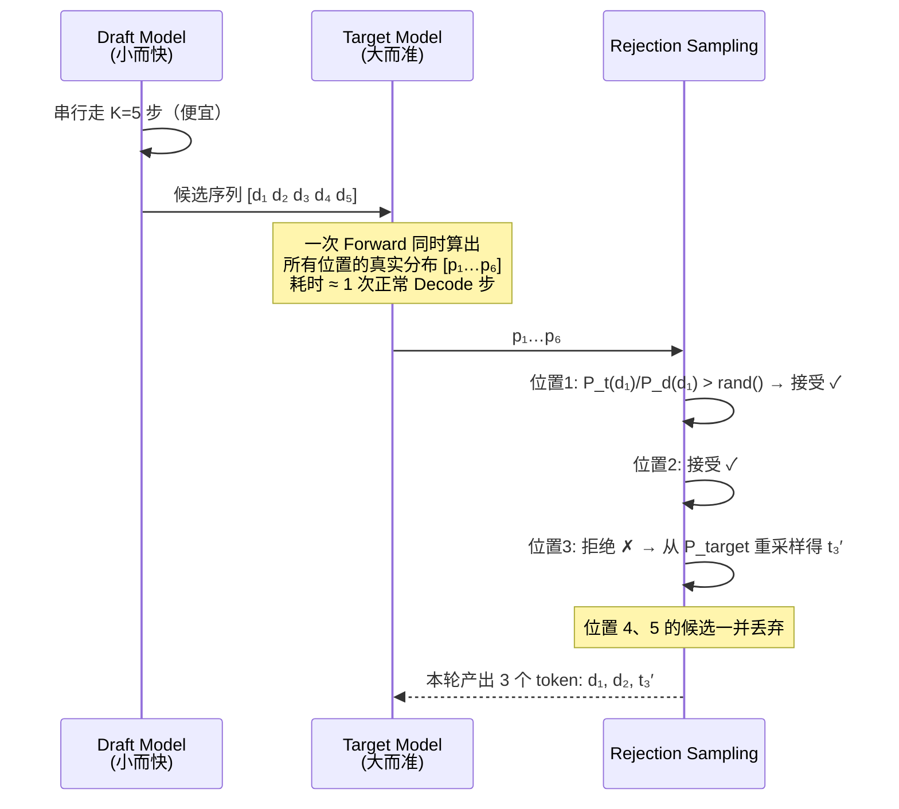
```mermaid
sequenceDiagram
    participant D as Draft Model<br/>(小而快)
    participant T as Target Model<br/>(大而准)
    participant V as Rejection Sampling

    D->>D: 串行走 K=5 步（便宜）
    D->>T: 候选序列 [d₁ d₂ d₃ d₄ d₅]
    Note over T: 一次 Forward 同时算出<br/>所有位置的真实分布 [p₁…p₆]<br/>耗时 ≈ 1 次正常 Decode 步
    T->>V: p₁…p₆
    V->>V: 位置1: P_t(d₁)/P_d(d₁) > rand() → 接受 ✓
    V->>V: 位置2: 接受 ✓
    V->>V: 位置3: 拒绝 ✗ → 从 P_target 重采样得 t₃′
    Note over V: 位置 4、5 的候选一并丢弃
    V-->>T: 本轮产出 3 个 token: d₁, d₂, t₃′
```

三个要点：

- **一次 Target Forward 产出了 3 个 token**，理想情况最多能到 K+1 个；
- **拒绝是"截断式"的**——位置 3 一旦被拒，后面的 4、5 全部作废，因为它们的前提已经不成立了。这也是接受率对收益影响巨大的原因；
- **输出分布严格无损**：这套修正采样（rejection sampling）在数学上保证最终分布与直接用 Target Model 采样**完全一致**。投机解码不是近似加速，这一点和量化有本质区别。

| | 做法 | 耗时 | 产出 | 等效 TPOT |
|---|---|---|---|---|
| 普通 Decode | 5 次 Forward，每次 15 ms | 75 ms | 5 tokens | 15 ms |
| Speculative | Draft 5 步（5 ms）+ Verify 1 次（18 ms） | 23 ms | 3 tokens（接受 2 + 重采样 1） | **≈ 7.7 ms** |

约 **2× 加速**。注意 Verify 那 18 ms 比普通 Decode 的 15 ms 略高——因为要一次算 6 个位置而不是 1 个，计算量确实增加了，只是在 memory-bound 区间这点额外计算几乎免费。**这正是投机解码的本质：拿闲置算力去换延迟。**

##### 工程实现：Scheduler、KV Cache 与 Token 验证

Speculative Decoding 在 vLLM 中的实现涉及多个组件的协同：

| 组件 | 职责 |
|---|---|
| **Scheduler** | 分配 `num_lookahead_tokens` 个额外 KV 块（为候选 token 预留显存）；`SchedulerOutput` 携带 `draft_slots` 信息 |
| **ModelRunner** ① Draft Forward | 小模型生成 K 个候选 token_ids；候选的 KV 写入临时槽位 |
| **ModelRunner** ② Verify Forward | 一次 Forward 算出 context + K 个候选的 logits；复用 Draft 已写入的 KV |
| **ModelRunner** ③ Rejection Sampling | 逐位比较 Draft 与 Target 的分布；接受则保留该位置 KV，拒绝则**回滚该位置及其之后**的 KV 块 |
| **Scheduler.update_from_output()** | 处理接受/拒绝结果、更新 `num_computed_tokens`、释放被拒候选占用的 KV 块 |

注意第三行和最后一行的配合——**投机解码给显存管理引入了"可能要回滚"这件事**。这是它在工程上真正麻烦的地方：KV 块的分配不再是只增不减的，而是要支持按位置撤销。

##### Speculative Decoding 的变体

这些变体的差别只在**"候选从哪来"**这一件事上——验证和接受/拒绝的逻辑是共用的。所以它们在 vLLM 里被统一抽象成 Proposer（候选生成器），实现在 `vllm/v1/spec_decode/` 下。

但在看表之前要先做一个分类上的澄清，因为下表把六种方法平铺在一起，容易掩盖一件事：**它们并不都是"推理技巧"。**

```
Speculative Decoding（一种推理时的加速框架）
│
├── 纯推理侧，不碰模型：
│   ├── 独立 Draft Model      —— 另找一个小模型
│   ├── N-gram               —— 从 prompt 里抄
│   └── Suffix Decoding      —— 从后缀树里抄
│
├── 需要额外训练一个"头"：
│   ├── EAGLE                —— 训一个特征级 draft 头
│   └── Medusa               —— 训若干并行 LM 头
│
└── 模型自带（Model-native）：
    └── MTP                  —— 预训练阶段就已经有了
```

**MTP 和其他五种不是同一层的东西。** N-gram、EAGLE 是为了加速推理才发明的；而 Multi-Token Prediction **首先是一种模型架构与训练目标**——DeepSeek V3 引入 MTP 的初衷是让模型在预训练时被迫为多个未来位置负责，从而学到更好的表示，**提升模型质量本身**。至于"训练时顺手得到的 MTP 头正好可以在推理时当 draft 用"，是一个**副产品**。

这个区分不只是学术上的讲究，它有工程后果：前五种你可以在部署时自由开关、自由挑选；而 MTP 能不能用，在模型预训练结束的那一刻就已经定了。这一点在源码里看得很直白——MTP 的层数直接读模型 HF config 的 `num_nextn_predict_layers`（`vllm/config/speculative.py`），MTP 头的权重则由 `DeepSeekMultiTokenPredictor.load_weights()` 从 checkpoint 里加载出来（`vllm/model_executor/models/deepseek_mtp.py`）。**它不是 vLLM 附加上去的东西，而是模型自己带来的。**

| 方法 | 文件 | 原理 | 优势 | 劣势 |
|------|------|------|------|------|
| **Draft Model** | `draft_model.py` | 独立小模型 | 通用、与 Target 解耦 | 需要额外模型、额外显存 |
| **N-gram** | `ngram_proposer.py` | 从 prompt 中查找匹配 n-gram | 零额外开销 | 依赖 prompt 内容 |
| **EAGLE** | `eagle.py` | 特征级别 Draft (复用 Target 的 hidden states) | 高接受率 | 需要训练 EAGLE 头 |
| **Medusa** | `medusa.py` | 多个额外 LM Head 并行预测 | 无需独立模型 | 需要训练 Medusa 头 |
| **MTP** | `eagle.py`（复用 EagleProposer） | 模型自带 Multi-Token Prediction Head | 原生集成 | 需要模型支持 |
| **Suffix Decoding** | `suffix_decoding.py` | 基于后缀树匹配 | 无训练开销 | 受限于上下文 |

MTP 这一行值得单独说明：vLLM 并没有一个独立的 "MTP proposer"，而是把模型自带的 MTP 头当作 EAGLE 的一种特例，复用 `EagleProposer` 的推测/验证流程；`SpeculativeConfig` 里维护了一份 `*_mtp` 方法白名单（`deepseek_mtp`、`glm4_moe_mtp`、`qwen3_next_mtp` 等几十项），个别模型再派生特化子类（如 `step3p5.py` 的 `Step3p5MTPProposer(EagleProposer)`）。也就是说，MTP 在工程上是"复用已有框架"而不是"新增一套框架"——这正是 EAGLE 那套 hidden-state 级 draft 抽象的价值所在。

| 变体 | 候选从哪来 | 一句话 |
|---|---|---|
| **独立 Draft Model** | `Draft(7B)` 串行跑 K 步 → `[d₁…d₅]`，再交给 `Target(70B)` 验证 | 另找一个小模型 |
| **EAGLE** | `Target hidden_states` → EAGLE Head → `[d₁…d₅]` | 复用 Target 的**特征**，不重新读一遍文本 |
| **Medusa** | `Target hidden_states` → Head₁/Head₂/Head₃ **并行** → `d₁,d₂,d₃` | 多个 LM 头一次 Forward 出多个位置 |
| **MTP** | `Target hidden_states` → MTP Layer₁/Layer₂ → `d₁,d₂` | 模型**预训练时就带着**这些层 |
| **N-gram / Suffix** | 直接在 prompt 文本里查匹配 → `[d₁,d₂,d₃]` | 零模型开销，纯字符串匹配 |

从上往下，**对模型的侵入性递增、额外开销递减**：独立 Draft 最通用但要多养一个模型；EAGLE / Medusa 要训练额外的头；MTP 要模型原生支持；而 N-gram 什么都不要，代价是只在有重复模式时才猜得中。

##### 适用边界与性能收益

| 场景 | 接受率 | 加速比 | 说明 |
|------|--------|--------|------|
| 代码生成 | 70-90% | 2-3× | 模式规律、Draft 容易猜对 |
| 翻译 | 50-80% | 1.5-2.5× | 较高可预测性 |
| 自由对话 | 30-60% | 1.2-1.8× | 创意性强、Draft 猜对率低 |
| 高温度采样 | 20-40% | 1.0-1.3× | 随机性高，接受率低 |
| 多租户混合 | - | 需权衡 | Draft 模型占用 GPU 资源影响其他请求 |

上表是**定性趋势的量级示意，不是可引用的实测数据**：接受率强烈依赖 draft 与 target 的搭配、推测步数 K、采样温度和具体数据分布，加速比还要再叠加 batch size 的影响。这里唯一稳健的结论是排序关系——输出越"可预测"，投机解码越划算；温度越高、创造性越强，收益越快衰减。

还有一个常被忽略的反直觉点：**投机解码在高并发下可能是负收益**。它的原理是拿闲置算力换延迟，可一旦 batch 已经足够大、GPU 本来就不闲，多算的候选 token 就变成纯粹的浪费，还会挤占其他请求的 token 预算。所以它更适合低并发、低延迟诉求的场景，而不是吞吐优先的场景。真实收益必须在你自己的 workload 上量。

---

### 5.5 一轮里什么都有：Mixed Batch 如何共存

vLLM V1 的执行循环不能简单理解成"先完整 Prefill，再完整 Decode"。在 Continuous Batching 和 Chunked Prefill 下，同一轮迭代中可能同时存在长 prompt 的一段 prefill、已有请求的 decode token，以及投机解码的候选 token。执行层需要通过 `InputBatch`、`slot_mapping`、block table 和 attention metadata，把这些不同形态的 token 组织成一次 GPU forward。

**`SchedulerOutput` 给出的本轮预算分配**，三个请求三种形态：

| 请求 | 本轮 token | 形态 | 块情况 |
|---|---|---|---|
| Req A | 256 | 长 prefill 的一段（已推进 256，本轮再推 256） | `block_table = [7, 13]`（新分配） |
| Req B | 1 | 普通 decode | 追加 slot 到已有块（KV 已累积 seq_len=512） |
| Req C | 5 | 1 个真实 token + 4 个候选 token | 额外预留 lookahead slots |

**GPU 侧把它们拍平成一次 forward**：

```
InputBatch（扁平 token 序列）
  [A₀ A₁ … A₂₅₅ │ B₀ │ C₀ C₁ C₂ C₃ C₄]      total = 256 + 1 + 5 = 262

slot_mapping（每个 token 的 KV 写到哪）
  A: block7:0..15, block13:0..15, …      新块，全部写入
  B: block3:slot15                       追加到已有块尾部
  C: block5:slot12..16                   含 lookahead 预留
```

attention metadata 里的关键统计：

| 字段 | 值 | 作用 |
|---|---|---|
| `num_prefill_tokens` | 256 | backend 先处理这 256 个 prefill token |
| `num_decode_tokens` | 6 | 再处理这 6 个 decode / candidate token |
| `block_table`（per-req） | — | 告诉 kernel 每个请求的 KV 块映射 |
| `query_start_loc` | — | 区分不同请求的 token 起始位置 |

**这里有个容易搞错的点**：模型级只有**一个** attention backend，不存在 per-request 切换。是该 backend 在自己的 `forward` 内部，根据 metadata 里的 prefill / decode token 计数去调不同的底层 kernel（例如 FlashInfer 的 `trtllm_batch_context_with_kv_cache` 与 `trtllm_batch_decode_...`）。**分派发生在 kernel 层，不在请求层。**

<details markdown="1">
<summary><b>📂 本章源码导航</b></summary>

**GPU 执行**

| 想看什么 | 从哪开始 |
|---|---|
| **一轮 batch 在 GPU 上怎么跑** | `vllm/v1/worker/gpu/model_runner.py`、`input_batch.py`（翻译层细节见第 10.3 节） |
| CUDA Graph 捕获与重放 | `vllm/v1/worker/gpu/cudagraph_utils.py`；模式枚举在 `vllm/config/compilation.py` |
| Attention 后端选择 | `vllm/v1/attention/selector.py` → `get_attn_backend()` |
| 各 Attention 后端实现 | `vllm/v1/attention/backends/`（MLA 变体在 `mla/`） |
| 投机解码各 Proposer | `vllm/v1/spec_decode/`（EAGLE / MTP 都在 `eagle.py`） |
| 融合算子（CUDA） | `csrc/libtorch_stable/` |
| 量化 | `vllm/model_executor/layers/quantization/`（FP8 见 `fp8.py`） |

</details>

---

## 六、Multi-GPU：一张卡不够时如何扩展？

> **本章回答第四问：一张卡装不下或跑不动时，怎么扩出去。**

多卡并行很容易被讲成一份"策略大全"——DP、TP、PP、EP、CP 五个名词一字排开，读完记住了缩写，却不知道该用哪个。所以这一章先立一个判断准则：**每种并行策略都是为了解决一个具体的"装不下"或"跑不动"，先认清你遇到的是哪一种。**

| 你遇到的问题 | 该用的策略 | 切的是什么 |
|---|---|---|
| 单张卡放不下**一个 Linear 层** | **TP** | 层**内**的矩阵，按行/列切 |
| 单层放得下，但**整个模型**太大 | **PP** | 按**层**切，分段流水 |
| MoE 的 **Expert 太多** | **EP** | 按 **Expert** 切 |
| **上下文太长**，KV Cache 装不下 | **CP** | 按 **token 序列**切 |
| 模型明明装得下，但**要更多吞吐** | **DP** | 什么都不切，**整个模型复制一份** |

这张表里最值得单独说的是 **DP**：它和其余四个不是一类东西。TP/PP/EP/CP 解决的都是"装不下"，是被迫拆分；**DP 解决的是"想要更多"，前提恰恰是单卡装得下**。所以生产部署里通常是"先用 TP/PP/EP/CP 把模型塞进一组卡，再用 DP 把这组卡整体复制 N 份来放大吞吐"——DP 永远是最外层。

下面按 DP → TP → PP → EP → CP 的顺序展开，每一节请对照上表看它在解决哪一行。

### 6.1 分布式推理的混合并行战略

#### 6.1.1 DP (Data Parallelism)

**DP：每个 GPU 持有完整模型副本，各自处理不同请求。**

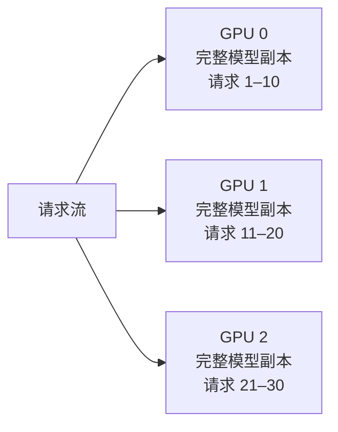
```mermaid
graph LR
    R["请求流"] --> G0["GPU 0<br/>完整模型副本<br/>请求 1–10"]
    R --> G1["GPU 1<br/>完整模型副本<br/>请求 11–20"]
    R --> G2["GPU 2<br/>完整模型副本<br/>请求 21–30"]
```

| | 说明 |
|---|---|
| 优势 | 吞吐近似线性扩展，**GPU 间零通信** |
| 限制 | 每个 GPU 必须装得下完整模型 |
| 适用 | 模型放得下、但并发不够的场景 |
| vLLM 实现 | `DPCoordinator`（`vllm/v1/engine/coordinator.py`）管理多个 `EngineCore` 实例，用 ZMQ 做请求分发与负载均衡 |

#### 6.1.2 TP (Tensor Parallelism)

**TP：把单层内的矩阵按行或列切开，分到多张卡上。** 切法有两种，配合使用：

| | Column-parallel | Row-parallel |
|---|---|---|
| 用在哪 | QKV Projection、Gate/Up | O Projection、Down |
| 权重怎么切 | 按**列**切：`W[:, 0:d]`、`W[:, d:2d]` … | 按**行**切：`W[0:d, :]`、`W[d:2d, :]` … |
| 每卡算什么 | `Yᵢ = X @ Wᵢ` | `Zᵢ = Yᵢ @ Wᵢ` |
| 结果 | 各卡拿到输出的**一部分**，暂时不用通信 | 各卡拿到**部分和**，必须相加 |
| 通信 | 无 | **All-Reduce**：`Z = Z₀+Z₁+Z₂+Z₃` |

两者成对出现不是巧合：**column-parallel 的输出正好是 row-parallel 需要的输入切分方式**，所以一个 Attention 块或 MLP 块内部可以只在末尾做一次 All-Reduce，而不是每个矩阵乘都通信一次。

| 指标 | 值 |
|---|---|
| 每层 All-Reduce 次数 | 2（Attention 后 + MLP 后） |
| 单次通信量 | `2 × B × S × D × sizeof(dtype)` |
| 最佳场景 | NVLink 互联的同机多卡（H100 NVSwitch 约 900 GB/s） |

**TP 的通信量与激活大小成正比、且在关键路径上**，这就是为什么它几乎只适合机内 NVLink——跨机做 TP 会被网络拖死。

> **回到我们的例子**（TP=8，`hidden=8192`，FP16）：decode 阶段每个 token 每次 All-Reduce 的**张量本身**是 `8192 × 2 B = 16 KB`，每层 2 次、共 80 层，于是**每个 token 每步涉及约 2.5 MB 的激活**。（真实过线字节还要乘 all-reduce 的算法系数——ring 实现约 `2×(N−1)/N ≈ 1.75` 倍；NVLink 的 900 GB/s 也是单卡双向聚合口径。这些系数不改变下面的量级结论。）
>
> batch=32 时就是 80 MB/步。走 NVLink（900 GB/s）约 0.09 ms，相对 10 ms 的 decode 步几乎可以忽略；但同样这 80 MB 若走 InfiniBand NDR（50 GB/s）就要 1.6 ms——**乘以 80 层里每一次同步的等待，跨机 TP 就是这样被拖垮的。**

#### 6.1.3 PP (Pipeline Parallelism)

**PP：模型按层切开，层间串行传递 `hidden_states`。**

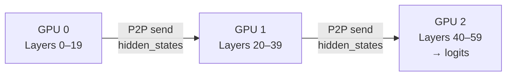
```mermaid
graph LR
    A["GPU 0<br/>Layers 0–19"] -->|"P2P send<br/>hidden_states"| B["GPU 1<br/>Layers 20–39"]
    B -->|"P2P send<br/>hidden_states"| C["GPU 2<br/>Layers 40–59<br/>→ logits"]
```

PP 的固有代价是**流水线气泡**——后面的 stage 得等前面的算完才有活干：

```
时间 →
GPU 0: [B1][B2][B3][idle][B4] …
GPU 1: [--][B1][B2][B3 ][idle] …
GPU 2: [--][--][B1][B2 ][B3  ] …
        ↑气泡  ↑气泡
```

好消息是**推理中的气泡比训练轻得多**（没有反向传播那条长依赖链），而且有几种缓解手段：

- **Batch Queue**：多个 batch 流水线化推进，填满各 stage
- **异步调度**：GPU 算当前 batch 时，CPU 已在准备下一个
- **与 TP 混合**：机内用 TP（低延迟），跨机用 PP（容忍高延迟）

| 指标 | 值 |
|---|---|
| 通信内容 | 每个 stage 间传一份 `hidden_states [B, S, D]` |
| 通信方式 | P2P Send/Recv（NCCL） |

对比一下就明白 TP 和 PP 的分工：**TP 传的是激活、每层两次、量大；PP 传的是 stage 边界的 hidden_states、次数少得多。** 所以跨机优先 PP。

#### 6.1.4 EP (Expert Parallelism)

**EP：MoE 的 Expert 分布在不同 GPU 上。** 例如 64 个 Expert、4 张卡、EP=4，则每卡持有 16 个：

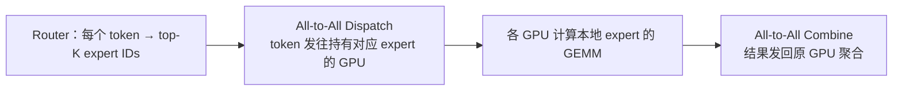
```mermaid
graph LR
    RT["Router：每个 token → top-K expert IDs"] --> D
    D["All-to-All Dispatch<br/>token 发往持有对应 expert 的 GPU"] --> E
    E["各 GPU 计算本地 expert 的 GEMM"] --> C
    C["All-to-All Combine<br/>结果发回原 GPU 聚合"]
```

| 阶段 | 动作 |
|---|---|
| ① Router | 每个 token 算出 top-K 个 expert ID |
| ② Dispatch | **All-to-All**：token 发送到持有对应 expert 的 GPU |
| ③ Expert 计算 | 每卡只算自己那部分 expert 的 GEMM |
| ④ Combine | **All-to-All**：结果发回原 GPU 加权聚合 |

EP 的麻烦之处和 TP 完全不同：

- **通信模式是全对全**，通信量取决于 token 的路由分布，**不是固定的**
- **负载天然不均衡**——热门 expert 所在的卡会成为木桶短板，而路由是动态的，没法静态规划
- 常与 TP 组合：TP 切 Attention，EP 切 MoE

vLLM 中 EP 的 dispatch / combine 由 `DeviceCommunicatorBase` 的对应方法实现，可选 DeepEP、FlashInfer NVLink、Mori 等优化通信后端。

#### 6.1.5 CP (Context Parallelism)

**CP：把长序列的 token 切开，每卡只持有一段上下文。** 例如 64K tokens 分到 4 张卡，每卡 16K。

问题来了：Attention 需要**全局**的 K/V，而每卡只有本地的一段。解法是 **Ring Attention**——K/V 沿环形依次传递，每站累加一次局部注意力：

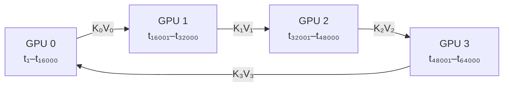
```mermaid
graph LR
    G0["GPU 0<br/>t₁–t₁₆₀₀₀"] -->|"K₀V₀"| G1["GPU 1<br/>t₁₆₀₀₁–t₃₂₀₀₀"]
    G1 -->|"K₁V₁"| G2["GPU 2<br/>t₃₂₀₀₁–t₄₈₀₀₀"]
    G2 -->|"K₂V₂"| G3["GPU 3<br/>t₄₈₀₀₁–t₆₄₀₀₀"]
    G3 -->|"K₃V₃"| G0
```

以 GPU 0 为例，它持有本地 Q，分四步凑出全局注意力：

| Step | 拿到的 K/V | 动作 |
|---|---|---|
| 1 | 本地 `K₀V₀` | 算局部注意力 |
| 2 | 环形收到 `K₁V₁` | 累加 |
| 3 | 收到 `K₂V₂` | 累加 |
| 4 | 收到 `K₃V₃` | 累加完成 → 得到全局注意力 |

这个"分块算 + 在线累加"的套路，和第 5.2.2 节的 FlashAttention 是**同一个数学技巧**（Online Softmax），只不过一个跨的是 SRAM 与 HBM，另一个跨的是 GPU 与 GPU。

| | 说明 |
|---|---|
| 收益 | 每卡的 KV Cache 显存降为 1/CP |
| 适用 | 超长文本（64K ~ 1M tokens） |
| vLLM | PCP（Prefill CP）与 DCP（Decode CP）分别处理两个阶段 |

#### 混合并行策略汇总

| 模型规模 / 场景 | 推荐策略 | 说明 |
|---|---|---|
| 小于单卡显存 | DP（多实例） | 最简单，吞吐线性扩展 |
| 1–2 卡显存 | TP=2/4 | 机内 NVLink 通信 |
| 4–8 卡显存 | TP=4/8 | 用满机内所有卡 |
| 大于 8 卡显存 | TP=8 + PP=N | 机内 TP + 跨机 PP |
| MoE 模型 | TP + EP | TP 切 Attention，EP 切 Expert |
| 超长上下文 | 上述 + CP | 在已有方案上叠加 |
| 高并发小模型 | DP + TP | DP 放大吞吐，TP 降低单请求延迟 |

四条经验法则：

- **TP 优先放在 NVLink 互联的卡之间**——它通信最频繁且在关键路径上
- **PP 用于跨机或 NVLink 不足时**——它能容忍更高延迟
- **EP 与 TP 可组合**，通常 `TP × EP = 总 GPU 数`
- **DP 永远是最外层的吞吐倍增器**——它不解决"装不下"，只解决"不够快"

---

### 6.2 MoE：当 Expert 成为新的瓶颈

第 6.1.4 节介绍 EP 时只说了"Expert 分布在不同 GPU 上"，但没说清楚代价。MoE 的推理瓶颈很特别——**它不是一个大 GEMM 算不动，而是 Router、Dispatch、变长 Grouped GEMM 和 Combine 这一串环节各自都不省心**，其中跨卡的 All-to-All 还会把通信开销直接压在关键路径上。

#### 6.2.1 MoE 推理的数据流与融合

MoE (Mixture of Experts) 模型的推理瓶颈独特——不是简单的 GEMM，而是 **Token Routing + 动态 Dispatch + 多专家并行 GEMM + Combine**：

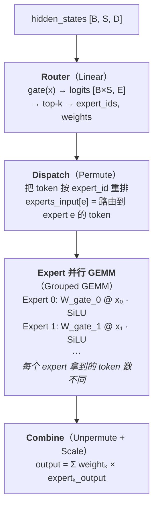
```mermaid
graph TD
    H["hidden_states [B, S, D]"] --> R
    R["<b>Router</b>（Linear）<br/>gate(x) → logits [B×S, E]<br/>→ top-k → expert_ids, weights"] --> D
    D["<b>Dispatch</b>（Permute）<br/>把 token 按 expert_id 重排<br/>experts_input[e] = 路由到 expert e 的 token"] --> G
    G["<b>Expert 并行 GEMM</b>（Grouped GEMM）<br/>Expert 0: W_gate_0 @ x₀ · SiLU<br/>Expert 1: W_gate_1 @ x₁ · SiLU<br/>⋯<br/><i>每个 expert 拿到的 token 数不同</i>"] --> C
    C["<b>Combine</b>（Unpermute + Scale）<br/>output = Σ weightₖ × expertₖ_output"]
```

注意 Grouped GEMM 那一步的括注：**每个 expert 拿到的 token 数是不一样的，而且每一轮都在变。** 这是 MoE 全部工程麻烦的根源——GPU 喜欢规整的形状，而动态路由给的恰恰是不规整的。四种主要优化手段都是在对付这件事：

| 手段 | 解决什么 |
|---|---|
| **Padding Removal** | 不为了对齐而 padding 到最大值，避免算白工 |
| **Grouped GEMM** | 把多个形状不同的小 GEMM 合成一次 kernel 调用 |
| **Fused MoE Kernel** | Route + Dispatch + GEMM + Combine 全融进一个 kernel，省掉中间张量的 HBM 往返 |
| **All-to-All 与计算重叠** | 把通信藏到计算背后（下一节） |

vLLM 的 Fused MoE 实现（`vllm/model_executor/layers/fused_moe/`）提供了多种后端：

| 后端 | 文件 | 适用场景 |
|------|------|---------|
| **Triton Experts** | `experts/triton_moe.py` | 通用 NVIDIA GPU |
| **DeepGemm Experts** | `experts/deep_gemm_moe.py` | H100+ 高效 GEMM |
| **CUTLASS FP8** | `experts/cutlass_moe.py` | FP8 量化 MoE |
| **Marlin MoE** | `experts/marlin_moe.py` | INT4/INT8 量化 MoE |
| **ROCm AIter** | `experts/rocm_aiter_moe.py` | AMD GPU |
| **XPU Experts** | `experts/xpu_moe.py` | Intel GPU |

#### 6.2.2 EP All-to-All 与计算重叠

在 Expert Parallel (EP) 场景下，每个 GPU 只持有部分 Expert，需要 All-to-All 通信将 Token 分发到正确的 GPU：

以 2 卡、8 个 Expert 为例，每张卡都要把"不属于自己"的 token 送出去，同时接收"属于自己"的：

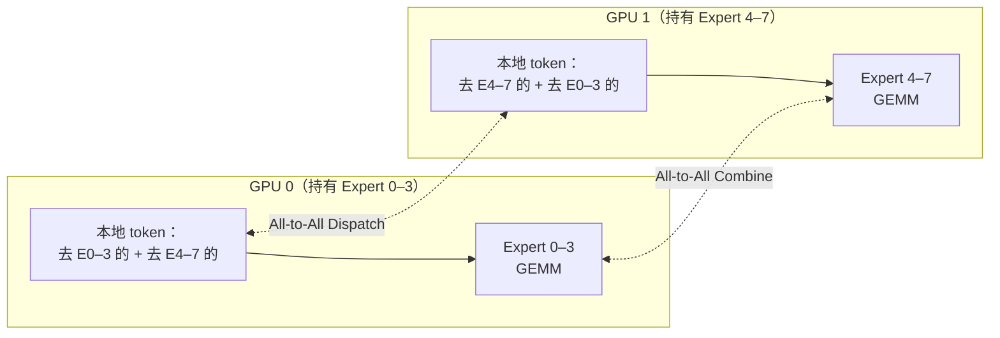
```mermaid
graph LR
    subgraph G0["GPU 0（持有 Expert 0–3）"]
        A0["本地 token：<br/>去 E0–3 的 + 去 E4–7 的"] --> X0["Expert 0–3<br/>GEMM"]
    end
    subgraph G1["GPU 1（持有 Expert 4–7）"]
        A1["本地 token：<br/>去 E4–7 的 + 去 E0–3 的"] --> X1["Expert 4–7<br/>GEMM"]
    end
    A0 <-.->|"All-to-All Dispatch"| A1
    X0 <-.->|"All-to-All Combine"| X1
```

关键优化是让通信和计算在时间上叠起来，而不是干等：

```
不重叠：  通信 [dispatch]──────────────[combine]
          计算 ─────────[expert GEMM]──────────
          总时间 = 通信 + 计算

重叠后：  通信 [dispatch][      combine      ]
          计算      [   expert GEMM   ]
                        ↑ 已到达的 token 先开算，剩下的边算边收
          总时间 ≈ max(通信, 计算)
```

实现上的思路是**分块流水**：不等全部 token 到齐，先到的那批就开始做 GEMM，同时后台继续收。DeepEP 这类通信后端做的正是这件事。

---

### 6.3 数据到底在往哪里搬：单卡、多卡与跨节点

并行策略的代价全部体现在数据搬运上。在讨论通信优化之前，先把一次推理里所有的搬运路径摊开看一遍：

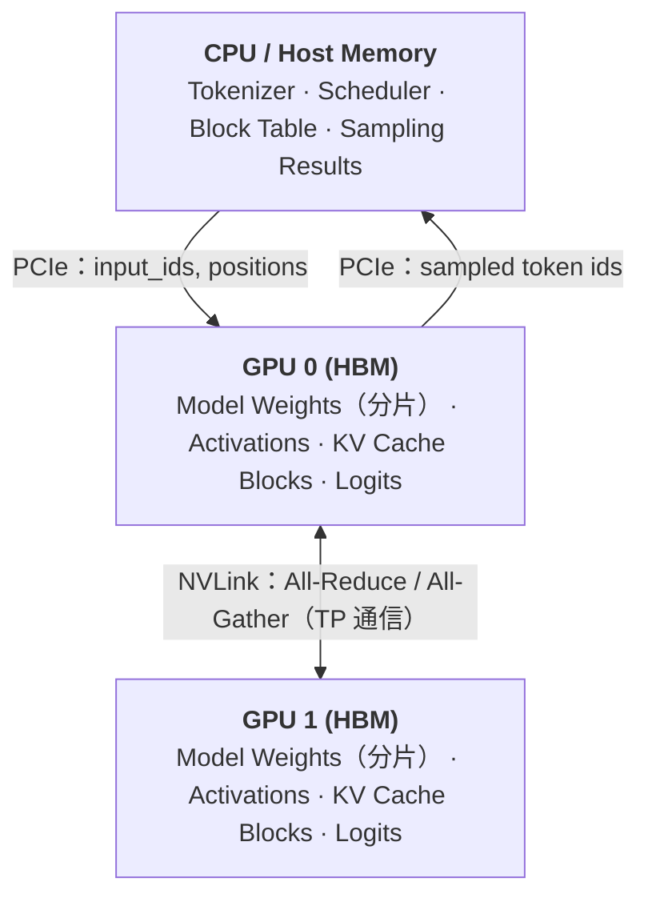
```mermaid
graph TB
    CPU["<b>CPU / Host Memory</b><br/>Tokenizer · Scheduler · Block Table · Sampling Results"]
    CPU -->|"PCIe：input_ids, positions"| G0
    G0 -->|"PCIe：sampled token ids"| CPU
    G0["<b>GPU 0 (HBM)</b><br/>Model Weights（分片） · Activations · KV Cache Blocks · Logits"]
    G1["<b>GPU 1 (HBM)</b><br/>Model Weights（分片） · Activations · KV Cache Blocks · Logits"]
    G0 <-->|"NVLink：All-Reduce / All-Gather（TP 通信）"| G1
```

各条链路的带宽差了两个数量级，这决定了什么该走哪条路：

| 链路 | 带宽 |
|---|---|
| NVLink（机内，H100 NVSwitch） | ~900 GB/s |
| PCIe Gen5 x16 | ~64 GB/s |
| InfiniBand NDR（跨机） | ~50 GB/s |

把每一类搬运摊开看，就能明白优化的优先级：

| 数据搬运类型 | 方向 | 频率 | 数据量/带宽要求 | 技术 |
|---|---|---|---|---|
| 模型权重加载 | CPU→GPU | 一次性 | 高（模型大小） | PCIe DMA |
| input_ids / positions | CPU→GPU | 每步 | 低（KB 级） | PCIe / pinned memory |
| **TP All-Reduce** | GPU↔GPU | **每层 2 次** | **高（激活大小）** | NVLink + NCCL |
| PP 微批传递 | GPU→GPU | 每 stage 间 | 中（hidden_states） | NCCL P2P |
| **EP Token Dispatch** | GPU↔GPU | **每个 MoE 层** | **高（token 重排）** | All-to-All |
| KV Cache Swap | GPU↔CPU | 抢占时 | 高（KV 块大小） | PCIe async |
| Sampled tokens | GPU→CPU | 每步 | 极低（int32） | Device→Host |

加粗的两行是**唯一值得下大力气优化的**——它们既频繁、量又大，还都卡在关键路径上。其余几行要么一次性、要么只有 KB 级。

---

### 6.4 通信优化：真正的瓶颈

#### 6.4.1 NCCL 调优与拓扑感知

vLLM 的通信层（`vllm/distributed/device_communicators/`）支持多种后端：

vLLM 的通信抽象分三层，上层完全不感知底层用的是 NCCL 还是别的：

| 层 | 接口 | 实现 |
|---|---|---|
| 最高层：集合通信 API | `tensor_model_parallel_all_reduce()`<br/>`tensor_model_parallel_all_gather()`<br/>`tensor_model_parallel_reduce_scatter()` | 模型代码只调这一层 |
| 中间层：`GroupCoordinator` | `all_reduce()` / `all_gather()` / `send()` / `recv()` | 管理进程组 |
| 底层：设备通信器 | — | `CudaCommunicator`（NCCL）<br/>`CustomAllreduce`（P2P，机内优化）<br/>`FlashInferAllReduce`<br/>`CpuCommunicator`（Gloo）<br/>`XpuCommunicator`（Intel CCL） |

这里值得单独看一眼 `CustomAllreduce`（`vllm/distributed/device_communicators/custom_all_reduce.py`）：

- 支持的 `world_size`：2、4、6、8、16
- **基于 GPU P2P 直接内存访问，绕过 NCCL**
- **对小张量（< 2 MB）比 NCCL 更快**——因为 NCCL 的固定开销在小消息上占比过高
- 可利用 NVLink 对称内存（Hopper+）

最后一条正是它存在的理由：**Decode 阶段的激活很小**，每层两次 All-Reduce 传的都是小张量，恰好落在 NCCL 不划算的区间里。

#### 6.4.2 计算与通信的深度重叠

```
不重叠（通信和计算互相等）：
  Compute  [GEMM₁][── idle ──][GEMM₂][── idle ──]
  Comm     [ idle ][AllReduce₁][ idle ][AllReduce₂]
  总时间 = Compute + Comm

重叠后（跑在不同 CUDA Stream 上）：
  Compute  [GEMM₁  ][GEMM₂  ][GEMM₃  ]
  Comm         [AllReduce₁][AllReduce₂]
  总时间 ≈ max(Compute, Comm)
```

三种主要实现手段：

| 手段 | 做法 |
|---|---|
| 独立 CUDA Stream | NCCL 跑在专属 stream 上，与计算 stream 并行 |
| **Reduce-Scatter + All-Gather 替代 All-Reduce** | Reduce-Scatter 一完成就能开始算本地那份，同时 All-Gather 在后台收集其余部分 |
| MoE：All-to-All 与 Expert GEMM 重叠 | 见第 6.2.2 节 |

中间那一条是个很漂亮的技巧：一次 All-Reduce 在数学上等价于 Reduce-Scatter + All-Gather，但**拆开之后就出现了一个可以插入计算的缝隙**——总通信量不变，却把一段等待变成了并行。

<details markdown="1">
<summary><b>📂 本章源码导航</b></summary>

**分布式**

| 想看什么 | 从哪开始 |
|---|---|
| 并行组的建立与管理 | `vllm/distributed/parallel_state.py` |
| 集合通信后端 | `vllm/distributed/device_communicators/`（小张量优化见 `custom_all_reduce.py`） |
| 数据并行协调 | `vllm/v1/engine/coordinator.py` |
| Fused MoE 各后端 | `vllm/model_executor/layers/fused_moe/experts/` |
| MoE 路由（含两级 grouped top-k） | `vllm/model_executor/layers/fused_moe/router/grouped_topk_router.py` |

</details>

---

## 七、模型适配：如何跟上变化极快的模型世界？

> **本章是第一个横切问题：四问的答案，必须在「模型不断变化」的前提下依然成立。**

### 7.1 痛点：为什么推理引擎需要"疯狂"适配新模型？

LLM 模型在算法上高度同质（都是 Transformer），但在实现上高度异构：

| 维度 | 差异示例 |
|---|---|
| Attention | MHA / GQA / MQA / MLA / Sliding Window |
| 位置编码 | RoPE / ALiBi / Learned / NTK-RoPE |
| 归一化 | LayerNorm / RMSNorm、Pre-Norm / Post-Norm，位置与数量都可能不同 |
| MLP | Dense / MoE / Switch / Top-K routing |
| 激活函数 | GELU / SiLU / SwiGLU / GeGLU |
| KV Cache 格式 | Full KV / Latent（MLA）/ State（Mamba） |
| 特殊头 | MTP Head / EAGLE Head / Medusa Head |

难点不在"差异多"，而在**每一种差异都会往下捅穿好几层**：

- 换 Attention 变体 → 影响 Attention Kernel **和** KV Cache 布局
- 换 KV Cache 格式 → 影响显存管理 **和** 调度策略（Mamba 的 state 根本不是块状的）
- 加特殊头 → 影响采样、调度预算 **和** KV 回滚逻辑（见第 7.4.3 节）

而新架构的发布频率是**周级**的。所以真正的问题是：**如何在不动 Continuous Batching + PagedAttention 这套通用框架的前提下，容纳每个模型的特殊计算路径。**

### 7.2 vLLM 模型适配的核心抽象机制

#### 7.2.1 Model Runner 与 Unified Interface

`ModelRunner`（`vllm/v1/worker/gpu/model_runner.py`）为所有模型提供统一的执行接口：

```python
# 统一的 Forward 调用接口
output = model(
    input_ids=input_ids,          # [num_tokens]
    positions=positions,           # [num_tokens]
    kv_caches=kv_caches,          # List[Tensor] per layer
    attn_metadata=attn_metadata,  # 动态注入的 Attention 元数据
)
```

#### 7.2.2 Attention Metadata 动态注入

推理框架通过 `attn_metadata` 将 Block Table、序列长度、Prefill/Decode 标志等运行时信息注入模型的 Attention 层——模型本身不需要知道 PagedAttention 的存在：

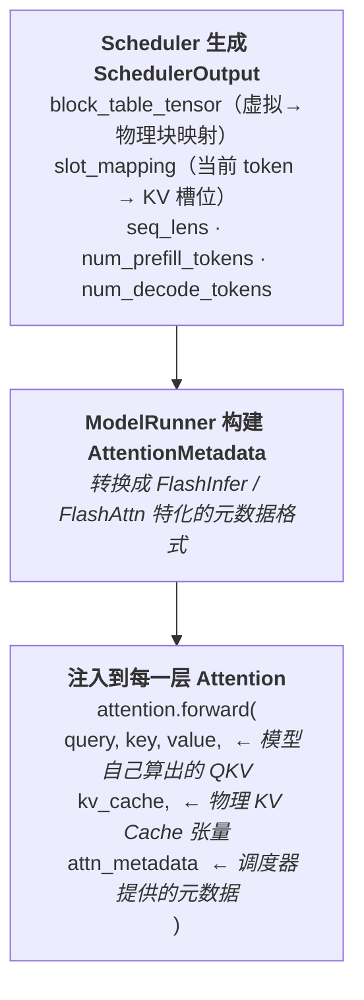
```mermaid
graph TD
    S["<b>Scheduler 生成 SchedulerOutput</b><br/>block_table_tensor（虚拟→物理块映射）<br/>slot_mapping（当前 token → KV 槽位）<br/>seq_lens · num_prefill_tokens · num_decode_tokens"]
    S --> M
    M["<b>ModelRunner 构建 AttentionMetadata</b><br/><i>转换成 FlashInfer / FlashAttn 特化的元数据格式</i>"]
    M --> A
    A["<b>注入到每一层 Attention</b><br/>attention.forward(<br/>&nbsp;&nbsp;query, key, value,&nbsp;&nbsp;<i>← 模型自己算出的 QKV</i><br/>&nbsp;&nbsp;kv_cache,&nbsp;&nbsp;<i>← 物理 KV Cache 张量</i><br/>&nbsp;&nbsp;attn_metadata&nbsp;&nbsp;<i>← 调度器提供的元数据</i><br/>)"]
```

这个设计的精妙之处在于**信息流的方向**：模型代码只负责算出 Q、K、V，然后把它们交给 `attention.forward()`；至于这些 K/V 该写到哪个物理块、这个请求能读到哪些历史块、本轮有多少 prefill token——**全部由外部注入，模型一无所知**。

结果就是：**模型代码完全不需要知道 PagedAttention 和 Continuous Batching 的存在，却能跑在它们之上。** 这也是为什么从 HuggingFace 移植一个新模型到 vLLM，主要工作量在权重加载和层结构映射，而不在改造推理逻辑。

#### 7.2.3 Model Registry：插件化注册

```python
# vllm/model_executor/models/registry.py (简化)
_TEXT_GENERATION_MODELS = {
    "LlamaForCausalLM":     ("llama", "LlamaForCausalLM"),
    "MistralForCausalLM":   ("llama", "LlamaForCausalLM"),  # 复用 Llama 实现
    "DeepseekV2ForCausalLM":("deepseek_v2", "DeepseekV2ForCausalLM"),
    "DeepseekV3ForCausalLM":("deepseek_v2", "DeepseekV3ForCausalLM"),
    "Qwen2ForCausalLM":     ("qwen2", "Qwen2ForCausalLM"),
    # ... 众多模型架构（持续增加）
}

# 注册方式: 模型类名 → (模块路径, 类名) 元组
# ModelRegistry 通过 HuggingFace config 中的 architectures 字段自动匹配
```

模型注册的核心流程：

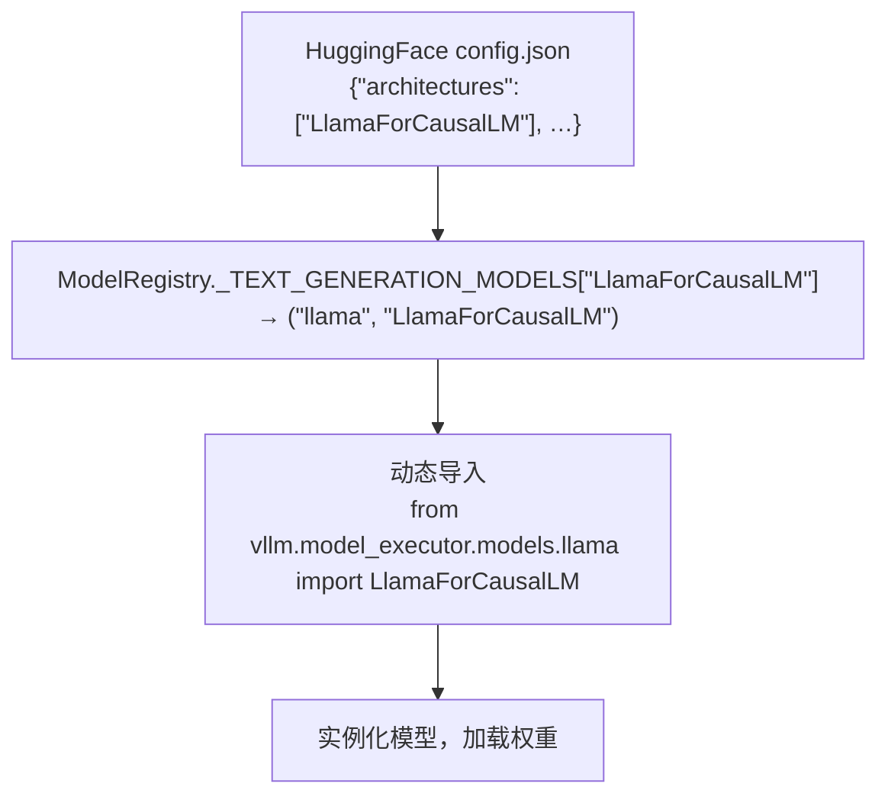
```mermaid
graph TD
    A["HuggingFace config.json<br/>{#quot;architectures#quot;: [#quot;LlamaForCausalLM#quot;], …}"] --> B
    B["ModelRegistry._TEXT_GENERATION_MODELS[#quot;LlamaForCausalLM#quot;]<br/>→ (#quot;llama#quot;, #quot;LlamaForCausalLM#quot;)"] --> C
    C["动态导入<br/>from vllm.model_executor.models.llama import LlamaForCausalLM"] --> D
    D["实例化模型，加载权重"]
```

### 7.3 从临时补丁到标准化扩展

#### 7.3.1 热插拔的艺术：Monkey Patch

对于突发的私有架构模型，vLLM 支持通过运行时动态方法替换（Monkey Patch）来适配，无需修改源码。

#### 7.3.2 Custom Op 的演进

更规范的做法是通过 PyTorch 的 Custom Op 机制注册自定义算子，vLLM 的 `csrc/` 目录中大量使用此模式：

```python
# 注册自定义 CUDA 算子
torch.ops.vllm.rms_norm(output, input, weight, epsilon)
torch.ops.vllm.rotary_embedding(positions, query, key, ...)
torch.ops.vllm.paged_attention_v1(output, query, key_cache, value_cache, ...)
```

### 7.4 终极实战：DeepSeek 架构的工程适配

#### 7.4.1 MLA 适配：低秩压缩特征的吸收

DeepSeek V2/V3 的 MLA 将 KV 压缩到低维 latent 空间。vLLM 通过 **"吸收"（Absorbing）** 技巧避免在 Decode 时显式解压 KV，从而规避显存带宽灾难：

**朴素实现的问题**（每步 Decode 都要做）：

```
c_kv ──[kv_b_proj 解压]──▶ K [H,d], V [H,d] ──▶ Attention
                ↑
        每步都要把全部历史 token 的 latent 解压回全维
        → 省下的显存又变成了带宽开销，白折腾
```

**"吸收"（Absorbing）的做法**是把解压矩阵预先融进 Q/O 投影，让解压这一步压根不必发生：

| | 融合 |
|---|---|
| Q 侧 | `W_q_absorbed = W_q @ W_uk`（把 K 的解压矩阵吸收进 Q 投影） |
| O 侧 | `W_o_absorbed = W_dv @ W_o`（把 V 的解压矩阵吸收进 O 投影） |

于是 Attention 直接在 latent 空间里做：

```
q'   = x @ W_q_absorbed              # 已经"带着"K 的解压
attn = q' @ c_kvᵀ                    # 无需解压 K
out  = attn @ c_kv @ W_o_absorbed    # 无需解压 V
```

| 收益 / 代价 | 说明 |
|---|---|
| KV Cache 存什么 | 576 维 latent（512 + 64 rope），而非 128 heads × 128 dim 的完整 K/V |
| 每 token 每层 | **1.1 KB vs 64 KB → Decode 读取量降低 ~57×** |
| 代价 | Q/O 投影矩阵变大——但这是**权重**（一次性加载），换掉的是**每步都要付的带宽** |

最后那行才是这个技巧的精髓：**它把一笔"每步重复支付"的带宽开销，换成了一笔"一次性"的显存开销。** 在 memory-bound 的 Decode 阶段，这笔交易极其划算。

vLLM 的 MLA 实现（`vllm/model_executor/layers/mla.py`）通过 `MultiHeadLatentAttentionWrapper` 类封装了这一逻辑，并且支持多种 MLA Attention 后端（FlashInfer MLA、FlashAttn MLA、Triton MLA、CUTLASS MLA 等）。

#### 7.4.2 DeepSeek MoE 优化

DeepSeek V3 使用 256 个 Expert + Top-8 路由，MoE 层的工程挑战极大：

| # | 优化点 | 做法 |
|---|---|---|
| 1 | **Token Dispatch 全异步化** | DeepEP V2 后端走 NVLink 低延迟通信；FlashInfer NVLink One-sided 采用单边 RDMA 风格；计算与 dispatch 通信重叠 |
| 2 | **动态 Padding 移除** | 不同 Expert 拿到的 token 数不同，传统做法 padding 到最大值会白算；vLLM 用 `moe_align_block_size` + Grouped GEMM 做到零 padding |
| 3 | **Fused MoE Kernel** | Router + Permute + GEMM + SiLU + GEMM + Unpermute 全融进一个 CUDA kernel，省掉中间张量的 HBM 往返 |
| 4 | **两级 Router** | Group-level Top-K + Per-token Top-K；Python 侧 `fused_moe/router/grouped_topk_router.py`（由 `RoutedExperts` 的 `use_grouped_topk` / `topk_group` 驱动），CUDA 侧 `csrc/libtorch_stable/moe/grouped_topk_kernels.cu` 与 `dsv3_router_gemm_entry.cu` |

DeepSeek V3 的规模是 **256 个 Expert + Top-8 路由**——在这个量级下，第 2 项的 padding 浪费和第 1 项的通信延迟都会被放大到无法忽视，这也是为什么它催生了这一整套专门优化。

#### 7.4.3 MTP 引发的连锁反应

DeepSeek V3 原生支持 Multi-Token Prediction (MTP)，这在 vLLM 中引发了从模型 Forward 到调度和 KV Cache 的全链路改动：

| 层面 | 需要改什么 |
|---|---|
| **① 模型 Forward**<br/>`deepseek_mtp.py` | `DeepSeekMultiTokenPredictor` 在主模型之后执行；每个 MTP Layer 拼接前一步的 `hidden_states` 与 embedding，再过一个 MoE Decoder Layer 产出候选；支持 `num_nextn_predict_layers` 个 MTP 头 |
| **② Scheduler** | `allocate_slots()` 要预留 `num_lookahead_tokens` 个额外 KV 块；Chunked Prefill 要保证 lookahead token 落在合法边界；PP 场景还有 cadence 约束以维持流水线一致性 |
| **③ KV Cache** | 候选 token 的 KV 写入临时槽位；**接受则保留，拒绝则回滚**（释放多余 block）；预分配与释放的时序必须精确 |
| **④ Sampling / Streaming** | 一次 Forward 可能接受多个 token；流式输出要按顺序逐个发送；Detokenizer 要能处理突发的多 token 输出 |
| **⑤ 资源回收** | 抢占时要释放**含 MTP 预留在内**的所有块；异常终止要清理 MTP 临时状态；TP/PP 下 MTP 头的参数也要按并行策略切分 |

这张表是本章想说明的那件事的最好例证：**一个看似局部的模型改动（多加几个预测头），会一路捅穿模型层、调度层、显存层、采样层和容错层。** 推理引擎真正难的地方不是把 GPU 跑快，而是让这五层在面对源源不断的新架构时还能协同工作。

```python
# vllm/model_executor/models/deepseek_mtp.py (简化)
class DeepSeekMultiTokenPredictor(nn.Module):
    """DeepSeek 的 MTP 头, 用于 Speculative Decoding"""

    def __init__(self, vllm_config):
        self.layers = ModuleDict({
            str(idx): DeepSeekMultiTokenPredictorLayer(...)
            for idx in range(mtp_start_layer_idx,
                           mtp_start_layer_idx + num_mtp_layers)
        })

    def forward(self, input_ids, positions, previous_hidden_states,
                inputs_embeds, spec_step_idx):
        """
        input_ids:              当前步的 token ids
        previous_hidden_states: 主模型最后一层的 hidden states
        spec_step_idx:         当前是第几步 MTP 推测
        """
        # 1. Normalize embeddings and hidden states
        # 2. Concatenate and project
        # 3. Pass through MoE decoder layer
        # 4. Return logits for next-token prediction
```

<details markdown="1">
<summary><b>📂 本章源码导航</b></summary>

**模型适配**

| 想看什么 | 从哪开始 |
|---|---|
| **新模型如何被识别与加载** | `vllm/model_executor/models/registry.py` |
| 模型实现范例 | `vllm/model_executor/models/llama.py`、`deepseek_v2.py` |
| MTP 头 | `vllm/model_executor/models/deepseek_mtp.py` |
| MTP 方法白名单 | `vllm/config/speculative.py` |
| MLA 封装 | `vllm/model_executor/layers/mla.py` |

</details>

---

## 八、硬件解耦：如何不让芯片差异污染 Serving 核心？

> **本章是第二个横切问题：四问的答案，还必须在「硬件不断变化」的前提下依然成立。**

### 8.1 一条设计原则：硬件适配不能污染 Serving 核心

GPU 不再是唯一选择——AMD ROCm、华为昇腾 (Ascend)、Intel XPU、Google TPU 等异构芯片都在参与 LLM 推理的竞技。

但在看任何源码之前，先记住这一章真正要讲的那条原则：

> **硬件适配不能污染上层 Serving 逻辑。**

这句话的分量，要放到前面几章的语境里才看得出来。第四章的 Scheduler 在按 token 预算调度，第三章的 KVCacheManager 在按块管理显存——**这些逻辑里不应该出现任何一个 `if is_cuda()`**。否则每接一种新芯片，调度器和显存管理都要改一遍，接三种硬件就会变成三份互相打架的分支。

所以理想的分层是这样的：

```mermaid
graph TD
    CORE["<b>vLLM Serving Core</b><br/>Scheduler · KVCacheManager · EngineCore<br/><i>只依赖抽象的「能力查询」，不含任何 if is_cuda()</i>"]
    CORE --> C1 & C2 & C3
    C1["CudaPlatform<br/>↓<br/>CUDA C++<br/>FlashAttn / FlashInfer"]
    C2["RocmPlatform<br/>↓<br/>HIP<br/>AITER"]
    C3["AscendPlatform（OOT）<br/>↓<br/>CANN<br/>CANN FlashAttn"]
```

上层只问"这个设备支持 FP8 吗"、"该用哪个 Attention 实现"，不关心答案从哪来。**`Platform` 就是回答这类问题的那个角色。**

理解了这一点，再看下一节的源码，你会发现一个常见误解需要纠正——很多人以为 `Platform` 是一条自上而下的三层调用栈，其实不是。

### 8.2 Platform、Attention Backend 与 Kernel Backend 的真实关系

如果只看类名，很容易把 vLLM 的硬件适配理解成一条固定链路：`Platform Backend` 先选 `Attention Backend`，`Attention Backend` 再选 `Kernel Backend`。但 `v0.27.1` 源码里并不是这种单向三层调用。更准确地说，`Platform` 是设备能力与运行时事实的来源，而 Attention backend 和大量非 Attention kernel 都从 `Platform` 读取能力，二者之间没有强制父子调用关系。

```mermaid
graph TD
    RT["runtime 启动"] --> CP
    CP["<b>current_platform</b><br/>CudaPlatform / RocmPlatform / XPUPlatform / CpuPlatform / OOT<br/><i>提供能力事实：device_name、device_type、dispatch_key、<br/>device_capability、dist_backend、supported_dtypes、supported_quantization</i>"]
    CP --> SEL
    CP --> DIRECT
    SEL["<b>路径一：Attention 选择</b><br/>get_attn_backend()"] --> GAB
    GAB["Platform.get_attn_backend_cls()<br/>校验 device capability / head_size / dtype /<br/>KV dtype / MLA / sliding window …<br/>→ 返回具体 AttentionBackend class"] --> BK
    BK["FlashAttentionBackend · FlashInferBackend<br/>TritonAttentionBackend · AiterMLABackend …"] --> FW
    FW["AttentionBackend.forward()<br/><i>内部再按 num_decode_tokens 等分 prefill/decode 路径</i>"]
    DIRECT["<b>路径二：直接使用底层实现</b><br/>（不经过 Attention backend）"] --> D1 & D2 & D3 & D4
    D1["import_kernels()<br/>_C_stable_libtorch<br/>_moe_C_stable_libtorch<br/>_qutlass_C（可选）"]
    D2["get_device_communicator_cls()<br/>→ CudaCommunicator"]
    D3["get_punica_wrapper()<br/>→ PunicaWrapperGPU"]
    D4["check_and_update_config()<br/>平台级配置检查"]
```

图中的两条关键路径分别是：

- **Attention 选择路径**：`get_attn_backend()` 构造 `AttentionSelectorConfig`，再交给 `current_platform.get_attn_backend_cls()`。平台在这里根据 compute capability、head size、dtype、KV cache dtype、MLA / sliding window 等条件给出一组候选并选择最高优先级 backend。也就是说，Attention backend 的选择逻辑虽然写在平台类里，但它不是所有底层 kernel 的统一入口。
- **直接底层路径**：`CudaPlatform.import_kernels()` 直接导入 `_C_stable_libtorch`、`_moe_C_stable_libtorch` 和可选的 `_qutlass_C`；`get_device_communicator_cls()` 直接返回 `CudaCommunicator`；LoRA 的 punica wrapper 也由平台直接返回。这些都不经过 Attention backend。

因此，`Platform → Attention Backend → Kernel Backend` 这种纵切关系只在 Attention 这个局部成立。系统级的真实关系更像一个能力中心加上多个平行实现选择器：

```python
# vllm/platforms/cuda.py: CudaPlatformBase
@classmethod
def import_kernels(cls) -> None:
    # 平台直接导入 C++/CUDA 扩展，不经过 Attention backend。
    import vllm._C_stable_libtorch
    import vllm._moe_C_stable_libtorch
    with contextlib.suppress(ImportError):
        import vllm._qutlass_C

@classmethod
def get_device_communicator_cls(cls) -> str:
    # 平台直接决定集合通信实现。
    return "vllm.distributed.device_communicators.cuda_communicator.CudaCommunicator"
```

```python
# vllm/v1/attention/selector.py: Attention 的选择入口
def get_attn_backend(head_size, dtype, kv_cache_dtype, use_mla, ...):
    attn_selector_config = AttentionSelectorConfig(...)
    return _cached_get_attn_backend(
        backend=backend,
        attn_selector_config=attn_selector_config,
        num_heads=num_heads,
    )

# vllm/v1/attention/selector.py: 真正的平台分派点
def _cached_get_attn_backend(...):
    attention_cls = current_platform.get_attn_backend_cls(...)
    backend = resolve_obj_by_qualname(attention_cls)
    ...
    return backend
```

`Platform` 作为设备能力中心，同时承担 Attention backend 选择和其他底层算子的直接派发，二者并行，不构成固定三层栈。

顺带解释一下 OOT 平台为什么能正常工作：OOT 平台不是必须实现“完整 kernel 栈”，而是实现 `Platform` 的关键能力查询，并在需要时直接返回或导入自己的算子；Attention selector 仍通过同一个 `get_attn_backend_cls()` 接口分派。


### 8.3 昇腾（Ascend）与 Out-of-Tree 适配

#### 8.3.1 Out-of-Tree 架构

vLLM 的 `PlatformEnum.OOT` 允许第三方通过独立插件包（如 `vllm-ascend`）扩展硬件支持，无需修改 vLLM 主仓库：

| | vllm 主仓库提供的**注册点** | `vllm-ascend` 独立插件包**填充的实现** |
|---|---|---|
| 平台 | `platforms/interface.py` → `PlatformEnum.OOT` | `AscendPlatform(Platform)`：`device_name = "npu"`、`import_ir_kernels()` → CANN 算子库、`get_attn_backend_cls()` → CANN Flash Attn |
| 模型 | `model_executor/` → 标准模型接口 | 复用，无需改动 |
| Attention | `v1/attention/` → `AttentionBackend` 抽象 | `AscendAttentionBackend(AttentionBackend)`：CANN Flash Attention 实现 |
| 通信 | `distributed/` → 通信接口 | 昇腾通信后端 |
| Worker | `WorkerBase` | `AscendWorker(WorkerBase)`：NPU 设备管理、昇腾特有的内存池管理 |
| 自定义算子 | — | Custom CANN Kernels：RMSNorm、RoPE、Quantization |

用起来是这样：`pip install vllm-ascend`，然后 vLLM 启动时自动检测到 NPU 并加载 OOT 插件——**主仓库一行代码都不用改**。

这正是 8.1 那条原则的兑现：因为 Scheduler 和 KVCacheManager 从来只问"能力"、不问"是什么芯片"，所以接一种全新硬件才可能做成一个外挂包。

类似的模式也被 XPU (Intel) 使用——`vllm_xpu_kernels` 提供 XPU 特化算子，通过 `import_ir_kernels()` 注册。

<details markdown="1">
<summary><b>📂 本章源码导航</b></summary>

**硬件平台**

| 想看什么 | 从哪开始 |
|---|---|
| **平台抽象接口（本章核心）** | `vllm/platforms/interface.py` |
| CUDA 平台实现 | `vllm/platforms/cuda.py`（注意 `import_kernels()` 与 `get_attn_backend_cls()` 是**两条并行路径**） |
| 其他平台 | `vllm/platforms/`（`rocm.py`、`xpu.py`、`cpu.py`） |
| Attention 分派点 | `vllm/v1/attention/selector.py` |

</details>

---

## 九、PD 分离：从单机 Serving 走向集群 Serving

> **本章把四问从单机推到集群：当 Prefill 和 Decode 不再共享同一批 GPU，第一问和第二问的答案都要重写。**

### 9.1 PD Disaggregation (Prefill/Decode 分离) 集群架构

#### 9.1.1 架构动因

回到第 1.2 节那个核心事实：Prefill 和 Decode 是两种计算特征相反的 workload。前八章都在同一批 GPU 上想办法让它们和平共处——Chunked Prefill 让它们互不阻塞、混合批次让它们同轮执行。但这里有个更根本的问题值得问：**既然它们天生要的硬件配置不一样，为什么一定要让它们共享同一组 GPU？**

先看不分离时的代价：

**混合部署时，同一张卡上两种 workload 交替，资源画像剧烈摆动：**

```
[Prefill ████][D][D][D][D][D][Prefill ████][D][D]
 Compute 100%  Compute 5%      Compute 100%  5%
 Memory   20%  Memory  80%     Memory   20%  80%
```

| 问题 | 后果 |
|---|---|
| Prefill 要高算力 | 希望配高 Tensor Core 利用率 |
| Decode 要高带宽 | 希望配高 HBM 带宽 + 大 Batch |
| 两者混在同一批卡 | **两边都到不了最优** |
| Prefill 会插队 | 直接抖动 Decode 的 TPOT 稳定性 |

**PD 分离就是把这两种 workload 放到配置不同的两个池子里：**

```mermaid
graph LR
    P["<b>Prefill 节点</b><br/>高算力配置<br/>卡少 / 低 TP<br/>处理 Prompt<br/>产出 KV Cache"]
    P -->|"KV 传输"| D["<b>Decode 节点</b><br/>高带宽配置<br/>大 Batch<br/>稳定 TPOT<br/>逐 Token 生成"]
```

#### 9.1.2 KV Transfer 跨节点传输

vLLM 的 KV Transfer 三层抽象（`vllm/distributed/kv_transfer/`）：

| 层 | 角色 | 关键接口 / 实现 |
|---|---|---|
| **Layer 3**<br/>KV Connector | 面向 vLLM 内部的语义层<br/>`KVConnectorBase_V1`（`kv_connector/v1/base.py`） | **Scheduler 侧**：`get_num_new_matched_tokens()`（查询可复用的远端 KV）、`update_state_after_alloc()`、`request_finished()`<br/>**Worker 侧**：`start_load_kv()`、`wait_for_layer_load()`、`save_kv_layer()` |
| **Layer 2**<br/>KV Lookup Buffer | 关联缓存 | `key = token_ids` → `value = KV tensors`，支持查找 / 插入 / 驱逐 |
| **Layer 1**<br/>KV Pipe | 纯粹的张量搬运 | `send_tensor()` / `recv_tensor()`（FIFO）<br/>实现：**Mooncake**（RDMA 高性能传输）、**LMCache**（分布式 KV 存储）、**Moriio**（KV 流式传输）、**HF3FS**（基于元数据服务器分发） |

注意 Layer 3 的接口分成了 Scheduler 侧和 Worker 侧两组——这不是随意划分的，它精确对应第二章的**控制面 / 数据面分离**：Scheduler 侧只做"要不要用远端 KV、有多少可用"的**决策**，Worker 侧才真正搬**数据**。

还有一个容易忽略的设计考虑：`wait_for_layer_load()` 是**按层**等待的，而不是等整个请求的 KV 都到齐。这样 KV 传输可以和模型前向逐层流水起来——第 0 层的 KV 到了就能开始算第 0 层，不必干等。

#### 9.1.3 NIXL 与 LMCache

- **NIXL** (NVIDIA Inference Transfer Library): NVIDIA 提供的高性能跨节点 KV 传输库，利用 GPUDirect RDMA 实现 GPU-to-GPU 零拷贝传输
- **LMCache**: 分布式 KV Cache 存储层，支持跨节点的 KV Cache 查找和复用

#### 9.1.4 PD 分离下的请求路由与弹性伸缩

```mermaid
graph TD
    R["<b>Router</b><br/>把请求调度到 Prefill 或 Decode 节点"] --> P0 & P1
    P0["Prefill Node 0<br/>高 TP（如 TP=8）<br/>处理 Prompt → 产出 KV"]
    P1["Prefill Node 1"]
    P0 -.->|"KV Transfer<br/>RDMA / NIXL / LMCache"| D0
    P0 -.-> D1
    P1 -.-> D1
    P1 -.-> D2
    D0["Decode Node 0<br/>大 Batch · 稳定 TPOT"]
    D1["Decode Node 1"]
    D2["Decode Node 2"]
```

| 关注点 | 策略 |
|---|---|
| **KV Affinity 路由** | 尽量把相同前缀的请求送到**同一个** Decode 节点，让 Prefix Cache 能命中 |
| 负载均衡 | 监控每个节点的并发数与 KV 使用率 |
| 弹性扩缩容 | 按流量动态增减 Prefill / Decode 节点——**两个池子可以独立伸缩**，这是分离最直接的红利 |
| 故障恢复 | Decode 节点宕机 → 该节点上的 KV Cache 全部丢失；恢复靠重新 Prefill（可借 Prefix Cache 减少开销）或从 LMCache 拉回 |

最后一行揭示了分离的代价：**KV Cache 从"进程内状态"变成了"跨节点的分布式状态"**，于是它也就有了自己的一致性和容错问题。这是典型的架构权衡——你解决了资源互锁，换来了分布式状态管理。

看到这里，这一章最重要的结论应该已经浮出来了：

> ### PD 分离的真正难点不在"分两池"，而在中间的 KV Transfer。

把 GPU 分成两个池子是一句话就能说清的架构决策，真正难的是那条连接线。传统单集群里 Prefill 和 Decode 在同一张卡上共享 KV，**分离之后，每个请求的 KV Cache 都必须跨节点实打实地搬运一次**。一旦传得不够快，Prefill 侧省下的那点算力全部会被传输开销吃回去，甚至倒亏。

这也是为什么本文要先花第三章讲清单机的 KV 块模型——只有知道了一个请求的 KV 到底是多少个块、每块多大，才估得出"跨节点搬一次"意味着什么量级的网络压力。用第 1.6 节那个请求算一笔就明白了：

> **回到我们的例子**：2050 个 prompt token × 320 KB/token = **约 641 MB 的 KV，必须从 Prefill 节点搬到 Decode 节点**。
>
> | 链路 | 带宽 | 传输 641 MB 需要 |
> |---|---|---|
> | InfiniBand NDR | 50 GB/s | **≈ 13 ms** |
> | PCIe Gen5 x16 | 64 GB/s | ≈ 10 ms |
>
> 拿它和第五章算过的 92 ms prefill 一比：传输开销约占 **14%**，还能接受。**但注意这个量随 prompt 长度线性增长**——换成 32K token 的长文档，KV 就是 10 GB，传输要 200 ms，而这段时间是纯等待，什么也算不出来。
>
> 所以 PD 分离不是无条件划算的架构：**它用一次网络传输，换 Prefill 与 Decode 各自的资源最优。** prompt 越短、复用率越高（Prefix Cache 命中），这笔交易越亏；prompt 越长、两阶段配置差异越大，这笔交易越赚。这也正是 NIXL、Mooncake 这些项目要把传输做到极致的原因——**它们优化的是这笔交易的汇率。**

---

### 9.2 Serving Infra 的下一站


#### 9.2.1 AI 编译器时代

**现状：手写 CUDA Kernel。** 问题是组合爆炸——每种硬件 × 每种算子 × 每种精度都要一份实现，`csrc/` 下近百个 `.cu` 及更多 `.cuh` 需要逐一维护，新硬件的适配周期也就被拉得很长。

**方向：把这层交给编译器。**

```mermaid
graph TD
    A["<b>Python 算子定义</b><br/>高层描述（如 Triton）"] --> B
    B["<b>Triton / torch.compile</b><br/>中间表示 + 自动优化<br/>自动 tiling · 自动 fusion · 自动 vectorize"] --> C
    C["<b>硬件特化代码自动生成</b><br/>CUDA / ROCm / Ascend IR"]
```

vLLM 已经在大量使用 Triton，这条路走了一半了：

- Attention backends：`triton_attn.py`、`triton_mla.py`
- MoE experts：`triton_moe.py`
- `torch.compile` 集成正在推进

值得留意的是，这件事和第八章的硬件解耦是**同一个问题的两个层面**：`Platform` 抽象解决的是"接口怎么统一"，AI 编译器要解决的是"实现怎么少写"。前者已经比较成熟，后者仍是这个领域最大的未解题之一。

#### 9.2.2 场景泛化

有意思的是，最值得关注的三个方向，压力都最终落回本文的**第二问（状态放在哪）**——这大概不是巧合：

| 方向 | 核心挑战 | 应对思路 | vLLM 现状 |
|------|---------|---------|----------|
| **超长上下文**（1M+ tokens） | KV Cache 超过 100 GB，单卡装不下 | Context Parallel + Offloading + 量化 | PCP / DCP 已初步支持 |
| **Agent Serving**（工具调用 + 多轮） | 请求生命周期极长，状态频繁暂停/恢复 | Session 级 KV Cache 持久化 | Streaming Session + 可恢复请求 |
| **成本优化** | 算力昂贵，要的是每块钱的 token 数 | 混合部署 + 动态精度 + Goodput 优化 | 从"能跑通"转向"跑得最省" |

三个方向，三次撞上同一堵墙：**KV Cache 是 LLM Serving 里唯一随时间无限增长的状态**。上下文变长它涨，会话变长它涨，并发变高它还是涨。这也是为什么本文用了最长的篇幅讲第三章。

（另外两个正在推进的方向——多模态的编码器缓存 `EncoderCacheManager`、故障容忍的 `EngineCoreSentinel`——同样值得关注，但展开需要另一篇文章的篇幅。）

<details markdown="1">
<summary><b>📂 本章源码导航</b></summary>

**PD 分离与 KV 传输**

| 想看什么 | 从哪开始 |
|---|---|
| **KV Connector 抽象（本章核心）** | `vllm/distributed/kv_transfer/kv_connector/v1/base.py` |
| 各类 connector 实现 | `vllm/distributed/kv_transfer/` |
| 等待远端 KV 的请求状态 | `vllm/v1/request.py` → `WAITING_FOR_REMOTE_KVS` |

</details>

---

## 十、回到源码：一次请求在 vLLM 内部的真实旅程

> **前九章回答了「是什么」和「为什么」，这一章回答「怎么实现」。**

现在你已经知道 Scheduler 为什么要按 token 预算调度、KV Cache 为什么要分块、Attention Backend 为什么要按 batch 形态分派。带着这些「为什么」回头看数据结构，它们就不再是需要背的字段列表，而是每一个都能对应到一个设计约束。

这一章刻意放在最后：如果它出现在第二章，你只会看到一堆 class；出现在这里，你会看到**设计决策留下的痕迹**。


### 10.1 控制面与数据面的分离

```mermaid
graph LR
    subgraph CP["控制面（Python）"]
        direction LR
        A[API Server] --> B[AsyncLLM] --> C[EngineCore] --> D[Scheduler] --> E[KVCacheManager]
    end
    subgraph DP["数据面（C++ / CUDA）"]
        direction LR
        F[Worker] --> G[ModelRunner] --> H[GPU Kernels] --> I[NCCL]
    end
    CP -->|"SchedulerOutput<br/>(req_ids, block_table, …)"| DP
```

| | 控制面（Python） | 数据面（C++ / CUDA） |
|---|---|---|
| 组件 | API Server → AsyncLLM → EngineCore → Scheduler → KVCacheManager | Worker → ModelRunner → GPU Kernels → NCCL |
| 职责 | 请求接收与参数解析、Tokenization / Detokenization、请求状态机、流式响应、数据并行协调 | 输入张量准备、模型 Forward（GEMM / Attention / MLP）、KV Cache 物理读写 |
| | 调度决策、KV 块分配与释放、Prefix Cache 查找、抢占决策、停止条件检测 | 采样（top-p / top-k / temperature）、集合通信、CUDA Graph 捕获与重放 |
| 技术栈 | ZMQ IPC、msgspec 序列化、asyncio | CUDA Stream 驱动、零拷贝传输 |

**为什么控制流和数据流需要解耦？**

1. **语言特性匹配**：调度逻辑复杂多变（频繁的条件判断、动态数据结构操作），适合 Python；数值计算追求极致性能，适合 C++/CUDA
2. **迭代速度**：调度算法是 vLLM 最频繁迭代的模块，Python 的开发效率远胜 C++
3. **控制面开销可被摊薄**：只要调度、序列化和输入准备开销显著小于 GPU 执行时间，Python 控制面的影响就可以被流水线化和批处理摊薄；具体是否成为瓶颈取决于 batch、模型和硬件
4. **Batch Queue 机制**：vLLM 通过 `batch_queue` 等机制让调度与执行尽量流水线化，当 GPU 执行当前 batch 时，CPU 侧可以准备后续 batch

**说明** 为什么控制面开销可被摊薄？
这里用数字解释说明一下。下图以一个较大模型的 decode 步（forward 约 15 ms 量级，例如 70B 级别多卡部署）为例——第 10.5 节那张 7B 单卡的表里 decode 是 8–12 ms，量级不同但结论一致：只要 GPU 侧是十毫秒量级，Python 侧的零点几毫秒就淹没在里面。

```
单次 Decode 迭代
  Python 控制面  ──[schedule ~0.05ms][prepare ~0.1ms]
  GPU 数据面     ────────────────────────────[model forward ~15ms][sample ~0.05ms]
                 → Python 开销占比 0.15ms / 15ms ≈ 1%

流水线化后（Batch Queue）
  CPU  ──[sched N][prep N]──[sched N+1][prep N+1]──
  GPU  ──────────────────[forward N]──────────[forward N+1]──
                          ↑ GPU 在算 N 的同时，CPU 已在准备 N+1
                          → Python 延迟被摊薄甚至完全隐藏
```

Python/C++语言核心分工原则：

| 层面 | 语言 | 职责 | 为什么选这个语言 |
|------|------|------|----------------|
| API + 调度 | Python | 请求管理、调度策略、KV块分配 | 逻辑复杂多变，需要快速迭代 |
| 输入准备 | Python + PyTorch | 张量构建、block table 更新 | 利用 PyTorch 的张量接口 |
| 模型 Forward | C++/CUDA (via PyTorch) | GEMM、Attention、MLP | 极致性能 |
| 自定义算子 | CUDA / Triton | RMSNorm、RoPE、Fused Attention | 硬件特化 |
| 集合通信 | C++ (NCCL) | All-Reduce、All-Gather | 零拷贝、内核级调度 |

#### Python如何调用C++：PyBind11 与 Triton

vLLM 的 C++/CUDA 扩展通过 PyTorch 的 Custom Op 机制注册（位于 `csrc/` 目录），使用 PyBind11 绑定 Python 接口。同时，许多算子（尤其是 Attention 和 MoE 相关）使用 OpenAI Triton 编写，兼顾性能和开发效率：

| Python 层 | → | C++ / CUDA 层 | → | GPU 硬件 |
|---|---|---|---|---|
| `torch.ops.vllm.rms_norm()` | | `csrc/libtorch_stable/layernorm_kernels.cu` | | CUDA Cores |
| `attention_backend()` | | FlashAttention（C++ lib）或 Triton kernel（`.py`） | | Tensor Cores |
| `fused_moe()` | | `csrc/libtorch_stable/moe/`（CUDA）或 Triton experts（`.py`） | | Tensor Cores |
| `torch.matmul()` | | cuBLAS GEMM | | Tensor Cores |


### 10.2 四个域：给源码里的每个对象定位

vLLM V1 的核心数据对象（定义在 `vllm/v1/request.py`、`vllm/v1/core/sched/output.py`、`vllm/v1/outputs.py`）可以分为四个域：

- **请求域**：`Request` 是调度器内部对请求的完整表示，包含 token ids、采样参数、状态机状态、块哈希等
- **调度域**：`SchedulerOutput` 封装每一轮的调度决策，`ModelRunnerOutput` 封装 GPU 执行结果
- **显存域**：`KVCacheBlock` 是物理块的元数据（含引用计数和哈希），Block Table 维护虚拟→物理映射
- **模型域**：模型权重常驻 GPU，激活张量在前向计算中动态生成和销毁

这四个域和第一章的四问是对应的：请求域是四问的输入，调度域是第一问的产物，显存域是第二问的产物，模型域是第三问的战场。

```
┌─────────────────────────────────────────────────────────────────────┐
│                      核心数据对象全景图                               │
├─────────────────────────────────────────────────────────────────────┤
│                                                                     │
│  ┌──────────────────── 请求域 ────────────────────────┐             │
│  │                                                     │            │
│  │  EngineCoreRequest  ──→  Request                    │            │
│  │  (IPC 传输对象)         (调度器内部对象)              │            │
│  │    · request_id          · status (状态机)           │            │
│  │    · prompt (text)       · prompt_token_ids          │            │
│  │    · sampling_params     · output_token_ids          │            │
│  │    · lora_request        · num_computed_tokens       │            │
│  │                          · block_hashes              │            │
│  │                          · spec_token_ids            │            │
│  └─────────────────────────────────────────────────────┘            │
│                                                                     │
│  ┌──────────────────── 调度域 ────────────────────────┐             │
│  │                                                     │            │
│  │  SchedulerOutput           ModelRunnerOutput         │            │
│  │  (调度决策)                (模型执行结果)             │            │
│  │    · scheduled_requests     · req_ids                │            │
│  │    · num_scheduled_tokens   · sampled_token_ids      │            │
│  │    · finished_req_ids       · logprobs_tensors       │            │
│  │    · preempted_req_ids      · draft_tokens           │            │
│  └─────────────────────────────────────────────────────┘            │
│                                                                     │
│  ┌──────────────────── 显存域 ────────────────────────┐             │
│  │                                                     │            │
│  │  KVCacheBlock              Block Table               │            │
│  │  (物理块元数据)            (虚拟→物理映射)            │            │
│  │    · block_id               · req → [block_ids]      │            │
│  │    · ref_cnt                                         │            │
│  │    · block_hash                                      │            │
│  │                                                      │            │
│  │  KV Cache Tensor (GPU HBM)                           │            │
│  │    · shape: [num_blocks, block_size, num_heads, d]   │            │
│  └─────────────────────────────────────────────────────┘            │
│                                                                     │
│  ┌──────────────────── 模型域 ────────────────────────┐             │
│  │                                                     │            │
│  │  Model Weights (参数)   Activations (激活)           │            │
│  │    · Linear.weight        · hidden_states            │            │
│  │    · LayerNorm.weight     · Q, K, V tensors          │            │
│  │                           · attention_output         │            │
│  │                           · logits                   │            │
│  └─────────────────────────────────────────────────────┘            │
└─────────────────────────────────────────────────────────────────────┘
```

两条边界值得留意：

- **`EngineCoreRequest` → `Request` 是一次跨进程翻译**。前者是能被 msgspec 序列化、走 ZMQ 的扁平数据；后者是带状态机、会被反复修改的活对象。这条边界就是第 2.3 节控制面的进程边界。
- **显存域是唯一"跨请求共享"的域**。请求域、调度域、模型域的对象都属于某一次请求或某一轮迭代，而 `KVCacheBlock` 会被多个请求通过 `ref_cnt` 共享——Prefix Cache 的全部魔法都发生在这一行。

### 10.3 请求状态机：系统如何决定"下一步做什么"

##### 请求状态机

vLLM V1 的请求状态机（`RequestStatus`，定义在 `vllm/v1/request.py`）是理解控制流的关键：

```mermaid
stateDiagram-v2
    [*] --> WAITING: 请求到达

    WAITING --> WAITING_FOR_STRUCTURED_OUTPUT_GRAMMAR: 需要编译约束语法
    WAITING_FOR_STRUCTURED_OUTPUT_GRAMMAR --> WAITING: 语法编译完成

    WAITING --> WAITING_FOR_REMOTE_KVS: PD分离,等待KV传输
    WAITING_FOR_REMOTE_KVS --> RUNNING: KV加载完成

    WAITING --> RUNNING: 调度器选中,分配KV块
    RUNNING --> RUNNING: 继续Decode(逐token)

    RUNNING --> PREEMPTED: 显存不足,被抢占
    PREEMPTED --> WAITING: 重新入队(需重算)

    RUNNING --> FINISHED_STOPPED: 遇到stop token
    RUNNING --> FINISHED_LENGTH_CAPPED: 达到max_tokens
    RUNNING --> FINISHED_ABORTED: 被用户取消
    RUNNING --> FINISHED_ERROR: 运行时错误
    RUNNING --> FINISHED_REPETITION: 重复检测

    RUNNING --> WAITING_FOR_STREAMING_REQ: 流式会话暂停
    WAITING_FOR_STREAMING_REQ --> WAITING: 收到新输入继续
```

```python
# vllm/v1/request.py
class RequestStatus(enum.IntEnum):
    WAITING = enum.auto()
    WAITING_FOR_STRUCTURED_OUTPUT_GRAMMAR = enum.auto()
    WAITING_FOR_REMOTE_KVS = enum.auto()
    WAITING_FOR_STREAMING_REQ = enum.auto()
    RUNNING = enum.auto()
    PREEMPTED = enum.auto()
    # Note: anything after PREEMPTED will be considered as a finished status.
    FINISHED_STOPPED = enum.auto()
    FINISHED_LENGTH_CAPPED = enum.auto()
    FINISHED_ABORTED = enum.auto()
    FINISHED_IGNORED = enum.auto()
    FINISHED_ERROR = enum.auto()
    FINISHED_REPETITION = enum.auto()
```

状态机里值得特别注意的是 PREEMPTED：它只有一条出路，即回到 WAITING。被抢占的请求会释放 KV 块，等调度器重新分配资源后再继续。因此系统不能假设"已经开始跑的请求一定能跑完"，Scheduler 每轮都要同时面对新请求和恢复请求。

##### Scheduler 的调度决策

在 vLLM V1 中，`Scheduler.schedule()` 的核心不是把系统硬切成 Prefill 阶段和 Decode 阶段，而是在每一轮迭代里分配统一的 token 预算。源码注释明确指出：调度器内部没有严格的 "decoding phase" 或 "prefill phase"；每个请求维护 `num_computed_tokens`，调度器尝试让它追赶 `num_tokens_with_spec`。

```
┌─────────────────────────────────────────────────────────────────┐
│                  Scheduler.schedule() 核心问题                    │
├─────────────────────────────────────────────────────────────────┤
│  输入: 当前 running / waiting 请求、KV Cache 状态、token budget     │
│                                                                 │
│  对每个可推进请求，计算本轮可以新增多少 token:                      │
│  · 新请求可能推进一段 prompt tokens                                │
│  · 已运行请求通常推进下一个 decode token                            │
│  · spec decode / MTP 可能需要额外 lookahead tokens                 │
│  · 长 prompt 可能被 long_prefill_token_threshold 截断              │
│                                                                 │
│  同时满足:                                                        │
│  · max_num_batched_tokens / max_num_scheduled_tokens              │
│  · max_num_seqs                                                   │
│  · KV Cache 可用块数                                               │
│  · encoder / multimodal / structured output 等附加约束             │
│                                                                 │
│  输出: SchedulerOutput                                            │
│  · 本轮调度的请求与 token 数                                        │
│  · block table / slot mapping 相关更新                             │
│  · preemption、KV transfer、spec decode 等执行提示                  │
└─────────────────────────────────────────────────────────────────┘
```

这里可以和第一章的结论对上了：Prefill / Decode 的区分在**性能分析**层面依然成立（第 1.2 节），但在 **Scheduler 的实现**层面它们被统一到"本轮给这个请求推进多少 token"这一个模型里——这正是第四章反复强调的那句话在源码里的样子。


### 10.4 翻译层：SchedulerOutput 如何变成 GPU 张量

第四章的调度决策和第五章的 GPU 执行之间，隔着一层谁都没细讲的翻译：调度器交出来的是"哪个请求本轮推进多少 token"，而 kernel 要的是"这个 token 的 KV 写到哪个 slot、这个请求能读哪些块"。做这件翻译的是 `ModelRunner.prepare_inputs()`。

**Scheduler 交出来的东西**（`SchedulerOutput`）：

| 字段 | 内容 | 含义 |
|---|---|---|
| `scheduled_new_reqs` | `{req_id: num_tokens}` | 首次调度的请求 |
| `scheduled_running_reqs` | `{req_id: num_tokens}` | 继续执行的请求 |
| `req_to_new_blocks` | `{req_id: [(block_id, n)]}` | 本轮的块分配 |
| `finished_req_ids` / `preempted_req_ids` | — | 状态通知 |

**`ModelRunner.prepare_inputs()` 把它翻译成 GPU 数据结构**，四步：

| 步骤 | 做什么 | 细节 |
|---|---|---|
| ① `InputBatch` 构造 | 按 scheduled tokens 扁平化成一条 token_id 序列 | Req A（已缓存 256、新推 256）→ 追加 256 个<br/>Req B（decode）→ 追加 1 个<br/>Req C（spec decode）→ 追加 1+N 个 |
| ② `slot_mapping` 构造 | 每个 token → `(block_id, offset)` | 新块从头写；已有块追加到尾部；**Prefix Cache 命中的 token 不写，直接复用** |
| ③ attention metadata | 告诉 kernel 每个请求能读哪些块 | `block_table`（per req）、`query_lens` / `kv_lens` / `is_prompt` / spec flags |
| ④ 执行模式选择 | 决定走 Graph 还是 Eager | 纯 decode 且 size 匹配 → CUDA Graph replay；含 prefill / mixed / size 不匹配 → Eager |

最终**给 GPU 的**是 `input_ids, positions, attn_metadata`，**从 GPU 拿回的**是 `hidden_states → logits → sampled_token_ids`。

大致流程如下所示：

```
┌─────── SchedulerOutput → ModelRunner 映射 ───────────────────────────┐
│                                                                      │
│  Scheduler 输出:                                                     │
│  ┌──────────────────────────────────────────────────────────────────┐ │
│  │ scheduled_new_reqs:      {req_id: num_tokens}       ← 首次调度    │ │
│  │ scheduled_running_reqs:  {req_id: num_tokens}       ← 继续执行    │ │
│  │ req_to_new_blocks:       {req_id: [(block_id, n)]}  ← 块分配      │ │
│  │ finished_req_ids, preempted_req_ids, ...            ← 状态通知    │ │
│  └──────────────────────────────────────────────────────────────────┘ │
│                              │                                        │
│                              ▼                                        │
│  ModelRunner.prepare_inputs():                                        │
│  ┌──────────────────────────────────────────────────────────────────┐ │
│  │ 1. InputBatch 构造: 根据 scheduled tokens 扁平化为 token_id 序列  │ │
│  │    · Req A (已缓存 256, 新推 256) → 追加 256 个 token_ids         │ │
│  │    · Req B (decode) → 追加 1 个 token_id                          │ │
│  │    · Req C (spec decode) → 追加 1 + N 个 token_ids                │ │
│  │                                                                  │ │
│  │ 2. slot_mapping 构造: token → (block_id, offset)                 │ │
│  │    · 新分配的块 → 从头写入                                         │ │
│  │    · 已存在块 → 追加到尾部                                         │ │
│  │    · Prefix Cache 命中的 token → 不写入, 直接复用                   │ │
│  │                                                                  │ │
│  │ 3. attention metadata 构造:                                       │ │
│  │    · block_table (per req): 虚拟块 → 物理块的映射                  │ │
│  │    · query_lens / kv_lens / is_prompt / spec_decode flags         │ │
│  │                                                                  │ │
│  │ 4. CUDA Graph / Eager 模式选择:                                   │ │
│  │    · Pure decode + size matched → CUDA Graph replay               │ │
│  │    · 含 prefill / mixed / size mismatch → Eager 模式              │ │
│  └──────────────────────────────────────────────────────────────────┘ │
│                                                                      │
│  给 GPU: input_ids, positions, attn_metadata                          │
│  从 GPU: hidden_states → logits → sampled_token_ids                   │
└──────────────────────────────────────────────────────────────────────┘
```

图中 SchedulerOutput 到 GPU 计算中间隔着一层的 `ModelRunner.prepare_inputs`。这一层不是调模型，而是把调度决策翻译成 GPU 数据结构：`slot_mapping` 告诉每个 token 的 KV 写去哪，`block_table` 告诉每个请求能读到哪些块。CUDA Graph / Eager 的选择也在这里决定。这层翻译是看懂后面 Prefill、Decode 和 Mixed Batch 执行差异的前提。

现在可以回头看这一层为什么必须存在：`slot_mapping` 是第三章分块存储的直接产物（KV 不连续，所以必须逐 token 给出落点），`block_table` 是 Prefix Cache 共享的直接产物（多个请求可能指向同一个物理块），而"走 Graph 还是 Eager"则是第 5.1 节那个约束的落地位置（图里的形状必须固定）。**三个字段，三章的设计约束。**

---

### 10.5 从请求到 GPU Kernel 的完整调用链

把前面所有环节串成一条链，可以清楚看到语言边界（Python → C++ → CUDA）落在哪几个位置：

```
  HTTP Request ("Hello")
       │
       │ ①  Python (FastAPI)
       ▼
  api_server.py: create_chat_completion()
       │
       │ ②  Python (async)
       ▼
  AsyncLLM.add_request() → Tokenizer → [15496, 11, ...]
       │
       │ ③  Python (IPC: ZMQ + msgspec)
       ▼
  EngineCore.add_request() → Scheduler.add_request()
       │
       │ ④  Python (调度算法)
       ▼
  Scheduler.schedule() → SchedulerOutput
       │
       │ ⑤  Python → C++ 边界
       ▼
  Executor.execute_model() → Worker.execute_model()
       │
       │ ⑥  Python (张量准备)
       ▼
  ModelRunner._execute_model()
    → prepare_inputs(): 构建 input_ids, positions, block_table 张量
       │
       │ ⑦  Python → CUDA 边界 (PyTorch dispatch)
       ▼
  model.forward(input_ids, positions, kv_caches, attn_metadata)
    → 每层: RMSNorm → QKV → RoPE → Attention → O_proj → MLP
       │
       │ ⑧  CUDA Kernel Launch (C++ runtime)
       ▼
  Attention Backend (FlashAttention / FlashInfer)
    → flash_attn_varlen_func() 或 flashinfer.decode()
       │
       │ ⑨  CUDA Graph (可选: Decode 阶段)
       ▼
  cudagraph_manager.run_fullgraph(batch_desc)
    → 预捕获的完整执行图一次性重放
       │
       │ ⑩  GPU → CPU
       ▼
  Sampling: logits → sampled_token_ids (GPU tensor → CPU list)
       │
       │ ⑪  Python (输出处理)
       ▼
  ModelRunnerOutput → Scheduler.update_from_output()
    → Detokenizer → "Sure" → SSE Stream → Client
```

| # | 层 | 调用 | 语言 / 边界 |
|---|---|---|---|
| ① | HTTP 入口 | `api_server.py: create_chat_completion()` | Python（FastAPI） |
| ② | 异步引擎 | `AsyncLLM.add_request()` → Tokenizer → `[15496, 11, …]` | Python（async） |
| ③ | 进程边界 | `EngineCore.add_request()` → `Scheduler.add_request()` | **Python IPC：ZMQ + msgspec** |
| ④ | 调度 | `Scheduler.schedule()` → `SchedulerOutput` | Python（调度算法） |
| ⑤ | 执行分发 | `Executor.execute_model()` → `Worker.execute_model()` | **Python → C++ 边界** |
| ⑥ | 张量准备 | `ModelRunner._execute_model()` → `prepare_inputs()`：构建 `input_ids`、`positions`、`block_table` | Python |
| ⑦ | 模型前向 | `model.forward(...)`；每层 RMSNorm → QKV → RoPE → Attention → O_proj → MLP | **Python → CUDA 边界（PyTorch dispatch）** |
| ⑧ | Attention kernel | Attention Backend → `flash_attn_varlen_func()` 或 `flashinfer.decode()` | **CUDA Kernel Launch（C++ runtime）** |
| ⑨ | 图重放（可选） | `cudagraph_manager.run_fullgraph(batch_desc)`：预捕获的完整图一次性重放 | CUDA Graph，仅 Decode |
| ⑩ | 取回结果 | Sampling：`logits` → `sampled_token_ids`（GPU tensor → CPU list） | **GPU → CPU** |
| ⑪ | 输出处理 | `ModelRunnerOutput` → `Scheduler.update_from_output()` → Detokenizer → SSE Stream → Client | Python |

三条语言边界（③⑤⑦）恰好把这条链切成了四段，而它们的位置不是随意的：

- **③ 是进程边界** —— API 层与引擎核心分离，为的是不让 HTTP 处理阻塞调度循环；
- **⑤ 是控制面与数据面的边界** —— 上游全是决策，下游全是计算（第 2.3 节）；
- **⑦ 是 Python 与 GPU 的边界** —— 过了这里就再没有 Python 开销可言。

前面说"Python 控制面只占 ~1%"，指的正是 ①–⑥ 这一段相对 ⑦–⑩ 的耗时占比。


### 10.5 附录：各环节耗时量级

**测试口径**（不写清口径的耗时表没有意义）：Llama-2-7B、FP16、A100 80GB 单卡（HBM 带宽约 2.0 TB/s）、TP=1、prompt 512 tokens、无 prefix cache 命中、CUDA Graph 开启。**换任何一个条件，下面的数字都会变。**

| 环节 | 典型耗时 | 说明 |
|---|---|---|
| Tokenization | 0.1–0.5 ms | CPU，可忽略 |
| `Scheduler.schedule()` | 0.01–0.1 ms | Python，随请求数增长 |
| CPU→GPU 输入拷贝 | 0.01–0.05 ms | PCIe DMA，数据量极小 |
| Kernel Launch | ~2–5 μs/个 | Decode 一步数百个（7B / 32 层）；开 CUDA Graph 后合并为 1 次 |
| Prefill（512 tokens） | 5–15 ms | Compute-bound，GEMM 主导 |
| **Decode 一步（batch=1）** | **8–12 ms** | Memory-bound，下界由权重读取决定 |
| **Decode 一步（batch=32）** | **10–18 ms** | **注意：不是 ×32** |
| 权重读取 | ≈ 6.6 ms | 13.5 GB ÷ 2.0 TB/s，**batch=1 时 decode 耗时的大头** |
| KV Cache 读取 | 随上下文线性增长 | 512 ctx 时很小；32K ctx 时会反超权重成为主导 |
| Sampling | 0.01–0.1 ms | GPU kernel |
| GPU→CPU token 拷贝 | ~5 μs | 数据量极小 |
| Detokenization | 0.01–0.05 ms | CPU，可忽略 |

派生指标：

| 指标 | batch=1 | batch=32 | 说明 |
|---|---|---|---|
| TTFT | 10–20 ms | 随排队增加 | ≈ queueing + prefill |
| TPOT | 8–12 ms | 10–18 ms | ≈ 一次 decode 步 |
| 系统吞吐 | ~100 tok/s | **~2000 tok/s** | batch 放大的是这一行 |


这张表里最值得盯住的是**加粗的那两行**。batch 从 1 涨到 32，单步耗时只从 ~10 ms 涨到 ~15 ms，**远不是 32 倍**——因为那 13.5 GB 权重无论 batch 多大都只需要从 HBM 读一遍，32 个请求把这笔固定成本摊薄了。

这正是第 1.3 节那条吞吐-延迟权衡曲线的微观解释，也是 Continuous Batching 全部收益的来源：**在 memory-bound 区间，增大 batch 几乎是免费的吞吐。** 直到 batch 大到让 KV Cache 读取或计算本身成为新瓶颈为止——那时曲线才会掉头。

顺带澄清一个常见误解：**ITL 不等于 `TPOT × batch`。** 稳态下 ITL 约等于 TPOT；它真正的意义在于反映**波动**——当一个长 prompt 的 chunked prefill 插进来、或者发生抢占时，个别 token 的间隔会出现尖峰。所以优化 ITL 靠的是稳定调度，不是缩小 batch。

---

## 结语

我们从第 1.6 节起跟踪的那个请求，现在可以完整地复盘一遍了：

| 章 | 这个请求在这一章遭遇了什么 | 数字 |
|---|---|---|
| 三 | 它的 KV 被切成块存放；system prompt 那 125 个整块可被后续请求复用 | 147 块 / 734 MB |
| 四 | 它没有"prefill 阶段"，只是被持续发放 token 额度，直到追平 2050 | 若 chunk=512 则分 5 段 |
| 五 | 97% 的时间花在 300 次逐 token 的 decode 上 | 92 ms + 3000 ms |
| 六 | 每个 token 每步在 8 张卡间同步约 2.5 MB | NVLink 上 ~0.09 ms |
| 九 | 若拆成 PD 两池，它的 641 MB KV 要跨节点搬一次 | ≈ 13 ms |

**同一个请求，五个视角，五笔完全不同的账。** 这正是 Serving Infra 的日常——没有哪一个数字能单独说明问题，但它们合在一起就是系统的全貌。

回到第 1.5 节那四个问题，现在每一个都有了答案：

| 问题 | vLLM 的回答 |
|------|-----------|
| 这一轮谁执行、执行多少 | Continuous Batching + 统一 token 预算 + Chunked Prefill |
| 状态放哪、怎么复用 | PagedAttention + Prefix Cache + GQA/MLA + KV 量化 |
| 怎么算得更快 | FlashAttention + CUDA Graph + 算子融合 + 低精度 + 投机解码 |
| 怎么扩出去 | TP / PP / EP / CP / DP + 通信重叠 |

但如果只把这些当成一份优化清单，就错过了最重要的东西。**这些技术之所以能共存于一个系统，是因为它们背后有一套统一的世界观。** 如果这篇文章只留下三句话，我希望是这三句：

**其一，KV Cache 是一切约束的源头。** 它是 LLM 推理里唯一随时间无限增长的状态，所以它同时决定了并发上限、上下文上限和抢占时机。看不懂显存，就看不懂调度——第九章那三个未来方向，最后都撞回了这堵墙。

**其二，调度的单位是 token，不是 request。** Scheduler 内部没有"prefill 阶段"和"decode 阶段"，只有"这一轮给这个请求推进多少 token"。理解了这一点，Continuous Batching、Chunked Prefill、投机解码、混合批次就不再是四种技巧，而是同一个模型的四种取值。

**其三，文中每个性能数字都只是量级示意。** 接受率、加速比、耗时表——它们随模型、硬件、batch、上下文长度剧烈漂移。真正可迁移的是判断方法（先定位瓶颈在 Prefill 还是 Decode，再选手段），而不是具体数值。请在你自己的 workload 上重测。

所以最后，我更愿意这样概括它：

> **vLLM 不是一堆推理优化技术的集合，而是一套围绕「动态请求 + KV 状态 + GPU 资源」构建起来的推理操作系统。**

它调度任务、管理内存、抽象硬件、隔离故障——操作系统做的事，它都在做，只不过管的不是进程和物理内存页，而是请求和 KV 块。理解了这个类比，你就不只是理解了 vLLM，而是拿到了看懂下一个 Serving 系统的钥匙。

---

> 本文分析基于当前 vLLM 最新稳定版 v0.27.1（2026-08-11, commit `6e448d0`）。
>
> **源码导航**：本文各章末尾都有一个可展开的「本章源码导航」，按主题给出建议的阅读起点，比按文件名平铺更有用。
>
> 如果只想挑三个地方读，我的建议是：
>
> 1. `vllm/v1/core/sched/scheduler.py` → `schedule()`（**开头那段 `NOTE(woosuk)` 注释值得逐字读**，它就是第四章那句"调度的不是 Request 而是 Token Budget"的原始出处）
> 2. `vllm/v1/core/kv_cache_manager.py` → `allocate_slots()`（连同它的块布局注释）
> 3. `vllm/v1/engine/core.py` → `EngineCore.step()`（把两者串起来的主循环）
