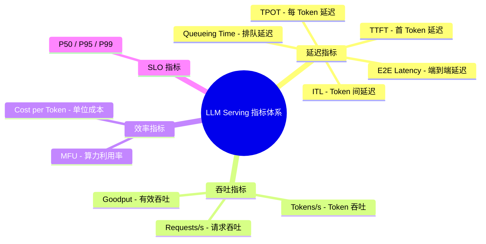
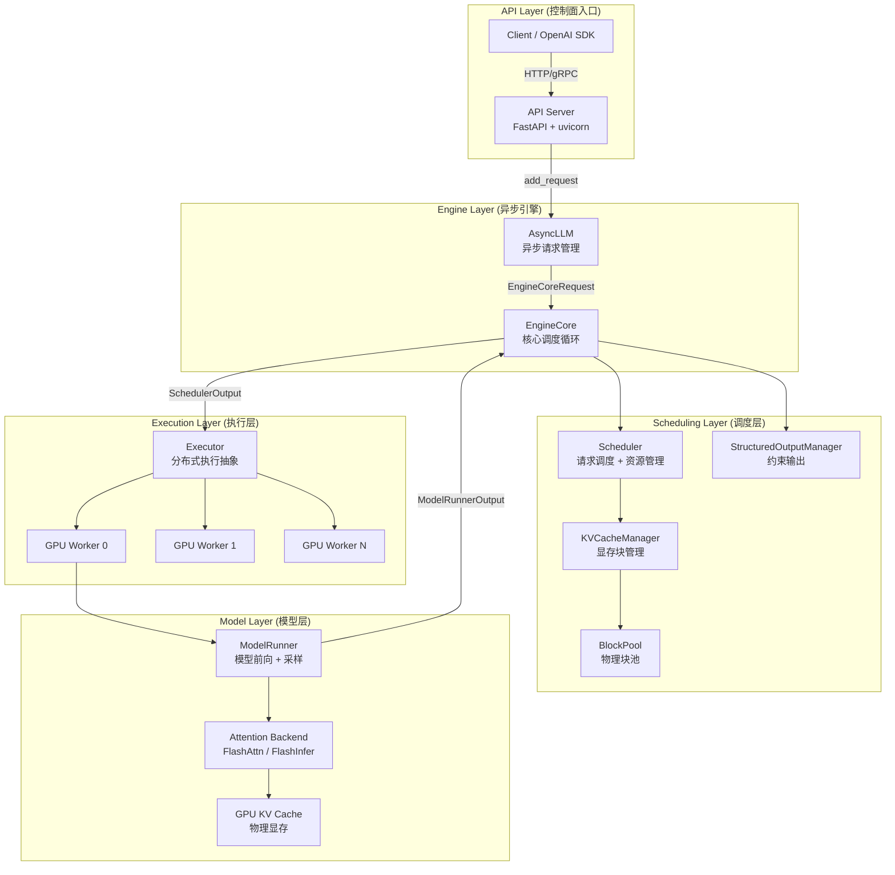
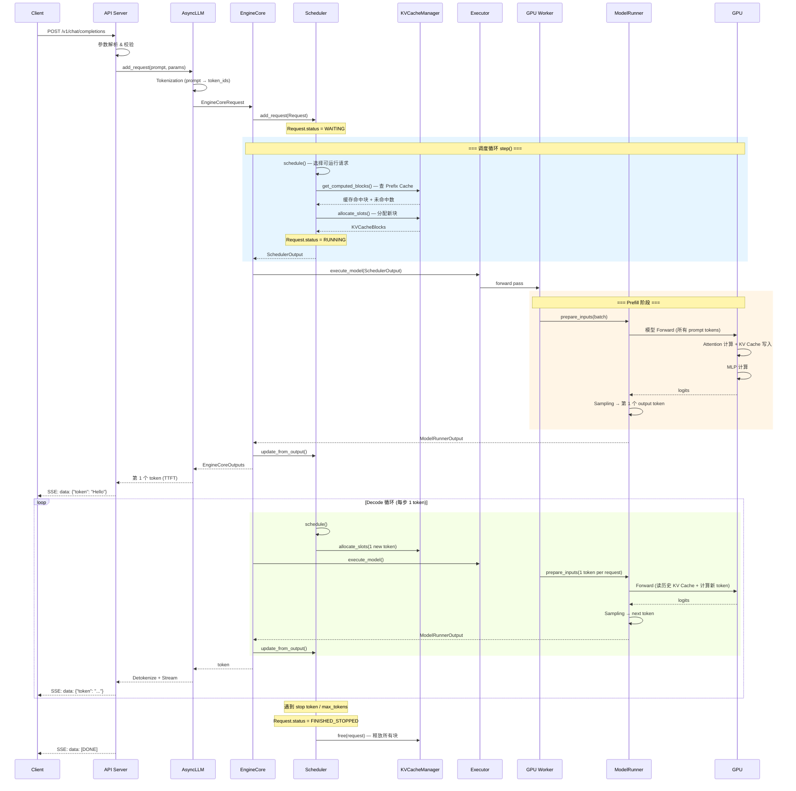
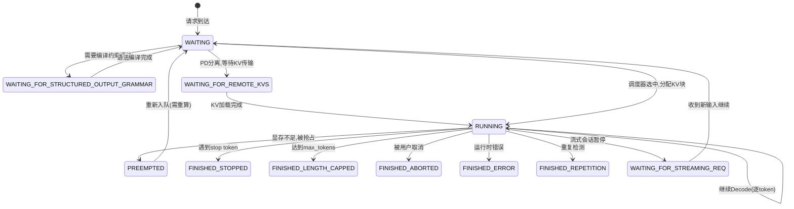

# 大模型推理系统揭秘：从 vLLM 看 LLM Serving Infra 核心技术

> **NOTE** 本文基于 vLLM v0.27.1（tag `6e448d0`, 2026-08-11）源码深度剖析。文中所有文件路径、类名和行号均以该版本为准；vLLM 迭代很快，阅读时请以你手上的版本对照。

---

## 目录

- [一、为什么 LLM Serving 比传统 DL 推理难？](#一为什么-llm-serving-比传统-dl-推理难)
- [二、鸟瞰 vLLM：一个请求如何穿过整个推理系统？](#二鸟瞰-vllm一个请求如何穿过整个推理系统)
- [三、KV Cache：LLM Serving 的第一号内存问题](#三kv-cachellm-serving-的第一号内存问题)
- [四、Scheduler：GPU 这一轮到底给谁用？](#四schedulergpu-这一轮到底给谁用)
- [五、GPU 执行：如何让每个 Token 算得更快？](#五gpu-执行如何让每个-token-算得更快)
- [六、Multi-GPU：一张卡不够时如何扩展？](#六multi-gpu一张卡不够时如何扩展)
- [七、模型适配：如何跟上变化极快的模型世界？](#七模型适配如何跟上变化极快的模型世界)
- [八、硬件解耦：如何不让芯片差异污染 Serving 核心？](#八硬件解耦如何不让芯片差异污染-serving-核心)
- [九、PD 分离：从单机 Serving 走向集群 Serving](#九pd-分离从单机-serving-走向集群-serving)
- [十、回到源码：一次请求在 vLLM 内部的真实旅程](#十回到源码一次请求在-vllm-内部的真实旅程)

---

## 一、为什么 LLM Serving 比传统 DL 推理难？

### 1.1 范式转移：传统 DL 推理 vs LLM Serving

传统深度学习推理（如图像分类、目标检测）与大模型推理之间存在一条根本性的鸿沟。理解这条鸿沟，是理解一切 LLM Serving 优化技术的起点。

**静态与动态的鸿沟** 传统 CV/NLP 推理是一个"纯函数"：输入 shape 固定（`[B, 3, 224, 224]`），输出 shape 固定，一次 forward 结束。服务框架（Triton、TF-Serving）只需要做一件事——**攒批**：等 10ms，凑齐 32 个请求，一起打进 GPU。

LLM 推理是"双未知"的：
- **输入长度未知**：用户可能发 20 token 的闲聊，也可能发 128K token 的整本合同；
- **输出长度未知**：模型什么时候吐 EOS，事先无法预测，甚至无法估计。

这意味着：**你无法预分配显存，也无法预测一个请求要占用 GPU 多久**。这一条，摧毁了传统 Serving 的全部前提。

```
┌──────────────────────────────────────────────────────────────────────┐
│                传统 DL 推理 vs LLM Serving 对比                       │
├──────────────────┬─────────────────────┬─────────────────────────────┤
│     维度          │   传统 DL 推理       │      LLM Serving            │
├──────────────────┼─────────────────────┼─────────────────────────────┤
│ 输入长度          │ 固定（如 224×224）   │ 可变（1 ~ 128K+ tokens）     │
│ 输出长度          │ 固定（类别数）       │ 不可预知（1 ~ 数千 tokens）   │
│ 执行模式          │ 单次 Forward Pass    │ 自回归循环（逐 Token 生成）   │
│ Batch 语义       │ 静态组批             │ 动态组批（Continuous Batch）  │
│ 内存占用          │ 前向一次性           │ 累积增长（KV Cache 持续膨胀） │
│ 延迟特征          │ 确定性               │ 与输出长度线性相关            │
│ GPU 利用模式      │ 持续高算力利用        │ Prefill 高算力/Decode 低利用  │
└──────────────────┴─────────────────────┴─────────────────────────────┘
```

这里的差异不只是在规模上，而是在执行方式上。传统推理一次 forward 就能得到最终结果；LLM 则要把刚生成的 token 重新送回模型，形成一条自回归循环。输出长度、KV 显存和端到端延迟都会随着循环动态变化，这也是后面调度、缓存和执行优化要解决的核心问题。

---

### 1.2 Prefill 与 Decode：两种完全不同的 GPU Workload

LLM Serving 的绝大部分优化技术，都可以追溯到这一节的一个事实：**同一个模型，在推理的两个阶段里表现得像两台不同的机器。** 这一节把它讲透，后续章节只做回指，不再重复定义。

LLM 推理天然分为两个阶段，它们在计算特征上截然对立：

```
                           LLM 推理的两阶段模型

     ┌─────────────────────────────────┬──────────────────────────────────┐
     │         Prefill 阶段            │          Decode 阶段              │
     │      (Prompt Processing)        │     (Token Generation)           │
     ├─────────────────────────────────┼──────────────────────────────────┤
     │                                 │                                  │
     │  输入: 全部 prompt tokens        │  输入: 上一步生成的 1 个 token     │
     │  并行度: 高（所有 token 并行）    │  并行度: 极低（逐 token 串行）     │
     │  计算量: O(n² · d)              │  计算量: O(n · d) per step       │
     │  瓶颈: Compute-Bound            │  瓶颈: Memory-Bound              │
     │  GPU利用: ████████████ 高       │  GPU利用: ██░░░░░░░░░ 低         │
     │  耗时: 一次性                    │  耗时: 持续（= 输出长度 × TPOT）  │
     │                                 │                                  │
     └─────────────────────────────────┴──────────────────────────────────┘

     时间线:  ──[  Prefill  ]──[ D ][ D ][ D ][ D ][ D ][ D ][ D ]──▶
                                 ↑    ↑    ↑    ↑    ↑    ↑    ↑
每步生成1个token，读取全部历史KV Cache
```

**Prefill 阶段**是计算密集型（Compute-Bound）。所有 prompt tokens 一次性输入模型，矩阵乘法的并行度高，GPU 的 Tensor Core 被充分利用。

需要澄清一点：上图标注的 `O(n²·d)` 只是 **Attention 那一项**。Prefill 的总 FLOPs 还有来自各个投影和 MLP 的 `O(n·d²)` 项，而在常见配置下（`n` 几千、`d` 几千）后者往往才是主体。这也解释了一个容易搞混的现象：**Prefill 之所以 compute-bound，首要原因是"每个 token 都要过一遍全部权重做大 GEMM"，而不仅仅是"序列长度的平方"**。序列真正拉长到几十 K 之后，`n²` 项才逐渐反超，长上下文优化（FlashAttention、Chunked Prefill、Context Parallel）也正是在那个区间才变得关键。

**Decode 阶段**是访存密集型（Memory-Bound）。每步只生成 1 个新 token，但需要读取之前所有 token 累积的 KV Cache。大量时间花在 HBM（高带宽内存）的数据搬运上，Tensor Core 大部分时间在等数据。

换句话说，Prefill 的瓶颈是"算得不够快"，Decode 的瓶颈是"数据搬得不够快"。这个转折会反复出现在后续讨论里：Chunked Prefill 针对前者，PagedAttention 和 CUDA Graph 更多针对后者。

#### Prefill 与 Decode 的数据流差异

```
┌──────────────────────────── Prefill 数据流 ─────────────────────────────┐
│                                                                         │
│  input_ids: [t₁, t₂, t₃, ..., tₙ]    (N 个 prompt tokens 并行输入)     │
│       │                                                                 │
│       ▼                                                                 │
│  ┌─────────┐  Q: [N, H, d]                                             │
│  │  QKV    │  K: [N, Hkv, d]   ──写入──▶  KV Cache (N 个新位置)         │
│  │  Proj   │  V: [N, Hkv, d]   ──写入──▶  (批量写入整个 prompt)          │
│  └─────────┘                                                            │
│       │                                                                 │
│  Attention: Q × Kᵀ → [N, N] → × V     (全量计算，O(N²·d))              │
│       │                                                                 │
│  只取最后 1 个 position 的 logits → Sampling → 第 1 个 output token       │
│                                                                         │
│  特征: Compute-Bound, 高 GPU 利用率, GEMM 大矩阵, 高 arithmetic intensity│
└─────────────────────────────────────────────────────────────────────────┘

┌──────────────────────────── Decode 数据流 ──────────────────────────────┐
│                                                                         │
│  input_ids: [tₙ₊ₖ]               (1 个新 token 输入)                    │
│       │                                                                 │
│       ▼                                                                 │
│  ┌─────────┐  q: [1, H, d]                                             │
│  │  QKV    │  k: [1, Hkv, d]   ──追加──▶  KV Cache (1 个新位置)         │
│  │  Proj   │  v: [1, Hkv, d]   ──追加──▶  (增量写入)                    │
│  └─────────┘                                                            │
│       │                                                                 │
│  Attention: q × K_historyᵀ → [1, N+k] → × V_history  (读取全部历史KV)   │
│       │                                                                 │
│  logits → Sampling → 下一个 output token                                 │
│                                                                         │
│  特征: Memory-Bound, 低 GPU 利用率, 大量 HBM 读取, 低 arithmetic intensity│
└─────────────────────────────────────────────────────────────────────────┘
```

| 维度 | Prefill | Decode |
|------|---------|--------|
| 输入 tokens 数 | N (全部 prompt) | 1 (每步) |
| KV Cache 操作 | 批量写入 N 条 | 追加 1 条，读取全部历史 |
| Attention 计算 | O(N² · d) | O(N · d) per step |
| 总 FLOPs（含投影/MLP） | O(N·d² + N²·d) | O(d² + N·d) per step |
| 计算瓶颈 | Compute-Bound (GEMM) | Memory-Bound (HBM 带宽) |
| Batch 特征 | 少量长序列 | 大量短步长 |
| 最佳 Kernel | FlashAttention (tiling) | FlashInfer / PagedAttention |
| CUDA Graph | 通常不用（长度可变） | 强烈推荐（固定模式重放） |

---

### 1.3 吞吐与时延：无法同时最优的权衡

这引出了 LLM Serving 的核心矛盾：

- **追求高吞吐**：需要大 Batch Size，让更多请求共享 GPU 算力 → 但每个请求的延迟增加
- **追求低时延**：需要小 Batch Size，减少排队和计算竞争 → 但 GPU 利用率下降，吞吐骤减

```
     吞吐 (Tokens/s)                         延迟 (ms/token)
        ▲                                       ▲
        │         ╱───────── 饱和              │             ╱
        │        ╱                              │           ╱
        │      ╱                                │         ╱
        │    ╱                                  │       ╱
        │  ╱                                    │     ╱
        │╱                                      │  ╱─
        └──────────────▶ Batch Size             └──────────────▶ Batch Size

        吞吐随 Batch 增大先线性增后饱和       延迟随 Batch 增大持续恶化
```

所有现代 LLM Serving 系统的优化，本质上都是在这条恶魔天平上寻找更优的帕累托前沿。

需要留意的是，两条曲线共享同一个 Batch Size 横轴，扩大 batch 通常会让吞吐和单请求延迟同时上升。系统要做的不是在吞吐或延迟里二选一，而是在给定 SLO 下找到可接受的 batch 区间，这也是 Admission Control 和调度预算反复出现的原因。

---

### 1.4 现代 LLM Serving 的核心性能指标体系

评价一个 LLM Serving 系统的好坏，需要一套完整的指标体系。以下是业界标准指标的全景图：



#### 指标详解

| 指标 | 定义 | 影响因素 | 优化方向 |
|------|------|----------|----------|
| **TTFT** (Time To First Token) | 从请求到达到返回第1个 token 的延迟 | Prefill 计算量、排队时间、Prefix Cache 命中率 | Chunked Prefill、Prefix Cache、PD 分离 |
| **TPOT** (Time Per Output Token) | 生成每个输出 token 的平均耗时 | Decode 带宽、Batch Size、KV Cache 大小 | Speculative Decoding、量化、CUDA Graph |
| **ITL** (Inter-Token Latency) | 相邻两个输出 token 之间的实际间隔 | 与 TPOT 类似，但反映实际波动 | 稳定调度、减少抢占 |
| **E2E Latency** | 端到端总延迟 | = Queueing + Prefill + Decode + Egress | 全链路优化 |
| **Queueing Time** | 请求在队列中等待调度的时间 | 并发量、Batch 容量、Admission Control | 动态扩容、负载均衡 |
| **Tokens/s** | 系统每秒处理的 token 总量 | GPU 利用率、Batch Size、并行度 | Continuous Batching、多卡并行 |
| **MFU** | Model FLOPs Utilization | 实际算力/理论峰值算力 | 减少空闲、算子融合 |
| **Goodput** | 满足 SLO 约束的有效吞吐 | 尾延迟控制能力 | 抢占策略、Admission Control |
| **P50/P95/P99** | 延迟百分位数 | 尾部请求的资源竞争 | 公平调度、优先级机制 |
| **Cost per Token** | 每生成 1 token 的综合成本 | 硬件利用率、吞吐量 | 量化、MoE 稀疏化 |

#### 端到端延迟分解

```
 ┌─────────┬──────────────────┬──────────────────────────────────┬────────┐
 │ Queueing│    Prefill       │          Decode (N steps)        │ Egress │
 │  Time   │    Time          │   TPOT × N output tokens         │  Time  │
 ├─────────┼──────────────────┼──────────────────────────────────┼────────┤
 │← wait →│← compute-bound →│←───── memory-bound ──────────→│← net →│
 └─────────┴──────────────────┴──────────────────────────────────┴────────┘
 ├────────────────── E2E Latency ──────────────────────────────────────────┤
              ↑                                                       ↑
           TTFT                                                  Last Token
```

这条横线也说明，TTFT 不等于"第一段耗时"，而是从请求到达到第一个 output token 的总和，其中包含 Queueing 和 Prefill。E2E 的大头通常是 Decode，因为它要乘上整个输出长度。只盯着 TPOT 会漏掉排队和长 prompt 的影响，只盯着 TTFT 又会低估长输出场景的成本。

---

### 1.5 总纲：vLLM 其实只在回答四个问题

前面的挑战和指标可以收敛成四个问题。**本文剩下的所有内容——以及 vLLM 绝大部分核心代码——都可以归进这四问之一。** 后面每章开头，我都会标明它在回答哪一问。

| # | 问题 | 核心机制 | 主要落点 | 本文章节 |
|---|------|---------|---------|---------|
| 一 | 请求来了，**这一轮谁执行、执行多少？** | Continuous Batching、Token Budget、Chunked Prefill、抢占 | `Scheduler` | 第四章 |
| 二 | 历史状态**放在哪里、怎么复用？** | PagedAttention、Prefix Cache、GQA/MLA、KV 量化 | `KVCacheManager` / `BlockPool` | 第三章 |
| 三 | 这一轮**怎么算得更快？** | FlashAttention、CUDA Graph、算子融合、量化、投机解码 | `ModelRunner` / Attention Backend | 第五章 |
| 四 | 一张卡不够，**怎么扩出去？** | TP / PP / EP / CP / DP、集合通信 | `Executor` / `distributed` | 第六章 |

四问之外还有两个**横切约束**：模型在变（第七章）、硬件在变（第八章）——它们不新增问题，但要求上面四个答案在剧烈变化的外部环境里保持稳定。最后，第九章把四问从单机尺度推到集群尺度（PD 分离）。

读到后面任何一个陌生的类名或机制时，建议先问一句：**它在回答哪一问？** 这比记住它在哪个文件里重要得多。

---

## 二、鸟瞰 vLLM：一个请求如何穿过整个推理系统？

> **本章不回答四问中的任何一问，只负责把地图画出来：这四个问题分别由哪些模块承担。**

这一章的目标很克制——读完之后你应该能做到两件事：**画出 vLLM 的模块图**，以及**讲清一次请求怎么跑完**。具体的数据结构（`Request` 的字段、`SchedulerOutput` 长什么样、`slot_mapping` 怎么算）一律不在这里展开，它们会在第十章、也就是你已经理解了「为什么需要它们」之后再出现。

### 2.1 静态系统拓扑（自顶向下）

vLLM V1 的整体架构遵循**控制面/数据面分离**的经典设计哲学。我们自顶向下，逐层解剖其系统拓扑。



从这张图看，从 Client 到 EngineCore 是请求入队路径，传递的是"生成什么"；EngineCore 到 Worker 再到 ModelRunner 是执行路径，携带的是这一轮调度出来的 batch 和 block 布局；而 ModelRunner 返回的只是采样结果，不是下一次 forward 的完整状态。调度状态留在 EngineCore，模型侧负责的是单次前向计算。

#### API Server 与 AsyncLLM：异步并发处理的桥头堡

入口位于 `vllm/entrypoints/openai/api_server.py`，基于 FastAPI 构建的 HTTP 服务器，实现了 OpenAI 兼容的 `/v1/chat/completions`、`/v1/completions` 等 REST API。

`AsyncLLM`（`vllm/v1/engine/async_llm.py`）是面向外部的异步引擎接口，负责：
- 接收 HTTP 请求并转化为内部 `EngineCoreRequest`
- 管理请求的异步生命周期
- 支持 SSE 流式响应
- 数据并行（DP）场景下的多引擎协调

#### EngineCore：推理系统的中央调度大脑

`EngineCore`（`vllm/v1/engine/core.py`）是 vLLM V1 引擎的核心，它的 `step()` 方法驱动整个推理循环：

```python
# vllm/v1/engine/core.py (简化)
class EngineCore:
    """Inner loop of vLLM's Engine."""

    def __init__(self, vllm_config, executor_class, ...):
        # 1. 初始化模型执行器
        self.model_executor = executor_class(vllm_config)

        # 2. 初始化 KV Cache
        kv_cache_config = self._initialize_kv_caches(vllm_config)

        # 3. 初始化调度器
        Scheduler = vllm_config.scheduler_config.get_scheduler_cls()
        self.scheduler = Scheduler(
            vllm_config=vllm_config,
            kv_cache_config=kv_cache_config,
            ...
        )
```

#### Scheduler 与 KVCacheManager：资源管理双核

`Scheduler`（`vllm/v1/core/sched/scheduler.py`，约 3000 行）是调度的大脑，决定每一轮迭代中哪些请求参与推理、分配多少 token 预算。

`KVCacheManager`（`vllm/v1/core/kv_cache_manager.py`）管理 GPU 显存上的 KV Cache 物理块——分配、释放、前缀缓存复用、驱逐。

#### Worker 与 Model Executor：模型执行的设备抽象

```
┌─────────────────────────────────────────────────────────────────────┐
│                          Executor                                   │
│              (执行抽象：单设备或多设备模型调用)                         │
│                                                                     │
│  ┌──────────────┐  ┌──────────────┐       ┌──────────────┐         │
│  │   Worker 0   │  │   Worker 1   │  ...  │   Worker N   │         │
│  │  (GPU 0)     │  │  (GPU 1)     │       │  (GPU N)     │         │
│  │              │  │              │       │              │         │
│  │ ModelRunner  │  │ ModelRunner  │       │ ModelRunner  │         │
│  │  ┌────────┐  │  │  ┌────────┐  │       │  ┌────────┐  │         │
│  │  │ Model  │  │  │  │ Model  │  │       │  │ Model  │  │         │
│  │  │Weights │  │  │  │Weights │  │       │  │Weights │  │         │
│  │  ├────────┤  │  │  ├────────┤  │       │  ├────────┤  │         │
│  │  │KV Cache│  │  │  │KV Cache│  │       │  │KV Cache│  │         │
│  │  └────────┘  │  │  └────────┘  │       │  └────────┘  │         │
│  └──────────────┘  └──────────────┘       └──────────────┘         │
│        ↕ NCCL           ↕ NCCL                  ↕ NCCL             │
│  ══════════════════════════════════════════════════════════         │
│                    GPU 间通信拓扑                                    │
└─────────────────────────────────────────────────────────────────────┘
```

常见 GPU 部署中，Executor 会把一次 `execute_model()` 调用分发给一个或多个 Worker；Worker 再调用本地的 `ModelRunner` 执行模型前向、采样和 KV Cache 读写。单卡、同机多进程、Ray 分布式和 external launcher 的进程/设备映射并不完全相同，因此不应把“一个 GPU 固定绑定一个 Worker 进程”写成绝对规则。

每个 Worker 通常负责：
- `ModelRunner`：负责模型前向计算、输入准备、采样
- 模型权重的分片（Tensor Parallel 下每卡持有一部分）
- KV Cache 物理显存

`Executor`（`vllm/v1/executor/abstract.py`）是模型执行抽象层，负责在一个设备或多个设备上执行模型，而不是 Scheduler 本身。v0.27.1 中可见的主要实现包括：
- `UniProcExecutor`：单进程单卡
- `MultiprocExecutor`：多进程多卡（同机）
- `RayDistributedExecutor`：Ray 分布式（直接继承 `Executor`）
- `RayExecutorV2`：Ray 分布式的新实现，注意它继承的是 `MultiprocExecutor` 而非 `Executor`——即复用同一套 worker 进程管理逻辑，只把进程的**拉起方式**换成 Ray（`RayWorkerProc(WorkerProc)`）
- `ExecutorWithExternalLauncher`：外部 launcher 场景（继承 `UniProcExecutor`）

这条继承链本身就说明了一件事：**"用不用 Ray"是部署方式的差异，不是执行模型的差异。** Executor 这层抽象的价值就在于把"进程怎么起、卡怎么分"和"一轮 batch 怎么执行"彻底分开，所以 V2 才能靠换掉进程拉起方式来复用同机多进程的全部逻辑。

---

### 2.2 一次请求的完整生命周期



---

### 2.3 控制面与数据面的分离

```
┌────────────────────────────── 控制面 (Python) ──────────────────────────┐
│                                                                         │
│  API Server ─── AsyncLLM ─── EngineCore ─── Scheduler ─── KVCacheManager│
│                                                                         │
│  职责:                                                                   │
│  · 请求接收与参数解析          · 调度决策（哪些请求本轮执行）              │
│  · Tokenization/Detokenization · KV块分配与释放                          │
│  · 请求状态机管理              · Prefix Cache查找                         │
│  · 流式响应                    · 抢占决策                                 │
│  · 数据并行协调                · 停止条件检测                             │
│                                                                         │
│  通信: ZMQ IPC, msgspec 序列化, Python asyncio                           │
└───────────────────────────────────┬─────────────────────────────────────┘
                                    │ SchedulerOutput
                                    │ (调度决策: req_ids, block_table, ...)
                                    ▼
┌────────────────────────────── 数据面 (C++/CUDA) ────────────────────────┐
│                                                                         │
│  Worker ─── ModelRunner ─── GPU Kernels ─── NCCL                       │
│                                                                         │
│  职责:                                                                   │
│  · 输入张量准备 (input_ids → CUDA tensor)                                │
│  · 模型 Forward Pass (GEMM, Attention, MLP)                             │
│  · KV Cache 物理读写                                                     │
│  · 采样 (top-p, top-k, temperature)                                     │
│  · GPU间集合通信 (All-Reduce, All-Gather)                                │
│  · CUDA Graph 捕获与重放                                                 │
│                                                                         │
│  特征: 极低延迟, CUDA Stream 驱动, 零拷贝传输                             │
└─────────────────────────────────────────────────────────────────────────┘
```

**为什么控制流和数据流需要解耦？**

1. **语言特性匹配**：调度逻辑复杂多变（频繁的条件判断、动态数据结构操作），适合 Python；数值计算追求极致性能，适合 C++/CUDA
2. **迭代速度**：调度算法是 vLLM 最频繁迭代的模块，Python 的开发效率远胜 C++
3. **控制面开销可被摊薄**：只要调度、序列化和输入准备开销显著小于 GPU 执行时间，Python 控制面的影响就可以被流水线化和批处理摊薄；具体是否成为瓶颈取决于 batch、模型和硬件
4. **Batch Queue 机制**：vLLM 通过 `batch_queue` 等机制让调度与执行尽量流水线化，当 GPU 执行当前 batch 时，CPU 侧可以准备后续 batch

---

### 2.4 一句话总结这一章

如果这一章只能记住一句话，那就是模块之间的分工：

> **EngineCore 驱动循环，Scheduler 决定这一轮谁跑、跑多少 token，Executor 负责把任务分发下去，ModelRunner 负责真正调用 GPU 算。**

把它和上一章的四问对齐，就得到全文的骨架：

| 四问 | 承担模块 |
|------|---------|
| 一、这一轮谁执行、执行多少 | `Scheduler`（+ `EngineCore` 驱动） |
| 二、状态放哪、怎么复用 | `KVCacheManager` / `BlockPool` |
| 三、怎么算得更快 | `ModelRunner` / Attention Backend / Kernel |
| 四、怎么扩出去 | `Executor` / `Worker` / 集合通信 |

接下来四章，就是把这张表的每一行拆开来讲。

---

## 三、KV Cache：LLM Serving 的第一号内存问题

> **本章回答第二问：历史状态放在哪里、怎么复用。**

先不谈任何术语，设想一个场景。

你有一张 80 GB 的卡，同时来了 100 个请求。第一个请求最后只生成了 300 个 token，第二个生成了 3000 个，第三个一路写到 20K。**问题在于：这三个数字，你在请求到达的那一刻一个都不知道。**

如果按传统做法，给每个请求划一块连续显存来放它的 KV Cache，那你只能按"最坏情况"预留——按模型支持的最大长度划。于是那个只生成 300 token 的请求，占着一块够装 32K token 的地。100 个请求这么一摊，卡就满了，尽管真正装了有效数据的可能不到三成。

> **显存不是被模型吃掉的，是被"不确定性"浪费掉的。**

PagedAttention 的核心思想，用一句话就能说完：

> **别给请求整块连续空间。把 KV Cache 切成固定大小的小块，用多少申请多少，块与块之间不要求相邻。**

这样"预留"就消失了——因为不再需要预判总长度，只需要在写满当前块时再要一块。这个思路你大概率见过：**它就是操作系统的虚拟内存分页**。下面我们从传统做法的具体代价讲起，再看这套页表思想是怎么被搬到 GPU 上的。

### 3.1 PagedAttention 的数学本质与源码实现

#### 痛点：传统显存分配的碎片灾难

在 PagedAttention 出现之前，每个请求的 KV Cache 必须在 GPU 显存中预分配一段**连续内存**，其长度等于模型支持的最大序列长度。这造成了两类碎片：

```
┌───────────── 传统 KV Cache 分配方式 ─────────────────────────────────┐
│                                                                       │
│  GPU HBM (80 GB)                                                      │
│  ┌───────────────────────────────────────────────────────────────┐    │
│  │ Req A: 预分配 max_len=2048     实际只用了 500                  │    │
│  │ ████████████░░░░░░░░░░░░░░░░░░░░░░░░░░░░░░░░░░░░░░░░░░░░░│    │
│  │ ↑ 已用  ↑                                             ↑      │    │
│  │ 500    内部碎片 (1548 tokens 的空间浪费)               2048   │    │
│  ├───────────────────────────────────────────────────────────────┤    │
│  │ Req B: 预分配 max_len=2048                                    │    │
│  │ ████████████████████████░░░░░░░░░░░░░░░░░░░░░░░░░░░░░░░░░│    │
│  ├───────────────────────────────────────────────────────────────┤    │
│  │ ░░░░░░ 外部碎片: 剩余空间不足以分配完整的 2048 连续块 ░░░░░░  │    │
│  │ ░░░ Req C 无法入场，即使总剩余空间其实够用 ░░░░░░░░░░░░░░░░  │    │
│  └───────────────────────────────────────────────────────────────┘    │
│                                                                       │
│  内部碎片: 预分配但未使用的空间 → 主要浪费来源                          │
│  外部碎片: 已释放但不连续的空间 → 无法被新请求利用                     │
│  总浪费率: PagedAttention 论文 (SOSP'23) 测得当时的 SOTA 系统中,        │
│           真正存放有效 KV 的显存只占 20.4% ~ 38.2%,                    │
│           即约 60% ~ 80% 被碎片和预留吃掉                              │
└───────────────────────────────────────────────────────────────────────┘
```

#### 页表思想的映射：操作系统虚拟内存在推理系统中的重现

PagedAttention 的灵感直接来自操作系统的虚拟内存管理。核心思想是将连续的逻辑地址空间映射到不连续的物理页框：

```
┌─────────── 操作系统虚拟内存 ────────────┬──── PagedAttention ────────────┐
│                                          │                                │
│  虚拟地址空间 (连续)                      │  逻辑 Token 序列 (连续)         │
│  ┌──────┬──────┬──────┬──────┐          │  ┌──────┬──────┬──────┐       │
│  │Page 0│Page 1│Page 2│Page 3│          │  │Blk 0 │Blk 1 │Blk 2 │       │
│  └──┬───┴──┬───┴──┬───┴──┬───┘          │  │t₁-t₁₆│t₁₇-t₃₂│t₃₃-t₄₈│   │
│     │      │      │      │              │  └──┬───┴──┬───┴──┬───┘       │
│     ▼      ▼      ▼      ▼              │     │      │      │           │
│  Page Table                              │  Block Table                   │
│  ┌──────────────────────┐               │  ┌──────────────────────┐      │
│  │VP 0 → PF 5           │               │  │VB 0 → PB 7           │      │
│  │VP 1 → PF 2           │               │  │VB 1 → PB 13          │      │
│  │VP 2 → PF 8           │               │  │VB 2 → PB 21          │      │
│  │VP 3 → PF 1           │               │  └──────────────────────┘      │
│  └──────────────────────┘               │                                │
│     │      │      │      │              │     │      │      │           │
│     ▼      ▼      ▼      ▼              │     ▼      ▼      ▼           │
│  物理页框 (不连续)                        │  物理 GPU 块 (不连续)          │
│  ┌──┐ ┌──┐ ┌──┐ ┌──┐ ┌──┐ ┌──┐        │  ┌──┐    ┌──┐       ┌──┐     │
│  │1 │ │2 │ │  │ │  │ │5 │ │  │        │  │7 │    │13│       │21│     │
│  │PF│ │PF│ │..│ │..│ │PF│ │..│        │  │PB│    │PB│       │PB│     │
│  └──┘ └──┘ └──┘ └──┘ └──┘ └──┘        │  └──┘    └──┘       └──┘     │
│  ┌──┐ ┌──┐                              │                                │
│  │8 │ │  │                              │                                │
│  │PF│ │..│                              │                                │
│  └──┘ └──┘                              │                                │
└──────────────────────────────────────────┴────────────────────────────────┘
  VP = Virtual Page    PF = Physical Frame    VB = Virtual Block   PB = Physical Block
```

在 vLLM 中，每个物理块（Physical Block）存储固定数量 token 的 K 和 V 张量：

```python
# KV Cache 物理布局 (单层)
# shape: [num_physical_blocks, block_size, num_kv_heads, head_dim]
# 例: [2048 blocks, 16 tokens/block, 8 heads, 128 dim]
kv_cache = torch.zeros(num_blocks, block_size, num_kv_heads, head_dim,
                        dtype=torch.float16, device="cuda")
```

#### 源码解密：核心数据结构关系

```
┌────────────────── Request ──────────────────┐
│  request_id: str                            │
│  prompt_token_ids: [t₁, t₂, ..., tₙ]       │
│  output_token_ids: [tₙ₊₁, tₙ₊₂, ...]      │
│  num_computed_tokens: int                   │
│  block_hashes: list[BlockHash]              │
│  status: RequestStatus                      │
└──────────────────┬──────────────────────────┘
                   │ 1:N (通过 KVCacheManager)
                   ▼
┌──────── KVCacheBlocks ──────────────────────┐
│  blocks: tuple[Sequence[KVCacheBlock], ...] │
│  (外层 = KV Cache Group)                    │
│  (内层 = 该 Group 的物理块序列)              │
└──────────────────┬──────────────────────────┘
                   │
                   ▼
┌────────── KVCacheBlock ─────────────────────┐
│  block_id: int          # 物理块 ID (0~N-1) │
│  ref_cnt: int           # 引用计数           │
│  block_hash: BlockHash  # 用于 Prefix Cache  │
│  prev_free_block ─┐     # 双向链表指针       │
│  next_free_block ─┘     # (FreeBlockQueue)   │
└──────────────────┬──────────────────────────┘
                   │  (block_id 索引 GPU 物理显存)
                   ▼
┌────────── GPU HBM ──────────────────────────┐
│  kv_cache[block_id] →                       │
│  [block_size, num_kv_heads, head_dim]       │
│  存储该块内所有 token 的 K/V 张量             │
└─────────────────────────────────────────────┘
```

顺着箭头从上到下跟踪：Request 只是逻辑层，不直接触及 GPU 显存；KVCacheBlock 才是物理块的元数据，它同时挂在 Request 的 blocks 列表和 BlockPool 的 free/cached 列表里；block_id 最终索引到 GPU HBM 中的一片连续显存，里面放的是一整块 block_size 个 token 的 K 和 V。这三层映射是理解后面 Prefix Cache 复用和 Preemption 释放的基础。

`BlockPool`（`vllm/v1/core/block_pool.py`）管理所有物理块的分配和回收，使用双向链表实现高效的 LRU 驱逐：

```python
# vllm/v1/core/block_pool.py (简化)
class BlockPool:
    def __init__(self, num_gpu_blocks: int, ...):
        self.num_gpu_blocks = num_gpu_blocks
        self.free_block_queue = FreeKVCacheBlockQueue(num_gpu_blocks)
        # Prefix Cache: hash → 物理块映射
        self.cached_block_hash_to_block = BlockHashToBlockMap()

    def get_new_blocks(self, num_blocks: int) -> list[KVCacheBlock]:
        """从空闲队列分配新块（如果不够，驱逐 LRU 缓存块）"""
        ...

    def free_blocks(self, blocks: Iterable[KVCacheBlock]):
        """ref_cnt--，归零则回收到空闲队列"""
        ...

    def cache_full_blocks(self, request, blocks, ...):
        """将满块的 hash 注册到 Prefix Cache"""
        ...
```

块分配的布局（引自 `allocate_slots()` 注释）：

```
  |<──── computed ────>|<─ new_computed ─>|<─ external ─>|<── new ──>|<─ lookahead ─>|
                                                          |<── to be computed ──────>|
                                          |<────────── to be allocated ──────>|
                                          |<────────── to be cached ──────────>|

  computed:      之前已缓存在 KV Cache 中的 tokens（Prefix Cache 命中）
  new_computed:  本轮新计算但已完成的 tokens
  external:      从远端传输的 KV 块（PD 分离场景）
  new:           需要本轮计算的新 tokens
  lookahead:     为 Speculative Decoding 预留的额外 tokens
```

这个布局也揭示了 Scheduler 为什么不能按请求类型硬分类。一轮迭代中一个请求可能同时覆盖 computed（prefix cache 命中）、new（需要新计算）和 lookahead（spec decode 预留），不同请求在这个轴上的位置各不相同。token 预算模型统一处理这些区间，而不是按"prefill 请求"和"decode 请求"分开。

---

### 3.2 KV Cache 的写入、读取与生命周期

上一节讲的是「块从哪来」，这一节讲「块怎么被用完再还回去」——一次请求从 Prefill 批量写入，到 Decode 逐 slot 追加，最后在完成或被抢占时归还，构成 KV Cache 的完整生命周期。

```
                     KV Cache 生命周期全景

  ┌─────── Prefill 阶段 ──────┐   ┌────── Decode 阶段 ──────┐
  │                            │   │                          │
  │  prompt tokens:            │   │  每步 1 个新 token:       │
  │  [t₁, t₂, ..., tₙ]       │   │  [tₙ₊₁], [tₙ₊₂], ...   │
  │       │                    │   │       │                  │
  │       ▼                    │   │       ▼                  │
  │  ┌─────────────────┐      │   │  ┌──────────┐           │
  │  │ 批量写入 KV     │      │   │  │ 增量追加  │           │
  │  │ Cache 块        │      │   │  │ 1 个 slot │           │
  │  │                 │      │   │  │           │           │
  │  │ Block 0: [t₁~t₁₆]│   │   │  │ Block 2:  │           │
  │  │ Block 1: [t₁₇~t₃₂]│  │   │  │ 追加 tₙ₊₁ │           │
  │  │ Block 2: [t₃₃~tₙ] │   │   │  └──────────┘           │
  │  └─────────────────┘      │   │                          │
  └────────────────────────────┘   └──────────────────────────┘

  ┌─────── Attention 读取 ──────────────────────────────────┐
  │                                                         │
  │  Block Table (虚拟→物理映射):                            │
  │  req_42 → [PhyBlock_7, PhyBlock_13, PhyBlock_21]       │
  │                                                         │
  │  Attention Kernel 通过 Block Table 索引读取:             │
  │  for each query position:                               │
  │    for each block in block_table[req]:                  │
  │      K_block = kv_cache[block_id, :, :key_heads, :]    │
  │      V_block = kv_cache[block_id, :, :val_heads, :]    │
  │      score += Q @ K_blockᵀ                              │
  │    attn_out = softmax(scores) @ V_blocks               │
  └─────────────────────────────────────────────────────────┘

  ┌─────── 生命周期终结 ────────────────────────────────────┐
  │                                                         │
  │  请求完成:                                               │
  │    Scheduler → KVCacheManager.free(request)             │
  │    → ref_cnt-- 对所有块                                  │
  │    → ref_cnt == 0 的块归还 free_block_queue              │
  │    → 有 block_hash 的块进入 LRU 缓存（Prefix Cache）     │
  │    → 无 hash 的块立即回收                                 │
  │                                                         │
  │  抢占:                                                   │
  │    → 释放所有块                                          │
  │    → num_computed_tokens = 0 （需从头重算）               │
  │    → 但 Prefix Cache 命中可跳过部分重算                   │
  └─────────────────────────────────────────────────────────┘
```

---

### 3.3 KV Cache 还能更小吗：复用、压缩与分层存储

在进入具体手段之前，先立一个分层框架——**这三层解决的是完全不同的问题，不应该混为一谈**：

| 层级 | 手段 | 解决的问题 |
|------|------|-----------|
| 系统管理层 | PagedAttention、Prefix Cache | 已经要存这么多，**显存怎么管才不浪费** |
| 模型架构层 | MQA / GQA / MLA | **本来到底需要存多少** |
| 数值层 | FP8 / INT8 量化 | 每个 KV 元素**占几个字节** |

三者是正交的，可以叠加：MLA 减少了要存的量，PagedAttention 管理这些量的摆放，FP8 再把每个元素压小。下面按这个顺序展开。

#### 3.3.1 Prefix Cache：重复计算复用

在生产环境中，大量请求共享相同的 System Prompt（如 ChatGPT 的系统指令可能占 2000+ tokens）。Prefix Cache 的核心思想是：如果两个请求的前缀 token 完全相同，它们可以共享同一份 KV Cache 块。

```
  ┌─────────────── Prefix Cache 工作原理 ──────────────────────────┐
  │                                                                │
  │  Request A: [System Prompt: 2000 tokens] + [User: "Hi"]       │
  │  Request B: [System Prompt: 2000 tokens] + [User: "Bye"]      │
  │                                                                │
  │  Block Hashing:                                                │
  │  Block 0: hash([t₁...t₁₆])         = 0xABC1                  │
  │  Block 1: hash(0xABC1, [t₁₇...t₃₂]) = 0xDEF2                │
  │  ...                                                           │
  │  Block 124: hash(prev, [t₁₉₈₅...t₂₀₀₀]) = 0x7890            │
  │                                                                │
  │  Request A 首先执行 → 所有 125 个块被缓存                       │
  │                                                                │
  │  Request B 到达 → get_computed_blocks()                        │
  │  → 查找 hash 链: 0xABC1 → 命中! 0xDEF2 → 命中! ...            │
  │  → 125 个块全部命中 (ref_cnt++)                                │
  │  → 只需 Prefill 用户消息 "Bye" 的 1 个块                       │
  │                                                                │
  │  节省: 2000 tokens 的 Prefill 计算 + KV Cache 显存              │
  └────────────────────────────────────────────────────────────────┘
```

vLLM 使用链式哈希确保前缀匹配的正确性——每个块的哈希值依赖其前驱块的哈希，因此只有完全相同的前缀序列才会产生相同的哈希链。

```python
# vllm/v1/core/kv_cache_utils.py (签名照抄, 函数体简化)
def hash_block_tokens(
    hash_function: Callable[[Any], bytes],
    parent_block_hash: BlockHash | None,
    curr_block_token_ids: Sequence[int],
    extra_keys: tuple[Any, ...] | None = None,
) -> BlockHash:
    """链式哈希：当前块哈希 = f(前驱块哈希, 本块 token ids, 额外键)"""
    if not parent_block_hash:
        parent_block_hash = NONE_HASH  # 首块的哈希起点
    return BlockHash(
        hash_function((parent_block_hash, tuple(curr_block_token_ids), extra_keys))
    )
```

这个签名里有两个细节值得留意，它们不是实现噪音：

- **哈希函数是注入进来的，不是 Python 内建的 `hash()`**，返回值也是 bytes 而非 int（可选 `sha256_cbor`、`xxhash_cbor` 等）。因为块哈希要在多个 worker、甚至跨节点（PD 分离、LMCache）之间对得上，必须可控且可复现。
- **链条起点 `NONE_HASH` 默认是随机的。** `init_none_hash()` 在未设置 `PYTHONHASHSEED` 时取 `os.urandom(32)`，即每个进程一个随机起点；只有显式设置 `PYTHONHASHSEED` 才会变成确定值。这是一个刻意的安全默认：随机起点让块哈希无法被外部预测，避免跨租户的缓存探测；而想让多进程/多节点共享同一份 prefix cache，就必须放弃这个默认。**可复现性和不可预测性在这里是一对取舍**，vLLM 默认选了后者。
- **`extra_keys` 是隔离用的。** 同一串 token 在不同 LoRA adapter、不同多模态输入、不同 `cache_salt`、不同 prompt embeds 下不能复用同一份 KV，这些维度都由 `generate_block_hash_extra_keys()` 收集进 `extra_keys`。也就是说，"前缀相同"的判定比"token 序列相同"严格——这是 prefix cache 的正确性边界。

#### 3.3.2 GQA / MQA：模型结构级 KV Cache 瘦身

KV Cache 的大小与 KV head 数量成正比。Grouped-Query Attention (GQA) 和 Multi-Query Attention (MQA) 通过减少 KV head 数来缩减 KV Cache：

```
┌──────────────── Attention 变体的 KV Cache 对比 ─────────────────────┐
│                                                                     │
│  MHA (Multi-Head Attention):                                        │
│  Q Heads: [H₁] [H₂] [H₃] [H₄] [H₅] [H₆] [H₇] [H₈]             │
│  K Heads: [H₁] [H₂] [H₃] [H₄] [H₅] [H₆] [H₇] [H₈]             │
│  V Heads: [H₁] [H₂] [H₃] [H₄] [H₅] [H₆] [H₇] [H₈]             │
│  KV Cache = 2 × L × S × H × d     (H=num_heads)                   │
│                                                                     │
│  GQA (Grouped-Query Attention):                                     │
│  Q Heads: [H₁] [H₂] [H₃] [H₄] [H₅] [H₆] [H₇] [H₈]             │
│  K Heads: [G₁       ] [G₂       ] [G₃       ] [G₄       ]          │
│  V Heads: [G₁       ] [G₂       ] [G₃       ] [G₄       ]          │
│  KV Cache = 2 × L × S × G × d     (G=num_groups, 通常 G=H/4~H/8)  │
│  缩减比: G/H = 1/2 ~ 1/8                                           │
│                                                                     │
│  MQA (Multi-Query Attention):                                       │
│  Q Heads: [H₁] [H₂] [H₃] [H₄] [H₅] [H₆] [H₇] [H₈]             │
│  K Heads: [K₁                                        ]              │
│  V Heads: [V₁                                        ]              │
│  KV Cache = 2 × L × S × 1 × d                                      │
│  缩减比: 1/H = 1/8 ~ 1/64                                          │
└─────────────────────────────────────────────────────────────────────┘
```

| 模型 | 注意力类型 | num_heads | num_kv_heads | KV Cache 比例 |
|------|-----------|-----------|-------------|--------------|
| GPT-3 175B | MHA | 96 | 96 | 100% |
| Llama 3 70B | GQA | 64 | 8 | 12.5% |
| Llama 3 8B | GQA | 32 | 8 | 25% |
| Falcon 40B | MQA | 64 | 1 | 1.6% |
| DeepSeek V3 | MLA | 128 | - | ~2% (存 576 维 latent，非 128×128 的完整 KV) |

#### 3.3.3 MLA：从 KV Cache 到 Latent Cache

DeepSeek V2/V3 提出的 Multi-head Latent Attention (MLA) 是一种更激进的 KV Cache 压缩方案。它不存储完整的 K、V 张量，而是存储一个低维的 latent 向量：

```
┌───────────── MLA vs 传统 KV Cache ──────────────────────────────────┐
│                                                                      │
│  传统 MHA/GQA:                                                       │
│  存储: K [num_kv_heads, head_dim] + V [num_kv_heads, head_dim]      │
│  每 token: 2 × Hkv × d bytes                                        │
│  Llama-70B (GQA-8): 2 × 8 × 128 × 2B = 4 KB/token/layer           │
│                                                                      │
│  MLA (DeepSeek):                                                     │
│  存储: c_kv [kv_lora_rank] + k_pe [qk_rope_head_dim]                 │
│  每 token: (kv_lora_rank + qk_rope_head_dim) × sizeof(dtype)         │
│  DeepSeek V3: (512 + 64) × 2B ≈ 1.1 KB/token/layer                  │
│                                                                      │
│  ┌─────────────── MLA 原理 ───────────────────┐                     │
│  │                                             │                     │
│  │  编码 (Prefill时):                          │                     │
│  │  hidden → kv_a_proj → c_kv (latent)        │                     │
│  │  c_kv → 存入 KV Cache (低维)               │                     │
│  │                                             │                     │
│  │  解码 (Decode时):                           │                     │
│  │  c_kv ← 读出 KV Cache                      │                     │
│  │  c_kv → kv_b_proj → K, V (恢复全维)        │                     │
│  │  然后正常做 Attention                       │                     │
│  │                                             │                     │
│  │  关键优化 — "吸收" (Absorbing):              │                     │
│  │  W_uk × W_q 可以预融合，避免显式解压 K       │                     │
│  │  直接在 latent 空间做 Attention              │                     │
│  └─────────────────────────────────────────────┘                     │
│                                                                      │
│  压缩比: 相比同规模的 MHA 可缩减一个数量级以上;                       │
│         相比 Llama 式 GQA-8 (4 KB/token/layer) 约缩减 3~4x           │
└──────────────────────────────────────────────────────────────────────┘
```

vLLM 中 MLA 的实现位于 `vllm/model_executor/layers/mla.py`，通过 `MLAAttentionSpec` 定义其特殊的 KV Cache 规格（存储 latent 而非完整 KV）。

#### 3.3.4 KV Cache Quantization：数值压缩与带宽优化

除了结构级的压缩（GQA/MQA/MLA），还可以通过数值量化进一步压缩 KV Cache：

```
┌──────────── KV Cache 量化规模对比 (per token, per layer) ──────────┐
│                                                                     │
│  格式        存储大小    相对 FP16    精度影响                        │
│  ─────────  ─────────  ──────────  ─────────────────                │
│  FP32        4 bytes     2.0x      基准（训练精度）                  │
│  FP16/BF16   2 bytes     1.0x      标准推理精度                     │
│  FP8 (E4M3)  1 byte      0.5x     轻微损失，短文本安全              │
│  INT8         1 byte      0.5x     需要校准，按 head/channel 量化   │
│  INT4         0.5 bytes   0.25x    显著损失，不常用于 KV Cache       │
│                                                                     │
│  示例: Llama-70B, GQA-8, 80 layers, seq_len=4096                   │
│  单请求 FP16: 4 KB/token/layer × 4096 × 80    = 1.34 GB           │
│  单请求 FP8:  2 KB/token/layer × 4096 × 80    = 0.67 GB (省 50%)  │
│  并发 8 路 FP16: 1.34 GB × 8                  = 10.7 GB           │
│  → 单请求看着不大, 但 KV Cache 是"并发数 × 上下文长度"的乘积,       │
│    这才是它压垮显存的方式                                           │
│                                                                     │
│  量化粒度:                                                           │
│  ┌────────────────────────────────────────────────────────┐         │
│  │ Per-tensor: 整个 KV Cache 共享 1 个 scale → 精度最差    │         │
│  │ Per-token:  每个 token 独立 scale → 较好                │         │
│  │ Per-head:   每个 head 独立 scale → 精细                 │         │
│  │ Per-channel: 每个 channel 独立 scale → 最优精度          │         │
│  │ Per-group:  每 G 个元素共享 scale → 灵活                │         │
│  └────────────────────────────────────────────────────────┘         │
│                                                                     │
│  Quantize-on-write: 写入 KV Cache 时以低精度存储                    │
│  Dequantize-on-read: 读取时反量化或在 attention kernel 内处理         │
│  是否启用取决于模型、dtype、backend 与配置                           │
└─────────────────────────────────────────────────────────────────────┘
```

KV Cache 量化与 PagedAttention 在设计上可以组合：量化后的 KV 仍按 block 粒度管理，同时需要记录相应 scale 或格式元数据。具体是否支持、如何存储 scale、是否在 attention kernel 内完成反量化，取决于 v0.27.1 中对应模型、dtype 和 attention backend 的实现。

**注意**：Softmax 对 Key 的误差特别敏感（因为指数函数会放大误差），长上下文下量化误差可能累积。FP8 是实践中最安全的 KV Cache 量化格式。

#### 3.3.5 KV Cache Offloading 与 Swapping

当 GPU 显存不足时，vLLM 支持将 KV Cache 卸载到更低层的存储：

```
┌───────── KV Cache 分层存储架构 ──────────────────────────────────────┐
│                                                                       │
│  ┌──────────────────┐  ←── 热层: 活跃请求的 KV                       │
│  │  GPU HBM         │      容量: 10-80 GB                             │
│  │  带宽: 3.35 TB/s │      延迟: ~ns                                  │
│  │  (H100)          │                                                 │
│  └────────┬─────────┘                                                 │
│           │  PCIe Gen5: 64 GB/s                                       │
│           │  ┌── Swap: 被抢占请求的 KV ──┐                            │
│  ┌────────▼─────────┐                    │                            │
│  │  CPU DRAM        │  ←── 温层           │                            │
│  │  带宽: ~200 GB/s │      容量: 256-2TB  │                            │
│  │                  │      延迟: ~100 ns  │                            │
│  └────────┬─────────┘                    │                            │
│           │  NVMe: 7 GB/s               │                            │
│  ┌────────▼─────────┐                    │                            │
│  │  NVMe SSD        │  ←── 冷层（未来）   │                            │
│  │  容量: 1-16 TB   │      延迟: ~10 μs  │                            │
│  └──────────────────┘                    │                            │
│                                          │                            │
│  三种应对策略:                             │                            │
│  ┌────────────────────────────────────┐  │                            │
│  │ 1. Recomputation (重算)            │  │                            │
│  │    释放 KV → 恢复时从头重算         │  │                            │
│  │    + 无传输开销  - 浪费算力         │  │                            │
│  │                                    │  │                            │
│  │ 2. Swapping (换出)                 │◀─┘                            │
│  │    KV 块 GPU→CPU → 恢复时 CPU→GPU  │                               │
│  │    + 保留计算结果  - PCIe 带宽开销  │                               │
│  │                                    │                               │
│  │ 3. Quantization + Offload         │                               │
│  │    量化后换出 → 恢复时反量化        │                               │
│  │    + 减少传输量  - 精度损失         │                               │
│  └────────────────────────────────────┘                               │
└───────────────────────────────────────────────────────────────────────┘
```

vLLM V1 当前主要使用 **Recomputation** 策略（`_preempt_request()` 中将 `num_computed_tokens` 置零），因为在 Prefix Cache 存在的情况下，重算的实际成本远低于理论最坏情况——大部分前缀块仍在缓存中可复用。

---

## 四、Scheduler：GPU 这一轮到底给谁用？

> **本章回答第一问：请求来了，这一轮谁执行、执行多少。**

KV Cache 解决的是"状态如何存"；Scheduler 解决的是"每一轮谁能获得多少 token 预算"。两者高度耦合，但不是同一层抽象。把调度单独成章，可以避免把显存块管理和请求选择策略混为一谈。

如果说 PagedAttention 是 vLLM 最出名的技术，那 Scheduler 就是最被低估的那个。**PagedAttention 决定"状态放得下多少"，Scheduler 决定"这一轮 GPU 到底给谁用"——只有两者合在一起，才构成一个 Serving 系统。** 这一章值得读得慢一点。

而理解 vLLM 调度器最关键的一句话是：

> ### vLLM 的 Scheduler 调度的不是 Request，而是 Token Budget。

它不问"这个请求是 prefill 还是 decode"，只问"这一轮我还剩多少 token 额度，这个请求能吃掉多少"。同一轮里的三个请求可能长这样：

```
Request A（长 prompt 还没喂完） → 本轮推进 256 个 prefill token
Request B（正常生成中）         → 本轮推进 1 个 decode token
Request C（开了投机解码）       → 本轮推进 1 个真实 token + 4 个候选 token
                                  ────────────────────────────
                                  本轮 token 预算共消耗 262
```

这三种形态在调度器眼里没有类型差别，只有数量差别——都是"让 `num_computed_tokens` 向 `num_tokens_with_spec` 追赶若干步"。**Continuous Batching 之所以能"continuous"，正是因为调度的粒度细到了 token，而不是停留在 request。** 下面几节都是这句话的展开。

### 4.1 Scheduler 与 Continuous Batching

#### 4.1.1 迭代级组批（Iteration-level Batching）

Continuous Batching 是 vLLM 最具革命性的调度创新。传统 DL 推理中，一个 Batch 的所有请求必须同时开始、同时结束。Continuous Batching 打破这一限制，在**每一步迭代**级别动态调整 Batch 组成：

```mermaid
gantt
    title Continuous Batching 时间线
    dateFormat X
    axisFormat %s

    section Request A
    Prefill     :a1, 0, 2
    Decode      :a2, 2, 8
    Done ✓      :milestone, 8, 0

    section Request B
    Prefill     :b1, 0, 3
    Decode      :b2, 3, 12
    Done ✓      :milestone, 12, 0

    section Request C
    Wait        :c0, 0, 2
    Prefill     :c1, 2, 4
    Decode      :c2, 4, 9
    Done ✓      :milestone, 9, 0

    section Request D
    Wait        :d0, 0, 8
    Prefill     :d1, 8, 9
    Decode      :d2, 9, 14
    Done ✓      :milestone, 14, 0
```



关键代码路径在 `Scheduler.schedule()` 中。下面的伪代码强调 v0.27.1 的统一 token 预算模型，而不是严格的 Prefill / Decode 两阶段：

```python
# vllm/v1/core/sched/scheduler.py (概念化简)
def schedule(self, throttle_prefills=False) -> SchedulerOutput:
    token_budget = self.max_num_scheduled_tokens

    # 先尝试推进已经 running 的请求。
    # 注意：源码注释明确说明 scheduler 内部没有严格的
    # "decoding phase" 或 "prefill phase"。
    for req in self.running:
        target = req.num_tokens_with_spec
        num_new_tokens = target - req.num_computed_tokens
        num_new_tokens = min(num_new_tokens, token_budget)

        if self.scheduler_config.long_prefill_token_threshold > 0:
            num_new_tokens = min(
                num_new_tokens,
                self.scheduler_config.long_prefill_token_threshold,
            )

        blocks = self.kv_cache_manager.allocate_slots(req, num_new_tokens)
        if blocks is None:
            self._preempt_request(req)
            continue

        token_budget -= num_new_tokens

    # 再从 waiting 队列中接纳新请求或恢复请求。
    for req in self.waiting:
        computed_blocks, num_computed = self.kv_cache_manager.get_computed_blocks(req)
        num_new_tokens = req.num_tokens_with_spec - num_computed

        # Prefix cache、chunked prefill、spec decode、encoder budget
        # 都会影响本轮最终能推进多少 token。
        num_new_tokens = min(num_new_tokens, token_budget)

        blocks = self.kv_cache_manager.allocate_slots(req, num_new_tokens)
        if blocks is None:
            break

        req.status = RequestStatus.RUNNING
        token_budget -= num_new_tokens

    return SchedulerOutput(...)
```

这个模型能同时覆盖普通 prefill、decode、chunked prefill、prefix cache、speculative decoding / MTP 以及部分多模态或 encoder-decoder 约束。Prefill 和 Decode 仍然会在性能分析中出现，但它们是 workload 形态，不是 `Scheduler.schedule()` 内部的硬编码阶段。

注意伪代码中两个循环不是"decode 循环"和"prefill 循环"——只是先处理 running 队列、再处理 waiting 队列。每个循环里实际分配的 token 数量都由 `num_tokens_with_spec - num_computed_tokens` 算出，这个差值既可以是一个 decode token，也可以是一段 prefill token，或者 spec decode 的多个候选 token。

---

### 4.2 Batch 是如何动态变化的

上一节的 token 预算模型，落到宏观时间线上就是 Continuous Batching 与传统 Static Batching 的差别：

```
  ┌─────────────── Static Batching (传统) ──────────────────┐
  │                                                         │
  │  Step 1:  [Req A ████████████]                         │
  │           [Req B ██████ pad  ]  ← Padding 浪费         │
  │           [Req C ████ pad    ]  ← Padding 浪费         │
  │                                                         │
  │  Step 2:  [Req A ████████████]  ← A 已完成但仍占位      │
  │           [Req B ██████████  ]                          │
  │           [Req C ████████    ]                          │
  │                                                         │
  │  问题: A 完成后其 GPU 资源闲置，D 排队等待               │
  └─────────────────────────────────────────────────────────┘

  ┌──────────── Continuous Batching (vLLM) ─────────────────┐
  │                                                         │
  │  Iter 1:  [A:prefill] [B:prefill] [C:prefill]          │
  │  Iter 2:  [A:decode ] [B:decode ] [C:decode ]          │
  │  Iter 3:  [A:done ✓ ] [B:decode ] [C:decode ] [D:prefill]  ← D 立即加入!
  │  Iter 4:              [B:decode ] [C:done ✓ ] [D:decode] [E:prefill]
  │  Iter 5:              [B:done ✓ ] [D:decode ] [E:decode] [F:prefill]
  │                                                         │
  │  优势: 请求完成即释放资源，新请求立即填补空位              │
  │        GPU 利用率持续保持高位                             │
  └─────────────────────────────────────────────────────────┘
```

| 特性 | Static Batching | Continuous Batching |
|------|----------------|-------------------- |
| Batch 生命周期 | 固定，等所有请求完成 | 每轮迭代动态调整 |
| 新请求加入 | 等当前 Batch 全部完成 | 每轮迭代可加入 |
| 已完成请求 | 占位直到 Batch 结束 | 立即释放资源 |
| Padding | 需要对齐，浪费算力 | 无 Padding |
| GPU 利用率 | 随请求完成逐渐降低 | 持续高位 |
| 实现复杂度 | 简单 | 需要动态内存管理 |

---

### 4.3 Chunked Prefill：长文本 Prefill 拆分

长 prompt（如 32K tokens 的文档）如果一次性 Prefill，会导致：
1. **TTFT 飙升**：该请求独占 GPU 直到 Prefill 完成
2. **Decode 阻塞**：其他正在 Decode 的请求被迫等待
3. **TPOT 波动**：Decode 请求的逐 token 延迟出现尖峰

Chunked Prefill 将长 Prefill 拆分为多个小块，与 Decode 请求混合执行：

```
┌───────── 无 Chunked Prefill ──────────────────────────────────┐
│                                                                │
│  Iter 1: [Long Prefill ████████████████████████████]          │
│          ← 32K tokens, 所有 Decode 请求停滞 →                  │
│                                                                │
│  Iter 2: [Long Prefill ████████████████████████████]          │
│          ← 仍在 Prefill... →                                   │
│                                                                │
│  Iter 3: [A:decode] [B:decode] [C:decode]  ← 终于恢复          │
│                                                                │
│  问题: TPOT 出现长达数十 ms 的尖峰                              │
└────────────────────────────────────────────────────────────────┘

┌───────── 有 Chunked Prefill ──────────────────────────────────┐
│                                                                │
│  Iter 1: [Chunk₁ ████] [A:decode] [B:decode] [C:decode]      │
│  Iter 2: [Chunk₂ ████] [A:decode] [B:decode] [C:decode]      │
│  Iter 3: [Chunk₃ ████] [A:decode] [B:decode] [C:decode]      │
│  ...                                                           │
│  Iter N: [ChunkN ██  ] [A:decode] [B:decode] [C:decode]      │
│                                                                │
│  效果: TPOT 平稳，TTFT 略有增加但可控                           │
└────────────────────────────────────────────────────────────────┘
```

对比两列可以看到，Chunked Prefill 改变的不仅是长请求自身的调度方式，更是整条 batch 的预算分配。没有 chunking 时，长请求会在若干轮内独占整条 batch；有 chunking 时，每轮只切一小段 prefill，剩余的 token 预算留给其他请求 decode。代价是长请求要经过更多轮才能完成 prefill，TTFT 会上升，但其他请求的 TPOT 更稳定。

```python
# Chunked Prefill 的核心逻辑
if num_new_tokens > request_token_budget:
    if not self.enable_chunked_prefill:
        break  # 等待足够预算
    # 截断到当前可用预算
    num_new_tokens = min(num_new_tokens, request_token_budget)
    req.is_prefill_chunk = True  # 标记为非最终 prefill 块
```

### 4.4 抢占与 Admission Control

当 GPU 显存耗尽时，Scheduler 面临极端抉择：

```
┌──────────────── 抢占决策树 ────────────────────────────────────┐
│                                                                │
│  KV Cache 耗尽?                                                │
│       │                                                        │
│       ├── 否 → 正常调度                                        │
│       │                                                        │
│       └── 是 → 需要抢占（回收显存）                             │
│               │                                                │
│               ├── 策略 1: Recomputation（重算）                 │
│               │   · 释放被抢占请求的所有 KV 块                  │
│               │   · num_computed_tokens = 0                    │
│               │   · 重新入队到 WAITING 队列头部                 │
│               │   · 恢复时利用 Prefix Cache 减少重算            │
│               │   · 优点: 不占用 CPU 内存                      │
│               │   · 缺点: 浪费 GPU 算力                        │
│               │                                                │
│               └── 策略 2: Swapping（换出）                      │
│                   · KV 块 GPU→CPU 异步传输                     │
│                   · 请求状态保存                                │
│                   · 恢复时 CPU→GPU 回传                        │
│                   · 优点: 保留计算结果                          │
│                   · 缺点: PCIe 带宽开销                        │
│                                                                │
│  抢占优先级: 最后进入的请求优先被抢占 (LIFO)                    │
│  Watermark: 保留一定比例的空闲块，防止频繁抢占                   │
└────────────────────────────────────────────────────────────────┘
```

```python
# vllm/v1/core/sched/scheduler.py (简化)
def _preempt_request(self, request, timestamp, ...):
    """抢占请求: 释放所有 KV 块，重置计算进度"""
    self._free_request_blocks(request)
    self.encoder_cache_manager.free(request)
    request.status = RequestStatus.PREEMPTED
    request.num_computed_tokens = 0  # 回退到零 → 需要重算
    request.num_preemptions += 1
    self.waiting.prepend_request(request)  # 放到队头，优先恢复
```

`KVCacheManager` 还提供了一个 `watermark` 旋钮，用于在准入时预留一层显存余量，减少"刚放进来就被抢占"的震荡：

```python
# vllm/v1/core/kv_cache_manager.py
self.watermark_blocks = int(watermark * kv_cache_config.num_blocks)
...
# 只在接纳 waiting / preempted 请求时施加这层余量:
required_blocks = num_blocks_to_allocate + watermark_blocks
if free_blocks < required_blocks:
    # 本轮不接纳，请求留在 WAITING 队列
```

但这里有两个容易被误读的前提，值得说清楚：

1. **`watermark` 默认是 `0.0`**，也就是说默认并不预留余量。它是一个可调项，而不是 vLLM 默认开启的保护机制。
2. **它只作用于新入场和被抢占后恢复的请求**（源码注释明确写了 "applied to waiting/preempted requests only"）。已经 RUNNING 的请求继续申请块时不受这层余量约束——否则正在生成的请求会因为水位线而被无谓地抢占，反而放大抖动。

所以更准确的说法是：vLLM 的准入控制主要靠"KV 块不够就不调度、不够就抢占"这条硬约束，`watermark` 只是叠加在其上的可选缓冲。

---

## 五、GPU 执行：如何让每个 Token 算得更快？

> **本章回答第三问：这一轮已经确定要算的 token，怎么算得更快。**

上一章决定了"这一轮算哪些 token"，这一章的问题是：**这些已经确定要算的 token，怎么算得更快。**

Decode 偏 memory-bound、Prefill 偏 compute-bound（第 1.2 节），但落到 GPU 上，浪费其实只有四种形态。这一章就按这四种浪费组织：

| 浪费形态 | 症状 | 对策 | 本章小节 |
|---|---|---|---|
| GPU 在**等 CPU 发指令** | kernel 之间有气泡 | CUDA Graph | 5.2 |
| GPU 在**等 HBM 送数据** | 算力闲置、访存打满 | FlashAttention、算子融合 | 5.3 |
| 搬的**每个数太胖** | 带宽被低信息密度的数据占满 | FP8 / INT8 / INT4 量化 | 5.4 |
| **轮次本身太多** | 每轮只产出 1 个 token | 投机解码 | 5.5 |

最后 5.6 回到现实：真实的一轮 batch 里，prefill、decode、投机候选是混在一起的。

### 5.1 从调度输出到 GPU 执行：优化发生在哪里

```
┌─────── SchedulerOutput → ModelRunner 映射 ───────────────────────────┐
│                                                                      │
│  Scheduler 输出:                                                     │
│  ┌──────────────────────────────────────────────────────────────────┐ │
│  │ scheduled_new_reqs:      {req_id: num_tokens}       ← 首次调度    │ │
│  │ scheduled_running_reqs:  {req_id: num_tokens}       ← 继续执行    │ │
│  │ req_to_new_blocks:       {req_id: [(block_id, n)]}  ← 块分配      │ │
│  │ finished_req_ids, preempted_req_ids, ...            ← 状态通知    │ │
│  └──────────────────────────────────────────────────────────────────┘ │
│                              │                                        │
│                              ▼                                        │
│  ModelRunner.prepare_inputs():                                        │
│  ┌──────────────────────────────────────────────────────────────────┐ │
│  │ 1. InputBatch 构造: 根据 scheduled tokens 扁平化为 token_id 序列  │ │
│  │    · Req A (已缓存 256, 新推 256) → 追加 256 个 token_ids         │ │
│  │    · Req B (decode) → 追加 1 个 token_id                          │ │
│  │    · Req C (spec decode) → 追加 1 + N 个 token_ids                │ │
│  │                                                                  │ │
│  │ 2. slot_mapping 构造: token → (block_id, offset)                 │ │
│  │    · 新分配的块 → 从头写入                                         │ │
│  │    · 已存在块 → 追加到尾部                                         │ │
│  │    · Prefix Cache 命中的 token → 不写入, 直接复用                   │ │
│  │                                                                  │ │
│  │ 3. attention metadata 构造:                                       │ │
│  │    · block_table (per req): 虚拟块 → 物理块的映射                  │ │
│  │    · query_lens / kv_lens / is_prompt / spec_decode flags         │ │
│  │                                                                  │ │
│  │ 4. CUDA Graph / Eager 模式选择:                                   │ │
│  │    · Pure decode + size matched → CUDA Graph replay               │ │
│  │    · 含 prefill / mixed / size mismatch → Eager 模式              │ │
│  └──────────────────────────────────────────────────────────────────┘ │
│                                                                      │
│  给 GPU: input_ids, positions, attn_metadata                          │
│  从 GPU: hidden_states → logits → sampled_token_ids                   │
└──────────────────────────────────────────────────────────────────────┘
```

注意到图中 SchedulerOutput 到 GPU 计算中间隔着一层 `prepare_inputs()`。这一层不是调模型，而是把调度决策翻译成 GPU 数据结构：`slot_mapping` 告诉每个 token 的 KV 写去哪，`block_table` 告诉每个请求能读到哪些块。CUDA Graph / Eager 的选择也在这里决定。这层翻译是看懂后面 Prefill、Decode 和 Mixed Batch 执行差异的前提。

#### 5.1.1 Python 控制面与 C++/CUDA 数据面的冰与火之歌

为什么 Python 负责"运筹帷幄"仍然可以支撑高吞吐？关键在于控制面开销能否相对 GPU 执行时间足够小，并通过 batch queue、异步执行和流水线化被摊薄。

下图以**一个较大模型的 decode 步（forward 约 15 ms 量级，例如 70B 级别多卡部署）**为例——第 10.4 节那张 7B 单卡的表里 decode 是 8–12 ms，量级不同但结论一致：只要 GPU 侧是十毫秒量级，Python 侧的零点几毫秒就淹没在里面。

```
┌──────────────────── 时间线 (单次 Decode 迭代) ──────────────────────┐
│                                                                     │
│  Python 控制面:                                                      │
│  ──[schedule: ~0.05ms]──[prepare: ~0.1ms]──────────────────────────  │
│                                                                     │
│  GPU 数据面:                                                         │
│  ──────────────────────[model forward: ~15ms]──[sample: ~0.05ms]──  │
│                                                                     │
│  Python 开销占比: 0.15ms / 15ms ≈ 1%                                │
│                                                                     │
│  流水线化 (Batch Queue):                                             │
│  ──[sched N]──[prep N]──[sched N+1]──[prep N+1]──                  │
│  ──────────────────────[forward N]────────────[forward N+1]───      │
│                         ↑                                           │
│                   GPU 执行 N 的同时, CPU 在准备 N+1                   │
│                   → Python 延迟被尽量摊薄或隐藏                         │
└─────────────────────────────────────────────────────────────────────┘
```

核心分工原则：

| 层面 | 语言 | 职责 | 为什么选这个语言 |
|------|------|------|----------------|
| API + 调度 | Python | 请求管理、调度策略、KV块分配 | 逻辑复杂多变，需要快速迭代 |
| 输入准备 | Python + PyTorch | 张量构建、block table 更新 | 利用 PyTorch 的张量接口 |
| 模型 Forward | C++/CUDA (via PyTorch) | GEMM、Attention、MLP | 极致性能 |
| 自定义算子 | CUDA / Triton | RMSNorm、RoPE、Fused Attention | 硬件特化 |
| 集合通信 | C++ (NCCL) | All-Reduce、All-Gather | 零拷贝、内核级调度 |

#### 5.1.2 桥梁构建：PyBind11 与 Triton

vLLM 的 C++/CUDA 扩展通过 PyTorch 的 Custom Op 机制注册（位于 `csrc/` 目录），使用 PyBind11 绑定 Python 接口。同时，许多算子（尤其是 Attention 和 MoE 相关）使用 OpenAI Triton 编写，兼顾性能和开发效率：

```
  Python 层                  C++/CUDA 层              GPU 硬件
  ─────────                 ──────────               ─────────
  model.forward()
       │
  torch.ops.vllm.rms_norm() ──▶ csrc/libtorch_stable/layernorm_kernels.cu
       │                          │
  attention_backend()        ──▶ FlashAttention (C++ lib)
       │                         或 Triton kernel (.py)
  fused_moe()               ──▶ csrc/libtorch_stable/moe/ (CUDA)
       │                         或 Triton experts (.py)
       ▼                          │
  torch.matmul()             ──▶ cuBLAS GEMM
                                  │
                                  ▼
                             CUDA Cores / Tensor Cores
```

---

### 5.2 GPU 为什么在空转？—— Kernel Launch 与 CUDA Graph

第一种浪费最反直觉：**GPU 并不慢，它只是在排队等 CPU 告诉它下一步做什么。** 这个问题在 Prefill 阶段几乎看不见（单个 kernel 算得久，提交开销被淹没），却会在 Decode 阶段被放大——因为 Decode 每步的计算量太小了。

#### 5.2.1 痛点：Kernel Launch Overhead

在 Decode 阶段，每步模型 Forward 需要启动约 50-100+ 个 CUDA Kernel（GEMM、Attention、RMSNorm、RoPE 等），而每个 Kernel 的实际 GPU 计算时间可能只有几十微秒。

这里要先破除一个常见的误解：**kernel launch 本身是异步的，CPU 提交完就返回，并不会傻等 GPU 算完。** 正常情况下 CPU 会一路往前提交，把 GPU 的任务队列填满，提交开销完全隐藏在 GPU 执行时间背后。所以真正的成立条件只有一个：

> **当单个 kernel 的 GPU 执行时间 < CPU 提交它所需的时间时，GPU 就会追上 CPU，队列被抽干，开始出现气泡。**

这就解释了为什么 CUDA Graph 基本只对 Decode 有意义：Prefill 的 kernel 动辄跑几百微秒，CPU 那点提交开销（现代 CUDA 通常 2–5 μs 量级）根本追不上；而 Decode 每个 kernel 可能只有几十微秒，几十个 kernel 排下来，CPU 就成了拖后腿的那一方。

下图画的正是这种**已经追平之后**的最坏情形——注意它不是常态，而是 Decode 小 kernel 场景下才会退化成的样子：

```
┌───────── 无 CUDA Graph: Decode 一步的 Kernel Launch 开销 ────────────┐
│                                                                       │
│  CPU (Host):                                                          │
│  ──[launch]─[wait]─[launch]─[wait]─[launch]─[wait]─ ...              │
│     5μs      │      5μs      │      5μs      │                       │
│              │               │               │                        │
│  GPU (Device):               │               │                        │
│  ──────────[kernel₁]────[kernel₂]────[kernel₃]──── ...               │
│              30μs            20μs            40μs                      │
│                                                                       │
│  问题: GPU 在等 CPU 发射下一个 kernel 时空闲（气泡）                   │
│  50 个 kernel × 5μs launch = 250μs                                    │
│  总执行 = 250μs(launch) + ~2000μs(compute) = 2250μs                  │
│  launch 开销占比 ≈ 11%                                                │
│                                                                       │
│  注意: 这 250μs 只有在"CPU 提交跟不上 GPU 消费"时才真正暴露出来。      │
│       若 GPU 侧足够慢（如 Prefill），同样的提交开销会被完全隐藏，       │
│       此时上 CUDA Graph 收益接近于零。                                 │
└───────────────────────────────────────────────────────────────────────┘
```

#### 5.2.2 CUDA Graph：静态执行图捕获与重放

CUDA Graph 将一系列 Kernel Launch 录制成一个"计算图"，之后用一次 Launch 重放整个图：

```
┌───────── CUDA Graph: 一次 Launch 重放整个 Decode 步 ─────────────────┐
│                                                                       │
│  Capture 阶段 (启动时一次性完成):                                       │
│  ─[record start]─[kernel₁]─[kernel₂]─...─[kernelₙ]─[record end]─   │
│  → 得到 CUDAGraph 对象, 记录了全部 kernel 及其参数地址                  │
│                                                                       │
│  Replay 阶段 (每步推理):                                               │
│  CPU: ──[replay: 1次launch, ~10μs]────────────────────────────────   │
│  GPU: ──[kernel₁][kernel₂][kernel₃]...[kernelₙ]──  (无 gap!)         │
│         连续执行，kernel 之间无 launch 等待                             │
│                                                                       │
│  总执行 = 10μs(1次launch) + ~2000μs(compute) = 2010μs               │
│  vs 无 CUDA Graph 的 2250μs → 节省 10%+                               │
│                                                                       │
│  约束:                                                                 │
│  · 图中 kernel 的形状必须固定 → 需要对不同 Batch Size 预捕获           │
│  · 内存地址必须固定 → 通过 placeholder tensor 复用                     │
│  · 不支持动态控制流 → Decode (固定模式) 适用, Prefill (可变) 不适用     │
└───────────────────────────────────────────────────────────────────────┘
```

捕获与重放由 `CudaGraphManager`（`vllm/v1/worker/gpu/cudagraph_utils.py`）负责，而"用哪种模式"由配置枚举 `CUDAGraphMode`（`vllm/config/compilation.py`）描述：

```python
# vllm/config/compilation.py
class CUDAGraphMode(enum.Enum):
    NONE = 0                        # 全程 Eager
    PIECEWISE = 1                   # 分段录制（处理动态部分）
    FULL = 2                        # 完整模型 Forward 录制为一个大图
    FULL_DECODE_ONLY = (FULL, NONE)       # decode 走 FULL, mixed batch 走 Eager
    FULL_AND_PIECEWISE = (FULL, PIECEWISE)  # decode 走 FULL, mixed batch 走 PIECEWISE
```

- **FULL**：将整个模型 Forward（从 input_ids 到 logits）录制为单个 CUDA Graph，Decode 时一次 Launch 完成。通常最高效，但要求执行路径和张量地址在运行时保持固定。
- **PIECEWISE**：将模型拆分为多个子图，动态部分（如 MoE routing）在子图之间执行。灵活性更好，但性能稍低。

注意后两个成员的值是**元组**：这正是前面"Decode 用 Graph、Prefill 用 Eager"这句话在代码里的落地方式。`FULL_DECODE_ONLY` 和 `FULL_AND_PIECEWISE` 各自携带两个运行时模式，`decode_mode()` 取第一个、`mixed_mode()` 取第二个，调度出来的 batch 是纯 decode 还是含 prefill 的混合批次，决定了这一轮走哪条路径。换句话说，CUDA Graph 的适用边界不是一个全局开关，而是**每一轮 batch 形态的函数**。

```python
# vllm/v1/worker/gpu/model_runner.py (简化)
def _execute_model(self, scheduler_output, ...):
    batch_desc = self._get_batch_desc(scheduler_output)

    if batch_desc.cg_mode == CUDAGraphMode.FULL:
        # 一次性重放完整 CUDA Graph
        output = self.cudagraph_manager.run_fullgraph(batch_desc)
    elif batch_desc.cg_mode == CUDAGraphMode.PIECEWISE:
        # 分段重放 + 动态执行
        output = self.cudagraph_manager.run_pw_graph(self.model, model_inputs)
    else:
        # Eager 模式（无 CUDA Graph，用于 Prefill）
        output = self.model(input_ids, positions, kv_caches, attn_metadata)
```

---

### 5.3 数据为什么搬不动？—— 压缩 HBM 流量

第二种浪费才是大头。GPU 的算力增长速度远快于显存带宽，于是绝大多数推理 kernel 的真实瓶颈都不是"算不完"，而是"数据喂不上"。

这一节的三种手段看起来毫不相干——换 Attention 实现、融合算子、挑后端——但它们优化的是**同一个量**：

> **HBM 流量 = 搬运次数 × 每次搬运的数据量。**

FlashAttention 和 Kernel Fusion 减少的是"搬运次数"（别让中间结果落地再读回来），下一节的量化减少的是"每次搬多少字节"。

#### 5.3.1 Attention 后端：同一个计算，多种 kernel

Attention 后端是算子优化的第一个决策点：同一个 Attention 计算，在不同请求阶段、不同硬件和 dtype 下，最优 kernel 可能完全不同。v0.27.1 在 `vllm/v1/attention/backends/` 下提供了数十种后端，通过 `registry.py` 的 selector 按 head_size、dtype、硬件能力和 workload 形态（Prefill / Decode / Mixed / MLA）动态选择。

Prefill 场景通常偏向 FlashAttention 等对长 query 高效的后端；Decode 场景中 FlashInfer 对 ragged batch 和 PagedAttention 的原生支持更匹配；MLA 等特殊 attention 变体还有 CUTLASS MLA、FlashInfer MLA、FlashMLA、Triton MLA 等针对性实现。以下列举 v0.27.1 中部分主要后端：

- FlashAttention (`flash_attn.py`)：NVIDIA GPU 上广泛使用的 Attention 实现，对 Prefill 长序列有良好吞吐。也有 `flash_attn_diffkv` 变体。
- FlashInfer (`flashinfer.py`)：针对 Decode 的 ragged batch、PagedAttention、Prefill+Decode 混合批次做了深度优化。
- Triton Attention (`triton_attn.py`, `triton_attn_diffkv.py`)：Triton 语言的灵活后端，易于定制和移植。
- ROCm 后端 (`rocm_attn.py`, `rocm_aiter_fa.py`, `rocm_aiter_unified_attn.py`)：AMD GPU 特化实现。
- MLA 后端 (`mla/`)：FlashInfer MLA、FlashMLA、CUTLASS MLA、Triton MLA、AITER Triton MLA、TokenSpeed MLA、ROCm AITER MLA 等，为 DeepSeek 等模型的低秩 KV 提供专门优化。
- 其他后端：FlexAttention (`flex_attention.py`)、GDN Attention、Linear Attention、Mamba 后端、CPU Attention 等。

选择不是全局固定的：“通常 FlashInfer 是默认 Decode 后端”这种说法需要加上版本、硬件和模型前提。实际使用中 selector 会根据环境自动选择，生产部署前建议用当前版本和目标 workload 做 benchmark 确认。

#### 5.3.2 FlashAttention：Tiling 与 Online-Softmax

FlashAttention 是现代 LLM 推理的基石算子。其核心思想是通过**分块计算（Tiling）**和 **Online-Softmax** 算法，把 Attention 的 HBM 访问量从 O(N²) 降到 O(N)——注意降低的是**访存量**，不是计算复杂度：

```
┌──────────────── Standard Attention vs FlashAttention ─────────────────┐
│                                                                       │
│  Standard Attention:                                                  │
│                                                                       │
│  Q[N,d] × K[N,d]ᵀ → S[N,N]     ← O(N²) 存储, 写入 HBM               │
│        → softmax(S) → P[N,N]    ← O(N²) 存储, 读写 HBM               │
│        → P × V[N,d] → O[N,d]    ← O(N²) 读取 HBM                    │
│                                                                       │
│  总 HBM 访问: O(N² + N·d)                                             │
│  瓶颈: N > 几千时, S 和 P 矩阵占满显存                                 │
│                                                                       │
│  ────────────────────────────────────────────────────────────────     │
│                                                                       │
│  FlashAttention (Tiling + Online Softmax):                            │
│                                                                       │
│  将 Q, K, V 分成 Bq × Bk 的小块:                                      │
│                                                                       │
│  ┌──────┐                                                             │
│  │ SRAM │ ← 只在片上缓存 (192 KB, A100)                               │
│  │      │                                                             │
│  │ Q_tile [Bq, d]  ← 从 HBM 加载一次                                  │
│  │ K_tile [Bk, d]  ← 分块加载                                         │
│  │ V_tile [Bk, d]  ← 分块加载                                         │
│  │ S_tile [Bq, Bk] ← 在 SRAM 中计算, 不写回 HBM!                      │
│  │ O_acc  [Bq, d]  ← 在线累加                                         │
│  │ m, l   [Bq]     ← softmax 统计量 (max, sum)                        │
│  └──────┘                                                             │
│                                                                       │
│  for each K_tile, V_tile:                                             │
│    S_tile = Q_tile @ K_tileᵀ                (SRAM 内计算)              │
│    m_new = max(m_old, rowmax(S_tile))       (Online max)              │
│    P_tile = exp(S_tile - m_new)             (SRAM 内计算)              │
│    l_new = exp(m_old - m_new) * l_old + rowsum(P_tile)               │
│    O_acc = rescale(O_acc) + P_tile @ V_tile (Online 累加)              │
│                                                                       │
│  总 HBM 访问: O(N·d)  ← 相比 O(N²) 大幅降低!                          │
│  无需存储 N×N 矩阵, 序列长度不再受显存限制                               │
└───────────────────────────────────────────────────────────────────────┘
```

| 特性 | Standard Attention | FlashAttention |
|------|-------------------|----------------|
| HBM 访问 | O(N² + Nd) | O(Nd) |
| 额外显存 | O(N²) | O(N) |
| 最大序列长度 | 受显存限制 | 几乎无限制 |
| IO 效率 | 低（大量 HBM 读写） | 高（数据在 SRAM 中复用） |
| 实现复杂度 | 简单 | 高（需要手写 CUDA kernel） |

FlashAttention 消除的不是计算量，而是 HBM 读写量。Standard 路径每次迭代都把中间矩阵写回 HBM 再读回来；Flash 路径把它们留在 SRAM 里，通过 Online Softmax 逐步累加。减少 HBM 往返正是下一节算子融合的同一套思路，只不过作用在算子与算子之间。

还要注意它的适用边界：FlashAttention 的 Tiling 收益来自"长 query 可以切块复用"，而 Decode 的 query_len=1 根本切不动。这就是上一节 selector 要按 workload 形态分派的原因——Decode 侧真正吃香的是 FlashInfer 那类对 ragged batch 和 paged KV 原生友好的实现，而 kernel launch 的空转则要靠 5.2 的 CUDA Graph 来消。**三者针对的是三种不同的浪费，不能互相替代。**

#### 5.3.3 Kernel Fusion 的动机与收益

```
┌────────── 未融合 vs 融合的 Kernel 执行 ─────────────────────────────┐
│                                                                      │
│  未融合 (3 个独立 kernel):                                            │
│  ┌──────────┐  write→HBM  ┌──────────┐  write→HBM  ┌──────────┐   │
│  │ RMSNorm  │────────────▶│   RoPE   │────────────▶│  Residual│   │
│  │ (read x) │  temp tensor │ (read y) │  temp tensor │ (read z) │   │
│  └──────────┘              └──────────┘              └──────────┘   │
│                                                                      │
│  HBM 访问: 6 次 (3 read + 3 write), 2 个中间 tensor                  │
│                                                                      │
│  ────────────────────────────────────────────────────────────────    │
│                                                                      │
│  融合后 (1 个 kernel):                                                │
│  ┌──────────────────────────────────────────────────────────┐       │
│  │  Fused: RMSNorm + RoPE + Residual                       │       │
│  │  read x once → compute norm → apply RoPE → add residual │       │
│  │  → write final result once                               │       │
│  └──────────────────────────────────────────────────────────┘       │
│                                                                      │
│  HBM 访问: 2 次 (1 read + 1 write), 0 个中间 tensor                  │
│  节省: ~67% 内存带宽, 减少 2 次 kernel launch                         │
└──────────────────────────────────────────────────────────────────────┘
```

#### 5.3.4 vLLM 中的融合算子

vLLM 在 `csrc/` 目录中实现了大量融合算子（CUDA 实现集中在 `csrc/libtorch_stable/` 下，CPU 后端另有 `csrc/cpu/`）：

| 融合算子 | 涉及操作 | 实现位置 | 收益 |
|----------|---------|---------|------|
| Fused RMSNorm | RMSNorm + Residual Add | `csrc/libtorch_stable/layernorm_kernels.cu` | 减少 1 次 HBM 读写 |
| Fused RMSNorm + Quant | RMSNorm + 动态 per-token 量化 | `csrc/libtorch_stable/layernorm_quant_kernels.cu` | 归一化后直接出低精度 |
| Fused RoPE | RoPE + Permute | `csrc/libtorch_stable/pos_encoding_kernels.cu` | 减少中间 tensor |
| Fused QKV | Q/K/V 三个矩阵乘合并 | PyTorch/cuBLAS | 1 次 GEMM 替代 3 次 |
| Fused Attention | softmax(QK/√d)V + KV Cache R/W | FlashAttention kernel | 核心融合 |
| Fused Gate-Up | gate_proj + up_proj + SiLU | cuBLAS + activation | 减少中间存储 |
| Fused Sampling | top-k + top-p + temperature | `csrc/libtorch_stable/sampler.cu` | GPU 端采样 |
| Fused KV Cache | Cache write + 量化 | `csrc/libtorch_stable/cache_kernels_fused.cu` | 写入时即量化 |

---

### 5.4 能不能少搬几个字节？—— 低精度推理

上一节在减少搬运**次数**，这一节换个方向：让每次搬运的**数据本身变小**。两者正交，可以叠加。

#### 5.4.1 推理量化的对象、收益与代价

```
┌──────────────── 量化对象全景 ──────────────────────────────────────┐
│                                                                    │
│  ┌─────────────┐    ┌─────────────┐    ┌─────────────┐            │
│  │   权重 (W)  │    │  激活 (A)   │    │  KV Cache   │            │
│  │  ─────────  │    │  ─────────  │    │  ─────────  │            │
│  │  常驻 GPU   │    │  动态生成   │    │  动态增长   │            │
│  │  占比最大   │    │  逐层计算   │    │  随序列膨胀  │            │
│  │             │    │             │    │             │            │
│  │  量化收益:   │    │  量化收益:   │    │  量化收益:   │            │
│  │  · 减少显存  │    │  · 加速GEMM │    │  · 更多并发  │            │
│  │  · 加速推理  │    │  · 减少带宽  │    │  · 更长上下文│            │
│  │             │    │             │    │             │            │
│  │  典型方法:   │    │  典型方法:   │    │  典型方法:   │            │
│  │  GPTQ/AWQ   │    │  W8A8/FP8  │    │  FP8/INT8   │            │
│  │  W4A16      │    │  Per-token  │    │  Per-head   │            │
│  └─────────────┘    └─────────────┘    └─────────────┘            │
└────────────────────────────────────────────────────────────────────┘
```

三种量化对象不是均匀受益的。权重量化同时降低显存和 Decode 带宽压力，因为 Decode 每步都要读权重；KV Cache 量化主要受益于 Decode 的历史 KV 读取和并发数；激活量化则更直接加速 Prefill 的 GEMM。选择方案前需要先判断瓶颈在 Prefill 还是 Decode。

#### 5.4.2 权重量化方法

| 方法 | 格式 | 原理 | 量化时机 | 精度 |
|------|------|------|---------|------|
| **GPTQ** | W4A16 | 基于 Hessian 的逐层最优量化 | 离线（需校准数据） | 好 |
| **AWQ** | W4A16 | 保护显著权重通道 | 离线（需校准数据） | 更好 |
| **SmoothQuant** | W8A8 | 将激活难度转移到权重 | 离线 | 好 |
| **FP8** | W8A8 | 硬件原生 FP8 格式 | 在线/离线 | 接近 FP16 |
| **Weight-only** | W4A16/W8A16 | 只量化权重，激活保持 FP16 | 离线 | 较好 |

```
┌──────── 权重量化: 内存与计算收益 (Llama-70B 为例) ──────────────────┐
│                                                                     │
│  格式          权重大小    显存占用    Decode 加速    精度损失         │
│  ──────────   ─────────  ─────────  ──────────    ─────────         │
│  FP16          140 GB     ~140 GB    1.0×          基准              │
│  FP8 (W8A8)    70 GB      ~70 GB     1.5-2.0×     极小              │
│  INT8 (W8A8)   70 GB      ~70 GB     1.5-2.0×     小                │
│  INT4 (W4A16)  35 GB      ~35 GB     1.8-2.5×     中等              │
│                                                                     │
│  Decode 加速原因:                                                    │
│  · 权重从 HBM 加载的带宽减半 → Memory-Bound 瓶颈缓解                 │
│  · INT4/FP8 GEMM 使用 Tensor Core 特殊指令 → 更高算力               │
│  · 更小的模型 → 可以运行在更少的 GPU 上 → 减少通信开销               │
└─────────────────────────────────────────────────────────────────────┘
```

#### 5.4.3 FP8 推理

FP8 是 H100/H200 引入的硬件原生低精度格式，vLLM 通过 `vllm/model_executor/layers/quantization/fp8.py` 支持：

```
┌──────────── FP8 格式详解 ────────────────────────────────────────┐
│                                                                   │
│  E4M3 (用于权重和激活):                                           │
│  ┌──┬────┬───┐                                                   │
│  │S │EEEE│MMM│  1 sign + 4 exponent + 3 mantissa                │
│  └──┴────┴───┘                                                   │
│  范围: [-448, 448],  精度: ~3-4 位有效数字                        │
│                                                                   │
│  E5M2 (用于梯度，推理少用):                                       │
│  ┌──┬─────┬──┐                                                   │
│  │S │EEEEE│MM│  1 sign + 5 exponent + 2 mantissa                │
│  └──┴─────┴──┘                                                   │
│  范围: 更大,  精度: ~2-3 位有效数字                                │
│                                                                   │
│  FP8 推理优势:                                                    │
│  · Tensor Core 原生支持 FP8 GEMM                                  │
│  · H100 SXM 稠密算力: FP8 1979 TFLOPS vs BF16 989 TFLOPS         │
│    → 理论 2× 算力提升                                             │
│    (常见的 3958 TFLOPS 是"带稀疏"口径, 不能拿来和稠密 BF16 比)     │
│  · 权重 + 激活 + KV Cache 全链路 FP8 → 显存减半                  │
│  · Per-tensor / Per-token scaling 适配不同精度需求                │
└───────────────────────────────────────────────────────────────────┘
```

#### 5.4.4 混合精度组合与性能评测

```
┌──────── 典型混合精度组合与预期收益 ──────────────────────────────────┐
│                                                                      │
│  组合                权重  激活  KV Cache  显存  TTFT  TPOT  质量     │
│  ──────────────────  ────  ────  ────────  ────  ────  ────  ────    │
│  FP16 全精度          FP16  FP16  FP16     100%  基准  基准   基准    │
│  FP8 全链路           FP8   FP8   FP8      50%   0.7×  0.6×  ≈基准  │
│  W4A16 + FP16 KV     INT4  FP16  FP16      35%   0.8×  0.5×  轻降  │
│  W4A16 + FP8 KV      INT4  FP16  FP8       27%   0.7×  0.5×  轻降  │
│  FP8 W/A + FP8 KV    FP8   FP8   FP8      50%   0.5×  0.5×  ≈基准  │
│                                                                      │
│  注: 数值为相对基准的比例/倍数, 实际因模型和场景而异                    │
│  · 显存越低 → 可跑更大 Batch → 实际吞吐可能更高                      │
│  · TTFT 主要受权重量化影响 (Prefill 是 Compute-Bound)                │
│  · TPOT 同时受权重量化和 KV Cache 量化影响 (Memory-Bound)            │
│  · 质量损失需通过 eval benchmark 验证 (HumanEval, MMLU 等)           │
└──────────────────────────────────────────────────────────────────────┘
```

---

### 5.5 能不能少跑几轮模型？—— 投机解码

前面三节都在优化"一轮怎么跑得更快"。这一节换个思路：**能不能让一轮多产出几个 token，从而少跑几轮？**

##### Decode 的根本瓶颈

Decode 阶段的核心瓶颈是**逐 Token 串行**：每一步只生成 1 个 token，但需要完整读取模型权重和 KV Cache。GPU 算力的绝大部分处于闲置状态（低 arithmetic intensity）。

```
  传统 Decode:
  Step 1 → token₁ → Step 2 → token₂ → Step 3 → token₃ → ...
  每步: 读完整模型权重 + KV Cache, 只算 1 个 token
  算力利用率: 小 batch 下可低至个位数百分比 (大部分时间在等 HBM 读取)
  注: batch 增大后同一份权重被多个请求摊薄, 利用率会显著回升,
      这也是 Continuous Batching 之所以有效的根本原因
```

##### Speculative Decoding 基本原理

核心思想：用一个**小而快**的 Draft Model 一次性推测多个候选 token，然后用**大而准**的 Target Model 并行验证这些候选。

在看流程之前，必须先破除一个几乎人人都会产生的误解：

> **投机解码并没有消除自回归依赖。**

看到"一次 Forward 产出 5 个 token"，很容易以为 token 之间的依赖被打破、可以并行生成了。**不是的。** token 之间的因果依赖是语言模型的定义本身，谁也绕不过去。投机解码做的是另一件事：

- **依赖仍然存在**：`d₂` 的生成依然依赖 `d₁`，`d₃` 依赖 `d₂`……这个串行链条在 **Draft 模型内部**照样一步步走完，只不过 Draft 模型足够便宜，串行 5 步的代价也很小；
- **被并行化的是"验证"，不是"生成"**：Target 模型拿到 `[d₁...d₅]` 这个**已经确定的序列**之后，可以用一次 Forward 同时算出所有位置的真实概率分布——因为此时每个位置的输入前缀都已知了，不需要等上一步的输出。

所以它的本质是一次**赌注**：用便宜模型猜一条路径，再用贵模型一次性核对这条路径对不对。猜对了就白赚几个 token，猜错了就退回重来。**它省下的是 Target 模型的"轮次"，而不是语言模型的"依赖"。** 这也解释了为什么接受率一低，收益就迅速蒸发——赌输的次数太多了。

```
┌──────────── Speculative Decoding 工作流程 ─────────────────────────────┐
│                                                                         │
│  Step 1: Draft Model 推测 (快, 不精确)                                  │
│  ─────────────────────────────────────                                  │
│  Draft(context) → [d₁, d₂, d₃, d₄, d₅]   (一次生成 K=5 个候选)        │
│  耗时: 很短 (小模型, K 步串行但很快)                                     │
│                                                                         │
│  Step 2: Target Model 并行验证 (慢, 精确)                               │
│  ──────────────────────────────────────                                  │
│  Target(context + [d₁, d₂, d₃, d₄, d₅]) → [p₁, p₂, p₃, p₄, p₅, p₆]  │
│  一次 Forward Pass 同时计算所有位置的真实概率分布                         │
│  耗时: ≈ 1 次正常 Decode 步 (并行度高, GPU 利用率高)                     │
│                                                                         │
│  Step 3: 逐位验证接受/拒绝                                              │
│  ───────────────────────────                                            │
│  位置 1: P_target(d₁|context) / P_draft(d₁|context) > rand() → 接受 ✓  │
│  位置 2: P_target(d₂|...) / P_draft(d₂|...) > rand() → 接受 ✓          │
│  位置 3: P_target(d₃|...) / P_draft(d₃|...) > rand() → 拒绝 ✗          │
│  → 从 P_target 重新采样位置 3 的 token → t₃'                            │
│  → 丢弃位置 4, 5 的候选                                                 │
│                                                                         │
│  结果: 一次 Target Forward 生成了 3 个 token (d₁, d₂, t₃')              │
│  加速比: 3× (理想情况下可达 K+1 ×)                                       │
│                                                                         │
│  数学保证: 修正采样确保输出分布与原始 Target Model 完全一致               │
└─────────────────────────────────────────────────────────────────────────┘
```

```
  普通 Decode:    [Step][Step][Step][Step][Step] → 5 tokens, 5 次 Forward
                   15ms  15ms  15ms  15ms  15ms = 75ms

  Speculative:    [Draft: 5 tokens][Verify: 1 Forward] → accept 3 tokens
                   5ms              18ms               = 23ms → 3 tokens

  等效 TPOT: 23ms/3 ≈ 7.7ms  vs  75ms/5 = 15ms  → 约 2× 加速
```

##### 工程实现：Scheduler、KV Cache 与 Token 验证

Speculative Decoding 在 vLLM 中的实现涉及多个组件的协同：

```
┌──────────────── Spec Decode 在 vLLM 中的数据流 ──────────────────────┐
│                                                                       │
│  Scheduler                                                            │
│  ├── 分配 num_lookahead_tokens 个额外 KV 块                          │
│  │   (为候选 token 预留显存空间)                                      │
│  └── SchedulerOutput 包含 draft_slots 信息                           │
│                                                                       │
│  ModelRunner                                                          │
│  ├── Step 1: Draft Model Forward                                     │
│  │   ├── 小模型生成 K 个候选 token_ids                               │
│  │   └── 候选 token 的 KV 写入临时 Cache 槽位                        │
│  │                                                                    │
│  ├── Step 2: Target Model Verification Forward                       │
│  │   ├── 一次 Forward 计算 context + K 个候选的 logits                │
│  │   └── 复用 Draft 的 KV Cache (正确的话)                            │
│  │                                                                    │
│  └── Step 3: Rejection Sampling                                      │
│      ├── 逐位比较 Draft 和 Target 的概率分布                          │
│      ├── 接受: 保留该位置的 KV Cache                                  │
│      └── 拒绝: 回滚该位置及之后的 KV Cache 块                        │
│                                                                       │
│  Scheduler.update_from_output()                                       │
│  ├── 处理接受/拒绝结果                                                │
│  ├── 更新 num_computed_tokens                                        │
│  └── 释放被拒绝候选的 KV Cache 块                                     │
└───────────────────────────────────────────────────────────────────────┘
```

##### Speculative Decoding 的变体

这些变体的差别只在**"候选从哪来"**这一件事上——验证和接受/拒绝的逻辑是共用的。所以它们在 vLLM 里被统一抽象成 Proposer（候选生成器），实现在 `vllm/v1/spec_decode/` 下。

但在看表之前要先做一个分类上的澄清，因为下表把六种方法平铺在一起，容易掩盖一件事：**它们并不都是"推理技巧"。**

```
Speculative Decoding（一种推理时的加速框架）
│
├── 纯推理侧，不碰模型：
│   ├── 独立 Draft Model      —— 另找一个小模型
│   ├── N-gram               —— 从 prompt 里抄
│   └── Suffix Decoding      —— 从后缀树里抄
│
├── 需要额外训练一个"头"：
│   ├── EAGLE                —— 训一个特征级 draft 头
│   └── Medusa               —— 训若干并行 LM 头
│
└── 模型自带（Model-native）：
    └── MTP                  —— 预训练阶段就已经有了
```

**MTP 和其他五种不是同一层的东西。** N-gram、EAGLE 是为了加速推理才发明的；而 Multi-Token Prediction **首先是一种模型架构与训练目标**——DeepSeek V3 引入 MTP 的初衷是让模型在预训练时被迫为多个未来位置负责，从而学到更好的表示，**提升模型质量本身**。至于"训练时顺手得到的 MTP 头正好可以在推理时当 draft 用"，是一个**副产品**。

这个区分不只是学术上的讲究，它有工程后果：前五种你可以在部署时自由开关、自由挑选；而 MTP 能不能用，在模型预训练结束的那一刻就已经定了。这一点在源码里看得很直白——MTP 的层数直接读模型 HF config 的 `num_nextn_predict_layers`（`vllm/config/speculative.py`），MTP 头的权重则由 `DeepSeekMultiTokenPredictor.load_weights()` 从 checkpoint 里加载出来（`vllm/model_executor/models/deepseek_mtp.py`）。**它不是 vLLM 附加上去的东西，而是模型自己带来的。**

| 方法 | 文件 | 原理 | 优势 | 劣势 |
|------|------|------|------|------|
| **Draft Model** | `draft_model.py` | 独立小模型 | 通用、与 Target 解耦 | 需要额外模型、额外显存 |
| **N-gram** | `ngram_proposer.py` | 从 prompt 中查找匹配 n-gram | 零额外开销 | 依赖 prompt 内容 |
| **EAGLE** | `eagle.py` | 特征级别 Draft (复用 Target 的 hidden states) | 高接受率 | 需要训练 EAGLE 头 |
| **Medusa** | `medusa.py` | 多个额外 LM Head 并行预测 | 无需独立模型 | 需要训练 Medusa 头 |
| **MTP** | `eagle.py`（复用 EagleProposer） | 模型自带 Multi-Token Prediction Head | 原生集成 | 需要模型支持 |
| **Suffix Decoding** | `suffix_decoding.py` | 基于后缀树匹配 | 无训练开销 | 受限于上下文 |

MTP 这一行值得单独说明：vLLM 并没有一个独立的 "MTP proposer"，而是把模型自带的 MTP 头当作 EAGLE 的一种特例，复用 `EagleProposer` 的推测/验证流程；`SpeculativeConfig` 里维护了一份 `*_mtp` 方法白名单（`deepseek_mtp`、`glm4_moe_mtp`、`qwen3_next_mtp` 等几十项），个别模型再派生特化子类（如 `step3p5.py` 的 `Step3p5MTPProposer(EagleProposer)`）。也就是说，MTP 在工程上是"复用已有框架"而不是"新增一套框架"——这正是 EAGLE 那套 hidden-state 级 draft 抽象的价值所在。

```
┌─────── Speculative Decoding 变体对比 ─────────────────────────────────┐
│                                                                        │
│  独立 Draft Model:                                                     │
│  Target (70B) ◀─── verify ───  Draft (7B) → [d₁,d₂,d₃,d₄,d₅]       │
│                                  ↑                                     │
│                            独立小模型                                   │
│                                                                        │
│  EAGLE (Feature-level Draft):                                          │
│  Target hidden_states → EAGLE Head → [d₁,d₂,d₃,d₄,d₅]               │
│                          ↑                                             │
│                    复用 Target 的特征                                    │
│                                                                        │
│  Medusa (Multi-Head Parallel):                                         │
│  Target hidden_states → Medusa Head₁ → d₁                             │
│                       → Medusa Head₂ → d₂                             │
│                       → Medusa Head₃ → d₃                             │
│                         (并行，一次 Forward)                             │
│                                                                        │
│  MTP (Model-native):                                                   │
│  Target hidden_states → MTP Layer₁ → d₁                               │
│                       → MTP Layer₂ → d₂                               │
│                         (模型预训练时已包含)                              │
│                                                                        │
│  N-gram / Suffix:                                                      │
│  prompt 文本中查找匹配 → [d₁,d₂,d₃]  (无模型开销)                      │
└────────────────────────────────────────────────────────────────────────┘
```

##### 适用边界与性能收益

| 场景 | 接受率 | 加速比 | 说明 |
|------|--------|--------|------|
| 代码生成 | 70-90% | 2-3× | 模式规律、Draft 容易猜对 |
| 翻译 | 50-80% | 1.5-2.5× | 较高可预测性 |
| 自由对话 | 30-60% | 1.2-1.8× | 创意性强、Draft 猜对率低 |
| 高温度采样 | 20-40% | 1.0-1.3× | 随机性高，接受率低 |
| 多租户混合 | - | 需权衡 | Draft 模型占用 GPU 资源影响其他请求 |

上表是**定性趋势的量级示意，不是可引用的实测数据**：接受率强烈依赖 draft 与 target 的搭配、推测步数 K、采样温度和具体数据分布，加速比还要再叠加 batch size 的影响。这里唯一稳健的结论是排序关系——输出越"可预测"，投机解码越划算；温度越高、创造性越强，收益越快衰减。

还有一个常被忽略的反直觉点：**投机解码在高并发下可能是负收益**。它的原理是拿闲置算力换延迟，可一旦 batch 已经足够大、GPU 本来就不闲，多算的候选 token 就变成纯粹的浪费，还会挤占其他请求的 token 预算。所以它更适合低并发、低延迟诉求的场景，而不是吞吐优先的场景。真实收益必须在你自己的 workload 上量。

---

### 5.6 一轮里什么都有：Mixed Batch 如何共存

vLLM V1 的执行循环不能简单理解成"先完整 Prefill，再完整 Decode"。在 Continuous Batching 和 Chunked Prefill 下，同一轮迭代中可能同时存在长 prompt 的一段 prefill、已有请求的 decode token，以及投机解码的候选 token。执行层需要通过 `InputBatch`、`slot_mapping`、block table 和 attention metadata，把这些不同形态的 token 组织成一次 GPU forward。

```
┌──────────────── 一轮 Mixed Batch 的 token 构成 ──────────────────────┐
│                                                                      │
│  SchedulerOutput (本轮 token 预算分配结果):                            │
│                                                                      │
│  ┌─ Req A (长 prefill, 已推进 256, 本轮再推 256) ──────────────────┐ │
│  │  |████████████████████████|  ← 256 个 prefill tokens              │ │
│  │  block_table = [7, 13]  (新分配的块)                              │ │
│  └──────────────────────────────────────────────────────────────────┘ │
│                                                                      │
│  ┌─ Req B (普通 decode) ───────────────────────────────────────────┐ │
│  │  |█|  ← 1 个 decode token                                        │ │
│  │  block_table 追加 slot 到已有块                                   │ │
│  │  KV Cache 已累积 seq_len=512                                     │ │
│  └──────────────────────────────────────────────────────────────────┘ │
│                                                                      │
│  ┌─ Req C (decode, spec decode) ───────────────────────────────────┐ │
│  │  |█ █ █ █ █|  ← 1 个真实 token + 4 个候选 token                  │ │
│  │  block_table 额外预留 lookahead slots                             │ │
│  └──────────────────────────────────────────────────────────────────┘ │
│                                                                      │
│  GPU 侧组装:                                                          │
│  ┌──────────────────────────────────────────────────────────────────┐ │
│  │  InputBatch (扁平的 token 序列):                                  │ │
│  │  [A₀ A₁ … A₂₅₅ | B₀ | C₀ C₁ C₂ C₃ C₄]                         │ │
│  │  total_tokens = 256 + 1 + 5 = 262                                │ │
│  │                                                                  │ │
│  │  slot_mapping (每个 token 的 KV 写入位置):                        │ │
│  │  A: [block7:0..15, block13:0..15, ...]  (新块, 全部写入)         │ │
│  │  B: [block3:slot15]                    (追加到已存在块尾部)        │ │
│  │  C: [block5:slot12..16]               (含 lookahead 预留)        │ │
│  │                                                                  │ │
│  │  attention metadata 统计（用于 backend 内部分支）:                 │ │
│  │  num_prefill_tokens = 256  → backend 先处理这 256 个 prefill token│ │
│  │  num_decode_tokens  = 6    → 再处理这 6 个 decode/candidate token │ │
│  │  block_table (per-req) 告诉 kernel 每个请求的 KV 块映射            │ │
│  │  query_start_loc 区分不同请求的 token 起始位置                     │ │
│  └──────────────────────────────────────────────────────────────────┘ │
│                                                                      │
│  关键: 模型级只有一个 attention backend, 不是 per-request 切换。       │
│  该 backend 根据 metadata 中的 prefill/decode token 计数,              │
│  在自己的 forward 内调用不同的底层 kernel (如 FlashInfer 的             │
│  trtllm_batch_context_with_kv_cache 和 trtllm_batch_decode_...)。     │
└──────────────────────────────────────────────────────────────────────┘
```

---

## 六、Multi-GPU：一张卡不够时如何扩展？

> **本章回答第四问：一张卡装不下或跑不动时，怎么扩出去。**

多卡并行很容易被讲成一份"策略大全"——DP、TP、PP、EP、CP 五个名词一字排开，读完记住了缩写，却不知道该用哪个。所以这一章先立一个判断准则：**每种并行策略都是为了解决一个具体的"装不下"或"跑不动"，先认清你遇到的是哪一种。**

| 你遇到的问题 | 该用的策略 | 切的是什么 |
|---|---|---|
| 单张卡放不下**一个 Linear 层** | **TP** | 层**内**的矩阵，按行/列切 |
| 单层放得下，但**整个模型**太大 | **PP** | 按**层**切，分段流水 |
| MoE 的 **Expert 太多** | **EP** | 按 **Expert** 切 |
| **上下文太长**，KV Cache 装不下 | **CP** | 按 **token 序列**切 |
| 模型明明装得下，但**要更多吞吐** | **DP** | 什么都不切，**整个模型复制一份** |

这张表里最值得单独说的是 **DP**：它和其余四个不是一类东西。TP/PP/EP/CP 解决的都是"装不下"，是被迫拆分；**DP 解决的是"想要更多"，前提恰恰是单卡装得下**。所以生产部署里通常是"先用 TP/PP/EP/CP 把模型塞进一组卡，再用 DP 把这组卡整体复制 N 份来放大吞吐"——DP 永远是最外层。

下面按 DP → TP → PP → EP → CP 的顺序展开，每一节请对照上表看它在解决哪一行。

### 6.1 分布式推理的混合并行战略

#### 6.1.1 DP (Data Parallelism)

```
┌────────────── Data Parallelism ──────────────────────────────────────┐
│                                                                       │
│  DP: 每个 GPU 持有完整模型副本，处理不同请求                            │
│                                                                       │
│  ┌─────────────┐    ┌─────────────┐    ┌─────────────┐              │
│  │   GPU 0     │    │   GPU 1     │    │   GPU 2     │              │
│  │ 完整模型副本 │    │ 完整模型副本 │    │ 完整模型副本 │              │
│  │             │    │             │    │             │              │
│  │ Batch A     │    │ Batch B     │    │ Batch C     │              │
│  │ (请求 1-10) │    │ (请求 11-20)│    │ (请求 21-30)│              │
│  └─────────────┘    └─────────────┘    └─────────────┘              │
│                                                                       │
│  优势: 线性扩展吞吐量，无 GPU 间通信                                  │
│  限制: 每个 GPU 必须能装下完整模型 → 大模型不适用                     │
│  适用: 小模型的高并发场景                                             │
│                                                                       │
│  vLLM 中的 DP 由 DPCoordinator (vllm/v1/engine/coordinator.py) 管理  │
│  · 多个 EngineCore 实例并行运行                                       │
│  · ZMQ 进行请求分发和负载均衡                                         │
└───────────────────────────────────────────────────────────────────────┘
```

#### 6.1.2 TP (Tensor Parallelism)

```
┌────────────── Tensor Parallelism ────────────────────────────────────┐
│                                                                       │
│  TP: 单层内的矩阵按行/列切分到多个 GPU                                │
│                                                                       │
│  Column-parallel (QKV Projection, Gate/Up):                           │
│  ┌──────────┐   ┌──────────┐   ┌──────────┐   ┌──────────┐         │
│  │  GPU 0   │   │  GPU 1   │   │  GPU 2   │   │  GPU 3   │         │
│  │ W[:, 0:d]│   │W[:, d:2d]│   │W[:,2d:3d]│   │W[:,3d:4d]│         │
│  │    ↓     │   │    ↓     │   │    ↓     │   │    ↓     │         │
│  │ Y₀=X@W₀ │   │ Y₁=X@W₁ │   │ Y₂=X@W₂ │   │ Y₃=X@W₃ │         │
│  └──────────┘   └──────────┘   └──────────┘   └──────────┘         │
│       ↓              ↓              ↓              ↓                 │
│   各 GPU 得到输出的一部分, 无需通信 (column-parallel 前半)             │
│                                                                       │
│  Row-parallel (O Projection, Down):                                   │
│  ┌──────────┐   ┌──────────┐   ┌──────────┐   ┌──────────┐         │
│  │  GPU 0   │   │  GPU 1   │   │  GPU 2   │   │  GPU 3   │         │
│  │W[0:d, :] │   │W[d:2d, :]│   │W[2d:3d,:]│   │W[3d:4d,:]│         │
│  │    ↓     │   │    ↓     │   │    ↓     │   │    ↓     │         │
│  │ Z₀=Y₀@W₀│   │ Z₁=Y₁@W₁│   │ Z₂=Y₂@W₂│   │ Z₃=Y₃@W₃│         │
│  └────┬─────┘   └────┬─────┘   └────┬─────┘   └────┬─────┘         │
│       └───────┬───────┴──────┬───────┘              │                │
│               ▼              ▼                       ▼                │
│         ═══════════ All-Reduce ═══════════                           │
│         Z = Z₀ + Z₁ + Z₂ + Z₃                                       │
│                                                                       │
│  每层 All-Reduce 次数: 2 (Attention 后 + MLP 后)                      │
│  通信量: 2 × B × S × D × sizeof(dtype) per All-Reduce               │
│  最佳场景: NVLink 互联的同机多卡 (900 GB/s)                          │
└───────────────────────────────────────────────────────────────────────┘
```

#### 6.1.3 PP (Pipeline Parallelism)

```
┌────────────── Pipeline Parallelism ──────────────────────────────────┐
│                                                                       │
│  PP: 模型按层切分到不同 GPU，层间串行传递 hidden_states                │
│                                                                       │
│  GPU 0 (Layer 0-19)  GPU 1 (Layer 20-39)  GPU 2 (Layer 40-59)       │
│  ┌─────────────┐     ┌─────────────┐      ┌─────────────┐           │
│  │ Layers 0-19 │────▶│ Layers 20-39│─────▶│ Layers 40-59│           │
│  │             │ P2P │             │  P2P │             │           │
│  │ hidden      │send │ hidden      │ send │ hidden      │           │
│  │ states      │     │ states      │      │ states→logit│           │
│  └─────────────┘     └─────────────┘      └─────────────┘           │
│                                                                       │
│  Pipeline 气泡问题 (训练中严重, 推理中较轻):                           │
│                                                                       │
│  时间 →                                                               │
│  GPU 0: [Batch1]  [Batch2]  [Batch3]  [idle] [Batch4] ...           │
│  GPU 1:   [idle] [Batch1]  [Batch2]  [Batch3]  [idle] ...           │
│  GPU 2:   [idle]  [idle]  [Batch1]  [Batch2]  [Batch3] ...          │
│            ↑               ↑                                          │
│          气泡           气泡                                           │
│                                                                       │
│  推理中缓解手段:                                                       │
│  · Batch Queue: 流水线化多个 batch, 减少气泡                          │
│  · 异步调度: GPU 执行当前 batch 时, CPU 准备下一个                    │
│  · 与 TP 混合: TP 消除层内通信需求, PP 减少模型分片显存               │
│                                                                       │
│  通信量: 每个 PP stage 间传递 hidden_states [B, S, D]                 │
│  通常通过 P2P Send/Recv (NCCL)                                       │
└───────────────────────────────────────────────────────────────────────┘
```

#### 6.1.4 EP (Expert Parallelism)

```
┌────────────── Expert Parallelism ────────────────────────────────────┐
│                                                                       │
│  EP: MoE 模型的 Expert 分布在不同 GPU 上                              │
│                                                                       │
│  假设: 64 Experts, 4 GPUs, EP=4, 每 GPU 持有 16 Experts              │
│                                                                       │
│  GPU 0: Expert 0-15    GPU 1: Expert 16-31                           │
│  GPU 2: Expert 32-47   GPU 3: Expert 48-63                           │
│                                                                       │
│  流程:                                                                │
│  1. Router 计算: 每个 token → top-K expert IDs                       │
│  2. All-to-All Dispatch: token 发送到持有对应 expert 的 GPU           │
│  3. Expert 计算: 每个 GPU 计算本地 expert 的 GEMM                    │
│  4. All-to-All Combine: 结果发回原 GPU 聚合                           │
│                                                                       │
│  ┌─────┐    Dispatch     ┌─────┐                                     │
│  │GPU 0│═══All-to-All═══│GPU 1│                                     │
│  │ t₁→E3 ────────────▶ │     │                                     │
│  │ t₂→E17──────────────▶│ E17 │                                     │
│  │     │◀───────────────│t₃→E5│                                     │
│  └─────┘    Combine      └─────┘                                     │
│                                                                       │
│  通信特征:                                                             │
│  · All-to-All: 全对全通信, 通信量与 token 分布相关                    │
│  · 瓶颈: 通信量大 + 动态路由导致负载不均衡                            │
│  · 优化: 与 TP 结合 (先 TP 切分 Attention, EP 切分 MoE)              │
│                                                                       │
│  vLLM 中的 EP 由 DeviceCommunicatorBase 的 dispatch/combine 方法实现  │
│  支持 DeepEP, FlashInfer NVLink, Mori 等优化通信后端                  │
└───────────────────────────────────────────────────────────────────────┘
```

#### 6.1.5 CP (Context Parallelism)

```
┌────────────── Context Parallelism ───────────────────────────────────┐
│                                                                       │
│  CP: 将长序列的 token 分散到不同 GPU，每 GPU 处理部分上下文            │
│                                                                       │
│  长文本: [t₁, t₂, ..., t₆₄₀₀₀]  (64K tokens)                       │
│                                                                       │
│  GPU 0: [t₁ ~ t₁₆₀₀₀]          (chunk 0)                           │
│  GPU 1: [t₁₆₀₀₁ ~ t₃₂₀₀₀]     (chunk 1)                           │
│  GPU 2: [t₃₂₀₀₁ ~ t₄₈₀₀₀]     (chunk 2)                           │
│  GPU 3: [t₄₈₀₀₁ ~ t₆₄₀₀₀]     (chunk 3)                           │
│                                                                       │
│  Ring Attention:                                                      │
│  每个 GPU 持有本地 Q, 通过环形传递获取远端 K, V                        │
│                                                                       │
│  Step 1: GPU₀ 用 K₀V₀ 算局部注意力                                   │
│  Step 2: K₁V₁ 环形传递 → GPU₀ 用 K₁V₁ 累加注意力                    │
│  Step 3: K₂V₂ → GPU₀ 累加 ...                                       │
│  Step 4: K₃V₃ → GPU₀ 完成全局注意力                                  │
│                                                                       │
│  ┌────┐  K₁V₁  ┌────┐  K₂V₂  ┌────┐  K₃V₃  ┌────┐               │
│  │GPU0│───────▶│GPU1│───────▶│GPU2│───────▶│GPU3│               │
│  │    │◀───────│    │◀───────│    │◀───────│    │               │
│  └────┘  K₀V₀  └────┘  K₁V₁  └────┘  K₂V₂  └────┘               │
│          环形传递 (Ring)                                               │
│                                                                       │
│  优势: 每个 GPU 的 KV Cache 显存降低为 1/CP                           │
│  适用: 超长文本 (64K ~ 1M tokens) 推理                                │
│  vLLM: PCP (Prefill CP) 和 DCP (Decode CP) 分别处理两阶段             │
└───────────────────────────────────────────────────────────────────────┘
```

#### 混合并行策略汇总

```
┌──────────────── 并行策略选择指南 ──────────────────────────────────┐
│                                                                     │
│  模型大小       推荐策略         说明                                │
│  ──────────    ────────────    ──────────────────────               │
│  < 单卡显存    DP (多实例)      最简单，线性扩展吞吐                 │
│  1-2 卡显存    TP=2/4           同机 NVLink 通信                    │
│  4-8 卡显存    TP=4/8           满打同机所有卡                      │
│  > 8 卡显存    TP=8 + PP=N      跨机 PP + 机内 TP                   │
│  MoE 模型      TP + EP          TP 切 Attention, EP 切 Expert      │
│  超长上下文    + CP              在上述基础上叠加 Context Parallel   │
│  高并发小模型  DP + TP           DP 放大吞吐, TP 降低单请求延迟     │
│                                                                     │
│  经验法则:                                                           │
│  · TP 优先在 NVLink 互联卡之间 (延迟最低)                           │
│  · PP 用于跨机或 NVLink 不足时 (容忍更高延迟)                       │
│  · EP 与 TP 可组合: TP×EP = 总 GPU 数                               │
│  · DP 是最后的吞吐倍增器                                            │
└─────────────────────────────────────────────────────────────────────┘
```

---

### 6.2 MoE：当 Expert 成为新的瓶颈

第 6.1.4 节介绍 EP 时只说了"Expert 分布在不同 GPU 上"，但没说清楚代价。MoE 的推理瓶颈很特别——**它不是一个大 GEMM 算不动，而是 Router、Dispatch、变长 Grouped GEMM 和 Combine 这一串环节各自都不省心**，其中跨卡的 All-to-All 还会把通信开销直接压在关键路径上。

#### 6.2.1 MoE 推理的数据流与融合

MoE (Mixture of Experts) 模型的推理瓶颈独特——不是简单的 GEMM，而是 **Token Routing + 动态 Dispatch + 多专家并行 GEMM + Combine**：

```
┌─────────────── MoE 推理数据流 ──────────────────────────────────────┐
│                                                                      │
│  hidden_states [B, S, D]                                             │
│       │                                                              │
│       ▼                                                              │
│  ┌──────────┐                                                        │
│  │  Router  │  gate(x) → logits [B×S, E]  (E=num_experts)           │
│  │  (Linear)│  → top-k → expert_ids [B×S, K], weights [B×S, K]     │
│  └──────┬───┘                                                        │
│         │                                                            │
│         ▼                                                            │
│  ┌──────────┐                                                        │
│  │ Dispatch │  将 tokens 按 expert_id 重排                            │
│  │ (Permute)│  → experts_input[e] = tokens routed to expert e       │
│  └──────┬───┘                                                        │
│         │                                                            │
│         ▼                                                            │
│  ┌──────────────────────────────────────────┐                        │
│  │ Expert 并行 GEMM (Grouped GEMM)          │                        │
│  │  Expert 0: W_gate_0 @ x₀ * SiLU          │                        │
│  │  Expert 1: W_gate_1 @ x₁ * SiLU          │                        │
│  │  ...                                      │                        │
│  │  Expert E: W_gate_E @ xₑ * SiLU          │                        │
│  │  (每个 expert 可能处理不同数量的 tokens)    │                        │
│  └──────┬────────────────────────────────────┘                        │
│         │                                                            │
│         ▼                                                            │
│  ┌──────────┐                                                        │
│  │ Combine  │  将各 expert 输出按原始位置聚合                          │
│  │(Unpermute│  output = Σ weight_k × expert_k_output                │
│  │ + Scale) │                                                        │
│  └──────────┘                                                        │
│                                                                      │
│  优化手段:                                                            │
│  · Padding Removal: 去除 expert 间的不均匀 padding                   │
│  · Grouped GEMM: 多个小 GEMM 合并为一个调用                          │
│  · Fused MoE Kernel: Route + Dispatch + GEMM + Combine 全融合       │
│  · EP All-to-All + 计算重叠                                          │
└──────────────────────────────────────────────────────────────────────┘
```

vLLM 的 Fused MoE 实现（`vllm/model_executor/layers/fused_moe/`）提供了多种后端：

| 后端 | 文件 | 适用场景 |
|------|------|---------|
| **Triton Experts** | `experts/triton_moe.py` | 通用 NVIDIA GPU |
| **DeepGemm Experts** | `experts/deep_gemm_moe.py` | H100+ 高效 GEMM |
| **CUTLASS FP8** | `experts/cutlass_moe.py` | FP8 量化 MoE |
| **Marlin MoE** | `experts/marlin_moe.py` | INT4/INT8 量化 MoE |
| **ROCm AIter** | `experts/rocm_aiter_moe.py` | AMD GPU |
| **XPU Experts** | `experts/xpu_moe.py` | Intel GPU |

#### 6.2.2 EP All-to-All 与计算重叠

在 Expert Parallel (EP) 场景下，每个 GPU 只持有部分 Expert，需要 All-to-All 通信将 Token 分发到正确的 GPU：

```
┌────────── EP All-to-All 通信与计算重叠 ─────────────────────────────┐
│                                                                      │
│  GPU 0 (Expert 0-3)                GPU 1 (Expert 4-7)               │
│  ┌──────────────┐                  ┌──────────────┐                 │
│  │ tokens       │                  │ tokens       │                 │
│  │ for E0-3     │   All-to-All    │ for E4-7     │                 │
│  │ + tokens     │◀═══════════════▶│ + tokens     │                 │
│  │   for E4-7   │                  │   for E0-3   │                 │
│  └──────┬───────┘                  └──────┬───────┘                 │
│         │                                  │                         │
│  ┌──────▼───────┐                  ┌──────▼───────┐                 │
│  │ Expert 0-3   │                  │ Expert 4-7   │                 │
│  │ GEMM         │                  │ GEMM         │                 │
│  └──────┬───────┘                  └──────┬───────┘                 │
│         │                                  │                         │
│         └────── All-to-All (结果聚合) ──────┘                        │
│                                                                      │
│  重叠优化:                                                            │
│  ┌──────────────────────────────────────────────────────┐           │
│  │ 通信:  [All2All dispatch]                [All2All combine]│      │
│  │ 计算:         [local expert GEMM]                         │      │
│  │ 重叠:                    ↑ 通信与计算可部分重叠           │       │
│  └──────────────────────────────────────────────────────┘           │
└──────────────────────────────────────────────────────────────────────┘
```

---

### 6.3 数据到底在往哪里搬：单卡、多卡与跨节点

并行策略的代价全部体现在数据搬运上。在讨论通信优化之前，先把一次推理里所有的搬运路径摊开看一遍：

```
┌───────────────────────── 单机多卡数据搬运全景 ─────────────────────────┐
│                                                                       │
│   CPU (Host Memory)                                                   │
│   ┌─────────────────────────────────────────────────────────────┐     │
│   │  Tokenizer    Scheduler    Block Table    Sampling Results  │     │
│   └────────────────────┬──────────────────────┬─────────────────┘     │
│                   PCIe │                 PCIe  │                       │
│              (input_ids│, positions)    (token │ ids)                  │
│                        │                      │                       │
│   ┌────────────────────▼──────────────────────▼─────────────────┐     │
│   │                        GPU 0 (HBM)                          │     │
│   │  ┌──────────┐  ┌───────────┐  ┌───────────┐  ┌──────────┐ │     │
│   │  │  Model   │  │Activations│  │ KV Cache  │  │  Logits  │ │     │
│   │  │ Weights  │  │(中间张量) │  │  Blocks   │  │          │ │     │
│   │  │ (分片)   │  │           │  │           │  │          │ │     │
│   │  └──────────┘  └───────────┘  └───────────┘  └──────────┘ │     │
│   └────────────┬──────────────────────────────────┬─────────────┘     │
│                │         NVLink / PCIe             │                   │
│                │    ┌─────────────────────┐        │                   │
│                │    │   All-Reduce /      │        │                   │
│                ├───▶│   All-Gather        │◀───────┤                   │
│                │    │   (TP 通信)          │        │                   │
│                │    └─────────────────────┘        │                   │
│   ┌────────────▼──────────────────────────────────▼─────────────┐     │
│   │                        GPU 1 (HBM)                          │     │
│   │  ┌──────────┐  ┌───────────┐  ┌───────────┐  ┌──────────┐ │     │
│   │  │  Model   │  │Activations│  │ KV Cache  │  │  Logits  │ │     │
│   │  │ Weights  │  │           │  │  Blocks   │  │          │ │     │
│   │  │ (分片)   │  │           │  │           │  │          │ │     │
│   │  └──────────┘  └───────────┘  └───────────┘  └──────────┘ │     │
│   └─────────────────────────────────────────────────────────────┘     │
│                                                                       │
│   通信带宽:                                                           │
│     NVLink (intra-node): 900 GB/s (H100 NVSwitch)                    │
│     PCIe Gen5 x16:       64 GB/s                                     │
│     InfiniBand NDR:      50 GB/s (inter-node)                        │
└───────────────────────────────────────────────────────────────────────┘
```

| 数据搬运类型 | 方向 | 频率 | 带宽需求 | 技术 |
|-------------|------|------|---------|------|
| 模型权重加载 | CPU→GPU | 一次性 | 高（模型大小） | PCIe DMA |
| input_ids/positions | CPU→GPU | 每步 | 低（KB级） | PCIe / pinned memory |
| TP All-Reduce | GPU↔GPU | 每层2次 | 高（激活大小） | NVLink NCCL |
| PP 微批传递 | GPU→GPU | 每层间 | 中（hidden_states） | NCCL P2P |
| EP Token Dispatch | GPU↔GPU | 每MoE层 | 高（token 重排） | All-to-All |
| KV Cache Swap | GPU↔CPU | 抢占时 | 高（KV块大小） | PCIe async |
| Sampled tokens | GPU→CPU | 每步 | 极低（int32） | Device→Host |

---

### 6.4 通信优化：真正的瓶颈

#### 6.4.1 NCCL 调优与拓扑感知

vLLM 的通信层（`vllm/distributed/device_communicators/`）支持多种后端：

```
┌──────────── 通信后端层级 ────────────────────────────────────────────┐
│                                                                       │
│  最高层: vLLM 集合通信 API                                            │
│  ┌─────────────────────────────────────────────────────┐             │
│  │  tensor_model_parallel_all_reduce(tensor)           │             │
│  │  tensor_model_parallel_all_gather(tensor)           │             │
│  │  tensor_model_parallel_reduce_scatter(tensor)       │             │
│  └────────────────────┬────────────────────────────────┘             │
│                       │                                               │
│  中间层: GroupCoordinator (管理进程组)                                 │
│  ┌────────────────────▼────────────────────────────────┐             │
│  │  all_reduce() / all_gather() / send() / recv()      │             │
│  └────────────────────┬────────────────────────────────┘             │
│                       │                                               │
│  底层: 设备通信器 (硬件特化)                                           │
│  ┌────────────────────▼────────────────────────────────┐             │
│  │  CudaCommunicator (NCCL)                            │             │
│  │  CustomAllreduce (P2P, intra-node 优化)              │             │
│  │  FlashInferAllReduce (FlashInfer 优化)              │             │
│  │  CpuCommunicator (Gloo)                             │             │
│  │  XpuCommunicator (Intel CCL)                        │             │
│  └─────────────────────────────────────────────────────┘             │
│                                                                       │
│  CustomAllreduce (vllm/distributed/device_communicators/              │
│                   custom_all_reduce.py):                              │
│  · 支持 world_size: [2, 4, 6, 8, 16]                                │
│  · 基于 GPU P2P 直接内存访问, 绕过 NCCL                              │
│  · 对小张量 (< 2MB) 比 NCCL 更快                                    │
│  · 利用 NVLink 对称内存 (Hopper+)                                    │
└───────────────────────────────────────────────────────────────────────┘
```

#### 6.4.2 计算与通信的深度重叠

```
┌──────────── 计算-通信重叠调度 ──────────────────────────────────────┐
│                                                                      │
│  未重叠:                                                              │
│  GPU Compute: [GEMM₁][──────idle──────][GEMM₂][──────idle──────]    │
│  GPU Comm:    [idle  ][AllReduce₁     ][idle  ][AllReduce₂     ]    │
│                                                                      │
│  总时间 = Compute + Comm (串行)                                       │
│                                                                      │
│  ────────────────────────────────────────────────────────────────    │
│                                                                      │
│  重叠后:                                                              │
│  GPU Compute: [GEMM₁    ][GEMM₂    ][GEMM₃    ]                    │
│  GPU Comm:    [     AllReduce₁][     AllReduce₂]                    │
│               ↑ 使用不同 CUDA Stream 并行执行                        │
│                                                                      │
│  总时间 ≈ max(Compute, Comm)                                         │
│                                                                      │
│  实现方式:                                                            │
│  · NCCL 使用独立 CUDA Stream                                        │
│  · Reduce-Scatter + All-Gather 替代 All-Reduce                      │
│    → Reduce-Scatter 完成后立即开始计算,                               │
│      同时 All-Gather 在后台收集                                      │
│  · MoE: EP All-to-All 与 Expert GEMM 重叠                           │
└──────────────────────────────────────────────────────────────────────┘
```

---

## 七、模型适配：如何跟上变化极快的模型世界？

> **本章是第一个横切问题：四问的答案，必须在「模型不断变化」的前提下依然成立。**

### 7.1 痛点：为什么推理引擎需要"疯狂"适配新模型？

LLM 模型在算法上高度同质（都是 Transformer），但在实现上高度异构：

```
┌─────────────── 模型差异全景 ──────────────────────────────────────┐
│                                                                    │
│  维度              差异示例                                         │
│  ──────           ────────────────────────────────────────         │
│  Attention        MHA / GQA / MQA / MLA / Sliding Window          │
│  位置编码         RoPE / ALiBi / Learned / NTK-RoPE                │
│  归一化           LayerNorm / RMSNorm / Pre-Norm / Post-Norm      │
│  MLP             Dense / MoE / Switch / Top-K routing             │
│  激活函数         GELU / SiLU / SwiGLU / GeGLU                    │
│  KV Cache 格式   Full KV / Latent (MLA) / State (Mamba)           │
│  特殊头           MTP Head / EAGLE Head / Medusa Head             │
│  Normalization   每层位置、数量不同                                 │
│                                                                    │
│  挑战:                                                             │
│  · 每种差异都影响 Attention Kernel、KV Cache 布局、调度策略          │
│  · 推理引擎需要在保持 Continuous Batching 通用框架的前提下          │
│    适配每种模型的特殊计算路径                                       │
│  · 新模型发布频率极高 (每周都有新架构)                              │
└────────────────────────────────────────────────────────────────────┘
```

### 7.2 vLLM 模型适配的核心抽象机制

#### 7.2.1 Model Runner 与 Unified Interface

`ModelRunner`（`vllm/v1/worker/gpu/model_runner.py`）为所有模型提供统一的执行接口：

```python
# 统一的 Forward 调用接口
output = model(
    input_ids=input_ids,          # [num_tokens]
    positions=positions,           # [num_tokens]
    kv_caches=kv_caches,          # List[Tensor] per layer
    attn_metadata=attn_metadata,  # 动态注入的 Attention 元数据
)
```

#### 7.2.2 Attention Metadata 动态注入

推理框架通过 `attn_metadata` 将 Block Table、序列长度、Prefill/Decode 标志等运行时信息注入模型的 Attention 层——模型本身不需要知道 PagedAttention 的存在：

```
┌──────────── Attention Metadata 注入机制 ──────────────────────────┐
│                                                                    │
│  Scheduler 生成:                                                   │
│  ┌─────────────────────────────┐                                  │
│  │ SchedulerOutput             │                                  │
│  │  · block_table_tensor       │  虚拟→物理块映射                  │
│  │  · slot_mapping             │  当前 token → KV Cache 槽位       │
│  │  · seq_lens                 │  每个请求的序列长度               │
│  │  · num_prefill_tokens       │  Prefill token 数                │
│  │  · num_decode_tokens        │  Decode token 数                 │
│  └──────────────┬──────────────┘                                  │
│                 │                                                  │
│  ModelRunner 构建:                                                 │
│  ┌──────────────▼──────────────┐                                  │
│  │ AttentionMetadata           │                                  │
│  │  (FlashInfer / FlashAttn    │                                  │
│  │   特化的元数据格式)          │                                  │
│  └──────────────┬──────────────┘                                  │
│                 │                                                  │
│  注入到每层 Attention:                                              │
│  ┌──────────────▼──────────────┐                                  │
│  │ attention.forward(          │                                  │
│  │   query, key, value,        │  模型自身的 QKV 输出              │
│  │   kv_cache,                 │  物理 KV Cache 张量              │
│  │   attn_metadata             │  ← 调度器提供的元数据!            │
│  │ )                           │                                  │
│  └─────────────────────────────┘                                  │
│                                                                    │
│  这种设计让模型代码无需修改即可运行在 vLLM 的                       │
│  Continuous Batching + PagedAttention 框架下                       │
└────────────────────────────────────────────────────────────────────┘
```

#### 7.2.3 Model Registry：插件化注册

```python
# vllm/model_executor/models/registry.py (简化)
_TEXT_GENERATION_MODELS = {
    "LlamaForCausalLM":     ("llama", "LlamaForCausalLM"),
    "MistralForCausalLM":   ("llama", "LlamaForCausalLM"),  # 复用 Llama 实现
    "DeepseekV2ForCausalLM":("deepseek_v2", "DeepseekV2ForCausalLM"),
    "DeepseekV3ForCausalLM":("deepseek_v2", "DeepseekV3ForCausalLM"),
    "Qwen2ForCausalLM":     ("qwen2", "Qwen2ForCausalLM"),
    # ... 众多模型架构（持续增加）
}

# 注册方式: 模型类名 → (模块路径, 类名) 元组
# ModelRegistry 通过 HuggingFace config 中的 architectures 字段自动匹配
```

模型注册的核心流程：

```
  HuggingFace 模型 config.json
  {"architectures": ["LlamaForCausalLM"], ...}
       │
       ▼
  ModelRegistry._TEXT_GENERATION_MODELS["LlamaForCausalLM"]
  → ("llama", "LlamaForCausalLM")
       │
       ▼
  动态导入: from vllm.model_executor.models.llama import LlamaForCausalLM
       │
       ▼
  实例化模型, 加载权重
```

### 7.3 从临时补丁到标准化扩展

#### 7.3.1 热插拔的艺术：Monkey Patch

对于突发的私有架构模型，vLLM 支持通过运行时动态方法替换（Monkey Patch）来适配，无需修改源码。

#### 7.3.2 Custom Op 的演进

更规范的做法是通过 PyTorch 的 Custom Op 机制注册自定义算子，vLLM 的 `csrc/` 目录中大量使用此模式：

```python
# 注册自定义 CUDA 算子
torch.ops.vllm.rms_norm(output, input, weight, epsilon)
torch.ops.vllm.rotary_embedding(positions, query, key, ...)
torch.ops.vllm.paged_attention_v1(output, query, key_cache, value_cache, ...)
```

### 7.4 终极实战：DeepSeek 架构的工程适配

#### 7.4.1 MLA 适配：低秩压缩特征的吸收

DeepSeek V2/V3 的 MLA 将 KV 压缩到低维 latent 空间。vLLM 通过 **"吸收"（Absorbing）** 技巧避免在 Decode 时显式解压 KV，从而规避显存带宽灾难：

```
┌──────────── MLA Absorbing 技巧 ─────────────────────────────────────┐
│                                                                      │
│  朴素实现 (每步 Decode):                                              │
│  c_kv → [kv_b_proj 解压] → K [H, d], V [H, d]  → Attention          │
│                  ↑                                                    │
│          显存带宽瓶颈!                                                │
│          每步都要解压全部历史 token 的 latent                          │
│                                                                      │
│  吸收优化:                                                            │
│  W_q_absorbed = W_q @ W_uk    (将 K 的解压矩阵"吸收"到 Q 投影中)     │
│  W_o_absorbed = W_dv @ W_o    (将 V 的解压矩阵"吸收"到 O 投影中)     │
│                                                                      │
│  优化后的计算:                                                        │
│  q' = x @ W_q_absorbed       (在 latent 空间直接做 Attention)         │
│  attn = q' @ c_kv^T          (无需解压 K!)                           │
│  out = attn @ c_kv @ W_o_absorbed  (无需解压 V!)                     │
│                                                                      │
│  收益:                                                                │
│  · KV Cache 存 576 维 latent (512 + 64 rope),                       │
│    而非 128 heads × 128 dim 的完整 K/V                               │
│  · 每 token 每层: 1.1 KB vs 64 KB → Decode 读取量降低 ~57x           │
│  · 代价: Q/O 投影矩阵变大（但这是一次性计算）                        │
└──────────────────────────────────────────────────────────────────────┘
```

vLLM 的 MLA 实现（`vllm/model_executor/layers/mla.py`）通过 `MultiHeadLatentAttentionWrapper` 类封装了这一逻辑，并且支持多种 MLA Attention 后端（FlashInfer MLA、FlashAttn MLA、Triton MLA、CUTLASS MLA 等）。

#### 7.4.2 DeepSeek MoE 优化

DeepSeek V3 使用 256 个 Expert + Top-8 路由，MoE 层的工程挑战极大：

```
┌──────────── DeepSeek MoE 优化点 ──────────────────────────────────┐
│                                                                    │
│  1. Token Dispatch 全异步化                                        │
│     · DeepEP V2 后端: 使用 NVLink 的低延迟通信                     │
│     · FlashInfer NVLink One-sided: 单边 RDMA 风格                 │
│     · 计算与 Dispatch 通信重叠                                     │
│                                                                    │
│  2. Token 动态 Padding 移除                                        │
│     · 不同 Expert 分配到的 token 数不同                            │
│     · 传统做法: padding 到最大值 → 浪费算力                        │
│     · vLLM: moe_align_block_size + Grouped GEMM → 零 padding     │
│                                                                    │
│  3. Fused MoE Kernel                                               │
│     · Router + Permute + GEMM + SiLU + GEMM + Unpermute          │
│     · 全部融合在一个 CUDA kernel 内                                │
│     · 减少 HBM 中间张量读写                                       │
│                                                                    │
│  4. DeepSeek V3 的两级 Router                                      │
│     · Group-level Top-K + Per-token Top-K 两级路由                 │
│     · Python 侧: fused_moe/router/grouped_topk_router.py           │
│       (由 RoutedExperts 的 use_grouped_topk / topk_group 开关驱动) │
│     · CUDA 侧: csrc/libtorch_stable/moe/grouped_topk_kernels.cu    │
│       与 dsv3_router_gemm_entry.cu                                 │
└────────────────────────────────────────────────────────────────────┘
```

#### 7.4.3 MTP 引发的连锁反应

DeepSeek V3 原生支持 Multi-Token Prediction (MTP)，这在 vLLM 中引发了从模型 Forward 到调度和 KV Cache 的全链路改动：

```
┌──────────── MTP 全链路影响 ─────────────────────────────────────────┐
│                                                                      │
│  1. 模型 Forward (vllm/model_executor/models/deepseek_mtp.py):      │
│     · DeepSeekMultiTokenPredictor 在主模型之后执行                    │
│     · 每个 MTP Layer:                                                │
│       - 拼接前一步的 hidden_states 和 embedding                     │
│       - 通过 MoE Decoder Layer 生成候选 token                       │
│     · 支持多步 MTP: num_nextn_predict_layers 个 MTP 头              │
│                                                                      │
│  2. Scheduler 适配:                                                  │
│     · allocate_slots() 需预留 num_lookahead_tokens 个额外 KV 块     │
│     · Chunked Prefill 需确保 num_prefill_lookahead tokens 在边界    │
│     · PP cadence 约束: 确保 PP 流水线一致性                          │
│                                                                      │
│  3. KV Cache 管理:                                                   │
│     · 候选 token 的 KV 写入临时槽位                                  │
│     · 接受: 保留对应 KV 块                                           │
│     · 拒绝: 回滚 KV Cache (释放多余的 block)                        │
│     · Block 预分配与释放的时序需要精确控制                            │
│                                                                      │
│  4. Sampling 与 Streaming:                                           │
│     · 一次 Forward 可能接受多个 token                                │
│     · Streaming 需要按顺序逐个发送接受的 token                      │
│     · Detokenizer 需要处理突发的多 token 输出                       │
│                                                                      │
│  5. 资源回收:                                                        │
│     · 抢占: 释放所有 KV 块（含 MTP 预留的）                         │
│     · 异常终止: 确保 MTP 临时状态被清理                              │
│     · TP/PP: MTP Head 的参数也需要按并行策略切分                    │
└──────────────────────────────────────────────────────────────────────┘
```

```python
# vllm/model_executor/models/deepseek_mtp.py (简化)
class DeepSeekMultiTokenPredictor(nn.Module):
    """DeepSeek 的 MTP 头, 用于 Speculative Decoding"""

    def __init__(self, vllm_config):
        self.layers = ModuleDict({
            str(idx): DeepSeekMultiTokenPredictorLayer(...)
            for idx in range(mtp_start_layer_idx,
                           mtp_start_layer_idx + num_mtp_layers)
        })

    def forward(self, input_ids, positions, previous_hidden_states,
                inputs_embeds, spec_step_idx):
        """
        input_ids:              当前步的 token ids
        previous_hidden_states: 主模型最后一层的 hidden states
        spec_step_idx:         当前是第几步 MTP 推测
        """
        # 1. Normalize embeddings and hidden states
        # 2. Concatenate and project
        # 3. Pass through MoE decoder layer
        # 4. Return logits for next-token prediction
```

---

## 八、硬件解耦：如何不让芯片差异污染 Serving 核心？

> **本章是第二个横切问题：四问的答案，还必须在「硬件不断变化」的前提下依然成立。**

### 8.1 一条设计原则：硬件适配不能污染 Serving 核心

GPU 不再是唯一选择——AMD ROCm、华为昇腾 (Ascend)、Intel XPU、Google TPU 等异构芯片都在参与 LLM 推理的竞技。

但在看任何源码之前，先记住这一章真正要讲的那条原则：

> **硬件适配不能污染上层 Serving 逻辑。**

这句话的分量，要放到前面几章的语境里才看得出来。第四章的 Scheduler 在按 token 预算调度，第三章的 KVCacheManager 在按块管理显存——**这些逻辑里不应该出现任何一个 `if is_cuda()`**。否则每接一种新芯片，调度器和显存管理都要改一遍，接三种硬件就会变成三份互相打架的分支。

所以理想的分层是这样的：

```
                    vLLM Serving Core
         (Scheduler / KVCacheManager / EngineCore)
                          │
                 只依赖抽象的"能力查询"
                          │
        ┌─────────────────┼─────────────────┐
        ▼                 ▼                 ▼
     CUDA              ROCm             Ascend
   CudaPlatform     RocmPlatform     AscendPlatform (OOT)
        │                 │                 │
      CUDA C++          HIP              CANN
   FlashAttn/FlashInfer  AITER        CANN FlashAttn
```

上层只问"这个设备支持 FP8 吗"、"该用哪个 Attention 实现"，不关心答案从哪来。**`Platform` 就是回答这类问题的那个角色。**

理解了这一点，再看下一节的源码，你会发现一个常见误解需要纠正——很多人以为 `Platform` 是一条自上而下的三层调用栈，其实不是。

### 8.2 Platform、Attention Backend 与 Kernel Backend 的真实关系

如果只看类名，很容易把 vLLM 的硬件适配理解成一条固定链路：`Platform Backend` 先选 `Attention Backend`，`Attention Backend` 再选 `Kernel Backend`。但 `v0.27.1` 源码里并不是这种单向三层调用。更准确地说，`Platform` 是设备能力与运行时事实的来源，而 Attention backend 和大量非 Attention kernel 都从 `Platform` 读取能力，二者之间没有强制父子调用关系。

```
┌─────────── Platform 是能力源，不是 Attention 的父层 ───────────────────┐
│                                                                          │
│   runtime 启动                                                            │
│      │                                                                    │
│      ▼                                                                    │
│  current_platform                                                        │
│  · CudaPlatform / RocmPlatform / XPUPlatform / CpuPlatform / OOT         │
│  · 提供 device_name、device_type、dispatch_key、device_capability、      │
│    dist_backend、supported_dtypes、supported_quantization 等能力事实      │
│      │                                                                    │
│      ├───────────────────────────────┐                                    │
│      │                                │                                    │
│      ▼                                ▼                                    │
│  Attention selector              直接使用底层实现                          │
│  get_attn_backend()               由 current_platform 提供                 │
│      │                                │                                    │
│      ▼                                ├─ import_kernels()                 │
│  Platform.get_attn_backend_cls()      │  CudaPlatform 直接 import:         │
│  · 校验 device capability             │  _C_stable_libtorch               │
│  · 校验 head_size / dtype / KV dtype  │  _moe_C_stable_libtorch           │
│  · 校验 MLA / sliding window 等       │  _qutlass_C（可选）                │
│  · 返回具体 AttentionBackend class    │                                    │
│      │                                ├─ get_device_communicator_cls()    │
│      ▼                                │  CudaPlatform → CudaCommunicator  │
│  FlashAttentionBackend                │                                    │
│  FlashInferBackend                    ├─ get_punica_wrapper()             │
│  TritonAttentionBackend               │  CudaPlatform → PunicaWrapperGPU  │
│  AiterMLABackend ...                  │                                    │
│      │                                └─ 平台级配置检查                    │
│      ▼                                    check_and_update_config()       │
│  AttentionBackend.forward()                                                   │
│  · FlashInfer 内部再分 prefill/decode 路径                                    │
│  · FlashAttention 内部按 num_decode_tokens 分路径                            │
└──────────────────────────────────────────────────────────────────────────────┘
```

图中的两条关键路径分别是：

- **Attention 选择路径**：`get_attn_backend()` 构造 `AttentionSelectorConfig`，再交给 `current_platform.get_attn_backend_cls()`。平台在这里根据 compute capability、head size、dtype、KV cache dtype、MLA / sliding window 等条件给出一组候选并选择最高优先级 backend。也就是说，Attention backend 的选择逻辑虽然写在平台类里，但它不是所有底层 kernel 的统一入口。
- **直接底层路径**：`CudaPlatform.import_kernels()` 直接导入 `_C_stable_libtorch`、`_moe_C_stable_libtorch` 和可选的 `_qutlass_C`；`get_device_communicator_cls()` 直接返回 `CudaCommunicator`；LoRA 的 punica wrapper 也由平台直接返回。这些都不经过 Attention backend。

因此，`Platform → Attention Backend → Kernel Backend` 这种纵切关系只在 Attention 这个局部成立。系统级的真实关系更像一个能力中心加上多个平行实现选择器：

```python
# vllm/platforms/cuda.py: CudaPlatformBase
@classmethod
def import_kernels(cls) -> None:
    # 平台直接导入 C++/CUDA 扩展，不经过 Attention backend。
    import vllm._C_stable_libtorch
    import vllm._moe_C_stable_libtorch
    with contextlib.suppress(ImportError):
        import vllm._qutlass_C

@classmethod
def get_device_communicator_cls(cls) -> str:
    # 平台直接决定集合通信实现。
    return "vllm.distributed.device_communicators.cuda_communicator.CudaCommunicator"
```

```python
# vllm/v1/attention/selector.py: Attention 的选择入口
def get_attn_backend(head_size, dtype, kv_cache_dtype, use_mla, ...):
    attn_selector_config = AttentionSelectorConfig(...)
    return _cached_get_attn_backend(
        backend=backend,
        attn_selector_config=attn_selector_config,
        num_heads=num_heads,
    )

# vllm/v1/attention/selector.py: 真正的平台分派点
def _cached_get_attn_backend(...):
    attention_cls = current_platform.get_attn_backend_cls(...)
    backend = resolve_obj_by_qualname(attention_cls)
    ...
    return backend
```

`Platform` 作为设备能力中心，同时承担 Attention backend 选择和其他底层算子的直接派发，二者并行，不构成固定三层栈。

顺带解释一下 OOT 平台为什么能正常工作：OOT 平台不是必须实现“完整 kernel 栈”，而是实现 `Platform` 的关键能力查询，并在需要时直接返回或导入自己的算子；Attention selector 仍通过同一个 `get_attn_backend_cls()` 接口分派。


### 8.3 昇腾（Ascend）与 Out-of-Tree 适配

#### 8.3.1 Out-of-Tree 架构

vLLM 的 `PlatformEnum.OOT` 允许第三方通过独立插件包（如 `vllm-ascend`）扩展硬件支持，无需修改 vLLM 主仓库：

```
┌──────────── Out-of-Tree 插件架构 ──────────────────────────────────┐
│                                                                     │
│  vllm (主仓库):                                                     │
│  ┌─────────────────────────────────────────────────────┐           │
│  │  platforms/interface.py  → PlatformEnum.OOT         │           │
│  │  model_executor/         → 标准模型接口              │           │
│  │  v1/attention/           → AttentionBackend 抽象     │           │
│  │  distributed/            → 通信接口                  │           │
│  └──────────────────────────┬──────────────────────────┘           │
│                              │  插件注册点                          │
│                              ▼                                      │
│  vllm-ascend (独立插件包):                                          │
│  ┌───────────────────────────────────────────────────┐             │
│  │  AscendPlatform(Platform):                        │             │
│  │    · device_name = "npu"                          │             │
│  │    · import_ir_kernels() → CANN 算子库            │             │
│  │    · get_attn_backend_cls() → CANN Flash Attn     │             │
│  │                                                    │             │
│  │  AscendWorker(WorkerBase):                        │             │
│  │    · NPU 设备管理                                  │             │
│  │    · 昇腾特有的内存池管理                          │             │
│  │                                                    │             │
│  │  AscendAttentionBackend(AttentionBackend):        │             │
│  │    · CANN Flash Attention 实现                     │             │
│  │                                                    │             │
│  │  Custom CANN Kernels:                             │             │
│  │    · RMSNorm, RoPE, Quantization                  │             │
│  └───────────────────────────────────────────────────┘             │
│                                                                     │
│  安装: pip install vllm-ascend                                      │
│  使用: vllm 启动时自动检测 NPU → 加载 OOT 插件                     │
└─────────────────────────────────────────────────────────────────────┘
```

类似的模式也被 XPU (Intel) 使用——`vllm_xpu_kernels` 提供 XPU 特化算子，通过 `import_ir_kernels()` 注册。

---

## 九、PD 分离：从单机 Serving 走向集群 Serving

> **本章把四问从单机推到集群：当 Prefill 和 Decode 不再共享同一批 GPU，第一问和第二问的答案都要重写。**

### 9.1 PD Disaggregation (Prefill/Decode 分离) 集群架构

#### 9.1.1 架构动因

回到第 1.2 节那个核心事实：Prefill 和 Decode 是两种计算特征相反的 workload。前八章都在同一批 GPU 上想办法让它们和平共处——Chunked Prefill 让它们互不阻塞、混合批次让它们同轮执行。但这里有个更根本的问题值得问：**既然它们天生要的硬件配置不一样，为什么一定要让它们共享同一组 GPU？**

先看不分离时的代价：

```
┌──────────── PD 分离的动因 ────────────────────────────────────────┐
│                                                                    │
│  传统混合部署 (Prefill + Decode 在同一 GPU):                       │
│                                                                    │
│  GPU 利用率:                                                       │
│  ┌──────────────────────────────────────────────────────┐         │
│  │ [Prefill ████] [D][D][D][D][D] [Prefill ████] [D][D]│         │
│  │  Compute 100%   Compute 5%    Compute 100%   5%    │         │
│  │  Memory  20%    Memory  80%   Memory  20%    80%   │         │
│  └──────────────────────────────────────────────────────┘         │
│                                                                    │
│  问题:                                                             │
│  · Prefill 需要高算力 → 希望用高 Tensor Core 利用率的配置          │
│  · Decode 需要高带宽 → 希望用高 HBM 带宽、大 Batch 的配置         │
│  · 混合在一起 → 两边都无法达到最优                                 │
│  · Prefill 抖动影响 Decode 的 TPOT 稳定性                         │
│                                                                    │
│  PD 分离:                                                          │
│  ┌──────────────────┐    ┌──────────────────────────┐             │
│  │  Prefill 节点    │    │  Decode 节点              │             │
│  │  · 高算力配置    │    │  · 高带宽配置             │             │
│  │  · 少量卡/低TP   │───▶│  · 大 Batch              │             │
│  │  · 处理 Prompt   │ KV │  · 稳定 TPOT             │             │
│  │  · 输出 KV Cache │传输│  · 逐 Token 生成         │             │
│  └──────────────────┘    └──────────────────────────┘             │
└────────────────────────────────────────────────────────────────────┘
```

#### 9.1.2 KV Transfer 跨节点传输

vLLM 的 KV Transfer 三层抽象（`vllm/distributed/kv_transfer/`）：

```
┌──────────── KV Transfer 三层抽象 ──────────────────────────────────┐
│                                                                     │
│  Layer 3: KV Connector (最高层)                                     │
│  ┌─────────────────────────────────────────────────────────┐       │
│  │  KVConnectorBase_V1 (vllm/distributed/kv_transfer/      │       │
│  │                       kv_connector/v1/base.py)          │       │
│  │                                                          │       │
│  │  Scheduler 侧:                                           │       │
│  │  · get_num_new_matched_tokens() — 查询可复用的远端 KV    │       │
│  │  · update_state_after_alloc() — 分配后更新状态           │       │
│  │  · request_finished() — 通知 KV 不再需要                │       │
│  │                                                          │       │
│  │  Worker 侧:                                              │       │
│  │  · start_load_kv() — 发起 KV 加载                       │       │
│  │  · wait_for_layer_load() — 等待某层 KV 加载完成         │       │
│  │  · save_kv_layer() — 保存某层 KV 到远端                 │       │
│  └─────────────────────────────────────────────────────────┘       │
│                                                                     │
│  Layer 2: KV Lookup Buffer (中间层)                                 │
│  ┌─────────────────────────────────────────────────────────┐       │
│  │  关联缓存: key = token_ids → value = KV tensors         │       │
│  │  支持查找、插入、驱逐                                    │       │
│  └─────────────────────────────────────────────────────────┘       │
│                                                                     │
│  Layer 1: KV Pipe (最底层)                                          │
│  ┌─────────────────────────────────────────────────────────┐       │
│  │  FIFO 张量传输:                                          │       │
│  │  · send_tensor(tensor) — 发送                           │       │
│  │  · recv_tensor() — 接收                                 │       │
│  │                                                          │       │
│  │  具体实现:                                               │       │
│  │  · Mooncake — RDMA 高性能传输                           │       │
│  │  · LMCache — 分布式 KV 存储                             │       │
│  │  · Moriio — 优化的 KV 流式传输                          │       │
│  │  · HF3FS — 基于元数据服务器的分发                       │       │
│  └─────────────────────────────────────────────────────────┘       │
└─────────────────────────────────────────────────────────────────────┘
```

#### 9.1.3 NIXL 与 LMCache

- **NIXL** (NVIDIA Inference Transfer Library): NVIDIA 提供的高性能跨节点 KV 传输库，利用 GPUDirect RDMA 实现 GPU-to-GPU 零拷贝传输
- **LMCache**: 分布式 KV Cache 存储层，支持跨节点的 KV Cache 查找和复用

#### 9.1.4 PD 分离下的请求路由与弹性伸缩

```
┌──────────── PD 分离集群架构 ──────────────────────────────────────────┐
│                                                                        │
│  ┌─────────┐                                                          │
│  │ Router  │ ← 请求路由器（调度到 Prefill 或 Decode 节点）            │
│  └────┬────┘                                                          │
│       │                                                                │
│       ├──────────────────┐                                             │
│       ▼                  ▼                                             │
│  ┌──────────┐      ┌──────────┐                                      │
│  │ Prefill  │      │ Prefill  │  ← Prefill 节点池                    │
│  │ Node 0   │      │ Node 1   │    · 高 TP (如 TP=8)                 │
│  │          │      │          │    · 处理 Prompt                     │
│  └────┬─────┘      └────┬─────┘    · 输出 KV Cache                  │
│       │                  │                                             │
│       │    KV Transfer (RDMA / NIXL / LMCache)                       │
│       │                  │                                             │
│       ▼                  ▼                                             │
│  ┌──────────┐  ┌──────────┐  ┌──────────┐                           │
│  │ Decode   │  │ Decode   │  │ Decode   │  ← Decode 节点池           │
│  │ Node 0   │  │ Node 1   │  │ Node 2   │    · 大 Batch              │
│  │ (持续D)  │  │ (持续D)  │  │ (持续D)  │    · 稳定 TPOT             │
│  └──────────┘  └──────────┘  └──────────┘    · KV Affinity 路由      │
│                                                                        │
│  路由策略:                                                              │
│  · KV Affinity: 尽量将相同前缀的请求路由到同一 Decode 节点            │
│  · 负载均衡: 监控每个节点的并发数和 KV 使用率                          │
│  · 弹性扩缩容: 根据流量动态增减 Prefill/Decode 节点                  │
│                                                                        │
│  故障恢复:                                                              │
│  · Decode 节点宕机 → KV Cache 丢失                                    │
│  · 恢复策略: 重新 Prefill (利用 Prefix Cache) 或从 LMCache 恢复      │
└────────────────────────────────────────────────────────────────────────┘
```

看到这里，这一章最重要的结论应该已经浮出来了：

> ### PD 分离的真正难点不在"分两池"，而在中间的 KV Transfer。

把 GPU 分成两个池子是一句话就能说清的架构决策，真正难的是那条连接线。传统单集群里 Prefill 和 Decode 在同一张卡上共享 KV，**分离之后，每个请求的 KV Cache 都必须跨节点实打实地搬运一次**。一旦传得不够快，Prefill 侧省下的那点算力全部会被传输开销吃回去，甚至倒亏。

这也是为什么本文要先花第三章讲清单机的 KV 块模型——只有知道了一个请求的 KV 到底是多少个块、每块多大（还记得第 3.3.4 节那个 1.34 GB 吗），你才能估出"跨节点搬一次"意味着什么量级的网络压力，进而理解为什么这个领域会冒出 NIXL、Mooncake、LMCache 这一整批基础设施。
### 9.2 Serving Infra 的下一站

#### 9.2.1 AI 编译器时代

```
┌──────────── 从手写 Kernel 到编译器生成 ──────────────────────────────┐
│                                                                      │
│  现状 (手写 CUDA Kernel):                                            │
│  · 每种硬件 × 每种算子 × 每种精度 → 组合爆炸                        │
│  · csrc/ 下近百个 .cu 及更多 .cuh 头文件需要逐一维护                 │
│  · 新硬件适配周期长                                                  │
│                                                                      │
│  未来 (AI 编译器):                                                    │
│  ┌──────────────┐                                                    │
│  │ Python 算子  │  高层描述 (如 Triton)                               │
│  │ 定义         │                                                    │
│  └──────┬───────┘                                                    │
│         │                                                            │
│  ┌──────▼───────┐                                                    │
│  │ Triton /     │  中间表示 + 自动优化                                │
│  │ torch.compile│  · 自动 tiling                                     │
│  │              │  · 自动 fusion                                     │
│  │              │  · 自动 vectorize                                  │
│  └──────┬───────┘                                                    │
│         │                                                            │
│  ┌──────▼───────┐                                                    │
│  │ CUDA/ROCm/   │  硬件特化代码自动生成                               │
│  │ Ascend IR    │                                                    │
│  └──────────────┘                                                    │
│                                                                      │
│  vLLM 已在广泛使用 Triton:                                           │
│  · Attention backends (triton_attn.py, triton_mla.py)                │
│  · MoE experts (triton_moe.py)                                      │
│  · torch.compile 集成正在推进                                        │
└──────────────────────────────────────────────────────────────────────┘
```

#### 9.2.2 场景泛化

有意思的是，最值得关注的三个方向，压力都最终落回本文的**第二问（状态放在哪）**——这大概不是巧合：

| 方向 | 核心挑战 | 应对思路 | vLLM 现状 |
|------|---------|---------|----------|
| **超长上下文**（1M+ tokens） | KV Cache 超过 100 GB，单卡装不下 | Context Parallel + Offloading + 量化 | PCP / DCP 已初步支持 |
| **Agent Serving**（工具调用 + 多轮） | 请求生命周期极长，状态频繁暂停/恢复 | Session 级 KV Cache 持久化 | Streaming Session + 可恢复请求 |
| **成本优化** | 算力昂贵，要的是每块钱的 token 数 | 混合部署 + 动态精度 + Goodput 优化 | 从"能跑通"转向"跑得最省" |

三个方向，三次撞上同一堵墙：**KV Cache 是 LLM Serving 里唯一随时间无限增长的状态**。上下文变长它涨，会话变长它涨，并发变高它还是涨。这也是为什么本文用了最长的篇幅讲第三章。

（另外两个正在推进的方向——多模态的编码器缓存 `EncoderCacheManager`、故障容忍的 `EngineCoreSentinel`——同样值得关注，但展开需要另一篇文章的篇幅。）

---

## 十、回到源码：一次请求在 vLLM 内部的真实旅程

> **前九章回答了「是什么」和「为什么」，这一章回答「怎么实现」。**

现在你已经知道 Scheduler 为什么要按 token 预算调度、KV Cache 为什么要分块、Attention Backend 为什么要按 batch 形态分派。带着这些「为什么」回头看数据结构，它们就不再是需要背的字段列表，而是每一个都能对应到一个设计约束。

这一章刻意放在最后：如果它出现在第二章，你只会看到一堆 class；出现在这里，你会看到**设计决策留下的痕迹**。

### 10.1 四个域：给源码里的每个对象定位

读 vLLM 源码最容易迷失的地方，是分不清一个变量属于哪一层。先给一个定位框架——**任何一个核心对象，都能落进下面四个域之一**：

```
┌─────────────────────────────────────────────────────────────────────┐
│                      核心数据对象全景图                               │
├─────────────────────────────────────────────────────────────────────┤
│                                                                     │
│  ┌──────────────────── 请求域 ────────────────────────┐             │
│  │                                                     │            │
│  │  EngineCoreRequest  ──→  Request                    │            │
│  │  (IPC 传输对象)         (调度器内部对象)              │            │
│  │    · request_id          · status (状态机)           │            │
│  │    · prompt (text)       · prompt_token_ids          │            │
│  │    · sampling_params     · output_token_ids          │            │
│  │    · lora_request        · num_computed_tokens       │            │
│  │                          · block_hashes              │            │
│  │                          · spec_token_ids            │            │
│  └─────────────────────────────────────────────────────┘            │
│                                                                     │
│  ┌──────────────────── 调度域 ────────────────────────┐             │
│  │                                                     │            │
│  │  SchedulerOutput           ModelRunnerOutput         │            │
│  │  (调度决策)                (模型执行结果)             │            │
│  │    · scheduled_requests     · req_ids                │            │
│  │    · num_scheduled_tokens   · sampled_token_ids      │            │
│  │    · finished_req_ids       · logprobs_tensors       │            │
│  │    · preempted_req_ids      · draft_tokens           │            │
│  └─────────────────────────────────────────────────────┘            │
│                                                                     │
│  ┌──────────────────── 显存域 ────────────────────────┐             │
│  │                                                     │            │
│  │  KVCacheBlock              Block Table               │            │
│  │  (物理块元数据)            (虚拟→物理映射)            │            │
│  │    · block_id               · req → [block_ids]      │            │
│  │    · ref_cnt                                         │            │
│  │    · block_hash                                      │            │
│  │                                                      │            │
│  │  KV Cache Tensor (GPU HBM)                           │            │
│  │    · shape: [num_blocks, block_size, num_heads, d]   │            │
│  └─────────────────────────────────────────────────────┘            │
│                                                                     │
│  ┌──────────────────── 模型域 ────────────────────────┐             │
│  │                                                     │            │
│  │  Model Weights (参数)   Activations (激活)           │            │
│  │    · Linear.weight        · hidden_states            │            │
│  │    · LayerNorm.weight     · Q, K, V tensors          │            │
│  │                           · attention_output         │            │
│  │                           · logits                   │            │
│  └─────────────────────────────────────────────────────┘            │
└─────────────────────────────────────────────────────────────────────┘
```

vLLM V1 的核心数据对象（定义在 `vllm/v1/request.py`、`vllm/v1/core/sched/output.py`、`vllm/v1/outputs.py`）可以分为四个域：

- **请求域**：`Request` 是调度器内部对请求的完整表示，包含 token ids、采样参数、状态机状态、块哈希等
- **调度域**：`SchedulerOutput` 封装每一轮的调度决策，`ModelRunnerOutput` 封装 GPU 执行结果
- **显存域**：`KVCacheBlock` 是物理块的元数据（含引用计数和哈希），Block Table 维护虚拟→物理映射
- **模型域**：模型权重常驻 GPU，激活张量在前向计算中动态生成和销毁

这四个域和第一章的四问是对应的：请求域是四问的输入，调度域是第一问的产物，显存域是第二问的产物，模型域是第三问的战场。

---

### 10.2 请求状态机：系统如何决定"下一步做什么"

##### 请求状态机

vLLM V1 的请求状态机（`RequestStatus`，定义在 `vllm/v1/request.py:348`）是理解控制流的关键：



```python
# vllm/v1/request.py:348
class RequestStatus(enum.IntEnum):
    WAITING = enum.auto()
    WAITING_FOR_STRUCTURED_OUTPUT_GRAMMAR = enum.auto()
    WAITING_FOR_REMOTE_KVS = enum.auto()
    WAITING_FOR_STREAMING_REQ = enum.auto()
    RUNNING = enum.auto()
    PREEMPTED = enum.auto()
    # Note: anything after PREEMPTED will be considered as a finished status.
    FINISHED_STOPPED = enum.auto()
    FINISHED_LENGTH_CAPPED = enum.auto()
    FINISHED_ABORTED = enum.auto()
    FINISHED_IGNORED = enum.auto()
    FINISHED_ERROR = enum.auto()
    FINISHED_REPETITION = enum.auto()
```

状态机里值得特别注意的是 PREEMPTED：它只有一条出路，即回到 WAITING。被抢占的请求会释放 KV 块，等调度器重新分配资源后再继续。因此系统不能假设"已经开始跑的请求一定能跑完"，Scheduler 每轮都要同时面对新请求和恢复请求。

##### Scheduler 的调度决策

在 vLLM V1 中，`Scheduler.schedule()` 的核心不是把系统硬切成 Prefill 阶段和 Decode 阶段，而是在每一轮迭代里分配统一的 token 预算。源码注释明确指出：调度器内部没有严格的 "decoding phase" 或 "prefill phase"；每个请求维护 `num_computed_tokens`，调度器尝试让它追赶 `num_tokens_with_spec`。

```
┌─────────────────────────────────────────────────────────────────┐
│                  Scheduler.schedule() 核心问题                    │
├─────────────────────────────────────────────────────────────────┤
│  输入: 当前 running / waiting 请求、KV Cache 状态、token budget     │
│                                                                 │
│  对每个可推进请求，计算本轮可以新增多少 token:                      │
│  · 新请求可能推进一段 prompt tokens                                │
│  · 已运行请求通常推进下一个 decode token                            │
│  · spec decode / MTP 可能需要额外 lookahead tokens                 │
│  · 长 prompt 可能被 long_prefill_token_threshold 截断              │
│                                                                 │
│  同时满足:                                                        │
│  · max_num_batched_tokens / max_num_scheduled_tokens              │
│  · max_num_seqs                                                   │
│  · KV Cache 可用块数                                               │
│  · encoder / multimodal / structured output 等附加约束             │
│                                                                 │
│  输出: SchedulerOutput                                            │
│  · 本轮调度的请求与 token 数                                        │
│  · block table / slot mapping 相关更新                             │
│  · preemption、KV transfer、spec decode 等执行提示                  │
└─────────────────────────────────────────────────────────────────┘
```

这里可以和第一章的结论对上了：Prefill / Decode 的区分在**性能分析**层面依然成立（第 1.2 节），但在 **Scheduler 的实现**层面它们被统一到"本轮给这个请求推进多少 token"这一个模型里——这正是第四章反复强调的那句话在源码里的样子。

---

### 10.3 从请求到 GPU Kernel 的完整调用链

把前面所有环节串成一条链，可以清楚看到语言边界（Python → C++ → CUDA）落在哪几个位置：

```
  HTTP Request ("Hello")
       │
       │ ①  Python (FastAPI)
       ▼
  api_server.py: create_chat_completion()
       │
       │ ②  Python (async)
       ▼
  AsyncLLM.add_request() → Tokenizer → [15496, 11, ...]
       │
       │ ③  Python (IPC: ZMQ + msgspec)
       ▼
  EngineCore.add_request() → Scheduler.add_request()
       │
       │ ④  Python (调度算法)
       ▼
  Scheduler.schedule() → SchedulerOutput
       │
       │ ⑤  Python → C++ 边界
       ▼
  Executor.execute_model() → Worker.execute_model()
       │
       │ ⑥  Python (张量准备)
       ▼
  ModelRunner._execute_model()
    → prepare_inputs(): 构建 input_ids, positions, block_table 张量
       │
       │ ⑦  Python → CUDA 边界 (PyTorch dispatch)
       ▼
  model.forward(input_ids, positions, kv_caches, attn_metadata)
    → 每层: RMSNorm → QKV → RoPE → Attention → O_proj → MLP
       │
       │ ⑧  CUDA Kernel Launch (C++ runtime)
       ▼
  Attention Backend (FlashAttention / FlashInfer)
    → flash_attn_varlen_func() 或 flashinfer.decode()
       │
       │ ⑨  CUDA Graph (可选: Decode 阶段)
       ▼
  cudagraph_manager.run_fullgraph(batch_desc)
    → 预捕获的完整执行图一次性重放
       │
       │ ⑩  GPU → CPU
       ▼
  Sampling: logits → sampled_token_ids (GPU tensor → CPU list)
       │
       │ ⑪  Python (输出处理)
       ▼
  ModelRunnerOutput → Scheduler.update_from_output()
    → Detokenizer → "Sure" → SSE Stream → Client
```

---

### 10.4 附录：各环节耗时量级

**测试口径**（不写清口径的耗时表没有意义）：Llama-2-7B、FP16、A100 80GB 单卡（HBM 带宽约 2.0 TB/s）、TP=1、prompt 512 tokens、无 prefix cache 命中、CUDA Graph 开启。**换任何一个条件，下面的数字都会变。**

| 环节 | 典型耗时 | 说明 |
|---|---|---|
| Tokenization | 0.1–0.5 ms | CPU，可忽略 |
| `Scheduler.schedule()` | 0.01–0.1 ms | Python，随请求数增长 |
| CPU→GPU 输入拷贝 | 0.01–0.05 ms | PCIe DMA，数据量极小 |
| Kernel Launch | ~2–5 μs/个 | Decode 一步约 50+ 个；开 CUDA Graph 后合并为 1 次 |
| Prefill（512 tokens） | 5–15 ms | Compute-bound，GEMM 主导 |
| **Decode 一步（batch=1）** | **8–12 ms** | Memory-bound，下界由权重读取决定 |
| **Decode 一步（batch=32）** | **10–18 ms** | **注意：不是 ×32** |
| 权重读取 | ≈ 6.6 ms | 13.5 GB ÷ 2.0 TB/s，**batch=1 时 decode 耗时的大头** |
| KV Cache 读取 | 随上下文线性增长 | 512 ctx 时很小；32K ctx 时会反超权重成为主导 |
| Sampling | 0.01–0.1 ms | GPU kernel |
| GPU→CPU token 拷贝 | ~5 μs | 数据量极小 |
| Detokenization | 0.01–0.05 ms | CPU，可忽略 |

派生指标：

| 指标 | batch=1 | batch=32 | 说明 |
|---|---|---|---|
| TTFT | 10–20 ms | 随排队增加 | ≈ queueing + prefill |
| TPOT | 8–12 ms | 10–18 ms | ≈ 一次 decode 步 |
| 系统吞吐 | ~100 tok/s | **~2000 tok/s** | batch 放大的是这一行 |

这张表里最值得盯住的是**加粗的那两行**。batch 从 1 涨到 32，单步耗时只从 ~10 ms 涨到 ~15 ms，**远不是 32 倍**——因为那 13.5 GB 权重无论 batch 多大都只需要从 HBM 读一遍，32 个请求把这笔固定成本摊薄了。

这正是第 1.3 节那条吞吐-延迟权衡曲线的微观解释，也是 Continuous Batching 全部收益的来源：**在 memory-bound 区间，增大 batch 几乎是免费的吞吐。** 直到 batch 大到让 KV Cache 读取或计算本身成为新瓶颈为止——那时曲线才会掉头。

顺带澄清一个常见误解：**ITL 不等于 `TPOT × batch`。** 稳态下 ITL 约等于 TPOT；它真正的意义在于反映**波动**——当一个长 prompt 的 chunked prefill 插进来、或者发生抢占时，个别 token 的间隔会出现尖峰。所以优化 ITL 靠的是稳定调度，不是缩小 batch。

---

## 结语

回到第 1.5 节那四个问题，现在每一个都有了答案：

| 问题 | vLLM 的回答 |
|------|-----------|
| 这一轮谁执行、执行多少 | Continuous Batching + 统一 token 预算 + Chunked Prefill |
| 状态放哪、怎么复用 | PagedAttention + Prefix Cache + GQA/MLA + KV 量化 |
| 怎么算得更快 | FlashAttention + CUDA Graph + 算子融合 + 低精度 + 投机解码 |
| 怎么扩出去 | TP / PP / EP / CP / DP + 通信重叠 |

但如果只把这些当成一份优化清单，就错过了最重要的东西。**这些技术之所以能共存于一个系统，是因为它们背后有一套统一的世界观。** 如果这篇文章只留下三句话，我希望是这三句：

**其一，KV Cache 是一切约束的源头。** 它是 LLM 推理里唯一随时间无限增长的状态，所以它同时决定了并发上限、上下文上限和抢占时机。看不懂显存，就看不懂调度——第九章那三个未来方向，最后都撞回了这堵墙。

**其二，调度的单位是 token，不是 request。** Scheduler 内部没有"prefill 阶段"和"decode 阶段"，只有"这一轮给这个请求推进多少 token"。理解了这一点，Continuous Batching、Chunked Prefill、投机解码、混合批次就不再是四种技巧，而是同一个模型的四种取值。

**其三，文中每个性能数字都只是量级示意。** 接受率、加速比、耗时表——它们随模型、硬件、batch、上下文长度剧烈漂移。真正可迁移的是判断方法（先定位瓶颈在 Prefill 还是 Decode，再选手段），而不是具体数值。请在你自己的 workload 上重测。

所以最后，我更愿意这样概括它：

> **vLLM 不是一堆推理优化技术的集合，而是一套围绕「动态请求 + KV 状态 + GPU 资源」构建起来的推理操作系统。**

它调度任务、管理内存、抽象硬件、隔离故障——操作系统做的事，它都在做，只不过管的不是进程和物理内存页，而是请求和 KV 块。理解了这个类比，你就不只是理解了 vLLM，而是拿到了看懂下一个 Serving 系统的钥匙。

---

> 本文分析基于当前 vLLM 最新稳定版 v0.27.1（2026-08-11, commit `6e448d0`）。
>
> **核心源码文件索引**:
> 
> | 组件 | 文件路径 |
> |------|---------|
> | Engine Core | `vllm/v1/engine/core.py` |
> | Async Engine | `vllm/v1/engine/async_llm.py` |
> | Scheduler | `vllm/v1/core/sched/scheduler.py` |
> | Request | `vllm/v1/request.py` |
> | KV Cache Manager | `vllm/v1/core/kv_cache_manager.py` |
> | Block Pool | `vllm/v1/core/block_pool.py` |
> | GPU Model Runner | `vllm/v1/worker/gpu/model_runner.py` |
> | CUDA Graph | `vllm/v1/worker/gpu/cudagraph_utils.py` |
> | Attention Backends | `vllm/v1/attention/backends/` |
> | Spec Decode | `vllm/v1/spec_decode/` |
> | Fused MoE | `vllm/model_executor/layers/fused_moe/` |
> | MLA | `vllm/model_executor/layers/mla.py` |
> | DeepSeek Model | `vllm/model_executor/models/deepseek_v2.py` |
> | MTP | `vllm/model_executor/models/deepseek_mtp.py` |
> | Distributed | `vllm/distributed/parallel_state.py` |
> | KV Transfer | `vllm/distributed/kv_transfer/` |
> | Platform | `vllm/platforms/interface.py` |
> | Quantization | `vllm/model_executor/layers/quantization/` |
> | CUDA Kernels | `csrc/` |
> | API Server | `vllm/entrypoints/openai/api_server.py` |
> | Model Registry | `vllm/model_executor/models/registry.py` |
